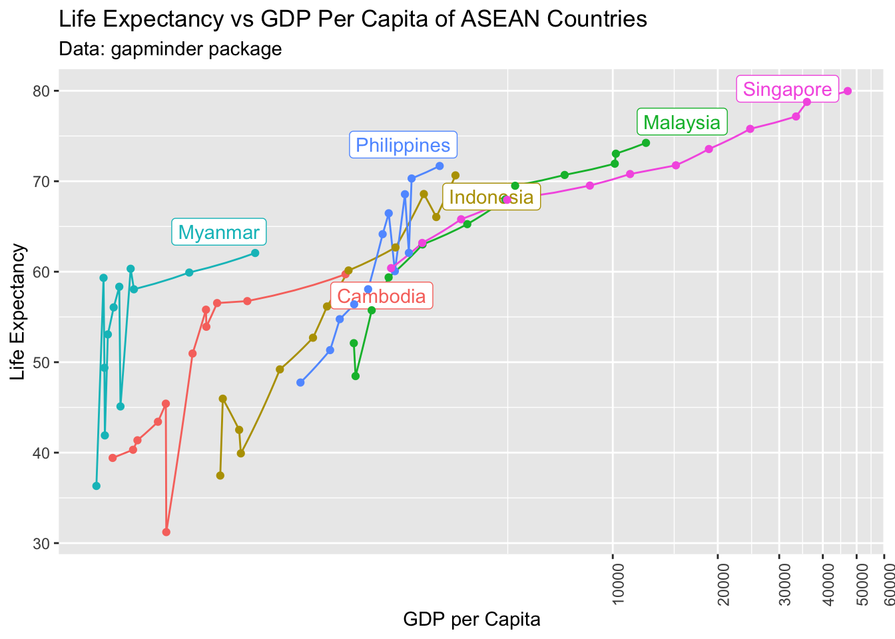

# Importing Public Data, WDI {#wdi}

## Reviews and Previews


```r
library(tidyverse)
library(gapminder)
library(maps)
library(WDI)
library(readxl)
library(ggrepel)
```

* We have used `tidyverse` and `gapminder` already.
* If you have not installed `WDI`, install it.
* We will not use `ggrepel` but if you want to use it, install it.
* `maps` and `readxl` are bundled in `tidyverse` but need to be attached by `library`.

---

### Gapminder Package Data


```r
df <- gapminder
df
#> # A tibble: 1,704 × 6
#>    country     continent  year lifeExp      pop gdpPercap
#>    <fct>       <fct>     <int>   <dbl>    <int>     <dbl>
#>  1 Afghanistan Asia       1952    28.8  8425333      779.
#>  2 Afghanistan Asia       1957    30.3  9240934      821.
#>  3 Afghanistan Asia       1962    32.0 10267083      853.
#>  4 Afghanistan Asia       1967    34.0 11537966      836.
#>  5 Afghanistan Asia       1972    36.1 13079460      740.
#>  6 Afghanistan Asia       1977    38.4 14880372      786.
#>  7 Afghanistan Asia       1982    39.9 12881816      978.
#>  8 Afghanistan Asia       1987    40.8 13867957      852.
#>  9 Afghanistan Asia       1992    41.7 16317921      649.
#> 10 Afghanistan Asia       1997    41.8 22227415      635.
#> # … with 1,694 more rows
```

---

### `gdpPercap` of ASEAN countries


```r
asean <- c("Brunei", "Cambodia", "Laos", "Myanmar", 
           "Philippines", "Indonesia", "Malaysia", "Singapore")
df %>% filter(country %in% asean) %>%
  ggplot(aes(x = year, y = gdpPercap, col = country)) + geom_line()
```

---


---


```r
df %>% filter(country %in% asean) %>%
  ggplot(aes(x = gdpPercap, y = lifeExp, col = country)) + geom_point()
```


---


```r
df %>% filter(country %in% asean) %>%
  ggplot(aes(x = gdpPercap, y = lifeExp, col = country)) + 
  geom_point() + coord_trans(x = "log10", y = "identity")
```


$\log_{10}{100}$ = 2, $\log_{10}{1000}$ = 3, $\log_{10}{10000}$ = 4

<!-- $10^{2.5}$ = 316.227766, $10^{3}$ = 1000, $10^{3.5}$ = 3162.2776602,  -->

<!-- $10^{4}$ = 10^{4}, $10^{4.5}$ = 3.1622777\times 10^{4}. -->

---


```r
library(ggrepel)
df2007 <- df %>% filter(country %in% asean, year == 2007)
df %>% filter(country %in% asean) %>%
  ggplot(aes(x = gdpPercap, y = lifeExp, col = country))+ 
  geom_line() + geom_label_repel(data = df2007, aes(label = country)) + geom_point()  +
  coord_trans(x = "log10", y = "identity") +
  theme(axis.text.x = element_text(angle = 90, vjust = 1, hjust=1), legend.position = "none") +
  labs(title = "Life Expectancy vs GDP Per Capita of ASEAN Countries",
       subtitle = "Data: gapminder package", x = "GDP per Capita", y = "Life Expectancy")
```

---




---


---

### World Bank: World Development Indicators (WDI)

* SP.DYN.LE00.IN: Life expectancy at birth, total (years)
* NY.GDP.PCAP.KD: GDP per capita (constant 2015 US$)
* SP.POP.TOTL: Population, total


```r
df_wdi <- WDI(
  country = "all", 
  indicator = c(lifeExp = "SP.DYN.LE00.IN", pop = "SP.POP.TOTL", gdpPercap = "NY.GDP.PCAP.KD")
)
```


