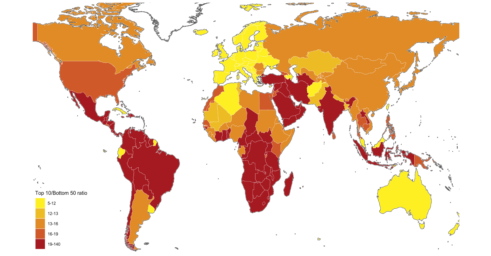

# `tidyr` {#tidy}

> We study the concept of tidy data and learn how to use the package `tidyr`, especially the functions `pivot_longer`, and it's converse `pivot_wider`. We also learn how to combine two data frames a little using functions of `dplyr`.

## Reviews and Previews

### Example: World Inequility Report - WIR2022

* World Inequality Report: https://wir2022.wid.world/
* Executive Summary: https://wir2022.wid.world/executive-summary/
* Methodology: https://wir2022.wid.world/methodology/
* Data URL: https://wir2022.wid.world/www-site/uploads/2022/03/WIR2022TablesFigures-Summary.xlsx

```{r}
library(tidyverse)
library(readxl)
```

```{r summary-data, cash = TRUE, eval = FALSE}
url_summary <- "https://wir2022.wid.world/www-site/uploads/2022/03/WIR2022TablesFigures-Summary.xlsx"
download.file(url = url_summary, destfile = "./data/WIR2022s.xlsx", mode = "wb") 
```

```{r}
excel_sheets("./data/WIR2022s.xlsx")
```

Recall that we added `mode = "wb"` because Excel files are binary files, not text files such as CSV files.

When we use Excel files, we see `...1`, `...2`, `...3`, etc., as column names. These are columns with no column names in the original Excel file, and `R` assigned column names automatically. 


### F1: Global income and wealth inequality, 2021

```{r data-f1, cash = TRUE, message = FALSE}
df_f1 <- read_excel("./data/WIR2022s.xlsx", sheet = "data-F1")
df_f1
```

The table above is nothing terrible; however, if we have it in the following format, we can construct a chart applying the color aesthetic mapping to the group.

```{r echo=FALSE}
df_f1_rev <- df_f1 %>% select(cat = ...1, 2:4) %>%
  pivot_longer(2:4, names_to = "group", values_to = "value")
df_f1_rev
```


```{r}
df_f1_rev %>%
  ggplot(aes(x = cat, y = value, fill = group)) +
  geom_col(position = "dodge")
```

We apply the `pivot_longer` function of the `tidyr` package, to transform the first table into the second. 

## References of `tidyr`

* Textbook: [R for Data Science,Tidy Data](https://r4ds.had.co.nz/tidy-data.html#tidy-data)

### RStudio Primers: See References in Moodle at the bottom

4. Tidy Your Data -- [r4ds: Wrangle, II](https://r4ds.had.co.nz/wrangle-intro.html#wrangle-intro)
  - [Reshape Data - a bit old](https://rstudio.cloud/learn/primers/4.1)
  - [Separate and Unite](https://rstudio.cloud/learn/primers/4.2) 
  - [Join Data Sets](https://rstudio.cloud/learn/primers/4.3)

The first component, 'Reshape Data' deals with `pivot_longer` and `pivot_wider`. However, it uses an older version of these functions calls `gather` and `spread`.

## Variables, values, and observations: Definitions

* A **variable** is a quantity, quality, or property that you can measure.
* A **value** is the state of a variable when you measure it. The value of a variable may change from measurement to measurement.
* An **observation** or **case** is a set of measurements made under similar conditions (you usually make all of the measurements in an observation at the same time and on the same object). An observation will contain several values, each associated with a different variable. I’ll sometimes refer to an observation as a case or data point.
* **Tabular data** is a table of values, each associated with a variable and an observation. Tabular data is tidy if each value is placed in its own cell, each variable in its own column, and each observation in its own row.
* So far, all of the data that you’ve seen has been tidy. In real-life, most data isn’t tidy, so we’ll come back to these ideas again in Data Wrangling.


## Tidy Data

> “Data comes in many formats, but R prefers just one: tidy data.” — Garrett Grolemund

Data can come in a variety of formats, but one format is easier to use in R than the others. This format is known as tidy data. A data set is tidy if:

1. Each variable is in its own column
2. Each observation is in its own row
3. Each value is in its own cell (this follows from #1 and #2)

> “Tidy data sets are all alike; but every messy data set is messy in its own way.” — Hadley Wickham

> “all happy families are all alike; each unhappy family is unhappy in its own way” - Tolstoy's Anna Karenina


## `tidyr` Basics

Let us look at the figure in [R4DS](https://d33wubrfki0l68.cloudfront.net/6f1ddb544fc5c69a2478e444ab8112fb0eea23f8/91adc/images/tidy-1.png).

```{r, echo=FALSE, out.width="100%"}
knitr::include_graphics("./data/tidy-1.png")
```

1. Each variable is in its own column
2. Each observation is in its own row


## Pivot data from wide to long: [`pivot_longer()`](https://tidyr.tidyverse.org/reference/pivot_longer.html)

```
pivot_longer(data, cols = <columns to pivot into longer format>,
  names_to = <name of the new character column>, # e.g. "group", "category", "class"
  values_to = <name of the column the values of cells go to>) # e.g. "value", "n"
```

```{r}
df_f1
```

```{r}
(df_f1_rev <- df_f1 %>% pivot_longer(-1, names_to = "group", values_to = "value"))
```

In the example above, `-1`, i.e., `cols = -1` stands for all colums except the first.

Now, we can use the `fill` aesthetic in addition to `position = "dodge"`. The default position is "stack".

```{r}
df_f1_rev %>% 
  ggplot(aes(x = ...1, y = value, fill = group)) +
  geom_col(position = "dodge")
```

Let us add the value as a label, change the y-axis to percent, and add the title. The interpretation and source are from the original

```{r eval=FALSE}
df_f1_rev %>% filter(group != "Top 1%") %>%
  ggplot() +
  geom_col(aes(x = ...1, y = value, fill = group), position = "dodge") +
  geom_text(aes(x = ...1, y = value, group = group, 
            label = scales::label_percent(accuracy=1)(value)), 
            position = position_dodge(width = 0.9)) + 
  scale_y_continuous(labels = scales::percent_format(accuracy = 1)) +
  labs(title = "Figure 1. Global income and wealth inequality, 2021",
       x = "", y = "Share of total income or wealth", fill = "")
```


```{r echo=FALSE}
df_f1_rev %>% filter(group != "Top 1%") %>%
  ggplot() +
  geom_col(aes(x = ...1, y = value, fill = group), position = "dodge") +
  geom_text(aes(x = ...1, y = value, group = group, 
            label = scales::label_percent(accuracy=1)(value)), 
            position = position_dodge(width = 0.9)) + 
  scale_y_continuous(labels = scales::percent_format(accuracy = 1)) +
  labs(title = "Figure 1. Global income and wealth inequality, 2021",
       x = "", y = "Share of total income or wealth", fill = "")
```
**Interpretation**: The global bottom 50% captures 8.5% of total income measured at Purchasing Power Parity (PPP). The global bottom 50% owns 2% of wealth (at Purchasing Power Parity). The global top 10% owns 76% of total Household wealth and captures 52% of total income in 2021. Note that top wealth holders are not necessarily top income holders. Incomes are measured after the operation of pension and unemployment systems and before taxes and transfers.  
**Sources and series**: wir2022.wid.world/methodology.

  
The next F2 is similar to F1.

## F2: The poorest half lags behind: Bottom 50%, middle 40% and top 10% income shares across the world in 2021

```{r}
df_f2 <- read_excel("./data/WIR2022s.xlsx", sheet = "data-F2")
df_f2
```


```{r}
df_f2 %>% pivot_longer(cols = 3:5, names_to = "group", values_to = "value")
```


```{r}
df_f2 %>% pivot_longer(cols = 3:5, names_to = "group", values_to = "value") %>%
  ggplot(aes(x = iso, y = value, fill = group)) +
  geom_col(position = "dodge")
```


## Pivot data from long to wide: 
[`pivot_wider()`](https://tidyr.tidyverse.org/reference/pivot_wider.html)
In Console: vignette("pivot") 

```
pivot_wider(data, 
  names_from = <name of the column (or columns) to get the name of the output column>,
  values_from = <name of the column to get the value of the output>) 
```


```{r echo = FALSE}
df_f2 %>% pivot_longer(cols = 3:5, names_to = "group", values_to = "value")
```

```
pivot_wider(data, names_from = group, values_from = value) 
```


## Practice: F4 and F13

F4 and F13 are similar. Please use `pivot_longer` to tidy the data and create charts.

* **References**: https://ds-sl.github.io/data-analysis/wir2022.nb.html

### Done Last Week

* F12: Female share in global labor incomes, 1990-2020
* F14: Global carbon inequality, 2019. Group contribution to world emissions (%)

The next is an example of the world map.

## F3: Top 10/Bottom 50 income gaps across the world, 2021


```{r}
df_f3 <- read_excel("./data/WIR2022s.xlsx", sheet = "data-F3")
df_f3
```


## F3: Top 10/Bottom 50 income gaps across the world, 2021 - Original

```{r, echo=FALSE, out.width="100%"}

```


* To 10 / Bottom 50 ratio has 5 classes: 5-12, 12-13, 13-16, 16-19, 19-140

* Let us look at the range and distribution of the values in `T10B50`.

```{r}
df_f3$T10B50 %>% summary()
```


```{r}
df_f3 %>% ggplot() + geom_histogram(aes(T10B50))
```


```{r}
df_f3 %>% arrange(desc(T10B50))
```

Using the information above, we set breakpoints and use R Base's `cut` command to divide into five classes, and add it as a new column using `mutate`

```{r}
df_f3 %>% 
  mutate(`Top 10 Bottom 50 Ratio` = cut(T10B50,breaks = c(5, 12, 13, 16, 19,140), 
                                        include.lowest = FALSE)) 
```


```{r}
world_map <- map_data("world")
df_f3 %>% mutate(`Top 10 Bottom 50 Ratio` = cut(T10B50,breaks = c(5, 12, 13, 16, 19,140), 
                                        include.lowest = FALSE)) %>%
  ggplot(aes(map_id = Country)) + 
  geom_map(aes(fill = `Top 10 Bottom 50 Ratio`), map = world_map) + 
  expand_limits(x = world_map$long, y = world_map$lat)
```

We observe that we have missing data from several countries. One common problem is the description of the country names varies in different data; in this case, the country names of `map_data()` and those of `wir2022`. There are several ways to edit country names. Here is one of them.

```{r}
world_map_wir <- world_map
world_map_wir$region[
  world_map_wir$region=="Democratic Republic of the Congo"]<-"DR Congo"
world_map_wir$region[world_map_wir$region=="Republic of Congo"]<-"Congo"
world_map_wir$region[world_map_wir$region=="Ivory Coast"]<-"Cote dIvoire"
world_map_wir$region[world_map_wir$region=="Vietnam"]<-"Viet Nam"
world_map_wir$region[world_map_wir$region=="Russia"]<-"Russian Federation"
world_map_wir$region[world_map_wir$region=="South Korea"]<-"Korea"
world_map_wir$region[world_map_wir$region=="UK"]<-"United Kingdom"
world_map_wir$region[world_map_wir$region=="Brunei"]<-"Brunei Darussalam"
world_map_wir$region[world_map_wir$region=="Laos"]<-"Lao PDR"
world_map_wir$region[world_map_wir$region=="Cote dIvoire"]<-"Cote d'Ivoire"
world_map_wir$region[world_map_wir$region=="Cape Verde"]<- "Cabo Verde"
world_map_wir$region[world_map_wir$region=="Syria"]<- "Syrian Arab Republic"
world_map_wir$region[world_map_wir$region=="Trinidad"]<- "Trinidad and Tobago"
world_map_wir$region[world_map_wir$region=="Tobago"]<- "Trinidad and Tobago"
```
  


```{r}
df_f3 %>% mutate(`Top 10 Bottom 50 Ratio` = 
    cut(T10B50, breaks = c(5, 12, 13, 16, 19,140), include.lowest = FALSE)) %>%
  ggplot(aes(map_id = Country)) + 
  geom_map(aes(fill = `Top 10 Bottom 50 Ratio`), 
    map = world_map_wir) + 
    expand_limits(x = world_map_wir$long, y = world_map_wir$lat)
```


Now it is much better. 


```{r}
df_f3 %>% mutate(`Top 10 Bottom 50 Ratio` = 
    cut(T10B50,breaks = c(5, 12, 13, 16, 19,140), include.lowest = FALSE)) %>%
  ggplot(aes(map_id = Country)) + geom_map(aes(fill = `Top 10 Bottom 50 Ratio`), 
    map = world_map_wir) + expand_limits(x = world_map_wir$long, y = world_map_wir$lat) + 
  coord_map("orthographic", orientation = c(25, 60, 0))
```


```{r}
df_f3 %>% mutate(`Top 10 Bottom 50 Ratio` = 
  cut(T10B50,breaks = c(5, 12, 13, 16, 19,140), include.lowest = FALSE)) %>%
  ggplot(aes(map_id = Country)) + geom_map(aes(fill = `Top 10 Bottom 50 Ratio`), 
    map = world_map_wir) + expand_limits(x = world_map_wir$long, y = world_map_wir$lat) + 
  coord_map("orthographic", orientation = c(15, -80, 0))
```


```{r}
df_f3 %>% mutate(`Top 10 Bottom 50 Ratio` = 
  cut(T10B50,breaks = c(5, 12, 13, 16, 19,140), include.lowest = FALSE)) %>%
  ggplot(aes(map_id = Country)) + geom_map(aes(fill = `Top 10 Bottom 50 Ratio`), 
    map = world_map_wir) + 
  expand_limits(x = world_map_wir$long, y = world_map_wir$lat)
```

Finally, change colors and change labels.

```{r eval = FALSE}
df_f3 %>% 
  mutate(`Top 10 Bottom 50 Ratio` = 
        cut(T10B50,breaks = c(5, 12, 13, 16, 19,140), include.lowest = FALSE)) %>%
  ggplot(aes(map_id = Country)) + 
  geom_map(aes(fill = `Top 10 Bottom 50 Ratio`), map = world_map_wir) + 
  expand_limits(x = world_map_wir$long, y = world_map_wir$lat)  + 
  labs(title = "Figure 3. Top 10/Bottom 50 income gaps across the world, 2021",
       x = "", y = "", fill = "Top 10/Bottom 50 ratio") +
  theme(legend.position="bottom", 
        axis.text.x=element_blank(), axis.ticks.x=element_blank(),
        axis.text.y=element_blank(), axis.ticks.y=element_blank()) + 
  scale_fill_brewer(palette='YlOrRd')
```


```{r echo = FALSE}
df_f3 %>% 
  mutate(`Top 10 Bottom 50 Ratio` = cut(T10B50,breaks = c(5, 12, 13, 16, 19,140), include.lowest = FALSE)) %>%
  ggplot(aes(map_id = Country)) + geom_map(aes(fill = `Top 10 Bottom 50 Ratio`), map = world_map_wir) + expand_limits(x = world_map_wir$long, y = world_map_wir$lat)  + 
  labs(title = "Figure 3. Top 10/Bottom 50 income gaps across the world, 2021",
       x = "", y = "", fill = "Top 10/Bottom 50 ratio") +
  theme(legend.position="bottom", 
        axis.text.x=element_blank(), axis.ticks.x=element_blank(),
        axis.text.y=element_blank(), axis.ticks.y=element_blank()) + 
  scale_fill_brewer(palette='YlOrRd')
```

We could not treat the data of three. We can check by using `anti_join`.

```{r}
df_f3 %>% anti_join(world_map_wir, by = c("Country" = "region"))
```

**Filtering joins**

* `anti_join(x,y, ...)`: return all rows from x without a match in y.
* `semi_join(x,y, ...)`: return all rows from x with a match in y.

Check `dplyr` cheat sheet, and Posit Primers Tidy Data.


## Remaining Charts

* F5: Global income inequality: T10/B50 ratio, 1820-2020 - fit curve
* F9: Average annual wealth growth rate, 1995-2021 - fit curve + alpha
* F7: Global income inequality, 1820-2020 - pivot + fit curve
* F10: The share of wealth owned by the global 0.1% and billionaires, 2021 - pivot + fit curve


* F6: Global income inequality: Between vs. Within country inequality (Theil index), 1820-2020 - pivot + area

* F11: Top 1% vs bottom 50% wealth shares in Western Europe and the US, 1910-2020 - pivot name_sep + fit curve
* F8: The rise of private versus the decline of public wealth in rich countries, 1970-2020 - rename + pivot + pivot + fit curve

* F15: Per capita emissions acriss the world, 2019 - add row names + dodge


We will discuss `geom_smooth` and `stat_smooth` in Chapter \@ref(model) applied to F5, F9, F7, F10.

## F5: Global income inequality: T10/B50 ratio, 1820-2020

```{r data-f5, cash = TRUE}
(df_f5 <- read_excel("./data/WIR2022s.xlsx", sheet = "data-F5"))
```


```{r}
df_f5 %>% ggplot(aes(x = y, y = t10b50)) + geom_line() + geom_smooth(span=0.25, se=FALSE)
```


## F9: Average annual wealth growth rate, 1995-2021 - fit curve + alpha

```{r data-f9, cash = TRUE}
df_f9 <- read_excel("./data/WIR2022s.xlsx", sheet = "data-F9"); df_f9
```


```{r}
df_f9 %>% 
  ggplot(aes(x = p, y = `Wealth growth 1995-2021`)) + geom_smooth(span = 0.30, se = FALSE)
```


## F7: Global income inequality, 1820-2020 - pivot + fit curve

```{r data-f7, cash = TRUE}
df_f7 <- read_excel("./data/WIR2022s.xlsx", sheet = "data-F7"); df_f7
```


```{r}
df_f7 %>% 
  pivot_longer(cols = 2:4, names_to = "type", values_to = "value") %>%
  ggplot(aes(x = y, y = value, color = type)) +
  stat_smooth(formula = y~x, method = "loess", span = 0.25, se = FALSE)
```


## F10: The share of wealth owned by the global 0.1% and billionaires, 2021 - pivot + fit curve

```{r data-f10, cash = TRUE}
df_f10 <- read_excel("./data/WIR2022s.xlsx", sheet = "data-F10"); df_f10
```


```{r}
df_f10 %>% 
  select(year, "Global Billionaire Wealth" = bn_hhweal, "Top 0.01%" = top0.1_hhweal) %>%
  pivot_longer(!year, names_to = "group", values_to = "value")
```


```{r}
df_f10 %>% 
  select(year, "Global Billionaire Wealth" = bn_hhweal, "Top 0.01%" = top0.1_hhweal) %>%
  pivot_longer(!year, names_to = "group", values_to = "value") %>%
  ggplot() +
  stat_smooth(aes(x = year, y = value, color = group), formula = y~x, method = "loess", span = 0.25, se = FALSE)
```


## F6: Global income inequality: Between vs. Within country inequality (Theil index), 1820-2020 - pivot + area

```{r data-f6, cash = TRUE}
df_f6 <- read_excel("./data/WIR2022s.xlsx", sheet = "data-F6"); df_f6
```


```{r eval =FALSE}
df_f6 %>% select(year = "...1", 2:3) %>%
  pivot_longer(cols = 2:3, names_to = "type", values_to = "value") %>%
  mutate(types = factor(type, 
      levels = c("Within-country inequality", "Between-country inequality"))) %>%
  ggplot(aes(x = year, y = value, fill = types)) +
  geom_area() +
  scale_y_continuous(labels = scales::percent_format(accuracy = 1)) +
  scale_x_continuous(breaks = round(seq(1820, 2020, by = 20),1)) + 
  scale_fill_manual(values=rev(scales::hue_pal()(2)), 
      labels = function(x) str_wrap(x, width = 15)) +
  labs(title = "Figure 6. Global income inequality: 
       \nBetween vs. within country inequality (Theil index), 1820-2020",
       x = "", y = "Share of global inequality (% of total Theil index)", fill = "") + 
  annotate("text", x = 1850, y = 0.28, 
      label = stringr::str_wrap("1820: Between country inequality represents 11% 
                                of global inequality", width = 20), size = 3) + 
  annotate("text", x = 1980, y = 0.70, 
      label = stringr::str_wrap("1980: Between country inequality represents 57% 
                                of global inequality", width = 20), size = 3) +
  annotate("text", x = 1990, y = 0.30, 
      label = stringr::str_wrap("2020: Between country inequality represents 32% 
                                of global inequality", width = 20), size = 3)
```


```{r echo =FALSE}
df_f6 %>% select(year = "...1", 2:3) %>%
  pivot_longer(cols = 2:3, names_to = "type", values_to = "value") %>%
  mutate(types = factor(type, 
      levels = c("Within-country inequality", "Between-country inequality"))) %>%
  ggplot(aes(x = year, y = value, fill = types)) +
  geom_area() +
  scale_y_continuous(labels = scales::percent_format(accuracy = 1)) +
  scale_x_continuous(breaks = round(seq(1820, 2020, by = 20),1)) + 
  scale_fill_manual(values=rev(scales::hue_pal()(2)), 
      labels = function(x) str_wrap(x, width = 15)) +
  labs(title = "Figure 6. Global income inequality: 
       \nBetween vs. within country inequality (Theil index), 1820-2020",
       x = "", y = "Share of global inequality (% of total Theil index)", fill = "") + 
  annotate("text", x = 1850, y = 0.28, 
      label = stringr::str_wrap("1820: Between country inequality represents 11% 
                                of global inequality", width = 20), size = 3) + 
  annotate("text", x = 1980, y = 0.70, 
      label = stringr::str_wrap("1980: Between country inequality represents 57% 
                                of global inequality", width = 20), size = 3) +
  annotate("text", x = 1990, y = 0.30, 
      label = stringr::str_wrap("2020: Between country inequality represents 32% 
                                of global inequality", width = 20), size = 3)
```


## F11: Top 1% vs bottom 50% wealth shares in Western Europe and the US, 1910-2020 - pivot name_sep + fit curve

```{r data-f11, cash = TRUE}
df_f11 <- read_excel("./data/WIR2022s.xlsx", sheet = "data-F11"); df_f11
```

We want to separate 'US', 'EU' and 'bot50', 'top10', and 'top1'. To apply `names_sep = "_"`, we first changed the name of columns. 

```{r eval = FALSE}
df_f11 %>% 
  rename(!year, US_bot50 = USbot50, US_top1 = UStop1, 
         EU_bot50 = EUbot50, EU_top1 = EUtop1) %>%
  pivot_longer(!year, names_to = c("group",".value"), names_sep = "_") %>%
  pivot_longer(3:4, names_to = "type", values_to = "value") %>%
  ggplot() +
  stat_smooth(aes(x = year, y = value, color = group, linetype = type), 
              span = 0.25, se = FALSE) +
  scale_x_continuous(breaks = round(seq(1910, 2020, by = 10),1)) +
  scale_y_continuous(labels = scales::percent_format(accuracy = 1)) +
  labs(title = "Figure 11. Top 1% vs bottom 50% wealth shares 
       \n in Western Europe and the US, 1910-2020", 
       x = "", y = "Share of total personal wealth (%)", color = "", linetype = "") +
  scale_linetype_manual(values = c("dotted","solid")) +
  annotate("text", x = 2000, y = 0.50, 
      label = stringr::str_wrap("Wealth inequality has been rising at 
        different speeds after a historical decline. The bottom 50% has always been 
                                extremely low.", width = 30), size = 3)
```


### Step 1.

```{r}
df_f11 %>% rename(!year, US_bot50 = USbot50, US_top1 = UStop1, 
                  EU_bot50 = EUbot50, EU_top1 = EUtop1) 
```


### Step 2. 

```{r warning = FALSE, eval=FALSE}
df_f11 %>% 
  rename(!year, US_bot50 = USbot50, US_top1 = UStop1, 
         EU_bot50 = EUbot50, EU_top1 = EUtop1) %>%
  pivot_longer(!year, names_to = c("group",".value"), names_sep = "_")
```


### Step 2. 

```{r warning = FALSE, echo=FALSE}
df_f11 %>% 
  rename(!year, US_bot50 = USbot50, US_top1 = UStop1, EU_bot50 = EUbot50, EU_top1 = EUtop1) %>%
  pivot_longer(!year, names_to = c("group",".value"), names_sep = "_")
```


### Step 3.

```{r warning = FALSE, eval=FALSE}
df_f11 %>% 
  rename(!year, US_bot50 = USbot50, US_top1 = UStop1, 
         EU_bot50 = EUbot50, EU_top1 = EUtop1) %>%
  pivot_longer(!year, names_to = c("group",".value"), 
               names_sep = "_") %>%
  pivot_longer(3:4, names_to = "type", values_to = "value") 
```


### Step 3.

```{r warning = FALSE, echo=FALSE}
df_f11 %>% 
  rename(!year, US_bot50 = USbot50, US_top1 = UStop1, EU_bot50 = EUbot50, EU_top1 = EUtop1) %>%
  pivot_longer(!year, names_to = c("group",".value"), names_sep = "_") %>%
  pivot_longer(3:4, names_to = "type", values_to = "value") 
```


```{r warning = FALSE, echo=FALSE}
df_f11 %>% 
  rename(!year, US_bot50 = USbot50, US_top1 = UStop1, EU_bot50 = EUbot50, EU_top1 = EUtop1) %>%
  pivot_longer(!year, names_to = c("group",".value"), names_sep = "_") %>%
  pivot_longer(3:4, names_to = "type", values_to = "value") %>%
  ggplot() +
  stat_smooth(aes(x = year, y = value, color = group, linetype = type), formula = y ~ x, method = "loess", span = 0.25, se = FALSE) +
  scale_x_continuous(breaks = round(seq(1910, 2020, by = 10),1)) +
  scale_y_continuous(labels = scales::percent_format(accuracy = 1)) +
  labs(title = "Figure 11. Top 1% vs bottom 50% wealth shares \n in Western Europe and the US, 1910-2020", 
       x = "", y = "Share of total personal wealth (%)", color = "", linetype = "") +
  scale_linetype_manual(values = c("dotted","solid")) +
  annotate("text", x = 2000, y = 0.50, label = stringr::str_wrap("Wealth inequality has been rising at different speeds after a historical decline. The bottom 50% has always been extremely low.", width = 30), size = 3)
```


The following is similar to the previous example. 

## F8: The rise of private versus the decline of public wealth in rich countries, 1970-2020 - rename + pivot + pivot + fit curve

```{r data-f8, cash = TRUE}
df_f8 <- read_excel("./data/WIR2022s.xlsx", sheet = "data-F8"); df_f8
```


```{r warning=FALSE, eval = FALSE}
df_f8 %>% 
  select(year, Germany_public = Germany, Germany_private = 'Germany (private)', 
         Spain_public = Spain, Spain_private = 'Spain (private)', 
         France_public = France, France_private = 'France (private)', 
         UK_public  = UK, UK_private = 'UK (private)', 
         Japan_public = Japan, Japan_private = 'Japan (private)', 
         Norway_public = Norway, Norway_private = 'Norway (private)',
         USA_public = USA, USA_private = 'USA (private)') %>%
  pivot_longer(!year, names_to = c("country",".value"), names_sep = "_") %>%
  pivot_longer(3:4, names_to = "type", values_to = "value") %>%
  ggplot() +
  stat_smooth(aes(x = year, y = value, color = country, linetype = type), 
              span = 0.25, se = FALSE, size=0.75) +
  scale_y_continuous(labels = scales::percent_format(accuracy = 1)) +
  labs(title = "Figure 8. The rise of private versus the decline of public 
       wealth in rich countries, 1970-2020", 
       x = "", y = "wealth as as % of national income", color = "", type = "")
```


### Step 1

```{r warning=FALSE, eval=FALSE}
df_f8 %>% 
  select(year, Germany_public = Germany, Germany_private = 'Germany (private)', 
         Spain_public = Spain, Spain_private = 'Spain (private)', 
         France_public = France, France_private = 'France (private)', 
         UK_public  = UK, UK_private = 'UK (private)', 
         Japan_public = Japan, Japan_private = 'Japan (private)', 
         Norway_public = Norway, Norway_private = 'Norway (private)',
         USA_public = USA, USA_private = 'USA (private)') 
```


```{r warning=FALSE, echo=FALSE}
df_f8 %>% 
  select(year, Germany_public = Germany, Germany_private = 'Germany (private)', 
         Spain_public = Spain, Spain_private = 'Spain (private)', 
         France_public = France, France_private = 'France (private)', 
         UK_public  = UK, UK_private = 'UK (private)', 
         Japan_public = Japan, Japan_private = 'Japan (private)', 
         Norway_public = Norway, Norway_private = 'Norway (private)',
         USA_public = USA, USA_private = 'USA (private)')
```


### Step 2.

```{r warning=FALSE, eval=FALSE}
df_f8 %>% 
  select(year, Germany_public = Germany, Germany_private = 'Germany (private)', 
         Spain_public = Spain, Spain_private = 'Spain (private)', 
         France_public = France, France_private = 'France (private)', 
         UK_public  = UK, UK_private = 'UK (private)', 
         Japan_public = Japan, Japan_private = 'Japan (private)', 
         Norway_public = Norway, Norway_private = 'Norway (private)',
         USA_public = USA, USA_private = 'USA (private)') %>%
  pivot_longer(!year, names_to = c("country",".value"), names_sep = "_") 
```


```{r warning=FALSE, echo=FALSE}
df_f8 %>% 
  select(year, Germany_public = Germany, Germany_private = 'Germany (private)', 
         Spain_public = Spain, Spain_private = 'Spain (private)', 
         France_public = France, France_private = 'France (private)', 
         UK_public  = UK, UK_private = 'UK (private)', 
         Japan_public = Japan, Japan_private = 'Japan (private)', 
         Norway_public = Norway, Norway_private = 'Norway (private)',
         USA_public = USA, USA_private = 'USA (private)') %>%
  pivot_longer(!year, names_to = c("country",".value"), names_sep = "_")
```


### Step 3.

```{r warning=FALSE, eval=FALSE}
df_f8 %>% 
  select(year, Germany_public = Germany, Germany_private = 'Germany (private)', 
         Spain_public = Spain, Spain_private = 'Spain (private)', 
         France_public = France, France_private = 'France (private)', 
         UK_public  = UK, UK_private = 'UK (private)', 
         Japan_public = Japan, Japan_private = 'Japan (private)', 
         Norway_public = Norway, Norway_private = 'Norway (private)',
         USA_public = USA, USA_private = 'USA (private)') %>%
  pivot_longer(!year, names_to = c("country",".value"), names_sep = "_") %>%
  pivot_longer(3:4, names_to = "type", values_to = "value")
```


```{r warning=FALSE, echo=FALSE}
df_f8 %>% 
  select(year, Germany_public = Germany, Germany_private = 'Germany (private)', 
         Spain_public = Spain, Spain_private = 'Spain (private)', 
         France_public = France, France_private = 'France (private)', 
         UK_public  = UK, UK_private = 'UK (private)', 
         Japan_public = Japan, Japan_private = 'Japan (private)', 
         Norway_public = Norway, Norway_private = 'Norway (private)',
         USA_public = USA, USA_private = 'USA (private)') %>%
  pivot_longer(!year, names_to = c("country",".value"), names_sep = "_") %>%
  pivot_longer(3:4, names_to = "type", values_to = "value") 
```


### Step 3. Final Step

```{r eval=FALSE, warning=FALSE}
df_f8 %>% 
  select(year, Germany_public = Germany, Germany_private = 'Germany (private)', 
         Spain_public = Spain, Spain_private = 'Spain (private)', 
         France_public = France, France_private = 'France (private)', 
         UK_public  = UK, UK_private = 'UK (private)', 
         Japan_public = Japan, Japan_private = 'Japan (private)', 
         Norway_public = Norway, Norway_private = 'Norway (private)',
         USA_public = USA, USA_private = 'USA (private)') %>%
  pivot_longer(!year, names_to = c("country",".value"), names_sep = "_") %>%
  pivot_longer(3:4, names_to = "type", values_to = "value") %>%
  ggplot() +
  stat_smooth(aes(x = year, y = value, color = country, linetype = type), 
              formula = y~x, method = "loess", span = 0.25, se = FALSE, size=0.75) +
  scale_y_continuous(labels = scales::percent_format(accuracy = 1)) +
  labs(title = "Figure 8. The rise of private versus the decline of public wealth 
       \nin rich countries, 1970-2020", 
       x = "", y = "wealth as as % of national income", color = "", type = "")
```


```{r echo=FALSE, warning=FALSE}
df_f8 %>% 
  select(year, Germany_public = Germany, Germany_private = 'Germany (private)', 
         Spain_public = Spain, Spain_private = 'Spain (private)', 
         France_public = France, France_private = 'France (private)', 
         UK_public  = UK, UK_private = 'UK (private)', 
         Japan_public = Japan, Japan_private = 'Japan (private)', 
         Norway_public = Norway, Norway_private = 'Norway (private)',
         USA_public = USA, USA_private = 'USA (private)') %>%
  pivot_longer(!year, names_to = c("country",".value"), names_sep = "_") %>%
  pivot_longer(3:4, names_to = "type", values_to = "value") %>%
  ggplot() +
  stat_smooth(aes(x = year, y = value, color = country, linetype = type), 
              formula = y~x, method = "loess", span = 0.25, se = FALSE, size=0.75) +
  scale_y_continuous(labels = scales::percent_format(accuracy = 1)) +
  labs(title = "Figure 8. The rise of private versus the decline of public wealth 
       \nin rich countries, 1970-2020", 
       x = "", y = "wealth as as % of national income", color = "", type = "")
```


## F15: Per capita emissions acriss the world, 2019 - add row names + dodge

```{r data-f15, cash = TRUE}
df_f15 <- read_excel("./data/WIR2022s.xlsx", sheet = "data-F15"); df_f15
```


```{r eval = FALSE}
df_f15 %>% mutate(region = rep(regionWID[!is.na(regionWID)], each = 3)) %>%
  select(region, group, tcap) %>%
  ggplot(aes(x = region, y = tcap, fill = group)) +
  geom_col(position = "dodge") + 
  scale_x_discrete(labels = function(x) stringr::str_wrap(x, width = 10)) +
  labs(title = "Figure 15 Per capita emissions across the world, 2019", 
       x = "", y = "tonnes of CO2e per person per year", fill = "")
```


```{r echo = FALSE}
df_f15 %>% mutate(region = rep(regionWID[!is.na(regionWID)], each = 3)) %>%
  select(region, group, tcap) %>%
  ggplot(aes(x = region, y = tcap, fill = group)) +
  geom_col(position = "dodge") + 
  scale_x_discrete(labels = function(x) stringr::str_wrap(x, width = 10)) +
  labs(title = "Figure 15 Per capita emissions across the world, 2019", 
       x = "", y = "tonnes of CO2e per person per year", fill = "")
```

Review one by one, referring to the following.


**References**: https://ds-sl.github.io/data-analysis/wir2022.nb.html