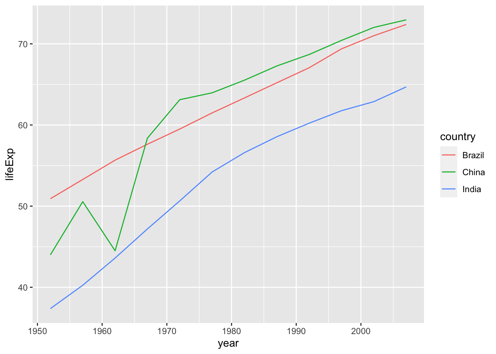

# Data Transforamtion with `dplyr` {#dplyr}


```r
library(tidyverse)
#> ── Attaching packages ─────────────────── tidyverse 1.3.2 ──
#> ✔ ggplot2 3.4.0      ✔ purrr   1.0.0 
#> ✔ tibble  3.1.8      ✔ dplyr   1.0.10
#> ✔ tidyr   1.2.1      ✔ stringr 1.5.0 
#> ✔ readr   2.1.3      ✔ forcats 0.5.2 
#> ── Conflicts ────────────────────── tidyverse_conflicts() ──
#> ✖ dplyr::filter() masks stats::filter()
#> ✖ dplyr::lag()    masks stats::lag()
```


## `dplyr` [Overview](https://dplyr.tidyverse.org)

dplyr is a grammar of data manipulation, providing a consistent set of verbs that help you solve the most common data manipulation challenges:

* `select()` picks variables based on their names.
* `filter()` picks cases based on their values.
* `mutate()` adds new variables that are functions of existing variables
* `summarise()` reduces multiple values down to a single summary.
* `arrange()` changes the ordering of the rows.
* `group_by()` takes an existing tbl and converts it into a grouped tbl.

You can learn more about them in vignette("dplyr"). As well as these single-table verbs, dplyr also provides a variety of two-table verbs, which you can learn about in vignette("two-table").

If you are new to dplyr, the best place to start is [the data transformation chapter in R for data science](http://r4ds.had.co.nz/transform.html).

---

## [`select`](https://dplyr.tidyverse.org/reference/select.html): Subset columns using their names and types

Helper Function	| Use	| Example
---|-------|--------
-	| Columns except	| select(babynames, -prop)
:	| Columns between (inclusive)	| select(babynames, year:n)
contains() |	Columns that contains a string |	select(babynames, contains("n"))
ends_with()	| Columns that ends with a string	| select(babynames, ends_with("n"))
matches()	| Columns that matches a regex |	select(babynames, matches("n"))
num_range()	| Columns with a numerical suffix in the range | Not applicable with babynames
one_of() |	Columns whose name appear in the given set |	select(babynames, one_of(c("sex", "gender")))
starts_with()	| Columns that starts with a string	| select(babynames, starts_with("n"))

---

## [`filter`](https://dplyr.tidyverse.org/reference/filter.html): Subset rows using column values

Logical operator	| tests	| Example
--|-----|---
>	| Is x greater than y? |	x > y
>=	| Is x greater than or equal to y? |	x >= y
<	| Is x less than y?	| x < y
<=	| Is x less than or equal to y? | 	x <= y
==	| Is x equal to y? |	x == y
!=	| Is x not equal to y? |	x != y
is.na()	| Is x an NA?	| is.na(x)
!is.na() |	Is x not an NA? |	!is.na(x)

---

## [`arrange`](https://dplyr.tidyverse.org/reference/arrange.html) and `Pipe %>%`

* `arrange()` orders the rows of a data frame by the values of selected columns.

Unlike other `dplyr` verbs, `arrange()` largely ignores grouping; you need to explicitly mention grouping variables (`or use .by_group = TRUE) in order to group by them, and functions of variables are evaluated once per data frame, not once per group.

* [`pipes`](https://r4ds.had.co.nz/pipes.html) in R for Data Science.

---

## [`mutate`](https://dplyr.tidyverse.org/reference/mutate.html) 

* Create, modify, and delete columns

* Useful mutate functions

  - +, -, log(), etc., for their usual mathematical meanings

  - lead(), lag()

  - dense_rank(), min_rank(), percent_rank(), row_number(), cume_dist(), ntile()

  - cumsum(), cummean(), cummin(), cummax(), cumany(), cumall()

  - na_if(), coalesce()### `group_by()` and `summarise()`

---

## [`group_by`](https://dplyr.tidyverse.org/reference/group_by.html)

---

## [`summarise` or `summarize`](https://dplyr.tidyverse.org/reference/summarise.html)

#### Summary functions

So far our summarise() examples have relied on sum(), max(), and mean(). But you can use any function in summarise() so long as it meets one criteria: the function must take a vector of values as input and return a single value as output. Functions that do this are known as summary functions and they are common in the field of descriptive statistics. Some of the most useful summary functions include:

1. Measures of location - mean(x), median(x), quantile(x, 0.25), min(x), and max(x)
2. Measures of spread - sd(x), var(x), IQR(x), and mad(x)
3. Measures of position - first(x), nth(x, 2), and last(x)
4. Counts - n_distinct(x) and n(), which takes no arguments, and returns the size of the current group or data frame.
5. Counts and proportions of logical values - sum(!is.na(x)), which counts the number of TRUEs returned by a logical test; mean(y == 0), which returns the proportion of TRUEs returned by a logical test.


  - if_else(), recode(), case_when()

---

## Learn `dplyr` by Examples

### Data `iris`


```r
iris
#>     Sepal.Length Sepal.Width Petal.Length Petal.Width
#> 1            5.1         3.5          1.4         0.2
#> 2            4.9         3.0          1.4         0.2
#> 3            4.7         3.2          1.3         0.2
#> 4            4.6         3.1          1.5         0.2
#> 5            5.0         3.6          1.4         0.2
#> 6            5.4         3.9          1.7         0.4
#> 7            4.6         3.4          1.4         0.3
#> 8            5.0         3.4          1.5         0.2
#> 9            4.4         2.9          1.4         0.2
#> 10           4.9         3.1          1.5         0.1
#> 11           5.4         3.7          1.5         0.2
#> 12           4.8         3.4          1.6         0.2
#> 13           4.8         3.0          1.4         0.1
#> 14           4.3         3.0          1.1         0.1
#> 15           5.8         4.0          1.2         0.2
#> 16           5.7         4.4          1.5         0.4
#> 17           5.4         3.9          1.3         0.4
#> 18           5.1         3.5          1.4         0.3
#> 19           5.7         3.8          1.7         0.3
#> 20           5.1         3.8          1.5         0.3
#> 21           5.4         3.4          1.7         0.2
#> 22           5.1         3.7          1.5         0.4
#> 23           4.6         3.6          1.0         0.2
#> 24           5.1         3.3          1.7         0.5
#> 25           4.8         3.4          1.9         0.2
#> 26           5.0         3.0          1.6         0.2
#> 27           5.0         3.4          1.6         0.4
#> 28           5.2         3.5          1.5         0.2
#> 29           5.2         3.4          1.4         0.2
#> 30           4.7         3.2          1.6         0.2
#> 31           4.8         3.1          1.6         0.2
#> 32           5.4         3.4          1.5         0.4
#> 33           5.2         4.1          1.5         0.1
#> 34           5.5         4.2          1.4         0.2
#> 35           4.9         3.1          1.5         0.2
#> 36           5.0         3.2          1.2         0.2
#> 37           5.5         3.5          1.3         0.2
#> 38           4.9         3.6          1.4         0.1
#> 39           4.4         3.0          1.3         0.2
#> 40           5.1         3.4          1.5         0.2
#> 41           5.0         3.5          1.3         0.3
#> 42           4.5         2.3          1.3         0.3
#> 43           4.4         3.2          1.3         0.2
#> 44           5.0         3.5          1.6         0.6
#> 45           5.1         3.8          1.9         0.4
#> 46           4.8         3.0          1.4         0.3
#> 47           5.1         3.8          1.6         0.2
#> 48           4.6         3.2          1.4         0.2
#> 49           5.3         3.7          1.5         0.2
#> 50           5.0         3.3          1.4         0.2
#> 51           7.0         3.2          4.7         1.4
#> 52           6.4         3.2          4.5         1.5
#> 53           6.9         3.1          4.9         1.5
#> 54           5.5         2.3          4.0         1.3
#> 55           6.5         2.8          4.6         1.5
#> 56           5.7         2.8          4.5         1.3
#> 57           6.3         3.3          4.7         1.6
#> 58           4.9         2.4          3.3         1.0
#> 59           6.6         2.9          4.6         1.3
#> 60           5.2         2.7          3.9         1.4
#> 61           5.0         2.0          3.5         1.0
#> 62           5.9         3.0          4.2         1.5
#> 63           6.0         2.2          4.0         1.0
#> 64           6.1         2.9          4.7         1.4
#> 65           5.6         2.9          3.6         1.3
#> 66           6.7         3.1          4.4         1.4
#> 67           5.6         3.0          4.5         1.5
#> 68           5.8         2.7          4.1         1.0
#> 69           6.2         2.2          4.5         1.5
#> 70           5.6         2.5          3.9         1.1
#> 71           5.9         3.2          4.8         1.8
#> 72           6.1         2.8          4.0         1.3
#> 73           6.3         2.5          4.9         1.5
#> 74           6.1         2.8          4.7         1.2
#> 75           6.4         2.9          4.3         1.3
#> 76           6.6         3.0          4.4         1.4
#> 77           6.8         2.8          4.8         1.4
#> 78           6.7         3.0          5.0         1.7
#> 79           6.0         2.9          4.5         1.5
#> 80           5.7         2.6          3.5         1.0
#> 81           5.5         2.4          3.8         1.1
#> 82           5.5         2.4          3.7         1.0
#> 83           5.8         2.7          3.9         1.2
#> 84           6.0         2.7          5.1         1.6
#> 85           5.4         3.0          4.5         1.5
#> 86           6.0         3.4          4.5         1.6
#> 87           6.7         3.1          4.7         1.5
#> 88           6.3         2.3          4.4         1.3
#> 89           5.6         3.0          4.1         1.3
#> 90           5.5         2.5          4.0         1.3
#> 91           5.5         2.6          4.4         1.2
#> 92           6.1         3.0          4.6         1.4
#> 93           5.8         2.6          4.0         1.2
#> 94           5.0         2.3          3.3         1.0
#> 95           5.6         2.7          4.2         1.3
#> 96           5.7         3.0          4.2         1.2
#> 97           5.7         2.9          4.2         1.3
#> 98           6.2         2.9          4.3         1.3
#> 99           5.1         2.5          3.0         1.1
#> 100          5.7         2.8          4.1         1.3
#> 101          6.3         3.3          6.0         2.5
#> 102          5.8         2.7          5.1         1.9
#> 103          7.1         3.0          5.9         2.1
#> 104          6.3         2.9          5.6         1.8
#> 105          6.5         3.0          5.8         2.2
#> 106          7.6         3.0          6.6         2.1
#> 107          4.9         2.5          4.5         1.7
#> 108          7.3         2.9          6.3         1.8
#> 109          6.7         2.5          5.8         1.8
#> 110          7.2         3.6          6.1         2.5
#> 111          6.5         3.2          5.1         2.0
#> 112          6.4         2.7          5.3         1.9
#> 113          6.8         3.0          5.5         2.1
#> 114          5.7         2.5          5.0         2.0
#> 115          5.8         2.8          5.1         2.4
#> 116          6.4         3.2          5.3         2.3
#> 117          6.5         3.0          5.5         1.8
#> 118          7.7         3.8          6.7         2.2
#> 119          7.7         2.6          6.9         2.3
#> 120          6.0         2.2          5.0         1.5
#> 121          6.9         3.2          5.7         2.3
#> 122          5.6         2.8          4.9         2.0
#> 123          7.7         2.8          6.7         2.0
#> 124          6.3         2.7          4.9         1.8
#> 125          6.7         3.3          5.7         2.1
#> 126          7.2         3.2          6.0         1.8
#> 127          6.2         2.8          4.8         1.8
#> 128          6.1         3.0          4.9         1.8
#> 129          6.4         2.8          5.6         2.1
#> 130          7.2         3.0          5.8         1.6
#> 131          7.4         2.8          6.1         1.9
#> 132          7.9         3.8          6.4         2.0
#> 133          6.4         2.8          5.6         2.2
#> 134          6.3         2.8          5.1         1.5
#> 135          6.1         2.6          5.6         1.4
#> 136          7.7         3.0          6.1         2.3
#> 137          6.3         3.4          5.6         2.4
#> 138          6.4         3.1          5.5         1.8
#> 139          6.0         3.0          4.8         1.8
#> 140          6.9         3.1          5.4         2.1
#> 141          6.7         3.1          5.6         2.4
#> 142          6.9         3.1          5.1         2.3
#> 143          5.8         2.7          5.1         1.9
#> 144          6.8         3.2          5.9         2.3
#> 145          6.7         3.3          5.7         2.5
#> 146          6.7         3.0          5.2         2.3
#> 147          6.3         2.5          5.0         1.9
#> 148          6.5         3.0          5.2         2.0
#> 149          6.2         3.4          5.4         2.3
#> 150          5.9         3.0          5.1         1.8
#>        Species
#> 1       setosa
#> 2       setosa
#> 3       setosa
#> 4       setosa
#> 5       setosa
#> 6       setosa
#> 7       setosa
#> 8       setosa
#> 9       setosa
#> 10      setosa
#> 11      setosa
#> 12      setosa
#> 13      setosa
#> 14      setosa
#> 15      setosa
#> 16      setosa
#> 17      setosa
#> 18      setosa
#> 19      setosa
#> 20      setosa
#> 21      setosa
#> 22      setosa
#> 23      setosa
#> 24      setosa
#> 25      setosa
#> 26      setosa
#> 27      setosa
#> 28      setosa
#> 29      setosa
#> 30      setosa
#> 31      setosa
#> 32      setosa
#> 33      setosa
#> 34      setosa
#> 35      setosa
#> 36      setosa
#> 37      setosa
#> 38      setosa
#> 39      setosa
#> 40      setosa
#> 41      setosa
#> 42      setosa
#> 43      setosa
#> 44      setosa
#> 45      setosa
#> 46      setosa
#> 47      setosa
#> 48      setosa
#> 49      setosa
#> 50      setosa
#> 51  versicolor
#> 52  versicolor
#> 53  versicolor
#> 54  versicolor
#> 55  versicolor
#> 56  versicolor
#> 57  versicolor
#> 58  versicolor
#> 59  versicolor
#> 60  versicolor
#> 61  versicolor
#> 62  versicolor
#> 63  versicolor
#> 64  versicolor
#> 65  versicolor
#> 66  versicolor
#> 67  versicolor
#> 68  versicolor
#> 69  versicolor
#> 70  versicolor
#> 71  versicolor
#> 72  versicolor
#> 73  versicolor
#> 74  versicolor
#> 75  versicolor
#> 76  versicolor
#> 77  versicolor
#> 78  versicolor
#> 79  versicolor
#> 80  versicolor
#> 81  versicolor
#> 82  versicolor
#> 83  versicolor
#> 84  versicolor
#> 85  versicolor
#> 86  versicolor
#> 87  versicolor
#> 88  versicolor
#> 89  versicolor
#> 90  versicolor
#> 91  versicolor
#> 92  versicolor
#> 93  versicolor
#> 94  versicolor
#> 95  versicolor
#> 96  versicolor
#> 97  versicolor
#> 98  versicolor
#> 99  versicolor
#> 100 versicolor
#> 101  virginica
#> 102  virginica
#> 103  virginica
#> 104  virginica
#> 105  virginica
#> 106  virginica
#> 107  virginica
#> 108  virginica
#> 109  virginica
#> 110  virginica
#> 111  virginica
#> 112  virginica
#> 113  virginica
#> 114  virginica
#> 115  virginica
#> 116  virginica
#> 117  virginica
#> 118  virginica
#> 119  virginica
#> 120  virginica
#> 121  virginica
#> 122  virginica
#> 123  virginica
#> 124  virginica
#> 125  virginica
#> 126  virginica
#> 127  virginica
#> 128  virginica
#> 129  virginica
#> 130  virginica
#> 131  virginica
#> 132  virginica
#> 133  virginica
#> 134  virginica
#> 135  virginica
#> 136  virginica
#> 137  virginica
#> 138  virginica
#> 139  virginica
#> 140  virginica
#> 141  virginica
#> 142  virginica
#> 143  virginica
#> 144  virginica
#> 145  virginica
#> 146  virginica
#> 147  virginica
#> 148  virginica
#> 149  virginica
#> 150  virginica
```


---


```r
summary(iris)
#>   Sepal.Length    Sepal.Width     Petal.Length  
#>  Min.   :4.300   Min.   :2.000   Min.   :1.000  
#>  1st Qu.:5.100   1st Qu.:2.800   1st Qu.:1.600  
#>  Median :5.800   Median :3.000   Median :4.350  
#>  Mean   :5.843   Mean   :3.057   Mean   :3.758  
#>  3rd Qu.:6.400   3rd Qu.:3.300   3rd Qu.:5.100  
#>  Max.   :7.900   Max.   :4.400   Max.   :6.900  
#>   Petal.Width          Species  
#>  Min.   :0.100   setosa    :50  
#>  1st Qu.:0.300   versicolor:50  
#>  Median :1.300   virginica :50  
#>  Mean   :1.199                  
#>  3rd Qu.:1.800                  
#>  Max.   :2.500
```

---

### `select` 1 - columns 1, 2, 5


```r
select(iris, c(1,2,5))
#>     Sepal.Length Sepal.Width    Species
#> 1            5.1         3.5     setosa
#> 2            4.9         3.0     setosa
#> 3            4.7         3.2     setosa
#> 4            4.6         3.1     setosa
#> 5            5.0         3.6     setosa
#> 6            5.4         3.9     setosa
#> 7            4.6         3.4     setosa
#> 8            5.0         3.4     setosa
#> 9            4.4         2.9     setosa
#> 10           4.9         3.1     setosa
#> 11           5.4         3.7     setosa
#> 12           4.8         3.4     setosa
#> 13           4.8         3.0     setosa
#> 14           4.3         3.0     setosa
#> 15           5.8         4.0     setosa
#> 16           5.7         4.4     setosa
#> 17           5.4         3.9     setosa
#> 18           5.1         3.5     setosa
#> 19           5.7         3.8     setosa
#> 20           5.1         3.8     setosa
#> 21           5.4         3.4     setosa
#> 22           5.1         3.7     setosa
#> 23           4.6         3.6     setosa
#> 24           5.1         3.3     setosa
#> 25           4.8         3.4     setosa
#> 26           5.0         3.0     setosa
#> 27           5.0         3.4     setosa
#> 28           5.2         3.5     setosa
#> 29           5.2         3.4     setosa
#> 30           4.7         3.2     setosa
#> 31           4.8         3.1     setosa
#> 32           5.4         3.4     setosa
#> 33           5.2         4.1     setosa
#> 34           5.5         4.2     setosa
#> 35           4.9         3.1     setosa
#> 36           5.0         3.2     setosa
#> 37           5.5         3.5     setosa
#> 38           4.9         3.6     setosa
#> 39           4.4         3.0     setosa
#> 40           5.1         3.4     setosa
#> 41           5.0         3.5     setosa
#> 42           4.5         2.3     setosa
#> 43           4.4         3.2     setosa
#> 44           5.0         3.5     setosa
#> 45           5.1         3.8     setosa
#> 46           4.8         3.0     setosa
#> 47           5.1         3.8     setosa
#> 48           4.6         3.2     setosa
#> 49           5.3         3.7     setosa
#> 50           5.0         3.3     setosa
#> 51           7.0         3.2 versicolor
#> 52           6.4         3.2 versicolor
#> 53           6.9         3.1 versicolor
#> 54           5.5         2.3 versicolor
#> 55           6.5         2.8 versicolor
#> 56           5.7         2.8 versicolor
#> 57           6.3         3.3 versicolor
#> 58           4.9         2.4 versicolor
#> 59           6.6         2.9 versicolor
#> 60           5.2         2.7 versicolor
#> 61           5.0         2.0 versicolor
#> 62           5.9         3.0 versicolor
#> 63           6.0         2.2 versicolor
#> 64           6.1         2.9 versicolor
#> 65           5.6         2.9 versicolor
#> 66           6.7         3.1 versicolor
#> 67           5.6         3.0 versicolor
#> 68           5.8         2.7 versicolor
#> 69           6.2         2.2 versicolor
#> 70           5.6         2.5 versicolor
#> 71           5.9         3.2 versicolor
#> 72           6.1         2.8 versicolor
#> 73           6.3         2.5 versicolor
#> 74           6.1         2.8 versicolor
#> 75           6.4         2.9 versicolor
#> 76           6.6         3.0 versicolor
#> 77           6.8         2.8 versicolor
#> 78           6.7         3.0 versicolor
#> 79           6.0         2.9 versicolor
#> 80           5.7         2.6 versicolor
#> 81           5.5         2.4 versicolor
#> 82           5.5         2.4 versicolor
#> 83           5.8         2.7 versicolor
#> 84           6.0         2.7 versicolor
#> 85           5.4         3.0 versicolor
#> 86           6.0         3.4 versicolor
#> 87           6.7         3.1 versicolor
#> 88           6.3         2.3 versicolor
#> 89           5.6         3.0 versicolor
#> 90           5.5         2.5 versicolor
#> 91           5.5         2.6 versicolor
#> 92           6.1         3.0 versicolor
#> 93           5.8         2.6 versicolor
#> 94           5.0         2.3 versicolor
#> 95           5.6         2.7 versicolor
#> 96           5.7         3.0 versicolor
#> 97           5.7         2.9 versicolor
#> 98           6.2         2.9 versicolor
#> 99           5.1         2.5 versicolor
#> 100          5.7         2.8 versicolor
#> 101          6.3         3.3  virginica
#> 102          5.8         2.7  virginica
#> 103          7.1         3.0  virginica
#> 104          6.3         2.9  virginica
#> 105          6.5         3.0  virginica
#> 106          7.6         3.0  virginica
#> 107          4.9         2.5  virginica
#> 108          7.3         2.9  virginica
#> 109          6.7         2.5  virginica
#> 110          7.2         3.6  virginica
#> 111          6.5         3.2  virginica
#> 112          6.4         2.7  virginica
#> 113          6.8         3.0  virginica
#> 114          5.7         2.5  virginica
#> 115          5.8         2.8  virginica
#> 116          6.4         3.2  virginica
#> 117          6.5         3.0  virginica
#> 118          7.7         3.8  virginica
#> 119          7.7         2.6  virginica
#> 120          6.0         2.2  virginica
#> 121          6.9         3.2  virginica
#> 122          5.6         2.8  virginica
#> 123          7.7         2.8  virginica
#> 124          6.3         2.7  virginica
#> 125          6.7         3.3  virginica
#> 126          7.2         3.2  virginica
#> 127          6.2         2.8  virginica
#> 128          6.1         3.0  virginica
#> 129          6.4         2.8  virginica
#> 130          7.2         3.0  virginica
#> 131          7.4         2.8  virginica
#> 132          7.9         3.8  virginica
#> 133          6.4         2.8  virginica
#> 134          6.3         2.8  virginica
#> 135          6.1         2.6  virginica
#> 136          7.7         3.0  virginica
#> 137          6.3         3.4  virginica
#> 138          6.4         3.1  virginica
#> 139          6.0         3.0  virginica
#> 140          6.9         3.1  virginica
#> 141          6.7         3.1  virginica
#> 142          6.9         3.1  virginica
#> 143          5.8         2.7  virginica
#> 144          6.8         3.2  virginica
#> 145          6.7         3.3  virginica
#> 146          6.7         3.0  virginica
#> 147          6.3         2.5  virginica
#> 148          6.5         3.0  virginica
#> 149          6.2         3.4  virginica
#> 150          5.9         3.0  virginica
```

---

### `select` 2 - except Species


```r
select(iris, -Species)
#>     Sepal.Length Sepal.Width Petal.Length Petal.Width
#> 1            5.1         3.5          1.4         0.2
#> 2            4.9         3.0          1.4         0.2
#> 3            4.7         3.2          1.3         0.2
#> 4            4.6         3.1          1.5         0.2
#> 5            5.0         3.6          1.4         0.2
#> 6            5.4         3.9          1.7         0.4
#> 7            4.6         3.4          1.4         0.3
#> 8            5.0         3.4          1.5         0.2
#> 9            4.4         2.9          1.4         0.2
#> 10           4.9         3.1          1.5         0.1
#> 11           5.4         3.7          1.5         0.2
#> 12           4.8         3.4          1.6         0.2
#> 13           4.8         3.0          1.4         0.1
#> 14           4.3         3.0          1.1         0.1
#> 15           5.8         4.0          1.2         0.2
#> 16           5.7         4.4          1.5         0.4
#> 17           5.4         3.9          1.3         0.4
#> 18           5.1         3.5          1.4         0.3
#> 19           5.7         3.8          1.7         0.3
#> 20           5.1         3.8          1.5         0.3
#> 21           5.4         3.4          1.7         0.2
#> 22           5.1         3.7          1.5         0.4
#> 23           4.6         3.6          1.0         0.2
#> 24           5.1         3.3          1.7         0.5
#> 25           4.8         3.4          1.9         0.2
#> 26           5.0         3.0          1.6         0.2
#> 27           5.0         3.4          1.6         0.4
#> 28           5.2         3.5          1.5         0.2
#> 29           5.2         3.4          1.4         0.2
#> 30           4.7         3.2          1.6         0.2
#> 31           4.8         3.1          1.6         0.2
#> 32           5.4         3.4          1.5         0.4
#> 33           5.2         4.1          1.5         0.1
#> 34           5.5         4.2          1.4         0.2
#> 35           4.9         3.1          1.5         0.2
#> 36           5.0         3.2          1.2         0.2
#> 37           5.5         3.5          1.3         0.2
#> 38           4.9         3.6          1.4         0.1
#> 39           4.4         3.0          1.3         0.2
#> 40           5.1         3.4          1.5         0.2
#> 41           5.0         3.5          1.3         0.3
#> 42           4.5         2.3          1.3         0.3
#> 43           4.4         3.2          1.3         0.2
#> 44           5.0         3.5          1.6         0.6
#> 45           5.1         3.8          1.9         0.4
#> 46           4.8         3.0          1.4         0.3
#> 47           5.1         3.8          1.6         0.2
#> 48           4.6         3.2          1.4         0.2
#> 49           5.3         3.7          1.5         0.2
#> 50           5.0         3.3          1.4         0.2
#> 51           7.0         3.2          4.7         1.4
#> 52           6.4         3.2          4.5         1.5
#> 53           6.9         3.1          4.9         1.5
#> 54           5.5         2.3          4.0         1.3
#> 55           6.5         2.8          4.6         1.5
#> 56           5.7         2.8          4.5         1.3
#> 57           6.3         3.3          4.7         1.6
#> 58           4.9         2.4          3.3         1.0
#> 59           6.6         2.9          4.6         1.3
#> 60           5.2         2.7          3.9         1.4
#> 61           5.0         2.0          3.5         1.0
#> 62           5.9         3.0          4.2         1.5
#> 63           6.0         2.2          4.0         1.0
#> 64           6.1         2.9          4.7         1.4
#> 65           5.6         2.9          3.6         1.3
#> 66           6.7         3.1          4.4         1.4
#> 67           5.6         3.0          4.5         1.5
#> 68           5.8         2.7          4.1         1.0
#> 69           6.2         2.2          4.5         1.5
#> 70           5.6         2.5          3.9         1.1
#> 71           5.9         3.2          4.8         1.8
#> 72           6.1         2.8          4.0         1.3
#> 73           6.3         2.5          4.9         1.5
#> 74           6.1         2.8          4.7         1.2
#> 75           6.4         2.9          4.3         1.3
#> 76           6.6         3.0          4.4         1.4
#> 77           6.8         2.8          4.8         1.4
#> 78           6.7         3.0          5.0         1.7
#> 79           6.0         2.9          4.5         1.5
#> 80           5.7         2.6          3.5         1.0
#> 81           5.5         2.4          3.8         1.1
#> 82           5.5         2.4          3.7         1.0
#> 83           5.8         2.7          3.9         1.2
#> 84           6.0         2.7          5.1         1.6
#> 85           5.4         3.0          4.5         1.5
#> 86           6.0         3.4          4.5         1.6
#> 87           6.7         3.1          4.7         1.5
#> 88           6.3         2.3          4.4         1.3
#> 89           5.6         3.0          4.1         1.3
#> 90           5.5         2.5          4.0         1.3
#> 91           5.5         2.6          4.4         1.2
#> 92           6.1         3.0          4.6         1.4
#> 93           5.8         2.6          4.0         1.2
#> 94           5.0         2.3          3.3         1.0
#> 95           5.6         2.7          4.2         1.3
#> 96           5.7         3.0          4.2         1.2
#> 97           5.7         2.9          4.2         1.3
#> 98           6.2         2.9          4.3         1.3
#> 99           5.1         2.5          3.0         1.1
#> 100          5.7         2.8          4.1         1.3
#> 101          6.3         3.3          6.0         2.5
#> 102          5.8         2.7          5.1         1.9
#> 103          7.1         3.0          5.9         2.1
#> 104          6.3         2.9          5.6         1.8
#> 105          6.5         3.0          5.8         2.2
#> 106          7.6         3.0          6.6         2.1
#> 107          4.9         2.5          4.5         1.7
#> 108          7.3         2.9          6.3         1.8
#> 109          6.7         2.5          5.8         1.8
#> 110          7.2         3.6          6.1         2.5
#> 111          6.5         3.2          5.1         2.0
#> 112          6.4         2.7          5.3         1.9
#> 113          6.8         3.0          5.5         2.1
#> 114          5.7         2.5          5.0         2.0
#> 115          5.8         2.8          5.1         2.4
#> 116          6.4         3.2          5.3         2.3
#> 117          6.5         3.0          5.5         1.8
#> 118          7.7         3.8          6.7         2.2
#> 119          7.7         2.6          6.9         2.3
#> 120          6.0         2.2          5.0         1.5
#> 121          6.9         3.2          5.7         2.3
#> 122          5.6         2.8          4.9         2.0
#> 123          7.7         2.8          6.7         2.0
#> 124          6.3         2.7          4.9         1.8
#> 125          6.7         3.3          5.7         2.1
#> 126          7.2         3.2          6.0         1.8
#> 127          6.2         2.8          4.8         1.8
#> 128          6.1         3.0          4.9         1.8
#> 129          6.4         2.8          5.6         2.1
#> 130          7.2         3.0          5.8         1.6
#> 131          7.4         2.8          6.1         1.9
#> 132          7.9         3.8          6.4         2.0
#> 133          6.4         2.8          5.6         2.2
#> 134          6.3         2.8          5.1         1.5
#> 135          6.1         2.6          5.6         1.4
#> 136          7.7         3.0          6.1         2.3
#> 137          6.3         3.4          5.6         2.4
#> 138          6.4         3.1          5.5         1.8
#> 139          6.0         3.0          4.8         1.8
#> 140          6.9         3.1          5.4         2.1
#> 141          6.7         3.1          5.6         2.4
#> 142          6.9         3.1          5.1         2.3
#> 143          5.8         2.7          5.1         1.9
#> 144          6.8         3.2          5.9         2.3
#> 145          6.7         3.3          5.7         2.5
#> 146          6.7         3.0          5.2         2.3
#> 147          6.3         2.5          5.0         1.9
#> 148          6.5         3.0          5.2         2.0
#> 149          6.2         3.4          5.4         2.3
#> 150          5.9         3.0          5.1         1.8
```

---

### `select` 3 - change column names


```r
select(iris, sl = Sepal.Length, sw = Sepal.Width, sp = Species)
#>      sl  sw         sp
#> 1   5.1 3.5     setosa
#> 2   4.9 3.0     setosa
#> 3   4.7 3.2     setosa
#> 4   4.6 3.1     setosa
#> 5   5.0 3.6     setosa
#> 6   5.4 3.9     setosa
#> 7   4.6 3.4     setosa
#> 8   5.0 3.4     setosa
#> 9   4.4 2.9     setosa
#> 10  4.9 3.1     setosa
#> 11  5.4 3.7     setosa
#> 12  4.8 3.4     setosa
#> 13  4.8 3.0     setosa
#> 14  4.3 3.0     setosa
#> 15  5.8 4.0     setosa
#> 16  5.7 4.4     setosa
#> 17  5.4 3.9     setosa
#> 18  5.1 3.5     setosa
#> 19  5.7 3.8     setosa
#> 20  5.1 3.8     setosa
#> 21  5.4 3.4     setosa
#> 22  5.1 3.7     setosa
#> 23  4.6 3.6     setosa
#> 24  5.1 3.3     setosa
#> 25  4.8 3.4     setosa
#> 26  5.0 3.0     setosa
#> 27  5.0 3.4     setosa
#> 28  5.2 3.5     setosa
#> 29  5.2 3.4     setosa
#> 30  4.7 3.2     setosa
#> 31  4.8 3.1     setosa
#> 32  5.4 3.4     setosa
#> 33  5.2 4.1     setosa
#> 34  5.5 4.2     setosa
#> 35  4.9 3.1     setosa
#> 36  5.0 3.2     setosa
#> 37  5.5 3.5     setosa
#> 38  4.9 3.6     setosa
#> 39  4.4 3.0     setosa
#> 40  5.1 3.4     setosa
#> 41  5.0 3.5     setosa
#> 42  4.5 2.3     setosa
#> 43  4.4 3.2     setosa
#> 44  5.0 3.5     setosa
#> 45  5.1 3.8     setosa
#> 46  4.8 3.0     setosa
#> 47  5.1 3.8     setosa
#> 48  4.6 3.2     setosa
#> 49  5.3 3.7     setosa
#> 50  5.0 3.3     setosa
#> 51  7.0 3.2 versicolor
#> 52  6.4 3.2 versicolor
#> 53  6.9 3.1 versicolor
#> 54  5.5 2.3 versicolor
#> 55  6.5 2.8 versicolor
#> 56  5.7 2.8 versicolor
#> 57  6.3 3.3 versicolor
#> 58  4.9 2.4 versicolor
#> 59  6.6 2.9 versicolor
#> 60  5.2 2.7 versicolor
#> 61  5.0 2.0 versicolor
#> 62  5.9 3.0 versicolor
#> 63  6.0 2.2 versicolor
#> 64  6.1 2.9 versicolor
#> 65  5.6 2.9 versicolor
#> 66  6.7 3.1 versicolor
#> 67  5.6 3.0 versicolor
#> 68  5.8 2.7 versicolor
#> 69  6.2 2.2 versicolor
#> 70  5.6 2.5 versicolor
#> 71  5.9 3.2 versicolor
#> 72  6.1 2.8 versicolor
#> 73  6.3 2.5 versicolor
#> 74  6.1 2.8 versicolor
#> 75  6.4 2.9 versicolor
#> 76  6.6 3.0 versicolor
#> 77  6.8 2.8 versicolor
#> 78  6.7 3.0 versicolor
#> 79  6.0 2.9 versicolor
#> 80  5.7 2.6 versicolor
#> 81  5.5 2.4 versicolor
#> 82  5.5 2.4 versicolor
#> 83  5.8 2.7 versicolor
#> 84  6.0 2.7 versicolor
#> 85  5.4 3.0 versicolor
#> 86  6.0 3.4 versicolor
#> 87  6.7 3.1 versicolor
#> 88  6.3 2.3 versicolor
#> 89  5.6 3.0 versicolor
#> 90  5.5 2.5 versicolor
#> 91  5.5 2.6 versicolor
#> 92  6.1 3.0 versicolor
#> 93  5.8 2.6 versicolor
#> 94  5.0 2.3 versicolor
#> 95  5.6 2.7 versicolor
#> 96  5.7 3.0 versicolor
#> 97  5.7 2.9 versicolor
#> 98  6.2 2.9 versicolor
#> 99  5.1 2.5 versicolor
#> 100 5.7 2.8 versicolor
#> 101 6.3 3.3  virginica
#> 102 5.8 2.7  virginica
#> 103 7.1 3.0  virginica
#> 104 6.3 2.9  virginica
#> 105 6.5 3.0  virginica
#> 106 7.6 3.0  virginica
#> 107 4.9 2.5  virginica
#> 108 7.3 2.9  virginica
#> 109 6.7 2.5  virginica
#> 110 7.2 3.6  virginica
#> 111 6.5 3.2  virginica
#> 112 6.4 2.7  virginica
#> 113 6.8 3.0  virginica
#> 114 5.7 2.5  virginica
#> 115 5.8 2.8  virginica
#> 116 6.4 3.2  virginica
#> 117 6.5 3.0  virginica
#> 118 7.7 3.8  virginica
#> 119 7.7 2.6  virginica
#> 120 6.0 2.2  virginica
#> 121 6.9 3.2  virginica
#> 122 5.6 2.8  virginica
#> 123 7.7 2.8  virginica
#> 124 6.3 2.7  virginica
#> 125 6.7 3.3  virginica
#> 126 7.2 3.2  virginica
#> 127 6.2 2.8  virginica
#> 128 6.1 3.0  virginica
#> 129 6.4 2.8  virginica
#> 130 7.2 3.0  virginica
#> 131 7.4 2.8  virginica
#> 132 7.9 3.8  virginica
#> 133 6.4 2.8  virginica
#> 134 6.3 2.8  virginica
#> 135 6.1 2.6  virginica
#> 136 7.7 3.0  virginica
#> 137 6.3 3.4  virginica
#> 138 6.4 3.1  virginica
#> 139 6.0 3.0  virginica
#> 140 6.9 3.1  virginica
#> 141 6.7 3.1  virginica
#> 142 6.9 3.1  virginica
#> 143 5.8 2.7  virginica
#> 144 6.8 3.2  virginica
#> 145 6.7 3.3  virginica
#> 146 6.7 3.0  virginica
#> 147 6.3 2.5  virginica
#> 148 6.5 3.0  virginica
#> 149 6.2 3.4  virginica
#> 150 5.9 3.0  virginica
```

---

### `filter` - by names


```r
filter(iris, Species == "virginica")
#>    Sepal.Length Sepal.Width Petal.Length Petal.Width
#> 1           6.3         3.3          6.0         2.5
#> 2           5.8         2.7          5.1         1.9
#> 3           7.1         3.0          5.9         2.1
#> 4           6.3         2.9          5.6         1.8
#> 5           6.5         3.0          5.8         2.2
#> 6           7.6         3.0          6.6         2.1
#> 7           4.9         2.5          4.5         1.7
#> 8           7.3         2.9          6.3         1.8
#> 9           6.7         2.5          5.8         1.8
#> 10          7.2         3.6          6.1         2.5
#> 11          6.5         3.2          5.1         2.0
#> 12          6.4         2.7          5.3         1.9
#> 13          6.8         3.0          5.5         2.1
#> 14          5.7         2.5          5.0         2.0
#> 15          5.8         2.8          5.1         2.4
#> 16          6.4         3.2          5.3         2.3
#> 17          6.5         3.0          5.5         1.8
#> 18          7.7         3.8          6.7         2.2
#> 19          7.7         2.6          6.9         2.3
#> 20          6.0         2.2          5.0         1.5
#> 21          6.9         3.2          5.7         2.3
#> 22          5.6         2.8          4.9         2.0
#> 23          7.7         2.8          6.7         2.0
#> 24          6.3         2.7          4.9         1.8
#> 25          6.7         3.3          5.7         2.1
#> 26          7.2         3.2          6.0         1.8
#> 27          6.2         2.8          4.8         1.8
#> 28          6.1         3.0          4.9         1.8
#> 29          6.4         2.8          5.6         2.1
#> 30          7.2         3.0          5.8         1.6
#> 31          7.4         2.8          6.1         1.9
#> 32          7.9         3.8          6.4         2.0
#> 33          6.4         2.8          5.6         2.2
#> 34          6.3         2.8          5.1         1.5
#> 35          6.1         2.6          5.6         1.4
#> 36          7.7         3.0          6.1         2.3
#> 37          6.3         3.4          5.6         2.4
#> 38          6.4         3.1          5.5         1.8
#> 39          6.0         3.0          4.8         1.8
#> 40          6.9         3.1          5.4         2.1
#> 41          6.7         3.1          5.6         2.4
#> 42          6.9         3.1          5.1         2.3
#> 43          5.8         2.7          5.1         1.9
#> 44          6.8         3.2          5.9         2.3
#> 45          6.7         3.3          5.7         2.5
#> 46          6.7         3.0          5.2         2.3
#> 47          6.3         2.5          5.0         1.9
#> 48          6.5         3.0          5.2         2.0
#> 49          6.2         3.4          5.4         2.3
#> 50          5.9         3.0          5.1         1.8
#>      Species
#> 1  virginica
#> 2  virginica
#> 3  virginica
#> 4  virginica
#> 5  virginica
#> 6  virginica
#> 7  virginica
#> 8  virginica
#> 9  virginica
#> 10 virginica
#> 11 virginica
#> 12 virginica
#> 13 virginica
#> 14 virginica
#> 15 virginica
#> 16 virginica
#> 17 virginica
#> 18 virginica
#> 19 virginica
#> 20 virginica
#> 21 virginica
#> 22 virginica
#> 23 virginica
#> 24 virginica
#> 25 virginica
#> 26 virginica
#> 27 virginica
#> 28 virginica
#> 29 virginica
#> 30 virginica
#> 31 virginica
#> 32 virginica
#> 33 virginica
#> 34 virginica
#> 35 virginica
#> 36 virginica
#> 37 virginica
#> 38 virginica
#> 39 virginica
#> 40 virginica
#> 41 virginica
#> 42 virginica
#> 43 virginica
#> 44 virginica
#> 45 virginica
#> 46 virginica
#> 47 virginica
#> 48 virginica
#> 49 virginica
#> 50 virginica
```


---

### `arrange`  - ascending and descending order


```r
arrange(iris, Sepal.Length, desc(Sepal.Width))
#>     Sepal.Length Sepal.Width Petal.Length Petal.Width
#> 1            4.3         3.0          1.1         0.1
#> 2            4.4         3.2          1.3         0.2
#> 3            4.4         3.0          1.3         0.2
#> 4            4.4         2.9          1.4         0.2
#> 5            4.5         2.3          1.3         0.3
#> 6            4.6         3.6          1.0         0.2
#> 7            4.6         3.4          1.4         0.3
#> 8            4.6         3.2          1.4         0.2
#> 9            4.6         3.1          1.5         0.2
#> 10           4.7         3.2          1.3         0.2
#> 11           4.7         3.2          1.6         0.2
#> 12           4.8         3.4          1.6         0.2
#> 13           4.8         3.4          1.9         0.2
#> 14           4.8         3.1          1.6         0.2
#> 15           4.8         3.0          1.4         0.1
#> 16           4.8         3.0          1.4         0.3
#> 17           4.9         3.6          1.4         0.1
#> 18           4.9         3.1          1.5         0.1
#> 19           4.9         3.1          1.5         0.2
#> 20           4.9         3.0          1.4         0.2
#> 21           4.9         2.5          4.5         1.7
#> 22           4.9         2.4          3.3         1.0
#> 23           5.0         3.6          1.4         0.2
#> 24           5.0         3.5          1.3         0.3
#> 25           5.0         3.5          1.6         0.6
#> 26           5.0         3.4          1.5         0.2
#> 27           5.0         3.4          1.6         0.4
#> 28           5.0         3.3          1.4         0.2
#> 29           5.0         3.2          1.2         0.2
#> 30           5.0         3.0          1.6         0.2
#> 31           5.0         2.3          3.3         1.0
#> 32           5.0         2.0          3.5         1.0
#> 33           5.1         3.8          1.5         0.3
#> 34           5.1         3.8          1.9         0.4
#> 35           5.1         3.8          1.6         0.2
#> 36           5.1         3.7          1.5         0.4
#> 37           5.1         3.5          1.4         0.2
#> 38           5.1         3.5          1.4         0.3
#> 39           5.1         3.4          1.5         0.2
#> 40           5.1         3.3          1.7         0.5
#> 41           5.1         2.5          3.0         1.1
#> 42           5.2         4.1          1.5         0.1
#> 43           5.2         3.5          1.5         0.2
#> 44           5.2         3.4          1.4         0.2
#> 45           5.2         2.7          3.9         1.4
#> 46           5.3         3.7          1.5         0.2
#> 47           5.4         3.9          1.7         0.4
#> 48           5.4         3.9          1.3         0.4
#> 49           5.4         3.7          1.5         0.2
#> 50           5.4         3.4          1.7         0.2
#> 51           5.4         3.4          1.5         0.4
#> 52           5.4         3.0          4.5         1.5
#> 53           5.5         4.2          1.4         0.2
#> 54           5.5         3.5          1.3         0.2
#> 55           5.5         2.6          4.4         1.2
#> 56           5.5         2.5          4.0         1.3
#> 57           5.5         2.4          3.8         1.1
#> 58           5.5         2.4          3.7         1.0
#> 59           5.5         2.3          4.0         1.3
#> 60           5.6         3.0          4.5         1.5
#> 61           5.6         3.0          4.1         1.3
#> 62           5.6         2.9          3.6         1.3
#> 63           5.6         2.8          4.9         2.0
#> 64           5.6         2.7          4.2         1.3
#> 65           5.6         2.5          3.9         1.1
#> 66           5.7         4.4          1.5         0.4
#> 67           5.7         3.8          1.7         0.3
#> 68           5.7         3.0          4.2         1.2
#> 69           5.7         2.9          4.2         1.3
#> 70           5.7         2.8          4.5         1.3
#> 71           5.7         2.8          4.1         1.3
#> 72           5.7         2.6          3.5         1.0
#> 73           5.7         2.5          5.0         2.0
#> 74           5.8         4.0          1.2         0.2
#> 75           5.8         2.8          5.1         2.4
#> 76           5.8         2.7          4.1         1.0
#> 77           5.8         2.7          3.9         1.2
#> 78           5.8         2.7          5.1         1.9
#> 79           5.8         2.7          5.1         1.9
#> 80           5.8         2.6          4.0         1.2
#> 81           5.9         3.2          4.8         1.8
#> 82           5.9         3.0          4.2         1.5
#> 83           5.9         3.0          5.1         1.8
#> 84           6.0         3.4          4.5         1.6
#> 85           6.0         3.0          4.8         1.8
#> 86           6.0         2.9          4.5         1.5
#> 87           6.0         2.7          5.1         1.6
#> 88           6.0         2.2          4.0         1.0
#> 89           6.0         2.2          5.0         1.5
#> 90           6.1         3.0          4.6         1.4
#> 91           6.1         3.0          4.9         1.8
#> 92           6.1         2.9          4.7         1.4
#> 93           6.1         2.8          4.0         1.3
#> 94           6.1         2.8          4.7         1.2
#> 95           6.1         2.6          5.6         1.4
#> 96           6.2         3.4          5.4         2.3
#> 97           6.2         2.9          4.3         1.3
#> 98           6.2         2.8          4.8         1.8
#> 99           6.2         2.2          4.5         1.5
#> 100          6.3         3.4          5.6         2.4
#> 101          6.3         3.3          4.7         1.6
#> 102          6.3         3.3          6.0         2.5
#> 103          6.3         2.9          5.6         1.8
#> 104          6.3         2.8          5.1         1.5
#> 105          6.3         2.7          4.9         1.8
#> 106          6.3         2.5          4.9         1.5
#> 107          6.3         2.5          5.0         1.9
#> 108          6.3         2.3          4.4         1.3
#> 109          6.4         3.2          4.5         1.5
#> 110          6.4         3.2          5.3         2.3
#> 111          6.4         3.1          5.5         1.8
#> 112          6.4         2.9          4.3         1.3
#> 113          6.4         2.8          5.6         2.1
#> 114          6.4         2.8          5.6         2.2
#> 115          6.4         2.7          5.3         1.9
#> 116          6.5         3.2          5.1         2.0
#> 117          6.5         3.0          5.8         2.2
#> 118          6.5         3.0          5.5         1.8
#> 119          6.5         3.0          5.2         2.0
#> 120          6.5         2.8          4.6         1.5
#> 121          6.6         3.0          4.4         1.4
#> 122          6.6         2.9          4.6         1.3
#> 123          6.7         3.3          5.7         2.1
#> 124          6.7         3.3          5.7         2.5
#> 125          6.7         3.1          4.4         1.4
#> 126          6.7         3.1          4.7         1.5
#> 127          6.7         3.1          5.6         2.4
#> 128          6.7         3.0          5.0         1.7
#> 129          6.7         3.0          5.2         2.3
#> 130          6.7         2.5          5.8         1.8
#> 131          6.8         3.2          5.9         2.3
#> 132          6.8         3.0          5.5         2.1
#> 133          6.8         2.8          4.8         1.4
#> 134          6.9         3.2          5.7         2.3
#> 135          6.9         3.1          4.9         1.5
#> 136          6.9         3.1          5.4         2.1
#> 137          6.9         3.1          5.1         2.3
#> 138          7.0         3.2          4.7         1.4
#> 139          7.1         3.0          5.9         2.1
#> 140          7.2         3.6          6.1         2.5
#> 141          7.2         3.2          6.0         1.8
#> 142          7.2         3.0          5.8         1.6
#> 143          7.3         2.9          6.3         1.8
#> 144          7.4         2.8          6.1         1.9
#> 145          7.6         3.0          6.6         2.1
#> 146          7.7         3.8          6.7         2.2
#> 147          7.7         3.0          6.1         2.3
#> 148          7.7         2.8          6.7         2.0
#> 149          7.7         2.6          6.9         2.3
#> 150          7.9         3.8          6.4         2.0
#>        Species
#> 1       setosa
#> 2       setosa
#> 3       setosa
#> 4       setosa
#> 5       setosa
#> 6       setosa
#> 7       setosa
#> 8       setosa
#> 9       setosa
#> 10      setosa
#> 11      setosa
#> 12      setosa
#> 13      setosa
#> 14      setosa
#> 15      setosa
#> 16      setosa
#> 17      setosa
#> 18      setosa
#> 19      setosa
#> 20      setosa
#> 21   virginica
#> 22  versicolor
#> 23      setosa
#> 24      setosa
#> 25      setosa
#> 26      setosa
#> 27      setosa
#> 28      setosa
#> 29      setosa
#> 30      setosa
#> 31  versicolor
#> 32  versicolor
#> 33      setosa
#> 34      setosa
#> 35      setosa
#> 36      setosa
#> 37      setosa
#> 38      setosa
#> 39      setosa
#> 40      setosa
#> 41  versicolor
#> 42      setosa
#> 43      setosa
#> 44      setosa
#> 45  versicolor
#> 46      setosa
#> 47      setosa
#> 48      setosa
#> 49      setosa
#> 50      setosa
#> 51      setosa
#> 52  versicolor
#> 53      setosa
#> 54      setosa
#> 55  versicolor
#> 56  versicolor
#> 57  versicolor
#> 58  versicolor
#> 59  versicolor
#> 60  versicolor
#> 61  versicolor
#> 62  versicolor
#> 63   virginica
#> 64  versicolor
#> 65  versicolor
#> 66      setosa
#> 67      setosa
#> 68  versicolor
#> 69  versicolor
#> 70  versicolor
#> 71  versicolor
#> 72  versicolor
#> 73   virginica
#> 74      setosa
#> 75   virginica
#> 76  versicolor
#> 77  versicolor
#> 78   virginica
#> 79   virginica
#> 80  versicolor
#> 81  versicolor
#> 82  versicolor
#> 83   virginica
#> 84  versicolor
#> 85   virginica
#> 86  versicolor
#> 87  versicolor
#> 88  versicolor
#> 89   virginica
#> 90  versicolor
#> 91   virginica
#> 92  versicolor
#> 93  versicolor
#> 94  versicolor
#> 95   virginica
#> 96   virginica
#> 97  versicolor
#> 98   virginica
#> 99  versicolor
#> 100  virginica
#> 101 versicolor
#> 102  virginica
#> 103  virginica
#> 104  virginica
#> 105  virginica
#> 106 versicolor
#> 107  virginica
#> 108 versicolor
#> 109 versicolor
#> 110  virginica
#> 111  virginica
#> 112 versicolor
#> 113  virginica
#> 114  virginica
#> 115  virginica
#> 116  virginica
#> 117  virginica
#> 118  virginica
#> 119  virginica
#> 120 versicolor
#> 121 versicolor
#> 122 versicolor
#> 123  virginica
#> 124  virginica
#> 125 versicolor
#> 126 versicolor
#> 127  virginica
#> 128 versicolor
#> 129  virginica
#> 130  virginica
#> 131  virginica
#> 132  virginica
#> 133 versicolor
#> 134  virginica
#> 135 versicolor
#> 136  virginica
#> 137  virginica
#> 138 versicolor
#> 139  virginica
#> 140  virginica
#> 141  virginica
#> 142  virginica
#> 143  virginica
#> 144  virginica
#> 145  virginica
#> 146  virginica
#> 147  virginica
#> 148  virginica
#> 149  virginica
#> 150  virginica
```

---

### `mutate` - rank


```r
iris %>% mutate(sl_rank = min_rank(Sepal.Length)) %>% arrange(sl_rank)
#>     Sepal.Length Sepal.Width Petal.Length Petal.Width
#> 1            4.3         3.0          1.1         0.1
#> 2            4.4         2.9          1.4         0.2
#> 3            4.4         3.0          1.3         0.2
#> 4            4.4         3.2          1.3         0.2
#> 5            4.5         2.3          1.3         0.3
#> 6            4.6         3.1          1.5         0.2
#> 7            4.6         3.4          1.4         0.3
#> 8            4.6         3.6          1.0         0.2
#> 9            4.6         3.2          1.4         0.2
#> 10           4.7         3.2          1.3         0.2
#> 11           4.7         3.2          1.6         0.2
#> 12           4.8         3.4          1.6         0.2
#> 13           4.8         3.0          1.4         0.1
#> 14           4.8         3.4          1.9         0.2
#> 15           4.8         3.1          1.6         0.2
#> 16           4.8         3.0          1.4         0.3
#> 17           4.9         3.0          1.4         0.2
#> 18           4.9         3.1          1.5         0.1
#> 19           4.9         3.1          1.5         0.2
#> 20           4.9         3.6          1.4         0.1
#> 21           4.9         2.4          3.3         1.0
#> 22           4.9         2.5          4.5         1.7
#> 23           5.0         3.6          1.4         0.2
#> 24           5.0         3.4          1.5         0.2
#> 25           5.0         3.0          1.6         0.2
#> 26           5.0         3.4          1.6         0.4
#> 27           5.0         3.2          1.2         0.2
#> 28           5.0         3.5          1.3         0.3
#> 29           5.0         3.5          1.6         0.6
#> 30           5.0         3.3          1.4         0.2
#> 31           5.0         2.0          3.5         1.0
#> 32           5.0         2.3          3.3         1.0
#> 33           5.1         3.5          1.4         0.2
#> 34           5.1         3.5          1.4         0.3
#> 35           5.1         3.8          1.5         0.3
#> 36           5.1         3.7          1.5         0.4
#> 37           5.1         3.3          1.7         0.5
#> 38           5.1         3.4          1.5         0.2
#> 39           5.1         3.8          1.9         0.4
#> 40           5.1         3.8          1.6         0.2
#> 41           5.1         2.5          3.0         1.1
#> 42           5.2         3.5          1.5         0.2
#> 43           5.2         3.4          1.4         0.2
#> 44           5.2         4.1          1.5         0.1
#> 45           5.2         2.7          3.9         1.4
#> 46           5.3         3.7          1.5         0.2
#> 47           5.4         3.9          1.7         0.4
#> 48           5.4         3.7          1.5         0.2
#> 49           5.4         3.9          1.3         0.4
#> 50           5.4         3.4          1.7         0.2
#> 51           5.4         3.4          1.5         0.4
#> 52           5.4         3.0          4.5         1.5
#> 53           5.5         4.2          1.4         0.2
#> 54           5.5         3.5          1.3         0.2
#> 55           5.5         2.3          4.0         1.3
#> 56           5.5         2.4          3.8         1.1
#> 57           5.5         2.4          3.7         1.0
#> 58           5.5         2.5          4.0         1.3
#> 59           5.5         2.6          4.4         1.2
#> 60           5.6         2.9          3.6         1.3
#> 61           5.6         3.0          4.5         1.5
#> 62           5.6         2.5          3.9         1.1
#> 63           5.6         3.0          4.1         1.3
#> 64           5.6         2.7          4.2         1.3
#> 65           5.6         2.8          4.9         2.0
#> 66           5.7         4.4          1.5         0.4
#> 67           5.7         3.8          1.7         0.3
#> 68           5.7         2.8          4.5         1.3
#> 69           5.7         2.6          3.5         1.0
#> 70           5.7         3.0          4.2         1.2
#> 71           5.7         2.9          4.2         1.3
#> 72           5.7         2.8          4.1         1.3
#> 73           5.7         2.5          5.0         2.0
#> 74           5.8         4.0          1.2         0.2
#> 75           5.8         2.7          4.1         1.0
#> 76           5.8         2.7          3.9         1.2
#> 77           5.8         2.6          4.0         1.2
#> 78           5.8         2.7          5.1         1.9
#> 79           5.8         2.8          5.1         2.4
#> 80           5.8         2.7          5.1         1.9
#> 81           5.9         3.0          4.2         1.5
#> 82           5.9         3.2          4.8         1.8
#> 83           5.9         3.0          5.1         1.8
#> 84           6.0         2.2          4.0         1.0
#> 85           6.0         2.9          4.5         1.5
#> 86           6.0         2.7          5.1         1.6
#> 87           6.0         3.4          4.5         1.6
#> 88           6.0         2.2          5.0         1.5
#> 89           6.0         3.0          4.8         1.8
#> 90           6.1         2.9          4.7         1.4
#> 91           6.1         2.8          4.0         1.3
#> 92           6.1         2.8          4.7         1.2
#> 93           6.1         3.0          4.6         1.4
#> 94           6.1         3.0          4.9         1.8
#> 95           6.1         2.6          5.6         1.4
#> 96           6.2         2.2          4.5         1.5
#> 97           6.2         2.9          4.3         1.3
#> 98           6.2         2.8          4.8         1.8
#> 99           6.2         3.4          5.4         2.3
#> 100          6.3         3.3          4.7         1.6
#> 101          6.3         2.5          4.9         1.5
#> 102          6.3         2.3          4.4         1.3
#> 103          6.3         3.3          6.0         2.5
#> 104          6.3         2.9          5.6         1.8
#> 105          6.3         2.7          4.9         1.8
#> 106          6.3         2.8          5.1         1.5
#> 107          6.3         3.4          5.6         2.4
#> 108          6.3         2.5          5.0         1.9
#> 109          6.4         3.2          4.5         1.5
#> 110          6.4         2.9          4.3         1.3
#> 111          6.4         2.7          5.3         1.9
#> 112          6.4         3.2          5.3         2.3
#> 113          6.4         2.8          5.6         2.1
#> 114          6.4         2.8          5.6         2.2
#> 115          6.4         3.1          5.5         1.8
#> 116          6.5         2.8          4.6         1.5
#> 117          6.5         3.0          5.8         2.2
#> 118          6.5         3.2          5.1         2.0
#> 119          6.5         3.0          5.5         1.8
#> 120          6.5         3.0          5.2         2.0
#> 121          6.6         2.9          4.6         1.3
#> 122          6.6         3.0          4.4         1.4
#> 123          6.7         3.1          4.4         1.4
#> 124          6.7         3.0          5.0         1.7
#> 125          6.7         3.1          4.7         1.5
#> 126          6.7         2.5          5.8         1.8
#> 127          6.7         3.3          5.7         2.1
#> 128          6.7         3.1          5.6         2.4
#> 129          6.7         3.3          5.7         2.5
#> 130          6.7         3.0          5.2         2.3
#> 131          6.8         2.8          4.8         1.4
#> 132          6.8         3.0          5.5         2.1
#> 133          6.8         3.2          5.9         2.3
#> 134          6.9         3.1          4.9         1.5
#> 135          6.9         3.2          5.7         2.3
#> 136          6.9         3.1          5.4         2.1
#> 137          6.9         3.1          5.1         2.3
#> 138          7.0         3.2          4.7         1.4
#> 139          7.1         3.0          5.9         2.1
#> 140          7.2         3.6          6.1         2.5
#> 141          7.2         3.2          6.0         1.8
#> 142          7.2         3.0          5.8         1.6
#> 143          7.3         2.9          6.3         1.8
#> 144          7.4         2.8          6.1         1.9
#> 145          7.6         3.0          6.6         2.1
#> 146          7.7         3.8          6.7         2.2
#> 147          7.7         2.6          6.9         2.3
#> 148          7.7         2.8          6.7         2.0
#> 149          7.7         3.0          6.1         2.3
#> 150          7.9         3.8          6.4         2.0
#>        Species sl_rank
#> 1       setosa       1
#> 2       setosa       2
#> 3       setosa       2
#> 4       setosa       2
#> 5       setosa       5
#> 6       setosa       6
#> 7       setosa       6
#> 8       setosa       6
#> 9       setosa       6
#> 10      setosa      10
#> 11      setosa      10
#> 12      setosa      12
#> 13      setosa      12
#> 14      setosa      12
#> 15      setosa      12
#> 16      setosa      12
#> 17      setosa      17
#> 18      setosa      17
#> 19      setosa      17
#> 20      setosa      17
#> 21  versicolor      17
#> 22   virginica      17
#> 23      setosa      23
#> 24      setosa      23
#> 25      setosa      23
#> 26      setosa      23
#> 27      setosa      23
#> 28      setosa      23
#> 29      setosa      23
#> 30      setosa      23
#> 31  versicolor      23
#> 32  versicolor      23
#> 33      setosa      33
#> 34      setosa      33
#> 35      setosa      33
#> 36      setosa      33
#> 37      setosa      33
#> 38      setosa      33
#> 39      setosa      33
#> 40      setosa      33
#> 41  versicolor      33
#> 42      setosa      42
#> 43      setosa      42
#> 44      setosa      42
#> 45  versicolor      42
#> 46      setosa      46
#> 47      setosa      47
#> 48      setosa      47
#> 49      setosa      47
#> 50      setosa      47
#> 51      setosa      47
#> 52  versicolor      47
#> 53      setosa      53
#> 54      setosa      53
#> 55  versicolor      53
#> 56  versicolor      53
#> 57  versicolor      53
#> 58  versicolor      53
#> 59  versicolor      53
#> 60  versicolor      60
#> 61  versicolor      60
#> 62  versicolor      60
#> 63  versicolor      60
#> 64  versicolor      60
#> 65   virginica      60
#> 66      setosa      66
#> 67      setosa      66
#> 68  versicolor      66
#> 69  versicolor      66
#> 70  versicolor      66
#> 71  versicolor      66
#> 72  versicolor      66
#> 73   virginica      66
#> 74      setosa      74
#> 75  versicolor      74
#> 76  versicolor      74
#> 77  versicolor      74
#> 78   virginica      74
#> 79   virginica      74
#> 80   virginica      74
#> 81  versicolor      81
#> 82  versicolor      81
#> 83   virginica      81
#> 84  versicolor      84
#> 85  versicolor      84
#> 86  versicolor      84
#> 87  versicolor      84
#> 88   virginica      84
#> 89   virginica      84
#> 90  versicolor      90
#> 91  versicolor      90
#> 92  versicolor      90
#> 93  versicolor      90
#> 94   virginica      90
#> 95   virginica      90
#> 96  versicolor      96
#> 97  versicolor      96
#> 98   virginica      96
#> 99   virginica      96
#> 100 versicolor     100
#> 101 versicolor     100
#> 102 versicolor     100
#> 103  virginica     100
#> 104  virginica     100
#> 105  virginica     100
#> 106  virginica     100
#> 107  virginica     100
#> 108  virginica     100
#> 109 versicolor     109
#> 110 versicolor     109
#> 111  virginica     109
#> 112  virginica     109
#> 113  virginica     109
#> 114  virginica     109
#> 115  virginica     109
#> 116 versicolor     116
#> 117  virginica     116
#> 118  virginica     116
#> 119  virginica     116
#> 120  virginica     116
#> 121 versicolor     121
#> 122 versicolor     121
#> 123 versicolor     123
#> 124 versicolor     123
#> 125 versicolor     123
#> 126  virginica     123
#> 127  virginica     123
#> 128  virginica     123
#> 129  virginica     123
#> 130  virginica     123
#> 131 versicolor     131
#> 132  virginica     131
#> 133  virginica     131
#> 134 versicolor     134
#> 135  virginica     134
#> 136  virginica     134
#> 137  virginica     134
#> 138 versicolor     138
#> 139  virginica     139
#> 140  virginica     140
#> 141  virginica     140
#> 142  virginica     140
#> 143  virginica     143
#> 144  virginica     144
#> 145  virginica     145
#> 146  virginica     146
#> 147  virginica     146
#> 148  virginica     146
#> 149  virginica     146
#> 150  virginica     150
```

---

### `group_by` and `summarize`


```r
iris %>% 
  group_by(Species) %>% 
  summarize(sl = mean(Sepal.Length), sw = mean(Sepal.Width), 
  pl = mean(Petal.Length), pw = mean(Petal.Width))
#> # A tibble: 3 × 5
#>   Species       sl    sw    pl    pw
#>   <fct>      <dbl> <dbl> <dbl> <dbl>
#> 1 setosa      5.01  3.43  1.46 0.246
#> 2 versicolor  5.94  2.77  4.26 1.33 
#> 3 virginica   6.59  2.97  5.55 2.03
```

* mean: `mean()` or `mean(x, na.rm = TRUE)` - arithmetic mean (average)
* median: `median()` or `median(x, na.rm = TRUE)` - mid value

---

For more examples see 

[dplr_iris](https://icu-hsuzuki.github.io/da4r2022_note/dplyr-iris.nb.html)


## References of `dplyr`

* Textbook: [R for Data Science, Part II Explore](https://r4ds.had.co.nz/wrangle-intro.html#wrangle-intro)

::: {.block}
### RStudio Primers: See References in Moodle at the bottom

1. The Basics -- [r4ds: Explore, I](https://r4ds.had.co.nz/explore-intro.html#explore-intro)
  - [Visualization Basics](https://rstudio.cloud/learn/primers/1.1)
  - [Programming Basics](https://rstudio.cloud/learn/primers/1.2)
2. **Work with Data** -- [r4ds: Wrangle, I](https://r4ds.had.co.nz/wrangle-intro.html#wrangle-intro)
  - **Working with Tibbles**
  - **Isolating Data with dplyr**
  - **Deriving Information with dplyr**
3. Visualize Data -- [r4ds: Explore, II](https://r4ds.had.co.nz/explore-intro.html#explore-intro)
4. Tidy Your Data -- [r4ds: Wrangle, II](https://r4ds.had.co.nz/wrangle-intro.html#wrangle-intro)
5. Iterate -- [r4ds: Program](https://r4ds.had.co.nz/program-intro.html#program-intro)
6. Write Functions -- [r4ds: Program](https://r4ds.had.co.nz/program-intro.html#program-intro)
::: 

---

## Learn `dplyr` by Examples II - `gapminder`


### `ggplot2` [Overview](https://ggplot2.tidyverse.org)

`ggplot2` is a system for declaratively creating graphics, based on [The Grammar of Graphics](https://amzn.to/2ef1eWp). You provide the data, tell ggplot2 how to map variables to aesthetics, what graphical primitives to use, and it takes care of the details.

**Examples**
```
ggplot(data = mpg) + 
  geom_point(mapping = aes(x = displ, y = hwy))
```
```
ggplot(data = mpg) + 
  geom_boxplot(mapping = aes(x = class, y = hwy))
```

**Template**
```
ggplot(data = <DATA>) + 
  <GEOM_FUNCTION>(mapping = aes(<MAPPINGS>))
```

---

#### Gapminder and R Package `gapminder`

> Gapminder was founded by Ola Rosling, Anna Rosling Rönnlund, and Hans Rosling

-   Gapminder: <https://www.gapminder.org>

    -   Test on Top: You are probably wrong about - upgrade your worldview
    -   Bubble Chart: <https://www.gapminder.org/tools/#$chart-type=bubbles&url=v1>
    -   Dallar Street: <https://www.gapminder.org/tools/#$chart-type=bubbles&url=v1>
    -   Data: <https://www.gapminder.org/data/>

-   R Package gapminder by Jennifer Bryan

    -   Package site: <https://CRAN.R-project.org/package=gapminder>
    -   Site: <https://github.com/jennybc/gapminder>
    -   Documents: <https://www.rdocumentation.org/packages/gapminder/versions/0.3.0>

-   Package Help `?gapminder` or `gapminder` in the search window of Help

    -   The main data frame gapminder has 1704 rows and 6 variables:
        -   country: factor with 142 levels
        -   continent: factor with 5 levels
        -   year: ranges from 1952 to 2007 in increments of 5 years
        -   lifeExp: life expectancy at birth, in years
        -   pop: population
        -   gdpPercap: GDP per capita (US\$, inflation-adjusted)

---


```r
library(tidyverse)
library(gapminder)
library(WDI)
```

---

#### R Package `gapminder` data


```r
df <- gapminder
df
#> # A tibble: 1,704 × 6
#>    country     continent  year lifeExp      pop gdpPercap
#>    <fct>       <fct>     <int>   <dbl>    <int>     <dbl>
#>  1 Afghanistan Asia       1952    28.8  8425333      779.
#>  2 Afghanistan Asia       1957    30.3  9240934      821.
#>  3 Afghanistan Asia       1962    32.0 10267083      853.
#>  4 Afghanistan Asia       1967    34.0 11537966      836.
#>  5 Afghanistan Asia       1972    36.1 13079460      740.
#>  6 Afghanistan Asia       1977    38.4 14880372      786.
#>  7 Afghanistan Asia       1982    39.9 12881816      978.
#>  8 Afghanistan Asia       1987    40.8 13867957      852.
#>  9 Afghanistan Asia       1992    41.7 16317921      649.
#> 10 Afghanistan Asia       1997    41.8 22227415      635.
#> # … with 1,694 more rows
```

---


```r
glimpse(df)
#> Rows: 1,704
#> Columns: 6
#> $ country   <fct> "Afghanistan", "Afghanistan", "Afghanist…
#> $ continent <fct> Asia, Asia, Asia, Asia, Asia, Asia, Asia…
#> $ year      <int> 1952, 1957, 1962, 1967, 1972, 1977, 1982…
#> $ lifeExp   <dbl> 28.801, 30.332, 31.997, 34.020, 36.088, …
#> $ pop       <int> 8425333, 9240934, 10267083, 11537966, 13…
#> $ gdpPercap <dbl> 779.4453, 820.8530, 853.1007, 836.1971, …
```

---


```r
summary(df)
#>         country        continent        year     
#>  Afghanistan:  12   Africa  :624   Min.   :1952  
#>  Albania    :  12   Americas:300   1st Qu.:1966  
#>  Algeria    :  12   Asia    :396   Median :1980  
#>  Angola     :  12   Europe  :360   Mean   :1980  
#>  Argentina  :  12   Oceania : 24   3rd Qu.:1993  
#>  Australia  :  12                  Max.   :2007  
#>  (Other)    :1632                                
#>     lifeExp           pop              gdpPercap       
#>  Min.   :23.60   Min.   :6.001e+04   Min.   :   241.2  
#>  1st Qu.:48.20   1st Qu.:2.794e+06   1st Qu.:  1202.1  
#>  Median :60.71   Median :7.024e+06   Median :  3531.8  
#>  Mean   :59.47   Mean   :2.960e+07   Mean   :  7215.3  
#>  3rd Qu.:70.85   3rd Qu.:1.959e+07   3rd Qu.:  9325.5  
#>  Max.   :82.60   Max.   :1.319e+09   Max.   :113523.1  
#> 
```

---

#### Tidyverse::ggplot

##### First Try - with failures


```r
ggplot(df, aes(x = year, y = lifeExp)) + geom_point()
```


---


```r
ggplot(df, aes(x = year, y = lifeExp)) + geom_line()
```


---


```r
ggplot(df, aes(x = year, y = lifeExp)) + geom_boxplot()
#> Warning: Continuous x aesthetic
#> ℹ did you forget `aes(group = ...)`?
```


---


```r
typeof(pull(df, year)) # same as typeof(df$year)
#> [1] "integer"
```

---


```r
ggplot(df, aes(y = lifeExp, group = year)) + geom_boxplot()
```


---

##### Box Plot


```r
ggplot(df, aes(x = as_factor(year), y = lifeExp)) + geom_boxplot()
```


---

#### Applications of `dplyr`

##### `filter`


```r
df %>% filter(country == "Afghanistan") %>%
  ggplot(aes(x = year, y = lifeExp)) + geom_line()
```


---


```r
df %>% filter(country %in% c("Afghanistan", "Japan")) %>%
  ggplot(aes(x = year, y = lifeExp, color = country)) + geom_line()
```


---


```r
df %>% distinct(country) %>% pull()
#>   [1] Afghanistan              Albania                 
#>   [3] Algeria                  Angola                  
#>   [5] Argentina                Australia               
#>   [7] Austria                  Bahrain                 
#>   [9] Bangladesh               Belgium                 
#>  [11] Benin                    Bolivia                 
#>  [13] Bosnia and Herzegovina   Botswana                
#>  [15] Brazil                   Bulgaria                
#>  [17] Burkina Faso             Burundi                 
#>  [19] Cambodia                 Cameroon                
#>  [21] Canada                   Central African Republic
#>  [23] Chad                     Chile                   
#>  [25] China                    Colombia                
#>  [27] Comoros                  Congo, Dem. Rep.        
#>  [29] Congo, Rep.              Costa Rica              
#>  [31] Cote d'Ivoire            Croatia                 
#>  [33] Cuba                     Czech Republic          
#>  [35] Denmark                  Djibouti                
#>  [37] Dominican Republic       Ecuador                 
#>  [39] Egypt                    El Salvador             
#>  [41] Equatorial Guinea        Eritrea                 
#>  [43] Ethiopia                 Finland                 
#>  [45] France                   Gabon                   
#>  [47] Gambia                   Germany                 
#>  [49] Ghana                    Greece                  
#>  [51] Guatemala                Guinea                  
#>  [53] Guinea-Bissau            Haiti                   
#>  [55] Honduras                 Hong Kong, China        
#>  [57] Hungary                  Iceland                 
#>  [59] India                    Indonesia               
#>  [61] Iran                     Iraq                    
#>  [63] Ireland                  Israel                  
#>  [65] Italy                    Jamaica                 
#>  [67] Japan                    Jordan                  
#>  [69] Kenya                    Korea, Dem. Rep.        
#>  [71] Korea, Rep.              Kuwait                  
#>  [73] Lebanon                  Lesotho                 
#>  [75] Liberia                  Libya                   
#>  [77] Madagascar               Malawi                  
#>  [79] Malaysia                 Mali                    
#>  [81] Mauritania               Mauritius               
#>  [83] Mexico                   Mongolia                
#>  [85] Montenegro               Morocco                 
#>  [87] Mozambique               Myanmar                 
#>  [89] Namibia                  Nepal                   
#>  [91] Netherlands              New Zealand             
#>  [93] Nicaragua                Niger                   
#>  [95] Nigeria                  Norway                  
#>  [97] Oman                     Pakistan                
#>  [99] Panama                   Paraguay                
#> [101] Peru                     Philippines             
#> [103] Poland                   Portugal                
#> [105] Puerto Rico              Reunion                 
#> [107] Romania                  Rwanda                  
#> [109] Sao Tome and Principe    Saudi Arabia            
#> [111] Senegal                  Serbia                  
#> [113] Sierra Leone             Singapore               
#> [115] Slovak Republic          Slovenia                
#> [117] Somalia                  South Africa            
#> [119] Spain                    Sri Lanka               
#> [121] Sudan                    Swaziland               
#> [123] Sweden                   Switzerland             
#> [125] Syria                    Taiwan                  
#> [127] Tanzania                 Thailand                
#> [129] Togo                     Trinidad and Tobago     
#> [131] Tunisia                  Turkey                  
#> [133] Uganda                   United Kingdom          
#> [135] United States            Uruguay                 
#> [137] Venezuela                Vietnam                 
#> [139] West Bank and Gaza       Yemen, Rep.             
#> [141] Zambia                   Zimbabwe                
#> 142 Levels: Afghanistan Albania Algeria Angola ... Zimbabwe
```

---


```r
df %>% filter(country %in% c("Brazil", "Russia", "India", "China")) %>%
  ggplot(aes(x = year, y = lifeExp, color = country)) + geom_line()
```


Russian data is missing.

---

### Exercises

1.  Change `lifeExp` to `pop` and `gdpPercap` and do the same.
2.  Choose ASEAN countries and do the similar investigations.

-   Brunei, Cambodia, Indonesia, Laos, Malaysia, Myanmar, Philippines, Singapore.

3.  Choose several countries by yourself and do the similar investigations.

---

### `group_by` and `summarize`

Let us use the variable `continent` and summarize the data.


```r
df_lifeExp <- df %>% group_by(continent, year) %>% 
  summarize(mean_lifeExp = mean(lifeExp), median_lifeExp = median(lifeExp), max_lifeExp = max(lifeExp), min_lifeExp = min(lifeExp), .groups = "keep")
```

---


```r
df_lifeExp
#> # A tibble: 60 × 6
#> # Groups:   continent, year [60]
#>    continent  year mean_lifeExp median_lif…¹ max_l…² min_l…³
#>    <fct>     <int>        <dbl>        <dbl>   <dbl>   <dbl>
#>  1 Africa     1952         39.1         38.8    52.7    30  
#>  2 Africa     1957         41.3         40.6    58.1    31.6
#>  3 Africa     1962         43.3         42.6    60.2    32.8
#>  4 Africa     1967         45.3         44.7    61.6    34.1
#>  5 Africa     1972         47.5         47.0    64.3    35.4
#>  6 Africa     1977         49.6         49.3    67.1    36.8
#>  7 Africa     1982         51.6         50.8    69.9    38.4
#>  8 Africa     1987         53.3         51.6    71.9    39.9
#>  9 Africa     1992         53.6         52.4    73.6    23.6
#> 10 Africa     1997         53.6         52.8    74.8    36.1
#> # … with 50 more rows, and abbreviated variable names
#> #   ¹​median_lifeExp, ²​max_lifeExp, ³​min_lifeExp
```

---


```r
df %>% filter(year %in% c(1952, 1987, 2007)) %>%
  ggplot(aes(x=as_factor(year), y = lifeExp, fill = continent)) +
  geom_boxplot()
```


---


```r
df_lifeExp %>% ggplot(aes(x = year, y = mean_lifeExp, color = continent)) +
  geom_line()
```



---


```r
df_lifeExp %>% ggplot(aes(x = year, y = mean_lifeExp, color = continent, linetype = continent)) +
  geom_line()
```


---


```r
df_lifeExp %>% ggplot() +
  geom_line(aes(x = year, y = mean_lifeExp, color = continent)) + 
  geom_line(aes(x = year, y = median_lifeExp, linetype = continent))
```


## The Week Two Assignment (in Moodle)

**R Markdown and `dplyr`**

* Create an R Notebook of a Data Analysis containing the following and submit the rendered HTML file (eg. `a2_123456.nb.html`)
  1. create an R Notebook using the R Notebook Template in Moodle,  save as `a2_123456.Rmd`, 
  2. write your name and ID and the contents, 
  3. run each code block, 
  4. preview to create `a2_123456.nb.html`,
  5. submit  `a2_123456.nb.html` to Moodle.

1. Pick data from the built-in datasets besides `cars`. (`library(help = "datasets")` or go to the site [The R Datasets Package](https://stat.ethz.ch/R-manual/R-devel/library/datasets/html/00Index.html))

    - Information of the data: Name, Description, Usage, Format, Source, References (Hint: ?cars)
    - Use `head()`, `str()`, ..., and create at least one chart using `ggplot2` - Code Chunk.
      + Don't forget to add `library(tidyverse)` in the first code chunk.
    - An observation of the chart - in your own words.

---

2. Load `gapminder` by `library(gapminder)`.

    - Choose `pop` or `gdpPercap`, or both, one country in the data, a group of countries in the data.
    - Create charts using ggplot2 with geom_line and the variables and countries chosen in 1. (See examples of the charts for `lifeExp`.)
    - Study the data as you like.
    - Observations and difficulties encountered.

**Due:** 2023-01-09 23:59:00. Submit your R Notebook file in Moodle (The Second Assignment). Due on Monday!

---

### Original Data? WDI?


```r
gapminder
#> # A tibble: 1,704 × 6
#>    country     continent  year lifeExp      pop gdpPercap
#>    <fct>       <fct>     <int>   <dbl>    <int>     <dbl>
#>  1 Afghanistan Asia       1952    28.8  8425333      779.
#>  2 Afghanistan Asia       1957    30.3  9240934      821.
#>  3 Afghanistan Asia       1962    32.0 10267083      853.
#>  4 Afghanistan Asia       1967    34.0 11537966      836.
#>  5 Afghanistan Asia       1972    36.1 13079460      740.
#>  6 Afghanistan Asia       1977    38.4 14880372      786.
#>  7 Afghanistan Asia       1982    39.9 12881816      978.
#>  8 Afghanistan Asia       1987    40.8 13867957      852.
#>  9 Afghanistan Asia       1992    41.7 16317921      649.
#> 10 Afghanistan Asia       1997    41.8 22227415      635.
#> # … with 1,694 more rows
```

---

#### WDI

* SP.DYN.LE00.IN: Life expectancy at birth, total (years)
* NY.GDP.PCAP.KD: GDP per capita (constant 2015 US$)
* SP.POP.TOTL: Population, total


```r
df_wdi <- WDI(
  country = "all", 
  indicator = c(lifeExp = "SP.DYN.LE00.IN", pop = "SP.POP.TOTL", gdpPercap = "NY.GDP.PCAP.KD")
)
```

---


```r
df_wdi
#>                                                    country
#> 1                                              Afghanistan
#> 2                                              Afghanistan
#> 3                                              Afghanistan
#> 4                                              Afghanistan
#> 5                                              Afghanistan
#> 6                                              Afghanistan
#> 7                                              Afghanistan
#> 8                                              Afghanistan
#> 9                                              Afghanistan
#> 10                                             Afghanistan
#> 11                                             Afghanistan
#> 12                                             Afghanistan
#> 13                                             Afghanistan
#> 14                                             Afghanistan
#> 15                                             Afghanistan
#> 16                                             Afghanistan
#> 17                                             Afghanistan
#> 18                                             Afghanistan
#> 19                                             Afghanistan
#> 20                                             Afghanistan
#> 21                                             Afghanistan
#> 22                                             Afghanistan
#> 23                                             Afghanistan
#> 24                                             Afghanistan
#> 25                                             Afghanistan
#> 26                                             Afghanistan
#> 27                                             Afghanistan
#> 28                                             Afghanistan
#> 29                                             Afghanistan
#> 30                                             Afghanistan
#> 31                                             Afghanistan
#> 32                                             Afghanistan
#> 33                                             Afghanistan
#> 34                                             Afghanistan
#> 35                                             Afghanistan
#> 36                                             Afghanistan
#> 37                                             Afghanistan
#> 38                                             Afghanistan
#> 39                                             Afghanistan
#> 40                                             Afghanistan
#> 41                                             Afghanistan
#> 42                                             Afghanistan
#> 43                                             Afghanistan
#> 44                                             Afghanistan
#> 45                                             Afghanistan
#> 46                                             Afghanistan
#> 47                                             Afghanistan
#> 48                                             Afghanistan
#> 49                                             Afghanistan
#> 50                                             Afghanistan
#> 51                                             Afghanistan
#> 52                                             Afghanistan
#> 53                                             Afghanistan
#> 54                                             Afghanistan
#> 55                                             Afghanistan
#> 56                                             Afghanistan
#> 57                                             Afghanistan
#> 58                                             Afghanistan
#> 59                                             Afghanistan
#> 60                                             Afghanistan
#> 61                                             Afghanistan
#> 62                                             Afghanistan
#> 63                             Africa Eastern and Southern
#> 64                             Africa Eastern and Southern
#> 65                             Africa Eastern and Southern
#> 66                             Africa Eastern and Southern
#> 67                             Africa Eastern and Southern
#> 68                             Africa Eastern and Southern
#> 69                             Africa Eastern and Southern
#> 70                             Africa Eastern and Southern
#> 71                             Africa Eastern and Southern
#> 72                             Africa Eastern and Southern
#> 73                             Africa Eastern and Southern
#> 74                             Africa Eastern and Southern
#> 75                             Africa Eastern and Southern
#> 76                             Africa Eastern and Southern
#> 77                             Africa Eastern and Southern
#> 78                             Africa Eastern and Southern
#> 79                             Africa Eastern and Southern
#> 80                             Africa Eastern and Southern
#> 81                             Africa Eastern and Southern
#> 82                             Africa Eastern and Southern
#> 83                             Africa Eastern and Southern
#> 84                             Africa Eastern and Southern
#> 85                             Africa Eastern and Southern
#> 86                             Africa Eastern and Southern
#> 87                             Africa Eastern and Southern
#> 88                             Africa Eastern and Southern
#> 89                             Africa Eastern and Southern
#> 90                             Africa Eastern and Southern
#> 91                             Africa Eastern and Southern
#> 92                             Africa Eastern and Southern
#> 93                             Africa Eastern and Southern
#> 94                             Africa Eastern and Southern
#> 95                             Africa Eastern and Southern
#> 96                             Africa Eastern and Southern
#> 97                             Africa Eastern and Southern
#> 98                             Africa Eastern and Southern
#> 99                             Africa Eastern and Southern
#> 100                            Africa Eastern and Southern
#> 101                            Africa Eastern and Southern
#> 102                            Africa Eastern and Southern
#> 103                            Africa Eastern and Southern
#> 104                            Africa Eastern and Southern
#> 105                            Africa Eastern and Southern
#> 106                            Africa Eastern and Southern
#> 107                            Africa Eastern and Southern
#> 108                            Africa Eastern and Southern
#> 109                            Africa Eastern and Southern
#> 110                            Africa Eastern and Southern
#> 111                            Africa Eastern and Southern
#> 112                            Africa Eastern and Southern
#> 113                            Africa Eastern and Southern
#> 114                            Africa Eastern and Southern
#> 115                            Africa Eastern and Southern
#> 116                            Africa Eastern and Southern
#> 117                            Africa Eastern and Southern
#> 118                            Africa Eastern and Southern
#> 119                            Africa Eastern and Southern
#> 120                            Africa Eastern and Southern
#> 121                            Africa Eastern and Southern
#> 122                            Africa Eastern and Southern
#> 123                            Africa Eastern and Southern
#> 124                            Africa Eastern and Southern
#> 125                             Africa Western and Central
#> 126                             Africa Western and Central
#> 127                             Africa Western and Central
#> 128                             Africa Western and Central
#> 129                             Africa Western and Central
#> 130                             Africa Western and Central
#> 131                             Africa Western and Central
#> 132                             Africa Western and Central
#> 133                             Africa Western and Central
#> 134                             Africa Western and Central
#> 135                             Africa Western and Central
#> 136                             Africa Western and Central
#> 137                             Africa Western and Central
#> 138                             Africa Western and Central
#> 139                             Africa Western and Central
#> 140                             Africa Western and Central
#> 141                             Africa Western and Central
#> 142                             Africa Western and Central
#> 143                             Africa Western and Central
#> 144                             Africa Western and Central
#> 145                             Africa Western and Central
#> 146                             Africa Western and Central
#> 147                             Africa Western and Central
#> 148                             Africa Western and Central
#> 149                             Africa Western and Central
#> 150                             Africa Western and Central
#> 151                             Africa Western and Central
#> 152                             Africa Western and Central
#> 153                             Africa Western and Central
#> 154                             Africa Western and Central
#> 155                             Africa Western and Central
#> 156                             Africa Western and Central
#> 157                             Africa Western and Central
#> 158                             Africa Western and Central
#> 159                             Africa Western and Central
#> 160                             Africa Western and Central
#> 161                             Africa Western and Central
#> 162                             Africa Western and Central
#> 163                             Africa Western and Central
#> 164                             Africa Western and Central
#> 165                             Africa Western and Central
#> 166                             Africa Western and Central
#> 167                             Africa Western and Central
#> 168                             Africa Western and Central
#> 169                             Africa Western and Central
#> 170                             Africa Western and Central
#> 171                             Africa Western and Central
#> 172                             Africa Western and Central
#> 173                             Africa Western and Central
#> 174                             Africa Western and Central
#> 175                             Africa Western and Central
#> 176                             Africa Western and Central
#> 177                             Africa Western and Central
#> 178                             Africa Western and Central
#> 179                             Africa Western and Central
#> 180                             Africa Western and Central
#> 181                             Africa Western and Central
#> 182                             Africa Western and Central
#> 183                             Africa Western and Central
#> 184                             Africa Western and Central
#> 185                             Africa Western and Central
#> 186                             Africa Western and Central
#> 187                                                Albania
#> 188                                                Albania
#> 189                                                Albania
#> 190                                                Albania
#> 191                                                Albania
#> 192                                                Albania
#> 193                                                Albania
#> 194                                                Albania
#> 195                                                Albania
#> 196                                                Albania
#> 197                                                Albania
#> 198                                                Albania
#> 199                                                Albania
#> 200                                                Albania
#> 201                                                Albania
#> 202                                                Albania
#> 203                                                Albania
#> 204                                                Albania
#> 205                                                Albania
#> 206                                                Albania
#> 207                                                Albania
#> 208                                                Albania
#> 209                                                Albania
#> 210                                                Albania
#> 211                                                Albania
#> 212                                                Albania
#> 213                                                Albania
#> 214                                                Albania
#> 215                                                Albania
#> 216                                                Albania
#> 217                                                Albania
#> 218                                                Albania
#> 219                                                Albania
#> 220                                                Albania
#> 221                                                Albania
#> 222                                                Albania
#> 223                                                Albania
#> 224                                                Albania
#> 225                                                Albania
#> 226                                                Albania
#> 227                                                Albania
#> 228                                                Albania
#> 229                                                Albania
#> 230                                                Albania
#> 231                                                Albania
#> 232                                                Albania
#> 233                                                Albania
#> 234                                                Albania
#> 235                                                Albania
#> 236                                                Albania
#> 237                                                Albania
#> 238                                                Albania
#> 239                                                Albania
#> 240                                                Albania
#> 241                                                Albania
#> 242                                                Albania
#> 243                                                Albania
#> 244                                                Albania
#> 245                                                Albania
#> 246                                                Albania
#> 247                                                Albania
#> 248                                                Albania
#> 249                                                Algeria
#> 250                                                Algeria
#> 251                                                Algeria
#> 252                                                Algeria
#> 253                                                Algeria
#> 254                                                Algeria
#> 255                                                Algeria
#> 256                                                Algeria
#> 257                                                Algeria
#> 258                                                Algeria
#> 259                                                Algeria
#> 260                                                Algeria
#> 261                                                Algeria
#> 262                                                Algeria
#> 263                                                Algeria
#> 264                                                Algeria
#> 265                                                Algeria
#> 266                                                Algeria
#> 267                                                Algeria
#> 268                                                Algeria
#> 269                                                Algeria
#> 270                                                Algeria
#> 271                                                Algeria
#> 272                                                Algeria
#> 273                                                Algeria
#> 274                                                Algeria
#> 275                                                Algeria
#> 276                                                Algeria
#> 277                                                Algeria
#> 278                                                Algeria
#> 279                                                Algeria
#> 280                                                Algeria
#> 281                                                Algeria
#> 282                                                Algeria
#> 283                                                Algeria
#> 284                                                Algeria
#> 285                                                Algeria
#> 286                                                Algeria
#> 287                                                Algeria
#> 288                                                Algeria
#> 289                                                Algeria
#> 290                                                Algeria
#> 291                                                Algeria
#> 292                                                Algeria
#> 293                                                Algeria
#> 294                                                Algeria
#> 295                                                Algeria
#> 296                                                Algeria
#> 297                                                Algeria
#> 298                                                Algeria
#> 299                                                Algeria
#> 300                                                Algeria
#> 301                                                Algeria
#> 302                                                Algeria
#> 303                                                Algeria
#> 304                                                Algeria
#> 305                                                Algeria
#> 306                                                Algeria
#> 307                                                Algeria
#> 308                                                Algeria
#> 309                                                Algeria
#> 310                                                Algeria
#> 311                                         American Samoa
#> 312                                         American Samoa
#> 313                                         American Samoa
#> 314                                         American Samoa
#> 315                                         American Samoa
#> 316                                         American Samoa
#> 317                                         American Samoa
#> 318                                         American Samoa
#> 319                                         American Samoa
#> 320                                         American Samoa
#> 321                                         American Samoa
#> 322                                         American Samoa
#> 323                                         American Samoa
#> 324                                         American Samoa
#> 325                                         American Samoa
#> 326                                         American Samoa
#> 327                                         American Samoa
#> 328                                         American Samoa
#> 329                                         American Samoa
#> 330                                         American Samoa
#> 331                                         American Samoa
#> 332                                         American Samoa
#> 333                                         American Samoa
#> 334                                         American Samoa
#> 335                                         American Samoa
#> 336                                         American Samoa
#> 337                                         American Samoa
#> 338                                         American Samoa
#> 339                                         American Samoa
#> 340                                         American Samoa
#> 341                                         American Samoa
#> 342                                         American Samoa
#> 343                                         American Samoa
#> 344                                         American Samoa
#> 345                                         American Samoa
#> 346                                         American Samoa
#> 347                                         American Samoa
#> 348                                         American Samoa
#> 349                                         American Samoa
#> 350                                         American Samoa
#> 351                                         American Samoa
#> 352                                         American Samoa
#> 353                                         American Samoa
#> 354                                         American Samoa
#> 355                                         American Samoa
#> 356                                         American Samoa
#> 357                                         American Samoa
#> 358                                         American Samoa
#> 359                                         American Samoa
#> 360                                         American Samoa
#> 361                                         American Samoa
#> 362                                         American Samoa
#> 363                                         American Samoa
#> 364                                         American Samoa
#> 365                                         American Samoa
#> 366                                         American Samoa
#> 367                                         American Samoa
#> 368                                         American Samoa
#> 369                                         American Samoa
#> 370                                         American Samoa
#> 371                                         American Samoa
#> 372                                         American Samoa
#> 373                                                Andorra
#> 374                                                Andorra
#> 375                                                Andorra
#> 376                                                Andorra
#> 377                                                Andorra
#> 378                                                Andorra
#> 379                                                Andorra
#> 380                                                Andorra
#> 381                                                Andorra
#> 382                                                Andorra
#> 383                                                Andorra
#> 384                                                Andorra
#> 385                                                Andorra
#> 386                                                Andorra
#> 387                                                Andorra
#> 388                                                Andorra
#> 389                                                Andorra
#> 390                                                Andorra
#> 391                                                Andorra
#> 392                                                Andorra
#> 393                                                Andorra
#> 394                                                Andorra
#> 395                                                Andorra
#> 396                                                Andorra
#> 397                                                Andorra
#> 398                                                Andorra
#> 399                                                Andorra
#> 400                                                Andorra
#> 401                                                Andorra
#> 402                                                Andorra
#> 403                                                Andorra
#> 404                                                Andorra
#> 405                                                Andorra
#> 406                                                Andorra
#> 407                                                Andorra
#> 408                                                Andorra
#> 409                                                Andorra
#> 410                                                Andorra
#> 411                                                Andorra
#> 412                                                Andorra
#> 413                                                Andorra
#> 414                                                Andorra
#> 415                                                Andorra
#> 416                                                Andorra
#> 417                                                Andorra
#> 418                                                Andorra
#> 419                                                Andorra
#> 420                                                Andorra
#> 421                                                Andorra
#> 422                                                Andorra
#> 423                                                Andorra
#> 424                                                Andorra
#> 425                                                Andorra
#> 426                                                Andorra
#> 427                                                Andorra
#> 428                                                Andorra
#> 429                                                Andorra
#> 430                                                Andorra
#> 431                                                Andorra
#> 432                                                Andorra
#> 433                                                Andorra
#> 434                                                Andorra
#> 435                                                 Angola
#> 436                                                 Angola
#> 437                                                 Angola
#> 438                                                 Angola
#> 439                                                 Angola
#> 440                                                 Angola
#> 441                                                 Angola
#> 442                                                 Angola
#> 443                                                 Angola
#> 444                                                 Angola
#> 445                                                 Angola
#> 446                                                 Angola
#> 447                                                 Angola
#> 448                                                 Angola
#> 449                                                 Angola
#> 450                                                 Angola
#> 451                                                 Angola
#> 452                                                 Angola
#> 453                                                 Angola
#> 454                                                 Angola
#> 455                                                 Angola
#> 456                                                 Angola
#> 457                                                 Angola
#> 458                                                 Angola
#> 459                                                 Angola
#> 460                                                 Angola
#> 461                                                 Angola
#> 462                                                 Angola
#> 463                                                 Angola
#> 464                                                 Angola
#> 465                                                 Angola
#> 466                                                 Angola
#> 467                                                 Angola
#> 468                                                 Angola
#> 469                                                 Angola
#> 470                                                 Angola
#> 471                                                 Angola
#> 472                                                 Angola
#> 473                                                 Angola
#> 474                                                 Angola
#> 475                                                 Angola
#> 476                                                 Angola
#> 477                                                 Angola
#> 478                                                 Angola
#> 479                                                 Angola
#> 480                                                 Angola
#> 481                                                 Angola
#> 482                                                 Angola
#> 483                                                 Angola
#> 484                                                 Angola
#> 485                                                 Angola
#> 486                                                 Angola
#> 487                                                 Angola
#> 488                                                 Angola
#> 489                                                 Angola
#> 490                                                 Angola
#> 491                                                 Angola
#> 492                                                 Angola
#> 493                                                 Angola
#> 494                                                 Angola
#> 495                                                 Angola
#> 496                                                 Angola
#> 497                                    Antigua and Barbuda
#> 498                                    Antigua and Barbuda
#> 499                                    Antigua and Barbuda
#> 500                                    Antigua and Barbuda
#> 501                                    Antigua and Barbuda
#> 502                                    Antigua and Barbuda
#> 503                                    Antigua and Barbuda
#> 504                                    Antigua and Barbuda
#> 505                                    Antigua and Barbuda
#> 506                                    Antigua and Barbuda
#> 507                                    Antigua and Barbuda
#> 508                                    Antigua and Barbuda
#> 509                                    Antigua and Barbuda
#> 510                                    Antigua and Barbuda
#> 511                                    Antigua and Barbuda
#> 512                                    Antigua and Barbuda
#> 513                                    Antigua and Barbuda
#> 514                                    Antigua and Barbuda
#> 515                                    Antigua and Barbuda
#> 516                                    Antigua and Barbuda
#> 517                                    Antigua and Barbuda
#> 518                                    Antigua and Barbuda
#> 519                                    Antigua and Barbuda
#> 520                                    Antigua and Barbuda
#> 521                                    Antigua and Barbuda
#> 522                                    Antigua and Barbuda
#> 523                                    Antigua and Barbuda
#> 524                                    Antigua and Barbuda
#> 525                                    Antigua and Barbuda
#> 526                                    Antigua and Barbuda
#> 527                                    Antigua and Barbuda
#> 528                                    Antigua and Barbuda
#> 529                                    Antigua and Barbuda
#> 530                                    Antigua and Barbuda
#> 531                                    Antigua and Barbuda
#> 532                                    Antigua and Barbuda
#> 533                                    Antigua and Barbuda
#> 534                                    Antigua and Barbuda
#> 535                                    Antigua and Barbuda
#> 536                                    Antigua and Barbuda
#> 537                                    Antigua and Barbuda
#> 538                                    Antigua and Barbuda
#> 539                                    Antigua and Barbuda
#> 540                                    Antigua and Barbuda
#> 541                                    Antigua and Barbuda
#> 542                                    Antigua and Barbuda
#> 543                                    Antigua and Barbuda
#> 544                                    Antigua and Barbuda
#> 545                                    Antigua and Barbuda
#> 546                                    Antigua and Barbuda
#> 547                                    Antigua and Barbuda
#> 548                                    Antigua and Barbuda
#> 549                                    Antigua and Barbuda
#> 550                                    Antigua and Barbuda
#> 551                                    Antigua and Barbuda
#> 552                                    Antigua and Barbuda
#> 553                                    Antigua and Barbuda
#> 554                                    Antigua and Barbuda
#> 555                                    Antigua and Barbuda
#> 556                                    Antigua and Barbuda
#> 557                                    Antigua and Barbuda
#> 558                                    Antigua and Barbuda
#> 559                                             Arab World
#> 560                                             Arab World
#> 561                                             Arab World
#> 562                                             Arab World
#> 563                                             Arab World
#> 564                                             Arab World
#> 565                                             Arab World
#> 566                                             Arab World
#> 567                                             Arab World
#> 568                                             Arab World
#> 569                                             Arab World
#> 570                                             Arab World
#> 571                                             Arab World
#> 572                                             Arab World
#> 573                                             Arab World
#> 574                                             Arab World
#> 575                                             Arab World
#> 576                                             Arab World
#> 577                                             Arab World
#> 578                                             Arab World
#> 579                                             Arab World
#> 580                                             Arab World
#> 581                                             Arab World
#> 582                                             Arab World
#> 583                                             Arab World
#> 584                                             Arab World
#> 585                                             Arab World
#> 586                                             Arab World
#> 587                                             Arab World
#> 588                                             Arab World
#> 589                                             Arab World
#> 590                                             Arab World
#> 591                                             Arab World
#> 592                                             Arab World
#> 593                                             Arab World
#> 594                                             Arab World
#> 595                                             Arab World
#> 596                                             Arab World
#> 597                                             Arab World
#> 598                                             Arab World
#> 599                                             Arab World
#> 600                                             Arab World
#> 601                                             Arab World
#> 602                                             Arab World
#> 603                                             Arab World
#> 604                                             Arab World
#> 605                                             Arab World
#> 606                                             Arab World
#> 607                                             Arab World
#> 608                                             Arab World
#> 609                                             Arab World
#> 610                                             Arab World
#> 611                                             Arab World
#> 612                                             Arab World
#> 613                                             Arab World
#> 614                                             Arab World
#> 615                                             Arab World
#> 616                                             Arab World
#> 617                                             Arab World
#> 618                                             Arab World
#> 619                                             Arab World
#> 620                                             Arab World
#> 621                                              Argentina
#> 622                                              Argentina
#> 623                                              Argentina
#> 624                                              Argentina
#> 625                                              Argentina
#> 626                                              Argentina
#> 627                                              Argentina
#> 628                                              Argentina
#> 629                                              Argentina
#> 630                                              Argentina
#> 631                                              Argentina
#> 632                                              Argentina
#> 633                                              Argentina
#> 634                                              Argentina
#> 635                                              Argentina
#> 636                                              Argentina
#> 637                                              Argentina
#> 638                                              Argentina
#> 639                                              Argentina
#> 640                                              Argentina
#> 641                                              Argentina
#> 642                                              Argentina
#> 643                                              Argentina
#> 644                                              Argentina
#> 645                                              Argentina
#> 646                                              Argentina
#> 647                                              Argentina
#> 648                                              Argentina
#> 649                                              Argentina
#> 650                                              Argentina
#> 651                                              Argentina
#> 652                                              Argentina
#> 653                                              Argentina
#> 654                                              Argentina
#> 655                                              Argentina
#> 656                                              Argentina
#> 657                                              Argentina
#> 658                                              Argentina
#> 659                                              Argentina
#> 660                                              Argentina
#> 661                                              Argentina
#> 662                                              Argentina
#> 663                                              Argentina
#> 664                                              Argentina
#> 665                                              Argentina
#> 666                                              Argentina
#> 667                                              Argentina
#> 668                                              Argentina
#> 669                                              Argentina
#> 670                                              Argentina
#> 671                                              Argentina
#> 672                                              Argentina
#> 673                                              Argentina
#> 674                                              Argentina
#> 675                                              Argentina
#> 676                                              Argentina
#> 677                                              Argentina
#> 678                                              Argentina
#> 679                                              Argentina
#> 680                                              Argentina
#> 681                                              Argentina
#> 682                                              Argentina
#> 683                                                Armenia
#> 684                                                Armenia
#> 685                                                Armenia
#> 686                                                Armenia
#> 687                                                Armenia
#> 688                                                Armenia
#> 689                                                Armenia
#> 690                                                Armenia
#> 691                                                Armenia
#> 692                                                Armenia
#> 693                                                Armenia
#> 694                                                Armenia
#> 695                                                Armenia
#> 696                                                Armenia
#> 697                                                Armenia
#> 698                                                Armenia
#> 699                                                Armenia
#> 700                                                Armenia
#> 701                                                Armenia
#> 702                                                Armenia
#> 703                                                Armenia
#> 704                                                Armenia
#> 705                                                Armenia
#> 706                                                Armenia
#> 707                                                Armenia
#> 708                                                Armenia
#> 709                                                Armenia
#> 710                                                Armenia
#> 711                                                Armenia
#> 712                                                Armenia
#> 713                                                Armenia
#> 714                                                Armenia
#> 715                                                Armenia
#> 716                                                Armenia
#> 717                                                Armenia
#> 718                                                Armenia
#> 719                                                Armenia
#> 720                                                Armenia
#> 721                                                Armenia
#> 722                                                Armenia
#> 723                                                Armenia
#> 724                                                Armenia
#> 725                                                Armenia
#> 726                                                Armenia
#> 727                                                Armenia
#> 728                                                Armenia
#> 729                                                Armenia
#> 730                                                Armenia
#> 731                                                Armenia
#> 732                                                Armenia
#> 733                                                Armenia
#> 734                                                Armenia
#> 735                                                Armenia
#> 736                                                Armenia
#> 737                                                Armenia
#> 738                                                Armenia
#> 739                                                Armenia
#> 740                                                Armenia
#> 741                                                Armenia
#> 742                                                Armenia
#> 743                                                Armenia
#> 744                                                Armenia
#> 745                                                  Aruba
#> 746                                                  Aruba
#> 747                                                  Aruba
#> 748                                                  Aruba
#> 749                                                  Aruba
#> 750                                                  Aruba
#> 751                                                  Aruba
#> 752                                                  Aruba
#> 753                                                  Aruba
#> 754                                                  Aruba
#> 755                                                  Aruba
#> 756                                                  Aruba
#> 757                                                  Aruba
#> 758                                                  Aruba
#> 759                                                  Aruba
#> 760                                                  Aruba
#> 761                                                  Aruba
#> 762                                                  Aruba
#> 763                                                  Aruba
#> 764                                                  Aruba
#> 765                                                  Aruba
#> 766                                                  Aruba
#> 767                                                  Aruba
#> 768                                                  Aruba
#> 769                                                  Aruba
#> 770                                                  Aruba
#> 771                                                  Aruba
#> 772                                                  Aruba
#> 773                                                  Aruba
#> 774                                                  Aruba
#> 775                                                  Aruba
#> 776                                                  Aruba
#> 777                                                  Aruba
#> 778                                                  Aruba
#> 779                                                  Aruba
#> 780                                                  Aruba
#> 781                                                  Aruba
#> 782                                                  Aruba
#> 783                                                  Aruba
#> 784                                                  Aruba
#> 785                                                  Aruba
#> 786                                                  Aruba
#> 787                                                  Aruba
#> 788                                                  Aruba
#> 789                                                  Aruba
#> 790                                                  Aruba
#> 791                                                  Aruba
#> 792                                                  Aruba
#> 793                                                  Aruba
#> 794                                                  Aruba
#> 795                                                  Aruba
#> 796                                                  Aruba
#> 797                                                  Aruba
#> 798                                                  Aruba
#> 799                                                  Aruba
#> 800                                                  Aruba
#> 801                                                  Aruba
#> 802                                                  Aruba
#> 803                                                  Aruba
#> 804                                                  Aruba
#> 805                                                  Aruba
#> 806                                                  Aruba
#> 807                                              Australia
#> 808                                              Australia
#> 809                                              Australia
#> 810                                              Australia
#> 811                                              Australia
#> 812                                              Australia
#> 813                                              Australia
#> 814                                              Australia
#> 815                                              Australia
#> 816                                              Australia
#> 817                                              Australia
#> 818                                              Australia
#> 819                                              Australia
#> 820                                              Australia
#> 821                                              Australia
#> 822                                              Australia
#> 823                                              Australia
#> 824                                              Australia
#> 825                                              Australia
#> 826                                              Australia
#> 827                                              Australia
#> 828                                              Australia
#> 829                                              Australia
#> 830                                              Australia
#> 831                                              Australia
#> 832                                              Australia
#> 833                                              Australia
#> 834                                              Australia
#> 835                                              Australia
#> 836                                              Australia
#> 837                                              Australia
#> 838                                              Australia
#> 839                                              Australia
#> 840                                              Australia
#> 841                                              Australia
#> 842                                              Australia
#> 843                                              Australia
#> 844                                              Australia
#> 845                                              Australia
#> 846                                              Australia
#> 847                                              Australia
#> 848                                              Australia
#> 849                                              Australia
#> 850                                              Australia
#> 851                                              Australia
#> 852                                              Australia
#> 853                                              Australia
#> 854                                              Australia
#> 855                                              Australia
#> 856                                              Australia
#> 857                                              Australia
#> 858                                              Australia
#> 859                                              Australia
#> 860                                              Australia
#> 861                                              Australia
#> 862                                              Australia
#> 863                                              Australia
#> 864                                              Australia
#> 865                                              Australia
#> 866                                              Australia
#> 867                                              Australia
#> 868                                              Australia
#> 869                                                Austria
#> 870                                                Austria
#> 871                                                Austria
#> 872                                                Austria
#> 873                                                Austria
#> 874                                                Austria
#> 875                                                Austria
#> 876                                                Austria
#> 877                                                Austria
#> 878                                                Austria
#> 879                                                Austria
#> 880                                                Austria
#> 881                                                Austria
#> 882                                                Austria
#> 883                                                Austria
#> 884                                                Austria
#> 885                                                Austria
#> 886                                                Austria
#> 887                                                Austria
#> 888                                                Austria
#> 889                                                Austria
#> 890                                                Austria
#> 891                                                Austria
#> 892                                                Austria
#> 893                                                Austria
#> 894                                                Austria
#> 895                                                Austria
#> 896                                                Austria
#> 897                                                Austria
#> 898                                                Austria
#> 899                                                Austria
#> 900                                                Austria
#> 901                                                Austria
#> 902                                                Austria
#> 903                                                Austria
#> 904                                                Austria
#> 905                                                Austria
#> 906                                                Austria
#> 907                                                Austria
#> 908                                                Austria
#> 909                                                Austria
#> 910                                                Austria
#> 911                                                Austria
#> 912                                                Austria
#> 913                                                Austria
#> 914                                                Austria
#> 915                                                Austria
#> 916                                                Austria
#> 917                                                Austria
#> 918                                                Austria
#> 919                                                Austria
#> 920                                                Austria
#> 921                                                Austria
#> 922                                                Austria
#> 923                                                Austria
#> 924                                                Austria
#> 925                                                Austria
#> 926                                                Austria
#> 927                                                Austria
#> 928                                                Austria
#> 929                                                Austria
#> 930                                                Austria
#> 931                                             Azerbaijan
#> 932                                             Azerbaijan
#> 933                                             Azerbaijan
#> 934                                             Azerbaijan
#> 935                                             Azerbaijan
#> 936                                             Azerbaijan
#> 937                                             Azerbaijan
#> 938                                             Azerbaijan
#> 939                                             Azerbaijan
#> 940                                             Azerbaijan
#> 941                                             Azerbaijan
#> 942                                             Azerbaijan
#> 943                                             Azerbaijan
#> 944                                             Azerbaijan
#> 945                                             Azerbaijan
#> 946                                             Azerbaijan
#> 947                                             Azerbaijan
#> 948                                             Azerbaijan
#> 949                                             Azerbaijan
#> 950                                             Azerbaijan
#> 951                                             Azerbaijan
#> 952                                             Azerbaijan
#> 953                                             Azerbaijan
#> 954                                             Azerbaijan
#> 955                                             Azerbaijan
#> 956                                             Azerbaijan
#> 957                                             Azerbaijan
#> 958                                             Azerbaijan
#> 959                                             Azerbaijan
#> 960                                             Azerbaijan
#> 961                                             Azerbaijan
#> 962                                             Azerbaijan
#> 963                                             Azerbaijan
#> 964                                             Azerbaijan
#> 965                                             Azerbaijan
#> 966                                             Azerbaijan
#> 967                                             Azerbaijan
#> 968                                             Azerbaijan
#> 969                                             Azerbaijan
#> 970                                             Azerbaijan
#> 971                                             Azerbaijan
#> 972                                             Azerbaijan
#> 973                                             Azerbaijan
#> 974                                             Azerbaijan
#> 975                                             Azerbaijan
#> 976                                             Azerbaijan
#> 977                                             Azerbaijan
#> 978                                             Azerbaijan
#> 979                                             Azerbaijan
#> 980                                             Azerbaijan
#> 981                                             Azerbaijan
#> 982                                             Azerbaijan
#> 983                                             Azerbaijan
#> 984                                             Azerbaijan
#> 985                                             Azerbaijan
#> 986                                             Azerbaijan
#> 987                                             Azerbaijan
#> 988                                             Azerbaijan
#> 989                                             Azerbaijan
#> 990                                             Azerbaijan
#> 991                                             Azerbaijan
#> 992                                             Azerbaijan
#> 993                                           Bahamas, The
#> 994                                           Bahamas, The
#> 995                                           Bahamas, The
#> 996                                           Bahamas, The
#> 997                                           Bahamas, The
#> 998                                           Bahamas, The
#> 999                                           Bahamas, The
#> 1000                                          Bahamas, The
#> 1001                                          Bahamas, The
#> 1002                                          Bahamas, The
#> 1003                                          Bahamas, The
#> 1004                                          Bahamas, The
#> 1005                                          Bahamas, The
#> 1006                                          Bahamas, The
#> 1007                                          Bahamas, The
#> 1008                                          Bahamas, The
#> 1009                                          Bahamas, The
#> 1010                                          Bahamas, The
#> 1011                                          Bahamas, The
#> 1012                                          Bahamas, The
#> 1013                                          Bahamas, The
#> 1014                                          Bahamas, The
#> 1015                                          Bahamas, The
#> 1016                                          Bahamas, The
#> 1017                                          Bahamas, The
#> 1018                                          Bahamas, The
#> 1019                                          Bahamas, The
#> 1020                                          Bahamas, The
#> 1021                                          Bahamas, The
#> 1022                                          Bahamas, The
#> 1023                                          Bahamas, The
#> 1024                                          Bahamas, The
#> 1025                                          Bahamas, The
#> 1026                                          Bahamas, The
#> 1027                                          Bahamas, The
#> 1028                                          Bahamas, The
#> 1029                                          Bahamas, The
#> 1030                                          Bahamas, The
#> 1031                                          Bahamas, The
#> 1032                                          Bahamas, The
#> 1033                                          Bahamas, The
#> 1034                                          Bahamas, The
#> 1035                                          Bahamas, The
#> 1036                                          Bahamas, The
#> 1037                                          Bahamas, The
#> 1038                                          Bahamas, The
#> 1039                                          Bahamas, The
#> 1040                                          Bahamas, The
#> 1041                                          Bahamas, The
#> 1042                                          Bahamas, The
#> 1043                                          Bahamas, The
#> 1044                                          Bahamas, The
#> 1045                                          Bahamas, The
#> 1046                                          Bahamas, The
#> 1047                                          Bahamas, The
#> 1048                                          Bahamas, The
#> 1049                                          Bahamas, The
#> 1050                                          Bahamas, The
#> 1051                                          Bahamas, The
#> 1052                                          Bahamas, The
#> 1053                                          Bahamas, The
#> 1054                                          Bahamas, The
#> 1055                                               Bahrain
#> 1056                                               Bahrain
#> 1057                                               Bahrain
#> 1058                                               Bahrain
#> 1059                                               Bahrain
#> 1060                                               Bahrain
#> 1061                                               Bahrain
#> 1062                                               Bahrain
#> 1063                                               Bahrain
#> 1064                                               Bahrain
#> 1065                                               Bahrain
#> 1066                                               Bahrain
#> 1067                                               Bahrain
#> 1068                                               Bahrain
#> 1069                                               Bahrain
#> 1070                                               Bahrain
#> 1071                                               Bahrain
#> 1072                                               Bahrain
#> 1073                                               Bahrain
#> 1074                                               Bahrain
#> 1075                                               Bahrain
#> 1076                                               Bahrain
#> 1077                                               Bahrain
#> 1078                                               Bahrain
#> 1079                                               Bahrain
#> 1080                                               Bahrain
#> 1081                                               Bahrain
#> 1082                                               Bahrain
#> 1083                                               Bahrain
#> 1084                                               Bahrain
#> 1085                                               Bahrain
#> 1086                                               Bahrain
#> 1087                                               Bahrain
#> 1088                                               Bahrain
#> 1089                                               Bahrain
#> 1090                                               Bahrain
#> 1091                                               Bahrain
#> 1092                                               Bahrain
#> 1093                                               Bahrain
#> 1094                                               Bahrain
#> 1095                                               Bahrain
#> 1096                                               Bahrain
#> 1097                                               Bahrain
#> 1098                                               Bahrain
#> 1099                                               Bahrain
#> 1100                                               Bahrain
#> 1101                                               Bahrain
#> 1102                                               Bahrain
#> 1103                                               Bahrain
#> 1104                                               Bahrain
#> 1105                                               Bahrain
#> 1106                                               Bahrain
#> 1107                                               Bahrain
#> 1108                                               Bahrain
#> 1109                                               Bahrain
#> 1110                                               Bahrain
#> 1111                                               Bahrain
#> 1112                                               Bahrain
#> 1113                                               Bahrain
#> 1114                                               Bahrain
#> 1115                                               Bahrain
#> 1116                                               Bahrain
#> 1117                                            Bangladesh
#> 1118                                            Bangladesh
#> 1119                                            Bangladesh
#> 1120                                            Bangladesh
#> 1121                                            Bangladesh
#> 1122                                            Bangladesh
#> 1123                                            Bangladesh
#> 1124                                            Bangladesh
#> 1125                                            Bangladesh
#> 1126                                            Bangladesh
#> 1127                                            Bangladesh
#> 1128                                            Bangladesh
#> 1129                                            Bangladesh
#> 1130                                            Bangladesh
#> 1131                                            Bangladesh
#> 1132                                            Bangladesh
#> 1133                                            Bangladesh
#> 1134                                            Bangladesh
#> 1135                                            Bangladesh
#> 1136                                            Bangladesh
#> 1137                                            Bangladesh
#> 1138                                            Bangladesh
#> 1139                                            Bangladesh
#> 1140                                            Bangladesh
#> 1141                                            Bangladesh
#> 1142                                            Bangladesh
#> 1143                                            Bangladesh
#> 1144                                            Bangladesh
#> 1145                                            Bangladesh
#> 1146                                            Bangladesh
#> 1147                                            Bangladesh
#> 1148                                            Bangladesh
#> 1149                                            Bangladesh
#> 1150                                            Bangladesh
#> 1151                                            Bangladesh
#> 1152                                            Bangladesh
#> 1153                                            Bangladesh
#> 1154                                            Bangladesh
#> 1155                                            Bangladesh
#> 1156                                            Bangladesh
#> 1157                                            Bangladesh
#> 1158                                            Bangladesh
#> 1159                                            Bangladesh
#> 1160                                            Bangladesh
#> 1161                                            Bangladesh
#> 1162                                            Bangladesh
#> 1163                                            Bangladesh
#> 1164                                            Bangladesh
#> 1165                                            Bangladesh
#> 1166                                            Bangladesh
#> 1167                                            Bangladesh
#> 1168                                            Bangladesh
#> 1169                                            Bangladesh
#> 1170                                            Bangladesh
#> 1171                                            Bangladesh
#> 1172                                            Bangladesh
#> 1173                                            Bangladesh
#> 1174                                            Bangladesh
#> 1175                                            Bangladesh
#> 1176                                            Bangladesh
#> 1177                                            Bangladesh
#> 1178                                            Bangladesh
#> 1179                                              Barbados
#> 1180                                              Barbados
#> 1181                                              Barbados
#> 1182                                              Barbados
#> 1183                                              Barbados
#> 1184                                              Barbados
#> 1185                                              Barbados
#> 1186                                              Barbados
#> 1187                                              Barbados
#> 1188                                              Barbados
#> 1189                                              Barbados
#> 1190                                              Barbados
#> 1191                                              Barbados
#> 1192                                              Barbados
#> 1193                                              Barbados
#> 1194                                              Barbados
#> 1195                                              Barbados
#> 1196                                              Barbados
#> 1197                                              Barbados
#> 1198                                              Barbados
#> 1199                                              Barbados
#> 1200                                              Barbados
#> 1201                                              Barbados
#> 1202                                              Barbados
#> 1203                                              Barbados
#> 1204                                              Barbados
#> 1205                                              Barbados
#> 1206                                              Barbados
#> 1207                                              Barbados
#> 1208                                              Barbados
#> 1209                                              Barbados
#> 1210                                              Barbados
#> 1211                                              Barbados
#> 1212                                              Barbados
#> 1213                                              Barbados
#> 1214                                              Barbados
#> 1215                                              Barbados
#> 1216                                              Barbados
#> 1217                                              Barbados
#> 1218                                              Barbados
#> 1219                                              Barbados
#> 1220                                              Barbados
#> 1221                                              Barbados
#> 1222                                              Barbados
#> 1223                                              Barbados
#> 1224                                              Barbados
#> 1225                                              Barbados
#> 1226                                              Barbados
#> 1227                                              Barbados
#> 1228                                              Barbados
#> 1229                                              Barbados
#> 1230                                              Barbados
#> 1231                                              Barbados
#> 1232                                              Barbados
#> 1233                                              Barbados
#> 1234                                              Barbados
#> 1235                                              Barbados
#> 1236                                              Barbados
#> 1237                                              Barbados
#> 1238                                              Barbados
#> 1239                                              Barbados
#> 1240                                              Barbados
#> 1241                                               Belarus
#> 1242                                               Belarus
#> 1243                                               Belarus
#> 1244                                               Belarus
#> 1245                                               Belarus
#> 1246                                               Belarus
#> 1247                                               Belarus
#> 1248                                               Belarus
#> 1249                                               Belarus
#> 1250                                               Belarus
#> 1251                                               Belarus
#> 1252                                               Belarus
#> 1253                                               Belarus
#> 1254                                               Belarus
#> 1255                                               Belarus
#> 1256                                               Belarus
#> 1257                                               Belarus
#> 1258                                               Belarus
#> 1259                                               Belarus
#> 1260                                               Belarus
#> 1261                                               Belarus
#> 1262                                               Belarus
#> 1263                                               Belarus
#> 1264                                               Belarus
#> 1265                                               Belarus
#> 1266                                               Belarus
#> 1267                                               Belarus
#> 1268                                               Belarus
#> 1269                                               Belarus
#> 1270                                               Belarus
#> 1271                                               Belarus
#> 1272                                               Belarus
#> 1273                                               Belarus
#> 1274                                               Belarus
#> 1275                                               Belarus
#> 1276                                               Belarus
#> 1277                                               Belarus
#> 1278                                               Belarus
#> 1279                                               Belarus
#> 1280                                               Belarus
#> 1281                                               Belarus
#> 1282                                               Belarus
#> 1283                                               Belarus
#> 1284                                               Belarus
#> 1285                                               Belarus
#> 1286                                               Belarus
#> 1287                                               Belarus
#> 1288                                               Belarus
#> 1289                                               Belarus
#> 1290                                               Belarus
#> 1291                                               Belarus
#> 1292                                               Belarus
#> 1293                                               Belarus
#> 1294                                               Belarus
#> 1295                                               Belarus
#> 1296                                               Belarus
#> 1297                                               Belarus
#> 1298                                               Belarus
#> 1299                                               Belarus
#> 1300                                               Belarus
#> 1301                                               Belarus
#> 1302                                               Belarus
#> 1303                                               Belgium
#> 1304                                               Belgium
#> 1305                                               Belgium
#> 1306                                               Belgium
#> 1307                                               Belgium
#> 1308                                               Belgium
#> 1309                                               Belgium
#> 1310                                               Belgium
#> 1311                                               Belgium
#> 1312                                               Belgium
#> 1313                                               Belgium
#> 1314                                               Belgium
#> 1315                                               Belgium
#> 1316                                               Belgium
#> 1317                                               Belgium
#> 1318                                               Belgium
#> 1319                                               Belgium
#> 1320                                               Belgium
#> 1321                                               Belgium
#> 1322                                               Belgium
#> 1323                                               Belgium
#> 1324                                               Belgium
#> 1325                                               Belgium
#> 1326                                               Belgium
#> 1327                                               Belgium
#> 1328                                               Belgium
#> 1329                                               Belgium
#> 1330                                               Belgium
#> 1331                                               Belgium
#> 1332                                               Belgium
#> 1333                                               Belgium
#> 1334                                               Belgium
#> 1335                                               Belgium
#> 1336                                               Belgium
#> 1337                                               Belgium
#> 1338                                               Belgium
#> 1339                                               Belgium
#> 1340                                               Belgium
#> 1341                                               Belgium
#> 1342                                               Belgium
#> 1343                                               Belgium
#> 1344                                               Belgium
#> 1345                                               Belgium
#> 1346                                               Belgium
#> 1347                                               Belgium
#> 1348                                               Belgium
#> 1349                                               Belgium
#> 1350                                               Belgium
#> 1351                                               Belgium
#> 1352                                               Belgium
#> 1353                                               Belgium
#> 1354                                               Belgium
#> 1355                                               Belgium
#> 1356                                               Belgium
#> 1357                                               Belgium
#> 1358                                               Belgium
#> 1359                                               Belgium
#> 1360                                               Belgium
#> 1361                                               Belgium
#> 1362                                               Belgium
#> 1363                                               Belgium
#> 1364                                               Belgium
#> 1365                                                Belize
#> 1366                                                Belize
#> 1367                                                Belize
#> 1368                                                Belize
#> 1369                                                Belize
#> 1370                                                Belize
#> 1371                                                Belize
#> 1372                                                Belize
#> 1373                                                Belize
#> 1374                                                Belize
#> 1375                                                Belize
#> 1376                                                Belize
#> 1377                                                Belize
#> 1378                                                Belize
#> 1379                                                Belize
#> 1380                                                Belize
#> 1381                                                Belize
#> 1382                                                Belize
#> 1383                                                Belize
#> 1384                                                Belize
#> 1385                                                Belize
#> 1386                                                Belize
#> 1387                                                Belize
#> 1388                                                Belize
#> 1389                                                Belize
#> 1390                                                Belize
#> 1391                                                Belize
#> 1392                                                Belize
#> 1393                                                Belize
#> 1394                                                Belize
#> 1395                                                Belize
#> 1396                                                Belize
#> 1397                                                Belize
#> 1398                                                Belize
#> 1399                                                Belize
#> 1400                                                Belize
#> 1401                                                Belize
#> 1402                                                Belize
#> 1403                                                Belize
#> 1404                                                Belize
#> 1405                                                Belize
#> 1406                                                Belize
#> 1407                                                Belize
#> 1408                                                Belize
#> 1409                                                Belize
#> 1410                                                Belize
#> 1411                                                Belize
#> 1412                                                Belize
#> 1413                                                Belize
#> 1414                                                Belize
#> 1415                                                Belize
#> 1416                                                Belize
#> 1417                                                Belize
#> 1418                                                Belize
#> 1419                                                Belize
#> 1420                                                Belize
#> 1421                                                Belize
#> 1422                                                Belize
#> 1423                                                Belize
#> 1424                                                Belize
#> 1425                                                Belize
#> 1426                                                Belize
#> 1427                                                 Benin
#> 1428                                                 Benin
#> 1429                                                 Benin
#> 1430                                                 Benin
#> 1431                                                 Benin
#> 1432                                                 Benin
#> 1433                                                 Benin
#> 1434                                                 Benin
#> 1435                                                 Benin
#> 1436                                                 Benin
#> 1437                                                 Benin
#> 1438                                                 Benin
#> 1439                                                 Benin
#> 1440                                                 Benin
#> 1441                                                 Benin
#> 1442                                                 Benin
#> 1443                                                 Benin
#> 1444                                                 Benin
#> 1445                                                 Benin
#> 1446                                                 Benin
#> 1447                                                 Benin
#> 1448                                                 Benin
#> 1449                                                 Benin
#> 1450                                                 Benin
#> 1451                                                 Benin
#> 1452                                                 Benin
#> 1453                                                 Benin
#> 1454                                                 Benin
#> 1455                                                 Benin
#> 1456                                                 Benin
#> 1457                                                 Benin
#> 1458                                                 Benin
#> 1459                                                 Benin
#> 1460                                                 Benin
#> 1461                                                 Benin
#> 1462                                                 Benin
#> 1463                                                 Benin
#> 1464                                                 Benin
#> 1465                                                 Benin
#> 1466                                                 Benin
#> 1467                                                 Benin
#> 1468                                                 Benin
#> 1469                                                 Benin
#> 1470                                                 Benin
#> 1471                                                 Benin
#> 1472                                                 Benin
#> 1473                                                 Benin
#> 1474                                                 Benin
#> 1475                                                 Benin
#> 1476                                                 Benin
#> 1477                                                 Benin
#> 1478                                                 Benin
#> 1479                                                 Benin
#> 1480                                                 Benin
#> 1481                                                 Benin
#> 1482                                                 Benin
#> 1483                                                 Benin
#> 1484                                                 Benin
#> 1485                                                 Benin
#> 1486                                                 Benin
#> 1487                                                 Benin
#> 1488                                                 Benin
#> 1489                                               Bermuda
#> 1490                                               Bermuda
#> 1491                                               Bermuda
#> 1492                                               Bermuda
#> 1493                                               Bermuda
#> 1494                                               Bermuda
#> 1495                                               Bermuda
#> 1496                                               Bermuda
#> 1497                                               Bermuda
#> 1498                                               Bermuda
#> 1499                                               Bermuda
#> 1500                                               Bermuda
#> 1501                                               Bermuda
#> 1502                                               Bermuda
#> 1503                                               Bermuda
#> 1504                                               Bermuda
#> 1505                                               Bermuda
#> 1506                                               Bermuda
#> 1507                                               Bermuda
#> 1508                                               Bermuda
#> 1509                                               Bermuda
#> 1510                                               Bermuda
#> 1511                                               Bermuda
#> 1512                                               Bermuda
#> 1513                                               Bermuda
#> 1514                                               Bermuda
#> 1515                                               Bermuda
#> 1516                                               Bermuda
#> 1517                                               Bermuda
#> 1518                                               Bermuda
#> 1519                                               Bermuda
#> 1520                                               Bermuda
#> 1521                                               Bermuda
#> 1522                                               Bermuda
#> 1523                                               Bermuda
#> 1524                                               Bermuda
#> 1525                                               Bermuda
#> 1526                                               Bermuda
#> 1527                                               Bermuda
#> 1528                                               Bermuda
#> 1529                                               Bermuda
#> 1530                                               Bermuda
#> 1531                                               Bermuda
#> 1532                                               Bermuda
#> 1533                                               Bermuda
#> 1534                                               Bermuda
#> 1535                                               Bermuda
#> 1536                                               Bermuda
#> 1537                                               Bermuda
#> 1538                                               Bermuda
#> 1539                                               Bermuda
#> 1540                                               Bermuda
#> 1541                                               Bermuda
#> 1542                                               Bermuda
#> 1543                                               Bermuda
#> 1544                                               Bermuda
#> 1545                                               Bermuda
#> 1546                                               Bermuda
#> 1547                                               Bermuda
#> 1548                                               Bermuda
#> 1549                                               Bermuda
#> 1550                                               Bermuda
#> 1551                                                Bhutan
#> 1552                                                Bhutan
#> 1553                                                Bhutan
#> 1554                                                Bhutan
#> 1555                                                Bhutan
#> 1556                                                Bhutan
#> 1557                                                Bhutan
#> 1558                                                Bhutan
#> 1559                                                Bhutan
#> 1560                                                Bhutan
#> 1561                                                Bhutan
#> 1562                                                Bhutan
#> 1563                                                Bhutan
#> 1564                                                Bhutan
#> 1565                                                Bhutan
#> 1566                                                Bhutan
#> 1567                                                Bhutan
#> 1568                                                Bhutan
#> 1569                                                Bhutan
#> 1570                                                Bhutan
#> 1571                                                Bhutan
#> 1572                                                Bhutan
#> 1573                                                Bhutan
#> 1574                                                Bhutan
#> 1575                                                Bhutan
#> 1576                                                Bhutan
#> 1577                                                Bhutan
#> 1578                                                Bhutan
#> 1579                                                Bhutan
#> 1580                                                Bhutan
#> 1581                                                Bhutan
#> 1582                                                Bhutan
#> 1583                                                Bhutan
#> 1584                                                Bhutan
#> 1585                                                Bhutan
#> 1586                                                Bhutan
#> 1587                                                Bhutan
#> 1588                                                Bhutan
#> 1589                                                Bhutan
#> 1590                                                Bhutan
#> 1591                                                Bhutan
#> 1592                                                Bhutan
#> 1593                                                Bhutan
#> 1594                                                Bhutan
#> 1595                                                Bhutan
#> 1596                                                Bhutan
#> 1597                                                Bhutan
#> 1598                                                Bhutan
#> 1599                                                Bhutan
#> 1600                                                Bhutan
#> 1601                                                Bhutan
#> 1602                                                Bhutan
#> 1603                                                Bhutan
#> 1604                                                Bhutan
#> 1605                                                Bhutan
#> 1606                                                Bhutan
#> 1607                                                Bhutan
#> 1608                                                Bhutan
#> 1609                                                Bhutan
#> 1610                                                Bhutan
#> 1611                                                Bhutan
#> 1612                                                Bhutan
#> 1613                                               Bolivia
#> 1614                                               Bolivia
#> 1615                                               Bolivia
#> 1616                                               Bolivia
#> 1617                                               Bolivia
#> 1618                                               Bolivia
#> 1619                                               Bolivia
#> 1620                                               Bolivia
#> 1621                                               Bolivia
#> 1622                                               Bolivia
#> 1623                                               Bolivia
#> 1624                                               Bolivia
#> 1625                                               Bolivia
#> 1626                                               Bolivia
#> 1627                                               Bolivia
#> 1628                                               Bolivia
#> 1629                                               Bolivia
#> 1630                                               Bolivia
#> 1631                                               Bolivia
#> 1632                                               Bolivia
#> 1633                                               Bolivia
#> 1634                                               Bolivia
#> 1635                                               Bolivia
#> 1636                                               Bolivia
#> 1637                                               Bolivia
#> 1638                                               Bolivia
#> 1639                                               Bolivia
#> 1640                                               Bolivia
#> 1641                                               Bolivia
#> 1642                                               Bolivia
#> 1643                                               Bolivia
#> 1644                                               Bolivia
#> 1645                                               Bolivia
#> 1646                                               Bolivia
#> 1647                                               Bolivia
#> 1648                                               Bolivia
#> 1649                                               Bolivia
#> 1650                                               Bolivia
#> 1651                                               Bolivia
#> 1652                                               Bolivia
#> 1653                                               Bolivia
#> 1654                                               Bolivia
#> 1655                                               Bolivia
#> 1656                                               Bolivia
#> 1657                                               Bolivia
#> 1658                                               Bolivia
#> 1659                                               Bolivia
#> 1660                                               Bolivia
#> 1661                                               Bolivia
#> 1662                                               Bolivia
#> 1663                                               Bolivia
#> 1664                                               Bolivia
#> 1665                                               Bolivia
#> 1666                                               Bolivia
#> 1667                                               Bolivia
#> 1668                                               Bolivia
#> 1669                                               Bolivia
#> 1670                                               Bolivia
#> 1671                                               Bolivia
#> 1672                                               Bolivia
#> 1673                                               Bolivia
#> 1674                                               Bolivia
#> 1675                                Bosnia and Herzegovina
#> 1676                                Bosnia and Herzegovina
#> 1677                                Bosnia and Herzegovina
#> 1678                                Bosnia and Herzegovina
#> 1679                                Bosnia and Herzegovina
#> 1680                                Bosnia and Herzegovina
#> 1681                                Bosnia and Herzegovina
#> 1682                                Bosnia and Herzegovina
#> 1683                                Bosnia and Herzegovina
#> 1684                                Bosnia and Herzegovina
#> 1685                                Bosnia and Herzegovina
#> 1686                                Bosnia and Herzegovina
#> 1687                                Bosnia and Herzegovina
#> 1688                                Bosnia and Herzegovina
#> 1689                                Bosnia and Herzegovina
#> 1690                                Bosnia and Herzegovina
#> 1691                                Bosnia and Herzegovina
#> 1692                                Bosnia and Herzegovina
#> 1693                                Bosnia and Herzegovina
#> 1694                                Bosnia and Herzegovina
#> 1695                                Bosnia and Herzegovina
#> 1696                                Bosnia and Herzegovina
#> 1697                                Bosnia and Herzegovina
#> 1698                                Bosnia and Herzegovina
#> 1699                                Bosnia and Herzegovina
#> 1700                                Bosnia and Herzegovina
#> 1701                                Bosnia and Herzegovina
#> 1702                                Bosnia and Herzegovina
#> 1703                                Bosnia and Herzegovina
#> 1704                                Bosnia and Herzegovina
#> 1705                                Bosnia and Herzegovina
#> 1706                                Bosnia and Herzegovina
#> 1707                                Bosnia and Herzegovina
#> 1708                                Bosnia and Herzegovina
#> 1709                                Bosnia and Herzegovina
#> 1710                                Bosnia and Herzegovina
#> 1711                                Bosnia and Herzegovina
#> 1712                                Bosnia and Herzegovina
#> 1713                                Bosnia and Herzegovina
#> 1714                                Bosnia and Herzegovina
#> 1715                                Bosnia and Herzegovina
#> 1716                                Bosnia and Herzegovina
#> 1717                                Bosnia and Herzegovina
#> 1718                                Bosnia and Herzegovina
#> 1719                                Bosnia and Herzegovina
#> 1720                                Bosnia and Herzegovina
#> 1721                                Bosnia and Herzegovina
#> 1722                                Bosnia and Herzegovina
#> 1723                                Bosnia and Herzegovina
#> 1724                                Bosnia and Herzegovina
#> 1725                                Bosnia and Herzegovina
#> 1726                                Bosnia and Herzegovina
#> 1727                                Bosnia and Herzegovina
#> 1728                                Bosnia and Herzegovina
#> 1729                                Bosnia and Herzegovina
#> 1730                                Bosnia and Herzegovina
#> 1731                                Bosnia and Herzegovina
#> 1732                                Bosnia and Herzegovina
#> 1733                                Bosnia and Herzegovina
#> 1734                                Bosnia and Herzegovina
#> 1735                                Bosnia and Herzegovina
#> 1736                                Bosnia and Herzegovina
#> 1737                                              Botswana
#> 1738                                              Botswana
#> 1739                                              Botswana
#> 1740                                              Botswana
#> 1741                                              Botswana
#> 1742                                              Botswana
#> 1743                                              Botswana
#> 1744                                              Botswana
#> 1745                                              Botswana
#> 1746                                              Botswana
#> 1747                                              Botswana
#> 1748                                              Botswana
#> 1749                                              Botswana
#> 1750                                              Botswana
#> 1751                                              Botswana
#> 1752                                              Botswana
#> 1753                                              Botswana
#> 1754                                              Botswana
#> 1755                                              Botswana
#> 1756                                              Botswana
#> 1757                                              Botswana
#> 1758                                              Botswana
#> 1759                                              Botswana
#> 1760                                              Botswana
#> 1761                                              Botswana
#> 1762                                              Botswana
#> 1763                                              Botswana
#> 1764                                              Botswana
#> 1765                                              Botswana
#> 1766                                              Botswana
#> 1767                                              Botswana
#> 1768                                              Botswana
#> 1769                                              Botswana
#> 1770                                              Botswana
#> 1771                                              Botswana
#> 1772                                              Botswana
#> 1773                                              Botswana
#> 1774                                              Botswana
#> 1775                                              Botswana
#> 1776                                              Botswana
#> 1777                                              Botswana
#> 1778                                              Botswana
#> 1779                                              Botswana
#> 1780                                              Botswana
#> 1781                                              Botswana
#> 1782                                              Botswana
#> 1783                                              Botswana
#> 1784                                              Botswana
#> 1785                                              Botswana
#> 1786                                              Botswana
#> 1787                                              Botswana
#> 1788                                              Botswana
#> 1789                                              Botswana
#> 1790                                              Botswana
#> 1791                                              Botswana
#> 1792                                              Botswana
#> 1793                                              Botswana
#> 1794                                              Botswana
#> 1795                                              Botswana
#> 1796                                              Botswana
#> 1797                                              Botswana
#> 1798                                              Botswana
#> 1799                                                Brazil
#> 1800                                                Brazil
#> 1801                                                Brazil
#> 1802                                                Brazil
#> 1803                                                Brazil
#> 1804                                                Brazil
#> 1805                                                Brazil
#> 1806                                                Brazil
#> 1807                                                Brazil
#> 1808                                                Brazil
#> 1809                                                Brazil
#> 1810                                                Brazil
#> 1811                                                Brazil
#> 1812                                                Brazil
#> 1813                                                Brazil
#> 1814                                                Brazil
#> 1815                                                Brazil
#> 1816                                                Brazil
#> 1817                                                Brazil
#> 1818                                                Brazil
#> 1819                                                Brazil
#> 1820                                                Brazil
#> 1821                                                Brazil
#> 1822                                                Brazil
#> 1823                                                Brazil
#> 1824                                                Brazil
#> 1825                                                Brazil
#> 1826                                                Brazil
#> 1827                                                Brazil
#> 1828                                                Brazil
#> 1829                                                Brazil
#> 1830                                                Brazil
#> 1831                                                Brazil
#> 1832                                                Brazil
#> 1833                                                Brazil
#> 1834                                                Brazil
#> 1835                                                Brazil
#> 1836                                                Brazil
#> 1837                                                Brazil
#> 1838                                                Brazil
#> 1839                                                Brazil
#> 1840                                                Brazil
#> 1841                                                Brazil
#> 1842                                                Brazil
#> 1843                                                Brazil
#> 1844                                                Brazil
#> 1845                                                Brazil
#> 1846                                                Brazil
#> 1847                                                Brazil
#> 1848                                                Brazil
#> 1849                                                Brazil
#> 1850                                                Brazil
#> 1851                                                Brazil
#> 1852                                                Brazil
#> 1853                                                Brazil
#> 1854                                                Brazil
#> 1855                                                Brazil
#> 1856                                                Brazil
#> 1857                                                Brazil
#> 1858                                                Brazil
#> 1859                                                Brazil
#> 1860                                                Brazil
#> 1861                                British Virgin Islands
#> 1862                                British Virgin Islands
#> 1863                                British Virgin Islands
#> 1864                                British Virgin Islands
#> 1865                                British Virgin Islands
#> 1866                                British Virgin Islands
#> 1867                                British Virgin Islands
#> 1868                                British Virgin Islands
#> 1869                                British Virgin Islands
#> 1870                                British Virgin Islands
#> 1871                                British Virgin Islands
#> 1872                                British Virgin Islands
#> 1873                                British Virgin Islands
#> 1874                                British Virgin Islands
#> 1875                                British Virgin Islands
#> 1876                                British Virgin Islands
#> 1877                                British Virgin Islands
#> 1878                                British Virgin Islands
#> 1879                                British Virgin Islands
#> 1880                                British Virgin Islands
#> 1881                                British Virgin Islands
#> 1882                                British Virgin Islands
#> 1883                                British Virgin Islands
#> 1884                                British Virgin Islands
#> 1885                                British Virgin Islands
#> 1886                                British Virgin Islands
#> 1887                                British Virgin Islands
#> 1888                                British Virgin Islands
#> 1889                                British Virgin Islands
#> 1890                                British Virgin Islands
#> 1891                                British Virgin Islands
#> 1892                                British Virgin Islands
#> 1893                                British Virgin Islands
#> 1894                                British Virgin Islands
#> 1895                                British Virgin Islands
#> 1896                                British Virgin Islands
#> 1897                                British Virgin Islands
#> 1898                                British Virgin Islands
#> 1899                                British Virgin Islands
#> 1900                                British Virgin Islands
#> 1901                                British Virgin Islands
#> 1902                                British Virgin Islands
#> 1903                                British Virgin Islands
#> 1904                                British Virgin Islands
#> 1905                                British Virgin Islands
#> 1906                                British Virgin Islands
#> 1907                                British Virgin Islands
#> 1908                                British Virgin Islands
#> 1909                                British Virgin Islands
#> 1910                                British Virgin Islands
#> 1911                                British Virgin Islands
#> 1912                                British Virgin Islands
#> 1913                                British Virgin Islands
#> 1914                                British Virgin Islands
#> 1915                                British Virgin Islands
#> 1916                                British Virgin Islands
#> 1917                                British Virgin Islands
#> 1918                                British Virgin Islands
#> 1919                                British Virgin Islands
#> 1920                                British Virgin Islands
#> 1921                                British Virgin Islands
#> 1922                                British Virgin Islands
#> 1923                                     Brunei Darussalam
#> 1924                                     Brunei Darussalam
#> 1925                                     Brunei Darussalam
#> 1926                                     Brunei Darussalam
#> 1927                                     Brunei Darussalam
#> 1928                                     Brunei Darussalam
#> 1929                                     Brunei Darussalam
#> 1930                                     Brunei Darussalam
#> 1931                                     Brunei Darussalam
#> 1932                                     Brunei Darussalam
#> 1933                                     Brunei Darussalam
#> 1934                                     Brunei Darussalam
#> 1935                                     Brunei Darussalam
#> 1936                                     Brunei Darussalam
#> 1937                                     Brunei Darussalam
#> 1938                                     Brunei Darussalam
#> 1939                                     Brunei Darussalam
#> 1940                                     Brunei Darussalam
#> 1941                                     Brunei Darussalam
#> 1942                                     Brunei Darussalam
#> 1943                                     Brunei Darussalam
#> 1944                                     Brunei Darussalam
#> 1945                                     Brunei Darussalam
#> 1946                                     Brunei Darussalam
#> 1947                                     Brunei Darussalam
#> 1948                                     Brunei Darussalam
#> 1949                                     Brunei Darussalam
#> 1950                                     Brunei Darussalam
#> 1951                                     Brunei Darussalam
#> 1952                                     Brunei Darussalam
#> 1953                                     Brunei Darussalam
#> 1954                                     Brunei Darussalam
#> 1955                                     Brunei Darussalam
#> 1956                                     Brunei Darussalam
#> 1957                                     Brunei Darussalam
#> 1958                                     Brunei Darussalam
#> 1959                                     Brunei Darussalam
#> 1960                                     Brunei Darussalam
#> 1961                                     Brunei Darussalam
#> 1962                                     Brunei Darussalam
#> 1963                                     Brunei Darussalam
#> 1964                                     Brunei Darussalam
#> 1965                                     Brunei Darussalam
#> 1966                                     Brunei Darussalam
#> 1967                                     Brunei Darussalam
#> 1968                                     Brunei Darussalam
#> 1969                                     Brunei Darussalam
#> 1970                                     Brunei Darussalam
#> 1971                                     Brunei Darussalam
#> 1972                                     Brunei Darussalam
#> 1973                                     Brunei Darussalam
#> 1974                                     Brunei Darussalam
#> 1975                                     Brunei Darussalam
#> 1976                                     Brunei Darussalam
#> 1977                                     Brunei Darussalam
#> 1978                                     Brunei Darussalam
#> 1979                                     Brunei Darussalam
#> 1980                                     Brunei Darussalam
#> 1981                                     Brunei Darussalam
#> 1982                                     Brunei Darussalam
#> 1983                                     Brunei Darussalam
#> 1984                                     Brunei Darussalam
#> 1985                                              Bulgaria
#> 1986                                              Bulgaria
#> 1987                                              Bulgaria
#> 1988                                              Bulgaria
#> 1989                                              Bulgaria
#> 1990                                              Bulgaria
#> 1991                                              Bulgaria
#> 1992                                              Bulgaria
#> 1993                                              Bulgaria
#> 1994                                              Bulgaria
#> 1995                                              Bulgaria
#> 1996                                              Bulgaria
#> 1997                                              Bulgaria
#> 1998                                              Bulgaria
#> 1999                                              Bulgaria
#> 2000                                              Bulgaria
#> 2001                                              Bulgaria
#> 2002                                              Bulgaria
#> 2003                                              Bulgaria
#> 2004                                              Bulgaria
#> 2005                                              Bulgaria
#> 2006                                              Bulgaria
#> 2007                                              Bulgaria
#> 2008                                              Bulgaria
#> 2009                                              Bulgaria
#> 2010                                              Bulgaria
#> 2011                                              Bulgaria
#> 2012                                              Bulgaria
#> 2013                                              Bulgaria
#> 2014                                              Bulgaria
#> 2015                                              Bulgaria
#> 2016                                              Bulgaria
#> 2017                                              Bulgaria
#> 2018                                              Bulgaria
#> 2019                                              Bulgaria
#> 2020                                              Bulgaria
#> 2021                                              Bulgaria
#> 2022                                              Bulgaria
#> 2023                                              Bulgaria
#> 2024                                              Bulgaria
#> 2025                                              Bulgaria
#> 2026                                              Bulgaria
#> 2027                                              Bulgaria
#> 2028                                              Bulgaria
#> 2029                                              Bulgaria
#> 2030                                              Bulgaria
#> 2031                                              Bulgaria
#> 2032                                              Bulgaria
#> 2033                                              Bulgaria
#> 2034                                              Bulgaria
#> 2035                                              Bulgaria
#> 2036                                              Bulgaria
#> 2037                                              Bulgaria
#> 2038                                              Bulgaria
#> 2039                                              Bulgaria
#> 2040                                              Bulgaria
#> 2041                                              Bulgaria
#> 2042                                              Bulgaria
#> 2043                                              Bulgaria
#> 2044                                              Bulgaria
#> 2045                                              Bulgaria
#> 2046                                              Bulgaria
#> 2047                                          Burkina Faso
#> 2048                                          Burkina Faso
#> 2049                                          Burkina Faso
#> 2050                                          Burkina Faso
#> 2051                                          Burkina Faso
#> 2052                                          Burkina Faso
#> 2053                                          Burkina Faso
#> 2054                                          Burkina Faso
#> 2055                                          Burkina Faso
#> 2056                                          Burkina Faso
#> 2057                                          Burkina Faso
#> 2058                                          Burkina Faso
#> 2059                                          Burkina Faso
#> 2060                                          Burkina Faso
#> 2061                                          Burkina Faso
#> 2062                                          Burkina Faso
#> 2063                                          Burkina Faso
#> 2064                                          Burkina Faso
#> 2065                                          Burkina Faso
#> 2066                                          Burkina Faso
#> 2067                                          Burkina Faso
#> 2068                                          Burkina Faso
#> 2069                                          Burkina Faso
#> 2070                                          Burkina Faso
#> 2071                                          Burkina Faso
#> 2072                                          Burkina Faso
#> 2073                                          Burkina Faso
#> 2074                                          Burkina Faso
#> 2075                                          Burkina Faso
#> 2076                                          Burkina Faso
#> 2077                                          Burkina Faso
#> 2078                                          Burkina Faso
#> 2079                                          Burkina Faso
#> 2080                                          Burkina Faso
#> 2081                                          Burkina Faso
#> 2082                                          Burkina Faso
#> 2083                                          Burkina Faso
#> 2084                                          Burkina Faso
#> 2085                                          Burkina Faso
#> 2086                                          Burkina Faso
#> 2087                                          Burkina Faso
#> 2088                                          Burkina Faso
#> 2089                                          Burkina Faso
#> 2090                                          Burkina Faso
#> 2091                                          Burkina Faso
#> 2092                                          Burkina Faso
#> 2093                                          Burkina Faso
#> 2094                                          Burkina Faso
#> 2095                                          Burkina Faso
#> 2096                                          Burkina Faso
#> 2097                                          Burkina Faso
#> 2098                                          Burkina Faso
#> 2099                                          Burkina Faso
#> 2100                                          Burkina Faso
#> 2101                                          Burkina Faso
#> 2102                                          Burkina Faso
#> 2103                                          Burkina Faso
#> 2104                                          Burkina Faso
#> 2105                                          Burkina Faso
#> 2106                                          Burkina Faso
#> 2107                                          Burkina Faso
#> 2108                                          Burkina Faso
#> 2109                                               Burundi
#> 2110                                               Burundi
#> 2111                                               Burundi
#> 2112                                               Burundi
#> 2113                                               Burundi
#> 2114                                               Burundi
#> 2115                                               Burundi
#> 2116                                               Burundi
#> 2117                                               Burundi
#> 2118                                               Burundi
#> 2119                                               Burundi
#> 2120                                               Burundi
#> 2121                                               Burundi
#> 2122                                               Burundi
#> 2123                                               Burundi
#> 2124                                               Burundi
#> 2125                                               Burundi
#> 2126                                               Burundi
#> 2127                                               Burundi
#> 2128                                               Burundi
#> 2129                                               Burundi
#> 2130                                               Burundi
#> 2131                                               Burundi
#> 2132                                               Burundi
#> 2133                                               Burundi
#> 2134                                               Burundi
#> 2135                                               Burundi
#> 2136                                               Burundi
#> 2137                                               Burundi
#> 2138                                               Burundi
#> 2139                                               Burundi
#> 2140                                               Burundi
#> 2141                                               Burundi
#> 2142                                               Burundi
#> 2143                                               Burundi
#> 2144                                               Burundi
#> 2145                                               Burundi
#> 2146                                               Burundi
#> 2147                                               Burundi
#> 2148                                               Burundi
#> 2149                                               Burundi
#> 2150                                               Burundi
#> 2151                                               Burundi
#> 2152                                               Burundi
#> 2153                                               Burundi
#> 2154                                               Burundi
#> 2155                                               Burundi
#> 2156                                               Burundi
#> 2157                                               Burundi
#> 2158                                               Burundi
#> 2159                                               Burundi
#> 2160                                               Burundi
#> 2161                                               Burundi
#> 2162                                               Burundi
#> 2163                                               Burundi
#> 2164                                               Burundi
#> 2165                                               Burundi
#> 2166                                               Burundi
#> 2167                                               Burundi
#> 2168                                               Burundi
#> 2169                                               Burundi
#> 2170                                               Burundi
#> 2171                                            Cabo Verde
#> 2172                                            Cabo Verde
#> 2173                                            Cabo Verde
#> 2174                                            Cabo Verde
#> 2175                                            Cabo Verde
#> 2176                                            Cabo Verde
#> 2177                                            Cabo Verde
#> 2178                                            Cabo Verde
#> 2179                                            Cabo Verde
#> 2180                                            Cabo Verde
#> 2181                                            Cabo Verde
#> 2182                                            Cabo Verde
#> 2183                                            Cabo Verde
#> 2184                                            Cabo Verde
#> 2185                                            Cabo Verde
#> 2186                                            Cabo Verde
#> 2187                                            Cabo Verde
#> 2188                                            Cabo Verde
#> 2189                                            Cabo Verde
#> 2190                                            Cabo Verde
#> 2191                                            Cabo Verde
#> 2192                                            Cabo Verde
#> 2193                                            Cabo Verde
#> 2194                                            Cabo Verde
#> 2195                                            Cabo Verde
#> 2196                                            Cabo Verde
#> 2197                                            Cabo Verde
#> 2198                                            Cabo Verde
#> 2199                                            Cabo Verde
#> 2200                                            Cabo Verde
#> 2201                                            Cabo Verde
#> 2202                                            Cabo Verde
#> 2203                                            Cabo Verde
#> 2204                                            Cabo Verde
#> 2205                                            Cabo Verde
#> 2206                                            Cabo Verde
#> 2207                                            Cabo Verde
#> 2208                                            Cabo Verde
#> 2209                                            Cabo Verde
#> 2210                                            Cabo Verde
#> 2211                                            Cabo Verde
#> 2212                                            Cabo Verde
#> 2213                                            Cabo Verde
#> 2214                                            Cabo Verde
#> 2215                                            Cabo Verde
#> 2216                                            Cabo Verde
#> 2217                                            Cabo Verde
#> 2218                                            Cabo Verde
#> 2219                                            Cabo Verde
#> 2220                                            Cabo Verde
#> 2221                                            Cabo Verde
#> 2222                                            Cabo Verde
#> 2223                                            Cabo Verde
#> 2224                                            Cabo Verde
#> 2225                                            Cabo Verde
#> 2226                                            Cabo Verde
#> 2227                                            Cabo Verde
#> 2228                                            Cabo Verde
#> 2229                                            Cabo Verde
#> 2230                                            Cabo Verde
#> 2231                                            Cabo Verde
#> 2232                                            Cabo Verde
#> 2233                                              Cambodia
#> 2234                                              Cambodia
#> 2235                                              Cambodia
#> 2236                                              Cambodia
#> 2237                                              Cambodia
#> 2238                                              Cambodia
#> 2239                                              Cambodia
#> 2240                                              Cambodia
#> 2241                                              Cambodia
#> 2242                                              Cambodia
#> 2243                                              Cambodia
#> 2244                                              Cambodia
#> 2245                                              Cambodia
#> 2246                                              Cambodia
#> 2247                                              Cambodia
#> 2248                                              Cambodia
#> 2249                                              Cambodia
#> 2250                                              Cambodia
#> 2251                                              Cambodia
#> 2252                                              Cambodia
#> 2253                                              Cambodia
#> 2254                                              Cambodia
#> 2255                                              Cambodia
#> 2256                                              Cambodia
#> 2257                                              Cambodia
#> 2258                                              Cambodia
#> 2259                                              Cambodia
#> 2260                                              Cambodia
#> 2261                                              Cambodia
#> 2262                                              Cambodia
#> 2263                                              Cambodia
#> 2264                                              Cambodia
#> 2265                                              Cambodia
#> 2266                                              Cambodia
#> 2267                                              Cambodia
#> 2268                                              Cambodia
#> 2269                                              Cambodia
#> 2270                                              Cambodia
#> 2271                                              Cambodia
#> 2272                                              Cambodia
#> 2273                                              Cambodia
#> 2274                                              Cambodia
#> 2275                                              Cambodia
#> 2276                                              Cambodia
#> 2277                                              Cambodia
#> 2278                                              Cambodia
#> 2279                                              Cambodia
#> 2280                                              Cambodia
#> 2281                                              Cambodia
#> 2282                                              Cambodia
#> 2283                                              Cambodia
#> 2284                                              Cambodia
#> 2285                                              Cambodia
#> 2286                                              Cambodia
#> 2287                                              Cambodia
#> 2288                                              Cambodia
#> 2289                                              Cambodia
#> 2290                                              Cambodia
#> 2291                                              Cambodia
#> 2292                                              Cambodia
#> 2293                                              Cambodia
#> 2294                                              Cambodia
#> 2295                                              Cameroon
#> 2296                                              Cameroon
#> 2297                                              Cameroon
#> 2298                                              Cameroon
#> 2299                                              Cameroon
#> 2300                                              Cameroon
#> 2301                                              Cameroon
#> 2302                                              Cameroon
#> 2303                                              Cameroon
#> 2304                                              Cameroon
#> 2305                                              Cameroon
#> 2306                                              Cameroon
#> 2307                                              Cameroon
#> 2308                                              Cameroon
#> 2309                                              Cameroon
#> 2310                                              Cameroon
#> 2311                                              Cameroon
#> 2312                                              Cameroon
#> 2313                                              Cameroon
#> 2314                                              Cameroon
#> 2315                                              Cameroon
#> 2316                                              Cameroon
#> 2317                                              Cameroon
#> 2318                                              Cameroon
#> 2319                                              Cameroon
#> 2320                                              Cameroon
#> 2321                                              Cameroon
#> 2322                                              Cameroon
#> 2323                                              Cameroon
#> 2324                                              Cameroon
#> 2325                                              Cameroon
#> 2326                                              Cameroon
#> 2327                                              Cameroon
#> 2328                                              Cameroon
#> 2329                                              Cameroon
#> 2330                                              Cameroon
#> 2331                                              Cameroon
#> 2332                                              Cameroon
#> 2333                                              Cameroon
#> 2334                                              Cameroon
#> 2335                                              Cameroon
#> 2336                                              Cameroon
#> 2337                                              Cameroon
#> 2338                                              Cameroon
#> 2339                                              Cameroon
#> 2340                                              Cameroon
#> 2341                                              Cameroon
#> 2342                                              Cameroon
#> 2343                                              Cameroon
#> 2344                                              Cameroon
#> 2345                                              Cameroon
#> 2346                                              Cameroon
#> 2347                                              Cameroon
#> 2348                                              Cameroon
#> 2349                                              Cameroon
#> 2350                                              Cameroon
#> 2351                                              Cameroon
#> 2352                                              Cameroon
#> 2353                                              Cameroon
#> 2354                                              Cameroon
#> 2355                                              Cameroon
#> 2356                                              Cameroon
#> 2357                                                Canada
#> 2358                                                Canada
#> 2359                                                Canada
#> 2360                                                Canada
#> 2361                                                Canada
#> 2362                                                Canada
#> 2363                                                Canada
#> 2364                                                Canada
#> 2365                                                Canada
#> 2366                                                Canada
#> 2367                                                Canada
#> 2368                                                Canada
#> 2369                                                Canada
#> 2370                                                Canada
#> 2371                                                Canada
#> 2372                                                Canada
#> 2373                                                Canada
#> 2374                                                Canada
#> 2375                                                Canada
#> 2376                                                Canada
#> 2377                                                Canada
#> 2378                                                Canada
#> 2379                                                Canada
#> 2380                                                Canada
#> 2381                                                Canada
#> 2382                                                Canada
#> 2383                                                Canada
#> 2384                                                Canada
#> 2385                                                Canada
#> 2386                                                Canada
#> 2387                                                Canada
#> 2388                                                Canada
#> 2389                                                Canada
#> 2390                                                Canada
#> 2391                                                Canada
#> 2392                                                Canada
#> 2393                                                Canada
#> 2394                                                Canada
#> 2395                                                Canada
#> 2396                                                Canada
#> 2397                                                Canada
#> 2398                                                Canada
#> 2399                                                Canada
#> 2400                                                Canada
#> 2401                                                Canada
#> 2402                                                Canada
#> 2403                                                Canada
#> 2404                                                Canada
#> 2405                                                Canada
#> 2406                                                Canada
#> 2407                                                Canada
#> 2408                                                Canada
#> 2409                                                Canada
#> 2410                                                Canada
#> 2411                                                Canada
#> 2412                                                Canada
#> 2413                                                Canada
#> 2414                                                Canada
#> 2415                                                Canada
#> 2416                                                Canada
#> 2417                                                Canada
#> 2418                                                Canada
#> 2419                                Caribbean small states
#> 2420                                Caribbean small states
#> 2421                                Caribbean small states
#> 2422                                Caribbean small states
#> 2423                                Caribbean small states
#> 2424                                Caribbean small states
#> 2425                                Caribbean small states
#> 2426                                Caribbean small states
#> 2427                                Caribbean small states
#> 2428                                Caribbean small states
#> 2429                                Caribbean small states
#> 2430                                Caribbean small states
#> 2431                                Caribbean small states
#> 2432                                Caribbean small states
#> 2433                                Caribbean small states
#> 2434                                Caribbean small states
#> 2435                                Caribbean small states
#> 2436                                Caribbean small states
#> 2437                                Caribbean small states
#> 2438                                Caribbean small states
#> 2439                                Caribbean small states
#> 2440                                Caribbean small states
#> 2441                                Caribbean small states
#> 2442                                Caribbean small states
#> 2443                                Caribbean small states
#> 2444                                Caribbean small states
#> 2445                                Caribbean small states
#> 2446                                Caribbean small states
#> 2447                                Caribbean small states
#> 2448                                Caribbean small states
#> 2449                                Caribbean small states
#> 2450                                Caribbean small states
#> 2451                                Caribbean small states
#> 2452                                Caribbean small states
#> 2453                                Caribbean small states
#> 2454                                Caribbean small states
#> 2455                                Caribbean small states
#> 2456                                Caribbean small states
#> 2457                                Caribbean small states
#> 2458                                Caribbean small states
#> 2459                                Caribbean small states
#> 2460                                Caribbean small states
#> 2461                                Caribbean small states
#> 2462                                Caribbean small states
#> 2463                                Caribbean small states
#> 2464                                Caribbean small states
#> 2465                                Caribbean small states
#> 2466                                Caribbean small states
#> 2467                                Caribbean small states
#> 2468                                Caribbean small states
#> 2469                                Caribbean small states
#> 2470                                Caribbean small states
#> 2471                                Caribbean small states
#> 2472                                Caribbean small states
#> 2473                                Caribbean small states
#> 2474                                Caribbean small states
#> 2475                                Caribbean small states
#> 2476                                Caribbean small states
#> 2477                                Caribbean small states
#> 2478                                Caribbean small states
#> 2479                                Caribbean small states
#> 2480                                Caribbean small states
#> 2481                                        Cayman Islands
#> 2482                                        Cayman Islands
#> 2483                                        Cayman Islands
#> 2484                                        Cayman Islands
#> 2485                                        Cayman Islands
#> 2486                                        Cayman Islands
#> 2487                                        Cayman Islands
#> 2488                                        Cayman Islands
#> 2489                                        Cayman Islands
#> 2490                                        Cayman Islands
#> 2491                                        Cayman Islands
#> 2492                                        Cayman Islands
#> 2493                                        Cayman Islands
#> 2494                                        Cayman Islands
#> 2495                                        Cayman Islands
#> 2496                                        Cayman Islands
#> 2497                                        Cayman Islands
#> 2498                                        Cayman Islands
#> 2499                                        Cayman Islands
#> 2500                                        Cayman Islands
#> 2501                                        Cayman Islands
#> 2502                                        Cayman Islands
#> 2503                                        Cayman Islands
#> 2504                                        Cayman Islands
#> 2505                                        Cayman Islands
#> 2506                                        Cayman Islands
#> 2507                                        Cayman Islands
#> 2508                                        Cayman Islands
#> 2509                                        Cayman Islands
#> 2510                                        Cayman Islands
#> 2511                                        Cayman Islands
#> 2512                                        Cayman Islands
#> 2513                                        Cayman Islands
#> 2514                                        Cayman Islands
#> 2515                                        Cayman Islands
#> 2516                                        Cayman Islands
#> 2517                                        Cayman Islands
#> 2518                                        Cayman Islands
#> 2519                                        Cayman Islands
#> 2520                                        Cayman Islands
#> 2521                                        Cayman Islands
#> 2522                                        Cayman Islands
#> 2523                                        Cayman Islands
#> 2524                                        Cayman Islands
#> 2525                                        Cayman Islands
#> 2526                                        Cayman Islands
#> 2527                                        Cayman Islands
#> 2528                                        Cayman Islands
#> 2529                                        Cayman Islands
#> 2530                                        Cayman Islands
#> 2531                                        Cayman Islands
#> 2532                                        Cayman Islands
#> 2533                                        Cayman Islands
#> 2534                                        Cayman Islands
#> 2535                                        Cayman Islands
#> 2536                                        Cayman Islands
#> 2537                                        Cayman Islands
#> 2538                                        Cayman Islands
#> 2539                                        Cayman Islands
#> 2540                                        Cayman Islands
#> 2541                                        Cayman Islands
#> 2542                                        Cayman Islands
#> 2543                              Central African Republic
#> 2544                              Central African Republic
#> 2545                              Central African Republic
#> 2546                              Central African Republic
#> 2547                              Central African Republic
#> 2548                              Central African Republic
#> 2549                              Central African Republic
#> 2550                              Central African Republic
#> 2551                              Central African Republic
#> 2552                              Central African Republic
#> 2553                              Central African Republic
#> 2554                              Central African Republic
#> 2555                              Central African Republic
#> 2556                              Central African Republic
#> 2557                              Central African Republic
#> 2558                              Central African Republic
#> 2559                              Central African Republic
#> 2560                              Central African Republic
#> 2561                              Central African Republic
#> 2562                              Central African Republic
#> 2563                              Central African Republic
#> 2564                              Central African Republic
#> 2565                              Central African Republic
#> 2566                              Central African Republic
#> 2567                              Central African Republic
#> 2568                              Central African Republic
#> 2569                              Central African Republic
#> 2570                              Central African Republic
#> 2571                              Central African Republic
#> 2572                              Central African Republic
#> 2573                              Central African Republic
#> 2574                              Central African Republic
#> 2575                              Central African Republic
#> 2576                              Central African Republic
#> 2577                              Central African Republic
#> 2578                              Central African Republic
#> 2579                              Central African Republic
#> 2580                              Central African Republic
#> 2581                              Central African Republic
#> 2582                              Central African Republic
#> 2583                              Central African Republic
#> 2584                              Central African Republic
#> 2585                              Central African Republic
#> 2586                              Central African Republic
#> 2587                              Central African Republic
#> 2588                              Central African Republic
#> 2589                              Central African Republic
#> 2590                              Central African Republic
#> 2591                              Central African Republic
#> 2592                              Central African Republic
#> 2593                              Central African Republic
#> 2594                              Central African Republic
#> 2595                              Central African Republic
#> 2596                              Central African Republic
#> 2597                              Central African Republic
#> 2598                              Central African Republic
#> 2599                              Central African Republic
#> 2600                              Central African Republic
#> 2601                              Central African Republic
#> 2602                              Central African Republic
#> 2603                              Central African Republic
#> 2604                              Central African Republic
#> 2605                        Central Europe and the Baltics
#> 2606                        Central Europe and the Baltics
#> 2607                        Central Europe and the Baltics
#> 2608                        Central Europe and the Baltics
#> 2609                        Central Europe and the Baltics
#> 2610                        Central Europe and the Baltics
#> 2611                        Central Europe and the Baltics
#> 2612                        Central Europe and the Baltics
#> 2613                        Central Europe and the Baltics
#> 2614                        Central Europe and the Baltics
#> 2615                        Central Europe and the Baltics
#> 2616                        Central Europe and the Baltics
#> 2617                        Central Europe and the Baltics
#> 2618                        Central Europe and the Baltics
#> 2619                        Central Europe and the Baltics
#> 2620                        Central Europe and the Baltics
#> 2621                        Central Europe and the Baltics
#> 2622                        Central Europe and the Baltics
#> 2623                        Central Europe and the Baltics
#> 2624                        Central Europe and the Baltics
#> 2625                        Central Europe and the Baltics
#> 2626                        Central Europe and the Baltics
#> 2627                        Central Europe and the Baltics
#> 2628                        Central Europe and the Baltics
#> 2629                        Central Europe and the Baltics
#> 2630                        Central Europe and the Baltics
#> 2631                        Central Europe and the Baltics
#> 2632                        Central Europe and the Baltics
#> 2633                        Central Europe and the Baltics
#> 2634                        Central Europe and the Baltics
#> 2635                        Central Europe and the Baltics
#> 2636                        Central Europe and the Baltics
#> 2637                        Central Europe and the Baltics
#> 2638                        Central Europe and the Baltics
#> 2639                        Central Europe and the Baltics
#> 2640                        Central Europe and the Baltics
#> 2641                        Central Europe and the Baltics
#> 2642                        Central Europe and the Baltics
#> 2643                        Central Europe and the Baltics
#> 2644                        Central Europe and the Baltics
#> 2645                        Central Europe and the Baltics
#> 2646                        Central Europe and the Baltics
#> 2647                        Central Europe and the Baltics
#> 2648                        Central Europe and the Baltics
#> 2649                        Central Europe and the Baltics
#> 2650                        Central Europe and the Baltics
#> 2651                        Central Europe and the Baltics
#> 2652                        Central Europe and the Baltics
#> 2653                        Central Europe and the Baltics
#> 2654                        Central Europe and the Baltics
#> 2655                        Central Europe and the Baltics
#> 2656                        Central Europe and the Baltics
#> 2657                        Central Europe and the Baltics
#> 2658                        Central Europe and the Baltics
#> 2659                        Central Europe and the Baltics
#> 2660                        Central Europe and the Baltics
#> 2661                        Central Europe and the Baltics
#> 2662                        Central Europe and the Baltics
#> 2663                        Central Europe and the Baltics
#> 2664                        Central Europe and the Baltics
#> 2665                        Central Europe and the Baltics
#> 2666                        Central Europe and the Baltics
#> 2667                                                  Chad
#> 2668                                                  Chad
#> 2669                                                  Chad
#> 2670                                                  Chad
#> 2671                                                  Chad
#> 2672                                                  Chad
#> 2673                                                  Chad
#> 2674                                                  Chad
#> 2675                                                  Chad
#> 2676                                                  Chad
#> 2677                                                  Chad
#> 2678                                                  Chad
#> 2679                                                  Chad
#> 2680                                                  Chad
#> 2681                                                  Chad
#> 2682                                                  Chad
#> 2683                                                  Chad
#> 2684                                                  Chad
#> 2685                                                  Chad
#> 2686                                                  Chad
#> 2687                                                  Chad
#> 2688                                                  Chad
#> 2689                                                  Chad
#> 2690                                                  Chad
#> 2691                                                  Chad
#> 2692                                                  Chad
#> 2693                                                  Chad
#> 2694                                                  Chad
#> 2695                                                  Chad
#> 2696                                                  Chad
#> 2697                                                  Chad
#> 2698                                                  Chad
#> 2699                                                  Chad
#> 2700                                                  Chad
#> 2701                                                  Chad
#> 2702                                                  Chad
#> 2703                                                  Chad
#> 2704                                                  Chad
#> 2705                                                  Chad
#> 2706                                                  Chad
#> 2707                                                  Chad
#> 2708                                                  Chad
#> 2709                                                  Chad
#> 2710                                                  Chad
#> 2711                                                  Chad
#> 2712                                                  Chad
#> 2713                                                  Chad
#> 2714                                                  Chad
#> 2715                                                  Chad
#> 2716                                                  Chad
#> 2717                                                  Chad
#> 2718                                                  Chad
#> 2719                                                  Chad
#> 2720                                                  Chad
#> 2721                                                  Chad
#> 2722                                                  Chad
#> 2723                                                  Chad
#> 2724                                                  Chad
#> 2725                                                  Chad
#> 2726                                                  Chad
#> 2727                                                  Chad
#> 2728                                                  Chad
#> 2729                                       Channel Islands
#> 2730                                       Channel Islands
#> 2731                                       Channel Islands
#> 2732                                       Channel Islands
#> 2733                                       Channel Islands
#> 2734                                       Channel Islands
#> 2735                                       Channel Islands
#> 2736                                       Channel Islands
#> 2737                                       Channel Islands
#> 2738                                       Channel Islands
#> 2739                                       Channel Islands
#> 2740                                       Channel Islands
#> 2741                                       Channel Islands
#> 2742                                       Channel Islands
#> 2743                                       Channel Islands
#> 2744                                       Channel Islands
#> 2745                                       Channel Islands
#> 2746                                       Channel Islands
#> 2747                                       Channel Islands
#> 2748                                       Channel Islands
#> 2749                                       Channel Islands
#> 2750                                       Channel Islands
#> 2751                                       Channel Islands
#> 2752                                       Channel Islands
#> 2753                                       Channel Islands
#> 2754                                       Channel Islands
#> 2755                                       Channel Islands
#> 2756                                       Channel Islands
#> 2757                                       Channel Islands
#> 2758                                       Channel Islands
#> 2759                                       Channel Islands
#> 2760                                       Channel Islands
#> 2761                                       Channel Islands
#> 2762                                       Channel Islands
#> 2763                                       Channel Islands
#> 2764                                       Channel Islands
#> 2765                                       Channel Islands
#> 2766                                       Channel Islands
#> 2767                                       Channel Islands
#> 2768                                       Channel Islands
#> 2769                                       Channel Islands
#> 2770                                       Channel Islands
#> 2771                                       Channel Islands
#> 2772                                       Channel Islands
#> 2773                                       Channel Islands
#> 2774                                       Channel Islands
#> 2775                                       Channel Islands
#> 2776                                       Channel Islands
#> 2777                                       Channel Islands
#> 2778                                       Channel Islands
#> 2779                                       Channel Islands
#> 2780                                       Channel Islands
#> 2781                                       Channel Islands
#> 2782                                       Channel Islands
#> 2783                                       Channel Islands
#> 2784                                       Channel Islands
#> 2785                                       Channel Islands
#> 2786                                       Channel Islands
#> 2787                                       Channel Islands
#> 2788                                       Channel Islands
#> 2789                                       Channel Islands
#> 2790                                       Channel Islands
#> 2791                                                 Chile
#> 2792                                                 Chile
#> 2793                                                 Chile
#> 2794                                                 Chile
#> 2795                                                 Chile
#> 2796                                                 Chile
#> 2797                                                 Chile
#> 2798                                                 Chile
#> 2799                                                 Chile
#> 2800                                                 Chile
#> 2801                                                 Chile
#> 2802                                                 Chile
#> 2803                                                 Chile
#> 2804                                                 Chile
#> 2805                                                 Chile
#> 2806                                                 Chile
#> 2807                                                 Chile
#> 2808                                                 Chile
#> 2809                                                 Chile
#> 2810                                                 Chile
#> 2811                                                 Chile
#> 2812                                                 Chile
#> 2813                                                 Chile
#> 2814                                                 Chile
#> 2815                                                 Chile
#> 2816                                                 Chile
#> 2817                                                 Chile
#> 2818                                                 Chile
#> 2819                                                 Chile
#> 2820                                                 Chile
#> 2821                                                 Chile
#> 2822                                                 Chile
#> 2823                                                 Chile
#> 2824                                                 Chile
#> 2825                                                 Chile
#> 2826                                                 Chile
#> 2827                                                 Chile
#> 2828                                                 Chile
#> 2829                                                 Chile
#> 2830                                                 Chile
#> 2831                                                 Chile
#> 2832                                                 Chile
#> 2833                                                 Chile
#> 2834                                                 Chile
#> 2835                                                 Chile
#> 2836                                                 Chile
#> 2837                                                 Chile
#> 2838                                                 Chile
#> 2839                                                 Chile
#> 2840                                                 Chile
#> 2841                                                 Chile
#> 2842                                                 Chile
#> 2843                                                 Chile
#> 2844                                                 Chile
#> 2845                                                 Chile
#> 2846                                                 Chile
#> 2847                                                 Chile
#> 2848                                                 Chile
#> 2849                                                 Chile
#> 2850                                                 Chile
#> 2851                                                 Chile
#> 2852                                                 Chile
#> 2853                                                 China
#> 2854                                                 China
#> 2855                                                 China
#> 2856                                                 China
#> 2857                                                 China
#> 2858                                                 China
#> 2859                                                 China
#> 2860                                                 China
#> 2861                                                 China
#> 2862                                                 China
#> 2863                                                 China
#> 2864                                                 China
#> 2865                                                 China
#> 2866                                                 China
#> 2867                                                 China
#> 2868                                                 China
#> 2869                                                 China
#> 2870                                                 China
#> 2871                                                 China
#> 2872                                                 China
#> 2873                                                 China
#> 2874                                                 China
#> 2875                                                 China
#> 2876                                                 China
#> 2877                                                 China
#> 2878                                                 China
#> 2879                                                 China
#> 2880                                                 China
#> 2881                                                 China
#> 2882                                                 China
#> 2883                                                 China
#> 2884                                                 China
#> 2885                                                 China
#> 2886                                                 China
#> 2887                                                 China
#> 2888                                                 China
#> 2889                                                 China
#> 2890                                                 China
#> 2891                                                 China
#> 2892                                                 China
#> 2893                                                 China
#> 2894                                                 China
#> 2895                                                 China
#> 2896                                                 China
#> 2897                                                 China
#> 2898                                                 China
#> 2899                                                 China
#> 2900                                                 China
#> 2901                                                 China
#> 2902                                                 China
#> 2903                                                 China
#> 2904                                                 China
#> 2905                                                 China
#> 2906                                                 China
#> 2907                                                 China
#> 2908                                                 China
#> 2909                                                 China
#> 2910                                                 China
#> 2911                                                 China
#> 2912                                                 China
#> 2913                                                 China
#> 2914                                                 China
#> 2915                                              Colombia
#> 2916                                              Colombia
#> 2917                                              Colombia
#> 2918                                              Colombia
#> 2919                                              Colombia
#> 2920                                              Colombia
#> 2921                                              Colombia
#> 2922                                              Colombia
#> 2923                                              Colombia
#> 2924                                              Colombia
#> 2925                                              Colombia
#> 2926                                              Colombia
#> 2927                                              Colombia
#> 2928                                              Colombia
#> 2929                                              Colombia
#> 2930                                              Colombia
#> 2931                                              Colombia
#> 2932                                              Colombia
#> 2933                                              Colombia
#> 2934                                              Colombia
#> 2935                                              Colombia
#> 2936                                              Colombia
#> 2937                                              Colombia
#> 2938                                              Colombia
#> 2939                                              Colombia
#> 2940                                              Colombia
#> 2941                                              Colombia
#> 2942                                              Colombia
#> 2943                                              Colombia
#> 2944                                              Colombia
#> 2945                                              Colombia
#> 2946                                              Colombia
#> 2947                                              Colombia
#> 2948                                              Colombia
#> 2949                                              Colombia
#> 2950                                              Colombia
#> 2951                                              Colombia
#> 2952                                              Colombia
#> 2953                                              Colombia
#> 2954                                              Colombia
#> 2955                                              Colombia
#> 2956                                              Colombia
#> 2957                                              Colombia
#> 2958                                              Colombia
#> 2959                                              Colombia
#> 2960                                              Colombia
#> 2961                                              Colombia
#> 2962                                              Colombia
#> 2963                                              Colombia
#> 2964                                              Colombia
#> 2965                                              Colombia
#> 2966                                              Colombia
#> 2967                                              Colombia
#> 2968                                              Colombia
#> 2969                                              Colombia
#> 2970                                              Colombia
#> 2971                                              Colombia
#> 2972                                              Colombia
#> 2973                                              Colombia
#> 2974                                              Colombia
#> 2975                                              Colombia
#> 2976                                              Colombia
#> 2977                                               Comoros
#> 2978                                               Comoros
#> 2979                                               Comoros
#> 2980                                               Comoros
#> 2981                                               Comoros
#> 2982                                               Comoros
#> 2983                                               Comoros
#> 2984                                               Comoros
#> 2985                                               Comoros
#> 2986                                               Comoros
#> 2987                                               Comoros
#> 2988                                               Comoros
#> 2989                                               Comoros
#> 2990                                               Comoros
#> 2991                                               Comoros
#> 2992                                               Comoros
#> 2993                                               Comoros
#> 2994                                               Comoros
#> 2995                                               Comoros
#> 2996                                               Comoros
#> 2997                                               Comoros
#> 2998                                               Comoros
#> 2999                                               Comoros
#> 3000                                               Comoros
#> 3001                                               Comoros
#> 3002                                               Comoros
#> 3003                                               Comoros
#> 3004                                               Comoros
#> 3005                                               Comoros
#> 3006                                               Comoros
#> 3007                                               Comoros
#> 3008                                               Comoros
#> 3009                                               Comoros
#> 3010                                               Comoros
#> 3011                                               Comoros
#> 3012                                               Comoros
#> 3013                                               Comoros
#> 3014                                               Comoros
#> 3015                                               Comoros
#> 3016                                               Comoros
#> 3017                                               Comoros
#> 3018                                               Comoros
#> 3019                                               Comoros
#> 3020                                               Comoros
#> 3021                                               Comoros
#> 3022                                               Comoros
#> 3023                                               Comoros
#> 3024                                               Comoros
#> 3025                                               Comoros
#> 3026                                               Comoros
#> 3027                                               Comoros
#> 3028                                               Comoros
#> 3029                                               Comoros
#> 3030                                               Comoros
#> 3031                                               Comoros
#> 3032                                               Comoros
#> 3033                                               Comoros
#> 3034                                               Comoros
#> 3035                                               Comoros
#> 3036                                               Comoros
#> 3037                                               Comoros
#> 3038                                               Comoros
#> 3039                                      Congo, Dem. Rep.
#> 3040                                      Congo, Dem. Rep.
#> 3041                                      Congo, Dem. Rep.
#> 3042                                      Congo, Dem. Rep.
#> 3043                                      Congo, Dem. Rep.
#> 3044                                      Congo, Dem. Rep.
#> 3045                                      Congo, Dem. Rep.
#> 3046                                      Congo, Dem. Rep.
#> 3047                                      Congo, Dem. Rep.
#> 3048                                      Congo, Dem. Rep.
#> 3049                                      Congo, Dem. Rep.
#> 3050                                      Congo, Dem. Rep.
#> 3051                                      Congo, Dem. Rep.
#> 3052                                      Congo, Dem. Rep.
#> 3053                                      Congo, Dem. Rep.
#> 3054                                      Congo, Dem. Rep.
#> 3055                                      Congo, Dem. Rep.
#> 3056                                      Congo, Dem. Rep.
#> 3057                                      Congo, Dem. Rep.
#> 3058                                      Congo, Dem. Rep.
#> 3059                                      Congo, Dem. Rep.
#> 3060                                      Congo, Dem. Rep.
#> 3061                                      Congo, Dem. Rep.
#> 3062                                      Congo, Dem. Rep.
#> 3063                                      Congo, Dem. Rep.
#> 3064                                      Congo, Dem. Rep.
#> 3065                                      Congo, Dem. Rep.
#> 3066                                      Congo, Dem. Rep.
#> 3067                                      Congo, Dem. Rep.
#> 3068                                      Congo, Dem. Rep.
#> 3069                                      Congo, Dem. Rep.
#> 3070                                      Congo, Dem. Rep.
#> 3071                                      Congo, Dem. Rep.
#> 3072                                      Congo, Dem. Rep.
#> 3073                                      Congo, Dem. Rep.
#> 3074                                      Congo, Dem. Rep.
#> 3075                                      Congo, Dem. Rep.
#> 3076                                      Congo, Dem. Rep.
#> 3077                                      Congo, Dem. Rep.
#> 3078                                      Congo, Dem. Rep.
#> 3079                                      Congo, Dem. Rep.
#> 3080                                      Congo, Dem. Rep.
#> 3081                                      Congo, Dem. Rep.
#> 3082                                      Congo, Dem. Rep.
#> 3083                                      Congo, Dem. Rep.
#> 3084                                      Congo, Dem. Rep.
#> 3085                                      Congo, Dem. Rep.
#> 3086                                      Congo, Dem. Rep.
#> 3087                                      Congo, Dem. Rep.
#> 3088                                      Congo, Dem. Rep.
#> 3089                                      Congo, Dem. Rep.
#> 3090                                      Congo, Dem. Rep.
#> 3091                                      Congo, Dem. Rep.
#> 3092                                      Congo, Dem. Rep.
#> 3093                                      Congo, Dem. Rep.
#> 3094                                      Congo, Dem. Rep.
#> 3095                                      Congo, Dem. Rep.
#> 3096                                      Congo, Dem. Rep.
#> 3097                                      Congo, Dem. Rep.
#> 3098                                      Congo, Dem. Rep.
#> 3099                                      Congo, Dem. Rep.
#> 3100                                      Congo, Dem. Rep.
#> 3101                                           Congo, Rep.
#> 3102                                           Congo, Rep.
#> 3103                                           Congo, Rep.
#> 3104                                           Congo, Rep.
#> 3105                                           Congo, Rep.
#> 3106                                           Congo, Rep.
#> 3107                                           Congo, Rep.
#> 3108                                           Congo, Rep.
#> 3109                                           Congo, Rep.
#> 3110                                           Congo, Rep.
#> 3111                                           Congo, Rep.
#> 3112                                           Congo, Rep.
#> 3113                                           Congo, Rep.
#> 3114                                           Congo, Rep.
#> 3115                                           Congo, Rep.
#> 3116                                           Congo, Rep.
#> 3117                                           Congo, Rep.
#> 3118                                           Congo, Rep.
#> 3119                                           Congo, Rep.
#> 3120                                           Congo, Rep.
#> 3121                                           Congo, Rep.
#> 3122                                           Congo, Rep.
#> 3123                                           Congo, Rep.
#> 3124                                           Congo, Rep.
#> 3125                                           Congo, Rep.
#> 3126                                           Congo, Rep.
#> 3127                                           Congo, Rep.
#> 3128                                           Congo, Rep.
#> 3129                                           Congo, Rep.
#> 3130                                           Congo, Rep.
#> 3131                                           Congo, Rep.
#> 3132                                           Congo, Rep.
#> 3133                                           Congo, Rep.
#> 3134                                           Congo, Rep.
#> 3135                                           Congo, Rep.
#> 3136                                           Congo, Rep.
#> 3137                                           Congo, Rep.
#> 3138                                           Congo, Rep.
#> 3139                                           Congo, Rep.
#> 3140                                           Congo, Rep.
#> 3141                                           Congo, Rep.
#> 3142                                           Congo, Rep.
#> 3143                                           Congo, Rep.
#> 3144                                           Congo, Rep.
#> 3145                                           Congo, Rep.
#> 3146                                           Congo, Rep.
#> 3147                                           Congo, Rep.
#> 3148                                           Congo, Rep.
#> 3149                                           Congo, Rep.
#> 3150                                           Congo, Rep.
#> 3151                                           Congo, Rep.
#> 3152                                           Congo, Rep.
#> 3153                                           Congo, Rep.
#> 3154                                           Congo, Rep.
#> 3155                                           Congo, Rep.
#> 3156                                           Congo, Rep.
#> 3157                                           Congo, Rep.
#> 3158                                           Congo, Rep.
#> 3159                                           Congo, Rep.
#> 3160                                           Congo, Rep.
#> 3161                                           Congo, Rep.
#> 3162                                           Congo, Rep.
#> 3163                                            Costa Rica
#> 3164                                            Costa Rica
#> 3165                                            Costa Rica
#> 3166                                            Costa Rica
#> 3167                                            Costa Rica
#> 3168                                            Costa Rica
#> 3169                                            Costa Rica
#> 3170                                            Costa Rica
#> 3171                                            Costa Rica
#> 3172                                            Costa Rica
#> 3173                                            Costa Rica
#> 3174                                            Costa Rica
#> 3175                                            Costa Rica
#> 3176                                            Costa Rica
#> 3177                                            Costa Rica
#> 3178                                            Costa Rica
#> 3179                                            Costa Rica
#> 3180                                            Costa Rica
#> 3181                                            Costa Rica
#> 3182                                            Costa Rica
#> 3183                                            Costa Rica
#> 3184                                            Costa Rica
#> 3185                                            Costa Rica
#> 3186                                            Costa Rica
#> 3187                                            Costa Rica
#> 3188                                            Costa Rica
#> 3189                                            Costa Rica
#> 3190                                            Costa Rica
#> 3191                                            Costa Rica
#> 3192                                            Costa Rica
#> 3193                                            Costa Rica
#> 3194                                            Costa Rica
#> 3195                                            Costa Rica
#> 3196                                            Costa Rica
#> 3197                                            Costa Rica
#> 3198                                            Costa Rica
#> 3199                                            Costa Rica
#> 3200                                            Costa Rica
#> 3201                                            Costa Rica
#> 3202                                            Costa Rica
#> 3203                                            Costa Rica
#> 3204                                            Costa Rica
#> 3205                                            Costa Rica
#> 3206                                            Costa Rica
#> 3207                                            Costa Rica
#> 3208                                            Costa Rica
#> 3209                                            Costa Rica
#> 3210                                            Costa Rica
#> 3211                                            Costa Rica
#> 3212                                            Costa Rica
#> 3213                                            Costa Rica
#> 3214                                            Costa Rica
#> 3215                                            Costa Rica
#> 3216                                            Costa Rica
#> 3217                                            Costa Rica
#> 3218                                            Costa Rica
#> 3219                                            Costa Rica
#> 3220                                            Costa Rica
#> 3221                                            Costa Rica
#> 3222                                            Costa Rica
#> 3223                                            Costa Rica
#> 3224                                            Costa Rica
#> 3225                                         Cote d'Ivoire
#> 3226                                         Cote d'Ivoire
#> 3227                                         Cote d'Ivoire
#> 3228                                         Cote d'Ivoire
#> 3229                                         Cote d'Ivoire
#> 3230                                         Cote d'Ivoire
#> 3231                                         Cote d'Ivoire
#> 3232                                         Cote d'Ivoire
#> 3233                                         Cote d'Ivoire
#> 3234                                         Cote d'Ivoire
#> 3235                                         Cote d'Ivoire
#> 3236                                         Cote d'Ivoire
#> 3237                                         Cote d'Ivoire
#> 3238                                         Cote d'Ivoire
#> 3239                                         Cote d'Ivoire
#> 3240                                         Cote d'Ivoire
#> 3241                                         Cote d'Ivoire
#> 3242                                         Cote d'Ivoire
#> 3243                                         Cote d'Ivoire
#> 3244                                         Cote d'Ivoire
#> 3245                                         Cote d'Ivoire
#> 3246                                         Cote d'Ivoire
#> 3247                                         Cote d'Ivoire
#> 3248                                         Cote d'Ivoire
#> 3249                                         Cote d'Ivoire
#> 3250                                         Cote d'Ivoire
#> 3251                                         Cote d'Ivoire
#> 3252                                         Cote d'Ivoire
#> 3253                                         Cote d'Ivoire
#> 3254                                         Cote d'Ivoire
#> 3255                                         Cote d'Ivoire
#> 3256                                         Cote d'Ivoire
#> 3257                                         Cote d'Ivoire
#> 3258                                         Cote d'Ivoire
#> 3259                                         Cote d'Ivoire
#> 3260                                         Cote d'Ivoire
#> 3261                                         Cote d'Ivoire
#> 3262                                         Cote d'Ivoire
#> 3263                                         Cote d'Ivoire
#> 3264                                         Cote d'Ivoire
#> 3265                                         Cote d'Ivoire
#> 3266                                         Cote d'Ivoire
#> 3267                                         Cote d'Ivoire
#> 3268                                         Cote d'Ivoire
#> 3269                                         Cote d'Ivoire
#> 3270                                         Cote d'Ivoire
#> 3271                                         Cote d'Ivoire
#> 3272                                         Cote d'Ivoire
#> 3273                                         Cote d'Ivoire
#> 3274                                         Cote d'Ivoire
#> 3275                                         Cote d'Ivoire
#> 3276                                         Cote d'Ivoire
#> 3277                                         Cote d'Ivoire
#> 3278                                         Cote d'Ivoire
#> 3279                                         Cote d'Ivoire
#> 3280                                         Cote d'Ivoire
#> 3281                                         Cote d'Ivoire
#> 3282                                         Cote d'Ivoire
#> 3283                                         Cote d'Ivoire
#> 3284                                         Cote d'Ivoire
#> 3285                                         Cote d'Ivoire
#> 3286                                         Cote d'Ivoire
#> 3287                                               Croatia
#> 3288                                               Croatia
#> 3289                                               Croatia
#> 3290                                               Croatia
#> 3291                                               Croatia
#> 3292                                               Croatia
#> 3293                                               Croatia
#> 3294                                               Croatia
#> 3295                                               Croatia
#> 3296                                               Croatia
#> 3297                                               Croatia
#> 3298                                               Croatia
#> 3299                                               Croatia
#> 3300                                               Croatia
#> 3301                                               Croatia
#> 3302                                               Croatia
#> 3303                                               Croatia
#> 3304                                               Croatia
#> 3305                                               Croatia
#> 3306                                               Croatia
#> 3307                                               Croatia
#> 3308                                               Croatia
#> 3309                                               Croatia
#> 3310                                               Croatia
#> 3311                                               Croatia
#> 3312                                               Croatia
#> 3313                                               Croatia
#> 3314                                               Croatia
#> 3315                                               Croatia
#> 3316                                               Croatia
#> 3317                                               Croatia
#> 3318                                               Croatia
#> 3319                                               Croatia
#> 3320                                               Croatia
#> 3321                                               Croatia
#> 3322                                               Croatia
#> 3323                                               Croatia
#> 3324                                               Croatia
#> 3325                                               Croatia
#> 3326                                               Croatia
#> 3327                                               Croatia
#> 3328                                               Croatia
#> 3329                                               Croatia
#> 3330                                               Croatia
#> 3331                                               Croatia
#> 3332                                               Croatia
#> 3333                                               Croatia
#> 3334                                               Croatia
#> 3335                                               Croatia
#> 3336                                               Croatia
#> 3337                                               Croatia
#> 3338                                               Croatia
#> 3339                                               Croatia
#> 3340                                               Croatia
#> 3341                                               Croatia
#> 3342                                               Croatia
#> 3343                                               Croatia
#> 3344                                               Croatia
#> 3345                                               Croatia
#> 3346                                               Croatia
#> 3347                                               Croatia
#> 3348                                               Croatia
#> 3349                                                  Cuba
#> 3350                                                  Cuba
#> 3351                                                  Cuba
#> 3352                                                  Cuba
#> 3353                                                  Cuba
#> 3354                                                  Cuba
#> 3355                                                  Cuba
#> 3356                                                  Cuba
#> 3357                                                  Cuba
#> 3358                                                  Cuba
#> 3359                                                  Cuba
#> 3360                                                  Cuba
#> 3361                                                  Cuba
#> 3362                                                  Cuba
#> 3363                                                  Cuba
#> 3364                                                  Cuba
#> 3365                                                  Cuba
#> 3366                                                  Cuba
#> 3367                                                  Cuba
#> 3368                                                  Cuba
#> 3369                                                  Cuba
#> 3370                                                  Cuba
#> 3371                                                  Cuba
#> 3372                                                  Cuba
#> 3373                                                  Cuba
#> 3374                                                  Cuba
#> 3375                                                  Cuba
#> 3376                                                  Cuba
#> 3377                                                  Cuba
#> 3378                                                  Cuba
#> 3379                                                  Cuba
#> 3380                                                  Cuba
#> 3381                                                  Cuba
#> 3382                                                  Cuba
#> 3383                                                  Cuba
#> 3384                                                  Cuba
#> 3385                                                  Cuba
#> 3386                                                  Cuba
#> 3387                                                  Cuba
#> 3388                                                  Cuba
#> 3389                                                  Cuba
#> 3390                                                  Cuba
#> 3391                                                  Cuba
#> 3392                                                  Cuba
#> 3393                                                  Cuba
#> 3394                                                  Cuba
#> 3395                                                  Cuba
#> 3396                                                  Cuba
#> 3397                                                  Cuba
#> 3398                                                  Cuba
#> 3399                                                  Cuba
#> 3400                                                  Cuba
#> 3401                                                  Cuba
#> 3402                                                  Cuba
#> 3403                                                  Cuba
#> 3404                                                  Cuba
#> 3405                                                  Cuba
#> 3406                                                  Cuba
#> 3407                                                  Cuba
#> 3408                                                  Cuba
#> 3409                                                  Cuba
#> 3410                                                  Cuba
#> 3411                                               Curacao
#> 3412                                               Curacao
#> 3413                                               Curacao
#> 3414                                               Curacao
#> 3415                                               Curacao
#> 3416                                               Curacao
#> 3417                                               Curacao
#> 3418                                               Curacao
#> 3419                                               Curacao
#> 3420                                               Curacao
#> 3421                                               Curacao
#> 3422                                               Curacao
#> 3423                                               Curacao
#> 3424                                               Curacao
#> 3425                                               Curacao
#> 3426                                               Curacao
#> 3427                                               Curacao
#> 3428                                               Curacao
#> 3429                                               Curacao
#> 3430                                               Curacao
#> 3431                                               Curacao
#> 3432                                               Curacao
#> 3433                                               Curacao
#> 3434                                               Curacao
#> 3435                                               Curacao
#> 3436                                               Curacao
#> 3437                                               Curacao
#> 3438                                               Curacao
#> 3439                                               Curacao
#> 3440                                               Curacao
#> 3441                                               Curacao
#> 3442                                               Curacao
#> 3443                                               Curacao
#> 3444                                               Curacao
#> 3445                                               Curacao
#> 3446                                               Curacao
#> 3447                                               Curacao
#> 3448                                               Curacao
#> 3449                                               Curacao
#> 3450                                               Curacao
#> 3451                                               Curacao
#> 3452                                               Curacao
#> 3453                                               Curacao
#> 3454                                               Curacao
#> 3455                                               Curacao
#> 3456                                               Curacao
#> 3457                                               Curacao
#> 3458                                               Curacao
#> 3459                                               Curacao
#> 3460                                               Curacao
#> 3461                                               Curacao
#> 3462                                               Curacao
#> 3463                                               Curacao
#> 3464                                               Curacao
#> 3465                                               Curacao
#> 3466                                               Curacao
#> 3467                                               Curacao
#> 3468                                               Curacao
#> 3469                                               Curacao
#> 3470                                               Curacao
#> 3471                                               Curacao
#> 3472                                               Curacao
#> 3473                                                Cyprus
#> 3474                                                Cyprus
#> 3475                                                Cyprus
#> 3476                                                Cyprus
#> 3477                                                Cyprus
#> 3478                                                Cyprus
#> 3479                                                Cyprus
#> 3480                                                Cyprus
#> 3481                                                Cyprus
#> 3482                                                Cyprus
#> 3483                                                Cyprus
#> 3484                                                Cyprus
#> 3485                                                Cyprus
#> 3486                                                Cyprus
#> 3487                                                Cyprus
#> 3488                                                Cyprus
#> 3489                                                Cyprus
#> 3490                                                Cyprus
#> 3491                                                Cyprus
#> 3492                                                Cyprus
#> 3493                                                Cyprus
#> 3494                                                Cyprus
#> 3495                                                Cyprus
#> 3496                                                Cyprus
#> 3497                                                Cyprus
#> 3498                                                Cyprus
#> 3499                                                Cyprus
#> 3500                                                Cyprus
#> 3501                                                Cyprus
#> 3502                                                Cyprus
#> 3503                                                Cyprus
#> 3504                                                Cyprus
#> 3505                                                Cyprus
#> 3506                                                Cyprus
#> 3507                                                Cyprus
#> 3508                                                Cyprus
#> 3509                                                Cyprus
#> 3510                                                Cyprus
#> 3511                                                Cyprus
#> 3512                                                Cyprus
#> 3513                                                Cyprus
#> 3514                                                Cyprus
#> 3515                                                Cyprus
#> 3516                                                Cyprus
#> 3517                                                Cyprus
#> 3518                                                Cyprus
#> 3519                                                Cyprus
#> 3520                                                Cyprus
#> 3521                                                Cyprus
#> 3522                                                Cyprus
#> 3523                                                Cyprus
#> 3524                                                Cyprus
#> 3525                                                Cyprus
#> 3526                                                Cyprus
#> 3527                                                Cyprus
#> 3528                                                Cyprus
#> 3529                                                Cyprus
#> 3530                                                Cyprus
#> 3531                                                Cyprus
#> 3532                                                Cyprus
#> 3533                                                Cyprus
#> 3534                                                Cyprus
#> 3535                                               Czechia
#> 3536                                               Czechia
#> 3537                                               Czechia
#> 3538                                               Czechia
#> 3539                                               Czechia
#> 3540                                               Czechia
#> 3541                                               Czechia
#> 3542                                               Czechia
#> 3543                                               Czechia
#> 3544                                               Czechia
#> 3545                                               Czechia
#> 3546                                               Czechia
#> 3547                                               Czechia
#> 3548                                               Czechia
#> 3549                                               Czechia
#> 3550                                               Czechia
#> 3551                                               Czechia
#> 3552                                               Czechia
#> 3553                                               Czechia
#> 3554                                               Czechia
#> 3555                                               Czechia
#> 3556                                               Czechia
#> 3557                                               Czechia
#> 3558                                               Czechia
#> 3559                                               Czechia
#> 3560                                               Czechia
#> 3561                                               Czechia
#> 3562                                               Czechia
#> 3563                                               Czechia
#> 3564                                               Czechia
#> 3565                                               Czechia
#> 3566                                               Czechia
#> 3567                                               Czechia
#> 3568                                               Czechia
#> 3569                                               Czechia
#> 3570                                               Czechia
#> 3571                                               Czechia
#> 3572                                               Czechia
#> 3573                                               Czechia
#> 3574                                               Czechia
#> 3575                                               Czechia
#> 3576                                               Czechia
#> 3577                                               Czechia
#> 3578                                               Czechia
#> 3579                                               Czechia
#> 3580                                               Czechia
#> 3581                                               Czechia
#> 3582                                               Czechia
#> 3583                                               Czechia
#> 3584                                               Czechia
#> 3585                                               Czechia
#> 3586                                               Czechia
#> 3587                                               Czechia
#> 3588                                               Czechia
#> 3589                                               Czechia
#> 3590                                               Czechia
#> 3591                                               Czechia
#> 3592                                               Czechia
#> 3593                                               Czechia
#> 3594                                               Czechia
#> 3595                                               Czechia
#> 3596                                               Czechia
#> 3597                                               Denmark
#> 3598                                               Denmark
#> 3599                                               Denmark
#> 3600                                               Denmark
#> 3601                                               Denmark
#> 3602                                               Denmark
#> 3603                                               Denmark
#> 3604                                               Denmark
#> 3605                                               Denmark
#> 3606                                               Denmark
#> 3607                                               Denmark
#> 3608                                               Denmark
#> 3609                                               Denmark
#> 3610                                               Denmark
#> 3611                                               Denmark
#> 3612                                               Denmark
#> 3613                                               Denmark
#> 3614                                               Denmark
#> 3615                                               Denmark
#> 3616                                               Denmark
#> 3617                                               Denmark
#> 3618                                               Denmark
#> 3619                                               Denmark
#> 3620                                               Denmark
#> 3621                                               Denmark
#> 3622                                               Denmark
#> 3623                                               Denmark
#> 3624                                               Denmark
#> 3625                                               Denmark
#> 3626                                               Denmark
#> 3627                                               Denmark
#> 3628                                               Denmark
#> 3629                                               Denmark
#> 3630                                               Denmark
#> 3631                                               Denmark
#> 3632                                               Denmark
#> 3633                                               Denmark
#> 3634                                               Denmark
#> 3635                                               Denmark
#> 3636                                               Denmark
#> 3637                                               Denmark
#> 3638                                               Denmark
#> 3639                                               Denmark
#> 3640                                               Denmark
#> 3641                                               Denmark
#> 3642                                               Denmark
#> 3643                                               Denmark
#> 3644                                               Denmark
#> 3645                                               Denmark
#> 3646                                               Denmark
#> 3647                                               Denmark
#> 3648                                               Denmark
#> 3649                                               Denmark
#> 3650                                               Denmark
#> 3651                                               Denmark
#> 3652                                               Denmark
#> 3653                                               Denmark
#> 3654                                               Denmark
#> 3655                                               Denmark
#> 3656                                               Denmark
#> 3657                                               Denmark
#> 3658                                               Denmark
#> 3659                                              Djibouti
#> 3660                                              Djibouti
#> 3661                                              Djibouti
#> 3662                                              Djibouti
#> 3663                                              Djibouti
#> 3664                                              Djibouti
#> 3665                                              Djibouti
#> 3666                                              Djibouti
#> 3667                                              Djibouti
#> 3668                                              Djibouti
#> 3669                                              Djibouti
#> 3670                                              Djibouti
#> 3671                                              Djibouti
#> 3672                                              Djibouti
#> 3673                                              Djibouti
#> 3674                                              Djibouti
#> 3675                                              Djibouti
#> 3676                                              Djibouti
#> 3677                                              Djibouti
#> 3678                                              Djibouti
#> 3679                                              Djibouti
#> 3680                                              Djibouti
#> 3681                                              Djibouti
#> 3682                                              Djibouti
#> 3683                                              Djibouti
#> 3684                                              Djibouti
#> 3685                                              Djibouti
#> 3686                                              Djibouti
#> 3687                                              Djibouti
#> 3688                                              Djibouti
#> 3689                                              Djibouti
#> 3690                                              Djibouti
#> 3691                                              Djibouti
#> 3692                                              Djibouti
#> 3693                                              Djibouti
#> 3694                                              Djibouti
#> 3695                                              Djibouti
#> 3696                                              Djibouti
#> 3697                                              Djibouti
#> 3698                                              Djibouti
#> 3699                                              Djibouti
#> 3700                                              Djibouti
#> 3701                                              Djibouti
#> 3702                                              Djibouti
#> 3703                                              Djibouti
#> 3704                                              Djibouti
#> 3705                                              Djibouti
#> 3706                                              Djibouti
#> 3707                                              Djibouti
#> 3708                                              Djibouti
#> 3709                                              Djibouti
#> 3710                                              Djibouti
#> 3711                                              Djibouti
#> 3712                                              Djibouti
#> 3713                                              Djibouti
#> 3714                                              Djibouti
#> 3715                                              Djibouti
#> 3716                                              Djibouti
#> 3717                                              Djibouti
#> 3718                                              Djibouti
#> 3719                                              Djibouti
#> 3720                                              Djibouti
#> 3721                                              Dominica
#> 3722                                              Dominica
#> 3723                                              Dominica
#> 3724                                              Dominica
#> 3725                                              Dominica
#> 3726                                              Dominica
#> 3727                                              Dominica
#> 3728                                              Dominica
#> 3729                                              Dominica
#> 3730                                              Dominica
#> 3731                                              Dominica
#> 3732                                              Dominica
#> 3733                                              Dominica
#> 3734                                              Dominica
#> 3735                                              Dominica
#> 3736                                              Dominica
#> 3737                                              Dominica
#> 3738                                              Dominica
#> 3739                                              Dominica
#> 3740                                              Dominica
#> 3741                                              Dominica
#> 3742                                              Dominica
#> 3743                                              Dominica
#> 3744                                              Dominica
#> 3745                                              Dominica
#> 3746                                              Dominica
#> 3747                                              Dominica
#> 3748                                              Dominica
#> 3749                                              Dominica
#> 3750                                              Dominica
#> 3751                                              Dominica
#> 3752                                              Dominica
#> 3753                                              Dominica
#> 3754                                              Dominica
#> 3755                                              Dominica
#> 3756                                              Dominica
#> 3757                                              Dominica
#> 3758                                              Dominica
#> 3759                                              Dominica
#> 3760                                              Dominica
#> 3761                                              Dominica
#> 3762                                              Dominica
#> 3763                                              Dominica
#> 3764                                              Dominica
#> 3765                                              Dominica
#> 3766                                              Dominica
#> 3767                                              Dominica
#> 3768                                              Dominica
#> 3769                                              Dominica
#> 3770                                              Dominica
#> 3771                                              Dominica
#> 3772                                              Dominica
#> 3773                                              Dominica
#> 3774                                              Dominica
#> 3775                                              Dominica
#> 3776                                              Dominica
#> 3777                                              Dominica
#> 3778                                              Dominica
#> 3779                                              Dominica
#> 3780                                              Dominica
#> 3781                                              Dominica
#> 3782                                              Dominica
#> 3783                                    Dominican Republic
#> 3784                                    Dominican Republic
#> 3785                                    Dominican Republic
#> 3786                                    Dominican Republic
#> 3787                                    Dominican Republic
#> 3788                                    Dominican Republic
#> 3789                                    Dominican Republic
#> 3790                                    Dominican Republic
#> 3791                                    Dominican Republic
#> 3792                                    Dominican Republic
#> 3793                                    Dominican Republic
#> 3794                                    Dominican Republic
#> 3795                                    Dominican Republic
#> 3796                                    Dominican Republic
#> 3797                                    Dominican Republic
#> 3798                                    Dominican Republic
#> 3799                                    Dominican Republic
#> 3800                                    Dominican Republic
#> 3801                                    Dominican Republic
#> 3802                                    Dominican Republic
#> 3803                                    Dominican Republic
#> 3804                                    Dominican Republic
#> 3805                                    Dominican Republic
#> 3806                                    Dominican Republic
#> 3807                                    Dominican Republic
#> 3808                                    Dominican Republic
#> 3809                                    Dominican Republic
#> 3810                                    Dominican Republic
#> 3811                                    Dominican Republic
#> 3812                                    Dominican Republic
#> 3813                                    Dominican Republic
#> 3814                                    Dominican Republic
#> 3815                                    Dominican Republic
#> 3816                                    Dominican Republic
#> 3817                                    Dominican Republic
#> 3818                                    Dominican Republic
#> 3819                                    Dominican Republic
#> 3820                                    Dominican Republic
#> 3821                                    Dominican Republic
#> 3822                                    Dominican Republic
#> 3823                                    Dominican Republic
#> 3824                                    Dominican Republic
#> 3825                                    Dominican Republic
#> 3826                                    Dominican Republic
#> 3827                                    Dominican Republic
#> 3828                                    Dominican Republic
#> 3829                                    Dominican Republic
#> 3830                                    Dominican Republic
#> 3831                                    Dominican Republic
#> 3832                                    Dominican Republic
#> 3833                                    Dominican Republic
#> 3834                                    Dominican Republic
#> 3835                                    Dominican Republic
#> 3836                                    Dominican Republic
#> 3837                                    Dominican Republic
#> 3838                                    Dominican Republic
#> 3839                                    Dominican Republic
#> 3840                                    Dominican Republic
#> 3841                                    Dominican Republic
#> 3842                                    Dominican Republic
#> 3843                                    Dominican Republic
#> 3844                                    Dominican Republic
#> 3845                            Early-demographic dividend
#> 3846                            Early-demographic dividend
#> 3847                            Early-demographic dividend
#> 3848                            Early-demographic dividend
#> 3849                            Early-demographic dividend
#> 3850                            Early-demographic dividend
#> 3851                            Early-demographic dividend
#> 3852                            Early-demographic dividend
#> 3853                            Early-demographic dividend
#> 3854                            Early-demographic dividend
#> 3855                            Early-demographic dividend
#> 3856                            Early-demographic dividend
#> 3857                            Early-demographic dividend
#> 3858                            Early-demographic dividend
#> 3859                            Early-demographic dividend
#> 3860                            Early-demographic dividend
#> 3861                            Early-demographic dividend
#> 3862                            Early-demographic dividend
#> 3863                            Early-demographic dividend
#> 3864                            Early-demographic dividend
#> 3865                            Early-demographic dividend
#> 3866                            Early-demographic dividend
#> 3867                            Early-demographic dividend
#> 3868                            Early-demographic dividend
#> 3869                            Early-demographic dividend
#> 3870                            Early-demographic dividend
#> 3871                            Early-demographic dividend
#> 3872                            Early-demographic dividend
#> 3873                            Early-demographic dividend
#> 3874                            Early-demographic dividend
#> 3875                            Early-demographic dividend
#> 3876                            Early-demographic dividend
#> 3877                            Early-demographic dividend
#> 3878                            Early-demographic dividend
#> 3879                            Early-demographic dividend
#> 3880                            Early-demographic dividend
#> 3881                            Early-demographic dividend
#> 3882                            Early-demographic dividend
#> 3883                            Early-demographic dividend
#> 3884                            Early-demographic dividend
#> 3885                            Early-demographic dividend
#> 3886                            Early-demographic dividend
#> 3887                            Early-demographic dividend
#> 3888                            Early-demographic dividend
#> 3889                            Early-demographic dividend
#> 3890                            Early-demographic dividend
#> 3891                            Early-demographic dividend
#> 3892                            Early-demographic dividend
#> 3893                            Early-demographic dividend
#> 3894                            Early-demographic dividend
#> 3895                            Early-demographic dividend
#> 3896                            Early-demographic dividend
#> 3897                            Early-demographic dividend
#> 3898                            Early-demographic dividend
#> 3899                            Early-demographic dividend
#> 3900                            Early-demographic dividend
#> 3901                            Early-demographic dividend
#> 3902                            Early-demographic dividend
#> 3903                            Early-demographic dividend
#> 3904                            Early-demographic dividend
#> 3905                            Early-demographic dividend
#> 3906                            Early-demographic dividend
#> 3907                                   East Asia & Pacific
#> 3908                                   East Asia & Pacific
#> 3909                                   East Asia & Pacific
#> 3910                                   East Asia & Pacific
#> 3911                                   East Asia & Pacific
#> 3912                                   East Asia & Pacific
#> 3913                                   East Asia & Pacific
#> 3914                                   East Asia & Pacific
#> 3915                                   East Asia & Pacific
#> 3916                                   East Asia & Pacific
#> 3917                                   East Asia & Pacific
#> 3918                                   East Asia & Pacific
#> 3919                                   East Asia & Pacific
#> 3920                                   East Asia & Pacific
#> 3921                                   East Asia & Pacific
#> 3922                                   East Asia & Pacific
#> 3923                                   East Asia & Pacific
#> 3924                                   East Asia & Pacific
#> 3925                                   East Asia & Pacific
#> 3926                                   East Asia & Pacific
#> 3927                                   East Asia & Pacific
#> 3928                                   East Asia & Pacific
#> 3929                                   East Asia & Pacific
#> 3930                                   East Asia & Pacific
#> 3931                                   East Asia & Pacific
#> 3932                                   East Asia & Pacific
#> 3933                                   East Asia & Pacific
#> 3934                                   East Asia & Pacific
#> 3935                                   East Asia & Pacific
#> 3936                                   East Asia & Pacific
#> 3937                                   East Asia & Pacific
#> 3938                                   East Asia & Pacific
#> 3939                                   East Asia & Pacific
#> 3940                                   East Asia & Pacific
#> 3941                                   East Asia & Pacific
#> 3942                                   East Asia & Pacific
#> 3943                                   East Asia & Pacific
#> 3944                                   East Asia & Pacific
#> 3945                                   East Asia & Pacific
#> 3946                                   East Asia & Pacific
#> 3947                                   East Asia & Pacific
#> 3948                                   East Asia & Pacific
#> 3949                                   East Asia & Pacific
#> 3950                                   East Asia & Pacific
#> 3951                                   East Asia & Pacific
#> 3952                                   East Asia & Pacific
#> 3953                                   East Asia & Pacific
#> 3954                                   East Asia & Pacific
#> 3955                                   East Asia & Pacific
#> 3956                                   East Asia & Pacific
#> 3957                                   East Asia & Pacific
#> 3958                                   East Asia & Pacific
#> 3959                                   East Asia & Pacific
#> 3960                                   East Asia & Pacific
#> 3961                                   East Asia & Pacific
#> 3962                                   East Asia & Pacific
#> 3963                                   East Asia & Pacific
#> 3964                                   East Asia & Pacific
#> 3965                                   East Asia & Pacific
#> 3966                                   East Asia & Pacific
#> 3967                                   East Asia & Pacific
#> 3968                                   East Asia & Pacific
#> 3969           East Asia & Pacific (excluding high income)
#> 3970           East Asia & Pacific (excluding high income)
#> 3971           East Asia & Pacific (excluding high income)
#> 3972           East Asia & Pacific (excluding high income)
#> 3973           East Asia & Pacific (excluding high income)
#> 3974           East Asia & Pacific (excluding high income)
#> 3975           East Asia & Pacific (excluding high income)
#> 3976           East Asia & Pacific (excluding high income)
#> 3977           East Asia & Pacific (excluding high income)
#> 3978           East Asia & Pacific (excluding high income)
#> 3979           East Asia & Pacific (excluding high income)
#> 3980           East Asia & Pacific (excluding high income)
#> 3981           East Asia & Pacific (excluding high income)
#> 3982           East Asia & Pacific (excluding high income)
#> 3983           East Asia & Pacific (excluding high income)
#> 3984           East Asia & Pacific (excluding high income)
#> 3985           East Asia & Pacific (excluding high income)
#> 3986           East Asia & Pacific (excluding high income)
#> 3987           East Asia & Pacific (excluding high income)
#> 3988           East Asia & Pacific (excluding high income)
#> 3989           East Asia & Pacific (excluding high income)
#> 3990           East Asia & Pacific (excluding high income)
#> 3991           East Asia & Pacific (excluding high income)
#> 3992           East Asia & Pacific (excluding high income)
#> 3993           East Asia & Pacific (excluding high income)
#> 3994           East Asia & Pacific (excluding high income)
#> 3995           East Asia & Pacific (excluding high income)
#> 3996           East Asia & Pacific (excluding high income)
#> 3997           East Asia & Pacific (excluding high income)
#> 3998           East Asia & Pacific (excluding high income)
#> 3999           East Asia & Pacific (excluding high income)
#> 4000           East Asia & Pacific (excluding high income)
#> 4001           East Asia & Pacific (excluding high income)
#> 4002           East Asia & Pacific (excluding high income)
#> 4003           East Asia & Pacific (excluding high income)
#> 4004           East Asia & Pacific (excluding high income)
#> 4005           East Asia & Pacific (excluding high income)
#> 4006           East Asia & Pacific (excluding high income)
#> 4007           East Asia & Pacific (excluding high income)
#> 4008           East Asia & Pacific (excluding high income)
#> 4009           East Asia & Pacific (excluding high income)
#> 4010           East Asia & Pacific (excluding high income)
#> 4011           East Asia & Pacific (excluding high income)
#> 4012           East Asia & Pacific (excluding high income)
#> 4013           East Asia & Pacific (excluding high income)
#> 4014           East Asia & Pacific (excluding high income)
#> 4015           East Asia & Pacific (excluding high income)
#> 4016           East Asia & Pacific (excluding high income)
#> 4017           East Asia & Pacific (excluding high income)
#> 4018           East Asia & Pacific (excluding high income)
#> 4019           East Asia & Pacific (excluding high income)
#> 4020           East Asia & Pacific (excluding high income)
#> 4021           East Asia & Pacific (excluding high income)
#> 4022           East Asia & Pacific (excluding high income)
#> 4023           East Asia & Pacific (excluding high income)
#> 4024           East Asia & Pacific (excluding high income)
#> 4025           East Asia & Pacific (excluding high income)
#> 4026           East Asia & Pacific (excluding high income)
#> 4027           East Asia & Pacific (excluding high income)
#> 4028           East Asia & Pacific (excluding high income)
#> 4029           East Asia & Pacific (excluding high income)
#> 4030           East Asia & Pacific (excluding high income)
#> 4031            East Asia & Pacific (IDA & IBRD countries)
#> 4032            East Asia & Pacific (IDA & IBRD countries)
#> 4033            East Asia & Pacific (IDA & IBRD countries)
#> 4034            East Asia & Pacific (IDA & IBRD countries)
#> 4035            East Asia & Pacific (IDA & IBRD countries)
#> 4036            East Asia & Pacific (IDA & IBRD countries)
#> 4037            East Asia & Pacific (IDA & IBRD countries)
#> 4038            East Asia & Pacific (IDA & IBRD countries)
#> 4039            East Asia & Pacific (IDA & IBRD countries)
#> 4040            East Asia & Pacific (IDA & IBRD countries)
#> 4041            East Asia & Pacific (IDA & IBRD countries)
#> 4042            East Asia & Pacific (IDA & IBRD countries)
#> 4043            East Asia & Pacific (IDA & IBRD countries)
#> 4044            East Asia & Pacific (IDA & IBRD countries)
#> 4045            East Asia & Pacific (IDA & IBRD countries)
#> 4046            East Asia & Pacific (IDA & IBRD countries)
#> 4047            East Asia & Pacific (IDA & IBRD countries)
#> 4048            East Asia & Pacific (IDA & IBRD countries)
#> 4049            East Asia & Pacific (IDA & IBRD countries)
#> 4050            East Asia & Pacific (IDA & IBRD countries)
#> 4051            East Asia & Pacific (IDA & IBRD countries)
#> 4052            East Asia & Pacific (IDA & IBRD countries)
#> 4053            East Asia & Pacific (IDA & IBRD countries)
#> 4054            East Asia & Pacific (IDA & IBRD countries)
#> 4055            East Asia & Pacific (IDA & IBRD countries)
#> 4056            East Asia & Pacific (IDA & IBRD countries)
#> 4057            East Asia & Pacific (IDA & IBRD countries)
#> 4058            East Asia & Pacific (IDA & IBRD countries)
#> 4059            East Asia & Pacific (IDA & IBRD countries)
#> 4060            East Asia & Pacific (IDA & IBRD countries)
#> 4061            East Asia & Pacific (IDA & IBRD countries)
#> 4062            East Asia & Pacific (IDA & IBRD countries)
#> 4063            East Asia & Pacific (IDA & IBRD countries)
#> 4064            East Asia & Pacific (IDA & IBRD countries)
#> 4065            East Asia & Pacific (IDA & IBRD countries)
#> 4066            East Asia & Pacific (IDA & IBRD countries)
#> 4067            East Asia & Pacific (IDA & IBRD countries)
#> 4068            East Asia & Pacific (IDA & IBRD countries)
#> 4069            East Asia & Pacific (IDA & IBRD countries)
#> 4070            East Asia & Pacific (IDA & IBRD countries)
#> 4071            East Asia & Pacific (IDA & IBRD countries)
#> 4072            East Asia & Pacific (IDA & IBRD countries)
#> 4073            East Asia & Pacific (IDA & IBRD countries)
#> 4074            East Asia & Pacific (IDA & IBRD countries)
#> 4075            East Asia & Pacific (IDA & IBRD countries)
#> 4076            East Asia & Pacific (IDA & IBRD countries)
#> 4077            East Asia & Pacific (IDA & IBRD countries)
#> 4078            East Asia & Pacific (IDA & IBRD countries)
#> 4079            East Asia & Pacific (IDA & IBRD countries)
#> 4080            East Asia & Pacific (IDA & IBRD countries)
#> 4081            East Asia & Pacific (IDA & IBRD countries)
#> 4082            East Asia & Pacific (IDA & IBRD countries)
#> 4083            East Asia & Pacific (IDA & IBRD countries)
#> 4084            East Asia & Pacific (IDA & IBRD countries)
#> 4085            East Asia & Pacific (IDA & IBRD countries)
#> 4086            East Asia & Pacific (IDA & IBRD countries)
#> 4087            East Asia & Pacific (IDA & IBRD countries)
#> 4088            East Asia & Pacific (IDA & IBRD countries)
#> 4089            East Asia & Pacific (IDA & IBRD countries)
#> 4090            East Asia & Pacific (IDA & IBRD countries)
#> 4091            East Asia & Pacific (IDA & IBRD countries)
#> 4092            East Asia & Pacific (IDA & IBRD countries)
#> 4093                                               Ecuador
#> 4094                                               Ecuador
#> 4095                                               Ecuador
#> 4096                                               Ecuador
#> 4097                                               Ecuador
#> 4098                                               Ecuador
#> 4099                                               Ecuador
#> 4100                                               Ecuador
#> 4101                                               Ecuador
#> 4102                                               Ecuador
#> 4103                                               Ecuador
#> 4104                                               Ecuador
#> 4105                                               Ecuador
#> 4106                                               Ecuador
#> 4107                                               Ecuador
#> 4108                                               Ecuador
#> 4109                                               Ecuador
#> 4110                                               Ecuador
#> 4111                                               Ecuador
#> 4112                                               Ecuador
#> 4113                                               Ecuador
#> 4114                                               Ecuador
#> 4115                                               Ecuador
#> 4116                                               Ecuador
#> 4117                                               Ecuador
#> 4118                                               Ecuador
#> 4119                                               Ecuador
#> 4120                                               Ecuador
#> 4121                                               Ecuador
#> 4122                                               Ecuador
#> 4123                                               Ecuador
#> 4124                                               Ecuador
#> 4125                                               Ecuador
#> 4126                                               Ecuador
#> 4127                                               Ecuador
#> 4128                                               Ecuador
#> 4129                                               Ecuador
#> 4130                                               Ecuador
#> 4131                                               Ecuador
#> 4132                                               Ecuador
#> 4133                                               Ecuador
#> 4134                                               Ecuador
#> 4135                                               Ecuador
#> 4136                                               Ecuador
#> 4137                                               Ecuador
#> 4138                                               Ecuador
#> 4139                                               Ecuador
#> 4140                                               Ecuador
#> 4141                                               Ecuador
#> 4142                                               Ecuador
#> 4143                                               Ecuador
#> 4144                                               Ecuador
#> 4145                                               Ecuador
#> 4146                                               Ecuador
#> 4147                                               Ecuador
#> 4148                                               Ecuador
#> 4149                                               Ecuador
#> 4150                                               Ecuador
#> 4151                                               Ecuador
#> 4152                                               Ecuador
#> 4153                                               Ecuador
#> 4154                                               Ecuador
#> 4155                                      Egypt, Arab Rep.
#> 4156                                      Egypt, Arab Rep.
#> 4157                                      Egypt, Arab Rep.
#> 4158                                      Egypt, Arab Rep.
#> 4159                                      Egypt, Arab Rep.
#> 4160                                      Egypt, Arab Rep.
#> 4161                                      Egypt, Arab Rep.
#> 4162                                      Egypt, Arab Rep.
#> 4163                                      Egypt, Arab Rep.
#> 4164                                      Egypt, Arab Rep.
#> 4165                                      Egypt, Arab Rep.
#> 4166                                      Egypt, Arab Rep.
#> 4167                                      Egypt, Arab Rep.
#> 4168                                      Egypt, Arab Rep.
#> 4169                                      Egypt, Arab Rep.
#> 4170                                      Egypt, Arab Rep.
#> 4171                                      Egypt, Arab Rep.
#> 4172                                      Egypt, Arab Rep.
#> 4173                                      Egypt, Arab Rep.
#> 4174                                      Egypt, Arab Rep.
#> 4175                                      Egypt, Arab Rep.
#> 4176                                      Egypt, Arab Rep.
#> 4177                                      Egypt, Arab Rep.
#> 4178                                      Egypt, Arab Rep.
#> 4179                                      Egypt, Arab Rep.
#> 4180                                      Egypt, Arab Rep.
#> 4181                                      Egypt, Arab Rep.
#> 4182                                      Egypt, Arab Rep.
#> 4183                                      Egypt, Arab Rep.
#> 4184                                      Egypt, Arab Rep.
#> 4185                                      Egypt, Arab Rep.
#> 4186                                      Egypt, Arab Rep.
#> 4187                                      Egypt, Arab Rep.
#> 4188                                      Egypt, Arab Rep.
#> 4189                                      Egypt, Arab Rep.
#> 4190                                      Egypt, Arab Rep.
#> 4191                                      Egypt, Arab Rep.
#> 4192                                      Egypt, Arab Rep.
#> 4193                                      Egypt, Arab Rep.
#> 4194                                      Egypt, Arab Rep.
#> 4195                                      Egypt, Arab Rep.
#> 4196                                      Egypt, Arab Rep.
#> 4197                                      Egypt, Arab Rep.
#> 4198                                      Egypt, Arab Rep.
#> 4199                                      Egypt, Arab Rep.
#> 4200                                      Egypt, Arab Rep.
#> 4201                                      Egypt, Arab Rep.
#> 4202                                      Egypt, Arab Rep.
#> 4203                                      Egypt, Arab Rep.
#> 4204                                      Egypt, Arab Rep.
#> 4205                                      Egypt, Arab Rep.
#> 4206                                      Egypt, Arab Rep.
#> 4207                                      Egypt, Arab Rep.
#> 4208                                      Egypt, Arab Rep.
#> 4209                                      Egypt, Arab Rep.
#> 4210                                      Egypt, Arab Rep.
#> 4211                                      Egypt, Arab Rep.
#> 4212                                      Egypt, Arab Rep.
#> 4213                                      Egypt, Arab Rep.
#> 4214                                      Egypt, Arab Rep.
#> 4215                                      Egypt, Arab Rep.
#> 4216                                      Egypt, Arab Rep.
#> 4217                                           El Salvador
#> 4218                                           El Salvador
#> 4219                                           El Salvador
#> 4220                                           El Salvador
#> 4221                                           El Salvador
#> 4222                                           El Salvador
#> 4223                                           El Salvador
#> 4224                                           El Salvador
#> 4225                                           El Salvador
#> 4226                                           El Salvador
#> 4227                                           El Salvador
#> 4228                                           El Salvador
#> 4229                                           El Salvador
#> 4230                                           El Salvador
#> 4231                                           El Salvador
#> 4232                                           El Salvador
#> 4233                                           El Salvador
#> 4234                                           El Salvador
#> 4235                                           El Salvador
#> 4236                                           El Salvador
#> 4237                                           El Salvador
#> 4238                                           El Salvador
#> 4239                                           El Salvador
#> 4240                                           El Salvador
#> 4241                                           El Salvador
#> 4242                                           El Salvador
#> 4243                                           El Salvador
#> 4244                                           El Salvador
#> 4245                                           El Salvador
#> 4246                                           El Salvador
#> 4247                                           El Salvador
#> 4248                                           El Salvador
#> 4249                                           El Salvador
#> 4250                                           El Salvador
#> 4251                                           El Salvador
#> 4252                                           El Salvador
#> 4253                                           El Salvador
#> 4254                                           El Salvador
#> 4255                                           El Salvador
#> 4256                                           El Salvador
#> 4257                                           El Salvador
#> 4258                                           El Salvador
#> 4259                                           El Salvador
#> 4260                                           El Salvador
#> 4261                                           El Salvador
#> 4262                                           El Salvador
#> 4263                                           El Salvador
#> 4264                                           El Salvador
#> 4265                                           El Salvador
#> 4266                                           El Salvador
#> 4267                                           El Salvador
#> 4268                                           El Salvador
#> 4269                                           El Salvador
#> 4270                                           El Salvador
#> 4271                                           El Salvador
#> 4272                                           El Salvador
#> 4273                                           El Salvador
#> 4274                                           El Salvador
#> 4275                                           El Salvador
#> 4276                                           El Salvador
#> 4277                                           El Salvador
#> 4278                                           El Salvador
#> 4279                                     Equatorial Guinea
#> 4280                                     Equatorial Guinea
#> 4281                                     Equatorial Guinea
#> 4282                                     Equatorial Guinea
#> 4283                                     Equatorial Guinea
#> 4284                                     Equatorial Guinea
#> 4285                                     Equatorial Guinea
#> 4286                                     Equatorial Guinea
#> 4287                                     Equatorial Guinea
#> 4288                                     Equatorial Guinea
#> 4289                                     Equatorial Guinea
#> 4290                                     Equatorial Guinea
#> 4291                                     Equatorial Guinea
#> 4292                                     Equatorial Guinea
#> 4293                                     Equatorial Guinea
#> 4294                                     Equatorial Guinea
#> 4295                                     Equatorial Guinea
#> 4296                                     Equatorial Guinea
#> 4297                                     Equatorial Guinea
#> 4298                                     Equatorial Guinea
#> 4299                                     Equatorial Guinea
#> 4300                                     Equatorial Guinea
#> 4301                                     Equatorial Guinea
#> 4302                                     Equatorial Guinea
#> 4303                                     Equatorial Guinea
#> 4304                                     Equatorial Guinea
#> 4305                                     Equatorial Guinea
#> 4306                                     Equatorial Guinea
#> 4307                                     Equatorial Guinea
#> 4308                                     Equatorial Guinea
#> 4309                                     Equatorial Guinea
#> 4310                                     Equatorial Guinea
#> 4311                                     Equatorial Guinea
#> 4312                                     Equatorial Guinea
#> 4313                                     Equatorial Guinea
#> 4314                                     Equatorial Guinea
#> 4315                                     Equatorial Guinea
#> 4316                                     Equatorial Guinea
#> 4317                                     Equatorial Guinea
#> 4318                                     Equatorial Guinea
#> 4319                                     Equatorial Guinea
#> 4320                                     Equatorial Guinea
#> 4321                                     Equatorial Guinea
#> 4322                                     Equatorial Guinea
#> 4323                                     Equatorial Guinea
#> 4324                                     Equatorial Guinea
#> 4325                                     Equatorial Guinea
#> 4326                                     Equatorial Guinea
#> 4327                                     Equatorial Guinea
#> 4328                                     Equatorial Guinea
#> 4329                                     Equatorial Guinea
#> 4330                                     Equatorial Guinea
#> 4331                                     Equatorial Guinea
#> 4332                                     Equatorial Guinea
#> 4333                                     Equatorial Guinea
#> 4334                                     Equatorial Guinea
#> 4335                                     Equatorial Guinea
#> 4336                                     Equatorial Guinea
#> 4337                                     Equatorial Guinea
#> 4338                                     Equatorial Guinea
#> 4339                                     Equatorial Guinea
#> 4340                                     Equatorial Guinea
#> 4341                                               Eritrea
#> 4342                                               Eritrea
#> 4343                                               Eritrea
#> 4344                                               Eritrea
#> 4345                                               Eritrea
#> 4346                                               Eritrea
#> 4347                                               Eritrea
#> 4348                                               Eritrea
#> 4349                                               Eritrea
#> 4350                                               Eritrea
#> 4351                                               Eritrea
#> 4352                                               Eritrea
#> 4353                                               Eritrea
#> 4354                                               Eritrea
#> 4355                                               Eritrea
#> 4356                                               Eritrea
#> 4357                                               Eritrea
#> 4358                                               Eritrea
#> 4359                                               Eritrea
#> 4360                                               Eritrea
#> 4361                                               Eritrea
#> 4362                                               Eritrea
#> 4363                                               Eritrea
#> 4364                                               Eritrea
#> 4365                                               Eritrea
#> 4366                                               Eritrea
#> 4367                                               Eritrea
#> 4368                                               Eritrea
#> 4369                                               Eritrea
#> 4370                                               Eritrea
#> 4371                                               Eritrea
#> 4372                                               Eritrea
#> 4373                                               Eritrea
#> 4374                                               Eritrea
#> 4375                                               Eritrea
#> 4376                                               Eritrea
#> 4377                                               Eritrea
#> 4378                                               Eritrea
#> 4379                                               Eritrea
#> 4380                                               Eritrea
#> 4381                                               Eritrea
#> 4382                                               Eritrea
#> 4383                                               Eritrea
#> 4384                                               Eritrea
#> 4385                                               Eritrea
#> 4386                                               Eritrea
#> 4387                                               Eritrea
#> 4388                                               Eritrea
#> 4389                                               Eritrea
#> 4390                                               Eritrea
#> 4391                                               Eritrea
#> 4392                                               Eritrea
#> 4393                                               Eritrea
#> 4394                                               Eritrea
#> 4395                                               Eritrea
#> 4396                                               Eritrea
#> 4397                                               Eritrea
#> 4398                                               Eritrea
#> 4399                                               Eritrea
#> 4400                                               Eritrea
#> 4401                                               Eritrea
#> 4402                                               Eritrea
#> 4403                                               Estonia
#> 4404                                               Estonia
#> 4405                                               Estonia
#> 4406                                               Estonia
#> 4407                                               Estonia
#> 4408                                               Estonia
#> 4409                                               Estonia
#> 4410                                               Estonia
#> 4411                                               Estonia
#> 4412                                               Estonia
#> 4413                                               Estonia
#> 4414                                               Estonia
#> 4415                                               Estonia
#> 4416                                               Estonia
#> 4417                                               Estonia
#> 4418                                               Estonia
#> 4419                                               Estonia
#> 4420                                               Estonia
#> 4421                                               Estonia
#> 4422                                               Estonia
#> 4423                                               Estonia
#> 4424                                               Estonia
#> 4425                                               Estonia
#> 4426                                               Estonia
#> 4427                                               Estonia
#> 4428                                               Estonia
#> 4429                                               Estonia
#> 4430                                               Estonia
#> 4431                                               Estonia
#> 4432                                               Estonia
#> 4433                                               Estonia
#> 4434                                               Estonia
#> 4435                                               Estonia
#> 4436                                               Estonia
#> 4437                                               Estonia
#> 4438                                               Estonia
#> 4439                                               Estonia
#> 4440                                               Estonia
#> 4441                                               Estonia
#> 4442                                               Estonia
#> 4443                                               Estonia
#> 4444                                               Estonia
#> 4445                                               Estonia
#> 4446                                               Estonia
#> 4447                                               Estonia
#> 4448                                               Estonia
#> 4449                                               Estonia
#> 4450                                               Estonia
#> 4451                                               Estonia
#> 4452                                               Estonia
#> 4453                                               Estonia
#> 4454                                               Estonia
#> 4455                                               Estonia
#> 4456                                               Estonia
#> 4457                                               Estonia
#> 4458                                               Estonia
#> 4459                                               Estonia
#> 4460                                               Estonia
#> 4461                                               Estonia
#> 4462                                               Estonia
#> 4463                                               Estonia
#> 4464                                               Estonia
#> 4465                                              Eswatini
#> 4466                                              Eswatini
#> 4467                                              Eswatini
#> 4468                                              Eswatini
#> 4469                                              Eswatini
#> 4470                                              Eswatini
#> 4471                                              Eswatini
#> 4472                                              Eswatini
#> 4473                                              Eswatini
#> 4474                                              Eswatini
#> 4475                                              Eswatini
#> 4476                                              Eswatini
#> 4477                                              Eswatini
#> 4478                                              Eswatini
#> 4479                                              Eswatini
#> 4480                                              Eswatini
#> 4481                                              Eswatini
#> 4482                                              Eswatini
#> 4483                                              Eswatini
#> 4484                                              Eswatini
#> 4485                                              Eswatini
#> 4486                                              Eswatini
#> 4487                                              Eswatini
#> 4488                                              Eswatini
#> 4489                                              Eswatini
#> 4490                                              Eswatini
#> 4491                                              Eswatini
#> 4492                                              Eswatini
#> 4493                                              Eswatini
#> 4494                                              Eswatini
#> 4495                                              Eswatini
#> 4496                                              Eswatini
#> 4497                                              Eswatini
#> 4498                                              Eswatini
#> 4499                                              Eswatini
#> 4500                                              Eswatini
#> 4501                                              Eswatini
#> 4502                                              Eswatini
#> 4503                                              Eswatini
#> 4504                                              Eswatini
#> 4505                                              Eswatini
#> 4506                                              Eswatini
#> 4507                                              Eswatini
#> 4508                                              Eswatini
#> 4509                                              Eswatini
#> 4510                                              Eswatini
#> 4511                                              Eswatini
#> 4512                                              Eswatini
#> 4513                                              Eswatini
#> 4514                                              Eswatini
#> 4515                                              Eswatini
#> 4516                                              Eswatini
#> 4517                                              Eswatini
#> 4518                                              Eswatini
#> 4519                                              Eswatini
#> 4520                                              Eswatini
#> 4521                                              Eswatini
#> 4522                                              Eswatini
#> 4523                                              Eswatini
#> 4524                                              Eswatini
#> 4525                                              Eswatini
#> 4526                                              Eswatini
#> 4527                                              Ethiopia
#> 4528                                              Ethiopia
#> 4529                                              Ethiopia
#> 4530                                              Ethiopia
#> 4531                                              Ethiopia
#> 4532                                              Ethiopia
#> 4533                                              Ethiopia
#> 4534                                              Ethiopia
#> 4535                                              Ethiopia
#> 4536                                              Ethiopia
#> 4537                                              Ethiopia
#> 4538                                              Ethiopia
#> 4539                                              Ethiopia
#> 4540                                              Ethiopia
#> 4541                                              Ethiopia
#> 4542                                              Ethiopia
#> 4543                                              Ethiopia
#> 4544                                              Ethiopia
#> 4545                                              Ethiopia
#> 4546                                              Ethiopia
#> 4547                                              Ethiopia
#> 4548                                              Ethiopia
#> 4549                                              Ethiopia
#> 4550                                              Ethiopia
#> 4551                                              Ethiopia
#> 4552                                              Ethiopia
#> 4553                                              Ethiopia
#> 4554                                              Ethiopia
#> 4555                                              Ethiopia
#> 4556                                              Ethiopia
#> 4557                                              Ethiopia
#> 4558                                              Ethiopia
#> 4559                                              Ethiopia
#> 4560                                              Ethiopia
#> 4561                                              Ethiopia
#> 4562                                              Ethiopia
#> 4563                                              Ethiopia
#> 4564                                              Ethiopia
#> 4565                                              Ethiopia
#> 4566                                              Ethiopia
#> 4567                                              Ethiopia
#> 4568                                              Ethiopia
#> 4569                                              Ethiopia
#> 4570                                              Ethiopia
#> 4571                                              Ethiopia
#> 4572                                              Ethiopia
#> 4573                                              Ethiopia
#> 4574                                              Ethiopia
#> 4575                                              Ethiopia
#> 4576                                              Ethiopia
#> 4577                                              Ethiopia
#> 4578                                              Ethiopia
#> 4579                                              Ethiopia
#> 4580                                              Ethiopia
#> 4581                                              Ethiopia
#> 4582                                              Ethiopia
#> 4583                                              Ethiopia
#> 4584                                              Ethiopia
#> 4585                                              Ethiopia
#> 4586                                              Ethiopia
#> 4587                                              Ethiopia
#> 4588                                              Ethiopia
#> 4589                                             Euro area
#> 4590                                             Euro area
#> 4591                                             Euro area
#> 4592                                             Euro area
#> 4593                                             Euro area
#> 4594                                             Euro area
#> 4595                                             Euro area
#> 4596                                             Euro area
#> 4597                                             Euro area
#> 4598                                             Euro area
#> 4599                                             Euro area
#> 4600                                             Euro area
#> 4601                                             Euro area
#> 4602                                             Euro area
#> 4603                                             Euro area
#> 4604                                             Euro area
#> 4605                                             Euro area
#> 4606                                             Euro area
#> 4607                                             Euro area
#> 4608                                             Euro area
#> 4609                                             Euro area
#> 4610                                             Euro area
#> 4611                                             Euro area
#> 4612                                             Euro area
#> 4613                                             Euro area
#> 4614                                             Euro area
#> 4615                                             Euro area
#> 4616                                             Euro area
#> 4617                                             Euro area
#> 4618                                             Euro area
#> 4619                                             Euro area
#> 4620                                             Euro area
#> 4621                                             Euro area
#> 4622                                             Euro area
#> 4623                                             Euro area
#> 4624                                             Euro area
#> 4625                                             Euro area
#> 4626                                             Euro area
#> 4627                                             Euro area
#> 4628                                             Euro area
#> 4629                                             Euro area
#> 4630                                             Euro area
#> 4631                                             Euro area
#> 4632                                             Euro area
#> 4633                                             Euro area
#> 4634                                             Euro area
#> 4635                                             Euro area
#> 4636                                             Euro area
#> 4637                                             Euro area
#> 4638                                             Euro area
#> 4639                                             Euro area
#> 4640                                             Euro area
#> 4641                                             Euro area
#> 4642                                             Euro area
#> 4643                                             Euro area
#> 4644                                             Euro area
#> 4645                                             Euro area
#> 4646                                             Euro area
#> 4647                                             Euro area
#> 4648                                             Euro area
#> 4649                                             Euro area
#> 4650                                             Euro area
#> 4651                                 Europe & Central Asia
#> 4652                                 Europe & Central Asia
#> 4653                                 Europe & Central Asia
#> 4654                                 Europe & Central Asia
#> 4655                                 Europe & Central Asia
#> 4656                                 Europe & Central Asia
#> 4657                                 Europe & Central Asia
#> 4658                                 Europe & Central Asia
#> 4659                                 Europe & Central Asia
#> 4660                                 Europe & Central Asia
#> 4661                                 Europe & Central Asia
#> 4662                                 Europe & Central Asia
#> 4663                                 Europe & Central Asia
#> 4664                                 Europe & Central Asia
#> 4665                                 Europe & Central Asia
#> 4666                                 Europe & Central Asia
#> 4667                                 Europe & Central Asia
#> 4668                                 Europe & Central Asia
#> 4669                                 Europe & Central Asia
#> 4670                                 Europe & Central Asia
#> 4671                                 Europe & Central Asia
#> 4672                                 Europe & Central Asia
#> 4673                                 Europe & Central Asia
#> 4674                                 Europe & Central Asia
#> 4675                                 Europe & Central Asia
#> 4676                                 Europe & Central Asia
#> 4677                                 Europe & Central Asia
#> 4678                                 Europe & Central Asia
#> 4679                                 Europe & Central Asia
#> 4680                                 Europe & Central Asia
#> 4681                                 Europe & Central Asia
#> 4682                                 Europe & Central Asia
#> 4683                                 Europe & Central Asia
#> 4684                                 Europe & Central Asia
#> 4685                                 Europe & Central Asia
#> 4686                                 Europe & Central Asia
#> 4687                                 Europe & Central Asia
#> 4688                                 Europe & Central Asia
#> 4689                                 Europe & Central Asia
#> 4690                                 Europe & Central Asia
#> 4691                                 Europe & Central Asia
#> 4692                                 Europe & Central Asia
#> 4693                                 Europe & Central Asia
#> 4694                                 Europe & Central Asia
#> 4695                                 Europe & Central Asia
#> 4696                                 Europe & Central Asia
#> 4697                                 Europe & Central Asia
#> 4698                                 Europe & Central Asia
#> 4699                                 Europe & Central Asia
#> 4700                                 Europe & Central Asia
#> 4701                                 Europe & Central Asia
#> 4702                                 Europe & Central Asia
#> 4703                                 Europe & Central Asia
#> 4704                                 Europe & Central Asia
#> 4705                                 Europe & Central Asia
#> 4706                                 Europe & Central Asia
#> 4707                                 Europe & Central Asia
#> 4708                                 Europe & Central Asia
#> 4709                                 Europe & Central Asia
#> 4710                                 Europe & Central Asia
#> 4711                                 Europe & Central Asia
#> 4712                                 Europe & Central Asia
#> 4713         Europe & Central Asia (excluding high income)
#> 4714         Europe & Central Asia (excluding high income)
#> 4715         Europe & Central Asia (excluding high income)
#> 4716         Europe & Central Asia (excluding high income)
#> 4717         Europe & Central Asia (excluding high income)
#> 4718         Europe & Central Asia (excluding high income)
#> 4719         Europe & Central Asia (excluding high income)
#> 4720         Europe & Central Asia (excluding high income)
#> 4721         Europe & Central Asia (excluding high income)
#> 4722         Europe & Central Asia (excluding high income)
#> 4723         Europe & Central Asia (excluding high income)
#> 4724         Europe & Central Asia (excluding high income)
#> 4725         Europe & Central Asia (excluding high income)
#> 4726         Europe & Central Asia (excluding high income)
#> 4727         Europe & Central Asia (excluding high income)
#> 4728         Europe & Central Asia (excluding high income)
#> 4729         Europe & Central Asia (excluding high income)
#> 4730         Europe & Central Asia (excluding high income)
#> 4731         Europe & Central Asia (excluding high income)
#> 4732         Europe & Central Asia (excluding high income)
#> 4733         Europe & Central Asia (excluding high income)
#> 4734         Europe & Central Asia (excluding high income)
#> 4735         Europe & Central Asia (excluding high income)
#> 4736         Europe & Central Asia (excluding high income)
#> 4737         Europe & Central Asia (excluding high income)
#> 4738         Europe & Central Asia (excluding high income)
#> 4739         Europe & Central Asia (excluding high income)
#> 4740         Europe & Central Asia (excluding high income)
#> 4741         Europe & Central Asia (excluding high income)
#> 4742         Europe & Central Asia (excluding high income)
#> 4743         Europe & Central Asia (excluding high income)
#> 4744         Europe & Central Asia (excluding high income)
#> 4745         Europe & Central Asia (excluding high income)
#> 4746         Europe & Central Asia (excluding high income)
#> 4747         Europe & Central Asia (excluding high income)
#> 4748         Europe & Central Asia (excluding high income)
#> 4749         Europe & Central Asia (excluding high income)
#> 4750         Europe & Central Asia (excluding high income)
#> 4751         Europe & Central Asia (excluding high income)
#> 4752         Europe & Central Asia (excluding high income)
#> 4753         Europe & Central Asia (excluding high income)
#> 4754         Europe & Central Asia (excluding high income)
#> 4755         Europe & Central Asia (excluding high income)
#> 4756         Europe & Central Asia (excluding high income)
#> 4757         Europe & Central Asia (excluding high income)
#> 4758         Europe & Central Asia (excluding high income)
#> 4759         Europe & Central Asia (excluding high income)
#> 4760         Europe & Central Asia (excluding high income)
#> 4761         Europe & Central Asia (excluding high income)
#> 4762         Europe & Central Asia (excluding high income)
#> 4763         Europe & Central Asia (excluding high income)
#> 4764         Europe & Central Asia (excluding high income)
#> 4765         Europe & Central Asia (excluding high income)
#> 4766         Europe & Central Asia (excluding high income)
#> 4767         Europe & Central Asia (excluding high income)
#> 4768         Europe & Central Asia (excluding high income)
#> 4769         Europe & Central Asia (excluding high income)
#> 4770         Europe & Central Asia (excluding high income)
#> 4771         Europe & Central Asia (excluding high income)
#> 4772         Europe & Central Asia (excluding high income)
#> 4773         Europe & Central Asia (excluding high income)
#> 4774         Europe & Central Asia (excluding high income)
#> 4775          Europe & Central Asia (IDA & IBRD countries)
#> 4776          Europe & Central Asia (IDA & IBRD countries)
#> 4777          Europe & Central Asia (IDA & IBRD countries)
#> 4778          Europe & Central Asia (IDA & IBRD countries)
#> 4779          Europe & Central Asia (IDA & IBRD countries)
#> 4780          Europe & Central Asia (IDA & IBRD countries)
#> 4781          Europe & Central Asia (IDA & IBRD countries)
#> 4782          Europe & Central Asia (IDA & IBRD countries)
#> 4783          Europe & Central Asia (IDA & IBRD countries)
#> 4784          Europe & Central Asia (IDA & IBRD countries)
#> 4785          Europe & Central Asia (IDA & IBRD countries)
#> 4786          Europe & Central Asia (IDA & IBRD countries)
#> 4787          Europe & Central Asia (IDA & IBRD countries)
#> 4788          Europe & Central Asia (IDA & IBRD countries)
#> 4789          Europe & Central Asia (IDA & IBRD countries)
#> 4790          Europe & Central Asia (IDA & IBRD countries)
#> 4791          Europe & Central Asia (IDA & IBRD countries)
#> 4792          Europe & Central Asia (IDA & IBRD countries)
#> 4793          Europe & Central Asia (IDA & IBRD countries)
#> 4794          Europe & Central Asia (IDA & IBRD countries)
#> 4795          Europe & Central Asia (IDA & IBRD countries)
#> 4796          Europe & Central Asia (IDA & IBRD countries)
#> 4797          Europe & Central Asia (IDA & IBRD countries)
#> 4798          Europe & Central Asia (IDA & IBRD countries)
#> 4799          Europe & Central Asia (IDA & IBRD countries)
#> 4800          Europe & Central Asia (IDA & IBRD countries)
#> 4801          Europe & Central Asia (IDA & IBRD countries)
#> 4802          Europe & Central Asia (IDA & IBRD countries)
#> 4803          Europe & Central Asia (IDA & IBRD countries)
#> 4804          Europe & Central Asia (IDA & IBRD countries)
#> 4805          Europe & Central Asia (IDA & IBRD countries)
#> 4806          Europe & Central Asia (IDA & IBRD countries)
#> 4807          Europe & Central Asia (IDA & IBRD countries)
#> 4808          Europe & Central Asia (IDA & IBRD countries)
#> 4809          Europe & Central Asia (IDA & IBRD countries)
#> 4810          Europe & Central Asia (IDA & IBRD countries)
#> 4811          Europe & Central Asia (IDA & IBRD countries)
#> 4812          Europe & Central Asia (IDA & IBRD countries)
#> 4813          Europe & Central Asia (IDA & IBRD countries)
#> 4814          Europe & Central Asia (IDA & IBRD countries)
#> 4815          Europe & Central Asia (IDA & IBRD countries)
#> 4816          Europe & Central Asia (IDA & IBRD countries)
#> 4817          Europe & Central Asia (IDA & IBRD countries)
#> 4818          Europe & Central Asia (IDA & IBRD countries)
#> 4819          Europe & Central Asia (IDA & IBRD countries)
#> 4820          Europe & Central Asia (IDA & IBRD countries)
#> 4821          Europe & Central Asia (IDA & IBRD countries)
#> 4822          Europe & Central Asia (IDA & IBRD countries)
#> 4823          Europe & Central Asia (IDA & IBRD countries)
#> 4824          Europe & Central Asia (IDA & IBRD countries)
#> 4825          Europe & Central Asia (IDA & IBRD countries)
#> 4826          Europe & Central Asia (IDA & IBRD countries)
#> 4827          Europe & Central Asia (IDA & IBRD countries)
#> 4828          Europe & Central Asia (IDA & IBRD countries)
#> 4829          Europe & Central Asia (IDA & IBRD countries)
#> 4830          Europe & Central Asia (IDA & IBRD countries)
#> 4831          Europe & Central Asia (IDA & IBRD countries)
#> 4832          Europe & Central Asia (IDA & IBRD countries)
#> 4833          Europe & Central Asia (IDA & IBRD countries)
#> 4834          Europe & Central Asia (IDA & IBRD countries)
#> 4835          Europe & Central Asia (IDA & IBRD countries)
#> 4836          Europe & Central Asia (IDA & IBRD countries)
#> 4837                                        European Union
#> 4838                                        European Union
#> 4839                                        European Union
#> 4840                                        European Union
#> 4841                                        European Union
#> 4842                                        European Union
#> 4843                                        European Union
#> 4844                                        European Union
#> 4845                                        European Union
#> 4846                                        European Union
#> 4847                                        European Union
#> 4848                                        European Union
#> 4849                                        European Union
#> 4850                                        European Union
#> 4851                                        European Union
#> 4852                                        European Union
#> 4853                                        European Union
#> 4854                                        European Union
#> 4855                                        European Union
#> 4856                                        European Union
#> 4857                                        European Union
#> 4858                                        European Union
#> 4859                                        European Union
#> 4860                                        European Union
#> 4861                                        European Union
#> 4862                                        European Union
#> 4863                                        European Union
#> 4864                                        European Union
#> 4865                                        European Union
#> 4866                                        European Union
#> 4867                                        European Union
#> 4868                                        European Union
#> 4869                                        European Union
#> 4870                                        European Union
#> 4871                                        European Union
#> 4872                                        European Union
#> 4873                                        European Union
#> 4874                                        European Union
#> 4875                                        European Union
#> 4876                                        European Union
#> 4877                                        European Union
#> 4878                                        European Union
#> 4879                                        European Union
#> 4880                                        European Union
#> 4881                                        European Union
#> 4882                                        European Union
#> 4883                                        European Union
#> 4884                                        European Union
#> 4885                                        European Union
#> 4886                                        European Union
#> 4887                                        European Union
#> 4888                                        European Union
#> 4889                                        European Union
#> 4890                                        European Union
#> 4891                                        European Union
#> 4892                                        European Union
#> 4893                                        European Union
#> 4894                                        European Union
#> 4895                                        European Union
#> 4896                                        European Union
#> 4897                                        European Union
#> 4898                                        European Union
#> 4899                                         Faroe Islands
#> 4900                                         Faroe Islands
#> 4901                                         Faroe Islands
#> 4902                                         Faroe Islands
#> 4903                                         Faroe Islands
#> 4904                                         Faroe Islands
#> 4905                                         Faroe Islands
#> 4906                                         Faroe Islands
#> 4907                                         Faroe Islands
#> 4908                                         Faroe Islands
#> 4909                                         Faroe Islands
#> 4910                                         Faroe Islands
#> 4911                                         Faroe Islands
#> 4912                                         Faroe Islands
#> 4913                                         Faroe Islands
#> 4914                                         Faroe Islands
#> 4915                                         Faroe Islands
#> 4916                                         Faroe Islands
#> 4917                                         Faroe Islands
#> 4918                                         Faroe Islands
#> 4919                                         Faroe Islands
#> 4920                                         Faroe Islands
#> 4921                                         Faroe Islands
#> 4922                                         Faroe Islands
#> 4923                                         Faroe Islands
#> 4924                                         Faroe Islands
#> 4925                                         Faroe Islands
#> 4926                                         Faroe Islands
#> 4927                                         Faroe Islands
#> 4928                                         Faroe Islands
#> 4929                                         Faroe Islands
#> 4930                                         Faroe Islands
#> 4931                                         Faroe Islands
#> 4932                                         Faroe Islands
#> 4933                                         Faroe Islands
#> 4934                                         Faroe Islands
#> 4935                                         Faroe Islands
#> 4936                                         Faroe Islands
#> 4937                                         Faroe Islands
#> 4938                                         Faroe Islands
#> 4939                                         Faroe Islands
#> 4940                                         Faroe Islands
#> 4941                                         Faroe Islands
#> 4942                                         Faroe Islands
#> 4943                                         Faroe Islands
#> 4944                                         Faroe Islands
#> 4945                                         Faroe Islands
#> 4946                                         Faroe Islands
#> 4947                                         Faroe Islands
#> 4948                                         Faroe Islands
#> 4949                                         Faroe Islands
#> 4950                                         Faroe Islands
#> 4951                                         Faroe Islands
#> 4952                                         Faroe Islands
#> 4953                                         Faroe Islands
#> 4954                                         Faroe Islands
#> 4955                                         Faroe Islands
#> 4956                                         Faroe Islands
#> 4957                                         Faroe Islands
#> 4958                                         Faroe Islands
#> 4959                                         Faroe Islands
#> 4960                                         Faroe Islands
#> 4961                                                  Fiji
#> 4962                                                  Fiji
#> 4963                                                  Fiji
#> 4964                                                  Fiji
#> 4965                                                  Fiji
#> 4966                                                  Fiji
#> 4967                                                  Fiji
#> 4968                                                  Fiji
#> 4969                                                  Fiji
#> 4970                                                  Fiji
#> 4971                                                  Fiji
#> 4972                                                  Fiji
#> 4973                                                  Fiji
#> 4974                                                  Fiji
#> 4975                                                  Fiji
#> 4976                                                  Fiji
#> 4977                                                  Fiji
#> 4978                                                  Fiji
#> 4979                                                  Fiji
#> 4980                                                  Fiji
#> 4981                                                  Fiji
#> 4982                                                  Fiji
#> 4983                                                  Fiji
#> 4984                                                  Fiji
#> 4985                                                  Fiji
#> 4986                                                  Fiji
#> 4987                                                  Fiji
#> 4988                                                  Fiji
#> 4989                                                  Fiji
#> 4990                                                  Fiji
#> 4991                                                  Fiji
#> 4992                                                  Fiji
#> 4993                                                  Fiji
#> 4994                                                  Fiji
#> 4995                                                  Fiji
#> 4996                                                  Fiji
#> 4997                                                  Fiji
#> 4998                                                  Fiji
#> 4999                                                  Fiji
#> 5000                                                  Fiji
#> 5001                                                  Fiji
#> 5002                                                  Fiji
#> 5003                                                  Fiji
#> 5004                                                  Fiji
#> 5005                                                  Fiji
#> 5006                                                  Fiji
#> 5007                                                  Fiji
#> 5008                                                  Fiji
#> 5009                                                  Fiji
#> 5010                                                  Fiji
#> 5011                                                  Fiji
#> 5012                                                  Fiji
#> 5013                                                  Fiji
#> 5014                                                  Fiji
#> 5015                                                  Fiji
#> 5016                                                  Fiji
#> 5017                                                  Fiji
#> 5018                                                  Fiji
#> 5019                                                  Fiji
#> 5020                                                  Fiji
#> 5021                                                  Fiji
#> 5022                                                  Fiji
#> 5023                                               Finland
#> 5024                                               Finland
#> 5025                                               Finland
#> 5026                                               Finland
#> 5027                                               Finland
#> 5028                                               Finland
#> 5029                                               Finland
#> 5030                                               Finland
#> 5031                                               Finland
#> 5032                                               Finland
#> 5033                                               Finland
#> 5034                                               Finland
#> 5035                                               Finland
#> 5036                                               Finland
#> 5037                                               Finland
#> 5038                                               Finland
#> 5039                                               Finland
#> 5040                                               Finland
#> 5041                                               Finland
#> 5042                                               Finland
#> 5043                                               Finland
#> 5044                                               Finland
#> 5045                                               Finland
#> 5046                                               Finland
#> 5047                                               Finland
#> 5048                                               Finland
#> 5049                                               Finland
#> 5050                                               Finland
#> 5051                                               Finland
#> 5052                                               Finland
#> 5053                                               Finland
#> 5054                                               Finland
#> 5055                                               Finland
#> 5056                                               Finland
#> 5057                                               Finland
#> 5058                                               Finland
#> 5059                                               Finland
#> 5060                                               Finland
#> 5061                                               Finland
#> 5062                                               Finland
#> 5063                                               Finland
#> 5064                                               Finland
#> 5065                                               Finland
#> 5066                                               Finland
#> 5067                                               Finland
#> 5068                                               Finland
#> 5069                                               Finland
#> 5070                                               Finland
#> 5071                                               Finland
#> 5072                                               Finland
#> 5073                                               Finland
#> 5074                                               Finland
#> 5075                                               Finland
#> 5076                                               Finland
#> 5077                                               Finland
#> 5078                                               Finland
#> 5079                                               Finland
#> 5080                                               Finland
#> 5081                                               Finland
#> 5082                                               Finland
#> 5083                                               Finland
#> 5084                                               Finland
#> 5085              Fragile and conflict affected situations
#> 5086              Fragile and conflict affected situations
#> 5087              Fragile and conflict affected situations
#> 5088              Fragile and conflict affected situations
#> 5089              Fragile and conflict affected situations
#> 5090              Fragile and conflict affected situations
#> 5091              Fragile and conflict affected situations
#> 5092              Fragile and conflict affected situations
#> 5093              Fragile and conflict affected situations
#> 5094              Fragile and conflict affected situations
#> 5095              Fragile and conflict affected situations
#> 5096              Fragile and conflict affected situations
#> 5097              Fragile and conflict affected situations
#> 5098              Fragile and conflict affected situations
#> 5099              Fragile and conflict affected situations
#> 5100              Fragile and conflict affected situations
#> 5101              Fragile and conflict affected situations
#> 5102              Fragile and conflict affected situations
#> 5103              Fragile and conflict affected situations
#> 5104              Fragile and conflict affected situations
#> 5105              Fragile and conflict affected situations
#> 5106              Fragile and conflict affected situations
#> 5107              Fragile and conflict affected situations
#> 5108              Fragile and conflict affected situations
#> 5109              Fragile and conflict affected situations
#> 5110              Fragile and conflict affected situations
#> 5111              Fragile and conflict affected situations
#> 5112              Fragile and conflict affected situations
#> 5113              Fragile and conflict affected situations
#> 5114              Fragile and conflict affected situations
#> 5115              Fragile and conflict affected situations
#> 5116              Fragile and conflict affected situations
#> 5117              Fragile and conflict affected situations
#> 5118              Fragile and conflict affected situations
#> 5119              Fragile and conflict affected situations
#> 5120              Fragile and conflict affected situations
#> 5121              Fragile and conflict affected situations
#> 5122              Fragile and conflict affected situations
#> 5123              Fragile and conflict affected situations
#> 5124              Fragile and conflict affected situations
#> 5125              Fragile and conflict affected situations
#> 5126              Fragile and conflict affected situations
#> 5127              Fragile and conflict affected situations
#> 5128              Fragile and conflict affected situations
#> 5129              Fragile and conflict affected situations
#> 5130              Fragile and conflict affected situations
#> 5131              Fragile and conflict affected situations
#> 5132              Fragile and conflict affected situations
#> 5133              Fragile and conflict affected situations
#> 5134              Fragile and conflict affected situations
#> 5135              Fragile and conflict affected situations
#> 5136              Fragile and conflict affected situations
#> 5137              Fragile and conflict affected situations
#> 5138              Fragile and conflict affected situations
#> 5139              Fragile and conflict affected situations
#> 5140              Fragile and conflict affected situations
#> 5141              Fragile and conflict affected situations
#> 5142              Fragile and conflict affected situations
#> 5143              Fragile and conflict affected situations
#> 5144              Fragile and conflict affected situations
#> 5145              Fragile and conflict affected situations
#> 5146              Fragile and conflict affected situations
#> 5147                                                France
#> 5148                                                France
#> 5149                                                France
#> 5150                                                France
#> 5151                                                France
#> 5152                                                France
#> 5153                                                France
#> 5154                                                France
#> 5155                                                France
#> 5156                                                France
#> 5157                                                France
#> 5158                                                France
#> 5159                                                France
#> 5160                                                France
#> 5161                                                France
#> 5162                                                France
#> 5163                                                France
#> 5164                                                France
#> 5165                                                France
#> 5166                                                France
#> 5167                                                France
#> 5168                                                France
#> 5169                                                France
#> 5170                                                France
#> 5171                                                France
#> 5172                                                France
#> 5173                                                France
#> 5174                                                France
#> 5175                                                France
#> 5176                                                France
#> 5177                                                France
#> 5178                                                France
#> 5179                                                France
#> 5180                                                France
#> 5181                                                France
#> 5182                                                France
#> 5183                                                France
#> 5184                                                France
#> 5185                                                France
#> 5186                                                France
#> 5187                                                France
#> 5188                                                France
#> 5189                                                France
#> 5190                                                France
#> 5191                                                France
#> 5192                                                France
#> 5193                                                France
#> 5194                                                France
#> 5195                                                France
#> 5196                                                France
#> 5197                                                France
#> 5198                                                France
#> 5199                                                France
#> 5200                                                France
#> 5201                                                France
#> 5202                                                France
#> 5203                                                France
#> 5204                                                France
#> 5205                                                France
#> 5206                                                France
#> 5207                                                France
#> 5208                                                France
#> 5209                                      French Polynesia
#> 5210                                      French Polynesia
#> 5211                                      French Polynesia
#> 5212                                      French Polynesia
#> 5213                                      French Polynesia
#> 5214                                      French Polynesia
#> 5215                                      French Polynesia
#> 5216                                      French Polynesia
#> 5217                                      French Polynesia
#> 5218                                      French Polynesia
#> 5219                                      French Polynesia
#> 5220                                      French Polynesia
#> 5221                                      French Polynesia
#> 5222                                      French Polynesia
#> 5223                                      French Polynesia
#> 5224                                      French Polynesia
#> 5225                                      French Polynesia
#> 5226                                      French Polynesia
#> 5227                                      French Polynesia
#> 5228                                      French Polynesia
#> 5229                                      French Polynesia
#> 5230                                      French Polynesia
#> 5231                                      French Polynesia
#> 5232                                      French Polynesia
#> 5233                                      French Polynesia
#> 5234                                      French Polynesia
#> 5235                                      French Polynesia
#> 5236                                      French Polynesia
#> 5237                                      French Polynesia
#> 5238                                      French Polynesia
#> 5239                                      French Polynesia
#> 5240                                      French Polynesia
#> 5241                                      French Polynesia
#> 5242                                      French Polynesia
#> 5243                                      French Polynesia
#> 5244                                      French Polynesia
#> 5245                                      French Polynesia
#> 5246                                      French Polynesia
#> 5247                                      French Polynesia
#> 5248                                      French Polynesia
#> 5249                                      French Polynesia
#> 5250                                      French Polynesia
#> 5251                                      French Polynesia
#> 5252                                      French Polynesia
#> 5253                                      French Polynesia
#> 5254                                      French Polynesia
#> 5255                                      French Polynesia
#> 5256                                      French Polynesia
#> 5257                                      French Polynesia
#> 5258                                      French Polynesia
#> 5259                                      French Polynesia
#> 5260                                      French Polynesia
#> 5261                                      French Polynesia
#> 5262                                      French Polynesia
#> 5263                                      French Polynesia
#> 5264                                      French Polynesia
#> 5265                                      French Polynesia
#> 5266                                      French Polynesia
#> 5267                                      French Polynesia
#> 5268                                      French Polynesia
#> 5269                                      French Polynesia
#> 5270                                      French Polynesia
#> 5271                                                 Gabon
#> 5272                                                 Gabon
#> 5273                                                 Gabon
#> 5274                                                 Gabon
#> 5275                                                 Gabon
#> 5276                                                 Gabon
#> 5277                                                 Gabon
#> 5278                                                 Gabon
#> 5279                                                 Gabon
#> 5280                                                 Gabon
#> 5281                                                 Gabon
#> 5282                                                 Gabon
#> 5283                                                 Gabon
#> 5284                                                 Gabon
#> 5285                                                 Gabon
#> 5286                                                 Gabon
#> 5287                                                 Gabon
#> 5288                                                 Gabon
#> 5289                                                 Gabon
#> 5290                                                 Gabon
#> 5291                                                 Gabon
#> 5292                                                 Gabon
#> 5293                                                 Gabon
#> 5294                                                 Gabon
#> 5295                                                 Gabon
#> 5296                                                 Gabon
#> 5297                                                 Gabon
#> 5298                                                 Gabon
#> 5299                                                 Gabon
#> 5300                                                 Gabon
#> 5301                                                 Gabon
#> 5302                                                 Gabon
#> 5303                                                 Gabon
#> 5304                                                 Gabon
#> 5305                                                 Gabon
#> 5306                                                 Gabon
#> 5307                                                 Gabon
#> 5308                                                 Gabon
#> 5309                                                 Gabon
#> 5310                                                 Gabon
#> 5311                                                 Gabon
#> 5312                                                 Gabon
#> 5313                                                 Gabon
#> 5314                                                 Gabon
#> 5315                                                 Gabon
#> 5316                                                 Gabon
#> 5317                                                 Gabon
#> 5318                                                 Gabon
#> 5319                                                 Gabon
#> 5320                                                 Gabon
#> 5321                                                 Gabon
#> 5322                                                 Gabon
#> 5323                                                 Gabon
#> 5324                                                 Gabon
#> 5325                                                 Gabon
#> 5326                                                 Gabon
#> 5327                                                 Gabon
#> 5328                                                 Gabon
#> 5329                                                 Gabon
#> 5330                                                 Gabon
#> 5331                                                 Gabon
#> 5332                                                 Gabon
#> 5333                                           Gambia, The
#> 5334                                           Gambia, The
#> 5335                                           Gambia, The
#> 5336                                           Gambia, The
#> 5337                                           Gambia, The
#> 5338                                           Gambia, The
#> 5339                                           Gambia, The
#> 5340                                           Gambia, The
#> 5341                                           Gambia, The
#> 5342                                           Gambia, The
#> 5343                                           Gambia, The
#> 5344                                           Gambia, The
#> 5345                                           Gambia, The
#> 5346                                           Gambia, The
#> 5347                                           Gambia, The
#> 5348                                           Gambia, The
#> 5349                                           Gambia, The
#> 5350                                           Gambia, The
#> 5351                                           Gambia, The
#> 5352                                           Gambia, The
#> 5353                                           Gambia, The
#> 5354                                           Gambia, The
#> 5355                                           Gambia, The
#> 5356                                           Gambia, The
#> 5357                                           Gambia, The
#> 5358                                           Gambia, The
#> 5359                                           Gambia, The
#> 5360                                           Gambia, The
#> 5361                                           Gambia, The
#> 5362                                           Gambia, The
#> 5363                                           Gambia, The
#> 5364                                           Gambia, The
#> 5365                                           Gambia, The
#> 5366                                           Gambia, The
#> 5367                                           Gambia, The
#> 5368                                           Gambia, The
#> 5369                                           Gambia, The
#> 5370                                           Gambia, The
#> 5371                                           Gambia, The
#> 5372                                           Gambia, The
#> 5373                                           Gambia, The
#> 5374                                           Gambia, The
#> 5375                                           Gambia, The
#> 5376                                           Gambia, The
#> 5377                                           Gambia, The
#> 5378                                           Gambia, The
#> 5379                                           Gambia, The
#> 5380                                           Gambia, The
#> 5381                                           Gambia, The
#> 5382                                           Gambia, The
#> 5383                                           Gambia, The
#> 5384                                           Gambia, The
#> 5385                                           Gambia, The
#> 5386                                           Gambia, The
#> 5387                                           Gambia, The
#> 5388                                           Gambia, The
#> 5389                                           Gambia, The
#> 5390                                           Gambia, The
#> 5391                                           Gambia, The
#> 5392                                           Gambia, The
#> 5393                                           Gambia, The
#> 5394                                           Gambia, The
#> 5395                                               Georgia
#> 5396                                               Georgia
#> 5397                                               Georgia
#> 5398                                               Georgia
#> 5399                                               Georgia
#> 5400                                               Georgia
#> 5401                                               Georgia
#> 5402                                               Georgia
#> 5403                                               Georgia
#> 5404                                               Georgia
#> 5405                                               Georgia
#> 5406                                               Georgia
#> 5407                                               Georgia
#> 5408                                               Georgia
#> 5409                                               Georgia
#> 5410                                               Georgia
#> 5411                                               Georgia
#> 5412                                               Georgia
#> 5413                                               Georgia
#> 5414                                               Georgia
#> 5415                                               Georgia
#> 5416                                               Georgia
#> 5417                                               Georgia
#> 5418                                               Georgia
#> 5419                                               Georgia
#> 5420                                               Georgia
#> 5421                                               Georgia
#> 5422                                               Georgia
#> 5423                                               Georgia
#> 5424                                               Georgia
#> 5425                                               Georgia
#> 5426                                               Georgia
#> 5427                                               Georgia
#> 5428                                               Georgia
#> 5429                                               Georgia
#> 5430                                               Georgia
#> 5431                                               Georgia
#> 5432                                               Georgia
#> 5433                                               Georgia
#> 5434                                               Georgia
#> 5435                                               Georgia
#> 5436                                               Georgia
#> 5437                                               Georgia
#> 5438                                               Georgia
#> 5439                                               Georgia
#> 5440                                               Georgia
#> 5441                                               Georgia
#> 5442                                               Georgia
#> 5443                                               Georgia
#> 5444                                               Georgia
#> 5445                                               Georgia
#> 5446                                               Georgia
#> 5447                                               Georgia
#> 5448                                               Georgia
#> 5449                                               Georgia
#> 5450                                               Georgia
#> 5451                                               Georgia
#> 5452                                               Georgia
#> 5453                                               Georgia
#> 5454                                               Georgia
#> 5455                                               Georgia
#> 5456                                               Georgia
#> 5457                                               Germany
#> 5458                                               Germany
#> 5459                                               Germany
#> 5460                                               Germany
#> 5461                                               Germany
#> 5462                                               Germany
#> 5463                                               Germany
#> 5464                                               Germany
#> 5465                                               Germany
#> 5466                                               Germany
#> 5467                                               Germany
#> 5468                                               Germany
#> 5469                                               Germany
#> 5470                                               Germany
#> 5471                                               Germany
#> 5472                                               Germany
#> 5473                                               Germany
#> 5474                                               Germany
#> 5475                                               Germany
#> 5476                                               Germany
#> 5477                                               Germany
#> 5478                                               Germany
#> 5479                                               Germany
#> 5480                                               Germany
#> 5481                                               Germany
#> 5482                                               Germany
#> 5483                                               Germany
#> 5484                                               Germany
#> 5485                                               Germany
#> 5486                                               Germany
#> 5487                                               Germany
#> 5488                                               Germany
#> 5489                                               Germany
#> 5490                                               Germany
#> 5491                                               Germany
#> 5492                                               Germany
#> 5493                                               Germany
#> 5494                                               Germany
#> 5495                                               Germany
#> 5496                                               Germany
#> 5497                                               Germany
#> 5498                                               Germany
#> 5499                                               Germany
#> 5500                                               Germany
#> 5501                                               Germany
#> 5502                                               Germany
#> 5503                                               Germany
#> 5504                                               Germany
#> 5505                                               Germany
#> 5506                                               Germany
#> 5507                                               Germany
#> 5508                                               Germany
#> 5509                                               Germany
#> 5510                                               Germany
#> 5511                                               Germany
#> 5512                                               Germany
#> 5513                                               Germany
#> 5514                                               Germany
#> 5515                                               Germany
#> 5516                                               Germany
#> 5517                                               Germany
#> 5518                                               Germany
#> 5519                                                 Ghana
#> 5520                                                 Ghana
#> 5521                                                 Ghana
#> 5522                                                 Ghana
#> 5523                                                 Ghana
#> 5524                                                 Ghana
#> 5525                                                 Ghana
#> 5526                                                 Ghana
#> 5527                                                 Ghana
#> 5528                                                 Ghana
#> 5529                                                 Ghana
#> 5530                                                 Ghana
#> 5531                                                 Ghana
#> 5532                                                 Ghana
#> 5533                                                 Ghana
#> 5534                                                 Ghana
#> 5535                                                 Ghana
#> 5536                                                 Ghana
#> 5537                                                 Ghana
#> 5538                                                 Ghana
#> 5539                                                 Ghana
#> 5540                                                 Ghana
#> 5541                                                 Ghana
#> 5542                                                 Ghana
#> 5543                                                 Ghana
#> 5544                                                 Ghana
#> 5545                                                 Ghana
#> 5546                                                 Ghana
#> 5547                                                 Ghana
#> 5548                                                 Ghana
#> 5549                                                 Ghana
#> 5550                                                 Ghana
#> 5551                                                 Ghana
#> 5552                                                 Ghana
#> 5553                                                 Ghana
#> 5554                                                 Ghana
#> 5555                                                 Ghana
#> 5556                                                 Ghana
#> 5557                                                 Ghana
#> 5558                                                 Ghana
#> 5559                                                 Ghana
#> 5560                                                 Ghana
#> 5561                                                 Ghana
#> 5562                                                 Ghana
#> 5563                                                 Ghana
#> 5564                                                 Ghana
#> 5565                                                 Ghana
#> 5566                                                 Ghana
#> 5567                                                 Ghana
#> 5568                                                 Ghana
#> 5569                                                 Ghana
#> 5570                                                 Ghana
#> 5571                                                 Ghana
#> 5572                                                 Ghana
#> 5573                                                 Ghana
#> 5574                                                 Ghana
#> 5575                                                 Ghana
#> 5576                                                 Ghana
#> 5577                                                 Ghana
#> 5578                                                 Ghana
#> 5579                                                 Ghana
#> 5580                                                 Ghana
#> 5581                                             Gibraltar
#> 5582                                             Gibraltar
#> 5583                                             Gibraltar
#> 5584                                             Gibraltar
#> 5585                                             Gibraltar
#> 5586                                             Gibraltar
#> 5587                                             Gibraltar
#> 5588                                             Gibraltar
#> 5589                                             Gibraltar
#> 5590                                             Gibraltar
#> 5591                                             Gibraltar
#> 5592                                             Gibraltar
#> 5593                                             Gibraltar
#> 5594                                             Gibraltar
#> 5595                                             Gibraltar
#> 5596                                             Gibraltar
#> 5597                                             Gibraltar
#> 5598                                             Gibraltar
#> 5599                                             Gibraltar
#> 5600                                             Gibraltar
#> 5601                                             Gibraltar
#> 5602                                             Gibraltar
#> 5603                                             Gibraltar
#> 5604                                             Gibraltar
#> 5605                                             Gibraltar
#> 5606                                             Gibraltar
#> 5607                                             Gibraltar
#> 5608                                             Gibraltar
#> 5609                                             Gibraltar
#> 5610                                             Gibraltar
#> 5611                                             Gibraltar
#> 5612                                             Gibraltar
#> 5613                                             Gibraltar
#> 5614                                             Gibraltar
#> 5615                                             Gibraltar
#> 5616                                             Gibraltar
#> 5617                                             Gibraltar
#> 5618                                             Gibraltar
#> 5619                                             Gibraltar
#> 5620                                             Gibraltar
#> 5621                                             Gibraltar
#> 5622                                             Gibraltar
#> 5623                                             Gibraltar
#> 5624                                             Gibraltar
#> 5625                                             Gibraltar
#> 5626                                             Gibraltar
#> 5627                                             Gibraltar
#> 5628                                             Gibraltar
#> 5629                                             Gibraltar
#> 5630                                             Gibraltar
#> 5631                                             Gibraltar
#> 5632                                             Gibraltar
#> 5633                                             Gibraltar
#> 5634                                             Gibraltar
#> 5635                                             Gibraltar
#> 5636                                             Gibraltar
#> 5637                                             Gibraltar
#> 5638                                             Gibraltar
#> 5639                                             Gibraltar
#> 5640                                             Gibraltar
#> 5641                                             Gibraltar
#> 5642                                             Gibraltar
#> 5643                                                Greece
#> 5644                                                Greece
#> 5645                                                Greece
#> 5646                                                Greece
#> 5647                                                Greece
#> 5648                                                Greece
#> 5649                                                Greece
#> 5650                                                Greece
#> 5651                                                Greece
#> 5652                                                Greece
#> 5653                                                Greece
#> 5654                                                Greece
#> 5655                                                Greece
#> 5656                                                Greece
#> 5657                                                Greece
#> 5658                                                Greece
#> 5659                                                Greece
#> 5660                                                Greece
#> 5661                                                Greece
#> 5662                                                Greece
#> 5663                                                Greece
#> 5664                                                Greece
#> 5665                                                Greece
#> 5666                                                Greece
#> 5667                                                Greece
#> 5668                                                Greece
#> 5669                                                Greece
#> 5670                                                Greece
#> 5671                                                Greece
#> 5672                                                Greece
#> 5673                                                Greece
#> 5674                                                Greece
#> 5675                                                Greece
#> 5676                                                Greece
#> 5677                                                Greece
#> 5678                                                Greece
#> 5679                                                Greece
#> 5680                                                Greece
#> 5681                                                Greece
#> 5682                                                Greece
#> 5683                                                Greece
#> 5684                                                Greece
#> 5685                                                Greece
#> 5686                                                Greece
#> 5687                                                Greece
#> 5688                                                Greece
#> 5689                                                Greece
#> 5690                                                Greece
#> 5691                                                Greece
#> 5692                                                Greece
#> 5693                                                Greece
#> 5694                                                Greece
#> 5695                                                Greece
#> 5696                                                Greece
#> 5697                                                Greece
#> 5698                                                Greece
#> 5699                                                Greece
#> 5700                                                Greece
#> 5701                                                Greece
#> 5702                                                Greece
#> 5703                                                Greece
#> 5704                                                Greece
#> 5705                                             Greenland
#> 5706                                             Greenland
#> 5707                                             Greenland
#> 5708                                             Greenland
#> 5709                                             Greenland
#> 5710                                             Greenland
#> 5711                                             Greenland
#> 5712                                             Greenland
#> 5713                                             Greenland
#> 5714                                             Greenland
#> 5715                                             Greenland
#> 5716                                             Greenland
#> 5717                                             Greenland
#> 5718                                             Greenland
#> 5719                                             Greenland
#> 5720                                             Greenland
#> 5721                                             Greenland
#> 5722                                             Greenland
#> 5723                                             Greenland
#> 5724                                             Greenland
#> 5725                                             Greenland
#> 5726                                             Greenland
#> 5727                                             Greenland
#> 5728                                             Greenland
#> 5729                                             Greenland
#> 5730                                             Greenland
#> 5731                                             Greenland
#> 5732                                             Greenland
#> 5733                                             Greenland
#> 5734                                             Greenland
#> 5735                                             Greenland
#> 5736                                             Greenland
#> 5737                                             Greenland
#> 5738                                             Greenland
#> 5739                                             Greenland
#> 5740                                             Greenland
#> 5741                                             Greenland
#> 5742                                             Greenland
#> 5743                                             Greenland
#> 5744                                             Greenland
#> 5745                                             Greenland
#> 5746                                             Greenland
#> 5747                                             Greenland
#> 5748                                             Greenland
#> 5749                                             Greenland
#> 5750                                             Greenland
#> 5751                                             Greenland
#> 5752                                             Greenland
#> 5753                                             Greenland
#> 5754                                             Greenland
#> 5755                                             Greenland
#> 5756                                             Greenland
#> 5757                                             Greenland
#> 5758                                             Greenland
#> 5759                                             Greenland
#> 5760                                             Greenland
#> 5761                                             Greenland
#> 5762                                             Greenland
#> 5763                                             Greenland
#> 5764                                             Greenland
#> 5765                                             Greenland
#> 5766                                             Greenland
#> 5767                                               Grenada
#> 5768                                               Grenada
#> 5769                                               Grenada
#> 5770                                               Grenada
#> 5771                                               Grenada
#> 5772                                               Grenada
#> 5773                                               Grenada
#> 5774                                               Grenada
#> 5775                                               Grenada
#> 5776                                               Grenada
#> 5777                                               Grenada
#> 5778                                               Grenada
#> 5779                                               Grenada
#> 5780                                               Grenada
#> 5781                                               Grenada
#> 5782                                               Grenada
#> 5783                                               Grenada
#> 5784                                               Grenada
#> 5785                                               Grenada
#> 5786                                               Grenada
#> 5787                                               Grenada
#> 5788                                               Grenada
#> 5789                                               Grenada
#> 5790                                               Grenada
#> 5791                                               Grenada
#> 5792                                               Grenada
#> 5793                                               Grenada
#> 5794                                               Grenada
#> 5795                                               Grenada
#> 5796                                               Grenada
#> 5797                                               Grenada
#> 5798                                               Grenada
#> 5799                                               Grenada
#> 5800                                               Grenada
#> 5801                                               Grenada
#> 5802                                               Grenada
#> 5803                                               Grenada
#> 5804                                               Grenada
#> 5805                                               Grenada
#> 5806                                               Grenada
#> 5807                                               Grenada
#> 5808                                               Grenada
#> 5809                                               Grenada
#> 5810                                               Grenada
#> 5811                                               Grenada
#> 5812                                               Grenada
#> 5813                                               Grenada
#> 5814                                               Grenada
#> 5815                                               Grenada
#> 5816                                               Grenada
#> 5817                                               Grenada
#> 5818                                               Grenada
#> 5819                                               Grenada
#> 5820                                               Grenada
#> 5821                                               Grenada
#> 5822                                               Grenada
#> 5823                                               Grenada
#> 5824                                               Grenada
#> 5825                                               Grenada
#> 5826                                               Grenada
#> 5827                                               Grenada
#> 5828                                               Grenada
#> 5829                                                  Guam
#> 5830                                                  Guam
#> 5831                                                  Guam
#> 5832                                                  Guam
#> 5833                                                  Guam
#> 5834                                                  Guam
#> 5835                                                  Guam
#> 5836                                                  Guam
#> 5837                                                  Guam
#> 5838                                                  Guam
#> 5839                                                  Guam
#> 5840                                                  Guam
#> 5841                                                  Guam
#> 5842                                                  Guam
#> 5843                                                  Guam
#> 5844                                                  Guam
#> 5845                                                  Guam
#> 5846                                                  Guam
#> 5847                                                  Guam
#> 5848                                                  Guam
#> 5849                                                  Guam
#> 5850                                                  Guam
#> 5851                                                  Guam
#> 5852                                                  Guam
#> 5853                                                  Guam
#> 5854                                                  Guam
#> 5855                                                  Guam
#> 5856                                                  Guam
#> 5857                                                  Guam
#> 5858                                                  Guam
#> 5859                                                  Guam
#> 5860                                                  Guam
#> 5861                                                  Guam
#> 5862                                                  Guam
#> 5863                                                  Guam
#> 5864                                                  Guam
#> 5865                                                  Guam
#> 5866                                                  Guam
#> 5867                                                  Guam
#> 5868                                                  Guam
#> 5869                                                  Guam
#> 5870                                                  Guam
#> 5871                                                  Guam
#> 5872                                                  Guam
#> 5873                                                  Guam
#> 5874                                                  Guam
#> 5875                                                  Guam
#> 5876                                                  Guam
#> 5877                                                  Guam
#> 5878                                                  Guam
#> 5879                                                  Guam
#> 5880                                                  Guam
#> 5881                                                  Guam
#> 5882                                                  Guam
#> 5883                                                  Guam
#> 5884                                                  Guam
#> 5885                                                  Guam
#> 5886                                                  Guam
#> 5887                                                  Guam
#> 5888                                                  Guam
#> 5889                                                  Guam
#> 5890                                                  Guam
#> 5891                                             Guatemala
#> 5892                                             Guatemala
#> 5893                                             Guatemala
#> 5894                                             Guatemala
#> 5895                                             Guatemala
#> 5896                                             Guatemala
#> 5897                                             Guatemala
#> 5898                                             Guatemala
#> 5899                                             Guatemala
#> 5900                                             Guatemala
#> 5901                                             Guatemala
#> 5902                                             Guatemala
#> 5903                                             Guatemala
#> 5904                                             Guatemala
#> 5905                                             Guatemala
#> 5906                                             Guatemala
#> 5907                                             Guatemala
#> 5908                                             Guatemala
#> 5909                                             Guatemala
#> 5910                                             Guatemala
#> 5911                                             Guatemala
#> 5912                                             Guatemala
#> 5913                                             Guatemala
#> 5914                                             Guatemala
#> 5915                                             Guatemala
#> 5916                                             Guatemala
#> 5917                                             Guatemala
#> 5918                                             Guatemala
#> 5919                                             Guatemala
#> 5920                                             Guatemala
#> 5921                                             Guatemala
#> 5922                                             Guatemala
#> 5923                                             Guatemala
#> 5924                                             Guatemala
#> 5925                                             Guatemala
#> 5926                                             Guatemala
#> 5927                                             Guatemala
#> 5928                                             Guatemala
#> 5929                                             Guatemala
#> 5930                                             Guatemala
#> 5931                                             Guatemala
#> 5932                                             Guatemala
#> 5933                                             Guatemala
#> 5934                                             Guatemala
#> 5935                                             Guatemala
#> 5936                                             Guatemala
#> 5937                                             Guatemala
#> 5938                                             Guatemala
#> 5939                                             Guatemala
#> 5940                                             Guatemala
#> 5941                                             Guatemala
#> 5942                                             Guatemala
#> 5943                                             Guatemala
#> 5944                                             Guatemala
#> 5945                                             Guatemala
#> 5946                                             Guatemala
#> 5947                                             Guatemala
#> 5948                                             Guatemala
#> 5949                                             Guatemala
#> 5950                                             Guatemala
#> 5951                                             Guatemala
#> 5952                                             Guatemala
#> 5953                                                Guinea
#> 5954                                                Guinea
#> 5955                                                Guinea
#> 5956                                                Guinea
#> 5957                                                Guinea
#> 5958                                                Guinea
#> 5959                                                Guinea
#> 5960                                                Guinea
#> 5961                                                Guinea
#> 5962                                                Guinea
#> 5963                                                Guinea
#> 5964                                                Guinea
#> 5965                                                Guinea
#> 5966                                                Guinea
#> 5967                                                Guinea
#> 5968                                                Guinea
#> 5969                                                Guinea
#> 5970                                                Guinea
#> 5971                                                Guinea
#> 5972                                                Guinea
#> 5973                                                Guinea
#> 5974                                                Guinea
#> 5975                                                Guinea
#> 5976                                                Guinea
#> 5977                                                Guinea
#> 5978                                                Guinea
#> 5979                                                Guinea
#> 5980                                                Guinea
#> 5981                                                Guinea
#> 5982                                                Guinea
#> 5983                                                Guinea
#> 5984                                                Guinea
#> 5985                                                Guinea
#> 5986                                                Guinea
#> 5987                                                Guinea
#> 5988                                                Guinea
#> 5989                                                Guinea
#> 5990                                                Guinea
#> 5991                                                Guinea
#> 5992                                                Guinea
#> 5993                                                Guinea
#> 5994                                                Guinea
#> 5995                                                Guinea
#> 5996                                                Guinea
#> 5997                                                Guinea
#> 5998                                                Guinea
#> 5999                                                Guinea
#> 6000                                                Guinea
#> 6001                                                Guinea
#> 6002                                                Guinea
#> 6003                                                Guinea
#> 6004                                                Guinea
#> 6005                                                Guinea
#> 6006                                                Guinea
#> 6007                                                Guinea
#> 6008                                                Guinea
#> 6009                                                Guinea
#> 6010                                                Guinea
#> 6011                                                Guinea
#> 6012                                                Guinea
#> 6013                                                Guinea
#> 6014                                                Guinea
#> 6015                                         Guinea-Bissau
#> 6016                                         Guinea-Bissau
#> 6017                                         Guinea-Bissau
#> 6018                                         Guinea-Bissau
#> 6019                                         Guinea-Bissau
#> 6020                                         Guinea-Bissau
#> 6021                                         Guinea-Bissau
#> 6022                                         Guinea-Bissau
#> 6023                                         Guinea-Bissau
#> 6024                                         Guinea-Bissau
#> 6025                                         Guinea-Bissau
#> 6026                                         Guinea-Bissau
#> 6027                                         Guinea-Bissau
#> 6028                                         Guinea-Bissau
#> 6029                                         Guinea-Bissau
#> 6030                                         Guinea-Bissau
#> 6031                                         Guinea-Bissau
#> 6032                                         Guinea-Bissau
#> 6033                                         Guinea-Bissau
#> 6034                                         Guinea-Bissau
#> 6035                                         Guinea-Bissau
#> 6036                                         Guinea-Bissau
#> 6037                                         Guinea-Bissau
#> 6038                                         Guinea-Bissau
#> 6039                                         Guinea-Bissau
#> 6040                                         Guinea-Bissau
#> 6041                                         Guinea-Bissau
#> 6042                                         Guinea-Bissau
#> 6043                                         Guinea-Bissau
#> 6044                                         Guinea-Bissau
#> 6045                                         Guinea-Bissau
#> 6046                                         Guinea-Bissau
#> 6047                                         Guinea-Bissau
#> 6048                                         Guinea-Bissau
#> 6049                                         Guinea-Bissau
#> 6050                                         Guinea-Bissau
#> 6051                                         Guinea-Bissau
#> 6052                                         Guinea-Bissau
#> 6053                                         Guinea-Bissau
#> 6054                                         Guinea-Bissau
#> 6055                                         Guinea-Bissau
#> 6056                                         Guinea-Bissau
#> 6057                                         Guinea-Bissau
#> 6058                                         Guinea-Bissau
#> 6059                                         Guinea-Bissau
#> 6060                                         Guinea-Bissau
#> 6061                                         Guinea-Bissau
#> 6062                                         Guinea-Bissau
#> 6063                                         Guinea-Bissau
#> 6064                                         Guinea-Bissau
#> 6065                                         Guinea-Bissau
#> 6066                                         Guinea-Bissau
#> 6067                                         Guinea-Bissau
#> 6068                                         Guinea-Bissau
#> 6069                                         Guinea-Bissau
#> 6070                                         Guinea-Bissau
#> 6071                                         Guinea-Bissau
#> 6072                                         Guinea-Bissau
#> 6073                                         Guinea-Bissau
#> 6074                                         Guinea-Bissau
#> 6075                                         Guinea-Bissau
#> 6076                                         Guinea-Bissau
#> 6077                                                Guyana
#> 6078                                                Guyana
#> 6079                                                Guyana
#> 6080                                                Guyana
#> 6081                                                Guyana
#> 6082                                                Guyana
#> 6083                                                Guyana
#> 6084                                                Guyana
#> 6085                                                Guyana
#> 6086                                                Guyana
#> 6087                                                Guyana
#> 6088                                                Guyana
#> 6089                                                Guyana
#> 6090                                                Guyana
#> 6091                                                Guyana
#> 6092                                                Guyana
#> 6093                                                Guyana
#> 6094                                                Guyana
#> 6095                                                Guyana
#> 6096                                                Guyana
#> 6097                                                Guyana
#> 6098                                                Guyana
#> 6099                                                Guyana
#> 6100                                                Guyana
#> 6101                                                Guyana
#> 6102                                                Guyana
#> 6103                                                Guyana
#> 6104                                                Guyana
#> 6105                                                Guyana
#> 6106                                                Guyana
#> 6107                                                Guyana
#> 6108                                                Guyana
#> 6109                                                Guyana
#> 6110                                                Guyana
#> 6111                                                Guyana
#> 6112                                                Guyana
#> 6113                                                Guyana
#> 6114                                                Guyana
#> 6115                                                Guyana
#> 6116                                                Guyana
#> 6117                                                Guyana
#> 6118                                                Guyana
#> 6119                                                Guyana
#> 6120                                                Guyana
#> 6121                                                Guyana
#> 6122                                                Guyana
#> 6123                                                Guyana
#> 6124                                                Guyana
#> 6125                                                Guyana
#> 6126                                                Guyana
#> 6127                                                Guyana
#> 6128                                                Guyana
#> 6129                                                Guyana
#> 6130                                                Guyana
#> 6131                                                Guyana
#> 6132                                                Guyana
#> 6133                                                Guyana
#> 6134                                                Guyana
#> 6135                                                Guyana
#> 6136                                                Guyana
#> 6137                                                Guyana
#> 6138                                                Guyana
#> 6139                                                 Haiti
#> 6140                                                 Haiti
#> 6141                                                 Haiti
#> 6142                                                 Haiti
#> 6143                                                 Haiti
#> 6144                                                 Haiti
#> 6145                                                 Haiti
#> 6146                                                 Haiti
#> 6147                                                 Haiti
#> 6148                                                 Haiti
#> 6149                                                 Haiti
#> 6150                                                 Haiti
#> 6151                                                 Haiti
#> 6152                                                 Haiti
#> 6153                                                 Haiti
#> 6154                                                 Haiti
#> 6155                                                 Haiti
#> 6156                                                 Haiti
#> 6157                                                 Haiti
#> 6158                                                 Haiti
#> 6159                                                 Haiti
#> 6160                                                 Haiti
#> 6161                                                 Haiti
#> 6162                                                 Haiti
#> 6163                                                 Haiti
#> 6164                                                 Haiti
#> 6165                                                 Haiti
#> 6166                                                 Haiti
#> 6167                                                 Haiti
#> 6168                                                 Haiti
#> 6169                                                 Haiti
#> 6170                                                 Haiti
#> 6171                                                 Haiti
#> 6172                                                 Haiti
#> 6173                                                 Haiti
#> 6174                                                 Haiti
#> 6175                                                 Haiti
#> 6176                                                 Haiti
#> 6177                                                 Haiti
#> 6178                                                 Haiti
#> 6179                                                 Haiti
#> 6180                                                 Haiti
#> 6181                                                 Haiti
#> 6182                                                 Haiti
#> 6183                                                 Haiti
#> 6184                                                 Haiti
#> 6185                                                 Haiti
#> 6186                                                 Haiti
#> 6187                                                 Haiti
#> 6188                                                 Haiti
#> 6189                                                 Haiti
#> 6190                                                 Haiti
#> 6191                                                 Haiti
#> 6192                                                 Haiti
#> 6193                                                 Haiti
#> 6194                                                 Haiti
#> 6195                                                 Haiti
#> 6196                                                 Haiti
#> 6197                                                 Haiti
#> 6198                                                 Haiti
#> 6199                                                 Haiti
#> 6200                                                 Haiti
#> 6201                Heavily indebted poor countries (HIPC)
#> 6202                Heavily indebted poor countries (HIPC)
#> 6203                Heavily indebted poor countries (HIPC)
#> 6204                Heavily indebted poor countries (HIPC)
#> 6205                Heavily indebted poor countries (HIPC)
#> 6206                Heavily indebted poor countries (HIPC)
#> 6207                Heavily indebted poor countries (HIPC)
#> 6208                Heavily indebted poor countries (HIPC)
#> 6209                Heavily indebted poor countries (HIPC)
#> 6210                Heavily indebted poor countries (HIPC)
#> 6211                Heavily indebted poor countries (HIPC)
#> 6212                Heavily indebted poor countries (HIPC)
#> 6213                Heavily indebted poor countries (HIPC)
#> 6214                Heavily indebted poor countries (HIPC)
#> 6215                Heavily indebted poor countries (HIPC)
#> 6216                Heavily indebted poor countries (HIPC)
#> 6217                Heavily indebted poor countries (HIPC)
#> 6218                Heavily indebted poor countries (HIPC)
#> 6219                Heavily indebted poor countries (HIPC)
#> 6220                Heavily indebted poor countries (HIPC)
#> 6221                Heavily indebted poor countries (HIPC)
#> 6222                Heavily indebted poor countries (HIPC)
#> 6223                Heavily indebted poor countries (HIPC)
#> 6224                Heavily indebted poor countries (HIPC)
#> 6225                Heavily indebted poor countries (HIPC)
#> 6226                Heavily indebted poor countries (HIPC)
#> 6227                Heavily indebted poor countries (HIPC)
#> 6228                Heavily indebted poor countries (HIPC)
#> 6229                Heavily indebted poor countries (HIPC)
#> 6230                Heavily indebted poor countries (HIPC)
#> 6231                Heavily indebted poor countries (HIPC)
#> 6232                Heavily indebted poor countries (HIPC)
#> 6233                Heavily indebted poor countries (HIPC)
#> 6234                Heavily indebted poor countries (HIPC)
#> 6235                Heavily indebted poor countries (HIPC)
#> 6236                Heavily indebted poor countries (HIPC)
#> 6237                Heavily indebted poor countries (HIPC)
#> 6238                Heavily indebted poor countries (HIPC)
#> 6239                Heavily indebted poor countries (HIPC)
#> 6240                Heavily indebted poor countries (HIPC)
#> 6241                Heavily indebted poor countries (HIPC)
#> 6242                Heavily indebted poor countries (HIPC)
#> 6243                Heavily indebted poor countries (HIPC)
#> 6244                Heavily indebted poor countries (HIPC)
#> 6245                Heavily indebted poor countries (HIPC)
#> 6246                Heavily indebted poor countries (HIPC)
#> 6247                Heavily indebted poor countries (HIPC)
#> 6248                Heavily indebted poor countries (HIPC)
#> 6249                Heavily indebted poor countries (HIPC)
#> 6250                Heavily indebted poor countries (HIPC)
#> 6251                Heavily indebted poor countries (HIPC)
#> 6252                Heavily indebted poor countries (HIPC)
#> 6253                Heavily indebted poor countries (HIPC)
#> 6254                Heavily indebted poor countries (HIPC)
#> 6255                Heavily indebted poor countries (HIPC)
#> 6256                Heavily indebted poor countries (HIPC)
#> 6257                Heavily indebted poor countries (HIPC)
#> 6258                Heavily indebted poor countries (HIPC)
#> 6259                Heavily indebted poor countries (HIPC)
#> 6260                Heavily indebted poor countries (HIPC)
#> 6261                Heavily indebted poor countries (HIPC)
#> 6262                Heavily indebted poor countries (HIPC)
#> 6263                                           High income
#> 6264                                           High income
#> 6265                                           High income
#> 6266                                           High income
#> 6267                                           High income
#> 6268                                           High income
#> 6269                                           High income
#> 6270                                           High income
#> 6271                                           High income
#> 6272                                           High income
#> 6273                                           High income
#> 6274                                           High income
#> 6275                                           High income
#> 6276                                           High income
#> 6277                                           High income
#> 6278                                           High income
#> 6279                                           High income
#> 6280                                           High income
#> 6281                                           High income
#> 6282                                           High income
#> 6283                                           High income
#> 6284                                           High income
#> 6285                                           High income
#> 6286                                           High income
#> 6287                                           High income
#> 6288                                           High income
#> 6289                                           High income
#> 6290                                           High income
#> 6291                                           High income
#> 6292                                           High income
#> 6293                                           High income
#> 6294                                           High income
#> 6295                                           High income
#> 6296                                           High income
#> 6297                                           High income
#> 6298                                           High income
#> 6299                                           High income
#> 6300                                           High income
#> 6301                                           High income
#> 6302                                           High income
#> 6303                                           High income
#> 6304                                           High income
#> 6305                                           High income
#> 6306                                           High income
#> 6307                                           High income
#> 6308                                           High income
#> 6309                                           High income
#> 6310                                           High income
#> 6311                                           High income
#> 6312                                           High income
#> 6313                                           High income
#> 6314                                           High income
#> 6315                                           High income
#> 6316                                           High income
#> 6317                                           High income
#> 6318                                           High income
#> 6319                                           High income
#> 6320                                           High income
#> 6321                                           High income
#> 6322                                           High income
#> 6323                                           High income
#> 6324                                           High income
#> 6325                                              Honduras
#> 6326                                              Honduras
#> 6327                                              Honduras
#> 6328                                              Honduras
#> 6329                                              Honduras
#> 6330                                              Honduras
#> 6331                                              Honduras
#> 6332                                              Honduras
#> 6333                                              Honduras
#> 6334                                              Honduras
#> 6335                                              Honduras
#> 6336                                              Honduras
#> 6337                                              Honduras
#> 6338                                              Honduras
#> 6339                                              Honduras
#> 6340                                              Honduras
#> 6341                                              Honduras
#> 6342                                              Honduras
#> 6343                                              Honduras
#> 6344                                              Honduras
#> 6345                                              Honduras
#> 6346                                              Honduras
#> 6347                                              Honduras
#> 6348                                              Honduras
#> 6349                                              Honduras
#> 6350                                              Honduras
#> 6351                                              Honduras
#> 6352                                              Honduras
#> 6353                                              Honduras
#> 6354                                              Honduras
#> 6355                                              Honduras
#> 6356                                              Honduras
#> 6357                                              Honduras
#> 6358                                              Honduras
#> 6359                                              Honduras
#> 6360                                              Honduras
#> 6361                                              Honduras
#> 6362                                              Honduras
#> 6363                                              Honduras
#> 6364                                              Honduras
#> 6365                                              Honduras
#> 6366                                              Honduras
#> 6367                                              Honduras
#> 6368                                              Honduras
#> 6369                                              Honduras
#> 6370                                              Honduras
#> 6371                                              Honduras
#> 6372                                              Honduras
#> 6373                                              Honduras
#> 6374                                              Honduras
#> 6375                                              Honduras
#> 6376                                              Honduras
#> 6377                                              Honduras
#> 6378                                              Honduras
#> 6379                                              Honduras
#> 6380                                              Honduras
#> 6381                                              Honduras
#> 6382                                              Honduras
#> 6383                                              Honduras
#> 6384                                              Honduras
#> 6385                                              Honduras
#> 6386                                              Honduras
#> 6387                                  Hong Kong SAR, China
#> 6388                                  Hong Kong SAR, China
#> 6389                                  Hong Kong SAR, China
#> 6390                                  Hong Kong SAR, China
#> 6391                                  Hong Kong SAR, China
#> 6392                                  Hong Kong SAR, China
#> 6393                                  Hong Kong SAR, China
#> 6394                                  Hong Kong SAR, China
#> 6395                                  Hong Kong SAR, China
#> 6396                                  Hong Kong SAR, China
#> 6397                                  Hong Kong SAR, China
#> 6398                                  Hong Kong SAR, China
#> 6399                                  Hong Kong SAR, China
#> 6400                                  Hong Kong SAR, China
#> 6401                                  Hong Kong SAR, China
#> 6402                                  Hong Kong SAR, China
#> 6403                                  Hong Kong SAR, China
#> 6404                                  Hong Kong SAR, China
#> 6405                                  Hong Kong SAR, China
#> 6406                                  Hong Kong SAR, China
#> 6407                                  Hong Kong SAR, China
#> 6408                                  Hong Kong SAR, China
#> 6409                                  Hong Kong SAR, China
#> 6410                                  Hong Kong SAR, China
#> 6411                                  Hong Kong SAR, China
#> 6412                                  Hong Kong SAR, China
#> 6413                                  Hong Kong SAR, China
#> 6414                                  Hong Kong SAR, China
#> 6415                                  Hong Kong SAR, China
#> 6416                                  Hong Kong SAR, China
#> 6417                                  Hong Kong SAR, China
#> 6418                                  Hong Kong SAR, China
#> 6419                                  Hong Kong SAR, China
#> 6420                                  Hong Kong SAR, China
#> 6421                                  Hong Kong SAR, China
#> 6422                                  Hong Kong SAR, China
#> 6423                                  Hong Kong SAR, China
#> 6424                                  Hong Kong SAR, China
#> 6425                                  Hong Kong SAR, China
#> 6426                                  Hong Kong SAR, China
#> 6427                                  Hong Kong SAR, China
#> 6428                                  Hong Kong SAR, China
#> 6429                                  Hong Kong SAR, China
#> 6430                                  Hong Kong SAR, China
#> 6431                                  Hong Kong SAR, China
#> 6432                                  Hong Kong SAR, China
#> 6433                                  Hong Kong SAR, China
#> 6434                                  Hong Kong SAR, China
#> 6435                                  Hong Kong SAR, China
#> 6436                                  Hong Kong SAR, China
#> 6437                                  Hong Kong SAR, China
#> 6438                                  Hong Kong SAR, China
#> 6439                                  Hong Kong SAR, China
#> 6440                                  Hong Kong SAR, China
#> 6441                                  Hong Kong SAR, China
#> 6442                                  Hong Kong SAR, China
#> 6443                                  Hong Kong SAR, China
#> 6444                                  Hong Kong SAR, China
#> 6445                                  Hong Kong SAR, China
#> 6446                                  Hong Kong SAR, China
#> 6447                                  Hong Kong SAR, China
#> 6448                                  Hong Kong SAR, China
#> 6449                                               Hungary
#> 6450                                               Hungary
#> 6451                                               Hungary
#> 6452                                               Hungary
#> 6453                                               Hungary
#> 6454                                               Hungary
#> 6455                                               Hungary
#> 6456                                               Hungary
#> 6457                                               Hungary
#> 6458                                               Hungary
#> 6459                                               Hungary
#> 6460                                               Hungary
#> 6461                                               Hungary
#> 6462                                               Hungary
#> 6463                                               Hungary
#> 6464                                               Hungary
#> 6465                                               Hungary
#> 6466                                               Hungary
#> 6467                                               Hungary
#> 6468                                               Hungary
#> 6469                                               Hungary
#> 6470                                               Hungary
#> 6471                                               Hungary
#> 6472                                               Hungary
#> 6473                                               Hungary
#> 6474                                               Hungary
#> 6475                                               Hungary
#> 6476                                               Hungary
#> 6477                                               Hungary
#> 6478                                               Hungary
#> 6479                                               Hungary
#> 6480                                               Hungary
#> 6481                                               Hungary
#> 6482                                               Hungary
#> 6483                                               Hungary
#> 6484                                               Hungary
#> 6485                                               Hungary
#> 6486                                               Hungary
#> 6487                                               Hungary
#> 6488                                               Hungary
#> 6489                                               Hungary
#> 6490                                               Hungary
#> 6491                                               Hungary
#> 6492                                               Hungary
#> 6493                                               Hungary
#> 6494                                               Hungary
#> 6495                                               Hungary
#> 6496                                               Hungary
#> 6497                                               Hungary
#> 6498                                               Hungary
#> 6499                                               Hungary
#> 6500                                               Hungary
#> 6501                                               Hungary
#> 6502                                               Hungary
#> 6503                                               Hungary
#> 6504                                               Hungary
#> 6505                                               Hungary
#> 6506                                               Hungary
#> 6507                                               Hungary
#> 6508                                               Hungary
#> 6509                                               Hungary
#> 6510                                               Hungary
#> 6511                                             IBRD only
#> 6512                                             IBRD only
#> 6513                                             IBRD only
#> 6514                                             IBRD only
#> 6515                                             IBRD only
#> 6516                                             IBRD only
#> 6517                                             IBRD only
#> 6518                                             IBRD only
#> 6519                                             IBRD only
#> 6520                                             IBRD only
#> 6521                                             IBRD only
#> 6522                                             IBRD only
#> 6523                                             IBRD only
#> 6524                                             IBRD only
#> 6525                                             IBRD only
#> 6526                                             IBRD only
#> 6527                                             IBRD only
#> 6528                                             IBRD only
#> 6529                                             IBRD only
#> 6530                                             IBRD only
#> 6531                                             IBRD only
#> 6532                                             IBRD only
#> 6533                                             IBRD only
#> 6534                                             IBRD only
#> 6535                                             IBRD only
#> 6536                                             IBRD only
#> 6537                                             IBRD only
#> 6538                                             IBRD only
#> 6539                                             IBRD only
#> 6540                                             IBRD only
#> 6541                                             IBRD only
#> 6542                                             IBRD only
#> 6543                                             IBRD only
#> 6544                                             IBRD only
#> 6545                                             IBRD only
#> 6546                                             IBRD only
#> 6547                                             IBRD only
#> 6548                                             IBRD only
#> 6549                                             IBRD only
#> 6550                                             IBRD only
#> 6551                                             IBRD only
#> 6552                                             IBRD only
#> 6553                                             IBRD only
#> 6554                                             IBRD only
#> 6555                                             IBRD only
#> 6556                                             IBRD only
#> 6557                                             IBRD only
#> 6558                                             IBRD only
#> 6559                                             IBRD only
#> 6560                                             IBRD only
#> 6561                                             IBRD only
#> 6562                                             IBRD only
#> 6563                                             IBRD only
#> 6564                                             IBRD only
#> 6565                                             IBRD only
#> 6566                                             IBRD only
#> 6567                                             IBRD only
#> 6568                                             IBRD only
#> 6569                                             IBRD only
#> 6570                                             IBRD only
#> 6571                                             IBRD only
#> 6572                                             IBRD only
#> 6573                                               Iceland
#> 6574                                               Iceland
#> 6575                                               Iceland
#> 6576                                               Iceland
#> 6577                                               Iceland
#> 6578                                               Iceland
#> 6579                                               Iceland
#> 6580                                               Iceland
#> 6581                                               Iceland
#> 6582                                               Iceland
#> 6583                                               Iceland
#> 6584                                               Iceland
#> 6585                                               Iceland
#> 6586                                               Iceland
#> 6587                                               Iceland
#> 6588                                               Iceland
#> 6589                                               Iceland
#> 6590                                               Iceland
#> 6591                                               Iceland
#> 6592                                               Iceland
#> 6593                                               Iceland
#> 6594                                               Iceland
#> 6595                                               Iceland
#> 6596                                               Iceland
#> 6597                                               Iceland
#> 6598                                               Iceland
#> 6599                                               Iceland
#> 6600                                               Iceland
#> 6601                                               Iceland
#> 6602                                               Iceland
#> 6603                                               Iceland
#> 6604                                               Iceland
#> 6605                                               Iceland
#> 6606                                               Iceland
#> 6607                                               Iceland
#> 6608                                               Iceland
#> 6609                                               Iceland
#> 6610                                               Iceland
#> 6611                                               Iceland
#> 6612                                               Iceland
#> 6613                                               Iceland
#> 6614                                               Iceland
#> 6615                                               Iceland
#> 6616                                               Iceland
#> 6617                                               Iceland
#> 6618                                               Iceland
#> 6619                                               Iceland
#> 6620                                               Iceland
#> 6621                                               Iceland
#> 6622                                               Iceland
#> 6623                                               Iceland
#> 6624                                               Iceland
#> 6625                                               Iceland
#> 6626                                               Iceland
#> 6627                                               Iceland
#> 6628                                               Iceland
#> 6629                                               Iceland
#> 6630                                               Iceland
#> 6631                                               Iceland
#> 6632                                               Iceland
#> 6633                                               Iceland
#> 6634                                               Iceland
#> 6635                                      IDA & IBRD total
#> 6636                                      IDA & IBRD total
#> 6637                                      IDA & IBRD total
#> 6638                                      IDA & IBRD total
#> 6639                                      IDA & IBRD total
#> 6640                                      IDA & IBRD total
#> 6641                                      IDA & IBRD total
#> 6642                                      IDA & IBRD total
#> 6643                                      IDA & IBRD total
#> 6644                                      IDA & IBRD total
#> 6645                                      IDA & IBRD total
#> 6646                                      IDA & IBRD total
#> 6647                                      IDA & IBRD total
#> 6648                                      IDA & IBRD total
#> 6649                                      IDA & IBRD total
#> 6650                                      IDA & IBRD total
#> 6651                                      IDA & IBRD total
#> 6652                                      IDA & IBRD total
#> 6653                                      IDA & IBRD total
#> 6654                                      IDA & IBRD total
#> 6655                                      IDA & IBRD total
#> 6656                                      IDA & IBRD total
#> 6657                                      IDA & IBRD total
#> 6658                                      IDA & IBRD total
#> 6659                                      IDA & IBRD total
#> 6660                                      IDA & IBRD total
#> 6661                                      IDA & IBRD total
#> 6662                                      IDA & IBRD total
#> 6663                                      IDA & IBRD total
#> 6664                                      IDA & IBRD total
#> 6665                                      IDA & IBRD total
#> 6666                                      IDA & IBRD total
#> 6667                                      IDA & IBRD total
#> 6668                                      IDA & IBRD total
#> 6669                                      IDA & IBRD total
#> 6670                                      IDA & IBRD total
#> 6671                                      IDA & IBRD total
#> 6672                                      IDA & IBRD total
#> 6673                                      IDA & IBRD total
#> 6674                                      IDA & IBRD total
#> 6675                                      IDA & IBRD total
#> 6676                                      IDA & IBRD total
#> 6677                                      IDA & IBRD total
#> 6678                                      IDA & IBRD total
#> 6679                                      IDA & IBRD total
#> 6680                                      IDA & IBRD total
#> 6681                                      IDA & IBRD total
#> 6682                                      IDA & IBRD total
#> 6683                                      IDA & IBRD total
#> 6684                                      IDA & IBRD total
#> 6685                                      IDA & IBRD total
#> 6686                                      IDA & IBRD total
#> 6687                                      IDA & IBRD total
#> 6688                                      IDA & IBRD total
#> 6689                                      IDA & IBRD total
#> 6690                                      IDA & IBRD total
#> 6691                                      IDA & IBRD total
#> 6692                                      IDA & IBRD total
#> 6693                                      IDA & IBRD total
#> 6694                                      IDA & IBRD total
#> 6695                                      IDA & IBRD total
#> 6696                                      IDA & IBRD total
#> 6697                                             IDA blend
#> 6698                                             IDA blend
#> 6699                                             IDA blend
#> 6700                                             IDA blend
#> 6701                                             IDA blend
#> 6702                                             IDA blend
#> 6703                                             IDA blend
#> 6704                                             IDA blend
#> 6705                                             IDA blend
#> 6706                                             IDA blend
#> 6707                                             IDA blend
#> 6708                                             IDA blend
#> 6709                                             IDA blend
#> 6710                                             IDA blend
#> 6711                                             IDA blend
#> 6712                                             IDA blend
#> 6713                                             IDA blend
#> 6714                                             IDA blend
#> 6715                                             IDA blend
#> 6716                                             IDA blend
#> 6717                                             IDA blend
#> 6718                                             IDA blend
#> 6719                                             IDA blend
#> 6720                                             IDA blend
#> 6721                                             IDA blend
#> 6722                                             IDA blend
#> 6723                                             IDA blend
#> 6724                                             IDA blend
#> 6725                                             IDA blend
#> 6726                                             IDA blend
#> 6727                                             IDA blend
#> 6728                                             IDA blend
#> 6729                                             IDA blend
#> 6730                                             IDA blend
#> 6731                                             IDA blend
#> 6732                                             IDA blend
#> 6733                                             IDA blend
#> 6734                                             IDA blend
#> 6735                                             IDA blend
#> 6736                                             IDA blend
#> 6737                                             IDA blend
#> 6738                                             IDA blend
#> 6739                                             IDA blend
#> 6740                                             IDA blend
#> 6741                                             IDA blend
#> 6742                                             IDA blend
#> 6743                                             IDA blend
#> 6744                                             IDA blend
#> 6745                                             IDA blend
#> 6746                                             IDA blend
#> 6747                                             IDA blend
#> 6748                                             IDA blend
#> 6749                                             IDA blend
#> 6750                                             IDA blend
#> 6751                                             IDA blend
#> 6752                                             IDA blend
#> 6753                                             IDA blend
#> 6754                                             IDA blend
#> 6755                                             IDA blend
#> 6756                                             IDA blend
#> 6757                                             IDA blend
#> 6758                                             IDA blend
#> 6759                                              IDA only
#> 6760                                              IDA only
#> 6761                                              IDA only
#> 6762                                              IDA only
#> 6763                                              IDA only
#> 6764                                              IDA only
#> 6765                                              IDA only
#> 6766                                              IDA only
#> 6767                                              IDA only
#> 6768                                              IDA only
#> 6769                                              IDA only
#> 6770                                              IDA only
#> 6771                                              IDA only
#> 6772                                              IDA only
#> 6773                                              IDA only
#> 6774                                              IDA only
#> 6775                                              IDA only
#> 6776                                              IDA only
#> 6777                                              IDA only
#> 6778                                              IDA only
#> 6779                                              IDA only
#> 6780                                              IDA only
#> 6781                                              IDA only
#> 6782                                              IDA only
#> 6783                                              IDA only
#> 6784                                              IDA only
#> 6785                                              IDA only
#> 6786                                              IDA only
#> 6787                                              IDA only
#> 6788                                              IDA only
#> 6789                                              IDA only
#> 6790                                              IDA only
#> 6791                                              IDA only
#> 6792                                              IDA only
#> 6793                                              IDA only
#> 6794                                              IDA only
#> 6795                                              IDA only
#> 6796                                              IDA only
#> 6797                                              IDA only
#> 6798                                              IDA only
#> 6799                                              IDA only
#> 6800                                              IDA only
#> 6801                                              IDA only
#> 6802                                              IDA only
#> 6803                                              IDA only
#> 6804                                              IDA only
#> 6805                                              IDA only
#> 6806                                              IDA only
#> 6807                                              IDA only
#> 6808                                              IDA only
#> 6809                                              IDA only
#> 6810                                              IDA only
#> 6811                                              IDA only
#> 6812                                              IDA only
#> 6813                                              IDA only
#> 6814                                              IDA only
#> 6815                                              IDA only
#> 6816                                              IDA only
#> 6817                                              IDA only
#> 6818                                              IDA only
#> 6819                                              IDA only
#> 6820                                              IDA only
#> 6821                                             IDA total
#> 6822                                             IDA total
#> 6823                                             IDA total
#> 6824                                             IDA total
#> 6825                                             IDA total
#> 6826                                             IDA total
#> 6827                                             IDA total
#> 6828                                             IDA total
#> 6829                                             IDA total
#> 6830                                             IDA total
#> 6831                                             IDA total
#> 6832                                             IDA total
#> 6833                                             IDA total
#> 6834                                             IDA total
#> 6835                                             IDA total
#> 6836                                             IDA total
#> 6837                                             IDA total
#> 6838                                             IDA total
#> 6839                                             IDA total
#> 6840                                             IDA total
#> 6841                                             IDA total
#> 6842                                             IDA total
#> 6843                                             IDA total
#> 6844                                             IDA total
#> 6845                                             IDA total
#> 6846                                             IDA total
#> 6847                                             IDA total
#> 6848                                             IDA total
#> 6849                                             IDA total
#> 6850                                             IDA total
#> 6851                                             IDA total
#> 6852                                             IDA total
#> 6853                                             IDA total
#> 6854                                             IDA total
#> 6855                                             IDA total
#> 6856                                             IDA total
#> 6857                                             IDA total
#> 6858                                             IDA total
#> 6859                                             IDA total
#> 6860                                             IDA total
#> 6861                                             IDA total
#> 6862                                             IDA total
#> 6863                                             IDA total
#> 6864                                             IDA total
#> 6865                                             IDA total
#> 6866                                             IDA total
#> 6867                                             IDA total
#> 6868                                             IDA total
#> 6869                                             IDA total
#> 6870                                             IDA total
#> 6871                                             IDA total
#> 6872                                             IDA total
#> 6873                                             IDA total
#> 6874                                             IDA total
#> 6875                                             IDA total
#> 6876                                             IDA total
#> 6877                                             IDA total
#> 6878                                             IDA total
#> 6879                                             IDA total
#> 6880                                             IDA total
#> 6881                                             IDA total
#> 6882                                             IDA total
#> 6883                                                 India
#> 6884                                                 India
#> 6885                                                 India
#> 6886                                                 India
#> 6887                                                 India
#> 6888                                                 India
#> 6889                                                 India
#> 6890                                                 India
#> 6891                                                 India
#> 6892                                                 India
#> 6893                                                 India
#> 6894                                                 India
#> 6895                                                 India
#> 6896                                                 India
#> 6897                                                 India
#> 6898                                                 India
#> 6899                                                 India
#> 6900                                                 India
#> 6901                                                 India
#> 6902                                                 India
#> 6903                                                 India
#> 6904                                                 India
#> 6905                                                 India
#> 6906                                                 India
#> 6907                                                 India
#> 6908                                                 India
#> 6909                                                 India
#> 6910                                                 India
#> 6911                                                 India
#> 6912                                                 India
#> 6913                                                 India
#> 6914                                                 India
#> 6915                                                 India
#> 6916                                                 India
#> 6917                                                 India
#> 6918                                                 India
#> 6919                                                 India
#> 6920                                                 India
#> 6921                                                 India
#> 6922                                                 India
#> 6923                                                 India
#> 6924                                                 India
#> 6925                                                 India
#> 6926                                                 India
#> 6927                                                 India
#> 6928                                                 India
#> 6929                                                 India
#> 6930                                                 India
#> 6931                                                 India
#> 6932                                                 India
#> 6933                                                 India
#> 6934                                                 India
#> 6935                                                 India
#> 6936                                                 India
#> 6937                                                 India
#> 6938                                                 India
#> 6939                                                 India
#> 6940                                                 India
#> 6941                                                 India
#> 6942                                                 India
#> 6943                                                 India
#> 6944                                                 India
#> 6945                                             Indonesia
#> 6946                                             Indonesia
#> 6947                                             Indonesia
#> 6948                                             Indonesia
#> 6949                                             Indonesia
#> 6950                                             Indonesia
#> 6951                                             Indonesia
#> 6952                                             Indonesia
#> 6953                                             Indonesia
#> 6954                                             Indonesia
#> 6955                                             Indonesia
#> 6956                                             Indonesia
#> 6957                                             Indonesia
#> 6958                                             Indonesia
#> 6959                                             Indonesia
#> 6960                                             Indonesia
#> 6961                                             Indonesia
#> 6962                                             Indonesia
#> 6963                                             Indonesia
#> 6964                                             Indonesia
#> 6965                                             Indonesia
#> 6966                                             Indonesia
#> 6967                                             Indonesia
#> 6968                                             Indonesia
#> 6969                                             Indonesia
#> 6970                                             Indonesia
#> 6971                                             Indonesia
#> 6972                                             Indonesia
#> 6973                                             Indonesia
#> 6974                                             Indonesia
#> 6975                                             Indonesia
#> 6976                                             Indonesia
#> 6977                                             Indonesia
#> 6978                                             Indonesia
#> 6979                                             Indonesia
#> 6980                                             Indonesia
#> 6981                                             Indonesia
#> 6982                                             Indonesia
#> 6983                                             Indonesia
#> 6984                                             Indonesia
#> 6985                                             Indonesia
#> 6986                                             Indonesia
#> 6987                                             Indonesia
#> 6988                                             Indonesia
#> 6989                                             Indonesia
#> 6990                                             Indonesia
#> 6991                                             Indonesia
#> 6992                                             Indonesia
#> 6993                                             Indonesia
#> 6994                                             Indonesia
#> 6995                                             Indonesia
#> 6996                                             Indonesia
#> 6997                                             Indonesia
#> 6998                                             Indonesia
#> 6999                                             Indonesia
#> 7000                                             Indonesia
#> 7001                                             Indonesia
#> 7002                                             Indonesia
#> 7003                                             Indonesia
#> 7004                                             Indonesia
#> 7005                                             Indonesia
#> 7006                                             Indonesia
#> 7007                                    Iran, Islamic Rep.
#> 7008                                    Iran, Islamic Rep.
#> 7009                                    Iran, Islamic Rep.
#> 7010                                    Iran, Islamic Rep.
#> 7011                                    Iran, Islamic Rep.
#> 7012                                    Iran, Islamic Rep.
#> 7013                                    Iran, Islamic Rep.
#> 7014                                    Iran, Islamic Rep.
#> 7015                                    Iran, Islamic Rep.
#> 7016                                    Iran, Islamic Rep.
#> 7017                                    Iran, Islamic Rep.
#> 7018                                    Iran, Islamic Rep.
#> 7019                                    Iran, Islamic Rep.
#> 7020                                    Iran, Islamic Rep.
#> 7021                                    Iran, Islamic Rep.
#> 7022                                    Iran, Islamic Rep.
#> 7023                                    Iran, Islamic Rep.
#> 7024                                    Iran, Islamic Rep.
#> 7025                                    Iran, Islamic Rep.
#> 7026                                    Iran, Islamic Rep.
#> 7027                                    Iran, Islamic Rep.
#> 7028                                    Iran, Islamic Rep.
#> 7029                                    Iran, Islamic Rep.
#> 7030                                    Iran, Islamic Rep.
#> 7031                                    Iran, Islamic Rep.
#> 7032                                    Iran, Islamic Rep.
#> 7033                                    Iran, Islamic Rep.
#> 7034                                    Iran, Islamic Rep.
#> 7035                                    Iran, Islamic Rep.
#> 7036                                    Iran, Islamic Rep.
#> 7037                                    Iran, Islamic Rep.
#> 7038                                    Iran, Islamic Rep.
#> 7039                                    Iran, Islamic Rep.
#> 7040                                    Iran, Islamic Rep.
#> 7041                                    Iran, Islamic Rep.
#> 7042                                    Iran, Islamic Rep.
#> 7043                                    Iran, Islamic Rep.
#> 7044                                    Iran, Islamic Rep.
#> 7045                                    Iran, Islamic Rep.
#> 7046                                    Iran, Islamic Rep.
#> 7047                                    Iran, Islamic Rep.
#> 7048                                    Iran, Islamic Rep.
#> 7049                                    Iran, Islamic Rep.
#> 7050                                    Iran, Islamic Rep.
#> 7051                                    Iran, Islamic Rep.
#> 7052                                    Iran, Islamic Rep.
#> 7053                                    Iran, Islamic Rep.
#> 7054                                    Iran, Islamic Rep.
#> 7055                                    Iran, Islamic Rep.
#> 7056                                    Iran, Islamic Rep.
#> 7057                                    Iran, Islamic Rep.
#> 7058                                    Iran, Islamic Rep.
#> 7059                                    Iran, Islamic Rep.
#> 7060                                    Iran, Islamic Rep.
#> 7061                                    Iran, Islamic Rep.
#> 7062                                    Iran, Islamic Rep.
#> 7063                                    Iran, Islamic Rep.
#> 7064                                    Iran, Islamic Rep.
#> 7065                                    Iran, Islamic Rep.
#> 7066                                    Iran, Islamic Rep.
#> 7067                                    Iran, Islamic Rep.
#> 7068                                    Iran, Islamic Rep.
#> 7069                                                  Iraq
#> 7070                                                  Iraq
#> 7071                                                  Iraq
#> 7072                                                  Iraq
#> 7073                                                  Iraq
#> 7074                                                  Iraq
#> 7075                                                  Iraq
#> 7076                                                  Iraq
#> 7077                                                  Iraq
#> 7078                                                  Iraq
#> 7079                                                  Iraq
#> 7080                                                  Iraq
#> 7081                                                  Iraq
#> 7082                                                  Iraq
#> 7083                                                  Iraq
#> 7084                                                  Iraq
#> 7085                                                  Iraq
#> 7086                                                  Iraq
#> 7087                                                  Iraq
#> 7088                                                  Iraq
#> 7089                                                  Iraq
#> 7090                                                  Iraq
#> 7091                                                  Iraq
#> 7092                                                  Iraq
#> 7093                                                  Iraq
#> 7094                                                  Iraq
#> 7095                                                  Iraq
#> 7096                                                  Iraq
#> 7097                                                  Iraq
#> 7098                                                  Iraq
#> 7099                                                  Iraq
#> 7100                                                  Iraq
#> 7101                                                  Iraq
#> 7102                                                  Iraq
#> 7103                                                  Iraq
#> 7104                                                  Iraq
#> 7105                                                  Iraq
#> 7106                                                  Iraq
#> 7107                                                  Iraq
#> 7108                                                  Iraq
#> 7109                                                  Iraq
#> 7110                                                  Iraq
#> 7111                                                  Iraq
#> 7112                                                  Iraq
#> 7113                                                  Iraq
#> 7114                                                  Iraq
#> 7115                                                  Iraq
#> 7116                                                  Iraq
#> 7117                                                  Iraq
#> 7118                                                  Iraq
#> 7119                                                  Iraq
#> 7120                                                  Iraq
#> 7121                                                  Iraq
#> 7122                                                  Iraq
#> 7123                                                  Iraq
#> 7124                                                  Iraq
#> 7125                                                  Iraq
#> 7126                                                  Iraq
#> 7127                                                  Iraq
#> 7128                                                  Iraq
#> 7129                                                  Iraq
#> 7130                                                  Iraq
#> 7131                                               Ireland
#> 7132                                               Ireland
#> 7133                                               Ireland
#> 7134                                               Ireland
#> 7135                                               Ireland
#> 7136                                               Ireland
#> 7137                                               Ireland
#> 7138                                               Ireland
#> 7139                                               Ireland
#> 7140                                               Ireland
#> 7141                                               Ireland
#> 7142                                               Ireland
#> 7143                                               Ireland
#> 7144                                               Ireland
#> 7145                                               Ireland
#> 7146                                               Ireland
#> 7147                                               Ireland
#> 7148                                               Ireland
#> 7149                                               Ireland
#> 7150                                               Ireland
#> 7151                                               Ireland
#> 7152                                               Ireland
#> 7153                                               Ireland
#> 7154                                               Ireland
#> 7155                                               Ireland
#> 7156                                               Ireland
#> 7157                                               Ireland
#> 7158                                               Ireland
#> 7159                                               Ireland
#> 7160                                               Ireland
#> 7161                                               Ireland
#> 7162                                               Ireland
#> 7163                                               Ireland
#> 7164                                               Ireland
#> 7165                                               Ireland
#> 7166                                               Ireland
#> 7167                                               Ireland
#> 7168                                               Ireland
#> 7169                                               Ireland
#> 7170                                               Ireland
#> 7171                                               Ireland
#> 7172                                               Ireland
#> 7173                                               Ireland
#> 7174                                               Ireland
#> 7175                                               Ireland
#> 7176                                               Ireland
#> 7177                                               Ireland
#> 7178                                               Ireland
#> 7179                                               Ireland
#> 7180                                               Ireland
#> 7181                                               Ireland
#> 7182                                               Ireland
#> 7183                                               Ireland
#> 7184                                               Ireland
#> 7185                                               Ireland
#> 7186                                               Ireland
#> 7187                                               Ireland
#> 7188                                               Ireland
#> 7189                                               Ireland
#> 7190                                               Ireland
#> 7191                                               Ireland
#> 7192                                               Ireland
#> 7193                                           Isle of Man
#> 7194                                           Isle of Man
#> 7195                                           Isle of Man
#> 7196                                           Isle of Man
#> 7197                                           Isle of Man
#> 7198                                           Isle of Man
#> 7199                                           Isle of Man
#> 7200                                           Isle of Man
#> 7201                                           Isle of Man
#> 7202                                           Isle of Man
#> 7203                                           Isle of Man
#> 7204                                           Isle of Man
#> 7205                                           Isle of Man
#> 7206                                           Isle of Man
#> 7207                                           Isle of Man
#> 7208                                           Isle of Man
#> 7209                                           Isle of Man
#> 7210                                           Isle of Man
#> 7211                                           Isle of Man
#> 7212                                           Isle of Man
#> 7213                                           Isle of Man
#> 7214                                           Isle of Man
#> 7215                                           Isle of Man
#> 7216                                           Isle of Man
#> 7217                                           Isle of Man
#> 7218                                           Isle of Man
#> 7219                                           Isle of Man
#> 7220                                           Isle of Man
#> 7221                                           Isle of Man
#> 7222                                           Isle of Man
#> 7223                                           Isle of Man
#> 7224                                           Isle of Man
#> 7225                                           Isle of Man
#> 7226                                           Isle of Man
#> 7227                                           Isle of Man
#> 7228                                           Isle of Man
#> 7229                                           Isle of Man
#> 7230                                           Isle of Man
#> 7231                                           Isle of Man
#> 7232                                           Isle of Man
#> 7233                                           Isle of Man
#> 7234                                           Isle of Man
#> 7235                                           Isle of Man
#> 7236                                           Isle of Man
#> 7237                                           Isle of Man
#> 7238                                           Isle of Man
#> 7239                                           Isle of Man
#> 7240                                           Isle of Man
#> 7241                                           Isle of Man
#> 7242                                           Isle of Man
#> 7243                                           Isle of Man
#> 7244                                           Isle of Man
#> 7245                                           Isle of Man
#> 7246                                           Isle of Man
#> 7247                                           Isle of Man
#> 7248                                           Isle of Man
#> 7249                                           Isle of Man
#> 7250                                           Isle of Man
#> 7251                                           Isle of Man
#> 7252                                           Isle of Man
#> 7253                                           Isle of Man
#> 7254                                           Isle of Man
#> 7255                                                Israel
#> 7256                                                Israel
#> 7257                                                Israel
#> 7258                                                Israel
#> 7259                                                Israel
#> 7260                                                Israel
#> 7261                                                Israel
#> 7262                                                Israel
#> 7263                                                Israel
#> 7264                                                Israel
#> 7265                                                Israel
#> 7266                                                Israel
#> 7267                                                Israel
#> 7268                                                Israel
#> 7269                                                Israel
#> 7270                                                Israel
#> 7271                                                Israel
#> 7272                                                Israel
#> 7273                                                Israel
#> 7274                                                Israel
#> 7275                                                Israel
#> 7276                                                Israel
#> 7277                                                Israel
#> 7278                                                Israel
#> 7279                                                Israel
#> 7280                                                Israel
#> 7281                                                Israel
#> 7282                                                Israel
#> 7283                                                Israel
#> 7284                                                Israel
#> 7285                                                Israel
#> 7286                                                Israel
#> 7287                                                Israel
#> 7288                                                Israel
#> 7289                                                Israel
#> 7290                                                Israel
#> 7291                                                Israel
#> 7292                                                Israel
#> 7293                                                Israel
#> 7294                                                Israel
#> 7295                                                Israel
#> 7296                                                Israel
#> 7297                                                Israel
#> 7298                                                Israel
#> 7299                                                Israel
#> 7300                                                Israel
#> 7301                                                Israel
#> 7302                                                Israel
#> 7303                                                Israel
#> 7304                                                Israel
#> 7305                                                Israel
#> 7306                                                Israel
#> 7307                                                Israel
#> 7308                                                Israel
#> 7309                                                Israel
#> 7310                                                Israel
#> 7311                                                Israel
#> 7312                                                Israel
#> 7313                                                Israel
#> 7314                                                Israel
#> 7315                                                Israel
#> 7316                                                Israel
#> 7317                                                 Italy
#> 7318                                                 Italy
#> 7319                                                 Italy
#> 7320                                                 Italy
#> 7321                                                 Italy
#> 7322                                                 Italy
#> 7323                                                 Italy
#> 7324                                                 Italy
#> 7325                                                 Italy
#> 7326                                                 Italy
#> 7327                                                 Italy
#> 7328                                                 Italy
#> 7329                                                 Italy
#> 7330                                                 Italy
#> 7331                                                 Italy
#> 7332                                                 Italy
#> 7333                                                 Italy
#> 7334                                                 Italy
#> 7335                                                 Italy
#> 7336                                                 Italy
#> 7337                                                 Italy
#> 7338                                                 Italy
#> 7339                                                 Italy
#> 7340                                                 Italy
#> 7341                                                 Italy
#> 7342                                                 Italy
#> 7343                                                 Italy
#> 7344                                                 Italy
#> 7345                                                 Italy
#> 7346                                                 Italy
#> 7347                                                 Italy
#> 7348                                                 Italy
#> 7349                                                 Italy
#> 7350                                                 Italy
#> 7351                                                 Italy
#> 7352                                                 Italy
#> 7353                                                 Italy
#> 7354                                                 Italy
#> 7355                                                 Italy
#> 7356                                                 Italy
#> 7357                                                 Italy
#> 7358                                                 Italy
#> 7359                                                 Italy
#> 7360                                                 Italy
#> 7361                                                 Italy
#> 7362                                                 Italy
#> 7363                                                 Italy
#> 7364                                                 Italy
#> 7365                                                 Italy
#> 7366                                                 Italy
#> 7367                                                 Italy
#> 7368                                                 Italy
#> 7369                                                 Italy
#> 7370                                                 Italy
#> 7371                                                 Italy
#> 7372                                                 Italy
#> 7373                                                 Italy
#> 7374                                                 Italy
#> 7375                                                 Italy
#> 7376                                                 Italy
#> 7377                                                 Italy
#> 7378                                                 Italy
#> 7379                                               Jamaica
#> 7380                                               Jamaica
#> 7381                                               Jamaica
#> 7382                                               Jamaica
#> 7383                                               Jamaica
#> 7384                                               Jamaica
#> 7385                                               Jamaica
#> 7386                                               Jamaica
#> 7387                                               Jamaica
#> 7388                                               Jamaica
#> 7389                                               Jamaica
#> 7390                                               Jamaica
#> 7391                                               Jamaica
#> 7392                                               Jamaica
#> 7393                                               Jamaica
#> 7394                                               Jamaica
#> 7395                                               Jamaica
#> 7396                                               Jamaica
#> 7397                                               Jamaica
#> 7398                                               Jamaica
#> 7399                                               Jamaica
#> 7400                                               Jamaica
#> 7401                                               Jamaica
#> 7402                                               Jamaica
#> 7403                                               Jamaica
#> 7404                                               Jamaica
#> 7405                                               Jamaica
#> 7406                                               Jamaica
#> 7407                                               Jamaica
#> 7408                                               Jamaica
#> 7409                                               Jamaica
#> 7410                                               Jamaica
#> 7411                                               Jamaica
#> 7412                                               Jamaica
#> 7413                                               Jamaica
#> 7414                                               Jamaica
#> 7415                                               Jamaica
#> 7416                                               Jamaica
#> 7417                                               Jamaica
#> 7418                                               Jamaica
#> 7419                                               Jamaica
#> 7420                                               Jamaica
#> 7421                                               Jamaica
#> 7422                                               Jamaica
#> 7423                                               Jamaica
#> 7424                                               Jamaica
#> 7425                                               Jamaica
#> 7426                                               Jamaica
#> 7427                                               Jamaica
#> 7428                                               Jamaica
#> 7429                                               Jamaica
#> 7430                                               Jamaica
#> 7431                                               Jamaica
#> 7432                                               Jamaica
#> 7433                                               Jamaica
#> 7434                                               Jamaica
#> 7435                                               Jamaica
#> 7436                                               Jamaica
#> 7437                                               Jamaica
#> 7438                                               Jamaica
#> 7439                                               Jamaica
#> 7440                                               Jamaica
#> 7441                                                 Japan
#> 7442                                                 Japan
#> 7443                                                 Japan
#> 7444                                                 Japan
#> 7445                                                 Japan
#> 7446                                                 Japan
#> 7447                                                 Japan
#> 7448                                                 Japan
#> 7449                                                 Japan
#> 7450                                                 Japan
#> 7451                                                 Japan
#> 7452                                                 Japan
#> 7453                                                 Japan
#> 7454                                                 Japan
#> 7455                                                 Japan
#> 7456                                                 Japan
#> 7457                                                 Japan
#> 7458                                                 Japan
#> 7459                                                 Japan
#> 7460                                                 Japan
#> 7461                                                 Japan
#> 7462                                                 Japan
#> 7463                                                 Japan
#> 7464                                                 Japan
#> 7465                                                 Japan
#> 7466                                                 Japan
#> 7467                                                 Japan
#> 7468                                                 Japan
#> 7469                                                 Japan
#> 7470                                                 Japan
#> 7471                                                 Japan
#> 7472                                                 Japan
#> 7473                                                 Japan
#> 7474                                                 Japan
#> 7475                                                 Japan
#> 7476                                                 Japan
#> 7477                                                 Japan
#> 7478                                                 Japan
#> 7479                                                 Japan
#> 7480                                                 Japan
#> 7481                                                 Japan
#> 7482                                                 Japan
#> 7483                                                 Japan
#> 7484                                                 Japan
#> 7485                                                 Japan
#> 7486                                                 Japan
#> 7487                                                 Japan
#> 7488                                                 Japan
#> 7489                                                 Japan
#> 7490                                                 Japan
#> 7491                                                 Japan
#> 7492                                                 Japan
#> 7493                                                 Japan
#> 7494                                                 Japan
#> 7495                                                 Japan
#> 7496                                                 Japan
#> 7497                                                 Japan
#> 7498                                                 Japan
#> 7499                                                 Japan
#> 7500                                                 Japan
#> 7501                                                 Japan
#> 7502                                                 Japan
#> 7503                                                Jordan
#> 7504                                                Jordan
#> 7505                                                Jordan
#> 7506                                                Jordan
#> 7507                                                Jordan
#> 7508                                                Jordan
#> 7509                                                Jordan
#> 7510                                                Jordan
#> 7511                                                Jordan
#> 7512                                                Jordan
#> 7513                                                Jordan
#> 7514                                                Jordan
#> 7515                                                Jordan
#> 7516                                                Jordan
#> 7517                                                Jordan
#> 7518                                                Jordan
#> 7519                                                Jordan
#> 7520                                                Jordan
#> 7521                                                Jordan
#> 7522                                                Jordan
#> 7523                                                Jordan
#> 7524                                                Jordan
#> 7525                                                Jordan
#> 7526                                                Jordan
#> 7527                                                Jordan
#> 7528                                                Jordan
#> 7529                                                Jordan
#> 7530                                                Jordan
#> 7531                                                Jordan
#> 7532                                                Jordan
#> 7533                                                Jordan
#> 7534                                                Jordan
#> 7535                                                Jordan
#> 7536                                                Jordan
#> 7537                                                Jordan
#> 7538                                                Jordan
#> 7539                                                Jordan
#> 7540                                                Jordan
#> 7541                                                Jordan
#> 7542                                                Jordan
#> 7543                                                Jordan
#> 7544                                                Jordan
#> 7545                                                Jordan
#> 7546                                                Jordan
#> 7547                                                Jordan
#> 7548                                                Jordan
#> 7549                                                Jordan
#> 7550                                                Jordan
#> 7551                                                Jordan
#> 7552                                                Jordan
#> 7553                                                Jordan
#> 7554                                                Jordan
#> 7555                                                Jordan
#> 7556                                                Jordan
#> 7557                                                Jordan
#> 7558                                                Jordan
#> 7559                                                Jordan
#> 7560                                                Jordan
#> 7561                                                Jordan
#> 7562                                                Jordan
#> 7563                                                Jordan
#> 7564                                                Jordan
#> 7565                                            Kazakhstan
#> 7566                                            Kazakhstan
#> 7567                                            Kazakhstan
#> 7568                                            Kazakhstan
#> 7569                                            Kazakhstan
#> 7570                                            Kazakhstan
#> 7571                                            Kazakhstan
#> 7572                                            Kazakhstan
#> 7573                                            Kazakhstan
#> 7574                                            Kazakhstan
#> 7575                                            Kazakhstan
#> 7576                                            Kazakhstan
#> 7577                                            Kazakhstan
#> 7578                                            Kazakhstan
#> 7579                                            Kazakhstan
#> 7580                                            Kazakhstan
#> 7581                                            Kazakhstan
#> 7582                                            Kazakhstan
#> 7583                                            Kazakhstan
#> 7584                                            Kazakhstan
#> 7585                                            Kazakhstan
#> 7586                                            Kazakhstan
#> 7587                                            Kazakhstan
#> 7588                                            Kazakhstan
#> 7589                                            Kazakhstan
#> 7590                                            Kazakhstan
#> 7591                                            Kazakhstan
#> 7592                                            Kazakhstan
#> 7593                                            Kazakhstan
#> 7594                                            Kazakhstan
#> 7595                                            Kazakhstan
#> 7596                                            Kazakhstan
#> 7597                                            Kazakhstan
#> 7598                                            Kazakhstan
#> 7599                                            Kazakhstan
#> 7600                                            Kazakhstan
#> 7601                                            Kazakhstan
#> 7602                                            Kazakhstan
#> 7603                                            Kazakhstan
#> 7604                                            Kazakhstan
#> 7605                                            Kazakhstan
#> 7606                                            Kazakhstan
#> 7607                                            Kazakhstan
#> 7608                                            Kazakhstan
#> 7609                                            Kazakhstan
#> 7610                                            Kazakhstan
#> 7611                                            Kazakhstan
#> 7612                                            Kazakhstan
#> 7613                                            Kazakhstan
#> 7614                                            Kazakhstan
#> 7615                                            Kazakhstan
#> 7616                                            Kazakhstan
#> 7617                                            Kazakhstan
#> 7618                                            Kazakhstan
#> 7619                                            Kazakhstan
#> 7620                                            Kazakhstan
#> 7621                                            Kazakhstan
#> 7622                                            Kazakhstan
#> 7623                                            Kazakhstan
#> 7624                                            Kazakhstan
#> 7625                                            Kazakhstan
#> 7626                                            Kazakhstan
#> 7627                                                 Kenya
#> 7628                                                 Kenya
#> 7629                                                 Kenya
#> 7630                                                 Kenya
#> 7631                                                 Kenya
#> 7632                                                 Kenya
#> 7633                                                 Kenya
#> 7634                                                 Kenya
#> 7635                                                 Kenya
#> 7636                                                 Kenya
#> 7637                                                 Kenya
#> 7638                                                 Kenya
#> 7639                                                 Kenya
#> 7640                                                 Kenya
#> 7641                                                 Kenya
#> 7642                                                 Kenya
#> 7643                                                 Kenya
#> 7644                                                 Kenya
#> 7645                                                 Kenya
#> 7646                                                 Kenya
#> 7647                                                 Kenya
#> 7648                                                 Kenya
#> 7649                                                 Kenya
#> 7650                                                 Kenya
#> 7651                                                 Kenya
#> 7652                                                 Kenya
#> 7653                                                 Kenya
#> 7654                                                 Kenya
#> 7655                                                 Kenya
#> 7656                                                 Kenya
#> 7657                                                 Kenya
#> 7658                                                 Kenya
#> 7659                                                 Kenya
#> 7660                                                 Kenya
#> 7661                                                 Kenya
#> 7662                                                 Kenya
#> 7663                                                 Kenya
#> 7664                                                 Kenya
#> 7665                                                 Kenya
#> 7666                                                 Kenya
#> 7667                                                 Kenya
#> 7668                                                 Kenya
#> 7669                                                 Kenya
#> 7670                                                 Kenya
#> 7671                                                 Kenya
#> 7672                                                 Kenya
#> 7673                                                 Kenya
#> 7674                                                 Kenya
#> 7675                                                 Kenya
#> 7676                                                 Kenya
#> 7677                                                 Kenya
#> 7678                                                 Kenya
#> 7679                                                 Kenya
#> 7680                                                 Kenya
#> 7681                                                 Kenya
#> 7682                                                 Kenya
#> 7683                                                 Kenya
#> 7684                                                 Kenya
#> 7685                                                 Kenya
#> 7686                                                 Kenya
#> 7687                                                 Kenya
#> 7688                                                 Kenya
#> 7689                                              Kiribati
#> 7690                                              Kiribati
#> 7691                                              Kiribati
#> 7692                                              Kiribati
#> 7693                                              Kiribati
#> 7694                                              Kiribati
#> 7695                                              Kiribati
#> 7696                                              Kiribati
#> 7697                                              Kiribati
#> 7698                                              Kiribati
#> 7699                                              Kiribati
#> 7700                                              Kiribati
#> 7701                                              Kiribati
#> 7702                                              Kiribati
#> 7703                                              Kiribati
#> 7704                                              Kiribati
#> 7705                                              Kiribati
#> 7706                                              Kiribati
#> 7707                                              Kiribati
#> 7708                                              Kiribati
#> 7709                                              Kiribati
#> 7710                                              Kiribati
#> 7711                                              Kiribati
#> 7712                                              Kiribati
#> 7713                                              Kiribati
#> 7714                                              Kiribati
#> 7715                                              Kiribati
#> 7716                                              Kiribati
#> 7717                                              Kiribati
#> 7718                                              Kiribati
#> 7719                                              Kiribati
#> 7720                                              Kiribati
#> 7721                                              Kiribati
#> 7722                                              Kiribati
#> 7723                                              Kiribati
#> 7724                                              Kiribati
#> 7725                                              Kiribati
#> 7726                                              Kiribati
#> 7727                                              Kiribati
#> 7728                                              Kiribati
#> 7729                                              Kiribati
#> 7730                                              Kiribati
#> 7731                                              Kiribati
#> 7732                                              Kiribati
#> 7733                                              Kiribati
#> 7734                                              Kiribati
#> 7735                                              Kiribati
#> 7736                                              Kiribati
#> 7737                                              Kiribati
#> 7738                                              Kiribati
#> 7739                                              Kiribati
#> 7740                                              Kiribati
#> 7741                                              Kiribati
#> 7742                                              Kiribati
#> 7743                                              Kiribati
#> 7744                                              Kiribati
#> 7745                                              Kiribati
#> 7746                                              Kiribati
#> 7747                                              Kiribati
#> 7748                                              Kiribati
#> 7749                                              Kiribati
#> 7750                                              Kiribati
#> 7751                             Korea, Dem. People's Rep.
#> 7752                             Korea, Dem. People's Rep.
#> 7753                             Korea, Dem. People's Rep.
#> 7754                             Korea, Dem. People's Rep.
#> 7755                             Korea, Dem. People's Rep.
#> 7756                             Korea, Dem. People's Rep.
#> 7757                             Korea, Dem. People's Rep.
#> 7758                             Korea, Dem. People's Rep.
#> 7759                             Korea, Dem. People's Rep.
#> 7760                             Korea, Dem. People's Rep.
#> 7761                             Korea, Dem. People's Rep.
#> 7762                             Korea, Dem. People's Rep.
#> 7763                             Korea, Dem. People's Rep.
#> 7764                             Korea, Dem. People's Rep.
#> 7765                             Korea, Dem. People's Rep.
#> 7766                             Korea, Dem. People's Rep.
#> 7767                             Korea, Dem. People's Rep.
#> 7768                             Korea, Dem. People's Rep.
#> 7769                             Korea, Dem. People's Rep.
#> 7770                             Korea, Dem. People's Rep.
#> 7771                             Korea, Dem. People's Rep.
#> 7772                             Korea, Dem. People's Rep.
#> 7773                             Korea, Dem. People's Rep.
#> 7774                             Korea, Dem. People's Rep.
#> 7775                             Korea, Dem. People's Rep.
#> 7776                             Korea, Dem. People's Rep.
#> 7777                             Korea, Dem. People's Rep.
#> 7778                             Korea, Dem. People's Rep.
#> 7779                             Korea, Dem. People's Rep.
#> 7780                             Korea, Dem. People's Rep.
#> 7781                             Korea, Dem. People's Rep.
#> 7782                             Korea, Dem. People's Rep.
#> 7783                             Korea, Dem. People's Rep.
#> 7784                             Korea, Dem. People's Rep.
#> 7785                             Korea, Dem. People's Rep.
#> 7786                             Korea, Dem. People's Rep.
#> 7787                             Korea, Dem. People's Rep.
#> 7788                             Korea, Dem. People's Rep.
#> 7789                             Korea, Dem. People's Rep.
#> 7790                             Korea, Dem. People's Rep.
#> 7791                             Korea, Dem. People's Rep.
#> 7792                             Korea, Dem. People's Rep.
#> 7793                             Korea, Dem. People's Rep.
#> 7794                             Korea, Dem. People's Rep.
#> 7795                             Korea, Dem. People's Rep.
#> 7796                             Korea, Dem. People's Rep.
#> 7797                             Korea, Dem. People's Rep.
#> 7798                             Korea, Dem. People's Rep.
#> 7799                             Korea, Dem. People's Rep.
#> 7800                             Korea, Dem. People's Rep.
#> 7801                             Korea, Dem. People's Rep.
#> 7802                             Korea, Dem. People's Rep.
#> 7803                             Korea, Dem. People's Rep.
#> 7804                             Korea, Dem. People's Rep.
#> 7805                             Korea, Dem. People's Rep.
#> 7806                             Korea, Dem. People's Rep.
#> 7807                             Korea, Dem. People's Rep.
#> 7808                             Korea, Dem. People's Rep.
#> 7809                             Korea, Dem. People's Rep.
#> 7810                             Korea, Dem. People's Rep.
#> 7811                             Korea, Dem. People's Rep.
#> 7812                             Korea, Dem. People's Rep.
#> 7813                                           Korea, Rep.
#> 7814                                           Korea, Rep.
#> 7815                                           Korea, Rep.
#> 7816                                           Korea, Rep.
#> 7817                                           Korea, Rep.
#> 7818                                           Korea, Rep.
#> 7819                                           Korea, Rep.
#> 7820                                           Korea, Rep.
#> 7821                                           Korea, Rep.
#> 7822                                           Korea, Rep.
#> 7823                                           Korea, Rep.
#> 7824                                           Korea, Rep.
#> 7825                                           Korea, Rep.
#> 7826                                           Korea, Rep.
#> 7827                                           Korea, Rep.
#> 7828                                           Korea, Rep.
#> 7829                                           Korea, Rep.
#> 7830                                           Korea, Rep.
#> 7831                                           Korea, Rep.
#> 7832                                           Korea, Rep.
#> 7833                                           Korea, Rep.
#> 7834                                           Korea, Rep.
#> 7835                                           Korea, Rep.
#> 7836                                           Korea, Rep.
#> 7837                                           Korea, Rep.
#> 7838                                           Korea, Rep.
#> 7839                                           Korea, Rep.
#> 7840                                           Korea, Rep.
#> 7841                                           Korea, Rep.
#> 7842                                           Korea, Rep.
#> 7843                                           Korea, Rep.
#> 7844                                           Korea, Rep.
#> 7845                                           Korea, Rep.
#> 7846                                           Korea, Rep.
#> 7847                                           Korea, Rep.
#> 7848                                           Korea, Rep.
#> 7849                                           Korea, Rep.
#> 7850                                           Korea, Rep.
#> 7851                                           Korea, Rep.
#> 7852                                           Korea, Rep.
#> 7853                                           Korea, Rep.
#> 7854                                           Korea, Rep.
#> 7855                                           Korea, Rep.
#> 7856                                           Korea, Rep.
#> 7857                                           Korea, Rep.
#> 7858                                           Korea, Rep.
#> 7859                                           Korea, Rep.
#> 7860                                           Korea, Rep.
#> 7861                                           Korea, Rep.
#> 7862                                           Korea, Rep.
#> 7863                                           Korea, Rep.
#> 7864                                           Korea, Rep.
#> 7865                                           Korea, Rep.
#> 7866                                           Korea, Rep.
#> 7867                                           Korea, Rep.
#> 7868                                           Korea, Rep.
#> 7869                                           Korea, Rep.
#> 7870                                           Korea, Rep.
#> 7871                                           Korea, Rep.
#> 7872                                           Korea, Rep.
#> 7873                                           Korea, Rep.
#> 7874                                           Korea, Rep.
#> 7875                                                Kosovo
#> 7876                                                Kosovo
#> 7877                                                Kosovo
#> 7878                                                Kosovo
#> 7879                                                Kosovo
#> 7880                                                Kosovo
#> 7881                                                Kosovo
#> 7882                                                Kosovo
#> 7883                                                Kosovo
#> 7884                                                Kosovo
#> 7885                                                Kosovo
#> 7886                                                Kosovo
#> 7887                                                Kosovo
#> 7888                                                Kosovo
#> 7889                                                Kosovo
#> 7890                                                Kosovo
#> 7891                                                Kosovo
#> 7892                                                Kosovo
#> 7893                                                Kosovo
#> 7894                                                Kosovo
#> 7895                                                Kosovo
#> 7896                                                Kosovo
#> 7897                                                Kosovo
#> 7898                                                Kosovo
#> 7899                                                Kosovo
#> 7900                                                Kosovo
#> 7901                                                Kosovo
#> 7902                                                Kosovo
#> 7903                                                Kosovo
#> 7904                                                Kosovo
#> 7905                                                Kosovo
#> 7906                                                Kosovo
#> 7907                                                Kosovo
#> 7908                                                Kosovo
#> 7909                                                Kosovo
#> 7910                                                Kosovo
#> 7911                                                Kosovo
#> 7912                                                Kosovo
#> 7913                                                Kosovo
#> 7914                                                Kosovo
#> 7915                                                Kosovo
#> 7916                                                Kosovo
#> 7917                                                Kosovo
#> 7918                                                Kosovo
#> 7919                                                Kosovo
#> 7920                                                Kosovo
#> 7921                                                Kosovo
#> 7922                                                Kosovo
#> 7923                                                Kosovo
#> 7924                                                Kosovo
#> 7925                                                Kosovo
#> 7926                                                Kosovo
#> 7927                                                Kosovo
#> 7928                                                Kosovo
#> 7929                                                Kosovo
#> 7930                                                Kosovo
#> 7931                                                Kosovo
#> 7932                                                Kosovo
#> 7933                                                Kosovo
#> 7934                                                Kosovo
#> 7935                                                Kosovo
#> 7936                                                Kosovo
#> 7937                                                Kuwait
#> 7938                                                Kuwait
#> 7939                                                Kuwait
#> 7940                                                Kuwait
#> 7941                                                Kuwait
#> 7942                                                Kuwait
#> 7943                                                Kuwait
#> 7944                                                Kuwait
#> 7945                                                Kuwait
#> 7946                                                Kuwait
#> 7947                                                Kuwait
#> 7948                                                Kuwait
#> 7949                                                Kuwait
#> 7950                                                Kuwait
#> 7951                                                Kuwait
#> 7952                                                Kuwait
#> 7953                                                Kuwait
#> 7954                                                Kuwait
#> 7955                                                Kuwait
#> 7956                                                Kuwait
#> 7957                                                Kuwait
#> 7958                                                Kuwait
#> 7959                                                Kuwait
#> 7960                                                Kuwait
#> 7961                                                Kuwait
#> 7962                                                Kuwait
#> 7963                                                Kuwait
#> 7964                                                Kuwait
#> 7965                                                Kuwait
#> 7966                                                Kuwait
#> 7967                                                Kuwait
#> 7968                                                Kuwait
#> 7969                                                Kuwait
#> 7970                                                Kuwait
#> 7971                                                Kuwait
#> 7972                                                Kuwait
#> 7973                                                Kuwait
#> 7974                                                Kuwait
#> 7975                                                Kuwait
#> 7976                                                Kuwait
#> 7977                                                Kuwait
#> 7978                                                Kuwait
#> 7979                                                Kuwait
#> 7980                                                Kuwait
#> 7981                                                Kuwait
#> 7982                                                Kuwait
#> 7983                                                Kuwait
#> 7984                                                Kuwait
#> 7985                                                Kuwait
#> 7986                                                Kuwait
#> 7987                                                Kuwait
#> 7988                                                Kuwait
#> 7989                                                Kuwait
#> 7990                                                Kuwait
#> 7991                                                Kuwait
#> 7992                                                Kuwait
#> 7993                                                Kuwait
#> 7994                                                Kuwait
#> 7995                                                Kuwait
#> 7996                                                Kuwait
#> 7997                                                Kuwait
#> 7998                                                Kuwait
#> 7999                                       Kyrgyz Republic
#> 8000                                       Kyrgyz Republic
#> 8001                                       Kyrgyz Republic
#> 8002                                       Kyrgyz Republic
#> 8003                                       Kyrgyz Republic
#> 8004                                       Kyrgyz Republic
#> 8005                                       Kyrgyz Republic
#> 8006                                       Kyrgyz Republic
#> 8007                                       Kyrgyz Republic
#> 8008                                       Kyrgyz Republic
#> 8009                                       Kyrgyz Republic
#> 8010                                       Kyrgyz Republic
#> 8011                                       Kyrgyz Republic
#> 8012                                       Kyrgyz Republic
#> 8013                                       Kyrgyz Republic
#> 8014                                       Kyrgyz Republic
#> 8015                                       Kyrgyz Republic
#> 8016                                       Kyrgyz Republic
#> 8017                                       Kyrgyz Republic
#> 8018                                       Kyrgyz Republic
#> 8019                                       Kyrgyz Republic
#> 8020                                       Kyrgyz Republic
#> 8021                                       Kyrgyz Republic
#> 8022                                       Kyrgyz Republic
#> 8023                                       Kyrgyz Republic
#> 8024                                       Kyrgyz Republic
#> 8025                                       Kyrgyz Republic
#> 8026                                       Kyrgyz Republic
#> 8027                                       Kyrgyz Republic
#> 8028                                       Kyrgyz Republic
#> 8029                                       Kyrgyz Republic
#> 8030                                       Kyrgyz Republic
#> 8031                                       Kyrgyz Republic
#> 8032                                       Kyrgyz Republic
#> 8033                                       Kyrgyz Republic
#> 8034                                       Kyrgyz Republic
#> 8035                                       Kyrgyz Republic
#> 8036                                       Kyrgyz Republic
#> 8037                                       Kyrgyz Republic
#> 8038                                       Kyrgyz Republic
#> 8039                                       Kyrgyz Republic
#> 8040                                       Kyrgyz Republic
#> 8041                                       Kyrgyz Republic
#> 8042                                       Kyrgyz Republic
#> 8043                                       Kyrgyz Republic
#> 8044                                       Kyrgyz Republic
#> 8045                                       Kyrgyz Republic
#> 8046                                       Kyrgyz Republic
#> 8047                                       Kyrgyz Republic
#> 8048                                       Kyrgyz Republic
#> 8049                                       Kyrgyz Republic
#> 8050                                       Kyrgyz Republic
#> 8051                                       Kyrgyz Republic
#> 8052                                       Kyrgyz Republic
#> 8053                                       Kyrgyz Republic
#> 8054                                       Kyrgyz Republic
#> 8055                                       Kyrgyz Republic
#> 8056                                       Kyrgyz Republic
#> 8057                                       Kyrgyz Republic
#> 8058                                       Kyrgyz Republic
#> 8059                                       Kyrgyz Republic
#> 8060                                       Kyrgyz Republic
#> 8061                                               Lao PDR
#> 8062                                               Lao PDR
#> 8063                                               Lao PDR
#> 8064                                               Lao PDR
#> 8065                                               Lao PDR
#> 8066                                               Lao PDR
#> 8067                                               Lao PDR
#> 8068                                               Lao PDR
#> 8069                                               Lao PDR
#> 8070                                               Lao PDR
#> 8071                                               Lao PDR
#> 8072                                               Lao PDR
#> 8073                                               Lao PDR
#> 8074                                               Lao PDR
#> 8075                                               Lao PDR
#> 8076                                               Lao PDR
#> 8077                                               Lao PDR
#> 8078                                               Lao PDR
#> 8079                                               Lao PDR
#> 8080                                               Lao PDR
#> 8081                                               Lao PDR
#> 8082                                               Lao PDR
#> 8083                                               Lao PDR
#> 8084                                               Lao PDR
#> 8085                                               Lao PDR
#> 8086                                               Lao PDR
#> 8087                                               Lao PDR
#> 8088                                               Lao PDR
#> 8089                                               Lao PDR
#> 8090                                               Lao PDR
#> 8091                                               Lao PDR
#> 8092                                               Lao PDR
#> 8093                                               Lao PDR
#> 8094                                               Lao PDR
#> 8095                                               Lao PDR
#> 8096                                               Lao PDR
#> 8097                                               Lao PDR
#> 8098                                               Lao PDR
#> 8099                                               Lao PDR
#> 8100                                               Lao PDR
#> 8101                                               Lao PDR
#> 8102                                               Lao PDR
#> 8103                                               Lao PDR
#> 8104                                               Lao PDR
#> 8105                                               Lao PDR
#> 8106                                               Lao PDR
#> 8107                                               Lao PDR
#> 8108                                               Lao PDR
#> 8109                                               Lao PDR
#> 8110                                               Lao PDR
#> 8111                                               Lao PDR
#> 8112                                               Lao PDR
#> 8113                                               Lao PDR
#> 8114                                               Lao PDR
#> 8115                                               Lao PDR
#> 8116                                               Lao PDR
#> 8117                                               Lao PDR
#> 8118                                               Lao PDR
#> 8119                                               Lao PDR
#> 8120                                               Lao PDR
#> 8121                                               Lao PDR
#> 8122                                               Lao PDR
#> 8123                             Late-demographic dividend
#> 8124                             Late-demographic dividend
#> 8125                             Late-demographic dividend
#> 8126                             Late-demographic dividend
#> 8127                             Late-demographic dividend
#> 8128                             Late-demographic dividend
#> 8129                             Late-demographic dividend
#> 8130                             Late-demographic dividend
#> 8131                             Late-demographic dividend
#> 8132                             Late-demographic dividend
#> 8133                             Late-demographic dividend
#> 8134                             Late-demographic dividend
#> 8135                             Late-demographic dividend
#> 8136                             Late-demographic dividend
#> 8137                             Late-demographic dividend
#> 8138                             Late-demographic dividend
#> 8139                             Late-demographic dividend
#> 8140                             Late-demographic dividend
#> 8141                             Late-demographic dividend
#> 8142                             Late-demographic dividend
#> 8143                             Late-demographic dividend
#> 8144                             Late-demographic dividend
#> 8145                             Late-demographic dividend
#> 8146                             Late-demographic dividend
#> 8147                             Late-demographic dividend
#> 8148                             Late-demographic dividend
#> 8149                             Late-demographic dividend
#> 8150                             Late-demographic dividend
#> 8151                             Late-demographic dividend
#> 8152                             Late-demographic dividend
#> 8153                             Late-demographic dividend
#> 8154                             Late-demographic dividend
#> 8155                             Late-demographic dividend
#> 8156                             Late-demographic dividend
#> 8157                             Late-demographic dividend
#> 8158                             Late-demographic dividend
#> 8159                             Late-demographic dividend
#> 8160                             Late-demographic dividend
#> 8161                             Late-demographic dividend
#> 8162                             Late-demographic dividend
#> 8163                             Late-demographic dividend
#> 8164                             Late-demographic dividend
#> 8165                             Late-demographic dividend
#> 8166                             Late-demographic dividend
#> 8167                             Late-demographic dividend
#> 8168                             Late-demographic dividend
#> 8169                             Late-demographic dividend
#> 8170                             Late-demographic dividend
#> 8171                             Late-demographic dividend
#> 8172                             Late-demographic dividend
#> 8173                             Late-demographic dividend
#> 8174                             Late-demographic dividend
#> 8175                             Late-demographic dividend
#> 8176                             Late-demographic dividend
#> 8177                             Late-demographic dividend
#> 8178                             Late-demographic dividend
#> 8179                             Late-demographic dividend
#> 8180                             Late-demographic dividend
#> 8181                             Late-demographic dividend
#> 8182                             Late-demographic dividend
#> 8183                             Late-demographic dividend
#> 8184                             Late-demographic dividend
#> 8185                             Latin America & Caribbean
#> 8186                             Latin America & Caribbean
#> 8187                             Latin America & Caribbean
#> 8188                             Latin America & Caribbean
#> 8189                             Latin America & Caribbean
#> 8190                             Latin America & Caribbean
#> 8191                             Latin America & Caribbean
#> 8192                             Latin America & Caribbean
#> 8193                             Latin America & Caribbean
#> 8194                             Latin America & Caribbean
#> 8195                             Latin America & Caribbean
#> 8196                             Latin America & Caribbean
#> 8197                             Latin America & Caribbean
#> 8198                             Latin America & Caribbean
#> 8199                             Latin America & Caribbean
#> 8200                             Latin America & Caribbean
#> 8201                             Latin America & Caribbean
#> 8202                             Latin America & Caribbean
#> 8203                             Latin America & Caribbean
#> 8204                             Latin America & Caribbean
#> 8205                             Latin America & Caribbean
#> 8206                             Latin America & Caribbean
#> 8207                             Latin America & Caribbean
#> 8208                             Latin America & Caribbean
#> 8209                             Latin America & Caribbean
#> 8210                             Latin America & Caribbean
#> 8211                             Latin America & Caribbean
#> 8212                             Latin America & Caribbean
#> 8213                             Latin America & Caribbean
#> 8214                             Latin America & Caribbean
#> 8215                             Latin America & Caribbean
#> 8216                             Latin America & Caribbean
#> 8217                             Latin America & Caribbean
#> 8218                             Latin America & Caribbean
#> 8219                             Latin America & Caribbean
#> 8220                             Latin America & Caribbean
#> 8221                             Latin America & Caribbean
#> 8222                             Latin America & Caribbean
#> 8223                             Latin America & Caribbean
#> 8224                             Latin America & Caribbean
#> 8225                             Latin America & Caribbean
#> 8226                             Latin America & Caribbean
#> 8227                             Latin America & Caribbean
#> 8228                             Latin America & Caribbean
#> 8229                             Latin America & Caribbean
#> 8230                             Latin America & Caribbean
#> 8231                             Latin America & Caribbean
#> 8232                             Latin America & Caribbean
#> 8233                             Latin America & Caribbean
#> 8234                             Latin America & Caribbean
#> 8235                             Latin America & Caribbean
#> 8236                             Latin America & Caribbean
#> 8237                             Latin America & Caribbean
#> 8238                             Latin America & Caribbean
#> 8239                             Latin America & Caribbean
#> 8240                             Latin America & Caribbean
#> 8241                             Latin America & Caribbean
#> 8242                             Latin America & Caribbean
#> 8243                             Latin America & Caribbean
#> 8244                             Latin America & Caribbean
#> 8245                             Latin America & Caribbean
#> 8246                             Latin America & Caribbean
#> 8247     Latin America & Caribbean (excluding high income)
#> 8248     Latin America & Caribbean (excluding high income)
#> 8249     Latin America & Caribbean (excluding high income)
#> 8250     Latin America & Caribbean (excluding high income)
#> 8251     Latin America & Caribbean (excluding high income)
#> 8252     Latin America & Caribbean (excluding high income)
#> 8253     Latin America & Caribbean (excluding high income)
#> 8254     Latin America & Caribbean (excluding high income)
#> 8255     Latin America & Caribbean (excluding high income)
#> 8256     Latin America & Caribbean (excluding high income)
#> 8257     Latin America & Caribbean (excluding high income)
#> 8258     Latin America & Caribbean (excluding high income)
#> 8259     Latin America & Caribbean (excluding high income)
#> 8260     Latin America & Caribbean (excluding high income)
#> 8261     Latin America & Caribbean (excluding high income)
#> 8262     Latin America & Caribbean (excluding high income)
#> 8263     Latin America & Caribbean (excluding high income)
#> 8264     Latin America & Caribbean (excluding high income)
#> 8265     Latin America & Caribbean (excluding high income)
#> 8266     Latin America & Caribbean (excluding high income)
#> 8267     Latin America & Caribbean (excluding high income)
#> 8268     Latin America & Caribbean (excluding high income)
#> 8269     Latin America & Caribbean (excluding high income)
#> 8270     Latin America & Caribbean (excluding high income)
#> 8271     Latin America & Caribbean (excluding high income)
#> 8272     Latin America & Caribbean (excluding high income)
#> 8273     Latin America & Caribbean (excluding high income)
#> 8274     Latin America & Caribbean (excluding high income)
#> 8275     Latin America & Caribbean (excluding high income)
#> 8276     Latin America & Caribbean (excluding high income)
#> 8277     Latin America & Caribbean (excluding high income)
#> 8278     Latin America & Caribbean (excluding high income)
#> 8279     Latin America & Caribbean (excluding high income)
#> 8280     Latin America & Caribbean (excluding high income)
#> 8281     Latin America & Caribbean (excluding high income)
#> 8282     Latin America & Caribbean (excluding high income)
#> 8283     Latin America & Caribbean (excluding high income)
#> 8284     Latin America & Caribbean (excluding high income)
#> 8285     Latin America & Caribbean (excluding high income)
#> 8286     Latin America & Caribbean (excluding high income)
#> 8287     Latin America & Caribbean (excluding high income)
#> 8288     Latin America & Caribbean (excluding high income)
#> 8289     Latin America & Caribbean (excluding high income)
#> 8290     Latin America & Caribbean (excluding high income)
#> 8291     Latin America & Caribbean (excluding high income)
#> 8292     Latin America & Caribbean (excluding high income)
#> 8293     Latin America & Caribbean (excluding high income)
#> 8294     Latin America & Caribbean (excluding high income)
#> 8295     Latin America & Caribbean (excluding high income)
#> 8296     Latin America & Caribbean (excluding high income)
#> 8297     Latin America & Caribbean (excluding high income)
#> 8298     Latin America & Caribbean (excluding high income)
#> 8299     Latin America & Caribbean (excluding high income)
#> 8300     Latin America & Caribbean (excluding high income)
#> 8301     Latin America & Caribbean (excluding high income)
#> 8302     Latin America & Caribbean (excluding high income)
#> 8303     Latin America & Caribbean (excluding high income)
#> 8304     Latin America & Caribbean (excluding high income)
#> 8305     Latin America & Caribbean (excluding high income)
#> 8306     Latin America & Caribbean (excluding high income)
#> 8307     Latin America & Caribbean (excluding high income)
#> 8308     Latin America & Caribbean (excluding high income)
#> 8309  Latin America & the Caribbean (IDA & IBRD countries)
#> 8310  Latin America & the Caribbean (IDA & IBRD countries)
#> 8311  Latin America & the Caribbean (IDA & IBRD countries)
#> 8312  Latin America & the Caribbean (IDA & IBRD countries)
#> 8313  Latin America & the Caribbean (IDA & IBRD countries)
#> 8314  Latin America & the Caribbean (IDA & IBRD countries)
#> 8315  Latin America & the Caribbean (IDA & IBRD countries)
#> 8316  Latin America & the Caribbean (IDA & IBRD countries)
#> 8317  Latin America & the Caribbean (IDA & IBRD countries)
#> 8318  Latin America & the Caribbean (IDA & IBRD countries)
#> 8319  Latin America & the Caribbean (IDA & IBRD countries)
#> 8320  Latin America & the Caribbean (IDA & IBRD countries)
#> 8321  Latin America & the Caribbean (IDA & IBRD countries)
#> 8322  Latin America & the Caribbean (IDA & IBRD countries)
#> 8323  Latin America & the Caribbean (IDA & IBRD countries)
#> 8324  Latin America & the Caribbean (IDA & IBRD countries)
#> 8325  Latin America & the Caribbean (IDA & IBRD countries)
#> 8326  Latin America & the Caribbean (IDA & IBRD countries)
#> 8327  Latin America & the Caribbean (IDA & IBRD countries)
#> 8328  Latin America & the Caribbean (IDA & IBRD countries)
#> 8329  Latin America & the Caribbean (IDA & IBRD countries)
#> 8330  Latin America & the Caribbean (IDA & IBRD countries)
#> 8331  Latin America & the Caribbean (IDA & IBRD countries)
#> 8332  Latin America & the Caribbean (IDA & IBRD countries)
#> 8333  Latin America & the Caribbean (IDA & IBRD countries)
#> 8334  Latin America & the Caribbean (IDA & IBRD countries)
#> 8335  Latin America & the Caribbean (IDA & IBRD countries)
#> 8336  Latin America & the Caribbean (IDA & IBRD countries)
#> 8337  Latin America & the Caribbean (IDA & IBRD countries)
#> 8338  Latin America & the Caribbean (IDA & IBRD countries)
#> 8339  Latin America & the Caribbean (IDA & IBRD countries)
#> 8340  Latin America & the Caribbean (IDA & IBRD countries)
#> 8341  Latin America & the Caribbean (IDA & IBRD countries)
#> 8342  Latin America & the Caribbean (IDA & IBRD countries)
#> 8343  Latin America & the Caribbean (IDA & IBRD countries)
#> 8344  Latin America & the Caribbean (IDA & IBRD countries)
#> 8345  Latin America & the Caribbean (IDA & IBRD countries)
#> 8346  Latin America & the Caribbean (IDA & IBRD countries)
#> 8347  Latin America & the Caribbean (IDA & IBRD countries)
#> 8348  Latin America & the Caribbean (IDA & IBRD countries)
#> 8349  Latin America & the Caribbean (IDA & IBRD countries)
#> 8350  Latin America & the Caribbean (IDA & IBRD countries)
#> 8351  Latin America & the Caribbean (IDA & IBRD countries)
#> 8352  Latin America & the Caribbean (IDA & IBRD countries)
#> 8353  Latin America & the Caribbean (IDA & IBRD countries)
#> 8354  Latin America & the Caribbean (IDA & IBRD countries)
#> 8355  Latin America & the Caribbean (IDA & IBRD countries)
#> 8356  Latin America & the Caribbean (IDA & IBRD countries)
#> 8357  Latin America & the Caribbean (IDA & IBRD countries)
#> 8358  Latin America & the Caribbean (IDA & IBRD countries)
#> 8359  Latin America & the Caribbean (IDA & IBRD countries)
#> 8360  Latin America & the Caribbean (IDA & IBRD countries)
#> 8361  Latin America & the Caribbean (IDA & IBRD countries)
#> 8362  Latin America & the Caribbean (IDA & IBRD countries)
#> 8363  Latin America & the Caribbean (IDA & IBRD countries)
#> 8364  Latin America & the Caribbean (IDA & IBRD countries)
#> 8365  Latin America & the Caribbean (IDA & IBRD countries)
#> 8366  Latin America & the Caribbean (IDA & IBRD countries)
#> 8367  Latin America & the Caribbean (IDA & IBRD countries)
#> 8368  Latin America & the Caribbean (IDA & IBRD countries)
#> 8369  Latin America & the Caribbean (IDA & IBRD countries)
#> 8370  Latin America & the Caribbean (IDA & IBRD countries)
#> 8371                                                Latvia
#> 8372                                                Latvia
#> 8373                                                Latvia
#> 8374                                                Latvia
#> 8375                                                Latvia
#> 8376                                                Latvia
#> 8377                                                Latvia
#> 8378                                                Latvia
#> 8379                                                Latvia
#> 8380                                                Latvia
#> 8381                                                Latvia
#> 8382                                                Latvia
#> 8383                                                Latvia
#> 8384                                                Latvia
#> 8385                                                Latvia
#> 8386                                                Latvia
#> 8387                                                Latvia
#> 8388                                                Latvia
#> 8389                                                Latvia
#> 8390                                                Latvia
#> 8391                                                Latvia
#> 8392                                                Latvia
#> 8393                                                Latvia
#> 8394                                                Latvia
#> 8395                                                Latvia
#> 8396                                                Latvia
#> 8397                                                Latvia
#> 8398                                                Latvia
#> 8399                                                Latvia
#> 8400                                                Latvia
#> 8401                                                Latvia
#> 8402                                                Latvia
#> 8403                                                Latvia
#> 8404                                                Latvia
#> 8405                                                Latvia
#> 8406                                                Latvia
#> 8407                                                Latvia
#> 8408                                                Latvia
#> 8409                                                Latvia
#> 8410                                                Latvia
#> 8411                                                Latvia
#> 8412                                                Latvia
#> 8413                                                Latvia
#> 8414                                                Latvia
#> 8415                                                Latvia
#> 8416                                                Latvia
#> 8417                                                Latvia
#> 8418                                                Latvia
#> 8419                                                Latvia
#> 8420                                                Latvia
#> 8421                                                Latvia
#> 8422                                                Latvia
#> 8423                                                Latvia
#> 8424                                                Latvia
#> 8425                                                Latvia
#> 8426                                                Latvia
#> 8427                                                Latvia
#> 8428                                                Latvia
#> 8429                                                Latvia
#> 8430                                                Latvia
#> 8431                                                Latvia
#> 8432                                                Latvia
#> 8433          Least developed countries: UN classification
#> 8434          Least developed countries: UN classification
#> 8435          Least developed countries: UN classification
#> 8436          Least developed countries: UN classification
#> 8437          Least developed countries: UN classification
#> 8438          Least developed countries: UN classification
#> 8439          Least developed countries: UN classification
#> 8440          Least developed countries: UN classification
#> 8441          Least developed countries: UN classification
#> 8442          Least developed countries: UN classification
#> 8443          Least developed countries: UN classification
#> 8444          Least developed countries: UN classification
#> 8445          Least developed countries: UN classification
#> 8446          Least developed countries: UN classification
#> 8447          Least developed countries: UN classification
#> 8448          Least developed countries: UN classification
#> 8449          Least developed countries: UN classification
#> 8450          Least developed countries: UN classification
#> 8451          Least developed countries: UN classification
#> 8452          Least developed countries: UN classification
#> 8453          Least developed countries: UN classification
#> 8454          Least developed countries: UN classification
#> 8455          Least developed countries: UN classification
#> 8456          Least developed countries: UN classification
#> 8457          Least developed countries: UN classification
#> 8458          Least developed countries: UN classification
#> 8459          Least developed countries: UN classification
#> 8460          Least developed countries: UN classification
#> 8461          Least developed countries: UN classification
#> 8462          Least developed countries: UN classification
#> 8463          Least developed countries: UN classification
#> 8464          Least developed countries: UN classification
#> 8465          Least developed countries: UN classification
#> 8466          Least developed countries: UN classification
#> 8467          Least developed countries: UN classification
#> 8468          Least developed countries: UN classification
#> 8469          Least developed countries: UN classification
#> 8470          Least developed countries: UN classification
#> 8471          Least developed countries: UN classification
#> 8472          Least developed countries: UN classification
#> 8473          Least developed countries: UN classification
#> 8474          Least developed countries: UN classification
#> 8475          Least developed countries: UN classification
#> 8476          Least developed countries: UN classification
#> 8477          Least developed countries: UN classification
#> 8478          Least developed countries: UN classification
#> 8479          Least developed countries: UN classification
#> 8480          Least developed countries: UN classification
#> 8481          Least developed countries: UN classification
#> 8482          Least developed countries: UN classification
#> 8483          Least developed countries: UN classification
#> 8484          Least developed countries: UN classification
#> 8485          Least developed countries: UN classification
#> 8486          Least developed countries: UN classification
#> 8487          Least developed countries: UN classification
#> 8488          Least developed countries: UN classification
#> 8489          Least developed countries: UN classification
#> 8490          Least developed countries: UN classification
#> 8491          Least developed countries: UN classification
#> 8492          Least developed countries: UN classification
#> 8493          Least developed countries: UN classification
#> 8494          Least developed countries: UN classification
#> 8495                                               Lebanon
#> 8496                                               Lebanon
#> 8497                                               Lebanon
#> 8498                                               Lebanon
#> 8499                                               Lebanon
#> 8500                                               Lebanon
#> 8501                                               Lebanon
#> 8502                                               Lebanon
#> 8503                                               Lebanon
#> 8504                                               Lebanon
#> 8505                                               Lebanon
#> 8506                                               Lebanon
#> 8507                                               Lebanon
#> 8508                                               Lebanon
#> 8509                                               Lebanon
#> 8510                                               Lebanon
#> 8511                                               Lebanon
#> 8512                                               Lebanon
#> 8513                                               Lebanon
#> 8514                                               Lebanon
#> 8515                                               Lebanon
#> 8516                                               Lebanon
#> 8517                                               Lebanon
#> 8518                                               Lebanon
#> 8519                                               Lebanon
#> 8520                                               Lebanon
#> 8521                                               Lebanon
#> 8522                                               Lebanon
#> 8523                                               Lebanon
#> 8524                                               Lebanon
#> 8525                                               Lebanon
#> 8526                                               Lebanon
#> 8527                                               Lebanon
#> 8528                                               Lebanon
#> 8529                                               Lebanon
#> 8530                                               Lebanon
#> 8531                                               Lebanon
#> 8532                                               Lebanon
#> 8533                                               Lebanon
#> 8534                                               Lebanon
#> 8535                                               Lebanon
#> 8536                                               Lebanon
#> 8537                                               Lebanon
#> 8538                                               Lebanon
#> 8539                                               Lebanon
#> 8540                                               Lebanon
#> 8541                                               Lebanon
#> 8542                                               Lebanon
#> 8543                                               Lebanon
#> 8544                                               Lebanon
#> 8545                                               Lebanon
#> 8546                                               Lebanon
#> 8547                                               Lebanon
#> 8548                                               Lebanon
#> 8549                                               Lebanon
#> 8550                                               Lebanon
#> 8551                                               Lebanon
#> 8552                                               Lebanon
#> 8553                                               Lebanon
#> 8554                                               Lebanon
#> 8555                                               Lebanon
#> 8556                                               Lebanon
#> 8557                                               Lesotho
#> 8558                                               Lesotho
#> 8559                                               Lesotho
#> 8560                                               Lesotho
#> 8561                                               Lesotho
#> 8562                                               Lesotho
#> 8563                                               Lesotho
#> 8564                                               Lesotho
#> 8565                                               Lesotho
#> 8566                                               Lesotho
#> 8567                                               Lesotho
#> 8568                                               Lesotho
#> 8569                                               Lesotho
#> 8570                                               Lesotho
#> 8571                                               Lesotho
#> 8572                                               Lesotho
#> 8573                                               Lesotho
#> 8574                                               Lesotho
#> 8575                                               Lesotho
#> 8576                                               Lesotho
#> 8577                                               Lesotho
#> 8578                                               Lesotho
#> 8579                                               Lesotho
#> 8580                                               Lesotho
#> 8581                                               Lesotho
#> 8582                                               Lesotho
#> 8583                                               Lesotho
#> 8584                                               Lesotho
#> 8585                                               Lesotho
#> 8586                                               Lesotho
#> 8587                                               Lesotho
#> 8588                                               Lesotho
#> 8589                                               Lesotho
#> 8590                                               Lesotho
#> 8591                                               Lesotho
#> 8592                                               Lesotho
#> 8593                                               Lesotho
#> 8594                                               Lesotho
#> 8595                                               Lesotho
#> 8596                                               Lesotho
#> 8597                                               Lesotho
#> 8598                                               Lesotho
#> 8599                                               Lesotho
#> 8600                                               Lesotho
#> 8601                                               Lesotho
#> 8602                                               Lesotho
#> 8603                                               Lesotho
#> 8604                                               Lesotho
#> 8605                                               Lesotho
#> 8606                                               Lesotho
#> 8607                                               Lesotho
#> 8608                                               Lesotho
#> 8609                                               Lesotho
#> 8610                                               Lesotho
#> 8611                                               Lesotho
#> 8612                                               Lesotho
#> 8613                                               Lesotho
#> 8614                                               Lesotho
#> 8615                                               Lesotho
#> 8616                                               Lesotho
#> 8617                                               Lesotho
#> 8618                                               Lesotho
#> 8619                                               Liberia
#> 8620                                               Liberia
#> 8621                                               Liberia
#> 8622                                               Liberia
#> 8623                                               Liberia
#> 8624                                               Liberia
#> 8625                                               Liberia
#> 8626                                               Liberia
#> 8627                                               Liberia
#> 8628                                               Liberia
#> 8629                                               Liberia
#> 8630                                               Liberia
#> 8631                                               Liberia
#> 8632                                               Liberia
#> 8633                                               Liberia
#> 8634                                               Liberia
#> 8635                                               Liberia
#> 8636                                               Liberia
#> 8637                                               Liberia
#> 8638                                               Liberia
#> 8639                                               Liberia
#> 8640                                               Liberia
#> 8641                                               Liberia
#> 8642                                               Liberia
#> 8643                                               Liberia
#> 8644                                               Liberia
#> 8645                                               Liberia
#> 8646                                               Liberia
#> 8647                                               Liberia
#> 8648                                               Liberia
#> 8649                                               Liberia
#> 8650                                               Liberia
#> 8651                                               Liberia
#> 8652                                               Liberia
#> 8653                                               Liberia
#> 8654                                               Liberia
#> 8655                                               Liberia
#> 8656                                               Liberia
#> 8657                                               Liberia
#> 8658                                               Liberia
#> 8659                                               Liberia
#> 8660                                               Liberia
#> 8661                                               Liberia
#> 8662                                               Liberia
#> 8663                                               Liberia
#> 8664                                               Liberia
#> 8665                                               Liberia
#> 8666                                               Liberia
#> 8667                                               Liberia
#> 8668                                               Liberia
#> 8669                                               Liberia
#> 8670                                               Liberia
#> 8671                                               Liberia
#> 8672                                               Liberia
#> 8673                                               Liberia
#> 8674                                               Liberia
#> 8675                                               Liberia
#> 8676                                               Liberia
#> 8677                                               Liberia
#> 8678                                               Liberia
#> 8679                                               Liberia
#> 8680                                               Liberia
#> 8681                                                 Libya
#> 8682                                                 Libya
#> 8683                                                 Libya
#> 8684                                                 Libya
#> 8685                                                 Libya
#> 8686                                                 Libya
#> 8687                                                 Libya
#> 8688                                                 Libya
#> 8689                                                 Libya
#> 8690                                                 Libya
#> 8691                                                 Libya
#> 8692                                                 Libya
#> 8693                                                 Libya
#> 8694                                                 Libya
#> 8695                                                 Libya
#> 8696                                                 Libya
#> 8697                                                 Libya
#> 8698                                                 Libya
#> 8699                                                 Libya
#> 8700                                                 Libya
#> 8701                                                 Libya
#> 8702                                                 Libya
#> 8703                                                 Libya
#> 8704                                                 Libya
#> 8705                                                 Libya
#> 8706                                                 Libya
#> 8707                                                 Libya
#> 8708                                                 Libya
#> 8709                                                 Libya
#> 8710                                                 Libya
#> 8711                                                 Libya
#> 8712                                                 Libya
#> 8713                                                 Libya
#> 8714                                                 Libya
#> 8715                                                 Libya
#> 8716                                                 Libya
#> 8717                                                 Libya
#> 8718                                                 Libya
#> 8719                                                 Libya
#> 8720                                                 Libya
#> 8721                                                 Libya
#> 8722                                                 Libya
#> 8723                                                 Libya
#> 8724                                                 Libya
#> 8725                                                 Libya
#> 8726                                                 Libya
#> 8727                                                 Libya
#> 8728                                                 Libya
#> 8729                                                 Libya
#> 8730                                                 Libya
#> 8731                                                 Libya
#> 8732                                                 Libya
#> 8733                                                 Libya
#> 8734                                                 Libya
#> 8735                                                 Libya
#> 8736                                                 Libya
#> 8737                                                 Libya
#> 8738                                                 Libya
#> 8739                                                 Libya
#> 8740                                                 Libya
#> 8741                                                 Libya
#> 8742                                                 Libya
#> 8743                                         Liechtenstein
#> 8744                                         Liechtenstein
#> 8745                                         Liechtenstein
#> 8746                                         Liechtenstein
#> 8747                                         Liechtenstein
#> 8748                                         Liechtenstein
#> 8749                                         Liechtenstein
#> 8750                                         Liechtenstein
#> 8751                                         Liechtenstein
#> 8752                                         Liechtenstein
#> 8753                                         Liechtenstein
#> 8754                                         Liechtenstein
#> 8755                                         Liechtenstein
#> 8756                                         Liechtenstein
#> 8757                                         Liechtenstein
#> 8758                                         Liechtenstein
#> 8759                                         Liechtenstein
#> 8760                                         Liechtenstein
#> 8761                                         Liechtenstein
#> 8762                                         Liechtenstein
#> 8763                                         Liechtenstein
#> 8764                                         Liechtenstein
#> 8765                                         Liechtenstein
#> 8766                                         Liechtenstein
#> 8767                                         Liechtenstein
#> 8768                                         Liechtenstein
#> 8769                                         Liechtenstein
#> 8770                                         Liechtenstein
#> 8771                                         Liechtenstein
#> 8772                                         Liechtenstein
#> 8773                                         Liechtenstein
#> 8774                                         Liechtenstein
#> 8775                                         Liechtenstein
#> 8776                                         Liechtenstein
#> 8777                                         Liechtenstein
#> 8778                                         Liechtenstein
#> 8779                                         Liechtenstein
#> 8780                                         Liechtenstein
#> 8781                                         Liechtenstein
#> 8782                                         Liechtenstein
#> 8783                                         Liechtenstein
#> 8784                                         Liechtenstein
#> 8785                                         Liechtenstein
#> 8786                                         Liechtenstein
#> 8787                                         Liechtenstein
#> 8788                                         Liechtenstein
#> 8789                                         Liechtenstein
#> 8790                                         Liechtenstein
#> 8791                                         Liechtenstein
#> 8792                                         Liechtenstein
#> 8793                                         Liechtenstein
#> 8794                                         Liechtenstein
#> 8795                                         Liechtenstein
#> 8796                                         Liechtenstein
#> 8797                                         Liechtenstein
#> 8798                                         Liechtenstein
#> 8799                                         Liechtenstein
#> 8800                                         Liechtenstein
#> 8801                                         Liechtenstein
#> 8802                                         Liechtenstein
#> 8803                                         Liechtenstein
#> 8804                                         Liechtenstein
#> 8805                                             Lithuania
#> 8806                                             Lithuania
#> 8807                                             Lithuania
#> 8808                                             Lithuania
#> 8809                                             Lithuania
#> 8810                                             Lithuania
#> 8811                                             Lithuania
#> 8812                                             Lithuania
#> 8813                                             Lithuania
#> 8814                                             Lithuania
#> 8815                                             Lithuania
#> 8816                                             Lithuania
#> 8817                                             Lithuania
#> 8818                                             Lithuania
#> 8819                                             Lithuania
#> 8820                                             Lithuania
#> 8821                                             Lithuania
#> 8822                                             Lithuania
#> 8823                                             Lithuania
#> 8824                                             Lithuania
#> 8825                                             Lithuania
#> 8826                                             Lithuania
#> 8827                                             Lithuania
#> 8828                                             Lithuania
#> 8829                                             Lithuania
#> 8830                                             Lithuania
#> 8831                                             Lithuania
#> 8832                                             Lithuania
#> 8833                                             Lithuania
#> 8834                                             Lithuania
#> 8835                                             Lithuania
#> 8836                                             Lithuania
#> 8837                                             Lithuania
#> 8838                                             Lithuania
#> 8839                                             Lithuania
#> 8840                                             Lithuania
#> 8841                                             Lithuania
#> 8842                                             Lithuania
#> 8843                                             Lithuania
#> 8844                                             Lithuania
#> 8845                                             Lithuania
#> 8846                                             Lithuania
#> 8847                                             Lithuania
#> 8848                                             Lithuania
#> 8849                                             Lithuania
#> 8850                                             Lithuania
#> 8851                                             Lithuania
#> 8852                                             Lithuania
#> 8853                                             Lithuania
#> 8854                                             Lithuania
#> 8855                                             Lithuania
#> 8856                                             Lithuania
#> 8857                                             Lithuania
#> 8858                                             Lithuania
#> 8859                                             Lithuania
#> 8860                                             Lithuania
#> 8861                                             Lithuania
#> 8862                                             Lithuania
#> 8863                                             Lithuania
#> 8864                                             Lithuania
#> 8865                                             Lithuania
#> 8866                                             Lithuania
#> 8867                                   Low & middle income
#> 8868                                   Low & middle income
#> 8869                                   Low & middle income
#> 8870                                   Low & middle income
#> 8871                                   Low & middle income
#> 8872                                   Low & middle income
#> 8873                                   Low & middle income
#> 8874                                   Low & middle income
#> 8875                                   Low & middle income
#> 8876                                   Low & middle income
#> 8877                                   Low & middle income
#> 8878                                   Low & middle income
#> 8879                                   Low & middle income
#> 8880                                   Low & middle income
#> 8881                                   Low & middle income
#> 8882                                   Low & middle income
#> 8883                                   Low & middle income
#> 8884                                   Low & middle income
#> 8885                                   Low & middle income
#> 8886                                   Low & middle income
#> 8887                                   Low & middle income
#> 8888                                   Low & middle income
#> 8889                                   Low & middle income
#> 8890                                   Low & middle income
#> 8891                                   Low & middle income
#> 8892                                   Low & middle income
#> 8893                                   Low & middle income
#> 8894                                   Low & middle income
#> 8895                                   Low & middle income
#> 8896                                   Low & middle income
#> 8897                                   Low & middle income
#> 8898                                   Low & middle income
#> 8899                                   Low & middle income
#> 8900                                   Low & middle income
#> 8901                                   Low & middle income
#> 8902                                   Low & middle income
#> 8903                                   Low & middle income
#> 8904                                   Low & middle income
#> 8905                                   Low & middle income
#> 8906                                   Low & middle income
#> 8907                                   Low & middle income
#> 8908                                   Low & middle income
#> 8909                                   Low & middle income
#> 8910                                   Low & middle income
#> 8911                                   Low & middle income
#> 8912                                   Low & middle income
#> 8913                                   Low & middle income
#> 8914                                   Low & middle income
#> 8915                                   Low & middle income
#> 8916                                   Low & middle income
#> 8917                                   Low & middle income
#> 8918                                   Low & middle income
#> 8919                                   Low & middle income
#> 8920                                   Low & middle income
#> 8921                                   Low & middle income
#> 8922                                   Low & middle income
#> 8923                                   Low & middle income
#> 8924                                   Low & middle income
#> 8925                                   Low & middle income
#> 8926                                   Low & middle income
#> 8927                                   Low & middle income
#> 8928                                   Low & middle income
#> 8929                                            Low income
#> 8930                                            Low income
#> 8931                                            Low income
#> 8932                                            Low income
#> 8933                                            Low income
#> 8934                                            Low income
#> 8935                                            Low income
#> 8936                                            Low income
#> 8937                                            Low income
#> 8938                                            Low income
#> 8939                                            Low income
#> 8940                                            Low income
#> 8941                                            Low income
#> 8942                                            Low income
#> 8943                                            Low income
#> 8944                                            Low income
#> 8945                                            Low income
#> 8946                                            Low income
#> 8947                                            Low income
#> 8948                                            Low income
#> 8949                                            Low income
#> 8950                                            Low income
#> 8951                                            Low income
#> 8952                                            Low income
#> 8953                                            Low income
#> 8954                                            Low income
#> 8955                                            Low income
#> 8956                                            Low income
#> 8957                                            Low income
#> 8958                                            Low income
#> 8959                                            Low income
#> 8960                                            Low income
#> 8961                                            Low income
#> 8962                                            Low income
#> 8963                                            Low income
#> 8964                                            Low income
#> 8965                                            Low income
#> 8966                                            Low income
#> 8967                                            Low income
#> 8968                                            Low income
#> 8969                                            Low income
#> 8970                                            Low income
#> 8971                                            Low income
#> 8972                                            Low income
#> 8973                                            Low income
#> 8974                                            Low income
#> 8975                                            Low income
#> 8976                                            Low income
#> 8977                                            Low income
#> 8978                                            Low income
#> 8979                                            Low income
#> 8980                                            Low income
#> 8981                                            Low income
#> 8982                                            Low income
#> 8983                                            Low income
#> 8984                                            Low income
#> 8985                                            Low income
#> 8986                                            Low income
#> 8987                                            Low income
#> 8988                                            Low income
#> 8989                                            Low income
#> 8990                                            Low income
#> 8991                                   Lower middle income
#> 8992                                   Lower middle income
#> 8993                                   Lower middle income
#> 8994                                   Lower middle income
#> 8995                                   Lower middle income
#> 8996                                   Lower middle income
#> 8997                                   Lower middle income
#> 8998                                   Lower middle income
#> 8999                                   Lower middle income
#> 9000                                   Lower middle income
#> 9001                                   Lower middle income
#> 9002                                   Lower middle income
#> 9003                                   Lower middle income
#> 9004                                   Lower middle income
#> 9005                                   Lower middle income
#> 9006                                   Lower middle income
#> 9007                                   Lower middle income
#> 9008                                   Lower middle income
#> 9009                                   Lower middle income
#> 9010                                   Lower middle income
#> 9011                                   Lower middle income
#> 9012                                   Lower middle income
#> 9013                                   Lower middle income
#> 9014                                   Lower middle income
#> 9015                                   Lower middle income
#> 9016                                   Lower middle income
#> 9017                                   Lower middle income
#> 9018                                   Lower middle income
#> 9019                                   Lower middle income
#> 9020                                   Lower middle income
#> 9021                                   Lower middle income
#> 9022                                   Lower middle income
#> 9023                                   Lower middle income
#> 9024                                   Lower middle income
#> 9025                                   Lower middle income
#> 9026                                   Lower middle income
#> 9027                                   Lower middle income
#> 9028                                   Lower middle income
#> 9029                                   Lower middle income
#> 9030                                   Lower middle income
#> 9031                                   Lower middle income
#> 9032                                   Lower middle income
#> 9033                                   Lower middle income
#> 9034                                   Lower middle income
#> 9035                                   Lower middle income
#> 9036                                   Lower middle income
#> 9037                                   Lower middle income
#> 9038                                   Lower middle income
#> 9039                                   Lower middle income
#> 9040                                   Lower middle income
#> 9041                                   Lower middle income
#> 9042                                   Lower middle income
#> 9043                                   Lower middle income
#> 9044                                   Lower middle income
#> 9045                                   Lower middle income
#> 9046                                   Lower middle income
#> 9047                                   Lower middle income
#> 9048                                   Lower middle income
#> 9049                                   Lower middle income
#> 9050                                   Lower middle income
#> 9051                                   Lower middle income
#> 9052                                   Lower middle income
#> 9053                                            Luxembourg
#> 9054                                            Luxembourg
#> 9055                                            Luxembourg
#> 9056                                            Luxembourg
#> 9057                                            Luxembourg
#> 9058                                            Luxembourg
#> 9059                                            Luxembourg
#> 9060                                            Luxembourg
#> 9061                                            Luxembourg
#> 9062                                            Luxembourg
#> 9063                                            Luxembourg
#> 9064                                            Luxembourg
#> 9065                                            Luxembourg
#> 9066                                            Luxembourg
#> 9067                                            Luxembourg
#> 9068                                            Luxembourg
#> 9069                                            Luxembourg
#> 9070                                            Luxembourg
#> 9071                                            Luxembourg
#> 9072                                            Luxembourg
#> 9073                                            Luxembourg
#> 9074                                            Luxembourg
#> 9075                                            Luxembourg
#> 9076                                            Luxembourg
#> 9077                                            Luxembourg
#> 9078                                            Luxembourg
#> 9079                                            Luxembourg
#> 9080                                            Luxembourg
#> 9081                                            Luxembourg
#> 9082                                            Luxembourg
#> 9083                                            Luxembourg
#> 9084                                            Luxembourg
#> 9085                                            Luxembourg
#> 9086                                            Luxembourg
#> 9087                                            Luxembourg
#> 9088                                            Luxembourg
#> 9089                                            Luxembourg
#> 9090                                            Luxembourg
#> 9091                                            Luxembourg
#> 9092                                            Luxembourg
#> 9093                                            Luxembourg
#> 9094                                            Luxembourg
#> 9095                                            Luxembourg
#> 9096                                            Luxembourg
#> 9097                                            Luxembourg
#> 9098                                            Luxembourg
#> 9099                                            Luxembourg
#> 9100                                            Luxembourg
#> 9101                                            Luxembourg
#> 9102                                            Luxembourg
#> 9103                                            Luxembourg
#> 9104                                            Luxembourg
#> 9105                                            Luxembourg
#> 9106                                            Luxembourg
#> 9107                                            Luxembourg
#> 9108                                            Luxembourg
#> 9109                                            Luxembourg
#> 9110                                            Luxembourg
#> 9111                                            Luxembourg
#> 9112                                            Luxembourg
#> 9113                                            Luxembourg
#> 9114                                            Luxembourg
#> 9115                                      Macao SAR, China
#> 9116                                      Macao SAR, China
#> 9117                                      Macao SAR, China
#> 9118                                      Macao SAR, China
#> 9119                                      Macao SAR, China
#> 9120                                      Macao SAR, China
#> 9121                                      Macao SAR, China
#> 9122                                      Macao SAR, China
#> 9123                                      Macao SAR, China
#> 9124                                      Macao SAR, China
#> 9125                                      Macao SAR, China
#> 9126                                      Macao SAR, China
#> 9127                                      Macao SAR, China
#> 9128                                      Macao SAR, China
#> 9129                                      Macao SAR, China
#> 9130                                      Macao SAR, China
#> 9131                                      Macao SAR, China
#> 9132                                      Macao SAR, China
#> 9133                                      Macao SAR, China
#> 9134                                      Macao SAR, China
#> 9135                                      Macao SAR, China
#> 9136                                      Macao SAR, China
#> 9137                                      Macao SAR, China
#> 9138                                      Macao SAR, China
#> 9139                                      Macao SAR, China
#> 9140                                      Macao SAR, China
#> 9141                                      Macao SAR, China
#> 9142                                      Macao SAR, China
#> 9143                                      Macao SAR, China
#> 9144                                      Macao SAR, China
#> 9145                                      Macao SAR, China
#> 9146                                      Macao SAR, China
#> 9147                                      Macao SAR, China
#> 9148                                      Macao SAR, China
#> 9149                                      Macao SAR, China
#> 9150                                      Macao SAR, China
#> 9151                                      Macao SAR, China
#> 9152                                      Macao SAR, China
#> 9153                                      Macao SAR, China
#> 9154                                      Macao SAR, China
#> 9155                                      Macao SAR, China
#> 9156                                      Macao SAR, China
#> 9157                                      Macao SAR, China
#> 9158                                      Macao SAR, China
#> 9159                                      Macao SAR, China
#> 9160                                      Macao SAR, China
#> 9161                                      Macao SAR, China
#> 9162                                      Macao SAR, China
#> 9163                                      Macao SAR, China
#> 9164                                      Macao SAR, China
#> 9165                                      Macao SAR, China
#> 9166                                      Macao SAR, China
#> 9167                                      Macao SAR, China
#> 9168                                      Macao SAR, China
#> 9169                                      Macao SAR, China
#> 9170                                      Macao SAR, China
#> 9171                                      Macao SAR, China
#> 9172                                      Macao SAR, China
#> 9173                                      Macao SAR, China
#> 9174                                      Macao SAR, China
#> 9175                                      Macao SAR, China
#> 9176                                      Macao SAR, China
#> 9177                                            Madagascar
#> 9178                                            Madagascar
#> 9179                                            Madagascar
#> 9180                                            Madagascar
#> 9181                                            Madagascar
#> 9182                                            Madagascar
#> 9183                                            Madagascar
#> 9184                                            Madagascar
#> 9185                                            Madagascar
#> 9186                                            Madagascar
#> 9187                                            Madagascar
#> 9188                                            Madagascar
#> 9189                                            Madagascar
#> 9190                                            Madagascar
#> 9191                                            Madagascar
#> 9192                                            Madagascar
#> 9193                                            Madagascar
#> 9194                                            Madagascar
#> 9195                                            Madagascar
#> 9196                                            Madagascar
#> 9197                                            Madagascar
#> 9198                                            Madagascar
#> 9199                                            Madagascar
#> 9200                                            Madagascar
#> 9201                                            Madagascar
#> 9202                                            Madagascar
#> 9203                                            Madagascar
#> 9204                                            Madagascar
#> 9205                                            Madagascar
#> 9206                                            Madagascar
#> 9207                                            Madagascar
#> 9208                                            Madagascar
#> 9209                                            Madagascar
#> 9210                                            Madagascar
#> 9211                                            Madagascar
#> 9212                                            Madagascar
#> 9213                                            Madagascar
#> 9214                                            Madagascar
#> 9215                                            Madagascar
#> 9216                                            Madagascar
#> 9217                                            Madagascar
#> 9218                                            Madagascar
#> 9219                                            Madagascar
#> 9220                                            Madagascar
#> 9221                                            Madagascar
#> 9222                                            Madagascar
#> 9223                                            Madagascar
#> 9224                                            Madagascar
#> 9225                                            Madagascar
#> 9226                                            Madagascar
#> 9227                                            Madagascar
#> 9228                                            Madagascar
#> 9229                                            Madagascar
#> 9230                                            Madagascar
#> 9231                                            Madagascar
#> 9232                                            Madagascar
#> 9233                                            Madagascar
#> 9234                                            Madagascar
#> 9235                                            Madagascar
#> 9236                                            Madagascar
#> 9237                                            Madagascar
#> 9238                                            Madagascar
#> 9239                                                Malawi
#> 9240                                                Malawi
#> 9241                                                Malawi
#> 9242                                                Malawi
#> 9243                                                Malawi
#> 9244                                                Malawi
#> 9245                                                Malawi
#> 9246                                                Malawi
#> 9247                                                Malawi
#> 9248                                                Malawi
#> 9249                                                Malawi
#> 9250                                                Malawi
#> 9251                                                Malawi
#> 9252                                                Malawi
#> 9253                                                Malawi
#> 9254                                                Malawi
#> 9255                                                Malawi
#> 9256                                                Malawi
#> 9257                                                Malawi
#> 9258                                                Malawi
#> 9259                                                Malawi
#> 9260                                                Malawi
#> 9261                                                Malawi
#> 9262                                                Malawi
#> 9263                                                Malawi
#> 9264                                                Malawi
#> 9265                                                Malawi
#> 9266                                                Malawi
#> 9267                                                Malawi
#> 9268                                                Malawi
#> 9269                                                Malawi
#> 9270                                                Malawi
#> 9271                                                Malawi
#> 9272                                                Malawi
#> 9273                                                Malawi
#> 9274                                                Malawi
#> 9275                                                Malawi
#> 9276                                                Malawi
#> 9277                                                Malawi
#> 9278                                                Malawi
#> 9279                                                Malawi
#> 9280                                                Malawi
#> 9281                                                Malawi
#> 9282                                                Malawi
#> 9283                                                Malawi
#> 9284                                                Malawi
#> 9285                                                Malawi
#> 9286                                                Malawi
#> 9287                                                Malawi
#> 9288                                                Malawi
#> 9289                                                Malawi
#> 9290                                                Malawi
#> 9291                                                Malawi
#> 9292                                                Malawi
#> 9293                                                Malawi
#> 9294                                                Malawi
#> 9295                                                Malawi
#> 9296                                                Malawi
#> 9297                                                Malawi
#> 9298                                                Malawi
#> 9299                                                Malawi
#> 9300                                                Malawi
#> 9301                                              Malaysia
#> 9302                                              Malaysia
#> 9303                                              Malaysia
#> 9304                                              Malaysia
#> 9305                                              Malaysia
#> 9306                                              Malaysia
#> 9307                                              Malaysia
#> 9308                                              Malaysia
#> 9309                                              Malaysia
#> 9310                                              Malaysia
#> 9311                                              Malaysia
#> 9312                                              Malaysia
#> 9313                                              Malaysia
#> 9314                                              Malaysia
#> 9315                                              Malaysia
#> 9316                                              Malaysia
#> 9317                                              Malaysia
#> 9318                                              Malaysia
#> 9319                                              Malaysia
#> 9320                                              Malaysia
#> 9321                                              Malaysia
#> 9322                                              Malaysia
#> 9323                                              Malaysia
#> 9324                                              Malaysia
#> 9325                                              Malaysia
#> 9326                                              Malaysia
#> 9327                                              Malaysia
#> 9328                                              Malaysia
#> 9329                                              Malaysia
#> 9330                                              Malaysia
#> 9331                                              Malaysia
#> 9332                                              Malaysia
#> 9333                                              Malaysia
#> 9334                                              Malaysia
#> 9335                                              Malaysia
#> 9336                                              Malaysia
#> 9337                                              Malaysia
#> 9338                                              Malaysia
#> 9339                                              Malaysia
#> 9340                                              Malaysia
#> 9341                                              Malaysia
#> 9342                                              Malaysia
#> 9343                                              Malaysia
#> 9344                                              Malaysia
#> 9345                                              Malaysia
#> 9346                                              Malaysia
#> 9347                                              Malaysia
#> 9348                                              Malaysia
#> 9349                                              Malaysia
#> 9350                                              Malaysia
#> 9351                                              Malaysia
#> 9352                                              Malaysia
#> 9353                                              Malaysia
#> 9354                                              Malaysia
#> 9355                                              Malaysia
#> 9356                                              Malaysia
#> 9357                                              Malaysia
#> 9358                                              Malaysia
#> 9359                                              Malaysia
#> 9360                                              Malaysia
#> 9361                                              Malaysia
#> 9362                                              Malaysia
#> 9363                                              Maldives
#> 9364                                              Maldives
#> 9365                                              Maldives
#> 9366                                              Maldives
#> 9367                                              Maldives
#> 9368                                              Maldives
#> 9369                                              Maldives
#> 9370                                              Maldives
#> 9371                                              Maldives
#> 9372                                              Maldives
#> 9373                                              Maldives
#> 9374                                              Maldives
#> 9375                                              Maldives
#> 9376                                              Maldives
#> 9377                                              Maldives
#> 9378                                              Maldives
#> 9379                                              Maldives
#> 9380                                              Maldives
#> 9381                                              Maldives
#> 9382                                              Maldives
#> 9383                                              Maldives
#> 9384                                              Maldives
#> 9385                                              Maldives
#> 9386                                              Maldives
#> 9387                                              Maldives
#> 9388                                              Maldives
#> 9389                                              Maldives
#> 9390                                              Maldives
#> 9391                                              Maldives
#> 9392                                              Maldives
#> 9393                                              Maldives
#> 9394                                              Maldives
#> 9395                                              Maldives
#> 9396                                              Maldives
#> 9397                                              Maldives
#> 9398                                              Maldives
#> 9399                                              Maldives
#> 9400                                              Maldives
#> 9401                                              Maldives
#> 9402                                              Maldives
#> 9403                                              Maldives
#> 9404                                              Maldives
#> 9405                                              Maldives
#> 9406                                              Maldives
#> 9407                                              Maldives
#> 9408                                              Maldives
#> 9409                                              Maldives
#> 9410                                              Maldives
#> 9411                                              Maldives
#> 9412                                              Maldives
#> 9413                                              Maldives
#> 9414                                              Maldives
#> 9415                                              Maldives
#> 9416                                              Maldives
#> 9417                                              Maldives
#> 9418                                              Maldives
#> 9419                                              Maldives
#> 9420                                              Maldives
#> 9421                                              Maldives
#> 9422                                              Maldives
#> 9423                                              Maldives
#> 9424                                              Maldives
#> 9425                                                  Mali
#> 9426                                                  Mali
#> 9427                                                  Mali
#> 9428                                                  Mali
#> 9429                                                  Mali
#> 9430                                                  Mali
#> 9431                                                  Mali
#> 9432                                                  Mali
#> 9433                                                  Mali
#> 9434                                                  Mali
#> 9435                                                  Mali
#> 9436                                                  Mali
#> 9437                                                  Mali
#> 9438                                                  Mali
#> 9439                                                  Mali
#> 9440                                                  Mali
#> 9441                                                  Mali
#> 9442                                                  Mali
#> 9443                                                  Mali
#> 9444                                                  Mali
#> 9445                                                  Mali
#> 9446                                                  Mali
#> 9447                                                  Mali
#> 9448                                                  Mali
#> 9449                                                  Mali
#> 9450                                                  Mali
#> 9451                                                  Mali
#> 9452                                                  Mali
#> 9453                                                  Mali
#> 9454                                                  Mali
#> 9455                                                  Mali
#> 9456                                                  Mali
#> 9457                                                  Mali
#> 9458                                                  Mali
#> 9459                                                  Mali
#> 9460                                                  Mali
#> 9461                                                  Mali
#> 9462                                                  Mali
#> 9463                                                  Mali
#> 9464                                                  Mali
#> 9465                                                  Mali
#> 9466                                                  Mali
#> 9467                                                  Mali
#> 9468                                                  Mali
#> 9469                                                  Mali
#> 9470                                                  Mali
#> 9471                                                  Mali
#> 9472                                                  Mali
#> 9473                                                  Mali
#> 9474                                                  Mali
#> 9475                                                  Mali
#> 9476                                                  Mali
#> 9477                                                  Mali
#> 9478                                                  Mali
#> 9479                                                  Mali
#> 9480                                                  Mali
#> 9481                                                  Mali
#> 9482                                                  Mali
#> 9483                                                  Mali
#> 9484                                                  Mali
#> 9485                                                  Mali
#> 9486                                                  Mali
#> 9487                                                 Malta
#> 9488                                                 Malta
#> 9489                                                 Malta
#> 9490                                                 Malta
#> 9491                                                 Malta
#> 9492                                                 Malta
#> 9493                                                 Malta
#> 9494                                                 Malta
#> 9495                                                 Malta
#> 9496                                                 Malta
#> 9497                                                 Malta
#> 9498                                                 Malta
#> 9499                                                 Malta
#> 9500                                                 Malta
#> 9501                                                 Malta
#> 9502                                                 Malta
#> 9503                                                 Malta
#> 9504                                                 Malta
#> 9505                                                 Malta
#> 9506                                                 Malta
#> 9507                                                 Malta
#> 9508                                                 Malta
#> 9509                                                 Malta
#> 9510                                                 Malta
#> 9511                                                 Malta
#> 9512                                                 Malta
#> 9513                                                 Malta
#> 9514                                                 Malta
#> 9515                                                 Malta
#> 9516                                                 Malta
#> 9517                                                 Malta
#> 9518                                                 Malta
#> 9519                                                 Malta
#> 9520                                                 Malta
#> 9521                                                 Malta
#> 9522                                                 Malta
#> 9523                                                 Malta
#> 9524                                                 Malta
#> 9525                                                 Malta
#> 9526                                                 Malta
#> 9527                                                 Malta
#> 9528                                                 Malta
#> 9529                                                 Malta
#> 9530                                                 Malta
#> 9531                                                 Malta
#> 9532                                                 Malta
#> 9533                                                 Malta
#> 9534                                                 Malta
#> 9535                                                 Malta
#> 9536                                                 Malta
#> 9537                                                 Malta
#> 9538                                                 Malta
#> 9539                                                 Malta
#> 9540                                                 Malta
#> 9541                                                 Malta
#> 9542                                                 Malta
#> 9543                                                 Malta
#> 9544                                                 Malta
#> 9545                                                 Malta
#> 9546                                                 Malta
#> 9547                                                 Malta
#> 9548                                                 Malta
#> 9549                                      Marshall Islands
#> 9550                                      Marshall Islands
#> 9551                                      Marshall Islands
#> 9552                                      Marshall Islands
#> 9553                                      Marshall Islands
#> 9554                                      Marshall Islands
#> 9555                                      Marshall Islands
#> 9556                                      Marshall Islands
#> 9557                                      Marshall Islands
#> 9558                                      Marshall Islands
#> 9559                                      Marshall Islands
#> 9560                                      Marshall Islands
#> 9561                                      Marshall Islands
#> 9562                                      Marshall Islands
#> 9563                                      Marshall Islands
#> 9564                                      Marshall Islands
#> 9565                                      Marshall Islands
#> 9566                                      Marshall Islands
#> 9567                                      Marshall Islands
#> 9568                                      Marshall Islands
#> 9569                                      Marshall Islands
#> 9570                                      Marshall Islands
#> 9571                                      Marshall Islands
#> 9572                                      Marshall Islands
#> 9573                                      Marshall Islands
#> 9574                                      Marshall Islands
#> 9575                                      Marshall Islands
#> 9576                                      Marshall Islands
#> 9577                                      Marshall Islands
#> 9578                                      Marshall Islands
#> 9579                                      Marshall Islands
#> 9580                                      Marshall Islands
#> 9581                                      Marshall Islands
#> 9582                                      Marshall Islands
#> 9583                                      Marshall Islands
#> 9584                                      Marshall Islands
#> 9585                                      Marshall Islands
#> 9586                                      Marshall Islands
#> 9587                                      Marshall Islands
#> 9588                                      Marshall Islands
#> 9589                                      Marshall Islands
#> 9590                                      Marshall Islands
#> 9591                                      Marshall Islands
#> 9592                                      Marshall Islands
#> 9593                                      Marshall Islands
#> 9594                                      Marshall Islands
#> 9595                                      Marshall Islands
#> 9596                                      Marshall Islands
#> 9597                                      Marshall Islands
#> 9598                                      Marshall Islands
#> 9599                                      Marshall Islands
#> 9600                                      Marshall Islands
#> 9601                                      Marshall Islands
#> 9602                                      Marshall Islands
#> 9603                                      Marshall Islands
#> 9604                                      Marshall Islands
#> 9605                                      Marshall Islands
#> 9606                                      Marshall Islands
#> 9607                                      Marshall Islands
#> 9608                                      Marshall Islands
#> 9609                                      Marshall Islands
#> 9610                                      Marshall Islands
#> 9611                                            Mauritania
#> 9612                                            Mauritania
#> 9613                                            Mauritania
#> 9614                                            Mauritania
#> 9615                                            Mauritania
#> 9616                                            Mauritania
#> 9617                                            Mauritania
#> 9618                                            Mauritania
#> 9619                                            Mauritania
#> 9620                                            Mauritania
#> 9621                                            Mauritania
#> 9622                                            Mauritania
#> 9623                                            Mauritania
#> 9624                                            Mauritania
#> 9625                                            Mauritania
#> 9626                                            Mauritania
#> 9627                                            Mauritania
#> 9628                                            Mauritania
#> 9629                                            Mauritania
#> 9630                                            Mauritania
#> 9631                                            Mauritania
#> 9632                                            Mauritania
#> 9633                                            Mauritania
#> 9634                                            Mauritania
#> 9635                                            Mauritania
#> 9636                                            Mauritania
#> 9637                                            Mauritania
#> 9638                                            Mauritania
#> 9639                                            Mauritania
#> 9640                                            Mauritania
#> 9641                                            Mauritania
#> 9642                                            Mauritania
#> 9643                                            Mauritania
#> 9644                                            Mauritania
#> 9645                                            Mauritania
#> 9646                                            Mauritania
#> 9647                                            Mauritania
#> 9648                                            Mauritania
#> 9649                                            Mauritania
#> 9650                                            Mauritania
#> 9651                                            Mauritania
#> 9652                                            Mauritania
#> 9653                                            Mauritania
#> 9654                                            Mauritania
#> 9655                                            Mauritania
#> 9656                                            Mauritania
#> 9657                                            Mauritania
#> 9658                                            Mauritania
#> 9659                                            Mauritania
#> 9660                                            Mauritania
#> 9661                                            Mauritania
#> 9662                                            Mauritania
#> 9663                                            Mauritania
#> 9664                                            Mauritania
#> 9665                                            Mauritania
#> 9666                                            Mauritania
#> 9667                                            Mauritania
#> 9668                                            Mauritania
#> 9669                                            Mauritania
#> 9670                                            Mauritania
#> 9671                                            Mauritania
#> 9672                                            Mauritania
#> 9673                                             Mauritius
#> 9674                                             Mauritius
#> 9675                                             Mauritius
#> 9676                                             Mauritius
#> 9677                                             Mauritius
#> 9678                                             Mauritius
#> 9679                                             Mauritius
#> 9680                                             Mauritius
#> 9681                                             Mauritius
#> 9682                                             Mauritius
#> 9683                                             Mauritius
#> 9684                                             Mauritius
#> 9685                                             Mauritius
#> 9686                                             Mauritius
#> 9687                                             Mauritius
#> 9688                                             Mauritius
#> 9689                                             Mauritius
#> 9690                                             Mauritius
#> 9691                                             Mauritius
#> 9692                                             Mauritius
#> 9693                                             Mauritius
#> 9694                                             Mauritius
#> 9695                                             Mauritius
#> 9696                                             Mauritius
#> 9697                                             Mauritius
#> 9698                                             Mauritius
#> 9699                                             Mauritius
#> 9700                                             Mauritius
#> 9701                                             Mauritius
#> 9702                                             Mauritius
#> 9703                                             Mauritius
#> 9704                                             Mauritius
#> 9705                                             Mauritius
#> 9706                                             Mauritius
#> 9707                                             Mauritius
#> 9708                                             Mauritius
#> 9709                                             Mauritius
#> 9710                                             Mauritius
#> 9711                                             Mauritius
#> 9712                                             Mauritius
#> 9713                                             Mauritius
#> 9714                                             Mauritius
#> 9715                                             Mauritius
#> 9716                                             Mauritius
#> 9717                                             Mauritius
#> 9718                                             Mauritius
#> 9719                                             Mauritius
#> 9720                                             Mauritius
#> 9721                                             Mauritius
#> 9722                                             Mauritius
#> 9723                                             Mauritius
#> 9724                                             Mauritius
#> 9725                                             Mauritius
#> 9726                                             Mauritius
#> 9727                                             Mauritius
#> 9728                                             Mauritius
#> 9729                                             Mauritius
#> 9730                                             Mauritius
#> 9731                                             Mauritius
#> 9732                                             Mauritius
#> 9733                                             Mauritius
#> 9734                                             Mauritius
#> 9735                                                Mexico
#> 9736                                                Mexico
#> 9737                                                Mexico
#> 9738                                                Mexico
#> 9739                                                Mexico
#> 9740                                                Mexico
#> 9741                                                Mexico
#> 9742                                                Mexico
#> 9743                                                Mexico
#> 9744                                                Mexico
#> 9745                                                Mexico
#> 9746                                                Mexico
#> 9747                                                Mexico
#> 9748                                                Mexico
#> 9749                                                Mexico
#> 9750                                                Mexico
#> 9751                                                Mexico
#> 9752                                                Mexico
#> 9753                                                Mexico
#> 9754                                                Mexico
#> 9755                                                Mexico
#> 9756                                                Mexico
#> 9757                                                Mexico
#> 9758                                                Mexico
#> 9759                                                Mexico
#> 9760                                                Mexico
#> 9761                                                Mexico
#> 9762                                                Mexico
#> 9763                                                Mexico
#> 9764                                                Mexico
#> 9765                                                Mexico
#> 9766                                                Mexico
#> 9767                                                Mexico
#> 9768                                                Mexico
#> 9769                                                Mexico
#> 9770                                                Mexico
#> 9771                                                Mexico
#> 9772                                                Mexico
#> 9773                                                Mexico
#> 9774                                                Mexico
#> 9775                                                Mexico
#> 9776                                                Mexico
#> 9777                                                Mexico
#> 9778                                                Mexico
#> 9779                                                Mexico
#> 9780                                                Mexico
#> 9781                                                Mexico
#> 9782                                                Mexico
#> 9783                                                Mexico
#> 9784                                                Mexico
#> 9785                                                Mexico
#> 9786                                                Mexico
#> 9787                                                Mexico
#> 9788                                                Mexico
#> 9789                                                Mexico
#> 9790                                                Mexico
#> 9791                                                Mexico
#> 9792                                                Mexico
#> 9793                                                Mexico
#> 9794                                                Mexico
#> 9795                                                Mexico
#> 9796                                                Mexico
#> 9797                                 Micronesia, Fed. Sts.
#> 9798                                 Micronesia, Fed. Sts.
#> 9799                                 Micronesia, Fed. Sts.
#> 9800                                 Micronesia, Fed. Sts.
#> 9801                                 Micronesia, Fed. Sts.
#> 9802                                 Micronesia, Fed. Sts.
#> 9803                                 Micronesia, Fed. Sts.
#> 9804                                 Micronesia, Fed. Sts.
#> 9805                                 Micronesia, Fed. Sts.
#> 9806                                 Micronesia, Fed. Sts.
#> 9807                                 Micronesia, Fed. Sts.
#> 9808                                 Micronesia, Fed. Sts.
#> 9809                                 Micronesia, Fed. Sts.
#> 9810                                 Micronesia, Fed. Sts.
#> 9811                                 Micronesia, Fed. Sts.
#> 9812                                 Micronesia, Fed. Sts.
#> 9813                                 Micronesia, Fed. Sts.
#> 9814                                 Micronesia, Fed. Sts.
#> 9815                                 Micronesia, Fed. Sts.
#> 9816                                 Micronesia, Fed. Sts.
#> 9817                                 Micronesia, Fed. Sts.
#> 9818                                 Micronesia, Fed. Sts.
#> 9819                                 Micronesia, Fed. Sts.
#> 9820                                 Micronesia, Fed. Sts.
#> 9821                                 Micronesia, Fed. Sts.
#> 9822                                 Micronesia, Fed. Sts.
#> 9823                                 Micronesia, Fed. Sts.
#> 9824                                 Micronesia, Fed. Sts.
#> 9825                                 Micronesia, Fed. Sts.
#> 9826                                 Micronesia, Fed. Sts.
#> 9827                                 Micronesia, Fed. Sts.
#> 9828                                 Micronesia, Fed. Sts.
#> 9829                                 Micronesia, Fed. Sts.
#> 9830                                 Micronesia, Fed. Sts.
#> 9831                                 Micronesia, Fed. Sts.
#> 9832                                 Micronesia, Fed. Sts.
#> 9833                                 Micronesia, Fed. Sts.
#> 9834                                 Micronesia, Fed. Sts.
#> 9835                                 Micronesia, Fed. Sts.
#> 9836                                 Micronesia, Fed. Sts.
#> 9837                                 Micronesia, Fed. Sts.
#> 9838                                 Micronesia, Fed. Sts.
#> 9839                                 Micronesia, Fed. Sts.
#> 9840                                 Micronesia, Fed. Sts.
#> 9841                                 Micronesia, Fed. Sts.
#> 9842                                 Micronesia, Fed. Sts.
#> 9843                                 Micronesia, Fed. Sts.
#> 9844                                 Micronesia, Fed. Sts.
#> 9845                                 Micronesia, Fed. Sts.
#> 9846                                 Micronesia, Fed. Sts.
#> 9847                                 Micronesia, Fed. Sts.
#> 9848                                 Micronesia, Fed. Sts.
#> 9849                                 Micronesia, Fed. Sts.
#> 9850                                 Micronesia, Fed. Sts.
#> 9851                                 Micronesia, Fed. Sts.
#> 9852                                 Micronesia, Fed. Sts.
#> 9853                                 Micronesia, Fed. Sts.
#> 9854                                 Micronesia, Fed. Sts.
#> 9855                                 Micronesia, Fed. Sts.
#> 9856                                 Micronesia, Fed. Sts.
#> 9857                                 Micronesia, Fed. Sts.
#> 9858                                 Micronesia, Fed. Sts.
#> 9859                            Middle East & North Africa
#> 9860                            Middle East & North Africa
#> 9861                            Middle East & North Africa
#> 9862                            Middle East & North Africa
#> 9863                            Middle East & North Africa
#> 9864                            Middle East & North Africa
#> 9865                            Middle East & North Africa
#> 9866                            Middle East & North Africa
#> 9867                            Middle East & North Africa
#> 9868                            Middle East & North Africa
#> 9869                            Middle East & North Africa
#> 9870                            Middle East & North Africa
#> 9871                            Middle East & North Africa
#> 9872                            Middle East & North Africa
#> 9873                            Middle East & North Africa
#> 9874                            Middle East & North Africa
#> 9875                            Middle East & North Africa
#> 9876                            Middle East & North Africa
#> 9877                            Middle East & North Africa
#> 9878                            Middle East & North Africa
#> 9879                            Middle East & North Africa
#> 9880                            Middle East & North Africa
#> 9881                            Middle East & North Africa
#> 9882                            Middle East & North Africa
#> 9883                            Middle East & North Africa
#> 9884                            Middle East & North Africa
#> 9885                            Middle East & North Africa
#> 9886                            Middle East & North Africa
#> 9887                            Middle East & North Africa
#> 9888                            Middle East & North Africa
#> 9889                            Middle East & North Africa
#> 9890                            Middle East & North Africa
#> 9891                            Middle East & North Africa
#> 9892                            Middle East & North Africa
#> 9893                            Middle East & North Africa
#> 9894                            Middle East & North Africa
#> 9895                            Middle East & North Africa
#> 9896                            Middle East & North Africa
#> 9897                            Middle East & North Africa
#> 9898                            Middle East & North Africa
#> 9899                            Middle East & North Africa
#> 9900                            Middle East & North Africa
#> 9901                            Middle East & North Africa
#> 9902                            Middle East & North Africa
#> 9903                            Middle East & North Africa
#> 9904                            Middle East & North Africa
#> 9905                            Middle East & North Africa
#> 9906                            Middle East & North Africa
#> 9907                            Middle East & North Africa
#> 9908                            Middle East & North Africa
#> 9909                            Middle East & North Africa
#> 9910                            Middle East & North Africa
#> 9911                            Middle East & North Africa
#> 9912                            Middle East & North Africa
#> 9913                            Middle East & North Africa
#> 9914                            Middle East & North Africa
#> 9915                            Middle East & North Africa
#> 9916                            Middle East & North Africa
#> 9917                            Middle East & North Africa
#> 9918                            Middle East & North Africa
#> 9919                            Middle East & North Africa
#> 9920                            Middle East & North Africa
#> 9921    Middle East & North Africa (excluding high income)
#> 9922    Middle East & North Africa (excluding high income)
#> 9923    Middle East & North Africa (excluding high income)
#> 9924    Middle East & North Africa (excluding high income)
#> 9925    Middle East & North Africa (excluding high income)
#> 9926    Middle East & North Africa (excluding high income)
#> 9927    Middle East & North Africa (excluding high income)
#> 9928    Middle East & North Africa (excluding high income)
#> 9929    Middle East & North Africa (excluding high income)
#> 9930    Middle East & North Africa (excluding high income)
#> 9931    Middle East & North Africa (excluding high income)
#> 9932    Middle East & North Africa (excluding high income)
#> 9933    Middle East & North Africa (excluding high income)
#> 9934    Middle East & North Africa (excluding high income)
#> 9935    Middle East & North Africa (excluding high income)
#> 9936    Middle East & North Africa (excluding high income)
#> 9937    Middle East & North Africa (excluding high income)
#> 9938    Middle East & North Africa (excluding high income)
#> 9939    Middle East & North Africa (excluding high income)
#> 9940    Middle East & North Africa (excluding high income)
#> 9941    Middle East & North Africa (excluding high income)
#> 9942    Middle East & North Africa (excluding high income)
#> 9943    Middle East & North Africa (excluding high income)
#> 9944    Middle East & North Africa (excluding high income)
#> 9945    Middle East & North Africa (excluding high income)
#> 9946    Middle East & North Africa (excluding high income)
#> 9947    Middle East & North Africa (excluding high income)
#> 9948    Middle East & North Africa (excluding high income)
#> 9949    Middle East & North Africa (excluding high income)
#> 9950    Middle East & North Africa (excluding high income)
#> 9951    Middle East & North Africa (excluding high income)
#> 9952    Middle East & North Africa (excluding high income)
#> 9953    Middle East & North Africa (excluding high income)
#> 9954    Middle East & North Africa (excluding high income)
#> 9955    Middle East & North Africa (excluding high income)
#> 9956    Middle East & North Africa (excluding high income)
#> 9957    Middle East & North Africa (excluding high income)
#> 9958    Middle East & North Africa (excluding high income)
#> 9959    Middle East & North Africa (excluding high income)
#> 9960    Middle East & North Africa (excluding high income)
#> 9961    Middle East & North Africa (excluding high income)
#> 9962    Middle East & North Africa (excluding high income)
#> 9963    Middle East & North Africa (excluding high income)
#> 9964    Middle East & North Africa (excluding high income)
#> 9965    Middle East & North Africa (excluding high income)
#> 9966    Middle East & North Africa (excluding high income)
#> 9967    Middle East & North Africa (excluding high income)
#> 9968    Middle East & North Africa (excluding high income)
#> 9969    Middle East & North Africa (excluding high income)
#> 9970    Middle East & North Africa (excluding high income)
#> 9971    Middle East & North Africa (excluding high income)
#> 9972    Middle East & North Africa (excluding high income)
#> 9973    Middle East & North Africa (excluding high income)
#> 9974    Middle East & North Africa (excluding high income)
#> 9975    Middle East & North Africa (excluding high income)
#> 9976    Middle East & North Africa (excluding high income)
#> 9977    Middle East & North Africa (excluding high income)
#> 9978    Middle East & North Africa (excluding high income)
#> 9979    Middle East & North Africa (excluding high income)
#> 9980    Middle East & North Africa (excluding high income)
#> 9981    Middle East & North Africa (excluding high income)
#> 9982    Middle East & North Africa (excluding high income)
#> 9983     Middle East & North Africa (IDA & IBRD countries)
#> 9984     Middle East & North Africa (IDA & IBRD countries)
#> 9985     Middle East & North Africa (IDA & IBRD countries)
#> 9986     Middle East & North Africa (IDA & IBRD countries)
#> 9987     Middle East & North Africa (IDA & IBRD countries)
#> 9988     Middle East & North Africa (IDA & IBRD countries)
#> 9989     Middle East & North Africa (IDA & IBRD countries)
#> 9990     Middle East & North Africa (IDA & IBRD countries)
#> 9991     Middle East & North Africa (IDA & IBRD countries)
#> 9992     Middle East & North Africa (IDA & IBRD countries)
#> 9993     Middle East & North Africa (IDA & IBRD countries)
#> 9994     Middle East & North Africa (IDA & IBRD countries)
#> 9995     Middle East & North Africa (IDA & IBRD countries)
#> 9996     Middle East & North Africa (IDA & IBRD countries)
#> 9997     Middle East & North Africa (IDA & IBRD countries)
#> 9998     Middle East & North Africa (IDA & IBRD countries)
#> 9999     Middle East & North Africa (IDA & IBRD countries)
#> 10000    Middle East & North Africa (IDA & IBRD countries)
#> 10001    Middle East & North Africa (IDA & IBRD countries)
#> 10002    Middle East & North Africa (IDA & IBRD countries)
#> 10003    Middle East & North Africa (IDA & IBRD countries)
#> 10004    Middle East & North Africa (IDA & IBRD countries)
#> 10005    Middle East & North Africa (IDA & IBRD countries)
#> 10006    Middle East & North Africa (IDA & IBRD countries)
#> 10007    Middle East & North Africa (IDA & IBRD countries)
#> 10008    Middle East & North Africa (IDA & IBRD countries)
#> 10009    Middle East & North Africa (IDA & IBRD countries)
#> 10010    Middle East & North Africa (IDA & IBRD countries)
#> 10011    Middle East & North Africa (IDA & IBRD countries)
#> 10012    Middle East & North Africa (IDA & IBRD countries)
#> 10013    Middle East & North Africa (IDA & IBRD countries)
#> 10014    Middle East & North Africa (IDA & IBRD countries)
#> 10015    Middle East & North Africa (IDA & IBRD countries)
#> 10016    Middle East & North Africa (IDA & IBRD countries)
#> 10017    Middle East & North Africa (IDA & IBRD countries)
#> 10018    Middle East & North Africa (IDA & IBRD countries)
#> 10019    Middle East & North Africa (IDA & IBRD countries)
#> 10020    Middle East & North Africa (IDA & IBRD countries)
#> 10021    Middle East & North Africa (IDA & IBRD countries)
#> 10022    Middle East & North Africa (IDA & IBRD countries)
#> 10023    Middle East & North Africa (IDA & IBRD countries)
#> 10024    Middle East & North Africa (IDA & IBRD countries)
#> 10025    Middle East & North Africa (IDA & IBRD countries)
#> 10026    Middle East & North Africa (IDA & IBRD countries)
#> 10027    Middle East & North Africa (IDA & IBRD countries)
#> 10028    Middle East & North Africa (IDA & IBRD countries)
#> 10029    Middle East & North Africa (IDA & IBRD countries)
#> 10030    Middle East & North Africa (IDA & IBRD countries)
#> 10031    Middle East & North Africa (IDA & IBRD countries)
#> 10032    Middle East & North Africa (IDA & IBRD countries)
#> 10033    Middle East & North Africa (IDA & IBRD countries)
#> 10034    Middle East & North Africa (IDA & IBRD countries)
#> 10035    Middle East & North Africa (IDA & IBRD countries)
#> 10036    Middle East & North Africa (IDA & IBRD countries)
#> 10037    Middle East & North Africa (IDA & IBRD countries)
#> 10038    Middle East & North Africa (IDA & IBRD countries)
#> 10039    Middle East & North Africa (IDA & IBRD countries)
#> 10040    Middle East & North Africa (IDA & IBRD countries)
#> 10041    Middle East & North Africa (IDA & IBRD countries)
#> 10042    Middle East & North Africa (IDA & IBRD countries)
#> 10043    Middle East & North Africa (IDA & IBRD countries)
#> 10044    Middle East & North Africa (IDA & IBRD countries)
#> 10045                                        Middle income
#> 10046                                        Middle income
#> 10047                                        Middle income
#> 10048                                        Middle income
#> 10049                                        Middle income
#> 10050                                        Middle income
#> 10051                                        Middle income
#> 10052                                        Middle income
#> 10053                                        Middle income
#> 10054                                        Middle income
#> 10055                                        Middle income
#> 10056                                        Middle income
#> 10057                                        Middle income
#> 10058                                        Middle income
#> 10059                                        Middle income
#> 10060                                        Middle income
#> 10061                                        Middle income
#> 10062                                        Middle income
#> 10063                                        Middle income
#> 10064                                        Middle income
#> 10065                                        Middle income
#> 10066                                        Middle income
#> 10067                                        Middle income
#> 10068                                        Middle income
#> 10069                                        Middle income
#> 10070                                        Middle income
#> 10071                                        Middle income
#> 10072                                        Middle income
#> 10073                                        Middle income
#> 10074                                        Middle income
#> 10075                                        Middle income
#> 10076                                        Middle income
#> 10077                                        Middle income
#> 10078                                        Middle income
#> 10079                                        Middle income
#> 10080                                        Middle income
#> 10081                                        Middle income
#> 10082                                        Middle income
#> 10083                                        Middle income
#> 10084                                        Middle income
#> 10085                                        Middle income
#> 10086                                        Middle income
#> 10087                                        Middle income
#> 10088                                        Middle income
#> 10089                                        Middle income
#> 10090                                        Middle income
#> 10091                                        Middle income
#> 10092                                        Middle income
#> 10093                                        Middle income
#> 10094                                        Middle income
#> 10095                                        Middle income
#> 10096                                        Middle income
#> 10097                                        Middle income
#> 10098                                        Middle income
#> 10099                                        Middle income
#> 10100                                        Middle income
#> 10101                                        Middle income
#> 10102                                        Middle income
#> 10103                                        Middle income
#> 10104                                        Middle income
#> 10105                                        Middle income
#> 10106                                        Middle income
#> 10107                                              Moldova
#> 10108                                              Moldova
#> 10109                                              Moldova
#> 10110                                              Moldova
#> 10111                                              Moldova
#> 10112                                              Moldova
#> 10113                                              Moldova
#> 10114                                              Moldova
#> 10115                                              Moldova
#> 10116                                              Moldova
#> 10117                                              Moldova
#> 10118                                              Moldova
#> 10119                                              Moldova
#> 10120                                              Moldova
#> 10121                                              Moldova
#> 10122                                              Moldova
#> 10123                                              Moldova
#> 10124                                              Moldova
#> 10125                                              Moldova
#> 10126                                              Moldova
#> 10127                                              Moldova
#> 10128                                              Moldova
#> 10129                                              Moldova
#> 10130                                              Moldova
#> 10131                                              Moldova
#> 10132                                              Moldova
#> 10133                                              Moldova
#> 10134                                              Moldova
#> 10135                                              Moldova
#> 10136                                              Moldova
#> 10137                                              Moldova
#> 10138                                              Moldova
#> 10139                                              Moldova
#> 10140                                              Moldova
#> 10141                                              Moldova
#> 10142                                              Moldova
#> 10143                                              Moldova
#> 10144                                              Moldova
#> 10145                                              Moldova
#> 10146                                              Moldova
#> 10147                                              Moldova
#> 10148                                              Moldova
#> 10149                                              Moldova
#> 10150                                              Moldova
#> 10151                                              Moldova
#> 10152                                              Moldova
#> 10153                                              Moldova
#> 10154                                              Moldova
#> 10155                                              Moldova
#> 10156                                              Moldova
#> 10157                                              Moldova
#> 10158                                              Moldova
#> 10159                                              Moldova
#> 10160                                              Moldova
#> 10161                                              Moldova
#> 10162                                              Moldova
#> 10163                                              Moldova
#> 10164                                              Moldova
#> 10165                                              Moldova
#> 10166                                              Moldova
#> 10167                                              Moldova
#> 10168                                              Moldova
#> 10169                                               Monaco
#> 10170                                               Monaco
#> 10171                                               Monaco
#> 10172                                               Monaco
#> 10173                                               Monaco
#> 10174                                               Monaco
#> 10175                                               Monaco
#> 10176                                               Monaco
#> 10177                                               Monaco
#> 10178                                               Monaco
#> 10179                                               Monaco
#> 10180                                               Monaco
#> 10181                                               Monaco
#> 10182                                               Monaco
#> 10183                                               Monaco
#> 10184                                               Monaco
#> 10185                                               Monaco
#> 10186                                               Monaco
#> 10187                                               Monaco
#> 10188                                               Monaco
#> 10189                                               Monaco
#> 10190                                               Monaco
#> 10191                                               Monaco
#> 10192                                               Monaco
#> 10193                                               Monaco
#> 10194                                               Monaco
#> 10195                                               Monaco
#> 10196                                               Monaco
#> 10197                                               Monaco
#> 10198                                               Monaco
#> 10199                                               Monaco
#> 10200                                               Monaco
#> 10201                                               Monaco
#> 10202                                               Monaco
#> 10203                                               Monaco
#> 10204                                               Monaco
#> 10205                                               Monaco
#> 10206                                               Monaco
#> 10207                                               Monaco
#> 10208                                               Monaco
#> 10209                                               Monaco
#> 10210                                               Monaco
#> 10211                                               Monaco
#> 10212                                               Monaco
#> 10213                                               Monaco
#> 10214                                               Monaco
#> 10215                                               Monaco
#> 10216                                               Monaco
#> 10217                                               Monaco
#> 10218                                               Monaco
#> 10219                                               Monaco
#> 10220                                               Monaco
#> 10221                                               Monaco
#> 10222                                               Monaco
#> 10223                                               Monaco
#> 10224                                               Monaco
#> 10225                                               Monaco
#> 10226                                               Monaco
#> 10227                                               Monaco
#> 10228                                               Monaco
#> 10229                                               Monaco
#> 10230                                               Monaco
#> 10231                                             Mongolia
#> 10232                                             Mongolia
#> 10233                                             Mongolia
#> 10234                                             Mongolia
#> 10235                                             Mongolia
#> 10236                                             Mongolia
#> 10237                                             Mongolia
#> 10238                                             Mongolia
#> 10239                                             Mongolia
#> 10240                                             Mongolia
#> 10241                                             Mongolia
#> 10242                                             Mongolia
#> 10243                                             Mongolia
#> 10244                                             Mongolia
#> 10245                                             Mongolia
#> 10246                                             Mongolia
#> 10247                                             Mongolia
#> 10248                                             Mongolia
#> 10249                                             Mongolia
#> 10250                                             Mongolia
#> 10251                                             Mongolia
#> 10252                                             Mongolia
#> 10253                                             Mongolia
#> 10254                                             Mongolia
#> 10255                                             Mongolia
#> 10256                                             Mongolia
#> 10257                                             Mongolia
#> 10258                                             Mongolia
#> 10259                                             Mongolia
#> 10260                                             Mongolia
#> 10261                                             Mongolia
#> 10262                                             Mongolia
#> 10263                                             Mongolia
#> 10264                                             Mongolia
#> 10265                                             Mongolia
#> 10266                                             Mongolia
#> 10267                                             Mongolia
#> 10268                                             Mongolia
#> 10269                                             Mongolia
#> 10270                                             Mongolia
#> 10271                                             Mongolia
#> 10272                                             Mongolia
#> 10273                                             Mongolia
#> 10274                                             Mongolia
#> 10275                                             Mongolia
#> 10276                                             Mongolia
#> 10277                                             Mongolia
#> 10278                                             Mongolia
#> 10279                                             Mongolia
#> 10280                                             Mongolia
#> 10281                                             Mongolia
#> 10282                                             Mongolia
#> 10283                                             Mongolia
#> 10284                                             Mongolia
#> 10285                                             Mongolia
#> 10286                                             Mongolia
#> 10287                                             Mongolia
#> 10288                                             Mongolia
#> 10289                                             Mongolia
#> 10290                                             Mongolia
#> 10291                                             Mongolia
#> 10292                                             Mongolia
#> 10293                                           Montenegro
#> 10294                                           Montenegro
#> 10295                                           Montenegro
#> 10296                                           Montenegro
#> 10297                                           Montenegro
#> 10298                                           Montenegro
#> 10299                                           Montenegro
#> 10300                                           Montenegro
#> 10301                                           Montenegro
#> 10302                                           Montenegro
#> 10303                                           Montenegro
#> 10304                                           Montenegro
#> 10305                                           Montenegro
#> 10306                                           Montenegro
#> 10307                                           Montenegro
#> 10308                                           Montenegro
#> 10309                                           Montenegro
#> 10310                                           Montenegro
#> 10311                                           Montenegro
#> 10312                                           Montenegro
#> 10313                                           Montenegro
#> 10314                                           Montenegro
#> 10315                                           Montenegro
#> 10316                                           Montenegro
#> 10317                                           Montenegro
#> 10318                                           Montenegro
#> 10319                                           Montenegro
#> 10320                                           Montenegro
#> 10321                                           Montenegro
#> 10322                                           Montenegro
#> 10323                                           Montenegro
#> 10324                                           Montenegro
#> 10325                                           Montenegro
#> 10326                                           Montenegro
#> 10327                                           Montenegro
#> 10328                                           Montenegro
#> 10329                                           Montenegro
#> 10330                                           Montenegro
#> 10331                                           Montenegro
#> 10332                                           Montenegro
#> 10333                                           Montenegro
#> 10334                                           Montenegro
#> 10335                                           Montenegro
#> 10336                                           Montenegro
#> 10337                                           Montenegro
#> 10338                                           Montenegro
#> 10339                                           Montenegro
#> 10340                                           Montenegro
#> 10341                                           Montenegro
#> 10342                                           Montenegro
#> 10343                                           Montenegro
#> 10344                                           Montenegro
#> 10345                                           Montenegro
#> 10346                                           Montenegro
#> 10347                                           Montenegro
#> 10348                                           Montenegro
#> 10349                                           Montenegro
#> 10350                                           Montenegro
#> 10351                                           Montenegro
#> 10352                                           Montenegro
#> 10353                                           Montenegro
#> 10354                                           Montenegro
#> 10355                                              Morocco
#> 10356                                              Morocco
#> 10357                                              Morocco
#> 10358                                              Morocco
#> 10359                                              Morocco
#> 10360                                              Morocco
#> 10361                                              Morocco
#> 10362                                              Morocco
#> 10363                                              Morocco
#> 10364                                              Morocco
#> 10365                                              Morocco
#> 10366                                              Morocco
#> 10367                                              Morocco
#> 10368                                              Morocco
#> 10369                                              Morocco
#> 10370                                              Morocco
#> 10371                                              Morocco
#> 10372                                              Morocco
#> 10373                                              Morocco
#> 10374                                              Morocco
#> 10375                                              Morocco
#> 10376                                              Morocco
#> 10377                                              Morocco
#> 10378                                              Morocco
#> 10379                                              Morocco
#> 10380                                              Morocco
#> 10381                                              Morocco
#> 10382                                              Morocco
#> 10383                                              Morocco
#> 10384                                              Morocco
#> 10385                                              Morocco
#> 10386                                              Morocco
#> 10387                                              Morocco
#> 10388                                              Morocco
#> 10389                                              Morocco
#> 10390                                              Morocco
#> 10391                                              Morocco
#> 10392                                              Morocco
#> 10393                                              Morocco
#> 10394                                              Morocco
#> 10395                                              Morocco
#> 10396                                              Morocco
#> 10397                                              Morocco
#> 10398                                              Morocco
#> 10399                                              Morocco
#> 10400                                              Morocco
#> 10401                                              Morocco
#> 10402                                              Morocco
#> 10403                                              Morocco
#> 10404                                              Morocco
#> 10405                                              Morocco
#> 10406                                              Morocco
#> 10407                                              Morocco
#> 10408                                              Morocco
#> 10409                                              Morocco
#> 10410                                              Morocco
#> 10411                                              Morocco
#> 10412                                              Morocco
#> 10413                                              Morocco
#> 10414                                              Morocco
#> 10415                                              Morocco
#> 10416                                              Morocco
#> 10417                                           Mozambique
#> 10418                                           Mozambique
#> 10419                                           Mozambique
#> 10420                                           Mozambique
#> 10421                                           Mozambique
#> 10422                                           Mozambique
#> 10423                                           Mozambique
#> 10424                                           Mozambique
#> 10425                                           Mozambique
#> 10426                                           Mozambique
#> 10427                                           Mozambique
#> 10428                                           Mozambique
#> 10429                                           Mozambique
#> 10430                                           Mozambique
#> 10431                                           Mozambique
#> 10432                                           Mozambique
#> 10433                                           Mozambique
#> 10434                                           Mozambique
#> 10435                                           Mozambique
#> 10436                                           Mozambique
#> 10437                                           Mozambique
#> 10438                                           Mozambique
#> 10439                                           Mozambique
#> 10440                                           Mozambique
#> 10441                                           Mozambique
#> 10442                                           Mozambique
#> 10443                                           Mozambique
#> 10444                                           Mozambique
#> 10445                                           Mozambique
#> 10446                                           Mozambique
#> 10447                                           Mozambique
#> 10448                                           Mozambique
#> 10449                                           Mozambique
#> 10450                                           Mozambique
#> 10451                                           Mozambique
#> 10452                                           Mozambique
#> 10453                                           Mozambique
#> 10454                                           Mozambique
#> 10455                                           Mozambique
#> 10456                                           Mozambique
#> 10457                                           Mozambique
#> 10458                                           Mozambique
#> 10459                                           Mozambique
#> 10460                                           Mozambique
#> 10461                                           Mozambique
#> 10462                                           Mozambique
#> 10463                                           Mozambique
#> 10464                                           Mozambique
#> 10465                                           Mozambique
#> 10466                                           Mozambique
#> 10467                                           Mozambique
#> 10468                                           Mozambique
#> 10469                                           Mozambique
#> 10470                                           Mozambique
#> 10471                                           Mozambique
#> 10472                                           Mozambique
#> 10473                                           Mozambique
#> 10474                                           Mozambique
#> 10475                                           Mozambique
#> 10476                                           Mozambique
#> 10477                                           Mozambique
#> 10478                                           Mozambique
#> 10479                                              Myanmar
#> 10480                                              Myanmar
#> 10481                                              Myanmar
#> 10482                                              Myanmar
#> 10483                                              Myanmar
#> 10484                                              Myanmar
#> 10485                                              Myanmar
#> 10486                                              Myanmar
#> 10487                                              Myanmar
#> 10488                                              Myanmar
#> 10489                                              Myanmar
#> 10490                                              Myanmar
#> 10491                                              Myanmar
#> 10492                                              Myanmar
#> 10493                                              Myanmar
#> 10494                                              Myanmar
#> 10495                                              Myanmar
#> 10496                                              Myanmar
#> 10497                                              Myanmar
#> 10498                                              Myanmar
#> 10499                                              Myanmar
#> 10500                                              Myanmar
#> 10501                                              Myanmar
#> 10502                                              Myanmar
#> 10503                                              Myanmar
#> 10504                                              Myanmar
#> 10505                                              Myanmar
#> 10506                                              Myanmar
#> 10507                                              Myanmar
#> 10508                                              Myanmar
#> 10509                                              Myanmar
#> 10510                                              Myanmar
#> 10511                                              Myanmar
#> 10512                                              Myanmar
#> 10513                                              Myanmar
#> 10514                                              Myanmar
#> 10515                                              Myanmar
#> 10516                                              Myanmar
#> 10517                                              Myanmar
#> 10518                                              Myanmar
#> 10519                                              Myanmar
#> 10520                                              Myanmar
#> 10521                                              Myanmar
#> 10522                                              Myanmar
#> 10523                                              Myanmar
#> 10524                                              Myanmar
#> 10525                                              Myanmar
#> 10526                                              Myanmar
#> 10527                                              Myanmar
#> 10528                                              Myanmar
#> 10529                                              Myanmar
#> 10530                                              Myanmar
#> 10531                                              Myanmar
#> 10532                                              Myanmar
#> 10533                                              Myanmar
#> 10534                                              Myanmar
#> 10535                                              Myanmar
#> 10536                                              Myanmar
#> 10537                                              Myanmar
#> 10538                                              Myanmar
#> 10539                                              Myanmar
#> 10540                                              Myanmar
#> 10541                                              Namibia
#> 10542                                              Namibia
#> 10543                                              Namibia
#> 10544                                              Namibia
#> 10545                                              Namibia
#> 10546                                              Namibia
#> 10547                                              Namibia
#> 10548                                              Namibia
#> 10549                                              Namibia
#> 10550                                              Namibia
#> 10551                                              Namibia
#> 10552                                              Namibia
#> 10553                                              Namibia
#> 10554                                              Namibia
#> 10555                                              Namibia
#> 10556                                              Namibia
#> 10557                                              Namibia
#> 10558                                              Namibia
#> 10559                                              Namibia
#> 10560                                              Namibia
#> 10561                                              Namibia
#> 10562                                              Namibia
#> 10563                                              Namibia
#> 10564                                              Namibia
#> 10565                                              Namibia
#> 10566                                              Namibia
#> 10567                                              Namibia
#> 10568                                              Namibia
#> 10569                                              Namibia
#> 10570                                              Namibia
#> 10571                                              Namibia
#> 10572                                              Namibia
#> 10573                                              Namibia
#> 10574                                              Namibia
#> 10575                                              Namibia
#> 10576                                              Namibia
#> 10577                                              Namibia
#> 10578                                              Namibia
#> 10579                                              Namibia
#> 10580                                              Namibia
#> 10581                                              Namibia
#> 10582                                              Namibia
#> 10583                                              Namibia
#> 10584                                              Namibia
#> 10585                                              Namibia
#> 10586                                              Namibia
#> 10587                                              Namibia
#> 10588                                              Namibia
#> 10589                                              Namibia
#> 10590                                              Namibia
#> 10591                                              Namibia
#> 10592                                              Namibia
#> 10593                                              Namibia
#> 10594                                              Namibia
#> 10595                                              Namibia
#> 10596                                              Namibia
#> 10597                                              Namibia
#> 10598                                              Namibia
#> 10599                                              Namibia
#> 10600                                              Namibia
#> 10601                                              Namibia
#> 10602                                              Namibia
#> 10603                                                Nauru
#> 10604                                                Nauru
#> 10605                                                Nauru
#> 10606                                                Nauru
#> 10607                                                Nauru
#> 10608                                                Nauru
#> 10609                                                Nauru
#> 10610                                                Nauru
#> 10611                                                Nauru
#> 10612                                                Nauru
#> 10613                                                Nauru
#> 10614                                                Nauru
#> 10615                                                Nauru
#> 10616                                                Nauru
#> 10617                                                Nauru
#> 10618                                                Nauru
#> 10619                                                Nauru
#> 10620                                                Nauru
#> 10621                                                Nauru
#> 10622                                                Nauru
#> 10623                                                Nauru
#> 10624                                                Nauru
#> 10625                                                Nauru
#> 10626                                                Nauru
#> 10627                                                Nauru
#> 10628                                                Nauru
#> 10629                                                Nauru
#> 10630                                                Nauru
#> 10631                                                Nauru
#> 10632                                                Nauru
#> 10633                                                Nauru
#> 10634                                                Nauru
#> 10635                                                Nauru
#> 10636                                                Nauru
#> 10637                                                Nauru
#> 10638                                                Nauru
#> 10639                                                Nauru
#> 10640                                                Nauru
#> 10641                                                Nauru
#> 10642                                                Nauru
#> 10643                                                Nauru
#> 10644                                                Nauru
#> 10645                                                Nauru
#> 10646                                                Nauru
#> 10647                                                Nauru
#> 10648                                                Nauru
#> 10649                                                Nauru
#> 10650                                                Nauru
#> 10651                                                Nauru
#> 10652                                                Nauru
#> 10653                                                Nauru
#> 10654                                                Nauru
#> 10655                                                Nauru
#> 10656                                                Nauru
#> 10657                                                Nauru
#> 10658                                                Nauru
#> 10659                                                Nauru
#> 10660                                                Nauru
#> 10661                                                Nauru
#> 10662                                                Nauru
#> 10663                                                Nauru
#> 10664                                                Nauru
#> 10665                                                Nepal
#> 10666                                                Nepal
#> 10667                                                Nepal
#> 10668                                                Nepal
#> 10669                                                Nepal
#> 10670                                                Nepal
#> 10671                                                Nepal
#> 10672                                                Nepal
#> 10673                                                Nepal
#> 10674                                                Nepal
#> 10675                                                Nepal
#> 10676                                                Nepal
#> 10677                                                Nepal
#> 10678                                                Nepal
#> 10679                                                Nepal
#> 10680                                                Nepal
#> 10681                                                Nepal
#> 10682                                                Nepal
#> 10683                                                Nepal
#> 10684                                                Nepal
#> 10685                                                Nepal
#> 10686                                                Nepal
#> 10687                                                Nepal
#> 10688                                                Nepal
#> 10689                                                Nepal
#> 10690                                                Nepal
#> 10691                                                Nepal
#> 10692                                                Nepal
#> 10693                                                Nepal
#> 10694                                                Nepal
#> 10695                                                Nepal
#> 10696                                                Nepal
#> 10697                                                Nepal
#> 10698                                                Nepal
#> 10699                                                Nepal
#> 10700                                                Nepal
#> 10701                                                Nepal
#> 10702                                                Nepal
#> 10703                                                Nepal
#> 10704                                                Nepal
#> 10705                                                Nepal
#> 10706                                                Nepal
#> 10707                                                Nepal
#> 10708                                                Nepal
#> 10709                                                Nepal
#> 10710                                                Nepal
#> 10711                                                Nepal
#> 10712                                                Nepal
#> 10713                                                Nepal
#> 10714                                                Nepal
#> 10715                                                Nepal
#> 10716                                                Nepal
#> 10717                                                Nepal
#> 10718                                                Nepal
#> 10719                                                Nepal
#> 10720                                                Nepal
#> 10721                                                Nepal
#> 10722                                                Nepal
#> 10723                                                Nepal
#> 10724                                                Nepal
#> 10725                                                Nepal
#> 10726                                                Nepal
#> 10727                                          Netherlands
#> 10728                                          Netherlands
#> 10729                                          Netherlands
#> 10730                                          Netherlands
#> 10731                                          Netherlands
#> 10732                                          Netherlands
#> 10733                                          Netherlands
#> 10734                                          Netherlands
#> 10735                                          Netherlands
#> 10736                                          Netherlands
#> 10737                                          Netherlands
#> 10738                                          Netherlands
#> 10739                                          Netherlands
#> 10740                                          Netherlands
#> 10741                                          Netherlands
#> 10742                                          Netherlands
#> 10743                                          Netherlands
#> 10744                                          Netherlands
#> 10745                                          Netherlands
#> 10746                                          Netherlands
#> 10747                                          Netherlands
#> 10748                                          Netherlands
#> 10749                                          Netherlands
#> 10750                                          Netherlands
#> 10751                                          Netherlands
#> 10752                                          Netherlands
#> 10753                                          Netherlands
#> 10754                                          Netherlands
#> 10755                                          Netherlands
#> 10756                                          Netherlands
#> 10757                                          Netherlands
#> 10758                                          Netherlands
#> 10759                                          Netherlands
#> 10760                                          Netherlands
#> 10761                                          Netherlands
#> 10762                                          Netherlands
#> 10763                                          Netherlands
#> 10764                                          Netherlands
#> 10765                                          Netherlands
#> 10766                                          Netherlands
#> 10767                                          Netherlands
#> 10768                                          Netherlands
#> 10769                                          Netherlands
#> 10770                                          Netherlands
#> 10771                                          Netherlands
#> 10772                                          Netherlands
#> 10773                                          Netherlands
#> 10774                                          Netherlands
#> 10775                                          Netherlands
#> 10776                                          Netherlands
#> 10777                                          Netherlands
#> 10778                                          Netherlands
#> 10779                                          Netherlands
#> 10780                                          Netherlands
#> 10781                                          Netherlands
#> 10782                                          Netherlands
#> 10783                                          Netherlands
#> 10784                                          Netherlands
#> 10785                                          Netherlands
#> 10786                                          Netherlands
#> 10787                                          Netherlands
#> 10788                                          Netherlands
#> 10789                                        New Caledonia
#> 10790                                        New Caledonia
#> 10791                                        New Caledonia
#> 10792                                        New Caledonia
#> 10793                                        New Caledonia
#> 10794                                        New Caledonia
#> 10795                                        New Caledonia
#> 10796                                        New Caledonia
#> 10797                                        New Caledonia
#> 10798                                        New Caledonia
#> 10799                                        New Caledonia
#> 10800                                        New Caledonia
#> 10801                                        New Caledonia
#> 10802                                        New Caledonia
#> 10803                                        New Caledonia
#> 10804                                        New Caledonia
#> 10805                                        New Caledonia
#> 10806                                        New Caledonia
#> 10807                                        New Caledonia
#> 10808                                        New Caledonia
#> 10809                                        New Caledonia
#> 10810                                        New Caledonia
#> 10811                                        New Caledonia
#> 10812                                        New Caledonia
#> 10813                                        New Caledonia
#> 10814                                        New Caledonia
#> 10815                                        New Caledonia
#> 10816                                        New Caledonia
#> 10817                                        New Caledonia
#> 10818                                        New Caledonia
#> 10819                                        New Caledonia
#> 10820                                        New Caledonia
#> 10821                                        New Caledonia
#> 10822                                        New Caledonia
#> 10823                                        New Caledonia
#> 10824                                        New Caledonia
#> 10825                                        New Caledonia
#> 10826                                        New Caledonia
#> 10827                                        New Caledonia
#> 10828                                        New Caledonia
#> 10829                                        New Caledonia
#> 10830                                        New Caledonia
#> 10831                                        New Caledonia
#> 10832                                        New Caledonia
#> 10833                                        New Caledonia
#> 10834                                        New Caledonia
#> 10835                                        New Caledonia
#> 10836                                        New Caledonia
#> 10837                                        New Caledonia
#> 10838                                        New Caledonia
#> 10839                                        New Caledonia
#> 10840                                        New Caledonia
#> 10841                                        New Caledonia
#> 10842                                        New Caledonia
#> 10843                                        New Caledonia
#> 10844                                        New Caledonia
#> 10845                                        New Caledonia
#> 10846                                        New Caledonia
#> 10847                                        New Caledonia
#> 10848                                        New Caledonia
#> 10849                                        New Caledonia
#> 10850                                        New Caledonia
#> 10851                                          New Zealand
#> 10852                                          New Zealand
#> 10853                                          New Zealand
#> 10854                                          New Zealand
#> 10855                                          New Zealand
#> 10856                                          New Zealand
#> 10857                                          New Zealand
#> 10858                                          New Zealand
#> 10859                                          New Zealand
#> 10860                                          New Zealand
#> 10861                                          New Zealand
#> 10862                                          New Zealand
#> 10863                                          New Zealand
#> 10864                                          New Zealand
#> 10865                                          New Zealand
#> 10866                                          New Zealand
#> 10867                                          New Zealand
#> 10868                                          New Zealand
#> 10869                                          New Zealand
#> 10870                                          New Zealand
#> 10871                                          New Zealand
#> 10872                                          New Zealand
#> 10873                                          New Zealand
#> 10874                                          New Zealand
#> 10875                                          New Zealand
#> 10876                                          New Zealand
#> 10877                                          New Zealand
#> 10878                                          New Zealand
#> 10879                                          New Zealand
#> 10880                                          New Zealand
#> 10881                                          New Zealand
#> 10882                                          New Zealand
#> 10883                                          New Zealand
#> 10884                                          New Zealand
#> 10885                                          New Zealand
#> 10886                                          New Zealand
#> 10887                                          New Zealand
#> 10888                                          New Zealand
#> 10889                                          New Zealand
#> 10890                                          New Zealand
#> 10891                                          New Zealand
#> 10892                                          New Zealand
#> 10893                                          New Zealand
#> 10894                                          New Zealand
#> 10895                                          New Zealand
#> 10896                                          New Zealand
#> 10897                                          New Zealand
#> 10898                                          New Zealand
#> 10899                                          New Zealand
#> 10900                                          New Zealand
#> 10901                                          New Zealand
#> 10902                                          New Zealand
#> 10903                                          New Zealand
#> 10904                                          New Zealand
#> 10905                                          New Zealand
#> 10906                                          New Zealand
#> 10907                                          New Zealand
#> 10908                                          New Zealand
#> 10909                                          New Zealand
#> 10910                                          New Zealand
#> 10911                                          New Zealand
#> 10912                                          New Zealand
#> 10913                                            Nicaragua
#> 10914                                            Nicaragua
#> 10915                                            Nicaragua
#> 10916                                            Nicaragua
#> 10917                                            Nicaragua
#> 10918                                            Nicaragua
#> 10919                                            Nicaragua
#> 10920                                            Nicaragua
#> 10921                                            Nicaragua
#> 10922                                            Nicaragua
#> 10923                                            Nicaragua
#> 10924                                            Nicaragua
#> 10925                                            Nicaragua
#> 10926                                            Nicaragua
#> 10927                                            Nicaragua
#> 10928                                            Nicaragua
#> 10929                                            Nicaragua
#> 10930                                            Nicaragua
#> 10931                                            Nicaragua
#> 10932                                            Nicaragua
#> 10933                                            Nicaragua
#> 10934                                            Nicaragua
#> 10935                                            Nicaragua
#> 10936                                            Nicaragua
#> 10937                                            Nicaragua
#> 10938                                            Nicaragua
#> 10939                                            Nicaragua
#> 10940                                            Nicaragua
#> 10941                                            Nicaragua
#> 10942                                            Nicaragua
#> 10943                                            Nicaragua
#> 10944                                            Nicaragua
#> 10945                                            Nicaragua
#> 10946                                            Nicaragua
#> 10947                                            Nicaragua
#> 10948                                            Nicaragua
#> 10949                                            Nicaragua
#> 10950                                            Nicaragua
#> 10951                                            Nicaragua
#> 10952                                            Nicaragua
#> 10953                                            Nicaragua
#> 10954                                            Nicaragua
#> 10955                                            Nicaragua
#> 10956                                            Nicaragua
#> 10957                                            Nicaragua
#> 10958                                            Nicaragua
#> 10959                                            Nicaragua
#> 10960                                            Nicaragua
#> 10961                                            Nicaragua
#> 10962                                            Nicaragua
#> 10963                                            Nicaragua
#> 10964                                            Nicaragua
#> 10965                                            Nicaragua
#> 10966                                            Nicaragua
#> 10967                                            Nicaragua
#> 10968                                            Nicaragua
#> 10969                                            Nicaragua
#> 10970                                            Nicaragua
#> 10971                                            Nicaragua
#> 10972                                            Nicaragua
#> 10973                                            Nicaragua
#> 10974                                            Nicaragua
#> 10975                                                Niger
#> 10976                                                Niger
#> 10977                                                Niger
#> 10978                                                Niger
#> 10979                                                Niger
#> 10980                                                Niger
#> 10981                                                Niger
#> 10982                                                Niger
#> 10983                                                Niger
#> 10984                                                Niger
#> 10985                                                Niger
#> 10986                                                Niger
#> 10987                                                Niger
#> 10988                                                Niger
#> 10989                                                Niger
#> 10990                                                Niger
#> 10991                                                Niger
#> 10992                                                Niger
#> 10993                                                Niger
#> 10994                                                Niger
#> 10995                                                Niger
#> 10996                                                Niger
#> 10997                                                Niger
#> 10998                                                Niger
#> 10999                                                Niger
#> 11000                                                Niger
#> 11001                                                Niger
#> 11002                                                Niger
#> 11003                                                Niger
#> 11004                                                Niger
#> 11005                                                Niger
#> 11006                                                Niger
#> 11007                                                Niger
#> 11008                                                Niger
#> 11009                                                Niger
#> 11010                                                Niger
#> 11011                                                Niger
#> 11012                                                Niger
#> 11013                                                Niger
#> 11014                                                Niger
#> 11015                                                Niger
#> 11016                                                Niger
#> 11017                                                Niger
#> 11018                                                Niger
#> 11019                                                Niger
#> 11020                                                Niger
#> 11021                                                Niger
#> 11022                                                Niger
#> 11023                                                Niger
#> 11024                                                Niger
#> 11025                                                Niger
#> 11026                                                Niger
#> 11027                                                Niger
#> 11028                                                Niger
#> 11029                                                Niger
#> 11030                                                Niger
#> 11031                                                Niger
#> 11032                                                Niger
#> 11033                                                Niger
#> 11034                                                Niger
#> 11035                                                Niger
#> 11036                                                Niger
#> 11037                                              Nigeria
#> 11038                                              Nigeria
#> 11039                                              Nigeria
#> 11040                                              Nigeria
#> 11041                                              Nigeria
#> 11042                                              Nigeria
#> 11043                                              Nigeria
#> 11044                                              Nigeria
#> 11045                                              Nigeria
#> 11046                                              Nigeria
#> 11047                                              Nigeria
#> 11048                                              Nigeria
#> 11049                                              Nigeria
#> 11050                                              Nigeria
#> 11051                                              Nigeria
#> 11052                                              Nigeria
#> 11053                                              Nigeria
#> 11054                                              Nigeria
#> 11055                                              Nigeria
#> 11056                                              Nigeria
#> 11057                                              Nigeria
#> 11058                                              Nigeria
#> 11059                                              Nigeria
#> 11060                                              Nigeria
#> 11061                                              Nigeria
#> 11062                                              Nigeria
#> 11063                                              Nigeria
#> 11064                                              Nigeria
#> 11065                                              Nigeria
#> 11066                                              Nigeria
#> 11067                                              Nigeria
#> 11068                                              Nigeria
#> 11069                                              Nigeria
#> 11070                                              Nigeria
#> 11071                                              Nigeria
#> 11072                                              Nigeria
#> 11073                                              Nigeria
#> 11074                                              Nigeria
#> 11075                                              Nigeria
#> 11076                                              Nigeria
#> 11077                                              Nigeria
#> 11078                                              Nigeria
#> 11079                                              Nigeria
#> 11080                                              Nigeria
#> 11081                                              Nigeria
#> 11082                                              Nigeria
#> 11083                                              Nigeria
#> 11084                                              Nigeria
#> 11085                                              Nigeria
#> 11086                                              Nigeria
#> 11087                                              Nigeria
#> 11088                                              Nigeria
#> 11089                                              Nigeria
#> 11090                                              Nigeria
#> 11091                                              Nigeria
#> 11092                                              Nigeria
#> 11093                                              Nigeria
#> 11094                                              Nigeria
#> 11095                                              Nigeria
#> 11096                                              Nigeria
#> 11097                                              Nigeria
#> 11098                                              Nigeria
#> 11099                                        North America
#> 11100                                        North America
#> 11101                                        North America
#> 11102                                        North America
#> 11103                                        North America
#> 11104                                        North America
#> 11105                                        North America
#> 11106                                        North America
#> 11107                                        North America
#> 11108                                        North America
#> 11109                                        North America
#> 11110                                        North America
#> 11111                                        North America
#> 11112                                        North America
#> 11113                                        North America
#> 11114                                        North America
#> 11115                                        North America
#> 11116                                        North America
#> 11117                                        North America
#> 11118                                        North America
#> 11119                                        North America
#> 11120                                        North America
#> 11121                                        North America
#> 11122                                        North America
#> 11123                                        North America
#> 11124                                        North America
#> 11125                                        North America
#> 11126                                        North America
#> 11127                                        North America
#> 11128                                        North America
#> 11129                                        North America
#> 11130                                        North America
#> 11131                                        North America
#> 11132                                        North America
#> 11133                                        North America
#> 11134                                        North America
#> 11135                                        North America
#> 11136                                        North America
#> 11137                                        North America
#> 11138                                        North America
#> 11139                                        North America
#> 11140                                        North America
#> 11141                                        North America
#> 11142                                        North America
#> 11143                                        North America
#> 11144                                        North America
#> 11145                                        North America
#> 11146                                        North America
#> 11147                                        North America
#> 11148                                        North America
#> 11149                                        North America
#> 11150                                        North America
#> 11151                                        North America
#> 11152                                        North America
#> 11153                                        North America
#> 11154                                        North America
#> 11155                                        North America
#> 11156                                        North America
#> 11157                                        North America
#> 11158                                        North America
#> 11159                                        North America
#> 11160                                        North America
#> 11161                                      North Macedonia
#> 11162                                      North Macedonia
#> 11163                                      North Macedonia
#> 11164                                      North Macedonia
#> 11165                                      North Macedonia
#> 11166                                      North Macedonia
#> 11167                                      North Macedonia
#> 11168                                      North Macedonia
#> 11169                                      North Macedonia
#> 11170                                      North Macedonia
#> 11171                                      North Macedonia
#> 11172                                      North Macedonia
#> 11173                                      North Macedonia
#> 11174                                      North Macedonia
#> 11175                                      North Macedonia
#> 11176                                      North Macedonia
#> 11177                                      North Macedonia
#> 11178                                      North Macedonia
#> 11179                                      North Macedonia
#> 11180                                      North Macedonia
#> 11181                                      North Macedonia
#> 11182                                      North Macedonia
#> 11183                                      North Macedonia
#> 11184                                      North Macedonia
#> 11185                                      North Macedonia
#> 11186                                      North Macedonia
#> 11187                                      North Macedonia
#> 11188                                      North Macedonia
#> 11189                                      North Macedonia
#> 11190                                      North Macedonia
#> 11191                                      North Macedonia
#> 11192                                      North Macedonia
#> 11193                                      North Macedonia
#> 11194                                      North Macedonia
#> 11195                                      North Macedonia
#> 11196                                      North Macedonia
#> 11197                                      North Macedonia
#> 11198                                      North Macedonia
#> 11199                                      North Macedonia
#> 11200                                      North Macedonia
#> 11201                                      North Macedonia
#> 11202                                      North Macedonia
#> 11203                                      North Macedonia
#> 11204                                      North Macedonia
#> 11205                                      North Macedonia
#> 11206                                      North Macedonia
#> 11207                                      North Macedonia
#> 11208                                      North Macedonia
#> 11209                                      North Macedonia
#> 11210                                      North Macedonia
#> 11211                                      North Macedonia
#> 11212                                      North Macedonia
#> 11213                                      North Macedonia
#> 11214                                      North Macedonia
#> 11215                                      North Macedonia
#> 11216                                      North Macedonia
#> 11217                                      North Macedonia
#> 11218                                      North Macedonia
#> 11219                                      North Macedonia
#> 11220                                      North Macedonia
#> 11221                                      North Macedonia
#> 11222                                      North Macedonia
#> 11223                             Northern Mariana Islands
#> 11224                             Northern Mariana Islands
#> 11225                             Northern Mariana Islands
#> 11226                             Northern Mariana Islands
#> 11227                             Northern Mariana Islands
#> 11228                             Northern Mariana Islands
#> 11229                             Northern Mariana Islands
#> 11230                             Northern Mariana Islands
#> 11231                             Northern Mariana Islands
#> 11232                             Northern Mariana Islands
#> 11233                             Northern Mariana Islands
#> 11234                             Northern Mariana Islands
#> 11235                             Northern Mariana Islands
#> 11236                             Northern Mariana Islands
#> 11237                             Northern Mariana Islands
#> 11238                             Northern Mariana Islands
#> 11239                             Northern Mariana Islands
#> 11240                             Northern Mariana Islands
#> 11241                             Northern Mariana Islands
#> 11242                             Northern Mariana Islands
#> 11243                             Northern Mariana Islands
#> 11244                             Northern Mariana Islands
#> 11245                             Northern Mariana Islands
#> 11246                             Northern Mariana Islands
#> 11247                             Northern Mariana Islands
#> 11248                             Northern Mariana Islands
#> 11249                             Northern Mariana Islands
#> 11250                             Northern Mariana Islands
#> 11251                             Northern Mariana Islands
#> 11252                             Northern Mariana Islands
#> 11253                             Northern Mariana Islands
#> 11254                             Northern Mariana Islands
#> 11255                             Northern Mariana Islands
#> 11256                             Northern Mariana Islands
#> 11257                             Northern Mariana Islands
#> 11258                             Northern Mariana Islands
#> 11259                             Northern Mariana Islands
#> 11260                             Northern Mariana Islands
#> 11261                             Northern Mariana Islands
#> 11262                             Northern Mariana Islands
#> 11263                             Northern Mariana Islands
#> 11264                             Northern Mariana Islands
#> 11265                             Northern Mariana Islands
#> 11266                             Northern Mariana Islands
#> 11267                             Northern Mariana Islands
#> 11268                             Northern Mariana Islands
#> 11269                             Northern Mariana Islands
#> 11270                             Northern Mariana Islands
#> 11271                             Northern Mariana Islands
#> 11272                             Northern Mariana Islands
#> 11273                             Northern Mariana Islands
#> 11274                             Northern Mariana Islands
#> 11275                             Northern Mariana Islands
#> 11276                             Northern Mariana Islands
#> 11277                             Northern Mariana Islands
#> 11278                             Northern Mariana Islands
#> 11279                             Northern Mariana Islands
#> 11280                             Northern Mariana Islands
#> 11281                             Northern Mariana Islands
#> 11282                             Northern Mariana Islands
#> 11283                             Northern Mariana Islands
#> 11284                             Northern Mariana Islands
#> 11285                                               Norway
#> 11286                                               Norway
#> 11287                                               Norway
#> 11288                                               Norway
#> 11289                                               Norway
#> 11290                                               Norway
#> 11291                                               Norway
#> 11292                                               Norway
#> 11293                                               Norway
#> 11294                                               Norway
#> 11295                                               Norway
#> 11296                                               Norway
#> 11297                                               Norway
#> 11298                                               Norway
#> 11299                                               Norway
#> 11300                                               Norway
#> 11301                                               Norway
#> 11302                                               Norway
#> 11303                                               Norway
#> 11304                                               Norway
#> 11305                                               Norway
#> 11306                                               Norway
#> 11307                                               Norway
#> 11308                                               Norway
#> 11309                                               Norway
#> 11310                                               Norway
#> 11311                                               Norway
#> 11312                                               Norway
#> 11313                                               Norway
#> 11314                                               Norway
#> 11315                                               Norway
#> 11316                                               Norway
#> 11317                                               Norway
#> 11318                                               Norway
#> 11319                                               Norway
#> 11320                                               Norway
#> 11321                                               Norway
#> 11322                                               Norway
#> 11323                                               Norway
#> 11324                                               Norway
#> 11325                                               Norway
#> 11326                                               Norway
#> 11327                                               Norway
#> 11328                                               Norway
#> 11329                                               Norway
#> 11330                                               Norway
#> 11331                                               Norway
#> 11332                                               Norway
#> 11333                                               Norway
#> 11334                                               Norway
#> 11335                                               Norway
#> 11336                                               Norway
#> 11337                                               Norway
#> 11338                                               Norway
#> 11339                                               Norway
#> 11340                                               Norway
#> 11341                                               Norway
#> 11342                                               Norway
#> 11343                                               Norway
#> 11344                                               Norway
#> 11345                                               Norway
#> 11346                                               Norway
#> 11347                                       Not classified
#> 11348                                       Not classified
#> 11349                                       Not classified
#> 11350                                       Not classified
#> 11351                                       Not classified
#> 11352                                       Not classified
#> 11353                                       Not classified
#> 11354                                       Not classified
#> 11355                                       Not classified
#> 11356                                       Not classified
#> 11357                                       Not classified
#> 11358                                       Not classified
#> 11359                                       Not classified
#> 11360                                       Not classified
#> 11361                                       Not classified
#> 11362                                       Not classified
#> 11363                                       Not classified
#> 11364                                       Not classified
#> 11365                                       Not classified
#> 11366                                       Not classified
#> 11367                                       Not classified
#> 11368                                       Not classified
#> 11369                                       Not classified
#> 11370                                       Not classified
#> 11371                                       Not classified
#> 11372                                       Not classified
#> 11373                                       Not classified
#> 11374                                       Not classified
#> 11375                                       Not classified
#> 11376                                       Not classified
#> 11377                                       Not classified
#> 11378                                       Not classified
#> 11379                                       Not classified
#> 11380                                       Not classified
#> 11381                                       Not classified
#> 11382                                       Not classified
#> 11383                                       Not classified
#> 11384                                       Not classified
#> 11385                                       Not classified
#> 11386                                       Not classified
#> 11387                                       Not classified
#> 11388                                       Not classified
#> 11389                                       Not classified
#> 11390                                       Not classified
#> 11391                                       Not classified
#> 11392                                       Not classified
#> 11393                                       Not classified
#> 11394                                       Not classified
#> 11395                                       Not classified
#> 11396                                       Not classified
#> 11397                                       Not classified
#> 11398                                       Not classified
#> 11399                                       Not classified
#> 11400                                       Not classified
#> 11401                                       Not classified
#> 11402                                       Not classified
#> 11403                                       Not classified
#> 11404                                       Not classified
#> 11405                                       Not classified
#> 11406                                       Not classified
#> 11407                                       Not classified
#> 11408                                       Not classified
#> 11409                                         OECD members
#> 11410                                         OECD members
#> 11411                                         OECD members
#> 11412                                         OECD members
#> 11413                                         OECD members
#> 11414                                         OECD members
#> 11415                                         OECD members
#> 11416                                         OECD members
#> 11417                                         OECD members
#> 11418                                         OECD members
#> 11419                                         OECD members
#> 11420                                         OECD members
#> 11421                                         OECD members
#> 11422                                         OECD members
#> 11423                                         OECD members
#> 11424                                         OECD members
#> 11425                                         OECD members
#> 11426                                         OECD members
#> 11427                                         OECD members
#> 11428                                         OECD members
#> 11429                                         OECD members
#> 11430                                         OECD members
#> 11431                                         OECD members
#> 11432                                         OECD members
#> 11433                                         OECD members
#> 11434                                         OECD members
#> 11435                                         OECD members
#> 11436                                         OECD members
#> 11437                                         OECD members
#> 11438                                         OECD members
#> 11439                                         OECD members
#> 11440                                         OECD members
#> 11441                                         OECD members
#> 11442                                         OECD members
#> 11443                                         OECD members
#> 11444                                         OECD members
#> 11445                                         OECD members
#> 11446                                         OECD members
#> 11447                                         OECD members
#> 11448                                         OECD members
#> 11449                                         OECD members
#> 11450                                         OECD members
#> 11451                                         OECD members
#> 11452                                         OECD members
#> 11453                                         OECD members
#> 11454                                         OECD members
#> 11455                                         OECD members
#> 11456                                         OECD members
#> 11457                                         OECD members
#> 11458                                         OECD members
#> 11459                                         OECD members
#> 11460                                         OECD members
#> 11461                                         OECD members
#> 11462                                         OECD members
#> 11463                                         OECD members
#> 11464                                         OECD members
#> 11465                                         OECD members
#> 11466                                         OECD members
#> 11467                                         OECD members
#> 11468                                         OECD members
#> 11469                                         OECD members
#> 11470                                         OECD members
#> 11471                                                 Oman
#> 11472                                                 Oman
#> 11473                                                 Oman
#> 11474                                                 Oman
#> 11475                                                 Oman
#> 11476                                                 Oman
#> 11477                                                 Oman
#> 11478                                                 Oman
#> 11479                                                 Oman
#> 11480                                                 Oman
#> 11481                                                 Oman
#> 11482                                                 Oman
#> 11483                                                 Oman
#> 11484                                                 Oman
#> 11485                                                 Oman
#> 11486                                                 Oman
#> 11487                                                 Oman
#> 11488                                                 Oman
#> 11489                                                 Oman
#> 11490                                                 Oman
#> 11491                                                 Oman
#> 11492                                                 Oman
#> 11493                                                 Oman
#> 11494                                                 Oman
#> 11495                                                 Oman
#> 11496                                                 Oman
#> 11497                                                 Oman
#> 11498                                                 Oman
#> 11499                                                 Oman
#> 11500                                                 Oman
#> 11501                                                 Oman
#> 11502                                                 Oman
#> 11503                                                 Oman
#> 11504                                                 Oman
#> 11505                                                 Oman
#> 11506                                                 Oman
#> 11507                                                 Oman
#> 11508                                                 Oman
#> 11509                                                 Oman
#> 11510                                                 Oman
#> 11511                                                 Oman
#> 11512                                                 Oman
#> 11513                                                 Oman
#> 11514                                                 Oman
#> 11515                                                 Oman
#> 11516                                                 Oman
#> 11517                                                 Oman
#> 11518                                                 Oman
#> 11519                                                 Oman
#> 11520                                                 Oman
#> 11521                                                 Oman
#> 11522                                                 Oman
#> 11523                                                 Oman
#> 11524                                                 Oman
#> 11525                                                 Oman
#> 11526                                                 Oman
#> 11527                                                 Oman
#> 11528                                                 Oman
#> 11529                                                 Oman
#> 11530                                                 Oman
#> 11531                                                 Oman
#> 11532                                                 Oman
#> 11533                                   Other small states
#> 11534                                   Other small states
#> 11535                                   Other small states
#> 11536                                   Other small states
#> 11537                                   Other small states
#> 11538                                   Other small states
#> 11539                                   Other small states
#> 11540                                   Other small states
#> 11541                                   Other small states
#> 11542                                   Other small states
#> 11543                                   Other small states
#> 11544                                   Other small states
#> 11545                                   Other small states
#> 11546                                   Other small states
#> 11547                                   Other small states
#> 11548                                   Other small states
#> 11549                                   Other small states
#> 11550                                   Other small states
#> 11551                                   Other small states
#> 11552                                   Other small states
#> 11553                                   Other small states
#> 11554                                   Other small states
#> 11555                                   Other small states
#> 11556                                   Other small states
#> 11557                                   Other small states
#> 11558                                   Other small states
#> 11559                                   Other small states
#> 11560                                   Other small states
#> 11561                                   Other small states
#> 11562                                   Other small states
#> 11563                                   Other small states
#> 11564                                   Other small states
#> 11565                                   Other small states
#> 11566                                   Other small states
#> 11567                                   Other small states
#> 11568                                   Other small states
#> 11569                                   Other small states
#> 11570                                   Other small states
#> 11571                                   Other small states
#> 11572                                   Other small states
#> 11573                                   Other small states
#> 11574                                   Other small states
#> 11575                                   Other small states
#> 11576                                   Other small states
#> 11577                                   Other small states
#> 11578                                   Other small states
#> 11579                                   Other small states
#> 11580                                   Other small states
#> 11581                                   Other small states
#> 11582                                   Other small states
#> 11583                                   Other small states
#> 11584                                   Other small states
#> 11585                                   Other small states
#> 11586                                   Other small states
#> 11587                                   Other small states
#> 11588                                   Other small states
#> 11589                                   Other small states
#> 11590                                   Other small states
#> 11591                                   Other small states
#> 11592                                   Other small states
#> 11593                                   Other small states
#> 11594                                   Other small states
#> 11595                          Pacific island small states
#> 11596                          Pacific island small states
#> 11597                          Pacific island small states
#> 11598                          Pacific island small states
#> 11599                          Pacific island small states
#> 11600                          Pacific island small states
#> 11601                          Pacific island small states
#> 11602                          Pacific island small states
#> 11603                          Pacific island small states
#> 11604                          Pacific island small states
#> 11605                          Pacific island small states
#> 11606                          Pacific island small states
#> 11607                          Pacific island small states
#> 11608                          Pacific island small states
#> 11609                          Pacific island small states
#> 11610                          Pacific island small states
#> 11611                          Pacific island small states
#> 11612                          Pacific island small states
#> 11613                          Pacific island small states
#> 11614                          Pacific island small states
#> 11615                          Pacific island small states
#> 11616                          Pacific island small states
#> 11617                          Pacific island small states
#> 11618                          Pacific island small states
#> 11619                          Pacific island small states
#> 11620                          Pacific island small states
#> 11621                          Pacific island small states
#> 11622                          Pacific island small states
#> 11623                          Pacific island small states
#> 11624                          Pacific island small states
#> 11625                          Pacific island small states
#> 11626                          Pacific island small states
#> 11627                          Pacific island small states
#> 11628                          Pacific island small states
#> 11629                          Pacific island small states
#> 11630                          Pacific island small states
#> 11631                          Pacific island small states
#> 11632                          Pacific island small states
#> 11633                          Pacific island small states
#> 11634                          Pacific island small states
#> 11635                          Pacific island small states
#> 11636                          Pacific island small states
#> 11637                          Pacific island small states
#> 11638                          Pacific island small states
#> 11639                          Pacific island small states
#> 11640                          Pacific island small states
#> 11641                          Pacific island small states
#> 11642                          Pacific island small states
#> 11643                          Pacific island small states
#> 11644                          Pacific island small states
#> 11645                          Pacific island small states
#> 11646                          Pacific island small states
#> 11647                          Pacific island small states
#> 11648                          Pacific island small states
#> 11649                          Pacific island small states
#> 11650                          Pacific island small states
#> 11651                          Pacific island small states
#> 11652                          Pacific island small states
#> 11653                          Pacific island small states
#> 11654                          Pacific island small states
#> 11655                          Pacific island small states
#> 11656                          Pacific island small states
#> 11657                                             Pakistan
#> 11658                                             Pakistan
#> 11659                                             Pakistan
#> 11660                                             Pakistan
#> 11661                                             Pakistan
#> 11662                                             Pakistan
#> 11663                                             Pakistan
#> 11664                                             Pakistan
#> 11665                                             Pakistan
#> 11666                                             Pakistan
#> 11667                                             Pakistan
#> 11668                                             Pakistan
#> 11669                                             Pakistan
#> 11670                                             Pakistan
#> 11671                                             Pakistan
#> 11672                                             Pakistan
#> 11673                                             Pakistan
#> 11674                                             Pakistan
#> 11675                                             Pakistan
#> 11676                                             Pakistan
#> 11677                                             Pakistan
#> 11678                                             Pakistan
#> 11679                                             Pakistan
#> 11680                                             Pakistan
#> 11681                                             Pakistan
#> 11682                                             Pakistan
#> 11683                                             Pakistan
#> 11684                                             Pakistan
#> 11685                                             Pakistan
#> 11686                                             Pakistan
#> 11687                                             Pakistan
#> 11688                                             Pakistan
#> 11689                                             Pakistan
#> 11690                                             Pakistan
#> 11691                                             Pakistan
#> 11692                                             Pakistan
#> 11693                                             Pakistan
#> 11694                                             Pakistan
#> 11695                                             Pakistan
#> 11696                                             Pakistan
#> 11697                                             Pakistan
#> 11698                                             Pakistan
#> 11699                                             Pakistan
#> 11700                                             Pakistan
#> 11701                                             Pakistan
#> 11702                                             Pakistan
#> 11703                                             Pakistan
#> 11704                                             Pakistan
#> 11705                                             Pakistan
#> 11706                                             Pakistan
#> 11707                                             Pakistan
#> 11708                                             Pakistan
#> 11709                                             Pakistan
#> 11710                                             Pakistan
#> 11711                                             Pakistan
#> 11712                                             Pakistan
#> 11713                                             Pakistan
#> 11714                                             Pakistan
#> 11715                                             Pakistan
#> 11716                                             Pakistan
#> 11717                                             Pakistan
#> 11718                                             Pakistan
#> 11719                                                Palau
#> 11720                                                Palau
#> 11721                                                Palau
#> 11722                                                Palau
#> 11723                                                Palau
#> 11724                                                Palau
#> 11725                                                Palau
#> 11726                                                Palau
#> 11727                                                Palau
#> 11728                                                Palau
#> 11729                                                Palau
#> 11730                                                Palau
#> 11731                                                Palau
#> 11732                                                Palau
#> 11733                                                Palau
#> 11734                                                Palau
#> 11735                                                Palau
#> 11736                                                Palau
#> 11737                                                Palau
#> 11738                                                Palau
#> 11739                                                Palau
#> 11740                                                Palau
#> 11741                                                Palau
#> 11742                                                Palau
#> 11743                                                Palau
#> 11744                                                Palau
#> 11745                                                Palau
#> 11746                                                Palau
#> 11747                                                Palau
#> 11748                                                Palau
#> 11749                                                Palau
#> 11750                                                Palau
#> 11751                                                Palau
#> 11752                                                Palau
#> 11753                                                Palau
#> 11754                                                Palau
#> 11755                                                Palau
#> 11756                                                Palau
#> 11757                                                Palau
#> 11758                                                Palau
#> 11759                                                Palau
#> 11760                                                Palau
#> 11761                                                Palau
#> 11762                                                Palau
#> 11763                                                Palau
#> 11764                                                Palau
#> 11765                                                Palau
#> 11766                                                Palau
#> 11767                                                Palau
#> 11768                                                Palau
#> 11769                                                Palau
#> 11770                                                Palau
#> 11771                                                Palau
#> 11772                                                Palau
#> 11773                                                Palau
#> 11774                                                Palau
#> 11775                                                Palau
#> 11776                                                Palau
#> 11777                                                Palau
#> 11778                                                Palau
#> 11779                                                Palau
#> 11780                                                Palau
#> 11781                                               Panama
#> 11782                                               Panama
#> 11783                                               Panama
#> 11784                                               Panama
#> 11785                                               Panama
#> 11786                                               Panama
#> 11787                                               Panama
#> 11788                                               Panama
#> 11789                                               Panama
#> 11790                                               Panama
#> 11791                                               Panama
#> 11792                                               Panama
#> 11793                                               Panama
#> 11794                                               Panama
#> 11795                                               Panama
#> 11796                                               Panama
#> 11797                                               Panama
#> 11798                                               Panama
#> 11799                                               Panama
#> 11800                                               Panama
#> 11801                                               Panama
#> 11802                                               Panama
#> 11803                                               Panama
#> 11804                                               Panama
#> 11805                                               Panama
#> 11806                                               Panama
#> 11807                                               Panama
#> 11808                                               Panama
#> 11809                                               Panama
#> 11810                                               Panama
#> 11811                                               Panama
#> 11812                                               Panama
#> 11813                                               Panama
#> 11814                                               Panama
#> 11815                                               Panama
#> 11816                                               Panama
#> 11817                                               Panama
#> 11818                                               Panama
#> 11819                                               Panama
#> 11820                                               Panama
#> 11821                                               Panama
#> 11822                                               Panama
#> 11823                                               Panama
#> 11824                                               Panama
#> 11825                                               Panama
#> 11826                                               Panama
#> 11827                                               Panama
#> 11828                                               Panama
#> 11829                                               Panama
#> 11830                                               Panama
#> 11831                                               Panama
#> 11832                                               Panama
#> 11833                                               Panama
#> 11834                                               Panama
#> 11835                                               Panama
#> 11836                                               Panama
#> 11837                                               Panama
#> 11838                                               Panama
#> 11839                                               Panama
#> 11840                                               Panama
#> 11841                                               Panama
#> 11842                                               Panama
#> 11843                                     Papua New Guinea
#> 11844                                     Papua New Guinea
#> 11845                                     Papua New Guinea
#> 11846                                     Papua New Guinea
#> 11847                                     Papua New Guinea
#> 11848                                     Papua New Guinea
#> 11849                                     Papua New Guinea
#> 11850                                     Papua New Guinea
#> 11851                                     Papua New Guinea
#> 11852                                     Papua New Guinea
#> 11853                                     Papua New Guinea
#> 11854                                     Papua New Guinea
#> 11855                                     Papua New Guinea
#> 11856                                     Papua New Guinea
#> 11857                                     Papua New Guinea
#> 11858                                     Papua New Guinea
#> 11859                                     Papua New Guinea
#> 11860                                     Papua New Guinea
#> 11861                                     Papua New Guinea
#> 11862                                     Papua New Guinea
#> 11863                                     Papua New Guinea
#> 11864                                     Papua New Guinea
#> 11865                                     Papua New Guinea
#> 11866                                     Papua New Guinea
#> 11867                                     Papua New Guinea
#> 11868                                     Papua New Guinea
#> 11869                                     Papua New Guinea
#> 11870                                     Papua New Guinea
#> 11871                                     Papua New Guinea
#> 11872                                     Papua New Guinea
#> 11873                                     Papua New Guinea
#> 11874                                     Papua New Guinea
#> 11875                                     Papua New Guinea
#> 11876                                     Papua New Guinea
#> 11877                                     Papua New Guinea
#> 11878                                     Papua New Guinea
#> 11879                                     Papua New Guinea
#> 11880                                     Papua New Guinea
#> 11881                                     Papua New Guinea
#> 11882                                     Papua New Guinea
#> 11883                                     Papua New Guinea
#> 11884                                     Papua New Guinea
#> 11885                                     Papua New Guinea
#> 11886                                     Papua New Guinea
#> 11887                                     Papua New Guinea
#> 11888                                     Papua New Guinea
#> 11889                                     Papua New Guinea
#> 11890                                     Papua New Guinea
#> 11891                                     Papua New Guinea
#> 11892                                     Papua New Guinea
#> 11893                                     Papua New Guinea
#> 11894                                     Papua New Guinea
#> 11895                                     Papua New Guinea
#> 11896                                     Papua New Guinea
#> 11897                                     Papua New Guinea
#> 11898                                     Papua New Guinea
#> 11899                                     Papua New Guinea
#> 11900                                     Papua New Guinea
#> 11901                                     Papua New Guinea
#> 11902                                     Papua New Guinea
#> 11903                                     Papua New Guinea
#> 11904                                     Papua New Guinea
#> 11905                                             Paraguay
#> 11906                                             Paraguay
#> 11907                                             Paraguay
#> 11908                                             Paraguay
#> 11909                                             Paraguay
#> 11910                                             Paraguay
#> 11911                                             Paraguay
#> 11912                                             Paraguay
#> 11913                                             Paraguay
#> 11914                                             Paraguay
#> 11915                                             Paraguay
#> 11916                                             Paraguay
#> 11917                                             Paraguay
#> 11918                                             Paraguay
#> 11919                                             Paraguay
#> 11920                                             Paraguay
#> 11921                                             Paraguay
#> 11922                                             Paraguay
#> 11923                                             Paraguay
#> 11924                                             Paraguay
#> 11925                                             Paraguay
#> 11926                                             Paraguay
#> 11927                                             Paraguay
#> 11928                                             Paraguay
#> 11929                                             Paraguay
#> 11930                                             Paraguay
#> 11931                                             Paraguay
#> 11932                                             Paraguay
#> 11933                                             Paraguay
#> 11934                                             Paraguay
#> 11935                                             Paraguay
#> 11936                                             Paraguay
#> 11937                                             Paraguay
#> 11938                                             Paraguay
#> 11939                                             Paraguay
#> 11940                                             Paraguay
#> 11941                                             Paraguay
#> 11942                                             Paraguay
#> 11943                                             Paraguay
#> 11944                                             Paraguay
#> 11945                                             Paraguay
#> 11946                                             Paraguay
#> 11947                                             Paraguay
#> 11948                                             Paraguay
#> 11949                                             Paraguay
#> 11950                                             Paraguay
#> 11951                                             Paraguay
#> 11952                                             Paraguay
#> 11953                                             Paraguay
#> 11954                                             Paraguay
#> 11955                                             Paraguay
#> 11956                                             Paraguay
#> 11957                                             Paraguay
#> 11958                                             Paraguay
#> 11959                                             Paraguay
#> 11960                                             Paraguay
#> 11961                                             Paraguay
#> 11962                                             Paraguay
#> 11963                                             Paraguay
#> 11964                                             Paraguay
#> 11965                                             Paraguay
#> 11966                                             Paraguay
#> 11967                                                 Peru
#> 11968                                                 Peru
#> 11969                                                 Peru
#> 11970                                                 Peru
#> 11971                                                 Peru
#> 11972                                                 Peru
#> 11973                                                 Peru
#> 11974                                                 Peru
#> 11975                                                 Peru
#> 11976                                                 Peru
#> 11977                                                 Peru
#> 11978                                                 Peru
#> 11979                                                 Peru
#> 11980                                                 Peru
#> 11981                                                 Peru
#> 11982                                                 Peru
#> 11983                                                 Peru
#> 11984                                                 Peru
#> 11985                                                 Peru
#> 11986                                                 Peru
#> 11987                                                 Peru
#> 11988                                                 Peru
#> 11989                                                 Peru
#> 11990                                                 Peru
#> 11991                                                 Peru
#> 11992                                                 Peru
#> 11993                                                 Peru
#> 11994                                                 Peru
#> 11995                                                 Peru
#> 11996                                                 Peru
#> 11997                                                 Peru
#> 11998                                                 Peru
#> 11999                                                 Peru
#> 12000                                                 Peru
#> 12001                                                 Peru
#> 12002                                                 Peru
#> 12003                                                 Peru
#> 12004                                                 Peru
#> 12005                                                 Peru
#> 12006                                                 Peru
#> 12007                                                 Peru
#> 12008                                                 Peru
#> 12009                                                 Peru
#> 12010                                                 Peru
#> 12011                                                 Peru
#> 12012                                                 Peru
#> 12013                                                 Peru
#> 12014                                                 Peru
#> 12015                                                 Peru
#> 12016                                                 Peru
#> 12017                                                 Peru
#> 12018                                                 Peru
#> 12019                                                 Peru
#> 12020                                                 Peru
#> 12021                                                 Peru
#> 12022                                                 Peru
#> 12023                                                 Peru
#> 12024                                                 Peru
#> 12025                                                 Peru
#> 12026                                                 Peru
#> 12027                                                 Peru
#> 12028                                                 Peru
#> 12029                                          Philippines
#> 12030                                          Philippines
#> 12031                                          Philippines
#> 12032                                          Philippines
#> 12033                                          Philippines
#> 12034                                          Philippines
#> 12035                                          Philippines
#> 12036                                          Philippines
#> 12037                                          Philippines
#> 12038                                          Philippines
#> 12039                                          Philippines
#> 12040                                          Philippines
#> 12041                                          Philippines
#> 12042                                          Philippines
#> 12043                                          Philippines
#> 12044                                          Philippines
#> 12045                                          Philippines
#> 12046                                          Philippines
#> 12047                                          Philippines
#> 12048                                          Philippines
#> 12049                                          Philippines
#> 12050                                          Philippines
#> 12051                                          Philippines
#> 12052                                          Philippines
#> 12053                                          Philippines
#> 12054                                          Philippines
#> 12055                                          Philippines
#> 12056                                          Philippines
#> 12057                                          Philippines
#> 12058                                          Philippines
#> 12059                                          Philippines
#> 12060                                          Philippines
#> 12061                                          Philippines
#> 12062                                          Philippines
#> 12063                                          Philippines
#> 12064                                          Philippines
#> 12065                                          Philippines
#> 12066                                          Philippines
#> 12067                                          Philippines
#> 12068                                          Philippines
#> 12069                                          Philippines
#> 12070                                          Philippines
#> 12071                                          Philippines
#> 12072                                          Philippines
#> 12073                                          Philippines
#> 12074                                          Philippines
#> 12075                                          Philippines
#> 12076                                          Philippines
#> 12077                                          Philippines
#> 12078                                          Philippines
#> 12079                                          Philippines
#> 12080                                          Philippines
#> 12081                                          Philippines
#> 12082                                          Philippines
#> 12083                                          Philippines
#> 12084                                          Philippines
#> 12085                                          Philippines
#> 12086                                          Philippines
#> 12087                                          Philippines
#> 12088                                          Philippines
#> 12089                                          Philippines
#> 12090                                          Philippines
#> 12091                                               Poland
#> 12092                                               Poland
#> 12093                                               Poland
#> 12094                                               Poland
#> 12095                                               Poland
#> 12096                                               Poland
#> 12097                                               Poland
#> 12098                                               Poland
#> 12099                                               Poland
#> 12100                                               Poland
#> 12101                                               Poland
#> 12102                                               Poland
#> 12103                                               Poland
#> 12104                                               Poland
#> 12105                                               Poland
#> 12106                                               Poland
#> 12107                                               Poland
#> 12108                                               Poland
#> 12109                                               Poland
#> 12110                                               Poland
#> 12111                                               Poland
#> 12112                                               Poland
#> 12113                                               Poland
#> 12114                                               Poland
#> 12115                                               Poland
#> 12116                                               Poland
#> 12117                                               Poland
#> 12118                                               Poland
#> 12119                                               Poland
#> 12120                                               Poland
#> 12121                                               Poland
#> 12122                                               Poland
#> 12123                                               Poland
#> 12124                                               Poland
#> 12125                                               Poland
#> 12126                                               Poland
#> 12127                                               Poland
#> 12128                                               Poland
#> 12129                                               Poland
#> 12130                                               Poland
#> 12131                                               Poland
#> 12132                                               Poland
#> 12133                                               Poland
#> 12134                                               Poland
#> 12135                                               Poland
#> 12136                                               Poland
#> 12137                                               Poland
#> 12138                                               Poland
#> 12139                                               Poland
#> 12140                                               Poland
#> 12141                                               Poland
#> 12142                                               Poland
#> 12143                                               Poland
#> 12144                                               Poland
#> 12145                                               Poland
#> 12146                                               Poland
#> 12147                                               Poland
#> 12148                                               Poland
#> 12149                                               Poland
#> 12150                                               Poland
#> 12151                                               Poland
#> 12152                                               Poland
#> 12153                                             Portugal
#> 12154                                             Portugal
#> 12155                                             Portugal
#> 12156                                             Portugal
#> 12157                                             Portugal
#> 12158                                             Portugal
#> 12159                                             Portugal
#> 12160                                             Portugal
#> 12161                                             Portugal
#> 12162                                             Portugal
#> 12163                                             Portugal
#> 12164                                             Portugal
#> 12165                                             Portugal
#> 12166                                             Portugal
#> 12167                                             Portugal
#> 12168                                             Portugal
#> 12169                                             Portugal
#> 12170                                             Portugal
#> 12171                                             Portugal
#> 12172                                             Portugal
#> 12173                                             Portugal
#> 12174                                             Portugal
#> 12175                                             Portugal
#> 12176                                             Portugal
#> 12177                                             Portugal
#> 12178                                             Portugal
#> 12179                                             Portugal
#> 12180                                             Portugal
#> 12181                                             Portugal
#> 12182                                             Portugal
#> 12183                                             Portugal
#> 12184                                             Portugal
#> 12185                                             Portugal
#> 12186                                             Portugal
#> 12187                                             Portugal
#> 12188                                             Portugal
#> 12189                                             Portugal
#> 12190                                             Portugal
#> 12191                                             Portugal
#> 12192                                             Portugal
#> 12193                                             Portugal
#> 12194                                             Portugal
#> 12195                                             Portugal
#> 12196                                             Portugal
#> 12197                                             Portugal
#> 12198                                             Portugal
#> 12199                                             Portugal
#> 12200                                             Portugal
#> 12201                                             Portugal
#> 12202                                             Portugal
#> 12203                                             Portugal
#> 12204                                             Portugal
#> 12205                                             Portugal
#> 12206                                             Portugal
#> 12207                                             Portugal
#> 12208                                             Portugal
#> 12209                                             Portugal
#> 12210                                             Portugal
#> 12211                                             Portugal
#> 12212                                             Portugal
#> 12213                                             Portugal
#> 12214                                             Portugal
#> 12215                            Post-demographic dividend
#> 12216                            Post-demographic dividend
#> 12217                            Post-demographic dividend
#> 12218                            Post-demographic dividend
#> 12219                            Post-demographic dividend
#> 12220                            Post-demographic dividend
#> 12221                            Post-demographic dividend
#> 12222                            Post-demographic dividend
#> 12223                            Post-demographic dividend
#> 12224                            Post-demographic dividend
#> 12225                            Post-demographic dividend
#> 12226                            Post-demographic dividend
#> 12227                            Post-demographic dividend
#> 12228                            Post-demographic dividend
#> 12229                            Post-demographic dividend
#> 12230                            Post-demographic dividend
#> 12231                            Post-demographic dividend
#> 12232                            Post-demographic dividend
#> 12233                            Post-demographic dividend
#> 12234                            Post-demographic dividend
#> 12235                            Post-demographic dividend
#> 12236                            Post-demographic dividend
#> 12237                            Post-demographic dividend
#> 12238                            Post-demographic dividend
#> 12239                            Post-demographic dividend
#> 12240                            Post-demographic dividend
#> 12241                            Post-demographic dividend
#> 12242                            Post-demographic dividend
#> 12243                            Post-demographic dividend
#> 12244                            Post-demographic dividend
#> 12245                            Post-demographic dividend
#> 12246                            Post-demographic dividend
#> 12247                            Post-demographic dividend
#> 12248                            Post-demographic dividend
#> 12249                            Post-demographic dividend
#> 12250                            Post-demographic dividend
#> 12251                            Post-demographic dividend
#> 12252                            Post-demographic dividend
#> 12253                            Post-demographic dividend
#> 12254                            Post-demographic dividend
#> 12255                            Post-demographic dividend
#> 12256                            Post-demographic dividend
#> 12257                            Post-demographic dividend
#> 12258                            Post-demographic dividend
#> 12259                            Post-demographic dividend
#> 12260                            Post-demographic dividend
#> 12261                            Post-demographic dividend
#> 12262                            Post-demographic dividend
#> 12263                            Post-demographic dividend
#> 12264                            Post-demographic dividend
#> 12265                            Post-demographic dividend
#> 12266                            Post-demographic dividend
#> 12267                            Post-demographic dividend
#> 12268                            Post-demographic dividend
#> 12269                            Post-demographic dividend
#> 12270                            Post-demographic dividend
#> 12271                            Post-demographic dividend
#> 12272                            Post-demographic dividend
#> 12273                            Post-demographic dividend
#> 12274                            Post-demographic dividend
#> 12275                            Post-demographic dividend
#> 12276                            Post-demographic dividend
#> 12277                             Pre-demographic dividend
#> 12278                             Pre-demographic dividend
#> 12279                             Pre-demographic dividend
#> 12280                             Pre-demographic dividend
#> 12281                             Pre-demographic dividend
#> 12282                             Pre-demographic dividend
#> 12283                             Pre-demographic dividend
#> 12284                             Pre-demographic dividend
#> 12285                             Pre-demographic dividend
#> 12286                             Pre-demographic dividend
#> 12287                             Pre-demographic dividend
#> 12288                             Pre-demographic dividend
#> 12289                             Pre-demographic dividend
#> 12290                             Pre-demographic dividend
#> 12291                             Pre-demographic dividend
#> 12292                             Pre-demographic dividend
#> 12293                             Pre-demographic dividend
#> 12294                             Pre-demographic dividend
#> 12295                             Pre-demographic dividend
#> 12296                             Pre-demographic dividend
#> 12297                             Pre-demographic dividend
#> 12298                             Pre-demographic dividend
#> 12299                             Pre-demographic dividend
#> 12300                             Pre-demographic dividend
#> 12301                             Pre-demographic dividend
#> 12302                             Pre-demographic dividend
#> 12303                             Pre-demographic dividend
#> 12304                             Pre-demographic dividend
#> 12305                             Pre-demographic dividend
#> 12306                             Pre-demographic dividend
#> 12307                             Pre-demographic dividend
#> 12308                             Pre-demographic dividend
#> 12309                             Pre-demographic dividend
#> 12310                             Pre-demographic dividend
#> 12311                             Pre-demographic dividend
#> 12312                             Pre-demographic dividend
#> 12313                             Pre-demographic dividend
#> 12314                             Pre-demographic dividend
#> 12315                             Pre-demographic dividend
#> 12316                             Pre-demographic dividend
#> 12317                             Pre-demographic dividend
#> 12318                             Pre-demographic dividend
#> 12319                             Pre-demographic dividend
#> 12320                             Pre-demographic dividend
#> 12321                             Pre-demographic dividend
#> 12322                             Pre-demographic dividend
#> 12323                             Pre-demographic dividend
#> 12324                             Pre-demographic dividend
#> 12325                             Pre-demographic dividend
#> 12326                             Pre-demographic dividend
#> 12327                             Pre-demographic dividend
#> 12328                             Pre-demographic dividend
#> 12329                             Pre-demographic dividend
#> 12330                             Pre-demographic dividend
#> 12331                             Pre-demographic dividend
#> 12332                             Pre-demographic dividend
#> 12333                             Pre-demographic dividend
#> 12334                             Pre-demographic dividend
#> 12335                             Pre-demographic dividend
#> 12336                             Pre-demographic dividend
#> 12337                             Pre-demographic dividend
#> 12338                             Pre-demographic dividend
#> 12339                                          Puerto Rico
#> 12340                                          Puerto Rico
#> 12341                                          Puerto Rico
#> 12342                                          Puerto Rico
#> 12343                                          Puerto Rico
#> 12344                                          Puerto Rico
#> 12345                                          Puerto Rico
#> 12346                                          Puerto Rico
#> 12347                                          Puerto Rico
#> 12348                                          Puerto Rico
#> 12349                                          Puerto Rico
#> 12350                                          Puerto Rico
#> 12351                                          Puerto Rico
#> 12352                                          Puerto Rico
#> 12353                                          Puerto Rico
#> 12354                                          Puerto Rico
#> 12355                                          Puerto Rico
#> 12356                                          Puerto Rico
#> 12357                                          Puerto Rico
#> 12358                                          Puerto Rico
#> 12359                                          Puerto Rico
#> 12360                                          Puerto Rico
#> 12361                                          Puerto Rico
#> 12362                                          Puerto Rico
#> 12363                                          Puerto Rico
#> 12364                                          Puerto Rico
#> 12365                                          Puerto Rico
#> 12366                                          Puerto Rico
#> 12367                                          Puerto Rico
#> 12368                                          Puerto Rico
#> 12369                                          Puerto Rico
#> 12370                                          Puerto Rico
#> 12371                                          Puerto Rico
#> 12372                                          Puerto Rico
#> 12373                                          Puerto Rico
#> 12374                                          Puerto Rico
#> 12375                                          Puerto Rico
#> 12376                                          Puerto Rico
#> 12377                                          Puerto Rico
#> 12378                                          Puerto Rico
#> 12379                                          Puerto Rico
#> 12380                                          Puerto Rico
#> 12381                                          Puerto Rico
#> 12382                                          Puerto Rico
#> 12383                                          Puerto Rico
#> 12384                                          Puerto Rico
#> 12385                                          Puerto Rico
#> 12386                                          Puerto Rico
#> 12387                                          Puerto Rico
#> 12388                                          Puerto Rico
#> 12389                                          Puerto Rico
#> 12390                                          Puerto Rico
#> 12391                                          Puerto Rico
#> 12392                                          Puerto Rico
#> 12393                                          Puerto Rico
#> 12394                                          Puerto Rico
#> 12395                                          Puerto Rico
#> 12396                                          Puerto Rico
#> 12397                                          Puerto Rico
#> 12398                                          Puerto Rico
#> 12399                                          Puerto Rico
#> 12400                                          Puerto Rico
#> 12401                                                Qatar
#> 12402                                                Qatar
#> 12403                                                Qatar
#> 12404                                                Qatar
#> 12405                                                Qatar
#> 12406                                                Qatar
#> 12407                                                Qatar
#> 12408                                                Qatar
#> 12409                                                Qatar
#> 12410                                                Qatar
#> 12411                                                Qatar
#> 12412                                                Qatar
#> 12413                                                Qatar
#> 12414                                                Qatar
#> 12415                                                Qatar
#> 12416                                                Qatar
#> 12417                                                Qatar
#> 12418                                                Qatar
#> 12419                                                Qatar
#> 12420                                                Qatar
#> 12421                                                Qatar
#> 12422                                                Qatar
#> 12423                                                Qatar
#> 12424                                                Qatar
#> 12425                                                Qatar
#> 12426                                                Qatar
#> 12427                                                Qatar
#> 12428                                                Qatar
#> 12429                                                Qatar
#> 12430                                                Qatar
#> 12431                                                Qatar
#> 12432                                                Qatar
#> 12433                                                Qatar
#> 12434                                                Qatar
#> 12435                                                Qatar
#> 12436                                                Qatar
#> 12437                                                Qatar
#> 12438                                                Qatar
#> 12439                                                Qatar
#> 12440                                                Qatar
#> 12441                                                Qatar
#> 12442                                                Qatar
#> 12443                                                Qatar
#> 12444                                                Qatar
#> 12445                                                Qatar
#> 12446                                                Qatar
#> 12447                                                Qatar
#> 12448                                                Qatar
#> 12449                                                Qatar
#> 12450                                                Qatar
#> 12451                                                Qatar
#> 12452                                                Qatar
#> 12453                                                Qatar
#> 12454                                                Qatar
#> 12455                                                Qatar
#> 12456                                                Qatar
#> 12457                                                Qatar
#> 12458                                                Qatar
#> 12459                                                Qatar
#> 12460                                                Qatar
#> 12461                                                Qatar
#> 12462                                                Qatar
#> 12463                                              Romania
#> 12464                                              Romania
#> 12465                                              Romania
#> 12466                                              Romania
#> 12467                                              Romania
#> 12468                                              Romania
#> 12469                                              Romania
#> 12470                                              Romania
#> 12471                                              Romania
#> 12472                                              Romania
#> 12473                                              Romania
#> 12474                                              Romania
#> 12475                                              Romania
#> 12476                                              Romania
#> 12477                                              Romania
#> 12478                                              Romania
#> 12479                                              Romania
#> 12480                                              Romania
#> 12481                                              Romania
#> 12482                                              Romania
#> 12483                                              Romania
#> 12484                                              Romania
#> 12485                                              Romania
#> 12486                                              Romania
#> 12487                                              Romania
#> 12488                                              Romania
#> 12489                                              Romania
#> 12490                                              Romania
#> 12491                                              Romania
#> 12492                                              Romania
#> 12493                                              Romania
#> 12494                                              Romania
#> 12495                                              Romania
#> 12496                                              Romania
#> 12497                                              Romania
#> 12498                                              Romania
#> 12499                                              Romania
#> 12500                                              Romania
#> 12501                                              Romania
#> 12502                                              Romania
#> 12503                                              Romania
#> 12504                                              Romania
#> 12505                                              Romania
#> 12506                                              Romania
#> 12507                                              Romania
#> 12508                                              Romania
#> 12509                                              Romania
#> 12510                                              Romania
#> 12511                                              Romania
#> 12512                                              Romania
#> 12513                                              Romania
#> 12514                                              Romania
#> 12515                                              Romania
#> 12516                                              Romania
#> 12517                                              Romania
#> 12518                                              Romania
#> 12519                                              Romania
#> 12520                                              Romania
#> 12521                                              Romania
#> 12522                                              Romania
#> 12523                                              Romania
#> 12524                                              Romania
#> 12525                                   Russian Federation
#> 12526                                   Russian Federation
#> 12527                                   Russian Federation
#> 12528                                   Russian Federation
#> 12529                                   Russian Federation
#> 12530                                   Russian Federation
#> 12531                                   Russian Federation
#> 12532                                   Russian Federation
#> 12533                                   Russian Federation
#> 12534                                   Russian Federation
#> 12535                                   Russian Federation
#> 12536                                   Russian Federation
#> 12537                                   Russian Federation
#> 12538                                   Russian Federation
#> 12539                                   Russian Federation
#> 12540                                   Russian Federation
#> 12541                                   Russian Federation
#> 12542                                   Russian Federation
#> 12543                                   Russian Federation
#> 12544                                   Russian Federation
#> 12545                                   Russian Federation
#> 12546                                   Russian Federation
#> 12547                                   Russian Federation
#> 12548                                   Russian Federation
#> 12549                                   Russian Federation
#> 12550                                   Russian Federation
#> 12551                                   Russian Federation
#> 12552                                   Russian Federation
#> 12553                                   Russian Federation
#> 12554                                   Russian Federation
#> 12555                                   Russian Federation
#> 12556                                   Russian Federation
#> 12557                                   Russian Federation
#> 12558                                   Russian Federation
#> 12559                                   Russian Federation
#> 12560                                   Russian Federation
#> 12561                                   Russian Federation
#> 12562                                   Russian Federation
#> 12563                                   Russian Federation
#> 12564                                   Russian Federation
#> 12565                                   Russian Federation
#> 12566                                   Russian Federation
#> 12567                                   Russian Federation
#> 12568                                   Russian Federation
#> 12569                                   Russian Federation
#> 12570                                   Russian Federation
#> 12571                                   Russian Federation
#> 12572                                   Russian Federation
#> 12573                                   Russian Federation
#> 12574                                   Russian Federation
#> 12575                                   Russian Federation
#> 12576                                   Russian Federation
#> 12577                                   Russian Federation
#> 12578                                   Russian Federation
#> 12579                                   Russian Federation
#> 12580                                   Russian Federation
#> 12581                                   Russian Federation
#> 12582                                   Russian Federation
#> 12583                                   Russian Federation
#> 12584                                   Russian Federation
#> 12585                                   Russian Federation
#> 12586                                   Russian Federation
#> 12587                                               Rwanda
#> 12588                                               Rwanda
#> 12589                                               Rwanda
#> 12590                                               Rwanda
#> 12591                                               Rwanda
#> 12592                                               Rwanda
#> 12593                                               Rwanda
#> 12594                                               Rwanda
#> 12595                                               Rwanda
#> 12596                                               Rwanda
#> 12597                                               Rwanda
#> 12598                                               Rwanda
#> 12599                                               Rwanda
#> 12600                                               Rwanda
#> 12601                                               Rwanda
#> 12602                                               Rwanda
#> 12603                                               Rwanda
#> 12604                                               Rwanda
#> 12605                                               Rwanda
#> 12606                                               Rwanda
#> 12607                                               Rwanda
#> 12608                                               Rwanda
#> 12609                                               Rwanda
#> 12610                                               Rwanda
#> 12611                                               Rwanda
#> 12612                                               Rwanda
#> 12613                                               Rwanda
#> 12614                                               Rwanda
#> 12615                                               Rwanda
#> 12616                                               Rwanda
#> 12617                                               Rwanda
#> 12618                                               Rwanda
#> 12619                                               Rwanda
#> 12620                                               Rwanda
#> 12621                                               Rwanda
#> 12622                                               Rwanda
#> 12623                                               Rwanda
#> 12624                                               Rwanda
#> 12625                                               Rwanda
#> 12626                                               Rwanda
#> 12627                                               Rwanda
#> 12628                                               Rwanda
#> 12629                                               Rwanda
#> 12630                                               Rwanda
#> 12631                                               Rwanda
#> 12632                                               Rwanda
#> 12633                                               Rwanda
#> 12634                                               Rwanda
#> 12635                                               Rwanda
#> 12636                                               Rwanda
#> 12637                                               Rwanda
#> 12638                                               Rwanda
#> 12639                                               Rwanda
#> 12640                                               Rwanda
#> 12641                                               Rwanda
#> 12642                                               Rwanda
#> 12643                                               Rwanda
#> 12644                                               Rwanda
#> 12645                                               Rwanda
#> 12646                                               Rwanda
#> 12647                                               Rwanda
#> 12648                                               Rwanda
#> 12649                                                Samoa
#> 12650                                                Samoa
#> 12651                                                Samoa
#> 12652                                                Samoa
#> 12653                                                Samoa
#> 12654                                                Samoa
#> 12655                                                Samoa
#> 12656                                                Samoa
#> 12657                                                Samoa
#> 12658                                                Samoa
#> 12659                                                Samoa
#> 12660                                                Samoa
#> 12661                                                Samoa
#> 12662                                                Samoa
#> 12663                                                Samoa
#> 12664                                                Samoa
#> 12665                                                Samoa
#> 12666                                                Samoa
#> 12667                                                Samoa
#> 12668                                                Samoa
#> 12669                                                Samoa
#> 12670                                                Samoa
#> 12671                                                Samoa
#> 12672                                                Samoa
#> 12673                                                Samoa
#> 12674                                                Samoa
#> 12675                                                Samoa
#> 12676                                                Samoa
#> 12677                                                Samoa
#> 12678                                                Samoa
#> 12679                                                Samoa
#> 12680                                                Samoa
#> 12681                                                Samoa
#> 12682                                                Samoa
#> 12683                                                Samoa
#> 12684                                                Samoa
#> 12685                                                Samoa
#> 12686                                                Samoa
#> 12687                                                Samoa
#> 12688                                                Samoa
#> 12689                                                Samoa
#> 12690                                                Samoa
#> 12691                                                Samoa
#> 12692                                                Samoa
#> 12693                                                Samoa
#> 12694                                                Samoa
#> 12695                                                Samoa
#> 12696                                                Samoa
#> 12697                                                Samoa
#> 12698                                                Samoa
#> 12699                                                Samoa
#> 12700                                                Samoa
#> 12701                                                Samoa
#> 12702                                                Samoa
#> 12703                                                Samoa
#> 12704                                                Samoa
#> 12705                                                Samoa
#> 12706                                                Samoa
#> 12707                                                Samoa
#> 12708                                                Samoa
#> 12709                                                Samoa
#> 12710                                                Samoa
#> 12711                                           San Marino
#> 12712                                           San Marino
#> 12713                                           San Marino
#> 12714                                           San Marino
#> 12715                                           San Marino
#> 12716                                           San Marino
#> 12717                                           San Marino
#> 12718                                           San Marino
#> 12719                                           San Marino
#> 12720                                           San Marino
#> 12721                                           San Marino
#> 12722                                           San Marino
#> 12723                                           San Marino
#> 12724                                           San Marino
#> 12725                                           San Marino
#> 12726                                           San Marino
#> 12727                                           San Marino
#> 12728                                           San Marino
#> 12729                                           San Marino
#> 12730                                           San Marino
#> 12731                                           San Marino
#> 12732                                           San Marino
#> 12733                                           San Marino
#> 12734                                           San Marino
#> 12735                                           San Marino
#> 12736                                           San Marino
#> 12737                                           San Marino
#> 12738                                           San Marino
#> 12739                                           San Marino
#> 12740                                           San Marino
#> 12741                                           San Marino
#> 12742                                           San Marino
#> 12743                                           San Marino
#> 12744                                           San Marino
#> 12745                                           San Marino
#> 12746                                           San Marino
#> 12747                                           San Marino
#> 12748                                           San Marino
#> 12749                                           San Marino
#> 12750                                           San Marino
#> 12751                                           San Marino
#> 12752                                           San Marino
#> 12753                                           San Marino
#> 12754                                           San Marino
#> 12755                                           San Marino
#> 12756                                           San Marino
#> 12757                                           San Marino
#> 12758                                           San Marino
#> 12759                                           San Marino
#> 12760                                           San Marino
#> 12761                                           San Marino
#> 12762                                           San Marino
#> 12763                                           San Marino
#> 12764                                           San Marino
#> 12765                                           San Marino
#> 12766                                           San Marino
#> 12767                                           San Marino
#> 12768                                           San Marino
#> 12769                                           San Marino
#> 12770                                           San Marino
#> 12771                                           San Marino
#> 12772                                           San Marino
#> 12773                                Sao Tome and Principe
#> 12774                                Sao Tome and Principe
#> 12775                                Sao Tome and Principe
#> 12776                                Sao Tome and Principe
#> 12777                                Sao Tome and Principe
#> 12778                                Sao Tome and Principe
#> 12779                                Sao Tome and Principe
#> 12780                                Sao Tome and Principe
#> 12781                                Sao Tome and Principe
#> 12782                                Sao Tome and Principe
#> 12783                                Sao Tome and Principe
#> 12784                                Sao Tome and Principe
#> 12785                                Sao Tome and Principe
#> 12786                                Sao Tome and Principe
#> 12787                                Sao Tome and Principe
#> 12788                                Sao Tome and Principe
#> 12789                                Sao Tome and Principe
#> 12790                                Sao Tome and Principe
#> 12791                                Sao Tome and Principe
#> 12792                                Sao Tome and Principe
#> 12793                                Sao Tome and Principe
#> 12794                                Sao Tome and Principe
#> 12795                                Sao Tome and Principe
#> 12796                                Sao Tome and Principe
#> 12797                                Sao Tome and Principe
#> 12798                                Sao Tome and Principe
#> 12799                                Sao Tome and Principe
#> 12800                                Sao Tome and Principe
#> 12801                                Sao Tome and Principe
#> 12802                                Sao Tome and Principe
#> 12803                                Sao Tome and Principe
#> 12804                                Sao Tome and Principe
#> 12805                                Sao Tome and Principe
#> 12806                                Sao Tome and Principe
#> 12807                                Sao Tome and Principe
#> 12808                                Sao Tome and Principe
#> 12809                                Sao Tome and Principe
#> 12810                                Sao Tome and Principe
#> 12811                                Sao Tome and Principe
#> 12812                                Sao Tome and Principe
#> 12813                                Sao Tome and Principe
#> 12814                                Sao Tome and Principe
#> 12815                                Sao Tome and Principe
#> 12816                                Sao Tome and Principe
#> 12817                                Sao Tome and Principe
#> 12818                                Sao Tome and Principe
#> 12819                                Sao Tome and Principe
#> 12820                                Sao Tome and Principe
#> 12821                                Sao Tome and Principe
#> 12822                                Sao Tome and Principe
#> 12823                                Sao Tome and Principe
#> 12824                                Sao Tome and Principe
#> 12825                                Sao Tome and Principe
#> 12826                                Sao Tome and Principe
#> 12827                                Sao Tome and Principe
#> 12828                                Sao Tome and Principe
#> 12829                                Sao Tome and Principe
#> 12830                                Sao Tome and Principe
#> 12831                                Sao Tome and Principe
#> 12832                                Sao Tome and Principe
#> 12833                                Sao Tome and Principe
#> 12834                                Sao Tome and Principe
#> 12835                                         Saudi Arabia
#> 12836                                         Saudi Arabia
#> 12837                                         Saudi Arabia
#> 12838                                         Saudi Arabia
#> 12839                                         Saudi Arabia
#> 12840                                         Saudi Arabia
#> 12841                                         Saudi Arabia
#> 12842                                         Saudi Arabia
#> 12843                                         Saudi Arabia
#> 12844                                         Saudi Arabia
#> 12845                                         Saudi Arabia
#> 12846                                         Saudi Arabia
#> 12847                                         Saudi Arabia
#> 12848                                         Saudi Arabia
#> 12849                                         Saudi Arabia
#> 12850                                         Saudi Arabia
#> 12851                                         Saudi Arabia
#> 12852                                         Saudi Arabia
#> 12853                                         Saudi Arabia
#> 12854                                         Saudi Arabia
#> 12855                                         Saudi Arabia
#> 12856                                         Saudi Arabia
#> 12857                                         Saudi Arabia
#> 12858                                         Saudi Arabia
#> 12859                                         Saudi Arabia
#> 12860                                         Saudi Arabia
#> 12861                                         Saudi Arabia
#> 12862                                         Saudi Arabia
#> 12863                                         Saudi Arabia
#> 12864                                         Saudi Arabia
#> 12865                                         Saudi Arabia
#> 12866                                         Saudi Arabia
#> 12867                                         Saudi Arabia
#> 12868                                         Saudi Arabia
#> 12869                                         Saudi Arabia
#> 12870                                         Saudi Arabia
#> 12871                                         Saudi Arabia
#> 12872                                         Saudi Arabia
#> 12873                                         Saudi Arabia
#> 12874                                         Saudi Arabia
#> 12875                                         Saudi Arabia
#> 12876                                         Saudi Arabia
#> 12877                                         Saudi Arabia
#> 12878                                         Saudi Arabia
#> 12879                                         Saudi Arabia
#> 12880                                         Saudi Arabia
#> 12881                                         Saudi Arabia
#> 12882                                         Saudi Arabia
#> 12883                                         Saudi Arabia
#> 12884                                         Saudi Arabia
#> 12885                                         Saudi Arabia
#> 12886                                         Saudi Arabia
#> 12887                                         Saudi Arabia
#> 12888                                         Saudi Arabia
#> 12889                                         Saudi Arabia
#> 12890                                         Saudi Arabia
#> 12891                                         Saudi Arabia
#> 12892                                         Saudi Arabia
#> 12893                                         Saudi Arabia
#> 12894                                         Saudi Arabia
#> 12895                                         Saudi Arabia
#> 12896                                         Saudi Arabia
#> 12897                                              Senegal
#> 12898                                              Senegal
#> 12899                                              Senegal
#> 12900                                              Senegal
#> 12901                                              Senegal
#> 12902                                              Senegal
#> 12903                                              Senegal
#> 12904                                              Senegal
#> 12905                                              Senegal
#> 12906                                              Senegal
#> 12907                                              Senegal
#> 12908                                              Senegal
#> 12909                                              Senegal
#> 12910                                              Senegal
#> 12911                                              Senegal
#> 12912                                              Senegal
#> 12913                                              Senegal
#> 12914                                              Senegal
#> 12915                                              Senegal
#> 12916                                              Senegal
#> 12917                                              Senegal
#> 12918                                              Senegal
#> 12919                                              Senegal
#> 12920                                              Senegal
#> 12921                                              Senegal
#> 12922                                              Senegal
#> 12923                                              Senegal
#> 12924                                              Senegal
#> 12925                                              Senegal
#> 12926                                              Senegal
#> 12927                                              Senegal
#> 12928                                              Senegal
#> 12929                                              Senegal
#> 12930                                              Senegal
#> 12931                                              Senegal
#> 12932                                              Senegal
#> 12933                                              Senegal
#> 12934                                              Senegal
#> 12935                                              Senegal
#> 12936                                              Senegal
#> 12937                                              Senegal
#> 12938                                              Senegal
#> 12939                                              Senegal
#> 12940                                              Senegal
#> 12941                                              Senegal
#> 12942                                              Senegal
#> 12943                                              Senegal
#> 12944                                              Senegal
#> 12945                                              Senegal
#> 12946                                              Senegal
#> 12947                                              Senegal
#> 12948                                              Senegal
#> 12949                                              Senegal
#> 12950                                              Senegal
#> 12951                                              Senegal
#> 12952                                              Senegal
#> 12953                                              Senegal
#> 12954                                              Senegal
#> 12955                                              Senegal
#> 12956                                              Senegal
#> 12957                                              Senegal
#> 12958                                              Senegal
#> 12959                                               Serbia
#> 12960                                               Serbia
#> 12961                                               Serbia
#> 12962                                               Serbia
#> 12963                                               Serbia
#> 12964                                               Serbia
#> 12965                                               Serbia
#> 12966                                               Serbia
#> 12967                                               Serbia
#> 12968                                               Serbia
#> 12969                                               Serbia
#> 12970                                               Serbia
#> 12971                                               Serbia
#> 12972                                               Serbia
#> 12973                                               Serbia
#> 12974                                               Serbia
#> 12975                                               Serbia
#> 12976                                               Serbia
#> 12977                                               Serbia
#> 12978                                               Serbia
#> 12979                                               Serbia
#> 12980                                               Serbia
#> 12981                                               Serbia
#> 12982                                               Serbia
#> 12983                                               Serbia
#> 12984                                               Serbia
#> 12985                                               Serbia
#> 12986                                               Serbia
#> 12987                                               Serbia
#> 12988                                               Serbia
#> 12989                                               Serbia
#> 12990                                               Serbia
#> 12991                                               Serbia
#> 12992                                               Serbia
#> 12993                                               Serbia
#> 12994                                               Serbia
#> 12995                                               Serbia
#> 12996                                               Serbia
#> 12997                                               Serbia
#> 12998                                               Serbia
#> 12999                                               Serbia
#> 13000                                               Serbia
#> 13001                                               Serbia
#> 13002                                               Serbia
#> 13003                                               Serbia
#> 13004                                               Serbia
#> 13005                                               Serbia
#> 13006                                               Serbia
#> 13007                                               Serbia
#> 13008                                               Serbia
#> 13009                                               Serbia
#> 13010                                               Serbia
#> 13011                                               Serbia
#> 13012                                               Serbia
#> 13013                                               Serbia
#> 13014                                               Serbia
#> 13015                                               Serbia
#> 13016                                               Serbia
#> 13017                                               Serbia
#> 13018                                               Serbia
#> 13019                                               Serbia
#> 13020                                               Serbia
#> 13021                                           Seychelles
#> 13022                                           Seychelles
#> 13023                                           Seychelles
#> 13024                                           Seychelles
#> 13025                                           Seychelles
#> 13026                                           Seychelles
#> 13027                                           Seychelles
#> 13028                                           Seychelles
#> 13029                                           Seychelles
#> 13030                                           Seychelles
#> 13031                                           Seychelles
#> 13032                                           Seychelles
#> 13033                                           Seychelles
#> 13034                                           Seychelles
#> 13035                                           Seychelles
#> 13036                                           Seychelles
#> 13037                                           Seychelles
#> 13038                                           Seychelles
#> 13039                                           Seychelles
#> 13040                                           Seychelles
#> 13041                                           Seychelles
#> 13042                                           Seychelles
#> 13043                                           Seychelles
#> 13044                                           Seychelles
#> 13045                                           Seychelles
#> 13046                                           Seychelles
#> 13047                                           Seychelles
#> 13048                                           Seychelles
#> 13049                                           Seychelles
#> 13050                                           Seychelles
#> 13051                                           Seychelles
#> 13052                                           Seychelles
#> 13053                                           Seychelles
#> 13054                                           Seychelles
#> 13055                                           Seychelles
#> 13056                                           Seychelles
#> 13057                                           Seychelles
#> 13058                                           Seychelles
#> 13059                                           Seychelles
#> 13060                                           Seychelles
#> 13061                                           Seychelles
#> 13062                                           Seychelles
#> 13063                                           Seychelles
#> 13064                                           Seychelles
#> 13065                                           Seychelles
#> 13066                                           Seychelles
#> 13067                                           Seychelles
#> 13068                                           Seychelles
#> 13069                                           Seychelles
#> 13070                                           Seychelles
#> 13071                                           Seychelles
#> 13072                                           Seychelles
#> 13073                                           Seychelles
#> 13074                                           Seychelles
#> 13075                                           Seychelles
#> 13076                                           Seychelles
#> 13077                                           Seychelles
#> 13078                                           Seychelles
#> 13079                                           Seychelles
#> 13080                                           Seychelles
#> 13081                                           Seychelles
#> 13082                                           Seychelles
#> 13083                                         Sierra Leone
#> 13084                                         Sierra Leone
#> 13085                                         Sierra Leone
#> 13086                                         Sierra Leone
#> 13087                                         Sierra Leone
#> 13088                                         Sierra Leone
#> 13089                                         Sierra Leone
#> 13090                                         Sierra Leone
#> 13091                                         Sierra Leone
#> 13092                                         Sierra Leone
#> 13093                                         Sierra Leone
#> 13094                                         Sierra Leone
#> 13095                                         Sierra Leone
#> 13096                                         Sierra Leone
#> 13097                                         Sierra Leone
#> 13098                                         Sierra Leone
#> 13099                                         Sierra Leone
#> 13100                                         Sierra Leone
#> 13101                                         Sierra Leone
#> 13102                                         Sierra Leone
#> 13103                                         Sierra Leone
#> 13104                                         Sierra Leone
#> 13105                                         Sierra Leone
#> 13106                                         Sierra Leone
#> 13107                                         Sierra Leone
#> 13108                                         Sierra Leone
#> 13109                                         Sierra Leone
#> 13110                                         Sierra Leone
#> 13111                                         Sierra Leone
#> 13112                                         Sierra Leone
#> 13113                                         Sierra Leone
#> 13114                                         Sierra Leone
#> 13115                                         Sierra Leone
#> 13116                                         Sierra Leone
#> 13117                                         Sierra Leone
#> 13118                                         Sierra Leone
#> 13119                                         Sierra Leone
#> 13120                                         Sierra Leone
#> 13121                                         Sierra Leone
#> 13122                                         Sierra Leone
#> 13123                                         Sierra Leone
#> 13124                                         Sierra Leone
#> 13125                                         Sierra Leone
#> 13126                                         Sierra Leone
#> 13127                                         Sierra Leone
#> 13128                                         Sierra Leone
#> 13129                                         Sierra Leone
#> 13130                                         Sierra Leone
#> 13131                                         Sierra Leone
#> 13132                                         Sierra Leone
#> 13133                                         Sierra Leone
#> 13134                                         Sierra Leone
#> 13135                                         Sierra Leone
#> 13136                                         Sierra Leone
#> 13137                                         Sierra Leone
#> 13138                                         Sierra Leone
#> 13139                                         Sierra Leone
#> 13140                                         Sierra Leone
#> 13141                                         Sierra Leone
#> 13142                                         Sierra Leone
#> 13143                                         Sierra Leone
#> 13144                                         Sierra Leone
#> 13145                                            Singapore
#> 13146                                            Singapore
#> 13147                                            Singapore
#> 13148                                            Singapore
#> 13149                                            Singapore
#> 13150                                            Singapore
#> 13151                                            Singapore
#> 13152                                            Singapore
#> 13153                                            Singapore
#> 13154                                            Singapore
#> 13155                                            Singapore
#> 13156                                            Singapore
#> 13157                                            Singapore
#> 13158                                            Singapore
#> 13159                                            Singapore
#> 13160                                            Singapore
#> 13161                                            Singapore
#> 13162                                            Singapore
#> 13163                                            Singapore
#> 13164                                            Singapore
#> 13165                                            Singapore
#> 13166                                            Singapore
#> 13167                                            Singapore
#> 13168                                            Singapore
#> 13169                                            Singapore
#> 13170                                            Singapore
#> 13171                                            Singapore
#> 13172                                            Singapore
#> 13173                                            Singapore
#> 13174                                            Singapore
#> 13175                                            Singapore
#> 13176                                            Singapore
#> 13177                                            Singapore
#> 13178                                            Singapore
#> 13179                                            Singapore
#> 13180                                            Singapore
#> 13181                                            Singapore
#> 13182                                            Singapore
#> 13183                                            Singapore
#> 13184                                            Singapore
#> 13185                                            Singapore
#> 13186                                            Singapore
#> 13187                                            Singapore
#> 13188                                            Singapore
#> 13189                                            Singapore
#> 13190                                            Singapore
#> 13191                                            Singapore
#> 13192                                            Singapore
#> 13193                                            Singapore
#> 13194                                            Singapore
#> 13195                                            Singapore
#> 13196                                            Singapore
#> 13197                                            Singapore
#> 13198                                            Singapore
#> 13199                                            Singapore
#> 13200                                            Singapore
#> 13201                                            Singapore
#> 13202                                            Singapore
#> 13203                                            Singapore
#> 13204                                            Singapore
#> 13205                                            Singapore
#> 13206                                            Singapore
#> 13207                            Sint Maarten (Dutch part)
#> 13208                            Sint Maarten (Dutch part)
#> 13209                            Sint Maarten (Dutch part)
#> 13210                            Sint Maarten (Dutch part)
#> 13211                            Sint Maarten (Dutch part)
#> 13212                            Sint Maarten (Dutch part)
#> 13213                            Sint Maarten (Dutch part)
#> 13214                            Sint Maarten (Dutch part)
#> 13215                            Sint Maarten (Dutch part)
#> 13216                            Sint Maarten (Dutch part)
#> 13217                            Sint Maarten (Dutch part)
#> 13218                            Sint Maarten (Dutch part)
#> 13219                            Sint Maarten (Dutch part)
#> 13220                            Sint Maarten (Dutch part)
#> 13221                            Sint Maarten (Dutch part)
#> 13222                            Sint Maarten (Dutch part)
#> 13223                            Sint Maarten (Dutch part)
#> 13224                            Sint Maarten (Dutch part)
#> 13225                            Sint Maarten (Dutch part)
#> 13226                            Sint Maarten (Dutch part)
#> 13227                            Sint Maarten (Dutch part)
#> 13228                            Sint Maarten (Dutch part)
#> 13229                            Sint Maarten (Dutch part)
#> 13230                            Sint Maarten (Dutch part)
#> 13231                            Sint Maarten (Dutch part)
#> 13232                            Sint Maarten (Dutch part)
#> 13233                            Sint Maarten (Dutch part)
#> 13234                            Sint Maarten (Dutch part)
#> 13235                            Sint Maarten (Dutch part)
#> 13236                            Sint Maarten (Dutch part)
#> 13237                            Sint Maarten (Dutch part)
#> 13238                            Sint Maarten (Dutch part)
#> 13239                            Sint Maarten (Dutch part)
#> 13240                            Sint Maarten (Dutch part)
#> 13241                            Sint Maarten (Dutch part)
#> 13242                            Sint Maarten (Dutch part)
#> 13243                            Sint Maarten (Dutch part)
#> 13244                            Sint Maarten (Dutch part)
#> 13245                            Sint Maarten (Dutch part)
#> 13246                            Sint Maarten (Dutch part)
#> 13247                            Sint Maarten (Dutch part)
#> 13248                            Sint Maarten (Dutch part)
#> 13249                            Sint Maarten (Dutch part)
#> 13250                            Sint Maarten (Dutch part)
#> 13251                            Sint Maarten (Dutch part)
#> 13252                            Sint Maarten (Dutch part)
#> 13253                            Sint Maarten (Dutch part)
#> 13254                            Sint Maarten (Dutch part)
#> 13255                            Sint Maarten (Dutch part)
#> 13256                            Sint Maarten (Dutch part)
#> 13257                            Sint Maarten (Dutch part)
#> 13258                            Sint Maarten (Dutch part)
#> 13259                            Sint Maarten (Dutch part)
#> 13260                            Sint Maarten (Dutch part)
#> 13261                            Sint Maarten (Dutch part)
#> 13262                            Sint Maarten (Dutch part)
#> 13263                            Sint Maarten (Dutch part)
#> 13264                            Sint Maarten (Dutch part)
#> 13265                            Sint Maarten (Dutch part)
#> 13266                            Sint Maarten (Dutch part)
#> 13267                            Sint Maarten (Dutch part)
#> 13268                            Sint Maarten (Dutch part)
#> 13269                                      Slovak Republic
#> 13270                                      Slovak Republic
#> 13271                                      Slovak Republic
#> 13272                                      Slovak Republic
#> 13273                                      Slovak Republic
#> 13274                                      Slovak Republic
#> 13275                                      Slovak Republic
#> 13276                                      Slovak Republic
#> 13277                                      Slovak Republic
#> 13278                                      Slovak Republic
#> 13279                                      Slovak Republic
#> 13280                                      Slovak Republic
#> 13281                                      Slovak Republic
#> 13282                                      Slovak Republic
#> 13283                                      Slovak Republic
#> 13284                                      Slovak Republic
#> 13285                                      Slovak Republic
#> 13286                                      Slovak Republic
#> 13287                                      Slovak Republic
#> 13288                                      Slovak Republic
#> 13289                                      Slovak Republic
#> 13290                                      Slovak Republic
#> 13291                                      Slovak Republic
#> 13292                                      Slovak Republic
#> 13293                                      Slovak Republic
#> 13294                                      Slovak Republic
#> 13295                                      Slovak Republic
#> 13296                                      Slovak Republic
#> 13297                                      Slovak Republic
#> 13298                                      Slovak Republic
#> 13299                                      Slovak Republic
#> 13300                                      Slovak Republic
#> 13301                                      Slovak Republic
#> 13302                                      Slovak Republic
#> 13303                                      Slovak Republic
#> 13304                                      Slovak Republic
#> 13305                                      Slovak Republic
#> 13306                                      Slovak Republic
#> 13307                                      Slovak Republic
#> 13308                                      Slovak Republic
#> 13309                                      Slovak Republic
#> 13310                                      Slovak Republic
#> 13311                                      Slovak Republic
#> 13312                                      Slovak Republic
#> 13313                                      Slovak Republic
#> 13314                                      Slovak Republic
#> 13315                                      Slovak Republic
#> 13316                                      Slovak Republic
#> 13317                                      Slovak Republic
#> 13318                                      Slovak Republic
#> 13319                                      Slovak Republic
#> 13320                                      Slovak Republic
#> 13321                                      Slovak Republic
#> 13322                                      Slovak Republic
#> 13323                                      Slovak Republic
#> 13324                                      Slovak Republic
#> 13325                                      Slovak Republic
#> 13326                                      Slovak Republic
#> 13327                                      Slovak Republic
#> 13328                                      Slovak Republic
#> 13329                                      Slovak Republic
#> 13330                                      Slovak Republic
#> 13331                                             Slovenia
#> 13332                                             Slovenia
#> 13333                                             Slovenia
#> 13334                                             Slovenia
#> 13335                                             Slovenia
#> 13336                                             Slovenia
#> 13337                                             Slovenia
#> 13338                                             Slovenia
#> 13339                                             Slovenia
#> 13340                                             Slovenia
#> 13341                                             Slovenia
#> 13342                                             Slovenia
#> 13343                                             Slovenia
#> 13344                                             Slovenia
#> 13345                                             Slovenia
#> 13346                                             Slovenia
#> 13347                                             Slovenia
#> 13348                                             Slovenia
#> 13349                                             Slovenia
#> 13350                                             Slovenia
#> 13351                                             Slovenia
#> 13352                                             Slovenia
#> 13353                                             Slovenia
#> 13354                                             Slovenia
#> 13355                                             Slovenia
#> 13356                                             Slovenia
#> 13357                                             Slovenia
#> 13358                                             Slovenia
#> 13359                                             Slovenia
#> 13360                                             Slovenia
#> 13361                                             Slovenia
#> 13362                                             Slovenia
#> 13363                                             Slovenia
#> 13364                                             Slovenia
#> 13365                                             Slovenia
#> 13366                                             Slovenia
#> 13367                                             Slovenia
#> 13368                                             Slovenia
#> 13369                                             Slovenia
#> 13370                                             Slovenia
#> 13371                                             Slovenia
#> 13372                                             Slovenia
#> 13373                                             Slovenia
#> 13374                                             Slovenia
#> 13375                                             Slovenia
#> 13376                                             Slovenia
#> 13377                                             Slovenia
#> 13378                                             Slovenia
#> 13379                                             Slovenia
#> 13380                                             Slovenia
#> 13381                                             Slovenia
#> 13382                                             Slovenia
#> 13383                                             Slovenia
#> 13384                                             Slovenia
#> 13385                                             Slovenia
#> 13386                                             Slovenia
#> 13387                                             Slovenia
#> 13388                                             Slovenia
#> 13389                                             Slovenia
#> 13390                                             Slovenia
#> 13391                                             Slovenia
#> 13392                                             Slovenia
#> 13393                                         Small states
#> 13394                                         Small states
#> 13395                                         Small states
#> 13396                                         Small states
#> 13397                                         Small states
#> 13398                                         Small states
#> 13399                                         Small states
#> 13400                                         Small states
#> 13401                                         Small states
#> 13402                                         Small states
#> 13403                                         Small states
#> 13404                                         Small states
#> 13405                                         Small states
#> 13406                                         Small states
#> 13407                                         Small states
#> 13408                                         Small states
#> 13409                                         Small states
#> 13410                                         Small states
#> 13411                                         Small states
#> 13412                                         Small states
#> 13413                                         Small states
#> 13414                                         Small states
#> 13415                                         Small states
#> 13416                                         Small states
#> 13417                                         Small states
#> 13418                                         Small states
#> 13419                                         Small states
#> 13420                                         Small states
#> 13421                                         Small states
#> 13422                                         Small states
#> 13423                                         Small states
#> 13424                                         Small states
#> 13425                                         Small states
#> 13426                                         Small states
#> 13427                                         Small states
#> 13428                                         Small states
#> 13429                                         Small states
#> 13430                                         Small states
#> 13431                                         Small states
#> 13432                                         Small states
#> 13433                                         Small states
#> 13434                                         Small states
#> 13435                                         Small states
#> 13436                                         Small states
#> 13437                                         Small states
#> 13438                                         Small states
#> 13439                                         Small states
#> 13440                                         Small states
#> 13441                                         Small states
#> 13442                                         Small states
#> 13443                                         Small states
#> 13444                                         Small states
#> 13445                                         Small states
#> 13446                                         Small states
#> 13447                                         Small states
#> 13448                                         Small states
#> 13449                                         Small states
#> 13450                                         Small states
#> 13451                                         Small states
#> 13452                                         Small states
#> 13453                                         Small states
#> 13454                                         Small states
#> 13455                                      Solomon Islands
#> 13456                                      Solomon Islands
#> 13457                                      Solomon Islands
#> 13458                                      Solomon Islands
#> 13459                                      Solomon Islands
#> 13460                                      Solomon Islands
#> 13461                                      Solomon Islands
#> 13462                                      Solomon Islands
#> 13463                                      Solomon Islands
#> 13464                                      Solomon Islands
#> 13465                                      Solomon Islands
#> 13466                                      Solomon Islands
#> 13467                                      Solomon Islands
#> 13468                                      Solomon Islands
#> 13469                                      Solomon Islands
#> 13470                                      Solomon Islands
#> 13471                                      Solomon Islands
#> 13472                                      Solomon Islands
#> 13473                                      Solomon Islands
#> 13474                                      Solomon Islands
#> 13475                                      Solomon Islands
#> 13476                                      Solomon Islands
#> 13477                                      Solomon Islands
#> 13478                                      Solomon Islands
#> 13479                                      Solomon Islands
#> 13480                                      Solomon Islands
#> 13481                                      Solomon Islands
#> 13482                                      Solomon Islands
#> 13483                                      Solomon Islands
#> 13484                                      Solomon Islands
#> 13485                                      Solomon Islands
#> 13486                                      Solomon Islands
#> 13487                                      Solomon Islands
#> 13488                                      Solomon Islands
#> 13489                                      Solomon Islands
#> 13490                                      Solomon Islands
#> 13491                                      Solomon Islands
#> 13492                                      Solomon Islands
#> 13493                                      Solomon Islands
#> 13494                                      Solomon Islands
#> 13495                                      Solomon Islands
#> 13496                                      Solomon Islands
#> 13497                                      Solomon Islands
#> 13498                                      Solomon Islands
#> 13499                                      Solomon Islands
#> 13500                                      Solomon Islands
#> 13501                                      Solomon Islands
#> 13502                                      Solomon Islands
#> 13503                                      Solomon Islands
#> 13504                                      Solomon Islands
#> 13505                                      Solomon Islands
#> 13506                                      Solomon Islands
#> 13507                                      Solomon Islands
#> 13508                                      Solomon Islands
#> 13509                                      Solomon Islands
#> 13510                                      Solomon Islands
#> 13511                                      Solomon Islands
#> 13512                                      Solomon Islands
#> 13513                                      Solomon Islands
#> 13514                                      Solomon Islands
#> 13515                                      Solomon Islands
#> 13516                                      Solomon Islands
#> 13517                                              Somalia
#> 13518                                              Somalia
#> 13519                                              Somalia
#> 13520                                              Somalia
#> 13521                                              Somalia
#> 13522                                              Somalia
#> 13523                                              Somalia
#> 13524                                              Somalia
#> 13525                                              Somalia
#> 13526                                              Somalia
#> 13527                                              Somalia
#> 13528                                              Somalia
#> 13529                                              Somalia
#> 13530                                              Somalia
#> 13531                                              Somalia
#> 13532                                              Somalia
#> 13533                                              Somalia
#> 13534                                              Somalia
#> 13535                                              Somalia
#> 13536                                              Somalia
#> 13537                                              Somalia
#> 13538                                              Somalia
#> 13539                                              Somalia
#> 13540                                              Somalia
#> 13541                                              Somalia
#> 13542                                              Somalia
#> 13543                                              Somalia
#> 13544                                              Somalia
#> 13545                                              Somalia
#> 13546                                              Somalia
#> 13547                                              Somalia
#> 13548                                              Somalia
#> 13549                                              Somalia
#> 13550                                              Somalia
#> 13551                                              Somalia
#> 13552                                              Somalia
#> 13553                                              Somalia
#> 13554                                              Somalia
#> 13555                                              Somalia
#> 13556                                              Somalia
#> 13557                                              Somalia
#> 13558                                              Somalia
#> 13559                                              Somalia
#> 13560                                              Somalia
#> 13561                                              Somalia
#> 13562                                              Somalia
#> 13563                                              Somalia
#> 13564                                              Somalia
#> 13565                                              Somalia
#> 13566                                              Somalia
#> 13567                                              Somalia
#> 13568                                              Somalia
#> 13569                                              Somalia
#> 13570                                              Somalia
#> 13571                                              Somalia
#> 13572                                              Somalia
#> 13573                                              Somalia
#> 13574                                              Somalia
#> 13575                                              Somalia
#> 13576                                              Somalia
#> 13577                                              Somalia
#> 13578                                              Somalia
#> 13579                                         South Africa
#> 13580                                         South Africa
#> 13581                                         South Africa
#> 13582                                         South Africa
#> 13583                                         South Africa
#> 13584                                         South Africa
#> 13585                                         South Africa
#> 13586                                         South Africa
#> 13587                                         South Africa
#> 13588                                         South Africa
#> 13589                                         South Africa
#> 13590                                         South Africa
#> 13591                                         South Africa
#> 13592                                         South Africa
#> 13593                                         South Africa
#> 13594                                         South Africa
#> 13595                                         South Africa
#> 13596                                         South Africa
#> 13597                                         South Africa
#> 13598                                         South Africa
#> 13599                                         South Africa
#> 13600                                         South Africa
#> 13601                                         South Africa
#> 13602                                         South Africa
#> 13603                                         South Africa
#> 13604                                         South Africa
#> 13605                                         South Africa
#> 13606                                         South Africa
#> 13607                                         South Africa
#> 13608                                         South Africa
#> 13609                                         South Africa
#> 13610                                         South Africa
#> 13611                                         South Africa
#> 13612                                         South Africa
#> 13613                                         South Africa
#> 13614                                         South Africa
#> 13615                                         South Africa
#> 13616                                         South Africa
#> 13617                                         South Africa
#> 13618                                         South Africa
#> 13619                                         South Africa
#> 13620                                         South Africa
#> 13621                                         South Africa
#> 13622                                         South Africa
#> 13623                                         South Africa
#> 13624                                         South Africa
#> 13625                                         South Africa
#> 13626                                         South Africa
#> 13627                                         South Africa
#> 13628                                         South Africa
#> 13629                                         South Africa
#> 13630                                         South Africa
#> 13631                                         South Africa
#> 13632                                         South Africa
#> 13633                                         South Africa
#> 13634                                         South Africa
#> 13635                                         South Africa
#> 13636                                         South Africa
#> 13637                                         South Africa
#> 13638                                         South Africa
#> 13639                                         South Africa
#> 13640                                         South Africa
#> 13641                                           South Asia
#> 13642                                           South Asia
#> 13643                                           South Asia
#> 13644                                           South Asia
#> 13645                                           South Asia
#> 13646                                           South Asia
#> 13647                                           South Asia
#> 13648                                           South Asia
#> 13649                                           South Asia
#> 13650                                           South Asia
#> 13651                                           South Asia
#> 13652                                           South Asia
#> 13653                                           South Asia
#> 13654                                           South Asia
#> 13655                                           South Asia
#> 13656                                           South Asia
#> 13657                                           South Asia
#> 13658                                           South Asia
#> 13659                                           South Asia
#> 13660                                           South Asia
#> 13661                                           South Asia
#> 13662                                           South Asia
#> 13663                                           South Asia
#> 13664                                           South Asia
#> 13665                                           South Asia
#> 13666                                           South Asia
#> 13667                                           South Asia
#> 13668                                           South Asia
#> 13669                                           South Asia
#> 13670                                           South Asia
#> 13671                                           South Asia
#> 13672                                           South Asia
#> 13673                                           South Asia
#> 13674                                           South Asia
#> 13675                                           South Asia
#> 13676                                           South Asia
#> 13677                                           South Asia
#> 13678                                           South Asia
#> 13679                                           South Asia
#> 13680                                           South Asia
#> 13681                                           South Asia
#> 13682                                           South Asia
#> 13683                                           South Asia
#> 13684                                           South Asia
#> 13685                                           South Asia
#> 13686                                           South Asia
#> 13687                                           South Asia
#> 13688                                           South Asia
#> 13689                                           South Asia
#> 13690                                           South Asia
#> 13691                                           South Asia
#> 13692                                           South Asia
#> 13693                                           South Asia
#> 13694                                           South Asia
#> 13695                                           South Asia
#> 13696                                           South Asia
#> 13697                                           South Asia
#> 13698                                           South Asia
#> 13699                                           South Asia
#> 13700                                           South Asia
#> 13701                                           South Asia
#> 13702                                           South Asia
#> 13703                              South Asia (IDA & IBRD)
#> 13704                              South Asia (IDA & IBRD)
#> 13705                              South Asia (IDA & IBRD)
#> 13706                              South Asia (IDA & IBRD)
#> 13707                              South Asia (IDA & IBRD)
#> 13708                              South Asia (IDA & IBRD)
#> 13709                              South Asia (IDA & IBRD)
#> 13710                              South Asia (IDA & IBRD)
#> 13711                              South Asia (IDA & IBRD)
#> 13712                              South Asia (IDA & IBRD)
#> 13713                              South Asia (IDA & IBRD)
#> 13714                              South Asia (IDA & IBRD)
#> 13715                              South Asia (IDA & IBRD)
#> 13716                              South Asia (IDA & IBRD)
#> 13717                              South Asia (IDA & IBRD)
#> 13718                              South Asia (IDA & IBRD)
#> 13719                              South Asia (IDA & IBRD)
#> 13720                              South Asia (IDA & IBRD)
#> 13721                              South Asia (IDA & IBRD)
#> 13722                              South Asia (IDA & IBRD)
#> 13723                              South Asia (IDA & IBRD)
#> 13724                              South Asia (IDA & IBRD)
#> 13725                              South Asia (IDA & IBRD)
#> 13726                              South Asia (IDA & IBRD)
#> 13727                              South Asia (IDA & IBRD)
#> 13728                              South Asia (IDA & IBRD)
#> 13729                              South Asia (IDA & IBRD)
#> 13730                              South Asia (IDA & IBRD)
#> 13731                              South Asia (IDA & IBRD)
#> 13732                              South Asia (IDA & IBRD)
#> 13733                              South Asia (IDA & IBRD)
#> 13734                              South Asia (IDA & IBRD)
#> 13735                              South Asia (IDA & IBRD)
#> 13736                              South Asia (IDA & IBRD)
#> 13737                              South Asia (IDA & IBRD)
#> 13738                              South Asia (IDA & IBRD)
#> 13739                              South Asia (IDA & IBRD)
#> 13740                              South Asia (IDA & IBRD)
#> 13741                              South Asia (IDA & IBRD)
#> 13742                              South Asia (IDA & IBRD)
#> 13743                              South Asia (IDA & IBRD)
#> 13744                              South Asia (IDA & IBRD)
#> 13745                              South Asia (IDA & IBRD)
#> 13746                              South Asia (IDA & IBRD)
#> 13747                              South Asia (IDA & IBRD)
#> 13748                              South Asia (IDA & IBRD)
#> 13749                              South Asia (IDA & IBRD)
#> 13750                              South Asia (IDA & IBRD)
#> 13751                              South Asia (IDA & IBRD)
#> 13752                              South Asia (IDA & IBRD)
#> 13753                              South Asia (IDA & IBRD)
#> 13754                              South Asia (IDA & IBRD)
#> 13755                              South Asia (IDA & IBRD)
#> 13756                              South Asia (IDA & IBRD)
#> 13757                              South Asia (IDA & IBRD)
#> 13758                              South Asia (IDA & IBRD)
#> 13759                              South Asia (IDA & IBRD)
#> 13760                              South Asia (IDA & IBRD)
#> 13761                              South Asia (IDA & IBRD)
#> 13762                              South Asia (IDA & IBRD)
#> 13763                              South Asia (IDA & IBRD)
#> 13764                              South Asia (IDA & IBRD)
#> 13765                                          South Sudan
#> 13766                                          South Sudan
#> 13767                                          South Sudan
#> 13768                                          South Sudan
#> 13769                                          South Sudan
#> 13770                                          South Sudan
#> 13771                                          South Sudan
#> 13772                                          South Sudan
#> 13773                                          South Sudan
#> 13774                                          South Sudan
#> 13775                                          South Sudan
#> 13776                                          South Sudan
#> 13777                                          South Sudan
#> 13778                                          South Sudan
#> 13779                                          South Sudan
#> 13780                                          South Sudan
#> 13781                                          South Sudan
#> 13782                                          South Sudan
#> 13783                                          South Sudan
#> 13784                                          South Sudan
#> 13785                                          South Sudan
#> 13786                                          South Sudan
#> 13787                                          South Sudan
#> 13788                                          South Sudan
#> 13789                                          South Sudan
#> 13790                                          South Sudan
#> 13791                                          South Sudan
#> 13792                                          South Sudan
#> 13793                                          South Sudan
#> 13794                                          South Sudan
#> 13795                                          South Sudan
#> 13796                                          South Sudan
#> 13797                                          South Sudan
#> 13798                                          South Sudan
#> 13799                                          South Sudan
#> 13800                                          South Sudan
#> 13801                                          South Sudan
#> 13802                                          South Sudan
#> 13803                                          South Sudan
#> 13804                                          South Sudan
#> 13805                                          South Sudan
#> 13806                                          South Sudan
#> 13807                                          South Sudan
#> 13808                                          South Sudan
#> 13809                                          South Sudan
#> 13810                                          South Sudan
#> 13811                                          South Sudan
#> 13812                                          South Sudan
#> 13813                                          South Sudan
#> 13814                                          South Sudan
#> 13815                                          South Sudan
#> 13816                                          South Sudan
#> 13817                                          South Sudan
#> 13818                                          South Sudan
#> 13819                                          South Sudan
#> 13820                                          South Sudan
#> 13821                                          South Sudan
#> 13822                                          South Sudan
#> 13823                                          South Sudan
#> 13824                                          South Sudan
#> 13825                                          South Sudan
#> 13826                                          South Sudan
#> 13827                                                Spain
#> 13828                                                Spain
#> 13829                                                Spain
#> 13830                                                Spain
#> 13831                                                Spain
#> 13832                                                Spain
#> 13833                                                Spain
#> 13834                                                Spain
#> 13835                                                Spain
#> 13836                                                Spain
#> 13837                                                Spain
#> 13838                                                Spain
#> 13839                                                Spain
#> 13840                                                Spain
#> 13841                                                Spain
#> 13842                                                Spain
#> 13843                                                Spain
#> 13844                                                Spain
#> 13845                                                Spain
#> 13846                                                Spain
#> 13847                                                Spain
#> 13848                                                Spain
#> 13849                                                Spain
#> 13850                                                Spain
#> 13851                                                Spain
#> 13852                                                Spain
#> 13853                                                Spain
#> 13854                                                Spain
#> 13855                                                Spain
#> 13856                                                Spain
#> 13857                                                Spain
#> 13858                                                Spain
#> 13859                                                Spain
#> 13860                                                Spain
#> 13861                                                Spain
#> 13862                                                Spain
#> 13863                                                Spain
#> 13864                                                Spain
#> 13865                                                Spain
#> 13866                                                Spain
#> 13867                                                Spain
#> 13868                                                Spain
#> 13869                                                Spain
#> 13870                                                Spain
#> 13871                                                Spain
#> 13872                                                Spain
#> 13873                                                Spain
#> 13874                                                Spain
#> 13875                                                Spain
#> 13876                                                Spain
#> 13877                                                Spain
#> 13878                                                Spain
#> 13879                                                Spain
#> 13880                                                Spain
#> 13881                                                Spain
#> 13882                                                Spain
#> 13883                                                Spain
#> 13884                                                Spain
#> 13885                                                Spain
#> 13886                                                Spain
#> 13887                                                Spain
#> 13888                                                Spain
#> 13889                                            Sri Lanka
#> 13890                                            Sri Lanka
#> 13891                                            Sri Lanka
#> 13892                                            Sri Lanka
#> 13893                                            Sri Lanka
#> 13894                                            Sri Lanka
#> 13895                                            Sri Lanka
#> 13896                                            Sri Lanka
#> 13897                                            Sri Lanka
#> 13898                                            Sri Lanka
#> 13899                                            Sri Lanka
#> 13900                                            Sri Lanka
#> 13901                                            Sri Lanka
#> 13902                                            Sri Lanka
#> 13903                                            Sri Lanka
#> 13904                                            Sri Lanka
#> 13905                                            Sri Lanka
#> 13906                                            Sri Lanka
#> 13907                                            Sri Lanka
#> 13908                                            Sri Lanka
#> 13909                                            Sri Lanka
#> 13910                                            Sri Lanka
#> 13911                                            Sri Lanka
#> 13912                                            Sri Lanka
#> 13913                                            Sri Lanka
#> 13914                                            Sri Lanka
#> 13915                                            Sri Lanka
#> 13916                                            Sri Lanka
#> 13917                                            Sri Lanka
#> 13918                                            Sri Lanka
#> 13919                                            Sri Lanka
#> 13920                                            Sri Lanka
#> 13921                                            Sri Lanka
#> 13922                                            Sri Lanka
#> 13923                                            Sri Lanka
#> 13924                                            Sri Lanka
#> 13925                                            Sri Lanka
#> 13926                                            Sri Lanka
#> 13927                                            Sri Lanka
#> 13928                                            Sri Lanka
#> 13929                                            Sri Lanka
#> 13930                                            Sri Lanka
#> 13931                                            Sri Lanka
#> 13932                                            Sri Lanka
#> 13933                                            Sri Lanka
#> 13934                                            Sri Lanka
#> 13935                                            Sri Lanka
#> 13936                                            Sri Lanka
#> 13937                                            Sri Lanka
#> 13938                                            Sri Lanka
#> 13939                                            Sri Lanka
#> 13940                                            Sri Lanka
#> 13941                                            Sri Lanka
#> 13942                                            Sri Lanka
#> 13943                                            Sri Lanka
#> 13944                                            Sri Lanka
#> 13945                                            Sri Lanka
#> 13946                                            Sri Lanka
#> 13947                                            Sri Lanka
#> 13948                                            Sri Lanka
#> 13949                                            Sri Lanka
#> 13950                                            Sri Lanka
#> 13951                                  St. Kitts and Nevis
#> 13952                                  St. Kitts and Nevis
#> 13953                                  St. Kitts and Nevis
#> 13954                                  St. Kitts and Nevis
#> 13955                                  St. Kitts and Nevis
#> 13956                                  St. Kitts and Nevis
#> 13957                                  St. Kitts and Nevis
#> 13958                                  St. Kitts and Nevis
#> 13959                                  St. Kitts and Nevis
#> 13960                                  St. Kitts and Nevis
#> 13961                                  St. Kitts and Nevis
#> 13962                                  St. Kitts and Nevis
#> 13963                                  St. Kitts and Nevis
#> 13964                                  St. Kitts and Nevis
#> 13965                                  St. Kitts and Nevis
#> 13966                                  St. Kitts and Nevis
#> 13967                                  St. Kitts and Nevis
#> 13968                                  St. Kitts and Nevis
#> 13969                                  St. Kitts and Nevis
#> 13970                                  St. Kitts and Nevis
#> 13971                                  St. Kitts and Nevis
#> 13972                                  St. Kitts and Nevis
#> 13973                                  St. Kitts and Nevis
#> 13974                                  St. Kitts and Nevis
#> 13975                                  St. Kitts and Nevis
#> 13976                                  St. Kitts and Nevis
#> 13977                                  St. Kitts and Nevis
#> 13978                                  St. Kitts and Nevis
#> 13979                                  St. Kitts and Nevis
#> 13980                                  St. Kitts and Nevis
#> 13981                                  St. Kitts and Nevis
#> 13982                                  St. Kitts and Nevis
#> 13983                                  St. Kitts and Nevis
#> 13984                                  St. Kitts and Nevis
#> 13985                                  St. Kitts and Nevis
#> 13986                                  St. Kitts and Nevis
#> 13987                                  St. Kitts and Nevis
#> 13988                                  St. Kitts and Nevis
#> 13989                                  St. Kitts and Nevis
#> 13990                                  St. Kitts and Nevis
#> 13991                                  St. Kitts and Nevis
#> 13992                                  St. Kitts and Nevis
#> 13993                                  St. Kitts and Nevis
#> 13994                                  St. Kitts and Nevis
#> 13995                                  St. Kitts and Nevis
#> 13996                                  St. Kitts and Nevis
#> 13997                                  St. Kitts and Nevis
#> 13998                                  St. Kitts and Nevis
#> 13999                                  St. Kitts and Nevis
#> 14000                                  St. Kitts and Nevis
#> 14001                                  St. Kitts and Nevis
#> 14002                                  St. Kitts and Nevis
#> 14003                                  St. Kitts and Nevis
#> 14004                                  St. Kitts and Nevis
#> 14005                                  St. Kitts and Nevis
#> 14006                                  St. Kitts and Nevis
#> 14007                                  St. Kitts and Nevis
#> 14008                                  St. Kitts and Nevis
#> 14009                                  St. Kitts and Nevis
#> 14010                                  St. Kitts and Nevis
#> 14011                                  St. Kitts and Nevis
#> 14012                                  St. Kitts and Nevis
#> 14013                                            St. Lucia
#> 14014                                            St. Lucia
#> 14015                                            St. Lucia
#> 14016                                            St. Lucia
#> 14017                                            St. Lucia
#> 14018                                            St. Lucia
#> 14019                                            St. Lucia
#> 14020                                            St. Lucia
#> 14021                                            St. Lucia
#> 14022                                            St. Lucia
#> 14023                                            St. Lucia
#> 14024                                            St. Lucia
#> 14025                                            St. Lucia
#> 14026                                            St. Lucia
#> 14027                                            St. Lucia
#> 14028                                            St. Lucia
#> 14029                                            St. Lucia
#> 14030                                            St. Lucia
#> 14031                                            St. Lucia
#> 14032                                            St. Lucia
#> 14033                                            St. Lucia
#> 14034                                            St. Lucia
#> 14035                                            St. Lucia
#> 14036                                            St. Lucia
#> 14037                                            St. Lucia
#> 14038                                            St. Lucia
#> 14039                                            St. Lucia
#> 14040                                            St. Lucia
#> 14041                                            St. Lucia
#> 14042                                            St. Lucia
#> 14043                                            St. Lucia
#> 14044                                            St. Lucia
#> 14045                                            St. Lucia
#> 14046                                            St. Lucia
#> 14047                                            St. Lucia
#> 14048                                            St. Lucia
#> 14049                                            St. Lucia
#> 14050                                            St. Lucia
#> 14051                                            St. Lucia
#> 14052                                            St. Lucia
#> 14053                                            St. Lucia
#> 14054                                            St. Lucia
#> 14055                                            St. Lucia
#> 14056                                            St. Lucia
#> 14057                                            St. Lucia
#> 14058                                            St. Lucia
#> 14059                                            St. Lucia
#> 14060                                            St. Lucia
#> 14061                                            St. Lucia
#> 14062                                            St. Lucia
#> 14063                                            St. Lucia
#> 14064                                            St. Lucia
#> 14065                                            St. Lucia
#> 14066                                            St. Lucia
#> 14067                                            St. Lucia
#> 14068                                            St. Lucia
#> 14069                                            St. Lucia
#> 14070                                            St. Lucia
#> 14071                                            St. Lucia
#> 14072                                            St. Lucia
#> 14073                                            St. Lucia
#> 14074                                            St. Lucia
#> 14075                             St. Martin (French part)
#> 14076                             St. Martin (French part)
#> 14077                             St. Martin (French part)
#> 14078                             St. Martin (French part)
#> 14079                             St. Martin (French part)
#> 14080                             St. Martin (French part)
#> 14081                             St. Martin (French part)
#> 14082                             St. Martin (French part)
#> 14083                             St. Martin (French part)
#> 14084                             St. Martin (French part)
#> 14085                             St. Martin (French part)
#> 14086                             St. Martin (French part)
#> 14087                             St. Martin (French part)
#> 14088                             St. Martin (French part)
#> 14089                             St. Martin (French part)
#> 14090                             St. Martin (French part)
#> 14091                             St. Martin (French part)
#> 14092                             St. Martin (French part)
#> 14093                             St. Martin (French part)
#> 14094                             St. Martin (French part)
#> 14095                             St. Martin (French part)
#> 14096                             St. Martin (French part)
#> 14097                             St. Martin (French part)
#> 14098                             St. Martin (French part)
#> 14099                             St. Martin (French part)
#> 14100                             St. Martin (French part)
#> 14101                             St. Martin (French part)
#> 14102                             St. Martin (French part)
#> 14103                             St. Martin (French part)
#> 14104                             St. Martin (French part)
#> 14105                             St. Martin (French part)
#> 14106                             St. Martin (French part)
#> 14107                             St. Martin (French part)
#> 14108                             St. Martin (French part)
#> 14109                             St. Martin (French part)
#> 14110                             St. Martin (French part)
#> 14111                             St. Martin (French part)
#> 14112                             St. Martin (French part)
#> 14113                             St. Martin (French part)
#> 14114                             St. Martin (French part)
#> 14115                             St. Martin (French part)
#> 14116                             St. Martin (French part)
#> 14117                             St. Martin (French part)
#> 14118                             St. Martin (French part)
#> 14119                             St. Martin (French part)
#> 14120                             St. Martin (French part)
#> 14121                             St. Martin (French part)
#> 14122                             St. Martin (French part)
#> 14123                             St. Martin (French part)
#> 14124                             St. Martin (French part)
#> 14125                             St. Martin (French part)
#> 14126                             St. Martin (French part)
#> 14127                             St. Martin (French part)
#> 14128                             St. Martin (French part)
#> 14129                             St. Martin (French part)
#> 14130                             St. Martin (French part)
#> 14131                             St. Martin (French part)
#> 14132                             St. Martin (French part)
#> 14133                             St. Martin (French part)
#> 14134                             St. Martin (French part)
#> 14135                             St. Martin (French part)
#> 14136                             St. Martin (French part)
#> 14137                       St. Vincent and the Grenadines
#> 14138                       St. Vincent and the Grenadines
#> 14139                       St. Vincent and the Grenadines
#> 14140                       St. Vincent and the Grenadines
#> 14141                       St. Vincent and the Grenadines
#> 14142                       St. Vincent and the Grenadines
#> 14143                       St. Vincent and the Grenadines
#> 14144                       St. Vincent and the Grenadines
#> 14145                       St. Vincent and the Grenadines
#> 14146                       St. Vincent and the Grenadines
#> 14147                       St. Vincent and the Grenadines
#> 14148                       St. Vincent and the Grenadines
#> 14149                       St. Vincent and the Grenadines
#> 14150                       St. Vincent and the Grenadines
#> 14151                       St. Vincent and the Grenadines
#> 14152                       St. Vincent and the Grenadines
#> 14153                       St. Vincent and the Grenadines
#> 14154                       St. Vincent and the Grenadines
#> 14155                       St. Vincent and the Grenadines
#> 14156                       St. Vincent and the Grenadines
#> 14157                       St. Vincent and the Grenadines
#> 14158                       St. Vincent and the Grenadines
#> 14159                       St. Vincent and the Grenadines
#> 14160                       St. Vincent and the Grenadines
#> 14161                       St. Vincent and the Grenadines
#> 14162                       St. Vincent and the Grenadines
#> 14163                       St. Vincent and the Grenadines
#> 14164                       St. Vincent and the Grenadines
#> 14165                       St. Vincent and the Grenadines
#> 14166                       St. Vincent and the Grenadines
#> 14167                       St. Vincent and the Grenadines
#> 14168                       St. Vincent and the Grenadines
#> 14169                       St. Vincent and the Grenadines
#> 14170                       St. Vincent and the Grenadines
#> 14171                       St. Vincent and the Grenadines
#> 14172                       St. Vincent and the Grenadines
#> 14173                       St. Vincent and the Grenadines
#> 14174                       St. Vincent and the Grenadines
#> 14175                       St. Vincent and the Grenadines
#> 14176                       St. Vincent and the Grenadines
#> 14177                       St. Vincent and the Grenadines
#> 14178                       St. Vincent and the Grenadines
#> 14179                       St. Vincent and the Grenadines
#> 14180                       St. Vincent and the Grenadines
#> 14181                       St. Vincent and the Grenadines
#> 14182                       St. Vincent and the Grenadines
#> 14183                       St. Vincent and the Grenadines
#> 14184                       St. Vincent and the Grenadines
#> 14185                       St. Vincent and the Grenadines
#> 14186                       St. Vincent and the Grenadines
#> 14187                       St. Vincent and the Grenadines
#> 14188                       St. Vincent and the Grenadines
#> 14189                       St. Vincent and the Grenadines
#> 14190                       St. Vincent and the Grenadines
#> 14191                       St. Vincent and the Grenadines
#> 14192                       St. Vincent and the Grenadines
#> 14193                       St. Vincent and the Grenadines
#> 14194                       St. Vincent and the Grenadines
#> 14195                       St. Vincent and the Grenadines
#> 14196                       St. Vincent and the Grenadines
#> 14197                       St. Vincent and the Grenadines
#> 14198                       St. Vincent and the Grenadines
#> 14199                                   Sub-Saharan Africa
#> 14200                                   Sub-Saharan Africa
#> 14201                                   Sub-Saharan Africa
#> 14202                                   Sub-Saharan Africa
#> 14203                                   Sub-Saharan Africa
#> 14204                                   Sub-Saharan Africa
#> 14205                                   Sub-Saharan Africa
#> 14206                                   Sub-Saharan Africa
#> 14207                                   Sub-Saharan Africa
#> 14208                                   Sub-Saharan Africa
#> 14209                                   Sub-Saharan Africa
#> 14210                                   Sub-Saharan Africa
#> 14211                                   Sub-Saharan Africa
#> 14212                                   Sub-Saharan Africa
#> 14213                                   Sub-Saharan Africa
#> 14214                                   Sub-Saharan Africa
#> 14215                                   Sub-Saharan Africa
#> 14216                                   Sub-Saharan Africa
#> 14217                                   Sub-Saharan Africa
#> 14218                                   Sub-Saharan Africa
#> 14219                                   Sub-Saharan Africa
#> 14220                                   Sub-Saharan Africa
#> 14221                                   Sub-Saharan Africa
#> 14222                                   Sub-Saharan Africa
#> 14223                                   Sub-Saharan Africa
#> 14224                                   Sub-Saharan Africa
#> 14225                                   Sub-Saharan Africa
#> 14226                                   Sub-Saharan Africa
#> 14227                                   Sub-Saharan Africa
#> 14228                                   Sub-Saharan Africa
#> 14229                                   Sub-Saharan Africa
#> 14230                                   Sub-Saharan Africa
#> 14231                                   Sub-Saharan Africa
#> 14232                                   Sub-Saharan Africa
#> 14233                                   Sub-Saharan Africa
#> 14234                                   Sub-Saharan Africa
#> 14235                                   Sub-Saharan Africa
#> 14236                                   Sub-Saharan Africa
#> 14237                                   Sub-Saharan Africa
#> 14238                                   Sub-Saharan Africa
#> 14239                                   Sub-Saharan Africa
#> 14240                                   Sub-Saharan Africa
#> 14241                                   Sub-Saharan Africa
#> 14242                                   Sub-Saharan Africa
#> 14243                                   Sub-Saharan Africa
#> 14244                                   Sub-Saharan Africa
#> 14245                                   Sub-Saharan Africa
#> 14246                                   Sub-Saharan Africa
#> 14247                                   Sub-Saharan Africa
#> 14248                                   Sub-Saharan Africa
#> 14249                                   Sub-Saharan Africa
#> 14250                                   Sub-Saharan Africa
#> 14251                                   Sub-Saharan Africa
#> 14252                                   Sub-Saharan Africa
#> 14253                                   Sub-Saharan Africa
#> 14254                                   Sub-Saharan Africa
#> 14255                                   Sub-Saharan Africa
#> 14256                                   Sub-Saharan Africa
#> 14257                                   Sub-Saharan Africa
#> 14258                                   Sub-Saharan Africa
#> 14259                                   Sub-Saharan Africa
#> 14260                                   Sub-Saharan Africa
#> 14261           Sub-Saharan Africa (excluding high income)
#> 14262           Sub-Saharan Africa (excluding high income)
#> 14263           Sub-Saharan Africa (excluding high income)
#> 14264           Sub-Saharan Africa (excluding high income)
#> 14265           Sub-Saharan Africa (excluding high income)
#> 14266           Sub-Saharan Africa (excluding high income)
#> 14267           Sub-Saharan Africa (excluding high income)
#> 14268           Sub-Saharan Africa (excluding high income)
#> 14269           Sub-Saharan Africa (excluding high income)
#> 14270           Sub-Saharan Africa (excluding high income)
#> 14271           Sub-Saharan Africa (excluding high income)
#> 14272           Sub-Saharan Africa (excluding high income)
#> 14273           Sub-Saharan Africa (excluding high income)
#> 14274           Sub-Saharan Africa (excluding high income)
#> 14275           Sub-Saharan Africa (excluding high income)
#> 14276           Sub-Saharan Africa (excluding high income)
#> 14277           Sub-Saharan Africa (excluding high income)
#> 14278           Sub-Saharan Africa (excluding high income)
#> 14279           Sub-Saharan Africa (excluding high income)
#> 14280           Sub-Saharan Africa (excluding high income)
#> 14281           Sub-Saharan Africa (excluding high income)
#> 14282           Sub-Saharan Africa (excluding high income)
#> 14283           Sub-Saharan Africa (excluding high income)
#> 14284           Sub-Saharan Africa (excluding high income)
#> 14285           Sub-Saharan Africa (excluding high income)
#>       iso2c iso3c year  lifeExp        pop   gdpPercap
#> 1        AF   AFG 1960 32.53500    8622466          NA
#> 2        AF   AFG 1961 33.06800    8790140          NA
#> 3        AF   AFG 1962 33.54700    8969047          NA
#> 4        AF   AFG 1963 34.01600    9157465          NA
#> 5        AF   AFG 1964 34.49400    9355514          NA
#> 6        AF   AFG 1965 34.95300    9565147          NA
#> 7        AF   AFG 1966 35.45300    9783147          NA
#> 8        AF   AFG 1967 35.92400   10010030          NA
#> 9        AF   AFG 1968 36.41800   10247780          NA
#> 10       AF   AFG 1969 36.91000   10494489          NA
#> 11       AF   AFG 1970 37.41800   10752971          NA
#> 12       AF   AFG 1971 37.92300   11015857          NA
#> 13       AF   AFG 1972 38.44400   11286753          NA
#> 14       AF   AFG 1973 39.00300   11575305          NA
#> 15       AF   AFG 1974 39.55000   11869879          NA
#> 16       AF   AFG 1975 40.10000   12157386          NA
#> 17       AF   AFG 1976 40.64500   12425267          NA
#> 18       AF   AFG 1977 41.22800   12687301          NA
#> 19       AF   AFG 1978 40.27100   12938862          NA
#> 20       AF   AFG 1979 39.08600   12986369          NA
#> 21       AF   AFG 1980 39.61800   12486631          NA
#> 22       AF   AFG 1981 40.16400   11155195          NA
#> 23       AF   AFG 1982 37.76600   10088289          NA
#> 24       AF   AFG 1983 38.18700    9951449          NA
#> 25       AF   AFG 1984 33.32900   10243686          NA
#> 26       AF   AFG 1985 33.55000   10512221          NA
#> 27       AF   AFG 1986 39.39600   10448442          NA
#> 28       AF   AFG 1987 39.84400   10322758          NA
#> 29       AF   AFG 1988 43.95800   10383460          NA
#> 30       AF   AFG 1989 45.15800   10673168          NA
#> 31       AF   AFG 1990 45.96700   10694796          NA
#> 32       AF   AFG 1991 46.66300   10745167          NA
#> 33       AF   AFG 1992 47.59600   12057433          NA
#> 34       AF   AFG 1993 51.46600   14003760          NA
#> 35       AF   AFG 1994 51.49500   15455555          NA
#> 36       AF   AFG 1995 52.54400   16418912          NA
#> 37       AF   AFG 1996 53.24300   17106595          NA
#> 38       AF   AFG 1997 53.63400   17788819          NA
#> 39       AF   AFG 1998 52.94300   18493132          NA
#> 40       AF   AFG 1999 54.84600   19262847          NA
#> 41       AF   AFG 2000 55.29800   19542982          NA
#> 42       AF   AFG 2001 55.79800   19688632          NA
#> 43       AF   AFG 2002 56.45400   21000256    359.7663
#> 44       AF   AFG 2003 57.34400   22645130    363.1015
#> 45       AF   AFG 2004 57.94400   23553551    354.0339
#> 46       AF   AFG 2005 58.36100   24411191    379.9558
#> 47       AF   AFG 2006 58.68400   25442944    384.0783
#> 48       AF   AFG 2007 59.11100   25903301    429.4125
#> 49       AF   AFG 2008 59.85200   26427199    437.4200
#> 50       AF   AFG 2009 60.36400   27385307    512.4093
#> 51       AF   AFG 2010 60.85100   28189672    569.2827
#> 52       AF   AFG 2011 61.41900   29249157    551.0010
#> 53       AF   AFG 2012 61.92300   30466479    596.4428
#> 54       AF   AFG 2013 62.41700   31541209    608.3867
#> 55       AF   AFG 2014 62.54500   32716210    602.5170
#> 56       AF   AFG 2015 62.65900   33753499    592.4765
#> 57       AF   AFG 2016 63.13600   34636207    590.4277
#> 58       AF   AFG 2017 63.01600   35643418    588.9305
#> 59       AF   AFG 2018 63.08100   36686784    578.9859
#> 60       AF   AFG 2019 63.56500   37769499    584.3869
#> 61       AF   AFG 2020 62.57500   38972230    553.0365
#> 62       AF   AFG 2021       NA   40099462    426.0300
#> 63       ZH   AFE 1960 44.08555  130692579   1176.6849
#> 64       ZH   AFE 1961 44.38670  134169237   1148.9141
#> 65       ZH   AFE 1962 44.75218  137835590   1207.6480
#> 66       ZH   AFE 1963 44.91316  141630546   1235.9799
#> 67       ZH   AFE 1964 45.47904  145605995   1257.3407
#> 68       ZH   AFE 1965 45.49834  149742351   1287.7501
#> 69       ZH   AFE 1966 45.24910  153955516   1301.5315
#> 70       ZH   AFE 1967 45.92491  158313235   1332.2224
#> 71       ZH   AFE 1968 46.22310  162875171   1347.0454
#> 72       ZH   AFE 1969 46.43230  167596160   1378.1998
#> 73       ZH   AFE 1970 46.71848  172475766   1402.0668
#> 74       ZH   AFE 1971 47.19294  177503186   1435.5828
#> 75       ZH   AFE 1972 46.89739  182599092   1425.5812
#> 76       ZH   AFE 1973 47.69232  187901657   1446.9377
#> 77       ZH   AFE 1974 47.59806  193512956   1487.7280
#> 78       ZH   AFE 1975 47.75989  199284304   1469.7222
#> 79       ZH   AFE 1976 48.34959  205202669   1468.0410
#> 80       ZH   AFE 1977 48.63591  211120911   1444.6299
#> 81       ZH   AFE 1978 48.76360  217481420   1417.0311
#> 82       ZH   AFE 1979 49.26134  224315978   1412.3538
#> 83       ZH   AFE 1980 49.63654  230967858   1445.9588
#> 84       ZH   AFE 1981 50.05707  237937461   1464.3759
#> 85       ZH   AFE 1982 50.29685  245386717   1427.2584
#> 86       ZH   AFE 1983 48.70333  252779730   1387.7612
#> 87       ZH   AFE 1984 48.65266  260209149   1388.7751
#> 88       ZH   AFE 1985 49.01163  267938123   1342.7348
#> 89       ZH   AFE 1986 49.63972  276035920   1333.2429
#> 90       ZH   AFE 1987 50.07589  284490394   1348.5210
#> 91       ZH   AFE 1988 49.35973  292795186   1362.8723
#> 92       ZH   AFE 1989 50.68410  301124880   1363.7341
#> 93       ZH   AFE 1990 50.60773  309890664   1324.7261
#> 94       ZH   AFE 1991 50.39046  318544083   1290.2088
#> 95       ZH   AFE 1992 49.96211  326933522   1232.4136
#> 96       ZH   AFE 1993 50.27363  335625136   1195.8433
#> 97       ZH   AFE 1994 50.88258  344418362   1188.9042
#> 98       ZH   AFE 1995 51.00193  353466601   1208.2686
#> 99       ZH   AFE 1996 50.81069  362985802   1240.5181
#> 100      ZH   AFE 1997 50.97423  372352230   1262.9204
#> 101      ZH   AFE 1998 50.32591  381715600   1254.6831
#> 102      ZH   AFE 1999 51.23785  391486231   1255.8162
#> 103      ZH   AFE 2000 51.96448  401600588   1265.2473
#> 104      ZH   AFE 2001 52.18965  412001885   1278.3606
#> 105      ZH   AFE 2002 52.54079  422741118   1294.5403
#> 106      ZH   AFE 2003 53.02203  433807484   1300.5739
#> 107      ZH   AFE 2004 53.54546  445281555   1336.8416
#> 108      ZH   AFE 2005 54.21965  457153837   1381.7738
#> 109      ZH   AFE 2006 55.15055  469508516   1433.6905
#> 110      ZH   AFE 2007 55.93380  482406426   1487.0165
#> 111      ZH   AFE 2008 56.68042  495748900   1509.2520
#> 112      ZH   AFE 2009 57.62085  509410477   1478.2561
#> 113      ZH   AFE 2010 58.41115  523459657   1513.3461
#> 114      ZH   AFE 2011 59.29327  537792950   1527.5165
#> 115      ZH   AFE 2012 60.05078  552530654   1499.2445
#> 116      ZH   AFE 2013 60.70986  567891875   1520.2672
#> 117      ZH   AFE 2014 61.33791  583650827   1538.2492
#> 118      ZH   AFE 2015 61.85645  600008150   1540.8504
#> 119      ZH   AFE 2016 62.44404  616377331   1533.2885
#> 120      ZH   AFE 2017 62.92238  632746296   1531.6508
#> 121      ZH   AFE 2018 63.36586  649756874   1529.0021
#> 122      ZH   AFE 2019 63.75567  667242712   1519.8800
#> 123      ZH   AFE 2020 63.31386  685112705   1437.3024
#> 124      ZH   AFE 2021       NA  702976832   1460.9184
#> 125      ZI   AFW 1960 37.84515   97256290   1086.5675
#> 126      ZI   AFW 1961 38.16495   99314028   1083.5803
#> 127      ZI   AFW 1962 38.73510  101445032   1100.8417
#> 128      ZI   AFW 1963 39.06372  103667517   1155.6965
#> 129      ZI   AFW 1964 39.33536  105959979   1191.6678
#> 130      ZI   AFW 1965 39.61804  108336203   1212.8107
#> 131      ZI   AFW 1966 39.83783  110798486   1164.4265
#> 132      ZI   AFW 1967 39.47150  113319950   1029.2658
#> 133      ZI   AFW 1968 40.08568  115921723   1020.7133
#> 134      ZI   AFW 1969 40.35042  118615741   1152.6848
#> 135      ZI   AFW 1970 41.03476  121424797   1328.2875
#> 136      ZI   AFW 1971 41.55672  124336039   1437.7395
#> 137      ZI   AFW 1972 42.24979  127364044   1447.7394
#> 138      ZI   AFW 1973 42.85505  130563107   1471.9105
#> 139      ZI   AFW 1974 43.49768  133953892   1581.8118
#> 140      ZI   AFW 1975 44.20125  137548613   1506.7308
#> 141      ZI   AFW 1976 45.00316  141258400   1593.0794
#> 142      ZI   AFW 1977 45.71989  145122851   1624.1104
#> 143      ZI   AFW 1978 46.26954  149206663   1544.5249
#> 144      ZI   AFW 1979 46.67374  153459665   1580.4573
#> 145      ZI   AFW 1980 47.01524  157825609   1567.6797
#> 146      ZI   AFW 1981 47.29719  162323313   1417.7825
#> 147      ZI   AFW 1982 47.52938  167023385   1331.3511
#> 148      ZI   AFW 1983 47.78526  171566640   1210.9790
#> 149      ZI   AFW 1984 47.93192  176054495   1186.5695
#> 150      ZI   AFW 1985 48.02168  180817312   1219.4828
#> 151      ZI   AFW 1986 48.06676  185720244   1203.9713
#> 152      ZI   AFW 1987 48.23785  190759952   1189.2824
#> 153      ZI   AFW 1988 48.51291  195969722   1213.9484
#> 154      ZI   AFW 1989 48.68985  201392200   1208.0726
#> 155      ZI   AFW 1990 48.65000  206739024   1254.5017
#> 156      ZI   AFW 1991 48.66246  212172888   1236.0070
#> 157      ZI   AFW 1992 48.73727  217966101   1235.7420
#> 158      ZI   AFW 1993 48.83204  223788766   1189.5425
#> 159      ZI   AFW 1994 48.68189  229675775   1155.4467
#> 160      ZI   AFW 1995 48.78377  235861484   1146.6593
#> 161      ZI   AFW 1996 48.90628  242200260   1168.3044
#> 162      ZI   AFW 1997 49.07918  248713095   1185.7823
#> 163      ZI   AFW 1998 49.33295  255482918   1194.7629
#> 164      ZI   AFW 1999 49.75012  262397030   1179.7424
#> 165      ZI   AFW 2000 50.22195  269611898   1191.1560
#> 166      ZI   AFW 2001 50.56514  277160097   1219.1738
#> 167      ZI   AFW 2002 50.92785  284952322   1303.6847
#> 168      ZI   AFW 2003 51.40336  292977949   1338.1181
#> 169      ZI   AFW 2004 51.81913  301265247   1405.7107
#> 170      ZI   AFW 2005 52.34455  309824829   1446.8766
#> 171      ZI   AFW 2006 52.83213  318601484   1482.7131
#> 172      ZI   AFW 2007 53.25171  327612838   1521.7998
#> 173      ZI   AFW 2008 53.64116  336893835   1572.8572
#> 174      ZI   AFW 2009 54.15942  346475221   1625.5337
#> 175      ZI   AFW 2010 54.55017  356337762   1690.6345
#> 176      ZI   AFW 2011 55.01314  366489204   1723.5636
#> 177      ZI   AFW 2012 55.34056  376797999   1762.5021
#> 178      ZI   AFW 2013 55.67341  387204553   1819.9062
#> 179      ZI   AFW 2014 55.92223  397855507   1876.2249
#> 180      ZI   AFW 2015 56.19587  408690375   1876.6235
#> 181      ZI   AFW 2016 56.58168  419778384   1829.1316
#> 182      ZI   AFW 2017 56.88845  431138704   1821.9964
#> 183      ZI   AFW 2018 57.18914  442646825   1826.9109
#> 184      ZI   AFW 2019 57.55580  454306063   1836.8239
#> 185      ZI   AFW 2020 57.22637  466189102   1773.8868
#> 186      ZI   AFW 2021       NA  478185907   1797.9602
#> 187      AL   ALB 1960 54.43900    1608800          NA
#> 188      AL   ALB 1961 55.63400    1659800          NA
#> 189      AL   ALB 1962 56.67100    1711319          NA
#> 190      AL   ALB 1963 57.84400    1762621          NA
#> 191      AL   ALB 1964 58.98300    1814135          NA
#> 192      AL   ALB 1965 60.01900    1864791          NA
#> 193      AL   ALB 1966 60.99800    1914573          NA
#> 194      AL   ALB 1967 61.97200    1965598          NA
#> 195      AL   ALB 1968 62.94600    2022272          NA
#> 196      AL   ALB 1969 63.92300    2081695          NA
#> 197      AL   ALB 1970 64.82400    2135479          NA
#> 198      AL   ALB 1971 65.61800    2187853          NA
#> 199      AL   ALB 1972 66.42200    2243126          NA
#> 200      AL   ALB 1973 67.14000    2296752          NA
#> 201      AL   ALB 1974 67.76900    2350124          NA
#> 202      AL   ALB 1975 68.32800    2404831          NA
#> 203      AL   ALB 1976 68.70400    2458526          NA
#> 204      AL   ALB 1977 69.12100    2513546          NA
#> 205      AL   ALB 1978 69.30900    2566266          NA
#> 206      AL   ALB 1979 69.58400    2617832          NA
#> 207      AL   ALB 1980 70.47800    2671997   1740.5054
#> 208      AL   ALB 1981 70.73000    2726056   1804.0103
#> 209      AL   ALB 1982 71.02300    2784278   1818.3673
#> 210      AL   ALB 1983 71.29600    2843960   1799.8781
#> 211      AL   ALB 1984 71.50200    2904429   1740.3472
#> 212      AL   ALB 1985 71.65600    2964762   1735.2899
#> 213      AL   ALB 1986 71.95000    3022635   1798.0146
#> 214      AL   ALB 1987 72.35200    3083605   1748.5783
#> 215      AL   ALB 1988 72.64100    3142336   1691.5305
#> 216      AL   ALB 1989 72.88000    3227943   1808.6456
#> 217      AL   ALB 1990 73.14400    3286542   1606.2960
#> 218      AL   ALB 1991 73.37800    3266790   1163.4913
#> 219      AL   ALB 1992 73.71500    3247039   1086.4385
#> 220      AL   ALB 1993 73.93900    3227287   1197.5806
#> 221      AL   ALB 1994 74.13100    3207536   1305.0007
#> 222      AL   ALB 1995 74.36200    3187784   1488.0205
#> 223      AL   ALB 1996 74.59200    3168033   1633.5516
#> 224      AL   ALB 1997 73.90400    3148281   1464.2976
#> 225      AL   ALB 1998 74.99000    3128530   1603.6472
#> 226      AL   ALB 1999 75.18300    3108778   1821.8727
#> 227      AL   ALB 2000 75.40400    3089027   1960.8819
#> 228      AL   ALB 2001 75.63900    3060173   2143.5263
#> 229      AL   ALB 2002 75.89000    3051010   2247.4975
#> 230      AL   ALB 2003 76.14200    3039616   2380.6440
#> 231      AL   ALB 2004 76.37600    3026939   2522.4487
#> 232      AL   ALB 2005 76.62100    3011487   2675.5079
#> 233      AL   ALB 2006 76.81600    2992547   2851.3670
#> 234      AL   ALB 2007 77.54900    2970017   3044.8958
#> 235      AL   ALB 2008 77.65300    2947314   3298.4780
#> 236      AL   ALB 2009 77.78100    2927519   3432.1700
#> 237      AL   ALB 2010 77.93600    2913021   3577.1134
#> 238      AL   ALB 2011 78.09200    2905195   3678.0467
#> 239      AL   ALB 2012 78.06400    2900401   3736.3391
#> 240      AL   ALB 2013 78.12300    2895092   3780.6982
#> 241      AL   ALB 2014 78.40700    2889104   3855.7597
#> 242      AL   ALB 2015 78.64400    2880703   3952.8025
#> 243      AL   ALB 2016 78.86000    2876101   4090.3717
#> 244      AL   ALB 2017 79.04700    2873457   4249.8037
#> 245      AL   ALB 2018 79.18400    2866376   4431.5392
#> 246      AL   ALB 2019 79.28200    2854191   4543.3865
#> 247      AL   ALB 2020 76.98900    2837849   4410.4552
#> 248      AL   ALB 2021       NA    2811666   4830.5963
#> 249      DZ   DZA 1960 40.53200   11394307   2106.2293
#> 250      DZ   DZA 1961 40.51600   11598608   1787.6154
#> 251      DZ   DZA 1962 39.32300   11778260   1413.8237
#> 252      DZ   DZA 1963 42.90800   11969451   1868.6268
#> 253      DZ   DZA 1964 42.78800   12179099   1943.6992
#> 254      DZ   DZA 1965 42.71400   12381256   2030.6367
#> 255      DZ   DZA 1966 42.54300   12613389   1897.4897
#> 256      DZ   DZA 1967 42.56800   12897115   2031.1695
#> 257      DZ   DZA 1968 42.64200   13190975   2200.3251
#> 258      DZ   DZA 1969 42.78100   13491016   2332.8225
#> 259      DZ   DZA 1970 43.16000   13795915   2483.4463
#> 260      DZ   DZA 1971 43.67000   14110271   2152.9711
#> 261      DZ   DZA 1972 44.34600   14439748   2680.8041
#> 262      DZ   DZA 1973 45.07900   14786469   2717.7700
#> 263      DZ   DZA 1974 46.03400   15153602   2850.6850
#> 264      DZ   DZA 1975 46.97200   15724692   2885.7570
#> 265      DZ   DZA 1976 47.98500   16500516   2980.7160
#> 266      DZ   DZA 1977 49.19100   17134192   3021.4264
#> 267      DZ   DZA 1978 50.35300   17632645   3206.5634
#> 268      DZ   DZA 1979 51.75500   18166981   3344.9791
#> 269      DZ   DZA 1980 53.26100   18739378   3268.4441
#> 270      DZ   DZA 1981 55.27600   19351357   3260.0331
#> 271      DZ   DZA 1982 57.42800   20000096   3356.1626
#> 272      DZ   DZA 1983 59.51000   20682111   3420.7461
#> 273      DZ   DZA 1984 61.65800   21393530   3492.1843
#> 274      DZ   DZA 1985 63.58800   22132905   3500.4182
#> 275      DZ   DZA 1986 65.15900   22882553   3399.2851
#> 276      DZ   DZA 1987 65.83000   23586101   3274.8030
#> 277      DZ   DZA 1988 66.97100   24243018   3154.2043
#> 278      DZ   DZA 1989 67.08500   24889507   3207.4560
#> 279      DZ   DZA 1990 67.41600   25518074   3153.4769
#> 280      DZ   DZA 1991 67.68800   26133905   3042.2169
#> 281      DZ   DZA 1992 67.75700   26748303   3025.8405
#> 282      DZ   DZA 1993 67.71900   27354327   2896.6694
#> 283      DZ   DZA 1994 67.36100   27937006   2810.7277
#> 284      DZ   DZA 1995 67.45400   28478022   2862.1088
#> 285      DZ   DZA 1996 68.74900   28984634   2927.3784
#> 286      DZ   DZA 1997 69.17100   29476031   2910.2402
#> 287      DZ   DZA 1998 69.45100   29924668   3012.8064
#> 288      DZ   DZA 1999 70.03200   30346083   3066.0387
#> 289      DZ   DZA 2000 70.47800   30774621   3138.2310
#> 290      DZ   DZA 2001 70.82300   31200985   3188.2073
#> 291      DZ   DZA 2002 71.23000   31624696   3321.6388
#> 292      DZ   DZA 2003 71.28700   32055883   3512.9002
#> 293      DZ   DZA 2004 71.76200   32510186   3612.7542
#> 294      DZ   DZA 2005 72.06100   32956690   3774.0725
#> 295      DZ   DZA 2006 72.33400   33435080   3783.3142
#> 296      DZ   DZA 2007 72.60200   33983827   3848.7795
#> 297      DZ   DZA 2008 72.94100   34569592   3874.3693
#> 298      DZ   DZA 2009 73.62000   35196037   3866.2970
#> 299      DZ   DZA 2010 73.80800   35856344   3931.7213
#> 300      DZ   DZA 2011 74.12300   36543541   3969.6616
#> 301      DZ   DZA 2012 74.20200   37260563   4025.6428
#> 302      DZ   DZA 2013 74.61500   38000626   4057.7661
#> 303      DZ   DZA 2014 75.11000   38760168   4129.4239
#> 304      DZ   DZA 2015 75.62200   39543154   4197.4214
#> 305      DZ   DZA 2016 75.73200   40339329   4246.2436
#> 306      DZ   DZA 2017 75.74300   41136546   4218.0837
#> 307      DZ   DZA 2018 76.06600   41927007   4188.2218
#> 308      DZ   DZA 2019 76.47400   42705368   4153.0048
#> 309      DZ   DZA 2020 74.45300   43451666   3873.5100
#> 310      DZ   DZA 2021       NA   44177969   3943.1720
#> 311      AS   ASM 1960       NA      20085          NA
#> 312      AS   ASM 1961       NA      20626          NA
#> 313      AS   ASM 1962       NA      21272          NA
#> 314      AS   ASM 1963       NA      21949          NA
#> 315      AS   ASM 1964       NA      22656          NA
#> 316      AS   ASM 1965       NA      23391          NA
#> 317      AS   ASM 1966       NA      24122          NA
#> 318      AS   ASM 1967       NA      24848          NA
#> 319      AS   ASM 1968       NA      25608          NA
#> 320      AS   ASM 1969       NA      26396          NA
#> 321      AS   ASM 1970       NA      27075          NA
#> 322      AS   ASM 1971       NA      27593          NA
#> 323      AS   ASM 1972       NA      28063          NA
#> 324      AS   ASM 1973       NA      28529          NA
#> 325      AS   ASM 1974       NA      29012          NA
#> 326      AS   ASM 1975       NA      29573          NA
#> 327      AS   ASM 1976       NA      30198          NA
#> 328      AS   ASM 1977       NA      30816          NA
#> 329      AS   ASM 1978       NA      31428          NA
#> 330      AS   ASM 1979       NA      32045          NA
#> 331      AS   ASM 1980       NA      32886          NA
#> 332      AS   ASM 1981       NA      34059          NA
#> 333      AS   ASM 1982       NA      35367          NA
#> 334      AS   ASM 1983       NA      36735          NA
#> 335      AS   ASM 1984       NA      38168          NA
#> 336      AS   ASM 1985       NA      39663          NA
#> 337      AS   ASM 1986       NA      41221          NA
#> 338      AS   ASM 1987       NA      42842          NA
#> 339      AS   ASM 1988       NA      44532          NA
#> 340      AS   ASM 1989       NA      46288          NA
#> 341      AS   ASM 1990       NA      47818          NA
#> 342      AS   ASM 1991       NA      48992          NA
#> 343      AS   ASM 1992       NA      50078          NA
#> 344      AS   ASM 1993       NA      51174          NA
#> 345      AS   ASM 1994       NA      52288          NA
#> 346      AS   ASM 1995       NA      53401          NA
#> 347      AS   ASM 1996       NA      54500          NA
#> 348      AS   ASM 1997       NA      55578          NA
#> 349      AS   ASM 1998       NA      56603          NA
#> 350      AS   ASM 1999       NA      57594          NA
#> 351      AS   ASM 2000       NA      58230          NA
#> 352      AS   ASM 2001       NA      58324          NA
#> 353      AS   ASM 2002       NA      58177  12804.4358
#> 354      AS   ASM 2003       NA      57941  12980.7223
#> 355      AS   ASM 2004       NA      57626  13105.1691
#> 356      AS   ASM 2005       NA      57254  13136.4801
#> 357      AS   ASM 2006       NA      56837  12690.5291
#> 358      AS   ASM 2007       NA      56383  13029.6163
#> 359      AS   ASM 2008       NA      55891  12795.0246
#> 360      AS   ASM 2009       NA      55366  12378.1702
#> 361      AS   ASM 2010       NA      54849  12532.3111
#> 362      AS   ASM 2011       NA      54310  12656.6881
#> 363      AS   ASM 2012       NA      53691  12247.6353
#> 364      AS   ASM 2013       NA      52995  12098.2752
#> 365      AS   ASM 2014       NA      52217  12494.9802
#> 366      AS   ASM 2015       NA      51368  13101.5418
#> 367      AS   ASM 2016       NA      50448  13116.4310
#> 368      AS   ASM 2017       NA      49463  12442.8577
#> 369      AS   ASM 2018       NA      48424  13049.3302
#> 370      AS   ASM 2019       NA      47321  13288.3566
#> 371      AS   ASM 2020       NA      46189  14303.6270
#> 372      AS   ASM 2021       NA      45035  14396.3686
#> 373      AD   AND 1960       NA       9443          NA
#> 374      AD   AND 1961       NA      10216          NA
#> 375      AD   AND 1962       NA      11014          NA
#> 376      AD   AND 1963       NA      11839          NA
#> 377      AD   AND 1964       NA      12690          NA
#> 378      AD   AND 1965       NA      13563          NA
#> 379      AD   AND 1966       NA      14546          NA
#> 380      AD   AND 1967       NA      15745          NA
#> 381      AD   AND 1968       NA      17079          NA
#> 382      AD   AND 1969       NA      18449          NA
#> 383      AD   AND 1970       NA      19860  43258.7267
#> 384      AD   AND 1971       NA      21322  42165.9657
#> 385      AD   AND 1972       NA      22832  42586.4587
#> 386      AD   AND 1973       NA      24393  42965.7665
#> 387      AD   AND 1974       NA      26003  42570.1823
#> 388      AD   AND 1975       NA      27640  40266.0785
#> 389      AD   AND 1976       NA      29294  39247.7659
#> 390      AD   AND 1977       NA      30949  38203.4909
#> 391      AD   AND 1978       NA      32574  36828.6906
#> 392      AD   AND 1979       NA      34142  35151.9041
#> 393      AD   AND 1980       NA      35611  34446.2243
#> 394      AD   AND 1981       NA      36987  33120.8121
#> 395      AD   AND 1982       NA      38598  32134.0255
#> 396      AD   AND 1983       NA      40432  31219.4315
#> 397      AD   AND 1984       NA      42181  30459.0103
#> 398      AD   AND 1985       NA      43809  30007.9228
#> 399      AD   AND 1986       NA      45605  29763.9692
#> 400      AD   AND 1987       NA      47635  30076.2394
#> 401      AD   AND 1988       NA      49654  30323.1792
#> 402      AD   AND 1989       NA      51639  30565.0034
#> 403      AD   AND 1990       NA      53569  30577.9387
#> 404      AD   AND 1991       NA      55434  30301.5097
#> 405      AD   AND 1992       NA      57283  29595.9047
#> 406      AD   AND 1993       NA      59156  28363.2264
#> 407      AD   AND 1994       NA      61037  28144.2627
#> 408      AD   AND 1995       NA      62928  28051.2787
#> 409      AD   AND 1996       NA      64147  28797.7389
#> 410      AD   AND 1997       NA      64682  31149.2320
#> 411      AD   AND 1998       NA      65186  31895.8542
#> 412      AD   AND 1999       NA      65655  32966.1060
#> 413      AD   AND 2000       NA      66097  33901.0424
#> 414      AD   AND 2001       NA      67820  35722.3871
#> 415      AD   AND 2002       NA      70849  35749.7870
#> 416      AD   AND 2003       NA      73907  37250.1474
#> 417      AD   AND 2004       NA      76933  38696.3410
#> 418      AD   AND 2005       NA      79826  39306.9849
#> 419      AD   AND 2006       NA      80221  40994.2849
#> 420      AD   AND 2007       NA      78168  42724.3977
#> 421      AD   AND 2008       NA      76055  41470.2734
#> 422      AD   AND 2009       NA      73852  40442.6246
#> 423      AD   AND 2010       NA      71519  40937.1116
#> 424      AD   AND 2011       NA      70567  41486.0348
#> 425      AD   AND 2012       NA      71013  39174.7418
#> 426      AD   AND 2013       NA      71367  37597.5561
#> 427      AD   AND 2014       NA      71621  38402.4969
#> 428      AD   AND 2015       NA      71746  38885.3760
#> 429      AD   AND 2016       NA      72540  39886.4818
#> 430      AD   AND 2017       NA      73837  39321.4583
#> 431      AD   AND 2018       NA      75013  39319.9364
#> 432      AD   AND 2019       NA      76343  39413.6345
#> 433      AD   AND 2020       NA      77700  34394.2776
#> 434      AD   AND 2021       NA      79034  36839.8762
#> 435      AO   AGO 1960 38.21100    5357195          NA
#> 436      AO   AGO 1961 37.26700    5441333          NA
#> 437      AO   AGO 1962 37.53900    5521400          NA
#> 438      AO   AGO 1963 37.82400    5599827          NA
#> 439      AO   AGO 1964 38.13100    5673199          NA
#> 440      AO   AGO 1965 38.49500    5736582          NA
#> 441      AO   AGO 1966 38.75700    5787044          NA
#> 442      AO   AGO 1967 39.09200    5827503          NA
#> 443      AO   AGO 1968 39.48400    5868203          NA
#> 444      AO   AGO 1969 39.82900    5928386          NA
#> 445      AO   AGO 1970 40.19000    6029700          NA
#> 446      AO   AGO 1971 40.55400    6177049          NA
#> 447      AO   AGO 1972 40.90500    6364731          NA
#> 448      AO   AGO 1973 41.27000    6578230          NA
#> 449      AO   AGO 1974 41.65200    6802494          NA
#> 450      AO   AGO 1975 41.19100    7032713          NA
#> 451      AO   AGO 1976 41.16300    7266780          NA
#> 452      AO   AGO 1977 41.43700    7511895          NA
#> 453      AO   AGO 1978 41.83000    7771590          NA
#> 454      AO   AGO 1979 42.17500    8043218          NA
#> 455      AO   AGO 1980 42.44900    8330047   2657.0546
#> 456      AO   AGO 1981 42.77200    8631457   2451.4425
#> 457      AO   AGO 1982 43.05100    8947152   2364.9447
#> 458      AO   AGO 1983 42.09200    9276707   2376.7292
#> 459      AO   AGO 1984 42.35300    9617702   2430.0102
#> 460      AO   AGO 1985 42.64800    9970621   2426.0377
#> 461      AO   AGO 1986 42.84300   10332574   2408.9435
#> 462      AO   AGO 1987 40.91700   10694057   2422.5425
#> 463      AO   AGO 1988 41.54500   11060261   2485.8914
#> 464      AO   AGO 1989 41.76500   11439498   2404.4806
#> 465      AO   AGO 1990 41.89300   11828638   2245.1499
#> 466      AO   AGO 1991 43.81300   12228691   2193.2307
#> 467      AO   AGO 1992 42.20900   12632507   1999.1672
#> 468      AO   AGO 1993 42.10100   13038270   1472.4042
#> 469      AO   AGO 1994 43.42200   13462031   1445.1556
#> 470      AO   AGO 1995 45.84900   13912253   1608.1463
#> 471      AO   AGO 1996 46.03300   14383350   1766.1541
#> 472      AO   AGO 1997 46.30600   14871146   1832.4823
#> 473      AO   AGO 1998 45.05700   15366864   1856.5598
#> 474      AO   AGO 1999 45.38600   15870753   1836.8297
#> 475      AO   AGO 2000 46.02400   16394062   1832.5141
#> 476      AO   AGO 2001 46.59000   16941587   1847.8747
#> 477      AO   AGO 2002 47.38600   17516139   2031.5037
#> 478      AO   AGO 2003 49.61700   18124342   2022.0357
#> 479      AO   AGO 2004 50.59200   18771125   2166.1477
#> 480      AO   AGO 2005 51.57000   19450959   2404.6312
#> 481      AO   AGO 2006 52.36900   20162340   2587.7251
#> 482      AO   AGO 2007 53.64200   20909684   2844.8184
#> 483      AO   AGO 2008 54.63300   21691522   3048.5940
#> 484      AO   AGO 2009 55.75200   22507674   2963.3160
#> 485      AO   AGO 2010 56.72600   23364185   2993.4210
#> 486      AO   AGO 2011 57.59600   24259111   2983.0326
#> 487      AO   AGO 2012 58.62300   25188292   3118.3437
#> 488      AO   AGO 2013 59.30700   26147002   3152.7043
#> 489      AO   AGO 2014 60.04000   27128337   3185.1224
#> 490      AO   AGO 2015 60.65500   28127721   3100.8307
#> 491      AO   AGO 2016 61.09200   29154746   2914.4155
#> 492      AO   AGO 2017 61.68000   30208628   2808.5218
#> 493      AO   AGO 2018 62.14400   31273533   2677.1778
#> 494      AO   AGO 2019 62.44800   32353588   2569.6913
#> 495      AO   AGO 2020 62.26100   33428486   2347.7870
#> 496      AO   AGO 2021       NA   34503774   2299.6406
#> 497      AG   ATG 1960 61.55000      55342          NA
#> 498      AG   ATG 1961 62.36300      56245          NA
#> 499      AG   ATG 1962 63.19200      57008          NA
#> 500      AG   ATG 1963 64.10100      57778          NA
#> 501      AG   ATG 1964 65.05800      58664          NA
#> 502      AG   ATG 1965 66.02600      59644          NA
#> 503      AG   ATG 1966 66.95600      60615          NA
#> 504      AG   ATG 1967 67.85900      61617          NA
#> 505      AG   ATG 1968 68.67100      62658          NA
#> 506      AG   ATG 1969 69.53500      63742          NA
#> 507      AG   ATG 1970 70.05800      64517          NA
#> 508      AG   ATG 1971 70.68300      64769          NA
#> 509      AG   ATG 1972 71.01600      64695          NA
#> 510      AG   ATG 1973 71.34900      64463          NA
#> 511      AG   ATG 1974 71.74700      64218          NA
#> 512      AG   ATG 1975 71.97700      64035          NA
#> 513      AG   ATG 1976 72.35900      63990          NA
#> 514      AG   ATG 1977 72.54600      64117   5400.5833
#> 515      AG   ATG 1978 72.87100      64329   5618.7466
#> 516      AG   ATG 1979 73.03500      64609   6046.4093
#> 517      AG   ATG 1980 73.18300      64889   6511.6628
#> 518      AG   ATG 1981 73.33800      65076   6740.6517
#> 519      AG   ATG 1982 73.45800      65231   6718.9853
#> 520      AG   ATG 1983 73.47100      65408   7060.2353
#> 521      AG   ATG 1984 73.52400      65362   7783.3818
#> 522      AG   ATG 1985 73.56600      65048   8418.7713
#> 523      AG   ATG 1986 73.55600      64712   9435.1469
#> 524      AG   ATG 1987 73.55400      64353  10116.4773
#> 525      AG   ATG 1988 73.53000      63982  10705.5954
#> 526      AG   ATG 1989 73.41600      63636  11329.1481
#> 527      AG   ATG 1990 73.49200      63328  11727.1093
#> 528      AG   ATG 1991 73.43500      63634  11924.7389
#> 529      AG   ATG 1992 73.41700      64659  11871.6584
#> 530      AG   ATG 1993 73.48200      65834  12275.3959
#> 531      AG   ATG 1994 73.59100      67072  12853.2838
#> 532      AG   ATG 1995 73.63600      68398  12054.6163
#> 533      AG   ATG 1996 73.82900      69798  12592.9996
#> 534      AG   ATG 1997 73.96000      71218  13017.2116
#> 535      AG   ATG 1998 74.04100      72572  13378.7154
#> 536      AG   ATG 1999 74.34700      73821  13639.9959
#> 537      AG   ATG 2000 74.60600      75055  14247.9730
#> 538      AG   ATG 2001 75.07800      76215  13392.9817
#> 539      AG   ATG 2002 75.53600      77195  13358.8144
#> 540      AG   ATG 2003 75.47800      78075  14010.8491
#> 541      AG   ATG 2004 75.67200      78941  14656.2926
#> 542      AG   ATG 2005 75.82500      79869  15423.8000
#> 543      AG   ATG 2006 75.76500      80895  17163.3978
#> 544      AG   ATG 2007 76.13100      82016  18505.7907
#> 545      AG   ATG 2008 76.41000      83251  18228.6491
#> 546      AG   ATG 2009 76.66900      84534  15804.4451
#> 547      AG   ATG 2010 76.82000      85695  14367.9515
#> 548      AG   ATG 2011 77.10400      86729  13918.5965
#> 549      AG   ATG 2012 77.35000      87674  14232.9696
#> 550      AG   ATG 2013 77.58300      88497  14015.8793
#> 551      AG   ATG 2014 77.85800      89236  14427.4069
#> 552      AG   ATG 2015 77.91300      89941  14861.8827
#> 553      AG   ATG 2016 78.15200      90564  15570.9041
#> 554      AG   ATG 2017 78.26800      91119  15962.6801
#> 555      AG   ATG 2018 78.51100      91626  16967.0862
#> 556      AG   ATG 2019 78.69100      92117  17697.2312
#> 557      AG   ATG 2020 78.84100      92664  14040.3675
#> 558      AG   ATG 2021       NA      93219  14692.4156
#> 559      1A   ARB 1960 44.97290   93359407          NA
#> 560      1A   ARB 1961 45.67640   95760348          NA
#> 561      1A   ARB 1962 46.12258   98268683          NA
#> 562      1A   ARB 1963 46.97247  100892507          NA
#> 563      1A   ARB 1964 47.89576  103618568          NA
#> 564      1A   ARB 1965 48.23211  106444103          NA
#> 565      1A   ARB 1966 48.45707  109394536          NA
#> 566      1A   ARB 1967 48.91291  112499764          NA
#> 567      1A   ARB 1968 49.44512  115729597          NA
#> 568      1A   ARB 1969 49.82224  119061868          NA
#> 569      1A   ARB 1970 50.35134  122475578          NA
#> 570      1A   ARB 1971 51.29642  125979765          NA
#> 571      1A   ARB 1972 51.86446  129605560          NA
#> 572      1A   ARB 1973 52.53968  133384981          NA
#> 573      1A   ARB 1974 53.19444  137372356          NA
#> 574      1A   ARB 1975 53.70986  141756318   4003.8738
#> 575      1A   ARB 1976 54.04753  146815543   4475.2120
#> 576      1A   ARB 1977 55.36147  151960544   4675.2233
#> 577      1A   ARB 1978 56.11217  156741680   4505.4022
#> 578      1A   ARB 1979 56.82629  162014425   4839.4041
#> 579      1A   ARB 1980 57.30237  167707208   5099.7105
#> 580      1A   ARB 1981 57.69293  173118753   5108.2522
#> 581      1A   ARB 1982 58.05480  178587926   4538.8386
#> 582      1A   ARB 1983 58.78737  184342569   4122.9901
#> 583      1A   ARB 1984 59.47898  190162096   4049.0008
#> 584      1A   ARB 1985 60.21574  195956917   3848.6161
#> 585      1A   ARB 1986 61.22126  201916517   3900.8766
#> 586      1A   ARB 1987 61.16971  207894127   3785.9380
#> 587      1A   ARB 1988 60.60903  213455083   3899.9891
#> 588      1A   ARB 1989 62.48114  219021375   3884.2032
#> 589      1A   ARB 1990 62.92797  225923327   4221.5869
#> 590      1A   ARB 1991 63.17961  230837072   4230.5417
#> 591      1A   ARB 1992 63.47441  236598334   4342.1451
#> 592      1A   ARB 1993 64.45832  242994250   4361.7538
#> 593      1A   ARB 1994 65.49673  249596194   4385.6967
#> 594      1A   ARB 1995 65.34978  255803349   4410.2828
#> 595      1A   ARB 1996 65.71840  261953764   4509.0042
#> 596      1A   ARB 1997 65.99442  268158920   4614.2693
#> 597      1A   ARB 1998 65.80771  274376380   4740.4537
#> 598      1A   ARB 1999 66.87673  280650496   4719.6011
#> 599      1A   ARB 2000 67.29733  287065982   4917.0737
#> 600      1A   ARB 2001 67.63168  293512340   4890.8567
#> 601      1A   ARB 2002 67.93557  300018650   4817.1985
#> 602      1A   ARB 2003 67.85900  306573087   4944.0327
#> 603      1A   ARB 2004 67.89591  313249616   5267.7069
#> 604      1A   ARB 2005 68.16268  320558754   5431.9044
#> 605      1A   ARB 2006 68.56725  328703057   5619.7834
#> 606      1A   ARB 2007 68.92868  337498222   5723.4952
#> 607      1A   ARB 2008 69.28643  346630443   5882.2992
#> 608      1A   ARB 2009 69.81264  355754908   5753.6860
#> 609      1A   ARB 2010 70.04125  364427661   5883.4312
#> 610      1A   ARB 2011 70.26152  372351065   5945.2349
#> 611      1A   ARB 2012 70.18046  380383408   6119.2808
#> 612      1A   ARB 2013 70.19651  389131555   6136.3869
#> 613      1A   ARB 2014 70.49263  397922915   6176.9712
#> 614      1A   ARB 2015 70.75822  406501999   6245.7878
#> 615      1A   ARB 2016 70.94306  415077960   6331.9455
#> 616      1A   ARB 2017 71.42960  423664839   6269.1398
#> 617      1A   ARB 2018 71.63302  432545676   6286.8077
#> 618      1A   ARB 2019 71.84463  441467739   6237.1349
#> 619      1A   ARB 2020 70.92336  449228296   5832.4315
#> 620      1A   ARB 2021       NA  456520777   5946.2688
#> 621      AR   ARG 1960 63.97800   20349744   7410.3050
#> 622      AR   ARG 1961 64.36000   20680653   7687.5173
#> 623      AR   ARG 1962 64.24400   21020359   7498.8401
#> 624      AR   ARG 1963 64.44900   21364017   6986.5648
#> 625      AR   ARG 1964 64.36300   21708487   7572.2312
#> 626      AR   ARG 1965 64.59300   22053661   8241.5293
#> 627      AR   ARG 1966 64.89100   22403116   8059.4504
#> 628      AR   ARG 1967 64.99200   22757014   8187.3734
#> 629      AR   ARG 1968 64.89000   23112971   8450.0371
#> 630      AR   ARG 1969 64.85900   23472028   9126.1865
#> 631      AR   ARG 1970 65.58900   23842803   9257.8956
#> 632      AR   ARG 1971 65.54100   24223379   9628.0378
#> 633      AR   ARG 1972 65.92300   24612794   9630.0104
#> 634      AR   ARG 1973 66.32300   25020588   9739.4163
#> 635      AR   ARG 1974 66.56300   25449754  10105.0495
#> 636      AR   ARG 1975 67.08100   25875558   9935.9386
#> 637      AR   ARG 1976 67.22800   26290257   9581.8414
#> 638      AR   ARG 1977 67.86100   26713780  10083.8152
#> 639      AR   ARG 1978 68.19700   27146121   9476.0634
#> 640      AR   ARG 1979 68.49100   27584134  10278.9246
#> 641      AR   ARG 1980 68.56400   28024803  10270.9561
#> 642      AR   ARG 1981 68.97600   28471285   9585.2068
#> 643      AR   ARG 1982 68.93700   28922762   9366.1704
#> 644      AR   ARG 1983 69.26700   29377137   9622.3473
#> 645      AR   ARG 1984 69.19500   29832197   9624.4046
#> 646      AR   ARG 1985 69.65100   30287112   8987.9337
#> 647      AR   ARG 1986 70.11900   30748326   9397.8836
#> 648      AR   ARG 1987 70.56400   31216453   9507.3398
#> 649      AR   ARG 1988 71.05200   31690792   9262.9639
#> 650      AR   ARG 1989 71.42500   32165766   8473.0266
#> 651      AR   ARG 1990 71.78400   32637657   8144.4943
#> 652      AR   ARG 1991 72.31900   33105763   8762.6614
#> 653      AR   ARG 1992 72.43000   33568285   9327.8595
#> 654      AR   ARG 1993 72.56500   34027240   9957.2565
#> 655      AR   ARG 1994 73.17200   34488696  10397.3793
#> 656      AR   ARG 1995 73.13300   34946110   9969.3316
#> 657      AR   ARG 1996 73.30700   35389362  10388.5387
#> 658      AR   ARG 1997 73.09000   35815971  11097.3821
#> 659      AR   ARG 1998 73.47400   36233195  11391.9452
#> 660      AR   ARG 1999 73.72200   36653031  10880.2062
#> 661      AR   ARG 2000 73.92600   37070774  10672.7220
#> 662      AR   ARG 2001 74.18600   37480493  10090.6534
#> 663      AR   ARG 2002 74.40800   37885028   8895.3196
#> 664      AR   ARG 2003 74.08000   38278164   9581.9698
#> 665      AR   ARG 2004 74.85500   38668796  10341.6434
#> 666      AR   ARG 2005 75.13900   39070501  11141.3107
#> 667      AR   ARG 2006 75.43300   39476851  11913.9585
#> 668      AR   ARG 2007 75.00600   39876111  12857.0926
#> 669      AR   ARG 2008 75.64100   40273769  13246.6349
#> 670      AR   ARG 2009 75.93600   40684338  12336.8619
#> 671      AR   ARG 2010 75.72100   40788453  13551.3392
#> 672      AR   ARG 2011 76.12400   41261490  14200.2699
#> 673      AR   ARG 2012 76.46700   41733271  13895.6337
#> 674      AR   ARG 2013 76.49100   42202935  14071.5087
#> 675      AR   ARG 2014 76.75500   42669500  13567.9484
#> 676      AR   ARG 2015 76.76000   43131966  13789.0604
#> 677      AR   ARG 2016 76.30800   43590368  13360.2118
#> 678      AR   ARG 2017 76.83300   44044811  13595.0374
#> 679      AR   ARG 2018 76.99900   44494502  13105.3972
#> 680      AR   ARG 2019 77.28400   44938712  12716.2242
#> 681      AR   ARG 2020 75.89200   45376763  11341.2684
#> 682      AR   ARG 2021       NA   45808747  12402.4908
#> 683      AM   ARM 1960 61.43100    1904148          NA
#> 684      AM   ARM 1961 61.80300    1971530          NA
#> 685      AM   ARM 1962 62.12500    2039346          NA
#> 686      AM   ARM 1963 62.22300    2106142          NA
#> 687      AM   ARM 1964 62.41800    2171029          NA
#> 688      AM   ARM 1965 62.75400    2234051          NA
#> 689      AM   ARM 1966 62.94500    2295496          NA
#> 690      AM   ARM 1967 63.21300    2355997          NA
#> 691      AM   ARM 1968 63.33400    2416461          NA
#> 692      AM   ARM 1969 63.65600    2476359          NA
#> 693      AM   ARM 1970 63.87300    2534377          NA
#> 694      AM   ARM 1971 64.20800    2590923          NA
#> 695      AM   ARM 1972 64.53500    2648048          NA
#> 696      AM   ARM 1973 64.61100    2706852          NA
#> 697      AM   ARM 1974 64.82500    2767646          NA
#> 698      AM   ARM 1975 64.96200    2830798          NA
#> 699      AM   ARM 1976 65.16100    2896311          NA
#> 700      AM   ARM 1977 65.36400    2965523          NA
#> 701      AM   ARM 1978 65.70100    3038224          NA
#> 702      AM   ARM 1979 66.04100    3097058          NA
#> 703      AM   ARM 1980 66.17700    3135123          NA
#> 704      AM   ARM 1981 66.57900    3167876          NA
#> 705      AM   ARM 1982 66.89000    3202011          NA
#> 706      AM   ARM 1983 67.19500    3238291          NA
#> 707      AM   ARM 1984 67.50700    3272102          NA
#> 708      AM   ARM 1985 67.93000    3300896          NA
#> 709      AM   ARM 1986 68.18000    3327182          NA
#> 710      AM   ARM 1987 68.09500    3351364          NA
#> 711      AM   ARM 1988 53.90000    3366838          NA
#> 712      AM   ARM 1989 68.70300    3448186          NA
#> 713      AM   ARM 1990 68.82100    3556539   1641.9832
#> 714      AM   ARM 1991 68.64300    3617631   1425.3868
#> 715      AM   ARM 1992 68.62700    3574555    839.5720
#> 716      AM   ARM 1993 68.84100    3457349    791.6470
#> 717      AM   ARM 1994 69.07300    3373713    855.0811
#> 718      AM   ARM 1995 69.31100    3322782    928.0925
#> 719      AM   ARM 1996 69.78300    3298898    989.6424
#> 720      AM   ARM 1997 69.91000    3271418   1031.0983
#> 721      AM   ARM 1998 70.51400    3240550   1116.9072
#> 722      AM   ARM 1999 70.25700    3206030   1166.1880
#> 723      AM   ARM 2000 70.62400    3168523   1249.6121
#> 724      AM   ARM 2001 70.93200    3133133   1385.0448
#> 725      AM   ARM 2002 71.01800    3105037   1582.0576
#> 726      AM   ARM 2003 71.43600    3084102   1815.7883
#> 727      AM   ARM 2004 71.42100    3065745   2018.4602
#> 728      AM   ARM 2005 71.79200    3047246   2312.9829
#> 729      AM   ARM 2006 71.98700    3026486   2636.2567
#> 730      AM   ARM 2007 72.32700    3004393   3019.4656
#> 731      AM   ARM 2008 72.39800    2983421   3250.4987
#> 732      AM   ARM 2009 72.81300    2964296   2810.1929
#> 733      AM   ARM 2010 73.16000    2946293   2889.5663
#> 734      AM   ARM 2011 73.30500    2928976   3043.2628
#> 735      AM   ARM 2012 73.45400    2914421   3278.6705
#> 736      AM   ARM 2013 73.67600    2901385   3402.0839
#> 737      AM   ARM 2014 74.05800    2889930   3538.5294
#> 738      AM   ARM 2015 74.43600    2878595   3666.1419
#> 739      AM   ARM 2016 74.66400    2865835   3689.8301
#> 740      AM   ARM 2017 74.90600    2851923   3985.9168
#> 741      AM   ARM 2018 75.06400    2836557   4215.8995
#> 742      AM   ARM 2019 75.43900    2820602   4561.9679
#> 743      AM   ARM 2020 72.17300    2805608   4256.1313
#> 744      AM   ARM 2021       NA    2790974   4522.3191
#> 745      AW   ABW 1960 64.15200      54608          NA
#> 746      AW   ABW 1961 64.53700      55811          NA
#> 747      AW   ABW 1962 64.75200      56682          NA
#> 748      AW   ABW 1963 65.13200      57475          NA
#> 749      AW   ABW 1964 65.29400      58178          NA
#> 750      AW   ABW 1965 65.50200      58782          NA
#> 751      AW   ABW 1966 66.06300      59291          NA
#> 752      AW   ABW 1967 66.43900      59522          NA
#> 753      AW   ABW 1968 66.75700      59471          NA
#> 754      AW   ABW 1969 67.16800      59330          NA
#> 755      AW   ABW 1970 67.58300      59106          NA
#> 756      AW   ABW 1971 67.97500      58816          NA
#> 757      AW   ABW 1972 68.57700      58855          NA
#> 758      AW   ABW 1973 69.09200      59365          NA
#> 759      AW   ABW 1974 69.50300      60028          NA
#> 760      AW   ABW 1975 69.76200      60715          NA
#> 761      AW   ABW 1976 70.03500      61193          NA
#> 762      AW   ABW 1977 70.26400      61465          NA
#> 763      AW   ABW 1978 70.49400      61738          NA
#> 764      AW   ABW 1979 70.77800      62006          NA
#> 765      AW   ABW 1980 71.06600      62267          NA
#> 766      AW   ABW 1981 71.72200      62614          NA
#> 767      AW   ABW 1982 71.95900      63116          NA
#> 768      AW   ABW 1983 72.10500      63683          NA
#> 769      AW   ABW 1984 72.25100      64174          NA
#> 770      AW   ABW 1985 72.38800      64478          NA
#> 771      AW   ABW 1986 72.46200      64553  15221.8507
#> 772      AW   ABW 1987 72.78900      64450  17697.5234
#> 773      AW   ABW 1988 73.04700      64332  21036.3874
#> 774      AW   ABW 1989 73.02300      64596  23491.6647
#> 775      AW   ABW 1990 73.07600      65712  24007.4957
#> 776      AW   ABW 1991 73.10000      67864  25097.2721
#> 777      AW   ABW 1992 73.17900      70192  25692.2385
#> 778      AW   ABW 1993 73.22500      72360  26743.7228
#> 779      AW   ABW 1994 73.27200      74710  28027.5156
#> 780      AW   ABW 1995 73.34900      77050  27868.5431
#> 781      AW   ABW 1996 73.44800      79417  27358.5421
#> 782      AW   ABW 1997 73.45200      81858  28413.1440
#> 783      AW   ABW 1998 73.49100      84355  28121.3156
#> 784      AW   ABW 1999 73.56100      86867  27646.1956
#> 785      AW   ABW 2000 73.56900      89101  29005.9334
#> 786      AW   ABW 2001 73.64700      90691  29693.1399
#> 787      AW   ABW 2002 73.72600      91781  29059.4865
#> 788      AW   ABW 2003 73.75200      92701  29093.5782
#> 789      AW   ABW 2004 73.57600      93540  30931.9365
#> 790      AW   ABW 2005 73.81100      94483  30505.3392
#> 791      AW   ABW 2006 74.02600      95606  30490.3658
#> 792      AW   ABW 2007 74.21000      96787  31051.0016
#> 793      AW   ABW 2008 74.14700      97996  31230.1930
#> 794      AW   ABW 2009 74.56000      99212  27243.3332
#> 795      AW   ABW 2010 75.40400     100341  26200.7273
#> 796      AW   ABW 2011 75.46500     101288  26829.6345
#> 797      AW   ABW 2012 75.53100     102112  26337.5851
#> 798      AW   ABW 2013 75.63600     102880  27821.7916
#> 799      AW   ABW 2014 75.60100     103594  27624.3773
#> 800      AW   ABW 2015 75.68300     104257  28421.3865
#> 801      AW   ABW 2016 75.61700     104874  28852.2371
#> 802      AW   ABW 2017 75.90300     105439  30270.9416
#> 803      AW   ABW 2018 76.07200     105962  31705.2791
#> 804      AW   ABW 2019 76.24800     106442  31762.7340
#> 805      AW   ABW 2020 75.72300     106585  25823.6348
#> 806      AW   ABW 2021       NA     106537  30271.8335
#> 807      AU   AUS 1960 70.81707   10276477  19948.5522
#> 808      AU   AUS 1961 70.97317   10483000  20041.0477
#> 809      AU   AUS 1962 70.94244   10742000  19811.0367
#> 810      AU   AUS 1963 70.91171   10950000  20642.8003
#> 811      AU   AUS 1964 70.88098   11167000  21654.5447
#> 812      AU   AUS 1965 70.85024   11388000  22504.2127
#> 813      AU   AUS 1966 70.81951   11651000  22519.5201
#> 814      AU   AUS 1967 70.86927   11799000  23639.0816
#> 815      AU   AUS 1968 70.91902   12009000  24408.8331
#> 816      AU   AUS 1969 70.96878   12263000  25587.3843
#> 817      AU   AUS 1970 71.01854   12507000  26888.5061
#> 818      AU   AUS 1971 71.06829   12937000  27034.8198
#> 819      AU   AUS 1972 71.45756   13177000  27580.3038
#> 820      AU   AUS 1973 71.84683   13380000  27873.3294
#> 821      AU   AUS 1974 72.23610   13723000  28292.7861
#> 822      AU   AUS 1975 72.62537   13893000  28320.0379
#> 823      AU   AUS 1976 73.01463   14033000  28763.3302
#> 824      AU   AUS 1977 73.34439   14192000  29463.4897
#> 825      AU   AUS 1978 73.67415   14358000  29382.9583
#> 826      AU   AUS 1979 74.00390   14514000  30244.3701
#> 827      AU   AUS 1980 74.33366   14692000  30784.9179
#> 828      AU   AUS 1981 74.66341   14923260  31319.9852
#> 829      AU   AUS 1982 74.90488   15184247  31805.1016
#> 830      AU   AUS 1983 75.14634   15393472  30674.9116
#> 831      AU   AUS 1984 75.38780   15579391  31700.5510
#> 832      AU   AUS 1985 75.62927   15788312  32932.1603
#> 833      AU   AUS 1986 75.87073   16018350  33746.6465
#> 834      AU   AUS 1987 76.15171   16263874  34087.8232
#> 835      AU   AUS 1988 76.43268   16532164  35465.3368
#> 836      AU   AUS 1989 76.71366   16814416  36221.3657
#> 837      AU   AUS 1990 76.99463   17065128  36965.6401
#> 838      AU   AUS 1991 77.27561   17284036  36357.6466
#> 839      AU   AUS 1992 77.37805   17478635  36106.9585
#> 840      AU   AUS 1993 77.87805   17634808  37235.6570
#> 841      AU   AUS 1994 77.87805   17805468  38346.8799
#> 842      AU   AUS 1995 77.82927   18004882  39396.2420
#> 843      AU   AUS 1996 78.07805   18224767  40422.0376
#> 844      AU   AUS 1997 78.48049   18423037  41551.6388
#> 845      AU   AUS 1998 78.63171   18607584  43037.4500
#> 846      AU   AUS 1999 78.93171   18812264  44679.0642
#> 847      AU   AUS 2000 79.23415   19028802  45893.8117
#> 848      AU   AUS 2001 79.63415   19274701  46233.2485
#> 849      AU   AUS 2002 79.93659   19495210  47535.7896
#> 850      AU   AUS 2003 80.23902   19720737  48454.2822
#> 851      AU   AUS 2004 80.49024   19932722  49960.3802
#> 852      AU   AUS 2005 80.84146   20176844  50912.4669
#> 853      AU   AUS 2006 81.04146   20450966  51606.6655
#> 854      AU   AUS 2007 81.29268   20827622  52587.7860
#> 855      AU   AUS 2008 81.39512   21249199  53383.7075
#> 856      AU   AUS 2009 81.54390   21691653  53272.9847
#> 857      AU   AUS 2010 81.69512   22031750  53607.9848
#> 858      AU   AUS 2011 81.89512   22340024  54132.5218
#> 859      AU   AUS 2012 82.04634   22733465  55271.3661
#> 860      AU   AUS 2013 82.14878   23128129  55729.1930
#> 861      AU   AUS 2014 82.30000   23475686  56320.1103
#> 862      AU   AUS 2015 82.40000   23815995  56710.4457
#> 863      AU   AUS 2016 82.44878   24190907  57356.0512
#> 864      AU   AUS 2017 82.50000   24594202  57703.0344
#> 865      AU   AUS 2018 82.74878   24966643  58481.0344
#> 866      AU   AUS 2019 82.90000   25340217  58870.0217
#> 867      AU   AUS 2020 83.20000   25655289  58117.4520
#> 868      AU   AUS 2021       NA   25688079  59341.2377
#> 869      AT   AUT 1960 68.58561    7047539  12051.1512
#> 870      AT   AUT 1961 69.57732    7086299  12648.9747
#> 871      AT   AUT 1962 69.30951    7129864  12904.6699
#> 872      AT   AUT 1963 69.44366    7175811  13352.6511
#> 873      AT   AUT 1964 69.92195    7223801  14076.2762
#> 874      AT   AUT 1965 69.72220    7270889  14471.8213
#> 875      AT   AUT 1966 70.04585    7322066  15181.5888
#> 876      AT   AUT 1967 69.91780    7376998  15521.8096
#> 877      AT   AUT 1968 70.05756    7415403  16132.0095
#> 878      AT   AUT 1969 69.83317    7441055  17085.3300
#> 879      AT   AUT 1970 69.91463    7467086  18101.9919
#> 880      AT   AUT 1971 70.11463    7500482  18943.1811
#> 881      AT   AUT 1972 70.46341    7544201  20002.5561
#> 882      AT   AUT 1973 71.01463    7586115  20864.8475
#> 883      AT   AUT 1974 71.01220    7599038  21650.4868
#> 884      AT   AUT 1975 71.11463    7578903  21629.0463
#> 885      AT   AUT 1976 71.56585    7565525  22659.3178
#> 886      AT   AUT 1977 71.91463    7568430  23801.2675
#> 887      AT   AUT 1978 72.01220    7562305  23770.3662
#> 888      AT   AUT 1979 72.31220    7549425  25086.4002
#> 889      AT   AUT 1980 72.46341    7549433  25520.7406
#> 890      AT   AUT 1981 72.81220    7568710  25419.0096
#> 891      AT   AUT 1982 72.96098    7574140  25911.6609
#> 892      AT   AUT 1983 73.01220    7561910  26725.1907
#> 893      AT   AUT 1984 73.61220    7561434  26740.5772
#> 894      AT   AUT 1985 73.81463    7564985  27395.8726
#> 895      AT   AUT 1986 74.31707    7569794  28008.5546
#> 896      AT   AUT 1987 74.76829    7574586  28370.7179
#> 897      AT   AUT 1988 75.21707    7585317  29264.3236
#> 898      AT   AUT 1989 75.26585    7619567  30265.1932
#> 899      AT   AUT 1990 75.56829    7677850  31340.6813
#> 900      AT   AUT 1991 75.61707    7754891  32097.2411
#> 901      AT   AUT 1992 75.81707    7840709  32410.5398
#> 902      AT   AUT 1993 76.06829    7905633  32313.7119
#> 903      AT   AUT 1994 76.41951    7936118  32962.8174
#> 904      AT   AUT 1995 76.66829    7948278  33790.4850
#> 905      AT   AUT 1996 76.87073    7959017  34537.7396
#> 906      AT   AUT 1997 77.31951    7968041  35220.8877
#> 907      AT   AUT 1998 77.67073    7976789  36442.2882
#> 908      AT   AUT 1999 77.87561    7992324  37664.9433
#> 909      AT   AUT 2000 78.12683    8011566  38842.8905
#> 910      AT   AUT 2001 78.57561    8042293  39184.8086
#> 911      AT   AUT 2002 78.67805    8081957  39636.4826
#> 912      AT   AUT 2003 78.63171    8121423  39815.2220
#> 913      AT   AUT 2004 79.18049    8171966  40651.2266
#> 914      AT   AUT 2005 79.33171    8227829  41281.2708
#> 915      AT   AUT 2006 79.88049    8268641  42496.3511
#> 916      AT   AUT 2007 80.18049    8295487  43937.7129
#> 917      AT   AUT 2008 80.43171    8321496  44440.0559
#> 918      AT   AUT 2009 80.33171    8343323  42655.1921
#> 919      AT   AUT 2010 80.58049    8363404  43334.5090
#> 920      AT   AUT 2011 80.98293    8391643  44451.0002
#> 921      AT   AUT 2012 80.93659    8429991  44549.8817
#> 922      AT   AUT 2013 81.13659    8479823  44299.3782
#> 923      AT   AUT 2014 81.49024    8546356  44245.1687
#> 924      AT   AUT 2015 81.19024    8642699  44195.8176
#> 925      AT   AUT 2016 81.64146    8736668  44590.2516
#> 926      AT   AUT 2017 81.64390    8797566  45281.7234
#> 927      AT   AUT 2018 81.69268    8840521  46154.6251
#> 928      AT   AUT 2019 81.89512    8879920  46647.0810
#> 929      AT   AUT 2020 81.19268    8916864  43455.7001
#> 930      AT   AUT 2021       NA    8955797  45238.3907
#> 931      AZ   AZE 1960 55.83700    3894500          NA
#> 932      AZ   AZE 1961 56.19200    4045750          NA
#> 933      AZ   AZE 1962 56.51600    4168150          NA
#> 934      AZ   AZE 1963 56.89800    4293550          NA
#> 935      AZ   AZE 1964 57.19600    4439250          NA
#> 936      AZ   AZE 1965 57.61900    4574650          NA
#> 937      AZ   AZE 1966 57.67200    4708150          NA
#> 938      AZ   AZE 1967 57.97300    4832000          NA
#> 939      AZ   AZE 1968 58.36700    4948500          NA
#> 940      AZ   AZE 1969 58.59900    5063300          NA
#> 941      AZ   AZE 1970 59.01800    5172050          NA
#> 942      AZ   AZE 1971 59.35300    5282950          NA
#> 943      AZ   AZE 1972 59.80300    5391450          NA
#> 944      AZ   AZE 1973 60.04500    5493900          NA
#> 945      AZ   AZE 1974 60.22800    5594100          NA
#> 946      AZ   AZE 1975 60.33700    5689050          NA
#> 947      AZ   AZE 1976 60.52100    5781000          NA
#> 948      AZ   AZE 1977 60.62700    5876150          NA
#> 949      AZ   AZE 1978 60.71300    5976150          NA
#> 950      AZ   AZE 1979 60.86700    6071300          NA
#> 951      AZ   AZE 1980 61.08100    6160500          NA
#> 952      AZ   AZE 1981 61.29100    6257750          NA
#> 953      AZ   AZE 1982 61.44700    6357550          NA
#> 954      AZ   AZE 1983 61.96000    6459800          NA
#> 955      AZ   AZE 1984 61.95600    6567850          NA
#> 956      AZ   AZE 1985 62.09300    6670150          NA
#> 957      AZ   AZE 1986 62.19400    6770300          NA
#> 958      AZ   AZE 1987 62.56900    6875350          NA
#> 959      AZ   AZE 1988 62.72900    6974600          NA
#> 960      AZ   AZE 1989 62.58200    7076550          NA
#> 961      AZ   AZE 1990 62.35200    7175200   2820.7410
#> 962      AZ   AZE 1991 62.05200    7271300   2763.9769
#> 963      AZ   AZE 1992 61.29600    7382050   2107.2227
#> 964      AZ   AZE 1993 61.28600    7494800   1596.0766
#> 965      AZ   AZE 1994 61.59400    7596550   1264.4828
#> 966      AZ   AZE 1995 62.30500    7684850   1102.4592
#> 967      AZ   AZE 1996 62.62200    7763000   1105.5484
#> 968      AZ   AZE 1997 62.97300    7838250   1158.4410
#> 969      AZ   AZE 1998 63.56100    7913000   1262.2475
#> 970      AZ   AZE 1999 64.18900    7982750   1343.8087
#> 971      AZ   AZE 2000 64.89100    8048600   1480.7567
#> 972      AZ   AZE 2001 65.51000    8111200   1614.7921
#> 973      AZ   AZE 2002 66.23900    8171950   1754.0736
#> 974      AZ   AZE 2003 66.75600    8234100   1918.5436
#> 975      AZ   AZE 2004 67.34600    8306500   2077.8123
#> 976      AZ   AZE 2005 67.56200    8391850   2631.7590
#> 977      AZ   AZE 2006 68.16500    8484550   3501.0418
#> 978      AZ   AZE 2007 68.60300    8581300   4326.9616
#> 979      AZ   AZE 2008 68.81100    8763400   4692.9122
#> 980      AZ   AZE 2009 69.35600    8947243   5023.7908
#> 981      AZ   AZE 2010 69.52900    9054332   5215.0209
#> 982      AZ   AZE 2011 69.98400    9173082   5152.6575
#> 983      AZ   AZE 2012 70.36000    9295784   5194.7384
#> 984      AZ   AZE 2013 70.88100    9416801   5425.9053
#> 985      AZ   AZE 2014 71.11600    9535079   5505.9882
#> 986      AZ   AZE 2015 71.45100    9649341   5500.3104
#> 987      AZ   AZE 2016 72.00400    9757812   5270.5530
#> 988      AZ   AZE 2017 72.24800    9854033   5229.5261
#> 989      AZ   AZE 2018 72.76000    9939771   5262.1838
#> 990      AZ   AZE 2019 73.10200   10024283   5348.2653
#> 991      AZ   AZE 2020 66.86800   10093121   5083.3816
#> 992      AZ   AZE 2021       NA   10137750   5344.4213
#> 993      BS   BHS 1960 62.89600     114500  19234.5366
#> 994      BS   BHS 1961 63.18500     120216  20274.1876
#> 995      BS   BHS 1962 63.43300     126305  21313.6910
#> 996      BS   BHS 1963 63.73200     132639  22431.8339
#> 997      BS   BHS 1964 64.05000     138785  23689.8291
#> 998      BS   BHS 1965 64.36200     144849  25064.4806
#> 999      BS   BHS 1966 64.65900     151323  26168.7068
#> 1000     BS   BHS 1967 64.94800     158197  27434.1836
#> 1001     BS   BHS 1968 65.32800     165456  28439.6489
#> 1002     BS   BHS 1969 65.64600     172745  29686.2058
#> 1003     BS   BHS 1970 65.92600     179129  27010.8217
#> 1004     BS   BHS 1971 66.15100     184435  26660.4431
#> 1005     BS   BHS 1972 66.41300     189181  25082.5964
#> 1006     BS   BHS 1973 66.48800     193563  26369.9323
#> 1007     BS   BHS 1974 67.00100     197767  21485.2155
#> 1008     BS   BHS 1975 67.22100     201881  17931.7118
#> 1009     BS   BHS 1976 67.84000     206096  18475.7557
#> 1010     BS   BHS 1977 67.88000     210534  19742.0789
#> 1011     BS   BHS 1978 67.56200     215016  22071.5361
#> 1012     BS   BHS 1979 67.36600     219426  27281.3373
#> 1013     BS   BHS 1980 67.52100     223752  28491.6226
#> 1014     BS   BHS 1981 67.74600     227956  25385.9030
#> 1015     BS   BHS 1982 68.43600     232177  26594.0439
#> 1016     BS   BHS 1983 69.16100     236586  27037.2136
#> 1017     BS   BHS 1984 69.35100     241166  30282.4677
#> 1018     BS   BHS 1985 69.25700     245935  31129.2884
#> 1019     BS   BHS 1986 69.28500     250804  31073.4915
#> 1020     BS   BHS 1987 68.92400     255618  31398.2199
#> 1021     BS   BHS 1988 69.21500     260452  31527.2148
#> 1022     BS   BHS 1989 69.59800     265493  33009.2663
#> 1023     BS   BHS 1990 70.13300     270679  31860.0194
#> 1024     BS   BHS 1991 69.61600     276058  29932.8686
#> 1025     BS   BHS 1992 70.66800     281973  28183.8760
#> 1026     BS   BHS 1993 70.65600     288164  27663.2533
#> 1027     BS   BHS 1994 70.85100     293997  27968.2147
#> 1028     BS   BHS 1995 70.76300     299554  28651.3190
#> 1029     BS   BHS 1996 70.71000     304933  29334.6626
#> 1030     BS   BHS 1997 71.05400     310171  30822.1881
#> 1031     BS   BHS 1998 71.45600     315398  28946.2785
#> 1032     BS   BHS 1999 71.77100     320272  31982.7608
#> 1033     BS   BHS 2000 72.04100     325014  32823.8058
#> 1034     BS   BHS 2001 72.11000     329626  33214.1687
#> 1035     BS   BHS 2002 72.23200     334002  33665.5703
#> 1036     BS   BHS 2003 72.40200     338490  32799.1369
#> 1037     BS   BHS 2004 72.47800     343089  32645.1248
#> 1038     BS   BHS 2005 72.76500     347804  33295.9327
#> 1039     BS   BHS 2006 72.85500     352664  33663.5489
#> 1040     BS   BHS 2007 72.67800     357666  33672.9712
#> 1041     BS   BHS 2008 72.66700     362795  32425.5881
#> 1042     BS   BHS 2009 72.57900     368057  30627.3379
#> 1043     BS   BHS 2010 72.73100     373272  30664.0259
#> 1044     BS   BHS 2011 72.56400     377950  30470.2484
#> 1045     BS   BHS 2012 72.75300     382061  31072.8457
#> 1046     BS   BHS 2013 73.02400     385650  29902.2434
#> 1047     BS   BHS 2014 73.36600     389131  30182.1943
#> 1048     BS   BHS 2015 73.10400     392697  30206.2404
#> 1049     BS   BHS 2016 73.53700     395976  29699.1856
#> 1050     BS   BHS 2017 73.63200     399020  30371.5810
#> 1051     BS   BHS 2018 73.80600     401906  30705.6020
#> 1052     BS   BHS 2019 71.20500     404557  31082.8061
#> 1053     BS   BHS 2020 72.67700     406471  23566.5753
#> 1054     BS   BHS 2021       NA     407906  26705.5660
#> 1055     BH   BHR 1960 50.33000     160691          NA
#> 1056     BH   BHR 1961 52.11200     166970          NA
#> 1057     BH   BHR 1962 53.69700     173359          NA
#> 1058     BH   BHR 1963 55.28500     179891          NA
#> 1059     BH   BHR 1964 56.77800     186587          NA
#> 1060     BH   BHR 1965 58.22800     193012          NA
#> 1061     BH   BHR 1966 59.65600     199019          NA
#> 1062     BH   BHR 1967 61.00200     204916          NA
#> 1063     BH   BHR 1968 62.31000     210801          NA
#> 1064     BH   BHR 1969 63.47500     216696          NA
#> 1065     BH   BHR 1970 64.45000     222555          NA
#> 1066     BH   BHR 1971 65.60700     230992          NA
#> 1067     BH   BHR 1972 66.37300     243143          NA
#> 1068     BH   BHR 1973 67.18300     256632          NA
#> 1069     BH   BHR 1974 67.86400     270627          NA
#> 1070     BH   BHR 1975 68.46600     285116          NA
#> 1071     BH   BHR 1976 69.11800     300044          NA
#> 1072     BH   BHR 1977 69.60400     315337          NA
#> 1073     BH   BHR 1978 69.97800     330912          NA
#> 1074     BH   BHR 1979 70.45600     346697          NA
#> 1075     BH   BHR 1980 70.82600     362595  21290.9433
#> 1076     BH   BHR 1981 71.18300     377430  19366.6140
#> 1077     BH   BHR 1982 71.47000     391017  17281.1317
#> 1078     BH   BHR 1983 71.66800     404772  17758.3475
#> 1079     BH   BHR 1984 72.01200     419217  18004.3939
#> 1080     BH   BHR 1985 72.10600     434375  16549.3085
#> 1081     BH   BHR 1986 72.26900     450196  16156.6222
#> 1082     BH   BHR 1987 72.36900     466565  17210.9650
#> 1083     BH   BHR 1988 72.44400     483337  17776.6973
#> 1084     BH   BHR 1989 72.61900     500349  17234.7932
#> 1085     BH   BHR 1990 72.66800     517418  17405.8852
#> 1086     BH   BHR 1991 72.76400     535415  18709.7957
#> 1087     BH   BHR 1992 72.95300     554470  19275.4815
#> 1088     BH   BHR 1993 73.37500     573755  21024.9686
#> 1089     BH   BHR 1994 73.51700     593254  20283.0874
#> 1090     BH   BHR 1995 73.79900     612934  20403.3705
#> 1091     BH   BHR 1996 74.35500     632756  20576.5154
#> 1092     BH   BHR 1997 74.53500     652643  20566.5570
#> 1093     BH   BHR 1998 74.64100     672484  20915.8334
#> 1094     BH   BHR 1999 74.98000     692133  21195.9008
#> 1095     BH   BHR 2000 75.49600     711442  21713.5381
#> 1096     BH   BHR 2001 75.90800     730257  21681.0283
#> 1097     BH   BHR 2002 76.08800     748324  21866.0492
#> 1098     BH   BHR 2003 76.33700     778256  22348.9048
#> 1099     BH   BHR 2004 76.56000     833451  22325.7031
#> 1100     BH   BHR 2005 76.93100     901921  22027.3313
#> 1101     BH   BHR 2006 77.15600     970981  21783.8515
#> 1102     BH   BHR 2007 77.63400    1040532  22013.7584
#> 1103     BH   BHR 2008 78.08400    1110343  21918.0051
#> 1104     BH   BHR 2009 78.46100    1179453  21157.7934
#> 1105     BH   BHR 2010 78.74800    1213645  21452.9215
#> 1106     BH   BHR 2011 78.89000    1212077  21906.7464
#> 1107     BH   BHR 2012 79.08100    1224939  22484.8548
#> 1108     BH   BHR 2013 79.24600    1261673  23012.7083
#> 1109     BH   BHR 2014 79.32800    1311134  23107.9566
#> 1110     BH   BHR 2015 79.40500    1362142  22795.4489
#> 1111     BH   BHR 2016 79.55700    1409661  22810.7749
#> 1112     BH   BHR 2017 79.68900    1456834  23019.2557
#> 1113     BH   BHR 2018 79.85700    1487340  23023.1198
#> 1114     BH   BHR 2019 80.01900    1494188  23414.2191
#> 1115     BH   BHR 2020 79.17400    1477469  22510.4041
#> 1116     BH   BHR 2021       NA    1463265  23234.7121
#> 1117     BD   BGD 1960 44.74000   50396429    441.4482
#> 1118     BD   BGD 1961 45.66200   51882769    454.7790
#> 1119     BD   BGD 1962 46.70100   53461661    465.4148
#> 1120     BD   BGD 1963 46.65500   55094115    449.5655
#> 1121     BD   BGD 1964 47.74100   56774465    484.0424
#> 1122     BD   BGD 1965 46.85800   58500159    477.3092
#> 1123     BD   BGD 1966 48.57700   60265259    475.2222
#> 1124     BD   BGD 1967 48.86500   62104488    452.4979
#> 1125     BD   BGD 1968 49.09000   63995652    480.7966
#> 1126     BD   BGD 1969 49.17200   65866908    472.8404
#> 1127     BD   BGD 1970 42.58700   67541860    487.0286
#> 1128     BD   BGD 1971 25.99600   68376204    454.7247
#> 1129     BD   BGD 1972 49.59100   69346705    385.7081
#> 1130     BD   BGD 1973 49.82800   71144818    388.4630
#> 1131     BD   BGD 1974 49.16000   72947807    415.2019
#> 1132     BD   BGD 1975 50.29200   74700345    388.8848
#> 1133     BD   BGD 1976 50.64700   76380080    401.8645
#> 1134     BD   BGD 1977 51.19700   78137788    403.3250
#> 1135     BD   BGD 1978 51.25400   80007550    421.7632
#> 1136     BD   BGD 1979 51.46400   81908151    431.7582
#> 1137     BD   BGD 1980 51.85000   83929765    424.8099
#> 1138     BD   BGD 1981 52.16900   86154836    443.7755
#> 1139     BD   BGD 1982 52.54000   88555336    440.9608
#> 1140     BD   BGD 1983 53.01100   91045478    445.5461
#> 1141     BD   BGD 1984 53.54000   93534239    454.5225
#> 1142     BD   BGD 1985 53.89700   95959099    457.8432
#> 1143     BD   BGD 1986 54.41500   98271746    465.7266
#> 1144     BD   BGD 1987 54.92600  100490256    472.6260
#> 1145     BD   BGD 1988 55.02700  102688833    473.6824
#> 1146     BD   BGD 1989 55.08900  104893674    476.8797
#> 1147     BD   BGD 1990 55.98900  107147651    493.0953
#> 1148     BD   BGD 1991 54.15400  109242834    500.4941
#> 1149     BD   BGD 1992 57.63500  111272102    518.1101
#> 1150     BD   BGD 1993 57.92700  113418757    532.2530
#> 1151     BD   BGD 1994 58.61700  115614891    542.4547
#> 1152     BD   BGD 1995 59.46700  117793338    559.6895
#> 1153     BD   BGD 1996 59.49200  119876868    574.8361
#> 1154     BD   BGD 1997 61.42700  122039226    590.0031
#> 1155     BD   BGD 1998 63.91700  124350471    609.0139
#> 1156     BD   BGD 1999 66.22800  126754824    625.3642
#> 1157     BD   BGD 2000 65.77900  129193327    646.0381
#> 1158     BD   BGD 2001 66.13500  131670484    666.0681
#> 1159     BD   BGD 2002 66.61200  134139826    678.8679
#> 1160     BD   BGD 2003 66.82400  136503206    698.7325
#> 1161     BD   BGD 2004 67.18700  138789725    723.2282
#> 1162     BD   BGD 2005 67.29900  140912590    758.8904
#> 1163     BD   BGD 2006 67.24100  142628831    799.7819
#> 1164     BD   BGD 2007 66.71400  144135934    847.2824
#> 1165     BD   BGD 2008 67.05100  145421318    890.2966
#> 1166     BD   BGD 2009 67.40300  146706810    927.0186
#> 1167     BD   BGD 2010 68.63800  148391139    967.5616
#> 1168     BD   BGD 2011 68.80900  150211005   1017.6283
#> 1169     BD   BGD 2012 69.55400  152090649   1070.5957
#> 1170     BD   BGD 2013 69.56500  154030139   1120.6859
#> 1171     BD   BGD 2014 69.98600  155961299   1173.8936
#> 1172     BD   BGD 2015 70.49100  157830000   1236.0051
#> 1173     BD   BGD 2016 71.09000  159784568   1307.7330
#> 1174     BD   BGD 2017 71.78800  161793964   1376.6042
#> 1175     BD   BGD 2018 72.56700  163683958   1460.3050
#> 1176     BD   BGD 2019 72.80600  165516222   1557.9653
#> 1177     BD   BGD 2020 71.96800  167420951   1593.3483
#> 1178     BD   BGD 2021       NA  169356251   1684.4344
#> 1179     BB   BRB 1960 64.56400     232550          NA
#> 1180     BB   BRB 1961 65.31800     233698          NA
#> 1181     BB   BRB 1962 65.89700     234829          NA
#> 1182     BB   BRB 1963 66.48700     235875          NA
#> 1183     BB   BRB 1964 67.02000     236834          NA
#> 1184     BB   BRB 1965 67.37600     237694          NA
#> 1185     BB   BRB 1966 67.80500     238494          NA
#> 1186     BB   BRB 1967 67.94400     239238          NA
#> 1187     BB   BRB 1968 68.11400     239905          NA
#> 1188     BB   BRB 1969 68.44000     240594          NA
#> 1189     BB   BRB 1970 68.27200     241397          NA
#> 1190     BB   BRB 1971 68.59800     242350          NA
#> 1191     BB   BRB 1972 68.92900     243458          NA
#> 1192     BB   BRB 1973 69.16700     244643          NA
#> 1193     BB   BRB 1974 69.51900     245851  11609.3534
#> 1194     BB   BRB 1975 69.92100     247090  11331.6682
#> 1195     BB   BRB 1976 70.20800     248359  11765.3287
#> 1196     BB   BRB 1977 70.71900     249663  12130.1572
#> 1197     BB   BRB 1978 71.12200     251009  12653.5191
#> 1198     BB   BRB 1979 71.52600     252334  13580.5747
#> 1199     BB   BRB 1980 71.92100     253575  14105.0920
#> 1200     BB   BRB 1981 72.12000     254684  13776.8777
#> 1201     BB   BRB 1982 72.29700     255642  13052.5838
#> 1202     BB   BRB 1983 72.53700     256505  13073.8753
#> 1203     BB   BRB 1984 72.59600     257279  13503.8361
#> 1204     BB   BRB 1985 72.49500     257911  13618.6866
#> 1205     BB   BRB 1986 72.56800     258370  14288.3783
#> 1206     BB   BRB 1987 72.67500     258654  14642.4904
#> 1207     BB   BRB 1988 72.65200     258762  15149.4401
#> 1208     BB   BRB 1989 72.74000     258759  15695.0019
#> 1209     BB   BRB 1990 72.75200     258868  15169.4851
#> 1210     BB   BRB 1991 72.84300     259402  14547.8795
#> 1211     BB   BRB 1992 72.91500     260212  13677.0310
#> 1212     BB   BRB 1993 73.19000     260995  13744.1419
#> 1213     BB   BRB 1994 73.21100     261712  13982.0953
#> 1214     BB   BRB 1995 73.29800     262303  14231.5567
#> 1215     BB   BRB 1996 73.54600     262793  14769.8801
#> 1216     BB   BRB 1997 73.54700     263224  15444.6572
#> 1217     BB   BRB 1998 73.72800     263642  15995.1055
#> 1218     BB   BRB 1999 74.03900     264170  16016.5574
#> 1219     BB   BRB 2000 74.08900     264657  16698.0611
#> 1220     BB   BRB 2001 74.24700     265377  16258.8422
#> 1221     BB   BRB 2002 74.36600     266455  16320.5680
#> 1222     BB   BRB 2003 74.47200     267499  16610.5369
#> 1223     BB   BRB 2004 74.72700     268505  16781.8983
#> 1224     BB   BRB 2005 74.89000     269477  17382.7728
#> 1225     BB   BRB 2006 75.06800     270425  18380.6699
#> 1226     BB   BRB 2007 75.34200     271444  18692.1211
#> 1227     BB   BRB 2008 75.44700     272635  18729.5902
#> 1228     BB   BRB 2009 75.67800     273791  17714.6752
#> 1229     BB   BRB 2010 75.71200     274711  17237.7712
#> 1230     BB   BRB 2011 75.91700     275486  17071.0534
#> 1231     BB   BRB 2012 76.09900     276197  16953.4355
#> 1232     BB   BRB 2013 76.27500     276865  16667.7384
#> 1233     BB   BRB 2014 76.47600     277493  16615.5054
#> 1234     BB   BRB 2015 76.65000     278083  16990.2195
#> 1235     BB   BRB 2016 76.81500     278649  17385.2007
#> 1236     BB   BRB 2017 76.93600     279187  17430.8732
#> 1237     BB   BRB 2018 77.06700     279688  17220.9310
#> 1238     BB   BRB 2019 77.25700     280180  17168.1457
#> 1239     BB   BRB 2020 77.39300     280693  14855.6899
#> 1240     BB   BRB 2021       NA     281200  14800.8381
#> 1241     BY   BLR 1960 69.25461    8198000          NA
#> 1242     BY   BLR 1961 69.73839    8271216          NA
#> 1243     BY   BLR 1962 69.46232    8351928          NA
#> 1244     BY   BLR 1963 69.70978    8437232          NA
#> 1245     BY   BLR 1964 70.61924    8524224          NA
#> 1246     BY   BLR 1965 70.59749    8610000          NA
#> 1247     BY   BLR 1966 70.76893    8696496          NA
#> 1248     BY   BLR 1967 70.92978    8785648          NA
#> 1249     BY   BLR 1968 70.81278    8874552          NA
#> 1250     BY   BLR 1969 70.97802    8960304          NA
#> 1251     BY   BLR 1970 70.74449    9040000          NA
#> 1252     BY   BLR 1971 71.01171    9115576          NA
#> 1253     BY   BLR 1972 70.84932    9188968          NA
#> 1254     BY   BLR 1973 71.00066    9257272          NA
#> 1255     BY   BLR 1974 70.85468    9317584          NA
#> 1256     BY   BLR 1975 70.45710    9367000          NA
#> 1257     BY   BLR 1976 70.39683    9411000          NA
#> 1258     BY   BLR 1977 70.28902    9463000          NA
#> 1259     BY   BLR 1978 70.08173    9525000          NA
#> 1260     BY   BLR 1979 69.93363    9584000          NA
#> 1261     BY   BLR 1980 69.92771    9643000          NA
#> 1262     BY   BLR 1981 69.90751    9710000          NA
#> 1263     BY   BLR 1982 70.07690    9776000          NA
#> 1264     BY   BLR 1983 69.79485    9843000          NA
#> 1265     BY   BLR 1984 69.56320    9910000          NA
#> 1266     BY   BLR 1985 70.99268    9975000          NA
#> 1267     BY   BLR 1986 71.54951   10043000          NA
#> 1268     BY   BLR 1987 70.99024   10111000          NA
#> 1269     BY   BLR 1988 71.34146   10140000          NA
#> 1270     BY   BLR 1989 71.48293   10170000          NA
#> 1271     BY   BLR 1990 70.83659   10189348   2890.5242
#> 1272     BY   BLR 1991 70.37805   10194050   2854.5208
#> 1273     BY   BLR 1992 70.02195   10216470   2574.8239
#> 1274     BY   BLR 1993 68.97073   10239050   2373.8905
#> 1275     BY   BLR 1994 68.76829   10226955   2098.6243
#> 1276     BY   BLR 1995 68.46098   10193831   1886.4774
#> 1277     BY   BLR 1996 68.51220   10159569   1945.8389
#> 1278     BY   BLR 1997 68.46098   10117433   2176.6924
#> 1279     BY   BLR 1998 68.40732   10071963   2370.1865
#> 1280     BY   BLR 1999 67.90732   10026738   2461.8269
#> 1281     BY   BLR 2000 68.91220    9979610   2616.9130
#> 1282     BY   BLR 2001 68.50732    9928549   2754.6645
#> 1283     BY   BLR 2002 68.05610    9865548   2912.1234
#> 1284     BY   BLR 2003 68.55366    9796749   3139.1210
#> 1285     BY   BLR 2004 68.95610    9730146   3522.4899
#> 1286     BY   BLR 2005 68.85122    9663915   3880.0144
#> 1287     BY   BLR 2006 69.40488    9604924   4294.2287
#> 1288     BY   BLR 2007 70.20732    9560953   4684.9803
#> 1289     BY   BLR 2008 70.45610    9527985   5180.7123
#> 1290     BY   BLR 2009 70.40732    9504583   5203.8549
#> 1291     BY   BLR 2010 70.40488    9483836   5621.9372
#> 1292     BY   BLR 2011 70.55366    9461643   5938.2207
#> 1293     BY   BLR 2012 71.96585    9446836   6047.8711
#> 1294     BY   BLR 2013 72.47073    9443211   6110.9047
#> 1295     BY   BLR 2014 72.97073    9448515   6212.9128
#> 1296     BY   BLR 2015 73.62439    9461076   5967.0522
#> 1297     BY   BLR 2016 73.82683    9469379   5811.1979
#> 1298     BY   BLR 2017 74.12927    9458989   5964.8929
#> 1299     BY   BLR 2018 74.17561    9438785   6165.9093
#> 1300     BY   BLR 2019 74.22683    9419758   6264.8610
#> 1301     BY   BLR 2020 74.22683    9379952   6247.4319
#> 1302     BY   BLR 2021       NA    9340314   6418.2376
#> 1303     BE   BEL 1960 69.70195    9153489  11734.3062
#> 1304     BE   BEL 1961 70.52098    9183948  12277.6347
#> 1305     BE   BEL 1962 70.21951    9220578  12866.2288
#> 1306     BE   BEL 1963 70.05146    9289770  13326.1133
#> 1307     BE   BEL 1964 70.75512    9378113  14118.9023
#> 1308     BE   BEL 1965 70.62537    9463667  14489.4451
#> 1309     BE   BEL 1966 70.70634    9527807  14846.0973
#> 1310     BE   BEL 1967 71.01293    9580991  15334.7679
#> 1311     BE   BEL 1968 70.69317    9618756  15915.1957
#> 1312     BE   BEL 1969 70.76488    9646032  16922.3544
#> 1313     BE   BEL 1970 70.97195    9655549  17849.4947
#> 1314     BE   BEL 1971 71.06049    9673162  18527.1487
#> 1315     BE   BEL 1972 71.40512    9711115  19432.0310
#> 1316     BE   BEL 1973 71.63537    9741720  20607.1809
#> 1317     BE   BEL 1974 71.98585    9772419  21480.2613
#> 1318     BE   BEL 1975 71.97122    9800700  20997.2068
#> 1319     BE   BEL 1976 72.11976    9818227  22144.5236
#> 1320     BE   BEL 1977 72.77390    9830358  22255.6844
#> 1321     BE   BEL 1978 72.69805    9839534  22866.8232
#> 1322     BE   BEL 1979 73.19366    9848382  23381.1272
#> 1323     BE   BEL 1980 73.20707    9859242  24393.2982
#> 1324     BE   BEL 1981 73.62171    9858982  24325.8133
#> 1325     BE   BEL 1982 73.88805    9856303  24477.1999
#> 1326     BE   BEL 1983 73.86902    9855520  24555.4810
#> 1327     BE   BEL 1984 74.40488    9855372  25161.4910
#> 1328     BE   BEL 1985 74.52024    9858308  25569.4893
#> 1329     BE   BEL 1986 74.73171    9861823  26026.2805
#> 1330     BE   BEL 1987 75.36585    9870234  26603.9281
#> 1331     BE   BEL 1988 75.56585    9901664  27772.0520
#> 1332     BE   BEL 1989 75.63268    9937697  28631.3191
#> 1333     BE   BEL 1990 76.05195    9967379  29441.6621
#> 1334     BE   BEL 1991 76.19220   10004486  29870.1478
#> 1335     BE   BEL 1992 76.35122   10045158  30204.5638
#> 1336     BE   BEL 1993 76.34537   10084475  29797.4063
#> 1337     BE   BEL 1994 76.69171   10115603  30664.3079
#> 1338     BE   BEL 1995 76.84073   10136811  31329.8921
#> 1339     BE   BEL 1996 77.18732   10156637  31681.9364
#> 1340     BE   BEL 1997 77.37073   10181245  32804.3605
#> 1341     BE   BEL 1998 77.47317   10203008  33376.5748
#> 1342     BE   BEL 1999 77.61951   10226419  34479.9064
#> 1343     BE   BEL 2000 77.72195   10251250  35674.7913
#> 1344     BE   BEL 2001 77.97317   10286570  35943.2380
#> 1345     BE   BEL 2002 78.07561   10332785  36393.2418
#> 1346     BE   BEL 2003 78.12927   10376133  36617.3804
#> 1347     BE   BEL 2004 78.87805   10421137  37761.2813
#> 1348     BE   BEL 2005 78.98049   10478617  38426.0519
#> 1349     BE   BEL 2006 79.38049   10547958  39147.7636
#> 1350     BE   BEL 2007 79.78293   10625700  40290.2278
#> 1351     BE   BEL 2008 79.68049   10709973  40151.8499
#> 1352     BE   BEL 2009 80.03415   10796493  39025.2208
#> 1353     BE   BEL 2010 80.18293   10895586  39777.9253
#> 1354     BE   BEL 2011 80.58537   11038264  39929.0951
#> 1355     BE   BEL 2012 80.38537   11106932  39975.5736
#> 1356     BE   BEL 2013 80.58780   11159407  39970.3175
#> 1357     BE   BEL 2014 81.28780   11209057  40421.4208
#> 1358     BE   BEL 2015 80.99268   11274196  41008.2967
#> 1359     BE   BEL 2016 81.43902   11331422  41318.0196
#> 1360     BE   BEL 2017 81.49268   11375158  41825.7628
#> 1361     BE   BEL 2018 81.59512   11427054  42382.3183
#> 1362     BE   BEL 2019 81.99512   11488980  43098.4847
#> 1363     BE   BEL 2020 80.79512   11538604  40612.3925
#> 1364     BE   BEL 2021       NA   11592952  42901.4321
#> 1365     BZ   BLZ 1960 58.16300      91403   1558.3886
#> 1366     BZ   BLZ 1961 53.35600      93757   1593.5880
#> 1367     BZ   BLZ 1962 59.00000      96188   1629.3107
#> 1368     BZ   BLZ 1963 59.56900      98862   1663.8129
#> 1369     BZ   BLZ 1964 60.05700     101772   1697.0489
#> 1370     BZ   BLZ 1965 60.62900     104838   1728.6452
#> 1371     BZ   BLZ 1966 60.96300     108062   1757.0820
#> 1372     BZ   BLZ 1967 61.50000     111411   1787.9970
#> 1373     BZ   BLZ 1968 62.19200     114825   1862.6452
#> 1374     BZ   BLZ 1969 62.77000     118145   1902.7437
#> 1375     BZ   BLZ 1970 63.46800     120905   1948.6980
#> 1376     BZ   BLZ 1971 64.20400     123091   1989.8779
#> 1377     BZ   BLZ 1972 64.45300     125054   2158.7824
#> 1378     BZ   BLZ 1973 64.62200     126875   2241.6755
#> 1379     BZ   BLZ 1974 65.03000     128620   2511.1094
#> 1380     BZ   BLZ 1975 65.94200     130801   2557.9541
#> 1381     BZ   BLZ 1976 66.26800     133471   2505.9311
#> 1382     BZ   BLZ 1977 66.51800     136183   2615.5851
#> 1383     BZ   BLZ 1978 66.88500     138933   2766.8877
#> 1384     BZ   BLZ 1979 67.39900     141823   2914.2546
#> 1385     BZ   BLZ 1980 67.75600     145133   3230.4387
#> 1386     BZ   BLZ 1981 68.06800     148764   3187.3227
#> 1387     BZ   BLZ 1982 67.95500     152409   3107.7440
#> 1388     BZ   BLZ 1983 68.14000     156053   2970.1256
#> 1389     BZ   BLZ 1984 68.64000     159721   2959.1443
#> 1390     BZ   BLZ 1985 69.46200     163436   2921.1618
#> 1391     BZ   BLZ 1986 69.70400     167191   2985.1811
#> 1392     BZ   BLZ 1987 70.19800     170980   3232.3946
#> 1393     BZ   BLZ 1988 70.78100     174817   3470.8812
#> 1394     BZ   BLZ 1989 70.72400     178695   3837.2924
#> 1395     BZ   BLZ 1990 70.74400     182589   4185.2075
#> 1396     BZ   BLZ 1991 70.24800     186462   4567.6473
#> 1397     BZ   BLZ 1992 69.97900     190299   5014.2977
#> 1398     BZ   BLZ 1993 69.98800     194177   5220.6456
#> 1399     BZ   BLZ 1994 70.31600     198416   5119.1928
#> 1400     BZ   BLZ 1995 69.88700     203556   5021.8673
#> 1401     BZ   BLZ 1996 69.80600     209840   4921.5288
#> 1402     BZ   BLZ 1997 69.21200     217117   4927.0300
#> 1403     BZ   BLZ 1998 68.59900     224907   4943.1608
#> 1404     BZ   BLZ 1999 68.77300     232733   5204.5648
#> 1405     BZ   BLZ 2000 68.56400     240406   5693.7415
#> 1406     BZ   BLZ 2001 68.35700     248100   5795.3455
#> 1407     BZ   BLZ 2002 68.75200     255987   5903.9789
#> 1408     BZ   BLZ 2003 68.90900     263998   6259.0389
#> 1409     BZ   BLZ 2004 69.22700     272128   6353.2274
#> 1410     BZ   BLZ 2005 69.37600     280375   6301.9159
#> 1411     BZ   BLZ 2006 70.09300     288729   6400.1814
#> 1412     BZ   BLZ 2007 70.65500     297173   6421.9551
#> 1413     BZ   BLZ 2008 71.15100     305671   6148.5228
#> 1414     BZ   BLZ 2009 71.81900     314171   5955.1110
#> 1415     BZ   BLZ 2010 72.27200     322106   5881.3822
#> 1416     BZ   BLZ 2011 72.65100     329538   5742.6702
#> 1417     BZ   BLZ 2012 73.24500     337059   5831.1588
#> 1418     BZ   BLZ 2013 73.66600     344688   5960.3604
#> 1419     BZ   BLZ 2014 73.31100     352335   6069.4615
#> 1420     BZ   BLZ 2015 73.18700     359871   6142.4788
#> 1421     BZ   BLZ 2016 73.39900     367313   6024.8359
#> 1422     BZ   BLZ 2017 73.56200     374693   5806.0654
#> 1423     BZ   BLZ 2018 73.70300     382066   5756.8522
#> 1424     BZ   BLZ 2019 73.93100     389095   5907.3489
#> 1425     BZ   BLZ 2020 72.85400     394921   5040.1225
#> 1426     BZ   BLZ 2021       NA     400031   5733.3526
#> 1427     BJ   BEN 1960 38.18100    2512284    657.2189
#> 1428     BJ   BEN 1961 38.54200    2551216    667.5197
#> 1429     BJ   BEN 1962 38.92800    2593302    634.1859
#> 1430     BJ   BEN 1963 39.33400    2638082    652.9090
#> 1431     BJ   BEN 1964 39.75800    2685619    684.0069
#> 1432     BJ   BEN 1965 40.18400    2735843    706.9957
#> 1433     BJ   BEN 1966 40.64800    2788642    718.4122
#> 1434     BJ   BEN 1967 41.05500    2843739    712.0904
#> 1435     BJ   BEN 1968 41.52200    2901218    724.8012
#> 1436     BJ   BEN 1969 41.84900    2961166    730.5617
#> 1437     BJ   BEN 1970 42.18900    3023443    730.5233
#> 1438     BJ   BEN 1971 42.58100    3088381    704.4581
#> 1439     BJ   BEN 1972 43.15800    3156408    733.5710
#> 1440     BJ   BEN 1973 43.59600    3227380    744.0288
#> 1441     BJ   BEN 1974 44.08500    3301276    751.6637
#> 1442     BJ   BEN 1975 44.68100    3378703    698.4852
#> 1443     BJ   BEN 1976 45.48800    3460329    688.0399
#> 1444     BJ   BEN 1977 46.17600    3546454    704.7879
#> 1445     BJ   BEN 1978 46.96100    3636927    695.8810
#> 1446     BJ   BEN 1979 47.36200    3732394    722.3995
#> 1447     BJ   BEN 1980 47.87700    3833939    750.9600
#> 1448     BJ   BEN 1981 48.31000    3941569    803.1651
#> 1449     BJ   BEN 1982 48.81300    4054385    798.2682
#> 1450     BJ   BEN 1983 49.33300    4171526    742.1193
#> 1451     BJ   BEN 1984 49.74700    4293070    778.2914
#> 1452     BJ   BEN 1985 50.37400    4419552    812.9483
#> 1453     BJ   BEN 1986 51.07500    4551382    806.5404
#> 1454     BJ   BEN 1987 51.65900    4688787    771.1612
#> 1455     BJ   BEN 1988 52.29400    4831624    773.8470
#> 1456     BJ   BEN 1989 52.68400    4979680    729.4088
#> 1457     BJ   BEN 1990 53.29200    5133419    771.0759
#> 1458     BJ   BEN 1991 53.62400    5293046    779.4233
#> 1459     BJ   BEN 1992 54.08900    5457778    778.2553
#> 1460     BJ   BEN 1993 54.53700    5706181    787.8191
#> 1461     BJ   BEN 1994 54.91000    5923394    774.2629
#> 1462     BJ   BEN 1995 55.29500    6046511    804.3503
#> 1463     BJ   BEN 1996 55.55800    6203860    817.8497
#> 1464     BJ   BEN 1997 55.97800    6387026    839.9517
#> 1465     BJ   BEN 1998 56.21800    6584183    847.0745
#> 1466     BJ   BEN 1999 56.52600    6788589    865.4526
#> 1467     BJ   BEN 2000 56.57800    6998023    888.7302
#> 1468     BJ   BEN 2001 56.66000    7212041    908.3477
#> 1469     BJ   BEN 2002 56.60600    7431783    922.4176
#> 1470     BJ   BEN 2003 56.73800    7659208    925.8493
#> 1471     BJ   BEN 2004 56.82600    7894554    938.0382
#> 1472     BJ   BEN 2005 57.12500    8149419    924.2695
#> 1473     BJ   BEN 2006 57.45600    8402631    931.7691
#> 1474     BJ   BEN 2007 57.67500    8647761    959.5550
#> 1475     BJ   BEN 2008 57.86900    8906469    977.3032
#> 1476     BJ   BEN 2009 57.95600    9172514    970.9660
#> 1477     BJ   BEN 2010 58.36300    9445710    962.8161
#> 1478     BJ   BEN 2011 58.46200    9726380    962.7446
#> 1479     BJ   BEN 2012 58.71600   10014078    980.0746
#> 1480     BJ   BEN 2013 58.96500   10308730   1020.5282
#> 1481     BJ   BEN 2014 59.12500   10614844   1054.1088
#> 1482     BJ   BEN 2015 59.37700   10932783   1041.6525
#> 1483     BJ   BEN 2016 59.53900   11260085   1045.1509
#> 1484     BJ   BEN 2017 59.85600   11596779   1072.3620
#> 1485     BJ   BEN 2018 60.14000   11940683   1111.2272
#> 1486     BJ   BEN 2019 60.45400   12290444   1153.7262
#> 1487     BJ   BEN 2020 60.08800   12643123   1164.7059
#> 1488     BJ   BEN 2021       NA   12996895   1214.0776
#> 1489     BM   BMU 1960       NA      44400  37935.8868
#> 1490     BM   BMU 1961       NA      45500  38751.2332
#> 1491     BM   BMU 1962       NA      46600  39527.7963
#> 1492     BM   BMU 1963       NA      47700  39029.4477
#> 1493     BM   BMU 1964       NA      48900  42301.4324
#> 1494     BM   BMU 1965 68.89780      50100  43253.5439
#> 1495     BM   BMU 1966       NA      51000  48593.3905
#> 1496     BM   BMU 1967       NA      52000  53985.6405
#> 1497     BM   BMU 1968       NA      53000  54082.1391
#> 1498     BM   BMU 1969       NA      54000  54904.6943
#> 1499     BM   BMU 1970 70.29000      55000  57309.1584
#> 1500     BM   BMU 1971       NA      54600  59713.4403
#> 1501     BM   BMU 1972       NA      54200  61244.5370
#> 1502     BM   BMU 1973       NA      53800  62615.3153
#> 1503     BM   BMU 1974       NA      53400  63637.7154
#> 1504     BM   BMU 1975       NA      53000  66534.0406
#> 1505     BM   BMU 1976       NA      53200  72208.7316
#> 1506     BM   BMU 1977       NA      53400  76180.8013
#> 1507     BM   BMU 1978       NA      53600  76999.1578
#> 1508     BM   BMU 1979       NA      53800  78360.6870
#> 1509     BM   BMU 1980 72.30463      54670  83239.5346
#> 1510     BM   BMU 1981       NA      55050  84633.1605
#> 1511     BM   BMU 1982       NA      55449  79583.1340
#> 1512     BM   BMU 1983       NA      55930  80483.7350
#> 1513     BM   BMU 1984       NA      56423  80164.5663
#> 1514     BM   BMU 1985       NA      56898  77902.6542
#> 1515     BM   BMU 1986       NA      57382  82395.2732
#> 1516     BM   BMU 1987       NA      57849  84794.9969
#> 1517     BM   BMU 1988       NA      58347  87481.3788
#> 1518     BM   BMU 1989       NA      58841  87131.9494
#> 1519     BM   BMU 1990       NA      59326  86436.2343
#> 1520     BM   BMU 1991 74.02951      59021  83812.1328
#> 1521     BM   BMU 1992       NA      58595  84371.0357
#> 1522     BM   BMU 1993       NA      58910  86444.6782
#> 1523     BM   BMU 1994       NA      59320  86361.9528
#> 1524     BM   BMU 1995       NA      59746  89518.2776
#> 1525     BM   BMU 1996       NA      60129  91261.1515
#> 1526     BM   BMU 1997       NA      60497  94878.4922
#> 1527     BM   BMU 1998       NA      60943  97857.3233
#> 1528     BM   BMU 1999       NA      61285 100602.9275
#> 1529     BM   BMU 2000 77.88537      61833 109001.5860
#> 1530     BM   BMU 2001 77.88537      62504 115619.4747
#> 1531     BM   BMU 2002 78.08780      62912 113172.1206
#> 1532     BM   BMU 2003 78.33415      63325 116268.8169
#> 1533     BM   BMU 2004 78.48537      63740 118193.1487
#> 1534     BM   BMU 2005 78.68537      64154 119396.4494
#> 1535     BM   BMU 2006 78.88780      64523 125294.9594
#> 1536     BM   BMU 2007 78.93415      64888 128757.8807
#> 1537     BM   BMU 2008 79.23659      65273 125610.0334
#> 1538     BM   BMU 2009 79.38844      65636 117886.7380
#> 1539     BM   BMU 2010 79.28854      65124 115839.7960
#> 1540     BM   BMU 2011 81.15268      64564 112471.3475
#> 1541     BM   BMU 2012 81.67780      64798 106119.7950
#> 1542     BM   BMU 2013 80.57244      65001 105492.4807
#> 1543     BM   BMU 2014 80.79732      65138 101374.4698
#> 1544     BM   BMU 2015 81.01220      65237 102005.6256
#> 1545     BM   BMU 2016 81.22707      64554 102407.3944
#> 1546     BM   BMU 2017 81.44195      63873 107237.0318
#> 1547     BM   BMU 2018 81.65171      63918 106697.7375
#> 1548     BM   BMU 2019 81.86659      63911 107036.2393
#> 1549     BM   BMU 2020 82.05610      63893  99745.2416
#> 1550     BM   BMU 2021       NA      63867 105187.7881
#> 1551     BT   BTN 1960 33.46500     221266          NA
#> 1552     BT   BTN 1961 33.94600     227071          NA
#> 1553     BT   BTN 1962 34.46900     233417          NA
#> 1554     BT   BTN 1963 35.02900     240268          NA
#> 1555     BT   BTN 1964 35.61800     247444          NA
#> 1556     BT   BTN 1965 36.24000     255010          NA
#> 1557     BT   BTN 1966 36.90100     262976          NA
#> 1558     BT   BTN 1967 37.58400     271339          NA
#> 1559     BT   BTN 1968 38.26600     280102          NA
#> 1560     BT   BTN 1969 39.12700     289296          NA
#> 1561     BT   BTN 1970 39.95300     298894          NA
#> 1562     BT   BTN 1971 40.75300     308837          NA
#> 1563     BT   BTN 1972 41.58600     319128          NA
#> 1564     BT   BTN 1973 42.45100     329800          NA
#> 1565     BT   BTN 1974 43.26500     340842          NA
#> 1566     BT   BTN 1975 44.09000     352269          NA
#> 1567     BT   BTN 1976 44.94700     364119          NA
#> 1568     BT   BTN 1977 45.78900     376387          NA
#> 1569     BT   BTN 1978 46.59900     389072          NA
#> 1570     BT   BTN 1979 47.41100     402063          NA
#> 1571     BT   BTN 1980 48.21800     415257    393.6374
#> 1572     BT   BTN 1981 49.03400     428641    439.0147
#> 1573     BT   BTN 1982 49.85300     442201    440.1904
#> 1574     BT   BTN 1983 50.63700     456033    471.3626
#> 1575     BT   BTN 1984 51.40000     470165    478.0274
#> 1576     BT   BTN 1985 52.11800     484528    482.5437
#> 1577     BT   BTN 1986 52.91900     499151    521.7691
#> 1578     BT   BTN 1987 53.72000     514026    653.8796
#> 1579     BT   BTN 1988 54.51300     529051    665.5971
#> 1580     BT   BTN 1989 55.26100     544209    694.6528
#> 1581     BT   BTN 1990 55.96800     558442    747.2366
#> 1582     BT   BTN 1991 56.64200     567710    732.0397
#> 1583     BT   BTN 1992 57.42300     545944    796.2482
#> 1584     BT   BTN 1993 58.11700     520838    851.2086
#> 1585     BT   BTN 1994 58.63500     521260    892.6330
#> 1586     BT   BTN 1995 59.51600     527536    944.4082
#> 1587     BT   BTN 1996 60.21200     537494    978.4956
#> 1588     BT   BTN 1997 60.85200     546865   1013.4100
#> 1589     BT   BTN 1998 61.54900     557143   1053.5427
#> 1590     BT   BTN 1999 62.23000     570990   1110.0681
#> 1591     BT   BTN 2000 62.01000     587207   1115.6261
#> 1592     BT   BTN 2001 63.44400     603234   1176.6541
#> 1593     BT   BTN 2002 64.07800     619048   1272.6327
#> 1594     BT   BTN 2003 64.69600     634627   1338.5096
#> 1595     BT   BTN 2004 65.26800     649991   1385.3974
#> 1596     BT   BTN 2005 65.80500     663323   1456.4808
#> 1597     BT   BTN 2006 66.36200     673260   1535.4289
#> 1598     BT   BTN 2007 66.95400     681614   1795.0730
#> 1599     BT   BTN 2008 67.49900     689737   1859.0717
#> 1600     BT   BTN 2009 67.89700     697678   1961.9401
#> 1601     BT   BTN 2010 68.43000     705516   2171.9113
#> 1602     BT   BTN 2011 68.88100     713331   2319.5925
#> 1603     BT   BTN 2012 69.32600     721145   2411.8981
#> 1604     BT   BTN 2013 69.70700     728889   2436.8615
#> 1605     BT   BTN 2014 70.04900     736357   2551.4848
#> 1606     BT   BTN 2015 70.34300     743274   2695.6388
#> 1607     BT   BTN 2016 70.60200     749761   2889.4959
#> 1608     BT   BTN 2017 70.84700     756121   2998.4753
#> 1609     BT   BTN 2018 71.12900     762096   3065.8556
#> 1610     BT   BTN 2019 71.39100     767459   3219.6437
#> 1611     BT   BTN 2020 71.60900     772506   2878.4377
#> 1612     BT   BTN 2021       NA     777486   2976.9065
#> 1613     BO   BOL 1960 43.10000    3707515   1275.1775
#> 1614     BO   BOL 1961 43.40000    3784744   1275.2557
#> 1615     BO   BOL 1962 43.79100    3864140   1318.7368
#> 1616     BO   BOL 1963 44.07700    3945729   1379.2574
#> 1617     BO   BOL 1964 44.36600    4029472   1404.0303
#> 1618     BO   BOL 1965 44.71200    4115511   1442.2216
#> 1619     BO   BOL 1966 45.11800    4204065   1513.0802
#> 1620     BO   BOL 1967 45.41900    4295269   1574.5071
#> 1621     BO   BOL 1968 45.79600    4389249   1672.2159
#> 1622     BO   BOL 1969 46.21500    4486098   1709.3163
#> 1623     BO   BOL 1970 46.59700    4585693   1759.6652
#> 1624     BO   BOL 1971 47.06100    4688267   1808.3141
#> 1625     BO   BOL 1972 47.49700    4793804   1909.4088
#> 1626     BO   BOL 1973 47.97500    4902248   1974.3301
#> 1627     BO   BOL 1974 48.44600    5013765   1987.1626
#> 1628     BO   BOL 1975 48.82600    5127776   2085.0317
#> 1629     BO   BOL 1976 49.26400    5244355   2132.7590
#> 1630     BO   BOL 1977 49.73400    5363917   2188.8805
#> 1631     BO   BOL 1978 50.18100    5486132   2184.0487
#> 1632     BO   BOL 1979 50.66500    5610380   2138.5284
#> 1633     BO   BOL 1980 51.18100    5736088   2062.9690
#> 1634     BO   BOL 1981 51.61900    5862990   2023.8797
#> 1635     BO   BOL 1982 52.05300    5991118   1902.5859
#> 1636     BO   BOL 1983 52.40500    6120620   1787.0527
#> 1637     BO   BOL 1984 52.97100    6251926   1746.0095
#> 1638     BO   BOL 1985 53.44600    6385630   1680.7940
#> 1639     BO   BOL 1986 53.92900    6521983   1603.2970
#> 1640     BO   BOL 1987 54.49200    6661434   1608.4036
#> 1641     BO   BOL 1988 55.15600    6804072   1620.5010
#> 1642     BO   BOL 1989 55.77200    6949139   1646.8092
#> 1643     BO   BOL 1990 56.42200    7096194   1687.4427
#> 1644     BO   BOL 1991 57.09700    7244891   1739.8546
#> 1645     BO   BOL 1992 57.62900    7394419   1732.7391
#> 1646     BO   BOL 1993 58.41800    7544489   1770.7769
#> 1647     BO   BOL 1994 58.98900    7693722   1817.4734
#> 1648     BO   BOL 1995 59.53400    7841471   1866.6529
#> 1649     BO   BOL 1996 60.08400    7989367   1912.0023
#> 1650     BO   BOL 1997 60.75200    8137619   1970.1681
#> 1651     BO   BOL 1998 61.33200    8286928   2031.9722
#> 1652     BO   BOL 1999 61.87100    8439052   2003.8613
#> 1653     BO   BOL 2000 62.34600    8592656   2017.3946
#> 1654     BO   BOL 2001 62.84300    8746084   2015.3775
#> 1655     BO   BOL 2002 63.30600    8900583   2029.6179
#> 1656     BO   BOL 2003 63.63500    9057378   2048.5598
#> 1657     BO   BOL 2004 64.00400    9216279   2097.2584
#> 1658     BO   BOL 2005 64.38600    9377388   2152.3620
#> 1659     BO   BOL 2006 64.77900    9542663   2216.5447
#> 1660     BO   BOL 2007 65.02700    9711152   2277.5038
#> 1661     BO   BOL 2008 65.44600    9880593   2376.0781
#> 1662     BO   BOL 2009 65.88000   10051317   2414.1299
#> 1663     BO   BOL 2010 66.16200   10223270   2471.4736
#> 1664     BO   BOL 2011 66.53400   10396246   2556.8303
#> 1665     BO   BOL 2012 66.70500   10569697   2643.6908
#> 1666     BO   BOL 2013 67.02100   10743349   2777.7205
#> 1667     BO   BOL 2014 67.16300   10916987   2882.8069
#> 1668     BO   BOL 2015 67.31800   11090085   2975.6488
#> 1669     BO   BOL 2016 67.62800   11263015   3054.8925
#> 1670     BO   BOL 2017 67.70100   11435533   3135.0316
#> 1671     BO   BOL 2018 67.74800   11606905   3219.2009
#> 1672     BO   BOL 2019 67.84100   11777315   3242.9488
#> 1673     BO   BOL 2020 64.46700   11936162   2920.1974
#> 1674     BO   BOL 2021       NA   12079472   3061.7386
#> 1675     BA   BIH 1960 61.03700    3262539          NA
#> 1676     BA   BIH 1961 61.85600    3325333          NA
#> 1677     BA   BIH 1962 62.51100    3387512          NA
#> 1678     BA   BIH 1963 63.27400    3448532          NA
#> 1679     BA   BIH 1964 63.94800    3507959          NA
#> 1680     BA   BIH 1965 64.55500    3565517          NA
#> 1681     BA   BIH 1966 65.17100    3620849          NA
#> 1682     BA   BIH 1967 65.55300    3673367          NA
#> 1683     BA   BIH 1968 65.88300    3723067          NA
#> 1684     BA   BIH 1969 66.20000    3770376          NA
#> 1685     BA   BIH 1970 66.68800    3815561          NA
#> 1686     BA   BIH 1971 67.16300    3859242          NA
#> 1687     BA   BIH 1972 67.67200    3901895          NA
#> 1688     BA   BIH 1973 68.21600    3943152          NA
#> 1689     BA   BIH 1974 68.86200    3983063          NA
#> 1690     BA   BIH 1975 69.40500    4022090          NA
#> 1691     BA   BIH 1976 69.64800    4060039          NA
#> 1692     BA   BIH 1977 70.04100    4096516          NA
#> 1693     BA   BIH 1978 70.13200    4131521          NA
#> 1694     BA   BIH 1979 70.34000    4165511          NA
#> 1695     BA   BIH 1980 70.54300    4199820          NA
#> 1696     BA   BIH 1981 70.70000    4235970          NA
#> 1697     BA   BIH 1982 70.87500    4274013          NA
#> 1698     BA   BIH 1983 71.08100    4312521          NA
#> 1699     BA   BIH 1984 71.03600    4349597          NA
#> 1700     BA   BIH 1985 70.79900    4383306          NA
#> 1701     BA   BIH 1986 71.23900    4413374          NA
#> 1702     BA   BIH 1987 71.67600    4440300          NA
#> 1703     BA   BIH 1988 71.75500    4463320          NA
#> 1704     BA   BIH 1989 71.78100    4481230          NA
#> 1705     BA   BIH 1990 72.34900    4494310          NA
#> 1706     BA   BIH 1991 72.08900    4502386          NA
#> 1707     BA   BIH 1992 51.78500    4275730          NA
#> 1708     BA   BIH 1993 51.51900    3942981          NA
#> 1709     BA   BIH 1994 67.20900    3762330    647.4782
#> 1710     BA   BIH 1995 70.28400    3750527    784.6151
#> 1711     BA   BIH 1996 73.43000    3907751   1422.9401
#> 1712     BA   BIH 1997 73.68600    4047748   1846.1441
#> 1713     BA   BIH 1998 73.90100    4115059   2099.2339
#> 1714     BA   BIH 1999 75.07600    4153014   2279.7334
#> 1715     BA   BIH 2000 74.49600    4179350   2554.5525
#> 1716     BA   BIH 2001 75.06000    4194932   2606.7386
#> 1717     BA   BIH 2002 74.61200    4198410   2735.5229
#> 1718     BA   BIH 2003 75.78200    4183757   2851.2606
#> 1719     BA   BIH 2004 76.13300    4142860   3061.5375
#> 1720     BA   BIH 2005 75.42000    4094297   3218.5796
#> 1721     BA   BIH 2006 76.24700    4058086   3423.1085
#> 1722     BA   BIH 2007 76.16100    4007876   3669.0002
#> 1723     BA   BIH 2008 76.83800    3943392   3931.9975
#> 1724     BA   BIH 2009 76.97600    3877750   3878.4229
#> 1725     BA   BIH 2010 77.07300    3811088   3980.4242
#> 1726     BA   BIH 2011 77.00700    3743142   4091.5633
#> 1727     BA   BIH 2012 77.19100    3674374   4133.8840
#> 1728     BA   BIH 2013 76.33000    3617559   4297.4740
#> 1729     BA   BIH 2014 75.65900    3571068   4403.6539
#> 1730     BA   BIH 2015 76.18200    3524324   4599.9010
#> 1731     BA   BIH 2016 76.80800    3480986   4803.8613
#> 1732     BA   BIH 2017 76.93500    3440027   5015.2242
#> 1733     BA   BIH 2018 77.09300    3400129   5263.8483
#> 1734     BA   BIH 2019 77.24100    3360711   5476.3558
#> 1735     BA   BIH 2020 76.22500    3318407   5373.1688
#> 1736     BA   BIH 2021       NA    3270943   5862.4583
#> 1737     BW   BWA 1960 50.37200     512865    396.3861
#> 1738     BW   BWA 1961 50.89100     524403    412.2554
#> 1739     BW   BWA 1962 51.38900     536428    429.8816
#> 1740     BW   BWA 1963 51.88100     549041    444.8747
#> 1741     BW   BWA 1964 52.34900     562274    464.0845
#> 1742     BW   BWA 1965 52.80900     570975    483.5829
#> 1743     BW   BWA 1966 53.26400     574855    510.7905
#> 1744     BW   BWA 1967 53.72100     578723    537.4363
#> 1745     BW   BWA 1968 54.18800     582655    590.2174
#> 1746     BW   BWA 1969 54.68400     586737    674.7512
#> 1747     BW   BWA 1970 55.19700     592244    782.9221
#> 1748     BW   BWA 1971 55.74500     604139    965.6858
#> 1749     BW   BWA 1972 56.30000     626601   1176.5162
#> 1750     BW   BWA 1973 56.86100     657246   1360.6087
#> 1751     BW   BWA 1974 57.42400     691569   1406.8434
#> 1752     BW   BWA 1975 57.99800     727930   1449.4599
#> 1753     BW   BWA 1976 58.58300     766424   1523.2383
#> 1754     BW   BWA 1977 59.16900     806968   1620.4862
#> 1755     BW   BWA 1978 59.69100     849394   1760.2053
#> 1756     BW   BWA 1979 60.17600     893500   1876.6002
#> 1757     BW   BWA 1980 60.64600     938578   2000.6134
#> 1758     BW   BWA 1981 61.12500     982747   2083.8989
#> 1759     BW   BWA 1982 61.57000    1023009   2245.4239
#> 1760     BW   BWA 1983 62.00400    1060717   2450.3057
#> 1761     BW   BWA 1984 62.36400    1099170   2566.6479
#> 1762     BW   BWA 1985 62.62600    1138704   2654.0692
#> 1763     BW   BWA 1986 62.67800    1179263   2772.2411
#> 1764     BW   BWA 1987 62.52200    1220361   2997.1832
#> 1765     BW   BWA 1988 61.75500    1261272   3464.0081
#> 1766     BW   BWA 1989 61.42700    1301671   3794.8370
#> 1767     BW   BWA 1990 60.53300    1341474   3931.6316
#> 1768     BW   BWA 1991 59.47300    1380584   4105.1956
#> 1769     BW   BWA 1992 58.34800    1420695   4105.6626
#> 1770     BW   BWA 1993 57.71900    1462262   4065.3855
#> 1771     BW   BWA 1994 56.15400    1503544   4097.2037
#> 1772     BW   BWA 1995 55.05900    1543634   4271.3637
#> 1773     BW   BWA 1996 54.35700    1582169   4410.2783
#> 1774     BW   BWA 1997 53.44800    1619354   4667.7688
#> 1775     BW   BWA 1998 52.52300    1655699   4585.5590
#> 1776     BW   BWA 1999 51.69400    1691558   4922.2504
#> 1777     BW   BWA 2000 51.01100    1726985   4917.1087
#> 1778     BW   BWA 2001 50.67600    1761930   4831.6625
#> 1779     BW   BWA 2002 50.63200    1795130   5030.1390
#> 1780     BW   BWA 2003 50.94700    1826863   5171.4115
#> 1781     BW   BWA 2004 51.61700    1859085   5219.2835
#> 1782     BW   BWA 2005 52.61000    1892807   5359.8847
#> 1783     BW   BWA 2006 53.91800    1928704   5700.0768
#> 1784     BW   BWA 2007 55.73200    1966977   5912.9215
#> 1785     BW   BWA 2008 57.12100    2007320   5982.5118
#> 1786     BW   BWA 2009 58.27900    2048997   5031.8573
#> 1787     BW   BWA 2010 60.01300    2091664   5428.1599
#> 1788     BW   BWA 2011 60.53000    2134037   5684.2152
#> 1789     BW   BWA 2012 60.80000    2175425   5566.5421
#> 1790     BW   BWA 2013 61.99600    2217278   6067.8462
#> 1791     BW   BWA 2014 62.60800    2260376   6291.2441
#> 1792     BW   BWA 2015 63.81800    2305171   5869.7329
#> 1793     BW   BWA 2016 65.46400    2352416   6166.0852
#> 1794     BW   BWA 2017 66.75300    2401840   6287.5980
#> 1795     BW   BWA 2018 65.42200    2451409   6418.5719
#> 1796     BW   BWA 2019 65.46400    2499702   6485.4573
#> 1797     BW   BWA 2020 65.64700    2546402   5810.9483
#> 1798     BW   BWA 2021       NA    2588423   6366.5922
#> 1799     BR   BRA 1960 52.66000   73092515   2578.4321
#> 1800     BR   BRA 1961 53.18300   75330008   2717.0049
#> 1801     BR   BRA 1962 53.71000   77599218   2811.6308
#> 1802     BR   BRA 1963 54.20900   79915555   2746.5171
#> 1803     BR   BRA 1964 54.64800   82262794   2758.8666
#> 1804     BR   BRA 1965 55.08400   84623747   2746.2613
#> 1805     BR   BRA 1966 55.47300   86979283   2850.9048
#> 1806     BR   BRA 1967 55.86800   89323288   2892.6877
#> 1807     BR   BRA 1968 56.31000   91659246   3095.2256
#> 1808     BR   BRA 1969 56.74800   94000381   3304.8602
#> 1809     BR   BRA 1970 57.17100   96369875   3558.8566
#> 1810     BR   BRA 1971 57.58600   98766288   3866.3901
#> 1811     BR   BRA 1972 58.03200  101194394   4224.2012
#> 1812     BR   BRA 1973 58.47200  103666904   4699.4453
#> 1813     BR   BRA 1974 58.88100  106167372   4962.9283
#> 1814     BR   BRA 1975 59.35300  108700515   5097.7145
#> 1815     BR   BRA 1976 59.79200  111286504   5489.9867
#> 1816     BR   BRA 1977 60.24000  113939886   5626.7238
#> 1817     BR   BRA 1978 60.72000  116664382   5768.4332
#> 1818     BR   BRA 1979 61.25300  119447303   6014.8746
#> 1819     BR   BRA 1980 61.78100  122288383   6415.6455
#> 1820     BR   BRA 1981 62.33300  125168060   6001.6522
#> 1821     BR   BRA 1982 62.85600  128065095   5914.5722
#> 1822     BR   BRA 1983 63.33100  130977370   5613.6183
#> 1823     BR   BRA 1984 63.77300  133888775   5788.0941
#> 1824     BR   BRA 1985 64.19800  136783180   6110.3657
#> 1825     BR   BRA 1986 64.64000  139643355   6433.5057
#> 1826     BR   BRA 1987 65.08000  142466264   6528.6313
#> 1827     BR   BRA 1988 65.45400  145253973   6399.4921
#> 1828     BR   BRA 1989 65.86800  148003411   6479.0769
#> 1829     BR   BRA 1990 65.98500  150706446   6086.0849
#> 1830     BR   BRA 1991 66.31000  153336445   6043.4399
#> 1831     BR   BRA 1992 66.70800  155900790   5911.6941
#> 1832     BR   BRA 1993 67.10900  158440875   6103.3846
#> 1833     BR   BRA 1994 67.56800  160980472   6358.6864
#> 1834     BR   BRA 1995 67.91900  163515328   6524.5267
#> 1835     BR   BRA 1996 68.40900  166037122   6567.3604
#> 1836     BR   BRA 1997 68.81300  168546707   6689.2074
#> 1837     BR   BRA 1998 69.18900  171039804   6613.9911
#> 1838     BR   BRA 1999 69.52400  173486281   6551.2345
#> 1839     BR   BRA 2000 69.73700  175873720   6745.8659
#> 1840     BR   BRA 2001 70.19500  178211881   6749.8897
#> 1841     BR   BRA 2002 70.41000  180476685   6868.7042
#> 1842     BR   BRA 2003 70.72000  182629278   6865.1815
#> 1843     BR   BRA 2004 71.13100  184722043   7178.3561
#> 1844     BR   BRA 2005 71.75300  186797334   7325.9124
#> 1845     BR   BRA 2006 72.03700  188820682   7534.5516
#> 1846     BR   BRA 2007 72.36500  190779453   7909.8348
#> 1847     BR   BRA 2008 72.71500  192672317   8231.1103
#> 1848     BR   BRA 2009 72.94800  194517549   8142.7708
#> 1849     BR   BRA 2010 73.18200  196353492   8673.9088
#> 1850     BR   BRA 2011 73.34300  198185302   8935.2881
#> 1851     BR   BRA 2012 73.55200  199977707   9025.3248
#> 1852     BR   BRA 2013 73.91800  201721767   9216.1434
#> 1853     BR   BRA 2014 74.30600  203459650   9183.4708
#> 1854     BR   BRA 2015 74.33200  205188205   8783.2260
#> 1855     BR   BRA 2016 74.44200  206859578   8426.8534
#> 1856     BR   BRA 2017 74.82700  208504960   8470.9508
#> 1857     BR   BRA 2018 75.10900  210166592   8553.8762
#> 1858     BR   BRA 2019 75.33800  211782878   8592.2215
#> 1859     BR   BRA 2020 74.00900  213196304   8204.2027
#> 1860     BR   BRA 2021       NA  214326223   8537.9392
#> 1861     VG   VGB 1960 59.56400       7850          NA
#> 1862     VG   VGB 1961 60.21900       7885          NA
#> 1863     VG   VGB 1962 61.60100       7902          NA
#> 1864     VG   VGB 1963 63.53300       7919          NA
#> 1865     VG   VGB 1964 64.64700       7949          NA
#> 1866     VG   VGB 1965 65.23800       8018          NA
#> 1867     VG   VGB 1966 65.33300       8139          NA
#> 1868     VG   VGB 1967 65.07800       8337          NA
#> 1869     VG   VGB 1968 65.01800       8649          NA
#> 1870     VG   VGB 1969 65.46900       9117          NA
#> 1871     VG   VGB 1970 66.60900       9581          NA
#> 1872     VG   VGB 1971 67.09000       9813          NA
#> 1873     VG   VGB 1972 67.14300       9907          NA
#> 1874     VG   VGB 1973 67.80900      10018          NA
#> 1875     VG   VGB 1974 68.02500      10146          NA
#> 1876     VG   VGB 1975 67.83400      10282          NA
#> 1877     VG   VGB 1976 68.07400      10428          NA
#> 1878     VG   VGB 1977 68.16300      10578          NA
#> 1879     VG   VGB 1978 67.64400      10727          NA
#> 1880     VG   VGB 1979 67.46300      10876          NA
#> 1881     VG   VGB 1980 67.71500      11109          NA
#> 1882     VG   VGB 1981 68.37100      11472          NA
#> 1883     VG   VGB 1982 69.86900      11889          NA
#> 1884     VG   VGB 1983 70.93900      12315          NA
#> 1885     VG   VGB 1984 72.10100      12753          NA
#> 1886     VG   VGB 1985 73.40300      13202          NA
#> 1887     VG   VGB 1986 73.71500      13656          NA
#> 1888     VG   VGB 1987 73.53200      14117          NA
#> 1889     VG   VGB 1988 73.73000      14593          NA
#> 1890     VG   VGB 1989 74.03200      15091          NA
#> 1891     VG   VGB 1990 73.92700      15617          NA
#> 1892     VG   VGB 1991 72.87200      16090          NA
#> 1893     VG   VGB 1992 73.32400      16476          NA
#> 1894     VG   VGB 1993 73.99600      16855          NA
#> 1895     VG   VGB 1994 73.63000      17255          NA
#> 1896     VG   VGB 1995 74.24000      17674          NA
#> 1897     VG   VGB 1996 74.62200      18120          NA
#> 1898     VG   VGB 1997 74.40300      18591          NA
#> 1899     VG   VGB 1998 74.90600      19079          NA
#> 1900     VG   VGB 1999 74.41200      19586          NA
#> 1901     VG   VGB 2000 73.96600      20104          NA
#> 1902     VG   VGB 2001 73.84600      20657          NA
#> 1903     VG   VGB 2002 73.89100      21288          NA
#> 1904     VG   VGB 2003 73.98600      21982          NA
#> 1905     VG   VGB 2004 74.25100      22715          NA
#> 1906     VG   VGB 2005 74.72300      23497          NA
#> 1907     VG   VGB 2006 74.88000      24323          NA
#> 1908     VG   VGB 2007 75.03900      25191          NA
#> 1909     VG   VGB 2008 75.00700      26115          NA
#> 1910     VG   VGB 2009 75.26000      27044          NA
#> 1911     VG   VGB 2010 75.42800      27556          NA
#> 1912     VG   VGB 2011 75.48600      27962          NA
#> 1913     VG   VGB 2012 75.53200      28421          NA
#> 1914     VG   VGB 2013 75.57400      28657          NA
#> 1915     VG   VGB 2014 75.61200      28971          NA
#> 1916     VG   VGB 2015 75.67500      29366          NA
#> 1917     VG   VGB 2016 75.72400      29739          NA
#> 1918     VG   VGB 2017 74.78500      30060          NA
#> 1919     VG   VGB 2018 75.83100      30335          NA
#> 1920     VG   VGB 2019 75.86300      30610          NA
#> 1921     VG   VGB 2020 75.84900      30910          NA
#> 1922     VG   VGB 2021       NA      31122          NA
#> 1923     BN   BRN 1960 56.79300      85346          NA
#> 1924     BN   BRN 1961 57.81700      89561          NA
#> 1925     BN   BRN 1962 57.66700      93837          NA
#> 1926     BN   BRN 1963 59.77900      98277          NA
#> 1927     BN   BRN 1964 60.58200     102904          NA
#> 1928     BN   BRN 1965 61.19300     107686          NA
#> 1929     BN   BRN 1966 61.96300     112597          NA
#> 1930     BN   BRN 1967 62.51100     117628          NA
#> 1931     BN   BRN 1968 63.00500     122764          NA
#> 1932     BN   BRN 1969 63.55300     128012          NA
#> 1933     BN   BRN 1970 64.11000     133343          NA
#> 1934     BN   BRN 1971 64.69900     138666          NA
#> 1935     BN   BRN 1972 65.35000     143886          NA
#> 1936     BN   BRN 1973 65.96300     149065          NA
#> 1937     BN   BRN 1974 66.52800     154314  43472.5815
#> 1938     BN   BRN 1975 67.10700     159653  42168.1642
#> 1939     BN   BRN 1976 67.60800     165064  49006.3871
#> 1940     BN   BRN 1977 68.07500     170560  52604.7296
#> 1941     BN   BRN 1978 68.48700     176176  54378.6233
#> 1942     BN   BRN 1979 68.86200     181951  64532.4072
#> 1943     BN   BRN 1980 69.24600     187921  58110.5977
#> 1944     BN   BRN 1981 69.54000     194099  45106.2823
#> 1945     BN   BRN 1982 69.84100     200630  45364.5654
#> 1946     BN   BRN 1983 70.09000     207523  44077.6861
#> 1947     BN   BRN 1984 70.35800     214682  42863.4220
#> 1948     BN   BRN 1985 70.58200     222119  40810.6751
#> 1949     BN   BRN 1986 70.84700     229815  38372.9248
#> 1950     BN   BRN 1987 71.01900     237712  37843.4926
#> 1951     BN   BRN 1988 71.23600     245729  37010.5679
#> 1952     BN   BRN 1989 71.44500     253821  35445.7587
#> 1953     BN   BRN 1990 71.65600     261928  34722.8695
#> 1954     BN   BRN 1991 71.87100     269860  34762.5129
#> 1955     BN   BRN 1992 72.08100     277416  35424.8304
#> 1956     BN   BRN 1993 72.31200     284713  34622.0453
#> 1957     BN   BRN 1994 72.55300     291935  34827.6127
#> 1958     BN   BRN 1995 72.81600     299097  35516.1274
#> 1959     BN   BRN 1996 73.10000     306196  35691.2701
#> 1960     BN   BRN 1997 73.36400     313215  34378.1326
#> 1961     BN   BRN 1998 73.61900     320152  33445.3884
#> 1962     BN   BRN 1999 73.86300     327045  33739.7637
#> 1963     BN   BRN 2000 74.08000     333926  33986.0874
#> 1964     BN   BRN 2001 74.27600     340748  34219.5844
#> 1965     BN   BRN 2002 74.42600     347463  34857.6721
#> 1966     BN   BRN 2003 74.56100     354045  35203.0707
#> 1967     BN   BRN 2004 74.65000     360461  34750.8517
#> 1968     BN   BRN 2005 74.73100     366717  34290.3851
#> 1969     BN   BRN 2006 74.78300     372808  35213.5002
#> 1970     BN   BRN 2007 74.81800     378748  34714.8180
#> 1971     BN   BRN 2008 74.84000     384568  33526.2709
#> 1972     BN   BRN 2009 74.84600     390311  32450.0899
#> 1973     BN   BRN 2010 74.84900     396053  32810.7661
#> 1974     BN   BRN 2011 74.85800     401506  33577.3291
#> 1975     BN   BRN 2012 74.82700     406634  33456.5330
#> 1976     BN   BRN 2013 74.79900     411702  32342.1478
#> 1977     BN   BRN 2014 74.77900     416656  31155.9934
#> 1978     BN   BRN 2015 74.75000     421437  30681.6794
#> 1979     BN   BRN 2016 74.73300     425994  29601.3333
#> 1980     BN   BRN 2017 74.72200     430276  29696.1184
#> 1981     BN   BRN 2018 74.71200     434274  29438.1007
#> 1982     BN   BRN 2019 74.74800     438048  30313.6564
#> 1983     BN   BRN 2020 74.79500     441725  30402.0871
#> 1984     BN   BRN 2021       NA     445373  29673.4033
#> 1985     BG   BGR 1960 69.24756    7867374          NA
#> 1986     BG   BGR 1961 70.19561    7943118          NA
#> 1987     BG   BGR 1962 69.49195    8012946          NA
#> 1988     BG   BGR 1963 70.30927    8078145          NA
#> 1989     BG   BGR 1964 71.12122    8144340          NA
#> 1990     BG   BGR 1965 71.29390    8204168          NA
#> 1991     BG   BGR 1966 71.22341    8258057          NA
#> 1992     BG   BGR 1967 70.41390    8310226          NA
#> 1993     BG   BGR 1968 71.22512    8369603          NA
#> 1994     BG   BGR 1969 70.43000    8434172          NA
#> 1995     BG   BGR 1970 71.25634    8489574          NA
#> 1996     BG   BGR 1971 70.87366    8536395          NA
#> 1997     BG   BGR 1972 70.89951    8576200          NA
#> 1998     BG   BGR 1973 71.34220    8620967          NA
#> 1999     BG   BGR 1974 71.20805    8678745          NA
#> 2000     BG   BGR 1975 71.04976    8720742          NA
#> 2001     BG   BGR 1976 71.39488    8758599          NA
#> 2002     BG   BGR 1977 70.81610    8804183          NA
#> 2003     BG   BGR 1978 71.18463    8814032          NA
#> 2004     BG   BGR 1979 71.30829    8825940          NA
#> 2005     BG   BGR 1980 71.15756    8861535   3428.4095
#> 2006     BG   BGR 1981 71.57195    8891117   3584.4414
#> 2007     BG   BGR 1982 71.18610    8917457   3657.2878
#> 2008     BG   BGR 1983 71.38634    8939738   3773.3160
#> 2009     BG   BGR 1984 71.49976    8960679   3892.3568
#> 2010     BG   BGR 1985 71.22805    8960547   3996.8648
#> 2011     BG   BGR 1986 71.73073    8958171   4166.1417
#> 2012     BG   BGR 1987 71.52683    8971359   4411.8862
#> 2013     BG   BGR 1988 71.60439    8981446   4889.2563
#> 2014     BG   BGR 1989 71.72244    8876972   4784.0546
#> 2015     BG   BGR 1990 71.64146    8718289   4427.0107
#> 2016     BG   BGR 1991 71.56098    8632367   4093.4767
#> 2017     BG   BGR 1992 71.49439    8540164   3836.7640
#> 2018     BG   BGR 1993 71.34683    8472313   3810.2437
#> 2019     BG   BGR 1994 71.20878    8443591   3892.7111
#> 2020     BG   BGR 1995 71.05341    8406067   4021.9645
#> 2021     BG   BGR 1996 70.89732    8362826   4253.2022
#> 2022     BG   BGR 1997 70.35122    8312068   3675.1527
#> 2023     BG   BGR 1998 71.06098    8256786   3839.9475
#> 2024     BG   BGR 1999 71.41220    8210624   3537.3184
#> 2025     BG   BGR 2000 71.66341    8170172   3717.9005
#> 2026     BG   BGR 2001 71.76829    8009142   3937.6715
#> 2027     BG   BGR 2002 71.86585    7837161   4260.3722
#> 2028     BG   BGR 2003 72.06585    7775327   4519.1499
#> 2029     BG   BGR 2004 72.56341    7716860   4849.8344
#> 2030     BG   BGR 2005 72.56098    7658972   5231.2982
#> 2031     BG   BGR 2006 72.61220    7601022   5629.7583
#> 2032     BG   BGR 2007 72.66341    7545338   6048.6961
#> 2033     BG   BGR 2008 72.96341    7492561   6464.6727
#> 2034     BG   BGR 2009 73.41220    7444443   6288.6774
#> 2035     BG   BGR 2010 73.51220    7395599   6427.8101
#> 2036     BG   BGR 2011 74.16341    7348328   6605.0898
#> 2037     BG   BGR 2012 74.31463    7305888   6693.6124
#> 2038     BG   BGR 2013 74.86098    7265115   6693.4502
#> 2039     BG   BGR 2014 74.46585    7223938   6796.6891
#> 2040     BG   BGR 2015 74.61463    7177991   7074.6810
#> 2041     BG   BGR 2016 74.81220    7127822   7341.0476
#> 2042     BG   BGR 2017 74.81463    7075947   7599.1250
#> 2043     BG   BGR 2018 74.96341    7025037   7859.6922
#> 2044     BG   BGR 2019 75.11220    6975761   8234.8397
#> 2045     BG   BGR 2020 73.60732    6934015   7956.4691
#> 2046     BG   BGR 2021       NA    6877743   8633.9823
#> 2047     BF   BFA 1960 35.87200    4783259    243.9305
#> 2048     BF   BFA 1961 36.24000    4852833    250.1563
#> 2049     BF   BFA 1962 36.66500    4924497    261.6243
#> 2050     BF   BFA 1963 36.97400    4998671    254.4739
#> 2051     BF   BFA 1964 37.25100    5076111    256.3123
#> 2052     BF   BFA 1965 37.69100    5157929    261.7425
#> 2053     BF   BFA 1966 37.91600    5242797    258.8899
#> 2054     BF   BFA 1967 38.29400    5330613    277.0913
#> 2055     BF   BFA 1968 38.53100    5422119    280.7802
#> 2056     BF   BFA 1969 38.85700    5515747    281.6064
#> 2057     BF   BFA 1970 39.23900    5611666    277.1168
#> 2058     BF   BFA 1971 39.55900    5707793    276.3004
#> 2059     BF   BFA 1972 40.05300    5805283    277.9399
#> 2060     BF   BFA 1973 40.54800    5907742    274.3467
#> 2061     BF   BFA 1974 41.35400    6018141    291.6305
#> 2062     BF   BFA 1975 42.30700    6138444    294.4879
#> 2063     BF   BFA 1976 43.24500    6269765    312.9276
#> 2064     BF   BFA 1977 44.14700    6416569    306.9006
#> 2065     BF   BFA 1978 45.07300    6577779    313.1738
#> 2066     BF   BFA 1979 45.90300    6749939    316.3701
#> 2067     BF   BFA 1980 46.53900    6932967    310.4726
#> 2068     BF   BFA 1981 46.87200    7123730    315.0163
#> 2069     BF   BFA 1982 47.60200    7321817    335.8013
#> 2070     BF   BFA 1983 48.09100    7531184    327.5956
#> 2071     BF   BFA 1984 48.63800    7751476    312.6242
#> 2072     BF   BFA 1985 48.94900    7979185    329.5700
#> 2073     BF   BFA 1986 49.01300    8207827    345.8774
#> 2074     BF   BFA 1987 49.05800    8434996    335.7669
#> 2075     BF   BFA 1988 49.13200    8663720    345.8486
#> 2076     BF   BFA 1989 49.17400    8895234    344.0904
#> 2077     BF   BFA 1990 49.44000    9131361    333.1716
#> 2078     BF   BFA 1991 49.45000    9365064    354.3219
#> 2079     BF   BFA 1992 49.43700    9598555    346.5073
#> 2080     BF   BFA 1993 49.20900    9840075    349.7020
#> 2081     BF   BFA 1994 49.30700   10091256    345.4817
#> 2082     BF   BFA 1995 49.44600   10353263    355.9879
#> 2083     BF   BFA 1996 49.61400   10621210    385.2292
#> 2084     BF   BFA 1997 49.40000   10897353    399.1850
#> 2085     BF   BFA 1998 49.99100   11201063    416.7417
#> 2086     BF   BFA 1999 50.32500   11533554    434.6584
#> 2087     BF   BFA 2000 50.84700   11882888    429.8474
#> 2088     BF   BFA 2001 51.07100   12249764    444.5498
#> 2089     BF   BFA 2002 51.27200   12632269    449.8539
#> 2090     BF   BFA 2003 51.79300   13030591    470.1296
#> 2091     BF   BFA 2004 52.41600   13445977    476.0100
#> 2092     BF   BFA 2005 53.09200   13876127    501.2072
#> 2093     BF   BFA 2006 53.74200   14316242    516.1768
#> 2094     BF   BFA 2007 54.37500   14757074    521.3453
#> 2095     BF   BFA 2008 55.34200   15197915    535.5836
#> 2096     BF   BFA 2009 55.95900   15650022    535.5168
#> 2097     BF   BFA 2010 56.47700   16116845    563.9268
#> 2098     BF   BFA 2011 57.12500   16602651    583.6795
#> 2099     BF   BFA 2012 57.61900   17113732    602.7868
#> 2100     BF   BFA 2013 57.82300   17636408    618.8046
#> 2101     BF   BFA 2014 58.35900   18169842    626.6262
#> 2102     BF   BFA 2015 58.84500   18718019    632.1267
#> 2103     BF   BFA 2016 59.32600   19275498    650.4173
#> 2104     BF   BFA 2017 59.53600   19835858    671.2518
#> 2105     BF   BFA 2018 60.04700   20392723    696.0446
#> 2106     BF   BFA 2019 60.03900   20951639    716.0122
#> 2107     BF   BFA 2020 59.73100   21522626    710.4714
#> 2108     BF   BFA 2021       NA   22100683    739.6727
#> 2109     BI   BDI 1960 43.02400    2746628    290.7332
#> 2110     BI   BDI 1961 43.25200    2815972    244.5934
#> 2111     BI   BDI 1962 43.44100    2887398    260.1624
#> 2112     BI   BDI 1963 43.71800    2948133    265.3399
#> 2113     BI   BDI 1964 43.97400    3033221    274.0745
#> 2114     BI   BDI 1965 42.00500    3118134    277.1880
#> 2115     BI   BDI 1966 43.53100    3193378    283.1421
#> 2116     BI   BDI 1967 43.34100    3274493    314.2933
#> 2117     BI   BDI 1968 43.37800    3352397    306.0751
#> 2118     BI   BDI 1969 42.87400    3424429    295.2636
#> 2119     BI   BDI 1970 43.04100    3497834    350.7128
#> 2120     BI   BDI 1971 42.96500    3582070    351.8724
#> 2121     BI   BDI 1972 25.61300    3579195    329.6031
#> 2122     BI   BDI 1973 37.27500    3571450    353.0737
#> 2123     BI   BDI 1974 43.01200    3660032    342.0242
#> 2124     BI   BDI 1975 42.98200    3749232    336.2172
#> 2125     BI   BDI 1976 43.14400    3830889    355.1860
#> 2126     BI   BDI 1977 43.51300    3927428    386.1918
#> 2127     BI   BDI 1978 43.76400    4039410    371.9539
#> 2128     BI   BDI 1979 44.59000    4137437    369.1874
#> 2129     BI   BDI 1980 45.40600    4312834    357.6831
#> 2130     BI   BDI 1981 46.39300    4490743    385.2953
#> 2131     BI   BDI 1982 47.29000    4602271    371.9972
#> 2132     BI   BDI 1983 48.05100    4726506    375.6770
#> 2133     BI   BDI 1984 48.49100    4842268    367.2662
#> 2134     BI   BDI 1985 48.54100    4948024    401.7672
#> 2135     BI   BDI 1986 48.16400    5041706    407.1173
#> 2136     BI   BDI 1987 47.51600    5157769    419.8561
#> 2137     BI   BDI 1988 43.04000    5271840    431.4373
#> 2138     BI   BDI 1989 45.62000    5373697    428.9714
#> 2139     BI   BDI 1990 44.86000    5483793    435.0710
#> 2140     BI   BDI 1991 44.22700    5594828    447.7449
#> 2141     BI   BDI 1992 43.89500    5743085    440.5919
#> 2142     BI   BDI 1993 37.10500    5555220    427.0690
#> 2143     BI   BDI 1994 44.08000    5586408    408.4193
#> 2144     BI   BDI 1995 44.05900    5932783    354.1162
#> 2145     BI   BDI 1996 44.37300    5930507    325.9119
#> 2146     BI   BDI 1997 45.38700    5923862    321.0897
#> 2147     BI   BDI 1998 46.55200    6035340    330.1289
#> 2148     BI   BDI 1999 47.52800    6180180    319.1358
#> 2149     BI   BDI 2000 47.51400    6307659    310.0067
#> 2150     BI   BDI 2001 48.43100    6465729    308.6452
#> 2151     BI   BDI 2002 49.89100    6648938    313.4864
#> 2152     BI   BDI 2003 50.85700    6860846    300.0862
#> 2153     BI   BDI 2004 52.01000    7120496    303.1197
#> 2154     BI   BDI 2005 53.02300    7388874    294.7388
#> 2155     BI   BDI 2006 53.86900    7658190    299.7691
#> 2156     BI   BDI 2007 54.72700    7944609    298.9367
#> 2157     BI   BDI 2008 55.71000    8278109    300.8414
#> 2158     BI   BDI 2009 56.38800    8709366    296.8471
#> 2159     BI   BDI 2010 57.08100    9126605    297.7917
#> 2160     BI   BDI 2011 57.76900    9455733    299.0172
#> 2161     BI   BDI 2012 58.49300    9795479    301.4813
#> 2162     BI   BDI 2013 59.23500   10149577    305.2908
#> 2163     BI   BDI 2014 59.86800   10494913    307.7655
#> 2164     BI   BDI 2015 60.21700   10727148    289.3596
#> 2165     BI   BDI 2016 60.79300   10903327    282.9760
#> 2166     BI   BDI 2017 61.55300   11155593    277.9598
#> 2167     BI   BDI 2018 61.68800   11493472    274.1319
#> 2168     BI   BDI 2019 62.35100   11874838    270.1373
#> 2169     BI   BDI 2020 61.56600   12220227    263.3610
#> 2170     BI   BDI 2021       NA   12551213    261.0194
#> 2171     CV   CPV 1960 49.41100     209849          NA
#> 2172     CV   CPV 1961 49.95300     214788          NA
#> 2173     CV   CPV 1962 50.39200     221484          NA
#> 2174     CV   CPV 1963 50.89400     228814          NA
#> 2175     CV   CPV 1964 51.34500     236362          NA
#> 2176     CV   CPV 1965 51.80800     244156          NA
#> 2177     CV   CPV 1966 52.35600     252238          NA
#> 2178     CV   CPV 1967 52.72200     260648          NA
#> 2179     CV   CPV 1968 53.17600     269408          NA
#> 2180     CV   CPV 1969 53.73600     278524          NA
#> 2181     CV   CPV 1970 54.33300     287262          NA
#> 2182     CV   CPV 1971 54.81300     293505          NA
#> 2183     CV   CPV 1972 55.30900     296818          NA
#> 2184     CV   CPV 1973 56.00800     299191          NA
#> 2185     CV   CPV 1974 56.83700     301682          NA
#> 2186     CV   CPV 1975 57.89000     304375          NA
#> 2187     CV   CPV 1976 58.65000     307015          NA
#> 2188     CV   CPV 1977 59.56800     309389          NA
#> 2189     CV   CPV 1978 60.30600     311685          NA
#> 2190     CV   CPV 1979 60.91700     313995          NA
#> 2191     CV   CPV 1980 61.36800     317234    542.6226
#> 2192     CV   CPV 1981 61.59300     321634    580.4322
#> 2193     CV   CPV 1982 61.67000     326319    588.2608
#> 2194     CV   CPV 1983 61.69300     330971    635.2121
#> 2195     CV   CPV 1984 61.66100     335473    650.3969
#> 2196     CV   CPV 1985 62.18200     339874    697.4550
#> 2197     CV   CPV 1986 62.74700     344271    708.3185
#> 2198     CV   CPV 1987 63.40400     348718    729.4184
#> 2199     CV   CPV 1988 64.05800     353233    763.2780
#> 2200     CV   CPV 1989 64.44600     358150    795.6932
#> 2201     CV   CPV 1990 65.02300     364563    787.1069
#> 2202     CV   CPV 1991 65.17600     372721    780.6892
#> 2203     CV   CPV 1992 65.31800     381947    845.1579
#> 2204     CV   CPV 1993 65.31200     391749    895.7686
#> 2205     CV   CPV 1994 65.25000     401655   1041.2705
#> 2206     CV   CPV 1995 64.09300     411382   1161.1325
#> 2207     CV   CPV 1996 65.76300     421007   1263.3231
#> 2208     CV   CPV 1997 66.37800     430654   1372.3388
#> 2209     CV   CPV 1998 66.99300     440214   1510.5852
#> 2210     CV   CPV 1999 67.56900     449627   1644.9395
#> 2211     CV   CPV 2000 68.61800     458251   1844.5381
#> 2212     CV   CPV 2001 69.92900     465958   1854.5121
#> 2213     CV   CPV 2002 70.70500     473231   1921.8922
#> 2214     CV   CPV 2003 71.42900     480089   1973.5549
#> 2215     CV   CPV 2004 71.99900     486583   2145.7746
#> 2216     CV   CPV 2005 72.68000     492827   2265.0347
#> 2217     CV   CPV 2006 72.23900     498884   2416.1738
#> 2218     CV   CPV 2007 72.83500     504733   2750.4770
#> 2219     CV   CPV 2008 72.50800     510336   2901.1921
#> 2220     CV   CPV 2009 73.08800     515638   2834.8824
#> 2221     CV   CPV 2010 73.49900     521212   2845.7024
#> 2222     CV   CPV 2011 74.25700     527521   2923.2605
#> 2223     CV   CPV 2012 74.48400     533864   2919.7799
#> 2224     CV   CPV 2013 75.05900     539940   2910.0994
#> 2225     CV   CPV 2014 75.24000     546076   2894.9871
#> 2226     CV   CPV 2015 74.62000     552166   2891.8845
#> 2227     CV   CPV 2016 75.74200     558394   2994.1983
#> 2228     CV   CPV 2017 76.59300     564954   3068.9903
#> 2229     CV   CPV 2018 75.73300     571202   3172.9605
#> 2230     CV   CPV 2019 76.00400     577030   3318.9328
#> 2231     CV   CPV 2020 74.80800     582640   2801.0492
#> 2232     CV   CPV 2021       NA     587925   2968.8608
#> 2233     KH   KHM 1960 42.36100    5541676          NA
#> 2234     KH   KHM 1961 42.79200    5664654          NA
#> 2235     KH   KHM 1962 43.31600    5788854          NA
#> 2236     KH   KHM 1963 43.89800    5913680          NA
#> 2237     KH   KHM 1964 44.39800    6040847          NA
#> 2238     KH   KHM 1965 44.78900    6170727          NA
#> 2239     KH   KHM 1966 45.36300    6299230          NA
#> 2240     KH   KHM 1967 45.51400    6426445          NA
#> 2241     KH   KHM 1968 45.79300    6553109          NA
#> 2242     KH   KHM 1969 46.24100    6679708          NA
#> 2243     KH   KHM 1970 39.12900    6708525          NA
#> 2244     KH   KHM 1971 39.50700    6696324          NA
#> 2245     KH   KHM 1972 40.22400    6766289          NA
#> 2246     KH   KHM 1973 40.02400    6852360          NA
#> 2247     KH   KHM 1974 39.80300    6913408          NA
#> 2248     KH   KHM 1975 11.99500    6727922          NA
#> 2249     KH   KHM 1976 12.01300    6307122          NA
#> 2250     KH   KHM 1977 28.91000    6040197          NA
#> 2251     KH   KHM 1978 36.98200    5961193          NA
#> 2252     KH   KHM 1979 42.27900    6051808          NA
#> 2253     KH   KHM 1980 47.57000    6198959          NA
#> 2254     KH   KHM 1981 48.18000    6364472          NA
#> 2255     KH   KHM 1982 48.73600    6619699          NA
#> 2256     KH   KHM 1983 49.48500    6881962          NA
#> 2257     KH   KHM 1984 50.23500    7133899          NA
#> 2258     KH   KHM 1985 51.04100    7376090          NA
#> 2259     KH   KHM 1986 51.50600    7661317          NA
#> 2260     KH   KHM 1987 53.45400    7975597          NA
#> 2261     KH   KHM 1988 54.27600    8269780          NA
#> 2262     KH   KHM 1989 54.79800    8570928          NA
#> 2263     KH   KHM 1990 55.43400    8910808          NA
#> 2264     KH   KHM 1991 55.79300    9259362          NA
#> 2265     KH   KHM 1992 56.02100    9718215          NA
#> 2266     KH   KHM 1993 56.08000   10243550    563.7703
#> 2267     KH   KHM 1994 56.03500   10636353    353.9566
#> 2268     KH   KHM 1995 56.30800   10919528    378.9224
#> 2269     KH   KHM 1996 56.34600   11182612    391.8290
#> 2270     KH   KHM 1997 56.74300   11431569    398.6530
#> 2271     KH   KHM 1998 57.02800   11669077    408.8225
#> 2272     KH   KHM 1999 57.69000   11899006    451.8615
#> 2273     KH   KHM 2000 58.62500   12118841    488.0027
#> 2274     KH   KHM 2001 59.96600   12338192    518.3843
#> 2275     KH   KHM 2002 61.22600   12561779    542.6547
#> 2276     KH   KHM 2003 62.52300   12787710    578.4094
#> 2277     KH   KHM 2004 63.55200   13016371    627.0082
#> 2278     KH   KHM 2005 64.29300   13246583    697.7468
#> 2279     KH   KHM 2006 65.05900   13477779    759.6434
#> 2280     KH   KHM 2007 65.73100   13714791    822.7541
#> 2281     KH   KHM 2008 66.47000   13943888    863.3870
#> 2282     KH   KHM 2009 67.44400   14155740    851.2030
#> 2283     KH   KHM 2010 67.71200   14363532    888.9126
#> 2284     KH   KHM 2011 68.41600   14573885    938.0177
#> 2285     KH   KHM 2012 68.91500   14786640    992.1346
#> 2286     KH   KHM 2013 69.30400   14999683   1049.9945
#> 2287     KH   KHM 2014 69.73600   15210817   1109.3757
#> 2288     KH   KHM 2015 69.87300   15417523   1170.7428
#> 2289     KH   KHM 2016 70.22400   15624584   1235.3234
#> 2290     KH   KHM 2017 70.51500   15830689   1304.5494
#> 2291     KH   KHM 2018 70.56100   16025238   1384.9680
#> 2292     KH   KHM 2019 70.69200   16207746   1465.9695
#> 2293     KH   KHM 2020 70.41600   16396860   1404.1987
#> 2294     KH   KHM 2021       NA   16589023   1429.9370
#> 2295     CM   CMR 1960 34.81900    5117608    943.2785
#> 2296     CM   CMR 1961 35.40600    5200355    939.2569
#> 2297     CM   CMR 1962 42.51600    5303841    948.9413
#> 2298     CM   CMR 1963 42.91800    5427511    962.0243
#> 2299     CM   CMR 1964 43.31000    5556209    973.0751
#> 2300     CM   CMR 1965 43.88900    5690086    969.4317
#> 2301     CM   CMR 1966 44.43600    5829580    989.9028
#> 2302     CM   CMR 1967 45.17600    5975087    860.4080
#> 2303     CM   CMR 1968 45.97800    6127193    892.2974
#> 2304     CM   CMR 1969 46.82100    6286232    912.3519
#> 2305     CM   CMR 1970 47.58300    6452787    916.2853
#> 2306     CM   CMR 1971 48.25100    6627350    923.1948
#> 2307     CM   CMR 1972 48.90000    6809468    922.5287
#> 2308     CM   CMR 1973 49.32400    6998688    945.6586
#> 2309     CM   CMR 1974 49.57100    7194697   1018.6395
#> 2310     CM   CMR 1975 49.71800    7397417   1102.1321
#> 2311     CM   CMR 1976 49.88000    7598028   1014.0679
#> 2312     CM   CMR 1977 49.99500    7796825   1123.9911
#> 2313     CM   CMR 1978 50.28000    8013279   1334.2613
#> 2314     CM   CMR 1979 50.57500    8243377   1375.2946
#> 2315     CM   CMR 1980 51.04100    8519891   1304.5079
#> 2316     CM   CMR 1981 51.51700    8829048   1473.8712
#> 2317     CM   CMR 1982 52.08500    9046986   1546.4768
#> 2318     CM   CMR 1983 52.76200    9240672   1618.0305
#> 2319     CM   CMR 1984 53.22000    9508570   1689.9770
#> 2320     CM   CMR 1985 53.89900    9804254   1771.1654
#> 2321     CM   CMR 1986 54.03700   10112712   1833.4203
#> 2322     CM   CMR 1987 54.72400   10433905   1738.8355
#> 2323     CM   CMR 1988 54.93400   10759573   1554.2824
#> 2324     CM   CMR 1989 54.94700   11089222   1480.6445
#> 2325     CM   CMR 1990 54.86800   11430520   1348.7303
#> 2326     CM   CMR 1991 54.65800   11777719   1259.1173
#> 2327     CM   CMR 1992 54.48100   12128604   1184.7871
#> 2328     CM   CMR 1993 54.06200   12486773   1059.5204
#> 2329     CM   CMR 1994 53.52800   12848862   1048.9872
#> 2330     CM   CMR 1995 53.22200   13211647   1049.7067
#> 2331     CM   CMR 1996 52.82000   13575324   1064.6460
#> 2332     CM   CMR 1997 52.73700   13941181   1083.6416
#> 2333     CM   CMR 1998 52.58200   14314599   1105.2452
#> 2334     CM   CMR 1999 52.69500   14698973   1124.9005
#> 2335     CM   CMR 2000 52.93200   15091594   1137.6245
#> 2336     CM   CMR 2001 53.14200   15493253   1156.0504
#> 2337     CM   CMR 2002 53.41500   15914033   1175.8717
#> 2338     CM   CMR 2003 53.88300   16354326   1206.6105
#> 2339     CM   CMR 2004 54.17800   16809407   1256.6936
#> 2340     CM   CMR 2005 54.36200   17275171   1250.0589
#> 2341     CM   CMR 2006 54.85600   17751333   1262.8719
#> 2342     CM   CMR 2007 55.16500   18251866   1281.3925
#> 2343     CM   CMR 2008 55.65500   18777081   1281.0198
#> 2344     CM   CMR 2009 56.10200   19319274   1277.1816
#> 2345     CM   CMR 2010 56.58200   19878036   1277.2657
#> 2346     CM   CMR 2011 57.13300   20448873   1283.5670
#> 2347     CM   CMR 2012 57.79200   21032684   1305.6680
#> 2348     CM   CMR 2013 58.47600   21632850   1332.8600
#> 2349     CM   CMR 2014 58.93500   22299585   1366.9666
#> 2350     CM   CMR 2015 59.65800   23012646   1399.6753
#> 2351     CM   CMR 2016 60.23300   23711630   1420.0299
#> 2352     CM   CMR 2017 60.81000   24393181   1429.2347
#> 2353     CM   CMR 2018 61.18000   25076747   1445.2678
#> 2354     CM   CMR 2019 61.58400   25782341   1454.5641
#> 2355     CM   CMR 2020 60.83300   26491087   1419.3282
#> 2356     CM   CMR 2021       NA   27198628   1432.8627
#> 2357     CA   CAN 1960 71.13317   17909356          NA
#> 2358     CA   CAN 1961 71.34610   18271000          NA
#> 2359     CA   CAN 1962 71.36707   18614000          NA
#> 2360     CA   CAN 1963 71.38073   18964000          NA
#> 2361     CA   CAN 1964 71.77634   19325000          NA
#> 2362     CA   CAN 1965 71.87220   19678000          NA
#> 2363     CA   CAN 1966 72.00439   20048000          NA
#> 2364     CA   CAN 1967 72.20780   20412000          NA
#> 2365     CA   CAN 1968 72.35341   20744000          NA
#> 2366     CA   CAN 1969 72.50146   21028000          NA
#> 2367     CA   CAN 1970 72.70049   21324000          NA
#> 2368     CA   CAN 1971 73.02927   21962032          NA
#> 2369     CA   CAN 1972 72.93390   22218463          NA
#> 2370     CA   CAN 1973 73.16268   22491777          NA
#> 2371     CA   CAN 1974 73.23756   22807969          NA
#> 2372     CA   CAN 1975 73.52171   23143275          NA
#> 2373     CA   CAN 1976 73.85610   23449808          NA
#> 2374     CA   CAN 1977 74.21561   23725843          NA
#> 2375     CA   CAN 1978 74.52976   23963203          NA
#> 2376     CA   CAN 1979 74.86634   24201544          NA
#> 2377     CA   CAN 1980 75.07805   24515667          NA
#> 2378     CA   CAN 1981 75.46341   24819915          NA
#> 2379     CA   CAN 1982 75.76341   25116942          NA
#> 2380     CA   CAN 1983 76.06585   25366451          NA
#> 2381     CA   CAN 1984 76.21707   25607053          NA
#> 2382     CA   CAN 1985 76.36829   25842116          NA
#> 2383     CA   CAN 1986 76.51951   26100278          NA
#> 2384     CA   CAN 1987 76.71951   26446601          NA
#> 2385     CA   CAN 1988 76.91951   26791747          NA
#> 2386     CA   CAN 1989 77.11951   27276781          NA
#> 2387     CA   CAN 1990 77.42195   27691138          NA
#> 2388     CA   CAN 1991 77.62195   28037420          NA
#> 2389     CA   CAN 1992 77.72439   28371264          NA
#> 2390     CA   CAN 1993 77.82439   28684764          NA
#> 2391     CA   CAN 1994 77.82683   29000663          NA
#> 2392     CA   CAN 1995 78.02927   29302311          NA
#> 2393     CA   CAN 1996 78.18049   29610218          NA
#> 2394     CA   CAN 1997 78.43171   29905948  33861.1471
#> 2395     CA   CAN 1998 78.63415   30155173  34889.6713
#> 2396     CA   CAN 1999 78.88537   30401286  36393.9637
#> 2397     CA   CAN 2000 79.13659   30685730  37923.4865
#> 2398     CA   CAN 2001 79.33902   31020902  38185.2197
#> 2399     CA   CAN 2002 79.49024   31360079  38912.2097
#> 2400     CA   CAN 2003 79.74146   31644028  39257.7619
#> 2401     CA   CAN 2004 79.89268   31940655  40093.8073
#> 2402     CA   CAN 2005 80.19268   32243753  40989.5268
#> 2403     CA   CAN 2006 80.34390   32571174  41646.4146
#> 2404     CA   CAN 2007 80.54390   32889025  42097.4351
#> 2405     CA   CAN 2008 80.69512   33247118  42063.6331
#> 2406     CA   CAN 2009 80.99512   33628895  40368.2920
#> 2407     CA   CAN 2010 81.24634   34004889  41155.3236
#> 2408     CA   CAN 2011 81.44878   34339328  42036.9978
#> 2409     CA   CAN 2012 81.64878   34714222  42315.8074
#> 2410     CA   CAN 2013 81.74878   35082954  42846.2842
#> 2411     CA   CAN 2014 81.80000   35437435  43635.0955
#> 2412     CA   CAN 2015 81.90000   35702908  43596.1355
#> 2413     CA   CAN 2016 81.90000   36109487  43536.9134
#> 2414     CA   CAN 2017 81.90000   36545236  44325.4883
#> 2415     CA   CAN 2018 82.04878   37065084  44917.4837
#> 2416     CA   CAN 2019 82.04878   37601230  45109.2445
#> 2417     CA   CAN 2020 81.74878   38037204  42258.6910
#> 2418     CA   CAN 2021       NA   38246108  43936.3081
#> 2419     S3   CSS 1960 61.95212    4209141   3738.9485
#> 2420     S3   CSS 1961 62.18360    4289429   4039.5793
#> 2421     S3   CSS 1962 62.68419    4366420   4150.8731
#> 2422     S3   CSS 1963 63.28868    4443544   4232.9930
#> 2423     S3   CSS 1964 63.63439    4520592   4524.1801
#> 2424     S3   CSS 1965 63.95065    4596245   4727.4646
#> 2425     S3   CSS 1966 64.27531    4670465   5000.5011
#> 2426     S3   CSS 1967 64.50625    4743053   5143.2964
#> 2427     S3   CSS 1968 64.53458    4813958   5367.4748
#> 2428     S3   CSS 1969 64.68466    4883868   5586.9804
#> 2429     S3   CSS 1970 64.95269    4953314   5755.7804
#> 2430     S3   CSS 1971 65.10465    5023876   5797.7384
#> 2431     S3   CSS 1972 65.21592    5090052   6136.1625
#> 2432     S3   CSS 1973 65.57886    5150123   6028.8402
#> 2433     S3   CSS 1974 66.06715    5208944   5770.5328
#> 2434     S3   CSS 1975 66.24254    5266374   5637.8497
#> 2435     S3   CSS 1976 66.37917    5322281   5646.2188
#> 2436     S3   CSS 1977 66.57048    5377263   5802.9102
#> 2437     S3   CSS 1978 66.89178    5432222   6075.7225
#> 2438     S3   CSS 1979 67.14600    5486916   6327.6908
#> 2439     S3   CSS 1980 67.35054    5544061   6417.2460
#> 2440     S3   CSS 1981 67.62804    5604584   6407.3498
#> 2441     S3   CSS 1982 67.89183    5666254   6402.5813
#> 2442     S3   CSS 1983 67.93686    5727558   6182.8547
#> 2443     S3   CSS 1984 68.08617    5785882   6182.6985
#> 2444     S3   CSS 1985 68.22963    5841960   6129.0925
#> 2445     S3   CSS 1986 68.51201    5894393   6156.7422
#> 2446     S3   CSS 1987 68.80056    5939439   6225.5183
#> 2447     S3   CSS 1988 69.00318    5980371   6320.6145
#> 2448     S3   CSS 1989 69.35607    6020383   6542.0061
#> 2449     S3   CSS 1990 69.45548    6057836   6562.5759
#> 2450     S3   CSS 1991 69.57104    6100213   6605.7579
#> 2451     S3   CSS 1992 69.60023    6152432   6694.6019
#> 2452     S3   CSS 1993 69.63954    6206775   6831.6172
#> 2453     S3   CSS 1994 69.56821    6261744   6960.3754
#> 2454     S3   CSS 1995 69.60481    6319517   7097.4427
#> 2455     S3   CSS 1996 69.57334    6376465   7277.8963
#> 2456     S3   CSS 1997 69.48841    6430969   7508.5466
#> 2457     S3   CSS 1998 69.48851    6484492   7534.7874
#> 2458     S3   CSS 1999 69.38278    6535399   7855.2188
#> 2459     S3   CSS 2000 69.57554    6582141   8093.1965
#> 2460     S3   CSS 2001 69.67679    6626803   8202.9837
#> 2461     S3   CSS 2002 70.01976    6671842   8439.6989
#> 2462     S3   CSS 2003 69.77198    6716747   8851.9018
#> 2463     S3   CSS 2004 70.19531    6760372   9140.7295
#> 2464     S3   CSS 2005 70.45799    6802474   9411.8599
#> 2465     S3   CSS 2006 70.67466    6844183   9988.0458
#> 2466     S3   CSS 2007 71.01645    6884705  10262.4633
#> 2467     S3   CSS 2008 71.15461    6923924  10326.0299
#> 2468     S3   CSS 2009 71.83154    6964240   9903.0018
#> 2469     S3   CSS 2010 72.02852    7004428   9975.7824
#> 2470     S3   CSS 2011 72.39052    7044357  10026.6764
#> 2471     S3   CSS 2012 72.66813    7088996  10280.6838
#> 2472     S3   CSS 2013 72.76701    7135884  10358.1104
#> 2473     S3   CSS 2014 72.72436    7181044  10513.1410
#> 2474     S3   CSS 2015 72.66094    7224602  10473.8345
#> 2475     S3   CSS 2016 72.58986    7265272  10218.9211
#> 2476     S3   CSS 2017 72.65569    7303634  10121.6149
#> 2477     S3   CSS 2018 72.58122    7374650  10156.9877
#> 2478     S3   CSS 2019 72.51950    7424102  10216.9726
#> 2479     S3   CSS 2020 72.57488    7444768   9227.9911
#> 2480     S3   CSS 2021       NA    7481877   9673.3716
#> 2481     KY   CYM 1960       NA       8473          NA
#> 2482     KY   CYM 1961       NA       8626          NA
#> 2483     KY   CYM 1962       NA       8799          NA
#> 2484     KY   CYM 1963       NA       8985          NA
#> 2485     KY   CYM 1964       NA       9172          NA
#> 2486     KY   CYM 1965       NA       9366          NA
#> 2487     KY   CYM 1966       NA       9566          NA
#> 2488     KY   CYM 1967       NA       9771          NA
#> 2489     KY   CYM 1968       NA       9981          NA
#> 2490     KY   CYM 1969       NA      10181          NA
#> 2491     KY   CYM 1970       NA      10533          NA
#> 2492     KY   CYM 1971       NA      11117          NA
#> 2493     KY   CYM 1972       NA      11778          NA
#> 2494     KY   CYM 1973       NA      12443          NA
#> 2495     KY   CYM 1974       NA      13118          NA
#> 2496     KY   CYM 1975       NA      13791          NA
#> 2497     KY   CYM 1976       NA      14456          NA
#> 2498     KY   CYM 1977       NA      15116          NA
#> 2499     KY   CYM 1978       NA      15746          NA
#> 2500     KY   CYM 1979       NA      16378          NA
#> 2501     KY   CYM 1980       NA      17100          NA
#> 2502     KY   CYM 1981       NA      17904          NA
#> 2503     KY   CYM 1982       NA      18729          NA
#> 2504     KY   CYM 1983       NA      19572          NA
#> 2505     KY   CYM 1984       NA      20433          NA
#> 2506     KY   CYM 1985       NA      21313          NA
#> 2507     KY   CYM 1986       NA      22195          NA
#> 2508     KY   CYM 1987       NA      23075          NA
#> 2509     KY   CYM 1988       NA      23956          NA
#> 2510     KY   CYM 1989       NA      24888          NA
#> 2511     KY   CYM 1990       NA      26027          NA
#> 2512     KY   CYM 1991       NA      27340          NA
#> 2513     KY   CYM 1992       NA      28677          NA
#> 2514     KY   CYM 1993       NA      30038          NA
#> 2515     KY   CYM 1994       NA      31418          NA
#> 2516     KY   CYM 1995       NA      32802          NA
#> 2517     KY   CYM 1996       NA      34194          NA
#> 2518     KY   CYM 1997       NA      35579          NA
#> 2519     KY   CYM 1998       NA      36947          NA
#> 2520     KY   CYM 1999       NA      38295          NA
#> 2521     KY   CYM 2000       NA      39658          NA
#> 2522     KY   CYM 2001       NA      41054          NA
#> 2523     KY   CYM 2002       NA      42456          NA
#> 2524     KY   CYM 2003       NA      43862          NA
#> 2525     KY   CYM 2004       NA      45286          NA
#> 2526     KY   CYM 2005       NA      46727          NA
#> 2527     KY   CYM 2006       NA      48177  96179.7635
#> 2528     KY   CYM 2007       NA      49647  96283.7136
#> 2529     KY   CYM 2008       NA      51123  93169.6701
#> 2530     KY   CYM 2009       NA      52602  84029.9974
#> 2531     KY   CYM 2010 82.19024      54074  79522.7075
#> 2532     KY   CYM 2011       NA      55492  78396.5591
#> 2533     KY   CYM 2012       NA      56860  77451.2985
#> 2534     KY   CYM 2013       NA      58212  76620.3025
#> 2535     KY   CYM 2014       NA      59559  76875.3482
#> 2536     KY   CYM 2015       NA      60911  77298.6281
#> 2537     KY   CYM 2016       NA      62255  78080.2447
#> 2538     KY   CYM 2017       NA      63581  78886.1211
#> 2539     KY   CYM 2018       NA      64884  80600.6107
#> 2540     KY   CYM 2019       NA      66134  82139.8961
#> 2541     KY   CYM 2020       NA      67311  76116.4252
#> 2542     KY   CYM 2021       NA      68136  76577.8222
#> 2543     CF   CAF 1960 39.23600    1679728    583.6490
#> 2544     CF   CAF 1961 39.73700    1710364    601.5882
#> 2545     CF   CAF 1962 40.25600    1742502    568.5630
#> 2546     CF   CAF 1963 40.78100    1776214    553.8283
#> 2547     CF   CAF 1964 41.34500    1811694    554.2780
#> 2548     CF   CAF 1965 41.92900    1849171    548.1903
#> 2549     CF   CAF 1966 42.53100    1888853    540.1340
#> 2550     CF   CAF 1967 43.15800    1930861    553.0932
#> 2551     CF   CAF 1968 43.79700    1975257    548.2534
#> 2552     CF   CAF 1969 44.44200    2021519    573.6966
#> 2553     CF   CAF 1970 45.07200    2067356    574.0636
#> 2554     CF   CAF 1971 45.68800    2111224    568.4887
#> 2555     CF   CAF 1972 46.29400    2153613    557.2945
#> 2556     CF   CAF 1973 46.85400    2195905    556.8855
#> 2557     CF   CAF 1974 47.40200    2239305    580.7095
#> 2558     CF   CAF 1975 47.91300    2283927    571.6698
#> 2559     CF   CAF 1976 48.39500    2318349    593.7768
#> 2560     CF   CAF 1977 48.83800    2342048    610.1402
#> 2561     CF   CAF 1978 49.23900    2365957    611.2780
#> 2562     CF   CAF 1979 49.59700    2390329    590.1301
#> 2563     CF   CAF 1980 49.88900    2415276    557.8780
#> 2564     CF   CAF 1981 50.15900    2441010    543.4712
#> 2565     CF   CAF 1982 50.30300    2467635    579.0880
#> 2566     CF   CAF 1983 50.42300    2495097    526.1726
#> 2567     CF   CAF 1984 50.48400    2523538    569.5704
#> 2568     CF   CAF 1985 50.51800    2553075    585.0905
#> 2569     CF   CAF 1986 50.49200    2583631    598.8576
#> 2570     CF   CAF 1987 50.40900    2615594    562.3234
#> 2571     CF   CAF 1988 50.24100    2657235    562.9773
#> 2572     CF   CAF 1989 49.98600    2724109    560.0151
#> 2573     CF   CAF 1990 49.63500    2809221    531.3860
#> 2574     CF   CAF 1991 49.25200    2898052    512.2518
#> 2575     CF   CAF 1992 48.79300    2991727    464.3355
#> 2576     CF   CAF 1993 48.35300    3089146    451.1999
#> 2577     CF   CAF 1994 47.85300    3187844    458.6545
#> 2578     CF   CAF 1995 47.35000    3276706    478.3439
#> 2579     CF   CAF 1996 46.83100    3363570    447.3506
#> 2580     CF   CAF 1997 46.31900    3458472    458.1338
#> 2581     CF   CAF 1998 46.02500    3555064    466.6341
#> 2582     CF   CAF 1999 45.75000    3655360    470.1684
#> 2583     CF   CAF 2000 45.40600    3759170    445.8033
#> 2584     CF   CAF 2001 45.39300    3844773    455.3384
#> 2585     CF   CAF 2002 45.40900    3930648    461.4981
#> 2586     CF   CAF 2003 45.76000    4026841    426.1596
#> 2587     CF   CAF 2004 46.03800    4115138    442.0152
#> 2588     CF   CAF 2005 46.43300    4208834    436.1003
#> 2589     CF   CAF 2006 46.85100    4294352    447.8081
#> 2590     CF   CAF 2007 47.42600    4375569    459.7461
#> 2591     CF   CAF 2008 48.01600    4467233    459.5625
#> 2592     CF   CAF 2009 48.64800    4564540    488.3880
#> 2593     CF   CAF 2010 49.25500    4660067    500.5293
#> 2594     CF   CAF 2011 49.94800    4732022    513.5943
#> 2595     CF   CAF 2012 50.68600    4773306    534.8836
#> 2596     CF   CAF 2013 50.90200    4802428    338.1657
#> 2597     CF   CAF 2014 50.56600    4798734    338.7004
#> 2598     CF   CAF 2015 52.79300    4819333    351.8798
#> 2599     CF   CAF 2016 53.46000    4904177    362.2183
#> 2600     CF   CAF 2017 53.72100    4996741    371.6031
#> 2601     CF   CAF 2018 54.36900    5094780    378.2631
#> 2602     CF   CAF 2019 55.02500    5209324    381.4140
#> 2603     CF   CAF 2020 54.60400    5343020    375.2169
#> 2604     CF   CAF 2021       NA    5457154    370.6757
#> 2605     B8   CEB 1960 67.93395   91401764          NA
#> 2606     B8   CEB 1961 68.23593   92232738          NA
#> 2607     B8   CEB 1962 67.69016   93009498          NA
#> 2608     B8   CEB 1963 68.67400   93840016          NA
#> 2609     B8   CEB 1964 69.17023   94715795          NA
#> 2610     B8   CEB 1965 69.32346   95440988          NA
#> 2611     B8   CEB 1966 69.82346   96146336          NA
#> 2612     B8   CEB 1967 69.32427   97043270          NA
#> 2613     B8   CEB 1968 69.55511   97884022          NA
#> 2614     B8   CEB 1969 69.05474   98606630          NA
#> 2615     B8   CEB 1970 69.33042   99134548          NA
#> 2616     B8   CEB 1971 69.50148   99635258          NA
#> 2617     B8   CEB 1972 69.96063  100357161          NA
#> 2618     B8   CEB 1973 70.10028  101112680          NA
#> 2619     B8   CEB 1974 70.35209  101939916          NA
#> 2620     B8   CEB 1975 70.17597  102860571          NA
#> 2621     B8   CEB 1976 70.32059  103776068          NA
#> 2622     B8   CEB 1977 70.24597  104616884          NA
#> 2623     B8   CEB 1978 70.14467  105329397          NA
#> 2624     B8   CEB 1979 70.24776  105948616          NA
#> 2625     B8   CEB 1980 69.88898  106541316          NA
#> 2626     B8   CEB 1981 70.37205  107129392          NA
#> 2627     B8   CEB 1982 70.45547  107730380          NA
#> 2628     B8   CEB 1983 70.38979  108297837          NA
#> 2629     B8   CEB 1984 70.34911  108838073          NA
#> 2630     B8   CEB 1985 70.31288  109338285          NA
#> 2631     B8   CEB 1986 70.56514  109824166          NA
#> 2632     B8   CEB 1987 70.61176  110296425          NA
#> 2633     B8   CEB 1988 70.86171  110686740          NA
#> 2634     B8   CEB 1989 70.73197  110801640          NA
#> 2635     B8   CEB 1990 70.65633  110743128   6308.2042
#> 2636     B8   CEB 1991 70.57522  110469467   5705.9327
#> 2637     B8   CEB 1992 70.73284  110111454   5612.3078
#> 2638     B8   CEB 1993 70.84599  110041924   5702.6885
#> 2639     B8   CEB 1994 70.86954  110021594   5937.8845
#> 2640     B8   CEB 1995 71.02542  109864246   6286.0768
#> 2641     B8   CEB 1996 71.33606  109626194   6586.7451
#> 2642     B8   CEB 1997 71.51726  109422013   6751.6626
#> 2643     B8   CEB 1998 71.89824  109238340   6944.5511
#> 2644     B8   CEB 1999 72.18456  109060951   7088.9849
#> 2645     B8   CEB 2000 72.71972  108447824   7410.8493
#> 2646     B8   CEB 2001 73.09615  107660041   7694.8777
#> 2647     B8   CEB 2002 73.24242  106959751   8024.9351
#> 2648     B8   CEB 2003 73.38225  106624167   8379.0094
#> 2649     B8   CEB 2004 73.73043  106331716   8892.6854
#> 2650     B8   CEB 2005 73.84500  106041911   9364.3597
#> 2651     B8   CEB 2006 74.09260  105772481  10006.5310
#> 2652     B8   CEB 2007 74.25065  105378748  10689.7574
#> 2653     B8   CEB 2008 74.57595  105001883  11150.3666
#> 2654     B8   CEB 2009 74.93036  104800475  10780.4156
#> 2655     B8   CEB 2010 75.29397  104421447  10975.0531
#> 2656     B8   CEB 2011 75.88847  104174038  11387.8582
#> 2657     B8   CEB 2012 75.99349  103935318  11508.3273
#> 2658     B8   CEB 2013 76.35516  103713726  11609.4720
#> 2659     B8   CEB 2014 76.67562  103496179  12007.9068
#> 2660     B8   CEB 2015 76.57188  103257886  12520.3365
#> 2661     B8   CEB 2016 76.96981  102994278  12897.5320
#> 2662     B8   CEB 2017 76.94744  102740078  13589.4809
#> 2663     B8   CEB 2018 76.97682  102538451  14288.8714
#> 2664     B8   CEB 2019 77.26684  102398537  14872.1126
#> 2665     B8   CEB 2020 76.14403  102180124  14398.0997
#> 2666     B8   CEB 2021       NA  101430997  15396.0893
#> 2667     TD   TCD 1960 38.37400    3028688    560.2965
#> 2668     TD   TCD 1961 38.63100    3087657    557.2777
#> 2669     TD   TCD 1962 38.83500    3148242    575.8493
#> 2670     TD   TCD 1963 39.07200    3210296    555.6860
#> 2671     TD   TCD 1964 39.33300    3273419    531.2865
#> 2672     TD   TCD 1965 39.12000    3336338    524.4272
#> 2673     TD   TCD 1966 39.15000    3398664    505.5070
#> 2674     TD   TCD 1967 39.47900    3461664    500.1147
#> 2675     TD   TCD 1968 39.90300    3526770    488.6380
#> 2676     TD   TCD 1969 40.26500    3595152    512.3289
#> 2677     TD   TCD 1970 40.60300    3667394    511.5767
#> 2678     TD   TCD 1971 40.19000    3742534    490.0381
#> 2679     TD   TCD 1972 41.39900    3824399    485.0613
#> 2680     TD   TCD 1973 41.78000    3912905    434.3568
#> 2681     TD   TCD 1974 41.78500    4000559    445.9198
#> 2682     TD   TCD 1975 41.87200    4084110    476.1540
#> 2683     TD   TCD 1976 42.03600    4163051    481.0489
#> 2684     TD   TCD 1977 42.25500    4238551    483.0383
#> 2685     TD   TCD 1978 42.50400    4313479    472.4185
#> 2686     TD   TCD 1979 42.81000    4402942    363.5859
#> 2687     TD   TCD 1980 43.06000    4408230    341.1877
#> 2688     TD   TCD 1981 43.31200    4409225    344.6682
#> 2689     TD   TCD 1982 43.73000    4622828    346.3190
#> 2690     TD   TCD 1983 44.17900    4859173    381.1318
#> 2691     TD   TCD 1984 44.51500    4920556    384.0888
#> 2692     TD   TCD 1985 45.05000    4967590    463.3633
#> 2693     TD   TCD 1986 45.21000    5118160    431.3751
#> 2694     TD   TCD 1987 42.79800    5300852    406.5584
#> 2695     TD   TCD 1988 45.78500    5483038    453.9029
#> 2696     TD   TCD 1989 45.87500    5670619    460.3266
#> 2697     TD   TCD 1990 44.68600    5827069    429.2491
#> 2698     TD   TCD 1991 45.94100    6042428    449.2814
#> 2699     TD   TCD 1992 46.10200    6302926    465.1760
#> 2700     TD   TCD 1993 46.31800    6448280    383.2591
#> 2701     TD   TCD 1994 46.44900    6592998    412.8443
#> 2702     TD   TCD 1995 46.71100    6888856    399.9995
#> 2703     TD   TCD 1996 47.01300    7200291    391.1730
#> 2704     TD   TCD 1997 47.21700    7450874    399.3881
#> 2705     TD   TCD 1998 47.22400    7709115    412.8431
#> 2706     TD   TCD 1999 47.37200    7981889    396.0118
#> 2707     TD   TCD 2000 47.44300    8259137    379.3515
#> 2708     TD   TCD 2001 47.85000    8538804    409.7037
#> 2709     TD   TCD 2002 47.94600    8838369    429.4270
#> 2710     TD   TCD 2003 48.20600    9196366    473.4680
#> 2711     TD   TCD 2004 48.23200    9613503    605.2394
#> 2712     TD   TCD 2005 48.31200   10005012    682.3539
#> 2713     TD   TCD 2006 48.28600   10365614    662.8855
#> 2714     TD   TCD 2007 48.75100   10722731    661.7724
#> 2715     TD   TCD 2008 49.02400   11098664    658.8745
#> 2716     TD   TCD 2009 49.19600   11496128    662.9233
#> 2717     TD   TCD 2010 49.58400   11894727    727.5249
#> 2718     TD   TCD 2011 50.00900   12317730    703.1232
#> 2719     TD   TCD 2012 50.54000   12754906    739.3384
#> 2720     TD   TCD 2013 50.78100   13216766    754.1718
#> 2721     TD   TCD 2014 51.20200   13697126    777.9357
#> 2722     TD   TCD 2015 51.58900   14140274    774.4116
#> 2723     TD   TCD 2016 52.08300   14592585    703.4660
#> 2724     TD   TCD 2017 52.30800   15085884    660.1261
#> 2725     TD   TCD 2018 52.82500   15604210    653.3498
#> 2726     TD   TCD 2019 53.25900   16126866    652.7032
#> 2727     TD   TCD 2020 52.77700   16644701    622.2785
#> 2728     TD   TCD 2021       NA   17179740    595.6638
#> 2729     JG   CHI 1960 71.47000     109186          NA
#> 2730     JG   CHI 1961 69.74700     110225          NA
#> 2731     JG   CHI 1962 72.04300     111281          NA
#> 2732     JG   CHI 1963 70.30500     112410          NA
#> 2733     JG   CHI 1964 72.47600     113596          NA
#> 2734     JG   CHI 1965 72.03100     114832          NA
#> 2735     JG   CHI 1966 72.36600     116116          NA
#> 2736     JG   CHI 1967 73.23500     117430          NA
#> 2737     JG   CHI 1968 71.20600     118707          NA
#> 2738     JG   CHI 1969 71.50800     119884          NA
#> 2739     JG   CHI 1970 71.16500     121003          NA
#> 2740     JG   CHI 1971 71.68500     122162          NA
#> 2741     JG   CHI 1972 71.86800     123348          NA
#> 2742     JG   CHI 1973 72.14800     124465          NA
#> 2743     JG   CHI 1974 72.23700     125486          NA
#> 2744     JG   CHI 1975 71.65100     126393          NA
#> 2745     JG   CHI 1976 72.57000     127052          NA
#> 2746     JG   CHI 1977 72.83300     127425          NA
#> 2747     JG   CHI 1978 73.21100     127667          NA
#> 2748     JG   CHI 1979 72.50900     127850          NA
#> 2749     JG   CHI 1980 73.42800     127984          NA
#> 2750     JG   CHI 1981 73.85800     128510          NA
#> 2751     JG   CHI 1982 74.87000     129614          NA
#> 2752     JG   CHI 1983 74.04100     130881          NA
#> 2753     JG   CHI 1984 76.07600     132154          NA
#> 2754     JG   CHI 1985 75.26600     133450          NA
#> 2755     JG   CHI 1986 75.61600     134808          NA
#> 2756     JG   CHI 1987 76.62300     136264          NA
#> 2757     JG   CHI 1988 77.04500     137765          NA
#> 2758     JG   CHI 1989 77.21100     139228          NA
#> 2759     JG   CHI 1990 77.18500     140601          NA
#> 2760     JG   CHI 1991 76.61700     141557          NA
#> 2761     JG   CHI 1992 78.12500     142011          NA
#> 2762     JG   CHI 1993 76.54700     142291          NA
#> 2763     JG   CHI 1994 78.00500     142466          NA
#> 2764     JG   CHI 1995 77.74900     142559          NA
#> 2765     JG   CHI 1996 77.96200     142898          NA
#> 2766     JG   CHI 1997 78.21100     143549          NA
#> 2767     JG   CHI 1998 78.89800     144211          NA
#> 2768     JG   CHI 1999 78.93500     144811          NA
#> 2769     JG   CHI 2000 79.15500     145306          NA
#> 2770     JG   CHI 2001 79.27700     146044          NA
#> 2771     JG   CHI 2002 78.90600     147167          NA
#> 2772     JG   CHI 2003 79.61800     148341          NA
#> 2773     JG   CHI 2004 80.12500     149538          NA
#> 2774     JG   CHI 2005 80.34400     150763          NA
#> 2775     JG   CHI 2006 80.69400     151985          NA
#> 2776     JG   CHI 2007 81.16600     153225          NA
#> 2777     JG   CHI 2008 81.31700     154475          NA
#> 2778     JG   CHI 2009 80.99500     155721          NA
#> 2779     JG   CHI 2010 81.12000     156933          NA
#> 2780     JG   CHI 2011 81.72600     157819          NA
#> 2781     JG   CHI 2012 81.33900     158621          NA
#> 2782     JG   CHI 2013 81.51600     159794          NA
#> 2783     JG   CHI 2014 81.88400     160912          NA
#> 2784     JG   CHI 2015 81.43300     162190          NA
#> 2785     JG   CHI 2016 81.36600     163721          NA
#> 2786     JG   CHI 2017 81.33100     165215          NA
#> 2787     JG   CHI 2018 81.37500     167259          NA
#> 2788     JG   CHI 2019 81.39000     169410          NA
#> 2789     JG   CHI 2020 81.26400     171113          NA
#> 2790     JG   CHI 2021       NA     172683          NA
#> 2791     CL   CHL 1960 57.01500    8141820   3289.2354
#> 2792     CL   CHL 1961 57.53700    8313535   3390.2624
#> 2793     CL   CHL 1962 57.77100    8486120   3455.0524
#> 2794     CL   CHL 1963 57.15000    8656006   3585.0620
#> 2795     CL   CHL 1964 58.73800    8825046   3606.3135
#> 2796     CL   CHL 1965 59.45500    8994936   3571.8226
#> 2797     CL   CHL 1966 59.68900    9161649   3900.8622
#> 2798     CL   CHL 1967 60.72000    9326268   3970.5731
#> 2799     CL   CHL 1968 61.63000    9491502   4041.5915
#> 2800     CL   CHL 1969 61.90500    9656299   4129.0576
#> 2801     CL   CHL 1970 62.49100    9820481   4134.2832
#> 2802     CL   CHL 1971 62.73200    9984378   4449.5833
#> 2803     CL   CHL 1972 62.28100   10145765   4334.1430
#> 2804     CL   CHL 1973 63.90500   10307842   4051.4469
#> 2805     CL   CHL 1974 64.90100   10472743   4082.6458
#> 2806     CL   CHL 1975 66.27900   10639531   3499.7537
#> 2807     CL   CHL 1976 65.85500   10804869   3578.2783
#> 2808     CL   CHL 1977 67.40200   10969861   3892.5780
#> 2809     CL   CHL 1978 68.07400   11137748   4129.1553
#> 2810     CL   CHL 1979 68.18600   11304331   4410.7897
#> 2811     CL   CHL 1980 68.84000   11469828   4694.3370
#> 2812     CL   CHL 1981 69.90900   11637613   4928.5630
#> 2813     CL   CHL 1982 70.29900   11807408   4322.6478
#> 2814     CL   CHL 1983 70.01100   11976513   4047.7901
#> 2815     CL   CHL 1984 70.46000   12147758   4154.4960
#> 2816     CL   CHL 1985 71.17600   12326396   4258.4652
#> 2817     CL   CHL 1986 71.81000   12514502   4420.0210
#> 2818     CL   CHL 1987 72.54000   12712784   4632.1819
#> 2819     CL   CHL 1988 72.45600   12918389   4893.2813
#> 2820     CL   CHL 1989 72.46700   13128619   5292.7281
#> 2821     CL   CHL 1990 72.57400   13342868   5381.3452
#> 2822     CL   CHL 1991 73.57400   13561945   5707.6130
#> 2823     CL   CHL 1992 74.13500   13782297   6243.5219
#> 2824     CL   CHL 1993 74.19500   13998386   6552.1644
#> 2825     CL   CHL 1994 74.61400   14210674   6778.9473
#> 2826     CL   CHL 1995 74.60900   14416796   7278.9515
#> 2827     CL   CHL 1996 74.89900   14615483   7668.4487
#> 2828     CL   CHL 1997 75.59600   14809289   8127.5071
#> 2829     CL   CHL 1998 75.66900   14996742   8361.4712
#> 2830     CL   CHL 1999 76.01800   15176410   8239.8740
#> 2831     CL   CHL 2000 76.87000   15351799   8550.7115
#> 2832     CL   CHL 2001 76.77300   15523978   8722.5753
#> 2833     CL   CHL 2002 77.44500   15693790   8904.5379
#> 2834     CL   CHL 2003 77.38700   15859112   9227.9121
#> 2835     CL   CHL 2004 77.61600   16017966   9746.1830
#> 2836     CL   CHL 2005 78.01600   16175311  10214.7326
#> 2837     CL   CHL 2006 78.26100   16334575  10727.1026
#> 2838     CL   CHL 2007 77.82600   16495538  11171.4195
#> 2839     CL   CHL 2008 78.48400   16661462  11479.2816
#> 2840     CL   CHL 2009 78.74100   16833447  11234.9679
#> 2841     CL   CHL 2010 78.50100   17004162  11773.0041
#> 2842     CL   CHL 2011 79.11000   17173573  12382.3792
#> 2843     CL   CHL 2012 79.02300   17341771  13017.0675
#> 2844     CL   CHL 2013 79.33900   17509925  13318.5949
#> 2845     CL   CHL 2014 79.47300   17687108  13421.5380
#> 2846     CL   CHL 2015 79.74600   17870124  13569.9478
#> 2847     CL   CHL 2016 80.07900   18083879  13644.6229
#> 2848     CL   CHL 2017 80.35000   18368577  13615.5235
#> 2849     CL   CHL 2018 80.13300   18701450  13906.7702
#> 2850     CL   CHL 2019 80.32600   19039485  13765.1182
#> 2851     CL   CHL 2020 79.37700   19300315  12767.3039
#> 2852     CL   CHL 2021       NA   19493184  14115.9601
#> 2853     CN   CHN 1960 33.27500  667070000    238.2166
#> 2854     CN   CHN 1961 40.46800  660330000    175.0234
#> 2855     CN   CHN 1962 50.81800  665770000    163.9068
#> 2856     CN   CHN 1963 51.40800  682335000    176.4001
#> 2857     CN   CHN 1964 52.15600  698355000    203.6875
#> 2858     CN   CHN 1965 52.91200  715185000    232.6068
#> 2859     CN   CHN 1966 53.63700  735400000    250.3045
#> 2860     CN   CHN 1967 54.35100  754550000    229.8759
#> 2861     CN   CHN 1968 55.05700  774510000    214.7697
#> 2862     CN   CHN 1969 55.73800  796025000    244.3635
#> 2863     CN   CHN 1970 56.60700  818315000    283.5849
#> 2864     CN   CHN 1971 57.56500  841105000    295.3796
#> 2865     CN   CHN 1972 58.41800  862030000    299.1904
#> 2866     CN   CHN 1973 59.38900  881940000    315.1291
#> 2867     CN   CHN 1974 60.16800  900350000    315.8161
#> 2868     CN   CHN 1975 60.91700  916395000    337.3435
#> 2869     CN   CHN 1976 61.79600  930685000    326.9489
#> 2870     CN   CHN 1977 62.53800  943455000    346.9385
#> 2871     CN   CHN 1978 63.21800  956165000    381.0987
#> 2872     CN   CHN 1979 63.86500  969005000    404.5959
#> 2873     CN   CHN 1980 64.42000  981235000    430.8546
#> 2874     CN   CHN 1981 64.97500  993885000    447.1190
#> 2875     CN   CHN 1982 65.46300 1008630000    480.3105
#> 2876     CN   CHN 1983 65.90400 1023310000    524.4084
#> 2877     CN   CHN 1984 66.30000 1036825000    596.2001
#> 2878     CN   CHN 1985 66.64300 1051040000    667.1274
#> 2879     CN   CHN 1986 66.97000 1066790000    716.1041
#> 2880     CN   CHN 1987 67.28800 1084035000    786.8635
#> 2881     CN   CHN 1988 67.58100 1101630000    861.1920
#> 2882     CN   CHN 1989 67.83800 1118650000    883.7626
#> 2883     CN   CHN 1990 68.00500 1135185000    905.0309
#> 2884     CN   CHN 1991 68.16900 1150780000    975.4612
#> 2885     CN   CHN 1992 68.73400 1164970000   1100.6442
#> 2886     CN   CHN 1993 69.21600 1178440000   1239.1272
#> 2887     CN   CHN 1994 69.52000 1191835000   1384.9277
#> 2888     CN   CHN 1995 70.00800 1204855000   1520.0268
#> 2889     CN   CHN 1996 70.26600 1217550000   1653.4309
#> 2890     CN   CHN 1997 70.67200 1230075000   1787.7638
#> 2891     CN   CHN 1998 71.17200 1241935000   1909.6190
#> 2892     CN   CHN 1999 71.41900 1252735000   2038.2029
#> 2893     CN   CHN 2000 71.88100 1262645000   2193.8930
#> 2894     CN   CHN 2001 72.60600 1271850000   2359.5682
#> 2895     CN   CHN 2002 72.98500 1280400000   2557.8871
#> 2896     CN   CHN 2003 73.37100 1288400000   2797.1717
#> 2897     CN   CHN 2004 73.74800 1296075000   3061.8278
#> 2898     CN   CHN 2005 74.11100 1303720000   3390.7102
#> 2899     CN   CHN 2006 74.50400 1311020000   3800.7591
#> 2900     CN   CHN 2007 74.76200 1317885000   4319.0238
#> 2901     CN   CHN 2008 74.87200 1324655000   4711.6351
#> 2902     CN   CHN 2009 75.34300 1331260000   5128.8951
#> 2903     CN   CHN 2010 75.59900 1337705000   5647.0588
#> 2904     CN   CHN 2011 75.90300 1345035000   6152.6860
#> 2905     CN   CHN 2012 76.19200 1354190000   6591.6509
#> 2906     CN   CHN 2013 76.45200 1363240000   7056.4106
#> 2907     CN   CHN 2014 76.71700 1371860000   7532.7720
#> 2908     CN   CHN 2015 76.97700 1379860000   8016.4314
#> 2909     CN   CHN 2016 77.21800 1387790000   8516.5137
#> 2910     CN   CHN 2017 77.24800 1396215000   9053.2127
#> 2911     CN   CHN 2018 77.74400 1402760000   9619.1925
#> 2912     CN   CHN 2019 77.96800 1407745000  10155.4929
#> 2913     CN   CHN 2020 78.07700 1411100000  10358.2594
#> 2914     CN   CHN 2021       NA 1412360000  11188.3025
#> 2915     CO   COL 1960 57.13000   15687688   1950.9723
#> 2916     CO   COL 1961 57.73000   16182414   1987.5813
#> 2917     CO   COL 1962 58.30100   16691282   2031.2721
#> 2918     CO   COL 1963 58.89200   17210956   2034.6853
#> 2919     CO   COL 1964 59.37500   17739754   2095.7716
#> 2920     CO   COL 1965 59.81500   18275814   2107.5341
#> 2921     CO   COL 1966 60.20400   18811407   2154.7527
#> 2922     CO   COL 1967 60.53100   19343961   2182.0739
#> 2923     CO   COL 1968 60.87100   19872503   2250.0598
#> 2924     CO   COL 1969 61.21600   20392264   2326.5204
#> 2925     CO   COL 1970 61.56900   20905254   2410.3120
#> 2926     CO   COL 1971 62.05100   21405413   2494.3077
#> 2927     CO   COL 1972 62.56900   21898055   2625.1817
#> 2928     CO   COL 1973 63.06000   22396318   2739.3412
#> 2929     CO   COL 1974 63.64000   22897871   2833.2872
#> 2930     CO   COL 1975 64.27000   23403731   2836.4489
#> 2931     CO   COL 1976 64.84500   23913002   2907.3030
#> 2932     CO   COL 1977 65.42400   24443926   2962.4306
#> 2933     CO   COL 1978 65.95400   25003608   3141.4178
#> 2934     CO   COL 1979 66.38000   25579323   3235.8911
#> 2935     CO   COL 1980 66.86800   26176195   3291.3525
#> 2936     CO   COL 1981 67.19700   26785982   3289.6582
#> 2937     CO   COL 1982 67.53100   27405194   3245.8243
#> 2938     CO   COL 1983 67.74500   28042329   3222.0047
#> 2939     CO   COL 1984 67.97900   28689032   3254.9004
#> 2940     CO   COL 1985 66.27600   29326260   3283.1107
#> 2941     CO   COL 1986 68.26000   29960101   3400.8182
#> 2942     CO   COL 1987 68.26800   30603048   3508.1211
#> 2943     CO   COL 1988 68.39100   31256727   3574.3494
#> 2944     CO   COL 1989 68.53300   31923117   3619.2198
#> 2945     CO   COL 1990 68.64400   32601393   3695.6721
#> 2946     CO   COL 1991 68.81300   33272628   3693.5969
#> 2947     CO   COL 1992 69.03800   33939039   3767.5410
#> 2948     CO   COL 1993 69.34200   34614735   3892.9337
#> 2949     CO   COL 1994 69.61300   35295461   4039.8478
#> 2950     CO   COL 1995 69.93300   35970101   4170.3068
#> 2951     CO   COL 1996 70.18900   36632573   4179.0750
#> 2952     CO   COL 1997 70.49200   37291946   4246.0030
#> 2953     CO   COL 1998 70.73800   37944414   4196.7685
#> 2954     CO   COL 1999 70.92600   38585033   3953.5870
#> 2955     CO   COL 2000 71.32000   39215135   4003.8403
#> 2956     CO   COL 2001 71.50200   39837875   4007.3831
#> 2957     CO   COL 2002 71.93900   40454050   4045.1604
#> 2958     CO   COL 2003 72.36100   41057687   4141.8579
#> 2959     CO   COL 2004 72.69500   41648268   4300.8795
#> 2960     CO   COL 2005 73.08100   42220940   4447.4059
#> 2961     CO   COL 2006 73.46800   42772910   4684.8851
#> 2962     CO   COL 2007 73.83700   43306582   4938.9393
#> 2963     CO   COL 2008 74.29500   43815313   5041.8787
#> 2964     CO   COL 2009 74.74200   44313917   5041.9626
#> 2965     CO   COL 2010 75.03300   44816108   5209.5440
#> 2966     CO   COL 2011 75.32000   45308899   5510.9005
#> 2967     CO   COL 2012 75.59700   45782417   5667.2937
#> 2968     CO   COL 2013 75.82700   46237930   5899.5545
#> 2969     CO   COL 2014 76.04300   46677947   6106.8621
#> 2970     CO   COL 2015 76.25700   47119728   6228.4263
#> 2971     CO   COL 2016 76.47100   47625955   6290.8521
#> 2972     CO   COL 2017 76.64600   48351671   6280.6638
#> 2973     CO   COL 2018 76.74800   49276961   6320.7621
#> 2974     CO   COL 2019 76.75200   50187406   6403.8771
#> 2975     CO   COL 2020 74.76900   50930662   5865.6541
#> 2976     CO   COL 2021       NA   51516562   6418.0978
#> 2977     KM   COM 1960 39.69400     194852          NA
#> 2978     KM   COM 1961 40.14700     198617          NA
#> 2979     KM   COM 1962 40.58000     202527          NA
#> 2980     KM   COM 1963 40.92600     206546          NA
#> 2981     KM   COM 1964 41.25000     210665          NA
#> 2982     KM   COM 1965 41.70000     214939          NA
#> 2983     KM   COM 1966 42.14700     219369          NA
#> 2984     KM   COM 1967 42.75400     224321          NA
#> 2985     KM   COM 1968 43.46200     229971          NA
#> 2986     KM   COM 1969 44.15800     236002          NA
#> 2987     KM   COM 1970 44.86300     242351          NA
#> 2988     KM   COM 1971 45.58100     249066          NA
#> 2989     KM   COM 1972 46.30500     256187          NA
#> 2990     KM   COM 1973 46.88100     263728          NA
#> 2991     KM   COM 1974 47.47400     271719          NA
#> 2992     KM   COM 1975 46.62800     280036          NA
#> 2993     KM   COM 1976 48.52300     288810          NA
#> 2994     KM   COM 1977 49.04700     298152          NA
#> 2995     KM   COM 1978 49.67000     307938          NA
#> 2996     KM   COM 1979 50.25100     318123          NA
#> 2997     KM   COM 1980 50.80000     328328   1207.7230
#> 2998     KM   COM 1981 51.31200     337986   1218.5560
#> 2999     KM   COM 1982 51.89500     347053   1262.4725
#> 3000     KM   COM 1983 52.27300     356137   1289.5868
#> 3001     KM   COM 1984 52.94100     365664   1307.6128
#> 3002     KM   COM 1985 53.48200     375650   1301.8728
#> 3003     KM   COM 1986 54.02900     386068   1290.3997
#> 3004     KM   COM 1987 54.36800     396887   1275.7817
#> 3005     KM   COM 1988 54.95000     408070   1274.1649
#> 3006     KM   COM 1989 55.22400     419584   1199.7903
#> 3007     KM   COM 1990 55.84000     431119   1227.1385
#> 3008     KM   COM 1991 56.19400     442277   1131.6381
#> 3009     KM   COM 1992 56.73300     452990   1199.1321
#> 3010     KM   COM 1993 57.27600     463318   1207.6449
#> 3011     KM   COM 1994 57.69400     473478   1119.3736
#> 3012     KM   COM 1995 58.01500     483760   1135.1348
#> 3013     KM   COM 1996 58.34400     494288   1096.6071
#> 3014     KM   COM 1997 58.39000     505033   1116.5306
#> 3015     KM   COM 1998 58.40700     515959   1106.9032
#> 3016     KM   COM 1999 58.78100     526443   1105.7366
#> 3017     KM   COM 2000 58.75700     536758   1202.1313
#> 3018     KM   COM 2001 59.16300     547741   1205.5091
#> 3019     KM   COM 2002 59.05600     559047   1208.5899
#> 3020     KM   COM 2003 59.25800     570130   1210.0285
#> 3021     KM   COM 2004 59.48000     581154   1209.8630
#> 3022     KM   COM 2005 59.60400     592683   1219.9912
#> 3023     KM   COM 2006 59.87500     604658   1227.4828
#> 3024     KM   COM 2007 60.10200     616899   1212.7517
#> 3025     KM   COM 2008 60.47500     629470   1235.6527
#> 3026     KM   COM 2009 60.83100     642493   1249.8393
#> 3027     KM   COM 2010 61.12300     656024   1270.3026
#> 3028     KM   COM 2011 61.50300     670071   1295.2043
#> 3029     KM   COM 2012 61.83400     684553   1307.9730
#> 3030     KM   COM 2013 62.22400     699393   1337.3976
#> 3031     KM   COM 2014 62.51600     714612   1336.4896
#> 3032     KM   COM 2015 62.89600     730216   1322.9367
#> 3033     KM   COM 2016 63.23700     746232   1337.5278
#> 3034     KM   COM 2017 63.62500     761664   1360.4311
#> 3035     KM   COM 2018 63.91200     776313   1383.3778
#> 3036     KM   COM 2019 64.06800     790986   1381.6222
#> 3037     KM   COM 2020 64.16600     806166   1352.9554
#> 3038     KM   COM 2021       NA     821625   1355.5387
#> 3039     CD   COD 1960 40.85700   15276558   1254.7339
#> 3040     CD   COD 1961 40.23900   15673284   1090.2642
#> 3041     CD   COD 1962 40.34200   16086084   1287.4980
#> 3042     CD   COD 1963 40.60400   16517995   1319.2073
#> 3043     CD   COD 1964 40.05200   16965855   1253.0414
#> 3044     CD   COD 1965 40.70400   17438254   1231.2554
#> 3045     CD   COD 1966 42.05300   17941738   1277.7862
#> 3046     CD   COD 1967 42.31000   18472105   1228.8647
#> 3047     CD   COD 1968 42.70500   19022799   1244.9918
#> 3048     CD   COD 1969 42.97600   19583123   1322.1894
#> 3049     CD   COD 1970 43.28400   20151733   1281.7333
#> 3050     CD   COD 1971 43.65600   20712952   1321.8875
#> 3051     CD   COD 1972 43.93300   21273409   1289.0070
#> 3052     CD   COD 1973 44.09600   21853906   1356.8715
#> 3053     CD   COD 1974 44.41000   22448415   1362.2901
#> 3054     CD   COD 1975 44.47100   23052715   1260.4939
#> 3055     CD   COD 1976 44.65600   23655016   1163.1836
#> 3056     CD   COD 1977 44.76300   24256464   1142.9721
#> 3057     CD   COD 1978 44.53700   25015244   1049.0606
#> 3058     CD   COD 1979 45.20700   25902760   1017.4736
#> 3059     CD   COD 1980 45.47300   26708686   1008.4304
#> 3060     CD   COD 1981 45.72000   27457783   1003.9754
#> 3061     CD   COD 1982 45.92000   28219219    972.4142
#> 3062     CD   COD 1983 46.18100   29005175    959.4203
#> 3063     CD   COD 1984 46.44500   29879852    982.9410
#> 3064     CD   COD 1985 46.62400   30800051    958.0354
#> 3065     CD   COD 1986 46.91400   31725132    973.9746
#> 3066     CD   COD 1987 47.33600   32712574    969.8482
#> 3067     CD   COD 1988 47.76800   33750052    944.4568
#> 3068     CD   COD 1989 48.17000   34825891    903.6928
#> 3069     CD   COD 1990 48.60100   35987541    817.0809
#> 3070     CD   COD 1991 48.94800   37194812    723.9866
#> 3071     CD   COD 1992 49.24400   38332302    628.7399
#> 3072     CD   COD 1993 49.55100   39580844    526.8929
#> 3073     CD   COD 1994 49.88400   41511985    482.7889
#> 3074     CD   COD 1995 50.41100   43285791    466.2457
#> 3075     CD   COD 1996 49.30700   44118709    452.7630
#> 3076     CD   COD 1997 50.40200   44822198    420.6241
#> 3077     CD   COD 1998 49.69600   45895524    404.1155
#> 3078     CD   COD 1999 49.94500   47227238    375.9505
#> 3079     CD   COD 2000 51.78100   48616317    339.9694
#> 3080     CD   COD 2001 52.11600   50106657    322.9300
#> 3081     CD   COD 2002 52.33300   51662071    322.4400
#> 3082     CD   COD 2003 52.82700   53205639    330.5490
#> 3083     CD   COD 2004 53.42600   54815607    342.4600
#> 3084     CD   COD 2005 53.92700   56550247    352.3212
#> 3085     CD   COD 2006 54.53400   58381630    359.4281
#> 3086     CD   COD 2007 54.92300   60289422    369.8407
#> 3087     CD   COD 2008 55.33900   62249724    380.4949
#> 3088     CD   COD 2009 55.83600   64270232    379.0549
#> 3089     CD   COD 2010 56.41700   66391257    393.0274
#> 3090     CD   COD 2011 57.06900   68654269    406.2010
#> 3091     CD   COD 2012 57.24800   70997870    420.6293
#> 3092     CD   COD 2013 57.76200   73460021    441.0130
#> 3093     CD   COD 2014 58.29600   76035588    466.4249
#> 3094     CD   COD 2015 58.49000   78656904    482.0645
#> 3095     CD   COD 2016 59.06600   81430977    476.8149
#> 3096     CD   COD 2017 59.41100   84283273    477.8479
#> 3097     CD   COD 2018 59.94200   87087355    489.3824
#> 3098     CD   COD 2019 60.27600   89906890    494.8192
#> 3099     CD   COD 2020 59.73900   92853164    487.4331
#> 3100     CD   COD 2021       NA   95894118    501.2391
#> 3101     CG   COG 1960 47.97900    1055693   1187.9013
#> 3102     CG   COG 1961 48.69700    1083431   1254.1474
#> 3103     CG   COG 1962 49.49900    1112348   1285.0926
#> 3104     CG   COG 1963 50.11800    1142600   1200.6587
#> 3105     CG   COG 1964 50.69600    1174269   1212.8687
#> 3106     CG   COG 1965 51.20000    1207412   1222.9427
#> 3107     CG   COG 1966 51.77400    1242116   1204.9296
#> 3108     CG   COG 1967 52.10100    1278312   1195.5890
#> 3109     CG   COG 1968 52.71500    1316130   1249.8523
#> 3110     CG   COG 1969 53.19500    1355699   1304.9644
#> 3111     CG   COG 1970 53.63400    1396989   1346.9176
#> 3112     CG   COG 1971 54.04300    1440159   1407.8393
#> 3113     CG   COG 1972 54.36000    1485274   1482.7125
#> 3114     CG   COG 1973 54.70000    1532069   1555.7422
#> 3115     CG   COG 1974 55.05900    1580280   1627.2156
#> 3116     CG   COG 1975 55.32300    1624935   1704.8502
#> 3117     CG   COG 1976 55.60200    1665418   1678.6503
#> 3118     CG   COG 1977 55.80600    1706181   1491.8391
#> 3119     CG   COG 1978 56.06500    1747207   1549.4588
#> 3120     CG   COG 1979 56.31400    1788218   1662.4882
#> 3121     CG   COG 1980 56.59300    1829256   1911.8201
#> 3122     CG   COG 1981 56.82700    1870540   2199.0478
#> 3123     CG   COG 1982 57.01900    1911634   2659.5448
#> 3124     CG   COG 1983 57.23200    1951851   2757.2269
#> 3125     CG   COG 1984 57.45300    2001739   2876.0644
#> 3126     CG   COG 1985 57.51700    2062555   2758.1666
#> 3127     CG   COG 1986 57.55200    2124863   2493.5852
#> 3128     CG   COG 1987 57.43100    2188654   2425.4913
#> 3129     CG   COG 1988 57.00900    2253336   2397.4784
#> 3130     CG   COG 1989 56.51300    2319177   2389.9763
#> 3131     CG   COG 1990 55.92600    2385435   2346.8282
#> 3132     CG   COG 1991 55.24300    2452675   2337.1640
#> 3133     CG   COG 1992 54.66300    2520958   2333.2513
#> 3134     CG   COG 1993 54.14600    2594168   2245.1912
#> 3135     CG   COG 1994 53.73800    2669220   2062.1996
#> 3136     CG   COG 1995 53.64400    2742309   2087.2320
#> 3137     CG   COG 1996 53.49100    2816595   2119.3729
#> 3138     CG   COG 1997 47.19000    2875037   2063.3187
#> 3139     CG   COG 1998 50.89400    2937166   2095.1603
#> 3140     CG   COG 1999 52.75700    3016659   1987.2744
#> 3141     CG   COG 2000 53.68200    3134030   2057.7672
#> 3142     CG   COG 2001 54.39500    3254101   2057.2004
#> 3143     CG   COG 2002 55.08800    3331158   2101.6906
#> 3144     CG   COG 2003 55.94800    3424653   2060.9389
#> 3145     CG   COG 2004 56.98600    3543012   2061.3482
#> 3146     CG   COG 2005 58.12600    3672839   2142.7060
#> 3147     CG   COG 2006 58.87800    3813323   2228.5855
#> 3148     CG   COG 2007 59.64300    3956329   2005.9601
#> 3149     CG   COG 2008 60.42600    4089602   2062.9702
#> 3150     CG   COG 2009 61.08800    4257230   2212.3619
#> 3151     CG   COG 2010 61.68300    4437884   2333.0742
#> 3152     CG   COG 2011 61.99200    4584216   2308.4235
#> 3153     CG   COG 2012 62.31700    4713257   2468.5585
#> 3154     CG   COG 2013 62.69500    4828066   2392.6887
#> 3155     CG   COG 2014 62.95000    4944861   2493.0881
#> 3156     CG   COG 2015 63.23300    5064386   2347.8185
#> 3157     CG   COG 2016 63.57700    5186824   2045.2023
#> 3158     CG   COG 2017 63.76000    5312340   1909.3659
#> 3159     CG   COG 2018 64.05300    5441062   1774.6139
#> 3160     CG   COG 2019 62.74700    5570733   1731.7999
#> 3161     CG   COG 2020 63.78500    5702174   1586.3183
#> 3162     CG   COG 2021       NA    5835806   1515.8939
#> 3163     CR   CRI 1960 60.41500    1346302   3558.9905
#> 3164     CR   CRI 1961 60.90100    1396138   3496.4460
#> 3165     CR   CRI 1962 61.11100    1447037   3557.0566
#> 3166     CR   CRI 1963 61.62400    1498647   3671.5073
#> 3167     CR   CRI 1964 62.08300    1550661   3678.1895
#> 3168     CR   CRI 1965 62.66300    1602736   3850.1550
#> 3169     CR   CRI 1966 63.36700    1654619   3989.3435
#> 3170     CR   CRI 1967 63.92100    1706062   4087.6589
#> 3171     CR   CRI 1968 64.42800    1756333   4307.1050
#> 3172     CR   CRI 1969 65.01600    1805968   4418.7657
#> 3173     CR   CRI 1970 65.36100    1855697   4623.0127
#> 3174     CR   CRI 1971 66.30100    1905486   4807.3997
#> 3175     CR   CRI 1972 66.71600    1955547   5067.4195
#> 3176     CR   CRI 1973 67.95300    2006247   5320.1316
#> 3177     CR   CRI 1974 68.45400    2058235   5473.2977
#> 3178     CR   CRI 1975 69.40000    2111850   5446.3683
#> 3179     CR   CRI 1976 70.29400    2167544   5599.2120
#> 3180     CR   CRI 1977 71.28800    2225630   5938.6480
#> 3181     CR   CRI 1978 72.23900    2286210   6143.6386
#> 3182     CR   CRI 1979 72.42300    2349258   6274.0576
#> 3183     CR   CRI 1980 72.89900    2414303   6150.9283
#> 3184     CR   CRI 1981 73.79900    2481334   5849.4117
#> 3185     CR   CRI 1982 74.65400    2550780   5275.5987
#> 3186     CR   CRI 1983 75.07900    2622532   5278.1669
#> 3187     CR   CRI 1984 75.09100    2696200   5545.9059
#> 3188     CR   CRI 1985 75.11100    2771463   5434.2315
#> 3189     CR   CRI 1986 75.50500    2847849   5581.2558
#> 3190     CR   CRI 1987 75.74100    2924595   5693.7374
#> 3191     CR   CRI 1988 76.10600    3001461   5738.3364
#> 3192     CR   CRI 1989 76.26300    3079001   5910.7698
#> 3193     CR   CRI 1990 76.63000    3158253   5967.1906
#> 3194     CR   CRI 1991 76.59100    3239414   5949.4960
#> 3195     CR   CRI 1992 76.62700    3321939   6335.5162
#> 3196     CR   CRI 1993 76.70300    3405372   6618.9207
#> 3197     CR   CRI 1994 76.67000    3489152   6751.9189
#> 3198     CR   CRI 1995 76.55200    3572856   6867.6373
#> 3199     CR   CRI 1996 76.80400    3656234   6801.6550
#> 3200     CR   CRI 1997 77.07000    3739421   7014.5297
#> 3201     CR   CRI 1998 76.89600    3821421   7355.1532
#> 3202     CR   CRI 1999 77.13800    3901430   7507.9650
#> 3203     CR   CRI 2000 77.58600    3979193   7646.0269
#> 3204     CR   CRI 2001 77.54500    4053222   7768.4385
#> 3205     CR   CRI 2002 77.98300    4122623   7898.6327
#> 3206     CR   CRI 2003 78.07200    4188610   8109.8244
#> 3207     CR   CRI 2004 78.33100    4252800   8340.8294
#> 3208     CR   CRI 2005 78.50500    4315887   8545.7468
#> 3209     CR   CRI 2006 78.51400    4378172   9041.3863
#> 3210     CR   CRI 2007 78.46200    4440019   9647.8604
#> 3211     CR   CRI 2008 78.44500    4501921   9966.0479
#> 3212     CR   CRI 2009 78.67200    4563127   9746.4901
#> 3213     CR   CRI 2010 78.67000    4622252  10137.5816
#> 3214     CR   CRI 2011 79.34800    4679926  10453.5220
#> 3215     CR   CRI 2012 79.28300    4736593  10832.7562
#> 3216     CR   CRI 2013 79.40300    4791535  10975.6958
#> 3217     CR   CRI 2014 78.77400    4844288  11240.7110
#> 3218     CR   CRI 2015 79.08600    4895242  11529.9545
#> 3219     CR   CRI 2016 79.45900    4945205  11893.3226
#> 3220     CR   CRI 2017 79.37700    4993842  12267.1613
#> 3221     CR   CRI 2018 79.48400    5040734  12470.9567
#> 3222     CR   CRI 2019 79.42700    5084532  12662.4221
#> 3223     CR   CRI 2020 79.27700    5123105  12058.0029
#> 3224     CR   CRI 2021       NA    5153957  12894.2960
#> 3225     CI   CIV 1960 38.10800    3708661   1481.0590
#> 3226     CI   CIV 1961 38.74400    3848336   1569.0719
#> 3227     CI   CIV 1962 39.40200    3998287   1528.7561
#> 3228     CI   CIV 1963 39.95500    4156453   1683.6748
#> 3229     CI   CIV 1964 40.60600    4321368   1904.6513
#> 3230     CI   CIV 1965 41.17700    4492890   1774.9718
#> 3231     CI   CIV 1966 41.81900    4671196   1904.8695
#> 3232     CI   CIV 1967 42.41900    4856689   1916.3597
#> 3233     CI   CIV 1968 43.02100    5050106   2074.2236
#> 3234     CI   CIV 1969 43.64300    5255149   2183.4370
#> 3235     CI   CIV 1970 44.32500    5477086   2312.3150
#> 3236     CI   CIV 1971 44.99200    5718867   2423.9779
#> 3237     CI   CIV 1972 45.72400    5979984   2416.3452
#> 3238     CI   CIV 1973 46.55600    6257373   2446.3784
#> 3239     CI   CIV 1974 47.50600    6548923   2438.6198
#> 3240     CI   CIV 1975 48.34600    6853981   2522.3803
#> 3241     CI   CIV 1976 49.29100    7142690   2733.0569
#> 3242     CI   CIV 1977 50.18400    7415900   2824.9115
#> 3243     CI   CIV 1978 50.92700    7700816   3017.1752
#> 3244     CI   CIV 1979 51.68200    7996368   2975.2314
#> 3245     CI   CIV 1980 52.27000    8303810   2551.1295
#> 3246     CI   CIV 1981 52.73400    8621621   2543.0999
#> 3247     CI   CIV 1982 52.91900    8948119   2455.2283
#> 3248     CI   CIV 1983 53.17100    9282050   2274.5843
#> 3249     CI   CIV 1984 53.03700    9621405   2135.0824
#> 3250     CI   CIV 1985 53.17400    9964075   2154.4555
#> 3251     CI   CIV 1986 53.20200   10309440   2150.1503
#> 3252     CI   CIV 1987 53.18700   10663498   2071.5050
#> 3253     CI   CIV 1988 53.01700   11043193   2023.0139
#> 3254     CI   CIV 1989 52.87600   11462943   2006.3899
#> 3255     CI   CIV 1990 52.60300   11910540   1909.8281
#> 3256     CI   CIV 1991 52.32300   12369269   1839.7524
#> 3257     CI   CIV 1992 52.13800   12838314   1768.2025
#> 3258     CI   CIV 1993 51.92500   13316448   1701.4330
#> 3259     CI   CIV 1994 51.73700   13802285   1654.8593
#> 3260     CI   CIV 1995 51.61000   14299727   1711.1109
#> 3261     CI   CIV 1996 51.52000   14810946   1779.7421
#> 3262     CI   CIV 1997 51.44900   15335453   1884.7220
#> 3263     CI   CIV 1998 51.10800   15858990   1900.2134
#> 3264     CI   CIV 1999 50.95700   16345894   1865.1230
#> 3265     CI   CIV 2000 50.84200   16799670   1809.9208
#> 3266     CI   CIV 2001 50.81000   17245468   1725.1559
#> 3267     CI   CIV 2002 50.88600   17683897   1636.4469
#> 3268     CI   CIV 2003 50.95400   18116451   1521.8848
#> 3269     CI   CIV 2004 51.36300   18544903   1534.0767
#> 3270     CI   CIV 2005 51.82400   18970215   1514.6206
#> 3271     CI   CIV 2006 52.35500   19394057   1523.2331
#> 3272     CI   CIV 2007 52.97000   19817700   1507.0896
#> 3273     CI   CIV 2008 53.65300   20244449   1545.8801
#> 3274     CI   CIV 2009 54.39400   20677762   1568.0211
#> 3275     CI   CIV 2010 55.02300   21120042   1640.3150
#> 3276     CI   CIV 2011 55.52000   21562914   1520.3423
#> 3277     CI   CIV 2012 56.15800   22010712   1602.9109
#> 3278     CI   CIV 2013 56.74800   22469268   1739.1552
#> 3279     CI   CIV 2014 57.20800   22995555   1858.6153
#> 3280     CI   CIV 2015 57.76200   23596741   1941.5663
#> 3281     CI   CIV 2016 58.06000   24213622   2027.9397
#> 3282     CI   CIV 2017 58.48000   24848016   2121.6030
#> 3283     CI   CIV 2018 58.84900   25493988   2210.3258
#> 3284     CI   CIV 2019 59.31900   26147551   2289.3765
#> 3285     CI   CIV 2020 59.03200   26811790   2276.8395
#> 3286     CI   CIV 2021       NA   27478249   2377.9734
#> 3287     HR   HRV 1960 65.48237    4140181          NA
#> 3288     HR   HRV 1961 66.18034    4167292          NA
#> 3289     HR   HRV 1962 66.46915    4196712          NA
#> 3290     HR   HRV 1963 66.85580    4225675          NA
#> 3291     HR   HRV 1964 67.29232    4252876          NA
#> 3292     HR   HRV 1965 67.83256    4280923          NA
#> 3293     HR   HRV 1966 68.12144    4310701          NA
#> 3294     HR   HRV 1967 68.29895    4338683          NA
#> 3295     HR   HRV 1968 68.38641    4365628          NA
#> 3296     HR   HRV 1969 68.66029    4391490          NA
#> 3297     HR   HRV 1970 68.81263    4412252          NA
#> 3298     HR   HRV 1971 69.14017    4431275          NA
#> 3299     HR   HRV 1972 69.44178    4450564          NA
#> 3300     HR   HRV 1973 69.84849    4470161          NA
#> 3301     HR   HRV 1974 70.14366    4490660          NA
#> 3302     HR   HRV 1975 70.00195    4512082          NA
#> 3303     HR   HRV 1976 70.45537    4535934          NA
#> 3304     HR   HRV 1977 70.74439    4559571          NA
#> 3305     HR   HRV 1978 70.53878    4581085          NA
#> 3306     HR   HRV 1979 70.42732    4594778          NA
#> 3307     HR   HRV 1980 70.17537    4599782          NA
#> 3308     HR   HRV 1981 70.34439    4611509          NA
#> 3309     HR   HRV 1982 70.48268    4634234          NA
#> 3310     HR   HRV 1983 70.27488    4658254          NA
#> 3311     HR   HRV 1984 70.21854    4680285          NA
#> 3312     HR   HRV 1985 70.88610    4701417          NA
#> 3313     HR   HRV 1986 71.41902    4721446          NA
#> 3314     HR   HRV 1987 71.47024    4739745          NA
#> 3315     HR   HRV 1988 71.48829    4755207          NA
#> 3316     HR   HRV 1989 71.84463    4767260          NA
#> 3317     HR   HRV 1990 72.17049    4777368          NA
#> 3318     HR   HRV 1991 72.18537    4689022          NA
#> 3319     HR   HRV 1992 71.24146    4575818          NA
#> 3320     HR   HRV 1993 71.52244    4600463          NA
#> 3321     HR   HRV 1994 71.80341    4652024          NA
#> 3322     HR   HRV 1995 72.08439    4620030   7226.3529
#> 3323     HR   HRV 1996 72.36537    4557097   7784.2659
#> 3324     HR   HRV 1997 72.49512    4534920   8305.2204
#> 3325     HR   HRV 1998 72.31707    4532135   8503.5514
#> 3326     HR   HRV 1999 72.64195    4512597   8476.6446
#> 3327     HR   HRV 2000 72.80780    4468302   8805.8584
#> 3328     HR   HRV 2001 74.51293    4299642   9432.6586
#> 3329     HR   HRV 2002 74.71732    4302174   9970.4417
#> 3330     HR   HRV 2003 74.61390    4303399  10522.1747
#> 3331     HR   HRV 2004 75.52024    4304600  10956.2233
#> 3332     HR   HRV 2005 75.24463    4310145  11408.5761
#> 3333     HR   HRV 2006 75.83683    4311159  11963.2916
#> 3334     HR   HRV 2007 75.70561    4310217  12564.3346
#> 3335     HR   HRV 2008 75.91220    4309705  12817.3781
#> 3336     HR   HRV 2009 76.16829    4305181  11907.8670
#> 3337     HR   HRV 2010 76.47561    4295427  11788.8503
#> 3338     HR   HRV 2011 76.77561    4280622  11819.3773
#> 3339     HR   HRV 2012 76.92439    4267558  11579.1276
#> 3340     HR   HRV 2013 77.12683    4255689  11565.2281
#> 3341     HR   HRV 2014 77.47805    4238389  11562.5751
#> 3342     HR   HRV 2015 77.27561    4203604  11952.3112
#> 3343     HR   HRV 2016 78.02195    4174349  12464.4835
#> 3344     HR   HRV 2017 77.82683    4124531  13045.5194
#> 3345     HR   HRV 2018 78.07073    4087843  13531.2435
#> 3346     HR   HRV 2019 78.42439    4065253  14071.9115
#> 3347     HR   HRV 2020 77.72439    4047680  12920.3444
#> 3348     HR   HRV 2021       NA    3899000  15166.4133
#> 3349     CU   CUB 1960 64.17300    7267395          NA
#> 3350     CU   CUB 1961 64.51200    7418518          NA
#> 3351     CU   CUB 1962 65.03800    7574265          NA
#> 3352     CU   CUB 1963 64.94000    7736352          NA
#> 3353     CU   CUB 1964 65.90500    7902286          NA
#> 3354     CU   CUB 1965 66.31800    8067651          NA
#> 3355     CU   CUB 1966 66.71500    8230450          NA
#> 3356     CU   CUB 1967 67.11000    8390962          NA
#> 3357     CU   CUB 1968 67.51100    8550286          NA
#> 3358     CU   CUB 1969 67.93600    8709654          NA
#> 3359     CU   CUB 1970 68.39800    8869636   2606.7305
#> 3360     CU   CUB 1971 68.91800    9025709   2781.5436
#> 3361     CU   CUB 1972 69.46200    9169289   2870.1420
#> 3362     CU   CUB 1973 70.02000    9297924   2927.6451
#> 3363     CU   CUB 1974 70.57000    9413105   2920.2915
#> 3364     CU   CUB 1975 71.07900    9514305   3163.0252
#> 3365     CU   CUB 1976 71.52400    9600862   3304.6487
#> 3366     CU   CUB 1977 71.89500    9672546   3565.8431
#> 3367     CU   CUB 1978 72.20100    9729986   3778.6070
#> 3368     CU   CUB 1979 72.44700    9774711   3802.2477
#> 3369     CU   CUB 1980 72.75200    9809107   3605.1737
#> 3370     CU   CUB 1981 72.93900    9848560   4297.6867
#> 3371     CU   CUB 1982 73.13000    9908874   4652.4721
#> 3372     CU   CUB 1983 73.30900    9984591   4867.0485
#> 3373     CU   CUB 1984 73.46800   10065539   5210.7466
#> 3374     CU   CUB 1985 73.60500   10149044   5250.3874
#> 3375     CU   CUB 1986 73.72500   10235480   5211.0107
#> 3376     CU   CUB 1987 73.82500   10326910   5040.8055
#> 3377     CU   CUB 1988 73.91300   10425433   5178.1925
#> 3378     CU   CUB 1989 73.98100   10527187   5163.0166
#> 3379     CU   CUB 1990 74.03900   10626680   4963.8679
#> 3380     CU   CUB 1991 74.09300   10713812   4397.0436
#> 3381     CU   CUB 1992 74.16200   10783748   3862.6255
#> 3382     CU   CUB 1993 74.26100   10840934   3270.5932
#> 3383     CU   CUB 1994 74.41100   10887207   3280.0407
#> 3384     CU   CUB 1995 74.62300   10926703   3348.4905
#> 3385     CU   CUB 1996 74.90300   10963031   3599.0046
#> 3386     CU   CUB 1997 75.22200   10998129   3687.3752
#> 3387     CU   CUB 1998 75.56400   11033758   3681.3176
#> 3388     CU   CUB 1999 75.89300   11070094   3896.3142
#> 3389     CU   CUB 2000 76.18300   11105791   4113.5073
#> 3390     CU   CUB 2001 76.42100   11139127   4231.8211
#> 3391     CU   CUB 2002 76.61200   11170051   4280.2344
#> 3392     CU   CUB 2003 76.77300   11199217   4431.0028
#> 3393     CU   CUB 2004 76.91200   11225294   4675.8081
#> 3394     CU   CUB 2005 77.04700   11246114   5189.9500
#> 3395     CU   CUB 2006 77.17900   11260630   5808.6647
#> 3396     CU   CUB 2007 77.30700   11269887   6225.3802
#> 3397     CU   CUB 2008 77.42900   11276609   6477.8047
#> 3398     CU   CUB 2009 77.54800   11283185   6567.9873
#> 3399     CU   CUB 2010 77.66100   11290417   6720.6777
#> 3400     CU   CUB 2011 77.76000   11298710   6903.9402
#> 3401     CU   CUB 2012 77.83300   11309290   7105.4337
#> 3402     CU   CUB 2013 77.87000   11321579   7292.7383
#> 3403     CU   CUB 2014 77.85300   11332026   7362.3417
#> 3404     CU   CUB 2015 77.77200   11339894   7683.7579
#> 3405     CU   CUB 2016 77.64300   11342012   7721.7918
#> 3406     CU   CUB 2017 77.52900   11336405   7865.3716
#> 3407     CU   CUB 2018 77.49600   11328244   8048.0166
#> 3408     CU   CUB 2019 77.61100   11316697   8042.9485
#> 3409     CU   CUB 2020 77.56700   11300698   7172.5193
#> 3410     CU   CUB 2021       NA   11256372   7291.0679
#> 3411     CW   CUW 1960       NA     124826          NA
#> 3412     CW   CUW 1961       NA     126125          NA
#> 3413     CW   CUW 1962       NA     128414          NA
#> 3414     CW   CUW 1963       NA     130860          NA
#> 3415     CW   CUW 1964       NA     133148          NA
#> 3416     CW   CUW 1965       NA     135266          NA
#> 3417     CW   CUW 1966       NA     136682          NA
#> 3418     CW   CUW 1967       NA     138140          NA
#> 3419     CW   CUW 1968       NA     140298          NA
#> 3420     CW   CUW 1969       NA     142581          NA
#> 3421     CW   CUW 1970       NA     144739          NA
#> 3422     CW   CUW 1971       NA     147389          NA
#> 3423     CW   CUW 1972       NA     147710          NA
#> 3424     CW   CUW 1973       NA     146912          NA
#> 3425     CW   CUW 1974       NA     148351          NA
#> 3426     CW   CUW 1975       NA     149129          NA
#> 3427     CW   CUW 1976       NA     149399          NA
#> 3428     CW   CUW 1977       NA     149459          NA
#> 3429     CW   CUW 1978       NA     148341          NA
#> 3430     CW   CUW 1979       NA     147851          NA
#> 3431     CW   CUW 1980       NA     148041          NA
#> 3432     CW   CUW 1981       NA     148629          NA
#> 3433     CW   CUW 1982       NA     150101          NA
#> 3434     CW   CUW 1983       NA     151159          NA
#> 3435     CW   CUW 1984       NA     151940          NA
#> 3436     CW   CUW 1985       NA     152711          NA
#> 3437     CW   CUW 1986       NA     152662          NA
#> 3438     CW   CUW 1987       NA     151456          NA
#> 3439     CW   CUW 1988       NA     149254          NA
#> 3440     CW   CUW 1989       NA     146937          NA
#> 3441     CW   CUW 1990       NA     145400          NA
#> 3442     CW   CUW 1991       NA     144403          NA
#> 3443     CW   CUW 1992       NA     143912          NA
#> 3444     CW   CUW 1993       NA     144299          NA
#> 3445     CW   CUW 1994       NA     144630          NA
#> 3446     CW   CUW 1995       NA     145139          NA
#> 3447     CW   CUW 1996       NA     146306          NA
#> 3448     CW   CUW 1997       NA     146956          NA
#> 3449     CW   CUW 1998       NA     144472          NA
#> 3450     CW   CUW 1999       NA     139428          NA
#> 3451     CW   CUW 2000       NA     133860  21523.6460
#> 3452     CW   CUW 2001       NA     129047  22171.0656
#> 3453     CW   CUW 2002       NA     129205  22231.8794
#> 3454     CW   CUW 2003       NA     131897  21840.8914
#> 3455     CW   CUW 2004       NA     134192  21512.1117
#> 3456     CW   CUW 2005       NA     137658  21112.3220
#> 3457     CW   CUW 2006 74.70976     141239  20913.6631
#> 3458     CW   CUW 2007 75.36341     144056  21011.1571
#> 3459     CW   CUW 2008 75.30976     145880  21202.4306
#> 3460     CW   CUW 2009 76.15610     146833  20952.8999
#> 3461     CW   CUW 2010       NA     148703  20706.4375
#> 3462     CW   CUW 2011 77.47317     150831  20539.3602
#> 3463     CW   CUW 2012 77.52439     152088  20356.1819
#> 3464     CW   CUW 2013 77.82683     153822  19963.3456
#> 3465     CW   CUW 2014 77.97561     155909  19459.4944
#> 3466     CW   CUW 2015 78.07561     157980  19260.2698
#> 3467     CW   CUW 2016 77.71951     159664  18890.7587
#> 3468     CW   CUW 2017 78.01707     160175  18504.3057
#> 3469     CW   CUW 2018       NA     159336  18198.6643
#> 3470     CW   CUW 2019       NA     157441  17796.6999
#> 3471     CW   CUW 2020       NA     154947  14748.8955
#> 3472     CW   CUW 2021       NA     152369  15633.2334
#> 3473     CY   CYP 1960 64.18700     585725          NA
#> 3474     CY   CYP 1961 64.80400     594771          NA
#> 3475     CY   CYP 1962 65.42400     601095          NA
#> 3476     CY   CYP 1963 62.28200     607072          NA
#> 3477     CY   CYP 1964 62.79000     612338          NA
#> 3478     CY   CYP 1965 67.05200     617345          NA
#> 3479     CY   CYP 1966 67.49500     622566          NA
#> 3480     CY   CYP 1967 67.91700     627695          NA
#> 3481     CY   CYP 1968 68.27300     632452          NA
#> 3482     CY   CYP 1969 68.49000     636821          NA
#> 3483     CY   CYP 1970 68.92700     640804          NA
#> 3484     CY   CYP 1971 69.33000     644413          NA
#> 3485     CY   CYP 1972 69.81100     647620          NA
#> 3486     CY   CYP 1973 70.16300     650705          NA
#> 3487     CY   CYP 1974 55.23000     648585          NA
#> 3488     CY   CYP 1975 70.51800     644982   6173.2651
#> 3489     CY   CYP 1976 71.04000     648868   7484.7676
#> 3490     CY   CYP 1977 71.30200     656414   8708.3750
#> 3491     CY   CYP 1978 71.76700     663975   9350.9092
#> 3492     CY   CYP 1979 71.89500     671611  10197.5732
#> 3493     CY   CYP 1980 71.95000     679327  10667.7471
#> 3494     CY   CYP 1981 71.94100     687170  10756.1641
#> 3495     CY   CYP 1982 71.98100     696227  11269.7188
#> 3496     CY   CYP 1983 72.31100     707477  11801.0908
#> 3497     CY   CYP 1984 72.25500     719678  12669.3857
#> 3498     CY   CYP 1985 72.64700     731664  13127.4141
#> 3499     CY   CYP 1986 72.65100     743446  13458.4102
#> 3500     CY   CYP 1987 73.08900     755021  14253.4346
#> 3501     CY   CYP 1988 73.12900     766412  15322.5547
#> 3502     CY   CYP 1989 73.48000     777592  16306.1875
#> 3503     CY   CYP 1990 73.53900     788500  17144.3203
#> 3504     CY   CYP 1991 73.71600     799061  16829.7656
#> 3505     CY   CYP 1992 74.17700     810431  17928.3848
#> 3506     CY   CYP 1993 74.65000     825986  17623.1328
#> 3507     CY   CYP 1994 74.72000     844444  18280.8633
#> 3508     CY   CYP 1995 75.13300     862418  19453.6777
#> 3509     CY   CYP 1996 75.52200     880058  19385.1270
#> 3510     CY   CYP 1997 75.84100     897471  19617.0156
#> 3511     CY   CYP 1998 76.18200     914660  20562.1133
#> 3512     CY   CYP 1999 76.29500     931600  21349.5605
#> 3513     CY   CYP 2000 76.56800     948237  22383.7676
#> 3514     CY   CYP 2001 76.98900     964830  23019.0469
#> 3515     CY   CYP 2002 77.48700     982194  23603.9766
#> 3516     CY   CYP 2003 77.78800    1000350  23930.5645
#> 3517     CY   CYP 2004 77.94400    1018684  24799.4395
#> 3518     CY   CYP 2005 78.10100    1037062  25631.1543
#> 3519     CY   CYP 2006 78.37100    1055438  26395.2949
#> 3520     CY   CYP 2007 78.81000    1073873  27156.5645
#> 3521     CY   CYP 2008 78.98100    1092390  27448.9219
#> 3522     CY   CYP 2009 79.40100    1110974  26183.3477
#> 3523     CY   CYP 2010 79.66500    1129686  26089.9336
#> 3524     CY   CYP 2011 79.99900    1145086  25538.6699
#> 3525     CY   CYP 2012 80.10900    1156556  24285.3887
#> 3526     CY   CYP 2013 80.40200    1166968  22738.3906
#> 3527     CY   CYP 2014 80.77100    1176995  22581.7266
#> 3528     CY   CYP 2015 80.96600    1187280  23487.1250
#> 3529     CY   CYP 2016 81.05600    1197881  24916.5195
#> 3530     CY   CYP 2017 81.32800    1208523  26101.1816
#> 3531     CY   CYP 2018 81.38200    1218831  27241.0078
#> 3532     CY   CYP 2019 81.39700    1228836  28359.9199
#> 3533     CY   CYP 2020 81.39100    1237537  26814.2148
#> 3534     CY   CYP 2021       NA    1244188  28329.2031
#> 3535     CZ   CZE 1960 70.34878    9602006          NA
#> 3536     CZ   CZE 1961 70.51268    9586651          NA
#> 3537     CZ   CZE 1962 69.78683    9624660          NA
#> 3538     CZ   CZE 1963 70.30439    9670685          NA
#> 3539     CZ   CZE 1964 70.45951    9727804          NA
#> 3540     CZ   CZE 1965 70.16317    9779358          NA
#> 3541     CZ   CZE 1966 70.38488    9821040          NA
#> 3542     CZ   CZE 1967 70.26415    9852899          NA
#> 3543     CZ   CZE 1968 69.84073    9876346          NA
#> 3544     CZ   CZE 1969 69.36707    9896580          NA
#> 3545     CZ   CZE 1970 69.44024    9858071          NA
#> 3546     CZ   CZE 1971 69.67707    9826815          NA
#> 3547     CZ   CZE 1972 70.17659    9867632          NA
#> 3548     CZ   CZE 1973 70.02268    9922266          NA
#> 3549     CZ   CZE 1974 70.08659    9988459          NA
#> 3550     CZ   CZE 1975 70.41463   10058620          NA
#> 3551     CZ   CZE 1976 70.53268   10125939          NA
#> 3552     CZ   CZE 1977 70.57341   10186755          NA
#> 3553     CZ   CZE 1978 70.64390   10242098          NA
#> 3554     CZ   CZE 1979 70.74951   10292341          NA
#> 3555     CZ   CZE 1980 70.27805   10304193          NA
#> 3556     CZ   CZE 1981 70.72220   10300591          NA
#> 3557     CZ   CZE 1982 70.80780   10314826          NA
#> 3558     CZ   CZE 1983 70.59146   10323856          NA
#> 3559     CZ   CZE 1984 70.83756   10330213          NA
#> 3560     CZ   CZE 1985 71.04634   10337118          NA
#> 3561     CZ   CZE 1986 70.99732   10342227          NA
#> 3562     CZ   CZE 1987 71.44561   10347318          NA
#> 3563     CZ   CZE 1988 71.64146   10355276          NA
#> 3564     CZ   CZE 1989 71.67561   10361068          NA
#> 3565     CZ   CZE 1990 71.38390   10333355  11626.6259
#> 3566     CZ   CZE 1991 71.89829   10308578  10300.8992
#> 3567     CZ   CZE 1992 72.27171   10319123  10238.2477
#> 3568     CZ   CZE 1993 72.76780   10329855  10233.9422
#> 3569     CZ   CZE 1994 72.97268   10333587  10527.8757
#> 3570     CZ   CZE 1995 73.07488   10327253  11219.1501
#> 3571     CZ   CZE 1996 73.71463   10315241  11711.3154
#> 3572     CZ   CZE 1997 73.82488   10304131  11663.1738
#> 3573     CZ   CZE 1998 74.51463   10294373  11632.6029
#> 3574     CZ   CZE 1999 74.66829   10283860  11805.6718
#> 3575     CZ   CZE 2000 74.96829   10255063  12312.4978
#> 3576     CZ   CZE 2001 75.17317   10216605  12734.9220
#> 3577     CZ   CZE 2002 75.22195   10196916  12959.8175
#> 3578     CZ   CZE 2003 75.17073   10193998  13428.0996
#> 3579     CZ   CZE 2004 75.72195   10197101  14070.2805
#> 3580     CZ   CZE 2005 75.92439   10211216  14978.4132
#> 3581     CZ   CZE 2006 76.52439   10238905  15948.7453
#> 3582     CZ   CZE 2007 76.72439   10298828  16739.1787
#> 3583     CZ   CZE 2008 76.97561   10384603  17046.8850
#> 3584     CZ   CZE 2009 77.07805   10443936  16160.6206
#> 3585     CZ   CZE 2010 77.42439   10474410  16505.9537
#> 3586     CZ   CZE 2011 77.87317   10496088  16761.8273
#> 3587     CZ   CZE 2012 78.07561   10510785  16606.9925
#> 3588     CZ   CZE 2013 78.17561   10514272  16593.8642
#> 3589     CZ   CZE 2014 78.82439   10525347  16951.3791
#> 3590     CZ   CZE 2015 78.57805   10546059  17829.6983
#> 3591     CZ   CZE 2016 79.02683   10566332  18247.0117
#> 3592     CZ   CZE 2017 78.97805   10594438  19139.2399
#> 3593     CZ   CZE 2018 79.02927   10629928  19689.5827
#> 3594     CZ   CZE 2019 79.22927   10671870  20206.4256
#> 3595     CZ   CZE 2020 78.22683   10697858  19048.0869
#> 3596     CZ   CZE 2021       NA   10505772  20083.8096
#> 3597     DK   DNK 1960 72.17659    4579603  18107.3759
#> 3598     DK   DNK 1961 72.43829    4611687  19128.4044
#> 3599     DK   DNK 1962 72.31976    4647727  20055.6437
#> 3600     DK   DNK 1963 72.40049    4684483  20025.0368
#> 3601     DK   DNK 1964 72.48512    4722072  21707.1637
#> 3602     DK   DNK 1965 72.37073    4759012  22519.8115
#> 3603     DK   DNK 1966 72.44415    4797381  22952.0113
#> 3604     DK   DNK 1967 72.92220    4835354  24031.1274
#> 3605     DK   DNK 1968 73.12146    4864883  25211.6295
#> 3606     DK   DNK 1969 73.22098    4891860  26704.6332
#> 3607     DK   DNK 1970 73.34341    4928757  26927.9590
#> 3608     DK   DNK 1971 73.41463    4963126  27545.0669
#> 3609     DK   DNK 1972 73.43902    4991596  28464.1398
#> 3610     DK   DNK 1973 73.68220    5021861  29450.5971
#> 3611     DK   DNK 1974 73.80829    5045297  28984.7792
#> 3612     DK   DNK 1975 74.07512    5059862  28480.3555
#> 3613     DK   DNK 1976 73.73976    5072596  30091.9728
#> 3614     DK   DNK 1977 74.63244    5088419  30559.4559
#> 3615     DK   DNK 1978 74.39293    5104248  31142.9246
#> 3616     DK   DNK 1979 74.21927    5116801  32268.5203
#> 3617     DK   DNK 1980 74.10171    5123027  32073.6413
#> 3618     DK   DNK 1981 74.23049    5121572  31869.0422
#> 3619     DK   DNK 1982 74.55122    5117810  33067.5698
#> 3620     DK   DNK 1983 74.42049    5114297  33949.3314
#> 3621     DK   DNK 1984 74.56220    5111619  35382.2346
#> 3622     DK   DNK 1985 74.42756    5113691  36783.9410
#> 3623     DK   DNK 1986 74.57976    5120534  38536.3229
#> 3624     DK   DNK 1987 74.69122    5127024  38585.4029
#> 3625     DK   DNK 1988 74.77171    5129516  38561.4119
#> 3626     DK   DNK 1989 74.79976    5132594  38786.9310
#> 3627     DK   DNK 1990 74.80537    5140939  39295.2434
#> 3628     DK   DNK 1991 75.15780    5154298  39739.6099
#> 3629     DK   DNK 1992 75.19415    5171370  40383.5588
#> 3630     DK   DNK 1993 75.11683    5188628  40253.5399
#> 3631     DK   DNK 1994 75.37512    5206180  42257.0983
#> 3632     DK   DNK 1995 75.21268    5233373  43310.2501
#> 3633     DK   DNK 1996 75.59146    5263074  44314.7905
#> 3634     DK   DNK 1997 75.94512    5284991  45570.0798
#> 3635     DK   DNK 1998 76.13902    5304219  46412.0390
#> 3636     DK   DNK 1999 76.34146    5321799  47622.4391
#> 3637     DK   DNK 2000 76.59268    5339616  49241.9280
#> 3638     DK   DNK 2001 76.79268    5358783  49469.6888
#> 3639     DK   DNK 2002 76.89512    5375931  49541.8556
#> 3640     DK   DNK 2003 77.14390    5390574  49599.9970
#> 3641     DK   DNK 2004 77.49268    5404523  50792.0010
#> 3642     DK   DNK 2005 77.84390    5419432  51835.8327
#> 3643     DK   DNK 2006 78.09512    5437272  53687.4415
#> 3644     DK   DNK 2007 78.19512    5461438  53935.8702
#> 3645     DK   DNK 2008 78.44634    5493621  53345.3576
#> 3646     DK   DNK 2009 78.59756    5523095  50457.2325
#> 3647     DK   DNK 2010 79.10000    5547683  51173.4662
#> 3648     DK   DNK 2011 79.80000    5570572  51644.4635
#> 3649     DK   DNK 2012 80.05122    5591572  51567.0402
#> 3650     DK   DNK 2013 80.30000    5614932  51831.7979
#> 3651     DK   DNK 2014 80.70000    5643475  52404.7640
#> 3652     DK   DNK 2015 80.70244    5683483  53254.8564
#> 3653     DK   DNK 2016 80.85366    5728010  54556.0690
#> 3654     DK   DNK 2017 81.10244    5764980  55735.7649
#> 3655     DK   DNK 2018 80.95366    5793636  56563.4885
#> 3656     DK   DNK 2019 81.45122    5814422  57203.0278
#> 3657     DK   DNK 2020 81.55122    5831404  55898.7900
#> 3658     DK   DNK 2021       NA    5856733  58359.5840
#> 3659     DJ   DJI 1960 43.42900      85940          NA
#> 3660     DJ   DJI 1961 43.72100      89270          NA
#> 3661     DJ   DJI 1962 44.08800      93122          NA
#> 3662     DJ   DJI 1963 44.41400      97670          NA
#> 3663     DJ   DJI 1964 44.66700     102945          NA
#> 3664     DJ   DJI 1965 45.08800     108772          NA
#> 3665     DJ   DJI 1966 45.47400     114874          NA
#> 3666     DJ   DJI 1967 45.90700     121168          NA
#> 3667     DJ   DJI 1968 46.43800     127668          NA
#> 3668     DJ   DJI 1969 46.98200     135390          NA
#> 3669     DJ   DJI 1970 47.51100     144379          NA
#> 3670     DJ   DJI 1971 47.35800     154225          NA
#> 3671     DJ   DJI 1972 48.52800     165234          NA
#> 3672     DJ   DJI 1973 49.11900     177327          NA
#> 3673     DJ   DJI 1974 49.52400     191389          NA
#> 3674     DJ   DJI 1975 49.87000     208582          NA
#> 3675     DJ   DJI 1976 50.05800     229304          NA
#> 3676     DJ   DJI 1977 50.56800     253083          NA
#> 3677     DJ   DJI 1978 51.04900     278425          NA
#> 3678     DJ   DJI 1979 51.51800     302856          NA
#> 3679     DJ   DJI 1980 51.94700     324121          NA
#> 3680     DJ   DJI 1981 52.26200     341316          NA
#> 3681     DJ   DJI 1982 52.76500     355110          NA
#> 3682     DJ   DJI 1983 53.18000     367726          NA
#> 3683     DJ   DJI 1984 53.70300     382156          NA
#> 3684     DJ   DJI 1985 54.06700     400709          NA
#> 3685     DJ   DJI 1986 54.48100     424286          NA
#> 3686     DJ   DJI 1987 54.77500     452272          NA
#> 3687     DJ   DJI 1988 55.16100     482337          NA
#> 3688     DJ   DJI 1989 55.27300     521104          NA
#> 3689     DJ   DJI 1990 55.49800     577173          NA
#> 3690     DJ   DJI 1991 55.15600     628521          NA
#> 3691     DJ   DJI 1992 54.45200     623197          NA
#> 3692     DJ   DJI 1993 55.77400     611231          NA
#> 3693     DJ   DJI 1994 55.50500     623477          NA
#> 3694     DJ   DJI 1995 56.30200     629619          NA
#> 3695     DJ   DJI 1996 56.18600     644649          NA
#> 3696     DJ   DJI 1997 55.96700     667786          NA
#> 3697     DJ   DJI 1998 56.17600     694920          NA
#> 3698     DJ   DJI 1999 56.42700     719371          NA
#> 3699     DJ   DJI 2000 56.57300     742033          NA
#> 3700     DJ   DJI 2001 56.90300     765490          NA
#> 3701     DJ   DJI 2002 57.21500     789129          NA
#> 3702     DJ   DJI 2003 57.59500     806411          NA
#> 3703     DJ   DJI 2004 57.75900     818373          NA
#> 3704     DJ   DJI 2005 58.31600     830861          NA
#> 3705     DJ   DJI 2006 58.71500     846947          NA
#> 3706     DJ   DJI 2007 59.02400     865196          NA
#> 3707     DJ   DJI 2008 59.36500     882886          NA
#> 3708     DJ   DJI 2009 59.67300     901103          NA
#> 3709     DJ   DJI 2010 60.25900     919199          NA
#> 3710     DJ   DJI 2011 60.43300     936811          NA
#> 3711     DJ   DJI 2012 60.84800     954297          NA
#> 3712     DJ   DJI 2013 61.22100     971753   2167.2025
#> 3713     DJ   DJI 2014 61.64100     989087   2279.5776
#> 3714     DJ   DJI 2015 61.95700    1006259   2409.3119
#> 3715     DJ   DJI 2016 62.19100    1023261   2538.0540
#> 3716     DJ   DJI 2017 62.79700    1040233   2632.9133
#> 3717     DJ   DJI 2018 63.03800    1057198   2714.3516
#> 3718     DJ   DJI 2019 63.08500    1073994   2820.0629
#> 3719     DJ   DJI 2020 62.69400    1090156   2811.6495
#> 3720     DJ   DJI 2021       NA    1105557   2905.9068
#> 3721     DM   DMA 1960       NA      59379          NA
#> 3722     DM   DMA 1961       NA      60395          NA
#> 3723     DM   DMA 1962       NA      61224          NA
#> 3724     DM   DMA 1963       NA      62031          NA
#> 3725     DM   DMA 1964       NA      62843          NA
#> 3726     DM   DMA 1965       NA      63744          NA
#> 3727     DM   DMA 1966       NA      64728          NA
#> 3728     DM   DMA 1967       NA      65760          NA
#> 3729     DM   DMA 1968       NA      66865          NA
#> 3730     DM   DMA 1969       NA      68007          NA
#> 3731     DM   DMA 1970       NA      68895          NA
#> 3732     DM   DMA 1971       NA      69430          NA
#> 3733     DM   DMA 1972       NA      69870          NA
#> 3734     DM   DMA 1973       NA      70334          NA
#> 3735     DM   DMA 1974       NA      70822          NA
#> 3736     DM   DMA 1975       NA      71300          NA
#> 3737     DM   DMA 1976       NA      71748          NA
#> 3738     DM   DMA 1977       NA      72142   2931.4910
#> 3739     DM   DMA 1978       NA      72478   3225.3235
#> 3740     DM   DMA 1979       NA      72768   2622.6832
#> 3741     DM   DMA 1980       NA      72978   2965.1247
#> 3742     DM   DMA 1981       NA      72932   3288.3006
#> 3743     DM   DMA 1982 71.46341      72626   3438.4579
#> 3744     DM   DMA 1983       NA      72269   3543.7756
#> 3745     DM   DMA 1984       NA      71936   3709.5884
#> 3746     DM   DMA 1985       NA      71596   3780.1658
#> 3747     DM   DMA 1986       NA      71215   4069.2048
#> 3748     DM   DMA 1987 71.96341      70808   4350.7372
#> 3749     DM   DMA 1988       NA      70397   4718.2044
#> 3750     DM   DMA 1989       NA      69975   4737.5860
#> 3751     DM   DMA 1990       NA      69481   5029.7762
#> 3752     DM   DMA 1991       NA      69141   5122.6329
#> 3753     DM   DMA 1992 73.95122      69112   5228.7858
#> 3754     DM   DMA 1993       NA      69169   5337.3995
#> 3755     DM   DMA 1994       NA      69198   5337.0024
#> 3756     DM   DMA 1995       NA      69201   5498.5212
#> 3757     DM   DMA 1996       NA      69166   5672.0752
#> 3758     DM   DMA 1997 75.95122      69081   5803.1773
#> 3759     DM   DMA 1998       NA      68938   6034.6944
#> 3760     DM   DMA 1999       NA      68698   6077.2192
#> 3761     DM   DMA 2000       NA      68346   6251.4712
#> 3762     DM   DMA 2001       NA      68153   6265.1720
#> 3763     DM   DMA 2002 76.59756      68262   6078.2717
#> 3764     DM   DMA 2003       NA      68442   6447.4314
#> 3765     DM   DMA 2004       NA      68574   6631.3331
#> 3766     DM   DMA 2005       NA      68674   6665.1060
#> 3767     DM   DMA 2006       NA      68742   6968.7632
#> 3768     DM   DMA 2007       NA      68775   7407.9306
#> 3769     DM   DMA 2008       NA      68782   7934.6461
#> 3770     DM   DMA 2009       NA      68787   7841.2732
#> 3771     DM   DMA 2010       NA      68755   7897.6903
#> 3772     DM   DMA 2011       NA      68742   7881.5252
#> 3773     DM   DMA 2012       NA      68888   7781.5328
#> 3774     DM   DMA 2013       NA      68819   7711.4460
#> 3775     DM   DMA 2014       NA      69371   8013.7531
#> 3776     DM   DMA 2015       NA      70007   7724.0424
#> 3777     DM   DMA 2016       NA      70075   7929.8053
#> 3778     DM   DMA 2017       NA      70403   7370.4331
#> 3779     DM   DMA 2018       NA      70823   7586.6461
#> 3780     DM   DMA 2019       NA      71428   7936.3048
#> 3781     DM   DMA 2020       NA      71995   6566.3642
#> 3782     DM   DMA 2021       NA      72412   6964.7833
#> 3783     DO   DOM 1960 50.26400    3298021   1373.8293
#> 3784     DO   DOM 1961 50.84000    3408415   1298.5820
#> 3785     DO   DOM 1962 51.41100    3521164   1471.2849
#> 3786     DO   DOM 1963 51.79900    3635798   1517.5560
#> 3787     DO   DOM 1964 52.54200    3752313   1569.9065
#> 3788     DO   DOM 1965 50.86400    3868712   1332.6148
#> 3789     DO   DOM 1966 53.66600    3987090   1467.1367
#> 3790     DO   DOM 1967 54.28900    4108916   1471.0095
#> 3791     DO   DOM 1968 54.89400    4230877   1432.0179
#> 3792     DO   DOM 1969 55.51300    4352954   1543.4509
#> 3793     DO   DOM 1970 56.14500    4475871   1774.6587
#> 3794     DO   DOM 1971 56.78200    4599841   1914.5617
#> 3795     DO   DOM 1972 57.41700    4724801   2057.6655
#> 3796     DO   DOM 1973 58.04200    4851183   2262.4985
#> 3797     DO   DOM 1974 58.65000    4978582   2336.9206
#> 3798     DO   DOM 1975 59.23600    5106453   2396.7248
#> 3799     DO   DOM 1976 59.79100    5235318   2495.0158
#> 3800     DO   DOM 1977 60.31900    5365074   2555.9632
#> 3801     DO   DOM 1978 60.82200    5495443   2548.7449
#> 3802     DO   DOM 1979 60.75300    5625864   2602.4753
#> 3803     DO   DOM 1980 61.75400    5755800   2746.4278
#> 3804     DO   DOM 1981 62.19400    5885244   2800.9791
#> 3805     DO   DOM 1982 62.64800    6014979   2787.1200
#> 3806     DO   DOM 1983 63.10900    6147213   2853.3774
#> 3807     DO   DOM 1984 63.60200    6282104   2827.0912
#> 3808     DO   DOM 1985 64.13900    6417798   2708.5796
#> 3809     DO   DOM 1986 64.72700    6554325   2745.5686
#> 3810     DO   DOM 1987 65.33900    6692720   2960.8298
#> 3811     DO   DOM 1988 65.95100    6834207   2962.0453
#> 3812     DO   DOM 1989 66.54600    6980033   3027.7854
#> 3813     DO   DOM 1990 67.11000    7129004   2802.8214
#> 3814     DO   DOM 1991 67.62500    7278402   2771.2095
#> 3815     DO   DOM 1992 68.08400    7427340   3020.3594
#> 3816     DO   DOM 1993 68.47200    7576074   3179.1314
#> 3817     DO   DOM 1994 68.79200    7723934   3199.3591
#> 3818     DO   DOM 1995 68.98800    7869753   3318.6050
#> 3819     DO   DOM 1996 69.09700    8012314   3454.4086
#> 3820     DO   DOM 1997 69.16600    8150076   3697.7636
#> 3821     DO   DOM 1998 69.09600    8282126   3883.1334
#> 3822     DO   DOM 1999 69.27900    8411374   4050.5814
#> 3823     DO   DOM 2000 69.42300    8540791   4175.1709
#> 3824     DO   DOM 2001 69.64200    8669040   4214.5737
#> 3825     DO   DOM 2002 69.92300    8795101   4340.8998
#> 3826     DO   DOM 2003 70.26500    8919852   4222.5902
#> 3827     DO   DOM 2004 70.33100    9043127   4272.0751
#> 3828     DO   DOM 2005 70.87500    9164768   4612.8086
#> 3829     DO   DOM 2006 71.16500    9284168   4971.2381
#> 3830     DO   DOM 2007 71.37100    9402206   5272.8640
#> 3831     DO   DOM 2008 71.65800    9522948   5373.0961
#> 3832     DO   DOM 2009 71.87100    9648061   5353.5981
#> 3833     DO   DOM 2010 72.09300    9775755   5724.3072
#> 3834     DO   DOM 2011 72.22100    9903737   5827.3831
#> 3835     DO   DOM 2012 72.51400   10030882   5909.8632
#> 3836     DO   DOM 2013 72.71300   10157051   6120.9910
#> 3837     DO   DOM 2014 72.86700   10282115   6472.8489
#> 3838     DO   DOM 2015 72.95300   10405832   6838.9366
#> 3839     DO   DOM 2016 72.98700   10527592   7209.9900
#> 3840     DO   DOM 2017 73.06300   10647244   7461.6531
#> 3841     DO   DOM 2018 73.23200   10765531   7894.9550
#> 3842     DO   DOM 2019 73.57700   10881882   8205.1424
#> 3843     DO   DOM 2020 72.88900   10999664   7571.7827
#> 3844     DO   DOM 2021       NA   11117873   8410.6057
#> 3845     V2   EAR 1960 46.87924  979461502   1068.6767
#> 3846     V2   EAR 1961 47.36552 1004319366   1088.0524
#> 3847     V2   EAR 1962 47.78955 1029962253   1097.3911
#> 3848     V2   EAR 1963 48.18787 1056327420   1120.3390
#> 3849     V2   EAR 1964 48.67070 1083430197   1180.2797
#> 3850     V2   EAR 1965 47.67967 1110603410   1214.4487
#> 3851     V2   EAR 1966 48.66999 1137875812   1233.3220
#> 3852     V2   EAR 1967 49.35134 1166092667   1269.0657
#> 3853     V2   EAR 1968 50.39952 1195278339   1318.5580
#> 3854     V2   EAR 1969 50.82212 1225287413   1370.2260
#> 3855     V2   EAR 1970 50.76912 1255661025   1452.3127
#> 3856     V2   EAR 1971 50.17385 1285672098   1502.7326
#> 3857     V2   EAR 1972 52.00237 1316555228   1568.7743
#> 3858     V2   EAR 1973 52.46361 1349249410   1643.5680
#> 3859     V2   EAR 1974 52.92345 1382608576   1711.5059
#> 3860     V2   EAR 1975 53.34744 1416414404   1711.2928
#> 3861     V2   EAR 1976 53.88410 1450710647   1790.8095
#> 3862     V2   EAR 1977 54.48752 1485833546   1820.0853
#> 3863     V2   EAR 1978 54.97906 1521983049   1799.2155
#> 3864     V2   EAR 1979 55.56675 1559348459   1826.6950
#> 3865     V2   EAR 1980 56.11722 1598348344   1844.8430
#> 3866     V2   EAR 1981 56.55285 1639825731   1867.1132
#> 3867     V2   EAR 1982 57.04267 1682434337   1815.3085
#> 3868     V2   EAR 1983 57.47966 1724928292   1778.2947
#> 3869     V2   EAR 1984 58.05158 1767765290   1773.1880
#> 3870     V2   EAR 1985 58.56658 1811272313   1743.6829
#> 3871     V2   EAR 1986 59.03276 1855624329   1752.3161
#> 3872     V2   EAR 1987 59.62242 1900589995   1757.2548
#> 3873     V2   EAR 1988 60.02734 1946149314   1777.2117
#> 3874     V2   EAR 1989 60.46629 1992092223   1776.7597
#> 3875     V2   EAR 1990 60.82755 2041043553   1828.1946
#> 3876     V2   EAR 1991 61.13543 2088580891   1869.1335
#> 3877     V2   EAR 1992 61.62056 2134566607   1902.3035
#> 3878     V2   EAR 1993 61.90135 2179380224   1925.9257
#> 3879     V2   EAR 1994 62.15712 2223076958   1952.3126
#> 3880     V2   EAR 1995 62.56732 2267616622   1959.9327
#> 3881     V2   EAR 1996 62.87676 2314334474   2033.3879
#> 3882     V2   EAR 1997 63.28436 2361095210   2087.7810
#> 3883     V2   EAR 1998 63.71009 2407186134   2095.3402
#> 3884     V2   EAR 1999 64.14361 2452952807   2099.1518
#> 3885     V2   EAR 2000 64.49926 2499206970   2151.0294
#> 3886     V2   EAR 2001 64.81635 2545843129   2133.7779
#> 3887     V2   EAR 2002 65.22265 2591204247   2134.5478
#> 3888     V2   EAR 2003 65.51969 2635731526   2212.3946
#> 3889     V2   EAR 2004 65.74290 2680567394   2311.0510
#> 3890     V2   EAR 2005 66.19150 2725013738   2407.6763
#> 3891     V2   EAR 2006 66.59203 2769421149   2510.7298
#> 3892     V2   EAR 2007 66.88552 2814101547   2613.5783
#> 3893     V2   EAR 2008 67.08038 2857856055   2663.4815
#> 3894     V2   EAR 2009 67.52846 2901516356   2644.7716
#> 3895     V2   EAR 2010 67.86610 2946338808   2775.0110
#> 3896     V2   EAR 2011 68.29166 2991353712   2867.4138
#> 3897     V2   EAR 2012 68.67279 3035261244   2945.5152
#> 3898     V2   EAR 2013 69.06633 3078835706   3023.9902
#> 3899     V2   EAR 2014 69.48710 3122586392   3105.8749
#> 3900     V2   EAR 2015 69.87426 3166642585   3199.5196
#> 3901     V2   EAR 2016 70.21988 3210110979   3298.2338
#> 3902     V2   EAR 2017 70.54206 3252529883   3402.9932
#> 3903     V2   EAR 2018 70.79771 3294298709   3487.6222
#> 3904     V2   EAR 2019 71.01658 3335463995   3524.7803
#> 3905     V2   EAR 2020 70.03013 3375134276   3334.1093
#> 3906     V2   EAR 2021       NA 3411889059   3522.0612
#> 3907     Z4   EAS 1960 41.64193 1043333636   1112.7715
#> 3908     Z4   EAS 1961 46.57901 1045203037   1152.7283
#> 3909     Z4   EAS 1962 53.28997 1059600211   1199.5119
#> 3910     Z4   EAS 1963 53.81398 1085398906   1262.3992
#> 3911     Z4   EAS 1964 54.49945 1110819272   1363.7298
#> 3912     Z4   EAS 1965 54.45972 1136927045   1425.5904
#> 3913     Z4   EAS 1966 55.54986 1166227679   1510.3696
#> 3914     Z4   EAS 1967 56.35430 1194567141   1588.0216
#> 3915     Z4   EAS 1968 56.78484 1224255729   1697.3657
#> 3916     Z4   EAS 1969 57.42181 1255933616   1844.8373
#> 3917     Z4   EAS 1970 58.03598 1288490485   1895.1161
#> 3918     Z4   EAS 1971 58.86122 1322732627   1944.2167
#> 3919     Z4   EAS 1972 59.43920 1354211283   2036.0021
#> 3920     Z4   EAS 1973 60.29415 1384704173   2143.7132
#> 3921     Z4   EAS 1974 60.91506 1413718269   2118.1855
#> 3922     Z4   EAS 1975 61.64357 1439944265   2156.6536
#> 3923     Z4   EAS 1976 62.40845 1464087148   2211.3966
#> 3924     Z4   EAS 1977 63.10670 1486953865   2295.4650
#> 3925     Z4   EAS 1978 63.67919 1510060320   2391.3955
#> 3926     Z4   EAS 1979 64.24809 1533514709   2494.1065
#> 3927     Z4   EAS 1980 64.72466 1556403010   2550.4805
#> 3928     Z4   EAS 1981 65.20044 1580048609   2629.7332
#> 3929     Z4   EAS 1982 65.67133 1605925794   2694.8069
#> 3930     Z4   EAS 1983 66.04849 1631735726   2769.6013
#> 3931     Z4   EAS 1984 66.44305 1656258164   2896.6776
#> 3932     Z4   EAS 1985 66.81053 1681267266   3016.2509
#> 3933     Z4   EAS 1986 67.15592 1707611028   3115.9704
#> 3934     Z4   EAS 1987 67.50105 1735427884   3257.8042
#> 3935     Z4   EAS 1988 67.74595 1763555005   3449.4836
#> 3936     Z4   EAS 1989 68.06676 1791156275   3571.2815
#> 3937     Z4   EAS 1990 68.27038 1818247576   3696.4264
#> 3938     Z4   EAS 1991 68.49678 1844603995   3820.4188
#> 3939     Z4   EAS 1992 68.96390 1869453624   3929.3153
#> 3940     Z4   EAS 1993 69.40070 1893594516   4042.1807
#> 3941     Z4   EAS 1994 69.66874 1917553356   4200.7203
#> 3942     Z4   EAS 1995 69.92291 1940892820   4385.4701
#> 3943     Z4   EAS 1996 70.20732 1964042971   4577.3191
#> 3944     Z4   EAS 1997 70.58399 1986768093   4708.4266
#> 3945     Z4   EAS 1998 70.97069 2008680261   4677.9199
#> 3946     Z4   EAS 1999 71.17284 2028993034   4803.9967
#> 3947     Z4   EAS 2000 71.55269 2048148696   5015.6302
#> 3948     Z4   EAS 2001 72.11329 2066530023   5135.2152
#> 3949     Z4   EAS 2002 72.44267 2083969920   5315.1850
#> 3950     Z4   EAS 2003 72.86482 2100610344   5533.9188
#> 3951     Z4   EAS 2004 72.96357 2116651449   5814.1992
#> 3952     Z4   EAS 2005 73.43793 2132517760   6111.3935
#> 3953     Z4   EAS 2006 73.79222 2148405823   6457.6605
#> 3954     Z4   EAS 2007 74.03522 2164155292   6889.3682
#> 3955     Z4   EAS 2008 74.00516 2179914111   7139.5513
#> 3956     Z4   EAS 2009 74.53286 2195169711   7271.4339
#> 3957     Z4   EAS 2010 74.73432 2210203758   7771.5145
#> 3958     Z4   EAS 2011 74.97121 2225992094   8138.0943
#> 3959     Z4   EAS 2012 75.22966 2243776727   8491.7573
#> 3960     Z4   EAS 2013 75.47946 2261274500   8867.7517
#> 3961     Z4   EAS 2014 75.73154 2278232287   9220.5773
#> 3962     Z4   EAS 2015 75.94883 2294507020   9586.9010
#> 3963     Z4   EAS 2016 76.13815 2310721864   9964.1637
#> 3964     Z4   EAS 2017 76.21229 2327134580  10393.8826
#> 3965     Z4   EAS 2018 76.59479 2341387076  10821.2013
#> 3966     Z4   EAS 2019 76.79701 2353862247  11192.9637
#> 3967     Z4   EAS 2020 76.76268 2363940425  11126.4167
#> 3968     Z4   EAS 2021       NA 2370204347  11741.4978
#> 3969     4E   EAP 1960 37.75379  896482332    321.7241
#> 3970     4E   EAP 1961 43.35851  896012881    278.5302
#> 3971     4E   EAP 1962 51.12771  907880207    273.0836
#> 3972     4E   EAP 1963 51.63089  931136006    283.2681
#> 3973     4E   EAP 1964 52.35919  954010411    306.6033
#> 3974     4E   EAP 1965 52.28755  977517019    331.1547
#> 3975     4E   EAP 1966 53.46259 1004358015    348.3467
#> 3976     4E   EAP 1967 54.33751 1030478704    334.6898
#> 3977     4E   EAP 1968 54.81836 1057620453    331.6048
#> 3978     4E   EAP 1969 55.52555 1086485050    359.6720
#> 3979     4E   EAP 1970 56.23733 1116209215    397.0865
#> 3980     4E   EAP 1971 57.08995 1146552846    412.7543
#> 3981     4E   EAP 1972 57.68887 1175184255    422.4858
#> 3982     4E   EAP 1973 58.64465 1202841142    446.8920
#> 3983     4E   EAP 1974 59.28954 1228938255    454.2009
#> 3984     4E   EAP 1975 60.05077 1252514942    476.1488
#> 3985     4E   EAP 1976 60.88559 1274293809    481.3036
#> 3986     4E   EAP 1977 61.63792 1294889668    509.5150
#> 3987     4E   EAP 1978 62.26974 1315793402    547.8302
#> 3988     4E   EAP 1979 62.88684 1336925840    577.4823
#> 3989     4E   EAP 1980 63.43867 1357614061    611.6475
#> 3990     4E   EAP 1981 63.93946 1378975580    635.9267
#> 3991     4E   EAP 1982 64.42259 1402590107    665.4863
#> 3992     4E   EAP 1983 64.84356 1426292739    705.0734
#> 3993     4E   EAP 1984 65.23834 1448918429    763.1152
#> 3994     4E   EAP 1985 65.61938 1472188957    810.4057
#> 3995     4E   EAP 1986 65.96696 1496931223    853.9206
#> 3996     4E   EAP 1987 66.31606 1523142065    915.9672
#> 3997     4E   EAP 1988 66.59588 1549697035    987.9249
#> 3998     4E   EAP 1989 66.91945 1575696733   1027.1572
#> 3999     4E   EAP 1990 67.13673 1601285150   1062.9445
#> 4000     4E   EAP 1991 67.35857 1625952760   1130.6434
#> 4001     4E   EAP 1992 67.88014 1649303152   1239.1389
#> 4002     4E   EAP 1993 68.35144 1671998239   1360.3386
#> 4003     4E   EAP 1994 68.61738 1694472843   1489.0413
#> 4004     4E   EAP 1995 68.91535 1716380775   1615.1977
#> 4005     4E   EAP 1996 69.17079 1737915021   1739.7617
#> 4006     4E   EAP 1997 69.56070 1759276808   1844.8594
#> 4007     4E   EAP 1998 69.98041 1779844165   1876.3457
#> 4008     4E   EAP 1999 70.19372 1799071266   1974.7625
#> 4009     4E   EAP 2000 70.56489 1817064785   2104.5053
#> 4010     4E   EAP 2001 71.15352 1834160201   2230.5164
#> 4011     4E   EAP 2002 71.50042 1850531105   2388.9699
#> 4012     4E   EAP 2003 71.94878 1866298799   2580.5741
#> 4013     4E   EAP 2004 72.02685 1881619185   2793.0346
#> 4014     4E   EAP 2005 72.55562 1896845515   3047.0201
#> 4015     4E   EAP 2006 72.90680 1911778513   3358.1177
#> 4016     4E   EAP 2007 73.14974 1926362850   3748.8562
#> 4017     4E   EAP 2008 73.09814 1940824032   4041.6086
#> 4018     4E   EAP 2009 73.64990 1955097471   4332.4167
#> 4019     4E   EAP 2010 73.87646 1969241762   4728.0901
#> 4020     4E   EAP 2011 74.14733 1984322091   5098.0520
#> 4021     4E   EAP 2012 74.39606 2001317846   5437.6611
#> 4022     4E   EAP 2013 74.64503 2018121456   5785.8029
#> 4023     4E   EAP 2014 74.90355 2034317097   6140.6416
#> 4024     4E   EAP 2015 75.12331 2049809214   6501.8688
#> 4025     4E   EAP 2016 75.32213 2065223450   6878.3504
#> 4026     4E   EAP 2017 75.38616 2080968782   7283.9892
#> 4027     4E   EAP 2018 75.80168 2094573278   7708.8927
#> 4028     4E   EAP 2019 76.00226 2106439246   8108.8148
#> 4029     4E   EAP 2020 75.93625 2116424876   8175.2660
#> 4030     4E   EAP 2021       NA 2123673456   8739.1122
#> 4031     T4   TEA 1960 37.53912  884811163    325.5059
#> 4032     T4   TEA 1961 43.20838  884080493    281.8895
#> 4033     T4   TEA 1962 51.07506  895683380    276.4101
#> 4034     T4   TEA 1963 51.57753  918644019    286.7132
#> 4035     T4   TEA 1964 52.30759  941205716    310.3341
#> 4036     T4   TEA 1965 52.22585  964393486    335.1854
#> 4037     T4   TEA 1966 53.40648  990895866    352.5790
#> 4038     T4   TEA 1967 54.28215 1016638561    338.7654
#> 4039     T4   TEA 1968 54.75900 1043384828    335.6528
#> 4040     T4   TEA 1969 55.46559 1071859681    364.0631
#> 4041     T4   TEA 1970 56.17830 1101191924    401.9314
#> 4042     T4   TEA 1971 57.03439 1131150405    417.7818
#> 4043     T4   TEA 1972 57.63286 1159394712    427.6327
#> 4044     T4   TEA 1973 58.59380 1186691481    452.3319
#> 4045     T4   TEA 1974 59.23975 1212479337    459.7142
#> 4046     T4   TEA 1975 60.00374 1235769316    481.9171
#> 4047     T4   TEA 1976 60.84158 1257283747    487.1240
#> 4048     T4   TEA 1977 61.59723 1277634904    515.6644
#> 4049     T4   TEA 1978 62.23048 1298297421    554.4261
#> 4050     T4   TEA 1979 62.84942 1319182209    584.4205
#> 4051     T4   TEA 1980 63.40218 1339615160    618.9872
#> 4052     T4   TEA 1981 63.90303 1360714010    643.5480
#> 4053     T4   TEA 1982 64.38590 1384060325    673.4402
#> 4054     T4   TEA 1983 64.80577 1407492473    713.4788
#> 4055     T4   TEA 1984 65.19902 1429843232    772.2000
#> 4056     T4   TEA 1985 65.57865 1452832120    820.0395
#> 4057     T4   TEA 1986 65.92473 1477285491    864.0504
#> 4058     T4   TEA 1987 66.27467 1503204089    926.8012
#> 4059     T4   TEA 1988 66.55353 1529464061    999.5755
#> 4060     T4   TEA 1989 66.87833 1555164786   1039.2435
#> 4061     T4   TEA 1990 67.09628 1580447407   1075.4330
#> 4062     T4   TEA 1991 67.31970 1604798136   1143.9245
#> 4063     T4   TEA 1992 67.84136 1627823212   1253.7109
#> 4064     T4   TEA 1993 68.30500 1650184274   1376.3680
#> 4065     T4   TEA 1994 68.58961 1672325604   1506.6234
#> 4066     T4   TEA 1995 69.02135 1693952154   1634.2646
#> 4067     T4   TEA 1996 69.27910 1715256519   1760.2461
#> 4068     T4   TEA 1997 69.67359 1736404220   1866.5120
#> 4069     T4   TEA 1998 70.09934 1756774303   1898.2921
#> 4070     T4   TEA 1999 70.31649 1775819557   1997.7842
#> 4071     T4   TEA 2000 70.69259 1793649873   2128.9572
#> 4072     T4   TEA 2001 71.28869 1810599718   2256.3393
#> 4073     T4   TEA 2002 71.63899 1826844868   2416.5154
#> 4074     T4   TEA 2003 71.97979 1842469495   2610.2779
#> 4075     T4   TEA 2004 72.06024 1857622964   2825.1756
#> 4076     T4   TEA 2005 72.59771 1872697597   3082.0533
#> 4077     T4   TEA 2006 72.95588 1887496209   3396.6877
#> 4078     T4   TEA 2007 73.20402 1901960228   3791.8183
#> 4079     T4   TEA 2008 73.15101 1916309337   4087.8191
#> 4080     T4   TEA 2009 73.69979 1930470829   4381.8423
#> 4081     T4   TEA 2010 73.92036 1944510719   4781.8824
#> 4082     T4   TEA 2011 74.18741 1959494275   5155.8404
#> 4083     T4   TEA 2012 74.43094 1976386829   5499.0369
#> 4084     T4   TEA 2013 74.67421 1993077336   5850.8639
#> 4085     T4   TEA 2014 74.92808 2009149689   6209.4757
#> 4086     T4   TEA 2015 75.15249 2024511016   6574.5647
#> 4087     T4   TEA 2016 75.35346 2039794828   6955.0776
#> 4088     T4   TEA 2017 75.41606 2055414680   7365.0349
#> 4089     T4   TEA 2018 75.83602 2068898629   7794.5021
#> 4090     T4   TEA 2019 76.03697 2080648616   8198.7659
#> 4091     T4   TEA 2020 75.96919 2090523535   8265.8972
#> 4092     T4   TEA 2021       NA 2097669023   8836.0810
#> 4093     EC   ECU 1960 53.36400    4618158   2529.8713
#> 4094     EC   ECU 1961 53.89500    4751507   2584.8744
#> 4095     EC   ECU 1962 54.40100    4890425   2634.9899
#> 4096     EC   ECU 1963 54.88000    5034334   2613.5834
#> 4097     EC   ECU 1964 55.30500    5183283   2726.5097
#> 4098     EC   ECU 1965 55.66400    5337351   2734.5241
#> 4099     EC   ECU 1966 55.94200    5495761   2646.6873
#> 4100     EC   ECU 1967 56.21300    5658446   2689.3819
#> 4101     EC   ECU 1968 56.48700    5825663   2662.0653
#> 4102     EC   ECU 1969 56.65400    5997037   2706.7391
#> 4103     EC   ECU 1970 57.15200    6172215   2810.6432
#> 4104     EC   ECU 1971 57.63300    6350944   2903.4312
#> 4105     EC   ECU 1972 58.20500    6533630   2963.8590
#> 4106     EC   ECU 1973 58.83700    6720443   3283.4553
#> 4107     EC   ECU 1974 59.52600    6911123   3550.7362
#> 4108     EC   ECU 1975 60.23200    7105786   3832.3832
#> 4109     EC   ECU 1976 60.89000    7304349   4003.9850
#> 4110     EC   ECU 1977 61.55900    7506665   3958.5973
#> 4111     EC   ECU 1978 62.15300    7712718   4072.7142
#> 4112     EC   ECU 1979 62.69600    7922490   4112.9271
#> 4113     EC   ECU 1980 63.19100    8135845   4153.6048
#> 4114     EC   ECU 1981 63.66200    8352602   4272.9014
#> 4115     EC   ECU 1982 64.11000    8572607   4188.8403
#> 4116     EC   ECU 1983 64.52800    8795873   4068.7621
#> 4117     EC   ECU 1984 65.17100    9022979   4070.4800
#> 4118     EC   ECU 1985 65.81100    9254311   4124.8989
#> 4119     EC   ECU 1986 66.53500    9490096   4161.7822
#> 4120     EC   ECU 1987 67.30000    9729376   4048.9112
#> 4121     EC   ECU 1988 68.05600    9969788   4184.0241
#> 4122     EC   ECU 1989 68.74900   10210185   4126.6032
#> 4123     EC   ECU 1990 69.34800   10449837   4180.3383
#> 4124     EC   ECU 1991 69.62500   10686279   4263.2686
#> 4125     EC   ECU 1992 70.11700   10914222   4262.4867
#> 4126     EC   ECU 1993 70.34500   11132829   4261.2440
#> 4127     EC   ECU 1994 70.75700   11347652   4358.5935
#> 4128     EC   ECU 1995 71.04100   11561683   4374.2687
#> 4129     EC   ECU 1996 71.36200   11775221   4369.3210
#> 4130     EC   ECU 1997 71.68100   11987838   4477.5709
#> 4131     EC   ECU 1998 72.04500   12199693   4543.5365
#> 4132     EC   ECU 1999 72.46300   12412046   4254.1512
#> 4133     EC   ECU 2000 72.83900   12626507   4227.5525
#> 4134     EC   ECU 2001 73.24000   12845521   4322.3419
#> 4135     EC   ECU 2002 73.61300   13070609   4421.9344
#> 4136     EC   ECU 2003 73.97500   13301184   4463.5972
#> 4137     EC   ECU 2004 74.27900   13534593   4746.8072
#> 4138     EC   ECU 2005 74.51400   13770012   4912.5275
#> 4139     EC   ECU 2006 74.68900   14009061   5041.3338
#> 4140     EC   ECU 2007 74.84400   14251835   5063.9845
#> 4141     EC   ECU 2008 74.98300   14496797   5294.8993
#> 4142     EC   ECU 2009 75.18400   14742766   5236.0537
#> 4143     EC   ECU 2010 75.43000   14989585   5331.3838
#> 4144     EC   ECU 2011 75.74300   15237728   5657.2130
#> 4145     EC   ECU 2012 76.06200   15483883   5881.3812
#> 4146     EC   ECU 2013 76.36900   15722989   6078.4396
#> 4147     EC   ECU 2014 76.62200   15957994   6215.8381
#> 4148     EC   ECU 2015 76.78900   16195902   6130.5867
#> 4149     EC   ECU 2016 76.76300   16439585   5965.6433
#> 4150     EC   ECU 2017 76.97200   16696944   6012.8033
#> 4151     EC   ECU 2018 77.09400   17015672   5976.2453
#> 4152     EC   ECU 2019 77.29700   17343740   5863.9106
#> 4153     EC   ECU 2020 72.15300   17588595   5331.9766
#> 4154     EC   ECU 2021       NA   17797737   5492.4893
#> 4155     EG   EGY 1960 45.37300   27034499    750.8123
#> 4156     EG   EGY 1961 46.02400   27747867    769.2638
#> 4157     EG   EGY 1962 46.84300   28485022    778.3984
#> 4158     EG   EGY 1963 47.67200   29245936    837.8888
#> 4159     EG   EGY 1964 48.47000   30026648    910.0168
#> 4160     EG   EGY 1965 49.12800   30818469    930.2053
#> 4161     EG   EGY 1966 49.50400   31613132    952.5846
#> 4162     EG   EGY 1967 49.53800   32408414    936.6914
#> 4163     EG   EGY 1968 49.89700   33204629    899.5406
#> 4164     EG   EGY 1969 49.79700   33995955    924.9879
#> 4165     EG   EGY 1970 50.01300   34781986    954.6996
#> 4166     EG   EGY 1971 50.38600   35555969    971.8099
#> 4167     EG   EGY 1972 50.76500   36330768    980.1470
#> 4168     EG   EGY 1973 50.85200   37120776    992.9280
#> 4169     EG   EGY 1974 51.83800   37930374    986.8834
#> 4170     EG   EGY 1975 52.59100   38775584   1051.6678
#> 4171     EG   EGY 1976 53.36500   39649050   1165.0812
#> 4172     EG   EGY 1977 54.13400   40577356   1240.9202
#> 4173     EG   EGY 1978 54.99000   41576636   1315.5977
#> 4174     EG   EGY 1979 55.80200   42632458   1341.3636
#> 4175     EG   EGY 1980 56.62800   43748556   1438.0056
#> 4176     EG   EGY 1981 57.13800   44899573   1504.1055
#> 4177     EG   EGY 1982 57.94800   46088647   1610.4697
#> 4178     EG   EGY 1983 58.88800   47353665   1647.2994
#> 4179     EG   EGY 1984 59.73000   48676443   1758.7133
#> 4180     EG   EGY 1985 60.54200   50035843   1810.0204
#> 4181     EG   EGY 1986 61.26100   51424313   1844.7076
#> 4182     EG   EGY 1987 62.13700   52841319   1864.0465
#> 4183     EG   EGY 1988 62.98000   54298446   1913.0935
#> 4184     EG   EGY 1989 63.62800   55765843   1954.4169
#> 4185     EG   EGY 1990 64.14600   57214630   2012.8800
#> 4186     EG   EGY 1991 64.75500   58611032   1987.0367
#> 4187     EG   EGY 1992 65.03100   59989142   2028.2247
#> 4188     EG   EGY 1993 65.46800   61382200   2039.6939
#> 4189     EG   EGY 1994 65.81600   62775847   2073.6533
#> 4190     EG   EGY 1995 66.31200   64166908   2122.8805
#> 4191     EG   EGY 1996 66.74200   65565195   2181.2528
#> 4192     EG   EGY 1997 67.19700   66993728   2251.9886
#> 4193     EG   EGY 1998 67.47100   68446011   2327.1015
#> 4194     EG   EGY 1999 67.73700   69907887   2416.3623
#> 4195     EG   EGY 2000 68.00700   71371371   2517.5805
#> 4196     EG   EGY 2001 68.30800   72854261   2553.5284
#> 4197     EG   EGY 2002 68.56400   74393759   2560.4574
#> 4198     EG   EGY 2003 68.40200   75963322   2587.6305
#> 4199     EG   EGY 2004 68.61300   77522427   2639.3471
#> 4200     EG   EGY 2005 68.77900   79075310   2703.2226
#> 4201     EG   EGY 2006 68.97700   80629670   2832.5482
#> 4202     EG   EGY 2007 69.12800   82218755   2974.6879
#> 4203     EG   EGY 2008 69.31900   83844783   3125.7475
#> 4204     EG   EGY 2009 69.48000   85501064   3208.4523
#> 4205     EG   EGY 2010 69.66400   87252413   3305.8832
#> 4206     EG   EGY 2011 69.88000   89200054   3290.7618
#> 4207     EG   EGY 2012 70.08500   91240376   3288.7944
#> 4208     EG   EGY 2013 70.05200   93377890   3283.7407
#> 4209     EG   EGY 2014 70.41500   95592324   3301.2044
#> 4210     EG   EGY 2015 70.48300   97723799   3370.3824
#> 4211     EG   EGY 2016 70.84400   99784030   3444.2683
#> 4212     EG   EGY 2017 71.30200  101789386   3517.5879
#> 4213     EG   EGY 2018 71.36700  103740765   3634.8343
#> 4214     EG   EGY 2019 71.35800  105618671   3768.6275
#> 4215     EG   EGY 2020 70.99000  107465134   3836.0912
#> 4216     EG   EGY 2021       NA  109262178   3898.5166
#> 4217     SV   SLV 1960 48.08400    2779327          NA
#> 4218     SV   SLV 1961 48.84900    2858896          NA
#> 4219     SV   SLV 1962 49.60000    2937821          NA
#> 4220     SV   SLV 1963 50.25300    3014885          NA
#> 4221     SV   SLV 1964 50.73400    3095170          NA
#> 4222     SV   SLV 1965 50.89700    3179506   2653.5509
#> 4223     SV   SLV 1966 50.96400    3266436   2767.8990
#> 4224     SV   SLV 1967 50.85200    3354611   2841.6765
#> 4225     SV   SLV 1968 50.77500    3443251   2858.1315
#> 4226     SV   SLV 1969 50.90000    3530958   2884.2805
#> 4227     SV   SLV 1970 51.41000    3619090   2897.8249
#> 4228     SV   SLV 1971 52.24100    3708010   2937.4580
#> 4229     SV   SLV 1972 53.01900    3798109   3043.2125
#> 4230     SV   SLV 1973 54.04800    3890639   3115.2690
#> 4231     SV   SLV 1974 54.66800    3984049   3204.5618
#> 4232     SV   SLV 1975 54.87500    4076751   3223.2487
#> 4233     SV   SLV 1976 54.62700    4166890   3312.7523
#> 4234     SV   SLV 1977 54.02400    4256699   3462.7268
#> 4235     SV   SLV 1978 53.24500    4346522   3571.6718
#> 4236     SV   SLV 1979 52.20000    4433041   3355.5726
#> 4237     SV   SLV 1980 47.97500    4508992   2776.5841
#> 4238     SV   SLV 1981 48.16100    4549173   2594.6146
#> 4239     SV   SLV 1982 51.10500    4599904   2404.1240
#> 4240     SV   SLV 1983 52.20300    4689680   2394.3929
#> 4241     SV   SLV 1984 54.85000    4782219   2379.4125
#> 4242     SV   SLV 1985 57.02500    4876757   2347.6203
#> 4243     SV   SLV 1986 57.74100    4970788   2307.6948
#> 4244     SV   SLV 1987 59.66900    5067200   2320.5666
#> 4245     SV   SLV 1988 61.47600    5170440   2316.9451
#> 4246     SV   SLV 1989 59.68500    5270825   2294.7293
#> 4247     SV   SLV 1990 62.55000    5367179   2362.4443
#> 4248     SV   SLV 1991 63.85600    5461070   2356.5174
#> 4249     SV   SLV 1992 64.65700    5552206   2480.5943
#> 4250     SV   SLV 1993 65.23500    5630987   2588.1988
#> 4251     SV   SLV 1994 65.83800    5693038   2680.1051
#> 4252     SV   SLV 1995 66.33000    5748195   2780.0490
#> 4253     SV   SLV 1996 67.07600    5797140   2778.9457
#> 4254     SV   SLV 1997 67.89500    5842638   2843.8288
#> 4255     SV   SLV 1998 68.47800    5885083   2898.2005
#> 4256     SV   SLV 1999 69.37900    5923852   2941.4831
#> 4257     SV   SLV 2000 69.86500    5958482   2957.3719
#> 4258     SV   SLV 2001 69.59800    5988095   2968.6315
#> 4259     SV   SLV 2002 70.23200    6011275   3003.6983
#> 4260     SV   SLV 2003 70.14000    6026849   3042.8347
#> 4261     SV   SLV 2004 70.34000    6035655   3065.4188
#> 4262     SV   SLV 2005 70.44000    6037817   3147.2252
#> 4263     SV   SLV 2006 70.77300    6034436   3285.9176
#> 4264     SV   SLV 2007 71.10800    6044131   3341.6170
#> 4265     SV   SLV 2008 71.42400    6068099   3399.3319
#> 4266     SV   SLV 2009 71.57600    6091188   3315.8016
#> 4267     SV   SLV 2010 71.84800    6114034   3373.0438
#> 4268     SV   SLV 2011 71.85900    6137349   3488.1500
#> 4269     SV   SLV 2012 71.83100    6161289   3572.6714
#> 4270     SV   SLV 2013 71.77100    6185642   3638.1628
#> 4271     SV   SLV 2014 71.74600    6209526   3686.0956
#> 4272     SV   SLV 2015 71.81400    6231066   3761.5137
#> 4273     SV   SLV 2016 72.02500    6250510   3845.0225
#> 4274     SV   SLV 2017 72.31100    6266654   3921.3159
#> 4275     SV   SLV 2018 72.55500    6276342   4009.7166
#> 4276     SV   SLV 2019 72.55900    6280217   4104.9179
#> 4277     SV   SLV 2020 71.06100    6292731   3761.7541
#> 4278     SV   SLV 2021       NA    6314167   4134.3217
#> 4279     GQ   GNQ 1960 41.72900     267351          NA
#> 4280     GQ   GNQ 1961 41.99400     272264          NA
#> 4281     GQ   GNQ 1962 42.25800     277490          NA
#> 4282     GQ   GNQ 1963 42.54600     283018          NA
#> 4283     GQ   GNQ 1964 42.74900     288852          NA
#> 4284     GQ   GNQ 1965 43.05400     295010          NA
#> 4285     GQ   GNQ 1966 43.26400     301517          NA
#> 4286     GQ   GNQ 1967 43.53200     308374          NA
#> 4287     GQ   GNQ 1968 43.73100     315325          NA
#> 4288     GQ   GNQ 1969 30.07600     318846          NA
#> 4289     GQ   GNQ 1970 30.24800     316955          NA
#> 4290     GQ   GNQ 1971 36.26300     311952          NA
#> 4291     GQ   GNQ 1972 43.28400     305362          NA
#> 4292     GQ   GNQ 1973 43.47700     298050          NA
#> 4293     GQ   GNQ 1974 40.18600     290558          NA
#> 4294     GQ   GNQ 1975 35.81200     283262          NA
#> 4295     GQ   GNQ 1976 28.92100     276000          NA
#> 4296     GQ   GNQ 1977 40.50100     271377          NA
#> 4297     GQ   GNQ 1978 40.79300     270866          NA
#> 4298     GQ   GNQ 1979 41.65300     273925          NA
#> 4299     GQ   GNQ 1980 47.56300     282509    467.5463
#> 4300     GQ   GNQ 1981 48.10900     296950    470.4720
#> 4301     GQ   GNQ 1982 48.59600     315741    452.2141
#> 4302     GQ   GNQ 1983 49.00700     336744    445.2282
#> 4303     GQ   GNQ 1984 49.20800     357995    423.0346
#> 4304     GQ   GNQ 1985 49.68300     378379    451.8972
#> 4305     GQ   GNQ 1986 50.03900     397276    420.3713
#> 4306     GQ   GNQ 1987 50.27900     414769    420.5062
#> 4307     GQ   GNQ 1988 50.50400     431587    414.8505
#> 4308     GQ   GNQ 1989 50.66800     448420    394.3698
#> 4309     GQ   GNQ 1990 50.86000     465549    373.1796
#> 4310     GQ   GNQ 1991 50.96900     483142    355.9149
#> 4311     GQ   GNQ 1992 51.11300     501334    462.1761
#> 4312     GQ   GNQ 1993 51.30800     520236    494.5237
#> 4313     GQ   GNQ 1994 51.41500     539992    555.8468
#> 4314     GQ   GNQ 1995 51.59200     560740    628.8802
#> 4315     GQ   GNQ 1996 51.72700     582573   1008.3284
#> 4316     GQ   GNQ 1997 52.06100     605570   2424.8285
#> 4317     GQ   GNQ 1998 52.38200     629734   2886.1531
#> 4318     GQ   GNQ 1999 52.75200     655029   3486.7989
#> 4319     GQ   GNQ 2000 53.22600     684977   3941.6635
#> 4320     GQ   GNQ 2001 53.63600     719270   6132.8473
#> 4321     GQ   GNQ 2002 54.08500     754115   6987.9426
#> 4322     GQ   GNQ 2003 54.58100     789681   7604.4807
#> 4323     GQ   GNQ 2004 55.03600     826355  10028.3543
#> 4324     GQ   GNQ 2005 55.46400     864726  11188.4485
#> 4325     GQ   GNQ 2006 56.04600     905418  11508.9259
#> 4326     GQ   GNQ 2007 56.54000     948814  12660.9055
#> 4327     GQ   GNQ 2008 57.07400     994971  14222.5488
#> 4328     GQ   GNQ 2009 57.43100    1043686  13740.8400
#> 4329     GQ   GNQ 2010 57.87800    1094524  11933.3110
#> 4330     GQ   GNQ 2011 58.41200    1144588  12155.8187
#> 4331     GQ   GNQ 2012 58.86500    1193636  12625.2959
#> 4332     GQ   GNQ 2013 59.22400    1243941  11614.0029
#> 4333     GQ   GNQ 2014 59.59500    1295183  11200.8107
#> 4334     GQ   GNQ 2015 60.10300    1346973   9788.9838
#> 4335     GQ   GNQ 2016 60.47900    1398927   8594.4502
#> 4336     GQ   GNQ 2017 60.82100    1450694   7818.0536
#> 4337     GQ   GNQ 2018 61.19100    1502091   7079.6505
#> 4338     GQ   GNQ 2019 61.64400    1553031   6472.0709
#> 4339     GQ   GNQ 2020 60.70800    1596049   6030.5176
#> 4340     GQ   GNQ 2021       NA    1634466   5833.1029
#> 4341     ER   ERI 1960 37.50000     993568          NA
#> 4342     ER   ERI 1961 37.97400    1016932          NA
#> 4343     ER   ERI 1962 38.39300    1041552          NA
#> 4344     ER   ERI 1963 38.77400    1067295          NA
#> 4345     ER   ERI 1964 39.24000    1094042          NA
#> 4346     ER   ERI 1965 39.55400    1121739          NA
#> 4347     ER   ERI 1966 39.88200    1150264          NA
#> 4348     ER   ERI 1967 40.09000    1179554          NA
#> 4349     ER   ERI 1968 40.38000    1209602          NA
#> 4350     ER   ERI 1969 40.72200    1240562          NA
#> 4351     ER   ERI 1970 41.09000    1272748          NA
#> 4352     ER   ERI 1971 41.48300    1306234          NA
#> 4353     ER   ERI 1972 41.84800    1340838          NA
#> 4354     ER   ERI 1973 42.25200    1376516          NA
#> 4355     ER   ERI 1974 42.24300    1413220          NA
#> 4356     ER   ERI 1975 42.24000    1450867          NA
#> 4357     ER   ERI 1976 42.65600    1489656          NA
#> 4358     ER   ERI 1977 43.17500    1529802          NA
#> 4359     ER   ERI 1978 43.56100    1571193          NA
#> 4360     ER   ERI 1979 43.97200    1613829          NA
#> 4361     ER   ERI 1980 44.58500    1657982          NA
#> 4362     ER   ERI 1981 44.90500    1703789          NA
#> 4363     ER   ERI 1982 44.86000    1751045          NA
#> 4364     ER   ERI 1983 45.32300    1799814          NA
#> 4365     ER   ERI 1984 45.77700    1849594          NA
#> 4366     ER   ERI 1985 46.14500    1899243          NA
#> 4367     ER   ERI 1986 47.07500    1949611          NA
#> 4368     ER   ERI 1987 47.33300    2000355          NA
#> 4369     ER   ERI 1988 48.01500    2051546          NA
#> 4370     ER   ERI 1989 47.82800    2102131          NA
#> 4371     ER   ERI 1990 49.76900    2149960          NA
#> 4372     ER   ERI 1991 50.60700    2039220          NA
#> 4373     ER   ERI 1992 52.46500    1921153    601.1630
#> 4374     ER   ERI 1993 53.23400    1981419    661.3032
#> 4375     ER   ERI 1994 54.10000    2042500    777.6680
#> 4376     ER   ERI 1995 54.91400    2157220    757.3585
#> 4377     ER   ERI 1996 55.75600    2264073    788.4281
#> 4378     ER   ERI 1997 56.31200    2291561    840.5770
#> 4379     ER   ERI 1998 49.15800    2322753    843.9888
#> 4380     ER   ERI 1999 43.39700    2356477    832.0225
#> 4381     ER   ERI 2000 56.11100    2392880    793.6206
#> 4382     ER   ERI 2001 58.29800    2461927    838.8989
#> 4383     ER   ERI 2002 58.81100    2547424    835.1100
#> 4384     ER   ERI 2003 59.40900    2653390    780.4681
#> 4385     ER   ERI 2004 59.89900    2763140    760.3488
#> 4386     ER   ERI 2005 60.59700    2831732    761.0318
#> 4387     ER   ERI 2006 61.61100    2880093    741.0007
#> 4388     ER   ERI 2007 62.11600    2926168    739.7393
#> 4389     ER   ERI 2008 62.57300    3005779    649.6945
#> 4390     ER   ERI 2009 63.32800    3083888    657.7865
#> 4391     ER   ERI 2010 63.78700    3147727    658.5863
#> 4392     ER   ERI 2011 64.40200    3207570    702.3966
#> 4393     ER   ERI 2012 64.83800    3252596          NA
#> 4394     ER   ERI 2013 65.06700    3296367          NA
#> 4395     ER   ERI 2014 65.60000    3323425          NA
#> 4396     ER   ERI 2015 66.03300    3340006          NA
#> 4397     ER   ERI 2016 66.28900    3365287          NA
#> 4398     ER   ERI 2017 66.57700    3396933          NA
#> 4399     ER   ERI 2018 67.06700    3445374          NA
#> 4400     ER   ERI 2019 67.30000    3498818          NA
#> 4401     ER   ERI 2020 67.13300    3555868          NA
#> 4402     ER   ERI 2021       NA    3620312          NA
#> 4403     EE   EST 1960 68.93351    1211537          NA
#> 4404     EE   EST 1961 68.96212    1225077          NA
#> 4405     EE   EST 1962 68.79180    1241623          NA
#> 4406     EE   EST 1963 69.21012    1258857          NA
#> 4407     EE   EST 1964 70.05732    1277086          NA
#> 4408     EE   EST 1965 69.68073    1294566          NA
#> 4409     EE   EST 1966 69.62776    1308597          NA
#> 4410     EE   EST 1967 69.94015    1318946          NA
#> 4411     EE   EST 1968 69.75122    1331214          NA
#> 4412     EE   EST 1969 69.26590    1345249          NA
#> 4413     EE   EST 1970 69.41010    1360076          NA
#> 4414     EE   EST 1971 69.81517    1376955          NA
#> 4415     EE   EST 1972 69.59215    1392518          NA
#> 4416     EE   EST 1973 69.79946    1405951          NA
#> 4417     EE   EST 1974 70.07861    1418169          NA
#> 4418     EE   EST 1975 69.35437    1429352          NA
#> 4419     EE   EST 1976 68.92568    1439576          NA
#> 4420     EE   EST 1977 69.32483    1450211          NA
#> 4421     EE   EST 1978 68.92061    1460188          NA
#> 4422     EE   EST 1979 68.78585    1468333          NA
#> 4423     EE   EST 1980 68.79563    1477219          NA
#> 4424     EE   EST 1981 68.97805    1487666          NA
#> 4425     EE   EST 1982 69.12683    1498414          NA
#> 4426     EE   EST 1983 69.37561    1508745          NA
#> 4427     EE   EST 1984 69.27805    1518617          NA
#> 4428     EE   EST 1985 69.38049    1528781          NA
#> 4429     EE   EST 1986 70.08537    1540190          NA
#> 4430     EE   EST 1987 70.64390    1552221          NA
#> 4431     EE   EST 1988 70.69756    1561900          NA
#> 4432     EE   EST 1989 70.03902    1568131          NA
#> 4433     EE   EST 1990 69.47561    1569174          NA
#> 4434     EE   EST 1991 69.37317    1561314          NA
#> 4435     EE   EST 1992 68.86341    1533091          NA
#> 4436     EE   EST 1993 67.90976    1494128          NA
#> 4437     EE   EST 1994 66.50000    1462514          NA
#> 4438     EE   EST 1995 67.54390    1436634   7137.5308
#> 4439     EE   EST 1996 69.61220    1415594   7601.6690
#> 4440     EE   EST 1997 69.80976    1399535   8692.2964
#> 4441     EE   EST 1998 69.35854    1386156   9157.0648
#> 4442     EE   EST 1999 70.06341    1390244   9091.3332
#> 4443     EE   EST 2000 70.41707    1396985   9960.1390
#> 4444     EE   EST 2001 70.25854    1388115  10625.5793
#> 4445     EE   EST 2002 70.90488    1379350  11417.1680
#> 4446     EE   EST 2003 71.31707    1370720  12362.2483
#> 4447     EE   EST 2004 71.90976    1362550  13282.5455
#> 4448     EE   EST 2005 72.56829    1354775  14631.3873
#> 4449     EE   EST 2006 72.69146    1346810  16155.2074
#> 4450     EE   EST 2007 72.81463    1340680  17459.0983
#> 4451     EE   EST 2008 73.77073    1337090  16607.5681
#> 4452     EE   EST 2009 74.82439    1334515  14205.3949
#> 4453     EE   EST 2010 75.42927    1331475  14585.8387
#> 4454     EE   EST 2011 76.22927    1327439  15692.7888
#> 4455     EE   EST 2012 76.32683    1322696  16257.4722
#> 4456     EE   EST 2013 77.14146    1317997  16553.3833
#> 4457     EE   EST 2014 77.03415    1314545  17096.6446
#> 4458     EE   EST 2015 77.59024    1315407  17402.0376
#> 4459     EE   EST 2016 77.64146    1315790  17945.9450
#> 4460     EE   EST 2017 78.09268    1317384  18962.4103
#> 4461     EE   EST 2018 78.24390    1321977  19611.6110
#> 4462     EE   EST 2019 78.64634    1326898  20269.5751
#> 4463     EE   EST 2020 78.34634    1329522  20118.1051
#> 4464     EE   EST 2021       NA    1330932  21707.2408
#> 4465     SZ   SWZ 1960 45.81300     345065          NA
#> 4466     SZ   SWZ 1961 46.19100     352971          NA
#> 4467     SZ   SWZ 1962 46.61400     361070          NA
#> 4468     SZ   SWZ 1963 46.85400     369527          NA
#> 4469     SZ   SWZ 1964 47.33500     378531          NA
#> 4470     SZ   SWZ 1965 47.90700     388317          NA
#> 4471     SZ   SWZ 1966 48.56000     398861          NA
#> 4472     SZ   SWZ 1967 49.12800     409638          NA
#> 4473     SZ   SWZ 1968 49.74800     420373          NA
#> 4474     SZ   SWZ 1969 50.31800     431366          NA
#> 4475     SZ   SWZ 1970 50.80400     442865    946.2466
#> 4476     SZ   SWZ 1971 51.31000     454913   1047.7904
#> 4477     SZ   SWZ 1972 51.82100     467512   1074.8571
#> 4478     SZ   SWZ 1973 52.46800     480668   1139.7226
#> 4479     SZ   SWZ 1974 53.08600     494624   1171.1778
#> 4480     SZ   SWZ 1975 53.82400     509535   1295.0302
#> 4481     SZ   SWZ 1976 54.65800     525457   1229.1735
#> 4482     SZ   SWZ 1977 55.59800     542328   1202.9594
#> 4483     SZ   SWZ 1978 56.47700     560236   1179.9612
#> 4484     SZ   SWZ 1979 57.26800     579091   1177.0092
#> 4485     SZ   SWZ 1980 57.84600     598564   1280.4772
#> 4486     SZ   SWZ 1981 58.39200     616210   1425.9206
#> 4487     SZ   SWZ 1982 59.02000     634439   1401.1899
#> 4488     SZ   SWZ 1983 58.17200     655505   1372.4656
#> 4489     SZ   SWZ 1984 59.99900     677303   1410.1411
#> 4490     SZ   SWZ 1985 60.78500     702400   1411.3239
#> 4491     SZ   SWZ 1986 61.43800     730150   1524.1983
#> 4492     SZ   SWZ 1987 62.04200     758669   1681.1668
#> 4493     SZ   SWZ 1988 62.67300     794434   1710.9588
#> 4494     SZ   SWZ 1989 62.92700     825952   1858.1434
#> 4495     SZ   SWZ 1990 63.07200     854011   2174.8061
#> 4496     SZ   SWZ 1991 62.68500     889712   2124.2874
#> 4497     SZ   SWZ 1992 61.73500     925165   2108.7908
#> 4498     SZ   SWZ 1993 60.23300     953451   2109.7876
#> 4499     SZ   SWZ 1994 58.26800     953737   2159.7892
#> 4500     SZ   SWZ 1995 56.14800     953573   2264.4025
#> 4501     SZ   SWZ 1996 53.87300     973587   2303.0643
#> 4502     SZ   SWZ 1997 52.04400     990734   2333.4272
#> 4503     SZ   SWZ 1998 50.33300    1005158   2359.8339
#> 4504     SZ   SWZ 1999 48.73300    1018370   2397.9505
#> 4505     SZ   SWZ 2000 47.25600    1030496   2411.4449
#> 4506     SZ   SWZ 2001 45.97500    1041396   2411.3739
#> 4507     SZ   SWZ 2002 44.48600    1050809   2494.4475
#> 4508     SZ   SWZ 2003 43.34900    1058797   2571.6881
#> 4509     SZ   SWZ 2004 42.53800    1065764   2647.4632
#> 4510     SZ   SWZ 2005 42.12500    1071886   2790.2508
#> 4511     SZ   SWZ 2006 43.12000    1077735   2941.3968
#> 4512     SZ   SWZ 2007 43.64100    1084008   3054.0824
#> 4513     SZ   SWZ 2008 44.17500    1089870   3062.6150
#> 4514     SZ   SWZ 2009 44.63900    1094886   3096.2961
#> 4515     SZ   SWZ 2010 46.61900    1099920   3199.0535
#> 4516     SZ   SWZ 2011 48.19500    1105371   3254.8134
#> 4517     SZ   SWZ 2012 49.83500    1111444   3411.7194
#> 4518     SZ   SWZ 2013 51.48600    1118319   3521.6693
#> 4519     SZ   SWZ 2014 53.05000    1125865   3530.3609
#> 4520     SZ   SWZ 2015 55.01900    1133936   3583.3113
#> 4521     SZ   SWZ 2016 56.65900    1142524   3594.1671
#> 4522     SZ   SWZ 2017 57.89500    1151390   3638.7688
#> 4523     SZ   SWZ 2018 59.41100    1160428   3695.9499
#> 4524     SZ   SWZ 2019 60.54900    1169613   3766.0630
#> 4525     SZ   SWZ 2020 59.69200    1180655   3672.6533
#> 4526     SZ   SWZ 2021       NA    1192271   3923.5773
#> 4527     ET   ETH 1960 40.33000   21739710          NA
#> 4528     ET   ETH 1961 40.99500   22281675          NA
#> 4529     ET   ETH 1962 41.40300   22852158          NA
#> 4530     ET   ETH 1963 41.95600   23448979          NA
#> 4531     ET   ETH 1964 42.27500   24073696          NA
#> 4532     ET   ETH 1965 42.44400   24727506          NA
#> 4533     ET   ETH 1966 40.15000   25377645          NA
#> 4534     ET   ETH 1967 42.69200   26051596          NA
#> 4535     ET   ETH 1968 42.84400   26778653          NA
#> 4536     ET   ETH 1969 42.83000   27530388          NA
#> 4537     ET   ETH 1970 42.81500   28308246          NA
#> 4538     ET   ETH 1971 42.89200   29099594          NA
#> 4539     ET   ETH 1972 41.55000   29891328          NA
#> 4540     ET   ETH 1973 41.63500   30694316          NA
#> 4541     ET   ETH 1974 39.45300   31488613          NA
#> 4542     ET   ETH 1975 39.35600   32252783          NA
#> 4543     ET   ETH 1976 41.89500   33062216          NA
#> 4544     ET   ETH 1977 41.89300   33695018          NA
#> 4545     ET   ETH 1978 41.90000   34259065          NA
#> 4546     ET   ETH 1979 42.80700   34758823          NA
#> 4547     ET   ETH 1980 43.21700   34945469          NA
#> 4548     ET   ETH 1981 43.60800   35818844    304.8505
#> 4549     ET   ETH 1982 43.76700   37213393    296.1142
#> 4550     ET   ETH 1983 36.03600   38235187    311.9342
#> 4551     ET   ETH 1984 36.42900   39202890    295.5696
#> 4552     ET   ETH 1985 37.36400   40285965    255.5696
#> 4553     ET   ETH 1986 37.81100   41455309    272.3563
#> 4554     ET   ETH 1987 45.44000   42851957    299.9960
#> 4555     ET   ETH 1988 45.06100   44511537    290.2656
#> 4556     ET   ETH 1989 45.03600   46195954    278.6720
#> 4557     ET   ETH 1990 44.55700   47878073    276.2122
#> 4558     ET   ETH 1991 46.13000   49937430    245.9200
#> 4559     ET   ETH 1992 46.90100   52011554    215.6363
#> 4560     ET   ETH 1993 47.39400   53791672    235.9031
#> 4561     ET   ETH 1994 47.86100   55620211    235.4256
#> 4562     ET   ETH 1995 48.30200   57476536    241.7818
#> 4563     ET   ETH 1996 48.92400   59347649    263.2559
#> 4564     ET   ETH 1997 49.51400   61233480    263.1444
#> 4565     ET   ETH 1998 49.92700   63136493    246.3873
#> 4566     ET   ETH 1999 49.42500   65077579    251.3777
#> 4567     ET   ETH 2000 50.53800   67031867    258.8706
#> 4568     ET   ETH 2001 51.04300   69018932    272.2886
#> 4569     ET   ETH 2002 51.51700   71073215    268.4236
#> 4570     ET   ETH 2003 52.53300   73168838    255.1003
#> 4571     ET   ETH 2004 53.23500   75301026    281.5204
#> 4572     ET   ETH 2005 54.00800   77469940    305.9794
#> 4573     ET   ETH 2006 55.14900   79691050    329.6793
#> 4574     ET   ETH 2007 56.42600   81996185    357.1180
#> 4575     ET   ETH 2008 57.59200   84357105    384.5727
#> 4576     ET   ETH 2009 58.80400   86755585    406.8570
#> 4577     ET   ETH 2010 59.73000   89237791    445.1824
#> 4578     ET   ETH 2011 60.72100   91817929    481.0379
#> 4579     ET   ETH 2012 61.54300   94451280    508.0658
#> 4580     ET   ETH 2013 62.37300   97084366    546.5929
#> 4581     ET   ETH 2014 62.90500   99746766    586.5737
#> 4582     ET   ETH 2015 63.64900  102471895    630.3127
#> 4583     ET   ETH 2016 64.39200  105293228    671.2906
#> 4584     ET   ETH 2017 64.83800  108197950    715.7488
#> 4585     ET   ETH 2018 65.41200  111129438    744.3676
#> 4586     ET   ETH 2019 65.83800  114120594    785.4851
#> 4587     ET   ETH 2020 65.37100  117190911    811.2556
#> 4588     ET   ETH 2021       NA  120283026    834.9580
#> 4589     XC   EMU 1960 69.28429  265244987          NA
#> 4590     XC   EMU 1961 69.71337  267560575          NA
#> 4591     XC   EMU 1962 69.67395  269908375          NA
#> 4592     XC   EMU 1963 69.83292  272291865          NA
#> 4593     XC   EMU 1964 70.38855  274700502          NA
#> 4594     XC   EMU 1965 70.46123  277152064          NA
#> 4595     XC   EMU 1966 70.70782  279493076          NA
#> 4596     XC   EMU 1967 70.89154  281569488          NA
#> 4597     XC   EMU 1968 70.80436  283541878          NA
#> 4598     XC   EMU 1969 70.71640  285520189          NA
#> 4599     XC   EMU 1970 71.14116  287132409  15581.6286
#> 4600     XC   EMU 1971 71.29252  288760854  16078.3196
#> 4601     XC   EMU 1972 71.64577  290738967  16750.0111
#> 4602     XC   EMU 1973 71.75061  292589758  17667.9352
#> 4603     XC   EMU 1974 72.08469  294228495  18134.1686
#> 4604     XC   EMU 1975 72.15755  295703101  17904.3674
#> 4605     XC   EMU 1976 72.48179  296989401  18722.9803
#> 4606     XC   EMU 1977 72.92352  298187020  19223.2126
#> 4607     XC   EMU 1978 73.08090  299437892  19740.8737
#> 4608     XC   EMU 1979 73.42777  300714553  20418.4727
#> 4609     XC   EMU 1980 73.58065  302069207  20765.8330
#> 4610     XC   EMU 1981 73.85959  303281880  20791.1701
#> 4611     XC   EMU 1982 74.20410  304153938  20879.3232
#> 4612     XC   EMU 1983 74.27999  304769779  21126.7998
#> 4613     XC   EMU 1984 74.68373  305259133  21594.6781
#> 4614     XC   EMU 1985 74.81324  305820205  22053.6035
#> 4615     XC   EMU 1986 75.10241  306560814  22551.9863
#> 4616     XC   EMU 1987 75.42728  307385781  23061.2979
#> 4617     XC   EMU 1988 75.61528  308391957  23975.8177
#> 4618     XC   EMU 1989 75.79654  309690207  24854.0994
#> 4619     XC   EMU 1990 75.86741  311093477  25633.6534
#> 4620     XC   EMU 1991 76.01675  312722340  26182.8715
#> 4621     XC   EMU 1992 76.37456  314170604  26431.6528
#> 4622     XC   EMU 1993 76.48010  315455737  26149.8565
#> 4623     XC   EMU 1994 76.79172  316374506  26715.3867
#> 4624     XC   EMU 1995 76.94827  317190243  27291.6249
#> 4625     XC   EMU 1996 77.21311  318013083  27681.1641
#> 4626     XC   EMU 1997 77.57660  318773136  28362.9334
#> 4627     XC   EMU 1998 77.79274  319446441  29162.5368
#> 4628     XC   EMU 1999 78.01666  320272154  29949.7698
#> 4629     XC   EMU 2000 78.27084  321324622  31005.4879
#> 4630     XC   EMU 2001 78.59368  322562386  31564.7053
#> 4631     XC   EMU 2002 78.68213  324141533  31706.3021
#> 4632     XC   EMU 2003 78.70536  325904835  31749.8890
#> 4633     XC   EMU 2004 79.27697  327702192  32300.0759
#> 4634     XC   EMU 2005 79.42462  329398861  32674.0301
#> 4635     XC   EMU 2006 79.85487  330939600  33572.6472
#> 4636     XC   EMU 2007 80.09954  332660837  34401.4554
#> 4637     XC   EMU 2008 80.30259  334290264  34376.4153
#> 4638     XC   EMU 2009 80.50566  335377620  32715.7940
#> 4639     XC   EMU 2010 80.74751  336171621  33350.2641
#> 4640     XC   EMU 2011 81.23402  335442349  33995.7124
#> 4641     XC   EMU 2012 81.22809  336183135  33635.2459
#> 4642     XC   EMU 2013 81.51363  337328817  33447.3696
#> 4643     XC   EMU 2014 81.94492  338486932  33800.4607
#> 4644     XC   EMU 2015 81.57129  339514675  34388.8100
#> 4645     XC   EMU 2016 81.95634  340509447  34927.4888
#> 4646     XC   EMU 2017 81.93453  341246081  35764.4481
#> 4647     XC   EMU 2018 82.05155  342065158  36315.0982
#> 4648     XC   EMU 2019 82.32776  342452734  36847.8775
#> 4649     XC   EMU 2020 81.53712  342913447  34539.4918
#> 4650     XC   EMU 2021       NA  343067846  36362.3671
#> 4651     Z7   ECS 1960 67.51409  666273660          NA
#> 4652     Z7   ECS 1961 67.78789  673957844          NA
#> 4653     Z7   ECS 1962 67.65598  681809362          NA
#> 4654     Z7   ECS 1963 67.98931  689682704          NA
#> 4655     Z7   ECS 1964 68.51713  697559598          NA
#> 4656     Z7   ECS 1965 68.49859  705233118          NA
#> 4657     Z7   ECS 1966 68.68096  712077088          NA
#> 4658     Z7   ECS 1967 68.69450  718884137          NA
#> 4659     Z7   ECS 1968 68.66930  725451120          NA
#> 4660     Z7   ECS 1969 68.46141  731787358          NA
#> 4661     Z7   ECS 1970 68.93763  737398504  10455.1223
#> 4662     Z7   ECS 1971 69.13181  742959749  10759.0081
#> 4663     Z7   ECS 1972 69.35172  749086046  11176.8123
#> 4664     Z7   ECS 1973 69.46630  755000965  11757.1087
#> 4665     Z7   ECS 1974 69.67955  760680926  11921.2910
#> 4666     Z7   ECS 1975 69.63091  766169722  11772.4840
#> 4667     Z7   ECS 1976 69.75678  771592697  12238.1184
#> 4668     Z7   ECS 1977 69.96472  776918691  12500.2651
#> 4669     Z7   ECS 1978 70.03802  782220413  12816.5648
#> 4670     Z7   ECS 1979 70.15379  787502492  13209.7637
#> 4671     Z7   ECS 1980 70.28490  792890531  13295.3092
#> 4672     Z7   ECS 1981 70.57638  798088129  13271.5365
#> 4673     Z7   ECS 1982 70.88591  802876253  13317.7285
#> 4674     Z7   ECS 1983 70.93300  807523838  13502.3856
#> 4675     Z7   ECS 1984 71.05553  812373901  13776.8755
#> 4676     Z7   ECS 1985 71.25336  817313920  14077.5735
#> 4677     Z7   ECS 1986 71.83023  822429830  14375.6452
#> 4678     Z7   ECS 1987 72.05418  827666924  14725.7539
#> 4679     Z7   ECS 1988 72.13924  832965846  15253.8741
#> 4680     Z7   ECS 1989 72.26275  837807042  15701.7036
#> 4681     Z7   ECS 1990 72.24407  842030509  15986.2601
#> 4682     Z7   ECS 1991 72.17706  846364518  15973.2353
#> 4683     Z7   ECS 1992 71.90058  849816712  15826.0397
#> 4684     Z7   ECS 1993 71.53766  852735458  15656.4609
#> 4685     Z7   ECS 1994 71.70765  854892657  15809.6499
#> 4686     Z7   ECS 1995 71.79627  856511549  16117.2403
#> 4687     Z7   ECS 1996 72.23170  858209225  16357.9781
#> 4688     Z7   ECS 1997 72.63446  859711482  16819.2039
#> 4689     Z7   ECS 1998 72.95569  860876126  17231.6539
#> 4690     Z7   ECS 1999 72.91795  861848594  17706.1900
#> 4691     Z7   ECS 2000 73.13210  862786211  18451.8621
#> 4692     Z7   ECS 2001 73.39260  863909133  18832.8637
#> 4693     Z7   ECS 2002 73.50291  865474170  19096.3119
#> 4694     Z7   ECS 2003 73.61346  867701442  19388.4914
#> 4695     Z7   ECS 2004 74.05454  870270838  19945.5434
#> 4696     Z7   ECS 2005 74.19463  872913705  20414.1778
#> 4697     Z7   ECS 2006 74.69320  875627934  21130.4120
#> 4698     Z7   ECS 2007 75.05106  878767025  21822.3949
#> 4699     Z7   ECS 2008 75.31256  882357452  21956.7182
#> 4700     Z7   ECS 2009 75.70151  885846236  20899.3353
#> 4701     Z7   ECS 2010 75.98634  889222824  21379.0162
#> 4702     Z7   ECS 2011 76.45856  891279641  21826.3954
#> 4703     Z7   ECS 2012 76.64320  894762079  21817.7995
#> 4704     Z7   ECS 2013 76.98605  899035925  21898.5681
#> 4705     Z7   ECS 2014 77.29645  903601049  22207.0283
#> 4706     Z7   ECS 2015 77.23132  908123143  22556.5736
#> 4707     Z7   ECS 2016 77.56515  912374705  22886.1135
#> 4708     Z7   ECS 2017 77.77863  915855416  23453.8574
#> 4709     Z7   ECS 2018 77.91145  918782553  23888.3669
#> 4710     Z7   ECS 2019 78.17173  921179725  24252.7353
#> 4711     Z7   ECS 2020 77.02532  923103879  22847.2488
#> 4712     Z7   ECS 2021       NA  923777214  24167.8745
#> 4713     7E   ECA 1960 64.45316  255726092          NA
#> 4714     7E   ECA 1961 64.70653  259951519          NA
#> 4715     7E   ECA 1962 64.58211  264183560          NA
#> 4716     7E   ECA 1963 65.02278  268409373          NA
#> 4717     7E   ECA 1964 65.52952  272634858          NA
#> 4718     7E   ECA 1965 65.35135  276765568          NA
#> 4719     7E   ECA 1966 65.41118  280229181          NA
#> 4720     7E   ECA 1967 65.31033  283724914          NA
#> 4721     7E   ECA 1968 65.36277  287193204          NA
#> 4722     7E   ECA 1969 65.06412  290573749          NA
#> 4723     7E   ECA 1970 65.71831  293778738          NA
#> 4724     7E   ECA 1971 65.96466  296973298          NA
#> 4725     7E   ECA 1972 66.04052  300232316          NA
#> 4726     7E   ECA 1973 66.15539  303473218          NA
#> 4727     7E   ECA 1974 66.24806  306715687          NA
#> 4728     7E   ECA 1975 66.06942  309908273          NA
#> 4729     7E   ECA 1976 66.04824  313279489          NA
#> 4730     7E   ECA 1977 66.05802  316709884          NA
#> 4731     7E   ECA 1978 66.16885  320113560          NA
#> 4732     7E   ECA 1979 66.09974  323503833          NA
#> 4733     7E   ECA 1980 66.34150  326937470          NA
#> 4734     7E   ECA 1981 66.59985  330361478          NA
#> 4735     7E   ECA 1982 66.98606  333758267          NA
#> 4736     7E   ECA 1983 67.04813  337282816          NA
#> 4737     7E   ECA 1984 66.93954  341087935          NA
#> 4738     7E   ECA 1985 67.37812  344882487          NA
#> 4739     7E   ECA 1986 68.43225  348685710          NA
#> 4740     7E   ECA 1987 68.62142  352545820          NA
#> 4741     7E   ECA 1988 68.59007  356321047          NA
#> 4742     7E   ECA 1989 68.71194  359435266   5465.9797
#> 4743     7E   ECA 1990 68.58274  361859039   5350.2711
#> 4744     7E   ECA 1991 68.34139  364392348   5052.2018
#> 4745     7E   ECA 1992 67.17728  366266798   4490.1411
#> 4746     7E   ECA 1993 66.17486  367513928   4209.4639
#> 4747     7E   ECA 1994 66.15606  368354275   3730.8573
#> 4748     7E   ECA 1995 66.19538  368905312   3656.0408
#> 4749     7E   ECA 1996 66.86252  369661127   3644.4754
#> 4750     7E   ECA 1997 67.50597  370276347   3742.4438
#> 4751     7E   ECA 1998 67.84350  370591102   3680.8230
#> 4752     7E   ECA 1999 67.43919  370546751   3768.0112
#> 4753     7E   ECA 2000 67.60337  370646199   4084.3181
#> 4754     7E   ECA 2001 67.74899  370739184   4191.4701
#> 4755     7E   ECA 2002 67.83888  370807684   4420.7002
#> 4756     7E   ECA 2003 67.95859  371072025   4724.1418
#> 4757     7E   ECA 2004 68.30743  371533136   5109.3881
#> 4758     7E   ECA 2005 68.38232  372077135   5477.3373
#> 4759     7E   ECA 2006 69.03629  372780224   5914.5251
#> 4760     7E   ECA 2007 69.55773  373795966   6358.7349
#> 4761     7E   ECA 2008 69.88248  375281256   6601.6768
#> 4762     7E   ECA 2009 70.46304  377054106   6194.2830
#> 4763     7E   ECA 2010 70.76702  379132241   6507.8399
#> 4764     7E   ECA 2011 71.21872  381278903   6878.0024
#> 4765     7E   ECA 2012 71.65217  383476086   7110.4585
#> 4766     7E   ECA 2013 72.10464  386051693   7348.8208
#> 4767     7E   ECA 2014 72.30864  388842371   7445.6507
#> 4768     7E   ECA 2015 72.58773  391695432   7458.3350
#> 4769     7E   ECA 2016 72.89864  394321096   7525.4418
#> 4770     7E   ECA 2017 73.40792  396482489   7778.3831
#> 4771     7E   ECA 2018 73.60953  398076771   7991.0564
#> 4772     7E   ECA 2019 73.90382  399592320   8138.4896
#> 4773     7E   ECA 2020 72.25962  400811771   8017.7284
#> 4774     7E   ECA 2021       NA  401575218   8568.1254
#> 4775     T7   TEC 1960 64.87074  307910628          NA
#> 4776     T7   TEC 1961 65.09837  312638061          NA
#> 4777     T7   TEC 1962 64.92562  317365322          NA
#> 4778     T7   TEC 1963 65.49591  322144898          NA
#> 4779     T7   TEC 1964 65.99123  326946310          NA
#> 4780     T7   TEC 1965 65.91702  331523017          NA
#> 4781     T7   TEC 1966 66.07634  335436332          NA
#> 4782     T7   TEC 1967 65.87434  339584994          NA
#> 4783     T7   TEC 1968 65.99697  343653318          NA
#> 4784     T7   TEC 1969 65.65104  347522680          NA
#> 4785     T7   TEC 1970 66.25570  351105688          NA
#> 4786     T7   TEC 1971 66.49858  354649640          NA
#> 4787     T7   TEC 1972 66.66163  358396487          NA
#> 4788     T7   TEC 1973 66.79269  362136260          NA
#> 4789     T7   TEC 1974 66.94445  365914675          NA
#> 4790     T7   TEC 1975 66.74792  369729137          NA
#> 4791     T7   TEC 1976 66.74938  373723357          NA
#> 4792     T7   TEC 1977 66.73885  377714601          NA
#> 4793     T7   TEC 1978 66.80722  381611709          NA
#> 4794     T7   TEC 1979 66.76434  385436316          NA
#> 4795     T7   TEC 1980 66.89735  389318684          NA
#> 4796     T7   TEC 1981 67.21918  393224644          NA
#> 4797     T7   TEC 1982 67.55722  397098723          NA
#> 4798     T7   TEC 1983 67.60702  401073356          NA
#> 4799     T7   TEC 1984 67.49098  405312901          NA
#> 4800     T7   TEC 1985 67.84424  409518788          NA
#> 4801     T7   TEC 1986 68.74965  413700116          NA
#> 4802     T7   TEC 1987 68.89712  417903040          NA
#> 4803     T7   TEC 1988 68.91798  421958403          NA
#> 4804     T7   TEC 1989 69.00500  425325513   5461.6666
#> 4805     T7   TEC 1990 68.89666  427949024   5349.1047
#> 4806     T7   TEC 1991 68.66006  430328718   5025.8706
#> 4807     T7   TEC 1992 67.71490  432000567   4534.5064
#> 4808     T7   TEC 1993 66.90366  433339079   4312.0486
#> 4809     T7   TEC 1994 66.89688  434279162   3932.1811
#> 4810     T7   TEC 1995 66.94696  434804610   3916.7422
#> 4811     T7   TEC 1996 67.52572  435461598   3952.1036
#> 4812     T7   TEC 1997 68.09106  436014905   4062.5774
#> 4813     T7   TEC 1998 68.45870  436294062   4033.7275
#> 4814     T7   TEC 1999 68.16055  436191659   4134.2533
#> 4815     T7   TEC 2000 68.37954  435816101   4443.9245
#> 4816     T7   TEC 2001 68.55588  435418872   4563.2705
#> 4817     T7   TEC 2002 68.65038  435070718   4795.7534
#> 4818     T7   TEC 2003 68.77342  435154320   5091.1856
#> 4819     T7   TEC 2004 69.11233  435471706   5487.7739
#> 4820     T7   TEC 2005 69.20186  435872410   5846.9375
#> 4821     T7   TEC 2006 69.78910  436426410   6297.9246
#> 4822     T7   TEC 2007 70.25796  437109725   6767.6626
#> 4823     T7   TEC 2008 70.56004  438254595   7050.7910
#> 4824     T7   TEC 2009 71.10448  439878377   6696.5990
#> 4825     T7   TEC 2010 71.41781  441717333   6977.7322
#> 4826     T7   TEC 2011 71.88692  443770308   7357.1425
#> 4827     T7   TEC 2012 72.26168  445864843   7575.6502
#> 4828     T7   TEC 2013 72.69956  448331271   7788.9675
#> 4829     T7   TEC 2014 72.91822  451001474   7923.9211
#> 4830     T7   TEC 2015 73.13989  453701064   7993.4401
#> 4831     T7   TEC 2016 73.45758  456167799   8097.1079
#> 4832     T7   TEC 2017 73.88920  458170561   8407.8128
#> 4833     T7   TEC 2018 74.05322  459613334   8688.6508
#> 4834     T7   TEC 2019 74.34477  460994696   8891.1481
#> 4835     T7   TEC 2020 72.75084  462023771   8734.7485
#> 4836     T7   TEC 2021       NA  462341222   9340.8524
#> 4837     EU   EUU 1960 69.03761  356947129          NA
#> 4838     EU   EUU 1961 69.43735  359937892          NA
#> 4839     EU   EUU 1962 69.28127  362998792          NA
#> 4840     EU   EUU 1963 69.64127  366152978          NA
#> 4841     EU   EUU 1964 70.16092  369387359          NA
#> 4842     EU   EUU 1965 70.27087  372533839          NA
#> 4843     EU   EUU 1966 70.58235  375563155          NA
#> 4844     EU   EUU 1967 70.58984  378512582          NA
#> 4845     EU   EUU 1968 70.59593  381280912          NA
#> 4846     EU   EUU 1969 70.42180  383958527          NA
#> 4847     EU   EUU 1970 70.82236  386116472  13290.2898
#> 4848     EU   EUU 1971 70.96580  388229403  13698.3701
#> 4849     EU   EUU 1972 71.35054  390859355  14253.8249
#> 4850     EU   EUU 1973 71.46880  393386261  15013.2802
#> 4851     EU   EUU 1974 71.77990  395778659  15384.4906
#> 4852     EU   EUU 1975 71.79897  398096151  15193.6986
#> 4853     EU   EUU 1976 72.06915  400211366  15852.7631
#> 4854     EU   EUU 1977 72.39418  402170665  16229.0155
#> 4855     EU   EUU 1978 72.48511  404056840  16645.9704
#> 4856     EU   EUU 1979 72.76698  405879948  17212.8597
#> 4857     EU   EUU 1980 72.78961  407760829  17489.0218
#> 4858     EU   EUU 1981 73.12523  409490677  17504.3130
#> 4859     EU   EUU 1982 73.40335  410875285  17587.0737
#> 4860     EU   EUU 1983 73.44890  411956706  17795.0444
#> 4861     EU   EUU 1984 73.74048  412891310  18197.9818
#> 4862     EU   EUU 1985 73.81547  413866961  18582.2518
#> 4863     EU   EUU 1986 74.07156  414996545  19010.8708
#> 4864     EU   EUU 1987 74.32453  416199247  19433.6902
#> 4865     EU   EUU 1988 74.52678  417528527  20178.1586
#> 4866     EU   EUU 1989 74.65465  418925771  20898.8365
#> 4867     EU   EUU 1990 74.69733  420308868  21534.6710
#> 4868     EU   EUU 1991 74.80996  421744728  21860.3064
#> 4869     EU   EUU 1992 75.12689  422972438  22049.7300
#> 4870     EU   EUU 1993 75.25540  424347768  21852.1807
#> 4871     EU   EUU 1994 75.52574  425406851  22375.9332
#> 4872     EU   EUU 1995 75.67124  426212138  22928.4217
#> 4873     EU   EUU 1996 75.92402  426906931  23321.9488
#> 4874     EU   EUU 1997 76.24188  427549432  23904.8252
#> 4875     EU   EUU 1998 76.51124  428122323  24591.7418
#> 4876     EU   EUU 1999 76.74520  428828749  25275.4024
#> 4877     EU   EUU 2000 77.07532  429342455  26229.8555
#> 4878     EU   EUU 2001 77.42295  429910140  26765.2018
#> 4879     EU   EUU 2002 77.53100  430898141  27000.4283
#> 4880     EU   EUU 2003 77.58934  432434810  27148.7972
#> 4881     EU   EUU 2004 78.11450  434059923  27748.3797
#> 4882     EU   EUU 2005 78.27143  435600393  28182.4395
#> 4883     EU   EUU 2006 78.66801  437014860  29072.6500
#> 4884     EU   EUU 2007 78.90182  438484072  29889.6583
#> 4885     EU   EUU 2008 79.12530  439892213  29984.8758
#> 4886     EU   EUU 2009 79.35764  440934530  28613.1822
#> 4887     EU   EUU 2010 79.63003  441552554  29208.9445
#> 4888     EU   EUU 2011 80.13874  440769682  29814.9071
#> 4889     EU   EUU 2012 80.15766  441419873  29562.6289
#> 4890     EU   EUU 2013 80.46479  442496175  29466.0029
#> 4891     EU   EUU 2014 80.87198  443601373  29862.1591
#> 4892     EU   EUU 2015 80.56844  444570054  30484.5279
#> 4893     EU   EUU 2016 80.95130  445515422  31021.2794
#> 4894     EU   EUU 2017 80.93260  446215182  31851.7838
#> 4895     EU   EUU 2018 81.02873  447001100  32452.6678
#> 4896     EU   EUU 2019 81.31486  447367191  33011.4371
#> 4897     EU   EUU 2020 80.46504  447692315  31114.5736
#> 4898     EU   EUU 2021       NA  447199800  32828.5488
#> 4899     FO   FRO 1960       NA      34154          NA
#> 4900     FO   FRO 1961       NA      34572          NA
#> 4901     FO   FRO 1962       NA      34963          NA
#> 4902     FO   FRO 1963       NA      35385          NA
#> 4903     FO   FRO 1964       NA      35841          NA
#> 4904     FO   FRO 1965       NA      36346          NA
#> 4905     FO   FRO 1966       NA      36825          NA
#> 4906     FO   FRO 1967       NA      37234          NA
#> 4907     FO   FRO 1968       NA      37630          NA
#> 4908     FO   FRO 1969       NA      38011          NA
#> 4909     FO   FRO 1970       NA      38416          NA
#> 4910     FO   FRO 1971       NA      38861          NA
#> 4911     FO   FRO 1972       NA      39304          NA
#> 4912     FO   FRO 1973 74.49756      39746          NA
#> 4913     FO   FRO 1974       NA      40189          NA
#> 4914     FO   FRO 1975       NA      40626          NA
#> 4915     FO   FRO 1976       NA      41054          NA
#> 4916     FO   FRO 1977       NA      41481          NA
#> 4917     FO   FRO 1978 75.98537      41965          NA
#> 4918     FO   FRO 1979       NA      42506          NA
#> 4919     FO   FRO 1980       NA      43054          NA
#> 4920     FO   FRO 1981       NA      43613          NA
#> 4921     FO   FRO 1982       NA      44164          NA
#> 4922     FO   FRO 1983       NA      44669          NA
#> 4923     FO   FRO 1984       NA      45135          NA
#> 4924     FO   FRO 1985       NA      45575          NA
#> 4925     FO   FRO 1986 75.26585      46011          NA
#> 4926     FO   FRO 1987 75.46585      46477          NA
#> 4927     FO   FRO 1988 75.71463      46959          NA
#> 4928     FO   FRO 1989 75.91463      47490          NA
#> 4929     FO   FRO 1990 76.11463      47479          NA
#> 4930     FO   FRO 1991 76.36341      46810          NA
#> 4931     FO   FRO 1992 76.61463      46005          NA
#> 4932     FO   FRO 1993 76.91463      45096          NA
#> 4933     FO   FRO 1994 77.16585      44131          NA
#> 4934     FO   FRO 1995 77.36585      43805          NA
#> 4935     FO   FRO 1996 77.56829      44138          NA
#> 4936     FO   FRO 1997 77.82195      44495          NA
#> 4937     FO   FRO 1998 78.02683      44865          NA
#> 4938     FO   FRO 1999 78.23171      45203          NA
#> 4939     FO   FRO 2000 78.43659      45660          NA
#> 4940     FO   FRO 2001 78.64146      46245          NA
#> 4941     FO   FRO 2002 78.84390      46813          NA
#> 4942     FO   FRO 2003 78.94390      47392          NA
#> 4943     FO   FRO 2004 79.09268      47989          NA
#> 4944     FO   FRO 2005 79.29024      48291          NA
#> 4945     FO   FRO 2006 79.63902      48313          NA
#> 4946     FO   FRO 2007 79.98780      48361          NA
#> 4947     FO   FRO 2008 80.13659      48411          NA
#> 4948     FO   FRO 2009 80.38537      48429          NA
#> 4949     FO   FRO 2010 80.68780      48410          NA
#> 4950     FO   FRO 2011 80.93902      48386          NA
#> 4951     FO   FRO 2012 81.19024      48392          NA
#> 4952     FO   FRO 2013 81.44146      48418          NA
#> 4953     FO   FRO 2014 81.59268      48465          NA
#> 4954     FO   FRO 2015 81.79268      48816  52726.7422
#> 4955     FO   FRO 2016 82.09268      49500          NA
#> 4956     FO   FRO 2017 82.29268      50230          NA
#> 4957     FO   FRO 2018 82.54390      50955          NA
#> 4958     FO   FRO 2019 82.79268      51681          NA
#> 4959     FO   FRO 2020 83.09268      52415          NA
#> 4960     FO   FRO 2021       NA      52889          NA
#> 4961     FJ   FJI 1960 57.58800     401841   2151.2154
#> 4962     FJ   FJI 1961 58.19900     414534   2158.6991
#> 4963     FJ   FJI 1962 58.93400     427695   2167.7212
#> 4964     FJ   FJI 1963 59.55200     441385   2234.0523
#> 4965     FJ   FJI 1964 60.21900     455214   2271.8347
#> 4966     FJ   FJI 1965 60.80500     469010   2145.4672
#> 4967     FJ   FJI 1966 61.15400     482358   2086.0970
#> 4968     FJ   FJI 1967 61.57600     494632   2305.9522
#> 4969     FJ   FJI 1968 61.77200     505979   2432.6899
#> 4970     FJ   FJI 1969 61.53800     516952   2442.8747
#> 4971     FJ   FJI 1970 61.71300     527634   2697.4475
#> 4972     FJ   FJI 1971 61.79600     538000   2827.7203
#> 4973     FJ   FJI 1972 61.78400     547918   2984.3664
#> 4974     FJ   FJI 1973 61.02200     557244   3275.1906
#> 4975     FJ   FJI 1974 61.68600     566296   3306.6689
#> 4976     FJ   FJI 1975 61.85200     575804   3269.3102
#> 4977     FJ   FJI 1976 61.97500     586607   3296.9086
#> 4978     FJ   FJI 1977 62.27300     599289   3417.6710
#> 4979     FJ   FJI 1978 62.52700     613611   3400.0992
#> 4980     FJ   FJI 1979 62.94100     628859   3723.2343
#> 4981     FJ   FJI 1980 62.73400     644582   3574.1709
#> 4982     FJ   FJI 1981 62.72900     660630   3708.0960
#> 4983     FJ   FJI 1982 62.79300     676967   3402.2718
#> 4984     FJ   FJI 1983 63.29000     693593   3189.2120
#> 4985     FJ   FJI 1984 63.89200     710561   3374.3340
#> 4986     FJ   FJI 1985 64.52600     727461   3143.8857
#> 4987     FJ   FJI 1986 64.71500     742658   3318.2149
#> 4988     FJ   FJI 1987 64.93600     754778   3048.9560
#> 4989     FJ   FJI 1988 65.14900     764370   3039.4699
#> 4990     FJ   FJI 1989 65.27700     772704   3230.3441
#> 4991     FJ   FJI 1990 65.50800     780430   3383.8700
#> 4992     FJ   FJI 1991 65.64300     784832   3274.0383
#> 4993     FJ   FJI 1992 65.82700     786859   3464.8060
#> 4994     FJ   FJI 1993 65.92800     789198   3528.1199
#> 4995     FJ   FJI 1994 66.12500     790803   3700.5282
#> 4996     FJ   FJI 1995 66.28600     792246   3786.1327
#> 4997     FJ   FJI 1996 66.40800     796538   3946.4870
#> 4998     FJ   FJI 1997 66.44800     804572   3821.1238
#> 4999     FJ   FJI 1998 66.68000     813947   3826.2148
#> 5000     FJ   FJI 1999 66.76300     823422   4115.0195
#> 5001     FJ   FJI 2000 66.31000     832509   4000.9116
#> 5002     FJ   FJI 2001 66.34000     841320   4038.1909
#> 5003     FJ   FJI 2002 65.74800     849891   4125.3854
#> 5004     FJ   FJI 2003 66.17700     858306   4125.7887
#> 5005     FJ   FJI 2004 66.42400     866694   4302.4091
#> 5006     FJ   FJI 2005 66.63200     874923   4291.7769
#> 5007     FJ   FJI 2006 66.85500     883083   4330.8892
#> 5008     FJ   FJI 2007 66.82600     890648   4257.5754
#> 5009     FJ   FJI 2008 66.93500     896731   4272.3678
#> 5010     FJ   FJI 2009 67.08900     901383   4191.4072
#> 5011     FJ   FJI 2010 67.32800     905169   4297.2004
#> 5012     FJ   FJI 2011 67.52300     908355   4397.9659
#> 5013     FJ   FJI 2012 67.55200     911059   4446.7978
#> 5014     FJ   FJI 2013 67.42800     913453   4645.1130
#> 5015     FJ   FJI 2014 67.37600     915560   4894.1136
#> 5016     FJ   FJI 2015 66.84400     917200   5105.2626
#> 5017     FJ   FJI 2016 67.24000     918371   5223.4507
#> 5018     FJ   FJI 2017 67.79000     919019   5499.2009
#> 5019     FJ   FJI 2018 67.81000     918996   5708.9926
#> 5020     FJ   FJI 2019 67.89300     918465   5679.0507
#> 5021     FJ   FJI 2020 67.92400     920422   4703.5767
#> 5022     FJ   FJI 2021       NA     924610   4442.9326
#> 5023     FI   FIN 1960 68.81976    4429634  11425.2934
#> 5024     FI   FIN 1961 68.84415    4461005  12207.6936
#> 5025     FI   FIN 1962 68.57780    4491443  12486.5232
#> 5026     FI   FIN 1963 69.01268    4523309  12805.8626
#> 5027     FI   FIN 1964 69.22098    4548543  13401.9566
#> 5028     FI   FIN 1965 68.97780    4563732  14065.6737
#> 5029     FI   FIN 1966 69.47707    4580869  14345.5591
#> 5030     FI   FIN 1967 69.66659    4605744  14577.5309
#> 5031     FI   FIN 1968 69.61634    4626469  14846.4872
#> 5032     FI   FIN 1969 69.50341    4623785  16280.1983
#> 5033     FI   FIN 1970 70.17951    4606307  17128.6307
#> 5034     FI   FIN 1971 70.01756    4612124  17510.2266
#> 5035     FI   FIN 1972 70.70732    4639657  18752.7792
#> 5036     FI   FIN 1973 71.22366    4666081  19948.8274
#> 5037     FI   FIN 1974 71.13488    4690574  20486.9386
#> 5038     FI   FIN 1975 71.67366    4711440  20764.3370
#> 5039     FI   FIN 1976 71.81293    4725664  20773.1309
#> 5040     FI   FIN 1977 72.35024    4738902  20764.7166
#> 5041     FI   FIN 1978 72.89707    4752528  21309.7127
#> 5042     FI   FIN 1979 73.15537    4764690  22769.1073
#> 5043     FI   FIN 1980 73.44000    4779535  23921.6145
#> 5044     FI   FIN 1981 73.74659    4799964  24133.2421
#> 5045     FI   FIN 1982 74.29805    4826933  24744.2968
#> 5046     FI   FIN 1983 74.20098    4855787  25363.8552
#> 5047     FI   FIN 1984 74.51902    4881803  26045.5139
#> 5048     FI   FIN 1985 74.22293    4902206  26857.5936
#> 5049     FI   FIN 1986 74.56000    4918154  27508.2000
#> 5050     FI   FIN 1987 74.59195    4932123  28410.8751
#> 5051     FI   FIN 1988 74.57707    4946481  29806.3433
#> 5052     FI   FIN 1989 74.79220    4964371  31209.7581
#> 5053     FI   FIN 1990 74.81317    4986431  31279.9520
#> 5054     FI   FIN 1991 75.22756    5013740  29278.3637
#> 5055     FI   FIN 1992 75.45537    5041992  28155.0896
#> 5056     FI   FIN 1993 75.70512    5066447  27833.7026
#> 5057     FI   FIN 1994 76.39561    5088333  28812.3036
#> 5058     FI   FIN 1995 76.40951    5107790  29912.8980
#> 5059     FI   FIN 1996 76.69341    5124573  30908.3003
#> 5060     FI   FIN 1997 76.87854    5139835  32768.3781
#> 5061     FI   FIN 1998 77.09073    5153498  34464.9909
#> 5062     FI   FIN 1999 77.29122    5165474  35891.0056
#> 5063     FI   FIN 2000 77.46585    5176209  37884.3913
#> 5064     FI   FIN 2001 77.96585    5188008  38784.7726
#> 5065     FI   FIN 2002 78.11951    5200598  39351.3904
#> 5066     FI   FIN 2003 78.36829    5213014  40044.3049
#> 5067     FI   FIN 2004 78.71463    5228172  41522.1751
#> 5068     FI   FIN 2005 78.81707    5246096  42530.6197
#> 5069     FI   FIN 2006 79.21463    5266268  44074.0309
#> 5070     FI   FIN 2007 79.26341    5288720  46212.6410
#> 5071     FI   FIN 2008 79.56829    5313399  46358.6204
#> 5072     FI   FIN 2009 79.71951    5338871  42412.0978
#> 5073     FI   FIN 2010 79.87073    5363352  43563.5722
#> 5074     FI   FIN 2011 80.47073    5388272  44466.8177
#> 5075     FI   FIN 2012 80.62683    5413971  43637.2487
#> 5076     FI   FIN 2013 80.97561    5438972  43044.9971
#> 5077     FI   FIN 2014 81.18049    5461512  42710.9213
#> 5078     FI   FIN 2015 81.48049    5479531  42801.9081
#> 5079     FI   FIN 2016 81.42927    5495303  43878.9667
#> 5080     FI   FIN 2017 81.63171    5508214  45173.6294
#> 5081     FI   FIN 2018 81.73415    5515525  45627.9199
#> 5082     FI   FIN 2019 81.98293    5521606  46135.8814
#> 5083     FI   FIN 2020 82.13171    5529543  45053.7587
#> 5084     FI   FIN 2021       NA    5541017  46297.2418
#> 5085     F1   FCS 1960 46.22530  244896253          NA
#> 5086     F1   FCS 1961 46.53914  250155682          NA
#> 5087     F1   FCS 1962 46.88198  255628513          NA
#> 5088     F1   FCS 1963 47.18406  261257220          NA
#> 5089     F1   FCS 1964 47.69646  267057059          NA
#> 5090     F1   FCS 1965 47.80367  272999177          NA
#> 5091     F1   FCS 1966 47.77327  279032125          NA
#> 5092     F1   FCS 1967 48.01076  285220313          NA
#> 5093     F1   FCS 1968 48.43590  291600564   1239.6846
#> 5094     F1   FCS 1969 48.53775  298119407   1373.6967
#> 5095     F1   FCS 1970 48.92080  304777775   1526.2630
#> 5096     F1   FCS 1971 49.49541  311673977   1635.0588
#> 5097     F1   FCS 1972 49.50200  318771788   1642.0778
#> 5098     F1   FCS 1973 50.09817  326102434   1672.0645
#> 5099     F1   FCS 1974 50.23201  333812999   1791.8234
#> 5100     F1   FCS 1975 50.47847  341807747   1743.3610
#> 5101     F1   FCS 1976 50.94215  350322455   1827.5085
#> 5102     F1   FCS 1977 51.47249  358907071   1861.4157
#> 5103     F1   FCS 1978 51.60335  367353502   1796.8500
#> 5104     F1   FCS 1979 51.84699  376173441   1855.1904
#> 5105     F1   FCS 1980 52.06981  384693745   1925.1249
#> 5106     F1   FCS 1981 52.20300  392737776   1809.2570
#> 5107     F1   FCS 1982 52.18134  401392322   1749.7549
#> 5108     F1   FCS 1983 51.57484  410624537   1629.0529
#> 5109     F1   FCS 1984 51.42658  420273124   1581.2716
#> 5110     F1   FCS 1985 51.59988  430186538   1594.1902
#> 5111     F1   FCS 1986 52.22425  440018085   1590.7595
#> 5112     F1   FCS 1987 52.67345  449985688   1622.6140
#> 5113     F1   FCS 1988 52.24216  459924409   1638.8377
#> 5114     F1   FCS 1989 53.27565  470398622   1611.9106
#> 5115     F1   FCS 1990 53.29471  482851894   1649.4343
#> 5116     F1   FCS 1991 53.30082  493647883   1491.7826
#> 5117     F1   FCS 1992 53.27364  506088764   1464.3730
#> 5118     F1   FCS 1993 53.66503  519673066   1403.9299
#> 5119     F1   FCS 1994 54.28099  534202563   1313.8239
#> 5120     F1   FCS 1995 53.99565  548331145   1280.8371
#> 5121     F1   FCS 1996 54.07339  560707649   1297.8568
#> 5122     F1   FCS 1997 54.37053  572896408   1333.1461
#> 5123     F1   FCS 1998 54.15676  585589666   1379.2444
#> 5124     F1   FCS 1999 54.87363  598919585   1393.2982
#> 5125     F1   FCS 2000 55.50334  612395529   1436.7851
#> 5126     F1   FCS 2001 55.72166  626177896   1465.9406
#> 5127     F1   FCS 2002 56.14191  641576379   1497.1921
#> 5128     F1   FCS 2003 56.41179  657778626   1478.3073
#> 5129     F1   FCS 2004 56.65856  673751123   1602.9368
#> 5130     F1   FCS 2005 57.05170  690141498   1656.2535
#> 5131     F1   FCS 2006 57.53709  706884119   1711.7841
#> 5132     F1   FCS 2007 58.00450  723581503   1772.7953
#> 5133     F1   FCS 2008 58.01423  741028426   1818.2251
#> 5134     F1   FCS 2009 59.05884  759511035   1825.1132
#> 5135     F1   FCS 2010 59.30529  778427274   1904.4410
#> 5136     F1   FCS 2011 59.96405  797489095   1858.9943
#> 5137     F1   FCS 2012 60.16437  817111040   1902.6311
#> 5138     F1   FCS 2013 60.46378  837103087   1921.7775
#> 5139     F1   FCS 2014 60.70772  856705624   1918.3255
#> 5140     F1   FCS 2015 61.01205  876118480   1893.1194
#> 5141     F1   FCS 2016 61.28977  895949553   1895.5717
#> 5142     F1   FCS 2017 61.65425  916099469   1899.8949
#> 5143     F1   FCS 2018 61.96915  936387926   1907.4330
#> 5144     F1   FCS 2019 62.26675  957446713   1906.6380
#> 5145     F1   FCS 2020 61.75956  979418527   1787.7594
#> 5146     F1   FCS 2021       NA 1001462452   1786.1003
#> 5147     FR   FRA 1960 69.86829   46649927  11169.6472
#> 5148     FR   FRA 1961 70.11707   47161641  11598.6795
#> 5149     FR   FRA 1962 70.31463   47679792  12257.7593
#> 5150     FR   FRA 1963 70.51463   48189939  12884.0170
#> 5151     FR   FRA 1964 70.66341   48733997  13587.6717
#> 5152     FR   FRA 1965 70.81220   49282756  14089.5845
#> 5153     FR   FRA 1966 70.96098   49817041  14670.5005
#> 5154     FR   FRA 1967 71.16098   50334012  15234.3647
#> 5155     FR   FRA 1968 71.30976   50817020  15767.2833
#> 5156     FR   FRA 1969 71.45854   51272683  16738.1677
#> 5157     FR   FRA 1970 71.65854   51724116  17605.6390
#> 5158     FR   FRA 1971 71.90732   52185222  18377.8474
#> 5159     FR   FRA 1972 72.10732   52637888  19041.7684
#> 5160     FR   FRA 1973 72.35610   53053660  20091.1940
#> 5161     FR   FRA 1974 72.60488   53415250  20813.4449
#> 5162     FR   FRA 1975 72.85366   53715733  20498.3481
#> 5163     FR   FRA 1976 73.10244   53966558  21291.9890
#> 5164     FR   FRA 1977 73.35122   54221988  21925.8324
#> 5165     FR   FRA 1978 73.60244   54486195  22687.6115
#> 5166     FR   FRA 1979 73.85122   54753575  23378.2950
#> 5167     FR   FRA 1980 74.05122   55052582  23618.3996
#> 5168     FR   FRA 1981 74.30000   55371044  23733.5936
#> 5169     FR   FRA 1982 74.50000   55694106  24187.0948
#> 5170     FR   FRA 1983 74.80000   55992656  24356.6593
#> 5171     FR   FRA 1984 75.00000   56275701  24600.9924
#> 5172     FR   FRA 1985 75.30000   56569195  24870.5058
#> 5173     FR   FRA 1986 75.60000   56865193  25319.3151
#> 5174     FR   FRA 1987 75.80000   57168409  25830.2390
#> 5175     FR   FRA 1988 76.10000   57472651  26912.1812
#> 5176     FR   FRA 1989 76.34878   57766282  27938.4698
#> 5177     FR   FRA 1990 76.60000   58044701  28617.4436
#> 5178     FR   FRA 1991 76.84878   58557577  28664.1319
#> 5179     FR   FRA 1992 77.10000   58849943  28977.8889
#> 5180     FR   FRA 1993 77.30000   59106166  28670.8863
#> 5181     FR   FRA 1994 77.64878   59327585  29237.5166
#> 5182     FR   FRA 1995 77.75122   59543659  29745.1287
#> 5183     FR   FRA 1996 77.95366   59756533  30057.9656
#> 5184     FR   FRA 1997 78.30488   59969944  30650.7445
#> 5185     FR   FRA 1998 78.60488   60192790  31633.1477
#> 5186     FR   FRA 1999 78.75610   60504420  32546.9341
#> 5187     FR   FRA 2000 79.05610   60921384  33592.4668
#> 5188     FR   FRA 2001 79.15854   61367388  34009.8624
#> 5189     FR   FRA 2002 79.26098   61816234  34146.3063
#> 5190     FR   FRA 2003 79.11463   62256970  34183.6633
#> 5191     FR   FRA 2004 80.16341   62716306  34893.5298
#> 5192     FR   FRA 2005 80.16341   63188395  35208.8558
#> 5193     FR   FRA 2006 80.81220   63628261  35821.8720
#> 5194     FR   FRA 2007 81.11220   64021737  36464.9593
#> 5195     FR   FRA 2008 81.21463   64379696  36354.6587
#> 5196     FR   FRA 2009 81.41463   64710879  35129.3622
#> 5197     FR   FRA 2010 81.66341   65030575  35638.1216
#> 5198     FR   FRA 2011 82.11463   65345233  36244.1872
#> 5199     FR   FRA 2012 81.96829   65662240  36182.1511
#> 5200     FR   FRA 2013 82.21951   66002289  36203.1909
#> 5201     FR   FRA 2014 82.71951   66312067  36378.6187
#> 5202     FR   FRA 2015 82.32195   66548272  36652.9223
#> 5203     FR   FRA 2016 82.57317   66724104  36956.7958
#> 5204     FR   FRA 2017 82.57561   66918020  37694.0833
#> 5205     FR   FRA 2018 82.67561   67158348  38259.6978
#> 5206     FR   FRA 2019 82.82683   67388001  38832.0242
#> 5207     FR   FRA 2020 82.17561   67571107  35712.0752
#> 5208     FR   FRA 2021       NA   67749632  38045.9022
#> 5209     PF   PYF 1960 59.67500      84851          NA
#> 5210     PF   PYF 1961 59.99600      86921          NA
#> 5211     PF   PYF 1962 60.27100      89208          NA
#> 5212     PF   PYF 1963 60.52700      91963          NA
#> 5213     PF   PYF 1964 60.78100      95192          NA
#> 5214     PF   PYF 1965 61.04500      98674  24629.6994
#> 5215     PF   PYF 1966 61.33400     102281  26036.6206
#> 5216     PF   PYF 1967 61.63000     105995  23933.6302
#> 5217     PF   PYF 1968 61.90900     109832  26546.1474
#> 5218     PF   PYF 1969 62.17300     113803  24931.7217
#> 5219     PF   PYF 1970 62.42900     117891  24458.6905
#> 5220     PF   PYF 1971 62.68100     122108  26448.2595
#> 5221     PF   PYF 1972 62.93600     126457  24339.6130
#> 5222     PF   PYF 1973 63.20600     130883  25351.4253
#> 5223     PF   PYF 1974 63.50100     135349  28927.8687
#> 5224     PF   PYF 1975 63.88900     139833  26627.4752
#> 5225     PF   PYF 1976 64.37800     144356  27909.1494
#> 5226     PF   PYF 1977 64.93600     149007  27600.1311
#> 5227     PF   PYF 1978 65.54900     153745  29395.7878
#> 5228     PF   PYF 1979 66.23500     158563  29621.5749
#> 5229     PF   PYF 1980 67.14000     163591  28850.3710
#> 5230     PF   PYF 1981 68.01200     168892  28684.2737
#> 5231     PF   PYF 1982 68.88400     174343  28259.4270
#> 5232     PF   PYF 1983 69.80400     179042  28183.5863
#> 5233     PF   PYF 1984 70.77200     183146  28202.3473
#> 5234     PF   PYF 1985 71.64400     187578  27213.6080
#> 5235     PF   PYF 1986 72.47100     192196  30157.9894
#> 5236     PF   PYF 1987 72.89700     196856  29817.9756
#> 5237     PF   PYF 1988 73.46800     201740  28049.0393
#> 5238     PF   PYF 1989 73.78700     206571  27984.1765
#> 5239     PF   PYF 1990 73.98300     211089  27420.7918
#> 5240     PF   PYF 1991 74.14900     215444  27848.6183
#> 5241     PF   PYF 1992 74.41900     219621  26920.8185
#> 5242     PF   PYF 1993 74.80400     223714  26085.3285
#> 5243     PF   PYF 1994 75.31100     227682  25203.6271
#> 5244     PF   PYF 1995 76.00800     231446  24697.3012
#> 5245     PF   PYF 1996 76.83300     235189  24141.7643
#> 5246     PF   PYF 1997 77.70000     239036  23724.0589
#> 5247     PF   PYF 1998 78.38600     242882  23753.1070
#> 5248     PF   PYF 1999 79.18000     246821  23815.9265
#> 5249     PF   PYF 2000 79.53600     250927  24186.4958
#> 5250     PF   PYF 2001 79.68500     255049  23714.3186
#> 5251     PF   PYF 2002 79.71100     259137  23537.7154
#> 5252     PF   PYF 2003 79.70300     263173  23669.6957
#> 5253     PF   PYF 2004 79.69600     267132  23545.3886
#> 5254     PF   PYF 2005 79.73600     271060  23276.1132
#> 5255     PF   PYF 2006 79.84200     274901  22499.3548
#> 5256     PF   PYF 2007 80.02000     278178  22272.4036
#> 5257     PF   PYF 2008 80.30100     280558  21271.2283
#> 5258     PF   PYF 2009 80.66500     282283  20405.6816
#> 5259     PF   PYF 2010 81.03900     283788  19339.6617
#> 5260     PF   PYF 2011 81.42900     285265  18202.8356
#> 5261     PF   PYF 2012 81.75900     286584  17709.0686
#> 5262     PF   PYF 2013 82.01700     288032  17689.2871
#> 5263     PF   PYF 2014 82.21400     289873  17760.8329
#> 5264     PF   PYF 2015 82.35400     291787  18252.5200
#> 5265     PF   PYF 2016 82.48800     293541  18754.2805
#> 5266     PF   PYF 2017 82.61800     295450  19023.9226
#> 5267     PF   PYF 2018 82.78300     297606  19419.5384
#> 5268     PF   PYF 2019 82.99600     299717  19749.4313
#> 5269     PF   PYF 2020 82.21700     301920  17644.7942
#> 5270     PF   PYF 2021       NA     304032  17701.6946
#> 5271     GA   GAB 1960 46.57500     513340   3304.6916
#> 5272     GA   GAB 1961 47.22800     519329   3748.9522
#> 5273     GA   GAB 1962 47.83800     525754   3978.9926
#> 5274     GA   GAB 1963 48.47900     532592   4167.2110
#> 5275     GA   GAB 1964 49.04800     539830   4298.5863
#> 5276     GA   GAB 1965 49.75200     547535   4591.2707
#> 5277     GA   GAB 1966 50.34900     555748   4727.3356
#> 5278     GA   GAB 1967 50.89200     564436   4846.1134
#> 5279     GA   GAB 1968 51.43900     573611   4888.2337
#> 5280     GA   GAB 1969 51.95700     584628   5183.7835
#> 5281     GA   GAB 1970 52.55500     597192   5515.1774
#> 5282     GA   GAB 1971 53.07300     609693   5956.2820
#> 5283     GA   GAB 1972 53.60500     622289   6497.3122
#> 5284     GA   GAB 1973 54.05700     635288   7012.4143
#> 5285     GA   GAB 1974 54.56700     648922   9575.9033
#> 5286     GA   GAB 1975 55.03500     663340  11165.4518
#> 5287     GA   GAB 1976 55.56900     678660  14801.3411
#> 5288     GA   GAB 1977 56.08900     694931  12636.0707
#> 5289     GA   GAB 1978 56.65900     712135   9365.3437
#> 5290     GA   GAB 1979 57.05300     730188   9177.1283
#> 5291     GA   GAB 1980 57.45400     749078   9174.0807
#> 5292     GA   GAB 1981 57.81600     768904   9392.9258
#> 5293     GA   GAB 1982 58.10600     789585   8863.5769
#> 5294     GA   GAB 1983 58.60100     811098   9112.3917
#> 5295     GA   GAB 1984 58.89400     833417   9534.2774
#> 5296     GA   GAB 1985 59.31100     856482   9061.0802
#> 5297     GA   GAB 1986 59.64100     880340   8744.6755
#> 5298     GA   GAB 1987 59.89400     905016   7047.7605
#> 5299     GA   GAB 1988 60.00600     930464   7735.5554
#> 5300     GA   GAB 1989 60.26500     956509   8167.9501
#> 5301     GA   GAB 1990 60.31100     983028   8360.2630
#> 5302     GA   GAB 1991 60.39700    1009995   8634.4199
#> 5303     GA   GAB 1992 60.54500    1037446   8146.1955
#> 5304     GA   GAB 1993 60.71800    1065390   8245.5915
#> 5305     GA   GAB 1994 60.70100    1093611   8331.0498
#> 5306     GA   GAB 1995 60.70400    1121964   8524.4191
#> 5307     GA   GAB 1996 60.61200    1150601   8613.5805
#> 5308     GA   GAB 1997 60.66200    1179806   8882.4028
#> 5309     GA   GAB 1998 60.79000    1209832   8963.2049
#> 5310     GA   GAB 1999 60.84900    1240764   7959.0648
#> 5311     GA   GAB 2000 61.06900    1272935   7611.8357
#> 5312     GA   GAB 2001 61.27000    1306590   7574.1149
#> 5313     GA   GAB 2002 61.29200    1341696   7357.5667
#> 5314     GA   GAB 2003 61.67100    1378398   7322.6061
#> 5315     GA   GAB 2004 61.83800    1417110   7171.6835
#> 5316     GA   GAB 2005 61.95900    1458353   7155.3655
#> 5317     GA   GAB 2006 62.37500    1502534   6750.0508
#> 5318     GA   GAB 2007 62.61800    1549774   6937.4851
#> 5319     GA   GAB 2008 63.08300    1599978   6497.4812
#> 5320     GA   GAB 2009 63.30300    1653542   6295.1990
#> 5321     GA   GAB 2010 63.89800    1711105   6514.7311
#> 5322     GA   GAB 2011 64.04500    1772500   6735.0829
#> 5323     GA   GAB 2012 64.58700    1836705   6840.9486
#> 5324     GA   GAB 2013 64.77600    1902226   6977.7702
#> 5325     GA   GAB 2014 64.97400    1966855   7039.6821
#> 5326     GA   GAB 2015 65.46000    2028517   7090.4546
#> 5327     GA   GAB 2016 65.80200    2086206   7038.5773
#> 5328     GA   GAB 2017 66.18900    2140215   6893.3843
#> 5329     GA   GAB 2018 66.30600    2192012   6786.8903
#> 5330     GA   GAB 2019 66.60300    2242785   6893.3231
#> 5331     GA   GAB 2020 66.53100    2292573   6619.6886
#> 5332     GA   GAB 2021       NA    2341179   6577.0442
#> 5333     GM   GMB 1960 35.09800     399649          NA
#> 5334     GM   GMB 1961 35.56800     410801          NA
#> 5335     GM   GMB 1962 35.98900     422310          NA
#> 5336     GM   GMB 1963 36.49600     434173          NA
#> 5337     GM   GMB 1964 36.94800     446375          NA
#> 5338     GM   GMB 1965 37.44500     458908          NA
#> 5339     GM   GMB 1966 37.89800     471753    537.3676
#> 5340     GM   GMB 1967 38.43000     485132    522.5480
#> 5341     GM   GMB 1968 38.86900     499151    556.5065
#> 5342     GM   GMB 1969 39.34900     513686    553.9302
#> 5343     GM   GMB 1970 39.87100     528731    571.2862
#> 5344     GM   GMB 1971 40.34700     544317    554.5624
#> 5345     GM   GMB 1972 40.91500     560553    539.8014
#> 5346     GM   GMB 1973 41.39400     577488    572.4407
#> 5347     GM   GMB 1974 41.95400     594904    588.3498
#> 5348     GM   GMB 1975 42.44400     612909    641.8409
#> 5349     GM   GMB 1976 43.03900     631894    668.3226
#> 5350     GM   GMB 1977 43.44000     651934    670.0597
#> 5351     GM   GMB 1978 43.58300     672974    690.1115
#> 5352     GM   GMB 1979 44.55800     695155    659.2180
#> 5353     GM   GMB 1980 45.15300     718586    677.7085
#> 5354     GM   GMB 1981 44.47600     742846    677.3533
#> 5355     GM   GMB 1982 46.37700     768272    649.9288
#> 5356     GM   GMB 1983 46.92300     795563    695.9404
#> 5357     GM   GMB 1984 47.49300     824798    695.0040
#> 5358     GM   GMB 1985 48.18900     855958    664.2635
#> 5359     GM   GMB 1986 48.71000     888980    665.7549
#> 5360     GM   GMB 1987 49.40900     923914    656.3041
#> 5361     GM   GMB 1988 50.05100     960837    659.3362
#> 5362     GM   GMB 1989 50.63500     999732    671.0447
#> 5363     GM   GMB 1990 51.31900    1040616    667.6239
#> 5364     GM   GMB 1991 52.12700    1083536    661.1003
#> 5365     GM   GMB 1992 52.94100    1127152    656.9908
#> 5366     GM   GMB 1993 53.74800    1168309    652.9385
#> 5367     GM   GMB 1994 54.72100    1205882    633.5705
#> 5368     GM   GMB 1995 55.46400    1242155    620.4932
#> 5369     GM   GMB 1996 56.00900    1279070    615.9840
#> 5370     GM   GMB 1997 56.06000    1317002    627.5565
#> 5371     GM   GMB 1998 56.55400    1356189    630.7531
#> 5372     GM   GMB 1999 56.81600    1396499    651.7493
#> 5373     GM   GMB 2000 56.94200    1437539    667.9655
#> 5374     GM   GMB 2001 57.04300    1479449    686.6878
#> 5375     GM   GMB 2002 57.08000    1522223    645.7019
#> 5376     GM   GMB 2003 57.58600    1566257    670.6611
#> 5377     GM   GMB 2004 58.08800    1612225    697.4726
#> 5378     GM   GMB 2005 58.39400    1660368    661.3220
#> 5379     GM   GMB 2006 59.06000    1711294    638.0771
#> 5380     GM   GMB 2007 59.39400    1764883    637.5311
#> 5381     GM   GMB 2008 60.08200    1820542    656.7040
#> 5382     GM   GMB 2009 60.42700    1878119    679.0037
#> 5383     GM   GMB 2010 60.71700    1937275    697.1627
#> 5384     GM   GMB 2011 61.52600    1998212    620.9483
#> 5385     GM   GMB 2012 62.09600    2061014    633.5828
#> 5386     GM   GMB 2013 62.11400    2124869    632.1973
#> 5387     GM   GMB 2014 62.26900    2189019    605.0338
#> 5388     GM   GMB 2015 62.49400    2253133    611.6713
#> 5389     GM   GMB 2016 63.01300    2317206    606.3163
#> 5390     GM   GMB 2017 62.99500    2381182    618.4809
#> 5391     GM   GMB 2018 63.04000    2444916    645.9383
#> 5392     GM   GMB 2019 63.75500    2508883    668.6352
#> 5393     GM   GMB 2020 62.61200    2573995    655.5762
#> 5394     GM   GMB 2021       NA    2639916    666.4712
#> 5395     GE   GEO 1960 61.22200    3645600          NA
#> 5396     GE   GEO 1961 61.41600    3703600          NA
#> 5397     GE   GEO 1962 61.85800    3760300          NA
#> 5398     GE   GEO 1963 62.22800    3816100          NA
#> 5399     GE   GEO 1964 62.33300    3870300          NA
#> 5400     GE   GEO 1965 62.85200    3921600   1796.1713
#> 5401     GE   GEO 1966 63.07500    3966700   1909.5634
#> 5402     GE   GEO 1967 63.29200    4005800   2009.1073
#> 5403     GE   GEO 1968 63.77500    4042300   2079.6901
#> 5404     GE   GEO 1969 64.20500    4080300   2158.7671
#> 5405     GE   GEO 1970 64.43100    4119900   2395.6936
#> 5406     GE   GEO 1971 64.75300    4163000   2429.4740
#> 5407     GE   GEO 1972 65.07200    4205300   2473.2644
#> 5408     GE   GEO 1973 65.42100    4242500   2610.5077
#> 5409     GE   GEO 1974 65.59100    4279500   2815.8907
#> 5410     GE   GEO 1975 65.87400    4311200   3001.4968
#> 5411     GE   GEO 1976 66.02900    4342400   3161.6343
#> 5412     GE   GEO 1977 66.47100    4372100   3356.7196
#> 5413     GE   GEO 1978 66.69500    4397700   3585.1027
#> 5414     GE   GEO 1979 67.07400    4430200   3821.0984
#> 5415     GE   GEO 1980 67.17300    4467700   3962.4216
#> 5416     GE   GEO 1981 67.63400    4504500   4137.0626
#> 5417     GE   GEO 1982 67.90300    4542800   4184.2901
#> 5418     GE   GEO 1983 67.94200    4582900   4326.1063
#> 5419     GE   GEO 1984 67.99400    4622200   4522.1021
#> 5420     GE   GEO 1985 68.36800    4662900   4704.1473
#> 5421     GE   GEO 1986 68.44500    4704500   4281.3740
#> 5422     GE   GEO 1987 68.25100    4743500   4300.6113
#> 5423     GE   GEO 1988 68.52800    4790700   4494.8089
#> 5424     GE   GEO 1989 68.35300    4803300   4160.4559
#> 5425     GE   GEO 1990 68.38900    4802000   3546.1580
#> 5426     GE   GEO 1991 68.24500    4835900   2778.3050
#> 5427     GE   GEO 1992 67.78300    4873500   1519.0353
#> 5428     GE   GEO 1993 67.65600    4911100   1065.7356
#> 5429     GE   GEO 1994 68.55400    4836076    969.7129
#> 5430     GE   GEO 1995 68.85100    4657722   1033.0232
#> 5431     GE   GEO 1996 68.97400    4491699   1191.1811
#> 5432     GE   GEO 1997 69.05900    4349913   1359.3928
#> 5433     GE   GEO 1998 69.10200    4243607   1436.7119
#> 5434     GE   GEO 1999 69.31900    4157192   1508.6565
#> 5435     GE   GEO 2000 69.57500    4077131   1566.5603
#> 5436     GE   GEO 2001 69.60600    4014373   1667.5080
#> 5437     GE   GEO 2002 70.02400    3978515   1774.6364
#> 5438     GE   GEO 2003 70.33300    3951736   1984.2443
#> 5439     GE   GEO 2004 70.56700    3927340   2112.2613
#> 5440     GE   GEO 2005 71.13000    3902469   2329.5709
#> 5441     GE   GEO 2006 71.39400    3880347   2563.5431
#> 5442     GE   GEO 2007 71.56800    3860158   2901.1041
#> 5443     GE   GEO 2008 71.33200    3848449   2980.3095
#> 5444     GE   GEO 2009 71.95000    3814419   2897.1309
#> 5445     GE   GEO 2010 72.12800    3786695   3100.7234
#> 5446     GE   GEO 2011 72.39000    3756441   3356.9979
#> 5447     GE   GEO 2012 72.41200    3728874   3597.2038
#> 5448     GE   GEO 2013 72.62800    3717668   3738.7050
#> 5449     GE   GEO 2014 73.09900    3719414   3902.5688
#> 5450     GE   GEO 2015 73.29700    3725276   4014.1859
#> 5451     GE   GEO 2016 73.56900    3727505   4128.3856
#> 5452     GE   GEO 2017 73.57000    3728004   4327.7276
#> 5453     GE   GEO 2018 73.34100    3726549   4539.0875
#> 5454     GE   GEO 2019 73.47000    3720161   4773.4233
#> 5455     GE   GEO 2020 72.76500    3722716   4447.6643
#> 5456     GE   GEO 2021       NA    3708610   4931.8237
#> 5457     DE   DEU 1960 69.06407   72814900          NA
#> 5458     DE   DEU 1961 69.64488   73377632          NA
#> 5459     DE   DEU 1962 69.79922   74025784          NA
#> 5460     DE   DEU 1963 69.91407   74714353          NA
#> 5461     DE   DEU 1964 70.43556   75318337          NA
#> 5462     DE   DEU 1965 70.41037   75963695          NA
#> 5463     DE   DEU 1966 70.52159   76600311          NA
#> 5464     DE   DEU 1967 70.73173   76951336          NA
#> 5465     DE   DEU 1968 70.37846   77294314          NA
#> 5466     DE   DEU 1969 70.22880   77909682          NA
#> 5467     DE   DEU 1970 70.44720   78169289  17894.2967
#> 5468     DE   DEU 1971 70.67676   78312842  18421.0422
#> 5469     DE   DEU 1972 70.90671   78688452  19121.4979
#> 5470     DE   DEU 1973 71.11280   78936666  19972.0254
#> 5471     DE   DEU 1974 71.41893   78967433  20141.9395
#> 5472     DE   DEU 1975 71.25924   78673554  20041.9480
#> 5473     DE   DEU 1976 71.71222   78336950  21124.2557
#> 5474     DE   DEU 1977 72.30732   78159814  21880.8076
#> 5475     DE   DEU 1978 72.29041   78091820  22558.7148
#> 5476     DE   DEU 1979 72.63017   78126350  23484.5992
#> 5477     DE   DEU 1980 72.80032   78288576  23766.1077
#> 5478     DE   DEU 1981 73.04022   78407907  23855.5259
#> 5479     DE   DEU 1982 73.33315   78333366  23783.9455
#> 5480     DE   DEU 1983 73.62215   78128282  24221.3404
#> 5481     DE   DEU 1984 74.07229   77858685  24991.3337
#> 5482     DE   DEU 1985 74.18910   77684873  25630.3330
#> 5483     DE   DEU 1986 74.39683   77720436  26204.5896
#> 5484     DE   DEU 1987 74.80702   77839920  26531.2297
#> 5485     DE   DEU 1988 74.99873   78144619  27407.5201
#> 5486     DE   DEU 1989 75.19154   78751283  28256.1062
#> 5487     DE   DEU 1990 75.08563   79433029  29485.7100
#> 5488     DE   DEU 1991 75.31951   80013896  30766.9290
#> 5489     DE   DEU 1992 75.81951   80624598  31121.0706
#> 5490     DE   DEU 1993 75.87073   81156363  30615.1402
#> 5491     DE   DEU 1994 76.27073   81438348  31238.8791
#> 5492     DE   DEU 1995 76.42195   81678051  31628.1598
#> 5493     DE   DEU 1996 76.67317   81914831  31790.8669
#> 5494     DE   DEU 1997 77.07317   82034771  32313.2971
#> 5495     DE   DEU 1998 77.47561   82047195  32959.0736
#> 5496     DE   DEU 1999 77.72683   82100243  33559.3994
#> 5497     DE   DEU 2000 77.92683   82211508  34490.0758
#> 5498     DE   DEU 2001 78.32927   82349925  35011.0685
#> 5499     DE   DEU 2002 78.22927   82488495  34883.0581
#> 5500     DE   DEU 2003 78.38049   82534176  34619.6641
#> 5501     DE   DEU 2004 78.68049   82516260  35034.0806
#> 5502     DE   DEU 2005 78.93171   82469422  35310.4705
#> 5503     DE   DEU 2006 79.13171   82376451  36699.4468
#> 5504     DE   DEU 2007 79.53415   82266372  37842.3578
#> 5505     DE   DEU 2008 79.73659   82110097  38278.3130
#> 5506     DE   DEU 2009 79.83659   81902307  36190.3929
#> 5507     DE   DEU 2010 79.98780   81776930  37760.9136
#> 5508     DE   DEU 2011 80.43659   80274983  39977.3417
#> 5509     DE   DEU 2012 80.53902   80425823  40069.3540
#> 5510     DE   DEU 2013 80.49024   80645605  40135.0158
#> 5511     DE   DEU 2014 81.09024   80982500  40851.1617
#> 5512     DE   DEU 2015 80.64146   81686611  41103.2564
#> 5513     DE   DEU 2016 80.99024   82348669  41682.0322
#> 5514     DE   DEU 2017 80.99268   82657002  42639.5544
#> 5515     DE   DEU 2018 80.89268   82905782  42928.7412
#> 5516     DE   DEU 2019 81.29268   83092962  43284.6025
#> 5517     DE   DEU 2020 80.94146   83160871  41650.4227
#> 5518     DE   DEU 2021       NA   83196078  42726.4853
#> 5519     GH   GHA 1960 47.09600    6911510   1108.0012
#> 5520     GH   GHA 1961 47.32500    7109029   1114.1612
#> 5521     GH   GHA 1962 47.40500    7281192   1132.5171
#> 5522     GH   GHA 1963 47.57800    7458243   1154.3462
#> 5523     GH   GHA 1964 47.71900    7640196   1151.7511
#> 5524     GH   GHA 1965 47.77800    7827726   1139.5482
#> 5525     GH   GHA 1966 47.72700    8019658   1064.9118
#> 5526     GH   GHA 1967 47.68300    8216086   1071.4191
#> 5527     GH   GHA 1968 47.57000    8418152   1049.5584
#> 5528     GH   GHA 1969 47.56500    8629855   1085.3030
#> 5529     GH   GHA 1970 47.80500    8861895   1159.6514
#> 5530     GH   GHA 1971 47.79800    9108878   1187.0567
#> 5531     GH   GHA 1972 48.02600    9365952   1125.7554
#> 5532     GH   GHA 1973 48.39800    9637197   1125.6297
#> 5533     GH   GHA 1974 48.77700    9918979   1168.5951
#> 5534     GH   GHA 1975 49.24600   10209848    994.1663
#> 5535     GH   GHA 1976 49.76400   10509006    931.7687
#> 5536     GH   GHA 1977 50.08500   10825496    925.0978
#> 5537     GH   GHA 1978 50.57100   11163230    973.1482
#> 5538     GH   GHA 1979 50.93200   11515675    919.6393
#> 5539     GH   GHA 1980 51.11700   11865246    896.7552
#> 5540     GH   GHA 1981 51.26900   12212960    840.7042
#> 5541     GH   GHA 1982 51.38300   12584976    759.3659
#> 5542     GH   GHA 1983 51.62200   12984131    702.4316
#> 5543     GH   GHA 1984 52.05100   13342487    742.6773
#> 5544     GH   GHA 1985 52.41600   13651443    762.8277
#> 5545     GH   GHA 1986 53.12500   13971682    784.0948
#> 5546     GH   GHA 1987 53.82400   14310790    802.2206
#> 5547     GH   GHA 1988 54.50700   14671677    826.5277
#> 5548     GH   GHA 1989 55.19100   15052447    846.5925
#> 5549     GH   GHA 1990 55.62000   15446982    852.4312
#> 5550     GH   GHA 1991 56.01200   15843471    874.9960
#> 5551     GH   GHA 1992 56.23100   16241548    886.6628
#> 5552     GH   GHA 1993 56.41600   16643633    907.2066
#> 5553     GH   GHA 1994 56.11200   17040854    915.2997
#> 5554     GH   GHA 1995 56.56500   17438874    931.1910
#> 5555     GH   GHA 1996 56.82000   17844010    951.9336
#> 5556     GH   GHA 1997 57.19900   18268040    968.8570
#> 5557     GH   GHA 1998 57.60000   18714708    990.1862
#> 5558     GH   GHA 1999 58.03000   19176791   1008.8451
#> 5559     GH   GHA 2000 58.19500   19665502   1020.1737
#> 5560     GH   GHA 2001 58.10700   20195577   1033.1330
#> 5561     GH   GHA 2002 58.60800   20758326   1050.3559
#> 5562     GH   GHA 2003 59.11100   21329514   1075.3840
#> 5563     GH   GHA 2004 59.19100   21906444   1105.6981
#> 5564     GH   GHA 2005 59.76000   22496951   1140.1993
#> 5565     GH   GHA 2006 59.98800   23098586   1181.5723
#> 5566     GH   GHA 2007 60.22400   23708320   1201.2244
#> 5567     GH   GHA 2008 60.49000   24326087   1277.8374
#> 5568     GH   GHA 2009 60.94600   24950762   1306.1999
#> 5569     GH   GHA 2010 61.15700   25574719   1375.0006
#> 5570     GH   GHA 2011 61.65200   26205941   1530.3766
#> 5571     GH   GHA 2012 62.08100   26858762   1631.9378
#> 5572     GH   GHA 2013 62.42000   27525597   1708.8473
#> 5573     GH   GHA 2014 63.04500   28196358   1715.8434
#> 5574     GH   GHA 2015 63.17500   28870939   1711.2907
#> 5575     GH   GHA 2016 63.89000   29554303   1728.1166
#> 5576     GH   GHA 2017 64.01300   30222262   1827.2946
#> 5577     GH   GHA 2018 64.12200   30870641   1899.8299
#> 5578     GH   GHA 2019 64.74000   31522290   1981.6362
#> 5579     GH   GHA 2020 64.11400   32180401   1951.0865
#> 5580     GH   GHA 2021       NA   32833031   2014.7365
#> 5581     GI   GIB 1960 69.30900      21822          NA
#> 5582     GI   GIB 1961 69.23400      21907          NA
#> 5583     GI   GIB 1962 69.48100      22249          NA
#> 5584     GI   GIB 1963 69.25700      22796          NA
#> 5585     GI   GIB 1964 70.16800      23347          NA
#> 5586     GI   GIB 1965 70.60800      23910          NA
#> 5587     GI   GIB 1966 69.59400      24477          NA
#> 5588     GI   GIB 1967 70.98300      25047          NA
#> 5589     GI   GIB 1968 70.51300      25610          NA
#> 5590     GI   GIB 1969 70.00600      26162          NA
#> 5591     GI   GIB 1970 70.60500      26685          NA
#> 5592     GI   GIB 1971 71.01700      27069          NA
#> 5593     GI   GIB 1972 70.82700      27323          NA
#> 5594     GI   GIB 1973 71.37500      27558          NA
#> 5595     GI   GIB 1974 70.63800      27779          NA
#> 5596     GI   GIB 1975 71.81600      27973          NA
#> 5597     GI   GIB 1976 71.39000      28162          NA
#> 5598     GI   GIB 1977 72.22700      28337          NA
#> 5599     GI   GIB 1978 72.54800      28485          NA
#> 5600     GI   GIB 1979 72.71000      28618          NA
#> 5601     GI   GIB 1980 73.75300      28734          NA
#> 5602     GI   GIB 1981 73.56700      28819          NA
#> 5603     GI   GIB 1982 73.34200      28863          NA
#> 5604     GI   GIB 1983 74.52400      28855          NA
#> 5605     GI   GIB 1984 75.38500      28788          NA
#> 5606     GI   GIB 1985 76.01300      28674          NA
#> 5607     GI   GIB 1986 76.24100      28506          NA
#> 5608     GI   GIB 1987 74.67900      28272          NA
#> 5609     GI   GIB 1988 77.36000      28000          NA
#> 5610     GI   GIB 1989 74.55400      27688          NA
#> 5611     GI   GIB 1990 77.07200      27317          NA
#> 5612     GI   GIB 1991 76.99400      26988          NA
#> 5613     GI   GIB 1992 75.55900      26945          NA
#> 5614     GI   GIB 1993 78.52000      27118          NA
#> 5615     GI   GIB 1994 79.16400      27282          NA
#> 5616     GI   GIB 1995 76.55600      27412          NA
#> 5617     GI   GIB 1996 77.65000      27491          NA
#> 5618     GI   GIB 1997 80.34300      27564          NA
#> 5619     GI   GIB 1998 80.66300      27636          NA
#> 5620     GI   GIB 1999 81.53300      27695          NA
#> 5621     GI   GIB 2000 81.37000      27741          NA
#> 5622     GI   GIB 2001 81.08700      27721          NA
#> 5623     GI   GIB 2002 80.26000      27892          NA
#> 5624     GI   GIB 2003 79.69400      28301          NA
#> 5625     GI   GIB 2004 80.94800      28716          NA
#> 5626     GI   GIB 2005 81.44200      29155          NA
#> 5627     GI   GIB 2006 80.39300      29587          NA
#> 5628     GI   GIB 2007 78.51400      29996          NA
#> 5629     GI   GIB 2008 80.13000      30398          NA
#> 5630     GI   GIB 2009 81.24300      30819          NA
#> 5631     GI   GIB 2010 80.95800      31262          NA
#> 5632     GI   GIB 2011 81.87100      31701          NA
#> 5633     GI   GIB 2012 83.36600      32160          NA
#> 5634     GI   GIB 2013 80.55000      32411          NA
#> 5635     GI   GIB 2014 81.88200      32452          NA
#> 5636     GI   GIB 2015 80.42700      32520          NA
#> 5637     GI   GIB 2016 81.70200      32565          NA
#> 5638     GI   GIB 2017 81.83000      32602          NA
#> 5639     GI   GIB 2018 82.15400      32648          NA
#> 5640     GI   GIB 2019 82.36300      32685          NA
#> 5641     GI   GIB 2020 82.19800      32709          NA
#> 5642     GI   GIB 2021       NA      32669          NA
#> 5643     GR   GRC 1960 69.30000    8331725   5030.7436
#> 5644     GR   GRC 1961 70.31585    8398050   5650.0178
#> 5645     GR   GRC 1962 70.25498    8448233   5636.9458
#> 5646     GR   GRC 1963 70.61054    8479625   6281.2945
#> 5647     GR   GRC 1964 70.56939    8510429   6847.4691
#> 5648     GR   GRC 1965 71.42832    8550333   7549.4074
#> 5649     GR   GRC 1966 71.75271    8613651   7980.6048
#> 5650     GR   GRC 1967 71.29878    8684088   8364.6631
#> 5651     GR   GRC 1968 71.43020    8740765   8909.0845
#> 5652     GR   GRC 1969 72.00434    8772764   9903.0474
#> 5653     GR   GRC 1970 72.77080    8792806  10726.7619
#> 5654     GR   GRC 1971 73.00956    8831036  11517.7884
#> 5655     GR   GRC 1972 72.78268    8888628  12605.8039
#> 5656     GR   GRC 1973 72.98198    8929086  13564.1738
#> 5657     GR   GRC 1974 73.41559    8962022  12644.2398
#> 5658     GR   GRC 1975 73.37637    9046541  13323.6220
#> 5659     GR   GRC 1976 73.63400    9188150  14017.1275
#> 5660     GR   GRC 1977 73.67080    9308479  14242.8456
#> 5661     GR   GRC 1978 74.35876    9429959  15078.2273
#> 5662     GR   GRC 1979 74.62107    9548258  15380.1623
#> 5663     GR   GRC 1980 74.54627    9642505  15332.9607
#> 5664     GR   GRC 1981 74.95744    9729350  14959.9924
#> 5665     GR   GRC 1982 75.25054    9789513  14699.6508
#> 5666     GR   GRC 1983 75.51773    9846627  14456.7534
#> 5667     GR   GRC 1984 75.77439    9895801  14674.1355
#> 5668     GR   GRC 1985 76.08290    9934300  14984.0966
#> 5669     GR   GRC 1986 76.48266    9967213  15011.9277
#> 5670     GR   GRC 1987 76.27985   10000595  14623.8508
#> 5671     GR   GRC 1988 76.98076   10036983  15195.6108
#> 5672     GR   GRC 1989 76.68780   10089498  15690.9468
#> 5673     GR   GRC 1990 76.93902   10196792  15525.8415
#> 5674     GR   GRC 1991 77.13659   10319927  15816.1489
#> 5675     GR   GRC 1992 77.38293   10399061  15805.6629
#> 5676     GR   GRC 1993 77.39024   10460415  15461.5498
#> 5677     GR   GRC 1994 77.63902   10512922  15692.0134
#> 5678     GR   GRC 1995 77.58537   10562153  15946.8242
#> 5679     GR   GRC 1996 77.68537   10608800  16331.1177
#> 5680     GR   GRC 1997 78.13659   10661259  16979.4764
#> 5681     GR   GRC 1998 77.83902   10720509  17543.3138
#> 5682     GR   GRC 1999 77.98780   10761698  18013.1413
#> 5683     GR   GRC 2000 77.88780   10805808  18642.8021
#> 5684     GR   GRC 2001 78.38780   10862132  19312.3868
#> 5685     GR   GRC 2002 78.64146   10902022  19996.5518
#> 5686     GR   GRC 2003 78.84146   10928070  21104.8329
#> 5687     GR   GRC 2004 79.03902   10955141  22118.1558
#> 5688     GR   GRC 2005 79.23902   10987314  22185.5207
#> 5689     GR   GRC 2006 79.43902   11020362  23369.2517
#> 5690     GR   GRC 2007 79.43902   11048473  24072.8962
#> 5691     GR   GRC 2008 79.93902   11077841  23928.6057
#> 5692     GR   GRC 2009 80.18780   11107017  22839.3475
#> 5693     GR   GRC 2010 80.38780   11121341  21560.3534
#> 5694     GR   GRC 2011 80.73171   11104899  19400.8077
#> 5695     GR   GRC 2012 80.63415   11045011  18123.6711
#> 5696     GR   GRC 2013 81.28537   10965211  17796.2577
#> 5697     GR   GRC 2014 81.38537   10892413  18000.4185
#> 5698     GR   GRC 2015 81.03659   10820883  18083.8779
#> 5699     GR   GRC 2016 81.38780   10775971  18070.7807
#> 5700     GR   GRC 2017 81.28780   10754679  18304.3077
#> 5701     GR   GRC 2018 81.78780   10732882  18647.4957
#> 5702     GR   GRC 2019 81.63902   10721582  19018.9021
#> 5703     GR   GRC 2020 81.08780   10698599  17343.6100
#> 5704     GR   GRC 2021       NA   10641221  18907.8491
#> 5705     GL   GRL 1960       NA      32500          NA
#> 5706     GL   GRL 1961       NA      33700          NA
#> 5707     GL   GRL 1962       NA      35000          NA
#> 5708     GL   GRL 1963       NA      36400          NA
#> 5709     GL   GRL 1964       NA      37600          NA
#> 5710     GL   GRL 1965       NA      39200          NA
#> 5711     GL   GRL 1966       NA      40500          NA
#> 5712     GL   GRL 1967       NA      41900          NA
#> 5713     GL   GRL 1968       NA      43400          NA
#> 5714     GL   GRL 1969       NA      44900          NA
#> 5715     GL   GRL 1970       NA      46400  15375.2027
#> 5716     GL   GRL 1971       NA      47200  17088.7022
#> 5717     GL   GRL 1972       NA      48300  17731.0935
#> 5718     GL   GRL 1973       NA      49000  18667.3322
#> 5719     GL   GRL 1974       NA      49500  19533.2191
#> 5720     GL   GRL 1975       NA      49600  19619.8146
#> 5721     GL   GRL 1976       NA      49700  20747.1713
#> 5722     GL   GRL 1977       NA      49400  22714.6628
#> 5723     GL   GRL 1978 63.41463      49200  24179.2314
#> 5724     GL   GRL 1979 63.95488      49600  25150.0149
#> 5725     GL   GRL 1980 63.44976      50200  27005.3541
#> 5726     GL   GRL 1981 63.07488      51000  26758.5836
#> 5727     GL   GRL 1982 63.19268      51500  25327.6348
#> 5728     GL   GRL 1983 63.30000      52100  25901.5009
#> 5729     GL   GRL 1984 63.46659      52700  24280.2834
#> 5730     GL   GRL 1985 63.83366      53200  24931.5228
#> 5731     GL   GRL 1986 64.24878      53500  26551.2682
#> 5732     GL   GRL 1987 64.65415      54100  27705.0909
#> 5733     GL   GRL 1988 64.58244      54800  28883.8482
#> 5734     GL   GRL 1989 64.66756      55300  30528.8333
#> 5735     GL   GRL 1990 65.06829      55600  26805.5776
#> 5736     GL   GRL 1991 65.03171      55500  26823.4063
#> 5737     GL   GRL 1992 65.19610      55300  25544.3258
#> 5738     GL   GRL 1993 65.58537      55200  24303.9236
#> 5739     GL   GRL 1994 65.90098      55500  25604.6223
#> 5740     GL   GRL 1995 65.64415      55800  26416.5440
#> 5741     GL   GRL 1996 65.76732      55900  26772.6417
#> 5742     GL   GRL 1997 65.79805      56000  27117.4015
#> 5743     GL   GRL 1998 66.15707      56100  29169.0769
#> 5744     GL   GRL 1999 66.35902      56100  29570.9931
#> 5745     GL   GRL 2000 66.22244      56200  31614.6517
#> 5746     GL   GRL 2001 66.70927      56350  31930.6286
#> 5747     GL   GRL 2002 67.19634      56609  31475.8540
#> 5748     GL   GRL 2003 68.11488      56765  32779.9156
#> 5749     GL   GRL 2004 68.59268      56911  34953.9857
#> 5750     GL   GRL 2005 68.42732      56935  36681.8438
#> 5751     GL   GRL 2006 68.66659      56774  38829.5768
#> 5752     GL   GRL 2007 69.37268      56555  39896.9169
#> 5753     GL   GRL 2008 70.01512      56328  42527.7111
#> 5754     GL   GRL 2009 70.53195      56323  42899.7888
#> 5755     GL   GRL 2010 70.29195      56905  43198.0773
#> 5756     GL   GRL 2011 69.85415      56890  42994.9238
#> 5757     GL   GRL 2012 70.55000      56810  43655.7459
#> 5758     GL   GRL 2013 71.57341      56483  43338.4290
#> 5759     GL   GRL 2014 71.98561      56295  45545.1903
#> 5760     GL   GRL 2015 71.97732      56114  44536.4013
#> 5761     GL   GRL 2016 71.82512      56186  46561.8316
#> 5762     GL   GRL 2017 71.57976      56171  46598.8233
#> 5763     GL   GRL 2018 71.88659      56023  47013.0349
#> 5764     GL   GRL 2019 72.04756      56225  47908.1067
#> 5765     GL   GRL 2020 71.40463      56367  47957.7937
#> 5766     GL   GRL 2021       NA      56653          NA
#> 5767     GD   GRD 1960 60.76000      93772          NA
#> 5768     GD   GRD 1961 61.79200      95096          NA
#> 5769     GD   GRD 1962 62.87700      96052          NA
#> 5770     GD   GRD 1963 64.07700      96882          NA
#> 5771     GD   GRD 1964 64.84100      97613          NA
#> 5772     GD   GRD 1965 64.72800      98226          NA
#> 5773     GD   GRD 1966 64.65500      98692          NA
#> 5774     GD   GRD 1967 64.65400      98977          NA
#> 5775     GD   GRD 1968 65.49800      99056          NA
#> 5776     GD   GRD 1969 65.85700      98975          NA
#> 5777     GD   GRD 1970 66.21600      98794          NA
#> 5778     GD   GRD 1971 66.47900      98535          NA
#> 5779     GD   GRD 1972 66.82200      98225          NA
#> 5780     GD   GRD 1973 67.21700      97886          NA
#> 5781     GD   GRD 1974 67.58300      97528          NA
#> 5782     GD   GRD 1975 67.97100      97165          NA
#> 5783     GD   GRD 1976 68.15100      96781          NA
#> 5784     GD   GRD 1977 67.47500      96329   3061.7821
#> 5785     GD   GRD 1978 67.66800      95811   3242.7619
#> 5786     GD   GRD 1979 67.90000      95242   3444.8825
#> 5787     GD   GRD 1980 68.14400      94838   3441.0561
#> 5788     GD   GRD 1981 68.45000      95222   3479.7588
#> 5789     GD   GRD 1982 68.71200      96534   3574.0290
#> 5790     GD   GRD 1983 64.21900      98177   3641.8739
#> 5791     GD   GRD 1984 69.32000      99618   3717.2724
#> 5792     GD   GRD 1985 69.58000     100576   3902.0297
#> 5793     GD   GRD 1986 69.77000     100893   4169.6104
#> 5794     GD   GRD 1987 69.93900     100599   4562.2318
#> 5795     GD   GRD 1988 70.16500      99877   4731.5421
#> 5796     GD   GRD 1989 70.41900      99224   4942.1257
#> 5797     GD   GRD 1990 70.68300      99047   5149.6201
#> 5798     GD   GRD 1991 70.97400      99758   5183.7593
#> 5799     GD   GRD 1992 71.29100     101040   5074.4258
#> 5800     GD   GRD 1993 71.57600     102173   4919.8589
#> 5801     GD   GRD 1994 71.78600     103174   4954.6384
#> 5802     GD   GRD 1995 72.10900     104060   5017.0625
#> 5803     GD   GRD 1996 72.33100     104846   5200.4507
#> 5804     GD   GRD 1997 72.56800     105549   5424.9047
#> 5805     GD   GRD 1998 72.80500     106200   6025.3581
#> 5806     GD   GRD 1999 72.90300     106823   6403.4447
#> 5807     GD   GRD 2000 72.78300     107432   6678.3685
#> 5808     GD   GRD 2001 73.11800     107936   6512.6519
#> 5809     GD   GRD 2002 73.16700     108231   6718.1514
#> 5810     GD   GRD 2003 73.18800     108740   7319.5325
#> 5811     GD   GRD 2004 71.78800     109516   7220.6137
#> 5812     GD   GRD 2005 73.52100     110254   8124.4872
#> 5813     GD   GRD 2006 73.70000     110988   7748.3041
#> 5814     GD   GRD 2007 74.31700     111725   8168.5257
#> 5815     GD   GRD 2008 74.65600     112478   8190.7225
#> 5816     GD   GRD 2009 75.03600     113249   7596.9722
#> 5817     GD   GRD 2010 74.99900     114039   7505.7731
#> 5818     GD   GRD 2011 75.29500     114918   7505.3402
#> 5819     GD   GRD 2012 75.04200     115912   7355.0243
#> 5820     GD   GRD 2013 75.11600     116945   7461.4756
#> 5821     GD   GRD 2014 74.98500     117972   7939.5360
#> 5822     GD   GRD 2015 75.01300     118980   8379.6218
#> 5823     GD   GRD 2016 74.76200     119966   8621.6177
#> 5824     GD   GRD 2017 74.76500     120921   8933.2276
#> 5825     GD   GRD 2018 74.80800     121838   9252.6761
#> 5826     GD   GRD 2019 74.86300     122724   9247.9087
#> 5827     GD   GRD 2020 74.92400     123663   7915.2111
#> 5828     GD   GRD 2021       NA     124610   8223.2985
#> 5829     GU   GUM 1960 60.89700      72374          NA
#> 5830     GU   GUM 1961 61.39500      73873          NA
#> 5831     GU   GUM 1962 61.70800      75412          NA
#> 5832     GU   GUM 1963 62.35900      76996          NA
#> 5833     GU   GUM 1964 62.87800      78621          NA
#> 5834     GU   GUM 1965 62.89300      80255          NA
#> 5835     GU   GUM 1966 62.77800      81879          NA
#> 5836     GU   GUM 1967 63.56600      83480          NA
#> 5837     GU   GUM 1968 64.15200      85046          NA
#> 5838     GU   GUM 1969 64.54500      86534          NA
#> 5839     GU   GUM 1970 64.82500      88300          NA
#> 5840     GU   GUM 1971 65.19300      90505          NA
#> 5841     GU   GUM 1972 65.35100      92815          NA
#> 5842     GU   GUM 1973 65.75200      95100          NA
#> 5843     GU   GUM 1974 66.01000      97329          NA
#> 5844     GU   GUM 1975 66.57700      99478          NA
#> 5845     GU   GUM 1976 67.03200     101590          NA
#> 5846     GU   GUM 1977 67.92200     103676          NA
#> 5847     GU   GUM 1978 68.68600     105710          NA
#> 5848     GU   GUM 1979 69.57900     107790          NA
#> 5849     GU   GUM 1980 69.86100     110286          NA
#> 5850     GU   GUM 1981 70.07700     113221          NA
#> 5851     GU   GUM 1982 70.32000     116189          NA
#> 5852     GU   GUM 1983 70.59000     119067          NA
#> 5853     GU   GUM 1984 70.81900     121885          NA
#> 5854     GU   GUM 1985 71.06900     124675          NA
#> 5855     GU   GUM 1986 71.32500     127462          NA
#> 5856     GU   GUM 1987 71.56400     130259          NA
#> 5857     GU   GUM 1988 71.88500     133079          NA
#> 5858     GU   GUM 1989 72.16400     135759          NA
#> 5859     GU   GUM 1990 72.47300     138263          NA
#> 5860     GU   GUM 1991 72.49700     140739          NA
#> 5861     GU   GUM 1992 72.71800     143173          NA
#> 5862     GU   GUM 1993 72.95200     145541          NA
#> 5863     GU   GUM 1994 73.05800     147843          NA
#> 5864     GU   GUM 1995 73.29000     150094          NA
#> 5865     GU   GUM 1996 73.09200     152261          NA
#> 5866     GU   GUM 1997 73.34900     154330          NA
#> 5867     GU   GUM 1998 73.63200     156357          NA
#> 5868     GU   GUM 1999 74.06600     158395          NA
#> 5869     GU   GUM 2000 74.41700     160188          NA
#> 5870     GU   GUM 2001 75.41000     161524          NA
#> 5871     GU   GUM 2002 75.79300     162563  29531.1013
#> 5872     GU   GUM 2003 76.50400     163385  29640.8932
#> 5873     GU   GUM 2004 76.92300     164004  31446.5721
#> 5874     GU   GUM 2005 77.18200     164430  32507.5175
#> 5875     GU   GUM 2006 77.13600     164675  31273.5773
#> 5876     GU   GUM 2007 77.09800     164763  31481.0525
#> 5877     GU   GUM 2008 77.18500     164725  32128.9722
#> 5878     GU   GUM 2009 77.09400     164580  32298.3477
#> 5879     GU   GUM 2010 76.87900     164905  32964.2454
#> 5880     GU   GUM 2011 76.87200     165649  32841.6723
#> 5881     GU   GUM 2012 76.70700     166392  33392.6854
#> 5882     GU   GUM 2013 76.72000     167054  33822.5930
#> 5883     GU   GUM 2014 76.74900     167543  34328.5632
#> 5884     GU   GUM 2015 76.61600     167978  34522.3779
#> 5885     GU   GUM 2016 76.87700     168346  34509.6006
#> 5886     GU   GUM 2017 77.15500     168606  34763.0811
#> 5887     GU   GUM 2018 77.43900     168678  34472.9594
#> 5888     GU   GUM 2019 77.71700     168624  35378.9558
#> 5889     GU   GUM 2020 76.61200     169231  31236.0797
#> 5890     GU   GUM 2021       NA     170534  31325.3963
#> 5891     GT   GTM 1960 45.80800    4128880   1854.7933
#> 5892     GT   GTM 1961 46.47000    4251911   1878.5456
#> 5893     GT   GTM 1962 46.99500    4378604   1888.7033
#> 5894     GT   GTM 1963 47.40700    4508444   2009.3223
#> 5895     GT   GTM 1964 47.71200    4640795   2042.4552
#> 5896     GT   GTM 1965 47.81400    4774984   2071.6407
#> 5897     GT   GTM 1966 47.76400    4910790   2125.3834
#> 5898     GT   GTM 1967 47.98400    5047435   2152.8780
#> 5899     GT   GTM 1968 48.29800    5184095   2279.8722
#> 5900     GT   GTM 1969 48.54800    5320100   2326.8234
#> 5901     GT   GTM 1970 49.43900    5455197   2398.7233
#> 5902     GT   GTM 1971 50.48400    5589563   2471.7801
#> 5903     GT   GTM 1972 51.63800    5723759   2590.8354
#> 5904     GT   GTM 1973 53.00300    5858466   2702.9543
#> 5905     GT   GTM 1974 54.03900    5994300   2810.1133
#> 5906     GT   GTM 1975 54.82400    6131151   2800.9637
#> 5907     GT   GTM 1976 49.16900    6269983   2941.2770
#> 5908     GT   GTM 1977 55.81600    6412667   3100.4127
#> 5909     GT   GTM 1978 55.96300    6561919   3181.2876
#> 5910     GT   GTM 1979 56.18500    6720582   3252.5906
#> 5911     GT   GTM 1980 56.02400    6890346   3291.7370
#> 5912     GT   GTM 1981 55.97200    7071186   3228.3018
#> 5913     GT   GTM 1982 50.13400    7262658   3032.2337
#> 5914     GT   GTM 1983 58.71800    7462585   2875.0960
#> 5915     GT   GTM 1984 59.55800    7669863   2811.2912
#> 5916     GT   GTM 1985 60.20300    7884034   2718.2571
#> 5917     GT   GTM 1986 60.77200    8104921   2647.9577
#> 5918     GT   GTM 1987 61.43200    8332446   2666.9335
#> 5919     GT   GTM 1988 62.02900    8566331   2695.0918
#> 5920     GT   GTM 1989 62.37400    8805995   2725.1068
#> 5921     GT   GTM 1990 62.47300    9050115   2733.8666
#> 5922     GT   GTM 1991 62.72500    9296814   2758.6788
#> 5923     GT   GTM 1992 62.91300    9544055   2817.2311
#> 5924     GT   GTM 1993 63.34900    9790619   2854.1330
#> 5925     GT   GTM 1994 63.72600   10037522   2896.2234
#> 5926     GT   GTM 1995 64.19500   10286786   2965.8918
#> 5927     GT   GTM 1996 64.86300   10536942   2981.1209
#> 5928     GT   GTM 1997 65.53600   10788362   3038.7135
#> 5929     GT   GTM 1998 66.11400   11046215   3115.9774
#> 5930     GT   GTM 1999 66.86900   11311078   3160.0795
#> 5931     GT   GTM 2000 67.44600   11589761   3195.3943
#> 5932     GT   GTM 2001 67.94600   11871565   3192.3086
#> 5933     GT   GTM 2002 68.38600   12147518   3239.5672
#> 5934     GT   GTM 2003 68.79700   12415334   3250.8411
#> 5935     GT   GTM 2004 69.16500   12682108   3282.3211
#> 5936     GT   GTM 2005 69.16800   12948292   3320.1641
#> 5937     GT   GTM 2006 69.81200   13213330   3427.6783
#> 5938     GT   GTM 2007 70.10000   13477017   3573.5996
#> 5939     GT   GTM 2008 70.35600   13739299   3620.8305
#> 5940     GT   GTM 2009 70.64100   14000190   3570.3028
#> 5941     GT   GTM 2010 70.87800   14259687   3606.4305
#> 5942     GT   GTM 2011 71.17700   14521515   3688.8662
#> 5943     GT   GTM 2012 71.46300   14781942   3731.6758
#> 5944     GT   GTM 2013 71.72800   15043981   3802.1538
#> 5945     GT   GTM 2014 71.96400   15306316   3903.0596
#> 5946     GT   GTM 2015 72.10300   15567419   3994.6369
#> 5947     GT   GTM 2016 72.35500   15827690   4034.1585
#> 5948     GT   GTM 2017 72.55100   16087418   4091.2680
#> 5949     GT   GTM 2018 72.72600   16346950   4163.4845
#> 5950     GT   GTM 2019 73.12900   16604026   4263.0781
#> 5951     GT   GTM 2020 71.79700   16858333   4124.7000
#> 5952     GT   GTM 2021       NA   17109746   4388.4368
#> 5953     GN   GIN 1960 36.54700    3516814          NA
#> 5954     GN   GIN 1961 36.75000    3578631          NA
#> 5955     GN   GIN 1962 36.91300    3642324          NA
#> 5956     GN   GIN 1963 37.16400    3707945          NA
#> 5957     GN   GIN 1964 37.34100    3775510          NA
#> 5958     GN   GIN 1965 37.59900    3845074          NA
#> 5959     GN   GIN 1966 37.84000    3916780          NA
#> 5960     GN   GIN 1967 38.12300    3990760          NA
#> 5961     GN   GIN 1968 38.55900    4067333          NA
#> 5962     GN   GIN 1969 38.72300    4145194          NA
#> 5963     GN   GIN 1970 39.00800    4222374          NA
#> 5964     GN   GIN 1971 39.30800    4298087          NA
#> 5965     GN   GIN 1972 39.67300    4372212          NA
#> 5966     GN   GIN 1973 39.89100    4445207          NA
#> 5967     GN   GIN 1974 40.13700    4517073          NA
#> 5968     GN   GIN 1975 40.59100    4588006          NA
#> 5969     GN   GIN 1976 41.02400    4658743          NA
#> 5970     GN   GIN 1977 41.41100    4730375          NA
#> 5971     GN   GIN 1978 41.90100    4804926          NA
#> 5972     GN   GIN 1979 42.39300    4885199          NA
#> 5973     GN   GIN 1980 42.88400    4972609          NA
#> 5974     GN   GIN 1981 43.32400    5067427          NA
#> 5975     GN   GIN 1982 43.92500    5170731          NA
#> 5976     GN   GIN 1983 44.38200    5282274          NA
#> 5977     GN   GIN 1984 44.94600    5402084          NA
#> 5978     GN   GIN 1985 45.52200    5531661          NA
#> 5979     GN   GIN 1986 45.91800    5671380    522.1480
#> 5980     GN   GIN 1987 46.41700    5820774    525.5351
#> 5981     GN   GIN 1988 46.58900    5977175    544.0677
#> 5982     GN   GIN 1989 46.84700    6136166    551.1879
#> 5983     GN   GIN 1990 47.00400    6354145    555.2955
#> 5984     GN   GIN 1991 47.54600    6615734    547.2772
#> 5985     GN   GIN 1992 48.36300    6832195    547.2721
#> 5986     GN   GIN 1993 48.96200    7046097    557.4255
#> 5987     GN   GIN 1994 49.17100    7262112    562.3166
#> 5988     GN   GIN 1995 49.86600    7468347    571.9828
#> 5989     GN   GIN 1996 50.54400    7683115    580.8001
#> 5990     GN   GIN 1997 51.35600    7842806    598.4561
#> 5991     GN   GIN 1998 52.04900    7992545    608.6440
#> 5992     GN   GIN 1999 52.35600    8174897    617.7514
#> 5993     GN   GIN 2000 52.47900    8336967    620.9045
#> 5994     GN   GIN 2001 52.66200    8445717    635.3318
#> 5995     GN   GIN 2002 53.27800    8577790    657.8568
#> 5996     GN   GIN 2003 53.67800    8772254    651.3053
#> 5997     GN   GIN 2004 54.11700    8961039    652.5042
#> 5998     GN   GIN 2005 54.63200    9140114    658.8944
#> 5999     GN   GIN 2006 55.10800    9330625    653.1194
#> 6000     GN   GIN 2007 55.55300    9547082    681.8282
#> 6001     GN   GIN 2008 56.04400    9779785    693.1141
#> 6002     GN   GIN 2009 56.34800   10021323    668.8147
#> 6003     GN   GIN 2010 56.72000   10270728    683.9846
#> 6004     GN   GIN 2011 57.01900   10527712    704.7373
#> 6005     GN   GIN 2012 57.40600   10788692    728.3684
#> 6006     GN   GIN 2013 57.79100   11055430    738.8406
#> 6007     GN   GIN 2014 57.88600   11333365    747.3634
#> 6008     GN   GIN 2015 58.13400   11625998    756.4256
#> 6009     GN   GIN 2016 58.76300   11930985    816.8471
#> 6010     GN   GIN 2017 59.10900   12240789    878.1793
#> 6011     GN   GIN 2018 59.34900   12554864    910.6526
#> 6012     GN   GIN 2019 59.72000   12877539    937.7031
#> 6013     GN   GIN 2020 59.32700   13205153    959.4320
#> 6014     GN   GIN 2021       NA   13531906    972.7790
#> 6015     GW   GNB 1960 37.46400     577933          NA
#> 6016     GW   GNB 1961 37.69500     583107          NA
#> 6017     GW   GNB 1962 37.93200     590399          NA
#> 6018     GW   GNB 1963 35.66100     595802          NA
#> 6019     GW   GNB 1964 35.98400     590481          NA
#> 6020     GW   GNB 1965 36.38300     577638          NA
#> 6021     GW   GNB 1966 36.69800     570375          NA
#> 6022     GW   GNB 1967 37.02400     573380          NA
#> 6023     GW   GNB 1968 37.36100     583475          NA
#> 6024     GW   GNB 1969 37.74600     587880          NA
#> 6025     GW   GNB 1970 38.02500     591663    616.0288
#> 6026     GW   GNB 1971 38.36800     594501    589.1104
#> 6027     GW   GNB 1972 38.69800     595950    625.1416
#> 6028     GW   GNB 1973 39.03400     603203    624.4798
#> 6029     GW   GNB 1974 41.75700     623576    631.6186
#> 6030     GW   GNB 1975 42.05300     659635    643.9364
#> 6031     GW   GNB 1976 42.41900     701016    635.8785
#> 6032     GW   GNB 1977 42.71800     746588    554.2543
#> 6033     GW   GNB 1978 43.03300     794328    589.3222
#> 6034     GW   GNB 1979 43.39000     821598    581.1236
#> 6035     GW   GNB 1980 43.75400     831462    482.6247
#> 6036     GW   GNB 1981 44.07000     844957    561.1972
#> 6037     GW   GNB 1982 44.37400     858630    575.4559
#> 6038     GW   GNB 1983 44.63500     872394    547.1297
#> 6039     GW   GNB 1984 44.82900     886210    587.6622
#> 6040     GW   GNB 1985 45.10400     900088    602.7088
#> 6041     GW   GNB 1986 45.44600     914122    588.7446
#> 6042     GW   GNB 1987 45.78500     928408    596.4961
#> 6043     GW   GNB 1988 46.32100     943080    614.2280
#> 6044     GW   GNB 1989 46.70000     958239    641.3863
#> 6045     GW   GNB 1990 47.08400     973551    669.8078
#> 6046     GW   GNB 1991 47.46500     993856    689.5856
#> 6047     GW   GNB 1992 47.92000    1022904    677.3730
#> 6048     GW   GNB 1993 48.22800    1056761    669.4401
#> 6049     GW   GNB 1994 48.15600    1089617    670.0301
#> 6050     GW   GNB 1995 48.95200    1117222    682.2275
#> 6051     GW   GNB 1996 49.06500    1140604    745.7582
#> 6052     GW   GNB 1997 47.99700    1162443    779.3111
#> 6053     GW   GNB 1998 47.71600    1184071    550.0900
#> 6054     GW   GNB 1999 48.00600    1206474    545.4121
#> 6055     GW   GNB 2000 50.12100    1230849    563.6243
#> 6056     GW   GNB 2001 50.44500    1257380    563.8086
#> 6057     GW   GNB 2002 50.98600    1285678    545.9668
#> 6058     GW   GNB 2003 51.40500    1315653    536.5610
#> 6059     GW   GNB 2004 52.15000    1347009    538.5425
#> 6060     GW   GNB 2005 52.24900    1379713    548.2074
#> 6061     GW   GNB 2006 53.37100    1414091    547.2322
#> 6062     GW   GNB 2007 54.15500    1450572    550.8765
#> 6063     GW   GNB 2008 54.64600    1488431    554.0635
#> 6064     GW   GNB 2009 55.54100    1527196    558.1921
#> 6065     GW   GNB 2010 56.23000    1567220    569.0176
#> 6066     GW   GNB 2011 56.96700    1609017    599.0452
#> 6067     GW   GNB 2012 57.69000    1652717    573.2172
#> 6068     GW   GNB 2013 58.23200    1697753    576.1799
#> 6069     GW   GNB 2014 58.61000    1743309    566.5356
#> 6070     GW   GNB 2015 59.12800    1788919    585.9570
#> 6071     GW   GNB 2016 59.67400    1834552    607.1663
#> 6072     GW   GNB 2017 60.06600    1879826    627.6169
#> 6073     GW   GNB 2018 60.50200    1924955    620.7710
#> 6074     GW   GNB 2019 60.88200    1970457    633.7257
#> 6075     GW   GNB 2020 59.99900    2015828    604.5951
#> 6076     GW   GNB 2021       NA    2060721    613.8981
#> 6077     GY   GUY 1960 58.03400     571990   2720.0699
#> 6078     GY   GUY 1961 58.46000     588597   2767.2837
#> 6079     GY   GUY 1962 58.86400     604833   2722.7550
#> 6080     GY   GUY 1963 59.20200     620703   2327.3702
#> 6081     GY   GUY 1964 59.49400     635957   2529.6002
#> 6082     GY   GUY 1965 59.74200     650207   2734.9630
#> 6083     GY   GUY 1966 59.93700     663241   2821.5309
#> 6084     GY   GUY 1967 60.11300     675064   2891.6935
#> 6085     GY   GUY 1968 60.25600     685887   2875.2311
#> 6086     GY   GUY 1969 60.38000     695919   3031.9890
#> 6087     GY   GUY 1970 60.46900     705261   3119.1427
#> 6088     GY   GUY 1971 60.55500     713904   3177.2990
#> 6089     GY   GUY 1972 60.63600     721994   3037.4660
#> 6090     GY   GUY 1973 60.68300     729865   3042.1096
#> 6091     GY   GUY 1974 60.76000     737701   3241.6354
#> 6092     GY   GUY 1975 60.81900     745590   3479.4151
#> 6093     GY   GUY 1976 60.89200     753553   3495.5577
#> 6094     GY   GUY 1977 60.95500     761378   3368.3437
#> 6095     GY   GUY 1978 61.05200     768609   3276.3884
#> 6096     GY   GUY 1979 61.13300     774482   3191.8547
#> 6097     GY   GUY 1980 61.22900     778176   3231.7835
#> 6098     GY   GUY 1981 61.31100     779686   3273.7837
#> 6099     GY   GUY 1982 61.40600     779639   2842.1386
#> 6100     GY   GUY 1983 61.49100     778372   2653.4016
#> 6101     GY   GUY 1984 61.58900     776007   2527.6490
#> 6102     GY   GUY 1985 61.66000     772671   2599.4791
#> 6103     GY   GUY 1986 61.79700     768508   2590.0227
#> 6104     GY   GUY 1987 61.94700     763706   2629.7492
#> 6105     GY   GUY 1988 62.08500     758450   2550.1694
#> 6106     GY   GUY 1989 62.23800     752897   2442.6701
#> 6107     GY   GUY 1990 62.41500     747116   2386.0626
#> 6108     GY   GUY 1991 62.62200     744096   2540.8778
#> 6109     GY   GUY 1992 62.78700     744998   2734.6812
#> 6110     GY   GUY 1993 63.15200     747189   2949.5698
#> 6111     GY   GUY 1994 63.37200     749546   3191.1730
#> 6112     GY   GUY 1995 63.13600     751689   3342.1797
#> 6113     GY   GUY 1996 63.20500     753571   3599.0564
#> 6114     GY   GUY 1997 63.35600     755211   3813.2034
#> 6115     GY   GUY 1998 63.90000     756697   3741.8131
#> 6116     GY   GUY 1999 64.17000     758014   3845.8828
#> 6117     GY   GUY 2000 64.48300     759051   3788.2500
#> 6118     GY   GUY 2001 64.78800     759809   3870.7386
#> 6119     GY   GUY 2002 64.72800     760323   3911.9333
#> 6120     GY   GUY 2003 64.60000     760562   3885.9795
#> 6121     GY   GUY 2004 64.93000     760424   3947.4473
#> 6122     GY   GUY 2005 65.13200     759709   3874.0769
#> 6123     GY   GUY 2006 65.66700     758367   4080.0091
#> 6124     GY   GUY 2007 66.25400     756521   4384.0839
#> 6125     GY   GUY 2008 66.28800     754150   4475.0596
#> 6126     GY   GUY 2009 66.56300     751258   4654.5258
#> 6127     GY   GUY 2010 66.74300     747932   4868.7056
#> 6128     GY   GUY 2011 66.98200     744230   5147.1724
#> 6129     GY   GUY 2012 67.23000     743966   5420.6772
#> 6130     GY   GUY 2013 67.47300     747420   5592.7564
#> 6131     GY   GUY 2014 67.88200     751115   5659.0752
#> 6132     GY   GUY 2015 68.20100     755031   5668.4298
#> 6133     GY   GUY 2016 68.38400     759087   5852.8377
#> 6134     GY   GUY 2017 68.66700     763252   6038.2735
#> 6135     GY   GUY 2018 68.89600     785514   6127.7054
#> 6136     GY   GUY 2019 69.12400     798753   6348.6981
#> 6137     GY   GUY 2020 68.48600     797202   9126.8060
#> 6138     GY   GUY 2021       NA     804567  10857.3381
#> 6139     HT   HTI 1960 43.49900    3901139   1714.1337
#> 6140     HT   HTI 1961 43.91400    3974934   1632.9857
#> 6141     HT   HTI 1962 44.29100    4049504   1729.3460
#> 6142     HT   HTI 1963 42.76900    4122260   1666.6686
#> 6143     HT   HTI 1964 44.96800    4196349   1610.2714
#> 6144     HT   HTI 1965 45.35100    4274348   1615.0625
#> 6145     HT   HTI 1966 45.59400    4352949   1576.7680
#> 6146     HT   HTI 1967 46.12500    4432716   1515.6038
#> 6147     HT   HTI 1968 46.51200    4514006   1535.6626
#> 6148     HT   HTI 1969 46.91500    4596642   1565.5414
#> 6149     HT   HTI 1970 47.33700    4680812   1547.4008
#> 6150     HT   HTI 1971 47.71900    4766423   1618.0838
#> 6151     HT   HTI 1972 47.94500    4853117   1604.7071
#> 6152     HT   HTI 1973 48.20800    4940710   1651.2136
#> 6153     HT   HTI 1974 48.41900    5030652   1715.4239
#> 6154     HT   HTI 1975 48.68100    5124560   1702.8957
#> 6155     HT   HTI 1976 48.95600    5222342   1812.0249
#> 6156     HT   HTI 1977 49.20900    5323827   1843.3950
#> 6157     HT   HTI 1978 49.42800    5428667   1920.0383
#> 6158     HT   HTI 1979 49.67500    5536423   2025.0061
#> 6159     HT   HTI 1980 49.90200    5646676   2131.8893
#> 6160     HT   HTI 1981 50.26800    5760197   2030.2563
#> 6161     HT   HTI 1982 50.55100    5877684   1918.7673
#> 6162     HT   HTI 1983 50.87100    5997739   1897.4369
#> 6163     HT   HTI 1984 51.12300    6119932   1865.1477
#> 6164     HT   HTI 1985 51.52300    6245539   1838.6690
#> 6165     HT   HTI 1986 51.87500    6375097   1792.3410
#> 6166     HT   HTI 1987 52.23900    6508349   1741.7110
#> 6167     HT   HTI 1988 52.63200    6644959   1709.3232
#> 6168     HT   HTI 1989 52.75500    6784161   1625.4722
#> 6169     HT   HTI 1990 52.97500    6925331   1608.8680
#> 6170     HT   HTI 1991 53.39100    7066055   1606.4795
#> 6171     HT   HTI 1992 53.84200    7205780   1491.6799
#> 6172     HT   HTI 1993 54.35000    7345940   1383.8202
#> 6173     HT   HTI 1994 54.65300    7486091   1195.6338
#> 6174     HT   HTI 1995 55.54700    7627316   1289.6450
#> 6175     HT   HTI 1996 56.15400    7770593   1318.2827
#> 6176     HT   HTI 1997 56.51600    7915172   1329.2074
#> 6177     HT   HTI 1998 57.13500    8060896   1333.6550
#> 6178     HT   HTI 1999 57.96100    8208941   1345.0965
#> 6179     HT   HTI 2000 58.36500    8360225   1332.2475
#> 6180     HT   HTI 2001 58.48900    8511728   1304.0494
#> 6181     HT   HTI 2002 58.85500    8661546   1294.9724
#> 6182     HT   HTI 2003 59.50700    8812245   1317.1312
#> 6183     HT   HTI 2004 58.47500    8961489   1278.1270
#> 6184     HT   HTI 2005 60.41500    9111900   1295.6469
#> 6185     HT   HTI 2006 60.76300    9266288   1296.5948
#> 6186     HT   HTI 2007 61.10300    9420826   1335.3492
#> 6187     HT   HTI 2008 61.33200    9575247   1348.7355
#> 6188     HT   HTI 2009 61.74100    9730638   1405.3741
#> 6189     HT   HTI 2010 46.01900    9842880   1310.8289
#> 6190     HT   HTI 2011 61.62300    9954312   1362.2358
#> 6191     HT   HTI 2012 62.29100   10108539   1348.1918
#> 6192     HT   HTI 2013 62.60500   10261206   1385.5722
#> 6193     HT   HTI 2014 62.98700   10412740   1388.9284
#> 6194     HT   HTI 2015 63.23700   10563757   1404.1552
#> 6195     HT   HTI 2016 63.39200   10713849   1409.5775
#> 6196     HT   HTI 2017 63.85400   10863543   1425.0509
#> 6197     HT   HTI 2018 64.01900   11012421   1429.2314
#> 6198     HT   HTI 2019 64.25500   11160438   1386.5185
#> 6199     HT   HTI 2020 64.05200   11306801   1322.8141
#> 6200     HT   HTI 2021       NA   11447569   1283.0529
#> 6201     XE   HPC 1960 40.74320  163453961    744.5716
#> 6202     XE   HPC 1961 41.07167  167427839    724.3604
#> 6203     XE   HPC 1962 41.62238  171555341    759.4693
#> 6204     XE   HPC 1963 41.76393  175832578    761.4025
#> 6205     XE   HPC 1964 42.25306  180294830    764.3438
#> 6206     XE   HPC 1965 42.40140  184949176    774.5933
#> 6207     XE   HPC 1966 42.33487  189744990    773.1086
#> 6208     XE   HPC 1967 42.97658  194742549    766.7819
#> 6209     XE   HPC 1968 43.30821  199980949    778.9504
#> 6210     XE   HPC 1969 43.56528  205388448    793.3416
#> 6211     XE   HPC 1970 43.87857  210973069    807.3856
#> 6212     XE   HPC 1971 44.22379  216706865    820.1806
#> 6213     XE   HPC 1972 44.02370  222495959    808.4581
#> 6214     XE   HPC 1973 44.76052  228507880    812.4154
#> 6215     XE   HPC 1974 44.79945  234861273    836.5608
#> 6216     XE   HPC 1975 45.16662  241415576    835.7653
#> 6217     XE   HPC 1976 45.84418  248105304    852.2415
#> 6218     XE   HPC 1977 46.21247  254798463    863.5413
#> 6219     XE   HPC 1978 46.39336  262035002    854.9327
#> 6220     XE   HPC 1979 46.80426  269571043    833.2521
#> 6221     XE   HPC 1980 47.21473  276049311    816.1469
#> 6222     XE   HPC 1981 47.51566  282020641    826.4015
#> 6223     XE   HPC 1982 47.73766  289043160    813.9568
#> 6224     XE   HPC 1983 46.52564  296920640    797.2203
#> 6225     XE   HPC 1984 46.39744  305097813    781.8275
#> 6226     XE   HPC 1985 46.76066  313452117    768.9339
#> 6227     XE   HPC 1986 47.57774  321846502    773.5999
#> 6228     XE   HPC 1987 48.30188  330566338    781.9094
#> 6229     XE   HPC 1988 48.10639  339527267    768.4626
#> 6230     XE   HPC 1989 49.17538  348860257    765.6706
#> 6231     XE   HPC 1990 49.21021  358121820    740.7008
#> 6232     XE   HPC 1991 49.20820  367531126    727.8966
#> 6233     XE   HPC 1992 49.18780  378502714    704.0420
#> 6234     XE   HPC 1993 49.79600  390576688    687.8313
#> 6235     XE   HPC 1994 50.16104  402287229    668.5451
#> 6236     XE   HPC 1995 50.66784  413913354    682.4938
#> 6237     XE   HPC 1996 50.78846  425839678    697.4422
#> 6238     XE   HPC 1997 51.13653  437721228    720.5818
#> 6239     XE   HPC 1998 50.95230  449883034    725.1887
#> 6240     XE   HPC 1999 51.83524  462533086    726.4418
#> 6241     XE   HPC 2000 52.66175  475127894    728.3693
#> 6242     XE   HPC 2001 53.13110  488040621    738.0029
#> 6243     XE   HPC 2002 53.63000  502494432    742.1119
#> 6244     XE   HPC 2003 54.22967  517663749    749.3174
#> 6245     XE   HPC 2004 54.74041  532571131    769.2836
#> 6246     XE   HPC 2005 55.40832  547936900    789.6209
#> 6247     XE   HPC 2006 56.23362  563930944    812.5964
#> 6248     XE   HPC 2007 56.88989  579864063    833.5949
#> 6249     XE   HPC 2008 57.50407  596301357    855.1711
#> 6250     XE   HPC 2009 58.24031  613535903    857.9949
#> 6251     XE   HPC 2010 58.57769  630953183    883.8251
#> 6252     XE   HPC 2011 59.47522  648927117    892.9698
#> 6253     XE   HPC 2012 60.07802  667520863    890.7224
#> 6254     XE   HPC 2013 60.64456  686620331    913.9361
#> 6255     XE   HPC 2014 61.14707  706617213    939.1692
#> 6256     XE   HPC 2015 61.61255  727129254    955.0073
#> 6257     XE   HPC 2016 62.16196  748356635    968.5254
#> 6258     XE   HPC 2017 62.54976  770390212    985.9375
#> 6259     XE   HPC 2018 62.94758  792615894    996.8294
#> 6260     XE   HPC 2019 63.33806  815100831   1009.3748
#> 6261     XE   HPC 2020 62.76172  838066650    983.7445
#> 6262     XE   HPC 2021       NA  861156745    994.3609
#> 6263     XD       1960 68.42903  779546518  11297.6862
#> 6264     XD       1961 68.82748  789309567  11644.8130
#> 6265     XD       1962 68.79085  799296778  12150.6451
#> 6266     XD       1963 69.01975  809189014  12637.6862
#> 6267     XD       1964 69.49538  819057450  13277.9970
#> 6268     XD       1965 69.61647  828628357  13844.1425
#> 6269     XD       1966 69.90829  837733293  14501.5165
#> 6270     XD       1967 70.15650  846472887  14976.0689
#> 6271     XD       1968 70.04234  855113055  15712.4820
#> 6272     XD       1969 70.17242  863859636  16386.9389
#> 6273     XD       1970 70.46944  872549599  16728.0145
#> 6274     XD       1971 70.78327  882886961  17173.8709
#> 6275     XD       1972 71.05969  891951178  17939.9058
#> 6276     XD       1973 71.25776  900708703  18885.2459
#> 6277     XD       1974 71.67744  909299125  18894.9432
#> 6278     XD       1975 71.99985  917684529  18701.2130
#> 6279     XD       1976 72.26160  925484936  19496.0282
#> 6280     XD       1977 72.64533  933185589  20108.8003
#> 6281     XD       1978 72.77059  940958569  20790.7047
#> 6282     XD       1979 73.08137  949009695  21462.0652
#> 6283     XD       1980 73.09578  956797888  21553.4094
#> 6284     XD       1981 73.45720  964531243  21787.0278
#> 6285     XD       1982 73.78697  971818139  21593.9936
#> 6286     XD       1983 73.88302  978592282  22049.9240
#> 6287     XD       1984 74.16942  984970482  22929.0620
#> 6288     XD       1985 74.28557  991412061  23585.5464
#> 6289     XD       1986 74.52621  998064664  24203.8282
#> 6290     XD       1987 74.79744 1004863831  24875.0621
#> 6291     XD       1988 74.91108 1011854016  25880.4570
#> 6292     XD       1989 75.13503 1019351810  26698.6369
#> 6293     XD       1990 75.27111 1026705783  27329.1690
#> 6294     XD       1991 75.46512 1035082099  27497.0069
#> 6295     XD       1992 75.72294 1043682026  27868.0719
#> 6296     XD       1993 75.78967 1051828543  28027.6924
#> 6297     XD       1994 76.06490 1059346414  28744.5415
#> 6298     XD       1995 76.12919 1066496376  29369.8358
#> 6299     XD       1996 76.48371 1073742216  30059.8223
#> 6300     XD       1997 76.81166 1080857331  30897.6747
#> 6301     XD       1998 77.00668 1087787919  31584.2979
#> 6302     XD       1999 77.16359 1094621522  32479.5431
#> 6303     XD       2000 77.45937 1101322358  33613.8102
#> 6304     XD       2001 77.76031 1108051953  33903.6553
#> 6305     XD       2002 77.90611 1114863356  34218.5180
#> 6306     XD       2003 78.04084 1121696635  34753.9556
#> 6307     XD       2004 78.46419 1128753775  35717.0289
#> 6308     XD       2005 78.58022 1136164408  36506.4623
#> 6309     XD       2006 78.89284 1144695047  37347.7146
#> 6310     XD       2007 79.12812 1153978848  38048.0010
#> 6311     XD       2008 79.28736 1163599191  37940.2969
#> 6312     XD       2009 79.58262 1172260321  36436.1155
#> 6313     XD       2010 79.76667 1179656335  37302.7450
#> 6314     XD       2011 80.03933 1184675562  37861.2260
#> 6315     XD       2012 80.15922 1191244446  38183.6841
#> 6316     XD       2013 80.35229 1198018009  38535.4039
#> 6317     XD       2014 80.60774 1204882945  39117.2726
#> 6318     XD       2015 80.49415 1211637779  39819.1879
#> 6319     XD       2016 80.64981 1218545401  40318.4733
#> 6320     XD       2017 80.69164 1224733163  41068.0401
#> 6321     XD       2018 80.78416 1230678232  41831.8578
#> 6322     XD       2019 80.97440 1235869243  42388.6014
#> 6323     XD       2020 80.20840 1240900955  40414.4673
#> 6324     XD       2021       NA 1240629858  42539.8807
#> 6325     HN   HND 1960 48.31700    2078617   1197.0549
#> 6326     HN   HND 1961 48.73000    2139928   1184.3350
#> 6327     HN   HND 1962 49.66800    2202854   1216.8284
#> 6328     HN   HND 1963 50.25000    2267708   1224.3502
#> 6329     HN   HND 1964 50.81200    2334492   1253.7461
#> 6330     HN   HND 1965 51.46500    2403465   1327.8185
#> 6331     HN   HND 1966 52.09100    2474523   1358.9949
#> 6332     HN   HND 1967 52.63200    2547497   1398.9735
#> 6333     HN   HND 1968 53.35500    2622982   1448.3638
#> 6334     HN   HND 1969 53.89600    2701381   1415.5473
#> 6335     HN   HND 1970 54.44000    2782753   1423.9912
#> 6336     HN   HND 1971 54.96600    2867501   1437.1128
#> 6337     HN   HND 1972 55.60700    2956021   1474.4085
#> 6338     HN   HND 1973 54.41500    3046715   1543.0984
#> 6339     HN   HND 1974 52.31300    3136539   1480.5060
#> 6340     HN   HND 1975 57.54800    3231631   1467.5582
#> 6341     HN   HND 1976 58.15800    3334814   1571.4859
#> 6342     HN   HND 1977 58.74600    3441122   1681.0774
#> 6343     HN   HND 1978 59.33400    3550368   1726.5606
#> 6344     HN   HND 1979 59.90800    3662736   1767.4792
#> 6345     HN   HND 1980 60.48500    3777990   1723.8296
#> 6346     HN   HND 1981 61.01600    3895736   1651.2989
#> 6347     HN   HND 1982 61.52700    4015647   1568.7537
#> 6348     HN   HND 1983 62.13700    4137784   1536.2367
#> 6349     HN   HND 1984 62.64200    4261919   1585.8625
#> 6350     HN   HND 1985 62.99600    4387693   1627.0702
#> 6351     HN   HND 1986 63.59100    4515568   1665.2729
#> 6352     HN   HND 1987 64.03200    4645733   1726.0644
#> 6353     HN   HND 1988 64.34500    4778114   1707.5453
#> 6354     HN   HND 1989 64.85600    4913676   1705.7305
#> 6355     HN   HND 1990 65.24300    5053234   1704.9270
#> 6356     HN   HND 1991 65.75200    5196887   1602.7717
#> 6357     HN   HND 1992 65.99100    5344774   1653.0777
#> 6358     HN   HND 1993 66.25100    5496841   1711.7549
#> 6359     HN   HND 1994 66.57400    5652934   1668.0157
#> 6360     HN   HND 1995 67.13900    5812832   1722.5311
#> 6361     HN   HND 1996 67.43900    5976550   1706.6871
#> 6362     HN   HND 1997 67.77700    6144112   1736.4771
#> 6363     HN   HND 1998 62.72100    6308537   1751.9364
#> 6364     HN   HND 1999 68.42200    6477365   1693.7212
#> 6365     HN   HND 2000 68.66200    6656725   1768.2519
#> 6366     HN   HND 2001 69.00600    6837861   1768.2880
#> 6367     HN   HND 2002 69.36600    7019908   1787.0969
#> 6368     HN   HND 2003 69.50700    7201881   1821.1483
#> 6369     HN   HND 2004 69.79600    7383407   1887.0832
#> 6370     HN   HND 2005 70.10400    7564613   1953.3239
#> 6371     HN   HND 2006 70.26100    7745200   2033.0688
#> 6372     HN   HND 2007 70.37600    7924462   2110.0449
#> 6373     HN   HND 2008 70.44100    8101777   2151.1991
#> 6374     HN   HND 2009 70.91100    8277302   2054.3818
#> 6375     HN   HND 2010 71.08800    8450933   2087.2499
#> 6376     HN   HND 2011 71.43900    8622504   2124.1851
#> 6377     HN   HND 2012 71.73400    8792367   2169.1538
#> 6378     HN   HND 2013 71.96300    8960657   2187.8309
#> 6379     HN   HND 2014 72.25900    9127846   2213.4380
#> 6380     HN   HND 2015 72.48700    9294505   2257.2227
#> 6381     HN   HND 2016 72.58800    9460798   2303.8759
#> 6382     HN   HND 2017 72.69200    9626842   2373.7889
#> 6383     HN   HND 2018 72.81400    9792850   2423.2733
#> 6384     HN   HND 2019 72.88100    9958829   2446.1053
#> 6385     HN   HND 2020 71.46200   10121763   2190.9719
#> 6386     HN   HND 2021       NA   10278345   2428.0292
#> 6387     HK   HKG 1960 65.86629    3114671          NA
#> 6388     HK   HKG 1961 66.55888    3168100   3955.9361
#> 6389     HK   HKG 1962 66.97717    3305200   4333.7558
#> 6390     HK   HKG 1963 67.68573    3420900   4847.2512
#> 6391     HK   HKG 1964 68.44610    3504600   5139.7266
#> 6392     HK   HKG 1965 69.25122    3597900   5739.4946
#> 6393     HK   HKG 1966 69.53888    3629900   5790.9942
#> 6394     HK   HKG 1967 69.92544    3722800   5737.0369
#> 6395     HK   HKG 1968 70.35583    3802700   5807.2951
#> 6396     HK   HKG 1969 70.56856    3863900   6363.6185
#> 6397     HK   HKG 1970 71.04995    3959000   6782.5743
#> 6398     HK   HKG 1971 71.45854    4045300   7121.9843
#> 6399     HK   HKG 1972 71.45610    4123600   7728.1924
#> 6400     HK   HKG 1973 72.10976    4241600   8435.8065
#> 6401     HK   HKG 1974 72.61220    4377800   8370.7515
#> 6402     HK   HKG 1975 73.36829    4461600   8253.9434
#> 6403     HK   HKG 1976 72.81951    4518000   9468.4321
#> 6404     HK   HKG 1977 73.31951    4583700  10427.0538
#> 6405     HK   HKG 1978 73.57561    4667500  11085.7441
#> 6406     HK   HKG 1979 73.67317    4929700  11709.1122
#> 6407     HK   HKG 1980 74.67317    5063100  12553.0084
#> 6408     HK   HKG 1981 75.32439    5183400  13397.2074
#> 6409     HK   HKG 1982 75.42927    5264500  13579.9182
#> 6410     HK   HKG 1983 75.27561    5345100  14174.5769
#> 6411     HK   HKG 1984 76.02927    5397900  15435.8337
#> 6412     HK   HKG 1985 76.43415    5456200  15386.5269
#> 6413     HK   HKG 1986 76.68537    5524600  16876.1230
#> 6414     HK   HKG 1987 76.88293    5580500  18945.5645
#> 6415     HK   HKG 1988 77.08293    5627600  20386.0806
#> 6416     HK   HKG 1989 77.02927    5686200  20635.3982
#> 6417     HK   HKG 1990 77.38049    5704500  21357.1087
#> 6418     HK   HKG 1991 77.88293    5752000  22388.4749
#> 6419     HK   HKG 1992 77.67805    5800500  23585.5117
#> 6420     HK   HKG 1993 78.03171    5901000  24621.4881
#> 6421     HK   HKG 1994 78.52927    6035400  25526.2749
#> 6422     HK   HKG 1995 78.68293    6156100  25619.8566
#> 6423     HK   HKG 1996 79.62683    6435500  25551.2236
#> 6424     HK   HKG 1997 80.12683    6489300  26631.6270
#> 6425     HK   HKG 1998 80.13171    6543700  24856.5926
#> 6426     HK   HKG 1999 80.38293    6606500  25237.4791
#> 6427     HK   HKG 2000 80.87805    6665000  26933.0595
#> 6428     HK   HKG 2001 81.42439    6714300  26885.2360
#> 6429     HK   HKG 2002 81.42683    6744100  27209.8701
#> 6430     HK   HKG 2003 81.37805    6730800  28096.8983
#> 6431     HK   HKG 2004 81.82927    6783500  30304.0760
#> 6432     HK   HKG 2005 81.62927    6813200  32401.1391
#> 6433     HK   HKG 2006 82.37561    6857100  34457.7582
#> 6434     HK   HKG 2007 82.32683    6916300  36371.3854
#> 6435     HK   HKG 2008 82.37561    6957800  36923.7982
#> 6436     HK   HKG 2009 82.77561    6972800  35938.3457
#> 6437     HK   HKG 2010 82.97805    7024200  38089.7563
#> 6438     HK   HKG 2011 83.42195    7071600  39656.0608
#> 6439     HK   HKG 2012 83.48049    7150100  39887.5583
#> 6440     HK   HKG 2013 83.83171    7178900  40959.6988
#> 6441     HK   HKG 2014 83.98049    7229500  41796.5772
#> 6442     HK   HKG 2015 84.27805    7291300  42431.8883
#> 6443     HK   HKG 2016 84.22683    7336600  43087.2657
#> 6444     HK   HKG 2017 84.68049    7393200  44380.5265
#> 6445     HK   HKG 2018 84.93415    7452600  45280.2114
#> 6446     HK   HKG 2019 85.07805    7507900  44192.3802
#> 6447     HK   HKG 2020 85.38780    7481000  41448.4908
#> 6448     HK   HKG 2021       NA    7413100  44481.3398
#> 6449     HU   HUN 1960 68.00317    9983967          NA
#> 6450     HU   HUN 1961 68.93610   10029321          NA
#> 6451     HU   HUN 1962 67.86585   10061734          NA
#> 6452     HU   HUN 1963 68.87415   10087947          NA
#> 6453     HU   HUN 1964 69.38098   10119835          NA
#> 6454     HU   HUN 1965 69.07122   10147935          NA
#> 6455     HU   HUN 1966 69.82244   10178653          NA
#> 6456     HU   HUN 1967 69.40707   10216604          NA
#> 6457     HU   HUN 1968 69.23024   10255815          NA
#> 6458     HU   HUN 1969 69.31463   10298723          NA
#> 6459     HU   HUN 1970 69.16463   10337910          NA
#> 6460     HU   HUN 1971 69.05244   10367537          NA
#> 6461     HU   HUN 1972 69.66463   10398489          NA
#> 6462     HU   HUN 1973 69.51805   10432055          NA
#> 6463     HU   HUN 1974 69.24805   10478720          NA
#> 6464     HU   HUN 1975 69.29000   10540525          NA
#> 6465     HU   HUN 1976 69.57317   10598677          NA
#> 6466     HU   HUN 1977 69.84805   10648031          NA
#> 6467     HU   HUN 1978 69.39390   10684822          NA
#> 6468     HU   HUN 1979 69.61537   10704152          NA
#> 6469     HU   HUN 1980 69.06171   10711122          NA
#> 6470     HU   HUN 1981 69.13927   10711848          NA
#> 6471     HU   HUN 1982 69.35780   10705535          NA
#> 6472     HU   HUN 1983 68.97366   10689463          NA
#> 6473     HU   HUN 1984 69.02585   10668095          NA
#> 6474     HU   HUN 1985 68.97220   10648713          NA
#> 6475     HU   HUN 1986 69.17341   10630564          NA
#> 6476     HU   HUN 1987 69.65122   10612741          NA
#> 6477     HU   HUN 1988 70.02341   10596487          NA
#> 6478     HU   HUN 1989 69.46171   10481719          NA
#> 6479     HU   HUN 1990 69.31561   10373988          NA
#> 6480     HU   HUN 1991 69.37707   10373400   7589.9020
#> 6481     HU   HUN 1992 69.11707   10369341   7360.2137
#> 6482     HU   HUN 1993 69.10122   10357523   7326.1605
#> 6483     HU   HUN 1994 69.46976   10343355   7552.4047
#> 6484     HU   HUN 1995 69.79171   10328965   7675.5782
#> 6485     HU   HUN 1996 70.32878   10311238   7695.1105
#> 6486     HU   HUN 1997 70.70244   10290486   7952.9831
#> 6487     HU   HUN 1998 70.55780   10266570   8282.3989
#> 6488     HU   HUN 1999 70.67707   10237530   8560.9691
#> 6489     HU   HUN 2000 71.24634   10210971   8967.6963
#> 6490     HU   HUN 2001 72.24878   10187576   9354.4808
#> 6491     HU   HUN 2002 72.34878   10158608   9825.9432
#> 6492     HU   HUN 2003 72.30000   10129552  10255.6101
#> 6493     HU   HUN 2004 72.64878   10107146  10792.7374
#> 6494     HU   HUN 2005 72.64878   10087065  11278.6160
#> 6495     HU   HUN 2006 73.09756   10071370  11741.9477
#> 6496     HU   HUN 2007 73.15122   10055780  11792.7713
#> 6497     HU   HUN 2008 73.70244   10038188  11932.0384
#> 6498     HU   HUN 2009 73.90488   10022650  11162.0560
#> 6499     HU   HUN 2010 74.20732   10000023  11307.7162
#> 6500     HU   HUN 2011 74.85854    9971727  11551.4989
#> 6501     HU   HUN 2012 75.06341    9920362  11466.1419
#> 6502     HU   HUN 2013 75.56585    9893082  11705.0093
#> 6503     HU   HUN 2014 75.76341    9866468  12233.2994
#> 6504     HU   HUN 2015 75.56829    9843028  12717.0386
#> 6505     HU   HUN 2016 76.06341    9814023  13035.3529
#> 6506     HU   HUN 2017 75.81707    9787966  13628.4045
#> 6507     HU   HUN 2018 76.06585    9775564  14377.4220
#> 6508     HU   HUN 2019 76.31951    9771141  15082.6715
#> 6509     HU   HUN 2020 75.61707    9750149  14427.8189
#> 6510     HU   HUN 2021       NA    9709891  15518.7687
#> 6511     XF   IBD 1960 45.84547 1914221159    966.4774
#> 6512     XF   IBD 1961 48.68268 1936154175    965.9033
#> 6513     XF   IBD 1962 52.36761 1970958533    977.9543
#> 6514     XF   IBD 1963 52.84053 2017658475    999.1961
#> 6515     XF   IBD 1964 53.36360 2064405393   1054.4231
#> 6516     XF   IBD 1965 53.07381 2111647963   1092.5702
#> 6517     XF   IBD 1966 53.76386 2161512960   1126.4284
#> 6518     XF   IBD 1967 54.25563 2211123407   1146.4704
#> 6519     XF   IBD 1968 54.95293 2262213036   1187.0736
#> 6520     XF   IBD 1969 55.36218 2315391041   1251.0908
#> 6521     XF   IBD 1970 55.91051 2369700655   1317.0642
#> 6522     XF   IBD 1971 56.54231 2425095669   1368.4521
#> 6523     XF   IBD 1972 56.99167 2479419976   1426.2775
#> 6524     XF   IBD 1973 57.65467 2533486246   1495.2397
#> 6525     XF   IBD 1974 58.21087 2586719759   1545.7485
#> 6526     XF   IBD 1975 58.81412 2638335075   1586.7234
#> 6527     XF   IBD 1976 59.35956 2689393284   1650.7847
#> 6528     XF   IBD 1977 59.91496 2739652095   1694.9026
#> 6529     XF   IBD 1978 60.39784 2789918972   1732.0720
#> 6530     XF   IBD 1979 60.89871 2840896860   1780.8524
#> 6531     XF   IBD 1980 61.33307 2892641861   1839.6618
#> 6532     XF   IBD 1981 61.78004 2946112664   1848.8995
#> 6533     XF   IBD 1982 62.24190 3002092193   1865.9460
#> 6534     XF   IBD 1983 62.69423 3058367453   1868.4312
#> 6535     XF   IBD 1984 63.09991 3114471170   1927.1744
#> 6536     XF   IBD 1985 63.51761 3171522875   1977.1681
#> 6537     XF   IBD 1986 64.01316 3230443800   2022.8172
#> 6538     XF   IBD 1987 64.36776 3291118560   2085.8519
#> 6539     XF   IBD 1988 64.66781 3352120151   2130.4279
#> 6540     XF   IBD 1989 65.00165 3412206635   2160.1625
#> 6541     XF   IBD 1990 65.21803 3471751539   2164.1729
#> 6542     XF   IBD 1991 65.50782 3529991260   2154.6667
#> 6543     XF   IBD 1992 65.79424 3585504220   2157.4801
#> 6544     XF   IBD 1993 66.04746 3639427898   2205.5286
#> 6545     XF   IBD 1994 66.31449 3692815122   2253.9528
#> 6546     XF   IBD 1995 66.64881 3745623892   2312.3096
#> 6547     XF   IBD 1996 66.97204 3797967618   2406.6861
#> 6548     XF   IBD 1997 67.35270 3850079181   2500.6340
#> 6549     XF   IBD 1998 67.70762 3901403631   2531.8092
#> 6550     XF   IBD 1999 67.91998 3951120931   2594.1940
#> 6551     XF   IBD 2000 68.25156 3999140171   2714.2712
#> 6552     XF   IBD 2001 68.66458 4046339602   2780.0748
#> 6553     XF   IBD 2002 68.99754 4092406561   2875.5711
#> 6554     XF   IBD 2003 69.26632 4137913546   3014.4526
#> 6555     XF   IBD 2004 69.48988 4183400394   3210.9610
#> 6556     XF   IBD 2005 69.93360 4228483560   3406.3149
#> 6557     XF   IBD 2006 70.28794 4272296273   3650.6537
#> 6558     XF   IBD 2007 70.57872 4314977758   3939.8383
#> 6559     XF   IBD 2008 70.79399 4358318999   4132.3468
#> 6560     XF   IBD 2009 71.15850 4402357503   4209.0855
#> 6561     XF   IBD 2010 71.46053 4446099709   4494.0652
#> 6562     XF   IBD 2011 71.80251 4491533041   4733.7017
#> 6563     XF   IBD 2012 72.15028 4539500289   4940.2067
#> 6564     XF   IBD 2013 72.50044 4588990832   5143.5552
#> 6565     XF   IBD 2014 72.85825 4638292836   5337.1970
#> 6566     XF   IBD 2015 73.15877 4686050627   5517.2833
#> 6567     XF   IBD 2016 73.42719 4731948335   5714.9059
#> 6568     XF   IBD 2017 73.64918 4776473096   5958.8759
#> 6569     XF   IBD 2018 73.94192 4817627754   6199.5563
#> 6570     XF   IBD 2019 74.13829 4855633857   6394.7403
#> 6571     XF   IBD 2020 73.39794 4889761166   6260.9569
#> 6572     XF   IBD 2021       NA 4917520297   6671.4075
#> 6573     IS   ISL 1960 73.76205     175574          NA
#> 6574     IS   ISL 1961 73.50341     179029          NA
#> 6575     IS   ISL 1962 73.72195     182378          NA
#> 6576     IS   ISL 1963 73.04293     185653          NA
#> 6577     IS   ISL 1964 73.54171     188983          NA
#> 6578     IS   ISL 1965 73.86878     192286          NA
#> 6579     IS   ISL 1966 73.30049     195570          NA
#> 6580     IS   ISL 1967 73.78317     198751          NA
#> 6581     IS   ISL 1968 74.00585     201488          NA
#> 6582     IS   ISL 1969 73.77634     203369          NA
#> 6583     IS   ISL 1970 73.93390     204438          NA
#> 6584     IS   ISL 1971 73.57049     206098          NA
#> 6585     IS   ISL 1972 74.45585     209137          NA
#> 6586     IS   ISL 1973 74.45098     212317          NA
#> 6587     IS   ISL 1974 74.51171     215209          NA
#> 6588     IS   ISL 1975 75.57878     217979          NA
#> 6589     IS   ISL 1976 76.97220     220154          NA
#> 6590     IS   ISL 1977 76.37366     221799          NA
#> 6591     IS   ISL 1978 76.64927     223537          NA
#> 6592     IS   ISL 1979 76.77317     225735          NA
#> 6593     IS   ISL 1980 76.84659     228138          NA
#> 6594     IS   ISL 1981 76.52146     230755          NA
#> 6595     IS   ISL 1982 77.03780     233860          NA
#> 6596     IS   ISL 1983 76.84561     236977          NA
#> 6597     IS   ISL 1984 77.57659     239511          NA
#> 6598     IS   ISL 1985 77.60244     241405          NA
#> 6599     IS   ISL 1986 77.99073     243180          NA
#> 6600     IS   ISL 1987 77.33902     245859          NA
#> 6601     IS   ISL 1988 77.08293     249740          NA
#> 6602     IS   ISL 1989 78.14098     252852          NA
#> 6603     IS   ISL 1990 78.03634     254826          NA
#> 6604     IS   ISL 1991 77.99195     257797          NA
#> 6605     IS   ISL 1992 78.76024     261057          NA
#> 6606     IS   ISL 1993 78.93463     263725          NA
#> 6607     IS   ISL 1994 79.24707     266021          NA
#> 6608     IS   ISL 1995 77.98439     267468  34188.3506
#> 6609     IS   ISL 1996 78.77780     268916  35557.2773
#> 6610     IS   ISL 1997 78.88537     271128  37302.6680
#> 6611     IS   ISL 1998 79.60244     274047  39622.6070
#> 6612     IS   ISL 1999 79.35122     277381  40725.8860
#> 6613     IS   ISL 2000 79.65366     281205  42174.6651
#> 6614     IS   ISL 2001 80.69024     284968  43288.0763
#> 6615     IS   ISL 2002 80.50244     287523  43143.4606
#> 6616     IS   ISL 2003 80.96341     289521  43763.7756
#> 6617     IS   ISL 2004 80.99756     292074  46766.0169
#> 6618     IS   ISL 2005 81.50244     296734  48850.7659
#> 6619     IS   ISL 2006 81.15854     303782  50731.6907
#> 6620     IS   ISL 2007 81.45366     311566  53646.3690
#> 6621     IS   ISL 2008 81.60976     317414  53821.4708
#> 6622     IS   ISL 2009 81.75122     318499  49527.3988
#> 6623     IS   ISL 2010 81.89756     318041  48193.7014
#> 6624     IS   ISL 2011 82.35854     319014  48933.5457
#> 6625     IS   ISL 2012 82.91707     320716  49191.5744
#> 6626     IS   ISL 2013 82.06098     323764  50946.8163
#> 6627     IS   ISL 2014 82.86098     327386  51233.2440
#> 6628     IS   ISL 2015 82.46829     330815  52951.6815
#> 6629     IS   ISL 2016 82.20488     335439  55513.6423
#> 6630     IS   ISL 2017 82.66098     343400  56501.4577
#> 6631     IS   ISL 2018 82.86098     352721  57697.5983
#> 6632     IS   ISL 2019 83.16341     360563  57806.0638
#> 6633     IS   ISL 2020 83.06585     366463  52983.8118
#> 6634     IS   ISL 2021       NA     372520  54417.2891
#> 6635     ZT   IBT 1960 45.26635 2298062888    931.3783
#> 6636     ZT   IBT 1961 47.70315 2329592550    928.7677
#> 6637     ZT   IBT 1962 50.85539 2374361440    943.1708
#> 6638     ZT   IBT 1963 51.29992 2431394263    963.4338
#> 6639     ZT   IBT 1964 51.84512 2488885360   1011.8199
#> 6640     ZT   IBT 1965 51.63193 2547296072   1045.5090
#> 6641     ZT   IBT 1966 52.28398 2608664220   1070.5444
#> 6642     ZT   IBT 1967 52.76084 2670178921   1078.3565
#> 6643     ZT   IBT 1968 53.42370 2733623400   1112.7244
#> 6644     ZT   IBT 1969 53.81965 2799467953   1174.2732
#> 6645     ZT   IBT 1970 54.17724 2866476260   1240.2548
#> 6646     ZT   IBT 1971 54.28644 2933897531   1288.8626
#> 6647     ZT   IBT 1972 55.32528 3000697180   1334.4187
#> 6648     ZT   IBT 1973 55.96106 3068589867   1392.8577
#> 6649     ZT   IBT 1974 56.43128 3136223372   1442.3508
#> 6650     ZT   IBT 1975 56.95157 3202458507   1469.5357
#> 6651     ZT   IBT 1976 57.49434 3268253604   1527.1108
#> 6652     ZT   IBT 1977 58.04560 3333786158   1565.4853
#> 6653     ZT   IBT 1978 58.49223 3400425764   1590.9241
#> 6654     ZT   IBT 1979 58.96466 3468694959   1630.7674
#> 6655     ZT   IBT 1980 59.39787 3537895456   1678.5376
#> 6656     ZT   IBT 1981 59.81848 3609134587   1678.4062
#> 6657     ZT   IBT 1982 60.22201 3684013868   1685.3762
#> 6658     ZT   IBT 1983 60.53415 3759767140   1678.9248
#> 6659     ZT   IBT 1984 60.87208 3835491349   1721.9130
#> 6660     ZT   IBT 1985 61.24021 3912799126   1762.4279
#> 6661     ZT   IBT 1986 61.70556 3992357188   1797.8269
#> 6662     ZT   IBT 1987 62.04723 4074089379   1848.4642
#> 6663     ZT   IBT 1988 62.26603 4156379922   1885.9667
#> 6664     ZT   IBT 1989 62.65269 4238233062   1907.3613
#> 6665     ZT   IBT 1990 62.84801 4319808510   1910.7104
#> 6666     ZT   IBT 1991 63.02178 4400223257   1899.9129
#> 6667     ZT   IBT 1992 63.28927 4478853646   1899.0340
#> 6668     ZT   IBT 1993 63.51732 4557052710   1931.8433
#> 6669     ZT   IBT 1994 63.78048 4634853168   1964.8792
#> 6670     ZT   IBT 1995 64.06791 4712210002   2010.1187
#> 6671     ZT   IBT 1996 64.33050 4789590179   2086.0688
#> 6672     ZT   IBT 1997 64.70873 4866774442   2160.0368
#> 6673     ZT   IBT 1998 65.01381 4943428031   2183.1620
#> 6674     ZT   IBT 1999 65.35921 5019059496   2229.5953
#> 6675     ZT   IBT 2000 65.70448 5093906989   2322.6900
#> 6676     ZT   IBT 2001 66.08481 5168697790   2373.7346
#> 6677     ZT   IBT 2002 66.40757 5243235123   2449.4869
#> 6678     ZT   IBT 2003 66.68858 5317497279   2557.9537
#> 6679     ZT   IBT 2004 66.92506 5391691968   2714.6116
#> 6680     ZT   IBT 2005 67.32158 5465865380   2868.7717
#> 6681     ZT   IBT 2006 67.71682 5539552227   3059.9409
#> 6682     ZT   IBT 2007 67.99594 5612664364   3284.7134
#> 6683     ZT   IBT 2008 68.17951 5686502257   3432.2697
#> 6684     ZT   IBT 2009 68.60344 5761813095   3490.4667
#> 6685     ZT   IBT 2010 68.90022 5838366631   3710.0162
#> 6686     ZT   IBT 2011 69.26931 5917205336   3888.1037
#> 6687     ZT   IBT 2012 69.58553 5997941575   4038.0141
#> 6688     ZT   IBT 2013 69.91113 6079383316   4193.2029
#> 6689     ZT   IBT 2014 70.23719 6160758687   4341.7437
#> 6690     ZT   IBT 2015 70.52470 6241291929   4472.2307
#> 6691     ZT   IBT 2016 70.80650 6321324033   4613.7539
#> 6692     ZT   IBT 2017 71.04404 6401367406   4790.3401
#> 6693     ZT   IBT 2018 71.32250 6479097294   4964.3638
#> 6694     ZT   IBT 2019 71.52600 6554880269   5101.6216
#> 6695     ZT   IBT 2020 70.82551 6628067973   4978.6919
#> 6696     ZT   IBT 2021       NA 6695397735   5270.0423
#> 6697     XH   IDB 1960 43.12348  120380760    943.8599
#> 6698     XH   IDB 1961 43.73119  123340386    932.9289
#> 6699     XH   IDB 1962 44.52580  126404800    950.0087
#> 6700     XH   IDB 1963 45.21300  129620425   1000.1246
#> 6701     XH   IDB 1964 45.80828  132967846   1025.3560
#> 6702     XH   IDB 1965 46.37033  136452685   1055.6268
#> 6703     XH   IDB 1966 47.07963  140064295   1024.9489
#> 6704     XH   IDB 1967 47.17983  143768745    917.5289
#> 6705     XH   IDB 1968 48.03982  147587480    913.6713
#> 6706     XH   IDB 1969 48.60593  151541193   1032.7485
#> 6707     XH   IDB 1970 49.48256  155624492   1188.1099
#> 6708     XH   IDB 1971 48.22264  159733122   1283.0702
#> 6709     XH   IDB 1972 50.51462  163971973   1301.5988
#> 6710     XH   IDB 1973 50.97112  168493744   1338.7388
#> 6711     XH   IDB 1974 51.30020  173258876   1414.6224
#> 6712     XH   IDB 1975 51.79019  178302609   1344.8752
#> 6713     XH   IDB 1976 52.28113  183596504   1389.5549
#> 6714     XH   IDB 1977 52.65286  189140778   1419.7072
#> 6715     XH   IDB 1978 53.01426  194898741   1368.4686
#> 6716     XH   IDB 1979 53.35523  201038256   1406.0914
#> 6717     XH   IDB 1980 53.85100  208214579   1432.0601
#> 6718     XH   IDB 1981 54.38054  215974148   1319.7747
#> 6719     XH   IDB 1982 54.61224  223423864   1260.2253
#> 6720     XH   IDB 1983 54.95668  230352378   1183.8235
#> 6721     XH   IDB 1984 55.15858  237102216   1168.5206
#> 6722     XH   IDB 1985 55.16278  244392341   1202.9954
#> 6723     XH   IDB 1986 55.13515  252086615   1199.5110
#> 6724     XH   IDB 1987 55.04866  259986149   1206.9950
#> 6725     XH   IDB 1988 55.16254  268068057   1245.3193
#> 6726     XH   IDB 1989 55.28180  276216577   1245.3416
#> 6727     XH   IDB 1990 55.35458  284421830   1288.0922
#> 6728     XH   IDB 1991 55.20566  292714523   1275.5360
#> 6729     XH   IDB 1992 55.02096  300471959   1278.9018
#> 6730     XH   IDB 1993 54.82311  308233041   1243.1811
#> 6731     XH   IDB 1994 54.68848  316476824   1220.5856
#> 6732     XH   IDB 1995 54.44987  324995506   1211.4359
#> 6733     XH   IDB 1996 54.60024  333878799   1233.6542
#> 6734     XH   IDB 1997 54.66461  342814697   1225.7689
#> 6735     XH   IDB 1998 54.91814  351849692   1226.6526
#> 6736     XH   IDB 1999 55.35180  361007750   1220.6882
#> 6737     XH   IDB 2000 55.77688  370910722   1231.9321
#> 6738     XH   IDB 2001 56.02580  381142622   1251.2328
#> 6739     XH   IDB 2002 56.38299  390704440   1307.4482
#> 6740     XH   IDB 2003 56.69936  399995493   1342.3840
#> 6741     XH   IDB 2004 57.02407  409622323   1409.3454
#> 6742     XH   IDB 2005 57.06078  419337831   1458.7104
#> 6743     XH   IDB 2006 57.86256  429250772   1507.7114
#> 6744     XH   IDB 2007 58.10991  439576756   1557.5220
#> 6745     XH   IDB 2008 58.39962  450269469   1583.2544
#> 6746     XH   IDB 2009 58.73417  461410153   1636.4151
#> 6747     XH   IDB 2010 59.07716  473204510   1693.7866
#> 6748     XH   IDB 2011 59.46031  484919898   1730.5939
#> 6749     XH   IDB 2012 59.65106  495868522   1769.4827
#> 6750     XH   IDB 2013 59.95841  506443358   1829.0139
#> 6751     XH   IDB 2014 60.12666  516900084   1896.4572
#> 6752     XH   IDB 2015 60.35910  527175885   1930.4602
#> 6753     XH   IDB 2016 60.56236  537358412   1925.5095
#> 6754     XH   IDB 2017 60.87626  547984961   1935.7924
#> 6755     XH   IDB 2018 61.07573  559155599   1967.6129
#> 6756     XH   IDB 2019 61.33007  570633332   1980.8462
#> 6757     XH   IDB 2020 61.00473  582637127   1913.0833
#> 6758     XH   IDB 2021       NA  595016031   1968.2742
#> 6759     XI   IDX 1960 42.05183  263460969          NA
#> 6760     XI   IDX 1961 42.51866  270097989    632.8054
#> 6761     XI   IDX 1962 43.01909  276998107    662.8386
#> 6762     XI   IDX 1963 43.17153  284115363    658.2355
#> 6763     XI   IDX 1964 43.87930  291512121    671.4609
#> 6764     XI   IDX 1965 43.88683  299195424    675.7353
#> 6765     XI   IDX 1966 44.27310  307086965    671.7445
#> 6766     XI   IDX 1967 44.85423  315286769    662.4139
#> 6767     XI   IDX 1968 45.22588  323822884    676.2074
#> 6768     XI   IDX 1969 45.48634  332535719    686.6542
#> 6769     XI   IDX 1970 44.31356  341151113    699.5381
#> 6770     XI   IDX 1971 41.43290  349068740    699.9126
#> 6771     XI   IDX 1972 46.00140  357305231    675.2537
#> 6772     XI   IDX 1973 46.58236  366609877    673.8686
#> 6773     XI   IDX 1974 46.59197  376244737    701.9599
#> 6774     XI   IDX 1975 46.63376  385820823    694.1001
#> 6775     XI   IDX 1976 47.25773  395263816    716.1604
#> 6776     XI   IDX 1977 47.95088  404993285    722.8887
#> 6777     XI   IDX 1978 48.30138  415608051    720.1435
#> 6778     XI   IDX 1979 48.76449  426759843    707.0174
#> 6779     XI   IDX 1980 49.26317  437039016    697.5304
#> 6780     XI   IDX 1981 49.54974  447047775    707.3546
#> 6781     XI   IDX 1982 49.76212  458497811    696.1995
#> 6782     XI   IDX 1983 49.26974  471047309    684.6464
#> 6783     XI   IDX 1984 49.36629  483917963    672.3862
#> 6784     XI   IDX 1985 49.72603  496883910    666.3357
#> 6785     XI   IDX 1986 50.36517  509826773    669.8904
#> 6786     XI   IDX 1987 50.95700  522984670    678.0220
#> 6787     XI   IDX 1988 50.83446  536191714    679.0589
#> 6788     XI   IDX 1989 51.80852  549809850    673.6298
#> 6789     XI   IDX 1990 52.06134  563635141    663.3533
#> 6790     XI   IDX 1991 51.78623  577517474    659.0092
#> 6791     XI   IDX 1992 52.36206  592877467    649.7653
#> 6792     XI   IDX 1993 52.83473  609391771    645.1267
#> 6793     XI   IDX 1994 53.45117  625561222    634.1854
#> 6794     XI   IDX 1995 53.90161  641590604    650.2339
#> 6795     XI   IDX 1996 54.04593  657743762    667.1802
#> 6796     XI   IDX 1997 54.71191  673880564    689.5679
#> 6797     XI   IDX 1998 54.96108  690174708    700.5262
#> 6798     XI   IDX 1999 56.18384  706930815    707.6709
#> 6799     XI   IDX 2000 56.71871  723856096    718.4088
#> 6800     XI   IDX 2001 57.17286  741215566    733.0990
#> 6801     XI   IDX 2002 57.61563  760124122    742.5213
#> 6802     XI   IDX 2003 58.13046  779588240    758.4576
#> 6803     XI   IDX 2004 58.56749  798669251    783.6580
#> 6804     XI   IDX 2005 59.07858  818043989    812.3274
#> 6805     XI   IDX 2006 59.65539  838005182    842.5167
#> 6806     XI   IDX 2007 60.07171  858109850    873.8271
#> 6807     XI   IDX 2008 60.21510  877913789    903.8312
#> 6808     XI   IDX 2009 61.14797  898045439    918.7091
#> 6809     XI   IDX 2010 61.57109  919062412    953.6910
#> 6810     XI   IDX 2011 62.23003  940752397    961.6745
#> 6811     XI   IDX 2012 62.60704  962572764    950.7492
#> 6812     XI   IDX 2013 62.95686  983949126    976.5575
#> 6813     XI   IDX 2014 63.34361 1005565767   1005.7158
#> 6814     XI   IDX 2015 63.73023 1028065417   1010.9610
#> 6815     XI   IDX 2016 64.25049 1052017286   1033.0002
#> 6816     XI   IDX 2017 64.66245 1076909349   1059.3336
#> 6817     XI   IDX 2018 65.07138 1102313941   1085.5402
#> 6818     XI   IDX 2019 65.44156 1128613080   1115.5208
#> 6819     XI   IDX 2020 64.89183 1155669680   1097.9999
#> 6820     XI   IDX 2021       NA 1182861407   1104.3443
#> 6821     XG   IDA 1960 42.38782  383841729    722.4928
#> 6822     XG   IDA 1961 42.89867  393438375    712.6266
#> 6823     XG   IDA 1962 43.49107  403402907    736.6986
#> 6824     XG   IDA 1963 43.81092  413735788    751.7206
#> 6825     XG   IDA 1964 44.48338  424479967    768.6253
#> 6826     XG   IDA 1965 44.66449  435648109    781.9402
#> 6827     XG   IDA 1966 45.15197  447151260    768.6445
#> 6828     XG   IDA 1967 45.58237  459055514    724.8488
#> 6829     XG   IDA 1968 46.10663  471410364    731.8029
#> 6830     XG   IDA 1969 46.46267  484076912    780.0746
#> 6831     XG   IDA 1970 45.93243  496775605    842.7732
#> 6832     XG   IDA 1971 43.56394  508801862    876.9828
#> 6833     XG   IDA 1972 47.42072  521277204    869.1058
#> 6834     XG   IDA 1973 47.96397  535103621    881.6887
#> 6835     XG   IDA 1974 48.07613  549503613    925.9546
#> 6836     XG   IDA 1975 48.26318  564123432    897.1767
#> 6837     XG   IDA 1976 48.85064  578860320    927.3995
#> 6838     XG   IDA 1977 49.44742  594134063    943.3333
#> 6839     XG   IDA 1978 49.80562  610506792    924.1279
#> 6840     XG   IDA 1979 50.23429  627798099    930.7187
#> 6841     XG   IDA 1980 50.74332  645253595    936.8321
#> 6842     XG   IDA 1981 51.12306  663021923    904.8836
#> 6843     XG   IDA 1982 51.35129  681921675    878.2444
#> 6844     XG   IDA 1983 51.13714  701399687    844.5434
#> 6845     XG   IDA 1984 51.27075  721020179    831.7827
#> 6846     XG   IDA 1985 51.51822  741276251    840.7792
#> 6847     XG   IDA 1986 51.94315  761913388    842.5507
#> 6848     XG   IDA 1987 52.31564  782970819    851.0624
#> 6849     XG   IDA 1988 52.27688  804259771    866.6085
#> 6850     XG   IDA 1989 52.96982  826026427    864.0369
#> 6851     XG   IDA 1990 53.16571  848056971    873.8554
#> 6852     XG   IDA 1991 52.93629  870231997    867.3761
#> 6853     XG   IDA 1992 53.25641  893349426    862.6357
#> 6854     XG   IDA 1993 53.50257  917624812    846.8902
#> 6855     XG   IDA 1994 53.86680  942038046    832.0332
#> 6856     XG   IDA 1995 54.08593  966586110    839.3938
#> 6857     XG   IDA 1996 54.23255  991622561    858.3241
#> 6858     XG   IDA 1997 54.69596 1016695261    870.3351
#> 6859     XG   IDA 1998 54.94658 1042024400    877.9883
#> 6860     XG   IDA 1999 55.90261 1067938565    880.7393
#> 6861     XG   IDA 2000 56.39965 1094766818    892.0041
#> 6862     XG   IDA 2001 56.78336 1122358188    908.6429
#> 6863     XG   IDA 2002 57.19713 1150828562    934.2693
#> 6864     XG   IDA 2003 57.64521 1179583733    956.4525
#> 6865     XG   IDA 2004 58.04429 1208291574    995.9073
#> 6866     XG   IDA 2005 58.39481 1237381820   1031.5009
#> 6867     XG   IDA 2006 59.04815 1267255954   1067.9155
#> 6868     XG   IDA 2007 59.40721 1297686606   1105.4631
#> 6869     XG   IDA 2008 59.59967 1328183258   1134.0301
#> 6870     XG   IDA 2009 60.32876 1359455592   1162.2034
#> 6871     XG   IDA 2010 60.72350 1392266922   1205.1288
#> 6872     XG   IDA 2011 61.28800 1425672295   1223.1316
#> 6873     XG   IDA 2012 61.60207 1458441286   1229.1066
#> 6874     XG   IDA 2013 61.93803 1490392484   1266.2267
#> 6875     XG   IDA 2014 62.25147 1522465851   1308.1359
#> 6876     XG   IDA 2015 62.58759 1555241302   1322.6411
#> 6877     XG   IDA 2016 63.00363 1589375698   1334.7522
#> 6878     XG   IDA 2017 63.38565 1624894310   1354.9136
#> 6879     XG   IDA 2018 63.72675 1661469540   1382.3954
#> 6880     XG   IDA 2019 64.06094 1699246412   1406.1105
#> 6881     XG   IDA 2020 63.58904 1738306807   1371.1955
#> 6882     XG   IDA 2021       NA 1777877438   1393.5674
#> 6883     IN   IND 1960 45.21800  445954579    305.7892
#> 6884     IN   IND 1961 45.39800  456351876    309.9466
#> 6885     IN   IND 1962 45.65900  467024193    311.7411
#> 6886     IN   IND 1963 45.93600  477933619    322.8856
#> 6887     IN   IND 1964 46.18400  489059309    339.0572
#> 6888     IN   IND 1965 44.98000  500114346    322.8231
#> 6889     IN   IND 1966 45.33300  510992617    315.7759
#> 6890     IN   IND 1967 45.67400  521987069    333.3168
#> 6891     IN   IND 1968 47.47100  533431909    337.2157
#> 6892     IN   IND 1969 47.85700  545314670    351.4399
#> 6893     IN   IND 1970 48.24100  557501301    361.4860
#> 6894     IN   IND 1971 48.63200  569999178    359.3688
#> 6895     IN   IND 1972 49.02500  582837973    349.5080
#> 6896     IN   IND 1973 49.53900  596107483    352.9896
#> 6897     IN   IND 1974 50.24400  609721951    349.1984
#> 6898     IN   IND 1975 50.81200  623524219    372.7126
#> 6899     IN   IND 1976 51.38800  637451448    370.6326
#> 6900     IN   IND 1977 51.90900  651685628    388.8385
#> 6901     IN   IND 1978 52.49200  666267760    402.0546
#> 6902     IN   IND 1979 53.06000  681248383    372.6162
#> 6903     IN   IND 1980 53.61100  696828385    388.8227
#> 6904     IN   IND 1981 54.17500  712869298    402.9014
#> 6905     IN   IND 1982 54.73200  729169466    407.5855
#> 6906     IN   IND 1983 55.28100  745826546    427.5276
#> 6907     IN   IND 1984 55.81600  762895156    433.9316
#> 6908     IN   IND 1985 56.33400  780242084    446.5772
#> 6909     IN   IND 1986 56.83500  797878993    457.5653
#> 6910     IN   IND 1987 57.31500  815716125    465.3071
#> 6911     IN   IND 1988 57.77700  833729681    499.0845
#> 6912     IN   IND 1989 58.23300  852012673    517.4202
#> 6913     IN   IND 1990 58.65200  870452165    534.4840
#> 6914     IN   IND 1991 59.05500  888941756    528.8980
#> 6915     IN   IND 1992 59.45200  907574049    546.4409
#> 6916     IN   IND 1993 59.81500  926351297    560.7984
#> 6917     IN   IND 1994 60.21600  945261958    586.1753
#> 6918     IN   IND 1995 60.59600  964279129    618.1391
#> 6919     IN   IND 1996 60.98400  983281218    651.9582
#> 6920     IN   IND 1997 61.38800 1002335230    665.4659
#> 6921     IN   IND 1998 61.79200 1021434576    693.4083
#> 6922     IN   IND 1999 62.20700 1040500054    740.9160
#> 6923     IN   IND 2000 62.66900 1059633675    755.4821
#> 6924     IN   IND 2001 63.09100 1078970907    777.7335
#> 6925     IN   IND 2002 63.61600 1098313039    793.1008
#> 6926     IN   IND 2003 64.09400 1117415123    840.8178
#> 6927     IN   IND 2004 64.52400 1136264583    892.3819
#> 6928     IN   IND 2005 64.99600 1154638713    947.7632
#> 6929     IN   IND 2006 65.41200 1172373788   1008.6669
#> 6930     IN   IND 2007 65.78800 1189691809   1070.1313
#> 6931     IN   IND 2008 66.14900 1206734806   1087.5828
#> 6932     IN   IND 2009 66.51300 1223640160   1156.8804
#> 6933     IN   IND 2010 66.90900 1240613620   1238.0144
#> 6934     IN   IND 2011 67.35900 1257621191   1285.2827
#> 6935     IN   IND 2012 67.88700 1274487215   1337.4758
#> 6936     IN   IND 2013 68.46000 1291132063   1404.5450
#> 6937     IN   IND 2014 69.07400 1307246509   1490.0281
#> 6938     IN   IND 2015 69.63600 1322866505   1590.1739
#> 6939     IN   IND 2016 70.11700 1338636340   1701.1838
#> 6940     IN   IND 2017 70.46700 1354195680   1795.9114
#> 6941     IN   IND 2018 70.71000 1369003306   1891.1379
#> 6942     IN   IND 2019 70.91000 1383112050   1941.8151
#> 6943     IN   IND 2020 70.15000 1396387127   1796.4887
#> 6944     IN   IND 2021       NA 1407563842   1936.9427
#> 6945     ID   IDN 1960 46.45200   88382881    597.1474
#> 6946     ID   IDN 1961 47.11700   90816938    614.5041
#> 6947     ID   IDN 1962 47.87100   93345489    608.8708
#> 6948     ID   IDN 1963 48.42900   95962527    579.0168
#> 6949     ID   IDN 1964 49.23200   98675061    582.9757
#> 6950     ID   IDN 1965 42.59900  101157868    574.8178
#> 6951     ID   IDN 1966 48.20000  103561105    577.1514
#> 6952     ID   IDN 1967 51.06600  106260749    570.2530
#> 6953     ID   IDN 1968 51.63000  109138723    615.8183
#> 6954     ID   IDN 1969 52.35400  112149246    640.1725
#> 6955     ID   IDN 1970 52.99200  115228394    670.1360
#> 6956     ID   IDN 1971 53.57600  118347135    698.3062
#> 6957     ID   IDN 1972 54.24200  121504145    728.0297
#> 6958     ID   IDN 1973 54.85000  124709058    766.8031
#> 6959     ID   IDN 1974 55.42900  127945196    801.4775
#> 6960     ID   IDN 1975 55.96800  131213215    825.3391
#> 6961     ID   IDN 1976 56.51400  134521025    862.0387
#> 6962     ID   IDN 1977 57.08100  137861540    910.6673
#> 6963     ID   IDN 1978 57.56500  141250964    949.8788
#> 6964     ID   IDN 1979 58.15300  144693087    993.5164
#> 6965     ID   IDN 1980 58.75400  148177096   1067.1720
#> 6966     ID   IDN 1981 59.13800  151686337   1124.6182
#> 6967     ID   IDN 1982 59.75700  155228658   1123.6500
#> 6968     ID   IDN 1983 60.27300  158790611   1146.7278
#> 6969     ID   IDN 1984 60.72800  162331962   1198.4601
#> 6970     ID   IDN 1985 61.30700  165791694   1202.3534
#> 6971     ID   IDN 1986 61.72200  169135273   1246.5797
#> 6972     ID   IDN 1987 61.97300  172421390   1283.9627
#> 6973     ID   IDN 1988 62.21100  175694647   1330.9534
#> 6974     ID   IDN 1989 62.69600  178949174   1408.5025
#> 6975     ID   IDN 1990 63.18100  182159874   1483.6380
#> 6976     ID   IDN 1991 63.53700  185361228   1556.8067
#> 6977     ID   IDN 1992 64.12600  188558416   1629.8480
#> 6978     ID   IDN 1993 64.59800  191737287   1706.9524
#> 6979     ID   IDN 1994 64.85600  194928533   1805.6039
#> 6980     ID   IDN 1995 65.23700  198140162   1922.3521
#> 6981     ID   IDN 1996 65.35500  201373791   2039.3630
#> 6982     ID   IDN 1997 65.73300  204628007   2101.2542
#> 6983     ID   IDN 1998 65.96200  207855486   1797.0839
#> 6984     ID   IDN 1999 66.22100  210996910   1784.3336
#> 6985     ID   IDN 2000 66.43300  214072421   1845.2278
#> 6986     ID   IDN 2001 66.75800  217112437   1885.6798
#> 6987     ID   IDN 2002 67.13400  220115092   1943.6449
#> 6988     ID   IDN 2003 67.41300  223080121   2009.4898
#> 6989     ID   IDN 2004 65.75000  225938595   2083.8825
#> 6990     ID   IDN 2005 67.64900  228805144   2174.9152
#> 6991     ID   IDN 2006 67.91400  231797427   2264.9357
#> 6992     ID   IDN 2007 68.18900  234858289   2377.2550
#> 6993     ID   IDN 2008 68.22600  237936543   2487.6113
#> 6994     ID   IDN 2009 68.49400  240981299   2569.8742
#> 6995     ID   IDN 2010 68.67900  244016173   2695.8682
#> 6996     ID   IDN 2011 68.82300  247099697   2826.4804
#> 6997     ID   IDN 2012 68.97300  250222695   2959.5145
#> 6998     ID   IDN 2013 69.26400  253275918   3086.3231
#> 6999     ID   IDN 2014 69.53300  256229761   3203.4843
#> 7000     ID   IDN 2015 69.69900  259091970   3322.5817
#> 7001     ID   IDN 2016 69.79800  261850182   3453.0494
#> 7002     ID   IDN 2017 69.93600  264498852   3591.7800
#> 7003     ID   IDN 2018 70.33800  267066843   3741.3053
#> 7004     ID   IDN 2019 70.51800  269582878   3892.4217
#> 7005     ID   IDN 2020 68.80800  271857970   3780.1412
#> 7006     ID   IDN 2021       NA  273753191   3892.5390
#> 7007     IR   IRN 1960 43.95700   21388806   2348.4299
#> 7008     IR   IRN 1961 44.55000   21983622   2522.3087
#> 7009     IR   IRN 1962 44.26900   22605050   2646.9806
#> 7010     IR   IRN 1963 45.61900   23259094   2753.7085
#> 7011     IR   IRN 1964 46.19600   23948624   2901.0871
#> 7012     IR   IRN 1965 46.74400   24667026   3296.4230
#> 7013     IR   IRN 1966 47.42100   25398700   3569.7063
#> 7014     IR   IRN 1967 48.03400   26133341   3859.7573
#> 7015     IR   IRN 1968 48.13600   26875302   4293.8166
#> 7016     IR   IRN 1969 49.43800   27643685   4822.2034
#> 7017     IR   IRN 1970 50.20400   28449705   5197.6055
#> 7018     IR   IRN 1971 51.12400   29273682   5743.4156
#> 7019     IR   IRN 1972 51.65900   30111574   6393.1646
#> 7020     IR   IRN 1973 52.94600   30981898   6675.9661
#> 7021     IR   IRN 1974 53.85400   31895534   6860.9183
#> 7022     IR   IRN 1975 54.76100   32856976   6638.4315
#> 7023     IR   IRN 1976 55.70000   33841060   7622.3447
#> 7024     IR   IRN 1977 56.57700   34876497   7190.9123
#> 7025     IR   IRN 1978 55.92600   35993661   6073.0070
#> 7026     IR   IRN 1979 58.55000   37205013   5169.0240
#> 7027     IR   IRN 1980 58.53700   38520664   3914.1210
#> 7028     IR   IRN 1981 56.71500   40476251   3512.8064
#> 7029     IR   IRN 1982 57.73400   42500030   4120.7342
#> 7030     IR   IRN 1983 58.74800   44027986   4418.7268
#> 7031     IR   IRN 1984 61.22000   45628402   3959.3153
#> 7032     IR   IRN 1985 61.89300   47266160   3893.5101
#> 7033     IR   IRN 1986 62.48700   48913237   3394.2548
#> 7034     IR   IRN 1987 62.82300   50541490   3279.2513
#> 7035     IR   IRN 1988 63.44600   52111868   2986.9981
#> 7036     IR   IRN 1989 65.71800   53644736   3079.5787
#> 7037     IR   IRN 1990 64.36700   55793629   3363.5101
#> 7038     IR   IRN 1991 66.45900   57990883   3647.5711
#> 7039     IR   IRN 1992 66.77600   59372016   3680.2179
#> 7040     IR   IRN 1993 67.13900   59755430   3602.8151
#> 7041     IR   IRN 1994 67.46800   59985749   3528.0307
#> 7042     IR   IRN 1995 67.78500   60794809   3564.6618
#> 7043     IR   IRN 1996 68.07000   61598378   3741.5814
#> 7044     IR   IRN 1997 68.35900   62480533   3738.5673
#> 7045     IR   IRN 1998 68.73000   63461421   3757.3431
#> 7046     IR   IRN 1999 69.29700   64474745   3772.3559
#> 7047     IR   IRN 2000 69.69100   65544383   3927.7092
#> 7048     IR   IRN 2001 69.95500   66674851   3953.4797
#> 7049     IR   IRN 2002 70.44500   67327117   4231.4789
#> 7050     IR   IRN 2003 69.82300   67954699   4554.5939
#> 7051     IR   IRN 2004 71.37000   69061674   4675.9408
#> 7052     IR   IRN 2005 71.83800   70182594   4748.0303
#> 7053     IR   IRN 2006 72.27600   71275760   4908.9600
#> 7054     IR   IRN 2007 72.77200   72319418   5232.7036
#> 7055     IR   IRN 2008 72.62400   73318394   5174.3548
#> 7056     IR   IRN 2009 72.69800   74322685   5155.8573
#> 7057     IR   IRN 2010 73.06900   75373855   5378.7177
#> 7058     IR   IRN 2011 73.67900   76342971   5450.9382
#> 7059     IR   IRN 2012 74.18600   77324451   5180.0860
#> 7060     IR   IRN 2013 74.44900   78458928   5027.4847
#> 7061     IR   IRN 2014 74.78200   79961672   5178.9007
#> 7062     IR   IRN 2015 75.12400   81790841   4990.9368
#> 7063     IR   IRN 2016 75.60000   83306231   5332.1010
#> 7064     IR   IRN 2017 75.97100   84505076   5401.4559
#> 7065     IR   IRN 2018 76.19500   85617562   5211.1116
#> 7066     IR   IRN 2019 76.10300   86564202   5017.1172
#> 7067     IR   IRN 2020 74.83200   87290193   5141.0848
#> 7068     IR   IRN 2021       NA   87923432   5344.9580
#> 7069     IQ   IRQ 1960 52.61800    7084678          NA
#> 7070     IQ   IRQ 1961 53.41100    7260714          NA
#> 7071     IQ   IRQ 1962 54.32600    7481832          NA
#> 7072     IQ   IRQ 1963 54.94800    7735824          NA
#> 7073     IQ   IRQ 1964 55.63300    7997655          NA
#> 7074     IQ   IRQ 1965 56.61600    8270544          NA
#> 7075     IQ   IRQ 1966 57.34800    8553883          NA
#> 7076     IQ   IRQ 1967 58.37000    8848502          NA
#> 7077     IQ   IRQ 1968 58.78100    9156132   1280.0122
#> 7078     IQ   IRQ 1969 59.32000    9476737   1276.8296
#> 7079     IQ   IRQ 1970 60.18600    9811347   1289.3289
#> 7080     IQ   IRQ 1971 60.90900   10154928   1312.6570
#> 7081     IQ   IRQ 1972 61.38800   10507315   1316.0213
#> 7082     IQ   IRQ 1973 62.03000   10872139   1328.0615
#> 7083     IQ   IRQ 1974 60.89800   11243146   1491.1714
#> 7084     IQ   IRQ 1975 61.46400   11617622   1623.3593
#> 7085     IQ   IRQ 1976 63.71500   11999342   1841.6615
#> 7086     IQ   IRQ 1977 64.22800   12400190   1815.9878
#> 7087     IQ   IRQ 1978 64.40100   12819707   2056.1766
#> 7088     IQ   IRQ 1979 64.79100   13233830   2407.5140
#> 7089     IQ   IRQ 1980 61.50000   13653369   2911.1733
#> 7090     IQ   IRQ 1981 59.33100   14067260   2804.9296
#> 7091     IQ   IRQ 1982 59.73300   14467682   2820.9524
#> 7092     IQ   IRQ 1983 60.06100   14903737   2380.4149
#> 7093     IQ   IRQ 1984 60.21900   15377032   2272.8806
#> 7094     IQ   IRQ 1985 60.68000   15753856   2250.7694
#> 7095     IQ   IRQ 1986 60.87400   16148221   2297.8539
#> 7096     IQ   IRQ 1987 61.17600   16598019   2443.6105
#> 7097     IQ   IRQ 1988 57.46600   16987346   2387.1518
#> 7098     IQ   IRQ 1989 58.23500   17442590   2252.3469
#> 7099     IQ   IRQ 1990 58.43500   17658381   3511.1666
#> 7100     IQ   IRQ 1991 62.51900   17846378   1249.0680
#> 7101     IQ   IRQ 1992 66.70800   18385673   1607.5876
#> 7102     IQ   IRQ 1993 66.89700   19295818   1995.7287
#> 7103     IQ   IRQ 1994 66.74400   20248073   1975.1790
#> 7104     IQ   IRQ 1995 66.46400   20948858   1949.5784
#> 7105     IQ   IRQ 1996 66.39100   21639332   2095.3737
#> 7106     IQ   IRQ 1997 65.83700   22330770   2461.7286
#> 7107     IQ   IRQ 1998 65.48600   23053488   3215.7408
#> 7108     IQ   IRQ 1999 66.18200   23820734   3659.3535
#> 7109     IQ   IRQ 2000 66.81700   24628858   4138.1881
#> 7110     IQ   IRQ 2001 67.03400   25425663   4079.1120
#> 7111     IQ   IRQ 2002 67.08400   26255343   3626.3535
#> 7112     IQ   IRQ 2003 65.64300   27068823   2227.9692
#> 7113     IQ   IRQ 2004 65.03100   27858948   3320.3790
#> 7114     IQ   IRQ 2005 64.84400   28698684   3277.1120
#> 7115     IQ   IRQ 2006 63.58700   28905607   3437.3635
#> 7116     IQ   IRQ 2007 63.55300   28660887   3532.0806
#> 7117     IQ   IRQ 2008 64.94200   29218381   3749.7659
#> 7118     IQ   IRQ 2009 66.44600   30289040   3739.4556
#> 7119     IQ   IRQ 2010 67.06200   31264875   3854.6885
#> 7120     IQ   IRQ 2011 67.65900   32378061   4003.0527
#> 7121     IQ   IRQ 2012 68.02300   33864447   4360.7457
#> 7122     IQ   IRQ 2013 68.25300   35481800   4479.4705
#> 7123     IQ   IRQ 2014 68.91400   36746488   4333.8241
#> 7124     IQ   IRQ 2015 69.44000   37757813   4416.9430
#> 7125     IQ   IRQ 2016 68.98800   38697943   4903.8234
#> 7126     IQ   IRQ 2017 70.41300   39621162   4702.4006
#> 7127     IQ   IRQ 2018 71.51400   40590700   4710.9763
#> 7128     IQ   IRQ 2019 71.57600   41563520   4854.3866
#> 7129     IQ   IRQ 2020 69.12300   42556984   4204.1767
#> 7130     IQ   IRQ 2021       NA   43533592   4224.2538
#> 7131     IE   IRL 1960 70.19427    2828600          NA
#> 7132     IE   IRL 1961 69.67829    2824400          NA
#> 7133     IE   IRL 1962 69.99105    2836050          NA
#> 7134     IE   IRL 1963 70.23010    2852650          NA
#> 7135     IE   IRL 1964 70.48993    2866550          NA
#> 7136     IE   IRL 1965 70.69500    2877300          NA
#> 7137     IE   IRL 1966 70.21695    2888800          NA
#> 7138     IE   IRL 1967 71.24537    2902450          NA
#> 7139     IE   IRL 1968 70.94100    2915550          NA
#> 7140     IE   IRL 1969 70.85283    2932650          NA
#> 7141     IE   IRL 1970 70.90156    2957250  12150.9496
#> 7142     IE   IRL 1971 71.67585    2992050  12426.3445
#> 7143     IE   IRL 1972 71.02176    3036850  13037.5786
#> 7144     IE   IRL 1973 71.23998    3085950  13435.9057
#> 7145     IE   IRL 1974 71.17556    3137500  13778.1457
#> 7146     IE   IRL 1975 71.75305    3189550  14319.9636
#> 7147     IE   IRL 1976 71.85661    3238050  14302.2213
#> 7148     IE   IRL 1977 71.99739    3282200  15268.4385
#> 7149     IE   IRL 1978 71.99632    3329100  16135.1809
#> 7150     IE   IRL 1979 72.26802    3373750  16410.9172
#> 7151     IE   IRL 1980 72.59541    3412800  16722.7039
#> 7152     IE   IRL 1981 72.95178    3453000  17077.6096
#> 7153     IE   IRL 1982 73.20905    3485800  17303.2084
#> 7154     IE   IRL 1983 73.24010    3510600  17138.9995
#> 7155     IE   IRL 1984 73.66373    3532423  17774.8019
#> 7156     IE   IRL 1985 73.62190    3538082  18293.9565
#> 7157     IE   IRL 1986 73.66554    3539690  18207.3228
#> 7158     IE   IRL 1987 74.43239    3540057  19054.3714
#> 7159     IE   IRL 1988 74.43941    3524949  20134.4452
#> 7160     IE   IRL 1989 74.45522    3511009  21389.6346
#> 7161     IE   IRL 1990 74.84607    3513974  23181.0178
#> 7162     IE   IRL 1991 75.02500    3534235  23492.8718
#> 7163     IE   IRL 1992 75.41510    3558430  24113.2263
#> 7164     IE   IRL 1993 75.29220    3576261  24639.0371
#> 7165     IE   IRL 1994 75.78712    3590386  25954.7054
#> 7166     IE   IRL 1995 75.46980    3608841  28309.7757
#> 7167     IE   IRL 1996 75.83171    3637510  30159.3419
#> 7168     IE   IRL 1997 75.98537    3674171  33149.3349
#> 7169     IE   IRL 1998 76.18049    3712696  35681.1168
#> 7170     IE   IRL 1999 76.08293    3754786  38996.2066
#> 7171     IE   IRL 2000 76.53659    3805174  42098.2794
#> 7172     IE   IRL 2001 77.13415    3866243  43631.6963
#> 7173     IE   IRL 2002 77.63415    3931947  45433.5789
#> 7174     IE   IRL 2003 78.13902    3996521  46046.6535
#> 7175     IE   IRL 2004 78.53902    4070262  48281.5084
#> 7176     IE   IRL 2005 78.94390    4159914  49952.5029
#> 7177     IE   IRL 2006 79.24146    4273591  51049.0550
#> 7178     IE   IRL 2007 79.64146    4398942  52227.8956
#> 7179     IE   IRL 2008 80.09512    4489544  48879.2279
#> 7180     IE   IRL 2009 80.19024    4535375  45919.6827
#> 7181     IE   IRL 2010 80.74390    4560155  46438.7697
#> 7182     IE   IRL 2011 80.74634    4580084  46622.2395
#> 7183     IE   IRL 2012 80.84634    4599533  46422.5257
#> 7184     IE   IRL 2013 80.94878    4623816  46698.5567
#> 7185     IE   IRL 2014 81.34878    4657740  50368.1377
#> 7186     IE   IRL 2015 81.45366    4701957  62053.9844
#> 7187     IE   IRL 2016 81.65366    4755335  62588.6683
#> 7188     IE   IRL 2017 82.15610    4807388  67486.2718
#> 7189     IE   IRL 2018 82.20488    4867316  72339.4218
#> 7190     IE   IRL 2019 82.70244    4934340  75239.3029
#> 7191     IE   IRL 2020 82.20488    4985382  79074.5401
#> 7192     IE   IRL 2021       NA    5033165  88966.6722
#> 7193     IM   IMN 1960 64.40900      48793          NA
#> 7194     IM   IMN 1961 63.62900      48422          NA
#> 7195     IM   IMN 1962 64.29300      48669          NA
#> 7196     IM   IMN 1963 63.52200      49131          NA
#> 7197     IM   IMN 1964 64.83800      49597          NA
#> 7198     IM   IMN 1965 64.97800      50057          NA
#> 7199     IM   IMN 1966 65.27300      50718          NA
#> 7200     IM   IMN 1967 65.96800      51731          NA
#> 7201     IM   IMN 1968 65.62500      52910          NA
#> 7202     IM   IMN 1969 65.19300      54099          NA
#> 7203     IM   IMN 1970 65.68400      55298          NA
#> 7204     IM   IMN 1971 65.95600      56431          NA
#> 7205     IM   IMN 1972 65.37100      57419          NA
#> 7206     IM   IMN 1973 66.55500      58325          NA
#> 7207     IM   IMN 1974 65.98900      59179          NA
#> 7208     IM   IMN 1975 66.91800      59949          NA
#> 7209     IM   IMN 1976 67.16200      60701          NA
#> 7210     IM   IMN 1977 67.28100      61506          NA
#> 7211     IM   IMN 1978 67.51100      62333          NA
#> 7212     IM   IMN 1979 67.88200      63172          NA
#> 7213     IM   IMN 1980 68.30400      64022          NA
#> 7214     IM   IMN 1981 69.07900      64558          NA
#> 7215     IM   IMN 1982 69.10000      64654          NA
#> 7216     IM   IMN 1983 69.71600      64598          NA
#> 7217     IM   IMN 1984 69.88000      64500  18312.6403
#> 7218     IM   IMN 1985 69.48000      64376  18424.7775
#> 7219     IM   IMN 1986 70.29200      64663  21847.5301
#> 7220     IM   IMN 1987 70.67800      65554  23683.3021
#> 7221     IM   IMN 1988 71.23900      66636  26054.8369
#> 7222     IM   IMN 1989 70.92400      67740  27384.6475
#> 7223     IM   IMN 1990 71.95900      68865  28065.1412
#> 7224     IM   IMN 1991 72.15100      69770  28145.7037
#> 7225     IM   IMN 1992 73.07800      70307  28154.1753
#> 7226     IM   IMN 1993 72.31000      70710  28721.5506
#> 7227     IM   IMN 1994 73.33900      71094  29709.0739
#> 7228     IM   IMN 1995 73.26400      71454  30830.4468
#> 7229     IM   IMN 1996 73.75600      71981  32961.2913
#> 7230     IM   IMN 1997 73.69100      72793  35396.6594
#> 7231     IM   IMN 1998 74.60300      73727  39666.2566
#> 7232     IM   IMN 1999 73.66600      74668  44532.1552
#> 7233     IM   IMN 2000 74.72500      75562  46337.5605
#> 7234     IM   IMN 2001 75.51000      76398  48305.3494
#> 7235     IM   IMN 2002 75.42000      77183  50778.5239
#> 7236     IM   IMN 2003 76.09600      77939  53303.1361
#> 7237     IM   IMN 2004 76.96600      78677  55548.9113
#> 7238     IM   IMN 2005 77.62300      79415  58279.6266
#> 7239     IM   IMN 2006 78.19100      80228  62131.0986
#> 7240     IM   IMN 2007 78.33100      81100  66072.7845
#> 7241     IM   IMN 2008 78.44900      81997  68552.1363
#> 7242     IM   IMN 2009 78.68100      82915  69216.8123
#> 7243     IM   IMN 2010 78.98300      83828  70790.6870
#> 7244     IM   IMN 2011 79.19000      84350  71759.6504
#> 7245     IM   IMN 2012 79.33700      84338  77011.7571
#> 7246     IM   IMN 2013 79.47300      84144  80386.2773
#> 7247     IM   IMN 2014 80.03700      83896  84780.3090
#> 7248     IM   IMN 2015 78.90500      83593  84759.3460
#> 7249     IM   IMN 2016 80.31400      83450  90807.4212
#> 7250     IM   IMN 2017 80.45700      83580  94917.3457
#> 7251     IM   IMN 2018 80.59600      83775  96792.4241
#> 7252     IM   IMN 2019 80.73700      83933  96856.4389
#> 7253     IM   IMN 2020 80.58800      84046          NA
#> 7254     IM   IMN 2021       NA      84263          NA
#> 7255     IL   ISR 1960       NA    2114020          NA
#> 7256     IL   ISR 1961 72.00659    2185000          NA
#> 7257     IL   ISR 1962 72.11220    2293000          NA
#> 7258     IL   ISR 1963       NA    2379000          NA
#> 7259     IL   ISR 1964       NA    2475000          NA
#> 7260     IL   ISR 1965       NA    2563000          NA
#> 7261     IL   ISR 1966 72.28561    2629000          NA
#> 7262     IL   ISR 1967 71.50976    2745000          NA
#> 7263     IL   ISR 1968 71.05659    2803000          NA
#> 7264     IL   ISR 1969 70.97049    2877000          NA
#> 7265     IL   ISR 1970 71.21341    2974000          NA
#> 7266     IL   ISR 1971 71.71902    3069000          NA
#> 7267     IL   ISR 1972 71.07805    3148000          NA
#> 7268     IL   ISR 1973 71.69341    3278000          NA
#> 7269     IL   ISR 1974 71.66171    3377000          NA
#> 7270     IL   ISR 1975 72.04512    3455000          NA
#> 7271     IL   ISR 1976 72.95610    3533000          NA
#> 7272     IL   ISR 1977 72.95854    3613000          NA
#> 7273     IL   ISR 1978 73.20732    3690000          NA
#> 7274     IL   ISR 1979 73.50732    3786000          NA
#> 7275     IL   ISR 1980 73.87561    3878000          NA
#> 7276     IL   ISR 1981 74.26098    3956000          NA
#> 7277     IL   ISR 1982 74.10976    4031000          NA
#> 7278     IL   ISR 1983 74.45854    4105000          NA
#> 7279     IL   ISR 1984 74.80732    4159000          NA
#> 7280     IL   ISR 1985 75.20732    4233000          NA
#> 7281     IL   ISR 1986 74.95610    4299000          NA
#> 7282     IL   ISR 1987 75.25854    4369000          NA
#> 7283     IL   ISR 1988 74.43659    4442000          NA
#> 7284     IL   ISR 1989 76.30732    4518000          NA
#> 7285     IL   ISR 1990 76.60732    4660000          NA
#> 7286     IL   ISR 1991 76.75854    4949000          NA
#> 7287     IL   ISR 1992 76.50488    5123000          NA
#> 7288     IL   ISR 1993 77.15366    5261000          NA
#> 7289     IL   ISR 1994 77.40244    5399000          NA
#> 7290     IL   ISR 1995 77.45122    5545000  25872.2304
#> 7291     IL   ISR 1996 78.10488    5692000  26698.2316
#> 7292     IL   ISR 1997 78.00000    5836000  27026.4814
#> 7293     IL   ISR 1998 78.14878    5971000  27502.5738
#> 7294     IL   ISR 1999 78.65854    6125000  27704.0216
#> 7295     IL   ISR 2000 78.95366    6289000  29321.3254
#> 7296     IL   ISR 2001 79.40732    6439000  28733.9413
#> 7297     IL   ISR 2002 79.45122    6570000  28128.8461
#> 7298     IL   ISR 2003 79.64878    6689700  28010.6075
#> 7299     IL   ISR 2004 80.14634    6809000  28836.5132
#> 7300     IL   ISR 2005 80.15122    6930100  29503.9015
#> 7301     IL   ISR 2006 80.55366    7053700  30605.1560
#> 7302     IL   ISR 2007 80.50488    7180100  31880.3451
#> 7303     IL   ISR 2008 80.95122    7308800  32337.1977
#> 7304     IL   ISR 2009 81.40488    7485600  31852.2672
#> 7305     IL   ISR 2010 81.60244    7623600  33048.5546
#> 7306     IL   ISR 2011 81.65610    7765800  34247.6233
#> 7307     IL   ISR 2012 81.70488    7910500  34491.1601
#> 7308     IL   ISR 2013 82.05610    8059500  35348.3069
#> 7309     IL   ISR 2014 82.15366    8215700  36035.2578
#> 7310     IL   ISR 2015 82.05122    8380100  36206.5222
#> 7311     IL   ISR 2016 82.40732    8546000  37109.0218
#> 7312     IL   ISR 2017 82.55122    8713300  37953.0405
#> 7313     IL   ISR 2018 82.80244    8882800  38744.1604
#> 7314     IL   ISR 2019 82.80488    9054000  39591.3688
#> 7315     IL   ISR 2020 82.70000    9215100  38176.7543
#> 7316     IL   ISR 2021       NA    9364000  40805.1918
#> 7317     IT   ITA 1960 69.12390   50199700   9687.6470
#> 7318     IT   ITA 1961 69.76024   50536350  10412.9048
#> 7319     IT   ITA 1962 69.14976   50879450  10984.3107
#> 7320     IT   ITA 1963 69.24805   51252000  11516.1768
#> 7321     IT   ITA 1964 70.31171   51675350  11741.3794
#> 7322     IT   ITA 1965 70.17171   52112350  12023.4127
#> 7323     IT   ITA 1966 70.92610   52519000  12644.3214
#> 7324     IT   ITA 1967 70.95659   52900500  13454.2758
#> 7325     IT   ITA 1968 70.78000   53235750  14244.5255
#> 7326     IT   ITA 1969 70.81195   53537950  15027.8575
#> 7327     IT   ITA 1970 71.55878   53821850  15736.1836
#> 7328     IT   ITA 1971 71.80683   54073490  15947.7221
#> 7329     IT   ITA 1972 72.07537   54381345  16442.6580
#> 7330     IT   ITA 1973 72.02634   54751406  17495.2850
#> 7331     IT   ITA 1974 72.73439   55110868  18337.1606
#> 7332     IT   ITA 1975 72.64732   55441001  17846.9746
#> 7333     IT   ITA 1976 72.99195   55718260  19023.5042
#> 7334     IT   ITA 1977 73.36463   55955411  19427.9111
#> 7335     IT   ITA 1978 73.69317   56155143  19986.0626
#> 7336     IT   ITA 1979 74.00268   56317749  21115.9195
#> 7337     IT   ITA 1980 73.94317   56433883  21795.2545
#> 7338     IT   ITA 1981 74.35390   56501675  21952.8849
#> 7339     IT   ITA 1982 74.81463   56543548  22027.3545
#> 7340     IT   ITA 1983 74.64024   56564074  22276.8124
#> 7341     IT   ITA 1984 75.38951   56576718  22990.2903
#> 7342     IT   ITA 1985 75.47073   56593071  23626.7493
#> 7343     IT   ITA 1986 75.77073   56596155  24301.1434
#> 7344     IT   ITA 1987 76.21951   56601931  25074.2673
#> 7345     IT   ITA 1988 76.37073   56629288  26113.3555
#> 7346     IT   ITA 1989 76.81951   56671781  26977.9327
#> 7347     IT   ITA 1990 76.97073   56719240  27490.6320
#> 7348     IT   ITA 1991 77.01951   56758521  27894.2428
#> 7349     IT   ITA 1992 77.41951   56797087  28107.8590
#> 7350     IT   ITA 1993 77.72195   56831821  27851.1214
#> 7351     IT   ITA 1994 77.92195   56843400  28444.4103
#> 7352     IT   ITA 1995 78.17073   56844303  29265.0890
#> 7353     IT   ITA 1996 78.52195   56860281  29627.4869
#> 7354     IT   ITA 1997 78.82439   56890372  30153.7752
#> 7355     IT   ITA 1998 78.97561   56906744  30690.9117
#> 7356     IT   ITA 1999 79.42439   56916317  31184.6164
#> 7357     IT   ITA 2000 79.77805   56942108  32350.9044
#> 7358     IT   ITA 2001 80.12683   56974100  32963.6706
#> 7359     IT   ITA 2002 80.22927   57059007  32998.2032
#> 7360     IT   ITA 2003 79.98293   57313203  32897.3908
#> 7361     IT   ITA 2004 80.78049   57685327  33150.4762
#> 7362     IT   ITA 2005 80.78293   57969484  33257.7698
#> 7363     IT   ITA 2006 81.28293   58143979  33751.7000
#> 7364     IT   ITA 2007 81.43415   58438310  34081.0903
#> 7365     IT   ITA 2008 81.48537   58826731  33530.3601
#> 7366     IT   ITA 2009 81.63659   59095365  31615.2708
#> 7367     IT   ITA 2010 82.03659   59277417  32058.1740
#> 7368     IT   ITA 2011 82.18780   59379449  32229.4568
#> 7369     IT   ITA 2012 82.23902   59539717  31184.5584
#> 7370     IT   ITA 2013 82.69024   60233948  30257.6274
#> 7371     IT   ITA 2014 83.09024   60789140  29979.9187
#> 7372     IT   ITA 2015 82.54390   60730582  30242.3861
#> 7373     IT   ITA 2016 83.24390   60627498  30685.6459
#> 7374     IT   ITA 2017 82.94634   60536709  31244.2271
#> 7375     IT   ITA 2018 83.34634   60421760  31593.4803
#> 7376     IT   ITA 2019 83.49756   59729081  32114.2999
#> 7377     IT   ITA 2020 82.34390   59438851  29353.8154
#> 7378     IT   ITA 2021       NA   59109668  31505.9489
#> 7379     JM   JAM 1960 64.04200    1642331          NA
#> 7380     JM   JAM 1961 64.39400    1663754          NA
#> 7381     JM   JAM 1962 64.49100    1683761          NA
#> 7382     JM   JAM 1963 65.27000    1703868          NA
#> 7383     JM   JAM 1964 65.62200    1725181          NA
#> 7384     JM   JAM 1965 65.97200    1746977          NA
#> 7385     JM   JAM 1966 66.35500    1768803   3971.2674
#> 7386     JM   JAM 1967 66.44200    1790580   3993.9213
#> 7387     JM   JAM 1968 66.26500    1812209   4172.9312
#> 7388     JM   JAM 1969 66.38100    1834615   4351.7538
#> 7389     JM   JAM 1970 66.70200    1859091   4812.5617
#> 7390     JM   JAM 1971 66.79500    1886143   4860.1372
#> 7391     JM   JAM 1972 67.10200    1915299   5648.0698
#> 7392     JM   JAM 1973 67.55100    1945320   5255.8624
#> 7393     JM   JAM 1974 67.83800    1974880   4958.2357
#> 7394     JM   JAM 1975 68.04800    2003094   4875.8791
#> 7395     JM   JAM 1976 68.42500    2029486   4490.3131
#> 7396     JM   JAM 1977 68.53400    2054927   4319.5268
#> 7397     JM   JAM 1978 68.75500    2080485   4264.1719
#> 7398     JM   JAM 1979 69.04800    2106937   4166.0019
#> 7399     JM   JAM 1980 69.43500    2135546   3875.3289
#> 7400     JM   JAM 1981 69.85900    2166657   3920.5016
#> 7401     JM   JAM 1982 70.24400    2199606   3941.6835
#> 7402     JM   JAM 1983 70.16000    2232782   3957.2474
#> 7403     JM   JAM 1984 70.27200    2264095   3842.3274
#> 7404     JM   JAM 1985 70.52000    2292030   3683.7719
#> 7405     JM   JAM 1986 70.73200    2315871   3714.4852
#> 7406     JM   JAM 1987 71.27300    2336245   3971.1491
#> 7407     JM   JAM 1988 71.54100    2354805   4096.4310
#> 7408     JM   JAM 1989 72.15700    2373365   4355.9479
#> 7409     JM   JAM 1990 72.30400    2392030   4503.5038
#> 7410     JM   JAM 1991 72.18600    2411867   4682.5618
#> 7411     JM   JAM 1992 72.18900    2434574   4729.6035
#> 7412     JM   JAM 1993 71.92100    2459062   5123.4611
#> 7413     JM   JAM 1994 71.73900    2484182   5141.8135
#> 7414     JM   JAM 1995 71.54900    2509372   5209.8156
#> 7415     JM   JAM 1996 71.48800    2532894   5155.5639
#> 7416     JM   JAM 1997 71.20700    2554954   5052.7602
#> 7417     JM   JAM 1998 70.99000    2576567   4893.4063
#> 7418     JM   JAM 1999 70.96800    2596271   4907.1464
#> 7419     JM   JAM 2000 70.94400    2612205   4920.0699
#> 7420     JM   JAM 2001 70.75800    2625405   4961.1715
#> 7421     JM   JAM 2002 70.88800    2638244   5035.6348
#> 7422     JM   JAM 2003 70.80600    2651027   5195.0856
#> 7423     JM   JAM 2004 70.86000    2664024   5238.1735
#> 7424     JM   JAM 2005 71.04400    2676863   5259.6438
#> 7425     JM   JAM 2006 71.19900    2689660   5386.3774
#> 7426     JM   JAM 2007 71.41800    2701221   5440.1245
#> 7427     JM   JAM 2008 71.61200    2711373   5375.7613
#> 7428     JM   JAM 2009 72.12400    2722401   5121.3381
#> 7429     JM   JAM 2010 72.62200    2733896   5025.4932
#> 7430     JM   JAM 2011 73.09400    2746169   5089.6049
#> 7431     JM   JAM 2012 73.43300    2759817   5033.3583
#> 7432     JM   JAM 2013 73.41200    2773129   5035.1283
#> 7433     JM   JAM 2014 72.98200    2784543   5049.0801
#> 7434     JM   JAM 2015 72.39400    2794445   5077.5506
#> 7435     JM   JAM 2016 72.02000    2802695   5132.2265
#> 7436     JM   JAM 2017 71.91100    2808376   5172.9157
#> 7437     JM   JAM 2018 71.79300    2811835   5264.1961
#> 7438     JM   JAM 2019 71.76700    2813773   5307.5100
#> 7439     JM   JAM 2020 71.86900    2820436   4765.4744
#> 7440     JM   JAM 2021       NA    2827695   4971.8900
#> 7441     JP   JPN 1960 67.66610   93216000   6260.6760
#> 7442     JP   JPN 1961 68.31000   94055000   6952.1096
#> 7443     JP   JPN 1962 68.59488   94933000   7501.4454
#> 7444     JP   JPN 1963 69.65805   95900000   8055.0414
#> 7445     JP   JPN 1964 70.13244   96903000   8902.4956
#> 7446     JP   JPN 1965 70.20195   97952000   9319.7066
#> 7447     JP   JPN 1966 70.98659   98851000  10217.4142
#> 7448     JP   JPN 1967 71.27659   99879000  11232.9061
#> 7449     JP   JPN 1968 71.61122  101011000  12537.8809
#> 7450     JP   JPN 1969 71.83878  102219000  13935.6863
#> 7451     JP   JPN 1970 71.95024  103403000  14114.3158
#> 7452     JP   JPN 1971 72.88293  105697000  14456.8212
#> 7453     JP   JPN 1972 73.50659  107188000  15455.1369
#> 7454     JP   JPN 1973 73.75756  108707000  16463.2792
#> 7455     JP   JPN 1974 74.39390  110162000  16046.7847
#> 7456     JP   JPN 1975 75.05732  111573000  16333.6748
#> 7457     JP   JPN 1976 75.45683  112775000  16801.9250
#> 7458     JP   JPN 1977 75.89829  113872000  17370.6165
#> 7459     JP   JPN 1978 76.03829  114913000  18120.7284
#> 7460     JP   JPN 1979 76.33756  115890000  18953.3339
#> 7461     JP   JPN 1980 76.09171  116807000  19334.3747
#> 7462     JP   JPN 1981 76.41439  117661000  20011.8293
#> 7463     JP   JPN 1982 76.92293  118480000  20525.2959
#> 7464     JP   JPN 1983 76.96146  119307000  21122.9648
#> 7465     JP   JPN 1984 77.36537  120083000  21912.1519
#> 7466     JP   JPN 1985 77.65049  120837000  22898.9942
#> 7467     JP   JPN 1986 78.06463  121482000  23527.7125
#> 7468     JP   JPN 1987 78.48366  122069000  24503.0846
#> 7469     JP   JPN 1988 78.39927  122578000  26026.8649
#> 7470     JP   JPN 1989 78.81805  123069000  27199.9400
#> 7471     JP   JPN 1990 78.83683  123478000  28422.2131
#> 7472     JP   JPN 1991 79.10073  123964000  29308.2741
#> 7473     JP   JPN 1992 79.15390  124425000  29462.6540
#> 7474     JP   JPN 1993 79.29366  124829000  29232.4398
#> 7475     JP   JPN 1994 79.68707  125178000  29466.7552
#> 7476     JP   JPN 1995 79.53634  125472000  30171.1638
#> 7477     JP   JPN 1996 80.20024  125757000  31046.1702
#> 7478     JP   JPN 1997 80.42415  126057000  31276.1931
#> 7479     JP   JPN 1998 80.50146  126400000  30795.0889
#> 7480     JP   JPN 1999 80.57073  126631000  30636.2661
#> 7481     JP   JPN 2000 81.07610  126843000  31430.6311
#> 7482     JP   JPN 2001 81.41707  127149000  31476.0521
#> 7483     JP   JPN 2002 81.56341  127445000  31416.1242
#> 7484     JP   JPN 2003 81.76000  127718000  31830.2176
#> 7485     JP   JPN 2004 82.03024  127761000  32515.1158
#> 7486     JP   JPN 2005 81.92512  127773000  33098.5475
#> 7487     JP   JPN 2006 82.32195  127854000  33531.5186
#> 7488     JP   JPN 2007 82.50707  128001000  33990.0360
#> 7489     JP   JPN 2008 82.58756  128063000  33557.6454
#> 7490     JP   JPN 2009 82.93146  128047000  31651.0838
#> 7491     JP   JPN 2010 82.84268  128070000  32942.2021
#> 7492     JP   JPN 2011 82.59122  127833000  33011.1342
#> 7493     JP   JPN 2012 83.09610  127629000  33518.4449
#> 7494     JP   JPN 2013 83.33195  127445000  34239.8862
#> 7495     JP   JPN 2014 83.58780  127276000  34386.9059
#> 7496     JP   JPN 2015 83.79390  127141000  34960.6394
#> 7497     JP   JPN 2016 83.98488  127076000  35242.1994
#> 7498     JP   JPN 2017 84.09976  126972000  35861.9729
#> 7499     JP   JPN 2018 84.21098  126811000  36117.2277
#> 7500     JP   JPN 2019 84.35634  126633000  36081.0653
#> 7501     JP   JPN 2020 84.61561  126261000  34556.4399
#> 7502     JP   JPN 2021       NA  125681593  35291.0139
#> 7503     JO   JOR 1960 52.61700     847936          NA
#> 7504     JO   JOR 1961 53.67100     891848          NA
#> 7505     JO   JOR 1962 54.65800     934615          NA
#> 7506     JO   JOR 1963 55.57500     978607          NA
#> 7507     JO   JOR 1964 56.55900    1029447          NA
#> 7508     JO   JOR 1965 57.41500    1093474          NA
#> 7509     JO   JOR 1966 57.86900    1172770          NA
#> 7510     JO   JOR 1967 59.01000    1265680          NA
#> 7511     JO   JOR 1968 59.75200    1366644          NA
#> 7512     JO   JOR 1969 60.44400    1466428          NA
#> 7513     JO   JOR 1970 59.87000    1557374          NA
#> 7514     JO   JOR 1971 61.61200    1636320          NA
#> 7515     JO   JOR 1972 62.34900    1704787          NA
#> 7516     JO   JOR 1973 62.90800    1767414          NA
#> 7517     JO   JOR 1974 63.43400    1827584          NA
#> 7518     JO   JOR 1975 63.96100    1886636          NA
#> 7519     JO   JOR 1976 64.49000    1945141   2946.0638
#> 7520     JO   JOR 1977 64.98100    2005418   3094.6419
#> 7521     JO   JOR 1978 65.43600    2069104   3439.6879
#> 7522     JO   JOR 1979 65.85100    2138078   4021.1957
#> 7523     JO   JOR 1980 66.25900    2216903   4311.9892
#> 7524     JO   JOR 1981 66.71400    2306655   4856.1316
#> 7525     JO   JOR 1982 67.15400    2406349   4981.9979
#> 7526     JO   JOR 1983 67.55500    2514785   4661.3583
#> 7527     JO   JOR 1984 67.92500    2629939   4648.5485
#> 7528     JO   JOR 1985 68.26000    2751492   4322.9143
#> 7529     JO   JOR 1986 68.56700    2879799   4357.6690
#> 7530     JO   JOR 1987 68.88400    3014694   4259.3919
#> 7531     JO   JOR 1988 69.25200    3157177   4126.6350
#> 7532     JO   JOR 1989 69.57000    3310954   3512.7818
#> 7533     JO   JOR 1990 69.85400    3480587   3332.3602
#> 7534     JO   JOR 1991 70.09300    3666379   3214.3802
#> 7535     JO   JOR 1992 70.31600    3866887   3485.0454
#> 7536     JO   JOR 1993 70.51800    4075759   3454.8058
#> 7537     JO   JOR 1994 70.69900    4278166   3454.9822
#> 7538     JO   JOR 1995 70.87000    4458195   3521.0523
#> 7539     JO   JOR 1996 71.06400    4608676   3477.1697
#> 7540     JO   JOR 1997 71.27200    4733665   3497.3613
#> 7541     JO   JOR 1998 71.47400    4844403   3520.3537
#> 7542     JO   JOR 1999 71.69400    4950775   3561.4753
#> 7543     JO   JOR 2000 71.91800    5056174   3635.2922
#> 7544     JO   JOR 2001 72.14700    5163310   3747.4649
#> 7545     JO   JOR 2002 72.35900    5275532   3879.8838
#> 7546     JO   JOR 2003 72.57300    5396117   3951.0410
#> 7547     JO   JOR 2004 72.77200    5532423   4183.8511
#> 7548     JO   JOR 2005 72.93200    5678534   4408.2703
#> 7549     JO   JOR 2006 73.14500    6075548   4453.6538
#> 7550     JO   JOR 2007 73.37300    6473457   4521.6532
#> 7551     JO   JOR 2008 73.59100    6632873   4731.6128
#> 7552     JO   JOR 2009 73.80100    6780493   4861.1270
#> 7553     JO   JOR 2010 74.00000    6931258   4865.4698
#> 7554     JO   JOR 2011 74.18900    7109980   4872.9966
#> 7555     JO   JOR 2012 74.36600    7211863   4920.8652
#> 7556     JO   JOR 2013 74.56200    7694814   4732.3872
#> 7557     JO   JOR 2014 74.78900    8658026   4348.2367
#> 7558     JO   JOR 2015 75.01100    9494246   4064.2530
#> 7559     JO   JOR 2016 75.21500    9964656   3949.6108
#> 7560     JO   JOR 2017 75.50200   10215381   3947.9717
#> 7561     JO   JOR 2018 75.77400   10459865   3929.6871
#> 7562     JO   JOR 2019 76.04400   10698683   3916.0169
#> 7563     JO   JOR 2020 75.18400   10928721   3773.4218
#> 7564     JO   JOR 2021       NA   11148278   3781.5283
#> 7565     KZ   KAZ 1960 58.37051    9319283          NA
#> 7566     KZ   KAZ 1961 58.50307    9639302          NA
#> 7567     KZ   KAZ 1962 58.62176    9959414          NA
#> 7568     KZ   KAZ 1963 58.94451   10277790          NA
#> 7569     KZ   KAZ 1964 59.15749   10590934          NA
#> 7570     KZ   KAZ 1965 59.46168   10897644          NA
#> 7571     KZ   KAZ 1966 59.69922   11197568          NA
#> 7572     KZ   KAZ 1967 59.87341   11491228          NA
#> 7573     KZ   KAZ 1968 59.99837   11777849          NA
#> 7574     KZ   KAZ 1969 60.19117   12042478          NA
#> 7575     KZ   KAZ 1970 60.42298   12265305          NA
#> 7576     KZ   KAZ 1971 60.64756   12444338          NA
#> 7577     KZ   KAZ 1972 60.99495   12611997          NA
#> 7578     KZ   KAZ 1973 61.27739   12789985          NA
#> 7579     KZ   KAZ 1974 61.52498   12972497          NA
#> 7580     KZ   KAZ 1975 61.79061   13158942          NA
#> 7581     KZ   KAZ 1976 61.64034   13346173          NA
#> 7582     KZ   KAZ 1977 61.85300   13543521          NA
#> 7583     KZ   KAZ 1978 62.06561   13750291          NA
#> 7584     KZ   KAZ 1979 62.25459   13957795          NA
#> 7585     KZ   KAZ 1980 66.62439   14172710          NA
#> 7586     KZ   KAZ 1981 66.70610   14397391          NA
#> 7587     KZ   KAZ 1982 66.78780   14634179          NA
#> 7588     KZ   KAZ 1983 67.66220   14885966          NA
#> 7589     KZ   KAZ 1984 68.53659   15147590          NA
#> 7590     KZ   KAZ 1985 68.53659   15413315          NA
#> 7591     KZ   KAZ 1986 68.91341   15721289          NA
#> 7592     KZ   KAZ 1987 69.29024   16072478          NA
#> 7593     KZ   KAZ 1988 68.84878   16430590          NA
#> 7594     KZ   KAZ 1989 68.29024   16249500          NA
#> 7595     KZ   KAZ 1990 68.33659   16348000   5831.0804
#> 7596     KZ   KAZ 1991 67.60000   16451711   5156.9461
#> 7597     KZ   KAZ 1992 67.40000   16439095   4887.3758
#> 7598     KZ   KAZ 1993 65.40000   16380672   4453.5648
#> 7599     KZ   KAZ 1994 64.90000   16145766   3949.0467
#> 7600     KZ   KAZ 1995 63.50000   15816243   3700.7545
#> 7601     KZ   KAZ 1996 63.60000   15578227   3776.0839
#> 7602     KZ   KAZ 1997 64.00000   15334405   3901.3390
#> 7603     KZ   KAZ 1998 64.50000   15071640   3893.9387
#> 7604     KZ   KAZ 1999 65.63000   14928374   4037.4538
#> 7605     KZ   KAZ 2000 65.45000   14883626   4446.4525
#> 7606     KZ   KAZ 2001 65.76000   14858335   5055.3139
#> 7607     KZ   KAZ 2002 65.95000   14858948   5550.5056
#> 7608     KZ   KAZ 2003 65.74000   14909019   6046.3280
#> 7609     KZ   KAZ 2004 66.06000   15012984   6580.8850
#> 7610     KZ   KAZ 2005 65.86000   15147029   7155.3437
#> 7611     KZ   KAZ 2006 66.15000   15308085   7837.6291
#> 7612     KZ   KAZ 2007 66.34000   15484192   8438.1046
#> 7613     KZ   KAZ 2008 67.11000   15776938   8554.8236
#> 7614     KZ   KAZ 2009 68.39000   16092822   8487.5448
#> 7615     KZ   KAZ 2010 68.45000   16321872   8979.3323
#> 7616     KZ   KAZ 2011 68.69000   16557202   9506.7341
#> 7617     KZ   KAZ 2012 69.52000   16792090   9823.6939
#> 7618     KZ   KAZ 2013 70.62000   17035551  10264.2981
#> 7619     KZ   KAZ 2014 71.44000   17288285  10539.0447
#> 7620     KZ   KAZ 2015 71.97000   17542806  10510.7719
#> 7621     KZ   KAZ 2016 72.41000   17794055  10476.3476
#> 7622     KZ   KAZ 2017 72.95000   18037776  10758.5209
#> 7623     KZ   KAZ 2018 73.15000   18276452  11053.3621
#> 7624     KZ   KAZ 2019 73.18000   18513673  11402.7601
#> 7625     KZ   KAZ 2020 71.37000   18755666  10974.2463
#> 7626     KZ   KAZ 2021       NA   19000988  11298.3576
#> 7627     KE   KEN 1960 48.68000    7751435    787.2158
#> 7628     KE   KEN 1961 49.53300    8047470    699.3055
#> 7629     KE   KEN 1962 50.22400    8363578    736.5109
#> 7630     KE   KEN 1963 50.80800    8697200    770.4319
#> 7631     KE   KEN 1964 51.32800    9047387    777.3791
#> 7632     KE   KEN 1965 51.70000    9417207    761.8558
#> 7633     KE   KEN 1966 52.09700    9802605    839.7016
#> 7634     KE   KEN 1967 52.45500   10201068    834.0239
#> 7635     KE   KEN 1968 52.78100   10613877    865.5741
#> 7636     KE   KEN 1969 53.16900   11039551    898.4350
#> 7637     KE   KEN 1970 53.57500   11473087    824.2399
#> 7638     KE   KEN 1971 54.25800   11898457    971.0055
#> 7639     KE   KEN 1972 55.01200   12322903   1097.7187
#> 7640     KE   KEN 1973 55.67700   12760405   1122.5910
#> 7641     KE   KEN 1974 55.63400   13203949   1128.9883
#> 7642     KE   KEN 1975 55.82600   13651908   1101.5760
#> 7643     KE   KEN 1976 55.89500   14102268   1089.3667
#> 7644     KE   KEN 1977 56.48600   14577346   1153.4942
#> 7645     KE   KEN 1978 56.94400   15087423   1191.5363
#> 7646     KE   KEN 1979 57.72200   15620613   1238.5057
#> 7647     KE   KEN 1980 58.50100   16187124   1261.9940
#> 7648     KE   KEN 1981 61.16500   16785962   1262.8955
#> 7649     KE   KEN 1982 60.95300   17411491   1235.8662
#> 7650     KE   KEN 1983 61.01200   18069461   1206.4531
#> 7651     KE   KEN 1984 60.80400   18753176   1182.8713
#> 7652     KE   KEN 1985 60.58000   19452161   1189.4087
#> 7653     KE   KEN 1986 60.21600   20160879   1229.9667
#> 7654     KE   KEN 1987 60.04400   20882094   1257.9891
#> 7655     KE   KEN 1988 59.53900   21626122   1290.0597
#> 7656     KE   KEN 1989 59.04000   22387803   1304.6188
#> 7657     KE   KEN 1990 58.61400   23162269   1313.8585
#> 7658     KE   KEN 1991 58.00500   23918235   1290.6329
#> 7659     KE   KEN 1992 57.25900   24655723   1242.0184
#> 7660     KE   KEN 1993 56.61700   25391830   1210.2720
#> 7661     KE   KEN 1994 56.27300   26133744   1206.8727
#> 7662     KE   KEN 1995 55.61700   26878347   1225.1433
#> 7663     KE   KEN 1996 55.16100   27615736   1241.8779
#> 7664     KE   KEN 1997 54.81600   28364264   1214.8471
#> 7665     KE   KEN 1998 54.52600   29137373   1221.5237
#> 7666     KE   KEN 1999 54.49500   29965129   1215.1633
#> 7667     KE   KEN 2000 54.41100   30851606   1187.3252
#> 7668     KE   KEN 2001 54.50800   31800343   1195.4432
#> 7669     KE   KEN 2002 54.99000   32779823   1166.0647
#> 7670     KE   KEN 2003 55.60100   33767122   1165.1655
#> 7671     KE   KEN 2004 56.36100   34791836   1188.5701
#> 7672     KE   KEN 2005 57.34400   35843010   1221.8587
#> 7673     KE   KEN 2006 58.22200   36925253   1262.8141
#> 7674     KE   KEN 2007 58.86500   38036793   1309.8950
#> 7675     KE   KEN 2008 59.61400   39186895   1274.4041
#> 7676     KE   KEN 2009 60.36500   40364444   1278.1403
#> 7677     KE   KEN 2010 60.64900   41517895   1342.7681
#> 7678     KE   KEN 2011 61.04600   42635144   1374.5436
#> 7679     KE   KEN 2012 61.11500   43725806   1401.4902
#> 7680     KE   KEN 2013 61.38900   44792368   1420.0780
#> 7681     KE   KEN 2014 61.81600   45831863   1457.5424
#> 7682     KE   KEN 2015 61.89200   46851488   1496.6529
#> 7683     KE   KEN 2016 62.16300   47894670   1525.7428
#> 7684     KE   KEN 2017 62.48100   48948137   1550.2027
#> 7685     KE   KEN 2018 62.67600   49953304   1604.8022
#> 7686     KE   KEN 2019 62.94300   50951450   1653.8282
#> 7687     KE   KEN 2020 62.67500   51985780   1616.8681
#> 7688     KE   KEN 2021       NA   53005614   1704.9666
#> 7689     KI   KIR 1960 47.87300      47093          NA
#> 7690     KI   KIR 1961 48.38100      48275          NA
#> 7691     KI   KIR 1962 48.96000      49508          NA
#> 7692     KI   KIR 1963 49.62400      50780          NA
#> 7693     KI   KIR 1964 50.32300      52092          NA
#> 7694     KI   KIR 1965 51.03800      53444          NA
#> 7695     KI   KIR 1966 51.77900      54428          NA
#> 7696     KI   KIR 1967 52.52400      54990          NA
#> 7697     KI   KIR 1968 53.22000      55511          NA
#> 7698     KI   KIR 1969 53.88000      56324          NA
#> 7699     KI   KIR 1970 54.52700      57437   1781.0641
#> 7700     KI   KIR 1971 55.09700      58535   1707.6326
#> 7701     KI   KIR 1972 55.47600      59606   1879.5124
#> 7702     KI   KIR 1973 55.97100      60598   2235.3148
#> 7703     KI   KIR 1974 56.26600      60953   3229.0572
#> 7704     KI   KIR 1975 56.47100      60675   3417.2172
#> 7705     KI   KIR 1976 56.62800      60310   2517.6337
#> 7706     KI   KIR 1977 56.03200      59894   2418.1845
#> 7707     KI   KIR 1978 56.91000      59465   2461.4379
#> 7708     KI   KIR 1979 57.08300      59775   2164.9940
#> 7709     KI   KIR 1980 57.28600      60813   1776.7491
#> 7710     KI   KIR 1981 57.49500      61875   1746.2536
#> 7711     KI   KIR 1982 57.71800      62977   1731.0156
#> 7712     KI   KIR 1983 57.98500      64121   1654.9959
#> 7713     KI   KIR 1984 58.26600      65338   1653.6999
#> 7714     KI   KIR 1985 58.59100      66708   1547.4277
#> 7715     KI   KIR 1986 58.97000      68266   1526.2435
#> 7716     KI   KIR 1987 59.41200      69946   1503.3778
#> 7717     KI   KIR 1988 59.90400      71680   1601.5979
#> 7718     KI   KIR 1989 60.40800      73436   1510.7526
#> 7719     KI   KIR 1990 60.91700      75124   1463.9649
#> 7720     KI   KIR 1991 61.42200      76612   1435.5310
#> 7721     KI   KIR 1992 61.89300      77901   1424.1618
#> 7722     KI   KIR 1993 62.32100      79093   1414.8958
#> 7723     KI   KIR 1994 62.69700      80264   1418.2922
#> 7724     KI   KIR 1995 63.01400      81481   1397.1086
#> 7725     KI   KIR 1996 63.29100      82832   1397.6152
#> 7726     KI   KIR 1997 63.57500      84308   1396.0326
#> 7727     KI   KIR 1998 63.85400      85805   1461.6227
#> 7728     KI   KIR 1999 64.13600      87289   1414.6694
#> 7729     KI   KIR 2000 64.40900      88826   1477.0776
#> 7730     KI   KIR 2001 64.65500      90531   1427.9467
#> 7731     KI   KIR 2002 64.84000      92400   1452.0522
#> 7732     KI   KIR 2003 64.95400      94302   1451.3107
#> 7733     KI   KIR 2004 64.98900      96224   1399.1472
#> 7734     KI   KIR 2005 64.96700      98164   1439.4075
#> 7735     KI   KIR 2006 64.90600     100083   1411.1122
#> 7736     KI   KIR 2007 64.84400     101998   1412.7950
#> 7737     KI   KIR 2008 64.83400     103966   1357.0634
#> 7738     KI   KIR 2009 64.89200     105996   1341.7595
#> 7739     KI   KIR 2010 65.01600     107995   1302.1704
#> 7740     KI   KIR 2011 65.19000     109871   1302.4963
#> 7741     KI   KIR 2012 65.37800     111618   1347.9612
#> 7742     KI   KIR 2013 65.58800     113311   1383.0793
#> 7743     KI   KIR 2014 65.81500     114985   1348.0020
#> 7744     KI   KIR 2015 66.05900     116707   1459.1330
#> 7745     KI   KIR 2016 66.33200     118513   1430.0263
#> 7746     KI   KIR 2017 66.59700     120362   1404.6133
#> 7747     KI   KIR 2018 66.85500     122261   1455.7272
#> 7748     KI   KIR 2019 67.15000     124241   1424.7976
#> 7749     KI   KIR 2020 67.26600     126463   1392.1066
#> 7750     KI   KIR 2021       NA     128874   1386.5537
#> 7751     KP   PRK 1960 54.05000   11655666          NA
#> 7752     KP   PRK 1961 54.49600   11916515          NA
#> 7753     KP   PRK 1962 54.99900   12180505          NA
#> 7754     KP   PRK 1963 55.56000   12475236          NA
#> 7755     KP   PRK 1964 56.15700   12787523          NA
#> 7756     KP   PRK 1965 56.82700   13105946          NA
#> 7757     KP   PRK 1966 57.59800   13444048          NA
#> 7758     KP   PRK 1967 58.40900   13821409          NA
#> 7759     KP   PRK 1968 59.17500   14216305          NA
#> 7760     KP   PRK 1969 59.92600   14605481          NA
#> 7761     KP   PRK 1970 60.57100   14996879          NA
#> 7762     KP   PRK 1971 61.17600   15381626          NA
#> 7763     KP   PRK 1972 61.80700   15768363          NA
#> 7764     KP   PRK 1973 62.38600   16128122          NA
#> 7765     KP   PRK 1974 62.96200   16437002          NA
#> 7766     KP   PRK 1975 63.52600   16723252          NA
#> 7767     KP   PRK 1976 64.14300   16987170          NA
#> 7768     KP   PRK 1977 64.65500   17231389          NA
#> 7769     KP   PRK 1978 65.18700   17472094          NA
#> 7770     KP   PRK 1979 65.67200   17719172          NA
#> 7771     KP   PRK 1980 66.15800   17973650          NA
#> 7772     KP   PRK 1981 66.65800   18235202          NA
#> 7773     KP   PRK 1982 67.16700   18502087          NA
#> 7774     KP   PRK 1983 67.67700   18771363          NA
#> 7775     KP   PRK 1984 68.19000   19045154          NA
#> 7776     KP   PRK 1985 68.68100   19325487          NA
#> 7777     KP   PRK 1986 69.14700   19613038          NA
#> 7778     KP   PRK 1987 69.44200   19903893          NA
#> 7779     KP   PRK 1988 69.80300   20197464          NA
#> 7780     KP   PRK 1989 70.03900   20494965          NA
#> 7781     KP   PRK 1990 70.21000   20799523          NA
#> 7782     KP   PRK 1991 70.31300   21115534          NA
#> 7783     KP   PRK 1992 70.82400   21439991          NA
#> 7784     KP   PRK 1993 71.87100   21773017          NA
#> 7785     KP   PRK 1994 70.71800   22105225          NA
#> 7786     KP   PRK 1995 60.89400   22385536          NA
#> 7787     KP   PRK 1996 60.95600   22614347          NA
#> 7788     KP   PRK 1997 60.97400   22827373          NA
#> 7789     KP   PRK 1998 60.90600   23023636          NA
#> 7790     KP   PRK 1999 60.79800   23204498          NA
#> 7791     KP   PRK 2000 60.76300   23367059          NA
#> 7792     KP   PRK 2001 60.74500   23512522          NA
#> 7793     KP   PRK 2002 60.79200   23638411          NA
#> 7794     KP   PRK 2003 69.54600   23781707          NA
#> 7795     KP   PRK 2004 69.43700   23948930          NA
#> 7796     KP   PRK 2005 69.28500   24100982          NA
#> 7797     KP   PRK 2006 69.08500   24235761          NA
#> 7798     KP   PRK 2007 68.91100   24356506          NA
#> 7799     KP   PRK 2008 68.95800   24469047          NA
#> 7800     KP   PRK 2009 69.73200   24581509          NA
#> 7801     KP   PRK 2010 70.41900   24686435          NA
#> 7802     KP   PRK 2011 70.97800   24783789          NA
#> 7803     KP   PRK 2012 71.62600   24887770          NA
#> 7804     KP   PRK 2013 72.31900   25001819          NA
#> 7805     KP   PRK 2014 72.94200   25126131          NA
#> 7806     KP   PRK 2015 72.78400   25258015          NA
#> 7807     KP   PRK 2016 72.80500   25389611          NA
#> 7808     KP   PRK 2017 72.97800   25516321          NA
#> 7809     KP   PRK 2018 73.03100   25638149          NA
#> 7810     KP   PRK 2019 73.19800   25755441          NA
#> 7811     KP   PRK 2020 73.27400   25867467          NA
#> 7812     KP   PRK 2021       NA   25971909          NA
#> 7813     KR   KOR 1960 54.32024   25012374   1027.4685
#> 7814     KR   KOR 1961 54.92400   25765673   1066.6105
#> 7815     KR   KOR 1962 55.51951   26513030   1076.9208
#> 7816     KR   KOR 1963 55.97488   27261747   1141.8207
#> 7817     KR   KOR 1964 57.17478   27984155   1217.7263
#> 7818     KR   KOR 1965 58.24049   28704674   1274.0415
#> 7819     KR   KOR 1966 59.50471   29435571   1391.4202
#> 7820     KR   KOR 1967 61.28812   30130983   1482.7265
#> 7821     KR   KOR 1968 61.55900   30838302   1639.4530
#> 7822     KR   KOR 1969 62.05102   31544266   1836.1459
#> 7823     KR   KOR 1970 62.16341   32240827   1977.0710
#> 7824     KR   KOR 1971 62.61220   32882704   2142.9007
#> 7825     KR   KOR 1972 63.00976   33505406   2254.7980
#> 7826     KR   KOR 1973 63.40732   34103149   2545.3162
#> 7827     KR   KOR 1974 63.80488   34692266   2740.0886
#> 7828     KR   KOR 1975 64.15366   35280725   2905.6238
#> 7829     KR   KOR 1976 64.50244   35848523   3237.6830
#> 7830     KR   KOR 1977 64.90000   36411795   3580.8192
#> 7831     KR   KOR 1978 65.19756   36969185   3913.1239
#> 7832     KR   KOR 1979 65.54634   37534236   4188.4223
#> 7833     KR   KOR 1980 66.04634   38123775   4055.7908
#> 7834     KR   KOR 1981 66.54634   38723248   4282.3434
#> 7835     KR   KOR 1982 67.09512   39326352   4568.2591
#> 7836     KR   KOR 1983 67.54634   39910403   5103.5230
#> 7837     KR   KOR 1984 68.19512   40405956   5572.8326
#> 7838     KR   KOR 1985 68.79512   40805744   5950.8004
#> 7839     KR   KOR 1986 69.44634   41213674   6559.2907
#> 7840     KR   KOR 1987 69.99756   41621690   7321.3928
#> 7841     KR   KOR 1988 70.54878   42031247   8119.1680
#> 7842     KR   KOR 1989 71.04878   42449038   8607.8658
#> 7843     KR   KOR 1990 71.59756   42869283   9365.3950
#> 7844     KR   KOR 1991 72.04634   43295704  10272.6207
#> 7845     KR   KOR 1992 72.49756   43747962  10796.6047
#> 7846     KR   KOR 1993 72.99756   44194628  11422.5147
#> 7847     KR   KOR 1994 73.39756   44641540  12356.2783
#> 7848     KR   KOR 1995 73.70000   45092991  13408.6814
#> 7849     KR   KOR 1996 74.15122   45524681  14329.5393
#> 7850     KR   KOR 1997 74.60244   45953580  15071.7564
#> 7851     KR   KOR 1998 75.00488   46286503  14195.8131
#> 7852     KR   KOR 1999 75.40976   46616677  15711.5640
#> 7853     KR   KOR 2000 75.90976   47008111  16992.4791
#> 7854     KR   KOR 2001 76.41220   47370164  17680.8455
#> 7855     KR   KOR 2002 76.76585   47644736  18936.9517
#> 7856     KR   KOR 2003 77.21463   47892330  19431.9711
#> 7857     KR   KOR 2004 77.66585   48082519  20361.0693
#> 7858     KR   KOR 2005 78.16829   48184561  21193.3575
#> 7859     KR   KOR 2006 78.66829   48438292  22192.1851
#> 7860     KR   KOR 2007 79.11951   48683638  23360.9057
#> 7861     KR   KOR 2008 79.51707   49054708  23882.7305
#> 7862     KR   KOR 2009 79.96829   49307835  23948.4722
#> 7863     KR   KOR 2010 80.11707   49554112  25451.0042
#> 7864     KR   KOR 2011 80.56829   49936638  26186.8975
#> 7865     KR   KOR 2012 80.81951   50199853  26675.4402
#> 7866     KR   KOR 2013 81.27073   50428893  27394.6503
#> 7867     KR   KOR 2014 81.72195   50746659  28094.9177
#> 7868     KR   KOR 2015 82.02439   51014947  28732.2311
#> 7869     KR   KOR 2016 82.27561   51217803  29461.7840
#> 7870     KR   KOR 2017 82.62683   51361911  30307.3952
#> 7871     KR   KOR 2018 82.62683   51585058  31053.6379
#> 7872     KR   KOR 2019 83.22683   51764822  31640.2146
#> 7873     KR   KOR 2020 83.42683   51836239  31372.4713
#> 7874     KR   KOR 2021       NA   51744876  32730.6506
#> 7875     XK   XKX 1960 61.48500     947000          NA
#> 7876     XK   XKX 1961 61.83600     966000          NA
#> 7877     XK   XKX 1962 62.13400     994000          NA
#> 7878     XK   XKX 1963 62.44000    1022000          NA
#> 7879     XK   XKX 1964 62.73400    1050000          NA
#> 7880     XK   XKX 1965 63.04100    1078000          NA
#> 7881     XK   XKX 1966 63.32300    1106000          NA
#> 7882     XK   XKX 1967 63.65300    1135000          NA
#> 7883     XK   XKX 1968 63.93500    1163000          NA
#> 7884     XK   XKX 1969 64.27300    1191000          NA
#> 7885     XK   XKX 1970 64.58400    1219000          NA
#> 7886     XK   XKX 1971 64.87400    1247000          NA
#> 7887     XK   XKX 1972 65.19300    1278000          NA
#> 7888     XK   XKX 1973 65.52200    1308000          NA
#> 7889     XK   XKX 1974 65.83000    1339000          NA
#> 7890     XK   XKX 1975 66.13400    1369000          NA
#> 7891     XK   XKX 1976 66.44100    1400000          NA
#> 7892     XK   XKX 1977 66.74000    1430000          NA
#> 7893     XK   XKX 1978 67.05000    1460000          NA
#> 7894     XK   XKX 1979 67.38900    1491000          NA
#> 7895     XK   XKX 1980 67.68500    1521000          NA
#> 7896     XK   XKX 1981 67.98900    1552000          NA
#> 7897     XK   XKX 1982 68.30200    1582000          NA
#> 7898     XK   XKX 1983 68.64100    1614000          NA
#> 7899     XK   XKX 1984 68.99700    1647000          NA
#> 7900     XK   XKX 1985 69.27400    1682000          NA
#> 7901     XK   XKX 1986 69.58700    1717000          NA
#> 7902     XK   XKX 1987 69.92900    1753000          NA
#> 7903     XK   XKX 1988 70.28000    1791000          NA
#> 7904     XK   XKX 1989 70.60200    1827000          NA
#> 7905     XK   XKX 1990 70.91700    1862000          NA
#> 7906     XK   XKX 1991 71.24600    1898000          NA
#> 7907     XK   XKX 1992 71.48700    1932000          NA
#> 7908     XK   XKX 1993 71.81700    1965000          NA
#> 7909     XK   XKX 1994 72.12500    1997000          NA
#> 7910     XK   XKX 1995 72.44100    2029000          NA
#> 7911     XK   XKX 1996 72.76000    2059000          NA
#> 7912     XK   XKX 1997 73.06600    2086000          NA
#> 7913     XK   XKX 1998 71.30600    1966000          NA
#> 7914     XK   XKX 1999 69.41800    1762000          NA
#> 7915     XK   XKX 2000 74.07200    1700000          NA
#> 7916     XK   XKX 2001 74.39400    1701154          NA
#> 7917     XK   XKX 2002 74.67600    1702310          NA
#> 7918     XK   XKX 2003 74.96800    1703466          NA
#> 7919     XK   XKX 2004 75.30400    1704622          NA
#> 7920     XK   XKX 2005 75.61600    1705780          NA
#> 7921     XK   XKX 2006 75.63600    1719536          NA
#> 7922     XK   XKX 2007 76.51600    1733404          NA
#> 7923     XK   XKX 2008 77.39200    1747383   2621.4236
#> 7924     XK   XKX 2009 77.66500    1761474   2731.3832
#> 7925     XK   XKX 2010 77.63000    1775680   2843.3800
#> 7926     XK   XKX 2011 77.74000    1791000   2997.2194
#> 7927     XK   XKX 2012 78.28000    1807106   3021.3672
#> 7928     XK   XKX 2013 78.58700    1818117   3163.4602
#> 7929     XK   XKX 2014 78.88000    1812771   3279.0400
#> 7930     XK   XKX 2015 78.92200    1788196   3520.7664
#> 7931     XK   XKX 2016 78.98100    1777557   3739.1815
#> 7932     XK   XKX 2017 78.78300    1791003   3890.1962
#> 7933     XK   XKX 2018 78.69600    1797085   4009.1064
#> 7934     XK   XKX 2019 79.02200    1788878   4219.0807
#> 7935     XK   XKX 2020 76.56700    1790133   3990.9703
#> 7936     XK   XKX 2021       NA    1786038   4429.9581
#> 7937     KW   KWT 1960 56.91900     305415          NA
#> 7938     KW   KWT 1961 58.01500     339697          NA
#> 7939     KW   KWT 1962 59.07900     378190          NA
#> 7940     KW   KWT 1963 60.16200     420494          NA
#> 7941     KW   KWT 1964 61.15800     465748          NA
#> 7942     KW   KWT 1965 62.21900     513840          NA
#> 7943     KW   KWT 1966 63.07500     565463          NA
#> 7944     KW   KWT 1967 63.98600     621242          NA
#> 7945     KW   KWT 1968 64.73500     681117          NA
#> 7946     KW   KWT 1969 65.67700     743044          NA
#> 7947     KW   KWT 1970 66.53000     802786          NA
#> 7948     KW   KWT 1971 67.05800     858734          NA
#> 7949     KW   KWT 1972 67.42100     913785          NA
#> 7950     KW   KWT 1973 67.57800     970527          NA
#> 7951     KW   KWT 1974 67.93000    1030426          NA
#> 7952     KW   KWT 1975 67.89200    1095998          NA
#> 7953     KW   KWT 1976 68.20600    1168791          NA
#> 7954     KW   KWT 1977 68.58500    1247225          NA
#> 7955     KW   KWT 1978 69.01200    1329074          NA
#> 7956     KW   KWT 1979 69.67700    1412266          NA
#> 7957     KW   KWT 1980 70.34100    1493870          NA
#> 7958     KW   KWT 1981 71.08100    1573026          NA
#> 7959     KW   KWT 1982 71.49800    1652921          NA
#> 7960     KW   KWT 1983 72.02000    1736028          NA
#> 7961     KW   KWT 1984 72.61000    1813986          NA
#> 7962     KW   KWT 1985 73.07400    1888975          NA
#> 7963     KW   KWT 1986 73.55800    1968093          NA
#> 7964     KW   KWT 1987 74.11000    2048477          NA
#> 7965     KW   KWT 1988 74.52000    2129153          NA
#> 7966     KW   KWT 1989 74.82600    2210013          NA
#> 7967     KW   KWT 1990 73.28100    1674938          NA
#> 7968     KW   KWT 1991 74.21600    1339500          NA
#> 7969     KW   KWT 1992 75.69100    1620633  22577.1132
#> 7970     KW   KWT 1993 75.79400    1653645  29647.2700
#> 7971     KW   KWT 1994 75.76300    1641106  32393.9950
#> 7972     KW   KWT 1995 75.53700    1655222  33678.1068
#> 7973     KW   KWT 1996 75.61800    1703318  32925.1906
#> 7974     KW   KWT 1997 75.87900    1761468  32625.7201
#> 7975     KW   KWT 1998 76.15700    1819544  32741.0132
#> 7976     KW   KWT 1999 76.41600    1877427  31163.8934
#> 7977     KW   KWT 2000 76.72200    1934901  31657.7632
#> 7978     KW   KWT 2001 76.89100    1991674  30820.9646
#> 7979     KW   KWT 2002 76.98200    2047364  30886.3695
#> 7980     KW   KWT 2003 76.98500    2101506  35304.1396
#> 7981     KW   KWT 2004 76.79200    2153481  37980.0559
#> 7982     KW   KWT 2005 76.90300    2235403  40469.8372
#> 7983     KW   KWT 2006 76.88700    2363409  41154.4256
#> 7984     KW   KWT 2007 77.01700    2506769  41125.6203
#> 7985     KW   KWT 2008 77.14500    2650930  39853.5125
#> 7986     KW   KWT 2009 77.44200    2795550  35117.6327
#> 7987     KW   KWT 2010 77.98200    2943356  32563.5554
#> 7988     KW   KWT 2011 78.46400    3143825  33422.5322
#> 7989     KW   KWT 2012 78.81200    3394663  33003.7603
#> 7990     KW   KWT 2013 79.16400    3646518  31077.3954
#> 7991     KW   KWT 2014 79.44500    3761584  30277.6428
#> 7992     KW   KWT 2015 79.56200    3908743  29310.5221
#> 7993     KW   KWT 2016 79.70100    4048085  29129.6715
#> 7994     KW   KWT 2017 79.78100    4124904  27240.1248
#> 7995     KW   KWT 2018 79.72200    4317185  26660.3797
#> 7996     KW   KWT 2019 79.68500    4441100  25773.4567
#> 7997     KW   KWT 2020 76.92000    4360444  23925.6656
#> 7998     KW   KWT 2021       NA    4250114          NA
#> 7999     KG   KGZ 1960 55.08302    2172300          NA
#> 8000     KG   KGZ 1961 55.32095    2255900          NA
#> 8001     KG   KGZ 1962 55.64893    2333400          NA
#> 8002     KG   KGZ 1963 55.97695    2413700          NA
#> 8003     KG   KGZ 1964 56.18034    2495300          NA
#> 8004     KG   KGZ 1965 56.40949    2573300          NA
#> 8005     KG   KGZ 1966 56.81015    2655300          NA
#> 8006     KG   KGZ 1967 57.03432    2736500          NA
#> 8007     KG   KGZ 1968 57.35746    2818300          NA
#> 8008     KG   KGZ 1969 57.67154    2894800          NA
#> 8009     KG   KGZ 1970 58.00532    2959900          NA
#> 8010     KG   KGZ 1971 58.30393    3022300          NA
#> 8011     KG   KGZ 1972 58.61476    3088200          NA
#> 8012     KG   KGZ 1973 58.99068    3153800          NA
#> 8013     KG   KGZ 1974 59.32705    3223900          NA
#> 8014     KG   KGZ 1975 59.46176    3292400          NA
#> 8015     KG   KGZ 1976 59.66559    3358700          NA
#> 8016     KG   KGZ 1977 60.03976    3423900          NA
#> 8017     KG   KGZ 1978 60.37561    3487100          NA
#> 8018     KG   KGZ 1979 60.79502    3552000          NA
#> 8019     KG   KGZ 1980 61.08146    3617400          NA
#> 8020     KG   KGZ 1981 61.34920    3685800          NA
#> 8021     KG   KGZ 1982 61.67444    3759300          NA
#> 8022     KG   KGZ 1983 62.17707    3838300          NA
#> 8023     KG   KGZ 1984 62.42120    3916400          NA
#> 8024     KG   KGZ 1985 63.01951    3990300          NA
#> 8025     KG   KGZ 1986 63.33041    4066500   1022.8667
#> 8026     KG   KGZ 1987 63.66044    4144600   1036.7103
#> 8027     KG   KGZ 1988 63.91739    4218400   1153.0252
#> 8028     KG   KGZ 1989 67.90732    4307500   1160.6762
#> 8029     KG   KGZ 1990 68.29756    4391200   1203.4821
#> 8030     KG   KGZ 1991 68.55122    4463600   1089.9085
#> 8031     KG   KGZ 1992 68.10244    4515400    928.3156
#> 8032     KG   KGZ 1993 67.19268    4516700    784.5784
#> 8033     KG   KGZ 1994 66.03902    4515100    627.2168
#> 8034     KG   KGZ 1995 65.79024    4560400    587.3052
#> 8035     KG   KGZ 1996 66.54390    4628400    619.6729
#> 8036     KG   KGZ 1997 66.89268    4696400    671.2531
#> 8037     KG   KGZ 1998 67.05122    4769000    675.0605
#> 8038     KG   KGZ 1999 68.65610    4840400    689.4175
#> 8039     KG   KGZ 2000 68.55854    4898400    718.3373
#> 8040     KG   KGZ 2001 68.70732    4945100    749.4198
#> 8041     KG   KGZ 2002 68.15610    4990700    742.4437
#> 8042     KG   KGZ 2003 68.25610    5043300    786.3518
#> 8043     KG   KGZ 2004 68.15366    5104700    831.4843
#> 8044     KG   KGZ 2005 67.95610    5162600    820.7160
#> 8045     KG   KGZ 2006 67.69512    5218400    837.1338
#> 8046     KG   KGZ 2007 67.89512    5268400    900.0255
#> 8047     KG   KGZ 2008 68.45122    5318700    966.4154
#> 8048     KG   KGZ 2009 69.10244    5383300    982.3772
#> 8049     KG   KGZ 2010 69.30000    5447900    966.1507
#> 8050     KG   KGZ 2011 69.60244    5514600   1011.3155
#> 8051     KG   KGZ 2012 70.00244    5607200    993.7374
#> 8052     KG   KGZ 2013 70.20244    5719600   1080.5482
#> 8053     KG   KGZ 2014 70.40244    5835500   1101.7053
#> 8054     KG   KGZ 2015 70.65122    5956900   1121.0828
#> 8055     KG   KGZ 2016 70.95122    6079500   1146.1032
#> 8056     KG   KGZ 2017 71.20000    6198200   1177.4387
#> 8057     KG   KGZ 2018 71.40000    6322800   1197.6107
#> 8058     KG   KGZ 2019 71.60000    6456200   1226.8245
#> 8059     KG   KGZ 2020 71.80000    6579900   1102.6644
#> 8060     KG   KGZ 2021       NA    6691800   1123.3728
#> 8061     LA   LAO 1960 40.79000    2122532          NA
#> 8062     LA   LAO 1961 41.06600    2171141          NA
#> 8063     LA   LAO 1962 42.00900    2221615          NA
#> 8064     LA   LAO 1963 41.33200    2273219          NA
#> 8065     LA   LAO 1964 41.64900    2325513          NA
#> 8066     LA   LAO 1965 42.05600    2379456          NA
#> 8067     LA   LAO 1966 42.09600    2434861          NA
#> 8068     LA   LAO 1967 42.61700    2491927          NA
#> 8069     LA   LAO 1968 42.98400    2551070          NA
#> 8070     LA   LAO 1969 43.21000    2612111          NA
#> 8071     LA   LAO 1970 43.56300    2675283          NA
#> 8072     LA   LAO 1971 43.98300    2740732          NA
#> 8073     LA   LAO 1972 44.24900    2808290          NA
#> 8074     LA   LAO 1973 44.47700    2877561          NA
#> 8075     LA   LAO 1974 45.53200    2946882          NA
#> 8076     LA   LAO 1975 45.89200    3012720          NA
#> 8077     LA   LAO 1976 45.60300    3072017          NA
#> 8078     LA   LAO 1977 45.97300    3125742          NA
#> 8079     LA   LAO 1978 46.20700    3177945          NA
#> 8080     LA   LAO 1979 46.96600    3233700          NA
#> 8081     LA   LAO 1980 48.08200    3297519          NA
#> 8082     LA   LAO 1981 48.73000    3370993          NA
#> 8083     LA   LAO 1982 49.40400    3453691          NA
#> 8084     LA   LAO 1983 49.95700    3543861          NA
#> 8085     LA   LAO 1984 50.53500    3639956    579.5312
#> 8086     LA   LAO 1985 51.10800    3741604    592.3709
#> 8087     LA   LAO 1986 51.69900    3848390    604.0688
#> 8088     LA   LAO 1987 52.15200    3959697    578.7178
#> 8089     LA   LAO 1988 52.73100    4074961    551.0439
#> 8090     LA   LAO 1989 53.25200    4193532    611.4489
#> 8091     LA   LAO 1990 53.71300    4314443    634.1594
#> 8092     LA   LAO 1991 54.46000    4437225    643.1048
#> 8093     LA   LAO 1992 54.95200    4561106    660.4224
#> 8094     LA   LAO 1993 55.43500    4685296    680.9299
#> 8095     LA   LAO 1994 55.74900    4807950    717.6988
#> 8096     LA   LAO 1995 56.38500    4927432    749.5354
#> 8097     LA   LAO 1996 56.89100    5043914    782.9569
#> 8098     LA   LAO 1997 57.29200    5150538    819.4402
#> 8099     LA   LAO 1998 57.66500    5246922    836.3023
#> 8100     LA   LAO 1999 57.87300    5340056    881.7544
#> 8101     LA   LAO 2000 58.37800    5430853    917.2887
#> 8102     LA   LAO 2001 59.07000    5519707    954.4304
#> 8103     LA   LAO 2002 59.53400    5606101    995.3417
#> 8104     LA   LAO 2003 60.03100    5689065   1040.3333
#> 8105     LA   LAO 2004 60.29300    5768167   1091.3009
#> 8106     LA   LAO 2005 60.98000    5852970   1151.9303
#> 8107     LA   LAO 2006 61.49300    5946593   1231.5190
#> 8108     LA   LAO 2007 62.08400    6041348   1304.2924
#> 8109     LA   LAO 2008 62.60300    6135861   1384.6894
#> 8110     LA   LAO 2009 63.27300    6229930   1466.0891
#> 8111     LA   LAO 2010 63.97300    6323418   1567.5776
#> 8112     LA   LAO 2011 64.73600    6416327   1669.0664
#> 8113     LA   LAO 2012 65.35500    6508803   1777.4102
#> 8114     LA   LAO 2013 65.71800    6600742   1893.3266
#> 8115     LA   LAO 2014 66.36100    6691454   2009.8255
#> 8116     LA   LAO 2015 66.67000    6787419   2125.4591
#> 8117     LA   LAO 2016 67.16700    6891363   2240.4163
#> 8118     LA   LAO 2017 67.43400    6997917   2358.3727
#> 8119     LA   LAO 2018 67.63400    7105006   2467.9558
#> 8120     LA   LAO 2019 68.13800    7212053   2564.0197
#> 8121     LA   LAO 2020 68.49700    7319399   2539.1245
#> 8122     LA   LAO 2021       NA    7425057   2566.2774
#> 8123     V3   LTE 1960 43.71366 1095639330    850.7096
#> 8124     V3   LTE 1961 48.42196 1097817736    812.9333
#> 8125     V3   LTE 1962 54.72955 1112228010    826.6384
#> 8126     V3   LTE 1963 55.21143 1138051532    842.0656
#> 8127     V3   LTE 1964 55.85917 1163452598    885.8515
#> 8128     V3   LTE 1965 56.34337 1189561377    926.7775
#> 8129     V3   LTE 1966 56.85390 1218400606    977.6841
#> 8130     V3   LTE 1967 57.27863 1246377749    971.2075
#> 8131     V3   LTE 1968 57.64705 1275121742    998.2188
#> 8132     V3   LTE 1969 58.10004 1305331479   1074.4892
#> 8133     V3   LTE 1970 58.85202 1336249906   1167.6583
#> 8134     V3   LTE 1971 59.56405 1367752613   1233.7235
#> 8135     V3   LTE 1972 60.05586 1397610263   1297.7901
#> 8136     V3   LTE 1973 60.86928 1426541449   1387.3145
#> 8137     V3   LTE 1974 61.42076 1454048305   1436.1741
#> 8138     V3   LTE 1975 62.13218 1479365335   1481.0395
#> 8139     V3   LTE 1976 62.75548 1503611831   1552.5835
#> 8140     V3   LTE 1977 63.35647 1526481327   1632.8237
#> 8141     V3   LTE 1978 63.88931 1548756457   1715.9845
#> 8142     V3   LTE 1979 64.38281 1571028639   1819.3452
#> 8143     V3   LTE 1980 64.85824 1593191224   1942.7173
#> 8144     V3   LTE 1981 65.37259 1616030908   1927.1304
#> 8145     V3   LTE 1982 65.81239 1640955937   1941.0742
#> 8146     V3   LTE 1983 66.19423 1665839893   1944.4791
#> 8147     V3   LTE 1984 66.51079 1689846932   2068.7431
#> 8148     V3   LTE 1985 66.84806 1714565108   2192.7263
#> 8149     V3   LTE 1986 67.33453 1740788890   2284.7082
#> 8150     V3   LTE 1987 67.64589 1768473684   2394.0588
#> 8151     V3   LTE 1988 67.87396 1796296994   2483.6720
#> 8152     V3   LTE 1989 68.10834 1822904646   2556.4833
#> 8153     V3   LTE 1990 68.24552 1847943137   2534.0474
#> 8154     V3   LTE 1991 68.40377 1871924955   2527.9273
#> 8155     V3   LTE 1992 68.69335 1894466166   2515.3456
#> 8156     V3   LTE 1993 68.93035 1915723002   2596.5727
#> 8157     V3   LTE 1994 69.13515 1936480746   2684.0223
#> 8158     V3   LTE 1995 69.40025 1956396680   2807.2858
#> 8159     V3   LTE 1996 69.75242 1975900628   2920.5232
#> 8160     V3   LTE 1997 70.18503 1995102217   3052.0582
#> 8161     V3   LTE 1998 70.60974 2013535099   3108.3792
#> 8162     V3   LTE 1999 70.76694 2030605673   3225.0127
#> 8163     V3   LTE 2000 71.07867 2046027286   3424.0422
#> 8164     V3   LTE 2001 71.62408 2060700691   3575.9659
#> 8165     V3   LTE 2002 71.92146 2074533503   3764.8722
#> 8166     V3   LTE 2003 72.33395 2088012323   3995.6605
#> 8167     V3   LTE 2004 72.63809 2101307817   4295.2315
#> 8168     V3   LTE 2005 73.03148 2114766197   4598.5907
#> 8169     V3   LTE 2006 73.45103 2128345264   4993.3970
#> 8170     V3   LTE 2007 73.74346 2141896101   5469.0892
#> 8171     V3   LTE 2008 73.92134 2155744556   5810.2157
#> 8172     V3   LTE 2009 74.33331 2169498384   5987.3518
#> 8173     V3   LTE 2010 74.61537 2182361368   6429.6642
#> 8174     V3   LTE 2011 74.94939 2196050826   6849.1622
#> 8175     V3   LTE 2012 75.22666 2211789266   7200.2874
#> 8176     V3   LTE 2013 75.52133 2227938007   7549.3809
#> 8177     V3   LTE 2014 75.79087 2243581628   7894.9929
#> 8178     V3   LTE 2015 76.01314 2258039271   8213.1234
#> 8179     V3   LTE 2016 76.25816 2272117455   8527.6867
#> 8180     V3   LTE 2017 76.40036 2286564636   8922.8033
#> 8181     V3   LTE 2018 76.77063 2298987320   9356.1503
#> 8182     V3   LTE 2019 76.99291 2309491520   9746.5814
#> 8183     V3   LTE 2020 76.72506 2317277311   9726.8734
#> 8184     V3   LTE 2021       NA 2321862159  10399.0151
#> 8185     ZJ   LCN 1960 55.14644  219142626   3289.1155
#> 8186     ZJ   LCN 1961 55.69093  225304612   3396.0354
#> 8187     ZJ   LCN 1962 56.13784  231638540   3445.4281
#> 8188     ZJ   LCN 1963 56.55869  238127927   3418.7820
#> 8189     ZJ   LCN 1964 57.06563  244742056   3565.9195
#> 8190     ZJ   LCN 1965 57.46336  251458185   3666.6899
#> 8191     ZJ   LCN 1966 57.87917  258225265   3746.7133
#> 8192     ZJ   LCN 1967 58.26586  265030167   3808.1012
#> 8193     ZJ   LCN 1968 58.64318  271885703   3974.6277
#> 8194     ZJ   LCN 1969 58.99503  278797542   4143.4174
#> 8195     ZJ   LCN 1970 59.06676  285779012   4305.7373
#> 8196     ZJ   LCN 1971 59.87917  292852914   4493.6405
#> 8197     ZJ   LCN 1972 60.24553  300036114   4700.4072
#> 8198     ZJ   LCN 1973 60.79180  307345195   4956.6973
#> 8199     ZJ   LCN 1974 61.21129  314759757   5143.8933
#> 8200     ZJ   LCN 1975 61.74179  322249100   5202.8469
#> 8201     ZJ   LCN 1976 61.97783  329807630   5361.0822
#> 8202     ZJ   LCN 1977 62.54158  337531513   5494.8751
#> 8203     ZJ   LCN 1978 62.90969  345450768   5607.9777
#> 8204     ZJ   LCN 1979 63.25646  353452209   5883.6706
#> 8205     ZJ   LCN 1980 63.68137  361451180   6139.5435
#> 8206     ZJ   LCN 1981 64.16874  369321289   6057.5577
#> 8207     ZJ   LCN 1982 64.50248  377189872   5914.1090
#> 8208     ZJ   LCN 1983 65.04912  385189898   5680.2878
#> 8209     ZJ   LCN 1984 65.46042  393227113   5779.8154
#> 8210     ZJ   LCN 1985 65.77757  401251731   5847.0398
#> 8211     ZJ   LCN 1986 66.37044  409259052   5952.4211
#> 8212     ZJ   LCN 1987 66.79156  417266298   6026.8593
#> 8213     ZJ   LCN 1988 67.19852  425320442   5949.3788
#> 8214     ZJ   LCN 1989 67.53705  433393694   5943.3263
#> 8215     ZJ   LCN 1990 67.82238  441597528   5805.0568
#> 8216     ZJ   LCN 1991 68.17581  449847635   5869.1616
#> 8217     ZJ   LCN 1992 68.50499  458008075   5911.1793
#> 8218     ZJ   LCN 1993 68.82982  466139063   6050.5258
#> 8219     ZJ   LCN 1994 69.20680  474258790   6266.8388
#> 8220     ZJ   LCN 1995 69.51733  482331291   6214.1051
#> 8221     ZJ   LCN 1996 69.89131  490304061   6361.2334
#> 8222     ZJ   LCN 1997 70.25248  498199382   6591.5491
#> 8223     ZJ   LCN 1998 70.50579  506010566   6661.4048
#> 8224     ZJ   LCN 1999 70.91078  513714410   6603.7381
#> 8225     ZJ   LCN 2000 71.22771  521281149   6739.6519
#> 8226     ZJ   LCN 2001 71.48663  528688278   6677.6839
#> 8227     ZJ   LCN 2002 71.83696  535935546   6622.0925
#> 8228     ZJ   LCN 2003 72.02128  542976557   6702.6277
#> 8229     ZJ   LCN 2004 72.34357  549897638   6987.9871
#> 8230     ZJ   LCN 2005 72.71443  556739532   7178.8794
#> 8231     ZJ   LCN 2006 72.92418  563424119   7452.5934
#> 8232     ZJ   LCN 2007 73.06591  569972223   7756.5713
#> 8233     ZJ   LCN 2008 73.28791  576386180   7956.2948
#> 8234     ZJ   LCN 2009 73.49229  582738079   7712.8273
#> 8235     ZJ   LCN 2010 73.38593  588873862   8123.0311
#> 8236     ZJ   LCN 2011 73.87217  595510008   8389.8559
#> 8237     ZJ   LCN 2012 74.09785  602139396   8510.7839
#> 8238     ZJ   LCN 2013 74.34729  608642242   8660.1934
#> 8239     ZJ   LCN 2014 74.55152  615046755   8688.9120
#> 8240     ZJ   LCN 2015 74.61295  621390109   8645.2710
#> 8241     ZJ   LCN 2016 74.58005  627668470   8544.8866
#> 8242     ZJ   LCN 2017 74.73449  633797190   8621.2216
#> 8243     ZJ   LCN 2018 74.85187  639628226   8681.8871
#> 8244     ZJ   LCN 2019 75.03874  645295804   8668.8342
#> 8245     ZJ   LCN 2020 73.03841  650534967   8027.6396
#> 8246     ZJ   LCN 2021       NA  654981699   8495.2418
#> 8247     XJ   LAC 1960 54.50393  195283102   3152.7278
#> 8248     XJ   LAC 1961 55.05400  200839312   3254.9310
#> 8249     XJ   LAC 1962 55.53452  206554232   3301.9745
#> 8250     XJ   LAC 1963 55.99824  212414216   3262.5098
#> 8251     XJ   LAC 1964 56.47753  218403471   3412.0857
#> 8252     XJ   LAC 1965 56.86134  224497888   3513.7122
#> 8253     XJ   LAC 1966 57.28999  230651625   3577.4131
#> 8254     XJ   LAC 1967 57.65393  236851700   3637.7780
#> 8255     XJ   LAC 1968 58.01461  243098703   3806.0997
#> 8256     XJ   LAC 1969 58.38079  249397365   3968.6915
#> 8257     XJ   LAC 1970 58.38888  255754540   4133.6576
#> 8258     XJ   LAC 1971 59.25336  262183334   4315.8145
#> 8259     XJ   LAC 1972 59.65553  268709154   4534.9185
#> 8260     XJ   LAC 1973 60.17106  275343929   4810.8518
#> 8261     XJ   LAC 1974 60.56632  282072456   5009.2269
#> 8262     XJ   LAC 1975 61.07656  288871034   5097.7944
#> 8263     XJ   LAC 1976 61.32921  295738054   5254.2162
#> 8264     XJ   LAC 1977 61.87600  302771620   5376.8418
#> 8265     XJ   LAC 1978 62.23966  309989301   5472.7429
#> 8266     XJ   LAC 1979 62.60421  317287027   5737.0173
#> 8267     XJ   LAC 1980 63.04229  324575237   5984.3242
#> 8268     XJ   LAC 1981 63.51029  331730640   5890.7714
#> 8269     XJ   LAC 1982 63.84947  338875311   5772.9588
#> 8270     XJ   LAC 1983 64.44053  346145741   5556.0837
#> 8271     XJ   LAC 1984 64.86854  353445326   5652.7546
#> 8272     XJ   LAC 1985 65.19134  360717106   5718.6150
#> 8273     XJ   LAC 1986 65.79710  367950983   5816.3885
#> 8274     XJ   LAC 1987 66.23749  375167660   5880.6406
#> 8275     XJ   LAC 1988 66.68042  382421060   5789.9684
#> 8276     XJ   LAC 1989 67.05603  389686584   5765.8543
#> 8277     XJ   LAC 1990 67.35231  397075672   5625.7945
#> 8278     XJ   LAC 1991 67.69351  404512699   5679.9499
#> 8279     XJ   LAC 1992 68.04030  411860418   5696.2524
#> 8280     XJ   LAC 1993 68.38813  419178516   5827.0395
#> 8281     XJ   LAC 1994 68.79455  426489693   6038.6830
#> 8282     XJ   LAC 1995 69.11810  433762497   5962.9427
#> 8283     XJ   LAC 1996 69.52114  440936764   6099.1312
#> 8284     XJ   LAC 1997 69.86400  448045251   6311.7858
#> 8285     XJ   LAC 1998 70.13770  455091659   6365.6944
#> 8286     XJ   LAC 1999 70.59354  462047783   6299.6327
#> 8287     XJ   LAC 2000 70.89585  468884433   6428.6282
#> 8288     XJ   LAC 2001 71.24413  475577026   6351.2540
#> 8289     XJ   LAC 2002 71.52686  482114041   6291.9670
#> 8290     XJ   LAC 2003 71.76905  488449381   6365.7962
#> 8291     XJ   LAC 2004 72.08064  494678215   6627.2639
#> 8292     XJ   LAC 2005 72.46175  500836315   6812.4687
#> 8293     XJ   LAC 2006 72.68564  506853151   7080.0190
#> 8294     XJ   LAC 2007 72.83667  512746342   7380.7557
#> 8295     XJ   LAC 2008 73.09400  518513539   7579.0253
#> 8296     XJ   LAC 2009 73.29916  524224926   7340.5748
#> 8297     XJ   LAC 2010 73.17083  529726237   7752.2889
#> 8298     XJ   LAC 2011 73.68549  535759003   8008.8343
#> 8299     XJ   LAC 2012 73.92885  541792264   8108.2102
#> 8300     XJ   LAC 2013 74.18256  547701523   8251.0308
#> 8301     XJ   LAC 2014 74.42023  553532904   8274.8138
#> 8302     XJ   LAC 2015 74.46452  559317823   8223.3945
#> 8303     XJ   LAC 2016 74.46411  565136972   8114.8812
#> 8304     XJ   LAC 2017 74.63571  571144463   8190.7450
#> 8305     XJ   LAC 2018 74.76413  577406030   8233.9493
#> 8306     XJ   LAC 2019 74.95418  583500375   8203.6969
#> 8307     XJ   LAC 2020 72.83031  588808380   7601.0012
#> 8308     XJ   LAC 2021       NA  593308001   8022.3510
#> 8309     T2   TLA 1960 54.65775  208929539   3279.4472
#> 8310     T2   TLA 1961 55.21594  214886940   3383.5967
#> 8311     T2   TLA 1962 55.66843  221002830   3427.8173
#> 8312     T2   TLA 1963 56.11238  227259853   3393.8379
#> 8313     T2   TLA 1964 56.61022  233646719   3538.4413
#> 8314     T2   TLA 1965 57.01243  240144416   3633.2443
#> 8315     T2   TLA 1966 57.43499  246704898   3707.9999
#> 8316     T2   TLA 1967 57.82743  253315340   3764.3955
#> 8317     T2   TLA 1968 58.21130  259977374   3929.0349
#> 8318     T2   TLA 1969 58.56543  266691786   4091.3104
#> 8319     T2   TLA 1970 58.62834  273465688   4250.4247
#> 8320     T2   TLA 1971 59.46106  280321723   4434.7660
#> 8321     T2   TLA 1972 59.82760  287293125   4641.3465
#> 8322     T2   TLA 1973 60.38005  294397324   4899.1860
#> 8323     T2   TLA 1974 60.80294  301621143   5095.7314
#> 8324     T2   TLA 1975 61.34145  308941410   5154.9569
#> 8325     T2   TLA 1976 61.57487  316353730   5308.1055
#> 8326     T2   TLA 1977 62.15277  323956071   5431.5791
#> 8327     T2   TLA 1978 62.53097  331767538   5532.7728
#> 8328     T2   TLA 1979 62.88857  339677910   5804.4090
#> 8329     T2   TLA 1980 63.32561  347592976   6069.8927
#> 8330     T2   TLA 1981 63.83070  355378011   5967.0954
#> 8331     T2   TLA 1982 64.17460  363140093   5812.6907
#> 8332     T2   TLA 1983 64.74079  371018324   5570.0877
#> 8333     T2   TLA 1984 65.16629  378929100   5654.9816
#> 8334     T2   TLA 1985 65.49889  386825022   5720.7414
#> 8335     T2   TLA 1986 66.10768  394702013   5825.4320
#> 8336     T2   TLA 1987 66.54322  402575619   5899.8304
#> 8337     T2   TLA 1988 66.96438  410490303   5808.3374
#> 8338     T2   TLA 1989 67.31502  418420570   5796.2987
#> 8339     T2   TLA 1990 67.61031  426479901   5667.2498
#> 8340     T2   TLA 1991 67.97690  434604864   5748.2941
#> 8341     T2   TLA 1992 68.31704  442658603   5801.6306
#> 8342     T2   TLA 1993 68.65167  450688569   5954.7415
#> 8343     T2   TLA 1994 69.03924  458715789   6171.6336
#> 8344     T2   TLA 1995 69.35484  466703013   6108.7754
#> 8345     T2   TLA 1996 69.73435  474585894   6251.3650
#> 8346     T2   TLA 1997 70.09892  482400078   6477.9400
#> 8347     T2   TLA 1998 70.35182  490145696   6542.3561
#> 8348     T2   TLA 1999 70.76111  497788851   6467.2013
#> 8349     T2   TLA 2000 71.07885  505304844   6595.9661
#> 8350     T2   TLA 2001 71.33834  512664811   6518.2658
#> 8351     T2   TLA 2002 71.69477  519865563   6459.7417
#> 8352     T2   TLA 2003 71.88154  526861169   6541.7391
#> 8353     T2   TLA 2004 72.20986  533741619   6813.1242
#> 8354     T2   TLA 2005 72.58946  540553499   7003.8661
#> 8355     T2   TLA 2006 72.80207  547224720   7275.8352
#> 8356     T2   TLA 2007 72.94543  553771247   7583.1213
#> 8357     T2   TLA 2008 73.17126  560186837   7789.4068
#> 8358     T2   TLA 2009 73.37974  566539590   7546.0631
#> 8359     T2   TLA 2010 73.26828  572674666   7967.9160
#> 8360     T2   TLA 2011 73.76543  579334666   8241.1974
#> 8361     T2   TLA 2012 73.99619  585986944   8363.4129
#> 8362     T2   TLA 2013 74.25065  592507619   8515.9987
#> 8363     T2   TLA 2014 74.46055  598949385   8546.8047
#> 8364     T2   TLA 2015 74.52213  605335594   8497.4559
#> 8365     T2   TLA 2016 74.48868  611668087   8396.0832
#> 8366     T2   TLA 2017 74.65638  617875842   8476.4234
#> 8367     T2   TLA 2018 74.77688  623841282   8541.3374
#> 8368     T2   TLA 2019 74.97224  629515571   8525.9418
#> 8369     T2   TLA 2020 72.92797  634680385   7902.7962
#> 8370     T2   TLA 2021       NA  639188695   8376.9741
#> 8371     LV   LVA 1960 69.78683    2120979          NA
#> 8372     LV   LVA 1961 70.03244    2152681          NA
#> 8373     LV   LVA 1962 69.43049    2181586          NA
#> 8374     LV   LVA 1963 69.82902    2210919          NA
#> 8375     LV   LVA 1964 71.02805    2240623          NA
#> 8376     LV   LVA 1965 70.72659    2265919          NA
#> 8377     LV   LVA 1966 70.70732    2283217          NA
#> 8378     LV   LVA 1967 70.39390    2301220          NA
#> 8379     LV   LVA 1968 70.04293    2323619          NA
#> 8380     LV   LVA 1969 69.79683    2343173          NA
#> 8381     LV   LVA 1970 69.83537    2359164          NA
#> 8382     LV   LVA 1971 70.16463    2376389          NA
#> 8383     LV   LVA 1972 69.87878    2395674          NA
#> 8384     LV   LVA 1973 69.81341    2415819          NA
#> 8385     LV   LVA 1974 69.74098    2437186          NA
#> 8386     LV   LVA 1975 68.92537    2456130          NA
#> 8387     LV   LVA 1976 69.04780    2470989          NA
#> 8388     LV   LVA 1977 69.10463    2485073          NA
#> 8389     LV   LVA 1978 68.98780    2497921          NA
#> 8390     LV   LVA 1979 68.49561    2505953          NA
#> 8391     LV   LVA 1980 68.80854    2511701          NA
#> 8392     LV   LVA 1981 68.78634    2519421          NA
#> 8393     LV   LVA 1982 69.32829    2531080          NA
#> 8394     LV   LVA 1983 69.11902    2546011          NA
#> 8395     LV   LVA 1984 69.16293    2562047          NA
#> 8396     LV   LVA 1985 69.29146    2578873          NA
#> 8397     LV   LVA 1986 70.62244    2599892          NA
#> 8398     LV   LVA 1987 70.69293    2626583          NA
#> 8399     LV   LVA 1988 70.61537    2653434          NA
#> 8400     LV   LVA 1989 70.15537    2666955          NA
#> 8401     LV   LVA 1990 69.27317    2663151          NA
#> 8402     LV   LVA 1991 69.03244    2650581          NA
#> 8403     LV   LVA 1992 68.39610    2614338          NA
#> 8404     LV   LVA 1993 66.72268    2563290          NA
#> 8405     LV   LVA 1994 65.66439    2520742          NA
#> 8406     LV   LVA 1995 66.39122    2485056   4969.8231
#> 8407     LV   LVA 1996 68.77659    2457222   5156.1951
#> 8408     LV   LVA 1997 69.34927    2432851   5668.0600
#> 8409     LV   LVA 1998 69.01220    2410019   6084.2850
#> 8410     LV   LVA 1999 69.74293    2390482   6303.0749
#> 8411     LV   LVA 2000 70.31463    2367550   6725.3375
#> 8412     LV   LVA 2001 70.76098    2337170   7243.5630
#> 8413     LV   LVA 2002 70.96098    2310173   7847.6454
#> 8414     LV   LVA 2003 71.26585    2287955   8591.2679
#> 8415     LV   LVA 2004 72.02683    2263122   9405.0617
#> 8416     LV   LVA 2005 71.35610    2238799  10526.4523
#> 8417     LV   LVA 2006 70.86585    2218357  11895.2751
#> 8418     LV   LVA 2007 71.01951    2200325  13185.0693
#> 8419     LV   LVA 2008 72.41951    2177322  12891.4423
#> 8420     LV   LVA 2009 73.08049    2141669  11237.1089
#> 8421     LV   LVA 2010 73.48293    2097555  10962.2315
#> 8422     LV   LVA 2011 73.57561    2059709  11450.9768
#> 8423     LV   LVA 2012 73.77805    2034319  12410.3653
#> 8424     LV   LVA 2013 73.98293    2012647  12795.8783
#> 8425     LV   LVA 2014 74.12439    1993782  13162.6546
#> 8426     LV   LVA 2015 74.48049    1977527  13786.4568
#> 8427     LV   LVA 2016 74.58049    1959537  14242.5727
#> 8428     LV   LVA 2017 74.62927    1942248  14845.3349
#> 8429     LV   LVA 2018 74.78293    1927174  15558.6918
#> 8430     LV   LVA 2019 75.38780    1913822  16069.8404
#> 8431     LV   LVA 2020 75.38780    1900449  15826.4127
#> 8432     LV   LVA 2021       NA    1884490  16609.7228
#> 8433     XL   LDC 1960 41.22147  243968890          NA
#> 8434     XL   LDC 1961 41.65131  249896083          NA
#> 8435     XL   LDC 1962 42.15107  256085777          NA
#> 8436     XL   LDC 1963 42.27490  262462495          NA
#> 8437     XL   LDC 1964 43.00148  269088057          NA
#> 8438     XL   LDC 1965 42.97278  275967421          NA
#> 8439     XL   LDC 1966 43.35628  283013061          NA
#> 8440     XL   LDC 1967 43.95544  290332504          NA
#> 8441     XL   LDC 1968 44.31807  297960759          NA
#> 8442     XL   LDC 1969 44.56074  305753158          NA
#> 8443     XL   LDC 1970 43.24027  313449479          NA
#> 8444     XL   LDC 1971 40.05804  320446141          NA
#> 8445     XL   LDC 1972 45.04346  327754005          NA
#> 8446     XL   LDC 1973 45.62613  336115608          NA
#> 8447     XL   LDC 1974 45.56461  344768889          NA
#> 8448     XL   LDC 1975 45.47961  353326456          NA
#> 8449     XL   LDC 1976 46.09905  361742318          NA
#> 8450     XL   LDC 1977 46.81670  370439863          NA
#> 8451     XL   LDC 1978 47.13614  379992014          NA
#> 8452     XL   LDC 1979 47.62351  390056928          NA
#> 8453     XL   LDC 1980 48.08743  399246494    638.4572
#> 8454     XL   LDC 1981 48.42050  408153304    644.0603
#> 8455     XL   LDC 1982 48.70785  418471354    637.8867
#> 8456     XL   LDC 1983 47.98190  429841083    633.5582
#> 8457     XL   LDC 1984 48.05117  441553638    628.2287
#> 8458     XL   LDC 1985 48.42151  453409898    619.1730
#> 8459     XL   LDC 1986 49.06479  465218902    625.6241
#> 8460     XL   LDC 1987 49.63085  477192955    637.5368
#> 8461     XL   LDC 1988 49.44672  489163995    636.4844
#> 8462     XL   LDC 1989 50.44718  501471577    635.4760
#> 8463     XL   LDC 1990 50.70240  513968735    622.4076
#> 8464     XL   LDC 1991 50.42063  526535602    619.7587
#> 8465     XL   LDC 1992 51.07389  540619179    608.5930
#> 8466     XL   LDC 1993 51.61931  555923633    592.5478
#> 8467     XL   LDC 1994 52.29846  570870487    582.5583
#> 8468     XL   LDC 1995 52.80585  585613280    600.8548
#> 8469     XL   LDC 1996 52.95431  600451248    618.7252
#> 8470     XL   LDC 1997 53.66098  615302205    639.5323
#> 8471     XL   LDC 1998 53.96065  630487968    648.8674
#> 8472     XL   LDC 1999 55.20421  646252000    658.1072
#> 8473     XL   LDC 2000 55.79280  662018171    669.9842
#> 8474     XL   LDC 2001 56.27360  678096204    688.5512
#> 8475     XL   LDC 2002 56.74822  695718323    704.6874
#> 8476     XL   LDC 2003 57.33085  713914587    721.3767
#> 8477     XL   LDC 2004 57.81063  731736892    748.3476
#> 8478     XL   LDC 2005 58.34672  749852827    784.0298
#> 8479     XL   LDC 2006 58.94506  768211301    817.9220
#> 8480     XL   LDC 2007 59.37436  786317083    856.8989
#> 8481     XL   LDC 2008 59.51389  804637337    890.4596
#> 8482     XL   LDC 2009 60.50565  823699833    903.8822
#> 8483     XL   LDC 2010 60.96630  843512714    937.5023
#> 8484     XL   LDC 2011 61.68606  864134636    942.5794
#> 8485     XL   LDC 2012 62.26065  885375140    939.8369
#> 8486     XL   LDC 2013 62.70395  907133963    968.7090
#> 8487     XL   LDC 2014 63.12340  929398042    998.2077
#> 8488     XL   LDC 2015 63.49578  951928215    998.5999
#> 8489     XL   LDC 2016 64.01959  975265947   1013.8050
#> 8490     XL   LDC 2017 64.41447  999288864   1032.1796
#> 8491     XL   LDC 2018 64.81850 1023493788   1051.8816
#> 8492     XL   LDC 2019 65.15557 1048193552   1077.0630
#> 8493     XL   LDC 2020 64.63474 1073743450   1058.6097
#> 8494     XL   LDC 2021       NA 1099568566   1053.0216
#> 8495     LB   LBN 1960 64.84100    1798092          NA
#> 8496     LB   LBN 1961 65.29000    1853295          NA
#> 8497     LB   LBN 1962 65.39700    1911959          NA
#> 8498     LB   LBN 1963 65.66800    1971511          NA
#> 8499     LB   LBN 1964 65.95300    2030440          NA
#> 8500     LB   LBN 1965 66.06500    2087445          NA
#> 8501     LB   LBN 1966 66.15900    2145646          NA
#> 8502     LB   LBN 1967 66.51900    2203202          NA
#> 8503     LB   LBN 1968 66.60700    2262291          NA
#> 8504     LB   LBN 1969 66.69700    2323823          NA
#> 8505     LB   LBN 1970 66.75900    2381791          NA
#> 8506     LB   LBN 1971 66.82300    2442137          NA
#> 8507     LB   LBN 1972 66.90700    2505965          NA
#> 8508     LB   LBN 1973 67.22900    2569841          NA
#> 8509     LB   LBN 1974 67.29400    2632880          NA
#> 8510     LB   LBN 1975 58.12800    2691586          NA
#> 8511     LB   LBN 1976 33.73700    3070419          NA
#> 8512     LB   LBN 1977 59.28400    3457617          NA
#> 8513     LB   LBN 1978 59.38200    3183405          NA
#> 8514     LB   LBN 1979 59.46700    2902164          NA
#> 8515     LB   LBN 1980 59.66500    2963702          NA
#> 8516     LB   LBN 1981 59.91500    3027222          NA
#> 8517     LB   LBN 1982 45.12800    3070133          NA
#> 8518     LB   LBN 1983 59.95500    3106990          NA
#> 8519     LB   LBN 1984 60.30400    3163558          NA
#> 8520     LB   LBN 1985 60.48600    3226750          NA
#> 8521     LB   LBN 1986 60.96500    3308010          NA
#> 8522     LB   LBN 1987 61.42800    3390870          NA
#> 8523     LB   LBN 1988 61.71800    3457148   3931.1857
#> 8524     LB   LBN 1989 64.16300    3525502   2218.4899
#> 8525     LB   LBN 1990 64.47500    3593700   2753.8543
#> 8526     LB   LBN 1991 71.17600    3666734   4033.5892
#> 8527     LB   LBN 1992 71.19200    3745407   4597.9906
#> 8528     LB   LBN 1993 71.38200    3818796   4995.1188
#> 8529     LB   LBN 1994 71.68100    3888144   5303.6724
#> 8530     LB   LBN 1995 72.04300    3959640   5543.7592
#> 8531     LB   LBN 1996 72.29300    4034243   6055.3365
#> 8532     LB   LBN 1997 72.77800    4107551   6010.0078
#> 8533     LB   LBN 1998 72.94400    4178784   6124.1140
#> 8534     LB   LBN 1999 73.49000    4250020   5989.8177
#> 8535     LB   LBN 2000 73.93100    4320642   5970.9745
#> 8536     LB   LBN 2001 74.36500    4389200   6103.3943
#> 8537     LB   LBN 2002 75.06400    4446666   6230.7460
#> 8538     LB   LBN 2003 75.59300    4504807   6348.8065
#> 8539     LB   LBN 2004 75.97600    4574797   6669.2531
#> 8540     LB   LBN 2005 76.27300    4643044   6747.7119
#> 8541     LB   LBN 2006 76.08000    4719864   6740.7419
#> 8542     LB   LBN 2007 77.08000    4809608   7230.8586
#> 8543     LB   LBN 2008 77.58400    4887613   7760.7658
#> 8544     LB   LBN 2009 77.88900    4951135   8445.1025
#> 8545     LB   LBN 2010 78.15600    4995800   9037.0858
#> 8546     LB   LBN 2011 78.40400    5045056   9026.4717
#> 8547     LB   LBN 2012 78.62800    5178337   9019.6982
#> 8548     LB   LBN 2013 78.76500    5678851   8539.5661
#> 8549     LB   LBN 2014 78.97300    6274342   7921.0802
#> 8550     LB   LBN 2015 79.22900    6398940   7802.7514
#> 8551     LB   LBN 2016 79.50500    6258619   8101.7097
#> 8552     LB   LBN 2017 79.65400    6109252   8364.6964
#> 8553     LB   LBN 2018 79.72900    5950839   8441.1950
#> 8554     LB   LBN 2019 79.23600    5781907   8066.0153
#> 8555     LB   LBN 2020 77.80400    5662923   6473.1040
#> 8556     LB   LBN 2021       NA    5592631   6095.5688
#> 8557     LS   LSO 1960 50.36400     737838    262.2834
#> 8558     LS   LSO 1961 50.42900     760895    259.0784
#> 8559     LS   LSO 1962 50.40900     784681    289.7423
#> 8560     LS   LSO 1963 50.26300     809138    310.8113
#> 8561     LS   LSO 1964 50.18900     834215    326.3426
#> 8562     LS   LSO 1965 50.05700     860220    323.2943
#> 8563     LS   LSO 1966 50.14800     887841    311.9663
#> 8564     LS   LSO 1967 50.24700     918923    334.3047
#> 8565     LS   LSO 1968 50.43100     952992    321.1700
#> 8566     LS   LSO 1969 50.70200     987909    314.6131
#> 8567     LS   LSO 1970 51.01200    1023481    310.2897
#> 8568     LS   LSO 1971 51.29300    1059879    314.9563
#> 8569     LS   LSO 1972 51.72200    1097242    303.6147
#> 8570     LS   LSO 1973 52.12000    1135631    370.8104
#> 8571     LS   LSO 1974 52.37200    1175369    397.6124
#> 8572     LS   LSO 1975 52.98700    1216180    332.3416
#> 8573     LS   LSO 1976 53.48700    1256478    357.2258
#> 8574     LS   LSO 1977 54.04500    1294435    422.3738
#> 8575     LS   LSO 1978 54.66900    1331213    485.9329
#> 8576     LS   LSO 1979 55.33800    1368917    486.2241
#> 8577     LS   LSO 1980 56.05800    1407672    459.8594
#> 8578     LS   LSO 1981 56.90200    1447501    450.3125
#> 8579     LS   LSO 1982 57.56500    1488399    457.4587
#> 8580     LS   LSO 1983 58.09400    1530331    453.7610
#> 8581     LS   LSO 1984 58.63500    1573267    465.8072
#> 8582     LS   LSO 1985 59.10400    1616697    465.1261
#> 8583     LS   LSO 1986 59.45500    1659793    474.2740
#> 8584     LS   LSO 1987 59.49500    1698939    466.7272
#> 8585     LS   LSO 1988 59.62000    1733733    496.7023
#> 8586     LS   LSO 1989 59.53100    1767091    515.5676
#> 8587     LS   LSO 1990 59.39800    1798997    537.0395
#> 8588     LS   LSO 1991 59.19300    1829509    564.8724
#> 8589     LS   LSO 1992 58.55500    1858507    594.7402
#> 8590     LS   LSO 1993 57.99100    1885478    606.8081
#> 8591     LS   LSO 1994 58.01800    1910642    634.6246
#> 8592     LS   LSO 1995 56.72300    1934079    647.5663
#> 8593     LS   LSO 1996 55.23200    1955098    676.4593
#> 8594     LS   LSO 1997 53.59400    1972579    695.2958
#> 8595     LS   LSO 1998 51.78300    1985639    701.3436
#> 8596     LS   LSO 1999 50.08100    1994243    701.6419
#> 8597     LS   LSO 2000 48.42700    1998630    727.2346
#> 8598     LS   LSO 2001 46.84900    1999473    752.8181
#> 8599     LS   LSO 2002 45.59500    1997534    759.0033
#> 8600     LS   LSO 2003 44.53000    1993030    795.4057
#> 8601     LS   LSO 2004 43.71100    1985384    811.9820
#> 8602     LS   LSO 2005 43.23300    1977424    843.5081
#> 8603     LS   LSO 2006 42.91400    1976780    879.4757
#> 8604     LS   LSO 2007 43.12300    1983465    913.2192
#> 8605     LS   LSO 2008 43.56600    1995014    958.0689
#> 8606     LS   LSO 2009 44.03400    2009169    939.3751
#> 8607     LS   LSO 2010 45.59600    2022747    982.2075
#> 8608     LS   LSO 2011 46.69200    2037677   1020.0004
#> 8609     LS   LSO 2012 47.83500    2054718   1075.6202
#> 8610     LS   LSO 2013 49.00200    2073939   1084.7536
#> 8611     LS   LSO 2014 50.03300    2095242   1092.0911
#> 8612     LS   LSO 2015 51.10100    2118521   1113.8713
#> 8613     LS   LSO 2016 52.26400    2143872   1140.3846
#> 8614     LS   LSO 2017 53.06400    2170617   1090.9872
#> 8615     LS   LSO 2018 53.73300    2198017   1078.1579
#> 8616     LS   LSO 2019 54.17300    2225702   1074.6225
#> 8617     LS   LSO 2020 54.69300    2254100    972.4156
#> 8618     LS   LSO 2021       NA    2281454    973.7040
#> 8619     LR   LBR 1960 38.33000    1137026          NA
#> 8620     LR   LBR 1961 38.33300    1165005          NA
#> 8621     LR   LBR 1962 38.40200    1194085          NA
#> 8622     LR   LBR 1963 38.47300    1224169          NA
#> 8623     LR   LBR 1964 38.60700    1255197          NA
#> 8624     LR   LBR 1965 38.81200    1287315          NA
#> 8625     LR   LBR 1966 39.08100    1320315          NA
#> 8626     LR   LBR 1967 39.42700    1354287          NA
#> 8627     LR   LBR 1968 39.76400    1389453          NA
#> 8628     LR   LBR 1969 40.19300    1425879          NA
#> 8629     LR   LBR 1970 40.59900    1463563          NA
#> 8630     LR   LBR 1971 40.94000    1501658          NA
#> 8631     LR   LBR 1972 41.48200    1540995          NA
#> 8632     LR   LBR 1973 41.91000    1582697          NA
#> 8633     LR   LBR 1974 42.38300    1626283          NA
#> 8634     LR   LBR 1975 42.77400    1671632          NA
#> 8635     LR   LBR 1976 43.18300    1718482          NA
#> 8636     LR   LBR 1977 43.61900    1768092          NA
#> 8637     LR   LBR 1978 44.04600    1820861          NA
#> 8638     LR   LBR 1979 44.34900    1875566          NA
#> 8639     LR   LBR 1980 44.63100    1932169          NA
#> 8640     LR   LBR 1981 44.98300    1989690          NA
#> 8641     LR   LBR 1982 45.20400    2047602          NA
#> 8642     LR   LBR 1983 45.38300    2109151          NA
#> 8643     LR   LBR 1984 45.43600    2174194          NA
#> 8644     LR   LBR 1985 44.66400    2239724          NA
#> 8645     LR   LBR 1986 45.00500    2305860          NA
#> 8646     LR   LBR 1987 44.52800    2372449          NA
#> 8647     LR   LBR 1988 43.99300    2439639          NA
#> 8648     LR   LBR 1989 43.45100    2507600          NA
#> 8649     LR   LBR 1990 36.68800    2209731          NA
#> 8650     LR   LBR 1991 42.79500    1939236          NA
#> 8651     LR   LBR 1992 42.73800    2052626          NA
#> 8652     LR   LBR 1993 42.16600    2132771          NA
#> 8653     LR   LBR 1994 41.79600    2125198          NA
#> 8654     LR   LBR 1995 43.91700    2142422          NA
#> 8655     LR   LBR 1996 44.41900    2203966          NA
#> 8656     LR   LBR 1997 47.84700    2383300          NA
#> 8657     LR   LBR 1998 48.90100    2639224          NA
#> 8658     LR   LBR 1999 49.95300    2789743          NA
#> 8659     LR   LBR 2000 51.35600    2895224    763.4269
#> 8660     LR   LBR 2001 52.75200    2981648    762.9467
#> 8661     LR   LBR 2002 53.78800    3060599    771.2350
#> 8662     LR   LBR 2003 53.04200    3085173    534.4540
#> 8663     LR   LBR 2004 56.01300    3122447    541.9087
#> 8664     LR   LBR 2005 56.91200    3266318    545.3981
#> 8665     LR   LBR 2006 57.62000    3455397    557.0246
#> 8666     LR   LBR 2007 58.28500    3632740    580.3527
#> 8667     LR   LBR 2008 58.77200    3783887    596.9843
#> 8668     LR   LBR 2009 59.19400    3905066    609.1206
#> 8669     LR   LBR 2010 59.43300    4019956    627.8054
#> 8670     LR   LBR 2011 59.62000    4181150    653.1019
#> 8671     LR   LBR 2012 59.91300    4331740    680.7900
#> 8672     LR   LBR 2013 59.94300    4427313    723.9592
#> 8673     LR   LBR 2014 59.12100    4519398    714.1825
#> 8674     LR   LBR 2015 59.14800    4612329    699.6629
#> 8675     LR   LBR 2016 60.41600    4706097    675.0596
#> 8676     LR   LBR 2017 60.55300    4796631    678.5791
#> 8677     LR   LBR 2018 60.85300    4889391    673.4114
#> 8678     LR   LBR 2019 61.10400    4985289    644.1621
#> 8679     LR   LBR 2020 60.94800    5087584    612.3842
#> 8680     LR   LBR 2021       NA    5193416    629.8206
#> 8681     LY   LBY 1960 40.26800    1426986          NA
#> 8682     LY   LBY 1961 42.06300    1478760          NA
#> 8683     LY   LBY 1962 43.84300    1535157          NA
#> 8684     LY   LBY 1963 45.30500    1594758          NA
#> 8685     LY   LBY 1964 47.14200    1652102          NA
#> 8686     LY   LBY 1965 48.65700    1700072          NA
#> 8687     LY   LBY 1966 50.13200    1739831          NA
#> 8688     LY   LBY 1967 51.39000    1778578          NA
#> 8689     LY   LBY 1968 52.71200    1819393          NA
#> 8690     LY   LBY 1969 53.99600    1862823          NA
#> 8691     LY   LBY 1970 55.18900    1909177          NA
#> 8692     LY   LBY 1971 56.33700    1958320          NA
#> 8693     LY   LBY 1972 57.49000    2012796          NA
#> 8694     LY   LBY 1973 58.28700    2084256          NA
#> 8695     LY   LBY 1974 59.58800    2179446          NA
#> 8696     LY   LBY 1975 60.81000    2291841          NA
#> 8697     LY   LBY 1976 62.06000    2413760          NA
#> 8698     LY   LBY 1977 62.78600    2541805          NA
#> 8699     LY   LBY 1978 63.56700    2676117          NA
#> 8700     LY   LBY 1979 64.26000    2816917          NA
#> 8701     LY   LBY 1980 64.89100    2962720          NA
#> 8702     LY   LBY 1981 65.36400    3112015          NA
#> 8703     LY   LBY 1982 65.80700    3265457          NA
#> 8704     LY   LBY 1983 66.41000    3423592          NA
#> 8705     LY   LBY 1984 66.87200    3564547          NA
#> 8706     LY   LBY 1985 67.29000    3684313          NA
#> 8707     LY   LBY 1986 67.77400    3800110          NA
#> 8708     LY   LBY 1987 68.19600    3911939          NA
#> 8709     LY   LBY 1988 68.62200    4021565          NA
#> 8710     LY   LBY 1989 68.99000    4130042          NA
#> 8711     LY   LBY 1990 69.42300    4236983          NA
#> 8712     LY   LBY 1991 69.82000    4341971          NA
#> 8713     LY   LBY 1992 70.23200    4444820          NA
#> 8714     LY   LBY 1993 70.42000    4544970          NA
#> 8715     LY   LBY 1994 70.70600    4641296          NA
#> 8716     LY   LBY 1995 71.09000    4733063          NA
#> 8717     LY   LBY 1996 71.28400    4820066          NA
#> 8718     LY   LBY 1997 71.12900    4902346          NA
#> 8719     LY   LBY 1998 71.07900    4980962          NA
#> 8720     LY   LBY 1999 71.05800    5057998  10979.9843
#> 8721     LY   LBY 2000 70.68000    5154790  11170.2097
#> 8722     LY   LBY 2001 70.86100    5275916  10721.3688
#> 8723     LY   LBY 2002 71.00400    5405326  10364.3408
#> 8724     LY   LBY 2003 71.13200    5542641  11423.1768
#> 8725     LY   LBY 2004 71.49000    5687563  11628.7830
#> 8726     LY   LBY 2005 71.59200    5837986  12674.0090
#> 8727     LY   LBY 2006 71.72400    5973369  13191.9643
#> 8728     LY   LBY 2007 71.86300    6097177  13729.2597
#> 8729     LY   LBY 2008 72.26900    6228370  13418.2902
#> 8730     LY   LBY 2009 72.35600    6360191  12561.9915
#> 8731     LY   LBY 2010 72.37400    6491988  12925.6659
#> 8732     LY   LBY 2011 70.07100    6188132   6734.2738
#> 8733     LY   LBY 2012 72.24700    5869870  13263.5845
#> 8734     LY   LBY 2013 72.34000    5985221  10666.7926
#> 8735     LY   LBY 2014 71.51100    6097764   8057.3579
#> 8736     LY   LBY 2015 71.69800    6192235   7867.5719
#> 8737     LY   LBY 2016 71.75600    6282196   7639.2872
#> 8738     LY   LBY 2017 72.48200    6378261   9968.9873
#> 8739     LY   LBY 2018 72.79400    6477793  10595.3225
#> 8740     LY   LBY 2019 72.46300    6569088   9278.3379
#> 8741     LY   LBY 2020 72.47200    6653942   6968.0445
#> 8742     LY   LBY 2021       NA    6735277   9043.5443
#> 8743     LI   LIE 1960       NA      16472          NA
#> 8744     LI   LIE 1961       NA      16834          NA
#> 8745     LI   LIE 1962       NA      17221          NA
#> 8746     LI   LIE 1963       NA      17625          NA
#> 8747     LI   LIE 1964       NA      18058          NA
#> 8748     LI   LIE 1965       NA      18500          NA
#> 8749     LI   LIE 1966       NA      18957          NA
#> 8750     LI   LIE 1967       NA      19467          NA
#> 8751     LI   LIE 1968       NA      20011          NA
#> 8752     LI   LIE 1969       NA      20558          NA
#> 8753     LI   LIE 1970       NA      21089          NA
#> 8754     LI   LIE 1971       NA      21517          NA
#> 8755     LI   LIE 1972       NA      21873          NA
#> 8756     LI   LIE 1973       NA      22251          NA
#> 8757     LI   LIE 1974       NA      22638          NA
#> 8758     LI   LIE 1975       NA      23030          NA
#> 8759     LI   LIE 1976       NA      23416          NA
#> 8760     LI   LIE 1977       NA      23803          NA
#> 8761     LI   LIE 1978       NA      24205          NA
#> 8762     LI   LIE 1979       NA      24616          NA
#> 8763     LI   LIE 1980       NA      25003          NA
#> 8764     LI   LIE 1981       NA      25346          NA
#> 8765     LI   LIE 1982       NA      25689          NA
#> 8766     LI   LIE 1983       NA      26055          NA
#> 8767     LI   LIE 1984       NA      26420          NA
#> 8768     LI   LIE 1985       NA      26785          NA
#> 8769     LI   LIE 1986       NA      27159          NA
#> 8770     LI   LIE 1987       NA      27542          NA
#> 8771     LI   LIE 1988       NA      27944          NA
#> 8772     LI   LIE 1989       NA      28357          NA
#> 8773     LI   LIE 1990       NA      28765          NA
#> 8774     LI   LIE 1991       NA      29168          NA
#> 8775     LI   LIE 1992       NA      29581          NA
#> 8776     LI   LIE 1993       NA      30012          NA
#> 8777     LI   LIE 1994 78.42195      30447          NA
#> 8778     LI   LIE 1995 77.39024      30890          NA
#> 8779     LI   LIE 1996 76.83659      31337          NA
#> 8780     LI   LIE 1997 76.04634      31770          NA
#> 8781     LI   LIE 1998 77.74634      32190          NA
#> 8782     LI   LIE 1999 79.10976      32615          NA
#> 8783     LI   LIE 2000 76.82683      33026          NA
#> 8784     LI   LIE 2001 79.27561      33376          NA
#> 8785     LI   LIE 2002 79.63659      33693          NA
#> 8786     LI   LIE 2003 79.96098      34000          NA
#> 8787     LI   LIE 2004 81.77073      34300          NA
#> 8788     LI   LIE 2005 80.66829      34603          NA
#> 8789     LI   LIE 2006 80.94878      34889          NA
#> 8790     LI   LIE 2007 81.29512      35150          NA
#> 8791     LI   LIE 2008 82.68293      35401          NA
#> 8792     LI   LIE 2009 81.50000      35675          NA
#> 8793     LI   LIE 2010 81.84146      35926          NA
#> 8794     LI   LIE 2011 81.79268      36189          NA
#> 8795     LI   LIE 2012 82.38293      36505          NA
#> 8796     LI   LIE 2013 82.26098      36806          NA
#> 8797     LI   LIE 2014 82.07317      37096          NA
#> 8798     LI   LIE 2015 82.65610      37355 167805.9569
#> 8799     LI   LIE 2016 82.25854      37609          NA
#> 8800     LI   LIE 2017 83.74634      37889          NA
#> 8801     LI   LIE 2018 83.04146      38181          NA
#> 8802     LI   LIE 2019 84.16098      38482          NA
#> 8803     LI   LIE 2020 81.80732      38756          NA
#> 8804     LI   LIE 2021       NA      39039          NA
#> 8805     LT   LTU 1960 69.84732    2778550          NA
#> 8806     LT   LTU 1961 70.10268    2823550          NA
#> 8807     LT   LTU 1962 69.09537    2863350          NA
#> 8808     LT   LTU 1963 70.20439    2898950          NA
#> 8809     LT   LTU 1964 71.50902    2935200          NA
#> 8810     LT   LTU 1965 71.32512    2971450          NA
#> 8811     LT   LTU 1966 71.52024    3008050          NA
#> 8812     LT   LTU 1967 71.60390    3044400          NA
#> 8813     LT   LTU 1968 71.31366    3078850          NA
#> 8814     LT   LTU 1969 70.92854    3107321          NA
#> 8815     LT   LTU 1970 70.80439    3139689          NA
#> 8816     LT   LTU 1971 71.73537    3179041          NA
#> 8817     LT   LTU 1972 71.02463    3213622          NA
#> 8818     LT   LTU 1973 71.33220    3244438          NA
#> 8819     LT   LTU 1974 71.24415    3273894          NA
#> 8820     LT   LTU 1975 70.86732    3301652          NA
#> 8821     LT   LTU 1976 70.95805    3328664          NA
#> 8822     LT   LTU 1977 70.80951    3355036          NA
#> 8823     LT   LTU 1978 70.60463    3379514          NA
#> 8824     LT   LTU 1979 70.48220    3397842          NA
#> 8825     LT   LTU 1980 70.48220    3413202          NA
#> 8826     LT   LTU 1981 70.46073    3432947          NA
#> 8827     LT   LTU 1982 70.83683    3457179          NA
#> 8828     LT   LTU 1983 70.77780    3485192          NA
#> 8829     LT   LTU 1984 70.32000    3514205          NA
#> 8830     LT   LTU 1985 70.50122    3544543          NA
#> 8831     LT   LTU 1986 72.08073    3578914          NA
#> 8832     LT   LTU 1987 71.93463    3616367          NA
#> 8833     LT   LTU 1988 71.76220    3655049          NA
#> 8834     LT   LTU 1989 71.42537    3684255          NA
#> 8835     LT   LTU 1990 71.16073    3697838          NA
#> 8836     LT   LTU 1991 70.36415    3704134          NA
#> 8837     LT   LTU 1992 70.23439    3700114          NA
#> 8838     LT   LTU 1993 68.91049    3682613          NA
#> 8839     LT   LTU 1994 68.53024    3657144          NA
#> 8840     LT   LTU 1995 69.00634    3629102   4936.0202
#> 8841     LT   LTU 1996 70.10805    3601613   5230.2602
#> 8842     LT   LTU 1997 70.90902    3575137   5706.8953
#> 8843     LT   LTU 1998 71.21951    3549331   6178.1238
#> 8844     LT   LTU 1999 71.57073    3524238   6151.0830
#> 8845     LT   LTU 2000 72.01951    3499536   6423.4207
#> 8846     LT   LTU 2001 71.65854    3470818   6899.2368
#> 8847     LT   LTU 2002 71.76098    3443067   7424.3948
#> 8848     LT   LTU 2003 72.06098    3415213   8275.8034
#> 8849     LT   LTU 2004 71.96098    3377075   8919.0817
#> 8850     LT   LTU 2005 71.25366    3322528   9766.4876
#> 8851     LT   LTU 2006 71.05610    3269909  10659.4002
#> 8852     LT   LTU 2007 70.90000    3231294  11984.9233
#> 8853     LT   LTU 2008 71.81220    3198231  12425.3981
#> 8854     LT   LTU 2009 72.91463    3162916  10699.7895
#> 8855     LT   LTU 2010 73.26829    3097282  11106.9502
#> 8856     LT   LTU 2011 73.56341    3028115  12046.7214
#> 8857     LT   LTU 2012 73.86341    2987773  12678.6927
#> 8858     LT   LTU 2013 73.91463    2957689  13262.3345
#> 8859     LT   LTU 2014 74.51707    2932367  13850.0001
#> 8860     LT   LTU 2015 74.32195    2904910  14263.9646
#> 8861     LT   LTU 2016 74.67073    2868231  14810.2518
#> 8862     LT   LTU 2017 75.48049    2828403  15661.9963
#> 8863     LT   LTU 2018 75.68049    2801543  16443.5853
#> 8864     LT   LTU 2019 76.28293    2794137  17249.7184
#> 8865     LT   LTU 2020 74.92927    2794885  17241.3488
#> 8866     LT   LTU 2021       NA    2800839  18233.7158
#> 8867     XO   LMY 1960 44.73784 2243861384    887.9558
#> 8868     XO   LMY 1961 47.23029 2274747879    884.1427
#> 8869     XO   LMY 1962 50.47341 2318883865    898.0046
#> 8870     XO   LMY 1963 50.90771 2375259912    917.1164
#> 8871     XO   LMY 1964 51.45865 2432089033    964.3078
#> 8872     XO   LMY 1965 51.23538 2489968128    997.4290
#> 8873     XO   LMY 1966 51.89571 2550817246   1019.9732
#> 8874     XO   LMY 1967 52.40193 2611645433   1027.5358
#> 8875     XO   LMY 1968 53.07345 2674469106   1060.6430
#> 8876     XO   LMY 1969 53.49800 2739797605   1120.0390
#> 8877     XO   LMY 1970 53.85912 2806401853   1184.3956
#> 8878     XO   LMY 1971 53.97200 2873430546   1230.6209
#> 8879     XO   LMY 1972 55.02896 2939682552   1275.6591
#> 8880     XO   LMY 1973 55.67363 3006966199   1333.7803
#> 8881     XO   LMY 1974 56.14574 3073876678   1381.3448
#> 8882     XO   LMY 1975 56.68148 3139253601   1410.8820
#> 8883     XO   LMY 1976 57.23857 3204143618   1466.5439
#> 8884     XO   LMY 1977 57.80100 3268789968   1503.0801
#> 8885     XO   LMY 1978 58.26016 3334583209   1526.4448
#> 8886     XO   LMY 1979 58.74306 3402052538   1563.1122
#> 8887     XO   LMY 1980 59.19377 3470432143   1606.1367
#> 8888     XO   LMY 1981 59.60843 3540821585   1606.8597
#> 8889     XO   LMY 1982 60.01988 3614873999   1617.9699
#> 8890     XO   LMY 1983 60.34122 3689839948   1614.9674
#> 8891     XO   LMY 1984 60.68983 3764793089   1657.4844
#> 8892     XO   LMY 1985 61.06732 3841346502   1696.1671
#> 8893     XO   LMY 1986 61.53877 3920171832   1728.8995
#> 8894     XO   LMY 1987 61.88848 4001193677   1776.0493
#> 8895     XO   LMY 1988 62.10911 4082837542   1812.1508
#> 8896     XO   LMY 1989 62.50705 4164071609   1830.9358
#> 8897     XO   LMY 1990 62.70874 4247060780   1831.9766
#> 8898     XO   LMY 1991 62.88611 4327347752   1825.7908
#> 8899     XO   LMY 1992 63.15738 4405894460   1822.7264
#> 8900     XO   LMY 1993 63.39139 4483721894   1851.8840
#> 8901     XO   LMY 1994 63.65309 4561141517   1881.5481
#> 8902     XO   LMY 1995 63.89607 4638198171   1921.9765
#> 8903     XO   LMY 1996 64.16311 4715310660   1994.0437
#> 8904     XO   LMY 1997 64.54183 4792182844   2065.0511
#> 8905     XO   LMY 1998 64.84645 4868438618   2085.9700
#> 8906     XO   LMY 1999 65.19576 4943693250   2132.2608
#> 8907     XO   LMY 2000 65.53597 5018572610   2222.8815
#> 8908     XO   LMY 2001 65.92517 5093407382   2272.8636
#> 8909     XO   LMY 2002 66.24412 5167898454   2346.7664
#> 8910     XO   LMY 2003 66.57244 5241904688   2452.8007
#> 8911     XO   LMY 2004 66.80550 5315840366   2604.2011
#> 8912     XO   LMY 2005 67.20374 5389738377   2755.4968
#> 8913     XO   LMY 2006 67.60159 5463138510   2941.1243
#> 8914     XO   LMY 2007 67.88265 5536137785   3159.5012
#> 8915     XO   LMY 2008 68.06930 5609875336   3301.7090
#> 8916     XO   LMY 2009 68.49773 5684902603   3362.6504
#> 8917     XO   LMY 2010 68.79769 5761260544   3581.1995
#> 8918     XO   LMY 2011 69.16667 5839761629   3754.1231
#> 8919     XO   LMY 2012 69.48991 5920180850   3901.8367
#> 8920     XO   LMY 2013 69.81813 6001328521   4056.6844
#> 8921     XO   LMY 2014 70.14841 6082432550   4202.0568
#> 8922     XO   LMY 2015 70.44013 6162743397   4329.5399
#> 8923     XO   LMY 2016 70.72598 6242647248   4468.9100
#> 8924     XO   LMY 2017 70.96799 6322861019   4639.9362
#> 8925     XO   LMY 2018 71.25177 6401272453   4806.8458
#> 8926     XO   LMY 2019 71.45530 6477841008   4939.3106
#> 8927     XO   LMY 2020 70.76618 6551590116   4823.9198
#> 8928     XO   LMY 2021       NA 6619578961   5102.6042
#> 8929     XM       1960 41.14735  142398818          NA
#> 8930     XM       1961 41.49524  145732351          NA
#> 8931     XM       1962 41.83265  149198614          NA
#> 8932     XM       1963 41.99524  152799312          NA
#> 8933     XM       1964 42.61808  156579189          NA
#> 8934     XM       1965 42.69994  160529141          NA
#> 8935     XM       1966 42.55216  164598244          NA
#> 8936     XM       1967 43.29041  168870743          NA
#> 8937     XM       1968 43.66786  173352648          NA
#> 8938     XM       1969 43.96243  177936856          NA
#> 8939     XM       1970 44.29793  182635610          NA
#> 8940     XM       1971 44.77797  187427323          NA
#> 8941     XM       1972 44.60825  192230663          NA
#> 8942     XM       1973 45.34134  197175224          NA
#> 8943     XM       1974 45.44897  202367954          NA
#> 8944     XM       1975 45.73924  207697731          NA
#> 8945     XM       1976 46.43754  213138152          NA
#> 8946     XM       1977 46.76760  218555907          NA
#> 8947     XM       1978 46.99564  224469133          NA
#> 8948     XM       1979 47.42437  230669548          NA
#> 8949     XM       1980 47.75984  235790724          NA
#> 8950     XM       1981 47.98548  240378641    697.0571
#> 8951     XM       1982 48.07858  246069866    691.7394
#> 8952     XM       1983 46.86040  252570320    685.8548
#> 8953     XM       1984 46.68392  259338462    659.4096
#> 8954     XM       1985 47.05655  266287125    642.1589
#> 8955     XM       1986 47.84723  273220820    645.1403
#> 8956     XM       1987 48.52208  280385550    665.9198
#> 8957     XM       1988 48.06227  287620118    672.2093
#> 8958     XM       1989 49.56256  295198719    664.9229
#> 8959     XM       1990 49.59491  302800184    636.8314
#> 8960     XM       1991 49.58203  310599721    632.0342
#> 8961     XM       1992 49.48952  319904104    620.4175
#> 8962     XM       1993 50.27169  329990501    612.6848
#> 8963     XM       1994 50.95348  339584291    604.5708
#> 8964     XM       1995 50.70033  349333486    617.2504
#> 8965     XM       1996 50.82832  359616245    633.8598
#> 8966     XM       1997 51.27891  369731523    659.2986
#> 8967     XM       1998 50.87482  379823251    665.7680
#> 8968     XM       1999 52.05384  390376128    664.5353
#> 8969     XM       2000 53.00249  400821583    668.8429
#> 8970     XM       2001 53.51663  411561975    683.6168
#> 8971     XM       2002 54.01551  423857982    692.8669
#> 8972     XM       2003 55.10251  436823058    705.6692
#> 8973     XM       2004 55.60337  449503454    726.9112
#> 8974     XM       2005 56.21429  462591596    752.2406
#> 8975     XM       2006 57.06886  476615219    773.6502
#> 8976     XM       2007 57.75152  490959927    797.4807
#> 8977     XM       2008 58.33990  505273533    816.7921
#> 8978     XM       2009 59.06338  519948553    821.9532
#> 8979     XM       2010 59.59200  534960135    853.1401
#> 8980     XM       2011 60.17636  550299855    834.2997
#> 8981     XM       2012 60.45369  565535976    779.5633
#> 8982     XM       2013 60.84098  580126164    785.5044
#> 8983     XM       2014 61.23012  594773454    799.7266
#> 8984     XM       2015 61.61848  610047256    778.1358
#> 8985     XM       2016 62.13725  626382245    775.7052
#> 8986     XM       2017 62.54331  643485701    777.5072
#> 8987     XM       2018 62.90836  661256583    780.1422
#> 8988     XM       2019 63.33679  680013468    786.9732
#> 8989     XM       2020 62.87047  699186538    765.2989
#> 8990     XM       2021       NA  718255072    759.0650
#> 8991     XN       1960 46.84998  989601453    615.1552
#> 8992     XN       1961 47.22988 1013695846    621.5444
#> 8993     XN       1962 47.61334 1038393433    625.6450
#> 8994     XN       1963 47.98140 1063811983    649.6521
#> 8995     XN       1964 48.42796 1089851238    675.7169
#> 8996     XN       1965 47.36829 1115860345    684.4856
#> 8997     XN       1966 48.28344 1141895029    686.1387
#> 8998     XN       1967 48.78511 1168662089    691.4372
#> 8999     XN       1968 49.68930 1196324321    717.7993
#> 9000     XN       1969 50.12037 1224791091    765.2668
#> 9001     XN       1970 50.13777 1253637563    813.4867
#> 9002     XN       1971 49.44942 1282267001    842.6315
#> 9003     XN       1972 51.15578 1311855026    868.3262
#> 9004     XN       1973 51.72521 1343159962    894.5641
#> 9005     XN       1974 52.15551 1375210143    920.8184
#> 9006     XN       1975 52.77165 1407929201    926.3568
#> 9007     XN       1976 53.28455 1441553459    980.2137
#> 9008     XN       1977 53.89715 1476181007    998.2513
#> 9009     XN       1978 54.36459 1511268827    983.9597
#> 9010     XN       1979 54.90308 1547533078    959.9620
#> 9011     XN       1980 55.40313 1586297948    947.3069
#> 9012     XN       1981 55.83462 1627293257    939.0653
#> 9013     XN       1982 56.30889 1668725999    958.1840
#> 9014     XN       1983 56.80692 1710040416    971.4550
#> 9015     XN       1984 57.29756 1751864355    967.0330
#> 9016     XN       1985 57.72980 1794460935    977.5540
#> 9017     XN       1986 58.17350 1837720345    976.0590
#> 9018     XN       1987 58.53972 1881282598    983.4344
#> 9019     XN       1988 58.90202 1925160444   1006.0658
#> 9020     XN       1989 59.31275 1969449405   1027.5466
#> 9021     XN       1990 59.64019 2016581827   1053.5336
#> 9022     XN       1991 59.86858 2061851931   1057.5762
#> 9023     XN       1992 60.27742 2105910215   1066.1756
#> 9024     XN       1993 60.51900 2149315809   1059.3874
#> 9025     XN       1994 60.77270 2192932932   1064.0398
#> 9026     XN       1995 61.04558 2236944577   1091.7885
#> 9027     XN       1996 61.32660 2280816181   1134.6762
#> 9028     XN       1997 61.72103 2325018791   1153.2145
#> 9029     XN       1998 62.13581 2369629151   1146.8330
#> 9030     XN       1999 62.61085 2414211939   1173.3475
#> 9031     XN       2000 62.89817 2459549814   1202.7274
#> 9032     XN       2001 63.22900 2505434958   1229.1623
#> 9033     XN       2002 63.64177 2550242901   1266.0328
#> 9034     XN       2003 63.97649 2594524373   1321.1374
#> 9035     XN       2004 64.14779 2639297493   1383.9431
#> 9036     XN       2005 64.63889 2683610483   1443.9439
#> 9037     XN       2006 65.02193 2727263371   1512.2573
#> 9038     XN       2007 65.29653 2770966712   1590.7030
#> 9039     XN       2008 65.45339 2814667244   1632.3156
#> 9040     XN       2009 65.87726 2858820038   1681.8699
#> 9041     XN       2010 66.23168 2904506894   1764.8403
#> 9042     XN       2011 66.64965 2950807764   1820.2219
#> 9043     XN       2012 67.02790 2996702087   1872.4794
#> 9044     XN       2013 67.41543 3042938624   1936.0857
#> 9045     XN       2014 67.82838 3089095464   2018.1673
#> 9046     XN       2015 68.20016 3134736445   2088.2208
#> 9047     XN       2016 68.55646 3180221060   2175.5469
#> 9048     XN       2017 68.86243 3225575822   2254.3633
#> 9049     XN       2018 69.11327 3270214763   2330.7330
#> 9050     XN       2019 69.30741 3313903477   2384.7130
#> 9051     XN       2020 68.63521 3357118135   2278.1069
#> 9052     XN       2021       NA 3398187527   2376.3431
#> 9053     LU   LUX 1960 68.59254     313970  25520.1824
#> 9054     LU   LUX 1961 69.26683     316845  26257.1662
#> 9055     LU   LUX 1962 68.10517     320750  26289.9029
#> 9056     LU   LUX 1963 68.72193     324100  26912.9550
#> 9057     LU   LUX 1964 69.39168     327750  28706.5896
#> 9058     LU   LUX 1965 69.02541     331500  28173.2666
#> 9059     LU   LUX 1966 69.17563     333895  28280.5167
#> 9060     LU   LUX 1967 69.23402     334995  28248.7452
#> 9061     LU   LUX 1968 69.66244     335850  29355.7128
#> 9062     LU   LUX 1969 69.48071     337500  32125.4868
#> 9063     LU   LUX 1970 69.59322     339171  35513.8010
#> 9064     LU   LUX 1971 69.19524     342421  36114.9765
#> 9065     LU   LUX 1972 70.32159     346600  38033.7402
#> 9066     LU   LUX 1973 70.24037     350450  40742.7919
#> 9067     LU   LUX 1974 70.15717     355050  41908.9753
#> 9068     LU   LUX 1975 70.29861     358950  38729.5605
#> 9069     LU   LUX 1976 69.97515     360731  39515.0353
#> 9070     LU   LUX 1977 71.45866     361358  40065.6914
#> 9071     LU   LUX 1978 71.49580     362007  41623.6010
#> 9072     LU   LUX 1979 72.33078     362856  42500.2549
#> 9073     LU   LUX 1980 72.20680     364150  42705.3385
#> 9074     LU   LUX 1981 72.36976     365225  42345.0452
#> 9075     LU   LUX 1982 72.65034     365525  42788.9486
#> 9076     LU   LUX 1983 72.78112     365622  44056.2515
#> 9077     LU   LUX 1984 73.05322     365998  46733.9236
#> 9078     LU   LUX 1985 73.53420     366706  47945.8484
#> 9079     LU   LUX 1986 73.99551     368355  52496.6662
#> 9080     LU   LUX 1987 74.07610     370750  54218.2754
#> 9081     LU   LUX 1988 74.78822     373450  58381.7543
#> 9082     LU   LUX 1989 74.56627     377100  63481.5847
#> 9083     LU   LUX 1990 75.43832     381850  66027.0758
#> 9084     LU   LUX 1991 75.46341     387000  70779.9729
#> 9085     LU   LUX 1992 75.77073     392175  71116.9401
#> 9086     LU   LUX 1993 75.71220     397475  73116.1947
#> 9087     LU   LUX 1994 76.37073     402925  74883.1419
#> 9088     LU   LUX 1995 76.51220     408625  74896.0966
#> 9089     LU   LUX 1996 76.51951     414225  74916.5068
#> 9090     LU   LUX 1997 76.88049     419450  77993.0585
#> 9091     LU   LUX 1998 77.01707     424700  82170.2399
#> 9092     LU   LUX 1999 77.77073     430475  87695.3396
#> 9093     LU   LUX 2000 77.87317     436300  92527.7118
#> 9094     LU   LUX 2001 77.82439     441525  94243.7073
#> 9095     LU   LUX 2002 77.96585     446175  96269.5794
#> 9096     LU   LUX 2003 77.72683     451630  97597.9969
#> 9097     LU   LUX 2004 79.12195     458095 100292.5685
#> 9098     LU   LUX 2005 79.43171     465158 101222.0457
#> 9099     LU   LUX 2006 79.28780     472637 105614.1799
#> 9100     LU   LUX 2007 79.38293     479993 112417.8785
#> 9101     LU   LUX 2008 80.53902     488650 110094.7923
#> 9102     LU   LUX 2009 80.63659     497783 104574.3499
#> 9103     LU   LUX 2010 80.63171     506953 106544.0572
#> 9104     LU   LUX 2011 80.98780     518347 105290.2490
#> 9105     LU   LUX 2012 81.39268     530946 104487.7442
#> 9106     LU   LUX 2013 81.80000     543360 105338.9561
#> 9107     LU   LUX 2014 82.22927     556319 105583.9370
#> 9108     LU   LUX 2015 82.29268     569604 105462.0126
#> 9109     LU   LUX 2016 82.68537     582014 108351.4522
#> 9110     LU   LUX 2017 82.09512     596336 107142.1276
#> 9111     LU   LUX 2018 82.29512     607950 106376.7836
#> 9112     LU   LUX 2019 82.63902     620001 106729.0249
#> 9113     LU   LUX 2020 81.74146     630419 104128.2421
#> 9114     LU   LUX 2021       NA     640064 107792.1890
#> 9115     MO   MAC 1960 64.96500     177014          NA
#> 9116     MO   MAC 1961 65.48500     178672          NA
#> 9117     MO   MAC 1962 65.94600     186039          NA
#> 9118     MO   MAC 1963 66.38600     193618          NA
#> 9119     MO   MAC 1964 66.80000     201380          NA
#> 9120     MO   MAC 1965 67.19900     209278          NA
#> 9121     MO   MAC 1966 67.64700     217232          NA
#> 9122     MO   MAC 1967 68.02800     225151          NA
#> 9123     MO   MAC 1968 68.44000     232929          NA
#> 9124     MO   MAC 1969 68.84500     240416          NA
#> 9125     MO   MAC 1970 69.19800     247284          NA
#> 9126     MO   MAC 1971 69.58200     249832          NA
#> 9127     MO   MAC 1972 70.04400     248669          NA
#> 9128     MO   MAC 1973 70.56800     247838          NA
#> 9129     MO   MAC 1974 70.99500     247280          NA
#> 9130     MO   MAC 1975 71.41900     246919          NA
#> 9131     MO   MAC 1976 71.85000     246661          NA
#> 9132     MO   MAC 1977 72.26300     246405          NA
#> 9133     MO   MAC 1978 72.69000     246048          NA
#> 9134     MO   MAC 1979 73.07000     245605          NA
#> 9135     MO   MAC 1980 73.50400     245332          NA
#> 9136     MO   MAC 1981 73.93200     248695          NA
#> 9137     MO   MAC 1982 74.34200     256692  22839.9644
#> 9138     MO   MAC 1983 74.70300     266253  24226.9955
#> 9139     MO   MAC 1984 75.08000     276591  25294.1184
#> 9140     MO   MAC 1985 75.47800     287700  24495.5770
#> 9141     MO   MAC 1986 75.86200     299491  25106.6560
#> 9142     MO   MAC 1987 76.27200     311808  27561.5133
#> 9143     MO   MAC 1988 76.60300     324478  28554.2698
#> 9144     MO   MAC 1989 77.03500     337336  28845.8749
#> 9145     MO   MAC 1990 77.42400     350227  30001.2023
#> 9146     MO   MAC 1991 77.90400     362390  30055.2882
#> 9147     MO   MAC 1992 78.28000     372370  33139.7170
#> 9148     MO   MAC 1993 78.63000     380712  34094.5301
#> 9149     MO   MAC 1994 78.99300     388779  34807.0426
#> 9150     MO   MAC 1995 79.34900     396641  35241.8089
#> 9151     MO   MAC 1996 79.97100     404297  34429.4907
#> 9152     MO   MAC 1997 80.16200     411700  33715.7729
#> 9153     MO   MAC 1998 80.35200     418776  31631.0851
#> 9154     MO   MAC 1999 80.65200     425518  30395.6262
#> 9155     MO   MAC 2000 80.95900     431896  31667.7041
#> 9156     MO   MAC 2001 81.17900     439122  32046.2917
#> 9157     MO   MAC 2002 81.29300     449665  34083.5545
#> 9158     MO   MAC 2003 81.50100     462533  36992.4594
#> 9159     MO   MAC 2004 81.69100     475529  45563.6423
#> 9160     MO   MAC 2005 82.03300     488619  47923.8945
#> 9161     MO   MAC 2006 82.25700     501863  52907.0474
#> 9162     MO   MAC 2007 82.54300     515330  58983.3182
#> 9163     MO   MAC 2008 82.89300     529038  59403.6226
#> 9164     MO   MAC 2009 83.27600     543021  58611.4563
#> 9165     MO   MAC 2010 83.10900     557297  71457.6528
#> 9166     MO   MAC 2011 83.22900     571003  84818.3199
#> 9167     MO   MAC 2012 83.32600     582766  90787.1682
#> 9168     MO   MAC 2013 83.72700     593374  98751.8157
#> 9169     MO   MAC 2014 83.88300     604167  95001.0100
#> 9170     MO   MAC 2015 83.98400     615239  73220.2688
#> 9171     MO   MAC 2016 84.23100     626688  71394.4767
#> 9172     MO   MAC 2017 84.56300     638609  77056.2247
#> 9173     MO   MAC 2018 84.92800     650991  80477.2783
#> 9174     MO   MAC 2019 84.97800     663653  76958.8626
#> 9175     MO   MAC 2020 85.18400     676283  34561.7845
#> 9176     MO   MAC 2021       NA     686607  40601.0160
#> 9177     MG   MDG 1960 43.24100    5073342    818.2841
#> 9178     MG   MDG 1961 43.63600    5206239    813.7319
#> 9179     MG   MDG 1962 44.05600    5343117    810.8930
#> 9180     MG   MDG 1963 44.44800    5484252    782.6825
#> 9181     MG   MDG 1964 44.87000    5630024    792.6283
#> 9182     MG   MDG 1965 45.22200    5780453    768.5098
#> 9183     MG   MDG 1966 45.57300    5936461    763.7629
#> 9184     MG   MDG 1967 46.02600    6099529    784.4404
#> 9185     MG   MDG 1968 46.52100    6270528    815.1554
#> 9186     MG   MDG 1969 47.01600    6450324    821.9220
#> 9187     MG   MDG 1970 47.50700    6639751    840.6043
#> 9188     MG   MDG 1971 47.88900    6840457    848.0014
#> 9189     MG   MDG 1972 48.33700    7051090    812.2001
#> 9190     MG   MDG 1973 48.82500    7268560    767.2687
#> 9191     MG   MDG 1974 49.21800    7491935    759.3313
#> 9192     MG   MDG 1975 49.52700    7720859    746.0913
#> 9193     MG   MDG 1976 49.66600    7955197    701.8915
#> 9194     MG   MDG 1977 49.75700    8195142    697.4478
#> 9195     MG   MDG 1978 49.81300    8440919    659.1158
#> 9196     MG   MDG 1979 49.85100    8692289    703.1302
#> 9197     MG   MDG 1980 49.82100    8948162    689.5314
#> 9198     MG   MDG 1981 49.72700    9207310    604.4518
#> 9199     MG   MDG 1982 49.63300    9470990    576.4585
#> 9200     MG   MDG 1983 49.56600    9740088    565.5770
#> 9201     MG   MDG 1984 49.54500   10015017    559.7328
#> 9202     MG   MDG 1985 49.63800   10297746    550.6599
#> 9203     MG   MDG 1986 49.80600   10588428    546.0406
#> 9204     MG   MDG 1987 50.20900   10890514    537.1318
#> 9205     MG   MDG 1988 50.59400   11206789    539.7562
#> 9206     MG   MDG 1989 51.10700   11536734    545.6849
#> 9207     MG   MDG 1990 51.70100   11882762    546.3712
#> 9208     MG   MDG 1991 52.35700   12245260    496.7608
#> 9209     MG   MDG 1992 53.03900   12623342    487.5728
#> 9210     MG   MDG 1993 53.90600   13020100    482.6418
#> 9211     MG   MDG 1994 54.43600   13436121    467.5009
#> 9212     MG   MDG 1995 54.96100   13869138    460.5072
#> 9213     MG   MDG 1996 55.52200   14317454    455.6972
#> 9214     MG   MDG 1997 56.22300   14778903    457.7743
#> 9215     MG   MDG 1998 56.91700   15250934    460.9821
#> 9216     MG   MDG 1999 57.37200   15730885    467.9192
#> 9217     MG   MDG 2000 57.93800   16216431    474.1390
#> 9218     MG   MDG 2001 58.57000   16709665    487.6611
#> 9219     MG   MDG 2002 58.89200   17211934    414.6873
#> 9220     MG   MDG 2003 59.49100   17724310    442.1032
#> 9221     MG   MDG 2004 60.14900   18250774    451.9212
#> 9222     MG   MDG 2005 60.57000   18792171    459.7750
#> 9223     MG   MDG 2006 61.31500   19350299    470.6186
#> 9224     MG   MDG 2007 61.75700   19924958    483.1453
#> 9225     MG   MDG 2008 62.14200   20513599    500.7825
#> 9226     MG   MDG 2009 62.73400   21117092    467.1156
#> 9227     MG   MDG 2010 62.87300   21731053    456.7292
#> 9228     MG   MDG 2011 63.49400   22348158    451.1275
#> 9229     MG   MDG 2012 63.54400   22966240    452.2050
#> 9230     MG   MDG 2013 63.96200   23588073    450.4121
#> 9231     MG   MDG 2014 64.25500   24215976    453.3834
#> 9232     MG   MDG 2015 64.33900   24850912    455.6380
#> 9233     MG   MDG 2016 64.99700   25501941    461.7361
#> 9234     MG   MDG 2017 65.09400   26169542    467.6551
#> 9235     MG   MDG 2018 65.27000   26846541    470.4239
#> 9236     MG   MDG 2019 65.88200   27533134    478.9270
#> 9237     MG   MDG 2020 65.18200   28225177    433.8382
#> 9238     MG   MDG 2021       NA   28915653    442.1216
#> 9239     MW   MWI 1960 35.19900    3621081    180.7338
#> 9240     MW   MWI 1961 35.32600    3708193    189.9710
#> 9241     MW   MWI 1962 35.65400    3799155    186.6619
#> 9242     MW   MWI 1963 35.61800    3893628    179.5992
#> 9243     MW   MWI 1964 35.69200    3990361    179.9089
#> 9244     MW   MWI 1965 35.72400    4089097    199.4705
#> 9245     MW   MWI 1966 35.86600    4190764    220.4182
#> 9246     MW   MWI 1967 35.89700    4295762    230.6883
#> 9247     MW   MWI 1968 36.03600    4403430    220.7199
#> 9248     MW   MWI 1969 36.32100    4512861    228.0364
#> 9249     MW   MWI 1970 36.73100    4625141    223.5670
#> 9250     MW   MWI 1971 37.23900    4742480    253.3977
#> 9251     MW   MWI 1972 37.90400    4865978    262.3559
#> 9252     MW   MWI 1973 38.54400    4996239    261.3943
#> 9253     MW   MWI 1974 39.27100    5134199    272.6240
#> 9254     MW   MWI 1975 40.22200    5280965    281.1803
#> 9255     MW   MWI 1976 41.22700    5438226    286.6955
#> 9256     MW   MWI 1977 42.23300    5611712    291.4962
#> 9257     MW   MWI 1978 43.29000    5808810    309.0481
#> 9258     MW   MWI 1979 44.26800    6029140    310.8439
#> 9259     MW   MWI 1980 45.09400    6267369    300.2447
#> 9260     MW   MWI 1981 45.70100    6519891    273.3478
#> 9261     MW   MWI 1982 45.99100    6784347    269.2690
#> 9262     MW   MWI 1983 46.03800    7058317    268.4420
#> 9263     MW   MWI 1984 45.57900    7339002    272.0142
#> 9264     MW   MWI 1985 44.94700    7625078    273.7761
#> 9265     MW   MWI 1986 44.34300    7909819    263.3537
#> 9266     MW   MWI 1987 43.81100    8295993    255.1756
#> 9267     MW   MWI 1988 43.38300    8754781    249.4861
#> 9268     MW   MWI 1989 43.34000    9174895    241.2634
#> 9269     MW   MWI 1990 43.32300    9539665    245.2465
#> 9270     MW   MWI 1991 43.31200    9831584    258.7395
#> 9271     MW   MWI 1992 43.41300   10115420    233.0384
#> 9272     MW   MWI 1993 43.38800   10257233    252.0900
#> 9273     MW   MWI 1994 43.56100   10131799    229.0768
#> 9274     MW   MWI 1995 43.64100   10112816    267.9006
#> 9275     MW   MWI 1996 43.44100   10310528    281.9890
#> 9276     MW   MWI 1997 43.13100   10512678    287.0551
#> 9277     MW   MWI 1998 42.84800   10732456    292.1294
#> 9278     MW   MWI 1999 43.56800   10973956    294.3924
#> 9279     MW   MWI 2000 44.51800   11229387    292.2303
#> 9280     MW   MWI 2001 45.89500   11498818    271.1853
#> 9281     MW   MWI 2002 47.22100   11784498    269.1096
#> 9282     MW   MWI 2003 48.79000   12087965    277.3226
#> 9283     MW   MWI 2004 50.45300   12411342    284.7376
#> 9284     MW   MWI 2005 52.04400   12755648    286.1079
#> 9285     MW   MWI 2006 53.23800   13118307    291.2737
#> 9286     MW   MWI 2007 53.94600   13495463    310.3143
#> 9287     MW   MWI 2008 54.60400   13889423    324.5473
#> 9288     MW   MWI 2009 55.44800   14298932    341.5071
#> 9289     MW   MWI 2010 56.38100   14718422    354.5802
#> 9290     MW   MWI 2011 57.45500   15146094    361.2936
#> 9291     MW   MWI 2012 58.67900   15581251    357.8263
#> 9292     MW   MWI 2013 59.72900   16024775    366.0146
#> 9293     MW   MWI 2014 60.89900   16477966    376.2372
#> 9294     MW   MWI 2015 61.37800   16938942    376.2462
#> 9295     MW   MWI 2016 62.20900   17405624    375.2538
#> 9296     MW   MWI 2017 62.97700   17881167    379.8851
#> 9297     MW   MWI 2018 63.27600   18367883    386.0601
#> 9298     MW   MWI 2019 64.11900   18867337    396.3168
#> 9299     MW   MWI 2020 63.71700   19377061    388.9786
#> 9300     MW   MWI 2021       NA   19889742    389.3788
#> 9301     MY   MYS 1960 56.50200    7833782   1286.1012
#> 9302     MY   MYS 1961 57.43400    8074805   1342.5138
#> 9303     MY   MYS 1962 58.40400    8324218   1385.9093
#> 9304     MY   MYS 1963 59.26000    8579350   1443.3798
#> 9305     MY   MYS 1964 60.06300    8835925   1476.5715
#> 9306     MY   MYS 1965 60.95000    9091016   1545.4279
#> 9307     MY   MYS 1966 61.37500    9340240   1621.7698
#> 9308     MY   MYS 1967 61.79700    9582086   1641.8125
#> 9309     MY   MYS 1968 62.19400    9821308   1729.6154
#> 9310     MY   MYS 1969 62.64400   10061684   1770.8274
#> 9311     MY   MYS 1970 63.11100   10306508   1832.2556
#> 9312     MY   MYS 1971 63.58400   10552557   1969.1074
#> 9313     MY   MYS 1972 64.08300   10801619   2104.3100
#> 9314     MY   MYS 1973 64.62000   11062664   2295.0715
#> 9315     MY   MYS 1974 65.20900   11335187   2426.2220
#> 9316     MY   MYS 1975 65.71200   11617947   2386.1348
#> 9317     MY   MYS 1976 66.27700   11910081   2596.7596
#> 9318     MY   MYS 1977 66.81100   12218924   2727.3640
#> 9319     MY   MYS 1978 67.28500   12543892   2833.4820
#> 9320     MY   MYS 1979 67.76200   12875011   3018.7029
#> 9321     MY   MYS 1980 68.24500   13215707   3159.7372
#> 9322     MY   MYS 1981 68.85200   13564594   3292.1779
#> 9323     MY   MYS 1982 69.24000   13921029   3398.5342
#> 9324     MY   MYS 1983 69.56700   14292862   3517.0767
#> 9325     MY   MYS 1984 69.93700   14686454   3688.4923
#> 9326     MY   MYS 1985 70.31800   15108135   3548.7826
#> 9327     MY   MYS 1986 70.45800   15558740   3488.7553
#> 9328     MY   MYS 1987 70.66600   16033103   3561.3101
#> 9329     MY   MYS 1988 70.89600   16524616   3798.7675
#> 9330     MY   MYS 1989 71.11700   17020143   4022.3031
#> 9331     MY   MYS 1990 71.30700   17517054   4260.2727
#> 9332     MY   MYS 1991 71.44200   18017464   4537.3180
#> 9333     MY   MYS 1992 71.52600   18526708   4804.6654
#> 9334     MY   MYS 1993 71.82600   19050077   5135.0229
#> 9335     MY   MYS 1994 72.16300   19588703   5453.8597
#> 9336     MY   MYS 1995 72.38400   20136888   5826.8610
#> 9337     MY   MYS 1996 72.32700   20689051   6238.6380
#> 9338     MY   MYS 1997 72.28400   21249178   6518.9850
#> 9339     MY   MYS 1998 72.16800   21810542   5883.7871
#> 9340     MY   MYS 1999 72.28300   22368655   6089.0964
#> 9341     MY   MYS 2000 72.77500   22945150   6461.9803
#> 9342     MY   MYS 2001 73.34400   23542517   6330.6175
#> 9343     MY   MYS 2002 73.56300   24142445   6506.1069
#> 9344     MY   MYS 2003 73.79600   24739411   6716.6319
#> 9345     MY   MYS 2004 73.89800   25333247   7004.1259
#> 9346     MY   MYS 2005 74.09600   25923536   7209.6049
#> 9347     MY   MYS 2006 74.16400   26509413   7444.0141
#> 9348     MY   MYS 2007 74.21100   27092604   7742.5649
#> 9349     MY   MYS 2008 74.25000   27664296   7948.9341
#> 9350     MY   MYS 2009 74.22700   28217204   7675.2251
#> 9351     MY   MYS 2010 74.44200   28717731   8101.3934
#> 9352     MY   MYS 2011 74.74600   29184133   8393.9487
#> 9353     MY   MYS 2012 74.94400   29660212   8711.2811
#> 9354     MY   MYS 2013 75.03500   30134807   8976.5304
#> 9355     MY   MYS 2014 75.14600   30606459   9369.0863
#> 9356     MY   MYS 2015 75.09400   31068833   9699.5840
#> 9357     MY   MYS 2016 75.28900   31526418   9984.1468
#> 9358     MY   MYS 2017 75.47600   31975806  10416.0240
#> 9359     MY   MYS 2018 75.64400   32399271  10777.7483
#> 9360     MY   MYS 2019 75.76000   32804020  11114.5420
#> 9361     MY   MYS 2020 75.93800   33199993  10374.1871
#> 9362     MY   MYS 2021       NA   33573874  10575.8735
#> 9363     MV   MDV 1960 38.52900      91650          NA
#> 9364     MV   MDV 1961 38.98200      93952          NA
#> 9365     MV   MDV 1962 39.45800      96332          NA
#> 9366     MV   MDV 1963 40.07100      98775          NA
#> 9367     MV   MDV 1964 40.72200     101241          NA
#> 9368     MV   MDV 1965 41.38300     104566          NA
#> 9369     MV   MDV 1966 42.05500     108713          NA
#> 9370     MV   MDV 1967 42.77100     112547          NA
#> 9371     MV   MDV 1968 43.55400     116049          NA
#> 9372     MV   MDV 1969 44.27500     119569          NA
#> 9373     MV   MDV 1970 45.06800     123243          NA
#> 9374     MV   MDV 1971 46.12500     127066          NA
#> 9375     MV   MDV 1972 47.11200     130990          NA
#> 9376     MV   MDV 1973 48.21400     134940          NA
#> 9377     MV   MDV 1974 49.35900     138944          NA
#> 9378     MV   MDV 1975 50.51900     143126          NA
#> 9379     MV   MDV 1976 51.59200     147468          NA
#> 9380     MV   MDV 1977 52.63200     151792          NA
#> 9381     MV   MDV 1978 51.10500     156025          NA
#> 9382     MV   MDV 1979 54.67600     160326          NA
#> 9383     MV   MDV 1980 55.62100     164887          NA
#> 9384     MV   MDV 1981 56.42100     169663          NA
#> 9385     MV   MDV 1982 57.29600     174523          NA
#> 9386     MV   MDV 1983 58.09000     179339          NA
#> 9387     MV   MDV 1984 58.91600     184388          NA
#> 9388     MV   MDV 1985 59.74900     190383          NA
#> 9389     MV   MDV 1986 60.51700     197225          NA
#> 9390     MV   MDV 1987 61.31000     204256          NA
#> 9391     MV   MDV 1988 62.13200     211160          NA
#> 9392     MV   MDV 1989 62.84700     217937          NA
#> 9393     MV   MDV 1990 63.57800     224957          NA
#> 9394     MV   MDV 1991 64.30400     232150          NA
#> 9395     MV   MDV 1992 65.00700     239136          NA
#> 9396     MV   MDV 1993 65.73900     245845          NA
#> 9397     MV   MDV 1994 66.51100     252201          NA
#> 9398     MV   MDV 1995 67.47600     258208   5451.6165
#> 9399     MV   MDV 1996 68.70200     263841   5754.5011
#> 9400     MV   MDV 1997 69.22500     269040   6117.2206
#> 9401     MV   MDV 1998 69.57200     273796   6461.4633
#> 9402     MV   MDV 1999 70.08800     278111   6754.0577
#> 9403     MV   MDV 2000 70.87600     282507   6904.6664
#> 9404     MV   MDV 2001 72.18100     287324   6521.1795
#> 9405     MV   MDV 2002 73.29100     292284   6876.4576
#> 9406     MV   MDV 2003 74.06000     297226   7691.9173
#> 9407     MV   MDV 2004 73.53800     302135   8023.5120
#> 9408     MV   MDV 2005 74.75100     307018   6859.2441
#> 9409     MV   MDV 2006 75.13000     314401   8447.1624
#> 9410     MV   MDV 2007 75.68600     325126   8798.6224
#> 9411     MV   MDV 2008 76.54300     336883   9297.0085
#> 9412     MV   MDV 2009 77.06900     349037   8324.6089
#> 9413     MV   MDV 2010 77.65700     361575   8619.7659
#> 9414     MV   MDV 2011 78.12400     374440   9036.6695
#> 9415     MV   MDV 2012 78.68200     387539   8951.0243
#> 9416     MV   MDV 2013 79.05700     400728   9286.7034
#> 9417     MV   MDV 2014 79.42400     416738   9584.4628
#> 9418     MV   MDV 2015 79.69500     435582   9434.3311
#> 9419     MV   MDV 2016 79.87200     454252   9619.9742
#> 9420     MV   MDV 2017 79.94300     472442   9916.4719
#> 9421     MV   MDV 2018 80.01300     489758  10342.9101
#> 9422     MV   MDV 2019 80.11600     504508  10753.1432
#> 9423     MV   MDV 2020 79.87500     514438   7013.5700
#> 9424     MV   MDV 2021       NA     521457   9807.5771
#> 9425     ML   MLI 1960 29.75400    5346792          NA
#> 9426     ML   MLI 1961 29.83000    5420247          NA
#> 9427     ML   MLI 1962 29.93900    5494845          NA
#> 9428     ML   MLI 1963 30.15400    5570462          NA
#> 9429     ML   MLI 1964 30.41800    5647380          NA
#> 9430     ML   MLI 1965 30.62300    5726382          NA
#> 9431     ML   MLI 1966 30.87100    5806572          NA
#> 9432     ML   MLI 1967 31.21200    5888497    340.2690
#> 9433     ML   MLI 1968 31.63100    5973762    347.8507
#> 9434     ML   MLI 1969 32.04500    6061764    343.5927
#> 9435     ML   MLI 1970 32.53200    6153587    359.2371
#> 9436     ML   MLI 1971 32.93700    6247878    362.9051
#> 9437     ML   MLI 1972 33.86000    6347158    378.1052
#> 9438     ML   MLI 1973 34.56500    6455257    366.3637
#> 9439     ML   MLI 1974 35.42600    6569273    354.5013
#> 9440     ML   MLI 1975 36.22500    6687293    388.7286
#> 9441     ML   MLI 1976 37.19500    6807648    433.8780
#> 9442     ML   MLI 1977 38.10600    6935336    452.9280
#> 9443     ML   MLI 1978 39.06200    7072938    437.6169
#> 9444     ML   MLI 1979 39.95300    7218079    473.3958
#> 9445     ML   MLI 1980 40.75100    7372581    443.4260
#> 9446     ML   MLI 1981 41.21500    7532864    440.5389
#> 9447     ML   MLI 1982 41.82400    7696349    399.3666
#> 9448     ML   MLI 1983 42.14200    7863944    397.9724
#> 9449     ML   MLI 1984 42.69900    8030099    388.6191
#> 9450     ML   MLI 1985 43.20700    8187651    458.4618
#> 9451     ML   MLI 1986 43.97700    8334588    462.5062
#> 9452     ML   MLI 1987 44.69300    8474329    454.2465
#> 9453     ML   MLI 1988 45.39300    8617474    479.7109
#> 9454     ML   MLI 1989 45.87700    8774122    490.8281
#> 9455     ML   MLI 1990 46.62000    8945026    469.4025
#> 9456     ML   MLI 1991 47.21600    9123969    514.2474
#> 9457     ML   MLI 1992 47.49600    9310572    487.7207
#> 9458     ML   MLI 1993 47.73300    9506510    492.8207
#> 9459     ML   MLI 1994 47.74200    9711797    500.6381
#> 9460     ML   MLI 1995 47.81600    9921094    494.5902
#> 9461     ML   MLI 1996 47.79200   10131906    518.4705
#> 9462     ML   MLI 1997 48.53100   10359301    531.5772
#> 9463     ML   MLI 1998 49.16400   10620475    557.7643
#> 9464     ML   MLI 1999 49.79700   10916993    573.5490
#> 9465     ML   MLI 2000 50.53900   11239101    556.7724
#> 9466     ML   MLI 2001 51.28400   11583824    623.2664
#> 9467     ML   MLI 2002 52.22200   11952660    622.7967
#> 9468     ML   MLI 2003 52.89300   12342165    658.1427
#> 9469     ML   MLI 2004 53.53800   12751995    646.9280
#> 9470     ML   MLI 2005 54.00300   13180551    666.7944
#> 9471     ML   MLI 2006 54.61500   13623541    675.1889
#> 9472     ML   MLI 2007 54.94100   14080912    676.0800
#> 9473     ML   MLI 2008 55.29100   14551117    685.4607
#> 9474     ML   MLI 2009 55.87400   15032635    695.3945
#> 9475     ML   MLI 2010 56.38200   15529181    708.9305
#> 9476     ML   MLI 2011 56.75500   16039734    708.4187
#> 9477     ML   MLI 2012 57.07900   16514687    682.2878
#> 9478     ML   MLI 2013 57.35700   17004033    677.8611
#> 9479     ML   MLI 2014 57.90000   17551814    703.2310
#> 9480     ML   MLI 2015 58.36300   18112907    723.5042
#> 9481     ML   MLI 2016 58.73100   18700106    741.7976
#> 9482     ML   MLI 2017 59.13200   19311355    756.4281
#> 9483     ML   MLI 2018 59.39300   19934298    767.5716
#> 9484     ML   MLI 2019 59.66400   20567424    779.3266
#> 9485     ML   MLI 2020 58.63300   21224040    745.8860
#> 9486     ML   MLI 2021       NA   21904983    744.7604
#> 9487     MT   MLT 1960 68.21429     326550          NA
#> 9488     MT   MLT 1961 68.01361     325250          NA
#> 9489     MT   MLT 1962 68.38593     323900          NA
#> 9490     MT   MLT 1963 67.87195     322550          NA
#> 9491     MT   MLT 1964 68.79805     321250          NA
#> 9492     MT   MLT 1965 68.40156     318800          NA
#> 9493     MT   MLT 1966 68.63451     315200          NA
#> 9494     MT   MLT 1967 69.00978     311550          NA
#> 9495     MT   MLT 1968 69.66044     307900          NA
#> 9496     MT   MLT 1969 68.80922     304300          NA
#> 9497     MT   MLT 1970 69.06556     302650   3135.2716
#> 9498     MT   MLT 1971 69.22254     302700   3211.6803
#> 9499     MT   MLT 1972 70.72439     302450   3401.9984
#> 9500     MT   MLT 1973 70.46871     302200   3545.9810
#> 9501     MT   MLT 1974 71.51363     301996   3904.5058
#> 9502     MT   MLT 1975 71.53163     304222   4634.0727
#> 9503     MT   MLT 1976 71.46934     305774   5395.1335
#> 9504     MT   MLT 1977 71.69422     306970   6028.9044
#> 9505     MT   MLT 1978 71.78541     310182   6632.4014
#> 9506     MT   MLT 1979 71.89427     313342   7254.2880
#> 9507     MT   MLT 1980 72.03900     316645   7684.6886
#> 9508     MT   MLT 1981 72.53522     318982   7881.0212
#> 9509     MT   MLT 1982 70.82980     325898   7889.9927
#> 9510     MT   MLT 1983 72.52093     330524   7731.9234
#> 9511     MT   MLT 1984 72.87898     330593   7803.1579
#> 9512     MT   MLT 1985 73.06368     336452   7865.4935
#> 9513     MT   MLT 1986 73.62322     342121   8035.6868
#> 9514     MT   MLT 1987 74.50624     344485   8308.5839
#> 9515     MT   MLT 1988 74.71007     347325   8934.0339
#> 9516     MT   MLT 1989 75.30412     350722   9571.1477
#> 9517     MT   MLT 1990 75.87998     354170  10074.2644
#> 9518     MT   MLT 1991 75.35546     363845  10419.9151
#> 9519     MT   MLT 1992 75.27712     367618  10796.7461
#> 9520     MT   MLT 1993 76.59934     371308  11168.4172
#> 9521     MT   MLT 1994 76.49985     374797  11689.7137
#> 9522     MT   MLT 1995 77.29024     377419  12344.7716
#> 9523     MT   MLT 1996 77.34146     379905  12727.2427
#> 9524     MT   MLT 1997 77.73902     382791  13295.3116
#> 9525     MT   MLT 1998 77.58780     385287  13886.2307
#> 9526     MT   MLT 1999 77.50000     387578  14455.7006
#> 9527     MT   MLT 2000 78.34878     390087  17189.5641
#> 9528     MT   MLT 2001 78.84390     393028  16860.5046
#> 9529     MT   MLT 2002 78.73902     395969  17164.5434
#> 9530     MT   MLT 2003 78.54634     398582  17746.8135
#> 9531     MT   MLT 2004 79.25366     401268  17652.6288
#> 9532     MT   MLT 2005 79.30000     403834  18133.9087
#> 9533     MT   MLT 2006 79.43902     405308  18521.5550
#> 9534     MT   MLT 2007 79.79268     406724  19338.4620
#> 9535     MT   MLT 2008 79.63659     409379  19948.0563
#> 9536     MT   MLT 2009 80.24146     412477  19573.8970
#> 9537     MT   MLT 2010 81.39756     414508  20557.7650
#> 9538     MT   MLT 2011 80.74634     416268  20566.2661
#> 9539     MT   MLT 2012 80.74634     420028  21221.6334
#> 9540     MT   MLT 2013 81.74634     425967  22071.0316
#> 9541     MT   MLT 2014 82.04634     434558  23286.1004
#> 9542     MT   MLT 2015 81.89756     445053  24921.5790
#> 9543     MT   MLT 2016 82.45366     455356  25181.2590
#> 9544     MT   MLT 2017 82.34634     467999  27177.8004
#> 9545     MT   MLT 2018 82.44878     484630  27864.2012
#> 9546     MT   MLT 2019 82.85854     504062  28375.2709
#> 9547     MT   MLT 2020 82.65366     515332  25444.3393
#> 9548     MT   MLT 2021       NA     518536  27891.1283
#> 9549     MH   MHL 1960       NA      15374          NA
#> 9550     MH   MHL 1961       NA      15867          NA
#> 9551     MH   MHL 1962       NA      16387          NA
#> 9552     MH   MHL 1963       NA      16947          NA
#> 9553     MH   MHL 1964       NA      17537          NA
#> 9554     MH   MHL 1965       NA      18154          NA
#> 9555     MH   MHL 1966       NA      18794          NA
#> 9556     MH   MHL 1967       NA      19665          NA
#> 9557     MH   MHL 1968       NA      21001          NA
#> 9558     MH   MHL 1969       NA      22623          NA
#> 9559     MH   MHL 1970       NA      23969          NA
#> 9560     MH   MHL 1971       NA      24680          NA
#> 9561     MH   MHL 1972       NA      25084          NA
#> 9562     MH   MHL 1973       NA      25522          NA
#> 9563     MH   MHL 1974       NA      26174          NA
#> 9564     MH   MHL 1975       NA      27047          NA
#> 9565     MH   MHL 1976       NA      27964          NA
#> 9566     MH   MHL 1977       NA      28912          NA
#> 9567     MH   MHL 1978       NA      29892          NA
#> 9568     MH   MHL 1979       NA      30902          NA
#> 9569     MH   MHL 1980       NA      31988          NA
#> 9570     MH   MHL 1981       NA      33219   2399.5068
#> 9571     MH   MHL 1982       NA      34569   2417.1990
#> 9572     MH   MHL 1983       NA      35975   2682.9371
#> 9573     MH   MHL 1984       NA      37437   2677.8348
#> 9574     MH   MHL 1985       NA      38962   2412.0209
#> 9575     MH   MHL 1986       NA      40527   2887.9883
#> 9576     MH   MHL 1987 72.14146      42122   3038.8153
#> 9577     MH   MHL 1988       NA      43687   3158.1714
#> 9578     MH   MHL 1989       NA      44988   3014.9619
#> 9579     MH   MHL 1990       NA      46047   3024.4552
#> 9580     MH   MHL 1991       NA      47053   2962.3913
#> 9581     MH   MHL 1992       NA      48015   3110.3405
#> 9582     MH   MHL 1993       NA      48944   3234.5722
#> 9583     MH   MHL 1994       NA      49840   3363.1240
#> 9584     MH   MHL 1995       NA      50702   3577.4723
#> 9585     MH   MHL 1996       NA      51538   3156.8357
#> 9586     MH   MHL 1997       NA      52358   2907.1030
#> 9587     MH   MHL 1998       NA      53164   2839.5700
#> 9588     MH   MHL 1999 67.50488      53834   2769.0326
#> 9589     MH   MHL 2000 65.23902      54224   2786.3418
#> 9590     MH   MHL 2001       NA      54413   2966.2011
#> 9591     MH   MHL 2002       NA      54496   3072.4934
#> 9592     MH   MHL 2003       NA      54493   3023.0121
#> 9593     MH   MHL 2004       NA      54435   3066.4058
#> 9594     MH   MHL 2005       NA      54337   3126.4019
#> 9595     MH   MHL 2006       NA      54208   3140.1878
#> 9596     MH   MHL 2007       NA      54038   3256.9174
#> 9597     MH   MHL 2008       NA      53816   3020.2876
#> 9598     MH   MHL 2009       NA      53593   3144.2614
#> 9599     MH   MHL 2010       NA      53416   3325.7151
#> 9600     MH   MHL 2011       NA      52971   3343.3501
#> 9601     MH   MHL 2012       NA      52203   3348.6811
#> 9602     MH   MHL 2013       NA      51352   3529.4380
#> 9603     MH   MHL 2014       NA      50419   3554.4914
#> 9604     MH   MHL 2015       NA      49410   3703.6491
#> 9605     MH   MHL 2016       NA      48329   3862.8298
#> 9606     MH   MHL 2017       NA      47187   4091.2434
#> 9607     MH   MHL 2018       NA      45989   4373.8764
#> 9608     MH   MHL 2019       NA      44728   4984.6472
#> 9609     MH   MHL 2020       NA      43413   5041.0568
#> 9610     MH   MHL 2021       NA      42050   5262.4756
#> 9611     MR   MRT 1960 44.76700     838478          NA
#> 9612     MR   MRT 1961 45.44000     861663   1235.6607
#> 9613     MR   MRT 1962 46.04900     885938   1210.5356
#> 9614     MR   MRT 1963 46.68900     911290   1153.5125
#> 9615     MR   MRT 1964 47.44600     937830   1431.2473
#> 9616     MR   MRT 1965 48.05900     965621   1614.3871
#> 9617     MR   MRT 1966 48.72800     994697   1570.8166
#> 9618     MR   MRT 1967 49.36600    1024992   1578.7660
#> 9619     MR   MRT 1968 50.03800    1056393   1688.0306
#> 9620     MR   MRT 1969 50.63300    1088832   1658.1877
#> 9621     MR   MRT 1970 51.03800    1122198   1801.7251
#> 9622     MR   MRT 1971 51.38700    1156361   1780.7186
#> 9623     MR   MRT 1972 51.65600    1191376   1715.7151
#> 9624     MR   MRT 1973 51.89800    1227358   1589.0608
#> 9625     MR   MRT 1974 52.18400    1264352   1730.1824
#> 9626     MR   MRT 1975 52.65000    1302436   1593.3544
#> 9627     MR   MRT 1976 52.91700    1341604   1679.0308
#> 9628     MR   MRT 1977 53.37000    1381329   1600.1093
#> 9629     MR   MRT 1978 53.85500    1421786   1546.7319
#> 9630     MR   MRT 1979 54.47400    1463514   1574.6078
#> 9631     MR   MRT 1980 55.06100    1506694   1581.0435
#> 9632     MR   MRT 1981 55.66200    1551687   1588.1681
#> 9633     MR   MRT 1982 56.27500    1598332   1505.7423
#> 9634     MR   MRT 1983 56.68200    1646343   1516.4359
#> 9635     MR   MRT 1984 57.16000    1695675   1424.8088
#> 9636     MR   MRT 1985 57.57500    1746265   1424.9650
#> 9637     MR   MRT 1986 57.99200    1798009   1463.0301
#> 9638     MR   MRT 1987 58.58100    1851092   1448.0813
#> 9639     MR   MRT 1988 59.14100    1905847   1430.6749
#> 9640     MR   MRT 1989 59.32200    1955040   1461.3079
#> 9641     MR   MRT 1990 59.77000    2006027   1398.9396
#> 9642     MR   MRT 1991 59.93600    2066302   1382.4165
#> 9643     MR   MRT 1992 60.26100    2147527   1355.0583
#> 9644     MR   MRT 1993 60.37900    2237064   1377.2286
#> 9645     MR   MRT 1994 60.33600    2315191   1290.0227
#> 9646     MR   MRT 1995 60.25900    2380341   1377.9252
#> 9647     MR   MRT 1996 60.06300    2428816   1429.0030
#> 9648     MR   MRT 1997 60.45200    2484278   1340.5918
#> 9649     MR   MRT 1998 60.60900    2550501   1342.0558
#> 9650     MR   MRT 1999 60.81900    2620611   1354.1287
#> 9651     MR   MRT 2000 61.02800    2695003   1265.1591
#> 9652     MR   MRT 2001 61.18500    2761823   1224.6795
#> 9653     MR   MRT 2002 61.26800    2821703   1215.2500
#> 9654     MR   MRT 2003 61.34700    2883326   1271.6738
#> 9655     MR   MRT 2004 61.59300    2946575   1303.2704
#> 9656     MR   MRT 2005 61.65600    3012360   1384.0129
#> 9657     MR   MRT 2006 61.89100    3081229   1601.1412
#> 9658     MR   MRT 2007 62.22800    3153508   1533.6323
#> 9659     MR   MRT 2008 62.39900    3233336   1490.8162
#> 9660     MR   MRT 2009 62.80000    3322616   1452.1773
#> 9661     MR   MRT 2010 63.10500    3419461   1448.0219
#> 9662     MR   MRT 2011 63.34600    3524249   1463.5934
#> 9663     MR   MRT 2012 63.57800    3636113   1481.9765
#> 9664     MR   MRT 2013 63.91100    3742959   1499.4303
#> 9665     MR   MRT 2014 64.15500    3843174   1522.7576
#> 9666     MR   MRT 2015 64.48500    3946220   1562.7252
#> 9667     MR   MRT 2016 64.76800    4051890   1541.1613
#> 9668     MR   MRT 2017 65.08300    4160015   1595.2317
#> 9669     MR   MRT 2018 65.31000    4270712   1628.0372
#> 9670     MR   MRT 2019 65.68700    4383849   1670.0271
#> 9671     MR   MRT 2020 64.53200    4498604   1612.1527
#> 9672     MR   MRT 2021       NA    4614974   1609.9301
#> 9673     MU   MUS 1960 55.46654     676683          NA
#> 9674     MU   MUS 1961 56.52198     680757          NA
#> 9675     MU   MUS 1962 57.49129     700349          NA
#> 9676     MU   MUS 1963 58.35322     718861          NA
#> 9677     MU   MUS 1964 59.14000     736381          NA
#> 9678     MU   MUS 1965 59.56785     753000          NA
#> 9679     MU   MUS 1966 59.15020     768813          NA
#> 9680     MU   MUS 1967 58.32054     783917          NA
#> 9681     MU   MUS 1968 58.66680     798413          NA
#> 9682     MU   MUS 1969 59.85500     812405          NA
#> 9683     MU   MUS 1970 61.00037     826000          NA
#> 9684     MU   MUS 1971 60.98898     839230          NA
#> 9685     MU   MUS 1972 60.73346     852053          NA
#> 9686     MU   MUS 1973 61.05671     864819          NA
#> 9687     MU   MUS 1974 61.64376     878042          NA
#> 9688     MU   MUS 1975 62.35580     892000          NA
#> 9689     MU   MUS 1976 62.86678     906507   2408.2722
#> 9690     MU   MUS 1977 63.76210     921379   2524.5395
#> 9691     MU   MUS 1978 64.59393     933499   2587.2170
#> 9692     MU   MUS 1979 65.30644     949888   2631.9886
#> 9693     MU   MUS 1980 65.81649     966039   2327.6011
#> 9694     MU   MUS 1981 66.54795     980462   2428.2647
#> 9695     MU   MUS 1982 67.03476     992521   2530.6233
#> 9696     MU   MUS 1983 67.28563    1001691   2517.0802
#> 9697     MU   MUS 1984 67.34390    1012221   2607.9272
#> 9698     MU   MUS 1985 67.49063    1020528   2766.5903
#> 9699     MU   MUS 1986 67.77105    1028360   3012.9894
#> 9700     MU   MUS 1987 68.09698    1036082   3256.4228
#> 9701     MU   MUS 1988 68.36122    1043239   3453.7204
#> 9702     MU   MUS 1989 68.95000    1051260   3580.4060
#> 9703     MU   MUS 1990 69.40488    1058775   3810.4808
#> 9704     MU   MUS 1991 69.95610    1070266   3936.7665
#> 9705     MU   MUS 1992 70.05854    1084441   4138.3464
#> 9706     MU   MUS 1993 70.10732    1097374   4297.4091
#> 9707     MU   MUS 1994 70.15854    1112846   4412.9376
#> 9708     MU   MUS 1995 70.32585    1122457   4562.7469
#> 9709     MU   MUS 1996 70.32293    1133996   4768.6834
#> 9710     MU   MUS 1997 70.40488    1148284   4977.1902
#> 9711     MU   MUS 1998 70.60732    1160421   5224.1842
#> 9712     MU   MUS 1999 70.96098    1175267   5292.8691
#> 9713     MU   MUS 2000 71.66341    1186873   5671.0296
#> 9714     MU   MUS 2001 71.76585    1196287   5814.7483
#> 9715     MU   MUS 2002 71.96585    1204621   5867.7736
#> 9716     MU   MUS 2003 72.11707    1213370   6170.6488
#> 9717     MU   MUS 2004 72.26585    1221003   6397.5935
#> 9718     MU   MUS 2005 72.43220    1228254   6472.8739
#> 9719     MU   MUS 2006 72.43220    1233996   6756.2296
#> 9720     MU   MUS 2007 72.57073    1239630   7110.6949
#> 9721     MU   MUS 2008 72.57073    1244121   7466.6947
#> 9722     MU   MUS 2009 72.88244    1247429   7693.7643
#> 9723     MU   MUS 2010 72.96732    1250400   8011.4552
#> 9724     MU   MUS 2011 73.26683    1252404   8324.7833
#> 9725     MU   MUS 2012 73.86341    1255882   8591.9672
#> 9726     MU   MUS 2013 74.01707    1258653   8861.1408
#> 9727     MU   MUS 2014 74.19439    1260934   9183.6109
#> 9728     MU   MUS 2015 74.35317    1262605   9509.9347
#> 9729     MU   MUS 2016 74.39488    1263473   9870.4672
#> 9730     MU   MUS 2017 74.51463    1264613  10249.9164
#> 9731     MU   MUS 2018 74.41634    1265303  10654.7905
#> 9732     MU   MUS 2019 74.23585    1265711  10959.3361
#> 9733     MU   MUS 2020 74.17707    1265740   9359.3437
#> 9734     MU   MUS 2021       NA    1266060   9703.5242
#> 9735     MX   MEX 1960 55.01700   36268055   3897.0838
#> 9736     MX   MEX 1961 55.83100   37439317   3963.9247
#> 9737     MX   MEX 1962 56.59900   38683283   4015.4021
#> 9738     MX   MEX 1963 57.31000   39982118   4199.9095
#> 9739     MX   MEX 1964 57.94700   41333878   4546.2250
#> 9740     MX   MEX 1965 58.49900   42737991   4709.0408
#> 9741     MX   MEX 1966 58.98100   44180437   4832.9926
#> 9742     MX   MEX 1967 59.42000   45656963   4950.5127
#> 9743     MX   MEX 1968 59.83500   47170337   5243.2184
#> 9744     MX   MEX 1969 60.25000   48714394   5250.5931
#> 9745     MX   MEX 1970 60.69000   50289306   5416.8868
#> 9746     MX   MEX 1971 61.15500   51897675   5446.5036
#> 9747     MX   MEX 1972 61.61400   53543436   5713.5013
#> 9748     MX   MEX 1973 62.05500   55228203   5974.6515
#> 9749     MX   MEX 1974 62.45900   56945880   6129.1707
#> 9750     MX   MEX 1975 62.81000   58691882   6288.4515
#> 9751     MX   MEX 1976 63.12300   60452543   6375.0007
#> 9752     MX   MEX 1977 63.43400   62262505   6399.5501
#> 9753     MX   MEX 1978 63.77800   64123997   6770.3381
#> 9754     MX   MEX 1979 64.18900   65972912   7218.7944
#> 9755     MX   MEX 1980 64.70300   67705186   7683.5736
#> 9756     MX   MEX 1981 65.31300   69233769   8154.5394
#> 9757     MX   MEX 1982 65.97500   70656783   7948.6944
#> 9758     MX   MEX 1983 66.64400   72080310   7520.0622
#> 9759     MX   MEX 1984 67.29000   73489654   7627.4230
#> 9760     MX   MEX 1985 67.87400   74872006   7650.3827
#> 9761     MX   MEX 1986 68.38800   76224365   7283.2782
#> 9762     MX   MEX 1987 68.84400   77553504   7281.7549
#> 9763     MX   MEX 1988 69.25300   78892015   7250.0685
#> 9764     MX   MEX 1989 69.62300   80233749   7421.5016
#> 9765     MX   MEX 1990 69.97100   81720428   7663.6195
#> 9766     MX   MEX 1991 70.29800   83351595   7830.3263
#> 9767     MX   MEX 1992 70.61600   84993164   7951.0148
#> 9768     MX   MEX 1993 70.94200   86648447   7950.5163
#> 9769     MX   MEX 1994 71.27900   88314424   8185.9673
#> 9770     MX   MEX 1995 71.64600   89969572   7529.8483
#> 9771     MX   MEX 1996 72.03700   91586555   7897.9186
#> 9772     MX   MEX 1997 72.44500   93183094   8294.0946
#> 9773     MX   MEX 1998 72.84500   94767284   8576.5863
#> 9774     MX   MEX 1999 73.22500   96334810   8669.3494
#> 9775     MX   MEX 2000 73.56900   97873442   8954.8044
#> 9776     MX   MEX 2001 73.86700   99394288   8782.1274
#> 9777     MX   MEX 2002 74.10600  100917081   8646.1627
#> 9778     MX   MEX 2003 74.27400  102429341   8641.7216
#> 9779     MX   MEX 2004 74.37200  103945813   8849.5106
#> 9780     MX   MEX 2005 74.37600  105442402   8925.2367
#> 9781     MX   MEX 2006 74.33100  106886790   9200.4026
#> 9782     MX   MEX 2007 74.23800  108302973   9288.1625
#> 9783     MX   MEX 2008 74.15200  109684489   9276.0548
#> 9784     MX   MEX 2009 74.11900  111049428   8677.7583
#> 9785     MX   MEX 2010 74.19000  112532401   9001.6862
#> 9786     MX   MEX 2011 74.36500  114150481   9199.1460
#> 9787     MX   MEX 2012 74.57400  115755909   9401.9779
#> 9788     MX   MEX 2013 74.73900  117290686   9404.5963
#> 9789     MX   MEX 2014 74.79700  118755887   9553.2661
#> 9790     MX   MEX 2015 74.68200  120149897   9753.3800
#> 9791     MX   MEX 2016 74.41200  121519221   9897.1501
#> 9792     MX   MEX 2017 74.13800  122839258   9997.6869
#> 9793     MX   MEX 2018 74.01500  124013861  10120.3635
#> 9794     MX   MEX 2019 74.20200  125085311  10013.7032
#> 9795     MX   MEX 2020 70.13300  125998302   9147.0535
#> 9796     MX   MEX 2021       NA  126705138   9525.4097
#> 9797     FM   FSM 1960 56.40900      42986          NA
#> 9798     FM   FSM 1961 57.11000      44563          NA
#> 9799     FM   FSM 1962 57.80300      46200          NA
#> 9800     FM   FSM 1963 58.17600      47758          NA
#> 9801     FM   FSM 1964 58.53200      49231          NA
#> 9802     FM   FSM 1965 59.11000      50759          NA
#> 9803     FM   FSM 1966 59.33700      52346          NA
#> 9804     FM   FSM 1967 59.87300      53940          NA
#> 9805     FM   FSM 1968 60.19300      55553          NA
#> 9806     FM   FSM 1969 60.66200      57236          NA
#> 9807     FM   FSM 1970 61.03500      58989          NA
#> 9808     FM   FSM 1971 61.51800      60673          NA
#> 9809     FM   FSM 1972 61.78100      62265          NA
#> 9810     FM   FSM 1973 62.13900      63889          NA
#> 9811     FM   FSM 1974 62.49900      65552          NA
#> 9812     FM   FSM 1975 62.80200      67121          NA
#> 9813     FM   FSM 1976 63.09200      68602          NA
#> 9814     FM   FSM 1977 63.36300      70144          NA
#> 9815     FM   FSM 1978 63.72000      71983          NA
#> 9816     FM   FSM 1979 63.78000      74114          NA
#> 9817     FM   FSM 1980 64.21200      76299          NA
#> 9818     FM   FSM 1981 64.47800      78531          NA
#> 9819     FM   FSM 1982 64.82100      80816          NA
#> 9820     FM   FSM 1983 65.28200      83153          NA
#> 9821     FM   FSM 1984 65.74900      85543          NA
#> 9822     FM   FSM 1985 65.97000      87966          NA
#> 9823     FM   FSM 1986 66.17200      90397   2413.4178
#> 9824     FM   FSM 1987 66.29200      92845   2377.9762
#> 9825     FM   FSM 1988 66.85900      94987   2383.5972
#> 9826     FM   FSM 1989 67.09600      96796   2421.5259
#> 9827     FM   FSM 1990 67.42500      98603   2466.0763
#> 9828     FM   FSM 1991 67.61900     100427   2601.1236
#> 9829     FM   FSM 1992 67.83200     102893   2640.5382
#> 9830     FM   FSM 1993 68.05900     106030   2771.0127
#> 9831     FM   FSM 1994 68.09500     108844   2684.9436
#> 9832     FM   FSM 1995 68.55300     110328   2834.6301
#> 9833     FM   FSM 1996 68.77600     110785   2733.1006
#> 9834     FM   FSM 1997 69.22900     111133   2559.4094
#> 9835     FM   FSM 1998 69.46500     111406   2625.9152
#> 9836     FM   FSM 1999 69.70600     111539   2658.8326
#> 9837     FM   FSM 2000 69.76900     111709   2783.1162
#> 9838     FM   FSM 2001 70.47900     111948   2837.3725
#> 9839     FM   FSM 2002 69.46000     111992   2851.7721
#> 9840     FM   FSM 2003 70.76000     111805   2901.4499
#> 9841     FM   FSM 2004 70.83800     111438   2821.3419
#> 9842     FM   FSM 2005 70.88400     110940   2891.8733
#> 9843     FM   FSM 2006 71.09300     110301   2906.2690
#> 9844     FM   FSM 2007 71.06000     109532   2872.9341
#> 9845     FM   FSM 2008 71.13700     108704   2825.0959
#> 9846     FM   FSM 2009 71.11200     107868   2878.1114
#> 9847     FM   FSM 2010 71.23300     107588   2950.7987
#> 9848     FM   FSM 2011 71.31800     107887   3036.4485
#> 9849     FM   FSM 2012 71.39800     108232   2970.2652
#> 9850     FM   FSM 2013 71.49900     108609   2851.0354
#> 9851     FM   FSM 2014 71.52900     109024   2774.6947
#> 9852     FM   FSM 2015 71.40800     109462   2891.3221
#> 9853     FM   FSM 2016 71.59500     109925   2905.0615
#> 9854     FM   FSM 2017 71.46700     110430   2969.3393
#> 9855     FM   FSM 2018 71.31800     110929   2962.2386
#> 9856     FM   FSM 2019 71.07700     111379   2984.9301
#> 9857     FM   FSM 2020 70.67400     112106   2913.2184
#> 9858     FM   FSM 2021       NA     113131   2794.7864
#> 9859     ZQ   MEA 1960 44.75757  104958259          NA
#> 9860     ZQ   MEA 1961 46.01086  107670788          NA
#> 9861     ZQ   MEA 1962 46.32154  110538003          NA
#> 9862     ZQ   MEA 1963 46.90787  113518054          NA
#> 9863     ZQ   MEA 1964 47.58556  116624655          NA
#> 9864     ZQ   MEA 1965 48.19752  119831991          NA
#> 9865     ZQ   MEA 1966 49.22497  123155200          NA
#> 9866     ZQ   MEA 1967 49.69926  126678043          NA
#> 9867     ZQ   MEA 1968 50.13528  130258116          NA
#> 9868     ZQ   MEA 1969 50.74679  133970600          NA
#> 9869     ZQ   MEA 1970 51.34093  137811201          NA
#> 9870     ZQ   MEA 1971 52.03601  141732410          NA
#> 9871     ZQ   MEA 1972 52.60735  145744541          NA
#> 9872     ZQ   MEA 1973 53.22151  149964066          NA
#> 9873     ZQ   MEA 1974 54.03671  154334030          NA
#> 9874     ZQ   MEA 1975 54.66199  159064212   5423.6399
#> 9875     ZQ   MEA 1976 55.14493  164465177   6114.8691
#> 9876     ZQ   MEA 1977 56.41065  169960807   6191.6133
#> 9877     ZQ   MEA 1978 56.97603  174922290   5767.1857
#> 9878     ZQ   MEA 1979 58.16529  180155296   5889.7150
#> 9879     ZQ   MEA 1980 58.57101  186021685   5828.3045
#> 9880     ZQ   MEA 1981 58.51533  192641039   5721.6130
#> 9881     ZQ   MEA 1982 59.00142  199419033   5326.9917
#> 9882     ZQ   MEA 1983 60.48971  205927091   5008.4246
#> 9883     ZQ   MEA 1984 61.72762  212683895   4826.3068
#> 9884     ZQ   MEA 1985 62.50182  219522781   4628.0663
#> 9885     ZQ   MEA 1986 63.05920  226490767   4535.9323
#> 9886     ZQ   MEA 1987 63.75487  233512587   4373.3552
#> 9887     ZQ   MEA 1988 64.12068  240428079   4400.1328
#> 9888     ZQ   MEA 1989 65.03994  247406122   4390.4275
#> 9889     ZQ   MEA 1990 65.06327  256203998   4796.8634
#> 9890     ZQ   MEA 1991 66.20223  263445808   4859.4884
#> 9891     ZQ   MEA 1992 66.77198  270652251   4955.8782
#> 9892     ZQ   MEA 1993 67.10090  276897626   4951.7590
#> 9893     ZQ   MEA 1994 67.29544  282903612   4966.0371
#> 9894     ZQ   MEA 1995 67.60746  289154944   4996.6024
#> 9895     ZQ   MEA 1996 67.99367  295366235   5138.3368
#> 9896     ZQ   MEA 1997 68.26159  301680248   5217.0719
#> 9897     ZQ   MEA 1998 68.49643  308041622   5342.8830
#> 9898     ZQ   MEA 1999 68.91940  314472124   5337.2263
#> 9899     ZQ   MEA 2000 69.28218  321037453   5580.9681
#> 9900     ZQ   MEA 2001 69.63113  327691655   5548.9588
#> 9901     ZQ   MEA 2002 69.97659  333949565   5525.6919
#> 9902     ZQ   MEA 2003 69.86018  340215354   5697.7552
#> 9903     ZQ   MEA 2004 70.33844  347044925   6025.1830
#> 9904     ZQ   MEA 2005 70.63093  354462370   6194.9732
#> 9905     ZQ   MEA 2006 70.84029  362633997   6408.0660
#> 9906     ZQ   MEA 2007 71.18036  371324802   6584.6646
#> 9907     ZQ   MEA 2008 71.46639  380294099   6724.4401
#> 9908     ZQ   MEA 2009 71.81981  389332369   6610.3576
#> 9909     ZQ   MEA 2010 72.10638  397997557   6791.6234
#> 9910     ZQ   MEA 2011 72.37229  406045323   6896.3311
#> 9911     ZQ   MEA 2012 72.28468  414117603   7054.4117
#> 9912     ZQ   MEA 2013 72.34424  422790409   7062.7819
#> 9913     ZQ   MEA 2014 72.62386  431664579   7143.0679
#> 9914     ZQ   MEA 2015 72.88952  440506473   7183.0745
#> 9915     ZQ   MEA 2016 73.15252  448917409   7351.2038
#> 9916     ZQ   MEA 2017 73.60974  456885486   7340.4073
#> 9917     ZQ   MEA 2018 73.81152  465073490   7359.2102
#> 9918     ZQ   MEA 2019 73.95912  473201775   7313.9912
#> 9919     ZQ   MEA 2020 72.95108  479966649   6952.9181
#> 9920     ZQ   MEA 2021       NA  486167363   7171.5461
#> 9921     XQ   MNA 1960 44.62115   97179656          NA
#> 9922     XQ   MNA 1961 45.33694   99620285          NA
#> 9923     XQ   MNA 1962 45.61073  102159899          NA
#> 9924     XQ   MNA 1963 46.77159  104817905          NA
#> 9925     XQ   MNA 1964 47.44388  107577280          NA
#> 9926     XQ   MNA 1965 48.04630  110431969   1731.8280
#> 9927     XQ   MNA 1966 48.55782  113410132   1798.0614
#> 9928     XQ   MNA 1967 49.02892  116518346   1900.2925
#> 9929     XQ   MNA 1968 49.45375  119706733   2044.2927
#> 9930     XQ   MNA 1969 50.05771  122973346   2222.8666
#> 9931     XQ   MNA 1970 50.62930  126316235   2355.5133
#> 9932     XQ   MNA 1971 51.29751  129707914   2477.7087
#> 9933     XQ   MNA 1972 51.86331  133164152   2741.1567
#> 9934     XQ   MNA 1973 52.43406  136734072   2821.1428
#> 9935     XQ   MNA 1974 53.24376  140444545   2920.7661
#> 9936     XQ   MNA 1975 53.84601  144500701   2918.7519
#> 9937     XQ   MNA 1976 54.28166  149188764   3268.7526
#> 9938     XQ   MNA 1977 55.59957  153922894   3182.2209
#> 9939     XQ   MNA 1978 56.13602  158089953   2977.4496
#> 9940     XQ   MNA 1979 57.36474  162482818   2819.7052
#> 9941     XQ   MNA 1980 57.71709  167489905   2571.9198
#> 9942     XQ   MNA 1981 57.57455  173266699   2488.2604
#> 9943     XQ   MNA 1982 58.04971  179198278   2718.3519
#> 9944     XQ   MNA 1983 59.62750  184832095   2776.8607
#> 9945     XQ   MNA 1984 60.93854  190720860   2685.8467
#> 9946     XQ   MNA 1985 61.73436  196641041   2691.9851
#> 9947     XQ   MNA 1986 62.30620  202653537   2556.5980
#> 9948     XQ   MNA 1987 63.02285  208687611   2525.3095
#> 9949     XQ   MNA 1988 63.39418  214593293   2457.6687
#> 9950     XQ   MNA 1989 64.33417  220541237   2437.8132
#> 9951     XQ   MNA 1990 64.35125  228846359   2630.7151
#> 9952     XQ   MNA 1991 65.58271  235243716   2537.4501
#> 9953     XQ   MNA 1992 66.15720  241132429   2607.1363
#> 9954     XQ   MNA 1993 66.46993  246410264   2604.6670
#> 9955     XQ   MNA 1994 66.64814  251564545   2602.9135
#> 9956     XQ   MNA 1995 66.96620  256953719   2626.2500
#> 9957     XQ   MNA 1996 67.35734  262236018   2740.6914
#> 9958     XQ   MNA 1997 67.63386  267566671   2791.9389
#> 9959     XQ   MNA 1998 67.85280  272938873   2921.4817
#> 9960     XQ   MNA 1999 68.28348  278356861   2995.9618
#> 9961     XQ   MNA 2000 68.64150  283899110   3115.4610
#> 9962     XQ   MNA 2001 68.97330  289544085   3137.3393
#> 9963     XQ   MNA 2002 69.32607  294813993   3176.4722
#> 9964     XQ   MNA 2003 69.14335  300102895   3190.6136
#> 9965     XQ   MNA 2004 69.62477  305945780   3373.8154
#> 9966     XQ   MNA 2005 69.90737  311948573   3458.8984
#> 9967     XQ   MNA 2006 70.09165  317983066   3567.5404
#> 9968     XQ   MNA 2007 70.42584  324080392   3714.8111
#> 9969     XQ   MNA 2008 70.68354  330293304   3780.4344
#> 9970     XQ   MNA 2009 71.02222  336675037   3806.3680
#> 9971     XQ   MNA 2010 71.27684  343313330   3929.6987
#> 9972     XQ   MNA 2011 71.52286  349770162   3815.2167
#> 9973     XQ   MNA 2012 71.37765  356239722   3883.9990
#> 9974     XQ   MNA 2013 71.40575  363310225   3824.9883
#> 9975     XQ   MNA 2014 71.70278  370756356   3852.9054
#> 9976     XQ   MNA 2015 71.98619  378137339   3805.6840
#> 9977     XQ   MNA 2016 72.25649  385054538   3937.0029
#> 9978     XQ   MNA 2017 72.76700  391607422   3991.9289
#> 9979     XQ   MNA 2018 72.98437  398375344   3990.1073
#> 9980     XQ   MNA 2019 73.14392  405259403   3962.2783
#> 9981     XQ   MNA 2020 72.17270  411810124   3784.8406
#> 9982     XQ   MNA 2021       NA  418047201   3898.6810
#> 9983     T3   TMN 1960 44.62115   97179656          NA
#> 9984     T3   TMN 1961 45.33694   99620285          NA
#> 9985     T3   TMN 1962 45.61073  102159899          NA
#> 9986     T3   TMN 1963 46.77159  104817905          NA
#> 9987     T3   TMN 1964 47.44388  107577280          NA
#> 9988     T3   TMN 1965 48.04630  110431969   1718.6583
#> 9989     T3   TMN 1966 48.55782  113410132   1784.3880
#> 9990     T3   TMN 1967 49.02892  116518346   1885.8417
#> 9991     T3   TMN 1968 49.45375  119706733   2028.7469
#> 9992     T3   TMN 1969 50.05771  122973346   2205.9628
#> 9993     T3   TMN 1970 50.62930  126316235   2337.6008
#> 9994     T3   TMN 1971 51.29751  129707914   2458.8669
#> 9995     T3   TMN 1972 51.86331  133164152   2720.3115
#> 9996     T3   TMN 1973 52.43406  136734072   2799.6894
#> 9997     T3   TMN 1974 53.24376  140444545   2898.5551
#> 9998     T3   TMN 1975 53.84601  144500701   2896.5562
#> 9999     T3   TMN 1976 54.28166  149188764   3243.8953
#> 10000    T3   TMN 1977 55.59957  153922894   3158.0216
#> 10001    T3   TMN 1978 56.13602  158089953   2954.8076
#> 10002    T3   TMN 1979 57.36474  162482818   2798.2627
#> 10003    T3   TMN 1980 57.71709  167489905   2552.3616
#> 10004    T3   TMN 1981 57.57455  173266699   2469.3383
#> 10005    T3   TMN 1982 58.04971  179198278   2697.6802
#> 10006    T3   TMN 1983 59.62750  184832095   2755.7440
#> 10007    T3   TMN 1984 60.93854  190720860   2665.4221
#> 10008    T3   TMN 1985 61.73436  196641041   2671.5139
#> 10009    T3   TMN 1986 62.30620  202653537   2537.1563
#> 10010    T3   TMN 1987 63.02285  208687611   2506.1057
#> 10011    T3   TMN 1988 63.39418  214593293   2438.9794
#> 10012    T3   TMN 1989 64.33417  220541237   2419.2748
#> 10013    T3   TMN 1990 64.32001  226868111   2633.4747
#> 10014    T3   TMN 1991 65.55854  233174871   2540.4964
#> 10015    T3   TMN 1992 66.13516  238968838   2610.7354
#> 10016    T3   TMN 1993 66.44784  244147588   2608.8154
#> 10017    T3   TMN 1994 66.62189  249198247   2607.6480
#> 10018    T3   TMN 1995 66.93998  254479053   2630.7567
#> 10019    T3   TMN 1996 67.33046  259648021   2747.2396
#> 10020    T3   TMN 1997 67.60563  264860153   2796.9213
#> 10021    T3   TMN 1998 67.82424  270162305   2924.9676
#> 10022    T3   TMN 1999 68.25690  275508430   2998.6835
#> 10023    T3   TMN 2000 68.62333  280976957   3122.5353
#> 10024    T3   TMN 2001 68.96374  286546301   3147.6450
#> 10025    T3   TMN 2002 69.30875  291738620   3190.6108
#> 10026    T3   TMN 2003 69.12306  296947926   3202.8363
#> 10027    T3   TMN 2004 69.60812  302709154   3383.9561
#> 10028    T3   TMN 2005 69.88414  308628177   3467.8006
#> 10029    T3   TMN 2006 70.07191  314576732   3578.6756
#> 10030    T3   TMN 2007 70.40701  320585896   3727.3031
#> 10031    T3   TMN 2008 70.66452  326701327   3792.4791
#> 10032    T3   TMN 2009 71.00465  332985938   3817.0831
#> 10033    T3   TMN 2010 71.25758  339527169   3940.8883
#> 10034    T3   TMN 2011 71.50355  345887176   3822.9339
#> 10035    T3   TMN 2012 71.35405  352259724   3891.3011
#> 10036    T3   TMN 2013 71.37598  359233517   3830.8368
#> 10037    T3   TMN 2014 71.69231  366582958   3860.0214
#> 10038    T3   TMN 2015 71.95855  373867247   3811.7777
#> 10039    T3   TMN 2016 72.23013  380687450   3942.2099
#> 10040    T3   TMN 2017 72.74323  387152617   3998.0153
#> 10041    T3   TMN 2018 72.96339  393806257   3996.7475
#> 10042    T3   TMN 2019 73.11939  400574097   3969.1073
#> 10043    T3   TMN 2020 72.14638  407006855   3795.0179
#> 10044    T3   TMN 2021       NA  413124452   3908.7547
#> 10045    XP   MIC 1960 44.98192 2101462566    907.1282
#> 10046    XP   MIC 1961 47.62411 2129015528    905.1089
#> 10047    XP   MIC 1962 51.06946 2169685251    916.9614
#> 10048    XP   MIC 1963 51.52235 2222460600    937.8286
#> 10049    XP   MIC 1964 52.06882 2275509844    988.7673
#> 10050    XP   MIC 1965 51.82533 2329438987   1023.3227
#> 10051    XP   MIC 1966 52.54210 2386219002   1047.8746
#> 10052    XP   MIC 1967 53.03363 2442774690   1056.1545
#> 10053    XP   MIC 1968 53.72719 2501116458   1091.3261
#> 10054    XP   MIC 1969 54.16214 2561860749   1153.6693
#> 10055    XP   MIC 1970 54.52646 2623766243   1222.1683
#> 10056    XP   MIC 1971 54.61526 2686003223   1270.9860
#> 10057    XP   MIC 1972 55.75998 2747451889   1319.6927
#> 10058    XP   MIC 1973 56.40057 2809790975   1382.2291
#> 10059    XP   MIC 1974 56.90150 2871508724   1431.5674
#> 10060    XP   MIC 1975 57.45866 2931555870   1462.9339
#> 10061    XP   MIC 1976 58.01015 2991005466   1521.6550
#> 10062    XP   MIC 1977 58.59349 3050234061   1560.9481
#> 10063    XP   MIC 1978 59.07511 3110114076   1588.0877
#> 10064    XP   MIC 1979 59.56827 3171382990   1629.0090
#> 10065    XP   MIC 1980 60.02920 3234641419   1674.9166
#> 10066    XP   MIC 1981 60.45690 3300442944   1674.9258
#> 10067    XP   MIC 1982 60.89407 3368804133   1687.3828
#> 10068    XP   MIC 1983 61.33399 3437269628   1684.9901
#> 10069    XP   MIC 1984 61.72827 3505454627   1732.9475
#> 10070    XP   MIC 1985 62.11315 3575059377   1776.1974
#> 10071    XP   MIC 1986 62.56667 3646951012   1811.6153
#> 10072    XP   MIC 1987 62.89778 3720808127   1861.2934
#> 10073    XP   MIC 1988 63.17582 3795217424   1900.1407
#> 10074    XP   MIC 1989 63.49671 3868872890   1921.4561
#> 10075    XP   MIC 1990 63.71747 3944260596   1924.8323
#> 10076    XP   MIC 1991 63.91491 4016748031   1919.2166
#> 10077    XP   MIC 1992 64.22951 4085990356   1917.9418
#> 10078    XP   MIC 1993 64.43566 4153731393   1951.3441
#> 10079    XP   MIC 1994 64.67657 4221557226   1985.1925
#> 10080    XP   MIC 1995 64.97284 4288864685   2029.2606
#> 10081    XP   MIC 1996 65.26604 4355694415   2107.4101
#> 10082    XP   MIC 1997 65.65069 4422451321   2183.7918
#> 10083    XP   MIC 1998 66.03076 4488615367   2207.4515
#> 10084    XP   MIC 1999 66.32438 4553317122   2259.3461
#> 10085    XP   MIC 2000 66.62391 4617751027   2358.8944
#> 10086    XP   MIC 2001 67.01600 4681845407   2413.7989
#> 10087    XP   MIC 2002 67.33672 4744040472   2495.7797
#> 10088    XP   MIC 2003 67.61519 4805081630   2612.8706
#> 10089    XP   MIC 2004 67.84028 4866336912   2778.8227
#> 10090    XP   MIC 2005 68.23553 4927146781   2944.8136
#> 10091    XP   MIC 2006 68.60836 4986523291   3149.4659
#> 10092    XP   MIC 2007 68.86858 5045177858   3390.4280
#> 10093    XP   MIC 2008 69.03240 5104601803   3548.7618
#> 10094    XP   MIC 2009 69.44750 5164954050   3619.5399
#> 10095    XP   MIC 2010 69.74002 5226300409   3861.5923
#> 10096    XP   MIC 2011 70.10202 5289461774   4058.8646
#> 10097    XP   MIC 2012 70.44432 5354644874   4232.2224
#> 10098    XP   MIC 2013 70.77881 5421202357   4407.3046
#> 10099    XP   MIC 2014 71.11505 5487659096   4571.3853
#> 10100    XP   MIC 2015 71.40936 5552696141   4720.1504
#> 10101    XP   MIC 2016 71.68391 5616265003   4881.1906
#> 10102    XP   MIC 2017 71.92255 5679375318   5077.8771
#> 10103    XP   MIC 2018 72.21297 5740015870   5270.9977
#> 10104    XP   MIC 2019 72.40753 5797827540   5426.5987
#> 10105    XP   MIC 2020 71.70951 5852403578   5309.1094
#> 10106    XP   MIC 2021       NA 5901323889   5631.2867
#> 10107    MD   MDA 1960 61.07400    2074015          NA
#> 10108    MD   MDA 1961 61.44600    2127854          NA
#> 10109    MD   MDA 1962 61.92200    2177676          NA
#> 10110    MD   MDA 1963 62.35500    2222675          NA
#> 10111    MD   MDA 1964 62.81000    2264461          NA
#> 10112    MD   MDA 1965 63.15200    2301425          NA
#> 10113    MD   MDA 1966 63.39200    2336782          NA
#> 10114    MD   MDA 1967 63.60600    2369729          NA
#> 10115    MD   MDA 1968 63.74500    2400264          NA
#> 10116    MD   MDA 1969 63.87300    2429193          NA
#> 10117    MD   MDA 1970 63.88500    2456514          NA
#> 10118    MD   MDA 1971 63.79900    2483032          NA
#> 10119    MD   MDA 1972 63.94900    2509550          NA
#> 10120    MD   MDA 1973 64.16300    2536068          NA
#> 10121    MD   MDA 1974 64.21100    2563389          NA
#> 10122    MD   MDA 1975 64.34800    2590711          NA
#> 10123    MD   MDA 1976 64.49600    2618032          NA
#> 10124    MD   MDA 1977 64.50600    2643746          NA
#> 10125    MD   MDA 1978 64.52300    2668657          NA
#> 10126    MD   MDA 1979 64.80700    2692764          NA
#> 10127    MD   MDA 1980 65.17300    2716068          NA
#> 10128    MD   MDA 1981 65.61300    2740175          NA
#> 10129    MD   MDA 1982 66.17900    2765889          NA
#> 10130    MD   MDA 1983 65.68400    2792407          NA
#> 10131    MD   MDA 1984 65.68000    2819728          NA
#> 10132    MD   MDA 1985 65.68800    2847050          NA
#> 10133    MD   MDA 1986 67.63500    2875175          NA
#> 10134    MD   MDA 1987 68.12100    2904907          NA
#> 10135    MD   MDA 1988 68.15900    2931424          NA
#> 10136    MD   MDA 1989 68.67300    2952317          NA
#> 10137    MD   MDA 1990 68.06700    2965978          NA
#> 10138    MD   MDA 1991 66.97700    2973210          NA
#> 10139    MD   MDA 1992 66.96000    2975621          NA
#> 10140    MD   MDA 1993 66.54300    2974817          NA
#> 10141    MD   MDA 1994 65.07000    2967585          NA
#> 10142    MD   MDA 1995 65.09900    2953200   1501.7931
#> 10143    MD   MDA 1996 64.24100    2947293   1416.3648
#> 10144    MD   MDA 1997 65.17200    2936413   1445.0276
#> 10145    MD   MDA 1998 65.50500    2935227   1351.0368
#> 10146    MD   MDA 1999 65.56100    2930622   1307.5819
#> 10147    MD   MDA 2000 66.41700    2924668   1337.8601
#> 10148    MD   MDA 2001 66.78700    2918135   1422.6474
#> 10149    MD   MDA 2002 66.93800    2911385   1537.1696
#> 10150    MD   MDA 2003 67.41900    2903198   1643.2437
#> 10151    MD   MDA 2004 67.86100    2896023   1769.2161
#> 10152    MD   MDA 2005 68.16900    2888985   1906.5407
#> 10153    MD   MDA 2006 68.47900    2880967   2003.6154
#> 10154    MD   MDA 2007 68.94700    2874299   2068.5114
#> 10155    MD   MDA 2008 69.39400    2868833   2234.1039
#> 10156    MD   MDA 2009 69.57300    2865213   2102.7109
#> 10157    MD   MDA 2010 69.35700    2862354   2254.2528
#> 10158    MD   MDA 2011 69.19200    2860699   2386.7890
#> 10159    MD   MDA 2012 69.14300    2860324   2373.0243
#> 10160    MD   MDA 2013 69.09900    2859558   2588.3306
#> 10161    MD   MDA 2014 69.03100    2857815   2719.3951
#> 10162    MD   MDA 2015 69.24000    2835978   2731.0656
#> 10163    MD   MDA 2016 69.91700    2803186   2884.8321
#> 10164    MD   MDA 2017 70.51600    2755189   3072.7664
#> 10165    MD   MDA 2018 70.49200    2707203   3261.7493
#> 10166    MD   MDA 2019 70.93500    2664224   3436.4491
#> 10167    MD   MDA 2020 70.16600    2635130   3217.9740
#> 10168    MD   MDA 2021       NA    2615199   3694.6520
#> 10169    MC   MCO 1960       NA      21797          NA
#> 10170    MC   MCO 1961       NA      21907          NA
#> 10171    MC   MCO 1962       NA      22106          NA
#> 10172    MC   MCO 1963       NA      22442          NA
#> 10173    MC   MCO 1964       NA      22766          NA
#> 10174    MC   MCO 1965       NA      23022          NA
#> 10175    MC   MCO 1966       NA      23198          NA
#> 10176    MC   MCO 1967       NA      23281          NA
#> 10177    MC   MCO 1968       NA      23481          NA
#> 10178    MC   MCO 1969       NA      23875          NA
#> 10179    MC   MCO 1970       NA      24270  72743.5832
#> 10180    MC   MCO 1971       NA      24610  75489.1293
#> 10181    MC   MCO 1972       NA      24889  78112.5472
#> 10182    MC   MCO 1973       NA      25102  82525.6002
#> 10183    MC   MCO 1974       NA      25262  85672.2256
#> 10184    MC   MCO 1975       NA      25524  83968.0864
#> 10185    MC   MCO 1976       NA      25898  86406.3453
#> 10186    MC   MCO 1977       NA      26242  88303.6401
#> 10187    MC   MCO 1978       NA      26553  90719.6306
#> 10188    MC   MCO 1979       NA      26834  92942.2765
#> 10189    MC   MCO 1980       NA      27076  93664.0780
#> 10190    MC   MCO 1981       NA      27284  93807.3794
#> 10191    MC   MCO 1982       NA      27573  95082.0042
#> 10192    MC   MCO 1983       NA      27985  94801.6677
#> 10193    MC   MCO 1984       NA      28407  94779.7810
#> 10194    MC   MCO 1985       NA      28807  95060.7292
#> 10195    MC   MCO 1986       NA      29171  96176.6938
#> 10196    MC   MCO 1987       NA      29500  97467.0105
#> 10197    MC   MCO 1988       NA      29802 100916.0235
#> 10198    MC   MCO 1989       NA      30078 104153.2468
#> 10199    MC   MCO 1990       NA      30329 106021.7419
#> 10200    MC   MCO 1991       NA      30564 106274.5452
#> 10201    MC   MCO 1992       NA      30794 106922.3241
#> 10202    MC   MCO 1993       NA      31024 105159.7044
#> 10203    MC   MCO 1994       NA      31253 106702.0402
#> 10204    MC   MCO 1995       NA      31482 108168.5012
#> 10205    MC   MCO 1996       NA      31719 108552.7668
#> 10206    MC   MCO 1997       NA      31968 110116.9241
#> 10207    MC   MCO 1998       NA      32209 113121.8106
#> 10208    MC   MCO 1999       NA      32394 116188.0892
#> 10209    MC   MCO 2000       NA      32465 120467.2739
#> 10210    MC   MCO 2001       NA      32444 123182.4581
#> 10211    MC   MCO 2002       NA      32386 124669.7924
#> 10212    MC   MCO 2003       NA      32316 126298.6075
#> 10213    MC   MCO 2004       NA      32236 129739.9729
#> 10214    MC   MCO 2005       NA      32141 132589.8262
#> 10215    MC   MCO 2006       NA      32011 140854.9700
#> 10216    MC   MCO 2007       NA      31823 162130.9822
#> 10217    MC   MCO 2008       NA      31862 163012.3520
#> 10218    MC   MCO 2009       NA      32401 142186.6281
#> 10219    MC   MCO 2010       NA      33178 141772.7308
#> 10220    MC   MCO 2011       NA      33945 148269.1754
#> 10221    MC   MCO 2012       NA      34700 146511.2986
#> 10222    MC   MCO 2013       NA      35425 157254.0285
#> 10223    MC   MCO 2014       NA      36110 165361.7757
#> 10224    MC   MCO 2015       NA      36760 170337.9244
#> 10225    MC   MCO 2016       NA      37071 174738.8844
#> 10226    MC   MCO 2017       NA      37044 168744.2453
#> 10227    MC   MCO 2018       NA      37029 178867.5367
#> 10228    MC   MCO 2019       NA      37034 191193.7137
#> 10229    MC   MCO 2020       NA      36922 166909.9683
#> 10230    MC   MCO 2021       NA      36686 204190.1631
#> 10231    MN   MNG 1960 44.98400     977903          NA
#> 10232    MN   MNG 1961 46.06800    1011502          NA
#> 10233    MN   MNG 1962 47.10900    1045315          NA
#> 10234    MN   MNG 1963 48.06500    1075888          NA
#> 10235    MN   MNG 1964 48.92100    1104017          NA
#> 10236    MN   MNG 1965 49.61900    1134072          NA
#> 10237    MN   MNG 1966 50.18600    1165746          NA
#> 10238    MN   MNG 1967 50.88700    1198197          NA
#> 10239    MN   MNG 1968 51.45700    1230406          NA
#> 10240    MN   MNG 1969 52.00400    1261887          NA
#> 10241    MN   MNG 1970 52.67800    1293880          NA
#> 10242    MN   MNG 1971 53.34500    1327781          NA
#> 10243    MN   MNG 1972 54.01600    1363835          NA
#> 10244    MN   MNG 1973 54.63100    1402309          NA
#> 10245    MN   MNG 1974 55.21500    1443130          NA
#> 10246    MN   MNG 1975 55.65000    1485691          NA
#> 10247    MN   MNG 1976 55.43200    1529084          NA
#> 10248    MN   MNG 1977 55.50100    1572516          NA
#> 10249    MN   MNG 1978 55.54700    1615868          NA
#> 10250    MN   MNG 1979 55.57300    1657448          NA
#> 10251    MN   MNG 1980 55.64000    1697780          NA
#> 10252    MN   MNG 1981 55.69300    1739221   1428.4563
#> 10253    MN   MNG 1982 55.77700    1781797   1510.6398
#> 10254    MN   MNG 1983 56.23200    1825773   1560.2627
#> 10255    MN   MNG 1984 56.68700    1871652   1612.3243
#> 10256    MN   MNG 1985 56.84100    1919744   1661.7361
#> 10257    MN   MNG 1986 56.91100    1969912   1771.2366
#> 10258    MN   MNG 1987 57.38800    2021502   1785.7310
#> 10259    MN   MNG 1988 57.87000    2073771   1829.6376
#> 10260    MN   MNG 1989 58.34400    2120825   1863.7938
#> 10261    MN   MNG 1990 58.76500    2161433   1770.5410
#> 10262    MN   MNG 1991 59.23700    2200077   1588.2226
#> 10263    MN   MNG 1992 59.64100    2236494   1417.7420
#> 10264    MN   MNG 1993 60.03800    2270311   1352.3682
#> 10265    MN   MNG 1994 60.40500    2301510   1362.5091
#> 10266    MN   MNG 1995 60.61200    2330334   1431.4609
#> 10267    MN   MNG 1996 60.30500    2357033   1446.8783
#> 10268    MN   MNG 1997 60.81500    2381771   1487.6456
#> 10269    MN   MNG 1998 61.76500    2405148   1522.3898
#> 10270    MN   MNG 1999 62.52900    2428488   1554.0519
#> 10271    MN   MNG 2000 62.88200    2450979   1557.4384
#> 10272    MN   MNG 2001 63.27900    2472601   1589.4037
#> 10273    MN   MNG 2002 63.51800    2494617   1649.9388
#> 10274    MN   MNG 2003 64.20800    2516454   1750.1904
#> 10275    MN   MNG 2004 64.79600    2537949   1919.7571
#> 10276    MN   MNG 2005 64.87900    2559255   2041.8685
#> 10277    MN   MNG 2006 65.51300    2581242   2197.6947
#> 10278    MN   MNG 2007 65.97000    2605643   2400.2251
#> 10279    MN   MNG 2008 66.38200    2633887   2585.8247
#> 10280    MN   MNG 2009 66.76600    2666713   2521.5945
#> 10281    MN   MNG 2010 67.18200    2702520   2646.5616
#> 10282    MN   MNG 2011 67.43900    2743938   3057.3172
#> 10283    MN   MNG 2012 68.11100    2792349   3374.4383
#> 10284    MN   MNG 2013 68.58500    2845153   3697.6013
#> 10285    MN   MNG 2014 69.04700    2902823   3909.9133
#> 10286    MN   MNG 2015 69.49800    2964749   3919.3511
#> 10287    MN   MNG 2016 69.86500    3029555   3892.6521
#> 10288    MN   MNG 2017 70.23700    3096030   4023.7856
#> 10289    MN   MNG 2018 71.19900    3163991   4242.3002
#> 10290    MN   MNG 2019 71.82200    3232430   4385.1116
#> 10291    MN   MNG 2020 72.14100    3294335   4106.6026
#> 10292    MN   MNG 2021       NA    3347782   4107.1837
#> 10293    ME   MNE 1960 64.87361     480579          NA
#> 10294    ME   MNE 1961 65.41912     491140          NA
#> 10295    ME   MNE 1962 65.89798     502558          NA
#> 10296    ME   MNE 1963 66.81622     513409          NA
#> 10297    ME   MNE 1964 67.15054     521753          NA
#> 10298    ME   MNE 1965 67.98737     526327          NA
#> 10299    ME   MNE 1966 68.85468     526419          NA
#> 10300    ME   MNE 1967 68.86798     522796          NA
#> 10301    ME   MNE 1968 69.23768     517481          NA
#> 10302    ME   MNE 1969 69.00661     513340          NA
#> 10303    ME   MNE 1970 69.09220     512407          NA
#> 10304    ME   MNE 1971 69.53017     515449          NA
#> 10305    ME   MNE 1972 70.37420     521785          NA
#> 10306    ME   MNE 1973 70.59307     530220          NA
#> 10307    ME   MNE 1974 71.22076     538902          NA
#> 10308    ME   MNE 1975 71.17424     546487          NA
#> 10309    ME   MNE 1976 71.56995     552562          NA
#> 10310    ME   MNE 1977 71.35154     557576          NA
#> 10311    ME   MNE 1978 71.14493     562065          NA
#> 10312    ME   MNE 1979 70.48283     566888          NA
#> 10313    ME   MNE 1980 71.60912     572608          NA
#> 10314    ME   MNE 1981 71.23978     579445          NA
#> 10315    ME   MNE 1982 71.18115     587001          NA
#> 10316    ME   MNE 1983 71.13168     594506          NA
#> 10317    ME   MNE 1984 72.76827     600884          NA
#> 10318    ME   MNE 1985 73.85437     605398          NA
#> 10319    ME   MNE 1986 74.24546     607711          NA
#> 10320    ME   MNE 1987 75.09441     608144          NA
#> 10321    ME   MNE 1988 76.23754     607413          NA
#> 10322    ME   MNE 1989 75.53790     606571          NA
#> 10323    ME   MNE 1990 75.56688     606372          NA
#> 10324    ME   MNE 1991 75.68261     607105          NA
#> 10325    ME   MNE 1992 74.36537     608516          NA
#> 10326    ME   MNE 1993 74.63329     610170          NA
#> 10327    ME   MNE 1994 73.24554     611389          NA
#> 10328    ME   MNE 1995 74.10900     611712          NA
#> 10329    ME   MNE 1996 73.46302     611003          NA
#> 10330    ME   MNE 1997 73.47907     609520   4488.7747
#> 10331    ME   MNE 1998 73.31422     607662   4723.1224
#> 10332    ME   MNE 1999 72.64076     606001   4290.8778
#> 10333    ME   MNE 2000 73.81849     604950   4431.5808
#> 10334    ME   MNE 2001 74.06941     607389   4462.3301
#> 10335    ME   MNE 2002 73.90649     609828   4529.1032
#> 10336    ME   MNE 2003 73.93173     612267   4623.0555
#> 10337    ME   MNE 2004 74.56395     613353   4819.1265
#> 10338    ME   MNE 2005 73.98293     614261   5013.1737
#> 10339    ME   MNE 2006 73.83902     615025   5435.8621
#> 10340    ME   MNE 2007 74.33902     615875   5798.0392
#> 10341    ME   MNE 2008 75.13659     616969   6205.7937
#> 10342    ME   MNE 2009 75.14390     618294   5833.6337
#> 10343    ME   MNE 2010 75.99024     619428   5982.1727
#> 10344    ME   MNE 2011 75.98293     620079   6168.8210
#> 10345    ME   MNE 2012 76.20000     620601   5995.7478
#> 10346    ME   MNE 2013 76.49024     621207   6202.4792
#> 10347    ME   MNE 2014 76.44146     621810   6306.9906
#> 10348    ME   MNE 2015 76.44878     622159   6517.1638
#> 10349    ME   MNE 2016 76.44146     622303   6707.8206
#> 10350    ME   MNE 2017 76.48537     622373   7023.4026
#> 10351    ME   MNE 2018 76.84146     622227   7381.7749
#> 10352    ME   MNE 2019 76.68293     622028   7684.1499
#> 10353    ME   MNE 2020 75.93171     621306   6515.5079
#> 10354    ME   MNE 2021       NA     619211   7350.4547
#> 10355    MA   MAR 1960 42.01700   11769774          NA
#> 10356    MA   MAR 1961 43.79500   12081713          NA
#> 10357    MA   MAR 1962 44.29700   12404757          NA
#> 10358    MA   MAR 1963 44.82000   12726686          NA
#> 10359    MA   MAR 1964 45.39200   13044254          NA
#> 10360    MA   MAR 1965 45.97300   13381880          NA
#> 10361    MA   MAR 1966 46.56200   13738502    728.7171
#> 10362    MA   MAR 1967 47.19000   14109755    780.5160
#> 10363    MA   MAR 1968 47.77800   14490077    835.0034
#> 10364    MA   MAR 1969 48.31500   14876982    881.0847
#> 10365    MA   MAR 1970 48.80700   15274351    898.4161
#> 10366    MA   MAR 1971 49.24300   15677300    924.2955
#> 10367    MA   MAR 1972 49.71900   16081438    923.1708
#> 10368    MA   MAR 1973 50.17100   16489452    932.5189
#> 10369    MA   MAR 1974 50.67300   16902383    960.8239
#> 10370    MA   MAR 1975 51.24400   17325325   1008.8846
#> 10371    MA   MAR 1976 51.93600   17756516   1091.0712
#> 10372    MA   MAR 1977 52.70400   18206472   1127.8827
#> 10373    MA   MAR 1978 53.49900   18679859   1123.1658
#> 10374    MA   MAR 1979 54.35100   19167661   1146.3748
#> 10375    MA   MAR 1980 55.21900   19678444   1156.7386
#> 10376    MA   MAR 1981 56.03600   20208260   1106.4397
#> 10377    MA   MAR 1982 56.89700   20746765   1174.0334
#> 10378    MA   MAR 1983 57.72400   21287381   1159.9525
#> 10379    MA   MAR 1984 58.49000   21817271   1204.3154
#> 10380    MA   MAR 1985 59.28600   22335077   1246.9528
#> 10381    MA   MAR 1986 60.04100   22824446   1333.2118
#> 10382    MA   MAR 1987 60.71100   23279935   1302.7410
#> 10383    MA   MAR 1988 61.32000   23720590   1430.2130
#> 10384    MA   MAR 1989 61.89900   24148104   1444.7181
#> 10385    MA   MAR 1990 62.44800   24570814   1468.1429
#> 10386    MA   MAR 1991 62.94600   24988083   1547.6322
#> 10387    MA   MAR 1992 63.40100   25400676   1490.4133
#> 10388    MA   MAR 1993 63.87200   25806777   1455.9659
#> 10389    MA   MAR 1994 64.34600   26201551   1585.7234
#> 10390    MA   MAR 1995 64.73600   26599048   1477.3225
#> 10391    MA   MAR 1996 65.23800   26999093   1635.0160
#> 10392    MA   MAR 1997 65.62900   27397118   1585.5939
#> 10393    MA   MAR 1998 66.01800   27791825   1675.6716
#> 10394    MA   MAR 1999 66.40600   28176997   1670.0907
#> 10395    MA   MAR 2000 66.78700   28554415   1678.9791
#> 10396    MA   MAR 2001 67.18000   28930097   1777.8794
#> 10397    MA   MAR 2002 67.54700   29301817   1809.5085
#> 10398    MA   MAR 2003 67.91500   29661270   1893.5007
#> 10399    MA   MAR 2004 68.23100   30033125   1959.1152
#> 10400    MA   MAR 2005 68.70400   30431902   1996.4523
#> 10401    MA   MAR 2006 69.12800   30833022   2119.0564
#> 10402    MA   MAR 2007 69.60400   31232633   2165.1243
#> 10403    MA   MAR 2008 70.04800   31634992   2263.5022
#> 10404    MA   MAR 2009 70.45800   32042877   2328.8135
#> 10405    MA   MAR 2010 70.82900   32464865   2385.5122
#> 10406    MA   MAR 2011 71.26900   32903699   2476.3911
#> 10407    MA   MAR 2012 71.67900   33352169   2515.8237
#> 10408    MA   MAR 2013 72.12200   33803527   2593.9956
#> 10409    MA   MAR 2014 72.53800   34248603   3047.1460
#> 10410    MA   MAR 2015 72.92000   34680458   3139.2437
#> 10411    MA   MAR 2016 73.28400   35107264   3116.5784
#> 10412    MA   MAR 2017 73.66000   35528115   3234.7676
#> 10413    MA   MAR 2018 73.98600   35927511   3296.2104
#> 10414    MA   MAR 2019 74.27000   36304408   3355.6296
#> 10415    MA   MAR 2020 73.92000   36688772   3081.3828
#> 10416    MA   MAR 2021       NA   37076584   3290.6204
#> 10417    MZ   MOZ 1960 41.22100    6788375          NA
#> 10418    MZ   MOZ 1961 41.59000    6917521          NA
#> 10419    MZ   MOZ 1962 41.83200    7060376          NA
#> 10420    MZ   MOZ 1963 41.93400    7209807          NA
#> 10421    MZ   MOZ 1964 41.67000    7363639          NA
#> 10422    MZ   MOZ 1965 41.69900    7524154          NA
#> 10423    MZ   MOZ 1966 41.63900    7689643          NA
#> 10424    MZ   MOZ 1967 41.66300    7859471          NA
#> 10425    MZ   MOZ 1968 41.66700    8035529          NA
#> 10426    MZ   MOZ 1969 41.71000    8217930          NA
#> 10427    MZ   MOZ 1970 41.75500    8411676          NA
#> 10428    MZ   MOZ 1971 41.73900    8622890          NA
#> 10429    MZ   MOZ 1972 41.59000    8860585          NA
#> 10430    MZ   MOZ 1973 41.70700    9123668          NA
#> 10431    MZ   MOZ 1974 42.06500    9404221          NA
#> 10432    MZ   MOZ 1975 42.58200    9703732          NA
#> 10433    MZ   MOZ 1976 42.63500   10019210          NA
#> 10434    MZ   MOZ 1977 42.70000   10363575          NA
#> 10435    MZ   MOZ 1978 42.79500   10741128          NA
#> 10436    MZ   MOZ 1979 42.74400   11127844          NA
#> 10437    MZ   MOZ 1980 42.80100   11413587    246.8535
#> 10438    MZ   MOZ 1981 40.53600   11640015    254.1541
#> 10439    MZ   MOZ 1982 40.70300   11901827    231.4125
#> 10440    MZ   MOZ 1983 40.83000   12163328    190.8866
#> 10441    MZ   MOZ 1984 38.38000   12426223    174.7030
#> 10442    MZ   MOZ 1985 38.65700   12680065    172.9177
#> 10443    MZ   MOZ 1986 40.68100   12909797    165.9343
#> 10444    MZ   MOZ 1987 40.84300   12964793    189.5192
#> 10445    MZ   MOZ 1988 43.84400   12956772    205.1868
#> 10446    MZ   MOZ 1989 44.14300   13087604    216.3394
#> 10447    MZ   MOZ 1990 44.46900   13303459    214.9575
#> 10448    MZ   MOZ 1991 44.66000   13561175    221.2588
#> 10449    MZ   MOZ 1992 44.94900   13816881    203.8634
#> 10450    MZ   MOZ 1993 45.35400   14206254    219.2901
#> 10451    MZ   MOZ 1994 45.60600   14912873    222.5477
#> 10452    MZ   MOZ 1995 46.04000   15594830    217.6248
#> 10453    MZ   MOZ 1996 46.63600   16079553    234.7090
#> 10454    MZ   MOZ 1997 47.40800   16521724    254.2422
#> 10455    MZ   MOZ 1998 48.02400   16923195    272.8613
#> 10456    MZ   MOZ 1999 48.81200   17337893    297.4921
#> 10457    MZ   MOZ 2000 49.49100   17768505    293.7087
#> 10458    MZ   MOZ 2001 50.06500   18220716    321.0384
#> 10459    MZ   MOZ 2002 50.59000   18694946    341.9659
#> 10460    MZ   MOZ 2003 50.87000   19186754    356.1197
#> 10461    MZ   MOZ 2004 51.24900   19694411    374.4053
#> 10462    MZ   MOZ 2005 51.56100   20211114    389.0800
#> 10463    MZ   MOZ 2006 51.96100   20735982    415.9958
#> 10464    MZ   MOZ 2007 52.56600   21280513    436.6838
#> 10465    MZ   MOZ 2008 53.16400   21845571    456.5174
#> 10466    MZ   MOZ 2009 53.78800   22436660    472.5744
#> 10467    MZ   MOZ 2010 54.19800   23073723    489.4067
#> 10468    MZ   MOZ 2011 54.86900   23760421    510.5144
#> 10469    MZ   MOZ 2012 55.63900   24487611    531.3090
#> 10470    MZ   MOZ 2013 56.49200   25251731    551.1103
#> 10471    MZ   MOZ 2014 57.27400   26038704    573.9956
#> 10472    MZ   MOZ 2015 58.15100   26843246    594.2265
#> 10473    MZ   MOZ 2016 59.03800   27696493    597.9446
#> 10474    MZ   MOZ 2017 59.77100   28569441    601.3617
#> 10475    MZ   MOZ 2018 60.52600   29423878    604.0072
#> 10476    MZ   MOZ 2019 61.16600   30285595    600.4039
#> 10477    MZ   MOZ 2020 61.17200   31178239    576.0179
#> 10478    MZ   MOZ 2021       NA   32077072    573.1127
#> 10479    MM   MMR 1960 43.90600   21720697          NA
#> 10480    MM   MMR 1961 44.38500   22203109    145.0943
#> 10481    MM   MMR 1962 45.02300   22699703    145.1608
#> 10482    MM   MMR 1963 45.63600   23210687    154.4734
#> 10483    MM   MMR 1964 46.49700   23737818    155.7641
#> 10484    MM   MMR 1965 47.46000   24286878    155.5121
#> 10485    MM   MMR 1966 48.36900   24854704    155.7978
#> 10486    MM   MMR 1967 49.29700   25440029    144.0314
#> 10487    MM   MMR 1968 50.10100   26044111    144.6195
#> 10488    MM   MMR 1969 50.34200   26659479    151.7732
#> 10489    MM   MMR 1970 50.71300   27284112    154.4517
#> 10490    MM   MMR 1971 51.21500   27914953    157.8215
#> 10491    MM   MMR 1972 51.49800   28551949    159.3396
#> 10492    MM   MMR 1973 51.87000   29165356    157.1011
#> 10493    MM   MMR 1974 52.24600   29751936    157.3484
#> 10494    MM   MMR 1975 52.51600   30344276    161.5774
#> 10495    MM   MMR 1976 52.98200   30941375    166.5980
#> 10496    MM   MMR 1977 53.30500   31554598    173.1856
#> 10497    MM   MMR 1978 53.47400   32185601    180.3907
#> 10498    MM   MMR 1979 53.94400   32821779    187.2226
#> 10499    MM   MMR 1980 54.36200   33465781    195.7471
#> 10500    MM   MMR 1981 54.64600   34110098    205.7177
#> 10501    MM   MMR 1982 54.95500   34742586    214.0268
#> 10502    MM   MMR 1983 55.20200   35424262    220.3637
#> 10503    MM   MMR 1984 55.47200   36159838    225.9577
#> 10504    MM   MMR 1985 55.64200   36881020    230.1057
#> 10505    MM   MMR 1986 55.87700   37572340    227.8355
#> 10506    MM   MMR 1987 56.07600   38233171    218.2471
#> 10507    MM   MMR 1988 56.08500   38868270    198.3568
#> 10508    MM   MMR 1989 56.56500   39489419    186.8780
#> 10509    MM   MMR 1990 56.66100   40099553    190.0122
#> 10510    MM   MMR 1991 57.01400   40680533    189.2822
#> 10511    MM   MMR 1992 57.25100   41237813    195.1051
#> 10512    MM   MMR 1993 57.63100   41788302    207.4886
#> 10513    MM   MMR 1994 57.95600   42337109    218.6839
#> 10514    MM   MMR 1995 58.25900   42880186    231.4675
#> 10515    MM   MMR 1996 58.94100   43423369    243.8565
#> 10516    MM   MMR 1997 59.24300   43972046    255.3463
#> 10517    MM   MMR 1998 59.79400   44516185    266.7579
#> 10518    MM   MMR 1999 59.88100   45041636    285.9980
#> 10519    MM   MMR 2000 60.15500   45538332    318.0069
#> 10520    MM   MMR 2001 60.41600   46014826    353.9516
#> 10521    MM   MMR 2002 60.72500   46480230    391.4158
#> 10522    MM   MMR 2003 60.98000   46924293    438.0612
#> 10523    MM   MMR 2004 61.25000   47338446    493.6976
#> 10524    MM   MMR 2005 61.59900   47724471    556.1421
#> 10525    MM   MMR 2006 61.89300   48088274    625.3800
#> 10526    MM   MMR 2007 62.37100   48445647    698.3655
#> 10527    MM   MMR 2008 56.50600   48729486    771.1861
#> 10528    MM   MMR 2009 63.15500   49015836    846.4911
#> 10529    MM   MMR 2010 63.32900   49390988    924.6497
#> 10530    MM   MMR 2011 63.90100   49794522    986.1271
#> 10531    MM   MMR 2012 64.14100   50218185   1041.2259
#> 10532    MM   MMR 2013 64.81500   50648334   1113.9274
#> 10533    MM   MMR 2014 65.05600   51072436   1195.2573
#> 10534    MM   MMR 2015 65.56100   51483949   1224.5623
#> 10535    MM   MMR 2016 65.68500   51892349   1342.5865
#> 10536    MM   MMR 2017 65.84300   52288341   1409.0337
#> 10537    MM   MMR 2018 66.46500   52666014   1488.5305
#> 10538    MM   MMR 2019 66.61000   53040212   1577.8027
#> 10539    MM   MMR 2020 66.79700   53423198   1616.2085
#> 10540    MM   MMR 2021       NA   53798084   1317.4530
#> 10541    NA   NAM 1960 47.67900     590181          NA
#> 10542    NA   NAM 1961 48.37400     601424          NA
#> 10543    NA   NAM 1962 49.08700     613808          NA
#> 10544    NA   NAM 1963 49.71400     627358          NA
#> 10545    NA   NAM 1964 50.43400     642054          NA
#> 10546    NA   NAM 1965 51.03900     657887          NA
#> 10547    NA   NAM 1966 51.43900     674818          NA
#> 10548    NA   NAM 1967 52.03500     693063          NA
#> 10549    NA   NAM 1968 52.60100     712427          NA
#> 10550    NA   NAM 1969 53.11700     732881          NA
#> 10551    NA   NAM 1970 53.63000     754467          NA
#> 10552    NA   NAM 1971 54.23700     776995          NA
#> 10553    NA   NAM 1972 54.78100     800610          NA
#> 10554    NA   NAM 1973 55.37400     824918          NA
#> 10555    NA   NAM 1974 55.89300     850091          NA
#> 10556    NA   NAM 1975 56.54700     876572          NA
#> 10557    NA   NAM 1976 57.01500     901840          NA
#> 10558    NA   NAM 1977 57.55300     926109          NA
#> 10559    NA   NAM 1978 58.08500     942023          NA
#> 10560    NA   NAM 1979 58.43900     957334          NA
#> 10561    NA   NAM 1980 56.77500     975994   3563.2851
#> 10562    NA   NAM 1981 57.12300     987394   3556.3609
#> 10563    NA   NAM 1982 57.64400    1005520   3478.3498
#> 10564    NA   NAM 1983 57.96900    1033085   3323.8061
#> 10565    NA   NAM 1984 58.51200    1061995   3225.6648
#> 10566    NA   NAM 1985 59.04100    1093311   3147.8150
#> 10567    NA   NAM 1986 59.55500    1127989   3196.4924
#> 10568    NA   NAM 1987 60.20700    1165430   3203.7473
#> 10569    NA   NAM 1988 60.24800    1207949   3116.1118
#> 10570    NA   NAM 1989 62.64200    1288070   2976.5980
#> 10571    NA   NAM 1990 62.49600    1369011   2857.9519
#> 10572    NA   NAM 1991 62.09800    1415617   2989.5464
#> 10573    NA   NAM 1992 61.54500    1461687   3103.4753
#> 10574    NA   NAM 1993 60.86000    1509834   2957.0513
#> 10575    NA   NAM 1994 59.84600    1558449   2914.3654
#> 10576    NA   NAM 1995 58.63400    1605370   2939.4960
#> 10577    NA   NAM 1996 56.91800    1650066   2951.1405
#> 10578    NA   NAM 1997 55.55800    1693242   2997.2548
#> 10579    NA   NAM 1998 54.10100    1735953   3019.7409
#> 10580    NA   NAM 1999 53.03600    1778277   3047.1913
#> 10581    NA   NAM 2000 51.99000    1819141   3082.7642
#> 10582    NA   NAM 2001 51.26000    1856402   3056.4727
#> 10583    NA   NAM 2002 51.25400    1888525   3148.3579
#> 10584    NA   NAM 2003 51.08300    1915425   3235.7520
#> 10585    NA   NAM 2004 51.24600    1939406   3587.8446
#> 10586    NA   NAM 2005 51.78700    1962865   3634.6263
#> 10587    NA   NAM 2006 52.65500    1986558   3845.2946
#> 10588    NA   NAM 2007 53.68000    2011492   4001.7155
#> 10589    NA   NAM 2008 54.65300    2038552   4053.2266
#> 10590    NA   NAM 2009 55.49600    2067919   4007.4918
#> 10591    NA   NAM 2010 56.01500    2099271   4186.0490
#> 10592    NA   NAM 2011 56.55300    2132340   4330.9511
#> 10593    NA   NAM 2012 57.64000    2167470   4476.4217
#> 10594    NA   NAM 2013 58.69400    2204510   4648.3247
#> 10595    NA   NAM 2014 59.82200    2243001   4846.8974
#> 10596    NA   NAM 2015 60.70000    2282704   4965.6809
#> 10597    NA   NAM 2016 61.68200    2323352   4880.4530
#> 10598    NA   NAM 2017 62.29300    2364534   4746.1911
#> 10599    NA   NAM 2018 62.58600    2405680   4714.4602
#> 10600    NA   NAM 2019 63.07500    2446644   4596.6271
#> 10601    NA   NAM 2020 62.82900    2489098   4155.1327
#> 10602    NA   NAM 2021       NA    2530151   4196.2853
#> 10603    NR   NRU 1960       NA       4582          NA
#> 10604    NR   NRU 1961       NA       4753          NA
#> 10605    NR   NRU 1962       NA       4950          NA
#> 10606    NR   NRU 1963       NA       5198          NA
#> 10607    NR   NRU 1964       NA       5484          NA
#> 10608    NR   NRU 1965       NA       5804          NA
#> 10609    NR   NRU 1966       NA       6021          NA
#> 10610    NR   NRU 1967       NA       6114          NA
#> 10611    NR   NRU 1968       NA       6288          NA
#> 10612    NR   NRU 1969       NA       6508          NA
#> 10613    NR   NRU 1970       NA       6663          NA
#> 10614    NR   NRU 1971       NA       6778          NA
#> 10615    NR   NRU 1972       NA       6883          NA
#> 10616    NR   NRU 1973       NA       6990          NA
#> 10617    NR   NRU 1974       NA       7096          NA
#> 10618    NR   NRU 1975       NA       7199          NA
#> 10619    NR   NRU 1976       NA       7306          NA
#> 10620    NR   NRU 1977       NA       7441          NA
#> 10621    NR   NRU 1978       NA       7541          NA
#> 10622    NR   NRU 1979       NA       7586          NA
#> 10623    NR   NRU 1980       NA       7635          NA
#> 10624    NR   NRU 1981       NA       7691          NA
#> 10625    NR   NRU 1982       NA       7672          NA
#> 10626    NR   NRU 1983       NA       7832          NA
#> 10627    NR   NRU 1984       NA       8125          NA
#> 10628    NR   NRU 1985       NA       8313          NA
#> 10629    NR   NRU 1986       NA       8527          NA
#> 10630    NR   NRU 1987       NA       8759          NA
#> 10631    NR   NRU 1988       NA       9022          NA
#> 10632    NR   NRU 1989       NA       9306          NA
#> 10633    NR   NRU 1990       NA       9598          NA
#> 10634    NR   NRU 1991       NA       9902          NA
#> 10635    NR   NRU 1992       NA      10129          NA
#> 10636    NR   NRU 1993       NA      10226          NA
#> 10637    NR   NRU 1994       NA      10274          NA
#> 10638    NR   NRU 1995       NA      10316          NA
#> 10639    NR   NRU 1996       NA      10345          NA
#> 10640    NR   NRU 1997       NA      10363          NA
#> 10641    NR   NRU 1998       NA      10377          NA
#> 10642    NR   NRU 1999       NA      10383          NA
#> 10643    NR   NRU 2000       NA      10377          NA
#> 10644    NR   NRU 2001       NA      10363          NA
#> 10645    NR   NRU 2002       NA      10351          NA
#> 10646    NR   NRU 2003       NA      10344          NA
#> 10647    NR   NRU 2004       NA      10335   3289.1916
#> 10648    NR   NRU 2005       NA      10318   3194.7742
#> 10649    NR   NRU 2006       NA      10294   3502.4311
#> 10650    NR   NRU 2007       NA      10267   2708.9808
#> 10651    NR   NRU 2008       NA      10243   3318.7343
#> 10652    NR   NRU 2009       NA      10233   3623.9754
#> 10653    NR   NRU 2010       NA      10241   4023.4939
#> 10654    NR   NRU 2011       NA      10283   4407.7663
#> 10655    NR   NRU 2012       NA      10444   4832.9793
#> 10656    NR   NRU 2013       NA      10694   6164.8926
#> 10657    NR   NRU 2014       NA      10940   7626.9942
#> 10658    NR   NRU 2015       NA      11185   7736.2236
#> 10659    NR   NRU 2016       NA      11437   7835.9715
#> 10660    NR   NRU 2017       NA      11682   7230.7337
#> 10661    NR   NRU 2018       NA      11924   7515.9348
#> 10662    NR   NRU 2019       NA      12132   7387.0760
#> 10663    NR   NRU 2020       NA      12315   7360.9518
#> 10664    NR   NRU 2021       NA      12511   7354.3181
#> 10665    NP   NPL 1960 38.55900   10167941    325.7303
#> 10666    NP   NPL 1961 38.85500   10365144    325.6307
#> 10667    NP   NPL 1962 39.15300   10570716    325.3977
#> 10668    NP   NPL 1963 39.45300   10782717    325.0454
#> 10669    NP   NPL 1964 39.99400   11002819    342.5372
#> 10670    NP   NPL 1965 40.44600   11232951    331.4826
#> 10671    NP   NPL 1966 40.86600   11470199    347.4821
#> 10672    NP   NPL 1967 41.40400   11715579    334.8578
#> 10673    NP   NPL 1968 41.80200   11970411    329.9430
#> 10674    NP   NPL 1969 42.33400   12231874    337.3022
#> 10675    NP   NPL 1970 42.82700   12501285    338.5348
#> 10676    NP   NPL 1971 43.31200   12774870    327.3246
#> 10677    NP   NPL 1972 43.68900   13052220    330.3577
#> 10678    NP   NPL 1973 44.04400   13335963    321.7880
#> 10679    NP   NPL 1974 44.46400   13626301    334.8781
#> 10680    NP   NPL 1975 45.04000   13925541    332.4547
#> 10681    NP   NPL 1976 45.54400   14230738    339.6343
#> 10682    NP   NPL 1977 46.00500   14550430    342.1936
#> 10683    NP   NPL 1978 46.68200   14888770    349.1510
#> 10684    NP   NPL 1979 47.26600   15238564    349.2175
#> 10685    NP   NPL 1980 47.88900   15600442    333.2050
#> 10686    NP   NPL 1981 48.38700   15969792    352.6516
#> 10687    NP   NPL 1982 48.93600   16347124    357.5319
#> 10688    NP   NPL 1983 49.43100   16740664    338.7321
#> 10689    NP   NPL 1984 50.22500   17141610    362.8351
#> 10690    NP   NPL 1985 50.88200   17540571    376.3712
#> 10691    NP   NPL 1986 51.53500   17936926    384.8586
#> 10692    NP   NPL 1987 52.47500   18326204    383.0707
#> 10693    NP   NPL 1988 53.07100   18720745    403.8602
#> 10694    NP   NPL 1989 54.12700   19145077    412.0072
#> 10695    NP   NPL 1990 54.83300   19616530    420.7430
#> 10696    NP   NPL 1991 55.71200   20130779    436.1041
#> 10697    NP   NPL 1992 56.71000   20702133    441.4821
#> 10698    NP   NPL 1993 57.61900   21267359    446.2934
#> 10699    NP   NPL 1994 58.55300   21794751    471.2741
#> 10700    NP   NPL 1995 59.31800   22305571    476.4531
#> 10701    NP   NPL 1996 59.98100   22783969    491.3027
#> 10702    NP   NPL 1997 60.77100   23249417    505.7743
#> 10703    NP   NPL 1998 61.54900   23703328    511.0528
#> 10704    NP   NPL 1999 62.11300   24143157    523.8825
#> 10705    NP   NPL 2000 62.61400   24559500    546.9315
#> 10706    NP   NPL 2001 63.33600   24956071    564.0753
#> 10707    NP   NPL 2002 63.26400   25332178    556.3681
#> 10708    NP   NPL 2003 64.19700   25682908    570.4194
#> 10709    NP   NPL 2004 64.81800   26003965    589.7575
#> 10710    NP   NPL 2005 65.45700   26285110    603.7487
#> 10711    NP   NPL 2006 65.86800   26518971    618.5591
#> 10712    NP   NPL 2007 66.32900   26713655    634.9999
#> 10713    NP   NPL 2008 66.42100   26881544    669.5564
#> 10714    NP   NPL 2009 66.76100   27026941    696.1426
#> 10715    NP   NPL 2010 66.81400   27161567    726.0551
#> 10716    NP   NPL 2011 67.31300   27266399    748.0125
#> 10717    NP   NPL 2012 67.47000   27330694    781.1037
#> 10718    NP   NPL 2013 67.96500   27381555    807.1367
#> 10719    NP   NPL 2014 68.08500   27462106    853.1478
#> 10720    NP   NPL 2015 67.45600   27610325    882.3074
#> 10721    NP   NPL 2016 68.77600   27861186    878.1502
#> 10722    NP   NPL 2017 68.91000   28183426    946.0423
#> 10723    NP   NPL 2018 68.97900   28506712   1006.6067
#> 10724    NP   NPL 2019 69.55800   28832496   1061.4860
#> 10725    NP   NPL 2020 69.24600   29348627   1018.1077
#> 10726    NP   NPL 2021       NA   30034989   1037.0921
#> 10727    NL   NLD 1960 73.39268   11486631  14276.8701
#> 10728    NL   NLD 1961 73.65268   11638712  14131.9602
#> 10729    NL   NLD 1962 73.32390   11805689  14885.5239
#> 10730    NL   NLD 1963 73.33707   11965966  15218.4582
#> 10731    NL   NLD 1964 73.70415   12127120  16258.8024
#> 10732    NL   NLD 1965 73.56878   12294732  17423.2549
#> 10733    NL   NLD 1966 73.51293   12456251  17668.7260
#> 10734    NL   NLD 1967 73.80415   12598201  18392.0437
#> 10735    NL   NLD 1968 73.61268   12729721  19369.8882
#> 10736    NL   NLD 1969 73.53951   12877984  20377.9238
#> 10737    NL   NLD 1970 73.58561   13038526  21362.8477
#> 10738    NL   NLD 1971 73.80951   13194497  22021.6476
#> 10739    NL   NLD 1972 73.72707   13328593  22570.4807
#> 10740    NL   NLD 1973 74.14390   13439322  23603.1815
#> 10741    NL   NLD 1974 74.53683   13545056  24224.2438
#> 10742    NL   NLD 1975 74.49878   13666335  24009.7580
#> 10743    NL   NLD 1976 74.64707   13774037  24883.6038
#> 10744    NL   NLD 1977 75.22146   13856185  25359.5366
#> 10745    NL   NLD 1978 75.14512   13941700  25883.5491
#> 10746    NL   NLD 1979 75.60610   14038270  26223.2462
#> 10747    NL   NLD 1980 75.74317   14149800  26365.6720
#> 10748    NL   NLD 1981 75.93439   14247208  25980.2182
#> 10749    NL   NLD 1982 75.98854   14312690  25540.4796
#> 10750    NL   NLD 1983 76.16415   14367070  25970.4839
#> 10751    NL   NLD 1984 76.23317   14424211  26659.5857
#> 10752    NL   NLD 1985 76.28463   14491632  27220.2194
#> 10753    NL   NLD 1986 76.27049   14572278  27823.9997
#> 10754    NL   NLD 1987 76.70512   14665037  28181.9596
#> 10755    NL   NLD 1988 76.89024   14760094  28964.0213
#> 10756    NL   NLD 1989 76.73415   14848907  30063.3708
#> 10757    NL   NLD 1990 76.87805   14951510  31106.0520
#> 10758    NL   NLD 1991 77.00000   15069798  31614.6529
#> 10759    NL   NLD 1992 77.21707   15184166  31911.8354
#> 10760    NL   NLD 1993 76.91659   15290368  32088.7066
#> 10761    NL   NLD 1994 77.37512   15382838  32840.2781
#> 10762    NL   NLD 1995 77.40463   15459006  33696.7438
#> 10763    NL   NLD 1996 77.43561   15530498  34715.1616
#> 10764    NL   NLD 1997 77.79439   15610650  36032.0402
#> 10765    NL   NLD 1998 77.88293   15707209  37480.7094
#> 10766    NL   NLD 1999 77.83659   15812088  39106.3882
#> 10767    NL   NLD 2000 77.98780   15925513  40456.9422
#> 10768    NL   NLD 2001 78.19024   16046180  41087.0422
#> 10769    NL   NLD 2002 78.29268   16148929  40914.3255
#> 10770    NL   NLD 2003 78.49268   16225302  40785.1222
#> 10771    NL   NLD 2004 79.09512   16281779  41450.4043
#> 10772    NL   NLD 2005 79.34634   16319868  42201.7754
#> 10773    NL   NLD 2006 79.69756   16346101  43592.3027
#> 10774    NL   NLD 2007 80.09756   16381696  45138.6784
#> 10775    NL   NLD 2008 80.25122   16445593  45939.1482
#> 10776    NL   NLD 2009 80.54878   16530388  44027.6026
#> 10777    NL   NLD 2010 80.70244   16615394  44390.5044
#> 10778    NL   NLD 2011 81.20488   16693074  44869.3129
#> 10779    NL   NLD 2012 81.10488   16754962  44242.9735
#> 10780    NL   NLD 2013 81.30488   16804432  44055.3043
#> 10781    NL   NLD 2014 81.70732   16865008  44521.8945
#> 10782    NL   NLD 2015 81.50976   16939923  45193.4032
#> 10783    NL   NLD 2016 81.56098   17030314  45938.7850
#> 10784    NL   NLD 2017 81.76098   17131296  46997.3455
#> 10785    NL   NLD 2018 81.81220   17231624  47826.8191
#> 10786    NL   NLD 2019 82.11220   17344874  48443.7321
#> 10787    NL   NLD 2020 81.40976   17441500  46303.2189
#> 10788    NL   NLD 2021       NA   17533044  48301.5290
#> 10789    NC   NCL 1960 58.63902      79000          NA
#> 10790    NC   NCL 1961 59.03902      81200          NA
#> 10791    NC   NCL 1962 59.43902      83400          NA
#> 10792    NC   NCL 1963 59.88780      85700          NA
#> 10793    NC   NCL 1964 60.33659      88100          NA
#> 10794    NC   NCL 1965 60.78537      90500          NA
#> 10795    NC   NCL 1966 61.23415      93500          NA
#> 10796    NC   NCL 1967 61.68293      96500          NA
#> 10797    NC   NCL 1968 62.13171      99500          NA
#> 10798    NC   NCL 1969 62.58049     104000          NA
#> 10799    NC   NCL 1970 63.02927     112000          NA
#> 10800    NC   NCL 1971 63.47805     120000          NA
#> 10801    NC   NCL 1972 63.92683     125500          NA
#> 10802    NC   NCL 1973 64.37561     128500          NA
#> 10803    NC   NCL 1974 64.82439     131000          NA
#> 10804    NC   NCL 1975 65.27317     132500          NA
#> 10805    NC   NCL 1976 65.72195     134000          NA
#> 10806    NC   NCL 1977 66.17073     136000          NA
#> 10807    NC   NCL 1978 66.30366     137500          NA
#> 10808    NC   NCL 1979 66.43659     138500          NA
#> 10809    NC   NCL 1980 66.56951     140050          NA
#> 10810    NC   NCL 1981 66.70244     142650          NA
#> 10811    NC   NCL 1982 66.91951     145700          NA
#> 10812    NC   NCL 1983 68.58780     148700          NA
#> 10813    NC   NCL 1984 68.06341     151650          NA
#> 10814    NC   NCL 1985 68.76585     154450          NA
#> 10815    NC   NCL 1986 69.06341     157350          NA
#> 10816    NC   NCL 1987 69.42683     160500          NA
#> 10817    NC   NCL 1988 69.45366     163650          NA
#> 10818    NC   NCL 1989 69.08537     166898          NA
#> 10819    NC   NCL 1990 70.48537     170899          NA
#> 10820    NC   NCL 1991 70.35854     175362          NA
#> 10821    NC   NCL 1992 71.61463     179799          NA
#> 10822    NC   NCL 1993 71.65610     184496          NA
#> 10823    NC   NCL 1994 70.67317     189482          NA
#> 10824    NC   NCL 1995 72.00976     193816          NA
#> 10825    NC   NCL 1996 71.99756     197564          NA
#> 10826    NC   NCL 1997 71.73902     201418          NA
#> 10827    NC   NCL 1998 74.37561     205279          NA
#> 10828    NC   NCL 1999 73.87561     209214          NA
#> 10829    NC   NCL 2000 75.16341     213230          NA
#> 10830    NC   NCL 2001 74.83171     217324          NA
#> 10831    NC   NCL 2002 75.10244     221490          NA
#> 10832    NC   NCL 2003 75.27073     225296          NA
#> 10833    NC   NCL 2004 75.47073     228750          NA
#> 10834    NC   NCL 2005 75.72195     232250          NA
#> 10835    NC   NCL 2006 76.07561     235750          NA
#> 10836    NC   NCL 2007 76.47805     239250          NA
#> 10837    NC   NCL 2008 76.68049     242750          NA
#> 10838    NC   NCL 2009 76.98049     245950          NA
#> 10839    NC   NCL 2010 77.28049     249750          NA
#> 10840    NC   NCL 2011 76.63171     254350          NA
#> 10841    NC   NCL 2012 77.07805     259000          NA
#> 10842    NC   NCL 2013 77.17805     263650          NA
#> 10843    NC   NCL 2014 77.23659     268050          NA
#> 10844    NC   NCL 2015 77.28049     269460  32428.5825
#> 10845    NC   NCL 2016 76.93171     270220          NA
#> 10846    NC   NCL 2017 77.53902     270810          NA
#> 10847    NC   NCL 2018 80.00310     271170          NA
#> 10848    NC   NCL 2019 80.41971     271230          NA
#> 10849    NC   NCL 2020 80.83495     271130          NA
#> 10850    NC   NCL 2021       NA     271030          NA
#> 10851    NZ   NZL 1960 71.23659    2371800          NA
#> 10852    NZ   NZL 1961 70.98537    2419700          NA
#> 10853    NZ   NZL 1962 71.23171    2482000          NA
#> 10854    NZ   NZL 1963 71.28049    2531800          NA
#> 10855    NZ   NZL 1964 71.32927    2585400          NA
#> 10856    NZ   NZL 1965 71.22683    2628400          NA
#> 10857    NZ   NZL 1966 71.12439    2675900          NA
#> 10858    NZ   NZL 1967 71.47317    2724100          NA
#> 10859    NZ   NZL 1968 71.12439    2748100          NA
#> 10860    NZ   NZL 1969 71.47317    2772800          NA
#> 10861    NZ   NZL 1970 71.27317    2810700          NA
#> 10862    NZ   NZL 1971 71.77317    2853000          NA
#> 10863    NZ   NZL 1972 71.82927    2903900          NA
#> 10864    NZ   NZL 1973 71.66829    2961300          NA
#> 10865    NZ   NZL 1974 71.92439    3023700          NA
#> 10866    NZ   NZL 1975 72.21951    3083100          NA
#> 10867    NZ   NZL 1976 72.42195    3110500          NA
#> 10868    NZ   NZL 1977 72.16829    3120200  22485.1235
#> 10869    NZ   NZL 1978 73.01951    3121200  22549.4471
#> 10870    NZ   NZL 1979 73.06829    3109000  23134.0630
#> 10871    NZ   NZL 1980 72.82927    3112900  23401.7326
#> 10872    NZ   NZL 1981 73.62195    3124900  24397.2493
#> 10873    NZ   NZL 1982 73.72439    3156100  24380.6439
#> 10874    NZ   NZL 1983 73.77561    3199300  24891.2510
#> 10875    NZ   NZL 1984 74.37073    3227100  25859.6630
#> 10876    NZ   NZL 1985 73.82927    3247100  26115.5544
#> 10877    NZ   NZL 1986 74.12195    3246300  26828.6982
#> 10878    NZ   NZL 1987 74.17805    3274400  26856.6438
#> 10879    NZ   NZL 1988 74.42439    3283400  26688.1690
#> 10880    NZ   NZL 1989 74.82439    3299200  26603.1836
#> 10881    NZ   NZL 1990 75.37805    3329800  26399.0289
#> 10882    NZ   NZL 1991 76.03171    3495100  24876.2291
#> 10883    NZ   NZL 1992 76.12439    3531700  24887.8617
#> 10884    NZ   NZL 1993 76.43415    3572200  26178.3906
#> 10885    NZ   NZL 1994 76.88293    3620000  27154.9979
#> 10886    NZ   NZL 1995 76.73415    3673400  28023.9907
#> 10887    NZ   NZL 1996 76.78780    3732000  28581.2522
#> 10888    NZ   NZL 1997 77.33415    3781300  28786.8450
#> 10889    NZ   NZL 1998 78.08537    3815000  28760.0853
#> 10890    NZ   NZL 1999 77.89024    3835100  30168.8850
#> 10891    NZ   NZL 2000 78.63659    3857700  30863.4571
#> 10892    NZ   NZL 2001 78.69268    3880500  31745.0469
#> 10893    NZ   NZL 2002 78.84634    3948500  32656.7428
#> 10894    NZ   NZL 2003 79.14634    4027200  33475.4039
#> 10895    NZ   NZL 2004 79.54878    4087500  34310.1622
#> 10896    NZ   NZL 2005 79.85122    4133900  35051.6108
#> 10897    NZ   NZL 2006 80.04878    4184600  35624.5541
#> 10898    NZ   NZL 2007 80.15122    4223800  36362.6887
#> 10899    NZ   NZL 2008 80.35122    4259800  35654.6200
#> 10900    NZ   NZL 2009 80.70244    4302600  35252.2316
#> 10901    NZ   NZL 2010 80.70244    4350700  35393.7555
#> 10902    NZ   NZL 2011 80.90488    4384000  35915.8397
#> 10903    NZ   NZL 2012 81.15610    4408100  36521.4909
#> 10904    NZ   NZL 2013 81.40732    4442100  37218.8257
#> 10905    NZ   NZL 2014 81.40488    4516500  38002.3873
#> 10906    NZ   NZL 2015 81.45683    4609400  38630.7266
#> 10907    NZ   NZL 2016 81.61244    4714100  39195.8077
#> 10908    NZ   NZL 2017 81.65854    4813600  39759.1507
#> 10909    NZ   NZL 2018 81.85854    4900600  40365.1957
#> 10910    NZ   NZL 2019 81.70732    4979200  40599.0315
#> 10911    NZ   NZL 2020 82.05610    5090200  39216.2249
#> 10912    NZ   NZL 2021       NA    5122600  40415.4680
#> 10913    NI   NIC 1960 46.12500    1789684   1665.4254
#> 10914    NI   NIC 1961 46.94800    1844630   1736.9672
#> 10915    NI   NIC 1962 47.57500    1901451   1868.5781
#> 10916    NI   NIC 1963 48.30400    1960155   2009.5662
#> 10917    NI   NIC 1964 49.16900    2020941   2177.1400
#> 10918    NI   NIC 1965 50.19300    2084097   2312.2561
#> 10919    NI   NIC 1966 51.31600    2150003   2315.3673
#> 10920    NI   NIC 1967 52.39400    2219001   2399.7251
#> 10921    NI   NIC 1968 53.46500    2291300   2355.2153
#> 10922    NI   NIC 1969 54.32400    2366635   2422.4787
#> 10923    NI   NIC 1970 54.95000    2444767   2376.8070
#> 10924    NI   NIC 1971 55.32200    2525481   2376.8819
#> 10925    NI   NIC 1972 48.62600    2603182   2357.1441
#> 10926    NI   NIC 1973 55.72500    2682747   2434.0081
#> 10927    NI   NIC 1974 55.85000    2769211   2692.6691
#> 10928    NI   NIC 1975 56.03600    2857461   2605.5095
#> 10929    NI   NIC 1976 56.29900    2947454   2657.5455
#> 10930    NI   NIC 1977 56.24300    3038680   2793.4813
#> 10931    NI   NIC 1978 53.57100    3128544   2500.5560
#> 10932    NI   NIC 1979 50.81300    3214311   1789.3842
#> 10933    NI   NIC 1980 57.91400    3303309   1821.4728
#> 10934    NI   NIC 1981 58.19800    3397659   1865.8702
#> 10935    NI   NIC 1982 58.60500    3491906   1800.6890
#> 10936    NI   NIC 1983 56.79400    3584610   1835.0414
#> 10937    NI   NIC 1984 56.13100    3674501   1762.1145
#> 10938    NI   NIC 1985 56.50100    3763034   1650.4226
#> 10939    NI   NIC 1986 57.77500    3852017   1595.8951
#> 10940    NI   NIC 1987 57.66000    3941463   1548.6617
#> 10941    NI   NIC 1988 60.30000    4033291   1324.9866
#> 10942    NI   NIC 1989 62.47500    4129447   1271.6389
#> 10943    NI   NIC 1990 63.09600    4227820   1241.3983
#> 10944    NI   NIC 1991 63.93100    4327289   1210.5672
#> 10945    NI   NIC 1992 64.26600    4427172   1187.8266
#> 10946    NI   NIC 1993 64.68500    4526689   1157.1481
#> 10947    NI   NIC 1994 65.18100    4625260   1170.2869
#> 10948    NI   NIC 1995 65.60800    4721929   1214.0983
#> 10949    NI   NIC 1996 66.05200    4812391   1266.8537
#> 10950    NI   NIC 1997 66.51500    4895962   1294.6232
#> 10951    NI   NIC 1998 65.20900    4974552   1321.4634
#> 10952    NI   NIC 1999 67.12000    5049878   1393.3428
#> 10953    NI   NIC 2000 67.23400    5123222   1429.7268
#> 10954    NI   NIC 2001 67.21500    5192764   1452.3448
#> 10955    NI   NIC 2002 67.18000    5259006   1444.8630
#> 10956    NI   NIC 2003 67.21700    5323062   1463.4589
#> 10957    NI   NIC 2004 67.42300    5386223   1523.1276
#> 10958    NI   NIC 2005 67.93600    5454678   1568.4205
#> 10959    NI   NIC 2006 68.72500    5529811   1611.3651
#> 10960    NI   NIC 2007 69.55900    5607453   1669.7253
#> 10961    NI   NIC 2008 70.58600    5687744   1702.7227
#> 10962    NI   NIC 2009 71.43300    5770639   1623.0014
#> 10963    NI   NIC 2010 72.00900    5855734   1669.9447
#> 10964    NI   NIC 2011 72.41600    5942553   1749.5044
#> 10965    NI   NIC 2012 72.61500    6030607   1835.9352
#> 10966    NI   NIC 2013 72.70400    6119379   1898.4552
#> 10967    NI   NIC 2014 72.81200    6208676   1960.7003
#> 10968    NI   NIC 2015 72.98300    6298598   2025.3248
#> 10969    NI   NIC 2016 73.25600    6389235   2087.7086
#> 10970    NI   NIC 2017 73.55400    6480532   2153.6127
#> 10971    NI   NIC 2018 73.85000    6572233   2052.1334
#> 10972    NI   NIC 2019 74.05400    6663924   1947.4076
#> 10973    NI   NIC 2020 71.79500    6755895   1886.5131
#> 10974    NI   NIC 2021       NA    6850540   2052.9009
#> 10975    NE   NER 1960 36.40400    3497431    744.0262
#> 10976    NE   NER 1961 36.55600    3602530    755.1598
#> 10977    NE   NER 1962 36.63900    3711068    808.4240
#> 10978    NE   NER 1963 36.73600    3822697    858.8111
#> 10979    NE   NER 1964 36.74400    3937008    834.9682
#> 10980    NE   NER 1965 36.75300    4053524    867.0846
#> 10981    NE   NER 1966 36.80700    4172501    839.1381
#> 10982    NE   NER 1967 36.83000    4294283    816.3427
#> 10983    NE   NER 1968 36.61100    4417954    796.5339
#> 10984    NE   NER 1969 36.35400    4542993    732.1158
#> 10985    NE   NER 1970 36.06200    4669708    734.0142
#> 10986    NE   NER 1971 35.29300    4797068    755.1067
#> 10987    NE   NER 1972 35.63200    4926318    697.3079
#> 10988    NE   NER 1973 35.70400    5059382    563.2207
#> 10989    NE   NER 1974 36.00300    5196579    596.4700
#> 10990    NE   NER 1975 36.58800    5339497    564.2901
#> 10991    NE   NER 1976 36.97600    5488658    552.6779
#> 10992    NE   NER 1977 37.64400    5644703    579.1262
#> 10993    NE   NER 1978 38.45000    5810351    638.4149
#> 10994    NE   NER 1979 39.20200    5987151    663.8426
#> 10995    NE   NER 1980 39.67800    6173177    628.0316
#> 10996    NE   NER 1981 40.16500    6366262    607.9018
#> 10997    NE   NER 1982 40.30100    6564445    602.3685
#> 10998    NE   NER 1983 40.35900    6766606    561.7940
#> 10999    NE   NER 1984 40.05900    6973849    453.4143
#> 11000    NE   NER 1985 40.03100    7187618    473.8835
#> 11001    NE   NER 1986 40.12900    7408364    488.9681
#> 11002    NE   NER 1987 40.43300    7636591    474.7735
#> 11003    NE   NER 1988 40.79000    7872252    492.2067
#> 11004    NE   NER 1989 41.22100    8116075    481.9890
#> 11005    NE   NER 1990 41.85200    8370648    461.2155
#> 11006    NE   NER 1991 42.21800    8634640    445.1495
#> 11007    NE   NER 1992 42.94700    8907644    440.1398
#> 11008    NE   NER 1993 43.81700    9193078    427.8458
#> 11009    NE   NER 1994 44.71400    9493324    421.9989
#> 11010    NE   NER 1995 45.77400    9813918    418.2441
#> 11011    NE   NER 1996 46.67600   10149937    404.8045
#> 11012    NE   NER 1997 47.50500   10494201    397.5052
#> 11013    NE   NER 1998 48.19100   10854920    422.6201
#> 11014    NE   NER 1999 48.73800   11231469    407.5544
#> 11015    NE   NER 2000 49.32200   11622665    389.0775
#> 11016    NE   NER 2001 49.84100   12031430    403.1766
#> 11017    NE   NER 2002 50.56200   12456517    408.5714
#> 11018    NE   NER 2003 51.43400   12900790    403.0642
#> 11019    NE   NER 2004 52.58900   13366885    390.4248
#> 11020    NE   NER 2005 53.59000   13855221    404.2806
#> 11021    NE   NER 2006 54.59600   14365168    413.0560
#> 11022    NE   NER 2007 55.55300   14897873    410.8033
#> 11023    NE   NER 2008 56.50800   15455175    426.6057
#> 11024    NE   NER 2009 57.39600   16037915    419.1732
#> 11025    NE   NER 2010 58.36700   16647543    438.4639
#> 11026    NE   NER 2011 58.99400   17283112    432.2976
#> 11027    NE   NER 2012 59.65000   17954407    460.0322
#> 11028    NE   NER 2013 60.23900   18653199    466.3337
#> 11029    NE   NER 2014 60.78600   19372014    478.8552
#> 11030    NE   NER 2015 61.08300   20128124    481.1113
#> 11031    NE   NER 2016 61.62900   20921743    489.4338
#> 11032    NE   NER 2017 62.16000   21737922    494.6166
#> 11033    NE   NER 2018 62.45400   22577058    510.5731
#> 11034    NE   NER 2019 62.89700   23443393    520.9194
#> 11035    NE   NER 2020 61.45100   24333639    519.6788
#> 11036    NE   NER 2021       NA   25252722    507.7111
#> 11037    NG   NGA 1960 37.37100   44928342   1459.0435
#> 11038    NG   NGA 1961 37.67300   45855507   1432.2845
#> 11039    NG   NGA 1962 37.80900   46821845   1460.2778
#> 11040    NG   NGA 1963 38.19200   47822569   1552.3707
#> 11041    NG   NGA 1964 38.41500   48856332   1594.7475
#> 11042    NG   NGA 1965 38.68000   49925799   1636.8205
#> 11043    NG   NGA 1966 38.79700   51020296   1533.6263
#> 11044    NG   NGA 1967 37.57300   52106681   1265.2370
#> 11045    NG   NGA 1968 38.48200   53210119   1223.5321
#> 11046    NG   NGA 1969 38.71800   54360750   1487.4302
#> 11047    NG   NGA 1970 39.71300   55569264   1818.9576
#> 11048    NG   NGA 1971 40.48000   56837614   2031.5625
#> 11049    NG   NGA 1972 41.27300   58173834   2051.6759
#> 11050    NG   NGA 1973 42.01100   59605446   2110.3830
#> 11051    NG   NGA 1974 42.79100   61157931   2286.3652
#> 11052    NG   NGA 1975 43.66200   62851312   2108.4594
#> 11053    NG   NGA 1976 44.72100   64658315   2234.8605
#> 11054    NG   NGA 1977 45.55800   66589655   2300.7674
#> 11055    NG   NGA 1978 46.01900   68633344   2103.5867
#> 11056    NG   NGA 1979 46.21500   70750307   2178.5800
#> 11057    NG   NGA 1980 46.34900   72951439   2201.6883
#> 11058    NG   NGA 1981 46.49300   75175387   1856.0704
#> 11059    NG   NGA 1982 46.51300   77388067   1680.3364
#> 11060    NG   NGA 1983 46.63800   79351586   1459.7380
#> 11061    NG   NGA 1984 46.55000   81337553   1408.2089
#> 11062    NG   NGA 1985 46.31700   83585251   1451.3693
#> 11063    NG   NGA 1986 45.97500   85804185   1414.6979
#> 11064    NG   NGA 1987 46.01800   88044187   1422.8258
#> 11065    NG   NGA 1988 46.07200   90351467   1488.1771
#> 11066    NG   NGA 1989 46.18200   92744064   1477.6122
#> 11067    NG   NGA 1990 46.03700   95214257   1608.7799
#> 11068    NG   NGA 1991 45.69100   97685360   1573.7026
#> 11069    NG   NGA 1992 45.66800  100182045   1605.5485
#> 11070    NG   NGA 1993 45.78800  102775465   1533.1840
#> 11071    NG   NGA 1994 45.51300  105456121   1467.0922
#> 11072    NG   NGA 1995 45.48700  108187610   1429.0124
#> 11073    NG   NGA 1996 45.56700  110956183   1451.8199
#> 11074    NG   NGA 1997 45.79200  113791181   1457.2282
#> 11075    NG   NGA 1998 46.03600  116690527   1457.7014
#> 11076    NG   NGA 1999 46.61400  119695565   1429.4059
#> 11077    NG   NGA 2000 47.19300  122851984   1462.5363
#> 11078    NG   NGA 2001 47.61900  126152678   1508.5539
#> 11079    NG   NGA 2002 47.92800  129583026   1693.7461
#> 11080    NG   NGA 2003 48.44100  133119801   1769.8826
#> 11081    NG   NGA 2004 48.76700  136756848   1882.1824
#> 11082    NG   NGA 2005 49.29700  140490722   1950.1228
#> 11083    NG   NGA 2006 49.73000  144329764   2013.2744
#> 11084    NG   NGA 2007 50.03300  148294028   2088.6049
#> 11085    NG   NGA 2008 50.22500  152382506   2170.0593
#> 11086    NG   NGA 2009 50.71200  156595758   2281.3868
#> 11087    NG   NGA 2010 50.94500  160952853   2397.3240
#> 11088    NG   NGA 2011 51.35700  165463745   2455.7470
#> 11089    NG   NGA 2012 51.49700  170075932   2490.2136
#> 11090    NG   NGA 2013 51.70700  174726123   2585.6477
#> 11091    NG   NGA 2014 51.79100  179379016   2677.4941
#> 11092    NG   NGA 2015 51.84100  183995785   2679.5548
#> 11093    NG   NGA 2016 52.04300  188666931   2570.9603
#> 11094    NG   NGA 2017 52.30500  193495907   2527.0001
#> 11095    NG   NGA 2018 52.55400  198387623   2512.0810
#> 11096    NG   NGA 2019 52.91000  203304492   2505.4627
#> 11097    NG   NGA 2020 52.88700  208327405   2401.1839
#> 11098    NG   NGA 2021       NA  213401323   2429.5858
#> 11099    XU   NAC 1960 69.89361  198624756  18874.4260
#> 11100    XU   NAC 1961 70.36802  202007500  18985.4192
#> 11101    XU   NAC 1962 70.23271  205198600  19830.1204
#> 11102    XU   NAC 1963 70.05039  208253700  20398.6168
#> 11103    XU   NAC 1964 70.31321  211262900  21274.8364
#> 11104    XU   NAC 1965 70.36672  214031100  22343.4829
#> 11105    XU   NAC 1966 70.37807  216659000  23508.0377
#> 11106    XU   NAC 1967 70.71438  219176000  23820.3456
#> 11107    XU   NAC 1968 70.17624  221503000  24701.0956
#> 11108    XU   NAC 1969 70.69476  223759000  25210.1127
#> 11109    XU   NAC 1970 70.98548  226431000  24842.9316
#> 11110    XU   NAC 1971 71.29114  229677632  25298.3830
#> 11111    XU   NAC 1972 71.32627  232168663  26342.5659
#> 11112    XU   NAC 1973 71.52945  234454577  27557.8170
#> 11113    XU   NAC 1974 72.07960  236715369  27147.2984
#> 11114    XU   NAC 1975 72.69361  239169275  26814.1722
#> 11115    XU   NAC 1976 72.95320  241538008  27982.3869
#> 11116    XU   NAC 1977 73.34941  244018243  28978.9839
#> 11117    XU   NAC 1978 73.47017  246601803  30261.9212
#> 11118    XU   NAC 1979 73.90794  249310344  30880.6960
#> 11119    XU   NAC 1980 73.75243  251795337  30498.9159
#> 11120    XU   NAC 1981 74.15164  254340965  30959.8607
#> 11121    XU   NAC 1982 74.49815  256836391  30105.6213
#> 11122    XU   NAC 1983 74.62026  259214381  31196.3178
#> 11123    XU   NAC 1984 74.72539  261488476  33161.6810
#> 11124    XU   NAC 1985 74.74025  263823014  34237.5827
#> 11125    XU   NAC 1986 74.80138  266290660  35095.4303
#> 11126    XU   NAC 1987 74.95812  268793450  35971.4403
#> 11127    XU   NAC 1988 74.97854  271349094  37121.0249
#> 11128    XU   NAC 1989 75.22630  274154622  38089.8731
#> 11129    XU   NAC 1990 75.43505  277373464  38357.5020
#> 11130    XU   NAC 1991 75.59062  281077441  37810.3773
#> 11131    XU   NAC 1992 75.82694  284943859  38610.4285
#> 11132    XU   NAC 1993 75.65854  288662674  39161.8482
#> 11133    XU   NAC 1994 75.83864  292185983  40247.6940
#> 11134    XU   NAC 1995 75.86060  295640057  40845.5008
#> 11135    XU   NAC 1996 76.24010  299064347  41900.8718
#> 11136    XU   NAC 1997 76.62719  302623445  43249.6034
#> 11137    XU   NAC 1998 76.78286  306070116  44659.4547
#> 11138    XU   NAC 1999 76.80913  309502571  46293.8734
#> 11139    XU   NAC 2000 76.88200  312909974  47696.6267
#> 11140    XU   NAC 2001 77.08241  316052361  47705.1639
#> 11141    XU   NAC 2002 77.18782  319048184  48107.0412
#> 11142    XU   NAC 2003 77.30281  321815286  48989.4222
#> 11143    XU   NAC 2004 77.72449  324809693  50378.1074
#> 11144    XU   NAC 2005 77.75408  327824506  51642.1363
#> 11145    XU   NAC 2006 77.94939  331015609  52562.2467
#> 11146    XU   NAC 2007 78.23955  334185120  53113.1897
#> 11147    XU   NAC 2008 78.30098  337406357  52706.2352
#> 11148    XU   NAC 2009 78.64773  340466060  50860.3629
#> 11149    XU   NAC 2010 78.80946  343397156  51806.0878
#> 11150    XU   NAC 2011 78.92056  345987373  52278.6153
#> 11151    XU   NAC 2012 79.03148  348656682  53038.5091
#> 11152    XU   NAC 2013 79.04221  351207902  53643.0016
#> 11153    XU   NAC 2014 79.13808  353888902  54478.1176
#> 11154    XU   NAC 2015 79.01211  356507139  55452.4214
#> 11155    XU   NAC 2016 78.87733  359245796  55918.0029
#> 11156    XU   NAC 2017 78.87909  361731237  56813.7462
#> 11157    XU   NAC 2018 78.98679  363967201  58119.6969
#> 11158    XU   NAC 2019 79.12337  365995094  59104.5602
#> 11159    XU   NAC 2020 77.74116  369602177  56793.9187
#> 11160    XU   NAC 2021       NA  370203720  60011.7431
#> 11161    MK   MKD 1960 56.22305    1462368          NA
#> 11162    MK   MKD 1961 57.79983    1481112          NA
#> 11163    MK   MKD 1962 57.52334    1497338          NA
#> 11164    MK   MKD 1963 56.69934    1511854          NA
#> 11165    MK   MKD 1964 58.98593    1529507          NA
#> 11166    MK   MKD 1965 60.00193    1547982          NA
#> 11167    MK   MKD 1966 61.95985    1567707          NA
#> 11168    MK   MKD 1967 62.12785    1588649          NA
#> 11169    MK   MKD 1968 62.86378    1610537          NA
#> 11170    MK   MKD 1969 63.02656    1633502          NA
#> 11171    MK   MKD 1970 63.71939    1656783          NA
#> 11172    MK   MKD 1971 64.61761    1679012          NA
#> 11173    MK   MKD 1972 65.54915    1701498          NA
#> 11174    MK   MKD 1973 65.93612    1725228          NA
#> 11175    MK   MKD 1974 66.59200    1749329          NA
#> 11176    MK   MKD 1975 66.98778    1774013          NA
#> 11177    MK   MKD 1976 67.74556    1799332          NA
#> 11178    MK   MKD 1977 68.44344    1825299          NA
#> 11179    MK   MKD 1978 69.35915    1851978          NA
#> 11180    MK   MKD 1979 69.65022    1879354          NA
#> 11181    MK   MKD 1980 69.24712    1907023          NA
#> 11182    MK   MKD 1981 69.81049    1935200          NA
#> 11183    MK   MKD 1982 69.95556    1958275          NA
#> 11184    MK   MKD 1983 69.48268    1974441          NA
#> 11185    MK   MKD 1984 70.02176    1988682          NA
#> 11186    MK   MKD 1985 70.08207    2001504          NA
#> 11187    MK   MKD 1986 70.38300    2012926          NA
#> 11188    MK   MKD 1987 70.37661    2023097          NA
#> 11189    MK   MKD 1988 70.81944    2031932          NA
#> 11190    MK   MKD 1989 71.13683    2039426          NA
#> 11191    MK   MKD 1990 71.23380    2044174   3568.0620
#> 11192    MK   MKD 1991 71.84444    2036686   3360.1939
#> 11193    MK   MKD 1992 71.24407    2018023   3168.6259
#> 11194    MK   MKD 1993 71.92529    1996893   2962.9769
#> 11195    MK   MKD 1994 71.69268    1982458   2932.0780
#> 11196    MK   MKD 1995 71.84878    1983964   2897.1925
#> 11197    MK   MKD 1996 72.49512    1994226   2916.4420
#> 11198    MK   MKD 1997 72.44634    1996869   2954.5225
#> 11199    MK   MKD 1998 72.29756    2007523   3038.1385
#> 11200    MK   MKD 1999 72.79024    2017142   3154.8478
#> 11201    MK   MKD 2000 72.94634    2026350   3283.3779
#> 11202    MK   MKD 2001 73.43659    2034882   3169.3237
#> 11203    MK   MKD 2002 73.03902    2020157   3240.1092
#> 11204    MK   MKD 2003 73.24146    2026773   3301.3121
#> 11205    MK   MKD 2004 73.59756    2032544   3445.8069
#> 11206    MK   MKD 2005 73.69756    2036855   3600.9523
#> 11207    MK   MKD 2006 73.89512    2040228   3779.6750
#> 11208    MK   MKD 2007 73.80000    2043559   4017.7921
#> 11209    MK   MKD 2008 74.40000    2046898   4230.7331
#> 11210    MK   MKD 2009 74.44634    2050671   4207.8049
#> 11211    MK   MKD 2010 74.99756    2055004   4339.9644
#> 11212    MK   MKD 2011 75.10000    2058539   4433.8875
#> 11213    MK   MKD 2012 74.90244    2061044   4408.2964
#> 11214    MK   MKD 2013 75.40000    2064032   4530.6821
#> 11215    MK   MKD 2014 75.45122    2067471   4687.2964
#> 11216    MK   MKD 2015 75.40244    2070226   4861.5540
#> 11217    MK   MKD 2016 75.40000    2072490   4994.5590
#> 11218    MK   MKD 2017 75.95366    2074502   5043.6922
#> 11219    MK   MKD 2018 76.64878    2076217   5184.6945
#> 11220    MK   MKD 2019 76.60244    2076694   5386.2003
#> 11221    MK   MKD 2020 75.69317    2072531   5067.2136
#> 11222    MK   MKD 2021       NA    2065092   5287.0684
#> 11223    MP   MNP 1960       NA       8702          NA
#> 11224    MP   MNP 1961       NA       8965          NA
#> 11225    MP   MNP 1962       NA       9252          NA
#> 11226    MP   MNP 1963       NA       9561          NA
#> 11227    MP   MNP 1964       NA       9890          NA
#> 11228    MP   MNP 1965       NA      10229          NA
#> 11229    MP   MNP 1966       NA      10577          NA
#> 11230    MP   MNP 1967       NA      10720          NA
#> 11231    MP   MNP 1968       NA      10440          NA
#> 11232    MP   MNP 1969       NA       9952          NA
#> 11233    MP   MNP 1970       NA      10143          NA
#> 11234    MP   MNP 1971       NA      11279          NA
#> 11235    MP   MNP 1972       NA      12730          NA
#> 11236    MP   MNP 1973       NA      14094          NA
#> 11237    MP   MNP 1974       NA      14905          NA
#> 11238    MP   MNP 1975       NA      15269          NA
#> 11239    MP   MNP 1976       NA      15595          NA
#> 11240    MP   MNP 1977       NA      15901          NA
#> 11241    MP   MNP 1978       NA      16194          NA
#> 11242    MP   MNP 1979       NA      16494          NA
#> 11243    MP   MNP 1980       NA      17613          NA
#> 11244    MP   MNP 1981       NA      19902          NA
#> 11245    MP   MNP 1982       NA      22647          NA
#> 11246    MP   MNP 1983       NA      25594          NA
#> 11247    MP   MNP 1984       NA      28735          NA
#> 11248    MP   MNP 1985       NA      32041          NA
#> 11249    MP   MNP 1986       NA      35459          NA
#> 11250    MP   MNP 1987       NA      38923          NA
#> 11251    MP   MNP 1988       NA      42381          NA
#> 11252    MP   MNP 1989       NA      45859          NA
#> 11253    MP   MNP 1990       NA      48002          NA
#> 11254    MP   MNP 1991       NA      48302          NA
#> 11255    MP   MNP 1992       NA      48128          NA
#> 11256    MP   MNP 1993       NA      47948          NA
#> 11257    MP   MNP 1994       NA      47780          NA
#> 11258    MP   MNP 1995       NA      48717          NA
#> 11259    MP   MNP 1996       NA      53367          NA
#> 11260    MP   MNP 1997       NA      60817          NA
#> 11261    MP   MNP 1998       NA      68501          NA
#> 11262    MP   MNP 1999       NA      76237          NA
#> 11263    MP   MNP 2000       NA      80338          NA
#> 11264    MP   MNP 2001       NA      79479          NA
#> 11265    MP   MNP 2002       NA      77162  20827.8058
#> 11266    MP   MNP 2003       NA      74623  21610.3655
#> 11267    MP   MNP 2004       NA      71898  21739.0461
#> 11268    MP   MNP 2005       NA      69025  19767.4536
#> 11269    MP   MNP 2006       NA      66060  19235.4058
#> 11270    MP   MNP 2007       NA      63050  18806.6229
#> 11271    MP   MNP 2008       NA      60032  17565.5812
#> 11272    MP   MNP 2009       NA      57056  15233.9435
#> 11273    MP   MNP 2010       NA      54087  16294.5109
#> 11274    MP   MNP 2011       NA      52520  15541.5542
#> 11275    MP   MNP 2012       NA      52359  15715.7433
#> 11276    MP   MNP 2013       NA      52141  16204.5456
#> 11277    MP   MNP 2014       NA      51856  16974.2784
#> 11278    MP   MNP 2015       NA      51514  17665.1007
#> 11279    MP   MNP 2016       NA      51133  22995.5274
#> 11280    MP   MNP 2017       NA      50729  28549.3266
#> 11281    MP   MNP 2018       NA      50304  23220.9981
#> 11282    MP   MNP 2019       NA      49858  20818.1539
#> 11283    MP   MNP 2020       NA      49587          NA
#> 11284    MP   MNP 2021       NA      49481          NA
#> 11285    NO   NOR 1960 73.54976    3581239  19134.0599
#> 11286    NO   NOR 1961 73.55049    3609800  20173.5164
#> 11287    NO   NOR 1962 73.44805    3638918  20575.2206
#> 11288    NO   NOR 1963 73.07756    3666537  21193.1478
#> 11289    NO   NOR 1964 73.59585    3694339  22087.3702
#> 11290    NO   NOR 1965 73.72317    3723168  23074.7569
#> 11291    NO   NOR 1966 73.99537    3753012  23758.0470
#> 11292    NO   NOR 1967 74.06659    3784539  25034.0716
#> 11293    NO   NOR 1968 73.94195    3816486  25385.5198
#> 11294    NO   NOR 1969 73.66341    3847707  26313.7774
#> 11295    NO   NOR 1970 74.08805    3875763  26630.9505
#> 11296    NO   NOR 1971 74.17927    3903039  27944.9020
#> 11297    NO   NOR 1972 74.34463    3933004  29210.2826
#> 11298    NO   NOR 1973 74.44220    3960612  30321.5170
#> 11299    NO   NOR 1974 74.75366    3985258  31316.1597
#> 11300    NO   NOR 1975 74.81756    4007313  32686.0926
#> 11301    NO   NOR 1976 75.03951    4026152  34428.3332
#> 11302    NO   NOR 1977 75.38683    4043205  35709.5593
#> 11303    NO   NOR 1978 75.41854    4058671  36949.9668
#> 11304    NO   NOR 1979 75.41390    4072517  38434.4715
#> 11305    NO   NOR 1980 75.67171    4085620  40059.9802
#> 11306    NO   NOR 1981 75.86902    4099702  40560.4480
#> 11307    NO   NOR 1982 76.01098    4114787  40506.8624
#> 11308    NO   NOR 1983 76.06683    4128432  41976.9233
#> 11309    NO   NOR 1984 76.22439    4140099  44392.0834
#> 11310    NO   NOR 1985 75.91683    4152516  46717.2207
#> 11311    NO   NOR 1986 76.24122    4167354  48432.5868
#> 11312    NO   NOR 1987 76.08171    4186905  49051.6798
#> 11313    NO   NOR 1988 76.22049    4209488  48663.9479
#> 11314    NO   NOR 1989 76.50049    4226901  48966.6649
#> 11315    NO   NOR 1990 76.53732    4241473  49741.4258
#> 11316    NO   NOR 1991 76.98073    4261732  51032.0603
#> 11317    NO   NOR 1992 77.18439    4286401  52551.9514
#> 11318    NO   NOR 1993 77.15171    4311991  53726.4755
#> 11319    NO   NOR 1994 77.68976    4336613  56122.1143
#> 11320    NO   NOR 1995 77.73659    4359184  58151.5992
#> 11321    NO   NOR 1996 78.15049    4381336  60766.6340
#> 11322    NO   NOR 1997 78.14268    4405157  63631.9411
#> 11323    NO   NOR 1998 78.32927    4431464  64914.2553
#> 11324    NO   NOR 1999 78.28293    4461913  65768.9857
#> 11325    NO   NOR 2000 78.63415    4490967  67437.7434
#> 11326    NO   NOR 2001 78.78537    4513751  68489.4679
#> 11327    NO   NOR 2002 78.98780    4538159  69106.3090
#> 11328    NO   NOR 2003 79.39024    4564855  69327.4265
#> 11329    NO   NOR 2004 79.84146    4591910  71654.6365
#> 11330    NO   NOR 2005 80.04146    4623291  73036.7404
#> 11331    NO   NOR 2006 80.34390    4660677  74189.5668
#> 11332    NO   NOR 2007 80.39512    4709153  75624.4412
#> 11333    NO   NOR 2008 80.59268    4768212  75043.5295
#> 11334    NO   NOR 2009 80.79512    4828726  72823.3024
#> 11335    NO   NOR 2010 80.99756    4889252  72426.5652
#> 11336    NO   NOR 2011 81.29512    4953088  72194.7810
#> 11337    NO   NOR 2012 81.45122    5018573  73178.7849
#> 11338    NO   NOR 2013 81.75122    5079623  73046.9050
#> 11339    NO   NOR 2014 82.10000    5137232  73650.3135
#> 11340    NO   NOR 2015 82.30488    5188607  74355.5159
#> 11341    NO   NOR 2016 82.40732    5234519  74493.1179
#> 11342    NO   NOR 2017 82.60976    5276968  75610.6495
#> 11343    NO   NOR 2018 82.75854    5311916  75953.5820
#> 11344    NO   NOR 2019 82.95854    5347896  76005.2248
#> 11345    NO   NOR 2020 83.20976    5379475  75017.1567
#> 11346    NO   NOR 2021       NA    5408320  77512.8968
#> 11347    XY       1960       NA         NA          NA
#> 11348    XY       1961       NA         NA          NA
#> 11349    XY       1962       NA         NA          NA
#> 11350    XY       1963       NA         NA          NA
#> 11351    XY       1964       NA         NA          NA
#> 11352    XY       1965       NA         NA          NA
#> 11353    XY       1966       NA         NA          NA
#> 11354    XY       1967       NA         NA          NA
#> 11355    XY       1968       NA         NA          NA
#> 11356    XY       1969       NA         NA          NA
#> 11357    XY       1970       NA         NA          NA
#> 11358    XY       1971       NA         NA          NA
#> 11359    XY       1972       NA         NA          NA
#> 11360    XY       1973       NA         NA          NA
#> 11361    XY       1974       NA         NA          NA
#> 11362    XY       1975       NA         NA          NA
#> 11363    XY       1976       NA         NA          NA
#> 11364    XY       1977       NA         NA          NA
#> 11365    XY       1978       NA         NA          NA
#> 11366    XY       1979       NA         NA          NA
#> 11367    XY       1980       NA         NA          NA
#> 11368    XY       1981       NA         NA          NA
#> 11369    XY       1982       NA         NA          NA
#> 11370    XY       1983       NA         NA          NA
#> 11371    XY       1984       NA         NA          NA
#> 11372    XY       1985       NA         NA          NA
#> 11373    XY       1986       NA         NA          NA
#> 11374    XY       1987       NA         NA          NA
#> 11375    XY       1988       NA         NA          NA
#> 11376    XY       1989       NA         NA          NA
#> 11377    XY       1990       NA         NA          NA
#> 11378    XY       1991       NA         NA          NA
#> 11379    XY       1992       NA         NA          NA
#> 11380    XY       1993       NA         NA          NA
#> 11381    XY       1994       NA         NA          NA
#> 11382    XY       1995       NA         NA          NA
#> 11383    XY       1996       NA         NA          NA
#> 11384    XY       1997       NA         NA          NA
#> 11385    XY       1998       NA         NA          NA
#> 11386    XY       1999       NA         NA          NA
#> 11387    XY       2000       NA         NA          NA
#> 11388    XY       2001       NA         NA          NA
#> 11389    XY       2002       NA         NA          NA
#> 11390    XY       2003       NA         NA          NA
#> 11391    XY       2004       NA         NA          NA
#> 11392    XY       2005       NA         NA          NA
#> 11393    XY       2006       NA         NA          NA
#> 11394    XY       2007       NA         NA          NA
#> 11395    XY       2008       NA         NA          NA
#> 11396    XY       2009       NA         NA          NA
#> 11397    XY       2010       NA         NA          NA
#> 11398    XY       2011       NA         NA          NA
#> 11399    XY       2012       NA         NA          NA
#> 11400    XY       2013       NA         NA          NA
#> 11401    XY       2014       NA         NA          NA
#> 11402    XY       2015       NA         NA          NA
#> 11403    XY       2016       NA         NA          NA
#> 11404    XY       2017       NA         NA          NA
#> 11405    XY       2018       NA         NA          NA
#> 11406    XY       2019       NA         NA          NA
#> 11407    XY       2020       NA         NA          NA
#> 11408    XY       2021       NA         NA          NA
#> 11409    OE   OED 1960 67.30280  807630906  10921.6483
#> 11410    OE   OED 1961 67.72612  818832113  11238.5935
#> 11411    OE   OED 1962 67.74265  830289099  11707.6068
#> 11412    OE   OED 1963 67.95930  841722274  12166.0342
#> 11413    OE   OED 1964 68.42199  853200694  12775.9195
#> 11414    OE   OED 1965 68.55753  864404090  13297.9849
#> 11415    OE   OED 1966 68.82985  875187633  13915.1305
#> 11416    OE   OED 1967 69.11868  885770688  14349.3938
#> 11417    OE   OED 1968 69.02777  896137038  15041.2156
#> 11418    OE   OED 1969 69.17841  906483797  15650.9130
#> 11419    OE   OED 1970 69.46403  916668377  15905.5281
#> 11420    OE   OED 1971 69.76520  928686457  16282.5938
#> 11421    OE   OED 1972 70.05469  939481333  16964.4423
#> 11422    OE   OED 1973 70.25376  949978422  17796.0871
#> 11423    OE   OED 1974 70.67506  960279174  17766.8316
#> 11424    OE   OED 1975 70.98576  970331948  17618.6639
#> 11425    OE   OED 1976 71.25471  979795121  18296.5737
#> 11426    OE   OED 1977 71.65008  989288517  18811.3320
#> 11427    OE   OED 1978 71.80178  998939909  19465.3147
#> 11428    OE   OED 1979 72.13228 1008706437  20034.8694
#> 11429    OE   OED 1980 72.18659 1018252563  20074.6081
#> 11430    OE   OED 1981 72.56324 1027442087  20299.7242
#> 11431    OE   OED 1982 72.92211 1036208122  20177.5447
#> 11432    OE   OED 1983 73.05874 1044699000  20602.8043
#> 11433    OE   OED 1984 73.36931 1052818983  21405.2240
#> 11434    OE   OED 1985 73.46339 1060967506  22025.9473
#> 11435    OE   OED 1986 73.78103 1069253878  22530.2193
#> 11436    OE   OED 1987 74.07172 1077596775  23138.3494
#> 11437    OE   OED 1988 74.21473 1086103456  24005.5115
#> 11438    OE   OED 1989 74.45342 1095110298  24728.1022
#> 11439    OE   OED 1990 74.60268 1104791543  25253.2651
#> 11440    OE   OED 1991 74.80319 1115756696  25336.6515
#> 11441    OE   OED 1992 75.07142 1126417384  25644.4557
#> 11442    OE   OED 1993 75.17014 1136605361  25755.5846
#> 11443    OE   OED 1994 75.45407 1146214585  26352.0890
#> 11444    OE   OED 1995 75.54768 1155551702  26833.3942
#> 11445    OE   OED 1996 75.91670 1164716390  27451.1939
#> 11446    OE   OED 1997 76.25594 1173865390  28208.7298
#> 11447    OE   OED 1998 76.45893 1182690089  28835.3353
#> 11448    OE   OED 1999 76.58738 1191524686  29602.0152
#> 11449    OE   OED 2000 76.91566 1200179492  30586.1140
#> 11450    OE   OED 2001 77.20200 1209244377  30779.4057
#> 11451    OE   OED 2002 77.36434 1218395986  31020.6022
#> 11452    OE   OED 2003 77.50599 1227425785  31420.4976
#> 11453    OE   OED 2004 77.89598 1236496893  32209.6735
#> 11454    OE   OED 2005 78.01083 1245447053  32880.2570
#> 11455    OE   OED 2006 78.29264 1254649810  33618.4564
#> 11456    OE   OED 2007 78.50400 1264209610  34231.9717
#> 11457    OE   OED 2008 78.65482 1273851101  34107.6561
#> 11458    OE   OED 2009 78.91756 1282681964  32731.3211
#> 11459    OE   OED 2010 79.08989 1291001492  33491.3277
#> 11460    OE   OED 2011 79.31810 1297544164  33944.8909
#> 11461    OE   OED 2012 79.47272 1305615104  34202.7583
#> 11462    OE   OED 2013 79.66982 1314072465  34498.5831
#> 11463    OE   OED 2014 79.91689 1323005691  34982.6258
#> 11464    OE   OED 2015 79.79249 1331743060  35599.0800
#> 11465    OE   OED 2016 79.90182 1340532342  36012.0343
#> 11466    OE   OED 2017 79.93076 1348646085  36688.0904
#> 11467    OE   OED 2018 80.01518 1356241793  37341.6052
#> 11468    OE   OED 2019 80.20603 1362922537  37805.6069
#> 11469    OE   OED 2020 79.00852 1370241530  36010.7268
#> 11470    OE   OED 2021       NA 1372736513  37880.9535
#> 11471    OM   OMN 1960 35.45000     536553          NA
#> 11472    OM   OMN 1961 36.82300     546443          NA
#> 11473    OM   OMN 1962 38.19200     557139          NA
#> 11474    OM   OMN 1963 39.41700     568603          NA
#> 11475    OM   OMN 1964 40.67900     580824          NA
#> 11476    OM   OMN 1965 41.88500     593808   2687.1006
#> 11477    OM   OMN 1966 43.06600     607538   2763.0624
#> 11478    OM   OMN 1967 44.28500     622042   4485.6493
#> 11479    OM   OMN 1968 45.52500     637379   7962.5256
#> 11480    OM   OMN 1969 46.68400     653593   9757.9721
#> 11481    OM   OMN 1970 47.67800     670693  10830.4928
#> 11482    OM   OMN 1971 48.93400     688803  10640.4621
#> 11483    OM   OMN 1972 49.57100     708045  11368.3322
#> 11484    OM   OMN 1973 50.85900     728597   9473.1398
#> 11485    OM   OMN 1974 52.09800     754676  10197.4363
#> 11486    OM   OMN 1975 53.29700     787194  12164.8594
#> 11487    OM   OMN 1976 55.22100     824081  14007.1764
#> 11488    OM   OMN 1977 56.25700     866124  13461.4808
#> 11489    OM   OMN 1978 57.70900     912750  12302.0228
#> 11490    OM   OMN 1979 59.15100     963351  12160.7476
#> 11491    OM   OMN 1980 60.44700    1017462  12208.9324
#> 11492    OM   OMN 1981 61.64600    1075624  13517.4876
#> 11493    OM   OMN 1982 62.96000    1138301  14251.0264
#> 11494    OM   OMN 1983 64.21700    1204626  15710.7832
#> 11495    OM   OMN 1984 65.25400    1273306  17347.2758
#> 11496    OM   OMN 1985 66.27200    1353289  18608.2609
#> 11497    OM   OMN 1986 67.01400    1443446  17795.2938
#> 11498    OM   OMN 1987 67.88700    1533351  16175.5052
#> 11499    OM   OMN 1988 68.58000    1623433  16189.1304
#> 11500    OM   OMN 1989 69.15600    1713838  17138.0862
#> 11501    OM   OMN 1990 69.78200    1804524  16255.5859
#> 11502    OM   OMN 1991 70.18900    1895187  16418.0845
#> 11503    OM   OMN 1992 70.65600    1985227  16992.1873
#> 11504    OM   OMN 1993 71.16500    2071868  17265.5024
#> 11505    OM   OMN 1994 71.38500    2133675  17415.1536
#> 11506    OM   OMN 1995 71.99000    2172672  17957.1559
#> 11507    OM   OMN 1996 72.19100    2209958  18191.9220
#> 11508    OM   OMN 1997 72.41500    2245588  18983.4733
#> 11509    OM   OMN 1998 72.97000    2279727  19193.2910
#> 11510    OM   OMN 1999 73.18400    2312600  18983.1839
#> 11511    OM   OMN 2000 73.46600    2344253  19953.6752
#> 11512    OM   OMN 2001 73.80800    2374653  20581.2636
#> 11513    OM   OMN 2002 73.86900    2403659  20109.0546
#> 11514    OM   OMN 2003 74.14000    2431600  19347.5235
#> 11515    OM   OMN 2004 74.32900    2468855  19301.8067
#> 11516    OM   OMN 2005 74.39600    2515192  19418.0150
#> 11517    OM   OMN 2006 74.48000    2560649  20097.9004
#> 11518    OM   OMN 2007 74.46100    2605700  20629.8434
#> 11519    OM   OMN 2008 74.61200    2651028  21939.8474
#> 11520    OM   OMN 2009 74.68100    2697537  22879.5052
#> 11521    OM   OMN 2010 76.26900    2881914  21782.7994
#> 11522    OM   OMN 2011 76.60800    3206870  20142.1571
#> 11523    OM   OMN 2012 77.06100    3535579  19888.7539
#> 11524    OM   OMN 2013 77.24600    3816680  19387.0828
#> 11525    OM   OMN 2014 77.44600    4009267  18694.3110
#> 11526    OM   OMN 2015 77.68700    4191776  18777.4331
#> 11527    OM   OMN 2016 77.91600    4398070  18799.8085
#> 11528    OM   OMN 2017 77.92400    4541854  18260.0051
#> 11529    OM   OMN 2018 77.96600    4601157  18256.6531
#> 11530    OM   OMN 2019 78.00200    4602768  18044.2705
#> 11531    OM   OMN 2020 74.75700    4543399  17662.2428
#> 11532    OM   OMN 2021       NA    4520471  18300.7620
#> 11533    S4   OSS 1960 51.93133    9080716          NA
#> 11534    S4   OSS 1961 52.33121    9244843          NA
#> 11535    S4   OSS 1962 52.70586    9436172          NA
#> 11536    S4   OSS 1963 52.72617    9631390          NA
#> 11537    S4   OSS 1964 53.25359    9819458          NA
#> 11538    S4   OSS 1965 53.84408    9995778          NA
#> 11539    S4   OSS 1966 54.14817   10170872          NA
#> 11540    S4   OSS 1967 54.43240   10357064          NA
#> 11541    S4   OSS 1968 54.72969   10557555          NA
#> 11542    S4   OSS 1969 54.57421   10758492          NA
#> 11543    S4   OSS 1970 55.00810   10967380          NA
#> 11544    S4   OSS 1971 55.57134   11192773          NA
#> 11545    S4   OSS 1972 56.17638   11434859          NA
#> 11546    S4   OSS 1973 56.58021   11695530          NA
#> 11547    S4   OSS 1974 56.09112   11973174          NA
#> 11548    S4   OSS 1975 56.47122   12277843          NA
#> 11549    S4   OSS 1976 56.74285   12602416          NA
#> 11550    S4   OSS 1977 57.31495   12942771          NA
#> 11551    S4   OSS 1978 57.47047   13283747          NA
#> 11552    S4   OSS 1979 57.88762   13615223          NA
#> 11553    S4   OSS 1980 58.57940   13944253          NA
#> 11554    S4   OSS 1981 58.93115   14271696          NA
#> 11555    S4   OSS 1982 59.36866   14609237          NA
#> 11556    S4   OSS 1983 59.68965   14959682          NA
#> 11557    S4   OSS 1984 60.16855   15318328          NA
#> 11558    S4   OSS 1985 60.52504   15695954          NA
#> 11559    S4   OSS 1986 60.87099   16087519          NA
#> 11560    S4   OSS 1987 61.26127   16485453          NA
#> 11561    S4   OSS 1988 61.43282   16892944          NA
#> 11562    S4   OSS 1989 62.02950   17344012          NA
#> 11563    S4   OSS 1990 62.04608   17806417          NA
#> 11564    S4   OSS 1991 61.98918   18240116          NA
#> 11565    S4   OSS 1992 61.84085   18570361          NA
#> 11566    S4   OSS 1993 61.77408   18881697          NA
#> 11567    S4   OSS 1994 61.43291   19221949          NA
#> 11568    S4   OSS 1995 61.26439   19547007          NA
#> 11569    S4   OSS 1996 61.10709   19901069          NA
#> 11570    S4   OSS 1997 60.71096   20269198          NA
#> 11571    S4   OSS 1998 60.30499   20646215          NA
#> 11572    S4   OSS 1999 59.93512   21041578          NA
#> 11573    S4   OSS 2000 60.43294   21437978   7390.6863
#> 11574    S4   OSS 2001 60.39982   21823886   7558.8358
#> 11575    S4   OSS 2002 60.42835   22208079   7764.8067
#> 11576    S4   OSS 2003 60.57028   22590088   7976.7092
#> 11577    S4   OSS 2004 60.84928   22986615   8546.7281
#> 11578    S4   OSS 2005 61.20167   23450481   8859.2391
#> 11579    S4   OSS 2006 61.79743   24035320   9580.9437
#> 11580    S4   OSS 2007 62.49777   24697686  10242.6863
#> 11581    S4   OSS 2008 63.19120   25375277  10698.3193
#> 11582    S4   OSS 2009 63.81488   26013714  10600.8629
#> 11583    S4   OSS 2010 64.55296   26565994  11285.6729
#> 11584    S4   OSS 2011 65.07534   27072916  11911.1941
#> 11585    S4   OSS 2012 65.63222   27617274  12073.1128
#> 11586    S4   OSS 2013 66.21204   28225516  12249.2948
#> 11587    S4   OSS 2014 66.70954   28907278  12421.3236
#> 11588    S4   OSS 2015 67.28877   29620768  12502.0954
#> 11589    S4   OSS 2016 67.90549   30309723  12582.5133
#> 11590    S4   OSS 2017 68.37721   30940039  12489.5984
#> 11591    S4   OSS 2018 68.49624   31494217  12542.4953
#> 11592    S4   OSS 2019 68.77109   32005203  12610.3332
#> 11593    S4   OSS 2020 68.25018   32381190  11861.3434
#> 11594    S4   OSS 2021       NA   32708003  12193.7841
#> 11595    S2   PSS 1960 54.52644     905537          NA
#> 11596    S2   PSS 1961 55.13741     932520          NA
#> 11597    S2   PSS 1962 55.83172     960258          NA
#> 11598    S2   PSS 1963 56.45510     988767          NA
#> 11599    S2   PSS 1964 56.65903    1017629          NA
#> 11600    S2   PSS 1965 57.71790    1046929          NA
#> 11601    S2   PSS 1966 58.19300    1075580          NA
#> 11602    S2   PSS 1967 58.73722    1102445          NA
#> 11603    S2   PSS 1968 59.18859    1128479          NA
#> 11604    S2   PSS 1969 59.43114    1154784          NA
#> 11605    S2   PSS 1970 59.84946    1180979          NA
#> 11606    S2   PSS 1971 60.21863    1206288          NA
#> 11607    S2   PSS 1972 60.48533    1230989          NA
#> 11608    S2   PSS 1973 60.44331    1255419          NA
#> 11609    S2   PSS 1974 61.03277    1280025          NA
#> 11610    S2   PSS 1975 61.06272    1305437          NA
#> 11611    S2   PSS 1976 61.68773    1332485          NA
#> 11612    S2   PSS 1977 61.94181    1361037          NA
#> 11613    S2   PSS 1978 62.40124    1390769          NA
#> 11614    S2   PSS 1979 62.78937    1422213          NA
#> 11615    S2   PSS 1980 62.89888    1454737   2956.6498
#> 11616    S2   PSS 1981 63.09054    1487956   3024.0947
#> 11617    S2   PSS 1982 63.29489    1521474   2850.2129
#> 11618    S2   PSS 1983 63.71262    1555359   2755.8640
#> 11619    S2   PSS 1984 64.16227    1590087   2856.4241
#> 11620    S2   PSS 1985 64.59569    1625232   2724.7409
#> 11621    S2   PSS 1986 64.71521    1659314   2819.8652
#> 11622    S2   PSS 1987 65.19147    1691381   2700.9685
#> 11623    S2   PSS 1988 65.36245    1721273   2676.4812
#> 11624    S2   PSS 1989 65.53655    1749210   2765.8348
#> 11625    S2   PSS 1990 65.82165    1776243   2832.3328
#> 11626    S2   PSS 1991 66.00377    1800161   2796.2323
#> 11627    S2   PSS 1992 66.22133    1822819   2915.4814
#> 11628    S2   PSS 1993 66.40624    1846876   2962.2262
#> 11629    S2   PSS 1994 66.61741    1870257   3067.2581
#> 11630    S2   PSS 1995 66.87142    1892547   3164.5319
#> 11631    S2   PSS 1996 67.05330    1917072   3221.2687
#> 11632    S2   PSS 1997 67.18560    1945783   3135.2290
#> 11633    S2   PSS 1998 67.38983    1976146   3137.0074
#> 11634    S2   PSS 1999 67.46768    2006341   3242.8067
#> 11635    S2   PSS 2000 67.40045    2035672   3143.0597
#> 11636    S2   PSS 2001 67.56349    2064193   3133.7901
#> 11637    S2   PSS 2002 67.34646    2091909   3158.1357
#> 11638    S2   PSS 2003 67.66873    2119122   3182.4540
#> 11639    S2   PSS 2004 67.84186    2146140   3271.1558
#> 11640    S2   PSS 2005 67.98716    2172802   3313.6247
#> 11641    S2   PSS 2006 68.14771    2199540   3349.8219
#> 11642    S2   PSS 2007 68.12659    2226078   3320.2812
#> 11643    S2   PSS 2008 68.28904    2251506   3346.5364
#> 11644    S2   PSS 2009 68.18226    2276149   3294.4918
#> 11645    S2   PSS 2010 68.56054    2301401   3381.8330
#> 11646    S2   PSS 2011 68.69378    2327284   3472.6492
#> 11647    S2   PSS 2012 68.75332    2353058   3465.6236
#> 11648    S2   PSS 2013 68.77545    2379069   3541.0503
#> 11649    S2   PSS 2014 68.78359    2405308   3631.6545
#> 11650    S2   PSS 2015 68.69155    2431426   3724.5917
#> 11651    S2   PSS 2016 68.95381    2457814   3817.4927
#> 11652    S2   PSS 2017 69.24365    2484263   3927.4847
#> 11653    S2   PSS 2018 69.33208    2510226   3996.3520
#> 11654    S2   PSS 2019 69.40554    2536070   3993.8132
#> 11655    S2   PSS 2020 69.47061    2566819   3539.1418
#> 11656    S2   PSS 2021       NA    2602173   3363.0153
#> 11657    PK   PAK 1960 44.93200   45954226    371.0629
#> 11658    PK   PAK 1961 45.78300   47060915    384.0313
#> 11659    PK   PAK 1962 46.60800   48161841    392.0748
#> 11660    PK   PAK 1963 47.63200   49325050    416.0920
#> 11661    PK   PAK 1964 48.59500   50552592    436.7206
#> 11662    PK   PAK 1965 49.44400   51841626    470.2337
#> 11663    PK   PAK 1966 50.84200   53199414    484.7635
#> 11664    PK   PAK 1967 51.90100   54629793    497.5656
#> 11665    PK   PAK 1968 52.89800   56124743    519.3437
#> 11666    PK   PAK 1969 53.74900   57676805    533.2036
#> 11667    PK   PAK 1970 54.76000   59290872    577.5773
#> 11668    PK   PAK 1971 50.35000   60878781    565.1470
#> 11669    PK   PAK 1972 55.23900   62509565    554.8801
#> 11670    PK   PAK 1973 55.48600   64285624    577.6653
#> 11671    PK   PAK 1974 55.47200   66149169    581.2658
#> 11672    PK   PAK 1975 55.90500   68126999    588.1596
#> 11673    PK   PAK 1976 56.11300   70230923    599.9581
#> 11674    PK   PAK 1977 56.25200   72451105    604.5318
#> 11675    PK   PAK 1978 56.73700   74789330    632.7664
#> 11676    PK   PAK 1979 57.14600   77407341    634.3432
#> 11677    PK   PAK 1980 57.60600   80624057    671.2515
#> 11678    PK   PAK 1981 58.05200   84270202    693.0760
#> 11679    PK   PAK 1982 58.41600   87828198    708.4732
#> 11680    PK   PAK 1983 58.94700   91080372    729.4842
#> 11681    PK   PAK 1984 59.33200   94003867    742.5982
#> 11682    PK   PAK 1985 59.36300   97121552    773.3292
#> 11683    PK   PAK 1986 59.46400  100618523    787.5196
#> 11684    PK   PAK 1987 59.06600  104251093    809.1218
#> 11685    PK   PAK 1988 59.35600  107967838    840.8421
#> 11686    PK   PAK 1989 59.62000  111670386    853.2842
#> 11687    PK   PAK 1990 60.06600  115414069    862.4166
#> 11688    PK   PAK 1991 60.25900  119203569    877.2643
#> 11689    PK   PAK 1992 60.11600  122375179    920.3772
#> 11690    PK   PAK 1993 59.93400  125546615    912.8968
#> 11691    PK   PAK 1994 60.11600  129245139    919.9154
#> 11692    PK   PAK 1995 59.87800  133117476    937.4792
#> 11693    PK   PAK 1996 60.39800  137234810    953.4254
#> 11694    PK   PAK 1997 60.60300  141330267    935.1884
#> 11695    PK   PAK 1998 61.09000  145476106    931.7068
#> 11696    PK   PAK 1999 61.67900  149694462    938.5922
#> 11697    PK   PAK 2000 62.10200  154369924    948.9386
#> 11698    PK   PAK 2001 62.42100  159217727    952.7479
#> 11699    PK   PAK 2002 62.62600  163262807    952.4482
#> 11700    PK   PAK 2003 62.84300  166876680    985.6537
#> 11701    PK   PAK 2004 63.05200  170648620   1036.6089
#> 11702    PK   PAK 2005 62.46600  174372098   1080.6048
#> 11703    PK   PAK 2006 63.73100  178069984   1120.5854
#> 11704    PK   PAK 2007 63.85200  181924521   1149.8514
#> 11705    PK   PAK 2008 64.03600  185931955   1144.2104
#> 11706    PK   PAK 2009 64.14000  190123222   1150.6721
#> 11707    PK   PAK 2010 64.43600  194454498   1143.1180
#> 11708    PK   PAK 2011 64.64800  198602738   1150.0028
#> 11709    PK   PAK 2012 64.78200  202205861   1169.1232
#> 11710    PK   PAK 2013 65.15000  205337562   1201.9084
#> 11711    PK   PAK 2014 65.28400  208251628   1240.4896
#> 11712    PK   PAK 2015 65.69700  210969298   1282.4432
#> 11713    PK   PAK 2016 65.88000  213524840   1337.1234
#> 11714    PK   PAK 2017 66.29700  216379655   1377.9697
#> 11715    PK   PAK 2018 66.48200  219731479   1440.4254
#> 11716    PK   PAK 2019 66.75600  223293280   1452.8516
#> 11717    PK   PAK 2020 66.26900  227196741   1409.6976
#> 11718    PK   PAK 2021       NA  231402117   1473.8649
#> 11719    PW   PLW 1960       NA       9446          NA
#> 11720    PW   PLW 1961       NA       9639          NA
#> 11721    PW   PLW 1962       NA       9851          NA
#> 11722    PW   PLW 1963       NA      10076          NA
#> 11723    PW   PLW 1964       NA      10318          NA
#> 11724    PW   PLW 1965       NA      10563          NA
#> 11725    PW   PLW 1966       NA      10813          NA
#> 11726    PW   PLW 1967       NA      10992          NA
#> 11727    PW   PLW 1968       NA      11079          NA
#> 11728    PW   PLW 1969       NA      11159          NA
#> 11729    PW   PLW 1970       NA      11366          NA
#> 11730    PW   PLW 1971       NA      11740          NA
#> 11731    PW   PLW 1972       NA      12172          NA
#> 11732    PW   PLW 1973       NA      12541          NA
#> 11733    PW   PLW 1974       NA      12662          NA
#> 11734    PW   PLW 1975       NA      12607          NA
#> 11735    PW   PLW 1976       NA      12539          NA
#> 11736    PW   PLW 1977       NA      12463          NA
#> 11737    PW   PLW 1978       NA      12387          NA
#> 11738    PW   PLW 1979       NA      12300          NA
#> 11739    PW   PLW 1980       NA      12252          NA
#> 11740    PW   PLW 1981       NA      12386          NA
#> 11741    PW   PLW 1982       NA      12666          NA
#> 11742    PW   PLW 1983       NA      12973          NA
#> 11743    PW   PLW 1984       NA      13299          NA
#> 11744    PW   PLW 1985       NA      13644          NA
#> 11745    PW   PLW 1986       NA      13985          NA
#> 11746    PW   PLW 1987       NA      14309          NA
#> 11747    PW   PLW 1988       NA      14632          NA
#> 11748    PW   PLW 1989       NA      14957          NA
#> 11749    PW   PLW 1990 69.06927      15293          NA
#> 11750    PW   PLW 1991       NA      15640          NA
#> 11751    PW   PLW 1992       NA      16004          NA
#> 11752    PW   PLW 1993       NA      16380          NA
#> 11753    PW   PLW 1994       NA      16770          NA
#> 11754    PW   PLW 1995 71.84463      17209          NA
#> 11755    PW   PLW 1996       NA      17732          NA
#> 11756    PW   PLW 1997       NA      18297          NA
#> 11757    PW   PLW 1998       NA      18852          NA
#> 11758    PW   PLW 1999       NA      19380          NA
#> 11759    PW   PLW 2000 70.49366      19726  11392.0360
#> 11760    PW   PLW 2001       NA      19828  12063.3178
#> 11761    PW   PLW 2002       NA      19851  12480.6340
#> 11762    PW   PLW 2003       NA      19880  12055.7311
#> 11763    PW   PLW 2004       NA      19907  12624.0157
#> 11764    PW   PLW 2005 69.12927      19831  13174.2054
#> 11765    PW   PLW 2006       NA      19619  13262.5461
#> 11766    PW   PLW 2007       NA      19366  13707.3665
#> 11767    PW   PLW 2008       NA      19102  13093.3085
#> 11768    PW   PLW 2009       NA      18826  12409.7023
#> 11769    PW   PLW 2010       NA      18540  12628.3659
#> 11770    PW   PLW 2011       NA      18240  13693.9895
#> 11771    PW   PLW 2012       NA      17946  14151.1286
#> 11772    PW   PLW 2013       NA      17805  13780.0546
#> 11773    PW   PLW 2014       NA      17796  14654.7604
#> 11774    PW   PLW 2015       NA      17794  15761.3634
#> 11775    PW   PLW 2016       NA      17816  15728.7760
#> 11776    PW   PLW 2017       NA      17837  15069.4664
#> 11777    PW   PLW 2018       NA      17864  15062.9568
#> 11778    PW   PLW 2019       NA      17916  15078.7090
#> 11779    PW   PLW 2020       NA      17972  13662.7541
#> 11780    PW   PLW 2021       NA      18024  11806.8916
#> 11781    PA   PAN 1960 60.70200    1126989   2723.0598
#> 11782    PA   PAN 1961 61.47100    1160832   2932.5347
#> 11783    PA   PAN 1962 62.15400    1196289   3080.2305
#> 11784    PA   PAN 1963 62.73500    1233267   3243.0017
#> 11785    PA   PAN 1964 63.20300    1271461   3285.0001
#> 11786    PA   PAN 1965 63.55800    1310556   3478.9366
#> 11787    PA   PAN 1966 63.78900    1350462   3632.0928
#> 11788    PA   PAN 1967 64.05600    1391072   3827.6414
#> 11789    PA   PAN 1968 64.31300    1432255   3976.9717
#> 11790    PA   PAN 1969 64.66200    1473965   4190.6438
#> 11791    PA   PAN 1970 65.08300    1516188   4357.4571
#> 11792    PA   PAN 1971 65.78700    1559072   4645.0939
#> 11793    PA   PAN 1972 66.45700    1602646   4725.8875
#> 11794    PA   PAN 1973 67.08700    1646580   4846.5386
#> 11795    PA   PAN 1974 67.65300    1690676   4835.6957
#> 11796    PA   PAN 1975 68.07900    1734876   4794.5359
#> 11797    PA   PAN 1976 68.38100    1779037   4753.3434
#> 11798    PA   PAN 1977 68.60300    1823146   4689.0862
#> 11799    PA   PAN 1978 68.76100    1867313   5026.5012
#> 11800    PA   PAN 1979 68.98900    1911814   5131.1518
#> 11801    PA   PAN 1980 69.25400    1956987   5668.5968
#> 11802    PA   PAN 1981 69.58600    2003092   6048.0077
#> 11803    PA   PAN 1982 69.93900    2050247   6224.9408
#> 11804    PA   PAN 1983 70.27000    2098499   5808.6510
#> 11805    PA   PAN 1984 70.54300    2147577   5829.6947
#> 11806    PA   PAN 1985 70.73200    2197065   5980.0106
#> 11807    PA   PAN 1986 70.83300    2246960   6055.8376
#> 11808    PA   PAN 1987 70.88800    2297231   5816.1598
#> 11809    PA   PAN 1988 70.88800    2347821   4929.4104
#> 11810    PA   PAN 1989 69.93600    2398535   4900.5655
#> 11811    PA   PAN 1990 71.09700    2449968   5186.2506
#> 11812    PA   PAN 1991 71.20700    2502044   5556.6332
#> 11813    PA   PAN 1992 71.46200    2554382   5889.1800
#> 11814    PA   PAN 1993 71.80000    2607499   6083.9658
#> 11815    PA   PAN 1994 72.09600    2661385   6130.6727
#> 11816    PA   PAN 1995 72.38500    2716067   6112.4728
#> 11817    PA   PAN 1996 72.67500    2771606   6234.3613
#> 11818    PA   PAN 1997 72.97000    2827992   6504.8276
#> 11819    PA   PAN 1998 73.27900    2885177   6843.9868
#> 11820    PA   PAN 1999 73.62200    2943120   6972.0601
#> 11821    PA   PAN 2000 74.00100    3001731   7021.5464
#> 11822    PA   PAN 2001 74.41400    3061024   6925.0786
#> 11823    PA   PAN 2002 74.82400    3120990   6943.4261
#> 11824    PA   PAN 2003 75.21800    3181608   7097.5776
#> 11825    PA   PAN 2004 75.54400    3243311   7486.2767
#> 11826    PA   PAN 2005 75.82900    3305868   7872.7855
#> 11827    PA   PAN 2006 76.01200    3368573   8394.7458
#> 11828    PA   PAN 2007 76.15400    3431614   9228.0726
#> 11829    PA   PAN 2008 76.22500    3495276   9952.9168
#> 11830    PA   PAN 2009 76.34300    3559343   9895.2548
#> 11831    PA   PAN 2010 76.44800    3623617  10286.2031
#> 11832    PA   PAN 2011 76.62700    3688674  11248.0034
#> 11833    PA   PAN 2012 76.81900    3754862  12130.2286
#> 11834    PA   PAN 2013 77.03800    3821556  12741.3804
#> 11835    PA   PAN 2014 77.24800    3888793  13155.4537
#> 11836    PA   PAN 2015 77.46800    3957099  13669.5594
#> 11837    PA   PAN 2016 77.65300    4026336  14099.9363
#> 11838    PA   PAN 2017 77.79500    4096063  14634.8425
#> 11839    PA   PAN 2018 77.86300    4165255  14922.1300
#> 11840    PA   PAN 2019 77.81000    4232532  15122.5173
#> 11841    PA   PAN 2020 76.65700    4294396  12230.0396
#> 11842    PA   PAN 2021       NA    4351267  13921.2627
#> 11843    PG   PNG 1960 45.67900    1985666   1318.8084
#> 11844    PG   PNG 1961 46.29200    2035672   1365.9266
#> 11845    PG   PNG 1962 46.65900    2082562   1420.2773
#> 11846    PG   PNG 1963 47.59900    2129222   1445.7267
#> 11847    PG   PNG 1964 48.20200    2175409   1536.3041
#> 11848    PG   PNG 1965 48.81600    2222178   1658.4058
#> 11849    PG   PNG 1966 49.50800    2271490   1716.7260
#> 11850    PG   PNG 1967 50.13500    2322647   1747.2541
#> 11851    PG   PNG 1968 50.83900    2375356   1782.9655
#> 11852    PG   PNG 1969 51.41400    2430922   1886.3515
#> 11853    PG   PNG 1970 52.12700    2489059   2042.0481
#> 11854    PG   PNG 1971 52.57900    2549315   2119.2944
#> 11855    PG   PNG 1972 53.21500    2610700   2186.2550
#> 11856    PG   PNG 1973 53.86900    2672144   2275.4477
#> 11857    PG   PNG 1974 54.48000    2733313   2282.5973
#> 11858    PG   PNG 1975 55.03900    2794462   2213.0043
#> 11859    PG   PNG 1976 55.56900    2855837   2092.0695
#> 11860    PG   PNG 1977 56.03700    2917572   2064.8972
#> 11861    PG   PNG 1978 56.55400    2979606   2194.7773
#> 11862    PG   PNG 1979 57.00300    3041902   2189.2232
#> 11863    PG   PNG 1980 57.43500    3104788   2095.4752
#> 11864    PG   PNG 1981 57.83100    3169073   2047.3261
#> 11865    PG   PNG 1982 58.10900    3235264   2012.5175
#> 11866    PG   PNG 1983 58.36800    3303677   2034.3654
#> 11867    PG   PNG 1984 58.59300    3374465   1984.6244
#> 11868    PG   PNG 1985 58.86600    3447579   2020.2409
#> 11869    PG   PNG 1986 58.95900    3522916   2069.8219
#> 11870    PG   PNG 1987 59.21300    3600343   2081.4205
#> 11871    PG   PNG 1988 59.33600    3679651   2095.8078
#> 11872    PG   PNG 1989 59.58000    3764112   2019.6970
#> 11873    PG   PNG 1990 59.72100    3864972   1907.7420
#> 11874    PG   PNG 1991 59.90800    3990995   2023.8806
#> 11875    PG   PNG 1992 60.21800    4136644   2223.0410
#> 11876    PG   PNG 1993 60.50600    4291588   2532.8150
#> 11877    PG   PNG 1994 60.75600    4451694   2586.8117
#> 11878    PG   PNG 1995 61.04900    4616439   2411.8682
#> 11879    PG   PNG 1996 61.10500    4785895   2506.3924
#> 11880    PG   PNG 1997 61.37700    4960439   2323.7835
#> 11881    PG   PNG 1998 60.62900    5138829   2158.5698
#> 11882    PG   PNG 1999 61.67200    5321388   2123.1959
#> 11883    PG   PNG 2000 61.72000    5508297   1999.9780
#> 11884    PG   PNG 2001 61.77300    5698489   1930.8823
#> 11885    PG   PNG 2002 61.69800    5892596   1864.3103
#> 11886    PG   PNG 2003 61.79700    6090980   1842.6210
#> 11887    PG   PNG 2004 61.76100    6293166   1831.9515
#> 11888    PG   PNG 2005 61.80100    6498818   1886.5357
#> 11889    PG   PNG 2006 61.91700    6708217   1926.5216
#> 11890    PG   PNG 2007 62.03400    6921066   2013.2048
#> 11891    PG   PNG 2008 62.57100    7137988   1946.2370
#> 11892    PG   PNG 2009 62.78800    7358890   2016.1934
#> 11893    PG   PNG 2010 63.03900    7583269   2154.7038
#> 11894    PG   PNG 2011 63.52600    7806637   2116.2336
#> 11895    PG   PNG 2012 63.73300    8026545   2154.1093
#> 11896    PG   PNG 2013 63.96100    8245627   2177.0801
#> 11897    PG   PNG 2014 64.25900    8464153   2408.1187
#> 11898    PG   PNG 2015 64.70100    8682174   2502.0843
#> 11899    PG   PNG 2016 64.84000    8899169   2575.0787
#> 11900    PG   PNG 2017 65.10300    9114796   2603.0263
#> 11901    PG   PNG 2018 65.18200    9329227   2536.0942
#> 11902    PG   PNG 2019 65.47400    9542486   2590.5052
#> 11903    PG   PNG 2020 65.78700    9749640   2455.1560
#> 11904    PG   PNG 2021       NA    9949437   2413.0710
#> 11905    PY   PRY 1960 60.42300    1894829   1499.1554
#> 11906    PY   PRY 1961 60.75500    1941208   1564.3123
#> 11907    PY   PRY 1962 61.05800    1989376   1576.8126
#> 11908    PY   PRY 1963 61.33400    2039390   1610.5938
#> 11909    PY   PRY 1964 61.58300    2090840   1637.1378
#> 11910    PY   PRY 1965 61.81900    2143153   1695.6898
#> 11911    PY   PRY 1966 61.98800    2195955   1687.8744
#> 11912    PY   PRY 1967 62.15300    2248882   1798.9624
#> 11913    PY   PRY 1968 62.31900    2301887   1837.1032
#> 11914    PY   PRY 1969 62.49900    2355122   1879.9903
#> 11915    PY   PRY 1970 62.68400    2408787   1940.1841
#> 11916    PY   PRY 1971 62.80300    2463777   2001.9325
#> 11917    PY   PRY 1972 62.93500    2521508   2085.8121
#> 11918    PY   PRY 1973 63.06600    2583160   2184.7177
#> 11919    PY   PRY 1974 63.23300    2648082   2309.7792
#> 11920    PY   PRY 1975 63.44500    2714664   2407.5221
#> 11921    PY   PRY 1976 63.70500    2782624   2525.4869
#> 11922    PY   PRY 1977 63.94100    2852430   2746.8596
#> 11923    PY   PRY 1978 64.13200    2924370   3001.5705
#> 11924    PY   PRY 1979 64.44800    2999415   3273.6139
#> 11925    PY   PRY 1980 64.74900    3078912   3562.6006
#> 11926    PY   PRY 1981 65.02300    3163299   3785.5528
#> 11927    PY   PRY 1982 65.38500    3251678   3631.1938
#> 11928    PY   PRY 1983 65.61400    3343276   3424.2511
#> 11929    PY   PRY 1984 65.96600    3437892   3423.8036
#> 11930    PY   PRY 1985 66.31500    3535498   3479.8691
#> 11931    PY   PRY 1986 66.65600    3636027   3551.6506
#> 11932    PY   PRY 1987 67.01200    3739050   3715.6680
#> 11933    PY   PRY 1988 67.31900    3844437   3827.5813
#> 11934    PY   PRY 1989 67.46900    3951288   3982.3478
#> 11935    PY   PRY 1990 67.94400    4059195   4036.3221
#> 11936    PY   PRY 1991 68.17300    4167996   4068.2922
#> 11937    PY   PRY 1992 68.39500    4277051   4031.8160
#> 11938    PY   PRY 1993 68.63300    4386202   4125.5561
#> 11939    PY   PRY 1994 68.82400    4495301   4239.4997
#> 11940    PY   PRY 1995 69.00900    4603917   4421.9100
#> 11941    PY   PRY 1996 69.20200    4711655   4388.7975
#> 11942    PY   PRY 1997 69.32500    4818289   4473.7433
#> 11943    PY   PRY 1998 69.47800    4923449   4381.1674
#> 11944    PY   PRY 1999 69.63400    5026031   4233.1185
#> 11945    PY   PRY 2000 69.75000    5123819   4056.2388
#> 11946    PY   PRY 2001 69.90000    5211541   3954.7013
#> 11947    PY   PRY 2002 70.02500    5286512   3897.7830
#> 11948    PY   PRY 2003 70.29700    5353254   4015.5007
#> 11949    PY   PRY 2004 70.48100    5416324   4129.7710
#> 11950    PY   PRY 2005 70.52700    5476878   4171.2452
#> 11951    PY   PRY 2006 70.78100    5534675   4326.1088
#> 11952    PY   PRY 2007 71.10600    5590145   4515.3995
#> 11953    PY   PRY 2008 71.38400    5645148   4761.8796
#> 11954    PY   PRY 2009 71.63500    5702574   4701.6168
#> 11955    PY   PRY 2010 71.88700    5768613   5163.4761
#> 11956    PY   PRY 2011 72.13100    5843939   5315.3939
#> 11957    PY   PRY 2012 72.45400    5923322   5207.0273
#> 11958    PY   PRY 2013 72.75700    6005652   5561.5485
#> 11959    PY   PRY 2014 72.87800    6090721   5774.5835
#> 11960    PY   PRY 2015 73.19100    6177950   5861.4019
#> 11961    PY   PRY 2016 73.53400    6266615   6025.0968
#> 11962    PY   PRY 2017 73.64400    6355404   6226.6854
#> 11963    PY   PRY 2018 73.56800    6443328   6338.5137
#> 11964    PY   PRY 2019 73.62100    6530026   6229.2249
#> 11965    PY   PRY 2020 73.18200    6618695   6095.3914
#> 11966    PY   PRY 2021       NA    6703799   6264.8947
#> 11967    PE   PER 1960 50.49500   10172207   2704.9131
#> 11968    PE   PER 1961 51.09100   10478096   2818.8790
#> 11969    PE   PER 1962 51.31000   10792094   3011.5154
#> 11970    PE   PER 1963 52.20000   11112665   3051.2269
#> 11971    PE   PER 1964 52.71700   11442301   3157.3602
#> 11972    PE   PER 1965 53.18300   11781581   3238.8230
#> 11973    PE   PER 1966 53.69900   12127990   3405.5355
#> 11974    PE   PER 1967 54.22300   12481626   3436.5312
#> 11975    PE   PER 1968 54.74700   12843249   3344.8544
#> 11976    PE   PER 1969 55.25500   13213739   3365.3281
#> 11977    PE   PER 1970 47.16000   13562371   3389.1828
#> 11978    PE   PER 1971 56.16300   13911968   3455.6874
#> 11979    PE   PER 1972 56.73700   14292437   3480.6697
#> 11980    PE   PER 1973 57.08500   14674785   3602.7686
#> 11981    PE   PER 1974 57.48300   15057175   3840.8706
#> 11982    PE   PER 1975 57.90500   15441497   3906.3547
#> 11983    PE   PER 1976 58.26600   15826813   3866.4045
#> 11984    PE   PER 1977 58.61700   16224613   3784.7722
#> 11985    PE   PER 1978 58.97300   16638480   3593.1044
#> 11986    PE   PER 1979 59.30300   17059185   3647.8532
#> 11987    PE   PER 1980 59.58900   17492406   3768.9443
#> 11988    PE   PER 1981 59.84700   17932344   3880.5997
#> 11989    PE   PER 1982 60.01500   18374372   3778.8099
#> 11990    PE   PER 1983 60.16100   18826906   3304.1322
#> 11991    PE   PER 1984 60.46700   19285646   3341.9248
#> 11992    PE   PER 1985 61.29200   19746610   3331.1845
#> 11993    PE   PER 1986 62.02400   20208437   3561.8768
#> 11994    PE   PER 1987 62.80400   20671360   3820.7858
#> 11995    PE   PER 1988 63.60100   21143799   3382.7432
#> 11996    PE   PER 1989 64.35200   21624311   2900.3455
#> 11997    PE   PER 1990 65.10600   22109099   2695.4065
#> 11998    PE   PER 1991 65.43400   22583006   2697.4059
#> 11999    PE   PER 1992 66.14900   23047248   2628.7858
#> 12000    PE   PER 1993 66.68100   23513882   2711.7244
#> 12001    PE   PER 1994 67.22700   23983258   2985.8900
#> 12002    PE   PER 1995 67.64400   24449055   3146.0837
#> 12003    PE   PER 1996 68.14700   24907304   3174.6394
#> 12004    PE   PER 1997 68.60500   25365386   3319.2100
#> 12005    PE   PER 1998 69.08200   25818226   3248.2246
#> 12006    PE   PER 1999 69.74300   26252239   3242.2789
#> 12007    PE   PER 2000 70.42400   26654439   3279.3956
#> 12008    PE   PER 2001 71.04100   27014909   3255.6302
#> 12009    PE   PER 2002 71.66100   27334503   3393.0363
#> 12010    PE   PER 2003 72.21700   27623341   3497.4007
#> 12011    PE   PER 2004 72.66800   27893911   3635.2023
#> 12012    PE   PER 2005 72.98600   28147267   3828.8996
#> 12013    PE   PER 2006 73.17200   28381078   4083.2552
#> 12014    PE   PER 2007 73.22300   28600387   4397.1050
#> 12015    PE   PER 2008 73.37700   28806185   4764.1288
#> 12016    PE   PER 2009 73.46600   29009326   4782.6084
#> 12017    PE   PER 2010 73.71100   29229572   5142.0773
#> 12018    PE   PER 2011 74.13300   29477721   5421.4006
#> 12019    PE   PER 2012 74.54400   29749589   5701.6741
#> 12020    PE   PER 2013 74.96700   30038809   5977.2559
#> 12021    PE   PER 2014 75.33300   30353951   6056.1079
#> 12022    PE   PER 2015 75.62100   30711863   6180.1950
#> 12023    PE   PER 2016 75.78900   31132779   6337.6581
#> 12024    PE   PER 2017 75.87900   31605486   6400.1166
#> 12025    PE   PER 2018 76.00900   32203944   6530.5030
#> 12026    PE   PER 2019 76.15600   32824861   6550.5282
#> 12027    PE   PER 2020 73.66500   33304756   5749.0187
#> 12028    PE   PER 2021       NA   33715471   6437.1020
#> 12029    PH   PHL 1960 59.22700   28486871   1100.3119
#> 12030    PH   PHL 1961 59.61900   29342411   1129.0707
#> 12031    PH   PHL 1962 59.95900   30185979   1150.7070
#> 12032    PH   PHL 1963 60.38800   31043711   1197.4191
#> 12033    PH   PHL 1964 60.54100   31916622   1204.2978
#> 12034    PH   PHL 1965 60.89800   32805538   1234.2921
#> 12035    PH   PHL 1966 61.19800   33704749   1254.7167
#> 12036    PH   PHL 1967 61.44700   34616857   1285.4599
#> 12037    PH   PHL 1968 61.65000   35544973   1314.9677
#> 12038    PH   PHL 1969 61.79800   36477170   1341.4521
#> 12039    PH   PHL 1970 61.69200   37435586   1355.3734
#> 12040    PH   PHL 1971 61.98800   38421746   1391.7519
#> 12041    PH   PHL 1972 61.83100   39412479   1430.4443
#> 12042    PH   PHL 1973 61.64100   40406234   1517.7960
#> 12043    PH   PHL 1974 61.68000   41388324   1532.0814
#> 12044    PH   PHL 1975 61.70400   42394433   1577.2552
#> 12045    PH   PHL 1976 61.61400   43474370   1673.0934
#> 12046    PH   PHL 1977 62.14900   44646518   1719.7982
#> 12047    PH   PHL 1978 62.18500   45890739   1760.0473
#> 12048    PH   PHL 1979 62.34900   47154232   1808.7328
#> 12049    PH   PHL 1980 62.49900   48419546   1853.0752
#> 12050    PH   PHL 1981 62.55500   49679330   1867.8923
#> 12051    PH   PHL 1982 62.78400   50938522   1889.0929
#> 12052    PH   PHL 1983 62.99200   52219685   1877.7017
#> 12053    PH   PHL 1984 63.11200   53514959   1703.2746
#> 12054    PH   PHL 1985 63.50500   54812660   1548.8979
#> 12055    PH   PHL 1986 63.74500   56109838   1566.2094
#> 12056    PH   PHL 1987 64.33500   57415175   1597.3635
#> 12057    PH   PHL 1988 64.89800   58755923   1665.4466
#> 12058    PH   PHL 1989 65.46400   60127343   1728.1009
#> 12059    PH   PHL 1990 65.90900   61558898   1739.9467
#> 12060    PH   PHL 1991 66.30400   63039751   1691.6594
#> 12061    PH   PHL 1992 67.08800   64543525   1659.1464
#> 12062    PH   PHL 1993 67.54200   66083321   1655.8441
#> 12063    PH   PHL 1994 67.94200   67650283   1688.2340
#> 12064    PH   PHL 1995 68.22300   69250468   1725.5039
#> 12065    PH   PHL 1996 68.61400   70944969   1782.9960
#> 12066    PH   PHL 1997 68.88400   72718837   1829.7202
#> 12067    PH   PHL 1998 69.10000   74491918   1776.9861
#> 12068    PH   PHL 1999 69.29800   76249064   1794.1314
#> 12069    PH   PHL 2000 69.41300   77958223   1831.7008
#> 12070    PH   PHL 2001 69.61400   79626086   1848.0166
#> 12071    PH   PHL 2002 69.78100   81285572   1877.5633
#> 12072    PH   PHL 2003 69.92400   82942837   1933.6497
#> 12073    PH   PHL 2004 70.03700   84607501   2020.1315
#> 12074    PH   PHL 2005 70.24000   86261250   2079.3337
#> 12075    PH   PHL 2006 70.28200   87901835   2149.0082
#> 12076    PH   PHL 2007 70.48300   89561377   2246.6919
#> 12077    PH   PHL 2008 70.56400   91252326   2300.8581
#> 12078    PH   PHL 2009 70.63300   92946951   2291.6248
#> 12079    PH   PHL 2010 70.75400   94636700   2415.7857
#> 12080    PH   PHL 2011 70.78800   96337913   2464.6865
#> 12081    PH   PHL 2012 70.88100   98032317   2589.1367
#> 12082    PH   PHL 2013 70.83500   99700107   2717.6822
#> 12083    PH   PHL 2014 71.15100  101325201   2843.8461
#> 12084    PH   PHL 2015 71.26800  103031365   2974.2995
#> 12085    PH   PHL 2016 71.38700  104875266   3130.9134
#> 12086    PH   PHL 2017 71.51600  106738501   3289.4752
#> 12087    PH   PHL 2018 71.68900  108568836   3439.1035
#> 12088    PH   PHL 2019 71.86500  110380804   3589.6168
#> 12089    PH   PHL 2020 72.11900  112190977   3195.5417
#> 12090    PH   PHL 2021       NA  113880328   3327.6808
#> 12091    PL   POL 1960 67.68049   29637450          NA
#> 12092    PL   POL 1961 67.77805   29964000          NA
#> 12093    PL   POL 1962 67.42683   30308500          NA
#> 12094    PL   POL 1963 68.37561   30712000          NA
#> 12095    PL   POL 1964 68.62927   31139450          NA
#> 12096    PL   POL 1965 69.42927   31444950          NA
#> 12097    PL   POL 1966 69.82683   31681000          NA
#> 12098    PL   POL 1967 69.42439   31987155          NA
#> 12099    PL   POL 1968 70.21951   32294655          NA
#> 12100    PL   POL 1969 69.71951   32548300          NA
#> 12101    PL   POL 1970 69.86829   32664300          NA
#> 12102    PL   POL 1971 69.61220   32783500          NA
#> 12103    PL   POL 1972 70.66585   33055650          NA
#> 12104    PL   POL 1973 70.66341   33357200          NA
#> 12105    PL   POL 1974 71.11707   33678899          NA
#> 12106    PL   POL 1975 70.56098   34015199          NA
#> 12107    PL   POL 1976 70.65610   34356300          NA
#> 12108    PL   POL 1977 70.40244   34689050          NA
#> 12109    PL   POL 1978 70.35122   34965600          NA
#> 12110    PL   POL 1979 70.75122   35247217          NA
#> 12111    PL   POL 1980 70.09756   35574150          NA
#> 12112    PL   POL 1981 71.05122   35898587          NA
#> 12113    PL   POL 1982 71.10244   36230481          NA
#> 12114    PL   POL 1983 71.00000   36571808          NA
#> 12115    PL   POL 1984 70.80000   36904134          NA
#> 12116    PL   POL 1985 70.54878   37201885          NA
#> 12117    PL   POL 1986 70.84878   37456119          NA
#> 12118    PL   POL 1987 70.89756   37668045          NA
#> 12119    PL   POL 1988 71.33171   37824487          NA
#> 12120    PL   POL 1989 71.04390   37961529          NA
#> 12121    PL   POL 1990 70.89024   38110782   5111.3453
#> 12122    PL   POL 1991 70.58780   38246193   4735.9277
#> 12123    PL   POL 1992 71.09024   38363667   4840.1686
#> 12124    PL   POL 1993 71.59512   38461408   5008.3491
#> 12125    PL   POL 1994 71.69512   38542652   5262.3152
#> 12126    PL   POL 1995 71.89268   38594998   5628.4462
#> 12127    PL   POL 1996 72.24634   38624370   5968.1144
#> 12128    PL   POL 1997 72.64634   38649660   6348.8412
#> 12129    PL   POL 1998 72.99756   38663481   6641.0853
#> 12130    PL   POL 1999 73.04390   38660271   6950.7977
#> 12131    PL   POL 2000 73.74878   38258629   7344.1208
#> 12132    PL   POL 2001 74.20000   38248076   7438.6034
#> 12133    PL   POL 2002 74.49756   38230364   7593.5597
#> 12134    PL   POL 2003 74.59756   38204570   7864.5183
#> 12135    PL   POL 2004 74.84634   38182222   8261.2274
#> 12136    PL   POL 2005 74.99512   38165445   8554.6939
#> 12137    PL   POL 2006 75.14390   38141267   9084.9492
#> 12138    PL   POL 2007 75.24390   38120560   9731.7695
#> 12139    PL   POL 2008 75.54390   38125759  10139.1191
#> 12140    PL   POL 2009 75.69512   38151603  10419.2149
#> 12141    PL   POL 2010 76.24634   38042794  10755.6564
#> 12142    PL   POL 2011 76.69512   38063255  11291.9036
#> 12143    PL   POL 2012 76.74634   38063164  11466.4159
#> 12144    PL   POL 2013 77.00000   38040196  11571.6148
#> 12145    PL   POL 2014 77.60244   38011735  12024.6095
#> 12146    PL   POL 2015 77.45122   37986412  12560.0514
#> 12147    PL   POL 2016 77.85122   37970087  12936.5733
#> 12148    PL   POL 2017 77.75366   37974826  13599.8180
#> 12149    PL   POL 2018 77.60244   37974750  14408.3844
#> 12150    PL   POL 2019 77.90488   37965475  15053.2324
#> 12151    PL   POL 2020 76.60000   37899070  14774.9892
#> 12152    PL   POL 2021       NA   37747124  15850.2855
#> 12153    PT   PRT 1960 64.00746    8857716   3934.9447
#> 12154    PT   PRT 1961 62.66651    8929316   4119.4413
#> 12155    PT   PRT 1962 64.18102    8993985   4360.3405
#> 12156    PT   PRT 1963 64.78839    9030355   4597.8611
#> 12157    PT   PRT 1964 64.98339    9035365   4885.3101
#> 12158    PT   PRT 1965 65.96046    8998595   5271.6467
#> 12159    PT   PRT 1966 65.48766    8930990   5528.1518
#> 12160    PT   PRT 1967 66.33407    8874520   5983.0526
#> 12161    PT   PRT 1968 66.67820    8836650   6541.9955
#> 12162    PT   PRT 1969 66.27817    8757705   6740.9567
#> 12163    PT   PRT 1970 67.07317    8680431   7658.7443
#> 12164    PT   PRT 1971 66.77073    8643756   8201.2963
#> 12165    PT   PRT 1972 68.32439    8630430   8872.3657
#> 12166    PT   PRT 1973 67.52439    8633100   9863.0789
#> 12167    PT   PRT 1974 68.01951    8754365   9837.6158
#> 12168    PT   PRT 1975 68.30976    9093470   9059.0071
#> 12169    PT   PRT 1976 68.86098    9355810   9412.5541
#> 12170    PT   PRT 1977 70.01220    9455675   9834.9225
#> 12171    PT   PRT 1978 70.31707    9558250  10003.3544
#> 12172    PT   PRT 1979 71.16829    9661265  10454.7601
#> 12173    PT   PRT 1980 71.21463    9766312  10816.9518
#> 12174    PT   PRT 1981 71.61463    9851362  10897.0840
#> 12175    PT   PRT 1982 72.41463    9911771  11061.9453
#> 12176    PT   PRT 1983 72.26585    9957865  10991.6795
#> 12177    PT   PRT 1984 72.51463    9996232  10743.6437
#> 12178    PT   PRT 1985 72.81463   10023613  11015.0931
#> 12179    PT   PRT 1986 73.26585   10032734  11460.7945
#> 12180    PT   PRT 1987 73.66585   10030031  12195.4386
#> 12181    PT   PRT 1988 73.71463   10019610  13122.4021
#> 12182    PT   PRT 1989 74.26585   10005000  13987.9651
#> 12183    PT   PRT 1990 73.96585    9983218  14572.2884
#> 12184    PT   PRT 1991 74.01463    9960235  15243.9300
#> 12185    PT   PRT 1992 74.31220    9952494  15421.9949
#> 12186    PT   PRT 1993 74.51220    9964675  15088.4140
#> 12187    PT   PRT 1994 74.91463    9991525  15193.0547
#> 12188    PT   PRT 1995 75.31220   10026176  15788.9831
#> 12189    PT   PRT 1996 75.26098   10063945  16280.9372
#> 12190    PT   PRT 1997 75.41220   10108977  16921.7219
#> 12191    PT   PRT 1998 75.71220   10160196  17645.9058
#> 12192    PT   PRT 1999 75.96341   10217828  18231.8398
#> 12193    PT   PRT 2000 76.31463   10289898  18795.0311
#> 12194    PT   PRT 2001 76.81463   10362722  19025.6957
#> 12195    PT   PRT 2002 77.06585   10419631  19067.6554
#> 12196    PT   PRT 2003 77.21951   10458821  18819.4437
#> 12197    PT   PRT 2004 77.67073   10483861  19110.3208
#> 12198    PT   PRT 2005 78.07073   10503330  19224.0347
#> 12199    PT   PRT 2006 78.41951   10522288  19501.2330
#> 12200    PT   PRT 2007 78.32195   10542964  19950.8441
#> 12201    PT   PRT 2008 78.52439   10558177  19985.6983
#> 12202    PT   PRT 2009 78.72683   10568247  19343.2800
#> 12203    PT   PRT 2010 79.02683   10573100  19670.3611
#> 12204    PT   PRT 2011 80.47073   10557560  19365.1816
#> 12205    PT   PRT 2012 80.37317   10514844  18654.9575
#> 12206    PT   PRT 2013 80.72195   10457295  18584.5540
#> 12207    PT   PRT 2014 81.12195   10401062  18833.0518
#> 12208    PT   PRT 2015 81.12439   10358076  19250.1065
#> 12209    PT   PRT 2016 81.12439   10325452  19700.9100
#> 12210    PT   PRT 2017 81.42439   10300300  20441.4858
#> 12211    PT   PRT 2018 81.32439   10283822  21057.6175
#> 12212    PT   PRT 2019 81.67561   10286263  21617.4116
#> 12213    PT   PRT 2020 80.97561   10297081  19802.2290
#> 12214    PT   PRT 2021       NA   10325147  20831.0870
#> 12215    V4   PST 1960 68.86203  755575073  11302.4705
#> 12216    V4   PST 1961 69.26897  764678914  11653.1442
#> 12217    V4   PST 1962 69.23379  773971699  12166.5631
#> 12218    V4   PST 1963 69.43470  783063134  12660.9075
#> 12219    V4   PST 1964 69.91661  792060920  13312.6477
#> 12220    V4   PST 1965 69.98749  800834639  13889.2343
#> 12221    V4   PST 1966 70.22744  809130400  14553.9119
#> 12222    V4   PST 1967 70.50046  817080267  15037.1720
#> 12223    V4   PST 1968 70.35582  824785271  15786.7444
#> 12224    V4   PST 1969 70.47988  832436871  16475.5854
#> 12225    V4   PST 1970 70.75117  839994662  16766.8159
#> 12226    V4   PST 1971 71.06038  849355911  17194.3907
#> 12227    V4   PST 1972 71.29859  857312419  17945.8151
#> 12228    V4   PST 1973 71.48307  864799662  18877.6424
#> 12229    V4   PST 1974 71.87823  872040235  18860.3667
#> 12230    V4   PST 1975 72.19785  878923921  18721.2629
#> 12231    V4   PST 1976 72.46390  885095643  19494.3728
#> 12232    V4   PST 1977 72.83194  891148506  20102.7874
#> 12233    V4   PST 1978 72.95050  897250576  20843.8955
#> 12234    V4   PST 1979 73.24232  903640940  21492.4444
#> 12235    V4   PST 1980 73.25911  909780809  21553.0883
#> 12236    V4   PST 1981 73.58913  915881806  21814.1436
#> 12237    V4   PST 1982 73.92652  921481239  21749.4471
#> 12238    V4   PST 1983 74.02066  926626734  22317.1439
#> 12239    V4   PST 1984 74.28739  931426792  23258.9255
#> 12240    V4   PST 1985 74.41555  936237496  23997.2734
#> 12241    V4   PST 1986 74.73175  941302405  24638.6532
#> 12242    V4   PST 1987 75.01581  946544990  25362.7981
#> 12243    V4   PST 1988 75.12088  952006529  26401.6942
#> 12244    V4   PST 1989 75.35866  957909363  27253.2730
#> 12245    V4   PST 1990 75.46691  964048985  27840.7145
#> 12246    V4   PST 1991 75.60308  971176019  27977.2672
#> 12247    V4   PST 1992 75.71609  977958696  28335.6158
#> 12248    V4   PST 1993 75.72459  984265557  28473.6055
#> 12249    V4   PST 1994 76.03618  989907298  29188.4240
#> 12250    V4   PST 1995 76.06124  995212216  29814.7169
#> 12251    V4   PST 1996 76.43366 1000693857  30517.0889
#> 12252    V4   PST 1997 76.77556 1005936747  31378.9042
#> 12253    V4   PST 1998 76.99129 1010875500  32107.1068
#> 12254    V4   PST 1999 77.11238 1015710581  33081.3572
#> 12255    V4   PST 2000 77.34847 1020793420  34240.5273
#> 12256    V4   PST 2001 77.64234 1025680403  34589.3323
#> 12257    V4   PST 2002 77.77902 1030818658  34942.7783
#> 12258    V4   PST 2003 77.91026 1035935060  35471.4594
#> 12259    V4   PST 2004 78.33631 1041241254  36421.5543
#> 12260    V4   PST 2005 78.42536 1046468599  37240.6140
#> 12261    V4   PST 2006 78.75240 1052106032  38116.6186
#> 12262    V4   PST 2007 79.00560 1058252873  38858.2690
#> 12263    V4   PST 2008 79.15017 1064631968  38766.0660
#> 12264    V4   PST 2009 79.47338 1070085408  37260.1838
#> 12265    V4   PST 2010 79.68197 1075046427  38173.7203
#> 12266    V4   PST 2011 79.94828 1077987051  38699.4108
#> 12267    V4   PST 2012 80.08237 1082488958  39019.9277
#> 12268    V4   PST 2013 80.26035 1087230525  39393.4409
#> 12269    V4   PST 2014 80.51630 1092179620  39965.8135
#> 12270    V4   PST 2015 80.38412 1097061415  40638.3758
#> 12271    V4   PST 2016 80.53850 1102020063  41162.7234
#> 12272    V4   PST 2017 80.58503 1106214534  41975.6344
#> 12273    V4   PST 2018 80.67864 1110126741  42771.4868
#> 12274    V4   PST 2019 80.87875 1113310738  43373.8641
#> 12275    V4   PST 2020 80.14748 1117443485  41290.9831
#> 12276    V4   PST 2021       NA 1116796245  43429.8934
#> 12277    V1   PRE 1960 39.85607  188484894    968.0245
#> 12278    V1   PRE 1961 40.14183  192890980    938.2034
#> 12279    V1   PRE 1962 40.65319  197549304    972.7809
#> 12280    V1   PRE 1963 40.93806  202413011   1003.4954
#> 12281    V1   PRE 1964 41.38030  207480357   1017.4061
#> 12282    V1   PRE 1965 41.54163  212742196   1033.6480
#> 12283    V1   PRE 1966 41.77597  218153165   1007.1038
#> 12284    V1   PRE 1967 41.81411  223721654    918.2654
#> 12285    V1   PRE 1968 42.34081  229504001    916.6762
#> 12286    V1   PRE 1969 42.63934  235497996    998.6266
#> 12287    V1   PRE 1970 43.19940  241726476   1093.2305
#> 12288    V1   PRE 1971 43.81508  248182949   1166.4641
#> 12289    V1   PRE 1972 44.11695  254807021   1170.0783
#> 12290    V1   PRE 1973 44.98513  261772896   1186.5463
#> 12291    V1   PRE 1974 45.41920  269215218   1255.7281
#> 12292    V1   PRE 1975 45.86477  277019356   1218.6908
#> 12293    V1   PRE 1976 46.45770  285016249   1273.1551
#> 12294    V1   PRE 1977 47.00870  293346289   1298.6292
#> 12295    V1   PRE 1978 47.28835  302442287   1251.6231
#> 12296    V1   PRE 1979 47.63078  311978056   1281.9856
#> 12297    V1   PRE 1980 47.77564  320890339   1300.6532
#> 12298    V1   PRE 1981 48.03761  328651565   1220.3519
#> 12299    V1   PRE 1982 48.20015  336918508   1177.6812
#> 12300    V1   PRE 1983 47.97832  346223339   1091.1229
#> 12301    V1   PRE 1984 47.74844  356024795   1064.0816
#> 12302    V1   PRE 1985 47.89468  366116135   1070.1839
#> 12303    V1   PRE 1986 48.41844  376136620   1069.4348
#> 12304    V1   PRE 1987 47.97855  386270164   1085.3772
#> 12305    V1   PRE 1988 47.53817  396251031   1096.5266
#> 12306    V1   PRE 1989 48.68848  406731853   1088.5753
#> 12307    V1   PRE 1990 48.72873  417144782   1151.1140
#> 12308    V1   PRE 1991 48.64986  427363888   1034.0584
#> 12309    V1   PRE 1992 48.56316  439447569   1033.4969
#> 12310    V1   PRE 1993 49.05759  453282283   1000.1662
#> 12311    V1   PRE 1994 49.90105  468345219    969.3757
#> 12312    V1   PRE 1995 49.71633  483031809    969.5072
#> 12313    V1   PRE 1996 49.72927  495937962    997.1006
#> 12314    V1   PRE 1997 49.97010  508962926   1036.4004
#> 12315    V1   PRE 1998 49.63320  523022619   1077.4643
#> 12316    V1   PRE 1999 50.72840  537918075   1091.8111
#> 12317    V1   PRE 2000 51.47394  553089230   1120.4403
#> 12318    V1   PRE 2001 51.92156  568734640   1139.4008
#> 12319    V1   PRE 2002 52.36812  586023563   1168.7956
#> 12320    V1   PRE 2003 52.88379  604077372   1128.0542
#> 12321    V1   PRE 2004 53.33980  621974508   1224.0920
#> 12322    V1   PRE 2005 53.93978  640493810   1259.5300
#> 12323    V1   PRE 2006 54.57858  659115651   1300.1680
#> 12324    V1   PRE 2007 55.08678  677333522   1341.5343
#> 12325    V1   PRE 2008 55.61365  697003893   1385.4189
#> 12326    V1   PRE 2009 56.30800  718121906   1406.9317
#> 12327    V1   PRE 2010 56.81197  739525992   1454.9876
#> 12328    V1   PRE 2011 57.38711  761717101   1469.3718
#> 12329    V1   PRE 2012 57.86979  784822780   1476.3942
#> 12330    V1   PRE 2013 58.33006  808542070   1516.3015
#> 12331    V1   PRE 2014 58.75220  832469778   1547.5506
#> 12332    V1   PRE 2015 59.11937  856420253   1552.5450
#> 12333    V1   PRE 2016 59.52392  880891473   1545.9060
#> 12334    V1   PRE 2017 59.95061  905987912   1526.7912
#> 12335    V1   PRE 2018 60.35484  931467165   1522.6600
#> 12336    V1   PRE 2019 60.72166  957503246   1528.4118
#> 12337    V1   PRE 2020 60.24953  984213438   1451.0291
#> 12338    V1   PRE 2021       NA 1011043183   1456.4738
#> 12339    PR   PRI 1960 68.93400    2358000   6307.4171
#> 12340    PR   PRI 1961 69.26200    2399722   6634.1849
#> 12341    PR   PRI 1962 69.28400    2450322   7037.9678
#> 12342    PR   PRI 1963 69.47700    2504530   7481.3180
#> 12343    PR   PRI 1964 69.69300    2554066   7854.2229
#> 12344    PR   PRI 1965 69.99100    2594000   8445.1480
#> 12345    PR   PRI 1966 70.24800    2624995   8971.2669
#> 12346    PR   PRI 1967 70.53900    2645674   9455.0843
#> 12347    PR   PRI 1968 70.67900    2662064   9883.6693
#> 12348    PR   PRI 1969 70.99900    2684150  10721.3361
#> 12349    PR   PRI 1970 71.04800    2718000  11476.9682
#> 12350    PR   PRI 1971 71.19800    2762190  12012.2306
#> 12351    PR   PRI 1972 71.30200    2817256  12622.3034
#> 12352    PR   PRI 1973 71.58100    2878786  13136.2739
#> 12353    PR   PRI 1974 71.63400    2939299  13241.1750
#> 12354    PR   PRI 1975 71.92000    2994000  12914.1671
#> 12355    PR   PRI 1976 72.26200    3043854  13495.6891
#> 12356    PR   PRI 1977 72.61600    3088690  14091.2110
#> 12357    PR   PRI 1978 72.81600    3129421  14871.8884
#> 12358    PR   PRI 1979 73.04000    3168088  15851.9169
#> 12359    PR   PRI 1980 73.22600    3206000  16329.1788
#> 12360    PR   PRI 1981 73.36000    3242552  16330.4438
#> 12361    PR   PRI 1982 73.52400    3277453  15905.0441
#> 12362    PR   PRI 1983 73.48400    3311138  15374.5356
#> 12363    PR   PRI 1984 73.53100    3344190  16125.0820
#> 12364    PR   PRI 1985 73.08300    3377000  16463.0277
#> 12365    PR   PRI 1986 73.71800    3409554  17117.4423
#> 12366    PR   PRI 1987 73.83900    3441850  17935.0628
#> 12367    PR   PRI 1988 73.85200    3473898  18815.9457
#> 12368    PR   PRI 1989 73.85300    3505650  19453.7971
#> 12369    PR   PRI 1990 73.89000    3537000  18733.6743
#> 12370    PR   PRI 1991 73.91300    3562110  19030.2711
#> 12371    PR   PRI 1992 73.93900    3585176  19770.7992
#> 12372    PR   PRI 1993 74.02900    3615497  20515.5526
#> 12373    PR   PRI 1994 74.08300    3649237  21176.7030
#> 12374    PR   PRI 1995 74.36400    3683103  21936.4520
#> 12375    PR   PRI 1996 74.58500    3724655  22193.6136
#> 12376    PR   PRI 1997 74.92000    3759430  23061.3703
#> 12377    PR   PRI 1998 75.19400    3781101  24197.3473
#> 12378    PR   PRI 1999 75.53600    3800081  25374.1411
#> 12379    PR   PRI 2000 75.97700    3810605  26132.0036
#> 12380    PR   PRI 2001 76.45600    3818774  27722.4102
#> 12381    PR   PRI 2002 76.72800    3823701  27940.4260
#> 12382    PR   PRI 2003 76.87400    3826095  27937.8600
#> 12383    PR   PRI 2004 77.14300    3826878  30375.8367
#> 12384    PR   PRI 2005 77.23700    3821362  29815.2627
#> 12385    PR   PRI 2006 77.41500    3805214  29519.7845
#> 12386    PR   PRI 2007 77.62100    3782995  29347.8916
#> 12387    PR   PRI 2008 77.84100    3760866  28976.1760
#> 12388    PR   PRI 2009 77.87700    3740410  28565.8123
#> 12389    PR   PRI 2010 78.01000    3721525  28592.1220
#> 12390    PR   PRI 2011 78.31600    3678732  28821.0228
#> 12391    PR   PRI 2012 78.46100    3634488  29180.4121
#> 12392    PR   PRI 2013 78.77700    3593077  29426.1576
#> 12393    PR   PRI 2014 78.92900    3534874  29554.6244
#> 12394    PR   PRI 2015 79.69500    3473232  29763.4883
#> 12395    PR   PRI 2016 80.27000    3406672  29961.7528
#> 12396    PR   PRI 2017 79.25800    3325286  29809.2177
#> 12397    PR   PRI 2018 79.77000    3193354  29687.2065
#> 12398    PR   PRI 2019 79.06300    3193694  30181.2725
#> 12399    PR   PRI 2020 78.04100    3281538  28094.5984
#> 12400    PR   PRI 2021       NA    3263584  28307.7536
#> 12401    QA   QAT 1960 58.93300      36385          NA
#> 12402    QA   QAT 1961 59.62600      40111          NA
#> 12403    QA   QAT 1962 60.44300      45123          NA
#> 12404    QA   QAT 1963 61.16700      50950          NA
#> 12405    QA   QAT 1964 62.11200      57531          NA
#> 12406    QA   QAT 1965 62.85000      64843          NA
#> 12407    QA   QAT 1966 63.62400      73102          NA
#> 12408    QA   QAT 1967 64.53100      82517          NA
#> 12409    QA   QAT 1968 65.24200      93022          NA
#> 12410    QA   QAT 1969 65.89500     104517          NA
#> 12411    QA   QAT 1970 66.53200     118007          NA
#> 12412    QA   QAT 1971 67.13300     133096          NA
#> 12413    QA   QAT 1972 67.61200     148338          NA
#> 12414    QA   QAT 1973 68.04900     163734          NA
#> 12415    QA   QAT 1974 68.55200     179299          NA
#> 12416    QA   QAT 1975 69.00800     195043          NA
#> 12417    QA   QAT 1976 69.38500     210990          NA
#> 12418    QA   QAT 1977 69.83700     227177          NA
#> 12419    QA   QAT 1978 70.19000     243624          NA
#> 12420    QA   QAT 1979 70.58100     260368          NA
#> 12421    QA   QAT 1980 70.80100     277450          NA
#> 12422    QA   QAT 1981 71.30400     294887          NA
#> 12423    QA   QAT 1982 71.50400     312608          NA
#> 12424    QA   QAT 1983 71.70900     330454          NA
#> 12425    QA   QAT 1984 72.18600     348241          NA
#> 12426    QA   QAT 1985 72.38100     365868          NA
#> 12427    QA   QAT 1986 72.58700     382328          NA
#> 12428    QA   QAT 1987 73.01900     397391          NA
#> 12429    QA   QAT 1988 73.16400     412142          NA
#> 12430    QA   QAT 1989 73.59400     426896          NA
#> 12431    QA   QAT 1990 73.98200     441675          NA
#> 12432    QA   QAT 1991 73.96600     456486          NA
#> 12433    QA   QAT 1992 74.12200     471293          NA
#> 12434    QA   QAT 1993 74.24300     486041          NA
#> 12435    QA   QAT 1994 74.34800     500683          NA
#> 12436    QA   QAT 1995 74.25000     515133          NA
#> 12437    QA   QAT 1996 74.68500     529265          NA
#> 12438    QA   QAT 1997 74.78700     550591          NA
#> 12439    QA   QAT 1998 74.80900     580997          NA
#> 12440    QA   QAT 1999 74.80000     613302          NA
#> 12441    QA   QAT 2000 74.82800     645937  52157.7633
#> 12442    QA   QAT 2001 75.26300     678831  51565.0476
#> 12443    QA   QAT 2002 75.41200     713186  52606.1782
#> 12444    QA   QAT 2003 75.56500     748525  51987.0993
#> 12445    QA   QAT 2004 75.96100     777943  59634.7338
#> 12446    QA   QAT 2005 76.06400     848710  58757.9927
#> 12447    QA   QAT 2006 76.57000    1015060  61985.6992
#> 12448    QA   QAT 2007 77.01600    1231893  60261.4317
#> 12449    QA   QAT 2008 77.42700    1444277  60478.9035
#> 12450    QA   QAT 2009 77.87800    1610274  60730.1248
#> 12451    QA   QAT 2010 78.42500    1713504  68253.0659
#> 12452    QA   QAT 2011 78.89100    1804171  73493.2690
#> 12453    QA   QAT 2012 79.22700    1905660  72870.3738
#> 12454    QA   QAT 2013 79.53600    2035501  72012.5496
#> 12455    QA   QAT 2014 79.76800    2214465  69723.7274
#> 12456    QA   QAT 2015 80.06400    2414573  66984.9102
#> 12457    QA   QAT 2016 80.43300    2595166  64233.2622
#> 12458    QA   QAT 2017 80.71700    2711755  60551.0200
#> 12459    QA   QAT 2018 80.89800    2766732  60080.6966
#> 12460    QA   QAT 2019 80.99000    2807235  59672.6415
#> 12461    QA   QAT 2020 79.09900    2760385  58476.1994
#> 12462    QA   QAT 2021       NA    2688235  61000.8326
#> 12463    RO   ROU 1960 65.86054   18406905          NA
#> 12464    RO   ROU 1961 65.87715   18555250          NA
#> 12465    RO   ROU 1962 65.25566   18676550          NA
#> 12466    RO   ROU 1963 67.07171   18797850          NA
#> 12467    RO   ROU 1964 67.84512   18919126          NA
#> 12468    RO   ROU 1965 67.70727   19031576          NA
#> 12469    RO   ROU 1966 68.89766   19215450          NA
#> 12470    RO   ROU 1967 67.51595   19534242          NA
#> 12471    RO   ROU 1968 67.56037   19799831          NA
#> 12472    RO   ROU 1969 66.69207   20009141          NA
#> 12473    RO   ROU 1970 67.48241   20250398          NA
#> 12474    RO   ROU 1971 68.50415   20461567          NA
#> 12475    RO   ROU 1972 68.47024   20657957          NA
#> 12476    RO   ROU 1973 69.00561   20835681          NA
#> 12477    RO   ROU 1974 69.49976   21029429          NA
#> 12478    RO   ROU 1975 69.61390   21293583          NA
#> 12479    RO   ROU 1976 69.69878   21551634          NA
#> 12480    RO   ROU 1977 69.74195   21756096          NA
#> 12481    RO   ROU 1978 69.48049   21951464          NA
#> 12482    RO   ROU 1979 69.15317   22090488          NA
#> 12483    RO   ROU 1980 69.09098   22207282          NA
#> 12484    RO   ROU 1981 69.36829   22353070          NA
#> 12485    RO   ROU 1982 69.53171   22475741          NA
#> 12486    RO   ROU 1983 69.72634   22560478          NA
#> 12487    RO   ROU 1984 69.65878   22640547          NA
#> 12488    RO   ROU 1985 69.70683   22732999          NA
#> 12489    RO   ROU 1986 69.49634   22836841          NA
#> 12490    RO   ROU 1987 69.22683   22949430          NA
#> 12491    RO   ROU 1988 69.38805   23057662          NA
#> 12492    RO   ROU 1989 69.53073   23161458          NA
#> 12493    RO   ROU 1990 69.74122   23201835   5017.1201
#> 12494    RO   ROU 1991 69.78439   23001155   4407.1165
#> 12495    RO   ROU 1992 69.78439   22794284   4057.2249
#> 12496    RO   ROU 1993 69.56341   22763280   4124.8637
#> 12497    RO   ROU 1994 69.50976   22730211   4293.2880
#> 12498    RO   ROU 1995 69.45610   22684270   4570.1475
#> 12499    RO   ROU 1996 69.10488   22619004   4762.4375
#> 12500    RO   ROU 1997 69.00488   22553978   4544.5688
#> 12501    RO   ROU 1998 69.80732   22507344   4461.5475
#> 12502    RO   ROU 1999 70.51220   22472040   4451.7254
#> 12503    RO   ROU 2000 71.16341   22442971   4567.2021
#> 12504    RO   ROU 2001 71.16098   22131970   4873.0527
#> 12505    RO   ROU 2002 71.00976   21730496   5246.1272
#> 12506    RO   ROU 2003 71.30976   21574326   5407.8110
#> 12507    RO   ROU 2004 71.56098   21451748   6005.8669
#> 12508    RO   ROU 2005 71.91220   21319685   6325.1692
#> 12509    RO   ROU 2006 72.16341   21193760   6873.6041
#> 12510    RO   ROU 2007 72.56585   20882982   7480.5192
#> 12511    RO   ROU 2008 72.56585   20537875   8314.1638
#> 12512    RO   ROU 2009 73.30976   20367487   7921.1548
#> 12513    RO   ROU 2010 73.45854   20246871   7657.4793
#> 12514    RO   ROU 2011 74.40976   20147528   8042.8372
#> 12515    RO   ROU 2012 74.41220   20058035   8234.2368
#> 12516    RO   ROU 2013 75.06341   19983693   8287.1814
#> 12517    RO   ROU 2014 74.90976   19908979   8661.0507
#> 12518    RO   ROU 2015 74.91220   19815616   8976.8805
#> 12519    RO   ROU 2016 75.20976   19702267   9286.5196
#> 12520    RO   ROU 2017 75.30976   19588715  10105.9344
#> 12521    RO   ROU 2018 75.35854   19473970  10778.3596
#> 12522    RO   ROU 2019 75.60732   19371648  11252.7929
#> 12523    RO   ROU 2020 74.35366   19265250  10898.8316
#> 12524    RO   ROU 2021       NA   19119880  11541.7769
#> 12525    RU   RUS 1960 67.46522  119897000          NA
#> 12526    RU   RUS 1961 67.63095  121236000          NA
#> 12527    RU   RUS 1962 67.30051  122591000          NA
#> 12528    RU   RUS 1963 67.75717  123960000          NA
#> 12529    RU   RUS 1964 68.36717  125345000          NA
#> 12530    RU   RUS 1965 67.88776  126745000          NA
#> 12531    RU   RUS 1966 67.90120  127468000          NA
#> 12532    RU   RUS 1967 67.59380  128196000          NA
#> 12533    RU   RUS 1968 67.48937  128928000          NA
#> 12534    RU   RUS 1969 66.87629  129664000          NA
#> 12535    RU   RUS 1970 68.13366  130404000          NA
#> 12536    RU   RUS 1971 68.37659  131155000          NA
#> 12537    RU   RUS 1972 68.30854  131909000          NA
#> 12538    RU   RUS 1973 68.29463  132669000          NA
#> 12539    RU   RUS 1974 68.32024  133432000          NA
#> 12540    RU   RUS 1975 67.72390  134200000          NA
#> 12541    RU   RUS 1976 67.48756  135147000          NA
#> 12542    RU   RUS 1977 67.37634  136100000          NA
#> 12543    RU   RUS 1978 67.39098  137060000          NA
#> 12544    RU   RUS 1979 67.11439  138027000          NA
#> 12545    RU   RUS 1980 67.03390  139010000          NA
#> 12546    RU   RUS 1981 67.26390  139941000          NA
#> 12547    RU   RUS 1982 67.80610  140823000          NA
#> 12548    RU   RUS 1983 67.65268  141668000          NA
#> 12549    RU   RUS 1984 67.20268  142745000          NA
#> 12550    RU   RUS 1985 67.85683  143858000          NA
#> 12551    RU   RUS 1986 69.38976  144894000          NA
#> 12552    RU   RUS 1987 69.44000  145908000          NA
#> 12553    RU   RUS 1988 69.46439  146857000          NA
#> 12554    RU   RUS 1989 69.17171  147721000   8105.8882
#> 12555    RU   RUS 1990 68.88610  147969407   7849.5122
#> 12556    RU   RUS 1991 68.47439  148394216   7432.0156
#> 12557    RU   RUS 1992 66.87317  148538197   6345.9067
#> 12558    RU   RUS 1993 64.93585  148458777   5798.9097
#> 12559    RU   RUS 1994 64.46707  148407912   5071.7388
#> 12560    RU   RUS 1995 64.69073  148375787   4862.6421
#> 12561    RU   RUS 1996 65.85415  148160129   4686.8589
#> 12562    RU   RUS 1997 66.69878  147915361   4760.3354
#> 12563    RU   RUS 1998 67.02976  147670784   4515.5059
#> 12564    RU   RUS 1999 65.98220  147214776   4819.3765
#> 12565    RU   RUS 2000 65.48366  146596869   5323.6626
#> 12566    RU   RUS 2001 65.38341  145976482   5618.9507
#> 12567    RU   RUS 2002 65.12878  145306497   5910.1670
#> 12568    RU   RUS 2003 65.02756  144648618   6370.4487
#> 12569    RU   RUS 2004 65.47098  144067316   6856.6724
#> 12570    RU   RUS 2005 65.52976  143518814   7323.3794
#> 12571    RU   RUS 2006 66.72756  143049637   7949.8901
#> 12572    RU   RUS 2007 67.58683  142805114   8640.3984
#> 12573    RU   RUS 2008 67.94927  142742366   9093.6924
#> 12574    RU   RUS 2009 68.68463  142785349   8381.8613
#> 12575    RU   RUS 2010 68.84122  142849468   8755.1133
#> 12576    RU   RUS 2011 69.68390  142960908   9124.4678
#> 12577    RU   RUS 2012 70.07220  143201721   9475.6826
#> 12578    RU   RUS 2013 70.57878  143506995   9621.5098
#> 12579    RU   RUS 2014 70.74366  143819667   9520.9404
#> 12580    RU   RUS 2015 71.18341  144096870   9313.0137
#> 12581    RU   RUS 2016 71.65122  144342397   9313.9678
#> 12582    RU   RUS 2017 72.45146  144496739   9473.1797
#> 12583    RU   RUS 2018 72.66220  144477859   9739.9004
#> 12584    RU   RUS 2019 73.08390  144406261   9958.4609
#> 12585    RU   RUS 2020 71.33878  144073139   9713.3682
#> 12586    RU   RUS 2021       NA  143449286  10216.2520
#> 12587    RW   RWA 1960 47.17800    2966162    341.6150
#> 12588    RW   RWA 1961 47.66400    3046654    318.2965
#> 12589    RW   RWA 1962 47.99100    3122124    345.8055
#> 12590    RW   RWA 1963 44.07200    3191311    305.0851
#> 12591    RW   RWA 1964 48.23800    3263640    261.1378
#> 12592    RW   RWA 1965 48.28200    3348631    272.3498
#> 12593    RW   RWA 1966 48.16600    3444021    283.3665
#> 12594    RW   RWA 1967 48.09400    3549461    293.9644
#> 12595    RW   RWA 1968 47.74500    3662010    304.9139
#> 12596    RW   RWA 1969 47.39800    3777879    328.0957
#> 12597    RW   RWA 1970 47.15300    3896367    337.2100
#> 12598    RW   RWA 1971 46.82900    4015403    331.1618
#> 12599    RW   RWA 1972 46.49800    4135579    322.3844
#> 12600    RW   RWA 1973 45.90500    4259484    323.7679
#> 12601    RW   RWA 1974 45.30400    4386369    318.8348
#> 12602    RW   RWA 1975 44.69800    4515756    303.1529
#> 12603    RW   RWA 1976 44.64700    4648207    351.9583
#> 12604    RW   RWA 1977 44.79700    4783252    348.8418
#> 12605    RW   RWA 1978 45.48000    4921953    370.0338
#> 12606    RW   RWA 1979 46.65900    5074374    401.5223
#> 12607    RW   RWA 1980 47.96300    5247532    423.0296
#> 12608    RW   RWA 1981 49.42200    5441966    430.0904
#> 12609    RW   RWA 1982 50.69200    5652900    421.5395
#> 12610    RW   RWA 1983 51.31900    5859396    431.0048
#> 12611    RW   RWA 1984 51.64000    6056729    399.2799
#> 12612    RW   RWA 1985 51.73400    6266752    402.8886
#> 12613    RW   RWA 1986 51.63800    6497804    409.8252
#> 12614    RW   RWA 1987 51.47700    6735829    395.2481
#> 12615    RW   RWA 1988 50.97600    6953975    400.0729
#> 12616    RW   RWA 1989 50.22000    7141974    389.3995
#> 12617    RW   RWA 1990 48.43100    7319962    370.8154
#> 12618    RW   RWA 1991 46.51900    7485681    353.4889
#> 12619    RW   RWA 1992 44.31900    7657208    365.8649
#> 12620    RW   RWA 1993 42.16600    7904740    325.6702
#> 12621    RW   RWA 1994 14.09800    6732665    190.2342
#> 12622    RW   RWA 1995 39.96900    5686897    304.5470
#> 12623    RW   RWA 1996 40.69800    6715510    290.7707
#> 12624    RW   RWA 1997 40.64000    7666732    289.9689
#> 12625    RW   RWA 1998 41.68100    7914645    305.7689
#> 12626    RW   RWA 1999 44.61600    8009587    315.2934
#> 12627    RW   RWA 2000 47.12900    8109989    337.4563
#> 12628    RW   RWA 2001 49.02100    8223941    361.0153
#> 12629    RW   RWA 2002 51.03200    8372306    401.3992
#> 12630    RW   RWA 2003 53.36800    8567992    400.8701
#> 12631    RW   RWA 2004 55.49100    8791853    419.7583
#> 12632    RW   RWA 2005 57.31600    9026299    447.1977
#> 12633    RW   RWA 2006 58.71400    9270066    475.6163
#> 12634    RW   RWA 2007 59.96500    9523168    498.3159
#> 12635    RW   RWA 2008 61.13400    9781996    539.2773
#> 12636    RW   RWA 2009 61.95800   10043737    558.0410
#> 12637    RW   RWA 2010 62.54000   10309031    583.5574
#> 12638    RW   RWA 2011 63.26100   10576932    614.0420
#> 12639    RW   RWA 2012 64.00900   10840334    650.8950
#> 12640    RW   RWA 2013 64.42600   11101350    665.5900
#> 12641    RW   RWA 2014 64.94000   11368451    690.0356
#> 12642    RW   RWA 2015 65.29800   11642959    733.4411
#> 12643    RW   RWA 2016 65.73700   11930899    758.4753
#> 12644    RW   RWA 2017 65.94100   12230339    769.3260
#> 12645    RW   RWA 2018 66.25100   12531808    815.2349
#> 12646    RW   RWA 2019 66.43700   12835028    871.2795
#> 12647    RW   RWA 2020 66.77400   13146362    822.0738
#> 12648    RW   RWA 2021       NA   13461888    890.1872
#> 12649    WS   WSM 1960 54.68800     113335          NA
#> 12650    WS   WSM 1961 55.31500     116820          NA
#> 12651    WS   WSM 1962 55.89000     120163          NA
#> 12652    WS   WSM 1963 56.46000     123416          NA
#> 12653    WS   WSM 1964 53.60100     126582          NA
#> 12654    WS   WSM 1965 57.54000     129789          NA
#> 12655    WS   WSM 1966 57.92200     132976          NA
#> 12656    WS   WSM 1967 58.55300     135752          NA
#> 12657    WS   WSM 1968 59.07600     138154          NA
#> 12658    WS   WSM 1969 59.64000     140457          NA
#> 12659    WS   WSM 1970 60.18000     142771          NA
#> 12660    WS   WSM 1971 60.70400     145064          NA
#> 12661    WS   WSM 1972 61.23000     147332          NA
#> 12662    WS   WSM 1973 61.74700     149587          NA
#> 12663    WS   WSM 1974 62.25000     152240          NA
#> 12664    WS   WSM 1975 62.76400     155263          NA
#> 12665    WS   WSM 1976 63.21400     158136          NA
#> 12666    WS   WSM 1977 63.64200     160362          NA
#> 12667    WS   WSM 1978 63.99900     161988          NA
#> 12668    WS   WSM 1979 64.39000     163489          NA
#> 12669    WS   WSM 1980 64.74800     164905          NA
#> 12670    WS   WSM 1981 65.09500     166190          NA
#> 12671    WS   WSM 1982 65.41900     166885   2344.5748
#> 12672    WS   WSM 1983 65.73600     166944   2353.8486
#> 12673    WS   WSM 1984 66.04800     166779   2386.5145
#> 12674    WS   WSM 1985 66.34700     166517   2483.9560
#> 12675    WS   WSM 1986 66.62300     166365   2623.0817
#> 12676    WS   WSM 1987 66.88300     166773   2629.3055
#> 12677    WS   WSM 1988 67.18800     167452   2580.8752
#> 12678    WS   WSM 1989 67.47100     167886   2669.6372
#> 12679    WS   WSM 1990 67.65800     168186   2547.0491
#> 12680    WS   WSM 1991 67.88100     168701   2480.8701
#> 12681    WS   WSM 1992 68.38500     169799   2459.8983
#> 12682    WS   WSM 1993 68.70100     171362   2537.3971
#> 12683    WS   WSM 1994 68.98000     173107   2447.9660
#> 12684    WS   WSM 1995 69.29800     174902   2584.5347
#> 12685    WS   WSM 1996 69.58800     176713   2741.6891
#> 12686    WS   WSM 1997 69.87500     178543   2731.0477
#> 12687    WS   WSM 1998 70.17100     180385   2762.4910
#> 12688    WS   WSM 1999 70.45600     182211   2794.5746
#> 12689    WS   WSM 2000 70.74600     184008   2908.2221
#> 12690    WS   WSM 2001 71.01900     185530   3097.5226
#> 12691    WS   WSM 2002 71.27600     186630   3253.3046
#> 12692    WS   WSM 2003 71.49600     187440   3408.0957
#> 12693    WS   WSM 2004 71.69600     188073   3501.4877
#> 12694    WS   WSM 2005 71.75400     188626   3723.0117
#> 12695    WS   WSM 2006 72.02100     189379   3787.2721
#> 12696    WS   WSM 2007 72.10000     190478   3783.7200
#> 12697    WS   WSM 2008 72.15500     191787   3891.5297
#> 12698    WS   WSM 2009 70.06600     193176   3842.6204
#> 12699    WS   WSM 2010 72.24900     194672   4046.6320
#> 12700    WS   WSM 2011 72.26000     196351   4166.4554
#> 12701    WS   WSM 2012 72.16700     198124   3975.0640
#> 12702    WS   WSM 2013 72.39100     199939   3943.2055
#> 12703    WS   WSM 2014 72.46300     201757   3933.4616
#> 12704    WS   WSM 2015 72.51500     203571   4048.5139
#> 12705    WS   WSM 2016 72.54000     205544   4329.7777
#> 12706    WS   WSM 2017 72.59000     207630   4346.5548
#> 12707    WS   WSM 2018 72.63600     209701   4277.3914
#> 12708    WS   WSM 2019 72.15700     211905   4421.3456
#> 12709    WS   WSM 2020 72.76800     214929   4223.6370
#> 12710    WS   WSM 2021       NA     218764   3855.6136
#> 12711    SM   SMR 1960       NA      15556          NA
#> 12712    SM   SMR 1961       NA      15895          NA
#> 12713    SM   SMR 1962       NA      16242          NA
#> 12714    SM   SMR 1963       NA      16583          NA
#> 12715    SM   SMR 1964       NA      16926          NA
#> 12716    SM   SMR 1965       NA      17273          NA
#> 12717    SM   SMR 1966       NA      17588          NA
#> 12718    SM   SMR 1967       NA      17907          NA
#> 12719    SM   SMR 1968       NA      18291          NA
#> 12720    SM   SMR 1969       NA      18403          NA
#> 12721    SM   SMR 1970       NA      18169          NA
#> 12722    SM   SMR 1971       NA      18212          NA
#> 12723    SM   SMR 1972       NA      18575          NA
#> 12724    SM   SMR 1973       NA      19010          NA
#> 12725    SM   SMR 1974       NA      19439          NA
#> 12726    SM   SMR 1975       NA      19803          NA
#> 12727    SM   SMR 1976       NA      20160          NA
#> 12728    SM   SMR 1977       NA      20482          NA
#> 12729    SM   SMR 1978       NA      20795          NA
#> 12730    SM   SMR 1979       NA      21087          NA
#> 12731    SM   SMR 1980       NA      21346          NA
#> 12732    SM   SMR 1981       NA      21596          NA
#> 12733    SM   SMR 1982       NA      21804          NA
#> 12734    SM   SMR 1983       NA      21973          NA
#> 12735    SM   SMR 1984       NA      22096          NA
#> 12736    SM   SMR 1985       NA      22241          NA
#> 12737    SM   SMR 1986       NA      22390          NA
#> 12738    SM   SMR 1987       NA      22437          NA
#> 12739    SM   SMR 1988       NA      22542          NA
#> 12740    SM   SMR 1989       NA      22803          NA
#> 12741    SM   SMR 1990       NA      23132          NA
#> 12742    SM   SMR 1991       NA      23459          NA
#> 12743    SM   SMR 1992       NA      23808          NA
#> 12744    SM   SMR 1993       NA      24181          NA
#> 12745    SM   SMR 1994       NA      24535          NA
#> 12746    SM   SMR 1995       NA      24886          NA
#> 12747    SM   SMR 1996       NA      25235          NA
#> 12748    SM   SMR 1997       NA      25596  48795.1550
#> 12749    SM   SMR 1998       NA      25997  51629.1664
#> 12750    SM   SMR 1999       NA      26404  55433.4291
#> 12751    SM   SMR 2000       NA      26823  55756.7410
#> 12752    SM   SMR 2001       NA      27335  57764.4302
#> 12753    SM   SMR 2002       NA      27969  56630.4912
#> 12754    SM   SMR 2003       NA      28601  57523.9348
#> 12755    SM   SMR 2004       NA      29093  59123.5540
#> 12756    SM   SMR 2005       NA      29508  59705.6857
#> 12757    SM   SMR 2006       NA      29959  61059.2346
#> 12758    SM   SMR 2007       NA      30372  64510.8182
#> 12759    SM   SMR 2008       NA      30700  63501.8748
#> 12760    SM   SMR 2009       NA      31059  56289.6335
#> 12761    SM   SMR 2010       NA      31608  52284.3369
#> 12762    SM   SMR 2011       NA      32495  46628.4997
#> 12763    SM   SMR 2012       NA      33132  42510.4068
#> 12764    SM   SMR 2013       NA      33285  41983.2629
#> 12765    SM   SMR 2014       NA      33389  41558.5339
#> 12766    SM   SMR 2015       NA      33570  42281.6435
#> 12767    SM   SMR 2016       NA      33834  42935.2470
#> 12768    SM   SMR 2017       NA      34056  42765.5301
#> 12769    SM   SMR 2018       NA      34156  43277.3297
#> 12770    SM   SMR 2019       NA      34178  44142.8705
#> 12771    SM   SMR 2020       NA      34007  41415.5026
#> 12772    SM   SMR 2021       NA      33745          NA
#> 12773    ST   STP 1960 43.04000      68038          NA
#> 12774    ST   STP 1961 44.35900      68705          NA
#> 12775    ST   STP 1962 45.86100      69520          NA
#> 12776    ST   STP 1963 46.09400      70272          NA
#> 12777    ST   STP 1964 47.16100      70992          NA
#> 12778    ST   STP 1965 49.02200      71730          NA
#> 12779    ST   STP 1966 51.56000      72567          NA
#> 12780    ST   STP 1967 54.06600      73564          NA
#> 12781    ST   STP 1968 54.91600      74739          NA
#> 12782    ST   STP 1969 55.08000      76059          NA
#> 12783    ST   STP 1970 56.51600      77583          NA
#> 12784    ST   STP 1971 56.84100      79226          NA
#> 12785    ST   STP 1972 57.34900      80835          NA
#> 12786    ST   STP 1973 57.94100      82472          NA
#> 12787    ST   STP 1974 58.04200      84189          NA
#> 12788    ST   STP 1975 58.26300      86037          NA
#> 12789    ST   STP 1976 58.57600      88078          NA
#> 12790    ST   STP 1977 58.83000      90299          NA
#> 12791    ST   STP 1978 59.32500      92659          NA
#> 12792    ST   STP 1979 59.71400      95017          NA
#> 12793    ST   STP 1980 59.73900      97210          NA
#> 12794    ST   STP 1981 59.48700      99170          NA
#> 12795    ST   STP 1982 59.55800     100931          NA
#> 12796    ST   STP 1983 59.43200     102650          NA
#> 12797    ST   STP 1984 59.48700     104497          NA
#> 12798    ST   STP 1985 59.81100     106607          NA
#> 12799    ST   STP 1986 57.52700     108966          NA
#> 12800    ST   STP 1987 61.01700     111610          NA
#> 12801    ST   STP 1988 61.33400     114513          NA
#> 12802    ST   STP 1989 60.15800     117445          NA
#> 12803    ST   STP 1990 61.47100     120343          NA
#> 12804    ST   STP 1991 61.42900     123084          NA
#> 12805    ST   STP 1992 61.28400     125648          NA
#> 12806    ST   STP 1993 61.13800     128182          NA
#> 12807    ST   STP 1994 61.06900     130666          NA
#> 12808    ST   STP 1995 61.05600     133077          NA
#> 12809    ST   STP 1996 61.09700     135412          NA
#> 12810    ST   STP 1997 61.18100     137656          NA
#> 12811    ST   STP 1998 61.18700     139790          NA
#> 12812    ST   STP 1999 61.39300     141808          NA
#> 12813    ST   STP 2000 61.65500     143714          NA
#> 12814    ST   STP 2001 62.03200     146258   1068.8011
#> 12815    ST   STP 2002 62.60000     149841   1078.2989
#> 12816    ST   STP 2003 63.16600     153762   1137.9292
#> 12817    ST   STP 2004 63.73100     157697   1148.7889
#> 12818    ST   STP 2005 63.70900     161680   1194.6045
#> 12819    ST   STP 2006 64.39800     165725   1268.7764
#> 12820    ST   STP 2007 64.72400     169845   1283.0806
#> 12821    ST   STP 2008 65.07900     174004   1330.4228
#> 12822    ST   STP 2009 65.11600     178128   1331.1535
#> 12823    ST   STP 2010 65.24900     182138   1388.7055
#> 12824    ST   STP 2011 64.90200     186044   1419.3453
#> 12825    ST   STP 2012 65.74600     189924   1434.0336
#> 12826    ST   STP 2013 66.32800     193757   1473.3447
#> 12827    ST   STP 2014 66.84500     197497   1540.1196
#> 12828    ST   STP 2015 67.24900     201124   1571.4985
#> 12829    ST   STP 2016 67.49200     204632   1608.8857
#> 12830    ST   STP 2017 68.26700     208036   1643.4726
#> 12831    ST   STP 2018 68.35500     211344   1665.3957
#> 12832    ST   STP 2019 68.52300     214599   1676.3963
#> 12833    ST   STP 2020 67.78500     218641   1695.1713
#> 12834    ST   STP 2021       NA     223107   1692.4353
#> 12835    SA   SAU 1960 45.94000    4165563          NA
#> 12836    SA   SAU 1961 46.48400    4306048          NA
#> 12837    SA   SAU 1962 47.10000    4458516          NA
#> 12838    SA   SAU 1963 47.60900    4621655          NA
#> 12839    SA   SAU 1964 48.14800    4795130          NA
#> 12840    SA   SAU 1965 48.78200    4978922          NA
#> 12841    SA   SAU 1966 49.34300    5173237          NA
#> 12842    SA   SAU 1967 50.05300    5381026          NA
#> 12843    SA   SAU 1968 50.91500    5604582  13207.6385
#> 12844    SA   SAU 1969 51.81600    5844843  13429.4001
#> 12845    SA   SAU 1970 52.71500    6106191  20393.5038
#> 12846    SA   SAU 1971 53.77300    6396658  23460.6573
#> 12847    SA   SAU 1972 54.79200    6724260  27435.2520
#> 12848    SA   SAU 1973 55.93200    7088758  32314.8266
#> 12849    SA   SAU 1974 57.01700    7483506  35577.7008
#> 12850    SA   SAU 1975 58.06800    7897544  30702.4392
#> 12851    SA   SAU 1976 58.96600    8319556  34338.9802
#> 12852    SA   SAU 1977 59.94700    8755219  34944.8414
#> 12853    SA   SAU 1978 60.87200    9210564  31483.4141
#> 12854    SA   SAU 1979 61.69700    9682002  33520.3369
#> 12855    SA   SAU 1980 62.69800   10171710  33710.0329
#> 12856    SA   SAU 1981 63.47200   10678211  32734.9798
#> 12857    SA   SAU 1982 64.30400   11201154  24737.5837
#> 12858    SA   SAU 1983 65.05300   11746020  19803.5404
#> 12859    SA   SAU 1984 65.68900   12310361  18014.8778
#> 12860    SA   SAU 1985 66.33000   12890245  15519.3649
#> 12861    SA   SAU 1986 66.92100   13483349  17360.8311
#> 12862    SA   SAU 1987 67.40000   14089798  15511.6955
#> 12863    SA   SAU 1988 67.97200   14713715  16801.1907
#> 12864    SA   SAU 1989 68.49100   15353227  16020.3739
#> 12865    SA   SAU 1990 68.94800   16004763  17703.1588
#> 12866    SA   SAU 1991 69.36600   16654276  19565.9912
#> 12867    SA   SAU 1992 69.92500   17281350  19607.9075
#> 12868    SA   SAU 1993 70.30300   17846461  18728.0862
#> 12869    SA   SAU 1994 70.70500   18367528  18298.4597
#> 12870    SA   SAU 1995 71.01100   18888857  17831.1639
#> 12871    SA   SAU 1996 71.27300   19410280  17809.8111
#> 12872    SA   SAU 1997 71.48300   19938377  17529.4671
#> 12873    SA   SAU 1998 71.87900   20472580  17566.0170
#> 12874    SA   SAU 1999 72.13600   21009660  16472.8082
#> 12875    SA   SAU 2000 72.46700   21547390  16965.2563
#> 12876    SA   SAU 2001 72.97400   22085929  16351.1816
#> 12877    SA   SAU 2002 73.33700   22623415  15512.6943
#> 12878    SA   SAU 2003 73.62800   23150847  16863.4932
#> 12879    SA   SAU 2004 74.15300   23661808  17812.4274
#> 12880    SA   SAU 2005 74.58800   24397644  18238.0962
#> 12881    SA   SAU 2006 74.81000   25382870  18019.0040
#> 12882    SA   SAU 2007 75.04600   26400068  17644.7398
#> 12883    SA   SAU 2008 75.27400   27437353  18038.7360
#> 12884    SA   SAU 2009 75.43100   28483797  17018.2093
#> 12885    SA   SAU 2010 75.76300   29411929  17311.7437
#> 12886    SA   SAU 2011 76.23400   30150945  18575.6364
#> 12887    SA   SAU 2012 76.46100   30821543  19154.8136
#> 12888    SA   SAU 2013 76.62600   31482498  19258.8577
#> 12889    SA   SAU 2014 76.75700   32125564  19562.6944
#> 12890    SA   SAU 2015 76.91800   32749848  19977.7947
#> 12891    SA   SAU 2016 77.06400   33416270  19906.4824
#> 12892    SA   SAU 2017 77.16000   34193122  19309.9577
#> 12893    SA   SAU 2018 77.21200   35018133  19329.0706
#> 12894    SA   SAU 2019 77.30400   35827362  18955.5464
#> 12895    SA   SAU 2020 76.23900   35997107  18085.5416
#> 12896    SA   SAU 2021       NA   35950396  18695.9417
#> 12897    SN   SEN 1960 39.87800    3273177   1174.8192
#> 12898    SN   SEN 1961 39.91700    3367082   1176.2413
#> 12899    SN   SEN 1962 39.85600    3463524   1141.9310
#> 12900    SN   SEN 1963 39.88200    3562469   1130.9144
#> 12901    SN   SEN 1964 39.88500    3664599   1142.0963
#> 12902    SN   SEN 1965 39.83800    3770874   1124.6945
#> 12903    SN   SEN 1966 39.96100    3881994   1123.9294
#> 12904    SN   SEN 1967 40.08300    3997869   1078.0409
#> 12905    SN   SEN 1968 40.26800    4117659   1112.5230
#> 12906    SN   SEN 1969 40.45900    4240859   1009.4053
#> 12907    SN   SEN 1970 40.82500    4367744   1063.9967
#> 12908    SN   SEN 1971 41.21900    4498616   1031.5924
#> 12909    SN   SEN 1972 41.75300    4633452   1065.5050
#> 12910    SN   SEN 1973 42.55700    4772039    976.7991
#> 12911    SN   SEN 1974 43.21100    4911421    988.9470
#> 12912    SN   SEN 1975 44.09900    5047922   1034.7134
#> 12913    SN   SEN 1976 45.09800    5181195   1098.0255
#> 12914    SN   SEN 1977 46.15200    5308297   1042.9807
#> 12915    SN   SEN 1978 47.19700    5433225    978.7086
#> 12916    SN   SEN 1979 48.19600    5564474   1022.5336
#> 12917    SN   SEN 1980 49.14200    5703869   1037.3239
#> 12918    SN   SEN 1981 49.85000    5852029   1063.4365
#> 12919    SN   SEN 1982 50.56400    6008392   1118.7300
#> 12920    SN   SEN 1983 51.15300    6171874   1027.5905
#> 12921    SN   SEN 1984 52.01500    6341801   1039.4171
#> 12922    SN   SEN 1985 52.75800    6520705   1045.9077
#> 12923    SN   SEN 1986 53.92800    6710885   1048.0462
#> 12924    SN   SEN 1987 54.81900    6909837   1081.5468
#> 12925    SN   SEN 1988 55.77400    7113636   1041.9829
#> 12926    SN   SEN 1989 56.43800    7321832   1052.5829
#> 12927    SN   SEN 1990 56.94800    7536001   1015.0371
#> 12928    SN   SEN 1991 57.13900    7754289   1012.7027
#> 12929    SN   SEN 1992 57.11200    7974514    997.7366
#> 12930    SN   SEN 1993 56.99600    8196551    983.9126
#> 12931    SN   SEN 1994 56.95500    8416997    957.6880
#> 12932    SN   SEN 1995 56.83900    8632681    984.8241
#> 12933    SN   SEN 1996 56.67200    8843423    980.7745
#> 12934    SN   SEN 1997 56.59100    9051539    987.4079
#> 12935    SN   SEN 1998 56.41800    9261526   1021.9419
#> 12936    SN   SEN 1999 56.60900    9478564   1061.2832
#> 12937    SN   SEN 2000 56.94300    9704287   1076.8923
#> 12938    SN   SEN 2001 57.56400    9938027   1096.8954
#> 12939    SN   SEN 2002 58.23100   10180950   1071.4584
#> 12940    SN   SEN 2003 59.12200   10434504   1103.9029
#> 12941    SN   SEN 2004 60.02700   10698691   1126.6355
#> 12942    SN   SEN 2005 60.91500   10974057   1145.7076
#> 12943    SN   SEN 2006 61.75000   11263387   1142.2950
#> 12944    SN   SEN 2007 62.54300   11563869   1144.0678
#> 12945    SN   SEN 2008 63.24200   11872929   1155.5509
#> 12946    SN   SEN 2009 63.92300   12195029   1155.9921
#> 12947    SN   SEN 2010 64.61500   12530121   1163.2276
#> 12948    SN   SEN 2011 65.26200   12875880   1147.0930
#> 12949    SN   SEN 2012 65.45700   13231833   1160.9175
#> 12950    SN   SEN 2013 66.07200   13595566   1157.1151
#> 12951    SN   SEN 2014 66.45200   13970308   1196.1643
#> 12952    SN   SEN 2015 66.87900   14356181   1238.1264
#> 12953    SN   SEN 2016 67.49700   14751356   1281.7102
#> 12954    SN   SEN 2017 67.75000   15157793   1339.5680
#> 12955    SN   SEN 2018 68.09700   15574909   1384.6421
#> 12956    SN   SEN 2019 68.52600   16000781   1409.9708
#> 12957    SN   SEN 2020 68.00600   16436120   1390.8195
#> 12958    SN   SEN 2021       NA   16876720   1436.6536
#> 12959    RS   SRB 1960       NA    6608000          NA
#> 12960    RS   SRB 1961       NA    6655000          NA
#> 12961    RS   SRB 1962       NA    6696000          NA
#> 12962    RS   SRB 1963       NA    6732000          NA
#> 12963    RS   SRB 1964       NA    6765000          NA
#> 12964    RS   SRB 1965       NA    6794000          NA
#> 12965    RS   SRB 1966       NA    6841000          NA
#> 12966    RS   SRB 1967       NA    6880000          NA
#> 12967    RS   SRB 1968       NA    6915000          NA
#> 12968    RS   SRB 1969       NA    6945000          NA
#> 12969    RS   SRB 1970       NA    6972000          NA
#> 12970    RS   SRB 1971       NA    7013000          NA
#> 12971    RS   SRB 1972       NA    7053000          NA
#> 12972    RS   SRB 1973       NA    7091000          NA
#> 12973    RS   SRB 1974       NA    7128000          NA
#> 12974    RS   SRB 1975       NA    7163000          NA
#> 12975    RS   SRB 1976       NA    7214000          NA
#> 12976    RS   SRB 1977       NA    7258000          NA
#> 12977    RS   SRB 1978       NA    7297000          NA
#> 12978    RS   SRB 1979       NA    7332000          NA
#> 12979    RS   SRB 1980       NA    7362000          NA
#> 12980    RS   SRB 1981       NA    7405000          NA
#> 12981    RS   SRB 1982       NA    7440000          NA
#> 12982    RS   SRB 1983       NA    7468000          NA
#> 12983    RS   SRB 1984       NA    7489000          NA
#> 12984    RS   SRB 1985       NA    7504000          NA
#> 12985    RS   SRB 1986       NA    7536000          NA
#> 12986    RS   SRB 1987       NA    7558000          NA
#> 12987    RS   SRB 1988       NA    7572000          NA
#> 12988    RS   SRB 1989       NA    7581000          NA
#> 12989    RS   SRB 1990       NA    7586000          NA
#> 12990    RS   SRB 1991 71.48780    7595636          NA
#> 12991    RS   SRB 1992       NA    7646424          NA
#> 12992    RS   SRB 1993       NA    7699307          NA
#> 12993    RS   SRB 1994       NA    7734639          NA
#> 12994    RS   SRB 1995       NA    7625357   2781.2470
#> 12995    RS   SRB 1996       NA    7617794   2958.4008
#> 12996    RS   SRB 1997 72.03902    7596501   3180.5141
#> 12997    RS   SRB 1998       NA    7567745   3299.2602
#> 12998    RS   SRB 1999       NA    7540401   2999.1693
#> 12999    RS   SRB 2000 71.58293    7516346   3193.2597
#> 13000    RS   SRB 2001 72.23415    7503433   3418.7903
#> 13001    RS   SRB 2002 72.28537    7496522   3640.2759
#> 13002    RS   SRB 2003 72.43659    7480591   3808.0950
#> 13003    RS   SRB 2004 72.68293    7463157   4161.5962
#> 13004    RS   SRB 2005 72.83415    7440769   4404.9609
#> 13005    RS   SRB 2006 73.38537    7411569   4648.1981
#> 13006    RS   SRB 2007 73.63171    7381579   4967.6209
#> 13007    RS   SRB 2008 73.88537    7350222   5270.9595
#> 13008    RS   SRB 2009 73.98537    7320807   5147.5702
#> 13009    RS   SRB 2010 74.33659    7291436   5206.0880
#> 13010    RS   SRB 2011 74.53659    7234099   5354.2017
#> 13011    RS   SRB 2012 74.83659    7199077   5343.5801
#> 13012    RS   SRB 2013 75.18537    7164132   5524.9691
#> 13013    RS   SRB 2014 75.33659    7130576   5462.7360
#> 13014    RS   SRB 2015 75.28780    7095383   5588.9807
#> 13015    RS   SRB 2016 75.68780    7058322   5805.8994
#> 13016    RS   SRB 2017 75.53902    7020858   5959.5227
#> 13017    RS   SRB 2018 75.89024    6982604   6261.5271
#> 13018    RS   SRB 2019 75.93659    6945235   6567.9096
#> 13019    RS   SRB 2020 74.22927    6899126   6552.0859
#> 13020    RS   SRB 2021       NA    6834326   7113.5769
#> 13021    SC   SYC 1960       NA      41700   3230.7731
#> 13022    SC   SYC 1961       NA      42889   2987.8449
#> 13023    SC   SYC 1962       NA      44042   3154.2825
#> 13024    SC   SYC 1963       NA      45176   3386.7847
#> 13025    SC   SYC 1964       NA      46322   3498.5085
#> 13026    SC   SYC 1965       NA      47500   3375.5615
#> 13027    SC   SYC 1966       NA      48699   3749.9891
#> 13028    SC   SYC 1967       NA      49911   3677.3953
#> 13029    SC   SYC 1968       NA      51134   3860.5600
#> 13030    SC   SYC 1969       NA      52365   3769.8057
#> 13031    SC   SYC 1970       NA      53600   4009.6915
#> 13032    SC   SYC 1971       NA      54695   4552.2994
#> 13033    SC   SYC 1972       NA      56029   4724.2490
#> 13034    SC   SYC 1973       NA      56892   5073.8403
#> 13035    SC   SYC 1974       NA      57937   5047.2365
#> 13036    SC   SYC 1975       NA      59292   5088.5982
#> 13037    SC   SYC 1976       NA      60504   5798.3765
#> 13038    SC   SYC 1977       NA      61786   5326.5806
#> 13039    SC   SYC 1978       NA      62150   6415.4472
#> 13040    SC   SYC 1979       NA      62686   7365.2051
#> 13041    SC   SYC 1980 69.59756      63261   6988.1921
#> 13042    SC   SYC 1981 70.18780      64035   6336.5715
#> 13043    SC   SYC 1982 69.32439      64413   6228.9795
#> 13044    SC   SYC 1983 70.38293      64335   6129.9339
#> 13045    SC   SYC 1984 69.55366      64717   6368.6484
#> 13046    SC   SYC 1985 69.69756      65244   7020.0422
#> 13047    SC   SYC 1986 68.65610      65652   6964.0812
#> 13048    SC   SYC 1987 68.23659      68499   6968.5936
#> 13049    SC   SYC 1988 68.70244      68755   7317.3240
#> 13050    SC   SYC 1989 67.97073      69167   8088.3107
#> 13051    SC   SYC 1990 68.10732      69507   8611.7996
#> 13052    SC   SYC 1991 70.71220      70439   8732.4312
#> 13053    SC   SYC 1992 71.21463      70763   9314.9551
#> 13054    SC   SYC 1993 69.46829      72253   9688.1741
#> 13055    SC   SYC 1994 70.72927      74205   9357.9782
#> 13056    SC   SYC 1995 72.48293      75304   9145.2704
#> 13057    SC   SYC 1996 71.56098      76417   9455.2420
#> 13058    SC   SYC 1997 71.21220      77319  10462.7375
#> 13059    SC   SYC 1998 71.74634      78846  11122.3048
#> 13060    SC   SYC 1999 72.66829      80410  11110.1329
#> 13061    SC   SYC 2000 72.77805      81131  11178.1486
#> 13062    SC   SYC 2001 73.25366      81202  10914.7228
#> 13063    SC   SYC 2002 71.08780      83723  10714.4586
#> 13064    SC   SYC 2003 71.02927      82781  10198.4312
#> 13065    SC   SYC 2004 72.66098      82475   9944.4895
#> 13066    SC   SYC 2005 72.13171      82858  10789.9598
#> 13067    SC   SYC 2006 72.21707      84600  11561.8027
#> 13068    SC   SYC 2007 73.14390      85033  12701.6987
#> 13069    SC   SYC 2008 73.16341      86956  12154.1440
#> 13070    SC   SYC 2009 73.08293      87298  11972.7218
#> 13071    SC   SYC 2010 73.19756      89770  12336.3664
#> 13072    SC   SYC 2011 72.72439      87441  13663.8666
#> 13073    SC   SYC 2012 74.27561      88303  13701.0783
#> 13074    SC   SYC 2013 73.11951      89949  14259.8117
#> 13075    SC   SYC 2014 73.22927      91359  14672.1909
#> 13076    SC   SYC 2015 74.29512      93419  15157.5303
#> 13077    SC   SYC 2016 74.30976      94677  15756.7401
#> 13078    SC   SYC 2017 74.30000      95843  16267.2020
#> 13079    SC   SYC 2018 72.84146      96762  16628.1304
#> 13080    SC   SYC 2019 74.04634      97625  16992.0324
#> 13081    SC   SYC 2020 77.23659      98462  15551.5578
#> 13082    SC   SYC 2021       NA      99258  16639.6822
#> 13083    SL   SLE 1960 33.96100    2301310    500.5167
#> 13084    SL   SLE 1961 34.41200    2341065    500.9179
#> 13085    SL   SLE 1962 34.87500    2382914    514.4678
#> 13086    SL   SLE 1963 35.34400    2426750    513.7612
#> 13087    SL   SLE 1964 35.87000    2472686    537.9249
#> 13088    SL   SLE 1965 36.36300    2520576    565.5946
#> 13089    SL   SLE 1966 36.86800    2569736    564.2057
#> 13090    SL   SLE 1967 37.43400    2620396    553.4987
#> 13091    SL   SLE 1968 37.84600    2672370    553.6967
#> 13092    SL   SLE 1969 38.24900    2724901    589.3175
#> 13093    SL   SLE 1970 38.79300    2778557    627.7584
#> 13094    SL   SLE 1971 39.26900    2832392    637.1707
#> 13095    SL   SLE 1972 39.76700    2886642    630.8243
#> 13096    SL   SLE 1973 40.21700    2942333    632.8503
#> 13097    SL   SLE 1974 40.69100    2998843    642.6562
#> 13098    SL   SLE 1975 41.17300    3055916    641.1807
#> 13099    SL   SLE 1976 41.63100    3112863    626.6236
#> 13100    SL   SLE 1977 42.06000    3172195    615.1904
#> 13101    SL   SLE 1978 42.46000    3235170    617.7306
#> 13102    SL   SLE 1979 42.87300    3300032    632.9089
#> 13103    SL   SLE 1980 43.13000    3367477    650.2737
#> 13104    SL   SLE 1981 43.36400    3437108    655.4577
#> 13105    SL   SLE 1982 43.57100    3509197    672.6912
#> 13106    SL   SLE 1983 43.80000    3585773    644.4823
#> 13107    SL   SLE 1984 43.91600    3666262    656.1331
#> 13108    SL   SLE 1985 43.88800    3749419    607.5044
#> 13109    SL   SLE 1986 43.79200    3842917    600.0502
#> 13110    SL   SLE 1987 44.04700    3947865    626.3365
#> 13111    SL   SLE 1988 44.04700    4056215    566.4457
#> 13112    SL   SLE 1989 44.02100    4159163    556.4577
#> 13113    SL   SLE 1990 44.05700    4325388    552.9979
#> 13114    SL   SLE 1991 43.50600    4378169    559.1807
#> 13115    SL   SLE 1992 43.62100    4301566    460.9289
#> 13116    SL   SLE 1993 43.59400    4295689    467.9038
#> 13117    SL   SLE 1994 42.92500    4314953    456.7437
#> 13118    SL   SLE 1995 42.71600    4324149    419.3117
#> 13119    SL   SLE 1996 43.68000    4347370    424.3867
#> 13120    SL   SLE 1997 43.71500    4405028    394.2167
#> 13121    SL   SLE 1998 42.78900    4449975    397.2007
#> 13122    SL   SLE 1999 42.07100    4475145    387.1492
#> 13123    SL   SLE 2000 45.05000    4584067    403.0941
#> 13124    SL   SLE 2001 45.66100    4857096    356.2949
#> 13125    SL   SLE 2002 46.35900    5140113    425.6182
#> 13126    SL   SLE 2003 46.96300    5350907    446.9282
#> 13127    SL   SLE 2004 47.57700    5533329    460.7098
#> 13128    SL   SLE 2005 48.23700    5683334    468.7575
#> 13129    SL   SLE 2006 49.32300    5809774    477.9248
#> 13130    SL   SLE 2007 50.36500    5939163    505.1857
#> 13131    SL   SLE 2008 51.52600    6090860    519.1959
#> 13132    SL   SLE 2009 52.62600    6259842    521.2858
#> 13133    SL   SLE 2010 53.69300    6436698    534.0674
#> 13134    SL   SLE 2011 54.62000    6612385    552.7081
#> 13135    SL   SLE 2012 55.45100    6788587    620.0951
#> 13136    SL   SLE 2013 56.31300    6964859    729.6076
#> 13137    SL   SLE 2014 56.39300    7140688    744.0700
#> 13138    SL   SLE 2015 57.18900    7314773    576.7402
#> 13139    SL   SLE 2016 58.40400    7493913    597.0429
#> 13140    SL   SLE 2017 58.65200    7677565    607.1942
#> 13141    SL   SLE 2018 59.79600    7861281    613.5495
#> 13142    SL   SLE 2019 60.25500    8046828    630.8960
#> 13143    SL   SLE 2020 59.76300    8233970    604.4173
#> 13144    SL   SLE 2021       NA    8420641    615.2780
#> 13145    SG   SGP 1960 64.69468    1646400   3612.0193
#> 13146    SG   SGP 1961 65.51795    1702400   3777.4633
#> 13147    SG   SGP 1962 66.28576    1750200   3951.8323
#> 13148    SG   SGP 1963 66.71471    1795000   4240.0698
#> 13149    SG   SGP 1964 67.07439    1841600   4004.5316
#> 13150    SG   SGP 1965 67.51251    1886900   4214.5859
#> 13151    SG   SGP 1966 67.79700    1934400   4529.6084
#> 13152    SG   SGP 1967 68.11932    1977600   4984.8748
#> 13153    SG   SGP 1968 68.28827    2012000   5562.4212
#> 13154    SG   SGP 1969 68.68627    2042500   6237.3644
#> 13155    SG   SGP 1970 68.91312    2074507   6997.3263
#> 13156    SG   SGP 1971 69.18834    2112900   7723.0049
#> 13157    SG   SGP 1972 69.34678    2152400   8590.7649
#> 13158    SG   SGP 1973 69.73980    2193000   9325.7357
#> 13159    SG   SGP 1974 70.20134    2229800   9732.9040
#> 13160    SG   SGP 1975 70.78344    2262600   9974.4023
#> 13161    SG   SGP 1976 71.16507    2293300  10572.7592
#> 13162    SG   SGP 1977 71.37112    2325300  11141.7824
#> 13163    SG   SGP 1978 71.54676    2353600  11863.9097
#> 13164    SG   SGP 1979 71.63922    2383500  12834.3935
#> 13165    SG   SGP 1980 72.19024    2413945  13954.1439
#> 13166    SG   SGP 1981 72.58780    2532835  14737.5686
#> 13167    SG   SGP 1982 72.68780    2646466  15106.5255
#> 13168    SG   SGP 1983 73.03659    2681061  16187.2089
#> 13169    SG   SGP 1984 73.29024    2732221  17280.6846
#> 13170    SG   SGP 1985 73.89024    2735957  17149.6274
#> 13171    SG   SGP 1986 74.24634    2733373  17396.3445
#> 13172    SG   SGP 1987 74.54878    2774789  18987.0980
#> 13173    SG   SGP 1988 74.69756    2846108  20596.3497
#> 13174    SG   SGP 1989 74.94634    2930901  22032.2978
#> 13175    SG   SGP 1990 75.29512    3047132  23273.1233
#> 13176    SG   SGP 1991 75.64634    3135083  24133.1542
#> 13177    SG   SGP 1992 75.94634    3230698  24973.8853
#> 13178    SG   SGP 1993 76.04634    3313471  27140.4460
#> 13179    SG   SGP 1994 76.19756    3419048  29220.8041
#> 13180    SG   SGP 1995 76.29512    3524506  30380.4516
#> 13181    SG   SGP 1996 76.59512    3670704  31349.8873
#> 13182    SG   SGP 1997 76.89756    3796038  32835.8489
#> 13183    SG   SGP 1998 77.30000    3927213  31043.6727
#> 13184    SG   SGP 1999 77.55122    3958723  32557.6390
#> 13185    SG   SGP 2000 77.95122    4027887  34890.7156
#> 13186    SG   SGP 2001 78.25122    4138012  33598.4800
#> 13187    SG   SGP 2002 78.55122    4175950  34599.4559
#> 13188    SG   SGP 2003 79.03902    4114826  36710.4641
#> 13189    SG   SGP 2004 79.49024    4166664  39857.3604
#> 13190    SG   SGP 2005 79.99024    4265762  41799.2482
#> 13191    SG   SGP 2006 80.14146    4401365  44160.2132
#> 13192    SG   SGP 2007 80.44146    4588599  46179.6537
#> 13193    SG   SGP 2008 80.79024    4839396  44602.3910
#> 13194    SG   SGP 2009 81.24146    4987573  43332.6626
#> 13195    SG   SGP 2010 81.54146    5076732  48752.9381
#> 13196    SG   SGP 2011 81.74390    5183688  50714.4548
#> 13197    SG   SGP 2012 81.99512    5312437  51680.2925
#> 13198    SG   SGP 2013 82.24634    5399162  53299.9421
#> 13199    SG   SGP 2014 82.49512    5469724  54682.9280
#> 13200    SG   SGP 2015 82.74390    5535002  55646.6187
#> 13201    SG   SGP 2016 82.84634    5607283  56885.7187
#> 13202    SG   SGP 2017 83.09512    5612253  59484.6855
#> 13203    SG   SGP 2018 83.29756    5638676  61373.6485
#> 13204    SG   SGP 2019 83.59512    5703569  61340.1662
#> 13205    SG   SGP 2020 83.74390    5685807  58982.4609
#> 13206    SG   SGP 2021       NA    5453566  66176.3870
#> 13207    SX   SXM 1960       NA       2646          NA
#> 13208    SX   SXM 1961       NA       2888          NA
#> 13209    SX   SXM 1962       NA       3171          NA
#> 13210    SX   SXM 1963       NA       3481          NA
#> 13211    SX   SXM 1964       NA       3811          NA
#> 13212    SX   SXM 1965       NA       4161          NA
#> 13213    SX   SXM 1966       NA       4531          NA
#> 13214    SX   SXM 1967       NA       4930          NA
#> 13215    SX   SXM 1968       NA       5354          NA
#> 13216    SX   SXM 1969       NA       5795          NA
#> 13217    SX   SXM 1970       NA       6260          NA
#> 13218    SX   SXM 1971       NA       6736          NA
#> 13219    SX   SXM 1972       NA       7226          NA
#> 13220    SX   SXM 1973       NA       7750          NA
#> 13221    SX   SXM 1974       NA       8312          NA
#> 13222    SX   SXM 1975       NA       8906          NA
#> 13223    SX   SXM 1976       NA       9523          NA
#> 13224    SX   SXM 1977       NA      10172          NA
#> 13225    SX   SXM 1978       NA      10850          NA
#> 13226    SX   SXM 1979       NA      11542          NA
#> 13227    SX   SXM 1980       NA      12243          NA
#> 13228    SX   SXM 1981       NA      13134          NA
#> 13229    SX   SXM 1982       NA      14418          NA
#> 13230    SX   SXM 1983       NA      15927          NA
#> 13231    SX   SXM 1984       NA      17474          NA
#> 13232    SX   SXM 1985       NA      19064          NA
#> 13233    SX   SXM 1986       NA      20703          NA
#> 13234    SX   SXM 1987       NA      22395          NA
#> 13235    SX   SXM 1988       NA      24139          NA
#> 13236    SX   SXM 1989       NA      25952          NA
#> 13237    SX   SXM 1990       NA      27845          NA
#> 13238    SX   SXM 1991       NA      29820          NA
#> 13239    SX   SXM 1992       NA      31345          NA
#> 13240    SX   SXM 1993       NA      31823          NA
#> 13241    SX   SXM 1994       NA      31735          NA
#> 13242    SX   SXM 1995       NA      31596          NA
#> 13243    SX   SXM 1996       NA      31410          NA
#> 13244    SX   SXM 1997       NA      31195          NA
#> 13245    SX   SXM 1998       NA      31240          NA
#> 13246    SX   SXM 1999       NA      31084          NA
#> 13247    SX   SXM 2000       NA      30519          NA
#> 13248    SX   SXM 2001       NA      30600          NA
#> 13249    SX   SXM 2002       NA      30777          NA
#> 13250    SX   SXM 2003       NA      31472          NA
#> 13251    SX   SXM 2004       NA      32488          NA
#> 13252    SX   SXM 2005       NA      33011          NA
#> 13253    SX   SXM 2006       NA      33441          NA
#> 13254    SX   SXM 2007 74.54390      33811          NA
#> 13255    SX   SXM 2008 74.53659      33964          NA
#> 13256    SX   SXM 2009 75.58780      34238  32365.1159
#> 13257    SX   SXM 2010       NA      34056  33579.2962
#> 13258    SX   SXM 2011       NA      33435  35776.3142
#> 13259    SX   SXM 2012 73.05366      34640  35011.9666
#> 13260    SX   SXM 2013       NA      36607  33563.6001
#> 13261    SX   SXM 2014 77.06829      37685  33118.7556
#> 13262    SX   SXM 2015 77.21951      38825  32274.8906
#> 13263    SX   SXM 2016 78.29268      39969  31507.8689
#> 13264    SX   SXM 2017       NA      40574  29237.8461
#> 13265    SX   SXM 2018       NA      40895  27093.7971
#> 13266    SX   SXM 2019       NA      41608          NA
#> 13267    SX   SXM 2020       NA      42310          NA
#> 13268    SX   SXM 2021       NA      42846          NA
#> 13269    SK   SVK 1960 70.26978    4068095          NA
#> 13270    SK   SVK 1961 70.72390    4191667          NA
#> 13271    SK   SVK 1962 70.27029    4238188          NA
#> 13272    SK   SVK 1963 70.63341    4282017          NA
#> 13273    SK   SVK 1964 71.01988    4327341          NA
#> 13274    SK   SVK 1965 70.23527    4370983          NA
#> 13275    SK   SVK 1966 70.37744    4411666          NA
#> 13276    SK   SVK 1967 70.92559    4449367          NA
#> 13277    SK   SVK 1968 70.43676    4483915          NA
#> 13278    SK   SVK 1969 69.79539    4518607          NA
#> 13279    SK   SVK 1970 69.71259    4538223          NA
#> 13280    SK   SVK 1971 69.86256    4557449          NA
#> 13281    SK   SVK 1972 70.29822    4596622          NA
#> 13282    SK   SVK 1973 70.02139    4641445          NA
#> 13283    SK   SVK 1974 70.17817    4689623          NA
#> 13284    SK   SVK 1975 70.30505    4739105          NA
#> 13285    SK   SVK 1976 70.46320    4789507          NA
#> 13286    SK   SVK 1977 70.42312    4840501          NA
#> 13287    SK   SVK 1978 70.42644    4890125          NA
#> 13288    SK   SVK 1979 70.74473    4938973          NA
#> 13289    SK   SVK 1980 70.40854    4979815          NA
#> 13290    SK   SVK 1981 70.62927    5016105          NA
#> 13291    SK   SVK 1982 70.68902    5055099          NA
#> 13292    SK   SVK 1983 70.47902    5091971          NA
#> 13293    SK   SVK 1984 70.75098    5127097          NA
#> 13294    SK   SVK 1985 70.73463    5161768          NA
#> 13295    SK   SVK 1986 71.02122    5193838          NA
#> 13296    SK   SVK 1987 71.08878    5222840          NA
#> 13297    SK   SVK 1988 71.20780    5250596          NA
#> 13298    SK   SVK 1989 71.02634    5275942          NA
#> 13299    SK   SVK 1990 70.93268    5299187          NA
#> 13300    SK   SVK 1991 70.88293    5303294          NA
#> 13301    SK   SVK 1992 71.79512    5305016   6654.9041
#> 13302    SK   SVK 1993 72.44878    5325305   6755.5989
#> 13303    SK   SVK 1994 72.30000    5346331   7146.6027
#> 13304    SK   SVK 1995 72.25366    5361999   7542.1110
#> 13305    SK   SVK 1996 72.65366    5373361   8024.3875
#> 13306    SK   SVK 1997 72.70488    5383291   8484.2208
#> 13307    SK   SVK 1998 72.55122    5390516   8818.2108
#> 13308    SK   SVK 1999 72.90244    5396020   8799.8859
#> 13309    SK   SVK 2000 73.05122    5388720   8914.5990
#> 13310    SK   SVK 2001 73.40244    5378867   9221.5219
#> 13311    SK   SVK 2002 73.60488    5376912   9640.8653
#> 13312    SK   SVK 2003 73.60488    5373374  10177.7214
#> 13313    SK   SVK 2004 73.95854    5372280  10717.1732
#> 13314    SK   SVK 2005 73.90488    5372807  11425.9001
#> 13315    SK   SVK 2006 74.20488    5373054  12395.7522
#> 13316    SK   SVK 2007 74.20732    5374622  13734.4555
#> 13317    SK   SVK 2008 74.70488    5379233  14487.7065
#> 13318    SK   SVK 2009 74.90976    5386406  13679.0844
#> 13319    SK   SVK 2010 75.11220    5391428  14584.2607
#> 13320    SK   SVK 2011 75.95854    5398384  14954.5780
#> 13321    SK   SVK 2012 76.10976    5407579  15126.0353
#> 13322    SK   SVK 2013 76.41220    5413393  15205.3956
#> 13323    SK   SVK 2014 76.81220    5418649  15600.3672
#> 13324    SK   SVK 2015 76.56341    5423801  16390.8822
#> 13325    SK   SVK 2016 77.16585    5430798  16687.9845
#> 13326    SK   SVK 2017 77.16585    5439232  17151.6525
#> 13327    SK   SVK 2018 77.26585    5446771  17818.2341
#> 13328    SK   SVK 2019 77.66585    5454147  18242.4950
#> 13329    SK   SVK 2020 76.86585    5458827  17611.7569
#> 13330    SK   SVK 2021       NA    5447247  18181.1970
#> 13331    SI   SVN 1960 68.97805    1584720          NA
#> 13332    SI   SVN 1961 68.97805    1594131          NA
#> 13333    SI   SVN 1962 68.97805    1603649          NA
#> 13334    SI   SVN 1963 68.62195    1616971          NA
#> 13335    SI   SVN 1964 68.66341    1632114          NA
#> 13336    SI   SVN 1965 68.36585    1649160          NA
#> 13337    SI   SVN 1966 69.01220    1669905          NA
#> 13338    SI   SVN 1967 69.36585    1689528          NA
#> 13339    SI   SVN 1968 68.91707    1704546          NA
#> 13340    SI   SVN 1969 68.36098    1713874          NA
#> 13341    SI   SVN 1970 68.60976    1724891          NA
#> 13342    SI   SVN 1971 68.83415    1738335          NA
#> 13343    SI   SVN 1972 69.05854    1752233          NA
#> 13344    SI   SVN 1973 69.40488    1766697          NA
#> 13345    SI   SVN 1974 70.16098    1776132          NA
#> 13346    SI   SVN 1975 70.35854    1793581          NA
#> 13347    SI   SVN 1976 70.30732    1820249          NA
#> 13348    SI   SVN 1977 70.55610    1842377          NA
#> 13349    SI   SVN 1978 70.70244    1862548          NA
#> 13350    SI   SVN 1979 70.85366    1882599          NA
#> 13351    SI   SVN 1980 71.10488    1901315          NA
#> 13352    SI   SVN 1981 71.20488    1906531          NA
#> 13353    SI   SVN 1982 71.05366    1910334          NA
#> 13354    SI   SVN 1983 70.54146    1922321          NA
#> 13355    SI   SVN 1984 70.90244    1932154          NA
#> 13356    SI   SVN 1985 71.35122    1941641          NA
#> 13357    SI   SVN 1986 71.80244    1965964          NA
#> 13358    SI   SVN 1987 72.00244    1989776          NA
#> 13359    SI   SVN 1988 72.44634    1995196          NA
#> 13360    SI   SVN 1989 72.70488    1996351          NA
#> 13361    SI   SVN 1990 73.20488    1998161          NA
#> 13362    SI   SVN 1991 73.35366    1999429          NA
#> 13363    SI   SVN 1992 73.30488    1996498          NA
#> 13364    SI   SVN 1993 73.25366    1991746          NA
#> 13365    SI   SVN 1994 73.40488    1989443          NA
#> 13366    SI   SVN 1995 73.95854    1989872  13276.0731
#> 13367    SI   SVN 1996 74.45854    1988628  13709.8774
#> 13368    SI   SVN 1997 74.70732    1985956  14421.5753
#> 13369    SI   SVN 1998 74.80732    1981629  14927.0345
#> 13370    SI   SVN 1999 75.00976    1983045  15711.8164
#> 13371    SI   SVN 2000 75.41220    1988925  16240.6569
#> 13372    SI   SVN 2001 75.75854    1992060  16736.6666
#> 13373    SI   SVN 2002 76.00732    1994530  17301.9338
#> 13374    SI   SVN 2003 76.85854    1995733  17803.3780
#> 13375    SI   SVN 2004 77.20732    1997012  18567.5622
#> 13376    SI   SVN 2005 77.61220    2000474  19239.3999
#> 13377    SI   SVN 2006 78.08659    2006868  20280.1519
#> 13378    SI   SVN 2007 78.56098    2018122  21574.7534
#> 13379    SI   SVN 2008 78.76585    2021316  22296.7050
#> 13380    SI   SVN 2009 78.97073    2039669  20428.1699
#> 13381    SI   SVN 2010 79.42195    2048583  20612.5895
#> 13382    SI   SVN 2011 79.97073    2052843  20746.9884
#> 13383    SI   SVN 2012 80.12439    2057159  20157.0053
#> 13384    SI   SVN 2013 80.32195    2059953  19922.4743
#> 13385    SI   SVN 2014 81.07805    2061980  20453.8334
#> 13386    SI   SVN 2015 80.77561    2063531  20890.1664
#> 13387    SI   SVN 2016 81.17561    2065042  21541.1764
#> 13388    SI   SVN 2017 81.02927    2066388  22563.7589
#> 13389    SI   SVN 2018 81.37805    2073894  23483.5291
#> 13390    SI   SVN 2019 81.52927    2088385  24125.3920
#> 13391    SI   SVN 2020 80.53171    2102419  22928.7627
#> 13392    SI   SVN 2021       NA    2108079  24744.8413
#> 13393    S1   SST 1960 55.02507   14195394          NA
#> 13394    S1   SST 1961 55.39155   14466792          NA
#> 13395    S1   SST 1962 55.81893   14762850          NA
#> 13396    S1   SST 1963 56.04342   15063701          NA
#> 13397    S1   SST 1964 56.49387   15357679          NA
#> 13398    S1   SST 1965 57.03421   15638952          NA
#> 13399    S1   SST 1966 57.35437   15916917          NA
#> 13400    S1   SST 1967 57.63641   16202562          NA
#> 13401    S1   SST 1968 57.85897   16499992          NA
#> 13402    S1   SST 1969 57.81083   16797144          NA
#> 13403    S1   SST 1970 58.18698   17101673          NA
#> 13404    S1   SST 1971 58.60821   17422937          NA
#> 13405    S1   SST 1972 59.03509   17755900          NA
#> 13406    S1   SST 1973 59.37827   18101072          NA
#> 13407    S1   SST 1974 59.21432   18462143          NA
#> 13408    S1   SST 1975 59.48665   18849654          NA
#> 13409    S1   SST 1976 59.71588   19257182          NA
#> 13410    S1   SST 1977 60.13315   19681071          NA
#> 13411    S1   SST 1978 60.32565   20106738          NA
#> 13412    S1   SST 1979 60.67191   20524352          NA
#> 13413    S1   SST 1980 61.16540   20943051          NA
#> 13414    S1   SST 1981 61.46743   21364236          NA
#> 13415    S1   SST 1982 61.85724   21796965          NA
#> 13416    S1   SST 1983 62.06244   22242599          NA
#> 13417    S1   SST 1984 62.43623   22694297          NA
#> 13418    S1   SST 1985 62.72398   23163146          NA
#> 13419    S1   SST 1986 63.01714   23641226          NA
#> 13420    S1   SST 1987 63.39398   24116273          NA
#> 13421    S1   SST 1988 63.52060   24594588          NA
#> 13422    S1   SST 1989 64.00406   25113605          NA
#> 13423    S1   SST 1990 64.03280   25640496          NA
#> 13424    S1   SST 1991 64.00790   26140490          NA
#> 13425    S1   SST 1992 63.93552   26545612          NA
#> 13426    S1   SST 1993 63.87526   26935348          NA
#> 13427    S1   SST 1994 63.61903   27353950          NA
#> 13428    S1   SST 1995 63.51554   27759071          NA
#> 13429    S1   SST 1996 63.39322   28194606          NA
#> 13430    S1   SST 1997 63.11190   28645950          NA
#> 13431    S1   SST 1998 62.79512   29106853          NA
#> 13432    S1   SST 1999 62.50401   29583318          NA
#> 13433    S1   SST 2000 62.88233   30055791   7260.3794
#> 13434    S1   SST 2001 62.86274   30514882   7402.8004
#> 13435    S1   SST 2002 62.95202   30971830   7602.4725
#> 13436    S1   SST 2003 62.98037   31425957   7844.1079
#> 13437    S1   SST 2004 63.26594   31893127   8321.0512
#> 13438    S1   SST 2005 63.56702   32425757   8606.8836
#> 13439    S1   SST 2006 64.02471   33079043   9253.9675
#> 13440    S1   SST 2007 64.57414   33808469   9793.5192
#> 13441    S1   SST 2008 65.09292   34550707  10146.6897
#> 13442    S1   SST 2009 65.65586   35254103   9992.7887
#> 13443    S1   SST 2010 66.24724   35871823  10523.6819
#> 13444    S1   SST 2011 66.69918   36444557  11008.3259
#> 13445    S1   SST 2012 67.15683   37059328  11183.9334
#> 13446    S1   SST 2013 67.59578   37740469  11342.7669
#> 13447    S1   SST 2014 67.94602   38493630  11516.1192
#> 13448    S1   SST 2015 68.35107   39276796  11585.6452
#> 13449    S1   SST 2016 68.80934   40032809  11615.4333
#> 13450    S1   SST 2017 69.18782   40727936  11542.6949
#> 13451    S1   SST 2018 69.26599   41379093  11598.9020
#> 13452    S1   SST 2019 69.46456   41965375  11666.2060
#> 13453    S1   SST 2020 69.07365   42392777  10894.9929
#> 13454    S1   SST 2021       NA   42792053  11216.1371
#> 13455    SB   SLB 1960 47.74100     133440          NA
#> 13456    SB   SLB 1961 48.43400     136780          NA
#> 13457    SB   SLB 1962 49.25400     140254          NA
#> 13458    SB   SLB 1963 50.04900     143863          NA
#> 13459    SB   SLB 1964 50.85900     147609          NA
#> 13460    SB   SLB 1965 51.65900     151495          NA
#> 13461    SB   SLB 1966 52.46100     155514          NA
#> 13462    SB   SLB 1967 53.20800     159667          NA
#> 13463    SB   SLB 1968 54.23900     163973          NA
#> 13464    SB   SLB 1969 55.16300     168399          NA
#> 13465    SB   SLB 1970 56.07200     172833          NA
#> 13466    SB   SLB 1971 56.97800     177264          NA
#> 13467    SB   SLB 1972 57.79700     181876          NA
#> 13468    SB   SLB 1973 58.59400     186816          NA
#> 13469    SB   SLB 1974 59.35600     192155          NA
#> 13470    SB   SLB 1975 58.07800     197853          NA
#> 13471    SB   SLB 1976 60.74900     204082          NA
#> 13472    SB   SLB 1977 60.86400     210932          NA
#> 13473    SB   SLB 1978 61.91100     218193          NA
#> 13474    SB   SLB 1979 62.38800     225786          NA
#> 13475    SB   SLB 1980 62.80000     233668   2253.8635
#> 13476    SB   SLB 1981 63.16100     241827   2138.6845
#> 13477    SB   SLB 1982 63.50900     250250   2032.1951
#> 13478    SB   SLB 1983 63.76200     258945   2040.3664
#> 13479    SB   SLB 1984 63.99800     267913   1975.4246
#> 13480    SB   SLB 1985 64.29000     277158   1849.7188
#> 13481    SB   SLB 1986 63.76000     286527   1785.6317
#> 13482    SB   SLB 1987 64.76400     295836   1875.0855
#> 13483    SB   SLB 1988 64.97300     305132   1840.6881
#> 13484    SB   SLB 1989 65.18600     314560   1861.6581
#> 13485    SB   SLB 1990 65.39200     324171   1846.2060
#> 13486    SB   SLB 1991 65.57900     333952   1899.6611
#> 13487    SB   SLB 1992 65.76700     343916   2078.8910
#> 13488    SB   SLB 1993 65.95800     354086   2099.9487
#> 13489    SB   SLB 1994 66.18800     364505   2205.1576
#> 13490    SB   SLB 1995 66.38100     375189   2358.4976
#> 13491    SB   SLB 1996 66.59000     386069   2328.9312
#> 13492    SB   SLB 1997 66.74200     397050   2243.8218
#> 13493    SB   SLB 1998 66.92000     408145   2211.0172
#> 13494    SB   SLB 1999 67.06900     419229   2142.1045
#> 13495    SB   SLB 2000 67.22500     429978   1790.3713
#> 13496    SB   SLB 2001 67.36400     440395   1608.9390
#> 13497    SB   SLB 2002 67.51500     450760   1527.9281
#> 13498    SB   SLB 2003 67.64400     461216   1590.7035
#> 13499    SB   SLB 2004 67.80100     471785   1674.5488
#> 13500    SB   SLB 2005 67.93600     482486   1757.8872
#> 13501    SB   SLB 2006 68.09000     493430   1790.0311
#> 13502    SB   SLB 2007 67.98600     504619   1814.0471
#> 13503    SB   SLB 2008 68.40400     516001   1884.4834
#> 13504    SB   SLB 2009 68.46600     527833   1895.0072
#> 13505    SB   SLB 2010 68.73200     540394   2030.6577
#> 13506    SB   SLB 2011 68.90800     553721   2129.0292
#> 13507    SB   SLB 2012 69.08400     567763   2127.5771
#> 13508    SB   SLB 2013 69.18800     582365   2182.8739
#> 13509    SB   SLB 2014 69.23400     597375   2153.3325
#> 13510    SB   SLB 2015 69.58300     612660   2134.8025
#> 13511    SB   SLB 2016 69.80100     628102   2197.9851
#> 13512    SB   SLB 2017 69.98800     643634   2210.9084
#> 13513    SB   SLB 2018 70.17300     659249   2217.8142
#> 13514    SB   SLB 2019 70.38200     674993   2203.9803
#> 13515    SB   SLB 2020 70.19900     691191   2079.5374
#> 13516    SB   SLB 2021       NA     707851   2026.4825
#> 13517    SO   SOM 1960 43.45200    2870732          NA
#> 13518    SO   SOM 1961 43.56300    2945662          NA
#> 13519    SO   SOM 1962 43.87700    3022827          NA
#> 13520    SO   SOM 1963 44.10000    3102170          NA
#> 13521    SO   SOM 1964 44.30000    3183590          NA
#> 13522    SO   SOM 1965 44.54400    3267593          NA
#> 13523    SO   SOM 1966 44.76000    3353665          NA
#> 13524    SO   SOM 1967 44.97000    3441799          NA
#> 13525    SO   SOM 1968 45.17300    3532420          NA
#> 13526    SO   SOM 1969 45.37000    3625274          NA
#> 13527    SO   SOM 1970 45.55700    3720977          NA
#> 13528    SO   SOM 1971 45.74700    3818389          NA
#> 13529    SO   SOM 1972 45.94000    3918220          NA
#> 13530    SO   SOM 1973 46.13100    4022336          NA
#> 13531    SO   SOM 1974 43.81800    4125823          NA
#> 13532    SO   SOM 1975 44.18200    4228289          NA
#> 13533    SO   SOM 1976 44.56800    4333779          NA
#> 13534    SO   SOM 1977 46.91800    4449505          NA
#> 13535    SO   SOM 1978 46.95000    4777703          NA
#> 13536    SO   SOM 1979 47.30500    5408813          NA
#> 13537    SO   SOM 1980 47.48900    5892224          NA
#> 13538    SO   SOM 1981 47.66600    5934938          NA
#> 13539    SO   SOM 1982 47.83000    5951805          NA
#> 13540    SO   SOM 1983 48.16600    6142513          NA
#> 13541    SO   SOM 1984 48.45900    6369020          NA
#> 13542    SO   SOM 1985 48.28100    6630637          NA
#> 13543    SO   SOM 1986 48.37000    6908579          NA
#> 13544    SO   SOM 1987 48.90300    7158004          NA
#> 13545    SO   SOM 1988 43.83500    7160461          NA
#> 13546    SO   SOM 1989 46.71700    7035378          NA
#> 13547    SO   SOM 1990 47.10500    6999096          NA
#> 13548    SO   SOM 1991 26.56500    6732702          NA
#> 13549    SO   SOM 1992 27.31200    6428141          NA
#> 13550    SO   SOM 1993 50.64800    6620729          NA
#> 13551    SO   SOM 1994 50.32700    6959828          NA
#> 13552    SO   SOM 1995 50.60000    7210930          NA
#> 13553    SO   SOM 1996 50.44700    7472450          NA
#> 13554    SO   SOM 1997 50.19500    7734313          NA
#> 13555    SO   SOM 1998 50.66000    8056862          NA
#> 13556    SO   SOM 1999 50.52500    8384479          NA
#> 13557    SO   SOM 2000 50.66000    8721465          NA
#> 13558    SO   SOM 2001 50.74000    9070747          NA
#> 13559    SO   SOM 2002 50.73100    9411103          NA
#> 13560    SO   SOM 2003 50.61400    9758281          NA
#> 13561    SO   SOM 2004 50.53800   10117354          NA
#> 13562    SO   SOM 2005 50.66100   10467292          NA
#> 13563    SO   SOM 2006 50.59700   10784973          NA
#> 13564    SO   SOM 2007 50.51500   11118092          NA
#> 13565    SO   SOM 2008 51.12000   11444870          NA
#> 13566    SO   SOM 2009 51.85300   11730037          NA
#> 13567    SO   SOM 2010 50.56300   12026649          NA
#> 13568    SO   SOM 2011 51.30400   12216837          NA
#> 13569    SO   SOM 2012 53.16100   12440326          NA
#> 13570    SO   SOM 2013 53.84300   12852485    334.7076
#> 13571    SO   SOM 2014 54.27700   13309235    348.4135
#> 13572    SO   SOM 2015 54.85700   13763906    387.6080
#> 13573    SO   SOM 2016 55.04400   14292847    405.1116
#> 13574    SO   SOM 2017 55.65400   14864221    398.6918
#> 13575    SO   SOM 2018 56.37500   15411094    413.5039
#> 13576    SO   SOM 2019 57.07800   15981300    428.4831
#> 13577    SO   SOM 2020 55.96700   16537016    424.3923
#> 13578    SO   SOM 2021       NA   17065581    427.8997
#> 13579    ZA   ZAF 1960 52.66900   16520441   3974.0336
#> 13580    ZA   ZAF 1961 53.08500   16989464   4012.8966
#> 13581    ZA   ZAF 1962 53.37600   17503133   4135.7675
#> 13582    ZA   ZAF 1963 53.63300   18042215   4308.0428
#> 13583    ZA   ZAF 1964 53.90600   18603097   4509.8849
#> 13584    ZA   ZAF 1965 54.19200   19187194   4640.3200
#> 13585    ZA   ZAF 1966 54.39100   19789771   4698.7115
#> 13586    ZA   ZAF 1967 54.62600   20410677   4883.6310
#> 13587    ZA   ZAF 1968 54.87600   21050540   4931.8555
#> 13588    ZA   ZAF 1969 55.19400   21704214   5008.8977
#> 13589    ZA   ZAF 1970 55.57900   22368306   5115.2836
#> 13590    ZA   ZAF 1971 55.95500   23031441   5180.5788
#> 13591    ZA   ZAF 1972 56.27200   23698507   5118.0724
#> 13592    ZA   ZAF 1973 56.72200   24382513   5201.9255
#> 13593    ZA   ZAF 1974 57.11700   25077016   5366.9512
#> 13594    ZA   ZAF 1975 57.51200   25777964   5309.5332
#> 13595    ZA   ZAF 1976 58.00600   26480300   5284.9974
#> 13596    ZA   ZAF 1977 58.49200   27199838   5140.3539
#> 13597    ZA   ZAF 1978 58.97900   27943445   5154.3947
#> 13598    ZA   ZAF 1979 59.39500   28697014   5209.2907
#> 13599    ZA   ZAF 1980 59.81300   29463549   5409.6765
#> 13600    ZA   ZAF 1981 60.36400   30232561   5554.6978
#> 13601    ZA   ZAF 1982 60.93300   31022417   5392.5152
#> 13602    ZA   ZAF 1983 61.46500   31865176   5152.9535
#> 13603    ZA   ZAF 1984 61.90700   32768207   5266.4635
#> 13604    ZA   ZAF 1985 62.38000   33752964   5050.8684
#> 13605    ZA   ZAF 1986 62.91200   34877834   4888.8416
#> 13606    ZA   ZAF 1987 63.04100   36119333   4819.9729
#> 13607    ZA   ZAF 1988 63.34500   37393853   4851.2346
#> 13608    ZA   ZAF 1989 63.31000   38668684   4803.6459
#> 13609    ZA   ZAF 1990 63.37500   39877570   4643.2223
#> 13610    ZA   ZAF 1991 63.26500   40910959   4479.8519
#> 13611    ZA   ZAF 1992 63.34100   41760755   4294.9029
#> 13612    ZA   ZAF 1993 63.04500   42525440   4269.7002
#> 13613    ZA   ZAF 1994 62.61200   43267982   4330.7115
#> 13614    ZA   ZAF 1995 62.26200   43986084   4392.0700
#> 13615    ZA   ZAF 1996 61.45900   44661603   4511.6412
#> 13616    ZA   ZAF 1997 60.80500   45285048   4565.2167
#> 13617    ZA   ZAF 1998 60.00100   45852166   4531.2960
#> 13618    ZA   ZAF 1999 59.24100   46364681   4588.7560
#> 13619    ZA   ZAF 2000 58.47000   46813266   4735.6655
#> 13620    ZA   ZAF 2001 57.26100   47229714   4820.6443
#> 13621    ZA   ZAF 2002 55.66600   47661514   4953.7364
#> 13622    ZA   ZAF 2003 54.33100   48104048   5052.9099
#> 13623    ZA   ZAF 2004 54.04300   48556071   5233.8663
#> 13624    ZA   ZAF 2005 53.98000   49017147   5458.2302
#> 13625    ZA   ZAF 2006 54.27800   49491756   5708.8231
#> 13626    ZA   ZAF 2007 54.99200   49996094   5954.1680
#> 13627    ZA   ZAF 2008 56.02200   50565812   6074.9427
#> 13628    ZA   ZAF 2009 57.44700   51170779   5910.7882
#> 13629    ZA   ZAF 2010 58.89900   51784921   6018.2308
#> 13630    ZA   ZAF 2011 60.65100   52443325   6130.9714
#> 13631    ZA   ZAF 2012 61.84600   53145033   6194.9928
#> 13632    ZA   ZAF 2013 62.53300   53873616   6263.1043
#> 13633    ZA   ZAF 2014 63.38000   54729551   6252.3180
#> 13634    ZA   ZAF 2015 63.95000   55876504   6204.9299
#> 13635    ZA   ZAF 2016 64.74700   56422274   6185.7460
#> 13636    ZA   ZAF 2017 65.40200   56641209   6233.1871
#> 13637    ZA   ZAF 2018 65.67400   57339635   6250.9975
#> 13638    ZA   ZAF 2019 66.17500   58087055   6189.2892
#> 13639    ZA   ZAF 2020 65.25200   58801927   5726.2628
#> 13640    ZA   ZAF 2021       NA   59392255   5947.8872
#> 13641    8S   SAS 1960 45.10484  571283033    327.0485
#> 13642    8S   SAS 1961 45.42106  584883506    332.8449
#> 13643    8S   SAS 1962 45.80460  598869387    336.1140
#> 13644    8S   SAS 1963 46.11699  613229525    345.4966
#> 13645    8S   SAS 1964 46.50749  627943361    363.5867
#> 13646    8S   SAS 1965 45.58372  642724630    352.8853
#> 13647    8S   SAS 1966 46.15403  657462990    349.0753
#> 13648    8S   SAS 1967 46.56046  672488495    362.1551
#> 13649    8S   SAS 1968 48.07947  688104253    370.1097
#> 13650    8S   SAS 1969 48.47919  704208559    382.5519
#> 13651    8S   SAS 1970 48.28304  720496162    395.7340
#> 13652    8S   SAS 1971 46.71487  736228624    389.6699
#> 13653    8S   SAS 1972 49.62895  752485568    374.4040
#> 13654    8S   SAS 1973 50.08751  770165966    379.8607
#> 13655    8S   SAS 1974 50.58813  788296824    380.2573
#> 13656    8S   SAS 1975 51.19292  806685026    397.3479
#> 13657    8S   SAS 1976 51.71302  825242937    398.3954
#> 13658    8S   SAS 1977 52.19847  844313926    413.7471
#> 13659    8S   SAS 1978 52.71235  863971060    429.0418
#> 13660    8S   SAS 1979 53.21456  884140063    408.2430
#> 13661    8S   SAS 1980 53.75981  905085264    424.5520
#> 13662    8S   SAS 1981 54.31858  926290449    441.4508
#> 13663    8S   SAS 1982 54.83056  948106347    447.7706
#> 13664    8S   SAS 1983 55.37378  971004522    466.3248
#> 13665    8S   SAS 1984 55.84265  994421612    474.5473
#> 13666    8S   SAS 1985 56.29524 1018226720    488.6209
#> 13667    8S   SAS 1986 56.82305 1042259867    500.3489
#> 13668    8S   SAS 1987 57.22852 1066468674    509.6503
#> 13669    8S   SAS 1988 57.67448 1091108954    539.8885
#> 13670    8S   SAS 1989 58.05700 1116263876    556.1376
#> 13671    8S   SAS 1990 58.56167 1141434379    573.2205
#> 13672    8S   SAS 1991 58.73797 1166599697    572.4053
#> 13673    8S   SAS 1992 59.37782 1192502803    592.2962
#> 13674    8S   SAS 1993 59.71250 1219279298    604.3664
#> 13675    8S   SAS 1994 60.10456 1246240229    626.4907
#> 13676    8S   SAS 1995 60.45830 1272943087    655.3328
#> 13677    8S   SAS 1996 60.82562 1299452085    685.2259
#> 13678    8S   SAS 1997 61.34417 1326029761    696.5905
#> 13679    8S   SAS 1998 61.92928 1352853147    720.2689
#> 13680    8S   SAS 1999 62.55710 1379867738    759.6380
#> 13681    8S   SAS 2000 62.89297 1406946728    775.6400
#> 13682    8S   SAS 2001 63.30366 1434306106    794.5965
#> 13683    8S   SAS 2002 63.77129 1462021914    807.6150
#> 13684    8S   SAS 2003 64.19939 1489278936    850.3297
#> 13685    8S   SAS 2004 64.53986 1515599723    898.2913
#> 13686    8S   SAS 2005 64.91570 1541135031    949.8179
#> 13687    8S   SAS 2006 65.37067 1565718156   1006.2001
#> 13688    8S   SAS 2007 65.63132 1589218004   1063.0240
#> 13689    8S   SAS 2008 65.95993 1612407426   1081.9349
#> 13690    8S   SAS 2009 66.25395 1636052663   1140.1739
#> 13691    8S   SAS 2010 66.74941 1660139325   1207.5528
#> 13692    8S   SAS 2011 67.14073 1684436757   1250.9530
#> 13693    8S   SAS 2012 67.62984 1708114582   1301.0660
#> 13694    8S   SAS 2013 68.11947 1731137145   1361.2225
#> 13695    8S   SAS 2014 68.63667 1753568847   1437.0516
#> 13696    8S   SAS 2015 69.14259 1775178483   1523.6978
#> 13697    8S   SAS 2016 69.60886 1796850154   1620.9630
#> 13698    8S   SAS 2017 69.97910 1818868706   1705.8598
#> 13699    8S   SAS 2018 70.25348 1840534093   1792.5610
#> 13700    8S   SAS 2019 70.47275 1861598514   1840.2512
#> 13701    8S   SAS 2020 69.74833 1882531620   1724.6611
#> 13702    8S   SAS 2021       NA 1901911604   1843.0459
#> 13703    T5   TSA 1960 45.10484  571283033    327.0485
#> 13704    T5   TSA 1961 45.42106  584883506    332.8449
#> 13705    T5   TSA 1962 45.80460  598869387    336.1140
#> 13706    T5   TSA 1963 46.11699  613229525    345.4966
#> 13707    T5   TSA 1964 46.50749  627943361    363.5867
#> 13708    T5   TSA 1965 45.58372  642724630    352.8853
#> 13709    T5   TSA 1966 46.15403  657462990    349.0753
#> 13710    T5   TSA 1967 46.56046  672488495    362.1551
#> 13711    T5   TSA 1968 48.07947  688104253    370.1097
#> 13712    T5   TSA 1969 48.47919  704208559    382.5519
#> 13713    T5   TSA 1970 48.28304  720496162    395.7340
#> 13714    T5   TSA 1971 46.71487  736228624    389.6699
#> 13715    T5   TSA 1972 49.62895  752485568    374.4040
#> 13716    T5   TSA 1973 50.08751  770165966    379.8607
#> 13717    T5   TSA 1974 50.58813  788296824    380.2573
#> 13718    T5   TSA 1975 51.19292  806685026    397.3479
#> 13719    T5   TSA 1976 51.71302  825242937    398.3954
#> 13720    T5   TSA 1977 52.19847  844313926    413.7471
#> 13721    T5   TSA 1978 52.71235  863971060    429.0418
#> 13722    T5   TSA 1979 53.21456  884140063    408.2430
#> 13723    T5   TSA 1980 53.75981  905085264    424.5520
#> 13724    T5   TSA 1981 54.31858  926290449    441.4508
#> 13725    T5   TSA 1982 54.83056  948106347    447.7706
#> 13726    T5   TSA 1983 55.37378  971004522    466.3248
#> 13727    T5   TSA 1984 55.84265  994421612    474.5473
#> 13728    T5   TSA 1985 56.29524 1018226720    488.6209
#> 13729    T5   TSA 1986 56.82305 1042259867    500.3489
#> 13730    T5   TSA 1987 57.22852 1066468674    509.6503
#> 13731    T5   TSA 1988 57.67448 1091108954    539.8885
#> 13732    T5   TSA 1989 58.05700 1116263876    556.1376
#> 13733    T5   TSA 1990 58.56167 1141434379    573.2205
#> 13734    T5   TSA 1991 58.73797 1166599697    572.4053
#> 13735    T5   TSA 1992 59.37782 1192502803    592.2962
#> 13736    T5   TSA 1993 59.71250 1219279298    604.3664
#> 13737    T5   TSA 1994 60.10456 1246240229    626.4907
#> 13738    T5   TSA 1995 60.45830 1272943087    655.3328
#> 13739    T5   TSA 1996 60.82562 1299452085    685.2259
#> 13740    T5   TSA 1997 61.34417 1326029761    696.5905
#> 13741    T5   TSA 1998 61.92928 1352853147    720.2689
#> 13742    T5   TSA 1999 62.55710 1379867738    759.6380
#> 13743    T5   TSA 2000 62.89297 1406946728    775.6400
#> 13744    T5   TSA 2001 63.30366 1434306106    794.5965
#> 13745    T5   TSA 2002 63.77129 1462021914    807.6150
#> 13746    T5   TSA 2003 64.19939 1489278936    850.3297
#> 13747    T5   TSA 2004 64.53986 1515599723    898.2913
#> 13748    T5   TSA 2005 64.91570 1541135031    949.8179
#> 13749    T5   TSA 2006 65.37067 1565718156   1006.2001
#> 13750    T5   TSA 2007 65.63132 1589218004   1063.0240
#> 13751    T5   TSA 2008 65.95993 1612407426   1081.9349
#> 13752    T5   TSA 2009 66.25395 1636052663   1140.1739
#> 13753    T5   TSA 2010 66.74941 1660139325   1207.5528
#> 13754    T5   TSA 2011 67.14073 1684436757   1250.9530
#> 13755    T5   TSA 2012 67.62984 1708114582   1301.0660
#> 13756    T5   TSA 2013 68.11947 1731137145   1361.2225
#> 13757    T5   TSA 2014 68.63667 1753568847   1437.0516
#> 13758    T5   TSA 2015 69.14259 1775178483   1523.6978
#> 13759    T5   TSA 2016 69.60886 1796850154   1620.9630
#> 13760    T5   TSA 2017 69.97910 1818868706   1705.8598
#> 13761    T5   TSA 2018 70.25348 1840534093   1792.5610
#> 13762    T5   TSA 2019 70.47275 1861598514   1840.2512
#> 13763    T5   TSA 2020 69.74833 1882531620   1724.6611
#> 13764    T5   TSA 2021       NA 1901911604   1843.0459
#> 13765    SS   SSD 1960 28.66200    2907724          NA
#> 13766    SS   SSD 1961 28.84000    2948953          NA
#> 13767    SS   SSD 1962 29.11900    2992270          NA
#> 13768    SS   SSD 1963 28.82600    3036238          NA
#> 13769    SS   SSD 1964 33.14900    3088701          NA
#> 13770    SS   SSD 1965 29.28800    3143622          NA
#> 13771    SS   SSD 1966 26.08400    3185305          NA
#> 13772    SS   SSD 1967 26.40600    3221957          NA
#> 13773    SS   SSD 1968 26.70800    3261725          NA
#> 13774    SS   SSD 1969 26.08600    3301892          NA
#> 13775    SS   SSD 1970 26.39900    3342410          NA
#> 13776    SS   SSD 1971 31.58200    3396808          NA
#> 13777    SS   SSD 1972 31.90700    3464715          NA
#> 13778    SS   SSD 1973 36.47900    3542465          NA
#> 13779    SS   SSD 1974 36.51400    3629608          NA
#> 13780    SS   SSD 1975 36.74600    3718279          NA
#> 13781    SS   SSD 1976 36.84000    3808615          NA
#> 13782    SS   SSD 1977 37.32500    3901044          NA
#> 13783    SS   SSD 1978 37.64900    3995911          NA
#> 13784    SS   SSD 1979 37.91900    4092792          NA
#> 13785    SS   SSD 1980 38.41700    4192012          NA
#> 13786    SS   SSD 1981 38.78300    4293866          NA
#> 13787    SS   SSD 1982 39.11300    4398297          NA
#> 13788    SS   SSD 1983 35.49100    4502541          NA
#> 13789    SS   SSD 1984 32.67300    4603039          NA
#> 13790    SS   SSD 1985 33.15400    4706975          NA
#> 13791    SS   SSD 1986 33.63200    4819667          NA
#> 13792    SS   SSD 1987 21.91200    4893809          NA
#> 13793    SS   SSD 1988 12.40700    4814879          NA
#> 13794    SS   SSD 1989 29.68000    4706626          NA
#> 13795    SS   SSD 1990 29.93500    4750817          NA
#> 13796    SS   SSD 1991 30.14800    4867185          NA
#> 13797    SS   SSD 1992 22.72400    4956969          NA
#> 13798    SS   SSD 1993 22.70400    5018172          NA
#> 13799    SS   SSD 1994 44.38400    5142863          NA
#> 13800    SS   SSD 1995 30.94800    5302042          NA
#> 13801    SS   SSD 1996 31.29700    5434894          NA
#> 13802    SS   SSD 1997 32.24200    5589410          NA
#> 13803    SS   SSD 1998 18.38500    5699436          NA
#> 13804    SS   SSD 1999 43.22300    5850145          NA
#> 13805    SS   SSD 2000 46.02800    6114440          NA
#> 13806    SS   SSD 2001 46.88100    6394431          NA
#> 13807    SS   SSD 2002 47.49200    6686100          NA
#> 13808    SS   SSD 2003 50.25300    6992367          NA
#> 13809    SS   SSD 2004 50.91700    7317118          NA
#> 13810    SS   SSD 2005 51.54500    7662654          NA
#> 13811    SS   SSD 2006 52.01600    8029517          NA
#> 13812    SS   SSD 2007 52.85600    8417823          NA
#> 13813    SS   SSD 2008 53.53800    8823888   2287.5650
#> 13814    SS   SSD 2009 53.89100    9229227   2297.3630
#> 13815    SS   SSD 2010 54.81200    9714419   2302.5203
#> 13816    SS   SSD 2011 54.94000   10243050   2082.3600
#> 13817    SS   SSD 2012 55.86500   10701604   1074.6549
#> 13818    SS   SSD 2013 55.75100   11106031   1171.4824
#> 13819    SS   SSD 2014 54.97300   11213284   1199.4210
#> 13820    SS   SSD 2015 55.56600   11194299   1071.7778
#> 13821    SS   SSD 2016 55.54400   11066105          NA
#> 13822    SS   SSD 2017 55.30900   10658226          NA
#> 13823    SS   SSD 2018 55.95000   10395329          NA
#> 13824    SS   SSD 2019 55.91200   10447666          NA
#> 13825    SS   SSD 2020 55.48000   10606227          NA
#> 13826    SS   SSD 2021       NA   10748272          NA
#> 13827    ES   ESP 1960 69.10927   30455000   6215.0363
#> 13828    ES   ESP 1961 69.48049   30739250   6886.5391
#> 13829    ES   ESP 1962 69.51902   31023366   7502.6412
#> 13830    ES   ESP 1963 69.68122   31296651   8150.8314
#> 13831    ES   ESP 1964 70.39976   31609195   8498.6474
#> 13832    ES   ESP 1965 70.80927   31954292   8932.5570
#> 13833    ES   ESP 1966 71.05512   32283194   9482.2161
#> 13834    ES   ESP 1967 71.25293   32682947   9772.7632
#> 13835    ES   ESP 1968 71.53780   33113134  10282.1365
#> 13836    ES   ESP 1969 71.05756   33441054  11088.1617
#> 13837    ES   ESP 1970 72.02732   33814531  11436.0331
#> 13838    ES   ESP 1971 71.63024   34224490  11824.3925
#> 13839    ES   ESP 1972 72.81805   34604469  12647.6295
#> 13840    ES   ESP 1973 72.61073   34988947  13482.8822
#> 13841    ES   ESP 1974 72.96976   35373335  14085.7111
#> 13842    ES   ESP 1975 73.31878   35757900  14009.7755
#> 13843    ES   ESP 1976 73.64268   36137812  14320.4804
#> 13844    ES   ESP 1977 74.13195   36511638  14576.1951
#> 13845    ES   ESP 1978 74.29561   36864898  14647.7246
#> 13846    ES   ESP 1979 74.81878   37191330  14525.1923
#> 13847    ES   ESP 1980 75.34927   37491165  14727.2835
#> 13848    ES   ESP 1981 75.52854   37758631  14603.5909
#> 13849    ES   ESP 1982 76.13415   37986012  14697.1136
#> 13850    ES   ESP 1983 75.90902   38171525  14884.5775
#> 13851    ES   ESP 1984 76.29537   38330364  15087.4390
#> 13852    ES   ESP 1985 76.25951   38469512  15381.8446
#> 13853    ES   ESP 1986 76.51049   38584624  15834.8829
#> 13854    ES   ESP 1987 76.72805   38684815  16669.9770
#> 13855    ES   ESP 1988 76.74707   38766939  17482.0870
#> 13856    ES   ESP 1989 76.81366   38827764  18297.2444
#> 13857    ES   ESP 1990 76.83756   38867322  18969.8086
#> 13858    ES   ESP 1991 76.97122   38966376  19403.3304
#> 13859    ES   ESP 1992 77.41000   39157685  19487.9512
#> 13860    ES   ESP 1993 77.54659   39361262  19187.1823
#> 13861    ES   ESP 1994 77.90146   39549108  19551.1453
#> 13862    ES   ESP 1995 77.98073   39724050  20001.7908
#> 13863    ES   ESP 1996 78.12049   39889852  20448.6015
#> 13864    ES   ESP 1997 78.60415   40057389  21117.0186
#> 13865    ES   ESP 1998 78.66585   40223509  21953.6675
#> 13866    ES   ESP 1999 78.71707   40386875  22846.7177
#> 13867    ES   ESP 2000 78.96585   40567864  23937.9686
#> 13868    ES   ESP 2001 79.36829   40850412  24707.3671
#> 13869    ES   ESP 2002 79.56829   41431558  25026.0865
#> 13870    ES   ESP 2003 79.61951   42187645  25310.4564
#> 13871    ES   ESP 2004 79.87073   42921895  25654.3366
#> 13872    ES   ESP 2005 80.17073   43653155  26145.8086
#> 13873    ES   ESP 2006 80.82195   44397319  26762.2673
#> 13874    ES   ESP 2007 80.87317   45226803  27218.4493
#> 13875    ES   ESP 2008 81.17561   45954106  27025.2949
#> 13876    ES   ESP 2009 81.47561   46362946  25778.9565
#> 13877    ES   ESP 2010 81.62683   46576897  25702.3468
#> 13878    ES   ESP 2011 82.47561   46742697  25402.6051
#> 13879    ES   ESP 2012 82.42683   46773055  24634.9621
#> 13880    ES   ESP 2013 83.07805   46620045  24368.9682
#> 13881    ES   ESP 2014 83.22927   46480882  24783.0829
#> 13882    ES   ESP 2015 82.83171   46444832  25754.3610
#> 13883    ES   ESP 2016 83.32927   46484062  26514.3248
#> 13884    ES   ESP 2017 83.28293   46593236  27239.3524
#> 13885    ES   ESP 2018 83.43171   46797754  27739.8648
#> 13886    ES   ESP 2019 83.83171   47134837  28087.8979
#> 13887    ES   ESP 2020 82.33415   47365655  24785.4467
#> 13888    ES   ESP 2021       NA   47415750  26125.8717
#> 13889    LK   LKA 1960 60.69900    9874476          NA
#> 13890    LK   LKA 1961 61.32800   10111639    645.8449
#> 13891    LK   LKA 1962 61.73300   10352180    654.9237
#> 13892    LK   LKA 1963 61.97600   10597516    655.8632
#> 13893    LK   LKA 1964 62.17400   10849977    665.6270
#> 13894    LK   LKA 1965 62.63700   11110825    666.4904
#> 13895    LK   LKA 1966 63.05500   11380665    683.3768
#> 13896    LK   LKA 1967 63.51000   11657650    710.0971
#> 13897    LK   LKA 1968 63.77700   11937607    733.6715
#> 13898    LK   LKA 1969 63.99300   12214948    772.3441
#> 13899    LK   LKA 1970 65.26700   12485736    784.6585
#> 13900    LK   LKA 1971 65.92200   12747831    778.5699
#> 13901    LK   LKA 1972 65.82800   13002234    760.2029
#> 13902    LK   LKA 1973 65.93900   13252033    798.5125
#> 13903    LK   LKA 1974 65.99900   13501931    813.8744
#> 13904    LK   LKA 1975 66.23700   13755141    847.8343
#> 13905    LK   LKA 1976 66.51300   14012894    859.9953
#> 13906    LK   LKA 1977 66.55100   14273495    887.3577
#> 13907    LK   LKA 1978 67.56600   14533691    920.7430
#> 13908    LK   LKA 1979 68.13000   14788866    962.7990
#> 13909    LK   LKA 1980 68.66100   15035840   1002.3453
#> 13910    LK   LKA 1981 69.21200   15272822   1043.0348
#> 13911    LK   LKA 1982 69.67400   15501210   1070.2280
#> 13912    LK   LKA 1983 70.06800   15724641   1105.8098
#> 13913    LK   LKA 1984 70.64900   15948501   1145.8835
#> 13914    LK   LKA 1985 70.96900   16176282   1186.2288
#> 13915    LK   LKA 1986 71.42100   16408861   1220.3497
#> 13916    LK   LKA 1987 71.45700   16643956   1223.8733
#> 13917    LK   LKA 1988 71.54900   16878186   1236.7314
#> 13918    LK   LKA 1989 69.76100   17106752   1248.2635
#> 13919    LK   LKA 1990 71.92700   17325769   1311.3629
#> 13920    LK   LKA 1991 71.75100   17535732   1355.2617
#> 13921    LK   LKA 1992 72.53000   17736827   1398.8514
#> 13922    LK   LKA 1993 73.05200   17924827   1479.6892
#> 13923    LK   LKA 1994 72.88200   18094474   1547.9007
#> 13924    LK   LKA 1995 72.26000   18242917   1619.7485
#> 13925    LK   LKA 1996 72.26100   18367290   1669.9136
#> 13926    LK   LKA 1997 72.13600   18470897   1766.9114
#> 13927    LK   LKA 1998 72.08100   18564595   1840.5915
#> 13928    LK   LKA 1999 72.61800   18663293   1909.5946
#> 13929    LK   LKA 2000 70.35500   18777606   2011.8483
#> 13930    LK   LKA 2001 70.78700   18911727   1966.7096
#> 13931    LK   LKA 2002 71.11700   19062476   2028.5136
#> 13932    LK   LKA 2003 71.37300   19224036   2130.9524
#> 13933    LK   LKA 2004 67.09100   19387153   2228.0787
#> 13934    LK   LKA 2005 72.11800   19544988   2348.0339
#> 13935    LK   LKA 2006 71.96900   19695977   2508.7077
#> 13936    LK   LKA 2007 72.04900   19842044   2659.4971
#> 13937    LK   LKA 2008 71.72900   19983984   2797.7260
#> 13938    LK   LKA 2009 69.18700   20123508   2876.6509
#> 13939    LK   LKA 2010 73.21500   20261738   3086.0440
#> 13940    LK   LKA 2011 73.38000   20398496   3331.1046
#> 13941    LK   LKA 2012 73.90600   20425000   3613.9559
#> 13942    LK   LKA 2013 74.23900   20585000   3731.1561
#> 13943    LK   LKA 2014 74.65100   20778000   3932.2605
#> 13944    LK   LKA 2015 74.92700   20970000   4060.1318
#> 13945    LK   LKA 2016 75.33100   21203000   4218.4440
#> 13946    LK   LKA 2017 75.40300   21444000   4440.5120
#> 13947    LK   LKA 2018 75.74800   21670000   4495.7109
#> 13948    LK   LKA 2019 76.00800   21803000   4458.4349
#> 13949    LK   LKA 2020 76.39300   21919000   4280.8491
#> 13950    LK   LKA 2021       NA   22156000   4375.9477
#> 13951    KN   KNA 1960       NA      56660          NA
#> 13952    KN   KNA 1961       NA      56247          NA
#> 13953    KN   KNA 1962       NA      55404          NA
#> 13954    KN   KNA 1963       NA      54391          NA
#> 13955    KN   KNA 1964       NA      53255          NA
#> 13956    KN   KNA 1965       NA      52016          NA
#> 13957    KN   KNA 1966       NA      50683          NA
#> 13958    KN   KNA 1967       NA      49269          NA
#> 13959    KN   KNA 1968       NA      47772          NA
#> 13960    KN   KNA 1969       NA      46135          NA
#> 13961    KN   KNA 1970       NA      44968          NA
#> 13962    KN   KNA 1971       NA      44583          NA
#> 13963    KN   KNA 1972       NA      44416          NA
#> 13964    KN   KNA 1973       NA      44242          NA
#> 13965    KN   KNA 1974       NA      44056          NA
#> 13966    KN   KNA 1975       NA      43888          NA
#> 13967    KN   KNA 1976       NA      43740          NA
#> 13968    KN   KNA 1977       NA      43603   4438.6523
#> 13969    KN   KNA 1978       NA      43465   4626.8430
#> 13970    KN   KNA 1979       NA      43278   4999.8865
#> 13971    KN   KNA 1980       NA      43097   5444.6540
#> 13972    KN   KNA 1981       NA      42953   5547.4131
#> 13973    KN   KNA 1982 63.95122      42794   5598.5226
#> 13974    KN   KNA 1983       NA      42600   5690.7595
#> 13975    KN   KNA 1984       NA      42380   6227.4519
#> 13976    KN   KNA 1985       NA      42144   6797.7577
#> 13977    KN   KNA 1986       NA      41889   7581.6641
#> 13978    KN   KNA 1987 65.95122      41617   8131.0873
#> 13979    KN   KNA 1988       NA      41321   8944.8305
#> 13980    KN   KNA 1989       NA      40992   9510.7136
#> 13981    KN   KNA 1990       NA      40636  10061.9593
#> 13982    KN   KNA 1991       NA      40542   9897.2295
#> 13983    KN   KNA 1992 67.95122      40900  10229.4104
#> 13984    KN   KNA 1993       NA      41447  10781.0234
#> 13985    KN   KNA 1994       NA      42001  11202.8603
#> 13986    KN   KNA 1995       NA      42550  11653.6007
#> 13987    KN   KNA 1996       NA      43097  12177.9485
#> 13988    KN   KNA 1997 70.03634      43656  12842.3923
#> 13989    KN   KNA 1998       NA      44230  12614.0301
#> 13990    KN   KNA 1999       NA      44825  12847.3596
#> 13991    KN   KNA 2000       NA      45461  13939.8102
#> 13992    KN   KNA 2001       NA      45986  14504.6265
#> 13993    KN   KNA 2002 71.33659      46264  14614.6582
#> 13994    KN   KNA 2003       NA      46431  13989.3085
#> 13995    KN   KNA 2004       NA      46580  14501.8325
#> 13996    KN   KNA 2005       NA      46725  15863.8867
#> 13997    KN   KNA 2006       NA      46874  16311.6439
#> 13998    KN   KNA 2007       NA      47015  16360.3989
#> 13999    KN   KNA 2008       NA      47156  18134.8634
#> 14000    KN   KNA 2009       NA      47286  17473.8588
#> 14001    KN   KNA 2010       NA      47403  17438.3464
#> 14002    KN   KNA 2011       NA      47581  17653.9876
#> 14003    KN   KNA 2012       NA      47727  17509.0066
#> 14004    KN   KNA 2013       NA      47767  18492.5020
#> 14005    KN   KNA 2014       NA      47789  19884.5877
#> 14006    KN   KNA 2015       NA      47790  20025.9624
#> 14007    KN   KNA 2016       NA      47788  20813.9466
#> 14008    KN   KNA 2017       NA      47785  20816.7247
#> 14009    KN   KNA 2018       NA      47761  21254.6558
#> 14010    KN   KNA 2019       NA      47712  22137.6454
#> 14011    KN   KNA 2020       NA      47642  18948.3865
#> 14012    KN   KNA 2021       NA      47606  18795.9151
#> 14013    LC   LCA 1960 55.72400      91614          NA
#> 14014    LC   LCA 1961 56.99300      92761          NA
#> 14015    LC   LCA 1962 58.04100      93823          NA
#> 14016    LC   LCA 1963 58.88900      94887          NA
#> 14017    LC   LCA 1964 59.96600      95948          NA
#> 14018    LC   LCA 1965 60.88300      97024          NA
#> 14019    LC   LCA 1966 61.79600      98126          NA
#> 14020    LC   LCA 1967 62.68700      99257          NA
#> 14021    LC   LCA 1968 63.51200     100400          NA
#> 14022    LC   LCA 1969 63.85000     101605          NA
#> 14023    LC   LCA 1970 64.26700     103090          NA
#> 14024    LC   LCA 1971 64.54800     104781          NA
#> 14025    LC   LCA 1972 64.64800     106457          NA
#> 14026    LC   LCA 1973 64.83100     108114          NA
#> 14027    LC   LCA 1974 65.56400     109740          NA
#> 14028    LC   LCA 1975 65.92100     111497          NA
#> 14029    LC   LCA 1976 66.25600     113421          NA
#> 14030    LC   LCA 1977 66.88700     115385   4206.7938
#> 14031    LC   LCA 1978 67.33200     117397   4561.0634
#> 14032    LC   LCA 1979 67.35900     119463   4652.1814
#> 14033    LC   LCA 1980 67.70000     121633   4467.7239
#> 14034    LC   LCA 1981 68.46700     123909   4662.4056
#> 14035    LC   LCA 1982 69.05200     126194   4673.4956
#> 14036    LC   LCA 1983 69.91000     128440   4819.7703
#> 14037    LC   LCA 1984 70.37600     130625   5083.4751
#> 14038    LC   LCA 1985 70.11700     132751   5416.6228
#> 14039    LC   LCA 1986 70.28100     134810   6102.0811
#> 14040    LC   LCA 1987 70.00500     136780   6250.1755
#> 14041    LC   LCA 1988 70.05300     138660   7022.4080
#> 14042    LC   LCA 1989 70.21500     140457   7555.1775
#> 14043    LC   LCA 1990 70.32600     142301   8194.8509
#> 14044    LC   LCA 1991 70.60200     144268   8113.4860
#> 14045    LC   LCA 1992 70.79900     146420   8630.0262
#> 14046    LC   LCA 1993 71.11400     148595   8553.3013
#> 14047    LC   LCA 1994 70.99200     150561   8576.5580
#> 14048    LC   LCA 1995 71.00200     152348   8624.1362
#> 14049    LC   LCA 1996 70.90400     153969   8782.7349
#> 14050    LC   LCA 1997 70.77500     155454   8638.4551
#> 14051    LC   LCA 1998 70.69000     156855   9099.5016
#> 14052    LC   LCA 1999 70.70900     158256   9259.8063
#> 14053    LC   LCA 2000 70.76800     159500   9192.0644
#> 14054    LC   LCA 2001 71.13500     160594   8818.3088
#> 14055    LC   LCA 2002 71.47200     161799   8789.0847
#> 14056    LC   LCA 2003 71.77100     163047   9093.7623
#> 14057    LC   LCA 2004 72.02800     164239   9683.8468
#> 14058    LC   LCA 2005 72.24500     165386   9577.2288
#> 14059    LC   LCA 2006 72.46500     166470  10104.3353
#> 14060    LC   LCA 2007 72.59900     167518  10210.9796
#> 14061    LC   LCA 2008 72.69800     168576  10649.0969
#> 14062    LC   LCA 2009 72.72200     169688  10280.0331
#> 14063    LC   LCA 2010 72.72000     170935  10368.7133
#> 14064    LC   LCA 2011 72.94400     172145  10860.3949
#> 14065    LC   LCA 2012 72.88200     173124  10777.3984
#> 14066    LC   LCA 2013 72.73500     173978  10384.0598
#> 14067    LC   LCA 2014 72.86400     174804  10481.3518
#> 14068    LC   LCA 2015 73.13800     175623  10290.3789
#> 14069    LC   LCA 2016 73.11200     176413  10628.7680
#> 14070    LC   LCA 2017 73.12700     177163  10942.2506
#> 14071    LC   LCA 2018 73.35700     177888  11211.5962
#> 14072    LC   LCA 2019 73.44500     178583  11095.3542
#> 14073    LC   LCA 2020 73.41600     179237   8361.3927
#> 14074    LC   LCA 2021       NA     179651   9362.3544
#> 14075    MF   MAF 1960 67.86500       4135          NA
#> 14076    MF   MAF 1961 67.70400       4258          NA
#> 14077    MF   MAF 1962 68.38700       4388          NA
#> 14078    MF   MAF 1963 69.38400       4524          NA
#> 14079    MF   MAF 1964 69.49500       4666          NA
#> 14080    MF   MAF 1965 68.48900       4832          NA
#> 14081    MF   MAF 1966 69.54100       5044          NA
#> 14082    MF   MAF 1967 70.03100       5294          NA
#> 14083    MF   MAF 1968 70.00200       5497          NA
#> 14084    MF   MAF 1969 70.73300       5646          NA
#> 14085    MF   MAF 1970 71.56900       5802          NA
#> 14086    MF   MAF 1971 71.45300       5957          NA
#> 14087    MF   MAF 1972 71.63100       6114          NA
#> 14088    MF   MAF 1973 71.82000       6278          NA
#> 14089    MF   MAF 1974 71.96100       6447          NA
#> 14090    MF   MAF 1975 72.11800       6656          NA
#> 14091    MF   MAF 1976 72.22600       6896          NA
#> 14092    MF   MAF 1977 72.23500       7131          NA
#> 14093    MF   MAF 1978 72.30200       7357          NA
#> 14094    MF   MAF 1979 72.38700       7572          NA
#> 14095    MF   MAF 1980 72.48700       7776          NA
#> 14096    MF   MAF 1981 72.66500       7963          NA
#> 14097    MF   MAF 1982 73.01800       8957          NA
#> 14098    MF   MAF 1983 72.62400      10992          NA
#> 14099    MF   MAF 1984 72.79500      13299          NA
#> 14100    MF   MAF 1985 72.61700      15714          NA
#> 14101    MF   MAF 1986 73.44900      18234          NA
#> 14102    MF   MAF 1987 73.58100      20853          NA
#> 14103    MF   MAF 1988 74.22600      23552          NA
#> 14104    MF   MAF 1989 74.23300      26303          NA
#> 14105    MF   MAF 1990 74.46300      28127          NA
#> 14106    MF   MAF 1991 75.91700      28736          NA
#> 14107    MF   MAF 1992 75.32700      29035          NA
#> 14108    MF   MAF 1993 75.48300      29247          NA
#> 14109    MF   MAF 1994 75.65400      29380          NA
#> 14110    MF   MAF 1995 75.82100      29435          NA
#> 14111    MF   MAF 1996 75.98000      29407          NA
#> 14112    MF   MAF 1997 76.15400      29299          NA
#> 14113    MF   MAF 1998 76.32600      29102          NA
#> 14114    MF   MAF 1999 76.50200      29099          NA
#> 14115    MF   MAF 2000 76.66300      29610          NA
#> 14116    MF   MAF 2001 76.84700      30387          NA
#> 14117    MF   MAF 2002 77.03100      31160          NA
#> 14118    MF   MAF 2003 77.20600      31929          NA
#> 14119    MF   MAF 2004 77.38400      32697          NA
#> 14120    MF   MAF 2005 77.55500      33452          NA
#> 14121    MF   MAF 2006 77.72600      34183          NA
#> 14122    MF   MAF 2007 77.89200      34887          NA
#> 14123    MF   MAF 2008 78.06800      35541          NA
#> 14124    MF   MAF 2009 78.23600      36132          NA
#> 14125    MF   MAF 2010 78.40600      36458          NA
#> 14126    MF   MAF 2011 78.82700      36350          NA
#> 14127    MF   MAF 2012 79.02200      36026          NA
#> 14128    MF   MAF 2013 78.90800      35639          NA
#> 14129    MF   MAF 2014 79.96600      35261          NA
#> 14130    MF   MAF 2015 79.30900      35020          NA
#> 14131    MF   MAF 2016 79.47500      34811          NA
#> 14132    MF   MAF 2017 78.59000      34496          NA
#> 14133    MF   MAF 2018 80.61400      33852          NA
#> 14134    MF   MAF 2019 79.98300      33121          NA
#> 14135    MF   MAF 2020 80.14900      32553          NA
#> 14136    MF   MAF 2021       NA      31948          NA
#> 14137    VC   VCT 1960 56.44300      84141   1893.7803
#> 14138    VC   VCT 1961 57.93200      85666   1944.2784
#> 14139    VC   VCT 1962 59.48200      87183   1981.0245
#> 14140    VC   VCT 1963 61.06300      88638   1826.4254
#> 14141    VC   VCT 1964 62.66700      90053   1863.6984
#> 14142    VC   VCT 1965 64.26400      91495   1850.5583
#> 14143    VC   VCT 1966 65.65100      92957   1821.4533
#> 14144    VC   VCT 1967 66.66600      94382   1623.0999
#> 14145    VC   VCT 1968 67.52700      95758   1703.9174
#> 14146    VC   VCT 1969 68.17800      97126   1727.9780
#> 14147    VC   VCT 1970 68.57000      98459   1887.7562
#> 14148    VC   VCT 1971 68.73300      99699   1919.6100
#> 14149    VC   VCT 1972 68.49900     100843   2388.0718
#> 14150    VC   VCT 1973 68.58300     101924   2100.4480
#> 14151    VC   VCT 1974 69.07900     102951   1896.0710
#> 14152    VC   VCT 1975 69.36700     103879   1736.1547
#> 14153    VC   VCT 1976 69.39100     104709   1901.1223
#> 14154    VC   VCT 1977 69.67600     105499   2136.5102
#> 14155    VC   VCT 1978 69.58600     106236   2329.1360
#> 14156    VC   VCT 1979 69.75200     106882   2393.3588
#> 14157    VC   VCT 1980 70.18400     107480   2438.1804
#> 14158    VC   VCT 1981 70.37600     108191   2533.9134
#> 14159    VC   VCT 1982 70.43300     108974   2628.3311
#> 14160    VC   VCT 1983 70.95900     109684   2667.9465
#> 14161    VC   VCT 1984 71.18800     110329   2827.0420
#> 14162    VC   VCT 1985 71.52100     110906   2986.1179
#> 14163    VC   VCT 1986 71.63900     111388   3139.6876
#> 14164    VC   VCT 1987 72.04600     111770   3142.6619
#> 14165    VC   VCT 1988 72.35000     112076   3575.1940
#> 14166    VC   VCT 1989 72.73200     112320   3617.5715
#> 14167    VC   VCT 1990 72.38000     112487   3762.0777
#> 14168    VC   VCT 1991 72.93700     112780   3794.9142
#> 14169    VC   VCT 1992 72.62400     113222   4021.1919
#> 14170    VC   VCT 1993 72.45800     113621   4177.4006
#> 14171    VC   VCT 1994 71.92200     113944   4113.5883
#> 14172    VC   VCT 1995 72.09700     114174   4424.1461
#> 14173    VC   VCT 1996 71.26600     114290   4476.5770
#> 14174    VC   VCT 1997 70.92200     114276   4634.0554
#> 14175    VC   VCT 1998 71.09700     114165   4828.2872
#> 14176    VC   VCT 1999 71.30000     113995   4966.5443
#> 14177    VC   VCT 2000 71.37700     113813   5056.0198
#> 14178    VC   VCT 2001 71.93800     113641   5152.1970
#> 14179    VC   VCT 2002 72.16800     113450   5436.5713
#> 14180    VC   VCT 2003 72.35200     113108   5817.8889
#> 14181    VC   VCT 2004 73.03500     112608   6084.1729
#> 14182    VC   VCT 2005 73.51600     112043   6267.0253
#> 14183    VC   VCT 2006 74.01700     111427   6742.5944
#> 14184    VC   VCT 2007 74.70300     110824   7004.5547
#> 14185    VC   VCT 2008 75.05300     110316   7065.2841
#> 14186    VC   VCT 2009 75.08300     109840   6998.1068
#> 14187    VC   VCT 2010 74.71800     109308   6717.7957
#> 14188    VC   VCT 2011 74.59600     108703   6714.2293
#> 14189    VC   VCT 2012 74.14600     108083   6831.6915
#> 14190    VC   VCT 2013 73.79800     107450   7041.1582
#> 14191    VC   VCT 2014 74.47300     106912   7157.6710
#> 14192    VC   VCT 2015 74.40700     106482   7386.7376
#> 14193    VC   VCT 2016 74.28000     105963   7730.9361
#> 14194    VC   VCT 2017 74.30500     105549   7890.8233
#> 14195    VC   VCT 2018 74.12800     105281   8152.3780
#> 14196    VC   VCT 2019 72.83500     104924   8213.1647
#> 14197    VC   VCT 2020 72.12600     104632   7798.5314
#> 14198    VC   VCT 2021       NA     104332   7926.7038
#> 14199    ZG   SSF 1960 41.42255  227948869   1135.7474
#> 14200    ZG   SSF 1961 41.73974  233483265   1119.4442
#> 14201    ZG   SSF 1962 42.20072  239280622   1158.4998
#> 14202    ZG   SSF 1963 42.44062  245298063   1199.1520
#> 14203    ZG   SSF 1964 42.89084  251565974   1227.1498
#> 14204    ZG   SSF 1965 43.02945  258078554   1253.0064
#> 14205    ZG   SSF 1966 42.98409  264754002   1237.6820
#> 14206    ZG   SSF 1967 43.23218  271633185   1191.2960
#> 14207    ZG   SSF 1968 43.67073  278796894   1195.2863
#> 14208    ZG   SSF 1969 43.91131  286211901   1273.5170
#> 14209    ZG   SSF 1970 44.36983  293900563   1367.7886
#> 14210    ZG   SSF 1971 44.87080  301839225   1436.1916
#> 14211    ZG   SSF 1972 44.98734  309963136   1435.1180
#> 14212    ZG   SSF 1973 45.70880  318464764   1457.4557
#> 14213    ZG   SSF 1974 45.92046  327466848   1529.6786
#> 14214    ZG   SSF 1975 46.30643  336832917   1485.2009
#> 14215    ZG   SSF 1976 46.98495  346461069   1523.6352
#> 14216    ZG   SSF 1977 47.44780  356243762   1524.9051
#> 14217    ZG   SSF 1978 47.74859  366688083   1473.4457
#> 14218    ZG   SSF 1979 48.21003  377775643   1486.9341
#> 14219    ZG   SSF 1980 48.57246  388793467   1499.2990
#> 14220    ZG   SSF 1981 48.93782  400260774   1445.3011
#> 14221    ZG   SSF 1982 49.17604  412410102   1387.4094
#> 14222    ZG   SSF 1983 48.33215  424346370   1314.2904
#> 14223    ZG   SSF 1984 48.36181  436263644   1304.8361
#> 14224    ZG   SSF 1985 48.61275  448755435   1291.6135
#> 14225    ZG   SSF 1986 49.00707  461756164   1279.6763
#> 14226    ZG   SSF 1987 49.33812  475250346   1282.5234
#> 14227    ZG   SSF 1988 49.02020  488764908   1301.2032
#> 14228    ZG   SSF 1989 49.88487  502517080   1299.3397
#> 14229    ZG   SSF 1990 49.82431  516629688   1295.1884
#> 14230    ZG   SSF 1991 49.69963  530716971   1267.2214
#> 14231    ZG   SSF 1992 49.47216  544899623   1232.8597
#> 14232    ZG   SSF 1993 49.69693  559413902   1192.4081
#> 14233    ZG   SSF 1994 50.00216  574094137   1174.4492
#> 14234    ZG   SSF 1995 50.11417  589328085   1182.3650
#> 14235    ZG   SSF 1996 50.04853  605186062   1210.2845
#> 14236    ZG   SSF 1997 50.21534  621065325   1230.6590
#> 14237    ZG   SSF 1998 49.92779  637198518   1229.4112
#> 14238    ZG   SSF 1999 50.64084  653883261   1223.9554
#> 14239    ZG   SSF 2000 51.26454  671212486   1234.1708
#> 14240    ZG   SSF 2001 51.53632  689161982   1253.3684
#> 14241    ZG   SSF 2002 51.89134  707693440   1297.5633
#> 14242    ZG   SSF 2003 52.36952  726785433   1315.2822
#> 14243    ZG   SSF 2004 52.84881  746546802   1364.4450
#> 14244    ZG   SSF 2005 53.46220  766978666   1407.8502
#> 14245    ZG   SSF 2006 54.21330  788110000   1453.1511
#> 14246    ZG   SSF 2007 54.84903  810019264   1500.6007
#> 14247    ZG   SSF 2008 55.45071  832642735   1534.7202
#> 14248    ZG   SSF 2009 56.21961  855885698   1537.7109
#> 14249    ZG   SSF 2010 56.84737  879797419   1585.0138
#> 14250    ZG   SSF 2011 57.55861  904282154   1606.8527
#> 14251    ZG   SSF 2012 58.14101  929328653   1605.9472
#> 14252    ZG   SSF 2013 58.66804  955096428   1641.7435
#> 14253    ZG   SSF 2014 59.14265  981506334   1675.2484
#> 14254    ZG   SSF 2015 59.56298 1008698525   1676.8942
#> 14255    ZG   SSF 2016 60.06902 1036155715   1653.1436
#> 14256    ZG   SSF 2017 60.47713 1063885000   1649.3131
#> 14257    ZG   SSF 2018 60.86302 1092403699   1649.7161
#> 14258    ZG   SSF 2019 61.24429 1121548775   1648.2645
#> 14259    ZG   SSF 2020 60.84889 1151301807   1573.5933
#> 14260    ZG   SSF 2021       NA 1181162739   1597.3676
#> 14261    ZF   SSA 1960 41.42255  227907169   1135.4058
#> 14262    ZF   SSA 1961 41.73974  233440376   1119.1477
#> 14263    ZF   SSA 1962 42.20072  239236580   1158.1788
#> 14264    ZF   SSA 1963 42.44062  245252887   1198.7934
#> 14265    ZF   SSA 1964 42.89084  251519652   1226.7759
#> 14266    ZF   SSA 1965 43.02945  258031054   1252.6670
#> 14267    ZF   SSA 1966 42.98409  264705303   1237.2583
#> 14268    ZF   SSA 1967 43.23218  271583274   1190.8742
#> 14269    ZF   SSA 1968 43.67073  278745760   1194.8280
#> 14270    ZF   SSA 1969 43.91131  286159536   1273.1026
#> 14271    ZF   SSA 1970 44.36983  293846963   1367.3537
#> 14272    ZF   SSA 1971 44.87080  301784530   1435.6678
#> 14273    ZF   SSA 1972 44.98734  309907107   1434.5598
#> 14274    ZF   SSA 1973 45.70880  318407872   1456.8407
#> 14275    ZF   SSA 1974 45.92046  327408911   1529.0975
#> 14276    ZF   SSA 1975 46.30643  336773625   1484.6025
#> 14277    ZF   SSA 1976 46.98495  346400565   1522.9115
#> 14278    ZF   SSA 1977 47.44780  356181976   1524.2814
#> 14279    ZF   SSA 1978 47.74859  366625933   1472.6147
#> 14280    ZF   SSA 1979 48.21003  377712957   1485.9474
#> 14281    ZF   SSA 1980 48.56903  388730206   1498.4082
#> 14282    ZF   SSA 1981 48.93442  400196739   1444.5275
#> 14283    ZF   SSA 1982 49.17289  412345689   1386.6618
#> 14284    ZF   SSA 1983 48.32880  424282035   1313.5681
#> 14285    ZF   SSA 1984 48.35866  436198927   1304.0915
#>  [ reached 'max' / getOption("max.print") -- omitted 2207 rows ]
```

---


```r
df_wdi_extra <- WDI(
  country = "all", 
  indicator = c(lifeExp = "SP.DYN.LE00.IN", pop = "SP.POP.TOTL", gdpPercap = "NY.GDP.PCAP.KD"), 
  extra = TRUE
)
```

---


```r
df_wdi_extra
#>                                            country iso2c
#> 1                                      Afghanistan    AF
#> 2                                      Afghanistan    AF
#> 3                                      Afghanistan    AF
#> 4                                      Afghanistan    AF
#> 5                                      Afghanistan    AF
#> 6                                      Afghanistan    AF
#> 7                                      Afghanistan    AF
#> 8                                      Afghanistan    AF
#> 9                                      Afghanistan    AF
#> 10                                     Afghanistan    AF
#> 11                                     Afghanistan    AF
#> 12                                     Afghanistan    AF
#> 13                                     Afghanistan    AF
#> 14                                     Afghanistan    AF
#> 15                                     Afghanistan    AF
#> 16                                     Afghanistan    AF
#> 17                                     Afghanistan    AF
#> 18                                     Afghanistan    AF
#> 19                                     Afghanistan    AF
#> 20                                     Afghanistan    AF
#> 21                                     Afghanistan    AF
#> 22                                     Afghanistan    AF
#> 23                                     Afghanistan    AF
#> 24                                     Afghanistan    AF
#> 25                                     Afghanistan    AF
#> 26                                     Afghanistan    AF
#> 27                                     Afghanistan    AF
#> 28                                     Afghanistan    AF
#> 29                                     Afghanistan    AF
#> 30                                     Afghanistan    AF
#> 31                                     Afghanistan    AF
#> 32                                     Afghanistan    AF
#> 33                                     Afghanistan    AF
#> 34                                     Afghanistan    AF
#> 35                                     Afghanistan    AF
#> 36                                     Afghanistan    AF
#> 37                                     Afghanistan    AF
#> 38                                     Afghanistan    AF
#> 39                                     Afghanistan    AF
#> 40                                     Afghanistan    AF
#> 41                                     Afghanistan    AF
#> 42                                     Afghanistan    AF
#> 43                                     Afghanistan    AF
#> 44                                     Afghanistan    AF
#> 45                                     Afghanistan    AF
#> 46                                     Afghanistan    AF
#> 47                                     Afghanistan    AF
#> 48                                     Afghanistan    AF
#> 49                                     Afghanistan    AF
#> 50                                     Afghanistan    AF
#> 51                                     Afghanistan    AF
#> 52                                     Afghanistan    AF
#> 53                                     Afghanistan    AF
#> 54                                     Afghanistan    AF
#> 55                                     Afghanistan    AF
#> 56                                     Afghanistan    AF
#> 57                                     Afghanistan    AF
#> 58                                     Afghanistan    AF
#> 59                                     Afghanistan    AF
#> 60                                     Afghanistan    AF
#> 61                                     Afghanistan    AF
#> 62                                     Afghanistan    AF
#> 63                     Africa Eastern and Southern    ZH
#> 64                     Africa Eastern and Southern    ZH
#> 65                     Africa Eastern and Southern    ZH
#> 66                     Africa Eastern and Southern    ZH
#> 67                     Africa Eastern and Southern    ZH
#> 68                     Africa Eastern and Southern    ZH
#> 69                     Africa Eastern and Southern    ZH
#> 70                     Africa Eastern and Southern    ZH
#> 71                     Africa Eastern and Southern    ZH
#> 72                     Africa Eastern and Southern    ZH
#> 73                     Africa Eastern and Southern    ZH
#> 74                     Africa Eastern and Southern    ZH
#> 75                     Africa Eastern and Southern    ZH
#> 76                     Africa Eastern and Southern    ZH
#> 77                     Africa Eastern and Southern    ZH
#> 78                     Africa Eastern and Southern    ZH
#> 79                     Africa Eastern and Southern    ZH
#> 80                     Africa Eastern and Southern    ZH
#> 81                     Africa Eastern and Southern    ZH
#> 82                     Africa Eastern and Southern    ZH
#> 83                     Africa Eastern and Southern    ZH
#> 84                     Africa Eastern and Southern    ZH
#> 85                     Africa Eastern and Southern    ZH
#> 86                     Africa Eastern and Southern    ZH
#> 87                     Africa Eastern and Southern    ZH
#> 88                     Africa Eastern and Southern    ZH
#> 89                     Africa Eastern and Southern    ZH
#> 90                     Africa Eastern and Southern    ZH
#> 91                     Africa Eastern and Southern    ZH
#> 92                     Africa Eastern and Southern    ZH
#> 93                     Africa Eastern and Southern    ZH
#> 94                     Africa Eastern and Southern    ZH
#> 95                     Africa Eastern and Southern    ZH
#> 96                     Africa Eastern and Southern    ZH
#> 97                     Africa Eastern and Southern    ZH
#> 98                     Africa Eastern and Southern    ZH
#> 99                     Africa Eastern and Southern    ZH
#> 100                    Africa Eastern and Southern    ZH
#> 101                    Africa Eastern and Southern    ZH
#> 102                    Africa Eastern and Southern    ZH
#> 103                    Africa Eastern and Southern    ZH
#> 104                    Africa Eastern and Southern    ZH
#> 105                    Africa Eastern and Southern    ZH
#> 106                    Africa Eastern and Southern    ZH
#> 107                    Africa Eastern and Southern    ZH
#> 108                    Africa Eastern and Southern    ZH
#> 109                    Africa Eastern and Southern    ZH
#> 110                    Africa Eastern and Southern    ZH
#> 111                    Africa Eastern and Southern    ZH
#> 112                    Africa Eastern and Southern    ZH
#> 113                    Africa Eastern and Southern    ZH
#> 114                    Africa Eastern and Southern    ZH
#> 115                    Africa Eastern and Southern    ZH
#> 116                    Africa Eastern and Southern    ZH
#> 117                    Africa Eastern and Southern    ZH
#> 118                    Africa Eastern and Southern    ZH
#> 119                    Africa Eastern and Southern    ZH
#> 120                    Africa Eastern and Southern    ZH
#> 121                    Africa Eastern and Southern    ZH
#> 122                    Africa Eastern and Southern    ZH
#> 123                    Africa Eastern and Southern    ZH
#> 124                    Africa Eastern and Southern    ZH
#> 125                     Africa Western and Central    ZI
#> 126                     Africa Western and Central    ZI
#> 127                     Africa Western and Central    ZI
#> 128                     Africa Western and Central    ZI
#> 129                     Africa Western and Central    ZI
#> 130                     Africa Western and Central    ZI
#> 131                     Africa Western and Central    ZI
#> 132                     Africa Western and Central    ZI
#> 133                     Africa Western and Central    ZI
#> 134                     Africa Western and Central    ZI
#> 135                     Africa Western and Central    ZI
#> 136                     Africa Western and Central    ZI
#> 137                     Africa Western and Central    ZI
#> 138                     Africa Western and Central    ZI
#> 139                     Africa Western and Central    ZI
#> 140                     Africa Western and Central    ZI
#> 141                     Africa Western and Central    ZI
#> 142                     Africa Western and Central    ZI
#> 143                     Africa Western and Central    ZI
#> 144                     Africa Western and Central    ZI
#> 145                     Africa Western and Central    ZI
#> 146                     Africa Western and Central    ZI
#> 147                     Africa Western and Central    ZI
#> 148                     Africa Western and Central    ZI
#> 149                     Africa Western and Central    ZI
#> 150                     Africa Western and Central    ZI
#> 151                     Africa Western and Central    ZI
#> 152                     Africa Western and Central    ZI
#> 153                     Africa Western and Central    ZI
#> 154                     Africa Western and Central    ZI
#> 155                     Africa Western and Central    ZI
#> 156                     Africa Western and Central    ZI
#> 157                     Africa Western and Central    ZI
#> 158                     Africa Western and Central    ZI
#> 159                     Africa Western and Central    ZI
#> 160                     Africa Western and Central    ZI
#> 161                     Africa Western and Central    ZI
#> 162                     Africa Western and Central    ZI
#> 163                     Africa Western and Central    ZI
#> 164                     Africa Western and Central    ZI
#> 165                     Africa Western and Central    ZI
#> 166                     Africa Western and Central    ZI
#> 167                     Africa Western and Central    ZI
#> 168                     Africa Western and Central    ZI
#> 169                     Africa Western and Central    ZI
#> 170                     Africa Western and Central    ZI
#> 171                     Africa Western and Central    ZI
#> 172                     Africa Western and Central    ZI
#> 173                     Africa Western and Central    ZI
#> 174                     Africa Western and Central    ZI
#> 175                     Africa Western and Central    ZI
#> 176                     Africa Western and Central    ZI
#> 177                     Africa Western and Central    ZI
#> 178                     Africa Western and Central    ZI
#> 179                     Africa Western and Central    ZI
#> 180                     Africa Western and Central    ZI
#> 181                     Africa Western and Central    ZI
#> 182                     Africa Western and Central    ZI
#> 183                     Africa Western and Central    ZI
#> 184                     Africa Western and Central    ZI
#> 185                     Africa Western and Central    ZI
#> 186                     Africa Western and Central    ZI
#> 187                                        Albania    AL
#> 188                                        Albania    AL
#> 189                                        Albania    AL
#> 190                                        Albania    AL
#> 191                                        Albania    AL
#> 192                                        Albania    AL
#> 193                                        Albania    AL
#> 194                                        Albania    AL
#> 195                                        Albania    AL
#> 196                                        Albania    AL
#> 197                                        Albania    AL
#> 198                                        Albania    AL
#> 199                                        Albania    AL
#> 200                                        Albania    AL
#> 201                                        Albania    AL
#> 202                                        Albania    AL
#> 203                                        Albania    AL
#> 204                                        Albania    AL
#> 205                                        Albania    AL
#> 206                                        Albania    AL
#> 207                                        Albania    AL
#> 208                                        Albania    AL
#> 209                                        Albania    AL
#> 210                                        Albania    AL
#> 211                                        Albania    AL
#> 212                                        Albania    AL
#> 213                                        Albania    AL
#> 214                                        Albania    AL
#> 215                                        Albania    AL
#> 216                                        Albania    AL
#> 217                                        Albania    AL
#> 218                                        Albania    AL
#> 219                                        Albania    AL
#> 220                                        Albania    AL
#> 221                                        Albania    AL
#> 222                                        Albania    AL
#> 223                                        Albania    AL
#> 224                                        Albania    AL
#> 225                                        Albania    AL
#> 226                                        Albania    AL
#> 227                                        Albania    AL
#> 228                                        Albania    AL
#> 229                                        Albania    AL
#> 230                                        Albania    AL
#> 231                                        Albania    AL
#> 232                                        Albania    AL
#> 233                                        Albania    AL
#> 234                                        Albania    AL
#> 235                                        Albania    AL
#> 236                                        Albania    AL
#> 237                                        Albania    AL
#> 238                                        Albania    AL
#> 239                                        Albania    AL
#> 240                                        Albania    AL
#> 241                                        Albania    AL
#> 242                                        Albania    AL
#> 243                                        Albania    AL
#> 244                                        Albania    AL
#> 245                                        Albania    AL
#> 246                                        Albania    AL
#> 247                                        Albania    AL
#> 248                                        Albania    AL
#> 249                                        Algeria    DZ
#> 250                                        Algeria    DZ
#> 251                                        Algeria    DZ
#> 252                                        Algeria    DZ
#> 253                                        Algeria    DZ
#> 254                                        Algeria    DZ
#> 255                                        Algeria    DZ
#> 256                                        Algeria    DZ
#> 257                                        Algeria    DZ
#> 258                                        Algeria    DZ
#> 259                                        Algeria    DZ
#> 260                                        Algeria    DZ
#> 261                                        Algeria    DZ
#> 262                                        Algeria    DZ
#> 263                                        Algeria    DZ
#> 264                                        Algeria    DZ
#> 265                                        Algeria    DZ
#> 266                                        Algeria    DZ
#> 267                                        Algeria    DZ
#> 268                                        Algeria    DZ
#> 269                                        Algeria    DZ
#> 270                                        Algeria    DZ
#> 271                                        Algeria    DZ
#> 272                                        Algeria    DZ
#> 273                                        Algeria    DZ
#> 274                                        Algeria    DZ
#> 275                                        Algeria    DZ
#> 276                                        Algeria    DZ
#> 277                                        Algeria    DZ
#> 278                                        Algeria    DZ
#> 279                                        Algeria    DZ
#> 280                                        Algeria    DZ
#> 281                                        Algeria    DZ
#> 282                                        Algeria    DZ
#> 283                                        Algeria    DZ
#> 284                                        Algeria    DZ
#> 285                                        Algeria    DZ
#> 286                                        Algeria    DZ
#> 287                                        Algeria    DZ
#> 288                                        Algeria    DZ
#> 289                                        Algeria    DZ
#> 290                                        Algeria    DZ
#> 291                                        Algeria    DZ
#> 292                                        Algeria    DZ
#> 293                                        Algeria    DZ
#> 294                                        Algeria    DZ
#> 295                                        Algeria    DZ
#> 296                                        Algeria    DZ
#> 297                                        Algeria    DZ
#> 298                                        Algeria    DZ
#> 299                                        Algeria    DZ
#> 300                                        Algeria    DZ
#> 301                                        Algeria    DZ
#> 302                                        Algeria    DZ
#> 303                                        Algeria    DZ
#> 304                                        Algeria    DZ
#> 305                                        Algeria    DZ
#> 306                                        Algeria    DZ
#> 307                                        Algeria    DZ
#> 308                                        Algeria    DZ
#> 309                                        Algeria    DZ
#> 310                                        Algeria    DZ
#> 311                                 American Samoa    AS
#> 312                                 American Samoa    AS
#> 313                                 American Samoa    AS
#> 314                                 American Samoa    AS
#> 315                                 American Samoa    AS
#> 316                                 American Samoa    AS
#> 317                                 American Samoa    AS
#> 318                                 American Samoa    AS
#> 319                                 American Samoa    AS
#> 320                                 American Samoa    AS
#> 321                                 American Samoa    AS
#> 322                                 American Samoa    AS
#> 323                                 American Samoa    AS
#> 324                                 American Samoa    AS
#> 325                                 American Samoa    AS
#> 326                                 American Samoa    AS
#> 327                                 American Samoa    AS
#> 328                                 American Samoa    AS
#> 329                                 American Samoa    AS
#> 330                                 American Samoa    AS
#> 331                                 American Samoa    AS
#> 332                                 American Samoa    AS
#> 333                                 American Samoa    AS
#> 334                                 American Samoa    AS
#> 335                                 American Samoa    AS
#> 336                                 American Samoa    AS
#> 337                                 American Samoa    AS
#> 338                                 American Samoa    AS
#> 339                                 American Samoa    AS
#> 340                                 American Samoa    AS
#> 341                                 American Samoa    AS
#> 342                                 American Samoa    AS
#> 343                                 American Samoa    AS
#> 344                                 American Samoa    AS
#> 345                                 American Samoa    AS
#> 346                                 American Samoa    AS
#> 347                                 American Samoa    AS
#> 348                                 American Samoa    AS
#> 349                                 American Samoa    AS
#> 350                                 American Samoa    AS
#> 351                                 American Samoa    AS
#> 352                                 American Samoa    AS
#> 353                                 American Samoa    AS
#> 354                                 American Samoa    AS
#> 355                                 American Samoa    AS
#> 356                                 American Samoa    AS
#> 357                                 American Samoa    AS
#> 358                                 American Samoa    AS
#> 359                                 American Samoa    AS
#> 360                                 American Samoa    AS
#> 361                                 American Samoa    AS
#> 362                                 American Samoa    AS
#> 363                                 American Samoa    AS
#> 364                                 American Samoa    AS
#> 365                                 American Samoa    AS
#> 366                                 American Samoa    AS
#> 367                                 American Samoa    AS
#> 368                                 American Samoa    AS
#> 369                                 American Samoa    AS
#> 370                                 American Samoa    AS
#> 371                                 American Samoa    AS
#> 372                                 American Samoa    AS
#> 373                                        Andorra    AD
#> 374                                        Andorra    AD
#> 375                                        Andorra    AD
#> 376                                        Andorra    AD
#> 377                                        Andorra    AD
#> 378                                        Andorra    AD
#> 379                                        Andorra    AD
#> 380                                        Andorra    AD
#> 381                                        Andorra    AD
#> 382                                        Andorra    AD
#> 383                                        Andorra    AD
#> 384                                        Andorra    AD
#> 385                                        Andorra    AD
#> 386                                        Andorra    AD
#> 387                                        Andorra    AD
#> 388                                        Andorra    AD
#> 389                                        Andorra    AD
#> 390                                        Andorra    AD
#> 391                                        Andorra    AD
#> 392                                        Andorra    AD
#> 393                                        Andorra    AD
#> 394                                        Andorra    AD
#> 395                                        Andorra    AD
#> 396                                        Andorra    AD
#> 397                                        Andorra    AD
#> 398                                        Andorra    AD
#> 399                                        Andorra    AD
#> 400                                        Andorra    AD
#> 401                                        Andorra    AD
#> 402                                        Andorra    AD
#> 403                                        Andorra    AD
#> 404                                        Andorra    AD
#> 405                                        Andorra    AD
#> 406                                        Andorra    AD
#> 407                                        Andorra    AD
#> 408                                        Andorra    AD
#> 409                                        Andorra    AD
#> 410                                        Andorra    AD
#> 411                                        Andorra    AD
#> 412                                        Andorra    AD
#> 413                                        Andorra    AD
#> 414                                        Andorra    AD
#> 415                                        Andorra    AD
#> 416                                        Andorra    AD
#> 417                                        Andorra    AD
#> 418                                        Andorra    AD
#> 419                                        Andorra    AD
#> 420                                        Andorra    AD
#> 421                                        Andorra    AD
#> 422                                        Andorra    AD
#> 423                                        Andorra    AD
#> 424                                        Andorra    AD
#> 425                                        Andorra    AD
#> 426                                        Andorra    AD
#> 427                                        Andorra    AD
#> 428                                        Andorra    AD
#> 429                                        Andorra    AD
#> 430                                        Andorra    AD
#> 431                                        Andorra    AD
#> 432                                        Andorra    AD
#> 433                                        Andorra    AD
#> 434                                        Andorra    AD
#> 435                                         Angola    AO
#> 436                                         Angola    AO
#> 437                                         Angola    AO
#> 438                                         Angola    AO
#> 439                                         Angola    AO
#> 440                                         Angola    AO
#> 441                                         Angola    AO
#> 442                                         Angola    AO
#> 443                                         Angola    AO
#> 444                                         Angola    AO
#> 445                                         Angola    AO
#> 446                                         Angola    AO
#> 447                                         Angola    AO
#> 448                                         Angola    AO
#> 449                                         Angola    AO
#> 450                                         Angola    AO
#> 451                                         Angola    AO
#> 452                                         Angola    AO
#> 453                                         Angola    AO
#> 454                                         Angola    AO
#> 455                                         Angola    AO
#> 456                                         Angola    AO
#> 457                                         Angola    AO
#> 458                                         Angola    AO
#> 459                                         Angola    AO
#> 460                                         Angola    AO
#> 461                                         Angola    AO
#> 462                                         Angola    AO
#> 463                                         Angola    AO
#> 464                                         Angola    AO
#> 465                                         Angola    AO
#> 466                                         Angola    AO
#> 467                                         Angola    AO
#> 468                                         Angola    AO
#> 469                                         Angola    AO
#> 470                                         Angola    AO
#> 471                                         Angola    AO
#> 472                                         Angola    AO
#> 473                                         Angola    AO
#> 474                                         Angola    AO
#> 475                                         Angola    AO
#> 476                                         Angola    AO
#> 477                                         Angola    AO
#> 478                                         Angola    AO
#> 479                                         Angola    AO
#> 480                                         Angola    AO
#> 481                                         Angola    AO
#> 482                                         Angola    AO
#> 483                                         Angola    AO
#> 484                                         Angola    AO
#> 485                                         Angola    AO
#> 486                                         Angola    AO
#> 487                                         Angola    AO
#> 488                                         Angola    AO
#> 489                                         Angola    AO
#> 490                                         Angola    AO
#> 491                                         Angola    AO
#> 492                                         Angola    AO
#> 493                                         Angola    AO
#> 494                                         Angola    AO
#> 495                                         Angola    AO
#> 496                                         Angola    AO
#> 497                            Antigua and Barbuda    AG
#> 498                            Antigua and Barbuda    AG
#> 499                            Antigua and Barbuda    AG
#> 500                            Antigua and Barbuda    AG
#> 501                            Antigua and Barbuda    AG
#> 502                            Antigua and Barbuda    AG
#> 503                            Antigua and Barbuda    AG
#> 504                            Antigua and Barbuda    AG
#> 505                            Antigua and Barbuda    AG
#> 506                            Antigua and Barbuda    AG
#> 507                            Antigua and Barbuda    AG
#> 508                            Antigua and Barbuda    AG
#> 509                            Antigua and Barbuda    AG
#> 510                            Antigua and Barbuda    AG
#> 511                            Antigua and Barbuda    AG
#> 512                            Antigua and Barbuda    AG
#> 513                            Antigua and Barbuda    AG
#> 514                            Antigua and Barbuda    AG
#> 515                            Antigua and Barbuda    AG
#> 516                            Antigua and Barbuda    AG
#> 517                            Antigua and Barbuda    AG
#> 518                            Antigua and Barbuda    AG
#> 519                            Antigua and Barbuda    AG
#> 520                            Antigua and Barbuda    AG
#> 521                            Antigua and Barbuda    AG
#> 522                            Antigua and Barbuda    AG
#> 523                            Antigua and Barbuda    AG
#> 524                            Antigua and Barbuda    AG
#> 525                            Antigua and Barbuda    AG
#> 526                            Antigua and Barbuda    AG
#> 527                            Antigua and Barbuda    AG
#> 528                            Antigua and Barbuda    AG
#> 529                            Antigua and Barbuda    AG
#> 530                            Antigua and Barbuda    AG
#> 531                            Antigua and Barbuda    AG
#> 532                            Antigua and Barbuda    AG
#> 533                            Antigua and Barbuda    AG
#> 534                            Antigua and Barbuda    AG
#> 535                            Antigua and Barbuda    AG
#> 536                            Antigua and Barbuda    AG
#> 537                            Antigua and Barbuda    AG
#> 538                            Antigua and Barbuda    AG
#> 539                            Antigua and Barbuda    AG
#> 540                            Antigua and Barbuda    AG
#> 541                            Antigua and Barbuda    AG
#> 542                            Antigua and Barbuda    AG
#> 543                            Antigua and Barbuda    AG
#> 544                            Antigua and Barbuda    AG
#> 545                            Antigua and Barbuda    AG
#> 546                            Antigua and Barbuda    AG
#> 547                            Antigua and Barbuda    AG
#> 548                            Antigua and Barbuda    AG
#> 549                            Antigua and Barbuda    AG
#> 550                            Antigua and Barbuda    AG
#> 551                            Antigua and Barbuda    AG
#> 552                            Antigua and Barbuda    AG
#> 553                            Antigua and Barbuda    AG
#> 554                            Antigua and Barbuda    AG
#> 555                            Antigua and Barbuda    AG
#> 556                            Antigua and Barbuda    AG
#> 557                            Antigua and Barbuda    AG
#> 558                            Antigua and Barbuda    AG
#> 559                                     Arab World    1A
#> 560                                     Arab World    1A
#> 561                                     Arab World    1A
#> 562                                     Arab World    1A
#> 563                                     Arab World    1A
#> 564                                     Arab World    1A
#> 565                                     Arab World    1A
#> 566                                     Arab World    1A
#> 567                                     Arab World    1A
#> 568                                     Arab World    1A
#> 569                                     Arab World    1A
#> 570                                     Arab World    1A
#> 571                                     Arab World    1A
#> 572                                     Arab World    1A
#> 573                                     Arab World    1A
#> 574                                     Arab World    1A
#> 575                                     Arab World    1A
#> 576                                     Arab World    1A
#> 577                                     Arab World    1A
#> 578                                     Arab World    1A
#> 579                                     Arab World    1A
#> 580                                     Arab World    1A
#> 581                                     Arab World    1A
#> 582                                     Arab World    1A
#> 583                                     Arab World    1A
#> 584                                     Arab World    1A
#> 585                                     Arab World    1A
#> 586                                     Arab World    1A
#> 587                                     Arab World    1A
#> 588                                     Arab World    1A
#> 589                                     Arab World    1A
#> 590                                     Arab World    1A
#> 591                                     Arab World    1A
#> 592                                     Arab World    1A
#> 593                                     Arab World    1A
#> 594                                     Arab World    1A
#> 595                                     Arab World    1A
#> 596                                     Arab World    1A
#> 597                                     Arab World    1A
#> 598                                     Arab World    1A
#> 599                                     Arab World    1A
#> 600                                     Arab World    1A
#> 601                                     Arab World    1A
#> 602                                     Arab World    1A
#> 603                                     Arab World    1A
#> 604                                     Arab World    1A
#> 605                                     Arab World    1A
#> 606                                     Arab World    1A
#> 607                                     Arab World    1A
#> 608                                     Arab World    1A
#> 609                                     Arab World    1A
#> 610                                     Arab World    1A
#> 611                                     Arab World    1A
#> 612                                     Arab World    1A
#> 613                                     Arab World    1A
#> 614                                     Arab World    1A
#> 615                                     Arab World    1A
#> 616                                     Arab World    1A
#> 617                                     Arab World    1A
#> 618                                     Arab World    1A
#> 619                                     Arab World    1A
#> 620                                     Arab World    1A
#> 621                                      Argentina    AR
#> 622                                      Argentina    AR
#> 623                                      Argentina    AR
#> 624                                      Argentina    AR
#> 625                                      Argentina    AR
#> 626                                      Argentina    AR
#> 627                                      Argentina    AR
#> 628                                      Argentina    AR
#> 629                                      Argentina    AR
#> 630                                      Argentina    AR
#> 631                                      Argentina    AR
#> 632                                      Argentina    AR
#> 633                                      Argentina    AR
#> 634                                      Argentina    AR
#> 635                                      Argentina    AR
#> 636                                      Argentina    AR
#> 637                                      Argentina    AR
#> 638                                      Argentina    AR
#> 639                                      Argentina    AR
#> 640                                      Argentina    AR
#> 641                                      Argentina    AR
#> 642                                      Argentina    AR
#> 643                                      Argentina    AR
#> 644                                      Argentina    AR
#> 645                                      Argentina    AR
#> 646                                      Argentina    AR
#> 647                                      Argentina    AR
#> 648                                      Argentina    AR
#> 649                                      Argentina    AR
#> 650                                      Argentina    AR
#> 651                                      Argentina    AR
#> 652                                      Argentina    AR
#> 653                                      Argentina    AR
#> 654                                      Argentina    AR
#> 655                                      Argentina    AR
#> 656                                      Argentina    AR
#> 657                                      Argentina    AR
#> 658                                      Argentina    AR
#> 659                                      Argentina    AR
#> 660                                      Argentina    AR
#> 661                                      Argentina    AR
#> 662                                      Argentina    AR
#> 663                                      Argentina    AR
#> 664                                      Argentina    AR
#> 665                                      Argentina    AR
#> 666                                      Argentina    AR
#> 667                                      Argentina    AR
#> 668                                      Argentina    AR
#> 669                                      Argentina    AR
#> 670                                      Argentina    AR
#> 671                                      Argentina    AR
#> 672                                      Argentina    AR
#> 673                                      Argentina    AR
#> 674                                      Argentina    AR
#> 675                                      Argentina    AR
#> 676                                      Argentina    AR
#> 677                                      Argentina    AR
#> 678                                      Argentina    AR
#> 679                                      Argentina    AR
#> 680                                      Argentina    AR
#> 681                                      Argentina    AR
#> 682                                      Argentina    AR
#> 683                                        Armenia    AM
#> 684                                        Armenia    AM
#> 685                                        Armenia    AM
#> 686                                        Armenia    AM
#> 687                                        Armenia    AM
#> 688                                        Armenia    AM
#> 689                                        Armenia    AM
#> 690                                        Armenia    AM
#> 691                                        Armenia    AM
#> 692                                        Armenia    AM
#> 693                                        Armenia    AM
#> 694                                        Armenia    AM
#> 695                                        Armenia    AM
#> 696                                        Armenia    AM
#> 697                                        Armenia    AM
#> 698                                        Armenia    AM
#> 699                                        Armenia    AM
#> 700                                        Armenia    AM
#> 701                                        Armenia    AM
#> 702                                        Armenia    AM
#> 703                                        Armenia    AM
#> 704                                        Armenia    AM
#> 705                                        Armenia    AM
#> 706                                        Armenia    AM
#> 707                                        Armenia    AM
#> 708                                        Armenia    AM
#> 709                                        Armenia    AM
#> 710                                        Armenia    AM
#> 711                                        Armenia    AM
#> 712                                        Armenia    AM
#> 713                                        Armenia    AM
#> 714                                        Armenia    AM
#> 715                                        Armenia    AM
#> 716                                        Armenia    AM
#> 717                                        Armenia    AM
#> 718                                        Armenia    AM
#> 719                                        Armenia    AM
#> 720                                        Armenia    AM
#> 721                                        Armenia    AM
#> 722                                        Armenia    AM
#> 723                                        Armenia    AM
#> 724                                        Armenia    AM
#> 725                                        Armenia    AM
#> 726                                        Armenia    AM
#> 727                                        Armenia    AM
#> 728                                        Armenia    AM
#> 729                                        Armenia    AM
#> 730                                        Armenia    AM
#> 731                                        Armenia    AM
#> 732                                        Armenia    AM
#> 733                                        Armenia    AM
#> 734                                        Armenia    AM
#> 735                                        Armenia    AM
#> 736                                        Armenia    AM
#> 737                                        Armenia    AM
#> 738                                        Armenia    AM
#> 739                                        Armenia    AM
#> 740                                        Armenia    AM
#> 741                                        Armenia    AM
#> 742                                        Armenia    AM
#> 743                                        Armenia    AM
#> 744                                        Armenia    AM
#> 745                                          Aruba    AW
#> 746                                          Aruba    AW
#> 747                                          Aruba    AW
#> 748                                          Aruba    AW
#> 749                                          Aruba    AW
#> 750                                          Aruba    AW
#> 751                                          Aruba    AW
#> 752                                          Aruba    AW
#> 753                                          Aruba    AW
#> 754                                          Aruba    AW
#> 755                                          Aruba    AW
#> 756                                          Aruba    AW
#> 757                                          Aruba    AW
#> 758                                          Aruba    AW
#> 759                                          Aruba    AW
#> 760                                          Aruba    AW
#> 761                                          Aruba    AW
#> 762                                          Aruba    AW
#> 763                                          Aruba    AW
#> 764                                          Aruba    AW
#> 765                                          Aruba    AW
#> 766                                          Aruba    AW
#> 767                                          Aruba    AW
#> 768                                          Aruba    AW
#> 769                                          Aruba    AW
#> 770                                          Aruba    AW
#> 771                                          Aruba    AW
#> 772                                          Aruba    AW
#> 773                                          Aruba    AW
#> 774                                          Aruba    AW
#> 775                                          Aruba    AW
#> 776                                          Aruba    AW
#> 777                                          Aruba    AW
#> 778                                          Aruba    AW
#> 779                                          Aruba    AW
#> 780                                          Aruba    AW
#> 781                                          Aruba    AW
#> 782                                          Aruba    AW
#> 783                                          Aruba    AW
#> 784                                          Aruba    AW
#> 785                                          Aruba    AW
#> 786                                          Aruba    AW
#> 787                                          Aruba    AW
#> 788                                          Aruba    AW
#> 789                                          Aruba    AW
#> 790                                          Aruba    AW
#> 791                                          Aruba    AW
#> 792                                          Aruba    AW
#> 793                                          Aruba    AW
#> 794                                          Aruba    AW
#> 795                                          Aruba    AW
#> 796                                          Aruba    AW
#> 797                                          Aruba    AW
#> 798                                          Aruba    AW
#> 799                                          Aruba    AW
#> 800                                          Aruba    AW
#> 801                                          Aruba    AW
#> 802                                          Aruba    AW
#> 803                                          Aruba    AW
#> 804                                          Aruba    AW
#> 805                                          Aruba    AW
#> 806                                          Aruba    AW
#> 807                                      Australia    AU
#> 808                                      Australia    AU
#> 809                                      Australia    AU
#> 810                                      Australia    AU
#> 811                                      Australia    AU
#> 812                                      Australia    AU
#> 813                                      Australia    AU
#> 814                                      Australia    AU
#> 815                                      Australia    AU
#> 816                                      Australia    AU
#> 817                                      Australia    AU
#> 818                                      Australia    AU
#> 819                                      Australia    AU
#> 820                                      Australia    AU
#> 821                                      Australia    AU
#> 822                                      Australia    AU
#> 823                                      Australia    AU
#> 824                                      Australia    AU
#> 825                                      Australia    AU
#> 826                                      Australia    AU
#> 827                                      Australia    AU
#> 828                                      Australia    AU
#> 829                                      Australia    AU
#> 830                                      Australia    AU
#> 831                                      Australia    AU
#> 832                                      Australia    AU
#> 833                                      Australia    AU
#> 834                                      Australia    AU
#> 835                                      Australia    AU
#> 836                                      Australia    AU
#> 837                                      Australia    AU
#> 838                                      Australia    AU
#> 839                                      Australia    AU
#> 840                                      Australia    AU
#> 841                                      Australia    AU
#> 842                                      Australia    AU
#> 843                                      Australia    AU
#> 844                                      Australia    AU
#> 845                                      Australia    AU
#> 846                                      Australia    AU
#> 847                                      Australia    AU
#> 848                                      Australia    AU
#> 849                                      Australia    AU
#> 850                                      Australia    AU
#> 851                                      Australia    AU
#> 852                                      Australia    AU
#> 853                                      Australia    AU
#> 854                                      Australia    AU
#> 855                                      Australia    AU
#> 856                                      Australia    AU
#> 857                                      Australia    AU
#> 858                                      Australia    AU
#> 859                                      Australia    AU
#> 860                                      Australia    AU
#> 861                                      Australia    AU
#> 862                                      Australia    AU
#> 863                                      Australia    AU
#> 864                                      Australia    AU
#> 865                                      Australia    AU
#> 866                                      Australia    AU
#> 867                                      Australia    AU
#> 868                                      Australia    AU
#> 869                                        Austria    AT
#> 870                                        Austria    AT
#> 871                                        Austria    AT
#> 872                                        Austria    AT
#> 873                                        Austria    AT
#> 874                                        Austria    AT
#> 875                                        Austria    AT
#> 876                                        Austria    AT
#> 877                                        Austria    AT
#> 878                                        Austria    AT
#> 879                                        Austria    AT
#> 880                                        Austria    AT
#> 881                                        Austria    AT
#> 882                                        Austria    AT
#> 883                                        Austria    AT
#> 884                                        Austria    AT
#> 885                                        Austria    AT
#> 886                                        Austria    AT
#> 887                                        Austria    AT
#> 888                                        Austria    AT
#> 889                                        Austria    AT
#> 890                                        Austria    AT
#> 891                                        Austria    AT
#> 892                                        Austria    AT
#> 893                                        Austria    AT
#> 894                                        Austria    AT
#> 895                                        Austria    AT
#> 896                                        Austria    AT
#> 897                                        Austria    AT
#> 898                                        Austria    AT
#> 899                                        Austria    AT
#> 900                                        Austria    AT
#> 901                                        Austria    AT
#> 902                                        Austria    AT
#> 903                                        Austria    AT
#> 904                                        Austria    AT
#> 905                                        Austria    AT
#> 906                                        Austria    AT
#> 907                                        Austria    AT
#> 908                                        Austria    AT
#> 909                                        Austria    AT
#> 910                                        Austria    AT
#> 911                                        Austria    AT
#> 912                                        Austria    AT
#> 913                                        Austria    AT
#> 914                                        Austria    AT
#> 915                                        Austria    AT
#> 916                                        Austria    AT
#> 917                                        Austria    AT
#> 918                                        Austria    AT
#> 919                                        Austria    AT
#> 920                                        Austria    AT
#> 921                                        Austria    AT
#> 922                                        Austria    AT
#> 923                                        Austria    AT
#> 924                                        Austria    AT
#> 925                                        Austria    AT
#> 926                                        Austria    AT
#> 927                                        Austria    AT
#> 928                                        Austria    AT
#> 929                                        Austria    AT
#> 930                                        Austria    AT
#> 931                                     Azerbaijan    AZ
#> 932                                     Azerbaijan    AZ
#> 933                                     Azerbaijan    AZ
#> 934                                     Azerbaijan    AZ
#> 935                                     Azerbaijan    AZ
#> 936                                     Azerbaijan    AZ
#> 937                                     Azerbaijan    AZ
#> 938                                     Azerbaijan    AZ
#> 939                                     Azerbaijan    AZ
#> 940                                     Azerbaijan    AZ
#> 941                                     Azerbaijan    AZ
#> 942                                     Azerbaijan    AZ
#> 943                                     Azerbaijan    AZ
#> 944                                     Azerbaijan    AZ
#> 945                                     Azerbaijan    AZ
#> 946                                     Azerbaijan    AZ
#> 947                                     Azerbaijan    AZ
#> 948                                     Azerbaijan    AZ
#> 949                                     Azerbaijan    AZ
#> 950                                     Azerbaijan    AZ
#> 951                                     Azerbaijan    AZ
#> 952                                     Azerbaijan    AZ
#> 953                                     Azerbaijan    AZ
#> 954                                     Azerbaijan    AZ
#> 955                                     Azerbaijan    AZ
#> 956                                     Azerbaijan    AZ
#> 957                                     Azerbaijan    AZ
#> 958                                     Azerbaijan    AZ
#> 959                                     Azerbaijan    AZ
#> 960                                     Azerbaijan    AZ
#> 961                                     Azerbaijan    AZ
#> 962                                     Azerbaijan    AZ
#> 963                                     Azerbaijan    AZ
#> 964                                     Azerbaijan    AZ
#> 965                                     Azerbaijan    AZ
#> 966                                     Azerbaijan    AZ
#> 967                                     Azerbaijan    AZ
#> 968                                     Azerbaijan    AZ
#> 969                                     Azerbaijan    AZ
#> 970                                     Azerbaijan    AZ
#> 971                                     Azerbaijan    AZ
#> 972                                     Azerbaijan    AZ
#> 973                                     Azerbaijan    AZ
#> 974                                     Azerbaijan    AZ
#> 975                                     Azerbaijan    AZ
#> 976                                     Azerbaijan    AZ
#> 977                                     Azerbaijan    AZ
#> 978                                     Azerbaijan    AZ
#> 979                                     Azerbaijan    AZ
#> 980                                     Azerbaijan    AZ
#> 981                                     Azerbaijan    AZ
#> 982                                     Azerbaijan    AZ
#> 983                                     Azerbaijan    AZ
#> 984                                     Azerbaijan    AZ
#> 985                                     Azerbaijan    AZ
#> 986                                     Azerbaijan    AZ
#> 987                                     Azerbaijan    AZ
#> 988                                     Azerbaijan    AZ
#> 989                                     Azerbaijan    AZ
#> 990                                     Azerbaijan    AZ
#> 991                                     Azerbaijan    AZ
#> 992                                     Azerbaijan    AZ
#> 993                                   Bahamas, The    BS
#> 994                                   Bahamas, The    BS
#> 995                                   Bahamas, The    BS
#> 996                                   Bahamas, The    BS
#> 997                                   Bahamas, The    BS
#> 998                                   Bahamas, The    BS
#> 999                                   Bahamas, The    BS
#> 1000                                  Bahamas, The    BS
#> 1001                                  Bahamas, The    BS
#> 1002                                  Bahamas, The    BS
#> 1003                                  Bahamas, The    BS
#> 1004                                  Bahamas, The    BS
#> 1005                                  Bahamas, The    BS
#> 1006                                  Bahamas, The    BS
#> 1007                                  Bahamas, The    BS
#> 1008                                  Bahamas, The    BS
#> 1009                                  Bahamas, The    BS
#> 1010                                  Bahamas, The    BS
#> 1011                                  Bahamas, The    BS
#> 1012                                  Bahamas, The    BS
#> 1013                                  Bahamas, The    BS
#> 1014                                  Bahamas, The    BS
#> 1015                                  Bahamas, The    BS
#> 1016                                  Bahamas, The    BS
#> 1017                                  Bahamas, The    BS
#> 1018                                  Bahamas, The    BS
#> 1019                                  Bahamas, The    BS
#> 1020                                  Bahamas, The    BS
#> 1021                                  Bahamas, The    BS
#> 1022                                  Bahamas, The    BS
#> 1023                                  Bahamas, The    BS
#> 1024                                  Bahamas, The    BS
#> 1025                                  Bahamas, The    BS
#> 1026                                  Bahamas, The    BS
#> 1027                                  Bahamas, The    BS
#> 1028                                  Bahamas, The    BS
#> 1029                                  Bahamas, The    BS
#> 1030                                  Bahamas, The    BS
#> 1031                                  Bahamas, The    BS
#> 1032                                  Bahamas, The    BS
#> 1033                                  Bahamas, The    BS
#> 1034                                  Bahamas, The    BS
#> 1035                                  Bahamas, The    BS
#> 1036                                  Bahamas, The    BS
#> 1037                                  Bahamas, The    BS
#> 1038                                  Bahamas, The    BS
#> 1039                                  Bahamas, The    BS
#> 1040                                  Bahamas, The    BS
#> 1041                                  Bahamas, The    BS
#> 1042                                  Bahamas, The    BS
#> 1043                                  Bahamas, The    BS
#> 1044                                  Bahamas, The    BS
#> 1045                                  Bahamas, The    BS
#> 1046                                  Bahamas, The    BS
#> 1047                                  Bahamas, The    BS
#> 1048                                  Bahamas, The    BS
#> 1049                                  Bahamas, The    BS
#> 1050                                  Bahamas, The    BS
#> 1051                                  Bahamas, The    BS
#> 1052                                  Bahamas, The    BS
#> 1053                                  Bahamas, The    BS
#> 1054                                  Bahamas, The    BS
#> 1055                                       Bahrain    BH
#> 1056                                       Bahrain    BH
#> 1057                                       Bahrain    BH
#> 1058                                       Bahrain    BH
#> 1059                                       Bahrain    BH
#> 1060                                       Bahrain    BH
#> 1061                                       Bahrain    BH
#> 1062                                       Bahrain    BH
#> 1063                                       Bahrain    BH
#> 1064                                       Bahrain    BH
#> 1065                                       Bahrain    BH
#> 1066                                       Bahrain    BH
#> 1067                                       Bahrain    BH
#> 1068                                       Bahrain    BH
#> 1069                                       Bahrain    BH
#> 1070                                       Bahrain    BH
#> 1071                                       Bahrain    BH
#> 1072                                       Bahrain    BH
#> 1073                                       Bahrain    BH
#> 1074                                       Bahrain    BH
#> 1075                                       Bahrain    BH
#> 1076                                       Bahrain    BH
#> 1077                                       Bahrain    BH
#> 1078                                       Bahrain    BH
#> 1079                                       Bahrain    BH
#> 1080                                       Bahrain    BH
#> 1081                                       Bahrain    BH
#> 1082                                       Bahrain    BH
#> 1083                                       Bahrain    BH
#> 1084                                       Bahrain    BH
#> 1085                                       Bahrain    BH
#> 1086                                       Bahrain    BH
#> 1087                                       Bahrain    BH
#> 1088                                       Bahrain    BH
#> 1089                                       Bahrain    BH
#> 1090                                       Bahrain    BH
#> 1091                                       Bahrain    BH
#> 1092                                       Bahrain    BH
#> 1093                                       Bahrain    BH
#> 1094                                       Bahrain    BH
#> 1095                                       Bahrain    BH
#> 1096                                       Bahrain    BH
#> 1097                                       Bahrain    BH
#> 1098                                       Bahrain    BH
#> 1099                                       Bahrain    BH
#> 1100                                       Bahrain    BH
#> 1101                                       Bahrain    BH
#> 1102                                       Bahrain    BH
#> 1103                                       Bahrain    BH
#> 1104                                       Bahrain    BH
#> 1105                                       Bahrain    BH
#> 1106                                       Bahrain    BH
#> 1107                                       Bahrain    BH
#> 1108                                       Bahrain    BH
#> 1109                                       Bahrain    BH
#> 1110                                       Bahrain    BH
#> 1111                                       Bahrain    BH
#> 1112                                       Bahrain    BH
#> 1113                                       Bahrain    BH
#> 1114                                       Bahrain    BH
#> 1115                                       Bahrain    BH
#> 1116                                       Bahrain    BH
#> 1117                                    Bangladesh    BD
#> 1118                                    Bangladesh    BD
#> 1119                                    Bangladesh    BD
#> 1120                                    Bangladesh    BD
#> 1121                                    Bangladesh    BD
#> 1122                                    Bangladesh    BD
#> 1123                                    Bangladesh    BD
#> 1124                                    Bangladesh    BD
#> 1125                                    Bangladesh    BD
#> 1126                                    Bangladesh    BD
#> 1127                                    Bangladesh    BD
#> 1128                                    Bangladesh    BD
#> 1129                                    Bangladesh    BD
#> 1130                                    Bangladesh    BD
#> 1131                                    Bangladesh    BD
#> 1132                                    Bangladesh    BD
#> 1133                                    Bangladesh    BD
#> 1134                                    Bangladesh    BD
#> 1135                                    Bangladesh    BD
#> 1136                                    Bangladesh    BD
#> 1137                                    Bangladesh    BD
#> 1138                                    Bangladesh    BD
#> 1139                                    Bangladesh    BD
#> 1140                                    Bangladesh    BD
#> 1141                                    Bangladesh    BD
#> 1142                                    Bangladesh    BD
#> 1143                                    Bangladesh    BD
#> 1144                                    Bangladesh    BD
#> 1145                                    Bangladesh    BD
#> 1146                                    Bangladesh    BD
#> 1147                                    Bangladesh    BD
#> 1148                                    Bangladesh    BD
#> 1149                                    Bangladesh    BD
#> 1150                                    Bangladesh    BD
#> 1151                                    Bangladesh    BD
#> 1152                                    Bangladesh    BD
#> 1153                                    Bangladesh    BD
#> 1154                                    Bangladesh    BD
#> 1155                                    Bangladesh    BD
#> 1156                                    Bangladesh    BD
#> 1157                                    Bangladesh    BD
#> 1158                                    Bangladesh    BD
#> 1159                                    Bangladesh    BD
#> 1160                                    Bangladesh    BD
#> 1161                                    Bangladesh    BD
#> 1162                                    Bangladesh    BD
#> 1163                                    Bangladesh    BD
#> 1164                                    Bangladesh    BD
#> 1165                                    Bangladesh    BD
#> 1166                                    Bangladesh    BD
#> 1167                                    Bangladesh    BD
#> 1168                                    Bangladesh    BD
#> 1169                                    Bangladesh    BD
#> 1170                                    Bangladesh    BD
#> 1171                                    Bangladesh    BD
#> 1172                                    Bangladesh    BD
#> 1173                                    Bangladesh    BD
#> 1174                                    Bangladesh    BD
#> 1175                                    Bangladesh    BD
#> 1176                                    Bangladesh    BD
#> 1177                                    Bangladesh    BD
#> 1178                                    Bangladesh    BD
#> 1179                                      Barbados    BB
#> 1180                                      Barbados    BB
#> 1181                                      Barbados    BB
#> 1182                                      Barbados    BB
#> 1183                                      Barbados    BB
#> 1184                                      Barbados    BB
#> 1185                                      Barbados    BB
#> 1186                                      Barbados    BB
#> 1187                                      Barbados    BB
#> 1188                                      Barbados    BB
#> 1189                                      Barbados    BB
#> 1190                                      Barbados    BB
#> 1191                                      Barbados    BB
#> 1192                                      Barbados    BB
#> 1193                                      Barbados    BB
#> 1194                                      Barbados    BB
#> 1195                                      Barbados    BB
#> 1196                                      Barbados    BB
#> 1197                                      Barbados    BB
#> 1198                                      Barbados    BB
#> 1199                                      Barbados    BB
#> 1200                                      Barbados    BB
#> 1201                                      Barbados    BB
#> 1202                                      Barbados    BB
#> 1203                                      Barbados    BB
#> 1204                                      Barbados    BB
#> 1205                                      Barbados    BB
#> 1206                                      Barbados    BB
#> 1207                                      Barbados    BB
#> 1208                                      Barbados    BB
#> 1209                                      Barbados    BB
#> 1210                                      Barbados    BB
#> 1211                                      Barbados    BB
#> 1212                                      Barbados    BB
#> 1213                                      Barbados    BB
#> 1214                                      Barbados    BB
#> 1215                                      Barbados    BB
#> 1216                                      Barbados    BB
#> 1217                                      Barbados    BB
#> 1218                                      Barbados    BB
#> 1219                                      Barbados    BB
#> 1220                                      Barbados    BB
#> 1221                                      Barbados    BB
#> 1222                                      Barbados    BB
#> 1223                                      Barbados    BB
#> 1224                                      Barbados    BB
#> 1225                                      Barbados    BB
#> 1226                                      Barbados    BB
#> 1227                                      Barbados    BB
#> 1228                                      Barbados    BB
#> 1229                                      Barbados    BB
#> 1230                                      Barbados    BB
#> 1231                                      Barbados    BB
#> 1232                                      Barbados    BB
#> 1233                                      Barbados    BB
#> 1234                                      Barbados    BB
#> 1235                                      Barbados    BB
#> 1236                                      Barbados    BB
#> 1237                                      Barbados    BB
#> 1238                                      Barbados    BB
#> 1239                                      Barbados    BB
#> 1240                                      Barbados    BB
#> 1241                                       Belarus    BY
#> 1242                                       Belarus    BY
#> 1243                                       Belarus    BY
#> 1244                                       Belarus    BY
#> 1245                                       Belarus    BY
#> 1246                                       Belarus    BY
#> 1247                                       Belarus    BY
#> 1248                                       Belarus    BY
#> 1249                                       Belarus    BY
#> 1250                                       Belarus    BY
#> 1251                                       Belarus    BY
#> 1252                                       Belarus    BY
#> 1253                                       Belarus    BY
#> 1254                                       Belarus    BY
#> 1255                                       Belarus    BY
#> 1256                                       Belarus    BY
#> 1257                                       Belarus    BY
#> 1258                                       Belarus    BY
#> 1259                                       Belarus    BY
#> 1260                                       Belarus    BY
#> 1261                                       Belarus    BY
#> 1262                                       Belarus    BY
#> 1263                                       Belarus    BY
#> 1264                                       Belarus    BY
#> 1265                                       Belarus    BY
#> 1266                                       Belarus    BY
#> 1267                                       Belarus    BY
#> 1268                                       Belarus    BY
#> 1269                                       Belarus    BY
#> 1270                                       Belarus    BY
#> 1271                                       Belarus    BY
#> 1272                                       Belarus    BY
#> 1273                                       Belarus    BY
#> 1274                                       Belarus    BY
#> 1275                                       Belarus    BY
#> 1276                                       Belarus    BY
#> 1277                                       Belarus    BY
#> 1278                                       Belarus    BY
#> 1279                                       Belarus    BY
#> 1280                                       Belarus    BY
#> 1281                                       Belarus    BY
#> 1282                                       Belarus    BY
#> 1283                                       Belarus    BY
#> 1284                                       Belarus    BY
#> 1285                                       Belarus    BY
#> 1286                                       Belarus    BY
#> 1287                                       Belarus    BY
#> 1288                                       Belarus    BY
#> 1289                                       Belarus    BY
#> 1290                                       Belarus    BY
#> 1291                                       Belarus    BY
#> 1292                                       Belarus    BY
#> 1293                                       Belarus    BY
#> 1294                                       Belarus    BY
#> 1295                                       Belarus    BY
#> 1296                                       Belarus    BY
#> 1297                                       Belarus    BY
#> 1298                                       Belarus    BY
#> 1299                                       Belarus    BY
#> 1300                                       Belarus    BY
#> 1301                                       Belarus    BY
#> 1302                                       Belarus    BY
#> 1303                                       Belgium    BE
#> 1304                                       Belgium    BE
#> 1305                                       Belgium    BE
#> 1306                                       Belgium    BE
#> 1307                                       Belgium    BE
#> 1308                                       Belgium    BE
#> 1309                                       Belgium    BE
#> 1310                                       Belgium    BE
#> 1311                                       Belgium    BE
#> 1312                                       Belgium    BE
#> 1313                                       Belgium    BE
#> 1314                                       Belgium    BE
#> 1315                                       Belgium    BE
#> 1316                                       Belgium    BE
#> 1317                                       Belgium    BE
#> 1318                                       Belgium    BE
#> 1319                                       Belgium    BE
#> 1320                                       Belgium    BE
#> 1321                                       Belgium    BE
#> 1322                                       Belgium    BE
#> 1323                                       Belgium    BE
#> 1324                                       Belgium    BE
#> 1325                                       Belgium    BE
#> 1326                                       Belgium    BE
#> 1327                                       Belgium    BE
#> 1328                                       Belgium    BE
#> 1329                                       Belgium    BE
#> 1330                                       Belgium    BE
#> 1331                                       Belgium    BE
#> 1332                                       Belgium    BE
#> 1333                                       Belgium    BE
#> 1334                                       Belgium    BE
#> 1335                                       Belgium    BE
#> 1336                                       Belgium    BE
#> 1337                                       Belgium    BE
#> 1338                                       Belgium    BE
#> 1339                                       Belgium    BE
#> 1340                                       Belgium    BE
#> 1341                                       Belgium    BE
#> 1342                                       Belgium    BE
#> 1343                                       Belgium    BE
#> 1344                                       Belgium    BE
#> 1345                                       Belgium    BE
#> 1346                                       Belgium    BE
#> 1347                                       Belgium    BE
#> 1348                                       Belgium    BE
#> 1349                                       Belgium    BE
#> 1350                                       Belgium    BE
#> 1351                                       Belgium    BE
#> 1352                                       Belgium    BE
#> 1353                                       Belgium    BE
#> 1354                                       Belgium    BE
#> 1355                                       Belgium    BE
#> 1356                                       Belgium    BE
#> 1357                                       Belgium    BE
#> 1358                                       Belgium    BE
#> 1359                                       Belgium    BE
#> 1360                                       Belgium    BE
#> 1361                                       Belgium    BE
#> 1362                                       Belgium    BE
#> 1363                                       Belgium    BE
#> 1364                                       Belgium    BE
#> 1365                                        Belize    BZ
#> 1366                                        Belize    BZ
#> 1367                                        Belize    BZ
#> 1368                                        Belize    BZ
#> 1369                                        Belize    BZ
#> 1370                                        Belize    BZ
#> 1371                                        Belize    BZ
#> 1372                                        Belize    BZ
#> 1373                                        Belize    BZ
#> 1374                                        Belize    BZ
#> 1375                                        Belize    BZ
#> 1376                                        Belize    BZ
#> 1377                                        Belize    BZ
#> 1378                                        Belize    BZ
#> 1379                                        Belize    BZ
#> 1380                                        Belize    BZ
#> 1381                                        Belize    BZ
#> 1382                                        Belize    BZ
#> 1383                                        Belize    BZ
#> 1384                                        Belize    BZ
#> 1385                                        Belize    BZ
#> 1386                                        Belize    BZ
#> 1387                                        Belize    BZ
#> 1388                                        Belize    BZ
#> 1389                                        Belize    BZ
#> 1390                                        Belize    BZ
#> 1391                                        Belize    BZ
#> 1392                                        Belize    BZ
#> 1393                                        Belize    BZ
#> 1394                                        Belize    BZ
#> 1395                                        Belize    BZ
#> 1396                                        Belize    BZ
#> 1397                                        Belize    BZ
#> 1398                                        Belize    BZ
#> 1399                                        Belize    BZ
#> 1400                                        Belize    BZ
#> 1401                                        Belize    BZ
#> 1402                                        Belize    BZ
#> 1403                                        Belize    BZ
#> 1404                                        Belize    BZ
#> 1405                                        Belize    BZ
#> 1406                                        Belize    BZ
#> 1407                                        Belize    BZ
#> 1408                                        Belize    BZ
#> 1409                                        Belize    BZ
#> 1410                                        Belize    BZ
#> 1411                                        Belize    BZ
#> 1412                                        Belize    BZ
#> 1413                                        Belize    BZ
#> 1414                                        Belize    BZ
#> 1415                                        Belize    BZ
#> 1416                                        Belize    BZ
#> 1417                                        Belize    BZ
#> 1418                                        Belize    BZ
#> 1419                                        Belize    BZ
#> 1420                                        Belize    BZ
#> 1421                                        Belize    BZ
#> 1422                                        Belize    BZ
#> 1423                                        Belize    BZ
#> 1424                                        Belize    BZ
#> 1425                                        Belize    BZ
#> 1426                                        Belize    BZ
#> 1427                                         Benin    BJ
#> 1428                                         Benin    BJ
#> 1429                                         Benin    BJ
#> 1430                                         Benin    BJ
#> 1431                                         Benin    BJ
#> 1432                                         Benin    BJ
#> 1433                                         Benin    BJ
#> 1434                                         Benin    BJ
#> 1435                                         Benin    BJ
#> 1436                                         Benin    BJ
#> 1437                                         Benin    BJ
#> 1438                                         Benin    BJ
#> 1439                                         Benin    BJ
#> 1440                                         Benin    BJ
#> 1441                                         Benin    BJ
#> 1442                                         Benin    BJ
#> 1443                                         Benin    BJ
#> 1444                                         Benin    BJ
#> 1445                                         Benin    BJ
#> 1446                                         Benin    BJ
#> 1447                                         Benin    BJ
#> 1448                                         Benin    BJ
#> 1449                                         Benin    BJ
#> 1450                                         Benin    BJ
#> 1451                                         Benin    BJ
#> 1452                                         Benin    BJ
#> 1453                                         Benin    BJ
#> 1454                                         Benin    BJ
#> 1455                                         Benin    BJ
#> 1456                                         Benin    BJ
#> 1457                                         Benin    BJ
#> 1458                                         Benin    BJ
#> 1459                                         Benin    BJ
#> 1460                                         Benin    BJ
#> 1461                                         Benin    BJ
#> 1462                                         Benin    BJ
#> 1463                                         Benin    BJ
#> 1464                                         Benin    BJ
#> 1465                                         Benin    BJ
#> 1466                                         Benin    BJ
#> 1467                                         Benin    BJ
#> 1468                                         Benin    BJ
#> 1469                                         Benin    BJ
#> 1470                                         Benin    BJ
#> 1471                                         Benin    BJ
#> 1472                                         Benin    BJ
#> 1473                                         Benin    BJ
#> 1474                                         Benin    BJ
#> 1475                                         Benin    BJ
#> 1476                                         Benin    BJ
#> 1477                                         Benin    BJ
#> 1478                                         Benin    BJ
#> 1479                                         Benin    BJ
#> 1480                                         Benin    BJ
#> 1481                                         Benin    BJ
#> 1482                                         Benin    BJ
#> 1483                                         Benin    BJ
#> 1484                                         Benin    BJ
#> 1485                                         Benin    BJ
#> 1486                                         Benin    BJ
#> 1487                                         Benin    BJ
#> 1488                                         Benin    BJ
#> 1489                                       Bermuda    BM
#> 1490                                       Bermuda    BM
#> 1491                                       Bermuda    BM
#> 1492                                       Bermuda    BM
#> 1493                                       Bermuda    BM
#> 1494                                       Bermuda    BM
#> 1495                                       Bermuda    BM
#> 1496                                       Bermuda    BM
#> 1497                                       Bermuda    BM
#> 1498                                       Bermuda    BM
#> 1499                                       Bermuda    BM
#> 1500                                       Bermuda    BM
#> 1501                                       Bermuda    BM
#> 1502                                       Bermuda    BM
#> 1503                                       Bermuda    BM
#> 1504                                       Bermuda    BM
#> 1505                                       Bermuda    BM
#> 1506                                       Bermuda    BM
#> 1507                                       Bermuda    BM
#> 1508                                       Bermuda    BM
#> 1509                                       Bermuda    BM
#> 1510                                       Bermuda    BM
#> 1511                                       Bermuda    BM
#> 1512                                       Bermuda    BM
#> 1513                                       Bermuda    BM
#> 1514                                       Bermuda    BM
#> 1515                                       Bermuda    BM
#> 1516                                       Bermuda    BM
#> 1517                                       Bermuda    BM
#> 1518                                       Bermuda    BM
#> 1519                                       Bermuda    BM
#> 1520                                       Bermuda    BM
#> 1521                                       Bermuda    BM
#> 1522                                       Bermuda    BM
#> 1523                                       Bermuda    BM
#> 1524                                       Bermuda    BM
#> 1525                                       Bermuda    BM
#> 1526                                       Bermuda    BM
#> 1527                                       Bermuda    BM
#> 1528                                       Bermuda    BM
#> 1529                                       Bermuda    BM
#> 1530                                       Bermuda    BM
#> 1531                                       Bermuda    BM
#> 1532                                       Bermuda    BM
#> 1533                                       Bermuda    BM
#> 1534                                       Bermuda    BM
#> 1535                                       Bermuda    BM
#> 1536                                       Bermuda    BM
#> 1537                                       Bermuda    BM
#> 1538                                       Bermuda    BM
#> 1539                                       Bermuda    BM
#> 1540                                       Bermuda    BM
#> 1541                                       Bermuda    BM
#> 1542                                       Bermuda    BM
#> 1543                                       Bermuda    BM
#> 1544                                       Bermuda    BM
#> 1545                                       Bermuda    BM
#> 1546                                       Bermuda    BM
#> 1547                                       Bermuda    BM
#> 1548                                       Bermuda    BM
#> 1549                                       Bermuda    BM
#> 1550                                       Bermuda    BM
#> 1551                                        Bhutan    BT
#> 1552                                        Bhutan    BT
#> 1553                                        Bhutan    BT
#> 1554                                        Bhutan    BT
#> 1555                                        Bhutan    BT
#> 1556                                        Bhutan    BT
#> 1557                                        Bhutan    BT
#> 1558                                        Bhutan    BT
#> 1559                                        Bhutan    BT
#> 1560                                        Bhutan    BT
#> 1561                                        Bhutan    BT
#> 1562                                        Bhutan    BT
#> 1563                                        Bhutan    BT
#> 1564                                        Bhutan    BT
#> 1565                                        Bhutan    BT
#> 1566                                        Bhutan    BT
#> 1567                                        Bhutan    BT
#> 1568                                        Bhutan    BT
#> 1569                                        Bhutan    BT
#> 1570                                        Bhutan    BT
#> 1571                                        Bhutan    BT
#> 1572                                        Bhutan    BT
#> 1573                                        Bhutan    BT
#> 1574                                        Bhutan    BT
#> 1575                                        Bhutan    BT
#> 1576                                        Bhutan    BT
#> 1577                                        Bhutan    BT
#> 1578                                        Bhutan    BT
#> 1579                                        Bhutan    BT
#> 1580                                        Bhutan    BT
#> 1581                                        Bhutan    BT
#> 1582                                        Bhutan    BT
#> 1583                                        Bhutan    BT
#> 1584                                        Bhutan    BT
#> 1585                                        Bhutan    BT
#> 1586                                        Bhutan    BT
#> 1587                                        Bhutan    BT
#> 1588                                        Bhutan    BT
#> 1589                                        Bhutan    BT
#> 1590                                        Bhutan    BT
#> 1591                                        Bhutan    BT
#> 1592                                        Bhutan    BT
#> 1593                                        Bhutan    BT
#> 1594                                        Bhutan    BT
#> 1595                                        Bhutan    BT
#> 1596                                        Bhutan    BT
#> 1597                                        Bhutan    BT
#> 1598                                        Bhutan    BT
#> 1599                                        Bhutan    BT
#> 1600                                        Bhutan    BT
#> 1601                                        Bhutan    BT
#> 1602                                        Bhutan    BT
#> 1603                                        Bhutan    BT
#> 1604                                        Bhutan    BT
#> 1605                                        Bhutan    BT
#> 1606                                        Bhutan    BT
#> 1607                                        Bhutan    BT
#> 1608                                        Bhutan    BT
#> 1609                                        Bhutan    BT
#> 1610                                        Bhutan    BT
#> 1611                                        Bhutan    BT
#> 1612                                        Bhutan    BT
#> 1613                                       Bolivia    BO
#> 1614                                       Bolivia    BO
#> 1615                                       Bolivia    BO
#> 1616                                       Bolivia    BO
#> 1617                                       Bolivia    BO
#> 1618                                       Bolivia    BO
#> 1619                                       Bolivia    BO
#> 1620                                       Bolivia    BO
#> 1621                                       Bolivia    BO
#> 1622                                       Bolivia    BO
#> 1623                                       Bolivia    BO
#> 1624                                       Bolivia    BO
#> 1625                                       Bolivia    BO
#> 1626                                       Bolivia    BO
#> 1627                                       Bolivia    BO
#> 1628                                       Bolivia    BO
#> 1629                                       Bolivia    BO
#> 1630                                       Bolivia    BO
#> 1631                                       Bolivia    BO
#> 1632                                       Bolivia    BO
#> 1633                                       Bolivia    BO
#> 1634                                       Bolivia    BO
#> 1635                                       Bolivia    BO
#> 1636                                       Bolivia    BO
#> 1637                                       Bolivia    BO
#> 1638                                       Bolivia    BO
#> 1639                                       Bolivia    BO
#> 1640                                       Bolivia    BO
#> 1641                                       Bolivia    BO
#> 1642                                       Bolivia    BO
#> 1643                                       Bolivia    BO
#> 1644                                       Bolivia    BO
#> 1645                                       Bolivia    BO
#> 1646                                       Bolivia    BO
#> 1647                                       Bolivia    BO
#> 1648                                       Bolivia    BO
#> 1649                                       Bolivia    BO
#> 1650                                       Bolivia    BO
#> 1651                                       Bolivia    BO
#> 1652                                       Bolivia    BO
#> 1653                                       Bolivia    BO
#> 1654                                       Bolivia    BO
#> 1655                                       Bolivia    BO
#> 1656                                       Bolivia    BO
#> 1657                                       Bolivia    BO
#> 1658                                       Bolivia    BO
#> 1659                                       Bolivia    BO
#> 1660                                       Bolivia    BO
#> 1661                                       Bolivia    BO
#> 1662                                       Bolivia    BO
#> 1663                                       Bolivia    BO
#> 1664                                       Bolivia    BO
#> 1665                                       Bolivia    BO
#> 1666                                       Bolivia    BO
#> 1667                                       Bolivia    BO
#> 1668                                       Bolivia    BO
#> 1669                                       Bolivia    BO
#> 1670                                       Bolivia    BO
#> 1671                                       Bolivia    BO
#> 1672                                       Bolivia    BO
#> 1673                                       Bolivia    BO
#> 1674                                       Bolivia    BO
#> 1675                        Bosnia and Herzegovina    BA
#> 1676                        Bosnia and Herzegovina    BA
#> 1677                        Bosnia and Herzegovina    BA
#> 1678                        Bosnia and Herzegovina    BA
#> 1679                        Bosnia and Herzegovina    BA
#> 1680                        Bosnia and Herzegovina    BA
#> 1681                        Bosnia and Herzegovina    BA
#> 1682                        Bosnia and Herzegovina    BA
#> 1683                        Bosnia and Herzegovina    BA
#> 1684                        Bosnia and Herzegovina    BA
#> 1685                        Bosnia and Herzegovina    BA
#> 1686                        Bosnia and Herzegovina    BA
#> 1687                        Bosnia and Herzegovina    BA
#> 1688                        Bosnia and Herzegovina    BA
#> 1689                        Bosnia and Herzegovina    BA
#> 1690                        Bosnia and Herzegovina    BA
#> 1691                        Bosnia and Herzegovina    BA
#> 1692                        Bosnia and Herzegovina    BA
#> 1693                        Bosnia and Herzegovina    BA
#> 1694                        Bosnia and Herzegovina    BA
#> 1695                        Bosnia and Herzegovina    BA
#> 1696                        Bosnia and Herzegovina    BA
#> 1697                        Bosnia and Herzegovina    BA
#> 1698                        Bosnia and Herzegovina    BA
#> 1699                        Bosnia and Herzegovina    BA
#> 1700                        Bosnia and Herzegovina    BA
#> 1701                        Bosnia and Herzegovina    BA
#> 1702                        Bosnia and Herzegovina    BA
#> 1703                        Bosnia and Herzegovina    BA
#> 1704                        Bosnia and Herzegovina    BA
#> 1705                        Bosnia and Herzegovina    BA
#> 1706                        Bosnia and Herzegovina    BA
#> 1707                        Bosnia and Herzegovina    BA
#> 1708                        Bosnia and Herzegovina    BA
#> 1709                        Bosnia and Herzegovina    BA
#> 1710                        Bosnia and Herzegovina    BA
#> 1711                        Bosnia and Herzegovina    BA
#> 1712                        Bosnia and Herzegovina    BA
#> 1713                        Bosnia and Herzegovina    BA
#> 1714                        Bosnia and Herzegovina    BA
#> 1715                        Bosnia and Herzegovina    BA
#> 1716                        Bosnia and Herzegovina    BA
#> 1717                        Bosnia and Herzegovina    BA
#> 1718                        Bosnia and Herzegovina    BA
#> 1719                        Bosnia and Herzegovina    BA
#> 1720                        Bosnia and Herzegovina    BA
#> 1721                        Bosnia and Herzegovina    BA
#> 1722                        Bosnia and Herzegovina    BA
#> 1723                        Bosnia and Herzegovina    BA
#> 1724                        Bosnia and Herzegovina    BA
#> 1725                        Bosnia and Herzegovina    BA
#> 1726                        Bosnia and Herzegovina    BA
#> 1727                        Bosnia and Herzegovina    BA
#> 1728                        Bosnia and Herzegovina    BA
#> 1729                        Bosnia and Herzegovina    BA
#> 1730                        Bosnia and Herzegovina    BA
#> 1731                        Bosnia and Herzegovina    BA
#> 1732                        Bosnia and Herzegovina    BA
#> 1733                        Bosnia and Herzegovina    BA
#> 1734                        Bosnia and Herzegovina    BA
#> 1735                        Bosnia and Herzegovina    BA
#> 1736                        Bosnia and Herzegovina    BA
#> 1737                                      Botswana    BW
#> 1738                                      Botswana    BW
#> 1739                                      Botswana    BW
#> 1740                                      Botswana    BW
#> 1741                                      Botswana    BW
#> 1742                                      Botswana    BW
#> 1743                                      Botswana    BW
#> 1744                                      Botswana    BW
#> 1745                                      Botswana    BW
#> 1746                                      Botswana    BW
#> 1747                                      Botswana    BW
#> 1748                                      Botswana    BW
#> 1749                                      Botswana    BW
#> 1750                                      Botswana    BW
#> 1751                                      Botswana    BW
#> 1752                                      Botswana    BW
#> 1753                                      Botswana    BW
#> 1754                                      Botswana    BW
#> 1755                                      Botswana    BW
#> 1756                                      Botswana    BW
#> 1757                                      Botswana    BW
#> 1758                                      Botswana    BW
#> 1759                                      Botswana    BW
#> 1760                                      Botswana    BW
#> 1761                                      Botswana    BW
#> 1762                                      Botswana    BW
#> 1763                                      Botswana    BW
#> 1764                                      Botswana    BW
#> 1765                                      Botswana    BW
#> 1766                                      Botswana    BW
#> 1767                                      Botswana    BW
#> 1768                                      Botswana    BW
#> 1769                                      Botswana    BW
#> 1770                                      Botswana    BW
#> 1771                                      Botswana    BW
#> 1772                                      Botswana    BW
#> 1773                                      Botswana    BW
#> 1774                                      Botswana    BW
#> 1775                                      Botswana    BW
#> 1776                                      Botswana    BW
#> 1777                                      Botswana    BW
#> 1778                                      Botswana    BW
#> 1779                                      Botswana    BW
#> 1780                                      Botswana    BW
#> 1781                                      Botswana    BW
#> 1782                                      Botswana    BW
#> 1783                                      Botswana    BW
#> 1784                                      Botswana    BW
#> 1785                                      Botswana    BW
#> 1786                                      Botswana    BW
#> 1787                                      Botswana    BW
#> 1788                                      Botswana    BW
#> 1789                                      Botswana    BW
#> 1790                                      Botswana    BW
#> 1791                                      Botswana    BW
#> 1792                                      Botswana    BW
#> 1793                                      Botswana    BW
#> 1794                                      Botswana    BW
#> 1795                                      Botswana    BW
#> 1796                                      Botswana    BW
#> 1797                                      Botswana    BW
#> 1798                                      Botswana    BW
#> 1799                                        Brazil    BR
#> 1800                                        Brazil    BR
#> 1801                                        Brazil    BR
#> 1802                                        Brazil    BR
#> 1803                                        Brazil    BR
#> 1804                                        Brazil    BR
#> 1805                                        Brazil    BR
#> 1806                                        Brazil    BR
#> 1807                                        Brazil    BR
#> 1808                                        Brazil    BR
#> 1809                                        Brazil    BR
#> 1810                                        Brazil    BR
#> 1811                                        Brazil    BR
#> 1812                                        Brazil    BR
#> 1813                                        Brazil    BR
#> 1814                                        Brazil    BR
#> 1815                                        Brazil    BR
#> 1816                                        Brazil    BR
#> 1817                                        Brazil    BR
#> 1818                                        Brazil    BR
#> 1819                                        Brazil    BR
#> 1820                                        Brazil    BR
#> 1821                                        Brazil    BR
#> 1822                                        Brazil    BR
#> 1823                                        Brazil    BR
#> 1824                                        Brazil    BR
#> 1825                                        Brazil    BR
#> 1826                                        Brazil    BR
#> 1827                                        Brazil    BR
#> 1828                                        Brazil    BR
#> 1829                                        Brazil    BR
#> 1830                                        Brazil    BR
#> 1831                                        Brazil    BR
#> 1832                                        Brazil    BR
#> 1833                                        Brazil    BR
#> 1834                                        Brazil    BR
#> 1835                                        Brazil    BR
#> 1836                                        Brazil    BR
#> 1837                                        Brazil    BR
#> 1838                                        Brazil    BR
#> 1839                                        Brazil    BR
#> 1840                                        Brazil    BR
#> 1841                                        Brazil    BR
#> 1842                                        Brazil    BR
#> 1843                                        Brazil    BR
#> 1844                                        Brazil    BR
#> 1845                                        Brazil    BR
#> 1846                                        Brazil    BR
#> 1847                                        Brazil    BR
#> 1848                                        Brazil    BR
#> 1849                                        Brazil    BR
#> 1850                                        Brazil    BR
#> 1851                                        Brazil    BR
#> 1852                                        Brazil    BR
#> 1853                                        Brazil    BR
#> 1854                                        Brazil    BR
#> 1855                                        Brazil    BR
#> 1856                                        Brazil    BR
#> 1857                                        Brazil    BR
#> 1858                                        Brazil    BR
#> 1859                                        Brazil    BR
#> 1860                                        Brazil    BR
#> 1861                        British Virgin Islands    VG
#> 1862                        British Virgin Islands    VG
#> 1863                        British Virgin Islands    VG
#> 1864                        British Virgin Islands    VG
#> 1865                        British Virgin Islands    VG
#> 1866                        British Virgin Islands    VG
#> 1867                        British Virgin Islands    VG
#> 1868                        British Virgin Islands    VG
#> 1869                        British Virgin Islands    VG
#> 1870                        British Virgin Islands    VG
#> 1871                        British Virgin Islands    VG
#> 1872                        British Virgin Islands    VG
#> 1873                        British Virgin Islands    VG
#> 1874                        British Virgin Islands    VG
#> 1875                        British Virgin Islands    VG
#> 1876                        British Virgin Islands    VG
#> 1877                        British Virgin Islands    VG
#> 1878                        British Virgin Islands    VG
#> 1879                        British Virgin Islands    VG
#> 1880                        British Virgin Islands    VG
#> 1881                        British Virgin Islands    VG
#> 1882                        British Virgin Islands    VG
#> 1883                        British Virgin Islands    VG
#> 1884                        British Virgin Islands    VG
#> 1885                        British Virgin Islands    VG
#> 1886                        British Virgin Islands    VG
#> 1887                        British Virgin Islands    VG
#> 1888                        British Virgin Islands    VG
#> 1889                        British Virgin Islands    VG
#> 1890                        British Virgin Islands    VG
#> 1891                        British Virgin Islands    VG
#> 1892                        British Virgin Islands    VG
#> 1893                        British Virgin Islands    VG
#> 1894                        British Virgin Islands    VG
#> 1895                        British Virgin Islands    VG
#> 1896                        British Virgin Islands    VG
#> 1897                        British Virgin Islands    VG
#> 1898                        British Virgin Islands    VG
#> 1899                        British Virgin Islands    VG
#> 1900                        British Virgin Islands    VG
#> 1901                        British Virgin Islands    VG
#> 1902                        British Virgin Islands    VG
#> 1903                        British Virgin Islands    VG
#> 1904                        British Virgin Islands    VG
#> 1905                        British Virgin Islands    VG
#> 1906                        British Virgin Islands    VG
#> 1907                        British Virgin Islands    VG
#> 1908                        British Virgin Islands    VG
#> 1909                        British Virgin Islands    VG
#> 1910                        British Virgin Islands    VG
#> 1911                        British Virgin Islands    VG
#> 1912                        British Virgin Islands    VG
#> 1913                        British Virgin Islands    VG
#> 1914                        British Virgin Islands    VG
#> 1915                        British Virgin Islands    VG
#> 1916                        British Virgin Islands    VG
#> 1917                        British Virgin Islands    VG
#> 1918                        British Virgin Islands    VG
#> 1919                        British Virgin Islands    VG
#> 1920                        British Virgin Islands    VG
#> 1921                        British Virgin Islands    VG
#> 1922                        British Virgin Islands    VG
#> 1923                             Brunei Darussalam    BN
#> 1924                             Brunei Darussalam    BN
#> 1925                             Brunei Darussalam    BN
#> 1926                             Brunei Darussalam    BN
#> 1927                             Brunei Darussalam    BN
#> 1928                             Brunei Darussalam    BN
#> 1929                             Brunei Darussalam    BN
#> 1930                             Brunei Darussalam    BN
#> 1931                             Brunei Darussalam    BN
#> 1932                             Brunei Darussalam    BN
#> 1933                             Brunei Darussalam    BN
#> 1934                             Brunei Darussalam    BN
#> 1935                             Brunei Darussalam    BN
#> 1936                             Brunei Darussalam    BN
#> 1937                             Brunei Darussalam    BN
#> 1938                             Brunei Darussalam    BN
#> 1939                             Brunei Darussalam    BN
#> 1940                             Brunei Darussalam    BN
#> 1941                             Brunei Darussalam    BN
#> 1942                             Brunei Darussalam    BN
#> 1943                             Brunei Darussalam    BN
#> 1944                             Brunei Darussalam    BN
#> 1945                             Brunei Darussalam    BN
#> 1946                             Brunei Darussalam    BN
#> 1947                             Brunei Darussalam    BN
#> 1948                             Brunei Darussalam    BN
#> 1949                             Brunei Darussalam    BN
#> 1950                             Brunei Darussalam    BN
#> 1951                             Brunei Darussalam    BN
#> 1952                             Brunei Darussalam    BN
#> 1953                             Brunei Darussalam    BN
#> 1954                             Brunei Darussalam    BN
#> 1955                             Brunei Darussalam    BN
#> 1956                             Brunei Darussalam    BN
#> 1957                             Brunei Darussalam    BN
#> 1958                             Brunei Darussalam    BN
#> 1959                             Brunei Darussalam    BN
#> 1960                             Brunei Darussalam    BN
#> 1961                             Brunei Darussalam    BN
#> 1962                             Brunei Darussalam    BN
#> 1963                             Brunei Darussalam    BN
#> 1964                             Brunei Darussalam    BN
#> 1965                             Brunei Darussalam    BN
#> 1966                             Brunei Darussalam    BN
#> 1967                             Brunei Darussalam    BN
#> 1968                             Brunei Darussalam    BN
#> 1969                             Brunei Darussalam    BN
#> 1970                             Brunei Darussalam    BN
#> 1971                             Brunei Darussalam    BN
#> 1972                             Brunei Darussalam    BN
#> 1973                             Brunei Darussalam    BN
#> 1974                             Brunei Darussalam    BN
#> 1975                             Brunei Darussalam    BN
#> 1976                             Brunei Darussalam    BN
#> 1977                             Brunei Darussalam    BN
#> 1978                             Brunei Darussalam    BN
#> 1979                             Brunei Darussalam    BN
#> 1980                             Brunei Darussalam    BN
#> 1981                             Brunei Darussalam    BN
#> 1982                             Brunei Darussalam    BN
#> 1983                             Brunei Darussalam    BN
#> 1984                             Brunei Darussalam    BN
#> 1985                                      Bulgaria    BG
#> 1986                                      Bulgaria    BG
#> 1987                                      Bulgaria    BG
#> 1988                                      Bulgaria    BG
#> 1989                                      Bulgaria    BG
#> 1990                                      Bulgaria    BG
#> 1991                                      Bulgaria    BG
#> 1992                                      Bulgaria    BG
#> 1993                                      Bulgaria    BG
#> 1994                                      Bulgaria    BG
#> 1995                                      Bulgaria    BG
#> 1996                                      Bulgaria    BG
#> 1997                                      Bulgaria    BG
#> 1998                                      Bulgaria    BG
#> 1999                                      Bulgaria    BG
#> 2000                                      Bulgaria    BG
#> 2001                                      Bulgaria    BG
#> 2002                                      Bulgaria    BG
#> 2003                                      Bulgaria    BG
#> 2004                                      Bulgaria    BG
#> 2005                                      Bulgaria    BG
#> 2006                                      Bulgaria    BG
#> 2007                                      Bulgaria    BG
#> 2008                                      Bulgaria    BG
#> 2009                                      Bulgaria    BG
#> 2010                                      Bulgaria    BG
#> 2011                                      Bulgaria    BG
#> 2012                                      Bulgaria    BG
#> 2013                                      Bulgaria    BG
#> 2014                                      Bulgaria    BG
#> 2015                                      Bulgaria    BG
#> 2016                                      Bulgaria    BG
#> 2017                                      Bulgaria    BG
#> 2018                                      Bulgaria    BG
#> 2019                                      Bulgaria    BG
#> 2020                                      Bulgaria    BG
#> 2021                                      Bulgaria    BG
#> 2022                                      Bulgaria    BG
#> 2023                                      Bulgaria    BG
#> 2024                                      Bulgaria    BG
#> 2025                                      Bulgaria    BG
#> 2026                                      Bulgaria    BG
#> 2027                                      Bulgaria    BG
#> 2028                                      Bulgaria    BG
#> 2029                                      Bulgaria    BG
#> 2030                                      Bulgaria    BG
#> 2031                                      Bulgaria    BG
#> 2032                                      Bulgaria    BG
#> 2033                                      Bulgaria    BG
#> 2034                                      Bulgaria    BG
#> 2035                                      Bulgaria    BG
#> 2036                                      Bulgaria    BG
#> 2037                                      Bulgaria    BG
#> 2038                                      Bulgaria    BG
#> 2039                                      Bulgaria    BG
#> 2040                                      Bulgaria    BG
#> 2041                                      Bulgaria    BG
#> 2042                                      Bulgaria    BG
#> 2043                                      Bulgaria    BG
#> 2044                                      Bulgaria    BG
#> 2045                                      Bulgaria    BG
#> 2046                                      Bulgaria    BG
#> 2047                                  Burkina Faso    BF
#> 2048                                  Burkina Faso    BF
#> 2049                                  Burkina Faso    BF
#> 2050                                  Burkina Faso    BF
#> 2051                                  Burkina Faso    BF
#> 2052                                  Burkina Faso    BF
#> 2053                                  Burkina Faso    BF
#> 2054                                  Burkina Faso    BF
#> 2055                                  Burkina Faso    BF
#> 2056                                  Burkina Faso    BF
#> 2057                                  Burkina Faso    BF
#> 2058                                  Burkina Faso    BF
#> 2059                                  Burkina Faso    BF
#> 2060                                  Burkina Faso    BF
#> 2061                                  Burkina Faso    BF
#> 2062                                  Burkina Faso    BF
#> 2063                                  Burkina Faso    BF
#> 2064                                  Burkina Faso    BF
#> 2065                                  Burkina Faso    BF
#> 2066                                  Burkina Faso    BF
#> 2067                                  Burkina Faso    BF
#> 2068                                  Burkina Faso    BF
#> 2069                                  Burkina Faso    BF
#> 2070                                  Burkina Faso    BF
#> 2071                                  Burkina Faso    BF
#> 2072                                  Burkina Faso    BF
#> 2073                                  Burkina Faso    BF
#> 2074                                  Burkina Faso    BF
#> 2075                                  Burkina Faso    BF
#> 2076                                  Burkina Faso    BF
#> 2077                                  Burkina Faso    BF
#> 2078                                  Burkina Faso    BF
#> 2079                                  Burkina Faso    BF
#> 2080                                  Burkina Faso    BF
#> 2081                                  Burkina Faso    BF
#> 2082                                  Burkina Faso    BF
#> 2083                                  Burkina Faso    BF
#> 2084                                  Burkina Faso    BF
#> 2085                                  Burkina Faso    BF
#> 2086                                  Burkina Faso    BF
#> 2087                                  Burkina Faso    BF
#> 2088                                  Burkina Faso    BF
#> 2089                                  Burkina Faso    BF
#> 2090                                  Burkina Faso    BF
#> 2091                                  Burkina Faso    BF
#> 2092                                  Burkina Faso    BF
#> 2093                                  Burkina Faso    BF
#> 2094                                  Burkina Faso    BF
#> 2095                                  Burkina Faso    BF
#> 2096                                  Burkina Faso    BF
#> 2097                                  Burkina Faso    BF
#> 2098                                  Burkina Faso    BF
#> 2099                                  Burkina Faso    BF
#> 2100                                  Burkina Faso    BF
#> 2101                                  Burkina Faso    BF
#> 2102                                  Burkina Faso    BF
#> 2103                                  Burkina Faso    BF
#> 2104                                  Burkina Faso    BF
#> 2105                                  Burkina Faso    BF
#> 2106                                  Burkina Faso    BF
#> 2107                                  Burkina Faso    BF
#> 2108                                  Burkina Faso    BF
#> 2109                                       Burundi    BI
#> 2110                                       Burundi    BI
#> 2111                                       Burundi    BI
#> 2112                                       Burundi    BI
#> 2113                                       Burundi    BI
#> 2114                                       Burundi    BI
#> 2115                                       Burundi    BI
#> 2116                                       Burundi    BI
#> 2117                                       Burundi    BI
#> 2118                                       Burundi    BI
#> 2119                                       Burundi    BI
#> 2120                                       Burundi    BI
#> 2121                                       Burundi    BI
#> 2122                                       Burundi    BI
#> 2123                                       Burundi    BI
#> 2124                                       Burundi    BI
#> 2125                                       Burundi    BI
#> 2126                                       Burundi    BI
#> 2127                                       Burundi    BI
#> 2128                                       Burundi    BI
#> 2129                                       Burundi    BI
#> 2130                                       Burundi    BI
#> 2131                                       Burundi    BI
#> 2132                                       Burundi    BI
#> 2133                                       Burundi    BI
#> 2134                                       Burundi    BI
#> 2135                                       Burundi    BI
#> 2136                                       Burundi    BI
#> 2137                                       Burundi    BI
#> 2138                                       Burundi    BI
#> 2139                                       Burundi    BI
#> 2140                                       Burundi    BI
#> 2141                                       Burundi    BI
#> 2142                                       Burundi    BI
#> 2143                                       Burundi    BI
#> 2144                                       Burundi    BI
#> 2145                                       Burundi    BI
#> 2146                                       Burundi    BI
#> 2147                                       Burundi    BI
#> 2148                                       Burundi    BI
#> 2149                                       Burundi    BI
#> 2150                                       Burundi    BI
#> 2151                                       Burundi    BI
#> 2152                                       Burundi    BI
#> 2153                                       Burundi    BI
#> 2154                                       Burundi    BI
#> 2155                                       Burundi    BI
#> 2156                                       Burundi    BI
#> 2157                                       Burundi    BI
#> 2158                                       Burundi    BI
#> 2159                                       Burundi    BI
#> 2160                                       Burundi    BI
#> 2161                                       Burundi    BI
#> 2162                                       Burundi    BI
#> 2163                                       Burundi    BI
#> 2164                                       Burundi    BI
#> 2165                                       Burundi    BI
#> 2166                                       Burundi    BI
#> 2167                                       Burundi    BI
#> 2168                                       Burundi    BI
#> 2169                                       Burundi    BI
#> 2170                                       Burundi    BI
#> 2171                                    Cabo Verde    CV
#> 2172                                    Cabo Verde    CV
#> 2173                                    Cabo Verde    CV
#> 2174                                    Cabo Verde    CV
#> 2175                                    Cabo Verde    CV
#> 2176                                    Cabo Verde    CV
#> 2177                                    Cabo Verde    CV
#> 2178                                    Cabo Verde    CV
#> 2179                                    Cabo Verde    CV
#> 2180                                    Cabo Verde    CV
#> 2181                                    Cabo Verde    CV
#> 2182                                    Cabo Verde    CV
#> 2183                                    Cabo Verde    CV
#> 2184                                    Cabo Verde    CV
#> 2185                                    Cabo Verde    CV
#> 2186                                    Cabo Verde    CV
#> 2187                                    Cabo Verde    CV
#> 2188                                    Cabo Verde    CV
#> 2189                                    Cabo Verde    CV
#> 2190                                    Cabo Verde    CV
#> 2191                                    Cabo Verde    CV
#> 2192                                    Cabo Verde    CV
#> 2193                                    Cabo Verde    CV
#> 2194                                    Cabo Verde    CV
#> 2195                                    Cabo Verde    CV
#> 2196                                    Cabo Verde    CV
#> 2197                                    Cabo Verde    CV
#> 2198                                    Cabo Verde    CV
#> 2199                                    Cabo Verde    CV
#> 2200                                    Cabo Verde    CV
#> 2201                                    Cabo Verde    CV
#> 2202                                    Cabo Verde    CV
#> 2203                                    Cabo Verde    CV
#> 2204                                    Cabo Verde    CV
#> 2205                                    Cabo Verde    CV
#> 2206                                    Cabo Verde    CV
#> 2207                                    Cabo Verde    CV
#> 2208                                    Cabo Verde    CV
#> 2209                                    Cabo Verde    CV
#> 2210                                    Cabo Verde    CV
#> 2211                                    Cabo Verde    CV
#> 2212                                    Cabo Verde    CV
#> 2213                                    Cabo Verde    CV
#> 2214                                    Cabo Verde    CV
#> 2215                                    Cabo Verde    CV
#> 2216                                    Cabo Verde    CV
#> 2217                                    Cabo Verde    CV
#> 2218                                    Cabo Verde    CV
#> 2219                                    Cabo Verde    CV
#> 2220                                    Cabo Verde    CV
#> 2221                                    Cabo Verde    CV
#> 2222                                    Cabo Verde    CV
#> 2223                                    Cabo Verde    CV
#> 2224                                    Cabo Verde    CV
#> 2225                                    Cabo Verde    CV
#> 2226                                    Cabo Verde    CV
#> 2227                                    Cabo Verde    CV
#> 2228                                    Cabo Verde    CV
#> 2229                                    Cabo Verde    CV
#> 2230                                    Cabo Verde    CV
#> 2231                                    Cabo Verde    CV
#> 2232                                    Cabo Verde    CV
#> 2233                                      Cambodia    KH
#> 2234                                      Cambodia    KH
#> 2235                                      Cambodia    KH
#> 2236                                      Cambodia    KH
#> 2237                                      Cambodia    KH
#> 2238                                      Cambodia    KH
#> 2239                                      Cambodia    KH
#> 2240                                      Cambodia    KH
#> 2241                                      Cambodia    KH
#> 2242                                      Cambodia    KH
#> 2243                                      Cambodia    KH
#> 2244                                      Cambodia    KH
#> 2245                                      Cambodia    KH
#> 2246                                      Cambodia    KH
#> 2247                                      Cambodia    KH
#> 2248                                      Cambodia    KH
#> 2249                                      Cambodia    KH
#> 2250                                      Cambodia    KH
#> 2251                                      Cambodia    KH
#> 2252                                      Cambodia    KH
#> 2253                                      Cambodia    KH
#> 2254                                      Cambodia    KH
#> 2255                                      Cambodia    KH
#> 2256                                      Cambodia    KH
#> 2257                                      Cambodia    KH
#> 2258                                      Cambodia    KH
#> 2259                                      Cambodia    KH
#> 2260                                      Cambodia    KH
#> 2261                                      Cambodia    KH
#> 2262                                      Cambodia    KH
#> 2263                                      Cambodia    KH
#> 2264                                      Cambodia    KH
#> 2265                                      Cambodia    KH
#> 2266                                      Cambodia    KH
#> 2267                                      Cambodia    KH
#> 2268                                      Cambodia    KH
#> 2269                                      Cambodia    KH
#> 2270                                      Cambodia    KH
#> 2271                                      Cambodia    KH
#> 2272                                      Cambodia    KH
#> 2273                                      Cambodia    KH
#> 2274                                      Cambodia    KH
#> 2275                                      Cambodia    KH
#> 2276                                      Cambodia    KH
#> 2277                                      Cambodia    KH
#> 2278                                      Cambodia    KH
#> 2279                                      Cambodia    KH
#> 2280                                      Cambodia    KH
#> 2281                                      Cambodia    KH
#> 2282                                      Cambodia    KH
#> 2283                                      Cambodia    KH
#> 2284                                      Cambodia    KH
#> 2285                                      Cambodia    KH
#> 2286                                      Cambodia    KH
#> 2287                                      Cambodia    KH
#> 2288                                      Cambodia    KH
#> 2289                                      Cambodia    KH
#> 2290                                      Cambodia    KH
#> 2291                                      Cambodia    KH
#> 2292                                      Cambodia    KH
#> 2293                                      Cambodia    KH
#> 2294                                      Cambodia    KH
#> 2295                                      Cameroon    CM
#> 2296                                      Cameroon    CM
#> 2297                                      Cameroon    CM
#> 2298                                      Cameroon    CM
#> 2299                                      Cameroon    CM
#> 2300                                      Cameroon    CM
#> 2301                                      Cameroon    CM
#> 2302                                      Cameroon    CM
#> 2303                                      Cameroon    CM
#> 2304                                      Cameroon    CM
#> 2305                                      Cameroon    CM
#> 2306                                      Cameroon    CM
#> 2307                                      Cameroon    CM
#> 2308                                      Cameroon    CM
#> 2309                                      Cameroon    CM
#> 2310                                      Cameroon    CM
#> 2311                                      Cameroon    CM
#> 2312                                      Cameroon    CM
#> 2313                                      Cameroon    CM
#> 2314                                      Cameroon    CM
#> 2315                                      Cameroon    CM
#> 2316                                      Cameroon    CM
#> 2317                                      Cameroon    CM
#> 2318                                      Cameroon    CM
#> 2319                                      Cameroon    CM
#> 2320                                      Cameroon    CM
#> 2321                                      Cameroon    CM
#> 2322                                      Cameroon    CM
#> 2323                                      Cameroon    CM
#> 2324                                      Cameroon    CM
#> 2325                                      Cameroon    CM
#> 2326                                      Cameroon    CM
#> 2327                                      Cameroon    CM
#> 2328                                      Cameroon    CM
#> 2329                                      Cameroon    CM
#> 2330                                      Cameroon    CM
#> 2331                                      Cameroon    CM
#> 2332                                      Cameroon    CM
#> 2333                                      Cameroon    CM
#> 2334                                      Cameroon    CM
#> 2335                                      Cameroon    CM
#> 2336                                      Cameroon    CM
#> 2337                                      Cameroon    CM
#> 2338                                      Cameroon    CM
#> 2339                                      Cameroon    CM
#> 2340                                      Cameroon    CM
#> 2341                                      Cameroon    CM
#> 2342                                      Cameroon    CM
#> 2343                                      Cameroon    CM
#> 2344                                      Cameroon    CM
#> 2345                                      Cameroon    CM
#> 2346                                      Cameroon    CM
#> 2347                                      Cameroon    CM
#> 2348                                      Cameroon    CM
#> 2349                                      Cameroon    CM
#> 2350                                      Cameroon    CM
#> 2351                                      Cameroon    CM
#> 2352                                      Cameroon    CM
#> 2353                                      Cameroon    CM
#> 2354                                      Cameroon    CM
#> 2355                                      Cameroon    CM
#> 2356                                      Cameroon    CM
#> 2357                                        Canada    CA
#> 2358                                        Canada    CA
#> 2359                                        Canada    CA
#> 2360                                        Canada    CA
#> 2361                                        Canada    CA
#> 2362                                        Canada    CA
#> 2363                                        Canada    CA
#> 2364                                        Canada    CA
#> 2365                                        Canada    CA
#> 2366                                        Canada    CA
#> 2367                                        Canada    CA
#> 2368                                        Canada    CA
#> 2369                                        Canada    CA
#> 2370                                        Canada    CA
#> 2371                                        Canada    CA
#> 2372                                        Canada    CA
#> 2373                                        Canada    CA
#> 2374                                        Canada    CA
#> 2375                                        Canada    CA
#> 2376                                        Canada    CA
#> 2377                                        Canada    CA
#> 2378                                        Canada    CA
#> 2379                                        Canada    CA
#> 2380                                        Canada    CA
#> 2381                                        Canada    CA
#> 2382                                        Canada    CA
#> 2383                                        Canada    CA
#> 2384                                        Canada    CA
#> 2385                                        Canada    CA
#> 2386                                        Canada    CA
#> 2387                                        Canada    CA
#> 2388                                        Canada    CA
#> 2389                                        Canada    CA
#> 2390                                        Canada    CA
#> 2391                                        Canada    CA
#> 2392                                        Canada    CA
#> 2393                                        Canada    CA
#> 2394                                        Canada    CA
#> 2395                                        Canada    CA
#> 2396                                        Canada    CA
#> 2397                                        Canada    CA
#> 2398                                        Canada    CA
#> 2399                                        Canada    CA
#> 2400                                        Canada    CA
#> 2401                                        Canada    CA
#> 2402                                        Canada    CA
#> 2403                                        Canada    CA
#> 2404                                        Canada    CA
#> 2405                                        Canada    CA
#> 2406                                        Canada    CA
#> 2407                                        Canada    CA
#> 2408                                        Canada    CA
#> 2409                                        Canada    CA
#> 2410                                        Canada    CA
#> 2411                                        Canada    CA
#> 2412                                        Canada    CA
#> 2413                                        Canada    CA
#> 2414                                        Canada    CA
#> 2415                                        Canada    CA
#> 2416                                        Canada    CA
#> 2417                                        Canada    CA
#> 2418                                        Canada    CA
#> 2419                        Caribbean small states    S3
#> 2420                        Caribbean small states    S3
#> 2421                        Caribbean small states    S3
#> 2422                        Caribbean small states    S3
#> 2423                        Caribbean small states    S3
#> 2424                        Caribbean small states    S3
#> 2425                        Caribbean small states    S3
#> 2426                        Caribbean small states    S3
#> 2427                        Caribbean small states    S3
#> 2428                        Caribbean small states    S3
#> 2429                        Caribbean small states    S3
#> 2430                        Caribbean small states    S3
#> 2431                        Caribbean small states    S3
#> 2432                        Caribbean small states    S3
#> 2433                        Caribbean small states    S3
#> 2434                        Caribbean small states    S3
#> 2435                        Caribbean small states    S3
#> 2436                        Caribbean small states    S3
#> 2437                        Caribbean small states    S3
#> 2438                        Caribbean small states    S3
#> 2439                        Caribbean small states    S3
#> 2440                        Caribbean small states    S3
#> 2441                        Caribbean small states    S3
#> 2442                        Caribbean small states    S3
#> 2443                        Caribbean small states    S3
#> 2444                        Caribbean small states    S3
#> 2445                        Caribbean small states    S3
#> 2446                        Caribbean small states    S3
#> 2447                        Caribbean small states    S3
#> 2448                        Caribbean small states    S3
#> 2449                        Caribbean small states    S3
#> 2450                        Caribbean small states    S3
#> 2451                        Caribbean small states    S3
#> 2452                        Caribbean small states    S3
#> 2453                        Caribbean small states    S3
#> 2454                        Caribbean small states    S3
#> 2455                        Caribbean small states    S3
#> 2456                        Caribbean small states    S3
#> 2457                        Caribbean small states    S3
#> 2458                        Caribbean small states    S3
#> 2459                        Caribbean small states    S3
#> 2460                        Caribbean small states    S3
#> 2461                        Caribbean small states    S3
#> 2462                        Caribbean small states    S3
#> 2463                        Caribbean small states    S3
#> 2464                        Caribbean small states    S3
#> 2465                        Caribbean small states    S3
#> 2466                        Caribbean small states    S3
#> 2467                        Caribbean small states    S3
#> 2468                        Caribbean small states    S3
#> 2469                        Caribbean small states    S3
#> 2470                        Caribbean small states    S3
#> 2471                        Caribbean small states    S3
#> 2472                        Caribbean small states    S3
#> 2473                        Caribbean small states    S3
#> 2474                        Caribbean small states    S3
#> 2475                        Caribbean small states    S3
#> 2476                        Caribbean small states    S3
#> 2477                        Caribbean small states    S3
#> 2478                        Caribbean small states    S3
#> 2479                        Caribbean small states    S3
#> 2480                        Caribbean small states    S3
#> 2481                                Cayman Islands    KY
#> 2482                                Cayman Islands    KY
#> 2483                                Cayman Islands    KY
#> 2484                                Cayman Islands    KY
#> 2485                                Cayman Islands    KY
#> 2486                                Cayman Islands    KY
#> 2487                                Cayman Islands    KY
#> 2488                                Cayman Islands    KY
#> 2489                                Cayman Islands    KY
#> 2490                                Cayman Islands    KY
#> 2491                                Cayman Islands    KY
#> 2492                                Cayman Islands    KY
#> 2493                                Cayman Islands    KY
#> 2494                                Cayman Islands    KY
#> 2495                                Cayman Islands    KY
#> 2496                                Cayman Islands    KY
#> 2497                                Cayman Islands    KY
#> 2498                                Cayman Islands    KY
#> 2499                                Cayman Islands    KY
#> 2500                                Cayman Islands    KY
#> 2501                                Cayman Islands    KY
#> 2502                                Cayman Islands    KY
#> 2503                                Cayman Islands    KY
#> 2504                                Cayman Islands    KY
#> 2505                                Cayman Islands    KY
#> 2506                                Cayman Islands    KY
#> 2507                                Cayman Islands    KY
#> 2508                                Cayman Islands    KY
#> 2509                                Cayman Islands    KY
#> 2510                                Cayman Islands    KY
#> 2511                                Cayman Islands    KY
#> 2512                                Cayman Islands    KY
#> 2513                                Cayman Islands    KY
#> 2514                                Cayman Islands    KY
#> 2515                                Cayman Islands    KY
#> 2516                                Cayman Islands    KY
#> 2517                                Cayman Islands    KY
#> 2518                                Cayman Islands    KY
#> 2519                                Cayman Islands    KY
#> 2520                                Cayman Islands    KY
#> 2521                                Cayman Islands    KY
#> 2522                                Cayman Islands    KY
#> 2523                                Cayman Islands    KY
#> 2524                                Cayman Islands    KY
#> 2525                                Cayman Islands    KY
#> 2526                                Cayman Islands    KY
#> 2527                                Cayman Islands    KY
#> 2528                                Cayman Islands    KY
#> 2529                                Cayman Islands    KY
#> 2530                                Cayman Islands    KY
#> 2531                                Cayman Islands    KY
#> 2532                                Cayman Islands    KY
#> 2533                                Cayman Islands    KY
#> 2534                                Cayman Islands    KY
#> 2535                                Cayman Islands    KY
#> 2536                                Cayman Islands    KY
#> 2537                                Cayman Islands    KY
#> 2538                                Cayman Islands    KY
#> 2539                                Cayman Islands    KY
#> 2540                                Cayman Islands    KY
#> 2541                                Cayman Islands    KY
#> 2542                                Cayman Islands    KY
#> 2543                      Central African Republic    CF
#> 2544                      Central African Republic    CF
#> 2545                      Central African Republic    CF
#> 2546                      Central African Republic    CF
#> 2547                      Central African Republic    CF
#> 2548                      Central African Republic    CF
#> 2549                      Central African Republic    CF
#> 2550                      Central African Republic    CF
#> 2551                      Central African Republic    CF
#> 2552                      Central African Republic    CF
#> 2553                      Central African Republic    CF
#> 2554                      Central African Republic    CF
#> 2555                      Central African Republic    CF
#> 2556                      Central African Republic    CF
#> 2557                      Central African Republic    CF
#> 2558                      Central African Republic    CF
#> 2559                      Central African Republic    CF
#> 2560                      Central African Republic    CF
#> 2561                      Central African Republic    CF
#> 2562                      Central African Republic    CF
#> 2563                      Central African Republic    CF
#> 2564                      Central African Republic    CF
#> 2565                      Central African Republic    CF
#> 2566                      Central African Republic    CF
#> 2567                      Central African Republic    CF
#> 2568                      Central African Republic    CF
#> 2569                      Central African Republic    CF
#> 2570                      Central African Republic    CF
#> 2571                      Central African Republic    CF
#> 2572                      Central African Republic    CF
#> 2573                      Central African Republic    CF
#> 2574                      Central African Republic    CF
#> 2575                      Central African Republic    CF
#> 2576                      Central African Republic    CF
#> 2577                      Central African Republic    CF
#> 2578                      Central African Republic    CF
#> 2579                      Central African Republic    CF
#> 2580                      Central African Republic    CF
#> 2581                      Central African Republic    CF
#> 2582                      Central African Republic    CF
#> 2583                      Central African Republic    CF
#> 2584                      Central African Republic    CF
#> 2585                      Central African Republic    CF
#> 2586                      Central African Republic    CF
#> 2587                      Central African Republic    CF
#> 2588                      Central African Republic    CF
#> 2589                      Central African Republic    CF
#> 2590                      Central African Republic    CF
#> 2591                      Central African Republic    CF
#> 2592                      Central African Republic    CF
#> 2593                      Central African Republic    CF
#> 2594                      Central African Republic    CF
#> 2595                      Central African Republic    CF
#> 2596                      Central African Republic    CF
#> 2597                      Central African Republic    CF
#> 2598                      Central African Republic    CF
#> 2599                      Central African Republic    CF
#> 2600                      Central African Republic    CF
#> 2601                      Central African Republic    CF
#> 2602                      Central African Republic    CF
#> 2603                      Central African Republic    CF
#> 2604                      Central African Republic    CF
#> 2605                Central Europe and the Baltics    B8
#> 2606                Central Europe and the Baltics    B8
#> 2607                Central Europe and the Baltics    B8
#> 2608                Central Europe and the Baltics    B8
#> 2609                Central Europe and the Baltics    B8
#> 2610                Central Europe and the Baltics    B8
#> 2611                Central Europe and the Baltics    B8
#> 2612                Central Europe and the Baltics    B8
#> 2613                Central Europe and the Baltics    B8
#> 2614                Central Europe and the Baltics    B8
#> 2615                Central Europe and the Baltics    B8
#> 2616                Central Europe and the Baltics    B8
#> 2617                Central Europe and the Baltics    B8
#> 2618                Central Europe and the Baltics    B8
#> 2619                Central Europe and the Baltics    B8
#> 2620                Central Europe and the Baltics    B8
#> 2621                Central Europe and the Baltics    B8
#> 2622                Central Europe and the Baltics    B8
#> 2623                Central Europe and the Baltics    B8
#> 2624                Central Europe and the Baltics    B8
#> 2625                Central Europe and the Baltics    B8
#> 2626                Central Europe and the Baltics    B8
#> 2627                Central Europe and the Baltics    B8
#> 2628                Central Europe and the Baltics    B8
#> 2629                Central Europe and the Baltics    B8
#> 2630                Central Europe and the Baltics    B8
#> 2631                Central Europe and the Baltics    B8
#> 2632                Central Europe and the Baltics    B8
#> 2633                Central Europe and the Baltics    B8
#> 2634                Central Europe and the Baltics    B8
#> 2635                Central Europe and the Baltics    B8
#> 2636                Central Europe and the Baltics    B8
#> 2637                Central Europe and the Baltics    B8
#> 2638                Central Europe and the Baltics    B8
#> 2639                Central Europe and the Baltics    B8
#> 2640                Central Europe and the Baltics    B8
#> 2641                Central Europe and the Baltics    B8
#> 2642                Central Europe and the Baltics    B8
#> 2643                Central Europe and the Baltics    B8
#> 2644                Central Europe and the Baltics    B8
#> 2645                Central Europe and the Baltics    B8
#> 2646                Central Europe and the Baltics    B8
#> 2647                Central Europe and the Baltics    B8
#> 2648                Central Europe and the Baltics    B8
#> 2649                Central Europe and the Baltics    B8
#> 2650                Central Europe and the Baltics    B8
#> 2651                Central Europe and the Baltics    B8
#> 2652                Central Europe and the Baltics    B8
#> 2653                Central Europe and the Baltics    B8
#> 2654                Central Europe and the Baltics    B8
#> 2655                Central Europe and the Baltics    B8
#> 2656                Central Europe and the Baltics    B8
#> 2657                Central Europe and the Baltics    B8
#> 2658                Central Europe and the Baltics    B8
#> 2659                Central Europe and the Baltics    B8
#> 2660                Central Europe and the Baltics    B8
#> 2661                Central Europe and the Baltics    B8
#> 2662                Central Europe and the Baltics    B8
#> 2663                Central Europe and the Baltics    B8
#> 2664                Central Europe and the Baltics    B8
#> 2665                Central Europe and the Baltics    B8
#> 2666                Central Europe and the Baltics    B8
#> 2667                                          Chad    TD
#> 2668                                          Chad    TD
#> 2669                                          Chad    TD
#> 2670                                          Chad    TD
#> 2671                                          Chad    TD
#> 2672                                          Chad    TD
#> 2673                                          Chad    TD
#> 2674                                          Chad    TD
#> 2675                                          Chad    TD
#> 2676                                          Chad    TD
#> 2677                                          Chad    TD
#> 2678                                          Chad    TD
#> 2679                                          Chad    TD
#> 2680                                          Chad    TD
#> 2681                                          Chad    TD
#> 2682                                          Chad    TD
#> 2683                                          Chad    TD
#> 2684                                          Chad    TD
#> 2685                                          Chad    TD
#> 2686                                          Chad    TD
#> 2687                                          Chad    TD
#> 2688                                          Chad    TD
#> 2689                                          Chad    TD
#> 2690                                          Chad    TD
#> 2691                                          Chad    TD
#> 2692                                          Chad    TD
#> 2693                                          Chad    TD
#> 2694                                          Chad    TD
#> 2695                                          Chad    TD
#> 2696                                          Chad    TD
#> 2697                                          Chad    TD
#> 2698                                          Chad    TD
#> 2699                                          Chad    TD
#> 2700                                          Chad    TD
#> 2701                                          Chad    TD
#> 2702                                          Chad    TD
#> 2703                                          Chad    TD
#> 2704                                          Chad    TD
#> 2705                                          Chad    TD
#> 2706                                          Chad    TD
#> 2707                                          Chad    TD
#> 2708                                          Chad    TD
#> 2709                                          Chad    TD
#> 2710                                          Chad    TD
#> 2711                                          Chad    TD
#> 2712                                          Chad    TD
#> 2713                                          Chad    TD
#> 2714                                          Chad    TD
#> 2715                                          Chad    TD
#> 2716                                          Chad    TD
#> 2717                                          Chad    TD
#> 2718                                          Chad    TD
#> 2719                                          Chad    TD
#> 2720                                          Chad    TD
#> 2721                                          Chad    TD
#> 2722                                          Chad    TD
#> 2723                                          Chad    TD
#> 2724                                          Chad    TD
#> 2725                                          Chad    TD
#> 2726                                          Chad    TD
#> 2727                                          Chad    TD
#> 2728                                          Chad    TD
#> 2729                               Channel Islands    JG
#> 2730                               Channel Islands    JG
#> 2731                               Channel Islands    JG
#> 2732                               Channel Islands    JG
#> 2733                               Channel Islands    JG
#> 2734                               Channel Islands    JG
#> 2735                               Channel Islands    JG
#> 2736                               Channel Islands    JG
#> 2737                               Channel Islands    JG
#> 2738                               Channel Islands    JG
#> 2739                               Channel Islands    JG
#> 2740                               Channel Islands    JG
#> 2741                               Channel Islands    JG
#> 2742                               Channel Islands    JG
#> 2743                               Channel Islands    JG
#> 2744                               Channel Islands    JG
#> 2745                               Channel Islands    JG
#> 2746                               Channel Islands    JG
#> 2747                               Channel Islands    JG
#> 2748                               Channel Islands    JG
#> 2749                               Channel Islands    JG
#> 2750                               Channel Islands    JG
#> 2751                               Channel Islands    JG
#> 2752                               Channel Islands    JG
#> 2753                               Channel Islands    JG
#> 2754                               Channel Islands    JG
#> 2755                               Channel Islands    JG
#> 2756                               Channel Islands    JG
#> 2757                               Channel Islands    JG
#> 2758                               Channel Islands    JG
#> 2759                               Channel Islands    JG
#> 2760                               Channel Islands    JG
#> 2761                               Channel Islands    JG
#> 2762                               Channel Islands    JG
#> 2763                               Channel Islands    JG
#> 2764                               Channel Islands    JG
#> 2765                               Channel Islands    JG
#> 2766                               Channel Islands    JG
#> 2767                               Channel Islands    JG
#> 2768                               Channel Islands    JG
#> 2769                               Channel Islands    JG
#> 2770                               Channel Islands    JG
#> 2771                               Channel Islands    JG
#> 2772                               Channel Islands    JG
#> 2773                               Channel Islands    JG
#> 2774                               Channel Islands    JG
#> 2775                               Channel Islands    JG
#> 2776                               Channel Islands    JG
#> 2777                               Channel Islands    JG
#> 2778                               Channel Islands    JG
#> 2779                               Channel Islands    JG
#> 2780                               Channel Islands    JG
#> 2781                               Channel Islands    JG
#> 2782                               Channel Islands    JG
#> 2783                               Channel Islands    JG
#> 2784                               Channel Islands    JG
#> 2785                               Channel Islands    JG
#> 2786                               Channel Islands    JG
#> 2787                               Channel Islands    JG
#> 2788                               Channel Islands    JG
#> 2789                               Channel Islands    JG
#> 2790                               Channel Islands    JG
#> 2791                                         Chile    CL
#> 2792                                         Chile    CL
#> 2793                                         Chile    CL
#> 2794                                         Chile    CL
#> 2795                                         Chile    CL
#> 2796                                         Chile    CL
#> 2797                                         Chile    CL
#> 2798                                         Chile    CL
#> 2799                                         Chile    CL
#> 2800                                         Chile    CL
#> 2801                                         Chile    CL
#> 2802                                         Chile    CL
#> 2803                                         Chile    CL
#> 2804                                         Chile    CL
#> 2805                                         Chile    CL
#> 2806                                         Chile    CL
#> 2807                                         Chile    CL
#> 2808                                         Chile    CL
#> 2809                                         Chile    CL
#> 2810                                         Chile    CL
#> 2811                                         Chile    CL
#> 2812                                         Chile    CL
#> 2813                                         Chile    CL
#> 2814                                         Chile    CL
#> 2815                                         Chile    CL
#> 2816                                         Chile    CL
#> 2817                                         Chile    CL
#> 2818                                         Chile    CL
#> 2819                                         Chile    CL
#> 2820                                         Chile    CL
#> 2821                                         Chile    CL
#> 2822                                         Chile    CL
#> 2823                                         Chile    CL
#> 2824                                         Chile    CL
#> 2825                                         Chile    CL
#> 2826                                         Chile    CL
#> 2827                                         Chile    CL
#> 2828                                         Chile    CL
#> 2829                                         Chile    CL
#> 2830                                         Chile    CL
#> 2831                                         Chile    CL
#> 2832                                         Chile    CL
#> 2833                                         Chile    CL
#> 2834                                         Chile    CL
#> 2835                                         Chile    CL
#> 2836                                         Chile    CL
#> 2837                                         Chile    CL
#> 2838                                         Chile    CL
#> 2839                                         Chile    CL
#> 2840                                         Chile    CL
#> 2841                                         Chile    CL
#> 2842                                         Chile    CL
#> 2843                                         Chile    CL
#> 2844                                         Chile    CL
#> 2845                                         Chile    CL
#> 2846                                         Chile    CL
#> 2847                                         Chile    CL
#> 2848                                         Chile    CL
#> 2849                                         Chile    CL
#> 2850                                         Chile    CL
#> 2851                                         Chile    CL
#> 2852                                         Chile    CL
#> 2853                                         China    CN
#> 2854                                         China    CN
#> 2855                                         China    CN
#> 2856                                         China    CN
#> 2857                                         China    CN
#> 2858                                         China    CN
#> 2859                                         China    CN
#> 2860                                         China    CN
#> 2861                                         China    CN
#> 2862                                         China    CN
#> 2863                                         China    CN
#> 2864                                         China    CN
#> 2865                                         China    CN
#> 2866                                         China    CN
#> 2867                                         China    CN
#> 2868                                         China    CN
#> 2869                                         China    CN
#> 2870                                         China    CN
#> 2871                                         China    CN
#> 2872                                         China    CN
#> 2873                                         China    CN
#> 2874                                         China    CN
#> 2875                                         China    CN
#> 2876                                         China    CN
#> 2877                                         China    CN
#> 2878                                         China    CN
#> 2879                                         China    CN
#> 2880                                         China    CN
#> 2881                                         China    CN
#> 2882                                         China    CN
#> 2883                                         China    CN
#> 2884                                         China    CN
#> 2885                                         China    CN
#> 2886                                         China    CN
#> 2887                                         China    CN
#> 2888                                         China    CN
#> 2889                                         China    CN
#> 2890                                         China    CN
#> 2891                                         China    CN
#> 2892                                         China    CN
#> 2893                                         China    CN
#> 2894                                         China    CN
#> 2895                                         China    CN
#> 2896                                         China    CN
#> 2897                                         China    CN
#> 2898                                         China    CN
#> 2899                                         China    CN
#> 2900                                         China    CN
#> 2901                                         China    CN
#> 2902                                         China    CN
#> 2903                                         China    CN
#> 2904                                         China    CN
#> 2905                                         China    CN
#> 2906                                         China    CN
#> 2907                                         China    CN
#> 2908                                         China    CN
#> 2909                                         China    CN
#> 2910                                         China    CN
#> 2911                                         China    CN
#> 2912                                         China    CN
#> 2913                                         China    CN
#> 2914                                         China    CN
#> 2915                                      Colombia    CO
#> 2916                                      Colombia    CO
#> 2917                                      Colombia    CO
#> 2918                                      Colombia    CO
#> 2919                                      Colombia    CO
#> 2920                                      Colombia    CO
#> 2921                                      Colombia    CO
#> 2922                                      Colombia    CO
#> 2923                                      Colombia    CO
#> 2924                                      Colombia    CO
#> 2925                                      Colombia    CO
#> 2926                                      Colombia    CO
#> 2927                                      Colombia    CO
#> 2928                                      Colombia    CO
#> 2929                                      Colombia    CO
#> 2930                                      Colombia    CO
#> 2931                                      Colombia    CO
#> 2932                                      Colombia    CO
#> 2933                                      Colombia    CO
#> 2934                                      Colombia    CO
#> 2935                                      Colombia    CO
#> 2936                                      Colombia    CO
#> 2937                                      Colombia    CO
#> 2938                                      Colombia    CO
#> 2939                                      Colombia    CO
#> 2940                                      Colombia    CO
#> 2941                                      Colombia    CO
#> 2942                                      Colombia    CO
#> 2943                                      Colombia    CO
#> 2944                                      Colombia    CO
#> 2945                                      Colombia    CO
#> 2946                                      Colombia    CO
#> 2947                                      Colombia    CO
#> 2948                                      Colombia    CO
#> 2949                                      Colombia    CO
#> 2950                                      Colombia    CO
#> 2951                                      Colombia    CO
#> 2952                                      Colombia    CO
#> 2953                                      Colombia    CO
#> 2954                                      Colombia    CO
#> 2955                                      Colombia    CO
#> 2956                                      Colombia    CO
#> 2957                                      Colombia    CO
#> 2958                                      Colombia    CO
#> 2959                                      Colombia    CO
#> 2960                                      Colombia    CO
#> 2961                                      Colombia    CO
#> 2962                                      Colombia    CO
#> 2963                                      Colombia    CO
#> 2964                                      Colombia    CO
#> 2965                                      Colombia    CO
#> 2966                                      Colombia    CO
#> 2967                                      Colombia    CO
#> 2968                                      Colombia    CO
#> 2969                                      Colombia    CO
#> 2970                                      Colombia    CO
#> 2971                                      Colombia    CO
#> 2972                                      Colombia    CO
#> 2973                                      Colombia    CO
#> 2974                                      Colombia    CO
#> 2975                                      Colombia    CO
#> 2976                                      Colombia    CO
#> 2977                                       Comoros    KM
#> 2978                                       Comoros    KM
#> 2979                                       Comoros    KM
#> 2980                                       Comoros    KM
#> 2981                                       Comoros    KM
#> 2982                                       Comoros    KM
#> 2983                                       Comoros    KM
#> 2984                                       Comoros    KM
#> 2985                                       Comoros    KM
#> 2986                                       Comoros    KM
#> 2987                                       Comoros    KM
#> 2988                                       Comoros    KM
#> 2989                                       Comoros    KM
#> 2990                                       Comoros    KM
#> 2991                                       Comoros    KM
#> 2992                                       Comoros    KM
#> 2993                                       Comoros    KM
#> 2994                                       Comoros    KM
#> 2995                                       Comoros    KM
#> 2996                                       Comoros    KM
#> 2997                                       Comoros    KM
#> 2998                                       Comoros    KM
#> 2999                                       Comoros    KM
#> 3000                                       Comoros    KM
#> 3001                                       Comoros    KM
#> 3002                                       Comoros    KM
#> 3003                                       Comoros    KM
#> 3004                                       Comoros    KM
#> 3005                                       Comoros    KM
#> 3006                                       Comoros    KM
#> 3007                                       Comoros    KM
#> 3008                                       Comoros    KM
#> 3009                                       Comoros    KM
#> 3010                                       Comoros    KM
#> 3011                                       Comoros    KM
#> 3012                                       Comoros    KM
#> 3013                                       Comoros    KM
#> 3014                                       Comoros    KM
#> 3015                                       Comoros    KM
#> 3016                                       Comoros    KM
#> 3017                                       Comoros    KM
#> 3018                                       Comoros    KM
#> 3019                                       Comoros    KM
#> 3020                                       Comoros    KM
#> 3021                                       Comoros    KM
#> 3022                                       Comoros    KM
#> 3023                                       Comoros    KM
#> 3024                                       Comoros    KM
#> 3025                                       Comoros    KM
#> 3026                                       Comoros    KM
#> 3027                                       Comoros    KM
#> 3028                                       Comoros    KM
#> 3029                                       Comoros    KM
#> 3030                                       Comoros    KM
#> 3031                                       Comoros    KM
#> 3032                                       Comoros    KM
#> 3033                                       Comoros    KM
#> 3034                                       Comoros    KM
#> 3035                                       Comoros    KM
#> 3036                                       Comoros    KM
#> 3037                                       Comoros    KM
#> 3038                                       Comoros    KM
#> 3039                              Congo, Dem. Rep.    CD
#> 3040                              Congo, Dem. Rep.    CD
#> 3041                              Congo, Dem. Rep.    CD
#> 3042                              Congo, Dem. Rep.    CD
#> 3043                              Congo, Dem. Rep.    CD
#> 3044                              Congo, Dem. Rep.    CD
#> 3045                              Congo, Dem. Rep.    CD
#> 3046                              Congo, Dem. Rep.    CD
#> 3047                              Congo, Dem. Rep.    CD
#> 3048                              Congo, Dem. Rep.    CD
#> 3049                              Congo, Dem. Rep.    CD
#> 3050                              Congo, Dem. Rep.    CD
#> 3051                              Congo, Dem. Rep.    CD
#> 3052                              Congo, Dem. Rep.    CD
#> 3053                              Congo, Dem. Rep.    CD
#> 3054                              Congo, Dem. Rep.    CD
#> 3055                              Congo, Dem. Rep.    CD
#> 3056                              Congo, Dem. Rep.    CD
#> 3057                              Congo, Dem. Rep.    CD
#> 3058                              Congo, Dem. Rep.    CD
#> 3059                              Congo, Dem. Rep.    CD
#> 3060                              Congo, Dem. Rep.    CD
#> 3061                              Congo, Dem. Rep.    CD
#> 3062                              Congo, Dem. Rep.    CD
#> 3063                              Congo, Dem. Rep.    CD
#> 3064                              Congo, Dem. Rep.    CD
#> 3065                              Congo, Dem. Rep.    CD
#> 3066                              Congo, Dem. Rep.    CD
#> 3067                              Congo, Dem. Rep.    CD
#> 3068                              Congo, Dem. Rep.    CD
#> 3069                              Congo, Dem. Rep.    CD
#> 3070                              Congo, Dem. Rep.    CD
#> 3071                              Congo, Dem. Rep.    CD
#> 3072                              Congo, Dem. Rep.    CD
#> 3073                              Congo, Dem. Rep.    CD
#> 3074                              Congo, Dem. Rep.    CD
#> 3075                              Congo, Dem. Rep.    CD
#> 3076                              Congo, Dem. Rep.    CD
#> 3077                              Congo, Dem. Rep.    CD
#> 3078                              Congo, Dem. Rep.    CD
#> 3079                              Congo, Dem. Rep.    CD
#> 3080                              Congo, Dem. Rep.    CD
#> 3081                              Congo, Dem. Rep.    CD
#> 3082                              Congo, Dem. Rep.    CD
#> 3083                              Congo, Dem. Rep.    CD
#> 3084                              Congo, Dem. Rep.    CD
#> 3085                              Congo, Dem. Rep.    CD
#> 3086                              Congo, Dem. Rep.    CD
#> 3087                              Congo, Dem. Rep.    CD
#> 3088                              Congo, Dem. Rep.    CD
#> 3089                              Congo, Dem. Rep.    CD
#> 3090                              Congo, Dem. Rep.    CD
#> 3091                              Congo, Dem. Rep.    CD
#> 3092                              Congo, Dem. Rep.    CD
#> 3093                              Congo, Dem. Rep.    CD
#> 3094                              Congo, Dem. Rep.    CD
#> 3095                              Congo, Dem. Rep.    CD
#> 3096                              Congo, Dem. Rep.    CD
#> 3097                              Congo, Dem. Rep.    CD
#> 3098                              Congo, Dem. Rep.    CD
#> 3099                              Congo, Dem. Rep.    CD
#> 3100                              Congo, Dem. Rep.    CD
#> 3101                                   Congo, Rep.    CG
#> 3102                                   Congo, Rep.    CG
#> 3103                                   Congo, Rep.    CG
#> 3104                                   Congo, Rep.    CG
#> 3105                                   Congo, Rep.    CG
#> 3106                                   Congo, Rep.    CG
#> 3107                                   Congo, Rep.    CG
#> 3108                                   Congo, Rep.    CG
#> 3109                                   Congo, Rep.    CG
#> 3110                                   Congo, Rep.    CG
#> 3111                                   Congo, Rep.    CG
#> 3112                                   Congo, Rep.    CG
#> 3113                                   Congo, Rep.    CG
#> 3114                                   Congo, Rep.    CG
#> 3115                                   Congo, Rep.    CG
#> 3116                                   Congo, Rep.    CG
#> 3117                                   Congo, Rep.    CG
#> 3118                                   Congo, Rep.    CG
#> 3119                                   Congo, Rep.    CG
#> 3120                                   Congo, Rep.    CG
#> 3121                                   Congo, Rep.    CG
#> 3122                                   Congo, Rep.    CG
#> 3123                                   Congo, Rep.    CG
#> 3124                                   Congo, Rep.    CG
#> 3125                                   Congo, Rep.    CG
#> 3126                                   Congo, Rep.    CG
#> 3127                                   Congo, Rep.    CG
#> 3128                                   Congo, Rep.    CG
#> 3129                                   Congo, Rep.    CG
#> 3130                                   Congo, Rep.    CG
#> 3131                                   Congo, Rep.    CG
#> 3132                                   Congo, Rep.    CG
#> 3133                                   Congo, Rep.    CG
#> 3134                                   Congo, Rep.    CG
#> 3135                                   Congo, Rep.    CG
#> 3136                                   Congo, Rep.    CG
#> 3137                                   Congo, Rep.    CG
#> 3138                                   Congo, Rep.    CG
#> 3139                                   Congo, Rep.    CG
#> 3140                                   Congo, Rep.    CG
#> 3141                                   Congo, Rep.    CG
#> 3142                                   Congo, Rep.    CG
#> 3143                                   Congo, Rep.    CG
#> 3144                                   Congo, Rep.    CG
#> 3145                                   Congo, Rep.    CG
#> 3146                                   Congo, Rep.    CG
#> 3147                                   Congo, Rep.    CG
#> 3148                                   Congo, Rep.    CG
#> 3149                                   Congo, Rep.    CG
#> 3150                                   Congo, Rep.    CG
#> 3151                                   Congo, Rep.    CG
#> 3152                                   Congo, Rep.    CG
#> 3153                                   Congo, Rep.    CG
#> 3154                                   Congo, Rep.    CG
#> 3155                                   Congo, Rep.    CG
#> 3156                                   Congo, Rep.    CG
#> 3157                                   Congo, Rep.    CG
#> 3158                                   Congo, Rep.    CG
#> 3159                                   Congo, Rep.    CG
#> 3160                                   Congo, Rep.    CG
#> 3161                                   Congo, Rep.    CG
#> 3162                                   Congo, Rep.    CG
#> 3163                                    Costa Rica    CR
#> 3164                                    Costa Rica    CR
#> 3165                                    Costa Rica    CR
#> 3166                                    Costa Rica    CR
#> 3167                                    Costa Rica    CR
#> 3168                                    Costa Rica    CR
#> 3169                                    Costa Rica    CR
#> 3170                                    Costa Rica    CR
#> 3171                                    Costa Rica    CR
#> 3172                                    Costa Rica    CR
#> 3173                                    Costa Rica    CR
#> 3174                                    Costa Rica    CR
#> 3175                                    Costa Rica    CR
#> 3176                                    Costa Rica    CR
#> 3177                                    Costa Rica    CR
#> 3178                                    Costa Rica    CR
#> 3179                                    Costa Rica    CR
#> 3180                                    Costa Rica    CR
#> 3181                                    Costa Rica    CR
#> 3182                                    Costa Rica    CR
#> 3183                                    Costa Rica    CR
#> 3184                                    Costa Rica    CR
#> 3185                                    Costa Rica    CR
#> 3186                                    Costa Rica    CR
#> 3187                                    Costa Rica    CR
#> 3188                                    Costa Rica    CR
#> 3189                                    Costa Rica    CR
#> 3190                                    Costa Rica    CR
#> 3191                                    Costa Rica    CR
#> 3192                                    Costa Rica    CR
#> 3193                                    Costa Rica    CR
#> 3194                                    Costa Rica    CR
#> 3195                                    Costa Rica    CR
#> 3196                                    Costa Rica    CR
#> 3197                                    Costa Rica    CR
#> 3198                                    Costa Rica    CR
#> 3199                                    Costa Rica    CR
#> 3200                                    Costa Rica    CR
#> 3201                                    Costa Rica    CR
#> 3202                                    Costa Rica    CR
#> 3203                                    Costa Rica    CR
#> 3204                                    Costa Rica    CR
#> 3205                                    Costa Rica    CR
#> 3206                                    Costa Rica    CR
#> 3207                                    Costa Rica    CR
#> 3208                                    Costa Rica    CR
#> 3209                                    Costa Rica    CR
#> 3210                                    Costa Rica    CR
#> 3211                                    Costa Rica    CR
#> 3212                                    Costa Rica    CR
#> 3213                                    Costa Rica    CR
#> 3214                                    Costa Rica    CR
#> 3215                                    Costa Rica    CR
#> 3216                                    Costa Rica    CR
#> 3217                                    Costa Rica    CR
#> 3218                                    Costa Rica    CR
#> 3219                                    Costa Rica    CR
#> 3220                                    Costa Rica    CR
#> 3221                                    Costa Rica    CR
#> 3222                                    Costa Rica    CR
#> 3223                                    Costa Rica    CR
#> 3224                                    Costa Rica    CR
#> 3225                                 Cote d'Ivoire    CI
#> 3226                                 Cote d'Ivoire    CI
#> 3227                                 Cote d'Ivoire    CI
#> 3228                                 Cote d'Ivoire    CI
#> 3229                                 Cote d'Ivoire    CI
#> 3230                                 Cote d'Ivoire    CI
#> 3231                                 Cote d'Ivoire    CI
#> 3232                                 Cote d'Ivoire    CI
#> 3233                                 Cote d'Ivoire    CI
#> 3234                                 Cote d'Ivoire    CI
#> 3235                                 Cote d'Ivoire    CI
#> 3236                                 Cote d'Ivoire    CI
#> 3237                                 Cote d'Ivoire    CI
#> 3238                                 Cote d'Ivoire    CI
#> 3239                                 Cote d'Ivoire    CI
#> 3240                                 Cote d'Ivoire    CI
#> 3241                                 Cote d'Ivoire    CI
#> 3242                                 Cote d'Ivoire    CI
#> 3243                                 Cote d'Ivoire    CI
#> 3244                                 Cote d'Ivoire    CI
#> 3245                                 Cote d'Ivoire    CI
#> 3246                                 Cote d'Ivoire    CI
#> 3247                                 Cote d'Ivoire    CI
#> 3248                                 Cote d'Ivoire    CI
#> 3249                                 Cote d'Ivoire    CI
#> 3250                                 Cote d'Ivoire    CI
#> 3251                                 Cote d'Ivoire    CI
#> 3252                                 Cote d'Ivoire    CI
#> 3253                                 Cote d'Ivoire    CI
#> 3254                                 Cote d'Ivoire    CI
#> 3255                                 Cote d'Ivoire    CI
#> 3256                                 Cote d'Ivoire    CI
#> 3257                                 Cote d'Ivoire    CI
#> 3258                                 Cote d'Ivoire    CI
#> 3259                                 Cote d'Ivoire    CI
#> 3260                                 Cote d'Ivoire    CI
#> 3261                                 Cote d'Ivoire    CI
#> 3262                                 Cote d'Ivoire    CI
#> 3263                                 Cote d'Ivoire    CI
#> 3264                                 Cote d'Ivoire    CI
#> 3265                                 Cote d'Ivoire    CI
#> 3266                                 Cote d'Ivoire    CI
#> 3267                                 Cote d'Ivoire    CI
#> 3268                                 Cote d'Ivoire    CI
#> 3269                                 Cote d'Ivoire    CI
#> 3270                                 Cote d'Ivoire    CI
#> 3271                                 Cote d'Ivoire    CI
#> 3272                                 Cote d'Ivoire    CI
#> 3273                                 Cote d'Ivoire    CI
#> 3274                                 Cote d'Ivoire    CI
#> 3275                                 Cote d'Ivoire    CI
#> 3276                                 Cote d'Ivoire    CI
#> 3277                                 Cote d'Ivoire    CI
#> 3278                                 Cote d'Ivoire    CI
#> 3279                                 Cote d'Ivoire    CI
#> 3280                                 Cote d'Ivoire    CI
#> 3281                                 Cote d'Ivoire    CI
#> 3282                                 Cote d'Ivoire    CI
#> 3283                                 Cote d'Ivoire    CI
#> 3284                                 Cote d'Ivoire    CI
#> 3285                                 Cote d'Ivoire    CI
#> 3286                                 Cote d'Ivoire    CI
#> 3287                                       Croatia    HR
#> 3288                                       Croatia    HR
#> 3289                                       Croatia    HR
#> 3290                                       Croatia    HR
#> 3291                                       Croatia    HR
#> 3292                                       Croatia    HR
#> 3293                                       Croatia    HR
#> 3294                                       Croatia    HR
#> 3295                                       Croatia    HR
#> 3296                                       Croatia    HR
#> 3297                                       Croatia    HR
#> 3298                                       Croatia    HR
#> 3299                                       Croatia    HR
#> 3300                                       Croatia    HR
#> 3301                                       Croatia    HR
#> 3302                                       Croatia    HR
#> 3303                                       Croatia    HR
#> 3304                                       Croatia    HR
#> 3305                                       Croatia    HR
#> 3306                                       Croatia    HR
#> 3307                                       Croatia    HR
#> 3308                                       Croatia    HR
#> 3309                                       Croatia    HR
#> 3310                                       Croatia    HR
#> 3311                                       Croatia    HR
#> 3312                                       Croatia    HR
#> 3313                                       Croatia    HR
#> 3314                                       Croatia    HR
#> 3315                                       Croatia    HR
#> 3316                                       Croatia    HR
#> 3317                                       Croatia    HR
#> 3318                                       Croatia    HR
#> 3319                                       Croatia    HR
#> 3320                                       Croatia    HR
#> 3321                                       Croatia    HR
#> 3322                                       Croatia    HR
#> 3323                                       Croatia    HR
#> 3324                                       Croatia    HR
#> 3325                                       Croatia    HR
#> 3326                                       Croatia    HR
#> 3327                                       Croatia    HR
#> 3328                                       Croatia    HR
#> 3329                                       Croatia    HR
#> 3330                                       Croatia    HR
#> 3331                                       Croatia    HR
#> 3332                                       Croatia    HR
#> 3333                                       Croatia    HR
#> 3334                                       Croatia    HR
#> 3335                                       Croatia    HR
#> 3336                                       Croatia    HR
#> 3337                                       Croatia    HR
#> 3338                                       Croatia    HR
#> 3339                                       Croatia    HR
#> 3340                                       Croatia    HR
#> 3341                                       Croatia    HR
#> 3342                                       Croatia    HR
#> 3343                                       Croatia    HR
#> 3344                                       Croatia    HR
#> 3345                                       Croatia    HR
#> 3346                                       Croatia    HR
#> 3347                                       Croatia    HR
#> 3348                                       Croatia    HR
#> 3349                                          Cuba    CU
#> 3350                                          Cuba    CU
#> 3351                                          Cuba    CU
#> 3352                                          Cuba    CU
#> 3353                                          Cuba    CU
#> 3354                                          Cuba    CU
#> 3355                                          Cuba    CU
#> 3356                                          Cuba    CU
#> 3357                                          Cuba    CU
#> 3358                                          Cuba    CU
#> 3359                                          Cuba    CU
#> 3360                                          Cuba    CU
#> 3361                                          Cuba    CU
#> 3362                                          Cuba    CU
#> 3363                                          Cuba    CU
#> 3364                                          Cuba    CU
#> 3365                                          Cuba    CU
#> 3366                                          Cuba    CU
#> 3367                                          Cuba    CU
#> 3368                                          Cuba    CU
#> 3369                                          Cuba    CU
#> 3370                                          Cuba    CU
#> 3371                                          Cuba    CU
#> 3372                                          Cuba    CU
#> 3373                                          Cuba    CU
#> 3374                                          Cuba    CU
#> 3375                                          Cuba    CU
#> 3376                                          Cuba    CU
#> 3377                                          Cuba    CU
#> 3378                                          Cuba    CU
#> 3379                                          Cuba    CU
#> 3380                                          Cuba    CU
#> 3381                                          Cuba    CU
#> 3382                                          Cuba    CU
#> 3383                                          Cuba    CU
#> 3384                                          Cuba    CU
#> 3385                                          Cuba    CU
#> 3386                                          Cuba    CU
#> 3387                                          Cuba    CU
#> 3388                                          Cuba    CU
#> 3389                                          Cuba    CU
#> 3390                                          Cuba    CU
#> 3391                                          Cuba    CU
#> 3392                                          Cuba    CU
#> 3393                                          Cuba    CU
#> 3394                                          Cuba    CU
#> 3395                                          Cuba    CU
#> 3396                                          Cuba    CU
#> 3397                                          Cuba    CU
#> 3398                                          Cuba    CU
#> 3399                                          Cuba    CU
#> 3400                                          Cuba    CU
#> 3401                                          Cuba    CU
#> 3402                                          Cuba    CU
#> 3403                                          Cuba    CU
#> 3404                                          Cuba    CU
#> 3405                                          Cuba    CU
#> 3406                                          Cuba    CU
#> 3407                                          Cuba    CU
#> 3408                                          Cuba    CU
#> 3409                                          Cuba    CU
#> 3410                                          Cuba    CU
#> 3411                                       Curacao    CW
#> 3412                                       Curacao    CW
#> 3413                                       Curacao    CW
#> 3414                                       Curacao    CW
#> 3415                                       Curacao    CW
#> 3416                                       Curacao    CW
#> 3417                                       Curacao    CW
#> 3418                                       Curacao    CW
#> 3419                                       Curacao    CW
#> 3420                                       Curacao    CW
#> 3421                                       Curacao    CW
#> 3422                                       Curacao    CW
#> 3423                                       Curacao    CW
#> 3424                                       Curacao    CW
#> 3425                                       Curacao    CW
#> 3426                                       Curacao    CW
#> 3427                                       Curacao    CW
#> 3428                                       Curacao    CW
#> 3429                                       Curacao    CW
#> 3430                                       Curacao    CW
#> 3431                                       Curacao    CW
#> 3432                                       Curacao    CW
#> 3433                                       Curacao    CW
#> 3434                                       Curacao    CW
#> 3435                                       Curacao    CW
#> 3436                                       Curacao    CW
#> 3437                                       Curacao    CW
#> 3438                                       Curacao    CW
#> 3439                                       Curacao    CW
#> 3440                                       Curacao    CW
#> 3441                                       Curacao    CW
#> 3442                                       Curacao    CW
#> 3443                                       Curacao    CW
#> 3444                                       Curacao    CW
#> 3445                                       Curacao    CW
#> 3446                                       Curacao    CW
#> 3447                                       Curacao    CW
#> 3448                                       Curacao    CW
#> 3449                                       Curacao    CW
#> 3450                                       Curacao    CW
#> 3451                                       Curacao    CW
#> 3452                                       Curacao    CW
#> 3453                                       Curacao    CW
#> 3454                                       Curacao    CW
#> 3455                                       Curacao    CW
#> 3456                                       Curacao    CW
#> 3457                                       Curacao    CW
#> 3458                                       Curacao    CW
#> 3459                                       Curacao    CW
#> 3460                                       Curacao    CW
#> 3461                                       Curacao    CW
#> 3462                                       Curacao    CW
#> 3463                                       Curacao    CW
#> 3464                                       Curacao    CW
#> 3465                                       Curacao    CW
#> 3466                                       Curacao    CW
#> 3467                                       Curacao    CW
#> 3468                                       Curacao    CW
#> 3469                                       Curacao    CW
#> 3470                                       Curacao    CW
#> 3471                                       Curacao    CW
#> 3472                                       Curacao    CW
#> 3473                                        Cyprus    CY
#> 3474                                        Cyprus    CY
#> 3475                                        Cyprus    CY
#> 3476                                        Cyprus    CY
#> 3477                                        Cyprus    CY
#> 3478                                        Cyprus    CY
#> 3479                                        Cyprus    CY
#> 3480                                        Cyprus    CY
#> 3481                                        Cyprus    CY
#> 3482                                        Cyprus    CY
#> 3483                                        Cyprus    CY
#> 3484                                        Cyprus    CY
#> 3485                                        Cyprus    CY
#> 3486                                        Cyprus    CY
#> 3487                                        Cyprus    CY
#> 3488                                        Cyprus    CY
#> 3489                                        Cyprus    CY
#> 3490                                        Cyprus    CY
#> 3491                                        Cyprus    CY
#> 3492                                        Cyprus    CY
#> 3493                                        Cyprus    CY
#> 3494                                        Cyprus    CY
#> 3495                                        Cyprus    CY
#> 3496                                        Cyprus    CY
#> 3497                                        Cyprus    CY
#> 3498                                        Cyprus    CY
#> 3499                                        Cyprus    CY
#> 3500                                        Cyprus    CY
#> 3501                                        Cyprus    CY
#> 3502                                        Cyprus    CY
#> 3503                                        Cyprus    CY
#> 3504                                        Cyprus    CY
#> 3505                                        Cyprus    CY
#> 3506                                        Cyprus    CY
#> 3507                                        Cyprus    CY
#> 3508                                        Cyprus    CY
#> 3509                                        Cyprus    CY
#> 3510                                        Cyprus    CY
#> 3511                                        Cyprus    CY
#> 3512                                        Cyprus    CY
#> 3513                                        Cyprus    CY
#> 3514                                        Cyprus    CY
#> 3515                                        Cyprus    CY
#> 3516                                        Cyprus    CY
#> 3517                                        Cyprus    CY
#> 3518                                        Cyprus    CY
#> 3519                                        Cyprus    CY
#> 3520                                        Cyprus    CY
#> 3521                                        Cyprus    CY
#> 3522                                        Cyprus    CY
#> 3523                                        Cyprus    CY
#> 3524                                        Cyprus    CY
#> 3525                                        Cyprus    CY
#> 3526                                        Cyprus    CY
#> 3527                                        Cyprus    CY
#> 3528                                        Cyprus    CY
#> 3529                                        Cyprus    CY
#> 3530                                        Cyprus    CY
#> 3531                                        Cyprus    CY
#> 3532                                        Cyprus    CY
#> 3533                                        Cyprus    CY
#> 3534                                        Cyprus    CY
#> 3535                                       Czechia    CZ
#> 3536                                       Czechia    CZ
#> 3537                                       Czechia    CZ
#> 3538                                       Czechia    CZ
#> 3539                                       Czechia    CZ
#> 3540                                       Czechia    CZ
#> 3541                                       Czechia    CZ
#> 3542                                       Czechia    CZ
#> 3543                                       Czechia    CZ
#> 3544                                       Czechia    CZ
#> 3545                                       Czechia    CZ
#> 3546                                       Czechia    CZ
#> 3547                                       Czechia    CZ
#> 3548                                       Czechia    CZ
#> 3549                                       Czechia    CZ
#> 3550                                       Czechia    CZ
#> 3551                                       Czechia    CZ
#> 3552                                       Czechia    CZ
#> 3553                                       Czechia    CZ
#> 3554                                       Czechia    CZ
#> 3555                                       Czechia    CZ
#> 3556                                       Czechia    CZ
#> 3557                                       Czechia    CZ
#> 3558                                       Czechia    CZ
#> 3559                                       Czechia    CZ
#> 3560                                       Czechia    CZ
#> 3561                                       Czechia    CZ
#> 3562                                       Czechia    CZ
#> 3563                                       Czechia    CZ
#> 3564                                       Czechia    CZ
#> 3565                                       Czechia    CZ
#> 3566                                       Czechia    CZ
#> 3567                                       Czechia    CZ
#> 3568                                       Czechia    CZ
#> 3569                                       Czechia    CZ
#> 3570                                       Czechia    CZ
#> 3571                                       Czechia    CZ
#> 3572                                       Czechia    CZ
#> 3573                                       Czechia    CZ
#> 3574                                       Czechia    CZ
#> 3575                                       Czechia    CZ
#> 3576                                       Czechia    CZ
#> 3577                                       Czechia    CZ
#> 3578                                       Czechia    CZ
#> 3579                                       Czechia    CZ
#> 3580                                       Czechia    CZ
#> 3581                                       Czechia    CZ
#> 3582                                       Czechia    CZ
#> 3583                                       Czechia    CZ
#> 3584                                       Czechia    CZ
#> 3585                                       Czechia    CZ
#> 3586                                       Czechia    CZ
#> 3587                                       Czechia    CZ
#> 3588                                       Czechia    CZ
#> 3589                                       Czechia    CZ
#> 3590                                       Czechia    CZ
#> 3591                                       Czechia    CZ
#> 3592                                       Czechia    CZ
#> 3593                                       Czechia    CZ
#> 3594                                       Czechia    CZ
#> 3595                                       Czechia    CZ
#> 3596                                       Czechia    CZ
#> 3597                                       Denmark    DK
#> 3598                                       Denmark    DK
#> 3599                                       Denmark    DK
#> 3600                                       Denmark    DK
#> 3601                                       Denmark    DK
#> 3602                                       Denmark    DK
#> 3603                                       Denmark    DK
#> 3604                                       Denmark    DK
#> 3605                                       Denmark    DK
#> 3606                                       Denmark    DK
#> 3607                                       Denmark    DK
#> 3608                                       Denmark    DK
#> 3609                                       Denmark    DK
#> 3610                                       Denmark    DK
#> 3611                                       Denmark    DK
#> 3612                                       Denmark    DK
#> 3613                                       Denmark    DK
#> 3614                                       Denmark    DK
#> 3615                                       Denmark    DK
#> 3616                                       Denmark    DK
#> 3617                                       Denmark    DK
#> 3618                                       Denmark    DK
#> 3619                                       Denmark    DK
#> 3620                                       Denmark    DK
#> 3621                                       Denmark    DK
#> 3622                                       Denmark    DK
#> 3623                                       Denmark    DK
#> 3624                                       Denmark    DK
#> 3625                                       Denmark    DK
#> 3626                                       Denmark    DK
#> 3627                                       Denmark    DK
#> 3628                                       Denmark    DK
#> 3629                                       Denmark    DK
#> 3630                                       Denmark    DK
#> 3631                                       Denmark    DK
#> 3632                                       Denmark    DK
#> 3633                                       Denmark    DK
#> 3634                                       Denmark    DK
#> 3635                                       Denmark    DK
#> 3636                                       Denmark    DK
#> 3637                                       Denmark    DK
#> 3638                                       Denmark    DK
#> 3639                                       Denmark    DK
#> 3640                                       Denmark    DK
#> 3641                                       Denmark    DK
#> 3642                                       Denmark    DK
#> 3643                                       Denmark    DK
#> 3644                                       Denmark    DK
#> 3645                                       Denmark    DK
#> 3646                                       Denmark    DK
#> 3647                                       Denmark    DK
#> 3648                                       Denmark    DK
#> 3649                                       Denmark    DK
#> 3650                                       Denmark    DK
#> 3651                                       Denmark    DK
#> 3652                                       Denmark    DK
#> 3653                                       Denmark    DK
#> 3654                                       Denmark    DK
#> 3655                                       Denmark    DK
#> 3656                                       Denmark    DK
#> 3657                                       Denmark    DK
#> 3658                                       Denmark    DK
#> 3659                                      Djibouti    DJ
#> 3660                                      Djibouti    DJ
#> 3661                                      Djibouti    DJ
#> 3662                                      Djibouti    DJ
#> 3663                                      Djibouti    DJ
#> 3664                                      Djibouti    DJ
#> 3665                                      Djibouti    DJ
#> 3666                                      Djibouti    DJ
#> 3667                                      Djibouti    DJ
#> 3668                                      Djibouti    DJ
#> 3669                                      Djibouti    DJ
#> 3670                                      Djibouti    DJ
#> 3671                                      Djibouti    DJ
#> 3672                                      Djibouti    DJ
#> 3673                                      Djibouti    DJ
#> 3674                                      Djibouti    DJ
#> 3675                                      Djibouti    DJ
#> 3676                                      Djibouti    DJ
#> 3677                                      Djibouti    DJ
#> 3678                                      Djibouti    DJ
#> 3679                                      Djibouti    DJ
#> 3680                                      Djibouti    DJ
#> 3681                                      Djibouti    DJ
#> 3682                                      Djibouti    DJ
#> 3683                                      Djibouti    DJ
#> 3684                                      Djibouti    DJ
#> 3685                                      Djibouti    DJ
#> 3686                                      Djibouti    DJ
#> 3687                                      Djibouti    DJ
#> 3688                                      Djibouti    DJ
#> 3689                                      Djibouti    DJ
#> 3690                                      Djibouti    DJ
#> 3691                                      Djibouti    DJ
#> 3692                                      Djibouti    DJ
#> 3693                                      Djibouti    DJ
#> 3694                                      Djibouti    DJ
#> 3695                                      Djibouti    DJ
#> 3696                                      Djibouti    DJ
#> 3697                                      Djibouti    DJ
#> 3698                                      Djibouti    DJ
#> 3699                                      Djibouti    DJ
#> 3700                                      Djibouti    DJ
#> 3701                                      Djibouti    DJ
#> 3702                                      Djibouti    DJ
#> 3703                                      Djibouti    DJ
#> 3704                                      Djibouti    DJ
#> 3705                                      Djibouti    DJ
#> 3706                                      Djibouti    DJ
#> 3707                                      Djibouti    DJ
#> 3708                                      Djibouti    DJ
#> 3709                                      Djibouti    DJ
#> 3710                                      Djibouti    DJ
#> 3711                                      Djibouti    DJ
#> 3712                                      Djibouti    DJ
#> 3713                                      Djibouti    DJ
#> 3714                                      Djibouti    DJ
#> 3715                                      Djibouti    DJ
#> 3716                                      Djibouti    DJ
#> 3717                                      Djibouti    DJ
#> 3718                                      Djibouti    DJ
#> 3719                                      Djibouti    DJ
#> 3720                                      Djibouti    DJ
#> 3721                                      Dominica    DM
#> 3722                                      Dominica    DM
#> 3723                                      Dominica    DM
#> 3724                                      Dominica    DM
#> 3725                                      Dominica    DM
#> 3726                                      Dominica    DM
#> 3727                                      Dominica    DM
#> 3728                                      Dominica    DM
#> 3729                                      Dominica    DM
#> 3730                                      Dominica    DM
#> 3731                                      Dominica    DM
#> 3732                                      Dominica    DM
#> 3733                                      Dominica    DM
#> 3734                                      Dominica    DM
#> 3735                                      Dominica    DM
#> 3736                                      Dominica    DM
#> 3737                                      Dominica    DM
#> 3738                                      Dominica    DM
#> 3739                                      Dominica    DM
#> 3740                                      Dominica    DM
#> 3741                                      Dominica    DM
#> 3742                                      Dominica    DM
#> 3743                                      Dominica    DM
#> 3744                                      Dominica    DM
#> 3745                                      Dominica    DM
#> 3746                                      Dominica    DM
#> 3747                                      Dominica    DM
#> 3748                                      Dominica    DM
#> 3749                                      Dominica    DM
#> 3750                                      Dominica    DM
#> 3751                                      Dominica    DM
#> 3752                                      Dominica    DM
#> 3753                                      Dominica    DM
#> 3754                                      Dominica    DM
#> 3755                                      Dominica    DM
#> 3756                                      Dominica    DM
#> 3757                                      Dominica    DM
#> 3758                                      Dominica    DM
#> 3759                                      Dominica    DM
#> 3760                                      Dominica    DM
#> 3761                                      Dominica    DM
#> 3762                                      Dominica    DM
#> 3763                                      Dominica    DM
#> 3764                                      Dominica    DM
#> 3765                                      Dominica    DM
#> 3766                                      Dominica    DM
#> 3767                                      Dominica    DM
#> 3768                                      Dominica    DM
#> 3769                                      Dominica    DM
#> 3770                                      Dominica    DM
#> 3771                                      Dominica    DM
#> 3772                                      Dominica    DM
#> 3773                                      Dominica    DM
#> 3774                                      Dominica    DM
#> 3775                                      Dominica    DM
#> 3776                                      Dominica    DM
#> 3777                                      Dominica    DM
#> 3778                                      Dominica    DM
#> 3779                                      Dominica    DM
#> 3780                                      Dominica    DM
#> 3781                                      Dominica    DM
#> 3782                                      Dominica    DM
#> 3783                            Dominican Republic    DO
#> 3784                            Dominican Republic    DO
#> 3785                            Dominican Republic    DO
#> 3786                            Dominican Republic    DO
#> 3787                            Dominican Republic    DO
#> 3788                            Dominican Republic    DO
#> 3789                            Dominican Republic    DO
#> 3790                            Dominican Republic    DO
#> 3791                            Dominican Republic    DO
#> 3792                            Dominican Republic    DO
#> 3793                            Dominican Republic    DO
#> 3794                            Dominican Republic    DO
#> 3795                            Dominican Republic    DO
#> 3796                            Dominican Republic    DO
#> 3797                            Dominican Republic    DO
#> 3798                            Dominican Republic    DO
#> 3799                            Dominican Republic    DO
#> 3800                            Dominican Republic    DO
#> 3801                            Dominican Republic    DO
#> 3802                            Dominican Republic    DO
#> 3803                            Dominican Republic    DO
#> 3804                            Dominican Republic    DO
#> 3805                            Dominican Republic    DO
#> 3806                            Dominican Republic    DO
#> 3807                            Dominican Republic    DO
#> 3808                            Dominican Republic    DO
#> 3809                            Dominican Republic    DO
#> 3810                            Dominican Republic    DO
#> 3811                            Dominican Republic    DO
#> 3812                            Dominican Republic    DO
#> 3813                            Dominican Republic    DO
#> 3814                            Dominican Republic    DO
#> 3815                            Dominican Republic    DO
#> 3816                            Dominican Republic    DO
#> 3817                            Dominican Republic    DO
#> 3818                            Dominican Republic    DO
#> 3819                            Dominican Republic    DO
#> 3820                            Dominican Republic    DO
#> 3821                            Dominican Republic    DO
#> 3822                            Dominican Republic    DO
#> 3823                            Dominican Republic    DO
#> 3824                            Dominican Republic    DO
#> 3825                            Dominican Republic    DO
#> 3826                            Dominican Republic    DO
#> 3827                            Dominican Republic    DO
#> 3828                            Dominican Republic    DO
#> 3829                            Dominican Republic    DO
#> 3830                            Dominican Republic    DO
#> 3831                            Dominican Republic    DO
#> 3832                            Dominican Republic    DO
#> 3833                            Dominican Republic    DO
#> 3834                            Dominican Republic    DO
#> 3835                            Dominican Republic    DO
#> 3836                            Dominican Republic    DO
#> 3837                            Dominican Republic    DO
#> 3838                            Dominican Republic    DO
#> 3839                            Dominican Republic    DO
#> 3840                            Dominican Republic    DO
#> 3841                            Dominican Republic    DO
#> 3842                            Dominican Republic    DO
#> 3843                            Dominican Republic    DO
#> 3844                            Dominican Republic    DO
#> 3845                    Early-demographic dividend    V2
#> 3846                    Early-demographic dividend    V2
#> 3847                    Early-demographic dividend    V2
#> 3848                    Early-demographic dividend    V2
#> 3849                    Early-demographic dividend    V2
#> 3850                    Early-demographic dividend    V2
#> 3851                    Early-demographic dividend    V2
#> 3852                    Early-demographic dividend    V2
#> 3853                    Early-demographic dividend    V2
#> 3854                    Early-demographic dividend    V2
#> 3855                    Early-demographic dividend    V2
#> 3856                    Early-demographic dividend    V2
#> 3857                    Early-demographic dividend    V2
#> 3858                    Early-demographic dividend    V2
#> 3859                    Early-demographic dividend    V2
#> 3860                    Early-demographic dividend    V2
#> 3861                    Early-demographic dividend    V2
#> 3862                    Early-demographic dividend    V2
#> 3863                    Early-demographic dividend    V2
#> 3864                    Early-demographic dividend    V2
#> 3865                    Early-demographic dividend    V2
#> 3866                    Early-demographic dividend    V2
#> 3867                    Early-demographic dividend    V2
#> 3868                    Early-demographic dividend    V2
#> 3869                    Early-demographic dividend    V2
#> 3870                    Early-demographic dividend    V2
#> 3871                    Early-demographic dividend    V2
#> 3872                    Early-demographic dividend    V2
#> 3873                    Early-demographic dividend    V2
#> 3874                    Early-demographic dividend    V2
#> 3875                    Early-demographic dividend    V2
#> 3876                    Early-demographic dividend    V2
#> 3877                    Early-demographic dividend    V2
#> 3878                    Early-demographic dividend    V2
#> 3879                    Early-demographic dividend    V2
#> 3880                    Early-demographic dividend    V2
#> 3881                    Early-demographic dividend    V2
#> 3882                    Early-demographic dividend    V2
#> 3883                    Early-demographic dividend    V2
#> 3884                    Early-demographic dividend    V2
#> 3885                    Early-demographic dividend    V2
#> 3886                    Early-demographic dividend    V2
#> 3887                    Early-demographic dividend    V2
#> 3888                    Early-demographic dividend    V2
#> 3889                    Early-demographic dividend    V2
#> 3890                    Early-demographic dividend    V2
#> 3891                    Early-demographic dividend    V2
#> 3892                    Early-demographic dividend    V2
#> 3893                    Early-demographic dividend    V2
#> 3894                    Early-demographic dividend    V2
#> 3895                    Early-demographic dividend    V2
#> 3896                    Early-demographic dividend    V2
#> 3897                    Early-demographic dividend    V2
#> 3898                    Early-demographic dividend    V2
#> 3899                    Early-demographic dividend    V2
#> 3900                    Early-demographic dividend    V2
#> 3901                    Early-demographic dividend    V2
#> 3902                    Early-demographic dividend    V2
#> 3903                    Early-demographic dividend    V2
#> 3904                    Early-demographic dividend    V2
#> 3905                    Early-demographic dividend    V2
#> 3906                    Early-demographic dividend    V2
#> 3907                           East Asia & Pacific    Z4
#> 3908                           East Asia & Pacific    Z4
#> 3909                           East Asia & Pacific    Z4
#> 3910                           East Asia & Pacific    Z4
#> 3911                           East Asia & Pacific    Z4
#> 3912                           East Asia & Pacific    Z4
#> 3913                           East Asia & Pacific    Z4
#> 3914                           East Asia & Pacific    Z4
#> 3915                           East Asia & Pacific    Z4
#> 3916                           East Asia & Pacific    Z4
#> 3917                           East Asia & Pacific    Z4
#> 3918                           East Asia & Pacific    Z4
#> 3919                           East Asia & Pacific    Z4
#> 3920                           East Asia & Pacific    Z4
#> 3921                           East Asia & Pacific    Z4
#> 3922                           East Asia & Pacific    Z4
#> 3923                           East Asia & Pacific    Z4
#> 3924                           East Asia & Pacific    Z4
#> 3925                           East Asia & Pacific    Z4
#> 3926                           East Asia & Pacific    Z4
#> 3927                           East Asia & Pacific    Z4
#> 3928                           East Asia & Pacific    Z4
#> 3929                           East Asia & Pacific    Z4
#> 3930                           East Asia & Pacific    Z4
#> 3931                           East Asia & Pacific    Z4
#> 3932                           East Asia & Pacific    Z4
#> 3933                           East Asia & Pacific    Z4
#> 3934                           East Asia & Pacific    Z4
#> 3935                           East Asia & Pacific    Z4
#> 3936                           East Asia & Pacific    Z4
#> 3937                           East Asia & Pacific    Z4
#> 3938                           East Asia & Pacific    Z4
#> 3939                           East Asia & Pacific    Z4
#> 3940                           East Asia & Pacific    Z4
#> 3941                           East Asia & Pacific    Z4
#> 3942                           East Asia & Pacific    Z4
#> 3943                           East Asia & Pacific    Z4
#> 3944                           East Asia & Pacific    Z4
#> 3945                           East Asia & Pacific    Z4
#> 3946                           East Asia & Pacific    Z4
#> 3947                           East Asia & Pacific    Z4
#> 3948                           East Asia & Pacific    Z4
#> 3949                           East Asia & Pacific    Z4
#> 3950                           East Asia & Pacific    Z4
#> 3951                           East Asia & Pacific    Z4
#> 3952                           East Asia & Pacific    Z4
#> 3953                           East Asia & Pacific    Z4
#> 3954                           East Asia & Pacific    Z4
#> 3955                           East Asia & Pacific    Z4
#> 3956                           East Asia & Pacific    Z4
#> 3957                           East Asia & Pacific    Z4
#> 3958                           East Asia & Pacific    Z4
#> 3959                           East Asia & Pacific    Z4
#> 3960                           East Asia & Pacific    Z4
#> 3961                           East Asia & Pacific    Z4
#> 3962                           East Asia & Pacific    Z4
#> 3963                           East Asia & Pacific    Z4
#> 3964                           East Asia & Pacific    Z4
#> 3965                           East Asia & Pacific    Z4
#> 3966                           East Asia & Pacific    Z4
#> 3967                           East Asia & Pacific    Z4
#> 3968                           East Asia & Pacific    Z4
#> 3969   East Asia & Pacific (excluding high income)    4E
#> 3970   East Asia & Pacific (excluding high income)    4E
#> 3971   East Asia & Pacific (excluding high income)    4E
#> 3972   East Asia & Pacific (excluding high income)    4E
#> 3973   East Asia & Pacific (excluding high income)    4E
#> 3974   East Asia & Pacific (excluding high income)    4E
#> 3975   East Asia & Pacific (excluding high income)    4E
#> 3976   East Asia & Pacific (excluding high income)    4E
#> 3977   East Asia & Pacific (excluding high income)    4E
#> 3978   East Asia & Pacific (excluding high income)    4E
#> 3979   East Asia & Pacific (excluding high income)    4E
#> 3980   East Asia & Pacific (excluding high income)    4E
#> 3981   East Asia & Pacific (excluding high income)    4E
#> 3982   East Asia & Pacific (excluding high income)    4E
#> 3983   East Asia & Pacific (excluding high income)    4E
#> 3984   East Asia & Pacific (excluding high income)    4E
#> 3985   East Asia & Pacific (excluding high income)    4E
#> 3986   East Asia & Pacific (excluding high income)    4E
#> 3987   East Asia & Pacific (excluding high income)    4E
#> 3988   East Asia & Pacific (excluding high income)    4E
#> 3989   East Asia & Pacific (excluding high income)    4E
#> 3990   East Asia & Pacific (excluding high income)    4E
#> 3991   East Asia & Pacific (excluding high income)    4E
#> 3992   East Asia & Pacific (excluding high income)    4E
#> 3993   East Asia & Pacific (excluding high income)    4E
#> 3994   East Asia & Pacific (excluding high income)    4E
#> 3995   East Asia & Pacific (excluding high income)    4E
#> 3996   East Asia & Pacific (excluding high income)    4E
#> 3997   East Asia & Pacific (excluding high income)    4E
#> 3998   East Asia & Pacific (excluding high income)    4E
#> 3999   East Asia & Pacific (excluding high income)    4E
#> 4000   East Asia & Pacific (excluding high income)    4E
#> 4001   East Asia & Pacific (excluding high income)    4E
#> 4002   East Asia & Pacific (excluding high income)    4E
#> 4003   East Asia & Pacific (excluding high income)    4E
#> 4004   East Asia & Pacific (excluding high income)    4E
#> 4005   East Asia & Pacific (excluding high income)    4E
#> 4006   East Asia & Pacific (excluding high income)    4E
#> 4007   East Asia & Pacific (excluding high income)    4E
#> 4008   East Asia & Pacific (excluding high income)    4E
#> 4009   East Asia & Pacific (excluding high income)    4E
#> 4010   East Asia & Pacific (excluding high income)    4E
#> 4011   East Asia & Pacific (excluding high income)    4E
#> 4012   East Asia & Pacific (excluding high income)    4E
#> 4013   East Asia & Pacific (excluding high income)    4E
#> 4014   East Asia & Pacific (excluding high income)    4E
#> 4015   East Asia & Pacific (excluding high income)    4E
#> 4016   East Asia & Pacific (excluding high income)    4E
#> 4017   East Asia & Pacific (excluding high income)    4E
#> 4018   East Asia & Pacific (excluding high income)    4E
#> 4019   East Asia & Pacific (excluding high income)    4E
#> 4020   East Asia & Pacific (excluding high income)    4E
#> 4021   East Asia & Pacific (excluding high income)    4E
#> 4022   East Asia & Pacific (excluding high income)    4E
#> 4023   East Asia & Pacific (excluding high income)    4E
#> 4024   East Asia & Pacific (excluding high income)    4E
#> 4025   East Asia & Pacific (excluding high income)    4E
#> 4026   East Asia & Pacific (excluding high income)    4E
#> 4027   East Asia & Pacific (excluding high income)    4E
#> 4028   East Asia & Pacific (excluding high income)    4E
#> 4029   East Asia & Pacific (excluding high income)    4E
#> 4030   East Asia & Pacific (excluding high income)    4E
#> 4031    East Asia & Pacific (IDA & IBRD countries)    T4
#> 4032    East Asia & Pacific (IDA & IBRD countries)    T4
#> 4033    East Asia & Pacific (IDA & IBRD countries)    T4
#> 4034    East Asia & Pacific (IDA & IBRD countries)    T4
#> 4035    East Asia & Pacific (IDA & IBRD countries)    T4
#> 4036    East Asia & Pacific (IDA & IBRD countries)    T4
#> 4037    East Asia & Pacific (IDA & IBRD countries)    T4
#> 4038    East Asia & Pacific (IDA & IBRD countries)    T4
#> 4039    East Asia & Pacific (IDA & IBRD countries)    T4
#> 4040    East Asia & Pacific (IDA & IBRD countries)    T4
#> 4041    East Asia & Pacific (IDA & IBRD countries)    T4
#> 4042    East Asia & Pacific (IDA & IBRD countries)    T4
#> 4043    East Asia & Pacific (IDA & IBRD countries)    T4
#> 4044    East Asia & Pacific (IDA & IBRD countries)    T4
#> 4045    East Asia & Pacific (IDA & IBRD countries)    T4
#> 4046    East Asia & Pacific (IDA & IBRD countries)    T4
#> 4047    East Asia & Pacific (IDA & IBRD countries)    T4
#> 4048    East Asia & Pacific (IDA & IBRD countries)    T4
#> 4049    East Asia & Pacific (IDA & IBRD countries)    T4
#> 4050    East Asia & Pacific (IDA & IBRD countries)    T4
#> 4051    East Asia & Pacific (IDA & IBRD countries)    T4
#> 4052    East Asia & Pacific (IDA & IBRD countries)    T4
#> 4053    East Asia & Pacific (IDA & IBRD countries)    T4
#> 4054    East Asia & Pacific (IDA & IBRD countries)    T4
#> 4055    East Asia & Pacific (IDA & IBRD countries)    T4
#> 4056    East Asia & Pacific (IDA & IBRD countries)    T4
#> 4057    East Asia & Pacific (IDA & IBRD countries)    T4
#> 4058    East Asia & Pacific (IDA & IBRD countries)    T4
#> 4059    East Asia & Pacific (IDA & IBRD countries)    T4
#> 4060    East Asia & Pacific (IDA & IBRD countries)    T4
#> 4061    East Asia & Pacific (IDA & IBRD countries)    T4
#> 4062    East Asia & Pacific (IDA & IBRD countries)    T4
#> 4063    East Asia & Pacific (IDA & IBRD countries)    T4
#> 4064    East Asia & Pacific (IDA & IBRD countries)    T4
#> 4065    East Asia & Pacific (IDA & IBRD countries)    T4
#> 4066    East Asia & Pacific (IDA & IBRD countries)    T4
#> 4067    East Asia & Pacific (IDA & IBRD countries)    T4
#> 4068    East Asia & Pacific (IDA & IBRD countries)    T4
#> 4069    East Asia & Pacific (IDA & IBRD countries)    T4
#> 4070    East Asia & Pacific (IDA & IBRD countries)    T4
#> 4071    East Asia & Pacific (IDA & IBRD countries)    T4
#> 4072    East Asia & Pacific (IDA & IBRD countries)    T4
#> 4073    East Asia & Pacific (IDA & IBRD countries)    T4
#> 4074    East Asia & Pacific (IDA & IBRD countries)    T4
#> 4075    East Asia & Pacific (IDA & IBRD countries)    T4
#> 4076    East Asia & Pacific (IDA & IBRD countries)    T4
#> 4077    East Asia & Pacific (IDA & IBRD countries)    T4
#> 4078    East Asia & Pacific (IDA & IBRD countries)    T4
#> 4079    East Asia & Pacific (IDA & IBRD countries)    T4
#> 4080    East Asia & Pacific (IDA & IBRD countries)    T4
#> 4081    East Asia & Pacific (IDA & IBRD countries)    T4
#> 4082    East Asia & Pacific (IDA & IBRD countries)    T4
#> 4083    East Asia & Pacific (IDA & IBRD countries)    T4
#> 4084    East Asia & Pacific (IDA & IBRD countries)    T4
#> 4085    East Asia & Pacific (IDA & IBRD countries)    T4
#> 4086    East Asia & Pacific (IDA & IBRD countries)    T4
#> 4087    East Asia & Pacific (IDA & IBRD countries)    T4
#> 4088    East Asia & Pacific (IDA & IBRD countries)    T4
#> 4089    East Asia & Pacific (IDA & IBRD countries)    T4
#> 4090    East Asia & Pacific (IDA & IBRD countries)    T4
#> 4091    East Asia & Pacific (IDA & IBRD countries)    T4
#> 4092    East Asia & Pacific (IDA & IBRD countries)    T4
#> 4093                                       Ecuador    EC
#> 4094                                       Ecuador    EC
#> 4095                                       Ecuador    EC
#> 4096                                       Ecuador    EC
#> 4097                                       Ecuador    EC
#> 4098                                       Ecuador    EC
#> 4099                                       Ecuador    EC
#> 4100                                       Ecuador    EC
#> 4101                                       Ecuador    EC
#> 4102                                       Ecuador    EC
#> 4103                                       Ecuador    EC
#> 4104                                       Ecuador    EC
#> 4105                                       Ecuador    EC
#> 4106                                       Ecuador    EC
#> 4107                                       Ecuador    EC
#> 4108                                       Ecuador    EC
#> 4109                                       Ecuador    EC
#> 4110                                       Ecuador    EC
#> 4111                                       Ecuador    EC
#> 4112                                       Ecuador    EC
#> 4113                                       Ecuador    EC
#> 4114                                       Ecuador    EC
#> 4115                                       Ecuador    EC
#> 4116                                       Ecuador    EC
#> 4117                                       Ecuador    EC
#> 4118                                       Ecuador    EC
#> 4119                                       Ecuador    EC
#> 4120                                       Ecuador    EC
#> 4121                                       Ecuador    EC
#> 4122                                       Ecuador    EC
#> 4123                                       Ecuador    EC
#> 4124                                       Ecuador    EC
#> 4125                                       Ecuador    EC
#> 4126                                       Ecuador    EC
#> 4127                                       Ecuador    EC
#> 4128                                       Ecuador    EC
#> 4129                                       Ecuador    EC
#> 4130                                       Ecuador    EC
#> 4131                                       Ecuador    EC
#> 4132                                       Ecuador    EC
#> 4133                                       Ecuador    EC
#> 4134                                       Ecuador    EC
#> 4135                                       Ecuador    EC
#> 4136                                       Ecuador    EC
#> 4137                                       Ecuador    EC
#> 4138                                       Ecuador    EC
#> 4139                                       Ecuador    EC
#> 4140                                       Ecuador    EC
#> 4141                                       Ecuador    EC
#> 4142                                       Ecuador    EC
#> 4143                                       Ecuador    EC
#> 4144                                       Ecuador    EC
#> 4145                                       Ecuador    EC
#> 4146                                       Ecuador    EC
#> 4147                                       Ecuador    EC
#> 4148                                       Ecuador    EC
#> 4149                                       Ecuador    EC
#> 4150                                       Ecuador    EC
#> 4151                                       Ecuador    EC
#> 4152                                       Ecuador    EC
#> 4153                                       Ecuador    EC
#> 4154                                       Ecuador    EC
#> 4155                              Egypt, Arab Rep.    EG
#> 4156                              Egypt, Arab Rep.    EG
#> 4157                              Egypt, Arab Rep.    EG
#> 4158                              Egypt, Arab Rep.    EG
#> 4159                              Egypt, Arab Rep.    EG
#> 4160                              Egypt, Arab Rep.    EG
#> 4161                              Egypt, Arab Rep.    EG
#> 4162                              Egypt, Arab Rep.    EG
#> 4163                              Egypt, Arab Rep.    EG
#> 4164                              Egypt, Arab Rep.    EG
#> 4165                              Egypt, Arab Rep.    EG
#> 4166                              Egypt, Arab Rep.    EG
#> 4167                              Egypt, Arab Rep.    EG
#> 4168                              Egypt, Arab Rep.    EG
#> 4169                              Egypt, Arab Rep.    EG
#> 4170                              Egypt, Arab Rep.    EG
#> 4171                              Egypt, Arab Rep.    EG
#> 4172                              Egypt, Arab Rep.    EG
#> 4173                              Egypt, Arab Rep.    EG
#> 4174                              Egypt, Arab Rep.    EG
#> 4175                              Egypt, Arab Rep.    EG
#> 4176                              Egypt, Arab Rep.    EG
#> 4177                              Egypt, Arab Rep.    EG
#> 4178                              Egypt, Arab Rep.    EG
#> 4179                              Egypt, Arab Rep.    EG
#> 4180                              Egypt, Arab Rep.    EG
#> 4181                              Egypt, Arab Rep.    EG
#> 4182                              Egypt, Arab Rep.    EG
#> 4183                              Egypt, Arab Rep.    EG
#> 4184                              Egypt, Arab Rep.    EG
#> 4185                              Egypt, Arab Rep.    EG
#> 4186                              Egypt, Arab Rep.    EG
#> 4187                              Egypt, Arab Rep.    EG
#> 4188                              Egypt, Arab Rep.    EG
#> 4189                              Egypt, Arab Rep.    EG
#> 4190                              Egypt, Arab Rep.    EG
#> 4191                              Egypt, Arab Rep.    EG
#> 4192                              Egypt, Arab Rep.    EG
#> 4193                              Egypt, Arab Rep.    EG
#> 4194                              Egypt, Arab Rep.    EG
#> 4195                              Egypt, Arab Rep.    EG
#> 4196                              Egypt, Arab Rep.    EG
#> 4197                              Egypt, Arab Rep.    EG
#> 4198                              Egypt, Arab Rep.    EG
#> 4199                              Egypt, Arab Rep.    EG
#> 4200                              Egypt, Arab Rep.    EG
#> 4201                              Egypt, Arab Rep.    EG
#> 4202                              Egypt, Arab Rep.    EG
#> 4203                              Egypt, Arab Rep.    EG
#> 4204                              Egypt, Arab Rep.    EG
#> 4205                              Egypt, Arab Rep.    EG
#> 4206                              Egypt, Arab Rep.    EG
#> 4207                              Egypt, Arab Rep.    EG
#> 4208                              Egypt, Arab Rep.    EG
#> 4209                              Egypt, Arab Rep.    EG
#> 4210                              Egypt, Arab Rep.    EG
#> 4211                              Egypt, Arab Rep.    EG
#> 4212                              Egypt, Arab Rep.    EG
#> 4213                              Egypt, Arab Rep.    EG
#> 4214                              Egypt, Arab Rep.    EG
#> 4215                              Egypt, Arab Rep.    EG
#> 4216                              Egypt, Arab Rep.    EG
#> 4217                                   El Salvador    SV
#> 4218                                   El Salvador    SV
#> 4219                                   El Salvador    SV
#> 4220                                   El Salvador    SV
#> 4221                                   El Salvador    SV
#> 4222                                   El Salvador    SV
#> 4223                                   El Salvador    SV
#> 4224                                   El Salvador    SV
#> 4225                                   El Salvador    SV
#> 4226                                   El Salvador    SV
#> 4227                                   El Salvador    SV
#> 4228                                   El Salvador    SV
#> 4229                                   El Salvador    SV
#> 4230                                   El Salvador    SV
#> 4231                                   El Salvador    SV
#> 4232                                   El Salvador    SV
#> 4233                                   El Salvador    SV
#> 4234                                   El Salvador    SV
#> 4235                                   El Salvador    SV
#> 4236                                   El Salvador    SV
#> 4237                                   El Salvador    SV
#> 4238                                   El Salvador    SV
#> 4239                                   El Salvador    SV
#> 4240                                   El Salvador    SV
#> 4241                                   El Salvador    SV
#> 4242                                   El Salvador    SV
#> 4243                                   El Salvador    SV
#> 4244                                   El Salvador    SV
#> 4245                                   El Salvador    SV
#> 4246                                   El Salvador    SV
#> 4247                                   El Salvador    SV
#> 4248                                   El Salvador    SV
#> 4249                                   El Salvador    SV
#> 4250                                   El Salvador    SV
#> 4251                                   El Salvador    SV
#> 4252                                   El Salvador    SV
#> 4253                                   El Salvador    SV
#> 4254                                   El Salvador    SV
#> 4255                                   El Salvador    SV
#> 4256                                   El Salvador    SV
#> 4257                                   El Salvador    SV
#> 4258                                   El Salvador    SV
#> 4259                                   El Salvador    SV
#> 4260                                   El Salvador    SV
#> 4261                                   El Salvador    SV
#> 4262                                   El Salvador    SV
#> 4263                                   El Salvador    SV
#> 4264                                   El Salvador    SV
#> 4265                                   El Salvador    SV
#> 4266                                   El Salvador    SV
#> 4267                                   El Salvador    SV
#> 4268                                   El Salvador    SV
#> 4269                                   El Salvador    SV
#> 4270                                   El Salvador    SV
#> 4271                                   El Salvador    SV
#> 4272                                   El Salvador    SV
#> 4273                                   El Salvador    SV
#> 4274                                   El Salvador    SV
#> 4275                                   El Salvador    SV
#> 4276                                   El Salvador    SV
#> 4277                                   El Salvador    SV
#> 4278                                   El Salvador    SV
#> 4279                             Equatorial Guinea    GQ
#> 4280                             Equatorial Guinea    GQ
#> 4281                             Equatorial Guinea    GQ
#> 4282                             Equatorial Guinea    GQ
#> 4283                             Equatorial Guinea    GQ
#> 4284                             Equatorial Guinea    GQ
#> 4285                             Equatorial Guinea    GQ
#> 4286                             Equatorial Guinea    GQ
#> 4287                             Equatorial Guinea    GQ
#> 4288                             Equatorial Guinea    GQ
#> 4289                             Equatorial Guinea    GQ
#> 4290                             Equatorial Guinea    GQ
#> 4291                             Equatorial Guinea    GQ
#> 4292                             Equatorial Guinea    GQ
#> 4293                             Equatorial Guinea    GQ
#> 4294                             Equatorial Guinea    GQ
#> 4295                             Equatorial Guinea    GQ
#> 4296                             Equatorial Guinea    GQ
#> 4297                             Equatorial Guinea    GQ
#> 4298                             Equatorial Guinea    GQ
#> 4299                             Equatorial Guinea    GQ
#> 4300                             Equatorial Guinea    GQ
#> 4301                             Equatorial Guinea    GQ
#> 4302                             Equatorial Guinea    GQ
#> 4303                             Equatorial Guinea    GQ
#> 4304                             Equatorial Guinea    GQ
#> 4305                             Equatorial Guinea    GQ
#> 4306                             Equatorial Guinea    GQ
#> 4307                             Equatorial Guinea    GQ
#> 4308                             Equatorial Guinea    GQ
#> 4309                             Equatorial Guinea    GQ
#> 4310                             Equatorial Guinea    GQ
#> 4311                             Equatorial Guinea    GQ
#> 4312                             Equatorial Guinea    GQ
#> 4313                             Equatorial Guinea    GQ
#> 4314                             Equatorial Guinea    GQ
#> 4315                             Equatorial Guinea    GQ
#> 4316                             Equatorial Guinea    GQ
#> 4317                             Equatorial Guinea    GQ
#> 4318                             Equatorial Guinea    GQ
#> 4319                             Equatorial Guinea    GQ
#> 4320                             Equatorial Guinea    GQ
#> 4321                             Equatorial Guinea    GQ
#> 4322                             Equatorial Guinea    GQ
#> 4323                             Equatorial Guinea    GQ
#> 4324                             Equatorial Guinea    GQ
#> 4325                             Equatorial Guinea    GQ
#> 4326                             Equatorial Guinea    GQ
#> 4327                             Equatorial Guinea    GQ
#> 4328                             Equatorial Guinea    GQ
#> 4329                             Equatorial Guinea    GQ
#> 4330                             Equatorial Guinea    GQ
#> 4331                             Equatorial Guinea    GQ
#> 4332                             Equatorial Guinea    GQ
#> 4333                             Equatorial Guinea    GQ
#> 4334                             Equatorial Guinea    GQ
#> 4335                             Equatorial Guinea    GQ
#> 4336                             Equatorial Guinea    GQ
#> 4337                             Equatorial Guinea    GQ
#> 4338                             Equatorial Guinea    GQ
#> 4339                             Equatorial Guinea    GQ
#> 4340                             Equatorial Guinea    GQ
#> 4341                                       Eritrea    ER
#> 4342                                       Eritrea    ER
#> 4343                                       Eritrea    ER
#> 4344                                       Eritrea    ER
#> 4345                                       Eritrea    ER
#> 4346                                       Eritrea    ER
#> 4347                                       Eritrea    ER
#> 4348                                       Eritrea    ER
#> 4349                                       Eritrea    ER
#> 4350                                       Eritrea    ER
#> 4351                                       Eritrea    ER
#> 4352                                       Eritrea    ER
#> 4353                                       Eritrea    ER
#> 4354                                       Eritrea    ER
#> 4355                                       Eritrea    ER
#> 4356                                       Eritrea    ER
#> 4357                                       Eritrea    ER
#> 4358                                       Eritrea    ER
#> 4359                                       Eritrea    ER
#> 4360                                       Eritrea    ER
#> 4361                                       Eritrea    ER
#> 4362                                       Eritrea    ER
#> 4363                                       Eritrea    ER
#> 4364                                       Eritrea    ER
#> 4365                                       Eritrea    ER
#> 4366                                       Eritrea    ER
#> 4367                                       Eritrea    ER
#> 4368                                       Eritrea    ER
#> 4369                                       Eritrea    ER
#> 4370                                       Eritrea    ER
#> 4371                                       Eritrea    ER
#> 4372                                       Eritrea    ER
#> 4373                                       Eritrea    ER
#> 4374                                       Eritrea    ER
#> 4375                                       Eritrea    ER
#> 4376                                       Eritrea    ER
#> 4377                                       Eritrea    ER
#> 4378                                       Eritrea    ER
#> 4379                                       Eritrea    ER
#> 4380                                       Eritrea    ER
#> 4381                                       Eritrea    ER
#> 4382                                       Eritrea    ER
#> 4383                                       Eritrea    ER
#> 4384                                       Eritrea    ER
#> 4385                                       Eritrea    ER
#> 4386                                       Eritrea    ER
#> 4387                                       Eritrea    ER
#> 4388                                       Eritrea    ER
#> 4389                                       Eritrea    ER
#> 4390                                       Eritrea    ER
#> 4391                                       Eritrea    ER
#> 4392                                       Eritrea    ER
#> 4393                                       Eritrea    ER
#> 4394                                       Eritrea    ER
#> 4395                                       Eritrea    ER
#> 4396                                       Eritrea    ER
#> 4397                                       Eritrea    ER
#> 4398                                       Eritrea    ER
#> 4399                                       Eritrea    ER
#> 4400                                       Eritrea    ER
#> 4401                                       Eritrea    ER
#> 4402                                       Eritrea    ER
#> 4403                                       Estonia    EE
#> 4404                                       Estonia    EE
#> 4405                                       Estonia    EE
#> 4406                                       Estonia    EE
#> 4407                                       Estonia    EE
#> 4408                                       Estonia    EE
#> 4409                                       Estonia    EE
#> 4410                                       Estonia    EE
#> 4411                                       Estonia    EE
#> 4412                                       Estonia    EE
#> 4413                                       Estonia    EE
#> 4414                                       Estonia    EE
#> 4415                                       Estonia    EE
#> 4416                                       Estonia    EE
#> 4417                                       Estonia    EE
#> 4418                                       Estonia    EE
#> 4419                                       Estonia    EE
#> 4420                                       Estonia    EE
#> 4421                                       Estonia    EE
#> 4422                                       Estonia    EE
#> 4423                                       Estonia    EE
#> 4424                                       Estonia    EE
#> 4425                                       Estonia    EE
#> 4426                                       Estonia    EE
#> 4427                                       Estonia    EE
#> 4428                                       Estonia    EE
#> 4429                                       Estonia    EE
#> 4430                                       Estonia    EE
#> 4431                                       Estonia    EE
#> 4432                                       Estonia    EE
#> 4433                                       Estonia    EE
#> 4434                                       Estonia    EE
#> 4435                                       Estonia    EE
#> 4436                                       Estonia    EE
#> 4437                                       Estonia    EE
#> 4438                                       Estonia    EE
#> 4439                                       Estonia    EE
#> 4440                                       Estonia    EE
#> 4441                                       Estonia    EE
#> 4442                                       Estonia    EE
#> 4443                                       Estonia    EE
#> 4444                                       Estonia    EE
#> 4445                                       Estonia    EE
#> 4446                                       Estonia    EE
#> 4447                                       Estonia    EE
#> 4448                                       Estonia    EE
#> 4449                                       Estonia    EE
#> 4450                                       Estonia    EE
#> 4451                                       Estonia    EE
#> 4452                                       Estonia    EE
#> 4453                                       Estonia    EE
#> 4454                                       Estonia    EE
#> 4455                                       Estonia    EE
#> 4456                                       Estonia    EE
#> 4457                                       Estonia    EE
#> 4458                                       Estonia    EE
#> 4459                                       Estonia    EE
#> 4460                                       Estonia    EE
#> 4461                                       Estonia    EE
#> 4462                                       Estonia    EE
#> 4463                                       Estonia    EE
#> 4464                                       Estonia    EE
#> 4465                                      Eswatini    SZ
#> 4466                                      Eswatini    SZ
#> 4467                                      Eswatini    SZ
#> 4468                                      Eswatini    SZ
#> 4469                                      Eswatini    SZ
#> 4470                                      Eswatini    SZ
#> 4471                                      Eswatini    SZ
#> 4472                                      Eswatini    SZ
#> 4473                                      Eswatini    SZ
#> 4474                                      Eswatini    SZ
#> 4475                                      Eswatini    SZ
#> 4476                                      Eswatini    SZ
#> 4477                                      Eswatini    SZ
#> 4478                                      Eswatini    SZ
#> 4479                                      Eswatini    SZ
#> 4480                                      Eswatini    SZ
#> 4481                                      Eswatini    SZ
#> 4482                                      Eswatini    SZ
#> 4483                                      Eswatini    SZ
#> 4484                                      Eswatini    SZ
#> 4485                                      Eswatini    SZ
#> 4486                                      Eswatini    SZ
#> 4487                                      Eswatini    SZ
#> 4488                                      Eswatini    SZ
#> 4489                                      Eswatini    SZ
#> 4490                                      Eswatini    SZ
#> 4491                                      Eswatini    SZ
#> 4492                                      Eswatini    SZ
#> 4493                                      Eswatini    SZ
#> 4494                                      Eswatini    SZ
#> 4495                                      Eswatini    SZ
#> 4496                                      Eswatini    SZ
#> 4497                                      Eswatini    SZ
#> 4498                                      Eswatini    SZ
#> 4499                                      Eswatini    SZ
#> 4500                                      Eswatini    SZ
#> 4501                                      Eswatini    SZ
#> 4502                                      Eswatini    SZ
#> 4503                                      Eswatini    SZ
#> 4504                                      Eswatini    SZ
#> 4505                                      Eswatini    SZ
#> 4506                                      Eswatini    SZ
#> 4507                                      Eswatini    SZ
#> 4508                                      Eswatini    SZ
#> 4509                                      Eswatini    SZ
#> 4510                                      Eswatini    SZ
#> 4511                                      Eswatini    SZ
#> 4512                                      Eswatini    SZ
#> 4513                                      Eswatini    SZ
#> 4514                                      Eswatini    SZ
#> 4515                                      Eswatini    SZ
#> 4516                                      Eswatini    SZ
#> 4517                                      Eswatini    SZ
#> 4518                                      Eswatini    SZ
#> 4519                                      Eswatini    SZ
#> 4520                                      Eswatini    SZ
#> 4521                                      Eswatini    SZ
#> 4522                                      Eswatini    SZ
#> 4523                                      Eswatini    SZ
#> 4524                                      Eswatini    SZ
#> 4525                                      Eswatini    SZ
#> 4526                                      Eswatini    SZ
#> 4527                                      Ethiopia    ET
#> 4528                                      Ethiopia    ET
#> 4529                                      Ethiopia    ET
#> 4530                                      Ethiopia    ET
#> 4531                                      Ethiopia    ET
#> 4532                                      Ethiopia    ET
#> 4533                                      Ethiopia    ET
#> 4534                                      Ethiopia    ET
#> 4535                                      Ethiopia    ET
#> 4536                                      Ethiopia    ET
#> 4537                                      Ethiopia    ET
#> 4538                                      Ethiopia    ET
#> 4539                                      Ethiopia    ET
#> 4540                                      Ethiopia    ET
#> 4541                                      Ethiopia    ET
#> 4542                                      Ethiopia    ET
#> 4543                                      Ethiopia    ET
#> 4544                                      Ethiopia    ET
#> 4545                                      Ethiopia    ET
#> 4546                                      Ethiopia    ET
#> 4547                                      Ethiopia    ET
#> 4548                                      Ethiopia    ET
#> 4549                                      Ethiopia    ET
#> 4550                                      Ethiopia    ET
#> 4551                                      Ethiopia    ET
#> 4552                                      Ethiopia    ET
#> 4553                                      Ethiopia    ET
#> 4554                                      Ethiopia    ET
#> 4555                                      Ethiopia    ET
#> 4556                                      Ethiopia    ET
#> 4557                                      Ethiopia    ET
#> 4558                                      Ethiopia    ET
#> 4559                                      Ethiopia    ET
#> 4560                                      Ethiopia    ET
#> 4561                                      Ethiopia    ET
#> 4562                                      Ethiopia    ET
#> 4563                                      Ethiopia    ET
#> 4564                                      Ethiopia    ET
#> 4565                                      Ethiopia    ET
#> 4566                                      Ethiopia    ET
#> 4567                                      Ethiopia    ET
#> 4568                                      Ethiopia    ET
#> 4569                                      Ethiopia    ET
#> 4570                                      Ethiopia    ET
#> 4571                                      Ethiopia    ET
#> 4572                                      Ethiopia    ET
#> 4573                                      Ethiopia    ET
#> 4574                                      Ethiopia    ET
#> 4575                                      Ethiopia    ET
#> 4576                                      Ethiopia    ET
#> 4577                                      Ethiopia    ET
#> 4578                                      Ethiopia    ET
#> 4579                                      Ethiopia    ET
#> 4580                                      Ethiopia    ET
#> 4581                                      Ethiopia    ET
#> 4582                                      Ethiopia    ET
#> 4583                                      Ethiopia    ET
#> 4584                                      Ethiopia    ET
#> 4585                                      Ethiopia    ET
#> 4586                                      Ethiopia    ET
#> 4587                                      Ethiopia    ET
#> 4588                                      Ethiopia    ET
#> 4589                                     Euro area    XC
#> 4590                                     Euro area    XC
#> 4591                                     Euro area    XC
#> 4592                                     Euro area    XC
#> 4593                                     Euro area    XC
#> 4594                                     Euro area    XC
#> 4595                                     Euro area    XC
#> 4596                                     Euro area    XC
#> 4597                                     Euro area    XC
#> 4598                                     Euro area    XC
#> 4599                                     Euro area    XC
#> 4600                                     Euro area    XC
#> 4601                                     Euro area    XC
#> 4602                                     Euro area    XC
#> 4603                                     Euro area    XC
#> 4604                                     Euro area    XC
#> 4605                                     Euro area    XC
#> 4606                                     Euro area    XC
#> 4607                                     Euro area    XC
#> 4608                                     Euro area    XC
#> 4609                                     Euro area    XC
#> 4610                                     Euro area    XC
#> 4611                                     Euro area    XC
#> 4612                                     Euro area    XC
#> 4613                                     Euro area    XC
#> 4614                                     Euro area    XC
#> 4615                                     Euro area    XC
#> 4616                                     Euro area    XC
#> 4617                                     Euro area    XC
#> 4618                                     Euro area    XC
#> 4619                                     Euro area    XC
#> 4620                                     Euro area    XC
#> 4621                                     Euro area    XC
#> 4622                                     Euro area    XC
#> 4623                                     Euro area    XC
#> 4624                                     Euro area    XC
#> 4625                                     Euro area    XC
#> 4626                                     Euro area    XC
#> 4627                                     Euro area    XC
#> 4628                                     Euro area    XC
#> 4629                                     Euro area    XC
#> 4630                                     Euro area    XC
#> 4631                                     Euro area    XC
#> 4632                                     Euro area    XC
#> 4633                                     Euro area    XC
#> 4634                                     Euro area    XC
#> 4635                                     Euro area    XC
#> 4636                                     Euro area    XC
#> 4637                                     Euro area    XC
#> 4638                                     Euro area    XC
#> 4639                                     Euro area    XC
#> 4640                                     Euro area    XC
#> 4641                                     Euro area    XC
#> 4642                                     Euro area    XC
#> 4643                                     Euro area    XC
#> 4644                                     Euro area    XC
#> 4645                                     Euro area    XC
#> 4646                                     Euro area    XC
#> 4647                                     Euro area    XC
#> 4648                                     Euro area    XC
#> 4649                                     Euro area    XC
#> 4650                                     Euro area    XC
#> 4651                         Europe & Central Asia    Z7
#> 4652                         Europe & Central Asia    Z7
#> 4653                         Europe & Central Asia    Z7
#> 4654                         Europe & Central Asia    Z7
#> 4655                         Europe & Central Asia    Z7
#> 4656                         Europe & Central Asia    Z7
#> 4657                         Europe & Central Asia    Z7
#> 4658                         Europe & Central Asia    Z7
#> 4659                         Europe & Central Asia    Z7
#> 4660                         Europe & Central Asia    Z7
#> 4661                         Europe & Central Asia    Z7
#> 4662                         Europe & Central Asia    Z7
#> 4663                         Europe & Central Asia    Z7
#> 4664                         Europe & Central Asia    Z7
#> 4665                         Europe & Central Asia    Z7
#> 4666                         Europe & Central Asia    Z7
#> 4667                         Europe & Central Asia    Z7
#> 4668                         Europe & Central Asia    Z7
#> 4669                         Europe & Central Asia    Z7
#> 4670                         Europe & Central Asia    Z7
#> 4671                         Europe & Central Asia    Z7
#> 4672                         Europe & Central Asia    Z7
#> 4673                         Europe & Central Asia    Z7
#> 4674                         Europe & Central Asia    Z7
#> 4675                         Europe & Central Asia    Z7
#> 4676                         Europe & Central Asia    Z7
#> 4677                         Europe & Central Asia    Z7
#> 4678                         Europe & Central Asia    Z7
#> 4679                         Europe & Central Asia    Z7
#> 4680                         Europe & Central Asia    Z7
#> 4681                         Europe & Central Asia    Z7
#> 4682                         Europe & Central Asia    Z7
#> 4683                         Europe & Central Asia    Z7
#> 4684                         Europe & Central Asia    Z7
#> 4685                         Europe & Central Asia    Z7
#> 4686                         Europe & Central Asia    Z7
#> 4687                         Europe & Central Asia    Z7
#> 4688                         Europe & Central Asia    Z7
#> 4689                         Europe & Central Asia    Z7
#> 4690                         Europe & Central Asia    Z7
#> 4691                         Europe & Central Asia    Z7
#> 4692                         Europe & Central Asia    Z7
#> 4693                         Europe & Central Asia    Z7
#> 4694                         Europe & Central Asia    Z7
#> 4695                         Europe & Central Asia    Z7
#> 4696                         Europe & Central Asia    Z7
#> 4697                         Europe & Central Asia    Z7
#> 4698                         Europe & Central Asia    Z7
#> 4699                         Europe & Central Asia    Z7
#> 4700                         Europe & Central Asia    Z7
#> 4701                         Europe & Central Asia    Z7
#> 4702                         Europe & Central Asia    Z7
#> 4703                         Europe & Central Asia    Z7
#> 4704                         Europe & Central Asia    Z7
#> 4705                         Europe & Central Asia    Z7
#> 4706                         Europe & Central Asia    Z7
#> 4707                         Europe & Central Asia    Z7
#> 4708                         Europe & Central Asia    Z7
#> 4709                         Europe & Central Asia    Z7
#> 4710                         Europe & Central Asia    Z7
#> 4711                         Europe & Central Asia    Z7
#> 4712                         Europe & Central Asia    Z7
#> 4713 Europe & Central Asia (excluding high income)    7E
#> 4714 Europe & Central Asia (excluding high income)    7E
#> 4715 Europe & Central Asia (excluding high income)    7E
#> 4716 Europe & Central Asia (excluding high income)    7E
#> 4717 Europe & Central Asia (excluding high income)    7E
#> 4718 Europe & Central Asia (excluding high income)    7E
#> 4719 Europe & Central Asia (excluding high income)    7E
#> 4720 Europe & Central Asia (excluding high income)    7E
#> 4721 Europe & Central Asia (excluding high income)    7E
#> 4722 Europe & Central Asia (excluding high income)    7E
#> 4723 Europe & Central Asia (excluding high income)    7E
#> 4724 Europe & Central Asia (excluding high income)    7E
#> 4725 Europe & Central Asia (excluding high income)    7E
#> 4726 Europe & Central Asia (excluding high income)    7E
#> 4727 Europe & Central Asia (excluding high income)    7E
#> 4728 Europe & Central Asia (excluding high income)    7E
#> 4729 Europe & Central Asia (excluding high income)    7E
#> 4730 Europe & Central Asia (excluding high income)    7E
#> 4731 Europe & Central Asia (excluding high income)    7E
#> 4732 Europe & Central Asia (excluding high income)    7E
#> 4733 Europe & Central Asia (excluding high income)    7E
#> 4734 Europe & Central Asia (excluding high income)    7E
#> 4735 Europe & Central Asia (excluding high income)    7E
#> 4736 Europe & Central Asia (excluding high income)    7E
#> 4737 Europe & Central Asia (excluding high income)    7E
#> 4738 Europe & Central Asia (excluding high income)    7E
#> 4739 Europe & Central Asia (excluding high income)    7E
#> 4740 Europe & Central Asia (excluding high income)    7E
#> 4741 Europe & Central Asia (excluding high income)    7E
#> 4742 Europe & Central Asia (excluding high income)    7E
#> 4743 Europe & Central Asia (excluding high income)    7E
#> 4744 Europe & Central Asia (excluding high income)    7E
#> 4745 Europe & Central Asia (excluding high income)    7E
#> 4746 Europe & Central Asia (excluding high income)    7E
#> 4747 Europe & Central Asia (excluding high income)    7E
#> 4748 Europe & Central Asia (excluding high income)    7E
#> 4749 Europe & Central Asia (excluding high income)    7E
#> 4750 Europe & Central Asia (excluding high income)    7E
#> 4751 Europe & Central Asia (excluding high income)    7E
#> 4752 Europe & Central Asia (excluding high income)    7E
#> 4753 Europe & Central Asia (excluding high income)    7E
#> 4754 Europe & Central Asia (excluding high income)    7E
#> 4755 Europe & Central Asia (excluding high income)    7E
#> 4756 Europe & Central Asia (excluding high income)    7E
#> 4757 Europe & Central Asia (excluding high income)    7E
#> 4758 Europe & Central Asia (excluding high income)    7E
#> 4759 Europe & Central Asia (excluding high income)    7E
#> 4760 Europe & Central Asia (excluding high income)    7E
#> 4761 Europe & Central Asia (excluding high income)    7E
#> 4762 Europe & Central Asia (excluding high income)    7E
#> 4763 Europe & Central Asia (excluding high income)    7E
#> 4764 Europe & Central Asia (excluding high income)    7E
#> 4765 Europe & Central Asia (excluding high income)    7E
#> 4766 Europe & Central Asia (excluding high income)    7E
#> 4767 Europe & Central Asia (excluding high income)    7E
#> 4768 Europe & Central Asia (excluding high income)    7E
#> 4769 Europe & Central Asia (excluding high income)    7E
#> 4770 Europe & Central Asia (excluding high income)    7E
#> 4771 Europe & Central Asia (excluding high income)    7E
#> 4772 Europe & Central Asia (excluding high income)    7E
#> 4773 Europe & Central Asia (excluding high income)    7E
#> 4774 Europe & Central Asia (excluding high income)    7E
#> 4775  Europe & Central Asia (IDA & IBRD countries)    T7
#> 4776  Europe & Central Asia (IDA & IBRD countries)    T7
#> 4777  Europe & Central Asia (IDA & IBRD countries)    T7
#> 4778  Europe & Central Asia (IDA & IBRD countries)    T7
#> 4779  Europe & Central Asia (IDA & IBRD countries)    T7
#> 4780  Europe & Central Asia (IDA & IBRD countries)    T7
#> 4781  Europe & Central Asia (IDA & IBRD countries)    T7
#> 4782  Europe & Central Asia (IDA & IBRD countries)    T7
#> 4783  Europe & Central Asia (IDA & IBRD countries)    T7
#> 4784  Europe & Central Asia (IDA & IBRD countries)    T7
#> 4785  Europe & Central Asia (IDA & IBRD countries)    T7
#> 4786  Europe & Central Asia (IDA & IBRD countries)    T7
#> 4787  Europe & Central Asia (IDA & IBRD countries)    T7
#> 4788  Europe & Central Asia (IDA & IBRD countries)    T7
#> 4789  Europe & Central Asia (IDA & IBRD countries)    T7
#> 4790  Europe & Central Asia (IDA & IBRD countries)    T7
#> 4791  Europe & Central Asia (IDA & IBRD countries)    T7
#> 4792  Europe & Central Asia (IDA & IBRD countries)    T7
#> 4793  Europe & Central Asia (IDA & IBRD countries)    T7
#> 4794  Europe & Central Asia (IDA & IBRD countries)    T7
#> 4795  Europe & Central Asia (IDA & IBRD countries)    T7
#> 4796  Europe & Central Asia (IDA & IBRD countries)    T7
#> 4797  Europe & Central Asia (IDA & IBRD countries)    T7
#> 4798  Europe & Central Asia (IDA & IBRD countries)    T7
#> 4799  Europe & Central Asia (IDA & IBRD countries)    T7
#> 4800  Europe & Central Asia (IDA & IBRD countries)    T7
#> 4801  Europe & Central Asia (IDA & IBRD countries)    T7
#> 4802  Europe & Central Asia (IDA & IBRD countries)    T7
#> 4803  Europe & Central Asia (IDA & IBRD countries)    T7
#> 4804  Europe & Central Asia (IDA & IBRD countries)    T7
#> 4805  Europe & Central Asia (IDA & IBRD countries)    T7
#> 4806  Europe & Central Asia (IDA & IBRD countries)    T7
#> 4807  Europe & Central Asia (IDA & IBRD countries)    T7
#> 4808  Europe & Central Asia (IDA & IBRD countries)    T7
#> 4809  Europe & Central Asia (IDA & IBRD countries)    T7
#> 4810  Europe & Central Asia (IDA & IBRD countries)    T7
#> 4811  Europe & Central Asia (IDA & IBRD countries)    T7
#> 4812  Europe & Central Asia (IDA & IBRD countries)    T7
#> 4813  Europe & Central Asia (IDA & IBRD countries)    T7
#> 4814  Europe & Central Asia (IDA & IBRD countries)    T7
#> 4815  Europe & Central Asia (IDA & IBRD countries)    T7
#> 4816  Europe & Central Asia (IDA & IBRD countries)    T7
#> 4817  Europe & Central Asia (IDA & IBRD countries)    T7
#> 4818  Europe & Central Asia (IDA & IBRD countries)    T7
#> 4819  Europe & Central Asia (IDA & IBRD countries)    T7
#> 4820  Europe & Central Asia (IDA & IBRD countries)    T7
#> 4821  Europe & Central Asia (IDA & IBRD countries)    T7
#> 4822  Europe & Central Asia (IDA & IBRD countries)    T7
#> 4823  Europe & Central Asia (IDA & IBRD countries)    T7
#> 4824  Europe & Central Asia (IDA & IBRD countries)    T7
#> 4825  Europe & Central Asia (IDA & IBRD countries)    T7
#> 4826  Europe & Central Asia (IDA & IBRD countries)    T7
#> 4827  Europe & Central Asia (IDA & IBRD countries)    T7
#> 4828  Europe & Central Asia (IDA & IBRD countries)    T7
#> 4829  Europe & Central Asia (IDA & IBRD countries)    T7
#> 4830  Europe & Central Asia (IDA & IBRD countries)    T7
#> 4831  Europe & Central Asia (IDA & IBRD countries)    T7
#> 4832  Europe & Central Asia (IDA & IBRD countries)    T7
#> 4833  Europe & Central Asia (IDA & IBRD countries)    T7
#> 4834  Europe & Central Asia (IDA & IBRD countries)    T7
#> 4835  Europe & Central Asia (IDA & IBRD countries)    T7
#> 4836  Europe & Central Asia (IDA & IBRD countries)    T7
#> 4837                                European Union    EU
#> 4838                                European Union    EU
#> 4839                                European Union    EU
#> 4840                                European Union    EU
#> 4841                                European Union    EU
#> 4842                                European Union    EU
#> 4843                                European Union    EU
#> 4844                                European Union    EU
#> 4845                                European Union    EU
#> 4846                                European Union    EU
#> 4847                                European Union    EU
#> 4848                                European Union    EU
#> 4849                                European Union    EU
#> 4850                                European Union    EU
#> 4851                                European Union    EU
#> 4852                                European Union    EU
#> 4853                                European Union    EU
#> 4854                                European Union    EU
#> 4855                                European Union    EU
#> 4856                                European Union    EU
#> 4857                                European Union    EU
#> 4858                                European Union    EU
#> 4859                                European Union    EU
#> 4860                                European Union    EU
#> 4861                                European Union    EU
#> 4862                                European Union    EU
#> 4863                                European Union    EU
#> 4864                                European Union    EU
#> 4865                                European Union    EU
#> 4866                                European Union    EU
#> 4867                                European Union    EU
#> 4868                                European Union    EU
#> 4869                                European Union    EU
#> 4870                                European Union    EU
#> 4871                                European Union    EU
#> 4872                                European Union    EU
#> 4873                                European Union    EU
#> 4874                                European Union    EU
#> 4875                                European Union    EU
#> 4876                                European Union    EU
#> 4877                                European Union    EU
#> 4878                                European Union    EU
#> 4879                                European Union    EU
#> 4880                                European Union    EU
#> 4881                                European Union    EU
#> 4882                                European Union    EU
#> 4883                                European Union    EU
#> 4884                                European Union    EU
#> 4885                                European Union    EU
#> 4886                                European Union    EU
#> 4887                                European Union    EU
#> 4888                                European Union    EU
#> 4889                                European Union    EU
#> 4890                                European Union    EU
#> 4891                                European Union    EU
#> 4892                                European Union    EU
#> 4893                                European Union    EU
#> 4894                                European Union    EU
#> 4895                                European Union    EU
#> 4896                                European Union    EU
#> 4897                                European Union    EU
#> 4898                                European Union    EU
#> 4899                                 Faroe Islands    FO
#> 4900                                 Faroe Islands    FO
#> 4901                                 Faroe Islands    FO
#> 4902                                 Faroe Islands    FO
#> 4903                                 Faroe Islands    FO
#> 4904                                 Faroe Islands    FO
#> 4905                                 Faroe Islands    FO
#> 4906                                 Faroe Islands    FO
#> 4907                                 Faroe Islands    FO
#> 4908                                 Faroe Islands    FO
#> 4909                                 Faroe Islands    FO
#> 4910                                 Faroe Islands    FO
#> 4911                                 Faroe Islands    FO
#> 4912                                 Faroe Islands    FO
#> 4913                                 Faroe Islands    FO
#> 4914                                 Faroe Islands    FO
#> 4915                                 Faroe Islands    FO
#> 4916                                 Faroe Islands    FO
#> 4917                                 Faroe Islands    FO
#> 4918                                 Faroe Islands    FO
#> 4919                                 Faroe Islands    FO
#> 4920                                 Faroe Islands    FO
#> 4921                                 Faroe Islands    FO
#> 4922                                 Faroe Islands    FO
#> 4923                                 Faroe Islands    FO
#> 4924                                 Faroe Islands    FO
#> 4925                                 Faroe Islands    FO
#> 4926                                 Faroe Islands    FO
#> 4927                                 Faroe Islands    FO
#> 4928                                 Faroe Islands    FO
#> 4929                                 Faroe Islands    FO
#> 4930                                 Faroe Islands    FO
#> 4931                                 Faroe Islands    FO
#> 4932                                 Faroe Islands    FO
#> 4933                                 Faroe Islands    FO
#> 4934                                 Faroe Islands    FO
#> 4935                                 Faroe Islands    FO
#> 4936                                 Faroe Islands    FO
#> 4937                                 Faroe Islands    FO
#> 4938                                 Faroe Islands    FO
#> 4939                                 Faroe Islands    FO
#> 4940                                 Faroe Islands    FO
#> 4941                                 Faroe Islands    FO
#> 4942                                 Faroe Islands    FO
#> 4943                                 Faroe Islands    FO
#> 4944                                 Faroe Islands    FO
#> 4945                                 Faroe Islands    FO
#> 4946                                 Faroe Islands    FO
#> 4947                                 Faroe Islands    FO
#> 4948                                 Faroe Islands    FO
#> 4949                                 Faroe Islands    FO
#> 4950                                 Faroe Islands    FO
#> 4951                                 Faroe Islands    FO
#> 4952                                 Faroe Islands    FO
#> 4953                                 Faroe Islands    FO
#> 4954                                 Faroe Islands    FO
#> 4955                                 Faroe Islands    FO
#> 4956                                 Faroe Islands    FO
#> 4957                                 Faroe Islands    FO
#> 4958                                 Faroe Islands    FO
#> 4959                                 Faroe Islands    FO
#> 4960                                 Faroe Islands    FO
#> 4961                                          Fiji    FJ
#> 4962                                          Fiji    FJ
#> 4963                                          Fiji    FJ
#> 4964                                          Fiji    FJ
#> 4965                                          Fiji    FJ
#> 4966                                          Fiji    FJ
#> 4967                                          Fiji    FJ
#> 4968                                          Fiji    FJ
#> 4969                                          Fiji    FJ
#> 4970                                          Fiji    FJ
#> 4971                                          Fiji    FJ
#> 4972                                          Fiji    FJ
#> 4973                                          Fiji    FJ
#> 4974                                          Fiji    FJ
#> 4975                                          Fiji    FJ
#> 4976                                          Fiji    FJ
#> 4977                                          Fiji    FJ
#> 4978                                          Fiji    FJ
#> 4979                                          Fiji    FJ
#> 4980                                          Fiji    FJ
#> 4981                                          Fiji    FJ
#> 4982                                          Fiji    FJ
#> 4983                                          Fiji    FJ
#> 4984                                          Fiji    FJ
#> 4985                                          Fiji    FJ
#> 4986                                          Fiji    FJ
#> 4987                                          Fiji    FJ
#> 4988                                          Fiji    FJ
#> 4989                                          Fiji    FJ
#> 4990                                          Fiji    FJ
#> 4991                                          Fiji    FJ
#> 4992                                          Fiji    FJ
#> 4993                                          Fiji    FJ
#> 4994                                          Fiji    FJ
#> 4995                                          Fiji    FJ
#> 4996                                          Fiji    FJ
#> 4997                                          Fiji    FJ
#> 4998                                          Fiji    FJ
#> 4999                                          Fiji    FJ
#> 5000                                          Fiji    FJ
#> 5001                                          Fiji    FJ
#> 5002                                          Fiji    FJ
#> 5003                                          Fiji    FJ
#> 5004                                          Fiji    FJ
#> 5005                                          Fiji    FJ
#> 5006                                          Fiji    FJ
#> 5007                                          Fiji    FJ
#> 5008                                          Fiji    FJ
#> 5009                                          Fiji    FJ
#> 5010                                          Fiji    FJ
#> 5011                                          Fiji    FJ
#> 5012                                          Fiji    FJ
#> 5013                                          Fiji    FJ
#> 5014                                          Fiji    FJ
#> 5015                                          Fiji    FJ
#> 5016                                          Fiji    FJ
#> 5017                                          Fiji    FJ
#> 5018                                          Fiji    FJ
#> 5019                                          Fiji    FJ
#> 5020                                          Fiji    FJ
#> 5021                                          Fiji    FJ
#> 5022                                          Fiji    FJ
#> 5023                                       Finland    FI
#> 5024                                       Finland    FI
#> 5025                                       Finland    FI
#> 5026                                       Finland    FI
#> 5027                                       Finland    FI
#> 5028                                       Finland    FI
#> 5029                                       Finland    FI
#> 5030                                       Finland    FI
#> 5031                                       Finland    FI
#> 5032                                       Finland    FI
#> 5033                                       Finland    FI
#> 5034                                       Finland    FI
#> 5035                                       Finland    FI
#> 5036                                       Finland    FI
#> 5037                                       Finland    FI
#> 5038                                       Finland    FI
#> 5039                                       Finland    FI
#> 5040                                       Finland    FI
#> 5041                                       Finland    FI
#> 5042                                       Finland    FI
#> 5043                                       Finland    FI
#> 5044                                       Finland    FI
#> 5045                                       Finland    FI
#> 5046                                       Finland    FI
#> 5047                                       Finland    FI
#> 5048                                       Finland    FI
#> 5049                                       Finland    FI
#> 5050                                       Finland    FI
#> 5051                                       Finland    FI
#> 5052                                       Finland    FI
#> 5053                                       Finland    FI
#> 5054                                       Finland    FI
#> 5055                                       Finland    FI
#> 5056                                       Finland    FI
#> 5057                                       Finland    FI
#> 5058                                       Finland    FI
#> 5059                                       Finland    FI
#> 5060                                       Finland    FI
#> 5061                                       Finland    FI
#> 5062                                       Finland    FI
#> 5063                                       Finland    FI
#> 5064                                       Finland    FI
#> 5065                                       Finland    FI
#> 5066                                       Finland    FI
#> 5067                                       Finland    FI
#> 5068                                       Finland    FI
#> 5069                                       Finland    FI
#> 5070                                       Finland    FI
#> 5071                                       Finland    FI
#> 5072                                       Finland    FI
#> 5073                                       Finland    FI
#> 5074                                       Finland    FI
#> 5075                                       Finland    FI
#> 5076                                       Finland    FI
#> 5077                                       Finland    FI
#> 5078                                       Finland    FI
#> 5079                                       Finland    FI
#> 5080                                       Finland    FI
#> 5081                                       Finland    FI
#> 5082                                       Finland    FI
#> 5083                                       Finland    FI
#> 5084                                       Finland    FI
#> 5085      Fragile and conflict affected situations    F1
#> 5086      Fragile and conflict affected situations    F1
#> 5087      Fragile and conflict affected situations    F1
#> 5088      Fragile and conflict affected situations    F1
#> 5089      Fragile and conflict affected situations    F1
#> 5090      Fragile and conflict affected situations    F1
#> 5091      Fragile and conflict affected situations    F1
#> 5092      Fragile and conflict affected situations    F1
#> 5093      Fragile and conflict affected situations    F1
#> 5094      Fragile and conflict affected situations    F1
#> 5095      Fragile and conflict affected situations    F1
#> 5096      Fragile and conflict affected situations    F1
#> 5097      Fragile and conflict affected situations    F1
#> 5098      Fragile and conflict affected situations    F1
#> 5099      Fragile and conflict affected situations    F1
#> 5100      Fragile and conflict affected situations    F1
#> 5101      Fragile and conflict affected situations    F1
#> 5102      Fragile and conflict affected situations    F1
#> 5103      Fragile and conflict affected situations    F1
#> 5104      Fragile and conflict affected situations    F1
#> 5105      Fragile and conflict affected situations    F1
#> 5106      Fragile and conflict affected situations    F1
#> 5107      Fragile and conflict affected situations    F1
#> 5108      Fragile and conflict affected situations    F1
#> 5109      Fragile and conflict affected situations    F1
#> 5110      Fragile and conflict affected situations    F1
#> 5111      Fragile and conflict affected situations    F1
#> 5112      Fragile and conflict affected situations    F1
#> 5113      Fragile and conflict affected situations    F1
#> 5114      Fragile and conflict affected situations    F1
#> 5115      Fragile and conflict affected situations    F1
#> 5116      Fragile and conflict affected situations    F1
#> 5117      Fragile and conflict affected situations    F1
#> 5118      Fragile and conflict affected situations    F1
#> 5119      Fragile and conflict affected situations    F1
#> 5120      Fragile and conflict affected situations    F1
#> 5121      Fragile and conflict affected situations    F1
#> 5122      Fragile and conflict affected situations    F1
#> 5123      Fragile and conflict affected situations    F1
#> 5124      Fragile and conflict affected situations    F1
#> 5125      Fragile and conflict affected situations    F1
#> 5126      Fragile and conflict affected situations    F1
#> 5127      Fragile and conflict affected situations    F1
#> 5128      Fragile and conflict affected situations    F1
#> 5129      Fragile and conflict affected situations    F1
#> 5130      Fragile and conflict affected situations    F1
#> 5131      Fragile and conflict affected situations    F1
#> 5132      Fragile and conflict affected situations    F1
#> 5133      Fragile and conflict affected situations    F1
#> 5134      Fragile and conflict affected situations    F1
#> 5135      Fragile and conflict affected situations    F1
#> 5136      Fragile and conflict affected situations    F1
#> 5137      Fragile and conflict affected situations    F1
#> 5138      Fragile and conflict affected situations    F1
#> 5139      Fragile and conflict affected situations    F1
#> 5140      Fragile and conflict affected situations    F1
#> 5141      Fragile and conflict affected situations    F1
#> 5142      Fragile and conflict affected situations    F1
#> 5143      Fragile and conflict affected situations    F1
#> 5144      Fragile and conflict affected situations    F1
#> 5145      Fragile and conflict affected situations    F1
#> 5146      Fragile and conflict affected situations    F1
#> 5147                                        France    FR
#> 5148                                        France    FR
#> 5149                                        France    FR
#> 5150                                        France    FR
#> 5151                                        France    FR
#> 5152                                        France    FR
#> 5153                                        France    FR
#> 5154                                        France    FR
#> 5155                                        France    FR
#> 5156                                        France    FR
#> 5157                                        France    FR
#> 5158                                        France    FR
#> 5159                                        France    FR
#> 5160                                        France    FR
#> 5161                                        France    FR
#> 5162                                        France    FR
#> 5163                                        France    FR
#> 5164                                        France    FR
#> 5165                                        France    FR
#> 5166                                        France    FR
#> 5167                                        France    FR
#> 5168                                        France    FR
#> 5169                                        France    FR
#> 5170                                        France    FR
#> 5171                                        France    FR
#> 5172                                        France    FR
#> 5173                                        France    FR
#> 5174                                        France    FR
#> 5175                                        France    FR
#> 5176                                        France    FR
#> 5177                                        France    FR
#> 5178                                        France    FR
#> 5179                                        France    FR
#> 5180                                        France    FR
#> 5181                                        France    FR
#> 5182                                        France    FR
#> 5183                                        France    FR
#> 5184                                        France    FR
#> 5185                                        France    FR
#> 5186                                        France    FR
#> 5187                                        France    FR
#> 5188                                        France    FR
#> 5189                                        France    FR
#> 5190                                        France    FR
#> 5191                                        France    FR
#> 5192                                        France    FR
#> 5193                                        France    FR
#> 5194                                        France    FR
#> 5195                                        France    FR
#> 5196                                        France    FR
#> 5197                                        France    FR
#> 5198                                        France    FR
#> 5199                                        France    FR
#> 5200                                        France    FR
#> 5201                                        France    FR
#> 5202                                        France    FR
#> 5203                                        France    FR
#> 5204                                        France    FR
#> 5205                                        France    FR
#> 5206                                        France    FR
#> 5207                                        France    FR
#> 5208                                        France    FR
#> 5209                              French Polynesia    PF
#> 5210                              French Polynesia    PF
#> 5211                              French Polynesia    PF
#> 5212                              French Polynesia    PF
#> 5213                              French Polynesia    PF
#> 5214                              French Polynesia    PF
#> 5215                              French Polynesia    PF
#> 5216                              French Polynesia    PF
#> 5217                              French Polynesia    PF
#> 5218                              French Polynesia    PF
#> 5219                              French Polynesia    PF
#> 5220                              French Polynesia    PF
#> 5221                              French Polynesia    PF
#> 5222                              French Polynesia    PF
#> 5223                              French Polynesia    PF
#> 5224                              French Polynesia    PF
#> 5225                              French Polynesia    PF
#> 5226                              French Polynesia    PF
#> 5227                              French Polynesia    PF
#> 5228                              French Polynesia    PF
#> 5229                              French Polynesia    PF
#> 5230                              French Polynesia    PF
#> 5231                              French Polynesia    PF
#> 5232                              French Polynesia    PF
#> 5233                              French Polynesia    PF
#> 5234                              French Polynesia    PF
#> 5235                              French Polynesia    PF
#> 5236                              French Polynesia    PF
#> 5237                              French Polynesia    PF
#> 5238                              French Polynesia    PF
#> 5239                              French Polynesia    PF
#> 5240                              French Polynesia    PF
#> 5241                              French Polynesia    PF
#> 5242                              French Polynesia    PF
#> 5243                              French Polynesia    PF
#> 5244                              French Polynesia    PF
#> 5245                              French Polynesia    PF
#> 5246                              French Polynesia    PF
#> 5247                              French Polynesia    PF
#> 5248                              French Polynesia    PF
#> 5249                              French Polynesia    PF
#> 5250                              French Polynesia    PF
#> 5251                              French Polynesia    PF
#> 5252                              French Polynesia    PF
#> 5253                              French Polynesia    PF
#> 5254                              French Polynesia    PF
#> 5255                              French Polynesia    PF
#> 5256                              French Polynesia    PF
#> 5257                              French Polynesia    PF
#> 5258                              French Polynesia    PF
#> 5259                              French Polynesia    PF
#> 5260                              French Polynesia    PF
#> 5261                              French Polynesia    PF
#> 5262                              French Polynesia    PF
#> 5263                              French Polynesia    PF
#> 5264                              French Polynesia    PF
#> 5265                              French Polynesia    PF
#> 5266                              French Polynesia    PF
#> 5267                              French Polynesia    PF
#> 5268                              French Polynesia    PF
#> 5269                              French Polynesia    PF
#> 5270                              French Polynesia    PF
#> 5271                                         Gabon    GA
#> 5272                                         Gabon    GA
#> 5273                                         Gabon    GA
#> 5274                                         Gabon    GA
#> 5275                                         Gabon    GA
#> 5276                                         Gabon    GA
#> 5277                                         Gabon    GA
#> 5278                                         Gabon    GA
#> 5279                                         Gabon    GA
#> 5280                                         Gabon    GA
#> 5281                                         Gabon    GA
#> 5282                                         Gabon    GA
#> 5283                                         Gabon    GA
#> 5284                                         Gabon    GA
#> 5285                                         Gabon    GA
#> 5286                                         Gabon    GA
#> 5287                                         Gabon    GA
#> 5288                                         Gabon    GA
#> 5289                                         Gabon    GA
#> 5290                                         Gabon    GA
#> 5291                                         Gabon    GA
#> 5292                                         Gabon    GA
#> 5293                                         Gabon    GA
#> 5294                                         Gabon    GA
#> 5295                                         Gabon    GA
#> 5296                                         Gabon    GA
#> 5297                                         Gabon    GA
#> 5298                                         Gabon    GA
#> 5299                                         Gabon    GA
#> 5300                                         Gabon    GA
#> 5301                                         Gabon    GA
#> 5302                                         Gabon    GA
#> 5303                                         Gabon    GA
#> 5304                                         Gabon    GA
#> 5305                                         Gabon    GA
#> 5306                                         Gabon    GA
#> 5307                                         Gabon    GA
#> 5308                                         Gabon    GA
#> 5309                                         Gabon    GA
#> 5310                                         Gabon    GA
#> 5311                                         Gabon    GA
#> 5312                                         Gabon    GA
#> 5313                                         Gabon    GA
#> 5314                                         Gabon    GA
#> 5315                                         Gabon    GA
#> 5316                                         Gabon    GA
#> 5317                                         Gabon    GA
#> 5318                                         Gabon    GA
#> 5319                                         Gabon    GA
#> 5320                                         Gabon    GA
#> 5321                                         Gabon    GA
#> 5322                                         Gabon    GA
#> 5323                                         Gabon    GA
#> 5324                                         Gabon    GA
#> 5325                                         Gabon    GA
#> 5326                                         Gabon    GA
#> 5327                                         Gabon    GA
#> 5328                                         Gabon    GA
#> 5329                                         Gabon    GA
#> 5330                                         Gabon    GA
#> 5331                                         Gabon    GA
#> 5332                                         Gabon    GA
#> 5333                                   Gambia, The    GM
#> 5334                                   Gambia, The    GM
#> 5335                                   Gambia, The    GM
#> 5336                                   Gambia, The    GM
#> 5337                                   Gambia, The    GM
#> 5338                                   Gambia, The    GM
#> 5339                                   Gambia, The    GM
#> 5340                                   Gambia, The    GM
#> 5341                                   Gambia, The    GM
#> 5342                                   Gambia, The    GM
#> 5343                                   Gambia, The    GM
#> 5344                                   Gambia, The    GM
#> 5345                                   Gambia, The    GM
#> 5346                                   Gambia, The    GM
#> 5347                                   Gambia, The    GM
#> 5348                                   Gambia, The    GM
#> 5349                                   Gambia, The    GM
#> 5350                                   Gambia, The    GM
#> 5351                                   Gambia, The    GM
#> 5352                                   Gambia, The    GM
#> 5353                                   Gambia, The    GM
#> 5354                                   Gambia, The    GM
#> 5355                                   Gambia, The    GM
#> 5356                                   Gambia, The    GM
#> 5357                                   Gambia, The    GM
#> 5358                                   Gambia, The    GM
#> 5359                                   Gambia, The    GM
#> 5360                                   Gambia, The    GM
#> 5361                                   Gambia, The    GM
#> 5362                                   Gambia, The    GM
#> 5363                                   Gambia, The    GM
#> 5364                                   Gambia, The    GM
#> 5365                                   Gambia, The    GM
#> 5366                                   Gambia, The    GM
#> 5367                                   Gambia, The    GM
#> 5368                                   Gambia, The    GM
#> 5369                                   Gambia, The    GM
#> 5370                                   Gambia, The    GM
#> 5371                                   Gambia, The    GM
#> 5372                                   Gambia, The    GM
#> 5373                                   Gambia, The    GM
#> 5374                                   Gambia, The    GM
#> 5375                                   Gambia, The    GM
#> 5376                                   Gambia, The    GM
#> 5377                                   Gambia, The    GM
#> 5378                                   Gambia, The    GM
#> 5379                                   Gambia, The    GM
#> 5380                                   Gambia, The    GM
#> 5381                                   Gambia, The    GM
#> 5382                                   Gambia, The    GM
#> 5383                                   Gambia, The    GM
#> 5384                                   Gambia, The    GM
#> 5385                                   Gambia, The    GM
#> 5386                                   Gambia, The    GM
#> 5387                                   Gambia, The    GM
#> 5388                                   Gambia, The    GM
#> 5389                                   Gambia, The    GM
#> 5390                                   Gambia, The    GM
#> 5391                                   Gambia, The    GM
#> 5392                                   Gambia, The    GM
#> 5393                                   Gambia, The    GM
#> 5394                                   Gambia, The    GM
#> 5395                                       Georgia    GE
#> 5396                                       Georgia    GE
#> 5397                                       Georgia    GE
#> 5398                                       Georgia    GE
#> 5399                                       Georgia    GE
#> 5400                                       Georgia    GE
#> 5401                                       Georgia    GE
#> 5402                                       Georgia    GE
#> 5403                                       Georgia    GE
#> 5404                                       Georgia    GE
#> 5405                                       Georgia    GE
#> 5406                                       Georgia    GE
#> 5407                                       Georgia    GE
#> 5408                                       Georgia    GE
#> 5409                                       Georgia    GE
#> 5410                                       Georgia    GE
#> 5411                                       Georgia    GE
#> 5412                                       Georgia    GE
#> 5413                                       Georgia    GE
#> 5414                                       Georgia    GE
#> 5415                                       Georgia    GE
#> 5416                                       Georgia    GE
#> 5417                                       Georgia    GE
#> 5418                                       Georgia    GE
#> 5419                                       Georgia    GE
#> 5420                                       Georgia    GE
#> 5421                                       Georgia    GE
#> 5422                                       Georgia    GE
#> 5423                                       Georgia    GE
#> 5424                                       Georgia    GE
#> 5425                                       Georgia    GE
#> 5426                                       Georgia    GE
#> 5427                                       Georgia    GE
#> 5428                                       Georgia    GE
#> 5429                                       Georgia    GE
#> 5430                                       Georgia    GE
#> 5431                                       Georgia    GE
#> 5432                                       Georgia    GE
#> 5433                                       Georgia    GE
#> 5434                                       Georgia    GE
#> 5435                                       Georgia    GE
#> 5436                                       Georgia    GE
#> 5437                                       Georgia    GE
#> 5438                                       Georgia    GE
#> 5439                                       Georgia    GE
#> 5440                                       Georgia    GE
#> 5441                                       Georgia    GE
#> 5442                                       Georgia    GE
#> 5443                                       Georgia    GE
#> 5444                                       Georgia    GE
#> 5445                                       Georgia    GE
#> 5446                                       Georgia    GE
#> 5447                                       Georgia    GE
#> 5448                                       Georgia    GE
#> 5449                                       Georgia    GE
#> 5450                                       Georgia    GE
#> 5451                                       Georgia    GE
#> 5452                                       Georgia    GE
#> 5453                                       Georgia    GE
#> 5454                                       Georgia    GE
#> 5455                                       Georgia    GE
#> 5456                                       Georgia    GE
#> 5457                                       Germany    DE
#> 5458                                       Germany    DE
#> 5459                                       Germany    DE
#> 5460                                       Germany    DE
#> 5461                                       Germany    DE
#> 5462                                       Germany    DE
#> 5463                                       Germany    DE
#> 5464                                       Germany    DE
#> 5465                                       Germany    DE
#> 5466                                       Germany    DE
#> 5467                                       Germany    DE
#> 5468                                       Germany    DE
#> 5469                                       Germany    DE
#> 5470                                       Germany    DE
#> 5471                                       Germany    DE
#> 5472                                       Germany    DE
#> 5473                                       Germany    DE
#> 5474                                       Germany    DE
#> 5475                                       Germany    DE
#> 5476                                       Germany    DE
#> 5477                                       Germany    DE
#> 5478                                       Germany    DE
#> 5479                                       Germany    DE
#> 5480                                       Germany    DE
#> 5481                                       Germany    DE
#> 5482                                       Germany    DE
#> 5483                                       Germany    DE
#> 5484                                       Germany    DE
#> 5485                                       Germany    DE
#> 5486                                       Germany    DE
#> 5487                                       Germany    DE
#> 5488                                       Germany    DE
#> 5489                                       Germany    DE
#> 5490                                       Germany    DE
#> 5491                                       Germany    DE
#> 5492                                       Germany    DE
#> 5493                                       Germany    DE
#> 5494                                       Germany    DE
#> 5495                                       Germany    DE
#> 5496                                       Germany    DE
#> 5497                                       Germany    DE
#> 5498                                       Germany    DE
#> 5499                                       Germany    DE
#> 5500                                       Germany    DE
#> 5501                                       Germany    DE
#> 5502                                       Germany    DE
#> 5503                                       Germany    DE
#> 5504                                       Germany    DE
#> 5505                                       Germany    DE
#> 5506                                       Germany    DE
#> 5507                                       Germany    DE
#> 5508                                       Germany    DE
#> 5509                                       Germany    DE
#> 5510                                       Germany    DE
#> 5511                                       Germany    DE
#> 5512                                       Germany    DE
#> 5513                                       Germany    DE
#> 5514                                       Germany    DE
#> 5515                                       Germany    DE
#> 5516                                       Germany    DE
#> 5517                                       Germany    DE
#> 5518                                       Germany    DE
#> 5519                                         Ghana    GH
#> 5520                                         Ghana    GH
#> 5521                                         Ghana    GH
#> 5522                                         Ghana    GH
#> 5523                                         Ghana    GH
#> 5524                                         Ghana    GH
#> 5525                                         Ghana    GH
#> 5526                                         Ghana    GH
#> 5527                                         Ghana    GH
#> 5528                                         Ghana    GH
#> 5529                                         Ghana    GH
#> 5530                                         Ghana    GH
#> 5531                                         Ghana    GH
#> 5532                                         Ghana    GH
#> 5533                                         Ghana    GH
#> 5534                                         Ghana    GH
#> 5535                                         Ghana    GH
#> 5536                                         Ghana    GH
#> 5537                                         Ghana    GH
#> 5538                                         Ghana    GH
#> 5539                                         Ghana    GH
#> 5540                                         Ghana    GH
#> 5541                                         Ghana    GH
#> 5542                                         Ghana    GH
#> 5543                                         Ghana    GH
#> 5544                                         Ghana    GH
#> 5545                                         Ghana    GH
#> 5546                                         Ghana    GH
#> 5547                                         Ghana    GH
#> 5548                                         Ghana    GH
#> 5549                                         Ghana    GH
#> 5550                                         Ghana    GH
#> 5551                                         Ghana    GH
#> 5552                                         Ghana    GH
#> 5553                                         Ghana    GH
#> 5554                                         Ghana    GH
#> 5555                                         Ghana    GH
#> 5556                                         Ghana    GH
#> 5557                                         Ghana    GH
#> 5558                                         Ghana    GH
#> 5559                                         Ghana    GH
#> 5560                                         Ghana    GH
#> 5561                                         Ghana    GH
#> 5562                                         Ghana    GH
#> 5563                                         Ghana    GH
#> 5564                                         Ghana    GH
#> 5565                                         Ghana    GH
#> 5566                                         Ghana    GH
#> 5567                                         Ghana    GH
#> 5568                                         Ghana    GH
#> 5569                                         Ghana    GH
#> 5570                                         Ghana    GH
#> 5571                                         Ghana    GH
#> 5572                                         Ghana    GH
#> 5573                                         Ghana    GH
#> 5574                                         Ghana    GH
#> 5575                                         Ghana    GH
#> 5576                                         Ghana    GH
#> 5577                                         Ghana    GH
#> 5578                                         Ghana    GH
#> 5579                                         Ghana    GH
#> 5580                                         Ghana    GH
#> 5581                                     Gibraltar    GI
#> 5582                                     Gibraltar    GI
#> 5583                                     Gibraltar    GI
#> 5584                                     Gibraltar    GI
#> 5585                                     Gibraltar    GI
#> 5586                                     Gibraltar    GI
#> 5587                                     Gibraltar    GI
#> 5588                                     Gibraltar    GI
#> 5589                                     Gibraltar    GI
#> 5590                                     Gibraltar    GI
#> 5591                                     Gibraltar    GI
#> 5592                                     Gibraltar    GI
#> 5593                                     Gibraltar    GI
#> 5594                                     Gibraltar    GI
#> 5595                                     Gibraltar    GI
#> 5596                                     Gibraltar    GI
#> 5597                                     Gibraltar    GI
#> 5598                                     Gibraltar    GI
#> 5599                                     Gibraltar    GI
#> 5600                                     Gibraltar    GI
#> 5601                                     Gibraltar    GI
#> 5602                                     Gibraltar    GI
#> 5603                                     Gibraltar    GI
#> 5604                                     Gibraltar    GI
#> 5605                                     Gibraltar    GI
#> 5606                                     Gibraltar    GI
#> 5607                                     Gibraltar    GI
#> 5608                                     Gibraltar    GI
#> 5609                                     Gibraltar    GI
#> 5610                                     Gibraltar    GI
#> 5611                                     Gibraltar    GI
#> 5612                                     Gibraltar    GI
#> 5613                                     Gibraltar    GI
#> 5614                                     Gibraltar    GI
#> 5615                                     Gibraltar    GI
#> 5616                                     Gibraltar    GI
#> 5617                                     Gibraltar    GI
#> 5618                                     Gibraltar    GI
#> 5619                                     Gibraltar    GI
#> 5620                                     Gibraltar    GI
#> 5621                                     Gibraltar    GI
#> 5622                                     Gibraltar    GI
#> 5623                                     Gibraltar    GI
#> 5624                                     Gibraltar    GI
#> 5625                                     Gibraltar    GI
#> 5626                                     Gibraltar    GI
#> 5627                                     Gibraltar    GI
#> 5628                                     Gibraltar    GI
#> 5629                                     Gibraltar    GI
#> 5630                                     Gibraltar    GI
#> 5631                                     Gibraltar    GI
#> 5632                                     Gibraltar    GI
#> 5633                                     Gibraltar    GI
#> 5634                                     Gibraltar    GI
#> 5635                                     Gibraltar    GI
#> 5636                                     Gibraltar    GI
#> 5637                                     Gibraltar    GI
#> 5638                                     Gibraltar    GI
#> 5639                                     Gibraltar    GI
#> 5640                                     Gibraltar    GI
#> 5641                                     Gibraltar    GI
#> 5642                                     Gibraltar    GI
#> 5643                                        Greece    GR
#> 5644                                        Greece    GR
#> 5645                                        Greece    GR
#> 5646                                        Greece    GR
#> 5647                                        Greece    GR
#> 5648                                        Greece    GR
#> 5649                                        Greece    GR
#> 5650                                        Greece    GR
#> 5651                                        Greece    GR
#> 5652                                        Greece    GR
#> 5653                                        Greece    GR
#> 5654                                        Greece    GR
#> 5655                                        Greece    GR
#> 5656                                        Greece    GR
#> 5657                                        Greece    GR
#> 5658                                        Greece    GR
#> 5659                                        Greece    GR
#> 5660                                        Greece    GR
#> 5661                                        Greece    GR
#> 5662                                        Greece    GR
#> 5663                                        Greece    GR
#> 5664                                        Greece    GR
#> 5665                                        Greece    GR
#> 5666                                        Greece    GR
#> 5667                                        Greece    GR
#> 5668                                        Greece    GR
#> 5669                                        Greece    GR
#> 5670                                        Greece    GR
#> 5671                                        Greece    GR
#> 5672                                        Greece    GR
#> 5673                                        Greece    GR
#> 5674                                        Greece    GR
#> 5675                                        Greece    GR
#> 5676                                        Greece    GR
#> 5677                                        Greece    GR
#> 5678                                        Greece    GR
#> 5679                                        Greece    GR
#> 5680                                        Greece    GR
#> 5681                                        Greece    GR
#> 5682                                        Greece    GR
#> 5683                                        Greece    GR
#> 5684                                        Greece    GR
#> 5685                                        Greece    GR
#> 5686                                        Greece    GR
#> 5687                                        Greece    GR
#> 5688                                        Greece    GR
#> 5689                                        Greece    GR
#> 5690                                        Greece    GR
#> 5691                                        Greece    GR
#> 5692                                        Greece    GR
#> 5693                                        Greece    GR
#> 5694                                        Greece    GR
#> 5695                                        Greece    GR
#> 5696                                        Greece    GR
#> 5697                                        Greece    GR
#> 5698                                        Greece    GR
#> 5699                                        Greece    GR
#> 5700                                        Greece    GR
#> 5701                                        Greece    GR
#> 5702                                        Greece    GR
#> 5703                                        Greece    GR
#> 5704                                        Greece    GR
#> 5705                                     Greenland    GL
#> 5706                                     Greenland    GL
#> 5707                                     Greenland    GL
#> 5708                                     Greenland    GL
#> 5709                                     Greenland    GL
#> 5710                                     Greenland    GL
#> 5711                                     Greenland    GL
#> 5712                                     Greenland    GL
#> 5713                                     Greenland    GL
#> 5714                                     Greenland    GL
#> 5715                                     Greenland    GL
#> 5716                                     Greenland    GL
#> 5717                                     Greenland    GL
#> 5718                                     Greenland    GL
#> 5719                                     Greenland    GL
#> 5720                                     Greenland    GL
#> 5721                                     Greenland    GL
#> 5722                                     Greenland    GL
#> 5723                                     Greenland    GL
#> 5724                                     Greenland    GL
#> 5725                                     Greenland    GL
#> 5726                                     Greenland    GL
#> 5727                                     Greenland    GL
#> 5728                                     Greenland    GL
#> 5729                                     Greenland    GL
#> 5730                                     Greenland    GL
#> 5731                                     Greenland    GL
#> 5732                                     Greenland    GL
#> 5733                                     Greenland    GL
#> 5734                                     Greenland    GL
#> 5735                                     Greenland    GL
#> 5736                                     Greenland    GL
#> 5737                                     Greenland    GL
#> 5738                                     Greenland    GL
#> 5739                                     Greenland    GL
#> 5740                                     Greenland    GL
#> 5741                                     Greenland    GL
#> 5742                                     Greenland    GL
#> 5743                                     Greenland    GL
#> 5744                                     Greenland    GL
#> 5745                                     Greenland    GL
#> 5746                                     Greenland    GL
#> 5747                                     Greenland    GL
#> 5748                                     Greenland    GL
#> 5749                                     Greenland    GL
#> 5750                                     Greenland    GL
#> 5751                                     Greenland    GL
#> 5752                                     Greenland    GL
#> 5753                                     Greenland    GL
#> 5754                                     Greenland    GL
#> 5755                                     Greenland    GL
#> 5756                                     Greenland    GL
#> 5757                                     Greenland    GL
#> 5758                                     Greenland    GL
#> 5759                                     Greenland    GL
#> 5760                                     Greenland    GL
#> 5761                                     Greenland    GL
#> 5762                                     Greenland    GL
#> 5763                                     Greenland    GL
#> 5764                                     Greenland    GL
#> 5765                                     Greenland    GL
#> 5766                                     Greenland    GL
#> 5767                                       Grenada    GD
#> 5768                                       Grenada    GD
#> 5769                                       Grenada    GD
#> 5770                                       Grenada    GD
#> 5771                                       Grenada    GD
#> 5772                                       Grenada    GD
#> 5773                                       Grenada    GD
#> 5774                                       Grenada    GD
#> 5775                                       Grenada    GD
#> 5776                                       Grenada    GD
#> 5777                                       Grenada    GD
#> 5778                                       Grenada    GD
#> 5779                                       Grenada    GD
#> 5780                                       Grenada    GD
#> 5781                                       Grenada    GD
#> 5782                                       Grenada    GD
#> 5783                                       Grenada    GD
#> 5784                                       Grenada    GD
#> 5785                                       Grenada    GD
#> 5786                                       Grenada    GD
#> 5787                                       Grenada    GD
#> 5788                                       Grenada    GD
#> 5789                                       Grenada    GD
#> 5790                                       Grenada    GD
#> 5791                                       Grenada    GD
#> 5792                                       Grenada    GD
#> 5793                                       Grenada    GD
#> 5794                                       Grenada    GD
#> 5795                                       Grenada    GD
#> 5796                                       Grenada    GD
#> 5797                                       Grenada    GD
#> 5798                                       Grenada    GD
#> 5799                                       Grenada    GD
#> 5800                                       Grenada    GD
#> 5801                                       Grenada    GD
#> 5802                                       Grenada    GD
#> 5803                                       Grenada    GD
#> 5804                                       Grenada    GD
#> 5805                                       Grenada    GD
#> 5806                                       Grenada    GD
#> 5807                                       Grenada    GD
#> 5808                                       Grenada    GD
#> 5809                                       Grenada    GD
#> 5810                                       Grenada    GD
#> 5811                                       Grenada    GD
#> 5812                                       Grenada    GD
#> 5813                                       Grenada    GD
#> 5814                                       Grenada    GD
#> 5815                                       Grenada    GD
#> 5816                                       Grenada    GD
#> 5817                                       Grenada    GD
#> 5818                                       Grenada    GD
#> 5819                                       Grenada    GD
#> 5820                                       Grenada    GD
#> 5821                                       Grenada    GD
#> 5822                                       Grenada    GD
#> 5823                                       Grenada    GD
#> 5824                                       Grenada    GD
#> 5825                                       Grenada    GD
#> 5826                                       Grenada    GD
#> 5827                                       Grenada    GD
#> 5828                                       Grenada    GD
#> 5829                                          Guam    GU
#> 5830                                          Guam    GU
#> 5831                                          Guam    GU
#> 5832                                          Guam    GU
#> 5833                                          Guam    GU
#> 5834                                          Guam    GU
#> 5835                                          Guam    GU
#> 5836                                          Guam    GU
#> 5837                                          Guam    GU
#> 5838                                          Guam    GU
#> 5839                                          Guam    GU
#> 5840                                          Guam    GU
#> 5841                                          Guam    GU
#> 5842                                          Guam    GU
#> 5843                                          Guam    GU
#> 5844                                          Guam    GU
#> 5845                                          Guam    GU
#> 5846                                          Guam    GU
#> 5847                                          Guam    GU
#> 5848                                          Guam    GU
#> 5849                                          Guam    GU
#> 5850                                          Guam    GU
#> 5851                                          Guam    GU
#> 5852                                          Guam    GU
#> 5853                                          Guam    GU
#> 5854                                          Guam    GU
#> 5855                                          Guam    GU
#> 5856                                          Guam    GU
#> 5857                                          Guam    GU
#> 5858                                          Guam    GU
#> 5859                                          Guam    GU
#> 5860                                          Guam    GU
#> 5861                                          Guam    GU
#> 5862                                          Guam    GU
#> 5863                                          Guam    GU
#> 5864                                          Guam    GU
#> 5865                                          Guam    GU
#> 5866                                          Guam    GU
#> 5867                                          Guam    GU
#> 5868                                          Guam    GU
#> 5869                                          Guam    GU
#> 5870                                          Guam    GU
#> 5871                                          Guam    GU
#> 5872                                          Guam    GU
#> 5873                                          Guam    GU
#> 5874                                          Guam    GU
#> 5875                                          Guam    GU
#> 5876                                          Guam    GU
#> 5877                                          Guam    GU
#> 5878                                          Guam    GU
#> 5879                                          Guam    GU
#> 5880                                          Guam    GU
#> 5881                                          Guam    GU
#> 5882                                          Guam    GU
#> 5883                                          Guam    GU
#> 5884                                          Guam    GU
#> 5885                                          Guam    GU
#> 5886                                          Guam    GU
#> 5887                                          Guam    GU
#> 5888                                          Guam    GU
#> 5889                                          Guam    GU
#> 5890                                          Guam    GU
#> 5891                                     Guatemala    GT
#> 5892                                     Guatemala    GT
#> 5893                                     Guatemala    GT
#> 5894                                     Guatemala    GT
#> 5895                                     Guatemala    GT
#> 5896                                     Guatemala    GT
#> 5897                                     Guatemala    GT
#> 5898                                     Guatemala    GT
#> 5899                                     Guatemala    GT
#> 5900                                     Guatemala    GT
#> 5901                                     Guatemala    GT
#> 5902                                     Guatemala    GT
#> 5903                                     Guatemala    GT
#> 5904                                     Guatemala    GT
#> 5905                                     Guatemala    GT
#> 5906                                     Guatemala    GT
#> 5907                                     Guatemala    GT
#> 5908                                     Guatemala    GT
#> 5909                                     Guatemala    GT
#> 5910                                     Guatemala    GT
#> 5911                                     Guatemala    GT
#> 5912                                     Guatemala    GT
#> 5913                                     Guatemala    GT
#> 5914                                     Guatemala    GT
#> 5915                                     Guatemala    GT
#> 5916                                     Guatemala    GT
#> 5917                                     Guatemala    GT
#> 5918                                     Guatemala    GT
#> 5919                                     Guatemala    GT
#> 5920                                     Guatemala    GT
#> 5921                                     Guatemala    GT
#> 5922                                     Guatemala    GT
#> 5923                                     Guatemala    GT
#> 5924                                     Guatemala    GT
#> 5925                                     Guatemala    GT
#> 5926                                     Guatemala    GT
#> 5927                                     Guatemala    GT
#> 5928                                     Guatemala    GT
#> 5929                                     Guatemala    GT
#> 5930                                     Guatemala    GT
#> 5931                                     Guatemala    GT
#> 5932                                     Guatemala    GT
#> 5933                                     Guatemala    GT
#> 5934                                     Guatemala    GT
#> 5935                                     Guatemala    GT
#> 5936                                     Guatemala    GT
#> 5937                                     Guatemala    GT
#> 5938                                     Guatemala    GT
#> 5939                                     Guatemala    GT
#> 5940                                     Guatemala    GT
#> 5941                                     Guatemala    GT
#> 5942                                     Guatemala    GT
#> 5943                                     Guatemala    GT
#> 5944                                     Guatemala    GT
#> 5945                                     Guatemala    GT
#> 5946                                     Guatemala    GT
#> 5947                                     Guatemala    GT
#> 5948                                     Guatemala    GT
#> 5949                                     Guatemala    GT
#> 5950                                     Guatemala    GT
#> 5951                                     Guatemala    GT
#> 5952                                     Guatemala    GT
#> 5953                                        Guinea    GN
#> 5954                                        Guinea    GN
#> 5955                                        Guinea    GN
#> 5956                                        Guinea    GN
#> 5957                                        Guinea    GN
#> 5958                                        Guinea    GN
#> 5959                                        Guinea    GN
#> 5960                                        Guinea    GN
#> 5961                                        Guinea    GN
#> 5962                                        Guinea    GN
#> 5963                                        Guinea    GN
#> 5964                                        Guinea    GN
#> 5965                                        Guinea    GN
#> 5966                                        Guinea    GN
#> 5967                                        Guinea    GN
#> 5968                                        Guinea    GN
#> 5969                                        Guinea    GN
#> 5970                                        Guinea    GN
#> 5971                                        Guinea    GN
#> 5972                                        Guinea    GN
#> 5973                                        Guinea    GN
#> 5974                                        Guinea    GN
#> 5975                                        Guinea    GN
#> 5976                                        Guinea    GN
#> 5977                                        Guinea    GN
#> 5978                                        Guinea    GN
#> 5979                                        Guinea    GN
#> 5980                                        Guinea    GN
#> 5981                                        Guinea    GN
#> 5982                                        Guinea    GN
#> 5983                                        Guinea    GN
#> 5984                                        Guinea    GN
#> 5985                                        Guinea    GN
#> 5986                                        Guinea    GN
#> 5987                                        Guinea    GN
#> 5988                                        Guinea    GN
#> 5989                                        Guinea    GN
#> 5990                                        Guinea    GN
#> 5991                                        Guinea    GN
#> 5992                                        Guinea    GN
#> 5993                                        Guinea    GN
#> 5994                                        Guinea    GN
#> 5995                                        Guinea    GN
#> 5996                                        Guinea    GN
#> 5997                                        Guinea    GN
#> 5998                                        Guinea    GN
#> 5999                                        Guinea    GN
#> 6000                                        Guinea    GN
#> 6001                                        Guinea    GN
#> 6002                                        Guinea    GN
#> 6003                                        Guinea    GN
#> 6004                                        Guinea    GN
#> 6005                                        Guinea    GN
#> 6006                                        Guinea    GN
#> 6007                                        Guinea    GN
#> 6008                                        Guinea    GN
#> 6009                                        Guinea    GN
#> 6010                                        Guinea    GN
#> 6011                                        Guinea    GN
#> 6012                                        Guinea    GN
#> 6013                                        Guinea    GN
#> 6014                                        Guinea    GN
#> 6015                                 Guinea-Bissau    GW
#> 6016                                 Guinea-Bissau    GW
#> 6017                                 Guinea-Bissau    GW
#> 6018                                 Guinea-Bissau    GW
#> 6019                                 Guinea-Bissau    GW
#> 6020                                 Guinea-Bissau    GW
#> 6021                                 Guinea-Bissau    GW
#> 6022                                 Guinea-Bissau    GW
#> 6023                                 Guinea-Bissau    GW
#> 6024                                 Guinea-Bissau    GW
#> 6025                                 Guinea-Bissau    GW
#> 6026                                 Guinea-Bissau    GW
#> 6027                                 Guinea-Bissau    GW
#> 6028                                 Guinea-Bissau    GW
#> 6029                                 Guinea-Bissau    GW
#> 6030                                 Guinea-Bissau    GW
#> 6031                                 Guinea-Bissau    GW
#> 6032                                 Guinea-Bissau    GW
#> 6033                                 Guinea-Bissau    GW
#> 6034                                 Guinea-Bissau    GW
#> 6035                                 Guinea-Bissau    GW
#> 6036                                 Guinea-Bissau    GW
#> 6037                                 Guinea-Bissau    GW
#> 6038                                 Guinea-Bissau    GW
#> 6039                                 Guinea-Bissau    GW
#> 6040                                 Guinea-Bissau    GW
#> 6041                                 Guinea-Bissau    GW
#> 6042                                 Guinea-Bissau    GW
#> 6043                                 Guinea-Bissau    GW
#> 6044                                 Guinea-Bissau    GW
#> 6045                                 Guinea-Bissau    GW
#> 6046                                 Guinea-Bissau    GW
#> 6047                                 Guinea-Bissau    GW
#> 6048                                 Guinea-Bissau    GW
#> 6049                                 Guinea-Bissau    GW
#> 6050                                 Guinea-Bissau    GW
#> 6051                                 Guinea-Bissau    GW
#> 6052                                 Guinea-Bissau    GW
#> 6053                                 Guinea-Bissau    GW
#> 6054                                 Guinea-Bissau    GW
#> 6055                                 Guinea-Bissau    GW
#> 6056                                 Guinea-Bissau    GW
#> 6057                                 Guinea-Bissau    GW
#> 6058                                 Guinea-Bissau    GW
#> 6059                                 Guinea-Bissau    GW
#> 6060                                 Guinea-Bissau    GW
#> 6061                                 Guinea-Bissau    GW
#> 6062                                 Guinea-Bissau    GW
#> 6063                                 Guinea-Bissau    GW
#> 6064                                 Guinea-Bissau    GW
#> 6065                                 Guinea-Bissau    GW
#> 6066                                 Guinea-Bissau    GW
#> 6067                                 Guinea-Bissau    GW
#> 6068                                 Guinea-Bissau    GW
#> 6069                                 Guinea-Bissau    GW
#> 6070                                 Guinea-Bissau    GW
#> 6071                                 Guinea-Bissau    GW
#> 6072                                 Guinea-Bissau    GW
#> 6073                                 Guinea-Bissau    GW
#> 6074                                 Guinea-Bissau    GW
#> 6075                                 Guinea-Bissau    GW
#> 6076                                 Guinea-Bissau    GW
#> 6077                                        Guyana    GY
#> 6078                                        Guyana    GY
#> 6079                                        Guyana    GY
#> 6080                                        Guyana    GY
#> 6081                                        Guyana    GY
#> 6082                                        Guyana    GY
#> 6083                                        Guyana    GY
#> 6084                                        Guyana    GY
#> 6085                                        Guyana    GY
#> 6086                                        Guyana    GY
#> 6087                                        Guyana    GY
#> 6088                                        Guyana    GY
#> 6089                                        Guyana    GY
#> 6090                                        Guyana    GY
#> 6091                                        Guyana    GY
#> 6092                                        Guyana    GY
#> 6093                                        Guyana    GY
#> 6094                                        Guyana    GY
#> 6095                                        Guyana    GY
#> 6096                                        Guyana    GY
#> 6097                                        Guyana    GY
#> 6098                                        Guyana    GY
#> 6099                                        Guyana    GY
#> 6100                                        Guyana    GY
#> 6101                                        Guyana    GY
#> 6102                                        Guyana    GY
#> 6103                                        Guyana    GY
#> 6104                                        Guyana    GY
#> 6105                                        Guyana    GY
#> 6106                                        Guyana    GY
#> 6107                                        Guyana    GY
#> 6108                                        Guyana    GY
#> 6109                                        Guyana    GY
#> 6110                                        Guyana    GY
#> 6111                                        Guyana    GY
#> 6112                                        Guyana    GY
#> 6113                                        Guyana    GY
#> 6114                                        Guyana    GY
#> 6115                                        Guyana    GY
#> 6116                                        Guyana    GY
#> 6117                                        Guyana    GY
#> 6118                                        Guyana    GY
#> 6119                                        Guyana    GY
#> 6120                                        Guyana    GY
#> 6121                                        Guyana    GY
#> 6122                                        Guyana    GY
#> 6123                                        Guyana    GY
#> 6124                                        Guyana    GY
#> 6125                                        Guyana    GY
#> 6126                                        Guyana    GY
#> 6127                                        Guyana    GY
#> 6128                                        Guyana    GY
#> 6129                                        Guyana    GY
#> 6130                                        Guyana    GY
#> 6131                                        Guyana    GY
#> 6132                                        Guyana    GY
#> 6133                                        Guyana    GY
#> 6134                                        Guyana    GY
#> 6135                                        Guyana    GY
#> 6136                                        Guyana    GY
#> 6137                                        Guyana    GY
#> 6138                                        Guyana    GY
#> 6139                                         Haiti    HT
#> 6140                                         Haiti    HT
#> 6141                                         Haiti    HT
#> 6142                                         Haiti    HT
#> 6143                                         Haiti    HT
#> 6144                                         Haiti    HT
#> 6145                                         Haiti    HT
#> 6146                                         Haiti    HT
#> 6147                                         Haiti    HT
#> 6148                                         Haiti    HT
#> 6149                                         Haiti    HT
#> 6150                                         Haiti    HT
#> 6151                                         Haiti    HT
#> 6152                                         Haiti    HT
#> 6153                                         Haiti    HT
#> 6154                                         Haiti    HT
#> 6155                                         Haiti    HT
#> 6156                                         Haiti    HT
#> 6157                                         Haiti    HT
#> 6158                                         Haiti    HT
#> 6159                                         Haiti    HT
#> 6160                                         Haiti    HT
#> 6161                                         Haiti    HT
#> 6162                                         Haiti    HT
#> 6163                                         Haiti    HT
#> 6164                                         Haiti    HT
#> 6165                                         Haiti    HT
#> 6166                                         Haiti    HT
#> 6167                                         Haiti    HT
#> 6168                                         Haiti    HT
#> 6169                                         Haiti    HT
#> 6170                                         Haiti    HT
#> 6171                                         Haiti    HT
#> 6172                                         Haiti    HT
#> 6173                                         Haiti    HT
#> 6174                                         Haiti    HT
#> 6175                                         Haiti    HT
#> 6176                                         Haiti    HT
#> 6177                                         Haiti    HT
#> 6178                                         Haiti    HT
#> 6179                                         Haiti    HT
#> 6180                                         Haiti    HT
#> 6181                                         Haiti    HT
#> 6182                                         Haiti    HT
#> 6183                                         Haiti    HT
#> 6184                                         Haiti    HT
#> 6185                                         Haiti    HT
#> 6186                                         Haiti    HT
#> 6187                                         Haiti    HT
#> 6188                                         Haiti    HT
#> 6189                                         Haiti    HT
#> 6190                                         Haiti    HT
#> 6191                                         Haiti    HT
#> 6192                                         Haiti    HT
#> 6193                                         Haiti    HT
#> 6194                                         Haiti    HT
#> 6195                                         Haiti    HT
#> 6196                                         Haiti    HT
#> 6197                                         Haiti    HT
#> 6198                                         Haiti    HT
#> 6199                                         Haiti    HT
#> 6200                                         Haiti    HT
#> 6201        Heavily indebted poor countries (HIPC)    XE
#> 6202        Heavily indebted poor countries (HIPC)    XE
#> 6203        Heavily indebted poor countries (HIPC)    XE
#> 6204        Heavily indebted poor countries (HIPC)    XE
#> 6205        Heavily indebted poor countries (HIPC)    XE
#> 6206        Heavily indebted poor countries (HIPC)    XE
#> 6207        Heavily indebted poor countries (HIPC)    XE
#> 6208        Heavily indebted poor countries (HIPC)    XE
#> 6209        Heavily indebted poor countries (HIPC)    XE
#> 6210        Heavily indebted poor countries (HIPC)    XE
#> 6211        Heavily indebted poor countries (HIPC)    XE
#> 6212        Heavily indebted poor countries (HIPC)    XE
#> 6213        Heavily indebted poor countries (HIPC)    XE
#> 6214        Heavily indebted poor countries (HIPC)    XE
#> 6215        Heavily indebted poor countries (HIPC)    XE
#> 6216        Heavily indebted poor countries (HIPC)    XE
#> 6217        Heavily indebted poor countries (HIPC)    XE
#> 6218        Heavily indebted poor countries (HIPC)    XE
#> 6219        Heavily indebted poor countries (HIPC)    XE
#> 6220        Heavily indebted poor countries (HIPC)    XE
#> 6221        Heavily indebted poor countries (HIPC)    XE
#> 6222        Heavily indebted poor countries (HIPC)    XE
#> 6223        Heavily indebted poor countries (HIPC)    XE
#> 6224        Heavily indebted poor countries (HIPC)    XE
#> 6225        Heavily indebted poor countries (HIPC)    XE
#> 6226        Heavily indebted poor countries (HIPC)    XE
#> 6227        Heavily indebted poor countries (HIPC)    XE
#> 6228        Heavily indebted poor countries (HIPC)    XE
#> 6229        Heavily indebted poor countries (HIPC)    XE
#> 6230        Heavily indebted poor countries (HIPC)    XE
#> 6231        Heavily indebted poor countries (HIPC)    XE
#> 6232        Heavily indebted poor countries (HIPC)    XE
#> 6233        Heavily indebted poor countries (HIPC)    XE
#> 6234        Heavily indebted poor countries (HIPC)    XE
#> 6235        Heavily indebted poor countries (HIPC)    XE
#> 6236        Heavily indebted poor countries (HIPC)    XE
#> 6237        Heavily indebted poor countries (HIPC)    XE
#> 6238        Heavily indebted poor countries (HIPC)    XE
#> 6239        Heavily indebted poor countries (HIPC)    XE
#> 6240        Heavily indebted poor countries (HIPC)    XE
#> 6241        Heavily indebted poor countries (HIPC)    XE
#> 6242        Heavily indebted poor countries (HIPC)    XE
#> 6243        Heavily indebted poor countries (HIPC)    XE
#> 6244        Heavily indebted poor countries (HIPC)    XE
#> 6245        Heavily indebted poor countries (HIPC)    XE
#> 6246        Heavily indebted poor countries (HIPC)    XE
#> 6247        Heavily indebted poor countries (HIPC)    XE
#> 6248        Heavily indebted poor countries (HIPC)    XE
#> 6249        Heavily indebted poor countries (HIPC)    XE
#> 6250        Heavily indebted poor countries (HIPC)    XE
#> 6251        Heavily indebted poor countries (HIPC)    XE
#> 6252        Heavily indebted poor countries (HIPC)    XE
#> 6253        Heavily indebted poor countries (HIPC)    XE
#> 6254        Heavily indebted poor countries (HIPC)    XE
#> 6255        Heavily indebted poor countries (HIPC)    XE
#> 6256        Heavily indebted poor countries (HIPC)    XE
#> 6257        Heavily indebted poor countries (HIPC)    XE
#> 6258        Heavily indebted poor countries (HIPC)    XE
#> 6259        Heavily indebted poor countries (HIPC)    XE
#> 6260        Heavily indebted poor countries (HIPC)    XE
#> 6261        Heavily indebted poor countries (HIPC)    XE
#> 6262        Heavily indebted poor countries (HIPC)    XE
#> 6263                                   High income    XD
#> 6264                                   High income    XD
#> 6265                                   High income    XD
#> 6266                                   High income    XD
#> 6267                                   High income    XD
#> 6268                                   High income    XD
#> 6269                                   High income    XD
#> 6270                                   High income    XD
#> 6271                                   High income    XD
#> 6272                                   High income    XD
#> 6273                                   High income    XD
#> 6274                                   High income    XD
#> 6275                                   High income    XD
#> 6276                                   High income    XD
#> 6277                                   High income    XD
#> 6278                                   High income    XD
#> 6279                                   High income    XD
#> 6280                                   High income    XD
#> 6281                                   High income    XD
#> 6282                                   High income    XD
#> 6283                                   High income    XD
#> 6284                                   High income    XD
#> 6285                                   High income    XD
#> 6286                                   High income    XD
#> 6287                                   High income    XD
#> 6288                                   High income    XD
#> 6289                                   High income    XD
#> 6290                                   High income    XD
#> 6291                                   High income    XD
#> 6292                                   High income    XD
#> 6293                                   High income    XD
#> 6294                                   High income    XD
#> 6295                                   High income    XD
#> 6296                                   High income    XD
#> 6297                                   High income    XD
#> 6298                                   High income    XD
#> 6299                                   High income    XD
#> 6300                                   High income    XD
#> 6301                                   High income    XD
#> 6302                                   High income    XD
#> 6303                                   High income    XD
#> 6304                                   High income    XD
#> 6305                                   High income    XD
#> 6306                                   High income    XD
#> 6307                                   High income    XD
#> 6308                                   High income    XD
#> 6309                                   High income    XD
#> 6310                                   High income    XD
#> 6311                                   High income    XD
#> 6312                                   High income    XD
#> 6313                                   High income    XD
#> 6314                                   High income    XD
#> 6315                                   High income    XD
#> 6316                                   High income    XD
#> 6317                                   High income    XD
#> 6318                                   High income    XD
#> 6319                                   High income    XD
#> 6320                                   High income    XD
#> 6321                                   High income    XD
#> 6322                                   High income    XD
#> 6323                                   High income    XD
#> 6324                                   High income    XD
#> 6325                                      Honduras    HN
#> 6326                                      Honduras    HN
#> 6327                                      Honduras    HN
#> 6328                                      Honduras    HN
#> 6329                                      Honduras    HN
#> 6330                                      Honduras    HN
#> 6331                                      Honduras    HN
#> 6332                                      Honduras    HN
#> 6333                                      Honduras    HN
#> 6334                                      Honduras    HN
#> 6335                                      Honduras    HN
#> 6336                                      Honduras    HN
#> 6337                                      Honduras    HN
#> 6338                                      Honduras    HN
#> 6339                                      Honduras    HN
#> 6340                                      Honduras    HN
#> 6341                                      Honduras    HN
#> 6342                                      Honduras    HN
#> 6343                                      Honduras    HN
#> 6344                                      Honduras    HN
#> 6345                                      Honduras    HN
#> 6346                                      Honduras    HN
#> 6347                                      Honduras    HN
#> 6348                                      Honduras    HN
#> 6349                                      Honduras    HN
#> 6350                                      Honduras    HN
#> 6351                                      Honduras    HN
#> 6352                                      Honduras    HN
#> 6353                                      Honduras    HN
#> 6354                                      Honduras    HN
#> 6355                                      Honduras    HN
#> 6356                                      Honduras    HN
#> 6357                                      Honduras    HN
#> 6358                                      Honduras    HN
#> 6359                                      Honduras    HN
#> 6360                                      Honduras    HN
#> 6361                                      Honduras    HN
#> 6362                                      Honduras    HN
#> 6363                                      Honduras    HN
#> 6364                                      Honduras    HN
#> 6365                                      Honduras    HN
#> 6366                                      Honduras    HN
#> 6367                                      Honduras    HN
#> 6368                                      Honduras    HN
#> 6369                                      Honduras    HN
#> 6370                                      Honduras    HN
#> 6371                                      Honduras    HN
#> 6372                                      Honduras    HN
#> 6373                                      Honduras    HN
#> 6374                                      Honduras    HN
#> 6375                                      Honduras    HN
#> 6376                                      Honduras    HN
#> 6377                                      Honduras    HN
#> 6378                                      Honduras    HN
#> 6379                                      Honduras    HN
#> 6380                                      Honduras    HN
#> 6381                                      Honduras    HN
#> 6382                                      Honduras    HN
#> 6383                                      Honduras    HN
#> 6384                                      Honduras    HN
#> 6385                                      Honduras    HN
#> 6386                                      Honduras    HN
#> 6387                          Hong Kong SAR, China    HK
#> 6388                          Hong Kong SAR, China    HK
#> 6389                          Hong Kong SAR, China    HK
#> 6390                          Hong Kong SAR, China    HK
#> 6391                          Hong Kong SAR, China    HK
#> 6392                          Hong Kong SAR, China    HK
#> 6393                          Hong Kong SAR, China    HK
#> 6394                          Hong Kong SAR, China    HK
#> 6395                          Hong Kong SAR, China    HK
#> 6396                          Hong Kong SAR, China    HK
#> 6397                          Hong Kong SAR, China    HK
#> 6398                          Hong Kong SAR, China    HK
#> 6399                          Hong Kong SAR, China    HK
#> 6400                          Hong Kong SAR, China    HK
#> 6401                          Hong Kong SAR, China    HK
#> 6402                          Hong Kong SAR, China    HK
#> 6403                          Hong Kong SAR, China    HK
#> 6404                          Hong Kong SAR, China    HK
#> 6405                          Hong Kong SAR, China    HK
#> 6406                          Hong Kong SAR, China    HK
#> 6407                          Hong Kong SAR, China    HK
#> 6408                          Hong Kong SAR, China    HK
#> 6409                          Hong Kong SAR, China    HK
#> 6410                          Hong Kong SAR, China    HK
#> 6411                          Hong Kong SAR, China    HK
#> 6412                          Hong Kong SAR, China    HK
#> 6413                          Hong Kong SAR, China    HK
#> 6414                          Hong Kong SAR, China    HK
#> 6415                          Hong Kong SAR, China    HK
#> 6416                          Hong Kong SAR, China    HK
#> 6417                          Hong Kong SAR, China    HK
#> 6418                          Hong Kong SAR, China    HK
#> 6419                          Hong Kong SAR, China    HK
#> 6420                          Hong Kong SAR, China    HK
#> 6421                          Hong Kong SAR, China    HK
#> 6422                          Hong Kong SAR, China    HK
#> 6423                          Hong Kong SAR, China    HK
#> 6424                          Hong Kong SAR, China    HK
#> 6425                          Hong Kong SAR, China    HK
#> 6426                          Hong Kong SAR, China    HK
#> 6427                          Hong Kong SAR, China    HK
#> 6428                          Hong Kong SAR, China    HK
#> 6429                          Hong Kong SAR, China    HK
#> 6430                          Hong Kong SAR, China    HK
#> 6431                          Hong Kong SAR, China    HK
#> 6432                          Hong Kong SAR, China    HK
#> 6433                          Hong Kong SAR, China    HK
#> 6434                          Hong Kong SAR, China    HK
#> 6435                          Hong Kong SAR, China    HK
#> 6436                          Hong Kong SAR, China    HK
#> 6437                          Hong Kong SAR, China    HK
#> 6438                          Hong Kong SAR, China    HK
#> 6439                          Hong Kong SAR, China    HK
#> 6440                          Hong Kong SAR, China    HK
#> 6441                          Hong Kong SAR, China    HK
#> 6442                          Hong Kong SAR, China    HK
#> 6443                          Hong Kong SAR, China    HK
#> 6444                          Hong Kong SAR, China    HK
#> 6445                          Hong Kong SAR, China    HK
#> 6446                          Hong Kong SAR, China    HK
#> 6447                          Hong Kong SAR, China    HK
#> 6448                          Hong Kong SAR, China    HK
#> 6449                                       Hungary    HU
#> 6450                                       Hungary    HU
#> 6451                                       Hungary    HU
#> 6452                                       Hungary    HU
#> 6453                                       Hungary    HU
#> 6454                                       Hungary    HU
#> 6455                                       Hungary    HU
#> 6456                                       Hungary    HU
#> 6457                                       Hungary    HU
#> 6458                                       Hungary    HU
#> 6459                                       Hungary    HU
#> 6460                                       Hungary    HU
#> 6461                                       Hungary    HU
#> 6462                                       Hungary    HU
#> 6463                                       Hungary    HU
#> 6464                                       Hungary    HU
#> 6465                                       Hungary    HU
#> 6466                                       Hungary    HU
#> 6467                                       Hungary    HU
#> 6468                                       Hungary    HU
#> 6469                                       Hungary    HU
#> 6470                                       Hungary    HU
#> 6471                                       Hungary    HU
#> 6472                                       Hungary    HU
#> 6473                                       Hungary    HU
#> 6474                                       Hungary    HU
#> 6475                                       Hungary    HU
#> 6476                                       Hungary    HU
#> 6477                                       Hungary    HU
#> 6478                                       Hungary    HU
#> 6479                                       Hungary    HU
#> 6480                                       Hungary    HU
#> 6481                                       Hungary    HU
#> 6482                                       Hungary    HU
#> 6483                                       Hungary    HU
#> 6484                                       Hungary    HU
#> 6485                                       Hungary    HU
#> 6486                                       Hungary    HU
#> 6487                                       Hungary    HU
#> 6488                                       Hungary    HU
#> 6489                                       Hungary    HU
#> 6490                                       Hungary    HU
#> 6491                                       Hungary    HU
#> 6492                                       Hungary    HU
#> 6493                                       Hungary    HU
#> 6494                                       Hungary    HU
#> 6495                                       Hungary    HU
#> 6496                                       Hungary    HU
#> 6497                                       Hungary    HU
#> 6498                                       Hungary    HU
#> 6499                                       Hungary    HU
#> 6500                                       Hungary    HU
#> 6501                                       Hungary    HU
#> 6502                                       Hungary    HU
#> 6503                                       Hungary    HU
#> 6504                                       Hungary    HU
#> 6505                                       Hungary    HU
#> 6506                                       Hungary    HU
#> 6507                                       Hungary    HU
#> 6508                                       Hungary    HU
#> 6509                                       Hungary    HU
#> 6510                                       Hungary    HU
#> 6511                                     IBRD only    XF
#> 6512                                     IBRD only    XF
#> 6513                                     IBRD only    XF
#> 6514                                     IBRD only    XF
#> 6515                                     IBRD only    XF
#> 6516                                     IBRD only    XF
#> 6517                                     IBRD only    XF
#> 6518                                     IBRD only    XF
#> 6519                                     IBRD only    XF
#> 6520                                     IBRD only    XF
#> 6521                                     IBRD only    XF
#> 6522                                     IBRD only    XF
#> 6523                                     IBRD only    XF
#> 6524                                     IBRD only    XF
#> 6525                                     IBRD only    XF
#> 6526                                     IBRD only    XF
#> 6527                                     IBRD only    XF
#> 6528                                     IBRD only    XF
#> 6529                                     IBRD only    XF
#> 6530                                     IBRD only    XF
#> 6531                                     IBRD only    XF
#> 6532                                     IBRD only    XF
#> 6533                                     IBRD only    XF
#> 6534                                     IBRD only    XF
#> 6535                                     IBRD only    XF
#> 6536                                     IBRD only    XF
#> 6537                                     IBRD only    XF
#> 6538                                     IBRD only    XF
#> 6539                                     IBRD only    XF
#> 6540                                     IBRD only    XF
#> 6541                                     IBRD only    XF
#> 6542                                     IBRD only    XF
#> 6543                                     IBRD only    XF
#> 6544                                     IBRD only    XF
#> 6545                                     IBRD only    XF
#> 6546                                     IBRD only    XF
#> 6547                                     IBRD only    XF
#> 6548                                     IBRD only    XF
#> 6549                                     IBRD only    XF
#> 6550                                     IBRD only    XF
#> 6551                                     IBRD only    XF
#> 6552                                     IBRD only    XF
#> 6553                                     IBRD only    XF
#> 6554                                     IBRD only    XF
#> 6555                                     IBRD only    XF
#> 6556                                     IBRD only    XF
#> 6557                                     IBRD only    XF
#> 6558                                     IBRD only    XF
#> 6559                                     IBRD only    XF
#> 6560                                     IBRD only    XF
#> 6561                                     IBRD only    XF
#> 6562                                     IBRD only    XF
#> 6563                                     IBRD only    XF
#> 6564                                     IBRD only    XF
#> 6565                                     IBRD only    XF
#> 6566                                     IBRD only    XF
#> 6567                                     IBRD only    XF
#> 6568                                     IBRD only    XF
#> 6569                                     IBRD only    XF
#> 6570                                     IBRD only    XF
#> 6571                                     IBRD only    XF
#> 6572                                     IBRD only    XF
#> 6573                                       Iceland    IS
#> 6574                                       Iceland    IS
#> 6575                                       Iceland    IS
#> 6576                                       Iceland    IS
#> 6577                                       Iceland    IS
#> 6578                                       Iceland    IS
#> 6579                                       Iceland    IS
#> 6580                                       Iceland    IS
#> 6581                                       Iceland    IS
#> 6582                                       Iceland    IS
#> 6583                                       Iceland    IS
#> 6584                                       Iceland    IS
#> 6585                                       Iceland    IS
#> 6586                                       Iceland    IS
#> 6587                                       Iceland    IS
#> 6588                                       Iceland    IS
#> 6589                                       Iceland    IS
#> 6590                                       Iceland    IS
#> 6591                                       Iceland    IS
#> 6592                                       Iceland    IS
#> 6593                                       Iceland    IS
#> 6594                                       Iceland    IS
#> 6595                                       Iceland    IS
#> 6596                                       Iceland    IS
#> 6597                                       Iceland    IS
#> 6598                                       Iceland    IS
#> 6599                                       Iceland    IS
#> 6600                                       Iceland    IS
#> 6601                                       Iceland    IS
#> 6602                                       Iceland    IS
#> 6603                                       Iceland    IS
#> 6604                                       Iceland    IS
#> 6605                                       Iceland    IS
#> 6606                                       Iceland    IS
#> 6607                                       Iceland    IS
#> 6608                                       Iceland    IS
#> 6609                                       Iceland    IS
#> 6610                                       Iceland    IS
#> 6611                                       Iceland    IS
#> 6612                                       Iceland    IS
#> 6613                                       Iceland    IS
#> 6614                                       Iceland    IS
#> 6615                                       Iceland    IS
#> 6616                                       Iceland    IS
#> 6617                                       Iceland    IS
#> 6618                                       Iceland    IS
#> 6619                                       Iceland    IS
#> 6620                                       Iceland    IS
#> 6621                                       Iceland    IS
#> 6622                                       Iceland    IS
#> 6623                                       Iceland    IS
#> 6624                                       Iceland    IS
#> 6625                                       Iceland    IS
#> 6626                                       Iceland    IS
#> 6627                                       Iceland    IS
#> 6628                                       Iceland    IS
#> 6629                                       Iceland    IS
#> 6630                                       Iceland    IS
#> 6631                                       Iceland    IS
#> 6632                                       Iceland    IS
#> 6633                                       Iceland    IS
#> 6634                                       Iceland    IS
#> 6635                              IDA & IBRD total    ZT
#> 6636                              IDA & IBRD total    ZT
#> 6637                              IDA & IBRD total    ZT
#> 6638                              IDA & IBRD total    ZT
#> 6639                              IDA & IBRD total    ZT
#> 6640                              IDA & IBRD total    ZT
#> 6641                              IDA & IBRD total    ZT
#> 6642                              IDA & IBRD total    ZT
#> 6643                              IDA & IBRD total    ZT
#> 6644                              IDA & IBRD total    ZT
#> 6645                              IDA & IBRD total    ZT
#> 6646                              IDA & IBRD total    ZT
#> 6647                              IDA & IBRD total    ZT
#> 6648                              IDA & IBRD total    ZT
#> 6649                              IDA & IBRD total    ZT
#> 6650                              IDA & IBRD total    ZT
#> 6651                              IDA & IBRD total    ZT
#> 6652                              IDA & IBRD total    ZT
#> 6653                              IDA & IBRD total    ZT
#> 6654                              IDA & IBRD total    ZT
#> 6655                              IDA & IBRD total    ZT
#> 6656                              IDA & IBRD total    ZT
#> 6657                              IDA & IBRD total    ZT
#> 6658                              IDA & IBRD total    ZT
#> 6659                              IDA & IBRD total    ZT
#> 6660                              IDA & IBRD total    ZT
#> 6661                              IDA & IBRD total    ZT
#> 6662                              IDA & IBRD total    ZT
#> 6663                              IDA & IBRD total    ZT
#> 6664                              IDA & IBRD total    ZT
#> 6665                              IDA & IBRD total    ZT
#> 6666                              IDA & IBRD total    ZT
#>      iso3c year status lastupdated  lifeExp        pop
#> 1      AFG 1993         2022-12-22 51.46600   14003760
#> 2      AFG 1997         2022-12-22 53.63400   17788819
#> 3      AFG 1994         2022-12-22 51.49500   15455555
#> 4      AFG 1995         2022-12-22 52.54400   16418912
#> 5      AFG 2001         2022-12-22 55.79800   19688632
#> 6      AFG 1998         2022-12-22 52.94300   18493132
#> 7      AFG 1999         2022-12-22 54.84600   19262847
#> 8      AFG 2007         2022-12-22 59.11100   25903301
#> 9      AFG 2008         2022-12-22 59.85200   26427199
#> 10     AFG 1980         2022-12-22 39.61800   12486631
#> 11     AFG 1996         2022-12-22 53.24300   17106595
#> 12     AFG 1969         2022-12-22 36.91000   10494489
#> 13     AFG 1970         2022-12-22 37.41800   10752971
#> 14     AFG 1971         2022-12-22 37.92300   11015857
#> 15     AFG 1968         2022-12-22 36.41800   10247780
#> 16     AFG 1986         2022-12-22 39.39600   10448442
#> 17     AFG 1987         2022-12-22 39.84400   10322758
#> 18     AFG 2002         2022-12-22 56.45400   21000256
#> 19     AFG 1985         2022-12-22 33.55000   10512221
#> 20     AFG 1977         2022-12-22 41.22800   12687301
#> 21     AFG 1978         2022-12-22 40.27100   12938862
#> 22     AFG 1979         2022-12-22 39.08600   12986369
#> 23     AFG 1965         2022-12-22 34.95300    9565147
#> 24     AFG 1966         2022-12-22 35.45300    9783147
#> 25     AFG 1967         2022-12-22 35.92400   10010030
#> 26     AFG 2009         2022-12-22 60.36400   27385307
#> 27     AFG 2010         2022-12-22 60.85100   28189672
#> 28     AFG 2011         2022-12-22 61.41900   29249157
#> 29     AFG 2012         2022-12-22 61.92300   30466479
#> 30     AFG 2000         2022-12-22 55.29800   19542982
#> 31     AFG 1960         2022-12-22 32.53500    8622466
#> 32     AFG 2003         2022-12-22 57.34400   22645130
#> 33     AFG 1962         2022-12-22 33.54700    8969047
#> 34     AFG 1963         2022-12-22 34.01600    9157465
#> 35     AFG 1964         2022-12-22 34.49400    9355514
#> 36     AFG 2019         2022-12-22 63.56500   37769499
#> 37     AFG 2020         2022-12-22 62.57500   38972230
#> 38     AFG 1981         2022-12-22 40.16400   11155195
#> 39     AFG 1982         2022-12-22 37.76600   10088289
#> 40     AFG 1983         2022-12-22 38.18700    9951449
#> 41     AFG 1984         2022-12-22 33.32900   10243686
#> 42     AFG 1975         2022-12-22 40.10000   12157386
#> 43     AFG 1972         2022-12-22 38.44400   11286753
#> 44     AFG 1973         2022-12-22 39.00300   11575305
#> 45     AFG 1961         2022-12-22 33.06800    8790140
#> 46     AFG 2005         2022-12-22 58.36100   24411191
#> 47     AFG 1976         2022-12-22 40.64500   12425267
#> 48     AFG 2018         2022-12-22 63.08100   36686784
#> 49     AFG 1992         2022-12-22 47.59600   12057433
#> 50     AFG 1974         2022-12-22 39.55000   11869879
#> 51     AFG 2006         2022-12-22 58.68400   25442944
#> 52     AFG 1990         2022-12-22 45.96700   10694796
#> 53     AFG 2021         2022-12-22       NA   40099462
#> 54     AFG 2004         2022-12-22 57.94400   23553551
#> 55     AFG 1989         2022-12-22 45.15800   10673168
#> 56     AFG 2015         2022-12-22 62.65900   33753499
#> 57     AFG 2013         2022-12-22 62.41700   31541209
#> 58     AFG 2017         2022-12-22 63.01600   35643418
#> 59     AFG 2014         2022-12-22 62.54500   32716210
#> 60     AFG 1991         2022-12-22 46.66300   10745167
#> 61     AFG 2016         2022-12-22 63.13600   34636207
#> 62     AFG 1988         2022-12-22 43.95800   10383460
#> 63     AFE 1973         2022-12-22 47.69232  187901657
#> 64     AFE 1976         2022-12-22 48.34959  205202669
#> 65     AFE 1963         2022-12-22 44.91316  141630546
#> 66     AFE 1964         2022-12-22 45.47904  145605995
#> 67     AFE 1975         2022-12-22 47.75989  199284304
#> 68     AFE 1971         2022-12-22 47.19294  177503186
#> 69     AFE 1972         2022-12-22 46.89739  182599092
#> 70     AFE 1974         2022-12-22 47.59806  193512956
#> 71     AFE 2014         2022-12-22 61.33791  583650827
#> 72     AFE 2015         2022-12-22 61.85645  600008150
#> 73     AFE 2012         2022-12-22 60.05078  552530654
#> 74     AFE 1965         2022-12-22 45.49834  149742351
#> 75     AFE 1970         2022-12-22 46.71848  172475766
#> 76     AFE 2010         2022-12-22 58.41115  523459657
#> 77     AFE 2016         2022-12-22 62.44404  616377331
#> 78     AFE 1983         2022-12-22 48.70333  252779730
#> 79     AFE 2013         2022-12-22 60.70986  567891875
#> 80     AFE 1985         2022-12-22 49.01163  267938123
#> 81     AFE 2011         2022-12-22 59.29327  537792950
#> 82     AFE 1987         2022-12-22 50.07589  284490394
#> 83     AFE 2017         2022-12-22 62.92238  632746296
#> 84     AFE 2018         2022-12-22 63.36586  649756874
#> 85     AFE 1986         2022-12-22 49.63972  276035920
#> 86     AFE 2020         2022-12-22 63.31386  685112705
#> 87     AFE 2021         2022-12-22       NA  702976832
#> 88     AFE 1993         2022-12-22 50.27363  335625136
#> 89     AFE 1994         2022-12-22 50.88258  344418362
#> 90     AFE 1995         2022-12-22 51.00193  353466601
#> 91     AFE 1996         2022-12-22 50.81069  362985802
#> 92     AFE 1984         2022-12-22 48.65266  260209149
#> 93     AFE 1960         2022-12-22 44.08555  130692579
#> 94     AFE 1961         2022-12-22 44.38670  134169237
#> 95     AFE 1962         2022-12-22 44.75218  137835590
#> 96     AFE 2001         2022-12-22 52.18965  412001885
#> 97     AFE 2002         2022-12-22 52.54079  422741118
#> 98     AFE 2019         2022-12-22 63.75567  667242712
#> 99     AFE 2004         2022-12-22 53.54546  445281555
#> 100    AFE 1966         2022-12-22 45.24910  153955516
#> 101    AFE 1967         2022-12-22 45.92491  158313235
#> 102    AFE 1968         2022-12-22 46.22310  162875171
#> 103    AFE 1969         2022-12-22 46.43230  167596160
#> 104    AFE 2009         2022-12-22 57.62085  509410477
#> 105    AFE 2000         2022-12-22 51.96448  401600588
#> 106    AFE 1997         2022-12-22 50.97423  372352230
#> 107    AFE 1998         2022-12-22 50.32591  381715600
#> 108    AFE 1999         2022-12-22 51.23785  391486231
#> 109    AFE 1978         2022-12-22 48.76360  217481420
#> 110    AFE 1988         2022-12-22 49.35973  292795186
#> 111    AFE 1989         2022-12-22 50.68410  301124880
#> 112    AFE 1977         2022-12-22 48.63591  211120911
#> 113    AFE 1982         2022-12-22 50.29685  245386717
#> 114    AFE 1979         2022-12-22 49.26134  224315978
#> 115    AFE 1980         2022-12-22 49.63654  230967858
#> 116    AFE 1981         2022-12-22 50.05707  237937461
#> 117    AFE 1990         2022-12-22 50.60773  309890664
#> 118    AFE 1991         2022-12-22 50.39046  318544083
#> 119    AFE 1992         2022-12-22 49.96211  326933522
#> 120    AFE 2006         2022-12-22 55.15055  469508516
#> 121    AFE 2007         2022-12-22 55.93380  482406426
#> 122    AFE 2008         2022-12-22 56.68042  495748900
#> 123    AFE 2003         2022-12-22 53.02203  433807484
#> 124    AFE 2005         2022-12-22 54.21965  457153837
#> 125    AFW 1993         2022-12-22 48.83204  223788766
#> 126    AFW 2005         2022-12-22 52.34455  309824829
#> 127    AFW 1994         2022-12-22 48.68189  229675775
#> 128    AFW 1995         2022-12-22 48.78377  235861484
#> 129    AFW 1996         2022-12-22 48.90628  242200260
#> 130    AFW 1997         2022-12-22 49.07918  248713095
#> 131    AFW 1998         2022-12-22 49.33295  255482918
#> 132    AFW 1999         2022-12-22 49.75012  262397030
#> 133    AFW 1967         2022-12-22 39.47150  113319950
#> 134    AFW 1968         2022-12-22 40.08568  115921723
#> 135    AFW 1979         2022-12-22 46.67374  153459665
#> 136    AFW 1966         2022-12-22 39.83783  110798486
#> 137    AFW 1985         2022-12-22 48.02168  180817312
#> 138    AFW 1986         2022-12-22 48.06676  185720244
#> 139    AFW 1969         2022-12-22 40.35042  118615741
#> 140    AFW 1984         2022-12-22 47.93192  176054495
#> 141    AFW 1976         2022-12-22 45.00316  141258400
#> 142    AFW 1977         2022-12-22 45.71989  145122851
#> 143    AFW 1978         2022-12-22 46.26954  149206663
#> 144    AFW 1992         2022-12-22 48.73727  217966101
#> 145    AFW 1963         2022-12-22 39.06372  103667517
#> 146    AFW 1964         2022-12-22 39.33536  105959979
#> 147    AFW 1965         2022-12-22 39.61804  108336203
#> 148    AFW 2007         2022-12-22 53.25171  327612838
#> 149    AFW 2008         2022-12-22 53.64116  336893835
#> 150    AFW 2009         2022-12-22 54.15942  346475221
#> 151    AFW 1970         2022-12-22 41.03476  121424797
#> 152    AFW 2000         2022-12-22 50.22195  269611898
#> 153    AFW 2001         2022-12-22 50.56514  277160097
#> 154    AFW 2002         2022-12-22 50.92785  284952322
#> 155    AFW 1960         2022-12-22 37.84515   97256290
#> 156    AFW 1961         2022-12-22 38.16495   99314028
#> 157    AFW 1962         2022-12-22 38.73510  101445032
#> 158    AFW 2017         2022-12-22 56.88845  431138704
#> 159    AFW 1980         2022-12-22 47.01524  157825609
#> 160    AFW 1981         2022-12-22 47.29719  162323313
#> 161    AFW 1982         2022-12-22 47.52938  167023385
#> 162    AFW 1983         2022-12-22 47.78526  171566640
#> 163    AFW 2020         2022-12-22 57.22637  466189102
#> 164    AFW 2021         2022-12-22       NA  478185907
#> 165    AFW 1971         2022-12-22 41.55672  124336039
#> 166    AFW 1972         2022-12-22 42.24979  127364044
#> 167    AFW 1973         2022-12-22 42.85505  130563107
#> 168    AFW 1974         2022-12-22 43.49768  133953892
#> 169    AFW 1975         2022-12-22 44.20125  137548613
#> 170    AFW 2016         2022-12-22 56.58168  419778384
#> 171    AFW 2003         2022-12-22 51.40336  292977949
#> 172    AFW 2004         2022-12-22 51.81913  301265247
#> 173    AFW 2019         2022-12-22 57.55580  454306063
#> 174    AFW 2006         2022-12-22 52.83213  318601484
#> 175    AFW 1987         2022-12-22 48.23785  190759952
#> 176    AFW 2018         2022-12-22 57.18914  442646825
#> 177    AFW 1989         2022-12-22 48.68985  201392200
#> 178    AFW 2010         2022-12-22 54.55017  356337762
#> 179    AFW 1991         2022-12-22 48.66246  212172888
#> 180    AFW 1988         2022-12-22 48.51291  195969722
#> 181    AFW 2012         2022-12-22 55.34056  376797999
#> 182    AFW 1990         2022-12-22 48.65000  206739024
#> 183    AFW 2014         2022-12-22 55.92223  397855507
#> 184    AFW 2011         2022-12-22 55.01314  366489204
#> 185    AFW 2013         2022-12-22 55.67341  387204553
#> 186    AFW 2015         2022-12-22 56.19587  408690375
#> 187    ALB 1969         2022-12-22 63.92300    2081695
#> 188    ALB 1971         2022-12-22 65.61800    2187853
#> 189    ALB 1968         2022-12-22 62.94600    2022272
#> 190    ALB 2009         2022-12-22 77.78100    2927519
#> 191    ALB 1970         2022-12-22 64.82400    2135479
#> 192    ALB 1967         2022-12-22 61.97200    1965598
#> 193    ALB 1972         2022-12-22 66.42200    2243126
#> 194    ALB 1973         2022-12-22 67.14000    2296752
#> 195    ALB 1960         2022-12-22 54.43900    1608800
#> 196    ALB 2011         2022-12-22 78.09200    2905195
#> 197    ALB 1966         2022-12-22 60.99800    1914573
#> 198    ALB 2008         2022-12-22 77.65300    2947314
#> 199    ALB 1980         2022-12-22 70.47800    2671997
#> 200    ALB 2010         2022-12-22 77.93600    2913021
#> 201    ALB 1982         2022-12-22 71.02300    2784278
#> 202    ALB 2012         2022-12-22 78.06400    2900401
#> 203    ALB 2013         2022-12-22 78.12300    2895092
#> 204    ALB 2014         2022-12-22 78.40700    2889104
#> 205    ALB 2015         2022-12-22 78.64400    2880703
#> 206    ALB 2016         2022-12-22 78.86000    2876101
#> 207    ALB 2017         2022-12-22 79.04700    2873457
#> 208    ALB 2018         2022-12-22 79.18400    2866376
#> 209    ALB 2019         2022-12-22 79.28200    2854191
#> 210    ALB 1991         2022-12-22 73.37800    3266790
#> 211    ALB 1992         2022-12-22 73.71500    3247039
#> 212    ALB 1993         2022-12-22 73.93900    3227287
#> 213    ALB 1994         2022-12-22 74.13100    3207536
#> 214    ALB 1995         2022-12-22 74.36200    3187784
#> 215    ALB 1983         2022-12-22 71.29600    2843960
#> 216    ALB 1984         2022-12-22 71.50200    2904429
#> 217    ALB 1998         2022-12-22 74.99000    3128530
#> 218    ALB 1999         2022-12-22 75.18300    3108778
#> 219    ALB 1961         2022-12-22 55.63400    1659800
#> 220    ALB 2002         2022-12-22 75.89000    3051010
#> 221    ALB 1962         2022-12-22 56.67100    1711319
#> 222    ALB 1963         2022-12-22 57.84400    1762621
#> 223    ALB 1964         2022-12-22 58.98300    1814135
#> 224    ALB 1965         2022-12-22 60.01900    1864791
#> 225    ALB 2007         2022-12-22 77.54900    2970017
#> 226    ALB 1979         2022-12-22 69.58400    2617832
#> 227    ALB 1981         2022-12-22 70.73000    2726056
#> 228    ALB 1986         2022-12-22 71.95000    3022635
#> 229    ALB 1996         2022-12-22 74.59200    3168033
#> 230    ALB 1997         2022-12-22 73.90400    3148281
#> 231    ALB 1985         2022-12-22 71.65600    2964762
#> 232    ALB 1977         2022-12-22 69.12100    2513546
#> 233    ALB 1974         2022-12-22 67.76900    2350124
#> 234    ALB 1975         2022-12-22 68.32800    2404831
#> 235    ALB 1976         2022-12-22 68.70400    2458526
#> 236    ALB 1989         2022-12-22 72.88000    3227943
#> 237    ALB 2020         2022-12-22 76.98900    2837849
#> 238    ALB 2021         2022-12-22       NA    2811666
#> 239    ALB 1988         2022-12-22 72.64100    3142336
#> 240    ALB 2000         2022-12-22 75.40400    3089027
#> 241    ALB 1990         2022-12-22 73.14400    3286542
#> 242    ALB 1987         2022-12-22 72.35200    3083605
#> 243    ALB 2006         2022-12-22 76.81600    2992547
#> 244    ALB 1978         2022-12-22 69.30900    2566266
#> 245    ALB 2003         2022-12-22 76.14200    3039616
#> 246    ALB 2005         2022-12-22 76.62100    3011487
#> 247    ALB 2001         2022-12-22 75.63900    3060173
#> 248    ALB 2004         2022-12-22 76.37600    3026939
#> 249    DZA 1987         2022-12-22 65.83000   23586101
#> 250    DZA 1963         2022-12-22 42.90800   11969451
#> 251    DZA 1985         2022-12-22 63.58800   22132905
#> 252    DZA 1986         2022-12-22 65.15900   22882553
#> 253    DZA 1991         2022-12-22 67.68800   26133905
#> 254    DZA 1988         2022-12-22 66.97100   24243018
#> 255    DZA 1989         2022-12-22 67.08500   24889507
#> 256    DZA 1990         2022-12-22 67.41600   25518074
#> 257    DZA 1972         2022-12-22 44.34600   14439748
#> 258    DZA 1973         2022-12-22 45.07900   14786469
#> 259    DZA 1964         2022-12-22 42.78800   12179099
#> 260    DZA 1998         2022-12-22 69.45100   29924668
#> 261    DZA 1976         2022-12-22 47.98500   16500516
#> 262    DZA 1977         2022-12-22 49.19100   17134192
#> 263    DZA 1978         2022-12-22 50.35300   17632645
#> 264    DZA 1965         2022-12-22 42.71400   12381256
#> 265    DZA 1971         2022-12-22 43.67000   14110271
#> 266    DZA 1960         2022-12-22 40.53200   11394307
#> 267    DZA 1969         2022-12-22 42.78100   13491016
#> 268    DZA 1962         2022-12-22 39.32300   11778260
#> 269    DZA 2000         2022-12-22 70.47800   30774621
#> 270    DZA 2001         2022-12-22 70.82300   31200985
#> 271    DZA 1961         2022-12-22 40.51600   11598608
#> 272    DZA 2003         2022-12-22 71.28700   32055883
#> 273    DZA 1992         2022-12-22 67.75700   26748303
#> 274    DZA 1993         2022-12-22 67.71900   27354327
#> 275    DZA 2002         2022-12-22 71.23000   31624696
#> 276    DZA 1995         2022-12-22 67.45400   28478022
#> 277    DZA 1970         2022-12-22 43.16000   13795915
#> 278    DZA 1984         2022-12-22 61.65800   21393530
#> 279    DZA 2010         2022-12-22 73.80800   35856344
#> 280    DZA 2011         2022-12-22 74.12300   36543541
#> 281    DZA 2012         2022-12-22 74.20200   37260563
#> 282    DZA 1974         2022-12-22 46.03400   15153602
#> 283    DZA 1975         2022-12-22 46.97200   15724692
#> 284    DZA 2017         2022-12-22 75.74300   41136546
#> 285    DZA 2018         2022-12-22 76.06600   41927007
#> 286    DZA 2004         2022-12-22 71.76200   32510186
#> 287    DZA 2005         2022-12-22 72.06100   32956690
#> 288    DZA 1994         2022-12-22 67.36100   27937006
#> 289    DZA 1967         2022-12-22 42.56800   12897115
#> 290    DZA 1968         2022-12-22 42.64200   13190975
#> 291    DZA 2009         2022-12-22 73.62000   35196037
#> 292    DZA 1996         2022-12-22 68.74900   28984634
#> 293    DZA 1997         2022-12-22 69.17100   29476031
#> 294    DZA 2014         2022-12-22 75.11000   38760168
#> 295    DZA 1999         2022-12-22 70.03200   30346083
#> 296    DZA 1979         2022-12-22 51.75500   18166981
#> 297    DZA 2013         2022-12-22 74.61500   38000626
#> 298    DZA 1981         2022-12-22 55.27600   19351357
#> 299    DZA 2019         2022-12-22 76.47400   42705368
#> 300    DZA 1983         2022-12-22 59.51000   20682111
#> 301    DZA 1966         2022-12-22 42.54300   12613389
#> 302    DZA 2020         2022-12-22 74.45300   43451666
#> 303    DZA 1982         2022-12-22 57.42800   20000096
#> 304    DZA 2015         2022-12-22 75.62200   39543154
#> 305    DZA 2016         2022-12-22 75.73200   40339329
#> 306    DZA 2006         2022-12-22 72.33400   33435080
#> 307    DZA 2007         2022-12-22 72.60200   33983827
#> 308    DZA 2008         2022-12-22 72.94100   34569592
#> 309    DZA 1980         2022-12-22 53.26100   18739378
#> 310    DZA 2021         2022-12-22       NA   44177969
#> 311    ASM 1969         2022-12-22       NA      26396
#> 312    ASM 1968         2022-12-22       NA      25608
#> 313    ASM 2007         2022-12-22       NA      56383
#> 314    ASM 1972         2022-12-22       NA      28063
#> 315    ASM 1973         2022-12-22       NA      28529
#> 316    ASM 1971         2022-12-22       NA      27593
#> 317    ASM 1967         2022-12-22       NA      24848
#> 318    ASM 1966         2022-12-22       NA      24122
#> 319    ASM 2006         2022-12-22       NA      56837
#> 320    ASM 1970         2022-12-22       NA      27075
#> 321    ASM 2009         2022-12-22       NA      55366
#> 322    ASM 1982         2022-12-22       NA      35367
#> 323    ASM 2010         2022-12-22       NA      54849
#> 324    ASM 2020         2022-12-22       NA      46189
#> 325    ASM 2008         2022-12-22       NA      55891
#> 326    ASM 2013         2022-12-22       NA      52995
#> 327    ASM 2014         2022-12-22       NA      52217
#> 328    ASM 2011         2022-12-22       NA      54310
#> 329    ASM 2012         2022-12-22       NA      53691
#> 330    ASM 2017         2022-12-22       NA      49463
#> 331    ASM 1991         2022-12-22       NA      48992
#> 332    ASM 1992         2022-12-22       NA      50078
#> 333    ASM 1993         2022-12-22       NA      51174
#> 334    ASM 1994         2022-12-22       NA      52288
#> 335    ASM 1995         2022-12-22       NA      53401
#> 336    ASM 1983         2022-12-22       NA      36735
#> 337    ASM 1984         2022-12-22       NA      38168
#> 338    ASM 1985         2022-12-22       NA      39663
#> 339    ASM 1986         2022-12-22       NA      41221
#> 340    ASM 1987         2022-12-22       NA      42842
#> 341    ASM 2015         2022-12-22       NA      51368
#> 342    ASM 2016         2022-12-22       NA      50448
#> 343    ASM 1960         2022-12-22       NA      20085
#> 344    ASM 1961         2022-12-22       NA      20626
#> 345    ASM 1962         2022-12-22       NA      21272
#> 346    ASM 1963         2022-12-22       NA      21949
#> 347    ASM 1964         2022-12-22       NA      22656
#> 348    ASM 1965         2022-12-22       NA      23391
#> 349    ASM 1981         2022-12-22       NA      34059
#> 350    ASM 1996         2022-12-22       NA      54500
#> 351    ASM 1997         2022-12-22       NA      55578
#> 352    ASM 1998         2022-12-22       NA      56603
#> 353    ASM 1999         2022-12-22       NA      57594
#> 354    ASM 1974         2022-12-22       NA      29012
#> 355    ASM 1975         2022-12-22       NA      29573
#> 356    ASM 1976         2022-12-22       NA      30198
#> 357    ASM 1977         2022-12-22       NA      30816
#> 358    ASM 2018         2022-12-22       NA      48424
#> 359    ASM 2019         2022-12-22       NA      47321
#> 360    ASM 1980         2022-12-22       NA      32886
#> 361    ASM 2021         2022-12-22       NA      45035
#> 362    ASM 1990         2022-12-22       NA      47818
#> 363    ASM 2003         2022-12-22       NA      57941
#> 364    ASM 1988         2022-12-22       NA      44532
#> 365    ASM 1989         2022-12-22       NA      46288
#> 366    ASM 2001         2022-12-22       NA      58324
#> 367    ASM 2002         2022-12-22       NA      58177
#> 368    ASM 2004         2022-12-22       NA      57626
#> 369    ASM 2005         2022-12-22       NA      57254
#> 370    ASM 1979         2022-12-22       NA      32045
#> 371    ASM 2000         2022-12-22       NA      58230
#> 372    ASM 1978         2022-12-22       NA      31428
#> 373    AND 1989         2022-12-22       NA      51639
#> 374    AND 1988         2022-12-22       NA      49654
#> 375    AND 1966         2022-12-22       NA      14546
#> 376    AND 1990         2022-12-22       NA      53569
#> 377    AND 1991         2022-12-22       NA      55434
#> 378    AND 1992         2022-12-22       NA      57283
#> 379    AND 1961         2022-12-22       NA      10216
#> 380    AND 1962         2022-12-22       NA      11014
#> 381    AND 1963         2022-12-22       NA      11839
#> 382    AND 1973         2022-12-22       NA      24393
#> 383    AND 1965         2022-12-22       NA      13563
#> 384    AND 1979         2022-12-22       NA      34142
#> 385    AND 1980         2022-12-22       NA      35611
#> 386    AND 1964         2022-12-22       NA      12690
#> 387    AND 1986         2022-12-22       NA      45605
#> 388    AND 1970         2022-12-22       NA      19860
#> 389    AND 1960         2022-12-22       NA       9443
#> 390    AND 1975         2022-12-22       NA      27640
#> 391    AND 2001         2022-12-22       NA      67820
#> 392    AND 1974         2022-12-22       NA      26003
#> 393    AND 2003         2022-12-22       NA      73907
#> 394    AND 1993         2022-12-22       NA      59156
#> 395    AND 1994         2022-12-22       NA      61037
#> 396    AND 2002         2022-12-22       NA      70849
#> 397    AND 1996         2022-12-22       NA      64147
#> 398    AND 1971         2022-12-22       NA      21322
#> 399    AND 1972         2022-12-22       NA      22832
#> 400    AND 2000         2022-12-22       NA      66097
#> 401    AND 1987         2022-12-22       NA      47635
#> 402    AND 2012         2022-12-22       NA      71013
#> 403    AND 2004         2022-12-22       NA      76933
#> 404    AND 1976         2022-12-22       NA      29294
#> 405    AND 1977         2022-12-22       NA      30949
#> 406    AND 1978         2022-12-22       NA      32574
#> 407    AND 1969         2022-12-22       NA      18449
#> 408    AND 2005         2022-12-22       NA      79826
#> 409    AND 1995         2022-12-22       NA      62928
#> 410    AND 1968         2022-12-22       NA      17079
#> 411    AND 1999         2022-12-22       NA      65655
#> 412    AND 2009         2022-12-22       NA      73852
#> 413    AND 2010         2022-12-22       NA      71519
#> 414    AND 2011         2022-12-22       NA      70567
#> 415    AND 2014         2022-12-22       NA      71621
#> 416    AND 2017         2022-12-22       NA      73837
#> 417    AND 2018         2022-12-22       NA      75013
#> 418    AND 2013         2022-12-22       NA      71367
#> 419    AND 1982         2022-12-22       NA      38598
#> 420    AND 1983         2022-12-22       NA      40432
#> 421    AND 1984         2022-12-22       NA      42181
#> 422    AND 1967         2022-12-22       NA      15745
#> 423    AND 1998         2022-12-22       NA      65186
#> 424    AND 2006         2022-12-22       NA      80221
#> 425    AND 2015         2022-12-22       NA      71746
#> 426    AND 1985         2022-12-22       NA      43809
#> 427    AND 1997         2022-12-22       NA      64682
#> 428    AND 2021         2022-12-22       NA      79034
#> 429    AND 2007         2022-12-22       NA      78168
#> 430    AND 2016         2022-12-22       NA      72540
#> 431    AND 2019         2022-12-22       NA      76343
#> 432    AND 2020         2022-12-22       NA      77700
#> 433    AND 1981         2022-12-22       NA      36987
#> 434    AND 2008         2022-12-22       NA      76055
#> 435    AGO 1964         2022-12-22 38.13100    5673199
#> 436    AGO 2019         2022-12-22 62.44800   32353588
#> 437    AGO 1965         2022-12-22 38.49500    5736582
#> 438    AGO 2004         2022-12-22 50.59200   18771125
#> 439    AGO 1966         2022-12-22 38.75700    5787044
#> 440    AGO 1963         2022-12-22 37.82400    5599827
#> 441    AGO 2003         2022-12-22 49.61700   18124342
#> 442    AGO 2016         2022-12-22 61.09200   29154746
#> 443    AGO 2009         2022-12-22 55.75200   22507674
#> 444    AGO 1967         2022-12-22 39.09200    5827503
#> 445    AGO 2002         2022-12-22 47.38600   17516139
#> 446    AGO 2007         2022-12-22 53.64200   20909684
#> 447    AGO 2017         2022-12-22 61.68000   30208628
#> 448    AGO 2005         2022-12-22 51.57000   19450959
#> 449    AGO 2006         2022-12-22 52.36900   20162340
#> 450    AGO 2011         2022-12-22 57.59600   24259111
#> 451    AGO 2008         2022-12-22 54.63300   21691522
#> 452    AGO 1979         2022-12-22 42.17500    8043218
#> 453    AGO 2001         2022-12-22 46.59000   16941587
#> 454    AGO 1985         2022-12-22 42.64800    9970621
#> 455    AGO 1986         2022-12-22 42.84300   10332574
#> 456    AGO 1987         2022-12-22 40.91700   10694057
#> 457    AGO 2020         2022-12-22 62.26100   33428486
#> 458    AGO 2021         2022-12-22       NA   34503774
#> 459    AGO 1977         2022-12-22 41.43700    7511895
#> 460    AGO 1978         2022-12-22 41.83000    7771590
#> 461    AGO 1992         2022-12-22 42.20900   12632507
#> 462    AGO 2010         2022-12-22 56.72600   23364185
#> 463    AGO 1994         2022-12-22 43.42200   13462031
#> 464    AGO 2012         2022-12-22 58.62300   25188292
#> 465    AGO 1983         2022-12-22 42.09200    9276707
#> 466    AGO 1984         2022-12-22 42.35300    9617702
#> 467    AGO 1960         2022-12-22 38.21100    5357195
#> 468    AGO 1961         2022-12-22 37.26700    5441333
#> 469    AGO 1962         2022-12-22 37.53900    5521400
#> 470    AGO 1974         2022-12-22 41.65200    6802494
#> 471    AGO 2018         2022-12-22 62.14400   31273533
#> 472    AGO 1976         2022-12-22 41.16300    7266780
#> 473    AGO 1990         2022-12-22 41.89300   11828638
#> 474    AGO 1991         2022-12-22 43.81300   12228691
#> 475    AGO 2013         2022-12-22 59.30700   26147002
#> 476    AGO 1980         2022-12-22 42.44900    8330047
#> 477    AGO 1968         2022-12-22 39.48400    5868203
#> 478    AGO 1969         2022-12-22 39.82900    5928386
#> 479    AGO 2000         2022-12-22 46.02400   16394062
#> 480    AGO 2014         2022-12-22 60.04000   27128337
#> 481    AGO 2015         2022-12-22 60.65500   28127721
#> 482    AGO 1973         2022-12-22 41.27000    6578230
#> 483    AGO 1982         2022-12-22 43.05100    8947152
#> 484    AGO 1988         2022-12-22 41.54500   11060261
#> 485    AGO 1989         2022-12-22 41.76500   11439498
#> 486    AGO 1981         2022-12-22 42.77200    8631457
#> 487    AGO 1999         2022-12-22 45.38600   15870753
#> 488    AGO 1996         2022-12-22 46.03300   14383350
#> 489    AGO 1997         2022-12-22 46.30600   14871146
#> 490    AGO 1998         2022-12-22 45.05700   15366864
#> 491    AGO 1993         2022-12-22 42.10100   13038270
#> 492    AGO 1995         2022-12-22 45.84900   13912253
#> 493    AGO 1975         2022-12-22 41.19100    7032713
#> 494    AGO 1971         2022-12-22 40.55400    6177049
#> 495    AGO 1972         2022-12-22 40.90500    6364731
#> 496    AGO 1970         2022-12-22 40.19000    6029700
#> 497    ATG 1992         2022-12-22 73.41700      64659
#> 498    ATG 1987         2022-12-22 73.55400      64353
#> 499    ATG 1991         2022-12-22 73.43500      63634
#> 500    ATG 1962         2022-12-22 63.19200      57008
#> 501    ATG 1977         2022-12-22 72.54600      64117
#> 502    ATG 1989         2022-12-22 73.41600      63636
#> 503    ATG 1990         2022-12-22 73.49200      63328
#> 504    ATG 1986         2022-12-22 73.55600      64712
#> 505    ATG 1968         2022-12-22 68.67100      62658
#> 506    ATG 1978         2022-12-22 72.87100      64329
#> 507    ATG 1960         2022-12-22 61.55000      55342
#> 508    ATG 1961         2022-12-22 62.36300      56245
#> 509    ATG 1972         2022-12-22 71.01600      64695
#> 510    ATG 2021         2022-12-22       NA      93219
#> 511    ATG 1988         2022-12-22 73.53000      63982
#> 512    ATG 1998         2022-12-22 74.04100      72572
#> 513    ATG 1999         2022-12-22 74.34700      73821
#> 514    ATG 2000         2022-12-22 74.60600      75055
#> 515    ATG 2001         2022-12-22 75.07800      76215
#> 516    ATG 2002         2022-12-22 75.53600      77195
#> 517    ATG 1993         2022-12-22 73.48200      65834
#> 518    ATG 1994         2022-12-22 73.59100      67072
#> 519    ATG 1969         2022-12-22 69.53500      63742
#> 520    ATG 1970         2022-12-22 70.05800      64517
#> 521    ATG 1971         2022-12-22 70.68300      64769
#> 522    ATG 1996         2022-12-22 73.82900      69798
#> 523    ATG 1997         2022-12-22 73.96000      71218
#> 524    ATG 1973         2022-12-22 71.34900      64463
#> 525    ATG 1974         2022-12-22 71.74700      64218
#> 526    ATG 1975         2022-12-22 71.97700      64035
#> 527    ATG 1976         2022-12-22 72.35900      63990
#> 528    ATG 2013         2022-12-22 77.58300      88497
#> 529    ATG 2014         2022-12-22 77.85800      89236
#> 530    ATG 1963         2022-12-22 64.10100      57778
#> 531    ATG 1964         2022-12-22 65.05800      58664
#> 532    ATG 1965         2022-12-22 66.02600      59644
#> 533    ATG 1966         2022-12-22 66.95600      60615
#> 534    ATG 1967         2022-12-22 67.85900      61617
#> 535    ATG 2008         2022-12-22 76.41000      83251
#> 536    ATG 2009         2022-12-22 76.66900      84534
#> 537    ATG 2020         2022-12-22 78.84100      92664
#> 538    ATG 2012         2022-12-22 77.35000      87674
#> 539    ATG 1979         2022-12-22 73.03500      64609
#> 540    ATG 2010         2022-12-22 76.82000      85695
#> 541    ATG 2011         2022-12-22 77.10400      86729
#> 542    ATG 1982         2022-12-22 73.45800      65231
#> 543    ATG 1983         2022-12-22 73.47100      65408
#> 544    ATG 1980         2022-12-22 73.18300      64889
#> 545    ATG 1981         2022-12-22 73.33800      65076
#> 546    ATG 2004         2022-12-22 75.67200      78941
#> 547    ATG 2005         2022-12-22 75.82500      79869
#> 548    ATG 1984         2022-12-22 73.52400      65362
#> 549    ATG 1985         2022-12-22 73.56600      65048
#> 550    ATG 1995         2022-12-22 73.63600      68398
#> 551    ATG 2019         2022-12-22 78.69100      92117
#> 552    ATG 2006         2022-12-22 75.76500      80895
#> 553    ATG 2003         2022-12-22 75.47800      78075
#> 554    ATG 2015         2022-12-22 77.91300      89941
#> 555    ATG 2016         2022-12-22 78.15200      90564
#> 556    ATG 2007         2022-12-22 76.13100      82016
#> 557    ATG 2018         2022-12-22 78.51100      91626
#> 558    ATG 2017         2022-12-22 78.26800      91119
#> 559    ARB 1963         2022-12-22 46.97247  100892507
#> 560    ARB 2003         2022-12-22 67.85900  306573087
#> 561    ARB 2004         2022-12-22 67.89591  313249616
#> 562    ARB 1962         2022-12-22 46.12258   98268683
#> 563    ARB 1966         2022-12-22 48.45707  109394536
#> 564    ARB 2008         2022-12-22 69.28643  346630443
#> 565    ARB 1964         2022-12-22 47.89576  103618568
#> 566    ARB 1961         2022-12-22 45.67640   95760348
#> 567    ARB 1960         2022-12-22 44.97290   93359407
#> 568    ARB 2016         2022-12-22 70.94306  415077960
#> 569    ARB 2018         2022-12-22 71.63302  432545676
#> 570    ARB 1965         2022-12-22 48.23211  106444103
#> 571    ARB 2006         2022-12-22 68.56725  328703057
#> 572    ARB 2007         2022-12-22 68.92868  337498222
#> 573    ARB 1978         2022-12-22 56.11217  156741680
#> 574    ARB 2005         2022-12-22 68.16268  320558754
#> 575    ARB 2010         2022-12-22 70.04125  364427661
#> 576    ARB 2015         2022-12-22 70.75822  406501999
#> 577    ARB 1986         2022-12-22 61.22126  201916517
#> 578    ARB 1987         2022-12-22 61.16971  207894127
#> 579    ARB 2019         2022-12-22 71.84463  441467739
#> 580    ARB 2020         2022-12-22 70.92336  449228296
#> 581    ARB 2021         2022-12-22       NA  456520777
#> 582    ARB 1991         2022-12-22 63.17961  230837072
#> 583    ARB 2009         2022-12-22 69.81264  355754908
#> 584    ARB 1995         2022-12-22 65.34978  255803349
#> 585    ARB 2011         2022-12-22 70.26152  372351065
#> 586    ARB 2012         2022-12-22 70.18046  380383408
#> 587    ARB 2013         2022-12-22 70.19651  389131555
#> 588    ARB 1984         2022-12-22 59.47898  190162096
#> 589    ARB 1985         2022-12-22 60.21574  195956917
#> 590    ARB 2002         2022-12-22 67.93557  300018650
#> 591    ARB 1973         2022-12-22 52.53968  133384981
#> 592    ARB 2017         2022-12-22 71.42960  423664839
#> 593    ARB 1975         2022-12-22 53.70986  141756318
#> 594    ARB 1976         2022-12-22 54.04753  146815543
#> 595    ARB 1977         2022-12-22 55.36147  151960544
#> 596    ARB 1969         2022-12-22 49.82224  119061868
#> 597    ARB 1979         2022-12-22 56.82629  162014425
#> 598    ARB 1967         2022-12-22 48.91291  112499764
#> 599    ARB 1968         2022-12-22 49.44512  115729597
#> 600    ARB 2001         2022-12-22 67.63168  293512340
#> 601    ARB 1970         2022-12-22 50.35134  122475578
#> 602    ARB 2014         2022-12-22 70.49263  397922915
#> 603    ARB 1972         2022-12-22 51.86446  129605560
#> 604    ARB 1990         2022-12-22 62.92797  225923327
#> 605    ARB 1982         2022-12-22 58.05480  178587926
#> 606    ARB 1988         2022-12-22 60.60903  213455083
#> 607    ARB 1989         2022-12-22 62.48114  219021375
#> 608    ARB 1981         2022-12-22 57.69293  173118753
#> 609    ARB 1996         2022-12-22 65.71840  261953764
#> 610    ARB 1983         2022-12-22 58.78737  184342569
#> 611    ARB 1980         2022-12-22 57.30237  167707208
#> 612    ARB 2000         2022-12-22 67.29733  287065982
#> 613    ARB 1971         2022-12-22 51.29642  125979765
#> 614    ARB 1997         2022-12-22 65.99442  268158920
#> 615    ARB 1999         2022-12-22 66.87673  280650496
#> 616    ARB 1992         2022-12-22 63.47441  236598334
#> 617    ARB 1974         2022-12-22 53.19444  137372356
#> 618    ARB 1994         2022-12-22 65.49673  249596194
#> 619    ARB 1998         2022-12-22 65.80771  274376380
#> 620    ARB 1993         2022-12-22 64.45832  242994250
#> 621    ARG 1982         2022-12-22 68.93700   28922762
#> 622    ARG 1987         2022-12-22 70.56400   31216453
#> 623    ARG 1960         2022-12-22 63.97800   20349744
#> 624    ARG 1968         2022-12-22 64.89000   23112971
#> 625    ARG 1986         2022-12-22 70.11900   30748326
#> 626    ARG 1981         2022-12-22 68.97600   28471285
#> 627    ARG 1972         2022-12-22 65.92300   24612794
#> 628    ARG 1984         2022-12-22 69.19500   29832197
#> 629    ARG 1985         2022-12-22 69.65100   30287112
#> 630    ARG 1967         2022-12-22 64.99200   22757014
#> 631    ARG 1973         2022-12-22 66.32300   25020588
#> 632    ARG 1965         2022-12-22 64.59300   22053661
#> 633    ARG 1995         2022-12-22 73.13300   34946110
#> 634    ARG 1996         2022-12-22 73.30700   35389362
#> 635    ARG 2021         2022-12-22       NA   45808747
#> 636    ARG 1983         2022-12-22 69.26700   29377137
#> 637    ARG 1999         2022-12-22 73.72200   36653031
#> 638    ARG 1988         2022-12-22 71.05200   31690792
#> 639    ARG 1997         2022-12-22 73.09000   35815971
#> 640    ARG 1998         2022-12-22 73.47400   36233195
#> 641    ARG 1991         2022-12-22 72.31900   33105763
#> 642    ARG 1966         2022-12-22 64.89100   22403116
#> 643    ARG 1993         2022-12-22 72.56500   34027240
#> 644    ARG 1994         2022-12-22 73.17200   34488696
#> 645    ARG 2007         2022-12-22 75.00600   39876111
#> 646    ARG 1969         2022-12-22 64.85900   23472028
#> 647    ARG 1970         2022-12-22 65.58900   23842803
#> 648    ARG 1971         2022-12-22 65.54100   24223379
#> 649    ARG 2012         2022-12-22 76.46700   41733271
#> 650    ARG 2013         2022-12-22 76.49100   42202935
#> 651    ARG 2000         2022-12-22 73.92600   37070774
#> 652    ARG 1989         2022-12-22 71.42500   32165766
#> 653    ARG 1990         2022-12-22 71.78400   32637657
#> 654    ARG 1963         2022-12-22 64.44900   21364017
#> 655    ARG 1964         2022-12-22 64.36300   21708487
#> 656    ARG 2005         2022-12-22 75.13900   39070501
#> 657    ARG 2006         2022-12-22 75.43300   39476851
#> 658    ARG 2020         2022-12-22 75.89200   45376763
#> 659    ARG 2010         2022-12-22 75.72100   40788453
#> 660    ARG 1974         2022-12-22 66.56300   25449754
#> 661    ARG 2008         2022-12-22 75.64100   40273769
#> 662    ARG 2009         2022-12-22 75.93600   40684338
#> 663    ARG 1977         2022-12-22 67.86100   26713780
#> 664    ARG 1978         2022-12-22 68.19700   27146121
#> 665    ARG 1961         2022-12-22 64.36000   20680653
#> 666    ARG 1962         2022-12-22 64.24400   21020359
#> 667    ARG 2019         2022-12-22 77.28400   44938712
#> 668    ARG 2002         2022-12-22 74.40800   37885028
#> 669    ARG 1979         2022-12-22 68.49100   27584134
#> 670    ARG 1980         2022-12-22 68.56400   28024803
#> 671    ARG 2001         2022-12-22 74.18600   37480493
#> 672    ARG 1975         2022-12-22 67.08100   25875558
#> 673    ARG 2011         2022-12-22 76.12400   41261490
#> 674    ARG 2014         2022-12-22 76.75500   42669500
#> 675    ARG 1992         2022-12-22 72.43000   33568285
#> 676    ARG 2018         2022-12-22 76.99900   44494502
#> 677    ARG 2003         2022-12-22 74.08000   38278164
#> 678    ARG 2004         2022-12-22 74.85500   38668796
#> 679    ARG 2017         2022-12-22 76.83300   44044811
#> 680    ARG 1976         2022-12-22 67.22800   26290257
#> 681    ARG 2016         2022-12-22 76.30800   43590368
#> 682    ARG 2015         2022-12-22 76.76000   43131966
#> 683    ARM 1963         2022-12-22 62.22300    2106142
#> 684    ARM 2000         2022-12-22 70.62400    3168523
#> 685    ARM 2001         2022-12-22 70.93200    3133133
#> 686    ARM 1964         2022-12-22 62.41800    2171029
#> 687    ARM 1962         2022-12-22 62.12500    2039346
#> 688    ARM 1966         2022-12-22 62.94500    2295496
#> 689    ARM 2013         2022-12-22 73.67600    2901385
#> 690    ARM 2015         2022-12-22 74.43600    2878595
#> 691    ARM 1965         2022-12-22 62.75400    2234051
#> 692    ARM 1961         2022-12-22 61.80300    1971530
#> 693    ARM 2004         2022-12-22 71.42100    3065745
#> 694    ARM 2005         2022-12-22 71.79200    3047246
#> 695    ARM 2002         2022-12-22 71.01800    3105037
#> 696    ARM 2003         2022-12-22 71.43600    3084102
#> 697    ARM 2012         2022-12-22 73.45400    2914421
#> 698    ARM 1986         2022-12-22 68.18000    3327182
#> 699    ARM 2006         2022-12-22 71.98700    3026486
#> 700    ARM 2016         2022-12-22 74.66400    2865835
#> 701    ARM 2017         2022-12-22 74.90600    2851923
#> 702    ARM 2018         2022-12-22 75.06400    2836557
#> 703    ARM 1987         2022-12-22 68.09500    3351364
#> 704    ARM 2020         2022-12-22 72.17300    2805608
#> 705    ARM 2007         2022-12-22 72.32700    3004393
#> 706    ARM 2008         2022-12-22 72.39800    2983421
#> 707    ARM 2019         2022-12-22 75.43900    2820602
#> 708    ARM 2010         2022-12-22 73.16000    2946293
#> 709    ARM 1984         2022-12-22 67.50700    3272102
#> 710    ARM 1985         2022-12-22 67.93000    3300896
#> 711    ARM 1999         2022-12-22 70.25700    3206030
#> 712    ARM 1960         2022-12-22 61.43100    1904148
#> 713    ARM 2014         2022-12-22 74.05800    2889930
#> 714    ARM 1975         2022-12-22 64.96200    2830798
#> 715    ARM 1976         2022-12-22 65.16100    2896311
#> 716    ARM 1977         2022-12-22 65.36400    2965523
#> 717    ARM 1978         2022-12-22 65.70100    3038224
#> 718    ARM 1979         2022-12-22 66.04100    3097058
#> 719    ARM 1967         2022-12-22 63.21300    2355997
#> 720    ARM 2009         2022-12-22 72.81300    2964296
#> 721    ARM 1969         2022-12-22 63.65600    2476359
#> 722    ARM 1970         2022-12-22 63.87300    2534377
#> 723    ARM 2011         2022-12-22 73.30500    2928976
#> 724    ARM 1972         2022-12-22 64.53500    2648048
#> 725    ARM 1973         2022-12-22 64.61100    2706852
#> 726    ARM 1991         2022-12-22 68.64300    3617631
#> 727    ARM 1988         2022-12-22 53.90000    3366838
#> 728    ARM 1989         2022-12-22 68.70300    3448186
#> 729    ARM 1990         2022-12-22 68.82100    3556539
#> 730    ARM 1982         2022-12-22 66.89000    3202011
#> 731    ARM 1983         2022-12-22 67.19500    3238291
#> 732    ARM 1980         2022-12-22 66.17700    3135123
#> 733    ARM 1968         2022-12-22 63.33400    2416461
#> 734    ARM 1998         2022-12-22 70.51400    3240550
#> 735    ARM 1994         2022-12-22 69.07300    3373713
#> 736    ARM 1996         2022-12-22 69.78300    3298898
#> 737    ARM 1997         2022-12-22 69.91000    3271418
#> 738    ARM 2021         2022-12-22       NA    2790974
#> 739    ARM 1974         2022-12-22 64.82500    2767646
#> 740    ARM 1993         2022-12-22 68.84100    3457349
#> 741    ARM 1971         2022-12-22 64.20800    2590923
#> 742    ARM 1995         2022-12-22 69.31100    3322782
#> 743    ARM 1992         2022-12-22 68.62700    3574555
#> 744    ARM 1981         2022-12-22 66.57900    3167876
#> 745    ABW 1985         2022-12-22 72.38800      64478
#> 746    ABW 1966         2022-12-22 66.06300      59291
#> 747    ABW 1980         2022-12-22 71.06600      62267
#> 748    ABW 1984         2022-12-22 72.25100      64174
#> 749    ABW 1982         2022-12-22 71.95900      63116
#> 750    ABW 1983         2022-12-22 72.10500      63683
#> 751    ABW 1965         2022-12-22 65.50200      58782
#> 752    ABW 1971         2022-12-22 67.97500      58816
#> 753    ABW 1972         2022-12-22 68.57700      58855
#> 754    ABW 2018         2022-12-22 76.07200     105962
#> 755    ABW 2019         2022-12-22 76.24800     106442
#> 756    ABW 1979         2022-12-22 70.77800      62006
#> 757    ABW 1963         2022-12-22 65.13200      57475
#> 758    ABW 1997         2022-12-22 73.45200      81858
#> 759    ABW 1986         2022-12-22 72.46200      64553
#> 760    ABW 2020         2022-12-22 75.72300     106585
#> 761    ABW 1981         2022-12-22 71.72200      62614
#> 762    ABW 1989         2022-12-22 73.02300      64596
#> 763    ABW 1964         2022-12-22 65.29400      58178
#> 764    ABW 1992         2022-12-22 73.17900      70192
#> 765    ABW 2021         2022-12-22       NA     106537
#> 766    ABW 2017         2022-12-22 75.90300     105439
#> 767    ABW 1967         2022-12-22 66.43900      59522
#> 768    ABW 1994         2022-12-22 73.27200      74710
#> 769    ABW 1993         2022-12-22 73.22500      72360
#> 770    ABW 1996         2022-12-22 73.44800      79417
#> 771    ABW 2010         2022-12-22 75.40400     100341
#> 772    ABW 1998         2022-12-22 73.49100      84355
#> 773    ABW 1995         2022-12-22 73.34900      77050
#> 774    ABW 1988         2022-12-22 73.04700      64332
#> 775    ABW 1961         2022-12-22 64.53700      55811
#> 776    ABW 1962         2022-12-22 64.75200      56682
#> 777    ABW 2003         2022-12-22 73.75200      92701
#> 778    ABW 2004         2022-12-22 73.57600      93540
#> 779    ABW 2005         2022-12-22 73.81100      94483
#> 780    ABW 2016         2022-12-22 75.61700     104874
#> 781    ABW 1968         2022-12-22 66.75700      59471
#> 782    ABW 1969         2022-12-22 67.16800      59330
#> 783    ABW 1970         2022-12-22 67.58300      59106
#> 784    ABW 2008         2022-12-22 74.14700      97996
#> 785    ABW 2011         2022-12-22 75.46500     101288
#> 786    ABW 1987         2022-12-22 72.78900      64450
#> 787    ABW 1960         2022-12-22 64.15200      54608
#> 788    ABW 1975         2022-12-22 69.76200      60715
#> 789    ABW 1976         2022-12-22 70.03500      61193
#> 790    ABW 1977         2022-12-22 70.26400      61465
#> 791    ABW 1978         2022-12-22 70.49400      61738
#> 792    ABW 2015         2022-12-22 75.68300     104257
#> 793    ABW 2000         2022-12-22 73.56900      89101
#> 794    ABW 2009         2022-12-22 74.56000      99212
#> 795    ABW 2006         2022-12-22 74.02600      95606
#> 796    ABW 2007         2022-12-22 74.21000      96787
#> 797    ABW 1991         2022-12-22 73.10000      67864
#> 798    ABW 2001         2022-12-22 73.64700      90691
#> 799    ABW 2002         2022-12-22 73.72600      91781
#> 800    ABW 1999         2022-12-22 73.56100      86867
#> 801    ABW 1973         2022-12-22 69.09200      59365
#> 802    ABW 1974         2022-12-22 69.50300      60028
#> 803    ABW 1990         2022-12-22 73.07600      65712
#> 804    ABW 2013         2022-12-22 75.63600     102880
#> 805    ABW 2014         2022-12-22 75.60100     103594
#> 806    ABW 2012         2022-12-22 75.53100     102112
#> 807    AUS 2001         2022-12-22 79.63415   19274701
#> 808    AUS 2009         2022-12-22 81.54390   21691653
#> 809    AUS 2012         2022-12-22 82.04634   22733465
#> 810    AUS 1996         2022-12-22 78.07805   18224767
#> 811    AUS 2000         2022-12-22 79.23415   19028802
#> 812    AUS 1997         2022-12-22 78.48049   18423037
#> 813    AUS 1960         2022-12-22 70.81707   10276477
#> 814    AUS 2008         2022-12-22 81.39512   21249199
#> 815    AUS 2004         2022-12-22 80.49024   19932722
#> 816    AUS 2017         2022-12-22 82.50000   24594202
#> 817    AUS 1998         2022-12-22 78.63171   18607584
#> 818    AUS 1999         2022-12-22 78.93171   18812264
#> 819    AUS 1979         2022-12-22 74.00390   14514000
#> 820    AUS 1980         2022-12-22 74.33366   14692000
#> 821    AUS 2013         2022-12-22 82.14878   23128129
#> 822    AUS 2014         2022-12-22 82.30000   23475686
#> 823    AUS 2015         2022-12-22 82.40000   23815995
#> 824    AUS 2016         2022-12-22 82.44878   24190907
#> 825    AUS 1985         2022-12-22 75.62927   15788312
#> 826    AUS 2002         2022-12-22 79.93659   19495210
#> 827    AUS 2003         2022-12-22 80.23902   19720737
#> 828    AUS 1988         2022-12-22 76.43268   16532164
#> 829    AUS 2005         2022-12-22 80.84146   20176844
#> 830    AUS 2021         2022-12-22       NA   25688079
#> 831    AUS 1978         2022-12-22 73.67415   14358000
#> 832    AUS 1994         2022-12-22 77.87805   17805468
#> 833    AUS 1995         2022-12-22 77.82927   18004882
#> 834    AUS 1967         2022-12-22 70.86927   11799000
#> 835    AUS 2010         2022-12-22 81.69512   22031750
#> 836    AUS 2011         2022-12-22 81.89512   22340024
#> 837    AUS 1970         2022-12-22 71.01854   12507000
#> 838    AUS 1971         2022-12-22 71.06829   12937000
#> 839    AUS 1972         2022-12-22 71.45756   13177000
#> 840    AUS 1973         2022-12-22 71.84683   13380000
#> 841    AUS 1961         2022-12-22 70.97317   10483000
#> 842    AUS 1962         2022-12-22 70.94244   10742000
#> 843    AUS 1963         2022-12-22 70.91171   10950000
#> 844    AUS 2006         2022-12-22 81.04146   20450966
#> 845    AUS 2007         2022-12-22 81.29268   20827622
#> 846    AUS 1966         2022-12-22 70.81951   11651000
#> 847    AUS 1993         2022-12-22 77.87805   17634808
#> 848    AUS 1981         2022-12-22 74.66341   14923260
#> 849    AUS 1982         2022-12-22 74.90488   15184247
#> 850    AUS 1983         2022-12-22 75.14634   15393472
#> 851    AUS 1984         2022-12-22 75.38780   15579391
#> 852    AUS 2020         2022-12-22 83.20000   25655289
#> 853    AUS 1977         2022-12-22 73.34439   14192000
#> 854    AUS 2018         2022-12-22 82.74878   24966643
#> 855    AUS 2019         2022-12-22 82.90000   25340217
#> 856    AUS 1987         2022-12-22 76.15171   16263874
#> 857    AUS 1989         2022-12-22 76.71366   16814416
#> 858    AUS 1991         2022-12-22 77.27561   17284036
#> 859    AUS 1992         2022-12-22 77.37805   17478635
#> 860    AUS 1965         2022-12-22 70.85024   11388000
#> 861    AUS 1974         2022-12-22 72.23610   13723000
#> 862    AUS 1968         2022-12-22 70.91902   12009000
#> 863    AUS 1969         2022-12-22 70.96878   12263000
#> 864    AUS 1990         2022-12-22 76.99463   17065128
#> 865    AUS 1986         2022-12-22 75.87073   16018350
#> 866    AUS 1975         2022-12-22 72.62537   13893000
#> 867    AUS 1964         2022-12-22 70.88098   11167000
#> 868    AUS 1976         2022-12-22 73.01463   14033000
#> 869    AUT 1983         2022-12-22 73.01220    7561910
#> 870    AUT 1984         2022-12-22 73.61220    7561434
#> 871    AUT 1978         2022-12-22 72.01220    7562305
#> 872    AUT 1979         2022-12-22 72.31220    7549425
#> 873    AUT 1982         2022-12-22 72.96098    7574140
#> 874    AUT 1969         2022-12-22 69.83317    7441055
#> 875    AUT 1970         2022-12-22 69.91463    7467086
#> 876    AUT 1981         2022-12-22 72.81220    7568710
#> 877    AUT 1964         2022-12-22 69.92195    7223801
#> 878    AUT 2015         2022-12-22 81.19024    8642699
#> 879    AUT 1980         2022-12-22 72.46341    7549433
#> 880    AUT 2021         2022-12-22       NA    8955797
#> 881    AUT 2018         2022-12-22 81.69268    8840521
#> 882    AUT 2019         2022-12-22 81.89512    8879920
#> 883    AUT 2020         2022-12-22 81.19268    8916864
#> 884    AUT 1962         2022-12-22 69.30951    7129864
#> 885    AUT 1963         2022-12-22 69.44366    7175811
#> 886    AUT 1989         2022-12-22 75.26585    7619567
#> 887    AUT 1990         2022-12-22 75.56829    7677850
#> 888    AUT 2016         2022-12-22 81.64146    8736668
#> 889    AUT 2017         2022-12-22 81.64390    8797566
#> 890    AUT 1992         2022-12-22 75.81707    7840709
#> 891    AUT 1993         2022-12-22 76.06829    7905633
#> 892    AUT 1994         2022-12-22 76.41951    7936118
#> 893    AUT 1995         2022-12-22 76.66829    7948278
#> 894    AUT 1985         2022-12-22 73.81463    7564985
#> 895    AUT 1986         2022-12-22 74.31707    7569794
#> 896    AUT 1987         2022-12-22 74.76829    7574586
#> 897    AUT 1961         2022-12-22 69.57732    7086299
#> 898    AUT 1960         2022-12-22 68.58561    7047539
#> 899    AUT 2001         2022-12-22 78.57561    8042293
#> 900    AUT 2002         2022-12-22 78.67805    8081957
#> 901    AUT 1965         2022-12-22 69.72220    7270889
#> 902    AUT 1966         2022-12-22 70.04585    7322066
#> 903    AUT 1967         2022-12-22 69.91780    7376998
#> 904    AUT 1968         2022-12-22 70.05756    7415403
#> 905    AUT 2006         2022-12-22 79.88049    8268641
#> 906    AUT 2007         2022-12-22 80.18049    8295487
#> 907    AUT 1971         2022-12-22 70.11463    7500482
#> 908    AUT 1972         2022-12-22 70.46341    7544201
#> 909    AUT 1973         2022-12-22 71.01463    7586115
#> 910    AUT 1974         2022-12-22 71.01220    7599038
#> 911    AUT 1975         2022-12-22 71.11463    7578903
#> 912    AUT 1976         2022-12-22 71.56585    7565525
#> 913    AUT 1977         2022-12-22 71.91463    7568430
#> 914    AUT 2014         2022-12-22 81.49024    8546356
#> 915    AUT 2005         2022-12-22 79.33171    8227829
#> 916    AUT 1991         2022-12-22 75.61707    7754891
#> 917    AUT 2003         2022-12-22 78.63171    8121423
#> 918    AUT 2004         2022-12-22 79.18049    8171966
#> 919    AUT 1998         2022-12-22 77.67073    7976789
#> 920    AUT 1999         2022-12-22 77.87561    7992324
#> 921    AUT 1996         2022-12-22 76.87073    7959017
#> 922    AUT 1997         2022-12-22 77.31951    7968041
#> 923    AUT 2013         2022-12-22 81.13659    8479823
#> 924    AUT 2000         2022-12-22 78.12683    8011566
#> 925    AUT 1988         2022-12-22 75.21707    7585317
#> 926    AUT 2009         2022-12-22 80.33171    8343323
#> 927    AUT 2010         2022-12-22 80.58049    8363404
#> 928    AUT 2008         2022-12-22 80.43171    8321496
#> 929    AUT 2012         2022-12-22 80.93659    8429991
#> 930    AUT 2011         2022-12-22 80.98293    8391643
#> 931    AZE 2000         2022-12-22 64.89100    8048600
#> 932    AZE 2008         2022-12-22 68.81100    8763400
#> 933    AZE 1999         2022-12-22 64.18900    7982750
#> 934    AZE 1996         2022-12-22 62.62200    7763000
#> 935    AZE 1995         2022-12-22 62.30500    7684850
#> 936    AZE 2003         2022-12-22 66.75600    8234100
#> 937    AZE 2014         2022-12-22 71.11600    9535079
#> 938    AZE 1997         2022-12-22 62.97300    7838250
#> 939    AZE 1998         2022-12-22 63.56100    7913000
#> 940    AZE 2007         2022-12-22 68.60300    8581300
#> 941    AZE 2021         2022-12-22       NA   10137750
#> 942    AZE 1980         2022-12-22 61.08100    6160500
#> 943    AZE 2011         2022-12-22 69.98400    9173082
#> 944    AZE 2012         2022-12-22 70.36000    9295784
#> 945    AZE 2013         2022-12-22 70.88100    9416801
#> 946    AZE 1984         2022-12-22 61.95600    6567850
#> 947    AZE 2001         2022-12-22 65.51000    8111200
#> 948    AZE 2002         2022-12-22 66.23900    8171950
#> 949    AZE 1988         2022-12-22 62.72900    6974600
#> 950    AZE 2004         2022-12-22 67.34600    8306500
#> 951    AZE 2005         2022-12-22 67.56200    8391850
#> 952    AZE 2019         2022-12-22 73.10200   10024283
#> 953    AZE 2020         2022-12-22 66.86800   10093121
#> 954    AZE 1994         2022-12-22 61.59400    7596550
#> 955    AZE 1966         2022-12-22 57.67200    4708150
#> 956    AZE 2009         2022-12-22 69.35600    8947243
#> 957    AZE 2010         2022-12-22 69.52900    9054332
#> 958    AZE 1969         2022-12-22 58.59900    5063300
#> 959    AZE 1970         2022-12-22 59.01800    5172050
#> 960    AZE 1971         2022-12-22 59.35300    5282950
#> 961    AZE 1972         2022-12-22 59.80300    5391450
#> 962    AZE 1960         2022-12-22 55.83700    3894500
#> 963    AZE 1961         2022-12-22 56.19200    4045750
#> 964    AZE 1962         2022-12-22 56.51600    4168150
#> 965    AZE 1963         2022-12-22 56.89800    4293550
#> 966    AZE 2006         2022-12-22 68.16500    8484550
#> 967    AZE 1965         2022-12-22 57.61900    4574650
#> 968    AZE 1979         2022-12-22 60.86700    6071300
#> 969    AZE 2016         2022-12-22 72.00400    9757812
#> 970    AZE 1981         2022-12-22 61.29100    6257750
#> 971    AZE 1982         2022-12-22 61.44700    6357550
#> 972    AZE 1983         2022-12-22 61.96000    6459800
#> 973    AZE 1993         2022-12-22 61.28600    7494800
#> 974    AZE 2017         2022-12-22 72.24800    9854033
#> 975    AZE 1973         2022-12-22 60.04500    5493900
#> 976    AZE 2015         2022-12-22 71.45100    9649341
#> 977    AZE 1986         2022-12-22 62.19400    6770300
#> 978    AZE 1989         2022-12-22 62.58200    7076550
#> 979    AZE 2018         2022-12-22 72.76000    9939771
#> 980    AZE 1978         2022-12-22 60.71300    5976150
#> 981    AZE 1992         2022-12-22 61.29600    7382050
#> 982    AZE 1964         2022-12-22 57.19600    4439250
#> 983    AZE 1967         2022-12-22 57.97300    4832000
#> 984    AZE 1968         2022-12-22 58.36700    4948500
#> 985    AZE 1976         2022-12-22 60.52100    5781000
#> 986    AZE 1990         2022-12-22 62.35200    7175200
#> 987    AZE 1985         2022-12-22 62.09300    6670150
#> 988    AZE 1987         2022-12-22 62.56900    6875350
#> 989    AZE 1974         2022-12-22 60.22800    5594100
#> 990    AZE 1991         2022-12-22 62.05200    7271300
#> 991    AZE 1977         2022-12-22 60.62700    5876150
#> 992    AZE 1975         2022-12-22 60.33700    5689050
#> 993    BHS 1979         2022-12-22 67.36600     219426
#> 994    BHS 1960         2022-12-22 62.89600     114500
#> 995    BHS 1974         2022-12-22 67.00100     197767
#> 996    BHS 1964         2022-12-22 64.05000     138785
#> 997    BHS 1978         2022-12-22 67.56200     215016
#> 998    BHS 1973         2022-12-22 66.48800     193563
#> 999    BHS 1965         2022-12-22 64.36200     144849
#> 1000   BHS 1975         2022-12-22 67.22100     201881
#> 1001   BHS 1977         2022-12-22 67.88000     210534
#> 1002   BHS 2017         2022-12-22 73.63200     399020
#> 1003   BHS 2014         2022-12-22 73.36600     389131
#> 1004   BHS 2019         2022-12-22 71.20500     404557
#> 1005   BHS 1976         2022-12-22 67.84000     206096
#> 1006   BHS 1980         2022-12-22 67.52100     223752
#> 1007   BHS 2018         2022-12-22 73.80600     401906
#> 1008   BHS 1986         2022-12-22 69.28500     250804
#> 1009   BHS 2020         2022-12-22 72.67700     406471
#> 1010   BHS 2016         2022-12-22 73.53700     395976
#> 1011   BHS 1985         2022-12-22 69.25700     245935
#> 1012   BHS 1989         2022-12-22 69.59800     265493
#> 1013   BHS 2015         2022-12-22 73.10400     392697
#> 1014   BHS 1991         2022-12-22 69.61600     276058
#> 1015   BHS 1988         2022-12-22 69.21500     260452
#> 1016   BHS 1981         2022-12-22 67.74600     227956
#> 1017   BHS 1990         2022-12-22 70.13300     270679
#> 1018   BHS 1983         2022-12-22 69.16100     236586
#> 1019   BHS 1992         2022-12-22 70.66800     281973
#> 1020   BHS 1997         2022-12-22 71.05400     310171
#> 1021   BHS 1998         2022-12-22 71.45600     315398
#> 1022   BHS 1999         2022-12-22 71.77100     320272
#> 1023   BHS 1961         2022-12-22 63.18500     120216
#> 1024   BHS 1962         2022-12-22 63.43300     126305
#> 1025   BHS 1963         2022-12-22 63.73200     132639
#> 1026   BHS 2004         2022-12-22 72.47800     343089
#> 1027   BHS 2005         2022-12-22 72.76500     347804
#> 1028   BHS 1966         2022-12-22 64.65900     151323
#> 1029   BHS 1967         2022-12-22 64.94800     158197
#> 1030   BHS 1982         2022-12-22 68.43600     232177
#> 1031   BHS 1969         2022-12-22 65.64600     172745
#> 1032   BHS 1970         2022-12-22 65.92600     179129
#> 1033   BHS 1971         2022-12-22 66.15100     184435
#> 1034   BHS 1972         2022-12-22 66.41300     189181
#> 1035   BHS 2012         2022-12-22 72.75300     382061
#> 1036   BHS 2013         2022-12-22 73.02400     385650
#> 1037   BHS 1987         2022-12-22 68.92400     255618
#> 1038   BHS 2000         2022-12-22 72.04100     325014
#> 1039   BHS 2001         2022-12-22 72.11000     329626
#> 1040   BHS 2002         2022-12-22 72.23200     334002
#> 1041   BHS 2003         2022-12-22 72.40200     338490
#> 1042   BHS 2006         2022-12-22 72.85500     352664
#> 1043   BHS 2021         2022-12-22       NA     407906
#> 1044   BHS 1994         2022-12-22 70.85100     293997
#> 1045   BHS 1995         2022-12-22 70.76300     299554
#> 1046   BHS 1996         2022-12-22 70.71000     304933
#> 1047   BHS 1984         2022-12-22 69.35100     241166
#> 1048   BHS 2011         2022-12-22 72.56400     377950
#> 1049   BHS 1968         2022-12-22 65.32800     165456
#> 1050   BHS 2008         2022-12-22 72.66700     362795
#> 1051   BHS 2009         2022-12-22 72.57900     368057
#> 1052   BHS 1993         2022-12-22 70.65600     288164
#> 1053   BHS 2007         2022-12-22 72.67800     357666
#> 1054   BHS 2010         2022-12-22 72.73100     373272
#> 1055   BHR 1991         2022-12-22 72.76400     535415
#> 1056   BHR 1992         2022-12-22 72.95300     554470
#> 1057   BHR 2003         2022-12-22 76.33700     778256
#> 1058   BHR 1995         2022-12-22 73.79900     612934
#> 1059   BHR 1996         2022-12-22 74.35500     632756
#> 1060   BHR 1993         2022-12-22 73.37500     573755
#> 1061   BHR 1994         2022-12-22 73.51700     593254
#> 1062   BHR 2017         2022-12-22 79.68900    1456834
#> 1063   BHR 2018         2022-12-22 79.85700    1487340
#> 1064   BHR 2006         2022-12-22 77.15600     970981
#> 1065   BHR 2002         2022-12-22 76.08800     748324
#> 1066   BHR 2008         2022-12-22 78.08400    1110343
#> 1067   BHR 2009         2022-12-22 78.46100    1179453
#> 1068   BHR 2010         2022-12-22 78.74800    1213645
#> 1069   BHR 2007         2022-12-22 77.63400    1040532
#> 1070   BHR 1998         2022-12-22 74.64100     672484
#> 1071   BHR 1999         2022-12-22 74.98000     692133
#> 1072   BHR 2000         2022-12-22 75.49600     711442
#> 1073   BHR 2015         2022-12-22 79.40500    1362142
#> 1074   BHR 2016         2022-12-22 79.55700    1409661
#> 1075   BHR 1989         2022-12-22 72.61900     500349
#> 1076   BHR 1990         2022-12-22 72.66800     517418
#> 1077   BHR 2004         2022-12-22 76.56000     833451
#> 1078   BHR 2005         2022-12-22 76.93100     901921
#> 1079   BHR 1968         2022-12-22 62.31000     210801
#> 1080   BHR 1969         2022-12-22 63.47500     216696
#> 1081   BHR 1970         2022-12-22 64.45000     222555
#> 1082   BHR 1971         2022-12-22 65.60700     230992
#> 1083   BHR 1997         2022-12-22 74.53500     652643
#> 1084   BHR 1960         2022-12-22 50.33000     160691
#> 1085   BHR 1961         2022-12-22 52.11200     166970
#> 1086   BHR 1962         2022-12-22 53.69700     173359
#> 1087   BHR 2001         2022-12-22 75.90800     730257
#> 1088   BHR 1964         2022-12-22 56.77800     186587
#> 1089   BHR 1965         2022-12-22 58.22800     193012
#> 1090   BHR 1979         2022-12-22 70.45600     346697
#> 1091   BHR 2019         2022-12-22 80.01900    1494188
#> 1092   BHR 2020         2022-12-22 79.17400    1477469
#> 1093   BHR 2021         2022-12-22       NA    1463265
#> 1094   BHR 1983         2022-12-22 71.66800     404772
#> 1095   BHR 2013         2022-12-22 79.24600    1261673
#> 1096   BHR 1972         2022-12-22 66.37300     243143
#> 1097   BHR 2011         2022-12-22 78.89000    1212077
#> 1098   BHR 2012         2022-12-22 79.08100    1224939
#> 1099   BHR 1982         2022-12-22 71.47000     391017
#> 1100   BHR 2014         2022-12-22 79.32800    1311134
#> 1101   BHR 1977         2022-12-22 69.60400     315337
#> 1102   BHR 1978         2022-12-22 69.97800     330912
#> 1103   BHR 1984         2022-12-22 72.01200     419217
#> 1104   BHR 1966         2022-12-22 59.65600     199019
#> 1105   BHR 1967         2022-12-22 61.00200     204916
#> 1106   BHR 1981         2022-12-22 71.18300     377430
#> 1107   BHR 1988         2022-12-22 72.44400     483337
#> 1108   BHR 1985         2022-12-22 72.10600     434375
#> 1109   BHR 1986         2022-12-22 72.26900     450196
#> 1110   BHR 1987         2022-12-22 72.36900     466565
#> 1111   BHR 1963         2022-12-22 55.28500     179891
#> 1112   BHR 1973         2022-12-22 67.18300     256632
#> 1113   BHR 1974         2022-12-22 67.86400     270627
#> 1114   BHR 1980         2022-12-22 70.82600     362595
#> 1115   BHR 1976         2022-12-22 69.11800     300044
#> 1116   BHR 1975         2022-12-22 68.46600     285116
#> 1117   BGD 1975         2022-12-22 50.29200   74700345
#> 1118   BGD 1962         2022-12-22 46.70100   53461661
#> 1119   BGD 1970         2022-12-22 42.58700   67541860
#> 1120   BGD 1961         2022-12-22 45.66200   51882769
#> 1121   BGD 1971         2022-12-22 25.99600   68376204
#> 1122   BGD 1963         2022-12-22 46.65500   55094115
#> 1123   BGD 1973         2022-12-22 49.82800   71144818
#> 1124   BGD 1969         2022-12-22 49.17200   65866908
#> 1125   BGD 2014         2022-12-22 69.98600  155961299
#> 1126   BGD 2015         2022-12-22 70.49100  157830000
#> 1127   BGD 1976         2022-12-22 50.64700   76380080
#> 1128   BGD 1974         2022-12-22 49.16000   72947807
#> 1129   BGD 1985         2022-12-22 53.89700   95959099
#> 1130   BGD 2010         2022-12-22 68.63800  148391139
#> 1131   BGD 1972         2022-12-22 49.59100   69346705
#> 1132   BGD 1984         2022-12-22 53.54000   93534239
#> 1133   BGD 2013         2022-12-22 69.56500  154030139
#> 1134   BGD 1988         2022-12-22 55.02700  102688833
#> 1135   BGD 1989         2022-12-22 55.08900  104893674
#> 1136   BGD 2012         2022-12-22 69.55400  152090649
#> 1137   BGD 1977         2022-12-22 51.19700   78137788
#> 1138   BGD 1978         2022-12-22 51.25400   80007550
#> 1139   BGD 1979         2022-12-22 51.46400   81908151
#> 1140   BGD 1990         2022-12-22 55.98900  107147651
#> 1141   BGD 1995         2022-12-22 59.46700  117793338
#> 1142   BGD 1996         2022-12-22 59.49200  119876868
#> 1143   BGD 1997         2022-12-22 61.42700  122039226
#> 1144   BGD 2011         2022-12-22 68.80900  150211005
#> 1145   BGD 1986         2022-12-22 54.41500   98271746
#> 1146   BGD 1987         2022-12-22 54.92600  100490256
#> 1147   BGD 1960         2022-12-22 44.74000   50396429
#> 1148   BGD 2002         2022-12-22 66.61200  134139826
#> 1149   BGD 2003         2022-12-22 66.82400  136503206
#> 1150   BGD 2004         2022-12-22 67.18700  138789725
#> 1151   BGD 1964         2022-12-22 47.74100   56774465
#> 1152   BGD 1965         2022-12-22 46.85800   58500159
#> 1153   BGD 1966         2022-12-22 48.57700   60265259
#> 1154   BGD 1967         2022-12-22 48.86500   62104488
#> 1155   BGD 1968         2022-12-22 49.09000   63995652
#> 1156   BGD 2008         2022-12-22 67.05100  145421318
#> 1157   BGD 2009         2022-12-22 67.40300  146706810
#> 1158   BGD 1983         2022-12-22 53.01100   91045478
#> 1159   BGD 1998         2022-12-22 63.91700  124350471
#> 1160   BGD 1999         2022-12-22 66.22800  126754824
#> 1161   BGD 2000         2022-12-22 65.77900  129193327
#> 1162   BGD 2001         2022-12-22 66.13500  131670484
#> 1163   BGD 2018         2022-12-22 72.56700  163683958
#> 1164   BGD 1991         2022-12-22 54.15400  109242834
#> 1165   BGD 2016         2022-12-22 71.09000  159784568
#> 1166   BGD 2017         2022-12-22 71.78800  161793964
#> 1167   BGD 2021         2022-12-22       NA  169356251
#> 1168   BGD 1980         2022-12-22 51.85000   83929765
#> 1169   BGD 1981         2022-12-22 52.16900   86154836
#> 1170   BGD 1982         2022-12-22 52.54000   88555336
#> 1171   BGD 1993         2022-12-22 57.92700  113418757
#> 1172   BGD 1994         2022-12-22 58.61700  115614891
#> 1173   BGD 2006         2022-12-22 67.24100  142628831
#> 1174   BGD 1992         2022-12-22 57.63500  111272102
#> 1175   BGD 2020         2022-12-22 71.96800  167420951
#> 1176   BGD 2005         2022-12-22 67.29900  140912590
#> 1177   BGD 2007         2022-12-22 66.71400  144135934
#> 1178   BGD 2019         2022-12-22 72.80600  165516222
#> 1179   BRB 1990         2022-12-22 72.75200     258868
#> 1180   BRB 2009         2022-12-22 75.67800     273791
#> 1181   BRB 1991         2022-12-22 72.84300     259402
#> 1182   BRB 1992         2022-12-22 72.91500     260212
#> 1183   BRB 1994         2022-12-22 73.21100     261712
#> 1184   BRB 1989         2022-12-22 72.74000     258759
#> 1185   BRB 1995         2022-12-22 73.29800     262303
#> 1186   BRB 2006         2022-12-22 75.06800     270425
#> 1187   BRB 1993         2022-12-22 73.19000     260995
#> 1188   BRB 2008         2022-12-22 75.44700     272635
#> 1189   BRB 2005         2022-12-22 74.89000     269477
#> 1190   BRB 1979         2022-12-22 71.52600     252334
#> 1191   BRB 2007         2022-12-22 75.34200     271444
#> 1192   BRB 1981         2022-12-22 72.12000     254684
#> 1193   BRB 1978         2022-12-22 71.12200     251009
#> 1194   BRB 2015         2022-12-22 76.65000     278083
#> 1195   BRB 1980         2022-12-22 71.92100     253575
#> 1196   BRB 2017         2022-12-22 76.93600     279187
#> 1197   BRB 2018         2022-12-22 77.06700     279688
#> 1198   BRB 2002         2022-12-22 74.36600     266455
#> 1199   BRB 2003         2022-12-22 74.47200     267499
#> 1200   BRB 2004         2022-12-22 74.72700     268505
#> 1201   BRB 1963         2022-12-22 66.48700     235875
#> 1202   BRB 1964         2022-12-22 67.02000     236834
#> 1203   BRB 1965         2022-12-22 67.37600     237694
#> 1204   BRB 1966         2022-12-22 67.80500     238494
#> 1205   BRB 1996         2022-12-22 73.54600     262793
#> 1206   BRB 1997         2022-12-22 73.54700     263224
#> 1207   BRB 1998         2022-12-22 73.72800     263642
#> 1208   BRB 2016         2022-12-22 76.81500     278649
#> 1209   BRB 1987         2022-12-22 72.67500     258654
#> 1210   BRB 1988         2022-12-22 72.65200     258762
#> 1211   BRB 1973         2022-12-22 69.16700     244643
#> 1212   BRB 2019         2022-12-22 77.25700     280180
#> 1213   BRB 2020         2022-12-22 77.39300     280693
#> 1214   BRB 2021         2022-12-22       NA     281200
#> 1215   BRB 1977         2022-12-22 70.71900     249663
#> 1216   BRB 2012         2022-12-22 76.09900     276197
#> 1217   BRB 2013         2022-12-22 76.27500     276865
#> 1218   BRB 2010         2022-12-22 75.71200     274711
#> 1219   BRB 2011         2022-12-22 75.91700     275486
#> 1220   BRB 1986         2022-12-22 72.56800     258370
#> 1221   BRB 1960         2022-12-22 64.56400     232550
#> 1222   BRB 2014         2022-12-22 76.47600     277493
#> 1223   BRB 1972         2022-12-22 68.92900     243458
#> 1224   BRB 1976         2022-12-22 70.20800     248359
#> 1225   BRB 1982         2022-12-22 72.29700     255642
#> 1226   BRB 1961         2022-12-22 65.31800     233698
#> 1227   BRB 1962         2022-12-22 65.89700     234829
#> 1228   BRB 1967         2022-12-22 67.94400     239238
#> 1229   BRB 2001         2022-12-22 74.24700     265377
#> 1230   BRB 1983         2022-12-22 72.53700     256505
#> 1231   BRB 1984         2022-12-22 72.59600     257279
#> 1232   BRB 1985         2022-12-22 72.49500     257911
#> 1233   BRB 2000         2022-12-22 74.08900     264657
#> 1234   BRB 1968         2022-12-22 68.11400     239905
#> 1235   BRB 1974         2022-12-22 69.51900     245851
#> 1236   BRB 1975         2022-12-22 69.92100     247090
#> 1237   BRB 1970         2022-12-22 68.27200     241397
#> 1238   BRB 1971         2022-12-22 68.59800     242350
#> 1239   BRB 1969         2022-12-22 68.44000     240594
#> 1240   BRB 1999         2022-12-22 74.03900     264170
#> 1241   BLR 1976         2022-12-22 70.39683    9411000
#> 1242   BLR 1962         2022-12-22 69.46232    8351928
#> 1243   BLR 1963         2022-12-22 69.70978    8437232
#> 1244   BLR 1975         2022-12-22 70.45710    9367000
#> 1245   BLR 1961         2022-12-22 69.73839    8271216
#> 1246   BLR 1971         2022-12-22 71.01171    9115576
#> 1247   BLR 2011         2022-12-22 70.55366    9461643
#> 1248   BLR 2012         2022-12-22 71.96585    9446836
#> 1249   BLR 1974         2022-12-22 70.85468    9317584
#> 1250   BLR 2010         2022-12-22 70.40488    9483836
#> 1251   BLR 2006         2022-12-22 69.40488    9604924
#> 1252   BLR 1972         2022-12-22 70.84932    9188968
#> 1253   BLR 1964         2022-12-22 70.61924    8524224
#> 1254   BLR 1970         2022-12-22 70.74449    9040000
#> 1255   BLR 1985         2022-12-22 70.99268    9975000
#> 1256   BLR 1986         2022-12-22 71.54951   10043000
#> 1257   BLR 1973         2022-12-22 71.00066    9257272
#> 1258   BLR 2009         2022-12-22 70.40732    9504583
#> 1259   BLR 1978         2022-12-22 70.08173    9525000
#> 1260   BLR 1979         2022-12-22 69.93363    9584000
#> 1261   BLR 1987         2022-12-22 70.99024   10111000
#> 1262   BLR 1977         2022-12-22 70.28902    9463000
#> 1263   BLR 1993         2022-12-22 68.97073   10239050
#> 1264   BLR 1994         2022-12-22 68.76829   10226955
#> 1265   BLR 2007         2022-12-22 70.20732    9560953
#> 1266   BLR 2008         2022-12-22 70.45610    9527985
#> 1267   BLR 1984         2022-12-22 69.56320    9910000
#> 1268   BLR 1960         2022-12-22 69.25461    8198000
#> 1269   BLR 1997         2022-12-22 68.46098   10117433
#> 1270   BLR 1998         2022-12-22 68.40732   10071963
#> 1271   BLR 1999         2022-12-22 67.90732   10026738
#> 1272   BLR 2000         2022-12-22 68.91220    9979610
#> 1273   BLR 1965         2022-12-22 70.59749    8610000
#> 1274   BLR 1966         2022-12-22 70.76893    8696496
#> 1275   BLR 1967         2022-12-22 70.92978    8785648
#> 1276   BLR 1968         2022-12-22 70.81278    8874552
#> 1277   BLR 1969         2022-12-22 70.97802    8960304
#> 1278   BLR 2005         2022-12-22 68.85122    9663915
#> 1279   BLR 1982         2022-12-22 70.07690    9776000
#> 1280   BLR 1983         2022-12-22 69.79485    9843000
#> 1281   BLR 2021         2022-12-22       NA    9340314
#> 1282   BLR 1995         2022-12-22 68.46098   10193831
#> 1283   BLR 1996         2022-12-22 68.51220   10159569
#> 1284   BLR 2015         2022-12-22 73.62439    9461076
#> 1285   BLR 1988         2022-12-22 71.34146   10140000
#> 1286   BLR 2013         2022-12-22 72.47073    9443211
#> 1287   BLR 2014         2022-12-22 72.97073    9448515
#> 1288   BLR 2018         2022-12-22 74.17561    9438785
#> 1289   BLR 2016         2022-12-22 73.82683    9469379
#> 1290   BLR 1980         2022-12-22 69.92771    9643000
#> 1291   BLR 1981         2022-12-22 69.90751    9710000
#> 1292   BLR 1990         2022-12-22 70.83659   10189348
#> 1293   BLR 2019         2022-12-22 74.22683    9419758
#> 1294   BLR 2020         2022-12-22 74.22683    9379952
#> 1295   BLR 1989         2022-12-22 71.48293   10170000
#> 1296   BLR 2004         2022-12-22 68.95610    9730146
#> 1297   BLR 1991         2022-12-22 70.37805   10194050
#> 1298   BLR 1992         2022-12-22 70.02195   10216470
#> 1299   BLR 2003         2022-12-22 68.55366    9796749
#> 1300   BLR 2017         2022-12-22 74.12927    9458989
#> 1301   BLR 2001         2022-12-22 68.50732    9928549
#> 1302   BLR 2002         2022-12-22 68.05610    9865548
#> 1303   BEL 1991         2022-12-22 76.19220   10004486
#> 1304   BEL 1990         2022-12-22 76.05195    9967379
#> 1305   BEL 2005         2022-12-22 78.98049   10478617
#> 1306   BEL 1992         2022-12-22 76.35122   10045158
#> 1307   BEL 1989         2022-12-22 75.63268    9937697
#> 1308   BEL 2003         2022-12-22 78.12927   10376133
#> 1309   BEL 1986         2022-12-22 74.73171    9861823
#> 1310   BEL 1987         2022-12-22 75.36585    9870234
#> 1311   BEL 1988         2022-12-22 75.56585    9901664
#> 1312   BEL 2018         2022-12-22 81.59512   11427054
#> 1313   BEL 2004         2022-12-22 78.87805   10421137
#> 1314   BEL 2016         2022-12-22 81.43902   11331422
#> 1315   BEL 2017         2022-12-22 81.49268   11375158
#> 1316   BEL 2009         2022-12-22 80.03415   10796493
#> 1317   BEL 2019         2022-12-22 81.99512   11488980
#> 1318   BEL 2011         2022-12-22 80.58537   11038264
#> 1319   BEL 2012         2022-12-22 80.38537   11106932
#> 1320   BEL 2013         2022-12-22 80.58780   11159407
#> 1321   BEL 2002         2022-12-22 78.07561   10332785
#> 1322   BEL 1960         2022-12-22 69.70195    9153489
#> 1323   BEL 1961         2022-12-22 70.52098    9183948
#> 1324   BEL 1962         2022-12-22 70.21951    9220578
#> 1325   BEL 1963         2022-12-22 70.05146    9289770
#> 1326   BEL 1993         2022-12-22 76.34537   10084475
#> 1327   BEL 1994         2022-12-22 76.69171   10115603
#> 1328   BEL 1995         2022-12-22 76.84073   10136811
#> 1329   BEL 1996         2022-12-22 77.18732   10156637
#> 1330   BEL 2010         2022-12-22 80.18293   10895586
#> 1331   BEL 1985         2022-12-22 74.52024    9858308
#> 1332   BEL 1970         2022-12-22 70.97195    9655549
#> 1333   BEL 1971         2022-12-22 71.06049    9673162
#> 1334   BEL 1972         2022-12-22 71.40512    9711115
#> 1335   BEL 2014         2022-12-22 81.28780   11209057
#> 1336   BEL 2015         2022-12-22 80.99268   11274196
#> 1337   BEL 1975         2022-12-22 71.97122    9800700
#> 1338   BEL 1976         2022-12-22 72.11976    9818227
#> 1339   BEL 1964         2022-12-22 70.75512    9378113
#> 1340   BEL 1965         2022-12-22 70.62537    9463667
#> 1341   BEL 2006         2022-12-22 79.38049   10547958
#> 1342   BEL 2007         2022-12-22 79.78293   10625700
#> 1343   BEL 2008         2022-12-22 79.68049   10709973
#> 1344   BEL 1969         2022-12-22 70.76488    9646032
#> 1345   BEL 1984         2022-12-22 74.40488    9855372
#> 1346   BEL 1999         2022-12-22 77.61951   10226419
#> 1347   BEL 2000         2022-12-22 77.72195   10251250
#> 1348   BEL 2001         2022-12-22 77.97317   10286570
#> 1349   BEL 1973         2022-12-22 71.63537    9741720
#> 1350   BEL 1974         2022-12-22 71.98585    9772419
#> 1351   BEL 2021         2022-12-22       NA   11592952
#> 1352   BEL 1977         2022-12-22 72.77390    9830358
#> 1353   BEL 1979         2022-12-22 73.19366    9848382
#> 1354   BEL 2020         2022-12-22 80.79512   11538604
#> 1355   BEL 1968         2022-12-22 70.69317    9618756
#> 1356   BEL 1982         2022-12-22 73.88805    9856303
#> 1357   BEL 1983         2022-12-22 73.86902    9855520
#> 1358   BEL 1998         2022-12-22 77.47317   10203008
#> 1359   BEL 1978         2022-12-22 72.69805    9839534
#> 1360   BEL 1966         2022-12-22 70.70634    9527807
#> 1361   BEL 1967         2022-12-22 71.01293    9580991
#> 1362   BEL 1997         2022-12-22 77.37073   10181245
#> 1363   BEL 1980         2022-12-22 73.20707    9859242
#> 1364   BEL 1981         2022-12-22 73.62171    9858982
#> 1365   BLZ 1969         2022-12-22 62.77000     118145
#> 1366   BLZ 1965         2022-12-22 60.62900     104838
#> 1367   BLZ 1964         2022-12-22 60.05700     101772
#> 1368   BLZ 2011         2022-12-22 72.65100     329538
#> 1369   BLZ 1966         2022-12-22 60.96300     108062
#> 1370   BLZ 1967         2022-12-22 61.50000     111411
#> 1371   BLZ 1968         2022-12-22 62.19200     114825
#> 1372   BLZ 2006         2022-12-22 70.09300     288729
#> 1373   BLZ 2012         2022-12-22 73.24500     337059
#> 1374   BLZ 1970         2022-12-22 63.46800     120905
#> 1375   BLZ 1971         2022-12-22 64.20400     123091
#> 1376   BLZ 2010         2022-12-22 72.27200     322106
#> 1377   BLZ 2007         2022-12-22 70.65500     297173
#> 1378   BLZ 2008         2022-12-22 71.15100     305671
#> 1379   BLZ 1963         2022-12-22 59.56900      98862
#> 1380   BLZ 1983         2022-12-22 68.14000     156053
#> 1381   BLZ 1980         2022-12-22 67.75600     145133
#> 1382   BLZ 1981         2022-12-22 68.06800     148764
#> 1383   BLZ 2009         2022-12-22 71.81900     314171
#> 1384   BLZ 1987         2022-12-22 70.19800     170980
#> 1385   BLZ 1988         2022-12-22 70.78100     174817
#> 1386   BLZ 1989         2022-12-22 70.72400     178695
#> 1387   BLZ 1982         2022-12-22 67.95500     152409
#> 1388   BLZ 1978         2022-12-22 66.88500     138933
#> 1389   BLZ 1979         2022-12-22 67.39900     141823
#> 1390   BLZ 1995         2022-12-22 69.88700     203556
#> 1391   BLZ 1990         2022-12-22 70.74400     182589
#> 1392   BLZ 1997         2022-12-22 69.21200     217117
#> 1393   BLZ 1998         2022-12-22 68.59900     224907
#> 1394   BLZ 1972         2022-12-22 64.45300     125054
#> 1395   BLZ 1996         2022-12-22 69.80600     209840
#> 1396   BLZ 1960         2022-12-22 58.16300      91403
#> 1397   BLZ 1961         2022-12-22 53.35600      93757
#> 1398   BLZ 1962         2022-12-22 59.00000      96188
#> 1399   BLZ 2003         2022-12-22 68.90900     263998
#> 1400   BLZ 2004         2022-12-22 69.22700     272128
#> 1401   BLZ 2005         2022-12-22 69.37600     280375
#> 1402   BLZ 2021         2022-12-22       NA     400031
#> 1403   BLZ 1991         2022-12-22 70.24800     186462
#> 1404   BLZ 1992         2022-12-22 69.97900     190299
#> 1405   BLZ 1993         2022-12-22 69.98800     194177
#> 1406   BLZ 1994         2022-12-22 70.31600     198416
#> 1407   BLZ 2013         2022-12-22 73.66600     344688
#> 1408   BLZ 1973         2022-12-22 64.62200     126875
#> 1409   BLZ 2015         2022-12-22 73.18700     359871
#> 1410   BLZ 2016         2022-12-22 73.39900     367313
#> 1411   BLZ 1974         2022-12-22 65.03000     128620
#> 1412   BLZ 1975         2022-12-22 65.94200     130801
#> 1413   BLZ 1976         2022-12-22 66.26800     133471
#> 1414   BLZ 1977         2022-12-22 66.51800     136183
#> 1415   BLZ 2020         2022-12-22 72.85400     394921
#> 1416   BLZ 2001         2022-12-22 68.35700     248100
#> 1417   BLZ 2014         2022-12-22 73.31100     352335
#> 1418   BLZ 1985         2022-12-22 69.46200     163436
#> 1419   BLZ 1986         2022-12-22 69.70400     167191
#> 1420   BLZ 2000         2022-12-22 68.56400     240406
#> 1421   BLZ 2002         2022-12-22 68.75200     255987
#> 1422   BLZ 2018         2022-12-22 73.70300     382066
#> 1423   BLZ 2019         2022-12-22 73.93100     389095
#> 1424   BLZ 1984         2022-12-22 68.64000     159721
#> 1425   BLZ 1999         2022-12-22 68.77300     232733
#> 1426   BLZ 2017         2022-12-22 73.56200     374693
#> 1427   BEN 1987         2022-12-22 51.65900    4688787
#> 1428   BEN 1988         2022-12-22 52.29400    4831624
#> 1429   BEN 2005         2022-12-22 57.12500    8149419
#> 1430   BEN 2001         2022-12-22 56.66000    7212041
#> 1431   BEN 1990         2022-12-22 53.29200    5133419
#> 1432   BEN 1986         2022-12-22 51.07500    4551382
#> 1433   BEN 2018         2022-12-22 60.14000   11940683
#> 1434   BEN 1989         2022-12-22 52.68400    4979680
#> 1435   BEN 2003         2022-12-22 56.73800    7659208
#> 1436   BEN 2004         2022-12-22 56.82600    7894554
#> 1437   BEN 2009         2022-12-22 57.95600    9172514
#> 1438   BEN 2002         2022-12-22 56.60600    7431783
#> 1439   BEN 2011         2022-12-22 58.46200    9726380
#> 1440   BEN 2012         2022-12-22 58.71600   10014078
#> 1441   BEN 2013         2022-12-22 58.96500   10308730
#> 1442   BEN 2000         2022-12-22 56.57800    6998023
#> 1443   BEN 1960         2022-12-22 38.18100    2512284
#> 1444   BEN 1961         2022-12-22 38.54200    2551216
#> 1445   BEN 1962         2022-12-22 38.92800    2593302
#> 1446   BEN 1963         2022-12-22 39.33400    2638082
#> 1447   BEN 1991         2022-12-22 53.62400    5293046
#> 1448   BEN 1992         2022-12-22 54.08900    5457778
#> 1449   BEN 1993         2022-12-22 54.53700    5706181
#> 1450   BEN 1994         2022-12-22 54.91000    5923394
#> 1451   BEN 2010         2022-12-22 58.36300    9445710
#> 1452   BEN 1983         2022-12-22 49.33300    4171526
#> 1453   BEN 1984         2022-12-22 49.74700    4293070
#> 1454   BEN 1985         2022-12-22 50.37400    4419552
#> 1455   BEN 1972         2022-12-22 43.15800    3156408
#> 1456   BEN 2014         2022-12-22 59.12500   10614844
#> 1457   BEN 2015         2022-12-22 59.37700   10932783
#> 1458   BEN 2016         2022-12-22 59.53900   11260085
#> 1459   BEN 2017         2022-12-22 59.85600   11596779
#> 1460   BEN 1964         2022-12-22 39.75800    2685619
#> 1461   BEN 1965         2022-12-22 40.18400    2735843
#> 1462   BEN 2006         2022-12-22 57.45600    8402631
#> 1463   BEN 2007         2022-12-22 57.67500    8647761
#> 1464   BEN 2008         2022-12-22 57.86900    8906469
#> 1465   BEN 1969         2022-12-22 41.84900    2961166
#> 1466   BEN 1970         2022-12-22 42.18900    3023443
#> 1467   BEN 1971         2022-12-22 42.58100    3088381
#> 1468   BEN 1998         2022-12-22 56.21800    6584183
#> 1469   BEN 1999         2022-12-22 56.52600    6788589
#> 1470   BEN 1973         2022-12-22 43.59600    3227380
#> 1471   BEN 1974         2022-12-22 44.08500    3301276
#> 1472   BEN 1975         2022-12-22 44.68100    3378703
#> 1473   BEN 1977         2022-12-22 46.17600    3546454
#> 1474   BEN 2019         2022-12-22 60.45400   12290444
#> 1475   BEN 2020         2022-12-22 60.08800   12643123
#> 1476   BEN 2021         2022-12-22       NA   12996895
#> 1477   BEN 1980         2022-12-22 47.87700    3833939
#> 1478   BEN 1981         2022-12-22 48.31000    3941569
#> 1479   BEN 1982         2022-12-22 48.81300    4054385
#> 1480   BEN 1997         2022-12-22 55.97800    6387026
#> 1481   BEN 1966         2022-12-22 40.64800    2788642
#> 1482   BEN 1976         2022-12-22 45.48800    3460329
#> 1483   BEN 1995         2022-12-22 55.29500    6046511
#> 1484   BEN 1996         2022-12-22 55.55800    6203860
#> 1485   BEN 1967         2022-12-22 41.05500    2843739
#> 1486   BEN 1979         2022-12-22 47.36200    3732394
#> 1487   BEN 1968         2022-12-22 41.52200    2901218
#> 1488   BEN 1978         2022-12-22 46.96100    3636927
#> 1489   BMU 1965         2022-12-22 68.89780      50100
#> 1490   BMU 1969         2022-12-22       NA      54000
#> 1491   BMU 1967         2022-12-22       NA      52000
#> 1492   BMU 1968         2022-12-22       NA      53000
#> 1493   BMU 1963         2022-12-22       NA      47700
#> 1494   BMU 1966         2022-12-22       NA      51000
#> 1495   BMU 1970         2022-12-22 70.29000      55000
#> 1496   BMU 1971         2022-12-22       NA      54600
#> 1497   BMU 2003         2022-12-22 78.33415      63325
#> 1498   BMU 1964         2022-12-22       NA      48900
#> 1499   BMU 2001         2022-12-22 77.88537      62504
#> 1500   BMU 2002         2022-12-22 78.08780      62912
#> 1501   BMU 1981         2022-12-22       NA      55050
#> 1502   BMU 2004         2022-12-22 78.48537      63740
#> 1503   BMU 2005         2022-12-22 78.68537      64154
#> 1504   BMU 1980         2022-12-22 72.30463      54670
#> 1505   BMU 1985         2022-12-22       NA      56898
#> 1506   BMU 1986         2022-12-22       NA      57382
#> 1507   BMU 1987         2022-12-22       NA      57849
#> 1508   BMU 1988         2022-12-22       NA      58347
#> 1509   BMU 2012         2022-12-22 81.67780      64798
#> 1510   BMU 2013         2022-12-22 80.57244      65001
#> 1511   BMU 1978         2022-12-22       NA      53600
#> 1512   BMU 1979         2022-12-22       NA      53800
#> 1513   BMU 1993         2022-12-22       NA      58910
#> 1514   BMU 1994         2022-12-22       NA      59320
#> 1515   BMU 1972         2022-12-22       NA      54200
#> 1516   BMU 1973         2022-12-22       NA      53800
#> 1517   BMU 1960         2022-12-22       NA      44400
#> 1518   BMU 1961         2022-12-22       NA      45500
#> 1519   BMU 1962         2022-12-22       NA      46600
#> 1520   BMU 1998         2022-12-22       NA      60943
#> 1521   BMU 1999         2022-12-22       NA      61285
#> 1522   BMU 2000         2022-12-22 77.88537      61833
#> 1523   BMU 2011         2022-12-22 81.15268      64564
#> 1524   BMU 1989         2022-12-22       NA      58841
#> 1525   BMU 2014         2022-12-22 80.79732      65138
#> 1526   BMU 2015         2022-12-22 81.01220      65237
#> 1527   BMU 2016         2022-12-22 81.22707      64554
#> 1528   BMU 2017         2022-12-22 81.44195      63873
#> 1529   BMU 1982         2022-12-22       NA      55449
#> 1530   BMU 2006         2022-12-22 78.88780      64523
#> 1531   BMU 2007         2022-12-22 78.93415      64888
#> 1532   BMU 1974         2022-12-22       NA      53400
#> 1533   BMU 1975         2022-12-22       NA      53000
#> 1534   BMU 1976         2022-12-22       NA      53200
#> 1535   BMU 1977         2022-12-22       NA      53400
#> 1536   BMU 1992         2022-12-22       NA      58595
#> 1537   BMU 2021         2022-12-22       NA      63867
#> 1538   BMU 1990         2022-12-22       NA      59326
#> 1539   BMU 1991         2022-12-22 74.02951      59021
#> 1540   BMU 1984         2022-12-22       NA      56423
#> 1541   BMU 1995         2022-12-22       NA      59746
#> 1542   BMU 1997         2022-12-22       NA      60497
#> 1543   BMU 1983         2022-12-22       NA      55930
#> 1544   BMU 2010         2022-12-22 79.28854      65124
#> 1545   BMU 1996         2022-12-22       NA      60129
#> 1546   BMU 2009         2022-12-22 79.38844      65636
#> 1547   BMU 2018         2022-12-22 81.65171      63918
#> 1548   BMU 2019         2022-12-22 81.86659      63911
#> 1549   BMU 2008         2022-12-22 79.23659      65273
#> 1550   BMU 2020         2022-12-22 82.05610      63893
#> 1551   BTN 1982         2022-12-22 49.85300     442201
#> 1552   BTN 1986         2022-12-22 52.91900     499151
#> 1553   BTN 1981         2022-12-22 49.03400     428641
#> 1554   BTN 1996         2022-12-22 60.21200     537494
#> 1555   BTN 1987         2022-12-22 53.72000     514026
#> 1556   BTN 1984         2022-12-22 51.40000     470165
#> 1557   BTN 1985         2022-12-22 52.11800     484528
#> 1558   BTN 1997         2022-12-22 60.85200     546865
#> 1559   BTN 1983         2022-12-22 50.63700     456033
#> 1560   BTN 2009         2022-12-22 67.89700     697678
#> 1561   BTN 2010         2022-12-22 68.43000     705516
#> 1562   BTN 2016         2022-12-22 70.60200     749761
#> 1563   BTN 2017         2022-12-22 70.84700     756121
#> 1564   BTN 1995         2022-12-22 59.51600     527536
#> 1565   BTN 1998         2022-12-22 61.54900     557143
#> 1566   BTN 2011         2022-12-22 68.88100     713331
#> 1567   BTN 1977         2022-12-22 45.78900     376387
#> 1568   BTN 2001         2022-12-22 63.44400     603234
#> 1569   BTN 2018         2022-12-22 71.12900     762096
#> 1570   BTN 1999         2022-12-22 62.23000     570990
#> 1571   BTN 2000         2022-12-22 62.01000     587207
#> 1572   BTN 2008         2022-12-22 67.49900     689737
#> 1573   BTN 1978         2022-12-22 46.59900     389072
#> 1574   BTN 1979         2022-12-22 47.41100     402063
#> 1575   BTN 1980         2022-12-22 48.21800     415257
#> 1576   BTN 1994         2022-12-22 58.63500     521260
#> 1577   BTN 2012         2022-12-22 69.32600     721145
#> 1578   BTN 2013         2022-12-22 69.70700     728889
#> 1579   BTN 2014         2022-12-22 70.04900     736357
#> 1580   BTN 2015         2022-12-22 70.34300     743274
#> 1581   BTN 1968         2022-12-22 38.26600     280102
#> 1582   BTN 1969         2022-12-22 39.12700     289296
#> 1583   BTN 1988         2022-12-22 54.51300     529051
#> 1584   BTN 1989         2022-12-22 55.26100     544209
#> 1585   BTN 2007         2022-12-22 66.95400     681614
#> 1586   BTN 2005         2022-12-22 65.80500     663323
#> 1587   BTN 2006         2022-12-22 66.36200     673260
#> 1588   BTN 1962         2022-12-22 34.46900     233417
#> 1589   BTN 1963         2022-12-22 35.02900     240268
#> 1590   BTN 1967         2022-12-22 37.58400     271339
#> 1591   BTN 1964         2022-12-22 35.61800     247444
#> 1592   BTN 1965         2022-12-22 36.24000     255010
#> 1593   BTN 1966         2022-12-22 36.90100     262976
#> 1594   BTN 2020         2022-12-22 71.60900     772506
#> 1595   BTN 2021         2022-12-22       NA     777486
#> 1596   BTN 1970         2022-12-22 39.95300     298894
#> 1597   BTN 2019         2022-12-22 71.39100     767459
#> 1598   BTN 1976         2022-12-22 44.94700     364119
#> 1599   BTN 2003         2022-12-22 64.69600     634627
#> 1600   BTN 1974         2022-12-22 43.26500     340842
#> 1601   BTN 1975         2022-12-22 44.09000     352269
#> 1602   BTN 2002         2022-12-22 64.07800     619048
#> 1603   BTN 1993         2022-12-22 58.11700     520838
#> 1604   BTN 1990         2022-12-22 55.96800     558442
#> 1605   BTN 1991         2022-12-22 56.64200     567710
#> 1606   BTN 1992         2022-12-22 57.42300     545944
#> 1607   BTN 1961         2022-12-22 33.94600     227071
#> 1608   BTN 1971         2022-12-22 40.75300     308837
#> 1609   BTN 2004         2022-12-22 65.26800     649991
#> 1610   BTN 1960         2022-12-22 33.46500     221266
#> 1611   BTN 1973         2022-12-22 42.45100     329800
#> 1612   BTN 1972         2022-12-22 41.58600     319128
#> 1613   BOL 1965         2022-12-22 44.71200    4115511
#> 1614   BOL 1966         2022-12-22 45.11800    4204065
#> 1615   BOL 1969         2022-12-22 46.21500    4486098
#> 1616   BOL 2003         2022-12-22 63.63500    9057378
#> 1617   BOL 2004         2022-12-22 64.00400    9216279
#> 1618   BOL 1964         2022-12-22 44.36600    4029472
#> 1619   BOL 1963         2022-12-22 44.07700    3945729
#> 1620   BOL 1973         2022-12-22 47.97500    4902248
#> 1621   BOL 1999         2022-12-22 61.87100    8439052
#> 1622   BOL 1967         2022-12-22 45.41900    4295269
#> 1623   BOL 1968         2022-12-22 45.79600    4389249
#> 1624   BOL 2002         2022-12-22 63.30600    8900583
#> 1625   BOL 1977         2022-12-22 49.73400    5363917
#> 1626   BOL 2000         2022-12-22 62.34600    8592656
#> 1627   BOL 2001         2022-12-22 62.84300    8746084
#> 1628   BOL 1984         2022-12-22 52.97100    6251926
#> 1629   BOL 1985         2022-12-22 53.44600    6385630
#> 1630   BOL 1978         2022-12-22 50.18100    5486132
#> 1631   BOL 1970         2022-12-22 46.59700    4585693
#> 1632   BOL 1975         2022-12-22 48.82600    5127776
#> 1633   BOL 1976         2022-12-22 49.26400    5244355
#> 1634   BOL 1974         2022-12-22 48.44600    5013765
#> 1635   BOL 2012         2022-12-22 66.70500   10569697
#> 1636   BOL 1991         2022-12-22 57.09700    7244891
#> 1637   BOL 1971         2022-12-22 47.06100    4688267
#> 1638   BOL 1989         2022-12-22 55.77200    6949139
#> 1639   BOL 1990         2022-12-22 56.42200    7096194
#> 1640   BOL 1960         2022-12-22 43.10000    3707515
#> 1641   BOL 1961         2022-12-22 43.40000    3784744
#> 1642   BOL 1962         2022-12-22 43.79100    3864140
#> 1643   BOL 1998         2022-12-22 61.33200    8286928
#> 1644   BOL 2011         2022-12-22 66.53400   10396246
#> 1645   BOL 2016         2022-12-22 67.62800   11263015
#> 1646   BOL 2013         2022-12-22 67.02100   10743349
#> 1647   BOL 2014         2022-12-22 67.16300   10916987
#> 1648   BOL 2015         2022-12-22 67.31800   11090085
#> 1649   BOL 2007         2022-12-22 65.02700    9711152
#> 1650   BOL 1979         2022-12-22 50.66500    5610380
#> 1651   BOL 2005         2022-12-22 64.38600    9377388
#> 1652   BOL 2006         2022-12-22 64.77900    9542663
#> 1653   BOL 1997         2022-12-22 60.75200    8137619
#> 1654   BOL 2008         2022-12-22 65.44600    9880593
#> 1655   BOL 2009         2022-12-22 65.88000   10051317
#> 1656   BOL 1972         2022-12-22 47.49700    4793804
#> 1657   BOL 1988         2022-12-22 55.15600    6804072
#> 1658   BOL 1982         2022-12-22 52.05300    5991118
#> 1659   BOL 1986         2022-12-22 53.92900    6521983
#> 1660   BOL 1987         2022-12-22 54.49200    6661434
#> 1661   BOL 1981         2022-12-22 51.61900    5862990
#> 1662   BOL 2010         2022-12-22 66.16200   10223270
#> 1663   BOL 1983         2022-12-22 52.40500    6120620
#> 1664   BOL 1980         2022-12-22 51.18100    5736088
#> 1665   BOL 1996         2022-12-22 60.08400    7989367
#> 1666   BOL 1992         2022-12-22 57.62900    7394419
#> 1667   BOL 1993         2022-12-22 58.41800    7544489
#> 1668   BOL 1995         2022-12-22 59.53400    7841471
#> 1669   BOL 2017         2022-12-22 67.70100   11435533
#> 1670   BOL 2018         2022-12-22 67.74800   11606905
#> 1671   BOL 1994         2022-12-22 58.98900    7693722
#> 1672   BOL 2021         2022-12-22       NA   12079472
#> 1673   BOL 2019         2022-12-22 67.84100   11777315
#> 1674   BOL 2020         2022-12-22 64.46700   11936162
#> 1675   BIH 1995         2022-12-22 70.28400    3750527
#> 1676   BIH 1985         2022-12-22 70.79900    4383306
#> 1677   BIH 1986         2022-12-22 71.23900    4413374
#> 1678   BIH 1984         2022-12-22 71.03600    4349597
#> 1679   BIH 2007         2022-12-22 76.16100    4007876
#> 1680   BIH 1982         2022-12-22 70.87500    4274013
#> 1681   BIH 2021         2022-12-22       NA    3270943
#> 1682   BIH 2005         2022-12-22 75.42000    4094297
#> 1683   BIH 2011         2022-12-22 77.00700    3743142
#> 1684   BIH 2012         2022-12-22 77.19100    3674374
#> 1685   BIH 1983         2022-12-22 71.08100    4312521
#> 1686   BIH 1996         2022-12-22 73.43000    3907751
#> 1687   BIH 2020         2022-12-22 76.22500    3318407
#> 1688   BIH 1980         2022-12-22 70.54300    4199820
#> 1689   BIH 1981         2022-12-22 70.70000    4235970
#> 1690   BIH 2013         2022-12-22 76.33000    3617559
#> 1691   BIH 1997         2022-12-22 73.68600    4047748
#> 1692   BIH 1998         2022-12-22 73.90100    4115059
#> 1693   BIH 1999         2022-12-22 75.07600    4153014
#> 1694   BIH 2004         2022-12-22 76.13300    4142860
#> 1695   BIH 1991         2022-12-22 72.08900    4502386
#> 1696   BIH 2006         2022-12-22 76.24700    4058086
#> 1697   BIH 1993         2022-12-22 51.51900    3942981
#> 1698   BIH 1994         2022-12-22 67.20900    3762330
#> 1699   BIH 2008         2022-12-22 76.83800    3943392
#> 1700   BIH 2009         2022-12-22 76.97600    3877750
#> 1701   BIH 2010         2022-12-22 77.07300    3811088
#> 1702   BIH 1967         2022-12-22 65.55300    3673367
#> 1703   BIH 1968         2022-12-22 65.88300    3723067
#> 1704   BIH 1987         2022-12-22 71.67600    4440300
#> 1705   BIH 1988         2022-12-22 71.75500    4463320
#> 1706   BIH 1989         2022-12-22 71.78100    4481230
#> 1707   BIH 1990         2022-12-22 72.34900    4494310
#> 1708   BIH 2003         2022-12-22 75.78200    4183757
#> 1709   BIH 1961         2022-12-22 61.85600    3325333
#> 1710   BIH 1962         2022-12-22 62.51100    3387512
#> 1711   BIH 1963         2022-12-22 63.27400    3448532
#> 1712   BIH 2016         2022-12-22 76.80800    3480986
#> 1713   BIH 1964         2022-12-22 63.94800    3507959
#> 1714   BIH 1965         2022-12-22 64.55500    3565517
#> 1715   BIH 1966         2022-12-22 65.17100    3620849
#> 1716   BIH 1979         2022-12-22 70.34000    4165511
#> 1717   BIH 1972         2022-12-22 67.67200    3901895
#> 1718   BIH 2014         2022-12-22 75.65900    3571068
#> 1719   BIH 2015         2022-12-22 76.18200    3524324
#> 1720   BIH 2000         2022-12-22 74.49600    4179350
#> 1721   BIH 2017         2022-12-22 76.93500    3440027
#> 1722   BIH 2018         2022-12-22 77.09300    3400129
#> 1723   BIH 2019         2022-12-22 77.24100    3360711
#> 1724   BIH 1992         2022-12-22 51.78500    4275730
#> 1725   BIH 2001         2022-12-22 75.06000    4194932
#> 1726   BIH 2002         2022-12-22 74.61200    4198410
#> 1727   BIH 1960         2022-12-22 61.03700    3262539
#> 1728   BIH 1976         2022-12-22 69.64800    4060039
#> 1729   BIH 1978         2022-12-22 70.13200    4131521
#> 1730   BIH 1974         2022-12-22 68.86200    3983063
#> 1731   BIH 1975         2022-12-22 69.40500    4022090
#> 1732   BIH 1970         2022-12-22 66.68800    3815561
#> 1733   BIH 1973         2022-12-22 68.21600    3943152
#> 1734   BIH 1969         2022-12-22 66.20000    3770376
#> 1735   BIH 1977         2022-12-22 70.04100    4096516
#> 1736   BIH 1971         2022-12-22 67.16300    3859242
#> 1737   BWA 1961         2022-12-22 50.89100     524403
#> 1738   BWA 1960         2022-12-22 50.37200     512865
#> 1739   BWA 2005         2022-12-22 52.61000    1892807
#> 1740   BWA 1962         2022-12-22 51.38900     536428
#> 1741   BWA 1964         2022-12-22 52.34900     562274
#> 1742   BWA 1972         2022-12-22 56.30000     626601
#> 1743   BWA 1965         2022-12-22 52.80900     570975
#> 1744   BWA 1963         2022-12-22 51.88100     549041
#> 1745   BWA 2000         2022-12-22 51.01100    1726985
#> 1746   BWA 1975         2022-12-22 57.99800     727930
#> 1747   BWA 2001         2022-12-22 50.67600    1761930
#> 1748   BWA 2002         2022-12-22 50.63200    1795130
#> 1749   BWA 2004         2022-12-22 51.61700    1859085
#> 1750   BWA 1971         2022-12-22 55.74500     604139
#> 1751   BWA 1976         2022-12-22 58.58300     766424
#> 1752   BWA 1977         2022-12-22 59.16900     806968
#> 1753   BWA 2003         2022-12-22 50.94700    1826863
#> 1754   BWA 1974         2022-12-22 57.42400     691569
#> 1755   BWA 1984         2022-12-22 62.36400    1099170
#> 1756   BWA 2013         2022-12-22 61.99600    2217278
#> 1757   BWA 1973         2022-12-22 56.86100     657246
#> 1758   BWA 1966         2022-12-22 53.26400     574855
#> 1759   BWA 1989         2022-12-22 61.42700    1301671
#> 1760   BWA 1990         2022-12-22 60.53300    1341474
#> 1761   BWA 1991         2022-12-22 59.47300    1380584
#> 1762   BWA 1982         2022-12-22 61.57000    1023009
#> 1763   BWA 1983         2022-12-22 62.00400    1060717
#> 1764   BWA 1999         2022-12-22 51.69400    1691558
#> 1765   BWA 1998         2022-12-22 52.52300    1655699
#> 1766   BWA 2017         2022-12-22 66.75300    2401840
#> 1767   BWA 2014         2022-12-22 62.60800    2260376
#> 1768   BWA 2015         2022-12-22 63.81800    2305171
#> 1769   BWA 2016         2022-12-22 65.46400    2352416
#> 1770   BWA 1969         2022-12-22 54.68400     586737
#> 1771   BWA 2018         2022-12-22 65.42200    2451409
#> 1772   BWA 1967         2022-12-22 53.72100     578723
#> 1773   BWA 1968         2022-12-22 54.18800     582655
#> 1774   BWA 2012         2022-12-22 60.80000    2175425
#> 1775   BWA 2009         2022-12-22 58.27900    2048997
#> 1776   BWA 2010         2022-12-22 60.01300    2091664
#> 1777   BWA 1970         2022-12-22 55.19700     592244
#> 1778   BWA 1987         2022-12-22 62.52200    1220361
#> 1779   BWA 1988         2022-12-22 61.75500    1261272
#> 1780   BWA 1985         2022-12-22 62.62600    1138704
#> 1781   BWA 1986         2022-12-22 62.67800    1179263
#> 1782   BWA 2007         2022-12-22 55.73200    1966977
#> 1783   BWA 2008         2022-12-22 57.12100    2007320
#> 1784   BWA 1981         2022-12-22 61.12500     982747
#> 1785   BWA 2006         2022-12-22 53.91800    1928704
#> 1786   BWA 1996         2022-12-22 54.35700    1582169
#> 1787   BWA 1997         2022-12-22 53.44800    1619354
#> 1788   BWA 1980         2022-12-22 60.64600     938578
#> 1789   BWA 1995         2022-12-22 55.05900    1543634
#> 1790   BWA 1978         2022-12-22 59.69100     849394
#> 1791   BWA 1979         2022-12-22 60.17600     893500
#> 1792   BWA 2011         2022-12-22 60.53000    2134037
#> 1793   BWA 1994         2022-12-22 56.15400    1503544
#> 1794   BWA 2021         2022-12-22       NA    2588423
#> 1795   BWA 1993         2022-12-22 57.71900    1462262
#> 1796   BWA 2019         2022-12-22 65.46400    2499702
#> 1797   BWA 2020         2022-12-22 65.64700    2546402
#> 1798   BWA 1992         2022-12-22 58.34800    1420695
#> 1799   BRA 1992         2022-12-22 66.70800  155900790
#> 1800   BRA 1983         2022-12-22 63.33100  130977370
#> 1801   BRA 2020         2022-12-22 74.00900  213196304
#> 1802   BRA 2019         2022-12-22 75.33800  211782878
#> 1803   BRA 1981         2022-12-22 62.33300  125168060
#> 1804   BRA 2005         2022-12-22 71.75300  186797334
#> 1805   BRA 2010         2022-12-22 73.18200  196353492
#> 1806   BRA 2021         2022-12-22       NA  214326223
#> 1807   BRA 2003         2022-12-22 70.72000  182629278
#> 1808   BRA 1982         2022-12-22 62.85600  128065095
#> 1809   BRA 2018         2022-12-22 75.10900  210166592
#> 1810   BRA 2002         2022-12-22 70.41000  180476685
#> 1811   BRA 1979         2022-12-22 61.25300  119447303
#> 1812   BRA 1980         2022-12-22 61.78100  122288383
#> 1813   BRA 1995         2022-12-22 67.91900  163515328
#> 1814   BRA 1978         2022-12-22 60.72000  116664382
#> 1815   BRA 1997         2022-12-22 68.81300  168546707
#> 1816   BRA 1988         2022-12-22 65.45400  145253973
#> 1817   BRA 2004         2022-12-22 71.13100  184722043
#> 1818   BRA 1996         2022-12-22 68.40900  166037122
#> 1819   BRA 1987         2022-12-22 65.08000  142466264
#> 1820   BRA 1993         2022-12-22 67.10900  158440875
#> 1821   BRA 1994         2022-12-22 67.56800  160980472
#> 1822   BRA 1990         2022-12-22 65.98500  150706446
#> 1823   BRA 1991         2022-12-22 66.31000  153336445
#> 1824   BRA 1969         2022-12-22 56.74800   94000381
#> 1825   BRA 1984         2022-12-22 63.77300  133888775
#> 1826   BRA 2008         2022-12-22 72.71500  192672317
#> 1827   BRA 2009         2022-12-22 72.94800  194517549
#> 1828   BRA 2000         2022-12-22 69.73700  175873720
#> 1829   BRA 2001         2022-12-22 70.19500  178211881
#> 1830   BRA 1962         2022-12-22 53.71000   77599218
#> 1831   BRA 1963         2022-12-22 54.20900   79915555
#> 1832   BRA 1964         2022-12-22 54.64800   82262794
#> 1833   BRA 2006         2022-12-22 72.03700  188820682
#> 1834   BRA 2007         2022-12-22 72.36500  190779453
#> 1835   BRA 1966         2022-12-22 55.47300   86979283
#> 1836   BRA 1967         2022-12-22 55.86800   89323288
#> 1837   BRA 1968         2022-12-22 56.31000   91659246
#> 1838   BRA 2011         2022-12-22 73.34300  198185302
#> 1839   BRA 1985         2022-12-22 64.19800  136783180
#> 1840   BRA 1986         2022-12-22 64.64000  139643355
#> 1841   BRA 2014         2022-12-22 74.30600  203459650
#> 1842   BRA 2015         2022-12-22 74.33200  205188205
#> 1843   BRA 2016         2022-12-22 74.44200  206859578
#> 1844   BRA 2017         2022-12-22 74.82700  208504960
#> 1845   BRA 1977         2022-12-22 60.24000  113939886
#> 1846   BRA 1976         2022-12-22 59.79200  111286504
#> 1847   BRA 1965         2022-12-22 55.08400   84623747
#> 1848   BRA 1961         2022-12-22 53.18300   75330008
#> 1849   BRA 1998         2022-12-22 69.18900  171039804
#> 1850   BRA 1999         2022-12-22 69.52400  173486281
#> 1851   BRA 1960         2022-12-22 52.66000   73092515
#> 1852   BRA 1972         2022-12-22 58.03200  101194394
#> 1853   BRA 1989         2022-12-22 65.86800  148003411
#> 1854   BRA 1975         2022-12-22 59.35300  108700515
#> 1855   BRA 2013         2022-12-22 73.91800  201721767
#> 1856   BRA 1973         2022-12-22 58.47200  103666904
#> 1857   BRA 2012         2022-12-22 73.55200  199977707
#> 1858   BRA 1970         2022-12-22 57.17100   96369875
#> 1859   BRA 1974         2022-12-22 58.88100  106167372
#> 1860   BRA 1971         2022-12-22 57.58600   98766288
#> 1861   VGB 1960         2022-12-22 59.56400       7850
#> 1862   VGB 1999         2022-12-22 74.41200      19586
#> 1863   VGB 1963         2022-12-22 63.53300       7919
#> 1864   VGB 1994         2022-12-22 73.63000      17255
#> 1865   VGB 1995         2022-12-22 74.24000      17674
#> 1866   VGB 1961         2022-12-22 60.21900       7885
#> 1867   VGB 1998         2022-12-22 74.90600      19079
#> 1868   VGB 1974         2022-12-22 68.02500      10146
#> 1869   VGB 1996         2022-12-22 74.62200      18120
#> 1870   VGB 1962         2022-12-22 61.60100       7902
#> 1871   VGB 1970         2022-12-22 66.60900       9581
#> 1872   VGB 1971         2022-12-22 67.09000       9813
#> 1873   VGB 1975         2022-12-22 67.83400      10282
#> 1874   VGB 1997         2022-12-22 74.40300      18591
#> 1875   VGB 1972         2022-12-22 67.14300       9907
#> 1876   VGB 1973         2022-12-22 67.80900      10018
#> 1877   VGB 2006         2022-12-22 74.88000      24323
#> 1878   VGB 2007         2022-12-22 75.03900      25191
#> 1879   VGB 1964         2022-12-22 64.64700       7949
#> 1880   VGB 1965         2022-12-22 65.23800       8018
#> 1881   VGB 1987         2022-12-22 73.53200      14117
#> 1882   VGB 1988         2022-12-22 73.73000      14593
#> 1883   VGB 1980         2022-12-22 67.71500      11109
#> 1884   VGB 1981         2022-12-22 68.37100      11472
#> 1885   VGB 1982         2022-12-22 69.86900      11889
#> 1886   VGB 1993         2022-12-22 73.99600      16855
#> 1887   VGB 2019         2022-12-22 75.86300      30610
#> 1888   VGB 1983         2022-12-22 70.93900      12315
#> 1889   VGB 2008         2022-12-22 75.00700      26115
#> 1890   VGB 2009         2022-12-22 75.26000      27044
#> 1891   VGB 2010         2022-12-22 75.42800      27556
#> 1892   VGB 2011         2022-12-22 75.48600      27962
#> 1893   VGB 1976         2022-12-22 68.07400      10428
#> 1894   VGB 1966         2022-12-22 65.33300       8139
#> 1895   VGB 1967         2022-12-22 65.07800       8337
#> 1896   VGB 2002         2022-12-22 73.89100      21288
#> 1897   VGB 2003         2022-12-22 73.98600      21982
#> 1898   VGB 1968         2022-12-22 65.01800       8649
#> 1899   VGB 1969         2022-12-22 65.46900       9117
#> 1900   VGB 2005         2022-12-22 74.72300      23497
#> 1901   VGB 1979         2022-12-22 67.46300      10876
#> 1902   VGB 1984         2022-12-22 72.10100      12753
#> 1903   VGB 1985         2022-12-22 73.40300      13202
#> 1904   VGB 1986         2022-12-22 73.71500      13656
#> 1905   VGB 1978         2022-12-22 67.64400      10727
#> 1906   VGB 2016         2022-12-22 75.72400      29739
#> 1907   VGB 2000         2022-12-22 73.96600      20104
#> 1908   VGB 2001         2022-12-22 73.84600      20657
#> 1909   VGB 1992         2022-12-22 73.32400      16476
#> 1910   VGB 1989         2022-12-22 74.03200      15091
#> 1911   VGB 2017         2022-12-22 74.78500      30060
#> 1912   VGB 2018         2022-12-22 75.83100      30335
#> 1913   VGB 2012         2022-12-22 75.53200      28421
#> 1914   VGB 2013         2022-12-22 75.57400      28657
#> 1915   VGB 2020         2022-12-22 75.84900      30910
#> 1916   VGB 2021         2022-12-22       NA      31122
#> 1917   VGB 2004         2022-12-22 74.25100      22715
#> 1918   VGB 1990         2022-12-22 73.92700      15617
#> 1919   VGB 1977         2022-12-22 68.16300      10578
#> 1920   VGB 2014         2022-12-22 75.61200      28971
#> 1921   VGB 1991         2022-12-22 72.87200      16090
#> 1922   VGB 2015         2022-12-22 75.67500      29366
#> 1923   BRN 2018         2022-12-22 74.71200     434274
#> 1924   BRN 1978         2022-12-22 68.48700     176176
#> 1925   BRN 1979         2022-12-22 68.86200     181951
#> 1926   BRN 2017         2022-12-22 74.72200     430276
#> 1927   BRN 1990         2022-12-22 71.65600     261928
#> 1928   BRN 2009         2022-12-22 74.84600     390311
#> 1929   BRN 2021         2022-12-22       NA     445373
#> 1930   BRN 2008         2022-12-22 74.84000     384568
#> 1931   BRN 1973         2022-12-22 65.96300     149065
#> 1932   BRN 2019         2022-12-22 74.74800     438048
#> 1933   BRN 2020         2022-12-22 74.79500     441725
#> 1934   BRN 1989         2022-12-22 71.44500     253821
#> 1935   BRN 1977         2022-12-22 68.07500     170560
#> 1936   BRN 1994         2022-12-22 72.55300     291935
#> 1937   BRN 1983         2022-12-22 70.09000     207523
#> 1938   BRN 1976         2022-12-22 67.60800     165064
#> 1939   BRN 2016         2022-12-22 74.73300     425994
#> 1940   BRN 1986         2022-12-22 70.84700     229815
#> 1941   BRN 1974         2022-12-22 66.52800     154314
#> 1942   BRN 1975         2022-12-22 67.10700     159653
#> 1943   BRN 1992         2022-12-22 72.08100     277416
#> 1944   BRN 1993         2022-12-22 72.31200     284713
#> 1945   BRN 1962         2022-12-22 57.66700      93837
#> 1946   BRN 1963         2022-12-22 59.77900      98277
#> 1947   BRN 1980         2022-12-22 69.24600     187921
#> 1948   BRN 1981         2022-12-22 69.54000     194099
#> 1949   BRN 1982         2022-12-22 69.84100     200630
#> 1950   BRN 2000         2022-12-22 74.08000     333926
#> 1951   BRN 2001         2022-12-22 74.27600     340748
#> 1952   BRN 2002         2022-12-22 74.42600     347463
#> 1953   BRN 2003         2022-12-22 74.56100     354045
#> 1954   BRN 1987         2022-12-22 71.01900     237712
#> 1955   BRN 1991         2022-12-22 71.87100     269860
#> 1956   BRN 2006         2022-12-22 74.78300     372808
#> 1957   BRN 2007         2022-12-22 74.81800     378748
#> 1958   BRN 1961         2022-12-22 57.81700      89561
#> 1959   BRN 2013         2022-12-22 74.79900     411702
#> 1960   BRN 2010         2022-12-22 74.84900     396053
#> 1961   BRN 2011         2022-12-22 74.85800     401506
#> 1962   BRN 2012         2022-12-22 74.82700     406634
#> 1963   BRN 1971         2022-12-22 64.69900     138666
#> 1964   BRN 2014         2022-12-22 74.77900     416656
#> 1965   BRN 2015         2022-12-22 74.75000     421437
#> 1966   BRN 1972         2022-12-22 65.35000     143886
#> 1967   BRN 1996         2022-12-22 73.10000     306196
#> 1968   BRN 2004         2022-12-22 74.65000     360461
#> 1969   BRN 1988         2022-12-22 71.23600     245729
#> 1970   BRN 1960         2022-12-22 56.79300      85346
#> 1971   BRN 1985         2022-12-22 70.58200     222119
#> 1972   BRN 1997         2022-12-22 73.36400     313215
#> 1973   BRN 1998         2022-12-22 73.61900     320152
#> 1974   BRN 1995         2022-12-22 72.81600     299097
#> 1975   BRN 1999         2022-12-22 73.86300     327045
#> 1976   BRN 1970         2022-12-22 64.11000     133343
#> 1977   BRN 1966         2022-12-22 61.96300     112597
#> 1978   BRN 1984         2022-12-22 70.35800     214682
#> 1979   BRN 1965         2022-12-22 61.19300     107686
#> 1980   BRN 1964         2022-12-22 60.58200     102904
#> 1981   BRN 2005         2022-12-22 74.73100     366717
#> 1982   BRN 1969         2022-12-22 63.55300     128012
#> 1983   BRN 1967         2022-12-22 62.51100     117628
#> 1984   BRN 1968         2022-12-22 63.00500     122764
#> 1985   BGR 1998         2022-12-22 71.06098    8256786
#> 1986   BGR 1961         2022-12-22 70.19561    7943118
#> 1987   BGR 1993         2022-12-22 71.34683    8472313
#> 1988   BGR 1960         2022-12-22 69.24756    7867374
#> 1989   BGR 1971         2022-12-22 70.87366    8536395
#> 1990   BGR 1972         2022-12-22 70.89951    8576200
#> 1991   BGR 1995         2022-12-22 71.05341    8406067
#> 1992   BGR 1997         2022-12-22 70.35122    8312068
#> 1993   BGR 1967         2022-12-22 70.41390    8310226
#> 1994   BGR 1968         2022-12-22 71.22512    8369603
#> 1995   BGR 1962         2022-12-22 69.49195    8012946
#> 1996   BGR 1996         2022-12-22 70.89732    8362826
#> 1997   BGR 1970         2022-12-22 71.25634    8489574
#> 1998   BGR 1983         2022-12-22 71.38634    8939738
#> 1999   BGR 1994         2022-12-22 71.20878    8443591
#> 2000   BGR 1969         2022-12-22 70.43000    8434172
#> 2001   BGR 1963         2022-12-22 70.30927    8078145
#> 2002   BGR 1964         2022-12-22 71.12122    8144340
#> 2003   BGR 1984         2022-12-22 71.49976    8960679
#> 2004   BGR 1985         2022-12-22 71.22805    8960547
#> 2005   BGR 1978         2022-12-22 71.18463    8814032
#> 2006   BGR 1979         2022-12-22 71.30829    8825940
#> 2007   BGR 1992         2022-12-22 71.49439    8540164
#> 2008   BGR 2005         2022-12-22 72.56098    7658972
#> 2009   BGR 2006         2022-12-22 72.61220    7601022
#> 2010   BGR 2007         2022-12-22 72.66341    7545338
#> 2011   BGR 2008         2022-12-22 72.96341    7492561
#> 2012   BGR 2009         2022-12-22 73.41220    7444443
#> 2013   BGR 2010         2022-12-22 73.51220    7395599
#> 2014   BGR 1973         2022-12-22 71.34220    8620967
#> 2015   BGR 1999         2022-12-22 71.41220    8210624
#> 2016   BGR 1965         2022-12-22 71.29390    8204168
#> 2017   BGR 2001         2022-12-22 71.76829    8009142
#> 2018   BGR 2002         2022-12-22 71.86585    7837161
#> 2019   BGR 2003         2022-12-22 72.06585    7775327
#> 2020   BGR 1966         2022-12-22 71.22341    8258057
#> 2021   BGR 2018         2022-12-22 74.96341    7025037
#> 2022   BGR 2019         2022-12-22 75.11220    6975761
#> 2023   BGR 1980         2022-12-22 71.15756    8861535
#> 2024   BGR 1981         2022-12-22 71.57195    8891117
#> 2025   BGR 1982         2022-12-22 71.18610    8917457
#> 2026   BGR 1976         2022-12-22 71.39488    8758599
#> 2027   BGR 1977         2022-12-22 70.81610    8804183
#> 2028   BGR 1974         2022-12-22 71.20805    8678745
#> 2029   BGR 2000         2022-12-22 71.66341    8170172
#> 2030   BGR 1991         2022-12-22 71.56098    8632367
#> 2031   BGR 1987         2022-12-22 71.52683    8971359
#> 2032   BGR 2016         2022-12-22 74.81220    7127822
#> 2033   BGR 2017         2022-12-22 74.81463    7075947
#> 2034   BGR 2021         2022-12-22       NA    6877743
#> 2035   BGR 2004         2022-12-22 72.56341    7716860
#> 2036   BGR 1988         2022-12-22 71.60439    8981446
#> 2037   BGR 2020         2022-12-22 73.60732    6934015
#> 2038   BGR 1975         2022-12-22 71.04976    8720742
#> 2039   BGR 2012         2022-12-22 74.31463    7305888
#> 2040   BGR 2013         2022-12-22 74.86098    7265115
#> 2041   BGR 1986         2022-12-22 71.73073    8958171
#> 2042   BGR 1990         2022-12-22 71.64146    8718289
#> 2043   BGR 1989         2022-12-22 71.72244    8876972
#> 2044   BGR 2011         2022-12-22 74.16341    7348328
#> 2045   BGR 2014         2022-12-22 74.46585    7223938
#> 2046   BGR 2015         2022-12-22 74.61463    7177991
#> 2047   BFA 2018         2022-12-22 60.04700   20392723
#> 2048   BFA 2014         2022-12-22 58.35900   18169842
#> 2049   BFA 2013         2022-12-22 57.82300   17636408
#> 2050   BFA 2004         2022-12-22 52.41600   13445977
#> 2051   BFA 2003         2022-12-22 51.79300   13030591
#> 2052   BFA 1972         2022-12-22 40.05300    5805283
#> 2053   BFA 1973         2022-12-22 40.54800    5907742
#> 2054   BFA 2017         2022-12-22 59.53600   19835858
#> 2055   BFA 2016         2022-12-22 59.32600   19275498
#> 2056   BFA 1976         2022-12-22 43.24500    6269765
#> 2057   BFA 1977         2022-12-22 44.14700    6416569
#> 2058   BFA 2015         2022-12-22 58.84500   18718019
#> 2059   BFA 1983         2022-12-22 48.09100    7531184
#> 2060   BFA 2012         2022-12-22 57.61900   17113732
#> 2061   BFA 1985         2022-12-22 48.94900    7979185
#> 2062   BFA 1986         2022-12-22 49.01300    8207827
#> 2063   BFA 1974         2022-12-22 41.35400    6018141
#> 2064   BFA 1975         2022-12-22 42.30700    6138444
#> 2065   BFA 1990         2022-12-22 49.44000    9131361
#> 2066   BFA 1991         2022-12-22 49.45000    9365064
#> 2067   BFA 1978         2022-12-22 45.07300    6577779
#> 2068   BFA 2019         2022-12-22 60.03900   20951639
#> 2069   BFA 2020         2022-12-22 59.73100   21522626
#> 2070   BFA 2021         2022-12-22       NA   22100683
#> 2071   BFA 1982         2022-12-22 47.60200    7321817
#> 2072   BFA 1996         2022-12-22 49.61400   10621210
#> 2073   BFA 1997         2022-12-22 49.40000   10897353
#> 2074   BFA 1998         2022-12-22 49.99100   11201063
#> 2075   BFA 1999         2022-12-22 50.32500   11533554
#> 2076   BFA 1988         2022-12-22 49.13200    8663720
#> 2077   BFA 1989         2022-12-22 49.17400    8895234
#> 2078   BFA 2002         2022-12-22 51.27200   12632269
#> 2079   BFA 1961         2022-12-22 36.24000    4852833
#> 2080   BFA 1962         2022-12-22 36.66500    4924497
#> 2081   BFA 2005         2022-12-22 53.09200   13876127
#> 2082   BFA 2006         2022-12-22 53.74200   14316242
#> 2083   BFA 2007         2022-12-22 54.37500   14757074
#> 2084   BFA 2008         2022-12-22 55.34200   15197915
#> 2085   BFA 2009         2022-12-22 55.95900   15650022
#> 2086   BFA 2010         2022-12-22 56.47700   16116845
#> 2087   BFA 2011         2022-12-22 57.12500   16602651
#> 2088   BFA 1971         2022-12-22 39.55900    5707793
#> 2089   BFA 1981         2022-12-22 46.87200    7123730
#> 2090   BFA 1987         2022-12-22 49.05800    8434996
#> 2091   BFA 2001         2022-12-22 51.07100   12249764
#> 2092   BFA 1960         2022-12-22 35.87200    4783259
#> 2093   BFA 1970         2022-12-22 39.23900    5611666
#> 2094   BFA 1994         2022-12-22 49.30700   10091256
#> 2095   BFA 1979         2022-12-22 45.90300    6749939
#> 2096   BFA 1980         2022-12-22 46.53900    6932967
#> 2097   BFA 1992         2022-12-22 49.43700    9598555
#> 2098   BFA 1993         2022-12-22 49.20900    9840075
#> 2099   BFA 1995         2022-12-22 49.44600   10353263
#> 2100   BFA 1984         2022-12-22 48.63800    7751476
#> 2101   BFA 1969         2022-12-22 38.85700    5515747
#> 2102   BFA 1963         2022-12-22 36.97400    4998671
#> 2103   BFA 2000         2022-12-22 50.84700   11882888
#> 2104   BFA 1968         2022-12-22 38.53100    5422119
#> 2105   BFA 1965         2022-12-22 37.69100    5157929
#> 2106   BFA 1967         2022-12-22 38.29400    5330613
#> 2107   BFA 1964         2022-12-22 37.25100    5076111
#> 2108   BFA 1966         2022-12-22 37.91600    5242797
#> 2109   BDI 1997         2022-12-22 45.38700    5923862
#> 2110   BDI 1992         2022-12-22 43.89500    5743085
#> 2111   BDI 1964         2022-12-22 43.97400    3033221
#> 2112   BDI 1994         2022-12-22 44.08000    5586408
#> 2113   BDI 1996         2022-12-22 44.37300    5930507
#> 2114   BDI 1967         2022-12-22 43.34100    3274493
#> 2115   BDI 1968         2022-12-22 43.37800    3352397
#> 2116   BDI 1969         2022-12-22 42.87400    3424429
#> 2117   BDI 1995         2022-12-22 44.05900    5932783
#> 2118   BDI 1963         2022-12-22 43.71800    2948133
#> 2119   BDI 1976         2022-12-22 43.14400    3830889
#> 2120   BDI 1993         2022-12-22 37.10500    5555220
#> 2121   BDI 1965         2022-12-22 42.00500    3118134
#> 2122   BDI 1966         2022-12-22 43.53100    3193378
#> 2123   BDI 1981         2022-12-22 46.39300    4490743
#> 2124   BDI 1982         2022-12-22 47.29000    4602271
#> 2125   BDI 1983         2022-12-22 48.05100    4726506
#> 2126   BDI 1974         2022-12-22 43.01200    3660032
#> 2127   BDI 1975         2022-12-22 42.98200    3749232
#> 2128   BDI 1991         2022-12-22 44.22700    5594828
#> 2129   BDI 1990         2022-12-22 44.86000    5483793
#> 2130   BDI 2005         2022-12-22 53.02300    7388874
#> 2131   BDI 2006         2022-12-22 53.86900    7658190
#> 2132   BDI 2007         2022-12-22 54.72700    7944609
#> 2133   BDI 2008         2022-12-22 55.71000    8278109
#> 2134   BDI 2009         2022-12-22 56.38800    8709366
#> 2135   BDI 2010         2022-12-22 57.08100    9126605
#> 2136   BDI 1998         2022-12-22 46.55200    6035340
#> 2137   BDI 1960         2022-12-22 43.02400    2746628
#> 2138   BDI 1961         2022-12-22 43.25200    2815972
#> 2139   BDI 2001         2022-12-22 48.43100    6465729
#> 2140   BDI 2002         2022-12-22 49.89100    6648938
#> 2141   BDI 1962         2022-12-22 43.44100    2887398
#> 2142   BDI 2004         2022-12-22 52.01000    7120496
#> 2143   BDI 2018         2022-12-22 61.68800   11493472
#> 2144   BDI 1977         2022-12-22 43.51300    3927428
#> 2145   BDI 1978         2022-12-22 43.76400    4039410
#> 2146   BDI 1979         2022-12-22 44.59000    4137437
#> 2147   BDI 1980         2022-12-22 45.40600    4312834
#> 2148   BDI 1973         2022-12-22 37.27500    3571450
#> 2149   BDI 1970         2022-12-22 43.04100    3497834
#> 2150   BDI 1999         2022-12-22 47.52800    6180180
#> 2151   BDI 2000         2022-12-22 47.51400    6307659
#> 2152   BDI 2021         2022-12-22       NA   12551213
#> 2153   BDI 2015         2022-12-22 60.21700   10727148
#> 2154   BDI 2016         2022-12-22 60.79300   10903327
#> 2155   BDI 2017         2022-12-22 61.55300   11155593
#> 2156   BDI 1972         2022-12-22 25.61300    3579195
#> 2157   BDI 1986         2022-12-22 48.16400    5041706
#> 2158   BDI 2019         2022-12-22 62.35100   11874838
#> 2159   BDI 2020         2022-12-22 61.56600   12220227
#> 2160   BDI 1989         2022-12-22 45.62000    5373697
#> 2161   BDI 2012         2022-12-22 58.49300    9795479
#> 2162   BDI 1984         2022-12-22 48.49100    4842268
#> 2163   BDI 1971         2022-12-22 42.96500    3582070
#> 2164   BDI 2011         2022-12-22 57.76900    9455733
#> 2165   BDI 2003         2022-12-22 50.85700    6860846
#> 2166   BDI 1987         2022-12-22 47.51600    5157769
#> 2167   BDI 1988         2022-12-22 43.04000    5271840
#> 2168   BDI 2013         2022-12-22 59.23500   10149577
#> 2169   BDI 2014         2022-12-22 59.86800   10494913
#> 2170   BDI 1985         2022-12-22 48.54100    4948024
#> 2171   CPV 2015         2022-12-22 74.62000     552166
#> 2172   CPV 2011         2022-12-22 74.25700     527521
#> 2173   CPV 2010         2022-12-22 73.49900     521212
#> 2174   CPV 2001         2022-12-22 69.92900     465958
#> 2175   CPV 1969         2022-12-22 53.73600     278524
#> 2176   CPV 2013         2022-12-22 75.05900     539940
#> 2177   CPV 2009         2022-12-22 73.08800     515638
#> 2178   CPV 1973         2022-12-22 56.00800     299191
#> 2179   CPV 2012         2022-12-22 74.48400     533864
#> 2180   CPV 2020         2022-12-22 74.80800     582640
#> 2181   CPV 2014         2022-12-22 75.24000     546076
#> 2182   CPV 1981         2022-12-22 61.59300     321634
#> 2183   CPV 1974         2022-12-22 56.83700     301682
#> 2184   CPV 1970         2022-12-22 54.33300     287262
#> 2185   CPV 1971         2022-12-22 54.81300     293505
#> 2186   CPV 1972         2022-12-22 55.30900     296818
#> 2187   CPV 1982         2022-12-22 61.67000     326319
#> 2188   CPV 1988         2022-12-22 64.05800     353233
#> 2189   CPV 2016         2022-12-22 75.74200     558394
#> 2190   CPV 2017         2022-12-22 76.59300     564954
#> 2191   CPV 1987         2022-12-22 63.40400     348718
#> 2192   CPV 2019         2022-12-22 76.00400     577030
#> 2193   CPV 1993         2022-12-22 65.31200     391749
#> 2194   CPV 1994         2022-12-22 65.25000     401655
#> 2195   CPV 1995         2022-12-22 64.09300     411382
#> 2196   CPV 1996         2022-12-22 65.76300     421007
#> 2197   CPV 1984         2022-12-22 61.66100     335473
#> 2198   CPV 1985         2022-12-22 62.18200     339874
#> 2199   CPV 1986         2022-12-22 62.74700     344271
#> 2200   CPV 2000         2022-12-22 68.61800     458251
#> 2201   CPV 1961         2022-12-22 49.95300     214788
#> 2202   CPV 2002         2022-12-22 70.70500     473231
#> 2203   CPV 2003         2022-12-22 71.42900     480089
#> 2204   CPV 2018         2022-12-22 75.73300     571202
#> 2205   CPV 2005         2022-12-22 72.68000     492827
#> 2206   CPV 2006         2022-12-22 72.23900     498884
#> 2207   CPV 2007         2022-12-22 72.83500     504733
#> 2208   CPV 2008         2022-12-22 72.50800     510336
#> 2209   CPV 1968         2022-12-22 53.17600     269408
#> 2210   CPV 1967         2022-12-22 52.72200     260648
#> 2211   CPV 1983         2022-12-22 61.69300     330971
#> 2212   CPV 1998         2022-12-22 66.99300     440214
#> 2213   CPV 1999         2022-12-22 67.56900     449627
#> 2214   CPV 1960         2022-12-22 49.41100     209849
#> 2215   CPV 1978         2022-12-22 60.30600     311685
#> 2216   CPV 1975         2022-12-22 57.89000     304375
#> 2217   CPV 1976         2022-12-22 58.65000     307015
#> 2218   CPV 1977         2022-12-22 59.56800     309389
#> 2219   CPV 1990         2022-12-22 65.02300     364563
#> 2220   CPV 1979         2022-12-22 60.91700     313995
#> 2221   CPV 1980         2022-12-22 61.36800     317234
#> 2222   CPV 2021         2022-12-22       NA     587925
#> 2223   CPV 1966         2022-12-22 52.35600     252238
#> 2224   CPV 1997         2022-12-22 66.37800     430654
#> 2225   CPV 1992         2022-12-22 65.31800     381947
#> 2226   CPV 1989         2022-12-22 64.44600     358150
#> 2227   CPV 1962         2022-12-22 50.39200     221484
#> 2228   CPV 1991         2022-12-22 65.17600     372721
#> 2229   CPV 1963         2022-12-22 50.89400     228814
#> 2230   CPV 1965         2022-12-22 51.80800     244156
#> 2231   CPV 2004         2022-12-22 71.99900     486583
#> 2232   CPV 1964         2022-12-22 51.34500     236362
#> 2233   KHM 1992         2022-12-22 56.02100    9718215
#> 2234   KHM 1989         2022-12-22 54.79800    8570928
#> 2235   KHM 1987         2022-12-22 53.45400    7975597
#> 2236   KHM 1966         2022-12-22 45.36300    6299230
#> 2237   KHM 1967         2022-12-22 45.51400    6426445
#> 2238   KHM 1990         2022-12-22 55.43400    8910808
#> 2239   KHM 1991         2022-12-22 55.79300    9259362
#> 2240   KHM 1963         2022-12-22 43.89800    5913680
#> 2241   KHM 1988         2022-12-22 54.27600    8269780
#> 2242   KHM 2000         2022-12-22 58.62500   12118841
#> 2243   KHM 1964         2022-12-22 44.39800    6040847
#> 2244   KHM 1965         2022-12-22 44.78900    6170727
#> 2245   KHM 1979         2022-12-22 42.27900    6051808
#> 2246   KHM 1980         2022-12-22 47.57000    6198959
#> 2247   KHM 1981         2022-12-22 48.18000    6364472
#> 2248   KHM 1973         2022-12-22 40.02400    6852360
#> 2249   KHM 1974         2022-12-22 39.80300    6913408
#> 2250   KHM 1986         2022-12-22 51.50600    7661317
#> 2251   KHM 1972         2022-12-22 40.22400    6766289
#> 2252   KHM 1975         2022-12-22 11.99500    6727922
#> 2253   KHM 2001         2022-12-22 59.96600   12338192
#> 2254   KHM 2002         2022-12-22 61.22600   12561779
#> 2255   KHM 1961         2022-12-22 42.79200    5664654
#> 2256   KHM 2004         2022-12-22 63.55200   13016371
#> 2257   KHM 1968         2022-12-22 45.79300    6553109
#> 2258   KHM 1993         2022-12-22 56.08000   10243550
#> 2259   KHM 2003         2022-12-22 62.52300   12787710
#> 2260   KHM 1995         2022-12-22 56.30800   10919528
#> 2261   KHM 1996         2022-12-22 56.34600   11182612
#> 2262   KHM 1962         2022-12-22 43.31600    5788854
#> 2263   KHM 1960         2022-12-22 42.36100    5541676
#> 2264   KHM 2012         2022-12-22 68.91500   14786640
#> 2265   KHM 1999         2022-12-22 57.69000   11899006
#> 2266   KHM 1976         2022-12-22 12.01300    6307122
#> 2267   KHM 1977         2022-12-22 28.91000    6040197
#> 2268   KHM 1978         2022-12-22 36.98200    5961193
#> 2269   KHM 2017         2022-12-22 70.51500   15830689
#> 2270   KHM 2018         2022-12-22 70.56100   16025238
#> 2271   KHM 1969         2022-12-22 46.24100    6679708
#> 2272   KHM 1994         2022-12-22 56.03500   10636353
#> 2273   KHM 1971         2022-12-22 39.50700    6696324
#> 2274   KHM 2009         2022-12-22 67.44400   14155740
#> 2275   KHM 2010         2022-12-22 67.71200   14363532
#> 2276   KHM 2011         2022-12-22 68.41600   14573885
#> 2277   KHM 1998         2022-12-22 57.02800   11669077
#> 2278   KHM 2016         2022-12-22 70.22400   15624584
#> 2279   KHM 2013         2022-12-22 69.30400   14999683
#> 2280   KHM 2014         2022-12-22 69.73600   15210817
#> 2281   KHM 2015         2022-12-22 69.87300   15417523
#> 2282   KHM 1982         2022-12-22 48.73600    6619699
#> 2283   KHM 1983         2022-12-22 49.48500    6881962
#> 2284   KHM 2019         2022-12-22 70.69200   16207746
#> 2285   KHM 1970         2022-12-22 39.12900    6708525
#> 2286   KHM 2006         2022-12-22 65.05900   13477779
#> 2287   KHM 2007         2022-12-22 65.73100   13714791
#> 2288   KHM 1984         2022-12-22 50.23500    7133899
#> 2289   KHM 1985         2022-12-22 51.04100    7376090
#> 2290   KHM 1997         2022-12-22 56.74300   11431569
#> 2291   KHM 2008         2022-12-22 66.47000   13943888
#> 2292   KHM 2005         2022-12-22 64.29300   13246583
#> 2293   KHM 2020         2022-12-22 70.41600   16396860
#> 2294   KHM 2021         2022-12-22       NA   16589023
#> 2295   CMR 2015         2022-12-22 59.65800   23012646
#> 2296   CMR 2010         2022-12-22 56.58200   19878036
#> 2297   CMR 1982         2022-12-22 52.08500    9046986
#> 2298   CMR 2011         2022-12-22 57.13300   20448873
#> 2299   CMR 2009         2022-12-22 56.10200   19319274
#> 2300   CMR 2014         2022-12-22 58.93500   22299585
#> 2301   CMR 1971         2022-12-22 48.25100    6627350
#> 2302   CMR 2013         2022-12-22 58.47600   21632850
#> 2303   CMR 2008         2022-12-22 55.65500   18777081
#> 2304   CMR 1966         2022-12-22 44.43600    5829580
#> 2305   CMR 2012         2022-12-22 57.79200   21032684
#> 2306   CMR 1968         2022-12-22 45.97800    6127193
#> 2307   CMR 1969         2022-12-22 46.82100    6286232
#> 2308   CMR 1970         2022-12-22 47.58300    6452787
#> 2309   CMR 1967         2022-12-22 45.17600    5975087
#> 2310   CMR 1972         2022-12-22 48.90000    6809468
#> 2311   CMR 2016         2022-12-22 60.23300   23711630
#> 2312   CMR 2017         2022-12-22 60.81000   24393181
#> 2313   CMR 1986         2022-12-22 54.03700   10112712
#> 2314   CMR 2019         2022-12-22 61.58400   25782341
#> 2315   CMR 1993         2022-12-22 54.06200   12486773
#> 2316   CMR 1994         2022-12-22 53.52800   12848862
#> 2317   CMR 1995         2022-12-22 53.22200   13211647
#> 2318   CMR 1980         2022-12-22 51.04100    8519891
#> 2319   CMR 1983         2022-12-22 52.76200    9240672
#> 2320   CMR 1984         2022-12-22 53.22000    9508570
#> 2321   CMR 1985         2022-12-22 53.89900    9804254
#> 2322   CMR 2000         2022-12-22 52.93200   15091594
#> 2323   CMR 2001         2022-12-22 53.14200   15493253
#> 2324   CMR 2002         2022-12-22 53.41500   15914033
#> 2325   CMR 2003         2022-12-22 53.88300   16354326
#> 2326   CMR 2018         2022-12-22 61.18000   25076747
#> 2327   CMR 1992         2022-12-22 54.48100   12128604
#> 2328   CMR 2006         2022-12-22 54.85600   17751333
#> 2329   CMR 2007         2022-12-22 55.16500   18251866
#> 2330   CMR 1965         2022-12-22 43.88900    5690086
#> 2331   CMR 1964         2022-12-22 43.31000    5556209
#> 2332   CMR 2021         2022-12-22       NA   27198628
#> 2333   CMR 1981         2022-12-22 51.51700    8829048
#> 2334   CMR 1998         2022-12-22 52.58200   14314599
#> 2335   CMR 1999         2022-12-22 52.69500   14698973
#> 2336   CMR 2005         2022-12-22 54.36200   17275171
#> 2337   CMR 1976         2022-12-22 49.88000    7598028
#> 2338   CMR 1973         2022-12-22 49.32400    6998688
#> 2339   CMR 1974         2022-12-22 49.57100    7194697
#> 2340   CMR 1979         2022-12-22 50.57500    8243377
#> 2341   CMR 1996         2022-12-22 52.82000   13575324
#> 2342   CMR 1977         2022-12-22 49.99500    7796825
#> 2343   CMR 1978         2022-12-22 50.28000    8013279
#> 2344   CMR 1988         2022-12-22 54.93400   10759573
#> 2345   CMR 1975         2022-12-22 49.71800    7397417
#> 2346   CMR 1997         2022-12-22 52.73700   13941181
#> 2347   CMR 1987         2022-12-22 54.72400   10433905
#> 2348   CMR 1962         2022-12-22 42.51600    5303841
#> 2349   CMR 1963         2022-12-22 42.91800    5427511
#> 2350   CMR 1990         2022-12-22 54.86800   11430520
#> 2351   CMR 1991         2022-12-22 54.65800   11777719
#> 2352   CMR 1961         2022-12-22 35.40600    5200355
#> 2353   CMR 2020         2022-12-22 60.83300   26491087
#> 2354   CMR 1960         2022-12-22 34.81900    5117608
#> 2355   CMR 2004         2022-12-22 54.17800   16809407
#> 2356   CMR 1989         2022-12-22 54.94700   11089222
#> 2357   CAN 1988         2022-12-22 76.91951   26791747
#> 2358   CAN 1963         2022-12-22 71.38073   18964000
#> 2359   CAN 1985         2022-12-22 76.36829   25842116
#> 2360   CAN 1987         2022-12-22 76.71951   26446601
#> 2361   CAN 1962         2022-12-22 71.36707   18614000
#> 2362   CAN 1964         2022-12-22 71.77634   19325000
#> 2363   CAN 1984         2022-12-22 76.21707   25607053
#> 2364   CAN 1986         2022-12-22 76.51951   26100278
#> 2365   CAN 1976         2022-12-22 73.85610   23449808
#> 2366   CAN 1973         2022-12-22 73.16268   22491777
#> 2367   CAN 1974         2022-12-22 73.23756   22807969
#> 2368   CAN 1961         2022-12-22 71.34610   18271000
#> 2369   CAN 1970         2022-12-22 72.70049   21324000
#> 2370   CAN 1971         2022-12-22 73.02927   21962032
#> 2371   CAN 1983         2022-12-22 76.06585   25366451
#> 2372   CAN 1975         2022-12-22 73.52171   23143275
#> 2373   CAN 1996         2022-12-22 78.18049   29610218
#> 2374   CAN 1997         2022-12-22 78.43171   29905948
#> 2375   CAN 1998         2022-12-22 78.63415   30155173
#> 2376   CAN 1960         2022-12-22 71.13317   17909356
#> 2377   CAN 2000         2022-12-22 79.13659   30685730
#> 2378   CAN 1965         2022-12-22 71.87220   19678000
#> 2379   CAN 1989         2022-12-22 77.11951   27276781
#> 2380   CAN 1999         2022-12-22 78.88537   30401286
#> 2381   CAN 1991         2022-12-22 77.62195   28037420
#> 2382   CAN 1992         2022-12-22 77.72439   28371264
#> 2383   CAN 1993         2022-12-22 77.82439   28684764
#> 2384   CAN 1982         2022-12-22 75.76341   25116942
#> 2385   CAN 2008         2022-12-22 80.69512   33247118
#> 2386   CAN 2009         2022-12-22 80.99512   33628895
#> 2387   CAN 2010         2022-12-22 81.24634   34004889
#> 2388   CAN 2011         2022-12-22 81.44878   34339328
#> 2389   CAN 1972         2022-12-22 72.93390   22218463
#> 2390   CAN 2013         2022-12-22 81.74878   35082954
#> 2391   CAN 2014         2022-12-22 81.80000   35437435
#> 2392   CAN 1966         2022-12-22 72.00439   20048000
#> 2393   CAN 1990         2022-12-22 77.42195   27691138
#> 2394   CAN 1968         2022-12-22 72.35341   20744000
#> 2395   CAN 1969         2022-12-22 72.50146   21028000
#> 2396   CAN 2006         2022-12-22 80.34390   32571174
#> 2397   CAN 2007         2022-12-22 80.54390   32889025
#> 2398   CAN 1981         2022-12-22 75.46341   24819915
#> 2399   CAN 1995         2022-12-22 78.02927   29302311
#> 2400   CAN 1978         2022-12-22 74.52976   23963203
#> 2401   CAN 2015         2022-12-22 81.90000   35702908
#> 2402   CAN 1967         2022-12-22 72.20780   20412000
#> 2403   CAN 2012         2022-12-22 81.64878   34714222
#> 2404   CAN 2003         2022-12-22 79.74146   31644028
#> 2405   CAN 1979         2022-12-22 74.86634   24201544
#> 2406   CAN 1980         2022-12-22 75.07805   24515667
#> 2407   CAN 1977         2022-12-22 74.21561   23725843
#> 2408   CAN 2021         2022-12-22       NA   38246108
#> 2409   CAN 2004         2022-12-22 79.89268   31940655
#> 2410   CAN 2001         2022-12-22 79.33902   31020902
#> 2411   CAN 1994         2022-12-22 77.82683   29000663
#> 2412   CAN 2017         2022-12-22 81.90000   36545236
#> 2413   CAN 2005         2022-12-22 80.19268   32243753
#> 2414   CAN 2002         2022-12-22 79.49024   31360079
#> 2415   CAN 2016         2022-12-22 81.90000   36109487
#> 2416   CAN 2018         2022-12-22 82.04878   37065084
#> 2417   CAN 2020         2022-12-22 81.74878   38037204
#> 2418   CAN 2019         2022-12-22 82.04878   37601230
#> 2419   CSS 2004         2022-12-22 70.19531    6760372
#> 2420   CSS 1963         2022-12-22 63.28868    4443544
#> 2421   CSS 2003         2022-12-22 69.77198    6716747
#> 2422   CSS 1967         2022-12-22 64.50625    4743053
#> 2423   CSS 2005         2022-12-22 70.45799    6802474
#> 2424   CSS 2007         2022-12-22 71.01645    6884705
#> 2425   CSS 1962         2022-12-22 62.68419    4366420
#> 2426   CSS 1964         2022-12-22 63.63439    4520592
#> 2427   CSS 1965         2022-12-22 63.95065    4596245
#> 2428   CSS 2002         2022-12-22 70.01976    6671842
#> 2429   CSS 1966         2022-12-22 64.27531    4670465
#> 2430   CSS 2015         2022-12-22 72.66094    7224602
#> 2431   CSS 1978         2022-12-22 66.89178    5432222
#> 2432   CSS 2006         2022-12-22 70.67466    6844183
#> 2433   CSS 2009         2022-12-22 71.83154    6964240
#> 2434   CSS 1981         2022-12-22 67.62804    5604584
#> 2435   CSS 1968         2022-12-22 64.53458    4813958
#> 2436   CSS 1979         2022-12-22 67.14600    5486916
#> 2437   CSS 2001         2022-12-22 69.67679    6626803
#> 2438   CSS 1987         2022-12-22 68.80056    5939439
#> 2439   CSS 1988         2022-12-22 69.00318    5980371
#> 2440   CSS 2008         2022-12-22 71.15461    6923924
#> 2441   CSS 1990         2022-12-22 69.45548    6057836
#> 2442   CSS 1980         2022-12-22 67.35054    5544061
#> 2443   CSS 1992         2022-12-22 69.60023    6152432
#> 2444   CSS 1989         2022-12-22 69.35607    6020383
#> 2445   CSS 1994         2022-12-22 69.56821    6261744
#> 2446   CSS 1995         2022-12-22 69.60481    6319517
#> 2447   CSS 2010         2022-12-22 72.02852    7004428
#> 2448   CSS 1993         2022-12-22 69.63954    6206775
#> 2449   CSS 2012         2022-12-22 72.66813    7088996
#> 2450   CSS 1986         2022-12-22 68.51201    5894393
#> 2451   CSS 2000         2022-12-22 69.57554    6582141
#> 2452   CSS 1961         2022-12-22 62.18360    4289429
#> 2453   CSS 1976         2022-12-22 66.37917    5322281
#> 2454   CSS 1977         2022-12-22 66.57048    5377263
#> 2455   CSS 2016         2022-12-22 72.58986    7265272
#> 2456   CSS 2017         2022-12-22 72.65569    7303634
#> 2457   CSS 2018         2022-12-22 72.58122    7374650
#> 2458   CSS 2019         2022-12-22 72.51950    7424102
#> 2459   CSS 1969         2022-12-22 64.68466    4883868
#> 2460   CSS 1970         2022-12-22 64.95269    4953314
#> 2461   CSS 2011         2022-12-22 72.39052    7044357
#> 2462   CSS 1985         2022-12-22 68.22963    5841960
#> 2463   CSS 1973         2022-12-22 65.57886    5150123
#> 2464   CSS 1974         2022-12-22 66.06715    5208944
#> 2465   CSS 1975         2022-12-22 66.24254    5266374
#> 2466   CSS 2013         2022-12-22 72.76701    7135884
#> 2467   CSS 2014         2022-12-22 72.72436    7181044
#> 2468   CSS 2020         2022-12-22 72.57488    7444768
#> 2469   CSS 1991         2022-12-22 69.57104    6100213
#> 2470   CSS 1971         2022-12-22 65.10465    5023876
#> 2471   CSS 1972         2022-12-22 65.21592    5090052
#> 2472   CSS 1984         2022-12-22 68.08617    5785882
#> 2473   CSS 2021         2022-12-22       NA    7481877
#> 2474   CSS 1960         2022-12-22 61.95212    4209141
#> 2475   CSS 1982         2022-12-22 67.89183    5666254
#> 2476   CSS 1983         2022-12-22 67.93686    5727558
#> 2477   CSS 1999         2022-12-22 69.38278    6535399
#> 2478   CSS 1997         2022-12-22 69.48841    6430969
#> 2479   CSS 1998         2022-12-22 69.48851    6484492
#> 2480   CSS 1996         2022-12-22 69.57334    6376465
#> 2481   CYM 1989         2022-12-22       NA      24888
#> 2482   CYM 1986         2022-12-22       NA      22195
#> 2483   CYM 1988         2022-12-22       NA      23956
#> 2484   CYM 1984         2022-12-22       NA      20433
#> 2485   CYM 1985         2022-12-22       NA      21313
#> 2486   CYM 1987         2022-12-22       NA      23075
#> 2487   CYM 1972         2022-12-22       NA      11778
#> 2488   CYM 1973         2022-12-22       NA      12443
#> 2489   CYM 1967         2022-12-22       NA       9771
#> 2490   CYM 1975         2022-12-22       NA      13791
#> 2491   CYM 1964         2022-12-22       NA       9172
#> 2492   CYM 1965         2022-12-22       NA       9366
#> 2493   CYM 1974         2022-12-22       NA      13118
#> 2494   CYM 1963         2022-12-22       NA       8985
#> 2495   CYM 1998         2022-12-22       NA      36947
#> 2496   CYM 1999         2022-12-22       NA      38295
#> 2497   CYM 1966         2022-12-22       NA       9566
#> 2498   CYM 1982         2022-12-22       NA      18729
#> 2499   CYM 2002         2022-12-22       NA      42456
#> 2500   CYM 1990         2022-12-22       NA      26027
#> 2501   CYM 2000         2022-12-22       NA      39658
#> 2502   CYM 2001         2022-12-22       NA      41054
#> 2503   CYM 1993         2022-12-22       NA      30038
#> 2504   CYM 1994         2022-12-22       NA      31418
#> 2505   CYM 1983         2022-12-22       NA      19572
#> 2506   CYM 1981         2022-12-22       NA      17904
#> 2507   CYM 1997         2022-12-22       NA      35579
#> 2508   CYM 2011         2022-12-22       NA      55492
#> 2509   CYM 2012         2022-12-22       NA      56860
#> 2510   CYM 1968         2022-12-22       NA       9981
#> 2511   CYM 1969         2022-12-22       NA      10181
#> 2512   CYM 1970         2022-12-22       NA      10533
#> 2513   CYM 2003         2022-12-22       NA      43862
#> 2514   CYM 1991         2022-12-22       NA      27340
#> 2515   CYM 1992         2022-12-22       NA      28677
#> 2516   CYM 1962         2022-12-22       NA       8799
#> 2517   CYM 2007         2022-12-22       NA      49647
#> 2518   CYM 2008         2022-12-22       NA      51123
#> 2519   CYM 2009         2022-12-22       NA      52602
#> 2520   CYM 2010         2022-12-22 82.19024      54074
#> 2521   CYM 2014         2022-12-22       NA      59559
#> 2522   CYM 1971         2022-12-22       NA      11117
#> 2523   CYM 1960         2022-12-22       NA       8473
#> 2524   CYM 2013         2022-12-22       NA      58212
#> 2525   CYM 1977         2022-12-22       NA      15116
#> 2526   CYM 1978         2022-12-22       NA      15746
#> 2527   CYM 1979         2022-12-22       NA      16378
#> 2528   CYM 1961         2022-12-22       NA       8626
#> 2529   CYM 1996         2022-12-22       NA      34194
#> 2530   CYM 2005         2022-12-22       NA      46727
#> 2531   CYM 2015         2022-12-22       NA      60911
#> 2532   CYM 1980         2022-12-22       NA      17100
#> 2533   CYM 2004         2022-12-22       NA      45286
#> 2534   CYM 2021         2022-12-22       NA      68136
#> 2535   CYM 2006         2022-12-22       NA      48177
#> 2536   CYM 2016         2022-12-22       NA      62255
#> 2537   CYM 1995         2022-12-22       NA      32802
#> 2538   CYM 2020         2022-12-22       NA      67311
#> 2539   CYM 1976         2022-12-22       NA      14456
#> 2540   CYM 2019         2022-12-22       NA      66134
#> 2541   CYM 2017         2022-12-22       NA      63581
#> 2542   CYM 2018         2022-12-22       NA      64884
#> 2543   CAF 2005         2022-12-22 46.43300    4208834
#> 2544   CAF 2006         2022-12-22 46.85100    4294352
#> 2545   CAF 2004         2022-12-22 46.03800    4115138
#> 2546   CAF 2003         2022-12-22 45.76000    4026841
#> 2547   CAF 1963         2022-12-22 40.78100    1776214
#> 2548   CAF 1964         2022-12-22 41.34500    1811694
#> 2549   CAF 2007         2022-12-22 47.42600    4375569
#> 2550   CAF 2008         2022-12-22 48.01600    4467233
#> 2551   CAF 2017         2022-12-22 53.72100    4996741
#> 2552   CAF 1977         2022-12-22 48.83800    2342048
#> 2553   CAF 1978         2022-12-22 49.23900    2365957
#> 2554   CAF 1965         2022-12-22 41.92900    1849171
#> 2555   CAF 1966         2022-12-22 42.53100    1888853
#> 2556   CAF 1967         2022-12-22 43.15800    1930861
#> 2557   CAF 2009         2022-12-22 48.64800    4564540
#> 2558   CAF 2010         2022-12-22 49.25500    4660067
#> 2559   CAF 2002         2022-12-22 45.40900    3930648
#> 2560   CAF 1989         2022-12-22 49.98600    2724109
#> 2561   CAF 1990         2022-12-22 49.63500    2809221
#> 2562   CAF 1991         2022-12-22 49.25200    2898052
#> 2563   CAF 1979         2022-12-22 49.59700    2390329
#> 2564   CAF 1980         2022-12-22 49.88900    2415276
#> 2565   CAF 1981         2022-12-22 50.15900    2441010
#> 2566   CAF 1982         2022-12-22 50.30300    2467635
#> 2567   CAF 1996         2022-12-22 46.83100    3363570
#> 2568   CAF 2011         2022-12-22 49.94800    4732022
#> 2569   CAF 2012         2022-12-22 50.68600    4773306
#> 2570   CAF 2013         2022-12-22 50.90200    4802428
#> 2571   CAF 1987         2022-12-22 50.40900    2615594
#> 2572   CAF 1988         2022-12-22 50.24100    2657235
#> 2573   CAF 1961         2022-12-22 39.73700    1710364
#> 2574   CAF 1962         2022-12-22 40.25600    1742502
#> 2575   CAF 1976         2022-12-22 48.39500    2318349
#> 2576   CAF 2016         2022-12-22 53.46000    4904177
#> 2577   CAF 1992         2022-12-22 48.79300    2991727
#> 2578   CAF 2018         2022-12-22 54.36900    5094780
#> 2579   CAF 2019         2022-12-22 55.02500    5209324
#> 2580   CAF 1968         2022-12-22 43.79700    1975257
#> 2581   CAF 1969         2022-12-22 44.44200    2021519
#> 2582   CAF 1970         2022-12-22 45.07200    2067356
#> 2583   CAF 1986         2022-12-22 50.49200    2583631
#> 2584   CAF 1972         2022-12-22 46.29400    2153613
#> 2585   CAF 1973         2022-12-22 46.85400    2195905
#> 2586   CAF 1974         2022-12-22 47.40200    2239305
#> 2587   CAF 1975         2022-12-22 47.91300    2283927
#> 2588   CAF 2015         2022-12-22 52.79300    4819333
#> 2589   CAF 2020         2022-12-22 54.60400    5343020
#> 2590   CAF 2021         2022-12-22       NA    5457154
#> 2591   CAF 1993         2022-12-22 48.35300    3089146
#> 2592   CAF 1994         2022-12-22 47.85300    3187844
#> 2593   CAF 1985         2022-12-22 50.51800    2553075
#> 2594   CAF 2000         2022-12-22 45.40600    3759170
#> 2595   CAF 1983         2022-12-22 50.42300    2495097
#> 2596   CAF 1971         2022-12-22 45.68800    2111224
#> 2597   CAF 1984         2022-12-22 50.48400    2523538
#> 2598   CAF 1995         2022-12-22 47.35000    3276706
#> 2599   CAF 2001         2022-12-22 45.39300    3844773
#> 2600   CAF 1960         2022-12-22 39.23600    1679728
#> 2601   CAF 2014         2022-12-22 50.56600    4798734
#> 2602   CAF 1999         2022-12-22 45.75000    3655360
#> 2603   CAF 1998         2022-12-22 46.02500    3555064
#> 2604   CAF 1997         2022-12-22 46.31900    3458472
#> 2605   CEB 1980         2022-12-22 69.88898  106541316
#> 2606   CEB 1981         2022-12-22 70.37205  107129392
#> 2607   CEB 1990         2022-12-22 70.65633  110743128
#> 2608   CEB 1982         2022-12-22 70.45547  107730380
#> 2609   CEB 1979         2022-12-22 70.24776  105948616
#> 2610   CEB 1989         2022-12-22 70.73197  110801640
#> 2611   CEB 1972         2022-12-22 69.96063  100357161
#> 2612   CEB 1964         2022-12-22 69.17023   94715795
#> 2613   CEB 1983         2022-12-22 70.38979  108297837
#> 2614   CEB 1966         2022-12-22 69.82346   96146336
#> 2615   CEB 1963         2022-12-22 68.67400   93840016
#> 2616   CEB 2019         2022-12-22 77.26684  102398537
#> 2617   CEB 2020         2022-12-22 76.14403  102180124
#> 2618   CEB 2021         2022-12-22       NA  101430997
#> 2619   CEB 1967         2022-12-22 69.32427   97043270
#> 2620   CEB 1993         2022-12-22 70.84599  110041924
#> 2621   CEB 1994         2022-12-22 70.86954  110021594
#> 2622   CEB 1960         2022-12-22 67.93395   91401764
#> 2623   CEB 1992         2022-12-22 70.73284  110111454
#> 2624   CEB 1984         2022-12-22 70.34911  108838073
#> 2625   CEB 1985         2022-12-22 70.31288  109338285
#> 2626   CEB 1965         2022-12-22 69.32346   95440988
#> 2627   CEB 2017         2022-12-22 76.94744  102740078
#> 2628   CEB 2018         2022-12-22 76.97682  102538451
#> 2629   CEB 2002         2022-12-22 73.24242  106959751
#> 2630   CEB 2003         2022-12-22 73.38225  106624167
#> 2631   CEB 1991         2022-12-22 70.57522  110469467
#> 2632   CEB 1969         2022-12-22 69.05474   98606630
#> 2633   CEB 1970         2022-12-22 69.33042   99134548
#> 2634   CEB 1971         2022-12-22 69.50148   99635258
#> 2635   CEB 2008         2022-12-22 74.57595  105001883
#> 2636   CEB 1961         2022-12-22 68.23593   92232738
#> 2637   CEB 1962         2022-12-22 67.69016   93009498
#> 2638   CEB 1998         2022-12-22 71.89824  109238340
#> 2639   CEB 1999         2022-12-22 72.18456  109060951
#> 2640   CEB 2000         2022-12-22 72.71972  108447824
#> 2641   CEB 2001         2022-12-22 73.09615  107660041
#> 2642   CEB 1978         2022-12-22 70.14467  105329397
#> 2643   CEB 2016         2022-12-22 76.96981  102994278
#> 2644   CEB 1968         2022-12-22 69.55511   97884022
#> 2645   CEB 2004         2022-12-22 73.73043  106331716
#> 2646   CEB 2005         2022-12-22 73.84500  106041911
#> 2647   CEB 2006         2022-12-22 74.09260  105772481
#> 2648   CEB 2007         2022-12-22 74.25065  105378748
#> 2649   CEB 1995         2022-12-22 71.02542  109864246
#> 2650   CEB 1973         2022-12-22 70.10028  101112680
#> 2651   CEB 1974         2022-12-22 70.35209  101939916
#> 2652   CEB 1975         2022-12-22 70.17597  102860571
#> 2653   CEB 1976         2022-12-22 70.32059  103776068
#> 2654   CEB 1977         2022-12-22 70.24597  104616884
#> 2655   CEB 1988         2022-12-22 70.86171  110686740
#> 2656   CEB 2015         2022-12-22 76.57188  103257886
#> 2657   CEB 2011         2022-12-22 75.88847  104174038
#> 2658   CEB 1986         2022-12-22 70.56514  109824166
#> 2659   CEB 1996         2022-12-22 71.33606  109626194
#> 2660   CEB 1997         2022-12-22 71.51726  109422013
#> 2661   CEB 2010         2022-12-22 75.29397  104421447
#> 2662   CEB 2009         2022-12-22 74.93036  104800475
#> 2663   CEB 1987         2022-12-22 70.61176  110296425
#> 2664   CEB 2014         2022-12-22 76.67562  103496179
#> 2665   CEB 2012         2022-12-22 75.99349  103935318
#> 2666   CEB 2013         2022-12-22 76.35516  103713726
#> 2667   TCD 2003         2022-12-22 48.20600    9196366
#> 2668   TCD 2005         2022-12-22 48.31200   10005012
#> 2669   TCD 2008         2022-12-22 49.02400   11098664
#> 2670   TCD 2009         2022-12-22 49.19600   11496128
#> 2671   TCD 2006         2022-12-22 48.28600   10365614
#> 2672   TCD 2007         2022-12-22 48.75100   10722731
#> 2673   TCD 1973         2022-12-22 41.78000    3912905
#> 2674   TCD 2014         2022-12-22 51.20200   13697126
#> 2675   TCD 2004         2022-12-22 48.23200    9613503
#> 2676   TCD 1960         2022-12-22 38.37400    3028688
#> 2677   TCD 1961         2022-12-22 38.63100    3087657
#> 2678   TCD 1962         2022-12-22 38.83500    3148242
#> 2679   TCD 1963         2022-12-22 39.07200    3210296
#> 2680   TCD 1964         2022-12-22 39.33300    3273419
#> 2681   TCD 1972         2022-12-22 41.39900    3824399
#> 2682   TCD 2013         2022-12-22 50.78100   13216766
#> 2683   TCD 1989         2022-12-22 45.87500    5670619
#> 2684   TCD 1974         2022-12-22 41.78500    4000559
#> 2685   TCD 1975         2022-12-22 41.87200    4084110
#> 2686   TCD 1976         2022-12-22 42.03600    4163051
#> 2687   TCD 1977         2022-12-22 42.25500    4238551
#> 2688   TCD 1994         2022-12-22 46.44900    6592998
#> 2689   TCD 1995         2022-12-22 46.71100    6888856
#> 2690   TCD 2010         2022-12-22 49.58400   11894727
#> 2691   TCD 2011         2022-12-22 50.00900   12317730
#> 2692   TCD 1985         2022-12-22 45.05000    4967590
#> 2693   TCD 1986         2022-12-22 45.21000    5118160
#> 2694   TCD 1987         2022-12-22 42.79800    5300852
#> 2695   TCD 1988         2022-12-22 45.78500    5483038
#> 2696   TCD 2002         2022-12-22 47.94600    8838369
#> 2697   TCD 1971         2022-12-22 40.19000    3742534
#> 2698   TCD 1990         2022-12-22 44.68600    5827069
#> 2699   TCD 2015         2022-12-22 51.58900   14140274
#> 2700   TCD 2016         2022-12-22 52.08300   14592585
#> 2701   TCD 2017         2022-12-22 52.30800   15085884
#> 2702   TCD 2018         2022-12-22 52.82500   15604210
#> 2703   TCD 1978         2022-12-22 42.50400    4313479
#> 2704   TCD 1984         2022-12-22 44.51500    4920556
#> 2705   TCD 1966         2022-12-22 39.15000    3398664
#> 2706   TCD 1967         2022-12-22 39.47900    3461664
#> 2707   TCD 1968         2022-12-22 39.90300    3526770
#> 2708   TCD 1969         2022-12-22 40.26500    3595152
#> 2709   TCD 1970         2022-12-22 40.60300    3667394
#> 2710   TCD 2012         2022-12-22 50.54000   12754906
#> 2711   TCD 1981         2022-12-22 43.31200    4409225
#> 2712   TCD 1991         2022-12-22 45.94100    6042428
#> 2713   TCD 1992         2022-12-22 46.10200    6302926
#> 2714   TCD 1993         2022-12-22 46.31800    6448280
#> 2715   TCD 1997         2022-12-22 47.21700    7450874
#> 2716   TCD 1982         2022-12-22 43.73000    4622828
#> 2717   TCD 1965         2022-12-22 39.12000    3336338
#> 2718   TCD 1980         2022-12-22 43.06000    4408230
#> 2719   TCD 2019         2022-12-22 53.25900   16126866
#> 2720   TCD 1998         2022-12-22 47.22400    7709115
#> 2721   TCD 1983         2022-12-22 44.17900    4859173
#> 2722   TCD 2001         2022-12-22 47.85000    8538804
#> 2723   TCD 2020         2022-12-22 52.77700   16644701
#> 2724   TCD 1999         2022-12-22 47.37200    7981889
#> 2725   TCD 1979         2022-12-22 42.81000    4402942
#> 2726   TCD 2021         2022-12-22       NA   17179740
#> 2727   TCD 2000         2022-12-22 47.44300    8259137
#> 2728   TCD 1996         2022-12-22 47.01300    7200291
#> 2729   CHI 1978         2022-12-22 73.21100     127667
#> 2730   CHI 1982         2022-12-22 74.87000     129614
#> 2731   CHI 1983         2022-12-22 74.04100     130881
#> 2732   CHI 1977         2022-12-22 72.83300     127425
#> 2733   CHI 1990         2022-12-22 77.18500     140601
#> 2734   CHI 1980         2022-12-22 73.42800     127984
#> 2735   CHI 1981         2022-12-22 73.85800     128510
#> 2736   CHI 1968         2022-12-22 71.20600     118707
#> 2737   CHI 1979         2022-12-22 72.50900     127850
#> 2738   CHI 2020         2022-12-22 81.26400     171113
#> 2739   CHI 1963         2022-12-22 70.30500     112410
#> 2740   CHI 1964         2022-12-22 72.47600     113596
#> 2741   CHI 1969         2022-12-22 71.50800     119884
#> 2742   CHI 1994         2022-12-22 78.00500     142466
#> 2743   CHI 2021         2022-12-22       NA     172683
#> 2744   CHI 1992         2022-12-22 78.12500     142011
#> 2745   CHI 2019         2022-12-22 81.39000     169410
#> 2746   CHI 1985         2022-12-22 75.26600     133450
#> 2747   CHI 1986         2022-12-22 75.61600     134808
#> 2748   CHI 1987         2022-12-22 76.62300     136264
#> 2749   CHI 1993         2022-12-22 76.54700     142291
#> 2750   CHI 1989         2022-12-22 77.21100     139228
#> 2751   CHI 2003         2022-12-22 79.61800     148341
#> 2752   CHI 1991         2022-12-22 76.61700     141557
#> 2753   CHI 1976         2022-12-22 72.57000     127052
#> 2754   CHI 1966         2022-12-22 72.36600     116116
#> 2755   CHI 1967         2022-12-22 73.23500     117430
#> 2756   CHI 2008         2022-12-22 81.31700     154475
#> 2757   CHI 1965         2022-12-22 72.03100     114832
#> 2758   CHI 1984         2022-12-22 76.07600     132154
#> 2759   CHI 1960         2022-12-22 71.47000     109186
#> 2760   CHI 1961         2022-12-22 69.74700     110225
#> 2761   CHI 1962         2022-12-22 72.04300     111281
#> 2762   CHI 2001         2022-12-22 79.27700     146044
#> 2763   CHI 2002         2022-12-22 78.90600     147167
#> 2764   CHI 2018         2022-12-22 81.37500     167259
#> 2765   CHI 2004         2022-12-22 80.12500     149538
#> 2766   CHI 1995         2022-12-22 77.74900     142559
#> 2767   CHI 2005         2022-12-22 80.34400     150763
#> 2768   CHI 2006         2022-12-22 80.69400     151985
#> 2769   CHI 2007         2022-12-22 81.16600     153225
#> 2770   CHI 1973         2022-12-22 72.14800     124465
#> 2771   CHI 1970         2022-12-22 71.16500     121003
#> 2772   CHI 1971         2022-12-22 71.68500     122162
#> 2773   CHI 1972         2022-12-22 71.86800     123348
#> 2774   CHI 1998         2022-12-22 78.89800     144211
#> 2775   CHI 1974         2022-12-22 72.23700     125486
#> 2776   CHI 1975         2022-12-22 71.65100     126393
#> 2777   CHI 2017         2022-12-22 81.33100     165215
#> 2778   CHI 2012         2022-12-22 81.33900     158621
#> 2779   CHI 1999         2022-12-22 78.93500     144811
#> 2780   CHI 1996         2022-12-22 77.96200     142898
#> 2781   CHI 1997         2022-12-22 78.21100     143549
#> 2782   CHI 2016         2022-12-22 81.36600     163721
#> 2783   CHI 2013         2022-12-22 81.51600     159794
#> 2784   CHI 2000         2022-12-22 79.15500     145306
#> 2785   CHI 1988         2022-12-22 77.04500     137765
#> 2786   CHI 2011         2022-12-22 81.72600     157819
#> 2787   CHI 2014         2022-12-22 81.88400     160912
#> 2788   CHI 2015         2022-12-22 81.43300     162190
#> 2789   CHI 2009         2022-12-22 80.99500     155721
#> 2790   CHI 2010         2022-12-22 81.12000     156933
#> 2791   CHL 1999         2022-12-22 76.01800   15176410
#> 2792   CHL 2000         2022-12-22 76.87000   15351799
#> 2793   CHL 2004         2022-12-22 77.61600   16017966
#> 2794   CHL 1998         2022-12-22 75.66900   14996742
#> 2795   CHL 2011         2022-12-22 79.11000   17173573
#> 2796   CHL 2001         2022-12-22 76.77300   15523978
#> 2797   CHL 2002         2022-12-22 77.44500   15693790
#> 2798   CHL 2003         2022-12-22 77.38700   15859112
#> 2799   CHL 1962         2022-12-22 57.77100    8486120
#> 2800   CHL 1973         2022-12-22 63.90500   10307842
#> 2801   CHL 1960         2022-12-22 57.01500    8141820
#> 2802   CHL 1972         2022-12-22 62.28100   10145765
#> 2803   CHL 2010         2022-12-22 78.50100   17004162
#> 2804   CHL 1963         2022-12-22 57.15000    8656006
#> 2805   CHL 1964         2022-12-22 58.73800    8825046
#> 2806   CHL 1961         2022-12-22 57.53700    8313535
#> 2807   CHL 1975         2022-12-22 66.27900   10639531
#> 2808   CHL 1984         2022-12-22 70.46000   12147758
#> 2809   CHL 1985         2022-12-22 71.17600   12326396
#> 2810   CHL 1974         2022-12-22 64.90100   10472743
#> 2811   CHL 2005         2022-12-22 78.01600   16175311
#> 2812   CHL 1976         2022-12-22 65.85500   10804869
#> 2813   CHL 1989         2022-12-22 72.46700   13128619
#> 2814   CHL 1990         2022-12-22 72.57400   13342868
#> 2815   CHL 1982         2022-12-22 70.29900   11807408
#> 2816   CHL 1983         2022-12-22 70.01100   11976513
#> 2817   CHL 1997         2022-12-22 75.59600   14809289
#> 2818   CHL 1971         2022-12-22 62.73200    9984378
#> 2819   CHL 2015         2022-12-22 79.74600   17870124
#> 2820   CHL 2012         2022-12-22 79.02300   17341771
#> 2821   CHL 2013         2022-12-22 79.33900   17509925
#> 2822   CHL 2014         2022-12-22 79.47300   17687108
#> 2823   CHL 2008         2022-12-22 78.48400   16661462
#> 2824   CHL 2016         2022-12-22 80.07900   18083879
#> 2825   CHL 2006         2022-12-22 78.26100   16334575
#> 2826   CHL 2007         2022-12-22 77.82600   16495538
#> 2827   CHL 2009         2022-12-22 78.74100   16833447
#> 2828   CHL 1968         2022-12-22 61.63000    9491502
#> 2829   CHL 1969         2022-12-22 61.90500    9656299
#> 2830   CHL 1970         2022-12-22 62.49100    9820481
#> 2831   CHL 1988         2022-12-22 72.45600   12918389
#> 2832   CHL 1967         2022-12-22 60.72000    9326268
#> 2833   CHL 1986         2022-12-22 71.81000   12514502
#> 2834   CHL 1987         2022-12-22 72.54000   12712784
#> 2835   CHL 1966         2022-12-22 59.68900    9161649
#> 2836   CHL 1978         2022-12-22 68.07400   11137748
#> 2837   CHL 1980         2022-12-22 68.84000   11469828
#> 2838   CHL 1965         2022-12-22 59.45500    8994936
#> 2839   CHL 1996         2022-12-22 74.89900   14615483
#> 2840   CHL 2021         2022-12-22       NA   19493184
#> 2841   CHL 1979         2022-12-22 68.18600   11304331
#> 2842   CHL 1981         2022-12-22 69.90900   11637613
#> 2843   CHL 1977         2022-12-22 67.40200   10969861
#> 2844   CHL 2020         2022-12-22 79.37700   19300315
#> 2845   CHL 2017         2022-12-22 80.35000   18368577
#> 2846   CHL 1994         2022-12-22 74.61400   14210674
#> 2847   CHL 1995         2022-12-22 74.60900   14416796
#> 2848   CHL 1993         2022-12-22 74.19500   13998386
#> 2849   CHL 2018         2022-12-22 80.13300   18701450
#> 2850   CHL 2019         2022-12-22 80.32600   19039485
#> 2851   CHL 1991         2022-12-22 73.57400   13561945
#> 2852   CHL 1992         2022-12-22 74.13500   13782297
#> 2853   CHN 1983         2022-12-22 65.90400 1023310000
#> 2854   CHN 1990         2022-12-22 68.00500 1135185000
#> 2855   CHN 1962         2022-12-22 50.81800  665770000
#> 2856   CHN 1982         2022-12-22 65.46300 1008630000
#> 2857   CHN 1967         2022-12-22 54.35100  754550000
#> 2858   CHN 1979         2022-12-22 63.86500  969005000
#> 2859   CHN 1978         2022-12-22 63.21800  956165000
#> 2860   CHN 1977         2022-12-22 62.53800  943455000
#> 2861   CHN 1961         2022-12-22 40.46800  660330000
#> 2862   CHN 1968         2022-12-22 55.05700  774510000
#> 2863   CHN 1980         2022-12-22 64.42000  981235000
#> 2864   CHN 1981         2022-12-22 64.97500  993885000
#> 2865   CHN 2019         2022-12-22 77.96800 1407745000
#> 2866   CHN 2016         2022-12-22 77.21800 1387790000
#> 2867   CHN 2017         2022-12-22 77.24800 1396215000
#> 2868   CHN 2018         2022-12-22 77.74400 1402760000
#> 2869   CHN 1960         2022-12-22 33.27500  667070000
#> 2870   CHN 2020         2022-12-22 78.07700 1411100000
#> 2871   CHN 2021         2022-12-22       NA 1412360000
#> 2872   CHN 1995         2022-12-22 70.00800 1204855000
#> 2873   CHN 1991         2022-12-22 68.16900 1150780000
#> 2874   CHN 1976         2022-12-22 61.79600  930685000
#> 2875   CHN 1989         2022-12-22 67.83800 1118650000
#> 2876   CHN 2003         2022-12-22 73.37100 1288400000
#> 2877   CHN 1966         2022-12-22 53.63700  735400000
#> 2878   CHN 1992         2022-12-22 68.73400 1164970000
#> 2879   CHN 1993         2022-12-22 69.21600 1178440000
#> 2880   CHN 1994         2022-12-22 69.52000 1191835000
#> 2881   CHN 1986         2022-12-22 66.97000 1066790000
#> 2882   CHN 1987         2022-12-22 67.28800 1084035000
#> 2883   CHN 2001         2022-12-22 72.60600 1271850000
#> 2884   CHN 2002         2022-12-22 72.98500 1280400000
#> 2885   CHN 1975         2022-12-22 60.91700  916395000
#> 2886   CHN 2004         2022-12-22 73.74800 1296075000
#> 2887   CHN 1963         2022-12-22 51.40800  682335000
#> 2888   CHN 1964         2022-12-22 52.15600  698355000
#> 2889   CHN 1965         2022-12-22 52.91200  715185000
#> 2890   CHN 2007         2022-12-22 74.76200 1317885000
#> 2891   CHN 2008         2022-12-22 74.87200 1324655000
#> 2892   CHN 1984         2022-12-22 66.30000 1036825000
#> 2893   CHN 1985         2022-12-22 66.64300 1051040000
#> 2894   CHN 1971         2022-12-22 57.56500  841105000
#> 2895   CHN 1972         2022-12-22 58.41800  862030000
#> 2896   CHN 1973         2022-12-22 59.38900  881940000
#> 2897   CHN 1974         2022-12-22 60.16800  900350000
#> 2898   CHN 2014         2022-12-22 76.71700 1371860000
#> 2899   CHN 2015         2022-12-22 76.97700 1379860000
#> 2900   CHN 1999         2022-12-22 71.41900 1252735000
#> 2901   CHN 2005         2022-12-22 74.11100 1303720000
#> 2902   CHN 2006         2022-12-22 74.50400 1311020000
#> 2903   CHN 1998         2022-12-22 71.17200 1241935000
#> 2904   CHN 1970         2022-12-22 56.60700  818315000
#> 2905   CHN 1996         2022-12-22 70.26600 1217550000
#> 2906   CHN 1997         2022-12-22 70.67200 1230075000
#> 2907   CHN 1969         2022-12-22 55.73800  796025000
#> 2908   CHN 2000         2022-12-22 71.88100 1262645000
#> 2909   CHN 1988         2022-12-22 67.58100 1101630000
#> 2910   CHN 2013         2022-12-22 76.45200 1363240000
#> 2911   CHN 2011         2022-12-22 75.90300 1345035000
#> 2912   CHN 2012         2022-12-22 76.19200 1354190000
#> 2913   CHN 2010         2022-12-22 75.59900 1337705000
#> 2914   CHN 2009         2022-12-22 75.34300 1331260000
#> 2915   COL 1997         2022-12-22 70.49200   37291946
#> 2916   COL 2002         2022-12-22 71.93900   40454050
#> 2917   COL 1996         2022-12-22 70.18900   36632573
#> 2918   COL 1970         2022-12-22 61.56900   20905254
#> 2919   COL 2001         2022-12-22 71.50200   39837875
#> 2920   COL 2000         2022-12-22 71.32000   39215135
#> 2921   COL 1960         2022-12-22 57.13000   15687688
#> 2922   COL 1998         2022-12-22 70.73800   37944414
#> 2923   COL 1969         2022-12-22 61.21600   20392264
#> 2924   COL 2009         2022-12-22 74.74200   44313917
#> 2925   COL 2010         2022-12-22 75.03300   44816108
#> 2926   COL 1961         2022-12-22 57.73000   16182414
#> 2927   COL 1999         2022-12-22 70.92600   38585033
#> 2928   COL 1972         2022-12-22 62.56900   21898055
#> 2929   COL 1973         2022-12-22 63.06000   22396318
#> 2930   COL 1983         2022-12-22 67.74500   28042329
#> 2931   COL 1971         2022-12-22 62.05100   21405413
#> 2932   COL 2003         2022-12-22 72.36100   41057687
#> 2933   COL 2004         2022-12-22 72.69500   41648268
#> 2934   COL 1974         2022-12-22 63.64000   22897871
#> 2935   COL 1988         2022-12-22 68.39100   31256727
#> 2936   COL 1980         2022-12-22 66.86800   26176195
#> 2937   COL 1981         2022-12-22 67.19700   26785982
#> 2938   COL 1982         2022-12-22 67.53100   27405194
#> 2939   COL 1968         2022-12-22 60.87100   19872503
#> 2940   COL 2008         2022-12-22 74.29500   43815313
#> 2941   COL 1984         2022-12-22 67.97900   28689032
#> 2942   COL 2011         2022-12-22 75.32000   45308899
#> 2943   COL 2012         2022-12-22 75.59700   45782417
#> 2944   COL 2013         2022-12-22 75.82700   46237930
#> 2945   COL 2014         2022-12-22 76.04300   46677947
#> 2946   COL 1962         2022-12-22 58.30100   16691282
#> 2947   COL 2005         2022-12-22 73.08100   42220940
#> 2948   COL 2006         2022-12-22 73.46800   42772910
#> 2949   COL 1965         2022-12-22 59.81500   18275814
#> 2950   COL 1966         2022-12-22 60.20400   18811407
#> 2951   COL 1967         2022-12-22 60.53100   19343961
#> 2952   COL 2021         2022-12-22       NA   51516562
#> 2953   COL 1987         2022-12-22 68.26800   30603048
#> 2954   COL 1978         2022-12-22 65.95400   25003608
#> 2955   COL 1985         2022-12-22 66.27600   29326260
#> 2956   COL 1986         2022-12-22 68.26000   29960101
#> 2957   COL 1964         2022-12-22 59.37500   17739754
#> 2958   COL 1977         2022-12-22 65.42400   24443926
#> 2959   COL 1975         2022-12-22 64.27000   23403731
#> 2960   COL 1963         2022-12-22 58.89200   17210956
#> 2961   COL 1995         2022-12-22 69.93300   35970101
#> 2962   COL 2007         2022-12-22 73.83700   43306582
#> 2963   COL 1979         2022-12-22 66.38000   25579323
#> 2964   COL 2020         2022-12-22 74.76900   50930662
#> 2965   COL 1976         2022-12-22 64.84500   23913002
#> 2966   COL 2015         2022-12-22 76.25700   47119728
#> 2967   COL 1992         2022-12-22 69.03800   33939039
#> 2968   COL 1989         2022-12-22 68.53300   31923117
#> 2969   COL 1994         2022-12-22 69.61300   35295461
#> 2970   COL 2019         2022-12-22 76.75200   50187406
#> 2971   COL 2016         2022-12-22 76.47100   47625955
#> 2972   COL 1993         2022-12-22 69.34200   34614735
#> 2973   COL 2018         2022-12-22 76.74800   49276961
#> 2974   COL 2017         2022-12-22 76.64600   48351671
#> 2975   COL 1991         2022-12-22 68.81300   33272628
#> 2976   COL 1990         2022-12-22 68.64400   32601393
#> 2977   COM 1972         2022-12-22 46.30500     256187
#> 2978   COM 1983         2022-12-22 52.27300     356137
#> 2979   COM 1976         2022-12-22 48.52300     288810
#> 2980   COM 1965         2022-12-22 41.70000     214939
#> 2981   COM 1971         2022-12-22 45.58100     249066
#> 2982   COM 1982         2022-12-22 51.89500     347053
#> 2983   COM 1960         2022-12-22 39.69400     194852
#> 2984   COM 1973         2022-12-22 46.88100     263728
#> 2985   COM 1974         2022-12-22 47.47400     271719
#> 2986   COM 1975         2022-12-22 46.62800     280036
#> 2987   COM 2014         2022-12-22 62.51600     714612
#> 2988   COM 2011         2022-12-22 61.50300     670071
#> 2989   COM 2012         2022-12-22 61.83400     684553
#> 2990   COM 2013         2022-12-22 62.22400     699393
#> 2991   COM 1970         2022-12-22 44.86300     242351
#> 2992   COM 2015         2022-12-22 62.89600     730216
#> 2993   COM 2016         2022-12-22 63.23700     746232
#> 2994   COM 1996         2022-12-22 58.34400     494288
#> 2995   COM 1984         2022-12-22 52.94100     365664
#> 2996   COM 2010         2022-12-22 61.12300     656024
#> 2997   COM 1995         2022-12-22 58.01500     483760
#> 2998   COM 1987         2022-12-22 54.36800     396887
#> 2999   COM 2017         2022-12-22 63.62500     761664
#> 3000   COM 1985         2022-12-22 53.48200     375650
#> 3001   COM 1986         2022-12-22 54.02900     386068
#> 3002   COM 2020         2022-12-22 64.16600     806166
#> 3003   COM 2021         2022-12-22       NA     821625
#> 3004   COM 1993         2022-12-22 57.27600     463318
#> 3005   COM 1994         2022-12-22 57.69400     473478
#> 3006   COM 1969         2022-12-22 44.15800     236002
#> 3007   COM 2009         2022-12-22 60.83100     642493
#> 3008   COM 1961         2022-12-22 40.14700     198617
#> 3009   COM 1962         2022-12-22 40.58000     202527
#> 3010   COM 1963         2022-12-22 40.92600     206546
#> 3011   COM 1964         2022-12-22 41.25000     210665
#> 3012   COM 2001         2022-12-22 59.16300     547741
#> 3013   COM 2018         2022-12-22 63.91200     776313
#> 3014   COM 2019         2022-12-22 64.06800     790986
#> 3015   COM 2004         2022-12-22 59.48000     581154
#> 3016   COM 1966         2022-12-22 42.14700     219369
#> 3017   COM 1967         2022-12-22 42.75400     224321
#> 3018   COM 1968         2022-12-22 43.46200     229971
#> 3019   COM 1981         2022-12-22 51.31200     337986
#> 3020   COM 2008         2022-12-22 60.47500     629470
#> 3021   COM 2000         2022-12-22 58.75700     536758
#> 3022   COM 1997         2022-12-22 58.39000     505033
#> 3023   COM 1998         2022-12-22 58.40700     515959
#> 3024   COM 1999         2022-12-22 58.78100     526443
#> 3025   COM 1978         2022-12-22 49.67000     307938
#> 3026   COM 1988         2022-12-22 54.95000     408070
#> 3027   COM 1989         2022-12-22 55.22400     419584
#> 3028   COM 1977         2022-12-22 49.04700     298152
#> 3029   COM 1990         2022-12-22 55.84000     431119
#> 3030   COM 1979         2022-12-22 50.25100     318123
#> 3031   COM 1980         2022-12-22 50.80000     328328
#> 3032   COM 2007         2022-12-22 60.10200     616899
#> 3033   COM 1991         2022-12-22 56.19400     442277
#> 3034   COM 1992         2022-12-22 56.73300     452990
#> 3035   COM 2006         2022-12-22 59.87500     604658
#> 3036   COM 2002         2022-12-22 59.05600     559047
#> 3037   COM 2003         2022-12-22 59.25800     570130
#> 3038   COM 2005         2022-12-22 59.60400     592683
#> 3039   COD 1995         2022-12-22 50.41100   43285791
#> 3040   COD 1967         2022-12-22 42.31000   18472105
#> 3041   COD 1998         2022-12-22 49.69600   45895524
#> 3042   COD 2007         2022-12-22 54.92300   60289422
#> 3043   COD 1996         2022-12-22 49.30700   44118709
#> 3044   COD 1997         2022-12-22 50.40200   44822198
#> 3045   COD 1966         2022-12-22 42.05300   17941738
#> 3046   COD 1999         2022-12-22 49.94500   47227238
#> 3047   COD 2000         2022-12-22 51.78100   48616317
#> 3048   COD 2001         2022-12-22 52.11600   50106657
#> 3049   COD 1969         2022-12-22 42.97600   19583123
#> 3050   COD 2006         2022-12-22 54.53400   58381630
#> 3051   COD 1981         2022-12-22 45.72000   27457783
#> 3052   COD 1968         2022-12-22 42.70500   19022799
#> 3053   COD 1987         2022-12-22 47.33600   32712574
#> 3054   COD 1970         2022-12-22 43.28400   20151733
#> 3055   COD 1971         2022-12-22 43.65600   20712952
#> 3056   COD 1986         2022-12-22 46.91400   31725132
#> 3057   COD 1978         2022-12-22 44.53700   25015244
#> 3058   COD 1979         2022-12-22 45.20700   25902760
#> 3059   COD 1980         2022-12-22 45.47300   26708686
#> 3060   COD 1994         2022-12-22 49.88400   41511985
#> 3061   COD 1963         2022-12-22 40.60400   16517995
#> 3062   COD 1964         2022-12-22 40.05200   16965855
#> 3063   COD 1965         2022-12-22 40.70400   17438254
#> 3064   COD 2009         2022-12-22 55.83600   64270232
#> 3065   COD 2010         2022-12-22 56.41700   66391257
#> 3066   COD 2011         2022-12-22 57.06900   68654269
#> 3067   COD 1972         2022-12-22 43.93300   21273409
#> 3068   COD 2002         2022-12-22 52.33300   51662071
#> 3069   COD 2003         2022-12-22 52.82700   53205639
#> 3070   COD 2004         2022-12-22 53.42600   54815607
#> 3071   COD 1960         2022-12-22 40.85700   15276558
#> 3072   COD 1961         2022-12-22 40.23900   15673284
#> 3073   COD 1962         2022-12-22 40.34200   16086084
#> 3074   COD 2019         2022-12-22 60.27600   89906890
#> 3075   COD 1982         2022-12-22 45.92000   28219219
#> 3076   COD 1983         2022-12-22 46.18100   29005175
#> 3077   COD 1984         2022-12-22 46.44500   29879852
#> 3078   COD 1985         2022-12-22 46.62400   30800051
#> 3079   COD 2021         2022-12-22       NA   95894118
#> 3080   COD 1976         2022-12-22 44.65600   23655016
#> 3081   COD 1973         2022-12-22 44.09600   21853906
#> 3082   COD 1974         2022-12-22 44.41000   22448415
#> 3083   COD 1975         2022-12-22 44.47100   23052715
#> 3084   COD 1990         2022-12-22 48.60100   35987541
#> 3085   COD 1977         2022-12-22 44.76300   24256464
#> 3086   COD 2018         2022-12-22 59.94200   87087355
#> 3087   COD 2005         2022-12-22 53.92700   56550247
#> 3088   COD 2013         2022-12-22 57.76200   73460021
#> 3089   COD 1991         2022-12-22 48.94800   37194812
#> 3090   COD 2008         2022-12-22 55.33900   62249724
#> 3091   COD 2020         2022-12-22 59.73900   92853164
#> 3092   COD 2017         2022-12-22 59.41100   84283273
#> 3093   COD 2014         2022-12-22 58.29600   76035588
#> 3094   COD 1988         2022-12-22 47.76800   33750052
#> 3095   COD 1989         2022-12-22 48.17000   34825891
#> 3096   COD 1992         2022-12-22 49.24400   38332302
#> 3097   COD 1993         2022-12-22 49.55100   39580844
#> 3098   COD 2015         2022-12-22 58.49000   78656904
#> 3099   COD 2012         2022-12-22 57.24800   70997870
#> 3100   COD 2016         2022-12-22 59.06600   81430977
#> 3101   COG 1976         2022-12-22 55.60200    1665418
#> 3102   COG 1972         2022-12-22 54.36000    1485274
#> 3103   COG 1971         2022-12-22 54.04300    1440159
#> 3104   COG 1962         2022-12-22 49.49900    1112348
#> 3105   COG 1975         2022-12-22 55.32300    1624935
#> 3106   COG 2011         2022-12-22 61.99200    4584216
#> 3107   COG 2012         2022-12-22 62.31700    4713257
#> 3108   COG 1970         2022-12-22 53.63400    1396989
#> 3109   COG 1961         2022-12-22 48.69700    1083431
#> 3110   COG 2016         2022-12-22 63.57700    5186824
#> 3111   COG 1973         2022-12-22 54.70000    1532069
#> 3112   COG 1974         2022-12-22 55.05900    1580280
#> 3113   COG 1969         2022-12-22 53.19500    1355699
#> 3114   COG 1982         2022-12-22 57.01900    1911634
#> 3115   COG 1983         2022-12-22 57.23200    1951851
#> 3116   COG 2013         2022-12-22 62.69500    4828066
#> 3117   COG 2014         2022-12-22 62.95000    4944861
#> 3118   COG 2015         2022-12-22 63.23300    5064386
#> 3119   COG 1987         2022-12-22 57.43100    2188654
#> 3120   COG 2017         2022-12-22 63.76000    5312340
#> 3121   COG 2018         2022-12-22 64.05300    5441062
#> 3122   COG 2019         2022-12-22 62.74700    5570733
#> 3123   COG 2020         2022-12-22 63.78500    5702174
#> 3124   COG 2021         2022-12-22       NA    5835806
#> 3125   COG 1980         2022-12-22 56.59300    1829256
#> 3126   COG 1994         2022-12-22 53.73800    2669220
#> 3127   COG 1995         2022-12-22 53.64400    2742309
#> 3128   COG 1996         2022-12-22 53.49100    2816595
#> 3129   COG 1997         2022-12-22 47.19000    2875037
#> 3130   COG 1985         2022-12-22 57.51700    2062555
#> 3131   COG 1986         2022-12-22 57.55200    2124863
#> 3132   COG 1960         2022-12-22 47.97900    1055693
#> 3133   COG 2001         2022-12-22 54.39500    3254101
#> 3134   COG 1963         2022-12-22 50.11800    1142600
#> 3135   COG 1964         2022-12-22 50.69600    1174269
#> 3136   COG 2005         2022-12-22 58.12600    3672839
#> 3137   COG 1965         2022-12-22 51.20000    1207412
#> 3138   COG 1966         2022-12-22 51.77400    1242116
#> 3139   COG 1967         2022-12-22 52.10100    1278312
#> 3140   COG 1968         2022-12-22 52.71500    1316130
#> 3141   COG 2010         2022-12-22 61.68300    4437884
#> 3142   COG 2000         2022-12-22 53.68200    3134030
#> 3143   COG 1984         2022-12-22 57.45300    2001739
#> 3144   COG 1998         2022-12-22 50.89400    2937166
#> 3145   COG 1999         2022-12-22 52.75700    3016659
#> 3146   COG 1978         2022-12-22 56.06500    1747207
#> 3147   COG 1988         2022-12-22 57.00900    2253336
#> 3148   COG 1989         2022-12-22 56.51300    2319177
#> 3149   COG 1977         2022-12-22 55.80600    1706181
#> 3150   COG 2009         2022-12-22 61.08800    4257230
#> 3151   COG 1979         2022-12-22 56.31400    1788218
#> 3152   COG 1993         2022-12-22 54.14600    2594168
#> 3153   COG 1981         2022-12-22 56.82700    1870540
#> 3154   COG 1990         2022-12-22 55.92600    2385435
#> 3155   COG 1991         2022-12-22 55.24300    2452675
#> 3156   COG 1992         2022-12-22 54.66300    2520958
#> 3157   COG 2007         2022-12-22 59.64300    3956329
#> 3158   COG 2008         2022-12-22 60.42600    4089602
#> 3159   COG 2002         2022-12-22 55.08800    3331158
#> 3160   COG 2003         2022-12-22 55.94800    3424653
#> 3161   COG 2006         2022-12-22 58.87800    3813323
#> 3162   COG 2004         2022-12-22 56.98600    3543012
#> 3163   CRI 2003         2022-12-22 78.07200    4188610
#> 3164   CRI 1991         2022-12-22 76.59100    3239414
#> 3165   CRI 1992         2022-12-22 76.62700    3321939
#> 3166   CRI 1990         2022-12-22 76.63000    3158253
#> 3167   CRI 1994         2022-12-22 76.67000    3489152
#> 3168   CRI 1995         2022-12-22 76.55200    3572856
#> 3169   CRI 1996         2022-12-22 76.80400    3656234
#> 3170   CRI 1993         2022-12-22 76.70300    3405372
#> 3171   CRI 2002         2022-12-22 77.98300    4122623
#> 3172   CRI 1976         2022-12-22 70.29400    2167544
#> 3173   CRI 1977         2022-12-22 71.28800    2225630
#> 3174   CRI 1966         2022-12-22 63.36700    1654619
#> 3175   CRI 1967         2022-12-22 63.92100    1706062
#> 3176   CRI 1968         2022-12-22 64.42800    1756333
#> 3177   CRI 1981         2022-12-22 73.79900    2481334
#> 3178   CRI 1982         2022-12-22 74.65400    2550780
#> 3179   CRI 1974         2022-12-22 68.45400    2058235
#> 3180   CRI 1975         2022-12-22 69.40000    2111850
#> 3181   CRI 1989         2022-12-22 76.26300    3079001
#> 3182   CRI 1963         2022-12-22 61.62400    1498647
#> 3183   CRI 1964         2022-12-22 62.08300    1550661
#> 3184   CRI 1965         2022-12-22 62.66300    1602736
#> 3185   CRI 2005         2022-12-22 78.50500    4315887
#> 3186   CRI 2006         2022-12-22 78.51400    4378172
#> 3187   CRI 2007         2022-12-22 78.46200    4440019
#> 3188   CRI 2008         2022-12-22 78.44500    4501921
#> 3189   CRI 1997         2022-12-22 77.07000    3739421
#> 3190   CRI 1998         2022-12-22 76.89600    3821421
#> 3191   CRI 2000         2022-12-22 77.58600    3979193
#> 3192   CRI 1960         2022-12-22 60.41500    1346302
#> 3193   CRI 1961         2022-12-22 60.90100    1396138
#> 3194   CRI 1962         2022-12-22 61.11100    1447037
#> 3195   CRI 2015         2022-12-22 79.08600    4895242
#> 3196   CRI 2016         2022-12-22 79.45900    4945205
#> 3197   CRI 1978         2022-12-22 72.23900    2286210
#> 3198   CRI 1979         2022-12-22 72.42300    2349258
#> 3199   CRI 1980         2022-12-22 72.89900    2414303
#> 3200   CRI 2021         2022-12-22       NA    5153957
#> 3201   CRI 2020         2022-12-22 79.27700    5123105
#> 3202   CRI 1969         2022-12-22 65.01600    1805968
#> 3203   CRI 1970         2022-12-22 65.36100    1855697
#> 3204   CRI 1999         2022-12-22 77.13800    3901430
#> 3205   CRI 1972         2022-12-22 66.71600    1955547
#> 3206   CRI 1973         2022-12-22 67.95300    2006247
#> 3207   CRI 2014         2022-12-22 78.77400    4844288
#> 3208   CRI 2001         2022-12-22 77.54500    4053222
#> 3209   CRI 2018         2022-12-22 79.48400    5040734
#> 3210   CRI 2019         2022-12-22 79.42700    5084532
#> 3211   CRI 2004         2022-12-22 78.33100    4252800
#> 3212   CRI 2017         2022-12-22 79.37700    4993842
#> 3213   CRI 1971         2022-12-22 66.30100    1905486
#> 3214   CRI 1986         2022-12-22 75.50500    2847849
#> 3215   CRI 1983         2022-12-22 75.07900    2622532
#> 3216   CRI 1984         2022-12-22 75.09100    2696200
#> 3217   CRI 2009         2022-12-22 78.67200    4563127
#> 3218   CRI 2010         2022-12-22 78.67000    4622252
#> 3219   CRI 1987         2022-12-22 75.74100    2924595
#> 3220   CRI 1988         2022-12-22 76.10600    3001461
#> 3221   CRI 2013         2022-12-22 79.40300    4791535
#> 3222   CRI 2011         2022-12-22 79.34800    4679926
#> 3223   CRI 2012         2022-12-22 79.28300    4736593
#> 3224   CRI 1985         2022-12-22 75.11100    2771463
#> 3225   CIV 1971         2022-12-22 44.99200    5718867
#> 3226   CIV 1970         2022-12-22 44.32500    5477086
#> 3227   CIV 2007         2022-12-22 52.97000   19817700
#> 3228   CIV 2008         2022-12-22 53.65300   20244449
#> 3229   CIV 1969         2022-12-22 43.64300    5255149
#> 3230   CIV 1974         2022-12-22 47.50600    6548923
#> 3231   CIV 1975         2022-12-22 48.34600    6853981
#> 3232   CIV 1972         2022-12-22 45.72400    5979984
#> 3233   CIV 1973         2022-12-22 46.55600    6257373
#> 3234   CIV 1968         2022-12-22 43.02100    5050106
#> 3235   CIV 2020         2022-12-22 59.03200   26811790
#> 3236   CIV 2013         2022-12-22 56.74800   22469268
#> 3237   CIV 2009         2022-12-22 54.39400   20677762
#> 3238   CIV 2010         2022-12-22 55.02300   21120042
#> 3239   CIV 2011         2022-12-22 55.52000   21562914
#> 3240   CIV 2021         2022-12-22       NA   27478249
#> 3241   CIV 1987         2022-12-22 53.18700   10663498
#> 3242   CIV 2014         2022-12-22 57.20800   22995555
#> 3243   CIV 2015         2022-12-22 57.76200   23596741
#> 3244   CIV 2012         2022-12-22 56.15800   22010712
#> 3245   CIV 2017         2022-12-22 58.48000   24848016
#> 3246   CIV 2018         2022-12-22 58.84900   25493988
#> 3247   CIV 1993         2022-12-22 51.92500   13316448
#> 3248   CIV 1994         2022-12-22 51.73700   13802285
#> 3249   CIV 1995         2022-12-22 51.61000   14299727
#> 3250   CIV 1996         2022-12-22 51.52000   14810946
#> 3251   CIV 1984         2022-12-22 53.03700    9621405
#> 3252   CIV 1985         2022-12-22 53.17400    9964075
#> 3253   CIV 1986         2022-12-22 53.20200   10309440
#> 3254   CIV 1960         2022-12-22 38.10800    3708661
#> 3255   CIV 1961         2022-12-22 38.74400    3848336
#> 3256   CIV 1962         2022-12-22 39.40200    3998287
#> 3257   CIV 2016         2022-12-22 58.06000   24213622
#> 3258   CIV 1963         2022-12-22 39.95500    4156453
#> 3259   CIV 1964         2022-12-22 40.60600    4321368
#> 3260   CIV 1965         2022-12-22 41.17700    4492890
#> 3261   CIV 1966         2022-12-22 41.81900    4671196
#> 3262   CIV 1967         2022-12-22 42.41900    4856689
#> 3263   CIV 1982         2022-12-22 52.91900    8948119
#> 3264   CIV 1983         2022-12-22 53.17100    9282050
#> 3265   CIV 1997         2022-12-22 51.44900   15335453
#> 3266   CIV 1998         2022-12-22 51.10800   15858990
#> 3267   CIV 1999         2022-12-22 50.95700   16345894
#> 3268   CIV 2000         2022-12-22 50.84200   16799670
#> 3269   CIV 1988         2022-12-22 53.01700   11043193
#> 3270   CIV 1976         2022-12-22 49.29100    7142690
#> 3271   CIV 1977         2022-12-22 50.18400    7415900
#> 3272   CIV 1978         2022-12-22 50.92700    7700816
#> 3273   CIV 1979         2022-12-22 51.68200    7996368
#> 3274   CIV 2019         2022-12-22 59.31900   26147551
#> 3275   CIV 1981         2022-12-22 52.73400    8621621
#> 3276   CIV 2006         2022-12-22 52.35500   19394057
#> 3277   CIV 1991         2022-12-22 52.32300   12369269
#> 3278   CIV 1992         2022-12-22 52.13800   12838314
#> 3279   CIV 1989         2022-12-22 52.87600   11462943
#> 3280   CIV 1990         2022-12-22 52.60300   11910540
#> 3281   CIV 1980         2022-12-22 52.27000    8303810
#> 3282   CIV 2002         2022-12-22 50.88600   17683897
#> 3283   CIV 2004         2022-12-22 51.36300   18544903
#> 3284   CIV 2005         2022-12-22 51.82400   18970215
#> 3285   CIV 2003         2022-12-22 50.95400   18116451
#> 3286   CIV 2001         2022-12-22 50.81000   17245468
#> 3287   HRV 1988         2022-12-22 71.48829    4755207
#> 3288   HRV 1989         2022-12-22 71.84463    4767260
#> 3289   HRV 1992         2022-12-22 71.24146    4575818
#> 3290   HRV 1993         2022-12-22 71.52244    4600463
#> 3291   HRV 1990         2022-12-22 72.17049    4777368
#> 3292   HRV 1991         2022-12-22 72.18537    4689022
#> 3293   HRV 1987         2022-12-22 71.47024    4739745
#> 3294   HRV 1974         2022-12-22 70.14366    4490660
#> 3295   HRV 1962         2022-12-22 66.46915    4196712
#> 3296   HRV 1963         2022-12-22 66.85580    4225675
#> 3297   HRV 1964         2022-12-22 67.29232    4252876
#> 3298   HRV 1965         2022-12-22 67.83256    4280923
#> 3299   HRV 1979         2022-12-22 70.42732    4594778
#> 3300   HRV 1980         2022-12-22 70.17537    4599782
#> 3301   HRV 1981         2022-12-22 70.34439    4611509
#> 3302   HRV 1973         2022-12-22 69.84849    4470161
#> 3303   HRV 2002         2022-12-22 74.71732    4302174
#> 3304   HRV 1971         2022-12-22 69.14017    4431275
#> 3305   HRV 1961         2022-12-22 66.18034    4167292
#> 3306   HRV 2003         2022-12-22 74.61390    4303399
#> 3307   HRV 2004         2022-12-22 75.52024    4304600
#> 3308   HRV 1960         2022-12-22 65.48237    4140181
#> 3309   HRV 2006         2022-12-22 75.83683    4311159
#> 3310   HRV 1994         2022-12-22 71.80341    4652024
#> 3311   HRV 1995         2022-12-22 72.08439    4620030
#> 3312   HRV 2005         2022-12-22 75.24463    4310145
#> 3313   HRV 1997         2022-12-22 72.49512    4534920
#> 3314   HRV 1972         2022-12-22 69.44178    4450564
#> 3315   HRV 2001         2022-12-22 74.51293    4299642
#> 3316   HRV 2013         2022-12-22 77.12683    4255689
#> 3317   HRV 2014         2022-12-22 77.47805    4238389
#> 3318   HRV 1975         2022-12-22 70.00195    4512082
#> 3319   HRV 1976         2022-12-22 70.45537    4535934
#> 3320   HRV 1977         2022-12-22 70.74439    4559571
#> 3321   HRV 1978         2022-12-22 70.53878    4581085
#> 3322   HRV 2019         2022-12-22 78.42439    4065253
#> 3323   HRV 1966         2022-12-22 68.12144    4310701
#> 3324   HRV 1967         2022-12-22 68.29895    4338683
#> 3325   HRV 1996         2022-12-22 72.36537    4557097
#> 3326   HRV 1969         2022-12-22 68.66029    4391490
#> 3327   HRV 1970         2022-12-22 68.81263    4412252
#> 3328   HRV 2012         2022-12-22 76.92439    4267558
#> 3329   HRV 1986         2022-12-22 71.41902    4721446
#> 3330   HRV 1999         2022-12-22 72.64195    4512597
#> 3331   HRV 2000         2022-12-22 72.80780    4468302
#> 3332   HRV 2020         2022-12-22 77.72439    4047680
#> 3333   HRV 2015         2022-12-22 77.27561    4203604
#> 3334   HRV 2016         2022-12-22 78.02195    4174349
#> 3335   HRV 2017         2022-12-22 77.82683    4124531
#> 3336   HRV 1984         2022-12-22 70.21854    4680285
#> 3337   HRV 2021         2022-12-22       NA    3899000
#> 3338   HRV 1968         2022-12-22 68.38641    4365628
#> 3339   HRV 1983         2022-12-22 70.27488    4658254
#> 3340   HRV 2009         2022-12-22 76.16829    4305181
#> 3341   HRV 1985         2022-12-22 70.88610    4701417
#> 3342   HRV 1998         2022-12-22 72.31707    4532135
#> 3343   HRV 2008         2022-12-22 75.91220    4309705
#> 3344   HRV 2018         2022-12-22 78.07073    4087843
#> 3345   HRV 2007         2022-12-22 75.70561    4310217
#> 3346   HRV 2010         2022-12-22 76.47561    4295427
#> 3347   HRV 2011         2022-12-22 76.77561    4280622
#> 3348   HRV 1982         2022-12-22 70.48268    4634234
#> 3349   CUB 1967         2022-12-22 67.11000    8390962
#> 3350   CUB 1965         2022-12-22 66.31800    8067651
#> 3351   CUB 1966         2022-12-22 66.71500    8230450
#> 3352   CUB 1969         2022-12-22 67.93600    8709654
#> 3353   CUB 1970         2022-12-22 68.39800    8869636
#> 3354   CUB 1968         2022-12-22 67.51100    8550286
#> 3355   CUB 1964         2022-12-22 65.90500    7902286
#> 3356   CUB 2004         2022-12-22 76.91200   11225294
#> 3357   CUB 2006         2022-12-22 77.17900   11260630
#> 3358   CUB 2019         2022-12-22 77.61100   11316697
#> 3359   CUB 2007         2022-12-22 77.30700   11269887
#> 3360   CUB 2008         2022-12-22 77.42900   11276609
#> 3361   CUB 2005         2022-12-22 77.04700   11246114
#> 3362   CUB 2010         2022-12-22 77.66100   11290417
#> 3363   CUB 2011         2022-12-22 77.76000   11298710
#> 3364   CUB 2012         2022-12-22 77.83300   11309290
#> 3365   CUB 2009         2022-12-22 77.54800   11283185
#> 3366   CUB 2014         2022-12-22 77.85300   11332026
#> 3367   CUB 2015         2022-12-22 77.77200   11339894
#> 3368   CUB 1987         2022-12-22 73.82500   10326910
#> 3369   CUB 1988         2022-12-22 73.91300   10425433
#> 3370   CUB 1989         2022-12-22 73.98100   10527187
#> 3371   CUB 1990         2022-12-22 74.03900   10626680
#> 3372   CUB 2021         2022-12-22       NA   11256372
#> 3373   CUB 1979         2022-12-22 72.44700    9774711
#> 3374   CUB 1980         2022-12-22 72.75200    9809107
#> 3375   CUB 1981         2022-12-22 72.93900    9848560
#> 3376   CUB 1995         2022-12-22 74.62300   10926703
#> 3377   CUB 1996         2022-12-22 74.90300   10963031
#> 3378   CUB 2013         2022-12-22 77.87000   11321579
#> 3379   CUB 1998         2022-12-22 75.56400   11033758
#> 3380   CUB 1960         2022-12-22 64.17300    7267395
#> 3381   CUB 1961         2022-12-22 64.51200    7418518
#> 3382   CUB 1962         2022-12-22 65.03800    7574265
#> 3383   CUB 1963         2022-12-22 64.94000    7736352
#> 3384   CUB 2003         2022-12-22 76.77300   11199217
#> 3385   CUB 1977         2022-12-22 71.89500    9672546
#> 3386   CUB 2020         2022-12-22 77.56700   11300698
#> 3387   CUB 1992         2022-12-22 74.16200   10783748
#> 3388   CUB 1993         2022-12-22 74.26100   10840934
#> 3389   CUB 1994         2022-12-22 74.41100   10887207
#> 3390   CUB 1982         2022-12-22 73.13000    9908874
#> 3391   CUB 1983         2022-12-22 73.30900    9984591
#> 3392   CUB 1971         2022-12-22 68.91800    9025709
#> 3393   CUB 1972         2022-12-22 69.46200    9169289
#> 3394   CUB 1973         2022-12-22 70.02000    9297924
#> 3395   CUB 2016         2022-12-22 77.64300   11342012
#> 3396   CUB 2017         2022-12-22 77.52900   11336405
#> 3397   CUB 2018         2022-12-22 77.49600   11328244
#> 3398   CUB 1976         2022-12-22 71.52400    9600862
#> 3399   CUB 1991         2022-12-22 74.09300   10713812
#> 3400   CUB 1978         2022-12-22 72.20100    9729986
#> 3401   CUB 1984         2022-12-22 73.46800   10065539
#> 3402   CUB 1985         2022-12-22 73.60500   10149044
#> 3403   CUB 1986         2022-12-22 73.72500   10235480
#> 3404   CUB 2000         2022-12-22 76.18300   11105791
#> 3405   CUB 2001         2022-12-22 76.42100   11139127
#> 3406   CUB 2002         2022-12-22 76.61200   11170051
#> 3407   CUB 1997         2022-12-22 75.22200   10998129
#> 3408   CUB 1999         2022-12-22 75.89300   11070094
#> 3409   CUB 1974         2022-12-22 70.57000    9413105
#> 3410   CUB 1975         2022-12-22 71.07900    9514305
#> 3411   CUW 1990         2022-12-22       NA     145400
#> 3412   CUW 1993         2022-12-22       NA     144299
#> 3413   CUW 1989         2022-12-22       NA     146937
#> 3414   CUW 1991         2022-12-22       NA     144403
#> 3415   CUW 1992         2022-12-22       NA     143912
#> 3416   CUW 1988         2022-12-22       NA     149254
#> 3417   CUW 1979         2022-12-22       NA     147851
#> 3418   CUW 1962         2022-12-22       NA     128414
#> 3419   CUW 1987         2022-12-22       NA     151456
#> 3420   CUW 1978         2022-12-22       NA     148341
#> 3421   CUW 1970         2022-12-22       NA     144739
#> 3422   CUW 1980         2022-12-22       NA     148041
#> 3423   CUW 1963         2022-12-22       NA     130860
#> 3424   CUW 1973         2022-12-22       NA     146912
#> 3425   CUW 1999         2022-12-22       NA     139428
#> 3426   CUW 1961         2022-12-22       NA     126125
#> 3427   CUW 1960         2022-12-22       NA     124826
#> 3428   CUW 2001         2022-12-22       NA     129047
#> 3429   CUW 2002         2022-12-22       NA     129205
#> 3430   CUW 2003         2022-12-22       NA     131897
#> 3431   CUW 1964         2022-12-22       NA     133148
#> 3432   CUW 1994         2022-12-22       NA     144630
#> 3433   CUW 1995         2022-12-22       NA     145139
#> 3434   CUW 1996         2022-12-22       NA     146306
#> 3435   CUW 1971         2022-12-22       NA     147389
#> 3436   CUW 1972         2022-12-22       NA     147710
#> 3437   CUW 1986         2022-12-22       NA     152662
#> 3438   CUW 2011         2022-12-22 77.47317     150831
#> 3439   CUW 1974         2022-12-22       NA     148351
#> 3440   CUW 1975         2022-12-22       NA     149129
#> 3441   CUW 1976         2022-12-22       NA     149399
#> 3442   CUW 1977         2022-12-22       NA     149459
#> 3443   CUW 2014         2022-12-22 77.97561     155909
#> 3444   CUW 2015         2022-12-22 78.07561     157980
#> 3445   CUW 1965         2022-12-22       NA     135266
#> 3446   CUW 1966         2022-12-22       NA     136682
#> 3447   CUW 1967         2022-12-22       NA     138140
#> 3448   CUW 1968         2022-12-22       NA     140298
#> 3449   CUW 1969         2022-12-22       NA     142581
#> 3450   CUW 2010         2022-12-22       NA     148703
#> 3451   CUW 2021         2022-12-22       NA     152369
#> 3452   CUW 1998         2022-12-22       NA     144472
#> 3453   CUW 2013         2022-12-22 77.82683     153822
#> 3454   CUW 2000         2022-12-22       NA     133860
#> 3455   CUW 1981         2022-12-22       NA     148629
#> 3456   CUW 2012         2022-12-22 77.52439     152088
#> 3457   CUW 1983         2022-12-22       NA     151159
#> 3458   CUW 2016         2022-12-22 77.71951     159664
#> 3459   CUW 1985         2022-12-22       NA     152711
#> 3460   CUW 1982         2022-12-22       NA     150101
#> 3461   CUW 2006         2022-12-22 74.70976     141239
#> 3462   CUW 1984         2022-12-22       NA     151940
#> 3463   CUW 2004         2022-12-22       NA     134192
#> 3464   CUW 1997         2022-12-22       NA     146956
#> 3465   CUW 2020         2022-12-22       NA     154947
#> 3466   CUW 2007         2022-12-22 75.36341     144056
#> 3467   CUW 2008         2022-12-22 75.30976     145880
#> 3468   CUW 2005         2022-12-22       NA     137658
#> 3469   CUW 2019         2022-12-22       NA     157441
#> 3470   CUW 2017         2022-12-22 78.01707     160175
#> 3471   CUW 2009         2022-12-22 76.15610     146833
#> 3472   CUW 2018         2022-12-22       NA     159336
#> 3473   CYP 1965         2022-12-22 67.05200     617345
#> 3474   CYP 1963         2022-12-22 62.28200     607072
#> 3475   CYP 2003         2022-12-22 77.78800    1000350
#> 3476   CYP 1964         2022-12-22 62.79000     612338
#> 3477   CYP 1962         2022-12-22 65.42400     601095
#> 3478   CYP 1967         2022-12-22 67.91700     627695
#> 3479   CYP 2016         2022-12-22 81.05600    1197881
#> 3480   CYP 2005         2022-12-22 78.10100    1037062
#> 3481   CYP 1966         2022-12-22 67.49500     622566
#> 3482   CYP 2002         2022-12-22 77.48700     982194
#> 3483   CYP 2007         2022-12-22 78.81000    1073873
#> 3484   CYP 2004         2022-12-22 77.94400    1018684
#> 3485   CYP 2019         2022-12-22 81.39700    1228836
#> 3486   CYP 2006         2022-12-22 78.37100    1055438
#> 3487   CYP 2011         2022-12-22 79.99900    1145086
#> 3488   CYP 2008         2022-12-22 78.98100    1092390
#> 3489   CYP 2009         2022-12-22 79.40100    1110974
#> 3490   CYP 1961         2022-12-22 64.80400     594771
#> 3491   CYP 1986         2022-12-22 72.65100     743446
#> 3492   CYP 1987         2022-12-22 73.08900     755021
#> 3493   CYP 1988         2022-12-22 73.12900     766412
#> 3494   CYP 1989         2022-12-22 73.48000     777592
#> 3495   CYP 2020         2022-12-22 81.39100    1237537
#> 3496   CYP 2021         2022-12-22       NA    1244188
#> 3497   CYP 1992         2022-12-22 74.17700     810431
#> 3498   CYP 1993         2022-12-22 74.65000     825986
#> 3499   CYP 2010         2022-12-22 79.66500    1129686
#> 3500   CYP 1996         2022-12-22 75.52200     880058
#> 3501   CYP 2012         2022-12-22 80.10900    1156556
#> 3502   CYP 2013         2022-12-22 80.40200    1166968
#> 3503   CYP 1985         2022-12-22 72.64700     731664
#> 3504   CYP 1960         2022-12-22 64.18700     585725
#> 3505   CYP 2001         2022-12-22 76.98900     964830
#> 3506   CYP 1974         2022-12-22 55.23000     648585
#> 3507   CYP 2017         2022-12-22 81.32800    1208523
#> 3508   CYP 2018         2022-12-22 81.38200    1218831
#> 3509   CYP 1977         2022-12-22 71.30200     656414
#> 3510   CYP 1978         2022-12-22 71.76700     663975
#> 3511   CYP 1979         2022-12-22 71.89500     671611
#> 3512   CYP 1980         2022-12-22 71.95000     679327
#> 3513   CYP 1968         2022-12-22 68.27300     632452
#> 3514   CYP 1969         2022-12-22 68.49000     636821
#> 3515   CYP 1970         2022-12-22 68.92700     640804
#> 3516   CYP 1971         2022-12-22 69.33000     644413
#> 3517   CYP 2014         2022-12-22 80.77100    1176995
#> 3518   CYP 2015         2022-12-22 80.96600    1187280
#> 3519   CYP 1973         2022-12-22 70.16300     650705
#> 3520   CYP 1983         2022-12-22 72.31100     707477
#> 3521   CYP 1975         2022-12-22 70.51800     644982
#> 3522   CYP 1990         2022-12-22 73.53900     788500
#> 3523   CYP 1991         2022-12-22 73.71600     799061
#> 3524   CYP 1994         2022-12-22 74.72000     844444
#> 3525   CYP 1984         2022-12-22 72.25500     719678
#> 3526   CYP 1981         2022-12-22 71.94100     687170
#> 3527   CYP 1982         2022-12-22 71.98100     696227
#> 3528   CYP 1972         2022-12-22 69.81100     647620
#> 3529   CYP 1997         2022-12-22 75.84100     897471
#> 3530   CYP 1999         2022-12-22 76.29500     931600
#> 3531   CYP 2000         2022-12-22 76.56800     948237
#> 3532   CYP 1998         2022-12-22 76.18200     914660
#> 3533   CYP 1976         2022-12-22 71.04000     648868
#> 3534   CYP 1995         2022-12-22 75.13300     862418
#> 3535   CZE 1967         2022-12-22 70.26415    9852899
#> 3536   CZE 1968         2022-12-22 69.84073    9876346
#> 3537   CZE 1969         2022-12-22 69.36707    9896580
#> 3538   CZE 1970         2022-12-22 69.44024    9858071
#> 3539   CZE 1971         2022-12-22 69.67707    9826815
#> 3540   CZE 1972         2022-12-22 70.17659    9867632
#> 3541   CZE 1973         2022-12-22 70.02268    9922266
#> 3542   CZE 1974         2022-12-22 70.08659    9988459
#> 3543   CZE 1975         2022-12-22 70.41463   10058620
#> 3544   CZE 1976         2022-12-22 70.53268   10125939
#> 3545   CZE 1977         2022-12-22 70.57341   10186755
#> 3546   CZE 1978         2022-12-22 70.64390   10242098
#> 3547   CZE 1979         2022-12-22 70.74951   10292341
#> 3548   CZE 1980         2022-12-22 70.27805   10304193
#> 3549   CZE 1981         2022-12-22 70.72220   10300591
#> 3550   CZE 1982         2022-12-22 70.80780   10314826
#> 3551   CZE 1983         2022-12-22 70.59146   10323856
#> 3552   CZE 1984         2022-12-22 70.83756   10330213
#> 3553   CZE 1985         2022-12-22 71.04634   10337118
#> 3554   CZE 1986         2022-12-22 70.99732   10342227
#> 3555   CZE 1987         2022-12-22 71.44561   10347318
#> 3556   CZE 1988         2022-12-22 71.64146   10355276
#> 3557   CZE 1989         2022-12-22 71.67561   10361068
#> 3558   CZE 1990         2022-12-22 71.38390   10333355
#> 3559   CZE 1991         2022-12-22 71.89829   10308578
#> 3560   CZE 1992         2022-12-22 72.27171   10319123
#> 3561   CZE 1993         2022-12-22 72.76780   10329855
#> 3562   CZE 1995         2022-12-22 73.07488   10327253
#> 3563   CZE 1996         2022-12-22 73.71463   10315241
#> 3564   CZE 1960         2022-12-22 70.34878    9602006
#> 3565   CZE 1961         2022-12-22 70.51268    9586651
#> 3566   CZE 1962         2022-12-22 69.78683    9624660
#> 3567   CZE 1963         2022-12-22 70.30439    9670685
#> 3568   CZE 1964         2022-12-22 70.45951    9727804
#> 3569   CZE 1965         2022-12-22 70.16317    9779358
#> 3570   CZE 1966         2022-12-22 70.38488    9821040
#> 3571   CZE 1994         2022-12-22 72.97268   10333587
#> 3572   CZE 1997         2022-12-22 73.82488   10304131
#> 3573   CZE 1998         2022-12-22 74.51463   10294373
#> 3574   CZE 1999         2022-12-22 74.66829   10283860
#> 3575   CZE 2000         2022-12-22 74.96829   10255063
#> 3576   CZE 2001         2022-12-22 75.17317   10216605
#> 3577   CZE 2002         2022-12-22 75.22195   10196916
#> 3578   CZE 2003         2022-12-22 75.17073   10193998
#> 3579   CZE 2004         2022-12-22 75.72195   10197101
#> 3580   CZE 2005         2022-12-22 75.92439   10211216
#> 3581   CZE 2006         2022-12-22 76.52439   10238905
#> 3582   CZE 2007         2022-12-22 76.72439   10298828
#> 3583   CZE 2008         2022-12-22 76.97561   10384603
#> 3584   CZE 2009         2022-12-22 77.07805   10443936
#> 3585   CZE 2010         2022-12-22 77.42439   10474410
#> 3586   CZE 2011         2022-12-22 77.87317   10496088
#> 3587   CZE 2012         2022-12-22 78.07561   10510785
#> 3588   CZE 2013         2022-12-22 78.17561   10514272
#> 3589   CZE 2014         2022-12-22 78.82439   10525347
#> 3590   CZE 2015         2022-12-22 78.57805   10546059
#> 3591   CZE 2016         2022-12-22 79.02683   10566332
#> 3592   CZE 2017         2022-12-22 78.97805   10594438
#> 3593   CZE 2018         2022-12-22 79.02927   10629928
#> 3594   CZE 2019         2022-12-22 79.22927   10671870
#> 3595   CZE 2020         2022-12-22 78.22683   10697858
#> 3596   CZE 2021         2022-12-22       NA   10505772
#> 3597   DNK 1962         2022-12-22 72.31976    4647727
#> 3598   DNK 1967         2022-12-22 72.92220    4835354
#> 3599   DNK 1966         2022-12-22 72.44415    4797381
#> 3600   DNK 1987         2022-12-22 74.69122    5127024
#> 3601   DNK 1963         2022-12-22 72.40049    4684483
#> 3602   DNK 1961         2022-12-22 72.43829    4611687
#> 3603   DNK 1991         2022-12-22 75.15780    5154298
#> 3604   DNK 1992         2022-12-22 75.19415    5171370
#> 3605   DNK 1993         2022-12-22 75.11683    5188628
#> 3606   DNK 1965         2022-12-22 72.37073    4759012
#> 3607   DNK 1986         2022-12-22 74.57976    5120534
#> 3608   DNK 2000         2022-12-22 76.59268    5339616
#> 3609   DNK 1984         2022-12-22 74.56220    5111619
#> 3610   DNK 1964         2022-12-22 72.48512    4722072
#> 3611   DNK 2003         2022-12-22 77.14390    5390574
#> 3612   DNK 2004         2022-12-22 77.49268    5404523
#> 3613   DNK 1988         2022-12-22 74.77171    5129516
#> 3614   DNK 2006         2022-12-22 78.09512    5437272
#> 3615   DNK 2007         2022-12-22 78.19512    5461438
#> 3616   DNK 2008         2022-12-22 78.44634    5493621
#> 3617   DNK 2005         2022-12-22 77.84390    5419432
#> 3618   DNK 2010         2022-12-22 79.10000    5547683
#> 3619   DNK 1985         2022-12-22 74.42756    5113691
#> 3620   DNK 1960         2022-12-22 72.17659    4579603
#> 3621   DNK 2013         2022-12-22 80.30000    5614932
#> 3622   DNK 2001         2022-12-22 76.79268    5358783
#> 3623   DNK 2002         2022-12-22 76.89512    5375931
#> 3624   DNK 2017         2022-12-22 81.10244    5764980
#> 3625   DNK 2018         2022-12-22 80.95366    5793636
#> 3626   DNK 2019         2022-12-22 81.45122    5814422
#> 3627   DNK 2020         2022-12-22 81.55122    5831404
#> 3628   DNK 2021         2022-12-22       NA    5856733
#> 3629   DNK 1981         2022-12-22 74.23049    5121572
#> 3630   DNK 2009         2022-12-22 78.59756    5523095
#> 3631   DNK 1983         2022-12-22 74.42049    5114297
#> 3632   DNK 1996         2022-12-22 75.59146    5263074
#> 3633   DNK 1997         2022-12-22 75.94512    5284991
#> 3634   DNK 1998         2022-12-22 76.13902    5304219
#> 3635   DNK 1999         2022-12-22 76.34146    5321799
#> 3636   DNK 2014         2022-12-22 80.70000    5643475
#> 3637   DNK 1989         2022-12-22 74.79976    5132594
#> 3638   DNK 1990         2022-12-22 74.80537    5140939
#> 3639   DNK 1977         2022-12-22 74.63244    5088419
#> 3640   DNK 1978         2022-12-22 74.39293    5104248
#> 3641   DNK 1979         2022-12-22 74.21927    5116801
#> 3642   DNK 1980         2022-12-22 74.10171    5123027
#> 3643   DNK 1982         2022-12-22 74.55122    5117810
#> 3644   DNK 1995         2022-12-22 75.21268    5233373
#> 3645   DNK 1970         2022-12-22 73.34341    4928757
#> 3646   DNK 2011         2022-12-22 79.80000    5570572
#> 3647   DNK 2012         2022-12-22 80.05122    5591572
#> 3648   DNK 1973         2022-12-22 73.68220    5021861
#> 3649   DNK 1969         2022-12-22 73.22098    4891860
#> 3650   DNK 2015         2022-12-22 80.70244    5683483
#> 3651   DNK 2016         2022-12-22 80.85366    5728010
#> 3652   DNK 1976         2022-12-22 73.73976    5072596
#> 3653   DNK 1972         2022-12-22 73.43902    4991596
#> 3654   DNK 1994         2022-12-22 75.37512    5206180
#> 3655   DNK 1974         2022-12-22 73.80829    5045297
#> 3656   DNK 1968         2022-12-22 73.12146    4864883
#> 3657   DNK 1971         2022-12-22 73.41463    4963126
#> 3658   DNK 1975         2022-12-22 74.07512    5059862
#> 3659   DJI 1968         2022-12-22 46.43800     127668
#> 3660   DJI 1973         2022-12-22 49.11900     177327
#> 3661   DJI 1974         2022-12-22 49.52400     191389
#> 3662   DJI 1972         2022-12-22 48.52800     165234
#> 3663   DJI 1981         2022-12-22 52.26200     341316
#> 3664   DJI 1965         2022-12-22 45.08800     108772
#> 3665   DJI 1971         2022-12-22 47.35800     154225
#> 3666   DJI 1985         2022-12-22 54.06700     400709
#> 3667   DJI 1986         2022-12-22 54.48100     424286
#> 3668   DJI 1987         2022-12-22 54.77500     452272
#> 3669   DJI 1960         2022-12-22 43.42900      85940
#> 3670   DJI 1961         2022-12-22 43.72100      89270
#> 3671   DJI 1964         2022-12-22 44.66700     102945
#> 3672   DJI 1963         2022-12-22 44.41400      97670
#> 3673   DJI 1966         2022-12-22 45.47400     114874
#> 3674   DJI 1967         2022-12-22 45.90700     121168
#> 3675   DJI 2005         2022-12-22 58.31600     830861
#> 3676   DJI 1982         2022-12-22 52.76500     355110
#> 3677   DJI 1983         2022-12-22 53.18000     367726
#> 3678   DJI 1984         2022-12-22 53.70300     382156
#> 3679   DJI 2009         2022-12-22 59.67300     901103
#> 3680   DJI 2010         2022-12-22 60.25900     919199
#> 3681   DJI 2011         2022-12-22 60.43300     936811
#> 3682   DJI 2012         2022-12-22 60.84800     954297
#> 3683   DJI 1975         2022-12-22 49.87000     208582
#> 3684   DJI 1962         2022-12-22 44.08800      93122
#> 3685   DJI 1977         2022-12-22 50.56800     253083
#> 3686   DJI 2003         2022-12-22 57.59500     806411
#> 3687   DJI 2004         2022-12-22 57.75900     818373
#> 3688   DJI 1980         2022-12-22 51.94700     324121
#> 3689   DJI 2006         2022-12-22 58.71500     846947
#> 3690   DJI 1969         2022-12-22 46.98200     135390
#> 3691   DJI 1970         2022-12-22 47.51100     144379
#> 3692   DJI 2020         2022-12-22 62.69400    1090156
#> 3693   DJI 2021         2022-12-22       NA    1105557
#> 3694   DJI 1997         2022-12-22 55.96700     667786
#> 3695   DJI 1998         2022-12-22 56.17600     694920
#> 3696   DJI 1988         2022-12-22 55.16100     482337
#> 3697   DJI 1989         2022-12-22 55.27300     521104
#> 3698   DJI 1990         2022-12-22 55.49800     577173
#> 3699   DJI 1978         2022-12-22 51.04900     278425
#> 3700   DJI 1979         2022-12-22 51.51800     302856
#> 3701   DJI 1994         2022-12-22 55.50500     623477
#> 3702   DJI 2017         2022-12-22 62.79700    1040233
#> 3703   DJI 2018         2022-12-22 63.03800    1057198
#> 3704   DJI 2019         2022-12-22 63.08500    1073994
#> 3705   DJI 1995         2022-12-22 56.30200     629619
#> 3706   DJI 1996         2022-12-22 56.18600     644649
#> 3707   DJI 2001         2022-12-22 56.90300     765490
#> 3708   DJI 2002         2022-12-22 57.21500     789129
#> 3709   DJI 1999         2022-12-22 56.42700     719371
#> 3710   DJI 2000         2022-12-22 56.57300     742033
#> 3711   DJI 2016         2022-12-22 62.19100    1023261
#> 3712   DJI 1993         2022-12-22 55.77400     611231
#> 3713   DJI 2014         2022-12-22 61.64100     989087
#> 3714   DJI 2015         2022-12-22 61.95700    1006259
#> 3715   DJI 2008         2022-12-22 59.36500     882886
#> 3716   DJI 1976         2022-12-22 50.05800     229304
#> 3717   DJI 2013         2022-12-22 61.22100     971753
#> 3718   DJI 2007         2022-12-22 59.02400     865196
#> 3719   DJI 1991         2022-12-22 55.15600     628521
#> 3720   DJI 1992         2022-12-22 54.45200     623197
#> 3721   DMA 1980         2022-12-22       NA      72978
#> 3722   DMA 1985         2022-12-22       NA      71596
#> 3723   DMA 1960         2022-12-22       NA      59379
#> 3724   DMA 1961         2022-12-22       NA      60395
#> 3725   DMA 1984         2022-12-22       NA      71936
#> 3726   DMA 2021         2022-12-22       NA      72412
#> 3727   DMA 1986         2022-12-22       NA      71215
#> 3728   DMA 1983         2022-12-22       NA      72269
#> 3729   DMA 1979         2022-12-22       NA      72768
#> 3730   DMA 1996         2022-12-22       NA      69166
#> 3731   DMA 1997         2022-12-22 75.95122      69081
#> 3732   DMA 1998         2022-12-22       NA      68938
#> 3733   DMA 1999         2022-12-22       NA      68698
#> 3734   DMA 2000         2022-12-22       NA      68346
#> 3735   DMA 2001         2022-12-22       NA      68153
#> 3736   DMA 2002         2022-12-22 76.59756      68262
#> 3737   DMA 2003         2022-12-22       NA      68442
#> 3738   DMA 2004         2022-12-22       NA      68574
#> 3739   DMA 2005         2022-12-22       NA      68674
#> 3740   DMA 1977         2022-12-22       NA      72142
#> 3741   DMA 1978         2022-12-22       NA      72478
#> 3742   DMA 1995         2022-12-22       NA      69201
#> 3743   DMA 2009         2022-12-22       NA      68787
#> 3744   DMA 2010         2022-12-22       NA      68755
#> 3745   DMA 2013         2022-12-22       NA      68819
#> 3746   DMA 2014         2022-12-22       NA      69371
#> 3747   DMA 2015         2022-12-22       NA      70007
#> 3748   DMA 2016         2022-12-22       NA      70075
#> 3749   DMA 2017         2022-12-22       NA      70403
#> 3750   DMA 2018         2022-12-22       NA      70823
#> 3751   DMA 2019         2022-12-22       NA      71428
#> 3752   DMA 2020         2022-12-22       NA      71995
#> 3753   DMA 1976         2022-12-22       NA      71748
#> 3754   DMA 1990         2022-12-22       NA      69481
#> 3755   DMA 1991         2022-12-22       NA      69141
#> 3756   DMA 1992         2022-12-22 73.95122      69112
#> 3757   DMA 1993         2022-12-22       NA      69169
#> 3758   DMA 1981         2022-12-22       NA      72932
#> 3759   DMA 1982         2022-12-22 71.46341      72626
#> 3760   DMA 2012         2022-12-22       NA      68888
#> 3761   DMA 1970         2022-12-22       NA      68895
#> 3762   DMA 1971         2022-12-22       NA      69430
#> 3763   DMA 1972         2022-12-22       NA      69870
#> 3764   DMA 1973         2022-12-22       NA      70334
#> 3765   DMA 1988         2022-12-22       NA      70397
#> 3766   DMA 1989         2022-12-22       NA      69975
#> 3767   DMA 2006         2022-12-22       NA      68742
#> 3768   DMA 2007         2022-12-22       NA      68775
#> 3769   DMA 2008         2022-12-22       NA      68782
#> 3770   DMA 1966         2022-12-22       NA      64728
#> 3771   DMA 1994         2022-12-22       NA      69198
#> 3772   DMA 2011         2022-12-22       NA      68742
#> 3773   DMA 1968         2022-12-22       NA      66865
#> 3774   DMA 1969         2022-12-22       NA      68007
#> 3775   DMA 1962         2022-12-22       NA      61224
#> 3776   DMA 1967         2022-12-22       NA      65760
#> 3777   DMA 1963         2022-12-22       NA      62031
#> 3778   DMA 1974         2022-12-22       NA      70822
#> 3779   DMA 1965         2022-12-22       NA      63744
#> 3780   DMA 1975         2022-12-22       NA      71300
#> 3781   DMA 1987         2022-12-22 71.96341      70808
#> 3782   DMA 1964         2022-12-22       NA      62843
#> 3783   DOM 1971         2022-12-22 56.78200    4599841
#> 3784   DOM 1972         2022-12-22 57.41700    4724801
#> 3785   DOM 1973         2022-12-22 58.04200    4851183
#> 3786   DOM 1969         2022-12-22 55.51300    4352954
#> 3787   DOM 1970         2022-12-22 56.14500    4475871
#> 3788   DOM 1963         2022-12-22 51.79900    3635798
#> 3789   DOM 1981         2022-12-22 62.19400    5885244
#> 3790   DOM 1986         2022-12-22 64.72700    6554325
#> 3791   DOM 1987         2022-12-22 65.33900    6692720
#> 3792   DOM 1984         2022-12-22 63.60200    6282104
#> 3793   DOM 1985         2022-12-22 64.13900    6417798
#> 3794   DOM 1964         2022-12-22 52.54200    3752313
#> 3795   DOM 1965         2022-12-22 50.86400    3868712
#> 3796   DOM 1966         2022-12-22 53.66600    3987090
#> 3797   DOM 1962         2022-12-22 51.41100    3521164
#> 3798   DOM 1967         2022-12-22 54.28900    4108916
#> 3799   DOM 1982         2022-12-22 62.64800    6014979
#> 3800   DOM 1983         2022-12-22 63.10900    6147213
#> 3801   DOM 2003         2022-12-22 70.26500    8919852
#> 3802   DOM 2007         2022-12-22 71.37100    9402206
#> 3803   DOM 2008         2022-12-22 71.65800    9522948
#> 3804   DOM 2009         2022-12-22 71.87100    9648061
#> 3805   DOM 2006         2022-12-22 71.16500    9284168
#> 3806   DOM 1975         2022-12-22 59.23600    5106453
#> 3807   DOM 1960         2022-12-22 50.26400    3298021
#> 3808   DOM 1961         2022-12-22 50.84000    3408415
#> 3809   DOM 2002         2022-12-22 69.92300    8795101
#> 3810   DOM 1979         2022-12-22 60.75300    5625864
#> 3811   DOM 1980         2022-12-22 61.75400    5755800
#> 3812   DOM 1968         2022-12-22 54.89400    4230877
#> 3813   DOM 2005         2022-12-22 70.87500    9164768
#> 3814   DOM 2018         2022-12-22 73.23200   10765531
#> 3815   DOM 2019         2022-12-22 73.57700   10881882
#> 3816   DOM 2020         2022-12-22 72.88900   10999664
#> 3817   DOM 2021         2022-12-22       NA   11117873
#> 3818   DOM 1997         2022-12-22 69.16600    8150076
#> 3819   DOM 1988         2022-12-22 65.95100    6834207
#> 3820   DOM 1976         2022-12-22 59.79100    5235318
#> 3821   DOM 1977         2022-12-22 60.31900    5365074
#> 3822   DOM 1978         2022-12-22 60.82200    5495443
#> 3823   DOM 1990         2022-12-22 67.11000    7129004
#> 3824   DOM 1991         2022-12-22 67.62500    7278402
#> 3825   DOM 2016         2022-12-22 72.98700   10527592
#> 3826   DOM 2017         2022-12-22 73.06300   10647244
#> 3827   DOM 1993         2022-12-22 68.47200    7576074
#> 3828   DOM 1994         2022-12-22 68.79200    7723934
#> 3829   DOM 1995         2022-12-22 68.98800    7869753
#> 3830   DOM 1996         2022-12-22 69.09700    8012314
#> 3831   DOM 2001         2022-12-22 69.64200    8669040
#> 3832   DOM 1998         2022-12-22 69.09600    8282126
#> 3833   DOM 1999         2022-12-22 69.27900    8411374
#> 3834   DOM 2000         2022-12-22 69.42300    8540791
#> 3835   DOM 2011         2022-12-22 72.22100    9903737
#> 3836   DOM 2013         2022-12-22 72.71300   10157051
#> 3837   DOM 2014         2022-12-22 72.86700   10282115
#> 3838   DOM 2015         2022-12-22 72.95300   10405832
#> 3839   DOM 2004         2022-12-22 70.33100    9043127
#> 3840   DOM 1974         2022-12-22 58.65000    4978582
#> 3841   DOM 2010         2022-12-22 72.09300    9775755
#> 3842   DOM 2012         2022-12-22 72.51400   10030882
#> 3843   DOM 1992         2022-12-22 68.08400    7427340
#> 3844   DOM 1989         2022-12-22 66.54600    6980033
#> 3845   EAR 1960         2022-12-22 46.87924  979461502
#> 3846   EAR 1980         2022-12-22 56.11722 1598348344
#> 3847   EAR 1984         2022-12-22 58.05158 1767765290
#> 3848   EAR 1985         2022-12-22 58.56658 1811272313
#> 3849   EAR 1982         2022-12-22 57.04267 1682434337
#> 3850   EAR 1983         2022-12-22 57.47966 1724928292
#> 3851   EAR 1979         2022-12-22 55.56675 1559348459
#> 3852   EAR 1996         2022-12-22 62.87676 2314334474
#> 3853   EAR 2021         2022-12-22       NA 3411889059
#> 3854   EAR 1998         2022-12-22 63.71009 2407186134
#> 3855   EAR 1999         2022-12-22 64.14361 2452952807
#> 3856   EAR 2000         2022-12-22 64.49926 2499206970
#> 3857   EAR 2001         2022-12-22 64.81635 2545843129
#> 3858   EAR 2002         2022-12-22 65.22265 2591204247
#> 3859   EAR 2003         2022-12-22 65.51969 2635731526
#> 3860   EAR 2004         2022-12-22 65.74290 2680567394
#> 3861   EAR 2005         2022-12-22 66.19150 2725013738
#> 3862   EAR 2006         2022-12-22 66.59203 2769421149
#> 3863   EAR 1978         2022-12-22 54.97906 1521983049
#> 3864   EAR 2008         2022-12-22 67.08038 2857856055
#> 3865   EAR 2009         2022-12-22 67.52846 2901516356
#> 3866   EAR 1997         2022-12-22 63.28436 2361095210
#> 3867   EAR 2012         2022-12-22 68.67279 3035261244
#> 3868   EAR 2013         2022-12-22 69.06633 3078835706
#> 3869   EAR 2014         2022-12-22 69.48710 3122586392
#> 3870   EAR 2015         2022-12-22 69.87426 3166642585
#> 3871   EAR 2016         2022-12-22 70.21988 3210110979
#> 3872   EAR 2017         2022-12-22 70.54206 3252529883
#> 3873   EAR 2018         2022-12-22 70.79771 3294298709
#> 3874   EAR 2019         2022-12-22 71.01658 3335463995
#> 3875   EAR 2020         2022-12-22 70.03013 3375134276
#> 3876   EAR 1977         2022-12-22 54.48752 1485833546
#> 3877   EAR 1993         2022-12-22 61.90135 2179380224
#> 3878   EAR 1994         2022-12-22 62.15712 2223076958
#> 3879   EAR 1995         2022-12-22 62.56732 2267616622
#> 3880   EAR 1981         2022-12-22 56.55285 1639825731
#> 3881   EAR 2011         2022-12-22 68.29166 2991353712
#> 3882   EAR 1969         2022-12-22 50.82212 1225287413
#> 3883   EAR 1970         2022-12-22 50.76912 1255661025
#> 3884   EAR 1971         2022-12-22 50.17385 1285672098
#> 3885   EAR 1972         2022-12-22 52.00237 1316555228
#> 3886   EAR 1989         2022-12-22 60.46629 1992092223
#> 3887   EAR 1990         2022-12-22 60.82755 2041043553
#> 3888   EAR 1991         2022-12-22 61.13543 2088580891
#> 3889   EAR 1992         2022-12-22 61.62056 2134566607
#> 3890   EAR 2007         2022-12-22 66.88552 2814101547
#> 3891   EAR 1965         2022-12-22 47.67967 1110603410
#> 3892   EAR 1966         2022-12-22 48.66999 1137875812
#> 3893   EAR 2010         2022-12-22 67.86610 2946338808
#> 3894   EAR 1967         2022-12-22 49.35134 1166092667
#> 3895   EAR 1968         2022-12-22 50.39952 1195278339
#> 3896   EAR 1961         2022-12-22 47.36552 1004319366
#> 3897   EAR 1962         2022-12-22 47.78955 1029962253
#> 3898   EAR 1963         2022-12-22 48.18787 1056327420
#> 3899   EAR 1973         2022-12-22 52.46361 1349249410
#> 3900   EAR 1964         2022-12-22 48.67070 1083430197
#> 3901   EAR 1974         2022-12-22 52.92345 1382608576
#> 3902   EAR 1975         2022-12-22 53.34744 1416414404
#> 3903   EAR 1976         2022-12-22 53.88410 1450710647
#> 3904   EAR 1988         2022-12-22 60.02734 1946149314
#> 3905   EAR 1986         2022-12-22 59.03276 1855624329
#> 3906   EAR 1987         2022-12-22 59.62242 1900589995
#> 3907   EAS 1968         2022-12-22 56.78484 1224255729
#> 3908   EAS 1967         2022-12-22 56.35430 1194567141
#> 3909   EAS 1963         2022-12-22 53.81398 1085398906
#> 3910   EAS 1969         2022-12-22 57.42181 1255933616
#> 3911   EAS 1961         2022-12-22 46.57901 1045203037
#> 3912   EAS 1966         2022-12-22 55.54986 1166227679
#> 3913   EAS 1980         2022-12-22 64.72466 1556403010
#> 3914   EAS 1977         2022-12-22 63.10670 1486953865
#> 3915   EAS 1965         2022-12-22 54.45972 1136927045
#> 3916   EAS 1983         2022-12-22 66.04849 1631735726
#> 3917   EAS 1962         2022-12-22 53.28997 1059600211
#> 3918   EAS 1981         2022-12-22 65.20044 1580048609
#> 3919   EAS 1982         2022-12-22 65.67133 1605925794
#> 3920   EAS 1960         2022-12-22 41.64193 1043333636
#> 3921   EAS 1979         2022-12-22 64.24809 1533514709
#> 3922   EAS 2001         2022-12-22 72.11329 2066530023
#> 3923   EAS 2002         2022-12-22 72.44267 2083969920
#> 3924   EAS 1978         2022-12-22 63.67919 1510060320
#> 3925   EAS 2009         2022-12-22 74.53286 2195169711
#> 3926   EAS 2006         2022-12-22 73.79222 2148405823
#> 3927   EAS 2007         2022-12-22 74.03522 2164155292
#> 3928   EAS 2008         2022-12-22 74.00516 2179914111
#> 3929   EAS 1973         2022-12-22 60.29415 1384704173
#> 3930   EAS 2000         2022-12-22 71.55269 2048148696
#> 3931   EAS 1975         2022-12-22 61.64357 1439944265
#> 3932   EAS 1976         2022-12-22 62.40845 1464087148
#> 3933   EAS 1964         2022-12-22 54.49945 1110819272
#> 3934   EAS 2005         2022-12-22 73.43793 2132517760
#> 3935   EAS 2018         2022-12-22 76.59479 2341387076
#> 3936   EAS 2019         2022-12-22 76.79701 2353862247
#> 3937   EAS 2020         2022-12-22 76.76268 2363940425
#> 3938   EAS 2021         2022-12-22       NA 2370204347
#> 3939   EAS 1995         2022-12-22 69.92291 1940892820
#> 3940   EAS 1984         2022-12-22 66.44305 1656258164
#> 3941   EAS 1985         2022-12-22 66.81053 1681267266
#> 3942   EAS 1986         2022-12-22 67.15592 1707611028
#> 3943   EAS 1974         2022-12-22 60.91506 1413718269
#> 3944   EAS 1988         2022-12-22 67.74595 1763555005
#> 3945   EAS 1989         2022-12-22 68.06676 1791156275
#> 3946   EAS 2016         2022-12-22 76.13815 2310721864
#> 3947   EAS 2017         2022-12-22 76.21229 2327134580
#> 3948   EAS 1991         2022-12-22 68.49678 1844603995
#> 3949   EAS 1992         2022-12-22 68.96390 1869453624
#> 3950   EAS 1993         2022-12-22 69.40070 1893594516
#> 3951   EAS 1994         2022-12-22 69.66874 1917553356
#> 3952   EAS 1999         2022-12-22 71.17284 2028993034
#> 3953   EAS 1996         2022-12-22 70.20732 1964042971
#> 3954   EAS 1997         2022-12-22 70.58399 1986768093
#> 3955   EAS 1998         2022-12-22 70.97069 2008680261
#> 3956   EAS 1972         2022-12-22 59.43920 1354211283
#> 3957   EAS 2013         2022-12-22 75.47946 2261274500
#> 3958   EAS 2014         2022-12-22 75.73154 2278232287
#> 3959   EAS 2015         2022-12-22 75.94883 2294507020
#> 3960   EAS 2003         2022-12-22 72.86482 2100610344
#> 3961   EAS 2004         2022-12-22 72.96357 2116651449
#> 3962   EAS 1971         2022-12-22 58.86122 1322732627
#> 3963   EAS 2012         2022-12-22 75.22966 2243776727
#> 3964   EAS 1970         2022-12-22 58.03598 1288490485
#> 3965   EAS 1987         2022-12-22 67.50105 1735427884
#> 3966   EAS 2010         2022-12-22 74.73432 2210203758
#> 3967   EAS 1990         2022-12-22 68.27038 1818247576
#> 3968   EAS 2011         2022-12-22 74.97121 2225992094
#> 3969   EAP 1960         2022-12-22 37.75379  896482332
#> 3970   EAP 1980         2022-12-22 63.43867 1357614061
#> 3971   EAP 1984         2022-12-22 65.23834 1448918429
#> 3972   EAP 1983         2022-12-22 64.84356 1426292739
#> 3973   EAP 2021         2022-12-22       NA 2123673456
#> 3974   EAP 1985         2022-12-22 65.61938 1472188957
#> 3975   EAP 1995         2022-12-22 68.91535 1716380775
#> 3976   EAP 1996         2022-12-22 69.17079 1737915021
#> 3977   EAP 1993         2022-12-22 68.35144 1671998239
#> 3978   EAP 2019         2022-12-22 76.00226 2106439246
#> 3979   EAP 1999         2022-12-22 70.19372 1799071266
#> 3980   EAP 2000         2022-12-22 70.56489 1817064785
#> 3981   EAP 1997         2022-12-22 69.56070 1759276808
#> 3982   EAP 1998         2022-12-22 69.98041 1779844165
#> 3983   EAP 2003         2022-12-22 71.94878 1866298799
#> 3984   EAP 2020         2022-12-22 75.93625 2116424876
#> 3985   EAP 2005         2022-12-22 72.55562 1896845515
#> 3986   EAP 2006         2022-12-22 72.90680 1911778513
#> 3987   EAP 1994         2022-12-22 68.61738 1694472843
#> 3988   EAP 2009         2022-12-22 73.64990 1955097471
#> 3989   EAP 2010         2022-12-22 73.87646 1969241762
#> 3990   EAP 2011         2022-12-22 74.14733 1984322091
#> 3991   EAP 2012         2022-12-22 74.39606 2001317846
#> 3992   EAP 2013         2022-12-22 74.64503 2018121456
#> 3993   EAP 2014         2022-12-22 74.90355 2034317097
#> 3994   EAP 2001         2022-12-22 71.15352 1834160201
#> 3995   EAP 2002         2022-12-22 71.50042 1850531105
#> 3996   EAP 2017         2022-12-22 75.38616 2080968782
#> 3997   EAP 2018         2022-12-22 75.80168 2094573278
#> 3998   EAP 1978         2022-12-22 62.26974 1315793402
#> 3999   EAP 1979         2022-12-22 62.88684 1336925840
#> 4000   EAP 1992         2022-12-22 67.88014 1649303152
#> 4001   EAP 1981         2022-12-22 63.93946 1378975580
#> 4002   EAP 1982         2022-12-22 64.42259 1402590107
#> 4003   EAP 1969         2022-12-22 55.52555 1086485050
#> 4004   EAP 1970         2022-12-22 56.23733 1116209215
#> 4005   EAP 1971         2022-12-22 57.08995 1146552846
#> 4006   EAP 1972         2022-12-22 57.68887 1175184255
#> 4007   EAP 2015         2022-12-22 75.12331 2049809214
#> 4008   EAP 2016         2022-12-22 75.32213 2065223450
#> 4009   EAP 1988         2022-12-22 66.59588 1549697035
#> 4010   EAP 1989         2022-12-22 66.91945 1575696733
#> 4011   EAP 1990         2022-12-22 67.13673 1601285150
#> 4012   EAP 1991         2022-12-22 67.35857 1625952760
#> 4013   EAP 1966         2022-12-22 53.46259 1004358015
#> 4014   EAP 2007         2022-12-22 73.14974 1926362850
#> 4015   EAP 2008         2022-12-22 73.09814 1940824032
#> 4016   EAP 1968         2022-12-22 54.81836 1057620453
#> 4017   EAP 1961         2022-12-22 43.35851  896012881
#> 4018   EAP 1962         2022-12-22 51.12771  907880207
#> 4019   EAP 1963         2022-12-22 51.63089  931136006
#> 4020   EAP 1973         2022-12-22 58.64465 1202841142
#> 4021   EAP 1965         2022-12-22 52.28755  977517019
#> 4022   EAP 1974         2022-12-22 59.28954 1228938255
#> 4023   EAP 1975         2022-12-22 60.05077 1252514942
#> 4024   EAP 2004         2022-12-22 72.02685 1881619185
#> 4025   EAP 1977         2022-12-22 61.63792 1294889668
#> 4026   EAP 1964         2022-12-22 52.35919  954010411
#> 4027   EAP 1967         2022-12-22 54.33751 1030478704
#> 4028   EAP 1987         2022-12-22 66.31606 1523142065
#> 4029   EAP 1976         2022-12-22 60.88559 1274293809
#> 4030   EAP 1986         2022-12-22 65.96696 1496931223
#> 4031   TEA 1966         2022-12-22 53.40648  990895866
#> 4032   TEA 1965         2022-12-22 52.22585  964393486
#> 4033   TEA 1974         2022-12-22 59.23975 1212479337
#> 4034   TEA 1964         2022-12-22 52.30759  941205716
#> 4035   TEA 1960         2022-12-22 37.53912  884811163
#> 4036   TEA 1978         2022-12-22 62.23048 1298297421
#> 4037   TEA 1963         2022-12-22 51.57753  918644019
#> 4038   TEA 1977         2022-12-22 61.59723 1277634904
#> 4039   TEA 1998         2022-12-22 70.09934 1756774303
#> 4040   TEA 1979         2022-12-22 62.84942 1319182209
#> 4041   TEA 1980         2022-12-22 63.40218 1339615160
#> 4042   TEA 1976         2022-12-22 60.84158 1257283747
#> 4043   TEA 2002         2022-12-22 71.63899 1826844868
#> 4044   TEA 1999         2022-12-22 70.31649 1775819557
#> 4045   TEA 1975         2022-12-22 60.00374 1235769316
#> 4046   TEA 2005         2022-12-22 72.59771 1872697597
#> 4047   TEA 1967         2022-12-22 54.28215 1016638561
#> 4048   TEA 2003         2022-12-22 71.97979 1842469495
#> 4049   TEA 2004         2022-12-22 72.06024 1857622964
#> 4050   TEA 1970         2022-12-22 56.17830 1101191924
#> 4051   TEA 1997         2022-12-22 69.67359 1736404220
#> 4052   TEA 1972         2022-12-22 57.63286 1159394712
#> 4053   TEA 1973         2022-12-22 58.59380 1186691481
#> 4054   TEA 1961         2022-12-22 43.20838  884080493
#> 4055   TEA 1962         2022-12-22 51.07506  895683380
#> 4056   TEA 2012         2022-12-22 74.43094 1976386829
#> 4057   TEA 2013         2022-12-22 74.67421 1993077336
#> 4058   TEA 2014         2022-12-22 74.92808 2009149689
#> 4059   TEA 2015         2022-12-22 75.15249 2024511016
#> 4060   TEA 2016         2022-12-22 75.35346 2039794828
#> 4061   TEA 1981         2022-12-22 63.90303 1360714010
#> 4062   TEA 1982         2022-12-22 64.38590 1384060325
#> 4063   TEA 1983         2022-12-22 64.80577 1407492473
#> 4064   TEA 1971         2022-12-22 57.03439 1131150405
#> 4065   TEA 1986         2022-12-22 65.92473 1477285491
#> 4066   TEA 1987         2022-12-22 66.27467 1503204089
#> 4067   TEA 2010         2022-12-22 73.92036 1944510719
#> 4068   TEA 2011         2022-12-22 74.18741 1959494275
#> 4069   TEA 1988         2022-12-22 66.55353 1529464061
#> 4070   TEA 1989         2022-12-22 66.87833 1555164786
#> 4071   TEA 1990         2022-12-22 67.09628 1580447407
#> 4072   TEA 1991         2022-12-22 67.31970 1604798136
#> 4073   TEA 1992         2022-12-22 67.84136 1627823212
#> 4074   TEA 1993         2022-12-22 68.30500 1650184274
#> 4075   TEA 1994         2022-12-22 68.58961 1672325604
#> 4076   TEA 1995         2022-12-22 69.02135 1693952154
#> 4077   TEA 1996         2022-12-22 69.27910 1715256519
#> 4078   TEA 2007         2022-12-22 73.20402 1901960228
#> 4079   TEA 2008         2022-12-22 73.15101 1916309337
#> 4080   TEA 2009         2022-12-22 73.69979 1930470829
#> 4081   TEA 2021         2022-12-22       NA 2097669023
#> 4082   TEA 2000         2022-12-22 70.69259 1793649873
#> 4083   TEA 2001         2022-12-22 71.28869 1810599718
#> 4084   TEA 1968         2022-12-22 54.75900 1043384828
#> 4085   TEA 1969         2022-12-22 55.46559 1071859681
#> 4086   TEA 2006         2022-12-22 72.95588 1887496209
#> 4087   TEA 2018         2022-12-22 75.83602 2068898629
#> 4088   TEA 1984         2022-12-22 65.19902 1429843232
#> 4089   TEA 1985         2022-12-22 65.57865 1452832120
#> 4090   TEA 2020         2022-12-22 75.96919 2090523535
#> 4091   TEA 2017         2022-12-22 75.41606 2055414680
#> 4092   TEA 2019         2022-12-22 76.03697 2080648616
#> 4093   ECU 1976         2022-12-22 60.89000    7304349
#> 4094   ECU 1977         2022-12-22 61.55900    7506665
#> 4095   ECU 1979         2022-12-22 62.69600    7922490
#> 4096   ECU 1990         2022-12-22 69.34800   10449837
#> 4097   ECU 1991         2022-12-22 69.62500   10686279
#> 4098   ECU 1978         2022-12-22 62.15300    7712718
#> 4099   ECU 1989         2022-12-22 68.74900   10210185
#> 4100   ECU 1994         2022-12-22 70.75700   11347652
#> 4101   ECU 1995         2022-12-22 71.04100   11561683
#> 4102   ECU 1992         2022-12-22 70.11700   10914222
#> 4103   ECU 1993         2022-12-22 70.34500   11132829
#> 4104   ECU 2017         2022-12-22 76.97200   16696944
#> 4105   ECU 2018         2022-12-22 77.09400   17015672
#> 4106   ECU 1996         2022-12-22 71.36200   11775221
#> 4107   ECU 2020         2022-12-22 72.15300   17588595
#> 4108   ECU 2002         2022-12-22 73.61300   13070609
#> 4109   ECU 2006         2022-12-22 74.68900   14009061
#> 4110   ECU 2007         2022-12-22 74.84400   14251835
#> 4111   ECU 2008         2022-12-22 74.98300   14496797
#> 4112   ECU 2009         2022-12-22 75.18400   14742766
#> 4113   ECU 2010         2022-12-22 75.43000   14989585
#> 4114   ECU 2011         2022-12-22 75.74300   15237728
#> 4115   ECU 2012         2022-12-22 76.06200   15483883
#> 4116   ECU 2013         2022-12-22 76.36900   15722989
#> 4117   ECU 2014         2022-12-22 76.62200   15957994
#> 4118   ECU 2015         2022-12-22 76.78900   16195902
#> 4119   ECU 2019         2022-12-22 77.29700   17343740
#> 4120   ECU 1988         2022-12-22 68.05600    9969788
#> 4121   ECU 1973         2022-12-22 58.83700    6720443
#> 4122   ECU 2021         2022-12-22       NA   17797737
#> 4123   ECU 1975         2022-12-22 60.23200    7105786
#> 4124   ECU 2004         2022-12-22 74.27900   13534593
#> 4125   ECU 2005         2022-12-22 74.51400   13770012
#> 4126   ECU 1964         2022-12-22 55.30500    5183283
#> 4127   ECU 1965         2022-12-22 55.66400    5337351
#> 4128   ECU 1966         2022-12-22 55.94200    5495761
#> 4129   ECU 1980         2022-12-22 63.19100    8135845
#> 4130   ECU 1982         2022-12-22 64.11000    8572607
#> 4131   ECU 1983         2022-12-22 64.52800    8795873
#> 4132   ECU 2016         2022-12-22 76.76300   16439585
#> 4133   ECU 1972         2022-12-22 58.20500    6533630
#> 4134   ECU 1986         2022-12-22 66.53500    9490096
#> 4135   ECU 1987         2022-12-22 67.30000    9729376
#> 4136   ECU 2003         2022-12-22 73.97500   13301184
#> 4137   ECU 1961         2022-12-22 53.89500    4751507
#> 4138   ECU 1962         2022-12-22 54.40100    4890425
#> 4139   ECU 1963         2022-12-22 54.88000    5034334
#> 4140   ECU 1998         2022-12-22 72.04500   12199693
#> 4141   ECU 1984         2022-12-22 65.17100    9022979
#> 4142   ECU 1967         2022-12-22 56.21300    5658446
#> 4143   ECU 1997         2022-12-22 71.68100   11987838
#> 4144   ECU 1960         2022-12-22 53.36400    4618158
#> 4145   ECU 1974         2022-12-22 59.52600    6911123
#> 4146   ECU 1985         2022-12-22 65.81100    9254311
#> 4147   ECU 2001         2022-12-22 73.24000   12845521
#> 4148   ECU 1968         2022-12-22 56.48700    5825663
#> 4149   ECU 1969         2022-12-22 56.65400    5997037
#> 4150   ECU 1970         2022-12-22 57.15200    6172215
#> 4151   ECU 1971         2022-12-22 57.63300    6350944
#> 4152   ECU 2000         2022-12-22 72.83900   12626507
#> 4153   ECU 1981         2022-12-22 63.66200    8352602
#> 4154   ECU 1999         2022-12-22 72.46300   12412046
#> 4155   EGY 1965         2022-12-22 49.12800   30818469
#> 4156   EGY 1962         2022-12-22 46.84300   28485022
#> 4157   EGY 1977         2022-12-22 54.13400   40577356
#> 4158   EGY 1961         2022-12-22 46.02400   27747867
#> 4159   EGY 1979         2022-12-22 55.80200   42632458
#> 4160   EGY 1964         2022-12-22 48.47000   30026648
#> 4161   EGY 1996         2022-12-22 66.74200   65565195
#> 4162   EGY 1978         2022-12-22 54.99000   41576636
#> 4163   EGY 1974         2022-12-22 51.83800   37930374
#> 4164   EGY 1963         2022-12-22 47.67200   29245936
#> 4165   EGY 1976         2022-12-22 53.36500   39649050
#> 4166   EGY 1973         2022-12-22 50.85200   37120776
#> 4167   EGY 2001         2022-12-22 68.30800   72854261
#> 4168   EGY 1975         2022-12-22 52.59100   38775584
#> 4169   EGY 1966         2022-12-22 49.50400   31613132
#> 4170   EGY 2000         2022-12-22 68.00700   71371371
#> 4171   EGY 1968         2022-12-22 49.89700   33204629
#> 4172   EGY 2002         2022-12-22 68.56400   74393759
#> 4173   EGY 1995         2022-12-22 66.31200   64166908
#> 4174   EGY 1971         2022-12-22 50.38600   35555969
#> 4175   EGY 1972         2022-12-22 50.76500   36330768
#> 4176   EGY 1960         2022-12-22 45.37300   27034499
#> 4177   EGY 1998         2022-12-22 67.47100   68446011
#> 4178   EGY 1999         2022-12-22 67.73700   69907887
#> 4179   EGY 2012         2022-12-22 70.08500   91240376
#> 4180   EGY 2013         2022-12-22 70.05200   93377890
#> 4181   EGY 2014         2022-12-22 70.41500   95592324
#> 4182   EGY 2015         2022-12-22 70.48300   97723799
#> 4183   EGY 1980         2022-12-22 56.62800   43748556
#> 4184   EGY 1981         2022-12-22 57.13800   44899573
#> 4185   EGY 1969         2022-12-22 49.79700   33995955
#> 4186   EGY 1970         2022-12-22 50.01300   34781986
#> 4187   EGY 1983         2022-12-22 58.88800   47353665
#> 4188   EGY 1984         2022-12-22 59.73000   48676443
#> 4189   EGY 2009         2022-12-22 69.48000   85501064
#> 4190   EGY 2010         2022-12-22 69.66400   87252413
#> 4191   EGY 2011         2022-12-22 69.88000   89200054
#> 4192   EGY 1987         2022-12-22 62.13700   52841319
#> 4193   EGY 1988         2022-12-22 62.98000   54298446
#> 4194   EGY 1989         2022-12-22 63.62800   55765843
#> 4195   EGY 1990         2022-12-22 64.14600   57214630
#> 4196   EGY 1991         2022-12-22 64.75500   58611032
#> 4197   EGY 1992         2022-12-22 65.03100   59989142
#> 4198   EGY 1993         2022-12-22 65.46800   61382200
#> 4199   EGY 1994         2022-12-22 65.81600   62775847
#> 4200   EGY 2006         2022-12-22 68.97700   80629670
#> 4201   EGY 2007         2022-12-22 69.12800   82218755
#> 4202   EGY 2008         2022-12-22 69.31900   83844783
#> 4203   EGY 2021         2022-12-22       NA  109262178
#> 4204   EGY 1997         2022-12-22 67.19700   66993728
#> 4205   EGY 1986         2022-12-22 61.26100   51424313
#> 4206   EGY 1967         2022-12-22 49.53800   32408414
#> 4207   EGY 2004         2022-12-22 68.61300   77522427
#> 4208   EGY 2005         2022-12-22 68.77900   79075310
#> 4209   EGY 2003         2022-12-22 68.40200   75963322
#> 4210   EGY 1982         2022-12-22 57.94800   46088647
#> 4211   EGY 2020         2022-12-22 70.99000  107465134
#> 4212   EGY 2016         2022-12-22 70.84400   99784030
#> 4213   EGY 2018         2022-12-22 71.36700  103740765
#> 4214   EGY 2019         2022-12-22 71.35800  105618671
#> 4215   EGY 1985         2022-12-22 60.54200   50035843
#> 4216   EGY 2017         2022-12-22 71.30200  101789386
#> 4217   SLV 2020         2022-12-22 71.06100    6292731
#> 4218   SLV 2021         2022-12-22       NA    6314167
#> 4219   SLV 2019         2022-12-22 72.55900    6280217
#> 4220   SLV 1991         2022-12-22 63.85600    5461070
#> 4221   SLV 1978         2022-12-22 53.24500    4346522
#> 4222   SLV 1994         2022-12-22 65.83800    5693038
#> 4223   SLV 1995         2022-12-22 66.33000    5748195
#> 4224   SLV 2017         2022-12-22 72.31100    6266654
#> 4225   SLV 1993         2022-12-22 65.23500    5630987
#> 4226   SLV 2014         2022-12-22 71.74600    6209526
#> 4227   SLV 2015         2022-12-22 71.81400    6231066
#> 4228   SLV 1992         2022-12-22 64.65700    5552206
#> 4229   SLV 1988         2022-12-22 61.47600    5170440
#> 4230   SLV 1989         2022-12-22 59.68500    5270825
#> 4231   SLV 1990         2022-12-22 62.55000    5367179
#> 4232   SLV 2005         2022-12-22 70.44000    6037817
#> 4233   SLV 2006         2022-12-22 70.77300    6034436
#> 4234   SLV 2007         2022-12-22 71.10800    6044131
#> 4235   SLV 2008         2022-12-22 71.42400    6068099
#> 4236   SLV 2009         2022-12-22 71.57600    6091188
#> 4237   SLV 2010         2022-12-22 71.84800    6114034
#> 4238   SLV 2011         2022-12-22 71.85900    6137349
#> 4239   SLV 2012         2022-12-22 71.83100    6161289
#> 4240   SLV 2013         2022-12-22 71.77100    6185642
#> 4241   SLV 2016         2022-12-22 72.02500    6250510
#> 4242   SLV 1972         2022-12-22 53.01900    3798109
#> 4243   SLV 1973         2022-12-22 54.04800    3890639
#> 4244   SLV 2018         2022-12-22 72.55500    6276342
#> 4245   SLV 1975         2022-12-22 54.87500    4076751
#> 4246   SLV 1976         2022-12-22 54.62700    4166890
#> 4247   SLV 1977         2022-12-22 54.02400    4256699
#> 4248   SLV 1964         2022-12-22 50.73400    3095170
#> 4249   SLV 1965         2022-12-22 50.89700    3179506
#> 4250   SLV 1979         2022-12-22 52.20000    4433041
#> 4251   SLV 1982         2022-12-22 51.10500    4599904
#> 4252   SLV 1983         2022-12-22 52.20300    4689680
#> 4253   SLV 1984         2022-12-22 54.85000    4782219
#> 4254   SLV 1971         2022-12-22 52.24100    3708010
#> 4255   SLV 1986         2022-12-22 57.74100    4970788
#> 4256   SLV 1987         2022-12-22 59.66900    5067200
#> 4257   SLV 2002         2022-12-22 70.23200    6011275
#> 4258   SLV 2003         2022-12-22 70.14000    6026849
#> 4259   SLV 2004         2022-12-22 70.34000    6035655
#> 4260   SLV 1963         2022-12-22 50.25300    3014885
#> 4261   SLV 1997         2022-12-22 67.89500    5842638
#> 4262   SLV 1998         2022-12-22 68.47800    5885083
#> 4263   SLV 1966         2022-12-22 50.96400    3266436
#> 4264   SLV 1996         2022-12-22 67.07600    5797140
#> 4265   SLV 2001         2022-12-22 69.59800    5988095
#> 4266   SLV 1968         2022-12-22 50.77500    3443251
#> 4267   SLV 1985         2022-12-22 57.02500    4876757
#> 4268   SLV 2000         2022-12-22 69.86500    5958482
#> 4269   SLV 1962         2022-12-22 49.60000    2937821
#> 4270   SLV 1974         2022-12-22 54.66800    3984049
#> 4271   SLV 1961         2022-12-22 48.84900    2858896
#> 4272   SLV 1967         2022-12-22 50.85200    3354611
#> 4273   SLV 1969         2022-12-22 50.90000    3530958
#> 4274   SLV 1970         2022-12-22 51.41000    3619090
#> 4275   SLV 1999         2022-12-22 69.37900    5923852
#> 4276   SLV 1980         2022-12-22 47.97500    4508992
#> 4277   SLV 1960         2022-12-22 48.08400    2779327
#> 4278   SLV 1981         2022-12-22 48.16100    4549173
#> 4279   GNQ 1961         2022-12-22 41.99400     272264
#> 4280   GNQ 1969         2022-12-22 30.07600     318846
#> 4281   GNQ 1973         2022-12-22 43.47700     298050
#> 4282   GNQ 1960         2022-12-22 41.72900     267351
#> 4283   GNQ 1993         2022-12-22 51.30800     520236
#> 4284   GNQ 1974         2022-12-22 40.18600     290558
#> 4285   GNQ 1971         2022-12-22 36.26300     311952
#> 4286   GNQ 1972         2022-12-22 43.28400     305362
#> 4287   GNQ 1994         2022-12-22 51.41500     539992
#> 4288   GNQ 1975         2022-12-22 35.81200     283262
#> 4289   GNQ 2001         2022-12-22 53.63600     719270
#> 4290   GNQ 1962         2022-12-22 42.25800     277490
#> 4291   GNQ 1999         2022-12-22 52.75200     655029
#> 4292   GNQ 2000         2022-12-22 53.22600     684977
#> 4293   GNQ 1965         2022-12-22 43.05400     295010
#> 4294   GNQ 1992         2022-12-22 51.11300     501334
#> 4295   GNQ 1967         2022-12-22 43.53200     308374
#> 4296   GNQ 1968         2022-12-22 43.73100     315325
#> 4297   GNQ 1970         2022-12-22 30.24800     316955
#> 4298   GNQ 1997         2022-12-22 52.06100     605570
#> 4299   GNQ 1998         2022-12-22 52.38200     629734
#> 4300   GNQ 2011         2022-12-22 58.41200    1144588
#> 4301   GNQ 2012         2022-12-22 58.86500    1193636
#> 4302   GNQ 2013         2022-12-22 59.22400    1243941
#> 4303   GNQ 2014         2022-12-22 59.59500    1295183
#> 4304   GNQ 1976         2022-12-22 28.92100     276000
#> 4305   GNQ 1977         2022-12-22 40.50100     271377
#> 4306   GNQ 1978         2022-12-22 40.79300     270866
#> 4307   GNQ 1966         2022-12-22 43.26400     301517
#> 4308   GNQ 1980         2022-12-22 47.56300     282509
#> 4309   GNQ 1981         2022-12-22 48.10900     296950
#> 4310   GNQ 2008         2022-12-22 57.07400     994971
#> 4311   GNQ 2009         2022-12-22 57.43100    1043686
#> 4312   GNQ 2010         2022-12-22 57.87800    1094524
#> 4313   GNQ 1984         2022-12-22 49.20800     357995
#> 4314   GNQ 1985         2022-12-22 49.68300     378379
#> 4315   GNQ 1986         2022-12-22 50.03900     397276
#> 4316   GNQ 1987         2022-12-22 50.27900     414769
#> 4317   GNQ 1988         2022-12-22 50.50400     431587
#> 4318   GNQ 1989         2022-12-22 50.66800     448420
#> 4319   GNQ 1990         2022-12-22 50.86000     465549
#> 4320   GNQ 1991         2022-12-22 50.96900     483142
#> 4321   GNQ 2005         2022-12-22 55.46400     864726
#> 4322   GNQ 2006         2022-12-22 56.04600     905418
#> 4323   GNQ 2007         2022-12-22 56.54000     948814
#> 4324   GNQ 2020         2022-12-22 60.70800    1596049
#> 4325   GNQ 1995         2022-12-22 51.59200     560740
#> 4326   GNQ 1996         2022-12-22 51.72700     582573
#> 4327   GNQ 1963         2022-12-22 42.54600     283018
#> 4328   GNQ 1964         2022-12-22 42.74900     288852
#> 4329   GNQ 2004         2022-12-22 55.03600     826355
#> 4330   GNQ 2002         2022-12-22 54.08500     754115
#> 4331   GNQ 1979         2022-12-22 41.65300     273925
#> 4332   GNQ 2019         2022-12-22 61.64400    1553031
#> 4333   GNQ 2015         2022-12-22 60.10300    1346973
#> 4334   GNQ 2017         2022-12-22 60.82100    1450694
#> 4335   GNQ 1983         2022-12-22 49.00700     336744
#> 4336   GNQ 2021         2022-12-22       NA    1634466
#> 4337   GNQ 2018         2022-12-22 61.19100    1502091
#> 4338   GNQ 1982         2022-12-22 48.59600     315741
#> 4339   GNQ 2003         2022-12-22 54.58100     789681
#> 4340   GNQ 2016         2022-12-22 60.47900    1398927
#> 4341   ERI 2016         2022-12-22 66.28900    3365287
#> 4342   ERI 2017         2022-12-22 66.57700    3396933
#> 4343   ERI 2015         2022-12-22 66.03300    3340006
#> 4344   ERI 1986         2022-12-22 47.07500    1949611
#> 4345   ERI 2012         2022-12-22 64.83800    3252596
#> 4346   ERI 1988         2022-12-22 48.01500    2051546
#> 4347   ERI 1989         2022-12-22 47.82800    2102131
#> 4348   ERI 1990         2022-12-22 49.76900    2149960
#> 4349   ERI 1987         2022-12-22 47.33300    2000355
#> 4350   ERI 1983         2022-12-22 45.32300    1799814
#> 4351   ERI 2009         2022-12-22 63.32800    3083888
#> 4352   ERI 2010         2022-12-22 63.78700    3147727
#> 4353   ERI 2000         2022-12-22 56.11100    2392880
#> 4354   ERI 2001         2022-12-22 58.29800    2461927
#> 4355   ERI 1984         2022-12-22 45.77700    1849594
#> 4356   ERI 2003         2022-12-22 59.40900    2653390
#> 4357   ERI 2004         2022-12-22 59.89900    2763140
#> 4358   ERI 2005         2022-12-22 60.59700    2831732
#> 4359   ERI 2002         2022-12-22 58.81100    2547424
#> 4360   ERI 2007         2022-12-22 62.11600    2926168
#> 4361   ERI 2008         2022-12-22 62.57300    3005779
#> 4362   ERI 2011         2022-12-22 64.40200    3207570
#> 4363   ERI 1971         2022-12-22 41.48300    1306234
#> 4364   ERI 1972         2022-12-22 41.84800    1340838
#> 4365   ERI 1985         2022-12-22 46.14500    1899243
#> 4366   ERI 2014         2022-12-22 65.60000    3323425
#> 4367   ERI 1975         2022-12-22 42.24000    1450867
#> 4368   ERI 1976         2022-12-22 42.65600    1489656
#> 4369   ERI 1977         2022-12-22 43.17500    1529802
#> 4370   ERI 2018         2022-12-22 67.06700    3445374
#> 4371   ERI 2019         2022-12-22 67.30000    3498818
#> 4372   ERI 2006         2022-12-22 61.61100    2880093
#> 4373   ERI 2021         2022-12-22       NA    3620312
#> 4374   ERI 1979         2022-12-22 43.97200    1613829
#> 4375   ERI 1970         2022-12-22 41.09000    1272748
#> 4376   ERI 1981         2022-12-22 44.90500    1703789
#> 4377   ERI 1982         2022-12-22 44.86000    1751045
#> 4378   ERI 2013         2022-12-22 65.06700    3296367
#> 4379   ERI 1998         2022-12-22 49.15800    2322753
#> 4380   ERI 1999         2022-12-22 43.39700    2356477
#> 4381   ERI 1962         2022-12-22 38.39300    1041552
#> 4382   ERI 1963         2022-12-22 38.77400    1067295
#> 4383   ERI 1964         2022-12-22 39.24000    1094042
#> 4384   ERI 1965         2022-12-22 39.55400    1121739
#> 4385   ERI 1991         2022-12-22 50.60700    2039220
#> 4386   ERI 1992         2022-12-22 52.46500    1921153
#> 4387   ERI 1993         2022-12-22 53.23400    1981419
#> 4388   ERI 1980         2022-12-22 44.58500    1657982
#> 4389   ERI 1995         2022-12-22 54.91400    2157220
#> 4390   ERI 1996         2022-12-22 55.75600    2264073
#> 4391   ERI 1967         2022-12-22 40.09000    1179554
#> 4392   ERI 1973         2022-12-22 42.25200    1376516
#> 4393   ERI 1974         2022-12-22 42.24300    1413220
#> 4394   ERI 1961         2022-12-22 37.97400    1016932
#> 4395   ERI 1968         2022-12-22 40.38000    1209602
#> 4396   ERI 1969         2022-12-22 40.72200    1240562
#> 4397   ERI 1966         2022-12-22 39.88200    1150264
#> 4398   ERI 2020         2022-12-22 67.13300    3555868
#> 4399   ERI 1997         2022-12-22 56.31200    2291561
#> 4400   ERI 1994         2022-12-22 54.10000    2042500
#> 4401   ERI 1978         2022-12-22 43.56100    1571193
#> 4402   ERI 1960         2022-12-22 37.50000     993568
#> 4403   EST 1964         2022-12-22 70.05732    1277086
#> 4404   EST 1968         2022-12-22 69.75122    1331214
#> 4405   EST 1990         2022-12-22 69.47561    1569174
#> 4406   EST 1969         2022-12-22 69.26590    1345249
#> 4407   EST 1967         2022-12-22 69.94015    1318946
#> 4408   EST 1991         2022-12-22 69.37317    1561314
#> 4409   EST 1970         2022-12-22 69.41010    1360076
#> 4410   EST 1997         2022-12-22 69.80976    1399535
#> 4411   EST 1998         2022-12-22 69.35854    1386156
#> 4412   EST 1995         2022-12-22 67.54390    1436634
#> 4413   EST 1996         2022-12-22 69.61220    1415594
#> 4414   EST 1960         2022-12-22 68.93351    1211537
#> 4415   EST 1989         2022-12-22 70.03902    1568131
#> 4416   EST 1962         2022-12-22 68.79180    1241623
#> 4417   EST 1963         2022-12-22 69.21012    1258857
#> 4418   EST 1965         2022-12-22 69.68073    1294566
#> 4419   EST 1966         2022-12-22 69.62776    1308597
#> 4420   EST 1994         2022-12-22 66.50000    1462514
#> 4421   EST 2006         2022-12-22 72.69146    1346810
#> 4422   EST 2007         2022-12-22 72.81463    1340680
#> 4423   EST 2008         2022-12-22 73.77073    1337090
#> 4424   EST 2009         2022-12-22 74.82439    1334515
#> 4425   EST 1971         2022-12-22 69.81517    1376955
#> 4426   EST 1972         2022-12-22 69.59215    1392518
#> 4427   EST 1973         2022-12-22 69.79946    1405951
#> 4428   EST 1961         2022-12-22 68.96212    1225077
#> 4429   EST 1978         2022-12-22 68.92061    1460188
#> 4430   EST 1979         2022-12-22 68.78585    1468333
#> 4431   EST 2003         2022-12-22 71.31707    1370720
#> 4432   EST 2004         2022-12-22 71.90976    1362550
#> 4433   EST 2005         2022-12-22 72.56829    1354775
#> 4434   EST 1981         2022-12-22 68.97805    1487666
#> 4435   EST 1982         2022-12-22 69.12683    1498414
#> 4436   EST 1983         2022-12-22 69.37561    1508745
#> 4437   EST 1984         2022-12-22 69.27805    1518617
#> 4438   EST 1985         2022-12-22 69.38049    1528781
#> 4439   EST 1986         2022-12-22 70.08537    1540190
#> 4440   EST 1987         2022-12-22 70.64390    1552221
#> 4441   EST 1988         2022-12-22 70.69756    1561900
#> 4442   EST 2000         2022-12-22 70.41707    1396985
#> 4443   EST 2001         2022-12-22 70.25854    1388115
#> 4444   EST 2002         2022-12-22 70.90488    1379350
#> 4445   EST 1976         2022-12-22 68.92568    1439576
#> 4446   EST 1992         2022-12-22 68.86341    1533091
#> 4447   EST 1993         2022-12-22 67.90976    1494128
#> 4448   EST 2017         2022-12-22 78.09268    1317384
#> 4449   EST 2018         2022-12-22 78.24390    1321977
#> 4450   EST 2019         2022-12-22 78.64634    1326898
#> 4451   EST 2020         2022-12-22 78.34634    1329522
#> 4452   EST 2021         2022-12-22       NA    1330932
#> 4453   EST 1975         2022-12-22 69.35437    1429352
#> 4454   EST 1999         2022-12-22 70.06341    1390244
#> 4455   EST 2011         2022-12-22 76.22927    1327439
#> 4456   EST 1974         2022-12-22 70.07861    1418169
#> 4457   EST 2016         2022-12-22 77.64146    1315790
#> 4458   EST 2013         2022-12-22 77.14146    1317997
#> 4459   EST 1977         2022-12-22 69.32483    1450211
#> 4460   EST 1980         2022-12-22 68.79563    1477219
#> 4461   EST 2015         2022-12-22 77.59024    1315407
#> 4462   EST 2012         2022-12-22 76.32683    1322696
#> 4463   EST 2010         2022-12-22 75.42927    1331475
#> 4464   EST 2014         2022-12-22 77.03415    1314545
#> 4465   SWZ 2020         2022-12-22 59.69200    1180655
#> 4466   SWZ 2016         2022-12-22 56.65900    1142524
#> 4467   SWZ 2017         2022-12-22 57.89500    1151390
#> 4468   SWZ 2018         2022-12-22 59.41100    1160428
#> 4469   SWZ 2019         2022-12-22 60.54900    1169613
#> 4470   SWZ 1989         2022-12-22 62.92700     825952
#> 4471   SWZ 2012         2022-12-22 49.83500    1111444
#> 4472   SWZ 2009         2022-12-22 44.63900    1094886
#> 4473   SWZ 2010         2022-12-22 46.61900    1099920
#> 4474   SWZ 2015         2022-12-22 55.01900    1133936
#> 4475   SWZ 1985         2022-12-22 60.78500     702400
#> 4476   SWZ 1986         2022-12-22 61.43800     730150
#> 4477   SWZ 1987         2022-12-22 62.04200     758669
#> 4478   SWZ 1988         2022-12-22 62.67300     794434
#> 4479   SWZ 2004         2022-12-22 42.53800    1065764
#> 4480   SWZ 2005         2022-12-22 42.12500    1071886
#> 4481   SWZ 2006         2022-12-22 43.12000    1077735
#> 4482   SWZ 2007         2022-12-22 43.64100    1084008
#> 4483   SWZ 2011         2022-12-22 48.19500    1105371
#> 4484   SWZ 1981         2022-12-22 58.39200     616210
#> 4485   SWZ 1982         2022-12-22 59.02000     634439
#> 4486   SWZ 1983         2022-12-22 58.17200     655505
#> 4487   SWZ 1984         2022-12-22 59.99900     677303
#> 4488   SWZ 1969         2022-12-22 50.31800     431366
#> 4489   SWZ 1970         2022-12-22 50.80400     442865
#> 4490   SWZ 1971         2022-12-22 51.31000     454913
#> 4491   SWZ 1972         2022-12-22 51.82100     467512
#> 4492   SWZ 1973         2022-12-22 52.46800     480668
#> 4493   SWZ 1974         2022-12-22 53.08600     494624
#> 4494   SWZ 2021         2022-12-22       NA    1192271
#> 4495   SWZ 1976         2022-12-22 54.65800     525457
#> 4496   SWZ 2008         2022-12-22 44.17500    1089870
#> 4497   SWZ 1965         2022-12-22 47.90700     388317
#> 4498   SWZ 1966         2022-12-22 48.56000     398861
#> 4499   SWZ 2013         2022-12-22 51.48600    1118319
#> 4500   SWZ 2014         2022-12-22 53.05000    1125865
#> 4501   SWZ 1999         2022-12-22 48.73300    1018370
#> 4502   SWZ 2000         2022-12-22 47.25600    1030496
#> 4503   SWZ 2001         2022-12-22 45.97500    1041396
#> 4504   SWZ 2002         2022-12-22 44.48600    1050809
#> 4505   SWZ 2003         2022-12-22 43.34900    1058797
#> 4506   SWZ 1960         2022-12-22 45.81300     345065
#> 4507   SWZ 1990         2022-12-22 63.07200     854011
#> 4508   SWZ 1991         2022-12-22 62.68500     889712
#> 4509   SWZ 1977         2022-12-22 55.59800     542328
#> 4510   SWZ 1978         2022-12-22 56.47700     560236
#> 4511   SWZ 1979         2022-12-22 57.26800     579091
#> 4512   SWZ 1980         2022-12-22 57.84600     598564
#> 4513   SWZ 1967         2022-12-22 49.12800     409638
#> 4514   SWZ 1968         2022-12-22 49.74800     420373
#> 4515   SWZ 1997         2022-12-22 52.04400     990734
#> 4516   SWZ 1998         2022-12-22 50.33300    1005158
#> 4517   SWZ 1962         2022-12-22 46.61400     361070
#> 4518   SWZ 1963         2022-12-22 46.85400     369527
#> 4519   SWZ 1964         2022-12-22 47.33500     378531
#> 4520   SWZ 1961         2022-12-22 46.19100     352971
#> 4521   SWZ 1994         2022-12-22 58.26800     953737
#> 4522   SWZ 1995         2022-12-22 56.14800     953573
#> 4523   SWZ 1996         2022-12-22 53.87300     973587
#> 4524   SWZ 1993         2022-12-22 60.23300     953451
#> 4525   SWZ 1975         2022-12-22 53.82400     509535
#> 4526   SWZ 1992         2022-12-22 61.73500     925165
#> 4527   ETH 1969         2022-12-22 42.83000   27530388
#> 4528   ETH 1971         2022-12-22 42.89200   29099594
#> 4529   ETH 1968         2022-12-22 42.84400   26778653
#> 4530   ETH 1970         2022-12-22 42.81500   28308246
#> 4531   ETH 1992         2022-12-22 46.90100   52011554
#> 4532   ETH 1967         2022-12-22 42.69200   26051596
#> 4533   ETH 1994         2022-12-22 47.86100   55620211
#> 4534   ETH 1991         2022-12-22 46.13000   49937430
#> 4535   ETH 1960         2022-12-22 40.33000   21739710
#> 4536   ETH 1993         2022-12-22 47.39400   53791672
#> 4537   ETH 1987         2022-12-22 45.44000   42851957
#> 4538   ETH 1988         2022-12-22 45.06100   44511537
#> 4539   ETH 1965         2022-12-22 42.44400   24727506
#> 4540   ETH 1966         2022-12-22 40.15000   25377645
#> 4541   ETH 1989         2022-12-22 45.03600   46195954
#> 4542   ETH 1990         2022-12-22 44.55700   47878073
#> 4543   ETH 2003         2022-12-22 52.53300   73168838
#> 4544   ETH 2004         2022-12-22 53.23500   75301026
#> 4545   ETH 2005         2022-12-22 54.00800   77469940
#> 4546   ETH 2006         2022-12-22 55.14900   79691050
#> 4547   ETH 1972         2022-12-22 41.55000   29891328
#> 4548   ETH 1973         2022-12-22 41.63500   30694316
#> 4549   ETH 1961         2022-12-22 40.99500   22281675
#> 4550   ETH 1962         2022-12-22 41.40300   22852158
#> 4551   ETH 1963         2022-12-22 41.95600   23448979
#> 4552   ETH 1964         2022-12-22 42.27500   24073696
#> 4553   ETH 2000         2022-12-22 50.53800   67031867
#> 4554   ETH 2001         2022-12-22 51.04300   69018932
#> 4555   ETH 2002         2022-12-22 51.51700   71073215
#> 4556   ETH 1979         2022-12-22 42.80700   34758823
#> 4557   ETH 1980         2022-12-22 43.21700   34945469
#> 4558   ETH 1981         2022-12-22 43.60800   35818844
#> 4559   ETH 1982         2022-12-22 43.76700   37213393
#> 4560   ETH 1983         2022-12-22 36.03600   38235187
#> 4561   ETH 1984         2022-12-22 36.42900   39202890
#> 4562   ETH 1985         2022-12-22 37.36400   40285965
#> 4563   ETH 1986         2022-12-22 37.81100   41455309
#> 4564   ETH 1997         2022-12-22 49.51400   61233480
#> 4565   ETH 1998         2022-12-22 49.92700   63136493
#> 4566   ETH 1999         2022-12-22 49.42500   65077579
#> 4567   ETH 1976         2022-12-22 41.89500   33062216
#> 4568   ETH 1977         2022-12-22 41.89300   33695018
#> 4569   ETH 1978         2022-12-22 41.90000   34259065
#> 4570   ETH 2015         2022-12-22 63.64900  102471895
#> 4571   ETH 2016         2022-12-22 64.39200  105293228
#> 4572   ETH 2017         2022-12-22 64.83800  108197950
#> 4573   ETH 2018         2022-12-22 65.41200  111129438
#> 4574   ETH 2019         2022-12-22 65.83800  114120594
#> 4575   ETH 1995         2022-12-22 48.30200   57476536
#> 4576   ETH 1996         2022-12-22 48.92400   59347649
#> 4577   ETH 2009         2022-12-22 58.80400   86755585
#> 4578   ETH 1974         2022-12-22 39.45300   31488613
#> 4579   ETH 1975         2022-12-22 39.35600   32252783
#> 4580   ETH 2011         2022-12-22 60.72100   91817929
#> 4581   ETH 2012         2022-12-22 61.54300   94451280
#> 4582   ETH 2013         2022-12-22 62.37300   97084366
#> 4583   ETH 2014         2022-12-22 62.90500   99746766
#> 4584   ETH 2007         2022-12-22 56.42600   81996185
#> 4585   ETH 2008         2022-12-22 57.59200   84357105
#> 4586   ETH 2021         2022-12-22       NA  120283026
#> 4587   ETH 2010         2022-12-22 59.73000   89237791
#> 4588   ETH 2020         2022-12-22 65.37100  117190911
#> 4589   EMU 2015         2022-12-22 81.57129  339514675
#> 4590   EMU 2014         2022-12-22 81.94492  338486932
#> 4591   EMU 2006         2022-12-22 79.85487  330939600
#> 4592   EMU 2012         2022-12-22 81.22809  336183135
#> 4593   EMU 2013         2022-12-22 81.51363  337328817
#> 4594   EMU 2005         2022-12-22 79.42462  329398861
#> 4595   EMU 2010         2022-12-22 80.74751  336171621
#> 4596   EMU 2011         2022-12-22 81.23402  335442349
#> 4597   EMU 2008         2022-12-22 80.30259  334290264
#> 4598   EMU 2009         2022-12-22 80.50566  335377620
#> 4599   EMU 1985         2022-12-22 74.81324  305820205
#> 4600   EMU 1986         2022-12-22 75.10241  306560814
#> 4601   EMU 1983         2022-12-22 74.27999  304769779
#> 4602   EMU 1984         2022-12-22 74.68373  305259133
#> 4603   EMU 2003         2022-12-22 78.70536  325904835
#> 4604   EMU 2004         2022-12-22 79.27697  327702192
#> 4605   EMU 2007         2022-12-22 80.09954  332660837
#> 4606   EMU 2021         2022-12-22       NA  343067846
#> 4607   EMU 1980         2022-12-22 73.58065  302069207
#> 4608   EMU 1981         2022-12-22 73.85959  303281880
#> 4609   EMU 1982         2022-12-22 74.20410  304153938
#> 4610   EMU 1967         2022-12-22 70.89154  281569488
#> 4611   EMU 1968         2022-12-22 70.80436  283541878
#> 4612   EMU 1969         2022-12-22 70.71640  285520189
#> 4613   EMU 1970         2022-12-22 71.14116  287132409
#> 4614   EMU 1971         2022-12-22 71.29252  288760854
#> 4615   EMU 2016         2022-12-22 81.95634  340509447
#> 4616   EMU 2017         2022-12-22 81.93453  341246081
#> 4617   EMU 2018         2022-12-22 82.05155  342065158
#> 4618   EMU 1962         2022-12-22 69.67395  269908375
#> 4619   EMU 1963         2022-12-22 69.83292  272291865
#> 4620   EMU 1964         2022-12-22 70.38855  274700502
#> 4621   EMU 1965         2022-12-22 70.46123  277152064
#> 4622   EMU 1966         2022-12-22 70.70782  279493076
#> 4623   EMU 1996         2022-12-22 77.21311  318013083
#> 4624   EMU 1997         2022-12-22 77.57660  318773136
#> 4625   EMU 1998         2022-12-22 77.79274  319446441
#> 4626   EMU 1999         2022-12-22 78.01666  320272154
#> 4627   EMU 2000         2022-12-22 78.27084  321324622
#> 4628   EMU 1987         2022-12-22 75.42728  307385781
#> 4629   EMU 1988         2022-12-22 75.61528  308391957
#> 4630   EMU 1989         2022-12-22 75.79654  309690207
#> 4631   EMU 2019         2022-12-22 82.32776  342452734
#> 4632   EMU 2020         2022-12-22 81.53712  342913447
#> 4633   EMU 1979         2022-12-22 73.42777  300714553
#> 4634   EMU 1978         2022-12-22 73.08090  299437892
#> 4635   EMU 1993         2022-12-22 76.48010  315455737
#> 4636   EMU 1994         2022-12-22 76.79172  316374506
#> 4637   EMU 1995         2022-12-22 76.94827  317190243
#> 4638   EMU 2002         2022-12-22 78.68213  324141533
#> 4639   EMU 1960         2022-12-22 69.28429  265244987
#> 4640   EMU 1961         2022-12-22 69.71337  267560575
#> 4641   EMU 2001         2022-12-22 78.59368  322562386
#> 4642   EMU 1977         2022-12-22 72.92352  298187020
#> 4643   EMU 1992         2022-12-22 76.37456  314170604
#> 4644   EMU 1974         2022-12-22 72.08469  294228495
#> 4645   EMU 1976         2022-12-22 72.48179  296989401
#> 4646   EMU 1990         2022-12-22 75.86741  311093477
#> 4647   EMU 1973         2022-12-22 71.75061  292589758
#> 4648   EMU 1975         2022-12-22 72.15755  295703101
#> 4649   EMU 1972         2022-12-22 71.64577  290738967
#> 4650   EMU 1991         2022-12-22 76.01675  312722340
#> 4651   ECS 1966         2022-12-22 68.68096  712077088
#> 4652   ECS 1961         2022-12-22 67.78789  673957844
#> 4653   ECS 1962         2022-12-22 67.65598  681809362
#> 4654   ECS 1964         2022-12-22 68.51713  697559598
#> 4655   ECS 1965         2022-12-22 68.49859  705233118
#> 4656   ECS 1992         2022-12-22 71.90058  849816712
#> 4657   ECS 1993         2022-12-22 71.53766  852735458
#> 4658   ECS 1963         2022-12-22 67.98931  689682704
#> 4659   ECS 1991         2022-12-22 72.17706  846364518
#> 4660   ECS 1960         2022-12-22 67.51409  666273660
#> 4661   ECS 1986         2022-12-22 71.83023  822429830
#> 4662   ECS 1994         2022-12-22 71.70765  854892657
#> 4663   ECS 1990         2022-12-22 72.24407  842030509
#> 4664   ECS 2003         2022-12-22 73.61346  867701442
#> 4665   ECS 2004         2022-12-22 74.05454  870270838
#> 4666   ECS 1989         2022-12-22 72.26275  837807042
#> 4667   ECS 2006         2022-12-22 74.69320  875627934
#> 4668   ECS 1967         2022-12-22 68.69450  718884137
#> 4669   ECS 1968         2022-12-22 68.66930  725451120
#> 4670   ECS 2005         2022-12-22 74.19463  872913705
#> 4671   ECS 1983         2022-12-22 70.93300  807523838
#> 4672   ECS 1984         2022-12-22 71.05553  812373901
#> 4673   ECS 1985         2022-12-22 71.25336  817313920
#> 4674   ECS 2000         2022-12-22 73.13210  862786211
#> 4675   ECS 2001         2022-12-22 73.39260  863909133
#> 4676   ECS 2002         2022-12-22 73.50291  865474170
#> 4677   ECS 1975         2022-12-22 69.63091  766169722
#> 4678   ECS 1976         2022-12-22 69.75678  771592697
#> 4679   ECS 1977         2022-12-22 69.96472  776918691
#> 4680   ECS 1978         2022-12-22 70.03802  782220413
#> 4681   ECS 1979         2022-12-22 70.15379  787502492
#> 4682   ECS 1980         2022-12-22 70.28490  792890531
#> 4683   ECS 1969         2022-12-22 68.46141  731787358
#> 4684   ECS 1982         2022-12-22 70.88591  802876253
#> 4685   ECS 1997         2022-12-22 72.63446  859711482
#> 4686   ECS 1998         2022-12-22 72.95569  860876126
#> 4687   ECS 1999         2022-12-22 72.91795  861848594
#> 4688   ECS 1972         2022-12-22 69.35172  749086046
#> 4689   ECS 1973         2022-12-22 69.46630  755000965
#> 4690   ECS 1987         2022-12-22 72.05418  827666924
#> 4691   ECS 1988         2022-12-22 72.13924  832965846
#> 4692   ECS 2016         2022-12-22 77.56515  912374705
#> 4693   ECS 2017         2022-12-22 77.77863  915855416
#> 4694   ECS 2018         2022-12-22 77.91145  918782553
#> 4695   ECS 2019         2022-12-22 78.17173  921179725
#> 4696   ECS 1981         2022-12-22 70.57638  798088129
#> 4697   ECS 1996         2022-12-22 72.23170  858209225
#> 4698   ECS 2009         2022-12-22 75.70151  885846236
#> 4699   ECS 1970         2022-12-22 68.93763  737398504
#> 4700   ECS 1971         2022-12-22 69.13181  742959749
#> 4701   ECS 2011         2022-12-22 76.45856  891279641
#> 4702   ECS 2012         2022-12-22 76.64320  894762079
#> 4703   ECS 1974         2022-12-22 69.67955  760680926
#> 4704   ECS 2015         2022-12-22 77.23132  908123143
#> 4705   ECS 2007         2022-12-22 75.05106  878767025
#> 4706   ECS 2008         2022-12-22 75.31256  882357452
#> 4707   ECS 2021         2022-12-22       NA  923777214
#> 4708   ECS 2013         2022-12-22 76.98605  899035925
#> 4709   ECS 2010         2022-12-22 75.98634  889222824
#> 4710   ECS 2020         2022-12-22 77.02532  923103879
#> 4711   ECS 1995         2022-12-22 71.79627  856511549
#> 4712   ECS 2014         2022-12-22 77.29645  903601049
#> 4713   ECA 2012         2022-12-22 71.65217  383476086
#> 4714   ECA 2011         2022-12-22 71.21872  381278903
#> 4715   ECA 2003         2022-12-22 67.95859  371072025
#> 4716   ECA 2013         2022-12-22 72.10464  386051693
#> 4717   ECA 2010         2022-12-22 70.76702  379132241
#> 4718   ECA 2006         2022-12-22 69.03629  372780224
#> 4719   ECA 2007         2022-12-22 69.55773  373795966
#> 4720   ECA 2004         2022-12-22 68.30743  371533136
#> 4721   ECA 1984         2022-12-22 66.93954  341087935
#> 4722   ECA 1981         2022-12-22 66.59985  330361478
#> 4723   ECA 1982         2022-12-22 66.98606  333758267
#> 4724   ECA 1983         2022-12-22 67.04813  337282816
#> 4725   ECA 2002         2022-12-22 67.83888  370807684
#> 4726   ECA 2005         2022-12-22 68.38232  372077135
#> 4727   ECA 2019         2022-12-22 73.90382  399592320
#> 4728   ECA 2001         2022-12-22 67.74899  370739184
#> 4729   ECA 2021         2022-12-22       NA  401575218
#> 4730   ECA 1980         2022-12-22 66.34150  326937470
#> 4731   ECA 2009         2022-12-22 70.46304  377054106
#> 4732   ECA 2020         2022-12-22 72.25962  400811771
#> 4733   ECA 1969         2022-12-22 65.06412  290573749
#> 4734   ECA 1970         2022-12-22 65.71831  293778738
#> 4735   ECA 1971         2022-12-22 65.96466  296973298
#> 4736   ECA 1968         2022-12-22 65.36277  287193204
#> 4737   ECA 2015         2022-12-22 72.58773  391695432
#> 4738   ECA 2016         2022-12-22 72.89864  394321096
#> 4739   ECA 1962         2022-12-22 64.58211  264183560
#> 4740   ECA 1963         2022-12-22 65.02278  268409373
#> 4741   ECA 1964         2022-12-22 65.52952  272634858
#> 4742   ECA 1965         2022-12-22 65.35135  276765568
#> 4743   ECA 2008         2022-12-22 69.88248  375281256
#> 4744   ECA 1994         2022-12-22 66.15606  368354275
#> 4745   ECA 1995         2022-12-22 66.19538  368905312
#> 4746   ECA 1996         2022-12-22 66.86252  369661127
#> 4747   ECA 1997         2022-12-22 67.50597  370276347
#> 4748   ECA 1998         2022-12-22 67.84350  370591102
#> 4749   ECA 1985         2022-12-22 67.37812  344882487
#> 4750   ECA 1986         2022-12-22 68.43225  348685710
#> 4751   ECA 1987         2022-12-22 68.62142  352545820
#> 4752   ECA 2017         2022-12-22 73.40792  396482489
#> 4753   ECA 2018         2022-12-22 73.60953  398076771
#> 4754   ECA 1977         2022-12-22 66.05802  316709884
#> 4755   ECA 1978         2022-12-22 66.16885  320113560
#> 4756   ECA 1979         2022-12-22 66.09974  323503833
#> 4757   ECA 1966         2022-12-22 65.41118  280229181
#> 4758   ECA 1967         2022-12-22 65.31033  283724914
#> 4759   ECA 2000         2022-12-22 67.60337  370646199
#> 4760   ECA 1960         2022-12-22 64.45316  255726092
#> 4761   ECA 1961         2022-12-22 64.70653  259951519
#> 4762   ECA 1999         2022-12-22 67.43919  370546751
#> 4763   ECA 1975         2022-12-22 66.06942  309908273
#> 4764   ECA 1976         2022-12-22 66.04824  313279489
#> 4765   ECA 1991         2022-12-22 68.34139  364392348
#> 4766   ECA 1974         2022-12-22 66.24806  306715687
#> 4767   ECA 1993         2022-12-22 66.17486  367513928
#> 4768   ECA 2014         2022-12-22 72.30864  388842371
#> 4769   ECA 1972         2022-12-22 66.04052  300232316
#> 4770   ECA 1992         2022-12-22 67.17728  366266798
#> 4771   ECA 1988         2022-12-22 68.59007  356321047
#> 4772   ECA 1989         2022-12-22 68.71194  359435266
#> 4773   ECA 1990         2022-12-22 68.58274  361859039
#> 4774   ECA 1973         2022-12-22 66.15539  303473218
#> 4775   TEC 1962         2022-12-22 64.92562  317365322
#> 4776   TEC 1963         2022-12-22 65.49591  322144898
#> 4777   TEC 1964         2022-12-22 65.99123  326946310
#> 4778   TEC 1987         2022-12-22 68.89712  417903040
#> 4779   TEC 1988         2022-12-22 68.91798  421958403
#> 4780   TEC 1985         2022-12-22 67.84424  409518788
#> 4781   TEC 1986         2022-12-22 68.74965  413700116
#> 4782   TEC 1982         2022-12-22 67.55722  397098723
#> 4783   TEC 1960         2022-12-22 64.87074  307910628
#> 4784   TEC 1961         2022-12-22 65.09837  312638061
#> 4785   TEC 1996         2022-12-22 67.52572  435461598
#> 4786   TEC 1997         2022-12-22 68.09106  436014905
#> 4787   TEC 1998         2022-12-22 68.45870  436294062
#> 4788   TEC 1999         2022-12-22 68.16055  436191659
#> 4789   TEC 1965         2022-12-22 65.91702  331523017
#> 4790   TEC 1966         2022-12-22 66.07634  335436332
#> 4791   TEC 1967         2022-12-22 65.87434  339584994
#> 4792   TEC 1979         2022-12-22 66.76434  385436316
#> 4793   TEC 1980         2022-12-22 66.89735  389318684
#> 4794   TEC 1981         2022-12-22 67.21918  393224644
#> 4795   TEC 1993         2022-12-22 66.90366  433339079
#> 4796   TEC 1994         2022-12-22 66.89688  434279162
#> 4797   TEC 1995         2022-12-22 66.94696  434804610
#> 4798   TEC 2006         2022-12-22 69.78910  436426410
#> 4799   TEC 1972         2022-12-22 66.66163  358396487
#> 4800   TEC 1973         2022-12-22 66.79269  362136260
#> 4801   TEC 1974         2022-12-22 66.94445  365914675
#> 4802   TEC 1975         2022-12-22 66.74792  369729137
#> 4803   TEC 1976         2022-12-22 66.74938  373723357
#> 4804   TEC 1977         2022-12-22 66.73885  377714601
#> 4805   TEC 1978         2022-12-22 66.80722  381611709
#> 4806   TEC 2014         2022-12-22 72.91822  451001474
#> 4807   TEC 2015         2022-12-22 73.13989  453701064
#> 4808   TEC 2016         2022-12-22 73.45758  456167799
#> 4809   TEC 2017         2022-12-22 73.88920  458170561
#> 4810   TEC 2018         2022-12-22 74.05322  459613334
#> 4811   TEC 1983         2022-12-22 67.60702  401073356
#> 4812   TEC 1984         2022-12-22 67.49098  405312901
#> 4813   TEC 2021         2022-12-22       NA  462341222
#> 4814   TEC 2008         2022-12-22 70.56004  438254595
#> 4815   TEC 2009         2022-12-22 71.10448  439878377
#> 4816   TEC 2010         2022-12-22 71.41781  441717333
#> 4817   TEC 2011         2022-12-22 71.88692  443770308
#> 4818   TEC 1989         2022-12-22 69.00500  425325513
#> 4819   TEC 1990         2022-12-22 68.89666  427949024
#> 4820   TEC 1991         2022-12-22 68.66006  430328718
#> 4821   TEC 1992         2022-12-22 67.71490  432000567
#> 4822   TEC 1970         2022-12-22 66.25570  351105688
#> 4823   TEC 1971         2022-12-22 66.49858  354649640
#> 4824   TEC 2005         2022-12-22 69.20186  435872410
#> 4825   TEC 2019         2022-12-22 74.34477  460994696
#> 4826   TEC 2007         2022-12-22 70.25796  437109725
#> 4827   TEC 2012         2022-12-22 72.26168  445864843
#> 4828   TEC 2000         2022-12-22 68.37954  435816101
#> 4829   TEC 1968         2022-12-22 65.99697  343653318
#> 4830   TEC 1969         2022-12-22 65.65104  347522680
#> 4831   TEC 2002         2022-12-22 68.65038  435070718
#> 4832   TEC 2003         2022-12-22 68.77342  435154320
#> 4833   TEC 2004         2022-12-22 69.11233  435471706
#> 4834   TEC 2020         2022-12-22 72.75084  462023771
#> 4835   TEC 2013         2022-12-22 72.69956  448331271
#> 4836   TEC 2001         2022-12-22 68.55588  435418872
#> 4837   EUU 2012         2022-12-22 80.15766  441419873
#> 4838   EUU 2010         2022-12-22 79.63003  441552554
#> 4839   EUU 2020         2022-12-22 80.46504  447692315
#> 4840   EUU 1977         2022-12-22 72.39418  402170665
#> 4841   EUU 2011         2022-12-22 80.13874  440769682
#> 4842   EUU 1979         2022-12-22 72.76698  405879948
#> 4843   EUU 2009         2022-12-22 79.35764  440934530
#> 4844   EUU 1981         2022-12-22 73.12523  409490677
#> 4845   EUU 1978         2022-12-22 72.48511  404056840
#> 4846   EUU 2001         2022-12-22 77.42295  429910140
#> 4847   EUU 1980         2022-12-22 72.78961  407760829
#> 4848   EUU 2017         2022-12-22 80.93260  446215182
#> 4849   EUU 2018         2022-12-22 81.02873  447001100
#> 4850   EUU 2019         2022-12-22 81.31486  447367191
#> 4851   EUU 1990         2022-12-22 74.69733  420308868
#> 4852   EUU 2021         2022-12-22       NA  447199800
#> 4853   EUU 2008         2022-12-22 79.12530  439892213
#> 4854   EUU 1960         2022-12-22 69.03761  356947129
#> 4855   EUU 1961         2022-12-22 69.43735  359937892
#> 4856   EUU 1962         2022-12-22 69.28127  362998792
#> 4857   EUU 1963         2022-12-22 69.64127  366152978
#> 4858   EUU 2013         2022-12-22 80.46479  442496175
#> 4859   EUU 2014         2022-12-22 80.87198  443601373
#> 4860   EUU 2002         2022-12-22 77.53100  430898141
#> 4861   EUU 2003         2022-12-22 77.58934  432434810
#> 4862   EUU 2004         2022-12-22 78.11450  434059923
#> 4863   EUU 2005         2022-12-22 78.27143  435600393
#> 4864   EUU 1974         2022-12-22 71.77990  395778659
#> 4865   EUU 1975         2022-12-22 71.79897  398096151
#> 4866   EUU 1976         2022-12-22 72.06915  400211366
#> 4867   EUU 1992         2022-12-22 75.12689  422972438
#> 4868   EUU 1993         2022-12-22 75.25540  424347768
#> 4869   EUU 1994         2022-12-22 75.52574  425406851
#> 4870   EUU 1995         2022-12-22 75.67124  426212138
#> 4871   EUU 1996         2022-12-22 75.92402  426906931
#> 4872   EUU 1982         2022-12-22 73.40335  410875285
#> 4873   EUU 2015         2022-12-22 80.56844  444570054
#> 4874   EUU 2016         2022-12-22 80.95130  445515422
#> 4875   EUU 1972         2022-12-22 71.35054  390859355
#> 4876   EUU 1973         2022-12-22 71.46880  393386261
#> 4877   EUU 1987         2022-12-22 74.32453  416199247
#> 4878   EUU 1988         2022-12-22 74.52678  417528527
#> 4879   EUU 1991         2022-12-22 74.80996  421744728
#> 4880   EUU 1989         2022-12-22 74.65465  418925771
#> 4881   EUU 1997         2022-12-22 76.24188  427549432
#> 4882   EUU 1998         2022-12-22 76.51124  428122323
#> 4883   EUU 1999         2022-12-22 76.74520  428828749
#> 4884   EUU 2000         2022-12-22 77.07532  429342455
#> 4885   EUU 1968         2022-12-22 70.59593  381280912
#> 4886   EUU 1969         2022-12-22 70.42180  383958527
#> 4887   EUU 2006         2022-12-22 78.66801  437014860
#> 4888   EUU 2007         2022-12-22 78.90182  438484072
#> 4889   EUU 1967         2022-12-22 70.58984  378512582
#> 4890   EUU 1964         2022-12-22 70.16092  369387359
#> 4891   EUU 1965         2022-12-22 70.27087  372533839
#> 4892   EUU 1966         2022-12-22 70.58235  375563155
#> 4893   EUU 1971         2022-12-22 70.96580  388229403
#> 4894   EUU 1985         2022-12-22 73.81547  413866961
#> 4895   EUU 1986         2022-12-22 74.07156  414996545
#> 4896   EUU 1970         2022-12-22 70.82236  386116472
#> 4897   EUU 1983         2022-12-22 73.44890  411956706
#> 4898   EUU 1984         2022-12-22 73.74048  412891310
#> 4899   FRO 1963         2022-12-22       NA      35385
#> 4900   FRO 1964         2022-12-22       NA      35841
#> 4901   FRO 1961         2022-12-22       NA      34572
#> 4902   FRO 1962         2022-12-22       NA      34963
#> 4903   FRO 1983         2022-12-22       NA      44669
#> 4904   FRO 1984         2022-12-22       NA      45135
#> 4905   FRO 1960         2022-12-22       NA      34154
#> 4906   FRO 1982         2022-12-22       NA      44164
#> 4907   FRO 1994         2022-12-22 77.16585      44131
#> 4908   FRO 1995         2022-12-22 77.36585      43805
#> 4909   FRO 1985         2022-12-22       NA      45575
#> 4910   FRO 1981         2022-12-22       NA      43613
#> 4911   FRO 1998         2022-12-22 78.02683      44865
#> 4912   FRO 1965         2022-12-22       NA      36346
#> 4913   FRO 1996         2022-12-22 77.56829      44138
#> 4914   FRO 1997         2022-12-22 77.82195      44495
#> 4915   FRO 1978         2022-12-22 75.98537      41965
#> 4916   FRO 1979         2022-12-22       NA      42506
#> 4917   FRO 1967         2022-12-22       NA      37234
#> 4918   FRO 1968         2022-12-22       NA      37630
#> 4919   FRO 1993         2022-12-22 76.91463      45096
#> 4920   FRO 1969         2022-12-22       NA      38011
#> 4921   FRO 1970         2022-12-22       NA      38416
#> 4922   FRO 1971         2022-12-22       NA      38861
#> 4923   FRO 1972         2022-12-22       NA      39304
#> 4924   FRO 1973         2022-12-22 74.49756      39746
#> 4925   FRO 1974         2022-12-22       NA      40189
#> 4926   FRO 1975         2022-12-22       NA      40626
#> 4927   FRO 1976         2022-12-22       NA      41054
#> 4928   FRO 1977         2022-12-22       NA      41481
#> 4929   FRO 2015         2022-12-22 81.79268      48816
#> 4930   FRO 2016         2022-12-22 82.09268      49500
#> 4931   FRO 2017         2022-12-22 82.29268      50230
#> 4932   FRO 2018         2022-12-22 82.54390      50955
#> 4933   FRO 1980         2022-12-22       NA      43054
#> 4934   FRO 2020         2022-12-22 83.09268      52415
#> 4935   FRO 2021         2022-12-22       NA      52889
#> 4936   FRO 2008         2022-12-22 80.13659      48411
#> 4937   FRO 2009         2022-12-22 80.38537      48429
#> 4938   FRO 2010         2022-12-22 80.68780      48410
#> 4939   FRO 1986         2022-12-22 75.26585      46011
#> 4940   FRO 1987         2022-12-22 75.46585      46477
#> 4941   FRO 1988         2022-12-22 75.71463      46959
#> 4942   FRO 1989         2022-12-22 75.91463      47490
#> 4943   FRO 1990         2022-12-22 76.11463      47479
#> 4944   FRO 1991         2022-12-22 76.36341      46810
#> 4945   FRO 1992         2022-12-22 76.61463      46005
#> 4946   FRO 2005         2022-12-22 79.29024      48291
#> 4947   FRO 2006         2022-12-22 79.63902      48313
#> 4948   FRO 2007         2022-12-22 79.98780      48361
#> 4949   FRO 1999         2022-12-22 78.23171      45203
#> 4950   FRO 2000         2022-12-22 78.43659      45660
#> 4951   FRO 2001         2022-12-22 78.64146      46245
#> 4952   FRO 2011         2022-12-22 80.93902      48386
#> 4953   FRO 1966         2022-12-22       NA      36825
#> 4954   FRO 2004         2022-12-22 79.09268      47989
#> 4955   FRO 2013         2022-12-22 81.44146      48418
#> 4956   FRO 2002         2022-12-22 78.84390      46813
#> 4957   FRO 2012         2022-12-22 81.19024      48392
#> 4958   FRO 2003         2022-12-22 78.94390      47392
#> 4959   FRO 2019         2022-12-22 82.79268      51681
#> 4960   FRO 2014         2022-12-22 81.59268      48465
#> 4961   FJI 2006         2022-12-22 66.85500     883083
#> 4962   FJI 2018         2022-12-22 67.81000     918996
#> 4963   FJI 2007         2022-12-22 66.82600     890648
#> 4964   FJI 2008         2022-12-22 66.93500     896731
#> 4965   FJI 1980         2022-12-22 62.73400     644582
#> 4966   FJI 2019         2022-12-22 67.89300     918465
#> 4967   FJI 2016         2022-12-22 67.24000     918371
#> 4968   FJI 2021         2022-12-22       NA     924610
#> 4969   FJI 1999         2022-12-22 66.76300     823422
#> 4970   FJI 2000         2022-12-22 66.31000     832509
#> 4971   FJI 2020         2022-12-22 67.92400     920422
#> 4972   FJI 2002         2022-12-22 65.74800     849891
#> 4973   FJI 2017         2022-12-22 67.79000     919019
#> 4974   FJI 2004         2022-12-22 66.42400     866694
#> 4975   FJI 2005         2022-12-22 66.63200     874923
#> 4976   FJI 1960         2022-12-22 57.58800     401841
#> 4977   FJI 1961         2022-12-22 58.19900     414534
#> 4978   FJI 1962         2022-12-22 58.93400     427695
#> 4979   FJI 2009         2022-12-22 67.08900     901383
#> 4980   FJI 2010         2022-12-22 67.32800     905169
#> 4981   FJI 2011         2022-12-22 67.52300     908355
#> 4982   FJI 2012         2022-12-22 67.55200     911059
#> 4983   FJI 2013         2022-12-22 67.42800     913453
#> 4984   FJI 2001         2022-12-22 66.34000     841320
#> 4985   FJI 2015         2022-12-22 66.84400     917200
#> 4986   FJI 1974         2022-12-22 61.68600     566296
#> 4987   FJI 1975         2022-12-22 61.85200     575804
#> 4988   FJI 1976         2022-12-22 61.97500     586607
#> 4989   FJI 1977         2022-12-22 62.27300     599289
#> 4990   FJI 1978         2022-12-22 62.52700     613611
#> 4991   FJI 1979         2022-12-22 62.94100     628859
#> 4992   FJI 1994         2022-12-22 66.12500     790803
#> 4993   FJI 1981         2022-12-22 62.72900     660630
#> 4994   FJI 1982         2022-12-22 62.79300     676967
#> 4995   FJI 1983         2022-12-22 63.29000     693593
#> 4996   FJI 1984         2022-12-22 63.89200     710561
#> 4997   FJI 2014         2022-12-22 67.37600     915560
#> 4998   FJI 1986         2022-12-22 64.71500     742658
#> 4999   FJI 1987         2022-12-22 64.93600     754778
#> 5000   FJI 1989         2022-12-22 65.27700     772704
#> 5001   FJI 1990         2022-12-22 65.50800     780430
#> 5002   FJI 1991         2022-12-22 65.64300     784832
#> 5003   FJI 1992         2022-12-22 65.82700     786859
#> 5004   FJI 1993         2022-12-22 65.92800     789198
#> 5005   FJI 1998         2022-12-22 66.68000     813947
#> 5006   FJI 1995         2022-12-22 66.28600     792246
#> 5007   FJI 1996         2022-12-22 66.40800     796538
#> 5008   FJI 1997         2022-12-22 66.44800     804572
#> 5009   FJI 2003         2022-12-22 66.17700     858306
#> 5010   FJI 1970         2022-12-22 61.71300     527634
#> 5011   FJI 1971         2022-12-22 61.79600     538000
#> 5012   FJI 1972         2022-12-22 61.78400     547918
#> 5013   FJI 1968         2022-12-22 61.77200     505979
#> 5014   FJI 1988         2022-12-22 65.14900     764370
#> 5015   FJI 1966         2022-12-22 61.15400     482358
#> 5016   FJI 1967         2022-12-22 61.57600     494632
#> 5017   FJI 1969         2022-12-22 61.53800     516952
#> 5018   FJI 1965         2022-12-22 60.80500     469010
#> 5019   FJI 1985         2022-12-22 64.52600     727461
#> 5020   FJI 1973         2022-12-22 61.02200     557244
#> 5021   FJI 1964         2022-12-22 60.21900     455214
#> 5022   FJI 1963         2022-12-22 59.55200     441385
#> 5023   FIN 1960         2022-12-22 68.81976    4429634
#> 5024   FIN 1985         2022-12-22 74.22293    4902206
#> 5025   FIN 1984         2022-12-22 74.51902    4881803
#> 5026   FIN 1979         2022-12-22 73.15537    4764690
#> 5027   FIN 1983         2022-12-22 74.20098    4855787
#> 5028   FIN 1995         2022-12-22 76.40951    5107790
#> 5029   FIN 1996         2022-12-22 76.69341    5124573
#> 5030   FIN 1986         2022-12-22 74.56000    4918154
#> 5031   FIN 1982         2022-12-22 74.29805    4826933
#> 5032   FIN 1999         2022-12-22 77.29122    5165474
#> 5033   FIN 1961         2022-12-22 68.84415    4461005
#> 5034   FIN 1997         2022-12-22 76.87854    5139835
#> 5035   FIN 1998         2022-12-22 77.09073    5153498
#> 5036   FIN 1977         2022-12-22 72.35024    4738902
#> 5037   FIN 1978         2022-12-22 72.89707    4752528
#> 5038   FIN 1966         2022-12-22 69.47707    4580869
#> 5039   FIN 1967         2022-12-22 69.66659    4605744
#> 5040   FIN 1994         2022-12-22 76.39561    5088333
#> 5041   FIN 1968         2022-12-22 69.61634    4626469
#> 5042   FIN 1969         2022-12-22 69.50341    4623785
#> 5043   FIN 1970         2022-12-22 70.17951    4606307
#> 5044   FIN 1971         2022-12-22 70.01756    4612124
#> 5045   FIN 1972         2022-12-22 70.70732    4639657
#> 5046   FIN 1973         2022-12-22 71.22366    4666081
#> 5047   FIN 1962         2022-12-22 68.57780    4491443
#> 5048   FIN 1963         2022-12-22 69.01268    4523309
#> 5049   FIN 1964         2022-12-22 69.22098    4548543
#> 5050   FIN 2016         2022-12-22 81.42927    5495303
#> 5051   FIN 2017         2022-12-22 81.63171    5508214
#> 5052   FIN 2018         2022-12-22 81.73415    5515525
#> 5053   FIN 2019         2022-12-22 81.98293    5521606
#> 5054   FIN 1980         2022-12-22 73.44000    4779535
#> 5055   FIN 1981         2022-12-22 73.74659    4799964
#> 5056   FIN 2008         2022-12-22 79.56829    5313399
#> 5057   FIN 2009         2022-12-22 79.71951    5338871
#> 5058   FIN 2010         2022-12-22 79.87073    5363352
#> 5059   FIN 2011         2022-12-22 80.47073    5388272
#> 5060   FIN 1974         2022-12-22 71.13488    4690574
#> 5061   FIN 1975         2022-12-22 71.67366    4711440
#> 5062   FIN 1976         2022-12-22 71.81293    4725664
#> 5063   FIN 1990         2022-12-22 74.81317    4986431
#> 5064   FIN 1991         2022-12-22 75.22756    5013740
#> 5065   FIN 1992         2022-12-22 75.45537    5041992
#> 5066   FIN 1993         2022-12-22 75.70512    5066447
#> 5067   FIN 2006         2022-12-22 79.21463    5266268
#> 5068   FIN 2007         2022-12-22 79.26341    5288720
#> 5069   FIN 2021         2022-12-22       NA    5541017
#> 5070   FIN 2000         2022-12-22 77.46585    5176209
#> 5071   FIN 2001         2022-12-22 77.96585    5188008
#> 5072   FIN 2002         2022-12-22 78.11951    5200598
#> 5073   FIN 2012         2022-12-22 80.62683    5413971
#> 5074   FIN 1965         2022-12-22 68.97780    4563732
#> 5075   FIN 2005         2022-12-22 78.81707    5246096
#> 5076   FIN 2014         2022-12-22 81.18049    5461512
#> 5077   FIN 2003         2022-12-22 78.36829    5213014
#> 5078   FIN 1989         2022-12-22 74.79220    4964371
#> 5079   FIN 2013         2022-12-22 80.97561    5438972
#> 5080   FIN 2004         2022-12-22 78.71463    5228172
#> 5081   FIN 2020         2022-12-22 82.13171    5529543
#> 5082   FIN 1987         2022-12-22 74.59195    4932123
#> 5083   FIN 2015         2022-12-22 81.48049    5479531
#> 5084   FIN 1988         2022-12-22 74.57707    4946481
#> 5085   FCS 2003         2022-12-22 56.41179  657778626
#> 5086   FCS 2004         2022-12-22 56.65856  673751123
#> 5087   FCS 2002         2022-12-22 56.14191  641576379
#> 5088   FCS 2016         2022-12-22 61.28977  895949553
#> 5089   FCS 2005         2022-12-22 57.05170  690141498
#> 5090   FCS 2019         2022-12-22 62.26675  957446713
#> 5091   FCS 1997         2022-12-22 54.37053  572896408
#> 5092   FCS 2013         2022-12-22 60.46378  837103087
#> 5093   FCS 2018         2022-12-22 61.96915  936387926
#> 5094   FCS 1996         2022-12-22 54.07339  560707649
#> 5095   FCS 2015         2022-12-22 61.01205  876118480
#> 5096   FCS 2017         2022-12-22 61.65425  916099469
#> 5097   FCS 1999         2022-12-22 54.87363  598919585
#> 5098   FCS 2014         2022-12-22 60.70772  856705624
#> 5099   FCS 1963         2022-12-22 47.18406  261257220
#> 5100   FCS 1960         2022-12-22 46.22530  244896253
#> 5101   FCS 1961         2022-12-22 46.53914  250155682
#> 5102   FCS 1962         2022-12-22 46.88198  255628513
#> 5103   FCS 2009         2022-12-22 59.05884  759511035
#> 5104   FCS 2010         2022-12-22 59.30529  778427274
#> 5105   FCS 1998         2022-12-22 54.15676  585589666
#> 5106   FCS 2012         2022-12-22 60.16437  817111040
#> 5107   FCS 1971         2022-12-22 49.49541  311673977
#> 5108   FCS 1972         2022-12-22 49.50200  318771788
#> 5109   FCS 1973         2022-12-22 50.09817  326102434
#> 5110   FCS 1974         2022-12-22 50.23201  333812999
#> 5111   FCS 1975         2022-12-22 50.47847  341807747
#> 5112   FCS 1976         2022-12-22 50.94215  350322455
#> 5113   FCS 1977         2022-12-22 51.47249  358907071
#> 5114   FCS 2020         2022-12-22 61.75956  979418527
#> 5115   FCS 2021         2022-12-22       NA 1001462452
#> 5116   FCS 1980         2022-12-22 52.06981  384693745
#> 5117   FCS 1981         2022-12-22 52.20300  392737776
#> 5118   FCS 2011         2022-12-22 59.96405  797489095
#> 5119   FCS 1983         2022-12-22 51.57484  410624537
#> 5120   FCS 1984         2022-12-22 51.42658  420273124
#> 5121   FCS 1986         2022-12-22 52.22425  440018085
#> 5122   FCS 1987         2022-12-22 52.67345  449985688
#> 5123   FCS 1988         2022-12-22 52.24216  459924409
#> 5124   FCS 1989         2022-12-22 53.27565  470398622
#> 5125   FCS 1990         2022-12-22 53.29471  482851894
#> 5126   FCS 1991         2022-12-22 53.30082  493647883
#> 5127   FCS 1992         2022-12-22 53.27364  506088764
#> 5128   FCS 1993         2022-12-22 53.66503  519673066
#> 5129   FCS 1994         2022-12-22 54.28099  534202563
#> 5130   FCS 1995         2022-12-22 53.99565  548331145
#> 5131   FCS 1967         2022-12-22 48.01076  285220313
#> 5132   FCS 1968         2022-12-22 48.43590  291600564
#> 5133   FCS 1969         2022-12-22 48.53775  298119407
#> 5134   FCS 2000         2022-12-22 55.50334  612395529
#> 5135   FCS 2001         2022-12-22 55.72166  626177896
#> 5136   FCS 2006         2022-12-22 57.53709  706884119
#> 5137   FCS 2007         2022-12-22 58.00450  723581503
#> 5138   FCS 2008         2022-12-22 58.01423  741028426
#> 5139   FCS 1966         2022-12-22 47.77327  279032125
#> 5140   FCS 1965         2022-12-22 47.80367  272999177
#> 5141   FCS 1982         2022-12-22 52.18134  401392322
#> 5142   FCS 1978         2022-12-22 51.60335  367353502
#> 5143   FCS 1970         2022-12-22 48.92080  304777775
#> 5144   FCS 1985         2022-12-22 51.59988  430186538
#> 5145   FCS 1979         2022-12-22 51.84699  376173441
#> 5146   FCS 1964         2022-12-22 47.69646  267057059
#> 5147   FRA 1980         2022-12-22 74.05122   55052582
#> 5148   FRA 1981         2022-12-22 74.30000   55371044
#> 5149   FRA 1989         2022-12-22 76.34878   57766282
#> 5150   FRA 1976         2022-12-22 73.10244   53966558
#> 5151   FRA 1982         2022-12-22 74.50000   55694106
#> 5152   FRA 1979         2022-12-22 73.85122   54753575
#> 5153   FRA 1993         2022-12-22 77.30000   59106166
#> 5154   FRA 1990         2022-12-22 76.60000   58044701
#> 5155   FRA 1991         2022-12-22 76.84878   58557577
#> 5156   FRA 1992         2022-12-22 77.10000   58849943
#> 5157   FRA 1974         2022-12-22 72.60488   53415250
#> 5158   FRA 1975         2022-12-22 72.85366   53715733
#> 5159   FRA 1964         2022-12-22 70.66341   48733997
#> 5160   FRA 1965         2022-12-22 70.81220   49282756
#> 5161   FRA 1988         2022-12-22 76.10000   57472651
#> 5162   FRA 2000         2022-12-22 79.05610   60921384
#> 5163   FRA 1966         2022-12-22 70.96098   49817041
#> 5164   FRA 1967         2022-12-22 71.16098   50334012
#> 5165   FRA 1968         2022-12-22 71.30976   50817020
#> 5166   FRA 1969         2022-12-22 71.45854   51272683
#> 5167   FRA 1970         2022-12-22 71.65854   51724116
#> 5168   FRA 1971         2022-12-22 71.90732   52185222
#> 5169   FRA 1960         2022-12-22 69.86829   46649927
#> 5170   FRA 1961         2022-12-22 70.11707   47161641
#> 5171   FRA 2009         2022-12-22 81.41463   64710879
#> 5172   FRA 2010         2022-12-22 81.66341   65030575
#> 5173   FRA 2011         2022-12-22 82.11463   65345233
#> 5174   FRA 2012         2022-12-22 81.96829   65662240
#> 5175   FRA 1977         2022-12-22 73.35122   54221988
#> 5176   FRA 1978         2022-12-22 73.60244   54486195
#> 5177   FRA 2015         2022-12-22 82.32195   66548272
#> 5178   FRA 2016         2022-12-22 82.57317   66724104
#> 5179   FRA 2017         2022-12-22 82.57561   66918020
#> 5180   FRA 2018         2022-12-22 82.67561   67158348
#> 5181   FRA 2019         2022-12-22 82.82683   67388001
#> 5182   FRA 1972         2022-12-22 72.10732   52637888
#> 5183   FRA 1973         2022-12-22 72.35610   53053660
#> 5184   FRA 1984         2022-12-22 75.00000   56275701
#> 5185   FRA 1985         2022-12-22 75.30000   56569195
#> 5186   FRA 1986         2022-12-22 75.60000   56865193
#> 5187   FRA 1987         2022-12-22 75.80000   57168409
#> 5188   FRA 1999         2022-12-22 78.75610   60504420
#> 5189   FRA 2013         2022-12-22 82.21951   66002289
#> 5190   FRA 2001         2022-12-22 79.15854   61367388
#> 5191   FRA 2002         2022-12-22 79.26098   61816234
#> 5192   FRA 2003         2022-12-22 79.11463   62256970
#> 5193   FRA 2004         2022-12-22 80.16341   62716306
#> 5194   FRA 2005         2022-12-22 80.16341   63188395
#> 5195   FRA 2006         2022-12-22 80.81220   63628261
#> 5196   FRA 1994         2022-12-22 77.64878   59327585
#> 5197   FRA 1995         2022-12-22 77.75122   59543659
#> 5198   FRA 1996         2022-12-22 77.95366   59756533
#> 5199   FRA 1962         2022-12-22 70.31463   47679792
#> 5200   FRA 1963         2022-12-22 70.51463   48189939
#> 5201   FRA 1998         2022-12-22 78.60488   60192790
#> 5202   FRA 2008         2022-12-22 81.21463   64379696
#> 5203   FRA 2014         2022-12-22 82.71951   66312067
#> 5204   FRA 2020         2022-12-22 82.17561   67571107
#> 5205   FRA 2007         2022-12-22 81.11220   64021737
#> 5206   FRA 2021         2022-12-22       NA   67749632
#> 5207   FRA 1997         2022-12-22 78.30488   59969944
#> 5208   FRA 1983         2022-12-22 74.80000   55992656
#> 5209   PYF 2012         2022-12-22 81.75900     286584
#> 5210   PYF 2014         2022-12-22 82.21400     289873
#> 5211   PYF 2016         2022-12-22 82.48800     293541
#> 5212   PYF 2018         2022-12-22 82.78300     297606
#> 5213   PYF 2015         2022-12-22 82.35400     291787
#> 5214   PYF 2011         2022-12-22 81.42900     285265
#> 5215   PYF 2017         2022-12-22 82.61800     295450
#> 5216   PYF 1995         2022-12-22 76.00800     231446
#> 5217   PYF 2000         2022-12-22 79.53600     250927
#> 5218   PYF 2001         2022-12-22 79.68500     255049
#> 5219   PYF 1983         2022-12-22 69.80400     179042
#> 5220   PYF 2013         2022-12-22 82.01700     288032
#> 5221   PYF 2004         2022-12-22 79.69600     267132
#> 5222   PYF 2005         2022-12-22 79.73600     271060
#> 5223   PYF 2002         2022-12-22 79.71100     259137
#> 5224   PYF 2003         2022-12-22 79.70300     263173
#> 5225   PYF 2008         2022-12-22 80.30100     280558
#> 5226   PYF 1996         2022-12-22 76.83300     235189
#> 5227   PYF 1997         2022-12-22 77.70000     239036
#> 5228   PYF 1966         2022-12-22 61.33400     102281
#> 5229   PYF 1967         2022-12-22 61.63000     105995
#> 5230   PYF 1968         2022-12-22 61.90900     109832
#> 5231   PYF 1969         2022-12-22 62.17300     113803
#> 5232   PYF 1970         2022-12-22 62.42900     117891
#> 5233   PYF 1971         2022-12-22 62.68100     122108
#> 5234   PYF 1972         2022-12-22 62.93600     126457
#> 5235   PYF 1973         2022-12-22 63.20600     130883
#> 5236   PYF 2019         2022-12-22 82.99600     299717
#> 5237   PYF 1994         2022-12-22 75.31100     227682
#> 5238   PYF 2021         2022-12-22       NA     304032
#> 5239   PYF 2009         2022-12-22 80.66500     282283
#> 5240   PYF 2010         2022-12-22 81.03900     283788
#> 5241   PYF 1979         2022-12-22 66.23500     158563
#> 5242   PYF 1980         2022-12-22 67.14000     163591
#> 5243   PYF 1984         2022-12-22 70.77200     183146
#> 5244   PYF 1985         2022-12-22 71.64400     187578
#> 5245   PYF 1986         2022-12-22 72.47100     192196
#> 5246   PYF 1987         2022-12-22 72.89700     196856
#> 5247   PYF 1988         2022-12-22 73.46800     201740
#> 5248   PYF 1989         2022-12-22 73.78700     206571
#> 5249   PYF 1990         2022-12-22 73.98300     211089
#> 5250   PYF 2020         2022-12-22 82.21700     301920
#> 5251   PYF 1992         2022-12-22 74.41900     219621
#> 5252   PYF 1993         2022-12-22 74.80400     223714
#> 5253   PYF 1962         2022-12-22 60.27100      89208
#> 5254   PYF 1963         2022-12-22 60.52700      91963
#> 5255   PYF 1998         2022-12-22 78.38600     242882
#> 5256   PYF 1999         2022-12-22 79.18000     246821
#> 5257   PYF 1981         2022-12-22 68.01200     168892
#> 5258   PYF 1982         2022-12-22 68.88400     174343
#> 5259   PYF 1991         2022-12-22 74.14900     215444
#> 5260   PYF 2007         2022-12-22 80.02000     278178
#> 5261   PYF 1961         2022-12-22 59.99600      86921
#> 5262   PYF 1977         2022-12-22 64.93600     149007
#> 5263   PYF 1978         2022-12-22 65.54900     153745
#> 5264   PYF 1964         2022-12-22 60.78100      95192
#> 5265   PYF 1965         2022-12-22 61.04500      98674
#> 5266   PYF 1976         2022-12-22 64.37800     144356
#> 5267   PYF 1960         2022-12-22 59.67500      84851
#> 5268   PYF 1974         2022-12-22 63.50100     135349
#> 5269   PYF 1975         2022-12-22 63.88900     139833
#> 5270   PYF 2006         2022-12-22 79.84200     274901
#> 5271   GAB 1977         2022-12-22 56.08900     694931
#> 5272   GAB 1978         2022-12-22 56.65900     712135
#> 5273   GAB 1979         2022-12-22 57.05300     730188
#> 5274   GAB 1980         2022-12-22 57.45400     749078
#> 5275   GAB 1976         2022-12-22 55.56900     678660
#> 5276   GAB 1989         2022-12-22 60.26500     956509
#> 5277   GAB 1990         2022-12-22 60.31100     983028
#> 5278   GAB 1975         2022-12-22 55.03500     663340
#> 5279   GAB 1992         2022-12-22 60.54500    1037446
#> 5280   GAB 1973         2022-12-22 54.05700     635288
#> 5281   GAB 1961         2022-12-22 47.22800     519329
#> 5282   GAB 1991         2022-12-22 60.39700    1009995
#> 5283   GAB 1972         2022-12-22 53.60500     622289
#> 5284   GAB 1988         2022-12-22 60.00600     930464
#> 5285   GAB 1964         2022-12-22 49.04800     539830
#> 5286   GAB 1962         2022-12-22 47.83800     525754
#> 5287   GAB 1987         2022-12-22 59.89400     905016
#> 5288   GAB 1967         2022-12-22 50.89200     564436
#> 5289   GAB 1968         2022-12-22 51.43900     573611
#> 5290   GAB 1965         2022-12-22 49.75200     547535
#> 5291   GAB 1966         2022-12-22 50.34900     555748
#> 5292   GAB 1971         2022-12-22 53.07300     609693
#> 5293   GAB 2009         2022-12-22 63.30300    1653542
#> 5294   GAB 2010         2022-12-22 63.89800    1711105
#> 5295   GAB 2011         2022-12-22 64.04500    1772500
#> 5296   GAB 2012         2022-12-22 64.58700    1836705
#> 5297   GAB 1974         2022-12-22 54.56700     648922
#> 5298   GAB 2014         2022-12-22 64.97400    1966855
#> 5299   GAB 2015         2022-12-22 65.46000    2028517
#> 5300   GAB 2016         2022-12-22 65.80200    2086206
#> 5301   GAB 2017         2022-12-22 66.18900    2140215
#> 5302   GAB 2018         2022-12-22 66.30600    2192012
#> 5303   GAB 1969         2022-12-22 51.95700     584628
#> 5304   GAB 1970         2022-12-22 52.55500     597192
#> 5305   GAB 1982         2022-12-22 58.10600     789585
#> 5306   GAB 1983         2022-12-22 58.60100     811098
#> 5307   GAB 1984         2022-12-22 58.89400     833417
#> 5308   GAB 1985         2022-12-22 59.31100     856482
#> 5309   GAB 1986         2022-12-22 59.64100     880340
#> 5310   GAB 1999         2022-12-22 60.84900    1240764
#> 5311   GAB 1963         2022-12-22 48.47900     532592
#> 5312   GAB 2001         2022-12-22 61.27000    1306590
#> 5313   GAB 2002         2022-12-22 61.29200    1341696
#> 5314   GAB 2003         2022-12-22 61.67100    1378398
#> 5315   GAB 2004         2022-12-22 61.83800    1417110
#> 5316   GAB 2005         2022-12-22 61.95900    1458353
#> 5317   GAB 1993         2022-12-22 60.71800    1065390
#> 5318   GAB 1994         2022-12-22 60.70100    1093611
#> 5319   GAB 1995         2022-12-22 60.70400    1121964
#> 5320   GAB 1996         2022-12-22 60.61200    1150601
#> 5321   GAB 1960         2022-12-22 46.57500     513340
#> 5322   GAB 1998         2022-12-22 60.79000    1209832
#> 5323   GAB 2007         2022-12-22 62.61800    1549774
#> 5324   GAB 2013         2022-12-22 64.77600    1902226
#> 5325   GAB 2000         2022-12-22 61.06900    1272935
#> 5326   GAB 2006         2022-12-22 62.37500    1502534
#> 5327   GAB 1997         2022-12-22 60.66200    1179806
#> 5328   GAB 2008         2022-12-22 63.08300    1599978
#> 5329   GAB 2020         2022-12-22 66.53100    2292573
#> 5330   GAB 2019         2022-12-22 66.60300    2242785
#> 5331   GAB 1981         2022-12-22 57.81600     768904
#> 5332   GAB 2021         2022-12-22       NA    2341179
#> 5333   GMB 2008         2022-12-22 60.08200    1820542
#> 5334   GMB 2011         2022-12-22 61.52600    1998212
#> 5335   GMB 2012         2022-12-22 62.09600    2061014
#> 5336   GMB 2013         2022-12-22 62.11400    2124869
#> 5337   GMB 2014         2022-12-22 62.26900    2189019
#> 5338   GMB 1992         2022-12-22 52.94100    1127152
#> 5339   GMB 1997         2022-12-22 56.06000    1317002
#> 5340   GMB 1994         2022-12-22 54.72100    1205882
#> 5341   GMB 2009         2022-12-22 60.42700    1878119
#> 5342   GMB 2010         2022-12-22 60.71700    1937275
#> 5343   GMB 2001         2022-12-22 57.04300    1479449
#> 5344   GMB 1998         2022-12-22 56.55400    1356189
#> 5345   GMB 1999         2022-12-22 56.81600    1396499
#> 5346   GMB 2000         2022-12-22 56.94200    1437539
#> 5347   GMB 2005         2022-12-22 58.39400    1660368
#> 5348   GMB 1993         2022-12-22 53.74800    1168309
#> 5349   GMB 2007         2022-12-22 59.39400    1764883
#> 5350   GMB 1991         2022-12-22 52.12700    1083536
#> 5351   GMB 1996         2022-12-22 56.00900    1279070
#> 5352   GMB 1968         2022-12-22 38.86900     499151
#> 5353   GMB 1969         2022-12-22 39.34900     513686
#> 5354   GMB 1966         2022-12-22 37.89800     471753
#> 5355   GMB 1971         2022-12-22 40.34700     544317
#> 5356   GMB 1972         2022-12-22 40.91500     560553
#> 5357   GMB 2015         2022-12-22 62.49400    2253133
#> 5358   GMB 1970         2022-12-22 39.87100     528731
#> 5359   GMB 2004         2022-12-22 58.08800    1612225
#> 5360   GMB 2018         2022-12-22 63.04000    2444916
#> 5361   GMB 2006         2022-12-22 59.06000    1711294
#> 5362   GMB 2020         2022-12-22 62.61200    2573995
#> 5363   GMB 2021         2022-12-22       NA    2639916
#> 5364   GMB 1967         2022-12-22 38.43000     485132
#> 5365   GMB 1982         2022-12-22 46.37700     768272
#> 5366   GMB 1983         2022-12-22 46.92300     795563
#> 5367   GMB 1984         2022-12-22 47.49300     824798
#> 5368   GMB 1985         2022-12-22 48.18900     855958
#> 5369   GMB 1986         2022-12-22 48.71000     888980
#> 5370   GMB 1987         2022-12-22 49.40900     923914
#> 5371   GMB 2016         2022-12-22 63.01300    2317206
#> 5372   GMB 2017         2022-12-22 62.99500    2381182
#> 5373   GMB 1990         2022-12-22 51.31900    1040616
#> 5374   GMB 1962         2022-12-22 35.98900     422310
#> 5375   GMB 1963         2022-12-22 36.49600     434173
#> 5376   GMB 1964         2022-12-22 36.94800     446375
#> 5377   GMB 1995         2022-12-22 55.46400    1242155
#> 5378   GMB 1980         2022-12-22 45.15300     718586
#> 5379   GMB 1981         2022-12-22 44.47600     742846
#> 5380   GMB 1988         2022-12-22 50.05100     960837
#> 5381   GMB 1989         2022-12-22 50.63500     999732
#> 5382   GMB 1961         2022-12-22 35.56800     410801
#> 5383   GMB 1976         2022-12-22 43.03900     631894
#> 5384   GMB 1977         2022-12-22 43.44000     651934
#> 5385   GMB 2019         2022-12-22 63.75500    2508883
#> 5386   GMB 1965         2022-12-22 37.44500     458908
#> 5387   GMB 1975         2022-12-22 42.44400     612909
#> 5388   GMB 1960         2022-12-22 35.09800     399649
#> 5389   GMB 1973         2022-12-22 41.39400     577488
#> 5390   GMB 1974         2022-12-22 41.95400     594904
#> 5391   GMB 1979         2022-12-22 44.55800     695155
#> 5392   GMB 2003         2022-12-22 57.58600    1566257
#> 5393   GMB 2002         2022-12-22 57.08000    1522223
#> 5394   GMB 1978         2022-12-22 43.58300     672974
#> 5395   GEO 1977         2022-12-22 66.47100    4372100
#> 5396   GEO 1978         2022-12-22 66.69500    4397700
#> 5397   GEO 1988         2022-12-22 68.52800    4790700
#> 5398   GEO 1989         2022-12-22 68.35300    4803300
#> 5399   GEO 1979         2022-12-22 67.07400    4430200
#> 5400   GEO 1976         2022-12-22 66.02900    4342400
#> 5401   GEO 1970         2022-12-22 64.43100    4119900
#> 5402   GEO 1971         2022-12-22 64.75300    4163000
#> 5403   GEO 1974         2022-12-22 65.59100    4279500
#> 5404   GEO 1975         2022-12-22 65.87400    4311200
#> 5405   GEO 1987         2022-12-22 68.25100    4743500
#> 5406   GEO 1961         2022-12-22 61.41600    3703600
#> 5407   GEO 1990         2022-12-22 68.38900    4802000
#> 5408   GEO 1991         2022-12-22 68.24500    4835900
#> 5409   GEO 1964         2022-12-22 62.33300    3870300
#> 5410   GEO 1965         2022-12-22 62.85200    3921600
#> 5411   GEO 1962         2022-12-22 61.85800    3760300
#> 5412   GEO 1986         2022-12-22 68.44500    4704500
#> 5413   GEO 1969         2022-12-22 64.20500    4080300
#> 5414   GEO 2008         2022-12-22 71.33200    3848449
#> 5415   GEO 2009         2022-12-22 71.95000    3814419
#> 5416   GEO 1963         2022-12-22 62.22800    3816100
#> 5417   GEO 2011         2022-12-22 72.39000    3756441
#> 5418   GEO 1972         2022-12-22 65.07200    4205300
#> 5419   GEO 1973         2022-12-22 65.42100    4242500
#> 5420   GEO 2014         2022-12-22 73.09900    3719414
#> 5421   GEO 2015         2022-12-22 73.29700    3725276
#> 5422   GEO 2016         2022-12-22 73.56900    3727505
#> 5423   GEO 2017         2022-12-22 73.57000    3728004
#> 5424   GEO 1966         2022-12-22 63.07500    3966700
#> 5425   GEO 1967         2022-12-22 63.29200    4005800
#> 5426   GEO 1968         2022-12-22 63.77500    4042300
#> 5427   GEO 1982         2022-12-22 67.90300    4542800
#> 5428   GEO 1983         2022-12-22 67.94200    4582900
#> 5429   GEO 2010         2022-12-22 72.12800    3786695
#> 5430   GEO 1985         2022-12-22 68.36800    4662900
#> 5431   GEO 1998         2022-12-22 69.10200    4243607
#> 5432   GEO 1960         2022-12-22 61.22200    3645600
#> 5433   GEO 2000         2022-12-22 69.57500    4077131
#> 5434   GEO 2001         2022-12-22 69.60600    4014373
#> 5435   GEO 2002         2022-12-22 70.02400    3978515
#> 5436   GEO 2003         2022-12-22 70.33300    3951736
#> 5437   GEO 2004         2022-12-22 70.56700    3927340
#> 5438   GEO 1992         2022-12-22 67.78300    4873500
#> 5439   GEO 1993         2022-12-22 67.65600    4911100
#> 5440   GEO 1994         2022-12-22 68.55400    4836076
#> 5441   GEO 1995         2022-12-22 68.85100    4657722
#> 5442   GEO 1984         2022-12-22 67.99400    4622200
#> 5443   GEO 1997         2022-12-22 69.05900    4349913
#> 5444   GEO 2006         2022-12-22 71.39400    3880347
#> 5445   GEO 2012         2022-12-22 72.41200    3728874
#> 5446   GEO 2013         2022-12-22 72.62800    3717668
#> 5447   GEO 2005         2022-12-22 71.13000    3902469
#> 5448   GEO 2021         2022-12-22       NA    3708610
#> 5449   GEO 2007         2022-12-22 71.56800    3860158
#> 5450   GEO 2019         2022-12-22 73.47000    3720161
#> 5451   GEO 2020         2022-12-22 72.76500    3722716
#> 5452   GEO 2018         2022-12-22 73.34100    3726549
#> 5453   GEO 1980         2022-12-22 67.17300    4467700
#> 5454   GEO 1981         2022-12-22 67.63400    4504500
#> 5455   GEO 1999         2022-12-22 69.31900    4157192
#> 5456   GEO 1996         2022-12-22 68.97400    4491699
#> 5457   DEU 2004         2022-12-22 78.68049   82516260
#> 5458   DEU 2010         2022-12-22 79.98780   81776930
#> 5459   DEU 2007         2022-12-22 79.53415   82266372
#> 5460   DEU 2008         2022-12-22 79.73659   82110097
#> 5461   DEU 2009         2022-12-22 79.83659   81902307
#> 5462   DEU 2005         2022-12-22 78.93171   82469422
#> 5463   DEU 1996         2022-12-22 76.67317   81914831
#> 5464   DEU 1993         2022-12-22 75.87073   81156363
#> 5465   DEU 1990         2022-12-22 75.08563   79433029
#> 5466   DEU 1995         2022-12-22 76.42195   81678051
#> 5467   DEU 1987         2022-12-22 74.80702   77839920
#> 5468   DEU 1997         2022-12-22 77.07317   82034771
#> 5469   DEU 1994         2022-12-22 76.27073   81438348
#> 5470   DEU 2003         2022-12-22 78.38049   82534176
#> 5471   DEU 1962         2022-12-22 69.79922   74025784
#> 5472   DEU 2006         2022-12-22 79.13171   82376451
#> 5473   DEU 1964         2022-12-22 70.43556   75318337
#> 5474   DEU 1965         2022-12-22 70.41037   75963695
#> 5475   DEU 1966         2022-12-22 70.52159   76600311
#> 5476   DEU 1967         2022-12-22 70.73173   76951336
#> 5477   DEU 1968         2022-12-22 70.37846   77294314
#> 5478   DEU 2011         2022-12-22 80.43659   80274983
#> 5479   DEU 2012         2022-12-22 80.53902   80425823
#> 5480   DEU 2013         2022-12-22 80.49024   80645605
#> 5481   DEU 1988         2022-12-22 74.99873   78144619
#> 5482   DEU 1989         2022-12-22 75.19154   78751283
#> 5483   DEU 2018         2022-12-22 80.89268   82905782
#> 5484   DEU 2019         2022-12-22 81.29268   83092962
#> 5485   DEU 1963         2022-12-22 69.91407   74714353
#> 5486   DEU 1978         2022-12-22 72.29041   78091820
#> 5487   DEU 1979         2022-12-22 72.63017   78126350
#> 5488   DEU 1980         2022-12-22 72.80032   78288576
#> 5489   DEU 1981         2022-12-22 73.04022   78407907
#> 5490   DEU 1982         2022-12-22 73.33315   78333366
#> 5491   DEU 1983         2022-12-22 73.62215   78128282
#> 5492   DEU 1984         2022-12-22 74.07229   77858685
#> 5493   DEU 1985         2022-12-22 74.18910   77684873
#> 5494   DEU 2014         2022-12-22 81.09024   80982500
#> 5495   DEU 2001         2022-12-22 78.32927   82349925
#> 5496   DEU 2002         2022-12-22 78.22927   82488495
#> 5497   DEU 1960         2022-12-22 69.06407   72814900
#> 5498   DEU 1991         2022-12-22 75.31951   80013896
#> 5499   DEU 1992         2022-12-22 75.81951   80624598
#> 5500   DEU 1977         2022-12-22 72.30732   78159814
#> 5501   DEU 2020         2022-12-22 80.94146   83160871
#> 5502   DEU 2021         2022-12-22       NA   83196078
#> 5503   DEU 1986         2022-12-22 74.39683   77720436
#> 5504   DEU 1972         2022-12-22 70.90671   78688452
#> 5505   DEU 1998         2022-12-22 77.47561   82047195
#> 5506   DEU 1999         2022-12-22 77.72683   82100243
#> 5507   DEU 1961         2022-12-22 69.64488   73377632
#> 5508   DEU 2017         2022-12-22 80.99268   82657002
#> 5509   DEU 1973         2022-12-22 71.11280   78936666
#> 5510   DEU 2015         2022-12-22 80.64146   81686611
#> 5511   DEU 1970         2022-12-22 70.44720   78169289
#> 5512   DEU 1971         2022-12-22 70.67676   78312842
#> 5513   DEU 1976         2022-12-22 71.71222   78336950
#> 5514   DEU 1969         2022-12-22 70.22880   77909682
#> 5515   DEU 2016         2022-12-22 80.99024   82348669
#> 5516   DEU 2000         2022-12-22 77.92683   82211508
#> 5517   DEU 1975         2022-12-22 71.25924   78673554
#> 5518   DEU 1974         2022-12-22 71.41893   78967433
#> 5519   GHA 1974         2022-12-22 48.77700    9918979
#> 5520   GHA 1972         2022-12-22 48.02600    9365952
#> 5521   GHA 1973         2022-12-22 48.39800    9637197
#> 5522   GHA 1975         2022-12-22 49.24600   10209848
#> 5523   GHA 1967         2022-12-22 47.68300    8216086
#> 5524   GHA 1968         2022-12-22 47.57000    8418152
#> 5525   GHA 1985         2022-12-22 52.41600   13651443
#> 5526   GHA 1971         2022-12-22 47.79800    9108878
#> 5527   GHA 1983         2022-12-22 51.62200   12984131
#> 5528   GHA 1984         2022-12-22 52.05100   13342487
#> 5529   GHA 1986         2022-12-22 53.12500   13971682
#> 5530   GHA 1961         2022-12-22 47.32500    7109029
#> 5531   GHA 1962         2022-12-22 47.40500    7281192
#> 5532   GHA 1963         2022-12-22 47.57800    7458243
#> 5533   GHA 1960         2022-12-22 47.09600    6911510
#> 5534   GHA 1966         2022-12-22 47.72700    8019658
#> 5535   GHA 2002         2022-12-22 58.60800   20758326
#> 5536   GHA 2003         2022-12-22 59.11100   21329514
#> 5537   GHA 1964         2022-12-22 47.71900    7640196
#> 5538   GHA 1981         2022-12-22 51.26900   12212960
#> 5539   GHA 1982         2022-12-22 51.38300   12584976
#> 5540   GHA 1970         2022-12-22 47.80500    8861895
#> 5541   GHA 2008         2022-12-22 60.49000   24326087
#> 5542   GHA 2009         2022-12-22 60.94600   24950762
#> 5543   GHA 2010         2022-12-22 61.15700   25574719
#> 5544   GHA 2011         2022-12-22 61.65200   26205941
#> 5545   GHA 2012         2022-12-22 62.08100   26858762
#> 5546   GHA 2013         2022-12-22 62.42000   27525597
#> 5547   GHA 1965         2022-12-22 47.77800    7827726
#> 5548   GHA 1977         2022-12-22 50.08500   10825496
#> 5549   GHA 1978         2022-12-22 50.57100   11163230
#> 5550   GHA 2004         2022-12-22 59.19100   21906444
#> 5551   GHA 2005         2022-12-22 59.76000   22496951
#> 5552   GHA 1969         2022-12-22 47.56500    8629855
#> 5553   GHA 2020         2022-12-22 64.11400   32180401
#> 5554   GHA 1994         2022-12-22 56.11200   17040854
#> 5555   GHA 1995         2022-12-22 56.56500   17438874
#> 5556   GHA 1996         2022-12-22 56.82000   17844010
#> 5557   GHA 1997         2022-12-22 57.19900   18268040
#> 5558   GHA 1998         2022-12-22 57.60000   18714708
#> 5559   GHA 1999         2022-12-22 58.03000   19176791
#> 5560   GHA 1987         2022-12-22 53.82400   14310790
#> 5561   GHA 1988         2022-12-22 54.50700   14671677
#> 5562   GHA 1989         2022-12-22 55.19100   15052447
#> 5563   GHA 1979         2022-12-22 50.93200   11515675
#> 5564   GHA 1980         2022-12-22 51.11700   11865246
#> 5565   GHA 2021         2022-12-22       NA   32833031
#> 5566   GHA 1993         2022-12-22 56.41600   16643633
#> 5567   GHA 2007         2022-12-22 60.22400   23708320
#> 5568   GHA 2016         2022-12-22 63.89000   29554303
#> 5569   GHA 2000         2022-12-22 58.19500   19665502
#> 5570   GHA 2001         2022-12-22 58.10700   20195577
#> 5571   GHA 2015         2022-12-22 63.17500   28870939
#> 5572   GHA 2019         2022-12-22 64.74000   31522290
#> 5573   GHA 2017         2022-12-22 64.01300   30222262
#> 5574   GHA 2018         2022-12-22 64.12200   30870641
#> 5575   GHA 2006         2022-12-22 59.98800   23098586
#> 5576   GHA 2014         2022-12-22 63.04500   28196358
#> 5577   GHA 1990         2022-12-22 55.62000   15446982
#> 5578   GHA 1976         2022-12-22 49.76400   10509006
#> 5579   GHA 1992         2022-12-22 56.23100   16241548
#> 5580   GHA 1991         2022-12-22 56.01200   15843471
#> 5581   GIB 2006         2022-12-22 80.39300      29587
#> 5582   GIB 2010         2022-12-22 80.95800      31262
#> 5583   GIB 2008         2022-12-22 80.13000      30398
#> 5584   GIB 2005         2022-12-22 81.44200      29155
#> 5585   GIB 2007         2022-12-22 78.51400      29996
#> 5586   GIB 1993         2022-12-22 78.52000      27118
#> 5587   GIB 2009         2022-12-22 81.24300      30819
#> 5588   GIB 1995         2022-12-22 76.55600      27412
#> 5589   GIB 1992         2022-12-22 75.55900      26945
#> 5590   GIB 1997         2022-12-22 80.34300      27564
#> 5591   GIB 1994         2022-12-22 79.16400      27282
#> 5592   GIB 1986         2022-12-22 76.24100      28506
#> 5593   GIB 1996         2022-12-22 77.65000      27491
#> 5594   GIB 1961         2022-12-22 69.23400      21907
#> 5595   GIB 1962         2022-12-22 69.48100      22249
#> 5596   GIB 1963         2022-12-22 69.25700      22796
#> 5597   GIB 2004         2022-12-22 80.94800      28716
#> 5598   GIB 1965         2022-12-22 70.60800      23910
#> 5599   GIB 1966         2022-12-22 69.59400      24477
#> 5600   GIB 2011         2022-12-22 81.87100      31701
#> 5601   GIB 1964         2022-12-22 70.16800      23347
#> 5602   GIB 1987         2022-12-22 74.67900      28272
#> 5603   GIB 1988         2022-12-22 77.36000      28000
#> 5604   GIB 1989         2022-12-22 74.55400      27688
#> 5605   GIB 2012         2022-12-22 83.36600      32160
#> 5606   GIB 2016         2022-12-22 81.70200      32565
#> 5607   GIB 1976         2022-12-22 71.39000      28162
#> 5608   GIB 1977         2022-12-22 72.22700      28337
#> 5609   GIB 1978         2022-12-22 72.54800      28485
#> 5610   GIB 1979         2022-12-22 72.71000      28618
#> 5611   GIB 1980         2022-12-22 73.75300      28734
#> 5612   GIB 1981         2022-12-22 73.56700      28819
#> 5613   GIB 1982         2022-12-22 73.34200      28863
#> 5614   GIB 1983         2022-12-22 74.52400      28855
#> 5615   GIB 2013         2022-12-22 80.55000      32411
#> 5616   GIB 1985         2022-12-22 76.01300      28674
#> 5617   GIB 2001         2022-12-22 81.08700      27721
#> 5618   GIB 2002         2022-12-22 80.26000      27892
#> 5619   GIB 1990         2022-12-22 77.07200      27317
#> 5620   GIB 1991         2022-12-22 76.99400      26988
#> 5621   GIB 1974         2022-12-22 70.63800      27779
#> 5622   GIB 2017         2022-12-22 81.83000      32602
#> 5623   GIB 2018         2022-12-22 82.15400      32648
#> 5624   GIB 2019         2022-12-22 82.36300      32685
#> 5625   GIB 2020         2022-12-22 82.19800      32709
#> 5626   GIB 2021         2022-12-22       NA      32669
#> 5627   GIB 1998         2022-12-22 80.66300      27636
#> 5628   GIB 1984         2022-12-22 75.38500      28788
#> 5629   GIB 2000         2022-12-22 81.37000      27741
#> 5630   GIB 1970         2022-12-22 70.60500      26685
#> 5631   GIB 1971         2022-12-22 71.01700      27069
#> 5632   GIB 2003         2022-12-22 79.69400      28301
#> 5633   GIB 1960         2022-12-22 69.30900      21822
#> 5634   GIB 1973         2022-12-22 71.37500      27558
#> 5635   GIB 1999         2022-12-22 81.53300      27695
#> 5636   GIB 1975         2022-12-22 71.81600      27973
#> 5637   GIB 1968         2022-12-22 70.51300      25610
#> 5638   GIB 1969         2022-12-22 70.00600      26162
#> 5639   GIB 1972         2022-12-22 70.82700      27323
#> 5640   GIB 1967         2022-12-22 70.98300      25047
#> 5641   GIB 2014         2022-12-22 81.88200      32452
#> 5642   GIB 2015         2022-12-22 80.42700      32520
#> 5643   GRC 1966         2022-12-22 71.75271    8613651
#> 5644   GRC 1965         2022-12-22 71.42832    8550333
#> 5645   GRC 1968         2022-12-22 71.43020    8740765
#> 5646   GRC 1969         2022-12-22 72.00434    8772764
#> 5647   GRC 1970         2022-12-22 72.77080    8792806
#> 5648   GRC 1978         2022-12-22 74.35876    9429959
#> 5649   GRC 1967         2022-12-22 71.29878    8684088
#> 5650   GRC 1980         2022-12-22 74.54627    9642505
#> 5651   GRC 1964         2022-12-22 70.56939    8510429
#> 5652   GRC 1982         2022-12-22 75.25054    9789513
#> 5653   GRC 1960         2022-12-22 69.30000    8331725
#> 5654   GRC 1961         2022-12-22 70.31585    8398050
#> 5655   GRC 2003         2022-12-22 78.84146   10928070
#> 5656   GRC 1963         2022-12-22 70.61054    8479625
#> 5657   GRC 1999         2022-12-22 77.98780   10761698
#> 5658   GRC 2000         2022-12-22 77.88780   10805808
#> 5659   GRC 1981         2022-12-22 74.95744    9729350
#> 5660   GRC 1977         2022-12-22 73.67080    9308479
#> 5661   GRC 2018         2022-12-22 81.78780   10732882
#> 5662   GRC 1979         2022-12-22 74.62107    9548258
#> 5663   GRC 2005         2022-12-22 79.23902   10987314
#> 5664   GRC 2006         2022-12-22 79.43902   11020362
#> 5665   GRC 2007         2022-12-22 79.43902   11048473
#> 5666   GRC 2008         2022-12-22 79.93902   11077841
#> 5667   GRC 2009         2022-12-22 80.18780   11107017
#> 5668   GRC 1962         2022-12-22 70.25498    8448233
#> 5669   GRC 1972         2022-12-22 72.78268    8888628
#> 5670   GRC 1973         2022-12-22 72.98198    8929086
#> 5671   GRC 1974         2022-12-22 73.41559    8962022
#> 5672   GRC 2001         2022-12-22 78.38780   10862132
#> 5673   GRC 2002         2022-12-22 78.64146   10902022
#> 5674   GRC 1989         2022-12-22 76.68780   10089498
#> 5675   GRC 2004         2022-12-22 79.03902   10955141
#> 5676   GRC 2020         2022-12-22 81.08780   10698599
#> 5677   GRC 2021         2022-12-22       NA   10641221
#> 5678   GRC 1993         2022-12-22 77.39024   10460415
#> 5679   GRC 1994         2022-12-22 77.63902   10512922
#> 5680   GRC 1995         2022-12-22 77.58537   10562153
#> 5681   GRC 1983         2022-12-22 75.51773    9846627
#> 5682   GRC 1984         2022-12-22 75.77439    9895801
#> 5683   GRC 1985         2022-12-22 76.08290    9934300
#> 5684   GRC 1986         2022-12-22 76.48266    9967213
#> 5685   GRC 1975         2022-12-22 73.37637    9046541
#> 5686   GRC 1976         2022-12-22 73.63400    9188150
#> 5687   GRC 2016         2022-12-22 81.38780   10775971
#> 5688   GRC 2019         2022-12-22 81.63902   10721582
#> 5689   GRC 1991         2022-12-22 77.13659   10319927
#> 5690   GRC 1992         2022-12-22 77.38293   10399061
#> 5691   GRC 1997         2022-12-22 78.13659   10661259
#> 5692   GRC 1998         2022-12-22 77.83902   10720509
#> 5693   GRC 2013         2022-12-22 81.28537   10965211
#> 5694   GRC 1996         2022-12-22 77.68537   10608800
#> 5695   GRC 2015         2022-12-22 81.03659   10820883
#> 5696   GRC 1988         2022-12-22 76.98076   10036983
#> 5697   GRC 2017         2022-12-22 81.28780   10754679
#> 5698   GRC 2014         2022-12-22 81.38537   10892413
#> 5699   GRC 2011         2022-12-22 80.73171   11104899
#> 5700   GRC 1971         2022-12-22 73.00956    8831036
#> 5701   GRC 2012         2022-12-22 80.63415   11045011
#> 5702   GRC 1990         2022-12-22 76.93902   10196792
#> 5703   GRC 1987         2022-12-22 76.27985   10000595
#> 5704   GRC 2010         2022-12-22 80.38780   11121341
#> 5705   GRL 2002         2022-12-22 67.19634      56609
#> 5706   GRL 2004         2022-12-22 68.59268      56911
#> 5707   GRL 1987         2022-12-22 64.65415      54100
#> 5708   GRL 2003         2022-12-22 68.11488      56765
#> 5709   GRL 1989         2022-12-22 64.66756      55300
#> 5710   GRL 1990         2022-12-22 65.06829      55600
#> 5711   GRL 1991         2022-12-22 65.03171      55500
#> 5712   GRL 1988         2022-12-22 64.58244      54800
#> 5713   GRL 1985         2022-12-22 63.83366      53200
#> 5714   GRL 2011         2022-12-22 69.85415      56890
#> 5715   GRL 1986         2022-12-22 64.24878      53500
#> 5716   GRL 2000         2022-12-22 66.22244      56200
#> 5717   GRL 2001         2022-12-22 66.70927      56350
#> 5718   GRL 1960         2022-12-22       NA      32500
#> 5719   GRL 1961         2022-12-22       NA      33700
#> 5720   GRL 1962         2022-12-22       NA      35000
#> 5721   GRL 2005         2022-12-22 68.42732      56935
#> 5722   GRL 2006         2022-12-22 68.66659      56774
#> 5723   GRL 1981         2022-12-22 63.07488      51000
#> 5724   GRL 1982         2022-12-22 63.19268      51500
#> 5725   GRL 1983         2022-12-22 63.30000      52100
#> 5726   GRL 1984         2022-12-22 63.46659      52700
#> 5727   GRL 1997         2022-12-22 65.79805      56000
#> 5728   GRL 1999         2022-12-22 66.35902      56100
#> 5729   GRL 1972         2022-12-22       NA      48300
#> 5730   GRL 1973         2022-12-22       NA      49000
#> 5731   GRL 1974         2022-12-22       NA      49500
#> 5732   GRL 1975         2022-12-22       NA      49600
#> 5733   GRL 1976         2022-12-22       NA      49700
#> 5734   GRL 1977         2022-12-22       NA      49400
#> 5735   GRL 1978         2022-12-22 63.41463      49200
#> 5736   GRL 2007         2022-12-22 69.37268      56555
#> 5737   GRL 2008         2022-12-22 70.01512      56328
#> 5738   GRL 2021         2022-12-22       NA      56653
#> 5739   GRL 1996         2022-12-22 65.76732      55900
#> 5740   GRL 2009         2022-12-22 70.53195      56323
#> 5741   GRL 1998         2022-12-22 66.15707      56100
#> 5742   GRL 1970         2022-12-22       NA      46400
#> 5743   GRL 2012         2022-12-22 70.55000      56810
#> 5744   GRL 2013         2022-12-22 71.57341      56483
#> 5745   GRL 2014         2022-12-22 71.98561      56295
#> 5746   GRL 2015         2022-12-22 71.97732      56114
#> 5747   GRL 2016         2022-12-22 71.82512      56186
#> 5748   GRL 1992         2022-12-22 65.19610      55300
#> 5749   GRL 1979         2022-12-22 63.95488      49600
#> 5750   GRL 1980         2022-12-22 63.44976      50200
#> 5751   GRL 1995         2022-12-22 65.64415      55800
#> 5752   GRL 1967         2022-12-22       NA      41900
#> 5753   GRL 1971         2022-12-22       NA      47200
#> 5754   GRL 2010         2022-12-22 70.29195      56905
#> 5755   GRL 1969         2022-12-22       NA      44900
#> 5756   GRL 1966         2022-12-22       NA      40500
#> 5757   GRL 1963         2022-12-22       NA      36400
#> 5758   GRL 1964         2022-12-22       NA      37600
#> 5759   GRL 1965         2022-12-22       NA      39200
#> 5760   GRL 2019         2022-12-22 72.04756      56225
#> 5761   GRL 2020         2022-12-22 71.40463      56367
#> 5762   GRL 2017         2022-12-22 71.57976      56171
#> 5763   GRL 1968         2022-12-22       NA      43400
#> 5764   GRL 1993         2022-12-22 65.58537      55200
#> 5765   GRL 1994         2022-12-22 65.90098      55500
#> 5766   GRL 2018         2022-12-22 71.88659      56023
#> 5767   GRD 1967         2022-12-22 64.65400      98977
#> 5768   GRD 1971         2022-12-22 66.47900      98535
#> 5769   GRD 1966         2022-12-22 64.65500      98692
#> 5770   GRD 1969         2022-12-22 65.85700      98975
#> 5771   GRD 1970         2022-12-22 66.21600      98794
#> 5772   GRD 1963         2022-12-22 64.07700      96882
#> 5773   GRD 1960         2022-12-22 60.76000      93772
#> 5774   GRD 1961         2022-12-22 61.79200      95096
#> 5775   GRD 1981         2022-12-22 68.45000      95222
#> 5776   GRD 1982         2022-12-22 68.71200      96534
#> 5777   GRD 1979         2022-12-22 67.90000      95242
#> 5778   GRD 1968         2022-12-22 65.49800      99056
#> 5779   GRD 2001         2022-12-22 73.11800     107936
#> 5780   GRD 1962         2022-12-22 62.87700      96052
#> 5781   GRD 1983         2022-12-22 64.21900      98177
#> 5782   GRD 2000         2022-12-22 72.78300     107432
#> 5783   GRD 1980         2022-12-22 68.14400      94838
#> 5784   GRD 1964         2022-12-22 64.84100      97613
#> 5785   GRD 1978         2022-12-22 67.66800      95811
#> 5786   GRD 2004         2022-12-22 71.78800     109516
#> 5787   GRD 2009         2022-12-22 75.03600     113249
#> 5788   GRD 2010         2022-12-22 74.99900     114039
#> 5789   GRD 1965         2022-12-22 64.72800      98226
#> 5790   GRD 2008         2022-12-22 74.65600     112478
#> 5791   GRD 1974         2022-12-22 67.58300      97528
#> 5792   GRD 1975         2022-12-22 67.97100      97165
#> 5793   GRD 2002         2022-12-22 73.16700     108231
#> 5794   GRD 2003         2022-12-22 73.18800     108740
#> 5795   GRD 2017         2022-12-22 74.76500     120921
#> 5796   GRD 2005         2022-12-22 73.52100     110254
#> 5797   GRD 2019         2022-12-22 74.86300     122724
#> 5798   GRD 2020         2022-12-22 74.92400     123663
#> 5799   GRD 2021         2022-12-22       NA     124610
#> 5800   GRD 1995         2022-12-22 72.10900     104060
#> 5801   GRD 1996         2022-12-22 72.33100     104846
#> 5802   GRD 1984         2022-12-22 69.32000      99618
#> 5803   GRD 1985         2022-12-22 69.58000     100576
#> 5804   GRD 1986         2022-12-22 69.77000     100893
#> 5805   GRD 1987         2022-12-22 69.93900     100599
#> 5806   GRD 1976         2022-12-22 68.15100      96781
#> 5807   GRD 1977         2022-12-22 67.47500      96329
#> 5808   GRD 1990         2022-12-22 70.68300      99047
#> 5809   GRD 2018         2022-12-22 74.80800     121838
#> 5810   GRD 1992         2022-12-22 71.29100     101040
#> 5811   GRD 1993         2022-12-22 71.57600     102173
#> 5812   GRD 1994         2022-12-22 71.78600     103174
#> 5813   GRD 1999         2022-12-22 72.90300     106823
#> 5814   GRD 2012         2022-12-22 75.04200     115912
#> 5815   GRD 1997         2022-12-22 72.56800     105549
#> 5816   GRD 1998         2022-12-22 72.80500     106200
#> 5817   GRD 2015         2022-12-22 75.01300     118980
#> 5818   GRD 2016         2022-12-22 74.76200     119966
#> 5819   GRD 2013         2022-12-22 75.11600     116945
#> 5820   GRD 2014         2022-12-22 74.98500     117972
#> 5821   GRD 2007         2022-12-22 74.31700     111725
#> 5822   GRD 1973         2022-12-22 67.21700      97886
#> 5823   GRD 1991         2022-12-22 70.97400      99758
#> 5824   GRD 2006         2022-12-22 73.70000     110988
#> 5825   GRD 1972         2022-12-22 66.82200      98225
#> 5826   GRD 1989         2022-12-22 70.41900      99224
#> 5827   GRD 2011         2022-12-22 75.29500     114918
#> 5828   GRD 1988         2022-12-22 70.16500      99877
#> 5829   GUM 1989         2022-12-22 72.16400     135759
#> 5830   GUM 2003         2022-12-22 76.50400     163385
#> 5831   GUM 1980         2022-12-22 69.86100     110286
#> 5832   GUM 1990         2022-12-22 72.47300     138263
#> 5833   GUM 2002         2022-12-22 75.79300     162563
#> 5834   GUM 1988         2022-12-22 71.88500     133079
#> 5835   GUM 1984         2022-12-22 70.81900     121885
#> 5836   GUM 1985         2022-12-22 71.06900     124675
#> 5837   GUM 1999         2022-12-22 74.06600     158395
#> 5838   GUM 2000         2022-12-22 74.41700     160188
#> 5839   GUM 2001         2022-12-22 75.41000     161524
#> 5840   GUM 1960         2022-12-22 60.89700      72374
#> 5841   GUM 1961         2022-12-22 61.39500      73873
#> 5842   GUM 2004         2022-12-22 76.92300     164004
#> 5843   GUM 2005         2022-12-22 77.18200     164430
#> 5844   GUM 2006         2022-12-22 77.13600     164675
#> 5845   GUM 1981         2022-12-22 70.07700     113221
#> 5846   GUM 1982         2022-12-22 70.32000     116189
#> 5847   GUM 1983         2022-12-22 70.59000     119067
#> 5848   GUM 2011         2022-12-22 76.87200     165649
#> 5849   GUM 1998         2022-12-22 73.63200     156357
#> 5850   GUM 1971         2022-12-22 65.19300      90505
#> 5851   GUM 1972         2022-12-22 65.35100      92815
#> 5852   GUM 1973         2022-12-22 65.75200      95100
#> 5853   GUM 1974         2022-12-22 66.01000      97329
#> 5854   GUM 1975         2022-12-22 66.57700      99478
#> 5855   GUM 1976         2022-12-22 67.03200     101590
#> 5856   GUM 1977         2022-12-22 67.92200     103676
#> 5857   GUM 1978         2022-12-22 68.68600     105710
#> 5858   GUM 2007         2022-12-22 77.09800     164763
#> 5859   GUM 2019         2022-12-22 77.71700     168624
#> 5860   GUM 2020         2022-12-22 76.61200     169231
#> 5861   GUM 2021         2022-12-22       NA     170534
#> 5862   GUM 1997         2022-12-22 73.34900     154330
#> 5863   GUM 2010         2022-12-22 76.87900     164905
#> 5864   GUM 1986         2022-12-22 71.32500     127462
#> 5865   GUM 1987         2022-12-22 71.56400     130259
#> 5866   GUM 2012         2022-12-22 76.70700     166392
#> 5867   GUM 2013         2022-12-22 76.72000     167054
#> 5868   GUM 2014         2022-12-22 76.74900     167543
#> 5869   GUM 1991         2022-12-22 72.49700     140739
#> 5870   GUM 1992         2022-12-22 72.71800     143173
#> 5871   GUM 1979         2022-12-22 69.57900     107790
#> 5872   GUM 1994         2022-12-22 73.05800     147843
#> 5873   GUM 1995         2022-12-22 73.29000     150094
#> 5874   GUM 1996         2022-12-22 73.09200     152261
#> 5875   GUM 2009         2022-12-22 77.09400     164580
#> 5876   GUM 1968         2022-12-22 64.15200      85046
#> 5877   GUM 1970         2022-12-22 64.82500      88300
#> 5878   GUM 1962         2022-12-22 61.70800      75412
#> 5879   GUM 1963         2022-12-22 62.35900      76996
#> 5880   GUM 1964         2022-12-22 62.87800      78621
#> 5881   GUM 1965         2022-12-22 62.89300      80255
#> 5882   GUM 1966         2022-12-22 62.77800      81879
#> 5883   GUM 2008         2022-12-22 77.18500     164725
#> 5884   GUM 1967         2022-12-22 63.56600      83480
#> 5885   GUM 2017         2022-12-22 77.15500     168606
#> 5886   GUM 1969         2022-12-22 64.54500      86534
#> 5887   GUM 2015         2022-12-22 76.61600     167978
#> 5888   GUM 2016         2022-12-22 76.87700     168346
#> 5889   GUM 2018         2022-12-22 77.43900     168678
#> 5890   GUM 1993         2022-12-22 72.95200     145541
#> 5891   GTM 1966         2022-12-22 47.76400    4910790
#> 5892   GTM 1965         2022-12-22 47.81400    4774984
#> 5893   GTM 1961         2022-12-22 46.47000    4251911
#> 5894   GTM 1974         2022-12-22 54.03900    5994300
#> 5895   GTM 1964         2022-12-22 47.71200    4640795
#> 5896   GTM 1975         2022-12-22 54.82400    6131151
#> 5897   GTM 1976         2022-12-22 49.16900    6269983
#> 5898   GTM 1977         2022-12-22 55.81600    6412667
#> 5899   GTM 1983         2022-12-22 58.71800    7462585
#> 5900   GTM 1992         2022-12-22 62.91300    9544055
#> 5901   GTM 1960         2022-12-22 45.80800    4128880
#> 5902   GTM 1972         2022-12-22 51.63800    5723759
#> 5903   GTM 1991         2022-12-22 62.72500    9296814
#> 5904   GTM 1996         2022-12-22 64.86300   10536942
#> 5905   GTM 1962         2022-12-22 46.99500    4378604
#> 5906   GTM 1963         2022-12-22 47.40700    4508444
#> 5907   GTM 1973         2022-12-22 53.00300    5858466
#> 5908   GTM 2000         2022-12-22 67.44600   11589761
#> 5909   GTM 2001         2022-12-22 67.94600   11871565
#> 5910   GTM 2002         2022-12-22 68.38600   12147518
#> 5911   GTM 1999         2022-12-22 66.86900   11311078
#> 5912   GTM 1968         2022-12-22 48.29800    5184095
#> 5913   GTM 1969         2022-12-22 48.54800    5320100
#> 5914   GTM 1993         2022-12-22 63.34900    9790619
#> 5915   GTM 1994         2022-12-22 63.72600   10037522
#> 5916   GTM 1995         2022-12-22 64.19500   10286786
#> 5917   GTM 2012         2022-12-22 71.46300   14781942
#> 5918   GTM 2013         2022-12-22 71.72800   15043981
#> 5919   GTM 2014         2022-12-22 71.96400   15306316
#> 5920   GTM 2015         2022-12-22 72.10300   15567419
#> 5921   GTM 2016         2022-12-22 72.35500   15827690
#> 5922   GTM 2017         2022-12-22 72.55100   16087418
#> 5923   GTM 2018         2022-12-22 72.72600   16346950
#> 5924   GTM 2019         2022-12-22 73.12900   16604026
#> 5925   GTM 2020         2022-12-22 71.79700   16858333
#> 5926   GTM 2021         2022-12-22       NA   17109746
#> 5927   GTM 1970         2022-12-22 49.43900    5455197
#> 5928   GTM 1971         2022-12-22 50.48400    5589563
#> 5929   GTM 2011         2022-12-22 71.17700   14521515
#> 5930   GTM 1982         2022-12-22 50.13400    7262658
#> 5931   GTM 2009         2022-12-22 70.64100   14000190
#> 5932   GTM 1984         2022-12-22 59.55800    7669863
#> 5933   GTM 1985         2022-12-22 60.20300    7884034
#> 5934   GTM 1986         2022-12-22 60.77200    8104921
#> 5935   GTM 1987         2022-12-22 61.43200    8332446
#> 5936   GTM 1988         2022-12-22 62.02900    8566331
#> 5937   GTM 1989         2022-12-22 62.37400    8805995
#> 5938   GTM 1990         2022-12-22 62.47300    9050115
#> 5939   GTM 2004         2022-12-22 69.16500   12682108
#> 5940   GTM 2005         2022-12-22 69.16800   12948292
#> 5941   GTM 2006         2022-12-22 69.81200   13213330
#> 5942   GTM 2007         2022-12-22 70.10000   13477017
#> 5943   GTM 2008         2022-12-22 70.35600   13739299
#> 5944   GTM 1981         2022-12-22 55.97200    7071186
#> 5945   GTM 1997         2022-12-22 65.53600   10788362
#> 5946   GTM 1998         2022-12-22 66.11400   11046215
#> 5947   GTM 1967         2022-12-22 47.98400    5047435
#> 5948   GTM 1978         2022-12-22 55.96300    6561919
#> 5949   GTM 1979         2022-12-22 56.18500    6720582
#> 5950   GTM 1980         2022-12-22 56.02400    6890346
#> 5951   GTM 2010         2022-12-22 70.87800   14259687
#> 5952   GTM 2003         2022-12-22 68.79700   12415334
#> 5953   GIN 2008         2022-12-22 56.04400    9779785
#> 5954   GIN 1987         2022-12-22 46.41700    5820774
#> 5955   GIN 1988         2022-12-22 46.58900    5977175
#> 5956   GIN 1986         2022-12-22 45.91800    5671380
#> 5957   GIN 1978         2022-12-22 41.90100    4804926
#> 5958   GIN 1983         2022-12-22 44.38200    5282274
#> 5959   GIN 1998         2022-12-22 52.04900    7992545
#> 5960   GIN 1999         2022-12-22 52.35600    8174897
#> 5961   GIN 2000         2022-12-22 52.47900    8336967
#> 5962   GIN 1989         2022-12-22 46.84700    6136166
#> 5963   GIN 2002         2022-12-22 53.27800    8577790
#> 5964   GIN 2003         2022-12-22 53.67800    8772254
#> 5965   GIN 2004         2022-12-22 54.11700    8961039
#> 5966   GIN 2001         2022-12-22 52.66200    8445717
#> 5967   GIN 1980         2022-12-22 42.88400    4972609
#> 5968   GIN 1981         2022-12-22 43.32400    5067427
#> 5969   GIN 1982         2022-12-22 43.92500    5170731
#> 5970   GIN 2007         2022-12-22 55.55300    9547082
#> 5971   GIN 1966         2022-12-22 37.84000    3916780
#> 5972   GIN 1967         2022-12-22 38.12300    3990760
#> 5973   GIN 1968         2022-12-22 38.55900    4067333
#> 5974   GIN 1969         2022-12-22 38.72300    4145194
#> 5975   GIN 1970         2022-12-22 39.00800    4222374
#> 5976   GIN 1971         2022-12-22 39.30800    4298087
#> 5977   GIN 1972         2022-12-22 39.67300    4372212
#> 5978   GIN 1973         2022-12-22 39.89100    4445207
#> 5979   GIN 1979         2022-12-22 42.39300    4885199
#> 5980   GIN 1975         2022-12-22 40.59100    4588006
#> 5981   GIN 1976         2022-12-22 41.02400    4658743
#> 5982   GIN 1977         2022-12-22 41.41100    4730375
#> 5983   GIN 2019         2022-12-22 59.72000   12877539
#> 5984   GIN 2020         2022-12-22 59.32700   13205153
#> 5985   GIN 1984         2022-12-22 44.94600    5402084
#> 5986   GIN 1985         2022-12-22 45.52200    5531661
#> 5987   GIN 2021         2022-12-22       NA   13531906
#> 5988   GIN 2010         2022-12-22 56.72000   10270728
#> 5989   GIN 2011         2022-12-22 57.01900   10527712
#> 5990   GIN 2012         2022-12-22 57.40600   10788692
#> 5991   GIN 1990         2022-12-22 47.00400    6354145
#> 5992   GIN 1974         2022-12-22 40.13700    4517073
#> 5993   GIN 1992         2022-12-22 48.36300    6832195
#> 5994   GIN 1993         2022-12-22 48.96200    7046097
#> 5995   GIN 1994         2022-12-22 49.17100    7262112
#> 5996   GIN 1995         2022-12-22 49.86600    7468347
#> 5997   GIN 1996         2022-12-22 50.54400    7683115
#> 5998   GIN 1997         2022-12-22 51.35600    7842806
#> 5999   GIN 1965         2022-12-22 37.59900    3845074
#> 6000   GIN 2009         2022-12-22 56.34800   10021323
#> 6001   GIN 2014         2022-12-22 57.88600   11333365
#> 6002   GIN 2005         2022-12-22 54.63200    9140114
#> 6003   GIN 1960         2022-12-22 36.54700    3516814
#> 6004   GIN 2013         2022-12-22 57.79100   11055430
#> 6005   GIN 1962         2022-12-22 36.91300    3642324
#> 6006   GIN 2006         2022-12-22 55.10800    9330625
#> 6007   GIN 1964         2022-12-22 37.34100    3775510
#> 6008   GIN 1961         2022-12-22 36.75000    3578631
#> 6009   GIN 2017         2022-12-22 59.10900   12240789
#> 6010   GIN 2018         2022-12-22 59.34900   12554864
#> 6011   GIN 2015         2022-12-22 58.13400   11625998
#> 6012   GIN 2016         2022-12-22 58.76300   11930985
#> 6013   GIN 1963         2022-12-22 37.16400    3707945
#> 6014   GIN 1991         2022-12-22 47.54600    6615734
#> 6015   GNB 1961         2022-12-22 37.69500     583107
#> 6016   GNB 1962         2022-12-22 37.93200     590399
#> 6017   GNB 1963         2022-12-22 35.66100     595802
#> 6018   GNB 1972         2022-12-22 38.69800     595950
#> 6019   GNB 1973         2022-12-22 39.03400     603203
#> 6020   GNB 1974         2022-12-22 41.75700     623576
#> 6021   GNB 1976         2022-12-22 42.41900     701016
#> 6022   GNB 1977         2022-12-22 42.71800     746588
#> 6023   GNB 1994         2022-12-22 48.15600    1089617
#> 6024   GNB 1971         2022-12-22 38.36800     594501
#> 6025   GNB 1996         2022-12-22 49.06500    1140604
#> 6026   GNB 1997         2022-12-22 47.99700    1162443
#> 6027   GNB 1960         2022-12-22 37.46400     577933
#> 6028   GNB 1975         2022-12-22 42.05300     659635
#> 6029   GNB 2000         2022-12-22 50.12100    1230849
#> 6030   GNB 2001         2022-12-22 50.44500    1257380
#> 6031   GNB 2002         2022-12-22 50.98600    1285678
#> 6032   GNB 1999         2022-12-22 48.00600    1206474
#> 6033   GNB 1965         2022-12-22 36.38300     577638
#> 6034   GNB 1966         2022-12-22 36.69800     570375
#> 6035   GNB 1967         2022-12-22 37.02400     573380
#> 6036   GNB 1968         2022-12-22 37.36100     583475
#> 6037   GNB 1995         2022-12-22 48.95200    1117222
#> 6038   GNB 1970         2022-12-22 38.02500     591663
#> 6039   GNB 2013         2022-12-22 58.23200    1697753
#> 6040   GNB 2014         2022-12-22 58.61000    1743309
#> 6041   GNB 2015         2022-12-22 59.12800    1788919
#> 6042   GNB 2016         2022-12-22 59.67400    1834552
#> 6043   GNB 2017         2022-12-22 60.06600    1879826
#> 6044   GNB 2018         2022-12-22 60.50200    1924955
#> 6045   GNB 2019         2022-12-22 60.88200    1970457
#> 6046   GNB 2020         2022-12-22 59.99900    2015828
#> 6047   GNB 2021         2022-12-22       NA    2060721
#> 6048   GNB 1979         2022-12-22 43.39000     821598
#> 6049   GNB 1980         2022-12-22 43.75400     831462
#> 6050   GNB 1969         2022-12-22 37.74600     587880
#> 6051   GNB 1982         2022-12-22 44.37400     858630
#> 6052   GNB 1983         2022-12-22 44.63500     872394
#> 6053   GNB 1984         2022-12-22 44.82900     886210
#> 6054   GNB 1985         2022-12-22 45.10400     900088
#> 6055   GNB 1986         2022-12-22 45.44600     914122
#> 6056   GNB 1987         2022-12-22 45.78500     928408
#> 6057   GNB 1988         2022-12-22 46.32100     943080
#> 6058   GNB 1989         2022-12-22 46.70000     958239
#> 6059   GNB 1990         2022-12-22 47.08400     973551
#> 6060   GNB 1991         2022-12-22 47.46500     993856
#> 6061   GNB 1992         2022-12-22 47.92000    1022904
#> 6062   GNB 1993         2022-12-22 48.22800    1056761
#> 6063   GNB 2009         2022-12-22 55.54100    1527196
#> 6064   GNB 2010         2022-12-22 56.23000    1567220
#> 6065   GNB 2011         2022-12-22 56.96700    1609017
#> 6066   GNB 2012         2022-12-22 57.69000    1652717
#> 6067   GNB 1998         2022-12-22 47.71600    1184071
#> 6068   GNB 1964         2022-12-22 35.98400     590481
#> 6069   GNB 2006         2022-12-22 53.37100    1414091
#> 6070   GNB 2007         2022-12-22 54.15500    1450572
#> 6071   GNB 2008         2022-12-22 54.64600    1488431
#> 6072   GNB 2005         2022-12-22 52.24900    1379713
#> 6073   GNB 1981         2022-12-22 44.07000     844957
#> 6074   GNB 1978         2022-12-22 43.03300     794328
#> 6075   GNB 2004         2022-12-22 52.15000    1347009
#> 6076   GNB 2003         2022-12-22 51.40500    1315653
#> 6077   GUY 1984         2022-12-22 61.58900     776007
#> 6078   GUY 1983         2022-12-22 61.49100     778372
#> 6079   GUY 1979         2022-12-22 61.13300     774482
#> 6080   GUY 1985         2022-12-22 61.66000     772671
#> 6081   GUY 1995         2022-12-22 63.13600     751689
#> 6082   GUY 1996         2022-12-22 63.20500     753571
#> 6083   GUY 1980         2022-12-22 61.22900     778176
#> 6084   GUY 1982         2022-12-22 61.40600     779639
#> 6085   GUY 1999         2022-12-22 64.17000     758014
#> 6086   GUY 2000         2022-12-22 64.48300     759051
#> 6087   GUY 1997         2022-12-22 63.35600     755211
#> 6088   GUY 1994         2022-12-22 63.37200     749546
#> 6089   GUY 1977         2022-12-22 60.95500     761378
#> 6090   GUY 1978         2022-12-22 61.05200     768609
#> 6091   GUY 2005         2022-12-22 65.13200     759709
#> 6092   GUY 1998         2022-12-22 63.90000     756697
#> 6093   GUY 1966         2022-12-22 59.93700     663241
#> 6094   GUY 1967         2022-12-22 60.11300     675064
#> 6095   GUY 1968         2022-12-22 60.25600     685887
#> 6096   GUY 2006         2022-12-22 65.66700     758367
#> 6097   GUY 1970         2022-12-22 60.46900     705261
#> 6098   GUY 1971         2022-12-22 60.55500     713904
#> 6099   GUY 1972         2022-12-22 60.63600     721994
#> 6100   GUY 1969         2022-12-22 60.38000     695919
#> 6101   GUY 2002         2022-12-22 64.72800     760323
#> 6102   GUY 2003         2022-12-22 64.60000     760562
#> 6103   GUY 1976         2022-12-22 60.89200     753553
#> 6104   GUY 2017         2022-12-22 68.66700     763252
#> 6105   GUY 2018         2022-12-22 68.89600     785514
#> 6106   GUY 2019         2022-12-22 69.12400     798753
#> 6107   GUY 1981         2022-12-22 61.31100     779686
#> 6108   GUY 2021         2022-12-22       NA     804567
#> 6109   GUY 2008         2022-12-22 66.28800     754150
#> 6110   GUY 2009         2022-12-22 66.56300     751258
#> 6111   GUY 2010         2022-12-22 66.74300     747932
#> 6112   GUY 1986         2022-12-22 61.79700     768508
#> 6113   GUY 1973         2022-12-22 60.68300     729865
#> 6114   GUY 1974         2022-12-22 60.76000     737701
#> 6115   GUY 1975         2022-12-22 60.81900     745590
#> 6116   GUY 1990         2022-12-22 62.41500     747116
#> 6117   GUY 1991         2022-12-22 62.62200     744096
#> 6118   GUY 1992         2022-12-22 62.78700     744998
#> 6119   GUY 1993         2022-12-22 63.15200     747189
#> 6120   GUY 1965         2022-12-22 59.74200     650207
#> 6121   GUY 2007         2022-12-22 66.25400     756521
#> 6122   GUY 2020         2022-12-22 68.48600     797202
#> 6123   GUY 2001         2022-12-22 64.78800     759809
#> 6124   GUY 1960         2022-12-22 58.03400     571990
#> 6125   GUY 2011         2022-12-22 66.98200     744230
#> 6126   GUY 2012         2022-12-22 67.23000     743966
#> 6127   GUY 2004         2022-12-22 64.93000     760424
#> 6128   GUY 1964         2022-12-22 59.49400     635957
#> 6129   GUY 1961         2022-12-22 58.46000     588597
#> 6130   GUY 1962         2022-12-22 58.86400     604833
#> 6131   GUY 2016         2022-12-22 68.38400     759087
#> 6132   GUY 2013         2022-12-22 67.47300     747420
#> 6133   GUY 2014         2022-12-22 67.88200     751115
#> 6134   GUY 2015         2022-12-22 68.20100     755031
#> 6135   GUY 1989         2022-12-22 62.23800     752897
#> 6136   GUY 1963         2022-12-22 59.20200     620703
#> 6137   GUY 1988         2022-12-22 62.08500     758450
#> 6138   GUY 1987         2022-12-22 61.94700     763706
#> 6139   HTI 1963         2022-12-22 42.76900    4122260
#> 6140   HTI 1962         2022-12-22 44.29100    4049504
#> 6141   HTI 1974         2022-12-22 48.41900    5030652
#> 6142   HTI 1972         2022-12-22 47.94500    4853117
#> 6143   HTI 1961         2022-12-22 43.91400    3974934
#> 6144   HTI 1994         2022-12-22 54.65300    7486091
#> 6145   HTI 1971         2022-12-22 47.71900    4766423
#> 6146   HTI 1976         2022-12-22 48.95600    5222342
#> 6147   HTI 1977         2022-12-22 49.20900    5323827
#> 6148   HTI 1973         2022-12-22 48.20800    4940710
#> 6149   HTI 1975         2022-12-22 48.68100    5124560
#> 6150   HTI 1996         2022-12-22 56.15400    7770593
#> 6151   HTI 1997         2022-12-22 56.51600    7915172
#> 6152   HTI 2002         2022-12-22 58.85500    8661546
#> 6153   HTI 1960         2022-12-22 43.49900    3901139
#> 6154   HTI 2000         2022-12-22 58.36500    8360225
#> 6155   HTI 2001         2022-12-22 58.48900    8511728
#> 6156   HTI 1967         2022-12-22 46.12500    4432716
#> 6157   HTI 1968         2022-12-22 46.51200    4514006
#> 6158   HTI 1995         2022-12-22 55.54700    7627316
#> 6159   HTI 1970         2022-12-22 47.33700    4680812
#> 6160   HTI 2010         2022-12-22 46.01900    9842880
#> 6161   HTI 2011         2022-12-22 61.62300    9954312
#> 6162   HTI 2012         2022-12-22 62.29100   10108539
#> 6163   HTI 2013         2022-12-22 62.60500   10261206
#> 6164   HTI 2014         2022-12-22 62.98700   10412740
#> 6165   HTI 2015         2022-12-22 63.23700   10563757
#> 6166   HTI 2016         2022-12-22 63.39200   10713849
#> 6167   HTI 2017         2022-12-22 63.85400   10863543
#> 6168   HTI 2018         2022-12-22 64.01900   11012421
#> 6169   HTI 2019         2022-12-22 64.25500   11160438
#> 6170   HTI 2020         2022-12-22 64.05200   11306801
#> 6171   HTI 1969         2022-12-22 46.91500    4596642
#> 6172   HTI 1982         2022-12-22 50.55100    5877684
#> 6173   HTI 1983         2022-12-22 50.87100    5997739
#> 6174   HTI 1984         2022-12-22 51.12300    6119932
#> 6175   HTI 1985         2022-12-22 51.52300    6245539
#> 6176   HTI 1986         2022-12-22 51.87500    6375097
#> 6177   HTI 1987         2022-12-22 52.23900    6508349
#> 6178   HTI 1988         2022-12-22 52.63200    6644959
#> 6179   HTI 1989         2022-12-22 52.75500    6784161
#> 6180   HTI 1990         2022-12-22 52.97500    6925331
#> 6181   HTI 1991         2022-12-22 53.39100    7066055
#> 6182   HTI 1992         2022-12-22 53.84200    7205780
#> 6183   HTI 1993         2022-12-22 54.35000    7345940
#> 6184   HTI 2006         2022-12-22 60.76300    9266288
#> 6185   HTI 2007         2022-12-22 61.10300    9420826
#> 6186   HTI 2008         2022-12-22 61.33200    9575247
#> 6187   HTI 2009         2022-12-22 61.74100    9730638
#> 6188   HTI 1998         2022-12-22 57.13500    8060896
#> 6189   HTI 1999         2022-12-22 57.96100    8208941
#> 6190   HTI 1965         2022-12-22 45.35100    4274348
#> 6191   HTI 1966         2022-12-22 45.59400    4352949
#> 6192   HTI 2005         2022-12-22 60.41500    9111900
#> 6193   HTI 1964         2022-12-22 44.96800    4196349
#> 6194   HTI 2021         2022-12-22       NA   11447569
#> 6195   HTI 1981         2022-12-22 50.26800    5760197
#> 6196   HTI 1978         2022-12-22 49.42800    5428667
#> 6197   HTI 1980         2022-12-22 49.90200    5646676
#> 6198   HTI 2004         2022-12-22 58.47500    8961489
#> 6199   HTI 1979         2022-12-22 49.67500    5536423
#> 6200   HTI 2003         2022-12-22 59.50700    8812245
#> 6201   HPC 1981         2022-12-22 47.51566  282020641
#> 6202   HPC 1982         2022-12-22 47.73766  289043160
#> 6203   HPC 1993         2022-12-22 49.79600  390576688
#> 6204   HPC 1977         2022-12-22 46.21247  254798463
#> 6205   HPC 1991         2022-12-22 49.20820  367531126
#> 6206   HPC 1980         2022-12-22 47.21473  276049311
#> 6207   HPC 1997         2022-12-22 51.13653  437721228
#> 6208   HPC 1994         2022-12-22 50.16104  402287229
#> 6209   HPC 1995         2022-12-22 50.66784  413913354
#> 6210   HPC 1992         2022-12-22 49.18780  378502714
#> 6211   HPC 1975         2022-12-22 45.16662  241415576
#> 6212   HPC 1976         2022-12-22 45.84418  248105304
#> 6213   HPC 2004         2022-12-22 54.74041  532571131
#> 6214   HPC 1996         2022-12-22 50.78846  425839678
#> 6215   HPC 1964         2022-12-22 42.25306  180294830
#> 6216   HPC 1965         2022-12-22 42.40140  184949176
#> 6217   HPC 1966         2022-12-22 42.33487  189744990
#> 6218   HPC 1963         2022-12-22 41.76393  175832578
#> 6219   HPC 1968         2022-12-22 43.30821  199980949
#> 6220   HPC 1969         2022-12-22 43.56528  205388448
#> 6221   HPC 1970         2022-12-22 43.87857  210973069
#> 6222   HPC 1967         2022-12-22 42.97658  194742549
#> 6223   HPC 1974         2022-12-22 44.79945  234861273
#> 6224   HPC 1973         2022-12-22 44.76052  228507880
#> 6225   HPC 2003         2022-12-22 54.22967  517663749
#> 6226   HPC 2015         2022-12-22 61.61255  727129254
#> 6227   HPC 2016         2022-12-22 62.16196  748356635
#> 6228   HPC 1978         2022-12-22 46.39336  262035002
#> 6229   HPC 1979         2022-12-22 46.80426  269571043
#> 6230   HPC 2019         2022-12-22 63.33806  815100831
#> 6231   HPC 2020         2022-12-22 62.76172  838066650
#> 6232   HPC 2021         2022-12-22       NA  861156745
#> 6233   HPC 1983         2022-12-22 46.52564  296920640
#> 6234   HPC 1984         2022-12-22 46.39744  305097813
#> 6235   HPC 1971         2022-12-22 44.22379  216706865
#> 6236   HPC 1972         2022-12-22 44.02370  222495959
#> 6237   HPC 1987         2022-12-22 48.30188  330566338
#> 6238   HPC 2014         2022-12-22 61.14707  706617213
#> 6239   HPC 1989         2022-12-22 49.17538  348860257
#> 6240   HPC 1990         2022-12-22 49.21021  358121820
#> 6241   HPC 1962         2022-12-22 41.62238  171555341
#> 6242   HPC 2008         2022-12-22 57.50407  596301357
#> 6243   HPC 2005         2022-12-22 55.40832  547936900
#> 6244   HPC 2006         2022-12-22 56.23362  563930944
#> 6245   HPC 2007         2022-12-22 56.88989  579864063
#> 6246   HPC 2000         2022-12-22 52.66175  475127894
#> 6247   HPC 2009         2022-12-22 58.24031  613535903
#> 6248   HPC 1998         2022-12-22 50.95230  449883034
#> 6249   HPC 1999         2022-12-22 51.83524  462533086
#> 6250   HPC 1961         2022-12-22 41.07167  167427839
#> 6251   HPC 1988         2022-12-22 48.10639  339527267
#> 6252   HPC 2001         2022-12-22 53.13110  488040621
#> 6253   HPC 2002         2022-12-22 53.63000  502494432
#> 6254   HPC 2011         2022-12-22 59.47522  648927117
#> 6255   HPC 2012         2022-12-22 60.07802  667520863
#> 6256   HPC 2017         2022-12-22 62.54976  770390212
#> 6257   HPC 2018         2022-12-22 62.94758  792615894
#> 6258   HPC 1960         2022-12-22 40.74320  163453961
#> 6259   HPC 1985         2022-12-22 46.76066  313452117
#> 6260   HPC 2013         2022-12-22 60.64456  686620331
#> 6261   HPC 2010         2022-12-22 58.57769  630953183
#> 6262   HPC 1986         2022-12-22 47.57774  321846502
#> 6263       1965         2022-12-22 69.61647  828628357
#> 6264       1966         2022-12-22 69.90829  837733293
#> 6265       1967         2022-12-22 70.15650  846472887
#> 6266       1968         2022-12-22 70.04234  855113055
#> 6267       1969         2022-12-22 70.17242  863859636
#> 6268       1970         2022-12-22 70.46944  872549599
#> 6269       1971         2022-12-22 70.78327  882886961
#> 6270       1972         2022-12-22 71.05969  891951178
#> 6271       1973         2022-12-22 71.25776  900708703
#> 6272       1974         2022-12-22 71.67744  909299125
#> 6273       1975         2022-12-22 71.99985  917684529
#> 6274       1976         2022-12-22 72.26160  925484936
#> 6275       1977         2022-12-22 72.64533  933185589
#> 6276       1978         2022-12-22 72.77059  940958569
#> 6277       1979         2022-12-22 73.08137  949009695
#> 6278       1980         2022-12-22 73.09578  956797888
#> 6279       1981         2022-12-22 73.45720  964531243
#> 6280       1982         2022-12-22 73.78697  971818139
#> 6281       1983         2022-12-22 73.88302  978592282
#> 6282       1984         2022-12-22 74.16942  984970482
#> 6283       1985         2022-12-22 74.28557  991412061
#> 6284       1986         2022-12-22 74.52621  998064664
#> 6285       1987         2022-12-22 74.79744 1004863831
#> 6286       1988         2022-12-22 74.91108 1011854016
#> 6287       1989         2022-12-22 75.13503 1019351810
#> 6288       1990         2022-12-22 75.27111 1026705783
#> 6289       1991         2022-12-22 75.46512 1035082099
#> 6290       1992         2022-12-22 75.72294 1043682026
#> 6291       1993         2022-12-22 75.78967 1051828543
#> 6292       1994         2022-12-22 76.06490 1059346414
#> 6293       1995         2022-12-22 76.12919 1066496376
#> 6294       1996         2022-12-22 76.48371 1073742216
#> 6295       1997         2022-12-22 76.81166 1080857331
#> 6296       1998         2022-12-22 77.00668 1087787919
#> 6297       2014         2022-12-22 80.60774 1204882945
#> 6298       2015         2022-12-22 80.49415 1211637779
#> 6299       2016         2022-12-22 80.64981 1218545401
#> 6300       2017         2022-12-22 80.69164 1224733163
#> 6301       2018         2022-12-22 80.78416 1230678232
#> 6302       2019         2022-12-22 80.97440 1235869243
#> 6303       2020         2022-12-22 80.20840 1240900955
#> 6304       2021         2022-12-22       NA 1240629858
#> 6305       1960         2022-12-22 68.42903  779546518
#> 6306       1961         2022-12-22 68.82748  789309567
#> 6307       1962         2022-12-22 68.79085  799296778
#> 6308       1963         2022-12-22 69.01975  809189014
#> 6309       1964         2022-12-22 69.49538  819057450
#> 6310       1999         2022-12-22 77.16359 1094621522
#> 6311       2000         2022-12-22 77.45937 1101322358
#> 6312       2001         2022-12-22 77.76031 1108051953
#> 6313       2002         2022-12-22 77.90611 1114863356
#> 6314       2003         2022-12-22 78.04084 1121696635
#> 6315       2004         2022-12-22 78.46419 1128753775
#> 6316       2005         2022-12-22 78.58022 1136164408
#> 6317       2006         2022-12-22 78.89284 1144695047
#> 6318       2007         2022-12-22 79.12812 1153978848
#> 6319       2008         2022-12-22 79.28736 1163599191
#> 6320       2009         2022-12-22 79.58262 1172260321
#> 6321       2010         2022-12-22 79.76667 1179656335
#> 6322       2011         2022-12-22 80.03933 1184675562
#> 6323       2012         2022-12-22 80.15922 1191244446
#> 6324       2013         2022-12-22 80.35229 1198018009
#> 6325   HND 1989         2022-12-22 64.85600    4913676
#> 6326   HND 2001         2022-12-22 69.00600    6837861
#> 6327   HND 1972         2022-12-22 55.60700    2956021
#> 6328   HND 1992         2022-12-22 65.99100    5344774
#> 6329   HND 1993         2022-12-22 66.25100    5496841
#> 6330   HND 1994         2022-12-22 66.57400    5652934
#> 6331   HND 1990         2022-12-22 65.24300    5053234
#> 6332   HND 1991         2022-12-22 65.75200    5196887
#> 6333   HND 1988         2022-12-22 64.34500    4778114
#> 6334   HND 1975         2022-12-22 57.54800    3231631
#> 6335   HND 1980         2022-12-22 60.48500    3777990
#> 6336   HND 1981         2022-12-22 61.01600    3895736
#> 6337   HND 1978         2022-12-22 59.33400    3550368
#> 6338   HND 1979         2022-12-22 59.90800    3662736
#> 6339   HND 1984         2022-12-22 62.64200    4261919
#> 6340   HND 1985         2022-12-22 62.99600    4387693
#> 6341   HND 1973         2022-12-22 54.41500    3046715
#> 6342   HND 1974         2022-12-22 52.31300    3136539
#> 6343   HND 2000         2022-12-22 68.66200    6656725
#> 6344   HND 1960         2022-12-22 48.31700    2078617
#> 6345   HND 1961         2022-12-22 48.73000    2139928
#> 6346   HND 1962         2022-12-22 49.66800    2202854
#> 6347   HND 1963         2022-12-22 50.25000    2267708
#> 6348   HND 1964         2022-12-22 50.81200    2334492
#> 6349   HND 1965         2022-12-22 51.46500    2403465
#> 6350   HND 1995         2022-12-22 67.13900    5812832
#> 6351   HND 1996         2022-12-22 67.43900    5976550
#> 6352   HND 1997         2022-12-22 67.77700    6144112
#> 6353   HND 1998         2022-12-22 62.72100    6308537
#> 6354   HND 1986         2022-12-22 63.59100    4515568
#> 6355   HND 1987         2022-12-22 64.03200    4645733
#> 6356   HND 2012         2022-12-22 71.73400    8792367
#> 6357   HND 2013         2022-12-22 71.96300    8960657
#> 6358   HND 1976         2022-12-22 58.15800    3334814
#> 6359   HND 1977         2022-12-22 58.74600    3441122
#> 6360   HND 2015         2022-12-22 72.48700    9294505
#> 6361   HND 2016         2022-12-22 72.58800    9460798
#> 6362   HND 2017         2022-12-22 72.69200    9626842
#> 6363   HND 1966         2022-12-22 52.09100    2474523
#> 6364   HND 1967         2022-12-22 52.63200    2547497
#> 6365   HND 1968         2022-12-22 53.35500    2622982
#> 6366   HND 1969         2022-12-22 53.89600    2701381
#> 6367   HND 1970         2022-12-22 54.44000    2782753
#> 6368   HND 1971         2022-12-22 54.96600    2867501
#> 6369   HND 2011         2022-12-22 71.43900    8622504
#> 6370   HND 1999         2022-12-22 68.42200    6477365
#> 6371   HND 2004         2022-12-22 69.79600    7383407
#> 6372   HND 2018         2022-12-22 72.81400    9792850
#> 6373   HND 2002         2022-12-22 69.36600    7019908
#> 6374   HND 2003         2022-12-22 69.50700    7201881
#> 6375   HND 2021         2022-12-22       NA   10278345
#> 6376   HND 2009         2022-12-22 70.91100    8277302
#> 6377   HND 1982         2022-12-22 61.52700    4015647
#> 6378   HND 1983         2022-12-22 62.13700    4137784
#> 6379   HND 2014         2022-12-22 72.25900    9127846
#> 6380   HND 2008         2022-12-22 70.44100    8101777
#> 6381   HND 2010         2022-12-22 71.08800    8450933
#> 6382   HND 2006         2022-12-22 70.26100    7745200
#> 6383   HND 2007         2022-12-22 70.37600    7924462
#> 6384   HND 2019         2022-12-22 72.88100    9958829
#> 6385   HND 2005         2022-12-22 70.10400    7564613
#> 6386   HND 2020         2022-12-22 71.46200   10121763
#> 6387   HKG 1963         2022-12-22 67.68573    3420900
#> 6388   HKG 1965         2022-12-22 69.25122    3597900
#> 6389   HKG 1966         2022-12-22 69.53888    3629900
#> 6390   HKG 1967         2022-12-22 69.92544    3722800
#> 6391   HKG 1964         2022-12-22 68.44610    3504600
#> 6392   HKG 2005         2022-12-22 81.62927    6813200
#> 6393   HKG 2006         2022-12-22 82.37561    6857100
#> 6394   HKG 1961         2022-12-22 66.55888    3168100
#> 6395   HKG 1962         2022-12-22 66.97717    3305200
#> 6396   HKG 1969         2022-12-22 70.56856    3863900
#> 6397   HKG 1960         2022-12-22 65.86629    3114671
#> 6398   HKG 2019         2022-12-22 85.07805    7507900
#> 6399   HKG 2007         2022-12-22 82.32683    6916300
#> 6400   HKG 2004         2022-12-22 81.82927    6783500
#> 6401   HKG 2018         2022-12-22 84.93415    7452600
#> 6402   HKG 2010         2022-12-22 82.97805    7024200
#> 6403   HKG 2011         2022-12-22 83.42195    7071600
#> 6404   HKG 1968         2022-12-22 70.35583    3802700
#> 6405   HKG 2009         2022-12-22 82.77561    6972800
#> 6406   HKG 2014         2022-12-22 83.98049    7229500
#> 6407   HKG 2015         2022-12-22 84.27805    7291300
#> 6408   HKG 2016         2022-12-22 84.22683    7336600
#> 6409   HKG 1988         2022-12-22 77.08293    5627600
#> 6410   HKG 1989         2022-12-22 77.02927    5686200
#> 6411   HKG 1990         2022-12-22 77.38049    5704500
#> 6412   HKG 1991         2022-12-22 77.88293    5752000
#> 6413   HKG 2008         2022-12-22 82.37561    6957800
#> 6414   HKG 1993         2022-12-22 78.03171    5901000
#> 6415   HKG 1994         2022-12-22 78.52927    6035400
#> 6416   HKG 1995         2022-12-22 78.68293    6156100
#> 6417   HKG 2012         2022-12-22 83.48049    7150100
#> 6418   HKG 2013         2022-12-22 83.83171    7178900
#> 6419   HKG 1999         2022-12-22 80.38293    6606500
#> 6420   HKG 2000         2022-12-22 80.87805    6665000
#> 6421   HKG 2001         2022-12-22 81.42439    6714300
#> 6422   HKG 2002         2022-12-22 81.42683    6744100
#> 6423   HKG 2003         2022-12-22 81.37805    6730800
#> 6424   HKG 1976         2022-12-22 72.81951    4518000
#> 6425   HKG 1977         2022-12-22 73.31951    4583700
#> 6426   HKG 2020         2022-12-22 85.38780    7481000
#> 6427   HKG 2021         2022-12-22       NA    7413100
#> 6428   HKG 1980         2022-12-22 74.67317    5063100
#> 6429   HKG 1981         2022-12-22 75.32439    5183400
#> 6430   HKG 1982         2022-12-22 75.42927    5264500
#> 6431   HKG 1970         2022-12-22 71.04995    3959000
#> 6432   HKG 1971         2022-12-22 71.45854    4045300
#> 6433   HKG 1972         2022-12-22 71.45610    4123600
#> 6434   HKG 1973         2022-12-22 72.10976    4241600
#> 6435   HKG 1974         2022-12-22 72.61220    4377800
#> 6436   HKG 2017         2022-12-22 84.68049    7393200
#> 6437   HKG 1975         2022-12-22 73.36829    4461600
#> 6438   HKG 1985         2022-12-22 76.43415    5456200
#> 6439   HKG 1986         2022-12-22 76.68537    5524600
#> 6440   HKG 1992         2022-12-22 77.67805    5800500
#> 6441   HKG 1979         2022-12-22 73.67317    4929700
#> 6442   HKG 1996         2022-12-22 79.62683    6435500
#> 6443   HKG 1997         2022-12-22 80.12683    6489300
#> 6444   HKG 1983         2022-12-22 75.27561    5345100
#> 6445   HKG 1984         2022-12-22 76.02927    5397900
#> 6446   HKG 1987         2022-12-22 76.88293    5580500
#> 6447   HKG 1978         2022-12-22 73.57561    4667500
#> 6448   HKG 1998         2022-12-22 80.13171    6543700
#> 6449   HUN 1985         2022-12-22 68.97220   10648713
#> 6450   HUN 1986         2022-12-22 69.17341   10630564
#> 6451   HUN 1989         2022-12-22 69.46171   10481719
#> 6452   HUN 1990         2022-12-22 69.31561   10373988
#> 6453   HUN 1969         2022-12-22 69.31463   10298723
#> 6454   HUN 1984         2022-12-22 69.02585   10668095
#> 6455   HUN 1971         2022-12-22 69.05244   10367537
#> 6456   HUN 1972         2022-12-22 69.66463   10398489
#> 6457   HUN 1977         2022-12-22 69.84805   10648031
#> 6458   HUN 1988         2022-12-22 70.02341   10596487
#> 6459   HUN 1975         2022-12-22 69.29000   10540525
#> 6460   HUN 1976         2022-12-22 69.57317   10598677
#> 6461   HUN 1981         2022-12-22 69.13927   10711848
#> 6462   HUN 1982         2022-12-22 69.35780   10705535
#> 6463   HUN 1970         2022-12-22 69.16463   10337910
#> 6464   HUN 1997         2022-12-22 70.70244   10290486
#> 6465   HUN 1998         2022-12-22 70.55780   10266570
#> 6466   HUN 1987         2022-12-22 69.65122   10612741
#> 6467   HUN 1974         2022-12-22 69.24805   10478720
#> 6468   HUN 1960         2022-12-22 68.00317    9983967
#> 6469   HUN 1961         2022-12-22 68.93610   10029321
#> 6470   HUN 1962         2022-12-22 67.86585   10061734
#> 6471   HUN 1991         2022-12-22 69.37707   10373400
#> 6472   HUN 1992         2022-12-22 69.11707   10369341
#> 6473   HUN 1993         2022-12-22 69.10122   10357523
#> 6474   HUN 1994         2022-12-22 69.46976   10343355
#> 6475   HUN 1995         2022-12-22 69.79171   10328965
#> 6476   HUN 1983         2022-12-22 68.97366   10689463
#> 6477   HUN 2009         2022-12-22 73.90488   10022650
#> 6478   HUN 2010         2022-12-22 74.20732   10000023
#> 6479   HUN 2011         2022-12-22 74.85854    9971727
#> 6480   HUN 1973         2022-12-22 69.51805   10432055
#> 6481   HUN 2014         2022-12-22 75.76341    9866468
#> 6482   HUN 2015         2022-12-22 75.56829    9843028
#> 6483   HUN 2016         2022-12-22 76.06341    9814023
#> 6484   HUN 1963         2022-12-22 68.87415   10087947
#> 6485   HUN 1964         2022-12-22 69.38098   10119835
#> 6486   HUN 1965         2022-12-22 69.07122   10147935
#> 6487   HUN 1966         2022-12-22 69.82244   10178653
#> 6488   HUN 1967         2022-12-22 69.40707   10216604
#> 6489   HUN 1968         2022-12-22 69.23024   10255815
#> 6490   HUN 2008         2022-12-22 73.70244   10038188
#> 6491   HUN 1996         2022-12-22 70.32878   10311238
#> 6492   HUN 2001         2022-12-22 72.24878   10187576
#> 6493   HUN 2017         2022-12-22 75.81707    9787966
#> 6494   HUN 1999         2022-12-22 70.67707   10237530
#> 6495   HUN 2000         2022-12-22 71.24634   10210971
#> 6496   HUN 1980         2022-12-22 69.06171   10711122
#> 6497   HUN 2021         2022-12-22       NA    9709891
#> 6498   HUN 1978         2022-12-22 69.39390   10684822
#> 6499   HUN 1979         2022-12-22 69.61537   10704152
#> 6500   HUN 2012         2022-12-22 75.06341    9920362
#> 6501   HUN 2013         2022-12-22 75.56585    9893082
#> 6502   HUN 2007         2022-12-22 73.15122   10055780
#> 6503   HUN 2003         2022-12-22 72.30000   10129552
#> 6504   HUN 2004         2022-12-22 72.64878   10107146
#> 6505   HUN 2005         2022-12-22 72.64878   10087065
#> 6506   HUN 2002         2022-12-22 72.34878   10158608
#> 6507   HUN 2020         2022-12-22 75.61707    9750149
#> 6508   HUN 2018         2022-12-22 76.06585    9775564
#> 6509   HUN 2006         2022-12-22 73.09756   10071370
#> 6510   HUN 2019         2022-12-22 76.31951    9771141
#> 6511   IBD 1964         2022-12-22 53.36360 2064405393
#> 6512   IBD 1962         2022-12-22 52.36761 1970958533
#> 6513   IBD 1963         2022-12-22 52.84053 2017658475
#> 6514   IBD 1965         2022-12-22 53.07381 2111647963
#> 6515   IBD 1966         2022-12-22 53.76386 2161512960
#> 6516   IBD 1961         2022-12-22 48.68268 1936154175
#> 6517   IBD 2001         2022-12-22 68.66458 4046339602
#> 6518   IBD 2002         2022-12-22 68.99754 4092406561
#> 6519   IBD 1960         2022-12-22 45.84547 1914221159
#> 6520   IBD 2003         2022-12-22 69.26632 4137913546
#> 6521   IBD 2000         2022-12-22 68.25156 3999140171
#> 6522   IBD 2014         2022-12-22 72.85825 4638292836
#> 6523   IBD 2015         2022-12-22 73.15877 4686050627
#> 6524   IBD 2007         2022-12-22 70.57872 4314977758
#> 6525   IBD 1967         2022-12-22 54.25563 2211123407
#> 6526   IBD 1968         2022-12-22 54.95293 2262213036
#> 6527   IBD 2006         2022-12-22 70.28794 4272296273
#> 6528   IBD 2011         2022-12-22 71.80251 4491533041
#> 6529   IBD 2012         2022-12-22 72.15028 4539500289
#> 6530   IBD 1987         2022-12-22 64.36776 3291118560
#> 6531   IBD 1988         2022-12-22 64.66781 3352120151
#> 6532   IBD 1989         2022-12-22 65.00165 3412206635
#> 6533   IBD 1990         2022-12-22 65.21803 3471751539
#> 6534   IBD 2004         2022-12-22 69.48988 4183400394
#> 6535   IBD 2005         2022-12-22 69.93360 4228483560
#> 6536   IBD 1993         2022-12-22 66.04746 3639427898
#> 6537   IBD 1994         2022-12-22 66.31449 3692815122
#> 6538   IBD 2008         2022-12-22 70.79399 4358318999
#> 6539   IBD 2009         2022-12-22 71.15850 4402357503
#> 6540   IBD 2010         2022-12-22 71.46053 4446099709
#> 6541   IBD 1996         2022-12-22 66.97204 3797967618
#> 6542   IBD 1997         2022-12-22 67.35270 3850079181
#> 6543   IBD 1998         2022-12-22 67.70762 3901403631
#> 6544   IBD 1999         2022-12-22 67.91998 3951120931
#> 6545   IBD 1975         2022-12-22 58.81412 2638335075
#> 6546   IBD 1976         2022-12-22 59.35956 2689393284
#> 6547   IBD 2016         2022-12-22 73.42719 4731948335
#> 6548   IBD 2017         2022-12-22 73.64918 4776473096
#> 6549   IBD 2018         2022-12-22 73.94192 4817627754
#> 6550   IBD 2019         2022-12-22 74.13829 4855633857
#> 6551   IBD 2020         2022-12-22 73.39794 4889761166
#> 6552   IBD 1969         2022-12-22 55.36218 2315391041
#> 6553   IBD 1970         2022-12-22 55.91051 2369700655
#> 6554   IBD 1971         2022-12-22 56.54231 2425095669
#> 6555   IBD 1972         2022-12-22 56.99167 2479419976
#> 6556   IBD 1973         2022-12-22 57.65467 2533486246
#> 6557   IBD 2013         2022-12-22 72.50044 4588990832
#> 6558   IBD 1974         2022-12-22 58.21087 2586719759
#> 6559   IBD 1979         2022-12-22 60.89871 2840896860
#> 6560   IBD 1980         2022-12-22 61.33307 2892641861
#> 6561   IBD 1991         2022-12-22 65.50782 3529991260
#> 6562   IBD 1992         2022-12-22 65.79424 3585504220
#> 6563   IBD 1984         2022-12-22 63.09991 3114471170
#> 6564   IBD 1985         2022-12-22 63.51761 3171522875
#> 6565   IBD 2021         2022-12-22       NA 4917520297
#> 6566   IBD 1983         2022-12-22 62.69423 3058367453
#> 6567   IBD 1978         2022-12-22 60.39784 2789918972
#> 6568   IBD 1986         2022-12-22 64.01316 3230443800
#> 6569   IBD 1977         2022-12-22 59.91496 2739652095
#> 6570   IBD 1982         2022-12-22 62.24190 3002092193
#> 6571   IBD 1995         2022-12-22 66.64881 3745623892
#> 6572   IBD 1981         2022-12-22 61.78004 2946112664
#> 6573   ISL 1982         2022-12-22 77.03780     233860
#> 6574   ISL 1967         2022-12-22 73.78317     198751
#> 6575   ISL 1981         2022-12-22 76.52146     230755
#> 6576   ISL 1985         2022-12-22 77.60244     241405
#> 6577   ISL 1968         2022-12-22 74.00585     201488
#> 6578   ISL 1965         2022-12-22 73.86878     192286
#> 6579   ISL 1980         2022-12-22 76.84659     228138
#> 6580   ISL 1975         2022-12-22 75.57878     217979
#> 6581   ISL 1986         2022-12-22 77.99073     243180
#> 6582   ISL 1977         2022-12-22 76.37366     221799
#> 6583   ISL 1978         2022-12-22 76.64927     223537
#> 6584   ISL 1966         2022-12-22 73.30049     195570
#> 6585   ISL 2020         2022-12-22 83.06585     366463
#> 6586   ISL 2021         2022-12-22       NA     372520
#> 6587   ISL 1983         2022-12-22 76.84561     236977
#> 6588   ISL 1984         2022-12-22 77.57659     239511
#> 6589   ISL 1971         2022-12-22 73.57049     206098
#> 6590   ISL 1972         2022-12-22 74.45585     209137
#> 6591   ISL 1973         2022-12-22 74.45098     212317
#> 6592   ISL 1974         2022-12-22 74.51171     215209
#> 6593   ISL 1988         2022-12-22 77.08293     249740
#> 6594   ISL 1989         2022-12-22 78.14098     252852
#> 6595   ISL 1990         2022-12-22 78.03634     254826
#> 6596   ISL 1991         2022-12-22 77.99195     257797
#> 6597   ISL 1979         2022-12-22 76.77317     225735
#> 6598   ISL 1995         2022-12-22 77.98439     267468
#> 6599   ISL 1996         2022-12-22 78.77780     268916
#> 6600   ISL 2008         2022-12-22 81.60976     317414
#> 6601   ISL 1969         2022-12-22 73.77634     203369
#> 6602   ISL 1970         2022-12-22 73.93390     204438
#> 6603   ISL 2011         2022-12-22 82.35854     319014
#> 6604   ISL 2012         2022-12-22 82.91707     320716
#> 6605   ISL 1987         2022-12-22 77.33902     245859
#> 6606   ISL 1960         2022-12-22 73.76205     175574
#> 6607   ISL 1961         2022-12-22 73.50341     179029
#> 6608   ISL 1962         2022-12-22 73.72195     182378
#> 6609   ISL 1963         2022-12-22 73.04293     185653
#> 6610   ISL 1964         2022-12-22 73.54171     188983
#> 6611   ISL 2006         2022-12-22 81.15854     303782
#> 6612   ISL 2007         2022-12-22 81.45366     311566
#> 6613   ISL 1993         2022-12-22 78.93463     263725
#> 6614   ISL 1994         2022-12-22 79.24707     266021
#> 6615   ISL 2014         2022-12-22 82.86098     327386
#> 6616   ISL 1997         2022-12-22 78.88537     271128
#> 6617   ISL 1998         2022-12-22 79.60244     274047
#> 6618   ISL 2013         2022-12-22 82.06098     323764
#> 6619   ISL 2018         2022-12-22 82.86098     352721
#> 6620   ISL 2015         2022-12-22 82.46829     330815
#> 6621   ISL 1976         2022-12-22 76.97220     220154
#> 6622   ISL 2017         2022-12-22 82.66098     343400
#> 6623   ISL 1999         2022-12-22 79.35122     277381
#> 6624   ISL 2019         2022-12-22 83.16341     360563
#> 6625   ISL 1992         2022-12-22 78.76024     261057
#> 6626   ISL 2010         2022-12-22 81.89756     318041
#> 6627   ISL 2003         2022-12-22 80.96341     289521
#> 6628   ISL 2000         2022-12-22 79.65366     281205
#> 6629   ISL 2009         2022-12-22 81.75122     318499
#> 6630   ISL 2002         2022-12-22 80.50244     287523
#> 6631   ISL 2004         2022-12-22 80.99756     292074
#> 6632   ISL 2001         2022-12-22 80.69024     284968
#> 6633   ISL 2016         2022-12-22 82.20488     335439
#> 6634   ISL 2005         2022-12-22 81.50244     296734
#> 6635   IBT 1962         2022-12-22 50.85539 2374361440
#> 6636   IBT 1960         2022-12-22 45.26635 2298062888
#> 6637   IBT 1961         2022-12-22 47.70315 2329592550
#> 6638   IBT 1998         2022-12-22 65.01381 4943428031
#> 6639   IBT 1999         2022-12-22 65.35921 5019059496
#> 6640   IBT 2001         2022-12-22 66.08481 5168697790
#> 6641   IBT 2014         2022-12-22 70.23719 6160758687
#> 6642   IBT 1963         2022-12-22 51.29992 2431394263
#> 6643   IBT 1964         2022-12-22 51.84512 2488885360
#> 6644   IBT 2000         2022-12-22 65.70448 5093906989
#> 6645   IBT 2005         2022-12-22 67.32158 5465865380
#> 6646   IBT 2006         2022-12-22 67.71682 5539552227
#> 6647   IBT 2007         2022-12-22 67.99594 5612664364
#> 6648   IBT 2004         2022-12-22 66.92506 5391691968
#> 6649   IBT 2009         2022-12-22 68.60344 5761813095
#> 6650   IBT 2010         2022-12-22 68.90022 5838366631
#> 6651   IBT 1982         2022-12-22 60.22201 3684013868
#> 6652   IBT 1983         2022-12-22 60.53415 3759767140
#> 6653   IBT 1984         2022-12-22 60.87208 3835491349
#> 6654   IBT 1985         2022-12-22 61.24021 3912799126
#> 6655   IBT 2002         2022-12-22 66.40757 5243235123
#> 6656   IBT 2003         2022-12-22 66.68858 5317497279
#> 6657   IBT 1988         2022-12-22 62.26603 4156379922
#> 6658   IBT 1989         2022-12-22 62.65269 4238233062
#> 6659   IBT 1990         2022-12-22 62.84801 4319808510
#> 6660   IBT 1991         2022-12-22 63.02178 4400223257
#> 6661   IBT 2008         2022-12-22 68.17951 5686502257
#> 6662   IBT 1993         2022-12-22 63.51732 4557052710
#> 6663   IBT 1994         2022-12-22 63.78048 4634853168
#> 6664   IBT 1995         2022-12-22 64.06791 4712210002
#> 6665   IBT 1996         2022-12-22 64.33050 4789590179
#> 6666   IBT 1997         2022-12-22 64.70873 4866774442
#>        gdpPercap                     region
#> 1             NA                 South Asia
#> 2             NA                 South Asia
#> 3             NA                 South Asia
#> 4             NA                 South Asia
#> 5             NA                 South Asia
#> 6             NA                 South Asia
#> 7             NA                 South Asia
#> 8       429.4125                 South Asia
#> 9       437.4200                 South Asia
#> 10            NA                 South Asia
#> 11            NA                 South Asia
#> 12            NA                 South Asia
#> 13            NA                 South Asia
#> 14            NA                 South Asia
#> 15            NA                 South Asia
#> 16            NA                 South Asia
#> 17            NA                 South Asia
#> 18      359.7663                 South Asia
#> 19            NA                 South Asia
#> 20            NA                 South Asia
#> 21            NA                 South Asia
#> 22            NA                 South Asia
#> 23            NA                 South Asia
#> 24            NA                 South Asia
#> 25            NA                 South Asia
#> 26      512.4093                 South Asia
#> 27      569.2827                 South Asia
#> 28      551.0010                 South Asia
#> 29      596.4428                 South Asia
#> 30            NA                 South Asia
#> 31            NA                 South Asia
#> 32      363.1015                 South Asia
#> 33            NA                 South Asia
#> 34            NA                 South Asia
#> 35            NA                 South Asia
#> 36      584.3869                 South Asia
#> 37      553.0365                 South Asia
#> 38            NA                 South Asia
#> 39            NA                 South Asia
#> 40            NA                 South Asia
#> 41            NA                 South Asia
#> 42            NA                 South Asia
#> 43            NA                 South Asia
#> 44            NA                 South Asia
#> 45            NA                 South Asia
#> 46      379.9558                 South Asia
#> 47            NA                 South Asia
#> 48      578.9859                 South Asia
#> 49            NA                 South Asia
#> 50            NA                 South Asia
#> 51      384.0783                 South Asia
#> 52            NA                 South Asia
#> 53      426.0300                 South Asia
#> 54      354.0339                 South Asia
#> 55            NA                 South Asia
#> 56      592.4765                 South Asia
#> 57      608.3867                 South Asia
#> 58      588.9305                 South Asia
#> 59      602.5170                 South Asia
#> 60            NA                 South Asia
#> 61      590.4277                 South Asia
#> 62            NA                 South Asia
#> 63     1446.9377                 Aggregates
#> 64     1468.0410                 Aggregates
#> 65     1235.9799                 Aggregates
#> 66     1257.3407                 Aggregates
#> 67     1469.7222                 Aggregates
#> 68     1435.5828                 Aggregates
#> 69     1425.5812                 Aggregates
#> 70     1487.7280                 Aggregates
#> 71     1538.2492                 Aggregates
#> 72     1540.8504                 Aggregates
#> 73     1499.2445                 Aggregates
#> 74     1287.7501                 Aggregates
#> 75     1402.0668                 Aggregates
#> 76     1513.3461                 Aggregates
#> 77     1533.2885                 Aggregates
#> 78     1387.7612                 Aggregates
#> 79     1520.2672                 Aggregates
#> 80     1342.7348                 Aggregates
#> 81     1527.5165                 Aggregates
#> 82     1348.5210                 Aggregates
#> 83     1531.6508                 Aggregates
#> 84     1529.0021                 Aggregates
#> 85     1333.2429                 Aggregates
#> 86     1437.3024                 Aggregates
#> 87     1460.9184                 Aggregates
#> 88     1195.8433                 Aggregates
#> 89     1188.9042                 Aggregates
#> 90     1208.2686                 Aggregates
#> 91     1240.5181                 Aggregates
#> 92     1388.7751                 Aggregates
#> 93     1176.6849                 Aggregates
#> 94     1148.9141                 Aggregates
#> 95     1207.6480                 Aggregates
#> 96     1278.3606                 Aggregates
#> 97     1294.5403                 Aggregates
#> 98     1519.8800                 Aggregates
#> 99     1336.8416                 Aggregates
#> 100    1301.5315                 Aggregates
#> 101    1332.2224                 Aggregates
#> 102    1347.0454                 Aggregates
#> 103    1378.1998                 Aggregates
#> 104    1478.2561                 Aggregates
#> 105    1265.2473                 Aggregates
#> 106    1262.9204                 Aggregates
#> 107    1254.6831                 Aggregates
#> 108    1255.8162                 Aggregates
#> 109    1417.0311                 Aggregates
#> 110    1362.8723                 Aggregates
#> 111    1363.7341                 Aggregates
#> 112    1444.6299                 Aggregates
#> 113    1427.2584                 Aggregates
#> 114    1412.3538                 Aggregates
#> 115    1445.9588                 Aggregates
#> 116    1464.3759                 Aggregates
#> 117    1324.7261                 Aggregates
#> 118    1290.2088                 Aggregates
#> 119    1232.4136                 Aggregates
#> 120    1433.6905                 Aggregates
#> 121    1487.0165                 Aggregates
#> 122    1509.2520                 Aggregates
#> 123    1300.5739                 Aggregates
#> 124    1381.7738                 Aggregates
#> 125    1189.5425                 Aggregates
#> 126    1446.8766                 Aggregates
#> 127    1155.4467                 Aggregates
#> 128    1146.6593                 Aggregates
#> 129    1168.3044                 Aggregates
#> 130    1185.7823                 Aggregates
#> 131    1194.7629                 Aggregates
#> 132    1179.7424                 Aggregates
#> 133    1029.2658                 Aggregates
#> 134    1020.7133                 Aggregates
#> 135    1580.4573                 Aggregates
#> 136    1164.4265                 Aggregates
#> 137    1219.4828                 Aggregates
#> 138    1203.9713                 Aggregates
#> 139    1152.6848                 Aggregates
#> 140    1186.5695                 Aggregates
#> 141    1593.0794                 Aggregates
#> 142    1624.1104                 Aggregates
#> 143    1544.5249                 Aggregates
#> 144    1235.7420                 Aggregates
#> 145    1155.6965                 Aggregates
#> 146    1191.6678                 Aggregates
#> 147    1212.8107                 Aggregates
#> 148    1521.7998                 Aggregates
#> 149    1572.8572                 Aggregates
#> 150    1625.5337                 Aggregates
#> 151    1328.2875                 Aggregates
#> 152    1191.1560                 Aggregates
#> 153    1219.1738                 Aggregates
#> 154    1303.6847                 Aggregates
#> 155    1086.5675                 Aggregates
#> 156    1083.5803                 Aggregates
#> 157    1100.8417                 Aggregates
#> 158    1821.9964                 Aggregates
#> 159    1567.6797                 Aggregates
#> 160    1417.7825                 Aggregates
#> 161    1331.3511                 Aggregates
#> 162    1210.9790                 Aggregates
#> 163    1773.8868                 Aggregates
#> 164    1797.9602                 Aggregates
#> 165    1437.7395                 Aggregates
#> 166    1447.7394                 Aggregates
#> 167    1471.9105                 Aggregates
#> 168    1581.8118                 Aggregates
#> 169    1506.7308                 Aggregates
#> 170    1829.1316                 Aggregates
#> 171    1338.1181                 Aggregates
#> 172    1405.7107                 Aggregates
#> 173    1836.8239                 Aggregates
#> 174    1482.7131                 Aggregates
#> 175    1189.2824                 Aggregates
#> 176    1826.9109                 Aggregates
#> 177    1208.0726                 Aggregates
#> 178    1690.6345                 Aggregates
#> 179    1236.0070                 Aggregates
#> 180    1213.9484                 Aggregates
#> 181    1762.5021                 Aggregates
#> 182    1254.5017                 Aggregates
#> 183    1876.2249                 Aggregates
#> 184    1723.5636                 Aggregates
#> 185    1819.9062                 Aggregates
#> 186    1876.6235                 Aggregates
#> 187           NA      Europe & Central Asia
#> 188           NA      Europe & Central Asia
#> 189           NA      Europe & Central Asia
#> 190    3432.1700      Europe & Central Asia
#> 191           NA      Europe & Central Asia
#> 192           NA      Europe & Central Asia
#> 193           NA      Europe & Central Asia
#> 194           NA      Europe & Central Asia
#> 195           NA      Europe & Central Asia
#> 196    3678.0467      Europe & Central Asia
#> 197           NA      Europe & Central Asia
#> 198    3298.4780      Europe & Central Asia
#> 199    1740.5054      Europe & Central Asia
#> 200    3577.1134      Europe & Central Asia
#> 201    1818.3673      Europe & Central Asia
#> 202    3736.3391      Europe & Central Asia
#> 203    3780.6982      Europe & Central Asia
#> 204    3855.7597      Europe & Central Asia
#> 205    3952.8025      Europe & Central Asia
#> 206    4090.3717      Europe & Central Asia
#> 207    4249.8037      Europe & Central Asia
#> 208    4431.5392      Europe & Central Asia
#> 209    4543.3865      Europe & Central Asia
#> 210    1163.4913      Europe & Central Asia
#> 211    1086.4385      Europe & Central Asia
#> 212    1197.5806      Europe & Central Asia
#> 213    1305.0007      Europe & Central Asia
#> 214    1488.0205      Europe & Central Asia
#> 215    1799.8781      Europe & Central Asia
#> 216    1740.3472      Europe & Central Asia
#> 217    1603.6472      Europe & Central Asia
#> 218    1821.8727      Europe & Central Asia
#> 219           NA      Europe & Central Asia
#> 220    2247.4975      Europe & Central Asia
#> 221           NA      Europe & Central Asia
#> 222           NA      Europe & Central Asia
#> 223           NA      Europe & Central Asia
#> 224           NA      Europe & Central Asia
#> 225    3044.8958      Europe & Central Asia
#> 226           NA      Europe & Central Asia
#> 227    1804.0103      Europe & Central Asia
#> 228    1798.0146      Europe & Central Asia
#> 229    1633.5516      Europe & Central Asia
#> 230    1464.2976      Europe & Central Asia
#> 231    1735.2899      Europe & Central Asia
#> 232           NA      Europe & Central Asia
#> 233           NA      Europe & Central Asia
#> 234           NA      Europe & Central Asia
#> 235           NA      Europe & Central Asia
#> 236    1808.6456      Europe & Central Asia
#> 237    4410.4552      Europe & Central Asia
#> 238    4830.5963      Europe & Central Asia
#> 239    1691.5305      Europe & Central Asia
#> 240    1960.8819      Europe & Central Asia
#> 241    1606.2960      Europe & Central Asia
#> 242    1748.5783      Europe & Central Asia
#> 243    2851.3670      Europe & Central Asia
#> 244           NA      Europe & Central Asia
#> 245    2380.6440      Europe & Central Asia
#> 246    2675.5079      Europe & Central Asia
#> 247    2143.5263      Europe & Central Asia
#> 248    2522.4487      Europe & Central Asia
#> 249    3274.8030 Middle East & North Africa
#> 250    1868.6268 Middle East & North Africa
#> 251    3500.4182 Middle East & North Africa
#> 252    3399.2851 Middle East & North Africa
#> 253    3042.2169 Middle East & North Africa
#> 254    3154.2043 Middle East & North Africa
#> 255    3207.4560 Middle East & North Africa
#> 256    3153.4769 Middle East & North Africa
#> 257    2680.8041 Middle East & North Africa
#> 258    2717.7700 Middle East & North Africa
#> 259    1943.6992 Middle East & North Africa
#> 260    3012.8064 Middle East & North Africa
#> 261    2980.7160 Middle East & North Africa
#> 262    3021.4264 Middle East & North Africa
#> 263    3206.5634 Middle East & North Africa
#> 264    2030.6367 Middle East & North Africa
#> 265    2152.9711 Middle East & North Africa
#> 266    2106.2293 Middle East & North Africa
#> 267    2332.8225 Middle East & North Africa
#> 268    1413.8237 Middle East & North Africa
#> 269    3138.2310 Middle East & North Africa
#> 270    3188.2073 Middle East & North Africa
#> 271    1787.6154 Middle East & North Africa
#> 272    3512.9002 Middle East & North Africa
#> 273    3025.8405 Middle East & North Africa
#> 274    2896.6694 Middle East & North Africa
#> 275    3321.6388 Middle East & North Africa
#> 276    2862.1088 Middle East & North Africa
#> 277    2483.4463 Middle East & North Africa
#> 278    3492.1843 Middle East & North Africa
#> 279    3931.7213 Middle East & North Africa
#> 280    3969.6616 Middle East & North Africa
#> 281    4025.6428 Middle East & North Africa
#> 282    2850.6850 Middle East & North Africa
#> 283    2885.7570 Middle East & North Africa
#> 284    4218.0837 Middle East & North Africa
#> 285    4188.2218 Middle East & North Africa
#> 286    3612.7542 Middle East & North Africa
#> 287    3774.0725 Middle East & North Africa
#> 288    2810.7277 Middle East & North Africa
#> 289    2031.1695 Middle East & North Africa
#> 290    2200.3251 Middle East & North Africa
#> 291    3866.2970 Middle East & North Africa
#> 292    2927.3784 Middle East & North Africa
#> 293    2910.2402 Middle East & North Africa
#> 294    4129.4239 Middle East & North Africa
#> 295    3066.0387 Middle East & North Africa
#> 296    3344.9791 Middle East & North Africa
#> 297    4057.7661 Middle East & North Africa
#> 298    3260.0331 Middle East & North Africa
#> 299    4153.0048 Middle East & North Africa
#> 300    3420.7461 Middle East & North Africa
#> 301    1897.4897 Middle East & North Africa
#> 302    3873.5100 Middle East & North Africa
#> 303    3356.1626 Middle East & North Africa
#> 304    4197.4214 Middle East & North Africa
#> 305    4246.2436 Middle East & North Africa
#> 306    3783.3142 Middle East & North Africa
#> 307    3848.7795 Middle East & North Africa
#> 308    3874.3693 Middle East & North Africa
#> 309    3268.4441 Middle East & North Africa
#> 310    3943.1720 Middle East & North Africa
#> 311           NA        East Asia & Pacific
#> 312           NA        East Asia & Pacific
#> 313   13029.6163        East Asia & Pacific
#> 314           NA        East Asia & Pacific
#> 315           NA        East Asia & Pacific
#> 316           NA        East Asia & Pacific
#> 317           NA        East Asia & Pacific
#> 318           NA        East Asia & Pacific
#> 319   12690.5291        East Asia & Pacific
#> 320           NA        East Asia & Pacific
#> 321   12378.1702        East Asia & Pacific
#> 322           NA        East Asia & Pacific
#> 323   12532.3111        East Asia & Pacific
#> 324   14303.6270        East Asia & Pacific
#> 325   12795.0246        East Asia & Pacific
#> 326   12098.2752        East Asia & Pacific
#> 327   12494.9802        East Asia & Pacific
#> 328   12656.6881        East Asia & Pacific
#> 329   12247.6353        East Asia & Pacific
#> 330   12442.8577        East Asia & Pacific
#> 331           NA        East Asia & Pacific
#> 332           NA        East Asia & Pacific
#> 333           NA        East Asia & Pacific
#> 334           NA        East Asia & Pacific
#> 335           NA        East Asia & Pacific
#> 336           NA        East Asia & Pacific
#> 337           NA        East Asia & Pacific
#> 338           NA        East Asia & Pacific
#> 339           NA        East Asia & Pacific
#> 340           NA        East Asia & Pacific
#> 341   13101.5418        East Asia & Pacific
#> 342   13116.4310        East Asia & Pacific
#> 343           NA        East Asia & Pacific
#> 344           NA        East Asia & Pacific
#> 345           NA        East Asia & Pacific
#> 346           NA        East Asia & Pacific
#> 347           NA        East Asia & Pacific
#> 348           NA        East Asia & Pacific
#> 349           NA        East Asia & Pacific
#> 350           NA        East Asia & Pacific
#> 351           NA        East Asia & Pacific
#> 352           NA        East Asia & Pacific
#> 353           NA        East Asia & Pacific
#> 354           NA        East Asia & Pacific
#> 355           NA        East Asia & Pacific
#> 356           NA        East Asia & Pacific
#> 357           NA        East Asia & Pacific
#> 358   13049.3302        East Asia & Pacific
#> 359   13288.3566        East Asia & Pacific
#> 360           NA        East Asia & Pacific
#> 361   14396.3686        East Asia & Pacific
#> 362           NA        East Asia & Pacific
#> 363   12980.7223        East Asia & Pacific
#> 364           NA        East Asia & Pacific
#> 365           NA        East Asia & Pacific
#> 366           NA        East Asia & Pacific
#> 367   12804.4358        East Asia & Pacific
#> 368   13105.1691        East Asia & Pacific
#> 369   13136.4801        East Asia & Pacific
#> 370           NA        East Asia & Pacific
#> 371           NA        East Asia & Pacific
#> 372           NA        East Asia & Pacific
#> 373   30565.0034      Europe & Central Asia
#> 374   30323.1792      Europe & Central Asia
#> 375           NA      Europe & Central Asia
#> 376   30577.9387      Europe & Central Asia
#> 377   30301.5097      Europe & Central Asia
#> 378   29595.9047      Europe & Central Asia
#> 379           NA      Europe & Central Asia
#> 380           NA      Europe & Central Asia
#> 381           NA      Europe & Central Asia
#> 382   42965.7665      Europe & Central Asia
#> 383           NA      Europe & Central Asia
#> 384   35151.9041      Europe & Central Asia
#> 385   34446.2243      Europe & Central Asia
#> 386           NA      Europe & Central Asia
#> 387   29763.9692      Europe & Central Asia
#> 388   43258.7267      Europe & Central Asia
#> 389           NA      Europe & Central Asia
#> 390   40266.0785      Europe & Central Asia
#> 391   35722.3871      Europe & Central Asia
#> 392   42570.1823      Europe & Central Asia
#> 393   37250.1474      Europe & Central Asia
#> 394   28363.2264      Europe & Central Asia
#> 395   28144.2627      Europe & Central Asia
#> 396   35749.7870      Europe & Central Asia
#> 397   28797.7389      Europe & Central Asia
#> 398   42165.9657      Europe & Central Asia
#> 399   42586.4587      Europe & Central Asia
#> 400   33901.0424      Europe & Central Asia
#> 401   30076.2394      Europe & Central Asia
#> 402   39174.7418      Europe & Central Asia
#> 403   38696.3410      Europe & Central Asia
#> 404   39247.7659      Europe & Central Asia
#> 405   38203.4909      Europe & Central Asia
#> 406   36828.6906      Europe & Central Asia
#> 407           NA      Europe & Central Asia
#> 408   39306.9849      Europe & Central Asia
#> 409   28051.2787      Europe & Central Asia
#> 410           NA      Europe & Central Asia
#> 411   32966.1060      Europe & Central Asia
#> 412   40442.6246      Europe & Central Asia
#> 413   40937.1116      Europe & Central Asia
#> 414   41486.0348      Europe & Central Asia
#> 415   38402.4969      Europe & Central Asia
#> 416   39321.4583      Europe & Central Asia
#> 417   39319.9364      Europe & Central Asia
#> 418   37597.5561      Europe & Central Asia
#> 419   32134.0255      Europe & Central Asia
#> 420   31219.4315      Europe & Central Asia
#> 421   30459.0103      Europe & Central Asia
#> 422           NA      Europe & Central Asia
#> 423   31895.8542      Europe & Central Asia
#> 424   40994.2849      Europe & Central Asia
#> 425   38885.3760      Europe & Central Asia
#> 426   30007.9228      Europe & Central Asia
#> 427   31149.2320      Europe & Central Asia
#> 428   36839.8762      Europe & Central Asia
#> 429   42724.3977      Europe & Central Asia
#> 430   39886.4818      Europe & Central Asia
#> 431   39413.6345      Europe & Central Asia
#> 432   34394.2776      Europe & Central Asia
#> 433   33120.8121      Europe & Central Asia
#> 434   41470.2734      Europe & Central Asia
#> 435           NA         Sub-Saharan Africa
#> 436    2569.6913         Sub-Saharan Africa
#> 437           NA         Sub-Saharan Africa
#> 438    2166.1477         Sub-Saharan Africa
#> 439           NA         Sub-Saharan Africa
#> 440           NA         Sub-Saharan Africa
#> 441    2022.0357         Sub-Saharan Africa
#> 442    2914.4155         Sub-Saharan Africa
#> 443    2963.3160         Sub-Saharan Africa
#> 444           NA         Sub-Saharan Africa
#> 445    2031.5037         Sub-Saharan Africa
#> 446    2844.8184         Sub-Saharan Africa
#> 447    2808.5218         Sub-Saharan Africa
#> 448    2404.6312         Sub-Saharan Africa
#> 449    2587.7251         Sub-Saharan Africa
#> 450    2983.0326         Sub-Saharan Africa
#> 451    3048.5940         Sub-Saharan Africa
#> 452           NA         Sub-Saharan Africa
#> 453    1847.8747         Sub-Saharan Africa
#> 454    2426.0377         Sub-Saharan Africa
#> 455    2408.9435         Sub-Saharan Africa
#> 456    2422.5425         Sub-Saharan Africa
#> 457    2347.7870         Sub-Saharan Africa
#> 458    2299.6406         Sub-Saharan Africa
#> 459           NA         Sub-Saharan Africa
#> 460           NA         Sub-Saharan Africa
#> 461    1999.1672         Sub-Saharan Africa
#> 462    2993.4210         Sub-Saharan Africa
#> 463    1445.1556         Sub-Saharan Africa
#> 464    3118.3437         Sub-Saharan Africa
#> 465    2376.7292         Sub-Saharan Africa
#> 466    2430.0102         Sub-Saharan Africa
#> 467           NA         Sub-Saharan Africa
#> 468           NA         Sub-Saharan Africa
#> 469           NA         Sub-Saharan Africa
#> 470           NA         Sub-Saharan Africa
#> 471    2677.1778         Sub-Saharan Africa
#> 472           NA         Sub-Saharan Africa
#> 473    2245.1499         Sub-Saharan Africa
#> 474    2193.2307         Sub-Saharan Africa
#> 475    3152.7043         Sub-Saharan Africa
#> 476    2657.0546         Sub-Saharan Africa
#> 477           NA         Sub-Saharan Africa
#> 478           NA         Sub-Saharan Africa
#> 479    1832.5141         Sub-Saharan Africa
#> 480    3185.1224         Sub-Saharan Africa
#> 481    3100.8307         Sub-Saharan Africa
#> 482           NA         Sub-Saharan Africa
#> 483    2364.9447         Sub-Saharan Africa
#> 484    2485.8914         Sub-Saharan Africa
#> 485    2404.4806         Sub-Saharan Africa
#> 486    2451.4425         Sub-Saharan Africa
#> 487    1836.8297         Sub-Saharan Africa
#> 488    1766.1541         Sub-Saharan Africa
#> 489    1832.4823         Sub-Saharan Africa
#> 490    1856.5598         Sub-Saharan Africa
#> 491    1472.4042         Sub-Saharan Africa
#> 492    1608.1463         Sub-Saharan Africa
#> 493           NA         Sub-Saharan Africa
#> 494           NA         Sub-Saharan Africa
#> 495           NA         Sub-Saharan Africa
#> 496           NA         Sub-Saharan Africa
#> 497   11871.6584  Latin America & Caribbean
#> 498   10116.4773  Latin America & Caribbean
#> 499   11924.7389  Latin America & Caribbean
#> 500           NA  Latin America & Caribbean
#> 501    5400.5833  Latin America & Caribbean
#> 502   11329.1481  Latin America & Caribbean
#> 503   11727.1093  Latin America & Caribbean
#> 504    9435.1469  Latin America & Caribbean
#> 505           NA  Latin America & Caribbean
#> 506    5618.7466  Latin America & Caribbean
#> 507           NA  Latin America & Caribbean
#> 508           NA  Latin America & Caribbean
#> 509           NA  Latin America & Caribbean
#> 510   14692.4156  Latin America & Caribbean
#> 511   10705.5954  Latin America & Caribbean
#> 512   13378.7154  Latin America & Caribbean
#> 513   13639.9959  Latin America & Caribbean
#> 514   14247.9730  Latin America & Caribbean
#> 515   13392.9817  Latin America & Caribbean
#> 516   13358.8144  Latin America & Caribbean
#> 517   12275.3959  Latin America & Caribbean
#> 518   12853.2838  Latin America & Caribbean
#> 519           NA  Latin America & Caribbean
#> 520           NA  Latin America & Caribbean
#> 521           NA  Latin America & Caribbean
#> 522   12592.9996  Latin America & Caribbean
#> 523   13017.2116  Latin America & Caribbean
#> 524           NA  Latin America & Caribbean
#> 525           NA  Latin America & Caribbean
#> 526           NA  Latin America & Caribbean
#> 527           NA  Latin America & Caribbean
#> 528   14015.8793  Latin America & Caribbean
#> 529   14427.4069  Latin America & Caribbean
#> 530           NA  Latin America & Caribbean
#> 531           NA  Latin America & Caribbean
#> 532           NA  Latin America & Caribbean
#> 533           NA  Latin America & Caribbean
#> 534           NA  Latin America & Caribbean
#> 535   18228.6491  Latin America & Caribbean
#> 536   15804.4451  Latin America & Caribbean
#> 537   14040.3675  Latin America & Caribbean
#> 538   14232.9696  Latin America & Caribbean
#> 539    6046.4093  Latin America & Caribbean
#> 540   14367.9515  Latin America & Caribbean
#> 541   13918.5965  Latin America & Caribbean
#> 542    6718.9853  Latin America & Caribbean
#> 543    7060.2353  Latin America & Caribbean
#> 544    6511.6628  Latin America & Caribbean
#> 545    6740.6517  Latin America & Caribbean
#> 546   14656.2926  Latin America & Caribbean
#> 547   15423.8000  Latin America & Caribbean
#> 548    7783.3818  Latin America & Caribbean
#> 549    8418.7713  Latin America & Caribbean
#> 550   12054.6163  Latin America & Caribbean
#> 551   17697.2312  Latin America & Caribbean
#> 552   17163.3978  Latin America & Caribbean
#> 553   14010.8491  Latin America & Caribbean
#> 554   14861.8827  Latin America & Caribbean
#> 555   15570.9041  Latin America & Caribbean
#> 556   18505.7907  Latin America & Caribbean
#> 557   16967.0862  Latin America & Caribbean
#> 558   15962.6801  Latin America & Caribbean
#> 559           NA                 Aggregates
#> 560    4944.0327                 Aggregates
#> 561    5267.7069                 Aggregates
#> 562           NA                 Aggregates
#> 563           NA                 Aggregates
#> 564    5882.2992                 Aggregates
#> 565           NA                 Aggregates
#> 566           NA                 Aggregates
#> 567           NA                 Aggregates
#> 568    6331.9455                 Aggregates
#> 569    6286.8077                 Aggregates
#> 570           NA                 Aggregates
#> 571    5619.7834                 Aggregates
#> 572    5723.4952                 Aggregates
#> 573    4505.4022                 Aggregates
#> 574    5431.9044                 Aggregates
#> 575    5883.4312                 Aggregates
#> 576    6245.7878                 Aggregates
#> 577    3900.8766                 Aggregates
#> 578    3785.9380                 Aggregates
#> 579    6237.1349                 Aggregates
#> 580    5832.4315                 Aggregates
#> 581    5946.2688                 Aggregates
#> 582    4230.5417                 Aggregates
#> 583    5753.6860                 Aggregates
#> 584    4410.2828                 Aggregates
#> 585    5945.2349                 Aggregates
#> 586    6119.2808                 Aggregates
#> 587    6136.3869                 Aggregates
#> 588    4049.0008                 Aggregates
#> 589    3848.6161                 Aggregates
#> 590    4817.1985                 Aggregates
#> 591           NA                 Aggregates
#> 592    6269.1398                 Aggregates
#> 593    4003.8738                 Aggregates
#> 594    4475.2120                 Aggregates
#> 595    4675.2233                 Aggregates
#> 596           NA                 Aggregates
#> 597    4839.4041                 Aggregates
#> 598           NA                 Aggregates
#> 599           NA                 Aggregates
#> 600    4890.8567                 Aggregates
#> 601           NA                 Aggregates
#> 602    6176.9712                 Aggregates
#> 603           NA                 Aggregates
#> 604    4221.5869                 Aggregates
#> 605    4538.8386                 Aggregates
#> 606    3899.9891                 Aggregates
#> 607    3884.2032                 Aggregates
#> 608    5108.2522                 Aggregates
#> 609    4509.0042                 Aggregates
#> 610    4122.9901                 Aggregates
#> 611    5099.7105                 Aggregates
#> 612    4917.0737                 Aggregates
#> 613           NA                 Aggregates
#> 614    4614.2693                 Aggregates
#> 615    4719.6011                 Aggregates
#> 616    4342.1451                 Aggregates
#> 617           NA                 Aggregates
#> 618    4385.6967                 Aggregates
#> 619    4740.4537                 Aggregates
#> 620    4361.7538                 Aggregates
#> 621    9366.1704  Latin America & Caribbean
#> 622    9507.3398  Latin America & Caribbean
#> 623    7410.3050  Latin America & Caribbean
#> 624    8450.0371  Latin America & Caribbean
#> 625    9397.8836  Latin America & Caribbean
#> 626    9585.2068  Latin America & Caribbean
#> 627    9630.0104  Latin America & Caribbean
#> 628    9624.4046  Latin America & Caribbean
#> 629    8987.9337  Latin America & Caribbean
#> 630    8187.3734  Latin America & Caribbean
#> 631    9739.4163  Latin America & Caribbean
#> 632    8241.5293  Latin America & Caribbean
#> 633    9969.3316  Latin America & Caribbean
#> 634   10388.5387  Latin America & Caribbean
#> 635   12402.4908  Latin America & Caribbean
#> 636    9622.3473  Latin America & Caribbean
#> 637   10880.2062  Latin America & Caribbean
#> 638    9262.9639  Latin America & Caribbean
#> 639   11097.3821  Latin America & Caribbean
#> 640   11391.9452  Latin America & Caribbean
#> 641    8762.6614  Latin America & Caribbean
#> 642    8059.4504  Latin America & Caribbean
#> 643    9957.2565  Latin America & Caribbean
#> 644   10397.3793  Latin America & Caribbean
#> 645   12857.0926  Latin America & Caribbean
#> 646    9126.1865  Latin America & Caribbean
#> 647    9257.8956  Latin America & Caribbean
#> 648    9628.0378  Latin America & Caribbean
#> 649   13895.6337  Latin America & Caribbean
#> 650   14071.5087  Latin America & Caribbean
#> 651   10672.7220  Latin America & Caribbean
#> 652    8473.0266  Latin America & Caribbean
#> 653    8144.4943  Latin America & Caribbean
#> 654    6986.5648  Latin America & Caribbean
#> 655    7572.2312  Latin America & Caribbean
#> 656   11141.3107  Latin America & Caribbean
#> 657   11913.9585  Latin America & Caribbean
#> 658   11341.2684  Latin America & Caribbean
#> 659   13551.3392  Latin America & Caribbean
#> 660   10105.0495  Latin America & Caribbean
#> 661   13246.6349  Latin America & Caribbean
#> 662   12336.8619  Latin America & Caribbean
#> 663   10083.8152  Latin America & Caribbean
#> 664    9476.0634  Latin America & Caribbean
#> 665    7687.5173  Latin America & Caribbean
#> 666    7498.8401  Latin America & Caribbean
#> 667   12716.2242  Latin America & Caribbean
#> 668    8895.3196  Latin America & Caribbean
#> 669   10278.9246  Latin America & Caribbean
#> 670   10270.9561  Latin America & Caribbean
#> 671   10090.6534  Latin America & Caribbean
#> 672    9935.9386  Latin America & Caribbean
#> 673   14200.2699  Latin America & Caribbean
#> 674   13567.9484  Latin America & Caribbean
#> 675    9327.8595  Latin America & Caribbean
#> 676   13105.3972  Latin America & Caribbean
#> 677    9581.9698  Latin America & Caribbean
#> 678   10341.6434  Latin America & Caribbean
#> 679   13595.0374  Latin America & Caribbean
#> 680    9581.8414  Latin America & Caribbean
#> 681   13360.2118  Latin America & Caribbean
#> 682   13789.0604  Latin America & Caribbean
#> 683           NA      Europe & Central Asia
#> 684    1249.6121      Europe & Central Asia
#> 685    1385.0448      Europe & Central Asia
#> 686           NA      Europe & Central Asia
#> 687           NA      Europe & Central Asia
#> 688           NA      Europe & Central Asia
#> 689    3402.0839      Europe & Central Asia
#> 690    3666.1419      Europe & Central Asia
#> 691           NA      Europe & Central Asia
#> 692           NA      Europe & Central Asia
#> 693    2018.4602      Europe & Central Asia
#> 694    2312.9829      Europe & Central Asia
#> 695    1582.0576      Europe & Central Asia
#> 696    1815.7883      Europe & Central Asia
#> 697    3278.6705      Europe & Central Asia
#> 698           NA      Europe & Central Asia
#> 699    2636.2567      Europe & Central Asia
#> 700    3689.8301      Europe & Central Asia
#> 701    3985.9168      Europe & Central Asia
#> 702    4215.8995      Europe & Central Asia
#> 703           NA      Europe & Central Asia
#> 704    4256.1313      Europe & Central Asia
#> 705    3019.4656      Europe & Central Asia
#> 706    3250.4987      Europe & Central Asia
#> 707    4561.9679      Europe & Central Asia
#> 708    2889.5663      Europe & Central Asia
#> 709           NA      Europe & Central Asia
#> 710           NA      Europe & Central Asia
#> 711    1166.1880      Europe & Central Asia
#> 712           NA      Europe & Central Asia
#> 713    3538.5294      Europe & Central Asia
#> 714           NA      Europe & Central Asia
#> 715           NA      Europe & Central Asia
#> 716           NA      Europe & Central Asia
#> 717           NA      Europe & Central Asia
#> 718           NA      Europe & Central Asia
#> 719           NA      Europe & Central Asia
#> 720    2810.1929      Europe & Central Asia
#> 721           NA      Europe & Central Asia
#> 722           NA      Europe & Central Asia
#> 723    3043.2628      Europe & Central Asia
#> 724           NA      Europe & Central Asia
#> 725           NA      Europe & Central Asia
#> 726    1425.3868      Europe & Central Asia
#> 727           NA      Europe & Central Asia
#> 728           NA      Europe & Central Asia
#> 729    1641.9832      Europe & Central Asia
#> 730           NA      Europe & Central Asia
#> 731           NA      Europe & Central Asia
#> 732           NA      Europe & Central Asia
#> 733           NA      Europe & Central Asia
#> 734    1116.9072      Europe & Central Asia
#> 735     855.0811      Europe & Central Asia
#> 736     989.6424      Europe & Central Asia
#> 737    1031.0983      Europe & Central Asia
#> 738    4522.3191      Europe & Central Asia
#> 739           NA      Europe & Central Asia
#> 740     791.6470      Europe & Central Asia
#> 741           NA      Europe & Central Asia
#> 742     928.0925      Europe & Central Asia
#> 743     839.5720      Europe & Central Asia
#> 744           NA      Europe & Central Asia
#> 745           NA  Latin America & Caribbean
#> 746           NA  Latin America & Caribbean
#> 747           NA  Latin America & Caribbean
#> 748           NA  Latin America & Caribbean
#> 749           NA  Latin America & Caribbean
#> 750           NA  Latin America & Caribbean
#> 751           NA  Latin America & Caribbean
#> 752           NA  Latin America & Caribbean
#> 753           NA  Latin America & Caribbean
#> 754   31705.2791  Latin America & Caribbean
#> 755   31762.7340  Latin America & Caribbean
#> 756           NA  Latin America & Caribbean
#> 757           NA  Latin America & Caribbean
#> 758   28413.1440  Latin America & Caribbean
#> 759   15221.8507  Latin America & Caribbean
#> 760   25823.6348  Latin America & Caribbean
#> 761           NA  Latin America & Caribbean
#> 762   23491.6647  Latin America & Caribbean
#> 763           NA  Latin America & Caribbean
#> 764   25692.2385  Latin America & Caribbean
#> 765   30271.8335  Latin America & Caribbean
#> 766   30270.9416  Latin America & Caribbean
#> 767           NA  Latin America & Caribbean
#> 768   28027.5156  Latin America & Caribbean
#> 769   26743.7228  Latin America & Caribbean
#> 770   27358.5421  Latin America & Caribbean
#> 771   26200.7273  Latin America & Caribbean
#> 772   28121.3156  Latin America & Caribbean
#> 773   27868.5431  Latin America & Caribbean
#> 774   21036.3874  Latin America & Caribbean
#> 775           NA  Latin America & Caribbean
#> 776           NA  Latin America & Caribbean
#> 777   29093.5782  Latin America & Caribbean
#> 778   30931.9365  Latin America & Caribbean
#> 779   30505.3392  Latin America & Caribbean
#> 780   28852.2371  Latin America & Caribbean
#> 781           NA  Latin America & Caribbean
#> 782           NA  Latin America & Caribbean
#> 783           NA  Latin America & Caribbean
#> 784   31230.1930  Latin America & Caribbean
#> 785   26829.6345  Latin America & Caribbean
#> 786   17697.5234  Latin America & Caribbean
#> 787           NA  Latin America & Caribbean
#> 788           NA  Latin America & Caribbean
#> 789           NA  Latin America & Caribbean
#> 790           NA  Latin America & Caribbean
#> 791           NA  Latin America & Caribbean
#> 792   28421.3865  Latin America & Caribbean
#> 793   29005.9334  Latin America & Caribbean
#> 794   27243.3332  Latin America & Caribbean
#> 795   30490.3658  Latin America & Caribbean
#> 796   31051.0016  Latin America & Caribbean
#> 797   25097.2721  Latin America & Caribbean
#> 798   29693.1399  Latin America & Caribbean
#> 799   29059.4865  Latin America & Caribbean
#> 800   27646.1956  Latin America & Caribbean
#> 801           NA  Latin America & Caribbean
#> 802           NA  Latin America & Caribbean
#> 803   24007.4957  Latin America & Caribbean
#> 804   27821.7916  Latin America & Caribbean
#> 805   27624.3773  Latin America & Caribbean
#> 806   26337.5851  Latin America & Caribbean
#> 807   46233.2485        East Asia & Pacific
#> 808   53272.9847        East Asia & Pacific
#> 809   55271.3661        East Asia & Pacific
#> 810   40422.0376        East Asia & Pacific
#> 811   45893.8117        East Asia & Pacific
#> 812   41551.6388        East Asia & Pacific
#> 813   19948.5522        East Asia & Pacific
#> 814   53383.7075        East Asia & Pacific
#> 815   49960.3802        East Asia & Pacific
#> 816   57703.0344        East Asia & Pacific
#> 817   43037.4500        East Asia & Pacific
#> 818   44679.0642        East Asia & Pacific
#> 819   30244.3701        East Asia & Pacific
#> 820   30784.9179        East Asia & Pacific
#> 821   55729.1930        East Asia & Pacific
#> 822   56320.1103        East Asia & Pacific
#> 823   56710.4457        East Asia & Pacific
#> 824   57356.0512        East Asia & Pacific
#> 825   32932.1603        East Asia & Pacific
#> 826   47535.7896        East Asia & Pacific
#> 827   48454.2822        East Asia & Pacific
#> 828   35465.3368        East Asia & Pacific
#> 829   50912.4669        East Asia & Pacific
#> 830   59341.2377        East Asia & Pacific
#> 831   29382.9583        East Asia & Pacific
#> 832   38346.8799        East Asia & Pacific
#> 833   39396.2420        East Asia & Pacific
#> 834   23639.0816        East Asia & Pacific
#> 835   53607.9848        East Asia & Pacific
#> 836   54132.5218        East Asia & Pacific
#> 837   26888.5061        East Asia & Pacific
#> 838   27034.8198        East Asia & Pacific
#> 839   27580.3038        East Asia & Pacific
#> 840   27873.3294        East Asia & Pacific
#> 841   20041.0477        East Asia & Pacific
#> 842   19811.0367        East Asia & Pacific
#> 843   20642.8003        East Asia & Pacific
#> 844   51606.6655        East Asia & Pacific
#> 845   52587.7860        East Asia & Pacific
#> 846   22519.5201        East Asia & Pacific
#> 847   37235.6570        East Asia & Pacific
#> 848   31319.9852        East Asia & Pacific
#> 849   31805.1016        East Asia & Pacific
#> 850   30674.9116        East Asia & Pacific
#> 851   31700.5510        East Asia & Pacific
#> 852   58117.4520        East Asia & Pacific
#> 853   29463.4897        East Asia & Pacific
#> 854   58481.0344        East Asia & Pacific
#> 855   58870.0217        East Asia & Pacific
#> 856   34087.8232        East Asia & Pacific
#> 857   36221.3657        East Asia & Pacific
#> 858   36357.6466        East Asia & Pacific
#> 859   36106.9585        East Asia & Pacific
#> 860   22504.2127        East Asia & Pacific
#> 861   28292.7861        East Asia & Pacific
#> 862   24408.8331        East Asia & Pacific
#> 863   25587.3843        East Asia & Pacific
#> 864   36965.6401        East Asia & Pacific
#> 865   33746.6465        East Asia & Pacific
#> 866   28320.0379        East Asia & Pacific
#> 867   21654.5447        East Asia & Pacific
#> 868   28763.3302        East Asia & Pacific
#> 869   26725.1907      Europe & Central Asia
#> 870   26740.5772      Europe & Central Asia
#> 871   23770.3662      Europe & Central Asia
#> 872   25086.4002      Europe & Central Asia
#> 873   25911.6609      Europe & Central Asia
#> 874   17085.3300      Europe & Central Asia
#> 875   18101.9919      Europe & Central Asia
#> 876   25419.0096      Europe & Central Asia
#> 877   14076.2762      Europe & Central Asia
#> 878   44195.8176      Europe & Central Asia
#> 879   25520.7406      Europe & Central Asia
#> 880   45238.3907      Europe & Central Asia
#> 881   46154.6251      Europe & Central Asia
#> 882   46647.0810      Europe & Central Asia
#> 883   43455.7001      Europe & Central Asia
#> 884   12904.6699      Europe & Central Asia
#> 885   13352.6511      Europe & Central Asia
#> 886   30265.1932      Europe & Central Asia
#> 887   31340.6813      Europe & Central Asia
#> 888   44590.2516      Europe & Central Asia
#> 889   45281.7234      Europe & Central Asia
#> 890   32410.5398      Europe & Central Asia
#> 891   32313.7119      Europe & Central Asia
#> 892   32962.8174      Europe & Central Asia
#> 893   33790.4850      Europe & Central Asia
#> 894   27395.8726      Europe & Central Asia
#> 895   28008.5546      Europe & Central Asia
#> 896   28370.7179      Europe & Central Asia
#> 897   12648.9747      Europe & Central Asia
#> 898   12051.1512      Europe & Central Asia
#> 899   39184.8086      Europe & Central Asia
#> 900   39636.4826      Europe & Central Asia
#> 901   14471.8213      Europe & Central Asia
#> 902   15181.5888      Europe & Central Asia
#> 903   15521.8096      Europe & Central Asia
#> 904   16132.0095      Europe & Central Asia
#> 905   42496.3511      Europe & Central Asia
#> 906   43937.7129      Europe & Central Asia
#> 907   18943.1811      Europe & Central Asia
#> 908   20002.5561      Europe & Central Asia
#> 909   20864.8475      Europe & Central Asia
#> 910   21650.4868      Europe & Central Asia
#> 911   21629.0463      Europe & Central Asia
#> 912   22659.3178      Europe & Central Asia
#> 913   23801.2675      Europe & Central Asia
#> 914   44245.1687      Europe & Central Asia
#> 915   41281.2708      Europe & Central Asia
#> 916   32097.2411      Europe & Central Asia
#> 917   39815.2220      Europe & Central Asia
#> 918   40651.2266      Europe & Central Asia
#> 919   36442.2882      Europe & Central Asia
#> 920   37664.9433      Europe & Central Asia
#> 921   34537.7396      Europe & Central Asia
#> 922   35220.8877      Europe & Central Asia
#> 923   44299.3782      Europe & Central Asia
#> 924   38842.8905      Europe & Central Asia
#> 925   29264.3236      Europe & Central Asia
#> 926   42655.1921      Europe & Central Asia
#> 927   43334.5090      Europe & Central Asia
#> 928   44440.0559      Europe & Central Asia
#> 929   44549.8817      Europe & Central Asia
#> 930   44451.0002      Europe & Central Asia
#> 931    1480.7567      Europe & Central Asia
#> 932    4692.9122      Europe & Central Asia
#> 933    1343.8087      Europe & Central Asia
#> 934    1105.5484      Europe & Central Asia
#> 935    1102.4592      Europe & Central Asia
#> 936    1918.5436      Europe & Central Asia
#> 937    5505.9882      Europe & Central Asia
#> 938    1158.4410      Europe & Central Asia
#> 939    1262.2475      Europe & Central Asia
#> 940    4326.9616      Europe & Central Asia
#> 941    5344.4213      Europe & Central Asia
#> 942           NA      Europe & Central Asia
#> 943    5152.6575      Europe & Central Asia
#> 944    5194.7384      Europe & Central Asia
#> 945    5425.9053      Europe & Central Asia
#> 946           NA      Europe & Central Asia
#> 947    1614.7921      Europe & Central Asia
#> 948    1754.0736      Europe & Central Asia
#> 949           NA      Europe & Central Asia
#> 950    2077.8123      Europe & Central Asia
#> 951    2631.7590      Europe & Central Asia
#> 952    5348.2653      Europe & Central Asia
#> 953    5083.3816      Europe & Central Asia
#> 954    1264.4828      Europe & Central Asia
#> 955           NA      Europe & Central Asia
#> 956    5023.7908      Europe & Central Asia
#> 957    5215.0209      Europe & Central Asia
#> 958           NA      Europe & Central Asia
#> 959           NA      Europe & Central Asia
#> 960           NA      Europe & Central Asia
#> 961           NA      Europe & Central Asia
#> 962           NA      Europe & Central Asia
#> 963           NA      Europe & Central Asia
#> 964           NA      Europe & Central Asia
#> 965           NA      Europe & Central Asia
#> 966    3501.0418      Europe & Central Asia
#> 967           NA      Europe & Central Asia
#> 968           NA      Europe & Central Asia
#> 969    5270.5530      Europe & Central Asia
#> 970           NA      Europe & Central Asia
#> 971           NA      Europe & Central Asia
#> 972           NA      Europe & Central Asia
#> 973    1596.0766      Europe & Central Asia
#> 974    5229.5261      Europe & Central Asia
#> 975           NA      Europe & Central Asia
#> 976    5500.3104      Europe & Central Asia
#> 977           NA      Europe & Central Asia
#> 978           NA      Europe & Central Asia
#> 979    5262.1838      Europe & Central Asia
#> 980           NA      Europe & Central Asia
#> 981    2107.2227      Europe & Central Asia
#> 982           NA      Europe & Central Asia
#> 983           NA      Europe & Central Asia
#> 984           NA      Europe & Central Asia
#> 985           NA      Europe & Central Asia
#> 986    2820.7410      Europe & Central Asia
#> 987           NA      Europe & Central Asia
#> 988           NA      Europe & Central Asia
#> 989           NA      Europe & Central Asia
#> 990    2763.9769      Europe & Central Asia
#> 991           NA      Europe & Central Asia
#> 992           NA      Europe & Central Asia
#> 993   27281.3373  Latin America & Caribbean
#> 994   19234.5366  Latin America & Caribbean
#> 995   21485.2155  Latin America & Caribbean
#> 996   23689.8291  Latin America & Caribbean
#> 997   22071.5361  Latin America & Caribbean
#> 998   26369.9323  Latin America & Caribbean
#> 999   25064.4806  Latin America & Caribbean
#> 1000  17931.7118  Latin America & Caribbean
#> 1001  19742.0789  Latin America & Caribbean
#> 1002  30371.5810  Latin America & Caribbean
#> 1003  30182.1943  Latin America & Caribbean
#> 1004  31082.8061  Latin America & Caribbean
#> 1005  18475.7557  Latin America & Caribbean
#> 1006  28491.6226  Latin America & Caribbean
#> 1007  30705.6020  Latin America & Caribbean
#> 1008  31073.4915  Latin America & Caribbean
#> 1009  23566.5753  Latin America & Caribbean
#> 1010  29699.1856  Latin America & Caribbean
#> 1011  31129.2884  Latin America & Caribbean
#> 1012  33009.2663  Latin America & Caribbean
#> 1013  30206.2404  Latin America & Caribbean
#> 1014  29932.8686  Latin America & Caribbean
#> 1015  31527.2148  Latin America & Caribbean
#> 1016  25385.9030  Latin America & Caribbean
#> 1017  31860.0194  Latin America & Caribbean
#> 1018  27037.2136  Latin America & Caribbean
#> 1019  28183.8760  Latin America & Caribbean
#> 1020  30822.1881  Latin America & Caribbean
#> 1021  28946.2785  Latin America & Caribbean
#> 1022  31982.7608  Latin America & Caribbean
#> 1023  20274.1876  Latin America & Caribbean
#> 1024  21313.6910  Latin America & Caribbean
#> 1025  22431.8339  Latin America & Caribbean
#> 1026  32645.1248  Latin America & Caribbean
#> 1027  33295.9327  Latin America & Caribbean
#> 1028  26168.7068  Latin America & Caribbean
#> 1029  27434.1836  Latin America & Caribbean
#> 1030  26594.0439  Latin America & Caribbean
#> 1031  29686.2058  Latin America & Caribbean
#> 1032  27010.8217  Latin America & Caribbean
#> 1033  26660.4431  Latin America & Caribbean
#> 1034  25082.5964  Latin America & Caribbean
#> 1035  31072.8457  Latin America & Caribbean
#> 1036  29902.2434  Latin America & Caribbean
#> 1037  31398.2199  Latin America & Caribbean
#> 1038  32823.8058  Latin America & Caribbean
#> 1039  33214.1687  Latin America & Caribbean
#> 1040  33665.5703  Latin America & Caribbean
#> 1041  32799.1369  Latin America & Caribbean
#> 1042  33663.5489  Latin America & Caribbean
#> 1043  26705.5660  Latin America & Caribbean
#> 1044  27968.2147  Latin America & Caribbean
#> 1045  28651.3190  Latin America & Caribbean
#> 1046  29334.6626  Latin America & Caribbean
#> 1047  30282.4677  Latin America & Caribbean
#> 1048  30470.2484  Latin America & Caribbean
#> 1049  28439.6489  Latin America & Caribbean
#> 1050  32425.5881  Latin America & Caribbean
#> 1051  30627.3379  Latin America & Caribbean
#> 1052  27663.2533  Latin America & Caribbean
#> 1053  33672.9712  Latin America & Caribbean
#> 1054  30664.0259  Latin America & Caribbean
#> 1055  18709.7957 Middle East & North Africa
#> 1056  19275.4815 Middle East & North Africa
#> 1057  22348.9048 Middle East & North Africa
#> 1058  20403.3705 Middle East & North Africa
#> 1059  20576.5154 Middle East & North Africa
#> 1060  21024.9686 Middle East & North Africa
#> 1061  20283.0874 Middle East & North Africa
#> 1062  23019.2557 Middle East & North Africa
#> 1063  23023.1198 Middle East & North Africa
#> 1064  21783.8515 Middle East & North Africa
#> 1065  21866.0492 Middle East & North Africa
#> 1066  21918.0051 Middle East & North Africa
#> 1067  21157.7934 Middle East & North Africa
#> 1068  21452.9215 Middle East & North Africa
#> 1069  22013.7584 Middle East & North Africa
#> 1070  20915.8334 Middle East & North Africa
#> 1071  21195.9008 Middle East & North Africa
#> 1072  21713.5381 Middle East & North Africa
#> 1073  22795.4489 Middle East & North Africa
#> 1074  22810.7749 Middle East & North Africa
#> 1075  17234.7932 Middle East & North Africa
#> 1076  17405.8852 Middle East & North Africa
#> 1077  22325.7031 Middle East & North Africa
#> 1078  22027.3313 Middle East & North Africa
#> 1079          NA Middle East & North Africa
#> 1080          NA Middle East & North Africa
#> 1081          NA Middle East & North Africa
#> 1082          NA Middle East & North Africa
#> 1083  20566.5570 Middle East & North Africa
#> 1084          NA Middle East & North Africa
#> 1085          NA Middle East & North Africa
#> 1086          NA Middle East & North Africa
#> 1087  21681.0283 Middle East & North Africa
#> 1088          NA Middle East & North Africa
#> 1089          NA Middle East & North Africa
#> 1090          NA Middle East & North Africa
#> 1091  23414.2191 Middle East & North Africa
#> 1092  22510.4041 Middle East & North Africa
#> 1093  23234.7121 Middle East & North Africa
#> 1094  17758.3475 Middle East & North Africa
#> 1095  23012.7083 Middle East & North Africa
#> 1096          NA Middle East & North Africa
#> 1097  21906.7464 Middle East & North Africa
#> 1098  22484.8548 Middle East & North Africa
#> 1099  17281.1317 Middle East & North Africa
#> 1100  23107.9566 Middle East & North Africa
#> 1101          NA Middle East & North Africa
#> 1102          NA Middle East & North Africa
#> 1103  18004.3939 Middle East & North Africa
#> 1104          NA Middle East & North Africa
#> 1105          NA Middle East & North Africa
#> 1106  19366.6140 Middle East & North Africa
#> 1107  17776.6973 Middle East & North Africa
#> 1108  16549.3085 Middle East & North Africa
#> 1109  16156.6222 Middle East & North Africa
#> 1110  17210.9650 Middle East & North Africa
#> 1111          NA Middle East & North Africa
#> 1112          NA Middle East & North Africa
#> 1113          NA Middle East & North Africa
#> 1114  21290.9433 Middle East & North Africa
#> 1115          NA Middle East & North Africa
#> 1116          NA Middle East & North Africa
#> 1117    388.8848                 South Asia
#> 1118    465.4148                 South Asia
#> 1119    487.0286                 South Asia
#> 1120    454.7790                 South Asia
#> 1121    454.7247                 South Asia
#> 1122    449.5655                 South Asia
#> 1123    388.4630                 South Asia
#> 1124    472.8404                 South Asia
#> 1125   1173.8936                 South Asia
#> 1126   1236.0051                 South Asia
#> 1127    401.8645                 South Asia
#> 1128    415.2019                 South Asia
#> 1129    457.8432                 South Asia
#> 1130    967.5616                 South Asia
#> 1131    385.7081                 South Asia
#> 1132    454.5225                 South Asia
#> 1133   1120.6859                 South Asia
#> 1134    473.6824                 South Asia
#> 1135    476.8797                 South Asia
#> 1136   1070.5957                 South Asia
#> 1137    403.3250                 South Asia
#> 1138    421.7632                 South Asia
#> 1139    431.7582                 South Asia
#> 1140    493.0953                 South Asia
#> 1141    559.6895                 South Asia
#> 1142    574.8361                 South Asia
#> 1143    590.0031                 South Asia
#> 1144   1017.6283                 South Asia
#> 1145    465.7266                 South Asia
#> 1146    472.6260                 South Asia
#> 1147    441.4482                 South Asia
#> 1148    678.8679                 South Asia
#> 1149    698.7325                 South Asia
#> 1150    723.2282                 South Asia
#> 1151    484.0424                 South Asia
#> 1152    477.3092                 South Asia
#> 1153    475.2222                 South Asia
#> 1154    452.4979                 South Asia
#> 1155    480.7966                 South Asia
#> 1156    890.2966                 South Asia
#> 1157    927.0186                 South Asia
#> 1158    445.5461                 South Asia
#> 1159    609.0139                 South Asia
#> 1160    625.3642                 South Asia
#> 1161    646.0381                 South Asia
#> 1162    666.0681                 South Asia
#> 1163   1460.3050                 South Asia
#> 1164    500.4941                 South Asia
#> 1165   1307.7330                 South Asia
#> 1166   1376.6042                 South Asia
#> 1167   1684.4344                 South Asia
#> 1168    424.8099                 South Asia
#> 1169    443.7755                 South Asia
#> 1170    440.9608                 South Asia
#> 1171    532.2530                 South Asia
#> 1172    542.4547                 South Asia
#> 1173    799.7819                 South Asia
#> 1174    518.1101                 South Asia
#> 1175   1593.3483                 South Asia
#> 1176    758.8904                 South Asia
#> 1177    847.2824                 South Asia
#> 1178   1557.9653                 South Asia
#> 1179  15169.4851  Latin America & Caribbean
#> 1180  17714.6752  Latin America & Caribbean
#> 1181  14547.8795  Latin America & Caribbean
#> 1182  13677.0310  Latin America & Caribbean
#> 1183  13982.0953  Latin America & Caribbean
#> 1184  15695.0019  Latin America & Caribbean
#> 1185  14231.5567  Latin America & Caribbean
#> 1186  18380.6699  Latin America & Caribbean
#> 1187  13744.1419  Latin America & Caribbean
#> 1188  18729.5902  Latin America & Caribbean
#> 1189  17382.7728  Latin America & Caribbean
#> 1190  13580.5747  Latin America & Caribbean
#> 1191  18692.1211  Latin America & Caribbean
#> 1192  13776.8777  Latin America & Caribbean
#> 1193  12653.5191  Latin America & Caribbean
#> 1194  16990.2195  Latin America & Caribbean
#> 1195  14105.0920  Latin America & Caribbean
#> 1196  17430.8732  Latin America & Caribbean
#> 1197  17220.9310  Latin America & Caribbean
#> 1198  16320.5680  Latin America & Caribbean
#> 1199  16610.5369  Latin America & Caribbean
#> 1200  16781.8983  Latin America & Caribbean
#> 1201          NA  Latin America & Caribbean
#> 1202          NA  Latin America & Caribbean
#> 1203          NA  Latin America & Caribbean
#> 1204          NA  Latin America & Caribbean
#> 1205  14769.8801  Latin America & Caribbean
#> 1206  15444.6572  Latin America & Caribbean
#> 1207  15995.1055  Latin America & Caribbean
#> 1208  17385.2007  Latin America & Caribbean
#> 1209  14642.4904  Latin America & Caribbean
#> 1210  15149.4401  Latin America & Caribbean
#> 1211          NA  Latin America & Caribbean
#> 1212  17168.1457  Latin America & Caribbean
#> 1213  14855.6899  Latin America & Caribbean
#> 1214  14800.8381  Latin America & Caribbean
#> 1215  12130.1572  Latin America & Caribbean
#> 1216  16953.4355  Latin America & Caribbean
#> 1217  16667.7384  Latin America & Caribbean
#> 1218  17237.7712  Latin America & Caribbean
#> 1219  17071.0534  Latin America & Caribbean
#> 1220  14288.3783  Latin America & Caribbean
#> 1221          NA  Latin America & Caribbean
#> 1222  16615.5054  Latin America & Caribbean
#> 1223          NA  Latin America & Caribbean
#> 1224  11765.3287  Latin America & Caribbean
#> 1225  13052.5838  Latin America & Caribbean
#> 1226          NA  Latin America & Caribbean
#> 1227          NA  Latin America & Caribbean
#> 1228          NA  Latin America & Caribbean
#> 1229  16258.8422  Latin America & Caribbean
#> 1230  13073.8753  Latin America & Caribbean
#> 1231  13503.8361  Latin America & Caribbean
#> 1232  13618.6866  Latin America & Caribbean
#> 1233  16698.0611  Latin America & Caribbean
#> 1234          NA  Latin America & Caribbean
#> 1235  11609.3534  Latin America & Caribbean
#> 1236  11331.6682  Latin America & Caribbean
#> 1237          NA  Latin America & Caribbean
#> 1238          NA  Latin America & Caribbean
#> 1239          NA  Latin America & Caribbean
#> 1240  16016.5574  Latin America & Caribbean
#> 1241          NA      Europe & Central Asia
#> 1242          NA      Europe & Central Asia
#> 1243          NA      Europe & Central Asia
#> 1244          NA      Europe & Central Asia
#> 1245          NA      Europe & Central Asia
#> 1246          NA      Europe & Central Asia
#> 1247   5938.2207      Europe & Central Asia
#> 1248   6047.8711      Europe & Central Asia
#> 1249          NA      Europe & Central Asia
#> 1250   5621.9372      Europe & Central Asia
#> 1251   4294.2287      Europe & Central Asia
#> 1252          NA      Europe & Central Asia
#> 1253          NA      Europe & Central Asia
#> 1254          NA      Europe & Central Asia
#> 1255          NA      Europe & Central Asia
#> 1256          NA      Europe & Central Asia
#> 1257          NA      Europe & Central Asia
#> 1258   5203.8549      Europe & Central Asia
#> 1259          NA      Europe & Central Asia
#> 1260          NA      Europe & Central Asia
#> 1261          NA      Europe & Central Asia
#> 1262          NA      Europe & Central Asia
#> 1263   2373.8905      Europe & Central Asia
#> 1264   2098.6243      Europe & Central Asia
#> 1265   4684.9803      Europe & Central Asia
#> 1266   5180.7123      Europe & Central Asia
#> 1267          NA      Europe & Central Asia
#> 1268          NA      Europe & Central Asia
#> 1269   2176.6924      Europe & Central Asia
#> 1270   2370.1865      Europe & Central Asia
#> 1271   2461.8269      Europe & Central Asia
#> 1272   2616.9130      Europe & Central Asia
#> 1273          NA      Europe & Central Asia
#> 1274          NA      Europe & Central Asia
#> 1275          NA      Europe & Central Asia
#> 1276          NA      Europe & Central Asia
#> 1277          NA      Europe & Central Asia
#> 1278   3880.0144      Europe & Central Asia
#> 1279          NA      Europe & Central Asia
#> 1280          NA      Europe & Central Asia
#> 1281   6418.2376      Europe & Central Asia
#> 1282   1886.4774      Europe & Central Asia
#> 1283   1945.8389      Europe & Central Asia
#> 1284   5967.0522      Europe & Central Asia
#> 1285          NA      Europe & Central Asia
#> 1286   6110.9047      Europe & Central Asia
#> 1287   6212.9128      Europe & Central Asia
#> 1288   6165.9093      Europe & Central Asia
#> 1289   5811.1979      Europe & Central Asia
#> 1290          NA      Europe & Central Asia
#> 1291          NA      Europe & Central Asia
#> 1292   2890.5242      Europe & Central Asia
#> 1293   6264.8610      Europe & Central Asia
#> 1294   6247.4319      Europe & Central Asia
#> 1295          NA      Europe & Central Asia
#> 1296   3522.4899      Europe & Central Asia
#> 1297   2854.5208      Europe & Central Asia
#> 1298   2574.8239      Europe & Central Asia
#> 1299   3139.1210      Europe & Central Asia
#> 1300   5964.8929      Europe & Central Asia
#> 1301   2754.6645      Europe & Central Asia
#> 1302   2912.1234      Europe & Central Asia
#> 1303  29870.1478      Europe & Central Asia
#> 1304  29441.6621      Europe & Central Asia
#> 1305  38426.0519      Europe & Central Asia
#> 1306  30204.5638      Europe & Central Asia
#> 1307  28631.3191      Europe & Central Asia
#> 1308  36617.3804      Europe & Central Asia
#> 1309  26026.2805      Europe & Central Asia
#> 1310  26603.9281      Europe & Central Asia
#> 1311  27772.0520      Europe & Central Asia
#> 1312  42382.3183      Europe & Central Asia
#> 1313  37761.2813      Europe & Central Asia
#> 1314  41318.0196      Europe & Central Asia
#> 1315  41825.7628      Europe & Central Asia
#> 1316  39025.2208      Europe & Central Asia
#> 1317  43098.4847      Europe & Central Asia
#> 1318  39929.0951      Europe & Central Asia
#> 1319  39975.5736      Europe & Central Asia
#> 1320  39970.3175      Europe & Central Asia
#> 1321  36393.2418      Europe & Central Asia
#> 1322  11734.3062      Europe & Central Asia
#> 1323  12277.6347      Europe & Central Asia
#> 1324  12866.2288      Europe & Central Asia
#> 1325  13326.1133      Europe & Central Asia
#> 1326  29797.4063      Europe & Central Asia
#> 1327  30664.3079      Europe & Central Asia
#> 1328  31329.8921      Europe & Central Asia
#> 1329  31681.9364      Europe & Central Asia
#> 1330  39777.9253      Europe & Central Asia
#> 1331  25569.4893      Europe & Central Asia
#> 1332  17849.4947      Europe & Central Asia
#> 1333  18527.1487      Europe & Central Asia
#> 1334  19432.0310      Europe & Central Asia
#> 1335  40421.4208      Europe & Central Asia
#> 1336  41008.2967      Europe & Central Asia
#> 1337  20997.2068      Europe & Central Asia
#> 1338  22144.5236      Europe & Central Asia
#> 1339  14118.9023      Europe & Central Asia
#> 1340  14489.4451      Europe & Central Asia
#> 1341  39147.7636      Europe & Central Asia
#> 1342  40290.2278      Europe & Central Asia
#> 1343  40151.8499      Europe & Central Asia
#> 1344  16922.3544      Europe & Central Asia
#> 1345  25161.4910      Europe & Central Asia
#> 1346  34479.9064      Europe & Central Asia
#> 1347  35674.7913      Europe & Central Asia
#> 1348  35943.2380      Europe & Central Asia
#> 1349  20607.1809      Europe & Central Asia
#> 1350  21480.2613      Europe & Central Asia
#> 1351  42901.4321      Europe & Central Asia
#> 1352  22255.6844      Europe & Central Asia
#> 1353  23381.1272      Europe & Central Asia
#> 1354  40612.3925      Europe & Central Asia
#> 1355  15915.1957      Europe & Central Asia
#> 1356  24477.1999      Europe & Central Asia
#> 1357  24555.4810      Europe & Central Asia
#> 1358  33376.5748      Europe & Central Asia
#> 1359  22866.8232      Europe & Central Asia
#> 1360  14846.0973      Europe & Central Asia
#> 1361  15334.7679      Europe & Central Asia
#> 1362  32804.3605      Europe & Central Asia
#> 1363  24393.2982      Europe & Central Asia
#> 1364  24325.8133      Europe & Central Asia
#> 1365   1902.7437  Latin America & Caribbean
#> 1366   1728.6452  Latin America & Caribbean
#> 1367   1697.0489  Latin America & Caribbean
#> 1368   5742.6702  Latin America & Caribbean
#> 1369   1757.0820  Latin America & Caribbean
#> 1370   1787.9970  Latin America & Caribbean
#> 1371   1862.6452  Latin America & Caribbean
#> 1372   6400.1814  Latin America & Caribbean
#> 1373   5831.1588  Latin America & Caribbean
#> 1374   1948.6980  Latin America & Caribbean
#> 1375   1989.8779  Latin America & Caribbean
#> 1376   5881.3822  Latin America & Caribbean
#> 1377   6421.9551  Latin America & Caribbean
#> 1378   6148.5228  Latin America & Caribbean
#> 1379   1663.8129  Latin America & Caribbean
#> 1380   2970.1256  Latin America & Caribbean
#> 1381   3230.4387  Latin America & Caribbean
#> 1382   3187.3227  Latin America & Caribbean
#> 1383   5955.1110  Latin America & Caribbean
#> 1384   3232.3946  Latin America & Caribbean
#> 1385   3470.8812  Latin America & Caribbean
#> 1386   3837.2924  Latin America & Caribbean
#> 1387   3107.7440  Latin America & Caribbean
#> 1388   2766.8877  Latin America & Caribbean
#> 1389   2914.2546  Latin America & Caribbean
#> 1390   5021.8673  Latin America & Caribbean
#> 1391   4185.2075  Latin America & Caribbean
#> 1392   4927.0300  Latin America & Caribbean
#> 1393   4943.1608  Latin America & Caribbean
#> 1394   2158.7824  Latin America & Caribbean
#> 1395   4921.5288  Latin America & Caribbean
#> 1396   1558.3886  Latin America & Caribbean
#> 1397   1593.5880  Latin America & Caribbean
#> 1398   1629.3107  Latin America & Caribbean
#> 1399   6259.0389  Latin America & Caribbean
#> 1400   6353.2274  Latin America & Caribbean
#> 1401   6301.9159  Latin America & Caribbean
#> 1402   5733.3526  Latin America & Caribbean
#> 1403   4567.6473  Latin America & Caribbean
#> 1404   5014.2977  Latin America & Caribbean
#> 1405   5220.6456  Latin America & Caribbean
#> 1406   5119.1928  Latin America & Caribbean
#> 1407   5960.3604  Latin America & Caribbean
#> 1408   2241.6755  Latin America & Caribbean
#> 1409   6142.4788  Latin America & Caribbean
#> 1410   6024.8359  Latin America & Caribbean
#> 1411   2511.1094  Latin America & Caribbean
#> 1412   2557.9541  Latin America & Caribbean
#> 1413   2505.9311  Latin America & Caribbean
#> 1414   2615.5851  Latin America & Caribbean
#> 1415   5040.1225  Latin America & Caribbean
#> 1416   5795.3455  Latin America & Caribbean
#> 1417   6069.4615  Latin America & Caribbean
#> 1418   2921.1618  Latin America & Caribbean
#> 1419   2985.1811  Latin America & Caribbean
#> 1420   5693.7415  Latin America & Caribbean
#> 1421   5903.9789  Latin America & Caribbean
#> 1422   5756.8522  Latin America & Caribbean
#> 1423   5907.3489  Latin America & Caribbean
#> 1424   2959.1443  Latin America & Caribbean
#> 1425   5204.5648  Latin America & Caribbean
#> 1426   5806.0654  Latin America & Caribbean
#> 1427    771.1612         Sub-Saharan Africa
#> 1428    773.8470         Sub-Saharan Africa
#> 1429    924.2695         Sub-Saharan Africa
#> 1430    908.3477         Sub-Saharan Africa
#> 1431    771.0759         Sub-Saharan Africa
#> 1432    806.5404         Sub-Saharan Africa
#> 1433   1111.2272         Sub-Saharan Africa
#> 1434    729.4088         Sub-Saharan Africa
#> 1435    925.8493         Sub-Saharan Africa
#> 1436    938.0382         Sub-Saharan Africa
#> 1437    970.9660         Sub-Saharan Africa
#> 1438    922.4176         Sub-Saharan Africa
#> 1439    962.7446         Sub-Saharan Africa
#> 1440    980.0746         Sub-Saharan Africa
#> 1441   1020.5282         Sub-Saharan Africa
#> 1442    888.7302         Sub-Saharan Africa
#> 1443    657.2189         Sub-Saharan Africa
#> 1444    667.5197         Sub-Saharan Africa
#> 1445    634.1859         Sub-Saharan Africa
#> 1446    652.9090         Sub-Saharan Africa
#> 1447    779.4233         Sub-Saharan Africa
#> 1448    778.2553         Sub-Saharan Africa
#> 1449    787.8191         Sub-Saharan Africa
#> 1450    774.2629         Sub-Saharan Africa
#> 1451    962.8161         Sub-Saharan Africa
#> 1452    742.1193         Sub-Saharan Africa
#> 1453    778.2914         Sub-Saharan Africa
#> 1454    812.9483         Sub-Saharan Africa
#> 1455    733.5710         Sub-Saharan Africa
#> 1456   1054.1088         Sub-Saharan Africa
#> 1457   1041.6525         Sub-Saharan Africa
#> 1458   1045.1509         Sub-Saharan Africa
#> 1459   1072.3620         Sub-Saharan Africa
#> 1460    684.0069         Sub-Saharan Africa
#> 1461    706.9957         Sub-Saharan Africa
#> 1462    931.7691         Sub-Saharan Africa
#> 1463    959.5550         Sub-Saharan Africa
#> 1464    977.3032         Sub-Saharan Africa
#> 1465    730.5617         Sub-Saharan Africa
#> 1466    730.5233         Sub-Saharan Africa
#> 1467    704.4581         Sub-Saharan Africa
#> 1468    847.0745         Sub-Saharan Africa
#> 1469    865.4526         Sub-Saharan Africa
#> 1470    744.0288         Sub-Saharan Africa
#> 1471    751.6637         Sub-Saharan Africa
#> 1472    698.4852         Sub-Saharan Africa
#> 1473    704.7879         Sub-Saharan Africa
#> 1474   1153.7262         Sub-Saharan Africa
#> 1475   1164.7059         Sub-Saharan Africa
#> 1476   1214.0776         Sub-Saharan Africa
#> 1477    750.9600         Sub-Saharan Africa
#> 1478    803.1651         Sub-Saharan Africa
#> 1479    798.2682         Sub-Saharan Africa
#> 1480    839.9517         Sub-Saharan Africa
#> 1481    718.4122         Sub-Saharan Africa
#> 1482    688.0399         Sub-Saharan Africa
#> 1483    804.3503         Sub-Saharan Africa
#> 1484    817.8497         Sub-Saharan Africa
#> 1485    712.0904         Sub-Saharan Africa
#> 1486    722.3995         Sub-Saharan Africa
#> 1487    724.8012         Sub-Saharan Africa
#> 1488    695.8810         Sub-Saharan Africa
#> 1489  43253.5439              North America
#> 1490  54904.6943              North America
#> 1491  53985.6405              North America
#> 1492  54082.1391              North America
#> 1493  39029.4477              North America
#> 1494  48593.3905              North America
#> 1495  57309.1584              North America
#> 1496  59713.4403              North America
#> 1497 116268.8169              North America
#> 1498  42301.4324              North America
#> 1499 115619.4747              North America
#> 1500 113172.1206              North America
#> 1501  84633.1605              North America
#> 1502 118193.1487              North America
#> 1503 119396.4494              North America
#> 1504  83239.5346              North America
#> 1505  77902.6542              North America
#> 1506  82395.2732              North America
#> 1507  84794.9969              North America
#> 1508  87481.3788              North America
#> 1509 106119.7950              North America
#> 1510 105492.4807              North America
#> 1511  76999.1578              North America
#> 1512  78360.6870              North America
#> 1513  86444.6782              North America
#> 1514  86361.9528              North America
#> 1515  61244.5370              North America
#> 1516  62615.3153              North America
#> 1517  37935.8868              North America
#> 1518  38751.2332              North America
#> 1519  39527.7963              North America
#> 1520  97857.3233              North America
#> 1521 100602.9275              North America
#> 1522 109001.5860              North America
#> 1523 112471.3475              North America
#> 1524  87131.9494              North America
#> 1525 101374.4698              North America
#> 1526 102005.6256              North America
#> 1527 102407.3944              North America
#> 1528 107237.0318              North America
#> 1529  79583.1340              North America
#> 1530 125294.9594              North America
#> 1531 128757.8807              North America
#> 1532  63637.7154              North America
#> 1533  66534.0406              North America
#> 1534  72208.7316              North America
#> 1535  76180.8013              North America
#> 1536  84371.0357              North America
#> 1537 105187.7881              North America
#> 1538  86436.2343              North America
#> 1539  83812.1328              North America
#> 1540  80164.5663              North America
#> 1541  89518.2776              North America
#> 1542  94878.4922              North America
#> 1543  80483.7350              North America
#> 1544 115839.7960              North America
#> 1545  91261.1515              North America
#> 1546 117886.7380              North America
#> 1547 106697.7375              North America
#> 1548 107036.2393              North America
#> 1549 125610.0334              North America
#> 1550  99745.2416              North America
#> 1551    440.1904                 South Asia
#> 1552    521.7691                 South Asia
#> 1553    439.0147                 South Asia
#> 1554    978.4956                 South Asia
#> 1555    653.8796                 South Asia
#> 1556    478.0274                 South Asia
#> 1557    482.5437                 South Asia
#> 1558   1013.4100                 South Asia
#> 1559    471.3626                 South Asia
#> 1560   1961.9401                 South Asia
#> 1561   2171.9113                 South Asia
#> 1562   2889.4959                 South Asia
#> 1563   2998.4753                 South Asia
#> 1564    944.4082                 South Asia
#> 1565   1053.5427                 South Asia
#> 1566   2319.5925                 South Asia
#> 1567          NA                 South Asia
#> 1568   1176.6541                 South Asia
#> 1569   3065.8556                 South Asia
#> 1570   1110.0681                 South Asia
#> 1571   1115.6261                 South Asia
#> 1572   1859.0717                 South Asia
#> 1573          NA                 South Asia
#> 1574          NA                 South Asia
#> 1575    393.6374                 South Asia
#> 1576    892.6330                 South Asia
#> 1577   2411.8981                 South Asia
#> 1578   2436.8615                 South Asia
#> 1579   2551.4848                 South Asia
#> 1580   2695.6388                 South Asia
#> 1581          NA                 South Asia
#> 1582          NA                 South Asia
#> 1583    665.5971                 South Asia
#> 1584    694.6528                 South Asia
#> 1585   1795.0730                 South Asia
#> 1586   1456.4808                 South Asia
#> 1587   1535.4289                 South Asia
#> 1588          NA                 South Asia
#> 1589          NA                 South Asia
#> 1590          NA                 South Asia
#> 1591          NA                 South Asia
#> 1592          NA                 South Asia
#> 1593          NA                 South Asia
#> 1594   2878.4377                 South Asia
#> 1595   2976.9065                 South Asia
#> 1596          NA                 South Asia
#> 1597   3219.6437                 South Asia
#> 1598          NA                 South Asia
#> 1599   1338.5096                 South Asia
#> 1600          NA                 South Asia
#> 1601          NA                 South Asia
#> 1602   1272.6327                 South Asia
#> 1603    851.2086                 South Asia
#> 1604    747.2366                 South Asia
#> 1605    732.0397                 South Asia
#> 1606    796.2482                 South Asia
#> 1607          NA                 South Asia
#> 1608          NA                 South Asia
#> 1609   1385.3974                 South Asia
#> 1610          NA                 South Asia
#> 1611          NA                 South Asia
#> 1612          NA                 South Asia
#> 1613   1442.2216  Latin America & Caribbean
#> 1614   1513.0802  Latin America & Caribbean
#> 1615   1709.3163  Latin America & Caribbean
#> 1616   2048.5598  Latin America & Caribbean
#> 1617   2097.2584  Latin America & Caribbean
#> 1618   1404.0303  Latin America & Caribbean
#> 1619   1379.2574  Latin America & Caribbean
#> 1620   1974.3301  Latin America & Caribbean
#> 1621   2003.8613  Latin America & Caribbean
#> 1622   1574.5071  Latin America & Caribbean
#> 1623   1672.2159  Latin America & Caribbean
#> 1624   2029.6179  Latin America & Caribbean
#> 1625   2188.8805  Latin America & Caribbean
#> 1626   2017.3946  Latin America & Caribbean
#> 1627   2015.3775  Latin America & Caribbean
#> 1628   1746.0095  Latin America & Caribbean
#> 1629   1680.7940  Latin America & Caribbean
#> 1630   2184.0487  Latin America & Caribbean
#> 1631   1759.6652  Latin America & Caribbean
#> 1632   2085.0317  Latin America & Caribbean
#> 1633   2132.7590  Latin America & Caribbean
#> 1634   1987.1626  Latin America & Caribbean
#> 1635   2643.6908  Latin America & Caribbean
#> 1636   1739.8546  Latin America & Caribbean
#> 1637   1808.3141  Latin America & Caribbean
#> 1638   1646.8092  Latin America & Caribbean
#> 1639   1687.4427  Latin America & Caribbean
#> 1640   1275.1775  Latin America & Caribbean
#> 1641   1275.2557  Latin America & Caribbean
#> 1642   1318.7368  Latin America & Caribbean
#> 1643   2031.9722  Latin America & Caribbean
#> 1644   2556.8303  Latin America & Caribbean
#> 1645   3054.8925  Latin America & Caribbean
#> 1646   2777.7205  Latin America & Caribbean
#> 1647   2882.8069  Latin America & Caribbean
#> 1648   2975.6488  Latin America & Caribbean
#> 1649   2277.5038  Latin America & Caribbean
#> 1650   2138.5284  Latin America & Caribbean
#> 1651   2152.3620  Latin America & Caribbean
#> 1652   2216.5447  Latin America & Caribbean
#> 1653   1970.1681  Latin America & Caribbean
#> 1654   2376.0781  Latin America & Caribbean
#> 1655   2414.1299  Latin America & Caribbean
#> 1656   1909.4088  Latin America & Caribbean
#> 1657   1620.5010  Latin America & Caribbean
#> 1658   1902.5859  Latin America & Caribbean
#> 1659   1603.2970  Latin America & Caribbean
#> 1660   1608.4036  Latin America & Caribbean
#> 1661   2023.8797  Latin America & Caribbean
#> 1662   2471.4736  Latin America & Caribbean
#> 1663   1787.0527  Latin America & Caribbean
#> 1664   2062.9690  Latin America & Caribbean
#> 1665   1912.0023  Latin America & Caribbean
#> 1666   1732.7391  Latin America & Caribbean
#> 1667   1770.7769  Latin America & Caribbean
#> 1668   1866.6529  Latin America & Caribbean
#> 1669   3135.0316  Latin America & Caribbean
#> 1670   3219.2009  Latin America & Caribbean
#> 1671   1817.4734  Latin America & Caribbean
#> 1672   3061.7386  Latin America & Caribbean
#> 1673   3242.9488  Latin America & Caribbean
#> 1674   2920.1974  Latin America & Caribbean
#> 1675    784.6151      Europe & Central Asia
#> 1676          NA      Europe & Central Asia
#> 1677          NA      Europe & Central Asia
#> 1678          NA      Europe & Central Asia
#> 1679   3669.0002      Europe & Central Asia
#> 1680          NA      Europe & Central Asia
#> 1681   5862.4583      Europe & Central Asia
#> 1682   3218.5796      Europe & Central Asia
#> 1683   4091.5633      Europe & Central Asia
#> 1684   4133.8840      Europe & Central Asia
#> 1685          NA      Europe & Central Asia
#> 1686   1422.9401      Europe & Central Asia
#> 1687   5373.1688      Europe & Central Asia
#> 1688          NA      Europe & Central Asia
#> 1689          NA      Europe & Central Asia
#> 1690   4297.4740      Europe & Central Asia
#> 1691   1846.1441      Europe & Central Asia
#> 1692   2099.2339      Europe & Central Asia
#> 1693   2279.7334      Europe & Central Asia
#> 1694   3061.5375      Europe & Central Asia
#> 1695          NA      Europe & Central Asia
#> 1696   3423.1085      Europe & Central Asia
#> 1697          NA      Europe & Central Asia
#> 1698    647.4782      Europe & Central Asia
#> 1699   3931.9975      Europe & Central Asia
#> 1700   3878.4229      Europe & Central Asia
#> 1701   3980.4242      Europe & Central Asia
#> 1702          NA      Europe & Central Asia
#> 1703          NA      Europe & Central Asia
#> 1704          NA      Europe & Central Asia
#> 1705          NA      Europe & Central Asia
#> 1706          NA      Europe & Central Asia
#> 1707          NA      Europe & Central Asia
#> 1708   2851.2606      Europe & Central Asia
#> 1709          NA      Europe & Central Asia
#> 1710          NA      Europe & Central Asia
#> 1711          NA      Europe & Central Asia
#> 1712   4803.8613      Europe & Central Asia
#> 1713          NA      Europe & Central Asia
#> 1714          NA      Europe & Central Asia
#> 1715          NA      Europe & Central Asia
#> 1716          NA      Europe & Central Asia
#> 1717          NA      Europe & Central Asia
#> 1718   4403.6539      Europe & Central Asia
#> 1719   4599.9010      Europe & Central Asia
#> 1720   2554.5525      Europe & Central Asia
#> 1721   5015.2242      Europe & Central Asia
#> 1722   5263.8483      Europe & Central Asia
#> 1723   5476.3558      Europe & Central Asia
#> 1724          NA      Europe & Central Asia
#> 1725   2606.7386      Europe & Central Asia
#> 1726   2735.5229      Europe & Central Asia
#> 1727          NA      Europe & Central Asia
#> 1728          NA      Europe & Central Asia
#> 1729          NA      Europe & Central Asia
#> 1730          NA      Europe & Central Asia
#> 1731          NA      Europe & Central Asia
#> 1732          NA      Europe & Central Asia
#> 1733          NA      Europe & Central Asia
#> 1734          NA      Europe & Central Asia
#> 1735          NA      Europe & Central Asia
#> 1736          NA      Europe & Central Asia
#> 1737    412.2554         Sub-Saharan Africa
#> 1738    396.3861         Sub-Saharan Africa
#> 1739   5359.8847         Sub-Saharan Africa
#> 1740    429.8816         Sub-Saharan Africa
#> 1741    464.0845         Sub-Saharan Africa
#> 1742   1176.5162         Sub-Saharan Africa
#> 1743    483.5829         Sub-Saharan Africa
#> 1744    444.8747         Sub-Saharan Africa
#> 1745   4917.1087         Sub-Saharan Africa
#> 1746   1449.4599         Sub-Saharan Africa
#> 1747   4831.6625         Sub-Saharan Africa
#> 1748   5030.1390         Sub-Saharan Africa
#> 1749   5219.2835         Sub-Saharan Africa
#> 1750    965.6858         Sub-Saharan Africa
#> 1751   1523.2383         Sub-Saharan Africa
#> 1752   1620.4862         Sub-Saharan Africa
#> 1753   5171.4115         Sub-Saharan Africa
#> 1754   1406.8434         Sub-Saharan Africa
#> 1755   2566.6479         Sub-Saharan Africa
#> 1756   6067.8462         Sub-Saharan Africa
#> 1757   1360.6087         Sub-Saharan Africa
#> 1758    510.7905         Sub-Saharan Africa
#> 1759   3794.8370         Sub-Saharan Africa
#> 1760   3931.6316         Sub-Saharan Africa
#> 1761   4105.1956         Sub-Saharan Africa
#> 1762   2245.4239         Sub-Saharan Africa
#> 1763   2450.3057         Sub-Saharan Africa
#> 1764   4922.2504         Sub-Saharan Africa
#> 1765   4585.5590         Sub-Saharan Africa
#> 1766   6287.5980         Sub-Saharan Africa
#> 1767   6291.2441         Sub-Saharan Africa
#> 1768   5869.7329         Sub-Saharan Africa
#> 1769   6166.0852         Sub-Saharan Africa
#> 1770    674.7512         Sub-Saharan Africa
#> 1771   6418.5719         Sub-Saharan Africa
#> 1772    537.4363         Sub-Saharan Africa
#> 1773    590.2174         Sub-Saharan Africa
#> 1774   5566.5421         Sub-Saharan Africa
#> 1775   5031.8573         Sub-Saharan Africa
#> 1776   5428.1599         Sub-Saharan Africa
#> 1777    782.9221         Sub-Saharan Africa
#> 1778   2997.1832         Sub-Saharan Africa
#> 1779   3464.0081         Sub-Saharan Africa
#> 1780   2654.0692         Sub-Saharan Africa
#> 1781   2772.2411         Sub-Saharan Africa
#> 1782   5912.9215         Sub-Saharan Africa
#> 1783   5982.5118         Sub-Saharan Africa
#> 1784   2083.8989         Sub-Saharan Africa
#> 1785   5700.0768         Sub-Saharan Africa
#> 1786   4410.2783         Sub-Saharan Africa
#> 1787   4667.7688         Sub-Saharan Africa
#> 1788   2000.6134         Sub-Saharan Africa
#> 1789   4271.3637         Sub-Saharan Africa
#> 1790   1760.2053         Sub-Saharan Africa
#> 1791   1876.6002         Sub-Saharan Africa
#> 1792   5684.2152         Sub-Saharan Africa
#> 1793   4097.2037         Sub-Saharan Africa
#> 1794   6366.5922         Sub-Saharan Africa
#> 1795   4065.3855         Sub-Saharan Africa
#> 1796   6485.4573         Sub-Saharan Africa
#> 1797   5810.9483         Sub-Saharan Africa
#> 1798   4105.6626         Sub-Saharan Africa
#> 1799   5911.6941  Latin America & Caribbean
#> 1800   5613.6183  Latin America & Caribbean
#> 1801   8204.2027  Latin America & Caribbean
#> 1802   8592.2215  Latin America & Caribbean
#> 1803   6001.6522  Latin America & Caribbean
#> 1804   7325.9124  Latin America & Caribbean
#> 1805   8673.9088  Latin America & Caribbean
#> 1806   8537.9392  Latin America & Caribbean
#> 1807   6865.1815  Latin America & Caribbean
#> 1808   5914.5722  Latin America & Caribbean
#> 1809   8553.8762  Latin America & Caribbean
#> 1810   6868.7042  Latin America & Caribbean
#> 1811   6014.8746  Latin America & Caribbean
#> 1812   6415.6455  Latin America & Caribbean
#> 1813   6524.5267  Latin America & Caribbean
#> 1814   5768.4332  Latin America & Caribbean
#> 1815   6689.2074  Latin America & Caribbean
#> 1816   6399.4921  Latin America & Caribbean
#> 1817   7178.3561  Latin America & Caribbean
#> 1818   6567.3604  Latin America & Caribbean
#> 1819   6528.6313  Latin America & Caribbean
#> 1820   6103.3846  Latin America & Caribbean
#> 1821   6358.6864  Latin America & Caribbean
#> 1822   6086.0849  Latin America & Caribbean
#> 1823   6043.4399  Latin America & Caribbean
#> 1824   3304.8602  Latin America & Caribbean
#> 1825   5788.0941  Latin America & Caribbean
#> 1826   8231.1103  Latin America & Caribbean
#> 1827   8142.7708  Latin America & Caribbean
#> 1828   6745.8659  Latin America & Caribbean
#> 1829   6749.8897  Latin America & Caribbean
#> 1830   2811.6308  Latin America & Caribbean
#> 1831   2746.5171  Latin America & Caribbean
#> 1832   2758.8666  Latin America & Caribbean
#> 1833   7534.5516  Latin America & Caribbean
#> 1834   7909.8348  Latin America & Caribbean
#> 1835   2850.9048  Latin America & Caribbean
#> 1836   2892.6877  Latin America & Caribbean
#> 1837   3095.2256  Latin America & Caribbean
#> 1838   8935.2881  Latin America & Caribbean
#> 1839   6110.3657  Latin America & Caribbean
#> 1840   6433.5057  Latin America & Caribbean
#> 1841   9183.4708  Latin America & Caribbean
#> 1842   8783.2260  Latin America & Caribbean
#> 1843   8426.8534  Latin America & Caribbean
#> 1844   8470.9508  Latin America & Caribbean
#> 1845   5626.7238  Latin America & Caribbean
#> 1846   5489.9867  Latin America & Caribbean
#> 1847   2746.2613  Latin America & Caribbean
#> 1848   2717.0049  Latin America & Caribbean
#> 1849   6613.9911  Latin America & Caribbean
#> 1850   6551.2345  Latin America & Caribbean
#> 1851   2578.4321  Latin America & Caribbean
#> 1852   4224.2012  Latin America & Caribbean
#> 1853   6479.0769  Latin America & Caribbean
#> 1854   5097.7145  Latin America & Caribbean
#> 1855   9216.1434  Latin America & Caribbean
#> 1856   4699.4453  Latin America & Caribbean
#> 1857   9025.3248  Latin America & Caribbean
#> 1858   3558.8566  Latin America & Caribbean
#> 1859   4962.9283  Latin America & Caribbean
#> 1860   3866.3901  Latin America & Caribbean
#> 1861          NA  Latin America & Caribbean
#> 1862          NA  Latin America & Caribbean
#> 1863          NA  Latin America & Caribbean
#> 1864          NA  Latin America & Caribbean
#> 1865          NA  Latin America & Caribbean
#> 1866          NA  Latin America & Caribbean
#> 1867          NA  Latin America & Caribbean
#> 1868          NA  Latin America & Caribbean
#> 1869          NA  Latin America & Caribbean
#> 1870          NA  Latin America & Caribbean
#> 1871          NA  Latin America & Caribbean
#> 1872          NA  Latin America & Caribbean
#> 1873          NA  Latin America & Caribbean
#> 1874          NA  Latin America & Caribbean
#> 1875          NA  Latin America & Caribbean
#> 1876          NA  Latin America & Caribbean
#> 1877          NA  Latin America & Caribbean
#> 1878          NA  Latin America & Caribbean
#> 1879          NA  Latin America & Caribbean
#> 1880          NA  Latin America & Caribbean
#> 1881          NA  Latin America & Caribbean
#> 1882          NA  Latin America & Caribbean
#> 1883          NA  Latin America & Caribbean
#> 1884          NA  Latin America & Caribbean
#> 1885          NA  Latin America & Caribbean
#> 1886          NA  Latin America & Caribbean
#> 1887          NA  Latin America & Caribbean
#> 1888          NA  Latin America & Caribbean
#> 1889          NA  Latin America & Caribbean
#> 1890          NA  Latin America & Caribbean
#> 1891          NA  Latin America & Caribbean
#> 1892          NA  Latin America & Caribbean
#> 1893          NA  Latin America & Caribbean
#> 1894          NA  Latin America & Caribbean
#> 1895          NA  Latin America & Caribbean
#> 1896          NA  Latin America & Caribbean
#> 1897          NA  Latin America & Caribbean
#> 1898          NA  Latin America & Caribbean
#> 1899          NA  Latin America & Caribbean
#> 1900          NA  Latin America & Caribbean
#> 1901          NA  Latin America & Caribbean
#> 1902          NA  Latin America & Caribbean
#> 1903          NA  Latin America & Caribbean
#> 1904          NA  Latin America & Caribbean
#> 1905          NA  Latin America & Caribbean
#> 1906          NA  Latin America & Caribbean
#> 1907          NA  Latin America & Caribbean
#> 1908          NA  Latin America & Caribbean
#> 1909          NA  Latin America & Caribbean
#> 1910          NA  Latin America & Caribbean
#> 1911          NA  Latin America & Caribbean
#> 1912          NA  Latin America & Caribbean
#> 1913          NA  Latin America & Caribbean
#> 1914          NA  Latin America & Caribbean
#> 1915          NA  Latin America & Caribbean
#> 1916          NA  Latin America & Caribbean
#> 1917          NA  Latin America & Caribbean
#> 1918          NA  Latin America & Caribbean
#> 1919          NA  Latin America & Caribbean
#> 1920          NA  Latin America & Caribbean
#> 1921          NA  Latin America & Caribbean
#> 1922          NA  Latin America & Caribbean
#> 1923  29438.1007        East Asia & Pacific
#> 1924  54378.6233        East Asia & Pacific
#> 1925  64532.4072        East Asia & Pacific
#> 1926  29696.1184        East Asia & Pacific
#> 1927  34722.8695        East Asia & Pacific
#> 1928  32450.0899        East Asia & Pacific
#> 1929  29673.4033        East Asia & Pacific
#> 1930  33526.2709        East Asia & Pacific
#> 1931          NA        East Asia & Pacific
#> 1932  30313.6564        East Asia & Pacific
#> 1933  30402.0871        East Asia & Pacific
#> 1934  35445.7587        East Asia & Pacific
#> 1935  52604.7296        East Asia & Pacific
#> 1936  34827.6127        East Asia & Pacific
#> 1937  44077.6861        East Asia & Pacific
#> 1938  49006.3871        East Asia & Pacific
#> 1939  29601.3333        East Asia & Pacific
#> 1940  38372.9248        East Asia & Pacific
#> 1941  43472.5815        East Asia & Pacific
#> 1942  42168.1642        East Asia & Pacific
#> 1943  35424.8304        East Asia & Pacific
#> 1944  34622.0453        East Asia & Pacific
#> 1945          NA        East Asia & Pacific
#> 1946          NA        East Asia & Pacific
#> 1947  58110.5977        East Asia & Pacific
#> 1948  45106.2823        East Asia & Pacific
#> 1949  45364.5654        East Asia & Pacific
#> 1950  33986.0874        East Asia & Pacific
#> 1951  34219.5844        East Asia & Pacific
#> 1952  34857.6721        East Asia & Pacific
#> 1953  35203.0707        East Asia & Pacific
#> 1954  37843.4926        East Asia & Pacific
#> 1955  34762.5129        East Asia & Pacific
#> 1956  35213.5002        East Asia & Pacific
#> 1957  34714.8180        East Asia & Pacific
#> 1958          NA        East Asia & Pacific
#> 1959  32342.1478        East Asia & Pacific
#> 1960  32810.7661        East Asia & Pacific
#> 1961  33577.3291        East Asia & Pacific
#> 1962  33456.5330        East Asia & Pacific
#> 1963          NA        East Asia & Pacific
#> 1964  31155.9934        East Asia & Pacific
#> 1965  30681.6794        East Asia & Pacific
#> 1966          NA        East Asia & Pacific
#> 1967  35691.2701        East Asia & Pacific
#> 1968  34750.8517        East Asia & Pacific
#> 1969  37010.5679        East Asia & Pacific
#> 1970          NA        East Asia & Pacific
#> 1971  40810.6751        East Asia & Pacific
#> 1972  34378.1326        East Asia & Pacific
#> 1973  33445.3884        East Asia & Pacific
#> 1974  35516.1274        East Asia & Pacific
#> 1975  33739.7637        East Asia & Pacific
#> 1976          NA        East Asia & Pacific
#> 1977          NA        East Asia & Pacific
#> 1978  42863.4220        East Asia & Pacific
#> 1979          NA        East Asia & Pacific
#> 1980          NA        East Asia & Pacific
#> 1981  34290.3851        East Asia & Pacific
#> 1982          NA        East Asia & Pacific
#> 1983          NA        East Asia & Pacific
#> 1984          NA        East Asia & Pacific
#> 1985   3839.9475      Europe & Central Asia
#> 1986          NA      Europe & Central Asia
#> 1987   3810.2437      Europe & Central Asia
#> 1988          NA      Europe & Central Asia
#> 1989          NA      Europe & Central Asia
#> 1990          NA      Europe & Central Asia
#> 1991   4021.9645      Europe & Central Asia
#> 1992   3675.1527      Europe & Central Asia
#> 1993          NA      Europe & Central Asia
#> 1994          NA      Europe & Central Asia
#> 1995          NA      Europe & Central Asia
#> 1996   4253.2022      Europe & Central Asia
#> 1997          NA      Europe & Central Asia
#> 1998   3773.3160      Europe & Central Asia
#> 1999   3892.7111      Europe & Central Asia
#> 2000          NA      Europe & Central Asia
#> 2001          NA      Europe & Central Asia
#> 2002          NA      Europe & Central Asia
#> 2003   3892.3568      Europe & Central Asia
#> 2004   3996.8648      Europe & Central Asia
#> 2005          NA      Europe & Central Asia
#> 2006          NA      Europe & Central Asia
#> 2007   3836.7640      Europe & Central Asia
#> 2008   5231.2982      Europe & Central Asia
#> 2009   5629.7583      Europe & Central Asia
#> 2010   6048.6961      Europe & Central Asia
#> 2011   6464.6727      Europe & Central Asia
#> 2012   6288.6774      Europe & Central Asia
#> 2013   6427.8101      Europe & Central Asia
#> 2014          NA      Europe & Central Asia
#> 2015   3537.3184      Europe & Central Asia
#> 2016          NA      Europe & Central Asia
#> 2017   3937.6715      Europe & Central Asia
#> 2018   4260.3722      Europe & Central Asia
#> 2019   4519.1499      Europe & Central Asia
#> 2020          NA      Europe & Central Asia
#> 2021   7859.6922      Europe & Central Asia
#> 2022   8234.8397      Europe & Central Asia
#> 2023   3428.4095      Europe & Central Asia
#> 2024   3584.4414      Europe & Central Asia
#> 2025   3657.2878      Europe & Central Asia
#> 2026          NA      Europe & Central Asia
#> 2027          NA      Europe & Central Asia
#> 2028          NA      Europe & Central Asia
#> 2029   3717.9005      Europe & Central Asia
#> 2030   4093.4767      Europe & Central Asia
#> 2031   4411.8862      Europe & Central Asia
#> 2032   7341.0476      Europe & Central Asia
#> 2033   7599.1250      Europe & Central Asia
#> 2034   8633.9823      Europe & Central Asia
#> 2035   4849.8344      Europe & Central Asia
#> 2036   4889.2563      Europe & Central Asia
#> 2037   7956.4691      Europe & Central Asia
#> 2038          NA      Europe & Central Asia
#> 2039   6693.6124      Europe & Central Asia
#> 2040   6693.4502      Europe & Central Asia
#> 2041   4166.1417      Europe & Central Asia
#> 2042   4427.0107      Europe & Central Asia
#> 2043   4784.0546      Europe & Central Asia
#> 2044   6605.0898      Europe & Central Asia
#> 2045   6796.6891      Europe & Central Asia
#> 2046   7074.6810      Europe & Central Asia
#> 2047    696.0446         Sub-Saharan Africa
#> 2048    626.6262         Sub-Saharan Africa
#> 2049    618.8046         Sub-Saharan Africa
#> 2050    476.0100         Sub-Saharan Africa
#> 2051    470.1296         Sub-Saharan Africa
#> 2052    277.9399         Sub-Saharan Africa
#> 2053    274.3467         Sub-Saharan Africa
#> 2054    671.2518         Sub-Saharan Africa
#> 2055    650.4173         Sub-Saharan Africa
#> 2056    312.9276         Sub-Saharan Africa
#> 2057    306.9006         Sub-Saharan Africa
#> 2058    632.1267         Sub-Saharan Africa
#> 2059    327.5956         Sub-Saharan Africa
#> 2060    602.7868         Sub-Saharan Africa
#> 2061    329.5700         Sub-Saharan Africa
#> 2062    345.8774         Sub-Saharan Africa
#> 2063    291.6305         Sub-Saharan Africa
#> 2064    294.4879         Sub-Saharan Africa
#> 2065    333.1716         Sub-Saharan Africa
#> 2066    354.3219         Sub-Saharan Africa
#> 2067    313.1738         Sub-Saharan Africa
#> 2068    716.0122         Sub-Saharan Africa
#> 2069    710.4714         Sub-Saharan Africa
#> 2070    739.6727         Sub-Saharan Africa
#> 2071    335.8013         Sub-Saharan Africa
#> 2072    385.2292         Sub-Saharan Africa
#> 2073    399.1850         Sub-Saharan Africa
#> 2074    416.7417         Sub-Saharan Africa
#> 2075    434.6584         Sub-Saharan Africa
#> 2076    345.8486         Sub-Saharan Africa
#> 2077    344.0904         Sub-Saharan Africa
#> 2078    449.8539         Sub-Saharan Africa
#> 2079    250.1563         Sub-Saharan Africa
#> 2080    261.6243         Sub-Saharan Africa
#> 2081    501.2072         Sub-Saharan Africa
#> 2082    516.1768         Sub-Saharan Africa
#> 2083    521.3453         Sub-Saharan Africa
#> 2084    535.5836         Sub-Saharan Africa
#> 2085    535.5168         Sub-Saharan Africa
#> 2086    563.9268         Sub-Saharan Africa
#> 2087    583.6795         Sub-Saharan Africa
#> 2088    276.3004         Sub-Saharan Africa
#> 2089    315.0163         Sub-Saharan Africa
#> 2090    335.7669         Sub-Saharan Africa
#> 2091    444.5498         Sub-Saharan Africa
#> 2092    243.9305         Sub-Saharan Africa
#> 2093    277.1168         Sub-Saharan Africa
#> 2094    345.4817         Sub-Saharan Africa
#> 2095    316.3701         Sub-Saharan Africa
#> 2096    310.4726         Sub-Saharan Africa
#> 2097    346.5073         Sub-Saharan Africa
#> 2098    349.7020         Sub-Saharan Africa
#> 2099    355.9879         Sub-Saharan Africa
#> 2100    312.6242         Sub-Saharan Africa
#> 2101    281.6064         Sub-Saharan Africa
#> 2102    254.4739         Sub-Saharan Africa
#> 2103    429.8474         Sub-Saharan Africa
#> 2104    280.7802         Sub-Saharan Africa
#> 2105    261.7425         Sub-Saharan Africa
#> 2106    277.0913         Sub-Saharan Africa
#> 2107    256.3123         Sub-Saharan Africa
#> 2108    258.8899         Sub-Saharan Africa
#> 2109    321.0897         Sub-Saharan Africa
#> 2110    440.5919         Sub-Saharan Africa
#> 2111    274.0745         Sub-Saharan Africa
#> 2112    408.4193         Sub-Saharan Africa
#> 2113    325.9119         Sub-Saharan Africa
#> 2114    314.2933         Sub-Saharan Africa
#> 2115    306.0751         Sub-Saharan Africa
#> 2116    295.2636         Sub-Saharan Africa
#> 2117    354.1162         Sub-Saharan Africa
#> 2118    265.3399         Sub-Saharan Africa
#> 2119    355.1860         Sub-Saharan Africa
#> 2120    427.0690         Sub-Saharan Africa
#> 2121    277.1880         Sub-Saharan Africa
#> 2122    283.1421         Sub-Saharan Africa
#> 2123    385.2953         Sub-Saharan Africa
#> 2124    371.9972         Sub-Saharan Africa
#> 2125    375.6770         Sub-Saharan Africa
#> 2126    342.0242         Sub-Saharan Africa
#> 2127    336.2172         Sub-Saharan Africa
#> 2128    447.7449         Sub-Saharan Africa
#> 2129    435.0710         Sub-Saharan Africa
#> 2130    294.7388         Sub-Saharan Africa
#> 2131    299.7691         Sub-Saharan Africa
#> 2132    298.9367         Sub-Saharan Africa
#> 2133    300.8414         Sub-Saharan Africa
#> 2134    296.8471         Sub-Saharan Africa
#> 2135    297.7917         Sub-Saharan Africa
#> 2136    330.1289         Sub-Saharan Africa
#> 2137    290.7332         Sub-Saharan Africa
#> 2138    244.5934         Sub-Saharan Africa
#> 2139    308.6452         Sub-Saharan Africa
#> 2140    313.4864         Sub-Saharan Africa
#> 2141    260.1624         Sub-Saharan Africa
#> 2142    303.1197         Sub-Saharan Africa
#> 2143    274.1319         Sub-Saharan Africa
#> 2144    386.1918         Sub-Saharan Africa
#> 2145    371.9539         Sub-Saharan Africa
#> 2146    369.1874         Sub-Saharan Africa
#> 2147    357.6831         Sub-Saharan Africa
#> 2148    353.0737         Sub-Saharan Africa
#> 2149    350.7128         Sub-Saharan Africa
#> 2150    319.1358         Sub-Saharan Africa
#> 2151    310.0067         Sub-Saharan Africa
#> 2152    261.0194         Sub-Saharan Africa
#> 2153    289.3596         Sub-Saharan Africa
#> 2154    282.9760         Sub-Saharan Africa
#> 2155    277.9598         Sub-Saharan Africa
#> 2156    329.6031         Sub-Saharan Africa
#> 2157    407.1173         Sub-Saharan Africa
#> 2158    270.1373         Sub-Saharan Africa
#> 2159    263.3610         Sub-Saharan Africa
#> 2160    428.9714         Sub-Saharan Africa
#> 2161    301.4813         Sub-Saharan Africa
#> 2162    367.2662         Sub-Saharan Africa
#> 2163    351.8724         Sub-Saharan Africa
#> 2164    299.0172         Sub-Saharan Africa
#> 2165    300.0862         Sub-Saharan Africa
#> 2166    419.8561         Sub-Saharan Africa
#> 2167    431.4373         Sub-Saharan Africa
#> 2168    305.2908         Sub-Saharan Africa
#> 2169    307.7655         Sub-Saharan Africa
#> 2170    401.7672         Sub-Saharan Africa
#> 2171   2891.8845         Sub-Saharan Africa
#> 2172   2923.2605         Sub-Saharan Africa
#> 2173   2845.7024         Sub-Saharan Africa
#> 2174   1854.5121         Sub-Saharan Africa
#> 2175          NA         Sub-Saharan Africa
#> 2176   2910.0994         Sub-Saharan Africa
#> 2177   2834.8824         Sub-Saharan Africa
#> 2178          NA         Sub-Saharan Africa
#> 2179   2919.7799         Sub-Saharan Africa
#> 2180   2801.0492         Sub-Saharan Africa
#> 2181   2894.9871         Sub-Saharan Africa
#> 2182    580.4322         Sub-Saharan Africa
#> 2183          NA         Sub-Saharan Africa
#> 2184          NA         Sub-Saharan Africa
#> 2185          NA         Sub-Saharan Africa
#> 2186          NA         Sub-Saharan Africa
#> 2187    588.2608         Sub-Saharan Africa
#> 2188    763.2780         Sub-Saharan Africa
#> 2189   2994.1983         Sub-Saharan Africa
#> 2190   3068.9903         Sub-Saharan Africa
#> 2191    729.4184         Sub-Saharan Africa
#> 2192   3318.9328         Sub-Saharan Africa
#> 2193    895.7686         Sub-Saharan Africa
#> 2194   1041.2705         Sub-Saharan Africa
#> 2195   1161.1325         Sub-Saharan Africa
#> 2196   1263.3231         Sub-Saharan Africa
#> 2197    650.3969         Sub-Saharan Africa
#> 2198    697.4550         Sub-Saharan Africa
#> 2199    708.3185         Sub-Saharan Africa
#> 2200   1844.5381         Sub-Saharan Africa
#> 2201          NA         Sub-Saharan Africa
#> 2202   1921.8922         Sub-Saharan Africa
#> 2203   1973.5549         Sub-Saharan Africa
#> 2204   3172.9605         Sub-Saharan Africa
#> 2205   2265.0347         Sub-Saharan Africa
#> 2206   2416.1738         Sub-Saharan Africa
#> 2207   2750.4770         Sub-Saharan Africa
#> 2208   2901.1921         Sub-Saharan Africa
#> 2209          NA         Sub-Saharan Africa
#> 2210          NA         Sub-Saharan Africa
#> 2211    635.2121         Sub-Saharan Africa
#> 2212   1510.5852         Sub-Saharan Africa
#> 2213   1644.9395         Sub-Saharan Africa
#> 2214          NA         Sub-Saharan Africa
#> 2215          NA         Sub-Saharan Africa
#> 2216          NA         Sub-Saharan Africa
#> 2217          NA         Sub-Saharan Africa
#> 2218          NA         Sub-Saharan Africa
#> 2219    787.1069         Sub-Saharan Africa
#> 2220          NA         Sub-Saharan Africa
#> 2221    542.6226         Sub-Saharan Africa
#> 2222   2968.8608         Sub-Saharan Africa
#> 2223          NA         Sub-Saharan Africa
#> 2224   1372.3388         Sub-Saharan Africa
#> 2225    845.1579         Sub-Saharan Africa
#> 2226    795.6932         Sub-Saharan Africa
#> 2227          NA         Sub-Saharan Africa
#> 2228    780.6892         Sub-Saharan Africa
#> 2229          NA         Sub-Saharan Africa
#> 2230          NA         Sub-Saharan Africa
#> 2231   2145.7746         Sub-Saharan Africa
#> 2232          NA         Sub-Saharan Africa
#> 2233          NA        East Asia & Pacific
#> 2234          NA        East Asia & Pacific
#> 2235          NA        East Asia & Pacific
#> 2236          NA        East Asia & Pacific
#> 2237          NA        East Asia & Pacific
#> 2238          NA        East Asia & Pacific
#> 2239          NA        East Asia & Pacific
#> 2240          NA        East Asia & Pacific
#> 2241          NA        East Asia & Pacific
#> 2242    488.0027        East Asia & Pacific
#> 2243          NA        East Asia & Pacific
#> 2244          NA        East Asia & Pacific
#> 2245          NA        East Asia & Pacific
#> 2246          NA        East Asia & Pacific
#> 2247          NA        East Asia & Pacific
#> 2248          NA        East Asia & Pacific
#> 2249          NA        East Asia & Pacific
#> 2250          NA        East Asia & Pacific
#> 2251          NA        East Asia & Pacific
#> 2252          NA        East Asia & Pacific
#> 2253    518.3843        East Asia & Pacific
#> 2254    542.6547        East Asia & Pacific
#> 2255          NA        East Asia & Pacific
#> 2256    627.0082        East Asia & Pacific
#> 2257          NA        East Asia & Pacific
#> 2258    563.7703        East Asia & Pacific
#> 2259    578.4094        East Asia & Pacific
#> 2260    378.9224        East Asia & Pacific
#> 2261    391.8290        East Asia & Pacific
#> 2262          NA        East Asia & Pacific
#> 2263          NA        East Asia & Pacific
#> 2264    992.1346        East Asia & Pacific
#> 2265    451.8615        East Asia & Pacific
#> 2266          NA        East Asia & Pacific
#> 2267          NA        East Asia & Pacific
#> 2268          NA        East Asia & Pacific
#> 2269   1304.5494        East Asia & Pacific
#> 2270   1384.9680        East Asia & Pacific
#> 2271          NA        East Asia & Pacific
#> 2272    353.9566        East Asia & Pacific
#> 2273          NA        East Asia & Pacific
#> 2274    851.2030        East Asia & Pacific
#> 2275    888.9126        East Asia & Pacific
#> 2276    938.0177        East Asia & Pacific
#> 2277    408.8225        East Asia & Pacific
#> 2278   1235.3234        East Asia & Pacific
#> 2279   1049.9945        East Asia & Pacific
#> 2280   1109.3757        East Asia & Pacific
#> 2281   1170.7428        East Asia & Pacific
#> 2282          NA        East Asia & Pacific
#> 2283          NA        East Asia & Pacific
#> 2284   1465.9695        East Asia & Pacific
#> 2285          NA        East Asia & Pacific
#> 2286    759.6434        East Asia & Pacific
#> 2287    822.7541        East Asia & Pacific
#> 2288          NA        East Asia & Pacific
#> 2289          NA        East Asia & Pacific
#> 2290    398.6530        East Asia & Pacific
#> 2291    863.3870        East Asia & Pacific
#> 2292    697.7468        East Asia & Pacific
#> 2293   1404.1987        East Asia & Pacific
#> 2294   1429.9370        East Asia & Pacific
#> 2295   1399.6753         Sub-Saharan Africa
#> 2296   1277.2657         Sub-Saharan Africa
#> 2297   1546.4768         Sub-Saharan Africa
#> 2298   1283.5670         Sub-Saharan Africa
#> 2299   1277.1816         Sub-Saharan Africa
#> 2300   1366.9666         Sub-Saharan Africa
#> 2301    923.1948         Sub-Saharan Africa
#> 2302   1332.8600         Sub-Saharan Africa
#> 2303   1281.0198         Sub-Saharan Africa
#> 2304    989.9028         Sub-Saharan Africa
#> 2305   1305.6680         Sub-Saharan Africa
#> 2306    892.2974         Sub-Saharan Africa
#> 2307    912.3519         Sub-Saharan Africa
#> 2308    916.2853         Sub-Saharan Africa
#> 2309    860.4080         Sub-Saharan Africa
#> 2310    922.5287         Sub-Saharan Africa
#> 2311   1420.0299         Sub-Saharan Africa
#> 2312   1429.2347         Sub-Saharan Africa
#> 2313   1833.4203         Sub-Saharan Africa
#> 2314   1454.5641         Sub-Saharan Africa
#> 2315   1059.5204         Sub-Saharan Africa
#> 2316   1048.9872         Sub-Saharan Africa
#> 2317   1049.7067         Sub-Saharan Africa
#> 2318   1304.5079         Sub-Saharan Africa
#> 2319   1618.0305         Sub-Saharan Africa
#> 2320   1689.9770         Sub-Saharan Africa
#> 2321   1771.1654         Sub-Saharan Africa
#> 2322   1137.6245         Sub-Saharan Africa
#> 2323   1156.0504         Sub-Saharan Africa
#> 2324   1175.8717         Sub-Saharan Africa
#> 2325   1206.6105         Sub-Saharan Africa
#> 2326   1445.2678         Sub-Saharan Africa
#> 2327   1184.7871         Sub-Saharan Africa
#> 2328   1262.8719         Sub-Saharan Africa
#> 2329   1281.3925         Sub-Saharan Africa
#> 2330    969.4317         Sub-Saharan Africa
#> 2331    973.0751         Sub-Saharan Africa
#> 2332   1432.8627         Sub-Saharan Africa
#> 2333   1473.8712         Sub-Saharan Africa
#> 2334   1105.2452         Sub-Saharan Africa
#> 2335   1124.9005         Sub-Saharan Africa
#> 2336   1250.0589         Sub-Saharan Africa
#> 2337   1014.0679         Sub-Saharan Africa
#> 2338    945.6586         Sub-Saharan Africa
#> 2339   1018.6395         Sub-Saharan Africa
#> 2340   1375.2946         Sub-Saharan Africa
#> 2341   1064.6460         Sub-Saharan Africa
#> 2342   1123.9911         Sub-Saharan Africa
#> 2343   1334.2613         Sub-Saharan Africa
#> 2344   1554.2824         Sub-Saharan Africa
#> 2345   1102.1321         Sub-Saharan Africa
#> 2346   1083.6416         Sub-Saharan Africa
#> 2347   1738.8355         Sub-Saharan Africa
#> 2348    948.9413         Sub-Saharan Africa
#> 2349    962.0243         Sub-Saharan Africa
#> 2350   1348.7303         Sub-Saharan Africa
#> 2351   1259.1173         Sub-Saharan Africa
#> 2352    939.2569         Sub-Saharan Africa
#> 2353   1419.3282         Sub-Saharan Africa
#> 2354    943.2785         Sub-Saharan Africa
#> 2355   1256.6936         Sub-Saharan Africa
#> 2356   1480.6445         Sub-Saharan Africa
#> 2357          NA              North America
#> 2358          NA              North America
#> 2359          NA              North America
#> 2360          NA              North America
#> 2361          NA              North America
#> 2362          NA              North America
#> 2363          NA              North America
#> 2364          NA              North America
#> 2365          NA              North America
#> 2366          NA              North America
#> 2367          NA              North America
#> 2368          NA              North America
#> 2369          NA              North America
#> 2370          NA              North America
#> 2371          NA              North America
#> 2372          NA              North America
#> 2373          NA              North America
#> 2374  33861.1471              North America
#> 2375  34889.6713              North America
#> 2376          NA              North America
#> 2377  37923.4865              North America
#> 2378          NA              North America
#> 2379          NA              North America
#> 2380  36393.9637              North America
#> 2381          NA              North America
#> 2382          NA              North America
#> 2383          NA              North America
#> 2384          NA              North America
#> 2385  42063.6331              North America
#> 2386  40368.2920              North America
#> 2387  41155.3236              North America
#> 2388  42036.9978              North America
#> 2389          NA              North America
#> 2390  42846.2842              North America
#> 2391  43635.0955              North America
#> 2392          NA              North America
#> 2393          NA              North America
#> 2394          NA              North America
#> 2395          NA              North America
#> 2396  41646.4146              North America
#> 2397  42097.4351              North America
#> 2398          NA              North America
#> 2399          NA              North America
#> 2400          NA              North America
#> 2401  43596.1355              North America
#> 2402          NA              North America
#> 2403  42315.8074              North America
#> 2404  39257.7619              North America
#> 2405          NA              North America
#> 2406          NA              North America
#> 2407          NA              North America
#> 2408  43936.3081              North America
#> 2409  40093.8073              North America
#> 2410  38185.2197              North America
#> 2411          NA              North America
#> 2412  44325.4883              North America
#> 2413  40989.5268              North America
#> 2414  38912.2097              North America
#> 2415  43536.9134              North America
#> 2416  44917.4837              North America
#> 2417  42258.6910              North America
#> 2418  45109.2445              North America
#> 2419   9140.7295                 Aggregates
#> 2420   4232.9930                 Aggregates
#> 2421   8851.9018                 Aggregates
#> 2422   5143.2964                 Aggregates
#> 2423   9411.8599                 Aggregates
#> 2424  10262.4633                 Aggregates
#> 2425   4150.8731                 Aggregates
#> 2426   4524.1801                 Aggregates
#> 2427   4727.4646                 Aggregates
#> 2428   8439.6989                 Aggregates
#> 2429   5000.5011                 Aggregates
#> 2430  10473.8345                 Aggregates
#> 2431   6075.7225                 Aggregates
#> 2432   9988.0458                 Aggregates
#> 2433   9903.0018                 Aggregates
#> 2434   6407.3498                 Aggregates
#> 2435   5367.4748                 Aggregates
#> 2436   6327.6908                 Aggregates
#> 2437   8202.9837                 Aggregates
#> 2438   6225.5183                 Aggregates
#> 2439   6320.6145                 Aggregates
#> 2440  10326.0299                 Aggregates
#> 2441   6562.5759                 Aggregates
#> 2442   6417.2460                 Aggregates
#> 2443   6694.6019                 Aggregates
#> 2444   6542.0061                 Aggregates
#> 2445   6960.3754                 Aggregates
#> 2446   7097.4427                 Aggregates
#> 2447   9975.7824                 Aggregates
#> 2448   6831.6172                 Aggregates
#> 2449  10280.6838                 Aggregates
#> 2450   6156.7422                 Aggregates
#> 2451   8093.1965                 Aggregates
#> 2452   4039.5793                 Aggregates
#> 2453   5646.2188                 Aggregates
#> 2454   5802.9102                 Aggregates
#> 2455  10218.9211                 Aggregates
#> 2456  10121.6149                 Aggregates
#> 2457  10156.9877                 Aggregates
#> 2458  10216.9726                 Aggregates
#> 2459   5586.9804                 Aggregates
#> 2460   5755.7804                 Aggregates
#> 2461  10026.6764                 Aggregates
#> 2462   6129.0925                 Aggregates
#> 2463   6028.8402                 Aggregates
#> 2464   5770.5328                 Aggregates
#> 2465   5637.8497                 Aggregates
#> 2466  10358.1104                 Aggregates
#> 2467  10513.1410                 Aggregates
#> 2468   9227.9911                 Aggregates
#> 2469   6605.7579                 Aggregates
#> 2470   5797.7384                 Aggregates
#> 2471   6136.1625                 Aggregates
#> 2472   6182.6985                 Aggregates
#> 2473   9673.3716                 Aggregates
#> 2474   3738.9485                 Aggregates
#> 2475   6402.5813                 Aggregates
#> 2476   6182.8547                 Aggregates
#> 2477   7855.2188                 Aggregates
#> 2478   7508.5466                 Aggregates
#> 2479   7534.7874                 Aggregates
#> 2480   7277.8963                 Aggregates
#> 2481          NA  Latin America & Caribbean
#> 2482          NA  Latin America & Caribbean
#> 2483          NA  Latin America & Caribbean
#> 2484          NA  Latin America & Caribbean
#> 2485          NA  Latin America & Caribbean
#> 2486          NA  Latin America & Caribbean
#> 2487          NA  Latin America & Caribbean
#> 2488          NA  Latin America & Caribbean
#> 2489          NA  Latin America & Caribbean
#> 2490          NA  Latin America & Caribbean
#> 2491          NA  Latin America & Caribbean
#> 2492          NA  Latin America & Caribbean
#> 2493          NA  Latin America & Caribbean
#> 2494          NA  Latin America & Caribbean
#> 2495          NA  Latin America & Caribbean
#> 2496          NA  Latin America & Caribbean
#> 2497          NA  Latin America & Caribbean
#> 2498          NA  Latin America & Caribbean
#> 2499          NA  Latin America & Caribbean
#> 2500          NA  Latin America & Caribbean
#> 2501          NA  Latin America & Caribbean
#> 2502          NA  Latin America & Caribbean
#> 2503          NA  Latin America & Caribbean
#> 2504          NA  Latin America & Caribbean
#> 2505          NA  Latin America & Caribbean
#> 2506          NA  Latin America & Caribbean
#> 2507          NA  Latin America & Caribbean
#> 2508  78396.5591  Latin America & Caribbean
#> 2509  77451.2985  Latin America & Caribbean
#> 2510          NA  Latin America & Caribbean
#> 2511          NA  Latin America & Caribbean
#> 2512          NA  Latin America & Caribbean
#> 2513          NA  Latin America & Caribbean
#> 2514          NA  Latin America & Caribbean
#> 2515          NA  Latin America & Caribbean
#> 2516          NA  Latin America & Caribbean
#> 2517  96283.7136  Latin America & Caribbean
#> 2518  93169.6701  Latin America & Caribbean
#> 2519  84029.9974  Latin America & Caribbean
#> 2520  79522.7075  Latin America & Caribbean
#> 2521  76875.3482  Latin America & Caribbean
#> 2522          NA  Latin America & Caribbean
#> 2523          NA  Latin America & Caribbean
#> 2524  76620.3025  Latin America & Caribbean
#> 2525          NA  Latin America & Caribbean
#> 2526          NA  Latin America & Caribbean
#> 2527          NA  Latin America & Caribbean
#> 2528          NA  Latin America & Caribbean
#> 2529          NA  Latin America & Caribbean
#> 2530          NA  Latin America & Caribbean
#> 2531  77298.6281  Latin America & Caribbean
#> 2532          NA  Latin America & Caribbean
#> 2533          NA  Latin America & Caribbean
#> 2534  76577.8222  Latin America & Caribbean
#> 2535  96179.7635  Latin America & Caribbean
#> 2536  78080.2447  Latin America & Caribbean
#> 2537          NA  Latin America & Caribbean
#> 2538  76116.4252  Latin America & Caribbean
#> 2539          NA  Latin America & Caribbean
#> 2540  82139.8961  Latin America & Caribbean
#> 2541  78886.1211  Latin America & Caribbean
#> 2542  80600.6107  Latin America & Caribbean
#> 2543    436.1003         Sub-Saharan Africa
#> 2544    447.8081         Sub-Saharan Africa
#> 2545    442.0152         Sub-Saharan Africa
#> 2546    426.1596         Sub-Saharan Africa
#> 2547    553.8283         Sub-Saharan Africa
#> 2548    554.2780         Sub-Saharan Africa
#> 2549    459.7461         Sub-Saharan Africa
#> 2550    459.5625         Sub-Saharan Africa
#> 2551    371.6031         Sub-Saharan Africa
#> 2552    610.1402         Sub-Saharan Africa
#> 2553    611.2780         Sub-Saharan Africa
#> 2554    548.1903         Sub-Saharan Africa
#> 2555    540.1340         Sub-Saharan Africa
#> 2556    553.0932         Sub-Saharan Africa
#> 2557    488.3880         Sub-Saharan Africa
#> 2558    500.5293         Sub-Saharan Africa
#> 2559    461.4981         Sub-Saharan Africa
#> 2560    560.0151         Sub-Saharan Africa
#> 2561    531.3860         Sub-Saharan Africa
#> 2562    512.2518         Sub-Saharan Africa
#> 2563    590.1301         Sub-Saharan Africa
#> 2564    557.8780         Sub-Saharan Africa
#> 2565    543.4712         Sub-Saharan Africa
#> 2566    579.0880         Sub-Saharan Africa
#> 2567    447.3506         Sub-Saharan Africa
#> 2568    513.5943         Sub-Saharan Africa
#> 2569    534.8836         Sub-Saharan Africa
#> 2570    338.1657         Sub-Saharan Africa
#> 2571    562.3234         Sub-Saharan Africa
#> 2572    562.9773         Sub-Saharan Africa
#> 2573    601.5882         Sub-Saharan Africa
#> 2574    568.5630         Sub-Saharan Africa
#> 2575    593.7768         Sub-Saharan Africa
#> 2576    362.2183         Sub-Saharan Africa
#> 2577    464.3355         Sub-Saharan Africa
#> 2578    378.2631         Sub-Saharan Africa
#> 2579    381.4140         Sub-Saharan Africa
#> 2580    548.2534         Sub-Saharan Africa
#> 2581    573.6966         Sub-Saharan Africa
#> 2582    574.0636         Sub-Saharan Africa
#> 2583    598.8576         Sub-Saharan Africa
#> 2584    557.2945         Sub-Saharan Africa
#> 2585    556.8855         Sub-Saharan Africa
#> 2586    580.7095         Sub-Saharan Africa
#> 2587    571.6698         Sub-Saharan Africa
#> 2588    351.8798         Sub-Saharan Africa
#> 2589    375.2169         Sub-Saharan Africa
#> 2590    370.6757         Sub-Saharan Africa
#> 2591    451.1999         Sub-Saharan Africa
#> 2592    458.6545         Sub-Saharan Africa
#> 2593    585.0905         Sub-Saharan Africa
#> 2594    445.8033         Sub-Saharan Africa
#> 2595    526.1726         Sub-Saharan Africa
#> 2596    568.4887         Sub-Saharan Africa
#> 2597    569.5704         Sub-Saharan Africa
#> 2598    478.3439         Sub-Saharan Africa
#> 2599    455.3384         Sub-Saharan Africa
#> 2600    583.6490         Sub-Saharan Africa
#> 2601    338.7004         Sub-Saharan Africa
#> 2602    470.1684         Sub-Saharan Africa
#> 2603    466.6341         Sub-Saharan Africa
#> 2604    458.1338         Sub-Saharan Africa
#> 2605          NA                 Aggregates
#> 2606          NA                 Aggregates
#> 2607   6308.2042                 Aggregates
#> 2608          NA                 Aggregates
#> 2609          NA                 Aggregates
#> 2610          NA                 Aggregates
#> 2611          NA                 Aggregates
#> 2612          NA                 Aggregates
#> 2613          NA                 Aggregates
#> 2614          NA                 Aggregates
#> 2615          NA                 Aggregates
#> 2616  14872.1126                 Aggregates
#> 2617  14398.0997                 Aggregates
#> 2618  15396.0893                 Aggregates
#> 2619          NA                 Aggregates
#> 2620   5702.6885                 Aggregates
#> 2621   5937.8845                 Aggregates
#> 2622          NA                 Aggregates
#> 2623   5612.3078                 Aggregates
#> 2624          NA                 Aggregates
#> 2625          NA                 Aggregates
#> 2626          NA                 Aggregates
#> 2627  13589.4809                 Aggregates
#> 2628  14288.8714                 Aggregates
#> 2629   8024.9351                 Aggregates
#> 2630   8379.0094                 Aggregates
#> 2631   5705.9327                 Aggregates
#> 2632          NA                 Aggregates
#> 2633          NA                 Aggregates
#> 2634          NA                 Aggregates
#> 2635  11150.3666                 Aggregates
#> 2636          NA                 Aggregates
#> 2637          NA                 Aggregates
#> 2638   6944.5511                 Aggregates
#> 2639   7088.9849                 Aggregates
#> 2640   7410.8493                 Aggregates
#> 2641   7694.8777                 Aggregates
#> 2642          NA                 Aggregates
#> 2643  12897.5320                 Aggregates
#> 2644          NA                 Aggregates
#> 2645   8892.6854                 Aggregates
#> 2646   9364.3597                 Aggregates
#> 2647  10006.5310                 Aggregates
#> 2648  10689.7574                 Aggregates
#> 2649   6286.0768                 Aggregates
#> 2650          NA                 Aggregates
#> 2651          NA                 Aggregates
#> 2652          NA                 Aggregates
#> 2653          NA                 Aggregates
#> 2654          NA                 Aggregates
#> 2655          NA                 Aggregates
#> 2656  12520.3365                 Aggregates
#> 2657  11387.8582                 Aggregates
#> 2658          NA                 Aggregates
#> 2659   6586.7451                 Aggregates
#> 2660   6751.6626                 Aggregates
#> 2661  10975.0531                 Aggregates
#> 2662  10780.4156                 Aggregates
#> 2663          NA                 Aggregates
#> 2664  12007.9068                 Aggregates
#> 2665  11508.3273                 Aggregates
#> 2666  11609.4720                 Aggregates
#> 2667    473.4680         Sub-Saharan Africa
#> 2668    682.3539         Sub-Saharan Africa
#> 2669    658.8745         Sub-Saharan Africa
#> 2670    662.9233         Sub-Saharan Africa
#> 2671    662.8855         Sub-Saharan Africa
#> 2672    661.7724         Sub-Saharan Africa
#> 2673    434.3568         Sub-Saharan Africa
#> 2674    777.9357         Sub-Saharan Africa
#> 2675    605.2394         Sub-Saharan Africa
#> 2676    560.2965         Sub-Saharan Africa
#> 2677    557.2777         Sub-Saharan Africa
#> 2678    575.8493         Sub-Saharan Africa
#> 2679    555.6860         Sub-Saharan Africa
#> 2680    531.2865         Sub-Saharan Africa
#> 2681    485.0613         Sub-Saharan Africa
#> 2682    754.1718         Sub-Saharan Africa
#> 2683    460.3266         Sub-Saharan Africa
#> 2684    445.9198         Sub-Saharan Africa
#> 2685    476.1540         Sub-Saharan Africa
#> 2686    481.0489         Sub-Saharan Africa
#> 2687    483.0383         Sub-Saharan Africa
#> 2688    412.8443         Sub-Saharan Africa
#> 2689    399.9995         Sub-Saharan Africa
#> 2690    727.5249         Sub-Saharan Africa
#> 2691    703.1232         Sub-Saharan Africa
#> 2692    463.3633         Sub-Saharan Africa
#> 2693    431.3751         Sub-Saharan Africa
#> 2694    406.5584         Sub-Saharan Africa
#> 2695    453.9029         Sub-Saharan Africa
#> 2696    429.4270         Sub-Saharan Africa
#> 2697    490.0381         Sub-Saharan Africa
#> 2698    429.2491         Sub-Saharan Africa
#> 2699    774.4116         Sub-Saharan Africa
#> 2700    703.4660         Sub-Saharan Africa
#> 2701    660.1261         Sub-Saharan Africa
#> 2702    653.3498         Sub-Saharan Africa
#> 2703    472.4185         Sub-Saharan Africa
#> 2704    384.0888         Sub-Saharan Africa
#> 2705    505.5070         Sub-Saharan Africa
#> 2706    500.1147         Sub-Saharan Africa
#> 2707    488.6380         Sub-Saharan Africa
#> 2708    512.3289         Sub-Saharan Africa
#> 2709    511.5767         Sub-Saharan Africa
#> 2710    739.3384         Sub-Saharan Africa
#> 2711    344.6682         Sub-Saharan Africa
#> 2712    449.2814         Sub-Saharan Africa
#> 2713    465.1760         Sub-Saharan Africa
#> 2714    383.2591         Sub-Saharan Africa
#> 2715    399.3881         Sub-Saharan Africa
#> 2716    346.3190         Sub-Saharan Africa
#> 2717    524.4272         Sub-Saharan Africa
#> 2718    341.1877         Sub-Saharan Africa
#> 2719    652.7032         Sub-Saharan Africa
#> 2720    412.8431         Sub-Saharan Africa
#> 2721    381.1318         Sub-Saharan Africa
#> 2722    409.7037         Sub-Saharan Africa
#> 2723    622.2785         Sub-Saharan Africa
#> 2724    396.0118         Sub-Saharan Africa
#> 2725    363.5859         Sub-Saharan Africa
#> 2726    595.6638         Sub-Saharan Africa
#> 2727    379.3515         Sub-Saharan Africa
#> 2728    391.1730         Sub-Saharan Africa
#> 2729          NA      Europe & Central Asia
#> 2730          NA      Europe & Central Asia
#> 2731          NA      Europe & Central Asia
#> 2732          NA      Europe & Central Asia
#> 2733          NA      Europe & Central Asia
#> 2734          NA      Europe & Central Asia
#> 2735          NA      Europe & Central Asia
#> 2736          NA      Europe & Central Asia
#> 2737          NA      Europe & Central Asia
#> 2738          NA      Europe & Central Asia
#> 2739          NA      Europe & Central Asia
#> 2740          NA      Europe & Central Asia
#> 2741          NA      Europe & Central Asia
#> 2742          NA      Europe & Central Asia
#> 2743          NA      Europe & Central Asia
#> 2744          NA      Europe & Central Asia
#> 2745          NA      Europe & Central Asia
#> 2746          NA      Europe & Central Asia
#> 2747          NA      Europe & Central Asia
#> 2748          NA      Europe & Central Asia
#> 2749          NA      Europe & Central Asia
#> 2750          NA      Europe & Central Asia
#> 2751          NA      Europe & Central Asia
#> 2752          NA      Europe & Central Asia
#> 2753          NA      Europe & Central Asia
#> 2754          NA      Europe & Central Asia
#> 2755          NA      Europe & Central Asia
#> 2756          NA      Europe & Central Asia
#> 2757          NA      Europe & Central Asia
#> 2758          NA      Europe & Central Asia
#> 2759          NA      Europe & Central Asia
#> 2760          NA      Europe & Central Asia
#> 2761          NA      Europe & Central Asia
#> 2762          NA      Europe & Central Asia
#> 2763          NA      Europe & Central Asia
#> 2764          NA      Europe & Central Asia
#> 2765          NA      Europe & Central Asia
#> 2766          NA      Europe & Central Asia
#> 2767          NA      Europe & Central Asia
#> 2768          NA      Europe & Central Asia
#> 2769          NA      Europe & Central Asia
#> 2770          NA      Europe & Central Asia
#> 2771          NA      Europe & Central Asia
#> 2772          NA      Europe & Central Asia
#> 2773          NA      Europe & Central Asia
#> 2774          NA      Europe & Central Asia
#> 2775          NA      Europe & Central Asia
#> 2776          NA      Europe & Central Asia
#> 2777          NA      Europe & Central Asia
#> 2778          NA      Europe & Central Asia
#> 2779          NA      Europe & Central Asia
#> 2780          NA      Europe & Central Asia
#> 2781          NA      Europe & Central Asia
#> 2782          NA      Europe & Central Asia
#> 2783          NA      Europe & Central Asia
#> 2784          NA      Europe & Central Asia
#> 2785          NA      Europe & Central Asia
#> 2786          NA      Europe & Central Asia
#> 2787          NA      Europe & Central Asia
#> 2788          NA      Europe & Central Asia
#> 2789          NA      Europe & Central Asia
#> 2790          NA      Europe & Central Asia
#> 2791   8239.8740  Latin America & Caribbean
#> 2792   8550.7115  Latin America & Caribbean
#> 2793   9746.1830  Latin America & Caribbean
#> 2794   8361.4712  Latin America & Caribbean
#> 2795  12382.3792  Latin America & Caribbean
#> 2796   8722.5753  Latin America & Caribbean
#> 2797   8904.5379  Latin America & Caribbean
#> 2798   9227.9121  Latin America & Caribbean
#> 2799   3455.0524  Latin America & Caribbean
#> 2800   4051.4469  Latin America & Caribbean
#> 2801   3289.2354  Latin America & Caribbean
#> 2802   4334.1430  Latin America & Caribbean
#> 2803  11773.0041  Latin America & Caribbean
#> 2804   3585.0620  Latin America & Caribbean
#> 2805   3606.3135  Latin America & Caribbean
#> 2806   3390.2624  Latin America & Caribbean
#> 2807   3499.7537  Latin America & Caribbean
#> 2808   4154.4960  Latin America & Caribbean
#> 2809   4258.4652  Latin America & Caribbean
#> 2810   4082.6458  Latin America & Caribbean
#> 2811  10214.7326  Latin America & Caribbean
#> 2812   3578.2783  Latin America & Caribbean
#> 2813   5292.7281  Latin America & Caribbean
#> 2814   5381.3452  Latin America & Caribbean
#> 2815   4322.6478  Latin America & Caribbean
#> 2816   4047.7901  Latin America & Caribbean
#> 2817   8127.5071  Latin America & Caribbean
#> 2818   4449.5833  Latin America & Caribbean
#> 2819  13569.9478  Latin America & Caribbean
#> 2820  13017.0675  Latin America & Caribbean
#> 2821  13318.5949  Latin America & Caribbean
#> 2822  13421.5380  Latin America & Caribbean
#> 2823  11479.2816  Latin America & Caribbean
#> 2824  13644.6229  Latin America & Caribbean
#> 2825  10727.1026  Latin America & Caribbean
#> 2826  11171.4195  Latin America & Caribbean
#> 2827  11234.9679  Latin America & Caribbean
#> 2828   4041.5915  Latin America & Caribbean
#> 2829   4129.0576  Latin America & Caribbean
#> 2830   4134.2832  Latin America & Caribbean
#> 2831   4893.2813  Latin America & Caribbean
#> 2832   3970.5731  Latin America & Caribbean
#> 2833   4420.0210  Latin America & Caribbean
#> 2834   4632.1819  Latin America & Caribbean
#> 2835   3900.8622  Latin America & Caribbean
#> 2836   4129.1553  Latin America & Caribbean
#> 2837   4694.3370  Latin America & Caribbean
#> 2838   3571.8226  Latin America & Caribbean
#> 2839   7668.4487  Latin America & Caribbean
#> 2840  14115.9601  Latin America & Caribbean
#> 2841   4410.7897  Latin America & Caribbean
#> 2842   4928.5630  Latin America & Caribbean
#> 2843   3892.5780  Latin America & Caribbean
#> 2844  12767.3039  Latin America & Caribbean
#> 2845  13615.5235  Latin America & Caribbean
#> 2846   6778.9473  Latin America & Caribbean
#> 2847   7278.9515  Latin America & Caribbean
#> 2848   6552.1644  Latin America & Caribbean
#> 2849  13906.7702  Latin America & Caribbean
#> 2850  13765.1182  Latin America & Caribbean
#> 2851   5707.6130  Latin America & Caribbean
#> 2852   6243.5219  Latin America & Caribbean
#> 2853    524.4084        East Asia & Pacific
#> 2854    905.0309        East Asia & Pacific
#> 2855    163.9068        East Asia & Pacific
#> 2856    480.3105        East Asia & Pacific
#> 2857    229.8759        East Asia & Pacific
#> 2858    404.5959        East Asia & Pacific
#> 2859    381.0987        East Asia & Pacific
#> 2860    346.9385        East Asia & Pacific
#> 2861    175.0234        East Asia & Pacific
#> 2862    214.7697        East Asia & Pacific
#> 2863    430.8546        East Asia & Pacific
#> 2864    447.1190        East Asia & Pacific
#> 2865  10155.4929        East Asia & Pacific
#> 2866   8516.5137        East Asia & Pacific
#> 2867   9053.2127        East Asia & Pacific
#> 2868   9619.1925        East Asia & Pacific
#> 2869    238.2166        East Asia & Pacific
#> 2870  10358.2594        East Asia & Pacific
#> 2871  11188.3025        East Asia & Pacific
#> 2872   1520.0268        East Asia & Pacific
#> 2873    975.4612        East Asia & Pacific
#> 2874    326.9489        East Asia & Pacific
#> 2875    883.7626        East Asia & Pacific
#> 2876   2797.1717        East Asia & Pacific
#> 2877    250.3045        East Asia & Pacific
#> 2878   1100.6442        East Asia & Pacific
#> 2879   1239.1272        East Asia & Pacific
#> 2880   1384.9277        East Asia & Pacific
#> 2881    716.1041        East Asia & Pacific
#> 2882    786.8635        East Asia & Pacific
#> 2883   2359.5682        East Asia & Pacific
#> 2884   2557.8871        East Asia & Pacific
#> 2885    337.3435        East Asia & Pacific
#> 2886   3061.8278        East Asia & Pacific
#> 2887    176.4001        East Asia & Pacific
#> 2888    203.6875        East Asia & Pacific
#> 2889    232.6068        East Asia & Pacific
#> 2890   4319.0238        East Asia & Pacific
#> 2891   4711.6351        East Asia & Pacific
#> 2892    596.2001        East Asia & Pacific
#> 2893    667.1274        East Asia & Pacific
#> 2894    295.3796        East Asia & Pacific
#> 2895    299.1904        East Asia & Pacific
#> 2896    315.1291        East Asia & Pacific
#> 2897    315.8161        East Asia & Pacific
#> 2898   7532.7720        East Asia & Pacific
#> 2899   8016.4314        East Asia & Pacific
#> 2900   2038.2029        East Asia & Pacific
#> 2901   3390.7102        East Asia & Pacific
#> 2902   3800.7591        East Asia & Pacific
#> 2903   1909.6190        East Asia & Pacific
#> 2904    283.5849        East Asia & Pacific
#> 2905   1653.4309        East Asia & Pacific
#> 2906   1787.7638        East Asia & Pacific
#> 2907    244.3635        East Asia & Pacific
#> 2908   2193.8930        East Asia & Pacific
#> 2909    861.1920        East Asia & Pacific
#> 2910   7056.4106        East Asia & Pacific
#> 2911   6152.6860        East Asia & Pacific
#> 2912   6591.6509        East Asia & Pacific
#> 2913   5647.0588        East Asia & Pacific
#> 2914   5128.8951        East Asia & Pacific
#> 2915   4246.0030  Latin America & Caribbean
#> 2916   4045.1604  Latin America & Caribbean
#> 2917   4179.0750  Latin America & Caribbean
#> 2918   2410.3120  Latin America & Caribbean
#> 2919   4007.3831  Latin America & Caribbean
#> 2920   4003.8403  Latin America & Caribbean
#> 2921   1950.9723  Latin America & Caribbean
#> 2922   4196.7685  Latin America & Caribbean
#> 2923   2326.5204  Latin America & Caribbean
#> 2924   5041.9626  Latin America & Caribbean
#> 2925   5209.5440  Latin America & Caribbean
#> 2926   1987.5813  Latin America & Caribbean
#> 2927   3953.5870  Latin America & Caribbean
#> 2928   2625.1817  Latin America & Caribbean
#> 2929   2739.3412  Latin America & Caribbean
#> 2930   3222.0047  Latin America & Caribbean
#> 2931   2494.3077  Latin America & Caribbean
#> 2932   4141.8579  Latin America & Caribbean
#> 2933   4300.8795  Latin America & Caribbean
#> 2934   2833.2872  Latin America & Caribbean
#> 2935   3574.3494  Latin America & Caribbean
#> 2936   3291.3525  Latin America & Caribbean
#> 2937   3289.6582  Latin America & Caribbean
#> 2938   3245.8243  Latin America & Caribbean
#> 2939   2250.0598  Latin America & Caribbean
#> 2940   5041.8787  Latin America & Caribbean
#> 2941   3254.9004  Latin America & Caribbean
#> 2942   5510.9005  Latin America & Caribbean
#> 2943   5667.2937  Latin America & Caribbean
#> 2944   5899.5545  Latin America & Caribbean
#> 2945   6106.8621  Latin America & Caribbean
#> 2946   2031.2721  Latin America & Caribbean
#> 2947   4447.4059  Latin America & Caribbean
#> 2948   4684.8851  Latin America & Caribbean
#> 2949   2107.5341  Latin America & Caribbean
#> 2950   2154.7527  Latin America & Caribbean
#> 2951   2182.0739  Latin America & Caribbean
#> 2952   6418.0978  Latin America & Caribbean
#> 2953   3508.1211  Latin America & Caribbean
#> 2954   3141.4178  Latin America & Caribbean
#> 2955   3283.1107  Latin America & Caribbean
#> 2956   3400.8182  Latin America & Caribbean
#> 2957   2095.7716  Latin America & Caribbean
#> 2958   2962.4306  Latin America & Caribbean
#> 2959   2836.4489  Latin America & Caribbean
#> 2960   2034.6853  Latin America & Caribbean
#> 2961   4170.3068  Latin America & Caribbean
#> 2962   4938.9393  Latin America & Caribbean
#> 2963   3235.8911  Latin America & Caribbean
#> 2964   5865.6541  Latin America & Caribbean
#> 2965   2907.3030  Latin America & Caribbean
#> 2966   6228.4263  Latin America & Caribbean
#> 2967   3767.5410  Latin America & Caribbean
#> 2968   3619.2198  Latin America & Caribbean
#> 2969   4039.8478  Latin America & Caribbean
#> 2970   6403.8771  Latin America & Caribbean
#> 2971   6290.8521  Latin America & Caribbean
#> 2972   3892.9337  Latin America & Caribbean
#> 2973   6320.7621  Latin America & Caribbean
#> 2974   6280.6638  Latin America & Caribbean
#> 2975   3693.5969  Latin America & Caribbean
#> 2976   3695.6721  Latin America & Caribbean
#> 2977          NA         Sub-Saharan Africa
#> 2978   1289.5868         Sub-Saharan Africa
#> 2979          NA         Sub-Saharan Africa
#> 2980          NA         Sub-Saharan Africa
#> 2981          NA         Sub-Saharan Africa
#> 2982   1262.4725         Sub-Saharan Africa
#> 2983          NA         Sub-Saharan Africa
#> 2984          NA         Sub-Saharan Africa
#> 2985          NA         Sub-Saharan Africa
#> 2986          NA         Sub-Saharan Africa
#> 2987   1336.4896         Sub-Saharan Africa
#> 2988   1295.2043         Sub-Saharan Africa
#> 2989   1307.9730         Sub-Saharan Africa
#> 2990   1337.3976         Sub-Saharan Africa
#> 2991          NA         Sub-Saharan Africa
#> 2992   1322.9367         Sub-Saharan Africa
#> 2993   1337.5278         Sub-Saharan Africa
#> 2994   1096.6071         Sub-Saharan Africa
#> 2995   1307.6128         Sub-Saharan Africa
#> 2996   1270.3026         Sub-Saharan Africa
#> 2997   1135.1348         Sub-Saharan Africa
#> 2998   1275.7817         Sub-Saharan Africa
#> 2999   1360.4311         Sub-Saharan Africa
#> 3000   1301.8728         Sub-Saharan Africa
#> 3001   1290.3997         Sub-Saharan Africa
#> 3002   1352.9554         Sub-Saharan Africa
#> 3003   1355.5387         Sub-Saharan Africa
#> 3004   1207.6449         Sub-Saharan Africa
#> 3005   1119.3736         Sub-Saharan Africa
#> 3006          NA         Sub-Saharan Africa
#> 3007   1249.8393         Sub-Saharan Africa
#> 3008          NA         Sub-Saharan Africa
#> 3009          NA         Sub-Saharan Africa
#> 3010          NA         Sub-Saharan Africa
#> 3011          NA         Sub-Saharan Africa
#> 3012   1205.5091         Sub-Saharan Africa
#> 3013   1383.3778         Sub-Saharan Africa
#> 3014   1381.6222         Sub-Saharan Africa
#> 3015   1209.8630         Sub-Saharan Africa
#> 3016          NA         Sub-Saharan Africa
#> 3017          NA         Sub-Saharan Africa
#> 3018          NA         Sub-Saharan Africa
#> 3019   1218.5560         Sub-Saharan Africa
#> 3020   1235.6527         Sub-Saharan Africa
#> 3021   1202.1313         Sub-Saharan Africa
#> 3022   1116.5306         Sub-Saharan Africa
#> 3023   1106.9032         Sub-Saharan Africa
#> 3024   1105.7366         Sub-Saharan Africa
#> 3025          NA         Sub-Saharan Africa
#> 3026   1274.1649         Sub-Saharan Africa
#> 3027   1199.7903         Sub-Saharan Africa
#> 3028          NA         Sub-Saharan Africa
#> 3029   1227.1385         Sub-Saharan Africa
#> 3030          NA         Sub-Saharan Africa
#> 3031   1207.7230         Sub-Saharan Africa
#> 3032   1212.7517         Sub-Saharan Africa
#> 3033   1131.6381         Sub-Saharan Africa
#> 3034   1199.1321         Sub-Saharan Africa
#> 3035   1227.4828         Sub-Saharan Africa
#> 3036   1208.5899         Sub-Saharan Africa
#> 3037   1210.0285         Sub-Saharan Africa
#> 3038   1219.9912         Sub-Saharan Africa
#> 3039    466.2457         Sub-Saharan Africa
#> 3040   1228.8647         Sub-Saharan Africa
#> 3041    404.1155         Sub-Saharan Africa
#> 3042    369.8407         Sub-Saharan Africa
#> 3043    452.7630         Sub-Saharan Africa
#> 3044    420.6241         Sub-Saharan Africa
#> 3045   1277.7862         Sub-Saharan Africa
#> 3046    375.9505         Sub-Saharan Africa
#> 3047    339.9694         Sub-Saharan Africa
#> 3048    322.9300         Sub-Saharan Africa
#> 3049   1322.1894         Sub-Saharan Africa
#> 3050    359.4281         Sub-Saharan Africa
#> 3051   1003.9754         Sub-Saharan Africa
#> 3052   1244.9918         Sub-Saharan Africa
#> 3053    969.8482         Sub-Saharan Africa
#> 3054   1281.7333         Sub-Saharan Africa
#> 3055   1321.8875         Sub-Saharan Africa
#> 3056    973.9746         Sub-Saharan Africa
#> 3057   1049.0606         Sub-Saharan Africa
#> 3058   1017.4736         Sub-Saharan Africa
#> 3059   1008.4304         Sub-Saharan Africa
#> 3060    482.7889         Sub-Saharan Africa
#> 3061   1319.2073         Sub-Saharan Africa
#> 3062   1253.0414         Sub-Saharan Africa
#> 3063   1231.2554         Sub-Saharan Africa
#> 3064    379.0549         Sub-Saharan Africa
#> 3065    393.0274         Sub-Saharan Africa
#> 3066    406.2010         Sub-Saharan Africa
#> 3067   1289.0070         Sub-Saharan Africa
#> 3068    322.4400         Sub-Saharan Africa
#> 3069    330.5490         Sub-Saharan Africa
#> 3070    342.4600         Sub-Saharan Africa
#> 3071   1254.7339         Sub-Saharan Africa
#> 3072   1090.2642         Sub-Saharan Africa
#> 3073   1287.4980         Sub-Saharan Africa
#> 3074    494.8192         Sub-Saharan Africa
#> 3075    972.4142         Sub-Saharan Africa
#> 3076    959.4203         Sub-Saharan Africa
#> 3077    982.9410         Sub-Saharan Africa
#> 3078    958.0354         Sub-Saharan Africa
#> 3079    501.2391         Sub-Saharan Africa
#> 3080   1163.1836         Sub-Saharan Africa
#> 3081   1356.8715         Sub-Saharan Africa
#> 3082   1362.2901         Sub-Saharan Africa
#> 3083   1260.4939         Sub-Saharan Africa
#> 3084    817.0809         Sub-Saharan Africa
#> 3085   1142.9721         Sub-Saharan Africa
#> 3086    489.3824         Sub-Saharan Africa
#> 3087    352.3212         Sub-Saharan Africa
#> 3088    441.0130         Sub-Saharan Africa
#> 3089    723.9866         Sub-Saharan Africa
#> 3090    380.4949         Sub-Saharan Africa
#> 3091    487.4331         Sub-Saharan Africa
#> 3092    477.8479         Sub-Saharan Africa
#> 3093    466.4249         Sub-Saharan Africa
#> 3094    944.4568         Sub-Saharan Africa
#> 3095    903.6928         Sub-Saharan Africa
#> 3096    628.7399         Sub-Saharan Africa
#> 3097    526.8929         Sub-Saharan Africa
#> 3098    482.0645         Sub-Saharan Africa
#> 3099    420.6293         Sub-Saharan Africa
#> 3100    476.8149         Sub-Saharan Africa
#> 3101   1678.6503         Sub-Saharan Africa
#> 3102   1482.7125         Sub-Saharan Africa
#> 3103   1407.8393         Sub-Saharan Africa
#> 3104   1285.0926         Sub-Saharan Africa
#> 3105   1704.8502         Sub-Saharan Africa
#> 3106   2308.4235         Sub-Saharan Africa
#> 3107   2468.5585         Sub-Saharan Africa
#> 3108   1346.9176         Sub-Saharan Africa
#> 3109   1254.1474         Sub-Saharan Africa
#> 3110   2045.2023         Sub-Saharan Africa
#> 3111   1555.7422         Sub-Saharan Africa
#> 3112   1627.2156         Sub-Saharan Africa
#> 3113   1304.9644         Sub-Saharan Africa
#> 3114   2659.5448         Sub-Saharan Africa
#> 3115   2757.2269         Sub-Saharan Africa
#> 3116   2392.6887         Sub-Saharan Africa
#> 3117   2493.0881         Sub-Saharan Africa
#> 3118   2347.8185         Sub-Saharan Africa
#> 3119   2425.4913         Sub-Saharan Africa
#> 3120   1909.3659         Sub-Saharan Africa
#> 3121   1774.6139         Sub-Saharan Africa
#> 3122   1731.7999         Sub-Saharan Africa
#> 3123   1586.3183         Sub-Saharan Africa
#> 3124   1515.8939         Sub-Saharan Africa
#> 3125   1911.8201         Sub-Saharan Africa
#> 3126   2062.1996         Sub-Saharan Africa
#> 3127   2087.2320         Sub-Saharan Africa
#> 3128   2119.3729         Sub-Saharan Africa
#> 3129   2063.3187         Sub-Saharan Africa
#> 3130   2758.1666         Sub-Saharan Africa
#> 3131   2493.5852         Sub-Saharan Africa
#> 3132   1187.9013         Sub-Saharan Africa
#> 3133   2057.2004         Sub-Saharan Africa
#> 3134   1200.6587         Sub-Saharan Africa
#> 3135   1212.8687         Sub-Saharan Africa
#> 3136   2142.7060         Sub-Saharan Africa
#> 3137   1222.9427         Sub-Saharan Africa
#> 3138   1204.9296         Sub-Saharan Africa
#> 3139   1195.5890         Sub-Saharan Africa
#> 3140   1249.8523         Sub-Saharan Africa
#> 3141   2333.0742         Sub-Saharan Africa
#> 3142   2057.7672         Sub-Saharan Africa
#> 3143   2876.0644         Sub-Saharan Africa
#> 3144   2095.1603         Sub-Saharan Africa
#> 3145   1987.2744         Sub-Saharan Africa
#> 3146   1549.4588         Sub-Saharan Africa
#> 3147   2397.4784         Sub-Saharan Africa
#> 3148   2389.9763         Sub-Saharan Africa
#> 3149   1491.8391         Sub-Saharan Africa
#> 3150   2212.3619         Sub-Saharan Africa
#> 3151   1662.4882         Sub-Saharan Africa
#> 3152   2245.1912         Sub-Saharan Africa
#> 3153   2199.0478         Sub-Saharan Africa
#> 3154   2346.8282         Sub-Saharan Africa
#> 3155   2337.1640         Sub-Saharan Africa
#> 3156   2333.2513         Sub-Saharan Africa
#> 3157   2005.9601         Sub-Saharan Africa
#> 3158   2062.9702         Sub-Saharan Africa
#> 3159   2101.6906         Sub-Saharan Africa
#> 3160   2060.9389         Sub-Saharan Africa
#> 3161   2228.5855         Sub-Saharan Africa
#> 3162   2061.3482         Sub-Saharan Africa
#> 3163   8109.8244  Latin America & Caribbean
#> 3164   5949.4960  Latin America & Caribbean
#> 3165   6335.5162  Latin America & Caribbean
#> 3166   5967.1906  Latin America & Caribbean
#> 3167   6751.9189  Latin America & Caribbean
#> 3168   6867.6373  Latin America & Caribbean
#> 3169   6801.6550  Latin America & Caribbean
#> 3170   6618.9207  Latin America & Caribbean
#> 3171   7898.6327  Latin America & Caribbean
#> 3172   5599.2120  Latin America & Caribbean
#> 3173   5938.6480  Latin America & Caribbean
#> 3174   3989.3435  Latin America & Caribbean
#> 3175   4087.6589  Latin America & Caribbean
#> 3176   4307.1050  Latin America & Caribbean
#> 3177   5849.4117  Latin America & Caribbean
#> 3178   5275.5987  Latin America & Caribbean
#> 3179   5473.2977  Latin America & Caribbean
#> 3180   5446.3683  Latin America & Caribbean
#> 3181   5910.7698  Latin America & Caribbean
#> 3182   3671.5073  Latin America & Caribbean
#> 3183   3678.1895  Latin America & Caribbean
#> 3184   3850.1550  Latin America & Caribbean
#> 3185   8545.7468  Latin America & Caribbean
#> 3186   9041.3863  Latin America & Caribbean
#> 3187   9647.8604  Latin America & Caribbean
#> 3188   9966.0479  Latin America & Caribbean
#> 3189   7014.5297  Latin America & Caribbean
#> 3190   7355.1532  Latin America & Caribbean
#> 3191   7646.0269  Latin America & Caribbean
#> 3192   3558.9905  Latin America & Caribbean
#> 3193   3496.4460  Latin America & Caribbean
#> 3194   3557.0566  Latin America & Caribbean
#> 3195  11529.9545  Latin America & Caribbean
#> 3196  11893.3226  Latin America & Caribbean
#> 3197   6143.6386  Latin America & Caribbean
#> 3198   6274.0576  Latin America & Caribbean
#> 3199   6150.9283  Latin America & Caribbean
#> 3200  12894.2960  Latin America & Caribbean
#> 3201  12058.0029  Latin America & Caribbean
#> 3202   4418.7657  Latin America & Caribbean
#> 3203   4623.0127  Latin America & Caribbean
#> 3204   7507.9650  Latin America & Caribbean
#> 3205   5067.4195  Latin America & Caribbean
#> 3206   5320.1316  Latin America & Caribbean
#> 3207  11240.7110  Latin America & Caribbean
#> 3208   7768.4385  Latin America & Caribbean
#> 3209  12470.9567  Latin America & Caribbean
#> 3210  12662.4221  Latin America & Caribbean
#> 3211   8340.8294  Latin America & Caribbean
#> 3212  12267.1613  Latin America & Caribbean
#> 3213   4807.3997  Latin America & Caribbean
#> 3214   5581.2558  Latin America & Caribbean
#> 3215   5278.1669  Latin America & Caribbean
#> 3216   5545.9059  Latin America & Caribbean
#> 3217   9746.4901  Latin America & Caribbean
#> 3218  10137.5816  Latin America & Caribbean
#> 3219   5693.7374  Latin America & Caribbean
#> 3220   5738.3364  Latin America & Caribbean
#> 3221  10975.6958  Latin America & Caribbean
#> 3222  10453.5220  Latin America & Caribbean
#> 3223  10832.7562  Latin America & Caribbean
#> 3224   5434.2315  Latin America & Caribbean
#> 3225   2423.9779         Sub-Saharan Africa
#> 3226   2312.3150         Sub-Saharan Africa
#> 3227   1507.0896         Sub-Saharan Africa
#> 3228   1545.8801         Sub-Saharan Africa
#> 3229   2183.4370         Sub-Saharan Africa
#> 3230   2438.6198         Sub-Saharan Africa
#> 3231   2522.3803         Sub-Saharan Africa
#> 3232   2416.3452         Sub-Saharan Africa
#> 3233   2446.3784         Sub-Saharan Africa
#> 3234   2074.2236         Sub-Saharan Africa
#> 3235   2276.8395         Sub-Saharan Africa
#> 3236   1739.1552         Sub-Saharan Africa
#> 3237   1568.0211         Sub-Saharan Africa
#> 3238   1640.3150         Sub-Saharan Africa
#> 3239   1520.3423         Sub-Saharan Africa
#> 3240   2377.9734         Sub-Saharan Africa
#> 3241   2071.5050         Sub-Saharan Africa
#> 3242   1858.6153         Sub-Saharan Africa
#> 3243   1941.5663         Sub-Saharan Africa
#> 3244   1602.9109         Sub-Saharan Africa
#> 3245   2121.6030         Sub-Saharan Africa
#> 3246   2210.3258         Sub-Saharan Africa
#> 3247   1701.4330         Sub-Saharan Africa
#> 3248   1654.8593         Sub-Saharan Africa
#> 3249   1711.1109         Sub-Saharan Africa
#> 3250   1779.7421         Sub-Saharan Africa
#> 3251   2135.0824         Sub-Saharan Africa
#> 3252   2154.4555         Sub-Saharan Africa
#> 3253   2150.1503         Sub-Saharan Africa
#> 3254   1481.0590         Sub-Saharan Africa
#> 3255   1569.0719         Sub-Saharan Africa
#> 3256   1528.7561         Sub-Saharan Africa
#> 3257   2027.9397         Sub-Saharan Africa
#> 3258   1683.6748         Sub-Saharan Africa
#> 3259   1904.6513         Sub-Saharan Africa
#> 3260   1774.9718         Sub-Saharan Africa
#> 3261   1904.8695         Sub-Saharan Africa
#> 3262   1916.3597         Sub-Saharan Africa
#> 3263   2455.2283         Sub-Saharan Africa
#> 3264   2274.5843         Sub-Saharan Africa
#> 3265   1884.7220         Sub-Saharan Africa
#> 3266   1900.2134         Sub-Saharan Africa
#> 3267   1865.1230         Sub-Saharan Africa
#> 3268   1809.9208         Sub-Saharan Africa
#> 3269   2023.0139         Sub-Saharan Africa
#> 3270   2733.0569         Sub-Saharan Africa
#> 3271   2824.9115         Sub-Saharan Africa
#> 3272   3017.1752         Sub-Saharan Africa
#> 3273   2975.2314         Sub-Saharan Africa
#> 3274   2289.3765         Sub-Saharan Africa
#> 3275   2543.0999         Sub-Saharan Africa
#> 3276   1523.2331         Sub-Saharan Africa
#> 3277   1839.7524         Sub-Saharan Africa
#> 3278   1768.2025         Sub-Saharan Africa
#> 3279   2006.3899         Sub-Saharan Africa
#> 3280   1909.8281         Sub-Saharan Africa
#> 3281   2551.1295         Sub-Saharan Africa
#> 3282   1636.4469         Sub-Saharan Africa
#> 3283   1534.0767         Sub-Saharan Africa
#> 3284   1514.6206         Sub-Saharan Africa
#> 3285   1521.8848         Sub-Saharan Africa
#> 3286   1725.1559         Sub-Saharan Africa
#> 3287          NA      Europe & Central Asia
#> 3288          NA      Europe & Central Asia
#> 3289          NA      Europe & Central Asia
#> 3290          NA      Europe & Central Asia
#> 3291          NA      Europe & Central Asia
#> 3292          NA      Europe & Central Asia
#> 3293          NA      Europe & Central Asia
#> 3294          NA      Europe & Central Asia
#> 3295          NA      Europe & Central Asia
#> 3296          NA      Europe & Central Asia
#> 3297          NA      Europe & Central Asia
#> 3298          NA      Europe & Central Asia
#> 3299          NA      Europe & Central Asia
#> 3300          NA      Europe & Central Asia
#> 3301          NA      Europe & Central Asia
#> 3302          NA      Europe & Central Asia
#> 3303   9970.4417      Europe & Central Asia
#> 3304          NA      Europe & Central Asia
#> 3305          NA      Europe & Central Asia
#> 3306  10522.1747      Europe & Central Asia
#> 3307  10956.2233      Europe & Central Asia
#> 3308          NA      Europe & Central Asia
#> 3309  11963.2916      Europe & Central Asia
#> 3310          NA      Europe & Central Asia
#> 3311   7226.3529      Europe & Central Asia
#> 3312  11408.5761      Europe & Central Asia
#> 3313   8305.2204      Europe & Central Asia
#> 3314          NA      Europe & Central Asia
#> 3315   9432.6586      Europe & Central Asia
#> 3316  11565.2281      Europe & Central Asia
#> 3317  11562.5751      Europe & Central Asia
#> 3318          NA      Europe & Central Asia
#> 3319          NA      Europe & Central Asia
#> 3320          NA      Europe & Central Asia
#> 3321          NA      Europe & Central Asia
#> 3322  14071.9115      Europe & Central Asia
#> 3323          NA      Europe & Central Asia
#> 3324          NA      Europe & Central Asia
#> 3325   7784.2659      Europe & Central Asia
#> 3326          NA      Europe & Central Asia
#> 3327          NA      Europe & Central Asia
#> 3328  11579.1276      Europe & Central Asia
#> 3329          NA      Europe & Central Asia
#> 3330   8476.6446      Europe & Central Asia
#> 3331   8805.8584      Europe & Central Asia
#> 3332  12920.3444      Europe & Central Asia
#> 3333  11952.3112      Europe & Central Asia
#> 3334  12464.4835      Europe & Central Asia
#> 3335  13045.5194      Europe & Central Asia
#> 3336          NA      Europe & Central Asia
#> 3337  15166.4133      Europe & Central Asia
#> 3338          NA      Europe & Central Asia
#> 3339          NA      Europe & Central Asia
#> 3340  11907.8670      Europe & Central Asia
#> 3341          NA      Europe & Central Asia
#> 3342   8503.5514      Europe & Central Asia
#> 3343  12817.3781      Europe & Central Asia
#> 3344  13531.2435      Europe & Central Asia
#> 3345  12564.3346      Europe & Central Asia
#> 3346  11788.8503      Europe & Central Asia
#> 3347  11819.3773      Europe & Central Asia
#> 3348          NA      Europe & Central Asia
#> 3349          NA  Latin America & Caribbean
#> 3350          NA  Latin America & Caribbean
#> 3351          NA  Latin America & Caribbean
#> 3352          NA  Latin America & Caribbean
#> 3353   2606.7305  Latin America & Caribbean
#> 3354          NA  Latin America & Caribbean
#> 3355          NA  Latin America & Caribbean
#> 3356   4675.8081  Latin America & Caribbean
#> 3357   5808.6647  Latin America & Caribbean
#> 3358   8042.9485  Latin America & Caribbean
#> 3359   6225.3802  Latin America & Caribbean
#> 3360   6477.8047  Latin America & Caribbean
#> 3361   5189.9500  Latin America & Caribbean
#> 3362   6720.6777  Latin America & Caribbean
#> 3363   6903.9402  Latin America & Caribbean
#> 3364   7105.4337  Latin America & Caribbean
#> 3365   6567.9873  Latin America & Caribbean
#> 3366   7362.3417  Latin America & Caribbean
#> 3367   7683.7579  Latin America & Caribbean
#> 3368   5040.8055  Latin America & Caribbean
#> 3369   5178.1925  Latin America & Caribbean
#> 3370   5163.0166  Latin America & Caribbean
#> 3371   4963.8679  Latin America & Caribbean
#> 3372   7291.0679  Latin America & Caribbean
#> 3373   3802.2477  Latin America & Caribbean
#> 3374   3605.1737  Latin America & Caribbean
#> 3375   4297.6867  Latin America & Caribbean
#> 3376   3348.4905  Latin America & Caribbean
#> 3377   3599.0046  Latin America & Caribbean
#> 3378   7292.7383  Latin America & Caribbean
#> 3379   3681.3176  Latin America & Caribbean
#> 3380          NA  Latin America & Caribbean
#> 3381          NA  Latin America & Caribbean
#> 3382          NA  Latin America & Caribbean
#> 3383          NA  Latin America & Caribbean
#> 3384   4431.0028  Latin America & Caribbean
#> 3385   3565.8431  Latin America & Caribbean
#> 3386   7172.5193  Latin America & Caribbean
#> 3387   3862.6255  Latin America & Caribbean
#> 3388   3270.5932  Latin America & Caribbean
#> 3389   3280.0407  Latin America & Caribbean
#> 3390   4652.4721  Latin America & Caribbean
#> 3391   4867.0485  Latin America & Caribbean
#> 3392   2781.5436  Latin America & Caribbean
#> 3393   2870.1420  Latin America & Caribbean
#> 3394   2927.6451  Latin America & Caribbean
#> 3395   7721.7918  Latin America & Caribbean
#> 3396   7865.3716  Latin America & Caribbean
#> 3397   8048.0166  Latin America & Caribbean
#> 3398   3304.6487  Latin America & Caribbean
#> 3399   4397.0436  Latin America & Caribbean
#> 3400   3778.6070  Latin America & Caribbean
#> 3401   5210.7466  Latin America & Caribbean
#> 3402   5250.3874  Latin America & Caribbean
#> 3403   5211.0107  Latin America & Caribbean
#> 3404   4113.5073  Latin America & Caribbean
#> 3405   4231.8211  Latin America & Caribbean
#> 3406   4280.2344  Latin America & Caribbean
#> 3407   3687.3752  Latin America & Caribbean
#> 3408   3896.3142  Latin America & Caribbean
#> 3409   2920.2915  Latin America & Caribbean
#> 3410   3163.0252  Latin America & Caribbean
#> 3411          NA  Latin America & Caribbean
#> 3412          NA  Latin America & Caribbean
#> 3413          NA  Latin America & Caribbean
#> 3414          NA  Latin America & Caribbean
#> 3415          NA  Latin America & Caribbean
#> 3416          NA  Latin America & Caribbean
#> 3417          NA  Latin America & Caribbean
#> 3418          NA  Latin America & Caribbean
#> 3419          NA  Latin America & Caribbean
#> 3420          NA  Latin America & Caribbean
#> 3421          NA  Latin America & Caribbean
#> 3422          NA  Latin America & Caribbean
#> 3423          NA  Latin America & Caribbean
#> 3424          NA  Latin America & Caribbean
#> 3425          NA  Latin America & Caribbean
#> 3426          NA  Latin America & Caribbean
#> 3427          NA  Latin America & Caribbean
#> 3428  22171.0656  Latin America & Caribbean
#> 3429  22231.8794  Latin America & Caribbean
#> 3430  21840.8914  Latin America & Caribbean
#> 3431          NA  Latin America & Caribbean
#> 3432          NA  Latin America & Caribbean
#> 3433          NA  Latin America & Caribbean
#> 3434          NA  Latin America & Caribbean
#> 3435          NA  Latin America & Caribbean
#> 3436          NA  Latin America & Caribbean
#> 3437          NA  Latin America & Caribbean
#> 3438  20539.3602  Latin America & Caribbean
#> 3439          NA  Latin America & Caribbean
#> 3440          NA  Latin America & Caribbean
#> 3441          NA  Latin America & Caribbean
#> 3442          NA  Latin America & Caribbean
#> 3443  19459.4944  Latin America & Caribbean
#> 3444  19260.2698  Latin America & Caribbean
#> 3445          NA  Latin America & Caribbean
#> 3446          NA  Latin America & Caribbean
#> 3447          NA  Latin America & Caribbean
#> 3448          NA  Latin America & Caribbean
#> 3449          NA  Latin America & Caribbean
#> 3450  20706.4375  Latin America & Caribbean
#> 3451  15633.2334  Latin America & Caribbean
#> 3452          NA  Latin America & Caribbean
#> 3453  19963.3456  Latin America & Caribbean
#> 3454  21523.6460  Latin America & Caribbean
#> 3455          NA  Latin America & Caribbean
#> 3456  20356.1819  Latin America & Caribbean
#> 3457          NA  Latin America & Caribbean
#> 3458  18890.7587  Latin America & Caribbean
#> 3459          NA  Latin America & Caribbean
#> 3460          NA  Latin America & Caribbean
#> 3461  20913.6631  Latin America & Caribbean
#> 3462          NA  Latin America & Caribbean
#> 3463  21512.1117  Latin America & Caribbean
#> 3464          NA  Latin America & Caribbean
#> 3465  14748.8955  Latin America & Caribbean
#> 3466  21011.1571  Latin America & Caribbean
#> 3467  21202.4306  Latin America & Caribbean
#> 3468  21112.3220  Latin America & Caribbean
#> 3469  17796.6999  Latin America & Caribbean
#> 3470  18504.3057  Latin America & Caribbean
#> 3471  20952.8999  Latin America & Caribbean
#> 3472  18198.6643  Latin America & Caribbean
#> 3473          NA      Europe & Central Asia
#> 3474          NA      Europe & Central Asia
#> 3475  23930.5645      Europe & Central Asia
#> 3476          NA      Europe & Central Asia
#> 3477          NA      Europe & Central Asia
#> 3478          NA      Europe & Central Asia
#> 3479  24916.5195      Europe & Central Asia
#> 3480  25631.1543      Europe & Central Asia
#> 3481          NA      Europe & Central Asia
#> 3482  23603.9766      Europe & Central Asia
#> 3483  27156.5645      Europe & Central Asia
#> 3484  24799.4395      Europe & Central Asia
#> 3485  28359.9199      Europe & Central Asia
#> 3486  26395.2949      Europe & Central Asia
#> 3487  25538.6699      Europe & Central Asia
#> 3488  27448.9219      Europe & Central Asia
#> 3489  26183.3477      Europe & Central Asia
#> 3490          NA      Europe & Central Asia
#> 3491  13458.4102      Europe & Central Asia
#> 3492  14253.4346      Europe & Central Asia
#> 3493  15322.5547      Europe & Central Asia
#> 3494  16306.1875      Europe & Central Asia
#> 3495  26814.2148      Europe & Central Asia
#> 3496  28329.2031      Europe & Central Asia
#> 3497  17928.3848      Europe & Central Asia
#> 3498  17623.1328      Europe & Central Asia
#> 3499  26089.9336      Europe & Central Asia
#> 3500  19385.1270      Europe & Central Asia
#> 3501  24285.3887      Europe & Central Asia
#> 3502  22738.3906      Europe & Central Asia
#> 3503  13127.4141      Europe & Central Asia
#> 3504          NA      Europe & Central Asia
#> 3505  23019.0469      Europe & Central Asia
#> 3506          NA      Europe & Central Asia
#> 3507  26101.1816      Europe & Central Asia
#> 3508  27241.0078      Europe & Central Asia
#> 3509   8708.3750      Europe & Central Asia
#> 3510   9350.9092      Europe & Central Asia
#> 3511  10197.5732      Europe & Central Asia
#> 3512  10667.7471      Europe & Central Asia
#> 3513          NA      Europe & Central Asia
#> 3514          NA      Europe & Central Asia
#> 3515          NA      Europe & Central Asia
#> 3516          NA      Europe & Central Asia
#> 3517  22581.7266      Europe & Central Asia
#> 3518  23487.1250      Europe & Central Asia
#> 3519          NA      Europe & Central Asia
#> 3520  11801.0908      Europe & Central Asia
#> 3521   6173.2651      Europe & Central Asia
#> 3522  17144.3203      Europe & Central Asia
#> 3523  16829.7656      Europe & Central Asia
#> 3524  18280.8633      Europe & Central Asia
#> 3525  12669.3857      Europe & Central Asia
#> 3526  10756.1641      Europe & Central Asia
#> 3527  11269.7188      Europe & Central Asia
#> 3528          NA      Europe & Central Asia
#> 3529  19617.0156      Europe & Central Asia
#> 3530  21349.5605      Europe & Central Asia
#> 3531  22383.7676      Europe & Central Asia
#> 3532  20562.1133      Europe & Central Asia
#> 3533   7484.7676      Europe & Central Asia
#> 3534  19453.6777      Europe & Central Asia
#> 3535          NA                       <NA>
#> 3536          NA                       <NA>
#> 3537          NA                       <NA>
#> 3538          NA                       <NA>
#> 3539          NA                       <NA>
#> 3540          NA                       <NA>
#> 3541          NA                       <NA>
#> 3542          NA                       <NA>
#> 3543          NA                       <NA>
#> 3544          NA                       <NA>
#> 3545          NA                       <NA>
#> 3546          NA                       <NA>
#> 3547          NA                       <NA>
#> 3548          NA                       <NA>
#> 3549          NA                       <NA>
#> 3550          NA                       <NA>
#> 3551          NA                       <NA>
#> 3552          NA                       <NA>
#> 3553          NA                       <NA>
#> 3554          NA                       <NA>
#> 3555          NA                       <NA>
#> 3556          NA                       <NA>
#> 3557          NA                       <NA>
#> 3558  11626.6259                       <NA>
#> 3559  10300.8992                       <NA>
#> 3560  10238.2477                       <NA>
#> 3561  10233.9422                       <NA>
#> 3562  11219.1501                       <NA>
#> 3563  11711.3154                       <NA>
#> 3564          NA                       <NA>
#> 3565          NA                       <NA>
#> 3566          NA                       <NA>
#> 3567          NA                       <NA>
#> 3568          NA                       <NA>
#> 3569          NA                       <NA>
#> 3570          NA                       <NA>
#> 3571  10527.8757                       <NA>
#> 3572  11663.1738                       <NA>
#> 3573  11632.6029                       <NA>
#> 3574  11805.6718                       <NA>
#> 3575  12312.4978                       <NA>
#> 3576  12734.9220                       <NA>
#> 3577  12959.8175                       <NA>
#> 3578  13428.0996                       <NA>
#> 3579  14070.2805                       <NA>
#> 3580  14978.4132                       <NA>
#> 3581  15948.7453                       <NA>
#> 3582  16739.1787                       <NA>
#> 3583  17046.8850                       <NA>
#> 3584  16160.6206                       <NA>
#> 3585  16505.9537                       <NA>
#> 3586  16761.8273                       <NA>
#> 3587  16606.9925                       <NA>
#> 3588  16593.8642                       <NA>
#> 3589  16951.3791                       <NA>
#> 3590  17829.6983                       <NA>
#> 3591  18247.0117                       <NA>
#> 3592  19139.2399                       <NA>
#> 3593  19689.5827                       <NA>
#> 3594  20206.4256                       <NA>
#> 3595  19048.0869                       <NA>
#> 3596  20083.8096                       <NA>
#> 3597  20055.6437      Europe & Central Asia
#> 3598  24031.1274      Europe & Central Asia
#> 3599  22952.0113      Europe & Central Asia
#> 3600  38585.4029      Europe & Central Asia
#> 3601  20025.0368      Europe & Central Asia
#> 3602  19128.4044      Europe & Central Asia
#> 3603  39739.6099      Europe & Central Asia
#> 3604  40383.5588      Europe & Central Asia
#> 3605  40253.5399      Europe & Central Asia
#> 3606  22519.8115      Europe & Central Asia
#> 3607  38536.3229      Europe & Central Asia
#> 3608  49241.9280      Europe & Central Asia
#> 3609  35382.2346      Europe & Central Asia
#> 3610  21707.1637      Europe & Central Asia
#> 3611  49599.9970      Europe & Central Asia
#> 3612  50792.0010      Europe & Central Asia
#> 3613  38561.4119      Europe & Central Asia
#> 3614  53687.4415      Europe & Central Asia
#> 3615  53935.8702      Europe & Central Asia
#> 3616  53345.3576      Europe & Central Asia
#> 3617  51835.8327      Europe & Central Asia
#> 3618  51173.4662      Europe & Central Asia
#> 3619  36783.9410      Europe & Central Asia
#> 3620  18107.3759      Europe & Central Asia
#> 3621  51831.7979      Europe & Central Asia
#> 3622  49469.6888      Europe & Central Asia
#> 3623  49541.8556      Europe & Central Asia
#> 3624  55735.7649      Europe & Central Asia
#> 3625  56563.4885      Europe & Central Asia
#> 3626  57203.0278      Europe & Central Asia
#> 3627  55898.7900      Europe & Central Asia
#> 3628  58359.5840      Europe & Central Asia
#> 3629  31869.0422      Europe & Central Asia
#> 3630  50457.2325      Europe & Central Asia
#> 3631  33949.3314      Europe & Central Asia
#> 3632  44314.7905      Europe & Central Asia
#> 3633  45570.0798      Europe & Central Asia
#> 3634  46412.0390      Europe & Central Asia
#> 3635  47622.4391      Europe & Central Asia
#> 3636  52404.7640      Europe & Central Asia
#> 3637  38786.9310      Europe & Central Asia
#> 3638  39295.2434      Europe & Central Asia
#> 3639  30559.4559      Europe & Central Asia
#> 3640  31142.9246      Europe & Central Asia
#> 3641  32268.5203      Europe & Central Asia
#> 3642  32073.6413      Europe & Central Asia
#> 3643  33067.5698      Europe & Central Asia
#> 3644  43310.2501      Europe & Central Asia
#> 3645  26927.9590      Europe & Central Asia
#> 3646  51644.4635      Europe & Central Asia
#> 3647  51567.0402      Europe & Central Asia
#> 3648  29450.5971      Europe & Central Asia
#> 3649  26704.6332      Europe & Central Asia
#> 3650  53254.8564      Europe & Central Asia
#> 3651  54556.0690      Europe & Central Asia
#> 3652  30091.9728      Europe & Central Asia
#> 3653  28464.1398      Europe & Central Asia
#> 3654  42257.0983      Europe & Central Asia
#> 3655  28984.7792      Europe & Central Asia
#> 3656  25211.6295      Europe & Central Asia
#> 3657  27545.0669      Europe & Central Asia
#> 3658  28480.3555      Europe & Central Asia
#> 3659          NA Middle East & North Africa
#> 3660          NA Middle East & North Africa
#> 3661          NA Middle East & North Africa
#> 3662          NA Middle East & North Africa
#> 3663          NA Middle East & North Africa
#> 3664          NA Middle East & North Africa
#> 3665          NA Middle East & North Africa
#> 3666          NA Middle East & North Africa
#> 3667          NA Middle East & North Africa
#> 3668          NA Middle East & North Africa
#> 3669          NA Middle East & North Africa
#> 3670          NA Middle East & North Africa
#> 3671          NA Middle East & North Africa
#> 3672          NA Middle East & North Africa
#> 3673          NA Middle East & North Africa
#> 3674          NA Middle East & North Africa
#> 3675          NA Middle East & North Africa
#> 3676          NA Middle East & North Africa
#> 3677          NA Middle East & North Africa
#> 3678          NA Middle East & North Africa
#> 3679          NA Middle East & North Africa
#> 3680          NA Middle East & North Africa
#> 3681          NA Middle East & North Africa
#> 3682          NA Middle East & North Africa
#> 3683          NA Middle East & North Africa
#> 3684          NA Middle East & North Africa
#> 3685          NA Middle East & North Africa
#> 3686          NA Middle East & North Africa
#> 3687          NA Middle East & North Africa
#> 3688          NA Middle East & North Africa
#> 3689          NA Middle East & North Africa
#> 3690          NA Middle East & North Africa
#> 3691          NA Middle East & North Africa
#> 3692   2811.6495 Middle East & North Africa
#> 3693   2905.9068 Middle East & North Africa
#> 3694          NA Middle East & North Africa
#> 3695          NA Middle East & North Africa
#> 3696          NA Middle East & North Africa
#> 3697          NA Middle East & North Africa
#> 3698          NA Middle East & North Africa
#> 3699          NA Middle East & North Africa
#> 3700          NA Middle East & North Africa
#> 3701          NA Middle East & North Africa
#> 3702   2632.9133 Middle East & North Africa
#> 3703   2714.3516 Middle East & North Africa
#> 3704   2820.0629 Middle East & North Africa
#> 3705          NA Middle East & North Africa
#> 3706          NA Middle East & North Africa
#> 3707          NA Middle East & North Africa
#> 3708          NA Middle East & North Africa
#> 3709          NA Middle East & North Africa
#> 3710          NA Middle East & North Africa
#> 3711   2538.0540 Middle East & North Africa
#> 3712          NA Middle East & North Africa
#> 3713   2279.5776 Middle East & North Africa
#> 3714   2409.3119 Middle East & North Africa
#> 3715          NA Middle East & North Africa
#> 3716          NA Middle East & North Africa
#> 3717   2167.2025 Middle East & North Africa
#> 3718          NA Middle East & North Africa
#> 3719          NA Middle East & North Africa
#> 3720          NA Middle East & North Africa
#> 3721   2965.1247  Latin America & Caribbean
#> 3722   3780.1658  Latin America & Caribbean
#> 3723          NA  Latin America & Caribbean
#> 3724          NA  Latin America & Caribbean
#> 3725   3709.5884  Latin America & Caribbean
#> 3726   6964.7833  Latin America & Caribbean
#> 3727   4069.2048  Latin America & Caribbean
#> 3728   3543.7756  Latin America & Caribbean
#> 3729   2622.6832  Latin America & Caribbean
#> 3730   5672.0752  Latin America & Caribbean
#> 3731   5803.1773  Latin America & Caribbean
#> 3732   6034.6944  Latin America & Caribbean
#> 3733   6077.2192  Latin America & Caribbean
#> 3734   6251.4712  Latin America & Caribbean
#> 3735   6265.1720  Latin America & Caribbean
#> 3736   6078.2717  Latin America & Caribbean
#> 3737   6447.4314  Latin America & Caribbean
#> 3738   6631.3331  Latin America & Caribbean
#> 3739   6665.1060  Latin America & Caribbean
#> 3740   2931.4910  Latin America & Caribbean
#> 3741   3225.3235  Latin America & Caribbean
#> 3742   5498.5212  Latin America & Caribbean
#> 3743   7841.2732  Latin America & Caribbean
#> 3744   7897.6903  Latin America & Caribbean
#> 3745   7711.4460  Latin America & Caribbean
#> 3746   8013.7531  Latin America & Caribbean
#> 3747   7724.0424  Latin America & Caribbean
#> 3748   7929.8053  Latin America & Caribbean
#> 3749   7370.4331  Latin America & Caribbean
#> 3750   7586.6461  Latin America & Caribbean
#> 3751   7936.3048  Latin America & Caribbean
#> 3752   6566.3642  Latin America & Caribbean
#> 3753          NA  Latin America & Caribbean
#> 3754   5029.7762  Latin America & Caribbean
#> 3755   5122.6329  Latin America & Caribbean
#> 3756   5228.7858  Latin America & Caribbean
#> 3757   5337.3995  Latin America & Caribbean
#> 3758   3288.3006  Latin America & Caribbean
#> 3759   3438.4579  Latin America & Caribbean
#> 3760   7781.5328  Latin America & Caribbean
#> 3761          NA  Latin America & Caribbean
#> 3762          NA  Latin America & Caribbean
#> 3763          NA  Latin America & Caribbean
#> 3764          NA  Latin America & Caribbean
#> 3765   4718.2044  Latin America & Caribbean
#> 3766   4737.5860  Latin America & Caribbean
#> 3767   6968.7632  Latin America & Caribbean
#> 3768   7407.9306  Latin America & Caribbean
#> 3769   7934.6461  Latin America & Caribbean
#> 3770          NA  Latin America & Caribbean
#> 3771   5337.0024  Latin America & Caribbean
#> 3772   7881.5252  Latin America & Caribbean
#> 3773          NA  Latin America & Caribbean
#> 3774          NA  Latin America & Caribbean
#> 3775          NA  Latin America & Caribbean
#> 3776          NA  Latin America & Caribbean
#> 3777          NA  Latin America & Caribbean
#> 3778          NA  Latin America & Caribbean
#> 3779          NA  Latin America & Caribbean
#> 3780          NA  Latin America & Caribbean
#> 3781   4350.7372  Latin America & Caribbean
#> 3782          NA  Latin America & Caribbean
#> 3783   1914.5617  Latin America & Caribbean
#> 3784   2057.6655  Latin America & Caribbean
#> 3785   2262.4985  Latin America & Caribbean
#> 3786   1543.4509  Latin America & Caribbean
#> 3787   1774.6587  Latin America & Caribbean
#> 3788   1517.5560  Latin America & Caribbean
#> 3789   2800.9791  Latin America & Caribbean
#> 3790   2745.5686  Latin America & Caribbean
#> 3791   2960.8298  Latin America & Caribbean
#> 3792   2827.0912  Latin America & Caribbean
#> 3793   2708.5796  Latin America & Caribbean
#> 3794   1569.9065  Latin America & Caribbean
#> 3795   1332.6148  Latin America & Caribbean
#> 3796   1467.1367  Latin America & Caribbean
#> 3797   1471.2849  Latin America & Caribbean
#> 3798   1471.0095  Latin America & Caribbean
#> 3799   2787.1200  Latin America & Caribbean
#> 3800   2853.3774  Latin America & Caribbean
#> 3801   4222.5902  Latin America & Caribbean
#> 3802   5272.8640  Latin America & Caribbean
#> 3803   5373.0961  Latin America & Caribbean
#> 3804   5353.5981  Latin America & Caribbean
#> 3805   4971.2381  Latin America & Caribbean
#> 3806   2396.7248  Latin America & Caribbean
#> 3807   1373.8293  Latin America & Caribbean
#> 3808   1298.5820  Latin America & Caribbean
#> 3809   4340.8998  Latin America & Caribbean
#> 3810   2602.4753  Latin America & Caribbean
#> 3811   2746.4278  Latin America & Caribbean
#> 3812   1432.0179  Latin America & Caribbean
#> 3813   4612.8086  Latin America & Caribbean
#> 3814   7894.9550  Latin America & Caribbean
#> 3815   8205.1424  Latin America & Caribbean
#> 3816   7571.7827  Latin America & Caribbean
#> 3817   8410.6057  Latin America & Caribbean
#> 3818   3697.7636  Latin America & Caribbean
#> 3819   2962.0453  Latin America & Caribbean
#> 3820   2495.0158  Latin America & Caribbean
#> 3821   2555.9632  Latin America & Caribbean
#> 3822   2548.7449  Latin America & Caribbean
#> 3823   2802.8214  Latin America & Caribbean
#> 3824   2771.2095  Latin America & Caribbean
#> 3825   7209.9900  Latin America & Caribbean
#> 3826   7461.6531  Latin America & Caribbean
#> 3827   3179.1314  Latin America & Caribbean
#> 3828   3199.3591  Latin America & Caribbean
#> 3829   3318.6050  Latin America & Caribbean
#> 3830   3454.4086  Latin America & Caribbean
#> 3831   4214.5737  Latin America & Caribbean
#> 3832   3883.1334  Latin America & Caribbean
#> 3833   4050.5814  Latin America & Caribbean
#> 3834   4175.1709  Latin America & Caribbean
#> 3835   5827.3831  Latin America & Caribbean
#> 3836   6120.9910  Latin America & Caribbean
#> 3837   6472.8489  Latin America & Caribbean
#> 3838   6838.9366  Latin America & Caribbean
#> 3839   4272.0751  Latin America & Caribbean
#> 3840   2336.9206  Latin America & Caribbean
#> 3841   5724.3072  Latin America & Caribbean
#> 3842   5909.8632  Latin America & Caribbean
#> 3843   3020.3594  Latin America & Caribbean
#> 3844   3027.7854  Latin America & Caribbean
#> 3845   1068.6767                 Aggregates
#> 3846   1844.8430                 Aggregates
#> 3847   1773.1880                 Aggregates
#> 3848   1743.6829                 Aggregates
#> 3849   1815.3085                 Aggregates
#> 3850   1778.2947                 Aggregates
#> 3851   1826.6950                 Aggregates
#> 3852   2033.3879                 Aggregates
#> 3853   3522.0612                 Aggregates
#> 3854   2095.3402                 Aggregates
#> 3855   2099.1518                 Aggregates
#> 3856   2151.0294                 Aggregates
#> 3857   2133.7779                 Aggregates
#> 3858   2134.5478                 Aggregates
#> 3859   2212.3946                 Aggregates
#> 3860   2311.0510                 Aggregates
#> 3861   2407.6763                 Aggregates
#> 3862   2510.7298                 Aggregates
#> 3863   1799.2155                 Aggregates
#> 3864   2663.4815                 Aggregates
#> 3865   2644.7716                 Aggregates
#> 3866   2087.7810                 Aggregates
#> 3867   2945.5152                 Aggregates
#> 3868   3023.9902                 Aggregates
#> 3869   3105.8749                 Aggregates
#> 3870   3199.5196                 Aggregates
#> 3871   3298.2338                 Aggregates
#> 3872   3402.9932                 Aggregates
#> 3873   3487.6222                 Aggregates
#> 3874   3524.7803                 Aggregates
#> 3875   3334.1093                 Aggregates
#> 3876   1820.0853                 Aggregates
#> 3877   1925.9257                 Aggregates
#> 3878   1952.3126                 Aggregates
#> 3879   1959.9327                 Aggregates
#> 3880   1867.1132                 Aggregates
#> 3881   2867.4138                 Aggregates
#> 3882   1370.2260                 Aggregates
#> 3883   1452.3127                 Aggregates
#> 3884   1502.7326                 Aggregates
#> 3885   1568.7743                 Aggregates
#> 3886   1776.7597                 Aggregates
#> 3887   1828.1946                 Aggregates
#> 3888   1869.1335                 Aggregates
#> 3889   1902.3035                 Aggregates
#> 3890   2613.5783                 Aggregates
#> 3891   1214.4487                 Aggregates
#> 3892   1233.3220                 Aggregates
#> 3893   2775.0110                 Aggregates
#> 3894   1269.0657                 Aggregates
#> 3895   1318.5580                 Aggregates
#> 3896   1088.0524                 Aggregates
#> 3897   1097.3911                 Aggregates
#> 3898   1120.3390                 Aggregates
#> 3899   1643.5680                 Aggregates
#> 3900   1180.2797                 Aggregates
#> 3901   1711.5059                 Aggregates
#> 3902   1711.2928                 Aggregates
#> 3903   1790.8095                 Aggregates
#> 3904   1777.2117                 Aggregates
#> 3905   1752.3161                 Aggregates
#> 3906   1757.2548                 Aggregates
#> 3907   1697.3657                 Aggregates
#> 3908   1588.0216                 Aggregates
#> 3909   1262.3992                 Aggregates
#> 3910   1844.8373                 Aggregates
#> 3911   1152.7283                 Aggregates
#> 3912   1510.3696                 Aggregates
#> 3913   2550.4805                 Aggregates
#> 3914   2295.4650                 Aggregates
#> 3915   1425.5904                 Aggregates
#> 3916   2769.6013                 Aggregates
#> 3917   1199.5119                 Aggregates
#> 3918   2629.7332                 Aggregates
#> 3919   2694.8069                 Aggregates
#> 3920   1112.7715                 Aggregates
#> 3921   2494.1065                 Aggregates
#> 3922   5135.2152                 Aggregates
#> 3923   5315.1850                 Aggregates
#> 3924   2391.3955                 Aggregates
#> 3925   7271.4339                 Aggregates
#> 3926   6457.6605                 Aggregates
#> 3927   6889.3682                 Aggregates
#> 3928   7139.5513                 Aggregates
#> 3929   2143.7132                 Aggregates
#> 3930   5015.6302                 Aggregates
#> 3931   2156.6536                 Aggregates
#> 3932   2211.3966                 Aggregates
#> 3933   1363.7298                 Aggregates
#> 3934   6111.3935                 Aggregates
#> 3935  10821.2013                 Aggregates
#> 3936  11192.9637                 Aggregates
#> 3937  11126.4167                 Aggregates
#> 3938  11741.4978                 Aggregates
#> 3939   4385.4701                 Aggregates
#> 3940   2896.6776                 Aggregates
#> 3941   3016.2509                 Aggregates
#> 3942   3115.9704                 Aggregates
#> 3943   2118.1855                 Aggregates
#> 3944   3449.4836                 Aggregates
#> 3945   3571.2815                 Aggregates
#> 3946   9964.1637                 Aggregates
#> 3947  10393.8826                 Aggregates
#> 3948   3820.4188                 Aggregates
#> 3949   3929.3153                 Aggregates
#> 3950   4042.1807                 Aggregates
#> 3951   4200.7203                 Aggregates
#> 3952   4803.9967                 Aggregates
#> 3953   4577.3191                 Aggregates
#> 3954   4708.4266                 Aggregates
#> 3955   4677.9199                 Aggregates
#> 3956   2036.0021                 Aggregates
#> 3957   8867.7517                 Aggregates
#> 3958   9220.5773                 Aggregates
#> 3959   9586.9010                 Aggregates
#> 3960   5533.9188                 Aggregates
#> 3961   5814.1992                 Aggregates
#> 3962   1944.2167                 Aggregates
#> 3963   8491.7573                 Aggregates
#> 3964   1895.1161                 Aggregates
#> 3965   3257.8042                 Aggregates
#> 3966   7771.5145                 Aggregates
#> 3967   3696.4264                 Aggregates
#> 3968   8138.0943                 Aggregates
#> 3969    321.7241                 Aggregates
#> 3970    611.6475                 Aggregates
#> 3971    763.1152                 Aggregates
#> 3972    705.0734                 Aggregates
#> 3973   8739.1122                 Aggregates
#> 3974    810.4057                 Aggregates
#> 3975   1615.1977                 Aggregates
#> 3976   1739.7617                 Aggregates
#> 3977   1360.3386                 Aggregates
#> 3978   8108.8148                 Aggregates
#> 3979   1974.7625                 Aggregates
#> 3980   2104.5053                 Aggregates
#> 3981   1844.8594                 Aggregates
#> 3982   1876.3457                 Aggregates
#> 3983   2580.5741                 Aggregates
#> 3984   8175.2660                 Aggregates
#> 3985   3047.0201                 Aggregates
#> 3986   3358.1177                 Aggregates
#> 3987   1489.0413                 Aggregates
#> 3988   4332.4167                 Aggregates
#> 3989   4728.0901                 Aggregates
#> 3990   5098.0520                 Aggregates
#> 3991   5437.6611                 Aggregates
#> 3992   5785.8029                 Aggregates
#> 3993   6140.6416                 Aggregates
#> 3994   2230.5164                 Aggregates
#> 3995   2388.9699                 Aggregates
#> 3996   7283.9892                 Aggregates
#> 3997   7708.8927                 Aggregates
#> 3998    547.8302                 Aggregates
#> 3999    577.4823                 Aggregates
#> 4000   1239.1389                 Aggregates
#> 4001    635.9267                 Aggregates
#> 4002    665.4863                 Aggregates
#> 4003    359.6720                 Aggregates
#> 4004    397.0865                 Aggregates
#> 4005    412.7543                 Aggregates
#> 4006    422.4858                 Aggregates
#> 4007   6501.8688                 Aggregates
#> 4008   6878.3504                 Aggregates
#> 4009    987.9249                 Aggregates
#> 4010   1027.1572                 Aggregates
#> 4011   1062.9445                 Aggregates
#> 4012   1130.6434                 Aggregates
#> 4013    348.3467                 Aggregates
#> 4014   3748.8562                 Aggregates
#> 4015   4041.6086                 Aggregates
#> 4016    331.6048                 Aggregates
#> 4017    278.5302                 Aggregates
#> 4018    273.0836                 Aggregates
#> 4019    283.2681                 Aggregates
#> 4020    446.8920                 Aggregates
#> 4021    331.1547                 Aggregates
#> 4022    454.2009                 Aggregates
#> 4023    476.1488                 Aggregates
#> 4024   2793.0346                 Aggregates
#> 4025    509.5150                 Aggregates
#> 4026    306.6033                 Aggregates
#> 4027    334.6898                 Aggregates
#> 4028    915.9672                 Aggregates
#> 4029    481.3036                 Aggregates
#> 4030    853.9206                 Aggregates
#> 4031    352.5790                 Aggregates
#> 4032    335.1854                 Aggregates
#> 4033    459.7142                 Aggregates
#> 4034    310.3341                 Aggregates
#> 4035    325.5059                 Aggregates
#> 4036    554.4261                 Aggregates
#> 4037    286.7132                 Aggregates
#> 4038    515.6644                 Aggregates
#> 4039   1898.2921                 Aggregates
#> 4040    584.4205                 Aggregates
#> 4041    618.9872                 Aggregates
#> 4042    487.1240                 Aggregates
#> 4043   2416.5154                 Aggregates
#> 4044   1997.7842                 Aggregates
#> 4045    481.9171                 Aggregates
#> 4046   3082.0533                 Aggregates
#> 4047    338.7654                 Aggregates
#> 4048   2610.2779                 Aggregates
#> 4049   2825.1756                 Aggregates
#> 4050    401.9314                 Aggregates
#> 4051   1866.5120                 Aggregates
#> 4052    427.6327                 Aggregates
#> 4053    452.3319                 Aggregates
#> 4054    281.8895                 Aggregates
#> 4055    276.4101                 Aggregates
#> 4056   5499.0369                 Aggregates
#> 4057   5850.8639                 Aggregates
#> 4058   6209.4757                 Aggregates
#> 4059   6574.5647                 Aggregates
#> 4060   6955.0776                 Aggregates
#> 4061    643.5480                 Aggregates
#> 4062    673.4402                 Aggregates
#> 4063    713.4788                 Aggregates
#> 4064    417.7818                 Aggregates
#> 4065    864.0504                 Aggregates
#> 4066    926.8012                 Aggregates
#> 4067   4781.8824                 Aggregates
#> 4068   5155.8404                 Aggregates
#> 4069    999.5755                 Aggregates
#> 4070   1039.2435                 Aggregates
#> 4071   1075.4330                 Aggregates
#> 4072   1143.9245                 Aggregates
#> 4073   1253.7109                 Aggregates
#> 4074   1376.3680                 Aggregates
#> 4075   1506.6234                 Aggregates
#> 4076   1634.2646                 Aggregates
#> 4077   1760.2461                 Aggregates
#> 4078   3791.8183                 Aggregates
#> 4079   4087.8191                 Aggregates
#> 4080   4381.8423                 Aggregates
#> 4081   8836.0810                 Aggregates
#> 4082   2128.9572                 Aggregates
#> 4083   2256.3393                 Aggregates
#> 4084    335.6528                 Aggregates
#> 4085    364.0631                 Aggregates
#> 4086   3396.6877                 Aggregates
#> 4087   7794.5021                 Aggregates
#> 4088    772.2000                 Aggregates
#> 4089    820.0395                 Aggregates
#> 4090   8265.8972                 Aggregates
#> 4091   7365.0349                 Aggregates
#> 4092   8198.7659                 Aggregates
#> 4093   4003.9850  Latin America & Caribbean
#> 4094   3958.5973  Latin America & Caribbean
#> 4095   4112.9271  Latin America & Caribbean
#> 4096   4180.3383  Latin America & Caribbean
#> 4097   4263.2686  Latin America & Caribbean
#> 4098   4072.7142  Latin America & Caribbean
#> 4099   4126.6032  Latin America & Caribbean
#> 4100   4358.5935  Latin America & Caribbean
#> 4101   4374.2687  Latin America & Caribbean
#> 4102   4262.4867  Latin America & Caribbean
#> 4103   4261.2440  Latin America & Caribbean
#> 4104   6012.8033  Latin America & Caribbean
#> 4105   5976.2453  Latin America & Caribbean
#> 4106   4369.3210  Latin America & Caribbean
#> 4107   5331.9766  Latin America & Caribbean
#> 4108   4421.9344  Latin America & Caribbean
#> 4109   5041.3338  Latin America & Caribbean
#> 4110   5063.9845  Latin America & Caribbean
#> 4111   5294.8993  Latin America & Caribbean
#> 4112   5236.0537  Latin America & Caribbean
#> 4113   5331.3838  Latin America & Caribbean
#> 4114   5657.2130  Latin America & Caribbean
#> 4115   5881.3812  Latin America & Caribbean
#> 4116   6078.4396  Latin America & Caribbean
#> 4117   6215.8381  Latin America & Caribbean
#> 4118   6130.5867  Latin America & Caribbean
#> 4119   5863.9106  Latin America & Caribbean
#> 4120   4184.0241  Latin America & Caribbean
#> 4121   3283.4553  Latin America & Caribbean
#> 4122   5492.4893  Latin America & Caribbean
#> 4123   3832.3832  Latin America & Caribbean
#> 4124   4746.8072  Latin America & Caribbean
#> 4125   4912.5275  Latin America & Caribbean
#> 4126   2726.5097  Latin America & Caribbean
#> 4127   2734.5241  Latin America & Caribbean
#> 4128   2646.6873  Latin America & Caribbean
#> 4129   4153.6048  Latin America & Caribbean
#> 4130   4188.8403  Latin America & Caribbean
#> 4131   4068.7621  Latin America & Caribbean
#> 4132   5965.6433  Latin America & Caribbean
#> 4133   2963.8590  Latin America & Caribbean
#> 4134   4161.7822  Latin America & Caribbean
#> 4135   4048.9112  Latin America & Caribbean
#> 4136   4463.5972  Latin America & Caribbean
#> 4137   2584.8744  Latin America & Caribbean
#> 4138   2634.9899  Latin America & Caribbean
#> 4139   2613.5834  Latin America & Caribbean
#> 4140   4543.5365  Latin America & Caribbean
#> 4141   4070.4800  Latin America & Caribbean
#> 4142   2689.3819  Latin America & Caribbean
#> 4143   4477.5709  Latin America & Caribbean
#> 4144   2529.8713  Latin America & Caribbean
#> 4145   3550.7362  Latin America & Caribbean
#> 4146   4124.8989  Latin America & Caribbean
#> 4147   4322.3419  Latin America & Caribbean
#> 4148   2662.0653  Latin America & Caribbean
#> 4149   2706.7391  Latin America & Caribbean
#> 4150   2810.6432  Latin America & Caribbean
#> 4151   2903.4312  Latin America & Caribbean
#> 4152   4227.5525  Latin America & Caribbean
#> 4153   4272.9014  Latin America & Caribbean
#> 4154   4254.1512  Latin America & Caribbean
#> 4155    930.2053 Middle East & North Africa
#> 4156    778.3984 Middle East & North Africa
#> 4157   1240.9202 Middle East & North Africa
#> 4158    769.2638 Middle East & North Africa
#> 4159   1341.3636 Middle East & North Africa
#> 4160    910.0168 Middle East & North Africa
#> 4161   2181.2528 Middle East & North Africa
#> 4162   1315.5977 Middle East & North Africa
#> 4163    986.8834 Middle East & North Africa
#> 4164    837.8888 Middle East & North Africa
#> 4165   1165.0812 Middle East & North Africa
#> 4166    992.9280 Middle East & North Africa
#> 4167   2553.5284 Middle East & North Africa
#> 4168   1051.6678 Middle East & North Africa
#> 4169    952.5846 Middle East & North Africa
#> 4170   2517.5805 Middle East & North Africa
#> 4171    899.5406 Middle East & North Africa
#> 4172   2560.4574 Middle East & North Africa
#> 4173   2122.8805 Middle East & North Africa
#> 4174    971.8099 Middle East & North Africa
#> 4175    980.1470 Middle East & North Africa
#> 4176    750.8123 Middle East & North Africa
#> 4177   2327.1015 Middle East & North Africa
#> 4178   2416.3623 Middle East & North Africa
#> 4179   3288.7944 Middle East & North Africa
#> 4180   3283.7407 Middle East & North Africa
#> 4181   3301.2044 Middle East & North Africa
#> 4182   3370.3824 Middle East & North Africa
#> 4183   1438.0056 Middle East & North Africa
#> 4184   1504.1055 Middle East & North Africa
#> 4185    924.9879 Middle East & North Africa
#> 4186    954.6996 Middle East & North Africa
#> 4187   1647.2994 Middle East & North Africa
#> 4188   1758.7133 Middle East & North Africa
#> 4189   3208.4523 Middle East & North Africa
#> 4190   3305.8832 Middle East & North Africa
#> 4191   3290.7618 Middle East & North Africa
#> 4192   1864.0465 Middle East & North Africa
#> 4193   1913.0935 Middle East & North Africa
#> 4194   1954.4169 Middle East & North Africa
#> 4195   2012.8800 Middle East & North Africa
#> 4196   1987.0367 Middle East & North Africa
#> 4197   2028.2247 Middle East & North Africa
#> 4198   2039.6939 Middle East & North Africa
#> 4199   2073.6533 Middle East & North Africa
#> 4200   2832.5482 Middle East & North Africa
#> 4201   2974.6879 Middle East & North Africa
#> 4202   3125.7475 Middle East & North Africa
#> 4203   3898.5166 Middle East & North Africa
#> 4204   2251.9886 Middle East & North Africa
#> 4205   1844.7076 Middle East & North Africa
#> 4206    936.6914 Middle East & North Africa
#> 4207   2639.3471 Middle East & North Africa
#> 4208   2703.2226 Middle East & North Africa
#> 4209   2587.6305 Middle East & North Africa
#> 4210   1610.4697 Middle East & North Africa
#> 4211   3836.0912 Middle East & North Africa
#> 4212   3444.2683 Middle East & North Africa
#> 4213   3634.8343 Middle East & North Africa
#> 4214   3768.6275 Middle East & North Africa
#> 4215   1810.0204 Middle East & North Africa
#> 4216   3517.5879 Middle East & North Africa
#> 4217   3761.7541  Latin America & Caribbean
#> 4218   4134.3217  Latin America & Caribbean
#> 4219   4104.9179  Latin America & Caribbean
#> 4220   2356.5174  Latin America & Caribbean
#> 4221   3571.6718  Latin America & Caribbean
#> 4222   2680.1051  Latin America & Caribbean
#> 4223   2780.0490  Latin America & Caribbean
#> 4224   3921.3159  Latin America & Caribbean
#> 4225   2588.1988  Latin America & Caribbean
#> 4226   3686.0956  Latin America & Caribbean
#> 4227   3761.5137  Latin America & Caribbean
#> 4228   2480.5943  Latin America & Caribbean
#> 4229   2316.9451  Latin America & Caribbean
#> 4230   2294.7293  Latin America & Caribbean
#> 4231   2362.4443  Latin America & Caribbean
#> 4232   3147.2252  Latin America & Caribbean
#> 4233   3285.9176  Latin America & Caribbean
#> 4234   3341.6170  Latin America & Caribbean
#> 4235   3399.3319  Latin America & Caribbean
#> 4236   3315.8016  Latin America & Caribbean
#> 4237   3373.0438  Latin America & Caribbean
#> 4238   3488.1500  Latin America & Caribbean
#> 4239   3572.6714  Latin America & Caribbean
#> 4240   3638.1628  Latin America & Caribbean
#> 4241   3845.0225  Latin America & Caribbean
#> 4242   3043.2125  Latin America & Caribbean
#> 4243   3115.2690  Latin America & Caribbean
#> 4244   4009.7166  Latin America & Caribbean
#> 4245   3223.2487  Latin America & Caribbean
#> 4246   3312.7523  Latin America & Caribbean
#> 4247   3462.7268  Latin America & Caribbean
#> 4248          NA  Latin America & Caribbean
#> 4249   2653.5509  Latin America & Caribbean
#> 4250   3355.5726  Latin America & Caribbean
#> 4251   2404.1240  Latin America & Caribbean
#> 4252   2394.3929  Latin America & Caribbean
#> 4253   2379.4125  Latin America & Caribbean
#> 4254   2937.4580  Latin America & Caribbean
#> 4255   2307.6948  Latin America & Caribbean
#> 4256   2320.5666  Latin America & Caribbean
#> 4257   3003.6983  Latin America & Caribbean
#> 4258   3042.8347  Latin America & Caribbean
#> 4259   3065.4188  Latin America & Caribbean
#> 4260          NA  Latin America & Caribbean
#> 4261   2843.8288  Latin America & Caribbean
#> 4262   2898.2005  Latin America & Caribbean
#> 4263   2767.8990  Latin America & Caribbean
#> 4264   2778.9457  Latin America & Caribbean
#> 4265   2968.6315  Latin America & Caribbean
#> 4266   2858.1315  Latin America & Caribbean
#> 4267   2347.6203  Latin America & Caribbean
#> 4268   2957.3719  Latin America & Caribbean
#> 4269          NA  Latin America & Caribbean
#> 4270   3204.5618  Latin America & Caribbean
#> 4271          NA  Latin America & Caribbean
#> 4272   2841.6765  Latin America & Caribbean
#> 4273   2884.2805  Latin America & Caribbean
#> 4274   2897.8249  Latin America & Caribbean
#> 4275   2941.4831  Latin America & Caribbean
#> 4276   2776.5841  Latin America & Caribbean
#> 4277          NA  Latin America & Caribbean
#> 4278   2594.6146  Latin America & Caribbean
#> 4279          NA         Sub-Saharan Africa
#> 4280          NA         Sub-Saharan Africa
#> 4281          NA         Sub-Saharan Africa
#> 4282          NA         Sub-Saharan Africa
#> 4283    494.5237         Sub-Saharan Africa
#> 4284          NA         Sub-Saharan Africa
#> 4285          NA         Sub-Saharan Africa
#> 4286          NA         Sub-Saharan Africa
#> 4287    555.8468         Sub-Saharan Africa
#> 4288          NA         Sub-Saharan Africa
#> 4289   6132.8473         Sub-Saharan Africa
#> 4290          NA         Sub-Saharan Africa
#> 4291   3486.7989         Sub-Saharan Africa
#> 4292   3941.6635         Sub-Saharan Africa
#> 4293          NA         Sub-Saharan Africa
#> 4294    462.1761         Sub-Saharan Africa
#> 4295          NA         Sub-Saharan Africa
#> 4296          NA         Sub-Saharan Africa
#> 4297          NA         Sub-Saharan Africa
#> 4298   2424.8285         Sub-Saharan Africa
#> 4299   2886.1531         Sub-Saharan Africa
#> 4300  12155.8187         Sub-Saharan Africa
#> 4301  12625.2959         Sub-Saharan Africa
#> 4302  11614.0029         Sub-Saharan Africa
#> 4303  11200.8107         Sub-Saharan Africa
#> 4304          NA         Sub-Saharan Africa
#> 4305          NA         Sub-Saharan Africa
#> 4306          NA         Sub-Saharan Africa
#> 4307          NA         Sub-Saharan Africa
#> 4308    467.5463         Sub-Saharan Africa
#> 4309    470.4720         Sub-Saharan Africa
#> 4310  14222.5488         Sub-Saharan Africa
#> 4311  13740.8400         Sub-Saharan Africa
#> 4312  11933.3110         Sub-Saharan Africa
#> 4313    423.0346         Sub-Saharan Africa
#> 4314    451.8972         Sub-Saharan Africa
#> 4315    420.3713         Sub-Saharan Africa
#> 4316    420.5062         Sub-Saharan Africa
#> 4317    414.8505         Sub-Saharan Africa
#> 4318    394.3698         Sub-Saharan Africa
#> 4319    373.1796         Sub-Saharan Africa
#> 4320    355.9149         Sub-Saharan Africa
#> 4321  11188.4485         Sub-Saharan Africa
#> 4322  11508.9259         Sub-Saharan Africa
#> 4323  12660.9055         Sub-Saharan Africa
#> 4324   6030.5176         Sub-Saharan Africa
#> 4325    628.8802         Sub-Saharan Africa
#> 4326   1008.3284         Sub-Saharan Africa
#> 4327          NA         Sub-Saharan Africa
#> 4328          NA         Sub-Saharan Africa
#> 4329  10028.3543         Sub-Saharan Africa
#> 4330   6987.9426         Sub-Saharan Africa
#> 4331          NA         Sub-Saharan Africa
#> 4332   6472.0709         Sub-Saharan Africa
#> 4333   9788.9838         Sub-Saharan Africa
#> 4334   7818.0536         Sub-Saharan Africa
#> 4335    445.2282         Sub-Saharan Africa
#> 4336   5833.1029         Sub-Saharan Africa
#> 4337   7079.6505         Sub-Saharan Africa
#> 4338    452.2141         Sub-Saharan Africa
#> 4339   7604.4807         Sub-Saharan Africa
#> 4340   8594.4502         Sub-Saharan Africa
#> 4341          NA         Sub-Saharan Africa
#> 4342          NA         Sub-Saharan Africa
#> 4343          NA         Sub-Saharan Africa
#> 4344          NA         Sub-Saharan Africa
#> 4345          NA         Sub-Saharan Africa
#> 4346          NA         Sub-Saharan Africa
#> 4347          NA         Sub-Saharan Africa
#> 4348          NA         Sub-Saharan Africa
#> 4349          NA         Sub-Saharan Africa
#> 4350          NA         Sub-Saharan Africa
#> 4351    657.7865         Sub-Saharan Africa
#> 4352    658.5863         Sub-Saharan Africa
#> 4353    793.6206         Sub-Saharan Africa
#> 4354    838.8989         Sub-Saharan Africa
#> 4355          NA         Sub-Saharan Africa
#> 4356    780.4681         Sub-Saharan Africa
#> 4357    760.3488         Sub-Saharan Africa
#> 4358    761.0318         Sub-Saharan Africa
#> 4359    835.1100         Sub-Saharan Africa
#> 4360    739.7393         Sub-Saharan Africa
#> 4361    649.6945         Sub-Saharan Africa
#> 4362    702.3966         Sub-Saharan Africa
#> 4363          NA         Sub-Saharan Africa
#> 4364          NA         Sub-Saharan Africa
#> 4365          NA         Sub-Saharan Africa
#> 4366          NA         Sub-Saharan Africa
#> 4367          NA         Sub-Saharan Africa
#> 4368          NA         Sub-Saharan Africa
#> 4369          NA         Sub-Saharan Africa
#> 4370          NA         Sub-Saharan Africa
#> 4371          NA         Sub-Saharan Africa
#> 4372    741.0007         Sub-Saharan Africa
#> 4373          NA         Sub-Saharan Africa
#> 4374          NA         Sub-Saharan Africa
#> 4375          NA         Sub-Saharan Africa
#> 4376          NA         Sub-Saharan Africa
#> 4377          NA         Sub-Saharan Africa
#> 4378          NA         Sub-Saharan Africa
#> 4379    843.9888         Sub-Saharan Africa
#> 4380    832.0225         Sub-Saharan Africa
#> 4381          NA         Sub-Saharan Africa
#> 4382          NA         Sub-Saharan Africa
#> 4383          NA         Sub-Saharan Africa
#> 4384          NA         Sub-Saharan Africa
#> 4385          NA         Sub-Saharan Africa
#> 4386    601.1630         Sub-Saharan Africa
#> 4387    661.3032         Sub-Saharan Africa
#> 4388          NA         Sub-Saharan Africa
#> 4389    757.3585         Sub-Saharan Africa
#> 4390    788.4281         Sub-Saharan Africa
#> 4391          NA         Sub-Saharan Africa
#> 4392          NA         Sub-Saharan Africa
#> 4393          NA         Sub-Saharan Africa
#> 4394          NA         Sub-Saharan Africa
#> 4395          NA         Sub-Saharan Africa
#> 4396          NA         Sub-Saharan Africa
#> 4397          NA         Sub-Saharan Africa
#> 4398          NA         Sub-Saharan Africa
#> 4399    840.5770         Sub-Saharan Africa
#> 4400    777.6680         Sub-Saharan Africa
#> 4401          NA         Sub-Saharan Africa
#> 4402          NA         Sub-Saharan Africa
#> 4403          NA      Europe & Central Asia
#> 4404          NA      Europe & Central Asia
#> 4405          NA      Europe & Central Asia
#> 4406          NA      Europe & Central Asia
#> 4407          NA      Europe & Central Asia
#> 4408          NA      Europe & Central Asia
#> 4409          NA      Europe & Central Asia
#> 4410   8692.2964      Europe & Central Asia
#> 4411   9157.0648      Europe & Central Asia
#> 4412   7137.5308      Europe & Central Asia
#> 4413   7601.6690      Europe & Central Asia
#> 4414          NA      Europe & Central Asia
#> 4415          NA      Europe & Central Asia
#> 4416          NA      Europe & Central Asia
#> 4417          NA      Europe & Central Asia
#> 4418          NA      Europe & Central Asia
#> 4419          NA      Europe & Central Asia
#> 4420          NA      Europe & Central Asia
#> 4421  16155.2074      Europe & Central Asia
#> 4422  17459.0983      Europe & Central Asia
#> 4423  16607.5681      Europe & Central Asia
#> 4424  14205.3949      Europe & Central Asia
#> 4425          NA      Europe & Central Asia
#> 4426          NA      Europe & Central Asia
#> 4427          NA      Europe & Central Asia
#> 4428          NA      Europe & Central Asia
#> 4429          NA      Europe & Central Asia
#> 4430          NA      Europe & Central Asia
#> 4431  12362.2483      Europe & Central Asia
#> 4432  13282.5455      Europe & Central Asia
#> 4433  14631.3873      Europe & Central Asia
#> 4434          NA      Europe & Central Asia
#> 4435          NA      Europe & Central Asia
#> 4436          NA      Europe & Central Asia
#> 4437          NA      Europe & Central Asia
#> 4438          NA      Europe & Central Asia
#> 4439          NA      Europe & Central Asia
#> 4440          NA      Europe & Central Asia
#> 4441          NA      Europe & Central Asia
#> 4442   9960.1390      Europe & Central Asia
#> 4443  10625.5793      Europe & Central Asia
#> 4444  11417.1680      Europe & Central Asia
#> 4445          NA      Europe & Central Asia
#> 4446          NA      Europe & Central Asia
#> 4447          NA      Europe & Central Asia
#> 4448  18962.4103      Europe & Central Asia
#> 4449  19611.6110      Europe & Central Asia
#> 4450  20269.5751      Europe & Central Asia
#> 4451  20118.1051      Europe & Central Asia
#> 4452  21707.2408      Europe & Central Asia
#> 4453          NA      Europe & Central Asia
#> 4454   9091.3332      Europe & Central Asia
#> 4455  15692.7888      Europe & Central Asia
#> 4456          NA      Europe & Central Asia
#> 4457  17945.9450      Europe & Central Asia
#> 4458  16553.3833      Europe & Central Asia
#> 4459          NA      Europe & Central Asia
#> 4460          NA      Europe & Central Asia
#> 4461  17402.0376      Europe & Central Asia
#> 4462  16257.4722      Europe & Central Asia
#> 4463  14585.8387      Europe & Central Asia
#> 4464  17096.6446      Europe & Central Asia
#> 4465   3672.6533         Sub-Saharan Africa
#> 4466   3594.1671         Sub-Saharan Africa
#> 4467   3638.7688         Sub-Saharan Africa
#> 4468   3695.9499         Sub-Saharan Africa
#> 4469   3766.0630         Sub-Saharan Africa
#> 4470   1858.1434         Sub-Saharan Africa
#> 4471   3411.7194         Sub-Saharan Africa
#> 4472   3096.2961         Sub-Saharan Africa
#> 4473   3199.0535         Sub-Saharan Africa
#> 4474   3583.3113         Sub-Saharan Africa
#> 4475   1411.3239         Sub-Saharan Africa
#> 4476   1524.1983         Sub-Saharan Africa
#> 4477   1681.1668         Sub-Saharan Africa
#> 4478   1710.9588         Sub-Saharan Africa
#> 4479   2647.4632         Sub-Saharan Africa
#> 4480   2790.2508         Sub-Saharan Africa
#> 4481   2941.3968         Sub-Saharan Africa
#> 4482   3054.0824         Sub-Saharan Africa
#> 4483   3254.8134         Sub-Saharan Africa
#> 4484   1425.9206         Sub-Saharan Africa
#> 4485   1401.1899         Sub-Saharan Africa
#> 4486   1372.4656         Sub-Saharan Africa
#> 4487   1410.1411         Sub-Saharan Africa
#> 4488          NA         Sub-Saharan Africa
#> 4489    946.2466         Sub-Saharan Africa
#> 4490   1047.7904         Sub-Saharan Africa
#> 4491   1074.8571         Sub-Saharan Africa
#> 4492   1139.7226         Sub-Saharan Africa
#> 4493   1171.1778         Sub-Saharan Africa
#> 4494   3923.5773         Sub-Saharan Africa
#> 4495   1229.1735         Sub-Saharan Africa
#> 4496   3062.6150         Sub-Saharan Africa
#> 4497          NA         Sub-Saharan Africa
#> 4498          NA         Sub-Saharan Africa
#> 4499   3521.6693         Sub-Saharan Africa
#> 4500   3530.3609         Sub-Saharan Africa
#> 4501   2397.9505         Sub-Saharan Africa
#> 4502   2411.4449         Sub-Saharan Africa
#> 4503   2411.3739         Sub-Saharan Africa
#> 4504   2494.4475         Sub-Saharan Africa
#> 4505   2571.6881         Sub-Saharan Africa
#> 4506          NA         Sub-Saharan Africa
#> 4507   2174.8061         Sub-Saharan Africa
#> 4508   2124.2874         Sub-Saharan Africa
#> 4509   1202.9594         Sub-Saharan Africa
#> 4510   1179.9612         Sub-Saharan Africa
#> 4511   1177.0092         Sub-Saharan Africa
#> 4512   1280.4772         Sub-Saharan Africa
#> 4513          NA         Sub-Saharan Africa
#> 4514          NA         Sub-Saharan Africa
#> 4515   2333.4272         Sub-Saharan Africa
#> 4516   2359.8339         Sub-Saharan Africa
#> 4517          NA         Sub-Saharan Africa
#> 4518          NA         Sub-Saharan Africa
#> 4519          NA         Sub-Saharan Africa
#> 4520          NA         Sub-Saharan Africa
#> 4521   2159.7892         Sub-Saharan Africa
#> 4522   2264.4025         Sub-Saharan Africa
#> 4523   2303.0643         Sub-Saharan Africa
#> 4524   2109.7876         Sub-Saharan Africa
#> 4525   1295.0302         Sub-Saharan Africa
#> 4526   2108.7908         Sub-Saharan Africa
#> 4527          NA         Sub-Saharan Africa
#> 4528          NA         Sub-Saharan Africa
#> 4529          NA         Sub-Saharan Africa
#> 4530          NA         Sub-Saharan Africa
#> 4531    215.6363         Sub-Saharan Africa
#> 4532          NA         Sub-Saharan Africa
#> 4533    235.4256         Sub-Saharan Africa
#> 4534    245.9200         Sub-Saharan Africa
#> 4535          NA         Sub-Saharan Africa
#> 4536    235.9031         Sub-Saharan Africa
#> 4537    299.9960         Sub-Saharan Africa
#> 4538    290.2656         Sub-Saharan Africa
#> 4539          NA         Sub-Saharan Africa
#> 4540          NA         Sub-Saharan Africa
#> 4541    278.6720         Sub-Saharan Africa
#> 4542    276.2122         Sub-Saharan Africa
#> 4543    255.1003         Sub-Saharan Africa
#> 4544    281.5204         Sub-Saharan Africa
#> 4545    305.9794         Sub-Saharan Africa
#> 4546    329.6793         Sub-Saharan Africa
#> 4547          NA         Sub-Saharan Africa
#> 4548          NA         Sub-Saharan Africa
#> 4549          NA         Sub-Saharan Africa
#> 4550          NA         Sub-Saharan Africa
#> 4551          NA         Sub-Saharan Africa
#> 4552          NA         Sub-Saharan Africa
#> 4553    258.8706         Sub-Saharan Africa
#> 4554    272.2886         Sub-Saharan Africa
#> 4555    268.4236         Sub-Saharan Africa
#> 4556          NA         Sub-Saharan Africa
#> 4557          NA         Sub-Saharan Africa
#> 4558    304.8505         Sub-Saharan Africa
#> 4559    296.1142         Sub-Saharan Africa
#> 4560    311.9342         Sub-Saharan Africa
#> 4561    295.5696         Sub-Saharan Africa
#> 4562    255.5696         Sub-Saharan Africa
#> 4563    272.3563         Sub-Saharan Africa
#> 4564    263.1444         Sub-Saharan Africa
#> 4565    246.3873         Sub-Saharan Africa
#> 4566    251.3777         Sub-Saharan Africa
#> 4567          NA         Sub-Saharan Africa
#> 4568          NA         Sub-Saharan Africa
#> 4569          NA         Sub-Saharan Africa
#> 4570    630.3127         Sub-Saharan Africa
#> 4571    671.2906         Sub-Saharan Africa
#> 4572    715.7488         Sub-Saharan Africa
#> 4573    744.3676         Sub-Saharan Africa
#> 4574    785.4851         Sub-Saharan Africa
#> 4575    241.7818         Sub-Saharan Africa
#> 4576    263.2559         Sub-Saharan Africa
#> 4577    406.8570         Sub-Saharan Africa
#> 4578          NA         Sub-Saharan Africa
#> 4579          NA         Sub-Saharan Africa
#> 4580    481.0379         Sub-Saharan Africa
#> 4581    508.0658         Sub-Saharan Africa
#> 4582    546.5929         Sub-Saharan Africa
#> 4583    586.5737         Sub-Saharan Africa
#> 4584    357.1180         Sub-Saharan Africa
#> 4585    384.5727         Sub-Saharan Africa
#> 4586    834.9580         Sub-Saharan Africa
#> 4587    445.1824         Sub-Saharan Africa
#> 4588    811.2556         Sub-Saharan Africa
#> 4589  34388.8100                 Aggregates
#> 4590  33800.4607                 Aggregates
#> 4591  33572.6472                 Aggregates
#> 4592  33635.2459                 Aggregates
#> 4593  33447.3696                 Aggregates
#> 4594  32674.0301                 Aggregates
#> 4595  33350.2641                 Aggregates
#> 4596  33995.7124                 Aggregates
#> 4597  34376.4153                 Aggregates
#> 4598  32715.7940                 Aggregates
#> 4599  22053.6035                 Aggregates
#> 4600  22551.9863                 Aggregates
#> 4601  21126.7998                 Aggregates
#> 4602  21594.6781                 Aggregates
#> 4603  31749.8890                 Aggregates
#> 4604  32300.0759                 Aggregates
#> 4605  34401.4554                 Aggregates
#> 4606  36362.3671                 Aggregates
#> 4607  20765.8330                 Aggregates
#> 4608  20791.1701                 Aggregates
#> 4609  20879.3232                 Aggregates
#> 4610          NA                 Aggregates
#> 4611          NA                 Aggregates
#> 4612          NA                 Aggregates
#> 4613  15581.6286                 Aggregates
#> 4614  16078.3196                 Aggregates
#> 4615  34927.4888                 Aggregates
#> 4616  35764.4481                 Aggregates
#> 4617  36315.0982                 Aggregates
#> 4618          NA                 Aggregates
#> 4619          NA                 Aggregates
#> 4620          NA                 Aggregates
#> 4621          NA                 Aggregates
#> 4622          NA                 Aggregates
#> 4623  27681.1641                 Aggregates
#> 4624  28362.9334                 Aggregates
#> 4625  29162.5368                 Aggregates
#> 4626  29949.7698                 Aggregates
#> 4627  31005.4879                 Aggregates
#> 4628  23061.2979                 Aggregates
#> 4629  23975.8177                 Aggregates
#> 4630  24854.0994                 Aggregates
#> 4631  36847.8775                 Aggregates
#> 4632  34539.4918                 Aggregates
#> 4633  20418.4727                 Aggregates
#> 4634  19740.8737                 Aggregates
#> 4635  26149.8565                 Aggregates
#> 4636  26715.3867                 Aggregates
#> 4637  27291.6249                 Aggregates
#> 4638  31706.3021                 Aggregates
#> 4639          NA                 Aggregates
#> 4640          NA                 Aggregates
#> 4641  31564.7053                 Aggregates
#> 4642  19223.2126                 Aggregates
#> 4643  26431.6528                 Aggregates
#> 4644  18134.1686                 Aggregates
#> 4645  18722.9803                 Aggregates
#> 4646  25633.6534                 Aggregates
#> 4647  17667.9352                 Aggregates
#> 4648  17904.3674                 Aggregates
#> 4649  16750.0111                 Aggregates
#> 4650  26182.8715                 Aggregates
#> 4651          NA                 Aggregates
#> 4652          NA                 Aggregates
#> 4653          NA                 Aggregates
#> 4654          NA                 Aggregates
#> 4655          NA                 Aggregates
#> 4656  15826.0397                 Aggregates
#> 4657  15656.4609                 Aggregates
#> 4658          NA                 Aggregates
#> 4659  15973.2353                 Aggregates
#> 4660          NA                 Aggregates
#> 4661  14375.6452                 Aggregates
#> 4662  15809.6499                 Aggregates
#> 4663  15986.2601                 Aggregates
#> 4664  19388.4914                 Aggregates
#> 4665  19945.5434                 Aggregates
#> 4666  15701.7036                 Aggregates
#> 4667  21130.4120                 Aggregates
#> 4668          NA                 Aggregates
#> 4669          NA                 Aggregates
#> 4670  20414.1778                 Aggregates
#> 4671  13502.3856                 Aggregates
#> 4672  13776.8755                 Aggregates
#> 4673  14077.5735                 Aggregates
#> 4674  18451.8621                 Aggregates
#> 4675  18832.8637                 Aggregates
#> 4676  19096.3119                 Aggregates
#> 4677  11772.4840                 Aggregates
#> 4678  12238.1184                 Aggregates
#> 4679  12500.2651                 Aggregates
#> 4680  12816.5648                 Aggregates
#> 4681  13209.7637                 Aggregates
#> 4682  13295.3092                 Aggregates
#> 4683          NA                 Aggregates
#> 4684  13317.7285                 Aggregates
#> 4685  16819.2039                 Aggregates
#> 4686  17231.6539                 Aggregates
#> 4687  17706.1900                 Aggregates
#> 4688  11176.8123                 Aggregates
#> 4689  11757.1087                 Aggregates
#> 4690  14725.7539                 Aggregates
#> 4691  15253.8741                 Aggregates
#> 4692  22886.1135                 Aggregates
#> 4693  23453.8574                 Aggregates
#> 4694  23888.3669                 Aggregates
#> 4695  24252.7353                 Aggregates
#> 4696  13271.5365                 Aggregates
#> 4697  16357.9781                 Aggregates
#> 4698  20899.3353                 Aggregates
#> 4699  10455.1223                 Aggregates
#> 4700  10759.0081                 Aggregates
#> 4701  21826.3954                 Aggregates
#> 4702  21817.7995                 Aggregates
#> 4703  11921.2910                 Aggregates
#> 4704  22556.5736                 Aggregates
#> 4705  21822.3949                 Aggregates
#> 4706  21956.7182                 Aggregates
#> 4707  24167.8745                 Aggregates
#> 4708  21898.5681                 Aggregates
#> 4709  21379.0162                 Aggregates
#> 4710  22847.2488                 Aggregates
#> 4711  16117.2403                 Aggregates
#> 4712  22207.0283                 Aggregates
#> 4713   7110.4585                 Aggregates
#> 4714   6878.0024                 Aggregates
#> 4715   4724.1418                 Aggregates
#> 4716   7348.8208                 Aggregates
#> 4717   6507.8399                 Aggregates
#> 4718   5914.5251                 Aggregates
#> 4719   6358.7349                 Aggregates
#> 4720   5109.3881                 Aggregates
#> 4721          NA                 Aggregates
#> 4722          NA                 Aggregates
#> 4723          NA                 Aggregates
#> 4724          NA                 Aggregates
#> 4725   4420.7002                 Aggregates
#> 4726   5477.3373                 Aggregates
#> 4727   8138.4896                 Aggregates
#> 4728   4191.4701                 Aggregates
#> 4729   8568.1254                 Aggregates
#> 4730          NA                 Aggregates
#> 4731   6194.2830                 Aggregates
#> 4732   8017.7284                 Aggregates
#> 4733          NA                 Aggregates
#> 4734          NA                 Aggregates
#> 4735          NA                 Aggregates
#> 4736          NA                 Aggregates
#> 4737   7458.3350                 Aggregates
#> 4738   7525.4418                 Aggregates
#> 4739          NA                 Aggregates
#> 4740          NA                 Aggregates
#> 4741          NA                 Aggregates
#> 4742          NA                 Aggregates
#> 4743   6601.6768                 Aggregates
#> 4744   3730.8573                 Aggregates
#> 4745   3656.0408                 Aggregates
#> 4746   3644.4754                 Aggregates
#> 4747   3742.4438                 Aggregates
#> 4748   3680.8230                 Aggregates
#> 4749          NA                 Aggregates
#> 4750          NA                 Aggregates
#> 4751          NA                 Aggregates
#> 4752   7778.3831                 Aggregates
#> 4753   7991.0564                 Aggregates
#> 4754          NA                 Aggregates
#> 4755          NA                 Aggregates
#> 4756          NA                 Aggregates
#> 4757          NA                 Aggregates
#> 4758          NA                 Aggregates
#> 4759   4084.3181                 Aggregates
#> 4760          NA                 Aggregates
#> 4761          NA                 Aggregates
#> 4762   3768.0112                 Aggregates
#> 4763          NA                 Aggregates
#> 4764          NA                 Aggregates
#> 4765   5052.2018                 Aggregates
#> 4766          NA                 Aggregates
#> 4767   4209.4639                 Aggregates
#> 4768   7445.6507                 Aggregates
#> 4769          NA                 Aggregates
#> 4770   4490.1411                 Aggregates
#> 4771          NA                 Aggregates
#> 4772   5465.9797                 Aggregates
#> 4773   5350.2711                 Aggregates
#> 4774          NA                 Aggregates
#> 4775          NA                 Aggregates
#> 4776          NA                 Aggregates
#> 4777          NA                 Aggregates
#> 4778          NA                 Aggregates
#> 4779          NA                 Aggregates
#> 4780          NA                 Aggregates
#> 4781          NA                 Aggregates
#> 4782          NA                 Aggregates
#> 4783          NA                 Aggregates
#> 4784          NA                 Aggregates
#> 4785   3952.1036                 Aggregates
#> 4786   4062.5774                 Aggregates
#> 4787   4033.7275                 Aggregates
#> 4788   4134.2533                 Aggregates
#> 4789          NA                 Aggregates
#> 4790          NA                 Aggregates
#> 4791          NA                 Aggregates
#> 4792          NA                 Aggregates
#> 4793          NA                 Aggregates
#> 4794          NA                 Aggregates
#> 4795   4312.0486                 Aggregates
#> 4796   3932.1811                 Aggregates
#> 4797   3916.7422                 Aggregates
#> 4798   6297.9246                 Aggregates
#> 4799          NA                 Aggregates
#> 4800          NA                 Aggregates
#> 4801          NA                 Aggregates
#> 4802          NA                 Aggregates
#> 4803          NA                 Aggregates
#> 4804          NA                 Aggregates
#> 4805          NA                 Aggregates
#> 4806   7923.9211                 Aggregates
#> 4807   7993.4401                 Aggregates
#> 4808   8097.1079                 Aggregates
#> 4809   8407.8128                 Aggregates
#> 4810   8688.6508                 Aggregates
#> 4811          NA                 Aggregates
#> 4812          NA                 Aggregates
#> 4813   9340.8524                 Aggregates
#> 4814   7050.7910                 Aggregates
#> 4815   6696.5990                 Aggregates
#> 4816   6977.7322                 Aggregates
#> 4817   7357.1425                 Aggregates
#> 4818   5461.6666                 Aggregates
#> 4819   5349.1047                 Aggregates
#> 4820   5025.8706                 Aggregates
#> 4821   4534.5064                 Aggregates
#> 4822          NA                 Aggregates
#> 4823          NA                 Aggregates
#> 4824   5846.9375                 Aggregates
#> 4825   8891.1481                 Aggregates
#> 4826   6767.6626                 Aggregates
#> 4827   7575.6502                 Aggregates
#> 4828   4443.9245                 Aggregates
#> 4829          NA                 Aggregates
#> 4830          NA                 Aggregates
#> 4831   4795.7534                 Aggregates
#> 4832   5091.1856                 Aggregates
#> 4833   5487.7739                 Aggregates
#> 4834   8734.7485                 Aggregates
#> 4835   7788.9675                 Aggregates
#> 4836   4563.2705                 Aggregates
#> 4837  29562.6289                 Aggregates
#> 4838  29208.9445                 Aggregates
#> 4839  31114.5736                 Aggregates
#> 4840  16229.0155                 Aggregates
#> 4841  29814.9071                 Aggregates
#> 4842  17212.8597                 Aggregates
#> 4843  28613.1822                 Aggregates
#> 4844  17504.3130                 Aggregates
#> 4845  16645.9704                 Aggregates
#> 4846  26765.2018                 Aggregates
#> 4847  17489.0218                 Aggregates
#> 4848  31851.7838                 Aggregates
#> 4849  32452.6678                 Aggregates
#> 4850  33011.4371                 Aggregates
#> 4851  21534.6710                 Aggregates
#> 4852  32828.5488                 Aggregates
#> 4853  29984.8758                 Aggregates
#> 4854          NA                 Aggregates
#> 4855          NA                 Aggregates
#> 4856          NA                 Aggregates
#> 4857          NA                 Aggregates
#> 4858  29466.0029                 Aggregates
#> 4859  29862.1591                 Aggregates
#> 4860  27000.4283                 Aggregates
#> 4861  27148.7972                 Aggregates
#> 4862  27748.3797                 Aggregates
#> 4863  28182.4395                 Aggregates
#> 4864  15384.4906                 Aggregates
#> 4865  15193.6986                 Aggregates
#> 4866  15852.7631                 Aggregates
#> 4867  22049.7300                 Aggregates
#> 4868  21852.1807                 Aggregates
#> 4869  22375.9332                 Aggregates
#> 4870  22928.4217                 Aggregates
#> 4871  23321.9488                 Aggregates
#> 4872  17587.0737                 Aggregates
#> 4873  30484.5279                 Aggregates
#> 4874  31021.2794                 Aggregates
#> 4875  14253.8249                 Aggregates
#> 4876  15013.2802                 Aggregates
#> 4877  19433.6902                 Aggregates
#> 4878  20178.1586                 Aggregates
#> 4879  21860.3064                 Aggregates
#> 4880  20898.8365                 Aggregates
#> 4881  23904.8252                 Aggregates
#> 4882  24591.7418                 Aggregates
#> 4883  25275.4024                 Aggregates
#> 4884  26229.8555                 Aggregates
#> 4885          NA                 Aggregates
#> 4886          NA                 Aggregates
#> 4887  29072.6500                 Aggregates
#> 4888  29889.6583                 Aggregates
#> 4889          NA                 Aggregates
#> 4890          NA                 Aggregates
#> 4891          NA                 Aggregates
#> 4892          NA                 Aggregates
#> 4893  13698.3701                 Aggregates
#> 4894  18582.2518                 Aggregates
#> 4895  19010.8708                 Aggregates
#> 4896  13290.2898                 Aggregates
#> 4897  17795.0444                 Aggregates
#> 4898  18197.9818                 Aggregates
#> 4899          NA      Europe & Central Asia
#> 4900          NA      Europe & Central Asia
#> 4901          NA      Europe & Central Asia
#> 4902          NA      Europe & Central Asia
#> 4903          NA      Europe & Central Asia
#> 4904          NA      Europe & Central Asia
#> 4905          NA      Europe & Central Asia
#> 4906          NA      Europe & Central Asia
#> 4907          NA      Europe & Central Asia
#> 4908          NA      Europe & Central Asia
#> 4909          NA      Europe & Central Asia
#> 4910          NA      Europe & Central Asia
#> 4911          NA      Europe & Central Asia
#> 4912          NA      Europe & Central Asia
#> 4913          NA      Europe & Central Asia
#> 4914          NA      Europe & Central Asia
#> 4915          NA      Europe & Central Asia
#> 4916          NA      Europe & Central Asia
#> 4917          NA      Europe & Central Asia
#> 4918          NA      Europe & Central Asia
#> 4919          NA      Europe & Central Asia
#> 4920          NA      Europe & Central Asia
#> 4921          NA      Europe & Central Asia
#> 4922          NA      Europe & Central Asia
#> 4923          NA      Europe & Central Asia
#> 4924          NA      Europe & Central Asia
#> 4925          NA      Europe & Central Asia
#> 4926          NA      Europe & Central Asia
#> 4927          NA      Europe & Central Asia
#> 4928          NA      Europe & Central Asia
#> 4929  52726.7422      Europe & Central Asia
#> 4930          NA      Europe & Central Asia
#> 4931          NA      Europe & Central Asia
#> 4932          NA      Europe & Central Asia
#> 4933          NA      Europe & Central Asia
#> 4934          NA      Europe & Central Asia
#> 4935          NA      Europe & Central Asia
#> 4936          NA      Europe & Central Asia
#> 4937          NA      Europe & Central Asia
#> 4938          NA      Europe & Central Asia
#> 4939          NA      Europe & Central Asia
#> 4940          NA      Europe & Central Asia
#> 4941          NA      Europe & Central Asia
#> 4942          NA      Europe & Central Asia
#> 4943          NA      Europe & Central Asia
#> 4944          NA      Europe & Central Asia
#> 4945          NA      Europe & Central Asia
#> 4946          NA      Europe & Central Asia
#> 4947          NA      Europe & Central Asia
#> 4948          NA      Europe & Central Asia
#> 4949          NA      Europe & Central Asia
#> 4950          NA      Europe & Central Asia
#> 4951          NA      Europe & Central Asia
#> 4952          NA      Europe & Central Asia
#> 4953          NA      Europe & Central Asia
#> 4954          NA      Europe & Central Asia
#> 4955          NA      Europe & Central Asia
#> 4956          NA      Europe & Central Asia
#> 4957          NA      Europe & Central Asia
#> 4958          NA      Europe & Central Asia
#> 4959          NA      Europe & Central Asia
#> 4960          NA      Europe & Central Asia
#> 4961   4330.8892        East Asia & Pacific
#> 4962   5708.9926        East Asia & Pacific
#> 4963   4257.5754        East Asia & Pacific
#> 4964   4272.3678        East Asia & Pacific
#> 4965   3574.1709        East Asia & Pacific
#> 4966   5679.0507        East Asia & Pacific
#> 4967   5223.4507        East Asia & Pacific
#> 4968   4442.9326        East Asia & Pacific
#> 4969   4115.0195        East Asia & Pacific
#> 4970   4000.9116        East Asia & Pacific
#> 4971   4703.5767        East Asia & Pacific
#> 4972   4125.3854        East Asia & Pacific
#> 4973   5499.2009        East Asia & Pacific
#> 4974   4302.4091        East Asia & Pacific
#> 4975   4291.7769        East Asia & Pacific
#> 4976   2151.2154        East Asia & Pacific
#> 4977   2158.6991        East Asia & Pacific
#> 4978   2167.7212        East Asia & Pacific
#> 4979   4191.4072        East Asia & Pacific
#> 4980   4297.2004        East Asia & Pacific
#> 4981   4397.9659        East Asia & Pacific
#> 4982   4446.7978        East Asia & Pacific
#> 4983   4645.1130        East Asia & Pacific
#> 4984   4038.1909        East Asia & Pacific
#> 4985   5105.2626        East Asia & Pacific
#> 4986   3306.6689        East Asia & Pacific
#> 4987   3269.3102        East Asia & Pacific
#> 4988   3296.9086        East Asia & Pacific
#> 4989   3417.6710        East Asia & Pacific
#> 4990   3400.0992        East Asia & Pacific
#> 4991   3723.2343        East Asia & Pacific
#> 4992   3700.5282        East Asia & Pacific
#> 4993   3708.0960        East Asia & Pacific
#> 4994   3402.2718        East Asia & Pacific
#> 4995   3189.2120        East Asia & Pacific
#> 4996   3374.3340        East Asia & Pacific
#> 4997   4894.1136        East Asia & Pacific
#> 4998   3318.2149        East Asia & Pacific
#> 4999   3048.9560        East Asia & Pacific
#> 5000   3230.3441        East Asia & Pacific
#> 5001   3383.8700        East Asia & Pacific
#> 5002   3274.0383        East Asia & Pacific
#> 5003   3464.8060        East Asia & Pacific
#> 5004   3528.1199        East Asia & Pacific
#> 5005   3826.2148        East Asia & Pacific
#> 5006   3786.1327        East Asia & Pacific
#> 5007   3946.4870        East Asia & Pacific
#> 5008   3821.1238        East Asia & Pacific
#> 5009   4125.7887        East Asia & Pacific
#> 5010   2697.4475        East Asia & Pacific
#> 5011   2827.7203        East Asia & Pacific
#> 5012   2984.3664        East Asia & Pacific
#> 5013   2432.6899        East Asia & Pacific
#> 5014   3039.4699        East Asia & Pacific
#> 5015   2086.0970        East Asia & Pacific
#> 5016   2305.9522        East Asia & Pacific
#> 5017   2442.8747        East Asia & Pacific
#> 5018   2145.4672        East Asia & Pacific
#> 5019   3143.8857        East Asia & Pacific
#> 5020   3275.1906        East Asia & Pacific
#> 5021   2271.8347        East Asia & Pacific
#> 5022   2234.0523        East Asia & Pacific
#> 5023  11425.2934      Europe & Central Asia
#> 5024  26857.5936      Europe & Central Asia
#> 5025  26045.5139      Europe & Central Asia
#> 5026  22769.1073      Europe & Central Asia
#> 5027  25363.8552      Europe & Central Asia
#> 5028  29912.8980      Europe & Central Asia
#> 5029  30908.3003      Europe & Central Asia
#> 5030  27508.2000      Europe & Central Asia
#> 5031  24744.2968      Europe & Central Asia
#> 5032  35891.0056      Europe & Central Asia
#> 5033  12207.6936      Europe & Central Asia
#> 5034  32768.3781      Europe & Central Asia
#> 5035  34464.9909      Europe & Central Asia
#> 5036  20764.7166      Europe & Central Asia
#> 5037  21309.7127      Europe & Central Asia
#> 5038  14345.5591      Europe & Central Asia
#> 5039  14577.5309      Europe & Central Asia
#> 5040  28812.3036      Europe & Central Asia
#> 5041  14846.4872      Europe & Central Asia
#> 5042  16280.1983      Europe & Central Asia
#> 5043  17128.6307      Europe & Central Asia
#> 5044  17510.2266      Europe & Central Asia
#> 5045  18752.7792      Europe & Central Asia
#> 5046  19948.8274      Europe & Central Asia
#> 5047  12486.5232      Europe & Central Asia
#> 5048  12805.8626      Europe & Central Asia
#> 5049  13401.9566      Europe & Central Asia
#> 5050  43878.9667      Europe & Central Asia
#> 5051  45173.6294      Europe & Central Asia
#> 5052  45627.9199      Europe & Central Asia
#> 5053  46135.8814      Europe & Central Asia
#> 5054  23921.6145      Europe & Central Asia
#> 5055  24133.2421      Europe & Central Asia
#> 5056  46358.6204      Europe & Central Asia
#> 5057  42412.0978      Europe & Central Asia
#> 5058  43563.5722      Europe & Central Asia
#> 5059  44466.8177      Europe & Central Asia
#> 5060  20486.9386      Europe & Central Asia
#> 5061  20764.3370      Europe & Central Asia
#> 5062  20773.1309      Europe & Central Asia
#> 5063  31279.9520      Europe & Central Asia
#> 5064  29278.3637      Europe & Central Asia
#> 5065  28155.0896      Europe & Central Asia
#> 5066  27833.7026      Europe & Central Asia
#> 5067  44074.0309      Europe & Central Asia
#> 5068  46212.6410      Europe & Central Asia
#> 5069  46297.2418      Europe & Central Asia
#> 5070  37884.3913      Europe & Central Asia
#> 5071  38784.7726      Europe & Central Asia
#> 5072  39351.3904      Europe & Central Asia
#> 5073  43637.2487      Europe & Central Asia
#> 5074  14065.6737      Europe & Central Asia
#> 5075  42530.6197      Europe & Central Asia
#> 5076  42710.9213      Europe & Central Asia
#> 5077  40044.3049      Europe & Central Asia
#> 5078  31209.7581      Europe & Central Asia
#> 5079  43044.9971      Europe & Central Asia
#> 5080  41522.1751      Europe & Central Asia
#> 5081  45053.7587      Europe & Central Asia
#> 5082  28410.8751      Europe & Central Asia
#> 5083  42801.9081      Europe & Central Asia
#> 5084  29806.3433      Europe & Central Asia
#> 5085   1478.3073                 Aggregates
#> 5086   1602.9368                 Aggregates
#> 5087   1497.1921                 Aggregates
#> 5088   1895.5717                 Aggregates
#> 5089   1656.2535                 Aggregates
#> 5090   1906.6380                 Aggregates
#> 5091   1333.1461                 Aggregates
#> 5092   1921.7775                 Aggregates
#> 5093   1907.4330                 Aggregates
#> 5094   1297.8568                 Aggregates
#> 5095   1893.1194                 Aggregates
#> 5096   1899.8949                 Aggregates
#> 5097   1393.2982                 Aggregates
#> 5098   1918.3255                 Aggregates
#> 5099          NA                 Aggregates
#> 5100          NA                 Aggregates
#> 5101          NA                 Aggregates
#> 5102          NA                 Aggregates
#> 5103   1825.1132                 Aggregates
#> 5104   1904.4410                 Aggregates
#> 5105   1379.2444                 Aggregates
#> 5106   1902.6311                 Aggregates
#> 5107   1635.0588                 Aggregates
#> 5108   1642.0778                 Aggregates
#> 5109   1672.0645                 Aggregates
#> 5110   1791.8234                 Aggregates
#> 5111   1743.3610                 Aggregates
#> 5112   1827.5085                 Aggregates
#> 5113   1861.4157                 Aggregates
#> 5114   1787.7594                 Aggregates
#> 5115   1786.1003                 Aggregates
#> 5116   1925.1249                 Aggregates
#> 5117   1809.2570                 Aggregates
#> 5118   1858.9943                 Aggregates
#> 5119   1629.0529                 Aggregates
#> 5120   1581.2716                 Aggregates
#> 5121   1590.7595                 Aggregates
#> 5122   1622.6140                 Aggregates
#> 5123   1638.8377                 Aggregates
#> 5124   1611.9106                 Aggregates
#> 5125   1649.4343                 Aggregates
#> 5126   1491.7826                 Aggregates
#> 5127   1464.3730                 Aggregates
#> 5128   1403.9299                 Aggregates
#> 5129   1313.8239                 Aggregates
#> 5130   1280.8371                 Aggregates
#> 5131          NA                 Aggregates
#> 5132   1239.6846                 Aggregates
#> 5133   1373.6967                 Aggregates
#> 5134   1436.7851                 Aggregates
#> 5135   1465.9406                 Aggregates
#> 5136   1711.7841                 Aggregates
#> 5137   1772.7953                 Aggregates
#> 5138   1818.2251                 Aggregates
#> 5139          NA                 Aggregates
#> 5140          NA                 Aggregates
#> 5141   1749.7549                 Aggregates
#> 5142   1796.8500                 Aggregates
#> 5143   1526.2630                 Aggregates
#> 5144   1594.1902                 Aggregates
#> 5145   1855.1904                 Aggregates
#> 5146          NA                 Aggregates
#> 5147  23618.3996      Europe & Central Asia
#> 5148  23733.5936      Europe & Central Asia
#> 5149  27938.4698      Europe & Central Asia
#> 5150  21291.9890      Europe & Central Asia
#> 5151  24187.0948      Europe & Central Asia
#> 5152  23378.2950      Europe & Central Asia
#> 5153  28670.8863      Europe & Central Asia
#> 5154  28617.4436      Europe & Central Asia
#> 5155  28664.1319      Europe & Central Asia
#> 5156  28977.8889      Europe & Central Asia
#> 5157  20813.4449      Europe & Central Asia
#> 5158  20498.3481      Europe & Central Asia
#> 5159  13587.6717      Europe & Central Asia
#> 5160  14089.5845      Europe & Central Asia
#> 5161  26912.1812      Europe & Central Asia
#> 5162  33592.4668      Europe & Central Asia
#> 5163  14670.5005      Europe & Central Asia
#> 5164  15234.3647      Europe & Central Asia
#> 5165  15767.2833      Europe & Central Asia
#> 5166  16738.1677      Europe & Central Asia
#> 5167  17605.6390      Europe & Central Asia
#> 5168  18377.8474      Europe & Central Asia
#> 5169  11169.6472      Europe & Central Asia
#> 5170  11598.6795      Europe & Central Asia
#> 5171  35129.3622      Europe & Central Asia
#> 5172  35638.1216      Europe & Central Asia
#> 5173  36244.1872      Europe & Central Asia
#> 5174  36182.1511      Europe & Central Asia
#> 5175  21925.8324      Europe & Central Asia
#> 5176  22687.6115      Europe & Central Asia
#> 5177  36652.9223      Europe & Central Asia
#> 5178  36956.7958      Europe & Central Asia
#> 5179  37694.0833      Europe & Central Asia
#> 5180  38259.6978      Europe & Central Asia
#> 5181  38832.0242      Europe & Central Asia
#> 5182  19041.7684      Europe & Central Asia
#> 5183  20091.1940      Europe & Central Asia
#> 5184  24600.9924      Europe & Central Asia
#> 5185  24870.5058      Europe & Central Asia
#> 5186  25319.3151      Europe & Central Asia
#> 5187  25830.2390      Europe & Central Asia
#> 5188  32546.9341      Europe & Central Asia
#> 5189  36203.1909      Europe & Central Asia
#> 5190  34009.8624      Europe & Central Asia
#> 5191  34146.3063      Europe & Central Asia
#> 5192  34183.6633      Europe & Central Asia
#> 5193  34893.5298      Europe & Central Asia
#> 5194  35208.8558      Europe & Central Asia
#> 5195  35821.8720      Europe & Central Asia
#> 5196  29237.5166      Europe & Central Asia
#> 5197  29745.1287      Europe & Central Asia
#> 5198  30057.9656      Europe & Central Asia
#> 5199  12257.7593      Europe & Central Asia
#> 5200  12884.0170      Europe & Central Asia
#> 5201  31633.1477      Europe & Central Asia
#> 5202  36354.6587      Europe & Central Asia
#> 5203  36378.6187      Europe & Central Asia
#> 5204  35712.0752      Europe & Central Asia
#> 5205  36464.9593      Europe & Central Asia
#> 5206  38045.9022      Europe & Central Asia
#> 5207  30650.7445      Europe & Central Asia
#> 5208  24356.6593      Europe & Central Asia
#> 5209  17709.0686        East Asia & Pacific
#> 5210  17760.8329        East Asia & Pacific
#> 5211  18754.2805        East Asia & Pacific
#> 5212  19419.5384        East Asia & Pacific
#> 5213  18252.5200        East Asia & Pacific
#> 5214  18202.8356        East Asia & Pacific
#> 5215  19023.9226        East Asia & Pacific
#> 5216  24697.3012        East Asia & Pacific
#> 5217  24186.4958        East Asia & Pacific
#> 5218  23714.3186        East Asia & Pacific
#> 5219  28183.5863        East Asia & Pacific
#> 5220  17689.2871        East Asia & Pacific
#> 5221  23545.3886        East Asia & Pacific
#> 5222  23276.1132        East Asia & Pacific
#> 5223  23537.7154        East Asia & Pacific
#> 5224  23669.6957        East Asia & Pacific
#> 5225  21271.2283        East Asia & Pacific
#> 5226  24141.7643        East Asia & Pacific
#> 5227  23724.0589        East Asia & Pacific
#> 5228  26036.6206        East Asia & Pacific
#> 5229  23933.6302        East Asia & Pacific
#> 5230  26546.1474        East Asia & Pacific
#> 5231  24931.7217        East Asia & Pacific
#> 5232  24458.6905        East Asia & Pacific
#> 5233  26448.2595        East Asia & Pacific
#> 5234  24339.6130        East Asia & Pacific
#> 5235  25351.4253        East Asia & Pacific
#> 5236  19749.4313        East Asia & Pacific
#> 5237  25203.6271        East Asia & Pacific
#> 5238  17701.6946        East Asia & Pacific
#> 5239  20405.6816        East Asia & Pacific
#> 5240  19339.6617        East Asia & Pacific
#> 5241  29621.5749        East Asia & Pacific
#> 5242  28850.3710        East Asia & Pacific
#> 5243  28202.3473        East Asia & Pacific
#> 5244  27213.6080        East Asia & Pacific
#> 5245  30157.9894        East Asia & Pacific
#> 5246  29817.9756        East Asia & Pacific
#> 5247  28049.0393        East Asia & Pacific
#> 5248  27984.1765        East Asia & Pacific
#> 5249  27420.7918        East Asia & Pacific
#> 5250  17644.7942        East Asia & Pacific
#> 5251  26920.8185        East Asia & Pacific
#> 5252  26085.3285        East Asia & Pacific
#> 5253          NA        East Asia & Pacific
#> 5254          NA        East Asia & Pacific
#> 5255  23753.1070        East Asia & Pacific
#> 5256  23815.9265        East Asia & Pacific
#> 5257  28684.2737        East Asia & Pacific
#> 5258  28259.4270        East Asia & Pacific
#> 5259  27848.6183        East Asia & Pacific
#> 5260  22272.4036        East Asia & Pacific
#> 5261          NA        East Asia & Pacific
#> 5262  27600.1311        East Asia & Pacific
#> 5263  29395.7878        East Asia & Pacific
#> 5264          NA        East Asia & Pacific
#> 5265  24629.6994        East Asia & Pacific
#> 5266  27909.1494        East Asia & Pacific
#> 5267          NA        East Asia & Pacific
#> 5268  28927.8687        East Asia & Pacific
#> 5269  26627.4752        East Asia & Pacific
#> 5270  22499.3548        East Asia & Pacific
#> 5271  12636.0707         Sub-Saharan Africa
#> 5272   9365.3437         Sub-Saharan Africa
#> 5273   9177.1283         Sub-Saharan Africa
#> 5274   9174.0807         Sub-Saharan Africa
#> 5275  14801.3411         Sub-Saharan Africa
#> 5276   8167.9501         Sub-Saharan Africa
#> 5277   8360.2630         Sub-Saharan Africa
#> 5278  11165.4518         Sub-Saharan Africa
#> 5279   8146.1955         Sub-Saharan Africa
#> 5280   7012.4143         Sub-Saharan Africa
#> 5281   3748.9522         Sub-Saharan Africa
#> 5282   8634.4199         Sub-Saharan Africa
#> 5283   6497.3122         Sub-Saharan Africa
#> 5284   7735.5554         Sub-Saharan Africa
#> 5285   4298.5863         Sub-Saharan Africa
#> 5286   3978.9926         Sub-Saharan Africa
#> 5287   7047.7605         Sub-Saharan Africa
#> 5288   4846.1134         Sub-Saharan Africa
#> 5289   4888.2337         Sub-Saharan Africa
#> 5290   4591.2707         Sub-Saharan Africa
#> 5291   4727.3356         Sub-Saharan Africa
#> 5292   5956.2820         Sub-Saharan Africa
#> 5293   6295.1990         Sub-Saharan Africa
#> 5294   6514.7311         Sub-Saharan Africa
#> 5295   6735.0829         Sub-Saharan Africa
#> 5296   6840.9486         Sub-Saharan Africa
#> 5297   9575.9033         Sub-Saharan Africa
#> 5298   7039.6821         Sub-Saharan Africa
#> 5299   7090.4546         Sub-Saharan Africa
#> 5300   7038.5773         Sub-Saharan Africa
#> 5301   6893.3843         Sub-Saharan Africa
#> 5302   6786.8903         Sub-Saharan Africa
#> 5303   5183.7835         Sub-Saharan Africa
#> 5304   5515.1774         Sub-Saharan Africa
#> 5305   8863.5769         Sub-Saharan Africa
#> 5306   9112.3917         Sub-Saharan Africa
#> 5307   9534.2774         Sub-Saharan Africa
#> 5308   9061.0802         Sub-Saharan Africa
#> 5309   8744.6755         Sub-Saharan Africa
#> 5310   7959.0648         Sub-Saharan Africa
#> 5311   4167.2110         Sub-Saharan Africa
#> 5312   7574.1149         Sub-Saharan Africa
#> 5313   7357.5667         Sub-Saharan Africa
#> 5314   7322.6061         Sub-Saharan Africa
#> 5315   7171.6835         Sub-Saharan Africa
#> 5316   7155.3655         Sub-Saharan Africa
#> 5317   8245.5915         Sub-Saharan Africa
#> 5318   8331.0498         Sub-Saharan Africa
#> 5319   8524.4191         Sub-Saharan Africa
#> 5320   8613.5805         Sub-Saharan Africa
#> 5321   3304.6916         Sub-Saharan Africa
#> 5322   8963.2049         Sub-Saharan Africa
#> 5323   6937.4851         Sub-Saharan Africa
#> 5324   6977.7702         Sub-Saharan Africa
#> 5325   7611.8357         Sub-Saharan Africa
#> 5326   6750.0508         Sub-Saharan Africa
#> 5327   8882.4028         Sub-Saharan Africa
#> 5328   6497.4812         Sub-Saharan Africa
#> 5329   6619.6886         Sub-Saharan Africa
#> 5330   6893.3231         Sub-Saharan Africa
#> 5331   9392.9258         Sub-Saharan Africa
#> 5332   6577.0442         Sub-Saharan Africa
#> 5333    656.7040         Sub-Saharan Africa
#> 5334    620.9483         Sub-Saharan Africa
#> 5335    633.5828         Sub-Saharan Africa
#> 5336    632.1973         Sub-Saharan Africa
#> 5337    605.0338         Sub-Saharan Africa
#> 5338    656.9908         Sub-Saharan Africa
#> 5339    627.5565         Sub-Saharan Africa
#> 5340    633.5705         Sub-Saharan Africa
#> 5341    679.0037         Sub-Saharan Africa
#> 5342    697.1627         Sub-Saharan Africa
#> 5343    686.6878         Sub-Saharan Africa
#> 5344    630.7531         Sub-Saharan Africa
#> 5345    651.7493         Sub-Saharan Africa
#> 5346    667.9655         Sub-Saharan Africa
#> 5347    661.3220         Sub-Saharan Africa
#> 5348    652.9385         Sub-Saharan Africa
#> 5349    637.5311         Sub-Saharan Africa
#> 5350    661.1003         Sub-Saharan Africa
#> 5351    615.9840         Sub-Saharan Africa
#> 5352    556.5065         Sub-Saharan Africa
#> 5353    553.9302         Sub-Saharan Africa
#> 5354    537.3676         Sub-Saharan Africa
#> 5355    554.5624         Sub-Saharan Africa
#> 5356    539.8014         Sub-Saharan Africa
#> 5357    611.6713         Sub-Saharan Africa
#> 5358    571.2862         Sub-Saharan Africa
#> 5359    697.4726         Sub-Saharan Africa
#> 5360    645.9383         Sub-Saharan Africa
#> 5361    638.0771         Sub-Saharan Africa
#> 5362    655.5762         Sub-Saharan Africa
#> 5363    666.4712         Sub-Saharan Africa
#> 5364    522.5480         Sub-Saharan Africa
#> 5365    649.9288         Sub-Saharan Africa
#> 5366    695.9404         Sub-Saharan Africa
#> 5367    695.0040         Sub-Saharan Africa
#> 5368    664.2635         Sub-Saharan Africa
#> 5369    665.7549         Sub-Saharan Africa
#> 5370    656.3041         Sub-Saharan Africa
#> 5371    606.3163         Sub-Saharan Africa
#> 5372    618.4809         Sub-Saharan Africa
#> 5373    667.6239         Sub-Saharan Africa
#> 5374          NA         Sub-Saharan Africa
#> 5375          NA         Sub-Saharan Africa
#> 5376          NA         Sub-Saharan Africa
#> 5377    620.4932         Sub-Saharan Africa
#> 5378    677.7085         Sub-Saharan Africa
#> 5379    677.3533         Sub-Saharan Africa
#> 5380    659.3362         Sub-Saharan Africa
#> 5381    671.0447         Sub-Saharan Africa
#> 5382          NA         Sub-Saharan Africa
#> 5383    668.3226         Sub-Saharan Africa
#> 5384    670.0597         Sub-Saharan Africa
#> 5385    668.6352         Sub-Saharan Africa
#> 5386          NA         Sub-Saharan Africa
#> 5387    641.8409         Sub-Saharan Africa
#> 5388          NA         Sub-Saharan Africa
#> 5389    572.4407         Sub-Saharan Africa
#> 5390    588.3498         Sub-Saharan Africa
#> 5391    659.2180         Sub-Saharan Africa
#> 5392    670.6611         Sub-Saharan Africa
#> 5393    645.7019         Sub-Saharan Africa
#> 5394    690.1115         Sub-Saharan Africa
#> 5395   3356.7196      Europe & Central Asia
#> 5396   3585.1027      Europe & Central Asia
#> 5397   4494.8089      Europe & Central Asia
#> 5398   4160.4559      Europe & Central Asia
#> 5399   3821.0984      Europe & Central Asia
#> 5400   3161.6343      Europe & Central Asia
#> 5401   2395.6936      Europe & Central Asia
#> 5402   2429.4740      Europe & Central Asia
#> 5403   2815.8907      Europe & Central Asia
#> 5404   3001.4968      Europe & Central Asia
#> 5405   4300.6113      Europe & Central Asia
#> 5406          NA      Europe & Central Asia
#> 5407   3546.1580      Europe & Central Asia
#> 5408   2778.3050      Europe & Central Asia
#> 5409          NA      Europe & Central Asia
#> 5410   1796.1713      Europe & Central Asia
#> 5411          NA      Europe & Central Asia
#> 5412   4281.3740      Europe & Central Asia
#> 5413   2158.7671      Europe & Central Asia
#> 5414   2980.3095      Europe & Central Asia
#> 5415   2897.1309      Europe & Central Asia
#> 5416          NA      Europe & Central Asia
#> 5417   3356.9979      Europe & Central Asia
#> 5418   2473.2644      Europe & Central Asia
#> 5419   2610.5077      Europe & Central Asia
#> 5420   3902.5688      Europe & Central Asia
#> 5421   4014.1859      Europe & Central Asia
#> 5422   4128.3856      Europe & Central Asia
#> 5423   4327.7276      Europe & Central Asia
#> 5424   1909.5634      Europe & Central Asia
#> 5425   2009.1073      Europe & Central Asia
#> 5426   2079.6901      Europe & Central Asia
#> 5427   4184.2901      Europe & Central Asia
#> 5428   4326.1063      Europe & Central Asia
#> 5429   3100.7234      Europe & Central Asia
#> 5430   4704.1473      Europe & Central Asia
#> 5431   1436.7119      Europe & Central Asia
#> 5432          NA      Europe & Central Asia
#> 5433   1566.5603      Europe & Central Asia
#> 5434   1667.5080      Europe & Central Asia
#> 5435   1774.6364      Europe & Central Asia
#> 5436   1984.2443      Europe & Central Asia
#> 5437   2112.2613      Europe & Central Asia
#> 5438   1519.0353      Europe & Central Asia
#> 5439   1065.7356      Europe & Central Asia
#> 5440    969.7129      Europe & Central Asia
#> 5441   1033.0232      Europe & Central Asia
#> 5442   4522.1021      Europe & Central Asia
#> 5443   1359.3928      Europe & Central Asia
#> 5444   2563.5431      Europe & Central Asia
#> 5445   3597.2038      Europe & Central Asia
#> 5446   3738.7050      Europe & Central Asia
#> 5447   2329.5709      Europe & Central Asia
#> 5448   4931.8237      Europe & Central Asia
#> 5449   2901.1041      Europe & Central Asia
#> 5450   4773.4233      Europe & Central Asia
#> 5451   4447.6643      Europe & Central Asia
#> 5452   4539.0875      Europe & Central Asia
#> 5453   3962.4216      Europe & Central Asia
#> 5454   4137.0626      Europe & Central Asia
#> 5455   1508.6565      Europe & Central Asia
#> 5456   1191.1811      Europe & Central Asia
#> 5457  35034.0806      Europe & Central Asia
#> 5458  37760.9136      Europe & Central Asia
#> 5459  37842.3578      Europe & Central Asia
#> 5460  38278.3130      Europe & Central Asia
#> 5461  36190.3929      Europe & Central Asia
#> 5462  35310.4705      Europe & Central Asia
#> 5463  31790.8669      Europe & Central Asia
#> 5464  30615.1402      Europe & Central Asia
#> 5465  29485.7100      Europe & Central Asia
#> 5466  31628.1598      Europe & Central Asia
#> 5467  26531.2297      Europe & Central Asia
#> 5468  32313.2971      Europe & Central Asia
#> 5469  31238.8791      Europe & Central Asia
#> 5470  34619.6641      Europe & Central Asia
#> 5471          NA      Europe & Central Asia
#> 5472  36699.4468      Europe & Central Asia
#> 5473          NA      Europe & Central Asia
#> 5474          NA      Europe & Central Asia
#> 5475          NA      Europe & Central Asia
#> 5476          NA      Europe & Central Asia
#> 5477          NA      Europe & Central Asia
#> 5478  39977.3417      Europe & Central Asia
#> 5479  40069.3540      Europe & Central Asia
#> 5480  40135.0158      Europe & Central Asia
#> 5481  27407.5201      Europe & Central Asia
#> 5482  28256.1062      Europe & Central Asia
#> 5483  42928.7412      Europe & Central Asia
#> 5484  43284.6025      Europe & Central Asia
#> 5485          NA      Europe & Central Asia
#> 5486  22558.7148      Europe & Central Asia
#> 5487  23484.5992      Europe & Central Asia
#> 5488  23766.1077      Europe & Central Asia
#> 5489  23855.5259      Europe & Central Asia
#> 5490  23783.9455      Europe & Central Asia
#> 5491  24221.3404      Europe & Central Asia
#> 5492  24991.3337      Europe & Central Asia
#> 5493  25630.3330      Europe & Central Asia
#> 5494  40851.1617      Europe & Central Asia
#> 5495  35011.0685      Europe & Central Asia
#> 5496  34883.0581      Europe & Central Asia
#> 5497          NA      Europe & Central Asia
#> 5498  30766.9290      Europe & Central Asia
#> 5499  31121.0706      Europe & Central Asia
#> 5500  21880.8076      Europe & Central Asia
#> 5501  41650.4227      Europe & Central Asia
#> 5502  42726.4853      Europe & Central Asia
#> 5503  26204.5896      Europe & Central Asia
#> 5504  19121.4979      Europe & Central Asia
#> 5505  32959.0736      Europe & Central Asia
#> 5506  33559.3994      Europe & Central Asia
#> 5507          NA      Europe & Central Asia
#> 5508  42639.5544      Europe & Central Asia
#> 5509  19972.0254      Europe & Central Asia
#> 5510  41103.2564      Europe & Central Asia
#> 5511  17894.2967      Europe & Central Asia
#> 5512  18421.0422      Europe & Central Asia
#> 5513  21124.2557      Europe & Central Asia
#> 5514          NA      Europe & Central Asia
#> 5515  41682.0322      Europe & Central Asia
#> 5516  34490.0758      Europe & Central Asia
#> 5517  20041.9480      Europe & Central Asia
#> 5518  20141.9395      Europe & Central Asia
#> 5519   1168.5951         Sub-Saharan Africa
#> 5520   1125.7554         Sub-Saharan Africa
#> 5521   1125.6297         Sub-Saharan Africa
#> 5522    994.1663         Sub-Saharan Africa
#> 5523   1071.4191         Sub-Saharan Africa
#> 5524   1049.5584         Sub-Saharan Africa
#> 5525    762.8277         Sub-Saharan Africa
#> 5526   1187.0567         Sub-Saharan Africa
#> 5527    702.4316         Sub-Saharan Africa
#> 5528    742.6773         Sub-Saharan Africa
#> 5529    784.0948         Sub-Saharan Africa
#> 5530   1114.1612         Sub-Saharan Africa
#> 5531   1132.5171         Sub-Saharan Africa
#> 5532   1154.3462         Sub-Saharan Africa
#> 5533   1108.0012         Sub-Saharan Africa
#> 5534   1064.9118         Sub-Saharan Africa
#> 5535   1050.3559         Sub-Saharan Africa
#> 5536   1075.3840         Sub-Saharan Africa
#> 5537   1151.7511         Sub-Saharan Africa
#> 5538    840.7042         Sub-Saharan Africa
#> 5539    759.3659         Sub-Saharan Africa
#> 5540   1159.6514         Sub-Saharan Africa
#> 5541   1277.8374         Sub-Saharan Africa
#> 5542   1306.1999         Sub-Saharan Africa
#> 5543   1375.0006         Sub-Saharan Africa
#> 5544   1530.3766         Sub-Saharan Africa
#> 5545   1631.9378         Sub-Saharan Africa
#> 5546   1708.8473         Sub-Saharan Africa
#> 5547   1139.5482         Sub-Saharan Africa
#> 5548    925.0978         Sub-Saharan Africa
#> 5549    973.1482         Sub-Saharan Africa
#> 5550   1105.6981         Sub-Saharan Africa
#> 5551   1140.1993         Sub-Saharan Africa
#> 5552   1085.3030         Sub-Saharan Africa
#> 5553   1951.0865         Sub-Saharan Africa
#> 5554    915.2997         Sub-Saharan Africa
#> 5555    931.1910         Sub-Saharan Africa
#> 5556    951.9336         Sub-Saharan Africa
#> 5557    968.8570         Sub-Saharan Africa
#> 5558    990.1862         Sub-Saharan Africa
#> 5559   1008.8451         Sub-Saharan Africa
#> 5560    802.2206         Sub-Saharan Africa
#> 5561    826.5277         Sub-Saharan Africa
#> 5562    846.5925         Sub-Saharan Africa
#> 5563    919.6393         Sub-Saharan Africa
#> 5564    896.7552         Sub-Saharan Africa
#> 5565   2014.7365         Sub-Saharan Africa
#> 5566    907.2066         Sub-Saharan Africa
#> 5567   1201.2244         Sub-Saharan Africa
#> 5568   1728.1166         Sub-Saharan Africa
#> 5569   1020.1737         Sub-Saharan Africa
#> 5570   1033.1330         Sub-Saharan Africa
#> 5571   1711.2907         Sub-Saharan Africa
#> 5572   1981.6362         Sub-Saharan Africa
#> 5573   1827.2946         Sub-Saharan Africa
#> 5574   1899.8299         Sub-Saharan Africa
#> 5575   1181.5723         Sub-Saharan Africa
#> 5576   1715.8434         Sub-Saharan Africa
#> 5577    852.4312         Sub-Saharan Africa
#> 5578    931.7687         Sub-Saharan Africa
#> 5579    886.6628         Sub-Saharan Africa
#> 5580    874.9960         Sub-Saharan Africa
#> 5581          NA      Europe & Central Asia
#> 5582          NA      Europe & Central Asia
#> 5583          NA      Europe & Central Asia
#> 5584          NA      Europe & Central Asia
#> 5585          NA      Europe & Central Asia
#> 5586          NA      Europe & Central Asia
#> 5587          NA      Europe & Central Asia
#> 5588          NA      Europe & Central Asia
#> 5589          NA      Europe & Central Asia
#> 5590          NA      Europe & Central Asia
#> 5591          NA      Europe & Central Asia
#> 5592          NA      Europe & Central Asia
#> 5593          NA      Europe & Central Asia
#> 5594          NA      Europe & Central Asia
#> 5595          NA      Europe & Central Asia
#> 5596          NA      Europe & Central Asia
#> 5597          NA      Europe & Central Asia
#> 5598          NA      Europe & Central Asia
#> 5599          NA      Europe & Central Asia
#> 5600          NA      Europe & Central Asia
#> 5601          NA      Europe & Central Asia
#> 5602          NA      Europe & Central Asia
#> 5603          NA      Europe & Central Asia
#> 5604          NA      Europe & Central Asia
#> 5605          NA      Europe & Central Asia
#> 5606          NA      Europe & Central Asia
#> 5607          NA      Europe & Central Asia
#> 5608          NA      Europe & Central Asia
#> 5609          NA      Europe & Central Asia
#> 5610          NA      Europe & Central Asia
#> 5611          NA      Europe & Central Asia
#> 5612          NA      Europe & Central Asia
#> 5613          NA      Europe & Central Asia
#> 5614          NA      Europe & Central Asia
#> 5615          NA      Europe & Central Asia
#> 5616          NA      Europe & Central Asia
#> 5617          NA      Europe & Central Asia
#> 5618          NA      Europe & Central Asia
#> 5619          NA      Europe & Central Asia
#> 5620          NA      Europe & Central Asia
#> 5621          NA      Europe & Central Asia
#> 5622          NA      Europe & Central Asia
#> 5623          NA      Europe & Central Asia
#> 5624          NA      Europe & Central Asia
#> 5625          NA      Europe & Central Asia
#> 5626          NA      Europe & Central Asia
#> 5627          NA      Europe & Central Asia
#> 5628          NA      Europe & Central Asia
#> 5629          NA      Europe & Central Asia
#> 5630          NA      Europe & Central Asia
#> 5631          NA      Europe & Central Asia
#> 5632          NA      Europe & Central Asia
#> 5633          NA      Europe & Central Asia
#> 5634          NA      Europe & Central Asia
#> 5635          NA      Europe & Central Asia
#> 5636          NA      Europe & Central Asia
#> 5637          NA      Europe & Central Asia
#> 5638          NA      Europe & Central Asia
#> 5639          NA      Europe & Central Asia
#> 5640          NA      Europe & Central Asia
#> 5641          NA      Europe & Central Asia
#> 5642          NA      Europe & Central Asia
#> 5643   7980.6048      Europe & Central Asia
#> 5644   7549.4074      Europe & Central Asia
#> 5645   8909.0845      Europe & Central Asia
#> 5646   9903.0474      Europe & Central Asia
#> 5647  10726.7619      Europe & Central Asia
#> 5648  15078.2273      Europe & Central Asia
#> 5649   8364.6631      Europe & Central Asia
#> 5650  15332.9607      Europe & Central Asia
#> 5651   6847.4691      Europe & Central Asia
#> 5652  14699.6508      Europe & Central Asia
#> 5653   5030.7436      Europe & Central Asia
#> 5654   5650.0178      Europe & Central Asia
#> 5655  21104.8329      Europe & Central Asia
#> 5656   6281.2945      Europe & Central Asia
#> 5657  18013.1413      Europe & Central Asia
#> 5658  18642.8021      Europe & Central Asia
#> 5659  14959.9924      Europe & Central Asia
#> 5660  14242.8456      Europe & Central Asia
#> 5661  18647.4957      Europe & Central Asia
#> 5662  15380.1623      Europe & Central Asia
#> 5663  22185.5207      Europe & Central Asia
#> 5664  23369.2517      Europe & Central Asia
#> 5665  24072.8962      Europe & Central Asia
#> 5666  23928.6057      Europe & Central Asia
#> 5667  22839.3475      Europe & Central Asia
#> 5668   5636.9458      Europe & Central Asia
#> 5669  12605.8039      Europe & Central Asia
#> 5670  13564.1738      Europe & Central Asia
#> 5671  12644.2398      Europe & Central Asia
#> 5672  19312.3868      Europe & Central Asia
#> 5673  19996.5518      Europe & Central Asia
#> 5674  15690.9468      Europe & Central Asia
#> 5675  22118.1558      Europe & Central Asia
#> 5676  17343.6100      Europe & Central Asia
#> 5677  18907.8491      Europe & Central Asia
#> 5678  15461.5498      Europe & Central Asia
#> 5679  15692.0134      Europe & Central Asia
#> 5680  15946.8242      Europe & Central Asia
#> 5681  14456.7534      Europe & Central Asia
#> 5682  14674.1355      Europe & Central Asia
#> 5683  14984.0966      Europe & Central Asia
#> 5684  15011.9277      Europe & Central Asia
#> 5685  13323.6220      Europe & Central Asia
#> 5686  14017.1275      Europe & Central Asia
#> 5687  18070.7807      Europe & Central Asia
#> 5688  19018.9021      Europe & Central Asia
#> 5689  15816.1489      Europe & Central Asia
#> 5690  15805.6629      Europe & Central Asia
#> 5691  16979.4764      Europe & Central Asia
#> 5692  17543.3138      Europe & Central Asia
#> 5693  17796.2577      Europe & Central Asia
#> 5694  16331.1177      Europe & Central Asia
#> 5695  18083.8779      Europe & Central Asia
#> 5696  15195.6108      Europe & Central Asia
#> 5697  18304.3077      Europe & Central Asia
#> 5698  18000.4185      Europe & Central Asia
#> 5699  19400.8077      Europe & Central Asia
#> 5700  11517.7884      Europe & Central Asia
#> 5701  18123.6711      Europe & Central Asia
#> 5702  15525.8415      Europe & Central Asia
#> 5703  14623.8508      Europe & Central Asia
#> 5704  21560.3534      Europe & Central Asia
#> 5705  31475.8540      Europe & Central Asia
#> 5706  34953.9857      Europe & Central Asia
#> 5707  27705.0909      Europe & Central Asia
#> 5708  32779.9156      Europe & Central Asia
#> 5709  30528.8333      Europe & Central Asia
#> 5710  26805.5776      Europe & Central Asia
#> 5711  26823.4063      Europe & Central Asia
#> 5712  28883.8482      Europe & Central Asia
#> 5713  24931.5228      Europe & Central Asia
#> 5714  42994.9238      Europe & Central Asia
#> 5715  26551.2682      Europe & Central Asia
#> 5716  31614.6517      Europe & Central Asia
#> 5717  31930.6286      Europe & Central Asia
#> 5718          NA      Europe & Central Asia
#> 5719          NA      Europe & Central Asia
#> 5720          NA      Europe & Central Asia
#> 5721  36681.8438      Europe & Central Asia
#> 5722  38829.5768      Europe & Central Asia
#> 5723  26758.5836      Europe & Central Asia
#> 5724  25327.6348      Europe & Central Asia
#> 5725  25901.5009      Europe & Central Asia
#> 5726  24280.2834      Europe & Central Asia
#> 5727  27117.4015      Europe & Central Asia
#> 5728  29570.9931      Europe & Central Asia
#> 5729  17731.0935      Europe & Central Asia
#> 5730  18667.3322      Europe & Central Asia
#> 5731  19533.2191      Europe & Central Asia
#> 5732  19619.8146      Europe & Central Asia
#> 5733  20747.1713      Europe & Central Asia
#> 5734  22714.6628      Europe & Central Asia
#> 5735  24179.2314      Europe & Central Asia
#> 5736  39896.9169      Europe & Central Asia
#> 5737  42527.7111      Europe & Central Asia
#> 5738          NA      Europe & Central Asia
#> 5739  26772.6417      Europe & Central Asia
#> 5740  42899.7888      Europe & Central Asia
#> 5741  29169.0769      Europe & Central Asia
#> 5742  15375.2027      Europe & Central Asia
#> 5743  43655.7459      Europe & Central Asia
#> 5744  43338.4290      Europe & Central Asia
#> 5745  45545.1903      Europe & Central Asia
#> 5746  44536.4013      Europe & Central Asia
#> 5747  46561.8316      Europe & Central Asia
#> 5748  25544.3258      Europe & Central Asia
#> 5749  25150.0149      Europe & Central Asia
#> 5750  27005.3541      Europe & Central Asia
#> 5751  26416.5440      Europe & Central Asia
#> 5752          NA      Europe & Central Asia
#> 5753  17088.7022      Europe & Central Asia
#> 5754  43198.0773      Europe & Central Asia
#> 5755          NA      Europe & Central Asia
#> 5756          NA      Europe & Central Asia
#> 5757          NA      Europe & Central Asia
#> 5758          NA      Europe & Central Asia
#> 5759          NA      Europe & Central Asia
#> 5760  47908.1067      Europe & Central Asia
#> 5761  47957.7937      Europe & Central Asia
#> 5762  46598.8233      Europe & Central Asia
#> 5763          NA      Europe & Central Asia
#> 5764  24303.9236      Europe & Central Asia
#> 5765  25604.6223      Europe & Central Asia
#> 5766  47013.0349      Europe & Central Asia
#> 5767          NA  Latin America & Caribbean
#> 5768          NA  Latin America & Caribbean
#> 5769          NA  Latin America & Caribbean
#> 5770          NA  Latin America & Caribbean
#> 5771          NA  Latin America & Caribbean
#> 5772          NA  Latin America & Caribbean
#> 5773          NA  Latin America & Caribbean
#> 5774          NA  Latin America & Caribbean
#> 5775   3479.7588  Latin America & Caribbean
#> 5776   3574.0290  Latin America & Caribbean
#> 5777   3444.8825  Latin America & Caribbean
#> 5778          NA  Latin America & Caribbean
#> 5779   6512.6519  Latin America & Caribbean
#> 5780          NA  Latin America & Caribbean
#> 5781   3641.8739  Latin America & Caribbean
#> 5782   6678.3685  Latin America & Caribbean
#> 5783   3441.0561  Latin America & Caribbean
#> 5784          NA  Latin America & Caribbean
#> 5785   3242.7619  Latin America & Caribbean
#> 5786   7220.6137  Latin America & Caribbean
#> 5787   7596.9722  Latin America & Caribbean
#> 5788   7505.7731  Latin America & Caribbean
#> 5789          NA  Latin America & Caribbean
#> 5790   8190.7225  Latin America & Caribbean
#> 5791          NA  Latin America & Caribbean
#> 5792          NA  Latin America & Caribbean
#> 5793   6718.1514  Latin America & Caribbean
#> 5794   7319.5325  Latin America & Caribbean
#> 5795   8933.2276  Latin America & Caribbean
#> 5796   8124.4872  Latin America & Caribbean
#> 5797   9247.9087  Latin America & Caribbean
#> 5798   7915.2111  Latin America & Caribbean
#> 5799   8223.2985  Latin America & Caribbean
#> 5800   5017.0625  Latin America & Caribbean
#> 5801   5200.4507  Latin America & Caribbean
#> 5802   3717.2724  Latin America & Caribbean
#> 5803   3902.0297  Latin America & Caribbean
#> 5804   4169.6104  Latin America & Caribbean
#> 5805   4562.2318  Latin America & Caribbean
#> 5806          NA  Latin America & Caribbean
#> 5807   3061.7821  Latin America & Caribbean
#> 5808   5149.6201  Latin America & Caribbean
#> 5809   9252.6761  Latin America & Caribbean
#> 5810   5074.4258  Latin America & Caribbean
#> 5811   4919.8589  Latin America & Caribbean
#> 5812   4954.6384  Latin America & Caribbean
#> 5813   6403.4447  Latin America & Caribbean
#> 5814   7355.0243  Latin America & Caribbean
#> 5815   5424.9047  Latin America & Caribbean
#> 5816   6025.3581  Latin America & Caribbean
#> 5817   8379.6218  Latin America & Caribbean
#> 5818   8621.6177  Latin America & Caribbean
#> 5819   7461.4756  Latin America & Caribbean
#> 5820   7939.5360  Latin America & Caribbean
#> 5821   8168.5257  Latin America & Caribbean
#> 5822          NA  Latin America & Caribbean
#> 5823   5183.7593  Latin America & Caribbean
#> 5824   7748.3041  Latin America & Caribbean
#> 5825          NA  Latin America & Caribbean
#> 5826   4942.1257  Latin America & Caribbean
#> 5827   7505.3402  Latin America & Caribbean
#> 5828   4731.5421  Latin America & Caribbean
#> 5829          NA        East Asia & Pacific
#> 5830  29640.8932        East Asia & Pacific
#> 5831          NA        East Asia & Pacific
#> 5832          NA        East Asia & Pacific
#> 5833  29531.1013        East Asia & Pacific
#> 5834          NA        East Asia & Pacific
#> 5835          NA        East Asia & Pacific
#> 5836          NA        East Asia & Pacific
#> 5837          NA        East Asia & Pacific
#> 5838          NA        East Asia & Pacific
#> 5839          NA        East Asia & Pacific
#> 5840          NA        East Asia & Pacific
#> 5841          NA        East Asia & Pacific
#> 5842  31446.5721        East Asia & Pacific
#> 5843  32507.5175        East Asia & Pacific
#> 5844  31273.5773        East Asia & Pacific
#> 5845          NA        East Asia & Pacific
#> 5846          NA        East Asia & Pacific
#> 5847          NA        East Asia & Pacific
#> 5848  32841.6723        East Asia & Pacific
#> 5849          NA        East Asia & Pacific
#> 5850          NA        East Asia & Pacific
#> 5851          NA        East Asia & Pacific
#> 5852          NA        East Asia & Pacific
#> 5853          NA        East Asia & Pacific
#> 5854          NA        East Asia & Pacific
#> 5855          NA        East Asia & Pacific
#> 5856          NA        East Asia & Pacific
#> 5857          NA        East Asia & Pacific
#> 5858  31481.0525        East Asia & Pacific
#> 5859  35378.9558        East Asia & Pacific
#> 5860  31236.0797        East Asia & Pacific
#> 5861  31325.3963        East Asia & Pacific
#> 5862          NA        East Asia & Pacific
#> 5863  32964.2454        East Asia & Pacific
#> 5864          NA        East Asia & Pacific
#> 5865          NA        East Asia & Pacific
#> 5866  33392.6854        East Asia & Pacific
#> 5867  33822.5930        East Asia & Pacific
#> 5868  34328.5632        East Asia & Pacific
#> 5869          NA        East Asia & Pacific
#> 5870          NA        East Asia & Pacific
#> 5871          NA        East Asia & Pacific
#> 5872          NA        East Asia & Pacific
#> 5873          NA        East Asia & Pacific
#> 5874          NA        East Asia & Pacific
#> 5875  32298.3477        East Asia & Pacific
#> 5876          NA        East Asia & Pacific
#> 5877          NA        East Asia & Pacific
#> 5878          NA        East Asia & Pacific
#> 5879          NA        East Asia & Pacific
#> 5880          NA        East Asia & Pacific
#> 5881          NA        East Asia & Pacific
#> 5882          NA        East Asia & Pacific
#> 5883  32128.9722        East Asia & Pacific
#> 5884          NA        East Asia & Pacific
#> 5885  34763.0811        East Asia & Pacific
#> 5886          NA        East Asia & Pacific
#> 5887  34522.3779        East Asia & Pacific
#> 5888  34509.6006        East Asia & Pacific
#> 5889  34472.9594        East Asia & Pacific
#> 5890          NA        East Asia & Pacific
#> 5891   2125.3834  Latin America & Caribbean
#> 5892   2071.6407  Latin America & Caribbean
#> 5893   1878.5456  Latin America & Caribbean
#> 5894   2810.1133  Latin America & Caribbean
#> 5895   2042.4552  Latin America & Caribbean
#> 5896   2800.9637  Latin America & Caribbean
#> 5897   2941.2770  Latin America & Caribbean
#> 5898   3100.4127  Latin America & Caribbean
#> 5899   2875.0960  Latin America & Caribbean
#> 5900   2817.2311  Latin America & Caribbean
#> 5901   1854.7933  Latin America & Caribbean
#> 5902   2590.8354  Latin America & Caribbean
#> 5903   2758.6788  Latin America & Caribbean
#> 5904   2981.1209  Latin America & Caribbean
#> 5905   1888.7033  Latin America & Caribbean
#> 5906   2009.3223  Latin America & Caribbean
#> 5907   2702.9543  Latin America & Caribbean
#> 5908   3195.3943  Latin America & Caribbean
#> 5909   3192.3086  Latin America & Caribbean
#> 5910   3239.5672  Latin America & Caribbean
#> 5911   3160.0795  Latin America & Caribbean
#> 5912   2279.8722  Latin America & Caribbean
#> 5913   2326.8234  Latin America & Caribbean
#> 5914   2854.1330  Latin America & Caribbean
#> 5915   2896.2234  Latin America & Caribbean
#> 5916   2965.8918  Latin America & Caribbean
#> 5917   3731.6758  Latin America & Caribbean
#> 5918   3802.1538  Latin America & Caribbean
#> 5919   3903.0596  Latin America & Caribbean
#> 5920   3994.6369  Latin America & Caribbean
#> 5921   4034.1585  Latin America & Caribbean
#> 5922   4091.2680  Latin America & Caribbean
#> 5923   4163.4845  Latin America & Caribbean
#> 5924   4263.0781  Latin America & Caribbean
#> 5925   4124.7000  Latin America & Caribbean
#> 5926   4388.4368  Latin America & Caribbean
#> 5927   2398.7233  Latin America & Caribbean
#> 5928   2471.7801  Latin America & Caribbean
#> 5929   3688.8662  Latin America & Caribbean
#> 5930   3032.2337  Latin America & Caribbean
#> 5931   3570.3028  Latin America & Caribbean
#> 5932   2811.2912  Latin America & Caribbean
#> 5933   2718.2571  Latin America & Caribbean
#> 5934   2647.9577  Latin America & Caribbean
#> 5935   2666.9335  Latin America & Caribbean
#> 5936   2695.0918  Latin America & Caribbean
#> 5937   2725.1068  Latin America & Caribbean
#> 5938   2733.8666  Latin America & Caribbean
#> 5939   3282.3211  Latin America & Caribbean
#> 5940   3320.1641  Latin America & Caribbean
#> 5941   3427.6783  Latin America & Caribbean
#> 5942   3573.5996  Latin America & Caribbean
#> 5943   3620.8305  Latin America & Caribbean
#> 5944   3228.3018  Latin America & Caribbean
#> 5945   3038.7135  Latin America & Caribbean
#> 5946   3115.9774  Latin America & Caribbean
#> 5947   2152.8780  Latin America & Caribbean
#> 5948   3181.2876  Latin America & Caribbean
#> 5949   3252.5906  Latin America & Caribbean
#> 5950   3291.7370  Latin America & Caribbean
#> 5951   3606.4305  Latin America & Caribbean
#> 5952   3250.8411  Latin America & Caribbean
#> 5953    693.1141         Sub-Saharan Africa
#> 5954    525.5351         Sub-Saharan Africa
#> 5955    544.0677         Sub-Saharan Africa
#> 5956    522.1480         Sub-Saharan Africa
#> 5957          NA         Sub-Saharan Africa
#> 5958          NA         Sub-Saharan Africa
#> 5959    608.6440         Sub-Saharan Africa
#> 5960    617.7514         Sub-Saharan Africa
#> 5961    620.9045         Sub-Saharan Africa
#> 5962    551.1879         Sub-Saharan Africa
#> 5963    657.8568         Sub-Saharan Africa
#> 5964    651.3053         Sub-Saharan Africa
#> 5965    652.5042         Sub-Saharan Africa
#> 5966    635.3318         Sub-Saharan Africa
#> 5967          NA         Sub-Saharan Africa
#> 5968          NA         Sub-Saharan Africa
#> 5969          NA         Sub-Saharan Africa
#> 5970    681.8282         Sub-Saharan Africa
#> 5971          NA         Sub-Saharan Africa
#> 5972          NA         Sub-Saharan Africa
#> 5973          NA         Sub-Saharan Africa
#> 5974          NA         Sub-Saharan Africa
#> 5975          NA         Sub-Saharan Africa
#> 5976          NA         Sub-Saharan Africa
#> 5977          NA         Sub-Saharan Africa
#> 5978          NA         Sub-Saharan Africa
#> 5979          NA         Sub-Saharan Africa
#> 5980          NA         Sub-Saharan Africa
#> 5981          NA         Sub-Saharan Africa
#> 5982          NA         Sub-Saharan Africa
#> 5983    937.7031         Sub-Saharan Africa
#> 5984    959.4320         Sub-Saharan Africa
#> 5985          NA         Sub-Saharan Africa
#> 5986          NA         Sub-Saharan Africa
#> 5987    972.7790         Sub-Saharan Africa
#> 5988    683.9846         Sub-Saharan Africa
#> 5989    704.7373         Sub-Saharan Africa
#> 5990    728.3684         Sub-Saharan Africa
#> 5991    555.2955         Sub-Saharan Africa
#> 5992          NA         Sub-Saharan Africa
#> 5993    547.2721         Sub-Saharan Africa
#> 5994    557.4255         Sub-Saharan Africa
#> 5995    562.3166         Sub-Saharan Africa
#> 5996    571.9828         Sub-Saharan Africa
#> 5997    580.8001         Sub-Saharan Africa
#> 5998    598.4561         Sub-Saharan Africa
#> 5999          NA         Sub-Saharan Africa
#> 6000    668.8147         Sub-Saharan Africa
#> 6001    747.3634         Sub-Saharan Africa
#> 6002    658.8944         Sub-Saharan Africa
#> 6003          NA         Sub-Saharan Africa
#> 6004    738.8406         Sub-Saharan Africa
#> 6005          NA         Sub-Saharan Africa
#> 6006    653.1194         Sub-Saharan Africa
#> 6007          NA         Sub-Saharan Africa
#> 6008          NA         Sub-Saharan Africa
#> 6009    878.1793         Sub-Saharan Africa
#> 6010    910.6526         Sub-Saharan Africa
#> 6011    756.4256         Sub-Saharan Africa
#> 6012    816.8471         Sub-Saharan Africa
#> 6013          NA         Sub-Saharan Africa
#> 6014    547.2772         Sub-Saharan Africa
#> 6015          NA         Sub-Saharan Africa
#> 6016          NA         Sub-Saharan Africa
#> 6017          NA         Sub-Saharan Africa
#> 6018    625.1416         Sub-Saharan Africa
#> 6019    624.4798         Sub-Saharan Africa
#> 6020    631.6186         Sub-Saharan Africa
#> 6021    635.8785         Sub-Saharan Africa
#> 6022    554.2543         Sub-Saharan Africa
#> 6023    670.0301         Sub-Saharan Africa
#> 6024    589.1104         Sub-Saharan Africa
#> 6025    745.7582         Sub-Saharan Africa
#> 6026    779.3111         Sub-Saharan Africa
#> 6027          NA         Sub-Saharan Africa
#> 6028    643.9364         Sub-Saharan Africa
#> 6029    563.6243         Sub-Saharan Africa
#> 6030    563.8086         Sub-Saharan Africa
#> 6031    545.9668         Sub-Saharan Africa
#> 6032    545.4121         Sub-Saharan Africa
#> 6033          NA         Sub-Saharan Africa
#> 6034          NA         Sub-Saharan Africa
#> 6035          NA         Sub-Saharan Africa
#> 6036          NA         Sub-Saharan Africa
#> 6037    682.2275         Sub-Saharan Africa
#> 6038    616.0288         Sub-Saharan Africa
#> 6039    576.1799         Sub-Saharan Africa
#> 6040    566.5356         Sub-Saharan Africa
#> 6041    585.9570         Sub-Saharan Africa
#> 6042    607.1663         Sub-Saharan Africa
#> 6043    627.6169         Sub-Saharan Africa
#> 6044    620.7710         Sub-Saharan Africa
#> 6045    633.7257         Sub-Saharan Africa
#> 6046    604.5951         Sub-Saharan Africa
#> 6047    613.8981         Sub-Saharan Africa
#> 6048    581.1236         Sub-Saharan Africa
#> 6049    482.6247         Sub-Saharan Africa
#> 6050          NA         Sub-Saharan Africa
#> 6051    575.4559         Sub-Saharan Africa
#> 6052    547.1297         Sub-Saharan Africa
#> 6053    587.6622         Sub-Saharan Africa
#> 6054    602.7088         Sub-Saharan Africa
#> 6055    588.7446         Sub-Saharan Africa
#> 6056    596.4961         Sub-Saharan Africa
#> 6057    614.2280         Sub-Saharan Africa
#> 6058    641.3863         Sub-Saharan Africa
#> 6059    669.8078         Sub-Saharan Africa
#> 6060    689.5856         Sub-Saharan Africa
#> 6061    677.3730         Sub-Saharan Africa
#> 6062    669.4401         Sub-Saharan Africa
#> 6063    558.1921         Sub-Saharan Africa
#> 6064    569.0176         Sub-Saharan Africa
#> 6065    599.0452         Sub-Saharan Africa
#> 6066    573.2172         Sub-Saharan Africa
#> 6067    550.0900         Sub-Saharan Africa
#> 6068          NA         Sub-Saharan Africa
#> 6069    547.2322         Sub-Saharan Africa
#> 6070    550.8765         Sub-Saharan Africa
#> 6071    554.0635         Sub-Saharan Africa
#> 6072    548.2074         Sub-Saharan Africa
#> 6073    561.1972         Sub-Saharan Africa
#> 6074    589.3222         Sub-Saharan Africa
#> 6075    538.5425         Sub-Saharan Africa
#> 6076    536.5610         Sub-Saharan Africa
#> 6077   2527.6490  Latin America & Caribbean
#> 6078   2653.4016  Latin America & Caribbean
#> 6079   3191.8547  Latin America & Caribbean
#> 6080   2599.4791  Latin America & Caribbean
#> 6081   3342.1797  Latin America & Caribbean
#> 6082   3599.0564  Latin America & Caribbean
#> 6083   3231.7835  Latin America & Caribbean
#> 6084   2842.1386  Latin America & Caribbean
#> 6085   3845.8828  Latin America & Caribbean
#> 6086   3788.2500  Latin America & Caribbean
#> 6087   3813.2034  Latin America & Caribbean
#> 6088   3191.1730  Latin America & Caribbean
#> 6089   3368.3437  Latin America & Caribbean
#> 6090   3276.3884  Latin America & Caribbean
#> 6091   3874.0769  Latin America & Caribbean
#> 6092   3741.8131  Latin America & Caribbean
#> 6093   2821.5309  Latin America & Caribbean
#> 6094   2891.6935  Latin America & Caribbean
#> 6095   2875.2311  Latin America & Caribbean
#> 6096   4080.0091  Latin America & Caribbean
#> 6097   3119.1427  Latin America & Caribbean
#> 6098   3177.2990  Latin America & Caribbean
#> 6099   3037.4660  Latin America & Caribbean
#> 6100   3031.9890  Latin America & Caribbean
#> 6101   3911.9333  Latin America & Caribbean
#> 6102   3885.9795  Latin America & Caribbean
#> 6103   3495.5577  Latin America & Caribbean
#> 6104   6038.2735  Latin America & Caribbean
#> 6105   6127.7054  Latin America & Caribbean
#> 6106   6348.6981  Latin America & Caribbean
#> 6107   3273.7837  Latin America & Caribbean
#> 6108  10857.3381  Latin America & Caribbean
#> 6109   4475.0596  Latin America & Caribbean
#> 6110   4654.5258  Latin America & Caribbean
#> 6111   4868.7056  Latin America & Caribbean
#> 6112   2590.0227  Latin America & Caribbean
#> 6113   3042.1096  Latin America & Caribbean
#> 6114   3241.6354  Latin America & Caribbean
#> 6115   3479.4151  Latin America & Caribbean
#> 6116   2386.0626  Latin America & Caribbean
#> 6117   2540.8778  Latin America & Caribbean
#> 6118   2734.6812  Latin America & Caribbean
#> 6119   2949.5698  Latin America & Caribbean
#> 6120   2734.9630  Latin America & Caribbean
#> 6121   4384.0839  Latin America & Caribbean
#> 6122   9126.8060  Latin America & Caribbean
#> 6123   3870.7386  Latin America & Caribbean
#> 6124   2720.0699  Latin America & Caribbean
#> 6125   5147.1724  Latin America & Caribbean
#> 6126   5420.6772  Latin America & Caribbean
#> 6127   3947.4473  Latin America & Caribbean
#> 6128   2529.6002  Latin America & Caribbean
#> 6129   2767.2837  Latin America & Caribbean
#> 6130   2722.7550  Latin America & Caribbean
#> 6131   5852.8377  Latin America & Caribbean
#> 6132   5592.7564  Latin America & Caribbean
#> 6133   5659.0752  Latin America & Caribbean
#> 6134   5668.4298  Latin America & Caribbean
#> 6135   2442.6701  Latin America & Caribbean
#> 6136   2327.3702  Latin America & Caribbean
#> 6137   2550.1694  Latin America & Caribbean
#> 6138   2629.7492  Latin America & Caribbean
#> 6139   1666.6686  Latin America & Caribbean
#> 6140   1729.3460  Latin America & Caribbean
#> 6141   1715.4239  Latin America & Caribbean
#> 6142   1604.7071  Latin America & Caribbean
#> 6143   1632.9857  Latin America & Caribbean
#> 6144   1195.6338  Latin America & Caribbean
#> 6145   1618.0838  Latin America & Caribbean
#> 6146   1812.0249  Latin America & Caribbean
#> 6147   1843.3950  Latin America & Caribbean
#> 6148   1651.2136  Latin America & Caribbean
#> 6149   1702.8957  Latin America & Caribbean
#> 6150   1318.2827  Latin America & Caribbean
#> 6151   1329.2074  Latin America & Caribbean
#> 6152   1294.9724  Latin America & Caribbean
#> 6153   1714.1337  Latin America & Caribbean
#> 6154   1332.2475  Latin America & Caribbean
#> 6155   1304.0494  Latin America & Caribbean
#> 6156   1515.6038  Latin America & Caribbean
#> 6157   1535.6626  Latin America & Caribbean
#> 6158   1289.6450  Latin America & Caribbean
#> 6159   1547.4008  Latin America & Caribbean
#> 6160   1310.8289  Latin America & Caribbean
#> 6161   1362.2358  Latin America & Caribbean
#> 6162   1348.1918  Latin America & Caribbean
#> 6163   1385.5722  Latin America & Caribbean
#> 6164   1388.9284  Latin America & Caribbean
#> 6165   1404.1552  Latin America & Caribbean
#> 6166   1409.5775  Latin America & Caribbean
#> 6167   1425.0509  Latin America & Caribbean
#> 6168   1429.2314  Latin America & Caribbean
#> 6169   1386.5185  Latin America & Caribbean
#> 6170   1322.8141  Latin America & Caribbean
#> 6171   1565.5414  Latin America & Caribbean
#> 6172   1918.7673  Latin America & Caribbean
#> 6173   1897.4369  Latin America & Caribbean
#> 6174   1865.1477  Latin America & Caribbean
#> 6175   1838.6690  Latin America & Caribbean
#> 6176   1792.3410  Latin America & Caribbean
#> 6177   1741.7110  Latin America & Caribbean
#> 6178   1709.3232  Latin America & Caribbean
#> 6179   1625.4722  Latin America & Caribbean
#> 6180   1608.8680  Latin America & Caribbean
#> 6181   1606.4795  Latin America & Caribbean
#> 6182   1491.6799  Latin America & Caribbean
#> 6183   1383.8202  Latin America & Caribbean
#> 6184   1296.5948  Latin America & Caribbean
#> 6185   1335.3492  Latin America & Caribbean
#> 6186   1348.7355  Latin America & Caribbean
#> 6187   1405.3741  Latin America & Caribbean
#> 6188   1333.6550  Latin America & Caribbean
#> 6189   1345.0965  Latin America & Caribbean
#> 6190   1615.0625  Latin America & Caribbean
#> 6191   1576.7680  Latin America & Caribbean
#> 6192   1295.6469  Latin America & Caribbean
#> 6193   1610.2714  Latin America & Caribbean
#> 6194   1283.0529  Latin America & Caribbean
#> 6195   2030.2563  Latin America & Caribbean
#> 6196   1920.0383  Latin America & Caribbean
#> 6197   2131.8893  Latin America & Caribbean
#> 6198   1278.1270  Latin America & Caribbean
#> 6199   2025.0061  Latin America & Caribbean
#> 6200   1317.1312  Latin America & Caribbean
#> 6201    826.4015                 Aggregates
#> 6202    813.9568                 Aggregates
#> 6203    687.8313                 Aggregates
#> 6204    863.5413                 Aggregates
#> 6205    727.8966                 Aggregates
#> 6206    816.1469                 Aggregates
#> 6207    720.5818                 Aggregates
#> 6208    668.5451                 Aggregates
#> 6209    682.4938                 Aggregates
#> 6210    704.0420                 Aggregates
#> 6211    835.7653                 Aggregates
#> 6212    852.2415                 Aggregates
#> 6213    769.2836                 Aggregates
#> 6214    697.4422                 Aggregates
#> 6215    764.3438                 Aggregates
#> 6216    774.5933                 Aggregates
#> 6217    773.1086                 Aggregates
#> 6218    761.4025                 Aggregates
#> 6219    778.9504                 Aggregates
#> 6220    793.3416                 Aggregates
#> 6221    807.3856                 Aggregates
#> 6222    766.7819                 Aggregates
#> 6223    836.5608                 Aggregates
#> 6224    812.4154                 Aggregates
#> 6225    749.3174                 Aggregates
#> 6226    955.0073                 Aggregates
#> 6227    968.5254                 Aggregates
#> 6228    854.9327                 Aggregates
#> 6229    833.2521                 Aggregates
#> 6230   1009.3748                 Aggregates
#> 6231    983.7445                 Aggregates
#> 6232    994.3609                 Aggregates
#> 6233    797.2203                 Aggregates
#> 6234    781.8275                 Aggregates
#> 6235    820.1806                 Aggregates
#> 6236    808.4581                 Aggregates
#> 6237    781.9094                 Aggregates
#> 6238    939.1692                 Aggregates
#> 6239    765.6706                 Aggregates
#> 6240    740.7008                 Aggregates
#> 6241    759.4693                 Aggregates
#> 6242    855.1711                 Aggregates
#> 6243    789.6209                 Aggregates
#> 6244    812.5964                 Aggregates
#> 6245    833.5949                 Aggregates
#> 6246    728.3693                 Aggregates
#> 6247    857.9949                 Aggregates
#> 6248    725.1887                 Aggregates
#> 6249    726.4418                 Aggregates
#> 6250    724.3604                 Aggregates
#> 6251    768.4626                 Aggregates
#> 6252    738.0029                 Aggregates
#> 6253    742.1119                 Aggregates
#> 6254    892.9698                 Aggregates
#> 6255    890.7224                 Aggregates
#> 6256    985.9375                 Aggregates
#> 6257    996.8294                 Aggregates
#> 6258    744.5716                 Aggregates
#> 6259    768.9339                 Aggregates
#> 6260    913.9361                 Aggregates
#> 6261    883.8251                 Aggregates
#> 6262    773.5999                 Aggregates
#> 6263  13844.1425                       <NA>
#> 6264  14501.5165                       <NA>
#> 6265  14976.0689                       <NA>
#> 6266  15712.4820                       <NA>
#> 6267  16386.9389                       <NA>
#> 6268  16728.0145                       <NA>
#> 6269  17173.8709                       <NA>
#> 6270  17939.9058                       <NA>
#> 6271  18885.2459                       <NA>
#> 6272  18894.9432                       <NA>
#> 6273  18701.2130                       <NA>
#> 6274  19496.0282                       <NA>
#> 6275  20108.8003                       <NA>
#> 6276  20790.7047                       <NA>
#> 6277  21462.0652                       <NA>
#> 6278  21553.4094                       <NA>
#> 6279  21787.0278                       <NA>
#> 6280  21593.9936                       <NA>
#> 6281  22049.9240                       <NA>
#> 6282  22929.0620                       <NA>
#> 6283  23585.5464                       <NA>
#> 6284  24203.8282                       <NA>
#> 6285  24875.0621                       <NA>
#> 6286  25880.4570                       <NA>
#> 6287  26698.6369                       <NA>
#> 6288  27329.1690                       <NA>
#> 6289  27497.0069                       <NA>
#> 6290  27868.0719                       <NA>
#> 6291  28027.6924                       <NA>
#> 6292  28744.5415                       <NA>
#> 6293  29369.8358                       <NA>
#> 6294  30059.8223                       <NA>
#> 6295  30897.6747                       <NA>
#> 6296  31584.2979                       <NA>
#> 6297  39117.2726                       <NA>
#> 6298  39819.1879                       <NA>
#> 6299  40318.4733                       <NA>
#> 6300  41068.0401                       <NA>
#> 6301  41831.8578                       <NA>
#> 6302  42388.6014                       <NA>
#> 6303  40414.4673                       <NA>
#> 6304  42539.8807                       <NA>
#> 6305  11297.6862                       <NA>
#> 6306  11644.8130                       <NA>
#> 6307  12150.6451                       <NA>
#> 6308  12637.6862                       <NA>
#> 6309  13277.9970                       <NA>
#> 6310  32479.5431                       <NA>
#> 6311  33613.8102                       <NA>
#> 6312  33903.6553                       <NA>
#> 6313  34218.5180                       <NA>
#> 6314  34753.9556                       <NA>
#> 6315  35717.0289                       <NA>
#> 6316  36506.4623                       <NA>
#> 6317  37347.7146                       <NA>
#> 6318  38048.0010                       <NA>
#> 6319  37940.2969                       <NA>
#> 6320  36436.1155                       <NA>
#> 6321  37302.7450                       <NA>
#> 6322  37861.2260                       <NA>
#> 6323  38183.6841                       <NA>
#> 6324  38535.4039                       <NA>
#> 6325   1705.7305  Latin America & Caribbean
#> 6326   1768.2880  Latin America & Caribbean
#> 6327   1474.4085  Latin America & Caribbean
#> 6328   1653.0777  Latin America & Caribbean
#> 6329   1711.7549  Latin America & Caribbean
#> 6330   1668.0157  Latin America & Caribbean
#> 6331   1704.9270  Latin America & Caribbean
#> 6332   1602.7717  Latin America & Caribbean
#> 6333   1707.5453  Latin America & Caribbean
#> 6334   1467.5582  Latin America & Caribbean
#> 6335   1723.8296  Latin America & Caribbean
#> 6336   1651.2989  Latin America & Caribbean
#> 6337   1726.5606  Latin America & Caribbean
#> 6338   1767.4792  Latin America & Caribbean
#> 6339   1585.8625  Latin America & Caribbean
#> 6340   1627.0702  Latin America & Caribbean
#> 6341   1543.0984  Latin America & Caribbean
#> 6342   1480.5060  Latin America & Caribbean
#> 6343   1768.2519  Latin America & Caribbean
#> 6344   1197.0549  Latin America & Caribbean
#> 6345   1184.3350  Latin America & Caribbean
#> 6346   1216.8284  Latin America & Caribbean
#> 6347   1224.3502  Latin America & Caribbean
#> 6348   1253.7461  Latin America & Caribbean
#> 6349   1327.8185  Latin America & Caribbean
#> 6350   1722.5311  Latin America & Caribbean
#> 6351   1706.6871  Latin America & Caribbean
#> 6352   1736.4771  Latin America & Caribbean
#> 6353   1751.9364  Latin America & Caribbean
#> 6354   1665.2729  Latin America & Caribbean
#> 6355   1726.0644  Latin America & Caribbean
#> 6356   2169.1538  Latin America & Caribbean
#> 6357   2187.8309  Latin America & Caribbean
#> 6358   1571.4859  Latin America & Caribbean
#> 6359   1681.0774  Latin America & Caribbean
#> 6360   2257.2227  Latin America & Caribbean
#> 6361   2303.8759  Latin America & Caribbean
#> 6362   2373.7889  Latin America & Caribbean
#> 6363   1358.9949  Latin America & Caribbean
#> 6364   1398.9735  Latin America & Caribbean
#> 6365   1448.3638  Latin America & Caribbean
#> 6366   1415.5473  Latin America & Caribbean
#> 6367   1423.9912  Latin America & Caribbean
#> 6368   1437.1128  Latin America & Caribbean
#> 6369   2124.1851  Latin America & Caribbean
#> 6370   1693.7212  Latin America & Caribbean
#> 6371   1887.0832  Latin America & Caribbean
#> 6372   2423.2733  Latin America & Caribbean
#> 6373   1787.0969  Latin America & Caribbean
#> 6374   1821.1483  Latin America & Caribbean
#> 6375   2428.0292  Latin America & Caribbean
#> 6376   2054.3818  Latin America & Caribbean
#> 6377   1568.7537  Latin America & Caribbean
#> 6378   1536.2367  Latin America & Caribbean
#> 6379   2213.4380  Latin America & Caribbean
#> 6380   2151.1991  Latin America & Caribbean
#> 6381   2087.2499  Latin America & Caribbean
#> 6382   2033.0688  Latin America & Caribbean
#> 6383   2110.0449  Latin America & Caribbean
#> 6384   2446.1053  Latin America & Caribbean
#> 6385   1953.3239  Latin America & Caribbean
#> 6386   2190.9719  Latin America & Caribbean
#> 6387   4847.2512        East Asia & Pacific
#> 6388   5739.4946        East Asia & Pacific
#> 6389   5790.9942        East Asia & Pacific
#> 6390   5737.0369        East Asia & Pacific
#> 6391   5139.7266        East Asia & Pacific
#> 6392  32401.1391        East Asia & Pacific
#> 6393  34457.7582        East Asia & Pacific
#> 6394   3955.9361        East Asia & Pacific
#> 6395   4333.7558        East Asia & Pacific
#> 6396   6363.6185        East Asia & Pacific
#> 6397          NA        East Asia & Pacific
#> 6398  44192.3802        East Asia & Pacific
#> 6399  36371.3854        East Asia & Pacific
#> 6400  30304.0760        East Asia & Pacific
#> 6401  45280.2114        East Asia & Pacific
#> 6402  38089.7563        East Asia & Pacific
#> 6403  39656.0608        East Asia & Pacific
#> 6404   5807.2951        East Asia & Pacific
#> 6405  35938.3457        East Asia & Pacific
#> 6406  41796.5772        East Asia & Pacific
#> 6407  42431.8883        East Asia & Pacific
#> 6408  43087.2657        East Asia & Pacific
#> 6409  20386.0806        East Asia & Pacific
#> 6410  20635.3982        East Asia & Pacific
#> 6411  21357.1087        East Asia & Pacific
#> 6412  22388.4749        East Asia & Pacific
#> 6413  36923.7982        East Asia & Pacific
#> 6414  24621.4881        East Asia & Pacific
#> 6415  25526.2749        East Asia & Pacific
#> 6416  25619.8566        East Asia & Pacific
#> 6417  39887.5583        East Asia & Pacific
#> 6418  40959.6988        East Asia & Pacific
#> 6419  25237.4791        East Asia & Pacific
#> 6420  26933.0595        East Asia & Pacific
#> 6421  26885.2360        East Asia & Pacific
#> 6422  27209.8701        East Asia & Pacific
#> 6423  28096.8983        East Asia & Pacific
#> 6424   9468.4321        East Asia & Pacific
#> 6425  10427.0538        East Asia & Pacific
#> 6426  41448.4908        East Asia & Pacific
#> 6427  44481.3398        East Asia & Pacific
#> 6428  12553.0084        East Asia & Pacific
#> 6429  13397.2074        East Asia & Pacific
#> 6430  13579.9182        East Asia & Pacific
#> 6431   6782.5743        East Asia & Pacific
#> 6432   7121.9843        East Asia & Pacific
#> 6433   7728.1924        East Asia & Pacific
#> 6434   8435.8065        East Asia & Pacific
#> 6435   8370.7515        East Asia & Pacific
#> 6436  44380.5265        East Asia & Pacific
#> 6437   8253.9434        East Asia & Pacific
#> 6438  15386.5269        East Asia & Pacific
#> 6439  16876.1230        East Asia & Pacific
#> 6440  23585.5117        East Asia & Pacific
#> 6441  11709.1122        East Asia & Pacific
#> 6442  25551.2236        East Asia & Pacific
#> 6443  26631.6270        East Asia & Pacific
#> 6444  14174.5769        East Asia & Pacific
#> 6445  15435.8337        East Asia & Pacific
#> 6446  18945.5645        East Asia & Pacific
#> 6447  11085.7441        East Asia & Pacific
#> 6448  24856.5926        East Asia & Pacific
#> 6449          NA      Europe & Central Asia
#> 6450          NA      Europe & Central Asia
#> 6451          NA      Europe & Central Asia
#> 6452          NA      Europe & Central Asia
#> 6453          NA      Europe & Central Asia
#> 6454          NA      Europe & Central Asia
#> 6455          NA      Europe & Central Asia
#> 6456          NA      Europe & Central Asia
#> 6457          NA      Europe & Central Asia
#> 6458          NA      Europe & Central Asia
#> 6459          NA      Europe & Central Asia
#> 6460          NA      Europe & Central Asia
#> 6461          NA      Europe & Central Asia
#> 6462          NA      Europe & Central Asia
#> 6463          NA      Europe & Central Asia
#> 6464   7952.9831      Europe & Central Asia
#> 6465   8282.3989      Europe & Central Asia
#> 6466          NA      Europe & Central Asia
#> 6467          NA      Europe & Central Asia
#> 6468          NA      Europe & Central Asia
#> 6469          NA      Europe & Central Asia
#> 6470          NA      Europe & Central Asia
#> 6471   7589.9020      Europe & Central Asia
#> 6472   7360.2137      Europe & Central Asia
#> 6473   7326.1605      Europe & Central Asia
#> 6474   7552.4047      Europe & Central Asia
#> 6475   7675.5782      Europe & Central Asia
#> 6476          NA      Europe & Central Asia
#> 6477  11162.0560      Europe & Central Asia
#> 6478  11307.7162      Europe & Central Asia
#> 6479  11551.4989      Europe & Central Asia
#> 6480          NA      Europe & Central Asia
#> 6481  12233.2994      Europe & Central Asia
#> 6482  12717.0386      Europe & Central Asia
#> 6483  13035.3529      Europe & Central Asia
#> 6484          NA      Europe & Central Asia
#> 6485          NA      Europe & Central Asia
#> 6486          NA      Europe & Central Asia
#> 6487          NA      Europe & Central Asia
#> 6488          NA      Europe & Central Asia
#> 6489          NA      Europe & Central Asia
#> 6490  11932.0384      Europe & Central Asia
#> 6491   7695.1105      Europe & Central Asia
#> 6492   9354.4808      Europe & Central Asia
#> 6493  13628.4045      Europe & Central Asia
#> 6494   8560.9691      Europe & Central Asia
#> 6495   8967.6963      Europe & Central Asia
#> 6496          NA      Europe & Central Asia
#> 6497  15518.7687      Europe & Central Asia
#> 6498          NA      Europe & Central Asia
#> 6499          NA      Europe & Central Asia
#> 6500  11466.1419      Europe & Central Asia
#> 6501  11705.0093      Europe & Central Asia
#> 6502  11792.7713      Europe & Central Asia
#> 6503  10255.6101      Europe & Central Asia
#> 6504  10792.7374      Europe & Central Asia
#> 6505  11278.6160      Europe & Central Asia
#> 6506   9825.9432      Europe & Central Asia
#> 6507  14427.8189      Europe & Central Asia
#> 6508  14377.4220      Europe & Central Asia
#> 6509  11741.9477      Europe & Central Asia
#> 6510  15082.6715      Europe & Central Asia
#> 6511   1054.4231                 Aggregates
#> 6512    977.9543                 Aggregates
#> 6513    999.1961                 Aggregates
#> 6514   1092.5702                 Aggregates
#> 6515   1126.4284                 Aggregates
#> 6516    965.9033                 Aggregates
#> 6517   2780.0748                 Aggregates
#> 6518   2875.5711                 Aggregates
#> 6519    966.4774                 Aggregates
#> 6520   3014.4526                 Aggregates
#> 6521   2714.2712                 Aggregates
#> 6522   5337.1970                 Aggregates
#> 6523   5517.2833                 Aggregates
#> 6524   3939.8383                 Aggregates
#> 6525   1146.4704                 Aggregates
#> 6526   1187.0736                 Aggregates
#> 6527   3650.6537                 Aggregates
#> 6528   4733.7017                 Aggregates
#> 6529   4940.2067                 Aggregates
#> 6530   2085.8519                 Aggregates
#> 6531   2130.4279                 Aggregates
#> 6532   2160.1625                 Aggregates
#> 6533   2164.1729                 Aggregates
#> 6534   3210.9610                 Aggregates
#> 6535   3406.3149                 Aggregates
#> 6536   2205.5286                 Aggregates
#> 6537   2253.9528                 Aggregates
#> 6538   4132.3468                 Aggregates
#> 6539   4209.0855                 Aggregates
#> 6540   4494.0652                 Aggregates
#> 6541   2406.6861                 Aggregates
#> 6542   2500.6340                 Aggregates
#> 6543   2531.8092                 Aggregates
#> 6544   2594.1940                 Aggregates
#> 6545   1586.7234                 Aggregates
#> 6546   1650.7847                 Aggregates
#> 6547   5714.9059                 Aggregates
#> 6548   5958.8759                 Aggregates
#> 6549   6199.5563                 Aggregates
#> 6550   6394.7403                 Aggregates
#> 6551   6260.9569                 Aggregates
#> 6552   1251.0908                 Aggregates
#> 6553   1317.0642                 Aggregates
#> 6554   1368.4521                 Aggregates
#> 6555   1426.2775                 Aggregates
#> 6556   1495.2397                 Aggregates
#> 6557   5143.5552                 Aggregates
#> 6558   1545.7485                 Aggregates
#> 6559   1780.8524                 Aggregates
#> 6560   1839.6618                 Aggregates
#> 6561   2154.6667                 Aggregates
#> 6562   2157.4801                 Aggregates
#> 6563   1927.1744                 Aggregates
#> 6564   1977.1681                 Aggregates
#> 6565   6671.4075                 Aggregates
#> 6566   1868.4312                 Aggregates
#> 6567   1732.0720                 Aggregates
#> 6568   2022.8172                 Aggregates
#> 6569   1694.9026                 Aggregates
#> 6570   1865.9460                 Aggregates
#> 6571   2312.3096                 Aggregates
#> 6572   1848.8995                 Aggregates
#> 6573          NA      Europe & Central Asia
#> 6574          NA      Europe & Central Asia
#> 6575          NA      Europe & Central Asia
#> 6576          NA      Europe & Central Asia
#> 6577          NA      Europe & Central Asia
#> 6578          NA      Europe & Central Asia
#> 6579          NA      Europe & Central Asia
#> 6580          NA      Europe & Central Asia
#> 6581          NA      Europe & Central Asia
#> 6582          NA      Europe & Central Asia
#> 6583          NA      Europe & Central Asia
#> 6584          NA      Europe & Central Asia
#> 6585  52983.8118      Europe & Central Asia
#> 6586  54417.2891      Europe & Central Asia
#> 6587          NA      Europe & Central Asia
#> 6588          NA      Europe & Central Asia
#> 6589          NA      Europe & Central Asia
#> 6590          NA      Europe & Central Asia
#> 6591          NA      Europe & Central Asia
#> 6592          NA      Europe & Central Asia
#> 6593          NA      Europe & Central Asia
#> 6594          NA      Europe & Central Asia
#> 6595          NA      Europe & Central Asia
#> 6596          NA      Europe & Central Asia
#> 6597          NA      Europe & Central Asia
#> 6598  34188.3506      Europe & Central Asia
#> 6599  35557.2773      Europe & Central Asia
#> 6600  53821.4708      Europe & Central Asia
#> 6601          NA      Europe & Central Asia
#> 6602          NA      Europe & Central Asia
#> 6603  48933.5457      Europe & Central Asia
#> 6604  49191.5744      Europe & Central Asia
#> 6605          NA      Europe & Central Asia
#> 6606          NA      Europe & Central Asia
#> 6607          NA      Europe & Central Asia
#> 6608          NA      Europe & Central Asia
#> 6609          NA      Europe & Central Asia
#> 6610          NA      Europe & Central Asia
#> 6611  50731.6907      Europe & Central Asia
#> 6612  53646.3690      Europe & Central Asia
#> 6613          NA      Europe & Central Asia
#> 6614          NA      Europe & Central Asia
#> 6615  51233.2440      Europe & Central Asia
#> 6616  37302.6680      Europe & Central Asia
#> 6617  39622.6070      Europe & Central Asia
#> 6618  50946.8163      Europe & Central Asia
#> 6619  57697.5983      Europe & Central Asia
#> 6620  52951.6815      Europe & Central Asia
#> 6621          NA      Europe & Central Asia
#> 6622  56501.4577      Europe & Central Asia
#> 6623  40725.8860      Europe & Central Asia
#> 6624  57806.0638      Europe & Central Asia
#> 6625          NA      Europe & Central Asia
#> 6626  48193.7014      Europe & Central Asia
#> 6627  43763.7756      Europe & Central Asia
#> 6628  42174.6651      Europe & Central Asia
#> 6629  49527.3988      Europe & Central Asia
#> 6630  43143.4606      Europe & Central Asia
#> 6631  46766.0169      Europe & Central Asia
#> 6632  43288.0763      Europe & Central Asia
#> 6633  55513.6423      Europe & Central Asia
#> 6634  48850.7659      Europe & Central Asia
#> 6635    943.1708                 Aggregates
#> 6636    931.3783                 Aggregates
#> 6637    928.7677                 Aggregates
#> 6638   2183.1620                 Aggregates
#> 6639   2229.5953                 Aggregates
#> 6640   2373.7346                 Aggregates
#> 6641   4341.7437                 Aggregates
#> 6642    963.4338                 Aggregates
#> 6643   1011.8199                 Aggregates
#> 6644   2322.6900                 Aggregates
#> 6645   2868.7717                 Aggregates
#> 6646   3059.9409                 Aggregates
#> 6647   3284.7134                 Aggregates
#> 6648   2714.6116                 Aggregates
#> 6649   3490.4667                 Aggregates
#> 6650   3710.0162                 Aggregates
#> 6651   1685.3762                 Aggregates
#> 6652   1678.9248                 Aggregates
#> 6653   1721.9130                 Aggregates
#> 6654   1762.4279                 Aggregates
#> 6655   2449.4869                 Aggregates
#> 6656   2557.9537                 Aggregates
#> 6657   1885.9667                 Aggregates
#> 6658   1907.3613                 Aggregates
#> 6659   1910.7104                 Aggregates
#> 6660   1899.9129                 Aggregates
#> 6661   3432.2697                 Aggregates
#> 6662   1931.8433                 Aggregates
#> 6663   1964.8792                 Aggregates
#> 6664   2010.1187                 Aggregates
#> 6665   2086.0688                 Aggregates
#> 6666   2160.0368                 Aggregates
#>                  capital  longitude  latitude
#> 1                  Kabul    69.1761   34.5228
#> 2                  Kabul    69.1761   34.5228
#> 3                  Kabul    69.1761   34.5228
#> 4                  Kabul    69.1761   34.5228
#> 5                  Kabul    69.1761   34.5228
#> 6                  Kabul    69.1761   34.5228
#> 7                  Kabul    69.1761   34.5228
#> 8                  Kabul    69.1761   34.5228
#> 9                  Kabul    69.1761   34.5228
#> 10                 Kabul    69.1761   34.5228
#> 11                 Kabul    69.1761   34.5228
#> 12                 Kabul    69.1761   34.5228
#> 13                 Kabul    69.1761   34.5228
#> 14                 Kabul    69.1761   34.5228
#> 15                 Kabul    69.1761   34.5228
#> 16                 Kabul    69.1761   34.5228
#> 17                 Kabul    69.1761   34.5228
#> 18                 Kabul    69.1761   34.5228
#> 19                 Kabul    69.1761   34.5228
#> 20                 Kabul    69.1761   34.5228
#> 21                 Kabul    69.1761   34.5228
#> 22                 Kabul    69.1761   34.5228
#> 23                 Kabul    69.1761   34.5228
#> 24                 Kabul    69.1761   34.5228
#> 25                 Kabul    69.1761   34.5228
#> 26                 Kabul    69.1761   34.5228
#> 27                 Kabul    69.1761   34.5228
#> 28                 Kabul    69.1761   34.5228
#> 29                 Kabul    69.1761   34.5228
#> 30                 Kabul    69.1761   34.5228
#> 31                 Kabul    69.1761   34.5228
#> 32                 Kabul    69.1761   34.5228
#> 33                 Kabul    69.1761   34.5228
#> 34                 Kabul    69.1761   34.5228
#> 35                 Kabul    69.1761   34.5228
#> 36                 Kabul    69.1761   34.5228
#> 37                 Kabul    69.1761   34.5228
#> 38                 Kabul    69.1761   34.5228
#> 39                 Kabul    69.1761   34.5228
#> 40                 Kabul    69.1761   34.5228
#> 41                 Kabul    69.1761   34.5228
#> 42                 Kabul    69.1761   34.5228
#> 43                 Kabul    69.1761   34.5228
#> 44                 Kabul    69.1761   34.5228
#> 45                 Kabul    69.1761   34.5228
#> 46                 Kabul    69.1761   34.5228
#> 47                 Kabul    69.1761   34.5228
#> 48                 Kabul    69.1761   34.5228
#> 49                 Kabul    69.1761   34.5228
#> 50                 Kabul    69.1761   34.5228
#> 51                 Kabul    69.1761   34.5228
#> 52                 Kabul    69.1761   34.5228
#> 53                 Kabul    69.1761   34.5228
#> 54                 Kabul    69.1761   34.5228
#> 55                 Kabul    69.1761   34.5228
#> 56                 Kabul    69.1761   34.5228
#> 57                 Kabul    69.1761   34.5228
#> 58                 Kabul    69.1761   34.5228
#> 59                 Kabul    69.1761   34.5228
#> 60                 Kabul    69.1761   34.5228
#> 61                 Kabul    69.1761   34.5228
#> 62                 Kabul    69.1761   34.5228
#> 63                                           
#> 64                                           
#> 65                                           
#> 66                                           
#> 67                                           
#> 68                                           
#> 69                                           
#> 70                                           
#> 71                                           
#> 72                                           
#> 73                                           
#> 74                                           
#> 75                                           
#> 76                                           
#> 77                                           
#> 78                                           
#> 79                                           
#> 80                                           
#> 81                                           
#> 82                                           
#> 83                                           
#> 84                                           
#> 85                                           
#> 86                                           
#> 87                                           
#> 88                                           
#> 89                                           
#> 90                                           
#> 91                                           
#> 92                                           
#> 93                                           
#> 94                                           
#> 95                                           
#> 96                                           
#> 97                                           
#> 98                                           
#> 99                                           
#> 100                                          
#> 101                                          
#> 102                                          
#> 103                                          
#> 104                                          
#> 105                                          
#> 106                                          
#> 107                                          
#> 108                                          
#> 109                                          
#> 110                                          
#> 111                                          
#> 112                                          
#> 113                                          
#> 114                                          
#> 115                                          
#> 116                                          
#> 117                                          
#> 118                                          
#> 119                                          
#> 120                                          
#> 121                                          
#> 122                                          
#> 123                                          
#> 124                                          
#> 125                                          
#> 126                                          
#> 127                                          
#> 128                                          
#> 129                                          
#> 130                                          
#> 131                                          
#> 132                                          
#> 133                                          
#> 134                                          
#> 135                                          
#> 136                                          
#> 137                                          
#> 138                                          
#> 139                                          
#> 140                                          
#> 141                                          
#> 142                                          
#> 143                                          
#> 144                                          
#> 145                                          
#> 146                                          
#> 147                                          
#> 148                                          
#> 149                                          
#> 150                                          
#> 151                                          
#> 152                                          
#> 153                                          
#> 154                                          
#> 155                                          
#> 156                                          
#> 157                                          
#> 158                                          
#> 159                                          
#> 160                                          
#> 161                                          
#> 162                                          
#> 163                                          
#> 164                                          
#> 165                                          
#> 166                                          
#> 167                                          
#> 168                                          
#> 169                                          
#> 170                                          
#> 171                                          
#> 172                                          
#> 173                                          
#> 174                                          
#> 175                                          
#> 176                                          
#> 177                                          
#> 178                                          
#> 179                                          
#> 180                                          
#> 181                                          
#> 182                                          
#> 183                                          
#> 184                                          
#> 185                                          
#> 186                                          
#> 187               Tirane    19.8172   41.3317
#> 188               Tirane    19.8172   41.3317
#> 189               Tirane    19.8172   41.3317
#> 190               Tirane    19.8172   41.3317
#> 191               Tirane    19.8172   41.3317
#> 192               Tirane    19.8172   41.3317
#> 193               Tirane    19.8172   41.3317
#> 194               Tirane    19.8172   41.3317
#> 195               Tirane    19.8172   41.3317
#> 196               Tirane    19.8172   41.3317
#> 197               Tirane    19.8172   41.3317
#> 198               Tirane    19.8172   41.3317
#> 199               Tirane    19.8172   41.3317
#> 200               Tirane    19.8172   41.3317
#> 201               Tirane    19.8172   41.3317
#> 202               Tirane    19.8172   41.3317
#> 203               Tirane    19.8172   41.3317
#> 204               Tirane    19.8172   41.3317
#> 205               Tirane    19.8172   41.3317
#> 206               Tirane    19.8172   41.3317
#> 207               Tirane    19.8172   41.3317
#> 208               Tirane    19.8172   41.3317
#> 209               Tirane    19.8172   41.3317
#> 210               Tirane    19.8172   41.3317
#> 211               Tirane    19.8172   41.3317
#> 212               Tirane    19.8172   41.3317
#> 213               Tirane    19.8172   41.3317
#> 214               Tirane    19.8172   41.3317
#> 215               Tirane    19.8172   41.3317
#> 216               Tirane    19.8172   41.3317
#> 217               Tirane    19.8172   41.3317
#> 218               Tirane    19.8172   41.3317
#> 219               Tirane    19.8172   41.3317
#> 220               Tirane    19.8172   41.3317
#> 221               Tirane    19.8172   41.3317
#> 222               Tirane    19.8172   41.3317
#> 223               Tirane    19.8172   41.3317
#> 224               Tirane    19.8172   41.3317
#> 225               Tirane    19.8172   41.3317
#> 226               Tirane    19.8172   41.3317
#> 227               Tirane    19.8172   41.3317
#> 228               Tirane    19.8172   41.3317
#> 229               Tirane    19.8172   41.3317
#> 230               Tirane    19.8172   41.3317
#> 231               Tirane    19.8172   41.3317
#> 232               Tirane    19.8172   41.3317
#> 233               Tirane    19.8172   41.3317
#> 234               Tirane    19.8172   41.3317
#> 235               Tirane    19.8172   41.3317
#> 236               Tirane    19.8172   41.3317
#> 237               Tirane    19.8172   41.3317
#> 238               Tirane    19.8172   41.3317
#> 239               Tirane    19.8172   41.3317
#> 240               Tirane    19.8172   41.3317
#> 241               Tirane    19.8172   41.3317
#> 242               Tirane    19.8172   41.3317
#> 243               Tirane    19.8172   41.3317
#> 244               Tirane    19.8172   41.3317
#> 245               Tirane    19.8172   41.3317
#> 246               Tirane    19.8172   41.3317
#> 247               Tirane    19.8172   41.3317
#> 248               Tirane    19.8172   41.3317
#> 249              Algiers    3.05097   36.7397
#> 250              Algiers    3.05097   36.7397
#> 251              Algiers    3.05097   36.7397
#> 252              Algiers    3.05097   36.7397
#> 253              Algiers    3.05097   36.7397
#> 254              Algiers    3.05097   36.7397
#> 255              Algiers    3.05097   36.7397
#> 256              Algiers    3.05097   36.7397
#> 257              Algiers    3.05097   36.7397
#> 258              Algiers    3.05097   36.7397
#> 259              Algiers    3.05097   36.7397
#> 260              Algiers    3.05097   36.7397
#> 261              Algiers    3.05097   36.7397
#> 262              Algiers    3.05097   36.7397
#> 263              Algiers    3.05097   36.7397
#> 264              Algiers    3.05097   36.7397
#> 265              Algiers    3.05097   36.7397
#> 266              Algiers    3.05097   36.7397
#> 267              Algiers    3.05097   36.7397
#> 268              Algiers    3.05097   36.7397
#> 269              Algiers    3.05097   36.7397
#> 270              Algiers    3.05097   36.7397
#> 271              Algiers    3.05097   36.7397
#> 272              Algiers    3.05097   36.7397
#> 273              Algiers    3.05097   36.7397
#> 274              Algiers    3.05097   36.7397
#> 275              Algiers    3.05097   36.7397
#> 276              Algiers    3.05097   36.7397
#> 277              Algiers    3.05097   36.7397
#> 278              Algiers    3.05097   36.7397
#> 279              Algiers    3.05097   36.7397
#> 280              Algiers    3.05097   36.7397
#> 281              Algiers    3.05097   36.7397
#> 282              Algiers    3.05097   36.7397
#> 283              Algiers    3.05097   36.7397
#> 284              Algiers    3.05097   36.7397
#> 285              Algiers    3.05097   36.7397
#> 286              Algiers    3.05097   36.7397
#> 287              Algiers    3.05097   36.7397
#> 288              Algiers    3.05097   36.7397
#> 289              Algiers    3.05097   36.7397
#> 290              Algiers    3.05097   36.7397
#> 291              Algiers    3.05097   36.7397
#> 292              Algiers    3.05097   36.7397
#> 293              Algiers    3.05097   36.7397
#> 294              Algiers    3.05097   36.7397
#> 295              Algiers    3.05097   36.7397
#> 296              Algiers    3.05097   36.7397
#> 297              Algiers    3.05097   36.7397
#> 298              Algiers    3.05097   36.7397
#> 299              Algiers    3.05097   36.7397
#> 300              Algiers    3.05097   36.7397
#> 301              Algiers    3.05097   36.7397
#> 302              Algiers    3.05097   36.7397
#> 303              Algiers    3.05097   36.7397
#> 304              Algiers    3.05097   36.7397
#> 305              Algiers    3.05097   36.7397
#> 306              Algiers    3.05097   36.7397
#> 307              Algiers    3.05097   36.7397
#> 308              Algiers    3.05097   36.7397
#> 309              Algiers    3.05097   36.7397
#> 310              Algiers    3.05097   36.7397
#> 311            Pago Pago   -170.691  -14.2846
#> 312            Pago Pago   -170.691  -14.2846
#> 313            Pago Pago   -170.691  -14.2846
#> 314            Pago Pago   -170.691  -14.2846
#> 315            Pago Pago   -170.691  -14.2846
#> 316            Pago Pago   -170.691  -14.2846
#> 317            Pago Pago   -170.691  -14.2846
#> 318            Pago Pago   -170.691  -14.2846
#> 319            Pago Pago   -170.691  -14.2846
#> 320            Pago Pago   -170.691  -14.2846
#> 321            Pago Pago   -170.691  -14.2846
#> 322            Pago Pago   -170.691  -14.2846
#> 323            Pago Pago   -170.691  -14.2846
#> 324            Pago Pago   -170.691  -14.2846
#> 325            Pago Pago   -170.691  -14.2846
#> 326            Pago Pago   -170.691  -14.2846
#> 327            Pago Pago   -170.691  -14.2846
#> 328            Pago Pago   -170.691  -14.2846
#> 329            Pago Pago   -170.691  -14.2846
#> 330            Pago Pago   -170.691  -14.2846
#> 331            Pago Pago   -170.691  -14.2846
#> 332            Pago Pago   -170.691  -14.2846
#> 333            Pago Pago   -170.691  -14.2846
#> 334            Pago Pago   -170.691  -14.2846
#> 335            Pago Pago   -170.691  -14.2846
#> 336            Pago Pago   -170.691  -14.2846
#> 337            Pago Pago   -170.691  -14.2846
#> 338            Pago Pago   -170.691  -14.2846
#> 339            Pago Pago   -170.691  -14.2846
#> 340            Pago Pago   -170.691  -14.2846
#> 341            Pago Pago   -170.691  -14.2846
#> 342            Pago Pago   -170.691  -14.2846
#> 343            Pago Pago   -170.691  -14.2846
#> 344            Pago Pago   -170.691  -14.2846
#> 345            Pago Pago   -170.691  -14.2846
#> 346            Pago Pago   -170.691  -14.2846
#> 347            Pago Pago   -170.691  -14.2846
#> 348            Pago Pago   -170.691  -14.2846
#> 349            Pago Pago   -170.691  -14.2846
#> 350            Pago Pago   -170.691  -14.2846
#> 351            Pago Pago   -170.691  -14.2846
#> 352            Pago Pago   -170.691  -14.2846
#> 353            Pago Pago   -170.691  -14.2846
#> 354            Pago Pago   -170.691  -14.2846
#> 355            Pago Pago   -170.691  -14.2846
#> 356            Pago Pago   -170.691  -14.2846
#> 357            Pago Pago   -170.691  -14.2846
#> 358            Pago Pago   -170.691  -14.2846
#> 359            Pago Pago   -170.691  -14.2846
#> 360            Pago Pago   -170.691  -14.2846
#> 361            Pago Pago   -170.691  -14.2846
#> 362            Pago Pago   -170.691  -14.2846
#> 363            Pago Pago   -170.691  -14.2846
#> 364            Pago Pago   -170.691  -14.2846
#> 365            Pago Pago   -170.691  -14.2846
#> 366            Pago Pago   -170.691  -14.2846
#> 367            Pago Pago   -170.691  -14.2846
#> 368            Pago Pago   -170.691  -14.2846
#> 369            Pago Pago   -170.691  -14.2846
#> 370            Pago Pago   -170.691  -14.2846
#> 371            Pago Pago   -170.691  -14.2846
#> 372            Pago Pago   -170.691  -14.2846
#> 373     Andorra la Vella     1.5218   42.5075
#> 374     Andorra la Vella     1.5218   42.5075
#> 375     Andorra la Vella     1.5218   42.5075
#> 376     Andorra la Vella     1.5218   42.5075
#> 377     Andorra la Vella     1.5218   42.5075
#> 378     Andorra la Vella     1.5218   42.5075
#> 379     Andorra la Vella     1.5218   42.5075
#> 380     Andorra la Vella     1.5218   42.5075
#> 381     Andorra la Vella     1.5218   42.5075
#> 382     Andorra la Vella     1.5218   42.5075
#> 383     Andorra la Vella     1.5218   42.5075
#> 384     Andorra la Vella     1.5218   42.5075
#> 385     Andorra la Vella     1.5218   42.5075
#> 386     Andorra la Vella     1.5218   42.5075
#> 387     Andorra la Vella     1.5218   42.5075
#> 388     Andorra la Vella     1.5218   42.5075
#> 389     Andorra la Vella     1.5218   42.5075
#> 390     Andorra la Vella     1.5218   42.5075
#> 391     Andorra la Vella     1.5218   42.5075
#> 392     Andorra la Vella     1.5218   42.5075
#> 393     Andorra la Vella     1.5218   42.5075
#> 394     Andorra la Vella     1.5218   42.5075
#> 395     Andorra la Vella     1.5218   42.5075
#> 396     Andorra la Vella     1.5218   42.5075
#> 397     Andorra la Vella     1.5218   42.5075
#> 398     Andorra la Vella     1.5218   42.5075
#> 399     Andorra la Vella     1.5218   42.5075
#> 400     Andorra la Vella     1.5218   42.5075
#> 401     Andorra la Vella     1.5218   42.5075
#> 402     Andorra la Vella     1.5218   42.5075
#> 403     Andorra la Vella     1.5218   42.5075
#> 404     Andorra la Vella     1.5218   42.5075
#> 405     Andorra la Vella     1.5218   42.5075
#> 406     Andorra la Vella     1.5218   42.5075
#> 407     Andorra la Vella     1.5218   42.5075
#> 408     Andorra la Vella     1.5218   42.5075
#> 409     Andorra la Vella     1.5218   42.5075
#> 410     Andorra la Vella     1.5218   42.5075
#> 411     Andorra la Vella     1.5218   42.5075
#> 412     Andorra la Vella     1.5218   42.5075
#> 413     Andorra la Vella     1.5218   42.5075
#> 414     Andorra la Vella     1.5218   42.5075
#> 415     Andorra la Vella     1.5218   42.5075
#> 416     Andorra la Vella     1.5218   42.5075
#> 417     Andorra la Vella     1.5218   42.5075
#> 418     Andorra la Vella     1.5218   42.5075
#> 419     Andorra la Vella     1.5218   42.5075
#> 420     Andorra la Vella     1.5218   42.5075
#> 421     Andorra la Vella     1.5218   42.5075
#> 422     Andorra la Vella     1.5218   42.5075
#> 423     Andorra la Vella     1.5218   42.5075
#> 424     Andorra la Vella     1.5218   42.5075
#> 425     Andorra la Vella     1.5218   42.5075
#> 426     Andorra la Vella     1.5218   42.5075
#> 427     Andorra la Vella     1.5218   42.5075
#> 428     Andorra la Vella     1.5218   42.5075
#> 429     Andorra la Vella     1.5218   42.5075
#> 430     Andorra la Vella     1.5218   42.5075
#> 431     Andorra la Vella     1.5218   42.5075
#> 432     Andorra la Vella     1.5218   42.5075
#> 433     Andorra la Vella     1.5218   42.5075
#> 434     Andorra la Vella     1.5218   42.5075
#> 435               Luanda     13.242  -8.81155
#> 436               Luanda     13.242  -8.81155
#> 437               Luanda     13.242  -8.81155
#> 438               Luanda     13.242  -8.81155
#> 439               Luanda     13.242  -8.81155
#> 440               Luanda     13.242  -8.81155
#> 441               Luanda     13.242  -8.81155
#> 442               Luanda     13.242  -8.81155
#> 443               Luanda     13.242  -8.81155
#> 444               Luanda     13.242  -8.81155
#> 445               Luanda     13.242  -8.81155
#> 446               Luanda     13.242  -8.81155
#> 447               Luanda     13.242  -8.81155
#> 448               Luanda     13.242  -8.81155
#> 449               Luanda     13.242  -8.81155
#> 450               Luanda     13.242  -8.81155
#> 451               Luanda     13.242  -8.81155
#> 452               Luanda     13.242  -8.81155
#> 453               Luanda     13.242  -8.81155
#> 454               Luanda     13.242  -8.81155
#> 455               Luanda     13.242  -8.81155
#> 456               Luanda     13.242  -8.81155
#> 457               Luanda     13.242  -8.81155
#> 458               Luanda     13.242  -8.81155
#> 459               Luanda     13.242  -8.81155
#> 460               Luanda     13.242  -8.81155
#> 461               Luanda     13.242  -8.81155
#> 462               Luanda     13.242  -8.81155
#> 463               Luanda     13.242  -8.81155
#> 464               Luanda     13.242  -8.81155
#> 465               Luanda     13.242  -8.81155
#> 466               Luanda     13.242  -8.81155
#> 467               Luanda     13.242  -8.81155
#> 468               Luanda     13.242  -8.81155
#> 469               Luanda     13.242  -8.81155
#> 470               Luanda     13.242  -8.81155
#> 471               Luanda     13.242  -8.81155
#> 472               Luanda     13.242  -8.81155
#> 473               Luanda     13.242  -8.81155
#> 474               Luanda     13.242  -8.81155
#> 475               Luanda     13.242  -8.81155
#> 476               Luanda     13.242  -8.81155
#> 477               Luanda     13.242  -8.81155
#> 478               Luanda     13.242  -8.81155
#> 479               Luanda     13.242  -8.81155
#> 480               Luanda     13.242  -8.81155
#> 481               Luanda     13.242  -8.81155
#> 482               Luanda     13.242  -8.81155
#> 483               Luanda     13.242  -8.81155
#> 484               Luanda     13.242  -8.81155
#> 485               Luanda     13.242  -8.81155
#> 486               Luanda     13.242  -8.81155
#> 487               Luanda     13.242  -8.81155
#> 488               Luanda     13.242  -8.81155
#> 489               Luanda     13.242  -8.81155
#> 490               Luanda     13.242  -8.81155
#> 491               Luanda     13.242  -8.81155
#> 492               Luanda     13.242  -8.81155
#> 493               Luanda     13.242  -8.81155
#> 494               Luanda     13.242  -8.81155
#> 495               Luanda     13.242  -8.81155
#> 496               Luanda     13.242  -8.81155
#> 497         Saint John's   -61.8456   17.1175
#> 498         Saint John's   -61.8456   17.1175
#> 499         Saint John's   -61.8456   17.1175
#> 500         Saint John's   -61.8456   17.1175
#> 501         Saint John's   -61.8456   17.1175
#> 502         Saint John's   -61.8456   17.1175
#> 503         Saint John's   -61.8456   17.1175
#> 504         Saint John's   -61.8456   17.1175
#> 505         Saint John's   -61.8456   17.1175
#> 506         Saint John's   -61.8456   17.1175
#> 507         Saint John's   -61.8456   17.1175
#> 508         Saint John's   -61.8456   17.1175
#> 509         Saint John's   -61.8456   17.1175
#> 510         Saint John's   -61.8456   17.1175
#> 511         Saint John's   -61.8456   17.1175
#> 512         Saint John's   -61.8456   17.1175
#> 513         Saint John's   -61.8456   17.1175
#> 514         Saint John's   -61.8456   17.1175
#> 515         Saint John's   -61.8456   17.1175
#> 516         Saint John's   -61.8456   17.1175
#> 517         Saint John's   -61.8456   17.1175
#> 518         Saint John's   -61.8456   17.1175
#> 519         Saint John's   -61.8456   17.1175
#> 520         Saint John's   -61.8456   17.1175
#> 521         Saint John's   -61.8456   17.1175
#> 522         Saint John's   -61.8456   17.1175
#> 523         Saint John's   -61.8456   17.1175
#> 524         Saint John's   -61.8456   17.1175
#> 525         Saint John's   -61.8456   17.1175
#> 526         Saint John's   -61.8456   17.1175
#> 527         Saint John's   -61.8456   17.1175
#> 528         Saint John's   -61.8456   17.1175
#> 529         Saint John's   -61.8456   17.1175
#> 530         Saint John's   -61.8456   17.1175
#> 531         Saint John's   -61.8456   17.1175
#> 532         Saint John's   -61.8456   17.1175
#> 533         Saint John's   -61.8456   17.1175
#> 534         Saint John's   -61.8456   17.1175
#> 535         Saint John's   -61.8456   17.1175
#> 536         Saint John's   -61.8456   17.1175
#> 537         Saint John's   -61.8456   17.1175
#> 538         Saint John's   -61.8456   17.1175
#> 539         Saint John's   -61.8456   17.1175
#> 540         Saint John's   -61.8456   17.1175
#> 541         Saint John's   -61.8456   17.1175
#> 542         Saint John's   -61.8456   17.1175
#> 543         Saint John's   -61.8456   17.1175
#> 544         Saint John's   -61.8456   17.1175
#> 545         Saint John's   -61.8456   17.1175
#> 546         Saint John's   -61.8456   17.1175
#> 547         Saint John's   -61.8456   17.1175
#> 548         Saint John's   -61.8456   17.1175
#> 549         Saint John's   -61.8456   17.1175
#> 550         Saint John's   -61.8456   17.1175
#> 551         Saint John's   -61.8456   17.1175
#> 552         Saint John's   -61.8456   17.1175
#> 553         Saint John's   -61.8456   17.1175
#> 554         Saint John's   -61.8456   17.1175
#> 555         Saint John's   -61.8456   17.1175
#> 556         Saint John's   -61.8456   17.1175
#> 557         Saint John's   -61.8456   17.1175
#> 558         Saint John's   -61.8456   17.1175
#> 559                                          
#> 560                                          
#> 561                                          
#> 562                                          
#> 563                                          
#> 564                                          
#> 565                                          
#> 566                                          
#> 567                                          
#> 568                                          
#> 569                                          
#> 570                                          
#> 571                                          
#> 572                                          
#> 573                                          
#> 574                                          
#> 575                                          
#> 576                                          
#> 577                                          
#> 578                                          
#> 579                                          
#> 580                                          
#> 581                                          
#> 582                                          
#> 583                                          
#> 584                                          
#> 585                                          
#> 586                                          
#> 587                                          
#> 588                                          
#> 589                                          
#> 590                                          
#> 591                                          
#> 592                                          
#> 593                                          
#> 594                                          
#> 595                                          
#> 596                                          
#> 597                                          
#> 598                                          
#> 599                                          
#> 600                                          
#> 601                                          
#> 602                                          
#> 603                                          
#> 604                                          
#> 605                                          
#> 606                                          
#> 607                                          
#> 608                                          
#> 609                                          
#> 610                                          
#> 611                                          
#> 612                                          
#> 613                                          
#> 614                                          
#> 615                                          
#> 616                                          
#> 617                                          
#> 618                                          
#> 619                                          
#> 620                                          
#> 621         Buenos Aires   -58.4173  -34.6118
#> 622         Buenos Aires   -58.4173  -34.6118
#> 623         Buenos Aires   -58.4173  -34.6118
#> 624         Buenos Aires   -58.4173  -34.6118
#> 625         Buenos Aires   -58.4173  -34.6118
#> 626         Buenos Aires   -58.4173  -34.6118
#> 627         Buenos Aires   -58.4173  -34.6118
#> 628         Buenos Aires   -58.4173  -34.6118
#> 629         Buenos Aires   -58.4173  -34.6118
#> 630         Buenos Aires   -58.4173  -34.6118
#> 631         Buenos Aires   -58.4173  -34.6118
#> 632         Buenos Aires   -58.4173  -34.6118
#> 633         Buenos Aires   -58.4173  -34.6118
#> 634         Buenos Aires   -58.4173  -34.6118
#> 635         Buenos Aires   -58.4173  -34.6118
#> 636         Buenos Aires   -58.4173  -34.6118
#> 637         Buenos Aires   -58.4173  -34.6118
#> 638         Buenos Aires   -58.4173  -34.6118
#> 639         Buenos Aires   -58.4173  -34.6118
#> 640         Buenos Aires   -58.4173  -34.6118
#> 641         Buenos Aires   -58.4173  -34.6118
#> 642         Buenos Aires   -58.4173  -34.6118
#> 643         Buenos Aires   -58.4173  -34.6118
#> 644         Buenos Aires   -58.4173  -34.6118
#> 645         Buenos Aires   -58.4173  -34.6118
#> 646         Buenos Aires   -58.4173  -34.6118
#> 647         Buenos Aires   -58.4173  -34.6118
#> 648         Buenos Aires   -58.4173  -34.6118
#> 649         Buenos Aires   -58.4173  -34.6118
#> 650         Buenos Aires   -58.4173  -34.6118
#> 651         Buenos Aires   -58.4173  -34.6118
#> 652         Buenos Aires   -58.4173  -34.6118
#> 653         Buenos Aires   -58.4173  -34.6118
#> 654         Buenos Aires   -58.4173  -34.6118
#> 655         Buenos Aires   -58.4173  -34.6118
#> 656         Buenos Aires   -58.4173  -34.6118
#> 657         Buenos Aires   -58.4173  -34.6118
#> 658         Buenos Aires   -58.4173  -34.6118
#> 659         Buenos Aires   -58.4173  -34.6118
#> 660         Buenos Aires   -58.4173  -34.6118
#> 661         Buenos Aires   -58.4173  -34.6118
#> 662         Buenos Aires   -58.4173  -34.6118
#> 663         Buenos Aires   -58.4173  -34.6118
#> 664         Buenos Aires   -58.4173  -34.6118
#> 665         Buenos Aires   -58.4173  -34.6118
#> 666         Buenos Aires   -58.4173  -34.6118
#> 667         Buenos Aires   -58.4173  -34.6118
#> 668         Buenos Aires   -58.4173  -34.6118
#> 669         Buenos Aires   -58.4173  -34.6118
#> 670         Buenos Aires   -58.4173  -34.6118
#> 671         Buenos Aires   -58.4173  -34.6118
#> 672         Buenos Aires   -58.4173  -34.6118
#> 673         Buenos Aires   -58.4173  -34.6118
#> 674         Buenos Aires   -58.4173  -34.6118
#> 675         Buenos Aires   -58.4173  -34.6118
#> 676         Buenos Aires   -58.4173  -34.6118
#> 677         Buenos Aires   -58.4173  -34.6118
#> 678         Buenos Aires   -58.4173  -34.6118
#> 679         Buenos Aires   -58.4173  -34.6118
#> 680         Buenos Aires   -58.4173  -34.6118
#> 681         Buenos Aires   -58.4173  -34.6118
#> 682         Buenos Aires   -58.4173  -34.6118
#> 683              Yerevan     44.509   40.1596
#> 684              Yerevan     44.509   40.1596
#> 685              Yerevan     44.509   40.1596
#> 686              Yerevan     44.509   40.1596
#> 687              Yerevan     44.509   40.1596
#> 688              Yerevan     44.509   40.1596
#> 689              Yerevan     44.509   40.1596
#> 690              Yerevan     44.509   40.1596
#> 691              Yerevan     44.509   40.1596
#> 692              Yerevan     44.509   40.1596
#> 693              Yerevan     44.509   40.1596
#> 694              Yerevan     44.509   40.1596
#> 695              Yerevan     44.509   40.1596
#> 696              Yerevan     44.509   40.1596
#> 697              Yerevan     44.509   40.1596
#> 698              Yerevan     44.509   40.1596
#> 699              Yerevan     44.509   40.1596
#> 700              Yerevan     44.509   40.1596
#> 701              Yerevan     44.509   40.1596
#> 702              Yerevan     44.509   40.1596
#> 703              Yerevan     44.509   40.1596
#> 704              Yerevan     44.509   40.1596
#> 705              Yerevan     44.509   40.1596
#> 706              Yerevan     44.509   40.1596
#> 707              Yerevan     44.509   40.1596
#> 708              Yerevan     44.509   40.1596
#> 709              Yerevan     44.509   40.1596
#> 710              Yerevan     44.509   40.1596
#> 711              Yerevan     44.509   40.1596
#> 712              Yerevan     44.509   40.1596
#> 713              Yerevan     44.509   40.1596
#> 714              Yerevan     44.509   40.1596
#> 715              Yerevan     44.509   40.1596
#> 716              Yerevan     44.509   40.1596
#> 717              Yerevan     44.509   40.1596
#> 718              Yerevan     44.509   40.1596
#> 719              Yerevan     44.509   40.1596
#> 720              Yerevan     44.509   40.1596
#> 721              Yerevan     44.509   40.1596
#> 722              Yerevan     44.509   40.1596
#> 723              Yerevan     44.509   40.1596
#> 724              Yerevan     44.509   40.1596
#> 725              Yerevan     44.509   40.1596
#> 726              Yerevan     44.509   40.1596
#> 727              Yerevan     44.509   40.1596
#> 728              Yerevan     44.509   40.1596
#> 729              Yerevan     44.509   40.1596
#> 730              Yerevan     44.509   40.1596
#> 731              Yerevan     44.509   40.1596
#> 732              Yerevan     44.509   40.1596
#> 733              Yerevan     44.509   40.1596
#> 734              Yerevan     44.509   40.1596
#> 735              Yerevan     44.509   40.1596
#> 736              Yerevan     44.509   40.1596
#> 737              Yerevan     44.509   40.1596
#> 738              Yerevan     44.509   40.1596
#> 739              Yerevan     44.509   40.1596
#> 740              Yerevan     44.509   40.1596
#> 741              Yerevan     44.509   40.1596
#> 742              Yerevan     44.509   40.1596
#> 743              Yerevan     44.509   40.1596
#> 744              Yerevan     44.509   40.1596
#> 745           Oranjestad   -70.0167   12.5167
#> 746           Oranjestad   -70.0167   12.5167
#> 747           Oranjestad   -70.0167   12.5167
#> 748           Oranjestad   -70.0167   12.5167
#> 749           Oranjestad   -70.0167   12.5167
#> 750           Oranjestad   -70.0167   12.5167
#> 751           Oranjestad   -70.0167   12.5167
#> 752           Oranjestad   -70.0167   12.5167
#> 753           Oranjestad   -70.0167   12.5167
#> 754           Oranjestad   -70.0167   12.5167
#> 755           Oranjestad   -70.0167   12.5167
#> 756           Oranjestad   -70.0167   12.5167
#> 757           Oranjestad   -70.0167   12.5167
#> 758           Oranjestad   -70.0167   12.5167
#> 759           Oranjestad   -70.0167   12.5167
#> 760           Oranjestad   -70.0167   12.5167
#> 761           Oranjestad   -70.0167   12.5167
#> 762           Oranjestad   -70.0167   12.5167
#> 763           Oranjestad   -70.0167   12.5167
#> 764           Oranjestad   -70.0167   12.5167
#> 765           Oranjestad   -70.0167   12.5167
#> 766           Oranjestad   -70.0167   12.5167
#> 767           Oranjestad   -70.0167   12.5167
#> 768           Oranjestad   -70.0167   12.5167
#> 769           Oranjestad   -70.0167   12.5167
#> 770           Oranjestad   -70.0167   12.5167
#> 771           Oranjestad   -70.0167   12.5167
#> 772           Oranjestad   -70.0167   12.5167
#> 773           Oranjestad   -70.0167   12.5167
#> 774           Oranjestad   -70.0167   12.5167
#> 775           Oranjestad   -70.0167   12.5167
#> 776           Oranjestad   -70.0167   12.5167
#> 777           Oranjestad   -70.0167   12.5167
#> 778           Oranjestad   -70.0167   12.5167
#> 779           Oranjestad   -70.0167   12.5167
#> 780           Oranjestad   -70.0167   12.5167
#> 781           Oranjestad   -70.0167   12.5167
#> 782           Oranjestad   -70.0167   12.5167
#> 783           Oranjestad   -70.0167   12.5167
#> 784           Oranjestad   -70.0167   12.5167
#> 785           Oranjestad   -70.0167   12.5167
#> 786           Oranjestad   -70.0167   12.5167
#> 787           Oranjestad   -70.0167   12.5167
#> 788           Oranjestad   -70.0167   12.5167
#> 789           Oranjestad   -70.0167   12.5167
#> 790           Oranjestad   -70.0167   12.5167
#> 791           Oranjestad   -70.0167   12.5167
#> 792           Oranjestad   -70.0167   12.5167
#> 793           Oranjestad   -70.0167   12.5167
#> 794           Oranjestad   -70.0167   12.5167
#> 795           Oranjestad   -70.0167   12.5167
#> 796           Oranjestad   -70.0167   12.5167
#> 797           Oranjestad   -70.0167   12.5167
#> 798           Oranjestad   -70.0167   12.5167
#> 799           Oranjestad   -70.0167   12.5167
#> 800           Oranjestad   -70.0167   12.5167
#> 801           Oranjestad   -70.0167   12.5167
#> 802           Oranjestad   -70.0167   12.5167
#> 803           Oranjestad   -70.0167   12.5167
#> 804           Oranjestad   -70.0167   12.5167
#> 805           Oranjestad   -70.0167   12.5167
#> 806           Oranjestad   -70.0167   12.5167
#> 807             Canberra    149.129   -35.282
#> 808             Canberra    149.129   -35.282
#> 809             Canberra    149.129   -35.282
#> 810             Canberra    149.129   -35.282
#> 811             Canberra    149.129   -35.282
#> 812             Canberra    149.129   -35.282
#> 813             Canberra    149.129   -35.282
#> 814             Canberra    149.129   -35.282
#> 815             Canberra    149.129   -35.282
#> 816             Canberra    149.129   -35.282
#> 817             Canberra    149.129   -35.282
#> 818             Canberra    149.129   -35.282
#> 819             Canberra    149.129   -35.282
#> 820             Canberra    149.129   -35.282
#> 821             Canberra    149.129   -35.282
#> 822             Canberra    149.129   -35.282
#> 823             Canberra    149.129   -35.282
#> 824             Canberra    149.129   -35.282
#> 825             Canberra    149.129   -35.282
#> 826             Canberra    149.129   -35.282
#> 827             Canberra    149.129   -35.282
#> 828             Canberra    149.129   -35.282
#> 829             Canberra    149.129   -35.282
#> 830             Canberra    149.129   -35.282
#> 831             Canberra    149.129   -35.282
#> 832             Canberra    149.129   -35.282
#> 833             Canberra    149.129   -35.282
#> 834             Canberra    149.129   -35.282
#> 835             Canberra    149.129   -35.282
#> 836             Canberra    149.129   -35.282
#> 837             Canberra    149.129   -35.282
#> 838             Canberra    149.129   -35.282
#> 839             Canberra    149.129   -35.282
#> 840             Canberra    149.129   -35.282
#> 841             Canberra    149.129   -35.282
#> 842             Canberra    149.129   -35.282
#> 843             Canberra    149.129   -35.282
#> 844             Canberra    149.129   -35.282
#> 845             Canberra    149.129   -35.282
#> 846             Canberra    149.129   -35.282
#> 847             Canberra    149.129   -35.282
#> 848             Canberra    149.129   -35.282
#> 849             Canberra    149.129   -35.282
#> 850             Canberra    149.129   -35.282
#> 851             Canberra    149.129   -35.282
#> 852             Canberra    149.129   -35.282
#> 853             Canberra    149.129   -35.282
#> 854             Canberra    149.129   -35.282
#> 855             Canberra    149.129   -35.282
#> 856             Canberra    149.129   -35.282
#> 857             Canberra    149.129   -35.282
#> 858             Canberra    149.129   -35.282
#> 859             Canberra    149.129   -35.282
#> 860             Canberra    149.129   -35.282
#> 861             Canberra    149.129   -35.282
#> 862             Canberra    149.129   -35.282
#> 863             Canberra    149.129   -35.282
#> 864             Canberra    149.129   -35.282
#> 865             Canberra    149.129   -35.282
#> 866             Canberra    149.129   -35.282
#> 867             Canberra    149.129   -35.282
#> 868             Canberra    149.129   -35.282
#> 869               Vienna    16.3798   48.2201
#> 870               Vienna    16.3798   48.2201
#> 871               Vienna    16.3798   48.2201
#> 872               Vienna    16.3798   48.2201
#> 873               Vienna    16.3798   48.2201
#> 874               Vienna    16.3798   48.2201
#> 875               Vienna    16.3798   48.2201
#> 876               Vienna    16.3798   48.2201
#> 877               Vienna    16.3798   48.2201
#> 878               Vienna    16.3798   48.2201
#> 879               Vienna    16.3798   48.2201
#> 880               Vienna    16.3798   48.2201
#> 881               Vienna    16.3798   48.2201
#> 882               Vienna    16.3798   48.2201
#> 883               Vienna    16.3798   48.2201
#> 884               Vienna    16.3798   48.2201
#> 885               Vienna    16.3798   48.2201
#> 886               Vienna    16.3798   48.2201
#> 887               Vienna    16.3798   48.2201
#> 888               Vienna    16.3798   48.2201
#> 889               Vienna    16.3798   48.2201
#> 890               Vienna    16.3798   48.2201
#> 891               Vienna    16.3798   48.2201
#> 892               Vienna    16.3798   48.2201
#> 893               Vienna    16.3798   48.2201
#> 894               Vienna    16.3798   48.2201
#> 895               Vienna    16.3798   48.2201
#> 896               Vienna    16.3798   48.2201
#> 897               Vienna    16.3798   48.2201
#> 898               Vienna    16.3798   48.2201
#> 899               Vienna    16.3798   48.2201
#> 900               Vienna    16.3798   48.2201
#> 901               Vienna    16.3798   48.2201
#> 902               Vienna    16.3798   48.2201
#> 903               Vienna    16.3798   48.2201
#> 904               Vienna    16.3798   48.2201
#> 905               Vienna    16.3798   48.2201
#> 906               Vienna    16.3798   48.2201
#> 907               Vienna    16.3798   48.2201
#> 908               Vienna    16.3798   48.2201
#> 909               Vienna    16.3798   48.2201
#> 910               Vienna    16.3798   48.2201
#> 911               Vienna    16.3798   48.2201
#> 912               Vienna    16.3798   48.2201
#> 913               Vienna    16.3798   48.2201
#> 914               Vienna    16.3798   48.2201
#> 915               Vienna    16.3798   48.2201
#> 916               Vienna    16.3798   48.2201
#> 917               Vienna    16.3798   48.2201
#> 918               Vienna    16.3798   48.2201
#> 919               Vienna    16.3798   48.2201
#> 920               Vienna    16.3798   48.2201
#> 921               Vienna    16.3798   48.2201
#> 922               Vienna    16.3798   48.2201
#> 923               Vienna    16.3798   48.2201
#> 924               Vienna    16.3798   48.2201
#> 925               Vienna    16.3798   48.2201
#> 926               Vienna    16.3798   48.2201
#> 927               Vienna    16.3798   48.2201
#> 928               Vienna    16.3798   48.2201
#> 929               Vienna    16.3798   48.2201
#> 930               Vienna    16.3798   48.2201
#> 931                 Baku    49.8932   40.3834
#> 932                 Baku    49.8932   40.3834
#> 933                 Baku    49.8932   40.3834
#> 934                 Baku    49.8932   40.3834
#> 935                 Baku    49.8932   40.3834
#> 936                 Baku    49.8932   40.3834
#> 937                 Baku    49.8932   40.3834
#> 938                 Baku    49.8932   40.3834
#> 939                 Baku    49.8932   40.3834
#> 940                 Baku    49.8932   40.3834
#> 941                 Baku    49.8932   40.3834
#> 942                 Baku    49.8932   40.3834
#> 943                 Baku    49.8932   40.3834
#> 944                 Baku    49.8932   40.3834
#> 945                 Baku    49.8932   40.3834
#> 946                 Baku    49.8932   40.3834
#> 947                 Baku    49.8932   40.3834
#> 948                 Baku    49.8932   40.3834
#> 949                 Baku    49.8932   40.3834
#> 950                 Baku    49.8932   40.3834
#> 951                 Baku    49.8932   40.3834
#> 952                 Baku    49.8932   40.3834
#> 953                 Baku    49.8932   40.3834
#> 954                 Baku    49.8932   40.3834
#> 955                 Baku    49.8932   40.3834
#> 956                 Baku    49.8932   40.3834
#> 957                 Baku    49.8932   40.3834
#> 958                 Baku    49.8932   40.3834
#> 959                 Baku    49.8932   40.3834
#> 960                 Baku    49.8932   40.3834
#> 961                 Baku    49.8932   40.3834
#> 962                 Baku    49.8932   40.3834
#> 963                 Baku    49.8932   40.3834
#> 964                 Baku    49.8932   40.3834
#> 965                 Baku    49.8932   40.3834
#> 966                 Baku    49.8932   40.3834
#> 967                 Baku    49.8932   40.3834
#> 968                 Baku    49.8932   40.3834
#> 969                 Baku    49.8932   40.3834
#> 970                 Baku    49.8932   40.3834
#> 971                 Baku    49.8932   40.3834
#> 972                 Baku    49.8932   40.3834
#> 973                 Baku    49.8932   40.3834
#> 974                 Baku    49.8932   40.3834
#> 975                 Baku    49.8932   40.3834
#> 976                 Baku    49.8932   40.3834
#> 977                 Baku    49.8932   40.3834
#> 978                 Baku    49.8932   40.3834
#> 979                 Baku    49.8932   40.3834
#> 980                 Baku    49.8932   40.3834
#> 981                 Baku    49.8932   40.3834
#> 982                 Baku    49.8932   40.3834
#> 983                 Baku    49.8932   40.3834
#> 984                 Baku    49.8932   40.3834
#> 985                 Baku    49.8932   40.3834
#> 986                 Baku    49.8932   40.3834
#> 987                 Baku    49.8932   40.3834
#> 988                 Baku    49.8932   40.3834
#> 989                 Baku    49.8932   40.3834
#> 990                 Baku    49.8932   40.3834
#> 991                 Baku    49.8932   40.3834
#> 992                 Baku    49.8932   40.3834
#> 993               Nassau    -77.339   25.0661
#> 994               Nassau    -77.339   25.0661
#> 995               Nassau    -77.339   25.0661
#> 996               Nassau    -77.339   25.0661
#> 997               Nassau    -77.339   25.0661
#> 998               Nassau    -77.339   25.0661
#> 999               Nassau    -77.339   25.0661
#> 1000              Nassau    -77.339   25.0661
#> 1001              Nassau    -77.339   25.0661
#> 1002              Nassau    -77.339   25.0661
#> 1003              Nassau    -77.339   25.0661
#> 1004              Nassau    -77.339   25.0661
#> 1005              Nassau    -77.339   25.0661
#> 1006              Nassau    -77.339   25.0661
#> 1007              Nassau    -77.339   25.0661
#> 1008              Nassau    -77.339   25.0661
#> 1009              Nassau    -77.339   25.0661
#> 1010              Nassau    -77.339   25.0661
#> 1011              Nassau    -77.339   25.0661
#> 1012              Nassau    -77.339   25.0661
#> 1013              Nassau    -77.339   25.0661
#> 1014              Nassau    -77.339   25.0661
#> 1015              Nassau    -77.339   25.0661
#> 1016              Nassau    -77.339   25.0661
#> 1017              Nassau    -77.339   25.0661
#> 1018              Nassau    -77.339   25.0661
#> 1019              Nassau    -77.339   25.0661
#> 1020              Nassau    -77.339   25.0661
#> 1021              Nassau    -77.339   25.0661
#> 1022              Nassau    -77.339   25.0661
#> 1023              Nassau    -77.339   25.0661
#> 1024              Nassau    -77.339   25.0661
#> 1025              Nassau    -77.339   25.0661
#> 1026              Nassau    -77.339   25.0661
#> 1027              Nassau    -77.339   25.0661
#> 1028              Nassau    -77.339   25.0661
#> 1029              Nassau    -77.339   25.0661
#> 1030              Nassau    -77.339   25.0661
#> 1031              Nassau    -77.339   25.0661
#> 1032              Nassau    -77.339   25.0661
#> 1033              Nassau    -77.339   25.0661
#> 1034              Nassau    -77.339   25.0661
#> 1035              Nassau    -77.339   25.0661
#> 1036              Nassau    -77.339   25.0661
#> 1037              Nassau    -77.339   25.0661
#> 1038              Nassau    -77.339   25.0661
#> 1039              Nassau    -77.339   25.0661
#> 1040              Nassau    -77.339   25.0661
#> 1041              Nassau    -77.339   25.0661
#> 1042              Nassau    -77.339   25.0661
#> 1043              Nassau    -77.339   25.0661
#> 1044              Nassau    -77.339   25.0661
#> 1045              Nassau    -77.339   25.0661
#> 1046              Nassau    -77.339   25.0661
#> 1047              Nassau    -77.339   25.0661
#> 1048              Nassau    -77.339   25.0661
#> 1049              Nassau    -77.339   25.0661
#> 1050              Nassau    -77.339   25.0661
#> 1051              Nassau    -77.339   25.0661
#> 1052              Nassau    -77.339   25.0661
#> 1053              Nassau    -77.339   25.0661
#> 1054              Nassau    -77.339   25.0661
#> 1055              Manama    50.5354   26.1921
#> 1056              Manama    50.5354   26.1921
#> 1057              Manama    50.5354   26.1921
#> 1058              Manama    50.5354   26.1921
#> 1059              Manama    50.5354   26.1921
#> 1060              Manama    50.5354   26.1921
#> 1061              Manama    50.5354   26.1921
#> 1062              Manama    50.5354   26.1921
#> 1063              Manama    50.5354   26.1921
#> 1064              Manama    50.5354   26.1921
#> 1065              Manama    50.5354   26.1921
#> 1066              Manama    50.5354   26.1921
#> 1067              Manama    50.5354   26.1921
#> 1068              Manama    50.5354   26.1921
#> 1069              Manama    50.5354   26.1921
#> 1070              Manama    50.5354   26.1921
#> 1071              Manama    50.5354   26.1921
#> 1072              Manama    50.5354   26.1921
#> 1073              Manama    50.5354   26.1921
#> 1074              Manama    50.5354   26.1921
#> 1075              Manama    50.5354   26.1921
#> 1076              Manama    50.5354   26.1921
#> 1077              Manama    50.5354   26.1921
#> 1078              Manama    50.5354   26.1921
#> 1079              Manama    50.5354   26.1921
#> 1080              Manama    50.5354   26.1921
#> 1081              Manama    50.5354   26.1921
#> 1082              Manama    50.5354   26.1921
#> 1083              Manama    50.5354   26.1921
#> 1084              Manama    50.5354   26.1921
#> 1085              Manama    50.5354   26.1921
#> 1086              Manama    50.5354   26.1921
#> 1087              Manama    50.5354   26.1921
#> 1088              Manama    50.5354   26.1921
#> 1089              Manama    50.5354   26.1921
#> 1090              Manama    50.5354   26.1921
#> 1091              Manama    50.5354   26.1921
#> 1092              Manama    50.5354   26.1921
#> 1093              Manama    50.5354   26.1921
#> 1094              Manama    50.5354   26.1921
#> 1095              Manama    50.5354   26.1921
#> 1096              Manama    50.5354   26.1921
#> 1097              Manama    50.5354   26.1921
#> 1098              Manama    50.5354   26.1921
#> 1099              Manama    50.5354   26.1921
#> 1100              Manama    50.5354   26.1921
#> 1101              Manama    50.5354   26.1921
#> 1102              Manama    50.5354   26.1921
#> 1103              Manama    50.5354   26.1921
#> 1104              Manama    50.5354   26.1921
#> 1105              Manama    50.5354   26.1921
#> 1106              Manama    50.5354   26.1921
#> 1107              Manama    50.5354   26.1921
#> 1108              Manama    50.5354   26.1921
#> 1109              Manama    50.5354   26.1921
#> 1110              Manama    50.5354   26.1921
#> 1111              Manama    50.5354   26.1921
#> 1112              Manama    50.5354   26.1921
#> 1113              Manama    50.5354   26.1921
#> 1114              Manama    50.5354   26.1921
#> 1115              Manama    50.5354   26.1921
#> 1116              Manama    50.5354   26.1921
#> 1117               Dhaka    90.4113   23.7055
#> 1118               Dhaka    90.4113   23.7055
#> 1119               Dhaka    90.4113   23.7055
#> 1120               Dhaka    90.4113   23.7055
#> 1121               Dhaka    90.4113   23.7055
#> 1122               Dhaka    90.4113   23.7055
#> 1123               Dhaka    90.4113   23.7055
#> 1124               Dhaka    90.4113   23.7055
#> 1125               Dhaka    90.4113   23.7055
#> 1126               Dhaka    90.4113   23.7055
#> 1127               Dhaka    90.4113   23.7055
#> 1128               Dhaka    90.4113   23.7055
#> 1129               Dhaka    90.4113   23.7055
#> 1130               Dhaka    90.4113   23.7055
#> 1131               Dhaka    90.4113   23.7055
#> 1132               Dhaka    90.4113   23.7055
#> 1133               Dhaka    90.4113   23.7055
#> 1134               Dhaka    90.4113   23.7055
#> 1135               Dhaka    90.4113   23.7055
#> 1136               Dhaka    90.4113   23.7055
#> 1137               Dhaka    90.4113   23.7055
#> 1138               Dhaka    90.4113   23.7055
#> 1139               Dhaka    90.4113   23.7055
#> 1140               Dhaka    90.4113   23.7055
#> 1141               Dhaka    90.4113   23.7055
#> 1142               Dhaka    90.4113   23.7055
#> 1143               Dhaka    90.4113   23.7055
#> 1144               Dhaka    90.4113   23.7055
#> 1145               Dhaka    90.4113   23.7055
#> 1146               Dhaka    90.4113   23.7055
#> 1147               Dhaka    90.4113   23.7055
#> 1148               Dhaka    90.4113   23.7055
#> 1149               Dhaka    90.4113   23.7055
#> 1150               Dhaka    90.4113   23.7055
#> 1151               Dhaka    90.4113   23.7055
#> 1152               Dhaka    90.4113   23.7055
#> 1153               Dhaka    90.4113   23.7055
#> 1154               Dhaka    90.4113   23.7055
#> 1155               Dhaka    90.4113   23.7055
#> 1156               Dhaka    90.4113   23.7055
#> 1157               Dhaka    90.4113   23.7055
#> 1158               Dhaka    90.4113   23.7055
#> 1159               Dhaka    90.4113   23.7055
#> 1160               Dhaka    90.4113   23.7055
#> 1161               Dhaka    90.4113   23.7055
#> 1162               Dhaka    90.4113   23.7055
#> 1163               Dhaka    90.4113   23.7055
#> 1164               Dhaka    90.4113   23.7055
#> 1165               Dhaka    90.4113   23.7055
#> 1166               Dhaka    90.4113   23.7055
#> 1167               Dhaka    90.4113   23.7055
#> 1168               Dhaka    90.4113   23.7055
#> 1169               Dhaka    90.4113   23.7055
#> 1170               Dhaka    90.4113   23.7055
#> 1171               Dhaka    90.4113   23.7055
#> 1172               Dhaka    90.4113   23.7055
#> 1173               Dhaka    90.4113   23.7055
#> 1174               Dhaka    90.4113   23.7055
#> 1175               Dhaka    90.4113   23.7055
#> 1176               Dhaka    90.4113   23.7055
#> 1177               Dhaka    90.4113   23.7055
#> 1178               Dhaka    90.4113   23.7055
#> 1179          Bridgetown   -59.6105   13.0935
#> 1180          Bridgetown   -59.6105   13.0935
#> 1181          Bridgetown   -59.6105   13.0935
#> 1182          Bridgetown   -59.6105   13.0935
#> 1183          Bridgetown   -59.6105   13.0935
#> 1184          Bridgetown   -59.6105   13.0935
#> 1185          Bridgetown   -59.6105   13.0935
#> 1186          Bridgetown   -59.6105   13.0935
#> 1187          Bridgetown   -59.6105   13.0935
#> 1188          Bridgetown   -59.6105   13.0935
#> 1189          Bridgetown   -59.6105   13.0935
#> 1190          Bridgetown   -59.6105   13.0935
#> 1191          Bridgetown   -59.6105   13.0935
#> 1192          Bridgetown   -59.6105   13.0935
#> 1193          Bridgetown   -59.6105   13.0935
#> 1194          Bridgetown   -59.6105   13.0935
#> 1195          Bridgetown   -59.6105   13.0935
#> 1196          Bridgetown   -59.6105   13.0935
#> 1197          Bridgetown   -59.6105   13.0935
#> 1198          Bridgetown   -59.6105   13.0935
#> 1199          Bridgetown   -59.6105   13.0935
#> 1200          Bridgetown   -59.6105   13.0935
#> 1201          Bridgetown   -59.6105   13.0935
#> 1202          Bridgetown   -59.6105   13.0935
#> 1203          Bridgetown   -59.6105   13.0935
#> 1204          Bridgetown   -59.6105   13.0935
#> 1205          Bridgetown   -59.6105   13.0935
#> 1206          Bridgetown   -59.6105   13.0935
#> 1207          Bridgetown   -59.6105   13.0935
#> 1208          Bridgetown   -59.6105   13.0935
#> 1209          Bridgetown   -59.6105   13.0935
#> 1210          Bridgetown   -59.6105   13.0935
#> 1211          Bridgetown   -59.6105   13.0935
#> 1212          Bridgetown   -59.6105   13.0935
#> 1213          Bridgetown   -59.6105   13.0935
#> 1214          Bridgetown   -59.6105   13.0935
#> 1215          Bridgetown   -59.6105   13.0935
#> 1216          Bridgetown   -59.6105   13.0935
#> 1217          Bridgetown   -59.6105   13.0935
#> 1218          Bridgetown   -59.6105   13.0935
#> 1219          Bridgetown   -59.6105   13.0935
#> 1220          Bridgetown   -59.6105   13.0935
#> 1221          Bridgetown   -59.6105   13.0935
#> 1222          Bridgetown   -59.6105   13.0935
#> 1223          Bridgetown   -59.6105   13.0935
#> 1224          Bridgetown   -59.6105   13.0935
#> 1225          Bridgetown   -59.6105   13.0935
#> 1226          Bridgetown   -59.6105   13.0935
#> 1227          Bridgetown   -59.6105   13.0935
#> 1228          Bridgetown   -59.6105   13.0935
#> 1229          Bridgetown   -59.6105   13.0935
#> 1230          Bridgetown   -59.6105   13.0935
#> 1231          Bridgetown   -59.6105   13.0935
#> 1232          Bridgetown   -59.6105   13.0935
#> 1233          Bridgetown   -59.6105   13.0935
#> 1234          Bridgetown   -59.6105   13.0935
#> 1235          Bridgetown   -59.6105   13.0935
#> 1236          Bridgetown   -59.6105   13.0935
#> 1237          Bridgetown   -59.6105   13.0935
#> 1238          Bridgetown   -59.6105   13.0935
#> 1239          Bridgetown   -59.6105   13.0935
#> 1240          Bridgetown   -59.6105   13.0935
#> 1241               Minsk    27.5766   53.9678
#> 1242               Minsk    27.5766   53.9678
#> 1243               Minsk    27.5766   53.9678
#> 1244               Minsk    27.5766   53.9678
#> 1245               Minsk    27.5766   53.9678
#> 1246               Minsk    27.5766   53.9678
#> 1247               Minsk    27.5766   53.9678
#> 1248               Minsk    27.5766   53.9678
#> 1249               Minsk    27.5766   53.9678
#> 1250               Minsk    27.5766   53.9678
#> 1251               Minsk    27.5766   53.9678
#> 1252               Minsk    27.5766   53.9678
#> 1253               Minsk    27.5766   53.9678
#> 1254               Minsk    27.5766   53.9678
#> 1255               Minsk    27.5766   53.9678
#> 1256               Minsk    27.5766   53.9678
#> 1257               Minsk    27.5766   53.9678
#> 1258               Minsk    27.5766   53.9678
#> 1259               Minsk    27.5766   53.9678
#> 1260               Minsk    27.5766   53.9678
#> 1261               Minsk    27.5766   53.9678
#> 1262               Minsk    27.5766   53.9678
#> 1263               Minsk    27.5766   53.9678
#> 1264               Minsk    27.5766   53.9678
#> 1265               Minsk    27.5766   53.9678
#> 1266               Minsk    27.5766   53.9678
#> 1267               Minsk    27.5766   53.9678
#> 1268               Minsk    27.5766   53.9678
#> 1269               Minsk    27.5766   53.9678
#> 1270               Minsk    27.5766   53.9678
#> 1271               Minsk    27.5766   53.9678
#> 1272               Minsk    27.5766   53.9678
#> 1273               Minsk    27.5766   53.9678
#> 1274               Minsk    27.5766   53.9678
#> 1275               Minsk    27.5766   53.9678
#> 1276               Minsk    27.5766   53.9678
#> 1277               Minsk    27.5766   53.9678
#> 1278               Minsk    27.5766   53.9678
#> 1279               Minsk    27.5766   53.9678
#> 1280               Minsk    27.5766   53.9678
#> 1281               Minsk    27.5766   53.9678
#> 1282               Minsk    27.5766   53.9678
#> 1283               Minsk    27.5766   53.9678
#> 1284               Minsk    27.5766   53.9678
#> 1285               Minsk    27.5766   53.9678
#> 1286               Minsk    27.5766   53.9678
#> 1287               Minsk    27.5766   53.9678
#> 1288               Minsk    27.5766   53.9678
#> 1289               Minsk    27.5766   53.9678
#> 1290               Minsk    27.5766   53.9678
#> 1291               Minsk    27.5766   53.9678
#> 1292               Minsk    27.5766   53.9678
#> 1293               Minsk    27.5766   53.9678
#> 1294               Minsk    27.5766   53.9678
#> 1295               Minsk    27.5766   53.9678
#> 1296               Minsk    27.5766   53.9678
#> 1297               Minsk    27.5766   53.9678
#> 1298               Minsk    27.5766   53.9678
#> 1299               Minsk    27.5766   53.9678
#> 1300               Minsk    27.5766   53.9678
#> 1301               Minsk    27.5766   53.9678
#> 1302               Minsk    27.5766   53.9678
#> 1303            Brussels    4.36761   50.8371
#> 1304            Brussels    4.36761   50.8371
#> 1305            Brussels    4.36761   50.8371
#> 1306            Brussels    4.36761   50.8371
#> 1307            Brussels    4.36761   50.8371
#> 1308            Brussels    4.36761   50.8371
#> 1309            Brussels    4.36761   50.8371
#> 1310            Brussels    4.36761   50.8371
#> 1311            Brussels    4.36761   50.8371
#> 1312            Brussels    4.36761   50.8371
#> 1313            Brussels    4.36761   50.8371
#> 1314            Brussels    4.36761   50.8371
#> 1315            Brussels    4.36761   50.8371
#> 1316            Brussels    4.36761   50.8371
#> 1317            Brussels    4.36761   50.8371
#> 1318            Brussels    4.36761   50.8371
#> 1319            Brussels    4.36761   50.8371
#> 1320            Brussels    4.36761   50.8371
#> 1321            Brussels    4.36761   50.8371
#> 1322            Brussels    4.36761   50.8371
#> 1323            Brussels    4.36761   50.8371
#> 1324            Brussels    4.36761   50.8371
#> 1325            Brussels    4.36761   50.8371
#> 1326            Brussels    4.36761   50.8371
#> 1327            Brussels    4.36761   50.8371
#> 1328            Brussels    4.36761   50.8371
#> 1329            Brussels    4.36761   50.8371
#> 1330            Brussels    4.36761   50.8371
#> 1331            Brussels    4.36761   50.8371
#> 1332            Brussels    4.36761   50.8371
#> 1333            Brussels    4.36761   50.8371
#> 1334            Brussels    4.36761   50.8371
#> 1335            Brussels    4.36761   50.8371
#> 1336            Brussels    4.36761   50.8371
#> 1337            Brussels    4.36761   50.8371
#> 1338            Brussels    4.36761   50.8371
#> 1339            Brussels    4.36761   50.8371
#> 1340            Brussels    4.36761   50.8371
#> 1341            Brussels    4.36761   50.8371
#> 1342            Brussels    4.36761   50.8371
#> 1343            Brussels    4.36761   50.8371
#> 1344            Brussels    4.36761   50.8371
#> 1345            Brussels    4.36761   50.8371
#> 1346            Brussels    4.36761   50.8371
#> 1347            Brussels    4.36761   50.8371
#> 1348            Brussels    4.36761   50.8371
#> 1349            Brussels    4.36761   50.8371
#> 1350            Brussels    4.36761   50.8371
#> 1351            Brussels    4.36761   50.8371
#> 1352            Brussels    4.36761   50.8371
#> 1353            Brussels    4.36761   50.8371
#> 1354            Brussels    4.36761   50.8371
#> 1355            Brussels    4.36761   50.8371
#> 1356            Brussels    4.36761   50.8371
#> 1357            Brussels    4.36761   50.8371
#> 1358            Brussels    4.36761   50.8371
#> 1359            Brussels    4.36761   50.8371
#> 1360            Brussels    4.36761   50.8371
#> 1361            Brussels    4.36761   50.8371
#> 1362            Brussels    4.36761   50.8371
#> 1363            Brussels    4.36761   50.8371
#> 1364            Brussels    4.36761   50.8371
#> 1365            Belmopan   -88.7713   17.2534
#> 1366            Belmopan   -88.7713   17.2534
#> 1367            Belmopan   -88.7713   17.2534
#> 1368            Belmopan   -88.7713   17.2534
#> 1369            Belmopan   -88.7713   17.2534
#> 1370            Belmopan   -88.7713   17.2534
#> 1371            Belmopan   -88.7713   17.2534
#> 1372            Belmopan   -88.7713   17.2534
#> 1373            Belmopan   -88.7713   17.2534
#> 1374            Belmopan   -88.7713   17.2534
#> 1375            Belmopan   -88.7713   17.2534
#> 1376            Belmopan   -88.7713   17.2534
#> 1377            Belmopan   -88.7713   17.2534
#> 1378            Belmopan   -88.7713   17.2534
#> 1379            Belmopan   -88.7713   17.2534
#> 1380            Belmopan   -88.7713   17.2534
#> 1381            Belmopan   -88.7713   17.2534
#> 1382            Belmopan   -88.7713   17.2534
#> 1383            Belmopan   -88.7713   17.2534
#> 1384            Belmopan   -88.7713   17.2534
#> 1385            Belmopan   -88.7713   17.2534
#> 1386            Belmopan   -88.7713   17.2534
#> 1387            Belmopan   -88.7713   17.2534
#> 1388            Belmopan   -88.7713   17.2534
#> 1389            Belmopan   -88.7713   17.2534
#> 1390            Belmopan   -88.7713   17.2534
#> 1391            Belmopan   -88.7713   17.2534
#> 1392            Belmopan   -88.7713   17.2534
#> 1393            Belmopan   -88.7713   17.2534
#> 1394            Belmopan   -88.7713   17.2534
#> 1395            Belmopan   -88.7713   17.2534
#> 1396            Belmopan   -88.7713   17.2534
#> 1397            Belmopan   -88.7713   17.2534
#> 1398            Belmopan   -88.7713   17.2534
#> 1399            Belmopan   -88.7713   17.2534
#> 1400            Belmopan   -88.7713   17.2534
#> 1401            Belmopan   -88.7713   17.2534
#> 1402            Belmopan   -88.7713   17.2534
#> 1403            Belmopan   -88.7713   17.2534
#> 1404            Belmopan   -88.7713   17.2534
#> 1405            Belmopan   -88.7713   17.2534
#> 1406            Belmopan   -88.7713   17.2534
#> 1407            Belmopan   -88.7713   17.2534
#> 1408            Belmopan   -88.7713   17.2534
#> 1409            Belmopan   -88.7713   17.2534
#> 1410            Belmopan   -88.7713   17.2534
#> 1411            Belmopan   -88.7713   17.2534
#> 1412            Belmopan   -88.7713   17.2534
#> 1413            Belmopan   -88.7713   17.2534
#> 1414            Belmopan   -88.7713   17.2534
#> 1415            Belmopan   -88.7713   17.2534
#> 1416            Belmopan   -88.7713   17.2534
#> 1417            Belmopan   -88.7713   17.2534
#> 1418            Belmopan   -88.7713   17.2534
#> 1419            Belmopan   -88.7713   17.2534
#> 1420            Belmopan   -88.7713   17.2534
#> 1421            Belmopan   -88.7713   17.2534
#> 1422            Belmopan   -88.7713   17.2534
#> 1423            Belmopan   -88.7713   17.2534
#> 1424            Belmopan   -88.7713   17.2534
#> 1425            Belmopan   -88.7713   17.2534
#> 1426            Belmopan   -88.7713   17.2534
#> 1427          Porto-Novo     2.6323    6.4779
#> 1428          Porto-Novo     2.6323    6.4779
#> 1429          Porto-Novo     2.6323    6.4779
#> 1430          Porto-Novo     2.6323    6.4779
#> 1431          Porto-Novo     2.6323    6.4779
#> 1432          Porto-Novo     2.6323    6.4779
#> 1433          Porto-Novo     2.6323    6.4779
#> 1434          Porto-Novo     2.6323    6.4779
#> 1435          Porto-Novo     2.6323    6.4779
#> 1436          Porto-Novo     2.6323    6.4779
#> 1437          Porto-Novo     2.6323    6.4779
#> 1438          Porto-Novo     2.6323    6.4779
#> 1439          Porto-Novo     2.6323    6.4779
#> 1440          Porto-Novo     2.6323    6.4779
#> 1441          Porto-Novo     2.6323    6.4779
#> 1442          Porto-Novo     2.6323    6.4779
#> 1443          Porto-Novo     2.6323    6.4779
#> 1444          Porto-Novo     2.6323    6.4779
#> 1445          Porto-Novo     2.6323    6.4779
#> 1446          Porto-Novo     2.6323    6.4779
#> 1447          Porto-Novo     2.6323    6.4779
#> 1448          Porto-Novo     2.6323    6.4779
#> 1449          Porto-Novo     2.6323    6.4779
#> 1450          Porto-Novo     2.6323    6.4779
#> 1451          Porto-Novo     2.6323    6.4779
#> 1452          Porto-Novo     2.6323    6.4779
#> 1453          Porto-Novo     2.6323    6.4779
#> 1454          Porto-Novo     2.6323    6.4779
#> 1455          Porto-Novo     2.6323    6.4779
#> 1456          Porto-Novo     2.6323    6.4779
#> 1457          Porto-Novo     2.6323    6.4779
#> 1458          Porto-Novo     2.6323    6.4779
#> 1459          Porto-Novo     2.6323    6.4779
#> 1460          Porto-Novo     2.6323    6.4779
#> 1461          Porto-Novo     2.6323    6.4779
#> 1462          Porto-Novo     2.6323    6.4779
#> 1463          Porto-Novo     2.6323    6.4779
#> 1464          Porto-Novo     2.6323    6.4779
#> 1465          Porto-Novo     2.6323    6.4779
#> 1466          Porto-Novo     2.6323    6.4779
#> 1467          Porto-Novo     2.6323    6.4779
#> 1468          Porto-Novo     2.6323    6.4779
#> 1469          Porto-Novo     2.6323    6.4779
#> 1470          Porto-Novo     2.6323    6.4779
#> 1471          Porto-Novo     2.6323    6.4779
#> 1472          Porto-Novo     2.6323    6.4779
#> 1473          Porto-Novo     2.6323    6.4779
#> 1474          Porto-Novo     2.6323    6.4779
#> 1475          Porto-Novo     2.6323    6.4779
#> 1476          Porto-Novo     2.6323    6.4779
#> 1477          Porto-Novo     2.6323    6.4779
#> 1478          Porto-Novo     2.6323    6.4779
#> 1479          Porto-Novo     2.6323    6.4779
#> 1480          Porto-Novo     2.6323    6.4779
#> 1481          Porto-Novo     2.6323    6.4779
#> 1482          Porto-Novo     2.6323    6.4779
#> 1483          Porto-Novo     2.6323    6.4779
#> 1484          Porto-Novo     2.6323    6.4779
#> 1485          Porto-Novo     2.6323    6.4779
#> 1486          Porto-Novo     2.6323    6.4779
#> 1487          Porto-Novo     2.6323    6.4779
#> 1488          Porto-Novo     2.6323    6.4779
#> 1489            Hamilton    -64.706   32.3293
#> 1490            Hamilton    -64.706   32.3293
#> 1491            Hamilton    -64.706   32.3293
#> 1492            Hamilton    -64.706   32.3293
#> 1493            Hamilton    -64.706   32.3293
#> 1494            Hamilton    -64.706   32.3293
#> 1495            Hamilton    -64.706   32.3293
#> 1496            Hamilton    -64.706   32.3293
#> 1497            Hamilton    -64.706   32.3293
#> 1498            Hamilton    -64.706   32.3293
#> 1499            Hamilton    -64.706   32.3293
#> 1500            Hamilton    -64.706   32.3293
#> 1501            Hamilton    -64.706   32.3293
#> 1502            Hamilton    -64.706   32.3293
#> 1503            Hamilton    -64.706   32.3293
#> 1504            Hamilton    -64.706   32.3293
#> 1505            Hamilton    -64.706   32.3293
#> 1506            Hamilton    -64.706   32.3293
#> 1507            Hamilton    -64.706   32.3293
#> 1508            Hamilton    -64.706   32.3293
#> 1509            Hamilton    -64.706   32.3293
#> 1510            Hamilton    -64.706   32.3293
#> 1511            Hamilton    -64.706   32.3293
#> 1512            Hamilton    -64.706   32.3293
#> 1513            Hamilton    -64.706   32.3293
#> 1514            Hamilton    -64.706   32.3293
#> 1515            Hamilton    -64.706   32.3293
#> 1516            Hamilton    -64.706   32.3293
#> 1517            Hamilton    -64.706   32.3293
#> 1518            Hamilton    -64.706   32.3293
#> 1519            Hamilton    -64.706   32.3293
#> 1520            Hamilton    -64.706   32.3293
#> 1521            Hamilton    -64.706   32.3293
#> 1522            Hamilton    -64.706   32.3293
#> 1523            Hamilton    -64.706   32.3293
#> 1524            Hamilton    -64.706   32.3293
#> 1525            Hamilton    -64.706   32.3293
#> 1526            Hamilton    -64.706   32.3293
#> 1527            Hamilton    -64.706   32.3293
#> 1528            Hamilton    -64.706   32.3293
#> 1529            Hamilton    -64.706   32.3293
#> 1530            Hamilton    -64.706   32.3293
#> 1531            Hamilton    -64.706   32.3293
#> 1532            Hamilton    -64.706   32.3293
#> 1533            Hamilton    -64.706   32.3293
#> 1534            Hamilton    -64.706   32.3293
#> 1535            Hamilton    -64.706   32.3293
#> 1536            Hamilton    -64.706   32.3293
#> 1537            Hamilton    -64.706   32.3293
#> 1538            Hamilton    -64.706   32.3293
#> 1539            Hamilton    -64.706   32.3293
#> 1540            Hamilton    -64.706   32.3293
#> 1541            Hamilton    -64.706   32.3293
#> 1542            Hamilton    -64.706   32.3293
#> 1543            Hamilton    -64.706   32.3293
#> 1544            Hamilton    -64.706   32.3293
#> 1545            Hamilton    -64.706   32.3293
#> 1546            Hamilton    -64.706   32.3293
#> 1547            Hamilton    -64.706   32.3293
#> 1548            Hamilton    -64.706   32.3293
#> 1549            Hamilton    -64.706   32.3293
#> 1550            Hamilton    -64.706   32.3293
#> 1551             Thimphu    89.6177   27.5768
#> 1552             Thimphu    89.6177   27.5768
#> 1553             Thimphu    89.6177   27.5768
#> 1554             Thimphu    89.6177   27.5768
#> 1555             Thimphu    89.6177   27.5768
#> 1556             Thimphu    89.6177   27.5768
#> 1557             Thimphu    89.6177   27.5768
#> 1558             Thimphu    89.6177   27.5768
#> 1559             Thimphu    89.6177   27.5768
#> 1560             Thimphu    89.6177   27.5768
#> 1561             Thimphu    89.6177   27.5768
#> 1562             Thimphu    89.6177   27.5768
#> 1563             Thimphu    89.6177   27.5768
#> 1564             Thimphu    89.6177   27.5768
#> 1565             Thimphu    89.6177   27.5768
#> 1566             Thimphu    89.6177   27.5768
#> 1567             Thimphu    89.6177   27.5768
#> 1568             Thimphu    89.6177   27.5768
#> 1569             Thimphu    89.6177   27.5768
#> 1570             Thimphu    89.6177   27.5768
#> 1571             Thimphu    89.6177   27.5768
#> 1572             Thimphu    89.6177   27.5768
#> 1573             Thimphu    89.6177   27.5768
#> 1574             Thimphu    89.6177   27.5768
#> 1575             Thimphu    89.6177   27.5768
#> 1576             Thimphu    89.6177   27.5768
#> 1577             Thimphu    89.6177   27.5768
#> 1578             Thimphu    89.6177   27.5768
#> 1579             Thimphu    89.6177   27.5768
#> 1580             Thimphu    89.6177   27.5768
#> 1581             Thimphu    89.6177   27.5768
#> 1582             Thimphu    89.6177   27.5768
#> 1583             Thimphu    89.6177   27.5768
#> 1584             Thimphu    89.6177   27.5768
#> 1585             Thimphu    89.6177   27.5768
#> 1586             Thimphu    89.6177   27.5768
#> 1587             Thimphu    89.6177   27.5768
#> 1588             Thimphu    89.6177   27.5768
#> 1589             Thimphu    89.6177   27.5768
#> 1590             Thimphu    89.6177   27.5768
#> 1591             Thimphu    89.6177   27.5768
#> 1592             Thimphu    89.6177   27.5768
#> 1593             Thimphu    89.6177   27.5768
#> 1594             Thimphu    89.6177   27.5768
#> 1595             Thimphu    89.6177   27.5768
#> 1596             Thimphu    89.6177   27.5768
#> 1597             Thimphu    89.6177   27.5768
#> 1598             Thimphu    89.6177   27.5768
#> 1599             Thimphu    89.6177   27.5768
#> 1600             Thimphu    89.6177   27.5768
#> 1601             Thimphu    89.6177   27.5768
#> 1602             Thimphu    89.6177   27.5768
#> 1603             Thimphu    89.6177   27.5768
#> 1604             Thimphu    89.6177   27.5768
#> 1605             Thimphu    89.6177   27.5768
#> 1606             Thimphu    89.6177   27.5768
#> 1607             Thimphu    89.6177   27.5768
#> 1608             Thimphu    89.6177   27.5768
#> 1609             Thimphu    89.6177   27.5768
#> 1610             Thimphu    89.6177   27.5768
#> 1611             Thimphu    89.6177   27.5768
#> 1612             Thimphu    89.6177   27.5768
#> 1613              La Paz   -66.1936  -13.9908
#> 1614              La Paz   -66.1936  -13.9908
#> 1615              La Paz   -66.1936  -13.9908
#> 1616              La Paz   -66.1936  -13.9908
#> 1617              La Paz   -66.1936  -13.9908
#> 1618              La Paz   -66.1936  -13.9908
#> 1619              La Paz   -66.1936  -13.9908
#> 1620              La Paz   -66.1936  -13.9908
#> 1621              La Paz   -66.1936  -13.9908
#> 1622              La Paz   -66.1936  -13.9908
#> 1623              La Paz   -66.1936  -13.9908
#> 1624              La Paz   -66.1936  -13.9908
#> 1625              La Paz   -66.1936  -13.9908
#> 1626              La Paz   -66.1936  -13.9908
#> 1627              La Paz   -66.1936  -13.9908
#> 1628              La Paz   -66.1936  -13.9908
#> 1629              La Paz   -66.1936  -13.9908
#> 1630              La Paz   -66.1936  -13.9908
#> 1631              La Paz   -66.1936  -13.9908
#> 1632              La Paz   -66.1936  -13.9908
#> 1633              La Paz   -66.1936  -13.9908
#> 1634              La Paz   -66.1936  -13.9908
#> 1635              La Paz   -66.1936  -13.9908
#> 1636              La Paz   -66.1936  -13.9908
#> 1637              La Paz   -66.1936  -13.9908
#> 1638              La Paz   -66.1936  -13.9908
#> 1639              La Paz   -66.1936  -13.9908
#> 1640              La Paz   -66.1936  -13.9908
#> 1641              La Paz   -66.1936  -13.9908
#> 1642              La Paz   -66.1936  -13.9908
#> 1643              La Paz   -66.1936  -13.9908
#> 1644              La Paz   -66.1936  -13.9908
#> 1645              La Paz   -66.1936  -13.9908
#> 1646              La Paz   -66.1936  -13.9908
#> 1647              La Paz   -66.1936  -13.9908
#> 1648              La Paz   -66.1936  -13.9908
#> 1649              La Paz   -66.1936  -13.9908
#> 1650              La Paz   -66.1936  -13.9908
#> 1651              La Paz   -66.1936  -13.9908
#> 1652              La Paz   -66.1936  -13.9908
#> 1653              La Paz   -66.1936  -13.9908
#> 1654              La Paz   -66.1936  -13.9908
#> 1655              La Paz   -66.1936  -13.9908
#> 1656              La Paz   -66.1936  -13.9908
#> 1657              La Paz   -66.1936  -13.9908
#> 1658              La Paz   -66.1936  -13.9908
#> 1659              La Paz   -66.1936  -13.9908
#> 1660              La Paz   -66.1936  -13.9908
#> 1661              La Paz   -66.1936  -13.9908
#> 1662              La Paz   -66.1936  -13.9908
#> 1663              La Paz   -66.1936  -13.9908
#> 1664              La Paz   -66.1936  -13.9908
#> 1665              La Paz   -66.1936  -13.9908
#> 1666              La Paz   -66.1936  -13.9908
#> 1667              La Paz   -66.1936  -13.9908
#> 1668              La Paz   -66.1936  -13.9908
#> 1669              La Paz   -66.1936  -13.9908
#> 1670              La Paz   -66.1936  -13.9908
#> 1671              La Paz   -66.1936  -13.9908
#> 1672              La Paz   -66.1936  -13.9908
#> 1673              La Paz   -66.1936  -13.9908
#> 1674              La Paz   -66.1936  -13.9908
#> 1675            Sarajevo    18.4214   43.8607
#> 1676            Sarajevo    18.4214   43.8607
#> 1677            Sarajevo    18.4214   43.8607
#> 1678            Sarajevo    18.4214   43.8607
#> 1679            Sarajevo    18.4214   43.8607
#> 1680            Sarajevo    18.4214   43.8607
#> 1681            Sarajevo    18.4214   43.8607
#> 1682            Sarajevo    18.4214   43.8607
#> 1683            Sarajevo    18.4214   43.8607
#> 1684            Sarajevo    18.4214   43.8607
#> 1685            Sarajevo    18.4214   43.8607
#> 1686            Sarajevo    18.4214   43.8607
#> 1687            Sarajevo    18.4214   43.8607
#> 1688            Sarajevo    18.4214   43.8607
#> 1689            Sarajevo    18.4214   43.8607
#> 1690            Sarajevo    18.4214   43.8607
#> 1691            Sarajevo    18.4214   43.8607
#> 1692            Sarajevo    18.4214   43.8607
#> 1693            Sarajevo    18.4214   43.8607
#> 1694            Sarajevo    18.4214   43.8607
#> 1695            Sarajevo    18.4214   43.8607
#> 1696            Sarajevo    18.4214   43.8607
#> 1697            Sarajevo    18.4214   43.8607
#> 1698            Sarajevo    18.4214   43.8607
#> 1699            Sarajevo    18.4214   43.8607
#> 1700            Sarajevo    18.4214   43.8607
#> 1701            Sarajevo    18.4214   43.8607
#> 1702            Sarajevo    18.4214   43.8607
#> 1703            Sarajevo    18.4214   43.8607
#> 1704            Sarajevo    18.4214   43.8607
#> 1705            Sarajevo    18.4214   43.8607
#> 1706            Sarajevo    18.4214   43.8607
#> 1707            Sarajevo    18.4214   43.8607
#> 1708            Sarajevo    18.4214   43.8607
#> 1709            Sarajevo    18.4214   43.8607
#> 1710            Sarajevo    18.4214   43.8607
#> 1711            Sarajevo    18.4214   43.8607
#> 1712            Sarajevo    18.4214   43.8607
#> 1713            Sarajevo    18.4214   43.8607
#> 1714            Sarajevo    18.4214   43.8607
#> 1715            Sarajevo    18.4214   43.8607
#> 1716            Sarajevo    18.4214   43.8607
#> 1717            Sarajevo    18.4214   43.8607
#> 1718            Sarajevo    18.4214   43.8607
#> 1719            Sarajevo    18.4214   43.8607
#> 1720            Sarajevo    18.4214   43.8607
#> 1721            Sarajevo    18.4214   43.8607
#> 1722            Sarajevo    18.4214   43.8607
#> 1723            Sarajevo    18.4214   43.8607
#> 1724            Sarajevo    18.4214   43.8607
#> 1725            Sarajevo    18.4214   43.8607
#> 1726            Sarajevo    18.4214   43.8607
#> 1727            Sarajevo    18.4214   43.8607
#> 1728            Sarajevo    18.4214   43.8607
#> 1729            Sarajevo    18.4214   43.8607
#> 1730            Sarajevo    18.4214   43.8607
#> 1731            Sarajevo    18.4214   43.8607
#> 1732            Sarajevo    18.4214   43.8607
#> 1733            Sarajevo    18.4214   43.8607
#> 1734            Sarajevo    18.4214   43.8607
#> 1735            Sarajevo    18.4214   43.8607
#> 1736            Sarajevo    18.4214   43.8607
#> 1737            Gaborone    25.9201  -24.6544
#> 1738            Gaborone    25.9201  -24.6544
#> 1739            Gaborone    25.9201  -24.6544
#> 1740            Gaborone    25.9201  -24.6544
#> 1741            Gaborone    25.9201  -24.6544
#> 1742            Gaborone    25.9201  -24.6544
#> 1743            Gaborone    25.9201  -24.6544
#> 1744            Gaborone    25.9201  -24.6544
#> 1745            Gaborone    25.9201  -24.6544
#> 1746            Gaborone    25.9201  -24.6544
#> 1747            Gaborone    25.9201  -24.6544
#> 1748            Gaborone    25.9201  -24.6544
#> 1749            Gaborone    25.9201  -24.6544
#> 1750            Gaborone    25.9201  -24.6544
#> 1751            Gaborone    25.9201  -24.6544
#> 1752            Gaborone    25.9201  -24.6544
#> 1753            Gaborone    25.9201  -24.6544
#> 1754            Gaborone    25.9201  -24.6544
#> 1755            Gaborone    25.9201  -24.6544
#> 1756            Gaborone    25.9201  -24.6544
#> 1757            Gaborone    25.9201  -24.6544
#> 1758            Gaborone    25.9201  -24.6544
#> 1759            Gaborone    25.9201  -24.6544
#> 1760            Gaborone    25.9201  -24.6544
#> 1761            Gaborone    25.9201  -24.6544
#> 1762            Gaborone    25.9201  -24.6544
#> 1763            Gaborone    25.9201  -24.6544
#> 1764            Gaborone    25.9201  -24.6544
#> 1765            Gaborone    25.9201  -24.6544
#> 1766            Gaborone    25.9201  -24.6544
#> 1767            Gaborone    25.9201  -24.6544
#> 1768            Gaborone    25.9201  -24.6544
#> 1769            Gaborone    25.9201  -24.6544
#> 1770            Gaborone    25.9201  -24.6544
#> 1771            Gaborone    25.9201  -24.6544
#> 1772            Gaborone    25.9201  -24.6544
#> 1773            Gaborone    25.9201  -24.6544
#> 1774            Gaborone    25.9201  -24.6544
#> 1775            Gaborone    25.9201  -24.6544
#> 1776            Gaborone    25.9201  -24.6544
#> 1777            Gaborone    25.9201  -24.6544
#> 1778            Gaborone    25.9201  -24.6544
#> 1779            Gaborone    25.9201  -24.6544
#> 1780            Gaborone    25.9201  -24.6544
#> 1781            Gaborone    25.9201  -24.6544
#> 1782            Gaborone    25.9201  -24.6544
#> 1783            Gaborone    25.9201  -24.6544
#> 1784            Gaborone    25.9201  -24.6544
#> 1785            Gaborone    25.9201  -24.6544
#> 1786            Gaborone    25.9201  -24.6544
#> 1787            Gaborone    25.9201  -24.6544
#> 1788            Gaborone    25.9201  -24.6544
#> 1789            Gaborone    25.9201  -24.6544
#> 1790            Gaborone    25.9201  -24.6544
#> 1791            Gaborone    25.9201  -24.6544
#> 1792            Gaborone    25.9201  -24.6544
#> 1793            Gaborone    25.9201  -24.6544
#> 1794            Gaborone    25.9201  -24.6544
#> 1795            Gaborone    25.9201  -24.6544
#> 1796            Gaborone    25.9201  -24.6544
#> 1797            Gaborone    25.9201  -24.6544
#> 1798            Gaborone    25.9201  -24.6544
#> 1799            Brasilia   -47.9292  -15.7801
#> 1800            Brasilia   -47.9292  -15.7801
#> 1801            Brasilia   -47.9292  -15.7801
#> 1802            Brasilia   -47.9292  -15.7801
#> 1803            Brasilia   -47.9292  -15.7801
#> 1804            Brasilia   -47.9292  -15.7801
#> 1805            Brasilia   -47.9292  -15.7801
#> 1806            Brasilia   -47.9292  -15.7801
#> 1807            Brasilia   -47.9292  -15.7801
#> 1808            Brasilia   -47.9292  -15.7801
#> 1809            Brasilia   -47.9292  -15.7801
#> 1810            Brasilia   -47.9292  -15.7801
#> 1811            Brasilia   -47.9292  -15.7801
#> 1812            Brasilia   -47.9292  -15.7801
#> 1813            Brasilia   -47.9292  -15.7801
#> 1814            Brasilia   -47.9292  -15.7801
#> 1815            Brasilia   -47.9292  -15.7801
#> 1816            Brasilia   -47.9292  -15.7801
#> 1817            Brasilia   -47.9292  -15.7801
#> 1818            Brasilia   -47.9292  -15.7801
#> 1819            Brasilia   -47.9292  -15.7801
#> 1820            Brasilia   -47.9292  -15.7801
#> 1821            Brasilia   -47.9292  -15.7801
#> 1822            Brasilia   -47.9292  -15.7801
#> 1823            Brasilia   -47.9292  -15.7801
#> 1824            Brasilia   -47.9292  -15.7801
#> 1825            Brasilia   -47.9292  -15.7801
#> 1826            Brasilia   -47.9292  -15.7801
#> 1827            Brasilia   -47.9292  -15.7801
#> 1828            Brasilia   -47.9292  -15.7801
#> 1829            Brasilia   -47.9292  -15.7801
#> 1830            Brasilia   -47.9292  -15.7801
#> 1831            Brasilia   -47.9292  -15.7801
#> 1832            Brasilia   -47.9292  -15.7801
#> 1833            Brasilia   -47.9292  -15.7801
#> 1834            Brasilia   -47.9292  -15.7801
#> 1835            Brasilia   -47.9292  -15.7801
#> 1836            Brasilia   -47.9292  -15.7801
#> 1837            Brasilia   -47.9292  -15.7801
#> 1838            Brasilia   -47.9292  -15.7801
#> 1839            Brasilia   -47.9292  -15.7801
#> 1840            Brasilia   -47.9292  -15.7801
#> 1841            Brasilia   -47.9292  -15.7801
#> 1842            Brasilia   -47.9292  -15.7801
#> 1843            Brasilia   -47.9292  -15.7801
#> 1844            Brasilia   -47.9292  -15.7801
#> 1845            Brasilia   -47.9292  -15.7801
#> 1846            Brasilia   -47.9292  -15.7801
#> 1847            Brasilia   -47.9292  -15.7801
#> 1848            Brasilia   -47.9292  -15.7801
#> 1849            Brasilia   -47.9292  -15.7801
#> 1850            Brasilia   -47.9292  -15.7801
#> 1851            Brasilia   -47.9292  -15.7801
#> 1852            Brasilia   -47.9292  -15.7801
#> 1853            Brasilia   -47.9292  -15.7801
#> 1854            Brasilia   -47.9292  -15.7801
#> 1855            Brasilia   -47.9292  -15.7801
#> 1856            Brasilia   -47.9292  -15.7801
#> 1857            Brasilia   -47.9292  -15.7801
#> 1858            Brasilia   -47.9292  -15.7801
#> 1859            Brasilia   -47.9292  -15.7801
#> 1860            Brasilia   -47.9292  -15.7801
#> 1861           Road Town -64.623056 18.431389
#> 1862           Road Town -64.623056 18.431389
#> 1863           Road Town -64.623056 18.431389
#> 1864           Road Town -64.623056 18.431389
#> 1865           Road Town -64.623056 18.431389
#> 1866           Road Town -64.623056 18.431389
#> 1867           Road Town -64.623056 18.431389
#> 1868           Road Town -64.623056 18.431389
#> 1869           Road Town -64.623056 18.431389
#> 1870           Road Town -64.623056 18.431389
#> 1871           Road Town -64.623056 18.431389
#> 1872           Road Town -64.623056 18.431389
#> 1873           Road Town -64.623056 18.431389
#> 1874           Road Town -64.623056 18.431389
#> 1875           Road Town -64.623056 18.431389
#> 1876           Road Town -64.623056 18.431389
#> 1877           Road Town -64.623056 18.431389
#> 1878           Road Town -64.623056 18.431389
#> 1879           Road Town -64.623056 18.431389
#> 1880           Road Town -64.623056 18.431389
#> 1881           Road Town -64.623056 18.431389
#> 1882           Road Town -64.623056 18.431389
#> 1883           Road Town -64.623056 18.431389
#> 1884           Road Town -64.623056 18.431389
#> 1885           Road Town -64.623056 18.431389
#> 1886           Road Town -64.623056 18.431389
#> 1887           Road Town -64.623056 18.431389
#> 1888           Road Town -64.623056 18.431389
#> 1889           Road Town -64.623056 18.431389
#> 1890           Road Town -64.623056 18.431389
#> 1891           Road Town -64.623056 18.431389
#> 1892           Road Town -64.623056 18.431389
#> 1893           Road Town -64.623056 18.431389
#> 1894           Road Town -64.623056 18.431389
#> 1895           Road Town -64.623056 18.431389
#> 1896           Road Town -64.623056 18.431389
#> 1897           Road Town -64.623056 18.431389
#> 1898           Road Town -64.623056 18.431389
#> 1899           Road Town -64.623056 18.431389
#> 1900           Road Town -64.623056 18.431389
#> 1901           Road Town -64.623056 18.431389
#> 1902           Road Town -64.623056 18.431389
#> 1903           Road Town -64.623056 18.431389
#> 1904           Road Town -64.623056 18.431389
#> 1905           Road Town -64.623056 18.431389
#> 1906           Road Town -64.623056 18.431389
#> 1907           Road Town -64.623056 18.431389
#> 1908           Road Town -64.623056 18.431389
#> 1909           Road Town -64.623056 18.431389
#> 1910           Road Town -64.623056 18.431389
#> 1911           Road Town -64.623056 18.431389
#> 1912           Road Town -64.623056 18.431389
#> 1913           Road Town -64.623056 18.431389
#> 1914           Road Town -64.623056 18.431389
#> 1915           Road Town -64.623056 18.431389
#> 1916           Road Town -64.623056 18.431389
#> 1917           Road Town -64.623056 18.431389
#> 1918           Road Town -64.623056 18.431389
#> 1919           Road Town -64.623056 18.431389
#> 1920           Road Town -64.623056 18.431389
#> 1921           Road Town -64.623056 18.431389
#> 1922           Road Town -64.623056 18.431389
#> 1923 Bandar Seri Begawan    114.946   4.94199
#> 1924 Bandar Seri Begawan    114.946   4.94199
#> 1925 Bandar Seri Begawan    114.946   4.94199
#> 1926 Bandar Seri Begawan    114.946   4.94199
#> 1927 Bandar Seri Begawan    114.946   4.94199
#> 1928 Bandar Seri Begawan    114.946   4.94199
#> 1929 Bandar Seri Begawan    114.946   4.94199
#> 1930 Bandar Seri Begawan    114.946   4.94199
#> 1931 Bandar Seri Begawan    114.946   4.94199
#> 1932 Bandar Seri Begawan    114.946   4.94199
#> 1933 Bandar Seri Begawan    114.946   4.94199
#> 1934 Bandar Seri Begawan    114.946   4.94199
#> 1935 Bandar Seri Begawan    114.946   4.94199
#> 1936 Bandar Seri Begawan    114.946   4.94199
#> 1937 Bandar Seri Begawan    114.946   4.94199
#> 1938 Bandar Seri Begawan    114.946   4.94199
#> 1939 Bandar Seri Begawan    114.946   4.94199
#> 1940 Bandar Seri Begawan    114.946   4.94199
#> 1941 Bandar Seri Begawan    114.946   4.94199
#> 1942 Bandar Seri Begawan    114.946   4.94199
#> 1943 Bandar Seri Begawan    114.946   4.94199
#> 1944 Bandar Seri Begawan    114.946   4.94199
#> 1945 Bandar Seri Begawan    114.946   4.94199
#> 1946 Bandar Seri Begawan    114.946   4.94199
#> 1947 Bandar Seri Begawan    114.946   4.94199
#> 1948 Bandar Seri Begawan    114.946   4.94199
#> 1949 Bandar Seri Begawan    114.946   4.94199
#> 1950 Bandar Seri Begawan    114.946   4.94199
#> 1951 Bandar Seri Begawan    114.946   4.94199
#> 1952 Bandar Seri Begawan    114.946   4.94199
#> 1953 Bandar Seri Begawan    114.946   4.94199
#> 1954 Bandar Seri Begawan    114.946   4.94199
#> 1955 Bandar Seri Begawan    114.946   4.94199
#> 1956 Bandar Seri Begawan    114.946   4.94199
#> 1957 Bandar Seri Begawan    114.946   4.94199
#> 1958 Bandar Seri Begawan    114.946   4.94199
#> 1959 Bandar Seri Begawan    114.946   4.94199
#> 1960 Bandar Seri Begawan    114.946   4.94199
#> 1961 Bandar Seri Begawan    114.946   4.94199
#> 1962 Bandar Seri Begawan    114.946   4.94199
#> 1963 Bandar Seri Begawan    114.946   4.94199
#> 1964 Bandar Seri Begawan    114.946   4.94199
#> 1965 Bandar Seri Begawan    114.946   4.94199
#> 1966 Bandar Seri Begawan    114.946   4.94199
#> 1967 Bandar Seri Begawan    114.946   4.94199
#> 1968 Bandar Seri Begawan    114.946   4.94199
#> 1969 Bandar Seri Begawan    114.946   4.94199
#> 1970 Bandar Seri Begawan    114.946   4.94199
#> 1971 Bandar Seri Begawan    114.946   4.94199
#> 1972 Bandar Seri Begawan    114.946   4.94199
#> 1973 Bandar Seri Begawan    114.946   4.94199
#> 1974 Bandar Seri Begawan    114.946   4.94199
#> 1975 Bandar Seri Begawan    114.946   4.94199
#> 1976 Bandar Seri Begawan    114.946   4.94199
#> 1977 Bandar Seri Begawan    114.946   4.94199
#> 1978 Bandar Seri Begawan    114.946   4.94199
#> 1979 Bandar Seri Begawan    114.946   4.94199
#> 1980 Bandar Seri Begawan    114.946   4.94199
#> 1981 Bandar Seri Begawan    114.946   4.94199
#> 1982 Bandar Seri Begawan    114.946   4.94199
#> 1983 Bandar Seri Begawan    114.946   4.94199
#> 1984 Bandar Seri Begawan    114.946   4.94199
#> 1985               Sofia    23.3238   42.7105
#> 1986               Sofia    23.3238   42.7105
#> 1987               Sofia    23.3238   42.7105
#> 1988               Sofia    23.3238   42.7105
#> 1989               Sofia    23.3238   42.7105
#> 1990               Sofia    23.3238   42.7105
#> 1991               Sofia    23.3238   42.7105
#> 1992               Sofia    23.3238   42.7105
#> 1993               Sofia    23.3238   42.7105
#> 1994               Sofia    23.3238   42.7105
#> 1995               Sofia    23.3238   42.7105
#> 1996               Sofia    23.3238   42.7105
#> 1997               Sofia    23.3238   42.7105
#> 1998               Sofia    23.3238   42.7105
#> 1999               Sofia    23.3238   42.7105
#> 2000               Sofia    23.3238   42.7105
#> 2001               Sofia    23.3238   42.7105
#> 2002               Sofia    23.3238   42.7105
#> 2003               Sofia    23.3238   42.7105
#> 2004               Sofia    23.3238   42.7105
#> 2005               Sofia    23.3238   42.7105
#> 2006               Sofia    23.3238   42.7105
#> 2007               Sofia    23.3238   42.7105
#> 2008               Sofia    23.3238   42.7105
#> 2009               Sofia    23.3238   42.7105
#> 2010               Sofia    23.3238   42.7105
#> 2011               Sofia    23.3238   42.7105
#> 2012               Sofia    23.3238   42.7105
#> 2013               Sofia    23.3238   42.7105
#> 2014               Sofia    23.3238   42.7105
#> 2015               Sofia    23.3238   42.7105
#> 2016               Sofia    23.3238   42.7105
#> 2017               Sofia    23.3238   42.7105
#> 2018               Sofia    23.3238   42.7105
#> 2019               Sofia    23.3238   42.7105
#> 2020               Sofia    23.3238   42.7105
#> 2021               Sofia    23.3238   42.7105
#> 2022               Sofia    23.3238   42.7105
#> 2023               Sofia    23.3238   42.7105
#> 2024               Sofia    23.3238   42.7105
#> 2025               Sofia    23.3238   42.7105
#> 2026               Sofia    23.3238   42.7105
#> 2027               Sofia    23.3238   42.7105
#> 2028               Sofia    23.3238   42.7105
#> 2029               Sofia    23.3238   42.7105
#> 2030               Sofia    23.3238   42.7105
#> 2031               Sofia    23.3238   42.7105
#> 2032               Sofia    23.3238   42.7105
#> 2033               Sofia    23.3238   42.7105
#> 2034               Sofia    23.3238   42.7105
#> 2035               Sofia    23.3238   42.7105
#> 2036               Sofia    23.3238   42.7105
#> 2037               Sofia    23.3238   42.7105
#> 2038               Sofia    23.3238   42.7105
#> 2039               Sofia    23.3238   42.7105
#> 2040               Sofia    23.3238   42.7105
#> 2041               Sofia    23.3238   42.7105
#> 2042               Sofia    23.3238   42.7105
#> 2043               Sofia    23.3238   42.7105
#> 2044               Sofia    23.3238   42.7105
#> 2045               Sofia    23.3238   42.7105
#> 2046               Sofia    23.3238   42.7105
#> 2047         Ouagadougou   -1.53395   12.3605
#> 2048         Ouagadougou   -1.53395   12.3605
#> 2049         Ouagadougou   -1.53395   12.3605
#> 2050         Ouagadougou   -1.53395   12.3605
#> 2051         Ouagadougou   -1.53395   12.3605
#> 2052         Ouagadougou   -1.53395   12.3605
#> 2053         Ouagadougou   -1.53395   12.3605
#> 2054         Ouagadougou   -1.53395   12.3605
#> 2055         Ouagadougou   -1.53395   12.3605
#> 2056         Ouagadougou   -1.53395   12.3605
#> 2057         Ouagadougou   -1.53395   12.3605
#> 2058         Ouagadougou   -1.53395   12.3605
#> 2059         Ouagadougou   -1.53395   12.3605
#> 2060         Ouagadougou   -1.53395   12.3605
#> 2061         Ouagadougou   -1.53395   12.3605
#> 2062         Ouagadougou   -1.53395   12.3605
#> 2063         Ouagadougou   -1.53395   12.3605
#> 2064         Ouagadougou   -1.53395   12.3605
#> 2065         Ouagadougou   -1.53395   12.3605
#> 2066         Ouagadougou   -1.53395   12.3605
#> 2067         Ouagadougou   -1.53395   12.3605
#> 2068         Ouagadougou   -1.53395   12.3605
#> 2069         Ouagadougou   -1.53395   12.3605
#> 2070         Ouagadougou   -1.53395   12.3605
#> 2071         Ouagadougou   -1.53395   12.3605
#> 2072         Ouagadougou   -1.53395   12.3605
#> 2073         Ouagadougou   -1.53395   12.3605
#> 2074         Ouagadougou   -1.53395   12.3605
#> 2075         Ouagadougou   -1.53395   12.3605
#> 2076         Ouagadougou   -1.53395   12.3605
#> 2077         Ouagadougou   -1.53395   12.3605
#> 2078         Ouagadougou   -1.53395   12.3605
#> 2079         Ouagadougou   -1.53395   12.3605
#> 2080         Ouagadougou   -1.53395   12.3605
#> 2081         Ouagadougou   -1.53395   12.3605
#> 2082         Ouagadougou   -1.53395   12.3605
#> 2083         Ouagadougou   -1.53395   12.3605
#> 2084         Ouagadougou   -1.53395   12.3605
#> 2085         Ouagadougou   -1.53395   12.3605
#> 2086         Ouagadougou   -1.53395   12.3605
#> 2087         Ouagadougou   -1.53395   12.3605
#> 2088         Ouagadougou   -1.53395   12.3605
#> 2089         Ouagadougou   -1.53395   12.3605
#> 2090         Ouagadougou   -1.53395   12.3605
#> 2091         Ouagadougou   -1.53395   12.3605
#> 2092         Ouagadougou   -1.53395   12.3605
#> 2093         Ouagadougou   -1.53395   12.3605
#> 2094         Ouagadougou   -1.53395   12.3605
#> 2095         Ouagadougou   -1.53395   12.3605
#> 2096         Ouagadougou   -1.53395   12.3605
#> 2097         Ouagadougou   -1.53395   12.3605
#> 2098         Ouagadougou   -1.53395   12.3605
#> 2099         Ouagadougou   -1.53395   12.3605
#> 2100         Ouagadougou   -1.53395   12.3605
#> 2101         Ouagadougou   -1.53395   12.3605
#> 2102         Ouagadougou   -1.53395   12.3605
#> 2103         Ouagadougou   -1.53395   12.3605
#> 2104         Ouagadougou   -1.53395   12.3605
#> 2105         Ouagadougou   -1.53395   12.3605
#> 2106         Ouagadougou   -1.53395   12.3605
#> 2107         Ouagadougou   -1.53395   12.3605
#> 2108         Ouagadougou   -1.53395   12.3605
#> 2109           Bujumbura    29.3639   -3.3784
#> 2110           Bujumbura    29.3639   -3.3784
#> 2111           Bujumbura    29.3639   -3.3784
#> 2112           Bujumbura    29.3639   -3.3784
#> 2113           Bujumbura    29.3639   -3.3784
#> 2114           Bujumbura    29.3639   -3.3784
#> 2115           Bujumbura    29.3639   -3.3784
#> 2116           Bujumbura    29.3639   -3.3784
#> 2117           Bujumbura    29.3639   -3.3784
#> 2118           Bujumbura    29.3639   -3.3784
#> 2119           Bujumbura    29.3639   -3.3784
#> 2120           Bujumbura    29.3639   -3.3784
#> 2121           Bujumbura    29.3639   -3.3784
#> 2122           Bujumbura    29.3639   -3.3784
#> 2123           Bujumbura    29.3639   -3.3784
#> 2124           Bujumbura    29.3639   -3.3784
#> 2125           Bujumbura    29.3639   -3.3784
#> 2126           Bujumbura    29.3639   -3.3784
#> 2127           Bujumbura    29.3639   -3.3784
#> 2128           Bujumbura    29.3639   -3.3784
#> 2129           Bujumbura    29.3639   -3.3784
#> 2130           Bujumbura    29.3639   -3.3784
#> 2131           Bujumbura    29.3639   -3.3784
#> 2132           Bujumbura    29.3639   -3.3784
#> 2133           Bujumbura    29.3639   -3.3784
#> 2134           Bujumbura    29.3639   -3.3784
#> 2135           Bujumbura    29.3639   -3.3784
#> 2136           Bujumbura    29.3639   -3.3784
#> 2137           Bujumbura    29.3639   -3.3784
#> 2138           Bujumbura    29.3639   -3.3784
#> 2139           Bujumbura    29.3639   -3.3784
#> 2140           Bujumbura    29.3639   -3.3784
#> 2141           Bujumbura    29.3639   -3.3784
#> 2142           Bujumbura    29.3639   -3.3784
#> 2143           Bujumbura    29.3639   -3.3784
#> 2144           Bujumbura    29.3639   -3.3784
#> 2145           Bujumbura    29.3639   -3.3784
#> 2146           Bujumbura    29.3639   -3.3784
#> 2147           Bujumbura    29.3639   -3.3784
#> 2148           Bujumbura    29.3639   -3.3784
#> 2149           Bujumbura    29.3639   -3.3784
#> 2150           Bujumbura    29.3639   -3.3784
#> 2151           Bujumbura    29.3639   -3.3784
#> 2152           Bujumbura    29.3639   -3.3784
#> 2153           Bujumbura    29.3639   -3.3784
#> 2154           Bujumbura    29.3639   -3.3784
#> 2155           Bujumbura    29.3639   -3.3784
#> 2156           Bujumbura    29.3639   -3.3784
#> 2157           Bujumbura    29.3639   -3.3784
#> 2158           Bujumbura    29.3639   -3.3784
#> 2159           Bujumbura    29.3639   -3.3784
#> 2160           Bujumbura    29.3639   -3.3784
#> 2161           Bujumbura    29.3639   -3.3784
#> 2162           Bujumbura    29.3639   -3.3784
#> 2163           Bujumbura    29.3639   -3.3784
#> 2164           Bujumbura    29.3639   -3.3784
#> 2165           Bujumbura    29.3639   -3.3784
#> 2166           Bujumbura    29.3639   -3.3784
#> 2167           Bujumbura    29.3639   -3.3784
#> 2168           Bujumbura    29.3639   -3.3784
#> 2169           Bujumbura    29.3639   -3.3784
#> 2170           Bujumbura    29.3639   -3.3784
#> 2171               Praia   -23.5087   14.9218
#> 2172               Praia   -23.5087   14.9218
#> 2173               Praia   -23.5087   14.9218
#> 2174               Praia   -23.5087   14.9218
#> 2175               Praia   -23.5087   14.9218
#> 2176               Praia   -23.5087   14.9218
#> 2177               Praia   -23.5087   14.9218
#> 2178               Praia   -23.5087   14.9218
#> 2179               Praia   -23.5087   14.9218
#> 2180               Praia   -23.5087   14.9218
#> 2181               Praia   -23.5087   14.9218
#> 2182               Praia   -23.5087   14.9218
#> 2183               Praia   -23.5087   14.9218
#> 2184               Praia   -23.5087   14.9218
#> 2185               Praia   -23.5087   14.9218
#> 2186               Praia   -23.5087   14.9218
#> 2187               Praia   -23.5087   14.9218
#> 2188               Praia   -23.5087   14.9218
#> 2189               Praia   -23.5087   14.9218
#> 2190               Praia   -23.5087   14.9218
#> 2191               Praia   -23.5087   14.9218
#> 2192               Praia   -23.5087   14.9218
#> 2193               Praia   -23.5087   14.9218
#> 2194               Praia   -23.5087   14.9218
#> 2195               Praia   -23.5087   14.9218
#> 2196               Praia   -23.5087   14.9218
#> 2197               Praia   -23.5087   14.9218
#> 2198               Praia   -23.5087   14.9218
#> 2199               Praia   -23.5087   14.9218
#> 2200               Praia   -23.5087   14.9218
#> 2201               Praia   -23.5087   14.9218
#> 2202               Praia   -23.5087   14.9218
#> 2203               Praia   -23.5087   14.9218
#> 2204               Praia   -23.5087   14.9218
#> 2205               Praia   -23.5087   14.9218
#> 2206               Praia   -23.5087   14.9218
#> 2207               Praia   -23.5087   14.9218
#> 2208               Praia   -23.5087   14.9218
#> 2209               Praia   -23.5087   14.9218
#> 2210               Praia   -23.5087   14.9218
#> 2211               Praia   -23.5087   14.9218
#> 2212               Praia   -23.5087   14.9218
#> 2213               Praia   -23.5087   14.9218
#> 2214               Praia   -23.5087   14.9218
#> 2215               Praia   -23.5087   14.9218
#> 2216               Praia   -23.5087   14.9218
#> 2217               Praia   -23.5087   14.9218
#> 2218               Praia   -23.5087   14.9218
#> 2219               Praia   -23.5087   14.9218
#> 2220               Praia   -23.5087   14.9218
#> 2221               Praia   -23.5087   14.9218
#> 2222               Praia   -23.5087   14.9218
#> 2223               Praia   -23.5087   14.9218
#> 2224               Praia   -23.5087   14.9218
#> 2225               Praia   -23.5087   14.9218
#> 2226               Praia   -23.5087   14.9218
#> 2227               Praia   -23.5087   14.9218
#> 2228               Praia   -23.5087   14.9218
#> 2229               Praia   -23.5087   14.9218
#> 2230               Praia   -23.5087   14.9218
#> 2231               Praia   -23.5087   14.9218
#> 2232               Praia   -23.5087   14.9218
#> 2233          Phnom Penh    104.874   11.5556
#> 2234          Phnom Penh    104.874   11.5556
#> 2235          Phnom Penh    104.874   11.5556
#> 2236          Phnom Penh    104.874   11.5556
#> 2237          Phnom Penh    104.874   11.5556
#> 2238          Phnom Penh    104.874   11.5556
#> 2239          Phnom Penh    104.874   11.5556
#> 2240          Phnom Penh    104.874   11.5556
#> 2241          Phnom Penh    104.874   11.5556
#> 2242          Phnom Penh    104.874   11.5556
#> 2243          Phnom Penh    104.874   11.5556
#> 2244          Phnom Penh    104.874   11.5556
#> 2245          Phnom Penh    104.874   11.5556
#> 2246          Phnom Penh    104.874   11.5556
#> 2247          Phnom Penh    104.874   11.5556
#> 2248          Phnom Penh    104.874   11.5556
#> 2249          Phnom Penh    104.874   11.5556
#> 2250          Phnom Penh    104.874   11.5556
#> 2251          Phnom Penh    104.874   11.5556
#> 2252          Phnom Penh    104.874   11.5556
#> 2253          Phnom Penh    104.874   11.5556
#> 2254          Phnom Penh    104.874   11.5556
#> 2255          Phnom Penh    104.874   11.5556
#> 2256          Phnom Penh    104.874   11.5556
#> 2257          Phnom Penh    104.874   11.5556
#> 2258          Phnom Penh    104.874   11.5556
#> 2259          Phnom Penh    104.874   11.5556
#> 2260          Phnom Penh    104.874   11.5556
#> 2261          Phnom Penh    104.874   11.5556
#> 2262          Phnom Penh    104.874   11.5556
#> 2263          Phnom Penh    104.874   11.5556
#> 2264          Phnom Penh    104.874   11.5556
#> 2265          Phnom Penh    104.874   11.5556
#> 2266          Phnom Penh    104.874   11.5556
#> 2267          Phnom Penh    104.874   11.5556
#> 2268          Phnom Penh    104.874   11.5556
#> 2269          Phnom Penh    104.874   11.5556
#> 2270          Phnom Penh    104.874   11.5556
#> 2271          Phnom Penh    104.874   11.5556
#> 2272          Phnom Penh    104.874   11.5556
#> 2273          Phnom Penh    104.874   11.5556
#> 2274          Phnom Penh    104.874   11.5556
#> 2275          Phnom Penh    104.874   11.5556
#> 2276          Phnom Penh    104.874   11.5556
#> 2277          Phnom Penh    104.874   11.5556
#> 2278          Phnom Penh    104.874   11.5556
#> 2279          Phnom Penh    104.874   11.5556
#> 2280          Phnom Penh    104.874   11.5556
#> 2281          Phnom Penh    104.874   11.5556
#> 2282          Phnom Penh    104.874   11.5556
#> 2283          Phnom Penh    104.874   11.5556
#> 2284          Phnom Penh    104.874   11.5556
#> 2285          Phnom Penh    104.874   11.5556
#> 2286          Phnom Penh    104.874   11.5556
#> 2287          Phnom Penh    104.874   11.5556
#> 2288          Phnom Penh    104.874   11.5556
#> 2289          Phnom Penh    104.874   11.5556
#> 2290          Phnom Penh    104.874   11.5556
#> 2291          Phnom Penh    104.874   11.5556
#> 2292          Phnom Penh    104.874   11.5556
#> 2293          Phnom Penh    104.874   11.5556
#> 2294          Phnom Penh    104.874   11.5556
#> 2295             Yaounde    11.5174    3.8721
#> 2296             Yaounde    11.5174    3.8721
#> 2297             Yaounde    11.5174    3.8721
#> 2298             Yaounde    11.5174    3.8721
#> 2299             Yaounde    11.5174    3.8721
#> 2300             Yaounde    11.5174    3.8721
#> 2301             Yaounde    11.5174    3.8721
#> 2302             Yaounde    11.5174    3.8721
#> 2303             Yaounde    11.5174    3.8721
#> 2304             Yaounde    11.5174    3.8721
#> 2305             Yaounde    11.5174    3.8721
#> 2306             Yaounde    11.5174    3.8721
#> 2307             Yaounde    11.5174    3.8721
#> 2308             Yaounde    11.5174    3.8721
#> 2309             Yaounde    11.5174    3.8721
#> 2310             Yaounde    11.5174    3.8721
#> 2311             Yaounde    11.5174    3.8721
#> 2312             Yaounde    11.5174    3.8721
#> 2313             Yaounde    11.5174    3.8721
#> 2314             Yaounde    11.5174    3.8721
#> 2315             Yaounde    11.5174    3.8721
#> 2316             Yaounde    11.5174    3.8721
#> 2317             Yaounde    11.5174    3.8721
#> 2318             Yaounde    11.5174    3.8721
#> 2319             Yaounde    11.5174    3.8721
#> 2320             Yaounde    11.5174    3.8721
#> 2321             Yaounde    11.5174    3.8721
#> 2322             Yaounde    11.5174    3.8721
#> 2323             Yaounde    11.5174    3.8721
#> 2324             Yaounde    11.5174    3.8721
#> 2325             Yaounde    11.5174    3.8721
#> 2326             Yaounde    11.5174    3.8721
#> 2327             Yaounde    11.5174    3.8721
#> 2328             Yaounde    11.5174    3.8721
#> 2329             Yaounde    11.5174    3.8721
#> 2330             Yaounde    11.5174    3.8721
#> 2331             Yaounde    11.5174    3.8721
#> 2332             Yaounde    11.5174    3.8721
#> 2333             Yaounde    11.5174    3.8721
#> 2334             Yaounde    11.5174    3.8721
#> 2335             Yaounde    11.5174    3.8721
#> 2336             Yaounde    11.5174    3.8721
#> 2337             Yaounde    11.5174    3.8721
#> 2338             Yaounde    11.5174    3.8721
#> 2339             Yaounde    11.5174    3.8721
#> 2340             Yaounde    11.5174    3.8721
#> 2341             Yaounde    11.5174    3.8721
#> 2342             Yaounde    11.5174    3.8721
#> 2343             Yaounde    11.5174    3.8721
#> 2344             Yaounde    11.5174    3.8721
#> 2345             Yaounde    11.5174    3.8721
#> 2346             Yaounde    11.5174    3.8721
#> 2347             Yaounde    11.5174    3.8721
#> 2348             Yaounde    11.5174    3.8721
#> 2349             Yaounde    11.5174    3.8721
#> 2350             Yaounde    11.5174    3.8721
#> 2351             Yaounde    11.5174    3.8721
#> 2352             Yaounde    11.5174    3.8721
#> 2353             Yaounde    11.5174    3.8721
#> 2354             Yaounde    11.5174    3.8721
#> 2355             Yaounde    11.5174    3.8721
#> 2356             Yaounde    11.5174    3.8721
#> 2357              Ottawa   -75.6919   45.4215
#> 2358              Ottawa   -75.6919   45.4215
#> 2359              Ottawa   -75.6919   45.4215
#> 2360              Ottawa   -75.6919   45.4215
#> 2361              Ottawa   -75.6919   45.4215
#> 2362              Ottawa   -75.6919   45.4215
#> 2363              Ottawa   -75.6919   45.4215
#> 2364              Ottawa   -75.6919   45.4215
#> 2365              Ottawa   -75.6919   45.4215
#> 2366              Ottawa   -75.6919   45.4215
#> 2367              Ottawa   -75.6919   45.4215
#> 2368              Ottawa   -75.6919   45.4215
#> 2369              Ottawa   -75.6919   45.4215
#> 2370              Ottawa   -75.6919   45.4215
#> 2371              Ottawa   -75.6919   45.4215
#> 2372              Ottawa   -75.6919   45.4215
#> 2373              Ottawa   -75.6919   45.4215
#> 2374              Ottawa   -75.6919   45.4215
#> 2375              Ottawa   -75.6919   45.4215
#> 2376              Ottawa   -75.6919   45.4215
#> 2377              Ottawa   -75.6919   45.4215
#> 2378              Ottawa   -75.6919   45.4215
#> 2379              Ottawa   -75.6919   45.4215
#> 2380              Ottawa   -75.6919   45.4215
#> 2381              Ottawa   -75.6919   45.4215
#> 2382              Ottawa   -75.6919   45.4215
#> 2383              Ottawa   -75.6919   45.4215
#> 2384              Ottawa   -75.6919   45.4215
#> 2385              Ottawa   -75.6919   45.4215
#> 2386              Ottawa   -75.6919   45.4215
#> 2387              Ottawa   -75.6919   45.4215
#> 2388              Ottawa   -75.6919   45.4215
#> 2389              Ottawa   -75.6919   45.4215
#> 2390              Ottawa   -75.6919   45.4215
#> 2391              Ottawa   -75.6919   45.4215
#> 2392              Ottawa   -75.6919   45.4215
#> 2393              Ottawa   -75.6919   45.4215
#> 2394              Ottawa   -75.6919   45.4215
#> 2395              Ottawa   -75.6919   45.4215
#> 2396              Ottawa   -75.6919   45.4215
#> 2397              Ottawa   -75.6919   45.4215
#> 2398              Ottawa   -75.6919   45.4215
#> 2399              Ottawa   -75.6919   45.4215
#> 2400              Ottawa   -75.6919   45.4215
#> 2401              Ottawa   -75.6919   45.4215
#> 2402              Ottawa   -75.6919   45.4215
#> 2403              Ottawa   -75.6919   45.4215
#> 2404              Ottawa   -75.6919   45.4215
#> 2405              Ottawa   -75.6919   45.4215
#> 2406              Ottawa   -75.6919   45.4215
#> 2407              Ottawa   -75.6919   45.4215
#> 2408              Ottawa   -75.6919   45.4215
#> 2409              Ottawa   -75.6919   45.4215
#> 2410              Ottawa   -75.6919   45.4215
#> 2411              Ottawa   -75.6919   45.4215
#> 2412              Ottawa   -75.6919   45.4215
#> 2413              Ottawa   -75.6919   45.4215
#> 2414              Ottawa   -75.6919   45.4215
#> 2415              Ottawa   -75.6919   45.4215
#> 2416              Ottawa   -75.6919   45.4215
#> 2417              Ottawa   -75.6919   45.4215
#> 2418              Ottawa   -75.6919   45.4215
#> 2419                                         
#> 2420                                         
#> 2421                                         
#> 2422                                         
#> 2423                                         
#> 2424                                         
#> 2425                                         
#> 2426                                         
#> 2427                                         
#> 2428                                         
#> 2429                                         
#> 2430                                         
#> 2431                                         
#> 2432                                         
#> 2433                                         
#> 2434                                         
#> 2435                                         
#> 2436                                         
#> 2437                                         
#> 2438                                         
#> 2439                                         
#> 2440                                         
#> 2441                                         
#> 2442                                         
#> 2443                                         
#> 2444                                         
#> 2445                                         
#> 2446                                         
#> 2447                                         
#> 2448                                         
#> 2449                                         
#> 2450                                         
#> 2451                                         
#> 2452                                         
#> 2453                                         
#> 2454                                         
#> 2455                                         
#> 2456                                         
#> 2457                                         
#> 2458                                         
#> 2459                                         
#> 2460                                         
#> 2461                                         
#> 2462                                         
#> 2463                                         
#> 2464                                         
#> 2465                                         
#> 2466                                         
#> 2467                                         
#> 2468                                         
#> 2469                                         
#> 2470                                         
#> 2471                                         
#> 2472                                         
#> 2473                                         
#> 2474                                         
#> 2475                                         
#> 2476                                         
#> 2477                                         
#> 2478                                         
#> 2479                                         
#> 2480                                         
#> 2481         George Town   -81.3857   19.3022
#> 2482         George Town   -81.3857   19.3022
#> 2483         George Town   -81.3857   19.3022
#> 2484         George Town   -81.3857   19.3022
#> 2485         George Town   -81.3857   19.3022
#> 2486         George Town   -81.3857   19.3022
#> 2487         George Town   -81.3857   19.3022
#> 2488         George Town   -81.3857   19.3022
#> 2489         George Town   -81.3857   19.3022
#> 2490         George Town   -81.3857   19.3022
#> 2491         George Town   -81.3857   19.3022
#> 2492         George Town   -81.3857   19.3022
#> 2493         George Town   -81.3857   19.3022
#> 2494         George Town   -81.3857   19.3022
#> 2495         George Town   -81.3857   19.3022
#> 2496         George Town   -81.3857   19.3022
#> 2497         George Town   -81.3857   19.3022
#> 2498         George Town   -81.3857   19.3022
#> 2499         George Town   -81.3857   19.3022
#> 2500         George Town   -81.3857   19.3022
#> 2501         George Town   -81.3857   19.3022
#> 2502         George Town   -81.3857   19.3022
#> 2503         George Town   -81.3857   19.3022
#> 2504         George Town   -81.3857   19.3022
#> 2505         George Town   -81.3857   19.3022
#> 2506         George Town   -81.3857   19.3022
#> 2507         George Town   -81.3857   19.3022
#> 2508         George Town   -81.3857   19.3022
#> 2509         George Town   -81.3857   19.3022
#> 2510         George Town   -81.3857   19.3022
#> 2511         George Town   -81.3857   19.3022
#> 2512         George Town   -81.3857   19.3022
#> 2513         George Town   -81.3857   19.3022
#> 2514         George Town   -81.3857   19.3022
#> 2515         George Town   -81.3857   19.3022
#> 2516         George Town   -81.3857   19.3022
#> 2517         George Town   -81.3857   19.3022
#> 2518         George Town   -81.3857   19.3022
#> 2519         George Town   -81.3857   19.3022
#> 2520         George Town   -81.3857   19.3022
#> 2521         George Town   -81.3857   19.3022
#> 2522         George Town   -81.3857   19.3022
#> 2523         George Town   -81.3857   19.3022
#> 2524         George Town   -81.3857   19.3022
#> 2525         George Town   -81.3857   19.3022
#> 2526         George Town   -81.3857   19.3022
#> 2527         George Town   -81.3857   19.3022
#> 2528         George Town   -81.3857   19.3022
#> 2529         George Town   -81.3857   19.3022
#> 2530         George Town   -81.3857   19.3022
#> 2531         George Town   -81.3857   19.3022
#> 2532         George Town   -81.3857   19.3022
#> 2533         George Town   -81.3857   19.3022
#> 2534         George Town   -81.3857   19.3022
#> 2535         George Town   -81.3857   19.3022
#> 2536         George Town   -81.3857   19.3022
#> 2537         George Town   -81.3857   19.3022
#> 2538         George Town   -81.3857   19.3022
#> 2539         George Town   -81.3857   19.3022
#> 2540         George Town   -81.3857   19.3022
#> 2541         George Town   -81.3857   19.3022
#> 2542         George Town   -81.3857   19.3022
#> 2543              Bangui    21.6407   5.63056
#> 2544              Bangui    21.6407   5.63056
#> 2545              Bangui    21.6407   5.63056
#> 2546              Bangui    21.6407   5.63056
#> 2547              Bangui    21.6407   5.63056
#> 2548              Bangui    21.6407   5.63056
#> 2549              Bangui    21.6407   5.63056
#> 2550              Bangui    21.6407   5.63056
#> 2551              Bangui    21.6407   5.63056
#> 2552              Bangui    21.6407   5.63056
#> 2553              Bangui    21.6407   5.63056
#> 2554              Bangui    21.6407   5.63056
#> 2555              Bangui    21.6407   5.63056
#> 2556              Bangui    21.6407   5.63056
#> 2557              Bangui    21.6407   5.63056
#> 2558              Bangui    21.6407   5.63056
#> 2559              Bangui    21.6407   5.63056
#> 2560              Bangui    21.6407   5.63056
#> 2561              Bangui    21.6407   5.63056
#> 2562              Bangui    21.6407   5.63056
#> 2563              Bangui    21.6407   5.63056
#> 2564              Bangui    21.6407   5.63056
#> 2565              Bangui    21.6407   5.63056
#> 2566              Bangui    21.6407   5.63056
#> 2567              Bangui    21.6407   5.63056
#> 2568              Bangui    21.6407   5.63056
#> 2569              Bangui    21.6407   5.63056
#> 2570              Bangui    21.6407   5.63056
#> 2571              Bangui    21.6407   5.63056
#> 2572              Bangui    21.6407   5.63056
#> 2573              Bangui    21.6407   5.63056
#> 2574              Bangui    21.6407   5.63056
#> 2575              Bangui    21.6407   5.63056
#> 2576              Bangui    21.6407   5.63056
#> 2577              Bangui    21.6407   5.63056
#> 2578              Bangui    21.6407   5.63056
#> 2579              Bangui    21.6407   5.63056
#> 2580              Bangui    21.6407   5.63056
#> 2581              Bangui    21.6407   5.63056
#> 2582              Bangui    21.6407   5.63056
#> 2583              Bangui    21.6407   5.63056
#> 2584              Bangui    21.6407   5.63056
#> 2585              Bangui    21.6407   5.63056
#> 2586              Bangui    21.6407   5.63056
#> 2587              Bangui    21.6407   5.63056
#> 2588              Bangui    21.6407   5.63056
#> 2589              Bangui    21.6407   5.63056
#> 2590              Bangui    21.6407   5.63056
#> 2591              Bangui    21.6407   5.63056
#> 2592              Bangui    21.6407   5.63056
#> 2593              Bangui    21.6407   5.63056
#> 2594              Bangui    21.6407   5.63056
#> 2595              Bangui    21.6407   5.63056
#> 2596              Bangui    21.6407   5.63056
#> 2597              Bangui    21.6407   5.63056
#> 2598              Bangui    21.6407   5.63056
#> 2599              Bangui    21.6407   5.63056
#> 2600              Bangui    21.6407   5.63056
#> 2601              Bangui    21.6407   5.63056
#> 2602              Bangui    21.6407   5.63056
#> 2603              Bangui    21.6407   5.63056
#> 2604              Bangui    21.6407   5.63056
#> 2605                                         
#> 2606                                         
#> 2607                                         
#> 2608                                         
#> 2609                                         
#> 2610                                         
#> 2611                                         
#> 2612                                         
#> 2613                                         
#> 2614                                         
#> 2615                                         
#> 2616                                         
#> 2617                                         
#> 2618                                         
#> 2619                                         
#> 2620                                         
#> 2621                                         
#> 2622                                         
#> 2623                                         
#> 2624                                         
#> 2625                                         
#> 2626                                         
#> 2627                                         
#> 2628                                         
#> 2629                                         
#> 2630                                         
#> 2631                                         
#> 2632                                         
#> 2633                                         
#> 2634                                         
#> 2635                                         
#> 2636                                         
#> 2637                                         
#> 2638                                         
#> 2639                                         
#> 2640                                         
#> 2641                                         
#> 2642                                         
#> 2643                                         
#> 2644                                         
#> 2645                                         
#> 2646                                         
#> 2647                                         
#> 2648                                         
#> 2649                                         
#> 2650                                         
#> 2651                                         
#> 2652                                         
#> 2653                                         
#> 2654                                         
#> 2655                                         
#> 2656                                         
#> 2657                                         
#> 2658                                         
#> 2659                                         
#> 2660                                         
#> 2661                                         
#> 2662                                         
#> 2663                                         
#> 2664                                         
#> 2665                                         
#> 2666                                         
#> 2667           N'Djamena    15.0445   12.1048
#> 2668           N'Djamena    15.0445   12.1048
#> 2669           N'Djamena    15.0445   12.1048
#> 2670           N'Djamena    15.0445   12.1048
#> 2671           N'Djamena    15.0445   12.1048
#> 2672           N'Djamena    15.0445   12.1048
#> 2673           N'Djamena    15.0445   12.1048
#> 2674           N'Djamena    15.0445   12.1048
#> 2675           N'Djamena    15.0445   12.1048
#> 2676           N'Djamena    15.0445   12.1048
#> 2677           N'Djamena    15.0445   12.1048
#> 2678           N'Djamena    15.0445   12.1048
#> 2679           N'Djamena    15.0445   12.1048
#> 2680           N'Djamena    15.0445   12.1048
#> 2681           N'Djamena    15.0445   12.1048
#> 2682           N'Djamena    15.0445   12.1048
#> 2683           N'Djamena    15.0445   12.1048
#> 2684           N'Djamena    15.0445   12.1048
#> 2685           N'Djamena    15.0445   12.1048
#> 2686           N'Djamena    15.0445   12.1048
#> 2687           N'Djamena    15.0445   12.1048
#> 2688           N'Djamena    15.0445   12.1048
#> 2689           N'Djamena    15.0445   12.1048
#> 2690           N'Djamena    15.0445   12.1048
#> 2691           N'Djamena    15.0445   12.1048
#> 2692           N'Djamena    15.0445   12.1048
#> 2693           N'Djamena    15.0445   12.1048
#> 2694           N'Djamena    15.0445   12.1048
#> 2695           N'Djamena    15.0445   12.1048
#> 2696           N'Djamena    15.0445   12.1048
#> 2697           N'Djamena    15.0445   12.1048
#> 2698           N'Djamena    15.0445   12.1048
#> 2699           N'Djamena    15.0445   12.1048
#> 2700           N'Djamena    15.0445   12.1048
#> 2701           N'Djamena    15.0445   12.1048
#> 2702           N'Djamena    15.0445   12.1048
#> 2703           N'Djamena    15.0445   12.1048
#> 2704           N'Djamena    15.0445   12.1048
#> 2705           N'Djamena    15.0445   12.1048
#> 2706           N'Djamena    15.0445   12.1048
#> 2707           N'Djamena    15.0445   12.1048
#> 2708           N'Djamena    15.0445   12.1048
#> 2709           N'Djamena    15.0445   12.1048
#> 2710           N'Djamena    15.0445   12.1048
#> 2711           N'Djamena    15.0445   12.1048
#> 2712           N'Djamena    15.0445   12.1048
#> 2713           N'Djamena    15.0445   12.1048
#> 2714           N'Djamena    15.0445   12.1048
#> 2715           N'Djamena    15.0445   12.1048
#> 2716           N'Djamena    15.0445   12.1048
#> 2717           N'Djamena    15.0445   12.1048
#> 2718           N'Djamena    15.0445   12.1048
#> 2719           N'Djamena    15.0445   12.1048
#> 2720           N'Djamena    15.0445   12.1048
#> 2721           N'Djamena    15.0445   12.1048
#> 2722           N'Djamena    15.0445   12.1048
#> 2723           N'Djamena    15.0445   12.1048
#> 2724           N'Djamena    15.0445   12.1048
#> 2725           N'Djamena    15.0445   12.1048
#> 2726           N'Djamena    15.0445   12.1048
#> 2727           N'Djamena    15.0445   12.1048
#> 2728           N'Djamena    15.0445   12.1048
#> 2729                                         
#> 2730                                         
#> 2731                                         
#> 2732                                         
#> 2733                                         
#> 2734                                         
#> 2735                                         
#> 2736                                         
#> 2737                                         
#> 2738                                         
#> 2739                                         
#> 2740                                         
#> 2741                                         
#> 2742                                         
#> 2743                                         
#> 2744                                         
#> 2745                                         
#> 2746                                         
#> 2747                                         
#> 2748                                         
#> 2749                                         
#> 2750                                         
#> 2751                                         
#> 2752                                         
#> 2753                                         
#> 2754                                         
#> 2755                                         
#> 2756                                         
#> 2757                                         
#> 2758                                         
#> 2759                                         
#> 2760                                         
#> 2761                                         
#> 2762                                         
#> 2763                                         
#> 2764                                         
#> 2765                                         
#> 2766                                         
#> 2767                                         
#> 2768                                         
#> 2769                                         
#> 2770                                         
#> 2771                                         
#> 2772                                         
#> 2773                                         
#> 2774                                         
#> 2775                                         
#> 2776                                         
#> 2777                                         
#> 2778                                         
#> 2779                                         
#> 2780                                         
#> 2781                                         
#> 2782                                         
#> 2783                                         
#> 2784                                         
#> 2785                                         
#> 2786                                         
#> 2787                                         
#> 2788                                         
#> 2789                                         
#> 2790                                         
#> 2791            Santiago   -70.6475   -33.475
#> 2792            Santiago   -70.6475   -33.475
#> 2793            Santiago   -70.6475   -33.475
#> 2794            Santiago   -70.6475   -33.475
#> 2795            Santiago   -70.6475   -33.475
#> 2796            Santiago   -70.6475   -33.475
#> 2797            Santiago   -70.6475   -33.475
#> 2798            Santiago   -70.6475   -33.475
#> 2799            Santiago   -70.6475   -33.475
#> 2800            Santiago   -70.6475   -33.475
#> 2801            Santiago   -70.6475   -33.475
#> 2802            Santiago   -70.6475   -33.475
#> 2803            Santiago   -70.6475   -33.475
#> 2804            Santiago   -70.6475   -33.475
#> 2805            Santiago   -70.6475   -33.475
#> 2806            Santiago   -70.6475   -33.475
#> 2807            Santiago   -70.6475   -33.475
#> 2808            Santiago   -70.6475   -33.475
#> 2809            Santiago   -70.6475   -33.475
#> 2810            Santiago   -70.6475   -33.475
#> 2811            Santiago   -70.6475   -33.475
#> 2812            Santiago   -70.6475   -33.475
#> 2813            Santiago   -70.6475   -33.475
#> 2814            Santiago   -70.6475   -33.475
#> 2815            Santiago   -70.6475   -33.475
#> 2816            Santiago   -70.6475   -33.475
#> 2817            Santiago   -70.6475   -33.475
#> 2818            Santiago   -70.6475   -33.475
#> 2819            Santiago   -70.6475   -33.475
#> 2820            Santiago   -70.6475   -33.475
#> 2821            Santiago   -70.6475   -33.475
#> 2822            Santiago   -70.6475   -33.475
#> 2823            Santiago   -70.6475   -33.475
#> 2824            Santiago   -70.6475   -33.475
#> 2825            Santiago   -70.6475   -33.475
#> 2826            Santiago   -70.6475   -33.475
#> 2827            Santiago   -70.6475   -33.475
#> 2828            Santiago   -70.6475   -33.475
#> 2829            Santiago   -70.6475   -33.475
#> 2830            Santiago   -70.6475   -33.475
#> 2831            Santiago   -70.6475   -33.475
#> 2832            Santiago   -70.6475   -33.475
#> 2833            Santiago   -70.6475   -33.475
#> 2834            Santiago   -70.6475   -33.475
#> 2835            Santiago   -70.6475   -33.475
#> 2836            Santiago   -70.6475   -33.475
#> 2837            Santiago   -70.6475   -33.475
#> 2838            Santiago   -70.6475   -33.475
#> 2839            Santiago   -70.6475   -33.475
#> 2840            Santiago   -70.6475   -33.475
#> 2841            Santiago   -70.6475   -33.475
#> 2842            Santiago   -70.6475   -33.475
#> 2843            Santiago   -70.6475   -33.475
#> 2844            Santiago   -70.6475   -33.475
#> 2845            Santiago   -70.6475   -33.475
#> 2846            Santiago   -70.6475   -33.475
#> 2847            Santiago   -70.6475   -33.475
#> 2848            Santiago   -70.6475   -33.475
#> 2849            Santiago   -70.6475   -33.475
#> 2850            Santiago   -70.6475   -33.475
#> 2851            Santiago   -70.6475   -33.475
#> 2852            Santiago   -70.6475   -33.475
#> 2853             Beijing    116.286   40.0495
#> 2854             Beijing    116.286   40.0495
#> 2855             Beijing    116.286   40.0495
#> 2856             Beijing    116.286   40.0495
#> 2857             Beijing    116.286   40.0495
#> 2858             Beijing    116.286   40.0495
#> 2859             Beijing    116.286   40.0495
#> 2860             Beijing    116.286   40.0495
#> 2861             Beijing    116.286   40.0495
#> 2862             Beijing    116.286   40.0495
#> 2863             Beijing    116.286   40.0495
#> 2864             Beijing    116.286   40.0495
#> 2865             Beijing    116.286   40.0495
#> 2866             Beijing    116.286   40.0495
#> 2867             Beijing    116.286   40.0495
#> 2868             Beijing    116.286   40.0495
#> 2869             Beijing    116.286   40.0495
#> 2870             Beijing    116.286   40.0495
#> 2871             Beijing    116.286   40.0495
#> 2872             Beijing    116.286   40.0495
#> 2873             Beijing    116.286   40.0495
#> 2874             Beijing    116.286   40.0495
#> 2875             Beijing    116.286   40.0495
#> 2876             Beijing    116.286   40.0495
#> 2877             Beijing    116.286   40.0495
#> 2878             Beijing    116.286   40.0495
#> 2879             Beijing    116.286   40.0495
#> 2880             Beijing    116.286   40.0495
#> 2881             Beijing    116.286   40.0495
#> 2882             Beijing    116.286   40.0495
#> 2883             Beijing    116.286   40.0495
#> 2884             Beijing    116.286   40.0495
#> 2885             Beijing    116.286   40.0495
#> 2886             Beijing    116.286   40.0495
#> 2887             Beijing    116.286   40.0495
#> 2888             Beijing    116.286   40.0495
#> 2889             Beijing    116.286   40.0495
#> 2890             Beijing    116.286   40.0495
#> 2891             Beijing    116.286   40.0495
#> 2892             Beijing    116.286   40.0495
#> 2893             Beijing    116.286   40.0495
#> 2894             Beijing    116.286   40.0495
#> 2895             Beijing    116.286   40.0495
#> 2896             Beijing    116.286   40.0495
#> 2897             Beijing    116.286   40.0495
#> 2898             Beijing    116.286   40.0495
#> 2899             Beijing    116.286   40.0495
#> 2900             Beijing    116.286   40.0495
#> 2901             Beijing    116.286   40.0495
#> 2902             Beijing    116.286   40.0495
#> 2903             Beijing    116.286   40.0495
#> 2904             Beijing    116.286   40.0495
#> 2905             Beijing    116.286   40.0495
#> 2906             Beijing    116.286   40.0495
#> 2907             Beijing    116.286   40.0495
#> 2908             Beijing    116.286   40.0495
#> 2909             Beijing    116.286   40.0495
#> 2910             Beijing    116.286   40.0495
#> 2911             Beijing    116.286   40.0495
#> 2912             Beijing    116.286   40.0495
#> 2913             Beijing    116.286   40.0495
#> 2914             Beijing    116.286   40.0495
#> 2915              Bogota    -74.082   4.60987
#> 2916              Bogota    -74.082   4.60987
#> 2917              Bogota    -74.082   4.60987
#> 2918              Bogota    -74.082   4.60987
#> 2919              Bogota    -74.082   4.60987
#> 2920              Bogota    -74.082   4.60987
#> 2921              Bogota    -74.082   4.60987
#> 2922              Bogota    -74.082   4.60987
#> 2923              Bogota    -74.082   4.60987
#> 2924              Bogota    -74.082   4.60987
#> 2925              Bogota    -74.082   4.60987
#> 2926              Bogota    -74.082   4.60987
#> 2927              Bogota    -74.082   4.60987
#> 2928              Bogota    -74.082   4.60987
#> 2929              Bogota    -74.082   4.60987
#> 2930              Bogota    -74.082   4.60987
#> 2931              Bogota    -74.082   4.60987
#> 2932              Bogota    -74.082   4.60987
#> 2933              Bogota    -74.082   4.60987
#> 2934              Bogota    -74.082   4.60987
#> 2935              Bogota    -74.082   4.60987
#> 2936              Bogota    -74.082   4.60987
#> 2937              Bogota    -74.082   4.60987
#> 2938              Bogota    -74.082   4.60987
#> 2939              Bogota    -74.082   4.60987
#> 2940              Bogota    -74.082   4.60987
#> 2941              Bogota    -74.082   4.60987
#> 2942              Bogota    -74.082   4.60987
#> 2943              Bogota    -74.082   4.60987
#> 2944              Bogota    -74.082   4.60987
#> 2945              Bogota    -74.082   4.60987
#> 2946              Bogota    -74.082   4.60987
#> 2947              Bogota    -74.082   4.60987
#> 2948              Bogota    -74.082   4.60987
#> 2949              Bogota    -74.082   4.60987
#> 2950              Bogota    -74.082   4.60987
#> 2951              Bogota    -74.082   4.60987
#> 2952              Bogota    -74.082   4.60987
#> 2953              Bogota    -74.082   4.60987
#> 2954              Bogota    -74.082   4.60987
#> 2955              Bogota    -74.082   4.60987
#> 2956              Bogota    -74.082   4.60987
#> 2957              Bogota    -74.082   4.60987
#> 2958              Bogota    -74.082   4.60987
#> 2959              Bogota    -74.082   4.60987
#> 2960              Bogota    -74.082   4.60987
#> 2961              Bogota    -74.082   4.60987
#> 2962              Bogota    -74.082   4.60987
#> 2963              Bogota    -74.082   4.60987
#> 2964              Bogota    -74.082   4.60987
#> 2965              Bogota    -74.082   4.60987
#> 2966              Bogota    -74.082   4.60987
#> 2967              Bogota    -74.082   4.60987
#> 2968              Bogota    -74.082   4.60987
#> 2969              Bogota    -74.082   4.60987
#> 2970              Bogota    -74.082   4.60987
#> 2971              Bogota    -74.082   4.60987
#> 2972              Bogota    -74.082   4.60987
#> 2973              Bogota    -74.082   4.60987
#> 2974              Bogota    -74.082   4.60987
#> 2975              Bogota    -74.082   4.60987
#> 2976              Bogota    -74.082   4.60987
#> 2977              Moroni    43.2418  -11.6986
#> 2978              Moroni    43.2418  -11.6986
#> 2979              Moroni    43.2418  -11.6986
#> 2980              Moroni    43.2418  -11.6986
#> 2981              Moroni    43.2418  -11.6986
#> 2982              Moroni    43.2418  -11.6986
#> 2983              Moroni    43.2418  -11.6986
#> 2984              Moroni    43.2418  -11.6986
#> 2985              Moroni    43.2418  -11.6986
#> 2986              Moroni    43.2418  -11.6986
#> 2987              Moroni    43.2418  -11.6986
#> 2988              Moroni    43.2418  -11.6986
#> 2989              Moroni    43.2418  -11.6986
#> 2990              Moroni    43.2418  -11.6986
#> 2991              Moroni    43.2418  -11.6986
#> 2992              Moroni    43.2418  -11.6986
#> 2993              Moroni    43.2418  -11.6986
#> 2994              Moroni    43.2418  -11.6986
#> 2995              Moroni    43.2418  -11.6986
#> 2996              Moroni    43.2418  -11.6986
#> 2997              Moroni    43.2418  -11.6986
#> 2998              Moroni    43.2418  -11.6986
#> 2999              Moroni    43.2418  -11.6986
#> 3000              Moroni    43.2418  -11.6986
#> 3001              Moroni    43.2418  -11.6986
#> 3002              Moroni    43.2418  -11.6986
#> 3003              Moroni    43.2418  -11.6986
#> 3004              Moroni    43.2418  -11.6986
#> 3005              Moroni    43.2418  -11.6986
#> 3006              Moroni    43.2418  -11.6986
#> 3007              Moroni    43.2418  -11.6986
#> 3008              Moroni    43.2418  -11.6986
#> 3009              Moroni    43.2418  -11.6986
#> 3010              Moroni    43.2418  -11.6986
#> 3011              Moroni    43.2418  -11.6986
#> 3012              Moroni    43.2418  -11.6986
#> 3013              Moroni    43.2418  -11.6986
#> 3014              Moroni    43.2418  -11.6986
#> 3015              Moroni    43.2418  -11.6986
#> 3016              Moroni    43.2418  -11.6986
#> 3017              Moroni    43.2418  -11.6986
#> 3018              Moroni    43.2418  -11.6986
#> 3019              Moroni    43.2418  -11.6986
#> 3020              Moroni    43.2418  -11.6986
#> 3021              Moroni    43.2418  -11.6986
#> 3022              Moroni    43.2418  -11.6986
#> 3023              Moroni    43.2418  -11.6986
#> 3024              Moroni    43.2418  -11.6986
#> 3025              Moroni    43.2418  -11.6986
#> 3026              Moroni    43.2418  -11.6986
#> 3027              Moroni    43.2418  -11.6986
#> 3028              Moroni    43.2418  -11.6986
#> 3029              Moroni    43.2418  -11.6986
#> 3030              Moroni    43.2418  -11.6986
#> 3031              Moroni    43.2418  -11.6986
#> 3032              Moroni    43.2418  -11.6986
#> 3033              Moroni    43.2418  -11.6986
#> 3034              Moroni    43.2418  -11.6986
#> 3035              Moroni    43.2418  -11.6986
#> 3036              Moroni    43.2418  -11.6986
#> 3037              Moroni    43.2418  -11.6986
#> 3038              Moroni    43.2418  -11.6986
#> 3039            Kinshasa    15.3222    -4.325
#> 3040            Kinshasa    15.3222    -4.325
#> 3041            Kinshasa    15.3222    -4.325
#> 3042            Kinshasa    15.3222    -4.325
#> 3043            Kinshasa    15.3222    -4.325
#> 3044            Kinshasa    15.3222    -4.325
#> 3045            Kinshasa    15.3222    -4.325
#> 3046            Kinshasa    15.3222    -4.325
#> 3047            Kinshasa    15.3222    -4.325
#> 3048            Kinshasa    15.3222    -4.325
#> 3049            Kinshasa    15.3222    -4.325
#> 3050            Kinshasa    15.3222    -4.325
#> 3051            Kinshasa    15.3222    -4.325
#> 3052            Kinshasa    15.3222    -4.325
#> 3053            Kinshasa    15.3222    -4.325
#> 3054            Kinshasa    15.3222    -4.325
#> 3055            Kinshasa    15.3222    -4.325
#> 3056            Kinshasa    15.3222    -4.325
#> 3057            Kinshasa    15.3222    -4.325
#> 3058            Kinshasa    15.3222    -4.325
#> 3059            Kinshasa    15.3222    -4.325
#> 3060            Kinshasa    15.3222    -4.325
#> 3061            Kinshasa    15.3222    -4.325
#> 3062            Kinshasa    15.3222    -4.325
#> 3063            Kinshasa    15.3222    -4.325
#> 3064            Kinshasa    15.3222    -4.325
#> 3065            Kinshasa    15.3222    -4.325
#> 3066            Kinshasa    15.3222    -4.325
#> 3067            Kinshasa    15.3222    -4.325
#> 3068            Kinshasa    15.3222    -4.325
#> 3069            Kinshasa    15.3222    -4.325
#> 3070            Kinshasa    15.3222    -4.325
#> 3071            Kinshasa    15.3222    -4.325
#> 3072            Kinshasa    15.3222    -4.325
#> 3073            Kinshasa    15.3222    -4.325
#> 3074            Kinshasa    15.3222    -4.325
#> 3075            Kinshasa    15.3222    -4.325
#> 3076            Kinshasa    15.3222    -4.325
#> 3077            Kinshasa    15.3222    -4.325
#> 3078            Kinshasa    15.3222    -4.325
#> 3079            Kinshasa    15.3222    -4.325
#> 3080            Kinshasa    15.3222    -4.325
#> 3081            Kinshasa    15.3222    -4.325
#> 3082            Kinshasa    15.3222    -4.325
#> 3083            Kinshasa    15.3222    -4.325
#> 3084            Kinshasa    15.3222    -4.325
#> 3085            Kinshasa    15.3222    -4.325
#> 3086            Kinshasa    15.3222    -4.325
#> 3087            Kinshasa    15.3222    -4.325
#> 3088            Kinshasa    15.3222    -4.325
#> 3089            Kinshasa    15.3222    -4.325
#> 3090            Kinshasa    15.3222    -4.325
#> 3091            Kinshasa    15.3222    -4.325
#> 3092            Kinshasa    15.3222    -4.325
#> 3093            Kinshasa    15.3222    -4.325
#> 3094            Kinshasa    15.3222    -4.325
#> 3095            Kinshasa    15.3222    -4.325
#> 3096            Kinshasa    15.3222    -4.325
#> 3097            Kinshasa    15.3222    -4.325
#> 3098            Kinshasa    15.3222    -4.325
#> 3099            Kinshasa    15.3222    -4.325
#> 3100            Kinshasa    15.3222    -4.325
#> 3101         Brazzaville    15.2662   -4.2767
#> 3102         Brazzaville    15.2662   -4.2767
#> 3103         Brazzaville    15.2662   -4.2767
#> 3104         Brazzaville    15.2662   -4.2767
#> 3105         Brazzaville    15.2662   -4.2767
#> 3106         Brazzaville    15.2662   -4.2767
#> 3107         Brazzaville    15.2662   -4.2767
#> 3108         Brazzaville    15.2662   -4.2767
#> 3109         Brazzaville    15.2662   -4.2767
#> 3110         Brazzaville    15.2662   -4.2767
#> 3111         Brazzaville    15.2662   -4.2767
#> 3112         Brazzaville    15.2662   -4.2767
#> 3113         Brazzaville    15.2662   -4.2767
#> 3114         Brazzaville    15.2662   -4.2767
#> 3115         Brazzaville    15.2662   -4.2767
#> 3116         Brazzaville    15.2662   -4.2767
#> 3117         Brazzaville    15.2662   -4.2767
#> 3118         Brazzaville    15.2662   -4.2767
#> 3119         Brazzaville    15.2662   -4.2767
#> 3120         Brazzaville    15.2662   -4.2767
#> 3121         Brazzaville    15.2662   -4.2767
#> 3122         Brazzaville    15.2662   -4.2767
#> 3123         Brazzaville    15.2662   -4.2767
#> 3124         Brazzaville    15.2662   -4.2767
#> 3125         Brazzaville    15.2662   -4.2767
#> 3126         Brazzaville    15.2662   -4.2767
#> 3127         Brazzaville    15.2662   -4.2767
#> 3128         Brazzaville    15.2662   -4.2767
#> 3129         Brazzaville    15.2662   -4.2767
#> 3130         Brazzaville    15.2662   -4.2767
#> 3131         Brazzaville    15.2662   -4.2767
#> 3132         Brazzaville    15.2662   -4.2767
#> 3133         Brazzaville    15.2662   -4.2767
#> 3134         Brazzaville    15.2662   -4.2767
#> 3135         Brazzaville    15.2662   -4.2767
#> 3136         Brazzaville    15.2662   -4.2767
#> 3137         Brazzaville    15.2662   -4.2767
#> 3138         Brazzaville    15.2662   -4.2767
#> 3139         Brazzaville    15.2662   -4.2767
#> 3140         Brazzaville    15.2662   -4.2767
#> 3141         Brazzaville    15.2662   -4.2767
#> 3142         Brazzaville    15.2662   -4.2767
#> 3143         Brazzaville    15.2662   -4.2767
#> 3144         Brazzaville    15.2662   -4.2767
#> 3145         Brazzaville    15.2662   -4.2767
#> 3146         Brazzaville    15.2662   -4.2767
#> 3147         Brazzaville    15.2662   -4.2767
#> 3148         Brazzaville    15.2662   -4.2767
#> 3149         Brazzaville    15.2662   -4.2767
#> 3150         Brazzaville    15.2662   -4.2767
#> 3151         Brazzaville    15.2662   -4.2767
#> 3152         Brazzaville    15.2662   -4.2767
#> 3153         Brazzaville    15.2662   -4.2767
#> 3154         Brazzaville    15.2662   -4.2767
#> 3155         Brazzaville    15.2662   -4.2767
#> 3156         Brazzaville    15.2662   -4.2767
#> 3157         Brazzaville    15.2662   -4.2767
#> 3158         Brazzaville    15.2662   -4.2767
#> 3159         Brazzaville    15.2662   -4.2767
#> 3160         Brazzaville    15.2662   -4.2767
#> 3161         Brazzaville    15.2662   -4.2767
#> 3162         Brazzaville    15.2662   -4.2767
#> 3163            San Jose   -84.0089   9.63701
#> 3164            San Jose   -84.0089   9.63701
#> 3165            San Jose   -84.0089   9.63701
#> 3166            San Jose   -84.0089   9.63701
#> 3167            San Jose   -84.0089   9.63701
#> 3168            San Jose   -84.0089   9.63701
#> 3169            San Jose   -84.0089   9.63701
#> 3170            San Jose   -84.0089   9.63701
#> 3171            San Jose   -84.0089   9.63701
#> 3172            San Jose   -84.0089   9.63701
#> 3173            San Jose   -84.0089   9.63701
#> 3174            San Jose   -84.0089   9.63701
#> 3175            San Jose   -84.0089   9.63701
#> 3176            San Jose   -84.0089   9.63701
#> 3177            San Jose   -84.0089   9.63701
#> 3178            San Jose   -84.0089   9.63701
#> 3179            San Jose   -84.0089   9.63701
#> 3180            San Jose   -84.0089   9.63701
#> 3181            San Jose   -84.0089   9.63701
#> 3182            San Jose   -84.0089   9.63701
#> 3183            San Jose   -84.0089   9.63701
#> 3184            San Jose   -84.0089   9.63701
#> 3185            San Jose   -84.0089   9.63701
#> 3186            San Jose   -84.0089   9.63701
#> 3187            San Jose   -84.0089   9.63701
#> 3188            San Jose   -84.0089   9.63701
#> 3189            San Jose   -84.0089   9.63701
#> 3190            San Jose   -84.0089   9.63701
#> 3191            San Jose   -84.0089   9.63701
#> 3192            San Jose   -84.0089   9.63701
#> 3193            San Jose   -84.0089   9.63701
#> 3194            San Jose   -84.0089   9.63701
#> 3195            San Jose   -84.0089   9.63701
#> 3196            San Jose   -84.0089   9.63701
#> 3197            San Jose   -84.0089   9.63701
#> 3198            San Jose   -84.0089   9.63701
#> 3199            San Jose   -84.0089   9.63701
#> 3200            San Jose   -84.0089   9.63701
#> 3201            San Jose   -84.0089   9.63701
#> 3202            San Jose   -84.0089   9.63701
#> 3203            San Jose   -84.0089   9.63701
#> 3204            San Jose   -84.0089   9.63701
#> 3205            San Jose   -84.0089   9.63701
#> 3206            San Jose   -84.0089   9.63701
#> 3207            San Jose   -84.0089   9.63701
#> 3208            San Jose   -84.0089   9.63701
#> 3209            San Jose   -84.0089   9.63701
#> 3210            San Jose   -84.0089   9.63701
#> 3211            San Jose   -84.0089   9.63701
#> 3212            San Jose   -84.0089   9.63701
#> 3213            San Jose   -84.0089   9.63701
#> 3214            San Jose   -84.0089   9.63701
#> 3215            San Jose   -84.0089   9.63701
#> 3216            San Jose   -84.0089   9.63701
#> 3217            San Jose   -84.0089   9.63701
#> 3218            San Jose   -84.0089   9.63701
#> 3219            San Jose   -84.0089   9.63701
#> 3220            San Jose   -84.0089   9.63701
#> 3221            San Jose   -84.0089   9.63701
#> 3222            San Jose   -84.0089   9.63701
#> 3223            San Jose   -84.0089   9.63701
#> 3224            San Jose   -84.0089   9.63701
#> 3225        Yamoussoukro    -4.0305     5.332
#> 3226        Yamoussoukro    -4.0305     5.332
#> 3227        Yamoussoukro    -4.0305     5.332
#> 3228        Yamoussoukro    -4.0305     5.332
#> 3229        Yamoussoukro    -4.0305     5.332
#> 3230        Yamoussoukro    -4.0305     5.332
#> 3231        Yamoussoukro    -4.0305     5.332
#> 3232        Yamoussoukro    -4.0305     5.332
#> 3233        Yamoussoukro    -4.0305     5.332
#> 3234        Yamoussoukro    -4.0305     5.332
#> 3235        Yamoussoukro    -4.0305     5.332
#> 3236        Yamoussoukro    -4.0305     5.332
#> 3237        Yamoussoukro    -4.0305     5.332
#> 3238        Yamoussoukro    -4.0305     5.332
#> 3239        Yamoussoukro    -4.0305     5.332
#> 3240        Yamoussoukro    -4.0305     5.332
#> 3241        Yamoussoukro    -4.0305     5.332
#> 3242        Yamoussoukro    -4.0305     5.332
#> 3243        Yamoussoukro    -4.0305     5.332
#> 3244        Yamoussoukro    -4.0305     5.332
#> 3245        Yamoussoukro    -4.0305     5.332
#> 3246        Yamoussoukro    -4.0305     5.332
#> 3247        Yamoussoukro    -4.0305     5.332
#> 3248        Yamoussoukro    -4.0305     5.332
#> 3249        Yamoussoukro    -4.0305     5.332
#> 3250        Yamoussoukro    -4.0305     5.332
#> 3251        Yamoussoukro    -4.0305     5.332
#> 3252        Yamoussoukro    -4.0305     5.332
#> 3253        Yamoussoukro    -4.0305     5.332
#> 3254        Yamoussoukro    -4.0305     5.332
#> 3255        Yamoussoukro    -4.0305     5.332
#> 3256        Yamoussoukro    -4.0305     5.332
#> 3257        Yamoussoukro    -4.0305     5.332
#> 3258        Yamoussoukro    -4.0305     5.332
#> 3259        Yamoussoukro    -4.0305     5.332
#> 3260        Yamoussoukro    -4.0305     5.332
#> 3261        Yamoussoukro    -4.0305     5.332
#> 3262        Yamoussoukro    -4.0305     5.332
#> 3263        Yamoussoukro    -4.0305     5.332
#> 3264        Yamoussoukro    -4.0305     5.332
#> 3265        Yamoussoukro    -4.0305     5.332
#> 3266        Yamoussoukro    -4.0305     5.332
#> 3267        Yamoussoukro    -4.0305     5.332
#> 3268        Yamoussoukro    -4.0305     5.332
#> 3269        Yamoussoukro    -4.0305     5.332
#> 3270        Yamoussoukro    -4.0305     5.332
#> 3271        Yamoussoukro    -4.0305     5.332
#> 3272        Yamoussoukro    -4.0305     5.332
#> 3273        Yamoussoukro    -4.0305     5.332
#> 3274        Yamoussoukro    -4.0305     5.332
#> 3275        Yamoussoukro    -4.0305     5.332
#> 3276        Yamoussoukro    -4.0305     5.332
#> 3277        Yamoussoukro    -4.0305     5.332
#> 3278        Yamoussoukro    -4.0305     5.332
#> 3279        Yamoussoukro    -4.0305     5.332
#> 3280        Yamoussoukro    -4.0305     5.332
#> 3281        Yamoussoukro    -4.0305     5.332
#> 3282        Yamoussoukro    -4.0305     5.332
#> 3283        Yamoussoukro    -4.0305     5.332
#> 3284        Yamoussoukro    -4.0305     5.332
#> 3285        Yamoussoukro    -4.0305     5.332
#> 3286        Yamoussoukro    -4.0305     5.332
#> 3287              Zagreb    15.9614   45.8069
#> 3288              Zagreb    15.9614   45.8069
#> 3289              Zagreb    15.9614   45.8069
#> 3290              Zagreb    15.9614   45.8069
#> 3291              Zagreb    15.9614   45.8069
#> 3292              Zagreb    15.9614   45.8069
#> 3293              Zagreb    15.9614   45.8069
#> 3294              Zagreb    15.9614   45.8069
#> 3295              Zagreb    15.9614   45.8069
#> 3296              Zagreb    15.9614   45.8069
#> 3297              Zagreb    15.9614   45.8069
#> 3298              Zagreb    15.9614   45.8069
#> 3299              Zagreb    15.9614   45.8069
#> 3300              Zagreb    15.9614   45.8069
#> 3301              Zagreb    15.9614   45.8069
#> 3302              Zagreb    15.9614   45.8069
#> 3303              Zagreb    15.9614   45.8069
#> 3304              Zagreb    15.9614   45.8069
#> 3305              Zagreb    15.9614   45.8069
#> 3306              Zagreb    15.9614   45.8069
#> 3307              Zagreb    15.9614   45.8069
#> 3308              Zagreb    15.9614   45.8069
#> 3309              Zagreb    15.9614   45.8069
#> 3310              Zagreb    15.9614   45.8069
#> 3311              Zagreb    15.9614   45.8069
#> 3312              Zagreb    15.9614   45.8069
#> 3313              Zagreb    15.9614   45.8069
#> 3314              Zagreb    15.9614   45.8069
#> 3315              Zagreb    15.9614   45.8069
#> 3316              Zagreb    15.9614   45.8069
#> 3317              Zagreb    15.9614   45.8069
#> 3318              Zagreb    15.9614   45.8069
#> 3319              Zagreb    15.9614   45.8069
#> 3320              Zagreb    15.9614   45.8069
#> 3321              Zagreb    15.9614   45.8069
#> 3322              Zagreb    15.9614   45.8069
#> 3323              Zagreb    15.9614   45.8069
#> 3324              Zagreb    15.9614   45.8069
#> 3325              Zagreb    15.9614   45.8069
#> 3326              Zagreb    15.9614   45.8069
#> 3327              Zagreb    15.9614   45.8069
#> 3328              Zagreb    15.9614   45.8069
#> 3329              Zagreb    15.9614   45.8069
#> 3330              Zagreb    15.9614   45.8069
#> 3331              Zagreb    15.9614   45.8069
#> 3332              Zagreb    15.9614   45.8069
#> 3333              Zagreb    15.9614   45.8069
#> 3334              Zagreb    15.9614   45.8069
#> 3335              Zagreb    15.9614   45.8069
#> 3336              Zagreb    15.9614   45.8069
#> 3337              Zagreb    15.9614   45.8069
#> 3338              Zagreb    15.9614   45.8069
#> 3339              Zagreb    15.9614   45.8069
#> 3340              Zagreb    15.9614   45.8069
#> 3341              Zagreb    15.9614   45.8069
#> 3342              Zagreb    15.9614   45.8069
#> 3343              Zagreb    15.9614   45.8069
#> 3344              Zagreb    15.9614   45.8069
#> 3345              Zagreb    15.9614   45.8069
#> 3346              Zagreb    15.9614   45.8069
#> 3347              Zagreb    15.9614   45.8069
#> 3348              Zagreb    15.9614   45.8069
#> 3349              Havana   -82.3667   23.1333
#> 3350              Havana   -82.3667   23.1333
#> 3351              Havana   -82.3667   23.1333
#> 3352              Havana   -82.3667   23.1333
#> 3353              Havana   -82.3667   23.1333
#> 3354              Havana   -82.3667   23.1333
#> 3355              Havana   -82.3667   23.1333
#> 3356              Havana   -82.3667   23.1333
#> 3357              Havana   -82.3667   23.1333
#> 3358              Havana   -82.3667   23.1333
#> 3359              Havana   -82.3667   23.1333
#> 3360              Havana   -82.3667   23.1333
#> 3361              Havana   -82.3667   23.1333
#> 3362              Havana   -82.3667   23.1333
#> 3363              Havana   -82.3667   23.1333
#> 3364              Havana   -82.3667   23.1333
#> 3365              Havana   -82.3667   23.1333
#> 3366              Havana   -82.3667   23.1333
#> 3367              Havana   -82.3667   23.1333
#> 3368              Havana   -82.3667   23.1333
#> 3369              Havana   -82.3667   23.1333
#> 3370              Havana   -82.3667   23.1333
#> 3371              Havana   -82.3667   23.1333
#> 3372              Havana   -82.3667   23.1333
#> 3373              Havana   -82.3667   23.1333
#> 3374              Havana   -82.3667   23.1333
#> 3375              Havana   -82.3667   23.1333
#> 3376              Havana   -82.3667   23.1333
#> 3377              Havana   -82.3667   23.1333
#> 3378              Havana   -82.3667   23.1333
#> 3379              Havana   -82.3667   23.1333
#> 3380              Havana   -82.3667   23.1333
#> 3381              Havana   -82.3667   23.1333
#> 3382              Havana   -82.3667   23.1333
#> 3383              Havana   -82.3667   23.1333
#> 3384              Havana   -82.3667   23.1333
#> 3385              Havana   -82.3667   23.1333
#> 3386              Havana   -82.3667   23.1333
#> 3387              Havana   -82.3667   23.1333
#> 3388              Havana   -82.3667   23.1333
#> 3389              Havana   -82.3667   23.1333
#> 3390              Havana   -82.3667   23.1333
#> 3391              Havana   -82.3667   23.1333
#> 3392              Havana   -82.3667   23.1333
#> 3393              Havana   -82.3667   23.1333
#> 3394              Havana   -82.3667   23.1333
#> 3395              Havana   -82.3667   23.1333
#> 3396              Havana   -82.3667   23.1333
#> 3397              Havana   -82.3667   23.1333
#> 3398              Havana   -82.3667   23.1333
#> 3399              Havana   -82.3667   23.1333
#> 3400              Havana   -82.3667   23.1333
#> 3401              Havana   -82.3667   23.1333
#> 3402              Havana   -82.3667   23.1333
#> 3403              Havana   -82.3667   23.1333
#> 3404              Havana   -82.3667   23.1333
#> 3405              Havana   -82.3667   23.1333
#> 3406              Havana   -82.3667   23.1333
#> 3407              Havana   -82.3667   23.1333
#> 3408              Havana   -82.3667   23.1333
#> 3409              Havana   -82.3667   23.1333
#> 3410              Havana   -82.3667   23.1333
#> 3411          Willemstad                     
#> 3412          Willemstad                     
#> 3413          Willemstad                     
#> 3414          Willemstad                     
#> 3415          Willemstad                     
#> 3416          Willemstad                     
#> 3417          Willemstad                     
#> 3418          Willemstad                     
#> 3419          Willemstad                     
#> 3420          Willemstad                     
#> 3421          Willemstad                     
#> 3422          Willemstad                     
#> 3423          Willemstad                     
#> 3424          Willemstad                     
#> 3425          Willemstad                     
#> 3426          Willemstad                     
#> 3427          Willemstad                     
#> 3428          Willemstad                     
#> 3429          Willemstad                     
#> 3430          Willemstad                     
#> 3431          Willemstad                     
#> 3432          Willemstad                     
#> 3433          Willemstad                     
#> 3434          Willemstad                     
#> 3435          Willemstad                     
#> 3436          Willemstad                     
#> 3437          Willemstad                     
#> 3438          Willemstad                     
#> 3439          Willemstad                     
#> 3440          Willemstad                     
#> 3441          Willemstad                     
#> 3442          Willemstad                     
#> 3443          Willemstad                     
#> 3444          Willemstad                     
#> 3445          Willemstad                     
#> 3446          Willemstad                     
#> 3447          Willemstad                     
#> 3448          Willemstad                     
#> 3449          Willemstad                     
#> 3450          Willemstad                     
#> 3451          Willemstad                     
#> 3452          Willemstad                     
#> 3453          Willemstad                     
#> 3454          Willemstad                     
#> 3455          Willemstad                     
#> 3456          Willemstad                     
#> 3457          Willemstad                     
#> 3458          Willemstad                     
#> 3459          Willemstad                     
#> 3460          Willemstad                     
#> 3461          Willemstad                     
#> 3462          Willemstad                     
#> 3463          Willemstad                     
#> 3464          Willemstad                     
#> 3465          Willemstad                     
#> 3466          Willemstad                     
#> 3467          Willemstad                     
#> 3468          Willemstad                     
#> 3469          Willemstad                     
#> 3470          Willemstad                     
#> 3471          Willemstad                     
#> 3472          Willemstad                     
#> 3473             Nicosia    33.3736   35.1676
#> 3474             Nicosia    33.3736   35.1676
#> 3475             Nicosia    33.3736   35.1676
#> 3476             Nicosia    33.3736   35.1676
#> 3477             Nicosia    33.3736   35.1676
#> 3478             Nicosia    33.3736   35.1676
#> 3479             Nicosia    33.3736   35.1676
#> 3480             Nicosia    33.3736   35.1676
#> 3481             Nicosia    33.3736   35.1676
#> 3482             Nicosia    33.3736   35.1676
#> 3483             Nicosia    33.3736   35.1676
#> 3484             Nicosia    33.3736   35.1676
#> 3485             Nicosia    33.3736   35.1676
#> 3486             Nicosia    33.3736   35.1676
#> 3487             Nicosia    33.3736   35.1676
#> 3488             Nicosia    33.3736   35.1676
#> 3489             Nicosia    33.3736   35.1676
#> 3490             Nicosia    33.3736   35.1676
#> 3491             Nicosia    33.3736   35.1676
#> 3492             Nicosia    33.3736   35.1676
#> 3493             Nicosia    33.3736   35.1676
#> 3494             Nicosia    33.3736   35.1676
#> 3495             Nicosia    33.3736   35.1676
#> 3496             Nicosia    33.3736   35.1676
#> 3497             Nicosia    33.3736   35.1676
#> 3498             Nicosia    33.3736   35.1676
#> 3499             Nicosia    33.3736   35.1676
#> 3500             Nicosia    33.3736   35.1676
#> 3501             Nicosia    33.3736   35.1676
#> 3502             Nicosia    33.3736   35.1676
#> 3503             Nicosia    33.3736   35.1676
#> 3504             Nicosia    33.3736   35.1676
#> 3505             Nicosia    33.3736   35.1676
#> 3506             Nicosia    33.3736   35.1676
#> 3507             Nicosia    33.3736   35.1676
#> 3508             Nicosia    33.3736   35.1676
#> 3509             Nicosia    33.3736   35.1676
#> 3510             Nicosia    33.3736   35.1676
#> 3511             Nicosia    33.3736   35.1676
#> 3512             Nicosia    33.3736   35.1676
#> 3513             Nicosia    33.3736   35.1676
#> 3514             Nicosia    33.3736   35.1676
#> 3515             Nicosia    33.3736   35.1676
#> 3516             Nicosia    33.3736   35.1676
#> 3517             Nicosia    33.3736   35.1676
#> 3518             Nicosia    33.3736   35.1676
#> 3519             Nicosia    33.3736   35.1676
#> 3520             Nicosia    33.3736   35.1676
#> 3521             Nicosia    33.3736   35.1676
#> 3522             Nicosia    33.3736   35.1676
#> 3523             Nicosia    33.3736   35.1676
#> 3524             Nicosia    33.3736   35.1676
#> 3525             Nicosia    33.3736   35.1676
#> 3526             Nicosia    33.3736   35.1676
#> 3527             Nicosia    33.3736   35.1676
#> 3528             Nicosia    33.3736   35.1676
#> 3529             Nicosia    33.3736   35.1676
#> 3530             Nicosia    33.3736   35.1676
#> 3531             Nicosia    33.3736   35.1676
#> 3532             Nicosia    33.3736   35.1676
#> 3533             Nicosia    33.3736   35.1676
#> 3534             Nicosia    33.3736   35.1676
#> 3535                <NA>       <NA>      <NA>
#> 3536                <NA>       <NA>      <NA>
#> 3537                <NA>       <NA>      <NA>
#> 3538                <NA>       <NA>      <NA>
#> 3539                <NA>       <NA>      <NA>
#> 3540                <NA>       <NA>      <NA>
#> 3541                <NA>       <NA>      <NA>
#> 3542                <NA>       <NA>      <NA>
#> 3543                <NA>       <NA>      <NA>
#> 3544                <NA>       <NA>      <NA>
#> 3545                <NA>       <NA>      <NA>
#> 3546                <NA>       <NA>      <NA>
#> 3547                <NA>       <NA>      <NA>
#> 3548                <NA>       <NA>      <NA>
#> 3549                <NA>       <NA>      <NA>
#> 3550                <NA>       <NA>      <NA>
#> 3551                <NA>       <NA>      <NA>
#> 3552                <NA>       <NA>      <NA>
#> 3553                <NA>       <NA>      <NA>
#> 3554                <NA>       <NA>      <NA>
#> 3555                <NA>       <NA>      <NA>
#> 3556                <NA>       <NA>      <NA>
#> 3557                <NA>       <NA>      <NA>
#> 3558                <NA>       <NA>      <NA>
#> 3559                <NA>       <NA>      <NA>
#> 3560                <NA>       <NA>      <NA>
#> 3561                <NA>       <NA>      <NA>
#> 3562                <NA>       <NA>      <NA>
#> 3563                <NA>       <NA>      <NA>
#> 3564                <NA>       <NA>      <NA>
#> 3565                <NA>       <NA>      <NA>
#> 3566                <NA>       <NA>      <NA>
#> 3567                <NA>       <NA>      <NA>
#> 3568                <NA>       <NA>      <NA>
#> 3569                <NA>       <NA>      <NA>
#> 3570                <NA>       <NA>      <NA>
#> 3571                <NA>       <NA>      <NA>
#> 3572                <NA>       <NA>      <NA>
#> 3573                <NA>       <NA>      <NA>
#> 3574                <NA>       <NA>      <NA>
#> 3575                <NA>       <NA>      <NA>
#> 3576                <NA>       <NA>      <NA>
#> 3577                <NA>       <NA>      <NA>
#> 3578                <NA>       <NA>      <NA>
#> 3579                <NA>       <NA>      <NA>
#> 3580                <NA>       <NA>      <NA>
#> 3581                <NA>       <NA>      <NA>
#> 3582                <NA>       <NA>      <NA>
#> 3583                <NA>       <NA>      <NA>
#> 3584                <NA>       <NA>      <NA>
#> 3585                <NA>       <NA>      <NA>
#> 3586                <NA>       <NA>      <NA>
#> 3587                <NA>       <NA>      <NA>
#> 3588                <NA>       <NA>      <NA>
#> 3589                <NA>       <NA>      <NA>
#> 3590                <NA>       <NA>      <NA>
#> 3591                <NA>       <NA>      <NA>
#> 3592                <NA>       <NA>      <NA>
#> 3593                <NA>       <NA>      <NA>
#> 3594                <NA>       <NA>      <NA>
#> 3595                <NA>       <NA>      <NA>
#> 3596                <NA>       <NA>      <NA>
#> 3597          Copenhagen    12.5681   55.6763
#> 3598          Copenhagen    12.5681   55.6763
#> 3599          Copenhagen    12.5681   55.6763
#> 3600          Copenhagen    12.5681   55.6763
#> 3601          Copenhagen    12.5681   55.6763
#> 3602          Copenhagen    12.5681   55.6763
#> 3603          Copenhagen    12.5681   55.6763
#> 3604          Copenhagen    12.5681   55.6763
#> 3605          Copenhagen    12.5681   55.6763
#> 3606          Copenhagen    12.5681   55.6763
#> 3607          Copenhagen    12.5681   55.6763
#> 3608          Copenhagen    12.5681   55.6763
#> 3609          Copenhagen    12.5681   55.6763
#> 3610          Copenhagen    12.5681   55.6763
#> 3611          Copenhagen    12.5681   55.6763
#> 3612          Copenhagen    12.5681   55.6763
#> 3613          Copenhagen    12.5681   55.6763
#> 3614          Copenhagen    12.5681   55.6763
#> 3615          Copenhagen    12.5681   55.6763
#> 3616          Copenhagen    12.5681   55.6763
#> 3617          Copenhagen    12.5681   55.6763
#> 3618          Copenhagen    12.5681   55.6763
#> 3619          Copenhagen    12.5681   55.6763
#> 3620          Copenhagen    12.5681   55.6763
#> 3621          Copenhagen    12.5681   55.6763
#> 3622          Copenhagen    12.5681   55.6763
#> 3623          Copenhagen    12.5681   55.6763
#> 3624          Copenhagen    12.5681   55.6763
#> 3625          Copenhagen    12.5681   55.6763
#> 3626          Copenhagen    12.5681   55.6763
#> 3627          Copenhagen    12.5681   55.6763
#> 3628          Copenhagen    12.5681   55.6763
#> 3629          Copenhagen    12.5681   55.6763
#> 3630          Copenhagen    12.5681   55.6763
#> 3631          Copenhagen    12.5681   55.6763
#> 3632          Copenhagen    12.5681   55.6763
#> 3633          Copenhagen    12.5681   55.6763
#> 3634          Copenhagen    12.5681   55.6763
#> 3635          Copenhagen    12.5681   55.6763
#> 3636          Copenhagen    12.5681   55.6763
#> 3637          Copenhagen    12.5681   55.6763
#> 3638          Copenhagen    12.5681   55.6763
#> 3639          Copenhagen    12.5681   55.6763
#> 3640          Copenhagen    12.5681   55.6763
#> 3641          Copenhagen    12.5681   55.6763
#> 3642          Copenhagen    12.5681   55.6763
#> 3643          Copenhagen    12.5681   55.6763
#> 3644          Copenhagen    12.5681   55.6763
#> 3645          Copenhagen    12.5681   55.6763
#> 3646          Copenhagen    12.5681   55.6763
#> 3647          Copenhagen    12.5681   55.6763
#> 3648          Copenhagen    12.5681   55.6763
#> 3649          Copenhagen    12.5681   55.6763
#> 3650          Copenhagen    12.5681   55.6763
#> 3651          Copenhagen    12.5681   55.6763
#> 3652          Copenhagen    12.5681   55.6763
#> 3653          Copenhagen    12.5681   55.6763
#> 3654          Copenhagen    12.5681   55.6763
#> 3655          Copenhagen    12.5681   55.6763
#> 3656          Copenhagen    12.5681   55.6763
#> 3657          Copenhagen    12.5681   55.6763
#> 3658          Copenhagen    12.5681   55.6763
#> 3659            Djibouti    43.1425   11.5806
#> 3660            Djibouti    43.1425   11.5806
#> 3661            Djibouti    43.1425   11.5806
#> 3662            Djibouti    43.1425   11.5806
#> 3663            Djibouti    43.1425   11.5806
#> 3664            Djibouti    43.1425   11.5806
#> 3665            Djibouti    43.1425   11.5806
#> 3666            Djibouti    43.1425   11.5806
#> 3667            Djibouti    43.1425   11.5806
#> 3668            Djibouti    43.1425   11.5806
#> 3669            Djibouti    43.1425   11.5806
#> 3670            Djibouti    43.1425   11.5806
#> 3671            Djibouti    43.1425   11.5806
#> 3672            Djibouti    43.1425   11.5806
#> 3673            Djibouti    43.1425   11.5806
#> 3674            Djibouti    43.1425   11.5806
#> 3675            Djibouti    43.1425   11.5806
#> 3676            Djibouti    43.1425   11.5806
#> 3677            Djibouti    43.1425   11.5806
#> 3678            Djibouti    43.1425   11.5806
#> 3679            Djibouti    43.1425   11.5806
#> 3680            Djibouti    43.1425   11.5806
#> 3681            Djibouti    43.1425   11.5806
#> 3682            Djibouti    43.1425   11.5806
#> 3683            Djibouti    43.1425   11.5806
#> 3684            Djibouti    43.1425   11.5806
#> 3685            Djibouti    43.1425   11.5806
#> 3686            Djibouti    43.1425   11.5806
#> 3687            Djibouti    43.1425   11.5806
#> 3688            Djibouti    43.1425   11.5806
#> 3689            Djibouti    43.1425   11.5806
#> 3690            Djibouti    43.1425   11.5806
#> 3691            Djibouti    43.1425   11.5806
#> 3692            Djibouti    43.1425   11.5806
#> 3693            Djibouti    43.1425   11.5806
#> 3694            Djibouti    43.1425   11.5806
#> 3695            Djibouti    43.1425   11.5806
#> 3696            Djibouti    43.1425   11.5806
#> 3697            Djibouti    43.1425   11.5806
#> 3698            Djibouti    43.1425   11.5806
#> 3699            Djibouti    43.1425   11.5806
#> 3700            Djibouti    43.1425   11.5806
#> 3701            Djibouti    43.1425   11.5806
#> 3702            Djibouti    43.1425   11.5806
#> 3703            Djibouti    43.1425   11.5806
#> 3704            Djibouti    43.1425   11.5806
#> 3705            Djibouti    43.1425   11.5806
#> 3706            Djibouti    43.1425   11.5806
#> 3707            Djibouti    43.1425   11.5806
#> 3708            Djibouti    43.1425   11.5806
#> 3709            Djibouti    43.1425   11.5806
#> 3710            Djibouti    43.1425   11.5806
#> 3711            Djibouti    43.1425   11.5806
#> 3712            Djibouti    43.1425   11.5806
#> 3713            Djibouti    43.1425   11.5806
#> 3714            Djibouti    43.1425   11.5806
#> 3715            Djibouti    43.1425   11.5806
#> 3716            Djibouti    43.1425   11.5806
#> 3717            Djibouti    43.1425   11.5806
#> 3718            Djibouti    43.1425   11.5806
#> 3719            Djibouti    43.1425   11.5806
#> 3720            Djibouti    43.1425   11.5806
#> 3721              Roseau     -61.39   15.2976
#> 3722              Roseau     -61.39   15.2976
#> 3723              Roseau     -61.39   15.2976
#> 3724              Roseau     -61.39   15.2976
#> 3725              Roseau     -61.39   15.2976
#> 3726              Roseau     -61.39   15.2976
#> 3727              Roseau     -61.39   15.2976
#> 3728              Roseau     -61.39   15.2976
#> 3729              Roseau     -61.39   15.2976
#> 3730              Roseau     -61.39   15.2976
#> 3731              Roseau     -61.39   15.2976
#> 3732              Roseau     -61.39   15.2976
#> 3733              Roseau     -61.39   15.2976
#> 3734              Roseau     -61.39   15.2976
#> 3735              Roseau     -61.39   15.2976
#> 3736              Roseau     -61.39   15.2976
#> 3737              Roseau     -61.39   15.2976
#> 3738              Roseau     -61.39   15.2976
#> 3739              Roseau     -61.39   15.2976
#> 3740              Roseau     -61.39   15.2976
#> 3741              Roseau     -61.39   15.2976
#> 3742              Roseau     -61.39   15.2976
#> 3743              Roseau     -61.39   15.2976
#> 3744              Roseau     -61.39   15.2976
#> 3745              Roseau     -61.39   15.2976
#> 3746              Roseau     -61.39   15.2976
#> 3747              Roseau     -61.39   15.2976
#> 3748              Roseau     -61.39   15.2976
#> 3749              Roseau     -61.39   15.2976
#> 3750              Roseau     -61.39   15.2976
#> 3751              Roseau     -61.39   15.2976
#> 3752              Roseau     -61.39   15.2976
#> 3753              Roseau     -61.39   15.2976
#> 3754              Roseau     -61.39   15.2976
#> 3755              Roseau     -61.39   15.2976
#> 3756              Roseau     -61.39   15.2976
#> 3757              Roseau     -61.39   15.2976
#> 3758              Roseau     -61.39   15.2976
#> 3759              Roseau     -61.39   15.2976
#> 3760              Roseau     -61.39   15.2976
#> 3761              Roseau     -61.39   15.2976
#> 3762              Roseau     -61.39   15.2976
#> 3763              Roseau     -61.39   15.2976
#> 3764              Roseau     -61.39   15.2976
#> 3765              Roseau     -61.39   15.2976
#> 3766              Roseau     -61.39   15.2976
#> 3767              Roseau     -61.39   15.2976
#> 3768              Roseau     -61.39   15.2976
#> 3769              Roseau     -61.39   15.2976
#> 3770              Roseau     -61.39   15.2976
#> 3771              Roseau     -61.39   15.2976
#> 3772              Roseau     -61.39   15.2976
#> 3773              Roseau     -61.39   15.2976
#> 3774              Roseau     -61.39   15.2976
#> 3775              Roseau     -61.39   15.2976
#> 3776              Roseau     -61.39   15.2976
#> 3777              Roseau     -61.39   15.2976
#> 3778              Roseau     -61.39   15.2976
#> 3779              Roseau     -61.39   15.2976
#> 3780              Roseau     -61.39   15.2976
#> 3781              Roseau     -61.39   15.2976
#> 3782              Roseau     -61.39   15.2976
#> 3783       Santo Domingo   -69.8908    18.479
#> 3784       Santo Domingo   -69.8908    18.479
#> 3785       Santo Domingo   -69.8908    18.479
#> 3786       Santo Domingo   -69.8908    18.479
#> 3787       Santo Domingo   -69.8908    18.479
#> 3788       Santo Domingo   -69.8908    18.479
#> 3789       Santo Domingo   -69.8908    18.479
#> 3790       Santo Domingo   -69.8908    18.479
#> 3791       Santo Domingo   -69.8908    18.479
#> 3792       Santo Domingo   -69.8908    18.479
#> 3793       Santo Domingo   -69.8908    18.479
#> 3794       Santo Domingo   -69.8908    18.479
#> 3795       Santo Domingo   -69.8908    18.479
#> 3796       Santo Domingo   -69.8908    18.479
#> 3797       Santo Domingo   -69.8908    18.479
#> 3798       Santo Domingo   -69.8908    18.479
#> 3799       Santo Domingo   -69.8908    18.479
#> 3800       Santo Domingo   -69.8908    18.479
#> 3801       Santo Domingo   -69.8908    18.479
#> 3802       Santo Domingo   -69.8908    18.479
#> 3803       Santo Domingo   -69.8908    18.479
#> 3804       Santo Domingo   -69.8908    18.479
#> 3805       Santo Domingo   -69.8908    18.479
#> 3806       Santo Domingo   -69.8908    18.479
#> 3807       Santo Domingo   -69.8908    18.479
#> 3808       Santo Domingo   -69.8908    18.479
#> 3809       Santo Domingo   -69.8908    18.479
#> 3810       Santo Domingo   -69.8908    18.479
#> 3811       Santo Domingo   -69.8908    18.479
#> 3812       Santo Domingo   -69.8908    18.479
#> 3813       Santo Domingo   -69.8908    18.479
#> 3814       Santo Domingo   -69.8908    18.479
#> 3815       Santo Domingo   -69.8908    18.479
#> 3816       Santo Domingo   -69.8908    18.479
#> 3817       Santo Domingo   -69.8908    18.479
#> 3818       Santo Domingo   -69.8908    18.479
#> 3819       Santo Domingo   -69.8908    18.479
#> 3820       Santo Domingo   -69.8908    18.479
#> 3821       Santo Domingo   -69.8908    18.479
#> 3822       Santo Domingo   -69.8908    18.479
#> 3823       Santo Domingo   -69.8908    18.479
#> 3824       Santo Domingo   -69.8908    18.479
#> 3825       Santo Domingo   -69.8908    18.479
#> 3826       Santo Domingo   -69.8908    18.479
#> 3827       Santo Domingo   -69.8908    18.479
#> 3828       Santo Domingo   -69.8908    18.479
#> 3829       Santo Domingo   -69.8908    18.479
#> 3830       Santo Domingo   -69.8908    18.479
#> 3831       Santo Domingo   -69.8908    18.479
#> 3832       Santo Domingo   -69.8908    18.479
#> 3833       Santo Domingo   -69.8908    18.479
#> 3834       Santo Domingo   -69.8908    18.479
#> 3835       Santo Domingo   -69.8908    18.479
#> 3836       Santo Domingo   -69.8908    18.479
#> 3837       Santo Domingo   -69.8908    18.479
#> 3838       Santo Domingo   -69.8908    18.479
#> 3839       Santo Domingo   -69.8908    18.479
#> 3840       Santo Domingo   -69.8908    18.479
#> 3841       Santo Domingo   -69.8908    18.479
#> 3842       Santo Domingo   -69.8908    18.479
#> 3843       Santo Domingo   -69.8908    18.479
#> 3844       Santo Domingo   -69.8908    18.479
#> 3845                                         
#> 3846                                         
#> 3847                                         
#> 3848                                         
#> 3849                                         
#> 3850                                         
#> 3851                                         
#> 3852                                         
#> 3853                                         
#> 3854                                         
#> 3855                                         
#> 3856                                         
#> 3857                                         
#> 3858                                         
#> 3859                                         
#> 3860                                         
#> 3861                                         
#> 3862                                         
#> 3863                                         
#> 3864                                         
#> 3865                                         
#> 3866                                         
#> 3867                                         
#> 3868                                         
#> 3869                                         
#> 3870                                         
#> 3871                                         
#> 3872                                         
#> 3873                                         
#> 3874                                         
#> 3875                                         
#> 3876                                         
#> 3877                                         
#> 3878                                         
#> 3879                                         
#> 3880                                         
#> 3881                                         
#> 3882                                         
#> 3883                                         
#> 3884                                         
#> 3885                                         
#> 3886                                         
#> 3887                                         
#> 3888                                         
#> 3889                                         
#> 3890                                         
#> 3891                                         
#> 3892                                         
#> 3893                                         
#> 3894                                         
#> 3895                                         
#> 3896                                         
#> 3897                                         
#> 3898                                         
#> 3899                                         
#> 3900                                         
#> 3901                                         
#> 3902                                         
#> 3903                                         
#> 3904                                         
#> 3905                                         
#> 3906                                         
#> 3907                                         
#> 3908                                         
#> 3909                                         
#> 3910                                         
#> 3911                                         
#> 3912                                         
#> 3913                                         
#> 3914                                         
#> 3915                                         
#> 3916                                         
#> 3917                                         
#> 3918                                         
#> 3919                                         
#> 3920                                         
#> 3921                                         
#> 3922                                         
#> 3923                                         
#> 3924                                         
#> 3925                                         
#> 3926                                         
#> 3927                                         
#> 3928                                         
#> 3929                                         
#> 3930                                         
#> 3931                                         
#> 3932                                         
#> 3933                                         
#> 3934                                         
#> 3935                                         
#> 3936                                         
#> 3937                                         
#> 3938                                         
#> 3939                                         
#> 3940                                         
#> 3941                                         
#> 3942                                         
#> 3943                                         
#> 3944                                         
#> 3945                                         
#> 3946                                         
#> 3947                                         
#> 3948                                         
#> 3949                                         
#> 3950                                         
#> 3951                                         
#> 3952                                         
#> 3953                                         
#> 3954                                         
#> 3955                                         
#> 3956                                         
#> 3957                                         
#> 3958                                         
#> 3959                                         
#> 3960                                         
#> 3961                                         
#> 3962                                         
#> 3963                                         
#> 3964                                         
#> 3965                                         
#> 3966                                         
#> 3967                                         
#> 3968                                         
#> 3969                                         
#> 3970                                         
#> 3971                                         
#> 3972                                         
#> 3973                                         
#> 3974                                         
#> 3975                                         
#> 3976                                         
#> 3977                                         
#> 3978                                         
#> 3979                                         
#> 3980                                         
#> 3981                                         
#> 3982                                         
#> 3983                                         
#> 3984                                         
#> 3985                                         
#> 3986                                         
#> 3987                                         
#> 3988                                         
#> 3989                                         
#> 3990                                         
#> 3991                                         
#> 3992                                         
#> 3993                                         
#> 3994                                         
#> 3995                                         
#> 3996                                         
#> 3997                                         
#> 3998                                         
#> 3999                                         
#> 4000                                         
#> 4001                                         
#> 4002                                         
#> 4003                                         
#> 4004                                         
#> 4005                                         
#> 4006                                         
#> 4007                                         
#> 4008                                         
#> 4009                                         
#> 4010                                         
#> 4011                                         
#> 4012                                         
#> 4013                                         
#> 4014                                         
#> 4015                                         
#> 4016                                         
#> 4017                                         
#> 4018                                         
#> 4019                                         
#> 4020                                         
#> 4021                                         
#> 4022                                         
#> 4023                                         
#> 4024                                         
#> 4025                                         
#> 4026                                         
#> 4027                                         
#> 4028                                         
#> 4029                                         
#> 4030                                         
#> 4031                                         
#> 4032                                         
#> 4033                                         
#> 4034                                         
#> 4035                                         
#> 4036                                         
#> 4037                                         
#> 4038                                         
#> 4039                                         
#> 4040                                         
#> 4041                                         
#> 4042                                         
#> 4043                                         
#> 4044                                         
#> 4045                                         
#> 4046                                         
#> 4047                                         
#> 4048                                         
#> 4049                                         
#> 4050                                         
#> 4051                                         
#> 4052                                         
#> 4053                                         
#> 4054                                         
#> 4055                                         
#> 4056                                         
#> 4057                                         
#> 4058                                         
#> 4059                                         
#> 4060                                         
#> 4061                                         
#> 4062                                         
#> 4063                                         
#> 4064                                         
#> 4065                                         
#> 4066                                         
#> 4067                                         
#> 4068                                         
#> 4069                                         
#> 4070                                         
#> 4071                                         
#> 4072                                         
#> 4073                                         
#> 4074                                         
#> 4075                                         
#> 4076                                         
#> 4077                                         
#> 4078                                         
#> 4079                                         
#> 4080                                         
#> 4081                                         
#> 4082                                         
#> 4083                                         
#> 4084                                         
#> 4085                                         
#> 4086                                         
#> 4087                                         
#> 4088                                         
#> 4089                                         
#> 4090                                         
#> 4091                                         
#> 4092                                         
#> 4093               Quito   -78.5243 -0.229498
#> 4094               Quito   -78.5243 -0.229498
#> 4095               Quito   -78.5243 -0.229498
#> 4096               Quito   -78.5243 -0.229498
#> 4097               Quito   -78.5243 -0.229498
#> 4098               Quito   -78.5243 -0.229498
#> 4099               Quito   -78.5243 -0.229498
#> 4100               Quito   -78.5243 -0.229498
#> 4101               Quito   -78.5243 -0.229498
#> 4102               Quito   -78.5243 -0.229498
#> 4103               Quito   -78.5243 -0.229498
#> 4104               Quito   -78.5243 -0.229498
#> 4105               Quito   -78.5243 -0.229498
#> 4106               Quito   -78.5243 -0.229498
#> 4107               Quito   -78.5243 -0.229498
#> 4108               Quito   -78.5243 -0.229498
#> 4109               Quito   -78.5243 -0.229498
#> 4110               Quito   -78.5243 -0.229498
#> 4111               Quito   -78.5243 -0.229498
#> 4112               Quito   -78.5243 -0.229498
#> 4113               Quito   -78.5243 -0.229498
#> 4114               Quito   -78.5243 -0.229498
#> 4115               Quito   -78.5243 -0.229498
#> 4116               Quito   -78.5243 -0.229498
#> 4117               Quito   -78.5243 -0.229498
#> 4118               Quito   -78.5243 -0.229498
#> 4119               Quito   -78.5243 -0.229498
#> 4120               Quito   -78.5243 -0.229498
#> 4121               Quito   -78.5243 -0.229498
#> 4122               Quito   -78.5243 -0.229498
#> 4123               Quito   -78.5243 -0.229498
#> 4124               Quito   -78.5243 -0.229498
#> 4125               Quito   -78.5243 -0.229498
#> 4126               Quito   -78.5243 -0.229498
#> 4127               Quito   -78.5243 -0.229498
#> 4128               Quito   -78.5243 -0.229498
#> 4129               Quito   -78.5243 -0.229498
#> 4130               Quito   -78.5243 -0.229498
#> 4131               Quito   -78.5243 -0.229498
#> 4132               Quito   -78.5243 -0.229498
#> 4133               Quito   -78.5243 -0.229498
#> 4134               Quito   -78.5243 -0.229498
#> 4135               Quito   -78.5243 -0.229498
#> 4136               Quito   -78.5243 -0.229498
#> 4137               Quito   -78.5243 -0.229498
#> 4138               Quito   -78.5243 -0.229498
#> 4139               Quito   -78.5243 -0.229498
#> 4140               Quito   -78.5243 -0.229498
#> 4141               Quito   -78.5243 -0.229498
#> 4142               Quito   -78.5243 -0.229498
#> 4143               Quito   -78.5243 -0.229498
#> 4144               Quito   -78.5243 -0.229498
#> 4145               Quito   -78.5243 -0.229498
#> 4146               Quito   -78.5243 -0.229498
#> 4147               Quito   -78.5243 -0.229498
#> 4148               Quito   -78.5243 -0.229498
#> 4149               Quito   -78.5243 -0.229498
#> 4150               Quito   -78.5243 -0.229498
#> 4151               Quito   -78.5243 -0.229498
#> 4152               Quito   -78.5243 -0.229498
#> 4153               Quito   -78.5243 -0.229498
#> 4154               Quito   -78.5243 -0.229498
#> 4155               Cairo    31.2461   30.0982
#> 4156               Cairo    31.2461   30.0982
#> 4157               Cairo    31.2461   30.0982
#> 4158               Cairo    31.2461   30.0982
#> 4159               Cairo    31.2461   30.0982
#> 4160               Cairo    31.2461   30.0982
#> 4161               Cairo    31.2461   30.0982
#> 4162               Cairo    31.2461   30.0982
#> 4163               Cairo    31.2461   30.0982
#> 4164               Cairo    31.2461   30.0982
#> 4165               Cairo    31.2461   30.0982
#> 4166               Cairo    31.2461   30.0982
#> 4167               Cairo    31.2461   30.0982
#> 4168               Cairo    31.2461   30.0982
#> 4169               Cairo    31.2461   30.0982
#> 4170               Cairo    31.2461   30.0982
#> 4171               Cairo    31.2461   30.0982
#> 4172               Cairo    31.2461   30.0982
#> 4173               Cairo    31.2461   30.0982
#> 4174               Cairo    31.2461   30.0982
#> 4175               Cairo    31.2461   30.0982
#> 4176               Cairo    31.2461   30.0982
#> 4177               Cairo    31.2461   30.0982
#> 4178               Cairo    31.2461   30.0982
#> 4179               Cairo    31.2461   30.0982
#> 4180               Cairo    31.2461   30.0982
#> 4181               Cairo    31.2461   30.0982
#> 4182               Cairo    31.2461   30.0982
#> 4183               Cairo    31.2461   30.0982
#> 4184               Cairo    31.2461   30.0982
#> 4185               Cairo    31.2461   30.0982
#> 4186               Cairo    31.2461   30.0982
#> 4187               Cairo    31.2461   30.0982
#> 4188               Cairo    31.2461   30.0982
#> 4189               Cairo    31.2461   30.0982
#> 4190               Cairo    31.2461   30.0982
#> 4191               Cairo    31.2461   30.0982
#> 4192               Cairo    31.2461   30.0982
#> 4193               Cairo    31.2461   30.0982
#> 4194               Cairo    31.2461   30.0982
#> 4195               Cairo    31.2461   30.0982
#> 4196               Cairo    31.2461   30.0982
#> 4197               Cairo    31.2461   30.0982
#> 4198               Cairo    31.2461   30.0982
#> 4199               Cairo    31.2461   30.0982
#> 4200               Cairo    31.2461   30.0982
#> 4201               Cairo    31.2461   30.0982
#> 4202               Cairo    31.2461   30.0982
#> 4203               Cairo    31.2461   30.0982
#> 4204               Cairo    31.2461   30.0982
#> 4205               Cairo    31.2461   30.0982
#> 4206               Cairo    31.2461   30.0982
#> 4207               Cairo    31.2461   30.0982
#> 4208               Cairo    31.2461   30.0982
#> 4209               Cairo    31.2461   30.0982
#> 4210               Cairo    31.2461   30.0982
#> 4211               Cairo    31.2461   30.0982
#> 4212               Cairo    31.2461   30.0982
#> 4213               Cairo    31.2461   30.0982
#> 4214               Cairo    31.2461   30.0982
#> 4215               Cairo    31.2461   30.0982
#> 4216               Cairo    31.2461   30.0982
#> 4217        San Salvador   -89.2073   13.7034
#> 4218        San Salvador   -89.2073   13.7034
#> 4219        San Salvador   -89.2073   13.7034
#> 4220        San Salvador   -89.2073   13.7034
#> 4221        San Salvador   -89.2073   13.7034
#> 4222        San Salvador   -89.2073   13.7034
#> 4223        San Salvador   -89.2073   13.7034
#> 4224        San Salvador   -89.2073   13.7034
#> 4225        San Salvador   -89.2073   13.7034
#> 4226        San Salvador   -89.2073   13.7034
#> 4227        San Salvador   -89.2073   13.7034
#> 4228        San Salvador   -89.2073   13.7034
#> 4229        San Salvador   -89.2073   13.7034
#> 4230        San Salvador   -89.2073   13.7034
#> 4231        San Salvador   -89.2073   13.7034
#> 4232        San Salvador   -89.2073   13.7034
#> 4233        San Salvador   -89.2073   13.7034
#> 4234        San Salvador   -89.2073   13.7034
#> 4235        San Salvador   -89.2073   13.7034
#> 4236        San Salvador   -89.2073   13.7034
#> 4237        San Salvador   -89.2073   13.7034
#> 4238        San Salvador   -89.2073   13.7034
#> 4239        San Salvador   -89.2073   13.7034
#> 4240        San Salvador   -89.2073   13.7034
#> 4241        San Salvador   -89.2073   13.7034
#> 4242        San Salvador   -89.2073   13.7034
#> 4243        San Salvador   -89.2073   13.7034
#> 4244        San Salvador   -89.2073   13.7034
#> 4245        San Salvador   -89.2073   13.7034
#> 4246        San Salvador   -89.2073   13.7034
#> 4247        San Salvador   -89.2073   13.7034
#> 4248        San Salvador   -89.2073   13.7034
#> 4249        San Salvador   -89.2073   13.7034
#> 4250        San Salvador   -89.2073   13.7034
#> 4251        San Salvador   -89.2073   13.7034
#> 4252        San Salvador   -89.2073   13.7034
#> 4253        San Salvador   -89.2073   13.7034
#> 4254        San Salvador   -89.2073   13.7034
#> 4255        San Salvador   -89.2073   13.7034
#> 4256        San Salvador   -89.2073   13.7034
#> 4257        San Salvador   -89.2073   13.7034
#> 4258        San Salvador   -89.2073   13.7034
#> 4259        San Salvador   -89.2073   13.7034
#> 4260        San Salvador   -89.2073   13.7034
#> 4261        San Salvador   -89.2073   13.7034
#> 4262        San Salvador   -89.2073   13.7034
#> 4263        San Salvador   -89.2073   13.7034
#> 4264        San Salvador   -89.2073   13.7034
#> 4265        San Salvador   -89.2073   13.7034
#> 4266        San Salvador   -89.2073   13.7034
#> 4267        San Salvador   -89.2073   13.7034
#> 4268        San Salvador   -89.2073   13.7034
#> 4269        San Salvador   -89.2073   13.7034
#> 4270        San Salvador   -89.2073   13.7034
#> 4271        San Salvador   -89.2073   13.7034
#> 4272        San Salvador   -89.2073   13.7034
#> 4273        San Salvador   -89.2073   13.7034
#> 4274        San Salvador   -89.2073   13.7034
#> 4275        San Salvador   -89.2073   13.7034
#> 4276        San Salvador   -89.2073   13.7034
#> 4277        San Salvador   -89.2073   13.7034
#> 4278        San Salvador   -89.2073   13.7034
#> 4279              Malabo     8.7741    3.7523
#> 4280              Malabo     8.7741    3.7523
#> 4281              Malabo     8.7741    3.7523
#> 4282              Malabo     8.7741    3.7523
#> 4283              Malabo     8.7741    3.7523
#> 4284              Malabo     8.7741    3.7523
#> 4285              Malabo     8.7741    3.7523
#> 4286              Malabo     8.7741    3.7523
#> 4287              Malabo     8.7741    3.7523
#> 4288              Malabo     8.7741    3.7523
#> 4289              Malabo     8.7741    3.7523
#> 4290              Malabo     8.7741    3.7523
#> 4291              Malabo     8.7741    3.7523
#> 4292              Malabo     8.7741    3.7523
#> 4293              Malabo     8.7741    3.7523
#> 4294              Malabo     8.7741    3.7523
#> 4295              Malabo     8.7741    3.7523
#> 4296              Malabo     8.7741    3.7523
#> 4297              Malabo     8.7741    3.7523
#> 4298              Malabo     8.7741    3.7523
#> 4299              Malabo     8.7741    3.7523
#> 4300              Malabo     8.7741    3.7523
#> 4301              Malabo     8.7741    3.7523
#> 4302              Malabo     8.7741    3.7523
#> 4303              Malabo     8.7741    3.7523
#> 4304              Malabo     8.7741    3.7523
#> 4305              Malabo     8.7741    3.7523
#> 4306              Malabo     8.7741    3.7523
#> 4307              Malabo     8.7741    3.7523
#> 4308              Malabo     8.7741    3.7523
#> 4309              Malabo     8.7741    3.7523
#> 4310              Malabo     8.7741    3.7523
#> 4311              Malabo     8.7741    3.7523
#> 4312              Malabo     8.7741    3.7523
#> 4313              Malabo     8.7741    3.7523
#> 4314              Malabo     8.7741    3.7523
#> 4315              Malabo     8.7741    3.7523
#> 4316              Malabo     8.7741    3.7523
#> 4317              Malabo     8.7741    3.7523
#> 4318              Malabo     8.7741    3.7523
#> 4319              Malabo     8.7741    3.7523
#> 4320              Malabo     8.7741    3.7523
#> 4321              Malabo     8.7741    3.7523
#> 4322              Malabo     8.7741    3.7523
#> 4323              Malabo     8.7741    3.7523
#> 4324              Malabo     8.7741    3.7523
#> 4325              Malabo     8.7741    3.7523
#> 4326              Malabo     8.7741    3.7523
#> 4327              Malabo     8.7741    3.7523
#> 4328              Malabo     8.7741    3.7523
#> 4329              Malabo     8.7741    3.7523
#> 4330              Malabo     8.7741    3.7523
#> 4331              Malabo     8.7741    3.7523
#> 4332              Malabo     8.7741    3.7523
#> 4333              Malabo     8.7741    3.7523
#> 4334              Malabo     8.7741    3.7523
#> 4335              Malabo     8.7741    3.7523
#> 4336              Malabo     8.7741    3.7523
#> 4337              Malabo     8.7741    3.7523
#> 4338              Malabo     8.7741    3.7523
#> 4339              Malabo     8.7741    3.7523
#> 4340              Malabo     8.7741    3.7523
#> 4341              Asmara    38.9183   15.3315
#> 4342              Asmara    38.9183   15.3315
#> 4343              Asmara    38.9183   15.3315
#> 4344              Asmara    38.9183   15.3315
#> 4345              Asmara    38.9183   15.3315
#> 4346              Asmara    38.9183   15.3315
#> 4347              Asmara    38.9183   15.3315
#> 4348              Asmara    38.9183   15.3315
#> 4349              Asmara    38.9183   15.3315
#> 4350              Asmara    38.9183   15.3315
#> 4351              Asmara    38.9183   15.3315
#> 4352              Asmara    38.9183   15.3315
#> 4353              Asmara    38.9183   15.3315
#> 4354              Asmara    38.9183   15.3315
#> 4355              Asmara    38.9183   15.3315
#> 4356              Asmara    38.9183   15.3315
#> 4357              Asmara    38.9183   15.3315
#> 4358              Asmara    38.9183   15.3315
#> 4359              Asmara    38.9183   15.3315
#> 4360              Asmara    38.9183   15.3315
#> 4361              Asmara    38.9183   15.3315
#> 4362              Asmara    38.9183   15.3315
#> 4363              Asmara    38.9183   15.3315
#> 4364              Asmara    38.9183   15.3315
#> 4365              Asmara    38.9183   15.3315
#> 4366              Asmara    38.9183   15.3315
#> 4367              Asmara    38.9183   15.3315
#> 4368              Asmara    38.9183   15.3315
#> 4369              Asmara    38.9183   15.3315
#> 4370              Asmara    38.9183   15.3315
#> 4371              Asmara    38.9183   15.3315
#> 4372              Asmara    38.9183   15.3315
#> 4373              Asmara    38.9183   15.3315
#> 4374              Asmara    38.9183   15.3315
#> 4375              Asmara    38.9183   15.3315
#> 4376              Asmara    38.9183   15.3315
#> 4377              Asmara    38.9183   15.3315
#> 4378              Asmara    38.9183   15.3315
#> 4379              Asmara    38.9183   15.3315
#> 4380              Asmara    38.9183   15.3315
#> 4381              Asmara    38.9183   15.3315
#> 4382              Asmara    38.9183   15.3315
#> 4383              Asmara    38.9183   15.3315
#> 4384              Asmara    38.9183   15.3315
#> 4385              Asmara    38.9183   15.3315
#> 4386              Asmara    38.9183   15.3315
#> 4387              Asmara    38.9183   15.3315
#> 4388              Asmara    38.9183   15.3315
#> 4389              Asmara    38.9183   15.3315
#> 4390              Asmara    38.9183   15.3315
#> 4391              Asmara    38.9183   15.3315
#> 4392              Asmara    38.9183   15.3315
#> 4393              Asmara    38.9183   15.3315
#> 4394              Asmara    38.9183   15.3315
#> 4395              Asmara    38.9183   15.3315
#> 4396              Asmara    38.9183   15.3315
#> 4397              Asmara    38.9183   15.3315
#> 4398              Asmara    38.9183   15.3315
#> 4399              Asmara    38.9183   15.3315
#> 4400              Asmara    38.9183   15.3315
#> 4401              Asmara    38.9183   15.3315
#> 4402              Asmara    38.9183   15.3315
#> 4403             Tallinn    24.7586   59.4392
#> 4404             Tallinn    24.7586   59.4392
#> 4405             Tallinn    24.7586   59.4392
#> 4406             Tallinn    24.7586   59.4392
#> 4407             Tallinn    24.7586   59.4392
#> 4408             Tallinn    24.7586   59.4392
#> 4409             Tallinn    24.7586   59.4392
#> 4410             Tallinn    24.7586   59.4392
#> 4411             Tallinn    24.7586   59.4392
#> 4412             Tallinn    24.7586   59.4392
#> 4413             Tallinn    24.7586   59.4392
#> 4414             Tallinn    24.7586   59.4392
#> 4415             Tallinn    24.7586   59.4392
#> 4416             Tallinn    24.7586   59.4392
#> 4417             Tallinn    24.7586   59.4392
#> 4418             Tallinn    24.7586   59.4392
#> 4419             Tallinn    24.7586   59.4392
#> 4420             Tallinn    24.7586   59.4392
#> 4421             Tallinn    24.7586   59.4392
#> 4422             Tallinn    24.7586   59.4392
#> 4423             Tallinn    24.7586   59.4392
#> 4424             Tallinn    24.7586   59.4392
#> 4425             Tallinn    24.7586   59.4392
#> 4426             Tallinn    24.7586   59.4392
#> 4427             Tallinn    24.7586   59.4392
#> 4428             Tallinn    24.7586   59.4392
#> 4429             Tallinn    24.7586   59.4392
#> 4430             Tallinn    24.7586   59.4392
#> 4431             Tallinn    24.7586   59.4392
#> 4432             Tallinn    24.7586   59.4392
#> 4433             Tallinn    24.7586   59.4392
#> 4434             Tallinn    24.7586   59.4392
#> 4435             Tallinn    24.7586   59.4392
#> 4436             Tallinn    24.7586   59.4392
#> 4437             Tallinn    24.7586   59.4392
#> 4438             Tallinn    24.7586   59.4392
#> 4439             Tallinn    24.7586   59.4392
#> 4440             Tallinn    24.7586   59.4392
#> 4441             Tallinn    24.7586   59.4392
#> 4442             Tallinn    24.7586   59.4392
#> 4443             Tallinn    24.7586   59.4392
#> 4444             Tallinn    24.7586   59.4392
#> 4445             Tallinn    24.7586   59.4392
#> 4446             Tallinn    24.7586   59.4392
#> 4447             Tallinn    24.7586   59.4392
#> 4448             Tallinn    24.7586   59.4392
#> 4449             Tallinn    24.7586   59.4392
#> 4450             Tallinn    24.7586   59.4392
#> 4451             Tallinn    24.7586   59.4392
#> 4452             Tallinn    24.7586   59.4392
#> 4453             Tallinn    24.7586   59.4392
#> 4454             Tallinn    24.7586   59.4392
#> 4455             Tallinn    24.7586   59.4392
#> 4456             Tallinn    24.7586   59.4392
#> 4457             Tallinn    24.7586   59.4392
#> 4458             Tallinn    24.7586   59.4392
#> 4459             Tallinn    24.7586   59.4392
#> 4460             Tallinn    24.7586   59.4392
#> 4461             Tallinn    24.7586   59.4392
#> 4462             Tallinn    24.7586   59.4392
#> 4463             Tallinn    24.7586   59.4392
#> 4464             Tallinn    24.7586   59.4392
#> 4465             Mbabane    31.4659  -26.5225
#> 4466             Mbabane    31.4659  -26.5225
#> 4467             Mbabane    31.4659  -26.5225
#> 4468             Mbabane    31.4659  -26.5225
#> 4469             Mbabane    31.4659  -26.5225
#> 4470             Mbabane    31.4659  -26.5225
#> 4471             Mbabane    31.4659  -26.5225
#> 4472             Mbabane    31.4659  -26.5225
#> 4473             Mbabane    31.4659  -26.5225
#> 4474             Mbabane    31.4659  -26.5225
#> 4475             Mbabane    31.4659  -26.5225
#> 4476             Mbabane    31.4659  -26.5225
#> 4477             Mbabane    31.4659  -26.5225
#> 4478             Mbabane    31.4659  -26.5225
#> 4479             Mbabane    31.4659  -26.5225
#> 4480             Mbabane    31.4659  -26.5225
#> 4481             Mbabane    31.4659  -26.5225
#> 4482             Mbabane    31.4659  -26.5225
#> 4483             Mbabane    31.4659  -26.5225
#> 4484             Mbabane    31.4659  -26.5225
#> 4485             Mbabane    31.4659  -26.5225
#> 4486             Mbabane    31.4659  -26.5225
#> 4487             Mbabane    31.4659  -26.5225
#> 4488             Mbabane    31.4659  -26.5225
#> 4489             Mbabane    31.4659  -26.5225
#> 4490             Mbabane    31.4659  -26.5225
#> 4491             Mbabane    31.4659  -26.5225
#> 4492             Mbabane    31.4659  -26.5225
#> 4493             Mbabane    31.4659  -26.5225
#> 4494             Mbabane    31.4659  -26.5225
#> 4495             Mbabane    31.4659  -26.5225
#> 4496             Mbabane    31.4659  -26.5225
#> 4497             Mbabane    31.4659  -26.5225
#> 4498             Mbabane    31.4659  -26.5225
#> 4499             Mbabane    31.4659  -26.5225
#> 4500             Mbabane    31.4659  -26.5225
#> 4501             Mbabane    31.4659  -26.5225
#> 4502             Mbabane    31.4659  -26.5225
#> 4503             Mbabane    31.4659  -26.5225
#> 4504             Mbabane    31.4659  -26.5225
#> 4505             Mbabane    31.4659  -26.5225
#> 4506             Mbabane    31.4659  -26.5225
#> 4507             Mbabane    31.4659  -26.5225
#> 4508             Mbabane    31.4659  -26.5225
#> 4509             Mbabane    31.4659  -26.5225
#> 4510             Mbabane    31.4659  -26.5225
#> 4511             Mbabane    31.4659  -26.5225
#> 4512             Mbabane    31.4659  -26.5225
#> 4513             Mbabane    31.4659  -26.5225
#> 4514             Mbabane    31.4659  -26.5225
#> 4515             Mbabane    31.4659  -26.5225
#> 4516             Mbabane    31.4659  -26.5225
#> 4517             Mbabane    31.4659  -26.5225
#> 4518             Mbabane    31.4659  -26.5225
#> 4519             Mbabane    31.4659  -26.5225
#> 4520             Mbabane    31.4659  -26.5225
#> 4521             Mbabane    31.4659  -26.5225
#> 4522             Mbabane    31.4659  -26.5225
#> 4523             Mbabane    31.4659  -26.5225
#> 4524             Mbabane    31.4659  -26.5225
#> 4525             Mbabane    31.4659  -26.5225
#> 4526             Mbabane    31.4659  -26.5225
#> 4527         Addis Ababa    38.7468   9.02274
#> 4528         Addis Ababa    38.7468   9.02274
#> 4529         Addis Ababa    38.7468   9.02274
#> 4530         Addis Ababa    38.7468   9.02274
#> 4531         Addis Ababa    38.7468   9.02274
#> 4532         Addis Ababa    38.7468   9.02274
#> 4533         Addis Ababa    38.7468   9.02274
#> 4534         Addis Ababa    38.7468   9.02274
#> 4535         Addis Ababa    38.7468   9.02274
#> 4536         Addis Ababa    38.7468   9.02274
#> 4537         Addis Ababa    38.7468   9.02274
#> 4538         Addis Ababa    38.7468   9.02274
#> 4539         Addis Ababa    38.7468   9.02274
#> 4540         Addis Ababa    38.7468   9.02274
#> 4541         Addis Ababa    38.7468   9.02274
#> 4542         Addis Ababa    38.7468   9.02274
#> 4543         Addis Ababa    38.7468   9.02274
#> 4544         Addis Ababa    38.7468   9.02274
#> 4545         Addis Ababa    38.7468   9.02274
#> 4546         Addis Ababa    38.7468   9.02274
#> 4547         Addis Ababa    38.7468   9.02274
#> 4548         Addis Ababa    38.7468   9.02274
#> 4549         Addis Ababa    38.7468   9.02274
#> 4550         Addis Ababa    38.7468   9.02274
#> 4551         Addis Ababa    38.7468   9.02274
#> 4552         Addis Ababa    38.7468   9.02274
#> 4553         Addis Ababa    38.7468   9.02274
#> 4554         Addis Ababa    38.7468   9.02274
#> 4555         Addis Ababa    38.7468   9.02274
#> 4556         Addis Ababa    38.7468   9.02274
#> 4557         Addis Ababa    38.7468   9.02274
#> 4558         Addis Ababa    38.7468   9.02274
#> 4559         Addis Ababa    38.7468   9.02274
#> 4560         Addis Ababa    38.7468   9.02274
#> 4561         Addis Ababa    38.7468   9.02274
#> 4562         Addis Ababa    38.7468   9.02274
#> 4563         Addis Ababa    38.7468   9.02274
#> 4564         Addis Ababa    38.7468   9.02274
#> 4565         Addis Ababa    38.7468   9.02274
#> 4566         Addis Ababa    38.7468   9.02274
#> 4567         Addis Ababa    38.7468   9.02274
#> 4568         Addis Ababa    38.7468   9.02274
#> 4569         Addis Ababa    38.7468   9.02274
#> 4570         Addis Ababa    38.7468   9.02274
#> 4571         Addis Ababa    38.7468   9.02274
#> 4572         Addis Ababa    38.7468   9.02274
#> 4573         Addis Ababa    38.7468   9.02274
#> 4574         Addis Ababa    38.7468   9.02274
#> 4575         Addis Ababa    38.7468   9.02274
#> 4576         Addis Ababa    38.7468   9.02274
#> 4577         Addis Ababa    38.7468   9.02274
#> 4578         Addis Ababa    38.7468   9.02274
#> 4579         Addis Ababa    38.7468   9.02274
#> 4580         Addis Ababa    38.7468   9.02274
#> 4581         Addis Ababa    38.7468   9.02274
#> 4582         Addis Ababa    38.7468   9.02274
#> 4583         Addis Ababa    38.7468   9.02274
#> 4584         Addis Ababa    38.7468   9.02274
#> 4585         Addis Ababa    38.7468   9.02274
#> 4586         Addis Ababa    38.7468   9.02274
#> 4587         Addis Ababa    38.7468   9.02274
#> 4588         Addis Ababa    38.7468   9.02274
#> 4589                                         
#> 4590                                         
#> 4591                                         
#> 4592                                         
#> 4593                                         
#> 4594                                         
#> 4595                                         
#> 4596                                         
#> 4597                                         
#> 4598                                         
#> 4599                                         
#> 4600                                         
#> 4601                                         
#> 4602                                         
#> 4603                                         
#> 4604                                         
#> 4605                                         
#> 4606                                         
#> 4607                                         
#> 4608                                         
#> 4609                                         
#> 4610                                         
#> 4611                                         
#> 4612                                         
#> 4613                                         
#> 4614                                         
#> 4615                                         
#> 4616                                         
#> 4617                                         
#> 4618                                         
#> 4619                                         
#> 4620                                         
#> 4621                                         
#> 4622                                         
#> 4623                                         
#> 4624                                         
#> 4625                                         
#> 4626                                         
#> 4627                                         
#> 4628                                         
#> 4629                                         
#> 4630                                         
#> 4631                                         
#> 4632                                         
#> 4633                                         
#> 4634                                         
#> 4635                                         
#> 4636                                         
#> 4637                                         
#> 4638                                         
#> 4639                                         
#> 4640                                         
#> 4641                                         
#> 4642                                         
#> 4643                                         
#> 4644                                         
#> 4645                                         
#> 4646                                         
#> 4647                                         
#> 4648                                         
#> 4649                                         
#> 4650                                         
#> 4651                                         
#> 4652                                         
#> 4653                                         
#> 4654                                         
#> 4655                                         
#> 4656                                         
#> 4657                                         
#> 4658                                         
#> 4659                                         
#> 4660                                         
#> 4661                                         
#> 4662                                         
#> 4663                                         
#> 4664                                         
#> 4665                                         
#> 4666                                         
#> 4667                                         
#> 4668                                         
#> 4669                                         
#> 4670                                         
#> 4671                                         
#> 4672                                         
#> 4673                                         
#> 4674                                         
#> 4675                                         
#> 4676                                         
#> 4677                                         
#> 4678                                         
#> 4679                                         
#> 4680                                         
#> 4681                                         
#> 4682                                         
#> 4683                                         
#> 4684                                         
#> 4685                                         
#> 4686                                         
#> 4687                                         
#> 4688                                         
#> 4689                                         
#> 4690                                         
#> 4691                                         
#> 4692                                         
#> 4693                                         
#> 4694                                         
#> 4695                                         
#> 4696                                         
#> 4697                                         
#> 4698                                         
#> 4699                                         
#> 4700                                         
#> 4701                                         
#> 4702                                         
#> 4703                                         
#> 4704                                         
#> 4705                                         
#> 4706                                         
#> 4707                                         
#> 4708                                         
#> 4709                                         
#> 4710                                         
#> 4711                                         
#> 4712                                         
#> 4713                                         
#> 4714                                         
#> 4715                                         
#> 4716                                         
#> 4717                                         
#> 4718                                         
#> 4719                                         
#> 4720                                         
#> 4721                                         
#> 4722                                         
#> 4723                                         
#> 4724                                         
#> 4725                                         
#> 4726                                         
#> 4727                                         
#> 4728                                         
#> 4729                                         
#> 4730                                         
#> 4731                                         
#> 4732                                         
#> 4733                                         
#> 4734                                         
#> 4735                                         
#> 4736                                         
#> 4737                                         
#> 4738                                         
#> 4739                                         
#> 4740                                         
#> 4741                                         
#> 4742                                         
#> 4743                                         
#> 4744                                         
#> 4745                                         
#> 4746                                         
#> 4747                                         
#> 4748                                         
#> 4749                                         
#> 4750                                         
#> 4751                                         
#> 4752                                         
#> 4753                                         
#> 4754                                         
#> 4755                                         
#> 4756                                         
#> 4757                                         
#> 4758                                         
#> 4759                                         
#> 4760                                         
#> 4761                                         
#> 4762                                         
#> 4763                                         
#> 4764                                         
#> 4765                                         
#> 4766                                         
#> 4767                                         
#> 4768                                         
#> 4769                                         
#> 4770                                         
#> 4771                                         
#> 4772                                         
#> 4773                                         
#> 4774                                         
#> 4775                                         
#> 4776                                         
#> 4777                                         
#> 4778                                         
#> 4779                                         
#> 4780                                         
#> 4781                                         
#> 4782                                         
#> 4783                                         
#> 4784                                         
#> 4785                                         
#> 4786                                         
#> 4787                                         
#> 4788                                         
#> 4789                                         
#> 4790                                         
#> 4791                                         
#> 4792                                         
#> 4793                                         
#> 4794                                         
#> 4795                                         
#> 4796                                         
#> 4797                                         
#> 4798                                         
#> 4799                                         
#> 4800                                         
#> 4801                                         
#> 4802                                         
#> 4803                                         
#> 4804                                         
#> 4805                                         
#> 4806                                         
#> 4807                                         
#> 4808                                         
#> 4809                                         
#> 4810                                         
#> 4811                                         
#> 4812                                         
#> 4813                                         
#> 4814                                         
#> 4815                                         
#> 4816                                         
#> 4817                                         
#> 4818                                         
#> 4819                                         
#> 4820                                         
#> 4821                                         
#> 4822                                         
#> 4823                                         
#> 4824                                         
#> 4825                                         
#> 4826                                         
#> 4827                                         
#> 4828                                         
#> 4829                                         
#> 4830                                         
#> 4831                                         
#> 4832                                         
#> 4833                                         
#> 4834                                         
#> 4835                                         
#> 4836                                         
#> 4837                                         
#> 4838                                         
#> 4839                                         
#> 4840                                         
#> 4841                                         
#> 4842                                         
#> 4843                                         
#> 4844                                         
#> 4845                                         
#> 4846                                         
#> 4847                                         
#> 4848                                         
#> 4849                                         
#> 4850                                         
#> 4851                                         
#> 4852                                         
#> 4853                                         
#> 4854                                         
#> 4855                                         
#> 4856                                         
#> 4857                                         
#> 4858                                         
#> 4859                                         
#> 4860                                         
#> 4861                                         
#> 4862                                         
#> 4863                                         
#> 4864                                         
#> 4865                                         
#> 4866                                         
#> 4867                                         
#> 4868                                         
#> 4869                                         
#> 4870                                         
#> 4871                                         
#> 4872                                         
#> 4873                                         
#> 4874                                         
#> 4875                                         
#> 4876                                         
#> 4877                                         
#> 4878                                         
#> 4879                                         
#> 4880                                         
#> 4881                                         
#> 4882                                         
#> 4883                                         
#> 4884                                         
#> 4885                                         
#> 4886                                         
#> 4887                                         
#> 4888                                         
#> 4889                                         
#> 4890                                         
#> 4891                                         
#> 4892                                         
#> 4893                                         
#> 4894                                         
#> 4895                                         
#> 4896                                         
#> 4897                                         
#> 4898                                         
#> 4899            Torshavn   -6.91181   61.8926
#> 4900            Torshavn   -6.91181   61.8926
#> 4901            Torshavn   -6.91181   61.8926
#> 4902            Torshavn   -6.91181   61.8926
#> 4903            Torshavn   -6.91181   61.8926
#> 4904            Torshavn   -6.91181   61.8926
#> 4905            Torshavn   -6.91181   61.8926
#> 4906            Torshavn   -6.91181   61.8926
#> 4907            Torshavn   -6.91181   61.8926
#> 4908            Torshavn   -6.91181   61.8926
#> 4909            Torshavn   -6.91181   61.8926
#> 4910            Torshavn   -6.91181   61.8926
#> 4911            Torshavn   -6.91181   61.8926
#> 4912            Torshavn   -6.91181   61.8926
#> 4913            Torshavn   -6.91181   61.8926
#> 4914            Torshavn   -6.91181   61.8926
#> 4915            Torshavn   -6.91181   61.8926
#> 4916            Torshavn   -6.91181   61.8926
#> 4917            Torshavn   -6.91181   61.8926
#> 4918            Torshavn   -6.91181   61.8926
#> 4919            Torshavn   -6.91181   61.8926
#> 4920            Torshavn   -6.91181   61.8926
#> 4921            Torshavn   -6.91181   61.8926
#> 4922            Torshavn   -6.91181   61.8926
#> 4923            Torshavn   -6.91181   61.8926
#> 4924            Torshavn   -6.91181   61.8926
#> 4925            Torshavn   -6.91181   61.8926
#> 4926            Torshavn   -6.91181   61.8926
#> 4927            Torshavn   -6.91181   61.8926
#> 4928            Torshavn   -6.91181   61.8926
#> 4929            Torshavn   -6.91181   61.8926
#> 4930            Torshavn   -6.91181   61.8926
#> 4931            Torshavn   -6.91181   61.8926
#> 4932            Torshavn   -6.91181   61.8926
#> 4933            Torshavn   -6.91181   61.8926
#> 4934            Torshavn   -6.91181   61.8926
#> 4935            Torshavn   -6.91181   61.8926
#> 4936            Torshavn   -6.91181   61.8926
#> 4937            Torshavn   -6.91181   61.8926
#> 4938            Torshavn   -6.91181   61.8926
#> 4939            Torshavn   -6.91181   61.8926
#> 4940            Torshavn   -6.91181   61.8926
#> 4941            Torshavn   -6.91181   61.8926
#> 4942            Torshavn   -6.91181   61.8926
#> 4943            Torshavn   -6.91181   61.8926
#> 4944            Torshavn   -6.91181   61.8926
#> 4945            Torshavn   -6.91181   61.8926
#> 4946            Torshavn   -6.91181   61.8926
#> 4947            Torshavn   -6.91181   61.8926
#> 4948            Torshavn   -6.91181   61.8926
#> 4949            Torshavn   -6.91181   61.8926
#> 4950            Torshavn   -6.91181   61.8926
#> 4951            Torshavn   -6.91181   61.8926
#> 4952            Torshavn   -6.91181   61.8926
#> 4953            Torshavn   -6.91181   61.8926
#> 4954            Torshavn   -6.91181   61.8926
#> 4955            Torshavn   -6.91181   61.8926
#> 4956            Torshavn   -6.91181   61.8926
#> 4957            Torshavn   -6.91181   61.8926
#> 4958            Torshavn   -6.91181   61.8926
#> 4959            Torshavn   -6.91181   61.8926
#> 4960            Torshavn   -6.91181   61.8926
#> 4961                Suva    178.399  -18.1149
#> 4962                Suva    178.399  -18.1149
#> 4963                Suva    178.399  -18.1149
#> 4964                Suva    178.399  -18.1149
#> 4965                Suva    178.399  -18.1149
#> 4966                Suva    178.399  -18.1149
#> 4967                Suva    178.399  -18.1149
#> 4968                Suva    178.399  -18.1149
#> 4969                Suva    178.399  -18.1149
#> 4970                Suva    178.399  -18.1149
#> 4971                Suva    178.399  -18.1149
#> 4972                Suva    178.399  -18.1149
#> 4973                Suva    178.399  -18.1149
#> 4974                Suva    178.399  -18.1149
#> 4975                Suva    178.399  -18.1149
#> 4976                Suva    178.399  -18.1149
#> 4977                Suva    178.399  -18.1149
#> 4978                Suva    178.399  -18.1149
#> 4979                Suva    178.399  -18.1149
#> 4980                Suva    178.399  -18.1149
#> 4981                Suva    178.399  -18.1149
#> 4982                Suva    178.399  -18.1149
#> 4983                Suva    178.399  -18.1149
#> 4984                Suva    178.399  -18.1149
#> 4985                Suva    178.399  -18.1149
#> 4986                Suva    178.399  -18.1149
#> 4987                Suva    178.399  -18.1149
#> 4988                Suva    178.399  -18.1149
#> 4989                Suva    178.399  -18.1149
#> 4990                Suva    178.399  -18.1149
#> 4991                Suva    178.399  -18.1149
#> 4992                Suva    178.399  -18.1149
#> 4993                Suva    178.399  -18.1149
#> 4994                Suva    178.399  -18.1149
#> 4995                Suva    178.399  -18.1149
#> 4996                Suva    178.399  -18.1149
#> 4997                Suva    178.399  -18.1149
#> 4998                Suva    178.399  -18.1149
#> 4999                Suva    178.399  -18.1149
#> 5000                Suva    178.399  -18.1149
#> 5001                Suva    178.399  -18.1149
#> 5002                Suva    178.399  -18.1149
#> 5003                Suva    178.399  -18.1149
#> 5004                Suva    178.399  -18.1149
#> 5005                Suva    178.399  -18.1149
#> 5006                Suva    178.399  -18.1149
#> 5007                Suva    178.399  -18.1149
#> 5008                Suva    178.399  -18.1149
#> 5009                Suva    178.399  -18.1149
#> 5010                Suva    178.399  -18.1149
#> 5011                Suva    178.399  -18.1149
#> 5012                Suva    178.399  -18.1149
#> 5013                Suva    178.399  -18.1149
#> 5014                Suva    178.399  -18.1149
#> 5015                Suva    178.399  -18.1149
#> 5016                Suva    178.399  -18.1149
#> 5017                Suva    178.399  -18.1149
#> 5018                Suva    178.399  -18.1149
#> 5019                Suva    178.399  -18.1149
#> 5020                Suva    178.399  -18.1149
#> 5021                Suva    178.399  -18.1149
#> 5022                Suva    178.399  -18.1149
#> 5023            Helsinki    24.9525   60.1608
#> 5024            Helsinki    24.9525   60.1608
#> 5025            Helsinki    24.9525   60.1608
#> 5026            Helsinki    24.9525   60.1608
#> 5027            Helsinki    24.9525   60.1608
#> 5028            Helsinki    24.9525   60.1608
#> 5029            Helsinki    24.9525   60.1608
#> 5030            Helsinki    24.9525   60.1608
#> 5031            Helsinki    24.9525   60.1608
#> 5032            Helsinki    24.9525   60.1608
#> 5033            Helsinki    24.9525   60.1608
#> 5034            Helsinki    24.9525   60.1608
#> 5035            Helsinki    24.9525   60.1608
#> 5036            Helsinki    24.9525   60.1608
#> 5037            Helsinki    24.9525   60.1608
#> 5038            Helsinki    24.9525   60.1608
#> 5039            Helsinki    24.9525   60.1608
#> 5040            Helsinki    24.9525   60.1608
#> 5041            Helsinki    24.9525   60.1608
#> 5042            Helsinki    24.9525   60.1608
#> 5043            Helsinki    24.9525   60.1608
#> 5044            Helsinki    24.9525   60.1608
#> 5045            Helsinki    24.9525   60.1608
#> 5046            Helsinki    24.9525   60.1608
#> 5047            Helsinki    24.9525   60.1608
#> 5048            Helsinki    24.9525   60.1608
#> 5049            Helsinki    24.9525   60.1608
#> 5050            Helsinki    24.9525   60.1608
#> 5051            Helsinki    24.9525   60.1608
#> 5052            Helsinki    24.9525   60.1608
#> 5053            Helsinki    24.9525   60.1608
#> 5054            Helsinki    24.9525   60.1608
#> 5055            Helsinki    24.9525   60.1608
#> 5056            Helsinki    24.9525   60.1608
#> 5057            Helsinki    24.9525   60.1608
#> 5058            Helsinki    24.9525   60.1608
#> 5059            Helsinki    24.9525   60.1608
#> 5060            Helsinki    24.9525   60.1608
#> 5061            Helsinki    24.9525   60.1608
#> 5062            Helsinki    24.9525   60.1608
#> 5063            Helsinki    24.9525   60.1608
#> 5064            Helsinki    24.9525   60.1608
#> 5065            Helsinki    24.9525   60.1608
#> 5066            Helsinki    24.9525   60.1608
#> 5067            Helsinki    24.9525   60.1608
#> 5068            Helsinki    24.9525   60.1608
#> 5069            Helsinki    24.9525   60.1608
#> 5070            Helsinki    24.9525   60.1608
#> 5071            Helsinki    24.9525   60.1608
#> 5072            Helsinki    24.9525   60.1608
#> 5073            Helsinki    24.9525   60.1608
#> 5074            Helsinki    24.9525   60.1608
#> 5075            Helsinki    24.9525   60.1608
#> 5076            Helsinki    24.9525   60.1608
#> 5077            Helsinki    24.9525   60.1608
#> 5078            Helsinki    24.9525   60.1608
#> 5079            Helsinki    24.9525   60.1608
#> 5080            Helsinki    24.9525   60.1608
#> 5081            Helsinki    24.9525   60.1608
#> 5082            Helsinki    24.9525   60.1608
#> 5083            Helsinki    24.9525   60.1608
#> 5084            Helsinki    24.9525   60.1608
#> 5085                                         
#> 5086                                         
#> 5087                                         
#> 5088                                         
#> 5089                                         
#> 5090                                         
#> 5091                                         
#> 5092                                         
#> 5093                                         
#> 5094                                         
#> 5095                                         
#> 5096                                         
#> 5097                                         
#> 5098                                         
#> 5099                                         
#> 5100                                         
#> 5101                                         
#> 5102                                         
#> 5103                                         
#> 5104                                         
#> 5105                                         
#> 5106                                         
#> 5107                                         
#> 5108                                         
#> 5109                                         
#> 5110                                         
#> 5111                                         
#> 5112                                         
#> 5113                                         
#> 5114                                         
#> 5115                                         
#> 5116                                         
#> 5117                                         
#> 5118                                         
#> 5119                                         
#> 5120                                         
#> 5121                                         
#> 5122                                         
#> 5123                                         
#> 5124                                         
#> 5125                                         
#> 5126                                         
#> 5127                                         
#> 5128                                         
#> 5129                                         
#> 5130                                         
#> 5131                                         
#> 5132                                         
#> 5133                                         
#> 5134                                         
#> 5135                                         
#> 5136                                         
#> 5137                                         
#> 5138                                         
#> 5139                                         
#> 5140                                         
#> 5141                                         
#> 5142                                         
#> 5143                                         
#> 5144                                         
#> 5145                                         
#> 5146                                         
#> 5147               Paris    2.35097   48.8566
#> 5148               Paris    2.35097   48.8566
#> 5149               Paris    2.35097   48.8566
#> 5150               Paris    2.35097   48.8566
#> 5151               Paris    2.35097   48.8566
#> 5152               Paris    2.35097   48.8566
#> 5153               Paris    2.35097   48.8566
#> 5154               Paris    2.35097   48.8566
#> 5155               Paris    2.35097   48.8566
#> 5156               Paris    2.35097   48.8566
#> 5157               Paris    2.35097   48.8566
#> 5158               Paris    2.35097   48.8566
#> 5159               Paris    2.35097   48.8566
#> 5160               Paris    2.35097   48.8566
#> 5161               Paris    2.35097   48.8566
#> 5162               Paris    2.35097   48.8566
#> 5163               Paris    2.35097   48.8566
#> 5164               Paris    2.35097   48.8566
#> 5165               Paris    2.35097   48.8566
#> 5166               Paris    2.35097   48.8566
#> 5167               Paris    2.35097   48.8566
#> 5168               Paris    2.35097   48.8566
#> 5169               Paris    2.35097   48.8566
#> 5170               Paris    2.35097   48.8566
#> 5171               Paris    2.35097   48.8566
#> 5172               Paris    2.35097   48.8566
#> 5173               Paris    2.35097   48.8566
#> 5174               Paris    2.35097   48.8566
#> 5175               Paris    2.35097   48.8566
#> 5176               Paris    2.35097   48.8566
#> 5177               Paris    2.35097   48.8566
#> 5178               Paris    2.35097   48.8566
#> 5179               Paris    2.35097   48.8566
#> 5180               Paris    2.35097   48.8566
#> 5181               Paris    2.35097   48.8566
#> 5182               Paris    2.35097   48.8566
#> 5183               Paris    2.35097   48.8566
#> 5184               Paris    2.35097   48.8566
#> 5185               Paris    2.35097   48.8566
#> 5186               Paris    2.35097   48.8566
#> 5187               Paris    2.35097   48.8566
#> 5188               Paris    2.35097   48.8566
#> 5189               Paris    2.35097   48.8566
#> 5190               Paris    2.35097   48.8566
#> 5191               Paris    2.35097   48.8566
#> 5192               Paris    2.35097   48.8566
#> 5193               Paris    2.35097   48.8566
#> 5194               Paris    2.35097   48.8566
#> 5195               Paris    2.35097   48.8566
#> 5196               Paris    2.35097   48.8566
#> 5197               Paris    2.35097   48.8566
#> 5198               Paris    2.35097   48.8566
#> 5199               Paris    2.35097   48.8566
#> 5200               Paris    2.35097   48.8566
#> 5201               Paris    2.35097   48.8566
#> 5202               Paris    2.35097   48.8566
#> 5203               Paris    2.35097   48.8566
#> 5204               Paris    2.35097   48.8566
#> 5205               Paris    2.35097   48.8566
#> 5206               Paris    2.35097   48.8566
#> 5207               Paris    2.35097   48.8566
#> 5208               Paris    2.35097   48.8566
#> 5209             Papeete    -149.57   -17.535
#> 5210             Papeete    -149.57   -17.535
#> 5211             Papeete    -149.57   -17.535
#> 5212             Papeete    -149.57   -17.535
#> 5213             Papeete    -149.57   -17.535
#> 5214             Papeete    -149.57   -17.535
#> 5215             Papeete    -149.57   -17.535
#> 5216             Papeete    -149.57   -17.535
#> 5217             Papeete    -149.57   -17.535
#> 5218             Papeete    -149.57   -17.535
#> 5219             Papeete    -149.57   -17.535
#> 5220             Papeete    -149.57   -17.535
#> 5221             Papeete    -149.57   -17.535
#> 5222             Papeete    -149.57   -17.535
#> 5223             Papeete    -149.57   -17.535
#> 5224             Papeete    -149.57   -17.535
#> 5225             Papeete    -149.57   -17.535
#> 5226             Papeete    -149.57   -17.535
#> 5227             Papeete    -149.57   -17.535
#> 5228             Papeete    -149.57   -17.535
#> 5229             Papeete    -149.57   -17.535
#> 5230             Papeete    -149.57   -17.535
#> 5231             Papeete    -149.57   -17.535
#> 5232             Papeete    -149.57   -17.535
#> 5233             Papeete    -149.57   -17.535
#> 5234             Papeete    -149.57   -17.535
#> 5235             Papeete    -149.57   -17.535
#> 5236             Papeete    -149.57   -17.535
#> 5237             Papeete    -149.57   -17.535
#> 5238             Papeete    -149.57   -17.535
#> 5239             Papeete    -149.57   -17.535
#> 5240             Papeete    -149.57   -17.535
#> 5241             Papeete    -149.57   -17.535
#> 5242             Papeete    -149.57   -17.535
#> 5243             Papeete    -149.57   -17.535
#> 5244             Papeete    -149.57   -17.535
#> 5245             Papeete    -149.57   -17.535
#> 5246             Papeete    -149.57   -17.535
#> 5247             Papeete    -149.57   -17.535
#> 5248             Papeete    -149.57   -17.535
#> 5249             Papeete    -149.57   -17.535
#> 5250             Papeete    -149.57   -17.535
#> 5251             Papeete    -149.57   -17.535
#> 5252             Papeete    -149.57   -17.535
#> 5253             Papeete    -149.57   -17.535
#> 5254             Papeete    -149.57   -17.535
#> 5255             Papeete    -149.57   -17.535
#> 5256             Papeete    -149.57   -17.535
#> 5257             Papeete    -149.57   -17.535
#> 5258             Papeete    -149.57   -17.535
#> 5259             Papeete    -149.57   -17.535
#> 5260             Papeete    -149.57   -17.535
#> 5261             Papeete    -149.57   -17.535
#> 5262             Papeete    -149.57   -17.535
#> 5263             Papeete    -149.57   -17.535
#> 5264             Papeete    -149.57   -17.535
#> 5265             Papeete    -149.57   -17.535
#> 5266             Papeete    -149.57   -17.535
#> 5267             Papeete    -149.57   -17.535
#> 5268             Papeete    -149.57   -17.535
#> 5269             Papeete    -149.57   -17.535
#> 5270             Papeete    -149.57   -17.535
#> 5271          Libreville    9.45162   0.38832
#> 5272          Libreville    9.45162   0.38832
#> 5273          Libreville    9.45162   0.38832
#> 5274          Libreville    9.45162   0.38832
#> 5275          Libreville    9.45162   0.38832
#> 5276          Libreville    9.45162   0.38832
#> 5277          Libreville    9.45162   0.38832
#> 5278          Libreville    9.45162   0.38832
#> 5279          Libreville    9.45162   0.38832
#> 5280          Libreville    9.45162   0.38832
#> 5281          Libreville    9.45162   0.38832
#> 5282          Libreville    9.45162   0.38832
#> 5283          Libreville    9.45162   0.38832
#> 5284          Libreville    9.45162   0.38832
#> 5285          Libreville    9.45162   0.38832
#> 5286          Libreville    9.45162   0.38832
#> 5287          Libreville    9.45162   0.38832
#> 5288          Libreville    9.45162   0.38832
#> 5289          Libreville    9.45162   0.38832
#> 5290          Libreville    9.45162   0.38832
#> 5291          Libreville    9.45162   0.38832
#> 5292          Libreville    9.45162   0.38832
#> 5293          Libreville    9.45162   0.38832
#> 5294          Libreville    9.45162   0.38832
#> 5295          Libreville    9.45162   0.38832
#> 5296          Libreville    9.45162   0.38832
#> 5297          Libreville    9.45162   0.38832
#> 5298          Libreville    9.45162   0.38832
#> 5299          Libreville    9.45162   0.38832
#> 5300          Libreville    9.45162   0.38832
#> 5301          Libreville    9.45162   0.38832
#> 5302          Libreville    9.45162   0.38832
#> 5303          Libreville    9.45162   0.38832
#> 5304          Libreville    9.45162   0.38832
#> 5305          Libreville    9.45162   0.38832
#> 5306          Libreville    9.45162   0.38832
#> 5307          Libreville    9.45162   0.38832
#> 5308          Libreville    9.45162   0.38832
#> 5309          Libreville    9.45162   0.38832
#> 5310          Libreville    9.45162   0.38832
#> 5311          Libreville    9.45162   0.38832
#> 5312          Libreville    9.45162   0.38832
#> 5313          Libreville    9.45162   0.38832
#> 5314          Libreville    9.45162   0.38832
#> 5315          Libreville    9.45162   0.38832
#> 5316          Libreville    9.45162   0.38832
#> 5317          Libreville    9.45162   0.38832
#> 5318          Libreville    9.45162   0.38832
#> 5319          Libreville    9.45162   0.38832
#> 5320          Libreville    9.45162   0.38832
#> 5321          Libreville    9.45162   0.38832
#> 5322          Libreville    9.45162   0.38832
#> 5323          Libreville    9.45162   0.38832
#> 5324          Libreville    9.45162   0.38832
#> 5325          Libreville    9.45162   0.38832
#> 5326          Libreville    9.45162   0.38832
#> 5327          Libreville    9.45162   0.38832
#> 5328          Libreville    9.45162   0.38832
#> 5329          Libreville    9.45162   0.38832
#> 5330          Libreville    9.45162   0.38832
#> 5331          Libreville    9.45162   0.38832
#> 5332          Libreville    9.45162   0.38832
#> 5333              Banjul   -16.5885   13.4495
#> 5334              Banjul   -16.5885   13.4495
#> 5335              Banjul   -16.5885   13.4495
#> 5336              Banjul   -16.5885   13.4495
#> 5337              Banjul   -16.5885   13.4495
#> 5338              Banjul   -16.5885   13.4495
#> 5339              Banjul   -16.5885   13.4495
#> 5340              Banjul   -16.5885   13.4495
#> 5341              Banjul   -16.5885   13.4495
#> 5342              Banjul   -16.5885   13.4495
#> 5343              Banjul   -16.5885   13.4495
#> 5344              Banjul   -16.5885   13.4495
#> 5345              Banjul   -16.5885   13.4495
#> 5346              Banjul   -16.5885   13.4495
#> 5347              Banjul   -16.5885   13.4495
#> 5348              Banjul   -16.5885   13.4495
#> 5349              Banjul   -16.5885   13.4495
#> 5350              Banjul   -16.5885   13.4495
#> 5351              Banjul   -16.5885   13.4495
#> 5352              Banjul   -16.5885   13.4495
#> 5353              Banjul   -16.5885   13.4495
#> 5354              Banjul   -16.5885   13.4495
#> 5355              Banjul   -16.5885   13.4495
#> 5356              Banjul   -16.5885   13.4495
#> 5357              Banjul   -16.5885   13.4495
#> 5358              Banjul   -16.5885   13.4495
#> 5359              Banjul   -16.5885   13.4495
#> 5360              Banjul   -16.5885   13.4495
#> 5361              Banjul   -16.5885   13.4495
#> 5362              Banjul   -16.5885   13.4495
#> 5363              Banjul   -16.5885   13.4495
#> 5364              Banjul   -16.5885   13.4495
#> 5365              Banjul   -16.5885   13.4495
#> 5366              Banjul   -16.5885   13.4495
#> 5367              Banjul   -16.5885   13.4495
#> 5368              Banjul   -16.5885   13.4495
#> 5369              Banjul   -16.5885   13.4495
#> 5370              Banjul   -16.5885   13.4495
#> 5371              Banjul   -16.5885   13.4495
#> 5372              Banjul   -16.5885   13.4495
#> 5373              Banjul   -16.5885   13.4495
#> 5374              Banjul   -16.5885   13.4495
#> 5375              Banjul   -16.5885   13.4495
#> 5376              Banjul   -16.5885   13.4495
#> 5377              Banjul   -16.5885   13.4495
#> 5378              Banjul   -16.5885   13.4495
#> 5379              Banjul   -16.5885   13.4495
#> 5380              Banjul   -16.5885   13.4495
#> 5381              Banjul   -16.5885   13.4495
#> 5382              Banjul   -16.5885   13.4495
#> 5383              Banjul   -16.5885   13.4495
#> 5384              Banjul   -16.5885   13.4495
#> 5385              Banjul   -16.5885   13.4495
#> 5386              Banjul   -16.5885   13.4495
#> 5387              Banjul   -16.5885   13.4495
#> 5388              Banjul   -16.5885   13.4495
#> 5389              Banjul   -16.5885   13.4495
#> 5390              Banjul   -16.5885   13.4495
#> 5391              Banjul   -16.5885   13.4495
#> 5392              Banjul   -16.5885   13.4495
#> 5393              Banjul   -16.5885   13.4495
#> 5394              Banjul   -16.5885   13.4495
#> 5395             Tbilisi     44.793     41.71
#> 5396             Tbilisi     44.793     41.71
#> 5397             Tbilisi     44.793     41.71
#> 5398             Tbilisi     44.793     41.71
#> 5399             Tbilisi     44.793     41.71
#> 5400             Tbilisi     44.793     41.71
#> 5401             Tbilisi     44.793     41.71
#> 5402             Tbilisi     44.793     41.71
#> 5403             Tbilisi     44.793     41.71
#> 5404             Tbilisi     44.793     41.71
#> 5405             Tbilisi     44.793     41.71
#> 5406             Tbilisi     44.793     41.71
#> 5407             Tbilisi     44.793     41.71
#> 5408             Tbilisi     44.793     41.71
#> 5409             Tbilisi     44.793     41.71
#> 5410             Tbilisi     44.793     41.71
#> 5411             Tbilisi     44.793     41.71
#> 5412             Tbilisi     44.793     41.71
#> 5413             Tbilisi     44.793     41.71
#> 5414             Tbilisi     44.793     41.71
#> 5415             Tbilisi     44.793     41.71
#> 5416             Tbilisi     44.793     41.71
#> 5417             Tbilisi     44.793     41.71
#> 5418             Tbilisi     44.793     41.71
#> 5419             Tbilisi     44.793     41.71
#> 5420             Tbilisi     44.793     41.71
#> 5421             Tbilisi     44.793     41.71
#> 5422             Tbilisi     44.793     41.71
#> 5423             Tbilisi     44.793     41.71
#> 5424             Tbilisi     44.793     41.71
#> 5425             Tbilisi     44.793     41.71
#> 5426             Tbilisi     44.793     41.71
#> 5427             Tbilisi     44.793     41.71
#> 5428             Tbilisi     44.793     41.71
#> 5429             Tbilisi     44.793     41.71
#> 5430             Tbilisi     44.793     41.71
#> 5431             Tbilisi     44.793     41.71
#> 5432             Tbilisi     44.793     41.71
#> 5433             Tbilisi     44.793     41.71
#> 5434             Tbilisi     44.793     41.71
#> 5435             Tbilisi     44.793     41.71
#> 5436             Tbilisi     44.793     41.71
#> 5437             Tbilisi     44.793     41.71
#> 5438             Tbilisi     44.793     41.71
#> 5439             Tbilisi     44.793     41.71
#> 5440             Tbilisi     44.793     41.71
#> 5441             Tbilisi     44.793     41.71
#> 5442             Tbilisi     44.793     41.71
#> 5443             Tbilisi     44.793     41.71
#> 5444             Tbilisi     44.793     41.71
#> 5445             Tbilisi     44.793     41.71
#> 5446             Tbilisi     44.793     41.71
#> 5447             Tbilisi     44.793     41.71
#> 5448             Tbilisi     44.793     41.71
#> 5449             Tbilisi     44.793     41.71
#> 5450             Tbilisi     44.793     41.71
#> 5451             Tbilisi     44.793     41.71
#> 5452             Tbilisi     44.793     41.71
#> 5453             Tbilisi     44.793     41.71
#> 5454             Tbilisi     44.793     41.71
#> 5455             Tbilisi     44.793     41.71
#> 5456             Tbilisi     44.793     41.71
#> 5457              Berlin    13.4115   52.5235
#> 5458              Berlin    13.4115   52.5235
#> 5459              Berlin    13.4115   52.5235
#> 5460              Berlin    13.4115   52.5235
#> 5461              Berlin    13.4115   52.5235
#> 5462              Berlin    13.4115   52.5235
#> 5463              Berlin    13.4115   52.5235
#> 5464              Berlin    13.4115   52.5235
#> 5465              Berlin    13.4115   52.5235
#> 5466              Berlin    13.4115   52.5235
#> 5467              Berlin    13.4115   52.5235
#> 5468              Berlin    13.4115   52.5235
#> 5469              Berlin    13.4115   52.5235
#> 5470              Berlin    13.4115   52.5235
#> 5471              Berlin    13.4115   52.5235
#> 5472              Berlin    13.4115   52.5235
#> 5473              Berlin    13.4115   52.5235
#> 5474              Berlin    13.4115   52.5235
#> 5475              Berlin    13.4115   52.5235
#> 5476              Berlin    13.4115   52.5235
#> 5477              Berlin    13.4115   52.5235
#> 5478              Berlin    13.4115   52.5235
#> 5479              Berlin    13.4115   52.5235
#> 5480              Berlin    13.4115   52.5235
#> 5481              Berlin    13.4115   52.5235
#> 5482              Berlin    13.4115   52.5235
#> 5483              Berlin    13.4115   52.5235
#> 5484              Berlin    13.4115   52.5235
#> 5485              Berlin    13.4115   52.5235
#> 5486              Berlin    13.4115   52.5235
#> 5487              Berlin    13.4115   52.5235
#> 5488              Berlin    13.4115   52.5235
#> 5489              Berlin    13.4115   52.5235
#> 5490              Berlin    13.4115   52.5235
#> 5491              Berlin    13.4115   52.5235
#> 5492              Berlin    13.4115   52.5235
#> 5493              Berlin    13.4115   52.5235
#> 5494              Berlin    13.4115   52.5235
#> 5495              Berlin    13.4115   52.5235
#> 5496              Berlin    13.4115   52.5235
#> 5497              Berlin    13.4115   52.5235
#> 5498              Berlin    13.4115   52.5235
#> 5499              Berlin    13.4115   52.5235
#> 5500              Berlin    13.4115   52.5235
#> 5501              Berlin    13.4115   52.5235
#> 5502              Berlin    13.4115   52.5235
#> 5503              Berlin    13.4115   52.5235
#> 5504              Berlin    13.4115   52.5235
#> 5505              Berlin    13.4115   52.5235
#> 5506              Berlin    13.4115   52.5235
#> 5507              Berlin    13.4115   52.5235
#> 5508              Berlin    13.4115   52.5235
#> 5509              Berlin    13.4115   52.5235
#> 5510              Berlin    13.4115   52.5235
#> 5511              Berlin    13.4115   52.5235
#> 5512              Berlin    13.4115   52.5235
#> 5513              Berlin    13.4115   52.5235
#> 5514              Berlin    13.4115   52.5235
#> 5515              Berlin    13.4115   52.5235
#> 5516              Berlin    13.4115   52.5235
#> 5517              Berlin    13.4115   52.5235
#> 5518              Berlin    13.4115   52.5235
#> 5519               Accra   -0.20795   5.57045
#> 5520               Accra   -0.20795   5.57045
#> 5521               Accra   -0.20795   5.57045
#> 5522               Accra   -0.20795   5.57045
#> 5523               Accra   -0.20795   5.57045
#> 5524               Accra   -0.20795   5.57045
#> 5525               Accra   -0.20795   5.57045
#> 5526               Accra   -0.20795   5.57045
#> 5527               Accra   -0.20795   5.57045
#> 5528               Accra   -0.20795   5.57045
#> 5529               Accra   -0.20795   5.57045
#> 5530               Accra   -0.20795   5.57045
#> 5531               Accra   -0.20795   5.57045
#> 5532               Accra   -0.20795   5.57045
#> 5533               Accra   -0.20795   5.57045
#> 5534               Accra   -0.20795   5.57045
#> 5535               Accra   -0.20795   5.57045
#> 5536               Accra   -0.20795   5.57045
#> 5537               Accra   -0.20795   5.57045
#> 5538               Accra   -0.20795   5.57045
#> 5539               Accra   -0.20795   5.57045
#> 5540               Accra   -0.20795   5.57045
#> 5541               Accra   -0.20795   5.57045
#> 5542               Accra   -0.20795   5.57045
#> 5543               Accra   -0.20795   5.57045
#> 5544               Accra   -0.20795   5.57045
#> 5545               Accra   -0.20795   5.57045
#> 5546               Accra   -0.20795   5.57045
#> 5547               Accra   -0.20795   5.57045
#> 5548               Accra   -0.20795   5.57045
#> 5549               Accra   -0.20795   5.57045
#> 5550               Accra   -0.20795   5.57045
#> 5551               Accra   -0.20795   5.57045
#> 5552               Accra   -0.20795   5.57045
#> 5553               Accra   -0.20795   5.57045
#> 5554               Accra   -0.20795   5.57045
#> 5555               Accra   -0.20795   5.57045
#> 5556               Accra   -0.20795   5.57045
#> 5557               Accra   -0.20795   5.57045
#> 5558               Accra   -0.20795   5.57045
#> 5559               Accra   -0.20795   5.57045
#> 5560               Accra   -0.20795   5.57045
#> 5561               Accra   -0.20795   5.57045
#> 5562               Accra   -0.20795   5.57045
#> 5563               Accra   -0.20795   5.57045
#> 5564               Accra   -0.20795   5.57045
#> 5565               Accra   -0.20795   5.57045
#> 5566               Accra   -0.20795   5.57045
#> 5567               Accra   -0.20795   5.57045
#> 5568               Accra   -0.20795   5.57045
#> 5569               Accra   -0.20795   5.57045
#> 5570               Accra   -0.20795   5.57045
#> 5571               Accra   -0.20795   5.57045
#> 5572               Accra   -0.20795   5.57045
#> 5573               Accra   -0.20795   5.57045
#> 5574               Accra   -0.20795   5.57045
#> 5575               Accra   -0.20795   5.57045
#> 5576               Accra   -0.20795   5.57045
#> 5577               Accra   -0.20795   5.57045
#> 5578               Accra   -0.20795   5.57045
#> 5579               Accra   -0.20795   5.57045
#> 5580               Accra   -0.20795   5.57045
#> 5581                                         
#> 5582                                         
#> 5583                                         
#> 5584                                         
#> 5585                                         
#> 5586                                         
#> 5587                                         
#> 5588                                         
#> 5589                                         
#> 5590                                         
#> 5591                                         
#> 5592                                         
#> 5593                                         
#> 5594                                         
#> 5595                                         
#> 5596                                         
#> 5597                                         
#> 5598                                         
#> 5599                                         
#> 5600                                         
#> 5601                                         
#> 5602                                         
#> 5603                                         
#> 5604                                         
#> 5605                                         
#> 5606                                         
#> 5607                                         
#> 5608                                         
#> 5609                                         
#> 5610                                         
#> 5611                                         
#> 5612                                         
#> 5613                                         
#> 5614                                         
#> 5615                                         
#> 5616                                         
#> 5617                                         
#> 5618                                         
#> 5619                                         
#> 5620                                         
#> 5621                                         
#> 5622                                         
#> 5623                                         
#> 5624                                         
#> 5625                                         
#> 5626                                         
#> 5627                                         
#> 5628                                         
#> 5629                                         
#> 5630                                         
#> 5631                                         
#> 5632                                         
#> 5633                                         
#> 5634                                         
#> 5635                                         
#> 5636                                         
#> 5637                                         
#> 5638                                         
#> 5639                                         
#> 5640                                         
#> 5641                                         
#> 5642                                         
#> 5643              Athens    23.7166   37.9792
#> 5644              Athens    23.7166   37.9792
#> 5645              Athens    23.7166   37.9792
#> 5646              Athens    23.7166   37.9792
#> 5647              Athens    23.7166   37.9792
#> 5648              Athens    23.7166   37.9792
#> 5649              Athens    23.7166   37.9792
#> 5650              Athens    23.7166   37.9792
#> 5651              Athens    23.7166   37.9792
#> 5652              Athens    23.7166   37.9792
#> 5653              Athens    23.7166   37.9792
#> 5654              Athens    23.7166   37.9792
#> 5655              Athens    23.7166   37.9792
#> 5656              Athens    23.7166   37.9792
#> 5657              Athens    23.7166   37.9792
#> 5658              Athens    23.7166   37.9792
#> 5659              Athens    23.7166   37.9792
#> 5660              Athens    23.7166   37.9792
#> 5661              Athens    23.7166   37.9792
#> 5662              Athens    23.7166   37.9792
#> 5663              Athens    23.7166   37.9792
#> 5664              Athens    23.7166   37.9792
#> 5665              Athens    23.7166   37.9792
#> 5666              Athens    23.7166   37.9792
#> 5667              Athens    23.7166   37.9792
#> 5668              Athens    23.7166   37.9792
#> 5669              Athens    23.7166   37.9792
#> 5670              Athens    23.7166   37.9792
#> 5671              Athens    23.7166   37.9792
#> 5672              Athens    23.7166   37.9792
#> 5673              Athens    23.7166   37.9792
#> 5674              Athens    23.7166   37.9792
#> 5675              Athens    23.7166   37.9792
#> 5676              Athens    23.7166   37.9792
#> 5677              Athens    23.7166   37.9792
#> 5678              Athens    23.7166   37.9792
#> 5679              Athens    23.7166   37.9792
#> 5680              Athens    23.7166   37.9792
#> 5681              Athens    23.7166   37.9792
#> 5682              Athens    23.7166   37.9792
#> 5683              Athens    23.7166   37.9792
#> 5684              Athens    23.7166   37.9792
#> 5685              Athens    23.7166   37.9792
#> 5686              Athens    23.7166   37.9792
#> 5687              Athens    23.7166   37.9792
#> 5688              Athens    23.7166   37.9792
#> 5689              Athens    23.7166   37.9792
#> 5690              Athens    23.7166   37.9792
#> 5691              Athens    23.7166   37.9792
#> 5692              Athens    23.7166   37.9792
#> 5693              Athens    23.7166   37.9792
#> 5694              Athens    23.7166   37.9792
#> 5695              Athens    23.7166   37.9792
#> 5696              Athens    23.7166   37.9792
#> 5697              Athens    23.7166   37.9792
#> 5698              Athens    23.7166   37.9792
#> 5699              Athens    23.7166   37.9792
#> 5700              Athens    23.7166   37.9792
#> 5701              Athens    23.7166   37.9792
#> 5702              Athens    23.7166   37.9792
#> 5703              Athens    23.7166   37.9792
#> 5704              Athens    23.7166   37.9792
#> 5705                Nuuk   -51.7214   64.1836
#> 5706                Nuuk   -51.7214   64.1836
#> 5707                Nuuk   -51.7214   64.1836
#> 5708                Nuuk   -51.7214   64.1836
#> 5709                Nuuk   -51.7214   64.1836
#> 5710                Nuuk   -51.7214   64.1836
#> 5711                Nuuk   -51.7214   64.1836
#> 5712                Nuuk   -51.7214   64.1836
#> 5713                Nuuk   -51.7214   64.1836
#> 5714                Nuuk   -51.7214   64.1836
#> 5715                Nuuk   -51.7214   64.1836
#> 5716                Nuuk   -51.7214   64.1836
#> 5717                Nuuk   -51.7214   64.1836
#> 5718                Nuuk   -51.7214   64.1836
#> 5719                Nuuk   -51.7214   64.1836
#> 5720                Nuuk   -51.7214   64.1836
#> 5721                Nuuk   -51.7214   64.1836
#> 5722                Nuuk   -51.7214   64.1836
#> 5723                Nuuk   -51.7214   64.1836
#> 5724                Nuuk   -51.7214   64.1836
#> 5725                Nuuk   -51.7214   64.1836
#> 5726                Nuuk   -51.7214   64.1836
#> 5727                Nuuk   -51.7214   64.1836
#> 5728                Nuuk   -51.7214   64.1836
#> 5729                Nuuk   -51.7214   64.1836
#> 5730                Nuuk   -51.7214   64.1836
#> 5731                Nuuk   -51.7214   64.1836
#> 5732                Nuuk   -51.7214   64.1836
#> 5733                Nuuk   -51.7214   64.1836
#> 5734                Nuuk   -51.7214   64.1836
#> 5735                Nuuk   -51.7214   64.1836
#> 5736                Nuuk   -51.7214   64.1836
#> 5737                Nuuk   -51.7214   64.1836
#> 5738                Nuuk   -51.7214   64.1836
#> 5739                Nuuk   -51.7214   64.1836
#> 5740                Nuuk   -51.7214   64.1836
#> 5741                Nuuk   -51.7214   64.1836
#> 5742                Nuuk   -51.7214   64.1836
#> 5743                Nuuk   -51.7214   64.1836
#> 5744                Nuuk   -51.7214   64.1836
#> 5745                Nuuk   -51.7214   64.1836
#> 5746                Nuuk   -51.7214   64.1836
#> 5747                Nuuk   -51.7214   64.1836
#> 5748                Nuuk   -51.7214   64.1836
#> 5749                Nuuk   -51.7214   64.1836
#> 5750                Nuuk   -51.7214   64.1836
#> 5751                Nuuk   -51.7214   64.1836
#> 5752                Nuuk   -51.7214   64.1836
#> 5753                Nuuk   -51.7214   64.1836
#> 5754                Nuuk   -51.7214   64.1836
#> 5755                Nuuk   -51.7214   64.1836
#> 5756                Nuuk   -51.7214   64.1836
#> 5757                Nuuk   -51.7214   64.1836
#> 5758                Nuuk   -51.7214   64.1836
#> 5759                Nuuk   -51.7214   64.1836
#> 5760                Nuuk   -51.7214   64.1836
#> 5761                Nuuk   -51.7214   64.1836
#> 5762                Nuuk   -51.7214   64.1836
#> 5763                Nuuk   -51.7214   64.1836
#> 5764                Nuuk   -51.7214   64.1836
#> 5765                Nuuk   -51.7214   64.1836
#> 5766                Nuuk   -51.7214   64.1836
#> 5767      Saint George's   -61.7449   12.0653
#> 5768      Saint George's   -61.7449   12.0653
#> 5769      Saint George's   -61.7449   12.0653
#> 5770      Saint George's   -61.7449   12.0653
#> 5771      Saint George's   -61.7449   12.0653
#> 5772      Saint George's   -61.7449   12.0653
#> 5773      Saint George's   -61.7449   12.0653
#> 5774      Saint George's   -61.7449   12.0653
#> 5775      Saint George's   -61.7449   12.0653
#> 5776      Saint George's   -61.7449   12.0653
#> 5777      Saint George's   -61.7449   12.0653
#> 5778      Saint George's   -61.7449   12.0653
#> 5779      Saint George's   -61.7449   12.0653
#> 5780      Saint George's   -61.7449   12.0653
#> 5781      Saint George's   -61.7449   12.0653
#> 5782      Saint George's   -61.7449   12.0653
#> 5783      Saint George's   -61.7449   12.0653
#> 5784      Saint George's   -61.7449   12.0653
#> 5785      Saint George's   -61.7449   12.0653
#> 5786      Saint George's   -61.7449   12.0653
#> 5787      Saint George's   -61.7449   12.0653
#> 5788      Saint George's   -61.7449   12.0653
#> 5789      Saint George's   -61.7449   12.0653
#> 5790      Saint George's   -61.7449   12.0653
#> 5791      Saint George's   -61.7449   12.0653
#> 5792      Saint George's   -61.7449   12.0653
#> 5793      Saint George's   -61.7449   12.0653
#> 5794      Saint George's   -61.7449   12.0653
#> 5795      Saint George's   -61.7449   12.0653
#> 5796      Saint George's   -61.7449   12.0653
#> 5797      Saint George's   -61.7449   12.0653
#> 5798      Saint George's   -61.7449   12.0653
#> 5799      Saint George's   -61.7449   12.0653
#> 5800      Saint George's   -61.7449   12.0653
#> 5801      Saint George's   -61.7449   12.0653
#> 5802      Saint George's   -61.7449   12.0653
#> 5803      Saint George's   -61.7449   12.0653
#> 5804      Saint George's   -61.7449   12.0653
#> 5805      Saint George's   -61.7449   12.0653
#> 5806      Saint George's   -61.7449   12.0653
#> 5807      Saint George's   -61.7449   12.0653
#> 5808      Saint George's   -61.7449   12.0653
#> 5809      Saint George's   -61.7449   12.0653
#> 5810      Saint George's   -61.7449   12.0653
#> 5811      Saint George's   -61.7449   12.0653
#> 5812      Saint George's   -61.7449   12.0653
#> 5813      Saint George's   -61.7449   12.0653
#> 5814      Saint George's   -61.7449   12.0653
#> 5815      Saint George's   -61.7449   12.0653
#> 5816      Saint George's   -61.7449   12.0653
#> 5817      Saint George's   -61.7449   12.0653
#> 5818      Saint George's   -61.7449   12.0653
#> 5819      Saint George's   -61.7449   12.0653
#> 5820      Saint George's   -61.7449   12.0653
#> 5821      Saint George's   -61.7449   12.0653
#> 5822      Saint George's   -61.7449   12.0653
#> 5823      Saint George's   -61.7449   12.0653
#> 5824      Saint George's   -61.7449   12.0653
#> 5825      Saint George's   -61.7449   12.0653
#> 5826      Saint George's   -61.7449   12.0653
#> 5827      Saint George's   -61.7449   12.0653
#> 5828      Saint George's   -61.7449   12.0653
#> 5829               Agana    144.794   13.4443
#> 5830               Agana    144.794   13.4443
#> 5831               Agana    144.794   13.4443
#> 5832               Agana    144.794   13.4443
#> 5833               Agana    144.794   13.4443
#> 5834               Agana    144.794   13.4443
#> 5835               Agana    144.794   13.4443
#> 5836               Agana    144.794   13.4443
#> 5837               Agana    144.794   13.4443
#> 5838               Agana    144.794   13.4443
#> 5839               Agana    144.794   13.4443
#> 5840               Agana    144.794   13.4443
#> 5841               Agana    144.794   13.4443
#> 5842               Agana    144.794   13.4443
#> 5843               Agana    144.794   13.4443
#> 5844               Agana    144.794   13.4443
#> 5845               Agana    144.794   13.4443
#> 5846               Agana    144.794   13.4443
#> 5847               Agana    144.794   13.4443
#> 5848               Agana    144.794   13.4443
#> 5849               Agana    144.794   13.4443
#> 5850               Agana    144.794   13.4443
#> 5851               Agana    144.794   13.4443
#> 5852               Agana    144.794   13.4443
#> 5853               Agana    144.794   13.4443
#> 5854               Agana    144.794   13.4443
#> 5855               Agana    144.794   13.4443
#> 5856               Agana    144.794   13.4443
#> 5857               Agana    144.794   13.4443
#> 5858               Agana    144.794   13.4443
#> 5859               Agana    144.794   13.4443
#> 5860               Agana    144.794   13.4443
#> 5861               Agana    144.794   13.4443
#> 5862               Agana    144.794   13.4443
#> 5863               Agana    144.794   13.4443
#> 5864               Agana    144.794   13.4443
#> 5865               Agana    144.794   13.4443
#> 5866               Agana    144.794   13.4443
#> 5867               Agana    144.794   13.4443
#> 5868               Agana    144.794   13.4443
#> 5869               Agana    144.794   13.4443
#> 5870               Agana    144.794   13.4443
#> 5871               Agana    144.794   13.4443
#> 5872               Agana    144.794   13.4443
#> 5873               Agana    144.794   13.4443
#> 5874               Agana    144.794   13.4443
#> 5875               Agana    144.794   13.4443
#> 5876               Agana    144.794   13.4443
#> 5877               Agana    144.794   13.4443
#> 5878               Agana    144.794   13.4443
#> 5879               Agana    144.794   13.4443
#> 5880               Agana    144.794   13.4443
#> 5881               Agana    144.794   13.4443
#> 5882               Agana    144.794   13.4443
#> 5883               Agana    144.794   13.4443
#> 5884               Agana    144.794   13.4443
#> 5885               Agana    144.794   13.4443
#> 5886               Agana    144.794   13.4443
#> 5887               Agana    144.794   13.4443
#> 5888               Agana    144.794   13.4443
#> 5889               Agana    144.794   13.4443
#> 5890               Agana    144.794   13.4443
#> 5891      Guatemala City   -90.5328   14.6248
#> 5892      Guatemala City   -90.5328   14.6248
#> 5893      Guatemala City   -90.5328   14.6248
#> 5894      Guatemala City   -90.5328   14.6248
#> 5895      Guatemala City   -90.5328   14.6248
#> 5896      Guatemala City   -90.5328   14.6248
#> 5897      Guatemala City   -90.5328   14.6248
#> 5898      Guatemala City   -90.5328   14.6248
#> 5899      Guatemala City   -90.5328   14.6248
#> 5900      Guatemala City   -90.5328   14.6248
#> 5901      Guatemala City   -90.5328   14.6248
#> 5902      Guatemala City   -90.5328   14.6248
#> 5903      Guatemala City   -90.5328   14.6248
#> 5904      Guatemala City   -90.5328   14.6248
#> 5905      Guatemala City   -90.5328   14.6248
#> 5906      Guatemala City   -90.5328   14.6248
#> 5907      Guatemala City   -90.5328   14.6248
#> 5908      Guatemala City   -90.5328   14.6248
#> 5909      Guatemala City   -90.5328   14.6248
#> 5910      Guatemala City   -90.5328   14.6248
#> 5911      Guatemala City   -90.5328   14.6248
#> 5912      Guatemala City   -90.5328   14.6248
#> 5913      Guatemala City   -90.5328   14.6248
#> 5914      Guatemala City   -90.5328   14.6248
#> 5915      Guatemala City   -90.5328   14.6248
#> 5916      Guatemala City   -90.5328   14.6248
#> 5917      Guatemala City   -90.5328   14.6248
#> 5918      Guatemala City   -90.5328   14.6248
#> 5919      Guatemala City   -90.5328   14.6248
#> 5920      Guatemala City   -90.5328   14.6248
#> 5921      Guatemala City   -90.5328   14.6248
#> 5922      Guatemala City   -90.5328   14.6248
#> 5923      Guatemala City   -90.5328   14.6248
#> 5924      Guatemala City   -90.5328   14.6248
#> 5925      Guatemala City   -90.5328   14.6248
#> 5926      Guatemala City   -90.5328   14.6248
#> 5927      Guatemala City   -90.5328   14.6248
#> 5928      Guatemala City   -90.5328   14.6248
#> 5929      Guatemala City   -90.5328   14.6248
#> 5930      Guatemala City   -90.5328   14.6248
#> 5931      Guatemala City   -90.5328   14.6248
#> 5932      Guatemala City   -90.5328   14.6248
#> 5933      Guatemala City   -90.5328   14.6248
#> 5934      Guatemala City   -90.5328   14.6248
#> 5935      Guatemala City   -90.5328   14.6248
#> 5936      Guatemala City   -90.5328   14.6248
#> 5937      Guatemala City   -90.5328   14.6248
#> 5938      Guatemala City   -90.5328   14.6248
#> 5939      Guatemala City   -90.5328   14.6248
#> 5940      Guatemala City   -90.5328   14.6248
#> 5941      Guatemala City   -90.5328   14.6248
#> 5942      Guatemala City   -90.5328   14.6248
#> 5943      Guatemala City   -90.5328   14.6248
#> 5944      Guatemala City   -90.5328   14.6248
#> 5945      Guatemala City   -90.5328   14.6248
#> 5946      Guatemala City   -90.5328   14.6248
#> 5947      Guatemala City   -90.5328   14.6248
#> 5948      Guatemala City   -90.5328   14.6248
#> 5949      Guatemala City   -90.5328   14.6248
#> 5950      Guatemala City   -90.5328   14.6248
#> 5951      Guatemala City   -90.5328   14.6248
#> 5952      Guatemala City   -90.5328   14.6248
#> 5953             Conakry      -13.7   9.51667
#> 5954             Conakry      -13.7   9.51667
#> 5955             Conakry      -13.7   9.51667
#> 5956             Conakry      -13.7   9.51667
#> 5957             Conakry      -13.7   9.51667
#> 5958             Conakry      -13.7   9.51667
#> 5959             Conakry      -13.7   9.51667
#> 5960             Conakry      -13.7   9.51667
#> 5961             Conakry      -13.7   9.51667
#> 5962             Conakry      -13.7   9.51667
#> 5963             Conakry      -13.7   9.51667
#> 5964             Conakry      -13.7   9.51667
#> 5965             Conakry      -13.7   9.51667
#> 5966             Conakry      -13.7   9.51667
#> 5967             Conakry      -13.7   9.51667
#> 5968             Conakry      -13.7   9.51667
#> 5969             Conakry      -13.7   9.51667
#> 5970             Conakry      -13.7   9.51667
#> 5971             Conakry      -13.7   9.51667
#> 5972             Conakry      -13.7   9.51667
#> 5973             Conakry      -13.7   9.51667
#> 5974             Conakry      -13.7   9.51667
#> 5975             Conakry      -13.7   9.51667
#> 5976             Conakry      -13.7   9.51667
#> 5977             Conakry      -13.7   9.51667
#> 5978             Conakry      -13.7   9.51667
#> 5979             Conakry      -13.7   9.51667
#> 5980             Conakry      -13.7   9.51667
#> 5981             Conakry      -13.7   9.51667
#> 5982             Conakry      -13.7   9.51667
#> 5983             Conakry      -13.7   9.51667
#> 5984             Conakry      -13.7   9.51667
#> 5985             Conakry      -13.7   9.51667
#> 5986             Conakry      -13.7   9.51667
#> 5987             Conakry      -13.7   9.51667
#> 5988             Conakry      -13.7   9.51667
#> 5989             Conakry      -13.7   9.51667
#> 5990             Conakry      -13.7   9.51667
#> 5991             Conakry      -13.7   9.51667
#> 5992             Conakry      -13.7   9.51667
#> 5993             Conakry      -13.7   9.51667
#> 5994             Conakry      -13.7   9.51667
#> 5995             Conakry      -13.7   9.51667
#> 5996             Conakry      -13.7   9.51667
#> 5997             Conakry      -13.7   9.51667
#> 5998             Conakry      -13.7   9.51667
#> 5999             Conakry      -13.7   9.51667
#> 6000             Conakry      -13.7   9.51667
#> 6001             Conakry      -13.7   9.51667
#> 6002             Conakry      -13.7   9.51667
#> 6003             Conakry      -13.7   9.51667
#> 6004             Conakry      -13.7   9.51667
#> 6005             Conakry      -13.7   9.51667
#> 6006             Conakry      -13.7   9.51667
#> 6007             Conakry      -13.7   9.51667
#> 6008             Conakry      -13.7   9.51667
#> 6009             Conakry      -13.7   9.51667
#> 6010             Conakry      -13.7   9.51667
#> 6011             Conakry      -13.7   9.51667
#> 6012             Conakry      -13.7   9.51667
#> 6013             Conakry      -13.7   9.51667
#> 6014             Conakry      -13.7   9.51667
#> 6015              Bissau   -15.1804   11.8037
#> 6016              Bissau   -15.1804   11.8037
#> 6017              Bissau   -15.1804   11.8037
#> 6018              Bissau   -15.1804   11.8037
#> 6019              Bissau   -15.1804   11.8037
#> 6020              Bissau   -15.1804   11.8037
#> 6021              Bissau   -15.1804   11.8037
#> 6022              Bissau   -15.1804   11.8037
#> 6023              Bissau   -15.1804   11.8037
#> 6024              Bissau   -15.1804   11.8037
#> 6025              Bissau   -15.1804   11.8037
#> 6026              Bissau   -15.1804   11.8037
#> 6027              Bissau   -15.1804   11.8037
#> 6028              Bissau   -15.1804   11.8037
#> 6029              Bissau   -15.1804   11.8037
#> 6030              Bissau   -15.1804   11.8037
#> 6031              Bissau   -15.1804   11.8037
#> 6032              Bissau   -15.1804   11.8037
#> 6033              Bissau   -15.1804   11.8037
#> 6034              Bissau   -15.1804   11.8037
#> 6035              Bissau   -15.1804   11.8037
#> 6036              Bissau   -15.1804   11.8037
#> 6037              Bissau   -15.1804   11.8037
#> 6038              Bissau   -15.1804   11.8037
#> 6039              Bissau   -15.1804   11.8037
#> 6040              Bissau   -15.1804   11.8037
#> 6041              Bissau   -15.1804   11.8037
#> 6042              Bissau   -15.1804   11.8037
#> 6043              Bissau   -15.1804   11.8037
#> 6044              Bissau   -15.1804   11.8037
#> 6045              Bissau   -15.1804   11.8037
#> 6046              Bissau   -15.1804   11.8037
#> 6047              Bissau   -15.1804   11.8037
#> 6048              Bissau   -15.1804   11.8037
#> 6049              Bissau   -15.1804   11.8037
#> 6050              Bissau   -15.1804   11.8037
#> 6051              Bissau   -15.1804   11.8037
#> 6052              Bissau   -15.1804   11.8037
#> 6053              Bissau   -15.1804   11.8037
#> 6054              Bissau   -15.1804   11.8037
#> 6055              Bissau   -15.1804   11.8037
#> 6056              Bissau   -15.1804   11.8037
#> 6057              Bissau   -15.1804   11.8037
#> 6058              Bissau   -15.1804   11.8037
#> 6059              Bissau   -15.1804   11.8037
#> 6060              Bissau   -15.1804   11.8037
#> 6061              Bissau   -15.1804   11.8037
#> 6062              Bissau   -15.1804   11.8037
#> 6063              Bissau   -15.1804   11.8037
#> 6064              Bissau   -15.1804   11.8037
#> 6065              Bissau   -15.1804   11.8037
#> 6066              Bissau   -15.1804   11.8037
#> 6067              Bissau   -15.1804   11.8037
#> 6068              Bissau   -15.1804   11.8037
#> 6069              Bissau   -15.1804   11.8037
#> 6070              Bissau   -15.1804   11.8037
#> 6071              Bissau   -15.1804   11.8037
#> 6072              Bissau   -15.1804   11.8037
#> 6073              Bissau   -15.1804   11.8037
#> 6074              Bissau   -15.1804   11.8037
#> 6075              Bissau   -15.1804   11.8037
#> 6076              Bissau   -15.1804   11.8037
#> 6077          Georgetown   -58.1548   6.80461
#> 6078          Georgetown   -58.1548   6.80461
#> 6079          Georgetown   -58.1548   6.80461
#> 6080          Georgetown   -58.1548   6.80461
#> 6081          Georgetown   -58.1548   6.80461
#> 6082          Georgetown   -58.1548   6.80461
#> 6083          Georgetown   -58.1548   6.80461
#> 6084          Georgetown   -58.1548   6.80461
#> 6085          Georgetown   -58.1548   6.80461
#> 6086          Georgetown   -58.1548   6.80461
#> 6087          Georgetown   -58.1548   6.80461
#> 6088          Georgetown   -58.1548   6.80461
#> 6089          Georgetown   -58.1548   6.80461
#> 6090          Georgetown   -58.1548   6.80461
#> 6091          Georgetown   -58.1548   6.80461
#> 6092          Georgetown   -58.1548   6.80461
#> 6093          Georgetown   -58.1548   6.80461
#> 6094          Georgetown   -58.1548   6.80461
#> 6095          Georgetown   -58.1548   6.80461
#> 6096          Georgetown   -58.1548   6.80461
#> 6097          Georgetown   -58.1548   6.80461
#> 6098          Georgetown   -58.1548   6.80461
#> 6099          Georgetown   -58.1548   6.80461
#> 6100          Georgetown   -58.1548   6.80461
#> 6101          Georgetown   -58.1548   6.80461
#> 6102          Georgetown   -58.1548   6.80461
#> 6103          Georgetown   -58.1548   6.80461
#> 6104          Georgetown   -58.1548   6.80461
#> 6105          Georgetown   -58.1548   6.80461
#> 6106          Georgetown   -58.1548   6.80461
#> 6107          Georgetown   -58.1548   6.80461
#> 6108          Georgetown   -58.1548   6.80461
#> 6109          Georgetown   -58.1548   6.80461
#> 6110          Georgetown   -58.1548   6.80461
#> 6111          Georgetown   -58.1548   6.80461
#> 6112          Georgetown   -58.1548   6.80461
#> 6113          Georgetown   -58.1548   6.80461
#> 6114          Georgetown   -58.1548   6.80461
#> 6115          Georgetown   -58.1548   6.80461
#> 6116          Georgetown   -58.1548   6.80461
#> 6117          Georgetown   -58.1548   6.80461
#> 6118          Georgetown   -58.1548   6.80461
#> 6119          Georgetown   -58.1548   6.80461
#> 6120          Georgetown   -58.1548   6.80461
#> 6121          Georgetown   -58.1548   6.80461
#> 6122          Georgetown   -58.1548   6.80461
#> 6123          Georgetown   -58.1548   6.80461
#> 6124          Georgetown   -58.1548   6.80461
#> 6125          Georgetown   -58.1548   6.80461
#> 6126          Georgetown   -58.1548   6.80461
#> 6127          Georgetown   -58.1548   6.80461
#> 6128          Georgetown   -58.1548   6.80461
#> 6129          Georgetown   -58.1548   6.80461
#> 6130          Georgetown   -58.1548   6.80461
#> 6131          Georgetown   -58.1548   6.80461
#> 6132          Georgetown   -58.1548   6.80461
#> 6133          Georgetown   -58.1548   6.80461
#> 6134          Georgetown   -58.1548   6.80461
#> 6135          Georgetown   -58.1548   6.80461
#> 6136          Georgetown   -58.1548   6.80461
#> 6137          Georgetown   -58.1548   6.80461
#> 6138          Georgetown   -58.1548   6.80461
#> 6139      Port-au-Prince   -72.3288   18.5392
#> 6140      Port-au-Prince   -72.3288   18.5392
#> 6141      Port-au-Prince   -72.3288   18.5392
#> 6142      Port-au-Prince   -72.3288   18.5392
#> 6143      Port-au-Prince   -72.3288   18.5392
#> 6144      Port-au-Prince   -72.3288   18.5392
#> 6145      Port-au-Prince   -72.3288   18.5392
#> 6146      Port-au-Prince   -72.3288   18.5392
#> 6147      Port-au-Prince   -72.3288   18.5392
#> 6148      Port-au-Prince   -72.3288   18.5392
#> 6149      Port-au-Prince   -72.3288   18.5392
#> 6150      Port-au-Prince   -72.3288   18.5392
#> 6151      Port-au-Prince   -72.3288   18.5392
#> 6152      Port-au-Prince   -72.3288   18.5392
#> 6153      Port-au-Prince   -72.3288   18.5392
#> 6154      Port-au-Prince   -72.3288   18.5392
#> 6155      Port-au-Prince   -72.3288   18.5392
#> 6156      Port-au-Prince   -72.3288   18.5392
#> 6157      Port-au-Prince   -72.3288   18.5392
#> 6158      Port-au-Prince   -72.3288   18.5392
#> 6159      Port-au-Prince   -72.3288   18.5392
#> 6160      Port-au-Prince   -72.3288   18.5392
#> 6161      Port-au-Prince   -72.3288   18.5392
#> 6162      Port-au-Prince   -72.3288   18.5392
#> 6163      Port-au-Prince   -72.3288   18.5392
#> 6164      Port-au-Prince   -72.3288   18.5392
#> 6165      Port-au-Prince   -72.3288   18.5392
#> 6166      Port-au-Prince   -72.3288   18.5392
#> 6167      Port-au-Prince   -72.3288   18.5392
#> 6168      Port-au-Prince   -72.3288   18.5392
#> 6169      Port-au-Prince   -72.3288   18.5392
#> 6170      Port-au-Prince   -72.3288   18.5392
#> 6171      Port-au-Prince   -72.3288   18.5392
#> 6172      Port-au-Prince   -72.3288   18.5392
#> 6173      Port-au-Prince   -72.3288   18.5392
#> 6174      Port-au-Prince   -72.3288   18.5392
#> 6175      Port-au-Prince   -72.3288   18.5392
#> 6176      Port-au-Prince   -72.3288   18.5392
#> 6177      Port-au-Prince   -72.3288   18.5392
#> 6178      Port-au-Prince   -72.3288   18.5392
#> 6179      Port-au-Prince   -72.3288   18.5392
#> 6180      Port-au-Prince   -72.3288   18.5392
#> 6181      Port-au-Prince   -72.3288   18.5392
#> 6182      Port-au-Prince   -72.3288   18.5392
#> 6183      Port-au-Prince   -72.3288   18.5392
#> 6184      Port-au-Prince   -72.3288   18.5392
#> 6185      Port-au-Prince   -72.3288   18.5392
#> 6186      Port-au-Prince   -72.3288   18.5392
#> 6187      Port-au-Prince   -72.3288   18.5392
#> 6188      Port-au-Prince   -72.3288   18.5392
#> 6189      Port-au-Prince   -72.3288   18.5392
#> 6190      Port-au-Prince   -72.3288   18.5392
#> 6191      Port-au-Prince   -72.3288   18.5392
#> 6192      Port-au-Prince   -72.3288   18.5392
#> 6193      Port-au-Prince   -72.3288   18.5392
#> 6194      Port-au-Prince   -72.3288   18.5392
#> 6195      Port-au-Prince   -72.3288   18.5392
#> 6196      Port-au-Prince   -72.3288   18.5392
#> 6197      Port-au-Prince   -72.3288   18.5392
#> 6198      Port-au-Prince   -72.3288   18.5392
#> 6199      Port-au-Prince   -72.3288   18.5392
#> 6200      Port-au-Prince   -72.3288   18.5392
#> 6201                                         
#> 6202                                         
#> 6203                                         
#> 6204                                         
#> 6205                                         
#> 6206                                         
#> 6207                                         
#> 6208                                         
#> 6209                                         
#> 6210                                         
#> 6211                                         
#> 6212                                         
#> 6213                                         
#> 6214                                         
#> 6215                                         
#> 6216                                         
#> 6217                                         
#> 6218                                         
#> 6219                                         
#> 6220                                         
#> 6221                                         
#> 6222                                         
#> 6223                                         
#> 6224                                         
#> 6225                                         
#> 6226                                         
#> 6227                                         
#> 6228                                         
#> 6229                                         
#> 6230                                         
#> 6231                                         
#> 6232                                         
#> 6233                                         
#> 6234                                         
#> 6235                                         
#> 6236                                         
#> 6237                                         
#> 6238                                         
#> 6239                                         
#> 6240                                         
#> 6241                                         
#> 6242                                         
#> 6243                                         
#> 6244                                         
#> 6245                                         
#> 6246                                         
#> 6247                                         
#> 6248                                         
#> 6249                                         
#> 6250                                         
#> 6251                                         
#> 6252                                         
#> 6253                                         
#> 6254                                         
#> 6255                                         
#> 6256                                         
#> 6257                                         
#> 6258                                         
#> 6259                                         
#> 6260                                         
#> 6261                                         
#> 6262                                         
#> 6263                <NA>       <NA>      <NA>
#> 6264                <NA>       <NA>      <NA>
#> 6265                <NA>       <NA>      <NA>
#> 6266                <NA>       <NA>      <NA>
#> 6267                <NA>       <NA>      <NA>
#> 6268                <NA>       <NA>      <NA>
#> 6269                <NA>       <NA>      <NA>
#> 6270                <NA>       <NA>      <NA>
#> 6271                <NA>       <NA>      <NA>
#> 6272                <NA>       <NA>      <NA>
#> 6273                <NA>       <NA>      <NA>
#> 6274                <NA>       <NA>      <NA>
#> 6275                <NA>       <NA>      <NA>
#> 6276                <NA>       <NA>      <NA>
#> 6277                <NA>       <NA>      <NA>
#> 6278                <NA>       <NA>      <NA>
#> 6279                <NA>       <NA>      <NA>
#> 6280                <NA>       <NA>      <NA>
#> 6281                <NA>       <NA>      <NA>
#> 6282                <NA>       <NA>      <NA>
#> 6283                <NA>       <NA>      <NA>
#> 6284                <NA>       <NA>      <NA>
#> 6285                <NA>       <NA>      <NA>
#> 6286                <NA>       <NA>      <NA>
#> 6287                <NA>       <NA>      <NA>
#> 6288                <NA>       <NA>      <NA>
#> 6289                <NA>       <NA>      <NA>
#> 6290                <NA>       <NA>      <NA>
#> 6291                <NA>       <NA>      <NA>
#> 6292                <NA>       <NA>      <NA>
#> 6293                <NA>       <NA>      <NA>
#> 6294                <NA>       <NA>      <NA>
#> 6295                <NA>       <NA>      <NA>
#> 6296                <NA>       <NA>      <NA>
#> 6297                <NA>       <NA>      <NA>
#> 6298                <NA>       <NA>      <NA>
#> 6299                <NA>       <NA>      <NA>
#> 6300                <NA>       <NA>      <NA>
#> 6301                <NA>       <NA>      <NA>
#> 6302                <NA>       <NA>      <NA>
#> 6303                <NA>       <NA>      <NA>
#> 6304                <NA>       <NA>      <NA>
#> 6305                <NA>       <NA>      <NA>
#> 6306                <NA>       <NA>      <NA>
#> 6307                <NA>       <NA>      <NA>
#> 6308                <NA>       <NA>      <NA>
#> 6309                <NA>       <NA>      <NA>
#> 6310                <NA>       <NA>      <NA>
#> 6311                <NA>       <NA>      <NA>
#> 6312                <NA>       <NA>      <NA>
#> 6313                <NA>       <NA>      <NA>
#> 6314                <NA>       <NA>      <NA>
#> 6315                <NA>       <NA>      <NA>
#> 6316                <NA>       <NA>      <NA>
#> 6317                <NA>       <NA>      <NA>
#> 6318                <NA>       <NA>      <NA>
#> 6319                <NA>       <NA>      <NA>
#> 6320                <NA>       <NA>      <NA>
#> 6321                <NA>       <NA>      <NA>
#> 6322                <NA>       <NA>      <NA>
#> 6323                <NA>       <NA>      <NA>
#> 6324                <NA>       <NA>      <NA>
#> 6325         Tegucigalpa   -87.4667   15.1333
#> 6326         Tegucigalpa   -87.4667   15.1333
#> 6327         Tegucigalpa   -87.4667   15.1333
#> 6328         Tegucigalpa   -87.4667   15.1333
#> 6329         Tegucigalpa   -87.4667   15.1333
#> 6330         Tegucigalpa   -87.4667   15.1333
#> 6331         Tegucigalpa   -87.4667   15.1333
#> 6332         Tegucigalpa   -87.4667   15.1333
#> 6333         Tegucigalpa   -87.4667   15.1333
#> 6334         Tegucigalpa   -87.4667   15.1333
#> 6335         Tegucigalpa   -87.4667   15.1333
#> 6336         Tegucigalpa   -87.4667   15.1333
#> 6337         Tegucigalpa   -87.4667   15.1333
#> 6338         Tegucigalpa   -87.4667   15.1333
#> 6339         Tegucigalpa   -87.4667   15.1333
#> 6340         Tegucigalpa   -87.4667   15.1333
#> 6341         Tegucigalpa   -87.4667   15.1333
#> 6342         Tegucigalpa   -87.4667   15.1333
#> 6343         Tegucigalpa   -87.4667   15.1333
#> 6344         Tegucigalpa   -87.4667   15.1333
#> 6345         Tegucigalpa   -87.4667   15.1333
#> 6346         Tegucigalpa   -87.4667   15.1333
#> 6347         Tegucigalpa   -87.4667   15.1333
#> 6348         Tegucigalpa   -87.4667   15.1333
#> 6349         Tegucigalpa   -87.4667   15.1333
#> 6350         Tegucigalpa   -87.4667   15.1333
#> 6351         Tegucigalpa   -87.4667   15.1333
#> 6352         Tegucigalpa   -87.4667   15.1333
#> 6353         Tegucigalpa   -87.4667   15.1333
#> 6354         Tegucigalpa   -87.4667   15.1333
#> 6355         Tegucigalpa   -87.4667   15.1333
#> 6356         Tegucigalpa   -87.4667   15.1333
#> 6357         Tegucigalpa   -87.4667   15.1333
#> 6358         Tegucigalpa   -87.4667   15.1333
#> 6359         Tegucigalpa   -87.4667   15.1333
#> 6360         Tegucigalpa   -87.4667   15.1333
#> 6361         Tegucigalpa   -87.4667   15.1333
#> 6362         Tegucigalpa   -87.4667   15.1333
#> 6363         Tegucigalpa   -87.4667   15.1333
#> 6364         Tegucigalpa   -87.4667   15.1333
#> 6365         Tegucigalpa   -87.4667   15.1333
#> 6366         Tegucigalpa   -87.4667   15.1333
#> 6367         Tegucigalpa   -87.4667   15.1333
#> 6368         Tegucigalpa   -87.4667   15.1333
#> 6369         Tegucigalpa   -87.4667   15.1333
#> 6370         Tegucigalpa   -87.4667   15.1333
#> 6371         Tegucigalpa   -87.4667   15.1333
#> 6372         Tegucigalpa   -87.4667   15.1333
#> 6373         Tegucigalpa   -87.4667   15.1333
#> 6374         Tegucigalpa   -87.4667   15.1333
#> 6375         Tegucigalpa   -87.4667   15.1333
#> 6376         Tegucigalpa   -87.4667   15.1333
#> 6377         Tegucigalpa   -87.4667   15.1333
#> 6378         Tegucigalpa   -87.4667   15.1333
#> 6379         Tegucigalpa   -87.4667   15.1333
#> 6380         Tegucigalpa   -87.4667   15.1333
#> 6381         Tegucigalpa   -87.4667   15.1333
#> 6382         Tegucigalpa   -87.4667   15.1333
#> 6383         Tegucigalpa   -87.4667   15.1333
#> 6384         Tegucigalpa   -87.4667   15.1333
#> 6385         Tegucigalpa   -87.4667   15.1333
#> 6386         Tegucigalpa   -87.4667   15.1333
#> 6387                        114.109   22.3964
#> 6388                        114.109   22.3964
#> 6389                        114.109   22.3964
#> 6390                        114.109   22.3964
#> 6391                        114.109   22.3964
#> 6392                        114.109   22.3964
#> 6393                        114.109   22.3964
#> 6394                        114.109   22.3964
#> 6395                        114.109   22.3964
#> 6396                        114.109   22.3964
#> 6397                        114.109   22.3964
#> 6398                        114.109   22.3964
#> 6399                        114.109   22.3964
#> 6400                        114.109   22.3964
#> 6401                        114.109   22.3964
#> 6402                        114.109   22.3964
#> 6403                        114.109   22.3964
#> 6404                        114.109   22.3964
#> 6405                        114.109   22.3964
#> 6406                        114.109   22.3964
#> 6407                        114.109   22.3964
#> 6408                        114.109   22.3964
#> 6409                        114.109   22.3964
#> 6410                        114.109   22.3964
#> 6411                        114.109   22.3964
#> 6412                        114.109   22.3964
#> 6413                        114.109   22.3964
#> 6414                        114.109   22.3964
#> 6415                        114.109   22.3964
#> 6416                        114.109   22.3964
#> 6417                        114.109   22.3964
#> 6418                        114.109   22.3964
#> 6419                        114.109   22.3964
#> 6420                        114.109   22.3964
#> 6421                        114.109   22.3964
#> 6422                        114.109   22.3964
#> 6423                        114.109   22.3964
#> 6424                        114.109   22.3964
#> 6425                        114.109   22.3964
#> 6426                        114.109   22.3964
#> 6427                        114.109   22.3964
#> 6428                        114.109   22.3964
#> 6429                        114.109   22.3964
#> 6430                        114.109   22.3964
#> 6431                        114.109   22.3964
#> 6432                        114.109   22.3964
#> 6433                        114.109   22.3964
#> 6434                        114.109   22.3964
#> 6435                        114.109   22.3964
#> 6436                        114.109   22.3964
#> 6437                        114.109   22.3964
#> 6438                        114.109   22.3964
#> 6439                        114.109   22.3964
#> 6440                        114.109   22.3964
#> 6441                        114.109   22.3964
#> 6442                        114.109   22.3964
#> 6443                        114.109   22.3964
#> 6444                        114.109   22.3964
#> 6445                        114.109   22.3964
#> 6446                        114.109   22.3964
#> 6447                        114.109   22.3964
#> 6448                        114.109   22.3964
#> 6449            Budapest    19.0408   47.4984
#> 6450            Budapest    19.0408   47.4984
#> 6451            Budapest    19.0408   47.4984
#> 6452            Budapest    19.0408   47.4984
#> 6453            Budapest    19.0408   47.4984
#> 6454            Budapest    19.0408   47.4984
#> 6455            Budapest    19.0408   47.4984
#> 6456            Budapest    19.0408   47.4984
#> 6457            Budapest    19.0408   47.4984
#> 6458            Budapest    19.0408   47.4984
#> 6459            Budapest    19.0408   47.4984
#> 6460            Budapest    19.0408   47.4984
#> 6461            Budapest    19.0408   47.4984
#> 6462            Budapest    19.0408   47.4984
#> 6463            Budapest    19.0408   47.4984
#> 6464            Budapest    19.0408   47.4984
#> 6465            Budapest    19.0408   47.4984
#> 6466            Budapest    19.0408   47.4984
#> 6467            Budapest    19.0408   47.4984
#> 6468            Budapest    19.0408   47.4984
#> 6469            Budapest    19.0408   47.4984
#> 6470            Budapest    19.0408   47.4984
#> 6471            Budapest    19.0408   47.4984
#> 6472            Budapest    19.0408   47.4984
#> 6473            Budapest    19.0408   47.4984
#> 6474            Budapest    19.0408   47.4984
#> 6475            Budapest    19.0408   47.4984
#> 6476            Budapest    19.0408   47.4984
#> 6477            Budapest    19.0408   47.4984
#> 6478            Budapest    19.0408   47.4984
#> 6479            Budapest    19.0408   47.4984
#> 6480            Budapest    19.0408   47.4984
#> 6481            Budapest    19.0408   47.4984
#> 6482            Budapest    19.0408   47.4984
#> 6483            Budapest    19.0408   47.4984
#> 6484            Budapest    19.0408   47.4984
#> 6485            Budapest    19.0408   47.4984
#> 6486            Budapest    19.0408   47.4984
#> 6487            Budapest    19.0408   47.4984
#> 6488            Budapest    19.0408   47.4984
#> 6489            Budapest    19.0408   47.4984
#> 6490            Budapest    19.0408   47.4984
#> 6491            Budapest    19.0408   47.4984
#> 6492            Budapest    19.0408   47.4984
#> 6493            Budapest    19.0408   47.4984
#> 6494            Budapest    19.0408   47.4984
#> 6495            Budapest    19.0408   47.4984
#> 6496            Budapest    19.0408   47.4984
#> 6497            Budapest    19.0408   47.4984
#> 6498            Budapest    19.0408   47.4984
#> 6499            Budapest    19.0408   47.4984
#> 6500            Budapest    19.0408   47.4984
#> 6501            Budapest    19.0408   47.4984
#> 6502            Budapest    19.0408   47.4984
#> 6503            Budapest    19.0408   47.4984
#> 6504            Budapest    19.0408   47.4984
#> 6505            Budapest    19.0408   47.4984
#> 6506            Budapest    19.0408   47.4984
#> 6507            Budapest    19.0408   47.4984
#> 6508            Budapest    19.0408   47.4984
#> 6509            Budapest    19.0408   47.4984
#> 6510            Budapest    19.0408   47.4984
#> 6511                                         
#> 6512                                         
#> 6513                                         
#> 6514                                         
#> 6515                                         
#> 6516                                         
#> 6517                                         
#> 6518                                         
#> 6519                                         
#> 6520                                         
#> 6521                                         
#> 6522                                         
#> 6523                                         
#> 6524                                         
#> 6525                                         
#> 6526                                         
#> 6527                                         
#> 6528                                         
#> 6529                                         
#> 6530                                         
#> 6531                                         
#> 6532                                         
#> 6533                                         
#> 6534                                         
#> 6535                                         
#> 6536                                         
#> 6537                                         
#> 6538                                         
#> 6539                                         
#> 6540                                         
#> 6541                                         
#> 6542                                         
#> 6543                                         
#> 6544                                         
#> 6545                                         
#> 6546                                         
#> 6547                                         
#> 6548                                         
#> 6549                                         
#> 6550                                         
#> 6551                                         
#> 6552                                         
#> 6553                                         
#> 6554                                         
#> 6555                                         
#> 6556                                         
#> 6557                                         
#> 6558                                         
#> 6559                                         
#> 6560                                         
#> 6561                                         
#> 6562                                         
#> 6563                                         
#> 6564                                         
#> 6565                                         
#> 6566                                         
#> 6567                                         
#> 6568                                         
#> 6569                                         
#> 6570                                         
#> 6571                                         
#> 6572                                         
#> 6573           Reykjavik   -21.8952   64.1353
#> 6574           Reykjavik   -21.8952   64.1353
#> 6575           Reykjavik   -21.8952   64.1353
#> 6576           Reykjavik   -21.8952   64.1353
#> 6577           Reykjavik   -21.8952   64.1353
#> 6578           Reykjavik   -21.8952   64.1353
#> 6579           Reykjavik   -21.8952   64.1353
#> 6580           Reykjavik   -21.8952   64.1353
#> 6581           Reykjavik   -21.8952   64.1353
#> 6582           Reykjavik   -21.8952   64.1353
#> 6583           Reykjavik   -21.8952   64.1353
#> 6584           Reykjavik   -21.8952   64.1353
#> 6585           Reykjavik   -21.8952   64.1353
#> 6586           Reykjavik   -21.8952   64.1353
#> 6587           Reykjavik   -21.8952   64.1353
#> 6588           Reykjavik   -21.8952   64.1353
#> 6589           Reykjavik   -21.8952   64.1353
#> 6590           Reykjavik   -21.8952   64.1353
#> 6591           Reykjavik   -21.8952   64.1353
#> 6592           Reykjavik   -21.8952   64.1353
#> 6593           Reykjavik   -21.8952   64.1353
#> 6594           Reykjavik   -21.8952   64.1353
#> 6595           Reykjavik   -21.8952   64.1353
#> 6596           Reykjavik   -21.8952   64.1353
#> 6597           Reykjavik   -21.8952   64.1353
#> 6598           Reykjavik   -21.8952   64.1353
#> 6599           Reykjavik   -21.8952   64.1353
#> 6600           Reykjavik   -21.8952   64.1353
#> 6601           Reykjavik   -21.8952   64.1353
#> 6602           Reykjavik   -21.8952   64.1353
#> 6603           Reykjavik   -21.8952   64.1353
#> 6604           Reykjavik   -21.8952   64.1353
#> 6605           Reykjavik   -21.8952   64.1353
#> 6606           Reykjavik   -21.8952   64.1353
#> 6607           Reykjavik   -21.8952   64.1353
#> 6608           Reykjavik   -21.8952   64.1353
#> 6609           Reykjavik   -21.8952   64.1353
#> 6610           Reykjavik   -21.8952   64.1353
#> 6611           Reykjavik   -21.8952   64.1353
#> 6612           Reykjavik   -21.8952   64.1353
#> 6613           Reykjavik   -21.8952   64.1353
#> 6614           Reykjavik   -21.8952   64.1353
#> 6615           Reykjavik   -21.8952   64.1353
#> 6616           Reykjavik   -21.8952   64.1353
#> 6617           Reykjavik   -21.8952   64.1353
#> 6618           Reykjavik   -21.8952   64.1353
#> 6619           Reykjavik   -21.8952   64.1353
#> 6620           Reykjavik   -21.8952   64.1353
#> 6621           Reykjavik   -21.8952   64.1353
#> 6622           Reykjavik   -21.8952   64.1353
#> 6623           Reykjavik   -21.8952   64.1353
#> 6624           Reykjavik   -21.8952   64.1353
#> 6625           Reykjavik   -21.8952   64.1353
#> 6626           Reykjavik   -21.8952   64.1353
#> 6627           Reykjavik   -21.8952   64.1353
#> 6628           Reykjavik   -21.8952   64.1353
#> 6629           Reykjavik   -21.8952   64.1353
#> 6630           Reykjavik   -21.8952   64.1353
#> 6631           Reykjavik   -21.8952   64.1353
#> 6632           Reykjavik   -21.8952   64.1353
#> 6633           Reykjavik   -21.8952   64.1353
#> 6634           Reykjavik   -21.8952   64.1353
#> 6635                                         
#> 6636                                         
#> 6637                                         
#> 6638                                         
#> 6639                                         
#> 6640                                         
#> 6641                                         
#> 6642                                         
#> 6643                                         
#> 6644                                         
#> 6645                                         
#> 6646                                         
#> 6647                                         
#> 6648                                         
#> 6649                                         
#> 6650                                         
#> 6651                                         
#> 6652                                         
#> 6653                                         
#> 6654                                         
#> 6655                                         
#> 6656                                         
#> 6657                                         
#> 6658                                         
#> 6659                                         
#> 6660                                         
#> 6661                                         
#> 6662                                         
#> 6663                                         
#> 6664                                         
#> 6665                                         
#> 6666                                         
#>                   income        lending
#> 1             Low income            IDA
#> 2             Low income            IDA
#> 3             Low income            IDA
#> 4             Low income            IDA
#> 5             Low income            IDA
#> 6             Low income            IDA
#> 7             Low income            IDA
#> 8             Low income            IDA
#> 9             Low income            IDA
#> 10            Low income            IDA
#> 11            Low income            IDA
#> 12            Low income            IDA
#> 13            Low income            IDA
#> 14            Low income            IDA
#> 15            Low income            IDA
#> 16            Low income            IDA
#> 17            Low income            IDA
#> 18            Low income            IDA
#> 19            Low income            IDA
#> 20            Low income            IDA
#> 21            Low income            IDA
#> 22            Low income            IDA
#> 23            Low income            IDA
#> 24            Low income            IDA
#> 25            Low income            IDA
#> 26            Low income            IDA
#> 27            Low income            IDA
#> 28            Low income            IDA
#> 29            Low income            IDA
#> 30            Low income            IDA
#> 31            Low income            IDA
#> 32            Low income            IDA
#> 33            Low income            IDA
#> 34            Low income            IDA
#> 35            Low income            IDA
#> 36            Low income            IDA
#> 37            Low income            IDA
#> 38            Low income            IDA
#> 39            Low income            IDA
#> 40            Low income            IDA
#> 41            Low income            IDA
#> 42            Low income            IDA
#> 43            Low income            IDA
#> 44            Low income            IDA
#> 45            Low income            IDA
#> 46            Low income            IDA
#> 47            Low income            IDA
#> 48            Low income            IDA
#> 49            Low income            IDA
#> 50            Low income            IDA
#> 51            Low income            IDA
#> 52            Low income            IDA
#> 53            Low income            IDA
#> 54            Low income            IDA
#> 55            Low income            IDA
#> 56            Low income            IDA
#> 57            Low income            IDA
#> 58            Low income            IDA
#> 59            Low income            IDA
#> 60            Low income            IDA
#> 61            Low income            IDA
#> 62            Low income            IDA
#> 63            Aggregates     Aggregates
#> 64            Aggregates     Aggregates
#> 65            Aggregates     Aggregates
#> 66            Aggregates     Aggregates
#> 67            Aggregates     Aggregates
#> 68            Aggregates     Aggregates
#> 69            Aggregates     Aggregates
#> 70            Aggregates     Aggregates
#> 71            Aggregates     Aggregates
#> 72            Aggregates     Aggregates
#> 73            Aggregates     Aggregates
#> 74            Aggregates     Aggregates
#> 75            Aggregates     Aggregates
#> 76            Aggregates     Aggregates
#> 77            Aggregates     Aggregates
#> 78            Aggregates     Aggregates
#> 79            Aggregates     Aggregates
#> 80            Aggregates     Aggregates
#> 81            Aggregates     Aggregates
#> 82            Aggregates     Aggregates
#> 83            Aggregates     Aggregates
#> 84            Aggregates     Aggregates
#> 85            Aggregates     Aggregates
#> 86            Aggregates     Aggregates
#> 87            Aggregates     Aggregates
#> 88            Aggregates     Aggregates
#> 89            Aggregates     Aggregates
#> 90            Aggregates     Aggregates
#> 91            Aggregates     Aggregates
#> 92            Aggregates     Aggregates
#> 93            Aggregates     Aggregates
#> 94            Aggregates     Aggregates
#> 95            Aggregates     Aggregates
#> 96            Aggregates     Aggregates
#> 97            Aggregates     Aggregates
#> 98            Aggregates     Aggregates
#> 99            Aggregates     Aggregates
#> 100           Aggregates     Aggregates
#> 101           Aggregates     Aggregates
#> 102           Aggregates     Aggregates
#> 103           Aggregates     Aggregates
#> 104           Aggregates     Aggregates
#> 105           Aggregates     Aggregates
#> 106           Aggregates     Aggregates
#> 107           Aggregates     Aggregates
#> 108           Aggregates     Aggregates
#> 109           Aggregates     Aggregates
#> 110           Aggregates     Aggregates
#> 111           Aggregates     Aggregates
#> 112           Aggregates     Aggregates
#> 113           Aggregates     Aggregates
#> 114           Aggregates     Aggregates
#> 115           Aggregates     Aggregates
#> 116           Aggregates     Aggregates
#> 117           Aggregates     Aggregates
#> 118           Aggregates     Aggregates
#> 119           Aggregates     Aggregates
#> 120           Aggregates     Aggregates
#> 121           Aggregates     Aggregates
#> 122           Aggregates     Aggregates
#> 123           Aggregates     Aggregates
#> 124           Aggregates     Aggregates
#> 125           Aggregates     Aggregates
#> 126           Aggregates     Aggregates
#> 127           Aggregates     Aggregates
#> 128           Aggregates     Aggregates
#> 129           Aggregates     Aggregates
#> 130           Aggregates     Aggregates
#> 131           Aggregates     Aggregates
#> 132           Aggregates     Aggregates
#> 133           Aggregates     Aggregates
#> 134           Aggregates     Aggregates
#> 135           Aggregates     Aggregates
#> 136           Aggregates     Aggregates
#> 137           Aggregates     Aggregates
#> 138           Aggregates     Aggregates
#> 139           Aggregates     Aggregates
#> 140           Aggregates     Aggregates
#> 141           Aggregates     Aggregates
#> 142           Aggregates     Aggregates
#> 143           Aggregates     Aggregates
#> 144           Aggregates     Aggregates
#> 145           Aggregates     Aggregates
#> 146           Aggregates     Aggregates
#> 147           Aggregates     Aggregates
#> 148           Aggregates     Aggregates
#> 149           Aggregates     Aggregates
#> 150           Aggregates     Aggregates
#> 151           Aggregates     Aggregates
#> 152           Aggregates     Aggregates
#> 153           Aggregates     Aggregates
#> 154           Aggregates     Aggregates
#> 155           Aggregates     Aggregates
#> 156           Aggregates     Aggregates
#> 157           Aggregates     Aggregates
#> 158           Aggregates     Aggregates
#> 159           Aggregates     Aggregates
#> 160           Aggregates     Aggregates
#> 161           Aggregates     Aggregates
#> 162           Aggregates     Aggregates
#> 163           Aggregates     Aggregates
#> 164           Aggregates     Aggregates
#> 165           Aggregates     Aggregates
#> 166           Aggregates     Aggregates
#> 167           Aggregates     Aggregates
#> 168           Aggregates     Aggregates
#> 169           Aggregates     Aggregates
#> 170           Aggregates     Aggregates
#> 171           Aggregates     Aggregates
#> 172           Aggregates     Aggregates
#> 173           Aggregates     Aggregates
#> 174           Aggregates     Aggregates
#> 175           Aggregates     Aggregates
#> 176           Aggregates     Aggregates
#> 177           Aggregates     Aggregates
#> 178           Aggregates     Aggregates
#> 179           Aggregates     Aggregates
#> 180           Aggregates     Aggregates
#> 181           Aggregates     Aggregates
#> 182           Aggregates     Aggregates
#> 183           Aggregates     Aggregates
#> 184           Aggregates     Aggregates
#> 185           Aggregates     Aggregates
#> 186           Aggregates     Aggregates
#> 187  Upper middle income           IBRD
#> 188  Upper middle income           IBRD
#> 189  Upper middle income           IBRD
#> 190  Upper middle income           IBRD
#> 191  Upper middle income           IBRD
#> 192  Upper middle income           IBRD
#> 193  Upper middle income           IBRD
#> 194  Upper middle income           IBRD
#> 195  Upper middle income           IBRD
#> 196  Upper middle income           IBRD
#> 197  Upper middle income           IBRD
#> 198  Upper middle income           IBRD
#> 199  Upper middle income           IBRD
#> 200  Upper middle income           IBRD
#> 201  Upper middle income           IBRD
#> 202  Upper middle income           IBRD
#> 203  Upper middle income           IBRD
#> 204  Upper middle income           IBRD
#> 205  Upper middle income           IBRD
#> 206  Upper middle income           IBRD
#> 207  Upper middle income           IBRD
#> 208  Upper middle income           IBRD
#> 209  Upper middle income           IBRD
#> 210  Upper middle income           IBRD
#> 211  Upper middle income           IBRD
#> 212  Upper middle income           IBRD
#> 213  Upper middle income           IBRD
#> 214  Upper middle income           IBRD
#> 215  Upper middle income           IBRD
#> 216  Upper middle income           IBRD
#> 217  Upper middle income           IBRD
#> 218  Upper middle income           IBRD
#> 219  Upper middle income           IBRD
#> 220  Upper middle income           IBRD
#> 221  Upper middle income           IBRD
#> 222  Upper middle income           IBRD
#> 223  Upper middle income           IBRD
#> 224  Upper middle income           IBRD
#> 225  Upper middle income           IBRD
#> 226  Upper middle income           IBRD
#> 227  Upper middle income           IBRD
#> 228  Upper middle income           IBRD
#> 229  Upper middle income           IBRD
#> 230  Upper middle income           IBRD
#> 231  Upper middle income           IBRD
#> 232  Upper middle income           IBRD
#> 233  Upper middle income           IBRD
#> 234  Upper middle income           IBRD
#> 235  Upper middle income           IBRD
#> 236  Upper middle income           IBRD
#> 237  Upper middle income           IBRD
#> 238  Upper middle income           IBRD
#> 239  Upper middle income           IBRD
#> 240  Upper middle income           IBRD
#> 241  Upper middle income           IBRD
#> 242  Upper middle income           IBRD
#> 243  Upper middle income           IBRD
#> 244  Upper middle income           IBRD
#> 245  Upper middle income           IBRD
#> 246  Upper middle income           IBRD
#> 247  Upper middle income           IBRD
#> 248  Upper middle income           IBRD
#> 249  Lower middle income           IBRD
#> 250  Lower middle income           IBRD
#> 251  Lower middle income           IBRD
#> 252  Lower middle income           IBRD
#> 253  Lower middle income           IBRD
#> 254  Lower middle income           IBRD
#> 255  Lower middle income           IBRD
#> 256  Lower middle income           IBRD
#> 257  Lower middle income           IBRD
#> 258  Lower middle income           IBRD
#> 259  Lower middle income           IBRD
#> 260  Lower middle income           IBRD
#> 261  Lower middle income           IBRD
#> 262  Lower middle income           IBRD
#> 263  Lower middle income           IBRD
#> 264  Lower middle income           IBRD
#> 265  Lower middle income           IBRD
#> 266  Lower middle income           IBRD
#> 267  Lower middle income           IBRD
#> 268  Lower middle income           IBRD
#> 269  Lower middle income           IBRD
#> 270  Lower middle income           IBRD
#> 271  Lower middle income           IBRD
#> 272  Lower middle income           IBRD
#> 273  Lower middle income           IBRD
#> 274  Lower middle income           IBRD
#> 275  Lower middle income           IBRD
#> 276  Lower middle income           IBRD
#> 277  Lower middle income           IBRD
#> 278  Lower middle income           IBRD
#> 279  Lower middle income           IBRD
#> 280  Lower middle income           IBRD
#> 281  Lower middle income           IBRD
#> 282  Lower middle income           IBRD
#> 283  Lower middle income           IBRD
#> 284  Lower middle income           IBRD
#> 285  Lower middle income           IBRD
#> 286  Lower middle income           IBRD
#> 287  Lower middle income           IBRD
#> 288  Lower middle income           IBRD
#> 289  Lower middle income           IBRD
#> 290  Lower middle income           IBRD
#> 291  Lower middle income           IBRD
#> 292  Lower middle income           IBRD
#> 293  Lower middle income           IBRD
#> 294  Lower middle income           IBRD
#> 295  Lower middle income           IBRD
#> 296  Lower middle income           IBRD
#> 297  Lower middle income           IBRD
#> 298  Lower middle income           IBRD
#> 299  Lower middle income           IBRD
#> 300  Lower middle income           IBRD
#> 301  Lower middle income           IBRD
#> 302  Lower middle income           IBRD
#> 303  Lower middle income           IBRD
#> 304  Lower middle income           IBRD
#> 305  Lower middle income           IBRD
#> 306  Lower middle income           IBRD
#> 307  Lower middle income           IBRD
#> 308  Lower middle income           IBRD
#> 309  Lower middle income           IBRD
#> 310  Lower middle income           IBRD
#> 311  Upper middle income Not classified
#> 312  Upper middle income Not classified
#> 313  Upper middle income Not classified
#> 314  Upper middle income Not classified
#> 315  Upper middle income Not classified
#> 316  Upper middle income Not classified
#> 317  Upper middle income Not classified
#> 318  Upper middle income Not classified
#> 319  Upper middle income Not classified
#> 320  Upper middle income Not classified
#> 321  Upper middle income Not classified
#> 322  Upper middle income Not classified
#> 323  Upper middle income Not classified
#> 324  Upper middle income Not classified
#> 325  Upper middle income Not classified
#> 326  Upper middle income Not classified
#> 327  Upper middle income Not classified
#> 328  Upper middle income Not classified
#> 329  Upper middle income Not classified
#> 330  Upper middle income Not classified
#> 331  Upper middle income Not classified
#> 332  Upper middle income Not classified
#> 333  Upper middle income Not classified
#> 334  Upper middle income Not classified
#> 335  Upper middle income Not classified
#> 336  Upper middle income Not classified
#> 337  Upper middle income Not classified
#> 338  Upper middle income Not classified
#> 339  Upper middle income Not classified
#> 340  Upper middle income Not classified
#> 341  Upper middle income Not classified
#> 342  Upper middle income Not classified
#> 343  Upper middle income Not classified
#> 344  Upper middle income Not classified
#> 345  Upper middle income Not classified
#> 346  Upper middle income Not classified
#> 347  Upper middle income Not classified
#> 348  Upper middle income Not classified
#> 349  Upper middle income Not classified
#> 350  Upper middle income Not classified
#> 351  Upper middle income Not classified
#> 352  Upper middle income Not classified
#> 353  Upper middle income Not classified
#> 354  Upper middle income Not classified
#> 355  Upper middle income Not classified
#> 356  Upper middle income Not classified
#> 357  Upper middle income Not classified
#> 358  Upper middle income Not classified
#> 359  Upper middle income Not classified
#> 360  Upper middle income Not classified
#> 361  Upper middle income Not classified
#> 362  Upper middle income Not classified
#> 363  Upper middle income Not classified
#> 364  Upper middle income Not classified
#> 365  Upper middle income Not classified
#> 366  Upper middle income Not classified
#> 367  Upper middle income Not classified
#> 368  Upper middle income Not classified
#> 369  Upper middle income Not classified
#> 370  Upper middle income Not classified
#> 371  Upper middle income Not classified
#> 372  Upper middle income Not classified
#> 373          High income Not classified
#> 374          High income Not classified
#> 375          High income Not classified
#> 376          High income Not classified
#> 377          High income Not classified
#> 378          High income Not classified
#> 379          High income Not classified
#> 380          High income Not classified
#> 381          High income Not classified
#> 382          High income Not classified
#> 383          High income Not classified
#> 384          High income Not classified
#> 385          High income Not classified
#> 386          High income Not classified
#> 387          High income Not classified
#> 388          High income Not classified
#> 389          High income Not classified
#> 390          High income Not classified
#> 391          High income Not classified
#> 392          High income Not classified
#> 393          High income Not classified
#> 394          High income Not classified
#> 395          High income Not classified
#> 396          High income Not classified
#> 397          High income Not classified
#> 398          High income Not classified
#> 399          High income Not classified
#> 400          High income Not classified
#> 401          High income Not classified
#> 402          High income Not classified
#> 403          High income Not classified
#> 404          High income Not classified
#> 405          High income Not classified
#> 406          High income Not classified
#> 407          High income Not classified
#> 408          High income Not classified
#> 409          High income Not classified
#> 410          High income Not classified
#> 411          High income Not classified
#> 412          High income Not classified
#> 413          High income Not classified
#> 414          High income Not classified
#> 415          High income Not classified
#> 416          High income Not classified
#> 417          High income Not classified
#> 418          High income Not classified
#> 419          High income Not classified
#> 420          High income Not classified
#> 421          High income Not classified
#> 422          High income Not classified
#> 423          High income Not classified
#> 424          High income Not classified
#> 425          High income Not classified
#> 426          High income Not classified
#> 427          High income Not classified
#> 428          High income Not classified
#> 429          High income Not classified
#> 430          High income Not classified
#> 431          High income Not classified
#> 432          High income Not classified
#> 433          High income Not classified
#> 434          High income Not classified
#> 435  Lower middle income           IBRD
#> 436  Lower middle income           IBRD
#> 437  Lower middle income           IBRD
#> 438  Lower middle income           IBRD
#> 439  Lower middle income           IBRD
#> 440  Lower middle income           IBRD
#> 441  Lower middle income           IBRD
#> 442  Lower middle income           IBRD
#> 443  Lower middle income           IBRD
#> 444  Lower middle income           IBRD
#> 445  Lower middle income           IBRD
#> 446  Lower middle income           IBRD
#> 447  Lower middle income           IBRD
#> 448  Lower middle income           IBRD
#> 449  Lower middle income           IBRD
#> 450  Lower middle income           IBRD
#> 451  Lower middle income           IBRD
#> 452  Lower middle income           IBRD
#> 453  Lower middle income           IBRD
#> 454  Lower middle income           IBRD
#> 455  Lower middle income           IBRD
#> 456  Lower middle income           IBRD
#> 457  Lower middle income           IBRD
#> 458  Lower middle income           IBRD
#> 459  Lower middle income           IBRD
#> 460  Lower middle income           IBRD
#> 461  Lower middle income           IBRD
#> 462  Lower middle income           IBRD
#> 463  Lower middle income           IBRD
#> 464  Lower middle income           IBRD
#> 465  Lower middle income           IBRD
#> 466  Lower middle income           IBRD
#> 467  Lower middle income           IBRD
#> 468  Lower middle income           IBRD
#> 469  Lower middle income           IBRD
#> 470  Lower middle income           IBRD
#> 471  Lower middle income           IBRD
#> 472  Lower middle income           IBRD
#> 473  Lower middle income           IBRD
#> 474  Lower middle income           IBRD
#> 475  Lower middle income           IBRD
#> 476  Lower middle income           IBRD
#> 477  Lower middle income           IBRD
#> 478  Lower middle income           IBRD
#> 479  Lower middle income           IBRD
#> 480  Lower middle income           IBRD
#> 481  Lower middle income           IBRD
#> 482  Lower middle income           IBRD
#> 483  Lower middle income           IBRD
#> 484  Lower middle income           IBRD
#> 485  Lower middle income           IBRD
#> 486  Lower middle income           IBRD
#> 487  Lower middle income           IBRD
#> 488  Lower middle income           IBRD
#> 489  Lower middle income           IBRD
#> 490  Lower middle income           IBRD
#> 491  Lower middle income           IBRD
#> 492  Lower middle income           IBRD
#> 493  Lower middle income           IBRD
#> 494  Lower middle income           IBRD
#> 495  Lower middle income           IBRD
#> 496  Lower middle income           IBRD
#> 497          High income           IBRD
#> 498          High income           IBRD
#> 499          High income           IBRD
#> 500          High income           IBRD
#> 501          High income           IBRD
#> 502          High income           IBRD
#> 503          High income           IBRD
#> 504          High income           IBRD
#> 505          High income           IBRD
#> 506          High income           IBRD
#> 507          High income           IBRD
#> 508          High income           IBRD
#> 509          High income           IBRD
#> 510          High income           IBRD
#> 511          High income           IBRD
#> 512          High income           IBRD
#> 513          High income           IBRD
#> 514          High income           IBRD
#> 515          High income           IBRD
#> 516          High income           IBRD
#> 517          High income           IBRD
#> 518          High income           IBRD
#> 519          High income           IBRD
#> 520          High income           IBRD
#> 521          High income           IBRD
#> 522          High income           IBRD
#> 523          High income           IBRD
#> 524          High income           IBRD
#> 525          High income           IBRD
#> 526          High income           IBRD
#> 527          High income           IBRD
#> 528          High income           IBRD
#> 529          High income           IBRD
#> 530          High income           IBRD
#> 531          High income           IBRD
#> 532          High income           IBRD
#> 533          High income           IBRD
#> 534          High income           IBRD
#> 535          High income           IBRD
#> 536          High income           IBRD
#> 537          High income           IBRD
#> 538          High income           IBRD
#> 539          High income           IBRD
#> 540          High income           IBRD
#> 541          High income           IBRD
#> 542          High income           IBRD
#> 543          High income           IBRD
#> 544          High income           IBRD
#> 545          High income           IBRD
#> 546          High income           IBRD
#> 547          High income           IBRD
#> 548          High income           IBRD
#> 549          High income           IBRD
#> 550          High income           IBRD
#> 551          High income           IBRD
#> 552          High income           IBRD
#> 553          High income           IBRD
#> 554          High income           IBRD
#> 555          High income           IBRD
#> 556          High income           IBRD
#> 557          High income           IBRD
#> 558          High income           IBRD
#> 559           Aggregates     Aggregates
#> 560           Aggregates     Aggregates
#> 561           Aggregates     Aggregates
#> 562           Aggregates     Aggregates
#> 563           Aggregates     Aggregates
#> 564           Aggregates     Aggregates
#> 565           Aggregates     Aggregates
#> 566           Aggregates     Aggregates
#> 567           Aggregates     Aggregates
#> 568           Aggregates     Aggregates
#> 569           Aggregates     Aggregates
#> 570           Aggregates     Aggregates
#> 571           Aggregates     Aggregates
#> 572           Aggregates     Aggregates
#> 573           Aggregates     Aggregates
#> 574           Aggregates     Aggregates
#> 575           Aggregates     Aggregates
#> 576           Aggregates     Aggregates
#> 577           Aggregates     Aggregates
#> 578           Aggregates     Aggregates
#> 579           Aggregates     Aggregates
#> 580           Aggregates     Aggregates
#> 581           Aggregates     Aggregates
#> 582           Aggregates     Aggregates
#> 583           Aggregates     Aggregates
#> 584           Aggregates     Aggregates
#> 585           Aggregates     Aggregates
#> 586           Aggregates     Aggregates
#> 587           Aggregates     Aggregates
#> 588           Aggregates     Aggregates
#> 589           Aggregates     Aggregates
#> 590           Aggregates     Aggregates
#> 591           Aggregates     Aggregates
#> 592           Aggregates     Aggregates
#> 593           Aggregates     Aggregates
#> 594           Aggregates     Aggregates
#> 595           Aggregates     Aggregates
#> 596           Aggregates     Aggregates
#> 597           Aggregates     Aggregates
#> 598           Aggregates     Aggregates
#> 599           Aggregates     Aggregates
#> 600           Aggregates     Aggregates
#> 601           Aggregates     Aggregates
#> 602           Aggregates     Aggregates
#> 603           Aggregates     Aggregates
#> 604           Aggregates     Aggregates
#> 605           Aggregates     Aggregates
#> 606           Aggregates     Aggregates
#> 607           Aggregates     Aggregates
#> 608           Aggregates     Aggregates
#> 609           Aggregates     Aggregates
#> 610           Aggregates     Aggregates
#> 611           Aggregates     Aggregates
#> 612           Aggregates     Aggregates
#> 613           Aggregates     Aggregates
#> 614           Aggregates     Aggregates
#> 615           Aggregates     Aggregates
#> 616           Aggregates     Aggregates
#> 617           Aggregates     Aggregates
#> 618           Aggregates     Aggregates
#> 619           Aggregates     Aggregates
#> 620           Aggregates     Aggregates
#> 621  Upper middle income           IBRD
#> 622  Upper middle income           IBRD
#> 623  Upper middle income           IBRD
#> 624  Upper middle income           IBRD
#> 625  Upper middle income           IBRD
#> 626  Upper middle income           IBRD
#> 627  Upper middle income           IBRD
#> 628  Upper middle income           IBRD
#> 629  Upper middle income           IBRD
#> 630  Upper middle income           IBRD
#> 631  Upper middle income           IBRD
#> 632  Upper middle income           IBRD
#> 633  Upper middle income           IBRD
#> 634  Upper middle income           IBRD
#> 635  Upper middle income           IBRD
#> 636  Upper middle income           IBRD
#> 637  Upper middle income           IBRD
#> 638  Upper middle income           IBRD
#> 639  Upper middle income           IBRD
#> 640  Upper middle income           IBRD
#> 641  Upper middle income           IBRD
#> 642  Upper middle income           IBRD
#> 643  Upper middle income           IBRD
#> 644  Upper middle income           IBRD
#> 645  Upper middle income           IBRD
#> 646  Upper middle income           IBRD
#> 647  Upper middle income           IBRD
#> 648  Upper middle income           IBRD
#> 649  Upper middle income           IBRD
#> 650  Upper middle income           IBRD
#> 651  Upper middle income           IBRD
#> 652  Upper middle income           IBRD
#> 653  Upper middle income           IBRD
#> 654  Upper middle income           IBRD
#> 655  Upper middle income           IBRD
#> 656  Upper middle income           IBRD
#> 657  Upper middle income           IBRD
#> 658  Upper middle income           IBRD
#> 659  Upper middle income           IBRD
#> 660  Upper middle income           IBRD
#> 661  Upper middle income           IBRD
#> 662  Upper middle income           IBRD
#> 663  Upper middle income           IBRD
#> 664  Upper middle income           IBRD
#> 665  Upper middle income           IBRD
#> 666  Upper middle income           IBRD
#> 667  Upper middle income           IBRD
#> 668  Upper middle income           IBRD
#> 669  Upper middle income           IBRD
#> 670  Upper middle income           IBRD
#> 671  Upper middle income           IBRD
#> 672  Upper middle income           IBRD
#> 673  Upper middle income           IBRD
#> 674  Upper middle income           IBRD
#> 675  Upper middle income           IBRD
#> 676  Upper middle income           IBRD
#> 677  Upper middle income           IBRD
#> 678  Upper middle income           IBRD
#> 679  Upper middle income           IBRD
#> 680  Upper middle income           IBRD
#> 681  Upper middle income           IBRD
#> 682  Upper middle income           IBRD
#> 683  Upper middle income           IBRD
#> 684  Upper middle income           IBRD
#> 685  Upper middle income           IBRD
#> 686  Upper middle income           IBRD
#> 687  Upper middle income           IBRD
#> 688  Upper middle income           IBRD
#> 689  Upper middle income           IBRD
#> 690  Upper middle income           IBRD
#> 691  Upper middle income           IBRD
#> 692  Upper middle income           IBRD
#> 693  Upper middle income           IBRD
#> 694  Upper middle income           IBRD
#> 695  Upper middle income           IBRD
#> 696  Upper middle income           IBRD
#> 697  Upper middle income           IBRD
#> 698  Upper middle income           IBRD
#> 699  Upper middle income           IBRD
#> 700  Upper middle income           IBRD
#> 701  Upper middle income           IBRD
#> 702  Upper middle income           IBRD
#> 703  Upper middle income           IBRD
#> 704  Upper middle income           IBRD
#> 705  Upper middle income           IBRD
#> 706  Upper middle income           IBRD
#> 707  Upper middle income           IBRD
#> 708  Upper middle income           IBRD
#> 709  Upper middle income           IBRD
#> 710  Upper middle income           IBRD
#> 711  Upper middle income           IBRD
#> 712  Upper middle income           IBRD
#> 713  Upper middle income           IBRD
#> 714  Upper middle income           IBRD
#> 715  Upper middle income           IBRD
#> 716  Upper middle income           IBRD
#> 717  Upper middle income           IBRD
#> 718  Upper middle income           IBRD
#> 719  Upper middle income           IBRD
#> 720  Upper middle income           IBRD
#> 721  Upper middle income           IBRD
#> 722  Upper middle income           IBRD
#> 723  Upper middle income           IBRD
#> 724  Upper middle income           IBRD
#> 725  Upper middle income           IBRD
#> 726  Upper middle income           IBRD
#> 727  Upper middle income           IBRD
#> 728  Upper middle income           IBRD
#> 729  Upper middle income           IBRD
#> 730  Upper middle income           IBRD
#> 731  Upper middle income           IBRD
#> 732  Upper middle income           IBRD
#> 733  Upper middle income           IBRD
#> 734  Upper middle income           IBRD
#> 735  Upper middle income           IBRD
#> 736  Upper middle income           IBRD
#> 737  Upper middle income           IBRD
#> 738  Upper middle income           IBRD
#> 739  Upper middle income           IBRD
#> 740  Upper middle income           IBRD
#> 741  Upper middle income           IBRD
#> 742  Upper middle income           IBRD
#> 743  Upper middle income           IBRD
#> 744  Upper middle income           IBRD
#> 745          High income Not classified
#> 746          High income Not classified
#> 747          High income Not classified
#> 748          High income Not classified
#> 749          High income Not classified
#> 750          High income Not classified
#> 751          High income Not classified
#> 752          High income Not classified
#> 753          High income Not classified
#> 754          High income Not classified
#> 755          High income Not classified
#> 756          High income Not classified
#> 757          High income Not classified
#> 758          High income Not classified
#> 759          High income Not classified
#> 760          High income Not classified
#> 761          High income Not classified
#> 762          High income Not classified
#> 763          High income Not classified
#> 764          High income Not classified
#> 765          High income Not classified
#> 766          High income Not classified
#> 767          High income Not classified
#> 768          High income Not classified
#> 769          High income Not classified
#> 770          High income Not classified
#> 771          High income Not classified
#> 772          High income Not classified
#> 773          High income Not classified
#> 774          High income Not classified
#> 775          High income Not classified
#> 776          High income Not classified
#> 777          High income Not classified
#> 778          High income Not classified
#> 779          High income Not classified
#> 780          High income Not classified
#> 781          High income Not classified
#> 782          High income Not classified
#> 783          High income Not classified
#> 784          High income Not classified
#> 785          High income Not classified
#> 786          High income Not classified
#> 787          High income Not classified
#> 788          High income Not classified
#> 789          High income Not classified
#> 790          High income Not classified
#> 791          High income Not classified
#> 792          High income Not classified
#> 793          High income Not classified
#> 794          High income Not classified
#> 795          High income Not classified
#> 796          High income Not classified
#> 797          High income Not classified
#> 798          High income Not classified
#> 799          High income Not classified
#> 800          High income Not classified
#> 801          High income Not classified
#> 802          High income Not classified
#> 803          High income Not classified
#> 804          High income Not classified
#> 805          High income Not classified
#> 806          High income Not classified
#> 807          High income Not classified
#> 808          High income Not classified
#> 809          High income Not classified
#> 810          High income Not classified
#> 811          High income Not classified
#> 812          High income Not classified
#> 813          High income Not classified
#> 814          High income Not classified
#> 815          High income Not classified
#> 816          High income Not classified
#> 817          High income Not classified
#> 818          High income Not classified
#> 819          High income Not classified
#> 820          High income Not classified
#> 821          High income Not classified
#> 822          High income Not classified
#> 823          High income Not classified
#> 824          High income Not classified
#> 825          High income Not classified
#> 826          High income Not classified
#> 827          High income Not classified
#> 828          High income Not classified
#> 829          High income Not classified
#> 830          High income Not classified
#> 831          High income Not classified
#> 832          High income Not classified
#> 833          High income Not classified
#> 834          High income Not classified
#> 835          High income Not classified
#> 836          High income Not classified
#> 837          High income Not classified
#> 838          High income Not classified
#> 839          High income Not classified
#> 840          High income Not classified
#> 841          High income Not classified
#> 842          High income Not classified
#> 843          High income Not classified
#> 844          High income Not classified
#> 845          High income Not classified
#> 846          High income Not classified
#> 847          High income Not classified
#> 848          High income Not classified
#> 849          High income Not classified
#> 850          High income Not classified
#> 851          High income Not classified
#> 852          High income Not classified
#> 853          High income Not classified
#> 854          High income Not classified
#> 855          High income Not classified
#> 856          High income Not classified
#> 857          High income Not classified
#> 858          High income Not classified
#> 859          High income Not classified
#> 860          High income Not classified
#> 861          High income Not classified
#> 862          High income Not classified
#> 863          High income Not classified
#> 864          High income Not classified
#> 865          High income Not classified
#> 866          High income Not classified
#> 867          High income Not classified
#> 868          High income Not classified
#> 869          High income Not classified
#> 870          High income Not classified
#> 871          High income Not classified
#> 872          High income Not classified
#> 873          High income Not classified
#> 874          High income Not classified
#> 875          High income Not classified
#> 876          High income Not classified
#> 877          High income Not classified
#> 878          High income Not classified
#> 879          High income Not classified
#> 880          High income Not classified
#> 881          High income Not classified
#> 882          High income Not classified
#> 883          High income Not classified
#> 884          High income Not classified
#> 885          High income Not classified
#> 886          High income Not classified
#> 887          High income Not classified
#> 888          High income Not classified
#> 889          High income Not classified
#> 890          High income Not classified
#> 891          High income Not classified
#> 892          High income Not classified
#> 893          High income Not classified
#> 894          High income Not classified
#> 895          High income Not classified
#> 896          High income Not classified
#> 897          High income Not classified
#> 898          High income Not classified
#> 899          High income Not classified
#> 900          High income Not classified
#> 901          High income Not classified
#> 902          High income Not classified
#> 903          High income Not classified
#> 904          High income Not classified
#> 905          High income Not classified
#> 906          High income Not classified
#> 907          High income Not classified
#> 908          High income Not classified
#> 909          High income Not classified
#> 910          High income Not classified
#> 911          High income Not classified
#> 912          High income Not classified
#> 913          High income Not classified
#> 914          High income Not classified
#> 915          High income Not classified
#> 916          High income Not classified
#> 917          High income Not classified
#> 918          High income Not classified
#> 919          High income Not classified
#> 920          High income Not classified
#> 921          High income Not classified
#> 922          High income Not classified
#> 923          High income Not classified
#> 924          High income Not classified
#> 925          High income Not classified
#> 926          High income Not classified
#> 927          High income Not classified
#> 928          High income Not classified
#> 929          High income Not classified
#> 930          High income Not classified
#> 931  Upper middle income           IBRD
#> 932  Upper middle income           IBRD
#> 933  Upper middle income           IBRD
#> 934  Upper middle income           IBRD
#> 935  Upper middle income           IBRD
#> 936  Upper middle income           IBRD
#> 937  Upper middle income           IBRD
#> 938  Upper middle income           IBRD
#> 939  Upper middle income           IBRD
#> 940  Upper middle income           IBRD
#> 941  Upper middle income           IBRD
#> 942  Upper middle income           IBRD
#> 943  Upper middle income           IBRD
#> 944  Upper middle income           IBRD
#> 945  Upper middle income           IBRD
#> 946  Upper middle income           IBRD
#> 947  Upper middle income           IBRD
#> 948  Upper middle income           IBRD
#> 949  Upper middle income           IBRD
#> 950  Upper middle income           IBRD
#> 951  Upper middle income           IBRD
#> 952  Upper middle income           IBRD
#> 953  Upper middle income           IBRD
#> 954  Upper middle income           IBRD
#> 955  Upper middle income           IBRD
#> 956  Upper middle income           IBRD
#> 957  Upper middle income           IBRD
#> 958  Upper middle income           IBRD
#> 959  Upper middle income           IBRD
#> 960  Upper middle income           IBRD
#> 961  Upper middle income           IBRD
#> 962  Upper middle income           IBRD
#> 963  Upper middle income           IBRD
#> 964  Upper middle income           IBRD
#> 965  Upper middle income           IBRD
#> 966  Upper middle income           IBRD
#> 967  Upper middle income           IBRD
#> 968  Upper middle income           IBRD
#> 969  Upper middle income           IBRD
#> 970  Upper middle income           IBRD
#> 971  Upper middle income           IBRD
#> 972  Upper middle income           IBRD
#> 973  Upper middle income           IBRD
#> 974  Upper middle income           IBRD
#> 975  Upper middle income           IBRD
#> 976  Upper middle income           IBRD
#> 977  Upper middle income           IBRD
#> 978  Upper middle income           IBRD
#> 979  Upper middle income           IBRD
#> 980  Upper middle income           IBRD
#> 981  Upper middle income           IBRD
#> 982  Upper middle income           IBRD
#> 983  Upper middle income           IBRD
#> 984  Upper middle income           IBRD
#> 985  Upper middle income           IBRD
#> 986  Upper middle income           IBRD
#> 987  Upper middle income           IBRD
#> 988  Upper middle income           IBRD
#> 989  Upper middle income           IBRD
#> 990  Upper middle income           IBRD
#> 991  Upper middle income           IBRD
#> 992  Upper middle income           IBRD
#> 993          High income Not classified
#> 994          High income Not classified
#> 995          High income Not classified
#> 996          High income Not classified
#> 997          High income Not classified
#> 998          High income Not classified
#> 999          High income Not classified
#> 1000         High income Not classified
#> 1001         High income Not classified
#> 1002         High income Not classified
#> 1003         High income Not classified
#> 1004         High income Not classified
#> 1005         High income Not classified
#> 1006         High income Not classified
#> 1007         High income Not classified
#> 1008         High income Not classified
#> 1009         High income Not classified
#> 1010         High income Not classified
#> 1011         High income Not classified
#> 1012         High income Not classified
#> 1013         High income Not classified
#> 1014         High income Not classified
#> 1015         High income Not classified
#> 1016         High income Not classified
#> 1017         High income Not classified
#> 1018         High income Not classified
#> 1019         High income Not classified
#> 1020         High income Not classified
#> 1021         High income Not classified
#> 1022         High income Not classified
#> 1023         High income Not classified
#> 1024         High income Not classified
#> 1025         High income Not classified
#> 1026         High income Not classified
#> 1027         High income Not classified
#> 1028         High income Not classified
#> 1029         High income Not classified
#> 1030         High income Not classified
#> 1031         High income Not classified
#> 1032         High income Not classified
#> 1033         High income Not classified
#> 1034         High income Not classified
#> 1035         High income Not classified
#> 1036         High income Not classified
#> 1037         High income Not classified
#> 1038         High income Not classified
#> 1039         High income Not classified
#> 1040         High income Not classified
#> 1041         High income Not classified
#> 1042         High income Not classified
#> 1043         High income Not classified
#> 1044         High income Not classified
#> 1045         High income Not classified
#> 1046         High income Not classified
#> 1047         High income Not classified
#> 1048         High income Not classified
#> 1049         High income Not classified
#> 1050         High income Not classified
#> 1051         High income Not classified
#> 1052         High income Not classified
#> 1053         High income Not classified
#> 1054         High income Not classified
#> 1055         High income Not classified
#> 1056         High income Not classified
#> 1057         High income Not classified
#> 1058         High income Not classified
#> 1059         High income Not classified
#> 1060         High income Not classified
#> 1061         High income Not classified
#> 1062         High income Not classified
#> 1063         High income Not classified
#> 1064         High income Not classified
#> 1065         High income Not classified
#> 1066         High income Not classified
#> 1067         High income Not classified
#> 1068         High income Not classified
#> 1069         High income Not classified
#> 1070         High income Not classified
#> 1071         High income Not classified
#> 1072         High income Not classified
#> 1073         High income Not classified
#> 1074         High income Not classified
#> 1075         High income Not classified
#> 1076         High income Not classified
#> 1077         High income Not classified
#> 1078         High income Not classified
#> 1079         High income Not classified
#> 1080         High income Not classified
#> 1081         High income Not classified
#> 1082         High income Not classified
#> 1083         High income Not classified
#> 1084         High income Not classified
#> 1085         High income Not classified
#> 1086         High income Not classified
#> 1087         High income Not classified
#> 1088         High income Not classified
#> 1089         High income Not classified
#> 1090         High income Not classified
#> 1091         High income Not classified
#> 1092         High income Not classified
#> 1093         High income Not classified
#> 1094         High income Not classified
#> 1095         High income Not classified
#> 1096         High income Not classified
#> 1097         High income Not classified
#> 1098         High income Not classified
#> 1099         High income Not classified
#> 1100         High income Not classified
#> 1101         High income Not classified
#> 1102         High income Not classified
#> 1103         High income Not classified
#> 1104         High income Not classified
#> 1105         High income Not classified
#> 1106         High income Not classified
#> 1107         High income Not classified
#> 1108         High income Not classified
#> 1109         High income Not classified
#> 1110         High income Not classified
#> 1111         High income Not classified
#> 1112         High income Not classified
#> 1113         High income Not classified
#> 1114         High income Not classified
#> 1115         High income Not classified
#> 1116         High income Not classified
#> 1117 Lower middle income            IDA
#> 1118 Lower middle income            IDA
#> 1119 Lower middle income            IDA
#> 1120 Lower middle income            IDA
#> 1121 Lower middle income            IDA
#> 1122 Lower middle income            IDA
#> 1123 Lower middle income            IDA
#> 1124 Lower middle income            IDA
#> 1125 Lower middle income            IDA
#> 1126 Lower middle income            IDA
#> 1127 Lower middle income            IDA
#> 1128 Lower middle income            IDA
#> 1129 Lower middle income            IDA
#> 1130 Lower middle income            IDA
#> 1131 Lower middle income            IDA
#> 1132 Lower middle income            IDA
#> 1133 Lower middle income            IDA
#> 1134 Lower middle income            IDA
#> 1135 Lower middle income            IDA
#> 1136 Lower middle income            IDA
#> 1137 Lower middle income            IDA
#> 1138 Lower middle income            IDA
#> 1139 Lower middle income            IDA
#> 1140 Lower middle income            IDA
#> 1141 Lower middle income            IDA
#> 1142 Lower middle income            IDA
#> 1143 Lower middle income            IDA
#> 1144 Lower middle income            IDA
#> 1145 Lower middle income            IDA
#> 1146 Lower middle income            IDA
#> 1147 Lower middle income            IDA
#> 1148 Lower middle income            IDA
#> 1149 Lower middle income            IDA
#> 1150 Lower middle income            IDA
#> 1151 Lower middle income            IDA
#> 1152 Lower middle income            IDA
#> 1153 Lower middle income            IDA
#> 1154 Lower middle income            IDA
#> 1155 Lower middle income            IDA
#> 1156 Lower middle income            IDA
#> 1157 Lower middle income            IDA
#> 1158 Lower middle income            IDA
#> 1159 Lower middle income            IDA
#> 1160 Lower middle income            IDA
#> 1161 Lower middle income            IDA
#> 1162 Lower middle income            IDA
#> 1163 Lower middle income            IDA
#> 1164 Lower middle income            IDA
#> 1165 Lower middle income            IDA
#> 1166 Lower middle income            IDA
#> 1167 Lower middle income            IDA
#> 1168 Lower middle income            IDA
#> 1169 Lower middle income            IDA
#> 1170 Lower middle income            IDA
#> 1171 Lower middle income            IDA
#> 1172 Lower middle income            IDA
#> 1173 Lower middle income            IDA
#> 1174 Lower middle income            IDA
#> 1175 Lower middle income            IDA
#> 1176 Lower middle income            IDA
#> 1177 Lower middle income            IDA
#> 1178 Lower middle income            IDA
#> 1179         High income Not classified
#> 1180         High income Not classified
#> 1181         High income Not classified
#> 1182         High income Not classified
#> 1183         High income Not classified
#> 1184         High income Not classified
#> 1185         High income Not classified
#> 1186         High income Not classified
#> 1187         High income Not classified
#> 1188         High income Not classified
#> 1189         High income Not classified
#> 1190         High income Not classified
#> 1191         High income Not classified
#> 1192         High income Not classified
#> 1193         High income Not classified
#> 1194         High income Not classified
#> 1195         High income Not classified
#> 1196         High income Not classified
#> 1197         High income Not classified
#> 1198         High income Not classified
#> 1199         High income Not classified
#> 1200         High income Not classified
#> 1201         High income Not classified
#> 1202         High income Not classified
#> 1203         High income Not classified
#> 1204         High income Not classified
#> 1205         High income Not classified
#> 1206         High income Not classified
#> 1207         High income Not classified
#> 1208         High income Not classified
#> 1209         High income Not classified
#> 1210         High income Not classified
#> 1211         High income Not classified
#> 1212         High income Not classified
#> 1213         High income Not classified
#> 1214         High income Not classified
#> 1215         High income Not classified
#> 1216         High income Not classified
#> 1217         High income Not classified
#> 1218         High income Not classified
#> 1219         High income Not classified
#> 1220         High income Not classified
#> 1221         High income Not classified
#> 1222         High income Not classified
#> 1223         High income Not classified
#> 1224         High income Not classified
#> 1225         High income Not classified
#> 1226         High income Not classified
#> 1227         High income Not classified
#> 1228         High income Not classified
#> 1229         High income Not classified
#> 1230         High income Not classified
#> 1231         High income Not classified
#> 1232         High income Not classified
#> 1233         High income Not classified
#> 1234         High income Not classified
#> 1235         High income Not classified
#> 1236         High income Not classified
#> 1237         High income Not classified
#> 1238         High income Not classified
#> 1239         High income Not classified
#> 1240         High income Not classified
#> 1241 Upper middle income           IBRD
#> 1242 Upper middle income           IBRD
#> 1243 Upper middle income           IBRD
#> 1244 Upper middle income           IBRD
#> 1245 Upper middle income           IBRD
#> 1246 Upper middle income           IBRD
#> 1247 Upper middle income           IBRD
#> 1248 Upper middle income           IBRD
#> 1249 Upper middle income           IBRD
#> 1250 Upper middle income           IBRD
#> 1251 Upper middle income           IBRD
#> 1252 Upper middle income           IBRD
#> 1253 Upper middle income           IBRD
#> 1254 Upper middle income           IBRD
#> 1255 Upper middle income           IBRD
#> 1256 Upper middle income           IBRD
#> 1257 Upper middle income           IBRD
#> 1258 Upper middle income           IBRD
#> 1259 Upper middle income           IBRD
#> 1260 Upper middle income           IBRD
#> 1261 Upper middle income           IBRD
#> 1262 Upper middle income           IBRD
#> 1263 Upper middle income           IBRD
#> 1264 Upper middle income           IBRD
#> 1265 Upper middle income           IBRD
#> 1266 Upper middle income           IBRD
#> 1267 Upper middle income           IBRD
#> 1268 Upper middle income           IBRD
#> 1269 Upper middle income           IBRD
#> 1270 Upper middle income           IBRD
#> 1271 Upper middle income           IBRD
#> 1272 Upper middle income           IBRD
#> 1273 Upper middle income           IBRD
#> 1274 Upper middle income           IBRD
#> 1275 Upper middle income           IBRD
#> 1276 Upper middle income           IBRD
#> 1277 Upper middle income           IBRD
#> 1278 Upper middle income           IBRD
#> 1279 Upper middle income           IBRD
#> 1280 Upper middle income           IBRD
#> 1281 Upper middle income           IBRD
#> 1282 Upper middle income           IBRD
#> 1283 Upper middle income           IBRD
#> 1284 Upper middle income           IBRD
#> 1285 Upper middle income           IBRD
#> 1286 Upper middle income           IBRD
#> 1287 Upper middle income           IBRD
#> 1288 Upper middle income           IBRD
#> 1289 Upper middle income           IBRD
#> 1290 Upper middle income           IBRD
#> 1291 Upper middle income           IBRD
#> 1292 Upper middle income           IBRD
#> 1293 Upper middle income           IBRD
#> 1294 Upper middle income           IBRD
#> 1295 Upper middle income           IBRD
#> 1296 Upper middle income           IBRD
#> 1297 Upper middle income           IBRD
#> 1298 Upper middle income           IBRD
#> 1299 Upper middle income           IBRD
#> 1300 Upper middle income           IBRD
#> 1301 Upper middle income           IBRD
#> 1302 Upper middle income           IBRD
#> 1303         High income Not classified
#> 1304         High income Not classified
#> 1305         High income Not classified
#> 1306         High income Not classified
#> 1307         High income Not classified
#> 1308         High income Not classified
#> 1309         High income Not classified
#> 1310         High income Not classified
#> 1311         High income Not classified
#> 1312         High income Not classified
#> 1313         High income Not classified
#> 1314         High income Not classified
#> 1315         High income Not classified
#> 1316         High income Not classified
#> 1317         High income Not classified
#> 1318         High income Not classified
#> 1319         High income Not classified
#> 1320         High income Not classified
#> 1321         High income Not classified
#> 1322         High income Not classified
#> 1323         High income Not classified
#> 1324         High income Not classified
#> 1325         High income Not classified
#> 1326         High income Not classified
#> 1327         High income Not classified
#> 1328         High income Not classified
#> 1329         High income Not classified
#> 1330         High income Not classified
#> 1331         High income Not classified
#> 1332         High income Not classified
#> 1333         High income Not classified
#> 1334         High income Not classified
#> 1335         High income Not classified
#> 1336         High income Not classified
#> 1337         High income Not classified
#> 1338         High income Not classified
#> 1339         High income Not classified
#> 1340         High income Not classified
#> 1341         High income Not classified
#> 1342         High income Not classified
#> 1343         High income Not classified
#> 1344         High income Not classified
#> 1345         High income Not classified
#> 1346         High income Not classified
#> 1347         High income Not classified
#> 1348         High income Not classified
#> 1349         High income Not classified
#> 1350         High income Not classified
#> 1351         High income Not classified
#> 1352         High income Not classified
#> 1353         High income Not classified
#> 1354         High income Not classified
#> 1355         High income Not classified
#> 1356         High income Not classified
#> 1357         High income Not classified
#> 1358         High income Not classified
#> 1359         High income Not classified
#> 1360         High income Not classified
#> 1361         High income Not classified
#> 1362         High income Not classified
#> 1363         High income Not classified
#> 1364         High income Not classified
#> 1365 Upper middle income           IBRD
#> 1366 Upper middle income           IBRD
#> 1367 Upper middle income           IBRD
#> 1368 Upper middle income           IBRD
#> 1369 Upper middle income           IBRD
#> 1370 Upper middle income           IBRD
#> 1371 Upper middle income           IBRD
#> 1372 Upper middle income           IBRD
#> 1373 Upper middle income           IBRD
#> 1374 Upper middle income           IBRD
#> 1375 Upper middle income           IBRD
#> 1376 Upper middle income           IBRD
#> 1377 Upper middle income           IBRD
#> 1378 Upper middle income           IBRD
#> 1379 Upper middle income           IBRD
#> 1380 Upper middle income           IBRD
#> 1381 Upper middle income           IBRD
#> 1382 Upper middle income           IBRD
#> 1383 Upper middle income           IBRD
#> 1384 Upper middle income           IBRD
#> 1385 Upper middle income           IBRD
#> 1386 Upper middle income           IBRD
#> 1387 Upper middle income           IBRD
#> 1388 Upper middle income           IBRD
#> 1389 Upper middle income           IBRD
#> 1390 Upper middle income           IBRD
#> 1391 Upper middle income           IBRD
#> 1392 Upper middle income           IBRD
#> 1393 Upper middle income           IBRD
#> 1394 Upper middle income           IBRD
#> 1395 Upper middle income           IBRD
#> 1396 Upper middle income           IBRD
#> 1397 Upper middle income           IBRD
#> 1398 Upper middle income           IBRD
#> 1399 Upper middle income           IBRD
#> 1400 Upper middle income           IBRD
#> 1401 Upper middle income           IBRD
#> 1402 Upper middle income           IBRD
#> 1403 Upper middle income           IBRD
#> 1404 Upper middle income           IBRD
#> 1405 Upper middle income           IBRD
#> 1406 Upper middle income           IBRD
#> 1407 Upper middle income           IBRD
#> 1408 Upper middle income           IBRD
#> 1409 Upper middle income           IBRD
#> 1410 Upper middle income           IBRD
#> 1411 Upper middle income           IBRD
#> 1412 Upper middle income           IBRD
#> 1413 Upper middle income           IBRD
#> 1414 Upper middle income           IBRD
#> 1415 Upper middle income           IBRD
#> 1416 Upper middle income           IBRD
#> 1417 Upper middle income           IBRD
#> 1418 Upper middle income           IBRD
#> 1419 Upper middle income           IBRD
#> 1420 Upper middle income           IBRD
#> 1421 Upper middle income           IBRD
#> 1422 Upper middle income           IBRD
#> 1423 Upper middle income           IBRD
#> 1424 Upper middle income           IBRD
#> 1425 Upper middle income           IBRD
#> 1426 Upper middle income           IBRD
#> 1427 Lower middle income            IDA
#> 1428 Lower middle income            IDA
#> 1429 Lower middle income            IDA
#> 1430 Lower middle income            IDA
#> 1431 Lower middle income            IDA
#> 1432 Lower middle income            IDA
#> 1433 Lower middle income            IDA
#> 1434 Lower middle income            IDA
#> 1435 Lower middle income            IDA
#> 1436 Lower middle income            IDA
#> 1437 Lower middle income            IDA
#> 1438 Lower middle income            IDA
#> 1439 Lower middle income            IDA
#> 1440 Lower middle income            IDA
#> 1441 Lower middle income            IDA
#> 1442 Lower middle income            IDA
#> 1443 Lower middle income            IDA
#> 1444 Lower middle income            IDA
#> 1445 Lower middle income            IDA
#> 1446 Lower middle income            IDA
#> 1447 Lower middle income            IDA
#> 1448 Lower middle income            IDA
#> 1449 Lower middle income            IDA
#> 1450 Lower middle income            IDA
#> 1451 Lower middle income            IDA
#> 1452 Lower middle income            IDA
#> 1453 Lower middle income            IDA
#> 1454 Lower middle income            IDA
#> 1455 Lower middle income            IDA
#> 1456 Lower middle income            IDA
#> 1457 Lower middle income            IDA
#> 1458 Lower middle income            IDA
#> 1459 Lower middle income            IDA
#> 1460 Lower middle income            IDA
#> 1461 Lower middle income            IDA
#> 1462 Lower middle income            IDA
#> 1463 Lower middle income            IDA
#> 1464 Lower middle income            IDA
#> 1465 Lower middle income            IDA
#> 1466 Lower middle income            IDA
#> 1467 Lower middle income            IDA
#> 1468 Lower middle income            IDA
#> 1469 Lower middle income            IDA
#> 1470 Lower middle income            IDA
#> 1471 Lower middle income            IDA
#> 1472 Lower middle income            IDA
#> 1473 Lower middle income            IDA
#> 1474 Lower middle income            IDA
#> 1475 Lower middle income            IDA
#> 1476 Lower middle income            IDA
#> 1477 Lower middle income            IDA
#> 1478 Lower middle income            IDA
#> 1479 Lower middle income            IDA
#> 1480 Lower middle income            IDA
#> 1481 Lower middle income            IDA
#> 1482 Lower middle income            IDA
#> 1483 Lower middle income            IDA
#> 1484 Lower middle income            IDA
#> 1485 Lower middle income            IDA
#> 1486 Lower middle income            IDA
#> 1487 Lower middle income            IDA
#> 1488 Lower middle income            IDA
#> 1489         High income Not classified
#> 1490         High income Not classified
#> 1491         High income Not classified
#> 1492         High income Not classified
#> 1493         High income Not classified
#> 1494         High income Not classified
#> 1495         High income Not classified
#> 1496         High income Not classified
#> 1497         High income Not classified
#> 1498         High income Not classified
#> 1499         High income Not classified
#> 1500         High income Not classified
#> 1501         High income Not classified
#> 1502         High income Not classified
#> 1503         High income Not classified
#> 1504         High income Not classified
#> 1505         High income Not classified
#> 1506         High income Not classified
#> 1507         High income Not classified
#> 1508         High income Not classified
#> 1509         High income Not classified
#> 1510         High income Not classified
#> 1511         High income Not classified
#> 1512         High income Not classified
#> 1513         High income Not classified
#> 1514         High income Not classified
#> 1515         High income Not classified
#> 1516         High income Not classified
#> 1517         High income Not classified
#> 1518         High income Not classified
#> 1519         High income Not classified
#> 1520         High income Not classified
#> 1521         High income Not classified
#> 1522         High income Not classified
#> 1523         High income Not classified
#> 1524         High income Not classified
#> 1525         High income Not classified
#> 1526         High income Not classified
#> 1527         High income Not classified
#> 1528         High income Not classified
#> 1529         High income Not classified
#> 1530         High income Not classified
#> 1531         High income Not classified
#> 1532         High income Not classified
#> 1533         High income Not classified
#> 1534         High income Not classified
#> 1535         High income Not classified
#> 1536         High income Not classified
#> 1537         High income Not classified
#> 1538         High income Not classified
#> 1539         High income Not classified
#> 1540         High income Not classified
#> 1541         High income Not classified
#> 1542         High income Not classified
#> 1543         High income Not classified
#> 1544         High income Not classified
#> 1545         High income Not classified
#> 1546         High income Not classified
#> 1547         High income Not classified
#> 1548         High income Not classified
#> 1549         High income Not classified
#> 1550         High income Not classified
#> 1551 Lower middle income            IDA
#> 1552 Lower middle income            IDA
#> 1553 Lower middle income            IDA
#> 1554 Lower middle income            IDA
#> 1555 Lower middle income            IDA
#> 1556 Lower middle income            IDA
#> 1557 Lower middle income            IDA
#> 1558 Lower middle income            IDA
#> 1559 Lower middle income            IDA
#> 1560 Lower middle income            IDA
#> 1561 Lower middle income            IDA
#> 1562 Lower middle income            IDA
#> 1563 Lower middle income            IDA
#> 1564 Lower middle income            IDA
#> 1565 Lower middle income            IDA
#> 1566 Lower middle income            IDA
#> 1567 Lower middle income            IDA
#> 1568 Lower middle income            IDA
#> 1569 Lower middle income            IDA
#> 1570 Lower middle income            IDA
#> 1571 Lower middle income            IDA
#> 1572 Lower middle income            IDA
#> 1573 Lower middle income            IDA
#> 1574 Lower middle income            IDA
#> 1575 Lower middle income            IDA
#> 1576 Lower middle income            IDA
#> 1577 Lower middle income            IDA
#> 1578 Lower middle income            IDA
#> 1579 Lower middle income            IDA
#> 1580 Lower middle income            IDA
#> 1581 Lower middle income            IDA
#> 1582 Lower middle income            IDA
#> 1583 Lower middle income            IDA
#> 1584 Lower middle income            IDA
#> 1585 Lower middle income            IDA
#> 1586 Lower middle income            IDA
#> 1587 Lower middle income            IDA
#> 1588 Lower middle income            IDA
#> 1589 Lower middle income            IDA
#> 1590 Lower middle income            IDA
#> 1591 Lower middle income            IDA
#> 1592 Lower middle income            IDA
#> 1593 Lower middle income            IDA
#> 1594 Lower middle income            IDA
#> 1595 Lower middle income            IDA
#> 1596 Lower middle income            IDA
#> 1597 Lower middle income            IDA
#> 1598 Lower middle income            IDA
#> 1599 Lower middle income            IDA
#> 1600 Lower middle income            IDA
#> 1601 Lower middle income            IDA
#> 1602 Lower middle income            IDA
#> 1603 Lower middle income            IDA
#> 1604 Lower middle income            IDA
#> 1605 Lower middle income            IDA
#> 1606 Lower middle income            IDA
#> 1607 Lower middle income            IDA
#> 1608 Lower middle income            IDA
#> 1609 Lower middle income            IDA
#> 1610 Lower middle income            IDA
#> 1611 Lower middle income            IDA
#> 1612 Lower middle income            IDA
#> 1613 Lower middle income           IBRD
#> 1614 Lower middle income           IBRD
#> 1615 Lower middle income           IBRD
#> 1616 Lower middle income           IBRD
#> 1617 Lower middle income           IBRD
#> 1618 Lower middle income           IBRD
#> 1619 Lower middle income           IBRD
#> 1620 Lower middle income           IBRD
#> 1621 Lower middle income           IBRD
#> 1622 Lower middle income           IBRD
#> 1623 Lower middle income           IBRD
#> 1624 Lower middle income           IBRD
#> 1625 Lower middle income           IBRD
#> 1626 Lower middle income           IBRD
#> 1627 Lower middle income           IBRD
#> 1628 Lower middle income           IBRD
#> 1629 Lower middle income           IBRD
#> 1630 Lower middle income           IBRD
#> 1631 Lower middle income           IBRD
#> 1632 Lower middle income           IBRD
#> 1633 Lower middle income           IBRD
#> 1634 Lower middle income           IBRD
#> 1635 Lower middle income           IBRD
#> 1636 Lower middle income           IBRD
#> 1637 Lower middle income           IBRD
#> 1638 Lower middle income           IBRD
#> 1639 Lower middle income           IBRD
#> 1640 Lower middle income           IBRD
#> 1641 Lower middle income           IBRD
#> 1642 Lower middle income           IBRD
#> 1643 Lower middle income           IBRD
#> 1644 Lower middle income           IBRD
#> 1645 Lower middle income           IBRD
#> 1646 Lower middle income           IBRD
#> 1647 Lower middle income           IBRD
#> 1648 Lower middle income           IBRD
#> 1649 Lower middle income           IBRD
#> 1650 Lower middle income           IBRD
#> 1651 Lower middle income           IBRD
#> 1652 Lower middle income           IBRD
#> 1653 Lower middle income           IBRD
#> 1654 Lower middle income           IBRD
#> 1655 Lower middle income           IBRD
#> 1656 Lower middle income           IBRD
#> 1657 Lower middle income           IBRD
#> 1658 Lower middle income           IBRD
#> 1659 Lower middle income           IBRD
#> 1660 Lower middle income           IBRD
#> 1661 Lower middle income           IBRD
#> 1662 Lower middle income           IBRD
#> 1663 Lower middle income           IBRD
#> 1664 Lower middle income           IBRD
#> 1665 Lower middle income           IBRD
#> 1666 Lower middle income           IBRD
#> 1667 Lower middle income           IBRD
#> 1668 Lower middle income           IBRD
#> 1669 Lower middle income           IBRD
#> 1670 Lower middle income           IBRD
#> 1671 Lower middle income           IBRD
#> 1672 Lower middle income           IBRD
#> 1673 Lower middle income           IBRD
#> 1674 Lower middle income           IBRD
#> 1675 Upper middle income           IBRD
#> 1676 Upper middle income           IBRD
#> 1677 Upper middle income           IBRD
#> 1678 Upper middle income           IBRD
#> 1679 Upper middle income           IBRD
#> 1680 Upper middle income           IBRD
#> 1681 Upper middle income           IBRD
#> 1682 Upper middle income           IBRD
#> 1683 Upper middle income           IBRD
#> 1684 Upper middle income           IBRD
#> 1685 Upper middle income           IBRD
#> 1686 Upper middle income           IBRD
#> 1687 Upper middle income           IBRD
#> 1688 Upper middle income           IBRD
#> 1689 Upper middle income           IBRD
#> 1690 Upper middle income           IBRD
#> 1691 Upper middle income           IBRD
#> 1692 Upper middle income           IBRD
#> 1693 Upper middle income           IBRD
#> 1694 Upper middle income           IBRD
#> 1695 Upper middle income           IBRD
#> 1696 Upper middle income           IBRD
#> 1697 Upper middle income           IBRD
#> 1698 Upper middle income           IBRD
#> 1699 Upper middle income           IBRD
#> 1700 Upper middle income           IBRD
#> 1701 Upper middle income           IBRD
#> 1702 Upper middle income           IBRD
#> 1703 Upper middle income           IBRD
#> 1704 Upper middle income           IBRD
#> 1705 Upper middle income           IBRD
#> 1706 Upper middle income           IBRD
#> 1707 Upper middle income           IBRD
#> 1708 Upper middle income           IBRD
#> 1709 Upper middle income           IBRD
#> 1710 Upper middle income           IBRD
#> 1711 Upper middle income           IBRD
#> 1712 Upper middle income           IBRD
#> 1713 Upper middle income           IBRD
#> 1714 Upper middle income           IBRD
#> 1715 Upper middle income           IBRD
#> 1716 Upper middle income           IBRD
#> 1717 Upper middle income           IBRD
#> 1718 Upper middle income           IBRD
#> 1719 Upper middle income           IBRD
#> 1720 Upper middle income           IBRD
#> 1721 Upper middle income           IBRD
#> 1722 Upper middle income           IBRD
#> 1723 Upper middle income           IBRD
#> 1724 Upper middle income           IBRD
#> 1725 Upper middle income           IBRD
#> 1726 Upper middle income           IBRD
#> 1727 Upper middle income           IBRD
#> 1728 Upper middle income           IBRD
#> 1729 Upper middle income           IBRD
#> 1730 Upper middle income           IBRD
#> 1731 Upper middle income           IBRD
#> 1732 Upper middle income           IBRD
#> 1733 Upper middle income           IBRD
#> 1734 Upper middle income           IBRD
#> 1735 Upper middle income           IBRD
#> 1736 Upper middle income           IBRD
#> 1737 Upper middle income           IBRD
#> 1738 Upper middle income           IBRD
#> 1739 Upper middle income           IBRD
#> 1740 Upper middle income           IBRD
#> 1741 Upper middle income           IBRD
#> 1742 Upper middle income           IBRD
#> 1743 Upper middle income           IBRD
#> 1744 Upper middle income           IBRD
#> 1745 Upper middle income           IBRD
#> 1746 Upper middle income           IBRD
#> 1747 Upper middle income           IBRD
#> 1748 Upper middle income           IBRD
#> 1749 Upper middle income           IBRD
#> 1750 Upper middle income           IBRD
#> 1751 Upper middle income           IBRD
#> 1752 Upper middle income           IBRD
#> 1753 Upper middle income           IBRD
#> 1754 Upper middle income           IBRD
#> 1755 Upper middle income           IBRD
#> 1756 Upper middle income           IBRD
#> 1757 Upper middle income           IBRD
#> 1758 Upper middle income           IBRD
#> 1759 Upper middle income           IBRD
#> 1760 Upper middle income           IBRD
#> 1761 Upper middle income           IBRD
#> 1762 Upper middle income           IBRD
#> 1763 Upper middle income           IBRD
#> 1764 Upper middle income           IBRD
#> 1765 Upper middle income           IBRD
#> 1766 Upper middle income           IBRD
#> 1767 Upper middle income           IBRD
#> 1768 Upper middle income           IBRD
#> 1769 Upper middle income           IBRD
#> 1770 Upper middle income           IBRD
#> 1771 Upper middle income           IBRD
#> 1772 Upper middle income           IBRD
#> 1773 Upper middle income           IBRD
#> 1774 Upper middle income           IBRD
#> 1775 Upper middle income           IBRD
#> 1776 Upper middle income           IBRD
#> 1777 Upper middle income           IBRD
#> 1778 Upper middle income           IBRD
#> 1779 Upper middle income           IBRD
#> 1780 Upper middle income           IBRD
#> 1781 Upper middle income           IBRD
#> 1782 Upper middle income           IBRD
#> 1783 Upper middle income           IBRD
#> 1784 Upper middle income           IBRD
#> 1785 Upper middle income           IBRD
#> 1786 Upper middle income           IBRD
#> 1787 Upper middle income           IBRD
#> 1788 Upper middle income           IBRD
#> 1789 Upper middle income           IBRD
#> 1790 Upper middle income           IBRD
#> 1791 Upper middle income           IBRD
#> 1792 Upper middle income           IBRD
#> 1793 Upper middle income           IBRD
#> 1794 Upper middle income           IBRD
#> 1795 Upper middle income           IBRD
#> 1796 Upper middle income           IBRD
#> 1797 Upper middle income           IBRD
#> 1798 Upper middle income           IBRD
#> 1799 Upper middle income           IBRD
#> 1800 Upper middle income           IBRD
#> 1801 Upper middle income           IBRD
#> 1802 Upper middle income           IBRD
#> 1803 Upper middle income           IBRD
#> 1804 Upper middle income           IBRD
#> 1805 Upper middle income           IBRD
#> 1806 Upper middle income           IBRD
#> 1807 Upper middle income           IBRD
#> 1808 Upper middle income           IBRD
#> 1809 Upper middle income           IBRD
#> 1810 Upper middle income           IBRD
#> 1811 Upper middle income           IBRD
#> 1812 Upper middle income           IBRD
#> 1813 Upper middle income           IBRD
#> 1814 Upper middle income           IBRD
#> 1815 Upper middle income           IBRD
#> 1816 Upper middle income           IBRD
#> 1817 Upper middle income           IBRD
#> 1818 Upper middle income           IBRD
#> 1819 Upper middle income           IBRD
#> 1820 Upper middle income           IBRD
#> 1821 Upper middle income           IBRD
#> 1822 Upper middle income           IBRD
#> 1823 Upper middle income           IBRD
#> 1824 Upper middle income           IBRD
#> 1825 Upper middle income           IBRD
#> 1826 Upper middle income           IBRD
#> 1827 Upper middle income           IBRD
#> 1828 Upper middle income           IBRD
#> 1829 Upper middle income           IBRD
#> 1830 Upper middle income           IBRD
#> 1831 Upper middle income           IBRD
#> 1832 Upper middle income           IBRD
#> 1833 Upper middle income           IBRD
#> 1834 Upper middle income           IBRD
#> 1835 Upper middle income           IBRD
#> 1836 Upper middle income           IBRD
#> 1837 Upper middle income           IBRD
#> 1838 Upper middle income           IBRD
#> 1839 Upper middle income           IBRD
#> 1840 Upper middle income           IBRD
#> 1841 Upper middle income           IBRD
#> 1842 Upper middle income           IBRD
#> 1843 Upper middle income           IBRD
#> 1844 Upper middle income           IBRD
#> 1845 Upper middle income           IBRD
#> 1846 Upper middle income           IBRD
#> 1847 Upper middle income           IBRD
#> 1848 Upper middle income           IBRD
#> 1849 Upper middle income           IBRD
#> 1850 Upper middle income           IBRD
#> 1851 Upper middle income           IBRD
#> 1852 Upper middle income           IBRD
#> 1853 Upper middle income           IBRD
#> 1854 Upper middle income           IBRD
#> 1855 Upper middle income           IBRD
#> 1856 Upper middle income           IBRD
#> 1857 Upper middle income           IBRD
#> 1858 Upper middle income           IBRD
#> 1859 Upper middle income           IBRD
#> 1860 Upper middle income           IBRD
#> 1861         High income Not classified
#> 1862         High income Not classified
#> 1863         High income Not classified
#> 1864         High income Not classified
#> 1865         High income Not classified
#> 1866         High income Not classified
#> 1867         High income Not classified
#> 1868         High income Not classified
#> 1869         High income Not classified
#> 1870         High income Not classified
#> 1871         High income Not classified
#> 1872         High income Not classified
#> 1873         High income Not classified
#> 1874         High income Not classified
#> 1875         High income Not classified
#> 1876         High income Not classified
#> 1877         High income Not classified
#> 1878         High income Not classified
#> 1879         High income Not classified
#> 1880         High income Not classified
#> 1881         High income Not classified
#> 1882         High income Not classified
#> 1883         High income Not classified
#> 1884         High income Not classified
#> 1885         High income Not classified
#> 1886         High income Not classified
#> 1887         High income Not classified
#> 1888         High income Not classified
#> 1889         High income Not classified
#> 1890         High income Not classified
#> 1891         High income Not classified
#> 1892         High income Not classified
#> 1893         High income Not classified
#> 1894         High income Not classified
#> 1895         High income Not classified
#> 1896         High income Not classified
#> 1897         High income Not classified
#> 1898         High income Not classified
#> 1899         High income Not classified
#> 1900         High income Not classified
#> 1901         High income Not classified
#> 1902         High income Not classified
#> 1903         High income Not classified
#> 1904         High income Not classified
#> 1905         High income Not classified
#> 1906         High income Not classified
#> 1907         High income Not classified
#> 1908         High income Not classified
#> 1909         High income Not classified
#> 1910         High income Not classified
#> 1911         High income Not classified
#> 1912         High income Not classified
#> 1913         High income Not classified
#> 1914         High income Not classified
#> 1915         High income Not classified
#> 1916         High income Not classified
#> 1917         High income Not classified
#> 1918         High income Not classified
#> 1919         High income Not classified
#> 1920         High income Not classified
#> 1921         High income Not classified
#> 1922         High income Not classified
#> 1923         High income Not classified
#> 1924         High income Not classified
#> 1925         High income Not classified
#> 1926         High income Not classified
#> 1927         High income Not classified
#> 1928         High income Not classified
#> 1929         High income Not classified
#> 1930         High income Not classified
#> 1931         High income Not classified
#> 1932         High income Not classified
#> 1933         High income Not classified
#> 1934         High income Not classified
#> 1935         High income Not classified
#> 1936         High income Not classified
#> 1937         High income Not classified
#> 1938         High income Not classified
#> 1939         High income Not classified
#> 1940         High income Not classified
#> 1941         High income Not classified
#> 1942         High income Not classified
#> 1943         High income Not classified
#> 1944         High income Not classified
#> 1945         High income Not classified
#> 1946         High income Not classified
#> 1947         High income Not classified
#> 1948         High income Not classified
#> 1949         High income Not classified
#> 1950         High income Not classified
#> 1951         High income Not classified
#> 1952         High income Not classified
#> 1953         High income Not classified
#> 1954         High income Not classified
#> 1955         High income Not classified
#> 1956         High income Not classified
#> 1957         High income Not classified
#> 1958         High income Not classified
#> 1959         High income Not classified
#> 1960         High income Not classified
#> 1961         High income Not classified
#> 1962         High income Not classified
#> 1963         High income Not classified
#> 1964         High income Not classified
#> 1965         High income Not classified
#> 1966         High income Not classified
#> 1967         High income Not classified
#> 1968         High income Not classified
#> 1969         High income Not classified
#> 1970         High income Not classified
#> 1971         High income Not classified
#> 1972         High income Not classified
#> 1973         High income Not classified
#> 1974         High income Not classified
#> 1975         High income Not classified
#> 1976         High income Not classified
#> 1977         High income Not classified
#> 1978         High income Not classified
#> 1979         High income Not classified
#> 1980         High income Not classified
#> 1981         High income Not classified
#> 1982         High income Not classified
#> 1983         High income Not classified
#> 1984         High income Not classified
#> 1985 Upper middle income           IBRD
#> 1986 Upper middle income           IBRD
#> 1987 Upper middle income           IBRD
#> 1988 Upper middle income           IBRD
#> 1989 Upper middle income           IBRD
#> 1990 Upper middle income           IBRD
#> 1991 Upper middle income           IBRD
#> 1992 Upper middle income           IBRD
#> 1993 Upper middle income           IBRD
#> 1994 Upper middle income           IBRD
#> 1995 Upper middle income           IBRD
#> 1996 Upper middle income           IBRD
#> 1997 Upper middle income           IBRD
#> 1998 Upper middle income           IBRD
#> 1999 Upper middle income           IBRD
#> 2000 Upper middle income           IBRD
#> 2001 Upper middle income           IBRD
#> 2002 Upper middle income           IBRD
#> 2003 Upper middle income           IBRD
#> 2004 Upper middle income           IBRD
#> 2005 Upper middle income           IBRD
#> 2006 Upper middle income           IBRD
#> 2007 Upper middle income           IBRD
#> 2008 Upper middle income           IBRD
#> 2009 Upper middle income           IBRD
#> 2010 Upper middle income           IBRD
#> 2011 Upper middle income           IBRD
#> 2012 Upper middle income           IBRD
#> 2013 Upper middle income           IBRD
#> 2014 Upper middle income           IBRD
#> 2015 Upper middle income           IBRD
#> 2016 Upper middle income           IBRD
#> 2017 Upper middle income           IBRD
#> 2018 Upper middle income           IBRD
#> 2019 Upper middle income           IBRD
#> 2020 Upper middle income           IBRD
#> 2021 Upper middle income           IBRD
#> 2022 Upper middle income           IBRD
#> 2023 Upper middle income           IBRD
#> 2024 Upper middle income           IBRD
#> 2025 Upper middle income           IBRD
#> 2026 Upper middle income           IBRD
#> 2027 Upper middle income           IBRD
#> 2028 Upper middle income           IBRD
#> 2029 Upper middle income           IBRD
#> 2030 Upper middle income           IBRD
#> 2031 Upper middle income           IBRD
#> 2032 Upper middle income           IBRD
#> 2033 Upper middle income           IBRD
#> 2034 Upper middle income           IBRD
#> 2035 Upper middle income           IBRD
#> 2036 Upper middle income           IBRD
#> 2037 Upper middle income           IBRD
#> 2038 Upper middle income           IBRD
#> 2039 Upper middle income           IBRD
#> 2040 Upper middle income           IBRD
#> 2041 Upper middle income           IBRD
#> 2042 Upper middle income           IBRD
#> 2043 Upper middle income           IBRD
#> 2044 Upper middle income           IBRD
#> 2045 Upper middle income           IBRD
#> 2046 Upper middle income           IBRD
#> 2047          Low income            IDA
#> 2048          Low income            IDA
#> 2049          Low income            IDA
#> 2050          Low income            IDA
#> 2051          Low income            IDA
#> 2052          Low income            IDA
#> 2053          Low income            IDA
#> 2054          Low income            IDA
#> 2055          Low income            IDA
#> 2056          Low income            IDA
#> 2057          Low income            IDA
#> 2058          Low income            IDA
#> 2059          Low income            IDA
#> 2060          Low income            IDA
#> 2061          Low income            IDA
#> 2062          Low income            IDA
#> 2063          Low income            IDA
#> 2064          Low income            IDA
#> 2065          Low income            IDA
#> 2066          Low income            IDA
#> 2067          Low income            IDA
#> 2068          Low income            IDA
#> 2069          Low income            IDA
#> 2070          Low income            IDA
#> 2071          Low income            IDA
#> 2072          Low income            IDA
#> 2073          Low income            IDA
#> 2074          Low income            IDA
#> 2075          Low income            IDA
#> 2076          Low income            IDA
#> 2077          Low income            IDA
#> 2078          Low income            IDA
#> 2079          Low income            IDA
#> 2080          Low income            IDA
#> 2081          Low income            IDA
#> 2082          Low income            IDA
#> 2083          Low income            IDA
#> 2084          Low income            IDA
#> 2085          Low income            IDA
#> 2086          Low income            IDA
#> 2087          Low income            IDA
#> 2088          Low income            IDA
#> 2089          Low income            IDA
#> 2090          Low income            IDA
#> 2091          Low income            IDA
#> 2092          Low income            IDA
#> 2093          Low income            IDA
#> 2094          Low income            IDA
#> 2095          Low income            IDA
#> 2096          Low income            IDA
#> 2097          Low income            IDA
#> 2098          Low income            IDA
#> 2099          Low income            IDA
#> 2100          Low income            IDA
#> 2101          Low income            IDA
#> 2102          Low income            IDA
#> 2103          Low income            IDA
#> 2104          Low income            IDA
#> 2105          Low income            IDA
#> 2106          Low income            IDA
#> 2107          Low income            IDA
#> 2108          Low income            IDA
#> 2109          Low income            IDA
#> 2110          Low income            IDA
#> 2111          Low income            IDA
#> 2112          Low income            IDA
#> 2113          Low income            IDA
#> 2114          Low income            IDA
#> 2115          Low income            IDA
#> 2116          Low income            IDA
#> 2117          Low income            IDA
#> 2118          Low income            IDA
#> 2119          Low income            IDA
#> 2120          Low income            IDA
#> 2121          Low income            IDA
#> 2122          Low income            IDA
#> 2123          Low income            IDA
#> 2124          Low income            IDA
#> 2125          Low income            IDA
#> 2126          Low income            IDA
#> 2127          Low income            IDA
#> 2128          Low income            IDA
#> 2129          Low income            IDA
#> 2130          Low income            IDA
#> 2131          Low income            IDA
#> 2132          Low income            IDA
#> 2133          Low income            IDA
#> 2134          Low income            IDA
#> 2135          Low income            IDA
#> 2136          Low income            IDA
#> 2137          Low income            IDA
#> 2138          Low income            IDA
#> 2139          Low income            IDA
#> 2140          Low income            IDA
#> 2141          Low income            IDA
#> 2142          Low income            IDA
#> 2143          Low income            IDA
#> 2144          Low income            IDA
#> 2145          Low income            IDA
#> 2146          Low income            IDA
#> 2147          Low income            IDA
#> 2148          Low income            IDA
#> 2149          Low income            IDA
#> 2150          Low income            IDA
#> 2151          Low income            IDA
#> 2152          Low income            IDA
#> 2153          Low income            IDA
#> 2154          Low income            IDA
#> 2155          Low income            IDA
#> 2156          Low income            IDA
#> 2157          Low income            IDA
#> 2158          Low income            IDA
#> 2159          Low income            IDA
#> 2160          Low income            IDA
#> 2161          Low income            IDA
#> 2162          Low income            IDA
#> 2163          Low income            IDA
#> 2164          Low income            IDA
#> 2165          Low income            IDA
#> 2166          Low income            IDA
#> 2167          Low income            IDA
#> 2168          Low income            IDA
#> 2169          Low income            IDA
#> 2170          Low income            IDA
#> 2171 Lower middle income          Blend
#> 2172 Lower middle income          Blend
#> 2173 Lower middle income          Blend
#> 2174 Lower middle income          Blend
#> 2175 Lower middle income          Blend
#> 2176 Lower middle income          Blend
#> 2177 Lower middle income          Blend
#> 2178 Lower middle income          Blend
#> 2179 Lower middle income          Blend
#> 2180 Lower middle income          Blend
#> 2181 Lower middle income          Blend
#> 2182 Lower middle income          Blend
#> 2183 Lower middle income          Blend
#> 2184 Lower middle income          Blend
#> 2185 Lower middle income          Blend
#> 2186 Lower middle income          Blend
#> 2187 Lower middle income          Blend
#> 2188 Lower middle income          Blend
#> 2189 Lower middle income          Blend
#> 2190 Lower middle income          Blend
#> 2191 Lower middle income          Blend
#> 2192 Lower middle income          Blend
#> 2193 Lower middle income          Blend
#> 2194 Lower middle income          Blend
#> 2195 Lower middle income          Blend
#> 2196 Lower middle income          Blend
#> 2197 Lower middle income          Blend
#> 2198 Lower middle income          Blend
#> 2199 Lower middle income          Blend
#> 2200 Lower middle income          Blend
#> 2201 Lower middle income          Blend
#> 2202 Lower middle income          Blend
#> 2203 Lower middle income          Blend
#> 2204 Lower middle income          Blend
#> 2205 Lower middle income          Blend
#> 2206 Lower middle income          Blend
#> 2207 Lower middle income          Blend
#> 2208 Lower middle income          Blend
#> 2209 Lower middle income          Blend
#> 2210 Lower middle income          Blend
#> 2211 Lower middle income          Blend
#> 2212 Lower middle income          Blend
#> 2213 Lower middle income          Blend
#> 2214 Lower middle income          Blend
#> 2215 Lower middle income          Blend
#> 2216 Lower middle income          Blend
#> 2217 Lower middle income          Blend
#> 2218 Lower middle income          Blend
#> 2219 Lower middle income          Blend
#> 2220 Lower middle income          Blend
#> 2221 Lower middle income          Blend
#> 2222 Lower middle income          Blend
#> 2223 Lower middle income          Blend
#> 2224 Lower middle income          Blend
#> 2225 Lower middle income          Blend
#> 2226 Lower middle income          Blend
#> 2227 Lower middle income          Blend
#> 2228 Lower middle income          Blend
#> 2229 Lower middle income          Blend
#> 2230 Lower middle income          Blend
#> 2231 Lower middle income          Blend
#> 2232 Lower middle income          Blend
#> 2233 Lower middle income            IDA
#> 2234 Lower middle income            IDA
#> 2235 Lower middle income            IDA
#> 2236 Lower middle income            IDA
#> 2237 Lower middle income            IDA
#> 2238 Lower middle income            IDA
#> 2239 Lower middle income            IDA
#> 2240 Lower middle income            IDA
#> 2241 Lower middle income            IDA
#> 2242 Lower middle income            IDA
#> 2243 Lower middle income            IDA
#> 2244 Lower middle income            IDA
#> 2245 Lower middle income            IDA
#> 2246 Lower middle income            IDA
#> 2247 Lower middle income            IDA
#> 2248 Lower middle income            IDA
#> 2249 Lower middle income            IDA
#> 2250 Lower middle income            IDA
#> 2251 Lower middle income            IDA
#> 2252 Lower middle income            IDA
#> 2253 Lower middle income            IDA
#> 2254 Lower middle income            IDA
#> 2255 Lower middle income            IDA
#> 2256 Lower middle income            IDA
#> 2257 Lower middle income            IDA
#> 2258 Lower middle income            IDA
#> 2259 Lower middle income            IDA
#> 2260 Lower middle income            IDA
#> 2261 Lower middle income            IDA
#> 2262 Lower middle income            IDA
#> 2263 Lower middle income            IDA
#> 2264 Lower middle income            IDA
#> 2265 Lower middle income            IDA
#> 2266 Lower middle income            IDA
#> 2267 Lower middle income            IDA
#> 2268 Lower middle income            IDA
#> 2269 Lower middle income            IDA
#> 2270 Lower middle income            IDA
#> 2271 Lower middle income            IDA
#> 2272 Lower middle income            IDA
#> 2273 Lower middle income            IDA
#> 2274 Lower middle income            IDA
#> 2275 Lower middle income            IDA
#> 2276 Lower middle income            IDA
#> 2277 Lower middle income            IDA
#> 2278 Lower middle income            IDA
#> 2279 Lower middle income            IDA
#> 2280 Lower middle income            IDA
#> 2281 Lower middle income            IDA
#> 2282 Lower middle income            IDA
#> 2283 Lower middle income            IDA
#> 2284 Lower middle income            IDA
#> 2285 Lower middle income            IDA
#> 2286 Lower middle income            IDA
#> 2287 Lower middle income            IDA
#> 2288 Lower middle income            IDA
#> 2289 Lower middle income            IDA
#> 2290 Lower middle income            IDA
#> 2291 Lower middle income            IDA
#> 2292 Lower middle income            IDA
#> 2293 Lower middle income            IDA
#> 2294 Lower middle income            IDA
#> 2295 Lower middle income          Blend
#> 2296 Lower middle income          Blend
#> 2297 Lower middle income          Blend
#> 2298 Lower middle income          Blend
#> 2299 Lower middle income          Blend
#> 2300 Lower middle income          Blend
#> 2301 Lower middle income          Blend
#> 2302 Lower middle income          Blend
#> 2303 Lower middle income          Blend
#> 2304 Lower middle income          Blend
#> 2305 Lower middle income          Blend
#> 2306 Lower middle income          Blend
#> 2307 Lower middle income          Blend
#> 2308 Lower middle income          Blend
#> 2309 Lower middle income          Blend
#> 2310 Lower middle income          Blend
#> 2311 Lower middle income          Blend
#> 2312 Lower middle income          Blend
#> 2313 Lower middle income          Blend
#> 2314 Lower middle income          Blend
#> 2315 Lower middle income          Blend
#> 2316 Lower middle income          Blend
#> 2317 Lower middle income          Blend
#> 2318 Lower middle income          Blend
#> 2319 Lower middle income          Blend
#> 2320 Lower middle income          Blend
#> 2321 Lower middle income          Blend
#> 2322 Lower middle income          Blend
#> 2323 Lower middle income          Blend
#> 2324 Lower middle income          Blend
#> 2325 Lower middle income          Blend
#> 2326 Lower middle income          Blend
#> 2327 Lower middle income          Blend
#> 2328 Lower middle income          Blend
#> 2329 Lower middle income          Blend
#> 2330 Lower middle income          Blend
#> 2331 Lower middle income          Blend
#> 2332 Lower middle income          Blend
#> 2333 Lower middle income          Blend
#> 2334 Lower middle income          Blend
#> 2335 Lower middle income          Blend
#> 2336 Lower middle income          Blend
#> 2337 Lower middle income          Blend
#> 2338 Lower middle income          Blend
#> 2339 Lower middle income          Blend
#> 2340 Lower middle income          Blend
#> 2341 Lower middle income          Blend
#> 2342 Lower middle income          Blend
#> 2343 Lower middle income          Blend
#> 2344 Lower middle income          Blend
#> 2345 Lower middle income          Blend
#> 2346 Lower middle income          Blend
#> 2347 Lower middle income          Blend
#> 2348 Lower middle income          Blend
#> 2349 Lower middle income          Blend
#> 2350 Lower middle income          Blend
#> 2351 Lower middle income          Blend
#> 2352 Lower middle income          Blend
#> 2353 Lower middle income          Blend
#> 2354 Lower middle income          Blend
#> 2355 Lower middle income          Blend
#> 2356 Lower middle income          Blend
#> 2357         High income Not classified
#> 2358         High income Not classified
#> 2359         High income Not classified
#> 2360         High income Not classified
#> 2361         High income Not classified
#> 2362         High income Not classified
#> 2363         High income Not classified
#> 2364         High income Not classified
#> 2365         High income Not classified
#> 2366         High income Not classified
#> 2367         High income Not classified
#> 2368         High income Not classified
#> 2369         High income Not classified
#> 2370         High income Not classified
#> 2371         High income Not classified
#> 2372         High income Not classified
#> 2373         High income Not classified
#> 2374         High income Not classified
#> 2375         High income Not classified
#> 2376         High income Not classified
#> 2377         High income Not classified
#> 2378         High income Not classified
#> 2379         High income Not classified
#> 2380         High income Not classified
#> 2381         High income Not classified
#> 2382         High income Not classified
#> 2383         High income Not classified
#> 2384         High income Not classified
#> 2385         High income Not classified
#> 2386         High income Not classified
#> 2387         High income Not classified
#> 2388         High income Not classified
#> 2389         High income Not classified
#> 2390         High income Not classified
#> 2391         High income Not classified
#> 2392         High income Not classified
#> 2393         High income Not classified
#> 2394         High income Not classified
#> 2395         High income Not classified
#> 2396         High income Not classified
#> 2397         High income Not classified
#> 2398         High income Not classified
#> 2399         High income Not classified
#> 2400         High income Not classified
#> 2401         High income Not classified
#> 2402         High income Not classified
#> 2403         High income Not classified
#> 2404         High income Not classified
#> 2405         High income Not classified
#> 2406         High income Not classified
#> 2407         High income Not classified
#> 2408         High income Not classified
#> 2409         High income Not classified
#> 2410         High income Not classified
#> 2411         High income Not classified
#> 2412         High income Not classified
#> 2413         High income Not classified
#> 2414         High income Not classified
#> 2415         High income Not classified
#> 2416         High income Not classified
#> 2417         High income Not classified
#> 2418         High income Not classified
#> 2419          Aggregates     Aggregates
#> 2420          Aggregates     Aggregates
#> 2421          Aggregates     Aggregates
#> 2422          Aggregates     Aggregates
#> 2423          Aggregates     Aggregates
#> 2424          Aggregates     Aggregates
#> 2425          Aggregates     Aggregates
#> 2426          Aggregates     Aggregates
#> 2427          Aggregates     Aggregates
#> 2428          Aggregates     Aggregates
#> 2429          Aggregates     Aggregates
#> 2430          Aggregates     Aggregates
#> 2431          Aggregates     Aggregates
#> 2432          Aggregates     Aggregates
#> 2433          Aggregates     Aggregates
#> 2434          Aggregates     Aggregates
#> 2435          Aggregates     Aggregates
#> 2436          Aggregates     Aggregates
#> 2437          Aggregates     Aggregates
#> 2438          Aggregates     Aggregates
#> 2439          Aggregates     Aggregates
#> 2440          Aggregates     Aggregates
#> 2441          Aggregates     Aggregates
#> 2442          Aggregates     Aggregates
#> 2443          Aggregates     Aggregates
#> 2444          Aggregates     Aggregates
#> 2445          Aggregates     Aggregates
#> 2446          Aggregates     Aggregates
#> 2447          Aggregates     Aggregates
#> 2448          Aggregates     Aggregates
#> 2449          Aggregates     Aggregates
#> 2450          Aggregates     Aggregates
#> 2451          Aggregates     Aggregates
#> 2452          Aggregates     Aggregates
#> 2453          Aggregates     Aggregates
#> 2454          Aggregates     Aggregates
#> 2455          Aggregates     Aggregates
#> 2456          Aggregates     Aggregates
#> 2457          Aggregates     Aggregates
#> 2458          Aggregates     Aggregates
#> 2459          Aggregates     Aggregates
#> 2460          Aggregates     Aggregates
#> 2461          Aggregates     Aggregates
#> 2462          Aggregates     Aggregates
#> 2463          Aggregates     Aggregates
#> 2464          Aggregates     Aggregates
#> 2465          Aggregates     Aggregates
#> 2466          Aggregates     Aggregates
#> 2467          Aggregates     Aggregates
#> 2468          Aggregates     Aggregates
#> 2469          Aggregates     Aggregates
#> 2470          Aggregates     Aggregates
#> 2471          Aggregates     Aggregates
#> 2472          Aggregates     Aggregates
#> 2473          Aggregates     Aggregates
#> 2474          Aggregates     Aggregates
#> 2475          Aggregates     Aggregates
#> 2476          Aggregates     Aggregates
#> 2477          Aggregates     Aggregates
#> 2478          Aggregates     Aggregates
#> 2479          Aggregates     Aggregates
#> 2480          Aggregates     Aggregates
#> 2481         High income Not classified
#> 2482         High income Not classified
#> 2483         High income Not classified
#> 2484         High income Not classified
#> 2485         High income Not classified
#> 2486         High income Not classified
#> 2487         High income Not classified
#> 2488         High income Not classified
#> 2489         High income Not classified
#> 2490         High income Not classified
#> 2491         High income Not classified
#> 2492         High income Not classified
#> 2493         High income Not classified
#> 2494         High income Not classified
#> 2495         High income Not classified
#> 2496         High income Not classified
#> 2497         High income Not classified
#> 2498         High income Not classified
#> 2499         High income Not classified
#> 2500         High income Not classified
#> 2501         High income Not classified
#> 2502         High income Not classified
#> 2503         High income Not classified
#> 2504         High income Not classified
#> 2505         High income Not classified
#> 2506         High income Not classified
#> 2507         High income Not classified
#> 2508         High income Not classified
#> 2509         High income Not classified
#> 2510         High income Not classified
#> 2511         High income Not classified
#> 2512         High income Not classified
#> 2513         High income Not classified
#> 2514         High income Not classified
#> 2515         High income Not classified
#> 2516         High income Not classified
#> 2517         High income Not classified
#> 2518         High income Not classified
#> 2519         High income Not classified
#> 2520         High income Not classified
#> 2521         High income Not classified
#> 2522         High income Not classified
#> 2523         High income Not classified
#> 2524         High income Not classified
#> 2525         High income Not classified
#> 2526         High income Not classified
#> 2527         High income Not classified
#> 2528         High income Not classified
#> 2529         High income Not classified
#> 2530         High income Not classified
#> 2531         High income Not classified
#> 2532         High income Not classified
#> 2533         High income Not classified
#> 2534         High income Not classified
#> 2535         High income Not classified
#> 2536         High income Not classified
#> 2537         High income Not classified
#> 2538         High income Not classified
#> 2539         High income Not classified
#> 2540         High income Not classified
#> 2541         High income Not classified
#> 2542         High income Not classified
#> 2543          Low income            IDA
#> 2544          Low income            IDA
#> 2545          Low income            IDA
#> 2546          Low income            IDA
#> 2547          Low income            IDA
#> 2548          Low income            IDA
#> 2549          Low income            IDA
#> 2550          Low income            IDA
#> 2551          Low income            IDA
#> 2552          Low income            IDA
#> 2553          Low income            IDA
#> 2554          Low income            IDA
#> 2555          Low income            IDA
#> 2556          Low income            IDA
#> 2557          Low income            IDA
#> 2558          Low income            IDA
#> 2559          Low income            IDA
#> 2560          Low income            IDA
#> 2561          Low income            IDA
#> 2562          Low income            IDA
#> 2563          Low income            IDA
#> 2564          Low income            IDA
#> 2565          Low income            IDA
#> 2566          Low income            IDA
#> 2567          Low income            IDA
#> 2568          Low income            IDA
#> 2569          Low income            IDA
#> 2570          Low income            IDA
#> 2571          Low income            IDA
#> 2572          Low income            IDA
#> 2573          Low income            IDA
#> 2574          Low income            IDA
#> 2575          Low income            IDA
#> 2576          Low income            IDA
#> 2577          Low income            IDA
#> 2578          Low income            IDA
#> 2579          Low income            IDA
#> 2580          Low income            IDA
#> 2581          Low income            IDA
#> 2582          Low income            IDA
#> 2583          Low income            IDA
#> 2584          Low income            IDA
#> 2585          Low income            IDA
#> 2586          Low income            IDA
#> 2587          Low income            IDA
#> 2588          Low income            IDA
#> 2589          Low income            IDA
#> 2590          Low income            IDA
#> 2591          Low income            IDA
#> 2592          Low income            IDA
#> 2593          Low income            IDA
#> 2594          Low income            IDA
#> 2595          Low income            IDA
#> 2596          Low income            IDA
#> 2597          Low income            IDA
#> 2598          Low income            IDA
#> 2599          Low income            IDA
#> 2600          Low income            IDA
#> 2601          Low income            IDA
#> 2602          Low income            IDA
#> 2603          Low income            IDA
#> 2604          Low income            IDA
#> 2605          Aggregates     Aggregates
#> 2606          Aggregates     Aggregates
#> 2607          Aggregates     Aggregates
#> 2608          Aggregates     Aggregates
#> 2609          Aggregates     Aggregates
#> 2610          Aggregates     Aggregates
#> 2611          Aggregates     Aggregates
#> 2612          Aggregates     Aggregates
#> 2613          Aggregates     Aggregates
#> 2614          Aggregates     Aggregates
#> 2615          Aggregates     Aggregates
#> 2616          Aggregates     Aggregates
#> 2617          Aggregates     Aggregates
#> 2618          Aggregates     Aggregates
#> 2619          Aggregates     Aggregates
#> 2620          Aggregates     Aggregates
#> 2621          Aggregates     Aggregates
#> 2622          Aggregates     Aggregates
#> 2623          Aggregates     Aggregates
#> 2624          Aggregates     Aggregates
#> 2625          Aggregates     Aggregates
#> 2626          Aggregates     Aggregates
#> 2627          Aggregates     Aggregates
#> 2628          Aggregates     Aggregates
#> 2629          Aggregates     Aggregates
#> 2630          Aggregates     Aggregates
#> 2631          Aggregates     Aggregates
#> 2632          Aggregates     Aggregates
#> 2633          Aggregates     Aggregates
#> 2634          Aggregates     Aggregates
#> 2635          Aggregates     Aggregates
#> 2636          Aggregates     Aggregates
#> 2637          Aggregates     Aggregates
#> 2638          Aggregates     Aggregates
#> 2639          Aggregates     Aggregates
#> 2640          Aggregates     Aggregates
#> 2641          Aggregates     Aggregates
#> 2642          Aggregates     Aggregates
#> 2643          Aggregates     Aggregates
#> 2644          Aggregates     Aggregates
#> 2645          Aggregates     Aggregates
#> 2646          Aggregates     Aggregates
#> 2647          Aggregates     Aggregates
#> 2648          Aggregates     Aggregates
#> 2649          Aggregates     Aggregates
#> 2650          Aggregates     Aggregates
#> 2651          Aggregates     Aggregates
#> 2652          Aggregates     Aggregates
#> 2653          Aggregates     Aggregates
#> 2654          Aggregates     Aggregates
#> 2655          Aggregates     Aggregates
#> 2656          Aggregates     Aggregates
#> 2657          Aggregates     Aggregates
#> 2658          Aggregates     Aggregates
#> 2659          Aggregates     Aggregates
#> 2660          Aggregates     Aggregates
#> 2661          Aggregates     Aggregates
#> 2662          Aggregates     Aggregates
#> 2663          Aggregates     Aggregates
#> 2664          Aggregates     Aggregates
#> 2665          Aggregates     Aggregates
#> 2666          Aggregates     Aggregates
#> 2667          Low income            IDA
#> 2668          Low income            IDA
#> 2669          Low income            IDA
#> 2670          Low income            IDA
#> 2671          Low income            IDA
#> 2672          Low income            IDA
#> 2673          Low income            IDA
#> 2674          Low income            IDA
#> 2675          Low income            IDA
#> 2676          Low income            IDA
#> 2677          Low income            IDA
#> 2678          Low income            IDA
#> 2679          Low income            IDA
#> 2680          Low income            IDA
#> 2681          Low income            IDA
#> 2682          Low income            IDA
#> 2683          Low income            IDA
#> 2684          Low income            IDA
#> 2685          Low income            IDA
#> 2686          Low income            IDA
#> 2687          Low income            IDA
#> 2688          Low income            IDA
#> 2689          Low income            IDA
#> 2690          Low income            IDA
#> 2691          Low income            IDA
#> 2692          Low income            IDA
#> 2693          Low income            IDA
#> 2694          Low income            IDA
#> 2695          Low income            IDA
#> 2696          Low income            IDA
#> 2697          Low income            IDA
#> 2698          Low income            IDA
#> 2699          Low income            IDA
#> 2700          Low income            IDA
#> 2701          Low income            IDA
#> 2702          Low income            IDA
#> 2703          Low income            IDA
#> 2704          Low income            IDA
#> 2705          Low income            IDA
#> 2706          Low income            IDA
#> 2707          Low income            IDA
#> 2708          Low income            IDA
#> 2709          Low income            IDA
#> 2710          Low income            IDA
#> 2711          Low income            IDA
#> 2712          Low income            IDA
#> 2713          Low income            IDA
#> 2714          Low income            IDA
#> 2715          Low income            IDA
#> 2716          Low income            IDA
#> 2717          Low income            IDA
#> 2718          Low income            IDA
#> 2719          Low income            IDA
#> 2720          Low income            IDA
#> 2721          Low income            IDA
#> 2722          Low income            IDA
#> 2723          Low income            IDA
#> 2724          Low income            IDA
#> 2725          Low income            IDA
#> 2726          Low income            IDA
#> 2727          Low income            IDA
#> 2728          Low income            IDA
#> 2729         High income Not classified
#> 2730         High income Not classified
#> 2731         High income Not classified
#> 2732         High income Not classified
#> 2733         High income Not classified
#> 2734         High income Not classified
#> 2735         High income Not classified
#> 2736         High income Not classified
#> 2737         High income Not classified
#> 2738         High income Not classified
#> 2739         High income Not classified
#> 2740         High income Not classified
#> 2741         High income Not classified
#> 2742         High income Not classified
#> 2743         High income Not classified
#> 2744         High income Not classified
#> 2745         High income Not classified
#> 2746         High income Not classified
#> 2747         High income Not classified
#> 2748         High income Not classified
#> 2749         High income Not classified
#> 2750         High income Not classified
#> 2751         High income Not classified
#> 2752         High income Not classified
#> 2753         High income Not classified
#> 2754         High income Not classified
#> 2755         High income Not classified
#> 2756         High income Not classified
#> 2757         High income Not classified
#> 2758         High income Not classified
#> 2759         High income Not classified
#> 2760         High income Not classified
#> 2761         High income Not classified
#> 2762         High income Not classified
#> 2763         High income Not classified
#> 2764         High income Not classified
#> 2765         High income Not classified
#> 2766         High income Not classified
#> 2767         High income Not classified
#> 2768         High income Not classified
#> 2769         High income Not classified
#> 2770         High income Not classified
#> 2771         High income Not classified
#> 2772         High income Not classified
#> 2773         High income Not classified
#> 2774         High income Not classified
#> 2775         High income Not classified
#> 2776         High income Not classified
#> 2777         High income Not classified
#> 2778         High income Not classified
#> 2779         High income Not classified
#> 2780         High income Not classified
#> 2781         High income Not classified
#> 2782         High income Not classified
#> 2783         High income Not classified
#> 2784         High income Not classified
#> 2785         High income Not classified
#> 2786         High income Not classified
#> 2787         High income Not classified
#> 2788         High income Not classified
#> 2789         High income Not classified
#> 2790         High income Not classified
#> 2791         High income           IBRD
#> 2792         High income           IBRD
#> 2793         High income           IBRD
#> 2794         High income           IBRD
#> 2795         High income           IBRD
#> 2796         High income           IBRD
#> 2797         High income           IBRD
#> 2798         High income           IBRD
#> 2799         High income           IBRD
#> 2800         High income           IBRD
#> 2801         High income           IBRD
#> 2802         High income           IBRD
#> 2803         High income           IBRD
#> 2804         High income           IBRD
#> 2805         High income           IBRD
#> 2806         High income           IBRD
#> 2807         High income           IBRD
#> 2808         High income           IBRD
#> 2809         High income           IBRD
#> 2810         High income           IBRD
#> 2811         High income           IBRD
#> 2812         High income           IBRD
#> 2813         High income           IBRD
#> 2814         High income           IBRD
#> 2815         High income           IBRD
#> 2816         High income           IBRD
#> 2817         High income           IBRD
#> 2818         High income           IBRD
#> 2819         High income           IBRD
#> 2820         High income           IBRD
#> 2821         High income           IBRD
#> 2822         High income           IBRD
#> 2823         High income           IBRD
#> 2824         High income           IBRD
#> 2825         High income           IBRD
#> 2826         High income           IBRD
#> 2827         High income           IBRD
#> 2828         High income           IBRD
#> 2829         High income           IBRD
#> 2830         High income           IBRD
#> 2831         High income           IBRD
#> 2832         High income           IBRD
#> 2833         High income           IBRD
#> 2834         High income           IBRD
#> 2835         High income           IBRD
#> 2836         High income           IBRD
#> 2837         High income           IBRD
#> 2838         High income           IBRD
#> 2839         High income           IBRD
#> 2840         High income           IBRD
#> 2841         High income           IBRD
#> 2842         High income           IBRD
#> 2843         High income           IBRD
#> 2844         High income           IBRD
#> 2845         High income           IBRD
#> 2846         High income           IBRD
#> 2847         High income           IBRD
#> 2848         High income           IBRD
#> 2849         High income           IBRD
#> 2850         High income           IBRD
#> 2851         High income           IBRD
#> 2852         High income           IBRD
#> 2853 Upper middle income           IBRD
#> 2854 Upper middle income           IBRD
#> 2855 Upper middle income           IBRD
#> 2856 Upper middle income           IBRD
#> 2857 Upper middle income           IBRD
#> 2858 Upper middle income           IBRD
#> 2859 Upper middle income           IBRD
#> 2860 Upper middle income           IBRD
#> 2861 Upper middle income           IBRD
#> 2862 Upper middle income           IBRD
#> 2863 Upper middle income           IBRD
#> 2864 Upper middle income           IBRD
#> 2865 Upper middle income           IBRD
#> 2866 Upper middle income           IBRD
#> 2867 Upper middle income           IBRD
#> 2868 Upper middle income           IBRD
#> 2869 Upper middle income           IBRD
#> 2870 Upper middle income           IBRD
#> 2871 Upper middle income           IBRD
#> 2872 Upper middle income           IBRD
#> 2873 Upper middle income           IBRD
#> 2874 Upper middle income           IBRD
#> 2875 Upper middle income           IBRD
#> 2876 Upper middle income           IBRD
#> 2877 Upper middle income           IBRD
#> 2878 Upper middle income           IBRD
#> 2879 Upper middle income           IBRD
#> 2880 Upper middle income           IBRD
#> 2881 Upper middle income           IBRD
#> 2882 Upper middle income           IBRD
#> 2883 Upper middle income           IBRD
#> 2884 Upper middle income           IBRD
#> 2885 Upper middle income           IBRD
#> 2886 Upper middle income           IBRD
#> 2887 Upper middle income           IBRD
#> 2888 Upper middle income           IBRD
#> 2889 Upper middle income           IBRD
#> 2890 Upper middle income           IBRD
#> 2891 Upper middle income           IBRD
#> 2892 Upper middle income           IBRD
#> 2893 Upper middle income           IBRD
#> 2894 Upper middle income           IBRD
#> 2895 Upper middle income           IBRD
#> 2896 Upper middle income           IBRD
#> 2897 Upper middle income           IBRD
#> 2898 Upper middle income           IBRD
#> 2899 Upper middle income           IBRD
#> 2900 Upper middle income           IBRD
#> 2901 Upper middle income           IBRD
#> 2902 Upper middle income           IBRD
#> 2903 Upper middle income           IBRD
#> 2904 Upper middle income           IBRD
#> 2905 Upper middle income           IBRD
#> 2906 Upper middle income           IBRD
#> 2907 Upper middle income           IBRD
#> 2908 Upper middle income           IBRD
#> 2909 Upper middle income           IBRD
#> 2910 Upper middle income           IBRD
#> 2911 Upper middle income           IBRD
#> 2912 Upper middle income           IBRD
#> 2913 Upper middle income           IBRD
#> 2914 Upper middle income           IBRD
#> 2915 Upper middle income           IBRD
#> 2916 Upper middle income           IBRD
#> 2917 Upper middle income           IBRD
#> 2918 Upper middle income           IBRD
#> 2919 Upper middle income           IBRD
#> 2920 Upper middle income           IBRD
#> 2921 Upper middle income           IBRD
#> 2922 Upper middle income           IBRD
#> 2923 Upper middle income           IBRD
#> 2924 Upper middle income           IBRD
#> 2925 Upper middle income           IBRD
#> 2926 Upper middle income           IBRD
#> 2927 Upper middle income           IBRD
#> 2928 Upper middle income           IBRD
#> 2929 Upper middle income           IBRD
#> 2930 Upper middle income           IBRD
#> 2931 Upper middle income           IBRD
#> 2932 Upper middle income           IBRD
#> 2933 Upper middle income           IBRD
#> 2934 Upper middle income           IBRD
#> 2935 Upper middle income           IBRD
#> 2936 Upper middle income           IBRD
#> 2937 Upper middle income           IBRD
#> 2938 Upper middle income           IBRD
#> 2939 Upper middle income           IBRD
#> 2940 Upper middle income           IBRD
#> 2941 Upper middle income           IBRD
#> 2942 Upper middle income           IBRD
#> 2943 Upper middle income           IBRD
#> 2944 Upper middle income           IBRD
#> 2945 Upper middle income           IBRD
#> 2946 Upper middle income           IBRD
#> 2947 Upper middle income           IBRD
#> 2948 Upper middle income           IBRD
#> 2949 Upper middle income           IBRD
#> 2950 Upper middle income           IBRD
#> 2951 Upper middle income           IBRD
#> 2952 Upper middle income           IBRD
#> 2953 Upper middle income           IBRD
#> 2954 Upper middle income           IBRD
#> 2955 Upper middle income           IBRD
#> 2956 Upper middle income           IBRD
#> 2957 Upper middle income           IBRD
#> 2958 Upper middle income           IBRD
#> 2959 Upper middle income           IBRD
#> 2960 Upper middle income           IBRD
#> 2961 Upper middle income           IBRD
#> 2962 Upper middle income           IBRD
#> 2963 Upper middle income           IBRD
#> 2964 Upper middle income           IBRD
#> 2965 Upper middle income           IBRD
#> 2966 Upper middle income           IBRD
#> 2967 Upper middle income           IBRD
#> 2968 Upper middle income           IBRD
#> 2969 Upper middle income           IBRD
#> 2970 Upper middle income           IBRD
#> 2971 Upper middle income           IBRD
#> 2972 Upper middle income           IBRD
#> 2973 Upper middle income           IBRD
#> 2974 Upper middle income           IBRD
#> 2975 Upper middle income           IBRD
#> 2976 Upper middle income           IBRD
#> 2977 Lower middle income            IDA
#> 2978 Lower middle income            IDA
#> 2979 Lower middle income            IDA
#> 2980 Lower middle income            IDA
#> 2981 Lower middle income            IDA
#> 2982 Lower middle income            IDA
#> 2983 Lower middle income            IDA
#> 2984 Lower middle income            IDA
#> 2985 Lower middle income            IDA
#> 2986 Lower middle income            IDA
#> 2987 Lower middle income            IDA
#> 2988 Lower middle income            IDA
#> 2989 Lower middle income            IDA
#> 2990 Lower middle income            IDA
#> 2991 Lower middle income            IDA
#> 2992 Lower middle income            IDA
#> 2993 Lower middle income            IDA
#> 2994 Lower middle income            IDA
#> 2995 Lower middle income            IDA
#> 2996 Lower middle income            IDA
#> 2997 Lower middle income            IDA
#> 2998 Lower middle income            IDA
#> 2999 Lower middle income            IDA
#> 3000 Lower middle income            IDA
#> 3001 Lower middle income            IDA
#> 3002 Lower middle income            IDA
#> 3003 Lower middle income            IDA
#> 3004 Lower middle income            IDA
#> 3005 Lower middle income            IDA
#> 3006 Lower middle income            IDA
#> 3007 Lower middle income            IDA
#> 3008 Lower middle income            IDA
#> 3009 Lower middle income            IDA
#> 3010 Lower middle income            IDA
#> 3011 Lower middle income            IDA
#> 3012 Lower middle income            IDA
#> 3013 Lower middle income            IDA
#> 3014 Lower middle income            IDA
#> 3015 Lower middle income            IDA
#> 3016 Lower middle income            IDA
#> 3017 Lower middle income            IDA
#> 3018 Lower middle income            IDA
#> 3019 Lower middle income            IDA
#> 3020 Lower middle income            IDA
#> 3021 Lower middle income            IDA
#> 3022 Lower middle income            IDA
#> 3023 Lower middle income            IDA
#> 3024 Lower middle income            IDA
#> 3025 Lower middle income            IDA
#> 3026 Lower middle income            IDA
#> 3027 Lower middle income            IDA
#> 3028 Lower middle income            IDA
#> 3029 Lower middle income            IDA
#> 3030 Lower middle income            IDA
#> 3031 Lower middle income            IDA
#> 3032 Lower middle income            IDA
#> 3033 Lower middle income            IDA
#> 3034 Lower middle income            IDA
#> 3035 Lower middle income            IDA
#> 3036 Lower middle income            IDA
#> 3037 Lower middle income            IDA
#> 3038 Lower middle income            IDA
#> 3039          Low income            IDA
#> 3040          Low income            IDA
#> 3041          Low income            IDA
#> 3042          Low income            IDA
#> 3043          Low income            IDA
#> 3044          Low income            IDA
#> 3045          Low income            IDA
#> 3046          Low income            IDA
#> 3047          Low income            IDA
#> 3048          Low income            IDA
#> 3049          Low income            IDA
#> 3050          Low income            IDA
#> 3051          Low income            IDA
#> 3052          Low income            IDA
#> 3053          Low income            IDA
#> 3054          Low income            IDA
#> 3055          Low income            IDA
#> 3056          Low income            IDA
#> 3057          Low income            IDA
#> 3058          Low income            IDA
#> 3059          Low income            IDA
#> 3060          Low income            IDA
#> 3061          Low income            IDA
#> 3062          Low income            IDA
#> 3063          Low income            IDA
#> 3064          Low income            IDA
#> 3065          Low income            IDA
#> 3066          Low income            IDA
#> 3067          Low income            IDA
#> 3068          Low income            IDA
#> 3069          Low income            IDA
#> 3070          Low income            IDA
#> 3071          Low income            IDA
#> 3072          Low income            IDA
#> 3073          Low income            IDA
#> 3074          Low income            IDA
#> 3075          Low income            IDA
#> 3076          Low income            IDA
#> 3077          Low income            IDA
#> 3078          Low income            IDA
#> 3079          Low income            IDA
#> 3080          Low income            IDA
#> 3081          Low income            IDA
#> 3082          Low income            IDA
#> 3083          Low income            IDA
#> 3084          Low income            IDA
#> 3085          Low income            IDA
#> 3086          Low income            IDA
#> 3087          Low income            IDA
#> 3088          Low income            IDA
#> 3089          Low income            IDA
#> 3090          Low income            IDA
#> 3091          Low income            IDA
#> 3092          Low income            IDA
#> 3093          Low income            IDA
#> 3094          Low income            IDA
#> 3095          Low income            IDA
#> 3096          Low income            IDA
#> 3097          Low income            IDA
#> 3098          Low income            IDA
#> 3099          Low income            IDA
#> 3100          Low income            IDA
#> 3101 Lower middle income          Blend
#> 3102 Lower middle income          Blend
#> 3103 Lower middle income          Blend
#> 3104 Lower middle income          Blend
#> 3105 Lower middle income          Blend
#> 3106 Lower middle income          Blend
#> 3107 Lower middle income          Blend
#> 3108 Lower middle income          Blend
#> 3109 Lower middle income          Blend
#> 3110 Lower middle income          Blend
#> 3111 Lower middle income          Blend
#> 3112 Lower middle income          Blend
#> 3113 Lower middle income          Blend
#> 3114 Lower middle income          Blend
#> 3115 Lower middle income          Blend
#> 3116 Lower middle income          Blend
#> 3117 Lower middle income          Blend
#> 3118 Lower middle income          Blend
#> 3119 Lower middle income          Blend
#> 3120 Lower middle income          Blend
#> 3121 Lower middle income          Blend
#> 3122 Lower middle income          Blend
#> 3123 Lower middle income          Blend
#> 3124 Lower middle income          Blend
#> 3125 Lower middle income          Blend
#> 3126 Lower middle income          Blend
#> 3127 Lower middle income          Blend
#> 3128 Lower middle income          Blend
#> 3129 Lower middle income          Blend
#> 3130 Lower middle income          Blend
#> 3131 Lower middle income          Blend
#> 3132 Lower middle income          Blend
#> 3133 Lower middle income          Blend
#> 3134 Lower middle income          Blend
#> 3135 Lower middle income          Blend
#> 3136 Lower middle income          Blend
#> 3137 Lower middle income          Blend
#> 3138 Lower middle income          Blend
#> 3139 Lower middle income          Blend
#> 3140 Lower middle income          Blend
#> 3141 Lower middle income          Blend
#> 3142 Lower middle income          Blend
#> 3143 Lower middle income          Blend
#> 3144 Lower middle income          Blend
#> 3145 Lower middle income          Blend
#> 3146 Lower middle income          Blend
#> 3147 Lower middle income          Blend
#> 3148 Lower middle income          Blend
#> 3149 Lower middle income          Blend
#> 3150 Lower middle income          Blend
#> 3151 Lower middle income          Blend
#> 3152 Lower middle income          Blend
#> 3153 Lower middle income          Blend
#> 3154 Lower middle income          Blend
#> 3155 Lower middle income          Blend
#> 3156 Lower middle income          Blend
#> 3157 Lower middle income          Blend
#> 3158 Lower middle income          Blend
#> 3159 Lower middle income          Blend
#> 3160 Lower middle income          Blend
#> 3161 Lower middle income          Blend
#> 3162 Lower middle income          Blend
#> 3163 Upper middle income           IBRD
#> 3164 Upper middle income           IBRD
#> 3165 Upper middle income           IBRD
#> 3166 Upper middle income           IBRD
#> 3167 Upper middle income           IBRD
#> 3168 Upper middle income           IBRD
#> 3169 Upper middle income           IBRD
#> 3170 Upper middle income           IBRD
#> 3171 Upper middle income           IBRD
#> 3172 Upper middle income           IBRD
#> 3173 Upper middle income           IBRD
#> 3174 Upper middle income           IBRD
#> 3175 Upper middle income           IBRD
#> 3176 Upper middle income           IBRD
#> 3177 Upper middle income           IBRD
#> 3178 Upper middle income           IBRD
#> 3179 Upper middle income           IBRD
#> 3180 Upper middle income           IBRD
#> 3181 Upper middle income           IBRD
#> 3182 Upper middle income           IBRD
#> 3183 Upper middle income           IBRD
#> 3184 Upper middle income           IBRD
#> 3185 Upper middle income           IBRD
#> 3186 Upper middle income           IBRD
#> 3187 Upper middle income           IBRD
#> 3188 Upper middle income           IBRD
#> 3189 Upper middle income           IBRD
#> 3190 Upper middle income           IBRD
#> 3191 Upper middle income           IBRD
#> 3192 Upper middle income           IBRD
#> 3193 Upper middle income           IBRD
#> 3194 Upper middle income           IBRD
#> 3195 Upper middle income           IBRD
#> 3196 Upper middle income           IBRD
#> 3197 Upper middle income           IBRD
#> 3198 Upper middle income           IBRD
#> 3199 Upper middle income           IBRD
#> 3200 Upper middle income           IBRD
#> 3201 Upper middle income           IBRD
#> 3202 Upper middle income           IBRD
#> 3203 Upper middle income           IBRD
#> 3204 Upper middle income           IBRD
#> 3205 Upper middle income           IBRD
#> 3206 Upper middle income           IBRD
#> 3207 Upper middle income           IBRD
#> 3208 Upper middle income           IBRD
#> 3209 Upper middle income           IBRD
#> 3210 Upper middle income           IBRD
#> 3211 Upper middle income           IBRD
#> 3212 Upper middle income           IBRD
#> 3213 Upper middle income           IBRD
#> 3214 Upper middle income           IBRD
#> 3215 Upper middle income           IBRD
#> 3216 Upper middle income           IBRD
#> 3217 Upper middle income           IBRD
#> 3218 Upper middle income           IBRD
#> 3219 Upper middle income           IBRD
#> 3220 Upper middle income           IBRD
#> 3221 Upper middle income           IBRD
#> 3222 Upper middle income           IBRD
#> 3223 Upper middle income           IBRD
#> 3224 Upper middle income           IBRD
#> 3225 Lower middle income            IDA
#> 3226 Lower middle income            IDA
#> 3227 Lower middle income            IDA
#> 3228 Lower middle income            IDA
#> 3229 Lower middle income            IDA
#> 3230 Lower middle income            IDA
#> 3231 Lower middle income            IDA
#> 3232 Lower middle income            IDA
#> 3233 Lower middle income            IDA
#> 3234 Lower middle income            IDA
#> 3235 Lower middle income            IDA
#> 3236 Lower middle income            IDA
#> 3237 Lower middle income            IDA
#> 3238 Lower middle income            IDA
#> 3239 Lower middle income            IDA
#> 3240 Lower middle income            IDA
#> 3241 Lower middle income            IDA
#> 3242 Lower middle income            IDA
#> 3243 Lower middle income            IDA
#> 3244 Lower middle income            IDA
#> 3245 Lower middle income            IDA
#> 3246 Lower middle income            IDA
#> 3247 Lower middle income            IDA
#> 3248 Lower middle income            IDA
#> 3249 Lower middle income            IDA
#> 3250 Lower middle income            IDA
#> 3251 Lower middle income            IDA
#> 3252 Lower middle income            IDA
#> 3253 Lower middle income            IDA
#> 3254 Lower middle income            IDA
#> 3255 Lower middle income            IDA
#> 3256 Lower middle income            IDA
#> 3257 Lower middle income            IDA
#> 3258 Lower middle income            IDA
#> 3259 Lower middle income            IDA
#> 3260 Lower middle income            IDA
#> 3261 Lower middle income            IDA
#> 3262 Lower middle income            IDA
#> 3263 Lower middle income            IDA
#> 3264 Lower middle income            IDA
#> 3265 Lower middle income            IDA
#> 3266 Lower middle income            IDA
#> 3267 Lower middle income            IDA
#> 3268 Lower middle income            IDA
#> 3269 Lower middle income            IDA
#> 3270 Lower middle income            IDA
#> 3271 Lower middle income            IDA
#> 3272 Lower middle income            IDA
#> 3273 Lower middle income            IDA
#> 3274 Lower middle income            IDA
#> 3275 Lower middle income            IDA
#> 3276 Lower middle income            IDA
#> 3277 Lower middle income            IDA
#> 3278 Lower middle income            IDA
#> 3279 Lower middle income            IDA
#> 3280 Lower middle income            IDA
#> 3281 Lower middle income            IDA
#> 3282 Lower middle income            IDA
#> 3283 Lower middle income            IDA
#> 3284 Lower middle income            IDA
#> 3285 Lower middle income            IDA
#> 3286 Lower middle income            IDA
#> 3287         High income           IBRD
#> 3288         High income           IBRD
#> 3289         High income           IBRD
#> 3290         High income           IBRD
#> 3291         High income           IBRD
#> 3292         High income           IBRD
#> 3293         High income           IBRD
#> 3294         High income           IBRD
#> 3295         High income           IBRD
#> 3296         High income           IBRD
#> 3297         High income           IBRD
#> 3298         High income           IBRD
#> 3299         High income           IBRD
#> 3300         High income           IBRD
#> 3301         High income           IBRD
#> 3302         High income           IBRD
#> 3303         High income           IBRD
#> 3304         High income           IBRD
#> 3305         High income           IBRD
#> 3306         High income           IBRD
#> 3307         High income           IBRD
#> 3308         High income           IBRD
#> 3309         High income           IBRD
#> 3310         High income           IBRD
#> 3311         High income           IBRD
#> 3312         High income           IBRD
#> 3313         High income           IBRD
#> 3314         High income           IBRD
#> 3315         High income           IBRD
#> 3316         High income           IBRD
#> 3317         High income           IBRD
#> 3318         High income           IBRD
#> 3319         High income           IBRD
#> 3320         High income           IBRD
#> 3321         High income           IBRD
#> 3322         High income           IBRD
#> 3323         High income           IBRD
#> 3324         High income           IBRD
#> 3325         High income           IBRD
#> 3326         High income           IBRD
#> 3327         High income           IBRD
#> 3328         High income           IBRD
#> 3329         High income           IBRD
#> 3330         High income           IBRD
#> 3331         High income           IBRD
#> 3332         High income           IBRD
#> 3333         High income           IBRD
#> 3334         High income           IBRD
#> 3335         High income           IBRD
#> 3336         High income           IBRD
#> 3337         High income           IBRD
#> 3338         High income           IBRD
#> 3339         High income           IBRD
#> 3340         High income           IBRD
#> 3341         High income           IBRD
#> 3342         High income           IBRD
#> 3343         High income           IBRD
#> 3344         High income           IBRD
#> 3345         High income           IBRD
#> 3346         High income           IBRD
#> 3347         High income           IBRD
#> 3348         High income           IBRD
#> 3349 Upper middle income Not classified
#> 3350 Upper middle income Not classified
#> 3351 Upper middle income Not classified
#> 3352 Upper middle income Not classified
#> 3353 Upper middle income Not classified
#> 3354 Upper middle income Not classified
#> 3355 Upper middle income Not classified
#> 3356 Upper middle income Not classified
#> 3357 Upper middle income Not classified
#> 3358 Upper middle income Not classified
#> 3359 Upper middle income Not classified
#> 3360 Upper middle income Not classified
#> 3361 Upper middle income Not classified
#> 3362 Upper middle income Not classified
#> 3363 Upper middle income Not classified
#> 3364 Upper middle income Not classified
#> 3365 Upper middle income Not classified
#> 3366 Upper middle income Not classified
#> 3367 Upper middle income Not classified
#> 3368 Upper middle income Not classified
#> 3369 Upper middle income Not classified
#> 3370 Upper middle income Not classified
#> 3371 Upper middle income Not classified
#> 3372 Upper middle income Not classified
#> 3373 Upper middle income Not classified
#> 3374 Upper middle income Not classified
#> 3375 Upper middle income Not classified
#> 3376 Upper middle income Not classified
#> 3377 Upper middle income Not classified
#> 3378 Upper middle income Not classified
#> 3379 Upper middle income Not classified
#> 3380 Upper middle income Not classified
#> 3381 Upper middle income Not classified
#> 3382 Upper middle income Not classified
#> 3383 Upper middle income Not classified
#> 3384 Upper middle income Not classified
#> 3385 Upper middle income Not classified
#> 3386 Upper middle income Not classified
#> 3387 Upper middle income Not classified
#> 3388 Upper middle income Not classified
#> 3389 Upper middle income Not classified
#> 3390 Upper middle income Not classified
#> 3391 Upper middle income Not classified
#> 3392 Upper middle income Not classified
#> 3393 Upper middle income Not classified
#> 3394 Upper middle income Not classified
#> 3395 Upper middle income Not classified
#> 3396 Upper middle income Not classified
#> 3397 Upper middle income Not classified
#> 3398 Upper middle income Not classified
#> 3399 Upper middle income Not classified
#> 3400 Upper middle income Not classified
#> 3401 Upper middle income Not classified
#> 3402 Upper middle income Not classified
#> 3403 Upper middle income Not classified
#> 3404 Upper middle income Not classified
#> 3405 Upper middle income Not classified
#> 3406 Upper middle income Not classified
#> 3407 Upper middle income Not classified
#> 3408 Upper middle income Not classified
#> 3409 Upper middle income Not classified
#> 3410 Upper middle income Not classified
#> 3411         High income Not classified
#> 3412         High income Not classified
#> 3413         High income Not classified
#> 3414         High income Not classified
#> 3415         High income Not classified
#> 3416         High income Not classified
#> 3417         High income Not classified
#> 3418         High income Not classified
#> 3419         High income Not classified
#> 3420         High income Not classified
#> 3421         High income Not classified
#> 3422         High income Not classified
#> 3423         High income Not classified
#> 3424         High income Not classified
#> 3425         High income Not classified
#> 3426         High income Not classified
#> 3427         High income Not classified
#> 3428         High income Not classified
#> 3429         High income Not classified
#> 3430         High income Not classified
#> 3431         High income Not classified
#> 3432         High income Not classified
#> 3433         High income Not classified
#> 3434         High income Not classified
#> 3435         High income Not classified
#> 3436         High income Not classified
#> 3437         High income Not classified
#> 3438         High income Not classified
#> 3439         High income Not classified
#> 3440         High income Not classified
#> 3441         High income Not classified
#> 3442         High income Not classified
#> 3443         High income Not classified
#> 3444         High income Not classified
#> 3445         High income Not classified
#> 3446         High income Not classified
#> 3447         High income Not classified
#> 3448         High income Not classified
#> 3449         High income Not classified
#> 3450         High income Not classified
#> 3451         High income Not classified
#> 3452         High income Not classified
#> 3453         High income Not classified
#> 3454         High income Not classified
#> 3455         High income Not classified
#> 3456         High income Not classified
#> 3457         High income Not classified
#> 3458         High income Not classified
#> 3459         High income Not classified
#> 3460         High income Not classified
#> 3461         High income Not classified
#> 3462         High income Not classified
#> 3463         High income Not classified
#> 3464         High income Not classified
#> 3465         High income Not classified
#> 3466         High income Not classified
#> 3467         High income Not classified
#> 3468         High income Not classified
#> 3469         High income Not classified
#> 3470         High income Not classified
#> 3471         High income Not classified
#> 3472         High income Not classified
#> 3473         High income Not classified
#> 3474         High income Not classified
#> 3475         High income Not classified
#> 3476         High income Not classified
#> 3477         High income Not classified
#> 3478         High income Not classified
#> 3479         High income Not classified
#> 3480         High income Not classified
#> 3481         High income Not classified
#> 3482         High income Not classified
#> 3483         High income Not classified
#> 3484         High income Not classified
#> 3485         High income Not classified
#> 3486         High income Not classified
#> 3487         High income Not classified
#> 3488         High income Not classified
#> 3489         High income Not classified
#> 3490         High income Not classified
#> 3491         High income Not classified
#> 3492         High income Not classified
#> 3493         High income Not classified
#> 3494         High income Not classified
#> 3495         High income Not classified
#> 3496         High income Not classified
#> 3497         High income Not classified
#> 3498         High income Not classified
#> 3499         High income Not classified
#> 3500         High income Not classified
#> 3501         High income Not classified
#> 3502         High income Not classified
#> 3503         High income Not classified
#> 3504         High income Not classified
#> 3505         High income Not classified
#> 3506         High income Not classified
#> 3507         High income Not classified
#> 3508         High income Not classified
#> 3509         High income Not classified
#> 3510         High income Not classified
#> 3511         High income Not classified
#> 3512         High income Not classified
#> 3513         High income Not classified
#> 3514         High income Not classified
#> 3515         High income Not classified
#> 3516         High income Not classified
#> 3517         High income Not classified
#> 3518         High income Not classified
#> 3519         High income Not classified
#> 3520         High income Not classified
#> 3521         High income Not classified
#> 3522         High income Not classified
#> 3523         High income Not classified
#> 3524         High income Not classified
#> 3525         High income Not classified
#> 3526         High income Not classified
#> 3527         High income Not classified
#> 3528         High income Not classified
#> 3529         High income Not classified
#> 3530         High income Not classified
#> 3531         High income Not classified
#> 3532         High income Not classified
#> 3533         High income Not classified
#> 3534         High income Not classified
#> 3535                <NA>           <NA>
#> 3536                <NA>           <NA>
#> 3537                <NA>           <NA>
#> 3538                <NA>           <NA>
#> 3539                <NA>           <NA>
#> 3540                <NA>           <NA>
#> 3541                <NA>           <NA>
#> 3542                <NA>           <NA>
#> 3543                <NA>           <NA>
#> 3544                <NA>           <NA>
#> 3545                <NA>           <NA>
#> 3546                <NA>           <NA>
#> 3547                <NA>           <NA>
#> 3548                <NA>           <NA>
#> 3549                <NA>           <NA>
#> 3550                <NA>           <NA>
#> 3551                <NA>           <NA>
#> 3552                <NA>           <NA>
#> 3553                <NA>           <NA>
#> 3554                <NA>           <NA>
#> 3555                <NA>           <NA>
#> 3556                <NA>           <NA>
#> 3557                <NA>           <NA>
#> 3558                <NA>           <NA>
#> 3559                <NA>           <NA>
#> 3560                <NA>           <NA>
#> 3561                <NA>           <NA>
#> 3562                <NA>           <NA>
#> 3563                <NA>           <NA>
#> 3564                <NA>           <NA>
#> 3565                <NA>           <NA>
#> 3566                <NA>           <NA>
#> 3567                <NA>           <NA>
#> 3568                <NA>           <NA>
#> 3569                <NA>           <NA>
#> 3570                <NA>           <NA>
#> 3571                <NA>           <NA>
#> 3572                <NA>           <NA>
#> 3573                <NA>           <NA>
#> 3574                <NA>           <NA>
#> 3575                <NA>           <NA>
#> 3576                <NA>           <NA>
#> 3577                <NA>           <NA>
#> 3578                <NA>           <NA>
#> 3579                <NA>           <NA>
#> 3580                <NA>           <NA>
#> 3581                <NA>           <NA>
#> 3582                <NA>           <NA>
#> 3583                <NA>           <NA>
#> 3584                <NA>           <NA>
#> 3585                <NA>           <NA>
#> 3586                <NA>           <NA>
#> 3587                <NA>           <NA>
#> 3588                <NA>           <NA>
#> 3589                <NA>           <NA>
#> 3590                <NA>           <NA>
#> 3591                <NA>           <NA>
#> 3592                <NA>           <NA>
#> 3593                <NA>           <NA>
#> 3594                <NA>           <NA>
#> 3595                <NA>           <NA>
#> 3596                <NA>           <NA>
#> 3597         High income Not classified
#> 3598         High income Not classified
#> 3599         High income Not classified
#> 3600         High income Not classified
#> 3601         High income Not classified
#> 3602         High income Not classified
#> 3603         High income Not classified
#> 3604         High income Not classified
#> 3605         High income Not classified
#> 3606         High income Not classified
#> 3607         High income Not classified
#> 3608         High income Not classified
#> 3609         High income Not classified
#> 3610         High income Not classified
#> 3611         High income Not classified
#> 3612         High income Not classified
#> 3613         High income Not classified
#> 3614         High income Not classified
#> 3615         High income Not classified
#> 3616         High income Not classified
#> 3617         High income Not classified
#> 3618         High income Not classified
#> 3619         High income Not classified
#> 3620         High income Not classified
#> 3621         High income Not classified
#> 3622         High income Not classified
#> 3623         High income Not classified
#> 3624         High income Not classified
#> 3625         High income Not classified
#> 3626         High income Not classified
#> 3627         High income Not classified
#> 3628         High income Not classified
#> 3629         High income Not classified
#> 3630         High income Not classified
#> 3631         High income Not classified
#> 3632         High income Not classified
#> 3633         High income Not classified
#> 3634         High income Not classified
#> 3635         High income Not classified
#> 3636         High income Not classified
#> 3637         High income Not classified
#> 3638         High income Not classified
#> 3639         High income Not classified
#> 3640         High income Not classified
#> 3641         High income Not classified
#> 3642         High income Not classified
#> 3643         High income Not classified
#> 3644         High income Not classified
#> 3645         High income Not classified
#> 3646         High income Not classified
#> 3647         High income Not classified
#> 3648         High income Not classified
#> 3649         High income Not classified
#> 3650         High income Not classified
#> 3651         High income Not classified
#> 3652         High income Not classified
#> 3653         High income Not classified
#> 3654         High income Not classified
#> 3655         High income Not classified
#> 3656         High income Not classified
#> 3657         High income Not classified
#> 3658         High income Not classified
#> 3659 Lower middle income            IDA
#> 3660 Lower middle income            IDA
#> 3661 Lower middle income            IDA
#> 3662 Lower middle income            IDA
#> 3663 Lower middle income            IDA
#> 3664 Lower middle income            IDA
#> 3665 Lower middle income            IDA
#> 3666 Lower middle income            IDA
#> 3667 Lower middle income            IDA
#> 3668 Lower middle income            IDA
#> 3669 Lower middle income            IDA
#> 3670 Lower middle income            IDA
#> 3671 Lower middle income            IDA
#> 3672 Lower middle income            IDA
#> 3673 Lower middle income            IDA
#> 3674 Lower middle income            IDA
#> 3675 Lower middle income            IDA
#> 3676 Lower middle income            IDA
#> 3677 Lower middle income            IDA
#> 3678 Lower middle income            IDA
#> 3679 Lower middle income            IDA
#> 3680 Lower middle income            IDA
#> 3681 Lower middle income            IDA
#> 3682 Lower middle income            IDA
#> 3683 Lower middle income            IDA
#> 3684 Lower middle income            IDA
#> 3685 Lower middle income            IDA
#> 3686 Lower middle income            IDA
#> 3687 Lower middle income            IDA
#> 3688 Lower middle income            IDA
#> 3689 Lower middle income            IDA
#> 3690 Lower middle income            IDA
#> 3691 Lower middle income            IDA
#> 3692 Lower middle income            IDA
#> 3693 Lower middle income            IDA
#> 3694 Lower middle income            IDA
#> 3695 Lower middle income            IDA
#> 3696 Lower middle income            IDA
#> 3697 Lower middle income            IDA
#> 3698 Lower middle income            IDA
#> 3699 Lower middle income            IDA
#> 3700 Lower middle income            IDA
#> 3701 Lower middle income            IDA
#> 3702 Lower middle income            IDA
#> 3703 Lower middle income            IDA
#> 3704 Lower middle income            IDA
#> 3705 Lower middle income            IDA
#> 3706 Lower middle income            IDA
#> 3707 Lower middle income            IDA
#> 3708 Lower middle income            IDA
#> 3709 Lower middle income            IDA
#> 3710 Lower middle income            IDA
#> 3711 Lower middle income            IDA
#> 3712 Lower middle income            IDA
#> 3713 Lower middle income            IDA
#> 3714 Lower middle income            IDA
#> 3715 Lower middle income            IDA
#> 3716 Lower middle income            IDA
#> 3717 Lower middle income            IDA
#> 3718 Lower middle income            IDA
#> 3719 Lower middle income            IDA
#> 3720 Lower middle income            IDA
#> 3721 Upper middle income          Blend
#> 3722 Upper middle income          Blend
#> 3723 Upper middle income          Blend
#> 3724 Upper middle income          Blend
#> 3725 Upper middle income          Blend
#> 3726 Upper middle income          Blend
#> 3727 Upper middle income          Blend
#> 3728 Upper middle income          Blend
#> 3729 Upper middle income          Blend
#> 3730 Upper middle income          Blend
#> 3731 Upper middle income          Blend
#> 3732 Upper middle income          Blend
#> 3733 Upper middle income          Blend
#> 3734 Upper middle income          Blend
#> 3735 Upper middle income          Blend
#> 3736 Upper middle income          Blend
#> 3737 Upper middle income          Blend
#> 3738 Upper middle income          Blend
#> 3739 Upper middle income          Blend
#> 3740 Upper middle income          Blend
#> 3741 Upper middle income          Blend
#> 3742 Upper middle income          Blend
#> 3743 Upper middle income          Blend
#> 3744 Upper middle income          Blend
#> 3745 Upper middle income          Blend
#> 3746 Upper middle income          Blend
#> 3747 Upper middle income          Blend
#> 3748 Upper middle income          Blend
#> 3749 Upper middle income          Blend
#> 3750 Upper middle income          Blend
#> 3751 Upper middle income          Blend
#> 3752 Upper middle income          Blend
#> 3753 Upper middle income          Blend
#> 3754 Upper middle income          Blend
#> 3755 Upper middle income          Blend
#> 3756 Upper middle income          Blend
#> 3757 Upper middle income          Blend
#> 3758 Upper middle income          Blend
#> 3759 Upper middle income          Blend
#> 3760 Upper middle income          Blend
#> 3761 Upper middle income          Blend
#> 3762 Upper middle income          Blend
#> 3763 Upper middle income          Blend
#> 3764 Upper middle income          Blend
#> 3765 Upper middle income          Blend
#> 3766 Upper middle income          Blend
#> 3767 Upper middle income          Blend
#> 3768 Upper middle income          Blend
#> 3769 Upper middle income          Blend
#> 3770 Upper middle income          Blend
#> 3771 Upper middle income          Blend
#> 3772 Upper middle income          Blend
#> 3773 Upper middle income          Blend
#> 3774 Upper middle income          Blend
#> 3775 Upper middle income          Blend
#> 3776 Upper middle income          Blend
#> 3777 Upper middle income          Blend
#> 3778 Upper middle income          Blend
#> 3779 Upper middle income          Blend
#> 3780 Upper middle income          Blend
#> 3781 Upper middle income          Blend
#> 3782 Upper middle income          Blend
#> 3783 Upper middle income           IBRD
#> 3784 Upper middle income           IBRD
#> 3785 Upper middle income           IBRD
#> 3786 Upper middle income           IBRD
#> 3787 Upper middle income           IBRD
#> 3788 Upper middle income           IBRD
#> 3789 Upper middle income           IBRD
#> 3790 Upper middle income           IBRD
#> 3791 Upper middle income           IBRD
#> 3792 Upper middle income           IBRD
#> 3793 Upper middle income           IBRD
#> 3794 Upper middle income           IBRD
#> 3795 Upper middle income           IBRD
#> 3796 Upper middle income           IBRD
#> 3797 Upper middle income           IBRD
#> 3798 Upper middle income           IBRD
#> 3799 Upper middle income           IBRD
#> 3800 Upper middle income           IBRD
#> 3801 Upper middle income           IBRD
#> 3802 Upper middle income           IBRD
#> 3803 Upper middle income           IBRD
#> 3804 Upper middle income           IBRD
#> 3805 Upper middle income           IBRD
#> 3806 Upper middle income           IBRD
#> 3807 Upper middle income           IBRD
#> 3808 Upper middle income           IBRD
#> 3809 Upper middle income           IBRD
#> 3810 Upper middle income           IBRD
#> 3811 Upper middle income           IBRD
#> 3812 Upper middle income           IBRD
#> 3813 Upper middle income           IBRD
#> 3814 Upper middle income           IBRD
#> 3815 Upper middle income           IBRD
#> 3816 Upper middle income           IBRD
#> 3817 Upper middle income           IBRD
#> 3818 Upper middle income           IBRD
#> 3819 Upper middle income           IBRD
#> 3820 Upper middle income           IBRD
#> 3821 Upper middle income           IBRD
#> 3822 Upper middle income           IBRD
#> 3823 Upper middle income           IBRD
#> 3824 Upper middle income           IBRD
#> 3825 Upper middle income           IBRD
#> 3826 Upper middle income           IBRD
#> 3827 Upper middle income           IBRD
#> 3828 Upper middle income           IBRD
#> 3829 Upper middle income           IBRD
#> 3830 Upper middle income           IBRD
#> 3831 Upper middle income           IBRD
#> 3832 Upper middle income           IBRD
#> 3833 Upper middle income           IBRD
#> 3834 Upper middle income           IBRD
#> 3835 Upper middle income           IBRD
#> 3836 Upper middle income           IBRD
#> 3837 Upper middle income           IBRD
#> 3838 Upper middle income           IBRD
#> 3839 Upper middle income           IBRD
#> 3840 Upper middle income           IBRD
#> 3841 Upper middle income           IBRD
#> 3842 Upper middle income           IBRD
#> 3843 Upper middle income           IBRD
#> 3844 Upper middle income           IBRD
#> 3845          Aggregates     Aggregates
#> 3846          Aggregates     Aggregates
#> 3847          Aggregates     Aggregates
#> 3848          Aggregates     Aggregates
#> 3849          Aggregates     Aggregates
#> 3850          Aggregates     Aggregates
#> 3851          Aggregates     Aggregates
#> 3852          Aggregates     Aggregates
#> 3853          Aggregates     Aggregates
#> 3854          Aggregates     Aggregates
#> 3855          Aggregates     Aggregates
#> 3856          Aggregates     Aggregates
#> 3857          Aggregates     Aggregates
#> 3858          Aggregates     Aggregates
#> 3859          Aggregates     Aggregates
#> 3860          Aggregates     Aggregates
#> 3861          Aggregates     Aggregates
#> 3862          Aggregates     Aggregates
#> 3863          Aggregates     Aggregates
#> 3864          Aggregates     Aggregates
#> 3865          Aggregates     Aggregates
#> 3866          Aggregates     Aggregates
#> 3867          Aggregates     Aggregates
#> 3868          Aggregates     Aggregates
#> 3869          Aggregates     Aggregates
#> 3870          Aggregates     Aggregates
#> 3871          Aggregates     Aggregates
#> 3872          Aggregates     Aggregates
#> 3873          Aggregates     Aggregates
#> 3874          Aggregates     Aggregates
#> 3875          Aggregates     Aggregates
#> 3876          Aggregates     Aggregates
#> 3877          Aggregates     Aggregates
#> 3878          Aggregates     Aggregates
#> 3879          Aggregates     Aggregates
#> 3880          Aggregates     Aggregates
#> 3881          Aggregates     Aggregates
#> 3882          Aggregates     Aggregates
#> 3883          Aggregates     Aggregates
#> 3884          Aggregates     Aggregates
#> 3885          Aggregates     Aggregates
#> 3886          Aggregates     Aggregates
#> 3887          Aggregates     Aggregates
#> 3888          Aggregates     Aggregates
#> 3889          Aggregates     Aggregates
#> 3890          Aggregates     Aggregates
#> 3891          Aggregates     Aggregates
#> 3892          Aggregates     Aggregates
#> 3893          Aggregates     Aggregates
#> 3894          Aggregates     Aggregates
#> 3895          Aggregates     Aggregates
#> 3896          Aggregates     Aggregates
#> 3897          Aggregates     Aggregates
#> 3898          Aggregates     Aggregates
#> 3899          Aggregates     Aggregates
#> 3900          Aggregates     Aggregates
#> 3901          Aggregates     Aggregates
#> 3902          Aggregates     Aggregates
#> 3903          Aggregates     Aggregates
#> 3904          Aggregates     Aggregates
#> 3905          Aggregates     Aggregates
#> 3906          Aggregates     Aggregates
#> 3907          Aggregates     Aggregates
#> 3908          Aggregates     Aggregates
#> 3909          Aggregates     Aggregates
#> 3910          Aggregates     Aggregates
#> 3911          Aggregates     Aggregates
#> 3912          Aggregates     Aggregates
#> 3913          Aggregates     Aggregates
#> 3914          Aggregates     Aggregates
#> 3915          Aggregates     Aggregates
#> 3916          Aggregates     Aggregates
#> 3917          Aggregates     Aggregates
#> 3918          Aggregates     Aggregates
#> 3919          Aggregates     Aggregates
#> 3920          Aggregates     Aggregates
#> 3921          Aggregates     Aggregates
#> 3922          Aggregates     Aggregates
#> 3923          Aggregates     Aggregates
#> 3924          Aggregates     Aggregates
#> 3925          Aggregates     Aggregates
#> 3926          Aggregates     Aggregates
#> 3927          Aggregates     Aggregates
#> 3928          Aggregates     Aggregates
#> 3929          Aggregates     Aggregates
#> 3930          Aggregates     Aggregates
#> 3931          Aggregates     Aggregates
#> 3932          Aggregates     Aggregates
#> 3933          Aggregates     Aggregates
#> 3934          Aggregates     Aggregates
#> 3935          Aggregates     Aggregates
#> 3936          Aggregates     Aggregates
#> 3937          Aggregates     Aggregates
#> 3938          Aggregates     Aggregates
#> 3939          Aggregates     Aggregates
#> 3940          Aggregates     Aggregates
#> 3941          Aggregates     Aggregates
#> 3942          Aggregates     Aggregates
#> 3943          Aggregates     Aggregates
#> 3944          Aggregates     Aggregates
#> 3945          Aggregates     Aggregates
#> 3946          Aggregates     Aggregates
#> 3947          Aggregates     Aggregates
#> 3948          Aggregates     Aggregates
#> 3949          Aggregates     Aggregates
#> 3950          Aggregates     Aggregates
#> 3951          Aggregates     Aggregates
#> 3952          Aggregates     Aggregates
#> 3953          Aggregates     Aggregates
#> 3954          Aggregates     Aggregates
#> 3955          Aggregates     Aggregates
#> 3956          Aggregates     Aggregates
#> 3957          Aggregates     Aggregates
#> 3958          Aggregates     Aggregates
#> 3959          Aggregates     Aggregates
#> 3960          Aggregates     Aggregates
#> 3961          Aggregates     Aggregates
#> 3962          Aggregates     Aggregates
#> 3963          Aggregates     Aggregates
#> 3964          Aggregates     Aggregates
#> 3965          Aggregates     Aggregates
#> 3966          Aggregates     Aggregates
#> 3967          Aggregates     Aggregates
#> 3968          Aggregates     Aggregates
#> 3969          Aggregates     Aggregates
#> 3970          Aggregates     Aggregates
#> 3971          Aggregates     Aggregates
#> 3972          Aggregates     Aggregates
#> 3973          Aggregates     Aggregates
#> 3974          Aggregates     Aggregates
#> 3975          Aggregates     Aggregates
#> 3976          Aggregates     Aggregates
#> 3977          Aggregates     Aggregates
#> 3978          Aggregates     Aggregates
#> 3979          Aggregates     Aggregates
#> 3980          Aggregates     Aggregates
#> 3981          Aggregates     Aggregates
#> 3982          Aggregates     Aggregates
#> 3983          Aggregates     Aggregates
#> 3984          Aggregates     Aggregates
#> 3985          Aggregates     Aggregates
#> 3986          Aggregates     Aggregates
#> 3987          Aggregates     Aggregates
#> 3988          Aggregates     Aggregates
#> 3989          Aggregates     Aggregates
#> 3990          Aggregates     Aggregates
#> 3991          Aggregates     Aggregates
#> 3992          Aggregates     Aggregates
#> 3993          Aggregates     Aggregates
#> 3994          Aggregates     Aggregates
#> 3995          Aggregates     Aggregates
#> 3996          Aggregates     Aggregates
#> 3997          Aggregates     Aggregates
#> 3998          Aggregates     Aggregates
#> 3999          Aggregates     Aggregates
#> 4000          Aggregates     Aggregates
#> 4001          Aggregates     Aggregates
#> 4002          Aggregates     Aggregates
#> 4003          Aggregates     Aggregates
#> 4004          Aggregates     Aggregates
#> 4005          Aggregates     Aggregates
#> 4006          Aggregates     Aggregates
#> 4007          Aggregates     Aggregates
#> 4008          Aggregates     Aggregates
#> 4009          Aggregates     Aggregates
#> 4010          Aggregates     Aggregates
#> 4011          Aggregates     Aggregates
#> 4012          Aggregates     Aggregates
#> 4013          Aggregates     Aggregates
#> 4014          Aggregates     Aggregates
#> 4015          Aggregates     Aggregates
#> 4016          Aggregates     Aggregates
#> 4017          Aggregates     Aggregates
#> 4018          Aggregates     Aggregates
#> 4019          Aggregates     Aggregates
#> 4020          Aggregates     Aggregates
#> 4021          Aggregates     Aggregates
#> 4022          Aggregates     Aggregates
#> 4023          Aggregates     Aggregates
#> 4024          Aggregates     Aggregates
#> 4025          Aggregates     Aggregates
#> 4026          Aggregates     Aggregates
#> 4027          Aggregates     Aggregates
#> 4028          Aggregates     Aggregates
#> 4029          Aggregates     Aggregates
#> 4030          Aggregates     Aggregates
#> 4031          Aggregates     Aggregates
#> 4032          Aggregates     Aggregates
#> 4033          Aggregates     Aggregates
#> 4034          Aggregates     Aggregates
#> 4035          Aggregates     Aggregates
#> 4036          Aggregates     Aggregates
#> 4037          Aggregates     Aggregates
#> 4038          Aggregates     Aggregates
#> 4039          Aggregates     Aggregates
#> 4040          Aggregates     Aggregates
#> 4041          Aggregates     Aggregates
#> 4042          Aggregates     Aggregates
#> 4043          Aggregates     Aggregates
#> 4044          Aggregates     Aggregates
#> 4045          Aggregates     Aggregates
#> 4046          Aggregates     Aggregates
#> 4047          Aggregates     Aggregates
#> 4048          Aggregates     Aggregates
#> 4049          Aggregates     Aggregates
#> 4050          Aggregates     Aggregates
#> 4051          Aggregates     Aggregates
#> 4052          Aggregates     Aggregates
#> 4053          Aggregates     Aggregates
#> 4054          Aggregates     Aggregates
#> 4055          Aggregates     Aggregates
#> 4056          Aggregates     Aggregates
#> 4057          Aggregates     Aggregates
#> 4058          Aggregates     Aggregates
#> 4059          Aggregates     Aggregates
#> 4060          Aggregates     Aggregates
#> 4061          Aggregates     Aggregates
#> 4062          Aggregates     Aggregates
#> 4063          Aggregates     Aggregates
#> 4064          Aggregates     Aggregates
#> 4065          Aggregates     Aggregates
#> 4066          Aggregates     Aggregates
#> 4067          Aggregates     Aggregates
#> 4068          Aggregates     Aggregates
#> 4069          Aggregates     Aggregates
#> 4070          Aggregates     Aggregates
#> 4071          Aggregates     Aggregates
#> 4072          Aggregates     Aggregates
#> 4073          Aggregates     Aggregates
#> 4074          Aggregates     Aggregates
#> 4075          Aggregates     Aggregates
#> 4076          Aggregates     Aggregates
#> 4077          Aggregates     Aggregates
#> 4078          Aggregates     Aggregates
#> 4079          Aggregates     Aggregates
#> 4080          Aggregates     Aggregates
#> 4081          Aggregates     Aggregates
#> 4082          Aggregates     Aggregates
#> 4083          Aggregates     Aggregates
#> 4084          Aggregates     Aggregates
#> 4085          Aggregates     Aggregates
#> 4086          Aggregates     Aggregates
#> 4087          Aggregates     Aggregates
#> 4088          Aggregates     Aggregates
#> 4089          Aggregates     Aggregates
#> 4090          Aggregates     Aggregates
#> 4091          Aggregates     Aggregates
#> 4092          Aggregates     Aggregates
#> 4093 Upper middle income           IBRD
#> 4094 Upper middle income           IBRD
#> 4095 Upper middle income           IBRD
#> 4096 Upper middle income           IBRD
#> 4097 Upper middle income           IBRD
#> 4098 Upper middle income           IBRD
#> 4099 Upper middle income           IBRD
#> 4100 Upper middle income           IBRD
#> 4101 Upper middle income           IBRD
#> 4102 Upper middle income           IBRD
#> 4103 Upper middle income           IBRD
#> 4104 Upper middle income           IBRD
#> 4105 Upper middle income           IBRD
#> 4106 Upper middle income           IBRD
#> 4107 Upper middle income           IBRD
#> 4108 Upper middle income           IBRD
#> 4109 Upper middle income           IBRD
#> 4110 Upper middle income           IBRD
#> 4111 Upper middle income           IBRD
#> 4112 Upper middle income           IBRD
#> 4113 Upper middle income           IBRD
#> 4114 Upper middle income           IBRD
#> 4115 Upper middle income           IBRD
#> 4116 Upper middle income           IBRD
#> 4117 Upper middle income           IBRD
#> 4118 Upper middle income           IBRD
#> 4119 Upper middle income           IBRD
#> 4120 Upper middle income           IBRD
#> 4121 Upper middle income           IBRD
#> 4122 Upper middle income           IBRD
#> 4123 Upper middle income           IBRD
#> 4124 Upper middle income           IBRD
#> 4125 Upper middle income           IBRD
#> 4126 Upper middle income           IBRD
#> 4127 Upper middle income           IBRD
#> 4128 Upper middle income           IBRD
#> 4129 Upper middle income           IBRD
#> 4130 Upper middle income           IBRD
#> 4131 Upper middle income           IBRD
#> 4132 Upper middle income           IBRD
#> 4133 Upper middle income           IBRD
#> 4134 Upper middle income           IBRD
#> 4135 Upper middle income           IBRD
#> 4136 Upper middle income           IBRD
#> 4137 Upper middle income           IBRD
#> 4138 Upper middle income           IBRD
#> 4139 Upper middle income           IBRD
#> 4140 Upper middle income           IBRD
#> 4141 Upper middle income           IBRD
#> 4142 Upper middle income           IBRD
#> 4143 Upper middle income           IBRD
#> 4144 Upper middle income           IBRD
#> 4145 Upper middle income           IBRD
#> 4146 Upper middle income           IBRD
#> 4147 Upper middle income           IBRD
#> 4148 Upper middle income           IBRD
#> 4149 Upper middle income           IBRD
#> 4150 Upper middle income           IBRD
#> 4151 Upper middle income           IBRD
#> 4152 Upper middle income           IBRD
#> 4153 Upper middle income           IBRD
#> 4154 Upper middle income           IBRD
#> 4155 Lower middle income           IBRD
#> 4156 Lower middle income           IBRD
#> 4157 Lower middle income           IBRD
#> 4158 Lower middle income           IBRD
#> 4159 Lower middle income           IBRD
#> 4160 Lower middle income           IBRD
#> 4161 Lower middle income           IBRD
#> 4162 Lower middle income           IBRD
#> 4163 Lower middle income           IBRD
#> 4164 Lower middle income           IBRD
#> 4165 Lower middle income           IBRD
#> 4166 Lower middle income           IBRD
#> 4167 Lower middle income           IBRD
#> 4168 Lower middle income           IBRD
#> 4169 Lower middle income           IBRD
#> 4170 Lower middle income           IBRD
#> 4171 Lower middle income           IBRD
#> 4172 Lower middle income           IBRD
#> 4173 Lower middle income           IBRD
#> 4174 Lower middle income           IBRD
#> 4175 Lower middle income           IBRD
#> 4176 Lower middle income           IBRD
#> 4177 Lower middle income           IBRD
#> 4178 Lower middle income           IBRD
#> 4179 Lower middle income           IBRD
#> 4180 Lower middle income           IBRD
#> 4181 Lower middle income           IBRD
#> 4182 Lower middle income           IBRD
#> 4183 Lower middle income           IBRD
#> 4184 Lower middle income           IBRD
#> 4185 Lower middle income           IBRD
#> 4186 Lower middle income           IBRD
#> 4187 Lower middle income           IBRD
#> 4188 Lower middle income           IBRD
#> 4189 Lower middle income           IBRD
#> 4190 Lower middle income           IBRD
#> 4191 Lower middle income           IBRD
#> 4192 Lower middle income           IBRD
#> 4193 Lower middle income           IBRD
#> 4194 Lower middle income           IBRD
#> 4195 Lower middle income           IBRD
#> 4196 Lower middle income           IBRD
#> 4197 Lower middle income           IBRD
#> 4198 Lower middle income           IBRD
#> 4199 Lower middle income           IBRD
#> 4200 Lower middle income           IBRD
#> 4201 Lower middle income           IBRD
#> 4202 Lower middle income           IBRD
#> 4203 Lower middle income           IBRD
#> 4204 Lower middle income           IBRD
#> 4205 Lower middle income           IBRD
#> 4206 Lower middle income           IBRD
#> 4207 Lower middle income           IBRD
#> 4208 Lower middle income           IBRD
#> 4209 Lower middle income           IBRD
#> 4210 Lower middle income           IBRD
#> 4211 Lower middle income           IBRD
#> 4212 Lower middle income           IBRD
#> 4213 Lower middle income           IBRD
#> 4214 Lower middle income           IBRD
#> 4215 Lower middle income           IBRD
#> 4216 Lower middle income           IBRD
#> 4217 Lower middle income           IBRD
#> 4218 Lower middle income           IBRD
#> 4219 Lower middle income           IBRD
#> 4220 Lower middle income           IBRD
#> 4221 Lower middle income           IBRD
#> 4222 Lower middle income           IBRD
#> 4223 Lower middle income           IBRD
#> 4224 Lower middle income           IBRD
#> 4225 Lower middle income           IBRD
#> 4226 Lower middle income           IBRD
#> 4227 Lower middle income           IBRD
#> 4228 Lower middle income           IBRD
#> 4229 Lower middle income           IBRD
#> 4230 Lower middle income           IBRD
#> 4231 Lower middle income           IBRD
#> 4232 Lower middle income           IBRD
#> 4233 Lower middle income           IBRD
#> 4234 Lower middle income           IBRD
#> 4235 Lower middle income           IBRD
#> 4236 Lower middle income           IBRD
#> 4237 Lower middle income           IBRD
#> 4238 Lower middle income           IBRD
#> 4239 Lower middle income           IBRD
#> 4240 Lower middle income           IBRD
#> 4241 Lower middle income           IBRD
#> 4242 Lower middle income           IBRD
#> 4243 Lower middle income           IBRD
#> 4244 Lower middle income           IBRD
#> 4245 Lower middle income           IBRD
#> 4246 Lower middle income           IBRD
#> 4247 Lower middle income           IBRD
#> 4248 Lower middle income           IBRD
#> 4249 Lower middle income           IBRD
#> 4250 Lower middle income           IBRD
#> 4251 Lower middle income           IBRD
#> 4252 Lower middle income           IBRD
#> 4253 Lower middle income           IBRD
#> 4254 Lower middle income           IBRD
#> 4255 Lower middle income           IBRD
#> 4256 Lower middle income           IBRD
#> 4257 Lower middle income           IBRD
#> 4258 Lower middle income           IBRD
#> 4259 Lower middle income           IBRD
#> 4260 Lower middle income           IBRD
#> 4261 Lower middle income           IBRD
#> 4262 Lower middle income           IBRD
#> 4263 Lower middle income           IBRD
#> 4264 Lower middle income           IBRD
#> 4265 Lower middle income           IBRD
#> 4266 Lower middle income           IBRD
#> 4267 Lower middle income           IBRD
#> 4268 Lower middle income           IBRD
#> 4269 Lower middle income           IBRD
#> 4270 Lower middle income           IBRD
#> 4271 Lower middle income           IBRD
#> 4272 Lower middle income           IBRD
#> 4273 Lower middle income           IBRD
#> 4274 Lower middle income           IBRD
#> 4275 Lower middle income           IBRD
#> 4276 Lower middle income           IBRD
#> 4277 Lower middle income           IBRD
#> 4278 Lower middle income           IBRD
#> 4279 Upper middle income           IBRD
#> 4280 Upper middle income           IBRD
#> 4281 Upper middle income           IBRD
#> 4282 Upper middle income           IBRD
#> 4283 Upper middle income           IBRD
#> 4284 Upper middle income           IBRD
#> 4285 Upper middle income           IBRD
#> 4286 Upper middle income           IBRD
#> 4287 Upper middle income           IBRD
#> 4288 Upper middle income           IBRD
#> 4289 Upper middle income           IBRD
#> 4290 Upper middle income           IBRD
#> 4291 Upper middle income           IBRD
#> 4292 Upper middle income           IBRD
#> 4293 Upper middle income           IBRD
#> 4294 Upper middle income           IBRD
#> 4295 Upper middle income           IBRD
#> 4296 Upper middle income           IBRD
#> 4297 Upper middle income           IBRD
#> 4298 Upper middle income           IBRD
#> 4299 Upper middle income           IBRD
#> 4300 Upper middle income           IBRD
#> 4301 Upper middle income           IBRD
#> 4302 Upper middle income           IBRD
#> 4303 Upper middle income           IBRD
#> 4304 Upper middle income           IBRD
#> 4305 Upper middle income           IBRD
#> 4306 Upper middle income           IBRD
#> 4307 Upper middle income           IBRD
#> 4308 Upper middle income           IBRD
#> 4309 Upper middle income           IBRD
#> 4310 Upper middle income           IBRD
#> 4311 Upper middle income           IBRD
#> 4312 Upper middle income           IBRD
#> 4313 Upper middle income           IBRD
#> 4314 Upper middle income           IBRD
#> 4315 Upper middle income           IBRD
#> 4316 Upper middle income           IBRD
#> 4317 Upper middle income           IBRD
#> 4318 Upper middle income           IBRD
#> 4319 Upper middle income           IBRD
#> 4320 Upper middle income           IBRD
#> 4321 Upper middle income           IBRD
#> 4322 Upper middle income           IBRD
#> 4323 Upper middle income           IBRD
#> 4324 Upper middle income           IBRD
#> 4325 Upper middle income           IBRD
#> 4326 Upper middle income           IBRD
#> 4327 Upper middle income           IBRD
#> 4328 Upper middle income           IBRD
#> 4329 Upper middle income           IBRD
#> 4330 Upper middle income           IBRD
#> 4331 Upper middle income           IBRD
#> 4332 Upper middle income           IBRD
#> 4333 Upper middle income           IBRD
#> 4334 Upper middle income           IBRD
#> 4335 Upper middle income           IBRD
#> 4336 Upper middle income           IBRD
#> 4337 Upper middle income           IBRD
#> 4338 Upper middle income           IBRD
#> 4339 Upper middle income           IBRD
#> 4340 Upper middle income           IBRD
#> 4341          Low income            IDA
#> 4342          Low income            IDA
#> 4343          Low income            IDA
#> 4344          Low income            IDA
#> 4345          Low income            IDA
#> 4346          Low income            IDA
#> 4347          Low income            IDA
#> 4348          Low income            IDA
#> 4349          Low income            IDA
#> 4350          Low income            IDA
#> 4351          Low income            IDA
#> 4352          Low income            IDA
#> 4353          Low income            IDA
#> 4354          Low income            IDA
#> 4355          Low income            IDA
#> 4356          Low income            IDA
#> 4357          Low income            IDA
#> 4358          Low income            IDA
#> 4359          Low income            IDA
#> 4360          Low income            IDA
#> 4361          Low income            IDA
#> 4362          Low income            IDA
#> 4363          Low income            IDA
#> 4364          Low income            IDA
#> 4365          Low income            IDA
#> 4366          Low income            IDA
#> 4367          Low income            IDA
#> 4368          Low income            IDA
#> 4369          Low income            IDA
#> 4370          Low income            IDA
#> 4371          Low income            IDA
#> 4372          Low income            IDA
#> 4373          Low income            IDA
#> 4374          Low income            IDA
#> 4375          Low income            IDA
#> 4376          Low income            IDA
#> 4377          Low income            IDA
#> 4378          Low income            IDA
#> 4379          Low income            IDA
#> 4380          Low income            IDA
#> 4381          Low income            IDA
#> 4382          Low income            IDA
#> 4383          Low income            IDA
#> 4384          Low income            IDA
#> 4385          Low income            IDA
#> 4386          Low income            IDA
#> 4387          Low income            IDA
#> 4388          Low income            IDA
#> 4389          Low income            IDA
#> 4390          Low income            IDA
#> 4391          Low income            IDA
#> 4392          Low income            IDA
#> 4393          Low income            IDA
#> 4394          Low income            IDA
#> 4395          Low income            IDA
#> 4396          Low income            IDA
#> 4397          Low income            IDA
#> 4398          Low income            IDA
#> 4399          Low income            IDA
#> 4400          Low income            IDA
#> 4401          Low income            IDA
#> 4402          Low income            IDA
#> 4403         High income Not classified
#> 4404         High income Not classified
#> 4405         High income Not classified
#> 4406         High income Not classified
#> 4407         High income Not classified
#> 4408         High income Not classified
#> 4409         High income Not classified
#> 4410         High income Not classified
#> 4411         High income Not classified
#> 4412         High income Not classified
#> 4413         High income Not classified
#> 4414         High income Not classified
#> 4415         High income Not classified
#> 4416         High income Not classified
#> 4417         High income Not classified
#> 4418         High income Not classified
#> 4419         High income Not classified
#> 4420         High income Not classified
#> 4421         High income Not classified
#> 4422         High income Not classified
#> 4423         High income Not classified
#> 4424         High income Not classified
#> 4425         High income Not classified
#> 4426         High income Not classified
#> 4427         High income Not classified
#> 4428         High income Not classified
#> 4429         High income Not classified
#> 4430         High income Not classified
#> 4431         High income Not classified
#> 4432         High income Not classified
#> 4433         High income Not classified
#> 4434         High income Not classified
#> 4435         High income Not classified
#> 4436         High income Not classified
#> 4437         High income Not classified
#> 4438         High income Not classified
#> 4439         High income Not classified
#> 4440         High income Not classified
#> 4441         High income Not classified
#> 4442         High income Not classified
#> 4443         High income Not classified
#> 4444         High income Not classified
#> 4445         High income Not classified
#> 4446         High income Not classified
#> 4447         High income Not classified
#> 4448         High income Not classified
#> 4449         High income Not classified
#> 4450         High income Not classified
#> 4451         High income Not classified
#> 4452         High income Not classified
#> 4453         High income Not classified
#> 4454         High income Not classified
#> 4455         High income Not classified
#> 4456         High income Not classified
#> 4457         High income Not classified
#> 4458         High income Not classified
#> 4459         High income Not classified
#> 4460         High income Not classified
#> 4461         High income Not classified
#> 4462         High income Not classified
#> 4463         High income Not classified
#> 4464         High income Not classified
#> 4465 Lower middle income           IBRD
#> 4466 Lower middle income           IBRD
#> 4467 Lower middle income           IBRD
#> 4468 Lower middle income           IBRD
#> 4469 Lower middle income           IBRD
#> 4470 Lower middle income           IBRD
#> 4471 Lower middle income           IBRD
#> 4472 Lower middle income           IBRD
#> 4473 Lower middle income           IBRD
#> 4474 Lower middle income           IBRD
#> 4475 Lower middle income           IBRD
#> 4476 Lower middle income           IBRD
#> 4477 Lower middle income           IBRD
#> 4478 Lower middle income           IBRD
#> 4479 Lower middle income           IBRD
#> 4480 Lower middle income           IBRD
#> 4481 Lower middle income           IBRD
#> 4482 Lower middle income           IBRD
#> 4483 Lower middle income           IBRD
#> 4484 Lower middle income           IBRD
#> 4485 Lower middle income           IBRD
#> 4486 Lower middle income           IBRD
#> 4487 Lower middle income           IBRD
#> 4488 Lower middle income           IBRD
#> 4489 Lower middle income           IBRD
#> 4490 Lower middle income           IBRD
#> 4491 Lower middle income           IBRD
#> 4492 Lower middle income           IBRD
#> 4493 Lower middle income           IBRD
#> 4494 Lower middle income           IBRD
#> 4495 Lower middle income           IBRD
#> 4496 Lower middle income           IBRD
#> 4497 Lower middle income           IBRD
#> 4498 Lower middle income           IBRD
#> 4499 Lower middle income           IBRD
#> 4500 Lower middle income           IBRD
#> 4501 Lower middle income           IBRD
#> 4502 Lower middle income           IBRD
#> 4503 Lower middle income           IBRD
#> 4504 Lower middle income           IBRD
#> 4505 Lower middle income           IBRD
#> 4506 Lower middle income           IBRD
#> 4507 Lower middle income           IBRD
#> 4508 Lower middle income           IBRD
#> 4509 Lower middle income           IBRD
#> 4510 Lower middle income           IBRD
#> 4511 Lower middle income           IBRD
#> 4512 Lower middle income           IBRD
#> 4513 Lower middle income           IBRD
#> 4514 Lower middle income           IBRD
#> 4515 Lower middle income           IBRD
#> 4516 Lower middle income           IBRD
#> 4517 Lower middle income           IBRD
#> 4518 Lower middle income           IBRD
#> 4519 Lower middle income           IBRD
#> 4520 Lower middle income           IBRD
#> 4521 Lower middle income           IBRD
#> 4522 Lower middle income           IBRD
#> 4523 Lower middle income           IBRD
#> 4524 Lower middle income           IBRD
#> 4525 Lower middle income           IBRD
#> 4526 Lower middle income           IBRD
#> 4527          Low income            IDA
#> 4528          Low income            IDA
#> 4529          Low income            IDA
#> 4530          Low income            IDA
#> 4531          Low income            IDA
#> 4532          Low income            IDA
#> 4533          Low income            IDA
#> 4534          Low income            IDA
#> 4535          Low income            IDA
#> 4536          Low income            IDA
#> 4537          Low income            IDA
#> 4538          Low income            IDA
#> 4539          Low income            IDA
#> 4540          Low income            IDA
#> 4541          Low income            IDA
#> 4542          Low income            IDA
#> 4543          Low income            IDA
#> 4544          Low income            IDA
#> 4545          Low income            IDA
#> 4546          Low income            IDA
#> 4547          Low income            IDA
#> 4548          Low income            IDA
#> 4549          Low income            IDA
#> 4550          Low income            IDA
#> 4551          Low income            IDA
#> 4552          Low income            IDA
#> 4553          Low income            IDA
#> 4554          Low income            IDA
#> 4555          Low income            IDA
#> 4556          Low income            IDA
#> 4557          Low income            IDA
#> 4558          Low income            IDA
#> 4559          Low income            IDA
#> 4560          Low income            IDA
#> 4561          Low income            IDA
#> 4562          Low income            IDA
#> 4563          Low income            IDA
#> 4564          Low income            IDA
#> 4565          Low income            IDA
#> 4566          Low income            IDA
#> 4567          Low income            IDA
#> 4568          Low income            IDA
#> 4569          Low income            IDA
#> 4570          Low income            IDA
#> 4571          Low income            IDA
#> 4572          Low income            IDA
#> 4573          Low income            IDA
#> 4574          Low income            IDA
#> 4575          Low income            IDA
#> 4576          Low income            IDA
#> 4577          Low income            IDA
#> 4578          Low income            IDA
#> 4579          Low income            IDA
#> 4580          Low income            IDA
#> 4581          Low income            IDA
#> 4582          Low income            IDA
#> 4583          Low income            IDA
#> 4584          Low income            IDA
#> 4585          Low income            IDA
#> 4586          Low income            IDA
#> 4587          Low income            IDA
#> 4588          Low income            IDA
#> 4589          Aggregates     Aggregates
#> 4590          Aggregates     Aggregates
#> 4591          Aggregates     Aggregates
#> 4592          Aggregates     Aggregates
#> 4593          Aggregates     Aggregates
#> 4594          Aggregates     Aggregates
#> 4595          Aggregates     Aggregates
#> 4596          Aggregates     Aggregates
#> 4597          Aggregates     Aggregates
#> 4598          Aggregates     Aggregates
#> 4599          Aggregates     Aggregates
#> 4600          Aggregates     Aggregates
#> 4601          Aggregates     Aggregates
#> 4602          Aggregates     Aggregates
#> 4603          Aggregates     Aggregates
#> 4604          Aggregates     Aggregates
#> 4605          Aggregates     Aggregates
#> 4606          Aggregates     Aggregates
#> 4607          Aggregates     Aggregates
#> 4608          Aggregates     Aggregates
#> 4609          Aggregates     Aggregates
#> 4610          Aggregates     Aggregates
#> 4611          Aggregates     Aggregates
#> 4612          Aggregates     Aggregates
#> 4613          Aggregates     Aggregates
#> 4614          Aggregates     Aggregates
#> 4615          Aggregates     Aggregates
#> 4616          Aggregates     Aggregates
#> 4617          Aggregates     Aggregates
#> 4618          Aggregates     Aggregates
#> 4619          Aggregates     Aggregates
#> 4620          Aggregates     Aggregates
#> 4621          Aggregates     Aggregates
#> 4622          Aggregates     Aggregates
#> 4623          Aggregates     Aggregates
#> 4624          Aggregates     Aggregates
#> 4625          Aggregates     Aggregates
#> 4626          Aggregates     Aggregates
#> 4627          Aggregates     Aggregates
#> 4628          Aggregates     Aggregates
#> 4629          Aggregates     Aggregates
#> 4630          Aggregates     Aggregates
#> 4631          Aggregates     Aggregates
#> 4632          Aggregates     Aggregates
#> 4633          Aggregates     Aggregates
#> 4634          Aggregates     Aggregates
#> 4635          Aggregates     Aggregates
#> 4636          Aggregates     Aggregates
#> 4637          Aggregates     Aggregates
#> 4638          Aggregates     Aggregates
#> 4639          Aggregates     Aggregates
#> 4640          Aggregates     Aggregates
#> 4641          Aggregates     Aggregates
#> 4642          Aggregates     Aggregates
#> 4643          Aggregates     Aggregates
#> 4644          Aggregates     Aggregates
#> 4645          Aggregates     Aggregates
#> 4646          Aggregates     Aggregates
#> 4647          Aggregates     Aggregates
#> 4648          Aggregates     Aggregates
#> 4649          Aggregates     Aggregates
#> 4650          Aggregates     Aggregates
#> 4651          Aggregates     Aggregates
#> 4652          Aggregates     Aggregates
#> 4653          Aggregates     Aggregates
#> 4654          Aggregates     Aggregates
#> 4655          Aggregates     Aggregates
#> 4656          Aggregates     Aggregates
#> 4657          Aggregates     Aggregates
#> 4658          Aggregates     Aggregates
#> 4659          Aggregates     Aggregates
#> 4660          Aggregates     Aggregates
#> 4661          Aggregates     Aggregates
#> 4662          Aggregates     Aggregates
#> 4663          Aggregates     Aggregates
#> 4664          Aggregates     Aggregates
#> 4665          Aggregates     Aggregates
#> 4666          Aggregates     Aggregates
#> 4667          Aggregates     Aggregates
#> 4668          Aggregates     Aggregates
#> 4669          Aggregates     Aggregates
#> 4670          Aggregates     Aggregates
#> 4671          Aggregates     Aggregates
#> 4672          Aggregates     Aggregates
#> 4673          Aggregates     Aggregates
#> 4674          Aggregates     Aggregates
#> 4675          Aggregates     Aggregates
#> 4676          Aggregates     Aggregates
#> 4677          Aggregates     Aggregates
#> 4678          Aggregates     Aggregates
#> 4679          Aggregates     Aggregates
#> 4680          Aggregates     Aggregates
#> 4681          Aggregates     Aggregates
#> 4682          Aggregates     Aggregates
#> 4683          Aggregates     Aggregates
#> 4684          Aggregates     Aggregates
#> 4685          Aggregates     Aggregates
#> 4686          Aggregates     Aggregates
#> 4687          Aggregates     Aggregates
#> 4688          Aggregates     Aggregates
#> 4689          Aggregates     Aggregates
#> 4690          Aggregates     Aggregates
#> 4691          Aggregates     Aggregates
#> 4692          Aggregates     Aggregates
#> 4693          Aggregates     Aggregates
#> 4694          Aggregates     Aggregates
#> 4695          Aggregates     Aggregates
#> 4696          Aggregates     Aggregates
#> 4697          Aggregates     Aggregates
#> 4698          Aggregates     Aggregates
#> 4699          Aggregates     Aggregates
#> 4700          Aggregates     Aggregates
#> 4701          Aggregates     Aggregates
#> 4702          Aggregates     Aggregates
#> 4703          Aggregates     Aggregates
#> 4704          Aggregates     Aggregates
#> 4705          Aggregates     Aggregates
#> 4706          Aggregates     Aggregates
#> 4707          Aggregates     Aggregates
#> 4708          Aggregates     Aggregates
#> 4709          Aggregates     Aggregates
#> 4710          Aggregates     Aggregates
#> 4711          Aggregates     Aggregates
#> 4712          Aggregates     Aggregates
#> 4713          Aggregates     Aggregates
#> 4714          Aggregates     Aggregates
#> 4715          Aggregates     Aggregates
#> 4716          Aggregates     Aggregates
#> 4717          Aggregates     Aggregates
#> 4718          Aggregates     Aggregates
#> 4719          Aggregates     Aggregates
#> 4720          Aggregates     Aggregates
#> 4721          Aggregates     Aggregates
#> 4722          Aggregates     Aggregates
#> 4723          Aggregates     Aggregates
#> 4724          Aggregates     Aggregates
#> 4725          Aggregates     Aggregates
#> 4726          Aggregates     Aggregates
#> 4727          Aggregates     Aggregates
#> 4728          Aggregates     Aggregates
#> 4729          Aggregates     Aggregates
#> 4730          Aggregates     Aggregates
#> 4731          Aggregates     Aggregates
#> 4732          Aggregates     Aggregates
#> 4733          Aggregates     Aggregates
#> 4734          Aggregates     Aggregates
#> 4735          Aggregates     Aggregates
#> 4736          Aggregates     Aggregates
#> 4737          Aggregates     Aggregates
#> 4738          Aggregates     Aggregates
#> 4739          Aggregates     Aggregates
#> 4740          Aggregates     Aggregates
#> 4741          Aggregates     Aggregates
#> 4742          Aggregates     Aggregates
#> 4743          Aggregates     Aggregates
#> 4744          Aggregates     Aggregates
#> 4745          Aggregates     Aggregates
#> 4746          Aggregates     Aggregates
#> 4747          Aggregates     Aggregates
#> 4748          Aggregates     Aggregates
#> 4749          Aggregates     Aggregates
#> 4750          Aggregates     Aggregates
#> 4751          Aggregates     Aggregates
#> 4752          Aggregates     Aggregates
#> 4753          Aggregates     Aggregates
#> 4754          Aggregates     Aggregates
#> 4755          Aggregates     Aggregates
#> 4756          Aggregates     Aggregates
#> 4757          Aggregates     Aggregates
#> 4758          Aggregates     Aggregates
#> 4759          Aggregates     Aggregates
#> 4760          Aggregates     Aggregates
#> 4761          Aggregates     Aggregates
#> 4762          Aggregates     Aggregates
#> 4763          Aggregates     Aggregates
#> 4764          Aggregates     Aggregates
#> 4765          Aggregates     Aggregates
#> 4766          Aggregates     Aggregates
#> 4767          Aggregates     Aggregates
#> 4768          Aggregates     Aggregates
#> 4769          Aggregates     Aggregates
#> 4770          Aggregates     Aggregates
#> 4771          Aggregates     Aggregates
#> 4772          Aggregates     Aggregates
#> 4773          Aggregates     Aggregates
#> 4774          Aggregates     Aggregates
#> 4775          Aggregates     Aggregates
#> 4776          Aggregates     Aggregates
#> 4777          Aggregates     Aggregates
#> 4778          Aggregates     Aggregates
#> 4779          Aggregates     Aggregates
#> 4780          Aggregates     Aggregates
#> 4781          Aggregates     Aggregates
#> 4782          Aggregates     Aggregates
#> 4783          Aggregates     Aggregates
#> 4784          Aggregates     Aggregates
#> 4785          Aggregates     Aggregates
#> 4786          Aggregates     Aggregates
#> 4787          Aggregates     Aggregates
#> 4788          Aggregates     Aggregates
#> 4789          Aggregates     Aggregates
#> 4790          Aggregates     Aggregates
#> 4791          Aggregates     Aggregates
#> 4792          Aggregates     Aggregates
#> 4793          Aggregates     Aggregates
#> 4794          Aggregates     Aggregates
#> 4795          Aggregates     Aggregates
#> 4796          Aggregates     Aggregates
#> 4797          Aggregates     Aggregates
#> 4798          Aggregates     Aggregates
#> 4799          Aggregates     Aggregates
#> 4800          Aggregates     Aggregates
#> 4801          Aggregates     Aggregates
#> 4802          Aggregates     Aggregates
#> 4803          Aggregates     Aggregates
#> 4804          Aggregates     Aggregates
#> 4805          Aggregates     Aggregates
#> 4806          Aggregates     Aggregates
#> 4807          Aggregates     Aggregates
#> 4808          Aggregates     Aggregates
#> 4809          Aggregates     Aggregates
#> 4810          Aggregates     Aggregates
#> 4811          Aggregates     Aggregates
#> 4812          Aggregates     Aggregates
#> 4813          Aggregates     Aggregates
#> 4814          Aggregates     Aggregates
#> 4815          Aggregates     Aggregates
#> 4816          Aggregates     Aggregates
#> 4817          Aggregates     Aggregates
#> 4818          Aggregates     Aggregates
#> 4819          Aggregates     Aggregates
#> 4820          Aggregates     Aggregates
#> 4821          Aggregates     Aggregates
#> 4822          Aggregates     Aggregates
#> 4823          Aggregates     Aggregates
#> 4824          Aggregates     Aggregates
#> 4825          Aggregates     Aggregates
#> 4826          Aggregates     Aggregates
#> 4827          Aggregates     Aggregates
#> 4828          Aggregates     Aggregates
#> 4829          Aggregates     Aggregates
#> 4830          Aggregates     Aggregates
#> 4831          Aggregates     Aggregates
#> 4832          Aggregates     Aggregates
#> 4833          Aggregates     Aggregates
#> 4834          Aggregates     Aggregates
#> 4835          Aggregates     Aggregates
#> 4836          Aggregates     Aggregates
#> 4837          Aggregates     Aggregates
#> 4838          Aggregates     Aggregates
#> 4839          Aggregates     Aggregates
#> 4840          Aggregates     Aggregates
#> 4841          Aggregates     Aggregates
#> 4842          Aggregates     Aggregates
#> 4843          Aggregates     Aggregates
#> 4844          Aggregates     Aggregates
#> 4845          Aggregates     Aggregates
#> 4846          Aggregates     Aggregates
#> 4847          Aggregates     Aggregates
#> 4848          Aggregates     Aggregates
#> 4849          Aggregates     Aggregates
#> 4850          Aggregates     Aggregates
#> 4851          Aggregates     Aggregates
#> 4852          Aggregates     Aggregates
#> 4853          Aggregates     Aggregates
#> 4854          Aggregates     Aggregates
#> 4855          Aggregates     Aggregates
#> 4856          Aggregates     Aggregates
#> 4857          Aggregates     Aggregates
#> 4858          Aggregates     Aggregates
#> 4859          Aggregates     Aggregates
#> 4860          Aggregates     Aggregates
#> 4861          Aggregates     Aggregates
#> 4862          Aggregates     Aggregates
#> 4863          Aggregates     Aggregates
#> 4864          Aggregates     Aggregates
#> 4865          Aggregates     Aggregates
#> 4866          Aggregates     Aggregates
#> 4867          Aggregates     Aggregates
#> 4868          Aggregates     Aggregates
#> 4869          Aggregates     Aggregates
#> 4870          Aggregates     Aggregates
#> 4871          Aggregates     Aggregates
#> 4872          Aggregates     Aggregates
#> 4873          Aggregates     Aggregates
#> 4874          Aggregates     Aggregates
#> 4875          Aggregates     Aggregates
#> 4876          Aggregates     Aggregates
#> 4877          Aggregates     Aggregates
#> 4878          Aggregates     Aggregates
#> 4879          Aggregates     Aggregates
#> 4880          Aggregates     Aggregates
#> 4881          Aggregates     Aggregates
#> 4882          Aggregates     Aggregates
#> 4883          Aggregates     Aggregates
#> 4884          Aggregates     Aggregates
#> 4885          Aggregates     Aggregates
#> 4886          Aggregates     Aggregates
#> 4887          Aggregates     Aggregates
#> 4888          Aggregates     Aggregates
#> 4889          Aggregates     Aggregates
#> 4890          Aggregates     Aggregates
#> 4891          Aggregates     Aggregates
#> 4892          Aggregates     Aggregates
#> 4893          Aggregates     Aggregates
#> 4894          Aggregates     Aggregates
#> 4895          Aggregates     Aggregates
#> 4896          Aggregates     Aggregates
#> 4897          Aggregates     Aggregates
#> 4898          Aggregates     Aggregates
#> 4899         High income Not classified
#> 4900         High income Not classified
#> 4901         High income Not classified
#> 4902         High income Not classified
#> 4903         High income Not classified
#> 4904         High income Not classified
#> 4905         High income Not classified
#> 4906         High income Not classified
#> 4907         High income Not classified
#> 4908         High income Not classified
#> 4909         High income Not classified
#> 4910         High income Not classified
#> 4911         High income Not classified
#> 4912         High income Not classified
#> 4913         High income Not classified
#> 4914         High income Not classified
#> 4915         High income Not classified
#> 4916         High income Not classified
#> 4917         High income Not classified
#> 4918         High income Not classified
#> 4919         High income Not classified
#> 4920         High income Not classified
#> 4921         High income Not classified
#> 4922         High income Not classified
#> 4923         High income Not classified
#> 4924         High income Not classified
#> 4925         High income Not classified
#> 4926         High income Not classified
#> 4927         High income Not classified
#> 4928         High income Not classified
#> 4929         High income Not classified
#> 4930         High income Not classified
#> 4931         High income Not classified
#> 4932         High income Not classified
#> 4933         High income Not classified
#> 4934         High income Not classified
#> 4935         High income Not classified
#> 4936         High income Not classified
#> 4937         High income Not classified
#> 4938         High income Not classified
#> 4939         High income Not classified
#> 4940         High income Not classified
#> 4941         High income Not classified
#> 4942         High income Not classified
#> 4943         High income Not classified
#> 4944         High income Not classified
#> 4945         High income Not classified
#> 4946         High income Not classified
#> 4947         High income Not classified
#> 4948         High income Not classified
#> 4949         High income Not classified
#> 4950         High income Not classified
#> 4951         High income Not classified
#> 4952         High income Not classified
#> 4953         High income Not classified
#> 4954         High income Not classified
#> 4955         High income Not classified
#> 4956         High income Not classified
#> 4957         High income Not classified
#> 4958         High income Not classified
#> 4959         High income Not classified
#> 4960         High income Not classified
#> 4961 Upper middle income          Blend
#> 4962 Upper middle income          Blend
#> 4963 Upper middle income          Blend
#> 4964 Upper middle income          Blend
#> 4965 Upper middle income          Blend
#> 4966 Upper middle income          Blend
#> 4967 Upper middle income          Blend
#> 4968 Upper middle income          Blend
#> 4969 Upper middle income          Blend
#> 4970 Upper middle income          Blend
#> 4971 Upper middle income          Blend
#> 4972 Upper middle income          Blend
#> 4973 Upper middle income          Blend
#> 4974 Upper middle income          Blend
#> 4975 Upper middle income          Blend
#> 4976 Upper middle income          Blend
#> 4977 Upper middle income          Blend
#> 4978 Upper middle income          Blend
#> 4979 Upper middle income          Blend
#> 4980 Upper middle income          Blend
#> 4981 Upper middle income          Blend
#> 4982 Upper middle income          Blend
#> 4983 Upper middle income          Blend
#> 4984 Upper middle income          Blend
#> 4985 Upper middle income          Blend
#> 4986 Upper middle income          Blend
#> 4987 Upper middle income          Blend
#> 4988 Upper middle income          Blend
#> 4989 Upper middle income          Blend
#> 4990 Upper middle income          Blend
#> 4991 Upper middle income          Blend
#> 4992 Upper middle income          Blend
#> 4993 Upper middle income          Blend
#> 4994 Upper middle income          Blend
#> 4995 Upper middle income          Blend
#> 4996 Upper middle income          Blend
#> 4997 Upper middle income          Blend
#> 4998 Upper middle income          Blend
#> 4999 Upper middle income          Blend
#> 5000 Upper middle income          Blend
#> 5001 Upper middle income          Blend
#> 5002 Upper middle income          Blend
#> 5003 Upper middle income          Blend
#> 5004 Upper middle income          Blend
#> 5005 Upper middle income          Blend
#> 5006 Upper middle income          Blend
#> 5007 Upper middle income          Blend
#> 5008 Upper middle income          Blend
#> 5009 Upper middle income          Blend
#> 5010 Upper middle income          Blend
#> 5011 Upper middle income          Blend
#> 5012 Upper middle income          Blend
#> 5013 Upper middle income          Blend
#> 5014 Upper middle income          Blend
#> 5015 Upper middle income          Blend
#> 5016 Upper middle income          Blend
#> 5017 Upper middle income          Blend
#> 5018 Upper middle income          Blend
#> 5019 Upper middle income          Blend
#> 5020 Upper middle income          Blend
#> 5021 Upper middle income          Blend
#> 5022 Upper middle income          Blend
#> 5023         High income Not classified
#> 5024         High income Not classified
#> 5025         High income Not classified
#> 5026         High income Not classified
#> 5027         High income Not classified
#> 5028         High income Not classified
#> 5029         High income Not classified
#> 5030         High income Not classified
#> 5031         High income Not classified
#> 5032         High income Not classified
#> 5033         High income Not classified
#> 5034         High income Not classified
#> 5035         High income Not classified
#> 5036         High income Not classified
#> 5037         High income Not classified
#> 5038         High income Not classified
#> 5039         High income Not classified
#> 5040         High income Not classified
#> 5041         High income Not classified
#> 5042         High income Not classified
#> 5043         High income Not classified
#> 5044         High income Not classified
#> 5045         High income Not classified
#> 5046         High income Not classified
#> 5047         High income Not classified
#> 5048         High income Not classified
#> 5049         High income Not classified
#> 5050         High income Not classified
#> 5051         High income Not classified
#> 5052         High income Not classified
#> 5053         High income Not classified
#> 5054         High income Not classified
#> 5055         High income Not classified
#> 5056         High income Not classified
#> 5057         High income Not classified
#> 5058         High income Not classified
#> 5059         High income Not classified
#> 5060         High income Not classified
#> 5061         High income Not classified
#> 5062         High income Not classified
#> 5063         High income Not classified
#> 5064         High income Not classified
#> 5065         High income Not classified
#> 5066         High income Not classified
#> 5067         High income Not classified
#> 5068         High income Not classified
#> 5069         High income Not classified
#> 5070         High income Not classified
#> 5071         High income Not classified
#> 5072         High income Not classified
#> 5073         High income Not classified
#> 5074         High income Not classified
#> 5075         High income Not classified
#> 5076         High income Not classified
#> 5077         High income Not classified
#> 5078         High income Not classified
#> 5079         High income Not classified
#> 5080         High income Not classified
#> 5081         High income Not classified
#> 5082         High income Not classified
#> 5083         High income Not classified
#> 5084         High income Not classified
#> 5085          Aggregates     Aggregates
#> 5086          Aggregates     Aggregates
#> 5087          Aggregates     Aggregates
#> 5088          Aggregates     Aggregates
#> 5089          Aggregates     Aggregates
#> 5090          Aggregates     Aggregates
#> 5091          Aggregates     Aggregates
#> 5092          Aggregates     Aggregates
#> 5093          Aggregates     Aggregates
#> 5094          Aggregates     Aggregates
#> 5095          Aggregates     Aggregates
#> 5096          Aggregates     Aggregates
#> 5097          Aggregates     Aggregates
#> 5098          Aggregates     Aggregates
#> 5099          Aggregates     Aggregates
#> 5100          Aggregates     Aggregates
#> 5101          Aggregates     Aggregates
#> 5102          Aggregates     Aggregates
#> 5103          Aggregates     Aggregates
#> 5104          Aggregates     Aggregates
#> 5105          Aggregates     Aggregates
#> 5106          Aggregates     Aggregates
#> 5107          Aggregates     Aggregates
#> 5108          Aggregates     Aggregates
#> 5109          Aggregates     Aggregates
#> 5110          Aggregates     Aggregates
#> 5111          Aggregates     Aggregates
#> 5112          Aggregates     Aggregates
#> 5113          Aggregates     Aggregates
#> 5114          Aggregates     Aggregates
#> 5115          Aggregates     Aggregates
#> 5116          Aggregates     Aggregates
#> 5117          Aggregates     Aggregates
#> 5118          Aggregates     Aggregates
#> 5119          Aggregates     Aggregates
#> 5120          Aggregates     Aggregates
#> 5121          Aggregates     Aggregates
#> 5122          Aggregates     Aggregates
#> 5123          Aggregates     Aggregates
#> 5124          Aggregates     Aggregates
#> 5125          Aggregates     Aggregates
#> 5126          Aggregates     Aggregates
#> 5127          Aggregates     Aggregates
#> 5128          Aggregates     Aggregates
#> 5129          Aggregates     Aggregates
#> 5130          Aggregates     Aggregates
#> 5131          Aggregates     Aggregates
#> 5132          Aggregates     Aggregates
#> 5133          Aggregates     Aggregates
#> 5134          Aggregates     Aggregates
#> 5135          Aggregates     Aggregates
#> 5136          Aggregates     Aggregates
#> 5137          Aggregates     Aggregates
#> 5138          Aggregates     Aggregates
#> 5139          Aggregates     Aggregates
#> 5140          Aggregates     Aggregates
#> 5141          Aggregates     Aggregates
#> 5142          Aggregates     Aggregates
#> 5143          Aggregates     Aggregates
#> 5144          Aggregates     Aggregates
#> 5145          Aggregates     Aggregates
#> 5146          Aggregates     Aggregates
#> 5147         High income Not classified
#> 5148         High income Not classified
#> 5149         High income Not classified
#> 5150         High income Not classified
#> 5151         High income Not classified
#> 5152         High income Not classified
#> 5153         High income Not classified
#> 5154         High income Not classified
#> 5155         High income Not classified
#> 5156         High income Not classified
#> 5157         High income Not classified
#> 5158         High income Not classified
#> 5159         High income Not classified
#> 5160         High income Not classified
#> 5161         High income Not classified
#> 5162         High income Not classified
#> 5163         High income Not classified
#> 5164         High income Not classified
#> 5165         High income Not classified
#> 5166         High income Not classified
#> 5167         High income Not classified
#> 5168         High income Not classified
#> 5169         High income Not classified
#> 5170         High income Not classified
#> 5171         High income Not classified
#> 5172         High income Not classified
#> 5173         High income Not classified
#> 5174         High income Not classified
#> 5175         High income Not classified
#> 5176         High income Not classified
#> 5177         High income Not classified
#> 5178         High income Not classified
#> 5179         High income Not classified
#> 5180         High income Not classified
#> 5181         High income Not classified
#> 5182         High income Not classified
#> 5183         High income Not classified
#> 5184         High income Not classified
#> 5185         High income Not classified
#> 5186         High income Not classified
#> 5187         High income Not classified
#> 5188         High income Not classified
#> 5189         High income Not classified
#> 5190         High income Not classified
#> 5191         High income Not classified
#> 5192         High income Not classified
#> 5193         High income Not classified
#> 5194         High income Not classified
#> 5195         High income Not classified
#> 5196         High income Not classified
#> 5197         High income Not classified
#> 5198         High income Not classified
#> 5199         High income Not classified
#> 5200         High income Not classified
#> 5201         High income Not classified
#> 5202         High income Not classified
#> 5203         High income Not classified
#> 5204         High income Not classified
#> 5205         High income Not classified
#> 5206         High income Not classified
#> 5207         High income Not classified
#> 5208         High income Not classified
#> 5209         High income Not classified
#> 5210         High income Not classified
#> 5211         High income Not classified
#> 5212         High income Not classified
#> 5213         High income Not classified
#> 5214         High income Not classified
#> 5215         High income Not classified
#> 5216         High income Not classified
#> 5217         High income Not classified
#> 5218         High income Not classified
#> 5219         High income Not classified
#> 5220         High income Not classified
#> 5221         High income Not classified
#> 5222         High income Not classified
#> 5223         High income Not classified
#> 5224         High income Not classified
#> 5225         High income Not classified
#> 5226         High income Not classified
#> 5227         High income Not classified
#> 5228         High income Not classified
#> 5229         High income Not classified
#> 5230         High income Not classified
#> 5231         High income Not classified
#> 5232         High income Not classified
#> 5233         High income Not classified
#> 5234         High income Not classified
#> 5235         High income Not classified
#> 5236         High income Not classified
#> 5237         High income Not classified
#> 5238         High income Not classified
#> 5239         High income Not classified
#> 5240         High income Not classified
#> 5241         High income Not classified
#> 5242         High income Not classified
#> 5243         High income Not classified
#> 5244         High income Not classified
#> 5245         High income Not classified
#> 5246         High income Not classified
#> 5247         High income Not classified
#> 5248         High income Not classified
#> 5249         High income Not classified
#> 5250         High income Not classified
#> 5251         High income Not classified
#> 5252         High income Not classified
#> 5253         High income Not classified
#> 5254         High income Not classified
#> 5255         High income Not classified
#> 5256         High income Not classified
#> 5257         High income Not classified
#> 5258         High income Not classified
#> 5259         High income Not classified
#> 5260         High income Not classified
#> 5261         High income Not classified
#> 5262         High income Not classified
#> 5263         High income Not classified
#> 5264         High income Not classified
#> 5265         High income Not classified
#> 5266         High income Not classified
#> 5267         High income Not classified
#> 5268         High income Not classified
#> 5269         High income Not classified
#> 5270         High income Not classified
#> 5271 Upper middle income           IBRD
#> 5272 Upper middle income           IBRD
#> 5273 Upper middle income           IBRD
#> 5274 Upper middle income           IBRD
#> 5275 Upper middle income           IBRD
#> 5276 Upper middle income           IBRD
#> 5277 Upper middle income           IBRD
#> 5278 Upper middle income           IBRD
#> 5279 Upper middle income           IBRD
#> 5280 Upper middle income           IBRD
#> 5281 Upper middle income           IBRD
#> 5282 Upper middle income           IBRD
#> 5283 Upper middle income           IBRD
#> 5284 Upper middle income           IBRD
#> 5285 Upper middle income           IBRD
#> 5286 Upper middle income           IBRD
#> 5287 Upper middle income           IBRD
#> 5288 Upper middle income           IBRD
#> 5289 Upper middle income           IBRD
#> 5290 Upper middle income           IBRD
#> 5291 Upper middle income           IBRD
#> 5292 Upper middle income           IBRD
#> 5293 Upper middle income           IBRD
#> 5294 Upper middle income           IBRD
#> 5295 Upper middle income           IBRD
#> 5296 Upper middle income           IBRD
#> 5297 Upper middle income           IBRD
#> 5298 Upper middle income           IBRD
#> 5299 Upper middle income           IBRD
#> 5300 Upper middle income           IBRD
#> 5301 Upper middle income           IBRD
#> 5302 Upper middle income           IBRD
#> 5303 Upper middle income           IBRD
#> 5304 Upper middle income           IBRD
#> 5305 Upper middle income           IBRD
#> 5306 Upper middle income           IBRD
#> 5307 Upper middle income           IBRD
#> 5308 Upper middle income           IBRD
#> 5309 Upper middle income           IBRD
#> 5310 Upper middle income           IBRD
#> 5311 Upper middle income           IBRD
#> 5312 Upper middle income           IBRD
#> 5313 Upper middle income           IBRD
#> 5314 Upper middle income           IBRD
#> 5315 Upper middle income           IBRD
#> 5316 Upper middle income           IBRD
#> 5317 Upper middle income           IBRD
#> 5318 Upper middle income           IBRD
#> 5319 Upper middle income           IBRD
#> 5320 Upper middle income           IBRD
#> 5321 Upper middle income           IBRD
#> 5322 Upper middle income           IBRD
#> 5323 Upper middle income           IBRD
#> 5324 Upper middle income           IBRD
#> 5325 Upper middle income           IBRD
#> 5326 Upper middle income           IBRD
#> 5327 Upper middle income           IBRD
#> 5328 Upper middle income           IBRD
#> 5329 Upper middle income           IBRD
#> 5330 Upper middle income           IBRD
#> 5331 Upper middle income           IBRD
#> 5332 Upper middle income           IBRD
#> 5333          Low income            IDA
#> 5334          Low income            IDA
#> 5335          Low income            IDA
#> 5336          Low income            IDA
#> 5337          Low income            IDA
#> 5338          Low income            IDA
#> 5339          Low income            IDA
#> 5340          Low income            IDA
#> 5341          Low income            IDA
#> 5342          Low income            IDA
#> 5343          Low income            IDA
#> 5344          Low income            IDA
#> 5345          Low income            IDA
#> 5346          Low income            IDA
#> 5347          Low income            IDA
#> 5348          Low income            IDA
#> 5349          Low income            IDA
#> 5350          Low income            IDA
#> 5351          Low income            IDA
#> 5352          Low income            IDA
#> 5353          Low income            IDA
#> 5354          Low income            IDA
#> 5355          Low income            IDA
#> 5356          Low income            IDA
#> 5357          Low income            IDA
#> 5358          Low income            IDA
#> 5359          Low income            IDA
#> 5360          Low income            IDA
#> 5361          Low income            IDA
#> 5362          Low income            IDA
#> 5363          Low income            IDA
#> 5364          Low income            IDA
#> 5365          Low income            IDA
#> 5366          Low income            IDA
#> 5367          Low income            IDA
#> 5368          Low income            IDA
#> 5369          Low income            IDA
#> 5370          Low income            IDA
#> 5371          Low income            IDA
#> 5372          Low income            IDA
#> 5373          Low income            IDA
#> 5374          Low income            IDA
#> 5375          Low income            IDA
#> 5376          Low income            IDA
#> 5377          Low income            IDA
#> 5378          Low income            IDA
#> 5379          Low income            IDA
#> 5380          Low income            IDA
#> 5381          Low income            IDA
#> 5382          Low income            IDA
#> 5383          Low income            IDA
#> 5384          Low income            IDA
#> 5385          Low income            IDA
#> 5386          Low income            IDA
#> 5387          Low income            IDA
#> 5388          Low income            IDA
#> 5389          Low income            IDA
#> 5390          Low income            IDA
#> 5391          Low income            IDA
#> 5392          Low income            IDA
#> 5393          Low income            IDA
#> 5394          Low income            IDA
#> 5395 Upper middle income           IBRD
#> 5396 Upper middle income           IBRD
#> 5397 Upper middle income           IBRD
#> 5398 Upper middle income           IBRD
#> 5399 Upper middle income           IBRD
#> 5400 Upper middle income           IBRD
#> 5401 Upper middle income           IBRD
#> 5402 Upper middle income           IBRD
#> 5403 Upper middle income           IBRD
#> 5404 Upper middle income           IBRD
#> 5405 Upper middle income           IBRD
#> 5406 Upper middle income           IBRD
#> 5407 Upper middle income           IBRD
#> 5408 Upper middle income           IBRD
#> 5409 Upper middle income           IBRD
#> 5410 Upper middle income           IBRD
#> 5411 Upper middle income           IBRD
#> 5412 Upper middle income           IBRD
#> 5413 Upper middle income           IBRD
#> 5414 Upper middle income           IBRD
#> 5415 Upper middle income           IBRD
#> 5416 Upper middle income           IBRD
#> 5417 Upper middle income           IBRD
#> 5418 Upper middle income           IBRD
#> 5419 Upper middle income           IBRD
#> 5420 Upper middle income           IBRD
#> 5421 Upper middle income           IBRD
#> 5422 Upper middle income           IBRD
#> 5423 Upper middle income           IBRD
#> 5424 Upper middle income           IBRD
#> 5425 Upper middle income           IBRD
#> 5426 Upper middle income           IBRD
#> 5427 Upper middle income           IBRD
#> 5428 Upper middle income           IBRD
#> 5429 Upper middle income           IBRD
#> 5430 Upper middle income           IBRD
#> 5431 Upper middle income           IBRD
#> 5432 Upper middle income           IBRD
#> 5433 Upper middle income           IBRD
#> 5434 Upper middle income           IBRD
#> 5435 Upper middle income           IBRD
#> 5436 Upper middle income           IBRD
#> 5437 Upper middle income           IBRD
#> 5438 Upper middle income           IBRD
#> 5439 Upper middle income           IBRD
#> 5440 Upper middle income           IBRD
#> 5441 Upper middle income           IBRD
#> 5442 Upper middle income           IBRD
#> 5443 Upper middle income           IBRD
#> 5444 Upper middle income           IBRD
#> 5445 Upper middle income           IBRD
#> 5446 Upper middle income           IBRD
#> 5447 Upper middle income           IBRD
#> 5448 Upper middle income           IBRD
#> 5449 Upper middle income           IBRD
#> 5450 Upper middle income           IBRD
#> 5451 Upper middle income           IBRD
#> 5452 Upper middle income           IBRD
#> 5453 Upper middle income           IBRD
#> 5454 Upper middle income           IBRD
#> 5455 Upper middle income           IBRD
#> 5456 Upper middle income           IBRD
#> 5457         High income Not classified
#> 5458         High income Not classified
#> 5459         High income Not classified
#> 5460         High income Not classified
#> 5461         High income Not classified
#> 5462         High income Not classified
#> 5463         High income Not classified
#> 5464         High income Not classified
#> 5465         High income Not classified
#> 5466         High income Not classified
#> 5467         High income Not classified
#> 5468         High income Not classified
#> 5469         High income Not classified
#> 5470         High income Not classified
#> 5471         High income Not classified
#> 5472         High income Not classified
#> 5473         High income Not classified
#> 5474         High income Not classified
#> 5475         High income Not classified
#> 5476         High income Not classified
#> 5477         High income Not classified
#> 5478         High income Not classified
#> 5479         High income Not classified
#> 5480         High income Not classified
#> 5481         High income Not classified
#> 5482         High income Not classified
#> 5483         High income Not classified
#> 5484         High income Not classified
#> 5485         High income Not classified
#> 5486         High income Not classified
#> 5487         High income Not classified
#> 5488         High income Not classified
#> 5489         High income Not classified
#> 5490         High income Not classified
#> 5491         High income Not classified
#> 5492         High income Not classified
#> 5493         High income Not classified
#> 5494         High income Not classified
#> 5495         High income Not classified
#> 5496         High income Not classified
#> 5497         High income Not classified
#> 5498         High income Not classified
#> 5499         High income Not classified
#> 5500         High income Not classified
#> 5501         High income Not classified
#> 5502         High income Not classified
#> 5503         High income Not classified
#> 5504         High income Not classified
#> 5505         High income Not classified
#> 5506         High income Not classified
#> 5507         High income Not classified
#> 5508         High income Not classified
#> 5509         High income Not classified
#> 5510         High income Not classified
#> 5511         High income Not classified
#> 5512         High income Not classified
#> 5513         High income Not classified
#> 5514         High income Not classified
#> 5515         High income Not classified
#> 5516         High income Not classified
#> 5517         High income Not classified
#> 5518         High income Not classified
#> 5519 Lower middle income            IDA
#> 5520 Lower middle income            IDA
#> 5521 Lower middle income            IDA
#> 5522 Lower middle income            IDA
#> 5523 Lower middle income            IDA
#> 5524 Lower middle income            IDA
#> 5525 Lower middle income            IDA
#> 5526 Lower middle income            IDA
#> 5527 Lower middle income            IDA
#> 5528 Lower middle income            IDA
#> 5529 Lower middle income            IDA
#> 5530 Lower middle income            IDA
#> 5531 Lower middle income            IDA
#> 5532 Lower middle income            IDA
#> 5533 Lower middle income            IDA
#> 5534 Lower middle income            IDA
#> 5535 Lower middle income            IDA
#> 5536 Lower middle income            IDA
#> 5537 Lower middle income            IDA
#> 5538 Lower middle income            IDA
#> 5539 Lower middle income            IDA
#> 5540 Lower middle income            IDA
#> 5541 Lower middle income            IDA
#> 5542 Lower middle income            IDA
#> 5543 Lower middle income            IDA
#> 5544 Lower middle income            IDA
#> 5545 Lower middle income            IDA
#> 5546 Lower middle income            IDA
#> 5547 Lower middle income            IDA
#> 5548 Lower middle income            IDA
#> 5549 Lower middle income            IDA
#> 5550 Lower middle income            IDA
#> 5551 Lower middle income            IDA
#> 5552 Lower middle income            IDA
#> 5553 Lower middle income            IDA
#> 5554 Lower middle income            IDA
#> 5555 Lower middle income            IDA
#> 5556 Lower middle income            IDA
#> 5557 Lower middle income            IDA
#> 5558 Lower middle income            IDA
#> 5559 Lower middle income            IDA
#> 5560 Lower middle income            IDA
#> 5561 Lower middle income            IDA
#> 5562 Lower middle income            IDA
#> 5563 Lower middle income            IDA
#> 5564 Lower middle income            IDA
#> 5565 Lower middle income            IDA
#> 5566 Lower middle income            IDA
#> 5567 Lower middle income            IDA
#> 5568 Lower middle income            IDA
#> 5569 Lower middle income            IDA
#> 5570 Lower middle income            IDA
#> 5571 Lower middle income            IDA
#> 5572 Lower middle income            IDA
#> 5573 Lower middle income            IDA
#> 5574 Lower middle income            IDA
#> 5575 Lower middle income            IDA
#> 5576 Lower middle income            IDA
#> 5577 Lower middle income            IDA
#> 5578 Lower middle income            IDA
#> 5579 Lower middle income            IDA
#> 5580 Lower middle income            IDA
#> 5581         High income Not classified
#> 5582         High income Not classified
#> 5583         High income Not classified
#> 5584         High income Not classified
#> 5585         High income Not classified
#> 5586         High income Not classified
#> 5587         High income Not classified
#> 5588         High income Not classified
#> 5589         High income Not classified
#> 5590         High income Not classified
#> 5591         High income Not classified
#> 5592         High income Not classified
#> 5593         High income Not classified
#> 5594         High income Not classified
#> 5595         High income Not classified
#> 5596         High income Not classified
#> 5597         High income Not classified
#> 5598         High income Not classified
#> 5599         High income Not classified
#> 5600         High income Not classified
#> 5601         High income Not classified
#> 5602         High income Not classified
#> 5603         High income Not classified
#> 5604         High income Not classified
#> 5605         High income Not classified
#> 5606         High income Not classified
#> 5607         High income Not classified
#> 5608         High income Not classified
#> 5609         High income Not classified
#> 5610         High income Not classified
#> 5611         High income Not classified
#> 5612         High income Not classified
#> 5613         High income Not classified
#> 5614         High income Not classified
#> 5615         High income Not classified
#> 5616         High income Not classified
#> 5617         High income Not classified
#> 5618         High income Not classified
#> 5619         High income Not classified
#> 5620         High income Not classified
#> 5621         High income Not classified
#> 5622         High income Not classified
#> 5623         High income Not classified
#> 5624         High income Not classified
#> 5625         High income Not classified
#> 5626         High income Not classified
#> 5627         High income Not classified
#> 5628         High income Not classified
#> 5629         High income Not classified
#> 5630         High income Not classified
#> 5631         High income Not classified
#> 5632         High income Not classified
#> 5633         High income Not classified
#> 5634         High income Not classified
#> 5635         High income Not classified
#> 5636         High income Not classified
#> 5637         High income Not classified
#> 5638         High income Not classified
#> 5639         High income Not classified
#> 5640         High income Not classified
#> 5641         High income Not classified
#> 5642         High income Not classified
#> 5643         High income Not classified
#> 5644         High income Not classified
#> 5645         High income Not classified
#> 5646         High income Not classified
#> 5647         High income Not classified
#> 5648         High income Not classified
#> 5649         High income Not classified
#> 5650         High income Not classified
#> 5651         High income Not classified
#> 5652         High income Not classified
#> 5653         High income Not classified
#> 5654         High income Not classified
#> 5655         High income Not classified
#> 5656         High income Not classified
#> 5657         High income Not classified
#> 5658         High income Not classified
#> 5659         High income Not classified
#> 5660         High income Not classified
#> 5661         High income Not classified
#> 5662         High income Not classified
#> 5663         High income Not classified
#> 5664         High income Not classified
#> 5665         High income Not classified
#> 5666         High income Not classified
#> 5667         High income Not classified
#> 5668         High income Not classified
#> 5669         High income Not classified
#> 5670         High income Not classified
#> 5671         High income Not classified
#> 5672         High income Not classified
#> 5673         High income Not classified
#> 5674         High income Not classified
#> 5675         High income Not classified
#> 5676         High income Not classified
#> 5677         High income Not classified
#> 5678         High income Not classified
#> 5679         High income Not classified
#> 5680         High income Not classified
#> 5681         High income Not classified
#> 5682         High income Not classified
#> 5683         High income Not classified
#> 5684         High income Not classified
#> 5685         High income Not classified
#> 5686         High income Not classified
#> 5687         High income Not classified
#> 5688         High income Not classified
#> 5689         High income Not classified
#> 5690         High income Not classified
#> 5691         High income Not classified
#> 5692         High income Not classified
#> 5693         High income Not classified
#> 5694         High income Not classified
#> 5695         High income Not classified
#> 5696         High income Not classified
#> 5697         High income Not classified
#> 5698         High income Not classified
#> 5699         High income Not classified
#> 5700         High income Not classified
#> 5701         High income Not classified
#> 5702         High income Not classified
#> 5703         High income Not classified
#> 5704         High income Not classified
#> 5705         High income Not classified
#> 5706         High income Not classified
#> 5707         High income Not classified
#> 5708         High income Not classified
#> 5709         High income Not classified
#> 5710         High income Not classified
#> 5711         High income Not classified
#> 5712         High income Not classified
#> 5713         High income Not classified
#> 5714         High income Not classified
#> 5715         High income Not classified
#> 5716         High income Not classified
#> 5717         High income Not classified
#> 5718         High income Not classified
#> 5719         High income Not classified
#> 5720         High income Not classified
#> 5721         High income Not classified
#> 5722         High income Not classified
#> 5723         High income Not classified
#> 5724         High income Not classified
#> 5725         High income Not classified
#> 5726         High income Not classified
#> 5727         High income Not classified
#> 5728         High income Not classified
#> 5729         High income Not classified
#> 5730         High income Not classified
#> 5731         High income Not classified
#> 5732         High income Not classified
#> 5733         High income Not classified
#> 5734         High income Not classified
#> 5735         High income Not classified
#> 5736         High income Not classified
#> 5737         High income Not classified
#> 5738         High income Not classified
#> 5739         High income Not classified
#> 5740         High income Not classified
#> 5741         High income Not classified
#> 5742         High income Not classified
#> 5743         High income Not classified
#> 5744         High income Not classified
#> 5745         High income Not classified
#> 5746         High income Not classified
#> 5747         High income Not classified
#> 5748         High income Not classified
#> 5749         High income Not classified
#> 5750         High income Not classified
#> 5751         High income Not classified
#> 5752         High income Not classified
#> 5753         High income Not classified
#> 5754         High income Not classified
#> 5755         High income Not classified
#> 5756         High income Not classified
#> 5757         High income Not classified
#> 5758         High income Not classified
#> 5759         High income Not classified
#> 5760         High income Not classified
#> 5761         High income Not classified
#> 5762         High income Not classified
#> 5763         High income Not classified
#> 5764         High income Not classified
#> 5765         High income Not classified
#> 5766         High income Not classified
#> 5767 Upper middle income          Blend
#> 5768 Upper middle income          Blend
#> 5769 Upper middle income          Blend
#> 5770 Upper middle income          Blend
#> 5771 Upper middle income          Blend
#> 5772 Upper middle income          Blend
#> 5773 Upper middle income          Blend
#> 5774 Upper middle income          Blend
#> 5775 Upper middle income          Blend
#> 5776 Upper middle income          Blend
#> 5777 Upper middle income          Blend
#> 5778 Upper middle income          Blend
#> 5779 Upper middle income          Blend
#> 5780 Upper middle income          Blend
#> 5781 Upper middle income          Blend
#> 5782 Upper middle income          Blend
#> 5783 Upper middle income          Blend
#> 5784 Upper middle income          Blend
#> 5785 Upper middle income          Blend
#> 5786 Upper middle income          Blend
#> 5787 Upper middle income          Blend
#> 5788 Upper middle income          Blend
#> 5789 Upper middle income          Blend
#> 5790 Upper middle income          Blend
#> 5791 Upper middle income          Blend
#> 5792 Upper middle income          Blend
#> 5793 Upper middle income          Blend
#> 5794 Upper middle income          Blend
#> 5795 Upper middle income          Blend
#> 5796 Upper middle income          Blend
#> 5797 Upper middle income          Blend
#> 5798 Upper middle income          Blend
#> 5799 Upper middle income          Blend
#> 5800 Upper middle income          Blend
#> 5801 Upper middle income          Blend
#> 5802 Upper middle income          Blend
#> 5803 Upper middle income          Blend
#> 5804 Upper middle income          Blend
#> 5805 Upper middle income          Blend
#> 5806 Upper middle income          Blend
#> 5807 Upper middle income          Blend
#> 5808 Upper middle income          Blend
#> 5809 Upper middle income          Blend
#> 5810 Upper middle income          Blend
#> 5811 Upper middle income          Blend
#> 5812 Upper middle income          Blend
#> 5813 Upper middle income          Blend
#> 5814 Upper middle income          Blend
#> 5815 Upper middle income          Blend
#> 5816 Upper middle income          Blend
#> 5817 Upper middle income          Blend
#> 5818 Upper middle income          Blend
#> 5819 Upper middle income          Blend
#> 5820 Upper middle income          Blend
#> 5821 Upper middle income          Blend
#> 5822 Upper middle income          Blend
#> 5823 Upper middle income          Blend
#> 5824 Upper middle income          Blend
#> 5825 Upper middle income          Blend
#> 5826 Upper middle income          Blend
#> 5827 Upper middle income          Blend
#> 5828 Upper middle income          Blend
#> 5829         High income Not classified
#> 5830         High income Not classified
#> 5831         High income Not classified
#> 5832         High income Not classified
#> 5833         High income Not classified
#> 5834         High income Not classified
#> 5835         High income Not classified
#> 5836         High income Not classified
#> 5837         High income Not classified
#> 5838         High income Not classified
#> 5839         High income Not classified
#> 5840         High income Not classified
#> 5841         High income Not classified
#> 5842         High income Not classified
#> 5843         High income Not classified
#> 5844         High income Not classified
#> 5845         High income Not classified
#> 5846         High income Not classified
#> 5847         High income Not classified
#> 5848         High income Not classified
#> 5849         High income Not classified
#> 5850         High income Not classified
#> 5851         High income Not classified
#> 5852         High income Not classified
#> 5853         High income Not classified
#> 5854         High income Not classified
#> 5855         High income Not classified
#> 5856         High income Not classified
#> 5857         High income Not classified
#> 5858         High income Not classified
#> 5859         High income Not classified
#> 5860         High income Not classified
#> 5861         High income Not classified
#> 5862         High income Not classified
#> 5863         High income Not classified
#> 5864         High income Not classified
#> 5865         High income Not classified
#> 5866         High income Not classified
#> 5867         High income Not classified
#> 5868         High income Not classified
#> 5869         High income Not classified
#> 5870         High income Not classified
#> 5871         High income Not classified
#> 5872         High income Not classified
#> 5873         High income Not classified
#> 5874         High income Not classified
#> 5875         High income Not classified
#> 5876         High income Not classified
#> 5877         High income Not classified
#> 5878         High income Not classified
#> 5879         High income Not classified
#> 5880         High income Not classified
#> 5881         High income Not classified
#> 5882         High income Not classified
#> 5883         High income Not classified
#> 5884         High income Not classified
#> 5885         High income Not classified
#> 5886         High income Not classified
#> 5887         High income Not classified
#> 5888         High income Not classified
#> 5889         High income Not classified
#> 5890         High income Not classified
#> 5891 Upper middle income           IBRD
#> 5892 Upper middle income           IBRD
#> 5893 Upper middle income           IBRD
#> 5894 Upper middle income           IBRD
#> 5895 Upper middle income           IBRD
#> 5896 Upper middle income           IBRD
#> 5897 Upper middle income           IBRD
#> 5898 Upper middle income           IBRD
#> 5899 Upper middle income           IBRD
#> 5900 Upper middle income           IBRD
#> 5901 Upper middle income           IBRD
#> 5902 Upper middle income           IBRD
#> 5903 Upper middle income           IBRD
#> 5904 Upper middle income           IBRD
#> 5905 Upper middle income           IBRD
#> 5906 Upper middle income           IBRD
#> 5907 Upper middle income           IBRD
#> 5908 Upper middle income           IBRD
#> 5909 Upper middle income           IBRD
#> 5910 Upper middle income           IBRD
#> 5911 Upper middle income           IBRD
#> 5912 Upper middle income           IBRD
#> 5913 Upper middle income           IBRD
#> 5914 Upper middle income           IBRD
#> 5915 Upper middle income           IBRD
#> 5916 Upper middle income           IBRD
#> 5917 Upper middle income           IBRD
#> 5918 Upper middle income           IBRD
#> 5919 Upper middle income           IBRD
#> 5920 Upper middle income           IBRD
#> 5921 Upper middle income           IBRD
#> 5922 Upper middle income           IBRD
#> 5923 Upper middle income           IBRD
#> 5924 Upper middle income           IBRD
#> 5925 Upper middle income           IBRD
#> 5926 Upper middle income           IBRD
#> 5927 Upper middle income           IBRD
#> 5928 Upper middle income           IBRD
#> 5929 Upper middle income           IBRD
#> 5930 Upper middle income           IBRD
#> 5931 Upper middle income           IBRD
#> 5932 Upper middle income           IBRD
#> 5933 Upper middle income           IBRD
#> 5934 Upper middle income           IBRD
#> 5935 Upper middle income           IBRD
#> 5936 Upper middle income           IBRD
#> 5937 Upper middle income           IBRD
#> 5938 Upper middle income           IBRD
#> 5939 Upper middle income           IBRD
#> 5940 Upper middle income           IBRD
#> 5941 Upper middle income           IBRD
#> 5942 Upper middle income           IBRD
#> 5943 Upper middle income           IBRD
#> 5944 Upper middle income           IBRD
#> 5945 Upper middle income           IBRD
#> 5946 Upper middle income           IBRD
#> 5947 Upper middle income           IBRD
#> 5948 Upper middle income           IBRD
#> 5949 Upper middle income           IBRD
#> 5950 Upper middle income           IBRD
#> 5951 Upper middle income           IBRD
#> 5952 Upper middle income           IBRD
#> 5953          Low income            IDA
#> 5954          Low income            IDA
#> 5955          Low income            IDA
#> 5956          Low income            IDA
#> 5957          Low income            IDA
#> 5958          Low income            IDA
#> 5959          Low income            IDA
#> 5960          Low income            IDA
#> 5961          Low income            IDA
#> 5962          Low income            IDA
#> 5963          Low income            IDA
#> 5964          Low income            IDA
#> 5965          Low income            IDA
#> 5966          Low income            IDA
#> 5967          Low income            IDA
#> 5968          Low income            IDA
#> 5969          Low income            IDA
#> 5970          Low income            IDA
#> 5971          Low income            IDA
#> 5972          Low income            IDA
#> 5973          Low income            IDA
#> 5974          Low income            IDA
#> 5975          Low income            IDA
#> 5976          Low income            IDA
#> 5977          Low income            IDA
#> 5978          Low income            IDA
#> 5979          Low income            IDA
#> 5980          Low income            IDA
#> 5981          Low income            IDA
#> 5982          Low income            IDA
#> 5983          Low income            IDA
#> 5984          Low income            IDA
#> 5985          Low income            IDA
#> 5986          Low income            IDA
#> 5987          Low income            IDA
#> 5988          Low income            IDA
#> 5989          Low income            IDA
#> 5990          Low income            IDA
#> 5991          Low income            IDA
#> 5992          Low income            IDA
#> 5993          Low income            IDA
#> 5994          Low income            IDA
#> 5995          Low income            IDA
#> 5996          Low income            IDA
#> 5997          Low income            IDA
#> 5998          Low income            IDA
#> 5999          Low income            IDA
#> 6000          Low income            IDA
#> 6001          Low income            IDA
#> 6002          Low income            IDA
#> 6003          Low income            IDA
#> 6004          Low income            IDA
#> 6005          Low income            IDA
#> 6006          Low income            IDA
#> 6007          Low income            IDA
#> 6008          Low income            IDA
#> 6009          Low income            IDA
#> 6010          Low income            IDA
#> 6011          Low income            IDA
#> 6012          Low income            IDA
#> 6013          Low income            IDA
#> 6014          Low income            IDA
#> 6015          Low income            IDA
#> 6016          Low income            IDA
#> 6017          Low income            IDA
#> 6018          Low income            IDA
#> 6019          Low income            IDA
#> 6020          Low income            IDA
#> 6021          Low income            IDA
#> 6022          Low income            IDA
#> 6023          Low income            IDA
#> 6024          Low income            IDA
#> 6025          Low income            IDA
#> 6026          Low income            IDA
#> 6027          Low income            IDA
#> 6028          Low income            IDA
#> 6029          Low income            IDA
#> 6030          Low income            IDA
#> 6031          Low income            IDA
#> 6032          Low income            IDA
#> 6033          Low income            IDA
#> 6034          Low income            IDA
#> 6035          Low income            IDA
#> 6036          Low income            IDA
#> 6037          Low income            IDA
#> 6038          Low income            IDA
#> 6039          Low income            IDA
#> 6040          Low income            IDA
#> 6041          Low income            IDA
#> 6042          Low income            IDA
#> 6043          Low income            IDA
#> 6044          Low income            IDA
#> 6045          Low income            IDA
#> 6046          Low income            IDA
#> 6047          Low income            IDA
#> 6048          Low income            IDA
#> 6049          Low income            IDA
#> 6050          Low income            IDA
#> 6051          Low income            IDA
#> 6052          Low income            IDA
#> 6053          Low income            IDA
#> 6054          Low income            IDA
#> 6055          Low income            IDA
#> 6056          Low income            IDA
#> 6057          Low income            IDA
#> 6058          Low income            IDA
#> 6059          Low income            IDA
#> 6060          Low income            IDA
#> 6061          Low income            IDA
#> 6062          Low income            IDA
#> 6063          Low income            IDA
#> 6064          Low income            IDA
#> 6065          Low income            IDA
#> 6066          Low income            IDA
#> 6067          Low income            IDA
#> 6068          Low income            IDA
#> 6069          Low income            IDA
#> 6070          Low income            IDA
#> 6071          Low income            IDA
#> 6072          Low income            IDA
#> 6073          Low income            IDA
#> 6074          Low income            IDA
#> 6075          Low income            IDA
#> 6076          Low income            IDA
#> 6077 Upper middle income            IDA
#> 6078 Upper middle income            IDA
#> 6079 Upper middle income            IDA
#> 6080 Upper middle income            IDA
#> 6081 Upper middle income            IDA
#> 6082 Upper middle income            IDA
#> 6083 Upper middle income            IDA
#> 6084 Upper middle income            IDA
#> 6085 Upper middle income            IDA
#> 6086 Upper middle income            IDA
#> 6087 Upper middle income            IDA
#> 6088 Upper middle income            IDA
#> 6089 Upper middle income            IDA
#> 6090 Upper middle income            IDA
#> 6091 Upper middle income            IDA
#> 6092 Upper middle income            IDA
#> 6093 Upper middle income            IDA
#> 6094 Upper middle income            IDA
#> 6095 Upper middle income            IDA
#> 6096 Upper middle income            IDA
#> 6097 Upper middle income            IDA
#> 6098 Upper middle income            IDA
#> 6099 Upper middle income            IDA
#> 6100 Upper middle income            IDA
#> 6101 Upper middle income            IDA
#> 6102 Upper middle income            IDA
#> 6103 Upper middle income            IDA
#> 6104 Upper middle income            IDA
#> 6105 Upper middle income            IDA
#> 6106 Upper middle income            IDA
#> 6107 Upper middle income            IDA
#> 6108 Upper middle income            IDA
#> 6109 Upper middle income            IDA
#> 6110 Upper middle income            IDA
#> 6111 Upper middle income            IDA
#> 6112 Upper middle income            IDA
#> 6113 Upper middle income            IDA
#> 6114 Upper middle income            IDA
#> 6115 Upper middle income            IDA
#> 6116 Upper middle income            IDA
#> 6117 Upper middle income            IDA
#> 6118 Upper middle income            IDA
#> 6119 Upper middle income            IDA
#> 6120 Upper middle income            IDA
#> 6121 Upper middle income            IDA
#> 6122 Upper middle income            IDA
#> 6123 Upper middle income            IDA
#> 6124 Upper middle income            IDA
#> 6125 Upper middle income            IDA
#> 6126 Upper middle income            IDA
#> 6127 Upper middle income            IDA
#> 6128 Upper middle income            IDA
#> 6129 Upper middle income            IDA
#> 6130 Upper middle income            IDA
#> 6131 Upper middle income            IDA
#> 6132 Upper middle income            IDA
#> 6133 Upper middle income            IDA
#> 6134 Upper middle income            IDA
#> 6135 Upper middle income            IDA
#> 6136 Upper middle income            IDA
#> 6137 Upper middle income            IDA
#> 6138 Upper middle income            IDA
#> 6139 Lower middle income            IDA
#> 6140 Lower middle income            IDA
#> 6141 Lower middle income            IDA
#> 6142 Lower middle income            IDA
#> 6143 Lower middle income            IDA
#> 6144 Lower middle income            IDA
#> 6145 Lower middle income            IDA
#> 6146 Lower middle income            IDA
#> 6147 Lower middle income            IDA
#> 6148 Lower middle income            IDA
#> 6149 Lower middle income            IDA
#> 6150 Lower middle income            IDA
#> 6151 Lower middle income            IDA
#> 6152 Lower middle income            IDA
#> 6153 Lower middle income            IDA
#> 6154 Lower middle income            IDA
#> 6155 Lower middle income            IDA
#> 6156 Lower middle income            IDA
#> 6157 Lower middle income            IDA
#> 6158 Lower middle income            IDA
#> 6159 Lower middle income            IDA
#> 6160 Lower middle income            IDA
#> 6161 Lower middle income            IDA
#> 6162 Lower middle income            IDA
#> 6163 Lower middle income            IDA
#> 6164 Lower middle income            IDA
#> 6165 Lower middle income            IDA
#> 6166 Lower middle income            IDA
#> 6167 Lower middle income            IDA
#> 6168 Lower middle income            IDA
#> 6169 Lower middle income            IDA
#> 6170 Lower middle income            IDA
#> 6171 Lower middle income            IDA
#> 6172 Lower middle income            IDA
#> 6173 Lower middle income            IDA
#> 6174 Lower middle income            IDA
#> 6175 Lower middle income            IDA
#> 6176 Lower middle income            IDA
#> 6177 Lower middle income            IDA
#> 6178 Lower middle income            IDA
#> 6179 Lower middle income            IDA
#> 6180 Lower middle income            IDA
#> 6181 Lower middle income            IDA
#> 6182 Lower middle income            IDA
#> 6183 Lower middle income            IDA
#> 6184 Lower middle income            IDA
#> 6185 Lower middle income            IDA
#> 6186 Lower middle income            IDA
#> 6187 Lower middle income            IDA
#> 6188 Lower middle income            IDA
#> 6189 Lower middle income            IDA
#> 6190 Lower middle income            IDA
#> 6191 Lower middle income            IDA
#> 6192 Lower middle income            IDA
#> 6193 Lower middle income            IDA
#> 6194 Lower middle income            IDA
#> 6195 Lower middle income            IDA
#> 6196 Lower middle income            IDA
#> 6197 Lower middle income            IDA
#> 6198 Lower middle income            IDA
#> 6199 Lower middle income            IDA
#> 6200 Lower middle income            IDA
#> 6201          Aggregates     Aggregates
#> 6202          Aggregates     Aggregates
#> 6203          Aggregates     Aggregates
#> 6204          Aggregates     Aggregates
#> 6205          Aggregates     Aggregates
#> 6206          Aggregates     Aggregates
#> 6207          Aggregates     Aggregates
#> 6208          Aggregates     Aggregates
#> 6209          Aggregates     Aggregates
#> 6210          Aggregates     Aggregates
#> 6211          Aggregates     Aggregates
#> 6212          Aggregates     Aggregates
#> 6213          Aggregates     Aggregates
#> 6214          Aggregates     Aggregates
#> 6215          Aggregates     Aggregates
#> 6216          Aggregates     Aggregates
#> 6217          Aggregates     Aggregates
#> 6218          Aggregates     Aggregates
#> 6219          Aggregates     Aggregates
#> 6220          Aggregates     Aggregates
#> 6221          Aggregates     Aggregates
#> 6222          Aggregates     Aggregates
#> 6223          Aggregates     Aggregates
#> 6224          Aggregates     Aggregates
#> 6225          Aggregates     Aggregates
#> 6226          Aggregates     Aggregates
#> 6227          Aggregates     Aggregates
#> 6228          Aggregates     Aggregates
#> 6229          Aggregates     Aggregates
#> 6230          Aggregates     Aggregates
#> 6231          Aggregates     Aggregates
#> 6232          Aggregates     Aggregates
#> 6233          Aggregates     Aggregates
#> 6234          Aggregates     Aggregates
#> 6235          Aggregates     Aggregates
#> 6236          Aggregates     Aggregates
#> 6237          Aggregates     Aggregates
#> 6238          Aggregates     Aggregates
#> 6239          Aggregates     Aggregates
#> 6240          Aggregates     Aggregates
#> 6241          Aggregates     Aggregates
#> 6242          Aggregates     Aggregates
#> 6243          Aggregates     Aggregates
#> 6244          Aggregates     Aggregates
#> 6245          Aggregates     Aggregates
#> 6246          Aggregates     Aggregates
#> 6247          Aggregates     Aggregates
#> 6248          Aggregates     Aggregates
#> 6249          Aggregates     Aggregates
#> 6250          Aggregates     Aggregates
#> 6251          Aggregates     Aggregates
#> 6252          Aggregates     Aggregates
#> 6253          Aggregates     Aggregates
#> 6254          Aggregates     Aggregates
#> 6255          Aggregates     Aggregates
#> 6256          Aggregates     Aggregates
#> 6257          Aggregates     Aggregates
#> 6258          Aggregates     Aggregates
#> 6259          Aggregates     Aggregates
#> 6260          Aggregates     Aggregates
#> 6261          Aggregates     Aggregates
#> 6262          Aggregates     Aggregates
#> 6263                <NA>           <NA>
#> 6264                <NA>           <NA>
#> 6265                <NA>           <NA>
#> 6266                <NA>           <NA>
#> 6267                <NA>           <NA>
#> 6268                <NA>           <NA>
#> 6269                <NA>           <NA>
#> 6270                <NA>           <NA>
#> 6271                <NA>           <NA>
#> 6272                <NA>           <NA>
#> 6273                <NA>           <NA>
#> 6274                <NA>           <NA>
#> 6275                <NA>           <NA>
#> 6276                <NA>           <NA>
#> 6277                <NA>           <NA>
#> 6278                <NA>           <NA>
#> 6279                <NA>           <NA>
#> 6280                <NA>           <NA>
#> 6281                <NA>           <NA>
#> 6282                <NA>           <NA>
#> 6283                <NA>           <NA>
#> 6284                <NA>           <NA>
#> 6285                <NA>           <NA>
#> 6286                <NA>           <NA>
#> 6287                <NA>           <NA>
#> 6288                <NA>           <NA>
#> 6289                <NA>           <NA>
#> 6290                <NA>           <NA>
#> 6291                <NA>           <NA>
#> 6292                <NA>           <NA>
#> 6293                <NA>           <NA>
#> 6294                <NA>           <NA>
#> 6295                <NA>           <NA>
#> 6296                <NA>           <NA>
#> 6297                <NA>           <NA>
#> 6298                <NA>           <NA>
#> 6299                <NA>           <NA>
#> 6300                <NA>           <NA>
#> 6301                <NA>           <NA>
#> 6302                <NA>           <NA>
#> 6303                <NA>           <NA>
#> 6304                <NA>           <NA>
#> 6305                <NA>           <NA>
#> 6306                <NA>           <NA>
#> 6307                <NA>           <NA>
#> 6308                <NA>           <NA>
#> 6309                <NA>           <NA>
#> 6310                <NA>           <NA>
#> 6311                <NA>           <NA>
#> 6312                <NA>           <NA>
#> 6313                <NA>           <NA>
#> 6314                <NA>           <NA>
#> 6315                <NA>           <NA>
#> 6316                <NA>           <NA>
#> 6317                <NA>           <NA>
#> 6318                <NA>           <NA>
#> 6319                <NA>           <NA>
#> 6320                <NA>           <NA>
#> 6321                <NA>           <NA>
#> 6322                <NA>           <NA>
#> 6323                <NA>           <NA>
#> 6324                <NA>           <NA>
#> 6325 Lower middle income            IDA
#> 6326 Lower middle income            IDA
#> 6327 Lower middle income            IDA
#> 6328 Lower middle income            IDA
#> 6329 Lower middle income            IDA
#> 6330 Lower middle income            IDA
#> 6331 Lower middle income            IDA
#> 6332 Lower middle income            IDA
#> 6333 Lower middle income            IDA
#> 6334 Lower middle income            IDA
#> 6335 Lower middle income            IDA
#> 6336 Lower middle income            IDA
#> 6337 Lower middle income            IDA
#> 6338 Lower middle income            IDA
#> 6339 Lower middle income            IDA
#> 6340 Lower middle income            IDA
#> 6341 Lower middle income            IDA
#> 6342 Lower middle income            IDA
#> 6343 Lower middle income            IDA
#> 6344 Lower middle income            IDA
#> 6345 Lower middle income            IDA
#> 6346 Lower middle income            IDA
#> 6347 Lower middle income            IDA
#> 6348 Lower middle income            IDA
#> 6349 Lower middle income            IDA
#> 6350 Lower middle income            IDA
#> 6351 Lower middle income            IDA
#> 6352 Lower middle income            IDA
#> 6353 Lower middle income            IDA
#> 6354 Lower middle income            IDA
#> 6355 Lower middle income            IDA
#> 6356 Lower middle income            IDA
#> 6357 Lower middle income            IDA
#> 6358 Lower middle income            IDA
#> 6359 Lower middle income            IDA
#> 6360 Lower middle income            IDA
#> 6361 Lower middle income            IDA
#> 6362 Lower middle income            IDA
#> 6363 Lower middle income            IDA
#> 6364 Lower middle income            IDA
#> 6365 Lower middle income            IDA
#> 6366 Lower middle income            IDA
#> 6367 Lower middle income            IDA
#> 6368 Lower middle income            IDA
#> 6369 Lower middle income            IDA
#> 6370 Lower middle income            IDA
#> 6371 Lower middle income            IDA
#> 6372 Lower middle income            IDA
#> 6373 Lower middle income            IDA
#> 6374 Lower middle income            IDA
#> 6375 Lower middle income            IDA
#> 6376 Lower middle income            IDA
#> 6377 Lower middle income            IDA
#> 6378 Lower middle income            IDA
#> 6379 Lower middle income            IDA
#> 6380 Lower middle income            IDA
#> 6381 Lower middle income            IDA
#> 6382 Lower middle income            IDA
#> 6383 Lower middle income            IDA
#> 6384 Lower middle income            IDA
#> 6385 Lower middle income            IDA
#> 6386 Lower middle income            IDA
#> 6387         High income Not classified
#> 6388         High income Not classified
#> 6389         High income Not classified
#> 6390         High income Not classified
#> 6391         High income Not classified
#> 6392         High income Not classified
#> 6393         High income Not classified
#> 6394         High income Not classified
#> 6395         High income Not classified
#> 6396         High income Not classified
#> 6397         High income Not classified
#> 6398         High income Not classified
#> 6399         High income Not classified
#> 6400         High income Not classified
#> 6401         High income Not classified
#> 6402         High income Not classified
#> 6403         High income Not classified
#> 6404         High income Not classified
#> 6405         High income Not classified
#> 6406         High income Not classified
#> 6407         High income Not classified
#> 6408         High income Not classified
#> 6409         High income Not classified
#> 6410         High income Not classified
#> 6411         High income Not classified
#> 6412         High income Not classified
#> 6413         High income Not classified
#> 6414         High income Not classified
#> 6415         High income Not classified
#> 6416         High income Not classified
#> 6417         High income Not classified
#> 6418         High income Not classified
#> 6419         High income Not classified
#> 6420         High income Not classified
#> 6421         High income Not classified
#> 6422         High income Not classified
#> 6423         High income Not classified
#> 6424         High income Not classified
#> 6425         High income Not classified
#> 6426         High income Not classified
#> 6427         High income Not classified
#> 6428         High income Not classified
#> 6429         High income Not classified
#> 6430         High income Not classified
#> 6431         High income Not classified
#> 6432         High income Not classified
#> 6433         High income Not classified
#> 6434         High income Not classified
#> 6435         High income Not classified
#> 6436         High income Not classified
#> 6437         High income Not classified
#> 6438         High income Not classified
#> 6439         High income Not classified
#> 6440         High income Not classified
#> 6441         High income Not classified
#> 6442         High income Not classified
#> 6443         High income Not classified
#> 6444         High income Not classified
#> 6445         High income Not classified
#> 6446         High income Not classified
#> 6447         High income Not classified
#> 6448         High income Not classified
#> 6449         High income Not classified
#> 6450         High income Not classified
#> 6451         High income Not classified
#> 6452         High income Not classified
#> 6453         High income Not classified
#> 6454         High income Not classified
#> 6455         High income Not classified
#> 6456         High income Not classified
#> 6457         High income Not classified
#> 6458         High income Not classified
#> 6459         High income Not classified
#> 6460         High income Not classified
#> 6461         High income Not classified
#> 6462         High income Not classified
#> 6463         High income Not classified
#> 6464         High income Not classified
#> 6465         High income Not classified
#> 6466         High income Not classified
#> 6467         High income Not classified
#> 6468         High income Not classified
#> 6469         High income Not classified
#> 6470         High income Not classified
#> 6471         High income Not classified
#> 6472         High income Not classified
#> 6473         High income Not classified
#> 6474         High income Not classified
#> 6475         High income Not classified
#> 6476         High income Not classified
#> 6477         High income Not classified
#> 6478         High income Not classified
#> 6479         High income Not classified
#> 6480         High income Not classified
#> 6481         High income Not classified
#> 6482         High income Not classified
#> 6483         High income Not classified
#> 6484         High income Not classified
#> 6485         High income Not classified
#> 6486         High income Not classified
#> 6487         High income Not classified
#> 6488         High income Not classified
#> 6489         High income Not classified
#> 6490         High income Not classified
#> 6491         High income Not classified
#> 6492         High income Not classified
#> 6493         High income Not classified
#> 6494         High income Not classified
#> 6495         High income Not classified
#> 6496         High income Not classified
#> 6497         High income Not classified
#> 6498         High income Not classified
#> 6499         High income Not classified
#> 6500         High income Not classified
#> 6501         High income Not classified
#> 6502         High income Not classified
#> 6503         High income Not classified
#> 6504         High income Not classified
#> 6505         High income Not classified
#> 6506         High income Not classified
#> 6507         High income Not classified
#> 6508         High income Not classified
#> 6509         High income Not classified
#> 6510         High income Not classified
#> 6511          Aggregates     Aggregates
#> 6512          Aggregates     Aggregates
#> 6513          Aggregates     Aggregates
#> 6514          Aggregates     Aggregates
#> 6515          Aggregates     Aggregates
#> 6516          Aggregates     Aggregates
#> 6517          Aggregates     Aggregates
#> 6518          Aggregates     Aggregates
#> 6519          Aggregates     Aggregates
#> 6520          Aggregates     Aggregates
#> 6521          Aggregates     Aggregates
#> 6522          Aggregates     Aggregates
#> 6523          Aggregates     Aggregates
#> 6524          Aggregates     Aggregates
#> 6525          Aggregates     Aggregates
#> 6526          Aggregates     Aggregates
#> 6527          Aggregates     Aggregates
#> 6528          Aggregates     Aggregates
#> 6529          Aggregates     Aggregates
#> 6530          Aggregates     Aggregates
#> 6531          Aggregates     Aggregates
#> 6532          Aggregates     Aggregates
#> 6533          Aggregates     Aggregates
#> 6534          Aggregates     Aggregates
#> 6535          Aggregates     Aggregates
#> 6536          Aggregates     Aggregates
#> 6537          Aggregates     Aggregates
#> 6538          Aggregates     Aggregates
#> 6539          Aggregates     Aggregates
#> 6540          Aggregates     Aggregates
#> 6541          Aggregates     Aggregates
#> 6542          Aggregates     Aggregates
#> 6543          Aggregates     Aggregates
#> 6544          Aggregates     Aggregates
#> 6545          Aggregates     Aggregates
#> 6546          Aggregates     Aggregates
#> 6547          Aggregates     Aggregates
#> 6548          Aggregates     Aggregates
#> 6549          Aggregates     Aggregates
#> 6550          Aggregates     Aggregates
#> 6551          Aggregates     Aggregates
#> 6552          Aggregates     Aggregates
#> 6553          Aggregates     Aggregates
#> 6554          Aggregates     Aggregates
#> 6555          Aggregates     Aggregates
#> 6556          Aggregates     Aggregates
#> 6557          Aggregates     Aggregates
#> 6558          Aggregates     Aggregates
#> 6559          Aggregates     Aggregates
#> 6560          Aggregates     Aggregates
#> 6561          Aggregates     Aggregates
#> 6562          Aggregates     Aggregates
#> 6563          Aggregates     Aggregates
#> 6564          Aggregates     Aggregates
#> 6565          Aggregates     Aggregates
#> 6566          Aggregates     Aggregates
#> 6567          Aggregates     Aggregates
#> 6568          Aggregates     Aggregates
#> 6569          Aggregates     Aggregates
#> 6570          Aggregates     Aggregates
#> 6571          Aggregates     Aggregates
#> 6572          Aggregates     Aggregates
#> 6573         High income Not classified
#> 6574         High income Not classified
#> 6575         High income Not classified
#> 6576         High income Not classified
#> 6577         High income Not classified
#> 6578         High income Not classified
#> 6579         High income Not classified
#> 6580         High income Not classified
#> 6581         High income Not classified
#> 6582         High income Not classified
#> 6583         High income Not classified
#> 6584         High income Not classified
#> 6585         High income Not classified
#> 6586         High income Not classified
#> 6587         High income Not classified
#> 6588         High income Not classified
#> 6589         High income Not classified
#> 6590         High income Not classified
#> 6591         High income Not classified
#> 6592         High income Not classified
#> 6593         High income Not classified
#> 6594         High income Not classified
#> 6595         High income Not classified
#> 6596         High income Not classified
#> 6597         High income Not classified
#> 6598         High income Not classified
#> 6599         High income Not classified
#> 6600         High income Not classified
#> 6601         High income Not classified
#> 6602         High income Not classified
#> 6603         High income Not classified
#> 6604         High income Not classified
#> 6605         High income Not classified
#> 6606         High income Not classified
#> 6607         High income Not classified
#> 6608         High income Not classified
#> 6609         High income Not classified
#> 6610         High income Not classified
#> 6611         High income Not classified
#> 6612         High income Not classified
#> 6613         High income Not classified
#> 6614         High income Not classified
#> 6615         High income Not classified
#> 6616         High income Not classified
#> 6617         High income Not classified
#> 6618         High income Not classified
#> 6619         High income Not classified
#> 6620         High income Not classified
#> 6621         High income Not classified
#> 6622         High income Not classified
#> 6623         High income Not classified
#> 6624         High income Not classified
#> 6625         High income Not classified
#> 6626         High income Not classified
#> 6627         High income Not classified
#> 6628         High income Not classified
#> 6629         High income Not classified
#> 6630         High income Not classified
#> 6631         High income Not classified
#> 6632         High income Not classified
#> 6633         High income Not classified
#> 6634         High income Not classified
#> 6635          Aggregates     Aggregates
#> 6636          Aggregates     Aggregates
#> 6637          Aggregates     Aggregates
#> 6638          Aggregates     Aggregates
#> 6639          Aggregates     Aggregates
#> 6640          Aggregates     Aggregates
#> 6641          Aggregates     Aggregates
#> 6642          Aggregates     Aggregates
#> 6643          Aggregates     Aggregates
#> 6644          Aggregates     Aggregates
#> 6645          Aggregates     Aggregates
#> 6646          Aggregates     Aggregates
#> 6647          Aggregates     Aggregates
#> 6648          Aggregates     Aggregates
#> 6649          Aggregates     Aggregates
#> 6650          Aggregates     Aggregates
#> 6651          Aggregates     Aggregates
#> 6652          Aggregates     Aggregates
#> 6653          Aggregates     Aggregates
#> 6654          Aggregates     Aggregates
#> 6655          Aggregates     Aggregates
#> 6656          Aggregates     Aggregates
#> 6657          Aggregates     Aggregates
#> 6658          Aggregates     Aggregates
#> 6659          Aggregates     Aggregates
#> 6660          Aggregates     Aggregates
#> 6661          Aggregates     Aggregates
#> 6662          Aggregates     Aggregates
#> 6663          Aggregates     Aggregates
#> 6664          Aggregates     Aggregates
#> 6665          Aggregates     Aggregates
#> 6666          Aggregates     Aggregates
#>  [ reached 'max' / getOption("max.print") -- omitted 9826 rows ]
```

