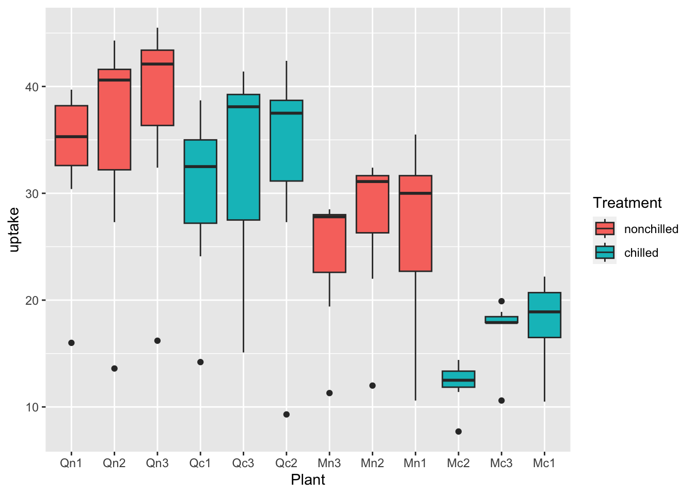
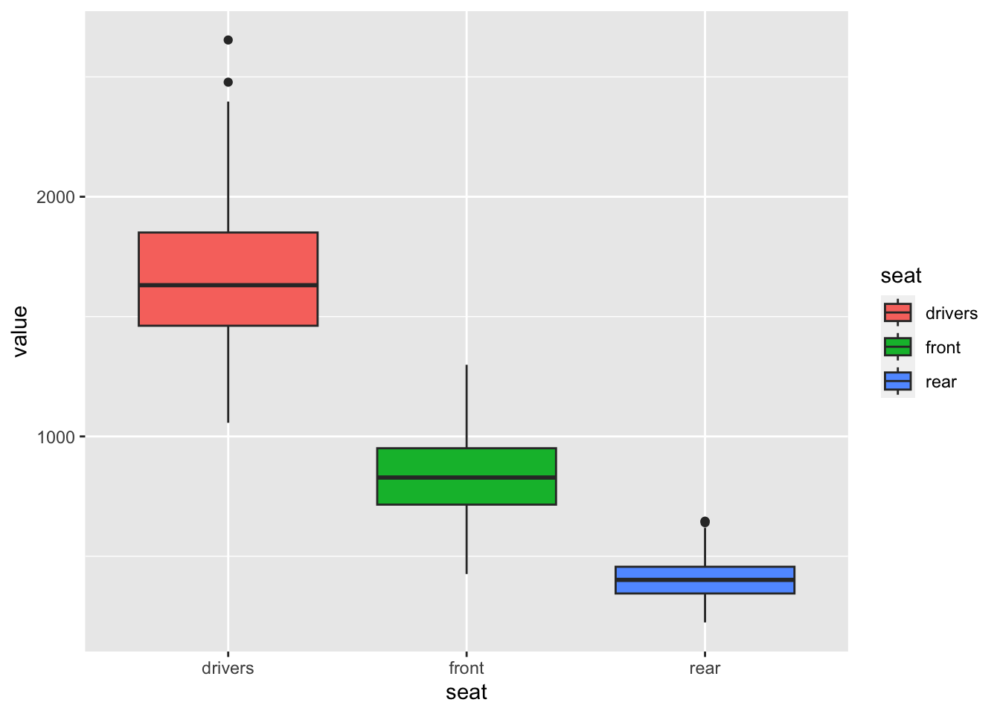
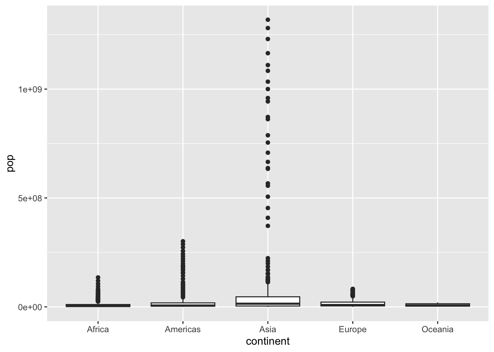
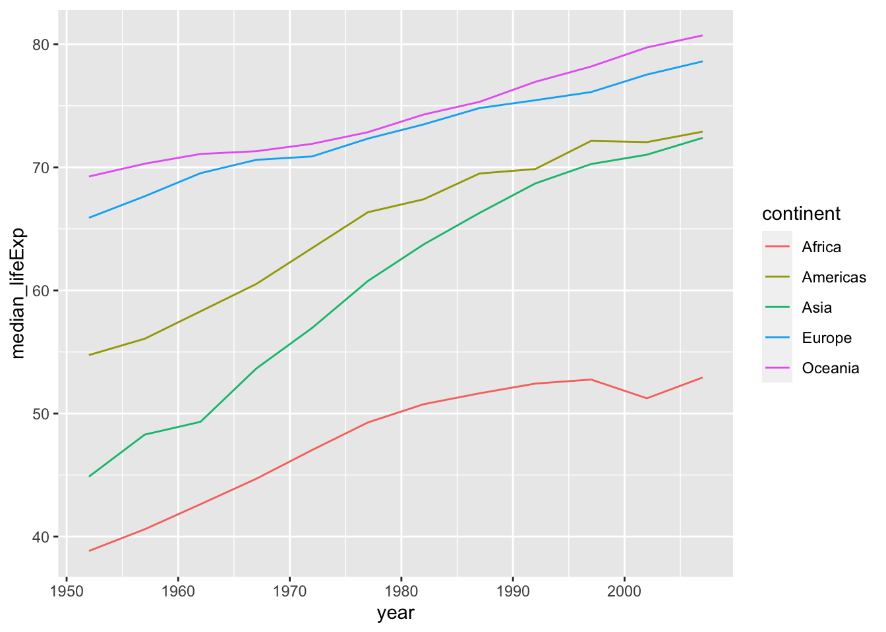
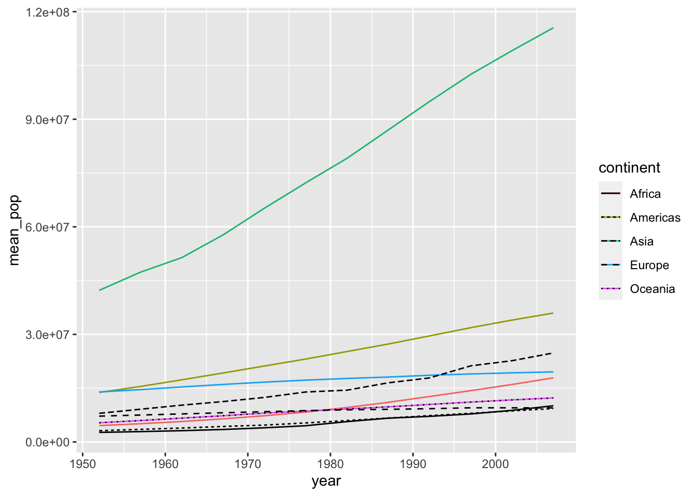
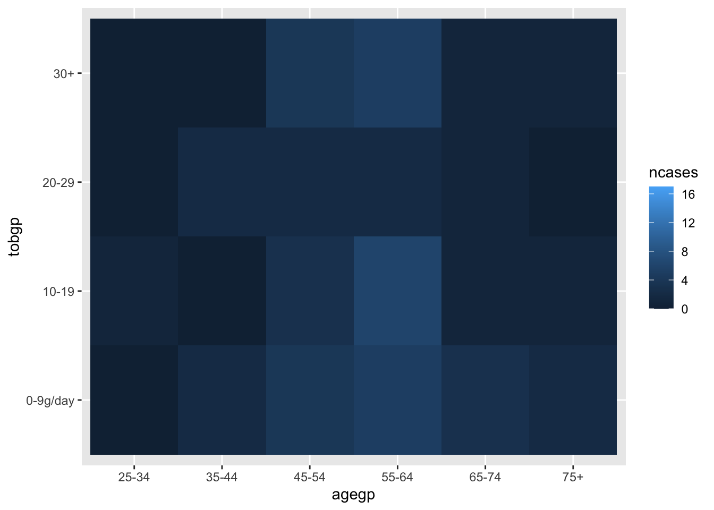
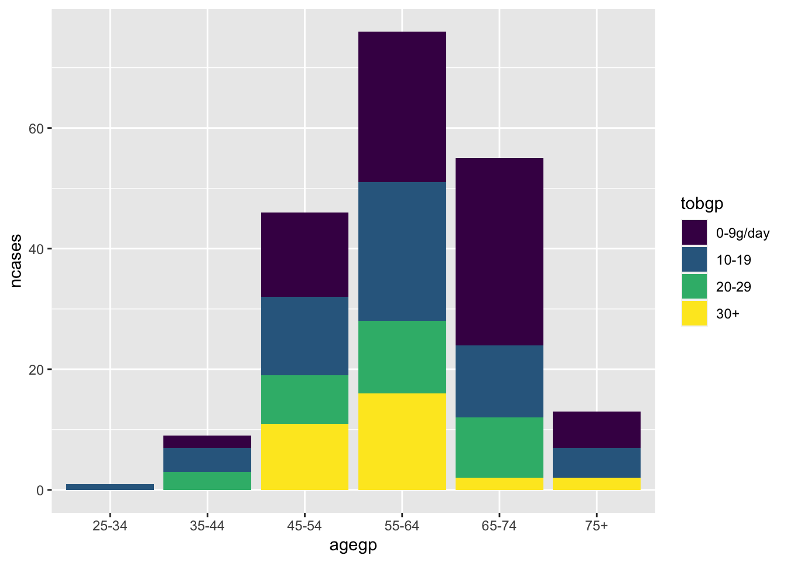
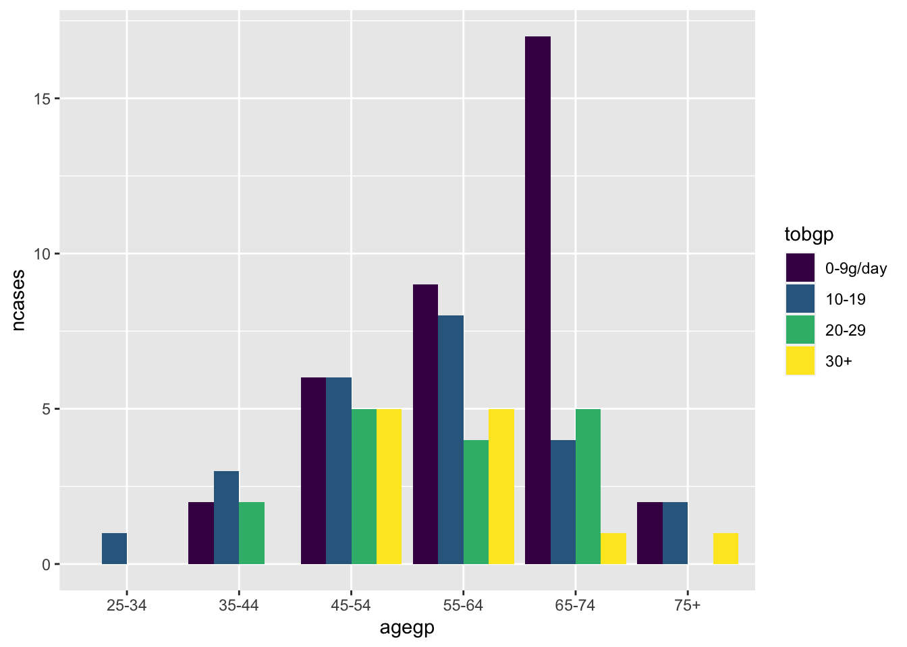
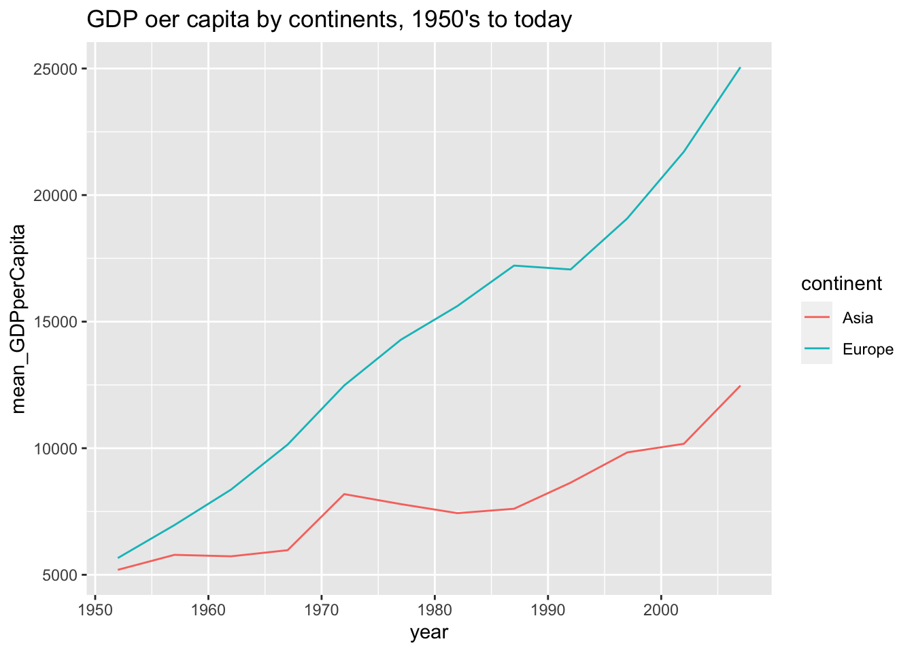
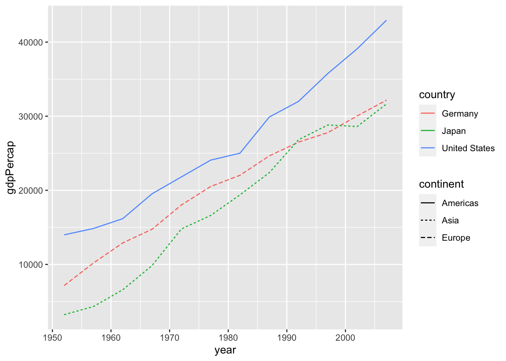

# Assignment Two {#a2resp}

1. You are supposed to submit an R Notebook File with a file name a2_YourID.nb.html.
  - Some submitted an HTML file, such as a2_YourID.html. You need to create an R Notebook. Use the template in Moodle. It creates a file with *.nb.html at the end automatically.
  - Some did not run each code chunk. You should run each code or select 'Run all' under 'Run' button. If some code chunk has a problem or an error, run each code chunk or use Run all chunk above or Run all chunk below, so the result appear in your R Notebook file.
  
2. You are supposed to write observations. 
  - Writing codes seem to be challenging, however, we are learning 'data analysis' not 'programming'. Do not forget to write explanations of the data, questions and observations.
  
3. Cheat Sheets, Posit Primers, and the textbook 'R for Data Science' are the first set of references you should look at together wih my lecture materials.

## Set up


```r
library(tidyverse)
#> ── Attaching packages ─────────────────── tidyverse 1.3.2 ──
#> ✔ ggplot2 3.4.0      ✔ purrr   1.0.0 
#> ✔ tibble  3.1.8      ✔ dplyr   1.0.10
#> ✔ tidyr   1.2.1      ✔ stringr 1.5.0 
#> ✔ readr   2.1.3      ✔ forcats 0.5.2 
#> ── Conflicts ────────────────────── tidyverse_conflicts() ──
#> ✖ dplyr::filter() masks stats::filter()
#> ✖ dplyr::lag()    masks stats::lag()
library(gapminder)
```

The following `(df <- gapminder)` is a short-hand of 

```
df <- gapminder
df
```


```r
(df <- gapminder)
#> # A tibble: 1,704 × 6
#>    country     continent  year lifeExp      pop gdpPercap
#>    <fct>       <fct>     <int>   <dbl>    <int>     <dbl>
#>  1 Afghanistan Asia       1952    28.8  8425333      779.
#>  2 Afghanistan Asia       1957    30.3  9240934      821.
#>  3 Afghanistan Asia       1962    32.0 10267083      853.
#>  4 Afghanistan Asia       1967    34.0 11537966      836.
#>  5 Afghanistan Asia       1972    36.1 13079460      740.
#>  6 Afghanistan Asia       1977    38.4 14880372      786.
#>  7 Afghanistan Asia       1982    39.9 12881816      978.
#>  8 Afghanistan Asia       1987    40.8 13867957      852.
#>  9 Afghanistan Asia       1992    41.7 16317921      649.
#> 10 Afghanistan Asia       1997    41.8 22227415      635.
#> # … with 1,694 more rows
```

## General Comments

### Varibles

We should know first about the variables. At least you must know if each of the variables is a categorical variable or a numerical variable.

For example, in the `gapminder` data, `country`, `continent` are categorical variables, and `year`, `lifeExp`, `pop`, `gdpPercap` are numerical variables. It is possible to treat `year` as a categorical variable. 

### Example: `datasets::CO2`

#### The first step

You can obtain basic information of the data by the following or typing CO2 in the search box under Help tab. You can see the same at: https://stat.ethz.ch/R-manual/R-devel/library/datasets/html/00Index.html


```r
help(CO2) # or ? CO2
```

* **Description**: The CO2 data frame has 84 rows and 5 columns of data from an experiment on the cold tolerance of the grass species Echinochloa crus-galli.
* **Usage**: CO2
* **Format**
  - An object of class c("nfnGroupedData", "nfGroupedData", "groupedData", "data.frame") containing the following columns:

  - Plant: an ordered factor with levels Qn1 < Qn2 < Qn3 < ... < Mc1 giving a unique identifier for each plant.

  - Type: a factor with levels Quebec Mississippi giving the origin of the plant

  - Treatment: a factor with levels nonchilled chilled

  - conc: a numeric vector of ambient carbon dioxide concentrations (mL/L).

  - uptake: a numeric vector of carbon dioxide uptake rates (\mu\mbox{mol}/m^2μmol/m 2
  sec).
  
* **Details**: The CO_2 uptake of six plants from Quebec and six plants from Mississippi was measured at several levels of ambient CO_2 concentration. Half the plants of each type were chilled overnight before the experiment was conducted.
  - This dataset was originally part of package nlme, and that has methods (including for [, as.data.frame, plot and print) for its grouped-data classes.

* **Source**: Potvin, C., Lechowicz, M. J. and Tardif, S. (1990) “The statistical analysis of ecophysiological response curves obtained from experiments involving repeated measures”, Ecology, 71, 1389–1400.
  - Pinheiro, J. C. and Bates, D. M. (2000) Mixed-effects Models in S and S-PLUS, Springer.


```r
df_co2 <- as_tibble(datasets::CO2) # what happens if simply `df_co2 <- datasets::CO2`
df_co2
#> # A tibble: 84 × 5
#>    Plant Type   Treatment   conc uptake
#>    <ord> <fct>  <fct>      <dbl>  <dbl>
#>  1 Qn1   Quebec nonchilled    95   16  
#>  2 Qn1   Quebec nonchilled   175   30.4
#>  3 Qn1   Quebec nonchilled   250   34.8
#>  4 Qn1   Quebec nonchilled   350   37.2
#>  5 Qn1   Quebec nonchilled   500   35.3
#>  6 Qn1   Quebec nonchilled   675   39.2
#>  7 Qn1   Quebec nonchilled  1000   39.7
#>  8 Qn2   Quebec nonchilled    95   13.6
#>  9 Qn2   Quebec nonchilled   175   27.3
#> 10 Qn2   Quebec nonchilled   250   37.1
#> # … with 74 more rows
```

You can use `head(CO2)` if you set `df_co2 <-CO2` or `df_co2 <- datasets::CO2`.


```r
glimpse(df_co2)
#> Rows: 84
#> Columns: 5
#> $ Plant     <ord> Qn1, Qn1, Qn1, Qn1, Qn1, Qn1, Qn1, Qn2, …
#> $ Type      <fct> Quebec, Quebec, Quebec, Quebec, Quebec, …
#> $ Treatment <fct> nonchilled, nonchilled, nonchilled, nonc…
#> $ conc      <dbl> 95, 175, 250, 350, 500, 675, 1000, 95, 1…
#> $ uptake    <dbl> 16.0, 30.4, 34.8, 37.2, 35.3, 39.2, 39.7…
```

"factor" is a categorical data, and "double" is a numerical data.


```r
class(df_co2$Plant)
#> [1] "ordered" "factor"
class(df_co2$Type)
#> [1] "factor"
class(df_co2$Treatment)
#> [1] "factor"
class(df_co2$conc)
#> [1] "numeric"
class(df_co2$uptake)
#> [1] "numeric"
```

```r
summary(df_co2)
#>      Plant             Type         Treatment 
#>  Qn1    : 7   Quebec     :42   nonchilled:42  
#>  Qn2    : 7   Mississippi:42   chilled   :42  
#>  Qn3    : 7                                   
#>  Qc1    : 7                                   
#>  Qc3    : 7                                   
#>  Qc2    : 7                                   
#>  (Other):42                                   
#>       conc          uptake     
#>  Min.   :  95   Min.   : 7.70  
#>  1st Qu.: 175   1st Qu.:17.90  
#>  Median : 350   Median :28.30  
#>  Mean   : 435   Mean   :27.21  
#>  3rd Qu.: 675   3rd Qu.:37.12  
#>  Max.   :1000   Max.   :45.50  
#> 
```

#### Try as many visualizations as possible

Then you can choose appropriate ones later in your research.

##### Histogram


```r
df_co2 %>% ggplot(aes(x = conc)) + geom_histogram()
#> `stat_bin()` using `bins = 30`. Pick better value with
#> `binwidth`.
```


```r
df_co2 %>% ggplot(aes(x = uptake)) + geom_histogram()
#> `stat_bin()` using `bins = 30`. Pick better value with
#> `binwidth`.
```


##### Box Plots


```r
df_co2 %>% ggplot(aes(x = factor(conc), y = uptake)) + geom_boxplot()
```


```r
df_co2 %>% ggplot(aes(x = factor(conc), y = uptake, fill = Type)) + geom_boxplot()
```


```r
df_co2 %>% ggplot(aes(x = factor(conc), y = uptake, fill = Treatment)) + geom_boxplot()
```


```r
df_co2 %>% ggplot(aes(x = Plant, y = uptake, fill = Treatment)) + geom_boxplot()
```




```r
df_co2 %>% ggplot(aes(x = Plant, y = uptake, fill = Type)) + geom_boxplot()
```


```r
df_co2 %>% ggplot(aes(x = Plant, y = uptake, fill = Type, color = Treatment)) + geom_boxplot()
```


What can you see?
Write your observations.

##### Scatter Plots


```r
df_co2 %>% ggplot(aes(x = conc, y = uptake, color = Treatment)) + geom_point()
```


```r
df_co2 %>% ggplot(aes(x = Plant, y = Type, color = Treatment, size = conc)) + geom_point()
```


```r
df_co2 %>% ggplot(aes(x = Plant, y = Type, size = conc, shape = Treatment)) + geom_point() + facet_wrap(vars(Treatment))
```


```r
ggplot(data = df_co2) + 
  geom_point(aes(x = conc, y = uptake))
```


The following prints a vector.


```r
df_co2 %>% distinct(conc) %>% pull()
#> [1]   95  175  250  350  500  675 1000
```

The following code generates a data frame.


```r
df_co2 %>% distinct(conc)
#> # A tibble: 7 × 1
#>    conc
#>   <dbl>
#> 1    95
#> 2   175
#> 3   250
#> 4   350
#> 5   500
#> 6   675
#> 7  1000
```


```r
ggplot(data = CO2) + 
  geom_line(aes(x = conc, y = uptake))
```


The code above did not work, and the line graph is not appropriate in this case. There are so many `update` values at the same `conc`.

#### Example. `datasets::Seatbelts`

Search the data information.

**Road Casualties in Great Britain 1969–84**

* Seatbelts is a multiple time series, with columns
* DriversKilled: car drivers killed.
* drivers: same as UKDriverDeaths.
* front: front-seat passengers killed or seriously injured.
* rear: rear-seat passengers killed or seriously injured.
* kms: distance driven.
* PetrolPrice: petrol price.
* VanKilled: number of van (‘light goods vehicle’) drivers.
* law: 0/1: was the law in effect that month?

**References**
Harvey, A. C. and Durbin, J. (1986). The effects of seat belt legislation on British road casualties: A case study in structural time series modelling. Journal of the Royal Statistical Society series A, 149, 187–227. doi:10.2307/2981553.

_The paper is available as you log-in to ICU Library > E-Databases > JSTOR_

Can you see the difference of the following two codes?


```r
head(Seatbelts)
#>      DriversKilled drivers front rear   kms PetrolPrice
#> [1,]           107    1687   867  269  9059   0.1029718
#> [2,]            97    1508   825  265  7685   0.1023630
#> [3,]           102    1507   806  319  9963   0.1020625
#> [4,]            87    1385   814  407 10955   0.1008733
#> [5,]           119    1632   991  454 11823   0.1010197
#> [6,]           106    1511   945  427 12391   0.1005812
#>      VanKilled law
#> [1,]        12   0
#> [2,]         6   0
#> [3,]        12   0
#> [4,]         8   0
#> [5,]        10   0
#> [6,]        13   0
```


```r
df_sb <- as_tibble(datasets::Seatbelts)
df_sb
#> # A tibble: 192 × 8
#>    Drivers…¹ drivers front  rear   kms Petro…² VanKi…³   law
#>        <dbl>   <dbl> <dbl> <dbl> <dbl>   <dbl>   <dbl> <dbl>
#>  1       107    1687   867   269  9059   0.103      12     0
#>  2        97    1508   825   265  7685   0.102       6     0
#>  3       102    1507   806   319  9963   0.102      12     0
#>  4        87    1385   814   407 10955   0.101       8     0
#>  5       119    1632   991   454 11823   0.101      10     0
#>  6       106    1511   945   427 12391   0.101      13     0
#>  7       110    1559  1004   522 13460   0.104      11     0
#>  8       106    1630  1091   536 14055   0.104       6     0
#>  9       107    1579   958   405 12106   0.104      10     0
#> 10       134    1653   850   437 11372   0.103      16     0
#> # … with 182 more rows, and abbreviated variable names
#> #   ¹​DriversKilled, ²​PetrolPrice, ³​VanKilled
```


```r
summary(df_sb)
#>  DriversKilled      drivers         front       
#>  Min.   : 60.0   Min.   :1057   Min.   : 426.0  
#>  1st Qu.:104.8   1st Qu.:1462   1st Qu.: 715.5  
#>  Median :118.5   Median :1631   Median : 828.5  
#>  Mean   :122.8   Mean   :1670   Mean   : 837.2  
#>  3rd Qu.:138.0   3rd Qu.:1851   3rd Qu.: 950.8  
#>  Max.   :198.0   Max.   :2654   Max.   :1299.0  
#>       rear            kms         PetrolPrice     
#>  Min.   :224.0   Min.   : 7685   Min.   :0.08118  
#>  1st Qu.:344.8   1st Qu.:12685   1st Qu.:0.09258  
#>  Median :401.5   Median :14987   Median :0.10448  
#>  Mean   :401.2   Mean   :14994   Mean   :0.10362  
#>  3rd Qu.:456.2   3rd Qu.:17202   3rd Qu.:0.11406  
#>  Max.   :646.0   Max.   :21626   Max.   :0.13303  
#>    VanKilled           law        
#>  Min.   : 2.000   Min.   :0.0000  
#>  1st Qu.: 6.000   1st Qu.:0.0000  
#>  Median : 8.000   Median :0.0000  
#>  Mean   : 9.057   Mean   :0.1198  
#>  3rd Qu.:12.000   3rd Qu.:0.0000  
#>  Max.   :17.000   Max.   :1.0000
```

Which visualization do you apply?


```r
df_sb %>% ggplot(aes(x = factor(law), y = DriversKilled)) + geom_boxplot()
```


What do you observe above?


```r
df_sb %>% ggplot(aes(x = PetrolPrice, y = DriversKilled)) + geom_point() +
  geom_smooth(formula = y~x, method = "lm", se = FALSE)
```


What can you see above?


```r
df_sb %>% ggplot(aes(x = kms, y = DriversKilled)) + geom_point() +
  geom_smooth(formula = y~x, method = "lm", se = FALSE)
```


What can you see above?

We will learn how to use `pivot_longer` and `pivot_wider` in EDA4.


```r
df_sb %>% 
  pivot_longer(cols = 2:4, names_to = "seat", values_to = "value")
#> # A tibble: 576 × 7
#>    DriversKilled   kms PetrolPrice VanKi…¹   law seat  value
#>            <dbl> <dbl>       <dbl>   <dbl> <dbl> <chr> <dbl>
#>  1           107  9059       0.103      12     0 driv…  1687
#>  2           107  9059       0.103      12     0 front   867
#>  3           107  9059       0.103      12     0 rear    269
#>  4            97  7685       0.102       6     0 driv…  1508
#>  5            97  7685       0.102       6     0 front   825
#>  6            97  7685       0.102       6     0 rear    265
#>  7           102  9963       0.102      12     0 driv…  1507
#>  8           102  9963       0.102      12     0 front   806
#>  9           102  9963       0.102      12     0 rear    319
#> 10            87 10955       0.101       8     0 driv…  1385
#> # … with 566 more rows, and abbreviated variable name
#> #   ¹​VanKilled
```


```r
df_sb %>% 
  pivot_longer(cols = 2:4, names_to = "seat", values_to = "value") %>%
  ggplot() + geom_boxplot(aes(x = seat, y = value, fill = seat))
```



What can you observe?


```r
df %>% filter(continent == "Asia") %>%
  ggplot(aes(x = year, y = gdpPercap, color = country)) + geom_line()
```


Appropriate graph?

### Gapminder


```r
ggplot(df, aes(x = continent)) + geom_bar()
```


```r
ggplot(df, aes(x = continent, fill = continent)) + geom_bar(width = 0.75)
```


```r
ggplot(df, aes(x = continent, y = pop)) + geom_boxplot()
```




```r
ggplot(df, aes(x = continent, y = log10(pop))) + geom_boxplot()
```


Alternately, you can use `coord_trans(x = "identity", y = "log10")` in stead of `y = log10(pop)`.
Can you see the difference?


```r
ggplot(df, aes(x = continent, y = pop)) + geom_boxplot() + 
  coord_trans(x = "identity", y = "log10")
```


```r
df %>% filter(year %in% c(1957, 1982, 2007)) %>%
  ggplot() + geom_boxplot(aes(x = continent, y = pop, fill = factor(year))) +
    coord_trans(x = "identity", y = "log10")
```


```r
df %>% filter(year %in% c(1957, 1982, 2007)) %>%
  ggplot() + geom_boxplot(aes(x = continent, y = gdpPercap, fill = factor(year))) +
  coord_trans(x = "identity", y = "log10")
```


```r
ggplot(df, aes(gdpPercap, lifeExp)) + geom_point(aes(color=continent))
```


```r
df %>% ggplot(aes(gdpPercap, lifeExp, color = continent)) + geom_point() +
  coord_trans(x = "log10", y = "identity")
```


```r
df %>% filter(year %in% c(2007)) %>%
  ggplot() + geom_point(aes(x = pop, y = gdpPercap, col = continent)) +
  coord_trans(x = "log10", y = "log10")
```


```r
df %>% filter(year %in% c(1957)) %>%
  ggplot() + geom_point(aes(x = gdpPercap, y = lifeExp, col = continent, size = pop)) +
  coord_trans(x = "log10", y = "identity")
```


```r
df %>% filter(year %in% c(2007)) %>%
  ggplot() + geom_point(aes(x = gdpPercap, y = lifeExp, col = continent, size = pop)) +
  coord_trans(x = "log10", y = "identity")
```


```r
df %>% filter(year %in% c(1957, 2007)) %>%
  ggplot() + geom_point(aes(x = gdpPercap, y = lifeExp, col = continent, size = pop)) +
  coord_trans(x = "log10", y = "identity") +
  facet_wrap(vars(year))
```


```r
df_lifeExp <- df %>% group_by(continent, year) %>% 
  summarize(mean_lifeExp = mean(lifeExp), median_lifeExp = median(lifeExp), max_lifeExp = max(lifeExp), min_lifeExp = min(lifeExp))
#> `summarise()` has grouped output by 'continent'. You can
#> override using the `.groups` argument.
```

The code above gives a message, but it works.


```r
df_lifeExp %>% ggplot(aes(x = year, y = median_lifeExp, color = continent)) +
  geom_line()
```



If you do not want to have a message, the following is an option. Otherwise, grouping is kept and you can get the original data back by `ungroup()`.


```r
df_pop <- df %>% group_by(continent, year) %>% 
  summarize(mean_pop = mean(pop), median_pop = median(pop), max_pop = max(pop), min_pop = min(pop), .groups = "drop")
```


```r
df_pop %>% ggplot(aes(x = year, y = mean_pop, color = continent)) +
  geom_line()
```


The following two codes create the same chart.


```r
df_pop %>% ggplot(aes(x = year, y = mean_pop, color = continent, linetype = continent)) +
  geom_line()
```


```r
df_pop %>% ggplot() +
  geom_line(aes(x = year, y = mean_pop, color = continent)) + 
  geom_line(aes(x = year, y = median_pop, linetype = continent))
```




## Responses to Questions

### Q1. Two categorical variables and one numerical variables

Eg. [Smoking, Alcohol and (O)esophageal Cancer](https://stat.ethz.ch/R-manual/R-devel/library/datasets/html/esoph.html)


```r
(df_esoph <- as_tibble(esoph))
#> # A tibble: 88 × 5
#>    agegp alcgp     tobgp    ncases ncontrols
#>    <ord> <ord>     <ord>     <dbl>     <dbl>
#>  1 25-34 0-39g/day 0-9g/day      0        40
#>  2 25-34 0-39g/day 10-19         0        10
#>  3 25-34 0-39g/day 20-29         0         6
#>  4 25-34 0-39g/day 30+           0         5
#>  5 25-34 40-79     0-9g/day      0        27
#>  6 25-34 40-79     10-19         0         7
#>  7 25-34 40-79     20-29         0         4
#>  8 25-34 40-79     30+           0         7
#>  9 25-34 80-119    0-9g/day      0         2
#> 10 25-34 80-119    10-19         0         1
#> # … with 78 more rows
```

`df_esoph` has three categorical variables and one numerical variable `ncases` to investigate.

**Comments**: I wanted to include three variables in the first exercise to be able to compare tobacco consumption, number of cases of cancer, and age in the same graph but I was not able to do it.

**Solutions**: There are various ways you can choose from.

Scatter plot with size by `geom_point()`.


```r
ggplot(df_esoph) + geom_point(aes(agegp, tobgp, size=ncases))
```


Heatmap with `geom_tile()`


```r
ggplot(df_esoph) + geom_tile(mapping = aes(x = agegp, y = tobgp, fill = ncases))
```



`geom_boxplot()`


```r
ggplot(df_esoph, aes(x= tobgp, y=ncases, fill=agegp))+geom_boxplot()
```


```r
ggplot(df_esoph, aes(x= agegp, y=ncases, fill=tobgp))+geom_boxplot()
```


`geom_col()`


```r
ggplot(df_esoph, aes(x= agegp, y=ncases, fill=tobgp))+geom_col()
```



Default position is "stack".


```r
ggplot(df_esoph, aes(x= agegp, y=ncases, fill=tobgp))+geom_col(position = "dodge")
```




### Q2. Combine two charts


```r
df %>%
  select(country, continent, year, gdpPercap) %>%
  filter(continent %in% c("Asia", "Europe")) %>%
  group_by(continent, year) %>%
  summarise(mean_GDPperCapita = mean(gdpPercap)) %>%
  ggplot(aes(x=year)) +
  geom_line(aes(y=mean_GDPperCapita, color=continent)) +
  ggtitle("GDP oer capita by continents, 1950's to today") 
#> `summarise()` has grouped output by 'continent'. You can
#> override using the `.groups` argument.
```




```r
df %>% 
  select(country, year, gdpPercap) %>% 
  filter(country %in% c("Israel", "Japan", "Norway", "China", "Ireland")) %>% 
  ggplot(aes(x=year)) + 
  geom_line(aes(y=gdpPercap, color=country))
```


**Question.** I have not managed to add on the same graph of the continents the data for the individual countries, as I would have liked:

**Solution.** Construct two data sets and combine them into one.

`ggplot2` starts with one data. 


```r
df_2c <- df %>%
  select(continent, year, gdpPercap) %>%
  filter(continent %in% c("Asia", "Europe")) %>%
  group_by(continent, year) %>%
  summarise(gdpPercap = mean(gdpPercap), .groups = 'drop') %>%
  select(country = continent, year, gdpPercap)

df_5c <- df %>%
  select(country, year, gdpPercap) %>%
  filter(country %in% c("Israel", "Japan", "Norway", "China", "Ireland"))

df_2c %>% bind_rows(df_5c) %>%
  ggplot(aes(x = year, y = gdpPercap, color = country)) + geom_line()
```


Use `mutate`.


```r
df %>%
  group_by(continent, year) %>%
  mutate(mean_by_continent = mean(gdpPercap)) %>%
  ungroup() %>%
  filter(country %in% c("Israel", "Japan", "Norway", "China", "Ireland")) %>%
  ggplot(aes(x = year)) +
    geom_line(aes(y = gdpPercap, color=country)) +
    geom_line(aes(y = mean_by_continent, linetype=continent)) +
    labs(title = "GDP oer capita of five countries", subtitle = "Mean of GDP per capita of their continent") 
```


When you want to change the linetype manually, use `scale_linetype_manual()`.


```r
df %>%
  group_by(continent, year) %>%
  mutate(mean_by_continent = mean(gdpPercap)) %>%
  ungroup() %>%
  filter(country %in% c("Israel", "Japan", "Norway", "China", "Ireland")) %>%
  ggplot(aes(x = year)) +
    geom_line(aes(y = gdpPercap, color=country)) +
    geom_line(aes(y = mean_by_continent, linetype=continent)) + 
    scale_linetype_manual(values = c("Asia" = "twodash", "Europe" = "longdash")) + 
    labs(title = "GDP oer capita of five countries", subtitle = "Mean of GDP per capita of their continent") 
```


## Appendix: Change colors, shapes, linetypes, etc. manually

Example: Default


```r
df %>%
  filter(country %in% c("Germany", "Japan", "United States")) %>%
  ggplot() +
    geom_line(aes(x = year, y = gdpPercap, color=country, linetype=continent))
```



* `scale_color_manual`: https://ggplot2-book.org/scale-colour.html
  - eg1: scale_colour_manual(values = c("red", "blue", "green"))
  - eg2: scale_colour_manual(values = c("China" = "red", "Japan" = "blue", "Norway" = "green"))
  - eg3: scale_colour_manual(values = scales::hue_pal()(3)) # default
  - eg4: scale_colour_manual(values = scales::hue_pal(direction = -1)(3)) # reverse order
* `scale_fill_manual`: similar to  `scale_color_manual`
* `scale_linetype_manual`: https://ggplot2-book.org/scale-other.html?q=linetype#scale-linetype
* `scale_shape_manual: https://ggplot2-book.org/scale-other.html?q=scale_shape_manual#scale-shape
* `scale_size: https://ggplot2-book.org/scale-other.html?q=size#scale-size


```r
df %>%
  filter(country %in% c("Germany", "Japan", "United States")) %>%
  ggplot(aes(x = year, y = gdpPercap)) +
    geom_line(aes(color=country, linetype=continent)) +
    geom_point(aes(shape = country)) +
    scale_colour_manual(values = scales::hue_pal(direction = -1)(3)) +
    scale_linetype_manual(values = c("Europe" = "dotted", "Asia" = "dotdash", "Americas" = "longdash")) +
    scale_shape_manual(values = c("Germany" = 7, "Japan" = 9, "United States" = 12))
```


