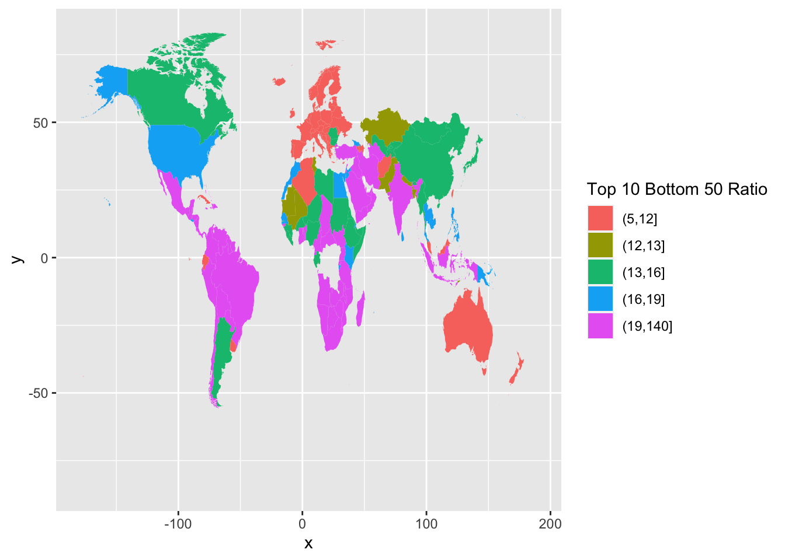
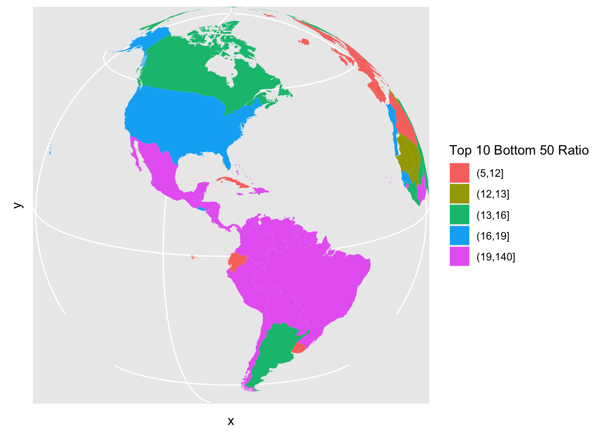
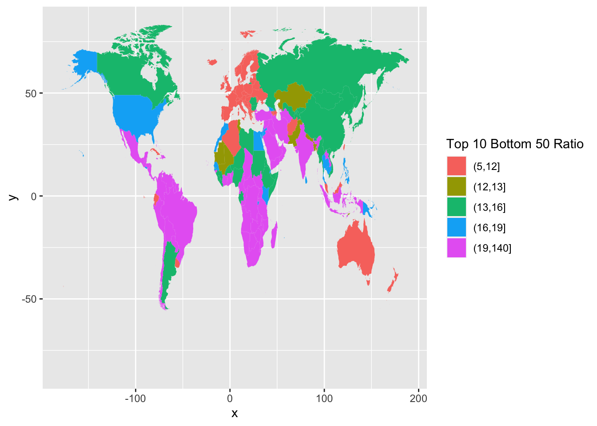
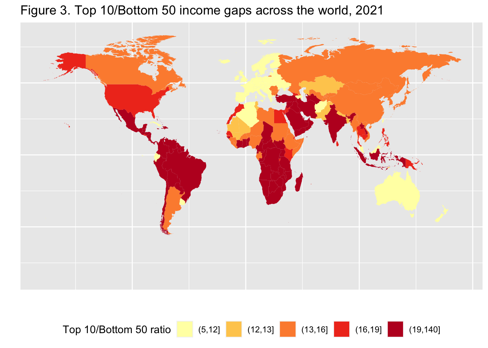
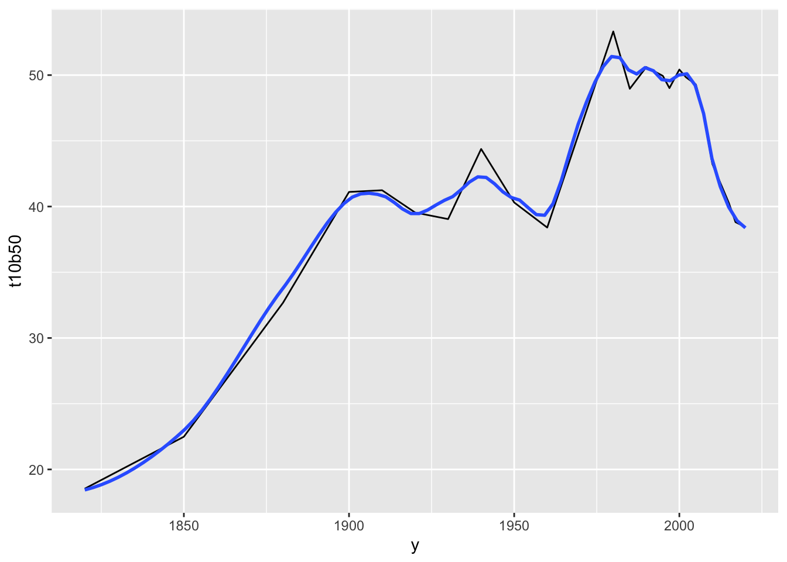
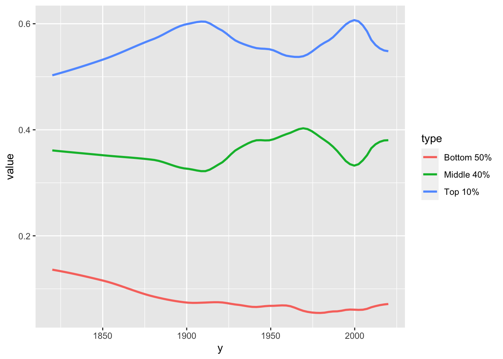
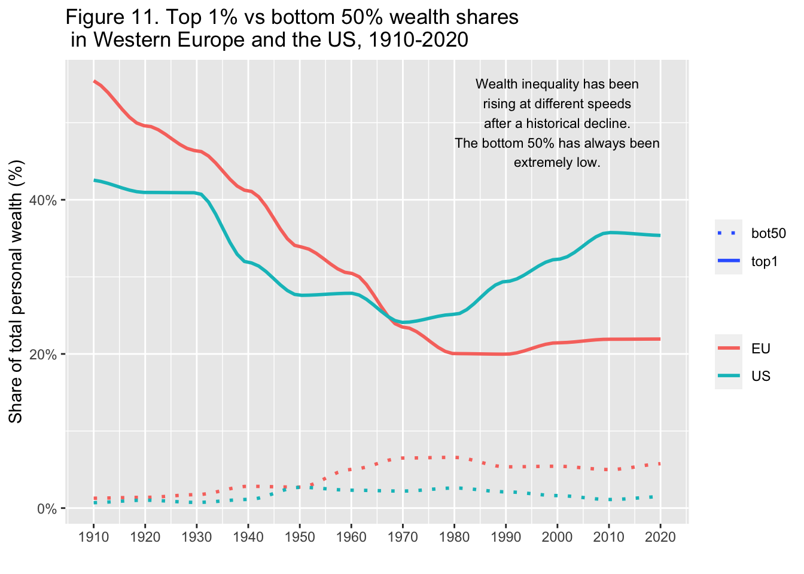
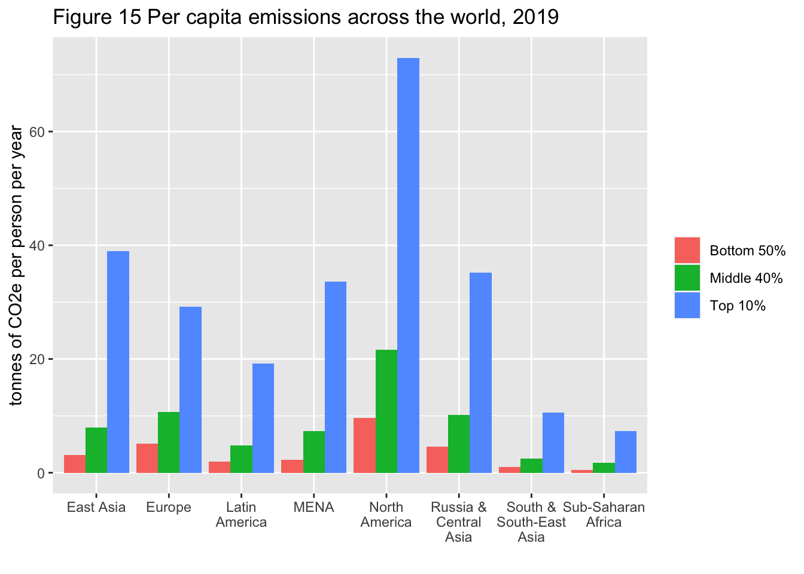

# `tidyr` {#tidy}

> We study the concept of tidy data and learn how to use the package `tidyr`, especially the functions `pivot_longer`, and it's converse `pivot_wider`. We also learn how to combine two data frames a little using functions of `dplyr`.

## Reviews and Previews

### Example: World Inequility Report - WIR2022

* World Inequality Report: https://wir2022.wid.world/
* Executive Summary: https://wir2022.wid.world/executive-summary/
* Methodology: https://wir2022.wid.world/methodology/
* Data URL: https://wir2022.wid.world/www-site/uploads/2022/03/WIR2022TablesFigures-Summary.xlsx


```r
library(tidyverse)
#> ── Attaching packages ─────────────────── tidyverse 1.3.2 ──
#> ✔ ggplot2 3.4.0      ✔ purrr   0.3.5 
#> ✔ tibble  3.1.8      ✔ dplyr   1.0.10
#> ✔ tidyr   1.2.1      ✔ stringr 1.4.1 
#> ✔ readr   2.1.3      ✔ forcats 0.5.2 
#> ── Conflicts ────────────────────── tidyverse_conflicts() ──
#> ✖ dplyr::filter() masks stats::filter()
#> ✖ dplyr::lag()    masks stats::lag()
library(readxl)
```


```r
url_summary <- "https://wir2022.wid.world/www-site/uploads/2022/03/WIR2022TablesFigures-Summary.xlsx"
download.file(url = url_summary, destfile = "./data/WIR2022s.xlsx", mode = "wb") 
```


```r
excel_sheets("./data/WIR2022s.xlsx")
#>  [1] "Index"     "F1"        "F2"        "F3"       
#>  [5] "F4"        "F5."       "F6"        "F7"       
#>  [9] "F8"        "F9"        "F10"       "F11"      
#> [13] "F12"       "F13"       "F14"       "F15"      
#> [17] "T1"        "data-F1"   "data-F2"   "data-F3"  
#> [21] "data-F4"   "data-F5"   "data-F6"   "data-F7"  
#> [25] "data-F8"   "data-F9"   "data-F10"  "data-F11" 
#> [29] "data-F12"  "data-F13." "data-F14." "data-F15"
```

Recall that we added `mode = "wb"` because Excel files are binary files, not text files such as CSV files.

When we use Excel files, we see `...1`, `...2`, `...3`, etc., as column names. These are columns with no column names in the original Excel file, and `R` assigned column names automatically. 


### F1: Global income and wealth inequality, 2021


```r
df_f1 <- read_excel("./data/WIR2022s.xlsx", sheet = "data-F1")
df_f1
#> # A tibble: 2 × 5
#>   ...1   `Bottom 50%` `Middle 40%` `Top 10%` `Top 1%`
#>   <chr>         <dbl>        <dbl>     <dbl>    <dbl>
#> 1 Income       0.084         0.394     0.522    0.192
#> 2 Wealth       0.0199        0.224     0.756    0.378
```

The table above is nothing terrible; however, if we have it in the following format, we can construct a chart applying the color aesthetic mapping to the group.


```
#> # A tibble: 6 × 3
#>   cat    group       value
#>   <chr>  <chr>       <dbl>
#> 1 Income Bottom 50% 0.084 
#> 2 Income Middle 40% 0.394 
#> 3 Income Top 10%    0.522 
#> 4 Wealth Bottom 50% 0.0199
#> 5 Wealth Middle 40% 0.224 
#> 6 Wealth Top 10%    0.756
```


```r
df_f1_rev %>%
  ggplot(aes(x = cat, y = value, fill = group)) +
  geom_col(position = "dodge")
```


We apply the `pivot_longer` function of the `tidyr` package, to transform the first table into the second. 

## References of `tidyr`

* Textbook: [R for Data Science,Tidy Data](https://r4ds.had.co.nz/tidy-data.html#tidy-data)

### RStudio Primers: See References in Moodle at the bottom

4. Tidy Your Data -- [r4ds: Wrangle, II](https://r4ds.had.co.nz/wrangle-intro.html#wrangle-intro)
  - [Reshape Data - a bit old](https://rstudio.cloud/learn/primers/4.1)
  - [Separate and Unite](https://rstudio.cloud/learn/primers/4.2) 
  - [Join Data Sets](https://rstudio.cloud/learn/primers/4.3)

The first component, 'Reshape Data' deals with `pivot_longer` and `pivot_wider`. However, it uses an older version of these functions calls `gather` and `spread`.

## Variables, values, and observations: Definitions

* A **variable** is a quantity, quality, or property that you can measure.
* A **value** is the state of a variable when you measure it. The value of a variable may change from measurement to measurement.
* An **observation** or **case** is a set of measurements made under similar conditions (you usually make all of the measurements in an observation at the same time and on the same object). An observation will contain several values, each associated with a different variable. I’ll sometimes refer to an observation as a case or data point.
* **Tabular data** is a table of values, each associated with a variable and an observation. Tabular data is tidy if each value is placed in its own cell, each variable in its own column, and each observation in its own row.
* So far, all of the data that you’ve seen has been tidy. In real-life, most data isn’t tidy, so we’ll come back to these ideas again in Data Wrangling.


## Tidy Data

> “Data comes in many formats, but R prefers just one: tidy data.” — Garrett Grolemund

Data can come in a variety of formats, but one format is easier to use in R than the others. This format is known as tidy data. A data set is tidy if:

1. Each variable is in its own column
2. Each observation is in its own row
3. Each value is in its own cell (this follows from #1 and #2)

> “Tidy data sets are all alike; but every messy data set is messy in its own way.” — Hadley Wickham

> “all happy families are all alike; each unhappy family is unhappy in its own way” - Tolstoy's Anna Karenina


## `tidyr` Basics

Let us look at the figure in [R4DS](https://d33wubrfki0l68.cloudfront.net/6f1ddb544fc5c69a2478e444ab8112fb0eea23f8/91adc/images/tidy-1.png).


1. Each variable is in its own column
2. Each observation is in its own row


## Pivot data from wide to long: [`pivot_longer()`](https://tidyr.tidyverse.org/reference/pivot_longer.html)

```
pivot_longer(data, cols = <columns to pivot into longer format>,
  names_to = <name of the new character column>, # e.g. "group", "category", "class"
  values_to = <name of the column the values of cells go to>) # e.g. "value", "n"
```


```r
df_f1
#> # A tibble: 2 × 5
#>   ...1   `Bottom 50%` `Middle 40%` `Top 10%` `Top 1%`
#>   <chr>         <dbl>        <dbl>     <dbl>    <dbl>
#> 1 Income       0.084         0.394     0.522    0.192
#> 2 Wealth       0.0199        0.224     0.756    0.378
```


```r
(df_f1_rev <- df_f1 %>% pivot_longer(-1, names_to = "group", values_to = "value"))
#> # A tibble: 8 × 3
#>   ...1   group       value
#>   <chr>  <chr>       <dbl>
#> 1 Income Bottom 50% 0.084 
#> 2 Income Middle 40% 0.394 
#> 3 Income Top 10%    0.522 
#> 4 Income Top 1%     0.192 
#> 5 Wealth Bottom 50% 0.0199
#> 6 Wealth Middle 40% 0.224 
#> 7 Wealth Top 10%    0.756 
#> 8 Wealth Top 1%     0.378
```

In the example above, `-1`, i.e., `cols = -1` stands for all colums except the first.

Now, we can use the `fill` aesthetic in addition to `position = "dodge"`. The default position is "stack".


```r
df_f1_rev %>% 
  ggplot(aes(x = ...1, y = value, fill = group)) +
  geom_col(position = "dodge")
```


Let us add the value as a label, change the y-axis to percent, and add the title. The interpretation and source are from the original


```r
df_f1_rev %>% filter(group != "Top 1%") %>%
  ggplot() +
  geom_col(aes(x = ...1, y = value, fill = group), position = "dodge") +
  geom_text(aes(x = ...1, y = value, group = group, 
            label = scales::label_percent(accuracy=1)(value)), 
            position = position_dodge(width = 0.9)) + 
  scale_y_continuous(labels = scales::percent_format(accuracy = 1)) +
  labs(title = "Figure 1. Global income and wealth inequality, 2021",
       x = "", y = "Share of total income or wealth", fill = "")
```


**Interpretation**: The global bottom 50% captures 8.5% of total income measured at Purchasing Power Parity (PPP). The global bottom 50% owns 2% of wealth (at Purchasing Power Parity). The global top 10% owns 76% of total Household wealth and captures 52% of total income in 2021. Note that top wealth holders are not necessarily top income holders. Incomes are measured after the operation of pension and unemployment systems and before taxes and transfers.  
**Sources and series**: wir2022.wid.world/methodology.

  
The next F2 is similar to F1.

## F2: The poorest half lags behind: Bottom 50%, middle 40% and top 10% income shares across the world in 2021


```r
df_f2 <- read_excel("./data/WIR2022s.xlsx", sheet = "data-F2")
df_f2
#> # A tibble: 8 × 5
#>    year iso                     `Bottom 50%` Middl…¹ Top 1…²
#>   <dbl> <chr>                          <dbl>   <dbl>   <dbl>
#> 1  2021 Europe                        0.189    0.453   0.358
#> 2  2021 East Asia                     0.139    0.427   0.434
#> 3  2021 North America                 0.132    0.411   0.457
#> 4  2021 Russia & Central Asia         0.147    0.386   0.467
#> 5  2021 South & South East Asia       0.123    0.328   0.548
#> 6  2021 Latin America                 0.102    0.344   0.554
#> 7  2021 Sub-Saharan Africa            0.0892   0.354   0.557
#> 8  2021 MENA                          0.09     0.329   0.581
#> # … with abbreviated variable names ¹​`Middle 40%`,
#> #   ²​`Top 10%`
```


```r
df_f2 %>% pivot_longer(cols = 3:5, names_to = "group", values_to = "value")
#> # A tibble: 24 × 4
#>     year iso                   group      value
#>    <dbl> <chr>                 <chr>      <dbl>
#>  1  2021 Europe                Bottom 50% 0.189
#>  2  2021 Europe                Middle 40% 0.453
#>  3  2021 Europe                Top 10%    0.358
#>  4  2021 East Asia             Bottom 50% 0.139
#>  5  2021 East Asia             Middle 40% 0.427
#>  6  2021 East Asia             Top 10%    0.434
#>  7  2021 North America         Bottom 50% 0.132
#>  8  2021 North America         Middle 40% 0.411
#>  9  2021 North America         Top 10%    0.457
#> 10  2021 Russia & Central Asia Bottom 50% 0.147
#> # … with 14 more rows
```


```r
df_f2 %>% pivot_longer(cols = 3:5, names_to = "group", values_to = "value") %>%
  ggplot(aes(x = iso, y = value, fill = group)) +
  geom_col(position = "dodge")
```


## Pivot data from long to wide: 
[`pivot_wider()`](https://tidyr.tidyverse.org/reference/pivot_wider.html)
In Console: vignette("pivot") 

```
pivot_wider(data, 
  names_from = <name of the column (or columns) to get the name of the output column>,
  values_from = <name of the column to get the value of the output>) 
```


```
#> # A tibble: 24 × 4
#>     year iso                   group      value
#>    <dbl> <chr>                 <chr>      <dbl>
#>  1  2021 Europe                Bottom 50% 0.189
#>  2  2021 Europe                Middle 40% 0.453
#>  3  2021 Europe                Top 10%    0.358
#>  4  2021 East Asia             Bottom 50% 0.139
#>  5  2021 East Asia             Middle 40% 0.427
#>  6  2021 East Asia             Top 10%    0.434
#>  7  2021 North America         Bottom 50% 0.132
#>  8  2021 North America         Middle 40% 0.411
#>  9  2021 North America         Top 10%    0.457
#> 10  2021 Russia & Central Asia Bottom 50% 0.147
#> # … with 14 more rows
```

```
pivot_wider(data, names_from = group, values_from = value) 
```


## Practice: F4 and F13

F4 and F13 are similar. Please use `pivot_longer` to tidy the data and create charts.

* **References**: https://ds-sl.github.io/data-analysis/wir2022.nb.html

### Done Last Week

* F12: Female share in global labor incomes, 1990-2020
* F14: Global carbon inequality, 2019. Group contribution to world emissions (%)

The next is an example of the world map.

## F3: Top 10/Bottom 50 income gaps across the world, 2021


```r
df_f3 <- read_excel("./data/WIR2022s.xlsx", sheet = "data-F3")
df_f3
#> # A tibble: 177 × 3
#>     year Country                T10B50
#>    <dbl> <chr>                   <dbl>
#>  1  2021 United Arab Emirates    19.2 
#>  2  2021 Afghanistan             11.7 
#>  3  2021 Albania                  8.99
#>  4  2021 Armenia                 11.0 
#>  5  2021 Angola                  32.1 
#>  6  2021 Argentina               13.2 
#>  7  2021 Austria                  7.68
#>  8  2021 Australia               10.4 
#>  9  2021 Azerbaijan               9.63
#> 10  2021 Bosnia and Herzegovina   9.32
#> # … with 167 more rows
```


## F3: Top 10/Bottom 50 income gaps across the world, 2021 - Original


* To 10 / Bottom 50 ratio has 5 classes: 5-12, 12-13, 13-16, 16-19, 19-140

* Let us look at the range and distribution of the values in `T10B50`.


```r
df_f3$T10B50 %>% summary()
#>    Min. 1st Qu.  Median    Mean 3rd Qu.    Max. 
#>   5.394  10.958  15.676  17.635  19.838 139.591
```


```r
df_f3 %>% ggplot() + geom_histogram(aes(T10B50))
#> `stat_bin()` using `bins = 30`. Pick better value with
#> `binwidth`.
```


```r
df_f3 %>% arrange(desc(T10B50))
#> # A tibble: 177 × 3
#>     year Country                  T10B50
#>    <dbl> <chr>                     <dbl>
#>  1  2021 Oman                      140. 
#>  2  2021 South Africa               63.1
#>  3  2021 Namibia                    49.0
#>  4  2021 Zambia                     44.4
#>  5  2021 Central African Republic   42.5
#>  6  2021 Mozambique                 38.9
#>  7  2021 Swaziland                  38.1
#>  8  2021 Botswana                   36.5
#>  9  2021 Angola                     32.1
#> 10  2021 Yemen                      32.0
#> # … with 167 more rows
```

Using the information above, we set breakpoints and use R Base's `cut` command to divide into five classes, and add it as a new column using `mutate`


```r
df_f3 %>% 
  mutate(`Top 10 Bottom 50 Ratio` = cut(T10B50,breaks = c(5, 12, 13, 16, 19,140), 
                                        include.lowest = FALSE)) 
#> # A tibble: 177 × 4
#>     year Country                T10B50 Top 10 Bottom 50 Ra…¹
#>    <dbl> <chr>                   <dbl> <fct>                
#>  1  2021 United Arab Emirates    19.2  (19,140]             
#>  2  2021 Afghanistan             11.7  (5,12]               
#>  3  2021 Albania                  8.99 (5,12]               
#>  4  2021 Armenia                 11.0  (5,12]               
#>  5  2021 Angola                  32.1  (19,140]             
#>  6  2021 Argentina               13.2  (13,16]              
#>  7  2021 Austria                  7.68 (5,12]               
#>  8  2021 Australia               10.4  (5,12]               
#>  9  2021 Azerbaijan               9.63 (5,12]               
#> 10  2021 Bosnia and Herzegovina   9.32 (5,12]               
#> # … with 167 more rows, and abbreviated variable name
#> #   ¹​`Top 10 Bottom 50 Ratio`
```


```r
world_map <- map_data("world")
df_f3 %>% mutate(`Top 10 Bottom 50 Ratio` = cut(T10B50,breaks = c(5, 12, 13, 16, 19,140), 
                                        include.lowest = FALSE)) %>%
  ggplot(aes(map_id = Country)) + 
  geom_map(aes(fill = `Top 10 Bottom 50 Ratio`), map = world_map) + 
  expand_limits(x = world_map$long, y = world_map$lat)
```



We observe that we have missing data from several countries. One common problem is the description of the country names varies in different data; in this case, the country names of `map_data()` and those of `wir2022`. There are several ways to edit country names. Here is one of them.


```r
world_map_wir <- world_map
world_map_wir$region[
  world_map_wir$region=="Democratic Republic of the Congo"]<-"DR Congo"
world_map_wir$region[world_map_wir$region=="Republic of Congo"]<-"Congo"
world_map_wir$region[world_map_wir$region=="Ivory Coast"]<-"Cote dIvoire"
world_map_wir$region[world_map_wir$region=="Vietnam"]<-"Viet Nam"
world_map_wir$region[world_map_wir$region=="Russia"]<-"Russian Federation"
world_map_wir$region[world_map_wir$region=="South Korea"]<-"Korea"
world_map_wir$region[world_map_wir$region=="UK"]<-"United Kingdom"
world_map_wir$region[world_map_wir$region=="Brunei"]<-"Brunei Darussalam"
world_map_wir$region[world_map_wir$region=="Laos"]<-"Lao PDR"
world_map_wir$region[world_map_wir$region=="Cote dIvoire"]<-"Cote d'Ivoire"
world_map_wir$region[world_map_wir$region=="Cape Verde"]<- "Cabo Verde"
world_map_wir$region[world_map_wir$region=="Syria"]<- "Syrian Arab Republic"
world_map_wir$region[world_map_wir$region=="Trinidad"]<- "Trinidad and Tobago"
world_map_wir$region[world_map_wir$region=="Tobago"]<- "Trinidad and Tobago"
```
  


```r
df_f3 %>% mutate(`Top 10 Bottom 50 Ratio` = 
    cut(T10B50, breaks = c(5, 12, 13, 16, 19,140), include.lowest = FALSE)) %>%
  ggplot(aes(map_id = Country)) + 
  geom_map(aes(fill = `Top 10 Bottom 50 Ratio`), 
    map = world_map_wir) + 
    expand_limits(x = world_map_wir$long, y = world_map_wir$lat)
```


Now it is much better. 


```r
df_f3 %>% mutate(`Top 10 Bottom 50 Ratio` = 
    cut(T10B50,breaks = c(5, 12, 13, 16, 19,140), include.lowest = FALSE)) %>%
  ggplot(aes(map_id = Country)) + geom_map(aes(fill = `Top 10 Bottom 50 Ratio`), 
    map = world_map_wir) + expand_limits(x = world_map_wir$long, y = world_map_wir$lat) + 
  coord_map("orthographic", orientation = c(25, 60, 0))
```


```r
df_f3 %>% mutate(`Top 10 Bottom 50 Ratio` = 
  cut(T10B50,breaks = c(5, 12, 13, 16, 19,140), include.lowest = FALSE)) %>%
  ggplot(aes(map_id = Country)) + geom_map(aes(fill = `Top 10 Bottom 50 Ratio`), 
    map = world_map_wir) + expand_limits(x = world_map_wir$long, y = world_map_wir$lat) + 
  coord_map("orthographic", orientation = c(15, -80, 0))
```




```r
df_f3 %>% mutate(`Top 10 Bottom 50 Ratio` = 
  cut(T10B50,breaks = c(5, 12, 13, 16, 19,140), include.lowest = FALSE)) %>%
  ggplot(aes(map_id = Country)) + geom_map(aes(fill = `Top 10 Bottom 50 Ratio`), 
    map = world_map_wir) + 
  expand_limits(x = world_map_wir$long, y = world_map_wir$lat)
```



Finally, change colors and change labels.


```r
df_f3 %>% 
  mutate(`Top 10 Bottom 50 Ratio` = 
        cut(T10B50,breaks = c(5, 12, 13, 16, 19,140), include.lowest = FALSE)) %>%
  ggplot(aes(map_id = Country)) + 
  geom_map(aes(fill = `Top 10 Bottom 50 Ratio`), map = world_map_wir) + 
  expand_limits(x = world_map_wir$long, y = world_map_wir$lat)  + 
  labs(title = "Figure 3. Top 10/Bottom 50 income gaps across the world, 2021",
       x = "", y = "", fill = "Top 10/Bottom 50 ratio") +
  theme(legend.position="bottom", 
        axis.text.x=element_blank(), axis.ticks.x=element_blank(),
        axis.text.y=element_blank(), axis.ticks.y=element_blank()) + 
  scale_fill_brewer(palette='YlOrRd')
```




We could not treat the data of three. We can check by using `anti_join`.


```r
df_f3 %>% anti_join(world_map_wir, by = c("Country" = "region"))
#> # A tibble: 3 × 3
#>    year Country   T10B50
#>   <dbl> <chr>      <dbl>
#> 1  2021 Hong Kong   17.7
#> 2  2021 Macao       14.5
#> 3  2021 Zanzibar    19.8
```

**Filtering joins**

* `anti_join(x,y, ...)`: return all rows from x without a match in y.
* `semi_join(x,y, ...)`: return all rows from x with a match in y.

Check `dplyr` cheat sheet, and Posit Primers Tidy Data.


## Remaining Charts

* F5: Global income inequality: T10/B50 ratio, 1820-2020 - fit curve
* F9: Average annual wealth growth rate, 1995-2021 - fit curve + alpha
* F7: Global income inequality, 1820-2020 - pivot + fit curve
* F10: The share of wealth owned by the global 0.1% and billionaires, 2021 - pivot + fit curve


* F6: Global income inequality: Between vs. Within country inequality (Theil index), 1820-2020 - pivot + area

* F11: Top 1% vs bottom 50% wealth shares in Western Europe and the US, 1910-2020 - pivot name_sep + fit curve
* F8: The rise of private versus the decline of public wealth in rich countries, 1970-2020 - rename + pivot + pivot + fit curve

* F15: Per capita emissions acriss the world, 2019 - add row names + dodge


We will discuss `geom_smooth` and `stat_smooth` in Chapter \@ref(model) applied to F5, F9, F7, F10.

## F5: Global income inequality: T10/B50 ratio, 1820-2020


```r
(df_f5 <- read_excel("./data/WIR2022s.xlsx", sheet = "data-F5"))
#> # A tibble: 24 × 2
#>        y t10b50
#>    <dbl>  <dbl>
#>  1  1820   18.5
#>  2  1850   22.5
#>  3  1880   32.7
#>  4  1900   41.1
#>  5  1910   41.2
#>  6  1920   39.5
#>  7  1930   39.0
#>  8  1940   44.4
#>  9  1950   40.3
#> 10  1960   38.4
#> # … with 14 more rows
```


```r
df_f5 %>% ggplot(aes(x = y, y = t10b50)) + geom_line() + geom_smooth(span=0.25, se=FALSE)
#> `geom_smooth()` using method = 'loess' and formula = 'y ~
#> x'
```




## F9: Average annual wealth growth rate, 1995-2021 - fit curve + alpha


```r
df_f9 <- read_excel("./data/WIR2022s.xlsx", sheet = "data-F9"); df_f9
#> # A tibble: 127 × 2
#>        p `Wealth growth 1995-2021`
#>    <dbl>                     <dbl>
#>  1     0                    0.0310
#>  2     1                    0.0310
#>  3     2                    0.0310
#>  4     3                    0.0310
#>  5     4                    0.0310
#>  6     5                    0.0310
#>  7     6                    0.0312
#>  8     7                    0.0317
#>  9     8                    0.0322
#> 10     9                    0.0328
#> # … with 117 more rows
```


```r
df_f9 %>% 
  ggplot(aes(x = p, y = `Wealth growth 1995-2021`)) + geom_smooth(span = 0.30, se = FALSE)
#> `geom_smooth()` using method = 'loess' and formula = 'y ~
#> x'
```


## F7: Global income inequality, 1820-2020 - pivot + fit curve


```r
df_f7 <- read_excel("./data/WIR2022s.xlsx", sheet = "data-F7"); df_f7
#> # A tibble: 24 × 4
#>        y `Bottom 50%` `Middle 40%` `Top 10%`
#>    <dbl>        <dbl>        <dbl>     <dbl>
#>  1  1820       0.136         0.361     0.503
#>  2  1850       0.118         0.350     0.532
#>  3  1880       0.0870        0.345     0.568
#>  4  1900       0.0724        0.332     0.595
#>  5  1910       0.0729        0.326     0.601
#>  6  1920       0.0755        0.328     0.597
#>  7  1930       0.0714        0.371     0.558
#>  8  1940       0.0629        0.379     0.558
#>  9  1950       0.0687        0.377     0.554
#> 10  1960       0.0701        0.392     0.538
#> # … with 14 more rows
```


```r
df_f7 %>% 
  pivot_longer(cols = 2:4, names_to = "type", values_to = "value") %>%
  ggplot(aes(x = y, y = value, color = type)) +
  stat_smooth(formula = y~x, method = "loess", span = 0.25, se = FALSE)
```




## F10: The share of wealth owned by the global 0.1% and billionaires, 2021 - pivot + fit curve


```r
df_f10 <- read_excel("./data/WIR2022s.xlsx", sheet = "data-F10"); df_f10
#> New names:
#> • `` -> `...4`
#> • `` -> `...5`
#> • `` -> `...6`
#> # A tibble: 27 × 6
#>     year bn_hhweal top0.1_hhweal ...4   ...5  ...6
#>    <dbl>     <dbl>         <dbl> <lgl> <dbl> <dbl>
#>  1  1995   0.0108         0.0729 NA       NA    NA
#>  2  1996   0.0114         0.0744 NA       NA    NA
#>  3  1997   0.0101         0.0768 NA       NA    NA
#>  4  1998   0.00995        0.0815 NA       NA    NA
#>  5  1999   0.0112         0.0855 NA       NA    NA
#>  6  2000   0.0115         0.0862 NA       NA    NA
#>  7  2001   0.0139         0.0846 NA       NA    NA
#>  8  2002   0.0119         0.08   NA       NA    NA
#>  9  2003   0.0103         0.08   NA       NA    NA
#> 10  2004   0.0127         0.0828 NA       NA    NA
#> # … with 17 more rows
```


```r
df_f10 %>% 
  select(year, "Global Billionaire Wealth" = bn_hhweal, "Top 0.01%" = top0.1_hhweal) %>%
  pivot_longer(!year, names_to = "group",".value", values_to = "value")
#> # A tibble: 54 × 3
#>     year group                       value
#>    <dbl> <chr>                       <dbl>
#>  1  1995 Global Billionaire Wealth 0.0108 
#>  2  1995 Top 0.01%                 0.0729 
#>  3  1996 Global Billionaire Wealth 0.0114 
#>  4  1996 Top 0.01%                 0.0744 
#>  5  1997 Global Billionaire Wealth 0.0101 
#>  6  1997 Top 0.01%                 0.0768 
#>  7  1998 Global Billionaire Wealth 0.00995
#>  8  1998 Top 0.01%                 0.0815 
#>  9  1999 Global Billionaire Wealth 0.0112 
#> 10  1999 Top 0.01%                 0.0855 
#> # … with 44 more rows
```


```r
df_f10 %>% 
  select(year, "Global Billionaire Wealth" = bn_hhweal, "Top 0.01%" = top0.1_hhweal) %>%
  pivot_longer(!year, names_to = "group",".value", values_to = "value") %>%
  ggplot() +
  stat_smooth(aes(x = year, y = value, color = group), formula = y~x, method = "loess", span = 0.25, se = FALSE)
```


## F6: Global income inequality: Between vs. Within country inequality (Theil index), 1820-2020 - pivot + area


```r
df_f6 <- read_excel("./data/WIR2022s.xlsx", sheet = "data-F6"); df_f6
#> New names:
#> • `` -> `...1`
#> # A tibble: 9 × 3
#>    ...1 `Between-country inequality` Within-country inequa…¹
#>   <dbl>                        <dbl>                   <dbl>
#> 1  1820                        0.120                   0.880
#> 2  1850                        0.166                   0.834
#> 3  1880                        0.241                   0.759
#> 4  1900                        0.257                   0.743
#> 5  1920                        0.320                   0.680
#> 6  1950                        0.439                   0.561
#> 7  1980                        0.569                   0.431
#> 8  2000                        0.473                   0.527
#> 9  2020                        0.320                   0.680
#> # … with abbreviated variable name
#> #   ¹​`Within-country inequality`
```


```r
df_f6 %>% select(year = "...1", 2:3) %>%
  pivot_longer(cols = 2:3, names_to = "type", values_to = "value") %>%
  mutate(types = factor(type, 
      levels = c("Within-country inequality", "Between-country inequality"))) %>%
  ggplot(aes(x = year, y = value, fill = types)) +
  geom_area() +
  scale_y_continuous(labels = scales::percent_format(accuracy = 1)) +
  scale_x_continuous(breaks = round(seq(1820, 2020, by = 20),1)) + 
  scale_fill_manual(values=rev(scales::hue_pal()(2)), 
      labels = function(x) str_wrap(x, width = 15)) +
  labs(title = "Figure 6. Global income inequality: 
       \nBetween vs. within country inequality (Theil index), 1820-2020",
       x = "", y = "Share of global inequality (% of total Theil index)", fill = "") + 
  annotate("text", x = 1850, y = 0.28, 
      label = stringr::str_wrap("1820: Between country inequality represents 11% 
                                of global inequality", width = 20), size = 3) + 
  annotate("text", x = 1980, y = 0.70, 
      label = stringr::str_wrap("1980: Between country inequality represents 57% 
                                of global inequality", width = 20), size = 3) +
  annotate("text", x = 1990, y = 0.30, 
      label = stringr::str_wrap("2020: Between country inequality represents 32% 
                                of global inequality", width = 20), size = 3)
```


## F11: Top 1% vs bottom 50% wealth shares in Western Europe and the US, 1910-2020 - pivot name_sep + fit curve


```r
df_f11 <- read_excel("./data/WIR2022s.xlsx", sheet = "data-F11"); df_f11
#> # A tibble: 12 × 5
#>     year USbot50 UStop1 EUbot50 EUtop1
#>    <dbl>   <dbl>  <dbl>   <dbl>  <dbl>
#>  1  1910 0.00700  0.425  0.0128  0.554
#>  2  1920 0.0102   0.410  0.0139  0.496
#>  3  1930 0.00737  0.409  0.0175  0.464
#>  4  1940 0.0112   0.319  0.0282  0.412
#>  5  1950 0.0270   0.276  0.0272  0.339
#>  6  1960 0.0232   0.279  0.0503  0.304
#>  7  1970 0.0221   0.241  0.0649  0.235
#>  8  1980 0.0260   0.251  0.0658  0.200
#>  9  1990 0.0211   0.294  0.0535  0.200
#> 10  2000 0.0162   0.323  0.0543  0.214
#> 11  2010 0.0111   0.357  0.0500  0.219
#> 12  2020 0.0149   0.354  0.0576  0.219
```

We want to separate 'US', 'EU' and 'bot50', 'top10', and 'top1'. To apply `names_sep = "_"`, we first changed the name of columns. 


```r
df_f11 %>% 
  rename(!year, US_bot50 = USbot50, US_top1 = UStop1, 
         EU_bot50 = EUbot50, EU_top1 = EUtop1) %>%
  pivot_longer(!year, names_to = c("group",".value"), names_sep = "_") %>%
  pivot_longer(3:4, names_to = "type", values_to = "value") %>%
  ggplot() +
  stat_smooth(aes(x = year, y = value, color = group, linetype = type), 
              span = 0.25, se = FALSE) +
  scale_x_continuous(breaks = round(seq(1910, 2020, by = 10),1)) +
  scale_y_continuous(labels = scales::percent_format(accuracy = 1)) +
  labs(title = "Figure 11. Top 1% vs bottom 50% wealth shares 
       \n in Western Europe and the US, 1910-2020", 
       x = "", y = "Share of total personal wealth (%)", color = "", linetype = "") +
  scale_linetype_manual(values = c("dotted","solid")) +
  annotate("text", x = 2000, y = 0.50, 
      label = stringr::str_wrap("Wealth inequality has been rising at 
        different speeds after a historical decline. The bottom 50% has always been 
                                extremely low.", width = 30), size = 3)
```


### Step 1.


```r
df_f11 %>% rename(!year, US_bot50 = USbot50, US_top1 = UStop1, 
                  EU_bot50 = EUbot50, EU_top1 = EUtop1) 
#> # A tibble: 12 × 5
#>     year US_bot50 US_top1 EU_bot50 EU_top1
#>    <dbl>    <dbl>   <dbl>    <dbl>   <dbl>
#>  1  1910  0.00700   0.425   0.0128   0.554
#>  2  1920  0.0102    0.410   0.0139   0.496
#>  3  1930  0.00737   0.409   0.0175   0.464
#>  4  1940  0.0112    0.319   0.0282   0.412
#>  5  1950  0.0270    0.276   0.0272   0.339
#>  6  1960  0.0232    0.279   0.0503   0.304
#>  7  1970  0.0221    0.241   0.0649   0.235
#>  8  1980  0.0260    0.251   0.0658   0.200
#>  9  1990  0.0211    0.294   0.0535   0.200
#> 10  2000  0.0162    0.323   0.0543   0.214
#> 11  2010  0.0111    0.357   0.0500   0.219
#> 12  2020  0.0149    0.354   0.0576   0.219
```


### Step 2. 


```r
df_f11 %>% 
  rename(!year, US_bot50 = USbot50, US_top1 = UStop1, 
         EU_bot50 = EUbot50, EU_top1 = EUtop1) %>%
  pivot_longer(!year, names_to = c("group",".value"), names_sep = "_")
```


### Step 2. 


```
#> # A tibble: 24 × 4
#>     year group   bot50  top1
#>    <dbl> <chr>   <dbl> <dbl>
#>  1  1910 US    0.00700 0.425
#>  2  1910 EU    0.0128  0.554
#>  3  1920 US    0.0102  0.410
#>  4  1920 EU    0.0139  0.496
#>  5  1930 US    0.00737 0.409
#>  6  1930 EU    0.0175  0.464
#>  7  1940 US    0.0112  0.319
#>  8  1940 EU    0.0282  0.412
#>  9  1950 US    0.0270  0.276
#> 10  1950 EU    0.0272  0.339
#> # … with 14 more rows
```


### Step 3.


```r
df_f11 %>% 
  rename(!year, US_bot50 = USbot50, US_top1 = UStop1, 
         EU_bot50 = EUbot50, EU_top1 = EUtop1) %>%
  pivot_longer(!year, names_to = c("group",".value"), 
               names_sep = "_") %>%
  pivot_longer(3:4, names_to = "type", values_to = "value") 
```


### Step 3.


```
#> # A tibble: 48 × 4
#>     year group type    value
#>    <dbl> <chr> <chr>   <dbl>
#>  1  1910 US    bot50 0.00700
#>  2  1910 US    top1  0.425  
#>  3  1910 EU    bot50 0.0128 
#>  4  1910 EU    top1  0.554  
#>  5  1920 US    bot50 0.0102 
#>  6  1920 US    top1  0.410  
#>  7  1920 EU    bot50 0.0139 
#>  8  1920 EU    top1  0.496  
#>  9  1930 US    bot50 0.00737
#> 10  1930 US    top1  0.409  
#> # … with 38 more rows
```





The following is similar to the previous example. 

## F8: The rise of private versus the decline of public wealth in rich countries, 1970-2020 - rename + pivot + pivot + fit curve


```r
df_f8 <- read_excel("./data/WIR2022s.xlsx", sheet = "data-F8"); df_f8
#> # A tibble: 51 × 17
#>     year Germany German…¹ Spain Spain…² France Franc…³    UK
#>    <dbl>   <dbl>    <dbl> <dbl>   <dbl>  <dbl>   <dbl> <dbl>
#>  1  1970   1.11      2.30 0.604    4.06  0.422    3.12 0.601
#>  2  1971   1.12      2.25 0.657    4.53  0.443    3.06 0.689
#>  3  1972   1.11      2.27 0.624    4.36  0.467    3.08 0.790
#>  4  1973   1.11      2.23 0.596    4.46  0.478    3.06 0.929
#>  5  1974   1.13      2.25 0.586    4.64  0.498    3.03 1.09 
#>  6  1975   1.12      2.35 0.602    4.83  0.545    3.12 1.00 
#>  7  1976   1.03      2.34 0.581    4.46  0.561    3.08 0.918
#>  8  1977   1.01      2.42 0.586    4.10  0.567    3.10 0.867
#>  9  1978   0.990     2.52 0.604    4.10  0.580    3.20 0.881
#> 10  1979   0.989     2.55 0.621    4.20  0.624    3.30 0.955
#> # … with 41 more rows, 9 more variables:
#> #   `UK (private)` <dbl>, Japan <dbl>,
#> #   `Japan (private)` <dbl>, Norway <dbl>,
#> #   `Norway (private)` <dbl>, USA <dbl>,
#> #   `USA (private)` <dbl>, gwealAVGRICH <dbl>,
#> #   pwealAVGRICH <dbl>, and abbreviated variable names
#> #   ¹​`Germany (private)`, ²​`Spain (private)`, …
```


```r
df_f8 %>% 
  select(year, Germany_public = Germany, Germany_private = 'Germany (private)', 
         Spain_public = Spain, Spain_private = 'Spain (private)', 
         France_public = France, France_private = 'France (private)', 
         UK_public  = UK, UK_private = 'UK (private)', 
         Japan_public = Japan, Japan_private = 'Japan (private)', 
         Norway_public = Norway, Norway_private = 'Norway (private)',
         USA_public = USA, USA_private = 'USA (private)') %>%
  pivot_longer(!year, names_to = c("country",".value"), names_sep = "_") %>%
  pivot_longer(3:4, names_to = "type", values_to = "value") %>%
  ggplot() +
  stat_smooth(aes(x = year, y = value, color = country, linetype = type), 
              span = 0.25, se = FALSE, size=0.75) +
  scale_y_continuous(labels = scales::percent_format(accuracy = 1)) +
  labs(title = "Figure 8. The rise of private versus the decline of public 
       wealth in rich countries, 1970-2020", 
       x = "", y = "wealth as as % of national income", color = "", type = "")
```


### Step 1


```r
df_f8 %>% 
  select(year, Germany_public = Germany, Germany_private = 'Germany (private)', 
         Spain_public = Spain, Spain_private = 'Spain (private)', 
         France_public = France, France_private = 'France (private)', 
         UK_public  = UK, UK_private = 'UK (private)', 
         Japan_public = Japan, Japan_private = 'Japan (private)', 
         Norway_public = Norway, Norway_private = 'Norway (private)',
         USA_public = USA, USA_private = 'USA (private)') 
```


```
#> # A tibble: 51 × 15
#>     year Germany_p…¹ Germa…² Spain…³ Spain…⁴ Franc…⁵ Franc…⁶
#>    <dbl>       <dbl>   <dbl>   <dbl>   <dbl>   <dbl>   <dbl>
#>  1  1970       1.11     2.30   0.604    4.06   0.422    3.12
#>  2  1971       1.12     2.25   0.657    4.53   0.443    3.06
#>  3  1972       1.11     2.27   0.624    4.36   0.467    3.08
#>  4  1973       1.11     2.23   0.596    4.46   0.478    3.06
#>  5  1974       1.13     2.25   0.586    4.64   0.498    3.03
#>  6  1975       1.12     2.35   0.602    4.83   0.545    3.12
#>  7  1976       1.03     2.34   0.581    4.46   0.561    3.08
#>  8  1977       1.01     2.42   0.586    4.10   0.567    3.10
#>  9  1978       0.990    2.52   0.604    4.10   0.580    3.20
#> 10  1979       0.989    2.55   0.621    4.20   0.624    3.30
#> # … with 41 more rows, 8 more variables: UK_public <dbl>,
#> #   UK_private <dbl>, Japan_public <dbl>,
#> #   Japan_private <dbl>, Norway_public <dbl>,
#> #   Norway_private <dbl>, USA_public <dbl>,
#> #   USA_private <dbl>, and abbreviated variable names
#> #   ¹​Germany_public, ²​Germany_private, ³​Spain_public,
#> #   ⁴​Spain_private, ⁵​France_public, ⁶​France_private
```


### Step 2.


```r
df_f8 %>% 
  select(year, Germany_public = Germany, Germany_private = 'Germany (private)', 
         Spain_public = Spain, Spain_private = 'Spain (private)', 
         France_public = France, France_private = 'France (private)', 
         UK_public  = UK, UK_private = 'UK (private)', 
         Japan_public = Japan, Japan_private = 'Japan (private)', 
         Norway_public = Norway, Norway_private = 'Norway (private)',
         USA_public = USA, USA_private = 'USA (private)') %>%
  pivot_longer(!year, names_to = c("country",".value"), names_sep = "_") 
```


```
#> # A tibble: 357 × 4
#>     year country public private
#>    <dbl> <chr>    <dbl>   <dbl>
#>  1  1970 Germany  1.11     2.30
#>  2  1970 Spain    0.604    4.06
#>  3  1970 France   0.422    3.12
#>  4  1970 UK       0.601    2.85
#>  5  1970 Japan    0.719    3.09
#>  6  1970 Norway  NA       NA   
#>  7  1970 USA      0.364    3.26
#>  8  1971 Germany  1.12     2.25
#>  9  1971 Spain    0.657    4.53
#> 10  1971 France   0.443    3.06
#> # … with 347 more rows
```


### Step 3.


```r
df_f8 %>% 
  select(year, Germany_public = Germany, Germany_private = 'Germany (private)', 
         Spain_public = Spain, Spain_private = 'Spain (private)', 
         France_public = France, France_private = 'France (private)', 
         UK_public  = UK, UK_private = 'UK (private)', 
         Japan_public = Japan, Japan_private = 'Japan (private)', 
         Norway_public = Norway, Norway_private = 'Norway (private)',
         USA_public = USA, USA_private = 'USA (private)') %>%
  pivot_longer(!year, names_to = c("country",".value"), names_sep = "_") %>%
  pivot_longer(3:4, names_to = "type", values_to = "value")
```


```
#> # A tibble: 714 × 4
#>     year country type    value
#>    <dbl> <chr>   <chr>   <dbl>
#>  1  1970 Germany public  1.11 
#>  2  1970 Germany private 2.30 
#>  3  1970 Spain   public  0.604
#>  4  1970 Spain   private 4.06 
#>  5  1970 France  public  0.422
#>  6  1970 France  private 3.12 
#>  7  1970 UK      public  0.601
#>  8  1970 UK      private 2.85 
#>  9  1970 Japan   public  0.719
#> 10  1970 Japan   private 3.09 
#> # … with 704 more rows
```


### Step 3. Final Step


```r
df_f8 %>% 
  select(year, Germany_public = Germany, Germany_private = 'Germany (private)', 
         Spain_public = Spain, Spain_private = 'Spain (private)', 
         France_public = France, France_private = 'France (private)', 
         UK_public  = UK, UK_private = 'UK (private)', 
         Japan_public = Japan, Japan_private = 'Japan (private)', 
         Norway_public = Norway, Norway_private = 'Norway (private)',
         USA_public = USA, USA_private = 'USA (private)') %>%
  pivot_longer(!year, names_to = c("country",".value"), names_sep = "_") %>%
  pivot_longer(3:4, names_to = "type", values_to = "value") %>%
  ggplot() +
  stat_smooth(aes(x = year, y = value, color = country, linetype = type), 
              formula = y~x, method = "loess", span = 0.25, se = FALSE, size=0.75) +
  scale_y_continuous(labels = scales::percent_format(accuracy = 1)) +
  labs(title = "Figure 8. The rise of private versus the decline of public wealth 
       \nin rich countries, 1970-2020", 
       x = "", y = "wealth as as % of national income", color = "", type = "")
```


## F15: Per capita emissions acriss the world, 2019 - add row names + dodge


```r
df_f15 <- read_excel("./data/WIR2022s.xlsx", sheet = "data-F15"); df_f15
#> # A tibble: 24 × 4
#>    regionWID               group       tcap  mark
#>    <chr>                   <chr>      <dbl> <dbl>
#>  1 East Asia               Bottom 50%  3.12     1
#>  2 <NA>                    Middle 40%  7.91     1
#>  3 <NA>                    Top 10%    38.9      1
#>  4 Europe                  Bottom 50%  5.09     2
#>  5 <NA>                    Middle 40% 10.6      2
#>  6 <NA>                    Top 10%    29.2      2
#>  7 North America           Bottom 50%  9.67     3
#>  8 <NA>                    Middle 40% 21.7      3
#>  9 <NA>                    Top 10%    73.0      3
#> 10 South & South-East Asia Bottom 50%  1.04     4
#> # … with 14 more rows
```


```r
df_f15 %>% mutate(region = rep(regionWID[!is.na(regionWID)], each = 3)) %>%
  select(region, group, tcap) %>%
  ggplot(aes(x = region, y = tcap, fill = group)) +
  geom_col(position = "dodge") + 
  scale_x_discrete(labels = function(x) stringr::str_wrap(x, width = 10)) +
  labs(title = "Figure 15 Per capita emissions across the world, 2019", 
       x = "", y = "tonnes of CO2e per person per year", fill = "")
```




Review one by one, referring to the following.


**References**: https://ds-sl.github.io/data-analysis/wir2022.nb.html
