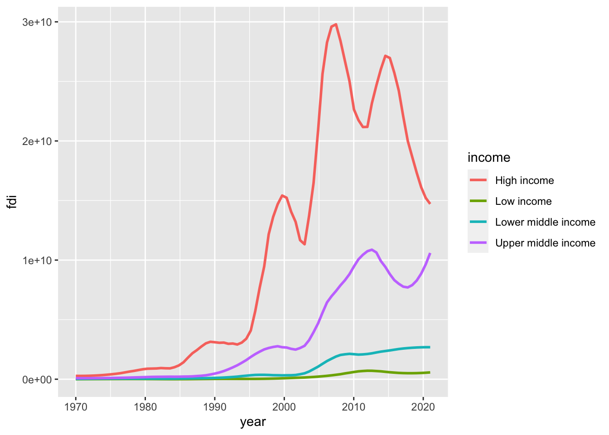
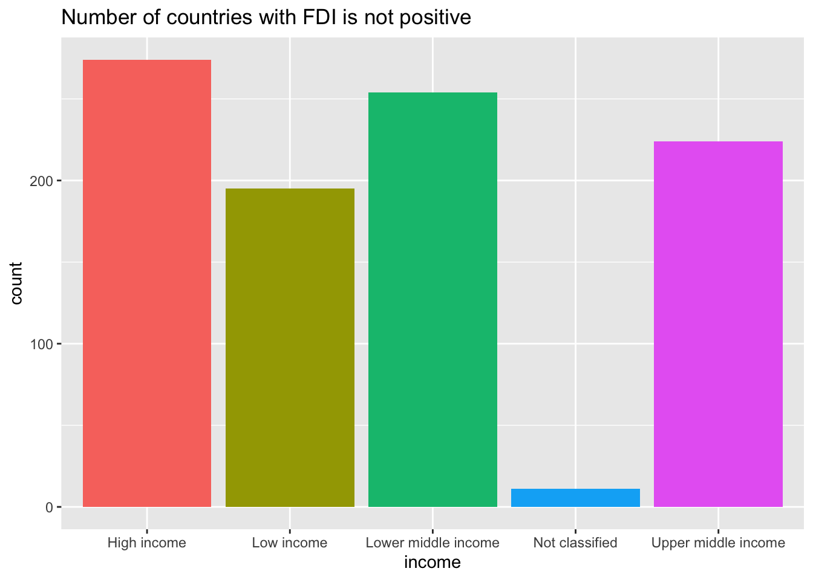
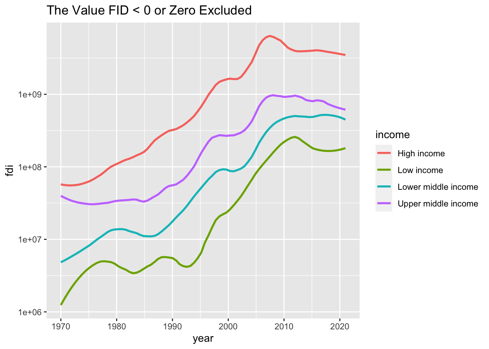
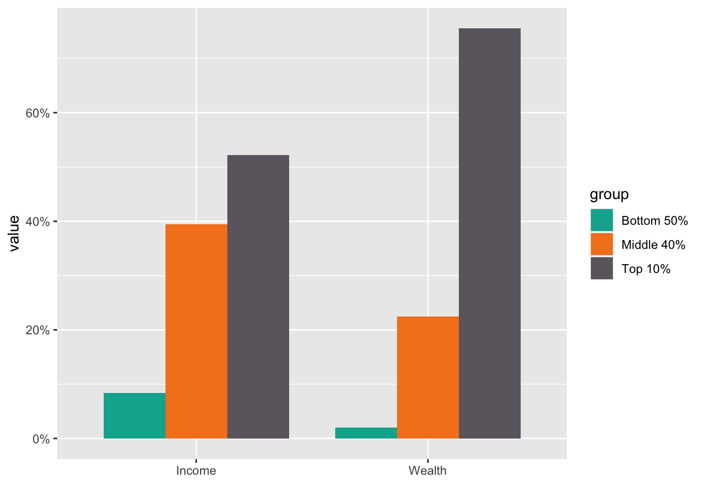
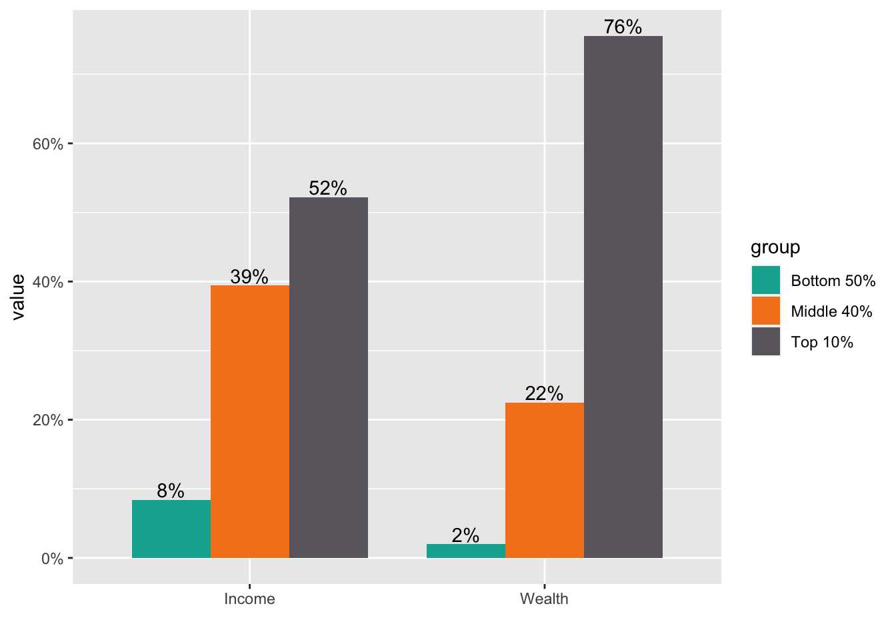
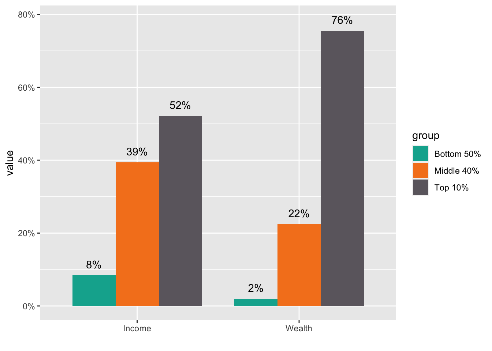
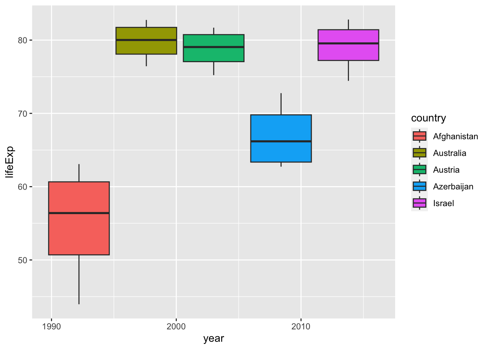
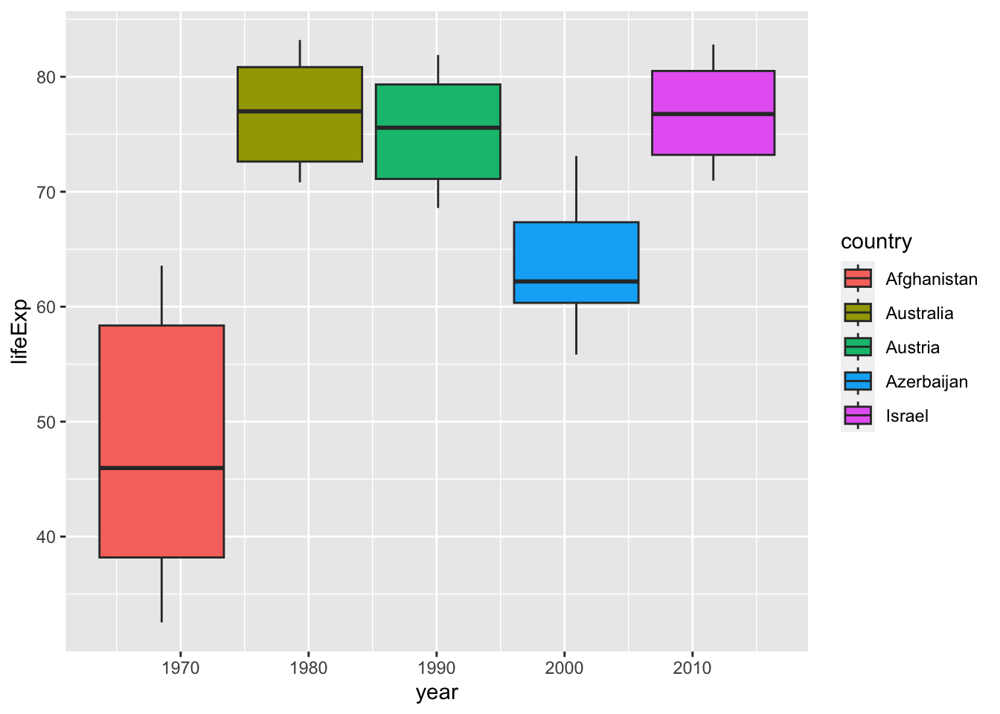

# Assignment Four {#a4resp}

### Assignment Four: The Week Five Assignment {.unnumbered}

**`tidyr` and WIR2022**

-   Create an R Notebook of a Data Analysis containing the following and submit the rendered HTML file (e.g., `a3_123456.nb.html` by replacing 123456 with your ID)
    1.  create an R Notebook using the R Notebook Template in Moodle, save it as `a3_123456.Rmd`,
    2.  write your name and ID and the contents,
    3.  run each code block,
    4.  preview to create `a3_123456.nb.html`,
    5.  submit `a3_123456.nb.html` to Moodle.

1.  Choose data with at least two categorical variables and at least two numerical variables.

    -   Information of the data: Name, Indicator, Description, Source, etc.
    -   Explain why you chose the indicator
    -   List questions you want to study

2.  Explore the data using visualization using `ggplot2`.

    -   Create various charts
    -   Create at least one chart with at least two categorical variables and one numerical variable.
    -   Create at least one chart with at least two numerical and one categorical variable.

3.  Observations based on your data visualization and difficulties and questions encountered, if any.

**Due:** 2023-01-23 23:59:00. Submit your R Notebook file in Moodle (The Fourth Assignment). Due on Monday!

## Set up


```r
library(tidyverse)
#> ── Attaching packages ─────────────────── tidyverse 1.3.2 ──
#> ✔ ggplot2 3.4.1     ✔ purrr   1.0.1
#> ✔ tibble  3.1.8     ✔ dplyr   1.1.0
#> ✔ tidyr   1.3.0     ✔ stringr 1.5.0
#> ✔ readr   2.1.4     ✔ forcats 1.0.0
#> ── Conflicts ────────────────────── tidyverse_conflicts() ──
#> ✖ dplyr::filter() masks stats::filter()
#> ✖ dplyr::lag()    masks stats::lag()
library(readxl) # for excel files
library(WDI)
```

### World Development Indicator - WDI

The following is useful when you use WDI.


```r
wdi_cache <- WDIcache()
```

Or, write the cache and read it from your computer. Since `wdi_cache` is a list of two data frames, we cannot use `write_csv()`; instead, we use `write_rds`.


```r
write_rds(wdi_cache, "./data/wdi_cache.RData")
```


```r
wdi_cache <- read_rds("./data/wdi_cache.RData")
```

`WDIcache()` produces a list containing two data frames: `wdi_cache$series` and `wdi_cache$country`.


```r
glimpse(wdi_cache)
#> List of 2
#>  $ series :'data.frame':	21034 obs. of  5 variables:
#>   ..$ indicator         : chr [1:21034] "1.0.HCount.1.90usd" "1.0.HCount.2.5usd" "1.0.HCount.Mid10to50" "1.0.HCount.Ofcl" ...
#>   ..$ name              : chr [1:21034] "Poverty Headcount ($1.90 a day)" "Poverty Headcount ($2.50 a day)" "Middle Class ($10-50 a day) Headcount" "Official Moderate Poverty Rate-National" ...
#>   ..$ description       : chr [1:21034] "The poverty headcount index measures the proportion of the population with daily per capita income (in 2011 PPP"| __truncated__ "The poverty headcount index measures the proportion of the population with daily per capita income (in 2005 PPP"| __truncated__ "The poverty headcount index measures the proportion of the population with daily per capita income (in 2005 PPP"| __truncated__ "The poverty headcount index measures the proportion of the population with daily per capita income below the of"| __truncated__ ...
#>   ..$ sourceDatabase    : chr [1:21034] "LAC Equity Lab" "LAC Equity Lab" "LAC Equity Lab" "LAC Equity Lab" ...
#>   ..$ sourceOrganization: chr [1:21034] "LAC Equity Lab tabulations of SEDLAC (CEDLAS and the World Bank)." "LAC Equity Lab tabulations of SEDLAC (CEDLAS and the World Bank)." "LAC Equity Lab tabulations of SEDLAC (CEDLAS and the World Bank)." "LAC Equity Lab tabulations of data from National Statistical Offices." ...
#>  $ country:'data.frame':	299 obs. of  9 variables:
#>   ..$ iso3c    : chr [1:299] "ABW" "AFE" "AFG" "AFR" ...
#>   ..$ iso2c    : chr [1:299] "AW" "ZH" "AF" "A9" ...
#>   ..$ country  : chr [1:299] "Aruba" "Africa Eastern and Southern" "Afghanistan" "Africa" ...
#>   ..$ region   : chr [1:299] "Latin America & Caribbean" "Aggregates" "South Asia" "Aggregates" ...
#>   ..$ capital  : chr [1:299] "Oranjestad" "" "Kabul" "" ...
#>   ..$ longitude: chr [1:299] "-70.0167" "" "69.1761" "" ...
#>   ..$ latitude : chr [1:299] "12.5167" "" "34.5228" "" ...
#>   ..$ income   : chr [1:299] "High income" "Aggregates" "Low income" "Aggregates" ...
#>   ..$ lending  : chr [1:299] "Not classified" "Aggregates" "IDA" "Aggregates" ...
```

### World Inequility Report - WIR2022

* World Inequality Report: https://wir2022.wid.world/
* Executive Summary: https://wir2022.wid.world/executive-summary/
* Methodology: https://wir2022.wid.world/methodology/
* URL of Executive Summary Data: https://wir2022.wid.world/www-site/uploads/2022/03/WIR2022TablesFigures-Summary.xlsx

Please add `mode="wb"` (web binary). This should work better. 


```r
url_summary <- "https://wir2022.wid.world/www-site/uploads/2022/03/WIR2022TablesFigures-Summary.xlsx"
download.file(url = url_summary, 
              destfile = "./data/WIR2022s.xlsx", 
              mode = "wb") 
```

If you get an error, download the file directory from the methodology site into your computer, then open it with Excel and save it in the data folder of your R Studio project. Then R studio can recognize it easily as an Excel data.

Generally, a text file such as a CSV file is easy to import, but a binary file is difficult to handle. It is because unless R can recognize its file type, for example, Excel or so, R cannot import the data.


```r
excel_sheets("./data/WIR2022s.xlsx")
#>  [1] "Index"     "F1"        "F2"        "F3"       
#>  [5] "F4"        "F5."       "F6"        "F7"       
#>  [9] "F8"        "F9"        "F10"       "F11"      
#> [13] "F12"       "F13"       "F14"       "F15"      
#> [17] "T1"        "data-F1"   "data-F2"   "data-F3"  
#> [21] "data-F4"   "data-F5"   "data-F6"   "data-F7"  
#> [25] "data-F8"   "data-F9"   "data-F10"  "data-F11" 
#> [29] "data-F12"  "data-F13." "data-F14." "data-F15"
```


## General Comments

### Reproducibility and Literate Programming

Reproducibility and Literate Programming are critical to exploratory data analysis (EDA). These are for communication; communication with readers of the paper, graders of the assignments, and communication with yourself, as we always forget. Please think about the reader of the article, and record the procedure and output so that reader can easily understand what you have done.

The data source is critical. Unless the reader obtains the same data quickly, the communication on EDA does not start. If the data is not downloaded automatically through the code chunk, you should explain how to obtain the data and the part of the data you applied. It is crucial when you use copying and paste using `read_delim(clipboard())`. Please describe the way for the reader to retrieve the same data easily. It is best to read your paper; in some cases, it can be a hard copy from the beginning to check whether the reader can reproduce what you have done in the article.

### Varibles

In this Assignment Four, we required the following:

-   Create at least one chart with at least two categorical variables and one numerical variable.
-   Create at least one chart with at least two numerical and one categorical variable.

You can create a simple chart, such as a histogram or a box plot with only one variable. If you have two variables, you can create a scatter plot. But with `ggplot2`, you can create various charts with rich information using more than two variables. For example, the year can be used for both numerical and categorical variables using `factor(year)` or recognized as a character vector by `as.character(year)`. So the distinction between categorical variables and numerical variables is flexible. The purpose of this assignment is to experience creating a chart with rich information using more than two variables.

However, I needed to clarify the variables' requirements for some of you. So I sent out an extra message from Announcement that you do not need to take it so strictly.

If you use WDI, the following may be examples:

-   two categorical and one numerical: a. country, region, and indicator; b. country, income, and indicator; c. after selecting a couple of years and using factor(year), country, indicator, d. create a table using group_by and summarize this type, etc.
-   two numerical and one categorical: a. year, indicator, and country; b. two indicators and region, etc.

If you use WIR, the following may be examples you saw in the executive summary:

-   two categorical and one numerical: F1, F2, F4, F13 (year in this case is categorical), F15

-   two numerical and one categorical: F6, F7, F10

-   Three categorical: F3

-   Two categorical and two numerical: F8, F11

### Visualization

Data visualization is a key to EDA. Create various charts and write your observations you can or cannot obtain from the chart.

The following are the first two fundamental questions you keep in mind.

-   What type of variation occurs within my variables?
-   What type of covariation occurs between my variables?

## Your Work

Here is a list of data your classmates used for Assignment Four.

### World Inequality Report 2022 - WIR

- WIR2022TablesFigures-Summary.xlsx: Data of Exective Summary
- WIR2022TablesFigures-Chapter6.xlsx: 
Historical and current emissions, Income and Population by world region

### World Development Indicators - WDI

- SP.DYN.TFRT.IN:	Fertility rate, total (births per woman)
- SP.POP.GROW: Population growth (annual %)
- NY.GDP.MKTP.CD: GDP (current US$)
- NY.GDP.MKTP.KD.ZG: GDP growth (annual %)
- BX.KLT.DINV.CD.WD: Foreign Direct Investment (FDI) inflows
- BX.KLT.DINV.CD.WD: Foreign direct investment, net inflows (BoP, current US$)
- BN.CAB.XOKA.CD: Current account balance (BoP, current US$)
- NE.EXP.GNFS.KD: Exports of goods and services (constant 2015 US$)
- NE.IMP.GNFS.KD: Imports of goods and services (constant 2015 US$)
- BX.TRF.PWKR.CD.DT: Personal remittances, received (current US$)
- NY.GNS.ICTR.ZS: Gross savings (% of GDP)
- EN.ATM.CO2E.KT: CO2 emissions (kt)
- SE.XPD.TOTL.GB.ZS: Government expenditure on education, total (% of government expenditure)
- SE.ENR.PRSC.FM.ZS: School enrollment, primary and secondary (gross), gender parity index (GPI)
- SE.PRM.UNER.FE: Children out of school, primary, female
- SE.PRM.UNER.MA: Children out of school, primary, male


### United Nations - UNdata

- Education: "https://data.un.org/_Docs/SYB/CSV/SYB65_309_202209_Education.csv"
- Population: "https://data.un.org/_Docs/SYB/CSV/SYB65_246_202209_Population%20Growth,%20Fertility%20and%20Mortality%20Indicators.csv"


## Responses to Questions

### Q. WIR2022, F8 with a fixed year, say 2020 describing the difference of goevernment and private income.

As for WIR2022, please refer to: https://ds-sl.github.io/data-analysis/wir2022.nb.html

I added explanations to each chart.

* Step 1. Import the data

There is a step-by-step explanation of how to recreate a chart.


```r
df_f8 <- read_excel("./data/WIR2022s.xlsx", sheet = "data-F8")
df_f8
#> # A tibble: 51 × 17
#>     year Germany German…¹ Spain Spain…² France Franc…³    UK
#>    <dbl>   <dbl>    <dbl> <dbl>   <dbl>  <dbl>   <dbl> <dbl>
#>  1  1970   1.11      2.30 0.604    4.06  0.422    3.12 0.601
#>  2  1971   1.12      2.25 0.657    4.53  0.443    3.06 0.689
#>  3  1972   1.11      2.27 0.624    4.36  0.467    3.08 0.790
#>  4  1973   1.11      2.23 0.596    4.46  0.478    3.06 0.929
#>  5  1974   1.13      2.25 0.586    4.64  0.498    3.03 1.09 
#>  6  1975   1.12      2.35 0.602    4.83  0.545    3.12 1.00 
#>  7  1976   1.03      2.34 0.581    4.46  0.561    3.08 0.918
#>  8  1977   1.01      2.42 0.586    4.10  0.567    3.10 0.867
#>  9  1978   0.990     2.52 0.604    4.10  0.580    3.20 0.881
#> 10  1979   0.989     2.55 0.621    4.20  0.624    3.30 0.955
#> # … with 41 more rows, 9 more variables:
#> #   `UK (private)` <dbl>, Japan <dbl>,
#> #   `Japan (private)` <dbl>, Norway <dbl>,
#> #   `Norway (private)` <dbl>, USA <dbl>,
#> #   `USA (private)` <dbl>, gwealAVGRICH <dbl>,
#> #   pwealAVGRICH <dbl>, and abbreviated variable names
#> #   ¹​`Germany (private)`, ²​`Spain (private)`, …
```

* Step 2. Tidy up the data by `pivot_longer`.


```r
df_f8_rev <- df_f8 %>% filter(year == "2020") %>%
  select(year, Germany_public = Germany, Germany_private = 'Germany (private)', 
         Spain_public = Spain, Spain_private = 'Spain (private)', 
         France_public = France, France_private = 'France (private)', 
         UK_public  = UK, UK_private = 'UK (private)', 
         Japan_public = Japan, Japan_private = 'Japan (private)', 
         Norway_public = Norway, Norway_private = 'Norway (private)',
         USA_public = USA, USA_private = 'USA (private)') %>%
  pivot_longer(!year, names_to = c("country",".value"), names_sep = "_") %>%
  pivot_longer(3:4, names_to = "type", values_to = "value")
df_f8_rev
#> # A tibble: 14 × 4
#>     year country type     value
#>    <dbl> <chr>   <chr>    <dbl>
#>  1  2020 Germany public   0.180
#>  2  2020 Germany private  5.02 
#>  3  2020 Spain   public  -0.161
#>  4  2020 Spain   private  7.03 
#>  5  2020 France  public  -0.128
#>  6  2020 France  private  6.33 
#>  7  2020 UK      public  -1.06 
#>  8  2020 UK      private  6.82 
#>  9  2020 Japan   public  -0.338
#> 10  2020 Japan   private  6.68 
#> 11  2020 Norway  public   4.98 
#> 12  2020 Norway  private  0.328
#> 13  2020 USA     public  -0.603
#> 14  2020 USA     private  5.92
```

* Step 3. Visualize using `ggplot2`.

Then, in this case, `geom_col` seems to fit.


```r
df_f8_rev %>%
  ggplot() +
  geom_col(aes(x = country, y = value, fill = type), position = "dodge") +
  scale_y_continuous(labels = scales::percent_format(accuracy = 1)) +
  labs(title = "Private versus public wealth in rich countries in 2020", 
       x = "", y = "wealth as % of national income", color = "", type = "")
```


Can you find a similar data of other countries of this type?

It is in Chapter 3 of the report:

https://wir2022.wid.world/chapter-3/

From methodology, I explained on January 25, you can download the data for chapter three: WIR2022TablesFigures-Chapter3.xlsx


### Q. The line graph looked strange at first and I couldn’t really see the results clearly. However, I could solve that problem by using “smoothstat” and then the results looked way better and I was able to interpret them easily.

The strange looking line graph is called a sawtooth shape, and happens very often. So let me explain it

* WDI indicator: BX.KLT.DINV.CD.WD: Foreign Direct Investment (FDI) inflows

* Step 1. Import the data.


```r
df_fdi <- WDI(country = "all", indicator = c(fdi = "BX.KLT.DINV.CD.WD"), start =1970 , extra = TRUE, cache = NULL)
df_fdi
```


```
#> Rows: 13832 Columns: 13
#> ── Column specification ────────────────────────────────────
#> Delimiter: ","
#> chr  (7): country, iso2c, iso3c, region, capital, income...
#> dbl  (4): year, fdi, longitude, latitude
#> lgl  (1): status
#> date (1): lastupdated
#> 
#> ℹ Use `spec()` to retrieve the full column specification for this data.
#> ℹ Specify the column types or set `show_col_types = FALSE` to quiet this message.
```

* Step 2. Check the list of `income` names.

The following code in `Base R` does the same as the following using `tidyverse`: 
`df_fdi %>% distinct(income) %>% pull()`. 
If the list is long, it may be better to check using `tibble` by ``df_fdi %>% distinct(income)`. You can also use `DT::datatable(df_fdi)` and search items of interest, though it takes up a lot of memory.


```r
unique(df_fdi$income)
#> [1] "Low income"          "Aggregates"         
#> [3] "Upper middle income" "Lower middle income"
#> [5] "High income"         NA                   
#> [7] "Not classified"
```

* Step 3. Try a line graph.


```r
df_fdi %>% ggplot(aes(x=year, y=fdi, color=income)) + geom_line()
#> Warning: Removed 7 rows containing missing values
#> (`geom_line()`).
```


We observe several problems. But the most significant issue is it looks like a sawtooth. It is because there are so many `y` values at the same `x` value. When you draw a line graph, you need to choose only several countries or use group_by and summarize and use summarized data. However, there is an option; we can use a model to summarize the data of each group using `geom_smooth()`. Since you do not want a line but a curve, we use "loess" with `span`, we used to draw some of WIR2022 charts.

* Step 4. Let us try `group_by` and `summarize`.


```r
df_fdi %>% drop_na(fdi) %>% drop_na(income) %>% 
  filter(!income %in% c("Aggregates","Not classified")) %>%
  group_by(income, year) %>% summarize(fdi_mean = mean(fdi)) %>% 
  ggplot(aes(x=year,y=fdi_mean,color=income)) + 
  geom_line()
#> `summarise()` has grouped output by 'income'. You can
#> override using the `.groups` argument.
```


If you do not want the message '`summarise()` has grouped output by 'income'. You can override using the `.groups` argument.' try the following by adding `.group = drop`.


```r
df_fdi %>% drop_na(fdi) %>% drop_na(income) %>% 
  filter(!income %in% c("Aggregates","Not classified")) %>%
  group_by(income, year) %>% summarize(fdi_mean = mean(fdi), .groups = "drop") %>% 
  ggplot(aes(x=year,y=fdi_mean,color=income)) + 
  geom_line()
```


* Step 5. Let us try `geom_smooth` with `loess` and `span`.

Do you see similarities and differences? We need to choose the one from the other by our objective, and explain


```r
df_fdi  %>% drop_na(fdi) %>% drop_na(income) %>% 
  filter(!income %in% c("Aggregates","Not classified")) %>%
  ggplot(aes(x=year,y=fdi,color=income)) + 
  geom_smooth(formula = y~x, method = "loess", span = 0.25, se = FALSE)
```



* Step 6. Change of the scale.

It may be a good choice to use `scale_y_log10()`. However, since log10 is not finite if the value is not positive, you need to choose those with the indicator positive. Let us see how many zero values are in each income level.


```r
df_fdi %>% filter(!income %in% c(NA, "Aggregates")) %>% filter(fdi <= 0) %>%
  ggplot(aes(x = income, fill = income)) + geom_bar() + 
  labs(title = "Number of countries with FDI is not positive") +
  theme(legend.position = "none")
```




```r
df_fdi %>% drop_na(income) %>% filter(fdi > 0) %>%
  filter(!income %in% c("Aggregates","Not classified")) %>%
  ggplot(aes(x=year,y=fdi,color=income)) + 
  geom_smooth(formula = y~x, method = "loess", span = 0.25, se = FALSE) +
  scale_y_log10() + labs(title="The Value FID < 0 or Zero Excluded")
```



**Note.** If this is the target chart, it may be better to check the number of NA values, 0 values, negative values, and nonzero values in each income group. I add `  mutate(value = factor(value, levels = c("Positive", "Zero", "Negative", "NA"), labels = c("Positive", "Zero", "Negative", "NA")))` in order to set the order of the labels. Please try the same without the line.


```r
df_fdi %>% select(country, year, fdi, income) %>%
  filter(!income %in% c("Aggregates", NA)) %>% 
  mutate(value = case_when(
    fdi == NA ~ "NA",
    fdi == 0  ~ "Zero",
    fdi < 0  ~ "Negative",
    fdi > 0 ~ "Positive")) %>%
  mutate(value = factor(value, levels = c("Positive", "Zero", "Negative", "NA"), labels = c("Positive", "Zero", "Negative", "NA"))) %>%
  group_by(income, value) %>% summarize(n = n(), .groups = "drop") %>% 
  ggplot(aes(income, n, fill = value)) + geom_col(position="dodge") + 
  labs(x = "")
```


### Q. How is it possible to organize better the name of the value in the x axis so that they are better readable?

* In the example above, the labels are overlapping. One way is to give an angle to the text with `vjust` and `hjust` values to place the labels in appropriate places: `theme(axis.text.x = element_text(angle = 30, vjust = 1, hjust=1))`


```r
df_fdi %>% select(country, year, fdi, income) %>%
  filter(!income %in% c("Aggregates", NA)) %>% 
  mutate(value = case_when(
    fdi == NA ~ "NA",
    fdi == 0  ~ "Zero",
    fdi < 0  ~ "Negative",
    fdi > 0 ~ "Positive")) %>%
  mutate(value = factor(value, levels = c("Positive", "Zero", "Negative", "NA"), labels = c("Positive", "Zero", "Negative", "NA"))) %>%
  group_by(income, value) %>% summarize(n = n(), .groups = "drop") %>% 
  ggplot(aes(income, n, fill = value)) + geom_col(position="dodge") + 
  theme(axis.text.x = element_text(angle = 30, vjust = 1, hjust=1)) + 
  labs(x = "")
```


* You can use another package `stringr` included in `tidyverse` but not loaded. `scale_x_discrete(labels = function(x) stringr::str_wrap(x, width = 15))`
Change the width value to fit to your chart. If you add library(stringr), then `scale_x_discrete(labels = function(x) str_wrap(x, width = 15))` is enough.


```r
df_fdi %>% select(country, year, fdi, income) %>%
  filter(!income %in% c("Aggregates", NA)) %>% 
  mutate(value = case_when(
    fdi == NA ~ "NA",
    fdi == 0  ~ "Zero",
    fdi < 0  ~ "Negative",
    fdi > 0 ~ "Positive")) %>%
  mutate(value = factor(value, levels = c("Positive", "Zero", "Negative", "NA"), labels = c("Positive", "Zero", "Negative", "NA"))) %>%
  group_by(income, value) %>% summarize(n = n(), .groups = "drop") %>% 
  ggplot(aes(income, n, fill = value)) + geom_col(position="dodge") + 
  scale_x_discrete(labels = function(x) stringr::str_wrap(x, width = 15)) + 
  labs(x = "")
```


* If you have a long name for the title, use `\n` for the line feed.


```r
df_fdi %>% select(country, year, fdi, income) %>%
  filter(!income %in% c("Aggregates", NA)) %>% 
  mutate(value = case_when(
    fdi == NA ~ "NA",
    fdi == 0  ~ "Zero",
    fdi < 0  ~ "Negative",
    fdi > 0 ~ "Positive")) %>%
  mutate(value = factor(value, levels = c("Positive", "Zero", "Negative", "NA"), labels = c("Positive", "Zero", "Negative", "NA"))) %>%
  group_by(income, value) %>% summarize(n = n(), .groups = "drop") %>% 
  ggplot(aes(income, n, fill = value)) + geom_col(position="dodge") + 
  scale_x_discrete(labels = function(x) stringr::str_wrap(x, width = 15)) + 
  labs(title = "long long long long long long long \nlong long long title", x = "")
```


### Q. Position of the labels

* Step 1. If you want to use you own color palette, choose the codes or the color names from the following sites.

  - Color Names: http://www.cookbook-r.com/Graphs/Colors_(ggplot2)/
  - RGB codes: https://www.rapidtables.com/web/color/RGB_Color.html


```r
color_list <- c("#00AE9D","#F58220","#6C676E")
```

* Import the data and tidy up


```r
df_f1 <- read_excel("./data/WIR2022s.xlsx", sheet = "data-F1")
#> New names:
#> • `` -> `...1`
df_f1_rev <- pivot_longer(df_f1, -1, names_to = "group", values_to = "value")
df_f1_rev
#> # A tibble: 8 × 3
#>   ...1   group       value
#>   <chr>  <chr>       <dbl>
#> 1 Income Bottom 50% 0.084 
#> 2 Income Middle 40% 0.394 
#> 3 Income Top 10%    0.522 
#> 4 Income Top 1%     0.192 
#> 5 Wealth Bottom 50% 0.0199
#> 6 Wealth Middle 40% 0.224 
#> 7 Wealth Top 10%    0.756 
#> 8 Wealth Top 1%     0.378
```

* Step 3. Visualize the data using `geom_col()`, change the default fill color using the list of the color in Step 1, and change the scale of the y axis into percents. 


```r
df_f1_rev[df_f1_rev$group != "Top 1%",] %>%
  ggplot(aes(x = ...1, y = value, fill = group)) + 
  geom_col(position = "dodge", width = 0.8) + 
  scale_fill_manual(values = color_list) + 
  scale_y_continuous(labels = scales::percent_format(accuracy = 1)) +
  labs(x = "")
```



* Step 4. Add the values in the text. Do not forget that the values should be in percentages.


```r
df_f1_rev[df_f1_rev$group != "Top 1%",] %>%
  ggplot(aes(x = ...1, y = value, fill = group)) + 
  geom_col(position = "dodge", width = 0.8) + 
  scale_fill_manual(values = color_list) +
  scale_y_continuous(labels = scales::percent_format(accuracy = 1)) +
  labs(x="") +
  geom_text(aes(x = ...1, y = value, group = group, 
            label = scales::label_percent(accuracy=1)(value)), 
            position = position_dodge(0.8))  
```


* Step 5. If you want to change the locations of texts use `vjust = -0.2`. 


```r
df_f1_rev[df_f1_rev$group != "Top 1%",] %>%
  ggplot(aes(x = ...1, y = value, fill = group)) + 
  geom_col(position = "dodge", width = 0.8) + 
  scale_fill_manual(values = color_list) +
  scale_y_continuous(labels = scales::percent_format(accuracy = 1)) +
  labs(x="") +
  geom_text(aes(x = ...1, y = value, group = group, 
            label = scales::label_percent(accuracy=1)(value)), vjust = -0.2,
            position = position_dodge(0.8))  
```



* One student used another method to add `0.03` to the value of `y` by `y = value+0.03`. Great!


```r
df_f1_rev[df_f1_rev$group != "Top 1%",] %>%
  ggplot(aes(x = ...1, y = value, fill = group)) + 
  geom_col(position = "dodge", width = 0.8) + 
  scale_fill_manual(values = color_list) +
  scale_y_continuous(labels = scales::percent_format(accuracy = 1)) +
  labs(x="") +
  geom_text(aes(x = ...1, y = value+0.03, group = group, 
            label = scales::label_percent(accuracy=1)(value)), 
            position = position_dodge(0.8))  
```


## My Comments after Review

### Visualization by Charts

Please try as various charts as possible. You can learn only by experience or from others.

#### Treat `year` as a group?


```r
df_wdi <- WDI(
  country = "all", 
  indicator = c(lifeExp = "SP.DYN.LE00.IN"), start = 1990, extra = TRUE, cache =  wdi_cache)
df_wdi
```


```
#> Rows: 16492 Columns: 7
#> ── Column specification ────────────────────────────────────
#> Delimiter: ","
#> chr (3): country, iso2c, iso3c
#> dbl (4): year, lifeExp, pop, gdpPercap
#> 
#> ℹ Use `spec()` to retrieve the full column specification for this data.
#> ℹ Specify the column types or set `show_col_types = FALSE` to quiet this message.
```

* Something is wrong in the next chart. Can you tell what the problem is?


```r
df_wdi %>%
  filter(year %in% c("1988", "1998", "2008", "2018")) %>%
  filter(country %in% c("Afghanistan", "Israel", "Azerbaijan", "Austria", "Australia")) %>%
  ggplot(aes(x=year)) +
  geom_boxplot(aes(y=lifeExp, fill=country))
```



I erased the second line: `filter(year %in% c("1988", "1998", "2008", "2018"))` but the result is very similar. 


```r
df_wdi %>%
  filter(country %in% c("Afghanistan", "Israel", "Azerbaijan", "Austria", "Australia")) %>%
  ggplot(aes(x=year)) +
  geom_boxplot(aes(y=lifeExp, fill=country))
#> Warning: Removed 9 rows containing non-finite values
#> (`stat_boxplot()`).
```



If you look at the table, you can see that year is a integer vector, not a character vector. Then what happens if we remove quotation marks. The next chart is not a box plot anymore. It is because, for each year there is only one value for each country.


```r
df_wdi %>%
  filter(year %in% c(1988, 1998, 2008, 2018)) %>%
  filter(country %in% c("Afghanistan", "Israel", "Azerbaijan", "Austria", "Australia")) %>%
  ggplot(aes(x=factor(year))) +
  geom_boxplot(aes(y=lifeExp, fill=country))
```


If we want to take `year` as a group after selecting some years, then we should try the next using `factor(year)`. You can change the label of x axis by
  `labs(x = "year")` easily. We should also notice that there are no values for 1988. We should check basic information as such first.


```r
df_wdi %>%
  filter(year %in% c(1988, 1998, 2008, 2018)) %>%
  filter(country %in% c("Afghanistan", "Israel", "Azerbaijan", "Austria", "Australia")) %>%
  ggplot(aes(x=factor(year), y=lifeExp, fill=country)) +
  geom_col(position = "dodge", col = "black")
```


It is possible if you change year to a character vector by `mutate(year = as.character(year))`.


```r
df_wdi %>% mutate(year = as.character(year)) %>% 
  filter(year %in% c("1998", "2008", "2018")) %>%
  filter(country %in% c("Afghanistan", "Israel", "Azerbaijan", "Austria", "Australia")) %>%
  ggplot(aes(x=year, y=lifeExp, fill=country)) +
  geom_col(position = "dodge", col = "black") +
  labs(x = "year")
```


### UN Data

* UNdata: https://data.un.org

Data of World Development Indicators are in a uniform format and downloadable using an R package WDI. So it is easy to handle. However, other data require data transformation to make it tidy. We give a couple of examples. Most of the UN data, they are in CSV, and you can get a link quickly, or download it by clicking. Though the data structure is not uniform, it is relatively easy to handle.

#### Education

By the following, you can see that the first row is not the column name. R gives column names such as ...1, ...2, etc., when the column name is void.

You can copy the link (url) by right click or ctrl+click.


```r
url_un_edu <- "https://data.un.org/_Docs/SYB/CSV/SYB65_309_202209_Education.csv"
```


```r
un_edu <- read_csv(url_un_edu)
un_edu %>% slice(1:10)
```


Let is skip the first row by adding `skip = 1`.


```r
un_edu <- read_csv(url_un_edu, skip = 1)
un_edu %>% slice(1:10)
```


```
#> Rows: 7282 Columns: 7
#> ── Column specification ────────────────────────────────────
#> Delimiter: ","
#> chr (4): ...2, Series, Footnotes, Source
#> dbl (3): Region/Country/Area, Year, Value
#> 
#> ℹ Use `spec()` to retrieve the full column specification for this data.
#> ℹ Specify the column types or set `show_col_types = FALSE` to quiet this message.
#> # A tibble: 10 × 7
#>    Region/Country…¹ ...2   Year Series  Value Footn…² Source
#>               <dbl> <chr> <dbl> <chr>   <dbl> <chr>   <chr> 
#>  1                1 Tota…  2005 Stude… 6.79e5 <NA>    Unite…
#>  2                1 Tota…  2005 Gross… 1.04e2 <NA>    Unite…
#>  3                1 Tota…  2005 Gross… 9.97e1 <NA>    Unite…
#>  4                1 Tota…  2005 Stude… 5.09e5 <NA>    Unite…
#>  5                1 Tota…  2005 Gross… 6.58e1 <NA>    Unite…
#>  6                1 Tota…  2005 Gross… 6.23e1 <NA>    Unite…
#>  7                1 Tota…  2005 Stude… 2.00e5 <NA>    Unite…
#>  8                1 Tota…  2005 Gross… 5.12e1 <NA>    Unite…
#>  9                1 Tota…  2005 Gross… 4.83e1 <NA>    Unite…
#> 10                1 Tota…  2010 Stude… 6.97e5 <NA>    Unite…
#> # … with abbreviated variable names ¹​`Region/Country/Area`,
#> #   ²​Footnotes
```

It is a very large data, and we need to check the values.


```r
summary(un_edu)
#>  Region/Country/Area     ...2                Year     
#>  Min.   :  1.0       Length:7282        Min.   :2000  
#>  1st Qu.:178.0       Class :character   1st Qu.:2005  
#>  Median :417.0       Mode  :character   Median :2010  
#>  Mean   :408.8                          Mean   :2012  
#>  3rd Qu.:626.0                          3rd Qu.:2015  
#>  Max.   :894.0                          Max.   :2021  
#>     Series              Value           Footnotes        
#>  Length:7282        Min.   :     0.0   Length:7282       
#>  Class :character   1st Qu.:    71.6   Class :character  
#>  Mode  :character   Median :   100.2   Mode  :character  
#>                     Mean   :  2534.7                     
#>                     3rd Qu.:   133.6                     
#>                     Max.   :750125.0                     
#>     Source         
#>  Length:7282       
#>  Class :character  
#>  Mode  :character  
#>                    
#>                    
#> 
```
We can see that the Year is from 2000 to 2021. The first variable, Region/Country/Area and the fifth variable, Value are `dbl`, i.e., double; hence, these are numerical variables, and you can see them from the summary as well. But it is not easy to see other variables. Let us try them one by one.


```r
un_edu %>% distinct(...2)
#> # A tibble: 224 × 1
#>    ...2                         
#>    <chr>                        
#>  1 Total, all countries or areas
#>  2 Northern Africa              
#>  3 Sub-Saharan Africa           
#>  4 Northern America             
#>  5 Latin America & the Caribbean
#>  6 Central Asia                 
#>  7 Eastern Asia                 
#>  8 South-eastern Asia           
#>  9 Southern Asia                
#> 10 Western Asia                 
#> # … with 214 more rows
```


```r
un_edu %>% distinct(Series)
#> # A tibble: 9 × 1
#>   Series                                                    
#>   <chr>                                                     
#> 1 Students enrolled in primary education (thousands)        
#> 2 Gross enrollment ratio - Primary (male)                   
#> 3 Gross enrollment ratio - Primary (female)                 
#> 4 Students enrolled in secondary education (thousands)      
#> 5 Gross enrollment ratio - Secondary (male)                 
#> 6 Gross enrollment ratio - Secondary (female)               
#> 7 Students enrolled in upper secondary education (thousands)
#> 8 Gross enrollment ratio - Upper secondary level (male)     
#> 9 Gross enrollment ratio - Upper secondary level (female)
```

```r
un_edu %>% distinct(Footnotes)
#> # A tibble: 2 × 1
#>   Footnotes
#>   <chr>    
#> 1 <NA>     
#> 2 Estimate.
```


```r
un_edu %>% distinct(Source)
#> # A tibble: 1 × 1
#>   Source                                                    
#>   <chr>                                                     
#> 1 United Nations Educational, Scientific and Cultural Organ…
```

* We may need to handle Footnotes carefully later, but for the first exploration, we need, ...2 for Region, Year, Series, Values.


```r
df_un_edu <- un_edu %>%
  select(Region = ...2, Year, Series, Value)
df_un_edu
#> # A tibble: 7,282 × 4
#>    Region                         Year Series          Value
#>    <chr>                         <dbl> <chr>           <dbl>
#>  1 Total, all countries or areas  2005 Students enro… 6.79e5
#>  2 Total, all countries or areas  2005 Gross enrollm… 1.04e2
#>  3 Total, all countries or areas  2005 Gross enrollm… 9.97e1
#>  4 Total, all countries or areas  2005 Students enro… 5.09e5
#>  5 Total, all countries or areas  2005 Gross enrollm… 6.58e1
#>  6 Total, all countries or areas  2005 Gross enrollm… 6.23e1
#>  7 Total, all countries or areas  2005 Students enro… 2.00e5
#>  8 Total, all countries or areas  2005 Gross enrollm… 5.12e1
#>  9 Total, all countries or areas  2005 Gross enrollm… 4.83e1
#> 10 Total, all countries or areas  2010 Students enro… 6.97e5
#> # … with 7,272 more rows
```

Is there a way to separate regions from countries?


```r
df_un_edu %>% left_join(wdi_cache$country, by = c("Region"="country")) %>%
  filter(!is.na(iso2c)) %>% distinct(Region)
#> # A tibble: 176 × 1
#>    Region             
#>    <chr>              
#>  1 Afghanistan        
#>  2 Albania            
#>  3 Algeria            
#>  4 Andorra            
#>  5 Angola             
#>  6 Antigua and Barbuda
#>  7 Argentina          
#>  8 Armenia            
#>  9 Aruba              
#> 10 Australia          
#> # … with 166 more rows
```


```r
df_un_edu %>% left_join(wdi_cache$country, by = c("Region"="country")) %>%
  filter(is.na(iso2c)) %>% distinct(Region)
#> # A tibble: 48 × 1
#>    Region                       
#>    <chr>                        
#>  1 Total, all countries or areas
#>  2 Northern Africa              
#>  3 Sub-Saharan Africa           
#>  4 Northern America             
#>  5 Latin America & the Caribbean
#>  6 Central Asia                 
#>  7 Eastern Asia                 
#>  8 South-eastern Asia           
#>  9 Southern Asia                
#> 10 Western Asia                 
#> # … with 38 more rows
```


```r
df_un_edu %>% left_join(wdi_cache$country, by = c("Region"="country")) %>%
  filter(is.na(iso2c)) %>% distinct(Region) %>% pull()
#>  [1] "Total, all countries or areas"
#>  [2] "Northern Africa"              
#>  [3] "Sub-Saharan Africa"           
#>  [4] "Northern America"             
#>  [5] "Latin America & the Caribbean"
#>  [6] "Central Asia"                 
#>  [7] "Eastern Asia"                 
#>  [8] "South-eastern Asia"           
#>  [9] "Southern Asia"                
#> [10] "Western Asia"                 
#> [11] "Europe"                       
#> [12] "Oceania"                      
#> [13] "Anguilla"                     
#> [14] "Bahamas"                      
#> [15] "Bolivia (Plurin. State of)"   
#> [16] "China, Hong Kong SAR"         
#> [17] "China, Macao SAR"             
#> [18] "Congo"                        
#> [19] "Cook Islands"                 
#> [20] "Côte d’Ivoire"                
#> [21] "Curaçao"                      
#> [22] "Dem. People's Rep. Korea"     
#> [23] "Dem. Rep. of the Congo"       
#> [24] "Egypt"                        
#> [25] "Gambia"                       
#> [26] "Holy See"                     
#> [27] "Iran (Islamic Republic of)"   
#> [28] "Kyrgyzstan"                   
#> [29] "Lao People's Dem. Rep."       
#> [30] "Micronesia (Fed. States of)"  
#> [31] "Montserrat"                   
#> [32] "Netherlands Antilles [former]"
#> [33] "Niue"                         
#> [34] "Republic of Korea"            
#> [35] "Republic of Moldova"          
#> [36] "Saint Kitts and Nevis"        
#> [37] "Saint Lucia"                  
#> [38] "Saint Vincent & Grenadines"   
#> [39] "Slovakia"                     
#> [40] "State of Palestine"           
#> [41] "Sudan [former]"               
#> [42] "Tokelau"                      
#> [43] "Türkiye"                      
#> [44] "United Rep. of Tanzania"      
#> [45] "United States of America"     
#> [46] "Venezuela (Boliv. Rep. of)"   
#> [47] "Viet Nam"                     
#> [48] "Yemen"
```

There are some countries iso2c is not properly assigned. From the list above, Probably, the first 12 are areas and the value contains the aggregated value. 


```r
area <- df_un_edu %>% distinct(Region) %>% slice(1:12) %>% pull()
area
#>  [1] "Total, all countries or areas"
#>  [2] "Northern Africa"              
#>  [3] "Sub-Saharan Africa"           
#>  [4] "Northern America"             
#>  [5] "Latin America & the Caribbean"
#>  [6] "Central Asia"                 
#>  [7] "Eastern Asia"                 
#>  [8] "South-eastern Asia"           
#>  [9] "Southern Asia"                
#> [10] "Western Asia"                 
#> [11] "Europe"                       
#> [12] "Oceania"
```

```r
un_edu_area <- df_un_edu %>% filter(Region %in% area)
un_edu_region <- df_un_edu %>% filter(!Region %in% area)
```

Now we can start studying the data.


```r
un_edu_area %>% 
  filter(Series %in% c("Gross enrollment ratio - Upper secondary level (male)", "Gross enrollment ratio - Upper secondary level (female)")) %>%
  ggplot(aes(Year, Value, color = Region, linetype = Series)) + geom_line()
```


```r
un_edu_area %>% 
  filter(Series %in% c("Gross enrollment ratio - Upper secondary level (male)", "Gross enrollment ratio - Upper secondary level (female)")) %>% 
  pivot_wider(names_from = Series, values_from = Value) %>%
  mutate (Ratio = `Gross enrollment ratio - Upper secondary level (female)`/`Gross enrollment ratio - Upper secondary level (male)`) %>%
  ggplot(aes(Year, Ratio, color = Region, linetype = Region)) + geom_line() +
  labs(title = "Upper Secondary Level Education", subtitle = "Ratio = female/male")
```


#### Population

Data structure is similar to the previous one. So use `skip=1`, and check the variable s briefly.


```r
url_un_pop = "https://data.un.org/_Docs/SYB/CSV/SYB65_246_202209_Population%20Growth,%20Fertility%20and%20Mortality%20Indicators.csv"
df_un_pop <- read.csv(url_un_pop, skip = 1)
df_un_pop
```


```
#> Rows: 6654 Columns: 7
#> ── Column specification ────────────────────────────────────
#> Delimiter: ","
#> chr (4): X, Series, Footnotes, Source
#> dbl (2): Region.Country.Area, Year
#> num (1): Value
#> 
#> ℹ Use `spec()` to retrieve the full column specification for this data.
#> ℹ Specify the column types or set `show_col_types = FALSE` to quiet this message.
#> # A tibble: 10 × 7
#>    Region.Country.…¹ X      Year Series Value Footn…² Source
#>                <dbl> <chr> <dbl> <chr>  <dbl> <chr>   <chr> 
#>  1                 1 Tota…  2010 Popul…   1.3 <NA>    "Unit…
#>  2                 1 Tota…  2010 Total…   2.6 <NA>    "Unit…
#>  3                 1 Tota…  2010 Infan…  37.1 <NA>    "Unit…
#>  4                 1 Tota…  2010 Mater… 253   <NA>    "Worl…
#>  5                 1 Tota…  2010 Life …  70.1 <NA>    "Unit…
#>  6                 1 Tota…  2010 Life …  67.6 <NA>    "Unit…
#>  7                 1 Tota…  2010 Life …  72.7 <NA>    "Unit…
#>  8                 1 Tota…  2015 Popul…   1.2 <NA>    "Unit…
#>  9                 1 Tota…  2015 Total…   2.5 <NA>    "Unit…
#> 10                 1 Tota…  2015 Infan…  31.5 <NA>    "Unit…
#> # … with abbreviated variable names ¹​Region.Country.Area,
#> #   ²​Footnotes
```


```r
df_un_pop %>% distinct(Source)
#> # A tibble: 4 × 1
#>   Source                                                    
#>   <chr>                                                     
#> 1 "United Nations Population Division, New York, World Popu…
#> 2 "United Nations Population Division, New York, World Popu…
#> 3 "United Nations Statistics Division, New York, \"Demograp…
#> 4 "World Health Organization (WHO), the United Nations Chil…
```


```r
df_un_pop %>% distinct(Footnotes)
#> # A tibble: 82 × 1
#>    Footnotes                                                
#>    <chr>                                                    
#>  1 <NA>                                                     
#>  2 Projected estimate (medium fertility variant).           
#>  3 Including Saint Helena.                                  
#>  4 Projected estimate (medium fertility variant).;Including…
#>  5 Including Bermuda, Greenland, and Saint Pierre and Mique…
#>  6 Projected estimate (medium fertility variant).;Including…
#>  7 Including Anguilla, Bonaire, Sint Eustatius and Saba, Br…
#>  8 Projected estimate (medium fertility variant).;Including…
#>  9 Including Falkland Islands (Malvinas).                   
#> 10 Projected estimate (medium fertility variant).;Including…
#> # … with 72 more rows
```


```r
df_un_pop %>% distinct(X)
#> # A tibble: 264 × 1
#>    X                            
#>    <chr>                        
#>  1 Total, all countries or areas
#>  2 Africa                       
#>  3 Northern Africa              
#>  4 Sub-Saharan Africa           
#>  5 Eastern Africa               
#>  6 Middle Africa                
#>  7 Southern Africa              
#>  8 Western Africa               
#>  9 Northern America             
#> 10 Latin America & the Caribbean
#> # … with 254 more rows
```


```r
df_un_pop %>% distinct(Series)
#> # A tibble: 7 × 1
#>   Series                                                  
#>   <chr>                                                   
#> 1 Population annual rate of increase (percent)            
#> 2 Total fertility rate (children per women)               
#> 3 Infant mortality for both sexes (per 1,000 live births) 
#> 4 Maternal mortality ratio (deaths per 100,000 population)
#> 5 Life expectancy at birth for both sexes (years)         
#> 6 Life expectancy at birth for males (years)              
#> 7 Life expectancy at birth for females (years)
```

1. Footnotes need to be studied.
2. There are four different sources.
3. X is for the region, the first 30 are areas, and the rest are countries or regions.
4. There are seven series. It may be easier if we assign shorter names for each value.


```r
pop_area <- df_un_pop %>% distinct(X) %>% slice(1:30) %>% pull()
pop_area
#>  [1] "Total, all countries or areas"
#>  [2] "Africa"                       
#>  [3] "Northern Africa"              
#>  [4] "Sub-Saharan Africa"           
#>  [5] "Eastern Africa"               
#>  [6] "Middle Africa"                
#>  [7] "Southern Africa"              
#>  [8] "Western Africa"               
#>  [9] "Northern America"             
#> [10] "Latin America & the Caribbean"
#> [11] "Caribbean"                    
#> [12] "Central America"              
#> [13] "South America"                
#> [14] "Asia"                         
#> [15] "Central Asia"                 
#> [16] "Eastern Asia"                 
#> [17] "South-central Asia"           
#> [18] "South-eastern Asia"           
#> [19] "Southern Asia"                
#> [20] "Western Asia"                 
#> [21] "Europe"                       
#> [22] "Eastern Europe"               
#> [23] "Northern Europe"              
#> [24] "Southern Europe"              
#> [25] "Western Europe"               
#> [26] "Oceania"                      
#> [27] "Australia and New Zealand"    
#> [28] "Melanesia"                    
#> [29] "Micronesia"                   
#> [30] "Polynesia"
```


```r
un_pop <- df_un_pop %>% select(Region = X, Year, Series, Value)
un_pop
#> # A tibble: 6,654 × 4
#>    Region                         Year Series          Value
#>    <chr>                         <dbl> <chr>           <dbl>
#>  1 Total, all countries or areas  2010 Population ann…   1.3
#>  2 Total, all countries or areas  2010 Total fertilit…   2.6
#>  3 Total, all countries or areas  2010 Infant mortali…  37.1
#>  4 Total, all countries or areas  2010 Maternal morta… 253  
#>  5 Total, all countries or areas  2010 Life expectanc…  70.1
#>  6 Total, all countries or areas  2010 Life expectanc…  67.6
#>  7 Total, all countries or areas  2010 Life expectanc…  72.7
#>  8 Total, all countries or areas  2015 Population ann…   1.2
#>  9 Total, all countries or areas  2015 Total fertilit…   2.5
#> 10 Total, all countries or areas  2015 Infant mortali…  31.5
#> # … with 6,644 more rows
```

Let us change the names of series.


```r
un_pop_wide <- un_pop %>% pivot_wider(names_from = Series, values_from = Value)
colnames(un_pop_wide) <- c("Region", "Year", "IncRate", "Fert", "InfDeath", "MatDeath", "LifeExp", "LifeExpM", "LifeExpF")
un_pop_wide
#> # A tibble: 1,005 × 9
#>    Region         Year IncRate  Fert InfDe…¹ MatDe…² LifeExp
#>    <chr>         <dbl>   <dbl> <dbl>   <dbl>   <dbl>   <dbl>
#>  1 Total, all c…  2010     1.3   2.6    37.1     253    70.1
#>  2 Total, all c…  2015     1.2   2.5    31.5     225    71.8
#>  3 Total, all c…  2017     1.1   2.5    29.6     218    72.3
#>  4 Total, all c…  2022     0.8   2.3    27.5      NA    71.7
#>  5 Africa         2010     2.6   4.9    60.9      NA    58.6
#>  6 Africa         2015     2.6   4.6    52.5      NA    61.1
#>  7 Africa         2022     2.3   4.2    44.2      NA    62.2
#>  8 Northern Afr…  2010     1.9   3.2    29.5     148    69.6
#>  9 Northern Afr…  2015     2.1   3.4    25.3     120    70.9
#> 10 Northern Afr…  2017     2     3.2    24.2     115    71.5
#> # … with 995 more rows, 2 more variables: LifeExpM <dbl>,
#> #   LifeExpF <dbl>, and abbreviated variable names
#> #   ¹​InfDeath, ²​MatDeath
```


```r
un_pop_long <- un_pop_wide %>% pivot_longer(cols = -c(1,2), names_to = "Series", values_to = "Value")
un_pop_long                                           
#> # A tibble: 7,035 × 4
#>    Region                         Year Series   Value
#>    <chr>                         <dbl> <chr>    <dbl>
#>  1 Total, all countries or areas  2010 IncRate    1.3
#>  2 Total, all countries or areas  2010 Fert       2.6
#>  3 Total, all countries or areas  2010 InfDeath  37.1
#>  4 Total, all countries or areas  2010 MatDeath 253  
#>  5 Total, all countries or areas  2010 LifeExp   70.1
#>  6 Total, all countries or areas  2010 LifeExpM  67.6
#>  7 Total, all countries or areas  2010 LifeExpF  72.7
#>  8 Total, all countries or areas  2015 IncRate    1.2
#>  9 Total, all countries or areas  2015 Fert       2.5
#> 10 Total, all countries or areas  2015 InfDeath  31.5
#> # … with 7,025 more rows
```


```r
un_pop_long_area <- un_pop_long %>% filter(Region %in% pop_area)
un_pop_long_region <- un_pop_long %>% filter(!Region %in% pop_area)
un_pop_wide_area <- un_pop_wide %>% filter(Region %in% pop_area)
un_pop_wide_region <- un_pop_wide %>% filter(!Region %in% pop_area)
```


Now we can visualize data.


## WIR Package

In the following, we explain how to download data by an R package `wir`. First, you need to install the package. However, it is not an official R package yet; you need to use the package `devtools` to install it.


```r
install.packages("devtools")
devtools::install_github("WIDworld/wid-r-tool")
```


I have not studied fully, but you can download the data by a package called `wir`. See [here](https://ds-sl.github.io/data-analysis/wir2022.nb.html). After installing the package, check the [codebook](https://wid.world/codes-dictionary) of the indicators. The following is not the ratio given in F8, but an example. 

* w	wealth-to-income ratio or labor/capital share	fraction of national income
* wealg: net public wealth to net national income ratio
* wealp: net private wealth to net national income ratio


```r
library(wid)
wwealg <- download_wid(indicators = "wwealg", areas = "all", years = "all")
wwealp <- download_wid(indicators = "wwealp", areas = "all", years = "all")
```


```
#> Rows: 8783 Columns: 5
#> ── Column specification ────────────────────────────────────
#> Delimiter: ","
#> chr (3): country, variable, percentile
#> dbl (2): year, value
#> 
#> ℹ Use `spec()` to retrieve the full column specification for this data.
#> ℹ Specify the column types or set `show_col_types = FALSE` to quiet this message.
#> Rows: 8989 Columns: 5
#> ── Column specification ────────────────────────────────────
#> Delimiter: ","
#> chr (3): country, variable, percentile
#> dbl (2): year, value
#> 
#> ℹ Use `spec()` to retrieve the full column specification for this data.
#> ℹ Specify the column types or set `show_col_types = FALSE` to quiet this message.
```


```r
public <- wwealg %>% select(country, year, public = value)
public
#> # A tibble: 8,783 × 3
#>    country  year public
#>    <chr>   <dbl>  <dbl>
#>  1 AD       1995 0.0765
#>  2 AD       1996 0.0973
#>  3 AD       1997 0.118 
#>  4 AD       1998 0.138 
#>  5 AD       1999 0.159 
#>  6 AD       2000 0.182 
#>  7 AD       2001 0.207 
#>  8 AD       2002 0.234 
#>  9 AD       2003 0.263 
#> 10 AD       2004 0.294 
#> # … with 8,773 more rows
```


```r
private <- wwealp %>% select(country, year, private = value)
private
#> # A tibble: 8,989 × 3
#>    country  year private
#>    <chr>   <dbl>   <dbl>
#>  1 AD       1995   0.441
#>  2 AD       1996   0.488
#>  3 AD       1997   0.534
#>  4 AD       1998   0.582
#>  5 AD       1999   0.628
#>  6 AD       2000   0.678
#>  7 AD       2001   0.727
#>  8 AD       2002   0.778
#>  9 AD       2003   0.834
#> 10 AD       2004   0.894
#> # … with 8,979 more rows
```


```r
public_vs_private <- public %>% left_join(private)
#> Joining with `by = join_by(country, year)`
public_vs_private
#> # A tibble: 8,783 × 4
#>    country  year public private
#>    <chr>   <dbl>  <dbl>   <dbl>
#>  1 AD       1995 0.0765   0.441
#>  2 AD       1996 0.0973   0.488
#>  3 AD       1997 0.118    0.534
#>  4 AD       1998 0.138    0.582
#>  5 AD       1999 0.159    0.628
#>  6 AD       2000 0.182    0.678
#>  7 AD       2001 0.207    0.727
#>  8 AD       2002 0.234    0.778
#>  9 AD       2003 0.263    0.834
#> 10 AD       2004 0.294    0.894
#> # … with 8,773 more rows
```


```r
df_pub_priv <- public_vs_private %>% pivot_longer(cols = c(3,4), names_to = "category", values_to = "value") %>% left_join(wdi_cache$country, by = c("country"="iso2c")) %>%
  select(country = country.y, iso2c = country, year, category, value, region, income, lending)
df_pub_priv
#> # A tibble: 17,566 × 8
#>    country iso2c  year category  value region income lending
#>    <chr>   <chr> <dbl> <chr>     <dbl> <chr>  <chr>  <chr>  
#>  1 Andorra AD     1995 public   0.0765 Europ… High … Not cl…
#>  2 Andorra AD     1995 private  0.441  Europ… High … Not cl…
#>  3 Andorra AD     1996 public   0.0973 Europ… High … Not cl…
#>  4 Andorra AD     1996 private  0.488  Europ… High … Not cl…
#>  5 Andorra AD     1997 public   0.118  Europ… High … Not cl…
#>  6 Andorra AD     1997 private  0.534  Europ… High … Not cl…
#>  7 Andorra AD     1998 public   0.138  Europ… High … Not cl…
#>  8 Andorra AD     1998 private  0.582  Europ… High … Not cl…
#>  9 Andorra AD     1999 public   0.159  Europ… High … Not cl…
#> 10 Andorra AD     1999 private  0.628  Europ… High … Not cl…
#> # … with 17,556 more rows
```


```r
unique(df_pub_priv$country)
#>   [1] "Andorra"                                     
#>   [2] "United Arab Emirates"                        
#>   [3] "Afghanistan"                                 
#>   [4] "Antigua and Barbuda"                         
#>   [5] NA                                            
#>   [6] "Albania"                                     
#>   [7] "Armenia"                                     
#>   [8] "Angola"                                      
#>   [9] "Argentina"                                   
#>  [10] "American Samoa"                              
#>  [11] "Austria"                                     
#>  [12] "Australia"                                   
#>  [13] "Aruba"                                       
#>  [14] "Azerbaijan"                                  
#>  [15] "Bosnia and Herzegovina"                      
#>  [16] "Barbados"                                    
#>  [17] "Bangladesh"                                  
#>  [18] "Belgium"                                     
#>  [19] "Burkina Faso"                                
#>  [20] "Bulgaria"                                    
#>  [21] "Bahrain"                                     
#>  [22] "Burundi"                                     
#>  [23] "Benin"                                       
#>  [24] "Bermuda"                                     
#>  [25] "Brunei Darussalam"                           
#>  [26] "Bolivia"                                     
#>  [27] "Brazil"                                      
#>  [28] "Bahamas, The"                                
#>  [29] "Bhutan"                                      
#>  [30] "Botswana"                                    
#>  [31] "Belize"                                      
#>  [32] "Canada"                                      
#>  [33] "Congo, Dem. Rep."                            
#>  [34] "Central African Republic"                    
#>  [35] "Congo, Rep."                                 
#>  [36] "Switzerland"                                 
#>  [37] "Cote d'Ivoire"                               
#>  [38] "Chile"                                       
#>  [39] "Cameroon"                                    
#>  [40] "China"                                       
#>  [41] "Colombia"                                    
#>  [42] "Costa Rica"                                  
#>  [43] "Cuba"                                        
#>  [44] "Cabo Verde"                                  
#>  [45] "Curacao"                                     
#>  [46] "Cyprus"                                      
#>  [47] "Czechia"                                     
#>  [48] "Germany"                                     
#>  [49] "Djibouti"                                    
#>  [50] "Denmark"                                     
#>  [51] "Dominica"                                    
#>  [52] "Dominican Republic"                          
#>  [53] "Algeria"                                     
#>  [54] "Ecuador"                                     
#>  [55] "Estonia"                                     
#>  [56] "Egypt, Arab Rep."                            
#>  [57] "Eritrea"                                     
#>  [58] "Spain"                                       
#>  [59] "Ethiopia"                                    
#>  [60] "Finland"                                     
#>  [61] "Fiji"                                        
#>  [62] "Micronesia, Fed. Sts."                       
#>  [63] "France"                                      
#>  [64] "Gabon"                                       
#>  [65] "United Kingdom"                              
#>  [66] "Grenada"                                     
#>  [67] "Georgia"                                     
#>  [68] "Ghana"                                       
#>  [69] "Greenland"                                   
#>  [70] "Gambia, The"                                 
#>  [71] "Guinea"                                      
#>  [72] "Equatorial Guinea"                           
#>  [73] "Greece"                                      
#>  [74] "Guatemala"                                   
#>  [75] "Guam"                                        
#>  [76] "Guinea-Bissau"                               
#>  [77] "Guyana"                                      
#>  [78] "Hong Kong SAR, China"                        
#>  [79] "Honduras"                                    
#>  [80] "Croatia"                                     
#>  [81] "Haiti"                                       
#>  [82] "Hungary"                                     
#>  [83] "Indonesia"                                   
#>  [84] "Ireland"                                     
#>  [85] "Israel"                                      
#>  [86] "Isle of Man"                                 
#>  [87] "India"                                       
#>  [88] "Iraq"                                        
#>  [89] "Iran, Islamic Rep."                          
#>  [90] "Iceland"                                     
#>  [91] "Italy"                                       
#>  [92] "Jamaica"                                     
#>  [93] "Jordan"                                      
#>  [94] "Japan"                                       
#>  [95] "Kenya"                                       
#>  [96] "Kyrgyz Republic"                             
#>  [97] "Cambodia"                                    
#>  [98] "Kiribati"                                    
#>  [99] "Comoros"                                     
#> [100] "St. Kitts and Nevis"                         
#> [101] "Korea, Dem. People's Rep."                   
#> [102] "Korea, Rep."                                 
#> [103] "Kuwait"                                      
#> [104] "Cayman Islands"                              
#> [105] "Kazakhstan"                                  
#> [106] "Lao PDR"                                     
#> [107] "Lebanon"                                     
#> [108] "St. Lucia"                                   
#> [109] "Liechtenstein"                               
#> [110] "Sri Lanka"                                   
#> [111] "Liberia"                                     
#> [112] "Lesotho"                                     
#> [113] "Lithuania"                                   
#> [114] "Luxembourg"                                  
#> [115] "Latvia"                                      
#> [116] "Libya"                                       
#> [117] "Morocco"                                     
#> [118] "Monaco"                                      
#> [119] "Moldova"                                     
#> [120] "Montenegro"                                  
#> [121] "Madagascar"                                  
#> [122] "Marshall Islands"                            
#> [123] "North Macedonia"                             
#> [124] "Mali"                                        
#> [125] "Myanmar"                                     
#> [126] "Mongolia"                                    
#> [127] "Macao SAR, China"                            
#> [128] "Northern Mariana Islands"                    
#> [129] "Mauritania"                                  
#> [130] "Malta"                                       
#> [131] "Mauritius"                                   
#> [132] "Maldives"                                    
#> [133] "Malawi"                                      
#> [134] "Mexico"                                      
#> [135] "Malaysia"                                    
#> [136] "Mozambique"                                  
#> [137] "New Caledonia"                               
#> [138] "Niger"                                       
#> [139] "Nigeria"                                     
#> [140] "Nicaragua"                                   
#> [141] "Netherlands"                                 
#> [142] "Norway"                                      
#> [143] "Nepal"                                       
#> [144] "Nauru"                                       
#> [145] "New Zealand"                                 
#> [146] "OECD members"                                
#> [147] "Oman"                                        
#> [148] "Panama"                                      
#> [149] "Peru"                                        
#> [150] "French Polynesia"                            
#> [151] "Papua New Guinea"                            
#> [152] "Philippines"                                 
#> [153] "Pakistan"                                    
#> [154] "Poland"                                      
#> [155] "Puerto Rico"                                 
#> [156] "West Bank and Gaza"                          
#> [157] "Portugal"                                    
#> [158] "Palau"                                       
#> [159] "Paraguay"                                    
#> [160] "Qatar"                                       
#> [161] "Romania"                                     
#> [162] "Serbia"                                      
#> [163] "Russian Federation"                          
#> [164] "Rwanda"                                      
#> [165] "Saudi Arabia"                                
#> [166] "Solomon Islands"                             
#> [167] "Seychelles"                                  
#> [168] "Sudan"                                       
#> [169] "Sweden"                                      
#> [170] "Singapore"                                   
#> [171] "Slovenia"                                    
#> [172] "Slovak Republic"                             
#> [173] "Sierra Leone"                                
#> [174] "San Marino"                                  
#> [175] "Senegal"                                     
#> [176] "Somalia"                                     
#> [177] "Suriname"                                    
#> [178] "South Sudan"                                 
#> [179] "Sao Tome and Principe"                       
#> [180] "El Salvador"                                 
#> [181] "Sint Maarten (Dutch part)"                   
#> [182] "Syrian Arab Republic"                        
#> [183] "Eswatini"                                    
#> [184] "Turks and Caicos Islands"                    
#> [185] "Chad"                                        
#> [186] "Togo"                                        
#> [187] "Thailand"                                    
#> [188] "Tajikistan"                                  
#> [189] "Timor-Leste"                                 
#> [190] "Turkmenistan"                                
#> [191] "Tunisia"                                     
#> [192] "Tonga"                                       
#> [193] "Turkiye"                                     
#> [194] "Trinidad and Tobago"                         
#> [195] "Tuvalu"                                      
#> [196] "Taiwan, China"                               
#> [197] "Tanzania"                                    
#> [198] "Ukraine"                                     
#> [199] "Uganda"                                      
#> [200] "United States"                               
#> [201] "Uruguay"                                     
#> [202] "Uzbekistan"                                  
#> [203] "St. Vincent and the Grenadines"              
#> [204] "Venezuela, RB"                               
#> [205] "British Virgin Islands"                      
#> [206] "Virgin Islands (U.S.)"                       
#> [207] "Vietnam"                                     
#> [208] "Vanuatu"                                     
#> [209] "Samoa"                                       
#> [210] "IBRD only"                                   
#> [211] "IDA only"                                    
#> [212] "Least developed countries: UN classification"
#> [213] "Low income"                                  
#> [214] "Lower middle income"                         
#> [215] "Yemen, Rep."                                 
#> [216] "South Africa"                                
#> [217] "Zambia"                                      
#> [218] "Zimbabwe"
```


```r
df_pub_priv %>% 
  filter(country %in% c("Japan", "Norway", "Sweden", "Denmark", "Finland"), year %in% 1970:2020) %>%
  ggplot(aes(year, value, color = country, linetype = category)) + geom_line()
```


We choose two indicators: 'wealg' and 'wealp'. WIR2022 indicators consists of 6 characters; 1 letter code plus 5 letter code. You can find the list in the codebook.

If you want to study WIR2022, please study the [report](https://wir2022.wid.world/), the [codebook](https://wid.world/codes-dictionary), and wir [vignette](https://ds-sl.github.io/data-analysis/wir_download.pdf) together with the [R Notebook](https://ds-sl.github.io/data-analysis/wir2022.nb.html). 

As I mentioned earlier, the data tables used in the report are available from the following page. 

* Methodology: https://wir2022.wid.world/methodology/
