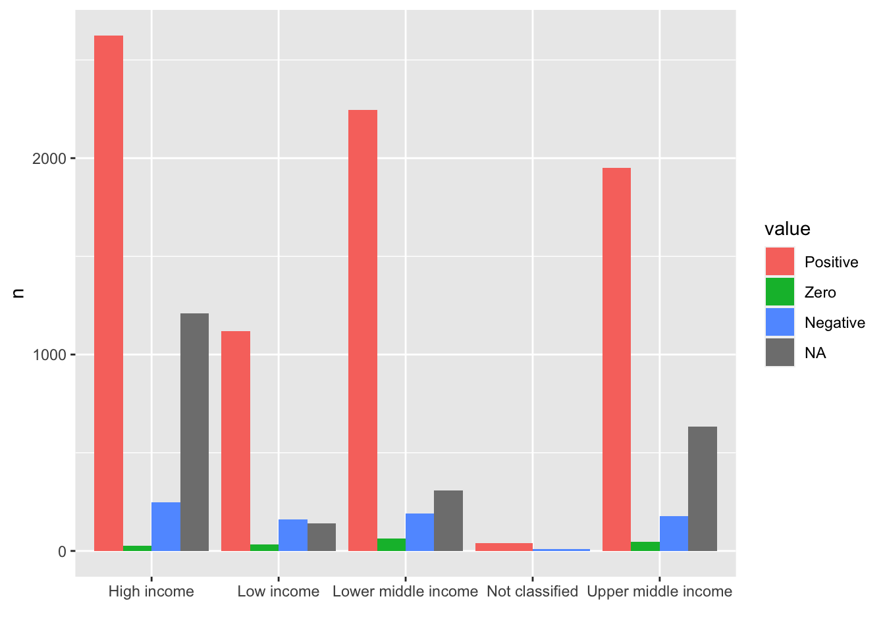
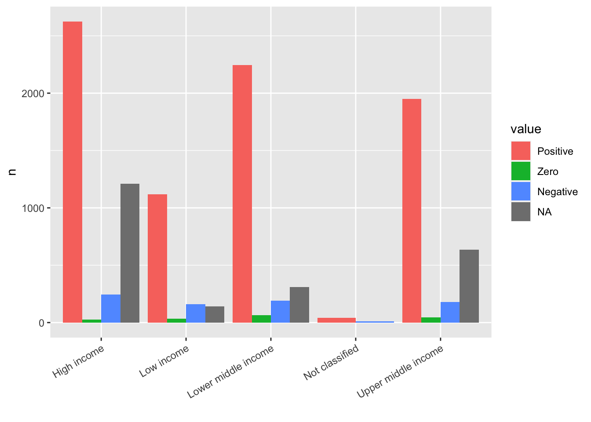
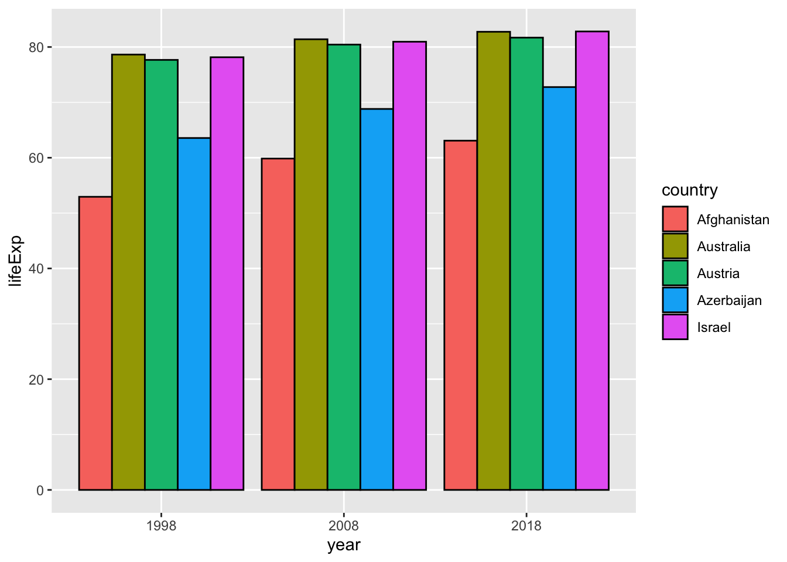

# Visualizing {#visualizing}

## Data Visualization

## `ggplot2` Basics

{width=75%}

### Two useful questions

There is no rule about which questions you should ask to guide your research. However, two types of questions will always be useful for making discoveries within your data. You can loosely word these questions as:

1. What type of variation occurs within my variables?
2. What type of covariation occurs between my variables?

The rest of this tutorial will look at these two questions. To make the discussion easier, let’s define some terms…


## Set up


```r
library(tidyverse)
#> ── Attaching core tidyverse packages ──── tidyverse 2.0.0 ──
#> ✔ dplyr     1.1.2     ✔ readr     2.1.4
#> ✔ forcats   1.0.0     ✔ stringr   1.5.0
#> ✔ ggplot2   3.4.2     ✔ tibble    3.2.1
#> ✔ lubridate 1.9.2     ✔ tidyr     1.3.0
#> ✔ purrr     1.0.1     
#> ── Conflicts ────────────────────── tidyverse_conflicts() ──
#> ✖ dplyr::filter() masks stats::filter()
#> ✖ dplyr::lag()    masks stats::lag()
#> ℹ Use the conflicted package (<http://conflicted.r-lib.org/>) to force all conflicts to become errors
library(readxl) # for excel files
library(WDI)
```

### Q. The line graph looked strange at first and I couldn’t really see the results clearly. However, I could solve that problem by using “smoothstat” and then the results looked way better and I was able to interpret them easily.

The strange looking line graph is called a sawtooth shape, and happens very often. So let me explain it

* WDI indicator: BX.KLT.DINV.CD.WD: Foreign Direct Investment (FDI) inflows

* Step 1. Import the data.


```r
df_fdi <- WDI(country = "all", indicator = c(fdi = "BX.KLT.DINV.CD.WD"), start =1970 , extra = TRUE, cache = NULL)
df_fdi
```


```
#> Rows: 13832 Columns: 13
#> ── Column specification ────────────────────────────────────
#> Delimiter: ","
#> chr  (7): country, iso2c, iso3c, region, capital, income...
#> dbl  (4): year, fdi, longitude, latitude
#> lgl  (1): status
#> date (1): lastupdated
#> 
#> ℹ Use `spec()` to retrieve the full column specification for this data.
#> ℹ Specify the column types or set `show_col_types = FALSE` to quiet this message.
```

* Step 2. Check the list of `income` names.

The following code in `Base R` does the same as the following using `tidyverse`: 
`df_fdi %>% distinct(income) %>% pull()`. 
If the list is long, it may be better to check using `tibble` by ``df_fdi %>% distinct(income)`. You can also use `DT::datatable(df_fdi)` and search items of interest, though it takes up a lot of memory.


```r
unique(df_fdi$income)
#> [1] "Low income"          "Aggregates"         
#> [3] "Upper middle income" "Lower middle income"
#> [5] "High income"         NA                   
#> [7] "Not classified"
```

* Step 3. Try a line graph.


```r
df_fdi %>% ggplot(aes(x=year, y=fdi, color=income)) + geom_line()
#> Warning: Removed 7 rows containing missing values
#> (`geom_line()`).
```


We observe several problems. But the most significant issue is it looks like a sawtooth. It is because there are so many `y` values at the same `x` value. When you draw a line graph, you need to choose only several countries or use group_by and summarize and use summarized data. However, there is an option; we can use a model to summarize the data of each group using `geom_smooth()`. Since you do not want a line but a curve, we use "loess" with `span`, we used to draw some of WIR2022 charts.

* Step 4. Let us try `group_by` and `summarize`.


```r
df_fdi %>% drop_na(fdi) %>% drop_na(income) %>% 
  filter(!income %in% c("Aggregates","Not classified")) %>%
  group_by(income, year) %>% summarize(fdi_mean = mean(fdi)) %>% 
  ggplot(aes(x=year,y=fdi_mean,color=income)) + 
  geom_line()
#> `summarise()` has grouped output by 'income'. You can
#> override using the `.groups` argument.
```


If you do not want the message '`summarise()` has grouped output by 'income'. You can override using the `.groups` argument.' try the following by adding `.group = drop`.


```r
df_fdi %>% drop_na(fdi) %>% drop_na(income) %>% 
  filter(!income %in% c("Aggregates","Not classified")) %>%
  group_by(income, year) %>% summarize(fdi_mean = mean(fdi), .groups = "drop") %>% 
  ggplot(aes(x=year,y=fdi_mean,color=income)) + 
  geom_line()
```


* Step 5. Let us try `geom_smooth` with `loess` and `span`.

Do you see similarities and differences? We need to choose the one from the other by our objective, and explain


```r
df_fdi  %>% drop_na(fdi) %>% drop_na(income) %>% 
  filter(!income %in% c("Aggregates","Not classified")) %>%
  ggplot(aes(x=year,y=fdi,color=income)) + 
  geom_smooth(formula = y~x, method = "loess", span = 0.25, se = FALSE)
```


* Step 6. Change of the scale.

It may be a good choice to use `scale_y_log10()`. However, since log10 is not finite if the value is not positive, you need to choose those with the indicator positive. Let us see how many zero values are in each income level.


```r
df_fdi %>% filter(!income %in% c(NA, "Aggregates")) %>% filter(fdi <= 0) %>%
  ggplot(aes(x = income, fill = income)) + geom_bar() + 
  labs(title = "Number of countries with FDI is not positive") +
  theme(legend.position = "none")
```


```r
df_fdi %>% drop_na(income) %>% filter(fdi > 0) %>%
  filter(!income %in% c("Aggregates","Not classified")) %>%
  ggplot(aes(x=year,y=fdi,color=income)) + 
  geom_smooth(formula = y~x, method = "loess", span = 0.25, se = FALSE) +
  scale_y_log10() + labs(title="The Value FID < 0 or Zero Excluded")
```


**Note.** If this is the target chart, it may be better to check the number of NA values, 0 values, negative values, and nonzero values in each income group. I add `  mutate(value = factor(value, levels = c("Positive", "Zero", "Negative", "NA"), labels = c("Positive", "Zero", "Negative", "NA")))` in order to set the order of the labels. Please try the same without the line.


```r
df_fdi %>% select(country, year, fdi, income) %>%
  filter(!income %in% c("Aggregates", NA)) %>% 
  mutate(value = case_when(
    fdi == NA ~ "NA",
    fdi == 0  ~ "Zero",
    fdi < 0  ~ "Negative",
    fdi > 0 ~ "Positive")) %>%
  mutate(value = factor(value, levels = c("Positive", "Zero", "Negative", "NA"), labels = c("Positive", "Zero", "Negative", "NA"))) %>%
  group_by(income, value) %>% summarize(n = n(), .groups = "drop") %>% 
  ggplot(aes(income, n, fill = value)) + geom_col(position="dodge") + 
  labs(x = "")
```



### Q. How is it possible to organize better the name of the value in the x axis so that they are better readable?

* In the example above, the labels are overlapping. One way is to give an angle to the text with `vjust` and `hjust` values to place the labels in appropriate places: `theme(axis.text.x = element_text(angle = 30, vjust = 1, hjust=1))`


```r
df_fdi %>% select(country, year, fdi, income) %>%
  filter(!income %in% c("Aggregates", NA)) %>% 
  mutate(value = case_when(
    fdi == NA ~ "NA",
    fdi == 0  ~ "Zero",
    fdi < 0  ~ "Negative",
    fdi > 0 ~ "Positive")) %>%
  mutate(value = factor(value, levels = c("Positive", "Zero", "Negative", "NA"), labels = c("Positive", "Zero", "Negative", "NA"))) %>%
  group_by(income, value) %>% summarize(n = n(), .groups = "drop") %>% 
  ggplot(aes(income, n, fill = value)) + geom_col(position="dodge") + 
  theme(axis.text.x = element_text(angle = 30, vjust = 1, hjust=1)) + 
  labs(x = "")
```



* You can use another package `stringr` included in `tidyverse` but not loaded. `scale_x_discrete(labels = function(x) stringr::str_wrap(x, width = 15))`
Change the width value to fit to your chart. If you add library(stringr), then `scale_x_discrete(labels = function(x) str_wrap(x, width = 15))` is enough.


```r
df_fdi %>% select(country, year, fdi, income) %>%
  filter(!income %in% c("Aggregates", NA)) %>% 
  mutate(value = case_when(
    fdi == NA ~ "NA",
    fdi == 0  ~ "Zero",
    fdi < 0  ~ "Negative",
    fdi > 0 ~ "Positive")) %>%
  mutate(value = factor(value, levels = c("Positive", "Zero", "Negative", "NA"), labels = c("Positive", "Zero", "Negative", "NA"))) %>%
  group_by(income, value) %>% summarize(n = n(), .groups = "drop") %>% 
  ggplot(aes(income, n, fill = value)) + geom_col(position="dodge") + 
  scale_x_discrete(labels = function(x) stringr::str_wrap(x, width = 15)) + 
  labs(x = "")
```


* If you have a long name for the title, use `\n` for the line feed.


```r
df_fdi %>% select(country, year, fdi, income) %>%
  filter(!income %in% c("Aggregates", NA)) %>% 
  mutate(value = case_when(
    fdi == NA ~ "NA",
    fdi == 0  ~ "Zero",
    fdi < 0  ~ "Negative",
    fdi > 0 ~ "Positive")) %>%
  mutate(value = factor(value, levels = c("Positive", "Zero", "Negative", "NA"), labels = c("Positive", "Zero", "Negative", "NA"))) %>%
  group_by(income, value) %>% summarize(n = n(), .groups = "drop") %>% 
  ggplot(aes(income, n, fill = value)) + geom_col(position="dodge") + 
  scale_x_discrete(labels = function(x) stringr::str_wrap(x, width = 15)) + 
  labs(title = "long long long long long long long \nlong long long title", x = "")
```


### Q. Position of the labels

* Step 1. If you want to use you own color palette, choose the codes or the color names from the following sites.

  - Color Names: http://www.cookbook-r.com/Graphs/Colors_(ggplot2)/
  - RGB codes: https://www.rapidtables.com/web/color/RGB_Color.html


```r
color_list <- c("#00AE9D","#F58220","#6C676E")
```

* Import the data and tidy up


```r
df_f1 <- read_excel("./data/WIR2022s.xlsx", sheet = "data-F1")
#> New names:
#> • `` -> `...1`
df_f1_rev <- pivot_longer(df_f1, -1, names_to = "group", values_to = "value")
df_f1_rev
#> # A tibble: 8 × 3
#>   ...1   group       value
#>   <chr>  <chr>       <dbl>
#> 1 Income Bottom 50% 0.084 
#> 2 Income Middle 40% 0.394 
#> 3 Income Top 10%    0.522 
#> 4 Income Top 1%     0.192 
#> 5 Wealth Bottom 50% 0.0199
#> 6 Wealth Middle 40% 0.224 
#> 7 Wealth Top 10%    0.756 
#> 8 Wealth Top 1%     0.378
```

* Step 3. Visualize the data using `geom_col()`, change the default fill color using the list of the color in Step 1, and change the scale of the y axis into percents. 


```r
df_f1_rev[df_f1_rev$group != "Top 1%",] %>%
  ggplot(aes(x = ...1, y = value, fill = group)) + 
  geom_col(position = "dodge", width = 0.8) + 
  scale_fill_manual(values = color_list) + 
  scale_y_continuous(labels = scales::percent_format(accuracy = 1)) +
  labs(x = "")
```


* Step 4. Add the values in the text. Do not forget that the values should be in percentages.


```r
df_f1_rev[df_f1_rev$group != "Top 1%",] %>%
  ggplot(aes(x = ...1, y = value, fill = group)) + 
  geom_col(position = "dodge", width = 0.8) + 
  scale_fill_manual(values = color_list) +
  scale_y_continuous(labels = scales::percent_format(accuracy = 1)) +
  labs(x="") +
  geom_text(aes(x = ...1, y = value, group = group, 
            label = scales::label_percent(accuracy=1)(value)), 
            position = position_dodge(0.8))  
```


* Step 5. If you want to change the locations of texts use `vjust = -0.2`. 


```r
df_f1_rev[df_f1_rev$group != "Top 1%",] %>%
  ggplot(aes(x = ...1, y = value, fill = group)) + 
  geom_col(position = "dodge", width = 0.8) + 
  scale_fill_manual(values = color_list) +
  scale_y_continuous(labels = scales::percent_format(accuracy = 1)) +
  labs(x="") +
  geom_text(aes(x = ...1, y = value, group = group, 
            label = scales::label_percent(accuracy=1)(value)), vjust = -0.2,
            position = position_dodge(0.8))  
```


### Visualization by Charts

Please try as various charts as possible. You can learn only by experience or from others.

#### Treat `year` as a group?


```r
df_wdi <- WDI(
  country = "all", 
  indicator = c(lifeExp = "SP.DYN.LE00.IN"), start = 1990, extra = TRUE, cache =  wdi_cache)
df_wdi
```


```
#> Rows: 16492 Columns: 7
#> ── Column specification ────────────────────────────────────
#> Delimiter: ","
#> chr (3): country, iso2c, iso3c
#> dbl (4): year, lifeExp, pop, gdpPercap
#> 
#> ℹ Use `spec()` to retrieve the full column specification for this data.
#> ℹ Specify the column types or set `show_col_types = FALSE` to quiet this message.
```

* Something is wrong in the next chart. Can you tell what the problem is?


```r
df_wdi %>%
  filter(year %in% c("1988", "1998", "2008", "2018")) %>%
  filter(country %in% c("Afghanistan", "Israel", "Azerbaijan", "Austria", "Australia")) %>%
  ggplot(aes(x=year)) +
  geom_boxplot(aes(y=lifeExp, fill=country))
```


I erased the second line: `filter(year %in% c("1988", "1998", "2008", "2018"))` but the result is very similar. 


```r
df_wdi %>%
  filter(country %in% c("Afghanistan", "Israel", "Azerbaijan", "Austria", "Australia")) %>%
  ggplot(aes(x=year)) +
  geom_boxplot(aes(y=lifeExp, fill=country))
#> Warning: Removed 9 rows containing non-finite values
#> (`stat_boxplot()`).
```


If you look at the table, you can see that year is a integer vector, not a character vector. Then what happens if we remove quotation marks. The next chart is not a box plot anymore. It is because, for each year there is only one value for each country.


```r
df_wdi %>%
  filter(year %in% c(1988, 1998, 2008, 2018)) %>%
  filter(country %in% c("Afghanistan", "Israel", "Azerbaijan", "Austria", "Australia")) %>%
  ggplot(aes(x=factor(year))) +
  geom_boxplot(aes(y=lifeExp, fill=country))
```


If we want to take `year` as a group after selecting some years, then we should try the next using `factor(year)`. You can change the label of x axis by
  `labs(x = "year")` easily. We should also notice that there are no values for 1988. We should check basic information as such first.


```r
df_wdi %>%
  filter(year %in% c(1988, 1998, 2008, 2018)) %>%
  filter(country %in% c("Afghanistan", "Israel", "Azerbaijan", "Austria", "Australia")) %>%
  ggplot(aes(x=factor(year), y=lifeExp, fill=country)) +
  geom_col(position = "dodge", col = "black")
```


It is possible if you change year to a character vector by `mutate(year = as.character(year))`.


```r
df_wdi %>% mutate(year = as.character(year)) %>% 
  filter(year %in% c("1998", "2008", "2018")) %>%
  filter(country %in% c("Afghanistan", "Israel", "Azerbaijan", "Austria", "Australia")) %>%
  ggplot(aes(x=year, y=lifeExp, fill=country)) +
  geom_col(position = "dodge", col = "black") +
  labs(x = "year")
```



## `ggplot2` Fundamentals

```
ggplot (data = <DATA> ) +
  <GEOM_FUNCTION> (mapping = aes( <MAPPINGS> ),　
    stat = <STAT> , position = <POSITION> ) + 
  <COORDINATE_FUNCTION> + 
  <FACET_FUNCTION> + 
  <SCALE_FUNCTION> + 
  <THEME_FUNCTION>
```

### Data

### Aestics: Mapping

### Geom Functions

#### Stat Option

#### Position Option

### Coordinate Function

### Scale Function

### Theme Function

## Tips

### `log10` scale

* `scale_y_log10()`

### `scale_color_manual`

* `scale_color_manual(values=c('Green','Yellow',"Orange","Black","Blue","Dark Blue","Purple"))`

### `stringr`

* When the labels of $x$-axis are long:
  - `scale_x_discrete(labels = function(x) stringr::str_wrap(x, width = 8))`
  
### `ggplot2::legend.position`

* `theme(legend.position = "none")`
  - the position of legends ("none", "left", "right", "bottom", "top", or two-element numeric vector)

## Maps

https://www.naturalearthdata.com
