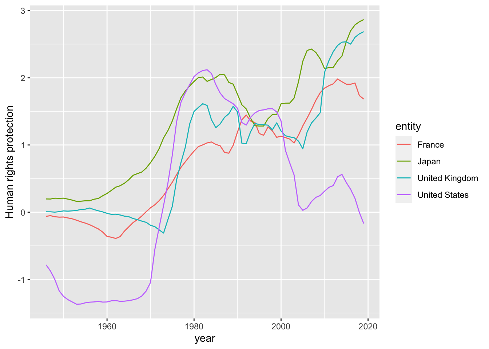
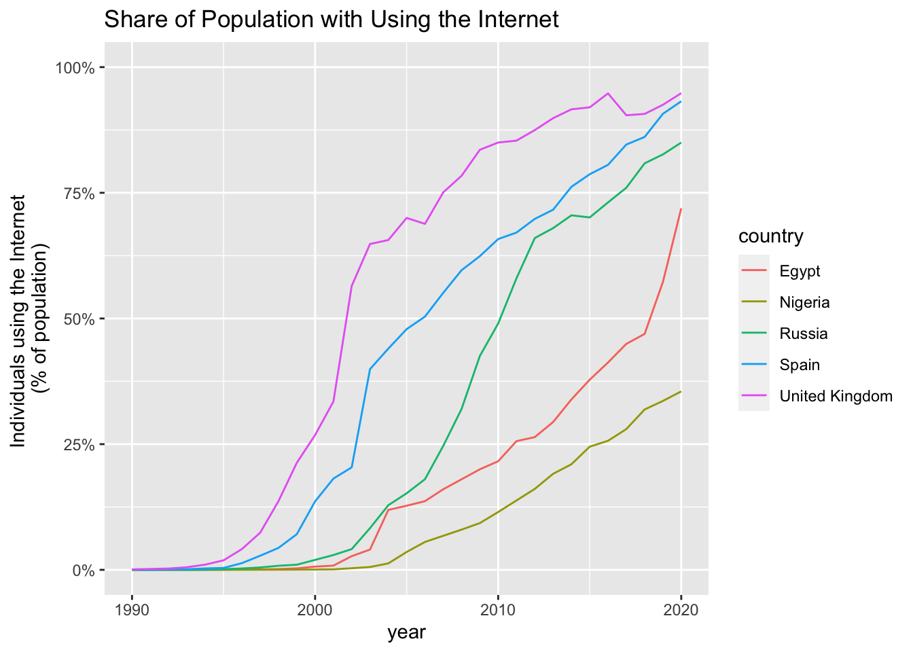
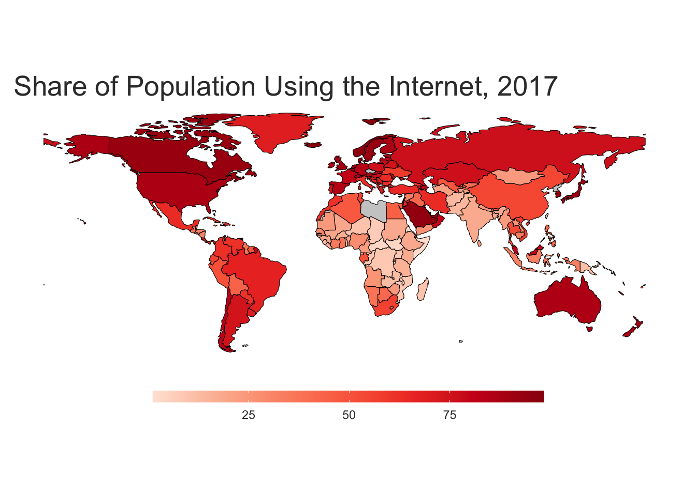
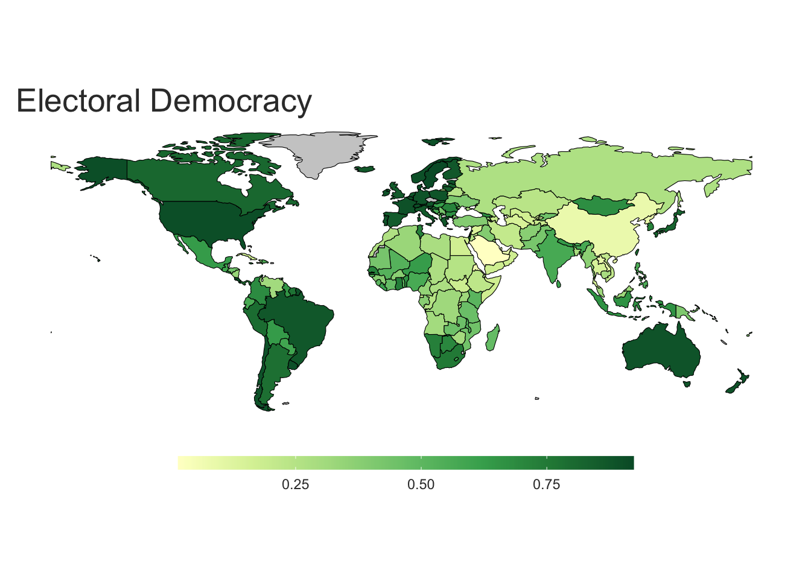
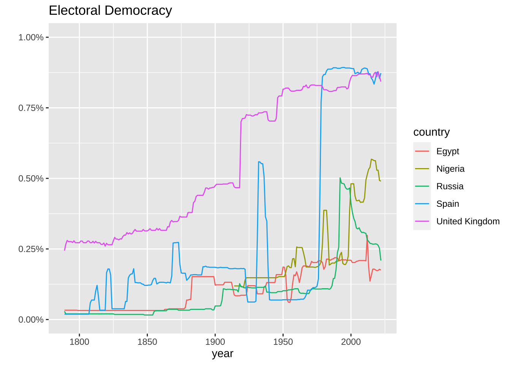
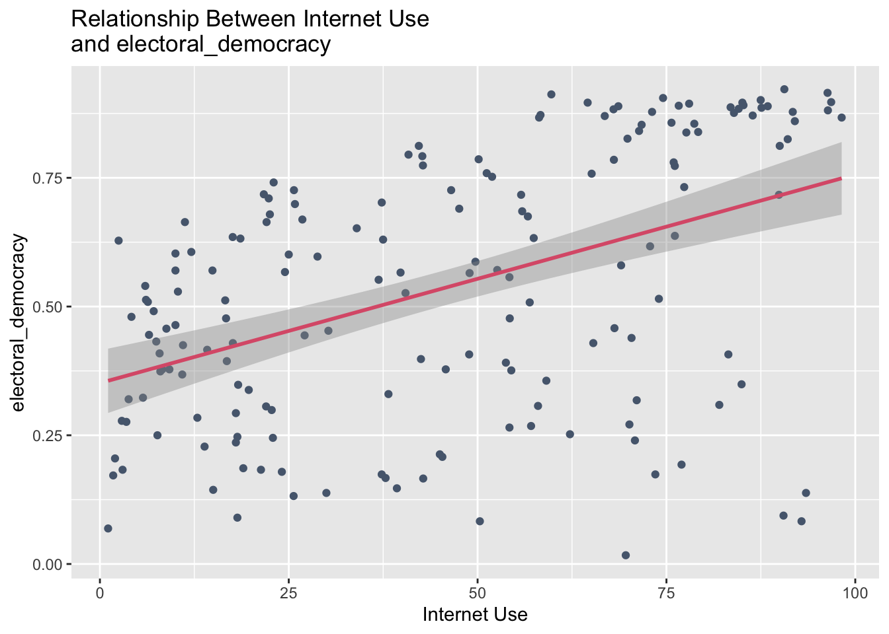

# Our World in Data {#owid}


## The package `owidR`

> We study the R package `owidR` for importing data from Our World in Data.

## References

The package official site contains other links. When you quote the package, use the link to the official site.

* Package Official Site: https://CRAN.R-project.org/package=owidR
  - ReadMe: https://cran.r-project.org/web/packages/owidR/readme/README.html
  - Manual: https://cran.r-project.org/web/packages/owidR/owidR.pdf
  - Vignette: [Create and Analyse a Dataset](https://cran.r-project.org/web/packages/owidR/vignettes/example-analysis.html)
* [owidR: Import Data from Our World in Data](https://rdrr.io/cran/owidR/)
  - Man page and source codes
  
In general, README gives a short introduction to the package, a Manual, the comprehensive descriptions of each function, and a Vignette, a practical introduction containing examples and applications.

## Introduction

>This package acts as an interface to [Our World in Data](https://ourworldindata.org) datasets, allowing for an easy way to search through data used in over 3,000 charts and load them into the R environment.

### Setup

#### Installation

Run the following for the first time


```r
install.packages("owidR")
```

#### Load the package


```r
library(owidR)
library(tidyverse) 
#> ── Attaching packages ─────────────────── tidyverse 1.3.2 ──
#> ✔ ggplot2 3.4.1     ✔ purrr   1.0.1
#> ✔ tibble  3.1.8     ✔ dplyr   1.1.0
#> ✔ tidyr   1.3.0     ✔ stringr 1.5.0
#> ✔ readr   2.1.4     ✔ forcats 1.0.0
#> ── Conflicts ────────────────────── tidyverse_conflicts() ──
#> ✖ dplyr::filter() masks stats::filter()
#> ✖ dplyr::lag()    masks stats::lag()
```

The package automatically load a part of `tidyverse`, e.g., `dplyr`, `ggplot`, .... Since it works well with the scheme`tidyverse`, it is better to load `tidyverse` with it.

The creator of this package also suggests loading packages `plm` for panels of data, and `texreg` for displaying models, but let us start without them until we actually use them. For panel data, see, for example, the site](https://www.aptech.com/blog/introduction-to-the-fundamentals-of-panel-data/).

### Core functions

#### List of core functions

In this package, `chart` is close to data, and `chart id` is a data indicator.

* owid: Get a dataset used in an OWID chart
* owid_covid: Get the Our World in Data covid-19 dataset
* owid_search: Search the data sources used in OWID charts
* owid_source: A function to get source information from an OWID dataset and display it in the R console.
* pal_owid: Colour palettes based on the colours used by Our World in Data
* view_chart: A function that opens the original OWID chart in your browser
* world_map_data: Function that returns a simple feature collection of class sf. Map data is from naturalearthdata.com. Designed to be used internally.

#### Usage

##### `owid_search`

Search the data sources used in OWID charts

```
owid_search(term)
```

* Example

Since the output is long, I cut it off to the first six rows using `head()`.


```r
owid_search("emissions") %>% head()
#>      titles                                                  
#> [1,] "Air pollutant emissions"                               
#> [2,] "Emissions of air pollutants"                           
#> [3,] "Emissions of air pollutants"                           
#> [4,] "Emissions of particulate matter"                       
#> [5,] "Global sulphur dioxide (SO₂) emissions by world region"
#> [6,] "Sulphur dioxide (SO₂) emissions"                       
#>      chart_id                                        
#> [1,] "air-pollutant-emissions"                       
#> [2,] "emissions-of-air-pollutants"                   
#> [3,] "emissions-of-air-pollutants-oecd"              
#> [4,] "emissions-of-particulate-matter"               
#> [5,] "so-emissions-by-world-region-in-million-tonnes"
#> [6,] "so2-emissions"
```

A matrix is returned. If the list is long, it is easier to see the pairs of the titles and chart_ids by adding `as_tibble()`.


```r
owid_search("emissions") %>% as_tibble()
#> # A tibble: 150 × 2
#>    titles                                            chart…¹
#>    <chr>                                             <chr>  
#>  1 Air pollutant emissions                           air-po…
#>  2 Emissions of air pollutants                       emissi…
#>  3 Emissions of air pollutants                       emissi…
#>  4 Emissions of particulate matter                   emissi…
#>  5 Global sulphur dioxide (SO₂) emissions by world … so-emi…
#>  6 Sulphur dioxide (SO₂) emissions                   so2-em…
#>  7 Sulphur dioxide (SO₂) emissions                   so-emi…
#>  8 Sulphur dioxide (SO₂) emissions per capita        so-emi…
#>  9 Sulphur oxide (SO₂) emissions                     sulphu…
#> 10 Annual CO2 emissions from land-use change per ca… co2-la…
#> # … with 140 more rows, and abbreviated variable name
#> #   ¹​chart_id
```

If the list is not long, you do not need to add `as_tibble()`. However, note that you need to keep in mind that the title and the chart_id consists of a pair, and you need to use the chart_id to download the data using `owid`.


```r
owid_search("human rights")
#>      titles                                                                             
#> [1,] "Human rights vs. electoral democracy"                                             
#> [2,] "Countries with accredited independent national human rights institutions"         
#> [3,] "Distribution of human rights"                                                     
#> [4,] "Human rights"                                                                     
#> [5,] "Human rights vs. GDP per capita"                                                  
#> [6,] "Human rights weighted by population"                                              
#> [7,] "Number of cases of killed human rights defenders, journalists and trade unionists"
#> [8,] "Share of countries with accredited independent national human rights institutions"
#>      chart_id                                                                   
#> [1,] "human-rights-vs-electoral-democracy"                                      
#> [2,] "countries-with-independent-national-human-rights-institution"             
#> [3,] "distribution-human-rights-vdem"                                           
#> [4,] "human-rights-vdem"                                                        
#> [5,] "human-rights-vs-gdp-per-capita"                                           
#> [6,] "human-rights-popw"                                                        
#> [7,] "cases-of-killed-human-rights-defenders-journalists-trade-unionists"       
#> [8,] "share-countries-accredited-independent-national-human-rights-institutions"
```


##### `owid`

Get a dataset used in an OWID chart

```
owid(chart_id = NULL, rename = NULL, tidy.date = TRUE, ...)
```

`chard_id`: The chart_id as returned by owid_search, which is combined with '-'. Don't mix up with the chart titles.

`rename`: Rename the value column. Currently only works if their is just one value col- umn.

* Example


```r
emissions <- owid("per-capita-ghg-emissions")
```


```r
emissions
#> # A tibble: 6,149 × 4
#>    entity      code   year `Total including LUCF`
#>  * <chr>       <chr> <int>                  <dbl>
#>  1 Afghanistan AFG    1990                  0.772
#>  2 Afghanistan AFG    1991                  0.738
#>  3 Afghanistan AFG    1992                  0.623
#>  4 Afghanistan AFG    1993                  0.576
#>  5 Afghanistan AFG    1994                  0.536
#>  6 Afghanistan AFG    1995                  0.529
#>  7 Afghanistan AFG    1996                  0.563
#>  8 Afghanistan AFG    1997                  0.598
#>  9 Afghanistan AFG    1998                  0.628
#> 10 Afghanistan AFG    1999                  0.658
#> # … with 6,139 more rows
```


```r
rights <- owid("human-rights-scores")
```


```r
rights
#> # A tibble: 11,273 × 4
#>    entity      code   year `Human rights protection`
#>  * <chr>       <chr> <int>                     <dbl>
#>  1 Afghanistan AFG    1946                     0.829
#>  2 Afghanistan AFG    1947                     0.878
#>  3 Afghanistan AFG    1948                     0.935
#>  4 Afghanistan AFG    1949                     0.966
#>  5 Afghanistan AFG    1950                     1.01 
#>  6 Afghanistan AFG    1951                     1.09 
#>  7 Afghanistan AFG    1952                     1.13 
#>  8 Afghanistan AFG    1953                     1.18 
#>  9 Afghanistan AFG    1954                     1.22 
#> 10 Afghanistan AFG    1955                     1.22 
#> # … with 11,263 more rows
```

**Note.**

1. You can use `rename` to change column names. For example, 


```r
owid("per-capita-ghg-emissions", rename = "ghgPcap")
#> # A tibble: 6,149 × 4
#>    entity      code   year ghgPcap
#>  * <chr>       <chr> <int>   <dbl>
#>  1 Afghanistan AFG    1990   0.772
#>  2 Afghanistan AFG    1991   0.738
#>  3 Afghanistan AFG    1992   0.623
#>  4 Afghanistan AFG    1993   0.576
#>  5 Afghanistan AFG    1994   0.536
#>  6 Afghanistan AFG    1995   0.529
#>  7 Afghanistan AFG    1996   0.563
#>  8 Afghanistan AFG    1997   0.598
#>  9 Afghanistan AFG    1998   0.628
#> 10 Afghanistan AFG    1999   0.658
#> # … with 6,139 more rows
```

2. Since until after importing the data, you never know the original column name, and how many columns are for indicators. It is natural to change column names using `dpyr::rename`. In the next example, I used `Total including LUCF`. However, 'Total including LUCF' and "Total including LUCF" work as well.


```r
emissions %>% rename(ghgPcap = `Total including LUCF`)
#> # A tibble: 6,149 × 4
#>    entity      code   year ghgPcap
#>  * <chr>       <chr> <int>   <dbl>
#>  1 Afghanistan AFG    1990   0.772
#>  2 Afghanistan AFG    1991   0.738
#>  3 Afghanistan AFG    1992   0.623
#>  4 Afghanistan AFG    1993   0.576
#>  5 Afghanistan AFG    1994   0.536
#>  6 Afghanistan AFG    1995   0.529
#>  7 Afghanistan AFG    1996   0.563
#>  8 Afghanistan AFG    1997   0.598
#>  9 Afghanistan AFG    1998   0.628
#> 10 Afghanistan AFG    1999   0.658
#> # … with 6,139 more rows
```

3. If there are more than one variables to rename, use vector notation as follows. Here `top_n(1)` is same as `slice(1)`, and gives the first row only.


```r
owid("electoral-democracy") %>% top_n(1)
#> Selecting by electdem_vdem_low_owid
#> # A tibble: 3 × 6
#>   entity  code   year `Electoral democracy` electd…¹ elect…²
#>   <chr>   <chr> <int>                 <dbl>    <dbl>   <dbl>
#> 1 Denmark DNK    2008                 0.922    0.959     0.9
#> 2 Denmark DNK    2009                 0.922    0.959     0.9
#> 3 Denmark DNK    2010                 0.922    0.959     0.9
#> # … with abbreviated variable names
#> #   ¹​electdem_vdem_high_owid, ²​electdem_vdem_low_owid
```


```r
owid("electoral-democracy", rename = c("electoral_democracy", "vdem_high", "vdem_low"))
#> # A tibble: 32,518 × 6
#>    entity      code   year electoral_democ…¹ vdem_…² vdem_…³
#>  * <chr>       <chr> <int>             <dbl>   <dbl>   <dbl>
#>  1 Afghanistan AFG    1789             0.019   0.024    0.01
#>  2 Afghanistan AFG    1790             0.019   0.024    0.01
#>  3 Afghanistan AFG    1791             0.019   0.024    0.01
#>  4 Afghanistan AFG    1792             0.019   0.024    0.01
#>  5 Afghanistan AFG    1793             0.019   0.024    0.01
#>  6 Afghanistan AFG    1794             0.019   0.024    0.01
#>  7 Afghanistan AFG    1795             0.019   0.024    0.01
#>  8 Afghanistan AFG    1796             0.019   0.024    0.01
#>  9 Afghanistan AFG    1797             0.019   0.024    0.01
#> 10 Afghanistan AFG    1798             0.019   0.024    0.01
#> # … with 32,508 more rows, and abbreviated variable names
#> #   ¹​electoral_democracy, ²​vdem_high, ³​vdem_low
```


4. You can use `dplyr::rename`, and keep the record of renaming column names.


```r
(democracy <- owid("electoral-democracy"))
#> # A tibble: 32,518 × 6
#>    entity      code   year Electoral democ…¹ elect…² elect…³
#>  * <chr>       <chr> <int>             <dbl>   <dbl>   <dbl>
#>  1 Afghanistan AFG    1789             0.019   0.024    0.01
#>  2 Afghanistan AFG    1790             0.019   0.024    0.01
#>  3 Afghanistan AFG    1791             0.019   0.024    0.01
#>  4 Afghanistan AFG    1792             0.019   0.024    0.01
#>  5 Afghanistan AFG    1793             0.019   0.024    0.01
#>  6 Afghanistan AFG    1794             0.019   0.024    0.01
#>  7 Afghanistan AFG    1795             0.019   0.024    0.01
#>  8 Afghanistan AFG    1796             0.019   0.024    0.01
#>  9 Afghanistan AFG    1797             0.019   0.024    0.01
#> 10 Afghanistan AFG    1798             0.019   0.024    0.01
#> # … with 32,508 more rows, and abbreviated variable names
#> #   ¹​`Electoral democracy`, ²​electdem_vdem_high_owid,
#> #   ³​electdem_vdem_low_owid
```


```r
democracy <- democracy %>% 
  rename(`electoral_democracy` = `Electoral democracy`,  
         `vdem_high` = `electdem_vdem_high_owid`, 
         `electdem_vdem_low_owid` = `electdem_vdem_low_owid`)
democracy
#> # A tibble: 32,518 × 6
#>    entity      code   year electoral_democ…¹ vdem_…² elect…³
#>  * <chr>       <chr> <int>             <dbl>   <dbl>   <dbl>
#>  1 Afghanistan AFG    1789             0.019   0.024    0.01
#>  2 Afghanistan AFG    1790             0.019   0.024    0.01
#>  3 Afghanistan AFG    1791             0.019   0.024    0.01
#>  4 Afghanistan AFG    1792             0.019   0.024    0.01
#>  5 Afghanistan AFG    1793             0.019   0.024    0.01
#>  6 Afghanistan AFG    1794             0.019   0.024    0.01
#>  7 Afghanistan AFG    1795             0.019   0.024    0.01
#>  8 Afghanistan AFG    1796             0.019   0.024    0.01
#>  9 Afghanistan AFG    1797             0.019   0.024    0.01
#> 10 Afghanistan AFG    1798             0.019   0.024    0.01
#> # … with 32,508 more rows, and abbreviated variable names
#> #   ¹​electoral_democracy, ²​vdem_high,
#> #   ³​electdem_vdem_low_owid
```


##### `owid_source`

A function to get source information from an OWID dataset and display it in the R console.

```
owid_source(data)
```

* Example


```r
owid_source(emissions)
#> Dataset Name: Our World in Data based on Climate Analysis Indicators Tool (CAIT).
#> 
#> Published By: CAIT Climate Data Explorer via Climate Watch
#> 
#> Link: https://www.climatewatchdata.org/data-explorer/historical-emissions
#> 
#> Emissions are measured in tonnes of carbon dioxide equivalents (CO₂e), based on 100-year global warming potential factors for non-CO₂ gases.
#> 
#> Emissions are broken down by sector. Further information on sector definitions is available <a href="https://ourworldindata.org/ghg-emissions-by-sector">here</a>.
```


```r
owid_source(rights)
#> Dataset Name: Fariss et al. (2020)
#> 
#> Published By:  Fariss CJ, Kenwick MR, Reuning K. Estimating one-sided-killings from a robust measurement model of human rights. Journal of Peace Research. 2020;57(6):801-814. doi:10.1177/0022343320965670
#> 
#> Link: https://dataverse.harvard.edu/dataset.xhtml?persistentId=doi:10.7910/DVN/RQ85GK
#> 
#> This dataset provides the human rights protection scores by Fariss et al. (2020), first developed by Schnakenberg and Fariss (2014).
#> 
#> You can download the code and complete dataset, including supplementary variables, from GitHub: https://github.com/owid/notebooks/tree/main/BastianHerre/human_rights
```


##### `view_chart`

A function that opens the original OWID chart in your browser

```
view_chart(x)
```

* `x` Either a tibble returned by `owid()`, or a `chart_id`.

* Example

The first one uses the chart, i.e., the tibble returned by `owid()`, and the second, `chart_id`. You can also embed in your R Markdown file by copying Embed `iframe` clink from `Share` botton at the bottom right corner.


```r
firearm_suicide <- owid("suicide-rate-by-firearm")
    view_chart(firearm_suicide)
```

<iframe src="https://ourworldindata.org/grapher/suicide-rate-by-firearm" loading="lazy" style="width: 100%; height: 600px; border: 0px none;"></iframe>


```r
view_chart("electoral-democracy")
```

<iframe src="https://ourworldindata.org/grapher/electoral-democracy?country=ARG~AUS~BWA~CHN" loading="lazy" style="width: 100%; height: 600px; border: 0px none;"></iframe>


```r
view_chart("share-of-individuals-using-the-internet")
```

<iframe src="https://ourworldindata.org/grapher/share-of-individuals-using-the-internet" loading="lazy" style="width: 100%; height: 600px; border: 0px none;"></iframe>


##### `pal_owid`

Colour palettes based on the colours used by Our World in Data

##### `owid_covid`

owid_covid: Get the Our World in Data covid-19 dataset

```
owid_covid()
```

See the detail at the [GitHub site](https://github.com/owid/covid-19-data/tree/master/public/data#data-on-covid-19-coronavirus-by-our-world-in-data).

* Example


```r
covid <- owid_covid()
```


```r
covid %>% filter(location == "Japan")
#> # A tibble: 1,161 × 67
#>    iso_code continent location date       total_ca…¹ new_c…²
#>    <chr>    <chr>     <chr>    <date>          <dbl>   <dbl>
#>  1 JPN      Asia      Japan    2020-01-03         NA       0
#>  2 JPN      Asia      Japan    2020-01-04         NA       0
#>  3 JPN      Asia      Japan    2020-01-05         NA       0
#>  4 JPN      Asia      Japan    2020-01-06         NA       0
#>  5 JPN      Asia      Japan    2020-01-07         NA       0
#>  6 JPN      Asia      Japan    2020-01-08         NA       0
#>  7 JPN      Asia      Japan    2020-01-09         NA       0
#>  8 JPN      Asia      Japan    2020-01-10         NA       0
#>  9 JPN      Asia      Japan    2020-01-11         NA       0
#> 10 JPN      Asia      Japan    2020-01-12         NA       0
#> # … with 1,151 more rows, 61 more variables:
#> #   new_cases_smoothed <dbl>, total_deaths <dbl>,
#> #   new_deaths <dbl>, new_deaths_smoothed <dbl>,
#> #   total_cases_per_million <dbl>,
#> #   new_cases_per_million <dbl>,
#> #   new_cases_smoothed_per_million <dbl>,
#> #   total_deaths_per_million <dbl>, …
```

## Examples

The following is based on the presentation and the first two R Notebook files created by Professor Kaizoji.

### Human Rights- modified from  README

Lets use the core functions to get data on how human rights have changed over time. First by searching for charts on human rights.


```r
owid_search("human rights") %>% as_tibble()
#> # A tibble: 8 × 2
#>   titles                                             chart…¹
#>   <chr>                                              <chr>  
#> 1 Human rights vs. electoral democracy               human-…
#> 2 Countries with accredited independent national hu… countr…
#> 3 Distribution of human rights                       distri…
#> 4 Human rights                                       human-…
#> 5 Human rights vs. GDP per capita                    human-…
#> 6 Human rights weighted by population                human-…
#> 7 Number of cases of killed human rights defenders,… cases-…
#> 8 Share of countries with accredited independent na… share-…
#> # … with abbreviated variable name ¹​chart_id
```

Let’s use the human rights protection dataset.


```r
rights <- owid("human-rights-protection")
rights
#> # A tibble: 11,273 × 4
#>    entity      code   year `Human rights protection`
#>  * <chr>       <chr> <int>                     <dbl>
#>  1 Afghanistan AFG    1946                     0.829
#>  2 Afghanistan AFG    1947                     0.878
#>  3 Afghanistan AFG    1948                     0.935
#>  4 Afghanistan AFG    1949                     0.966
#>  5 Afghanistan AFG    1950                     1.01 
#>  6 Afghanistan AFG    1951                     1.09 
#>  7 Afghanistan AFG    1952                     1.13 
#>  8 Afghanistan AFG    1953                     1.18 
#>  9 Afghanistan AFG    1954                     1.22 
#> 10 Afghanistan AFG    1955                     1.22 
#> # … with 11,263 more rows
```

ggplot2 makes it easy to visualise our data.


```r
rights %>% 
  filter(entity %in% c("United Kingdom", "France", "United States", "Japan")) %>%  
  ggplot(aes(year, `Human rights protection`, colour = entity)) +
  geom_line()
```




### Internet - modified from vignette


```r
owid_search("internet") %>% as_tibble()
#> # A tibble: 7 × 2
#>   titles                                             chart…¹
#>   <chr>                                              <chr>  
#> 1 Share of schools with access to the Internet for … school…
#> 2 Daily time spent on the Internet by young people   daily-…
#> 3 Landline Internet subscriptions                    landli…
#> 4 Landline Internet subscriptions per 100 people     broadb…
#> 5 Number of people using the Internet                number…
#> 6 Share of US adults who use the Internet, by age    share-…
#> 7 Share of the population using the Internet         share-…
#> # … with abbreviated variable name ¹​chart_id
```

Get a dataset used in an OWID chart.


```r
owid("share-of-individuals-using-the-internet") %>% top_n(1)
#> Selecting by Individuals using the Internet (% of
#> population)
#> # A tibble: 1 × 4
#>   entity               code   year Individuals using the I…¹
#>   <chr>                <chr> <int>                     <dbl>
#> 1 United Arab Emirates ARE    2020                       100
#> # … with abbreviated variable name
#> #   ¹​`Individuals using the Internet (% of population)`
```


```r
internet <- owid("share-of-individuals-using-the-internet", rename = "internet_use")
internet
#> # A tibble: 6,660 × 4
#>    entity      code   year internet_use
#>  * <chr>       <chr> <int>        <dbl>
#>  1 Afghanistan AFG    1990      0      
#>  2 Afghanistan AFG    1991      0      
#>  3 Afghanistan AFG    1992      0      
#>  4 Afghanistan AFG    1993      0      
#>  5 Afghanistan AFG    1994      0      
#>  6 Afghanistan AFG    1995      0      
#>  7 Afghanistan AFG    2001      0.00472
#>  8 Afghanistan AFG    2002      0.00456
#>  9 Afghanistan AFG    2003      0.0879 
#> 10 Afghanistan AFG    2004      0.106  
#> # … with 6,650 more rows
```

Get source information on an OWID dataset


```r
owid_source(internet)
#> Dataset Name: International Telecommunication Union (via World Bank)
#> 
#> Published By: World Development Indicators - World Bank (2022.05.26)
#> 
#> Link: https://datacatalog.worldbank.org/search/dataset/0037712/World-Development-Indicators
```

A function that opens the original OWID chart in your browser.


```r
view_chart(internet)
```

<iframe src="https://ourworldindata.org/grapher/share-of-individuals-using-the-internet" loading="lazy" style="width: 100%; height: 600px; border: 0px none;"></iframe>

Plot an owid dataset.  The first is the simplest, and the second uses oied theme.


```r
internet %>% filter(entity == "World") %>%
  ggplot(aes(year, internet_use))+ geom_line() 
```


```r
internet %>% filter(entity == "World") %>%
  ggplot(aes(year, internet_use))+ geom_line() +
  labs(title = "Share of the World Population \nusing the Internet",
       y = "Individuals using the Internet \n(% of population)") +
  scale_y_continuous(limits = c(0, 100))
```


```r
internet %>% 
  filter(entity %in% c("United Kingdom", "Spain", "Russia", "Egypt", "Nigeria")) %>% 
  ggplot(aes(year, internet_use, color =  entity)) + geom_line() +
  labs(title = "Share of Population with Using the Internet",
       y = "Individuals using the Internet \n(% of population)",
       color = "country") +
  scale_y_continuous(limits = c(0, 100), labels = scales::label_number(suffix = "%"))
```



Creating a choropleth map.


```r
owid_map(internet, year = 2017) +
  labs(title = "Share of Population Using the Internet, 2017")
#> Warning: `owid_map()` was deprecated in owidR 1.4.0.
#> ℹ Please use `ggplot2::ggplot()` instead.
#> Warning: `theme_owid()` was deprecated in owidR 1.4.0.
#> ℹ Please use `ggplot2::theme()` instead.
#> ℹ The deprecated feature was likely used in the owidR
#>   package.
#>   Please report the issue to the authors.
#> Loading required namespace: showtext
```



### Democracy - modified from vignette


```r
owid_search("democrac") %>% as_tibble()
#> # A tibble: 106 × 2
#>    titles                                           chart_id
#>    <chr>                                            <chr>   
#>  1 Child mortality rate vs. electoral democracy     child-m…
#>  2 People living in democracies and non-democracies world-p…
#>  3 Age of democracy                                 age-of-…
#>  4 Age of democracy                                 age-of-…
#>  5 Age of democracy                                 age-of-…
#>  6 Age of electoral democracy                       age-of-…
#>  7 Age of electoral democracy                       age-of-…
#>  8 Age of liberal democracy                         age-of-…
#>  9 Citizen satisfaction with democracy              citizen…
#> 10 Citizen support for democracy                    citizen…
#> # … with 96 more rows
```


```r
owid("electoral-democracy") %>% top_n(1)
#> Selecting by electdem_vdem_low_owid
#> # A tibble: 3 × 6
#>   entity  code   year `Electoral democracy` electd…¹ elect…²
#>   <chr>   <chr> <int>                 <dbl>    <dbl>   <dbl>
#> 1 Denmark DNK    2008                 0.922    0.959     0.9
#> 2 Denmark DNK    2009                 0.922    0.959     0.9
#> 3 Denmark DNK    2010                 0.922    0.959     0.9
#> # … with abbreviated variable names
#> #   ¹​electdem_vdem_high_owid, ²​electdem_vdem_low_owid
```


```r
democracy <- owid("electoral-democracy", rename = c("electoral_democracy", "vdem_high", "vdem_low"))
democracy
#> # A tibble: 32,518 × 6
#>    entity      code   year electoral_democ…¹ vdem_…² vdem_…³
#>  * <chr>       <chr> <int>             <dbl>   <dbl>   <dbl>
#>  1 Afghanistan AFG    1789             0.019   0.024    0.01
#>  2 Afghanistan AFG    1790             0.019   0.024    0.01
#>  3 Afghanistan AFG    1791             0.019   0.024    0.01
#>  4 Afghanistan AFG    1792             0.019   0.024    0.01
#>  5 Afghanistan AFG    1793             0.019   0.024    0.01
#>  6 Afghanistan AFG    1794             0.019   0.024    0.01
#>  7 Afghanistan AFG    1795             0.019   0.024    0.01
#>  8 Afghanistan AFG    1796             0.019   0.024    0.01
#>  9 Afghanistan AFG    1797             0.019   0.024    0.01
#> 10 Afghanistan AFG    1798             0.019   0.024    0.01
#> # … with 32,508 more rows, and abbreviated variable names
#> #   ¹​electoral_democracy, ²​vdem_high, ³​vdem_low
```


```r
owid_source(democracy)
#> Value:  
#> 
#> Dataset Name: OWID based on V-Dem (v13) and Lührmann et al. (2018)
#> 
#> Published By: Our World in Data, Bastian Herre
#> 
#> Link: http://v-dem.net/vdemds.html
#> 
#> This dataset provides information on democracy and human rights, using data from the Varieties of Democracy project (v12), and the Regimes of the World classification by Lührmann et al. (2018).
#> 
#> We expand the countries and years covered, and refine the coding of the Regimes of the World classification. You can read a detailed description of the data in these posts:
#> https://ourworldindata.org/regimes-of-the-world-data
#> https://ourworldindata.org/vdem-electoral-democracy-data
#> https://ourworldindata.org/vdem-human-rights-data
#> 
#> You can download the code and complete dataset, including supplementary variables, from GitHub: https://github.com/owid/notebooks/tree/main/BastianHerre/democracy
#> Value:  
#> 
#> Dataset Name: OWID based on V-Dem (v13) and Lührmann et al. (2018)
#> 
#> Published By: Our World in Data, Bastian Herre
#> 
#> Link: http://v-dem.net/vdemds.html
#> 
#> This dataset provides information on democracy and human rights, using data from the Varieties of Democracy project (v12), and the Regimes of the World classification by Lührmann et al. (2018).
#> 
#> We expand the countries and years covered, and refine the coding of the Regimes of the World classification. You can read a detailed description of the data in these posts:
#> https://ourworldindata.org/regimes-of-the-world-data
#> https://ourworldindata.org/vdem-electoral-democracy-data
#> https://ourworldindata.org/vdem-human-rights-data
#> 
#> You can download the code and complete dataset, including supplementary variables, from GitHub: https://github.com/owid/notebooks/tree/main/BastianHerre/democracy
#> Value:  
#> 
#> Dataset Name: OWID based on V-Dem (v13) and Lührmann et al. (2018)
#> 
#> Published By: Our World in Data, Bastian Herre
#> 
#> Link: http://v-dem.net/vdemds.html
#> 
#> This dataset provides information on democracy and human rights, using data from the Varieties of Democracy project (v12), and the Regimes of the World classification by Lührmann et al. (2018).
#> 
#> We expand the countries and years covered, and refine the coding of the Regimes of the World classification. You can read a detailed description of the data in these posts:
#> https://ourworldindata.org/regimes-of-the-world-data
#> https://ourworldindata.org/vdem-electoral-democracy-data
#> https://ourworldindata.org/vdem-human-rights-data
#> 
#> You can download the code and complete dataset, including supplementary variables, from GitHub: https://github.com/owid/notebooks/tree/main/BastianHerre/democracy
```


```r
owid_map(democracy, year = 2015, palette = "YlGn") +
  labs(title = "Electoral Democracy")
```




```r
democracy %>% 
  filter(entity %in% c("United Kingdom", "Spain", "Russia", "Egypt", "Nigeria")) %>%
  ggplot(aes(year, electoral_democracy, color = entity)) + geom_line() +
  labs(title = "Electoral Democracy", y = "", color = "country") +
  scale_y_continuous(limits = c(0, 1), labels = scales::label_number(suffix = "%"))
```




```r
gdp <- owid("gdp-per-capita-worldbank", rename = "gdp")

gov_exp <- owid("total-gov-expenditure-gdp-wdi", rename = "gov_exp")

age_dep <- owid("age-dependency-ratio-of-working-age-population", rename = "age_dep")

unemployment <- owid("unemployment-rate", rename = "unemp")
```

Mutating joins

left_join(): includes all rows in x.

**References**

* See https://dplyr.tidyverse.org/reference/mutate-joins.html.
* Posit Primers - Tidy your data: https://posit.cloud/learn/primers/4
  - Join Data Sets: https://posit.cloud/learn/primers/4.3


```r
data <- internet %>% 
  left_join(democracy) %>% 
  left_join(gdp) %>% 
  left_join(gov_exp) %>% 
  left_join(age_dep) %>% 
  left_join(unemployment)
#> Joining with `by = join_by(entity, code, year)`
#> Joining with `by = join_by(entity, code, year)`
#> Joining with `by = join_by(entity, code, year)`
#> Joining with `by = join_by(entity, code, year)`
#> Joining with `by = join_by(entity, code, year)`
```

Drawing scatter plot


```r
data %>% 
  filter(year == 2015) %>% 
  ggplot(aes(internet_use, electoral_democracy)) +
  geom_point(colour = "#57677D", na.rm = TRUE) +
  geom_smooth(method = "lm", colour = "#DC5E78", na.rm = TRUE) +
  labs(title = "Relationship Between Internet Use \nand electoral_democracy", x = "Internet Use", y = "electoral_democracy")
```




```r
data %>% 
  filter(year == 2015) %>% 
  ggplot(aes(gdp, internet_use)) +
  geom_point(colour = "blue") +
  geom_smooth(method = "gam", colour = "red", level = 0.0) +
  labs(title = "Relationship Between Internet Use and GDP", x = "GDP", y = "Internet Use")
```


```r
model1 <- lm(electoral_democracy ~ internet_use, data)
summary(model1)
#> 
#> Call:
#> lm(formula = electoral_democracy ~ internet_use, data = data)
#> 
#> Residuals:
#>      Min       1Q   Median       3Q      Max 
#> -0.75942 -0.20190  0.02182  0.18847  0.48518 
#> 
#> Coefficients:
#>               Estimate Std. Error t value Pr(>|t|)    
#> (Intercept)  0.4277459  0.0042857   99.81   <2e-16 ***
#> internet_use 0.0035426  0.0001167   30.36   <2e-16 ***
#> ---
#> Signif. codes:  
#> 0 '***' 0.001 '**' 0.01 '*' 0.05 '.' 0.1 ' ' 1
#> 
#> Residual standard error: 0.2477 on 5311 degrees of freedom
#>   (1347 observations deleted due to missingness)
#> Multiple R-squared:  0.1478,	Adjusted R-squared:  0.1477 
#> F-statistic: 921.4 on 1 and 5311 DF,  p-value: < 2.2e-16
```

```r
model2 <- lm(gdp ~ internet_use, data)
summary(model2)
#> 
#> Call:
#> lm(formula = gdp ~ internet_use, data = data)
#> 
#> Residuals:
#>    Min     1Q Median     3Q    Max 
#> -35872  -7670  -4496   3306 126683 
#> 
#> Coefficients:
#>              Estimate Std. Error t value Pr(>|t|)    
#> (Intercept)  8101.982    276.503   29.30   <2e-16 ***
#> internet_use  413.174      7.315   56.48   <2e-16 ***
#> ---
#> Signif. codes:  
#> 0 '***' 0.001 '**' 0.01 '*' 0.05 '.' 0.1 ' ' 1
#> 
#> Residual standard error: 16350 on 5872 degrees of freedom
#>   (786 observations deleted due to missingness)
#> Multiple R-squared:  0.352,	Adjusted R-squared:  0.3519 
#> F-statistic:  3190 on 1 and 5872 DF,  p-value: < 2.2e-16
```

Creating a table of the results of the regression analysis using `texreg`.
For the first time, install the pacage `texreg`.


```r
install.packages("texreg")
```


```r
library(texreg)
#> Version:  1.38.6
#> Date:     2022-04-06
#> Author:   Philip Leifeld (University of Essex)
#> 
#> Consider submitting praise using the praise or praise_interactive functions.
#> Please cite the JSS article in your publications -- see citation("texreg").
#> 
#> Attaching package: 'texreg'
#> The following object is masked from 'package:tidyr':
#> 
#>     extract
```


```r
models <- list("Model 1" = model1,
               "Model 2" = model2)
screenreg(models, stars = NULL)
#> 
#> ================================
#>               Model 1   Model 2 
#> --------------------------------
#> (Intercept)      0.43   8101.98 
#>                 (0.00)  (276.50)
#> internet_use     0.00    413.17 
#>                 (0.00)    (7.32)
#> --------------------------------
#> R^2              0.15      0.35 
#> Adj. R^2         0.15      0.35 
#> Num. obs.     5313      5874    
#> ================================
```
